# R para análisis de datos

Este es el primer de 2 juegos de notas introductorias a R con un enfoque en 
análisis de datos. A diferencia de otros recursos, no se pretende dar una 
introducción general a R sino mostrar las herramientas más importantes para 
comenzar a utilizar R en análisis de datos. En este primer juego se cubre
la sección de visualización. Más adelante aprenderemos a 
usar R para manipulación de datos y modelación. Estas notas siguen material e 
ideas de [Hadley Wickham](http://had.co.nz) y en particular el libro 
[R for Data Science](http://r4ds.had.co.nz/). Las notas están ordenadas como 
sigue:

* El ambiente y el lenguaje R  
* Introducción a R para análisis de datos: paquetes, vectores y data frames  
* Datos faltantes  
* Lectura de datos y guardar datos 
* Visualización: gráficas con ggplot2

<!--
<!--html_preserve--><img src="data:image/jpeg;base64,/9j/4QSfRXhpZgAATU0AKgAAAAgABwESAAMAAAABAAEAAAEaAAUAAAABAAAAYgEbAAUAAAABAAAAagEoAAMAAAABAAIAAAExAAIAAAAkAAAAcgEyAAIAAAAUAAAAlodpAAQAAAABAAAArAAAANgALcbAAAAnEAAtxsAAACcQQWRvYmUgUGhvdG9zaG9wIENDIDIwMTUgKE1hY2ludG9zaCkAMjAxNjowMjoxNSAwODowMjoxMgAAAAADoAEAAwAAAAEAAQAAoAIABAAAAAEAAABkoAMABAAAAAEAAABMAAAAAAAAAAYBAwADAAAAAQAGAAABGgAFAAAAAQAAASYBGwAFAAAAAQAAAS4BKAADAAAAAQACAAACAQAEAAAAAQAAATYCAgAEAAAAAQAAA2EAAAAAAAAASAAAAAEAAABIAAAAAf/Y/+0ADEFkb2JlX0NNAAH/7gAOQWRvYmUAZIAAAAAB/9sAhAAMCAgICQgMCQkMEQsKCxEVDwwMDxUYExMVExMYEQwMDAwMDBEMDAwMDAwMDAwMDAwMDAwMDAwMDAwMDAwMDAwMAQ0LCw0ODRAODhAUDg4OFBQODg4OFBEMDAwMDBERDAwMDAwMEQwMDAwMDAwMDAwMDAwMDAwMDAwMDAwMDAwMDAz/wAARCAASABgDASIAAhEBAxEB/90ABAAC/8QBPwAAAQUBAQEBAQEAAAAAAAAAAwABAgQFBgcICQoLAQABBQEBAQEBAQAAAAAAAAABAAIDBAUGBwgJCgsQAAEEAQMCBAIFBwYIBQMMMwEAAhEDBCESMQVBUWETInGBMgYUkaGxQiMkFVLBYjM0coLRQwclklPw4fFjczUWorKDJkSTVGRFwqN0NhfSVeJl8rOEw9N14/NGJ5SkhbSVxNTk9KW1xdXl9VZmdoaWprbG1ub2N0dXZ3eHl6e3x9fn9xEAAgIBAgQEAwQFBgcHBgU1AQACEQMhMRIEQVFhcSITBTKBkRShsUIjwVLR8DMkYuFygpJDUxVjczTxJQYWorKDByY1wtJEk1SjF2RFVTZ0ZeLys4TD03Xj80aUpIW0lcTU5PSltcXV5fVWZnaGlqa2xtbm9ic3R1dnd4eXp7fH/9oADAMBAAIRAxEAPwDurMzMz8o4+K706xOoMe0aeo9493u/casbqPWOk9Nz7cDKOfdk0bd76G17Tua20envs9X6L1r24uf0vMdlYlX2nHfIdW36QaTu2bfpe13825m9cf1DJzL/AK6W39Oc/Dynkek6ysvcwjHax7X47WZDve0Pb/NP/wBIrHLY4TlPj2jAz34fl/eYc85QEeHeUhHa93e6R9a8e3JNVF176me6yjMaBaGAhtt1F1TrGv8As877qLPf6X82ksb6qVM6l13IPUbHjqrt/rttDWgsBbXksYxgb+sbW+hY39GynH/mvUf/ADCUvsY/vHt0a4eLf08f9/8Azf8AXY/dn7PHYvirx4f7n+c/qv8A/9D1VcIP/wAqH5vP9r+hrxBJWeV/y3+xmwcx/k/9pF9mzf8A8pVf/hir+jfzn8z/AIT/AN3P+6aS8ZSVr9H/ANNmD9L/AKs//9n/7Q0QUGhvdG9zaG9wIDMuMAA4QklNBCUAAAAAABAAAAAAAAAAAAAAAAAAAAAAOEJJTQQ6AAAAAAFnAAAAEAAAAAEAAAAAAAtwcmludE91dHB1dAAAAAcAAAAAQ2xyU2VudW0AAAAAQ2xyUwAAAABSR0JDAAAAAE5tICBURVhUAAAAEwBDAGEAbQBlAHIAYQAgAFIARwBCACAAUAByAG8AZgBpAGwAZQAAAAAAAEludGVlbnVtAAAAAEludGUAAAAAQ2xybQAAAABNcEJsYm9vbAEAAAAPcHJpbnRTaXh0ZWVuQml0Ym9vbAAAAAALcHJpbnRlck5hbWVURVhUAAAAGQBPAGYAZgBpAGMAZQBqAGUAdAAgAFAAcgBvACAAOAA1ADAAMAAgAEEAOQAwADkAZwAAAAAAD3ByaW50UHJvb2ZTZXR1cE9iamMAAAAMAFAAcgBvAG8AZgAgAFMAZQB0AHUAcAAAAAAACnByb29mU2V0dXAAAAABAAAAAEJsdG5lbnVtAAAADGJ1aWx0aW5Qcm9vZgAAAAlwcm9vZkNNWUsAOEJJTQQ7AAAAAAItAAAAEAAAAAEAAAAAABJwcmludE91dHB1dE9wdGlvbnMAAAAXAAAAAENwdG5ib29sAAAAAABDbGJyYm9vbAAAAAAAUmdzTWJvb2wAAAAAAENybkNib29sAAAAAABDbnRDYm9vbAAAAAAATGJsc2Jvb2wAAAAAAE5ndHZib29sAAAAAABFbWxEYm9vbAAAAAAASW50cmJvb2wAAAAAAEJja2dPYmpjAAAAAQAAAAAAAFJHQkMAAAADAAAAAFJkICBkb3ViQG/gAAAAAAAAAAAAR3JuIGRvdWJAb+AAAAAAAAAAAABCbCAgZG91YkBv4AAAAAAAAAAAAEJyZFRVbnRGI1JsdAAAAAAAAAAAAAAAAEJsZCBVbnRGI1JsdAAAAAAAAAAAAAAAAFJzbHRVbnRGI1B4bEBywAAAAAAAAAAACnZlY3RvckRhdGFib29sAQAAAABQZ1BzZW51bQAAAABQZ1BzAAAAAFBnUEMAAAAATGVmdFVudEYjUmx0AAAAAAAAAAAAAAAAVG9wIFVudEYjUmx0AAAAAAAAAAAAAAAAU2NsIFVudEYjUHJjQFkAAAAAAAAAAAAQY3JvcFdoZW5QcmludGluZ2Jvb2wAAAAADmNyb3BSZWN0Qm90dG9tbG9uZwAAAAAAAAAMY3JvcFJlY3RMZWZ0bG9uZwAAAAAAAAANY3JvcFJlY3RSaWdodGxvbmcAAAAAAAAAC2Nyb3BSZWN0VG9wbG9uZwAAAAAAOEJJTQPtAAAAAAAQASwAAAABAAIBLAAAAAEAAjhCSU0EJgAAAAAADgAAAAAAAAAAAAA/gAAAOEJJTQQNAAAAAAAEAAAAHjhCSU0EGQAAAAAABAAAAB44QklNA/MAAAAAAAkAAAAAAAAAAAEAOEJJTScQAAAAAAAKAAEAAAAAAAAAAjhCSU0D9QAAAAAASAAvZmYAAQBsZmYABgAAAAAAAQAvZmYAAQChmZoABgAAAAAAAQAyAAAAAQBaAAAABgAAAAAAAQA1AAAAAQAtAAAABgAAAAAAAThCSU0D+AAAAAAAcAAA/////////////////////////////wPoAAAAAP////////////////////////////8D6AAAAAD/////////////////////////////A+gAAAAA/////////////////////////////wPoAAA4QklNBAAAAAAAAAIAADhCSU0EAgAAAAAAAgAAOEJJTQQwAAAAAAABAQA4QklNBC0AAAAAAAYAAQAAAAI4QklNBAgAAAAAABAAAAABAAACQAAAAkAAAAAAOEJJTQQeAAAAAAAEAAAAADhCSU0EGgAAAAADPwAAAAYAAAAAAAAAAAAAAEwAAABkAAAABQBSAGwAbwBnAG8AAAABAAAAAAAAAAAAAAAAAAAAAAAAAAEAAAAAAAAAAAAAAGQAAABMAAAAAAAAAAAAAAAAAAAAAAEAAAAAAAAAAAAAAAAAAAAAAAAAEAAAAAEAAAAAAABudWxsAAAAAgAAAAZib3VuZHNPYmpjAAAAAQAAAAAAAFJjdDEAAAAEAAAAAFRvcCBsb25nAAAAAAAAAABMZWZ0bG9uZwAAAAAAAAAAQnRvbWxvbmcAAABMAAAAAFJnaHRsb25nAAAAZAAAAAZzbGljZXNWbExzAAAAAU9iamMAAAABAAAAAAAFc2xpY2UAAAASAAAAB3NsaWNlSURsb25nAAAAAAAAAAdncm91cElEbG9uZwAAAAAAAAAGb3JpZ2luZW51bQAAAAxFU2xpY2VPcmlnaW4AAAANYXV0b0dlbmVyYXRlZAAAAABUeXBlZW51bQAAAApFU2xpY2VUeXBlAAAAAEltZyAAAAAGYm91bmRzT2JqYwAAAAEAAAAAAABSY3QxAAAABAAAAABUb3AgbG9uZwAAAAAAAAAATGVmdGxvbmcAAAAAAAAAAEJ0b21sb25nAAAATAAAAABSZ2h0bG9uZwAAAGQAAAADdXJsVEVYVAAAAAEAAAAAAABudWxsVEVYVAAAAAEAAAAAAABNc2dlVEVYVAAAAAEAAAAAAAZhbHRUYWdURVhUAAAAAQAAAAAADmNlbGxUZXh0SXNIVE1MYm9vbAEAAAAIY2VsbFRleHRURVhUAAAAAQAAAAAACWhvcnpBbGlnbmVudW0AAAAPRVNsaWNlSG9yekFsaWduAAAAB2RlZmF1bHQAAAAJdmVydEFsaWduZW51bQAAAA9FU2xpY2VWZXJ0QWxpZ24AAAAHZGVmYXVsdAAAAAtiZ0NvbG9yVHlwZWVudW0AAAARRVNsaWNlQkdDb2xvclR5cGUAAAAATm9uZQAAAAl0b3BPdXRzZXRsb25nAAAAAAAAAApsZWZ0T3V0c2V0bG9uZwAAAAAAAAAMYm90dG9tT3V0c2V0bG9uZwAAAAAAAAALcmlnaHRPdXRzZXRsb25nAAAAAAA4QklNBCgAAAAAAAwAAAACP/AAAAAAAAA4QklNBBQAAAAAAAQAAAACOEJJTQQMAAAAAAN9AAAAAQAAABgAAAASAAAASAAABRAAAANhABgAAf/Y/+0ADEFkb2JlX0NNAAH/7gAOQWRvYmUAZIAAAAAB/9sAhAAMCAgICQgMCQkMEQsKCxEVDwwMDxUYExMVExMYEQwMDAwMDBEMDAwMDAwMDAwMDAwMDAwMDAwMDAwMDAwMDAwMAQ0LCw0ODRAODhAUDg4OFBQODg4OFBEMDAwMDBERDAwMDAwMEQwMDAwMDAwMDAwMDAwMDAwMDAwMDAwMDAwMDAz/wAARCAASABgDASIAAhEBAxEB/90ABAAC/8QBPwAAAQUBAQEBAQEAAAAAAAAAAwABAgQFBgcICQoLAQABBQEBAQEBAQAAAAAAAAABAAIDBAUGBwgJCgsQAAEEAQMCBAIFBwYIBQMMMwEAAhEDBCESMQVBUWETInGBMgYUkaGxQiMkFVLBYjM0coLRQwclklPw4fFjczUWorKDJkSTVGRFwqN0NhfSVeJl8rOEw9N14/NGJ5SkhbSVxNTk9KW1xdXl9VZmdoaWprbG1ub2N0dXZ3eHl6e3x9fn9xEAAgIBAgQEAwQFBgcHBgU1AQACEQMhMRIEQVFhcSITBTKBkRShsUIjwVLR8DMkYuFygpJDUxVjczTxJQYWorKDByY1wtJEk1SjF2RFVTZ0ZeLys4TD03Xj80aUpIW0lcTU5PSltcXV5fVWZnaGlqa2xtbm9ic3R1dnd4eXp7fH/9oADAMBAAIRAxEAPwDurMzMz8o4+K706xOoMe0aeo9493u/casbqPWOk9Nz7cDKOfdk0bd76G17Tua20envs9X6L1r24uf0vMdlYlX2nHfIdW36QaTu2bfpe13825m9cf1DJzL/AK6W39Oc/Dynkek6ysvcwjHax7X47WZDve0Pb/NP/wBIrHLY4TlPj2jAz34fl/eYc85QEeHeUhHa93e6R9a8e3JNVF176me6yjMaBaGAhtt1F1TrGv8As877qLPf6X82ksb6qVM6l13IPUbHjqrt/rttDWgsBbXksYxgb+sbW+hY39GynH/mvUf/ADCUvsY/vHt0a4eLf08f9/8Azf8AXY/dn7PHYvirx4f7n+c/qv8A/9D1VcIP/wAqH5vP9r+hrxBJWeV/y3+xmwcx/k/9pF9mzf8A8pVf/hir+jfzn8z/AIT/AN3P+6aS8ZSVr9H/ANNmD9L/AKs//9kAOEJJTQQhAAAAAABdAAAAAQEAAAAPAEEAZABvAGIAZQAgAFAAaABvAHQAbwBzAGgAbwBwAAAAFwBBAGQAbwBiAGUAIABQAGgAbwB0AG8AcwBoAG8AcAAgAEMAQwAgADIAMAAxADUAAAABADhCSU0EBgAAAAAABwAGAAAAAQEA/+EOWmh0dHA6Ly9ucy5hZG9iZS5jb20veGFwLzEuMC8APD94cGFja2V0IGJlZ2luPSLvu78iIGlkPSJXNU0wTXBDZWhpSHpyZVN6TlRjemtjOWQiPz4gPHg6eG1wbWV0YSB4bWxuczp4PSJhZG9iZTpuczptZXRhLyIgeDp4bXB0az0iQWRvYmUgWE1QIENvcmUgNS42LWMxMTEgNzkuMTU4MzI1LCAyMDE1LzA5LzEwLTAxOjEwOjIwICAgICAgICAiPiA8cmRmOlJERiB4bWxuczpyZGY9Imh0dHA6Ly93d3cudzMub3JnLzE5OTkvMDIvMjItcmRmLXN5bnRheC1ucyMiPiA8cmRmOkRlc2NyaXB0aW9uIHJkZjphYm91dD0iIiB4bWxuczp4bXA9Imh0dHA6Ly9ucy5hZG9iZS5jb20veGFwLzEuMC8iIHhtbG5zOmRjPSJodHRwOi8vcHVybC5vcmcvZGMvZWxlbWVudHMvMS4xLyIgeG1sbnM6cGhvdG9zaG9wPSJodHRwOi8vbnMuYWRvYmUuY29tL3Bob3Rvc2hvcC8xLjAvIiB4bWxuczp4bXBNTT0iaHR0cDovL25zLmFkb2JlLmNvbS94YXAvMS4wL21tLyIgeG1sbnM6c3RFdnQ9Imh0dHA6Ly9ucy5hZG9iZS5jb20veGFwLzEuMC9zVHlwZS9SZXNvdXJjZUV2ZW50IyIgeG1wOkNyZWF0b3JUb29sPSJBZG9iZSBQaG90b3Nob3AgQ0MgMjAxNSAoTWFjaW50b3NoKSIgeG1wOkNyZWF0ZURhdGU9IjIwMTYtMDItMTNUMTA6MzY6MjBaIiB4bXA6TW9kaWZ5RGF0ZT0iMjAxNi0wMi0xNVQwODowMjoxMloiIHhtcDpNZXRhZGF0YURhdGU9IjIwMTYtMDItMTVUMDg6MDI6MTJaIiBkYzpmb3JtYXQ9ImltYWdlL2pwZWciIHBob3Rvc2hvcDpDb2xvck1vZGU9IjMiIHBob3Rvc2hvcDpJQ0NQcm9maWxlPSJzUkdCIElFQzYxOTY2LTIuMSIgeG1wTU06SW5zdGFuY2VJRD0ieG1wLmlpZDpiNGM3MjU2MS0zM2VhLTRmMDItOGI3ZC05M2M3ZWJhYWIwMmEiIHhtcE1NOkRvY3VtZW50SUQ9ImFkb2JlOmRvY2lkOnBob3Rvc2hvcDpjYjEyZGFiNC0xNDQ4LTExNzktYmY1NS1lZTVmNmFlZDg2NWQiIHhtcE1NOk9yaWdpbmFsRG9jdW1lbnRJRD0ieG1wLmRpZDozMDM3M2EyOC1jMmU4LTQxMDAtYWRiOC0yZTg0NTY1NGFlZWMiPiA8eG1wTU06SGlzdG9yeT4gPHJkZjpTZXE+IDxyZGY6bGkgc3RFdnQ6YWN0aW9uPSJjcmVhdGVkIiBzdEV2dDppbnN0YW5jZUlEPSJ4bXAuaWlkOjMwMzczYTI4LWMyZTgtNDEwMC1hZGI4LTJlODQ1NjU0YWVlYyIgc3RFdnQ6d2hlbj0iMjAxNi0wMi0xM1QxMDozNjoyMFoiIHN0RXZ0OnNvZnR3YXJlQWdlbnQ9IkFkb2JlIFBob3Rvc2hvcCBDQyAyMDIyIChNYWNpbnRvc2gpIi8+IDxyZGY6bGkgc3RFdnQ6YWN0aW9uPSJjb252ZXJ0ZWQiIHN0RXZ0OnBhcmFtZXRlcnM9ImZyb20gYXBwbGljYXRpb24vdm5kLmFkb2JlLnBob3Rvc2hvcCB0byBpbWFnZS9qcGVnIi8+IDxyZGY6bGkgc3RFdnQ6YWN0aW9uPSJzYXZlZCIgc3RFdnQ6aW5zdGFuY2VJRD0ieG1wLmlpZDpiNGM3MjU2MS0zM2VhLTRmMDItOGI3ZC05M2M3ZWJhYWIwMmEiIHN0RXZ0OndoZW49IjIwMTYtMDItMTVUMDg6MDI6MTJaIiBzdEV2dDpzb2Z0d2FyZUFnZW50PSJBZG9iZSBQaG90b3Nob3AgQ0MgMjAyMiAoTWFjaW50b3NoKSIgc3RFdnQ6Y2hhbmdlZD0iLyIvPiA8L3JkZjpTZXE+IDwveG1wTU06SGlzdG9yeT4gPC9yZGY6RGVzY3JpcHRpb24+IDwvcmRmOlJERj4gPC94OnhtcG1ldGE+ICAgICAgICAgICAgICAgICAgICAgICAgICAgICAgICAgICAgICAgICAgICAgICAgICAgICAgICAgICAgICAgICAgICAgICAgICAgICAgICAgICAgICAgICAgICAgICAgICAgICAgICAgICAgICAgICAgICAgICAgICAgICAgICAgICAgICAgICAgICAgICAgICAgICAgICAgICAgICAgICAgICAgICAgICAgICAgICAgICAgICAgICAgICAgICAgICAgICAgICAgICAgICAgICAgICAgICAgICAgICAgICAgICAgICAgICAgICAgICAgICAgICAgICAgICAgICAgICAgICAgICAgICAgICAgICAgICAgICAgICAgICAgICAgICAgICAgICAgICAgICAgICAgICAgICAgICAgICAgICAgICAgICAgICAgICAgICAgICAgICAgICAgICAgICAgICAgICAgICAgICAgICAgICAgICAgICAgICAgICAgICAgICAgICAgICAgICAgICAgICAgICAgICAgICAgICAgICAgICAgICAgICAgICAgICAgICAgICAgICAgICAgICAgICAgICAgICAgICAgICAgICAgICAgICAgICAgICAgICAgICAgICAgICAgICAgICAgICAgICAgICAgICAgICAgICAgICAgICAgICAgICAgICAgICAgICAgICAgICAgICAgICAgICAgICAgICAgICAgICAgICAgICAgICAgICAgICAgICAgICAgICAgICAgICAgICAgICAgICAgICAgICAgICAgICAgICAgICAgICAgICAgICAgICAgICAgICAgICAgICAgICAgICAgICAgICAgICAgICAgICAgICAgICAgICAgICAgICAgICAgICAgICAgICAgICAgICAgICAgICAgICAgICAgICAgICAgICAgICAgICAgICAgICAgICAgICAgICAgICAgICAgICAgICAgICAgICAgICAgICAgICAgICAgICAgICAgICAgICAgICAgICAgICAgICAgICAgICAgICAgICAgICAgICAgICAgICAgICAgICAgICAgICAgICAgICAgICAgICAgICAgICAgICAgICAgICAgICAgICAgICAgICAgICAgICAgICAgICAgICAgICAgICAgICAgICAgICAgICAgICAgICAgICAgICAgICAgICAgICAgICAgICAgICAgICAgICAgICAgICAgICAgICAgICAgICAgICAgICAgICAgICAgICAgICAgICAgICAgICAgICAgICAgICAgICAgICAgICAgICAgICAgICAgICAgICAgICAgICAgICAgICAgICAgICAgICAgICAgICAgICAgICAgICAgICAgICAgICAgICAgICAgICAgICAgICAgICAgICAgICAgICAgICAgICAgICAgICAgICAgICAgICAgICAgICAgICAgICAgICAgICAgICAgICAgICAgICAgICAgICAgICAgICAgICAgICAgICAgICAgICAgICAgICAgICAgICAgICAgICAgICAgICAgICAgICAgICAgICAgICAgICAgICAgICAgICAgICAgICAgICAgICAgICAgICAgICAgICAgICAgICAgICAgICAgICAgICAgICAgICAgICAgICAgICAgICAgICAgICAgICAgICAgICAgICAgICAgICAgICAgICAgICAgICAgICAgICAgICAgICAgICAgICAgICAgICAgICAgICAgICAgICAgICAgICAgICAgICAgICAgICAgICAgICAgICAgICAgICAgICAgICAgICAgICAgICAgICAgICAgICAgICAgICAgICAgICAgICAgICAgICAgICAgICAgICAgICAgICAgICAgICAgICAgICAgICAgICAgICAgICAgICAgICAgICAgICAgICAgICAgICAgICAgICAgICAgICAgICAgICAgICAgICAgICAgICAgICAgICAgICAgICAgICAgICAgICAgICAgICAgICAgICAgICAgICAgICAgICAgICAgICAgICAgICAgICAgICAgICAgICAgICAgICAgICAgICAgICAgICAgICAgICAgICAgICAgICAgICAgICAgICAgICAgICAgICAgICAgICAgICAgICAgICAgICAgICAgICAgICAgICAgICAgICAgICAgICAgICAgICAgICAgICAgICAgICAgICAgICAgICAgICAgICAgICAgICAgICAgICAgICAgICAgICAgICAgICAgICAgICAgICAgICAgICAgICAgICAgICAgICAgICAgICAgICAgICAgICAgICAgICAgICAgICAgICAgICAgICAgICAgICAgICAgICAgICAgICAgICAgICAgICAgICAgICAgICAgICAgICAgICAgICAgICAgICAgICAgICAgICAgICAgICAgICAgICAgICAgICAgICAgICAgICAgICAgICAgICAgICAgICAgICAgICAgICAgICAgICAgICAgICAgICAgICAgICAgICAgICAgICAgICAgICAgICAgICAgICAgICAgICAgICAgICAgICAgICAgICAgICAgICAgICAgICAgICAgICAgICAgICAgICAgICAgICAgICAgICAgICAgICAgICAgICAgICAgICAgICAgICAgICAgICAgPD94cGFja2V0IGVuZD0idyI/Pv/iDFhJQ0NfUFJPRklMRQABAQAADEhMaW5vAhAAAG1udHJSR0IgWFlaIAfOAAIACQAGADEAAGFjc3BNU0ZUAAAAAElFQyBzUkdCAAAAAAAAAAAAAAABAAD21gABAAAAANMtSFAgIAAAAAAAAAAAAAAAAAAAAAAAAAAAAAAAAAAAAAAAAAAAAAAAAAAAAAAAAAAAAAAAEWNwcnQAAAFQAAAAM2Rlc2MAAAGEAAAAbHd0cHQAAAHwAAAAFGJrcHQAAAIEAAAAFHJYWVoAAAIYAAAAFGdYWVoAAAIsAAAAFGJYWVoAAAJAAAAAFGRtbmQAAAJUAAAAcGRtZGQAAALEAAAAiHZ1ZWQAAANMAAAAhnZpZXcAAAPUAAAAJGx1bWkAAAP4AAAAFG1lYXMAAAQMAAAAJHRlY2gAAAQwAAAADHJUUkMAAAQ8AAAIDGdUUkMAAAQ8AAAIDGJUUkMAAAQ8AAAIDHRleHQAAAAAQ29weXJpZ2h0IChjKSAxOTk4IEhld2xldHQtUGFja2FyZCBDb21wYW55AABkZXNjAAAAAAAAABJzUkdCIElFQzYxOTY2LTIuMQAAAAAAAAAAAAAAEnNSR0IgSUVDNjE5NjYtMi4xAAAAAAAAAAAAAAAAAAAAAAAAAAAAAAAAAAAAAAAAAAAAAAAAAAAAAAAAAAAAAAAAAABYWVogAAAAAAAA81EAAQAAAAEWzFhZWiAAAAAAAAAAAAAAAAAAAAAAWFlaIAAAAAAAAG+iAAA49QAAA5BYWVogAAAAAAAAYpkAALeFAAAY2lhZWiAAAAAAAAAkoAAAD4QAALbPZGVzYwAAAAAAAAAWSUVDIGh0dHA6Ly93d3cuaWVjLmNoAAAAAAAAAAAAAAAWSUVDIGh0dHA6Ly93d3cuaWVjLmNoAAAAAAAAAAAAAAAAAAAAAAAAAAAAAAAAAAAAAAAAAAAAAAAAAAAAAAAAAAAAAGRlc2MAAAAAAAAALklFQyA2MTk2Ni0yLjEgRGVmYXVsdCBSR0IgY29sb3VyIHNwYWNlIC0gc1JHQgAAAAAAAAAAAAAALklFQyA2MTk2Ni0yLjEgRGVmYXVsdCBSR0IgY29sb3VyIHNwYWNlIC0gc1JHQgAAAAAAAAAAAAAAAAAAAAAAAAAAAABkZXNjAAAAAAAAACxSZWZlcmVuY2UgVmlld2luZyBDb25kaXRpb24gaW4gSUVDNjE5NjYtMi4xAAAAAAAAAAAAAAAsUmVmZXJlbmNlIFZpZXdpbmcgQ29uZGl0aW9uIGluIElFQzYxOTY2LTIuMQAAAAAAAAAAAAAAAAAAAAAAAAAAAAAAAAAAdmlldwAAAAAAE6T+ABRfLgAQzxQAA+3MAAQTCwADXJ4AAAABWFlaIAAAAAAATAlWAFAAAABXH+dtZWFzAAAAAAAAAAEAAAAAAAAAAAAAAAAAAAAAAAACjwAAAAJzaWcgAAAAAENSVCBjdXJ2AAAAAAAABAAAAAAFAAoADwAUABkAHgAjACgALQAyADcAOwBAAEUASgBPAFQAWQBeAGMAaABtAHIAdwB8AIEAhgCLAJAAlQCaAJ8ApACpAK4AsgC3ALwAwQDGAMsA0ADVANsA4ADlAOsA8AD2APsBAQEHAQ0BEwEZAR8BJQErATIBOAE+AUUBTAFSAVkBYAFnAW4BdQF8AYMBiwGSAZoBoQGpAbEBuQHBAckB0QHZAeEB6QHyAfoCAwIMAhQCHQImAi8COAJBAksCVAJdAmcCcQJ6AoQCjgKYAqICrAK2AsECywLVAuAC6wL1AwADCwMWAyEDLQM4A0MDTwNaA2YDcgN+A4oDlgOiA64DugPHA9MD4APsA/kEBgQTBCAELQQ7BEgEVQRjBHEEfgSMBJoEqAS2BMQE0wThBPAE/gUNBRwFKwU6BUkFWAVnBXcFhgWWBaYFtQXFBdUF5QX2BgYGFgYnBjcGSAZZBmoGewaMBp0GrwbABtEG4wb1BwcHGQcrBz0HTwdhB3QHhgeZB6wHvwfSB+UH+AgLCB8IMghGCFoIbgiCCJYIqgi+CNII5wj7CRAJJQk6CU8JZAl5CY8JpAm6Cc8J5Qn7ChEKJwo9ClQKagqBCpgKrgrFCtwK8wsLCyILOQtRC2kLgAuYC7ALyAvhC/kMEgwqDEMMXAx1DI4MpwzADNkM8w0NDSYNQA1aDXQNjg2pDcMN3g34DhMOLg5JDmQOfw6bDrYO0g7uDwkPJQ9BD14Peg+WD7MPzw/sEAkQJhBDEGEQfhCbELkQ1xD1ERMRMRFPEW0RjBGqEckR6BIHEiYSRRJkEoQSoxLDEuMTAxMjE0MTYxODE6QTxRPlFAYUJxRJFGoUixStFM4U8BUSFTQVVhV4FZsVvRXgFgMWJhZJFmwWjxayFtYW+hcdF0EXZReJF64X0hf3GBsYQBhlGIoYrxjVGPoZIBlFGWsZkRm3Gd0aBBoqGlEadxqeGsUa7BsUGzsbYxuKG7Ib2hwCHCocUhx7HKMczBz1HR4dRx1wHZkdwx3sHhYeQB5qHpQevh7pHxMfPh9pH5Qfvx/qIBUgQSBsIJggxCDwIRwhSCF1IaEhziH7IiciVSKCIq8i3SMKIzgjZiOUI8Ij8CQfJE0kfCSrJNolCSU4JWgllyXHJfcmJyZXJocmtyboJxgnSSd6J6sn3CgNKD8ocSiiKNQpBik4KWspnSnQKgIqNSpoKpsqzysCKzYraSudK9EsBSw5LG4soizXLQwtQS12Last4S4WLkwugi63Lu4vJC9aL5Evxy/+MDUwbDCkMNsxEjFKMYIxujHyMioyYzKbMtQzDTNGM38zuDPxNCs0ZTSeNNg1EzVNNYc1wjX9Njc2cjauNuk3JDdgN5w31zgUOFA4jDjIOQU5Qjl/Obw5+To2OnQ6sjrvOy07azuqO+g8JzxlPKQ84z0iPWE9oT3gPiA+YD6gPuA/IT9hP6I/4kAjQGRApkDnQSlBakGsQe5CMEJyQrVC90M6Q31DwEQDREdEikTORRJFVUWaRd5GIkZnRqtG8Ec1R3tHwEgFSEtIkUjXSR1JY0mpSfBKN0p9SsRLDEtTS5pL4kwqTHJMuk0CTUpNk03cTiVObk63TwBPSU+TT91QJ1BxULtRBlFQUZtR5lIxUnxSx1MTU19TqlP2VEJUj1TbVShVdVXCVg9WXFapVvdXRFeSV+BYL1h9WMtZGllpWbhaB1pWWqZa9VtFW5Vb5Vw1XIZc1l0nXXhdyV4aXmxevV8PX2Ffs2AFYFdgqmD8YU9homH1YklinGLwY0Njl2PrZEBklGTpZT1lkmXnZj1mkmboZz1nk2fpaD9olmjsaUNpmmnxakhqn2r3a09rp2v/bFdsr20IbWBtuW4SbmtuxG8eb3hv0XArcIZw4HE6cZVx8HJLcqZzAXNdc7h0FHRwdMx1KHWFdeF2Pnabdvh3VnezeBF4bnjMeSp5iXnnekZ6pXsEe2N7wnwhfIF84X1BfaF+AX5ifsJ/I3+Ef+WAR4CogQqBa4HNgjCCkoL0g1eDuoQdhICE44VHhauGDoZyhteHO4efiASIaYjOiTOJmYn+imSKyoswi5aL/IxjjMqNMY2Yjf+OZo7OjzaPnpAGkG6Q1pE/kaiSEZJ6kuOTTZO2lCCUipT0lV+VyZY0lp+XCpd1l+CYTJi4mSSZkJn8mmia1ZtCm6+cHJyJnPedZJ3SnkCerp8dn4uf+qBpoNihR6G2oiailqMGo3aj5qRWpMelOKWpphqmi6b9p26n4KhSqMSpN6mpqhyqj6sCq3Wr6axcrNCtRK24ri2uoa8Wr4uwALB1sOqxYLHWskuywrM4s660JbSctRO1irYBtnm28Ldot+C4WbjRuUq5wro7urW7LrunvCG8m70VvY++Cr6Evv+/er/1wHDA7MFnwePCX8Lbw1jD1MRRxM7FS8XIxkbGw8dBx7/IPci8yTrJuco4yrfLNsu2zDXMtc01zbXONs62zzfPuNA50LrRPNG+0j/SwdNE08bUSdTL1U7V0dZV1tjXXNfg2GTY6Nls2fHadtr724DcBdyK3RDdlt4c3qLfKd+v4DbgveFE4cziU+Lb42Pj6+Rz5PzlhOYN5pbnH+ep6DLovOlG6dDqW+rl63Dr++yG7RHtnO4o7rTvQO/M8Fjw5fFy8f/yjPMZ86f0NPTC9VD13vZt9vv3ivgZ+Kj5OPnH+lf65/t3/Af8mP0p/br+S/7c/23////uAA5BZG9iZQBkQAAAAAH/2wCEAAICAgICAgICAgIDAgICAwQDAgIDBAUEBAQEBAUGBQUFBQUFBgYHBwgHBwYJCQoKCQkMDAwMDAwMDAwMDAwMDAwBAwMDBQQFCQYGCQ0KCQoNDw4ODg4PDwwMDAwMDw8MDAwMDAwPDAwMDAwMDAwMDAwMDAwMDAwMDAwMDAwMDAwMDP/AABEIAEwAZAMBEQACEQEDEQH/3QAEAA3/xAGiAAAABwEBAQEBAAAAAAAAAAAEBQMCBgEABwgJCgsBAAICAwEBAQEBAAAAAAAAAAEAAgMEBQYHCAkKCxAAAgEDAwIEAgYHAwQCBgJzAQIDEQQABSESMUFRBhNhInGBFDKRoQcVsUIjwVLR4TMWYvAkcoLxJUM0U5KismNzwjVEJ5OjszYXVGR0w9LiCCaDCQoYGYSURUaktFbTVSga8uPzxNTk9GV1hZWltcXV5fVmdoaWprbG1ub2N0dXZ3eHl6e3x9fn9zhIWGh4iJiouMjY6PgpOUlZaXmJmam5ydnp+So6SlpqeoqaqrrK2ur6EQACAgECAwUFBAUGBAgDA20BAAIRAwQhEjFBBVETYSIGcYGRMqGx8BTB0eEjQhVSYnLxMyQ0Q4IWklMlomOywgdz0jXiRIMXVJMICQoYGSY2RRonZHRVN/Kjs8MoKdPj84SUpLTE1OT0ZXWFlaW1xdXl9UZWZnaGlqa2xtbm9kdXZ3eHl6e3x9fn9zhIWGh4iJiouMjY6Pg5SVlpeYmZqbnJ2en5KjpKWmp6ipqqusra6vr/2gAMAwEAAhEDEQA/APv5irsVY9rvmrQfLkfLVb9IZSKx2i/HM3hRFqaHxNB74QLRbxvWfzsmJePQtJSNP2bm9Ysx/wCecZAH/BHJcKOJ5xqH5mec74ktrktsh6R2yrCB8igDfecPCEWxG58x65cEmfWr6YnqXuJG/W2GlS463qqGqandIfFZnB/XhpUZbee/N9gf9F8y6igG4Rrh5F/4Fyw/DBQW2ZaX+e/nLTyq3/1TWoR9r14hFJT2eHgK/NTg4Qm3sHlv89vKOsNHb6sJPLl49BW4IktiT2EygU+bqo98iYlNvaIZobmKO4t5UngmUPDNGwZHU7gqwqCD7ZFKrirsVf/Q+/hNNzsB1OKvBvPH5rGJ5tK8ryqSlUudYoGFe4gB2/2R/wBj2OTEWJL5/ubua4lknuJnnmlYtLNIxZmY9SzGpJyTFL3l98UoN5KnbcnphVken+R/OWsKr2Hl28eJ/sTSp6CMPEPKUU/fgsLTJYvyS8+zir29la1/ZluVJ/5Jh8HEE06X8iPPdCVk0x/8kXD1/GMY8QWmP3/5M/mNaKXXRFvFXqbe5hY/QpdWP0DDxBaeaazoeu6E/p6zo95pbE0U3MLxq3+qzAA/QcIKp35L/M3zJ5FuVbTbo3OmM/K70W4JaCQH7RUf7rY/zL7VqNsTG1fdXkjz1ofn3SRqejy8ZYqJqOnSEetbSEfZcDqDT4WGx+YIFRFMmZ4Ff//R+xv5t+cpNPiXy1p0vC4u4+eqTKd1hb7MYPi/U+3zyUQxJfNTy++TYoR5ffCr0fyR+WOr+bgl/dOdK0Ina7ZayT06iFDTbtyO3hyoRkTKmQD6a8veRvLHlhEOmaXH9aQCuozgS3BPj6jD4a+C0HtkCbTT5S86/wDOcv5f+R/N3mTyfqHlDzDd3vlnUbjTbq6t/qnpSPbuUZk5zK1CRtUZ2Wj9itTqcMM0ckAJgHe+vweZ1PtTgwZZYzCRMSR06fFi3/RRD8sv+pI8z/dZf9lGZH+gHVf6pD7f1NH+jDT/AMyX2frWn/n4n+WQ/wCmH8z/APTl/wBlGP8AoB1X+qQ+39S/6MNP/Ml9n61p/wCfiv5Yj/ph/M//AE5f9lGP+gLVf6pD7f1L/ow0/wDMl9n61a3/AOfhP5Oai5sdZ8neZrawuBwmkkt7K5jof9+R/WQSPkD8srn7CayIuM4E+8j9DOHtdpiaMZD5frZbb6J+TH57aZea1+Svmixi120T1bzy+vO3pU0/fWcyrLACfhV0X0yeleuc5ruzNVoJVngY3yPMH3EbfDm73R9oafWC8UgfLqPhzeL+XfMvmP8AK3zf9YMEtnf6bMbbWdJl+ETRVHqRP1BBG6sKitGFcwiLDmP0X/xdof8AhP8Axp9a/wBwP1D9I+vQcvS48uPGv26/Dxr9rbKa3pk//9L6HeadWfVvMGsag7cvrN3IU9kVuKD6FAGWgMGLvL74VZ3+WnlRPN/mRILtSdK05PrOpDpzAICRV/yz19gcEjSQH2xHHHDHHFFGsUUShIokAVVVRQAAbAAZUyX4q/nk/wCcgz/yHD82R/39Wqf9RD5732F/iGD+pH7nyDtf/HMv9c/e8aY/dm1dcpMcVUSfvwJUif7cCp35Y81+YPJWv6Z5o8rarPouuaRMJrG/t24srDqrDoysKqysCrAkMCDlGp02PUYzjyASieYP4+1twZ54JicDUh1frJ5217T/AM3/AMofIH556faR2WqX6/orzbaQ/ZS5iLxt13ossbBSdyjp4Z4d2poDoNVPAdwDse8HcfjvfW+zdYNZp45ep5+8c0g/x3d/8qS/wh6x/wCUi4dT/vH6X1n0/wDkf8Wa+t3Of//T94azFJY6rqdlKCstndTQyKexRyp/VlwYJG8vvir6T/5x4lgZPNcdR9Z5WbHxKUmH4HITZB9K5BLsVfzv/wDOQh/5Dj+bP/gVap/1EPnvXYX+IYP6kfufIO1/8cy/1z97xonNs65+0f8Azhd5L8na3+QXl2/1nyno2r30mo6mr3l7YW88pC3TgAvIjMaAUG+eQ+12szY+0ZxhOQFR2BI6PpPs3psU9FEygCbPMA9X1Bf/AJS/lbqdnc2F9+XPlq4tLtDHPEdKtBUEU2ZYwVI7EEEHcb5zcO1NXCQlHLMEf0j+t3k9Bp5CjjjR8g/nv/Nzy9o3lH8z/P8A5X8uzGbQtA16+sdLYv6hWGCZkVC/7RSnEnuRnuPZmonn0uPJk+qUQT7yHybX4YYdRkhD6YyIHzebs39mZziP1E/Iv1If+cKvMbXdQtz5vc6Zy7qJbMHj9KSfjnkftoQe0RX8wfpfSvZQH8kb/nH9CWfoW7/5Vn/ib0m+p/4l+oepQ05fVPUr8u1fHOWvd6R//9T6h/nj5Um0vWV8zWsROnayQt2yjaK6UUNf+Miio9+WWRLEh8/vLkkMx/Lvzu3knzNbanIGk024X6tq0K7kwOQSyj+ZCAw8enfARaQ+/bC/s9Us7bUNPuY7yyvIxJbXMZqrqehBypki8Vfzt/8AOQp/5Dl+bX/gVap/1EPnvXYX+IYP6kfufIO1/wDHMv8AXP3vGGb782rr3uPkb/nJb86Py18uWvlPyX5wGj6BZyzTW9l9QsJ+LzuXkPqT28jmrGu7bds0ut9n9DrMpy5ocUj1uQ5e4u00vbOr02MY8c6iPIH7wnup/wDOYn/OR2qWNzp8/wCZVzbwXSGOWWzsrC0nAO3wTwWySxn3RgffMfH7K9mwkJDELHeZEfImj8W2ftDrpijkO/cAPtAt8ySyvK7yyu0kkjFndiSzMdyST1JzfjbYOmJtlfkLyF5q/MzzRp3lDydpcmq61qT0VFBEcEQIDzzyUIjjStWY/LqQDia3W4tHiOXKaiPt8h3lyNLpcmpyDHjFk/iz5P1U/MTSrHyT5P8Ay2/5xt8jsdZvtC9KTXXgA5XGpXHJqEDoZJJnkIJ+EFN9s8R1+tlrdRPPL+I7eQ5AfAPreh0kdJgjij/CPmev2vqn/lTll/ypr/lWfqR/XfqnrfpCh4/pPl63q168fU+Hx4bZruLe3Mf/1fvVq+k6frum3ek6pbrdWN6hjnib7wQeoIO4I6HFXwr+Y35aa15FuZLgI+oeXpXpZ6sg+xU7RzgfYbtXo3beoFolbGnkjy++SQzzyN+avmPyDPwsZBf6PK/K60W4J9Jj3aNhvGxHcbH9oGgwGNpt9c+U/wA8vIfmdYoZ9RHl7UnoGsdSIjUsf5J/7thXYVIJ/lysxIZB+Gv/ADkFNHL+eH5syROJI381aoUdTUEG4ehB7g9s947C/wAQwf1I/c+Qdrf45l/rn73jZObR172Xyf8A847/AJ0fmB5etPNfk/yLc635fv3mS01GK5tEDtbuY5AElnRxRlI3Xftmo1fbui0uQ4suQRkK2o9fg7LT9karUQGTHAmJ62OnxeP6tpmpaHqV9pGs2Fxpeq6bM9tqGm3UbRTQSxmjJIjgFSD1BGbLHkjkiJQIIO4I5EOvnCUJGMhRHMJ35K1XybpOtJc+efKt35v0Qrxk0yy1E6ZKGqPjEwhmrQfs0Ff5h1yjV4804VhmIS7yOL7LDdpp4oTvLEyj3A8P6C/ULyN+en5cReVofKf/ADiz+Xb6FrGqenBrDS24k1KGdlJUPVp5LlgCSsskjIoB2O9PIPaHT67FnA1suK94n+Ejrw8q8xQL6d2Hl0eXCTpY8NfUP4genF3+Rsh9Qfkp+SUnkmSXzh5wnGq+e9TDu7s/rLZCapkAkJPqTPU+pJXxVSRVm5+Ur5O5fR2QV//W+/mKqU8ENzDLb3MKXFvOpSaCRQ6OrChVlNQQR1BxV86edP8AnHbRdXaa+8p3n+H7x6sdOlDSWbMf5SKvFU+HIdgoyYminzF5m/Kn8wfLLSNfeXbm6tY6/wCn2A+tQlR+0TFVkH+uFyYkCinl0jsjlHBVlNGVhQgjqCMkr4T88OW86+biTUnVrip/2We59h/8Z+n/AOFxfIu1/wDHc39csUZvuzZOvfef5Gfm7+YPlb8q9B0LQPMUmm6ZbXN+0NukFuxBluXdvjeJnPxMe+eO+18Qe1Mnuj/uQ+oezH/GfD3y+8vLPz70nzV589b8z54LvWr/AEuKK182alHBVRarRIJ5TEgUGMkISf2Svhm59iu1vDmdHkO0vVDyl/FH3S5jzvvdX7WdmcUBqoDcbT8x0l8OR8vc+Tyc9HeDe7/842/nPP8Akf8AmlpPmqTlJ5d1Bf0V5wtlXmz6dM6s7oOvOFlWRabnjx6Mc0vb3ZY7R0px/wAQ3j/W/UeR+fR2nY/aB0OoE/4TtL3fs5/2v6JLG9tNSsrPUdPuY7yw1CCO5sruJg0csMqh43RhsQykEHPEJwMJGMhRGxfWYyEgCNwUVkWT/9f7+Yq7FXYq7FUk1Py15d1qv6Y0HTtVJ6m7topj97qTjav53vz7s7TTfzr/ADWsbGBLWztvNOpxwW8YoqItw4VVHYACgz3jsM/4Bg/qR+58g7X/AMcy/wBc/e8hJzauvft1/wA4S+SvKGofkB5Q1jUPLOmahqst5qvPULq1inl+G/mVaPIrEUCgCmeM+2B/1zye6P8AuQ+oezP+IQHnL7y+x9W8vaLreg6l5Z1LTobjQtXtJrG/03gFie3nQpInEUAqCemc5hzSxTE4GpRNg+Yd5lxxyQMJCwRRfzg/nV+WGp/k9+ZHmTyHqReWLTJ/U0e/cAfW7Cb47afbarIQGA6OGXtnuvZXaMdfpo5o9RuO6XUfjo+Q9o6KWjzyxHpy8x0P46vJ2bNg4L9g/wDn35+e/wDiDQbn8l/Ml7y1jyzE935MllPxT6byrLagk7tbs3JR/vs0G0eeY+2fZHhZBqsY9MtpeUuh+P3+97/2W7T8SH5eZ3jvH3d3w+73P0szhHsH/9D7+Yq7FXYq7FXYq/nv/P3/AAf/AMrv/Nn6/wDpn6z/AIq1P1Pq/wBX9Ovrtypy3pyrT2z3DsXxvyOHh4a4I9/c+T9q+F+by3f1Hu73j5/wH/2v/wDp1zZf4R/R+1wP3P8AS+x+4P8AzhP9Q/6F28n/AKN+sfVPreren9a4+rX9IT1rw2655D7W8X8oz4quo8v6ofSvZyvyMOHlZ+8vq/Obd6/Lb/n4z/yrj6z+W/6X+t/444XX/HP9P1P0RXb1/U2p69fS/wCeuehew/5msvDXh7c/53l8OfweK9rfAvHxXx78v5vn8eXxfmIf8Bf9r/8A6dc739//AEfteN/c/wBL7Ho/5O0/5Wl5F/5Vh/iD/Hn6Xt/8P1+q+nz5fvfW7el6XP1K7cOVdq5gdqf4rk/McPh8Jvn9nnfLzczs/wDxiHg8XHe3L8VXPyf0e54e+tv/2Q==" alt="logo" style="position:absolute; top:0; left:0; padding:30px;"/><!--/html_preserve-->
-->

## El ambiente y el lenguaje R
##### ¿Qué es R? {-}
* R es un lenguaje de programación y un ambiente de cómputo estadístico
* R es software libre (no dice qué puedes o no hacer con el software), de código 
abierto (todo el código de R se puede inspeccionar - y se inspecciona).
* Cuando instalamos R, instala la base de R. Mucha de la funcionalidad adicional 
está en **paquetes** (conjunto de funciones y datos documentados) que la 
comunidad contribuye.

##### ¿Cómo entender R? {-}
* Hay una sesión de R corriendo. La consola de R es la interfaz 
entre R y nosotros. 
* En la sesión hay objetos. Todo en R es un objeto: vectores, tablas, 
 funciones, etc.
* Operamos aplicando funciones a los objetos y creando nuevos objetos.

##### ¿Por qué R? {-}
* R funciona en casi todas las plataformas (Mac, Windows, Linux e incluso en Playstation 3).
* R es un lenguaje de programación completo, permite desarrollo de DSLs.
* R promueve la investigación reproducible.
* R está actualizado gracias a que tiene una activa comunidad. Solo en CRAN hay 
cerca de 10,000 paquetes (funcionalidad adicional de R creadas creada por la 
comunidad).
* R se puede combinar con otras herramientas.
* R tiene capacidades gráficas muy sofisticadas.
* R es popular ([Revolutions blog](http://blog.revolutionanalytics.com/popularity/)).

#### Investigación reproducible en R {-}
Un estándar mínimo para el análisis de datos es la reproducibilidad: debe ser 
posible reproducir el análisis en todos sus pasos y en cualquier momento. Para 
ello los pasos del análisis deben estar documentados apropiadamente, 
de manera que las decisiones importantes puedan ser entendidas claramente.

Estos dos principios generalmente implican que debemos trabajar escribiendo
código, más que usando interfaces gráficas de *point and click*. Esto permite 
crear programas reproducibles que son fácilmente documentados, y tiene otras
consecuencias positivas como la facilidad de comunicación (compartir código), la
posibilidad de trabajar con versiones que documenten la historia del desarrollo,
respaldos fáciles del trabajo, e incluso el uso de lenguajes de programación más
flexibles que integren nuestro trabajo en procesos de producción de reportes
o monitoreo.

Los scripts de R son oportunos para llevar a cabo análisis reproducibles, pero  
hay más herramientas que nos ayudan a documentar y compartir nuestro trabajo: 

* Los paquetes [rmarkdown](http://rmarkdown.rstudio.com/) y [knitr](https://yihui.name/knitr/) 
se utilizan para generar documentos en formato pdf, html o word que integran texto, 
código de R y resultados producidos por el código. 

* [Packrat](https://rstudio.github.io/packrat/): Sistema para administrar dependencias
de paquetes en R.

* Otras herramientas externas a R, por ejemplo [Docker](https://github.com/rocker-org/rocker/wiki/Using-the-RStudio-image)

Organizar los análisis para ser reproducibles no es trivial pero es una buena 
práctica que te agradecerán los que consulten o utilicen tu trabajo (incluído tu yo del 
futuro), puedes leer más recomendaciones para lograr análisis reproducibles en 
[initial steps toward reproducible research](http://kbroman.org/steps2rr/). También es conveniente usar un controlador de versiones este es un buen [tutorial](http://happygitwithr.com/) para Git y Github con R.

### Descargar R y RStudio
Para comenzar se debe descargar [R](https://cran.r-project.org), esta descarga 
incluye R básico y un editor de textos para escribir código. Después de
descargar R se recomienda descargar [RStudio](https://www.rstudio.com/products/rstudio/download/) (gratis y libre).


Rstudio es un ambiente de desarrollo integrado para R: incluye una consola, un editor de texto y un conjunto de herramientas para administrar el espacio de trabajo cuando se 
utiliza R. 

Algunos _shortcuts_ útiles:

**En el editor**  

* command/ctrl + enter: enviar código a la consola  
* ctrl + 2: mover el cursor a la consola

**En la consola**  

* flecha hacia arriba: recuperar comandos pasados  
* ctrl + flecha hacia arriba: búsqueda en los comandos  
* ctrl + 1: mover el cursor al editor  

***

### Paquetes y el Tidyverse

La mejor manera de usar R para análisis de datos es aprovechando la gran
cantidad de paquetes que aportan funcionalidad adicional. Desde
Rstudio podemos instalar paquetes (Tools - > Install packages o usar la 
función `install.packages("nombre_paquete")`). Una vez instalados, podemos
cargarlos a nuestra sesión de R mediante `library`. Por ejemplo, para cargar el
paquete `readr` hacemos:


```r
# print(read_csv)
# Error in print(read_csv) : object 'read_csv' not found

library(tidyverse)
print(read_csv)
```

```
## function (file, col_names = TRUE, col_types = NULL, locale = default_locale(), 
##     na = c("", "NA"), quoted_na = TRUE, quote = "\"", comment = "", 
##     trim_ws = TRUE, skip = 0, n_max = Inf, guess_max = min(1000, 
##         n_max), progress = show_progress()) 
## {
##     tokenizer <- tokenizer_csv(na = na, quoted_na = TRUE, quote = quote, 
##         comment = comment, trim_ws = trim_ws)
##     read_delimited(file, tokenizer, col_names = col_names, col_types = col_types, 
##         locale = locale, skip = skip, comment = comment, n_max = n_max, 
##         guess_max = guess_max, progress = progress)
## }
## <bytecode: 0x52c41a0>
## <environment: namespace:readr>
```

`read_csv` es una función que aporta el paquete `readr`, que a su vez está incluido en el 
*tidyverse*. 

Los paquetes se instalan una sola vez, sin embargo, se deben cargar 
(ejecutar `library(tidyverse)`) en cada sesión de R que los ocupemos.

En estas notas utilizaremos la colección de paquetes incluídos en el  [tidyverse](https://www.tidyverse.org/). Estos paquetes de R están
diseñados para ciencia de datos, y para funcionar juntos como parte de un flujo
de trabajo. 

La siguiente imagen tomada de [Why the tidyverse](https://rviews.rstudio.com/2017/06/08/what-is-the-tidyverse/) (Joseph 
Rickert) indica que paquetes del tidyverse se utilizan para cada
etapa del análisis de datos.


```r
knitr::include_graphics("imagenes/tidyverse.png")
```


### _Software_ estadístico
* Estructuras de datos y operaciones vectorizadas
* Valores faltantes
* Ambiente interactivo

#### Estructuras de datos
En R se puede trabajar con distintas estructuras de datos, algunas son de una
sola dimensión y otras permiten más, como indica el diagrama de abajo:


nosotros trabajaremos principalmente con *vectores* y *data frames*.

#### Vectores y *data frames*
Comenzamos viendo algunas operaciones básicas con vectores.


```r
a <- c(5, 2, 4.1, 7, 9.2)
a
```

```
## [1] 5.0 2.0 4.1 7.0 9.2
```

```r
a[1]
```

```
## [1] 5
```

```r
a[2]
```

```
## [1] 2
```

```r
a[2:4]
```

```
## [1] 2.0 4.1 7.0
```

Las operaciones básicas con vectores son componente a componente:


```r
b <- a + 10
b
```

```
## [1] 15.0 12.0 14.1 17.0 19.2
```

```r
d <- sqrt(a)
d
```

```
## [1] 2.236068 1.414214 2.024846 2.645751 3.033150
```

```r
a + d
```

```
## [1]  7.236068  3.414214  6.124846  9.645751 12.233150
```

```r
10 * a
```

```
## [1] 50 20 41 70 92
```

```r
a * d
```

```
## [1] 11.180340  2.828427  8.301867 18.520259 27.904982
```

Y podemos crear secuencias como sigue:

```r
ejemplo_1 <- 1:10
ejemplo_1
```

```
##  [1]  1  2  3  4  5  6  7  8  9 10
```

```r
ejemplo_2 <- seq(0, 1, 0.25)
ejemplo_2
```

```
## [1] 0.00 0.25 0.50 0.75 1.00
```

Para calcular características de vectores usamos funciones:


```r
# media del vector
mean(a)
```

```
## [1] 5.46
```

```r
# suma de sus componentes
sum(a)
```

```
## [1] 27.3
```

```r
# longitud del vector
length(a)
```

```
## [1] 5
```

También podemos construir vectores de caracteres:


```r
frutas <- c('manzana', 'manzana', 'pera', 'plátano', 'fresa')
frutas
```

```
## [1] "manzana" "manzana" "pera"    "plátano" "fresa"
```

Podemos juntar vectores del mismo tamaño en tablas, que se llaman `data.frame`.
Por ejemplo:


```r
tabla <- data_frame(n = 1:5, valor = a, fruta = frutas) # la función data_frame de tibble es más conveniente que data.frame de R base.
tabla
```

```
## # A tibble: 5 x 3
##       n valor fruta  
##   <int> <dbl> <chr>  
## 1     1   5   manzana
## 2     2   2   manzana
## 3     3   4.1 pera   
## 4     4   7   plátano
## 5     5   9.2 fresa
```

Los data frames son estructuras rectangulares donde cada columna es del mismo
tipo (e.g. categórica o factor, numérica, caracter) pero columnas distintas pueden tener diferentes tipos.


```r
library(ggplot2)
head(diamonds)
```

```
## # A tibble: 6 x 10
##   carat cut       color clarity depth table price     x     y     z
##   <dbl> <ord>     <ord> <ord>   <dbl> <dbl> <int> <dbl> <dbl> <dbl>
## 1 0.23  Ideal     E     SI2      61.5    55   326  3.95  3.98  2.43
## 2 0.21  Premium   E     SI1      59.8    61   326  3.89  3.84  2.31
## 3 0.23  Good      E     VS1      56.9    65   327  4.05  4.07  2.31
## 4 0.290 Premium   I     VS2      62.4    58   334  4.2   4.23  2.63
## 5 0.31  Good      J     SI2      63.3    58   335  4.34  4.35  2.75
## 6 0.24  Very Good J     VVS2     62.8    57   336  3.94  3.96  2.48
```

La instrucción `str` nos describe el tipo de variables en el data.frame:


```r
str(diamonds)
```

```
## Classes 'tbl_df', 'tbl' and 'data.frame':	53940 obs. of  10 variables:
##  $ carat  : num  0.23 0.21 0.23 0.29 0.31 0.24 0.24 0.26 0.22 0.23 ...
##  $ cut    : Ord.factor w/ 5 levels "Fair"<"Good"<..: 5 4 2 4 2 3 3 3 1 3 ...
##  $ color  : Ord.factor w/ 7 levels "D"<"E"<"F"<"G"<..: 2 2 2 6 7 7 6 5 2 5 ...
##  $ clarity: Ord.factor w/ 8 levels "I1"<"SI2"<"SI1"<..: 2 3 5 4 2 6 7 3 4 5 ...
##  $ depth  : num  61.5 59.8 56.9 62.4 63.3 62.8 62.3 61.9 65.1 59.4 ...
##  $ table  : num  55 61 65 58 58 57 57 55 61 61 ...
##  $ price  : int  326 326 327 334 335 336 336 337 337 338 ...
##  $ x      : num  3.95 3.89 4.05 4.2 4.34 3.94 3.95 4.07 3.87 4 ...
##  $ y      : num  3.98 3.84 4.07 4.23 4.35 3.96 3.98 4.11 3.78 4.05 ...
##  $ z      : num  2.43 2.31 2.31 2.63 2.75 2.48 2.47 2.53 2.49 2.39 ...
```

Para lograr una programación eficiente en R es importante conocer las técnicas 
de indexar data frames:


```r
# extraemos los primeros cinco renglones
diamonds[1:5, ]
```

```
## # A tibble: 5 x 10
##   carat cut     color clarity depth table price     x     y     z
##   <dbl> <ord>   <ord> <ord>   <dbl> <dbl> <int> <dbl> <dbl> <dbl>
## 1 0.23  Ideal   E     SI2      61.5    55   326  3.95  3.98  2.43
## 2 0.21  Premium E     SI1      59.8    61   326  3.89  3.84  2.31
## 3 0.23  Good    E     VS1      56.9    65   327  4.05  4.07  2.31
## 4 0.290 Premium I     VS2      62.4    58   334  4.2   4.23  2.63
## 5 0.31  Good    J     SI2      63.3    58   335  4.34  4.35  2.75
```

```r
# extraemos los primeros cinco renglones y las columnas 2,4,6
diamonds[1:5, c(2, 4, 6)]
```

```
## # A tibble: 5 x 3
##   cut     clarity table
##   <ord>   <ord>   <dbl>
## 1 Ideal   SI2        55
## 2 Premium SI1        61
## 3 Good    VS1        65
## 4 Premium VS2        58
## 5 Good    SI2        58
```

```r
# también podemos extraer columnase usando $: extraemos la columna x
head(diamonds$x)
```

```
## [1] 3.95 3.89 4.05 4.20 4.34 3.94
```


```r
# ¿Que extraemos con las siguientes 2 instrucciones?
diamonds[diamonds$x == diamonds$y, ]
```

```
## # A tibble: 17 x 10
##    carat cut       color clarity depth table price     x     y     z
##    <dbl> <ord>     <ord> <ord>   <dbl> <dbl> <int> <dbl> <dbl> <dbl>
##  1  0.3  Ideal     H     VVS2     62.5    54   567  4.3   4.3   2.7 
##  2  0.27 Very Good F     VVS1     62      55   591  4.16  4.16  2.59
##  3  1    Very Good H     VS2      63.3    53  5139  0     0     0   
##  4  1.14 Fair      G     VS1      57.5    67  6381  0     0     0   
##  5  1    Premium   E     VS2      60      60  6600  6.43  6.43  3.89
##  6  1    Premium   E     VS2      60      60  6720  6.43  6.43  3.89
##  7  1.22 Premium   G     SI2      62.4    61  6969  6.79  6.79  4.23
##  8  1.56 Ideal     G     VS2      62.2    54 12800  0     0     0   
##  9  1.2  Premium   D     VVS1     62.1    59 15686  0     0     0   
## 10  2.25 Premium   H     SI2      62.8    59 18034  0     0     0   
## 11  0.32 Ideal     D     VVS2     62.1    54   858  4.4   4.4   2.74
## 12  0.42 Ideal     H     VVS1     62.8    57  1108  4.79  4.79  3.01
## 13  0.61 Premium   G     SI1      60.8    60  1255  5.42  5.42  3.31
## 14  0.48 Ideal     F     VS2      62.4    54  1279  5.03  5.03  3.15
## 15  0.51 Premium   F     SI1      61.4    59  1421  5.13  5.13  3.16
## 16  0.71 Good      F     SI2      64.1    60  2130  0     0     0   
## 17  0.71 Good      F     SI2      64.1    60  2130  0     0     0
```

```r
diamonds[-(1:53929), c("carat", "price")]
```

```
## # A tibble: 11 x 2
##    carat price
##    <dbl> <int>
##  1  0.71  2756
##  2  0.71  2756
##  3  0.71  2756
##  4  0.7   2757
##  5  0.7   2757
##  6  0.72  2757
##  7  0.72  2757
##  8  0.72  2757
##  9  0.7   2757
## 10  0.86  2757
## 11  0.75  2757
```

como vemos arriba para indexar los data frames tenemos que indicar filas y columnas, en el lado izquierdo de los corchetes se indica (con un vector) que filas queremos extraer, y en el lado derecho se indican las columnas: `diamonds[filas, columnas]`. También vale la pena notar que `diamonds$x` regresa la columna x como vector, es decir, `diamonds$x` es de una sola dimensión.

### Datos faltantes
En R los datos faltantes se expresan como `NA`, ¿qué regresan las siguientes expresiones?


```r
5 + NA
NA / 2
sum(c(5, 4, NA))
mean(c(5, 4,  NA))
NA < 3
NA == 3
NA == NA
```

Las expresiones anteriores regresan `NA`, el hecho que la media de un vector 
que incluye NAs o su suma regrese NAs se debe a que el default en R es propagar 
los valores faltantes, esto es, si deconozco el valor de una de las componentes 
de un vector, también desconozco la suma del mismo; sin embargo, muchas 
funciones tienen un argumento _na.rm_ para removerlos,


```r
sum(c(5, 4, NA), na.rm = TRUE)
```

```
## [1] 9
```

```r
mean(c(5, 4, NA), na.rm = TRUE)
```

```
## [1] 4.5
```

El manejo de datos faltantes en R utiliza una lógica ternaria (como SQL):


```r
NA == NA
```

```
## [1] NA
```

La expresión anterior puede resultar confusa, una manera de pensar en esto es
considerar los NA como *no sé*, por ejemplo si no se la edad de Juan y no se la 
edad de Esteban, la pregunta a ¿Juan tiene la misma edad que Esteban? es *no sé* 
(NA).


```r
edad_Juan <- NA
edad_Esteban <- NA
edad_Juan == edad_Esteban
```

```
## [1] NA
```

```r
edad_Jose <- 32
# Juan es menor que José?
edad_Juan < edad_Jose
```

```
## [1] NA
```

#### Ambiente interactivo
* Documentación y ayuda `?mean` o `help()`
* Las heurísticas minimizan las salidas cuando prefieres no verlas

```r
a <- 10
a
```

```
## [1] 10
```

```r
(a <- 15)
```

```
## [1] 15
```
* Herramientas sencillas y flexibles para graficación

```r
qplot(carat, price, data = diamonds, colour = clarity)
```


### Lenguaje de programación

#### Funciones y reglas de búsqueda lexica (lexical scoping rules)
Las funciones son una base importante de la programación en R. Veamos un ejemplo:

```r
wtd_mean <- function(x, wt = rep(1, length(x))) {
  sum(x * wt) / sum(wt)
}
wtd_mean(1:10)
```

```
## [1] 5.5
```

```r
wtd_mean(1:10, 10:1)
```

```
## [1] 4
```
Las funciones de R tienen tres partes:

1. El cuerpo, el código dentro de la función

```r
body(wtd_mean)
```

```
## {
##     sum(x * wt)/sum(wt)
## }
```
2. Los formales, la lista de argumentos que controlan como puedes llamar a la
función

```r
formals(wtd_mean)
```

```
## $x
## 
## 
## $wt
## rep(1, length(x))
```
2. El ambiente, el _mapeo_ de la ubicación de las variables de la función

```r
environment(wtd_mean)
```

```
## <environment: R_GlobalEnv>
```

```r
environment(qplot)
```

```
## <environment: namespace:ggplot2>
```
Veamos mas ejemplos, ¿qué regresan las siguientes funciones?

```r
# 1
x <- 5
f <- function(){
  y <- 10
  c(x = x, y = y) 
}
rm(x, f)

# 2
x <- 5
g <- function(){
  x <- 20
  y <- 10
  c(x = x, y = y)
}

# 3
x <- 5
h <- function(){
  y <- 10
  i <- function(){
    z <- 20
    c(x = x, y = y, z = z)
  }
  i() 
}

# 4 ¿qué ocurre si la corremos por segunda vez?
j <- function(){
  if (!exists("a")){
    a <- 5
  } else{
    a <- a + 1 
}
  print(a) 
}
x <- 0
y <- 10

# 5 ¿qué regresa k()? ¿y k()()?
k <- function(){
  x <- 1
  function(){
    y <- 2
    x + y 
  }
}
```

Las reglas de búsqueda determinan como se busca el valor de una variable libre en 
una función. A nivel lenguaje R usa _lexical scoping_, una alternativa es 
_dynamic scoping_. En R (_lexical scoping_) los valores de los símbolos se basan en como se anidan las funciones cuando fueron creadas y no en como son llamadas. Esto es, en R no importa como son las llamadas a una función para saber como se va a
buscar el valor de una variable. Una consecuencia de las reglas de búsqueda es que todos los objetos deben ser guardados en memoria.


### Recursos
* Buscar ayuda: Google, [StackOverflow](http://stackoverflow.com/questions/tagged/r). 
Para aprender más sobre un paquete o una función pueden visitar [Rdocumentation.org](http://www.rdocumentation.org/).  
* La referencia principal de estas notas es el libro [R for Data Science](http://r4ds.had.co.nz/)
de Hadley Wickham.  
* Para aprender los comandos básicos de R [*Try R*](http://tryr.codeschool.com/) y 
[Datacamp](https://www.datacamp.com/) cuentan con excelentes cursos interactivos.  
* Para aprender programación avanzada en R, el libro gratuito [Advanced R](http://adv-r.had.co.nz) de Hadley Wickham es una buena referencia. En particular es conveniente leer la [guía de estilo](http://adv-r.had.co.nz/Style.html) (para todos: principiantes, intermedios y avanzados).  
* Para mantenerse al tanto de las noticias de la comunidad de R pueden visitar [R-bloggers](http://www.r-bloggers.com).  
* Más del tidyverse: [Why the tidyverse](https://rviews.rstudio.com/2017/06/08/what-is-the-tidyverse/)

<!-- Otros: [la guerra del software](http://datacamp.wpengine.com/wp-content/uploads/2014/05/infograph.png) -->

  
* * *

## Visualización
Utilizaremos el paquete ggplot2 y cubriremos los siguientes puntos:

* Gráfica de dispersión  
* Páneles  
* Distintos tipos de gráficas  

#### Gráficas de dispersión


```r
# install.packages("ggplot2") # sólo se hace una vez
library(tidyverse) # Cargamos el paquete en nuestra sesión
```

Usaremos el conjunto de datos *mpg* que se incluye en R, puedes encontrar información de esta base de datos tecleando `?mpg`.


```r
# ?mpg
glimpse(mpg)
```

```
## Observations: 234
## Variables: 11
## $ manufacturer <chr> "audi", "audi", "audi", "audi", "audi", "audi", "...
## $ model        <chr> "a4", "a4", "a4", "a4", "a4", "a4", "a4", "a4 qua...
## $ displ        <dbl> 1.8, 1.8, 2.0, 2.0, 2.8, 2.8, 3.1, 1.8, 1.8, 2.0,...
## $ year         <int> 1999, 1999, 2008, 2008, 1999, 1999, 2008, 1999, 1...
## $ cyl          <int> 4, 4, 4, 4, 6, 6, 6, 4, 4, 4, 4, 6, 6, 6, 6, 6, 6...
## $ trans        <chr> "auto(l5)", "manual(m5)", "manual(m6)", "auto(av)...
## $ drv          <chr> "f", "f", "f", "f", "f", "f", "f", "4", "4", "4",...
## $ cty          <int> 18, 21, 20, 21, 16, 18, 18, 18, 16, 20, 19, 15, 1...
## $ hwy          <int> 29, 29, 31, 30, 26, 26, 27, 26, 25, 28, 27, 25, 2...
## $ fl           <chr> "p", "p", "p", "p", "p", "p", "p", "p", "p", "p",...
## $ class        <chr> "compact", "compact", "compact", "compact", "comp...
```

Y comencemos con nuestra primera gráfica:


```r
ggplot(data = mpg) + 
  geom_point(mapping = aes(x = displ, y = hwy))
```

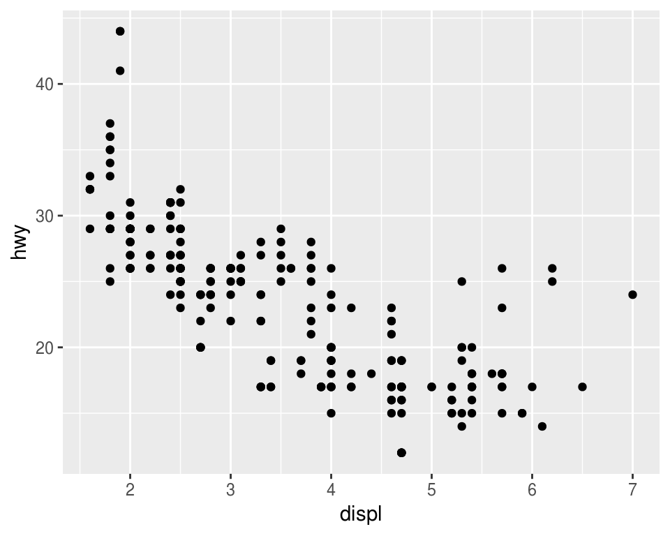

En ggplot2 se inicia una gráfica con la instrucción `ggplot()`, debemos especificar 
explicitamente que base de datos usamos, este es el primer argumento en la 
función ggplot. Una vez que creamos la base añadimos 
*capas*, y dentro de *aes()* escribimos las variables que queremos
graficar y el atributo de la gráfica al que queremos mapearlas. 

La función `geom_point()` añade una capa de puntos, hay muchas funciones
*geometrías* incluídas en ggplot2: `geom_line()`, `geom_boxplot()`, `geom_histogram`,... Cada
una acepta distintos argumentos para mapear las variables en los datos a características
estéticas de la gráfica. En el ejemplo de arriba mapeamos `displ` al eje x, 
`hwy` al eje y, pero `geom_point()` nos permite representar más variables usando 
la forma, color y/o tamaño del punto. Esta flexibilidad nos permite entender o 
descubrir patrones más interesantes en los datos.


```r
ggplot(mpg) + 
  geom_point(aes(x = displ, y = hwy, color = class))
```

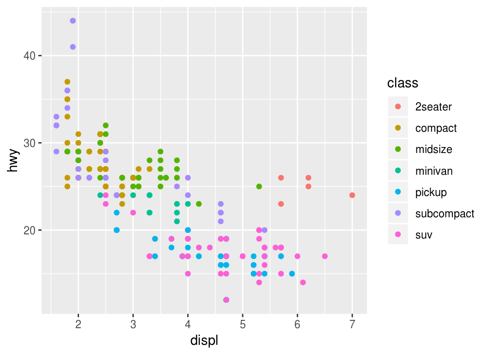

 Experimenta con los _aesthetics_ color (color), 
tamaño (size) y forma (shape).

&nbsp;&nbsp;&nbsp;&nbsp;&nbsp;&nbsp;&nbsp;&nbsp;&nbsp;&nbsp;&nbsp;  ¿Qué diferencia hay entre las variables categóricas y las continuas?

&nbsp;&nbsp;&nbsp;&nbsp;&nbsp;&nbsp;&nbsp;&nbsp;&nbsp;&nbsp;&nbsp;  ¿Qué ocurre cuando combinas varios _aesthetics_?

El mapeo de las propiedades estéticas se denomina escalamiento y depende del tipo de variable, las 
variables discretas (por ejemplo, genero, escolaridad, país) se mapean a 
distintas escalas que las variables continuas (variables numéricas como edad, estatura, etc.), los *defaults*
para algunos atributos son (estos se pueden modificar):

&nbsp;    |Discreta      |Continua
----------|--------------|---------
Color (`color)    |Arcoiris de colores         |Gradiente de colores
Tamaño (`size`)  |Escala discreta de tamaños  |Mapeo lineal entre el área y el valor
Forma (`shape`)    |Distintas formas            |No aplica
Transparencia (`alpha`) | No aplica | Mapeo lineal a la transparencia 

Los *_geoms_* controlan el tipo de gráfica


```r
p <- ggplot(mpg, aes(x = displ, y = hwy))
p + geom_line() # en este caso no es una buena gráfica
```


¿Qué problema tiene la siguiente gráfica?

```r
p <- ggplot(mpg, aes(x = cty, y = hwy))
p + geom_point() 
```

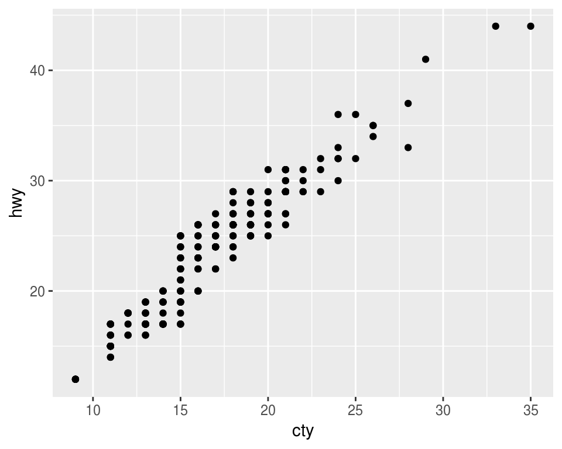

```r
p + geom_jitter() 
```

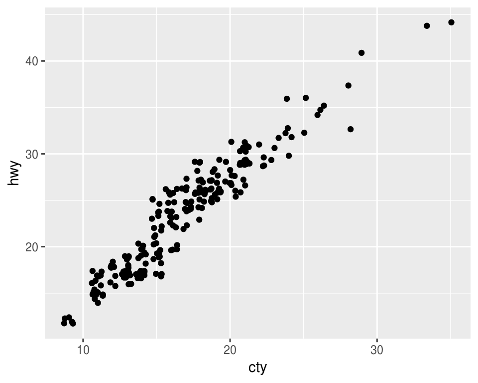

 ¿Cómo podemos mejorar la siguiente gráfica?

```r
ggplot(mpg, aes(x = class, y = hwy)) + 
  geom_point() 
```

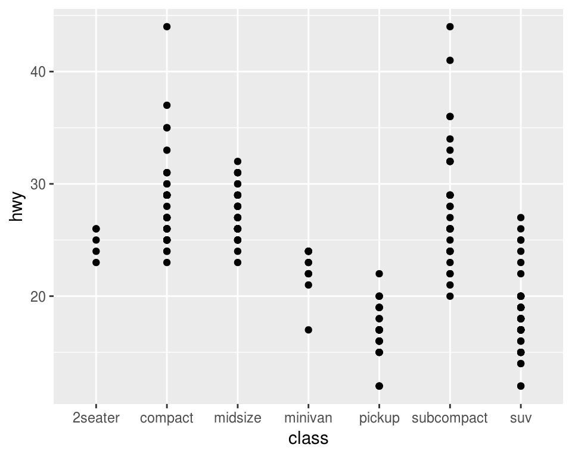

Intentemos reodenar los niveles de la variable clase

```r
ggplot(mpg, aes(x = reorder(class, hwy), y = hwy)) + 
    geom_point() 
```

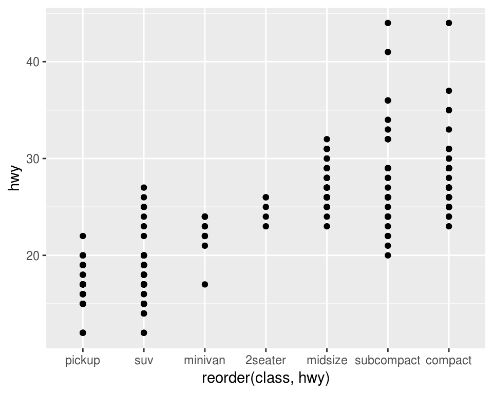

Podemos probar otros geoms.

```r
ggplot(mpg, aes(x = reorder(class, hwy), y = hwy)) + 
    geom_jitter() 
```

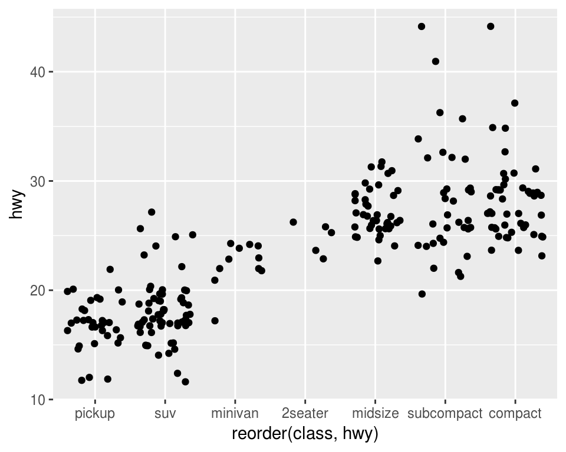

```r
ggplot(mpg, aes(x = reorder(class, hwy), y = hwy)) + 
    geom_boxplot() 
```

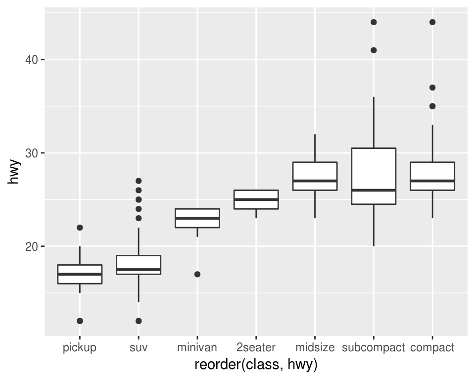

También podemos usar más de un geom!

```r
ggplot(mpg, aes(x = reorder(class, hwy), y = hwy)) + 
    geom_jitter() +
    geom_boxplot()
```

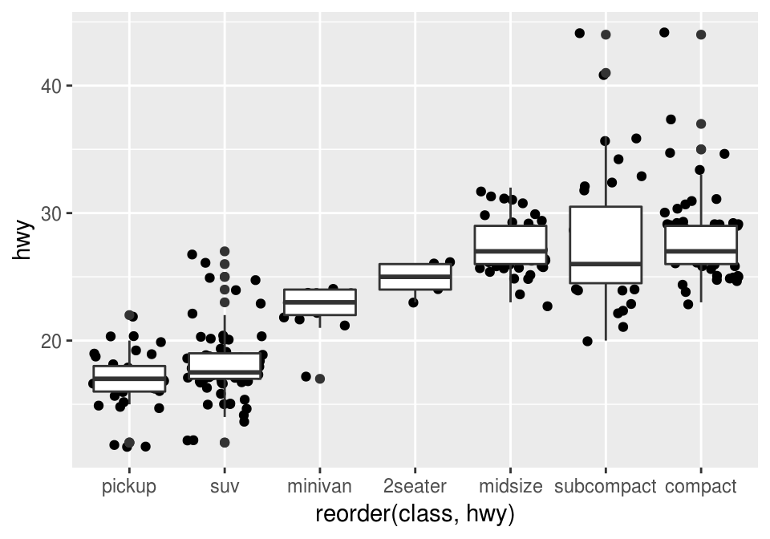

 Lee la ayuda de _reorder_ y repite las gráficas 
anteriores ordenando por la mediana de _hwy_.

&nbsp;&nbsp;&nbsp;&nbsp;&nbsp;&nbsp;&nbsp;&nbsp;&nbsp;&nbsp;&nbsp; ¿Cómo harías
para graficar los puntos encima de las cajas de boxplot?

#### Paneles
Veamos ahora como hacer páneles de gráficas, la idea es hacer varios múltiplos de 
una gráfica donde cada múltiplo representa un subconjunto de los datos, es una 
práctica muy útil para explorar relaciones condicionales.

En ggplot podemos usar _facet\_wrap()_ para hacer paneles dividiendo los datos 
de acuerdo a las categorías de una sola variable

```r
ggplot(mpg, aes(x = displ, y = hwy)) + 
  geom_jitter() +
  facet_wrap(~ cyl)
```

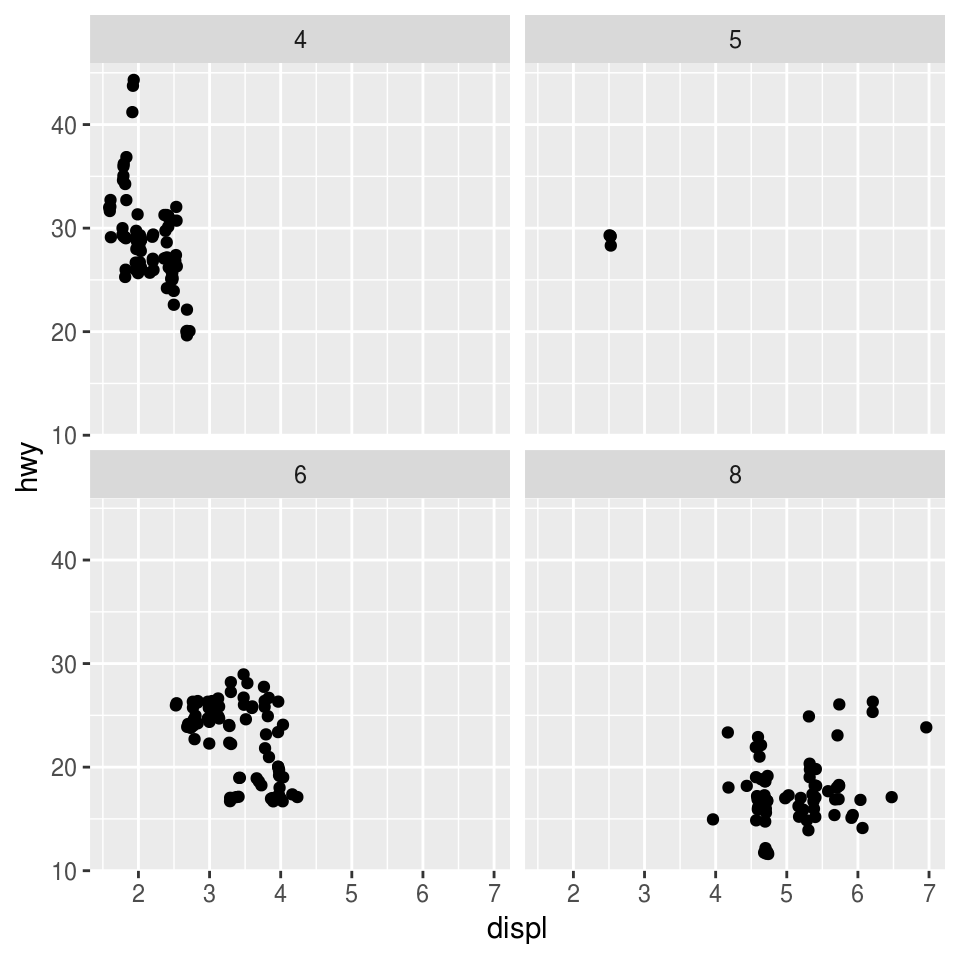

También podemos hacer una cuadrícula de 2 dimensiones usando 
_facet\_grid(filas~columnas)_ 


```r
ggplot(mpg, aes(x = displ, y = hwy)) + 
  geom_jitter() +
  facet_grid(.~ class)
```

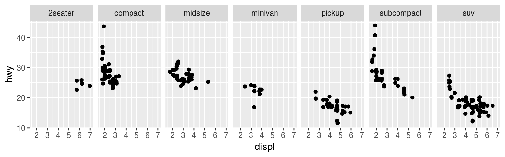

```r
ggplot(mpg, aes(x = displ, y = hwy)) + 
  geom_jitter() +
  facet_grid(drv ~ class)
```

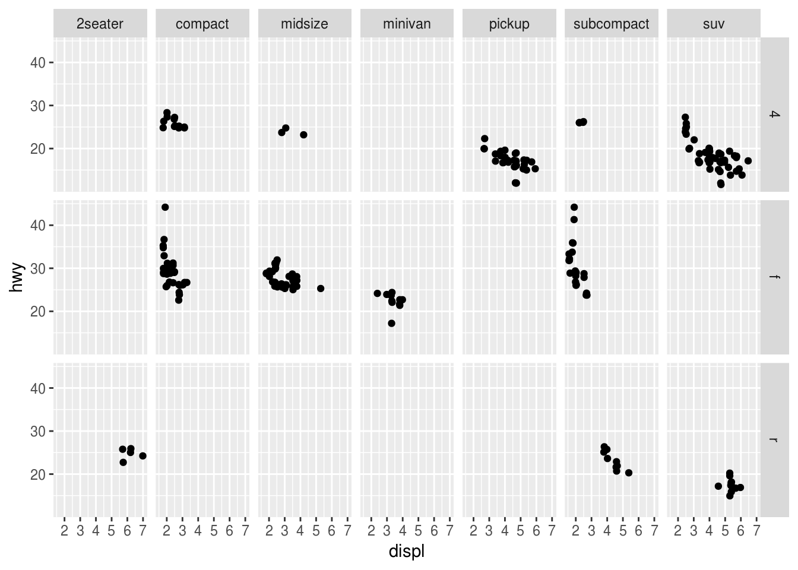

Los páneles pueden ser muy útiles para entender relaciones en nuestros datos. En 
la siguiente gráfica es difícil entender si existe una relación entre radiación
solar y ozono

```r
data(airquality)
ggplot(airquality, aes(x = Solar.R, y = Ozone)) + 
  geom_point() 
```

```
## Warning: Removed 42 rows containing missing values (geom_point).
```


Veamos que ocurre si realizamos páneles separando por velocidad del viento

```r
library(Hmisc)
airquality$Wind.cat <- cut2(airquality$Wind, g = 3) 
ggplot(airquality, aes(x = Solar.R, y = Ozone)) + 
  geom_point() +
  facet_wrap(~ Wind.cat)
```


Podemos agregar un suavizador (loess) para ver mejor la relación de las 
variables en cada panel.

```r
ggplot(airquality, aes(x = Solar.R, y = Ozone)) + 
  geom_point() +
  facet_wrap(~ Wind.cat) + 
  geom_smooth(span = 3)
```

```
## `geom_smooth()` using method = 'loess' and formula 'y ~ x'
```

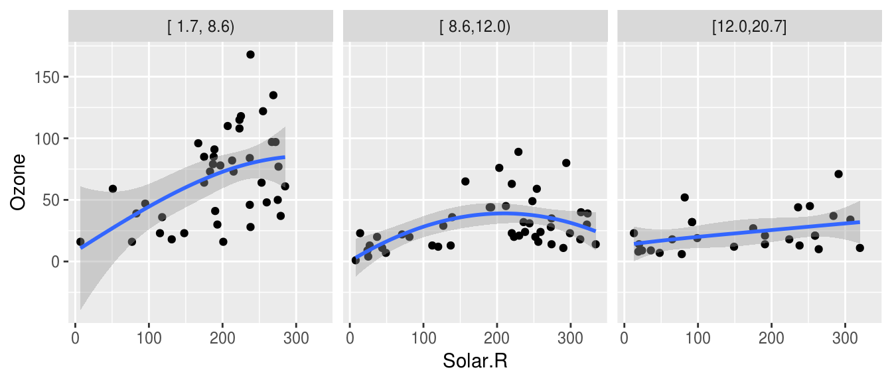

 Escribe algunas preguntas que puedan contestar con estos datos.

En ocasiones es necesario realizar transformaciones u obtener subconjuntos de los 
datos para poder responder preguntas de nuestro interés.


```r
library(babynames)
glimpse(babynames)
```

```
## Observations: 1,858,689
## Variables: 5
## $ year <dbl> 1880, 1880, 1880, 1880, 1880, 1880, 1880, 1880, 1880, 188...
## $ sex  <chr> "F", "F", "F", "F", "F", "F", "F", "F", "F", "F", "F", "F...
## $ name <chr> "Mary", "Anna", "Emma", "Elizabeth", "Minnie", "Margaret"...
## $ n    <int> 7065, 2604, 2003, 1939, 1746, 1578, 1472, 1414, 1320, 128...
## $ prop <dbl> 0.072384329, 0.026679234, 0.020521700, 0.019865989, 0.017...
```

Supongamos que queremos ver la tendencia del nombre "John", para ello debemos 
generar un subconjunto de la base de datos.

```r
babynames_John <- babynames[babynames$name == "John", ]
ggplot(babynames_John, aes(x = year, y = prop)) +
  geom_point()
```


```r
ggplot(babynames_John, aes(x = year, y = prop, color = sex)) +
  geom_line()
```


La preparación de los datos es un aspecto muy importante del análisis y suele ser
la fase que lleva más tiempo. Es por ello que el siguiente tema se enfocará en 
herramientas para hacer transformaciones de manera eficiente.

 Tarea. Explora la base de datos gapminder, estos datos están 
incluidos en el paquete del mismo nombre, para acceder a ellos basta con cargar el paquete:


```r
# install.packages("gapminder")
library(gapminder)
gapminder
```

```
## # A tibble: 1,704 x 6
##    country     continent  year lifeExp      pop gdpPercap
##    <fct>       <fct>     <int>   <dbl>    <int>     <dbl>
##  1 Afghanistan Asia       1952    28.8  8425333      779.
##  2 Afghanistan Asia       1957    30.3  9240934      821.
##  3 Afghanistan Asia       1962    32.0 10267083      853.
##  4 Afghanistan Asia       1967    34.0 11537966      836.
##  5 Afghanistan Asia       1972    36.1 13079460      740.
##  6 Afghanistan Asia       1977    38.4 14880372      786.
##  7 Afghanistan Asia       1982    39.9 12881816      978.
##  8 Afghanistan Asia       1987    40.8 13867957      852.
##  9 Afghanistan Asia       1992    41.7 16317921      649.
## 10 Afghanistan Asia       1997    41.8 22227415      635.
## # ... with 1,694 more rows
```

&nbsp;&nbsp;&nbsp;&nbsp;&nbsp;&nbsp;&nbsp;&nbsp;&nbsp;&nbsp;&nbsp; realiza al menos 3 gráficas y explica las relaciones que encuentres. Debes usar lo que revisamos en estas notas: al menos una de las gráficas debe ser de páneles, realiza una gráfica con datos de México, y (opcional)si lo consideras interesante, puedes crear una variable categórica utilizando la función cut2 del paquete Hmisc. 


### Recursos
* Google, stackoverflow.
* Para aprender más de ggplot pueden ver la documentación con ejemplos en la 
página de [ggplot2](http://ggplot2.tidyverse.org).
* Otro recurso muy útil es el [acordeón de ggplot](https://www.rstudio.com/wp-content/uploads/2015/04/ggplot2-spanish.pdf).


