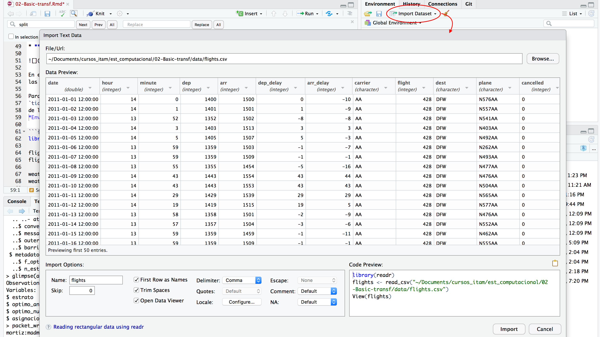
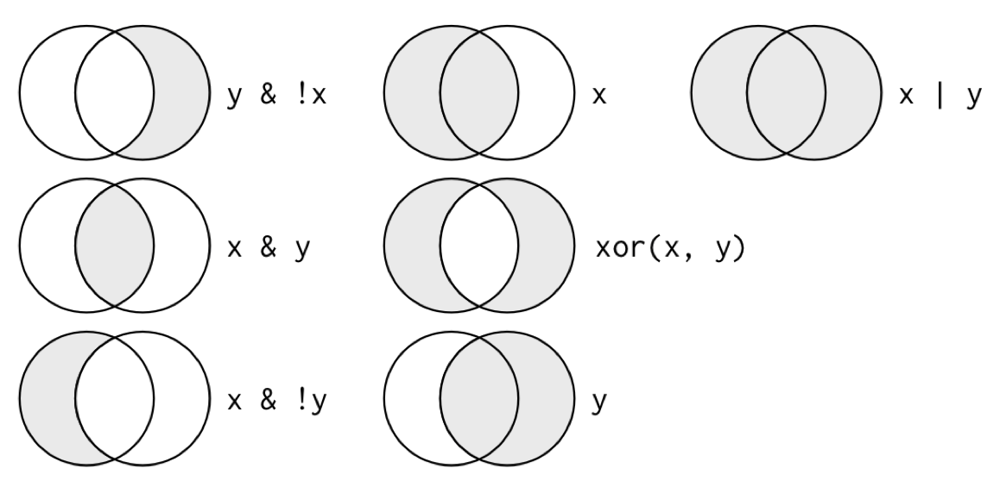
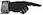

# Manipulación y agrupación de datos

```{r setup, include = FALSE}
library(tidyverse)
knitr::opts_chunk$set(
  comment = "#>",
  collapse = TRUE,
  fig.align = "center"
)
comma <- function(x) format(x, digits = 2, big.mark = ",")
theme_set(theme_minimal())
```

**El material de la clase se puede descargar de [aquí](https://www.dropbox.com/s/gtxjn5xb39g2n09/02-manipulacion.zip?dl=0).**

En esta sección continuamos con la introducción a R para análisis de datos, 
en particular mostraremos herramientas de manipulación y transformación de 
datos. Trataremos los siguientes puntos:

* Estrategia separa-aplica-combina.

* Reestructura de datos y el principio de los datos limpios.

Es sabido que limpieza y preparación de datos ocupan gran parte del tiempo del 
análisis de datos ([Dasu y Johnson, 2003](http://onlinelibrary.wiley.com/book/10.1002/0471448354) 
y [NYT's ‘Janitor Work’ Is Key Hurdle to Insights](https://www.nytimes.com/2014/08/18/technology/for-big-data-scientists-hurdle-to-insights-is-janitor-work.html?mcubz=0)),
es por ello que vale la pena dedicar un tiempo a aprender técnicas que faciliten 
estas tareas, y entender que estructura en los datos es más conveniente para 
trabajar.

## Transformación de datos

### Separa-aplica-combina (_split-apply-combine_) {-}

Muchos problemas de análisis de datos involucran la aplicación de la estrategia
separa-aplica-combina [@plyr], 
esta consiste en romper un problema en pedazos (de 
acuerdo a una variable de interés), operar sobre cada subconjunto de manera
independiente (ej. calcular la media de cada grupo, ordenar observaciones por 
grupo, estandarizar por grupo) y después unir los pedazos nuevamente. El 
siguiente diagrama ejemplifiaca el paradigma de divide-aplica-combina:

* **Separa** la base de datos original.  
* **Aplica** funciones a cada subconjunto.  
* **Combina** los resultados en una nueva base de datos.

 

Ahora, cuando pensamos como implementar la estrategia divide-aplica-combina es 
natural pensar en iteraciones, por ejemplo utilizar un ciclo `for` para recorrer 
cada grupo de interés y aplicar las funciones, sin embargo la aplicación de 
ciclos `for` desemboca en código difícil de entender por lo que preferimos 
trabajar con funciones creadas para estas tareas, usaremos el paquete 
`dplyr` que además de ser más claro suele ser más veloz.

Estudiaremos las siguientes funciones:

* **filter**: obten un subconjunto de las filas de acuerdo a un criterio.
* **select**: selecciona columnas de acuerdo al nombre
* **arrange**: reordena las filas
* **mutate**: agrega nuevas variables
* **summarise**: reduce variables a valores (crear nuevas bases de datos con 
resúmenes de variables de la base original)

Estas funciones trabajan de manera similar, el primer argumento que reciben 
es un _data frame_, los argumentos que siguen
indican que operación se va a efectuar y el resultado es un nuevo _data frame_.

Adicionalmente, se pueden usar con **group_by** que cambia el dominio de cada 
función, pasando de operar en el conjunto de datos completos a operar en 
grupos, esto lo veremos más adelante.

### Ejemplos y lectura de datos {-}

En esta sección trabajaremos con bases de datos de vuelos del aeropuerto de 
Houston. Comenzamos importando los datos a R.

Para leer los datos usamos funciones del paquete `readr` que forma parte del 
`tidyverse`, notemos que si estamos usando RStudio podemos generar los comandos
de lectura de datos usando la opción *Import Dataset* en la ventana de 
*Environment*.



Si usamos la opción de importar datos usando la funcionalidad *point-and-click* 
de RStudio, es importante copiar los comandos al script de R para no perder
reproducibilidad.

```{r, warning=FALSE}
library(tidyverse)

flights <- read_csv("data/flights.csv")
flights

weather <- read_csv("data/weather.csv")
weather 

planes <- read_csv("data/planes.csv")
planes

airports <- read_csv("data/airports.csv")
airports
```


### Filtrar {-}

Creamos una base de datos de juguete para mostrar el funcionamiento de cada
instrucción:

```{r}
df_ej <- tibble(genero = c("mujer", "hombre", "mujer", "mujer", "hombre"), 
  estatura = c(1.65, 1.80, 1.70, 1.60, 1.67))
df_ej
```

El primer argumento de `filter()` es el nombre del *data frame*, los subsecuentes 
son las expresiones que indican que filas filtrar.

```{r}
filter(df_ej, genero == "mujer")
filter(df_ej, estatura > 1.65 & estatura < 1.75)
```

Algunos operadores importantes para filtrar son:  

```{r, eval = FALSE}
x > 1
x >= 1
x < 1
x <= 1
x != 1
x == 1
x %in% c("a", "b")
```

Debemos tener cuidado al usar `==`

```{r}
sqrt(2) ^ 2 == 2
1/49 * 49 == 1
```
Los resultados de arriba se deben a que las computadoras 
usan aritmética de precisión finita:

```{r}
print(1/49 * 49, digits = 20)
```

Para estos casos es útil usar la función `near()`

```{r}
near(sqrt(2) ^ 2,  2)
near(1 / 49 * 49, 1)
```

Los operadores booleanos también son convenientes para 
filtrar:

```{r, eval = FALSE}
# Conjuntos
a | b
a & b
a & !b
xor(a, b)
```

El siguiente esquema nos ayuda a entender que hace cada operación:

```{r, out.width = "400px"}

```

 Encuentra todos los vuelos hacia SFO ó OAK.

&nbsp;&nbsp;&nbsp;&nbsp;&nbsp;&nbsp;&nbsp;&nbsp;&nbsp;&nbsp;&nbsp; Los vuelos 
con un retraso mayor a una hora.

&nbsp;&nbsp;&nbsp;&nbsp;&nbsp;&nbsp;&nbsp;&nbsp;&nbsp;&nbsp;&nbsp; En los que 
el retraso de llegada es más del doble que el retraso de salida.


Un caso común es cuando se desea eliminar los datos con faltantes en una o más
columnas de las tablas de datos, en R los datos faltantes se expresan como `NA`, 
para eliminar los faltantes en la variable `dep_delay` resulta natural escribir:

```{r}
filter(flights, dep_delay != NA)
```
que nos devuelve una tabla vacía, sin embargo, si hay faltantes en esta 
variable. El problema resulta de usar el operador `!=`, pensemos ¿qué regresan 
las siguientes expresiones?

```{r, eval = FALSE}
5 + NA
NA / 2
sum(c(5, 4, NA))
mean(c(5, 4,  NA))
NA < 3
NA == 3
NA == NA
```

Las expresiones anteriores regresan `NA`, el hecho que la media de un vector 
que incluye NAs o su suma regrese `NA`s se debe a que el default en R es 
propagar los valores faltantes, esto es, si deconozco el valor de una de las 
componentes de un vector, también desconozco la suma del mismo; sin embargo, 
muchas funciones tienen un argumento _na.rm_ para removerlos,

```{r}
sum(c(5, 4, NA), na.rm = TRUE)
mean(c(5, 4, NA), na.rm = TRUE)
```

Aún queda pendiente, como filtrarlos en una tabla, para esto veamos que el 
manejo de datos faltantes en R utiliza una lógica ternaria (como SQL):

```{r}
NA == NA
```

La expresión anterior puede resultar confusa, una manera de pensar en esto es
considerar los NA como *no sé*, por ejemplo si no se la edad de Juan y no se la 
edad de Esteban, la respuesta a ¿Juan tiene la misma edad que Esteban? es 
*no sé* (NA).

```{r}
edad_Juan <- NA
edad_Esteban <- NA
edad_Juan == edad_Esteban
edad_Jose <- 32
# Juan es menor que José?
edad_Juan < edad_Jose
```

Por tanto para determinar si un valor es faltante usamos la instrucción 
`is.na()`.

```{r}
is.na(NA)
```
Y finalmente podemos filtrar con 

```{r, eval=FALSE}
filter(flights, is.na(dep_delay))
```

### Seleccionar {-}
Elegir columnas de un conjunto de datos.
```{r}
df_ej
select(df_ej, genero)
select(df_ej, -genero)
```

```{r, eval = FALSE}
select(df_ej, starts_with("g"))
select(df_ej, contains("g"))
```

 Ve la ayuda de select (`?select`) y escribe tres
maneras de seleccionar las variables de retraso (delay).

### Ordenar {-}

Ordenar de acuerdo al valor de una o más variables:

```{r}
arrange(df_ej, genero)
arrange(df_ej, desc(estatura))
```

 Ordena los vuelos por fecha de salida y hora.

&nbsp;&nbsp;&nbsp;&nbsp;&nbsp;&nbsp;&nbsp;&nbsp;&nbsp;&nbsp;&nbsp; ¿Cuáles
son los vuelos con mayor retraso?

&nbsp;&nbsp;&nbsp;&nbsp;&nbsp;&nbsp;&nbsp;&nbsp;&nbsp;&nbsp;&nbsp; ¿Qué vuelos 
_ganaron_ más tiempo en el aire?

### Mutar {-}
Mutar consiste en crear nuevas variables aplicando una función a columnas 
existentes:

```{r}
mutate(df_ej, estatura_cm = estatura * 100) 
mutate(df_ej, estatura_cm = estatura * 100, estatura_in = estatura_cm * 0.3937) 
```

 Calcula la velocidad en millas por hora a partir de
la variable tiempo y la distancia (en millas). ¿Quá vuelo fue el más rápido?

&nbsp;&nbsp;&nbsp;&nbsp;&nbsp;&nbsp;&nbsp;&nbsp;&nbsp;&nbsp;&nbsp; Crea una nueva
variable que muestre cuánto tiempo se ganó o perdió durante el vuelo.

Hay muchas funciones que podemos usar para crear nuevas variables con `mutate()`, éstas deben cumplir ser funciones vectorizadas, es decir, reciben un vector de valores y devuelven un vector de la misma dimensión.

### Summarise y resúmenes por grupo  {-}
Summarise sirve para crear nuevas bases de datos con resúmenes o agregaciones de 
los datos originales.

```{r}
summarise(df_ej, promedio = mean(estatura))
```

Podemos hacer resúmenes por grupo, primero creamos una base de datos agrupada:

```{r}
by_genero <- group_by(df_ej, genero)
by_genero
```

y después operamos sobre cada grupo, creando un resumen a nivel grupo y uniendo
los subconjuntos en una base nueva:

```{r}
summarise(by_genero, promedio = mean(estatura))
```

 Calcula el retraso promedio por fecha.

&nbsp;&nbsp;&nbsp;&nbsp;&nbsp;&nbsp;&nbsp;&nbsp;&nbsp;&nbsp;&nbsp; ¿Qué otros 
resúmenes puedes hacer para explorar el retraso por fecha?

* Algunas funciones útiles con _summarise_ son min(x), median(x), max(x), 
quantile(x, p), n(), sum(x), sum(x > 1), mean(x > 1), sd(x).

```{r}
flights$date_only <- as.Date(flights$date)
by_date <- group_by(flights, date_only)
no_miss <- filter(by_date, !is.na(dep))
delays <- summarise(no_miss, mean_delay = mean(dep_delay), n = n())
```


### Operador pipeline {-}
En R cuando uno hace varias operaciones es difícil leer y entender el código: 

```{r}
hourly_delay <- filter(summarise(group_by(filter(flights, !is.na(dep_delay)), 
  date_only, hour), delay = mean(dep_delay), n = n()), n > 10)
```

La dificultad radica en que usualmente los parámetros se asignan después del 
nombre de la función usando (). El operador *Forward Pipe* (`%>%) cambia este 
orden, de manera que un parámetro que precede a la función es enviado ("piped") 
a la función: `x %>% f(y)` se vuelve `f(x,y)`,  `x %>% f(y) %>% g(z)` se vuelve 
`g(f(x, y), z)`. Es así que podemos reescribir el código para poder leer las 
operaciones que vamos aplicando de izquierda a derecha 
y de arriba hacia abajo.

Veamos como cambia el código anterior:

```{r}
hourly_delay <- flights %>%
  filter(!is.na(dep_delay)) %>%
  group_by(date_only, hour) %>%
  summarise(delay = mean(dep_delay), n = n()) %>%
  filter(n > 10)
```

podemos leer %>% como "_después_".

 ¿Qué destinos tienen el promedio de retrasos más
alto?

&nbsp;&nbsp;&nbsp;&nbsp;&nbsp;&nbsp;&nbsp;&nbsp;&nbsp;&nbsp;&nbsp; ¿Qué vuelos 
(compañía + vuelo) ocurren diario?

&nbsp;&nbsp;&nbsp;&nbsp;&nbsp;&nbsp;&nbsp;&nbsp;&nbsp;&nbsp;&nbsp; En promedio, 
¿Cómo varían a lo largo del día los retrasos de vuelos no cancelados? (pista: hour +
minute / 60)

### Variables por grupo {-}
En ocasiones es conveniente crear variables por grupo, por ejemplo estandarizar
dentro de cada grupo z = (x - mean(x)) / sd(x).

Veamos un ejemplo:

```{r}
planes <- flights %>%
  filter(!is.na(arr_delay)) %>%
  group_by(plane) %>%
  filter(n() > 30)

planes %>%
  mutate(z_delay =
    (arr_delay - mean(arr_delay)) / sd(arr_delay)) %>%
  filter(z_delay > 5)
```

### Verbos de dos tablas {-}
¿Cómo mostramos los retrasos de los vuelos en un mapa? 

Para responder esta pregunta necesitamos unir la base de datos de vuelos
con la de aeropuertos.

```{r}
location <- airports %>%
  select(dest = iata, name = airport, lat, long)

flights %>%
    group_by(dest) %>%
    filter(!is.na(arr_delay)) %>%
    summarise(
        arr_delay = mean(arr_delay),
        n = n() ) %>%
        arrange(desc(arr_delay)) %>%
        left_join(location)
```

Hay varias maneras de unir dos bases de datos y debemos pensar en el 
obejtivo:

```{r}
x <- tibble(name = c("John", "Paul", "George", "Ringo", "Stuart", "Pete"),
  instrument = c("guitar", "bass", "guitar", "drums", "bass",
     "drums"))

y <- tibble(name = c("John", "Paul", "George", "Ringo", "Brian"),
  band = c("TRUE", "TRUE", "TRUE",  "TRUE", "FALSE"))
x
y

inner_join(x, y)
left_join(x, y)
semi_join(x, y)
anti_join(x, y)
```

Resumamos lo que observamos arriba:

<div class="mi-tabla">
Tipo | Acción
-----|-------
inner|Incluye únicamente las filas que aparecen tanto en x como en y
left |Incluye todas las filas en x y las filas de y que coincidan
semi |Incluye las filas de x que coincidan con y
anti |Incluye las filas de x que no coinciden con y
</div>

Ahora combinamos datos a nivel hora con condiciones climáticas, ¿cuál es el tipo
de unión adecuado?

```{r}
hourly_delay <- flights %>%
  group_by(date_only, hour) %>%
  filter(!is.na(dep_delay)) %>%
  summarise(
    delay = mean(dep_delay),
    n = n() ) %>%
  filter(n > 10)

delay_weather <- hourly_delay %>% left_join(weather)

arrange(delay_weather, -delay)
```

 ¿Qué condiciones climáticas están asociadas
con retrasos en las salidas de Houston?

&nbsp;&nbsp;&nbsp;&nbsp;&nbsp;&nbsp;&nbsp;&nbsp;&nbsp;&nbsp;&nbsp; Explora
si los aviones más viejos están asociados a mayores retrasos, responde
con una gráfica.

## Datos limpios

Una vez que importamos datos a R es conveniente limpiarlos, esto implica 
almacenarlos de una manera consisistente que nos permita
enfocarnos en responder preguntas de los datos en lugar de estar luchando 
con los datos. Entonces, **datos limpios** son datos que facilitan las tareas 
del análisis de datos: 

*  **Visualización**: Resúmenes de datos usando gráficas, análisis exploratorio, 
o presentación de resultados. 

* **Manipulación**: Manipulación de variables como agregar, filtrar, reordenar,
transformar. 

* **Modelación**: Ajustar modelos es sencillo si los datos están en la forma 
correcta.


Los principios de *datos limpios* [@tidy] 
proveen una manera estándar de organizar la información:

1. Cada variable forma una columna.
2. Cada observación forma un renglón.
3. Cada tipo de unidad observacional forma una tabla.

Vale la pena notar que los principios de los datos limpios se pueden ver como 
teoría de algebra relacional para estadísticos, estós principios equivalen a 
la tercera forma normal de Codd con enfoque en una sola tabla de datos en 
lugar de muchas conectadas en bases de datos relacionales. 

Veamos un ejemplo:

La mayor parte de las bases de datos en estadística tienen forma rectangular, 
¿cuántas variables tiene la siguiente tabla?

<div class="mi-tabla">
|   |tratamientoA|tratamientoB
----|------------|---------
Juan Aguirre|-   |2
Ana Bernal  |16  |11
José López  |3   |1
</div>

La tabla anterior también se puede estructurar de la siguiente manera:

<div class="mi-tabla">
 ||Juan Aguirre| Ana Bernal|José López
--|------------|-----------|----------
tratamientoA|- |    16     |   3
tratamientoB|2 |    11     |   1
</div>

Si vemos los principios (cada variable forma una columna, cada observación 
forma un renglón, cada tipo de unidad observacional forma una tabla), ¿las 
tablas anteriores cumplen los principios?


Para responder la pregunta identifiquemos primero cuáles son las variables y 
cuáles las observaciones de esta pequeña base. Las variables son: 
persona/nombre, tratamiento y resultado. Entonces, siguiendo los principios de
_datos limpios_ obtenemos la siguiente estructura: 

<div class="mi-tabla">
nombre      |tratamiento|resultado
------------|-----|---------
Juan Aguirre|a    |-
Ana Bernal  |a    |16
José López  |a    |3
Juan Aguirre|b    |2
Ana Bernal  |b    |11
José López  |b    |1
</div>

### Limpieza bases de datos {-}

Los principios de los datos limpios parecen obvios pero la mayor parte de los 
datos no los cumplen debido a:

1. La mayor parte de la gente no está familiarizada con los principios y es 
difícil derivarlos por uno mismo.  
2. Los datos suelen estar organizados para facilitar otros aspectos que no son 
análisis, por ejemplo, la captura.  

Algunos de los problemas más comunes en las bases de datos que no están 
_limpias_ son:

* Los encabezados de las columnas son valores y no nombres de variables. 
* Más de una variable por columna. 
* Las variables están organizadas tanto en filas como en columnas. 
* Más de un tipo de observación en una tabla.
* Una misma unidad observacional está almacenada en múltiples tablas. 

La mayor parte de estos problemas se pueden arreglar con pocas herramientas, 
a continuación veremos como _limpiar_ datos usando 2 funciones del paquete 
`tidyr`:

* **gather**: recibe múltiples columnas y las junta en pares de valores y 
nombres, convierte los datos anchos en largos.  
* **spread**: recibe 2 columnas y las separa, haciendo los datos más anchos.

Repasaremos los problemas más comunes que se encuentran en conjuntos de datos
sucios y mostraremos como se puede manipular la tabla de datos (usando las 
funciones *gather* y *spread*) con el fin de estructurarla para que cumpla los
principios de datos limpios.

### Los encabezados de las columanas son valores {-}
Usaremos ejemplos para entender los conceptos más facilmente.
La primer base de datos está basada en una encuesta de [Pew Research](http://www.pewforum.org/2009/01/30/income-distribution-within-us-religious-groups/) que 
investiga la relación entre ingreso y afiliación religiosa.

¿Cuáles son las variables en estos datos?

```{r}
library(tidyverse)
pew <- read_delim("http://stat405.had.co.nz/data/pew.txt", "\t", 
  escape_double = FALSE, trim_ws = TRUE)
pew
```


Esta base de datos tiene 3 variables: religión, ingreso y frecuencia. Para
_limpiarla_ es necesario apilar las columnas (alargar los datos). Notemos
que al alargar los datos desapareceran las columnas que se agrupan y dan lugar a
dos nuevas columnas: la correspondiente a clave y la correspondiente a valor.
Entonces, para alargar una base de datos usamos la función `gather` que recibe 
los argumentos:

* data: base de datos que vamos a reestructurar.  
* key: nombre de la nueva variable que contiene lo que fueron los nombres
de columnas que apilamos.  
* value: nombre de la variable que almacenará los valores que corresponden a 
cada *key*.  
* ...: lo último que especificamos son las columnas que vamos a apilar, la notación para seleccionarlas es la misma que usamos con `select()`.


```{r}
pew_tidy <- gather(data = pew, income, frequency, -religion)
pew_tidy
```

Observemos que en la tabla ancha teníamos bajo la columna *<$10k*, en el renglón
correspondiente a *Agnostic* un valor de 27, y podemos ver que este valor en 
la tabla larga se almacena bajo la columna frecuencia y corresponde a religión
*Agnostic*, income *<$10k*. También es importante ver que en este ejemplo 
especificamos las columnas a apilar identificando la que **no** vamos a alargar
con un signo negativo: es decir apila todas las columnas menos religión.

La nueva estructura de la base de datos nos permite, por ejemplo, hacer 
fácilmente una gráfica donde podemos comparar las diferencias en las 
frecuencias. 

Nota: En esta sección no explicaremos las funciones de graficación pues estas 
se cubren en las notas introductorias a R. En esta parte nos queremos concentrar
en como limpiar datos y ejemplificar lo sencillo que es trabajar con datos 
limpios, esto es, una vez que los datos fueron reestructurados es fácil 
construir gráficas y resúmenes.


```{r, fig.height = 5.8, fig.width = 6.8, warning = FALSE, out.width="400px"}
ggplot(pew_tidy, aes(x = income, y = frequency, color = religion, group = religion)) +
  geom_line() + 
  theme(axis.text.x = element_text(angle = 90, hjust = 1))
```

Podemos hacer gráficas más interesantes si creamos nuevas variables:

```{r, fig.height = 3.8, fig.width = 7.7}
by_religion <- group_by(pew_tidy, religion)
pew_tidy_2 <- pew_tidy %>%
  filter(income != "Don't know/refused") %>%
  group_by(religion) %>%
  mutate(percent = frequency / sum(frequency)) %>% 
  filter(sum(frequency) > 1000)

head(pew_tidy_2)
income_levels <- unique(pew_tidy$income)[1:9]
ggplot(pew_tidy_2, aes(x = income, y = percent, group = religion)) +
  facet_wrap(~ religion, nrow = 1) +
  geom_bar(stat = "identity", fill = "darkgray") + 
  theme(axis.text.x = element_text(angle = 90, hjust = 1)) +
    scale_x_discrete(limits = income_levels)
```

En el código de arriba utilizamos las funciones `group_by`, `filter` y `mutate`
que estudiaremos más adelante. Por ahora concentremonos en `gather` y `spread`.

Otro ejemplo, veamos los datos de *Billboard*, aquí se registra la fecha en la 
que una canción entra por primera vez al top 100 de Billboard. 

```{r}
billboard <- read_csv("data/billboard.csv")
billboard
```


Notemos que el rank en cada semana (una vez que entró a la lista) está guardado
en 75 columnas `wk1` a `wk75`, este tipo de almacenamiento no es *limpio* pero 
puede ser útil al momento de ingresar la información.

Para tener datos *limpios* apilamos las semanas de manera que sea una sola 
columna (nuevamente alargamos los datos):

```{r}
billboard_long <- gather(billboard, week, rank, wk1:wk76, na.rm = TRUE)
billboard_long
```


Notemos que en esta ocasión especificamos las columnas que vamos a apilar
indicando el nombre de la primera de ellas seguido de `:` y por último el 
nombre de la última variable a apilar. Por otra parte, la instrucción 
`na.rm = TRUE` se utiliza para eliminar los renglones con valores faltantes en 
la columna de value (rank), esto es, eliminamos aquellas observaciones que 
tenían NA en la columnas wk*num* de la tabla ancha. Ahora realizamos una
limpieza adicional creando mejores variables de fecha.


```{r}
billboard_tidy <- billboard_long %>%
  mutate(
    week = parse_number(week),
    date = date.entered + 7 * (week - 1), 
    rank = as.numeric(rank)
    ) %>%
    select(-date.entered)
billboard_tidy
```

Nuevamente, podemos hacer gráficas facilmente.

```{r, fig.height = 3.8, fig.width = 7.7}
tracks <- filter(billboard_tidy, track %in% 
    c("Higher", "Amazed", "Kryptonite", "Breathe", "With Arms Wide Open"))

ggplot(tracks, aes(x = date, y = rank)) +
  geom_line() + 
  facet_wrap(~track, nrow = 1) + 
  theme(axis.text.x = element_text(angle = 90, hjust = 1))
```

### Una columna asociada a más de una variable {-}
La siguiente base de datos proviene de la Organización Mundial de la Salud y 
contiene el número de casos confirmados de tuberculosis por país y año, la
información esta por grupo demográfico de acuerdo a sexo (m, f), y edad (0-4, 
5-14, etc). Los datos están disponibles en http://www.who.int/tb/country/data/download/en/. 


```{r}
tb <- read.csv("data/tb.csv") %>% tbl_df()
tb
```

 De manera similar a los ejemplos anteriores, 
utiliza la función `gather` para apilar las columnas correspondientes a 
sexo-edad.

&nbsp;&nbsp;&nbsp;&nbsp;&nbsp;&nbsp;&nbsp;&nbsp;&nbsp;&nbsp;&nbsp; Piensa en 
como podemos separar la "variable" sexo-edad en dos columnas. 

```{r, echo=FALSE, results=FALSE}
tb_long <- gather(tb, demo, n, -iso2, -year, na.rm = TRUE)
tb_long
```

Ahora separaremos las variables sexo y edad de la columna demo, para ello 
debemos pasar a la función `separate()`, esta recibe como parámetros:  

* el nombre de la base de datos,  

* el nombre de la variable que deseamos separar en más de una,  

* la posición de donde deseamos "cortar" (hay más opciones para especificar 
como separar, ver `?separate`). El default es separar valores en todos los 
lugares que encuentre un caracter que no es alfanumérico (espacio, guión,...).

```{r}
tb_tidy <- separate(tb_long, demo, c("sex", "age"), 8)
tb_tidy
table(tb_tidy$sex)

# creamos un mejor código de genero
tb_tidy <- mutate(tb_tidy, sex = substr(sex, 8, 8))
table(tb_tidy$sex)
```

### Variables almacenadas en filas y columnas {-}
El problema más difícil es cuando las variables están tanto en filas como en 
columnas, veamos una base de datos de clima en Cuernavaca. ¿Cuáles son las 
variables en estos datos?

```{r}
clima <- read_delim("data/clima.txt", "\t", escape_double = FALSE, 
    trim_ws = TRUE)
```

Estos datos tienen variables en columnas individuales (id, año, mes), en 
múltiples columnas (día, d1-d31) y en filas (tmin, tmax). Comencemos por apilar 
las columnas.

```{r}
clima_long <- gather(clima, day, value, d1:d31, na.rm = TRUE)
clima_long
```

Podemos crear algunas variables adicionales.
```{r}
clima_vars <- clima_long %>% 
  mutate(day = parse_number(day), 
    value = as.numeric(value) / 10) %>%
  select(id, year, month, day, element, value) %>%
  arrange(id, year, month, day)
clima_vars
```

Finalmente, la columna *element* no es una variable, sino que almacena el nombre 
de dos variables, la operación que debemos aplicar (spread) es el inverso de 
apilar (`gather`):

```{r}
clima_tidy <- spread(clima_vars, element, value)
clima_tidy
```

Ahora es inmediato no solo hacer gráficas sino también ajustar un modelo.

```{r}
# ajustamos un modelo lineal donde la variable respuesta es temperatura 
# máxima, y la variable explicativa es el mes
clima_lm <- lm(TMAX ~ factor(month), data = clima_tidy)
summary(clima_lm)
```

### Mas de un tipo de observación en una misma tabla {-}
En ocasiones las bases de datos involucran valores en diferentes niveles, en 
diferentes tipos de unidad observacional. En la limpieza de datos, cada unidad
observacional debe estar almacenada en su propia tabla (esto esta ligado a 
normalización de una base de datos), es importante para evitar inconsistencias 
en los datos.

¿Cuáles son las unidades observacionales de los datos de billboard?

```{r}
billboard_tidy
```

Separemos esta base de datos en dos: la tabla canción que almacena artista, 
nombre de la canción y duración; la tabla rank que almacena el ranking de la 
canción en cada semana.

```{r}
song <- billboard_tidy %>% 
  select(artist, track, year, time) %>%
  unique() %>%
  arrange(artist) %>%
  mutate(song_id = row_number(artist))
song

rank <- billboard_tidy %>%
  left_join(song, c("artist", "track", "year", "time")) %>%
  select(song_id, date, week, rank) %>%
  arrange(song_id, date) %>%
  tbl_df
rank
```

### Una misma unidad observacional está almacenada en múltiples tablas {-}
También es común que los valores sobre una misma unidad observacional estén 
separados en muchas tablas o archivos, es común que estas tablas esten divididas 
de acuerdo a una variable, de tal manera que cada archivo representa a una 
persona, año o ubicación. Para juntar los archivos hacemos lo siguiente:

1. Leemos los archivos en una lista de tablas. 
2. Para cada tabla agregamos una columna que registra el nombre del archivo 
original. 
3. Combinamos las tablas en un solo data frame.  

Veamos un ejemplo, descarga la carpeta
[specdata](https://www.dropbox.com/sh/c0mgho95gwjc1mv/AACVLPr33O6ENW68xmL7hyUna?dl=0),
ésta contiene 332 archivos csv que almacenan información de monitoreo de 
contaminación en 332 ubicaciones de EUA. Cada archivo contiene información de 
una unidad de monitoreo y el número de identificación del monitor es el nombre 
del archivo.

Los pasos en R (usando el paquete `purrr`), primero creamos un vector con los
nombres de los archivos en un directorio, eligiendo aquellos que contengan las
letras ".csv".

```{r, message=FALSE}
paths <- dir("data/specdata", pattern = "\\.csv$", full.names = TRUE) 
```

Después le asignamos el nombre del csv al nombre de cada elemento del vector.
Este paso se realiza para preservar los nombres de los archivos ya que estos
los asignaremos a una variable mas adelante.

```{r}
paths <- set_names(paths, basename(paths))
```

La función `map_df` itera sobre cada dirección, lee el csv en dicha dirección y 
los combina en un data frame.

```{r, error=TRUE}
specdata_us <- map_df(paths, ~read_csv(., col_types = "Tddi"), .id = "filename")

# eliminamos la basura del id
specdata <- specdata_us %>%
  mutate(monitor = parse_number(filename)) %>%
  select(id = ID, monitor, date = Date, sulfate, nitrate)
specdata
```

### Otras consideraciones {-}

En las buenas prácticas es importante tomar en cuenta los siguientes puntos:

* Incluir un encabezado con el nombre de las variables.

* Los nombres de las variables deben ser entendibles (e.g. AgeAtDiagnosis es 
mejor que AgeDx).

* En general los datos se deben guardar en un archivo por tabla.

* Escribir un script con las modificaciones que se hicieron a los _datos crudos_ 
(reproducibilidad).

* Otros aspectos importantes en la _limpieza_ de datos son: selección del tipo 
de variables (por ejemplo fechas), datos faltantes, _typos_ y detección de 
valores atípicos.

### Recursos adicionales {-}

* [Data Import Cheat Sheet](https://github.com/rstudio/cheatsheets/raw/master/data-import.pdf), 
RStudio.

* [Data Transformation Cheat Sheet](https://github.com/rstudio/cheatsheets/raw/master/data-transformation.pdf), 
RStudio.


