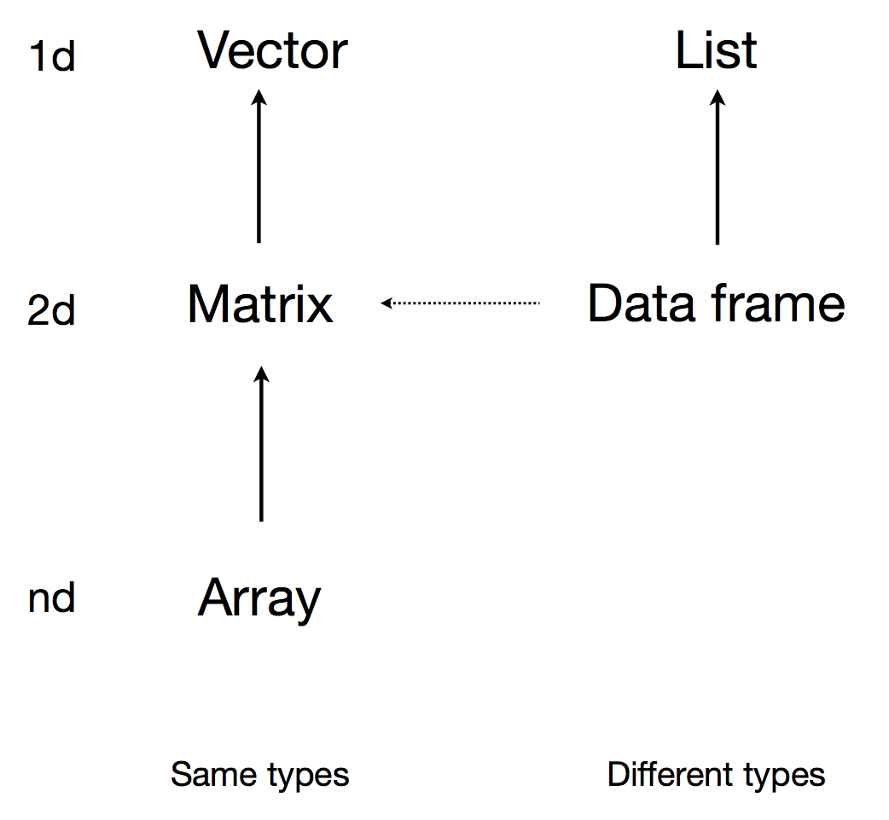

# Temas selectos de R


Esta sección describe algunos aspectos de R como lenguaje de programación (en 
contraste a introducir funciones para análisis de datos). Es importante tener
en cuenta como funciona R para escribir código más claro, minimizando errores
y más eficiente. Las referencias para esta sección son @advr y @r4ds.

## Funciones

> “To understand computations in R, two slogans are helpful:  
> * Everything that exists is an object.  
> * Everything that happens is a function call."  
> — John Chambers

Todas las operaciones en R son producto de la llamada a una función, esto 
incluye operaciones como +, operadores que controlan flujo como `for`, `if` y 
`while`, e incluso operadores para obtener subconjuntos como `[ ]` y `$`.


```r
a <- 3
b <- 4
`+`(a, b)
#> [1] 7

for (i in 1:2) print(i)
#> [1] 1
#> [1] 2
`for`(i, 1:2, print(i))
#> [1] 1
#> [1] 2
```

Para escribir código eficiente y fácil de leer es importante saber escribir
funciones, se dice que si hiciste *copy-paste* de una sección de tu código 3
o más veces es momento de escribir una función.

Escribimos una función para calcular un promedio ponderado:


```r
wtd_mean <- function(x, wt = rep(1, length(x))) {
  sum(x * wt) / sum(wt)
}
```

Y se usa: 


```r
wtd_mean(1:10)
#> [1] 5.5
wtd_mean(1:10, 10:1)
#> [1] 4
```

 Escribe una función que reciba un vector y devuelva
el mismo vector reescalado al rango 0 a 1. 
    * Comienza escribiendo el código para un caso particular, por ejemplo, 
    empieza reescalando el vector . Tip: la función 
    `range()` devuelve el rango de un vector.  
    * Aplica tu función a las columnas a a d del data.frame df
    ` df <- data.frame(ind = 1:10, a = rnorm(10), b = rnorm(10), c = rnorm(10), d = rnorm(10))`.


### Estructura de una función {-}

Las funciones de R tienen tres partes:

1. El cuerpo: el código dentro de la función

```r
body(wtd_mean)
#> {
#>     sum(x * wt)/sum(wt)
#> }
```

2. Los formales: la lista de argumentos que controlan como puedes llamar a la
función, 


```r
formals(wtd_mean)
#> $x
#> 
#> 
#> $wt
#> rep(1, length(x))
```

3. El ambiente: el _mapeo_ de la ubicación de las variables de la función.


```r
library(ggplot2)
environment(wtd_mean)
#> <environment: R_GlobalEnv>
environment(ggplot)
#> <environment: namespace:ggplot2>
```

Veamos mas ejemplos, ¿qué regresan las siguientes funciones?


```r
# 1
x <- 5
f <- function(){
  y <- 10
  c(x = x, y = y) 
}
rm(x, f)

# 2
x <- 5
g <- function(){
  x <- 20
  y <- 10
  c(x = x, y = y)
}
rm(x, g)

# 3
x <- 5
h <- function(){
  y <- 10
  i <- function(){
    z <- 20
    c(x = x, y = y, z = z)
  }
  i() 
}

# 4 ¿qué ocurre si la corremos por segunda vez?
j <- function(){
  if (!exists("a")){
    a <- 5
  } else{
    a <- a + 1 
}
  print(a) 
}
x <- 0
y <- 10

# 5 ¿qué regresa k()? ¿y k()()?
k <- function(){
  x <- 1
  function(){
    y <- 2
    x + y 
  }
}
```

Las reglas de búsqueda determinan como se busca el valor de una variable libre 
en una función. A nivel lenguaje R usa _lexical scoping_, una alternativa es 
_dynamic scoping_. En R (_lexical scoping_) los valores de los símbolos se basan 
en como se anidan las funciones cuando fueron creadas y no en como son llamadas. 
Esto es, en R no importa como son las llamadas a una función para saber como se 
va a buscar el valor de una variable. 


```r
f <- function(x) {
  x + y
}
```


```r
f(2)
#> Error in f(2): object 'y' not found
```
Si creamos el objeto `y`.


```r
y <- 1
f(2)
#> [1] 3
```
Como consecuencia de las reglas de búsqueda de R, todos los objetos deben ser 
guardados en memoria y, si uno no es cuidadoso se pueden cometer errores 
fácilmente.


```r
y <- 100
f(2)
#> [1] 102
```

### Observaciones del uso de funciones {-}

1. Cuando llamamos a una función podemos especificar los argumentos en base a 
posición, nombre completo o nombre parcial:


```r
f <- function(abcdef, bcde1, bcde2) {
  c(a = abcdef, b1 = bcde1, b2 = bcde2)
}

f(1, 2, 3)
#>  a b1 b2 
#>  1  2  3
f(2, 3, abcdef = 1)
#>  a b1 b2 
#>  1  2  3
# Podemos abreviar el nombre de los argumentos
f(2, 3, a = 1)
#>  a b1 b2 
#>  1  2  3
# Siempre y cuando la abreviación no sea ambigua
f(1, 3, b = 1)
#> Error in f(1, 3, b = 1): argument 3 matches multiple formal arguments
```

2. Los argumentos de las funciones en R se evalúan conforme se necesitan (*lazy
evaluation*), 


```r
f <- function(a, b){
  a ^ 2
}
f(2)
#> [1] 4
```

La función anterior nunca utiliza el argumento _b_, de tal manera que _f(2)_
no produce ningún error.

3. Funciones con el mismo nombre en distintos paquetes:

La función `filter()` (incluida en R base) aplica un filtro lineal a una serie
de tiempo de una variable.


```r
x <- 1:100
filter(x, rep(1, 3))
#> Time Series:
#> Start = 1 
#> End = 100 
#> Frequency = 1 
#>   [1]  NA   6   9  12  15  18  21  24  27  30  33  36  39  42  45  48  51
#>  [18]  54  57  60  63  66  69  72  75  78  81  84  87  90  93  96  99 102
#>  [35] 105 108 111 114 117 120 123 126 129 132 135 138 141 144 147 150 153
#>  [52] 156 159 162 165 168 171 174 177 180 183 186 189 192 195 198 201 204
#>  [69] 207 210 213 216 219 222 225 228 231 234 237 240 243 246 249 252 255
#>  [86] 258 261 264 267 270 273 276 279 282 285 288 291 294 297  NA
```

Ahora cargamos `dplyr`.


```r
library(dplyr)
#> 
#> Attaching package: 'dplyr'
#> The following objects are masked from 'package:stats':
#> 
#>     filter, lag
#> The following objects are masked from 'package:base':
#> 
#>     intersect, setdiff, setequal, union
filter(x, rep(1, 3))
#> Error in UseMethod("filter_"): no applicable method for 'filter_' applied to an object of class "c('integer', 'numeric')"
```
El problema es un conflicto en la función a llamar, nosotros requerimos usar 
`filter` de stats y no la función `filter` de `dplyr`. R utiliza por default
la función que pertenece al último paquete que se cargó.


```r
search()
#>  [1] ".GlobalEnv"        "package:dplyr"     "package:ggplot2"  
#>  [4] "package:stats"     "package:graphics"  "package:grDevices"
#>  [7] "package:utils"     "package:datasets"  "package:methods"  
#> [10] "Autoloads"         "package:base"
```

Una opción es especificar el paquete en la llamada de la función:


```r
stats::filter(x, rep(1, 3))
#> Time Series:
#> Start = 1 
#> End = 100 
#> Frequency = 1 
#>   [1]  NA   6   9  12  15  18  21  24  27  30  33  36  39  42  45  48  51
#>  [18]  54  57  60  63  66  69  72  75  78  81  84  87  90  93  96  99 102
#>  [35] 105 108 111 114 117 120 123 126 129 132 135 138 141 144 147 150 153
#>  [52] 156 159 162 165 168 171 174 177 180 183 186 189 192 195 198 201 204
#>  [69] 207 210 213 216 219 222 225 228 231 234 237 240 243 246 249 252 255
#>  [86] 258 261 264 267 270 273 276 279 282 285 288 291 294 297  NA
```

Una alternativa es el paquete [conflicted](https://github.com/r-lib/conflicted)
que alerta cuando hay conflictos y tiene funciones para especificar a que 
paquete se desea dar preferencia por default en una sesión.

## Vectores

En R se puede trabajar con distintas estructuras de datos, algunas son de una
sola dimensión y otras permiten más, como indica el diagrama de abajo:



Hasta ahora nos hemos centrado en trabajar con `data.frames`, y hemos usado
vectores atómicos sin profundizar, en esta sección se explican características
de los vectores, y veremos que son la base de los `data.frames`.

En R hay dos tipos de vectores, esto es, estructuras de datos de una sola 
dimensión: los vectores atómicos y las listas. 

* Los vectores atómicos pueden ser de 6 tipos: lógico, entero, double, caracter, 
complejo y raw. Los dos últimos son poco comunes. 

Vector atómico de tipo lógico:


```r
a <- c(TRUE, FALSE, FALSE)
a
#> [1]  TRUE FALSE FALSE
```

Numérico (double):


```r
b <- c(5, 2, 4.1, 7, 9.2)
b
#> [1] 5.0 2.0 4.1 7.0 9.2
b[1]
#> [1] 5
b[2]
#> [1] 2
b[2:4]
#> [1] 2.0 4.1 7.0
```

Las operaciones básicas con vectores atómicos son componente a componente:


```r
c <- b + 10
c
#> [1] 15.0 12.0 14.1 17.0 19.2
d <- sqrt(b)
d
#> [1] 2.236068 1.414214 2.024846 2.645751 3.033150
b + d
#> [1]  7.236068  3.414214  6.124846  9.645751 12.233150
10 * b
#> [1] 50 20 41 70 92
b * d
#> [1] 11.180340  2.828427  8.301867 18.520259 27.904982
```

Y podemos crear secuencias como sigue:


```r
e <- 1:10
e
#>  [1]  1  2  3  4  5  6  7  8  9 10
f <- seq(0, 1, 0.25)
f
#> [1] 0.00 0.25 0.50 0.75 1.00
```

Para calcular características de vectores atómicos usamos funciones:


```r
# media del vector
mean(b)
#> [1] 5.46
# suma de sus componentes
sum(b)
#> [1] 27.3
# longitud del vector
length(b)
#> [1] 5
```

Y ejemplo de vector atómico de tipo caracter y funciones:


```r
frutas <- c('manzana', 'manzana', 'pera', 'plátano', 'fresa', "kiwi")
frutas
#> [1] "manzana" "manzana" "pera"    "plátano" "fresa"   "kiwi"
grep("a", frutas)
#> [1] 1 2 3 4 5
gsub("a", "x", frutas)
#> [1] "mxnzxnx" "mxnzxnx" "perx"    "plátxno" "fresx"   "kiwi"
```

* Las listas, a diferencia de los vectores atómicos, pueden contener otras 
listas. Las listas son muy flexibles pues pueden almacenar objetos de cualquier 
tipo.


```r
x <- list(1:3, "Mila", c(TRUE, FALSE, FALSE), c(2, 5, 3.2))
str(x)
#> List of 4
#>  $ : int [1:3] 1 2 3
#>  $ : chr "Mila"
#>  $ : logi [1:3] TRUE FALSE FALSE
#>  $ : num [1:3] 2 5 3.2
```

Las listas son vectores _recursivos_ debido a que pueden almacenar otras listas.


```r
y <- list(list(list(list())))
str(y)
#> List of 1
#>  $ :List of 1
#>   ..$ :List of 1
#>   .. ..$ : list()
```


Para construir subconjuntos a partir de listas usamos `[]` y `[[]]`. En el primer 
caso siempre obtenemos como resultado una lista:


```r
x_1 <- x[1]
x_1
#> [[1]]
#> [1] 1 2 3
str(x_1)
#> List of 1
#>  $ : int [1:3] 1 2 3
```

Y en el caso de `[[]]` extraemos un componente de la lista, eliminando un nivel
de la jerarquía de la lista.


```r
x_2 <- x[[1]]
x_2
#> [1] 1 2 3
str(x_2)
#>  int [1:3] 1 2 3
```

¿Cómo se comparan `y`, `y[1]` y `y[[1]]`?

### Propiedades {-}
Todos los vectores (atómicos y listas) tienen las propiedades tipo y longitud, 
la función `typeof()` se usa para determinar el tipo,
=======
Todos los vectores tienen las propiedades tipo y longitud, la función `typeof()`
se usa para determinar el tipo,
>>>>>>> 27ef834b49e0e8bc1097a6234d308d5406dca20c


```r
typeof(a)
#> [1] "logical"
typeof(b)
#> [1] "double"
typeof(frutas)
#> [1] "character"
typeof(x)
#> [1] "list"
```

y `length()` la longitud:


```r
length(a)
#> [1] 3
length(frutas)
#> [1] 6
length(x)
#> [1] 4
length(y)
#> [1] 1
```

La flexibilidad de las listas las convierte en estructuras muy útiles y muy 
comunes, muchas funciones regresan resultados en forma de lista. Incluso podemos
ver que un data.frame es una lista de vectores, donde todos los vectores son
de la misma longitud.

Adicionalmente, los vectores pueden tener atributo de nombres, que puede usarse
para indexar.


```r
names(b) <- c("momo", "mila", "duna", "milu", "moka")
b
#> momo mila duna milu moka 
#>  5.0  2.0  4.1  7.0  9.2
b["moka"]
#> moka 
#>  9.2
```


```r
names(x) <- c("a", "b", "c", "d")
x
#> $a
#> [1] 1 2 3
#> 
#> $b
#> [1] "Mila"
#> 
#> $c
#> [1]  TRUE FALSE FALSE
#> 
#> $d
#> [1] 2.0 5.0 3.2
x$a
#> [1] 1 2 3
x[["c"]]
#> [1]  TRUE FALSE FALSE
```

## Iteración

En análisis de datos es común implementar rutinas iterativas, esto es, cuando
debemos aplicar los mismos pasos a distintas entradas.


```r
medias <- numeric()
for (i in 1:5){
    medias[i] <- wtd_mean(df[, i])
}
medias
#> [1]  5.5000000 -0.2217977  0.1041556 -0.1462100 -0.2789820
```


 Recordando la limpieza de datos de la clase pasada el 
vector `paths` contenía la ruta a distintos archivos csv. Crea la tabla de datos 
final usando un ciclo `for`.


```r
paths <- dir("data/specdata", pattern = "\\.csv$", full.names = TRUE) 
```

Es muy común tener que iterar sobre un vector, modificando cada entrada y 
guardando los resultados en una nueva estructura, es por ello que hay funciones
para realizar esto en R de manera más clara. Por ejemplo, R base existen 
`lapply()`, `apply()`, `sapply()`.

Por su parte, el paquete `purrr` del tidyverse provee una familia de funciones
para esta misma función.

* `map()` devuelve una lista.
* `map_lgl()` devuelve un vector lógico.
* `map_int()` devuelve un vector entero.
* `map_dbl()` devuelve un vector double.
* `map_chr()` devuelve un vector caracter.

Todas las funciones reciben un vector, aplican una función a cada parte y 
regresan un nuevo vector de la misma longitud que el vector entrada.


```r
library(purrr)
names(paths) <- basename(paths)
specdata_us_vec <- map(paths, ~readr::read_csv(., col_types = "Tddi"), 
    .id = "filename")
specdata_us_vec[[10]]
#> # A tibble: 1,096 x 4
#>    Date                sulfate nitrate    ID
#>    <dttm>                <dbl>   <dbl> <int>
#>  1 2002-01-01 00:00:00      NA      NA    10
#>  2 2002-01-02 00:00:00      NA      NA    10
#>  3 2002-01-03 00:00:00      NA      NA    10
#>  4 2002-01-04 00:00:00      NA      NA    10
#>  5 2002-01-05 00:00:00      NA      NA    10
#>  6 2002-01-06 00:00:00      NA      NA    10
#>  7 2002-01-07 00:00:00      NA      NA    10
#>  8 2002-01-08 00:00:00      NA      NA    10
#>  9 2002-01-09 00:00:00      NA      NA    10
#> 10 2002-01-10 00:00:00      NA      NA    10
#> # ... with 1,086 more rows
class(specdata_us_vec)
#> [1] "list"
```

En este caso es más apropiado usar map_df


```r
specdata_us <- map_df(paths, ~readr::read_csv(., col_types = "Tddi"), 
    .id = "filename")
```

 Utiliza map_*** para crear un vector con la media de 
nitrato de cada estación de monitoreo, itera sobre el vector `specdata_us_vec`.

## Rendimiento en R

> "We should forget about small efficiencies, say about 97% of the time: 
>  premature optimization is the root of all evil. Yet we should not pass up our 
opportunities in that critical 3%. A good programmer will not be lulled into 
complacency by such reasoning, he will be wise to look carefully at the critical 
code; but only after that code has been identified."
> -Donald Knuth

Diseña primero, luego optimiza. La optimización del código es un proceso 
iterativo:  
1. Encuentra el cuello de botella más importante.  
2. Intenta eliminarlo (no siempre se puede).  
3. Repite hasta que tu código sea lo suficientemente rápido.  

### Diagnosticar {-}

Una vez que tienes código que se puede leer y funciona, el perfilamiento 
(profiling) del código es un método sistemático que nos permite conocer cuanto 
tiempo se esta usando en diferentes partes del programa.

Comenzaremos con la función **system.time** (no es perfilamiento aún),
esta calcula el tiempo en segundos que toma ejecutar una expresión (si hay un 
error, regresa el tiempo hasta que ocurre el error):


```r

batting <- read.csv("data/batting.csv")
system.time(lm(R ~ AB + teamID, batting))
#>    user  system elapsed 
#>   3.224   0.056   3.281
```

* **user time**: Tiempo usado por el CPU(s) para evaluar esta expresión, tiempo
que experimenta la _computadora_.
* **elapsed time**: tiempo en el _reloj_, tiempo que experimenta la persona.

Notemos que el tiempo de usuario (user) puede ser mayor al tiempo transcurrido 
(elapsed),


```r
system.time(readLines("http://www.jhsph.edu"))
#>    user  system elapsed 
#>   0.016   0.008   3.597
```

o al revés:


```r
library(parallel)
system.time(mclapply(2000:2007, 
  function(x){
    sub <- subset(batting, yearID == x)
    lm(R ~ AB + playerID, sub)
}, mc.cores = 7))
#>    user  system elapsed 
#>  10.124   0.408   7.599
```

Comparemos la velocidad de `dplyr` con funciones que se encuentran en R
estándar y `plyr`.


```r
# dplyr
dplyr_st <- system.time({
  batting %>%
  group_by(playerID) %>%
  summarise(total = sum(R, na.rm = TRUE), n = n()) %>%
  dplyr::arrange(desc(total))
})

# plyr
plyr_st <- system.time({
    batting %>% 
    plyr::ddply("playerID", plyr::summarise, total = sum(R, na.rm = TRUE), 
        n = length(R)) %>% 
    plyr::arrange(-total)
})

# estándar lento
est_l_st <- system.time({
  players <- unique(batting$playerID)
  n_players <- length(players)
  total <- rep(NA, n_players)
  n <- rep(NA, n_players)
  for(i in 1:n_players){
    sub_batting <- batting[batting$playerID == players[i], ]
    total[i] <- sum(sub_batting$R, na.rm = TRUE)
    n[i] <- nrow(sub_batting)
  }
  batting_2 <- data.frame(playerID = players, total = total, n = n)
  batting_2[order(batting_2$total, decreasing = TRUE), ]
})

# estándar rápido
est_r_st <- system.time({
  batting_2 <- aggregate(. ~ playerID, data = batting[, c("playerID", "R")], 
      sum)
  batting_ord <- batting_2[order(batting_2$R, decreasing = TRUE), ]
})

dplyr_st
#>    user  system elapsed 
#>   0.040   0.000   0.039
plyr_st
#>    user  system elapsed 
#>   4.612   0.000   4.613
est_l_st
#>    user  system elapsed 
#> 201.244   2.876 204.169
est_r_st
#>    user  system elapsed 
#>   0.132   0.004   0.136
```

La función system.time supone que sabes donde buscar, es decir, que expresiones
debes evaluar, una función que puede ser más útil cuando uno
desconoce cuál es la función que _alenta_ un programa es **profvis()** del 
paquete con el mismo nombre.


```r
library(profvis)
batting_recent <- filter(batting, yearID > 2006)
profvis({
  players <- unique(batting_recent$playerID)
  n_players <- length(players)
  total <- rep(NA, n_players)
  n <- rep(NA, n_players)
  for(i in 1:n_players){
    sub_batting <- batting_recent[batting_recent$playerID == players[i], ]
    total[i] <- sum(sub_batting$R, na.rm = TRUE)
    n[i] <- nrow(sub_batting)
  }
  batting_2 <- data.frame(playerID = players, total = total, n = n)
  batting_2[order(batting_2$total, decreasing = TRUE), ]
})
```

<!--html_preserve--><div id="htmlwidget-c5188c40ff2431c2d9f9" style="width:100%;height:600px;" class="profvis html-widget"></div>
<script type="application/json" data-for="htmlwidget-c5188c40ff2431c2d9f9">{"x":{"message":{"prof":{"time":[1,1,1,1,1,1,1,1,1,1,1,1,1,1,1,1,1,1,1,1,1,1,1,1,1,1,1,1,1,1,1,1,1,1,1,1,1,1,2,2,2,2,2,3,3,3,3,4,4,4,4,4,5,5,5,5,5,6,6,6,6,6,7,7,7,7,7,8,8,8,8,8,9,9,9,9,9,10,10,10,10,10,11,11,11,11,12,12,12,12,13,13,13,13,13,14,14,14,14,14,14,15,15,15,15,15,15,16,16,16,17,17,17,17,17,18,18,18,18,18,19,19,19,19,19,20,20,20,20,20,21,21,21,21,21,22,22,22,22,22,22,23,23,23,24,24,24,24,24,25,25,25,25,25,26,26,26,26,26,27,27,27,27,27,28,28,28,28,28,29,29,29,29,29,30,30,31,31,31,31,31,32,32,32,32,32,33,33,33,33,33,34,34,34,34,34,35,35,35,35,36,36,36,36,37,37,37,37,37,38,38,38,38,38,39,39,39,39,39,40,40,40,40,40,41,41,41,41,42,42,42,42,42,43,43,43,43,43,44,44,44,44,44,45,45,45,45,45,45,46,46,46,46,46,47,47,47,47,47,48,48,48,48,48,49,49,49,49,49,50,50,50,50,50,51,51,51,51,51,52,52,52,52,52,53,53,53,53,53,54,54,54,54,54,55,55,55,55,55,56,56,56,56,56,57,57,57,57,57,58,58,58,58,58,59,59,59,59,60,60,60,60,60,61,61,61,61,61,62,62,62,62,62,63,63,63,63,63,64,64,64,64,64,65,65,65,65,65,66,66,66,66,66,67,67,67,68,68,68,68,68,69,69,69,69,69,70,70,70,70,70,71,71,71,71,71,72,72,72,72,72,73,73,73,73,73,74,74,74,74,74,75,75,75,75,76,76,76,76,76,77,77,77,77,77,78,78,78,79,79,79,79,79,80,80,80,80,80,81,81,81,81,81,82,82,82,82,82,82,83,83,83,83,83,84,84,84,84,84,85,85,85,85,85,86,86,86,86,86,86,87,87,87,87,87,88,88,88,88,88,89,89,89,89,89,90,90,90,90,90,91,91,92,92,92,92,92,93,93,93,93,93,94,94,94,94,94,95,95,95,95,95,96,96,96,96,96,97,97,97,97,98,98,98,98,98,99,99,99,99,99,100,100,100,100,100,101,101,101,101,101,102,102,102,102,102,103,103,103,103,103,104,104,104,104,104,105,105,105,105,105,106,106,106,106,106,107,107,107,107,107,108,108,108,108,108,109,109,109,109,109,110,110,110,110,110,111,111,111,111,111,112,112,112,112,112,113,113,113,113,113,114,114,114,114,114,115,115,115,115,115,116,116,116,116,116,117,117,117,117,117,118,118,118,118,118,119,119,119,120,120,120,120,121,121,121,121,121,122,122,122,122,122,123,123,123,123,123,124,124,124,124,124,125,125,125,125,125,126,126,126,126,126,127,127,127,127,127,128,128,128,128,128,129,129,129,129,129,130,130,130,130,131,131,131,131,131,132,132,132,132,132,133,133,133,133,134,134,134,135,135,135,135,135,136,136,136,136,136,137,137,137,137,137,138,138,138,138,138,139,139,139,139,139,140,140,140,140,140,141,141,141,141,141,142,142,142,142,142,143,143,143,143,143,144,144,144,144,144,145,145,145,145,145,146,146,146,146,146,147,147,147,147,147,148,148,148,148,148,149,149,149,149,149,150,150,150,150,150,151,151,151,151,151,152,152,152,152,153,153,153,153,153,154,154,154,154,154,155,155,155,156,156,156,156,156,157,157,157,157,157,158,158,158,158,158,159,159,159,159,159,160,160,160,160,161,161,161,161,161,162,162,162,162,162,163,163,163,163,164,164,164,164,164,164,165,165,165,165,165,166,166,166,166,166,167,167,167,167,167,168,168,168,168,168,168,169,169,169,169,169,169,170,170,170,170,170,171,171,171,171,171,172,172,172,172,172,173,173,173,173,173,174,174,174,174,174,175,175,175,175,175,176,176,176,176,176,177,177,177,177,177,178,178,178,178,178,179,179,179,179,179,180,180,180,180,180,180,181,181,181,181,181,182,182,182,182,182,183,183,183,183,183,184,184,184,184,184,185,185,185,185,185,186,186,186,186,186,187,187,187,187,187,188,188,188,188,188,189,189,189,189,189,190,190,190,190,190,191,191,191,191,191,192,192,192,192,192,193,193,193,193,194,194,194,195,195,195,195,195,196,196,196,196,196,197,197,197,197,197,198,198,198,198,198,199,199,199,199,199,200,200,200,200,200,201,201,201,201,201,202,202,202,202,202,203,203,203,203,203,204,204,204,204,204,205,205,205,205,205,206,206,206,206,206,207,207,207,207,207,208,208,208,208,208,209,209,209,209,209,210,210,210,210,210,211,211,211,211,211,212,212,212,212,212,213,213,213,213,213,214,214,214,214,214,215,215,215,215,215,216,216,216,216,216,217,217,217,217,218,218,218,218,218,218,219,219,219,219,219,220,220,220,220,220,221,221,221,221,222,222,222,222,222,222,223,223,223,223,223,224,224,224,224,224,225,225,225,225,225,226,226,226,226,226,227,227,227,227,227,228,228,228,228,228,229,229,229,229,229,230,230,230,230,230,231,231,231,231,231,232,232,232,232,232,233,233,233,233,233,234,234,234,234,234,235,235,235,235,235,236,236,236,236,236,237,237,237,237,237,238,238,238,238,238,239,239,239,239,239,240,240,240,240,240,241,241,241,241,241,242,242,242,242,242,243,243,243,243,243,244,244,244,244,244,245,245,245,245,245,246,246,246,246,246,247,247,247,247,247,248,248,248,248,248,249,249,249,250,250,250,250,250,251,251,251,251,251,252,252,252,252,252,253,253,253,253,253,254,254,254,254,254,254,254,255,255,255,255,255,256,256,256,256,256,257,257,257,257,257,258,258,258,258,258,259,259,259,259,259,260,260,260,260,260,261,261,261,261,261,262,262,262,262,262,263,263,263,263,263,264,264,264,264,264,265,265,265,265,265,266,266,266,266,266,267,267,267,267,268,268,268,268,268,268,269,269,269,269,269,270,270,270,270,270,271,271,272,272,273,273,273,273,273,274,274,274,274,274,275,275,276,276,276,277,277,277,277,277,278,278,278,278,278,279,279,279,279,280,280,280,280,281,281,281,281,281,282,282,282,282,282,283,283,283,283,284,284,284,284,284,284,285,285,285,285,285,285,286,286,286,286,286,287,287,287,287,288,288,288,289,289,289,289,289,290,290,290,290,290,291,291,291,292,292,292,292,293,293,293,293,293,294,294,294,294,294,295,295,295,295,295,296,296,296,296,296,297,297,297,297,297,298,298,298,298,298,299,299,299,299,299,300,300,300,300,300,301,301,301,301,301,302,302,302,302,302,303,303,303,303,303,304,304,304,304,304,305,305,305,305,305,306,306,306,306,306,307,307,307,307,307,308,308,308,308,308,309,309,309,309,309,310,310,310,310,310,311,311,311,311,311,312,312,313,313,313,313,313,314,314,314,314,314,315,315,315,315,316,316,316,316,317,317,317,317,317,318,318,318,318,318,319,319,319,319,319,320,320,320,320,320,321,321,321,321,321,322,322,322,322,322,323,323,323,323,323,324,324,324,324,324,325,325,325,325,325,326,326,326,326,326,327,327,327,327,328,328,328,328,328,329,329,329,329,329,329,330,330,330,330,330,330,330,331,331,331,331,331,332,332,332,332,332,333,333,333,333,333,334,334,334,334,334,335,335,335,335,335,336,336,336,336,336,337,337,337,337,337,338,338,338,338,338,339,339,339,339,339,340,340,340,340,340,341,341,341,341,341,342,342,342,342,342,343,343,343,343,343,344,344,344,344,344,345,345,345,345,345,346,346,346,346,346,347,347,347,347,347,348,348,348,348,348,349,349,349,349,349,350,350,350,350,350,351,351,351,351,351,352,352,352,352,352,353,353,353,353,353,354,354,354,354,354,355,355,355,355,355,356,356,356,356,357,357,357,357,357,358,358,358,358,358,359,359,359,359,359,360,360,360,360,360,360,361,361,361,361,362,362,362,362,362,363,363,363,363,363,364,364,364,364,364,365,365,365,365,365,366,366,366,366,366,367,367,367,367,367,368,368,368,368,368,369,369,369,369,369,370,370,370,370,370,371,371,371,371,371,372,372,372,372,372,373,373,373,373,373,374,374,374,374,374,375,375,375,375,375,376,376,376,376,376,377,377,377,377,377,378,378,378,378,379,379,379,379,379,380,380,380,380,380,381,381,381,381,381,382,382,382,382,382,383,383,383,383,383,384,384,384,384,384,385,385,385,385,385,386,386,386,386,386,387,387,387,387,387,388,388,388,388,388,388,389,389,389,389,389,390,390,390,390,390,391,391,391,391,391,391,392,392,392,392,392,393,393,393,393,393,393,393,394,394,394,394,394,395,395,395,395,395,396,396,396,396,396,397,397,397,397,397,398,398,398,398,398,399,399,399,399,399,400,400,400,400,400,401,401,401,401,401,402,402,402,402,402,403,403,403,403,403,404,404,404,404,404,405,405,405,405,405,406,406,406,406,406,407,407,407,407,407,408,408,408,408,408,409,409,409,409,409,410,410,410,410,410,411,411,411,412,412,412,413,413,413,413,413,414,414,414,414,414,415,415,415,415,415,416,416,416,416,416,417,417,417,417,417,418,418,418,418,418,419,419,419,419,419,420,420,420,420,420,421,421,421,421,421,422,422,422,422,422,423,423,423,423,423,424,424,424,424,424,425,425,425,425,425,426,426,426,426,426,427,427,427,427,427,428,428,428,428,428,429,429,429,429,429,430,430,430,430,430,431,431,431,431,431,432,432,432,432,433,433,433,433,433,434,434,434,434,434,435,435,435,435,435,436,436,436,436,436,437,437,437,437,437,438,438,438,438,438,439,439,439,439,439,440,440,440,440,440,441,441,441,441,441,442,442,442,442,442,443,443,443,443,443,444,444,444,444,444,445,445,445,445,445,446,446,446,446,446,447,447,447,447,447,448,448,448,448,448,449,449,449,449,449,450,450,450,450,450,451,451,451,452,452,452,452,452,452,453,453,453,453,453,454,454,454,454,454,455,455,455,455,455,456,456,456,456,456,457,457,457,457,457,458,458,458,458,458,459,459,459,459,459,460,460,460,460,460,461,461,461,461,461,461,461,461,462,462,462,462,462,463,463,463,463,463,464,464,464,464,464,465,465,465,465,465,466,466,466,466,466,467,467,467,467,467,468,468,468,468,468,469,469,469,469,469,470,470,470,470,470,471,471,471,471,471,472,472,472,472,472,473,473,473,473,473,474,474,474,474,474,475,475,475,475,475,476,476,476,476,476,477,477,477,477,477,478,478,479,479,479,479,479,480,480,480,480,480,481,481,481,481,481,482,482,482,482,482,483,483,483,483,483,484,484,484,484,484,485,485,485,485,485,486,486,486,486,486,487,487,487,487,487,487,487,488,488,488,488,488,489,489,489,489,489,490,490,490,490,490,491,491,491,491,491,492,492,492,492,492,493,493,493,493,493,494,494,494,494,495,495,495,495,495,496,496,496,496,496,497,497,497,497,497,498,498,498,498,498,499,499,499,499,499,500,500,500,500,500,501,501,501,501,501,502,502,502,502,502,503,503,503,503,503,504,504,504,504,504,505,505,505,505,505,506,506,506,506,506,507,507,507,507,507,508,508,508,508,508,509,509,509,509,509,509,510,510,510,510,510,511,511,511,511,511,512,512,512,512,512,513,513,513,513,513,514,514,514,514,514,515,515,515,515,515,515,516,516,516,516,516,517,517,517,517,517,518,518,518,518,518,519,519,519,519,519,520,520,520,520,520,521,521,521,521,521,522,522,522,522,522,522,523,523,523,523,523,524,524,524,524,524,525,525,525,525,525,526,526,526,526,526,527,527,527,527,527,528,528,528,528,528,528,529,529,529,529,529,530,530,530,530,530,531,531,531,531,531,532,532,532,532,532,533,533,533,533,533,534,534,534,534,534,535,535,535,535,535,536,536,536,536,536,537,537,538,538,538,538,538,538,539,539,539,539,539,540,540,540,540,540,541,541,541,541,541,542,542,542,542,542,543,543,544,544,544,544,544,544,545,545,545,545,545,546,546,546,546,546,547,547,547,547,547,548,548,548,548,548,549,549,549,549,549,550,550,550,550,550,551,551,551,551,551,552,552,552,552,552,553,553,553,553,553,554,554,554,554,554,555,555,555,555,555,556,556,556,556,556,557,557,557,557,557,558,558,558,558,558,559,559,559,559,559,560,560,560,560,561,561,561,561,561,562,562,562,563,563,563,563,563,564,564,564,564,564,565,565,565,565,565,566,566,566,566,566,567,567,567,567,567,568,568,568,568,568,569,569,569,569,569,570,570,570,570,570,571,571,571,571,571,572,572,572,572,572,573,573,573,573,573,574,574,574,574,574,575,575,575,575,575,576,576,576,576,576,577,577,577,577,577,578,578,578,578,578,579,579,579,579,579,580,580,580,580,580,581,581,581,581,581,582,582,582,582,582,583,583,583,583,583,583,584,584,584,584,584,584,585,585,585,585,585,586,586,586,586,586,587,587,587,587,587,588,588,588,588,588,589,589,589,589,589,590,590,590,590,590,591,591,591,591,591,592,592,592,592,592,593,593,593,593,593,594,594,594,594,594,595,595,595,595,595,596,596,596,596,596,597,597,597,597,597,597,597,597,597,598,598,598,598,598,598,599,599,599,599,599,600,600,600,600,600,601,601,601,601,602,602,602,602,602,603,603,603,603,603,603,604,604,604,604,604,605,605,605,605,606,606,606,606,606,607,607,607,607,607,608,608,608,608,608,609,609,609,609,609,610,610,610,610,611,611,611,611,611,612,612,612,612,612,613,613,613,613,613,614,614,614,614,614,615,615,615,615,615,616,616,616,616,616,617,617,617,617,617,618,618,618,618,618,619,619,619,619,620,620,620,620,621,621,621,621,621,622,622,622,622,622,623,623,623,623,623,624,624,624,624,624,625,625,625,625,625,626,626,626,626,626,627,627,627,627,627,628,628,628,628,628,629,629,629,629,630,630,630,630,630,631,631,631,631,631,632,632,632,632,632,633,633,633,633,633,634,634,634,634,634,635,635,635,635,636,636,636,636,636,637,637,637,637,637,638,638,638,638,638,639,639,639,639,639,640,640,640,640,640,641,641,641,641,641,642,642,642,642,642,643,643,643,644,644,644,644,644,645,645,645,645,645,646,646,646,646,646,647,647,647,647,647,648,648,648,648,648,649,649,649,649,649,650,650,650,650,650,651,651,651,651,651,652,652,652,652,653,653,653,653,653,653,653,654,654,654,654,654,655,655,655,655,655,656,656,656,656,656,657,657,657,657,657,658,658,658,658,658,659,659,659,659,659,660,660,660,660,660,661,661,661,661,662,662,662,662,662,663,663,663,663,663,664,664,664,664,664,665,665,665,665,665,666,666,666,666,666,667,667,667,667,667,668,668,668,668,668,669,669,669,669,669,670,670,670,670,670,670,670,670,670,671,671,671,671,671,672,672,672,672,672,673,673,673,673,673,674,674,674,674,674,675,675,675,675,675,676,676,676,676,676,677,677,677,677,677,678,678,678,678,678,679,679,679,679,679,680,680,680,680,680,681,681,681,681,681,682,682,682,682,682,683,683,683,683,683,684,684,684,684,684,685,685,685,685,685,686,686,686,686,686,687,687,687,687,687,688,688,688,688,688,689,689,689,689,689,690,690,690,690,690,691,691,691,691,691,692,692,692,692,692,693,693,693,693,693,694,694,694,694,694,695,695,695,695,695,696,696,696,696,696,697,697,697,697,697,698,698,698,698,698,699,699,699,699,699,700,700,700,700,700,701,701,701,701,701,702,702,702,702,702,703,703,703,703,703,704,704,704,704,704,705,705,705,705,705,706,706,706,706,706,707,707,707,707,707,708,708,708,708,708,709,709,709,709,709,710,710,710,710,710,711,711,711,711,711,712,712,712,712,712,713,713,713,713,713,714,714,714,714,714,715,715,715,715,715,716,716,716,716,716,717,717,717,717,717,718,718,718,718,718,719,719,719,719,719,720,720,720,720,720,721,721,721,721,721,722,722,722,722,722,723,723,723,723,723,724,724,724,725,725,725,725,725,726,726,726,726,727,727,727,727,727,728,728,728,728,728,729,729,729,729,729,729,730,730,730,730,730,730,731,731,731,731,731,732,732,732,732,732,733,733,733,733,733,734,734,734,734,734,735,735,735,735,735,736,736,736,736,737,737,737,737,737,738,738,738,738,738,739,739,739,739,739,740,740,740,740,740,741,741,741,741,741,742,742,742,742,742,743,743,743,743,743,744,744,744,744,744,745,745,745,745,745,746,746,746,746,746,747,747,747,747,747,748,748,748,748,748,749,749,749,749,749,750,750,750,750,750,751,751,751,751,751,752,752,752,752,752,753,753,753,753,753,754,754,754,754,754,755,755,755,755,755,756,756,756,756,756,756,757,757,757,757,757,758,758,758,758,758,759,759,759,759,759,760,760,760,760,760,761,761,761,761,761,762,762,762,762,762,763,763,763,763,763,764,764,764,764,764,765,765,765,765,765,765,766,766,766,766,766,767,767,767,767,767,768,768,768,768,768,769,769,769,769,769,770,770,770,770,770,771,771,771,771,771,772,772,772,772,772,773,773,773,773,773,774,774,774,774,774,775,775,775,775,775,776,776,776,776,776,777,777,777,777,777,778,778,778,778,778,778,779,779,779,779,779,780,780,780,780,780,781,781,781,781,781,782,782,782,782,782,783,783,783,783,783,784,784,784,784,784,785,785,785,785,785,786,786,786,786,786,787,787,787,787,787,788,788,788,788,788,789,789,789,789,789,790,790,790,790,790,791,791,791,791,791,792,792,792,792,792,793,793,793,793,793,794,794,794,794,794,795,795,795,795,795,796,796,796,796,796,797,797,797,797,797,798,798,798,798,798,798,799,799,799,799,799,800,800,800,800,800,801,801,801,801,801,802,802,802,802,802,803,803,803,803,803,804,804,804,804,804,805,805,805,805,805,806,806,806,806,806,807,807,807,807,807,808,808,808,808,808,809,809,809,809,809,810,810,810,810,810,810,811,811,811,811,811,812,812,812,812,812,813,813,813,813,813,814,814,814,814,814,815,815,815,815,815,816,816,817,817,817,817,817,818,818,818,818,818,819,819,819,819,819,820,820,820,820,820,821,821,821,821,821,822,822,822,822,822,823,823,823,823,823,824,824,824,824,824,825,825,826,826,826,826,827,827,827,827,827,828,828,828,828,828,829,829,829,829,829,830,830,830,830,830,831,831,831,831,831,832,832,832,832,832,833,833,833,833,833,834,834,834,834,834,835,835,835,835,835,836,836,836,836,836,837,837,837,837,837,838,838,838,838,838,839,839,839,839,839,840,840,840,840,840,840,841,841,841,841,841,842,842,842,842,842,843,843,843,843,843,844,844,844,844,844,845,845,845,845,845,846,846,846,846,846,847,847,847,847,847,848,848,848,849,849,849,849,849,850,850,850,850,850,851,851,851,851,851,852,852,852,852,852,853,853,853,853,853,854,854,854,854,854,855,855,855,855,855,856,856,856,856,856,857,857,857,857,857,858,858,858,858,858,859,859,859,859,859,860,860,860,860,860,861,861,861,861,861,862,862,862,862,862,863,863,863,863,863,864,864,864,864,864,865,865,865,865,865,866,866,866,866,866,867,867,867,867,867,868,868,868,868,868,869,869,869,869,869,870,870,870,870,870,871,871,871,871,871,872,872,872,872,872,873,873,873,873,873,874,874,874,874,874,875,875,875,875,875,876,876,876,876,876,877,877,877,877,877,878,878,878,878,878,879,879,879,879,879,879,880,880,880,880,880,881,881,881,881,881,882,882,882,882,882,883,883,883,883,883,884,884,884,884,884,885,885,885,885,885,886,886,886,886,886,887,887,887,887,887,888,888,888,888,888,889,889,889,889,889,890,890,890,890,890,891,891,891,891,891,892,892,892,892,892,893,893,893,893,893,894,894,894,894,894,895,895,895,895,895,895,896,896,897,897,897,897,897,898,898,898,898,898,899,899,899,899,899,900,900,900,900,900,901,901,901,901,901,902,902,902,902,902,903,903,903,903,903,904,904,904,904,904,905,905,905,905,905,905,906,906,906,906,906,907,907,907,907,907,908,908,908,908,908,909,909,909,909,909,910,910,910,910,910,911,911,911,911,911,912,912,912,912,912,913,913,913,913,913,914,914,914,914,914,915,915,915,915,915,916,916,916,916,916,917,917,917,917,917,918,918,918,918,918,919,919,919,919,919,920,920,920,920,920,921,921,921,921,921,922,922,922,922,922,923,923,923,923,923,924,924,924,924,924,925,925,925,925,925,926,926,926,926,926,927,927,927,927,927,928,928,928,928,928,929,929,929,929,929,930,930,930,930,930,931,931,931,931,931,932,932,932,932,932,933,933,933,933,933,934,934,934,934,934,935,935,935,935,935,936,936,936,936,936,937,937,937,937,937,938,938,938,938,938,939,939,939,939,939,940,940,940,940,940,941,941,941,941,942,942,942,942,942,943,943,943,943,943,944,944,944,944,944,945,945,945,945,946,946,946,946,947,947,947,947,947,948,948,948,948,948,949,949,949,949,949,950,950,950,950,950,951,951,951,951,951,952,952,952,952,952,953,953,953,953,953,954,954,954,954,954,955,955,955,955,956,956,956,956,956,957,957,957,957,957,958,958,958,958,958,959,959,959,959,960,960,960,960,961,961,961,961,961,962,962,962,962,962,963,963,963,963,963,963,964,964,964,964,964,965,965,965,965,965,966,966,966,966,966,967,967,967,967,967,968,968,968,968,968,969,969,969,969,969,970,970,970,970,970,971,971,971,971,971,972,972,972,972,972,973,973,974,974,974,974,975,975,975,975,975,976,976,976,976,976,977,977,977,977,977,978,978,978,978,978,979,979,979,979,979,980,980,980,980,980,981,981,981,981,981,982,982,982,982,982,983,983,983,983,983,984,984,984,984,984,985,985,985,985,985,986,986,986,986,986,987,987,987,987,987,988,988,988,988,988,989,989,989,989,989,990,990,990,990,990,991,991,991,991,991,992,992,992,992,992,993,993,993,993,993,994,994,994,994,994,995,995,995,995,995,996,996,996,996,996,997,997,997,997,997,998,998,998,998,998,999,999,999,1000,1000,1000,1000,1000,1000,1001,1001,1001,1001,1001,1002,1002,1002,1002,1002,1003,1003,1003,1003,1003,1004,1004,1004,1004,1004,1004,1005,1005,1005,1005,1005,1006,1006,1006,1006,1006,1007,1007,1007,1007,1007,1007,1007,1008,1008,1009,1009,1009,1009,1009,1010,1010,1010,1010,1010,1011,1012,1012,1012,1012,1012,1013,1013,1013,1013,1013,1014,1014,1014,1014,1014,1015,1015,1015,1015,1015,1016,1016,1017,1017,1017,1017,1017,1017,1018,1018,1018,1018,1018,1018,1018,1018,1019,1019,1019,1020,1020,1020,1020,1020,1021,1021,1021,1021,1021,1022,1022,1022,1022,1022,1023,1023,1023,1023,1023,1024,1024,1024,1024,1024,1025,1025,1025,1025,1025,1026,1026,1026,1026,1026,1027,1027,1027,1027,1027,1028,1028,1028,1028,1028,1029,1029,1029,1029,1029,1030,1030,1030,1030,1030,1031,1031,1031,1031,1031,1032,1032,1032,1032,1032,1033,1033,1033,1033,1033,1034,1034,1034,1034,1034,1035,1035,1035,1035,1035,1036,1036,1036,1036,1036,1036,1036,1037,1037,1037,1037,1037,1038,1038,1038,1038,1038,1039,1039,1039,1039,1039,1040,1040,1040,1040,1040,1041,1041,1041,1041,1041,1042,1042,1042,1042,1042,1043,1043,1043,1043,1043,1044,1044,1044,1044,1044,1045,1045,1045,1045,1045,1046,1046,1046,1046,1046,1047,1047,1047,1047,1047,1048,1048,1048,1048,1048,1049,1049,1049,1049,1049,1049,1050,1050,1050,1050,1050,1051,1051,1051,1051,1051,1052,1052,1052,1052,1052,1053,1053,1053,1053,1053,1054,1054,1054,1054,1054,1055,1055,1055,1055,1055,1056,1056,1056,1056,1056,1057,1057,1057,1057,1057,1058,1058,1058,1058,1058,1059,1059,1059,1059,1059,1060,1060,1060,1060,1060,1061,1061,1061,1061,1061,1062,1062,1062,1062,1062,1063,1063,1063,1063,1063,1064,1064,1064,1064,1064,1065,1065,1065,1065,1065,1066,1066,1066,1066,1066,1067,1067,1067,1067,1067,1068,1068,1068,1068,1068,1069,1069,1069,1069,1069,1070,1070,1070,1070,1070,1071,1071,1071,1071,1071,1072,1072,1072,1072,1072,1073,1073,1073,1073,1073,1074,1074,1074,1074,1074,1075,1075,1075,1075,1075,1076,1076,1076,1076,1076,1077,1077,1077,1077,1077,1078,1078,1078,1078,1078,1079,1079,1079,1079,1079,1079,1080,1080,1080,1080,1080,1081,1081,1081,1081,1081,1082,1082,1082,1082,1082,1083,1083,1083,1083,1083,1084,1084,1084,1084,1084,1085,1085,1085,1085,1085,1086,1086,1086,1086,1086,1086,1087,1087,1087,1087,1087,1088,1088,1088,1088,1088,1089,1089,1089,1089,1089,1090,1090,1090,1090,1090,1091,1091,1091,1091,1091,1092,1092,1092,1092,1092,1093,1093,1093,1093,1093,1094,1094,1094,1094,1094,1095,1095,1095,1095,1095,1096,1096,1096,1096,1096,1097,1097,1097,1097,1097,1098,1098,1098,1098,1098,1099,1099,1099,1099,1099,1100,1100,1100,1100,1101,1101,1101,1101,1101,1102,1102,1102,1102,1102,1103,1103,1103,1103,1103,1104,1104,1104,1104,1104,1105,1105,1105,1105,1105,1106,1106,1106,1106,1106,1107,1107,1107,1107,1107,1108,1108,1108,1108,1108,1109,1109,1109,1109,1109,1109,1110,1110,1110,1110,1110,1111,1111,1111,1111,1111,1112,1112,1112,1113,1113,1113,1113,1113,1114,1114,1114,1114,1114,1115,1115,1115,1115,1115,1116,1116,1116,1116,1116,1117,1117,1118,1119,1119,1119,1119,1119,1120,1120,1120,1120,1120,1121,1121,1121,1121,1121,1122,1122,1122,1122,1122,1123,1123,1123,1123,1123,1124,1124,1124,1124,1124,1125,1125,1125,1125,1125,1126,1126,1126,1126,1126,1127,1127,1127,1127,1127,1128,1128,1128,1128,1128,1129,1129,1129,1129,1130,1130,1130,1130,1130,1131,1131,1131,1131,1131,1132,1132,1132,1132,1132,1133,1133,1133,1133,1133,1134,1134,1134,1134,1134,1135,1135,1135,1135,1135,1136,1136,1136,1136,1136,1137,1137,1137,1137,1137,1138,1138,1138,1138,1138,1139,1139,1139,1139,1139,1140,1140,1140,1140,1140,1141,1141,1141,1141,1141,1142,1142,1142,1142,1142,1143,1143,1143,1143,1143,1144,1144,1144,1144,1144,1145,1145,1145,1145,1145,1146,1146,1146,1146,1146,1147,1147,1147,1147,1147,1148,1148,1148,1148,1148,1149,1149,1149,1149,1149,1150,1150,1150,1150,1150,1151,1151,1151,1151,1151,1152,1152,1152,1152,1152,1153,1153,1153,1153,1153,1154,1154,1154,1154,1154,1155,1155,1155,1155,1155,1156,1156,1156,1156,1156,1157,1157,1157,1157,1157,1158,1158,1158,1158,1158,1159,1159,1159,1159,1159,1160,1160,1160,1160,1160,1160,1161,1161,1161,1161,1161,1162,1162,1162,1162,1162,1163,1163,1163,1163,1163,1164,1164,1164,1164,1164,1165,1165,1165,1165,1165,1166,1166,1166,1166,1166,1167,1167,1167,1167,1167,1168,1168,1168,1168,1168,1169,1169,1169,1169,1169,1170,1170,1170,1170,1170,1171,1171,1171,1171,1171,1172,1172,1172,1172,1172,1173,1173,1173,1173,1173,1174,1174,1174,1174,1174,1175,1175,1175,1175,1175,1176,1176,1176,1176,1176,1177,1177,1177,1177,1177,1178,1178,1178,1178,1178,1178,1179,1179,1179,1179,1179,1180,1180,1180,1180,1180,1181,1181,1181,1181,1181,1182,1182,1182,1182,1182,1183,1183,1183,1183,1183,1184,1184,1184,1184,1184,1185,1185,1185,1185,1185,1186,1186,1186,1186,1186,1187,1187,1187,1187,1187,1188,1188,1188,1189,1189,1189,1189,1189,1190,1190,1190,1190,1190,1191,1191,1191,1191,1191,1192,1192,1192,1192,1192,1193,1193,1193,1193,1193,1194,1194,1194,1194,1194,1195,1195,1195,1195,1195,1196,1196,1196,1196,1196,1197,1197,1197,1197,1197,1198,1198,1198,1198,1198,1199,1199,1199,1199,1199,1200,1200,1200,1201,1201,1201,1201,1201,1202,1202,1202,1202,1202,1203,1203,1203,1203,1203,1204,1204,1204,1204,1204,1205,1205,1205,1205,1205,1206,1206,1206,1206,1207,1207,1207,1207,1207,1208,1208,1208,1208,1208,1209,1209,1209,1209,1209,1210,1210,1210,1210,1210,1211,1211,1211,1211,1211,1212,1212,1212,1212,1212,1213,1213,1213,1213,1213,1214,1214,1214,1214,1214,1215,1215,1215,1215,1215,1216,1216,1216,1216,1216,1217,1217,1217,1217,1217,1218,1218,1218,1218,1218,1219,1219,1219,1219,1219,1220,1220,1220,1220,1220,1221,1221,1221,1221,1221,1222,1222,1222,1222,1222,1223,1223,1223,1223,1223,1224,1224,1224,1224,1224,1225,1225,1225,1225,1225,1226,1226,1226,1226,1226,1227,1227,1227,1227,1227,1228,1228,1228,1228,1228,1229,1229,1229,1229,1229,1230,1230,1230,1230,1230,1231,1231,1231,1231,1231,1232,1232,1232,1232,1232,1233,1233,1233,1233,1233,1234,1234,1234,1234,1234,1235,1235,1235,1235,1235,1236,1236,1236,1236,1236,1237,1237,1237,1237,1237,1238,1238,1238,1238,1238,1239,1239,1239,1239,1239,1240,1240,1240,1240,1240,1241,1241,1241,1241,1241,1242,1242,1242,1242,1242,1243,1243,1243,1243,1243,1244,1244,1244,1244,1244,1245,1245,1245,1245,1245,1246,1246,1246,1246,1246,1247,1247,1247,1247,1247,1248,1248,1248,1248,1248,1249,1249,1249,1249,1249,1250,1250,1250,1250,1250,1251,1251,1251,1251,1252,1252,1252,1252,1252,1253,1253,1253,1253,1253,1254,1254,1254,1254,1254,1255,1255,1255,1255,1255,1256,1256,1256,1256,1256,1257,1257,1257,1257,1257,1258,1258,1258,1258,1258,1259,1259,1259,1259,1259,1260,1260,1260,1260,1260,1261,1261,1261,1261,1261,1262,1262,1262,1262,1262,1263,1263,1263,1263,1263,1264,1264,1264,1265,1265,1265,1265,1266,1266,1266,1266,1266,1267,1267,1267,1267,1267,1268,1268,1268,1268,1268,1269,1269,1269,1269,1269,1270,1270,1270,1270,1270,1271,1271,1271,1271,1271,1272,1272,1272,1272,1272,1273,1273,1273,1273,1273,1274,1274,1274,1274,1274,1275,1275,1275,1275,1275,1276,1276,1276,1276,1276,1277,1277,1277,1277,1277,1278,1278,1278,1278,1278,1279,1279,1279,1279,1279,1279,1279,1279,1279,1280,1280,1280,1280,1280,1281,1281,1281,1281,1281,1282,1282,1282,1282,1282,1283,1283,1283,1283,1283,1284,1284,1284,1284,1284,1285,1285,1285,1285,1285,1286,1286,1286,1286,1286,1287,1287,1287,1287,1287,1288,1288,1288,1288,1288,1289,1289,1289,1289,1289,1290,1290,1290,1290,1291,1291,1291,1291,1291,1292,1292,1292,1292,1292,1293,1293,1293,1293,1293,1294,1294,1294,1294,1294,1295,1295,1295,1295,1295,1296,1296,1296,1296,1296,1297,1297,1297,1297,1297,1298,1298,1298,1298,1298,1299,1299,1299,1299,1299,1300,1300,1300,1300,1300,1301,1301,1301,1301,1301,1302,1302,1302,1302,1302,1303,1303,1303,1303,1303,1304,1304,1304,1304,1304,1305,1305,1305,1305,1305,1306,1306,1306,1306,1306,1307,1307,1307,1307,1307,1308,1308,1308,1308,1308,1309,1309,1309,1309,1309,1310,1310,1310,1310,1310,1311,1311,1311,1311,1311,1312,1312,1312,1312,1312,1313,1313,1313,1313,1313,1314,1314,1314,1314,1314,1315,1315,1316,1316,1316,1316,1316,1317,1317,1317,1317,1317,1318,1318,1318,1318,1318,1319,1319,1319,1319,1319,1320,1320,1320,1320,1320,1321,1321,1321,1321,1321,1322,1322,1322,1322,1322,1323,1323,1323,1323,1323,1324,1324,1324,1324,1324,1325,1325,1325,1325,1326,1326,1326,1326,1326,1327,1327,1327,1327,1327,1328,1328,1328,1328,1328,1329,1329,1329,1329,1329,1330,1330,1330,1330,1330,1331,1331,1331,1331,1331,1332,1332,1332,1332,1333,1333,1333,1333,1333,1334,1334,1334,1334,1334,1335,1335,1335,1335,1335,1336,1336,1336,1336,1336,1337,1337,1337,1337,1337,1338,1338,1338,1338,1338,1339,1339,1339,1339,1339,1340,1340,1340,1340,1340,1341,1341,1341,1341,1342,1342,1342,1342,1342,1342,1343,1343,1343,1343,1343,1344,1344,1344,1344,1344,1345,1345,1345,1345,1345,1346,1346,1346,1346,1346,1347,1347,1347,1347,1347,1348,1348,1348,1348,1348,1349,1349,1349,1349,1349,1350,1350,1350,1350,1350,1351,1351,1351,1351,1351,1352,1352,1352,1352,1352,1353,1353,1353,1353,1353,1354,1354,1354,1354,1354,1355,1355,1355,1355,1355,1356,1356,1356,1356,1356,1357,1357,1357,1357,1357,1358,1358,1358,1358,1358,1359,1359,1359,1360,1360,1360,1360,1360,1361,1361,1361,1361,1361,1362,1362,1362,1362,1362,1363,1363,1363,1363,1363,1364,1364,1364,1364,1364,1365,1365,1365,1365,1365,1366,1366,1366,1366,1366,1367,1367,1367,1367,1367,1368,1368,1368,1368,1368,1369,1369,1369,1369,1369,1370,1370,1370,1370,1370,1371,1371,1371,1371,1371,1372,1372,1372,1372,1372,1373,1373,1373,1373,1373,1374,1374,1374,1374,1374,1375,1375,1375,1375,1375,1376,1376,1376,1376,1376,1377,1377,1377,1377,1377,1378,1378,1378,1378,1378,1379,1379,1379,1379,1379,1380,1380,1380,1380,1380,1381,1381,1381,1381,1381,1382,1382,1382,1382,1382,1383,1383,1383,1383,1383,1384,1384,1384,1384,1384,1385,1385,1385,1385,1385,1386,1386,1386,1386,1386,1387,1387,1387,1387,1387,1388,1388,1388,1388,1388,1389,1389,1389,1389,1389,1390,1390,1390,1390,1390,1391,1391,1391,1391,1391,1391,1392,1392,1392,1392,1393,1393,1393,1393,1393,1394,1394,1394,1394,1394,1395,1395,1395,1395,1395,1396,1396,1396,1396,1396,1397,1397,1397,1397,1397,1398,1398,1398,1398,1398,1399,1399,1399,1399,1399,1400,1400,1400,1400,1400,1401,1401,1401,1401,1401,1402,1402,1402,1402,1402,1403,1403,1403,1403,1403,1404,1404,1404,1404,1404,1405,1405,1405,1405,1405,1406,1406,1406,1406,1406,1407,1407,1407,1407,1407,1408,1408,1408,1408,1408,1409,1409,1409,1409,1409,1410,1410,1410,1410,1410,1411,1411,1411,1411,1411,1412,1412,1412,1412,1412,1413,1413,1413,1413,1413,1414,1414,1414,1414,1414,1415,1415,1415,1415,1415,1416,1416,1416,1416,1416,1416,1417,1417,1417,1417,1417,1417,1417,1418,1418,1418,1418,1418,1419,1419,1419,1419,1419,1420,1420,1420,1420,1420,1421,1421,1421,1421,1421,1422,1422,1422,1422,1422,1423,1423,1423,1423,1424,1424,1424,1424,1424,1425,1425,1425,1425,1425,1426,1426,1426,1426,1426,1427,1427,1427,1427,1427,1428,1428,1428,1428,1428,1429,1429,1429,1429,1429,1430,1430,1430,1430,1430,1431,1431,1431,1431,1431,1432,1432,1432,1432,1432,1433,1433,1433,1433,1433,1434,1434,1434,1434,1434,1435,1435,1435,1435,1435,1436,1436,1436,1436,1436,1437,1437,1437,1437,1437,1438,1438,1438,1438,1438,1438,1439,1439,1439,1439,1439,1440,1440,1440,1440,1440,1441,1441,1441,1441,1441,1442,1442,1442,1442,1442,1443,1443,1443,1443,1443,1443,1444,1444,1444,1444,1444,1444,1444,1444,1445,1445,1445,1445,1445,1446,1446,1446,1446,1446,1447,1447,1447,1447,1447,1448,1448,1448,1448,1448,1449,1449,1449,1449,1450,1450,1450,1450,1450,1450,1451,1451,1451,1451,1451,1452,1452,1452,1452,1452,1453,1453,1453,1453,1453,1454,1454,1454,1454,1454,1455,1455,1455,1455,1455,1456,1456,1456,1456,1456,1457,1457,1457,1457,1457,1458,1458,1458,1458,1458,1459,1459,1459,1459,1459,1460,1460,1460,1460,1460,1461,1461,1461,1461,1461,1462,1462,1462,1462,1462,1463,1463,1463,1463,1463,1464,1464,1464,1464,1464,1465,1465,1465,1465,1465,1466,1466,1466,1466,1466,1467,1467,1467,1467,1467,1468,1468,1468,1468,1468,1468,1469,1469,1469,1469,1469,1470,1470,1470,1470,1470,1471,1471,1471,1471,1471,1472,1472,1472,1472,1472,1473,1473,1473,1473,1473,1474,1474,1474,1474,1474,1475,1475,1475,1475,1475,1476,1476,1476,1476,1476,1477,1477,1477,1477,1477,1478,1478,1478,1478,1478,1479,1479,1479,1479,1479,1480,1480,1480,1480,1480,1481,1481,1481,1481,1481,1482,1482,1482,1482,1482,1483,1483,1483,1483,1483,1484,1484,1484,1484,1484,1485,1485,1485,1485,1485,1486,1486,1486,1486,1486,1487,1487,1487,1487,1487,1488,1488,1488,1488,1488,1488,1489,1489,1489,1489,1489,1489,1490,1490,1490,1490,1490,1491,1491,1491,1491,1491,1491,1491,1492,1492,1492,1492,1492,1493,1493,1493,1493,1494,1494,1494,1494,1494,1495,1495,1495,1495,1495,1496,1496,1496,1496,1496,1497,1497,1497,1497,1497,1498,1498,1498,1498,1498,1499,1499,1499,1499,1499,1500,1500,1500,1500,1500,1501,1501,1501,1501,1501,1502,1502,1502,1502,1502,1503,1503,1503,1503,1503,1504,1504,1504,1504,1504,1505,1505,1505,1505,1505,1506,1506,1506,1506,1506,1507,1507,1507,1507,1507,1508,1508,1508,1508,1508,1509,1509,1509,1509,1509,1510,1510,1510,1510,1510,1511,1511,1511,1511,1511,1512,1512,1512,1512,1512,1513,1513,1513,1513,1513,1514,1514,1514,1514,1514,1515,1515,1515,1515,1515,1516,1516,1516,1516,1516,1517,1517,1517,1517,1517,1518,1518,1518,1518,1518,1519,1519,1519,1519,1519,1520,1520,1520,1520,1520,1521,1521,1521,1521,1521,1522,1522,1522,1522,1522,1523,1523,1523,1523,1523,1524,1524,1524,1524,1524,1525,1525,1525,1525,1525,1526,1526,1526,1526,1526,1527,1527,1527,1527,1527,1528,1528,1528,1528,1528,1529,1529,1529,1529,1529,1530,1530,1530,1530,1531,1531,1531,1531,1531,1532,1532,1532,1532,1532,1533,1533,1533,1533,1533,1533,1534,1534,1534,1534,1534,1535,1535,1535,1535,1535,1536,1536,1536,1536,1536,1537,1537,1538,1538,1538,1538,1538,1538,1539,1539,1539,1539,1539,1540,1540,1540,1540,1540,1541,1541,1541,1541,1541,1542,1542,1542,1542,1542,1543,1543,1543,1543,1543,1544,1544,1544,1544,1544,1545,1545,1545,1545,1546,1546,1546,1546,1547,1547,1547,1547,1547,1548,1548,1548,1548,1548,1549,1549,1550,1550,1550,1551,1551,1551,1551,1551,1552,1552,1552,1552,1552,1553,1553,1553,1553,1553,1554,1554,1554,1554,1554,1555,1555,1555,1555,1555,1556,1556,1556,1556,1556,1557,1557,1557,1557,1557,1558,1558,1558,1558,1558,1558,1558,1558,1559,1559,1559,1559,1559,1560,1560,1560,1560,1560,1561,1561,1561,1561,1561,1562,1562,1562,1562,1562,1563,1563,1563,1563,1563,1564,1564,1564,1564,1564,1565,1565,1565,1565,1565,1566,1566,1566,1566,1566,1567,1567,1567,1567,1567,1568,1568,1568,1568,1568,1569,1569,1569,1569,1569,1570,1570,1570,1571,1571,1571,1571,1571,1572,1572,1572,1572,1572,1573,1573,1574,1574,1574,1575,1575,1575,1575,1575,1576,1576,1576,1576,1576,1577,1577,1577,1577,1577,1577,1578,1578,1578,1578,1578,1579,1579,1579,1579,1579,1580,1580,1580,1580,1580,1581,1581,1581,1581,1581,1582,1582,1582,1582,1582,1583,1583,1583,1583,1583,1584,1584,1584,1584,1584,1585,1585,1585,1585,1586,1586,1586,1586,1586,1587,1587,1587,1587,1587,1588,1588,1588,1588,1588,1589,1589,1589,1589,1589,1589,1590,1590,1590,1590,1590,1591,1591,1591,1591,1591,1592,1592,1592,1592,1592,1593,1593,1593,1593,1593,1594,1594,1594,1594,1594,1595,1595,1596,1596,1596,1596,1596,1597,1597,1597,1597,1597,1598,1598,1598,1598,1598,1599,1599,1599,1599,1599,1600,1600,1600,1600,1600,1601,1601,1601,1601,1602,1602,1602,1603,1603,1603,1603,1603,1604,1604,1604,1604,1604,1605,1605,1605,1605,1605,1606,1606,1606,1606,1606,1607,1607,1607,1607,1608,1608,1609,1609,1609,1609,1609,1610,1610,1610,1610,1610,1611,1611,1611,1611,1611,1612,1612,1612,1612,1612,1613,1613,1613,1613,1613,1614,1614,1614,1614,1614,1615,1615,1615,1615,1615,1616,1616,1616,1616,1616,1617,1617,1617,1617,1617,1618,1618,1618,1618,1618,1619,1619,1619,1619,1619,1620,1620,1620,1620,1620,1621,1621,1621,1621,1621,1622,1622,1622,1622,1622,1623,1623,1623,1623,1623,1624,1624,1624,1624,1624,1625,1625,1625,1625,1625,1626,1626,1626,1626,1626,1627,1627,1627,1627,1627,1628,1628,1628,1628,1628,1629,1629,1629,1629,1629,1630,1630,1630,1630,1630,1631,1631,1631,1631,1631,1632,1632,1632,1632,1632,1633,1633,1633,1633,1633,1634,1634,1634,1634,1634,1635,1635,1635,1635,1635,1636,1636,1636,1636,1636,1637,1637,1637,1637,1637,1638,1638,1638,1638,1638,1639,1639,1639,1639,1639,1640,1640,1640,1640,1640,1641,1641,1641,1641,1641,1642,1642,1642,1642,1642,1643,1643,1643,1643,1643,1644,1644,1644,1644,1645,1645,1645,1645,1645,1646,1646,1646,1647,1647,1647,1647,1647,1648,1648,1648,1648,1648,1649,1649,1649,1649,1649,1650,1650,1650,1650,1650,1651,1651,1651,1651,1651,1652,1652,1652,1652,1652,1653,1653,1653,1653,1653,1654,1654,1654,1654,1654,1655,1655,1655,1655,1655,1656,1656,1656,1656,1656,1657,1657,1657,1657,1657,1658,1658,1658,1658,1658,1659,1659,1659,1659,1659,1660,1660,1660,1660,1660,1661,1661,1661,1661,1661,1662,1662,1662,1662,1662,1663,1663,1663,1663,1663,1664,1664,1664,1664,1664,1665,1665,1665,1665,1665,1666,1666,1666,1666,1666,1667,1667,1667,1667,1667,1668,1668,1668,1668,1668,1668,1669,1669,1669,1669,1669,1670,1670,1670,1670,1670,1671,1671,1671,1671,1671,1672,1672,1672,1672,1672,1673,1673,1673,1673,1673,1674,1674,1674,1674,1674,1675,1675,1675,1675,1675,1676,1676,1676,1676,1676,1677,1677,1677,1677,1677,1678,1678,1678,1678,1678,1679,1679,1679,1679,1679,1680,1680,1680,1680,1680,1681,1681,1681,1681,1681,1682,1682,1682,1682,1682,1683,1683,1683,1683,1683,1684,1684,1684,1684,1684,1685,1685,1685,1685,1685,1686,1686,1686,1686,1687,1687,1687,1687,1687,1688,1688,1688,1688,1688,1689,1689,1689,1689,1689,1690,1690,1690,1691,1691,1691,1691,1691,1692,1692,1692,1692,1692,1693,1693,1693,1693,1693,1693,1694,1694,1694,1694,1695,1695,1695,1695,1695,1696,1696,1696,1696,1696,1697,1697,1697,1697,1698,1698,1699,1699,1699,1699,1699,1700,1700,1700,1700,1700,1701,1701,1701,1701,1701,1701,1702,1702,1702,1702,1702,1702,1703,1703,1703,1703,1703,1704,1704,1704,1704,1704,1705,1705,1705,1705,1705,1706,1706,1706,1706,1706,1707,1707,1707,1707,1707,1708,1708,1708,1708,1708,1709,1709,1709,1709,1709,1710,1710,1710,1710,1710,1711,1711,1711,1711,1711,1712,1712,1712,1712,1712,1713,1713,1713,1713,1713,1714,1714,1714,1714,1714,1715,1715,1715,1715,1715,1716,1716,1716,1716,1716,1717,1717,1717,1717,1717,1718,1718,1718,1718,1718,1719,1719,1719,1719,1719,1720,1720,1720,1720,1720,1721,1721,1721,1721,1721,1722,1722,1722,1722,1722,1723,1723,1723,1723,1723,1723,1723,1724,1724,1724,1724,1724,1725,1725,1725,1725,1725,1726,1726,1726,1726,1726,1727,1727,1727,1727,1727,1728,1728,1728,1728,1728,1729,1729,1729,1729,1729,1730,1730,1730,1730,1730,1731,1731,1731,1731,1731,1732,1732,1732,1732,1732,1733,1733,1733,1733,1733,1734,1734,1734,1734,1734,1735,1735,1735,1735,1735,1736,1736,1736,1736,1736,1737,1737,1737,1737,1737,1738,1738,1738,1738,1738,1739,1739,1739,1739,1739,1740,1740,1740,1740,1740,1741,1741,1741,1741,1741,1742,1742,1742,1742,1742,1743,1743,1743,1743,1743,1744,1744,1744,1744,1744,1745,1745,1745,1745,1745,1746,1746,1746,1746,1746,1747,1747,1747,1747,1748,1748,1748,1748,1748,1748,1748,1748,1749,1749,1749,1749,1749,1749,1750,1750,1750,1750,1750,1751,1751,1751,1751,1751,1752,1752,1752,1752,1752,1753,1753,1753,1753,1753,1754,1754,1754,1754,1754,1755,1755,1755,1755,1755,1756,1756,1756,1756,1756,1757,1757,1757,1757,1757,1758,1758,1758,1758,1758,1759,1759,1759,1759,1759,1760,1760,1760,1760,1760,1761,1761,1761,1762,1762,1763,1763,1763,1763,1763,1763,1764,1764,1764,1764,1764,1765,1765,1765,1765,1765,1766,1766,1766,1766,1766,1767,1767,1767,1767,1767,1768,1768,1768,1768,1768,1769,1769,1769,1769,1769,1770,1770,1770,1770,1770,1771,1771,1771,1771,1771,1772,1772,1772,1772,1772,1773,1773,1773,1773,1773,1774,1774,1774,1774,1774,1775,1775,1776,1776,1776,1776,1776,1777,1777,1777,1777,1777,1778,1778,1778,1778,1778,1779,1779,1779,1779,1779,1780,1780,1780,1780,1780,1781,1781,1781,1781,1781,1782,1782,1782,1782,1782,1783,1783,1783,1783,1783,1784,1784,1784,1784,1784,1785,1785,1785,1785,1785,1786,1786,1786,1786,1786,1787,1787,1787,1787,1788,1788,1788,1788,1789,1789,1789,1789,1789,1790,1790,1790,1790,1790,1791,1791,1791,1791,1791,1792,1792,1792,1792,1792,1793,1793,1793,1793,1793,1794,1794,1794,1794,1794,1795,1795,1795,1795,1795,1796,1796,1796,1796,1796,1797,1797,1797,1797,1797,1798,1798,1798,1798,1798,1799,1799,1799,1799,1799,1800,1800,1800,1800,1800,1801,1801,1801,1802,1802,1802,1803,1803,1803,1803,1803,1804,1804,1804,1804,1804,1805,1805,1805,1805,1805,1806,1806,1806,1806,1806,1807,1807,1807,1807,1807,1808,1808,1808,1808,1808,1809,1809,1809,1809,1809,1810,1810,1810,1810,1810,1811,1811,1811,1811,1811,1812,1812,1812,1812,1812,1813,1813,1813,1813,1813,1814,1814,1814,1814,1814,1815,1815,1815,1815,1815,1816,1816,1816,1816,1816,1817,1817,1817,1817,1817,1818,1818,1818,1818,1818,1819,1819,1819,1819,1819,1820,1820,1820,1820,1820,1821,1821,1821,1821,1821,1822,1822,1822,1822,1822,1823,1823,1823,1823,1823,1824,1824,1824,1824,1824,1825,1825,1825,1825,1825,1826,1826,1826,1826,1826,1827,1827,1827,1827,1827,1828,1828,1828,1828,1828,1829,1829,1829,1829,1829,1830,1830,1830,1830,1830,1830,1831,1831,1831,1831,1831,1832,1832,1832,1832,1832,1833,1833,1833,1833,1833,1834,1834,1834,1834,1834,1835,1835,1835,1835,1835,1836,1836,1836,1836,1836,1837,1837,1837,1837,1837,1838,1838,1838,1838,1838,1839,1839,1839,1839,1839,1840,1840,1840,1840,1840,1841,1841,1841,1841,1841,1842,1842,1842,1842,1842,1843,1843,1843,1843,1844,1844,1844,1844,1844,1844,1845,1845,1845,1845,1845,1846,1846,1846,1846,1846,1847,1847,1847,1847,1847,1848,1848,1848,1848,1848,1849,1849,1849,1849,1849,1850,1850,1850,1850,1850,1851,1851,1851,1851,1851,1852,1852,1852,1852,1852,1853,1853,1853,1853,1853,1854,1854,1854,1854,1854,1855,1855,1855,1855,1855,1856,1856,1856,1856,1856,1857,1857,1857,1857,1857,1858,1858,1858,1858,1858,1859,1859,1859,1859,1859,1860,1860,1860,1860,1860,1861,1861,1861,1861,1861,1862,1862,1862,1862,1862,1863,1863,1863,1863,1863,1864,1864,1864,1864,1864,1865,1865,1865,1865,1865,1866,1866,1866,1866,1866,1867,1867,1867,1867,1867,1868,1868,1868,1868,1868,1869,1869,1869,1869,1869,1870,1870,1870,1870,1870,1871,1871,1871,1871,1871,1872,1872,1872,1872,1872,1873,1873,1873,1873,1873,1874,1874,1874,1874,1875,1875,1875,1875,1875,1876,1876,1876,1876,1876,1877,1877,1877,1877,1877,1878,1878,1878,1878,1878,1879,1879,1879,1879,1879,1879,1879,1880,1880,1880,1880,1880,1881,1881,1881,1881,1881,1882,1882,1882,1882,1882,1883,1883,1883,1883,1883,1883,1884,1884,1884,1884,1884,1884,1885,1885,1885,1885,1885,1886,1886,1886,1886,1886,1887,1887,1887,1887,1887,1888,1888,1888,1888,1888,1889,1889,1889,1889,1889,1890,1890,1890,1890,1890,1891,1891,1891,1891,1891,1892,1892,1892,1892,1892,1893,1893,1893,1893,1893,1894,1894,1894,1894,1894,1895,1895,1895,1895,1895,1896,1896,1896,1896,1896,1897,1897,1897,1897,1897,1898,1898,1898,1898,1898,1899,1899,1899,1899,1899,1900,1900,1900,1900,1900,1901,1901,1901,1901,1901,1902,1902,1902,1902,1902,1903,1903,1903,1903,1903,1904,1904,1904,1904,1904,1905,1905,1905,1905,1905,1906,1906,1906,1906,1906,1907,1907,1907,1907,1907,1908,1908,1908,1908,1908,1908,1909,1909,1909,1909,1909,1910,1910,1910,1910,1910,1911,1911,1911,1911,1911,1911,1912,1912,1912,1912,1912,1912,1913,1913,1913,1913,1913,1914,1914,1914,1914,1914,1915,1915,1915,1915,1916,1916,1916,1916,1917,1917,1917,1917,1917,1918,1918,1918,1918,1918,1919,1919,1919,1919,1919,1920,1920,1920,1920,1920,1921,1921,1921,1921,1921,1922,1922,1922,1922,1922,1923,1923,1923,1923,1923,1924,1924,1924,1924,1924,1925,1925,1925,1925,1925,1926,1926,1926,1926,1926,1927,1927,1927,1927,1927,1928,1928,1928,1928,1928,1929,1929,1929,1929,1929,1930,1930,1930,1930,1930,1931,1931,1931,1931,1931,1932,1932,1932,1932,1932,1933,1934,1934,1935,1935,1935,1935,1935,1936,1936,1936,1936,1936,1937,1937,1937,1937,1937,1938,1938,1938,1938,1938,1939,1939,1939,1939,1939,1940,1940,1940,1940,1940,1941,1941,1941,1941,1941,1942,1942,1942,1942,1942,1943,1943,1943,1943,1943,1944,1944,1944,1944,1944,1945,1945,1945,1945,1945,1946,1946,1946,1946,1946,1947,1947,1947,1947,1947,1948,1948,1949,1949,1949,1949,1949,1950,1950,1950,1950,1950,1951,1951,1951,1951,1951,1952,1952,1952,1952,1952,1953,1953,1953,1953,1953,1954,1954,1954,1954,1954,1955,1955,1955,1955,1955,1956,1956,1956,1956,1956,1956,1957,1957,1957,1957,1957,1958,1958,1958,1958,1958,1959,1959,1959,1959,1959,1960,1960,1960,1960,1960,1961,1961,1961,1962,1962,1962,1962,1962,1962,1963,1963,1963,1963,1963,1964,1964,1964,1964,1964,1965,1965,1965,1965,1965,1966,1966,1966,1966,1966,1967,1967,1967,1967,1967,1968,1968,1968,1968,1968,1969,1969,1969,1969,1969,1970,1970,1970,1970,1970],"depth":[38,37,36,35,34,33,32,31,30,29,28,27,26,25,24,23,22,21,20,19,18,17,16,15,14,13,12,11,10,9,8,7,6,5,4,3,2,1,5,4,3,2,1,4,3,2,1,5,4,3,2,1,5,4,3,2,1,5,4,3,2,1,5,4,3,2,1,5,4,3,2,1,5,4,3,2,1,5,4,3,2,1,4,3,2,1,4,3,2,1,5,4,3,2,1,6,5,4,3,2,1,6,5,4,3,2,1,3,2,1,5,4,3,2,1,5,4,3,2,1,5,4,3,2,1,5,4,3,2,1,5,4,3,2,1,6,5,4,3,2,1,3,2,1,5,4,3,2,1,5,4,3,2,1,5,4,3,2,1,5,4,3,2,1,5,4,3,2,1,5,4,3,2,1,2,1,5,4,3,2,1,5,4,3,2,1,5,4,3,2,1,5,4,3,2,1,4,3,2,1,4,3,2,1,5,4,3,2,1,5,4,3,2,1,5,4,3,2,1,5,4,3,2,1,4,3,2,1,5,4,3,2,1,5,4,3,2,1,5,4,3,2,1,6,5,4,3,2,1,5,4,3,2,1,5,4,3,2,1,5,4,3,2,1,5,4,3,2,1,5,4,3,2,1,5,4,3,2,1,5,4,3,2,1,5,4,3,2,1,5,4,3,2,1,5,4,3,2,1,5,4,3,2,1,5,4,3,2,1,5,4,3,2,1,4,3,2,1,5,4,3,2,1,5,4,3,2,1,5,4,3,2,1,5,4,3,2,1,5,4,3,2,1,5,4,3,2,1,5,4,3,2,1,3,2,1,5,4,3,2,1,5,4,3,2,1,5,4,3,2,1,5,4,3,2,1,5,4,3,2,1,5,4,3,2,1,5,4,3,2,1,4,3,2,1,5,4,3,2,1,5,4,3,2,1,3,2,1,5,4,3,2,1,5,4,3,2,1,5,4,3,2,1,6,5,4,3,2,1,5,4,3,2,1,5,4,3,2,1,5,4,3,2,1,6,5,4,3,2,1,5,4,3,2,1,5,4,3,2,1,5,4,3,2,1,5,4,3,2,1,2,1,5,4,3,2,1,5,4,3,2,1,5,4,3,2,1,5,4,3,2,1,5,4,3,2,1,4,3,2,1,5,4,3,2,1,5,4,3,2,1,5,4,3,2,1,5,4,3,2,1,5,4,3,2,1,5,4,3,2,1,5,4,3,2,1,5,4,3,2,1,5,4,3,2,1,5,4,3,2,1,5,4,3,2,1,5,4,3,2,1,5,4,3,2,1,5,4,3,2,1,5,4,3,2,1,5,4,3,2,1,5,4,3,2,1,5,4,3,2,1,5,4,3,2,1,5,4,3,2,1,5,4,3,2,1,3,2,1,4,3,2,1,5,4,3,2,1,5,4,3,2,1,5,4,3,2,1,5,4,3,2,1,5,4,3,2,1,5,4,3,2,1,5,4,3,2,1,5,4,3,2,1,5,4,3,2,1,4,3,2,1,5,4,3,2,1,5,4,3,2,1,4,3,2,1,3,2,1,5,4,3,2,1,5,4,3,2,1,5,4,3,2,1,5,4,3,2,1,5,4,3,2,1,5,4,3,2,1,5,4,3,2,1,5,4,3,2,1,5,4,3,2,1,5,4,3,2,1,5,4,3,2,1,5,4,3,2,1,5,4,3,2,1,5,4,3,2,1,5,4,3,2,1,5,4,3,2,1,5,4,3,2,1,4,3,2,1,5,4,3,2,1,5,4,3,2,1,3,2,1,5,4,3,2,1,5,4,3,2,1,5,4,3,2,1,5,4,3,2,1,4,3,2,1,5,4,3,2,1,5,4,3,2,1,4,3,2,1,6,5,4,3,2,1,5,4,3,2,1,5,4,3,2,1,5,4,3,2,1,6,5,4,3,2,1,6,5,4,3,2,1,5,4,3,2,1,5,4,3,2,1,5,4,3,2,1,5,4,3,2,1,5,4,3,2,1,5,4,3,2,1,5,4,3,2,1,5,4,3,2,1,5,4,3,2,1,5,4,3,2,1,6,5,4,3,2,1,5,4,3,2,1,5,4,3,2,1,5,4,3,2,1,5,4,3,2,1,5,4,3,2,1,5,4,3,2,1,5,4,3,2,1,5,4,3,2,1,5,4,3,2,1,5,4,3,2,1,5,4,3,2,1,5,4,3,2,1,4,3,2,1,3,2,1,5,4,3,2,1,5,4,3,2,1,5,4,3,2,1,5,4,3,2,1,5,4,3,2,1,5,4,3,2,1,5,4,3,2,1,5,4,3,2,1,5,4,3,2,1,5,4,3,2,1,5,4,3,2,1,5,4,3,2,1,5,4,3,2,1,5,4,3,2,1,5,4,3,2,1,5,4,3,2,1,5,4,3,2,1,5,4,3,2,1,5,4,3,2,1,5,4,3,2,1,5,4,3,2,1,5,4,3,2,1,4,3,2,1,6,5,4,3,2,1,5,4,3,2,1,5,4,3,2,1,4,3,2,1,6,5,4,3,2,1,5,4,3,2,1,5,4,3,2,1,5,4,3,2,1,5,4,3,2,1,5,4,3,2,1,5,4,3,2,1,5,4,3,2,1,5,4,3,2,1,5,4,3,2,1,5,4,3,2,1,5,4,3,2,1,5,4,3,2,1,5,4,3,2,1,5,4,3,2,1,5,4,3,2,1,5,4,3,2,1,5,4,3,2,1,5,4,3,2,1,5,4,3,2,1,5,4,3,2,1,5,4,3,2,1,5,4,3,2,1,5,4,3,2,1,5,4,3,2,1,5,4,3,2,1,5,4,3,2,1,3,2,1,5,4,3,2,1,5,4,3,2,1,5,4,3,2,1,5,4,3,2,1,7,6,5,4,3,2,1,5,4,3,2,1,5,4,3,2,1,5,4,3,2,1,5,4,3,2,1,5,4,3,2,1,5,4,3,2,1,5,4,3,2,1,5,4,3,2,1,5,4,3,2,1,5,4,3,2,1,5,4,3,2,1,5,4,3,2,1,4,3,2,1,6,5,4,3,2,1,5,4,3,2,1,5,4,3,2,1,2,1,2,1,5,4,3,2,1,5,4,3,2,1,2,1,3,2,1,5,4,3,2,1,5,4,3,2,1,4,3,2,1,4,3,2,1,5,4,3,2,1,5,4,3,2,1,4,3,2,1,6,5,4,3,2,1,6,5,4,3,2,1,5,4,3,2,1,4,3,2,1,3,2,1,5,4,3,2,1,5,4,3,2,1,3,2,1,4,3,2,1,5,4,3,2,1,5,4,3,2,1,5,4,3,2,1,5,4,3,2,1,5,4,3,2,1,5,4,3,2,1,5,4,3,2,1,5,4,3,2,1,5,4,3,2,1,5,4,3,2,1,5,4,3,2,1,5,4,3,2,1,5,4,3,2,1,5,4,3,2,1,5,4,3,2,1,5,4,3,2,1,5,4,3,2,1,5,4,3,2,1,5,4,3,2,1,2,1,5,4,3,2,1,5,4,3,2,1,4,3,2,1,4,3,2,1,5,4,3,2,1,5,4,3,2,1,5,4,3,2,1,5,4,3,2,1,5,4,3,2,1,5,4,3,2,1,5,4,3,2,1,5,4,3,2,1,5,4,3,2,1,5,4,3,2,1,4,3,2,1,5,4,3,2,1,6,5,4,3,2,1,7,6,5,4,3,2,1,5,4,3,2,1,5,4,3,2,1,5,4,3,2,1,5,4,3,2,1,5,4,3,2,1,5,4,3,2,1,5,4,3,2,1,5,4,3,2,1,5,4,3,2,1,5,4,3,2,1,5,4,3,2,1,5,4,3,2,1,5,4,3,2,1,5,4,3,2,1,5,4,3,2,1,5,4,3,2,1,5,4,3,2,1,5,4,3,2,1,5,4,3,2,1,5,4,3,2,1,5,4,3,2,1,5,4,3,2,1,5,4,3,2,1,5,4,3,2,1,5,4,3,2,1,4,3,2,1,5,4,3,2,1,5,4,3,2,1,5,4,3,2,1,6,5,4,3,2,1,4,3,2,1,5,4,3,2,1,5,4,3,2,1,5,4,3,2,1,5,4,3,2,1,5,4,3,2,1,5,4,3,2,1,5,4,3,2,1,5,4,3,2,1,5,4,3,2,1,5,4,3,2,1,5,4,3,2,1,5,4,3,2,1,5,4,3,2,1,5,4,3,2,1,5,4,3,2,1,5,4,3,2,1,4,3,2,1,5,4,3,2,1,5,4,3,2,1,5,4,3,2,1,5,4,3,2,1,5,4,3,2,1,5,4,3,2,1,5,4,3,2,1,5,4,3,2,1,5,4,3,2,1,6,5,4,3,2,1,5,4,3,2,1,5,4,3,2,1,6,5,4,3,2,1,5,4,3,2,1,7,6,5,4,3,2,1,5,4,3,2,1,5,4,3,2,1,5,4,3,2,1,5,4,3,2,1,5,4,3,2,1,5,4,3,2,1,5,4,3,2,1,5,4,3,2,1,5,4,3,2,1,5,4,3,2,1,5,4,3,2,1,5,4,3,2,1,5,4,3,2,1,5,4,3,2,1,5,4,3,2,1,5,4,3,2,1,5,4,3,2,1,3,2,1,3,2,1,5,4,3,2,1,5,4,3,2,1,5,4,3,2,1,5,4,3,2,1,5,4,3,2,1,5,4,3,2,1,5,4,3,2,1,5,4,3,2,1,5,4,3,2,1,5,4,3,2,1,5,4,3,2,1,5,4,3,2,1,5,4,3,2,1,5,4,3,2,1,5,4,3,2,1,5,4,3,2,1,5,4,3,2,1,5,4,3,2,1,5,4,3,2,1,4,3,2,1,5,4,3,2,1,5,4,3,2,1,5,4,3,2,1,5,4,3,2,1,5,4,3,2,1,5,4,3,2,1,5,4,3,2,1,5,4,3,2,1,5,4,3,2,1,5,4,3,2,1,5,4,3,2,1,5,4,3,2,1,5,4,3,2,1,5,4,3,2,1,5,4,3,2,1,5,4,3,2,1,5,4,3,2,1,5,4,3,2,1,3,2,1,6,5,4,3,2,1,5,4,3,2,1,5,4,3,2,1,5,4,3,2,1,5,4,3,2,1,5,4,3,2,1,5,4,3,2,1,5,4,3,2,1,5,4,3,2,1,8,7,6,5,4,3,2,1,5,4,3,2,1,5,4,3,2,1,5,4,3,2,1,5,4,3,2,1,5,4,3,2,1,5,4,3,2,1,5,4,3,2,1,5,4,3,2,1,5,4,3,2,1,5,4,3,2,1,5,4,3,2,1,5,4,3,2,1,5,4,3,2,1,5,4,3,2,1,5,4,3,2,1,5,4,3,2,1,2,1,5,4,3,2,1,5,4,3,2,1,5,4,3,2,1,5,4,3,2,1,5,4,3,2,1,5,4,3,2,1,5,4,3,2,1,5,4,3,2,1,7,6,5,4,3,2,1,5,4,3,2,1,5,4,3,2,1,5,4,3,2,1,5,4,3,2,1,5,4,3,2,1,5,4,3,2,1,4,3,2,1,5,4,3,2,1,5,4,3,2,1,5,4,3,2,1,5,4,3,2,1,5,4,3,2,1,5,4,3,2,1,5,4,3,2,1,5,4,3,2,1,5,4,3,2,1,5,4,3,2,1,5,4,3,2,1,5,4,3,2,1,5,4,3,2,1,5,4,3,2,1,6,5,4,3,2,1,5,4,3,2,1,5,4,3,2,1,5,4,3,2,1,5,4,3,2,1,5,4,3,2,1,6,5,4,3,2,1,5,4,3,2,1,5,4,3,2,1,5,4,3,2,1,5,4,3,2,1,5,4,3,2,1,5,4,3,2,1,6,5,4,3,2,1,5,4,3,2,1,5,4,3,2,1,5,4,3,2,1,5,4,3,2,1,5,4,3,2,1,6,5,4,3,2,1,5,4,3,2,1,5,4,3,2,1,5,4,3,2,1,5,4,3,2,1,5,4,3,2,1,5,4,3,2,1,5,4,3,2,1,5,4,3,2,1,2,1,6,5,4,3,2,1,5,4,3,2,1,5,4,3,2,1,5,4,3,2,1,5,4,3,2,1,2,1,6,5,4,3,2,1,5,4,3,2,1,5,4,3,2,1,5,4,3,2,1,5,4,3,2,1,5,4,3,2,1,5,4,3,2,1,5,4,3,2,1,5,4,3,2,1,5,4,3,2,1,5,4,3,2,1,5,4,3,2,1,5,4,3,2,1,5,4,3,2,1,5,4,3,2,1,5,4,3,2,1,4,3,2,1,5,4,3,2,1,3,2,1,5,4,3,2,1,5,4,3,2,1,5,4,3,2,1,5,4,3,2,1,5,4,3,2,1,5,4,3,2,1,5,4,3,2,1,5,4,3,2,1,5,4,3,2,1,5,4,3,2,1,5,4,3,2,1,5,4,3,2,1,5,4,3,2,1,5,4,3,2,1,5,4,3,2,1,5,4,3,2,1,5,4,3,2,1,5,4,3,2,1,5,4,3,2,1,5,4,3,2,1,6,5,4,3,2,1,6,5,4,3,2,1,5,4,3,2,1,5,4,3,2,1,5,4,3,2,1,5,4,3,2,1,5,4,3,2,1,5,4,3,2,1,5,4,3,2,1,5,4,3,2,1,5,4,3,2,1,5,4,3,2,1,5,4,3,2,1,5,4,3,2,1,9,8,7,6,5,4,3,2,1,6,5,4,3,2,1,5,4,3,2,1,5,4,3,2,1,4,3,2,1,5,4,3,2,1,6,5,4,3,2,1,5,4,3,2,1,4,3,2,1,5,4,3,2,1,5,4,3,2,1,5,4,3,2,1,5,4,3,2,1,4,3,2,1,5,4,3,2,1,5,4,3,2,1,5,4,3,2,1,5,4,3,2,1,5,4,3,2,1,5,4,3,2,1,5,4,3,2,1,5,4,3,2,1,4,3,2,1,4,3,2,1,5,4,3,2,1,5,4,3,2,1,5,4,3,2,1,5,4,3,2,1,5,4,3,2,1,5,4,3,2,1,5,4,3,2,1,5,4,3,2,1,4,3,2,1,5,4,3,2,1,5,4,3,2,1,5,4,3,2,1,5,4,3,2,1,5,4,3,2,1,4,3,2,1,5,4,3,2,1,5,4,3,2,1,5,4,3,2,1,5,4,3,2,1,5,4,3,2,1,5,4,3,2,1,5,4,3,2,1,3,2,1,5,4,3,2,1,5,4,3,2,1,5,4,3,2,1,5,4,3,2,1,5,4,3,2,1,5,4,3,2,1,5,4,3,2,1,5,4,3,2,1,4,3,2,1,7,6,5,4,3,2,1,5,4,3,2,1,5,4,3,2,1,5,4,3,2,1,5,4,3,2,1,5,4,3,2,1,5,4,3,2,1,5,4,3,2,1,4,3,2,1,5,4,3,2,1,5,4,3,2,1,5,4,3,2,1,5,4,3,2,1,5,4,3,2,1,5,4,3,2,1,5,4,3,2,1,5,4,3,2,1,9,8,7,6,5,4,3,2,1,5,4,3,2,1,5,4,3,2,1,5,4,3,2,1,5,4,3,2,1,5,4,3,2,1,5,4,3,2,1,5,4,3,2,1,5,4,3,2,1,5,4,3,2,1,5,4,3,2,1,5,4,3,2,1,5,4,3,2,1,5,4,3,2,1,5,4,3,2,1,5,4,3,2,1,5,4,3,2,1,5,4,3,2,1,5,4,3,2,1,5,4,3,2,1,5,4,3,2,1,5,4,3,2,1,5,4,3,2,1,5,4,3,2,1,5,4,3,2,1,5,4,3,2,1,5,4,3,2,1,5,4,3,2,1,5,4,3,2,1,5,4,3,2,1,5,4,3,2,1,5,4,3,2,1,5,4,3,2,1,5,4,3,2,1,5,4,3,2,1,5,4,3,2,1,5,4,3,2,1,5,4,3,2,1,5,4,3,2,1,5,4,3,2,1,5,4,3,2,1,5,4,3,2,1,5,4,3,2,1,5,4,3,2,1,5,4,3,2,1,5,4,3,2,1,5,4,3,2,1,5,4,3,2,1,5,4,3,2,1,5,4,3,2,1,5,4,3,2,1,5,4,3,2,1,5,4,3,2,1,5,4,3,2,1,3,2,1,5,4,3,2,1,4,3,2,1,5,4,3,2,1,5,4,3,2,1,6,5,4,3,2,1,6,5,4,3,2,1,5,4,3,2,1,5,4,3,2,1,5,4,3,2,1,5,4,3,2,1,5,4,3,2,1,4,3,2,1,5,4,3,2,1,5,4,3,2,1,5,4,3,2,1,5,4,3,2,1,5,4,3,2,1,5,4,3,2,1,5,4,3,2,1,5,4,3,2,1,5,4,3,2,1,5,4,3,2,1,5,4,3,2,1,5,4,3,2,1,5,4,3,2,1,5,4,3,2,1,5,4,3,2,1,5,4,3,2,1,5,4,3,2,1,5,4,3,2,1,5,4,3,2,1,6,5,4,3,2,1,5,4,3,2,1,5,4,3,2,1,5,4,3,2,1,5,4,3,2,1,5,4,3,2,1,5,4,3,2,1,5,4,3,2,1,5,4,3,2,1,6,5,4,3,2,1,5,4,3,2,1,5,4,3,2,1,5,4,3,2,1,5,4,3,2,1,5,4,3,2,1,5,4,3,2,1,5,4,3,2,1,5,4,3,2,1,5,4,3,2,1,5,4,3,2,1,5,4,3,2,1,5,4,3,2,1,6,5,4,3,2,1,5,4,3,2,1,5,4,3,2,1,5,4,3,2,1,5,4,3,2,1,5,4,3,2,1,5,4,3,2,1,5,4,3,2,1,5,4,3,2,1,5,4,3,2,1,5,4,3,2,1,5,4,3,2,1,5,4,3,2,1,5,4,3,2,1,5,4,3,2,1,5,4,3,2,1,5,4,3,2,1,5,4,3,2,1,5,4,3,2,1,5,4,3,2,1,6,5,4,3,2,1,5,4,3,2,1,5,4,3,2,1,5,4,3,2,1,5,4,3,2,1,5,4,3,2,1,5,4,3,2,1,5,4,3,2,1,5,4,3,2,1,5,4,3,2,1,5,4,3,2,1,5,4,3,2,1,6,5,4,3,2,1,5,4,3,2,1,5,4,3,2,1,5,4,3,2,1,5,4,3,2,1,5,4,3,2,1,2,1,5,4,3,2,1,5,4,3,2,1,5,4,3,2,1,5,4,3,2,1,5,4,3,2,1,5,4,3,2,1,5,4,3,2,1,5,4,3,2,1,2,1,4,3,2,1,5,4,3,2,1,5,4,3,2,1,5,4,3,2,1,5,4,3,2,1,5,4,3,2,1,5,4,3,2,1,5,4,3,2,1,5,4,3,2,1,5,4,3,2,1,5,4,3,2,1,5,4,3,2,1,5,4,3,2,1,5,4,3,2,1,6,5,4,3,2,1,5,4,3,2,1,5,4,3,2,1,5,4,3,2,1,5,4,3,2,1,5,4,3,2,1,5,4,3,2,1,5,4,3,2,1,3,2,1,5,4,3,2,1,5,4,3,2,1,5,4,3,2,1,5,4,3,2,1,5,4,3,2,1,5,4,3,2,1,5,4,3,2,1,5,4,3,2,1,5,4,3,2,1,5,4,3,2,1,5,4,3,2,1,5,4,3,2,1,5,4,3,2,1,5,4,3,2,1,5,4,3,2,1,5,4,3,2,1,5,4,3,2,1,5,4,3,2,1,5,4,3,2,1,5,4,3,2,1,5,4,3,2,1,5,4,3,2,1,5,4,3,2,1,5,4,3,2,1,5,4,3,2,1,5,4,3,2,1,5,4,3,2,1,5,4,3,2,1,5,4,3,2,1,5,4,3,2,1,6,5,4,3,2,1,5,4,3,2,1,5,4,3,2,1,5,4,3,2,1,5,4,3,2,1,5,4,3,2,1,5,4,3,2,1,5,4,3,2,1,5,4,3,2,1,5,4,3,2,1,5,4,3,2,1,5,4,3,2,1,5,4,3,2,1,5,4,3,2,1,5,4,3,2,1,5,4,3,2,1,6,5,4,3,2,1,2,1,5,4,3,2,1,5,4,3,2,1,5,4,3,2,1,5,4,3,2,1,5,4,3,2,1,5,4,3,2,1,5,4,3,2,1,5,4,3,2,1,6,5,4,3,2,1,5,4,3,2,1,5,4,3,2,1,5,4,3,2,1,5,4,3,2,1,5,4,3,2,1,5,4,3,2,1,5,4,3,2,1,5,4,3,2,1,5,4,3,2,1,5,4,3,2,1,5,4,3,2,1,5,4,3,2,1,5,4,3,2,1,5,4,3,2,1,5,4,3,2,1,5,4,3,2,1,5,4,3,2,1,5,4,3,2,1,5,4,3,2,1,5,4,3,2,1,5,4,3,2,1,5,4,3,2,1,5,4,3,2,1,5,4,3,2,1,5,4,3,2,1,5,4,3,2,1,5,4,3,2,1,5,4,3,2,1,5,4,3,2,1,5,4,3,2,1,5,4,3,2,1,5,4,3,2,1,5,4,3,2,1,5,4,3,2,1,5,4,3,2,1,4,3,2,1,5,4,3,2,1,5,4,3,2,1,5,4,3,2,1,4,3,2,1,4,3,2,1,5,4,3,2,1,5,4,3,2,1,5,4,3,2,1,5,4,3,2,1,5,4,3,2,1,5,4,3,2,1,5,4,3,2,1,5,4,3,2,1,4,3,2,1,5,4,3,2,1,5,4,3,2,1,5,4,3,2,1,4,3,2,1,4,3,2,1,5,4,3,2,1,5,4,3,2,1,6,5,4,3,2,1,5,4,3,2,1,5,4,3,2,1,5,4,3,2,1,5,4,3,2,1,5,4,3,2,1,5,4,3,2,1,5,4,3,2,1,5,4,3,2,1,5,4,3,2,1,2,1,4,3,2,1,5,4,3,2,1,5,4,3,2,1,5,4,3,2,1,5,4,3,2,1,5,4,3,2,1,5,4,3,2,1,5,4,3,2,1,5,4,3,2,1,5,4,3,2,1,5,4,3,2,1,5,4,3,2,1,5,4,3,2,1,5,4,3,2,1,5,4,3,2,1,5,4,3,2,1,5,4,3,2,1,5,4,3,2,1,5,4,3,2,1,5,4,3,2,1,5,4,3,2,1,5,4,3,2,1,5,4,3,2,1,5,4,3,2,1,5,4,3,2,1,3,2,1,6,5,4,3,2,1,5,4,3,2,1,5,4,3,2,1,5,4,3,2,1,6,5,4,3,2,1,5,4,3,2,1,5,4,3,2,1,7,6,5,4,3,2,1,2,1,5,4,3,2,1,5,4,3,2,1,1,5,4,3,2,1,5,4,3,2,1,5,4,3,2,1,5,4,3,2,1,2,1,6,5,4,3,2,1,8,7,6,5,4,3,2,1,3,2,1,5,4,3,2,1,5,4,3,2,1,5,4,3,2,1,5,4,3,2,1,5,4,3,2,1,5,4,3,2,1,5,4,3,2,1,5,4,3,2,1,5,4,3,2,1,5,4,3,2,1,5,4,3,2,1,5,4,3,2,1,5,4,3,2,1,5,4,3,2,1,5,4,3,2,1,5,4,3,2,1,7,6,5,4,3,2,1,5,4,3,2,1,5,4,3,2,1,5,4,3,2,1,5,4,3,2,1,5,4,3,2,1,5,4,3,2,1,5,4,3,2,1,5,4,3,2,1,5,4,3,2,1,5,4,3,2,1,5,4,3,2,1,5,4,3,2,1,6,5,4,3,2,1,5,4,3,2,1,5,4,3,2,1,5,4,3,2,1,5,4,3,2,1,5,4,3,2,1,5,4,3,2,1,5,4,3,2,1,5,4,3,2,1,5,4,3,2,1,5,4,3,2,1,5,4,3,2,1,5,4,3,2,1,5,4,3,2,1,5,4,3,2,1,5,4,3,2,1,5,4,3,2,1,5,4,3,2,1,5,4,3,2,1,5,4,3,2,1,5,4,3,2,1,5,4,3,2,1,5,4,3,2,1,5,4,3,2,1,5,4,3,2,1,5,4,3,2,1,5,4,3,2,1,5,4,3,2,1,5,4,3,2,1,5,4,3,2,1,6,5,4,3,2,1,5,4,3,2,1,5,4,3,2,1,5,4,3,2,1,5,4,3,2,1,5,4,3,2,1,5,4,3,2,1,6,5,4,3,2,1,5,4,3,2,1,5,4,3,2,1,5,4,3,2,1,5,4,3,2,1,5,4,3,2,1,5,4,3,2,1,5,4,3,2,1,5,4,3,2,1,5,4,3,2,1,5,4,3,2,1,5,4,3,2,1,5,4,3,2,1,5,4,3,2,1,4,3,2,1,5,4,3,2,1,5,4,3,2,1,5,4,3,2,1,5,4,3,2,1,5,4,3,2,1,5,4,3,2,1,5,4,3,2,1,5,4,3,2,1,6,5,4,3,2,1,5,4,3,2,1,5,4,3,2,1,3,2,1,5,4,3,2,1,5,4,3,2,1,5,4,3,2,1,5,4,3,2,1,2,1,1,5,4,3,2,1,5,4,3,2,1,5,4,3,2,1,5,4,3,2,1,5,4,3,2,1,5,4,3,2,1,5,4,3,2,1,5,4,3,2,1,5,4,3,2,1,5,4,3,2,1,4,3,2,1,5,4,3,2,1,5,4,3,2,1,5,4,3,2,1,5,4,3,2,1,5,4,3,2,1,5,4,3,2,1,5,4,3,2,1,5,4,3,2,1,5,4,3,2,1,5,4,3,2,1,5,4,3,2,1,5,4,3,2,1,5,4,3,2,1,5,4,3,2,1,5,4,3,2,1,5,4,3,2,1,5,4,3,2,1,5,4,3,2,1,5,4,3,2,1,5,4,3,2,1,5,4,3,2,1,5,4,3,2,1,5,4,3,2,1,5,4,3,2,1,5,4,3,2,1,5,4,3,2,1,5,4,3,2,1,5,4,3,2,1,5,4,3,2,1,5,4,3,2,1,6,5,4,3,2,1,5,4,3,2,1,5,4,3,2,1,5,4,3,2,1,5,4,3,2,1,5,4,3,2,1,5,4,3,2,1,5,4,3,2,1,5,4,3,2,1,5,4,3,2,1,5,4,3,2,1,5,4,3,2,1,5,4,3,2,1,5,4,3,2,1,5,4,3,2,1,5,4,3,2,1,5,4,3,2,1,5,4,3,2,1,6,5,4,3,2,1,5,4,3,2,1,5,4,3,2,1,5,4,3,2,1,5,4,3,2,1,5,4,3,2,1,5,4,3,2,1,5,4,3,2,1,5,4,3,2,1,5,4,3,2,1,3,2,1,5,4,3,2,1,5,4,3,2,1,5,4,3,2,1,5,4,3,2,1,5,4,3,2,1,5,4,3,2,1,5,4,3,2,1,5,4,3,2,1,5,4,3,2,1,5,4,3,2,1,5,4,3,2,1,3,2,1,5,4,3,2,1,5,4,3,2,1,5,4,3,2,1,5,4,3,2,1,5,4,3,2,1,4,3,2,1,5,4,3,2,1,5,4,3,2,1,5,4,3,2,1,5,4,3,2,1,5,4,3,2,1,5,4,3,2,1,5,4,3,2,1,5,4,3,2,1,5,4,3,2,1,5,4,3,2,1,5,4,3,2,1,5,4,3,2,1,5,4,3,2,1,5,4,3,2,1,5,4,3,2,1,5,4,3,2,1,5,4,3,2,1,5,4,3,2,1,5,4,3,2,1,5,4,3,2,1,5,4,3,2,1,5,4,3,2,1,5,4,3,2,1,5,4,3,2,1,5,4,3,2,1,5,4,3,2,1,5,4,3,2,1,5,4,3,2,1,5,4,3,2,1,5,4,3,2,1,5,4,3,2,1,5,4,3,2,1,5,4,3,2,1,5,4,3,2,1,5,4,3,2,1,5,4,3,2,1,5,4,3,2,1,5,4,3,2,1,5,4,3,2,1,5,4,3,2,1,5,4,3,2,1,5,4,3,2,1,5,4,3,2,1,5,4,3,2,1,4,3,2,1,5,4,3,2,1,5,4,3,2,1,5,4,3,2,1,5,4,3,2,1,5,4,3,2,1,5,4,3,2,1,5,4,3,2,1,5,4,3,2,1,5,4,3,2,1,5,4,3,2,1,5,4,3,2,1,5,4,3,2,1,3,2,1,4,3,2,1,5,4,3,2,1,5,4,3,2,1,5,4,3,2,1,5,4,3,2,1,5,4,3,2,1,5,4,3,2,1,5,4,3,2,1,5,4,3,2,1,5,4,3,2,1,5,4,3,2,1,5,4,3,2,1,5,4,3,2,1,5,4,3,2,1,9,8,7,6,5,4,3,2,1,5,4,3,2,1,5,4,3,2,1,5,4,3,2,1,5,4,3,2,1,5,4,3,2,1,5,4,3,2,1,5,4,3,2,1,5,4,3,2,1,5,4,3,2,1,5,4,3,2,1,4,3,2,1,5,4,3,2,1,5,4,3,2,1,5,4,3,2,1,5,4,3,2,1,5,4,3,2,1,5,4,3,2,1,5,4,3,2,1,5,4,3,2,1,5,4,3,2,1,5,4,3,2,1,5,4,3,2,1,5,4,3,2,1,5,4,3,2,1,5,4,3,2,1,5,4,3,2,1,5,4,3,2,1,5,4,3,2,1,5,4,3,2,1,5,4,3,2,1,5,4,3,2,1,5,4,3,2,1,5,4,3,2,1,5,4,3,2,1,5,4,3,2,1,2,1,5,4,3,2,1,5,4,3,2,1,5,4,3,2,1,5,4,3,2,1,5,4,3,2,1,5,4,3,2,1,5,4,3,2,1,5,4,3,2,1,5,4,3,2,1,4,3,2,1,5,4,3,2,1,5,4,3,2,1,5,4,3,2,1,5,4,3,2,1,5,4,3,2,1,5,4,3,2,1,4,3,2,1,5,4,3,2,1,5,4,3,2,1,5,4,3,2,1,5,4,3,2,1,5,4,3,2,1,5,4,3,2,1,5,4,3,2,1,5,4,3,2,1,4,3,2,1,6,5,4,3,2,1,5,4,3,2,1,5,4,3,2,1,5,4,3,2,1,5,4,3,2,1,5,4,3,2,1,5,4,3,2,1,5,4,3,2,1,5,4,3,2,1,5,4,3,2,1,5,4,3,2,1,5,4,3,2,1,5,4,3,2,1,5,4,3,2,1,5,4,3,2,1,5,4,3,2,1,5,4,3,2,1,3,2,1,5,4,3,2,1,5,4,3,2,1,5,4,3,2,1,5,4,3,2,1,5,4,3,2,1,5,4,3,2,1,5,4,3,2,1,5,4,3,2,1,5,4,3,2,1,5,4,3,2,1,5,4,3,2,1,5,4,3,2,1,5,4,3,2,1,5,4,3,2,1,5,4,3,2,1,5,4,3,2,1,5,4,3,2,1,5,4,3,2,1,5,4,3,2,1,5,4,3,2,1,5,4,3,2,1,5,4,3,2,1,5,4,3,2,1,5,4,3,2,1,5,4,3,2,1,5,4,3,2,1,5,4,3,2,1,5,4,3,2,1,5,4,3,2,1,5,4,3,2,1,5,4,3,2,1,6,5,4,3,2,1,4,3,2,1,5,4,3,2,1,5,4,3,2,1,5,4,3,2,1,5,4,3,2,1,5,4,3,2,1,5,4,3,2,1,5,4,3,2,1,5,4,3,2,1,5,4,3,2,1,5,4,3,2,1,5,4,3,2,1,5,4,3,2,1,5,4,3,2,1,5,4,3,2,1,5,4,3,2,1,5,4,3,2,1,5,4,3,2,1,5,4,3,2,1,5,4,3,2,1,5,4,3,2,1,5,4,3,2,1,5,4,3,2,1,5,4,3,2,1,6,5,4,3,2,1,7,6,5,4,3,2,1,5,4,3,2,1,5,4,3,2,1,5,4,3,2,1,5,4,3,2,1,5,4,3,2,1,4,3,2,1,5,4,3,2,1,5,4,3,2,1,5,4,3,2,1,5,4,3,2,1,5,4,3,2,1,5,4,3,2,1,5,4,3,2,1,5,4,3,2,1,5,4,3,2,1,5,4,3,2,1,5,4,3,2,1,5,4,3,2,1,5,4,3,2,1,5,4,3,2,1,6,5,4,3,2,1,5,4,3,2,1,5,4,3,2,1,5,4,3,2,1,5,4,3,2,1,6,5,4,3,2,1,8,7,6,5,4,3,2,1,5,4,3,2,1,5,4,3,2,1,5,4,3,2,1,5,4,3,2,1,4,3,2,1,6,5,4,3,2,1,5,4,3,2,1,5,4,3,2,1,5,4,3,2,1,5,4,3,2,1,5,4,3,2,1,5,4,3,2,1,5,4,3,2,1,5,4,3,2,1,5,4,3,2,1,5,4,3,2,1,5,4,3,2,1,5,4,3,2,1,5,4,3,2,1,5,4,3,2,1,5,4,3,2,1,5,4,3,2,1,5,4,3,2,1,6,5,4,3,2,1,5,4,3,2,1,5,4,3,2,1,5,4,3,2,1,5,4,3,2,1,5,4,3,2,1,5,4,3,2,1,5,4,3,2,1,5,4,3,2,1,5,4,3,2,1,5,4,3,2,1,5,4,3,2,1,5,4,3,2,1,5,4,3,2,1,5,4,3,2,1,5,4,3,2,1,5,4,3,2,1,5,4,3,2,1,5,4,3,2,1,5,4,3,2,1,6,5,4,3,2,1,6,5,4,3,2,1,5,4,3,2,1,7,6,5,4,3,2,1,5,4,3,2,1,4,3,2,1,5,4,3,2,1,5,4,3,2,1,5,4,3,2,1,5,4,3,2,1,5,4,3,2,1,5,4,3,2,1,5,4,3,2,1,5,4,3,2,1,5,4,3,2,1,5,4,3,2,1,5,4,3,2,1,5,4,3,2,1,5,4,3,2,1,5,4,3,2,1,5,4,3,2,1,5,4,3,2,1,5,4,3,2,1,5,4,3,2,1,5,4,3,2,1,5,4,3,2,1,5,4,3,2,1,5,4,3,2,1,5,4,3,2,1,5,4,3,2,1,5,4,3,2,1,5,4,3,2,1,5,4,3,2,1,5,4,3,2,1,5,4,3,2,1,5,4,3,2,1,5,4,3,2,1,5,4,3,2,1,5,4,3,2,1,5,4,3,2,1,5,4,3,2,1,5,4,3,2,1,4,3,2,1,5,4,3,2,1,5,4,3,2,1,6,5,4,3,2,1,5,4,3,2,1,5,4,3,2,1,5,4,3,2,1,2,1,6,5,4,3,2,1,5,4,3,2,1,5,4,3,2,1,5,4,3,2,1,5,4,3,2,1,5,4,3,2,1,5,4,3,2,1,4,3,2,1,4,3,2,1,5,4,3,2,1,5,4,3,2,1,2,1,3,2,1,5,4,3,2,1,5,4,3,2,1,5,4,3,2,1,5,4,3,2,1,5,4,3,2,1,5,4,3,2,1,5,4,3,2,1,8,7,6,5,4,3,2,1,5,4,3,2,1,5,4,3,2,1,5,4,3,2,1,5,4,3,2,1,5,4,3,2,1,5,4,3,2,1,5,4,3,2,1,5,4,3,2,1,5,4,3,2,1,5,4,3,2,1,5,4,3,2,1,3,2,1,5,4,3,2,1,5,4,3,2,1,2,1,3,2,1,5,4,3,2,1,5,4,3,2,1,6,5,4,3,2,1,5,4,3,2,1,5,4,3,2,1,5,4,3,2,1,5,4,3,2,1,5,4,3,2,1,5,4,3,2,1,5,4,3,2,1,4,3,2,1,5,4,3,2,1,5,4,3,2,1,5,4,3,2,1,6,5,4,3,2,1,5,4,3,2,1,5,4,3,2,1,5,4,3,2,1,5,4,3,2,1,5,4,3,2,1,2,1,5,4,3,2,1,5,4,3,2,1,5,4,3,2,1,5,4,3,2,1,5,4,3,2,1,4,3,2,1,3,2,1,5,4,3,2,1,5,4,3,2,1,5,4,3,2,1,5,4,3,2,1,4,3,2,1,2,1,5,4,3,2,1,5,4,3,2,1,5,4,3,2,1,5,4,3,2,1,5,4,3,2,1,5,4,3,2,1,5,4,3,2,1,5,4,3,2,1,5,4,3,2,1,5,4,3,2,1,5,4,3,2,1,5,4,3,2,1,5,4,3,2,1,5,4,3,2,1,5,4,3,2,1,5,4,3,2,1,5,4,3,2,1,5,4,3,2,1,5,4,3,2,1,5,4,3,2,1,5,4,3,2,1,5,4,3,2,1,5,4,3,2,1,5,4,3,2,1,5,4,3,2,1,5,4,3,2,1,5,4,3,2,1,5,4,3,2,1,5,4,3,2,1,5,4,3,2,1,5,4,3,2,1,5,4,3,2,1,5,4,3,2,1,5,4,3,2,1,5,4,3,2,1,4,3,2,1,5,4,3,2,1,3,2,1,5,4,3,2,1,5,4,3,2,1,5,4,3,2,1,5,4,3,2,1,5,4,3,2,1,5,4,3,2,1,5,4,3,2,1,5,4,3,2,1,5,4,3,2,1,5,4,3,2,1,5,4,3,2,1,5,4,3,2,1,5,4,3,2,1,5,4,3,2,1,5,4,3,2,1,5,4,3,2,1,5,4,3,2,1,5,4,3,2,1,5,4,3,2,1,5,4,3,2,1,5,4,3,2,1,6,5,4,3,2,1,5,4,3,2,1,5,4,3,2,1,5,4,3,2,1,5,4,3,2,1,5,4,3,2,1,5,4,3,2,1,5,4,3,2,1,5,4,3,2,1,5,4,3,2,1,5,4,3,2,1,5,4,3,2,1,5,4,3,2,1,5,4,3,2,1,5,4,3,2,1,5,4,3,2,1,5,4,3,2,1,5,4,3,2,1,4,3,2,1,5,4,3,2,1,5,4,3,2,1,5,4,3,2,1,3,2,1,5,4,3,2,1,5,4,3,2,1,6,5,4,3,2,1,4,3,2,1,5,4,3,2,1,5,4,3,2,1,4,3,2,1,2,1,5,4,3,2,1,5,4,3,2,1,6,5,4,3,2,1,6,5,4,3,2,1,5,4,3,2,1,5,4,3,2,1,5,4,3,2,1,5,4,3,2,1,5,4,3,2,1,5,4,3,2,1,5,4,3,2,1,5,4,3,2,1,5,4,3,2,1,5,4,3,2,1,5,4,3,2,1,5,4,3,2,1,5,4,3,2,1,5,4,3,2,1,5,4,3,2,1,5,4,3,2,1,5,4,3,2,1,5,4,3,2,1,5,4,3,2,1,5,4,3,2,1,7,6,5,4,3,2,1,5,4,3,2,1,5,4,3,2,1,5,4,3,2,1,5,4,3,2,1,5,4,3,2,1,5,4,3,2,1,5,4,3,2,1,5,4,3,2,1,5,4,3,2,1,5,4,3,2,1,5,4,3,2,1,5,4,3,2,1,5,4,3,2,1,5,4,3,2,1,5,4,3,2,1,5,4,3,2,1,5,4,3,2,1,5,4,3,2,1,5,4,3,2,1,5,4,3,2,1,5,4,3,2,1,5,4,3,2,1,5,4,3,2,1,4,3,2,1,8,7,6,5,4,3,2,1,6,5,4,3,2,1,5,4,3,2,1,5,4,3,2,1,5,4,3,2,1,5,4,3,2,1,5,4,3,2,1,5,4,3,2,1,5,4,3,2,1,5,4,3,2,1,5,4,3,2,1,5,4,3,2,1,5,4,3,2,1,3,2,1,2,1,6,5,4,3,2,1,5,4,3,2,1,5,4,3,2,1,5,4,3,2,1,5,4,3,2,1,5,4,3,2,1,5,4,3,2,1,5,4,3,2,1,5,4,3,2,1,5,4,3,2,1,5,4,3,2,1,5,4,3,2,1,2,1,5,4,3,2,1,5,4,3,2,1,5,4,3,2,1,5,4,3,2,1,5,4,3,2,1,5,4,3,2,1,5,4,3,2,1,5,4,3,2,1,5,4,3,2,1,5,4,3,2,1,5,4,3,2,1,4,3,2,1,4,3,2,1,5,4,3,2,1,5,4,3,2,1,5,4,3,2,1,5,4,3,2,1,5,4,3,2,1,5,4,3,2,1,5,4,3,2,1,5,4,3,2,1,5,4,3,2,1,5,4,3,2,1,5,4,3,2,1,5,4,3,2,1,3,2,1,3,2,1,5,4,3,2,1,5,4,3,2,1,5,4,3,2,1,5,4,3,2,1,5,4,3,2,1,5,4,3,2,1,5,4,3,2,1,5,4,3,2,1,5,4,3,2,1,5,4,3,2,1,5,4,3,2,1,5,4,3,2,1,5,4,3,2,1,5,4,3,2,1,5,4,3,2,1,5,4,3,2,1,5,4,3,2,1,5,4,3,2,1,5,4,3,2,1,5,4,3,2,1,5,4,3,2,1,5,4,3,2,1,5,4,3,2,1,5,4,3,2,1,5,4,3,2,1,5,4,3,2,1,5,4,3,2,1,6,5,4,3,2,1,5,4,3,2,1,5,4,3,2,1,5,4,3,2,1,5,4,3,2,1,5,4,3,2,1,5,4,3,2,1,5,4,3,2,1,5,4,3,2,1,5,4,3,2,1,5,4,3,2,1,5,4,3,2,1,5,4,3,2,1,4,3,2,1,6,5,4,3,2,1,5,4,3,2,1,5,4,3,2,1,5,4,3,2,1,5,4,3,2,1,5,4,3,2,1,5,4,3,2,1,5,4,3,2,1,5,4,3,2,1,5,4,3,2,1,5,4,3,2,1,5,4,3,2,1,5,4,3,2,1,5,4,3,2,1,5,4,3,2,1,5,4,3,2,1,5,4,3,2,1,5,4,3,2,1,5,4,3,2,1,5,4,3,2,1,5,4,3,2,1,5,4,3,2,1,5,4,3,2,1,5,4,3,2,1,5,4,3,2,1,5,4,3,2,1,5,4,3,2,1,5,4,3,2,1,5,4,3,2,1,5,4,3,2,1,4,3,2,1,5,4,3,2,1,5,4,3,2,1,5,4,3,2,1,5,4,3,2,1,7,6,5,4,3,2,1,5,4,3,2,1,5,4,3,2,1,5,4,3,2,1,6,5,4,3,2,1,6,5,4,3,2,1,5,4,3,2,1,5,4,3,2,1,5,4,3,2,1,5,4,3,2,1,5,4,3,2,1,5,4,3,2,1,5,4,3,2,1,5,4,3,2,1,5,4,3,2,1,5,4,3,2,1,5,4,3,2,1,5,4,3,2,1,5,4,3,2,1,5,4,3,2,1,5,4,3,2,1,5,4,3,2,1,5,4,3,2,1,5,4,3,2,1,5,4,3,2,1,5,4,3,2,1,5,4,3,2,1,5,4,3,2,1,5,4,3,2,1,6,5,4,3,2,1,5,4,3,2,1,5,4,3,2,1,6,5,4,3,2,1,6,5,4,3,2,1,5,4,3,2,1,5,4,3,2,1,4,3,2,1,4,3,2,1,5,4,3,2,1,5,4,3,2,1,5,4,3,2,1,5,4,3,2,1,5,4,3,2,1,5,4,3,2,1,5,4,3,2,1,5,4,3,2,1,5,4,3,2,1,5,4,3,2,1,5,4,3,2,1,5,4,3,2,1,5,4,3,2,1,5,4,3,2,1,5,4,3,2,1,5,4,3,2,1,1,2,1,5,4,3,2,1,5,4,3,2,1,5,4,3,2,1,5,4,3,2,1,5,4,3,2,1,5,4,3,2,1,5,4,3,2,1,5,4,3,2,1,5,4,3,2,1,5,4,3,2,1,5,4,3,2,1,5,4,3,2,1,5,4,3,2,1,2,1,5,4,3,2,1,5,4,3,2,1,5,4,3,2,1,5,4,3,2,1,5,4,3,2,1,5,4,3,2,1,5,4,3,2,1,6,5,4,3,2,1,5,4,3,2,1,5,4,3,2,1,5,4,3,2,1,5,4,3,2,1,3,2,1,6,5,4,3,2,1,5,4,3,2,1,5,4,3,2,1,5,4,3,2,1,5,4,3,2,1,5,4,3,2,1,5,4,3,2,1,5,4,3,2,1,5,4,3,2,1],"label":["exists","findCenvVar","getInlineInfo","tryInline","cmpCall","cmp","cmpPrim2","h","tryInline","cmpCall","cmp","cmpBuiltinArgs","cmpDispatch","h","tryInline","cmpCall","cmp","cmpSymbolAssign","h","tryInline","cmpCall","cmp","h","tryInline","cmpCall","cmp","cmpForBody","h","tryInline","cmpCall","cmp","genCode","compile","doTryCatch","tryCatchOne","tryCatchList","tryCatch","compiler:::tryCompile","sort.int","Ops.factor","==","[.data.frame","[","Ops.factor","==","[.data.frame","[","sort.int","Ops.factor","==","[.data.frame","[","sort.int","Ops.factor","==","[.data.frame","[","sort.int","Ops.factor","==","[.data.frame","[","sort.int","Ops.factor","==","[.data.frame","[","sort.int","Ops.factor","==","[.data.frame","[","sort.int","Ops.factor","==","[.data.frame","[","sort.int","Ops.factor","==","[.data.frame","[","Ops.factor","==","[.data.frame","[","Ops.factor","==","[.data.frame","[","sort.int","Ops.factor","==","[.data.frame","[","match.arg","sort.int","Ops.factor","==","[.data.frame","[","sys.call","%in%","[[.data.frame","[[","[.data.frame","[","[[","[.data.frame","[","sort.int","Ops.factor","==","[.data.frame","[","sort.int","Ops.factor","==","[.data.frame","[","sort.int","Ops.factor","==","[.data.frame","[","sort.int","Ops.factor","==","[.data.frame","[","sort.int","Ops.factor","==","[.data.frame","[","is.na","sort.int","Ops.factor","==","[.data.frame","[","anyDuplicated","[.data.frame","[","<Anonymous>","[[.data.frame","[[","[.data.frame","[","sort.int","Ops.factor","==","[.data.frame","[","sort.int","Ops.factor","==","[.data.frame","[","sort.int","Ops.factor","==","[.data.frame","[","sort.int","Ops.factor","==","[.data.frame","[","sort.int","Ops.factor","==","[.data.frame","[","[.data.frame","[","sort.int","Ops.factor","==","[.data.frame","[","sort.int","Ops.factor","==","[.data.frame","[","sort.int","Ops.factor","==","[.data.frame","[","sort.int","Ops.factor","==","[.data.frame","[","Ops.factor","==","[.data.frame","[","[[.data.frame","[[","[.data.frame","[","sort.int","Ops.factor","==","[.data.frame","[","sort.int","Ops.factor","==","[.data.frame","[","sort.int","Ops.factor","==","[.data.frame","[","sort.int","Ops.factor","==","[.data.frame","[","Ops.factor","==","[.data.frame","[","sort.int","Ops.factor","==","[.data.frame","[","sort.int","Ops.factor","==","[.data.frame","[","sort.int","Ops.factor","==","[.data.frame","[","is.na","sort.int","Ops.factor","==","[.data.frame","[","sort.int","Ops.factor","==","[.data.frame","[","sort.int","Ops.factor","==","[.data.frame","[","sort.int","Ops.factor","==","[.data.frame","[","sort.int","Ops.factor","==","[.data.frame","[","sort.int","Ops.factor","==","[.data.frame","[","sort.int","Ops.factor","==","[.data.frame","[","sort.int","Ops.factor","==","[.data.frame","[","sort.int","Ops.factor","==","[.data.frame","[","sort.int","Ops.factor","==","[.data.frame","[","sort.int","Ops.factor","==","[.data.frame","[","sort.int","Ops.factor","==","[.data.frame","[","sort.int","Ops.factor","==","[.data.frame","[","sort.int","Ops.factor","==","[.data.frame","[","[[.data.frame","[[","[.data.frame","[","sort.int","Ops.factor","==","[.data.frame","[","sort.int","Ops.factor","==","[.data.frame","[","sort.int","Ops.factor","==","[.data.frame","[","sort.int","Ops.factor","==","[.data.frame","[","sort.int","Ops.factor","==","[.data.frame","[","sort.int","Ops.factor","==","[.data.frame","[","sort.int","Ops.factor","==","[.data.frame","[","length","[.data.frame","[","sort.int","Ops.factor","==","[.data.frame","[","sort.int","Ops.factor","==","[.data.frame","[","sort.int","Ops.factor","==","[.data.frame","[","sort.int","Ops.factor","==","[.data.frame","[","sort.int","Ops.factor","==","[.data.frame","[","sort.int","Ops.factor","==","[.data.frame","[","sort.int","Ops.factor","==","[.data.frame","[","Ops.factor","==","[.data.frame","[","sort.int","Ops.factor","==","[.data.frame","[","sort.int","Ops.factor","==","[.data.frame","[","all","[.data.frame","[","sort.int","Ops.factor","==","[.data.frame","[","sort.int","Ops.factor","==","[.data.frame","[","sort.int","Ops.factor","==","[.data.frame","[","is.na","noNA.levels","Ops.factor","==","[.data.frame","[","sort.int","Ops.factor","==","[.data.frame","[","sort.int","Ops.factor","==","[.data.frame","[","sort.int","Ops.factor","==","[.data.frame","[","<GC>","NextMethod","[.factor","[","[.data.frame","[","sort.int","Ops.factor","==","[.data.frame","[","sort.int","Ops.factor","==","[.data.frame","[","sort.int","Ops.factor","==","[.data.frame","[","sort.int","Ops.factor","==","[.data.frame","[","[.data.frame","[","all","Ops.factor","==","[.data.frame","[","sort.int","Ops.factor","==","[.data.frame","[","sort.int","Ops.factor","==","[.data.frame","[","sort.int","Ops.factor","==","[.data.frame","[","sort.int","Ops.factor","==","[.data.frame","[","Ops.factor","==","[.data.frame","[","%in%","[[.data.frame","[[","[.data.frame","[","sort.int","Ops.factor","==","[.data.frame","[","sort.int","Ops.factor","==","[.data.frame","[","sort.int","Ops.factor","==","[.data.frame","[","sort.int","Ops.factor","==","[.data.frame","[","sort.int","Ops.factor","==","[.data.frame","[","sort.int","Ops.factor","==","[.data.frame","[","sort.int","Ops.factor","==","[.data.frame","[","sort.int","Ops.factor","==","[.data.frame","[","sort.int","Ops.factor","==","[.data.frame","[","sort.int","Ops.factor","==","[.data.frame","[","sort.int","Ops.factor","==","[.data.frame","[","sort.int","Ops.factor","==","[.data.frame","[","sort.int","Ops.factor","==","[.data.frame","[","sort.int","Ops.factor","==","[.data.frame","[","sort.int","Ops.factor","==","[.data.frame","[","sort.int","Ops.factor","==","[.data.frame","[","sort.int","Ops.factor","==","[.data.frame","[","sort.int","Ops.factor","==","[.data.frame","[","sort.int","Ops.factor","==","[.data.frame","[","sort.int","Ops.factor","==","[.data.frame","[","[[","[.data.frame","[","Ops.factor","==","[.data.frame","[","sort.int","Ops.factor","==","[.data.frame","[","sort.int","Ops.factor","==","[.data.frame","[","sort.int","Ops.factor","==","[.data.frame","[","sort.int","Ops.factor","==","[.data.frame","[","sort.int","Ops.factor","==","[.data.frame","[","sort.int","Ops.factor","==","[.data.frame","[","sort.int","Ops.factor","==","[.data.frame","[","sort.int","Ops.factor","==","[.data.frame","[","sort.int","Ops.factor","==","[.data.frame","[","[[.data.frame","[[","$.data.frame","$","sort.int","Ops.factor","==","[.data.frame","[","sort.int","Ops.factor","==","[.data.frame","[","[[.data.frame","[[","[.data.frame","[","length","[.data.frame","[","sort.int","Ops.factor","==","[.data.frame","[","sort.int","Ops.factor","==","[.data.frame","[","sort.int","Ops.factor","==","[.data.frame","[","sort.int","Ops.factor","==","[.data.frame","[","sort.int","Ops.factor","==","[.data.frame","[","sort.int","Ops.factor","==","[.data.frame","[","sort.int","Ops.factor","==","[.data.frame","[","sort.int","Ops.factor","==","[.data.frame","[","sort.int","Ops.factor","==","[.data.frame","[","sort.int","Ops.factor","==","[.data.frame","[","sort.int","Ops.factor","==","[.data.frame","[","sort.int","Ops.factor","==","[.data.frame","[","sort.int","Ops.factor","==","[.data.frame","[","sort.int","Ops.factor","==","[.data.frame","[","sort.int","Ops.factor","==","[.data.frame","[","sort.int","Ops.factor","==","[.data.frame","[","sort.int","Ops.factor","==","[.data.frame","[","Ops.factor","==","[.data.frame","[","sort.int","Ops.factor","==","[.data.frame","[","sort.int","Ops.factor","==","[.data.frame","[","[","[.data.frame","[","<Anonymous>","[[.data.frame","[[","[.data.frame","[","sort.int","Ops.factor","==","[.data.frame","[","sort.int","Ops.factor","==","[.data.frame","[","is.na","Ops.factor","==","[.data.frame","[","Ops.factor","==","[.data.frame","[","sort.int","Ops.factor","==","[.data.frame","[","sort.int","Ops.factor","==","[.data.frame","[","Ops.factor","==","[.data.frame","[",".doSortWrap","sort.int","Ops.factor","==","[.data.frame","[","sort.int","Ops.factor","==","[.data.frame","[","sort.int","Ops.factor","==","[.data.frame","[","all","Ops.factor","==","[.data.frame","[","<GC>","sort.int","Ops.factor","==","[.data.frame","[","is.na","sort.int","Ops.factor","==","[.data.frame","[","%in%","[[.data.frame","[[","[.data.frame","[","sort.int","Ops.factor","==","[.data.frame","[","sort.int","Ops.factor","==","[.data.frame","[","sort.int","Ops.factor","==","[.data.frame","[","sort.int","Ops.factor","==","[.data.frame","[","sort.int","Ops.factor","==","[.data.frame","[","sort.int","Ops.factor","==","[.data.frame","[","sort.int","Ops.factor","==","[.data.frame","[","sort.int","Ops.factor","==","[.data.frame","[","sort.int","Ops.factor","==","[.data.frame","[","match.arg","sort.int","Ops.factor","==","[.data.frame","[","sort.int","Ops.factor","==","[.data.frame","[","sort.int","Ops.factor","==","[.data.frame","[","sort.int","Ops.factor","==","[.data.frame","[","sort.int","Ops.factor","==","[.data.frame","[","sort.int","Ops.factor","==","[.data.frame","[","sort.int","Ops.factor","==","[.data.frame","[","sort.int","Ops.factor","==","[.data.frame","[","sort.int","Ops.factor","==","[.data.frame","[","sort.int","Ops.factor","==","[.data.frame","[","sort.int","Ops.factor","==","[.data.frame","[","sort.int","Ops.factor","==","[.data.frame","[","sort.int","Ops.factor","==","[.data.frame","[","Ops.factor","==","[.data.frame","[","%in%","[.data.frame","[","sort.int","Ops.factor","==","[.data.frame","[","sort.int","Ops.factor","==","[.data.frame","[","sort.int","Ops.factor","==","[.data.frame","[","sort.int","Ops.factor","==","[.data.frame","[","sort.int","Ops.factor","==","[.data.frame","[","sort.int","Ops.factor","==","[.data.frame","[","sort.int","Ops.factor","==","[.data.frame","[","sort.int","Ops.factor","==","[.data.frame","[","sort.int","Ops.factor","==","[.data.frame","[","sort.int","Ops.factor","==","[.data.frame","[","sort.int","Ops.factor","==","[.data.frame","[","sort.int","Ops.factor","==","[.data.frame","[","sort.int","Ops.factor","==","[.data.frame","[","sort.int","Ops.factor","==","[.data.frame","[","sort.int","Ops.factor","==","[.data.frame","[","sort.int","Ops.factor","==","[.data.frame","[","sort.int","Ops.factor","==","[.data.frame","[","sort.int","Ops.factor","==","[.data.frame","[","sort.int","Ops.factor","==","[.data.frame","[","sort.int","Ops.factor","==","[.data.frame","[","sort.int","Ops.factor","==","[.data.frame","[","sort.int","Ops.factor","==","[.data.frame","[","Ops.factor","==","[.data.frame","[","any","noNA.levels","Ops.factor","==","[.data.frame","[","sort.int","Ops.factor","==","[.data.frame","[","sort.int","Ops.factor","==","[.data.frame","[","Ops.factor","==","[.data.frame","[","any","noNA.levels","Ops.factor","==","[.data.frame","[","sort.int","Ops.factor","==","[.data.frame","[","sort.int","Ops.factor","==","[.data.frame","[","sort.int","Ops.factor","==","[.data.frame","[","sort.int","Ops.factor","==","[.data.frame","[","sort.int","Ops.factor","==","[.data.frame","[","sort.int","Ops.factor","==","[.data.frame","[","sort.int","Ops.factor","==","[.data.frame","[","sort.int","Ops.factor","==","[.data.frame","[","sort.int","Ops.factor","==","[.data.frame","[","sort.int","Ops.factor","==","[.data.frame","[","sort.int","Ops.factor","==","[.data.frame","[","sort.int","Ops.factor","==","[.data.frame","[","sort.int","Ops.factor","==","[.data.frame","[","sort.int","Ops.factor","==","[.data.frame","[","sort.int","Ops.factor","==","[.data.frame","[","sort.int","Ops.factor","==","[.data.frame","[","sort.int","Ops.factor","==","[.data.frame","[","sort.int","Ops.factor","==","[.data.frame","[","sort.int","Ops.factor","==","[.data.frame","[","sort.int","Ops.factor","==","[.data.frame","[","sort.int","Ops.factor","==","[.data.frame","[","sort.int","Ops.factor","==","[.data.frame","[","anyNA","Ops.factor","==","[.data.frame","[","NextMethod","[.factor","[","[.data.frame","[","sort.int","Ops.factor","==","[.data.frame","[","sort.int","Ops.factor","==","[.data.frame","[","<GC>","[.data.frame","[","sort.int","Ops.factor","==","[.data.frame","[","sort.int","Ops.factor","==","[.data.frame","[","sort.int","Ops.factor","==","[.data.frame","[","levels","Ops.factor","==","[.data.frame","[","%in%","[[.data.frame","[[","$.data.frame","$","[.data.frame","[","sort.int","Ops.factor","==","[.data.frame","[","sort.int","Ops.factor","==","[.data.frame","[","NextMethod","Ops.factor","==","[.data.frame","[","sort.int","Ops.factor","==","[.data.frame","[","sort.int","Ops.factor","==","[.data.frame","[","sort.int","Ops.factor","==","[.data.frame","[","sort.int","Ops.factor","==","[.data.frame","[","sort.int","Ops.factor","==","[.data.frame","[","sort.int","Ops.factor","==","[.data.frame","[","sort.int","Ops.factor","==","[.data.frame","[","sort.int","Ops.factor","==","[.data.frame","[","sort.int","Ops.factor","==","[.data.frame","[","Ops.factor","==","[.data.frame","[",".subset2","<Anonymous>","[[.data.frame","[[","$.data.frame","$","sort.int","Ops.factor","==","[.data.frame","[","sort.int","Ops.factor","==","[.data.frame","[","[.data.frame","[","[.data.frame","[","sort.int","Ops.factor","==","[.data.frame","[","sort.int","Ops.factor","==","[.data.frame","[","[.data.frame","[","anyDuplicated","[.data.frame","[","sort.int","Ops.factor","==","[.data.frame","[","sort.int","Ops.factor","==","[.data.frame","[","anyDuplicated.default","anyDuplicated","[.data.frame","[","[.factor","[","[.data.frame","[","sort.int","Ops.factor","==","[.data.frame","[","sort.int","Ops.factor","==","[.data.frame","[","names","names","[.data.frame","[","length","length","dim.data.frame","dim","dim","nrow","is.na","sort.int","Ops.factor","==","[.data.frame","[","sort.int","Ops.factor","==","[.data.frame","[","Ops.factor","==","[.data.frame","[","[[","[.data.frame","[","sort.int","Ops.factor","==","[.data.frame","[","sort.int","Ops.factor","==","[.data.frame","[","anyDuplicated","[.data.frame","[","Ops.factor","==","[.data.frame","[","sort.int","Ops.factor","==","[.data.frame","[","sort.int","Ops.factor","==","[.data.frame","[","sort.int","Ops.factor","==","[.data.frame","[","sort.int","Ops.factor","==","[.data.frame","[","sort.int","Ops.factor","==","[.data.frame","[","sort.int","Ops.factor","==","[.data.frame","[","sort.int","Ops.factor","==","[.data.frame","[","sort.int","Ops.factor","==","[.data.frame","[","sort.int","Ops.factor","==","[.data.frame","[","sort.int","Ops.factor","==","[.data.frame","[","sort.int","Ops.factor","==","[.data.frame","[","sort.int","Ops.factor","==","[.data.frame","[","sort.int","Ops.factor","==","[.data.frame","[","sort.int","Ops.factor","==","[.data.frame","[","sort.int","Ops.factor","==","[.data.frame","[","sort.int","Ops.factor","==","[.data.frame","[","sort.int","Ops.factor","==","[.data.frame","[","sort.int","Ops.factor","==","[.data.frame","[","<Anonymous>","[[.data.frame","[[","[.data.frame","[","[.data.frame","[","sort.int","Ops.factor","==","[.data.frame","[","sort.int","Ops.factor","==","[.data.frame","[","[[.data.frame","[[","[.data.frame","[","Ops.factor","==","[.data.frame","[","sort.int","Ops.factor","==","[.data.frame","[","sort.int","Ops.factor","==","[.data.frame","[","sort.int","Ops.factor","==","[.data.frame","[","sort.int","Ops.factor","==","[.data.frame","[","sort.int","Ops.factor","==","[.data.frame","[","sort.int","Ops.factor","==","[.data.frame","[","sort.int","Ops.factor","==","[.data.frame","[","sort.int","Ops.factor","==","[.data.frame","[","sort.int","Ops.factor","==","[.data.frame","[","sort.int","Ops.factor","==","[.data.frame","[","Ops.factor","==","[.data.frame","[","sort.int","Ops.factor","==","[.data.frame","[","<GC>","NextMethod","Ops.factor","==","[.data.frame","[","eval","match.arg","sort.int","Ops.factor","==","[.data.frame","[","sort.int","Ops.factor","==","[.data.frame","[","sort.int","Ops.factor","==","[.data.frame","[","sort.int","Ops.factor","==","[.data.frame","[","sort.int","Ops.factor","==","[.data.frame","[","sort.int","Ops.factor","==","[.data.frame","[","sort.int","Ops.factor","==","[.data.frame","[","sort.int","Ops.factor","==","[.data.frame","[","sort.int","Ops.factor","==","[.data.frame","[","sort.int","Ops.factor","==","[.data.frame","[","sort.int","Ops.factor","==","[.data.frame","[","sort.int","Ops.factor","==","[.data.frame","[","sort.int","Ops.factor","==","[.data.frame","[","sort.int","Ops.factor","==","[.data.frame","[","NextMethod","Ops.factor","==","[.data.frame","[","sort.int","Ops.factor","==","[.data.frame","[","sort.int","Ops.factor","==","[.data.frame","[","sort.int","Ops.factor","==","[.data.frame","[","sort.int","Ops.factor","==","[.data.frame","[","sort.int","Ops.factor","==","[.data.frame","[","sort.int","Ops.factor","==","[.data.frame","[","sort.int","Ops.factor","==","[.data.frame","[","sort.int","Ops.factor","==","[.data.frame","[","sort.int","Ops.factor","==","[.data.frame","[","sort.int","Ops.factor","==","[.data.frame","[","sort.int","Ops.factor","==","[.data.frame","[","[.factor","[","[.data.frame","[","sort.int","Ops.factor","==","[.data.frame","[","sort.int","Ops.factor","==","[.data.frame","[","sort.int","Ops.factor","==","[.data.frame","[","is.na","sort.int","Ops.factor","==","[.data.frame","[","Ops.factor","==","[.data.frame","[","sort.int","Ops.factor","==","[.data.frame","[","sort.int","Ops.factor","==","[.data.frame","[","sort.int","Ops.factor","==","[.data.frame","[","sort.int","Ops.factor","==","[.data.frame","[","sort.int","Ops.factor","==","[.data.frame","[","sort.int","Ops.factor","==","[.data.frame","[","sort.int","Ops.factor","==","[.data.frame","[","sort.int","Ops.factor","==","[.data.frame","[","sort.int","Ops.factor","==","[.data.frame","[","sort.int","Ops.factor","==","[.data.frame","[","sort.int","Ops.factor","==","[.data.frame","[","sort.int","Ops.factor","==","[.data.frame","[","sort.int","Ops.factor","==","[.data.frame","[","sort.int","Ops.factor","==","[.data.frame","[","sort.int","Ops.factor","==","[.data.frame","[","sort.int","Ops.factor","==","[.data.frame","[","Ops.factor","==","[.data.frame","[","sort.int","Ops.factor","==","[.data.frame","[","sort.int","Ops.factor","==","[.data.frame","[","sort.int","Ops.factor","==","[.data.frame","[","sort.int","Ops.factor","==","[.data.frame","[","sort.int","Ops.factor","==","[.data.frame","[","sort.int","Ops.factor","==","[.data.frame","[","sort.int","Ops.factor","==","[.data.frame","[","sort.int","Ops.factor","==","[.data.frame","[","sort.int","Ops.factor","==","[.data.frame","[","any","noNA.levels","Ops.factor","==","[.data.frame","[","sort.int","Ops.factor","==","[.data.frame","[","sort.int","Ops.factor","==","[.data.frame","[","any","noNA.levels","Ops.factor","==","[.data.frame","[","anyNA","Ops.factor","==","[.data.frame","[","eval","match.arg","sort.int","Ops.factor","==","[.data.frame","[","sort.int","Ops.factor","==","[.data.frame","[","sort.int","Ops.factor","==","[.data.frame","[","sort.int","Ops.factor","==","[.data.frame","[","sort.int","Ops.factor","==","[.data.frame","[","sort.int","Ops.factor","==","[.data.frame","[","sort.int","Ops.factor","==","[.data.frame","[","sort.int","Ops.factor","==","[.data.frame","[","sort.int","Ops.factor","==","[.data.frame","[","sort.int","Ops.factor","==","[.data.frame","[","sort.int","Ops.factor","==","[.data.frame","[","sort.int","Ops.factor","==","[.data.frame","[","sort.int","Ops.factor","==","[.data.frame","[","sort.int","Ops.factor","==","[.data.frame","[","sort.int","Ops.factor","==","[.data.frame","[","sort.int","Ops.factor","==","[.data.frame","[","sort.int","Ops.factor","==","[.data.frame","[","sort.int","Ops.factor","==","[.data.frame","[","<GC>","[.data.frame","[","<GC>","[.data.frame","[","sort.int","Ops.factor","==","[.data.frame","[","sort.int","Ops.factor","==","[.data.frame","[","sort.int","Ops.factor","==","[.data.frame","[","sort.int","Ops.factor","==","[.data.frame","[","sort.int","Ops.factor","==","[.data.frame","[","sort.int","Ops.factor","==","[.data.frame","[","sort.int","Ops.factor","==","[.data.frame","[","sort.int","Ops.factor","==","[.data.frame","[","sort.int","Ops.factor","==","[.data.frame","[","sort.int","Ops.factor","==","[.data.frame","[","sort.int","Ops.factor","==","[.data.frame","[","sort.int","Ops.factor","==","[.data.frame","[","sort.int","Ops.factor","==","[.data.frame","[","sort.int","Ops.factor","==","[.data.frame","[","sort.int","Ops.factor","==","[.data.frame","[","sort.int","Ops.factor","==","[.data.frame","[","sort.int","Ops.factor","==","[.data.frame","[","sort.int","Ops.factor","==","[.data.frame","[","sort.int","Ops.factor","==","[.data.frame","[","Ops.factor","==","[.data.frame","[","sort.int","Ops.factor","==","[.data.frame","[","sort.int","Ops.factor","==","[.data.frame","[","sort.int","Ops.factor","==","[.data.frame","[","sort.int","Ops.factor","==","[.data.frame","[","sort.int","Ops.factor","==","[.data.frame","[","sort.int","Ops.factor","==","[.data.frame","[","sort.int","Ops.factor","==","[.data.frame","[","sort.int","Ops.factor","==","[.data.frame","[","sort.int","Ops.factor","==","[.data.frame","[","is.na","Ops.factor","==","[.data.frame","[","sort.int","Ops.factor","==","[.data.frame","[","sort.int","Ops.factor","==","[.data.frame","[","sort.int","Ops.factor","==","[.data.frame","[","sort.int","Ops.factor","==","[.data.frame","[","sort.int","Ops.factor","==","[.data.frame","[","sort.int","Ops.factor","==","[.data.frame","[","sort.int","Ops.factor","==","[.data.frame","[","sort.int","Ops.factor","==","[.data.frame","[","[[","[.data.frame","[","any","noNA.levels","Ops.factor","==","[.data.frame","[","sort.int","Ops.factor","==","[.data.frame","[","sort.int","Ops.factor","==","[.data.frame","[","sort.int","Ops.factor","==","[.data.frame","[","sort.int","Ops.factor","==","[.data.frame","[","sort.int","Ops.factor","==","[.data.frame","[","sort.int","Ops.factor","==","[.data.frame","[","sort.int","Ops.factor","==","[.data.frame","[","sort.int","Ops.factor","==","[.data.frame","[","sys.function","formals","match.arg","sort.int","Ops.factor","==","[.data.frame","[","sort.int","Ops.factor","==","[.data.frame","[","sort.int","Ops.factor","==","[.data.frame","[","sort.int","Ops.factor","==","[.data.frame","[","sort.int","Ops.factor","==","[.data.frame","[","sort.int","Ops.factor","==","[.data.frame","[","sort.int","Ops.factor","==","[.data.frame","[","sort.int","Ops.factor","==","[.data.frame","[","sort.int","Ops.factor","==","[.data.frame","[","sort.int","Ops.factor","==","[.data.frame","[","sort.int","Ops.factor","==","[.data.frame","[","sort.int","Ops.factor","==","[.data.frame","[","sort.int","Ops.factor","==","[.data.frame","[","sort.int","Ops.factor","==","[.data.frame","[","sort.int","Ops.factor","==","[.data.frame","[","sort.int","Ops.factor","==","[.data.frame","[","attr","[.factor","[","[.data.frame","[","[.data.frame","[","sort.int","Ops.factor","==","[.data.frame","[","sort.int","Ops.factor","==","[.data.frame","[","sort.int","Ops.factor","==","[.data.frame","[","sort.int","Ops.factor","==","[.data.frame","[","sort.int","Ops.factor","==","[.data.frame","[","sort.int","Ops.factor","==","[.data.frame","[","sort.int","Ops.factor","==","[.data.frame","[","sort.int","Ops.factor","==","[.data.frame","[","<GC>","is.na","sort.int","Ops.factor","==","[.data.frame","[","sort.int","Ops.factor","==","[.data.frame","[","sort.int","Ops.factor","==","[.data.frame","[","sort.int","Ops.factor","==","[.data.frame","[","sort.int","Ops.factor","==","[.data.frame","[","sort.int","Ops.factor","==","[.data.frame","[","NextMethod","[.factor","[","[.data.frame","[","sys.call","%in%","[.data.frame","[","sort.int","Ops.factor","==","[.data.frame","[","sort.int","Ops.factor","==","[.data.frame","[","sort.int","Ops.factor","==","[.data.frame","[","sort.int","Ops.factor","==","[.data.frame","[","sort.int","Ops.factor","==","[.data.frame","[","sort.int","Ops.factor","==","[.data.frame","[","sort.int","Ops.factor","==","[.data.frame","[","sort.int","Ops.factor","==","[.data.frame","[","sort.int","Ops.factor","==","[.data.frame","[","sort.int","Ops.factor","==","[.data.frame","[","sort.int","Ops.factor","==","[.data.frame","[","sort.int","Ops.factor","==","[.data.frame","[","sort.int","Ops.factor","==","[.data.frame","[","sort.int","Ops.factor","==","[.data.frame","[","is.factor","sort.int","Ops.factor","==","[.data.frame","[","sort.int","Ops.factor","==","[.data.frame","[","sort.int","Ops.factor","==","[.data.frame","[","sort.int","Ops.factor","==","[.data.frame","[","sort.int","Ops.factor","==","[.data.frame","[","sort.int","Ops.factor","==","[.data.frame","[","sys.call","%in%","[[.data.frame","[[","[.data.frame","[","anyNA","Ops.factor","==","[.data.frame","[","sort.int","Ops.factor","==","[.data.frame","[","sort.int","Ops.factor","==","[.data.frame","[","sort.int","Ops.factor","==","[.data.frame","[","sort.int","Ops.factor","==","[.data.frame","[","NextMethod","[.factor","[","[.data.frame","[","match.arg","sort.int","Ops.factor","==","[.data.frame","[","sort.int","Ops.factor","==","[.data.frame","[","sort.int","Ops.factor","==","[.data.frame","[","sort.int","Ops.factor","==","[.data.frame","[","sort.int","Ops.factor","==","[.data.frame","[","sort.int","Ops.factor","==","[.data.frame","[",".doSortWrap","sort.int","Ops.factor","==","[.data.frame","[","sort.int","Ops.factor","==","[.data.frame","[","sort.int","Ops.factor","==","[.data.frame","[","sort.int","Ops.factor","==","[.data.frame","[","sort.int","Ops.factor","==","[.data.frame","[","sort.int","Ops.factor","==","[.data.frame","[","sort.int","Ops.factor","==","[.data.frame","[","sort.int","Ops.factor","==","[.data.frame","[","sort.int","Ops.factor","==","[.data.frame","[","[.data.frame","[","is.na","sort.int","Ops.factor","==","[.data.frame","[","sort.int","Ops.factor","==","[.data.frame","[","sort.int","Ops.factor","==","[.data.frame","[","sort.int","Ops.factor","==","[.data.frame","[","sort.int","Ops.factor","==","[.data.frame","[","[.data.frame","[","any","sort.int","Ops.factor","==","[.data.frame","[","sort.int","Ops.factor","==","[.data.frame","[","sort.int","Ops.factor","==","[.data.frame","[","sort.int","Ops.factor","==","[.data.frame","[","sort.int","Ops.factor","==","[.data.frame","[","sort.int","Ops.factor","==","[.data.frame","[","NextMethod","Ops.factor","==","[.data.frame","[","sort.int","Ops.factor","==","[.data.frame","[","sort.int","Ops.factor","==","[.data.frame","[","sort.int","Ops.factor","==","[.data.frame","[","sort.int","Ops.factor","==","[.data.frame","[","sort.int","Ops.factor","==","[.data.frame","[","sort.int","Ops.factor","==","[.data.frame","[","sort.int","Ops.factor","==","[.data.frame","[","sort.int","Ops.factor","==","[.data.frame","[","sort.int","Ops.factor","==","[.data.frame","[","Ops.factor","==","[.data.frame","[","sort.int","Ops.factor","==","[.data.frame","[","<GC>","[.data.frame","[","sort.int","Ops.factor","==","[.data.frame","[","sort.int","Ops.factor","==","[.data.frame","[","sort.int","Ops.factor","==","[.data.frame","[","sort.int","Ops.factor","==","[.data.frame","[","sort.int","Ops.factor","==","[.data.frame","[","sort.int","Ops.factor","==","[.data.frame","[","sort.int","Ops.factor","==","[.data.frame","[","sort.int","Ops.factor","==","[.data.frame","[","sort.int","Ops.factor","==","[.data.frame","[","sort.int","Ops.factor","==","[.data.frame","[","sort.int","Ops.factor","==","[.data.frame","[","NextMethod","Ops.factor","==","[.data.frame","[","sort.int","Ops.factor","==","[.data.frame","[","sort.int","Ops.factor","==","[.data.frame","[","sort.int","Ops.factor","==","[.data.frame","[","sort.int","Ops.factor","==","[.data.frame","[","sort.int","Ops.factor","==","[.data.frame","[","sort.int","Ops.factor","==","[.data.frame","[","sort.int","Ops.factor","==","[.data.frame","[","sort.int","Ops.factor","==","[.data.frame","[","is.na","noNA.levels","Ops.factor","==","[.data.frame","[","any","noNA.levels","Ops.factor","==","[.data.frame","[","sort.int","Ops.factor","==","[.data.frame","[","sort.int","Ops.factor","==","[.data.frame","[","sort.int","Ops.factor","==","[.data.frame","[","sort.int","Ops.factor","==","[.data.frame","[","sort.int","Ops.factor","==","[.data.frame","[","sort.int","Ops.factor","==","[.data.frame","[","sort.int","Ops.factor","==","[.data.frame","[","sort.int","Ops.factor","==","[.data.frame","[","sort.int","Ops.factor","==","[.data.frame","[","sort.int","Ops.factor","==","[.data.frame","[","sort.int","Ops.factor","==","[.data.frame","[","sort.int","Ops.factor","==","[.data.frame","[","sys.parent","sys.function","formals","match.arg","sort.int","Ops.factor","==","[.data.frame","[","any","noNA.levels","Ops.factor","==","[.data.frame","[","sort.int","Ops.factor","==","[.data.frame","[","sort.int","Ops.factor","==","[.data.frame","[","[[.data.frame","[[","[.data.frame","[","%in%","[[.data.frame","[[","[.data.frame","[","any","sort.int","Ops.factor","==","[.data.frame","[","sort.int","Ops.factor","==","[.data.frame","[","names","names","[.data.frame","[","all","[[.data.frame","[[","$.data.frame","$","sort.int","Ops.factor","==","[.data.frame","[","sort.int","Ops.factor","==","[.data.frame","[","NextMethod","Ops.factor","==","[.data.frame","[","Ops.factor","==","[.data.frame","[","sort.int","Ops.factor","==","[.data.frame","[","sort.int","Ops.factor","==","[.data.frame","[","NextMethod","Ops.factor","==","[.data.frame","[","sort.int","Ops.factor","==","[.data.frame","[","sort.int","Ops.factor","==","[.data.frame","[","sort.int","Ops.factor","==","[.data.frame","[","sort.int","Ops.factor","==","[.data.frame","[","sort.int","Ops.factor","==","[.data.frame","[","[[.data.frame","[[","[.data.frame","[","[.factor","[","[.data.frame","[","sort.int","Ops.factor","==","[.data.frame","[","sort.int","Ops.factor","==","[.data.frame","[","sort.int","Ops.factor","==","[.data.frame","[","sort.int","Ops.factor","==","[.data.frame","[","sort.int","Ops.factor","==","[.data.frame","[","sort.int","Ops.factor","==","[.data.frame","[","sort.int","Ops.factor","==","[.data.frame","[","sort.int","Ops.factor","==","[.data.frame","[","Ops.factor","==","[.data.frame","[","NextMethod","Ops.factor","==","[.data.frame","[","sort.int","Ops.factor","==","[.data.frame","[","sort.int","Ops.factor","==","[.data.frame","[","sort.int","Ops.factor","==","[.data.frame","[","sort.int","Ops.factor","==","[.data.frame","[","dim.data.frame","dim","dim","nrow","sort.int","Ops.factor","==","[.data.frame","[","sort.int","Ops.factor","==","[.data.frame","[","sort.int","Ops.factor","==","[.data.frame","[","sort.int","Ops.factor","==","[.data.frame","[","sort.int","Ops.factor","==","[.data.frame","[","sort.int","Ops.factor","==","[.data.frame","[","sort.int","Ops.factor","==","[.data.frame","[","<GC>","[.data.frame","[","sort.int","Ops.factor","==","[.data.frame","[","sort.int","Ops.factor","==","[.data.frame","[","sort.int","Ops.factor","==","[.data.frame","[","sort.int","Ops.factor","==","[.data.frame","[","sort.int","Ops.factor","==","[.data.frame","[","sort.int","Ops.factor","==","[.data.frame","[","sort.int","Ops.factor","==","[.data.frame","[","sort.int","Ops.factor","==","[.data.frame","[","Ops.factor","==","[.data.frame","[","eval","match.arg","sort.int","Ops.factor","==","[.data.frame","[","sort.int","Ops.factor","==","[.data.frame","[","sort.int","Ops.factor","==","[.data.frame","[","sort.int","Ops.factor","==","[.data.frame","[","sort.int","Ops.factor","==","[.data.frame","[","sort.int","Ops.factor","==","[.data.frame","[","sort.int","Ops.factor","==","[.data.frame","[","sort.int","Ops.factor","==","[.data.frame","[","[[.data.frame","[[","[.data.frame","[","sort.int","Ops.factor","==","[.data.frame","[","sort.int","Ops.factor","==","[.data.frame","[","sort.int","Ops.factor","==","[.data.frame","[","sort.int","Ops.factor","==","[.data.frame","[","sort.int","Ops.factor","==","[.data.frame","[","sort.int","Ops.factor","==","[.data.frame","[","sort.int","Ops.factor","==","[.data.frame","[","sort.int","Ops.factor","==","[.data.frame","[","sys.parent","sys.function","formals","match.arg","sort.int","Ops.factor","==","[.data.frame","[","sort.int","Ops.factor","==","[.data.frame","[","sort.int","Ops.factor","==","[.data.frame","[","sort.int","Ops.factor","==","[.data.frame","[","sort.int","Ops.factor","==","[.data.frame","[","sort.int","Ops.factor","==","[.data.frame","[","sort.int","Ops.factor","==","[.data.frame","[","sort.int","Ops.factor","==","[.data.frame","[","sort.int","Ops.factor","==","[.data.frame","[","sort.int","Ops.factor","==","[.data.frame","[","sort.int","Ops.factor","==","[.data.frame","[","sort.int","Ops.factor","==","[.data.frame","[","sort.int","Ops.factor","==","[.data.frame","[","sort.int","Ops.factor","==","[.data.frame","[","%in%","[[.data.frame","[[","[.data.frame","[","sort.int","Ops.factor","==","[.data.frame","[","sort.int","Ops.factor","==","[.data.frame","[","sort.int","Ops.factor","==","[.data.frame","[","sort.int","Ops.factor","==","[.data.frame","[","sort.int","Ops.factor","==","[.data.frame","[","sort.int","Ops.factor","==","[.data.frame","[","sort.int","Ops.factor","==","[.data.frame","[","sort.int","Ops.factor","==","[.data.frame","[","sort.int","Ops.factor","==","[.data.frame","[","sort.int","Ops.factor","==","[.data.frame","[","sort.int","Ops.factor","==","[.data.frame","[","sort.int","Ops.factor","==","[.data.frame","[","sort.int","Ops.factor","==","[.data.frame","[","sort.int","Ops.factor","==","[.data.frame","[","sort.int","Ops.factor","==","[.data.frame","[","sort.int","Ops.factor","==","[.data.frame","[","sort.int","Ops.factor","==","[.data.frame","[","sort.int","Ops.factor","==","[.data.frame","[","sort.int","Ops.factor","==","[.data.frame","[","sort.int","Ops.factor","==","[.data.frame","[","sort.int","Ops.factor","==","[.data.frame","[","sort.int","Ops.factor","==","[.data.frame","[","sort.int","Ops.factor","==","[.data.frame","[","sort.int","Ops.factor","==","[.data.frame","[","sort.int","Ops.factor","==","[.data.frame","[","sort.int","Ops.factor","==","[.data.frame","[","sort.int","Ops.factor","==","[.data.frame","[","sort.int","Ops.factor","==","[.data.frame","[","sort.int","Ops.factor","==","[.data.frame","[","anyNA","Ops.factor","==","[.data.frame","[","sort.int","Ops.factor","==","[.data.frame","[","sort.int","Ops.factor","==","[.data.frame","[","sort.int","Ops.factor","==","[.data.frame","[","sort.int","Ops.factor","==","[.data.frame","[","sort.int","Ops.factor","==","[.data.frame","[","sort.int","Ops.factor","==","[.data.frame","[","sort.int","Ops.factor","==","[.data.frame","[","sort.int","Ops.factor","==","[.data.frame","[","sort.int","Ops.factor","==","[.data.frame","[","<GC>","[.data.frame","[","anyNA","Ops.factor","==","[.data.frame","[","Ops.factor","==","[.data.frame","[","sort.int","Ops.factor","==","[.data.frame","[","sort.int","Ops.factor","==","[.data.frame","[","[[.data.frame","[[","$.data.frame","$","[.data.frame","[","is.factor","sort.int","Ops.factor","==","[.data.frame","[","sort.int","Ops.factor","==","[.data.frame","[","sort.int","Ops.factor","==","[.data.frame","[","sort.int","Ops.factor","==","[.data.frame","[","sort.int","Ops.factor","==","[.data.frame","[","sort.int","Ops.factor","==","[.data.frame","[","Ops.factor","==","[.data.frame","[","sort.int","Ops.factor","==","[.data.frame","[","sort.int","Ops.factor","==","[.data.frame","[","sort.int","Ops.factor","==","[.data.frame","[","sort.int","Ops.factor","==","[.data.frame","[","sort.int","Ops.factor","==","[.data.frame","[","sort.int","Ops.factor","==","[.data.frame","[","sort.int","Ops.factor","==","[.data.frame","[","sort.int","Ops.factor","==","[.data.frame","[","sort.int","Ops.factor","==","[.data.frame","[","NextMethod","Ops.factor","==","[.data.frame","[","sort.int","Ops.factor","==","[.data.frame","[","sort.int","Ops.factor","==","[.data.frame","[","sort.int","Ops.factor","==","[.data.frame","[","sort.int","Ops.factor","==","[.data.frame","[","sort.int","Ops.factor","==","[.data.frame","[","sort.int","Ops.factor","==","[.data.frame","[","sort.int","Ops.factor","==","[.data.frame","[","sort.int","Ops.factor","==","[.data.frame","[","sort.int","Ops.factor","==","[.data.frame","[","any","noNA.levels","Ops.factor","==","[.data.frame","[","sort.int","Ops.factor","==","[.data.frame","[","sort.int","Ops.factor","==","[.data.frame","[","sort.int","Ops.factor","==","[.data.frame","[","sort.int","Ops.factor","==","[.data.frame","[","sort.int","Ops.factor","==","[.data.frame","[","sort.int","Ops.factor","==","[.data.frame","[","sort.int","Ops.factor","==","[.data.frame","[","sort.int","Ops.factor","==","[.data.frame","[","levels","noNA.levels","Ops.factor","==","[.data.frame","[","sort.int","Ops.factor","==","[.data.frame","[","sort.int","Ops.factor","==","[.data.frame","[","sort.int","Ops.factor","==","[.data.frame","[","sort.int","Ops.factor","==","[.data.frame","[","sort.int","Ops.factor","==","[.data.frame","[","sort.int","Ops.factor","==","[.data.frame","[","sort.int","Ops.factor","==","[.data.frame","[","sort.int","Ops.factor","==","[.data.frame","[","sort.int","Ops.factor","==","[.data.frame","[","sort.int","Ops.factor","==","[.data.frame","[","sort.int","Ops.factor","==","[.data.frame","[","sort.int","Ops.factor","==","[.data.frame","[","any","sort.int","Ops.factor","==","[.data.frame","[","sort.int","Ops.factor","==","[.data.frame","[","sort.int","Ops.factor","==","[.data.frame","[","anyNA","Ops.factor","==","[.data.frame","[","%in%","[[.data.frame","[[","[.data.frame","[","sort.int","Ops.factor","==","[.data.frame","[","sort.int","Ops.factor","==","[.data.frame","[","NextMethod","Ops.factor","==","[.data.frame","[","sort.int","Ops.factor","==","[.data.frame","[","sort.int","Ops.factor","==","[.data.frame","[","sort.int","Ops.factor","==","[.data.frame","[","sort.int","Ops.factor","==","[.data.frame","[","sort.int","Ops.factor","==","[.data.frame","[","sort.int","Ops.factor","==","[.data.frame","[","sort.int","Ops.factor","==","[.data.frame","[","sort.int","Ops.factor","==","[.data.frame","[","sort.int","Ops.factor","==","[.data.frame","[","sort.int","Ops.factor","==","[.data.frame","[","sort.int","Ops.factor","==","[.data.frame","[","sort.int","Ops.factor","==","[.data.frame","[","is.na","sort.int","Ops.factor","==","[.data.frame","[","sort.int","Ops.factor","==","[.data.frame","[","sort.int","Ops.factor","==","[.data.frame","[","sort.int","Ops.factor","==","[.data.frame","[","sort.int","Ops.factor","==","[.data.frame","[","sort.int","Ops.factor","==","[.data.frame","[","sort.int","Ops.factor","==","[.data.frame","[","sort.int","Ops.factor","==","[.data.frame","[","sort.int","Ops.factor","==","[.data.frame","[","sort.int","Ops.factor","==","[.data.frame","[","sort.int","Ops.factor","==","[.data.frame","[","<Anonymous>","[[.data.frame","[[","[.data.frame","[","is.na","noNA.levels","Ops.factor","==","[.data.frame","[","sort.int","Ops.factor","==","[.data.frame","[","sort.int","Ops.factor","==","[.data.frame","[","sort.int","Ops.factor","==","[.data.frame","[","sort.int","Ops.factor","==","[.data.frame","[","NextMethod","Ops.factor","==","[.data.frame","[","[.data.frame","[","sort.int","Ops.factor","==","[.data.frame","[","sort.int","Ops.factor","==","[.data.frame","[","sort.int","Ops.factor","==","[.data.frame","[","sort.int","Ops.factor","==","[.data.frame","[","sort.int","Ops.factor","==","[.data.frame","[","sort.int","Ops.factor","==","[.data.frame","[","sort.int","Ops.factor","==","[.data.frame","[","sort.int","Ops.factor","==","[.data.frame","[","[.data.frame","[","[.factor","[","[.data.frame","[","sort.int","Ops.factor","==","[.data.frame","[","sort.int","Ops.factor","==","[.data.frame","[","sort.int","Ops.factor","==","[.data.frame","[","sort.int","Ops.factor","==","[.data.frame","[","sort.int","Ops.factor","==","[.data.frame","[","sort.int","Ops.factor","==","[.data.frame","[","sort.int","Ops.factor","==","[.data.frame","[","sort.int","Ops.factor","==","[.data.frame","[","sort.int","Ops.factor","==","[.data.frame","[","sort.int","Ops.factor","==","[.data.frame","[","sort.int","Ops.factor","==","[.data.frame","[","sort.int","Ops.factor","==","[.data.frame","[","is.na","Ops.factor","==","[.data.frame","[",".subset2","<Anonymous>","[[.data.frame","[[","[.data.frame","[","sort.int","Ops.factor","==","[.data.frame","[","sort.int","Ops.factor","==","[.data.frame","[","sort.int","Ops.factor","==","[.data.frame","[","sort.int","Ops.factor","==","[.data.frame","[","sort.int","Ops.factor","==","[.data.frame","[","sort.int","Ops.factor","==","[.data.frame","[","sort.int","Ops.factor","==","[.data.frame","[","anyDuplicated","[.data.frame","[","sort.int","Ops.factor","==","[.data.frame","[","sort.int","Ops.factor","==","[.data.frame","[","sort.int","Ops.factor","==","[.data.frame","[","sort.int","Ops.factor","==","[.data.frame","[","sort.int","Ops.factor","==","[.data.frame","[","sort.int","Ops.factor","==","[.data.frame","[","sort.int","Ops.factor","==","[.data.frame","[","sort.int","Ops.factor","==","[.data.frame","[","sort.int","Ops.factor","==","[.data.frame","[","sort.int","Ops.factor","==","[.data.frame","[","sort.int","Ops.factor","==","[.data.frame","[","sort.int","Ops.factor","==","[.data.frame","[","sort.int","Ops.factor","==","[.data.frame","[","sort.int","Ops.factor","==","[.data.frame","[","sort.int","Ops.factor","==","[.data.frame","[","sort.int","Ops.factor","==","[.data.frame","[","sort.int","Ops.factor","==","[.data.frame","[","sort.int","Ops.factor","==","[.data.frame","[","sort.int","Ops.factor","==","[.data.frame","[","sort.int","Ops.factor","==","[.data.frame","[","sort.int","Ops.factor","==","[.data.frame","[","sort.int","Ops.factor","==","[.data.frame","[","sort.int","Ops.factor","==","[.data.frame","[","sort.int","Ops.factor","==","[.data.frame","[","sort.int","Ops.factor","==","[.data.frame","[","sort.int","Ops.factor","==","[.data.frame","[","sort.int","Ops.factor","==","[.data.frame","[","sort.int","Ops.factor","==","[.data.frame","[","sort.int","Ops.factor","==","[.data.frame","[","sort.int","Ops.factor","==","[.data.frame","[","<GC>","sort.int","Ops.factor","==","[.data.frame","[","sort.int","Ops.factor","==","[.data.frame","[","sort.int","Ops.factor","==","[.data.frame","[","sort.int","Ops.factor","==","[.data.frame","[","sort.int","Ops.factor","==","[.data.frame","[","sort.int","Ops.factor","==","[.data.frame","[","sort.int","Ops.factor","==","[.data.frame","[","sort.int","Ops.factor","==","[.data.frame","[","sort.int","Ops.factor","==","[.data.frame","[","sort.int","Ops.factor","==","[.data.frame","[","sort.int","Ops.factor","==","[.data.frame","[","sort.int","Ops.factor","==","[.data.frame","[","sort.int","Ops.factor","==","[.data.frame","[","sort.int","Ops.factor","==","[.data.frame","[","sort.int","Ops.factor","==","[.data.frame","[","sort.int","Ops.factor","==","[.data.frame","[","sys.call","%in%","[[.data.frame","[[","[.data.frame","[","[.data.frame","[","sort.int","Ops.factor","==","[.data.frame","[","sort.int","Ops.factor","==","[.data.frame","[","sort.int","Ops.factor","==","[.data.frame","[","sort.int","Ops.factor","==","[.data.frame","[","sort.int","Ops.factor","==","[.data.frame","[","sort.int","Ops.factor","==","[.data.frame","[","sort.int","Ops.factor","==","[.data.frame","[","sort.int","Ops.factor","==","[.data.frame","[","any","sort.int","Ops.factor","==","[.data.frame","[","anyNA","Ops.factor","==","[.data.frame","[","sort.int","Ops.factor","==","[.data.frame","[","sort.int","Ops.factor","==","[.data.frame","[","sort.int","Ops.factor","==","[.data.frame","[","sort.int","Ops.factor","==","[.data.frame","[","sort.int","Ops.factor","==","[.data.frame","[","sort.int","Ops.factor","==","[.data.frame","[","sort.int","Ops.factor","==","[.data.frame","[","sort.int","Ops.factor","==","[.data.frame","[","sort.int","Ops.factor","==","[.data.frame","[","sort.int","Ops.factor","==","[.data.frame","[","sort.int","Ops.factor","==","[.data.frame","[","sort.int","Ops.factor","==","[.data.frame","[","sort.int","Ops.factor","==","[.data.frame","[","sort.int","Ops.factor","==","[.data.frame","[","sort.int","Ops.factor","==","[.data.frame","[","sort.int","Ops.factor","==","[.data.frame","[","sort.int","Ops.factor","==","[.data.frame","[","sort.int","Ops.factor","==","[.data.frame","[","sort.int","Ops.factor","==","[.data.frame","[","sort.int","Ops.factor","==","[.data.frame","[","sort.int","Ops.factor","==","[.data.frame","[","sort.int","Ops.factor","==","[.data.frame","[","sort.int","Ops.factor","==","[.data.frame","[","sort.int","Ops.factor","==","[.data.frame","[","sort.int","Ops.factor","==","[.data.frame","[","sort.int","Ops.factor","==","[.data.frame","[","sort.int","Ops.factor","==","[.data.frame","[","sort.int","Ops.factor","==","[.data.frame","[","sort.int","Ops.factor","==","[.data.frame","[","sort.int","Ops.factor","==","[.data.frame","[","sort.int","Ops.factor","==","[.data.frame","[","sort.int","Ops.factor","==","[.data.frame","[","sort.int","Ops.factor","==","[.data.frame","[","sort.int","Ops.factor","==","[.data.frame","[","Ops.factor","==","[.data.frame","[","NextMethod","Ops.factor","==","[.data.frame","[","sort.int","Ops.factor","==","[.data.frame","[","sort.int","Ops.factor","==","[.data.frame","[","[[.data.frame","[[","[.data.frame","[","length","length","[.data.frame","[","sort.int","Ops.factor","==","[.data.frame","[","sort.int","Ops.factor","==","[.data.frame","[","sort.int","Ops.factor","==","[.data.frame","[","sort.int","Ops.factor","==","[.data.frame","[","sort.int","Ops.factor","==","[.data.frame","[","sort.int","Ops.factor","==","[.data.frame","[","sort.int","Ops.factor","==","[.data.frame","[","sort.int","Ops.factor","==","[.data.frame","[","Ops.factor","==","[.data.frame","[","sort.int","Ops.factor","==","[.data.frame","[","sort.int","Ops.factor","==","[.data.frame","[","sort.int","Ops.factor","==","[.data.frame","[","Ops.factor","==","[.data.frame","[","[.factor","[","[.data.frame","[","sort.int","Ops.factor","==","[.data.frame","[","sort.int","Ops.factor","==","[.data.frame","[","is.na","sort.int","Ops.factor","==","[.data.frame","[","sort.int","Ops.factor","==","[.data.frame","[","sort.int","Ops.factor","==","[.data.frame","[","sort.int","Ops.factor","==","[.data.frame","[","sort.int","Ops.factor","==","[.data.frame","[","sort.int","Ops.factor","==","[.data.frame","[","sort.int","Ops.factor","==","[.data.frame","[","sort.int","Ops.factor","==","[.data.frame","[","sort.int","Ops.factor","==","[.data.frame","[","sort.int","Ops.factor","==","[.data.frame","[","[.data.frame","[","Ops.factor","==","[.data.frame","[","sort.int","Ops.factor","==","[.data.frame","[","sort.int","Ops.factor","==","[.data.frame","[","sort.int","Ops.factor","==","[.data.frame","[","sort.int","Ops.factor","==","[.data.frame","[","sort.int","Ops.factor","==","[.data.frame","[","NextMethod","[.factor","[","[.data.frame","[","sort.int","Ops.factor","==","[.data.frame","[","sort.int","Ops.factor","==","[.data.frame","[","sort.int","Ops.factor","==","[.data.frame","[","sort.int","Ops.factor","==","[.data.frame","[","sort.int","Ops.factor","==","[.data.frame","[","sort.int","Ops.factor","==","[.data.frame","[","sort.int","Ops.factor","==","[.data.frame","[","sort.int","Ops.factor","==","[.data.frame","[","sort.int","Ops.factor","==","[.data.frame","[","sort.int","Ops.factor","==","[.data.frame","[","sort.int","Ops.factor","==","[.data.frame","[","sort.int","Ops.factor","==","[.data.frame","[","sort.int","Ops.factor","==","[.data.frame","[","sort.int","Ops.factor","==","[.data.frame","[","sort.int","Ops.factor","==","[.data.frame","[","sort.int","Ops.factor","==","[.data.frame","[","sort.int","Ops.factor","==","[.data.frame","[","sort.int","Ops.factor","==","[.data.frame","[","[[","[.data.frame","[","sys.call","%in%","[[.data.frame","[[","[.data.frame","[","sort.int","Ops.factor","==","[.data.frame","[","sort.int","Ops.factor","==","[.data.frame","[","all","Ops.factor","==","[.data.frame","[","any","noNA.levels","Ops.factor","==","[.data.frame","[","sort.int","Ops.factor","==","[.data.frame","[","sort.int","Ops.factor","==","[.data.frame","[","%in%","[[.data.frame","[[","$.data.frame","$","[.data.frame","[","n[i] <- nrow(sub_batting)","nrow","sort.int","Ops.factor","==","[.data.frame","[","sort.int","Ops.factor","==","[.data.frame","[","nrow","anyNA","Ops.factor","==","[.data.frame","[","sort.int","Ops.factor","==","[.data.frame","[","sort.int","Ops.factor","==","[.data.frame","[","%in%","[[.data.frame","[[","[.data.frame","[","[.data.frame","[","any","sort.int","Ops.factor","==","[.data.frame","[","as.character","eval","match.arg","sort.int","Ops.factor","==","[.data.frame","[","%in%","[.data.frame","[","anyNA","Ops.factor","==","[.data.frame","[","sort.int","Ops.factor","==","[.data.frame","[","sort.int","Ops.factor","==","[.data.frame","[","sort.int","Ops.factor","==","[.data.frame","[","sort.int","Ops.factor","==","[.data.frame","[","sort.int","Ops.factor","==","[.data.frame","[","sort.int","Ops.factor","==","[.data.frame","[","sort.int","Ops.factor","==","[.data.frame","[","sort.int","Ops.factor","==","[.data.frame","[","sort.int","Ops.factor","==","[.data.frame","[","sort.int","Ops.factor","==","[.data.frame","[","sort.int","Ops.factor","==","[.data.frame","[","sort.int","Ops.factor","==","[.data.frame","[","sort.int","Ops.factor","==","[.data.frame","[","sort.int","Ops.factor","==","[.data.frame","[","sort.int","Ops.factor","==","[.data.frame","[","<GC>","is.na","sort.int","Ops.factor","==","[.data.frame","[","sort.int","Ops.factor","==","[.data.frame","[","sort.int","Ops.factor","==","[.data.frame","[","sort.int","Ops.factor","==","[.data.frame","[","sort.int","Ops.factor","==","[.data.frame","[","sort.int","Ops.factor","==","[.data.frame","[","sort.int","Ops.factor","==","[.data.frame","[","sort.int","Ops.factor","==","[.data.frame","[","sort.int","Ops.factor","==","[.data.frame","[","sort.int","Ops.factor","==","[.data.frame","[","sort.int","Ops.factor","==","[.data.frame","[","sort.int","Ops.factor","==","[.data.frame","[","sort.int","Ops.factor","==","[.data.frame","[","is.na","sort.int","Ops.factor","==","[.data.frame","[","sort.int","Ops.factor","==","[.data.frame","[","sort.int","Ops.factor","==","[.data.frame","[","sort.int","Ops.factor","==","[.data.frame","[","sort.int","Ops.factor","==","[.data.frame","[","sort.int","Ops.factor","==","[.data.frame","[","sort.int","Ops.factor","==","[.data.frame","[","sort.int","Ops.factor","==","[.data.frame","[","sort.int","Ops.factor","==","[.data.frame","[","sort.int","Ops.factor","==","[.data.frame","[","sort.int","Ops.factor","==","[.data.frame","[","sort.int","Ops.factor","==","[.data.frame","[","sort.int","Ops.factor","==","[.data.frame","[","sort.int","Ops.factor","==","[.data.frame","[","sort.int","Ops.factor","==","[.data.frame","[","sort.int","Ops.factor","==","[.data.frame","[","sort.int","Ops.factor","==","[.data.frame","[","sort.int","Ops.factor","==","[.data.frame","[","sort.int","Ops.factor","==","[.data.frame","[","sort.int","Ops.factor","==","[.data.frame","[","NextMethod","[.factor","[","[.data.frame","[","<Anonymous>","[[.data.frame","[[","[.data.frame","[","sort.int","Ops.factor","==","[.data.frame","[","sort.int","Ops.factor","==","[.data.frame","[","sort.int","Ops.factor","==","[.data.frame","[","sort.int","Ops.factor","==","[.data.frame","[","sort.int","Ops.factor","==","[.data.frame","[","sort.int","Ops.factor","==","[.data.frame","[","sort.int","Ops.factor","==","[.data.frame","[","sort.int","Ops.factor","==","[.data.frame","[","any","noNA.levels","Ops.factor","==","[.data.frame","[","sort.int","Ops.factor","==","[.data.frame","[","sort.int","Ops.factor","==","[.data.frame","[","sort.int","Ops.factor","==","[.data.frame","[","sort.int","Ops.factor","==","[.data.frame","[","sort.int","Ops.factor","==","[.data.frame","[","all","Ops.factor","==","[.data.frame","[","sys.call","%in%","[[.data.frame","[[","[.data.frame","[","sort.int","Ops.factor","==","[.data.frame","[","sort.int","Ops.factor","==","[.data.frame","[","sort.int","Ops.factor","==","[.data.frame","[","sort.int","Ops.factor","==","[.data.frame","[","sort.int","Ops.factor","==","[.data.frame","[","sort.int","Ops.factor","==","[.data.frame","[","sort.int","Ops.factor","==","[.data.frame","[","sort.int","Ops.factor","==","[.data.frame","[","sort.int","Ops.factor","==","[.data.frame","[","sort.int","Ops.factor","==","[.data.frame","[","sort.int","Ops.factor","==","[.data.frame","[","sort.int","Ops.factor","==","[.data.frame","[","sort.int","Ops.factor","==","[.data.frame","[","Ops.factor","==","[.data.frame","[","sort.int","Ops.factor","==","[.data.frame","[","sort.int","Ops.factor","==","[.data.frame","[","sort.int","Ops.factor","==","[.data.frame","[","sort.int","Ops.factor","==","[.data.frame","[","sort.int","Ops.factor","==","[.data.frame","[","sort.int","Ops.factor","==","[.data.frame","[","sort.int","Ops.factor","==","[.data.frame","[","sort.int","Ops.factor","==","[.data.frame","[",".subset2","<Anonymous>","[[.data.frame","[[","[.data.frame","[","anyNA","Ops.factor","==","[.data.frame","[","sort.int","Ops.factor","==","[.data.frame","[","<GC>","[.data.frame","[","sort.int","Ops.factor","==","[.data.frame","[","sort.int","Ops.factor","==","[.data.frame","[","sort.int","Ops.factor","==","[.data.frame","[","sort.int","Ops.factor","==","[.data.frame","[","[.data.frame","[","n[i] <- nrow(sub_batting)","sort.int","Ops.factor","==","[.data.frame","[","sort.int","Ops.factor","==","[.data.frame","[","sort.int","Ops.factor","==","[.data.frame","[","sort.int","Ops.factor","==","[.data.frame","[","sort.int","Ops.factor","==","[.data.frame","[","sort.int","Ops.factor","==","[.data.frame","[","sort.int","Ops.factor","==","[.data.frame","[","sort.int","Ops.factor","==","[.data.frame","[","sort.int","Ops.factor","==","[.data.frame","[","sort.int","Ops.factor","==","[.data.frame","[","Ops.factor","==","[.data.frame","[","anyNA","Ops.factor","==","[.data.frame","[","sort.int","Ops.factor","==","[.data.frame","[","sort.int","Ops.factor","==","[.data.frame","[","sort.int","Ops.factor","==","[.data.frame","[","sort.int","Ops.factor","==","[.data.frame","[","sort.int","Ops.factor","==","[.data.frame","[","sort.int","Ops.factor","==","[.data.frame","[","sort.int","Ops.factor","==","[.data.frame","[","sort.int","Ops.factor","==","[.data.frame","[","sort.int","Ops.factor","==","[.data.frame","[","sort.int","Ops.factor","==","[.data.frame","[","sort.int","Ops.factor","==","[.data.frame","[","sort.int","Ops.factor","==","[.data.frame","[","sort.int","Ops.factor","==","[.data.frame","[","sort.int","Ops.factor","==","[.data.frame","[","sort.int","Ops.factor","==","[.data.frame","[","sort.int","Ops.factor","==","[.data.frame","[","sort.int","Ops.factor","==","[.data.frame","[","sort.int","Ops.factor","==","[.data.frame","[","sort.int","Ops.factor","==","[.data.frame","[","sort.int","Ops.factor","==","[.data.frame","[","sort.int","Ops.factor","==","[.data.frame","[","sort.int","Ops.factor","==","[.data.frame","[","sort.int","Ops.factor","==","[.data.frame","[","sort.int","Ops.factor","==","[.data.frame","[","sort.int","Ops.factor","==","[.data.frame","[","sort.int","Ops.factor","==","[.data.frame","[","sort.int","Ops.factor","==","[.data.frame","[","sort.int","Ops.factor","==","[.data.frame","[","sort.int","Ops.factor","==","[.data.frame","[","any","sort.int","Ops.factor","==","[.data.frame","[","sort.int","Ops.factor","==","[.data.frame","[","sort.int","Ops.factor","==","[.data.frame","[","sort.int","Ops.factor","==","[.data.frame","[","sort.int","Ops.factor","==","[.data.frame","[","sort.int","Ops.factor","==","[.data.frame","[","sort.int","Ops.factor","==","[.data.frame","[","sort.int","Ops.factor","==","[.data.frame","[","sort.int","Ops.factor","==","[.data.frame","[","sort.int","Ops.factor","==","[.data.frame","[","sort.int","Ops.factor","==","[.data.frame","[","sort.int","Ops.factor","==","[.data.frame","[","sort.int","Ops.factor","==","[.data.frame","[","sort.int","Ops.factor","==","[.data.frame","[","sort.int","Ops.factor","==","[.data.frame","[","sort.int","Ops.factor","==","[.data.frame","[","sort.int","Ops.factor","==","[.data.frame","[","sort.int","Ops.factor","==","[.data.frame","[","is.na","sort.int","Ops.factor","==","[.data.frame","[","sort.int","Ops.factor","==","[.data.frame","[","sort.int","Ops.factor","==","[.data.frame","[","sort.int","Ops.factor","==","[.data.frame","[","sort.int","Ops.factor","==","[.data.frame","[","sort.int","Ops.factor","==","[.data.frame","[","sort.int","Ops.factor","==","[.data.frame","[","sort.int","Ops.factor","==","[.data.frame","[","sort.int","Ops.factor","==","[.data.frame","[","sort.int","Ops.factor","==","[.data.frame","[","<GC>","[.data.frame","[","sort.int","Ops.factor","==","[.data.frame","[","sort.int","Ops.factor","==","[.data.frame","[","sort.int","Ops.factor","==","[.data.frame","[","sort.int","Ops.factor","==","[.data.frame","[","sort.int","Ops.factor","==","[.data.frame","[","sort.int","Ops.factor","==","[.data.frame","[","sort.int","Ops.factor","==","[.data.frame","[","sort.int","Ops.factor","==","[.data.frame","[","sort.int","Ops.factor","==","[.data.frame","[","sort.int","Ops.factor","==","[.data.frame","[","sort.int","Ops.factor","==","[.data.frame","[","%in%","[.data.frame","[","sort.int","Ops.factor","==","[.data.frame","[","sort.int","Ops.factor","==","[.data.frame","[","sort.int","Ops.factor","==","[.data.frame","[","sort.int","Ops.factor","==","[.data.frame","[","all","Ops.factor","==","[.data.frame","[","[[.data.frame","[[","[.data.frame","[","sort.int","Ops.factor","==","[.data.frame","[","sort.int","Ops.factor","==","[.data.frame","[","sort.int","Ops.factor","==","[.data.frame","[","sort.int","Ops.factor","==","[.data.frame","[","sort.int","Ops.factor","==","[.data.frame","[","sort.int","Ops.factor","==","[.data.frame","[","sort.int","Ops.factor","==","[.data.frame","[","sort.int","Ops.factor","==","[.data.frame","[","sort.int","Ops.factor","==","[.data.frame","[","<Anonymous>","[[.data.frame","[[","[.data.frame","[","sort.int","Ops.factor","==","[.data.frame","[","sort.int","Ops.factor","==","[.data.frame","[","sort.int","Ops.factor","==","[.data.frame","[","sort.int","Ops.factor","==","[.data.frame","[","sort.int","Ops.factor","==","[.data.frame","[","sort.int","Ops.factor","==","[.data.frame","[","sort.int","Ops.factor","==","[.data.frame","[","sort.int","Ops.factor","==","[.data.frame","[","%in%","[[.data.frame","[[","[.data.frame","[","anyNA","Ops.factor","==","[.data.frame","[","sort.int","Ops.factor","==","[.data.frame","[","sort.int","Ops.factor","==","[.data.frame","[","sort.int","Ops.factor","==","[.data.frame","[","sort.int","Ops.factor","==","[.data.frame","[","sort.int","Ops.factor","==","[.data.frame","[","sort.int","Ops.factor","==","[.data.frame","[","sort.int","Ops.factor","==","[.data.frame","[","sort.int","Ops.factor","==","[.data.frame","[","sort.int","Ops.factor","==","[.data.frame","[","sort.int","Ops.factor","==","[.data.frame","[","sort.int","Ops.factor","==","[.data.frame","[","sort.int","Ops.factor","==","[.data.frame","[","sort.int","Ops.factor","==","[.data.frame","[","sort.int","Ops.factor","==","[.data.frame","[","sort.int","Ops.factor","==","[.data.frame","[","sort.int","Ops.factor","==","[.data.frame","[","sort.int","Ops.factor","==","[.data.frame","[","sort.int","Ops.factor","==","[.data.frame","[","sort.int","Ops.factor","==","[.data.frame","[","sort.int","Ops.factor","==","[.data.frame","[","sort.int","Ops.factor","==","[.data.frame","[","sort.int","Ops.factor","==","[.data.frame","[","sort.int","Ops.factor","==","[.data.frame","[","sort.int","Ops.factor","==","[.data.frame","[","names","names","[.data.frame","[","sort.int","Ops.factor","==","[.data.frame","[","sort.int","Ops.factor","==","[.data.frame","[","sort.int","Ops.factor","==","[.data.frame","[","sort.int","Ops.factor","==","[.data.frame","[","sort.int","Ops.factor","==","[.data.frame","[","sort.int","Ops.factor","==","[.data.frame","[","sort.int","Ops.factor","==","[.data.frame","[","sort.int","Ops.factor","==","[.data.frame","[","sort.int","Ops.factor","==","[.data.frame","[","sort.int","Ops.factor","==","[.data.frame","[","sort.int","Ops.factor","==","[.data.frame","[","sort.int","Ops.factor","==","[.data.frame","[","<GC>","[.data.frame","[","Ops.factor","==","[.data.frame","[","NextMethod","Ops.factor","==","[.data.frame","[","sort.int","Ops.factor","==","[.data.frame","[","sort.int","Ops.factor","==","[.data.frame","[","sort.int","Ops.factor","==","[.data.frame","[","sort.int","Ops.factor","==","[.data.frame","[","sort.int","Ops.factor","==","[.data.frame","[","sort.int","Ops.factor","==","[.data.frame","[","sort.int","Ops.factor","==","[.data.frame","[","sort.int","Ops.factor","==","[.data.frame","[","sort.int","Ops.factor","==","[.data.frame","[","sort.int","Ops.factor","==","[.data.frame","[","sort.int","Ops.factor","==","[.data.frame","[","sort.int","Ops.factor","==","[.data.frame","[","sys.parent","sys.function","formals","match.arg","sort.int","Ops.factor","==","[.data.frame","[","sort.int","Ops.factor","==","[.data.frame","[","sort.int","Ops.factor","==","[.data.frame","[","sort.int","Ops.factor","==","[.data.frame","[","sort.int","Ops.factor","==","[.data.frame","[","sort.int","Ops.factor","==","[.data.frame","[","sort.int","Ops.factor","==","[.data.frame","[","sort.int","Ops.factor","==","[.data.frame","[","sort.int","Ops.factor","==","[.data.frame","[","sort.int","Ops.factor","==","[.data.frame","[","sort.int","Ops.factor","==","[.data.frame","[","dim","dim","[.data.frame","[","sort.int","Ops.factor","==","[.data.frame","[","sort.int","Ops.factor","==","[.data.frame","[","sort.int","Ops.factor","==","[.data.frame","[","sort.int","Ops.factor","==","[.data.frame","[","sort.int","Ops.factor","==","[.data.frame","[","sort.int","Ops.factor","==","[.data.frame","[","sort.int","Ops.factor","==","[.data.frame","[","sort.int","Ops.factor","==","[.data.frame","[","sort.int","Ops.factor","==","[.data.frame","[","sort.int","Ops.factor","==","[.data.frame","[","sort.int","Ops.factor","==","[.data.frame","[","sort.int","Ops.factor","==","[.data.frame","[","sort.int","Ops.factor","==","[.data.frame","[","sort.int","Ops.factor","==","[.data.frame","[","sort.int","Ops.factor","==","[.data.frame","[","sort.int","Ops.factor","==","[.data.frame","[","sort.int","Ops.factor","==","[.data.frame","[","sort.int","Ops.factor","==","[.data.frame","[","sort.int","Ops.factor","==","[.data.frame","[","sort.int","Ops.factor","==","[.data.frame","[","sort.int","Ops.factor","==","[.data.frame","[","sort.int","Ops.factor","==","[.data.frame","[","sort.int","Ops.factor","==","[.data.frame","[","sort.int","Ops.factor","==","[.data.frame","[","[.data.frame","[","sort.int","Ops.factor","==","[.data.frame","[","sort.int","Ops.factor","==","[.data.frame","[","sort.int","Ops.factor","==","[.data.frame","[","sort.int","Ops.factor","==","[.data.frame","[","sort.int","Ops.factor","==","[.data.frame","[","sort.int","Ops.factor","==","[.data.frame","[","sort.int","Ops.factor","==","[.data.frame","[","sort.int","Ops.factor","==","[.data.frame","[","sort.int","Ops.factor","==","[.data.frame","[","Ops.factor","==","[.data.frame","[","sort.int","Ops.factor","==","[.data.frame","[","sort.int","Ops.factor","==","[.data.frame","[","sort.int","Ops.factor","==","[.data.frame","[","sort.int","Ops.factor","==","[.data.frame","[","sort.int","Ops.factor","==","[.data.frame","[","sort.int","Ops.factor","==","[.data.frame","[","[[.data.frame","[[","[.data.frame","[","sort.int","Ops.factor","==","[.data.frame","[","sort.int","Ops.factor","==","[.data.frame","[","sort.int","Ops.factor","==","[.data.frame","[","sort.int","Ops.factor","==","[.data.frame","[","sort.int","Ops.factor","==","[.data.frame","[","sort.int","Ops.factor","==","[.data.frame","[","sort.int","Ops.factor","==","[.data.frame","[","<GC>","Ops.factor","==","[.data.frame","[","[[.data.frame","[[","[.data.frame","[","any","noNA.levels","Ops.factor","==","[.data.frame","[","sort.int","Ops.factor","==","[.data.frame","[","sort.int","Ops.factor","==","[.data.frame","[","sort.int","Ops.factor","==","[.data.frame","[","sort.int","Ops.factor","==","[.data.frame","[","sort.int","Ops.factor","==","[.data.frame","[","sort.int","Ops.factor","==","[.data.frame","[","sort.int","Ops.factor","==","[.data.frame","[","sort.int","Ops.factor","==","[.data.frame","[","sort.int","Ops.factor","==","[.data.frame","[","sort.int","Ops.factor","==","[.data.frame","[","sort.int","Ops.factor","==","[.data.frame","[","sort.int","Ops.factor","==","[.data.frame","[","sort.int","Ops.factor","==","[.data.frame","[","sort.int","Ops.factor","==","[.data.frame","[","sort.int","Ops.factor","==","[.data.frame","[","sort.int","Ops.factor","==","[.data.frame","[","==","[.data.frame","[","sort.int","Ops.factor","==","[.data.frame","[","sort.int","Ops.factor","==","[.data.frame","[","sort.int","Ops.factor","==","[.data.frame","[","sort.int","Ops.factor","==","[.data.frame","[","sort.int","Ops.factor","==","[.data.frame","[","sort.int","Ops.factor","==","[.data.frame","[","sort.int","Ops.factor","==","[.data.frame","[","sort.int","Ops.factor","==","[.data.frame","[","sort.int","Ops.factor","==","[.data.frame","[","sort.int","Ops.factor","==","[.data.frame","[","sort.int","Ops.factor","==","[.data.frame","[","sort.int","Ops.factor","==","[.data.frame","[","sort.int","Ops.factor","==","[.data.frame","[","sort.int","Ops.factor","==","[.data.frame","[","sort.int","Ops.factor","==","[.data.frame","[","sort.int","Ops.factor","==","[.data.frame","[","all","Ops.factor","==","[.data.frame","[","sort.int","Ops.factor","==","[.data.frame","[","sort.int","Ops.factor","==","[.data.frame","[","sort.int","Ops.factor","==","[.data.frame","[","sort.int","Ops.factor","==","[.data.frame","[","sort.int","Ops.factor","==","[.data.frame","[","sort.int","Ops.factor","==","[.data.frame","[","sort.int","Ops.factor","==","[.data.frame","[","sort.int","Ops.factor","==","[.data.frame","[","sort.int","Ops.factor","==","[.data.frame","[","sort.int","Ops.factor","==","[.data.frame","[","sort.int","Ops.factor","==","[.data.frame","[","sort.int","Ops.factor","==","[.data.frame","[","sort.int","Ops.factor","==","[.data.frame","[","sort.int","Ops.factor","==","[.data.frame","[","sys.call","%in%","[[.data.frame","[[","[.data.frame","[","[[.data.frame","[[","$.data.frame","$","sort.int","Ops.factor","==","[.data.frame","[","sort.int","Ops.factor","==","[.data.frame","[","sort.int","Ops.factor","==","[.data.frame","[","sort.int","Ops.factor","==","[.data.frame","[","sort.int","Ops.factor","==","[.data.frame","[","sort.int","Ops.factor","==","[.data.frame","[","sort.int","Ops.factor","==","[.data.frame","[","sort.int","Ops.factor","==","[.data.frame","[","sort.int","Ops.factor","==","[.data.frame","[","NextMethod","Ops.factor","==","[.data.frame","[","sort.int","Ops.factor","==","[.data.frame","[","sort.int","Ops.factor","==","[.data.frame","[","sort.int","Ops.factor","==","[.data.frame","[","sort.int","Ops.factor","==","[.data.frame","[","sort.int","Ops.factor","==","[.data.frame","[","sort.int","Ops.factor","==","[.data.frame","[","sort.int","Ops.factor","==","[.data.frame","[","sort.int","Ops.factor","==","[.data.frame","[","sort.int","Ops.factor","==","[.data.frame","[","sort.int","Ops.factor","==","[.data.frame","[","sort.int","Ops.factor","==","[.data.frame","[","sort.int","Ops.factor","==","[.data.frame","[","sort.int","Ops.factor","==","[.data.frame","[","<GC>","sort.int","Ops.factor","==","[.data.frame","[","c","match.arg","sort.int","Ops.factor","==","[.data.frame","[","sort.int","Ops.factor","==","[.data.frame","[","sort.int","Ops.factor","==","[.data.frame","[","sort.int","Ops.factor","==","[.data.frame","[","sort.int","Ops.factor","==","[.data.frame","[","sort.int","Ops.factor","==","[.data.frame","[","names","names","[.data.frame","[","sort.int","Ops.factor","==","[.data.frame","[","sort.int","Ops.factor","==","[.data.frame","[","sort.int","Ops.factor","==","[.data.frame","[","sort.int","Ops.factor","==","[.data.frame","[","sort.int","Ops.factor","==","[.data.frame","[","NextMethod","[.factor","[","[.data.frame","[","levels","Ops.factor","==","[.data.frame","[","sort.int","Ops.factor","==","[.data.frame","[","sort.int","Ops.factor","==","[.data.frame","[","sort.int","Ops.factor","==","[.data.frame","[","sort.int","Ops.factor","==","[.data.frame","[","sort.int","Ops.factor","==","[.data.frame","[","sort.int","Ops.factor","==","[.data.frame","[","sort.int","Ops.factor","==","[.data.frame","[","is.na","sort.int","Ops.factor","==","[.data.frame","[","sort.int","Ops.factor","==","[.data.frame","[","<Anonymous>","[[.data.frame","[[","[.data.frame","[","sort.int","Ops.factor","==","[.data.frame","[","sort.int","Ops.factor","==","[.data.frame","[","any","noNA.levels","Ops.factor","==","[.data.frame","[","as.character","eval","match.arg","sort.int","Ops.factor","==","[.data.frame","[","sort.int","Ops.factor","==","[.data.frame","[","sort.int","Ops.factor","==","[.data.frame","[","sort.int","Ops.factor","==","[.data.frame","[","sort.int","Ops.factor","==","[.data.frame","[","Ops.factor","==","[.data.frame","[","sys.call","%in%","[[.data.frame","[[","[.data.frame","[","sort.int","Ops.factor","==","[.data.frame","[","sort.int","Ops.factor","==","[.data.frame","[","sort.int","Ops.factor","==","[.data.frame","[","sort.int","Ops.factor","==","[.data.frame","[","sort.int","Ops.factor","==","[.data.frame","[","sort.int","Ops.factor","==","[.data.frame","[","sort.int","Ops.factor","==","[.data.frame","[","sort.int","Ops.factor","==","[.data.frame","[","NextMethod","Ops.factor","==","[.data.frame","[","<Anonymous>","[[.data.frame","[[","[.data.frame","[","sort.int","Ops.factor","==","[.data.frame","[","sort.int","Ops.factor","==","[.data.frame","[","sort.int","Ops.factor","==","[.data.frame","[","sort.int","Ops.factor","==","[.data.frame","[","sort.int","Ops.factor","==","[.data.frame","[","sort.int","Ops.factor","==","[.data.frame","[","sort.int","Ops.factor","==","[.data.frame","[","any","sort.int","Ops.factor","==","[.data.frame","[","sort.int","Ops.factor","==","[.data.frame","[","sort.int","Ops.factor","==","[.data.frame","[","sort.int","Ops.factor","==","[.data.frame","[","sort.int","Ops.factor","==","[.data.frame","[","sort.int","Ops.factor","==","[.data.frame","[","sort.int","Ops.factor","==","[.data.frame","[","<Anonymous>","[[.data.frame","[[","[.data.frame","[","sort.int","Ops.factor","==","[.data.frame","[","sort.int","Ops.factor","==","[.data.frame","[","sort.int","Ops.factor","==","[.data.frame","[","sort.int","Ops.factor","==","[.data.frame","[","sort.int","Ops.factor","==","[.data.frame","[","sort.int","Ops.factor","==","[.data.frame","[","sort.int","Ops.factor","==","[.data.frame","[","sort.int","Ops.factor","==","[.data.frame","[","sort.int","Ops.factor","==","[.data.frame","[","sort.int","Ops.factor","==","[.data.frame","[","sort.int","Ops.factor","==","[.data.frame","[","sort.int","Ops.factor","==","[.data.frame","[","any","sort.int","Ops.factor","==","[.data.frame","[","any","sort.int","Ops.factor","==","[.data.frame","[","sort.int","Ops.factor","==","[.data.frame","[","<GC>","is.na","sort.int","Ops.factor","==","[.data.frame","[","sort.int","Ops.factor","==","[.data.frame","[","Ops.factor","==","[.data.frame","[","sort.int","Ops.factor","==","[.data.frame","[","sort.int","Ops.factor","==","[.data.frame","[","sort.int","Ops.factor","==","[.data.frame","[","sort.int","Ops.factor","==","[.data.frame","[","sort.int","Ops.factor","==","[.data.frame","[","sort.int","Ops.factor","==","[.data.frame","[","sort.int","Ops.factor","==","[.data.frame","[","sort.int","Ops.factor","==","[.data.frame","[","sort.int","Ops.factor","==","[.data.frame","[","sort.int","Ops.factor","==","[.data.frame","[","sort.int","Ops.factor","==","[.data.frame","[","sort.int","Ops.factor","==","[.data.frame","[","sort.int","Ops.factor","==","[.data.frame","[","sort.int","Ops.factor","==","[.data.frame","[","sort.int","Ops.factor","==","[.data.frame","[","sort.int","Ops.factor","==","[.data.frame","[","sort.int","Ops.factor","==","[.data.frame","[","noNA.levels","Ops.factor","==","[.data.frame","[","sort.int","Ops.factor","==","[.data.frame","[","sort.int","Ops.factor","==","[.data.frame","[","sort.int","Ops.factor","==","[.data.frame","[","sort.int","Ops.factor","==","[.data.frame","[","sort.int","Ops.factor","==","[.data.frame","[","sort.int","Ops.factor","==","[.data.frame","[","sort.int","Ops.factor","==","[.data.frame","[","sort.int","Ops.factor","==","[.data.frame","[","sort.int","Ops.factor","==","[.data.frame","[","sort.int","Ops.factor","==","[.data.frame","[","sort.int","Ops.factor","==","[.data.frame","[","sort.int","Ops.factor","==","[.data.frame","[","sort.int","Ops.factor","==","[.data.frame","[","sort.int","Ops.factor","==","[.data.frame","[","sort.int","Ops.factor","==","[.data.frame","[","sort.int","Ops.factor","==","[.data.frame","[","sort.int","Ops.factor","==","[.data.frame","[","sort.int","Ops.factor","==","[.data.frame","[","Ops.factor","==","[.data.frame","[","sort.int","Ops.factor","==","[.data.frame","[","sort.int","Ops.factor","==","[.data.frame","[","any","noNA.levels","Ops.factor","==","[.data.frame","[","sort.int","Ops.factor","==","[.data.frame","[","sort.int","Ops.factor","==","[.data.frame","[","sort.int","Ops.factor","==","[.data.frame","[","[.data.frame","[","sys.call","%in%","[[.data.frame","[[","[.data.frame","[","sort.int","Ops.factor","==","[.data.frame","[","sort.int","Ops.factor","==","[.data.frame","[","sort.int","Ops.factor","==","[.data.frame","[","sort.int","Ops.factor","==","[.data.frame","[","sort.int","Ops.factor","==","[.data.frame","[","sort.int","Ops.factor","==","[.data.frame","[","Ops.factor","==","[.data.frame","[","dim","dim","[.data.frame","[","sort.int","Ops.factor","==","[.data.frame","[","sort.int","Ops.factor","==","[.data.frame","[","[.data.frame","[","anyDuplicated","[.data.frame","[","sort.int","Ops.factor","==","[.data.frame","[","sort.int","Ops.factor","==","[.data.frame","[","sort.int","Ops.factor","==","[.data.frame","[","sort.int","Ops.factor","==","[.data.frame","[","sort.int","Ops.factor","==","[.data.frame","[","sort.int","Ops.factor","==","[.data.frame","[","sort.int","Ops.factor","==","[.data.frame","[","eval","eval","match.arg","sort.int","Ops.factor","==","[.data.frame","[","sort.int","Ops.factor","==","[.data.frame","[","sort.int","Ops.factor","==","[.data.frame","[","sort.int","Ops.factor","==","[.data.frame","[","sort.int","Ops.factor","==","[.data.frame","[","sort.int","Ops.factor","==","[.data.frame","[","sort.int","Ops.factor","==","[.data.frame","[","sort.int","Ops.factor","==","[.data.frame","[","sort.int","Ops.factor","==","[.data.frame","[","sort.int","Ops.factor","==","[.data.frame","[","sort.int","Ops.factor","==","[.data.frame","[","sort.int","Ops.factor","==","[.data.frame","[","<GC>","[.data.frame","[","sort.int","Ops.factor","==","[.data.frame","[","sort.int","Ops.factor","==","[.data.frame","[","[.data.frame","[","anyDuplicated","[.data.frame","[","sort.int","Ops.factor","==","[.data.frame","[","sort.int","Ops.factor","==","[.data.frame","[","any","noNA.levels","Ops.factor","==","[.data.frame","[","sort.int","Ops.factor","==","[.data.frame","[","sort.int","Ops.factor","==","[.data.frame","[","sort.int","Ops.factor","==","[.data.frame","[","sort.int","Ops.factor","==","[.data.frame","[","sort.int","Ops.factor","==","[.data.frame","[","sort.int","Ops.factor","==","[.data.frame","[","sort.int","Ops.factor","==","[.data.frame","[","Ops.factor","==","[.data.frame","[","sort.int","Ops.factor","==","[.data.frame","[","sort.int","Ops.factor","==","[.data.frame","[","sort.int","Ops.factor","==","[.data.frame","[","is.na","noNA.levels","Ops.factor","==","[.data.frame","[","sort.int","Ops.factor","==","[.data.frame","[","sort.int","Ops.factor","==","[.data.frame","[","sort.int","Ops.factor","==","[.data.frame","[","sort.int","Ops.factor","==","[.data.frame","[","sort.int","Ops.factor","==","[.data.frame","[","[.data.frame","[","anyNA","Ops.factor","==","[.data.frame","[","sort.int","Ops.factor","==","[.data.frame","[","sort.int","Ops.factor","==","[.data.frame","[","sort.int","Ops.factor","==","[.data.frame","[","sort.int","Ops.factor","==","[.data.frame","[","Ops.factor","==","[.data.frame","[","==","[.data.frame","[","sort.int","Ops.factor","==","[.data.frame","[","sort.int","Ops.factor","==","[.data.frame","[","sort.int","Ops.factor","==","[.data.frame","[","sort.int","Ops.factor","==","[.data.frame","[","Ops.factor","==","[.data.frame","[","[.data.frame","[","sort.int","Ops.factor","==","[.data.frame","[","sort.int","Ops.factor","==","[.data.frame","[","sort.int","Ops.factor","==","[.data.frame","[","sort.int","Ops.factor","==","[.data.frame","[","sort.int","Ops.factor","==","[.data.frame","[","sort.int","Ops.factor","==","[.data.frame","[","sort.int","Ops.factor","==","[.data.frame","[","sort.int","Ops.factor","==","[.data.frame","[","sort.int","Ops.factor","==","[.data.frame","[","sort.int","Ops.factor","==","[.data.frame","[","sort.int","Ops.factor","==","[.data.frame","[","sort.int","Ops.factor","==","[.data.frame","[","sort.int","Ops.factor","==","[.data.frame","[","sort.int","Ops.factor","==","[.data.frame","[","sort.int","Ops.factor","==","[.data.frame","[","sort.int","Ops.factor","==","[.data.frame","[","sort.int","Ops.factor","==","[.data.frame","[","sort.int","Ops.factor","==","[.data.frame","[","sort.int","Ops.factor","==","[.data.frame","[","sort.int","Ops.factor","==","[.data.frame","[","sort.int","Ops.factor","==","[.data.frame","[","sort.int","Ops.factor","==","[.data.frame","[","sort.int","Ops.factor","==","[.data.frame","[","sort.int","Ops.factor","==","[.data.frame","[","sort.int","Ops.factor","==","[.data.frame","[","sort.int","Ops.factor","==","[.data.frame","[","sort.int","Ops.factor","==","[.data.frame","[","sort.int","Ops.factor","==","[.data.frame","[","sort.int","Ops.factor","==","[.data.frame","[","sort.int","Ops.factor","==","[.data.frame","[","sort.int","Ops.factor","==","[.data.frame","[","sort.int","Ops.factor","==","[.data.frame","[","sort.int","Ops.factor","==","[.data.frame","[","sort.int","Ops.factor","==","[.data.frame","[","sort.int","Ops.factor","==","[.data.frame","[","[[.data.frame","[[","[.data.frame","[","sort.int","Ops.factor","==","[.data.frame","[","<GC>","[.data.frame","[","sort.int","Ops.factor","==","[.data.frame","[","all","Ops.factor","==","[.data.frame","[","sort.int","Ops.factor","==","[.data.frame","[","sort.int","Ops.factor","==","[.data.frame","[","sort.int","Ops.factor","==","[.data.frame","[","sort.int","Ops.factor","==","[.data.frame","[","sort.int","Ops.factor","==","[.data.frame","[","sort.int","Ops.factor","==","[.data.frame","[","sort.int","Ops.factor","==","[.data.frame","[","sort.int","Ops.factor","==","[.data.frame","[","sort.int","Ops.factor","==","[.data.frame","[","sort.int","Ops.factor","==","[.data.frame","[","sort.int","Ops.factor","==","[.data.frame","[","sort.int","Ops.factor","==","[.data.frame","[","sort.int","Ops.factor","==","[.data.frame","[","sort.int","Ops.factor","==","[.data.frame","[","sort.int","Ops.factor","==","[.data.frame","[","sort.int","Ops.factor","==","[.data.frame","[","sort.int","Ops.factor","==","[.data.frame","[","sort.int","Ops.factor","==","[.data.frame","[","sort.int","Ops.factor","==","[.data.frame","[","sys.call","%in%","[[.data.frame","[[","[.data.frame","[","sort.int","Ops.factor","==","[.data.frame","[","sort.int","Ops.factor","==","[.data.frame","[","sort.int","Ops.factor","==","[.data.frame","[","sort.int","Ops.factor","==","[.data.frame","[","sort.int","Ops.factor","==","[.data.frame","[","sort.int","Ops.factor","==","[.data.frame","[","sort.int","Ops.factor","==","[.data.frame","[","sort.int","Ops.factor","==","[.data.frame","[","sort.int","Ops.factor","==","[.data.frame","[","sort.int","Ops.factor","==","[.data.frame","[","sort.int","Ops.factor","==","[.data.frame","[","sort.int","Ops.factor","==","[.data.frame","[","sort.int","Ops.factor","==","[.data.frame","[","sort.int","Ops.factor","==","[.data.frame","[","sort.int","Ops.factor","==","[.data.frame","[","sort.int","Ops.factor","==","[.data.frame","[","sort.int","Ops.factor","==","[.data.frame","[","Ops.factor","==","[.data.frame","[","sort.int","Ops.factor","==","[.data.frame","[","sort.int","Ops.factor","==","[.data.frame","[","all","Ops.factor","==","[.data.frame","[","[","[.data.frame","[","sort.int","Ops.factor","==","[.data.frame","[","sort.int","Ops.factor","==","[.data.frame","[","sys.call","%in%","[[.data.frame","[[","[.data.frame","[","Ops.factor","==","[.data.frame","[","sort.int","Ops.factor","==","[.data.frame","[","sort.int","Ops.factor","==","[.data.frame","[","[[.data.frame","[[","[.data.frame","[","[.data.frame","[","sort.int","Ops.factor","==","[.data.frame","[","sort.int","Ops.factor","==","[.data.frame","[","any","noNA.levels","Ops.factor","==","[.data.frame","[","is.na","noNA.levels","Ops.factor","==","[.data.frame","[","sort.int","Ops.factor","==","[.data.frame","[","sort.int","Ops.factor","==","[.data.frame","[","sort.int","Ops.factor","==","[.data.frame","[","anyNA","Ops.factor","==","[.data.frame","[","sort.int","Ops.factor","==","[.data.frame","[","sort.int","Ops.factor","==","[.data.frame","[","sort.int","Ops.factor","==","[.data.frame","[","sort.int","Ops.factor","==","[.data.frame","[","sort.int","Ops.factor","==","[.data.frame","[","sort.int","Ops.factor","==","[.data.frame","[","sort.int","Ops.factor","==","[.data.frame","[","sort.int","Ops.factor","==","[.data.frame","[","sort.int","Ops.factor","==","[.data.frame","[","sort.int","Ops.factor","==","[.data.frame","[","sort.int","Ops.factor","==","[.data.frame","[","sort.int","Ops.factor","==","[.data.frame","[","sort.int","Ops.factor","==","[.data.frame","[","sort.int","Ops.factor","==","[.data.frame","[","sort.int","Ops.factor","==","[.data.frame","[","sort.int","Ops.factor","==","[.data.frame","[","<GC>","is.na","sort.int","Ops.factor","==","[.data.frame","[","sort.int","Ops.factor","==","[.data.frame","[","sort.int","Ops.factor","==","[.data.frame","[","sort.int","Ops.factor","==","[.data.frame","[","sort.int","Ops.factor","==","[.data.frame","[","sort.int","Ops.factor","==","[.data.frame","[","sort.int","Ops.factor","==","[.data.frame","[","sort.int","Ops.factor","==","[.data.frame","[","sort.int","Ops.factor","==","[.data.frame","[","sort.int","Ops.factor","==","[.data.frame","[","sort.int","Ops.factor","==","[.data.frame","[","sort.int","Ops.factor","==","[.data.frame","[","sort.int","Ops.factor","==","[.data.frame","[","sort.int","Ops.factor","==","[.data.frame","[","sort.int","Ops.factor","==","[.data.frame","[","sort.int","Ops.factor","==","[.data.frame","[","sort.int","Ops.factor","==","[.data.frame","[","sort.int","Ops.factor","==","[.data.frame","[","sort.int","Ops.factor","==","[.data.frame","[","sort.int","Ops.factor","==","[.data.frame","[","sort.int","Ops.factor","==","[.data.frame","[","sort.int","Ops.factor","==","[.data.frame","[","sort.int","Ops.factor","==","[.data.frame","[","sort.int","Ops.factor","==","[.data.frame","[","Ops.factor","==","[.data.frame","[","eval","eval","match.arg","sort.int","Ops.factor","==","[.data.frame","[","any","sort.int","Ops.factor","==","[.data.frame","[","sort.int","Ops.factor","==","[.data.frame","[","sort.int","Ops.factor","==","[.data.frame","[","sort.int","Ops.factor","==","[.data.frame","[","sort.int","Ops.factor","==","[.data.frame","[","sort.int","Ops.factor","==","[.data.frame","[","sort.int","Ops.factor","==","[.data.frame","[","sort.int","Ops.factor","==","[.data.frame","[","sort.int","Ops.factor","==","[.data.frame","[","sort.int","Ops.factor","==","[.data.frame","[","sort.int","Ops.factor","==","[.data.frame","[","sort.int","Ops.factor","==","[.data.frame","[","[[","[.data.frame","[","[.data.frame","[","any","sort.int","Ops.factor","==","[.data.frame","[","sort.int","Ops.factor","==","[.data.frame","[","sort.int","Ops.factor","==","[.data.frame","[","sort.int","Ops.factor","==","[.data.frame","[","sort.int","Ops.factor","==","[.data.frame","[","sort.int","Ops.factor","==","[.data.frame","[","sort.int","Ops.factor","==","[.data.frame","[","sort.int","Ops.factor","==","[.data.frame","[","sort.int","Ops.factor","==","[.data.frame","[","sort.int","Ops.factor","==","[.data.frame","[","sort.int","Ops.factor","==","[.data.frame","[","sort.int","Ops.factor","==","[.data.frame","[","[.data.frame","[","%in%","[[.data.frame","[[","[.data.frame","[","sort.int","Ops.factor","==","[.data.frame","[","sort.int","Ops.factor","==","[.data.frame","[","sort.int","Ops.factor","==","[.data.frame","[","sort.int","Ops.factor","==","[.data.frame","[","sort.int","Ops.factor","==","[.data.frame","[","sort.int","Ops.factor","==","[.data.frame","[","sort.int","Ops.factor","==","[.data.frame","[","sort.int","Ops.factor","==","[.data.frame","[","sort.int","Ops.factor","==","[.data.frame","[","sort.int","Ops.factor","==","[.data.frame","[","Ops.factor","==","[.data.frame","[","Ops.factor","==","[.data.frame","[","sort.int","Ops.factor","==","[.data.frame","[","sort.int","Ops.factor","==","[.data.frame","[","sort.int","Ops.factor","==","[.data.frame","[","sort.int","Ops.factor","==","[.data.frame","[","sort.int","Ops.factor","==","[.data.frame","[","sort.int","Ops.factor","==","[.data.frame","[","sort.int","Ops.factor","==","[.data.frame","[","sort.int","Ops.factor","==","[.data.frame","[","sort.int","Ops.factor","==","[.data.frame","[","sort.int","Ops.factor","==","[.data.frame","[","sort.int","Ops.factor","==","[.data.frame","[","sort.int","Ops.factor","==","[.data.frame","[","<GC>","[.data.frame","[","<GC>","[.data.frame","[","sort.int","Ops.factor","==","[.data.frame","[","sort.int","Ops.factor","==","[.data.frame","[","sort.int","Ops.factor","==","[.data.frame","[","sort.int","Ops.factor","==","[.data.frame","[","sort.int","Ops.factor","==","[.data.frame","[","sort.int","Ops.factor","==","[.data.frame","[","sort.int","Ops.factor","==","[.data.frame","[","sort.int","Ops.factor","==","[.data.frame","[","sort.int","Ops.factor","==","[.data.frame","[","sort.int","Ops.factor","==","[.data.frame","[","sort.int","Ops.factor","==","[.data.frame","[","sort.int","Ops.factor","==","[.data.frame","[","sort.int","Ops.factor","==","[.data.frame","[","sort.int","Ops.factor","==","[.data.frame","[","sort.int","Ops.factor","==","[.data.frame","[","sort.int","Ops.factor","==","[.data.frame","[","sort.int","Ops.factor","==","[.data.frame","[","sort.int","Ops.factor","==","[.data.frame","[","sort.int","Ops.factor","==","[.data.frame","[","sort.int","Ops.factor","==","[.data.frame","[","sort.int","Ops.factor","==","[.data.frame","[","sort.int","Ops.factor","==","[.data.frame","[","sort.int","Ops.factor","==","[.data.frame","[","sort.int","Ops.factor","==","[.data.frame","[","sort.int","Ops.factor","==","[.data.frame","[","sort.int","Ops.factor","==","[.data.frame","[","anyNA","Ops.factor","==","[.data.frame","[","any","noNA.levels","Ops.factor","==","[.data.frame","[","sort.int","Ops.factor","==","[.data.frame","[","sort.int","Ops.factor","==","[.data.frame","[","sort.int","Ops.factor","==","[.data.frame","[","sort.int","Ops.factor","==","[.data.frame","[","sort.int","Ops.factor","==","[.data.frame","[","sort.int","Ops.factor","==","[.data.frame","[","sort.int","Ops.factor","==","[.data.frame","[","sort.int","Ops.factor","==","[.data.frame","[","sort.int","Ops.factor","==","[.data.frame","[","sort.int","Ops.factor","==","[.data.frame","[","sort.int","Ops.factor","==","[.data.frame","[","sort.int","Ops.factor","==","[.data.frame","[","Ops.factor","==","[.data.frame","[","any","sort.int","Ops.factor","==","[.data.frame","[","sort.int","Ops.factor","==","[.data.frame","[","sort.int","Ops.factor","==","[.data.frame","[","sort.int","Ops.factor","==","[.data.frame","[","sort.int","Ops.factor","==","[.data.frame","[","sort.int","Ops.factor","==","[.data.frame","[","sort.int","Ops.factor","==","[.data.frame","[","sort.int","Ops.factor","==","[.data.frame","[","sort.int","Ops.factor","==","[.data.frame","[","sort.int","Ops.factor","==","[.data.frame","[","sort.int","Ops.factor","==","[.data.frame","[","sort.int","Ops.factor","==","[.data.frame","[","sort.int","Ops.factor","==","[.data.frame","[","sort.int","Ops.factor","==","[.data.frame","[","sort.int","Ops.factor","==","[.data.frame","[","sort.int","Ops.factor","==","[.data.frame","[","sort.int","Ops.factor","==","[.data.frame","[","sort.int","Ops.factor","==","[.data.frame","[","sort.int","Ops.factor","==","[.data.frame","[","sort.int","Ops.factor","==","[.data.frame","[","sort.int","Ops.factor","==","[.data.frame","[","sort.int","Ops.factor","==","[.data.frame","[","sort.int","Ops.factor","==","[.data.frame","[","sort.int","Ops.factor","==","[.data.frame","[","sort.int","Ops.factor","==","[.data.frame","[","sort.int","Ops.factor","==","[.data.frame","[","sort.int","Ops.factor","==","[.data.frame","[","sort.int","Ops.factor","==","[.data.frame","[","sort.int","Ops.factor","==","[.data.frame","[","sort.int","Ops.factor","==","[.data.frame","[","[[.data.frame","[[","[.data.frame","[","sort.int","Ops.factor","==","[.data.frame","[","sort.int","Ops.factor","==","[.data.frame","[","sort.int","Ops.factor","==","[.data.frame","[","sort.int","Ops.factor","==","[.data.frame","[","<GC>","is.na","noNA.levels","Ops.factor","==","[.data.frame","[","sort.int","Ops.factor","==","[.data.frame","[","sort.int","Ops.factor","==","[.data.frame","[","sort.int","Ops.factor","==","[.data.frame","[","any","noNA.levels","Ops.factor","==","[.data.frame","[","any","noNA.levels","Ops.factor","==","[.data.frame","[","sort.int","Ops.factor","==","[.data.frame","[","sort.int","Ops.factor","==","[.data.frame","[","sort.int","Ops.factor","==","[.data.frame","[","sort.int","Ops.factor","==","[.data.frame","[","sort.int","Ops.factor","==","[.data.frame","[","sort.int","Ops.factor","==","[.data.frame","[","sort.int","Ops.factor","==","[.data.frame","[","sort.int","Ops.factor","==","[.data.frame","[","sort.int","Ops.factor","==","[.data.frame","[","sort.int","Ops.factor","==","[.data.frame","[","all","Ops.factor","==","[.data.frame","[","NextMethod","Ops.factor","==","[.data.frame","[","sort.int","Ops.factor","==","[.data.frame","[","sort.int","Ops.factor","==","[.data.frame","[","sort.int","Ops.factor","==","[.data.frame","[","sort.int","Ops.factor","==","[.data.frame","[","sort.int","Ops.factor","==","[.data.frame","[","sort.int","Ops.factor","==","[.data.frame","[","sort.int","Ops.factor","==","[.data.frame","[","sort.int","Ops.factor","==","[.data.frame","[","sort.int","Ops.factor","==","[.data.frame","[","sort.int","Ops.factor","==","[.data.frame","[","sort.int","Ops.factor","==","[.data.frame","[","is.na","sort.int","Ops.factor","==","[.data.frame","[","sort.int","Ops.factor","==","[.data.frame","[","sort.int","Ops.factor","==","[.data.frame","[","any","noNA.levels","Ops.factor","==","[.data.frame","[","levels","noNA.levels","Ops.factor","==","[.data.frame","[","sort.int","Ops.factor","==","[.data.frame","[","sort.int","Ops.factor","==","[.data.frame","[","Ops.factor","==","[.data.frame","[","sys.call","%in%","[.data.frame","[","sort.int","Ops.factor","==","[.data.frame","[","sort.int","Ops.factor","==","[.data.frame","[","sort.int","Ops.factor","==","[.data.frame","[","sort.int","Ops.factor","==","[.data.frame","[","sort.int","Ops.factor","==","[.data.frame","[","sort.int","Ops.factor","==","[.data.frame","[","sort.int","Ops.factor","==","[.data.frame","[","sort.int","Ops.factor","==","[.data.frame","[","sort.int","Ops.factor","==","[.data.frame","[","sort.int","Ops.factor","==","[.data.frame","[","sort.int","Ops.factor","==","[.data.frame","[","sort.int","Ops.factor","==","[.data.frame","[","is.na","Ops.factor","==","[.data.frame","[","sort.int","Ops.factor","==","[.data.frame","[","sort.int","Ops.factor","==","[.data.frame","[","sort.int","Ops.factor","==","[.data.frame","[","total[i] <- sum(sub_batting$R, na.rm = TRUE)","[.data.frame","[","sort.int","Ops.factor","==","[.data.frame","[","sort.int","Ops.factor","==","[.data.frame","[","sort.int","Ops.factor","==","[.data.frame","[","sort.int","Ops.factor","==","[.data.frame","[","sort.int","Ops.factor","==","[.data.frame","[","sort.int","Ops.factor","==","[.data.frame","[","sort.int","Ops.factor","==","[.data.frame","[","sort.int","Ops.factor","==","[.data.frame","[","sort.int","Ops.factor","==","[.data.frame","[","sort.int","Ops.factor","==","[.data.frame","[","sort.int","Ops.factor","==","[.data.frame","[","sort.int","Ops.factor","==","[.data.frame","[","is.na","Ops.factor","==","[.data.frame","[","[.data.frame","[","sort.int","Ops.factor","==","[.data.frame","[","sort.int","Ops.factor","==","[.data.frame","[","sort.int","Ops.factor","==","[.data.frame","[","sort.int","Ops.factor","==","[.data.frame","[","sort.int","Ops.factor","==","[.data.frame","[","sort.int","Ops.factor","==","[.data.frame","[","sort.int","Ops.factor","==","[.data.frame","[","<GC>","sort.int","Ops.factor","==","[.data.frame","[","sort.int","Ops.factor","==","[.data.frame","[","sort.int","Ops.factor","==","[.data.frame","[","sort.int","Ops.factor","==","[.data.frame","[","sort.int","Ops.factor","==","[.data.frame","[","==","[.data.frame","[","is.na","sort.int","Ops.factor","==","[.data.frame","[","sort.int","Ops.factor","==","[.data.frame","[","sort.int","Ops.factor","==","[.data.frame","[","sort.int","Ops.factor","==","[.data.frame","[","sort.int","Ops.factor","==","[.data.frame","[","sort.int","Ops.factor","==","[.data.frame","[","sort.int","Ops.factor","==","[.data.frame","[","sort.int","Ops.factor","==","[.data.frame","[","sort.int","Ops.factor","==","[.data.frame","["],"filenum":[null,null,null,null,null,null,null,null,null,null,null,null,null,null,null,null,null,null,null,null,null,null,null,null,null,null,null,null,null,null,null,null,null,null,null,null,null,1,null,null,null,1,1,null,null,1,1,null,null,null,1,1,null,null,null,1,1,null,null,null,1,1,null,null,null,1,1,null,null,null,1,1,null,null,null,1,1,null,null,null,1,1,null,null,1,1,null,null,1,1,null,null,null,1,1,null,null,null,null,1,1,null,null,null,null,1,1,null,1,1,null,null,null,1,1,null,null,null,1,1,null,null,null,1,1,null,null,null,1,1,null,null,null,1,1,null,null,null,null,1,1,null,1,1,null,null,null,1,1,null,null,null,1,1,null,null,null,1,1,null,null,null,1,1,null,null,null,1,1,null,null,null,1,1,1,1,null,null,null,1,1,null,null,null,1,1,null,null,null,1,1,null,null,null,1,1,null,null,1,1,null,null,1,1,null,null,null,1,1,null,null,null,1,1,null,null,null,1,1,null,null,null,1,1,null,null,1,1,null,null,null,1,1,null,null,null,1,1,null,null,null,1,1,null,null,null,null,1,1,null,null,null,1,1,null,null,null,1,1,null,null,null,1,1,null,null,null,1,1,null,null,null,1,1,null,null,null,1,1,null,null,null,1,1,null,null,null,1,1,null,null,null,1,1,null,null,null,1,1,null,null,null,1,1,null,null,null,1,1,null,null,null,1,1,null,null,1,1,null,null,null,1,1,null,null,null,1,1,null,null,null,1,1,null,null,null,1,1,null,null,null,1,1,null,null,null,1,1,null,null,null,1,1,null,1,1,null,null,null,1,1,null,null,null,1,1,null,null,null,1,1,null,null,null,1,1,null,null,null,1,1,null,null,null,1,1,null,null,null,1,1,null,null,1,1,null,null,null,1,1,null,null,null,1,1,null,1,1,null,null,null,1,1,null,null,null,1,1,null,null,null,1,1,null,null,null,null,1,1,null,null,null,1,1,null,null,null,1,1,null,null,null,1,1,null,null,null,null,1,1,null,null,null,1,1,null,null,null,1,1,null,null,null,1,1,null,null,null,1,1,1,1,null,null,null,1,1,null,null,null,1,1,null,null,null,1,1,null,null,null,1,1,null,null,null,1,1,null,null,1,1,null,null,null,1,1,null,null,null,1,1,null,null,null,1,1,null,null,null,1,1,null,null,null,1,1,null,null,null,1,1,null,null,null,1,1,null,null,null,1,1,null,null,null,1,1,null,null,null,1,1,null,null,null,1,1,null,null,null,1,1,null,null,null,1,1,null,null,null,1,1,null,null,null,1,1,null,null,null,1,1,null,null,null,1,1,null,null,null,1,1,null,null,null,1,1,null,null,null,1,1,null,null,null,1,1,null,1,1,null,null,1,1,null,null,null,1,1,null,null,null,1,1,null,null,null,1,1,null,null,null,1,1,null,null,null,1,1,null,null,null,1,1,null,null,null,1,1,null,null,null,1,1,null,null,null,1,1,null,null,1,1,null,null,null,1,1,null,null,null,1,1,null,null,1,1,null,1,1,null,null,null,1,1,null,null,null,1,1,null,null,null,1,1,null,null,null,1,1,null,null,null,1,1,null,null,null,1,1,null,null,null,1,1,null,null,null,1,1,null,null,null,1,1,null,null,null,1,1,null,null,null,1,1,null,null,null,1,1,null,null,null,1,1,null,null,null,1,1,null,null,null,1,1,null,null,null,1,1,null,null,null,1,1,null,null,1,1,null,null,null,1,1,null,null,null,1,1,null,1,1,null,null,null,1,1,null,null,null,1,1,null,null,null,1,1,null,null,null,1,1,null,null,1,1,null,null,null,1,1,null,null,null,1,1,null,null,1,1,null,null,null,null,1,1,null,null,null,1,1,null,null,null,1,1,null,null,null,1,1,null,null,null,null,1,1,null,null,null,null,1,1,null,null,null,1,1,null,null,null,1,1,null,null,null,1,1,null,null,null,1,1,null,null,null,1,1,null,null,null,1,1,null,null,null,1,1,null,null,null,1,1,null,null,null,1,1,null,null,null,1,1,null,null,null,null,1,1,null,null,null,1,1,null,null,null,1,1,null,null,null,1,1,null,null,null,1,1,null,null,null,1,1,null,null,null,1,1,null,null,null,1,1,null,null,null,1,1,null,null,null,1,1,null,null,null,1,1,null,null,null,1,1,null,null,null,1,1,null,null,1,1,null,1,1,null,null,null,1,1,null,null,null,1,1,null,null,null,1,1,null,null,null,1,1,null,null,null,1,1,null,null,null,1,1,null,null,null,1,1,null,null,null,1,1,null,null,null,1,1,null,null,null,1,1,null,null,null,1,1,null,null,null,1,1,null,null,null,1,1,null,null,null,1,1,null,null,null,1,1,null,null,null,1,1,null,null,null,1,1,null,null,null,1,1,null,null,null,1,1,null,null,null,1,1,null,null,null,1,1,null,null,null,1,1,null,null,1,1,null,null,null,null,1,1,null,null,null,1,1,null,null,null,1,1,null,null,1,1,null,null,null,null,1,1,null,null,null,1,1,null,null,null,1,1,null,null,null,1,1,null,null,null,1,1,null,null,null,1,1,null,null,null,1,1,null,null,null,1,1,null,null,null,1,1,null,null,null,1,1,null,null,null,1,1,null,null,null,1,1,null,null,null,1,1,null,null,null,1,1,null,null,null,1,1,null,null,null,1,1,null,null,null,1,1,null,null,null,1,1,null,null,null,1,1,null,null,null,1,1,null,null,null,1,1,null,null,null,1,1,null,null,null,1,1,null,null,null,1,1,null,null,null,1,1,null,null,null,1,1,null,null,null,1,1,null,1,1,null,null,null,1,1,null,null,null,1,1,null,null,null,1,1,null,null,null,1,1,null,null,null,null,null,1,1,null,null,null,1,1,null,null,null,1,1,null,null,null,1,1,null,null,null,1,1,null,null,null,1,1,null,null,null,1,1,null,null,null,1,1,null,null,null,1,1,null,null,null,1,1,null,null,null,1,1,null,null,null,1,1,null,null,null,1,1,null,null,1,1,null,null,null,null,1,1,null,null,null,1,1,null,null,null,1,1,1,1,1,1,null,null,null,1,1,null,null,null,1,1,1,1,null,1,1,null,null,null,1,1,null,null,null,1,1,null,null,1,1,null,null,1,1,null,null,null,1,1,null,null,null,1,1,null,null,1,1,null,null,null,null,null,1,null,null,null,null,1,1,null,null,null,1,1,null,null,1,1,null,1,1,null,null,null,1,1,null,null,null,1,1,null,1,1,null,null,1,1,null,null,null,1,1,null,null,null,1,1,null,null,null,1,1,null,null,null,1,1,null,null,null,1,1,null,null,null,1,1,null,null,null,1,1,null,null,null,1,1,null,null,null,1,1,null,null,null,1,1,null,null,null,1,1,null,null,null,1,1,null,null,null,1,1,null,null,null,1,1,null,null,null,1,1,null,null,null,1,1,null,null,null,1,1,null,null,null,1,1,null,null,null,1,1,1,1,null,null,null,1,1,null,null,null,1,1,null,null,1,1,null,null,1,1,null,null,null,1,1,null,null,null,1,1,null,null,null,1,1,null,null,null,1,1,null,null,null,1,1,null,null,null,1,1,null,null,null,1,1,null,null,null,1,1,null,null,null,1,1,null,null,null,1,1,null,null,1,1,null,null,null,1,1,null,null,null,null,1,1,null,null,null,null,null,1,1,null,null,null,1,1,null,null,null,1,1,null,null,null,1,1,null,null,null,1,1,null,null,null,1,1,null,null,null,1,1,null,null,null,1,1,null,null,null,1,1,null,null,null,1,1,null,null,null,1,1,null,null,null,1,1,null,null,null,1,1,null,null,null,1,1,null,null,null,1,1,null,null,null,1,1,null,null,null,1,1,null,null,null,1,1,null,null,null,1,1,null,null,null,1,1,null,null,null,1,1,null,null,null,1,1,null,null,null,1,1,null,null,null,1,1,null,null,null,1,1,null,null,null,1,1,null,null,1,1,null,null,null,1,1,null,null,null,1,1,null,null,null,1,1,null,null,null,null,1,1,null,null,1,1,null,null,null,1,1,null,null,null,1,1,null,null,null,1,1,null,null,null,1,1,null,null,null,1,1,null,null,null,1,1,null,null,null,1,1,null,null,null,1,1,null,null,null,1,1,null,null,null,1,1,null,null,null,1,1,null,null,null,1,1,null,null,null,1,1,null,null,null,1,1,null,null,null,1,1,null,null,null,1,1,null,null,1,1,null,null,null,1,1,null,null,null,1,1,null,null,null,1,1,null,null,null,1,1,null,null,null,1,1,null,null,null,1,1,null,null,null,1,1,null,null,null,1,1,null,null,null,1,1,null,null,null,null,1,1,null,null,null,1,1,null,null,null,1,1,null,null,null,null,1,1,null,null,null,1,1,null,null,null,null,null,1,1,null,null,null,1,1,null,null,null,1,1,null,null,null,1,1,null,null,null,1,1,null,null,null,1,1,null,null,null,1,1,null,null,null,1,1,null,null,null,1,1,null,null,null,1,1,null,null,null,1,1,null,null,null,1,1,null,null,null,1,1,null,null,null,1,1,null,null,null,1,1,null,null,null,1,1,null,null,null,1,1,null,null,null,1,1,null,1,1,null,1,1,null,null,null,1,1,null,null,null,1,1,null,null,null,1,1,null,null,null,1,1,null,null,null,1,1,null,null,null,1,1,null,null,null,1,1,null,null,null,1,1,null,null,null,1,1,null,null,null,1,1,null,null,null,1,1,null,null,null,1,1,null,null,null,1,1,null,null,null,1,1,null,null,null,1,1,null,null,null,1,1,null,null,null,1,1,null,null,null,1,1,null,null,null,1,1,null,null,1,1,null,null,null,1,1,null,null,null,1,1,null,null,null,1,1,null,null,null,1,1,null,null,null,1,1,null,null,null,1,1,null,null,null,1,1,null,null,null,1,1,null,null,null,1,1,null,null,null,1,1,null,null,null,1,1,null,null,null,1,1,null,null,null,1,1,null,null,null,1,1,null,null,null,1,1,null,null,null,1,1,null,null,null,1,1,null,null,null,1,1,null,1,1,null,null,null,null,1,1,null,null,null,1,1,null,null,null,1,1,null,null,null,1,1,null,null,null,1,1,null,null,null,1,1,null,null,null,1,1,null,null,null,1,1,null,null,null,1,1,null,null,null,null,null,null,1,1,null,null,null,1,1,null,null,null,1,1,null,null,null,1,1,null,null,null,1,1,null,null,null,1,1,null,null,null,1,1,null,null,null,1,1,null,null,null,1,1,null,null,null,1,1,null,null,null,1,1,null,null,null,1,1,null,null,null,1,1,null,null,null,1,1,null,null,null,1,1,null,null,null,1,1,null,null,null,1,1,1,1,null,null,null,1,1,null,null,null,1,1,null,null,null,1,1,null,null,null,1,1,null,null,null,1,1,null,null,null,1,1,null,null,null,1,1,null,null,null,1,1,null,null,null,null,null,1,1,null,null,null,1,1,null,null,null,1,1,null,null,null,1,1,null,null,null,1,1,null,null,null,1,1,null,null,null,1,1,null,null,1,1,null,null,null,1,1,null,null,null,1,1,null,null,null,1,1,null,null,null,1,1,null,null,null,1,1,null,null,null,1,1,null,null,null,1,1,null,null,null,1,1,null,null,null,1,1,null,null,null,1,1,null,null,null,1,1,null,null,null,1,1,null,null,null,1,1,null,null,null,1,1,null,null,null,null,1,1,null,null,null,1,1,null,null,null,1,1,null,null,null,1,1,null,null,null,1,1,null,null,null,1,1,null,null,null,null,1,1,null,null,null,1,1,null,null,null,1,1,null,null,null,1,1,null,null,null,1,1,null,null,null,1,1,null,null,null,1,1,null,null,null,null,1,1,null,null,null,1,1,null,null,null,1,1,null,null,null,1,1,null,null,null,1,1,null,null,null,1,1,null,null,null,null,1,1,null,null,null,1,1,null,null,null,1,1,null,null,null,1,1,null,null,null,1,1,null,null,null,1,1,null,null,null,1,1,null,null,null,1,1,null,null,null,1,1,1,1,null,null,null,null,1,1,null,null,null,1,1,null,null,null,1,1,null,null,null,1,1,null,null,null,1,1,1,1,null,null,null,null,1,1,null,null,null,1,1,null,null,null,1,1,null,null,null,1,1,null,null,null,1,1,null,null,null,1,1,null,null,null,1,1,null,null,null,1,1,null,null,null,1,1,null,null,null,1,1,null,null,null,1,1,null,null,null,1,1,null,null,null,1,1,null,null,null,1,1,null,null,null,1,1,null,null,null,1,1,null,null,1,1,null,null,null,1,1,null,1,1,null,null,null,1,1,null,null,null,1,1,null,null,null,1,1,null,null,null,1,1,null,null,null,1,1,null,null,null,1,1,null,null,null,1,1,null,null,null,1,1,null,null,null,1,1,null,null,null,1,1,null,null,null,1,1,null,null,null,1,1,null,null,null,1,1,null,null,null,1,1,null,null,null,1,1,null,null,null,1,1,null,null,null,1,1,null,null,null,1,1,null,null,null,1,1,null,null,null,1,1,null,null,null,null,1,1,null,null,null,null,1,1,null,null,null,1,1,null,null,null,1,1,null,null,null,1,1,null,null,null,1,1,null,null,null,1,1,null,null,null,1,1,null,null,null,1,1,null,null,null,1,1,null,null,null,1,1,null,null,null,1,1,null,null,null,1,1,null,null,null,1,1,null,null,null,null,null,null,null,1,1,null,null,null,null,1,1,null,null,null,1,1,null,null,null,1,1,null,null,1,1,null,null,null,1,1,null,null,null,null,1,1,null,null,null,1,1,null,null,1,1,null,null,null,1,1,null,null,null,1,1,null,null,null,1,1,null,null,null,1,1,null,null,1,1,null,null,null,1,1,null,null,null,1,1,null,null,null,1,1,null,null,null,1,1,null,null,null,1,1,null,null,null,1,1,null,null,null,1,1,null,null,null,1,1,null,null,1,1,null,null,1,1,null,null,null,1,1,null,null,null,1,1,null,null,null,1,1,null,null,null,1,1,null,null,null,1,1,null,null,null,1,1,null,null,null,1,1,null,null,null,1,1,null,null,1,1,null,null,null,1,1,null,null,null,1,1,null,null,null,1,1,null,null,null,1,1,null,null,null,1,1,null,null,null,1,null,null,null,1,1,null,null,null,1,1,null,null,null,1,1,null,null,null,1,1,null,null,null,1,1,null,null,null,1,1,null,null,null,1,1,null,1,1,null,null,null,1,1,null,null,null,1,1,null,null,null,1,1,null,null,null,1,1,null,null,null,1,1,null,null,null,1,1,null,null,null,1,1,null,null,null,1,1,null,null,1,1,null,null,null,null,null,1,1,null,null,null,1,1,null,null,null,1,1,null,null,null,1,1,null,null,null,1,1,null,null,null,1,1,null,null,null,1,1,null,null,null,1,1,null,null,1,1,null,null,null,1,1,null,null,null,1,1,null,null,null,1,1,null,null,null,1,1,null,null,null,1,1,null,null,null,1,1,null,null,null,1,1,null,null,null,1,1,null,null,null,null,null,null,null,1,1,null,null,null,1,1,null,null,null,1,1,null,null,null,1,1,null,null,null,1,1,null,null,null,1,1,null,null,null,1,1,null,null,null,1,1,null,null,null,1,1,null,null,null,1,1,null,null,null,1,1,null,null,null,1,1,null,null,null,1,1,null,null,null,1,1,null,null,null,1,1,null,null,null,1,1,null,null,null,1,1,null,null,null,1,1,null,null,null,1,1,null,null,null,1,1,null,null,null,1,1,null,null,null,1,1,null,null,null,1,1,null,null,null,1,1,null,null,null,1,1,null,null,null,1,1,null,null,null,1,1,null,null,null,1,1,null,null,null,1,1,null,null,null,1,1,null,null,null,1,1,null,null,null,1,1,null,null,null,1,1,null,null,null,1,1,null,null,null,1,1,null,null,null,1,1,null,null,null,1,1,null,null,null,1,1,null,null,null,1,1,null,null,null,1,1,null,null,null,1,1,null,null,null,1,1,null,null,null,1,1,null,null,null,1,1,null,null,null,1,1,null,null,null,1,1,null,null,null,1,1,null,null,null,1,1,null,null,null,1,1,null,null,null,1,1,null,null,null,1,1,null,null,null,1,1,null,null,null,1,1,null,null,null,1,1,null,1,1,null,null,null,1,1,null,null,1,1,null,null,null,1,1,null,null,null,1,1,null,null,null,null,1,1,null,null,null,null,1,1,null,null,null,1,1,null,null,null,1,1,null,null,null,1,1,null,null,null,1,1,null,null,null,1,1,null,null,1,1,null,null,null,1,1,null,null,null,1,1,null,null,null,1,1,null,null,null,1,1,null,null,null,1,1,null,null,null,1,1,null,null,null,1,1,null,null,null,1,1,null,null,null,1,1,null,null,null,1,1,null,null,null,1,1,null,null,null,1,1,null,null,null,1,1,null,null,null,1,1,null,null,null,1,1,null,null,null,1,1,null,null,null,1,1,null,null,null,1,1,null,null,null,1,1,null,null,null,null,1,1,null,null,null,1,1,null,null,null,1,1,null,null,null,1,1,null,null,null,1,1,null,null,null,1,1,null,null,null,1,1,null,null,null,1,1,null,null,null,1,1,null,null,null,null,1,1,null,null,null,1,1,null,null,null,1,1,null,null,null,1,1,null,null,null,1,1,null,null,null,1,1,null,null,null,1,1,null,null,null,1,1,null,null,null,1,1,null,null,null,1,1,null,null,null,1,1,null,null,null,1,1,null,null,null,1,1,null,null,null,null,1,1,null,null,null,1,1,null,null,null,1,1,null,null,null,1,1,null,null,null,1,1,null,null,null,1,1,null,null,null,1,1,null,null,null,1,1,null,null,null,1,1,null,null,null,1,1,null,null,null,1,1,null,null,null,1,1,null,null,null,1,1,null,null,null,1,1,null,null,null,1,1,null,null,null,1,1,null,null,null,1,1,null,null,null,1,1,null,null,null,1,1,null,null,null,1,1,null,null,null,null,1,1,null,null,null,1,1,null,null,null,1,1,null,null,null,1,1,null,null,null,1,1,null,null,null,1,1,null,null,null,1,1,null,null,null,1,1,null,null,null,1,1,null,null,null,1,1,null,null,null,1,1,null,null,null,1,1,null,null,null,null,1,1,null,null,null,1,1,null,null,null,1,1,null,null,null,1,1,null,null,null,1,1,null,null,null,1,1,1,1,null,null,null,1,1,null,null,null,1,1,null,null,null,1,1,null,null,null,1,1,null,null,null,1,1,null,null,null,1,1,null,null,null,1,1,null,null,null,1,1,1,1,null,null,1,1,null,null,null,1,1,null,null,null,1,1,null,null,null,1,1,null,null,null,1,1,null,null,null,1,1,null,null,null,1,1,null,null,null,1,1,null,null,null,1,1,null,null,null,1,1,null,null,null,1,1,null,null,null,1,1,null,null,null,1,1,null,null,null,1,1,null,null,null,null,1,1,null,null,null,1,1,null,null,null,1,1,null,null,null,1,1,null,null,null,1,1,null,null,null,1,1,null,null,null,1,1,null,null,null,1,1,null,1,1,null,null,null,1,1,null,null,null,1,1,null,null,null,1,1,null,null,null,1,1,null,null,null,1,1,null,null,null,1,1,null,null,null,1,1,null,null,null,1,1,null,null,null,1,1,null,null,null,1,1,null,null,null,1,1,null,null,null,1,1,null,null,null,1,1,null,null,null,1,1,null,null,null,1,1,null,null,null,1,1,null,null,null,1,1,null,null,null,1,1,null,null,null,1,1,null,null,null,1,1,null,null,null,1,1,null,null,null,1,1,null,null,null,1,1,null,null,null,1,1,null,null,null,1,1,null,null,null,1,1,null,null,null,1,1,null,null,null,1,1,null,null,null,1,1,null,null,null,1,1,null,null,null,null,1,1,null,null,null,1,1,null,null,null,1,1,null,null,null,1,1,null,null,null,1,1,null,null,null,1,1,null,null,null,1,1,null,null,null,1,1,null,null,null,1,1,null,null,null,1,1,null,null,null,1,1,null,null,null,1,1,null,null,null,1,1,null,null,null,1,1,null,null,null,1,1,null,null,null,1,1,null,null,null,null,1,1,1,1,null,null,null,1,1,null,null,null,1,1,null,null,null,1,1,null,null,null,1,1,null,null,null,1,1,null,null,null,1,1,null,null,null,1,1,null,null,null,1,1,null,null,null,null,1,1,null,null,null,1,1,null,null,null,1,1,null,null,null,1,1,null,null,null,1,1,null,null,null,1,1,null,null,null,1,1,null,null,null,1,1,null,null,null,1,1,null,null,null,1,1,null,null,null,1,1,null,null,null,1,1,null,null,null,1,1,null,null,null,1,1,null,null,null,1,1,null,null,null,1,1,null,null,null,1,1,null,null,null,1,1,null,null,null,1,1,null,null,null,1,1,null,null,null,1,1,null,null,null,1,1,null,null,null,1,1,null,null,null,1,1,null,null,null,1,1,null,null,null,1,1,null,null,null,1,1,null,null,null,1,1,null,null,null,1,1,null,null,null,1,1,null,null,null,1,1,null,null,null,1,1,null,null,null,1,1,null,null,null,1,1,null,null,null,1,1,null,null,null,1,1,null,null,1,1,null,null,null,1,1,null,null,null,1,1,null,null,null,1,1,null,null,1,1,null,null,1,1,null,null,null,1,1,null,null,null,1,1,null,null,null,1,1,null,null,null,1,1,null,null,null,1,1,null,null,null,1,1,null,null,null,1,1,null,null,null,1,1,null,null,1,1,null,null,null,1,1,null,null,null,1,1,null,null,null,1,1,null,null,1,1,null,null,1,1,null,null,null,1,1,null,null,null,1,1,null,null,null,null,1,1,null,null,null,1,1,null,null,null,1,1,null,null,null,1,1,null,null,null,1,1,null,null,null,1,1,null,null,null,1,1,null,null,null,1,1,null,null,null,1,1,null,null,null,1,1,1,1,null,null,1,1,null,null,null,1,1,null,null,null,1,1,null,null,null,1,1,null,null,null,1,1,null,null,null,1,1,null,null,null,1,1,null,null,null,1,1,null,null,null,1,1,null,null,null,1,1,null,null,null,1,1,null,null,null,1,1,null,null,null,1,1,null,null,null,1,1,null,null,null,1,1,null,null,null,1,1,null,null,null,1,1,null,null,null,1,1,null,null,null,1,1,null,null,null,1,1,null,null,null,1,1,null,null,null,1,1,null,null,null,1,1,null,null,null,1,1,null,null,null,1,1,null,1,1,null,null,null,null,1,1,null,null,null,1,1,null,null,null,1,1,null,null,null,1,1,null,null,null,null,1,1,null,null,null,1,1,null,null,null,1,1,null,null,null,null,null,1,1,1,1,null,null,null,1,1,null,null,null,1,1,1,null,null,null,1,1,null,null,null,1,1,null,null,null,1,1,null,null,null,1,1,1,1,null,null,null,null,1,1,null,null,null,null,null,null,1,1,null,1,1,null,null,null,1,1,null,null,null,1,1,null,null,null,1,1,null,null,null,1,1,null,null,null,1,1,null,null,null,1,1,null,null,null,1,1,null,null,null,1,1,null,null,null,1,1,null,null,null,1,1,null,null,null,1,1,null,null,null,1,1,null,null,null,1,1,null,null,null,1,1,null,null,null,1,1,null,null,null,1,1,null,null,null,null,null,1,1,null,null,null,1,1,null,null,null,1,1,null,null,null,1,1,null,null,null,1,1,null,null,null,1,1,null,null,null,1,1,null,null,null,1,1,null,null,null,1,1,null,null,null,1,1,null,null,null,1,1,null,null,null,1,1,null,null,null,1,1,null,null,null,null,1,1,null,null,null,1,1,null,null,null,1,1,null,null,null,1,1,null,null,null,1,1,null,null,null,1,1,null,null,null,1,1,null,null,null,1,1,null,null,null,1,1,null,null,null,1,1,null,null,null,1,1,null,null,null,1,1,null,null,null,1,1,null,null,null,1,1,null,null,null,1,1,null,null,null,1,1,null,null,null,1,1,null,null,null,1,1,null,null,null,1,1,null,null,null,1,1,null,null,null,1,1,null,null,null,1,1,null,null,null,1,1,null,null,null,1,1,null,null,null,1,1,null,null,null,1,1,null,null,null,1,1,null,null,null,1,1,null,null,null,1,1,null,null,null,1,1,null,null,null,null,1,1,null,null,null,1,1,null,null,null,1,1,null,null,null,1,1,null,null,null,1,1,null,null,null,1,1,null,null,null,1,1,null,null,null,null,1,1,null,null,null,1,1,null,null,null,1,1,null,null,null,1,1,null,null,null,1,1,null,null,null,1,1,null,null,null,1,1,null,null,null,1,1,null,null,null,1,1,null,null,null,1,1,null,null,null,1,1,null,null,null,1,1,null,null,null,1,1,null,null,null,1,1,null,null,1,1,null,null,null,1,1,null,null,null,1,1,null,null,null,1,1,null,null,null,1,1,null,null,null,1,1,null,null,null,1,1,null,null,null,1,1,null,null,null,1,1,null,null,null,null,1,1,null,null,null,1,1,null,null,null,1,1,null,1,1,null,null,null,1,1,null,null,null,1,1,null,null,null,1,1,null,null,null,1,1,1,1,1,null,null,null,1,1,null,null,null,1,1,null,null,null,1,1,null,null,null,1,1,null,null,null,1,1,null,null,null,1,1,null,null,null,1,1,null,null,null,1,1,null,null,null,1,1,null,null,null,1,1,null,null,1,1,null,null,null,1,1,null,null,null,1,1,null,null,null,1,1,null,null,null,1,1,null,null,null,1,1,null,null,null,1,1,null,null,null,1,1,null,null,null,1,1,null,null,null,1,1,null,null,null,1,1,null,null,null,1,1,null,null,null,1,1,null,null,null,1,1,null,null,null,1,1,null,null,null,1,1,null,null,null,1,1,null,null,null,1,1,null,null,null,1,1,null,null,null,1,1,null,null,null,1,1,null,null,null,1,1,null,null,null,1,1,null,null,null,1,1,null,null,null,1,1,null,null,null,1,1,null,null,null,1,1,null,null,null,1,1,null,null,null,1,1,null,null,null,1,1,null,null,null,1,1,null,null,null,null,1,1,null,null,null,1,1,null,null,null,1,1,null,null,null,1,1,null,null,null,1,1,null,null,null,1,1,null,null,null,1,1,null,null,null,1,1,null,null,null,1,1,null,null,null,1,1,null,null,null,1,1,null,null,null,1,1,null,null,null,1,1,null,null,null,1,1,null,null,null,1,1,null,null,null,1,1,null,null,null,1,1,null,null,null,1,1,null,null,null,null,1,1,null,null,null,1,1,null,null,null,1,1,null,null,null,1,1,null,null,null,1,1,null,null,null,1,1,null,null,null,1,1,null,null,null,1,1,null,null,null,1,1,null,null,null,1,1,null,1,1,null,null,null,1,1,null,null,null,1,1,null,null,null,1,1,null,null,null,1,1,null,null,null,1,1,null,null,null,1,1,null,null,null,1,1,null,null,null,1,1,null,null,null,1,1,null,null,null,1,1,null,null,null,1,1,null,1,1,null,null,null,1,1,null,null,null,1,1,null,null,null,1,1,null,null,null,1,1,null,null,null,1,1,null,null,1,1,null,null,null,1,1,null,null,null,1,1,null,null,null,1,1,null,null,null,1,1,null,null,null,1,1,null,null,null,1,1,null,null,null,1,1,null,null,null,1,1,null,null,null,1,1,null,null,null,1,1,null,null,null,1,1,null,null,null,1,1,null,null,null,1,1,null,null,null,1,1,null,null,null,1,1,null,null,null,1,1,null,null,null,1,1,null,null,null,1,1,null,null,null,1,1,null,null,null,1,1,null,null,null,1,1,null,null,null,1,1,null,null,null,1,1,null,null,null,1,1,null,null,null,1,1,null,null,null,1,1,null,null,null,1,1,null,null,null,1,1,null,null,null,1,1,null,null,null,1,1,null,null,null,1,1,null,null,null,1,1,null,null,null,1,1,null,null,null,1,1,null,null,null,1,1,null,null,null,1,1,null,null,null,1,1,null,null,null,1,1,null,null,null,1,1,null,null,null,1,1,null,null,null,1,1,null,null,null,1,1,null,null,null,1,1,null,null,null,1,1,null,null,1,1,null,null,null,1,1,null,null,null,1,1,null,null,null,1,1,null,null,null,1,1,null,null,null,1,1,null,null,null,1,1,null,null,null,1,1,null,null,null,1,1,null,null,null,1,1,null,null,null,1,1,null,null,null,1,1,null,null,null,1,1,null,1,1,null,null,1,1,null,null,null,1,1,null,null,null,1,1,null,null,null,1,1,null,null,null,1,1,null,null,null,1,1,null,null,null,1,1,null,null,null,1,1,null,null,null,1,1,null,null,null,1,1,null,null,null,1,1,null,null,null,1,1,null,null,null,1,1,null,null,null,1,1,null,null,null,null,null,null,null,1,1,null,null,null,1,1,null,null,null,1,1,null,null,null,1,1,null,null,null,1,1,null,null,null,1,1,null,null,null,1,1,null,null,null,1,1,null,null,null,1,1,null,null,null,1,1,null,null,null,1,1,null,null,1,1,null,null,null,1,1,null,null,null,1,1,null,null,null,1,1,null,null,null,1,1,null,null,null,1,1,null,null,null,1,1,null,null,null,1,1,null,null,null,1,1,null,null,null,1,1,null,null,null,1,1,null,null,null,1,1,null,null,null,1,1,null,null,null,1,1,null,null,null,1,1,null,null,null,1,1,null,null,null,1,1,null,null,null,1,1,null,null,null,1,1,null,null,null,1,1,null,null,null,1,1,null,null,null,1,1,null,null,null,1,1,null,null,null,1,1,null,null,null,1,1,1,1,null,null,null,1,1,null,null,null,1,1,null,null,null,1,1,null,null,null,1,1,null,null,null,1,1,null,null,null,1,1,null,null,null,1,1,null,null,null,1,1,null,null,null,1,1,null,null,1,1,null,null,null,1,1,null,null,null,1,1,null,null,null,1,1,null,null,null,1,1,null,null,null,1,1,null,null,null,1,1,null,null,1,1,null,null,null,1,1,null,null,null,1,1,null,null,null,1,1,null,null,null,1,1,null,null,null,1,1,null,null,null,1,1,null,null,null,1,1,null,null,null,1,1,null,null,1,1,null,null,null,null,1,1,null,null,null,1,1,null,null,null,1,1,null,null,null,1,1,null,null,null,1,1,null,null,null,1,1,null,null,null,1,1,null,null,null,1,1,null,null,null,1,1,null,null,null,1,1,null,null,null,1,1,null,null,null,1,1,null,null,null,1,1,null,null,null,1,1,null,null,null,1,1,null,null,null,1,1,null,null,null,1,1,null,1,1,null,null,null,1,1,null,null,null,1,1,null,null,null,1,1,null,null,null,1,1,null,null,null,1,1,null,null,null,1,1,null,null,null,1,1,null,null,null,1,1,null,null,null,1,1,null,null,null,1,1,null,null,null,1,1,null,null,null,1,1,null,null,null,1,1,null,null,null,1,1,null,null,null,1,1,null,null,null,1,1,null,null,null,1,1,null,null,null,1,1,null,null,null,1,1,null,null,null,1,1,null,null,null,1,1,null,null,null,1,1,null,null,null,1,1,null,null,null,1,1,null,null,null,1,1,null,null,null,1,1,null,null,null,1,1,null,null,null,1,1,null,null,null,1,1,null,null,null,1,1,null,null,null,1,1,null,null,null,null,1,1,null,null,1,1,null,null,null,1,1,null,null,null,1,1,null,null,null,1,1,null,null,null,1,1,null,null,null,1,1,null,null,null,1,1,null,null,null,1,1,null,null,null,1,1,null,null,null,1,1,null,null,null,1,1,null,null,null,1,1,null,null,null,1,1,null,null,null,1,1,null,null,null,1,1,null,null,null,1,1,null,null,null,1,1,null,null,null,1,1,null,null,null,1,1,null,null,null,1,1,null,null,null,1,1,null,null,null,1,1,null,null,null,1,1,null,null,null,1,1,null,null,null,null,1,1,null,null,null,null,null,1,1,null,null,null,1,1,null,null,null,1,1,null,null,null,1,1,null,null,null,1,1,null,null,null,1,1,null,null,1,1,null,null,null,1,1,null,null,null,1,1,null,null,null,1,1,null,null,null,1,1,null,null,null,1,1,null,null,null,1,1,null,null,null,1,1,null,null,null,1,1,null,null,null,1,1,null,null,null,1,1,null,null,null,1,1,null,null,null,1,1,null,null,null,1,1,null,null,null,1,1,null,null,null,null,1,1,null,null,null,1,1,null,null,null,1,1,null,null,null,1,1,null,null,null,1,1,null,null,null,null,1,1,null,null,null,null,null,null,1,1,null,null,null,1,1,null,null,null,1,1,null,null,null,1,1,null,null,null,1,1,null,null,1,1,null,null,null,null,1,1,null,null,null,1,1,null,null,null,1,1,null,null,null,1,1,null,null,null,1,1,null,null,null,1,1,null,null,null,1,1,null,null,null,1,1,null,null,null,1,1,null,null,null,1,1,null,null,null,1,1,null,null,null,1,1,null,null,null,1,1,null,null,null,1,1,null,null,null,1,1,null,null,null,1,1,null,null,null,1,1,null,null,null,1,1,null,null,null,null,1,1,null,null,null,1,1,null,null,null,1,1,null,null,null,1,1,null,null,null,1,1,null,null,null,1,1,null,null,null,1,1,null,null,null,1,1,null,null,null,1,1,null,null,null,1,1,null,null,null,1,1,null,null,null,1,1,null,null,null,1,1,null,null,null,1,1,null,null,null,1,1,null,null,null,1,1,null,null,null,1,1,null,null,null,1,1,null,null,null,1,1,null,null,null,1,1,null,null,null,null,1,1,null,null,null,null,1,1,null,null,null,1,1,null,null,null,null,null,1,1,null,null,null,1,1,null,null,1,1,null,null,null,1,1,null,null,null,1,1,null,null,null,1,1,null,null,null,1,1,null,null,null,1,1,null,null,null,1,1,null,null,null,1,1,null,null,null,1,1,null,null,null,1,1,null,null,null,1,1,null,null,null,1,1,null,null,null,1,1,null,null,null,1,1,null,null,null,1,1,null,null,null,1,1,null,null,null,1,1,null,null,null,1,1,null,null,null,1,1,null,null,null,1,1,null,null,null,1,1,null,null,null,1,1,null,null,null,1,1,null,null,null,1,1,null,null,null,1,1,null,null,null,1,1,null,null,null,1,1,null,null,null,1,1,null,null,null,1,1,null,null,null,1,1,null,null,null,1,1,null,null,null,1,1,null,null,null,1,1,null,null,null,1,1,null,null,null,1,1,null,null,null,1,1,null,null,null,1,1,null,null,1,1,null,null,null,1,1,null,null,null,1,1,null,null,null,null,1,1,null,null,null,1,1,null,null,null,1,1,null,null,null,1,1,1,1,null,null,null,null,1,1,null,null,null,1,1,null,null,null,1,1,null,null,null,1,1,null,null,null,1,1,null,null,null,1,1,null,null,null,1,1,null,null,1,1,null,null,1,1,null,null,null,1,1,null,null,null,1,1,1,1,null,1,1,null,null,null,1,1,null,null,null,1,1,null,null,null,1,1,null,null,null,1,1,null,null,null,1,1,null,null,null,1,1,null,null,null,1,1,null,null,null,null,null,null,1,1,null,null,null,1,1,null,null,null,1,1,null,null,null,1,1,null,null,null,1,1,null,null,null,1,1,null,null,null,1,1,null,null,null,1,1,null,null,null,1,1,null,null,null,1,1,null,null,null,1,1,null,null,null,1,1,null,1,1,null,null,null,1,1,null,null,null,1,1,1,1,null,1,1,null,null,null,1,1,null,null,null,1,1,null,null,null,null,1,1,null,null,null,1,1,null,null,null,1,1,null,null,null,1,1,null,null,null,1,1,null,null,null,1,1,null,null,null,1,1,null,null,null,1,1,null,null,1,1,null,null,null,1,1,null,null,null,1,1,null,null,null,1,1,null,null,null,null,1,1,null,null,null,1,1,null,null,null,1,1,null,null,null,1,1,null,null,null,1,1,null,null,null,1,1,1,1,null,null,null,1,1,null,null,null,1,1,null,null,null,1,1,null,null,null,1,1,null,null,null,1,1,null,null,1,1,null,1,1,null,null,null,1,1,null,null,null,1,1,null,null,null,1,1,null,null,null,1,1,null,null,1,1,1,1,null,null,null,1,1,null,null,null,1,1,null,null,null,1,1,null,null,null,1,1,null,null,null,1,1,null,null,null,1,1,null,null,null,1,1,null,null,null,1,1,null,null,null,1,1,null,null,null,1,1,null,null,null,1,1,null,null,null,1,1,null,null,null,1,1,null,null,null,1,1,null,null,null,1,1,null,null,null,1,1,null,null,null,1,1,null,null,null,1,1,null,null,null,1,1,null,null,null,1,1,null,null,null,1,1,null,null,null,1,1,null,null,null,1,1,null,null,null,1,1,null,null,null,1,1,null,null,null,1,1,null,null,null,1,1,null,null,null,1,1,null,null,null,1,1,null,null,null,1,1,null,null,null,1,1,null,null,null,1,1,null,null,null,1,1,null,null,null,1,1,null,null,null,1,1,null,null,1,1,null,null,null,1,1,null,1,1,null,null,null,1,1,null,null,null,1,1,null,null,null,1,1,null,null,null,1,1,null,null,null,1,1,null,null,null,1,1,null,null,null,1,1,null,null,null,1,1,null,null,null,1,1,null,null,null,1,1,null,null,null,1,1,null,null,null,1,1,null,null,null,1,1,null,null,null,1,1,null,null,null,1,1,null,null,null,1,1,null,null,null,1,1,null,null,null,1,1,null,null,null,1,1,null,null,null,1,1,null,null,null,1,1,null,null,null,null,1,1,null,null,null,1,1,null,null,null,1,1,null,null,null,1,1,null,null,null,1,1,null,null,null,1,1,null,null,null,1,1,null,null,null,1,1,null,null,null,1,1,null,null,null,1,1,null,null,null,1,1,null,null,null,1,1,null,null,null,1,1,null,null,null,1,1,null,null,null,1,1,null,null,null,1,1,null,null,null,1,1,null,null,null,1,1,null,null,1,1,null,null,null,1,1,null,null,null,1,1,null,null,null,1,1,null,1,1,null,null,null,1,1,null,null,null,1,1,null,null,null,null,1,1,null,null,1,1,null,null,null,1,1,null,null,null,1,1,null,null,1,1,1,1,null,null,null,1,1,null,null,null,1,1,null,null,null,null,1,1,null,null,null,null,1,1,null,null,null,1,1,null,null,null,1,1,null,null,null,1,1,null,null,null,1,1,null,null,null,1,1,null,null,null,1,1,null,null,null,1,1,null,null,null,1,1,null,null,null,1,1,null,null,null,1,1,null,null,null,1,1,null,null,null,1,1,null,null,null,1,1,null,null,null,1,1,null,null,null,1,1,null,null,null,1,1,null,null,null,1,1,null,null,null,1,1,null,null,null,1,1,null,null,null,1,1,null,null,null,null,null,1,1,null,null,null,1,1,null,null,null,1,1,null,null,null,1,1,null,null,null,1,1,null,null,null,1,1,null,null,null,1,1,null,null,null,1,1,null,null,null,1,1,null,null,null,1,1,null,null,null,1,1,null,null,null,1,1,null,null,null,1,1,null,null,null,1,1,null,null,null,1,1,null,null,null,1,1,null,null,null,1,1,null,null,null,1,1,null,null,null,1,1,null,null,null,1,1,null,null,null,1,1,null,null,null,1,1,null,null,null,1,1,null,null,null,1,1,null,null,1,1,null,null,null,null,null,null,1,1,null,null,null,null,1,1,null,null,null,1,1,null,null,null,1,1,null,null,null,1,1,null,null,null,1,1,null,null,null,1,1,null,null,null,1,1,null,null,null,1,1,null,null,null,1,1,null,null,null,1,1,null,null,null,1,1,null,null,null,1,1,null,1,1,1,1,null,null,null,null,1,1,null,null,null,1,1,null,null,null,1,1,null,null,null,1,1,null,null,null,1,1,null,null,null,1,1,null,null,null,1,1,null,null,null,1,1,null,null,null,1,1,null,null,null,1,1,null,null,null,1,1,null,null,null,1,1,1,1,null,null,null,1,1,null,null,null,1,1,null,null,null,1,1,null,null,null,1,1,null,null,null,1,1,null,null,null,1,1,null,null,null,1,1,null,null,null,1,1,null,null,null,1,1,null,null,null,1,1,null,null,null,1,1,null,null,1,1,null,null,1,1,null,null,null,1,1,null,null,null,1,1,null,null,null,1,1,null,null,null,1,1,null,null,null,1,1,null,null,null,1,1,null,null,null,1,1,null,null,null,1,1,null,null,null,1,1,null,null,null,1,1,null,null,null,1,1,null,null,null,1,1,null,1,1,null,1,1,null,null,null,1,1,null,null,null,1,1,null,null,null,1,1,null,null,null,1,1,null,null,null,1,1,null,null,null,1,1,null,null,null,1,1,null,null,null,1,1,null,null,null,1,1,null,null,null,1,1,null,null,null,1,1,null,null,null,1,1,null,null,null,1,1,null,null,null,1,1,null,null,null,1,1,null,null,null,1,1,null,null,null,1,1,null,null,null,1,1,null,null,null,1,1,null,null,null,1,1,null,null,null,1,1,null,null,null,1,1,null,null,null,1,1,null,null,null,1,1,null,null,null,1,1,null,null,null,1,1,null,null,null,1,1,null,null,null,null,1,1,null,null,null,1,1,null,null,null,1,1,null,null,null,1,1,null,null,null,1,1,null,null,null,1,1,null,null,null,1,1,null,null,null,1,1,null,null,null,1,1,null,null,null,1,1,null,null,null,1,1,null,null,null,1,1,null,null,null,1,1,null,null,1,1,null,null,null,null,1,1,null,null,null,1,1,null,null,null,1,1,null,null,null,1,1,null,null,null,1,1,null,null,null,1,1,null,null,null,1,1,null,null,null,1,1,null,null,null,1,1,null,null,null,1,1,null,null,null,1,1,null,null,null,1,1,null,null,null,1,1,null,null,null,1,1,null,null,null,1,1,null,null,null,1,1,null,null,null,1,1,null,null,null,1,1,null,null,null,1,1,null,null,null,1,1,null,null,null,1,1,null,null,null,1,1,null,null,null,1,1,null,null,null,1,1,null,null,null,1,1,null,null,null,1,1,null,null,null,1,1,null,null,null,1,1,null,null,null,1,1,null,null,null,1,1,null,null,1,1,null,null,null,1,1,null,null,null,1,1,null,null,null,1,1,null,null,null,1,1,null,null,null,null,null,1,1,null,null,null,1,1,null,null,null,1,1,null,null,null,1,1,null,null,null,null,1,1,null,null,null,null,1,1,null,null,null,1,1,null,null,null,1,1,null,null,null,1,1,null,null,null,1,1,null,null,null,1,1,null,null,null,1,1,null,null,null,1,1,null,null,null,1,1,null,null,null,1,1,null,null,null,1,1,null,null,null,1,1,null,null,null,1,1,null,null,null,1,1,null,null,null,1,1,null,null,null,1,1,null,null,null,1,1,null,null,null,1,1,null,null,null,1,1,null,null,null,1,1,null,null,null,1,1,null,null,null,1,1,null,null,null,1,1,null,null,null,1,1,null,null,null,null,1,1,null,null,null,1,1,null,null,null,1,1,null,null,null,null,1,1,null,null,null,null,1,1,null,null,null,1,1,null,null,null,1,1,null,null,1,1,null,null,1,1,null,null,null,1,1,null,null,null,1,1,null,null,null,1,1,null,null,null,1,1,null,null,null,1,1,null,null,null,1,1,null,null,null,1,1,null,null,null,1,1,null,null,null,1,1,null,null,null,1,1,null,null,null,1,1,null,null,null,1,1,null,null,null,1,1,null,null,null,1,1,null,null,null,1,1,null,null,null,1,1,1,1,1,null,null,null,1,1,null,null,null,1,1,null,null,null,1,1,null,null,null,1,1,null,null,null,1,1,null,null,null,1,1,null,null,null,1,1,null,null,null,1,1,null,null,null,1,1,null,null,null,1,1,null,null,null,1,1,null,null,null,1,1,null,null,null,1,1,1,1,null,null,null,1,1,null,null,null,1,1,null,null,null,1,1,null,null,null,1,1,null,null,null,1,1,null,null,null,1,1,null,null,null,1,1,null,null,null,null,1,1,null,null,null,1,1,null,null,null,1,1,null,null,null,1,1,null,null,null,1,1,null,1,1,null,null,null,null,1,1,null,null,null,1,1,null,null,null,1,1,null,null,null,1,1,null,null,null,1,1,null,null,null,1,1,null,null,null,1,1,null,null,null,1,1,null,null,null,1,1],"linenum":[null,null,null,null,null,null,null,null,null,null,null,null,null,null,null,null,null,null,null,null,null,null,null,null,null,null,null,null,null,null,null,null,null,null,null,null,null,8,null,null,null,9,9,null,null,9,9,null,null,null,9,9,null,null,null,9,9,null,null,null,9,9,null,null,null,9,9,null,null,null,9,9,null,null,null,9,9,null,null,null,9,9,null,null,9,9,null,null,9,9,null,null,null,9,9,null,null,null,null,9,9,null,null,null,null,9,9,null,9,9,null,null,null,9,9,null,null,null,9,9,null,null,null,9,9,null,null,null,9,9,null,null,null,9,9,null,null,null,null,9,9,null,9,9,null,null,null,9,9,null,null,null,9,9,null,null,null,9,9,null,null,null,9,9,null,null,null,9,9,null,null,null,9,9,9,9,null,null,null,9,9,null,null,null,9,9,null,null,null,9,9,null,null,null,9,9,null,null,9,9,null,null,9,9,null,null,null,9,9,null,null,null,9,9,null,null,null,9,9,null,null,null,9,9,null,null,9,9,null,null,null,9,9,null,null,null,9,9,null,null,null,9,9,null,null,null,null,9,9,null,null,null,9,9,null,null,null,9,9,null,null,null,9,9,null,null,null,9,9,null,null,null,9,9,null,null,null,9,9,null,null,null,9,9,null,null,null,9,9,null,null,null,9,9,null,null,null,9,9,null,null,null,9,9,null,null,null,9,9,null,null,null,9,9,null,null,9,9,null,null,null,9,9,null,null,null,9,9,null,null,null,9,9,null,null,null,9,9,null,null,null,9,9,null,null,null,9,9,null,null,null,9,9,null,9,9,null,null,null,9,9,null,null,null,9,9,null,null,null,9,9,null,null,null,9,9,null,null,null,9,9,null,null,null,9,9,null,null,null,9,9,null,null,9,9,null,null,null,9,9,null,null,null,9,9,null,9,9,null,null,null,9,9,null,null,null,9,9,null,null,null,9,9,null,null,null,null,9,9,null,null,null,9,9,null,null,null,9,9,null,null,null,9,9,null,null,null,null,9,9,null,null,null,9,9,null,null,null,9,9,null,null,null,9,9,null,null,null,9,9,9,9,null,null,null,9,9,null,null,null,9,9,null,null,null,9,9,null,null,null,9,9,null,null,null,9,9,null,null,9,9,null,null,null,9,9,null,null,null,9,9,null,null,null,9,9,null,null,null,9,9,null,null,null,9,9,null,null,null,9,9,null,null,null,9,9,null,null,null,9,9,null,null,null,9,9,null,null,null,9,9,null,null,null,9,9,null,null,null,9,9,null,null,null,9,9,null,null,null,9,9,null,null,null,9,9,null,null,null,9,9,null,null,null,9,9,null,null,null,9,9,null,null,null,9,9,null,null,null,9,9,null,null,null,9,9,null,9,9,null,null,9,9,null,null,null,9,9,null,null,null,9,9,null,null,null,9,9,null,null,null,9,9,null,null,null,9,9,null,null,null,9,9,null,null,null,9,9,null,null,null,9,9,null,null,null,9,9,null,null,10,10,null,null,null,9,9,null,null,null,9,9,null,null,9,9,null,9,9,null,null,null,9,9,null,null,null,9,9,null,null,null,9,9,null,null,null,9,9,null,null,null,9,9,null,null,null,9,9,null,null,null,9,9,null,null,null,9,9,null,null,null,9,9,null,null,null,9,9,null,null,null,9,9,null,null,null,9,9,null,null,null,9,9,null,null,null,9,9,null,null,null,9,9,null,null,null,9,9,null,null,null,9,9,null,null,9,9,null,null,null,9,9,null,null,null,9,9,null,9,9,null,null,null,9,9,null,null,null,9,9,null,null,null,9,9,null,null,null,9,9,null,null,9,9,null,null,null,9,9,null,null,null,9,9,null,null,9,9,null,null,null,null,9,9,null,null,null,9,9,null,null,null,9,9,null,null,null,9,9,null,null,null,null,9,9,null,null,null,null,9,9,null,null,null,9,9,null,null,null,9,9,null,null,null,9,9,null,null,null,9,9,null,null,null,9,9,null,null,null,9,9,null,null,null,9,9,null,null,null,9,9,null,null,null,9,9,null,null,null,9,9,null,null,null,null,9,9,null,null,null,9,9,null,null,null,9,9,null,null,null,9,9,null,null,null,9,9,null,null,null,9,9,null,null,null,9,9,null,null,null,9,9,null,null,null,9,9,null,null,null,9,9,null,null,null,9,9,null,null,null,9,9,null,null,null,9,9,null,null,9,9,null,9,9,null,null,null,9,9,null,null,null,9,9,null,null,null,9,9,null,null,null,9,9,null,null,null,9,9,null,null,null,9,9,null,null,null,9,9,null,null,null,9,9,null,null,null,9,9,null,null,null,9,9,null,null,null,9,9,null,null,null,9,9,null,null,null,9,9,null,null,null,9,9,null,null,null,9,9,null,null,null,9,9,null,null,null,9,9,null,null,null,9,9,null,null,null,9,9,null,null,null,9,9,null,null,null,9,9,null,null,null,9,9,null,null,9,9,null,null,null,null,9,9,null,null,null,9,9,null,null,null,9,9,null,null,9,9,null,null,null,null,9,9,null,null,null,9,9,null,null,null,9,9,null,null,null,9,9,null,null,null,9,9,null,null,null,9,9,null,null,null,9,9,null,null,null,9,9,null,null,null,9,9,null,null,null,9,9,null,null,null,9,9,null,null,null,9,9,null,null,null,9,9,null,null,null,9,9,null,null,null,9,9,null,null,null,9,9,null,null,null,9,9,null,null,null,9,9,null,null,null,9,9,null,null,null,9,9,null,null,null,9,9,null,null,null,9,9,null,null,null,9,9,null,null,null,9,9,null,null,null,9,9,null,null,null,9,9,null,null,null,9,9,null,9,9,null,null,null,9,9,null,null,null,9,9,null,null,null,9,9,null,null,null,9,9,null,null,null,null,null,9,9,null,null,null,9,9,null,null,null,9,9,null,null,null,9,9,null,null,null,9,9,null,null,null,9,9,null,null,null,9,9,null,null,null,9,9,null,null,null,9,9,null,null,null,9,9,null,null,null,9,9,null,null,null,9,9,null,null,null,9,9,null,null,9,9,null,null,null,null,10,10,null,null,null,9,9,null,null,null,9,9,9,9,9,9,null,null,null,9,9,null,null,null,9,9,9,9,null,9,9,null,null,null,9,9,null,null,null,9,9,null,null,9,9,null,null,9,9,null,null,null,9,9,null,null,null,9,9,null,null,9,9,null,null,null,null,null,11,null,null,null,null,9,9,null,null,null,9,9,null,null,9,9,null,9,9,null,null,null,9,9,null,null,null,9,9,null,9,9,null,null,9,9,null,null,null,9,9,null,null,null,9,9,null,null,null,9,9,null,null,null,9,9,null,null,null,9,9,null,null,null,9,9,null,null,null,9,9,null,null,null,9,9,null,null,null,9,9,null,null,null,9,9,null,null,null,9,9,null,null,null,9,9,null,null,null,9,9,null,null,null,9,9,null,null,null,9,9,null,null,null,9,9,null,null,null,9,9,null,null,null,9,9,null,null,null,9,9,9,9,null,null,null,9,9,null,null,null,9,9,null,null,9,9,null,null,9,9,null,null,null,9,9,null,null,null,9,9,null,null,null,9,9,null,null,null,9,9,null,null,null,9,9,null,null,null,9,9,null,null,null,9,9,null,null,null,9,9,null,null,null,9,9,null,null,null,9,9,null,null,9,9,null,null,null,9,9,null,null,null,null,9,9,null,null,null,null,null,9,9,null,null,null,9,9,null,null,null,9,9,null,null,null,9,9,null,null,null,9,9,null,null,null,9,9,null,null,null,9,9,null,null,null,9,9,null,null,null,9,9,null,null,null,9,9,null,null,null,9,9,null,null,null,9,9,null,null,null,9,9,null,null,null,9,9,null,null,null,9,9,null,null,null,9,9,null,null,null,9,9,null,null,null,9,9,null,null,null,9,9,null,null,null,9,9,null,null,null,9,9,null,null,null,9,9,null,null,null,9,9,null,null,null,9,9,null,null,null,9,9,null,null,null,9,9,null,null,9,9,null,null,null,9,9,null,null,null,9,9,null,null,null,9,9,null,null,null,null,9,9,null,null,9,9,null,null,null,9,9,null,null,null,9,9,null,null,null,9,9,null,null,null,9,9,null,null,null,9,9,null,null,null,9,9,null,null,null,9,9,null,null,null,9,9,null,null,null,9,9,null,null,null,9,9,null,null,null,9,9,null,null,null,9,9,null,null,null,9,9,null,null,null,9,9,null,null,null,9,9,null,null,null,9,9,null,null,9,9,null,null,null,9,9,null,null,null,9,9,null,null,null,9,9,null,null,null,9,9,null,null,null,9,9,null,null,null,9,9,null,null,null,9,9,null,null,null,9,9,null,null,null,9,9,null,null,null,null,9,9,null,null,null,9,9,null,null,null,9,9,null,null,null,null,9,9,null,null,null,9,9,null,null,null,null,null,9,9,null,null,null,9,9,null,null,null,9,9,null,null,null,9,9,null,null,null,9,9,null,null,null,9,9,null,null,null,9,9,null,null,null,9,9,null,null,null,9,9,null,null,null,9,9,null,null,null,9,9,null,null,null,9,9,null,null,null,9,9,null,null,null,9,9,null,null,null,9,9,null,null,null,9,9,null,null,null,9,9,null,null,null,9,9,null,9,9,null,9,9,null,null,null,9,9,null,null,null,9,9,null,null,null,9,9,null,null,null,9,9,null,null,null,9,9,null,null,null,9,9,null,null,null,9,9,null,null,null,9,9,null,null,null,9,9,null,null,null,9,9,null,null,null,9,9,null,null,null,9,9,null,null,null,9,9,null,null,null,9,9,null,null,null,9,9,null,null,null,9,9,null,null,null,9,9,null,null,null,9,9,null,null,null,9,9,null,null,9,9,null,null,null,9,9,null,null,null,9,9,null,null,null,9,9,null,null,null,9,9,null,null,null,9,9,null,null,null,9,9,null,null,null,9,9,null,null,null,9,9,null,null,null,9,9,null,null,null,9,9,null,null,null,9,9,null,null,null,9,9,null,null,null,9,9,null,null,null,9,9,null,null,null,9,9,null,null,null,9,9,null,null,null,9,9,null,null,null,9,9,null,9,9,null,null,null,null,9,9,null,null,null,9,9,null,null,null,9,9,null,null,null,9,9,null,null,null,9,9,null,null,null,9,9,null,null,null,9,9,null,null,null,9,9,null,null,null,9,9,null,null,null,null,null,null,9,9,null,null,null,9,9,null,null,null,9,9,null,null,null,9,9,null,null,null,9,9,null,null,null,9,9,null,null,null,9,9,null,null,null,9,9,null,null,null,9,9,null,null,null,9,9,null,null,null,9,9,null,null,null,9,9,null,null,null,9,9,null,null,null,9,9,null,null,null,9,9,null,null,null,9,9,null,null,null,9,9,9,9,null,null,null,9,9,null,null,null,9,9,null,null,null,9,9,null,null,null,9,9,null,null,null,9,9,null,null,null,9,9,null,null,null,9,9,null,null,null,9,9,null,null,null,null,null,9,9,null,null,null,9,9,null,null,null,9,9,null,null,null,9,9,null,null,null,9,9,null,null,null,9,9,null,null,null,9,9,null,null,9,9,null,null,null,9,9,null,null,null,9,9,null,null,null,9,9,null,null,null,9,9,null,null,null,9,9,null,null,null,9,9,null,null,null,9,9,null,null,null,9,9,null,null,null,9,9,null,null,null,9,9,null,null,null,9,9,null,null,null,9,9,null,null,null,9,9,null,null,null,9,9,null,null,null,null,9,9,null,null,null,9,9,null,null,null,9,9,null,null,null,9,9,null,null,null,9,9,null,null,null,9,9,null,null,null,null,9,9,null,null,null,9,9,null,null,null,9,9,null,null,null,9,9,null,null,null,9,9,null,null,null,9,9,null,null,null,9,9,null,null,null,null,9,9,null,null,null,9,9,null,null,null,9,9,null,null,null,9,9,null,null,null,9,9,null,null,null,9,9,null,null,null,null,9,9,null,null,null,9,9,null,null,null,9,9,null,null,null,9,9,null,null,null,9,9,null,null,null,9,9,null,null,null,9,9,null,null,null,9,9,null,null,null,9,9,9,9,null,null,null,null,9,9,null,null,null,9,9,null,null,null,9,9,null,null,null,9,9,null,null,null,9,9,9,9,null,null,null,null,9,9,null,null,null,9,9,null,null,null,9,9,null,null,null,9,9,null,null,null,9,9,null,null,null,9,9,null,null,null,9,9,null,null,null,9,9,null,null,null,9,9,null,null,null,9,9,null,null,null,9,9,null,null,null,9,9,null,null,null,9,9,null,null,null,9,9,null,null,null,9,9,null,null,null,9,9,null,null,9,9,null,null,null,9,9,null,9,9,null,null,null,9,9,null,null,null,9,9,null,null,null,9,9,null,null,null,9,9,null,null,null,9,9,null,null,null,9,9,null,null,null,9,9,null,null,null,9,9,null,null,null,9,9,null,null,null,9,9,null,null,null,9,9,null,null,null,9,9,null,null,null,9,9,null,null,null,9,9,null,null,null,9,9,null,null,null,9,9,null,null,null,9,9,null,null,null,9,9,null,null,null,9,9,null,null,null,9,9,null,null,null,null,9,9,null,null,null,null,9,9,null,null,null,9,9,null,null,null,9,9,null,null,null,9,9,null,null,null,9,9,null,null,null,9,9,null,null,null,9,9,null,null,null,9,9,null,null,null,9,9,null,null,null,9,9,null,null,null,9,9,null,null,null,9,9,null,null,null,9,9,null,null,null,null,null,null,null,9,9,null,null,null,null,9,9,null,null,null,9,9,null,null,null,9,9,null,null,9,9,null,null,null,9,9,null,null,null,null,9,9,null,null,null,9,9,null,null,9,9,null,null,null,10,10,null,null,null,9,9,null,null,null,9,9,null,null,null,9,9,null,null,9,9,null,null,null,9,9,null,null,null,9,9,null,null,null,9,9,null,null,null,9,9,null,null,null,9,9,null,null,null,9,9,null,null,null,9,9,null,null,null,9,9,null,null,9,9,null,null,9,9,null,null,null,9,9,null,null,null,9,9,null,null,null,9,9,null,null,null,9,9,null,null,null,9,9,null,null,null,9,9,null,null,null,9,9,null,null,null,9,9,null,null,9,9,null,null,null,9,9,null,null,null,9,9,null,null,null,9,9,null,null,null,9,9,null,null,null,9,9,null,null,null,11,null,null,null,9,9,null,null,null,9,9,null,null,null,9,9,null,null,null,9,9,null,null,null,9,9,null,null,null,9,9,null,null,null,9,9,null,9,9,null,null,null,9,9,null,null,null,9,9,null,null,null,9,9,null,null,null,9,9,null,null,null,9,9,null,null,null,9,9,null,null,null,9,9,null,null,null,9,9,null,null,9,9,null,null,null,null,null,9,9,null,null,null,9,9,null,null,null,9,9,null,null,null,9,9,null,null,null,9,9,null,null,null,9,9,null,null,null,9,9,null,null,null,9,9,null,null,9,9,null,null,null,9,9,null,null,null,9,9,null,null,null,9,9,null,null,null,9,9,null,null,null,9,9,null,null,null,9,9,null,null,null,9,9,null,null,null,9,9,null,null,null,null,null,null,null,9,9,null,null,null,9,9,null,null,null,9,9,null,null,null,9,9,null,null,null,9,9,null,null,null,9,9,null,null,null,9,9,null,null,null,9,9,null,null,null,9,9,null,null,null,9,9,null,null,null,9,9,null,null,null,9,9,null,null,null,9,9,null,null,null,9,9,null,null,null,9,9,null,null,null,9,9,null,null,null,9,9,null,null,null,9,9,null,null,null,9,9,null,null,null,9,9,null,null,null,9,9,null,null,null,9,9,null,null,null,9,9,null,null,null,9,9,null,null,null,9,9,null,null,null,9,9,null,null,null,9,9,null,null,null,9,9,null,null,null,9,9,null,null,null,9,9,null,null,null,9,9,null,null,null,9,9,null,null,null,9,9,null,null,null,9,9,null,null,null,9,9,null,null,null,9,9,null,null,null,9,9,null,null,null,9,9,null,null,null,9,9,null,null,null,9,9,null,null,null,9,9,null,null,null,9,9,null,null,null,9,9,null,null,null,9,9,null,null,null,9,9,null,null,null,9,9,null,null,null,9,9,null,null,null,9,9,null,null,null,9,9,null,null,null,9,9,null,null,null,9,9,null,null,null,9,9,null,null,null,9,9,null,null,null,9,9,null,9,9,null,null,null,9,9,null,null,9,9,null,null,null,9,9,null,null,null,9,9,null,null,null,null,9,9,null,null,null,null,9,9,null,null,null,9,9,null,null,null,9,9,null,null,null,9,9,null,null,null,9,9,null,null,null,9,9,null,null,9,9,null,null,null,9,9,null,null,null,9,9,null,null,null,9,9,null,null,null,9,9,null,null,null,9,9,null,null,null,9,9,null,null,null,9,9,null,null,null,9,9,null,null,null,9,9,null,null,null,9,9,null,null,null,9,9,null,null,null,9,9,null,null,null,9,9,null,null,null,9,9,null,null,null,9,9,null,null,null,9,9,null,null,null,9,9,null,null,null,9,9,null,null,null,9,9,null,null,null,null,9,9,null,null,null,9,9,null,null,null,9,9,null,null,null,9,9,null,null,null,9,9,null,null,null,9,9,null,null,null,9,9,null,null,null,9,9,null,null,null,9,9,null,null,null,null,9,9,null,null,null,9,9,null,null,null,9,9,null,null,null,9,9,null,null,null,9,9,null,null,null,9,9,null,null,null,9,9,null,null,null,9,9,null,null,null,9,9,null,null,null,9,9,null,null,null,9,9,null,null,null,9,9,null,null,null,9,9,null,null,null,null,9,9,null,null,null,9,9,null,null,null,9,9,null,null,null,9,9,null,null,null,9,9,null,null,null,9,9,null,null,null,9,9,null,null,null,9,9,null,null,null,9,9,null,null,null,9,9,null,null,null,9,9,null,null,null,9,9,null,null,null,9,9,null,null,null,9,9,null,null,null,9,9,null,null,null,9,9,null,null,null,9,9,null,null,null,9,9,null,null,null,9,9,null,null,null,9,9,null,null,null,null,9,9,null,null,null,9,9,null,null,null,9,9,null,null,null,9,9,null,null,null,9,9,null,null,null,9,9,null,null,null,9,9,null,null,null,9,9,null,null,null,9,9,null,null,null,9,9,null,null,null,9,9,null,null,null,9,9,null,null,null,null,9,9,null,null,null,9,9,null,null,null,9,9,null,null,null,9,9,null,null,null,9,9,null,null,null,9,9,9,9,null,null,null,9,9,null,null,null,9,9,null,null,null,9,9,null,null,null,9,9,null,null,null,9,9,null,null,null,9,9,null,null,null,9,9,null,null,null,9,9,9,9,null,null,9,9,null,null,null,9,9,null,null,null,9,9,null,null,null,9,9,null,null,null,9,9,null,null,null,9,9,null,null,null,9,9,null,null,null,9,9,null,null,null,9,9,null,null,null,9,9,null,null,null,9,9,null,null,null,9,9,null,null,null,9,9,null,null,null,9,9,null,null,null,null,9,9,null,null,null,9,9,null,null,null,9,9,null,null,null,9,9,null,null,null,9,9,null,null,null,9,9,null,null,null,9,9,null,null,null,9,9,null,9,9,null,null,null,9,9,null,null,null,9,9,null,null,null,9,9,null,null,null,9,9,null,null,null,9,9,null,null,null,9,9,null,null,null,9,9,null,null,null,9,9,null,null,null,9,9,null,null,null,9,9,null,null,null,9,9,null,null,null,9,9,null,null,null,9,9,null,null,null,9,9,null,null,null,9,9,null,null,null,9,9,null,null,null,9,9,null,null,null,9,9,null,null,null,9,9,null,null,null,9,9,null,null,null,9,9,null,null,null,9,9,null,null,null,9,9,null,null,null,9,9,null,null,null,9,9,null,null,null,9,9,null,null,null,9,9,null,null,null,9,9,null,null,null,9,9,null,null,null,9,9,null,null,null,null,9,9,null,null,null,9,9,null,null,null,9,9,null,null,null,9,9,null,null,null,9,9,null,null,null,9,9,null,null,null,9,9,null,null,null,9,9,null,null,null,9,9,null,null,null,9,9,null,null,null,9,9,null,null,null,9,9,null,null,null,9,9,null,null,null,9,9,null,null,null,9,9,null,null,null,9,9,null,null,null,null,9,9,9,9,null,null,null,9,9,null,null,null,9,9,null,null,null,9,9,null,null,null,9,9,null,null,null,9,9,null,null,null,9,9,null,null,null,9,9,null,null,null,9,9,null,null,null,null,9,9,null,null,null,9,9,null,null,null,9,9,null,null,null,9,9,null,null,null,9,9,null,null,null,9,9,null,null,null,9,9,null,null,null,9,9,null,null,null,9,9,null,null,null,9,9,null,null,null,9,9,null,null,null,9,9,null,null,null,9,9,null,null,null,9,9,null,null,null,9,9,null,null,null,9,9,null,null,null,9,9,null,null,null,9,9,null,null,null,9,9,null,null,null,9,9,null,null,null,9,9,null,null,null,9,9,null,null,null,9,9,null,null,null,9,9,null,null,null,9,9,null,null,null,9,9,null,null,null,9,9,null,null,null,9,9,null,null,null,9,9,null,null,null,9,9,null,null,null,9,9,null,null,null,9,9,null,null,null,9,9,null,null,null,9,9,null,null,null,9,9,null,null,null,9,9,null,null,9,9,null,null,null,9,9,null,null,null,9,9,null,null,null,9,9,null,null,9,9,null,null,9,9,null,null,null,9,9,null,null,null,9,9,null,null,null,9,9,null,null,null,9,9,null,null,null,9,9,null,null,null,9,9,null,null,null,9,9,null,null,null,9,9,null,null,9,9,null,null,null,9,9,null,null,null,9,9,null,null,null,9,9,null,null,9,9,null,null,9,9,null,null,null,9,9,null,null,null,9,9,null,null,null,null,9,9,null,null,null,9,9,null,null,null,9,9,null,null,null,9,9,null,null,null,9,9,null,null,null,9,9,null,null,null,9,9,null,null,null,9,9,null,null,null,9,9,null,null,null,9,9,9,9,null,null,9,9,null,null,null,9,9,null,null,null,9,9,null,null,null,9,9,null,null,null,9,9,null,null,null,9,9,null,null,null,9,9,null,null,null,9,9,null,null,null,9,9,null,null,null,9,9,null,null,null,9,9,null,null,null,9,9,null,null,null,9,9,null,null,null,9,9,null,null,null,9,9,null,null,null,9,9,null,null,null,9,9,null,null,null,9,9,null,null,null,9,9,null,null,null,9,9,null,null,null,9,9,null,null,null,9,9,null,null,null,9,9,null,null,null,9,9,null,null,null,9,9,null,9,9,null,null,null,null,9,9,null,null,null,9,9,null,null,null,9,9,null,null,null,9,9,null,null,null,null,9,9,null,null,null,9,9,null,null,null,9,9,null,null,null,null,null,9,9,11,11,null,null,null,9,9,null,null,null,9,9,11,null,null,null,9,9,null,null,null,9,9,null,null,null,9,9,null,null,null,9,9,9,9,null,null,null,null,9,9,null,null,null,null,null,null,9,9,null,9,9,null,null,null,9,9,null,null,null,9,9,null,null,null,9,9,null,null,null,9,9,null,null,null,9,9,null,null,null,9,9,null,null,null,9,9,null,null,null,9,9,null,null,null,9,9,null,null,null,9,9,null,null,null,9,9,null,null,null,9,9,null,null,null,9,9,null,null,null,9,9,null,null,null,9,9,null,null,null,9,9,null,null,null,null,null,9,9,null,null,null,9,9,null,null,null,9,9,null,null,null,9,9,null,null,null,9,9,null,null,null,9,9,null,null,null,9,9,null,null,null,9,9,null,null,null,9,9,null,null,null,9,9,null,null,null,9,9,null,null,null,9,9,null,null,null,9,9,null,null,null,null,9,9,null,null,null,9,9,null,null,null,9,9,null,null,null,9,9,null,null,null,9,9,null,null,null,9,9,null,null,null,9,9,null,null,null,9,9,null,null,null,9,9,null,null,null,9,9,null,null,null,9,9,null,null,null,9,9,null,null,null,9,9,null,null,null,9,9,null,null,null,9,9,null,null,null,9,9,null,null,null,9,9,null,null,null,9,9,null,null,null,9,9,null,null,null,9,9,null,null,null,9,9,null,null,null,9,9,null,null,null,9,9,null,null,null,9,9,null,null,null,9,9,null,null,null,9,9,null,null,null,9,9,null,null,null,9,9,null,null,null,9,9,null,null,null,9,9,null,null,null,null,9,9,null,null,null,9,9,null,null,null,9,9,null,null,null,9,9,null,null,null,9,9,null,null,null,9,9,null,null,null,9,9,null,null,null,null,9,9,null,null,null,9,9,null,null,null,9,9,null,null,null,9,9,null,null,null,9,9,null,null,null,9,9,null,null,null,9,9,null,null,null,9,9,null,null,null,9,9,null,null,null,9,9,null,null,null,9,9,null,null,null,9,9,null,null,null,9,9,null,null,null,9,9,null,null,9,9,null,null,null,9,9,null,null,null,9,9,null,null,null,9,9,null,null,null,9,9,null,null,null,9,9,null,null,null,9,9,null,null,null,9,9,null,null,null,9,9,null,null,null,null,9,9,null,null,null,9,9,null,null,null,9,9,null,9,9,null,null,null,9,9,null,null,null,9,9,null,null,null,9,9,null,null,null,9,9,9,9,11,null,null,null,9,9,null,null,null,9,9,null,null,null,9,9,null,null,null,9,9,null,null,null,9,9,null,null,null,9,9,null,null,null,9,9,null,null,null,9,9,null,null,null,9,9,null,null,null,9,9,null,null,9,9,null,null,null,9,9,null,null,null,9,9,null,null,null,9,9,null,null,null,9,9,null,null,null,9,9,null,null,null,9,9,null,null,null,9,9,null,null,null,9,9,null,null,null,9,9,null,null,null,9,9,null,null,null,9,9,null,null,null,9,9,null,null,null,9,9,null,null,null,9,9,null,null,null,9,9,null,null,null,9,9,null,null,null,9,9,null,null,null,9,9,null,null,null,9,9,null,null,null,9,9,null,null,null,9,9,null,null,null,9,9,null,null,null,9,9,null,null,null,9,9,null,null,null,9,9,null,null,null,9,9,null,null,null,9,9,null,null,null,9,9,null,null,null,9,9,null,null,null,9,9,null,null,null,null,9,9,null,null,null,9,9,null,null,null,9,9,null,null,null,9,9,null,null,null,9,9,null,null,null,9,9,null,null,null,9,9,null,null,null,9,9,null,null,null,9,9,null,null,null,9,9,null,null,null,9,9,null,null,null,9,9,null,null,null,9,9,null,null,null,9,9,null,null,null,9,9,null,null,null,9,9,null,null,null,9,9,null,null,null,9,9,null,null,null,null,9,9,null,null,null,9,9,null,null,null,9,9,null,null,null,9,9,null,null,null,9,9,null,null,null,9,9,null,null,null,9,9,null,null,null,9,9,null,null,null,9,9,null,null,null,9,9,null,9,9,null,null,null,9,9,null,null,null,9,9,null,null,null,9,9,null,null,null,9,9,null,null,null,9,9,null,null,null,9,9,null,null,null,9,9,null,null,null,9,9,null,null,null,9,9,null,null,null,9,9,null,null,null,9,9,null,9,9,null,null,null,9,9,null,null,null,9,9,null,null,null,9,9,null,null,null,9,9,null,null,null,9,9,null,null,9,9,null,null,null,9,9,null,null,null,9,9,null,null,null,9,9,null,null,null,9,9,null,null,null,9,9,null,null,null,9,9,null,null,null,9,9,null,null,null,9,9,null,null,null,9,9,null,null,null,9,9,null,null,null,9,9,null,null,null,9,9,null,null,null,9,9,null,null,null,9,9,null,null,null,9,9,null,null,null,9,9,null,null,null,9,9,null,null,null,9,9,null,null,null,9,9,null,null,null,9,9,null,null,null,9,9,null,null,null,9,9,null,null,null,9,9,null,null,null,9,9,null,null,null,9,9,null,null,null,9,9,null,null,null,9,9,null,null,null,9,9,null,null,null,9,9,null,null,null,9,9,null,null,null,9,9,null,null,null,9,9,null,null,null,9,9,null,null,null,9,9,null,null,null,9,9,null,null,null,9,9,null,null,null,9,9,null,null,null,9,9,null,null,null,9,9,null,null,null,9,9,null,null,null,9,9,null,null,null,9,9,null,null,null,9,9,null,null,null,9,9,null,null,9,9,null,null,null,9,9,null,null,null,9,9,null,null,null,9,9,null,null,null,9,9,null,null,null,9,9,null,null,null,9,9,null,null,null,9,9,null,null,null,9,9,null,null,null,9,9,null,null,null,9,9,null,null,null,9,9,null,null,null,9,9,null,9,9,null,null,9,9,null,null,null,9,9,null,null,null,9,9,null,null,null,9,9,null,null,null,9,9,null,null,null,9,9,null,null,null,9,9,null,null,null,9,9,null,null,null,9,9,null,null,null,9,9,null,null,null,9,9,null,null,null,9,9,null,null,null,9,9,null,null,null,9,9,null,null,null,null,null,null,null,9,9,null,null,null,9,9,null,null,null,9,9,null,null,null,9,9,null,null,null,9,9,null,null,null,9,9,null,null,null,9,9,null,null,null,9,9,null,null,null,9,9,null,null,null,9,9,null,null,null,9,9,null,null,9,9,null,null,null,9,9,null,null,null,9,9,null,null,null,9,9,null,null,null,9,9,null,null,null,9,9,null,null,null,9,9,null,null,null,9,9,null,null,null,9,9,null,null,null,9,9,null,null,null,9,9,null,null,null,9,9,null,null,null,9,9,null,null,null,9,9,null,null,null,9,9,null,null,null,9,9,null,null,null,9,9,null,null,null,9,9,null,null,null,9,9,null,null,null,9,9,null,null,null,9,9,null,null,null,9,9,null,null,null,9,9,null,null,null,9,9,null,null,null,9,9,9,9,null,null,null,9,9,null,null,null,9,9,null,null,null,9,9,null,null,null,9,9,null,null,null,9,9,null,null,null,9,9,null,null,null,9,9,null,null,null,9,9,null,null,null,9,9,null,null,9,9,null,null,null,9,9,null,null,null,9,9,null,null,null,9,9,null,null,null,9,9,null,null,null,9,9,null,null,null,9,9,null,null,9,9,null,null,null,9,9,null,null,null,9,9,null,null,null,9,9,null,null,null,9,9,null,null,null,9,9,null,null,null,9,9,null,null,null,9,9,null,null,null,9,9,null,null,9,9,null,null,null,null,9,9,null,null,null,9,9,null,null,null,9,9,null,null,null,9,9,null,null,null,9,9,null,null,null,9,9,null,null,null,9,9,null,null,null,9,9,null,null,null,9,9,null,null,null,9,9,null,null,null,9,9,null,null,null,9,9,null,null,null,9,9,null,null,null,9,9,null,null,null,9,9,null,null,null,9,9,null,null,null,9,9,null,9,9,null,null,null,9,9,null,null,null,9,9,null,null,null,9,9,null,null,null,9,9,null,null,null,9,9,null,null,null,9,9,null,null,null,9,9,null,null,null,9,9,null,null,null,9,9,null,null,null,9,9,null,null,null,9,9,null,null,null,9,9,null,null,null,9,9,null,null,null,9,9,null,null,null,9,9,null,null,null,9,9,null,null,null,9,9,null,null,null,9,9,null,null,null,9,9,null,null,null,9,9,null,null,null,9,9,null,null,null,9,9,null,null,null,9,9,null,null,null,9,9,null,null,null,9,9,null,null,null,9,9,null,null,null,9,9,null,null,null,9,9,null,null,null,9,9,null,null,null,9,9,null,null,null,9,9,null,null,null,null,9,9,null,null,10,10,null,null,null,9,9,null,null,null,9,9,null,null,null,9,9,null,null,null,9,9,null,null,null,9,9,null,null,null,9,9,null,null,null,9,9,null,null,null,9,9,null,null,null,9,9,null,null,null,9,9,null,null,null,9,9,null,null,null,9,9,null,null,null,9,9,null,null,null,9,9,null,null,null,9,9,null,null,null,9,9,null,null,null,9,9,null,null,null,9,9,null,null,null,9,9,null,null,null,9,9,null,null,null,9,9,null,null,null,9,9,null,null,null,9,9,null,null,null,null,9,9,null,null,null,null,null,9,9,null,null,null,9,9,null,null,null,9,9,null,null,null,9,9,null,null,null,9,9,null,null,null,9,9,null,null,9,9,null,null,null,9,9,null,null,null,9,9,null,null,null,9,9,null,null,null,9,9,null,null,null,9,9,null,null,null,9,9,null,null,null,9,9,null,null,null,9,9,null,null,null,9,9,null,null,null,9,9,null,null,null,9,9,null,null,null,9,9,null,null,null,9,9,null,null,null,9,9,null,null,null,null,9,9,null,null,null,9,9,null,null,null,9,9,null,null,null,9,9,null,null,null,9,9,null,null,null,null,9,9,null,null,null,null,null,null,9,9,null,null,null,9,9,null,null,null,9,9,null,null,null,9,9,null,null,null,9,9,null,null,9,9,null,null,null,null,9,9,null,null,null,9,9,null,null,null,9,9,null,null,null,9,9,null,null,null,9,9,null,null,null,9,9,null,null,null,9,9,null,null,null,9,9,null,null,null,9,9,null,null,null,9,9,null,null,null,9,9,null,null,null,9,9,null,null,null,9,9,null,null,null,9,9,null,null,null,9,9,null,null,null,9,9,null,null,null,9,9,null,null,null,9,9,null,null,null,null,9,9,null,null,null,9,9,null,null,null,9,9,null,null,null,9,9,null,null,null,9,9,null,null,null,9,9,null,null,null,9,9,null,null,null,9,9,null,null,null,9,9,null,null,null,9,9,null,null,null,9,9,null,null,null,9,9,null,null,null,9,9,null,null,null,9,9,null,null,null,9,9,null,null,null,9,9,null,null,null,9,9,null,null,null,9,9,null,null,null,9,9,null,null,null,9,9,null,null,null,null,9,9,null,null,null,null,9,9,null,null,null,9,9,null,null,null,null,null,9,9,null,null,null,9,9,null,null,9,9,null,null,null,9,9,null,null,null,9,9,null,null,null,9,9,null,null,null,9,9,null,null,null,9,9,null,null,null,9,9,null,null,null,9,9,null,null,null,9,9,null,null,null,9,9,null,null,null,9,9,null,null,null,9,9,null,null,null,9,9,null,null,null,9,9,null,null,null,9,9,null,null,null,9,9,null,null,null,9,9,null,null,null,9,9,null,null,null,9,9,null,null,null,9,9,null,null,null,9,9,null,null,null,9,9,null,null,null,9,9,null,null,null,9,9,null,null,null,9,9,null,null,null,9,9,null,null,null,9,9,null,null,null,9,9,null,null,null,9,9,null,null,null,9,9,null,null,null,9,9,null,null,null,9,9,null,null,null,9,9,null,null,null,9,9,null,null,null,9,9,null,null,null,9,9,null,null,null,9,9,null,null,9,9,null,null,null,9,9,null,null,null,9,9,null,null,null,null,9,9,null,null,null,9,9,null,null,null,9,9,null,null,null,9,9,9,9,null,null,null,null,9,9,null,null,null,9,9,null,null,null,9,9,null,null,null,9,9,null,null,null,9,9,null,null,null,9,9,null,null,null,9,9,null,null,9,9,null,null,9,9,null,null,null,9,9,null,null,null,9,9,9,9,null,9,9,null,null,null,9,9,null,null,null,9,9,null,null,null,9,9,null,null,null,9,9,null,null,null,9,9,null,null,null,9,9,null,null,null,9,9,null,null,null,null,null,null,9,9,null,null,null,9,9,null,null,null,9,9,null,null,null,9,9,null,null,null,9,9,null,null,null,9,9,null,null,null,9,9,null,null,null,9,9,null,null,null,9,9,null,null,null,9,9,null,null,null,9,9,null,null,null,9,9,null,9,9,null,null,null,9,9,null,null,null,9,9,9,9,null,9,9,null,null,null,9,9,null,null,null,9,9,null,null,null,null,9,9,null,null,null,9,9,null,null,null,9,9,null,null,null,9,9,null,null,null,9,9,null,null,null,9,9,null,null,null,9,9,null,null,null,9,9,null,null,9,9,null,null,null,9,9,null,null,null,9,9,null,null,null,9,9,null,null,null,null,9,9,null,null,null,9,9,null,null,null,9,9,null,null,null,9,9,null,null,null,9,9,null,null,null,9,9,9,9,null,null,null,9,9,null,null,null,9,9,null,null,null,9,9,null,null,null,9,9,null,null,null,9,9,null,null,9,9,null,9,9,null,null,null,9,9,null,null,null,9,9,null,null,null,9,9,null,null,null,9,9,null,null,9,9,9,9,null,null,null,9,9,null,null,null,9,9,null,null,null,9,9,null,null,null,9,9,null,null,null,9,9,null,null,null,9,9,null,null,null,9,9,null,null,null,9,9,null,null,null,9,9,null,null,null,9,9,null,null,null,9,9,null,null,null,9,9,null,null,null,9,9,null,null,null,9,9,null,null,null,9,9,null,null,null,9,9,null,null,null,9,9,null,null,null,9,9,null,null,null,9,9,null,null,null,9,9,null,null,null,9,9,null,null,null,9,9,null,null,null,9,9,null,null,null,9,9,null,null,null,9,9,null,null,null,9,9,null,null,null,9,9,null,null,null,9,9,null,null,null,9,9,null,null,null,9,9,null,null,null,9,9,null,null,null,9,9,null,null,null,9,9,null,null,null,9,9,null,null,null,9,9,null,null,9,9,null,null,null,9,9,null,9,9,null,null,null,9,9,null,null,null,9,9,null,null,null,9,9,null,null,null,9,9,null,null,null,9,9,null,null,null,9,9,null,null,null,9,9,null,null,null,9,9,null,null,null,9,9,null,null,null,9,9,null,null,null,9,9,null,null,null,9,9,null,null,null,9,9,null,null,null,9,9,null,null,null,9,9,null,null,null,9,9,null,null,null,9,9,null,null,null,9,9,null,null,null,9,9,null,null,null,9,9,null,null,null,9,9,null,null,null,null,9,9,null,null,null,9,9,null,null,null,9,9,null,null,null,9,9,null,null,null,9,9,null,null,null,9,9,null,null,null,9,9,null,null,null,9,9,null,null,null,9,9,null,null,null,9,9,null,null,null,9,9,null,null,null,9,9,null,null,null,9,9,null,null,null,9,9,null,null,null,9,9,null,null,null,9,9,null,null,null,9,9,null,null,null,9,9,null,null,9,9,null,null,null,9,9,null,null,null,9,9,null,null,null,9,9,null,9,9,null,null,null,9,9,null,null,null,9,9,null,null,null,null,9,9,null,null,9,9,null,null,null,9,9,null,null,null,9,9,null,null,9,9,9,9,null,null,null,9,9,null,null,null,9,9,null,null,null,null,9,9,null,null,null,null,9,9,null,null,null,9,9,null,null,null,9,9,null,null,null,9,9,null,null,null,9,9,null,null,null,9,9,null,null,null,9,9,null,null,null,9,9,null,null,null,9,9,null,null,null,9,9,null,null,null,9,9,null,null,null,9,9,null,null,null,9,9,null,null,null,9,9,null,null,null,9,9,null,null,null,9,9,null,null,null,9,9,null,null,null,9,9,null,null,null,9,9,null,null,null,9,9,null,null,null,9,9,null,null,null,null,null,9,9,null,null,null,9,9,null,null,null,9,9,null,null,null,9,9,null,null,null,9,9,null,null,null,9,9,null,null,null,9,9,null,null,null,9,9,null,null,null,9,9,null,null,null,9,9,null,null,null,9,9,null,null,null,9,9,null,null,null,9,9,null,null,null,9,9,null,null,null,9,9,null,null,null,9,9,null,null,null,9,9,null,null,null,9,9,null,null,null,9,9,null,null,null,9,9,null,null,null,9,9,null,null,null,9,9,null,null,null,9,9,null,null,null,9,9,null,null,9,9,null,null,null,null,null,null,9,9,null,null,null,null,9,9,null,null,null,9,9,null,null,null,9,9,null,null,null,9,9,null,null,null,9,9,null,null,null,9,9,null,null,null,9,9,null,null,null,9,9,null,null,null,9,9,null,null,null,9,9,null,null,null,9,9,null,null,null,9,9,null,9,9,9,9,null,null,null,null,9,9,null,null,null,9,9,null,null,null,9,9,null,null,null,9,9,null,null,null,9,9,null,null,null,9,9,null,null,null,9,9,null,null,null,9,9,null,null,null,9,9,null,null,null,9,9,null,null,null,9,9,null,null,null,9,9,9,9,null,null,null,9,9,null,null,null,9,9,null,null,null,9,9,null,null,null,9,9,null,null,null,9,9,null,null,null,9,9,null,null,null,9,9,null,null,null,9,9,null,null,null,9,9,null,null,null,9,9,null,null,null,9,9,null,null,9,9,null,null,9,9,null,null,null,9,9,null,null,null,9,9,null,null,null,9,9,null,null,null,9,9,null,null,null,9,9,null,null,null,9,9,null,null,null,9,9,null,null,null,9,9,null,null,null,9,9,null,null,null,9,9,null,null,null,9,9,null,null,null,9,9,null,9,9,null,9,9,null,null,null,9,9,null,null,null,9,9,null,null,null,9,9,null,null,null,9,9,null,null,null,9,9,null,null,null,9,9,null,null,null,9,9,null,null,null,9,9,null,null,null,9,9,null,null,null,9,9,null,null,null,9,9,null,null,null,9,9,null,null,null,9,9,null,null,null,9,9,null,null,null,9,9,null,null,null,9,9,null,null,null,9,9,null,null,null,9,9,null,null,null,9,9,null,null,null,9,9,null,null,null,9,9,null,null,null,9,9,null,null,null,9,9,null,null,null,9,9,null,null,null,9,9,null,null,null,9,9,null,null,null,9,9,null,null,null,null,9,9,null,null,null,9,9,null,null,null,9,9,null,null,null,9,9,null,null,null,9,9,null,null,null,9,9,null,null,null,9,9,null,null,null,9,9,null,null,null,9,9,null,null,null,9,9,null,null,null,9,9,null,null,null,9,9,null,null,null,9,9,null,null,9,9,null,null,null,null,9,9,null,null,null,9,9,null,null,null,9,9,null,null,null,9,9,null,null,null,9,9,null,null,null,9,9,null,null,null,9,9,null,null,null,9,9,null,null,null,9,9,null,null,null,9,9,null,null,null,9,9,null,null,null,9,9,null,null,null,9,9,null,null,null,9,9,null,null,null,9,9,null,null,null,9,9,null,null,null,9,9,null,null,null,9,9,null,null,null,9,9,null,null,null,9,9,null,null,null,9,9,null,null,null,9,9,null,null,null,9,9,null,null,null,9,9,null,null,null,9,9,null,null,null,9,9,null,null,null,9,9,null,null,null,9,9,null,null,null,9,9,null,null,null,9,9,null,null,9,9,null,null,null,9,9,null,null,null,9,9,null,null,null,9,9,null,null,null,9,9,null,null,null,null,null,9,9,null,null,null,9,9,null,null,null,9,9,null,null,null,9,9,null,null,null,null,9,9,null,null,null,null,9,9,null,null,null,9,9,null,null,null,9,9,null,null,null,9,9,null,null,null,9,9,null,null,null,9,9,null,null,null,9,9,null,null,null,9,9,null,null,null,9,9,null,null,null,9,9,null,null,null,9,9,null,null,null,9,9,null,null,null,9,9,null,null,null,9,9,null,null,null,9,9,null,null,null,9,9,null,null,null,9,9,null,null,null,9,9,null,null,null,9,9,null,null,null,9,9,null,null,null,9,9,null,null,null,9,9,null,null,null,9,9,null,null,null,9,9,null,null,null,null,9,9,null,null,null,9,9,null,null,null,9,9,null,null,null,null,9,9,null,null,null,null,9,9,null,null,null,9,9,null,null,null,9,9,null,null,9,9,null,null,9,9,null,null,null,9,9,null,null,null,9,9,null,null,null,9,9,null,null,null,9,9,null,null,null,9,9,null,null,null,9,9,null,null,null,9,9,null,null,null,9,9,null,null,null,9,9,null,null,null,9,9,null,null,null,9,9,null,null,null,9,9,null,null,null,9,9,null,null,null,9,9,null,null,null,9,9,null,null,null,9,9,10,9,9,null,null,null,9,9,null,null,null,9,9,null,null,null,9,9,null,null,null,9,9,null,null,null,9,9,null,null,null,9,9,null,null,null,9,9,null,null,null,9,9,null,null,null,9,9,null,null,null,9,9,null,null,null,9,9,null,null,null,9,9,null,null,null,9,9,9,9,null,null,null,9,9,null,null,null,9,9,null,null,null,9,9,null,null,null,9,9,null,null,null,9,9,null,null,null,9,9,null,null,null,9,9,null,null,null,null,9,9,null,null,null,9,9,null,null,null,9,9,null,null,null,9,9,null,null,null,9,9,null,9,9,null,null,null,null,9,9,null,null,null,9,9,null,null,null,9,9,null,null,null,9,9,null,null,null,9,9,null,null,null,9,9,null,null,null,9,9,null,null,null,9,9,null,null,null,9,9],"memalloc":[72.9797821044922,72.9797821044922,72.9797821044922,72.9797821044922,72.9797821044922,72.9797821044922,72.9797821044922,72.9797821044922,72.9797821044922,72.9797821044922,72.9797821044922,72.9797821044922,72.9797821044922,72.9797821044922,72.9797821044922,72.9797821044922,72.9797821044922,72.9797821044922,72.9797821044922,72.9797821044922,72.9797821044922,72.9797821044922,72.9797821044922,72.9797821044922,72.9797821044922,72.9797821044922,72.9797821044922,72.9797821044922,72.9797821044922,72.9797821044922,72.9797821044922,72.9797821044922,72.9797821044922,72.9797821044922,72.9797821044922,72.9797821044922,72.9797821044922,72.9797821044922,73.6375350952148,73.6375350952148,73.6375350952148,73.6375350952148,73.6375350952148,75.2803268432617,75.2803268432617,75.2803268432617,75.2803268432617,76.7669677734375,76.7669677734375,76.7669677734375,76.7669677734375,76.7669677734375,79.6721115112305,79.6721115112305,79.6721115112305,79.6721115112305,79.6721115112305,81.2266845703125,81.2266845703125,81.2266845703125,81.2266845703125,81.2266845703125,82.9868698120117,82.9868698120117,82.9868698120117,82.9868698120117,82.9868698120117,84.5414505004883,84.5414505004883,84.5414505004883,84.5414505004883,84.5414505004883,87.4477844238281,87.4477844238281,87.4477844238281,87.4477844238281,87.4477844238281,89.0023651123047,89.0023651123047,89.0023651123047,89.0023651123047,89.0023651123047,90.8316802978516,90.8316802978516,90.8316802978516,90.8316802978516,92.3862533569336,92.3862533569336,92.3862533569336,92.3862533569336,95.2230606079102,95.2230606079102,95.2230606079102,95.2230606079102,95.2230606079102,96.7776794433594,96.7776794433594,96.7776794433594,96.7776794433594,96.7776794433594,96.7776794433594,99.3019714355469,99.3019714355469,99.3019714355469,99.3019714355469,99.3019714355469,99.3019714355469,100.674842834473,100.674842834473,100.674842834473,102.997138977051,102.997138977051,102.997138977051,102.997138977051,102.997138977051,104.551712036133,104.551712036133,104.551712036133,104.551712036133,104.551712036133,106.311897277832,106.311897277832,106.311897277832,106.311897277832,106.311897277832,107.867668151855,107.867668151855,107.867668151855,107.867668151855,107.867668151855,110.771614074707,110.771614074707,110.771614074707,110.771614074707,110.771614074707,112.39476776123,112.39476776123,112.39476776123,112.39476776123,112.39476776123,112.39476776123,115.034477233887,115.034477233887,115.034477233887,115.862396240234,115.862396240234,115.862396240234,115.862396240234,115.862396240234,118.546875,118.546875,118.546875,118.546875,118.546875,120.101448059082,120.101448059082,120.101448059082,120.101448059082,120.101448059082,121.861633300781,121.861633300781,121.861633300781,121.861633300781,121.861633300781,123.416213989258,123.416213989258,123.416213989258,123.416213989258,123.416213989258,126.320159912109,126.320159912109,126.320159912109,126.320159912109,126.320159912109,127.259963989258,127.259963989258,129.430114746094,129.430114746094,129.430114746094,129.430114746094,129.430114746094,130.98469543457,130.98469543457,130.98469543457,130.98469543457,130.98469543457,132.744483947754,132.744483947754,132.744483947754,132.744483947754,132.744483947754,134.300254821777,134.300254821777,134.300254821777,134.300254821777,134.300254821777,136.871070861816,136.871070861816,136.871070861816,136.871070861816,137.599311828613,137.599311828613,137.599311828613,137.599311828613,140.314559936523,140.314559936523,140.314559936523,140.314559936523,140.314559936523,141.869537353516,141.869537353516,141.869537353516,141.869537353516,141.869537353516,143.629722595215,143.629722595215,143.629722595215,143.629722595215,143.629722595215,145.184700012207,145.184700012207,145.184700012207,145.184700012207,145.184700012207,146.808807373047,146.808807373047,146.808807373047,146.808807373047,148.295448303223,148.295448303223,148.295448303223,148.295448303223,148.295448303223,151.200584411621,151.200584411621,151.200584411621,151.200584411621,151.200584411621,152.755157470703,152.755157470703,152.755157470703,152.755157470703,152.755157470703,154.378311157227,154.378311157227,154.378311157227,154.378311157227,154.378311157227,154.378311157227,155.864707946777,155.864707946777,155.864707946777,155.864707946777,155.864707946777,157.624488830566,157.624488830566,157.624488830566,157.624488830566,157.624488830566,159.179061889648,159.179061889648,159.179061889648,159.179061889648,159.179061889648,160.734039306641,160.734039306641,160.734039306641,160.734039306641,160.734039306641,162.289016723633,162.289016723633,162.289016723633,162.289016723633,162.289016723633,165.194160461426,165.194160461426,165.194160461426,165.194160461426,165.194160461426,166.749137878418,166.749137878418,166.749137878418,166.749137878418,166.749137878418,168.30411529541,168.30411529541,168.30411529541,168.30411529541,168.30411529541,169.859886169434,169.859886169434,169.859886169434,169.859886169434,169.859886169434,171.620864868164,171.620864868164,171.620864868164,171.620864868164,171.620864868164,173.175842285156,173.175842285156,173.175842285156,173.175842285156,173.175842285156,174.730415344238,174.730415344238,174.730415344238,174.730415344238,174.730415344238,176.28539276123,176.28539276123,176.28539276123,176.28539276123,176.28539276123,178.695365905762,178.695365905762,178.695365905762,178.695365905762,179.394554138184,179.394554138184,179.394554138184,179.394554138184,179.394554138184,182.298500061035,182.298500061035,182.298500061035,182.298500061035,182.298500061035,183.853477478027,183.853477478027,183.853477478027,183.853477478027,183.853477478027,185.613662719727,185.613662719727,185.613662719727,185.613662719727,185.613662719727,186.963027954102,186.963027954102,186.963027954102,186.963027954102,186.963027954102,188.723213195801,188.723213195801,188.723213195801,188.723213195801,188.723213195801,190.277786254883,190.277786254883,190.277786254883,190.277786254883,190.277786254883,192.749488830566,192.749488830566,192.749488830566,193.388130187988,193.388130187988,193.388130187988,193.388130187988,193.388130187988,196.293670654297,196.293670654297,196.293670654297,196.293670654297,196.293670654297,197.84944152832,197.84944152832,197.84944152832,197.84944152832,197.84944152832,199.404418945312,199.404418945312,199.404418945312,199.404418945312,199.404418945312,200.959396362305,200.959396362305,200.959396362305,200.959396362305,200.959396362305,202.719177246094,202.719177246094,202.719177246094,202.719177246094,202.719177246094,204.274948120117,204.274948120117,204.274948120117,204.274948120117,204.274948120117,205.898262023926,205.898262023926,205.898262023926,205.898262023926,207.384902954102,207.384902954102,207.384902954102,207.384902954102,207.384902954102,210.29044342041,210.29044342041,210.29044342041,210.29044342041,210.29044342041,211.442535400391,211.442535400391,211.442535400391,213.399993896484,213.399993896484,213.399993896484,213.399993896484,213.399993896484,214.95735168457,214.95735168457,214.95735168457,214.95735168457,214.95735168457,216.513122558594,216.513122558594,216.513122558594,216.513122558594,216.513122558594,217.666648864746,217.666648864746,217.666648864746,217.666648864746,217.666648864746,217.666648864746,219.623870849609,219.623870849609,219.623870849609,219.623870849609,219.623870849609,221.178848266602,221.178848266602,221.178848266602,221.178848266602,221.178848266602,222.733825683594,222.733825683594,222.733825683594,222.733825683594,222.733825683594,223.128227233887,223.128227233887,223.128227233887,223.128227233887,223.128227233887,223.128227233887,72.1793823242188,72.1793823242188,72.1793823242188,72.1793823242188,72.1793823242188,73.7351531982422,73.7351531982422,73.7351531982422,73.7351531982422,73.7351531982422,75.4961318969727,75.4961318969727,75.4961318969727,75.4961318969727,75.4961318969727,77.0511093139648,77.0511093139648,77.0511093139648,77.0511093139648,77.0511093139648,79.1585006713867,79.1585006713867,80.2289962768555,80.2289962768555,80.2289962768555,80.2289962768555,80.2289962768555,83.0662002563477,83.0662002563477,83.0662002563477,83.0662002563477,83.0662002563477,84.6219711303711,84.6219711303711,84.6219711303711,84.6219711303711,84.6219711303711,86.3829498291016,86.3829498291016,86.3829498291016,86.3829498291016,86.3829498291016,87.9379272460938,87.9379272460938,87.9379272460938,87.9379272460938,87.9379272460938,90.5682830810547,90.5682830810547,90.5682830810547,90.5682830810547,91.4485702514648,91.4485702514648,91.4485702514648,91.4485702514648,91.4485702514648,93.9522094726562,93.9522094726562,93.9522094726562,93.9522094726562,93.9522094726562,95.5071868896484,95.5071868896484,95.5071868896484,95.5071868896484,95.5071868896484,97.2669677734375,97.2669677734375,97.2669677734375,97.2669677734375,97.2669677734375,98.8215408325195,98.8215408325195,98.8215408325195,98.8215408325195,98.8215408325195,101.725883483887,101.725883483887,101.725883483887,101.725883483887,101.725883483887,103.280456542969,103.280456542969,103.280456542969,103.280456542969,103.280456542969,105.041435241699,105.041435241699,105.041435241699,105.041435241699,105.041435241699,106.596015930176,106.596015930176,106.596015930176,106.596015930176,106.596015930176,109.501152038574,109.501152038574,109.501152038574,109.501152038574,109.501152038574,111.055732727051,111.055732727051,111.055732727051,111.055732727051,111.055732727051,112.81591796875,112.81591796875,112.81591796875,112.81591796875,112.81591796875,114.370895385742,114.370895385742,114.370895385742,114.370895385742,114.370895385742,117.276031494141,117.276031494141,117.276031494141,117.276031494141,117.276031494141,118.830604553223,118.830604553223,118.830604553223,118.830604553223,118.830604553223,120.590385437012,120.590385437012,120.590385437012,120.590385437012,120.590385437012,122.144958496094,122.144958496094,122.144958496094,122.144958496094,122.144958496094,125.051292419434,125.051292419434,125.051292419434,125.051292419434,125.051292419434,126.606269836426,126.606269836426,126.606269836426,126.606269836426,126.606269836426,128.367248535156,128.367248535156,128.367248535156,128.367248535156,128.367248535156,129.921821594238,129.921821594238,129.921821594238,129.921821594238,129.921821594238,131.756805419922,131.756805419922,131.756805419922,133.100112915039,133.100112915039,133.100112915039,133.100112915039,135.93571472168,135.93571472168,135.93571472168,135.93571472168,135.93571472168,137.490692138672,137.490692138672,137.490692138672,137.490692138672,137.490692138672,139.250473022461,139.250473022461,139.250473022461,139.250473022461,139.250473022461,140.805046081543,140.805046081543,140.805046081543,140.805046081543,140.805046081543,143.710586547852,143.710586547852,143.710586547852,143.710586547852,143.710586547852,145.265563964844,145.265563964844,145.265563964844,145.265563964844,145.265563964844,147.026542663574,147.026542663574,147.026542663574,147.026542663574,147.026542663574,148.582313537598,148.582313537598,148.582313537598,148.582313537598,148.582313537598,151.486656188965,151.486656188965,151.486656188965,151.486656188965,151.486656188965,152.639335632324,152.639335632324,152.639335632324,152.639335632324,154.59700012207,154.59700012207,154.59700012207,154.59700012207,154.59700012207,156.152770996094,156.152770996094,156.152770996094,156.152770996094,156.152770996094,158.253631591797,158.253631591797,158.253631591797,158.253631591797,159.747970581055,159.747970581055,159.747970581055,162.371879577637,162.371879577637,162.371879577637,162.371879577637,162.371879577637,163.926452636719,163.926452636719,163.926452636719,163.926452636719,163.926452636719,165.686241149902,165.686241149902,165.686241149902,165.686241149902,165.686241149902,167.242012023926,167.242012023926,167.242012023926,167.242012023926,167.242012023926,170.147148132324,170.147148132324,170.147148132324,170.147148132324,170.147148132324,171.702125549316,171.702125549316,171.702125549316,171.702125549316,171.702125549316,173.4619140625,173.4619140625,173.4619140625,173.4619140625,173.4619140625,175.016891479492,175.016891479492,175.016891479492,175.016891479492,175.016891479492,177.922027587891,177.922027587891,177.922027587891,177.922027587891,177.922027587891,179.476600646973,179.476600646973,179.476600646973,179.476600646973,179.476600646973,181.031578063965,181.031578063965,181.031578063965,181.031578063965,181.031578063965,182.586555480957,182.586555480957,182.586555480957,182.586555480957,182.586555480957,184.346740722656,184.346740722656,184.346740722656,184.346740722656,184.346740722656,185.90251159668,185.90251159668,185.90251159668,185.90251159668,185.90251159668,187.458282470703,187.458282470703,187.458282470703,187.458282470703,187.458282470703,189.014053344727,189.014053344727,189.014053344727,189.014053344727,189.014053344727,191.918395996094,191.918395996094,191.918395996094,191.918395996094,191.918395996094,193.19938659668,193.19938659668,193.19938659668,193.19938659668,195.233947753906,195.233947753906,195.233947753906,195.233947753906,195.233947753906,196.584510803223,196.584510803223,196.584510803223,196.584510803223,196.584510803223,198.625549316406,198.625549316406,198.625549316406,200.089225769043,200.089225769043,200.089225769043,200.089225769043,200.089225769043,202.804000854492,202.804000854492,202.804000854492,202.804000854492,202.804000854492,204.358573913574,204.358573913574,204.358573913574,204.358573913574,204.358573913574,206.248252868652,206.248252868652,206.248252868652,206.248252868652,206.248252868652,207.742469787598,207.742469787598,207.742469787598,207.742469787598,210.578483581543,210.578483581543,210.578483581543,210.578483581543,210.578483581543,212.13306427002,212.13306427002,212.13306427002,212.13306427002,212.13306427002,213.962379455566,213.962379455566,213.962379455566,213.962379455566,215.449035644531,215.449035644531,215.449035644531,215.449035644531,215.449035644531,215.449035644531,218.354560852051,218.354560852051,218.354560852051,218.354560852051,218.354560852051,219.909538269043,219.909538269043,219.909538269043,219.909538269043,219.909538269043,221.73885345459,221.73885345459,221.73885345459,221.73885345459,221.73885345459,223.089660644531,223.089660644531,223.089660644531,223.089660644531,223.089660644531,223.089660644531,72.6355209350586,72.6355209350586,72.6355209350586,72.6355209350586,72.6355209350586,72.6355209350586,73.7731018066406,73.7731018066406,73.7731018066406,73.7731018066406,73.7731018066406,75.8836898803711,75.8836898803711,75.8836898803711,75.8836898803711,75.8836898803711,77.4394607543945,77.4394607543945,77.4394607543945,77.4394607543945,77.4394607543945,79.200439453125,79.200439453125,79.200439453125,79.200439453125,79.200439453125,80.7550201416016,80.7550201416016,80.7550201416016,80.7550201416016,80.7550201416016,83.6593704223633,83.6593704223633,83.6593704223633,83.6593704223633,83.6593704223633,85.2143478393555,85.2143478393555,85.2143478393555,85.2143478393555,85.2143478393555,86.9753265380859,86.9753265380859,86.9753265380859,86.9753265380859,86.9753265380859,88.5303039550781,88.5303039550781,88.5303039550781,88.5303039550781,88.5303039550781,91.4346466064453,91.4346466064453,91.4346466064453,91.4346466064453,91.4346466064453,92.7840576171875,92.7840576171875,92.7840576171875,92.7840576171875,92.7840576171875,92.7840576171875,94.5449905395508,94.5449905395508,94.5449905395508,94.5449905395508,94.5449905395508,96.0995712280273,96.0995712280273,96.0995712280273,96.0995712280273,96.0995712280273,97.8593597412109,97.8593597412109,97.8593597412109,97.8593597412109,97.8593597412109,99.413932800293,99.413932800293,99.413932800293,99.413932800293,99.413932800293,102.31867980957,102.31867980957,102.31867980957,102.31867980957,102.31867980957,103.873657226562,103.873657226562,103.873657226562,103.873657226562,103.873657226562,105.633438110352,105.633438110352,105.633438110352,105.633438110352,105.633438110352,107.188018798828,107.188018798828,107.188018798828,107.188018798828,107.188018798828,110.09236907959,110.09236907959,110.09236907959,110.09236907959,110.09236907959,111.646949768066,111.646949768066,111.646949768066,111.646949768066,111.646949768066,113.407928466797,113.407928466797,113.407928466797,113.407928466797,113.407928466797,114.962905883789,114.962905883789,114.962905883789,114.962905883789,114.962905883789,117.594902038574,117.594902038574,117.594902038574,117.594902038574,119.020538330078,119.020538330078,119.020538330078,120.978004455566,120.978004455566,120.978004455566,120.978004455566,120.978004455566,122.532585144043,122.532585144043,122.532585144043,122.532585144043,122.532585144043,124.293563842773,124.293563842773,124.293563842773,124.293563842773,124.293563842773,125.848136901855,125.848136901855,125.848136901855,125.848136901855,125.848136901855,128.753280639648,128.753280639648,128.753280639648,128.753280639648,128.753280639648,130.307861328125,130.307861328125,130.307861328125,130.307861328125,130.307861328125,132.068046569824,132.068046569824,132.068046569824,132.068046569824,132.068046569824,133.623023986816,133.623023986816,133.623023986816,133.623023986816,133.623023986816,136.528564453125,136.528564453125,136.528564453125,136.528564453125,136.528564453125,138.083137512207,138.083137512207,138.083137512207,138.083137512207,138.083137512207,139.845703125,139.845703125,139.845703125,139.845703125,139.845703125,141.400276184082,141.400276184082,141.400276184082,141.400276184082,141.400276184082,144.306610107422,144.306610107422,144.306610107422,144.306610107422,144.306610107422,145.861183166504,145.861183166504,145.861183166504,145.861183166504,145.861183166504,147.621368408203,147.621368408203,147.621368408203,147.621368408203,147.621368408203,149.177139282227,149.177139282227,149.177139282227,149.177139282227,149.177139282227,152.08228302002,152.08228302002,152.08228302002,152.08228302002,152.08228302002,153.636863708496,153.636863708496,153.636863708496,153.636863708496,153.636863708496,155.397048950195,155.397048950195,155.397048950195,155.397048950195,155.397048950195,156.74681854248,156.74681854248,156.74681854248,156.74681854248,156.74681854248,158.50659942627,158.50659942627,158.50659942627,158.50659942627,158.50659942627,160.061180114746,160.061180114746,160.061180114746,160.061180114746,160.061180114746,162.691543579102,162.691543579102,162.691543579102,162.691543579102,164.185775756836,164.185775756836,164.185775756836,164.185775756836,164.185775756836,164.185775756836,166.279495239258,166.279495239258,166.279495239258,166.279495239258,166.279495239258,167.83406829834,167.83406829834,167.83406829834,167.83406829834,167.83406829834,170.404083251953,170.404083251953,170.404083251953,170.404083251953,172.087776184082,172.087776184082,172.087776184082,172.087776184082,172.087776184082,172.087776184082,174.053176879883,174.053176879883,174.053176879883,174.053176879883,174.053176879883,175.608154296875,175.608154296875,175.608154296875,175.608154296875,175.608154296875,178.512100219727,178.512100219727,178.512100219727,178.512100219727,178.512100219727,180.06787109375,180.06787109375,180.06787109375,180.06787109375,180.06787109375,181.82884979248,181.82884979248,181.82884979248,181.82884979248,181.82884979248,183.383422851562,183.383422851562,183.383422851562,183.383422851562,183.383422851562,186.288963317871,186.288963317871,186.288963317871,186.288963317871,186.288963317871,187.844734191895,187.844734191895,187.844734191895,187.844734191895,187.844734191895,189.604919433594,189.604919433594,189.604919433594,189.604919433594,189.604919433594,191.160690307617,191.160690307617,191.160690307617,191.160690307617,191.160690307617,194.066230773926,194.066230773926,194.066230773926,194.066230773926,194.066230773926,195.621208190918,195.621208190918,195.621208190918,195.621208190918,195.621208190918,197.382186889648,197.382186889648,197.382186889648,197.382186889648,197.382186889648,198.936767578125,198.936767578125,198.936767578125,198.936767578125,198.936767578125,201.840721130371,201.840721130371,201.840721130371,201.840721130371,201.840721130371,203.395698547363,203.395698547363,203.395698547363,203.395698547363,203.395698547363,205.155487060547,205.155487060547,205.155487060547,205.155487060547,205.155487060547,206.710464477539,206.710464477539,206.710464477539,206.710464477539,206.710464477539,209.614402770996,209.614402770996,209.614402770996,209.614402770996,209.614402770996,211.169380187988,211.169380187988,211.169380187988,211.169380187988,211.169380187988,212.929161071777,212.929161071777,212.929161071777,212.929161071777,212.929161071777,214.484931945801,214.484931945801,214.484931945801,214.484931945801,214.484931945801,216.988212585449,216.988212585449,216.988212585449,216.988212585449,216.988212585449,217.815055847168,217.815055847168,217.815055847168,217.815055847168,217.815055847168,220.500816345215,220.500816345215,220.500816345215,220.500816345215,220.500816345215,222.055389404297,222.055389404297,222.055389404297,222.055389404297,222.055389404297,223.11637878418,223.11637878418,223.11637878418,72.0082702636719,72.0082702636719,72.0082702636719,72.0082702636719,72.0082702636719,73.7692489624023,73.7692489624023,73.7692489624023,73.7692489624023,73.7692489624023,75.3250198364258,75.3250198364258,75.3250198364258,75.3250198364258,75.3250198364258,77.8278884887695,77.8278884887695,77.8278884887695,77.8278884887695,77.8278884887695,79.3827285766602,79.3827285766602,79.3827285766602,79.3827285766602,79.3827285766602,79.3827285766602,79.3827285766602,81.5461196899414,81.5461196899414,81.5461196899414,81.5461196899414,81.5461196899414,82.8958892822266,82.8958892822266,82.8958892822266,82.8958892822266,82.8958892822266,84.7553939819336,84.7553939819336,84.7553939819336,84.7553939819336,84.7553939819336,86.2114410400391,86.2114410400391,86.2114410400391,86.2114410400391,86.2114410400391,89.116584777832,89.116584777832,89.116584777832,89.116584777832,89.116584777832,90.6723556518555,90.6723556518555,90.6723556518555,90.6723556518555,90.6723556518555,92.4325408935547,92.4325408935547,92.4325408935547,92.4325408935547,92.4325408935547,93.9875183105469,93.9875183105469,93.9875183105469,93.9875183105469,93.9875183105469,96.8926544189453,96.8926544189453,96.8926544189453,96.8926544189453,96.8926544189453,98.4476318359375,98.4476318359375,98.4476318359375,98.4476318359375,98.4476318359375,100.207412719727,100.207412719727,100.207412719727,100.207412719727,100.207412719727,101.762390136719,101.762390136719,101.762390136719,101.762390136719,101.762390136719,104.332801818848,104.332801818848,104.332801818848,104.332801818848,105.819450378418,105.819450378418,105.819450378418,105.819450378418,105.819450378418,105.819450378418,107.778274536133,107.778274536133,107.778274536133,107.778274536133,107.778274536133,109.334045410156,109.334045410156,109.334045410156,109.334045410156,109.334045410156,111.889305114746,111.889305114746,113.596603393555,113.596603393555,115.760749816895,115.760749816895,115.760749816895,115.760749816895,115.760749816895,117.315727233887,117.315727233887,117.315727233887,117.315727233887,117.315727233887,119.816513061523,119.816513061523,121.372184753418,121.372184753418,121.372184753418,123.330017089844,123.330017089844,123.330017089844,123.330017089844,123.330017089844,124.885787963867,124.885787963867,124.885787963867,124.885787963867,124.885787963867,127.592140197754,127.592140197754,127.592140197754,127.592140197754,129.14875793457,129.14875793457,129.14875793457,129.14875793457,131.311302185059,131.311302185059,131.311302185059,131.311302185059,131.311302185059,132.865875244141,132.865875244141,132.865875244141,132.865875244141,132.865875244141,135.368133544922,135.368133544922,135.368133544922,135.368133544922,136.923759460449,136.923759460449,136.923759460449,136.923759460449,136.923759460449,136.923759460449,138.94994354248,138.94994354248,138.94994354248,138.94994354248,138.94994354248,138.94994354248,140.436340332031,140.436340332031,140.436340332031,140.436340332031,140.436340332031,142.355003356934,142.355003356934,142.355003356934,142.355003356934,143.940979003906,143.940979003906,143.940979003906,146.656234741211,146.656234741211,146.656234741211,146.656234741211,146.656234741211,148.210815429688,148.210815429688,148.210815429688,148.210815429688,148.210815429688,150.917144775391,150.917144775391,150.917144775391,152.541015625,152.541015625,152.541015625,152.541015625,154.635131835938,154.635131835938,154.635131835938,154.635131835938,154.635131835938,156.190902709961,156.190902709961,156.190902709961,156.190902709961,156.190902709961,159.097236633301,159.097236633301,159.097236633301,159.097236633301,159.097236633301,160.651817321777,160.651817321777,160.651817321777,160.651817321777,160.651817321777,162.412002563477,162.412002563477,162.412002563477,162.412002563477,162.412002563477,163.966575622559,163.966575622559,163.966575622559,163.966575622559,163.966575622559,166.87092590332,166.87092590332,166.87092590332,166.87092590332,166.87092590332,168.425498962402,168.425498962402,168.425498962402,168.425498962402,168.425498962402,170.186477661133,170.186477661133,170.186477661133,170.186477661133,170.186477661133,171.741050720215,171.741050720215,171.741050720215,171.741050720215,171.741050720215,174.645004272461,174.645004272461,174.645004272461,174.645004272461,174.645004272461,176.199577331543,176.199577331543,176.199577331543,176.199577331543,176.199577331543,177.960556030273,177.960556030273,177.960556030273,177.960556030273,177.960556030273,179.516326904297,179.516326904297,179.516326904297,179.516326904297,179.516326904297,182.420669555664,182.420669555664,182.420669555664,182.420669555664,182.420669555664,183.975646972656,183.975646972656,183.975646972656,183.975646972656,183.975646972656,185.735832214355,185.735832214355,185.735832214355,185.735832214355,185.735832214355,187.290405273438,187.290405273438,187.290405273438,187.290405273438,187.290405273438,189.700424194336,189.700424194336,189.700424194336,189.700424194336,189.700424194336,190.588729858398,190.588729858398,193.305107116699,193.305107116699,193.305107116699,193.305107116699,193.305107116699,194.860877990723,194.860877990723,194.860877990723,194.860877990723,194.860877990723,196.810211181641,196.810211181641,196.810211181641,196.810211181641,198.243980407715,198.243980407715,198.243980407715,198.243980407715,201.079582214355,201.079582214355,201.079582214355,201.079582214355,201.079582214355,202.634162902832,202.634162902832,202.634162902832,202.634162902832,202.634162902832,204.394348144531,204.394348144531,204.394348144531,204.394348144531,204.394348144531,205.948921203613,205.948921203613,205.948921203613,205.948921203613,205.948921203613,208.854461669922,208.854461669922,208.854461669922,208.854461669922,208.854461669922,210.409042358398,210.409042358398,210.409042358398,210.409042358398,210.409042358398,212.168830871582,212.168830871582,212.168830871582,212.168830871582,212.168830871582,213.723403930664,213.723403930664,213.723403930664,213.723403930664,213.723403930664,216.628547668457,216.628547668457,216.628547668457,216.628547668457,216.628547668457,218.18431854248,218.18431854248,218.18431854248,218.18431854248,218.18431854248,220.012840270996,220.012840270996,220.012840270996,220.012840270996,221.499481201172,221.499481201172,221.499481201172,221.499481201172,221.499481201172,223.122406005859,223.122406005859,223.122406005859,223.122406005859,223.122406005859,223.122406005859,72.6513061523438,72.6513061523438,72.6513061523438,72.6513061523438,72.6513061523438,72.6513061523438,72.6513061523438,74.411376953125,74.411376953125,74.411376953125,74.411376953125,74.411376953125,75.9659576416016,75.9659576416016,75.9659576416016,75.9659576416016,75.9659576416016,77.726936340332,77.726936340332,77.726936340332,77.726936340332,77.726936340332,79.2815170288086,79.2815170288086,79.2815170288086,79.2815170288086,79.2815170288086,82.186653137207,82.186653137207,82.186653137207,82.186653137207,82.186653137207,83.7412261962891,83.7412261962891,83.7412261962891,83.7412261962891,83.7412261962891,85.5010147094727,85.5010147094727,85.5010147094727,85.5010147094727,85.5010147094727,87.0559921264648,87.0559921264648,87.0559921264648,87.0559921264648,87.0559921264648,89.9599456787109,89.9599456787109,89.9599456787109,89.9599456787109,89.9599456787109,91.5157165527344,91.5157165527344,91.5157165527344,91.5157165527344,91.5157165527344,93.2759017944336,93.2759017944336,93.2759017944336,93.2759017944336,93.2759017944336,94.8304748535156,94.8304748535156,94.8304748535156,94.8304748535156,94.8304748535156,97.7356185913086,97.7356185913086,97.7356185913086,97.7356185913086,97.7356185913086,98.009162902832,98.009162902832,98.009162902832,98.009162902832,98.009162902832,100.847160339355,100.847160339355,100.847160339355,100.847160339355,100.847160339355,102.401741027832,102.401741027832,102.401741027832,102.401741027832,102.401741027832,104.162719726562,104.162719726562,104.162719726562,104.162719726562,104.162719726562,105.717292785645,105.717292785645,105.717292785645,105.717292785645,105.717292785645,108.622039794922,108.622039794922,108.622039794922,108.622039794922,108.622039794922,110.176612854004,110.176612854004,110.176612854004,110.176612854004,110.176612854004,111.73119354248,111.73119354248,111.73119354248,111.73119354248,111.73119354248,113.286964416504,113.286964416504,113.286964416504,113.286964416504,113.286964416504,115.047943115234,115.047943115234,115.047943115234,115.047943115234,115.047943115234,116.602920532227,116.602920532227,116.602920532227,116.602920532227,116.602920532227,119.508460998535,119.508460998535,119.508460998535,119.508460998535,119.508460998535,120.660690307617,120.660690307617,120.660690307617,120.660690307617,122.618011474609,122.618011474609,122.618011474609,122.618011474609,122.618011474609,124.172988891602,124.172988891602,124.172988891602,124.172988891602,124.172988891602,125.932777404785,125.932777404785,125.932777404785,125.932777404785,125.932777404785,127.282814025879,127.282814025879,127.282814025879,127.282814025879,127.282814025879,127.282814025879,129.110664367676,129.110664367676,129.110664367676,129.110664367676,130.597305297852,130.597305297852,130.597305297852,130.597305297852,130.597305297852,133.501251220703,133.501251220703,133.501251220703,133.501251220703,133.501251220703,135.056228637695,135.056228637695,135.056228637695,135.056228637695,135.056228637695,136.816017150879,136.816017150879,136.816017150879,136.816017150879,136.816017150879,138.370994567871,138.370994567871,138.370994567871,138.370994567871,138.370994567871,141.274940490723,141.274940490723,141.274940490723,141.274940490723,141.274940490723,142.829521179199,142.829521179199,142.829521179199,142.829521179199,142.829521179199,144.589706420898,144.589706420898,144.589706420898,144.589706420898,144.589706420898,146.145477294922,146.145477294922,146.145477294922,146.145477294922,146.145477294922,149.049423217773,149.049423217773,149.049423217773,149.049423217773,149.049423217773,150.603996276855,150.603996276855,150.603996276855,150.603996276855,150.603996276855,152.363777160645,152.363777160645,152.363777160645,152.363777160645,152.363777160645,153.919548034668,153.919548034668,153.919548034668,153.919548034668,153.919548034668,155.47452545166,155.47452545166,155.47452545166,155.47452545166,155.47452545166,157.030296325684,157.030296325684,157.030296325684,157.030296325684,157.030296325684,159.934646606445,159.934646606445,159.934646606445,159.934646606445,159.934646606445,161.284034729004,161.284034729004,161.284034729004,161.284034729004,163.043800354004,163.043800354004,163.043800354004,163.043800354004,163.043800354004,164.59838104248,164.59838104248,164.59838104248,164.59838104248,164.59838104248,166.35856628418,166.35856628418,166.35856628418,166.35856628418,166.35856628418,167.913543701172,167.913543701172,167.913543701172,167.913543701172,167.913543701172,169.468124389648,169.468124389648,169.468124389648,169.468124389648,169.468124389648,171.023101806641,171.023101806641,171.023101806641,171.023101806641,171.023101806641,172.577674865723,172.577674865723,172.577674865723,172.577674865723,172.577674865723,174.132652282715,174.132652282715,174.132652282715,174.132652282715,174.132652282715,177.037002563477,177.037002563477,177.037002563477,177.037002563477,177.037002563477,178.387557983398,178.387557983398,178.387557983398,178.387557983398,178.387557983398,178.387557983398,180.352561950684,180.352561950684,180.352561950684,180.352561950684,180.352561950684,181.908332824707,181.908332824707,181.908332824707,181.908332824707,181.908332824707,184.608261108398,184.608261108398,184.608261108398,184.608261108398,184.608261108398,184.608261108398,185.965797424316,185.965797424316,185.965797424316,185.965797424316,185.965797424316,187.923942565918,187.923942565918,187.923942565918,187.923942565918,187.923942565918,187.923942565918,187.923942565918,189.478401184082,189.478401184082,189.478401184082,189.478401184082,189.478401184082,191.238189697266,191.238189697266,191.238189697266,191.238189697266,191.238189697266,192.792762756348,192.792762756348,192.792762756348,192.792762756348,192.792762756348,195.698303222656,195.698303222656,195.698303222656,195.698303222656,195.698303222656,197.253280639648,197.253280639648,197.253280639648,197.253280639648,197.253280639648,199.014259338379,199.014259338379,199.014259338379,199.014259338379,199.014259338379,200.568832397461,200.568832397461,200.568832397461,200.568832397461,200.568832397461,203.47437286377,203.47437286377,203.47437286377,203.47437286377,203.47437286377,205.030143737793,205.030143737793,205.030143737793,205.030143737793,205.030143737793,206.789924621582,206.789924621582,206.789924621582,206.789924621582,206.789924621582,208.344497680664,208.344497680664,208.344497680664,208.344497680664,208.344497680664,211.248840332031,211.248840332031,211.248840332031,211.248840332031,211.248840332031,212.803413391113,212.803413391113,212.803413391113,212.803413391113,212.803413391113,214.563598632812,214.563598632812,214.563598632812,214.563598632812,214.563598632812,216.119369506836,216.119369506836,216.119369506836,216.119369506836,216.119369506836,219.023712158203,219.023712158203,219.023712158203,219.023712158203,219.023712158203,220.57829284668,220.57829284668,220.57829284668,220.57829284668,220.57829284668,223.102684020996,223.102684020996,223.102684020996,223.102684020996,223.102684020996,223.102684020996,73.8066482543945,73.8066482543945,73.8066482543945,73.8066482543945,73.8066482543945,75.362419128418,75.362419128418,75.362419128418,75.362419128418,75.362419128418,77.1222076416016,77.1222076416016,77.1222076416016,77.1222076416016,77.1222076416016,78.677978515625,78.677978515625,78.677978515625,78.677978515625,78.677978515625,81.5823211669922,81.5823211669922,81.5823211669922,81.5823211669922,81.5823211669922,83.3432998657227,83.3432998657227,83.3432998657227,83.3432998657227,83.3432998657227,86.2484359741211,86.2484359741211,86.2484359741211,86.2484359741211,86.2484359741211,87.8030090332031,87.8030090332031,87.8030090332031,87.8030090332031,87.8030090332031,89.5627975463867,89.5627975463867,89.5627975463867,89.5627975463867,89.5627975463867,91.1177749633789,91.1177749633789,91.1177749633789,91.1177749633789,91.1177749633789,94.0217132568359,94.0217132568359,94.0217132568359,94.0217132568359,94.0217132568359,95.5762939453125,95.5762939453125,95.5762939453125,95.5762939453125,95.5762939453125,98.6870422363281,98.6870422363281,98.6870422363281,98.6870422363281,98.6870422363281,100.242813110352,100.242813110352,100.242813110352,100.242813110352,100.242813110352,102.002593994141,102.002593994141,102.002593994141,102.002593994141,102.002593994141,103.557174682617,103.557174682617,103.557174682617,103.557174682617,103.557174682617,106.463508605957,106.463508605957,106.463508605957,106.463508605957,106.463508605957,108.018081665039,108.018081665039,108.018081665039,108.018081665039,108.018081665039,109.77906036377,109.77906036377,109.77906036377,109.77906036377,109.77906036377,111.401969909668,111.401969909668,111.401969909668,111.401969909668,114.443977355957,114.443977355957,114.443977355957,114.443977355957,114.443977355957,115.998954772949,115.998954772949,115.998954772949,115.998954772949,115.998954772949,118.905288696289,118.905288696289,118.905288696289,118.905288696289,118.905288696289,120.459861755371,120.459861755371,120.459861755371,120.459861755371,120.459861755371,122.21964263916,122.21964263916,122.21964263916,122.21964263916,122.21964263916,123.774223327637,123.774223327637,123.774223327637,123.774223327637,123.774223327637,126.678169250488,126.678169250488,126.678169250488,126.678169250488,126.678169250488,128.232749938965,128.232749938965,128.232749938965,128.232749938965,128.232749938965,129.992538452148,129.992538452148,129.992538452148,129.992538452148,129.992538452148,131.67700958252,131.67700958252,131.67700958252,131.67700958252,131.67700958252,134.657455444336,134.657455444336,134.657455444336,134.657455444336,134.657455444336,136.213226318359,136.213226318359,136.213226318359,136.213226318359,136.213226318359,139.118766784668,139.118766784668,139.118766784668,139.118766784668,139.118766784668,140.67374420166,140.67374420166,140.67374420166,140.67374420166,140.67374420166,142.433525085449,142.433525085449,142.433525085449,142.433525085449,142.433525085449,143.989295959473,143.989295959473,143.989295959473,143.989295959473,143.989295959473,146.89363861084,146.89363861084,146.89363861084,146.89363861084,146.89363861084,148.449409484863,148.449409484863,148.449409484863,148.449409484863,148.449409484863,150.39868927002,150.39868927002,150.39868927002,152.780807495117,152.780807495117,152.780807495117,152.780807495117,152.780807495117,152.780807495117,154.874923706055,154.874923706055,154.874923706055,154.874923706055,154.874923706055,156.429496765137,156.429496765137,156.429496765137,156.429496765137,156.429496765137,159.333847045898,159.333847045898,159.333847045898,159.333847045898,159.333847045898,160.88842010498,160.88842010498,160.88842010498,160.88842010498,160.88842010498,162.649398803711,162.649398803711,162.649398803711,162.649398803711,162.649398803711,164.203979492188,164.203979492188,164.203979492188,164.203979492188,164.203979492188,167.109519958496,167.109519958496,167.109519958496,167.109519958496,167.109519958496,168.664093017578,168.664093017578,168.664093017578,168.664093017578,168.664093017578,171.568481445312,171.568481445312,171.568481445312,171.568481445312,171.568481445312,171.568481445312,171.568481445312,171.568481445312,173.328224182129,173.328224182129,173.328224182129,173.328224182129,173.328224182129,175.088005065918,175.088005065918,175.088005065918,175.088005065918,175.088005065918,176.64298248291,176.64298248291,176.64298248291,176.64298248291,176.64298248291,179.548522949219,179.548522949219,179.548522949219,179.548522949219,179.548522949219,181.103096008301,181.103096008301,181.103096008301,181.103096008301,181.103096008301,182.864074707031,182.864074707031,182.864074707031,182.864074707031,182.864074707031,184.418647766113,184.418647766113,184.418647766113,184.418647766113,184.418647766113,187.528999328613,187.528999328613,187.528999328613,187.528999328613,187.528999328613,189.083976745605,189.083976745605,189.083976745605,189.083976745605,189.083976745605,191.989517211914,191.989517211914,191.989517211914,191.989517211914,191.989517211914,193.545288085938,193.545288085938,193.545288085938,193.545288085938,193.545288085938,195.305473327637,195.305473327637,195.305473327637,195.305473327637,195.305473327637,196.860046386719,196.860046386719,196.860046386719,196.860046386719,196.860046386719,199.765182495117,199.765182495117,199.765182495117,199.765182495117,199.765182495117,201.319755554199,201.319755554199,201.319755554199,201.319755554199,201.319755554199,203.298927307129,203.298927307129,203.298927307129,203.298927307129,203.298927307129,205.581100463867,205.581100463867,207.744453430176,207.744453430176,207.744453430176,207.744453430176,207.744453430176,209.299430847168,209.299430847168,209.299430847168,209.299430847168,209.299430847168,212.204566955566,212.204566955566,212.204566955566,212.204566955566,212.204566955566,213.76033782959,213.76033782959,213.76033782959,213.76033782959,213.76033782959,215.520126342773,215.520126342773,215.520126342773,215.520126342773,215.520126342773,217.074699401855,217.074699401855,217.074699401855,217.074699401855,217.074699401855,220.184257507324,220.184257507324,220.184257507324,220.184257507324,220.184257507324,221.739234924316,221.739234924316,221.739234924316,221.739234924316,221.739234924316,223.08927154541,223.08927154541,223.08927154541,223.08927154541,223.08927154541,223.08927154541,223.08927154541,73.4191360473633,73.4191360473633,73.4191360473633,73.4191360473633,73.4191360473633,75.1789169311523,75.1789169311523,75.1789169311523,75.1789169311523,75.1789169311523,76.7334976196289,76.7334976196289,76.7334976196289,76.7334976196289,76.7334976196289,79.6386337280273,79.6386337280273,79.6386337280273,79.6386337280273,79.6386337280273,81.1932144165039,81.1932144165039,81.1932144165039,81.1932144165039,81.1932144165039,83.2632675170898,83.2632675170898,83.2632675170898,83.2632675170898,83.2632675170898,85.4540023803711,85.4540023803711,85.4540023803711,85.4540023803711,87.6171417236328,87.6171417236328,87.6171417236328,87.6171417236328,87.6171417236328,89.1717224121094,89.1717224121094,89.1717224121094,89.1717224121094,89.1717224121094,92.0760650634766,92.0760650634766,92.0760650634766,92.0760650634766,92.0760650634766,93.6334228515625,93.6334228515625,93.6334228515625,93.6334228515625,93.6334228515625,95.3932037353516,95.3932037353516,95.3932037353516,95.3932037353516,95.3932037353516,96.948974609375,96.948974609375,96.948974609375,96.948974609375,96.948974609375,100.058120727539,100.058120727539,100.058120727539,100.058120727539,100.058120727539,101.613891601562,101.613891601562,101.613891601562,101.613891601562,101.613891601562,104.519027709961,104.519027709961,104.519027709961,104.519027709961,104.519027709961,106.073600769043,106.073600769043,106.073600769043,106.073600769043,106.073600769043,107.833381652832,107.833381652832,107.833381652832,107.833381652832,107.833381652832,109.389152526855,109.389152526855,109.389152526855,109.389152526855,109.389152526855,112.294288635254,112.294288635254,112.294288635254,112.294288635254,112.294288635254,113.84886932373,113.84886932373,113.84886932373,113.84886932373,113.84886932373,116.753440856934,116.753440856934,116.753440856934,116.753440856934,116.753440856934,116.753440856934,118.513404846191,118.513404846191,118.513404846191,118.513404846191,118.513404846191,120.273193359375,120.273193359375,120.273193359375,120.273193359375,120.273193359375,121.827774047852,121.827774047852,121.827774047852,121.827774047852,121.827774047852,124.73331451416,124.73331451416,124.73331451416,124.73331451416,124.73331451416,126.288291931152,126.288291931152,126.288291931152,126.288291931152,126.288291931152,128.237594604492,128.237594604492,128.237594604492,128.237594604492,128.237594604492,128.237594604492,130.681259155273,130.681259155273,130.681259155273,130.681259155273,130.681259155273,132.714996337891,132.714996337891,132.714996337891,132.714996337891,132.714996337891,134.269569396973,134.269569396973,134.269569396973,134.269569396973,134.269569396973,137.175109863281,137.175109863281,137.175109863281,137.175109863281,137.175109863281,138.729690551758,138.729690551758,138.729690551758,138.729690551758,138.729690551758,140.679061889648,140.679061889648,140.679061889648,140.679061889648,140.679061889648,143.189575195312,143.189575195312,143.189575195312,143.189575195312,143.189575195312,143.189575195312,145.154403686523,145.154403686523,145.154403686523,145.154403686523,145.154403686523,146.708984375,146.708984375,146.708984375,146.708984375,146.708984375,149.613327026367,149.613327026367,149.613327026367,149.613327026367,149.613327026367,151.169097900391,151.169097900391,151.169097900391,151.169097900391,151.169097900391,152.92887878418,152.92887878418,152.92887878418,152.92887878418,152.92887878418,154.483467102051,154.483467102051,154.483467102051,154.483467102051,154.483467102051,154.483467102051,157.388595581055,157.388595581055,157.388595581055,157.388595581055,157.388595581055,158.943572998047,158.943572998047,158.943572998047,158.943572998047,158.943572998047,162.053924560547,162.053924560547,162.053924560547,162.053924560547,162.053924560547,163.608901977539,163.608901977539,163.608901977539,163.608901977539,163.608901977539,165.36988067627,165.36988067627,165.36988067627,165.36988067627,165.36988067627,166.924858093262,166.924858093262,166.924858093262,166.924858093262,166.924858093262,169.831192016602,169.831192016602,169.831192016602,169.831192016602,169.831192016602,171.385765075684,171.385765075684,171.385765075684,171.385765075684,171.385765075684,173.789329528809,173.789329528809,175.913665771484,175.913665771484,175.913665771484,175.913665771484,175.913665771484,175.913665771484,177.81127166748,177.81127166748,177.81127166748,177.81127166748,177.81127166748,179.365844726562,179.365844726562,179.365844726562,179.365844726562,179.365844726562,182.26978302002,182.26978302002,182.26978302002,182.26978302002,182.26978302002,183.824760437012,183.824760437012,183.824760437012,183.824760437012,183.824760437012,186.258834838867,186.258834838867,188.352661132812,188.352661132812,188.352661132812,188.352661132812,188.352661132812,188.352661132812,190.249473571777,190.249473571777,190.249473571777,190.249473571777,190.249473571777,191.80445098877,191.80445098877,191.80445098877,191.80445098877,191.80445098877,194.709594726562,194.709594726562,194.709594726562,194.709594726562,194.709594726562,196.264572143555,196.264572143555,196.264572143555,196.264572143555,196.264572143555,198.024353027344,198.024353027344,198.024353027344,198.024353027344,198.024353027344,199.678649902344,199.678649902344,199.678649902344,199.678649902344,199.678649902344,202.689674377441,202.689674377441,202.689674377441,202.689674377441,202.689674377441,204.244255065918,204.244255065918,204.244255065918,204.244255065918,204.244255065918,207.14820098877,207.14820098877,207.14820098877,207.14820098877,207.14820098877,208.703971862793,208.703971862793,208.703971862793,208.703971862793,208.703971862793,210.464950561523,210.464950561523,210.464950561523,210.464950561523,210.464950561523,212.019927978516,212.019927978516,212.019927978516,212.019927978516,212.019927978516,214.925468444824,214.925468444824,214.925468444824,214.925468444824,214.925468444824,216.481239318848,216.481239318848,216.481239318848,216.481239318848,216.481239318848,218.241020202637,218.241020202637,218.241020202637,218.241020202637,218.241020202637,219.863929748535,219.863929748535,219.863929748535,219.863929748535,222.905143737793,222.905143737793,222.905143737793,222.905143737793,222.905143737793,223.124626159668,223.124626159668,223.124626159668,74.8460159301758,74.8460159301758,74.8460159301758,74.8460159301758,74.8460159301758,76.4005889892578,76.4005889892578,76.4005889892578,76.4005889892578,76.4005889892578,78.1603698730469,78.1603698730469,78.1603698730469,78.1603698730469,78.1603698730469,79.7161407470703,79.7161407470703,79.7161407470703,79.7161407470703,79.7161407470703,82.6200942993164,82.6200942993164,82.6200942993164,82.6200942993164,82.6200942993164,84.174674987793,84.174674987793,84.174674987793,84.174674987793,84.174674987793,85.9344635009766,85.9344635009766,85.9344635009766,85.9344635009766,85.9344635009766,87.490234375,87.490234375,87.490234375,87.490234375,87.490234375,90.3945770263672,90.3945770263672,90.3945770263672,90.3945770263672,90.3945770263672,91.9495544433594,91.9495544433594,91.9495544433594,91.9495544433594,91.9495544433594,93.7105331420898,93.7105331420898,93.7105331420898,93.7105331420898,93.7105331420898,95.363639831543,95.363639831543,95.363639831543,95.363639831543,95.363639831543,98.1694564819336,98.1694564819336,98.1694564819336,98.1694564819336,98.1694564819336,99.7240295410156,99.7240295410156,99.7240295410156,99.7240295410156,99.7240295410156,101.485008239746,101.485008239746,101.485008239746,101.485008239746,101.485008239746,103.039588928223,103.039588928223,103.039588928223,103.039588928223,103.039588928223,105.943534851074,105.943534851074,105.943534851074,105.943534851074,105.943534851074,107.498107910156,107.498107910156,107.498107910156,107.498107910156,107.498107910156,109.257888793945,109.257888793945,109.257888793945,109.257888793945,109.257888793945,110.813659667969,110.813659667969,110.813659667969,110.813659667969,110.813659667969,113.513580322266,113.513580322266,113.513580322266,113.513580322266,113.513580322266,113.513580322266,114.939437866211,114.939437866211,114.939437866211,114.939437866211,114.939437866211,114.939437866211,116.827941894531,116.827941894531,116.827941894531,116.827941894531,116.827941894531,118.382522583008,118.382522583008,118.382522583008,118.382522583008,118.382522583008,120.142707824707,120.142707824707,120.142707824707,120.142707824707,120.142707824707,121.697685241699,121.697685241699,121.697685241699,121.697685241699,121.697685241699,124.602821350098,124.602821350098,124.602821350098,124.602821350098,124.602821350098,126.158592224121,126.158592224121,126.158592224121,126.158592224121,126.158592224121,127.91837310791,127.91837310791,127.91837310791,127.91837310791,127.91837310791,129.472953796387,129.472953796387,129.472953796387,129.472953796387,129.472953796387,132.377700805664,132.377700805664,132.377700805664,132.377700805664,132.377700805664,133.933471679688,133.933471679688,133.933471679688,133.933471679688,133.933471679688,135.693656921387,135.693656921387,135.693656921387,135.693656921387,135.693656921387,137.24942779541,137.24942779541,137.24942779541,137.24942779541,137.24942779541,139.948204040527,139.948204040527,139.948204040527,139.948204040527,139.948204040527,139.948204040527,139.948204040527,139.948204040527,139.948204040527,141.3740234375,141.3740234375,141.3740234375,141.3740234375,141.3740234375,141.3740234375,143.467742919922,143.467742919922,143.467742919922,143.467742919922,143.467742919922,145.022720336914,145.022720336914,145.022720336914,145.022720336914,145.022720336914,147.403366088867,147.403366088867,147.403366088867,147.403366088867,148.655395507812,148.655395507812,148.655395507812,148.655395507812,148.655395507812,151.106788635254,151.106788635254,151.106788635254,151.106788635254,151.106788635254,151.106788635254,152.800773620605,152.800773620605,152.800773620605,152.800773620605,152.800773620605,155.304229736328,155.304229736328,155.304229736328,155.304229736328,156.859817504883,156.859817504883,156.859817504883,156.859817504883,156.859817504883,158.817459106445,158.817459106445,158.817459106445,158.817459106445,158.817459106445,160.372436523438,160.372436523438,160.372436523438,160.372436523438,160.372436523438,162.231941223145,162.231941223145,162.231941223145,162.231941223145,162.231941223145,163.757522583008,163.757522583008,163.757522583008,163.757522583008,166.59432220459,166.59432220459,166.59432220459,166.59432220459,166.59432220459,168.148902893066,168.148902893066,168.148902893066,168.148902893066,168.148902893066,170.008407592773,170.008407592773,170.008407592773,170.008407592773,170.008407592773,171.464859008789,171.464859008789,171.464859008789,171.464859008789,171.464859008789,174.369201660156,174.369201660156,174.369201660156,174.369201660156,174.369201660156,175.923774719238,175.923774719238,175.923774719238,175.923774719238,175.923774719238,177.683555603027,177.683555603027,177.683555603027,177.683555603027,177.683555603027,179.239326477051,179.239326477051,179.239326477051,179.239326477051,179.239326477051,181.468330383301,181.468330383301,181.468330383301,181.468330383301,182.569114685059,182.569114685059,182.569114685059,182.569114685059,185.254814147949,185.254814147949,185.254814147949,185.254814147949,185.254814147949,186.810585021973,186.810585021973,186.810585021973,186.810585021973,186.810585021973,188.571563720703,188.571563720703,188.571563720703,188.571563720703,188.571563720703,190.126136779785,190.126136779785,190.126136779785,190.126136779785,190.126136779785,193.031280517578,193.031280517578,193.031280517578,193.031280517578,193.031280517578,194.58585357666,194.58585357666,194.58585357666,194.58585357666,194.58585357666,196.346038818359,196.346038818359,196.346038818359,196.346038818359,196.346038818359,197.901016235352,197.901016235352,197.901016235352,197.901016235352,197.901016235352,200.533767700195,200.533767700195,200.533767700195,200.533767700195,201.111083984375,201.111083984375,201.111083984375,201.111083984375,201.111083984375,203.917694091797,203.917694091797,203.917694091797,203.917694091797,203.917694091797,205.472267150879,205.472267150879,205.472267150879,205.472267150879,205.472267150879,207.233245849609,207.233245849609,207.233245849609,207.233245849609,207.233245849609,208.787818908691,208.787818908691,208.787818908691,208.787818908691,208.787818908691,211.288726806641,211.288726806641,211.288726806641,211.288726806641,211.896965026855,211.896965026855,211.896965026855,211.896965026855,211.896965026855,214.802101135254,214.802101135254,214.802101135254,214.802101135254,214.802101135254,216.356674194336,216.356674194336,216.356674194336,216.356674194336,216.356674194336,218.117652893066,218.117652893066,218.117652893066,218.117652893066,218.117652893066,219.467422485352,219.467422485352,219.467422485352,219.467422485352,219.467422485352,221.227607727051,221.227607727051,221.227607727051,221.227607727051,221.227607727051,222.783378601074,222.783378601074,222.783378601074,222.783378601074,222.783378601074,144.457954406738,144.457954406738,144.457954406738,73.4066848754883,73.4066848754883,73.4066848754883,73.4066848754883,73.4066848754883,76.3130187988281,76.3130187988281,76.3130187988281,76.3130187988281,76.3130187988281,77.8675918579102,77.8675918579102,77.8675918579102,77.8675918579102,77.8675918579102,79.4233627319336,79.4233627319336,79.4233627319336,79.4233627319336,79.4233627319336,80.979133605957,80.979133605957,80.979133605957,80.979133605957,80.979133605957,82.7389144897461,82.7389144897461,82.7389144897461,82.7389144897461,82.7389144897461,84.2946853637695,84.2946853637695,84.2946853637695,84.2946853637695,84.2946853637695,87.1990356445312,87.1990356445312,87.1990356445312,87.1990356445312,87.1990356445312,88.4804306030273,88.4804306030273,88.4804306030273,88.4804306030273,90.308723449707,90.308723449707,90.308723449707,90.308723449707,90.308723449707,90.308723449707,90.308723449707,91.863166809082,91.863166809082,91.863166809082,91.863166809082,91.863166809082,93.6233520507812,93.6233520507812,93.6233520507812,93.6233520507812,93.6233520507812,95.1791229248047,95.1791229248047,95.1791229248047,95.1791229248047,95.1791229248047,98.0834655761719,98.0834655761719,98.0834655761719,98.0834655761719,98.0834655761719,99.6384429931641,99.6384429931641,99.6384429931641,99.6384429931641,99.6384429931641,101.398231506348,101.398231506348,101.398231506348,101.398231506348,101.398231506348,102.954002380371,102.954002380371,102.954002380371,102.954002380371,102.954002380371,104.698921203613,104.698921203613,104.698921203613,104.698921203613,106.064353942871,106.064353942871,106.064353942871,106.064353942871,106.064353942871,108.968704223633,108.968704223633,108.968704223633,108.968704223633,108.968704223633,110.523681640625,110.523681640625,110.523681640625,110.523681640625,110.523681640625,112.283462524414,112.283462524414,112.283462524414,112.283462524414,112.283462524414,113.632827758789,113.632827758789,113.632827758789,113.632827758789,113.632827758789,115.392608642578,115.392608642578,115.392608642578,115.392608642578,115.392608642578,116.94758605957,116.94758605957,116.94758605957,116.94758605957,116.94758605957,119.851936340332,119.851936340332,119.851936340332,119.851936340332,119.851936340332,121.201347351074,121.201347351074,121.201347351074,121.201347351074,121.201347351074,121.201347351074,121.201347351074,121.201347351074,121.201347351074,122.961090087891,122.961090087891,122.961090087891,122.961090087891,122.961090087891,124.516067504883,124.516067504883,124.516067504883,124.516067504883,124.516067504883,126.275856018066,126.275856018066,126.275856018066,126.275856018066,126.275856018066,127.83162689209,127.83162689209,127.83162689209,127.83162689209,127.83162689209,130.736373901367,130.736373901367,130.736373901367,130.736373901367,130.736373901367,132.290954589844,132.290954589844,132.290954589844,132.290954589844,132.290954589844,134.050743103027,134.050743103027,134.050743103027,134.050743103027,134.050743103027,135.60572052002,135.60572052002,135.60572052002,135.60572052002,135.60572052002,138.510864257812,138.510864257812,138.510864257812,138.510864257812,138.510864257812,140.065437316895,140.065437316895,140.065437316895,140.065437316895,140.065437316895,141.826416015625,141.826416015625,141.826416015625,141.826416015625,141.826416015625,143.381393432617,143.381393432617,143.381393432617,143.381393432617,143.381393432617,146.285331726074,146.285331726074,146.285331726074,146.285331726074,146.285331726074,147.315650939941,147.315650939941,147.315650939941,147.315650939941,147.315650939941,149.39567565918,149.39567565918,149.39567565918,149.39567565918,149.39567565918,150.951446533203,150.951446533203,150.951446533203,150.951446533203,150.951446533203,152.712425231934,152.712425231934,152.712425231934,152.712425231934,152.712425231934,154.267402648926,154.267402648926,154.267402648926,154.267402648926,154.267402648926,157.173736572266,157.173736572266,157.173736572266,157.173736572266,157.173736572266,158.728317260742,158.728317260742,158.728317260742,158.728317260742,158.728317260742,160.488502502441,160.488502502441,160.488502502441,160.488502502441,160.488502502441,162.043479919434,162.043479919434,162.043479919434,162.043479919434,162.043479919434,164.947425842285,164.947425842285,164.947425842285,164.947425842285,164.947425842285,166.503196716309,166.503196716309,166.503196716309,166.503196716309,166.503196716309,168.262977600098,168.262977600098,168.262977600098,168.262977600098,168.262977600098,169.818748474121,169.818748474121,169.818748474121,169.818748474121,169.818748474121,172.722702026367,172.722702026367,172.722702026367,172.722702026367,172.722702026367,174.277679443359,174.277679443359,174.277679443359,174.277679443359,174.277679443359,176.037460327148,176.037460327148,176.037460327148,176.037460327148,176.037460327148,177.59203338623,177.59203338623,177.59203338623,177.59203338623,177.59203338623,180.497169494629,180.497169494629,180.497169494629,180.497169494629,180.497169494629,182.051750183105,182.051750183105,182.051750183105,182.051750183105,182.051750183105,183.811538696289,183.811538696289,183.811538696289,183.811538696289,183.811538696289,185.367309570312,185.367309570312,185.367309570312,185.367309570312,185.367309570312,188.271255493164,188.271255493164,188.271255493164,188.271255493164,188.271255493164,189.827026367188,189.827026367188,189.827026367188,189.827026367188,189.827026367188,191.586807250977,191.586807250977,191.586807250977,191.586807250977,191.586807250977,193.141784667969,193.141784667969,193.141784667969,193.141784667969,193.141784667969,196.045722961426,196.045722961426,196.045722961426,196.045722961426,196.045722961426,197.600700378418,197.600700378418,197.600700378418,197.600700378418,197.600700378418,199.361679077148,199.361679077148,199.361679077148,199.361679077148,199.361679077148,200.917449951172,200.917449951172,200.917449951172,200.917449951172,200.917449951172,203.821395874023,203.821395874023,203.821395874023,203.821395874023,203.821395874023,204.974906921387,204.974906921387,204.974906921387,204.974906921387,204.974906921387,207.137351989746,207.137351989746,207.137351989746,207.137351989746,207.137351989746,208.69312286377,208.69312286377,208.69312286377,208.69312286377,208.69312286377,211.598258972168,211.598258972168,211.598258972168,211.598258972168,211.598258972168,213.15283203125,213.15283203125,213.15283203125,213.15283203125,213.15283203125,214.912612915039,214.912612915039,214.912612915039,214.912612915039,214.912612915039,216.468383789062,216.468383789062,216.468383789062,216.468383789062,216.468383789062,218.024154663086,218.024154663086,218.024154663086,218.024154663086,218.024154663086,219.578727722168,219.578727722168,219.578727722168,219.578727722168,219.578727722168,222.483863830566,222.483863830566,222.483863830566,222.483863830566,222.483863830566,223.120704650879,223.120704650879,223.120704650879,71.6623840332031,71.6623840332031,71.6623840332031,71.6623840332031,71.6623840332031,72.3000259399414,72.3000259399414,72.3000259399414,72.3000259399414,75.0454940795898,75.0454940795898,75.0454940795898,75.0454940795898,75.0454940795898,76.6012649536133,76.6012649536133,76.6012649536133,76.6012649536133,76.6012649536133,79.3092269897461,79.3092269897461,79.3092269897461,79.3092269897461,79.3092269897461,79.3092269897461,81.062385559082,81.062385559082,81.062385559082,81.062385559082,81.062385559082,81.062385559082,83.0283584594727,83.0283584594727,83.0283584594727,83.0283584594727,83.0283584594727,84.5841293334961,84.5841293334961,84.5841293334961,84.5841293334961,84.5841293334961,87.4896697998047,87.4896697998047,87.4896697998047,87.4896697998047,87.4896697998047,89.0442504882812,89.0442504882812,89.0442504882812,89.0442504882812,89.0442504882812,90.8044357299805,90.8044357299805,90.8044357299805,90.8044357299805,90.8044357299805,92.4285430908203,92.4285430908203,92.4285430908203,92.4285430908203,95.4697647094727,95.4697647094727,95.4697647094727,95.4697647094727,95.4697647094727,97.0243377685547,97.0243377685547,97.0243377685547,97.0243377685547,97.0243377685547,99.9294738769531,99.9294738769531,99.9294738769531,99.9294738769531,99.9294738769531,101.48405456543,101.48405456543,101.48405456543,101.48405456543,101.48405456543,103.244239807129,103.244239807129,103.244239807129,103.244239807129,103.244239807129,104.800010681152,104.800010681152,104.800010681152,104.800010681152,104.800010681152,107.703948974609,107.703948974609,107.703948974609,107.703948974609,107.703948974609,109.259719848633,109.259719848633,109.259719848633,109.259719848633,109.259719848633,111.020698547363,111.020698547363,111.020698547363,111.020698547363,111.020698547363,112.674995422363,112.674995422363,112.674995422363,112.674995422363,112.674995422363,115.686820983887,115.686820983887,115.686820983887,115.686820983887,115.686820983887,117.241401672363,117.241401672363,117.241401672363,117.241401672363,117.241401672363,120.147735595703,120.147735595703,120.147735595703,120.147735595703,120.147735595703,121.70231628418,121.70231628418,121.70231628418,121.70231628418,121.70231628418,123.46329498291,123.46329498291,123.46329498291,123.46329498291,123.46329498291,125.018272399902,125.018272399902,125.018272399902,125.018272399902,125.018272399902,127.92301940918,127.92301940918,127.92301940918,127.92301940918,127.92301940918,129.477592468262,129.477592468262,129.477592468262,129.477592468262,129.477592468262,132.58674621582,132.58674621582,132.58674621582,132.58674621582,132.58674621582,133.937301635742,133.937301635742,133.937301635742,133.937301635742,133.937301635742,133.937301635742,135.903495788574,135.903495788574,135.903495788574,135.903495788574,135.903495788574,137.459266662598,137.459266662598,137.459266662598,137.459266662598,137.459266662598,140.363616943359,140.363616943359,140.363616943359,140.363616943359,140.363616943359,141.918594360352,141.918594360352,141.918594360352,141.918594360352,141.918594360352,143.679573059082,143.679573059082,143.679573059082,143.679573059082,143.679573059082,145.235343933105,145.235343933105,145.235343933105,145.235343933105,145.235343933105,148.141677856445,148.141677856445,148.141677856445,148.141677856445,148.141677856445,149.902656555176,149.902656555176,149.902656555176,149.902656555176,149.902656555176,152.533065795898,152.533065795898,152.533065795898,152.533065795898,152.533065795898,152.533065795898,154.361167907715,154.361167907715,154.361167907715,154.361167907715,154.361167907715,156.120956420898,156.120956420898,156.120956420898,156.120956420898,156.120956420898,157.675933837891,157.675933837891,157.675933837891,157.675933837891,157.675933837891,160.581077575684,160.581077575684,160.581077575684,160.581077575684,160.581077575684,162.136848449707,162.136848449707,162.136848449707,162.136848449707,162.136848449707,163.896629333496,163.896629333496,163.896629333496,163.896629333496,163.896629333496,165.45240020752,165.45240020752,165.45240020752,165.45240020752,165.45240020752,168.356742858887,168.356742858887,168.356742858887,168.356742858887,168.356742858887,169.911720275879,169.911720275879,169.911720275879,169.911720275879,169.911720275879,171.671508789062,171.671508789062,171.671508789062,171.671508789062,171.671508789062,173.227279663086,173.227279663086,173.227279663086,173.227279663086,173.227279663086,176.132820129395,176.132820129395,176.132820129395,176.132820129395,176.132820129395,177.551170349121,177.551170349121,177.551170349121,177.551170349121,177.551170349121,177.551170349121,179.44758605957,179.44758605957,179.44758605957,179.44758605957,179.44758605957,181.002166748047,181.002166748047,181.002166748047,181.002166748047,181.002166748047,183.505043029785,183.505043029785,183.505043029785,183.505043029785,183.505043029785,184.816528320312,184.816528320312,184.816528320312,184.816528320312,184.816528320312,187.221656799316,187.221656799316,187.221656799316,187.221656799316,187.221656799316,188.639602661133,188.639602661133,188.639602661133,188.639602661133,188.639602661133,190.430526733398,190.430526733398,190.430526733398,190.430526733398,190.430526733398,191.886573791504,191.886573791504,191.886573791504,191.886573791504,191.886573791504,194.791320800781,194.791320800781,194.791320800781,194.791320800781,194.791320800781,196.347091674805,196.347091674805,196.347091674805,196.347091674805,196.347091674805,198.108070373535,198.108070373535,198.108070373535,198.108070373535,198.108070373535,199.662643432617,199.662643432617,199.662643432617,199.662643432617,199.662643432617,202.566986083984,202.566986083984,202.566986083984,202.566986083984,202.566986083984,204.121566772461,204.121566772461,204.121566772461,204.121566772461,204.121566772461,205.88175201416,205.88175201416,205.88175201416,205.88175201416,205.88175201416,207.437522888184,207.437522888184,207.437522888184,207.437522888184,207.437522888184,210.343063354492,210.343063354492,210.343063354492,210.343063354492,210.343063354492,211.898834228516,211.898834228516,211.898834228516,211.898834228516,211.898834228516,213.659019470215,213.659019470215,213.659019470215,213.659019470215,213.659019470215,215.077369689941,215.077369689941,215.077369689941,215.077369689941,215.077369689941,215.077369689941,216.76976776123,216.76976776123,216.76976776123,216.76976776123,216.76976776123,218.324340820312,218.324340820312,218.324340820312,218.324340820312,218.324340820312,221.231071472168,221.231071472168,221.231071472168,221.231071472168,221.231071472168,222.992050170898,222.992050170898,222.992050170898,222.992050170898,222.992050170898,72.3606948852539,72.3606948852539,72.3606948852539,72.3606948852539,72.3606948852539,73.9152679443359,73.9152679443359,73.9152679443359,73.9152679443359,73.9152679443359,75.675048828125,75.675048828125,75.675048828125,75.675048828125,75.675048828125,77.2308197021484,77.2308197021484,77.2308197021484,77.2308197021484,77.2308197021484,80.134765625,80.134765625,80.134765625,80.134765625,80.134765625,81.689338684082,81.689338684082,81.689338684082,81.689338684082,81.689338684082,83.9117050170898,83.9117050170898,83.9117050170898,83.9117050170898,83.9117050170898,86.1494445800781,86.1494445800781,86.1494445800781,86.1494445800781,86.1494445800781,86.1494445800781,88.1148452758789,88.1148452758789,88.1148452758789,88.1148452758789,88.1148452758789,89.6694183349609,89.6694183349609,89.6694183349609,89.6694183349609,89.6694183349609,92.573356628418,92.573356628418,92.573356628418,92.573356628418,92.573356628418,94.1283340454102,94.1283340454102,94.1283340454102,94.1283340454102,94.1283340454102,95.9870452880859,95.9870452880859,95.9870452880859,95.9870452880859,95.9870452880859,97.9962005615234,97.9962005615234,100.553451538086,100.553451538086,100.553451538086,100.553451538086,100.553451538086,102.109222412109,102.109222412109,102.109222412109,102.109222412109,102.109222412109,105.014366149902,105.014366149902,105.014366149902,105.014366149902,105.014366149902,106.569343566895,106.569343566895,106.569343566895,106.569343566895,106.569343566895,108.329528808594,108.329528808594,108.329528808594,108.329528808594,108.329528808594,109.88410949707,109.88410949707,109.88410949707,109.88410949707,109.88410949707,112.788459777832,112.788459777832,112.788459777832,112.788459777832,112.788459777832,114.344230651855,114.344230651855,114.344230651855,114.344230651855,114.344230651855,116.566078186035,116.566078186035,118.606796264648,118.606796264648,118.606796264648,118.606796264648,120.768943786621,120.768943786621,120.768943786621,120.768943786621,120.768943786621,122.323524475098,122.323524475098,122.323524475098,122.323524475098,122.323524475098,125.227874755859,125.227874755859,125.227874755859,125.227874755859,125.227874755859,126.782852172852,126.782852172852,126.782852172852,126.782852172852,126.782852172852,128.542633056641,128.542633056641,128.542633056641,128.542633056641,128.542633056641,130.097213745117,130.097213745117,130.097213745117,130.097213745117,130.097213745117,133.00235748291,133.00235748291,133.00235748291,133.00235748291,133.00235748291,134.556930541992,134.556930541992,134.556930541992,134.556930541992,134.556930541992,136.317115783691,136.317115783691,136.317115783691,136.317115783691,136.317115783691,137.871688842773,137.871688842773,137.871688842773,137.871688842773,137.871688842773,140.776031494141,140.776031494141,140.776031494141,140.776031494141,140.776031494141,142.330612182617,142.330612182617,142.330612182617,142.330612182617,142.330612182617,144.219100952148,144.219100952148,144.219100952148,144.219100952148,144.219100952148,146.500411987305,146.500411987305,146.500411987305,146.500411987305,146.500411987305,146.500411987305,148.754135131836,148.754135131836,148.754135131836,148.754135131836,148.754135131836,150.308708190918,150.308708190918,150.308708190918,150.308708190918,150.308708190918,153.213851928711,153.213851928711,153.213851928711,153.213851928711,153.213851928711,154.769622802734,154.769622802734,154.769622802734,154.769622802734,154.769622802734,156.530601501465,156.530601501465,156.530601501465,156.530601501465,156.530601501465,158.085174560547,158.085174560547,158.085174560547,158.085174560547,158.085174560547,160.990715026855,160.990715026855,160.990715026855,160.990715026855,160.990715026855,162.142471313477,162.142471313477,162.142471313477,164.305473327637,164.305473327637,164.305473327637,164.305473327637,164.305473327637,165.860046386719,165.860046386719,165.860046386719,165.860046386719,165.860046386719,168.766380310059,168.766380310059,168.766380310059,168.766380310059,168.766380310059,170.322151184082,170.322151184082,170.322151184082,170.322151184082,170.322151184082,172.082336425781,172.082336425781,172.082336425781,172.082336425781,172.082336425781,173.636909484863,173.636909484863,173.636909484863,173.636909484863,173.636909484863,176.540863037109,176.540863037109,176.540863037109,176.540863037109,176.540863037109,178.095840454102,178.095840454102,178.095840454102,178.095840454102,178.095840454102,179.856819152832,179.856819152832,179.856819152832,179.856819152832,179.856819152832,181.411392211914,181.411392211914,181.411392211914,181.411392211914,181.411392211914,184.315338134766,184.315338134766,184.315338134766,184.315338134766,184.315338134766,185.870315551758,185.870315551758,185.870315551758,185.870315551758,185.870315551758,187.631294250488,187.631294250488,187.631294250488,187.631294250488,187.631294250488,189.18586730957,189.18586730957,189.18586730957,189.18586730957,189.18586730957,192.091407775879,192.091407775879,192.091407775879,192.091407775879,192.091407775879,193.645980834961,193.645980834961,193.645980834961,193.645980834961,193.645980834961,195.40576171875,195.40576171875,195.40576171875,195.40576171875,195.40576171875,196.961532592773,196.961532592773,196.961532592773,196.961532592773,196.961532592773,199.867073059082,199.867073059082,199.867073059082,199.867073059082,199.867073059082,201.421653747559,201.421653747559,201.421653747559,201.421653747559,201.421653747559,203.181442260742,203.181442260742,203.181442260742,203.181442260742,203.181442260742,204.736419677734,204.736419677734,204.736419677734,204.736419677734,204.736419677734,207.642753601074,207.642753601074,207.642753601074,207.642753601074,207.642753601074,209.198524475098,209.198524475098,209.198524475098,209.198524475098,209.198524475098,210.958312988281,210.958312988281,210.958312988281,210.958312988281,210.958312988281,212.513290405273,212.513290405273,212.513290405273,212.513290405273,212.513290405273,215.418426513672,215.418426513672,215.418426513672,215.418426513672,215.418426513672,216.974197387695,216.974197387695,216.974197387695,216.974197387695,216.974197387695,218.735176086426,218.735176086426,218.735176086426,218.735176086426,218.735176086426,220.290946960449,220.290946960449,220.290946960449,220.290946960449,220.290946960449,223.058662414551,223.058662414551,223.058662414551,223.058662414551,223.058662414551,223.058662414551,71.6416015625,71.6416015625,71.6416015625,71.6416015625,71.6416015625,74.5479354858398,74.5479354858398,74.5479354858398,74.5479354858398,74.5479354858398,76.1025085449219,76.1025085449219,76.1025085449219,76.1025085449219,76.1025085449219,77.8622970581055,77.8622970581055,77.8622970581055,77.8622970581055,77.8622970581055,79.416877746582,79.416877746582,79.416877746582,79.416877746582,79.416877746582,82.3224182128906,82.3224182128906,82.3224182128906,82.3224182128906,82.3224182128906,83.8769989013672,83.8769989013672,83.8769989013672,83.8769989013672,83.8769989013672,85.6379776000977,85.6379776000977,85.6379776000977,85.6379776000977,85.6379776000977,87.1929550170898,87.1929550170898,87.1929550170898,87.1929550170898,87.1929550170898,90.0977020263672,90.0977020263672,90.0977020263672,90.0977020263672,90.0977020263672,91.6526794433594,91.6526794433594,91.6526794433594,91.6526794433594,91.6526794433594,93.4128646850586,93.4128646850586,93.4128646850586,93.4128646850586,93.4128646850586,94.9674453735352,94.9674453735352,94.9674453735352,94.9674453735352,94.9674453735352,97.8713912963867,97.8713912963867,97.8713912963867,97.8713912963867,97.8713912963867,99.4271621704102,99.4271621704102,99.4271621704102,99.4271621704102,99.4271621704102,101.37606048584,101.37606048584,101.37606048584,101.37606048584,101.37606048584,101.37606048584,103.688720703125,103.688720703125,105.851875305176,105.851875305176,105.851875305176,105.851875305176,105.851875305176,107.407646179199,107.407646179199,107.407646179199,107.407646179199,107.407646179199,110.311584472656,110.311584472656,110.311584472656,110.311584472656,110.311584472656,111.866165161133,111.866165161133,111.866165161133,111.866165161133,111.866165161133,113.625946044922,113.625946044922,113.625946044922,113.625946044922,113.625946044922,115.181716918945,115.181716918945,115.181716918945,115.181716918945,115.181716918945,118.086067199707,118.086067199707,118.086067199707,118.086067199707,118.086067199707,119.641044616699,119.641044616699,119.641044616699,119.641044616699,119.641044616699,122.613563537598,122.613563537598,122.613563537598,122.613563537598,122.613563537598,122.613563537598,124.032409667969,124.032409667969,124.032409667969,124.032409667969,124.032409667969,126.066940307617,126.066940307617,126.066940307617,126.066940307617,126.066940307617,127.621917724609,127.621917724609,127.621917724609,127.621917724609,127.621917724609,130.527053833008,130.527053833008,130.527053833008,130.527053833008,130.527053833008,132.082824707031,132.082824707031,132.082824707031,132.082824707031,132.082824707031,133.843803405762,133.843803405762,133.843803405762,133.843803405762,133.843803405762,135.398376464844,135.398376464844,135.398376464844,135.398376464844,135.398376464844,138.303916931152,138.303916931152,138.303916931152,138.303916931152,138.303916931152,139.859687805176,139.859687805176,139.859687805176,139.859687805176,139.859687805176,141.620666503906,141.620666503906,141.620666503906,141.620666503906,141.620666503906,143.175239562988,143.175239562988,143.175239562988,143.175239562988,143.175239562988,146.080375671387,146.080375671387,146.080375671387,146.080375671387,146.080375671387,147.63614654541,147.63614654541,147.63614654541,147.63614654541,147.63614654541,149.396331787109,149.396331787109,149.396331787109,149.396331787109,149.396331787109,150.952102661133,150.952102661133,150.952102661133,150.952102661133,150.952102661133,153.857238769531,153.857238769531,153.857238769531,153.857238769531,153.857238769531,155.411811828613,155.411811828613,155.411811828613,155.411811828613,155.411811828613,157.171997070312,157.171997070312,157.171997070312,157.171997070312,157.171997070312,158.726570129395,158.726570129395,158.726570129395,158.726570129395,158.726570129395,161.630516052246,161.630516052246,161.630516052246,161.630516052246,161.630516052246,163.39030456543,163.39030456543,163.39030456543,163.39030456543,163.39030456543,166.295440673828,166.295440673828,166.295440673828,166.295440673828,166.295440673828,167.851211547852,167.851211547852,167.851211547852,167.851211547852,167.851211547852,169.612190246582,169.612190246582,169.612190246582,169.612190246582,169.612190246582,171.167167663574,171.167167663574,171.167167663574,171.167167663574,171.167167663574,174.071517944336,174.071517944336,174.071517944336,174.071517944336,174.071517944336,175.627288818359,175.627288818359,175.627288818359,175.627288818359,175.627288818359,177.387474060059,177.387474060059,177.387474060059,177.387474060059,177.387474060059,178.942054748535,178.942054748535,178.942054748535,178.942054748535,178.942054748535,181.845993041992,181.845993041992,181.845993041992,181.845993041992,181.845993041992,183.400970458984,183.400970458984,183.400970458984,183.400970458984,183.400970458984,185.161949157715,185.161949157715,185.161949157715,185.161949157715,185.161949157715,186.716522216797,186.716522216797,186.716522216797,186.716522216797,186.716522216797,189.620468139648,189.620468139648,189.620468139648,189.620468139648,189.620468139648,191.176239013672,191.176239013672,191.176239013672,191.176239013672,191.176239013672,193.004356384277,193.004356384277,193.004356384277,193.004356384277,194.590316772461,194.590316772461,194.590316772461,194.590316772461,194.590316772461,197.398124694824,197.398124694824,197.398124694824,197.398124694824,197.398124694824,198.953895568848,198.953895568848,198.953895568848,198.953895568848,198.953895568848,200.93433380127,200.93433380127,200.93433380127,200.93433380127,203.21753692627,203.21753692627,203.21753692627,203.21753692627,205.380599975586,205.380599975586,205.380599975586,205.380599975586,205.380599975586,206.935180664062,206.935180664062,206.935180664062,206.935180664062,206.935180664062,209.840324401855,209.840324401855,209.840324401855,209.840324401855,209.840324401855,211.396095275879,211.396095275879,211.396095275879,211.396095275879,211.396095275879,213.155876159668,213.155876159668,213.155876159668,213.155876159668,213.155876159668,214.710456848145,214.710456848145,214.710456848145,214.710456848145,214.710456848145,217.614799499512,217.614799499512,217.614799499512,217.614799499512,217.614799499512,219.169776916504,219.169776916504,219.169776916504,219.169776916504,219.169776916504,220.99829864502,220.99829864502,220.99829864502,220.99829864502,222.484939575195,222.484939575195,222.484939575195,222.484939575195,222.484939575195,72.2353897094727,72.2353897094727,72.2353897094727,72.2353897094727,72.2353897094727,73.7903671264648,73.7903671264648,73.7903671264648,73.7903671264648,73.7903671264648,75.6184921264648,75.6184921264648,75.6184921264648,75.6184921264648,77.3241271972656,77.3241271972656,77.3241271972656,77.3241271972656,80.2138824462891,80.2138824462891,80.2138824462891,80.2138824462891,80.2138824462891,81.7684555053711,81.7684555053711,81.7684555053711,81.7684555053711,81.7684555053711,84.5357666015625,84.5357666015625,84.5357666015625,84.5357666015625,84.5357666015625,84.5357666015625,86.2269668579102,86.2269668579102,86.2269668579102,86.2269668579102,86.2269668579102,87.9867477416992,87.9867477416992,87.9867477416992,87.9867477416992,87.9867477416992,89.5413208007812,89.5413208007812,89.5413208007812,89.5413208007812,89.5413208007812,92.4452667236328,92.4452667236328,92.4452667236328,92.4452667236328,92.4452667236328,93.9998397827148,93.9998397827148,93.9998397827148,93.9998397827148,93.9998397827148,95.7608184814453,95.7608184814453,95.7608184814453,95.7608184814453,95.7608184814453,97.3153915405273,97.3153915405273,97.3153915405273,97.3153915405273,97.3153915405273,100.219734191895,100.219734191895,100.219734191895,100.219734191895,100.219734191895,101.774314880371,101.774314880371,101.774314880371,101.774314880371,101.774314880371,104.147796630859,104.147796630859,106.166854858398,106.166854858398,106.166854858398,106.166854858398,107.996208190918,107.996208190918,107.996208190918,107.996208190918,107.996208190918,109.551979064941,109.551979064941,109.551979064941,109.551979064941,109.551979064941,111.311767578125,111.311767578125,111.311767578125,111.311767578125,111.311767578125,112.866744995117,112.866744995117,112.866744995117,112.866744995117,112.866744995117,115.77188873291,115.77188873291,115.77188873291,115.77188873291,115.77188873291,116.166282653809,116.166282653809,116.166282653809,116.166282653809,116.166282653809,118.882232666016,118.882232666016,118.882232666016,118.882232666016,118.882232666016,120.438003540039,120.438003540039,120.438003540039,120.438003540039,120.438003540039,122.197784423828,122.197784423828,122.197784423828,122.197784423828,122.197784423828,123.753555297852,123.753555297852,123.753555297852,123.753555297852,123.753555297852,125.309326171875,125.309326171875,125.309326171875,125.309326171875,125.309326171875,126.863906860352,126.863906860352,126.863906860352,126.863906860352,126.863906860352,129.768257141113,129.768257141113,129.768257141113,129.768257141113,129.768257141113,131.324028015137,131.324028015137,131.324028015137,131.324028015137,131.324028015137,133.083808898926,133.083808898926,133.083808898926,133.083808898926,133.083808898926,134.638381958008,134.638381958008,134.638381958008,134.638381958008,134.638381958008,137.54273223877,137.54273223877,137.54273223877,137.54273223877,137.54273223877,139.098503112793,139.098503112793,139.098503112793,139.098503112793,139.098503112793,140.859481811523,140.859481811523,140.859481811523,140.859481811523,140.859481811523,142.414459228516,142.414459228516,142.414459228516,142.414459228516,142.414459228516,145.318801879883,145.318801879883,145.318801879883,145.318801879883,145.318801879883,146.874572753906,146.874572753906,146.874572753906,146.874572753906,146.874572753906,148.635551452637,148.635551452637,148.635551452637,148.635551452637,148.635551452637,150.190528869629,150.190528869629,150.190528869629,150.190528869629,150.190528869629,152.025466918945,152.025466918945,152.025466918945,153.67098236084,153.67098236084,153.67098236084,153.67098236084,153.67098236084,153.67098236084,156.409240722656,156.409240722656,156.409240722656,156.409240722656,156.409240722656,157.963813781738,157.963813781738,157.963813781738,157.963813781738,157.963813781738,160.663749694824,160.663749694824,160.663749694824,160.663749694824,160.663749694824,162.218711853027,162.218711853027,162.218711853027,162.218711853027,162.218711853027,162.218711853027,164.184906005859,164.184906005859,164.184906005859,164.184906005859,164.184906005859,165.739479064941,165.739479064941,165.739479064941,165.739479064941,165.739479064941,168.241409301758,168.241409301758,168.241409301758,168.241409301758,168.241409301758,168.241409301758,168.241409301758,169.796546936035,169.796546936035,171.960571289062,171.960571289062,171.960571289062,171.960571289062,171.960571289062,173.311134338379,173.311134338379,173.311134338379,173.311134338379,173.311134338379,176.01847076416,177.573791503906,177.573791503906,177.573791503906,177.573791503906,177.573791503906,179.73583984375,179.73583984375,179.73583984375,179.73583984375,179.73583984375,181.290412902832,181.290412902832,181.290412902832,181.290412902832,181.290412902832,183.640739440918,183.640739440918,183.640739440918,183.640739440918,183.640739440918,184.983581542969,184.983581542969,187.374481201172,187.374481201172,187.374481201172,187.374481201172,187.374481201172,187.374481201172,188.86092376709,188.86092376709,188.86092376709,188.86092376709,188.86092376709,188.86092376709,188.86092376709,188.86092376709,191.568740844727,191.568740844727,191.568740844727,193.252647399902,193.252647399902,193.252647399902,193.252647399902,193.252647399902,195.285980224609,195.285980224609,195.285980224609,195.285980224609,195.285980224609,196.840560913086,196.840560913086,196.840560913086,196.840560913086,196.840560913086,199.745704650879,199.745704650879,199.745704650879,199.745704650879,199.745704650879,201.300277709961,201.300277709961,201.300277709961,201.300277709961,201.300277709961,203.061256408691,203.061256408691,203.061256408691,203.061256408691,203.061256408691,204.617027282715,204.617027282715,204.617027282715,204.617027282715,204.617027282715,207.522163391113,207.522163391113,207.522163391113,207.522163391113,207.522163391113,209.077140808105,209.077140808105,209.077140808105,209.077140808105,209.077140808105,210.837326049805,210.837326049805,210.837326049805,210.837326049805,210.837326049805,212.393096923828,212.393096923828,212.393096923828,212.393096923828,212.393096923828,215.29744720459,215.29744720459,215.29744720459,215.29744720459,215.29744720459,216.852020263672,216.852020263672,216.852020263672,216.852020263672,216.852020263672,218.612998962402,218.612998962402,218.612998962402,218.612998962402,218.612998962402,220.168769836426,220.168769836426,220.168769836426,220.168769836426,220.168769836426,223.073905944824,223.073905944824,223.073905944824,223.073905944824,223.073905944824,223.074172973633,223.074172973633,223.074172973633,223.074172973633,223.074172973633,223.074172973633,223.074172973633,73.2822570800781,73.2822570800781,73.2822570800781,73.2822570800781,73.2822570800781,74.8368377685547,74.8368377685547,74.8368377685547,74.8368377685547,74.8368377685547,76.5966186523438,76.5966186523438,76.5966186523438,76.5966186523438,76.5966186523438,78.1511993408203,78.1511993408203,78.1511993408203,78.1511993408203,78.1511993408203,81.0559463500977,81.0559463500977,81.0559463500977,81.0559463500977,81.0559463500977,82.6105270385742,82.6105270385742,82.6105270385742,82.6105270385742,82.6105270385742,84.3707122802734,84.3707122802734,84.3707122802734,84.3707122802734,84.3707122802734,85.9264831542969,85.9264831542969,85.9264831542969,85.9264831542969,85.9264831542969,88.8308334350586,88.8308334350586,88.8308334350586,88.8308334350586,88.8308334350586,90.386604309082,90.386604309082,90.386604309082,90.386604309082,90.386604309082,92.1463851928711,92.1463851928711,92.1463851928711,92.1463851928711,92.1463851928711,93.7021560668945,93.7021560668945,93.7021560668945,93.7021560668945,93.7021560668945,96.6758804321289,96.6758804321289,96.6758804321289,96.6758804321289,96.6758804321289,96.6758804321289,98.368278503418,98.368278503418,98.368278503418,98.368278503418,98.368278503418,101.27262878418,101.27262878418,101.27262878418,101.27262878418,101.27262878418,102.827201843262,102.827201843262,102.827201843262,102.827201843262,102.827201843262,104.589767456055,104.589767456055,104.589767456055,104.589767456055,104.589767456055,106.145538330078,106.145538330078,106.145538330078,106.145538330078,106.145538330078,109.050674438477,109.050674438477,109.050674438477,109.050674438477,109.050674438477,110.6064453125,110.6064453125,110.6064453125,110.6064453125,110.6064453125,113.716400146484,113.716400146484,113.716400146484,113.716400146484,113.716400146484,115.270973205566,115.270973205566,115.270973205566,115.270973205566,115.270973205566,117.030754089355,117.030754089355,117.030754089355,117.030754089355,117.030754089355,118.585334777832,118.585334777832,118.585334777832,118.585334777832,118.585334777832,121.490875244141,121.490875244141,121.490875244141,121.490875244141,121.490875244141,123.046646118164,123.046646118164,123.046646118164,123.046646118164,123.046646118164,126.15699005127,126.15699005127,126.15699005127,126.15699005127,126.15699005127,127.711563110352,127.711563110352,127.711563110352,127.711563110352,127.711563110352,129.471748352051,129.471748352051,129.471748352051,129.471748352051,129.471748352051,131.026725769043,131.026725769043,131.026725769043,131.026725769043,131.026725769043,133.932266235352,133.932266235352,133.932266235352,133.932266235352,133.932266235352,135.486839294434,135.486839294434,135.486839294434,135.486839294434,135.486839294434,137.587364196777,137.587364196777,137.587364196777,137.587364196777,137.587364196777,139.627548217773,139.627548217773,139.627548217773,139.627548217773,139.627548217773,141.911949157715,141.911949157715,141.911949157715,141.911949157715,141.911949157715,143.466522216797,143.466522216797,143.466522216797,143.466522216797,143.466522216797,146.370475769043,146.370475769043,146.370475769043,146.370475769043,146.370475769043,147.926246643066,147.926246643066,147.926246643066,147.926246643066,147.926246643066,149.686027526855,149.686027526855,149.686027526855,149.686027526855,149.686027526855,151.241798400879,151.241798400879,151.241798400879,151.241798400879,151.241798400879,154.145736694336,154.145736694336,154.145736694336,154.145736694336,154.145736694336,155.700714111328,155.700714111328,155.700714111328,155.700714111328,155.700714111328,158.605049133301,158.605049133301,158.605049133301,158.605049133301,158.605049133301,158.605049133301,160.364837646484,160.364837646484,160.364837646484,160.364837646484,160.364837646484,162.125022888184,162.125022888184,162.125022888184,162.125022888184,162.125022888184,163.679595947266,163.679595947266,163.679595947266,163.679595947266,163.679595947266,166.584732055664,166.584732055664,166.584732055664,166.584732055664,166.584732055664,168.140502929688,168.140502929688,168.140502929688,168.140502929688,168.140502929688,169.969818115234,169.969818115234,169.969818115234,169.969818115234,169.969818115234,172.160820007324,172.160820007324,172.160820007324,172.160820007324,172.160820007324,172.160820007324,174.566802978516,174.566802978516,174.566802978516,174.566802978516,174.566802978516,176.121780395508,176.121780395508,176.121780395508,176.121780395508,176.121780395508,179.026527404785,179.026527404785,179.026527404785,179.026527404785,179.026527404785,180.581108093262,180.581108093262,180.581108093262,180.581108093262,180.581108093262,182.341293334961,182.341293334961,182.341293334961,182.341293334961,182.341293334961,183.895866394043,183.895866394043,183.895866394043,183.895866394043,183.895866394043,186.799812316895,186.799812316895,186.799812316895,186.799812316895,186.799812316895,188.354385375977,188.354385375977,188.354385375977,188.354385375977,188.354385375977,190.11417388916,190.11417388916,190.11417388916,190.11417388916,190.11417388916,191.669944763184,191.669944763184,191.669944763184,191.669944763184,191.669944763184,194.575088500977,194.575088500977,194.575088500977,194.575088500977,194.575088500977,196.130859375,196.130859375,196.130859375,196.130859375,196.130859375,197.890640258789,197.890640258789,197.890640258789,197.890640258789,197.890640258789,199.513557434082,199.513557434082,199.513557434082,199.513557434082,202.555564880371,202.555564880371,202.555564880371,202.555564880371,202.555564880371,203.973510742188,203.973510742188,203.973510742188,203.973510742188,203.973510742188,207.015274047852,207.015274047852,207.015274047852,207.015274047852,207.015274047852,208.571044921875,208.571044921875,208.571044921875,208.571044921875,208.571044921875,210.331230163574,210.331230163574,210.331230163574,210.331230163574,210.331230163574,211.886207580566,211.886207580566,211.886207580566,211.886207580566,211.886207580566,214.790145874023,214.790145874023,214.790145874023,214.790145874023,214.790145874023,216.3447265625,216.3447265625,216.3447265625,216.3447265625,216.3447265625,218.293678283691,218.293678283691,218.293678283691,218.293678283691,218.293678283691,218.293678283691,220.607002258301,220.607002258301,220.607002258301,220.607002258301,220.607002258301,222.769050598145,222.769050598145,222.769050598145,222.769050598145,222.769050598145,223.109718322754,223.109718322754,223.109718322754,73.2380065917969,73.2380065917969,73.2380065917969,73.2380065917969,73.2380065917969,74.7929840087891,74.7929840087891,74.7929840087891,74.7929840087891,74.7929840087891,77.6969375610352,77.6969375610352,77.6969375610352,77.6969375610352,77.6969375610352,79.2515182495117,79.2515182495117,79.2515182495117,79.2515182495117,79.2515182495117,81.4428253173828,81.4428253173828,83.5130081176758,85.6770324707031,85.6770324707031,85.6770324707031,85.6770324707031,85.6770324707031,87.0264053344727,87.0264053344727,87.0264053344727,87.0264053344727,87.0264053344727,88.7861862182617,88.7861862182617,88.7861862182617,88.7861862182617,88.7861862182617,90.3419570922852,90.3419570922852,90.3419570922852,90.3419570922852,90.3419570922852,93.248291015625,93.248291015625,93.248291015625,93.248291015625,93.248291015625,94.8028717041016,94.8028717041016,94.8028717041016,94.8028717041016,94.8028717041016,96.5626602172852,96.5626602172852,96.5626602172852,96.5626602172852,96.5626602172852,98.1172332763672,98.1172332763672,98.1172332763672,98.1172332763672,98.1172332763672,101.021179199219,101.021179199219,101.021179199219,101.021179199219,101.021179199219,102.576156616211,102.576156616211,102.576156616211,102.576156616211,102.576156616211,104.404281616211,104.404281616211,104.404281616211,104.404281616211,106.838829040527,106.838829040527,106.838829040527,106.838829040527,106.838829040527,109.000877380371,109.000877380371,109.000877380371,109.000877380371,109.000877380371,110.556648254395,110.556648254395,110.556648254395,110.556648254395,110.556648254395,113.462188720703,113.462188720703,113.462188720703,113.462188720703,113.462188720703,115.017166137695,115.017166137695,115.017166137695,115.017166137695,115.017166137695,116.776954650879,116.776954650879,116.776954650879,116.776954650879,116.776954650879,118.331527709961,118.331527709961,118.331527709961,118.331527709961,118.331527709961,121.23706817627,121.23706817627,121.23706817627,121.23706817627,121.23706817627,122.997253417969,122.997253417969,122.997253417969,122.997253417969,122.997253417969,125.90160369873,125.90160369873,125.90160369873,125.90160369873,125.90160369873,127.457374572754,127.457374572754,127.457374572754,127.457374572754,127.457374572754,129.217155456543,129.217155456543,129.217155456543,129.217155456543,129.217155456543,130.772132873535,130.772132873535,130.772132873535,130.772132873535,130.772132873535,133.676704406738,133.676704406738,133.676704406738,133.676704406738,133.676704406738,135.436256408691,135.436256408691,135.436256408691,135.436256408691,135.436256408691,138.340599060059,138.340599060059,138.340599060059,138.340599060059,138.340599060059,139.895179748535,139.895179748535,139.895179748535,139.895179748535,139.895179748535,141.654960632324,141.654960632324,141.654960632324,141.654960632324,141.654960632324,143.210731506348,143.210731506348,143.210731506348,143.210731506348,143.210731506348,146.115081787109,146.115081787109,146.115081787109,146.115081787109,146.115081787109,147.670852661133,147.670852661133,147.670852661133,147.670852661133,147.670852661133,149.431037902832,149.431037902832,149.431037902832,149.431037902832,149.431037902832,150.985610961914,150.985610961914,150.985610961914,150.985610961914,150.985610961914,154.095565795898,154.095565795898,154.095565795898,154.095565795898,154.095565795898,155.65013885498,155.65013885498,155.65013885498,155.65013885498,155.65013885498,158.554885864258,158.554885864258,158.554885864258,158.554885864258,158.554885864258,160.110656738281,160.110656738281,160.110656738281,160.110656738281,160.110656738281,161.871635437012,161.871635437012,161.871635437012,161.871635437012,161.871635437012,163.427406311035,163.427406311035,163.427406311035,163.427406311035,163.427406311035,166.332550048828,166.332550048828,166.332550048828,166.332550048828,166.332550048828,167.955711364746,167.955711364746,167.955711364746,167.955711364746,167.955711364746,167.955711364746,170.996681213379,170.996681213379,170.996681213379,170.996681213379,170.996681213379,172.551254272461,172.551254272461,172.551254272461,172.551254272461,172.551254272461,174.31103515625,174.31103515625,174.31103515625,174.31103515625,174.31103515625,175.866806030273,175.866806030273,175.866806030273,175.866806030273,175.866806030273,178.770751953125,178.770751953125,178.770751953125,178.770751953125,178.770751953125,180.325729370117,180.325729370117,180.325729370117,180.325729370117,180.325729370117,182.085914611816,182.085914611816,182.085914611816,182.085914611816,182.085914611816,183.640892028809,183.640892028809,183.640892028809,183.640892028809,183.640892028809,186.546035766602,186.546035766602,186.546035766602,186.546035766602,186.546035766602,188.101013183594,188.101013183594,188.101013183594,188.101013183594,188.101013183594,189.861198425293,189.861198425293,189.861198425293,189.861198425293,189.861198425293,191.415771484375,191.415771484375,191.415771484375,191.415771484375,191.415771484375,194.320121765137,194.320121765137,194.320121765137,194.320121765137,194.320121765137,195.874694824219,195.874694824219,195.874694824219,195.874694824219,195.874694824219,197.634880065918,197.634880065918,197.634880065918,197.634880065918,197.634880065918,199.189453125,199.189453125,199.189453125,199.189453125,199.189453125,202.093795776367,202.093795776367,202.093795776367,202.093795776367,202.093795776367,203.716957092285,203.716957092285,203.716957092285,203.716957092285,203.716957092285,203.716957092285,206.757530212402,206.757530212402,206.757530212402,206.757530212402,206.757530212402,208.312507629395,208.312507629395,208.312507629395,208.312507629395,208.312507629395,210.072296142578,210.072296142578,210.072296142578,210.072296142578,210.072296142578,211.62727355957,211.62727355957,211.62727355957,211.62727355957,211.62727355957,214.532814025879,214.532814025879,214.532814025879,214.532814025879,214.532814025879,216.292594909668,216.292594909668,216.292594909668,216.292594909668,216.292594909668,219.198135375977,219.198135375977,219.198135375977,219.198135375977,219.198135375977,220.752708435059,220.752708435059,220.752708435059,220.752708435059,220.752708435059,222.513687133789,222.513687133789,222.513687133789,222.513687133789,222.513687133789,223.126884460449,223.126884460449,223.126884460449,74.3469085693359,74.3469085693359,74.3469085693359,74.3469085693359,74.3469085693359,75.9026794433594,75.9026794433594,75.9026794433594,75.9026794433594,75.9026794433594,77.6636581420898,77.6636581420898,77.6636581420898,77.6636581420898,77.6636581420898,79.2182312011719,79.2182312011719,79.2182312011719,79.2182312011719,79.2182312011719,82.1225738525391,82.1225738525391,82.1225738525391,82.1225738525391,82.1225738525391,83.6775512695312,83.6775512695312,83.6775512695312,83.6775512695312,83.6775512695312,85.4377365112305,85.4377365112305,85.4377365112305,85.4377365112305,85.4377365112305,86.9935073852539,86.9935073852539,86.9935073852539,86.9935073852539,86.9935073852539,89.8974456787109,89.8974456787109,89.8974456787109,89.8974456787109,89.8974456787109,91.4532165527344,91.4532165527344,91.4532165527344,91.4532165527344,91.4532165527344,93.2129974365234,93.2129974365234,93.2129974365234,93.2129974365234,93.2129974365234,95.7152557373047,95.7152557373047,95.7152557373047,97.8779296875,97.8779296875,97.8779296875,97.8779296875,97.8779296875,99.4325103759766,99.4325103759766,99.4325103759766,99.4325103759766,99.4325103759766,102.337257385254,102.337257385254,102.337257385254,102.337257385254,102.337257385254,103.891830444336,103.891830444336,103.891830444336,103.891830444336,103.891830444336,105.720352172852,105.720352172852,105.720352172852,105.720352172852,105.720352172852,107.396903991699,107.396903991699,107.396903991699,107.396903991699,110.316940307617,110.316940307617,110.316940307617,110.316940307617,110.316940307617,111.871917724609,111.871917724609,111.871917724609,111.871917724609,111.871917724609,114.776664733887,114.776664733887,114.776664733887,114.776664733887,114.776664733887,116.33243560791,116.33243560791,116.33243560791,116.33243560791,116.33243560791,118.092216491699,118.092216491699,118.092216491699,118.092216491699,118.092216491699,119.647987365723,119.647987365723,119.647987365723,119.647987365723,119.647987365723,122.554321289062,122.554321289062,122.554321289062,122.554321289062,122.554321289062,124.110092163086,124.110092163086,124.110092163086,124.110092163086,124.110092163086,125.869873046875,125.869873046875,125.869873046875,125.869873046875,125.869873046875,127.613998413086,127.613998413086,127.613998413086,127.613998413086,127.613998413086,130.534408569336,130.534408569336,130.534408569336,130.534408569336,130.534408569336,132.090179443359,132.090179443359,132.090179443359,132.090179443359,132.090179443359,134.994522094727,134.994522094727,134.994522094727,134.994522094727,134.994522094727,136.549095153809,136.549095153809,136.549095153809,136.549095153809,136.549095153809,138.308876037598,138.308876037598,138.308876037598,138.308876037598,138.308876037598,139.864646911621,139.864646911621,139.864646911621,139.864646911621,139.864646911621,142.76978302002,142.76978302002,142.76978302002,142.76978302002,142.76978302002,144.324760437012,144.324760437012,144.324760437012,144.324760437012,144.324760437012,146.638870239258,146.638870239258,146.638870239258,146.638870239258,146.638870239258,148.589019775391,148.589019775391,148.589019775391,148.589019775391,148.589019775391,150.75146484375,150.75146484375,150.75146484375,150.75146484375,150.75146484375,152.306037902832,152.306037902832,152.306037902832,152.306037902832,152.306037902832,155.211181640625,155.211181640625,155.211181640625,155.211181640625,155.211181640625,156.766952514648,156.766952514648,156.766952514648,156.766952514648,156.766952514648,158.526733398438,158.526733398438,158.526733398438,158.526733398438,158.526733398438,160.08171081543,160.08171081543,160.08171081543,160.08171081543,160.08171081543,162.987251281738,162.987251281738,162.987251281738,162.987251281738,162.987251281738,164.543022155762,164.543022155762,164.543022155762,164.543022155762,164.543022155762,166.303207397461,166.303207397461,166.303207397461,166.303207397461,166.303207397461,167.858978271484,167.858978271484,167.858978271484,167.858978271484,167.858978271484,170.76293182373,170.76293182373,170.76293182373,170.76293182373,170.76293182373,172.317909240723,172.317909240723,172.317909240723,172.317909240723,172.317909240723,174.077690124512,174.077690124512,174.077690124512,174.077690124512,174.077690124512,175.633460998535,175.633460998535,175.633460998535,175.633460998535,175.633460998535,178.539794921875,178.539794921875,178.539794921875,178.539794921875,178.539794921875,180.094375610352,180.094375610352,180.094375610352,180.094375610352,180.094375610352,181.855354309082,181.855354309082,181.855354309082,181.855354309082,181.855354309082,183.411125183105,183.411125183105,183.411125183105,183.411125183105,183.411125183105,186.316268920898,186.316268920898,186.316268920898,186.316268920898,186.316268920898,187.870849609375,187.870849609375,187.870849609375,187.870849609375,187.870849609375,189.630638122559,189.630638122559,189.630638122559,189.630638122559,189.630638122559,191.185211181641,191.185211181641,191.185211181641,191.185211181641,191.185211181641,194.089157104492,194.089157104492,194.089157104492,194.089157104492,194.089157104492,195.643730163574,195.643730163574,195.643730163574,195.643730163574,195.643730163574,198.351600646973,198.351600646973,198.351600646973,198.351600646973,200.173622131348,200.173622131348,200.173622131348,200.173622131348,200.173622131348,202.070030212402,202.070030212402,202.070030212402,202.070030212402,202.070030212402,203.624610900879,203.624610900879,203.624610900879,203.624610900879,203.624610900879,206.528961181641,206.528961181641,206.528961181641,206.528961181641,206.528961181641,208.083541870117,208.083541870117,208.083541870117,208.083541870117,208.083541870117,209.844520568848,209.844520568848,209.844520568848,209.844520568848,209.844520568848,211.399101257324,211.399101257324,211.399101257324,211.399101257324,211.399101257324,214.304244995117,214.304244995117,214.304244995117,214.304244995117,214.304244995117,215.860015869141,215.860015869141,215.860015869141,215.860015869141,215.860015869141,217.62020111084,217.62020111084,217.62020111084,217.62020111084,217.62020111084,219.175971984863,219.175971984863,219.175971984863,219.175971984863,219.175971984863,222.081115722656,222.081115722656,222.081115722656,222.081115722656,222.081115722656,223.111488342285,223.111488342285,223.111488342285,72.8851470947266,72.8851470947266,72.8851470947266,72.8851470947266,74.4699096679688,74.4699096679688,74.4699096679688,74.4699096679688,74.4699096679688,77.2757263183594,77.2757263183594,77.2757263183594,77.2757263183594,77.2757263183594,78.8302993774414,78.8302993774414,78.8302993774414,78.8302993774414,78.8302993774414,80.590087890625,80.590087890625,80.590087890625,80.590087890625,80.590087890625,82.1450653076172,82.1450653076172,82.1450653076172,82.1450653076172,82.1450653076172,85.0498123168945,85.0498123168945,85.0498123168945,85.0498123168945,85.0498123168945,86.6043930053711,86.6043930053711,86.6043930053711,86.6043930053711,86.6043930053711,88.3645782470703,88.3645782470703,88.3645782470703,88.3645782470703,88.3645782470703,89.9191589355469,89.9191589355469,89.9191589355469,89.9191589355469,89.9191589355469,92.8235015869141,92.8235015869141,92.8235015869141,92.8235015869141,92.8235015869141,94.3792724609375,94.3792724609375,94.3792724609375,94.3792724609375,94.3792724609375,96.140251159668,96.140251159668,96.140251159668,96.140251159668,96.140251159668,97.69482421875,97.69482421875,97.69482421875,97.69482421875,97.69482421875,100.395195007324,100.395195007324,100.395195007324,100.395195007324,100.395195007324,100.395195007324,100.395195007324,100.395195007324,100.395195007324,102.154937744141,102.154937744141,102.154937744141,102.154937744141,102.154937744141,103.91512298584,103.91512298584,103.91512298584,103.91512298584,103.91512298584,105.469703674316,105.469703674316,105.469703674316,105.469703674316,105.469703674316,108.376037597656,108.376037597656,108.376037597656,108.376037597656,108.376037597656,109.930618286133,109.930618286133,109.930618286133,109.930618286133,109.930618286133,111.690406799316,111.690406799316,111.690406799316,111.690406799316,111.690406799316,113.24617767334,113.24617767334,113.24617767334,113.24617767334,113.24617767334,116.150123596191,116.150123596191,116.150123596191,116.150123596191,116.150123596191,117.705101013184,117.705101013184,117.705101013184,117.705101013184,117.705101013184,119.464881896973,119.464881896973,119.464881896973,119.464881896973,119.464881896973,121.330268859863,121.330268859863,121.330268859863,121.330268859863,123.92423248291,123.92423248291,123.92423248291,123.92423248291,123.92423248291,125.684394836426,125.684394836426,125.684394836426,125.684394836426,125.684394836426,128.589538574219,128.589538574219,128.589538574219,128.589538574219,128.589538574219,130.144111633301,130.144111633301,130.144111633301,130.144111633301,130.144111633301,131.90389251709,131.90389251709,131.90389251709,131.90389251709,131.90389251709,133.458473205566,133.458473205566,133.458473205566,133.458473205566,133.458473205566,136.363609313965,136.363609313965,136.363609313965,136.363609313965,136.363609313965,137.918586730957,137.918586730957,137.918586730957,137.918586730957,137.918586730957,141.029335021973,141.029335021973,141.029335021973,141.029335021973,141.029335021973,142.583915710449,142.583915710449,142.583915710449,142.583915710449,142.583915710449,144.34489440918,144.34489440918,144.34489440918,144.34489440918,144.34489440918,145.900665283203,145.900665283203,145.900665283203,145.900665283203,145.900665283203,148.80541229248,148.80541229248,148.80541229248,148.80541229248,148.80541229248,150.359985351562,150.359985351562,150.359985351562,150.359985351562,150.359985351562,153.470329284668,153.470329284668,153.470329284668,153.470329284668,153.470329284668,155.026100158691,155.026100158691,155.026100158691,155.026100158691,155.026100158691,156.785888671875,156.785888671875,156.785888671875,156.785888671875,156.785888671875,158.340866088867,158.340866088867,158.340866088867,158.340866088867,158.340866088867,161.246002197266,161.246002197266,161.246002197266,161.246002197266,161.246002197266,162.800575256348,162.800575256348,162.800575256348,162.800575256348,162.800575256348,164.560760498047,164.560760498047,164.560760498047,164.560760498047,164.560760498047,166.11653137207,166.11653137207,166.11653137207,166.11653137207,166.11653137207,169.021667480469,169.021667480469,169.021667480469,169.021667480469,169.021667480469,170.576240539551,170.576240539551,170.576240539551,170.576240539551,170.576240539551,173.011108398438,173.011108398438,175.241966247559,175.241966247559,175.241966247559,175.241966247559,175.241966247559,177.001754760742,177.001754760742,177.001754760742,177.001754760742,177.001754760742,178.556327819824,178.556327819824,178.556327819824,178.556327819824,178.556327819824,181.46028137207,181.46028137207,181.46028137207,181.46028137207,181.46028137207,183.016052246094,183.016052246094,183.016052246094,183.016052246094,183.016052246094,184.775833129883,184.775833129883,184.775833129883,184.775833129883,184.775833129883,186.330406188965,186.330406188965,186.330406188965,186.330406188965,186.330406188965,189.234756469727,189.234756469727,189.234756469727,189.234756469727,189.234756469727,190.79052734375,190.79052734375,190.79052734375,190.79052734375,190.79052734375,193.626495361328,193.626495361328,193.626495361328,193.626495361328,195.455848693848,195.455848693848,195.455848693848,195.455848693848,195.455848693848,197.216033935547,197.216033935547,197.216033935547,197.216033935547,197.216033935547,198.770614624023,198.770614624023,198.770614624023,198.770614624023,198.770614624023,201.675750732422,201.675750732422,201.675750732422,201.675750732422,201.675750732422,203.231521606445,203.231521606445,203.231521606445,203.231521606445,203.231521606445,204.991706848145,204.991706848145,204.991706848145,204.991706848145,204.991706848145,207.250701904297,207.250701904297,207.250701904297,207.250701904297,209.657028198242,209.657028198242,209.657028198242,209.657028198242,209.657028198242,211.211608886719,211.211608886719,211.211608886719,211.211608886719,211.211608886719,214.116744995117,214.116744995117,214.116744995117,214.116744995117,214.116744995117,215.671318054199,215.671318054199,215.671318054199,215.671318054199,215.671318054199,217.431106567383,217.431106567383,217.431106567383,217.431106567383,217.431106567383,218.985687255859,218.985687255859,218.985687255859,218.985687255859,218.985687255859,221.891227722168,221.891227722168,221.891227722168,221.891227722168,221.891227722168,223.112274169922,223.112274169922,223.112274169922,223.112274169922,223.112274169922,73.4535522460938,73.4535522460938,73.4535522460938,73.4535522460938,75.1986618041992,75.1986618041992,75.1986618041992,75.1986618041992,75.1986618041992,75.1986618041992,77.2927780151367,77.2927780151367,77.2927780151367,77.2927780151367,77.2927780151367,78.8473587036133,78.8473587036133,78.8473587036133,78.8473587036133,78.8473587036133,81.7512969970703,81.7512969970703,81.7512969970703,81.7512969970703,81.7512969970703,83.3058776855469,83.3058776855469,83.3058776855469,83.3058776855469,83.3058776855469,85.0668563842773,85.0668563842773,85.0668563842773,85.0668563842773,85.0668563842773,86.6226272583008,86.6226272583008,86.6226272583008,86.6226272583008,86.6226272583008,89.5265731811523,89.5265731811523,89.5265731811523,89.5265731811523,89.5265731811523,91.0811462402344,91.0811462402344,91.0811462402344,91.0811462402344,91.0811462402344,92.840934753418,92.840934753418,92.840934753418,92.840934753418,92.840934753418,94.3967056274414,94.3967056274414,94.3967056274414,94.3967056274414,94.3967056274414,97.3030395507812,97.3030395507812,97.3030395507812,97.3030395507812,97.3030395507812,98.8576126098633,98.8576126098633,98.8576126098633,98.8576126098633,98.8576126098633,100.618591308594,100.618591308594,100.618591308594,100.618591308594,100.618591308594,102.174362182617,102.174362182617,102.174362182617,102.174362182617,102.174362182617,105.078704833984,105.078704833984,105.078704833984,105.078704833984,105.078704833984,106.634475708008,106.634475708008,106.634475708008,106.634475708008,106.634475708008,109.312492370605,109.312492370605,109.312492370605,111.300598144531,111.300598144531,111.300598144531,111.300598144531,111.300598144531,113.06037902832,113.06037902832,113.06037902832,113.06037902832,113.06037902832,114.614959716797,114.614959716797,114.614959716797,114.614959716797,114.614959716797,117.521293640137,117.521293640137,117.521293640137,117.521293640137,117.521293640137,119.07706451416,119.07706451416,119.07706451416,119.07706451416,119.07706451416,120.837249755859,120.837249755859,120.837249755859,120.837249755859,120.837249755859,122.392227172852,122.392227172852,122.392227172852,122.392227172852,122.392227172852,125.29776763916,125.29776763916,125.29776763916,125.29776763916,125.29776763916,127.058746337891,127.058746337891,127.058746337891,127.058746337891,127.058746337891,129.962692260742,129.962692260742,129.962692260742,129.962692260742,129.962692260742,131.518463134766,131.518463134766,131.518463134766,131.518463134766,131.518463134766,133.279441833496,133.279441833496,133.279441833496,133.279441833496,133.279441833496,134.83521270752,134.83521270752,134.83521270752,134.83521270752,134.83521270752,137.740348815918,137.740348815918,137.740348815918,137.740348815918,137.740348815918,139.29532623291,139.29532623291,139.29532623291,139.29532623291,139.29532623291,141.055511474609,141.055511474609,141.055511474609,141.055511474609,141.055511474609,142.679618835449,142.679618835449,142.679618835449,142.679618835449,142.679618835449,145.720436096191,145.720436096191,145.720436096191,145.720436096191,145.720436096191,147.275009155273,147.275009155273,147.275009155273,147.275009155273,147.275009155273,150.179359436035,150.179359436035,150.179359436035,150.179359436035,150.179359436035,151.733932495117,151.733932495117,151.733932495117,151.733932495117,151.733932495117,153.493713378906,153.493713378906,153.493713378906,153.493713378906,153.493713378906,155.048294067383,155.048294067383,155.048294067383,155.048294067383,155.048294067383,157.954627990723,157.954627990723,157.954627990723,157.954627990723,157.954627990723,159.714416503906,159.714416503906,159.714416503906,159.714416503906,159.714416503906,162.618354797363,162.618354797363,162.618354797363,162.618354797363,162.618354797363,164.174125671387,164.174125671387,164.174125671387,164.174125671387,164.174125671387,165.933906555176,165.933906555176,165.933906555176,165.933906555176,165.933906555176,167.488883972168,167.488883972168,167.488883972168,167.488883972168,167.488883972168,170.39323425293,170.39323425293,170.39323425293,170.39323425293,170.39323425293,171.947814941406,171.947814941406,171.947814941406,171.947814941406,171.947814941406,174.321144104004,174.321144104004,174.321144104004,174.321144104004,174.321144104004,174.321144104004,176.21004486084,176.21004486084,176.21004486084,176.21004486084,178.372924804688,178.372924804688,178.372924804688,178.372924804688,178.372924804688,179.722290039062,179.722290039062,179.722290039062,179.722290039062,179.722290039062,181.482078552246,181.482078552246,181.482078552246,181.482078552246,181.482078552246,183.036651611328,183.036651611328,183.036651611328,183.036651611328,183.036651611328,184.59162902832,184.59162902832,184.59162902832,184.59162902832,184.59162902832,186.146606445312,186.146606445312,186.146606445312,186.146606445312,186.146606445312,189.051742553711,189.051742553711,189.051742553711,189.051742553711,189.051742553711,190.606315612793,190.606315612793,190.606315612793,190.606315612793,190.606315612793,192.366104125977,192.366104125977,192.366104125977,192.366104125977,192.366104125977,194.019607543945,194.019607543945,194.019607543945,194.019607543945,194.019607543945,196.82502746582,196.82502746582,196.82502746582,196.82502746582,196.82502746582,198.584800720215,198.584800720215,198.584800720215,198.584800720215,198.584800720215,201.491134643555,201.491134643555,201.491134643555,201.491134643555,201.491134643555,203.046905517578,203.046905517578,203.046905517578,203.046905517578,203.046905517578,204.806694030762,204.806694030762,204.806694030762,204.806694030762,204.806694030762,206.361274719238,206.361274719238,206.361274719238,206.361274719238,206.361274719238,209.26522064209,209.26522064209,209.26522064209,209.26522064209,209.26522064209,210.820991516113,210.820991516113,210.820991516113,210.820991516113,210.820991516113,213.930946350098,213.930946350098,213.930946350098,213.930946350098,213.930946350098,215.486717224121,215.486717224121,215.486717224121,215.486717224121,215.486717224121,217.247695922852,217.247695922852,217.247695922852,217.247695922852,217.247695922852,218.802268981934,218.802268981934,218.802268981934,218.802268981934,218.802268981934,221.706214904785,221.706214904785,221.706214904785,221.706214904785,221.706214904785,223.124565124512,223.124565124512,223.124565124512,223.124565124512,223.124565124512,223.124565124512,73.8258972167969,73.8258972167969,73.8258972167969,73.8258972167969,73.8258972167969,73.8258972167969,73.8258972167969,75.5855255126953,75.5855255126953,75.5855255126953,75.5855255126953,75.5855255126953,77.3465042114258,77.3465042114258,77.3465042114258,77.3465042114258,77.3465042114258,78.901481628418,78.901481628418,78.901481628418,78.901481628418,78.901481628418,81.8070220947266,81.8070220947266,81.8070220947266,81.8070220947266,81.8070220947266,83.3619995117188,83.3619995117188,83.3619995117188,83.3619995117188,83.3619995117188,86.0698699951172,86.0698699951172,86.0698699951172,86.0698699951172,88.0273208618164,88.0273208618164,88.0273208618164,88.0273208618164,88.0273208618164,89.7882995605469,89.7882995605469,89.7882995605469,89.7882995605469,89.7882995605469,91.3428726196289,91.3428726196289,91.3428726196289,91.3428726196289,91.3428726196289,94.2480087280273,94.2480087280273,94.2480087280273,94.2480087280273,94.2480087280273,95.8037796020508,95.8037796020508,95.8037796020508,95.8037796020508,95.8037796020508,97.7833404541016,97.7833404541016,97.7833404541016,97.7833404541016,97.7833404541016,100.1943359375,100.1943359375,100.1943359375,100.1943359375,100.1943359375,102.227684020996,102.227684020996,102.227684020996,102.227684020996,102.227684020996,103.78345489502,103.78345489502,103.78345489502,103.78345489502,103.78345489502,106.689788818359,106.689788818359,106.689788818359,106.689788818359,106.689788818359,108.244766235352,108.244766235352,108.244766235352,108.244766235352,108.244766235352,110.005744934082,110.005744934082,110.005744934082,110.005744934082,110.005744934082,111.560317993164,111.560317993164,111.560317993164,111.560317993164,111.560317993164,114.466651916504,114.466651916504,114.466651916504,114.466651916504,114.466651916504,116.089805603027,116.089805603027,116.089805603027,116.089805603027,116.089805603027,116.089805603027,119.131576538086,119.131576538086,119.131576538086,119.131576538086,119.131576538086,119.980239868164,119.980239868164,119.980239868164,119.980239868164,119.980239868164,122.445930480957,122.445930480957,122.445930480957,122.445930480957,122.445930480957,124.00170135498,124.00170135498,124.00170135498,124.00170135498,124.00170135498,126.572914123535,126.572914123535,126.572914123535,126.572914123535,126.572914123535,126.572914123535,128.25626373291,128.25626373291,128.25626373291,128.25626373291,128.25626373291,128.25626373291,128.25626373291,128.25626373291,130.221206665039,130.221206665039,130.221206665039,130.221206665039,130.221206665039,131.775787353516,131.775787353516,131.775787353516,131.775787353516,131.775787353516,134.680923461914,134.680923461914,134.680923461914,134.680923461914,134.680923461914,136.235900878906,136.235900878906,136.235900878906,136.235900878906,136.235900878906,138.065216064453,138.065216064453,138.065216064453,138.065216064453,140.377532958984,140.377532958984,140.377532958984,140.377532958984,140.377532958984,140.377532958984,142.661811828613,142.661811828613,142.661811828613,142.661811828613,142.661811828613,144.21639251709,144.21639251709,144.21639251709,144.21639251709,144.21639251709,147.120735168457,147.120735168457,147.120735168457,147.120735168457,147.120735168457,148.675712585449,148.675712585449,148.675712585449,148.675712585449,148.675712585449,150.435493469238,150.435493469238,150.435493469238,150.435493469238,150.435493469238,151.991264343262,151.991264343262,151.991264343262,151.991264343262,151.991264343262,154.897598266602,154.897598266602,154.897598266602,154.897598266602,154.897598266602,156.452178955078,156.452178955078,156.452178955078,156.452178955078,156.452178955078,158.311683654785,158.311683654785,158.311683654785,158.311683654785,158.311683654785,160.503234863281,160.503234863281,160.503234863281,160.503234863281,160.503234863281,162.878479003906,162.878479003906,162.878479003906,162.878479003906,162.878479003906,164.433456420898,164.433456420898,164.433456420898,164.433456420898,164.433456420898,167.338203430176,167.338203430176,167.338203430176,167.338203430176,167.338203430176,168.892776489258,168.892776489258,168.892776489258,168.892776489258,168.892776489258,170.652961730957,170.652961730957,170.652961730957,170.652961730957,170.652961730957,172.207534790039,172.207534790039,172.207534790039,172.207534790039,172.207534790039,175.111473083496,175.111473083496,175.111473083496,175.111473083496,175.111473083496,176.735824584961,176.735824584961,176.735824584961,176.735824584961,176.735824584961,176.735824584961,179.776802062988,179.776802062988,179.776802062988,179.776802062988,179.776802062988,181.331382751465,181.331382751465,181.331382751465,181.331382751465,181.331382751465,183.091163635254,183.091163635254,183.091163635254,183.091163635254,183.091163635254,184.645736694336,184.645736694336,184.645736694336,184.645736694336,184.645736694336,187.552070617676,187.552070617676,187.552070617676,187.552070617676,187.552070617676,189.107841491699,189.107841491699,189.107841491699,189.107841491699,189.107841491699,191.63249206543,191.63249206543,191.63249206543,191.63249206543,191.63249206543,193.77197265625,193.77197265625,193.77197265625,193.77197265625,193.77197265625,195.532157897949,195.532157897949,195.532157897949,195.532157897949,195.532157897949,197.086738586426,197.086738586426,197.086738586426,197.086738586426,197.086738586426,199.992279052734,199.992279052734,199.992279052734,199.992279052734,199.992279052734,201.548049926758,201.548049926758,201.548049926758,201.548049926758,201.548049926758,203.307838439941,203.307838439941,203.307838439941,203.307838439941,203.307838439941,204.863609313965,204.863609313965,204.863609313965,204.863609313965,204.863609313965,207.767951965332,207.767951965332,207.767951965332,207.767951965332,207.767951965332,209.323722839355,209.323722839355,209.323722839355,209.323722839355,209.323722839355,211.083908081055,211.083908081055,211.083908081055,211.083908081055,211.083908081055,212.638481140137,212.638481140137,212.638481140137,212.638481140137,212.638481140137,215.543617248535,215.543617248535,215.543617248535,215.543617248535,215.543617248535,217.167175292969,217.167175292969,217.167175292969,217.167175292969,217.167175292969,217.167175292969,220.071113586426,220.071113586426,220.071113586426,220.071113586426,220.071113586426,220.071113586426,221.762313842773,221.762313842773,221.762313842773,221.762313842773,221.762313842773,223.112350463867,223.112350463867,223.112350463867,223.112350463867,223.112350463867,223.112350463867,223.112350463867,73.0080947875977,73.0080947875977,73.0080947875977,73.0080947875977,73.0080947875977,74.7215576171875,74.7215576171875,74.7215576171875,74.7215576171875,76.1176528930664,76.1176528930664,76.1176528930664,76.1176528930664,76.1176528930664,79.0227890014648,79.0227890014648,79.0227890014648,79.0227890014648,79.0227890014648,80.577766418457,80.577766418457,80.577766418457,80.577766418457,80.577766418457,82.3387451171875,82.3387451171875,82.3387451171875,82.3387451171875,82.3387451171875,83.8937225341797,83.8937225341797,83.8937225341797,83.8937225341797,83.8937225341797,86.7988662719727,86.7988662719727,86.7988662719727,86.7988662719727,86.7988662719727,88.3546371459961,88.3546371459961,88.3546371459961,88.3546371459961,88.3546371459961,90.1156158447266,90.1156158447266,90.1156158447266,90.1156158447266,90.1156158447266,91.6701889038086,91.6701889038086,91.6701889038086,91.6701889038086,91.6701889038086,94.5745391845703,94.5745391845703,94.5745391845703,94.5745391845703,94.5745391845703,96.1303100585938,96.1303100585938,96.1303100585938,96.1303100585938,96.1303100585938,97.8900909423828,97.8900909423828,97.8900909423828,97.8900909423828,97.8900909423828,99.4446716308594,99.4446716308594,99.4446716308594,99.4446716308594,99.4446716308594,102.349815368652,102.349815368652,102.349815368652,102.349815368652,102.349815368652,103.905586242676,103.905586242676,103.905586242676,103.905586242676,103.905586242676,105.666564941406,105.666564941406,105.666564941406,105.666564941406,105.666564941406,107.221138000488,107.221138000488,107.221138000488,107.221138000488,107.221138000488,109.851951599121,109.851951599121,109.851951599121,109.851951599121,109.851951599121,110.330688476562,110.330688476562,110.330688476562,110.330688476562,110.330688476562,113.234634399414,113.234634399414,113.234634399414,113.234634399414,113.234634399414,114.790405273438,114.790405273438,114.790405273438,114.790405273438,114.790405273438,116.551383972168,116.551383972168,116.551383972168,116.551383972168,116.551383972168,118.105964660645,118.105964660645,118.105964660645,118.105964660645,118.105964660645,121.009910583496,121.009910583496,121.009910583496,121.009910583496,121.009910583496,122.56568145752,122.56568145752,122.56568145752,122.56568145752,122.56568145752,124.325462341309,124.325462341309,124.325462341309,124.325462341309,124.325462341309,125.880043029785,125.880043029785,125.880043029785,125.880043029785,125.880043029785,128.783988952637,128.783988952637,128.783988952637,128.783988952637,128.783988952637,130.33975982666,130.33975982666,130.33975982666,130.33975982666,130.33975982666,132.099540710449,132.099540710449,132.099540710449,132.099540710449,132.099540710449,133.654518127441,133.654518127441,133.654518127441,133.654518127441,133.654518127441,136.55965423584,136.55965423584,136.55965423584,136.55965423584,136.55965423584,138.114227294922,138.114227294922,138.114227294922,138.114227294922,138.114227294922,139.875205993652,139.875205993652,139.875205993652,139.875205993652,139.875205993652,141.430976867676,141.430976867676,141.430976867676,141.430976867676,141.430976867676,144.336112976074,144.336112976074,144.336112976074,144.336112976074,144.336112976074,145.617111206055,145.617111206055,145.617111206055,145.617111206055,147.650482177734,147.650482177734,147.650482177734,147.650482177734,147.650482177734,149.205459594727,149.205459594727,149.205459594727,149.205459594727,149.205459594727,151.906578063965,151.906578063965,151.906578063965,151.906578063965,151.906578063965,151.906578063965,153.666374206543,153.666374206543,153.666374206543,153.666374206543,153.666374206543,155.428939819336,155.428939819336,155.428939819336,155.428939819336,155.428939819336,156.983520507812,156.983520507812,156.983520507812,156.983520507812,156.983520507812,159.212387084961,159.212387084961,160.282592773438,160.282592773438,160.282592773438,160.282592773438,160.282592773438,160.282592773438,162.998611450195,162.998611450195,162.998611450195,162.998611450195,162.998611450195,164.553192138672,164.553192138672,164.553192138672,164.553192138672,164.553192138672,166.314170837402,166.314170837402,166.314170837402,166.314170837402,166.314170837402,167.869148254395,167.869148254395,167.869148254395,167.869148254395,167.869148254395,170.773490905762,170.773490905762,170.773490905762,170.773490905762,170.773490905762,172.328071594238,172.328071594238,172.328071594238,172.328071594238,172.328071594238,174.156188964844,174.156188964844,174.156188964844,174.156188964844,175.831588745117,175.831588745117,175.831588745117,175.831588745117,178.548759460449,178.548759460449,178.548759460449,178.548759460449,178.548759460449,180.103332519531,180.103332519531,180.103332519531,180.103332519531,180.103332519531,182.20393371582,182.20393371582,184.365074157715,184.365074157715,184.365074157715,186.529235839844,186.529235839844,186.529235839844,186.529235839844,186.529235839844,188.084213256836,188.084213256836,188.084213256836,188.084213256836,188.084213256836,190.988555908203,190.988555908203,190.988555908203,190.988555908203,190.988555908203,192.544326782227,192.544326782227,192.544326782227,192.544326782227,192.544326782227,194.304512023926,194.304512023926,194.304512023926,194.304512023926,194.304512023926,195.859085083008,195.859085083008,195.859085083008,195.859085083008,195.859085083008,198.763427734375,198.763427734375,198.763427734375,198.763427734375,198.763427734375,200.113327026367,200.113327026367,200.113327026367,200.113327026367,200.113327026367,200.113327026367,200.113327026367,200.113327026367,202.078186035156,202.078186035156,202.078186035156,202.078186035156,202.078186035156,203.633163452148,203.633163452148,203.633163452148,203.633163452148,203.633163452148,206.537506103516,206.537506103516,206.537506103516,206.537506103516,206.537506103516,208.092079162598,208.092079162598,208.092079162598,208.092079162598,208.092079162598,209.851867675781,209.851867675781,209.851867675781,209.851867675781,209.851867675781,211.406845092773,211.406845092773,211.406845092773,211.406845092773,211.406845092773,214.311988830566,214.311988830566,214.311988830566,214.311988830566,214.311988830566,215.866561889648,215.866561889648,215.866561889648,215.866561889648,215.866561889648,217.626350402832,217.626350402832,217.626350402832,217.626350402832,217.626350402832,219.181327819824,219.181327819824,219.181327819824,219.181327819824,219.181327819824,222.086471557617,222.086471557617,222.086471557617,222.086471557617,222.086471557617,223.116844177246,223.116844177246,223.116844177246,73.6244049072266,73.6244049072266,73.6244049072266,73.6244049072266,73.6244049072266,75.1789855957031,75.1789855957031,75.1789855957031,75.1789855957031,75.1789855957031,77.3466567993164,77.3466567993164,79.2342987060547,79.2342987060547,79.2342987060547,81.3984756469727,81.3984756469727,81.3984756469727,81.3984756469727,81.3984756469727,82.9534530639648,82.9534530639648,82.9534530639648,82.9534530639648,82.9534530639648,85.6521835327148,85.6521835327148,85.6521835327148,85.6521835327148,85.6521835327148,85.6521835327148,87.4123764038086,87.4123764038086,87.4123764038086,87.4123764038086,87.4123764038086,89.1725616455078,89.1725616455078,89.1725616455078,89.1725616455078,89.1725616455078,90.7271423339844,90.7271423339844,90.7271423339844,90.7271423339844,90.7271423339844,93.6310806274414,93.6310806274414,93.6310806274414,93.6310806274414,93.6310806274414,95.1868515014648,95.1868515014648,95.1868515014648,95.1868515014648,95.1868515014648,96.9478302001953,96.9478302001953,96.9478302001953,96.9478302001953,96.9478302001953,98.2975997924805,98.2975997924805,98.2975997924805,98.2975997924805,98.2975997924805,100.126121520996,100.126121520996,100.126121520996,100.126121520996,101.612365722656,101.612365722656,101.612365722656,101.612365722656,101.612365722656,104.517906188965,104.517906188965,104.517906188965,104.517906188965,104.517906188965,106.073677062988,106.073677062988,106.073677062988,106.073677062988,106.073677062988,108.848907470703,108.848907470703,108.848907470703,108.848907470703,108.848907470703,108.848907470703,110.738609313965,110.738609313965,110.738609313965,110.738609313965,110.738609313965,112.499588012695,112.499588012695,112.499588012695,112.499588012695,112.499588012695,114.054168701172,114.054168701172,114.054168701172,114.054168701172,114.054168701172,116.95930480957,116.95930480957,116.95930480957,116.95930480957,116.95930480957,118.513885498047,118.513885498047,118.513885498047,118.513885498047,118.513885498047,120.644515991211,120.644515991211,122.905258178711,122.905258178711,122.905258178711,122.905258178711,122.905258178711,124.938598632812,124.938598632812,124.938598632812,124.938598632812,124.938598632812,126.493576049805,126.493576049805,126.493576049805,126.493576049805,126.493576049805,129.399116516113,129.399116516113,129.399116516113,129.399116516113,129.399116516113,130.953689575195,130.953689575195,130.953689575195,130.953689575195,130.953689575195,132.783004760742,132.783004760742,132.783004760742,132.783004760742,135.217079162598,135.217079162598,135.217079162598,137.379203796387,137.379203796387,137.379203796387,137.379203796387,137.379203796387,138.933784484863,138.933784484863,138.933784484863,138.933784484863,138.933784484863,141.83812713623,141.83812713623,141.83812713623,141.83812713623,141.83812713623,143.392707824707,143.392707824707,143.392707824707,143.392707824707,143.392707824707,145.220832824707,145.220832824707,145.220832824707,145.220832824707,147.351860046387,147.351860046387,149.817825317383,149.817825317383,149.817825317383,149.817825317383,149.817825317383,151.372398376465,151.372398376465,151.372398376465,151.372398376465,151.372398376465,154.276344299316,154.276344299316,154.276344299316,154.276344299316,154.276344299316,155.831321716309,155.831321716309,155.831321716309,155.831321716309,155.831321716309,157.591110229492,157.591110229492,157.591110229492,157.591110229492,157.591110229492,159.145683288574,159.145683288574,159.145683288574,159.145683288574,159.145683288574,162.257225036621,162.257225036621,162.257225036621,162.257225036621,162.257225036621,163.811798095703,163.811798095703,163.811798095703,163.811798095703,163.811798095703,166.71614074707,166.71614074707,166.71614074707,166.71614074707,166.71614074707,168.270721435547,168.270721435547,168.270721435547,168.270721435547,168.270721435547,170.03050994873,170.03050994873,170.03050994873,170.03050994873,170.03050994873,171.585090637207,171.585090637207,171.585090637207,171.585090637207,171.585090637207,174.490631103516,174.490631103516,174.490631103516,174.490631103516,174.490631103516,176.045211791992,176.045211791992,176.045211791992,176.045211791992,176.045211791992,177.804992675781,177.804992675781,177.804992675781,177.804992675781,177.804992675781,179.360763549805,179.360763549805,179.360763549805,179.360763549805,179.360763549805,182.469924926758,182.469924926758,182.469924926758,182.469924926758,182.469924926758,184.025695800781,184.025695800781,184.025695800781,184.025695800781,184.025695800781,186.930839538574,186.930839538574,186.930839538574,186.930839538574,186.930839538574,188.485420227051,188.485420227051,188.485420227051,188.485420227051,188.485420227051,190.245208740234,190.245208740234,190.245208740234,190.245208740234,190.245208740234,191.800186157227,191.800186157227,191.800186157227,191.800186157227,191.800186157227,194.704139709473,194.704139709473,194.704139709473,194.704139709473,194.704139709473,196.463928222656,196.463928222656,196.463928222656,196.463928222656,196.463928222656,199.367874145508,199.367874145508,199.367874145508,199.367874145508,199.367874145508,200.92244720459,200.92244720459,200.92244720459,200.92244720459,200.92244720459,202.682228088379,202.682228088379,202.682228088379,202.682228088379,202.682228088379,204.236801147461,204.236801147461,204.236801147461,204.236801147461,204.236801147461,207.140739440918,207.140739440918,207.140739440918,207.140739440918,207.140739440918,208.69571685791,208.69571685791,208.69571685791,208.69571685791,208.69571685791,210.455497741699,210.455497741699,210.455497741699,210.455497741699,210.455497741699,212.010078430176,212.010078430176,212.010078430176,212.010078430176,212.010078430176,214.914421081543,214.914421081543,214.914421081543,214.914421081543,214.914421081543,216.469398498535,216.469398498535,216.469398498535,216.469398498535,216.469398498535,218.229583740234,218.229583740234,218.229583740234,218.229583740234,218.229583740234,219.97331237793,219.97331237793,219.97331237793,219.97331237793,222.894515991211,222.894515991211,222.894515991211,222.894515991211,222.894515991211,223.114044189453,223.114044189453,223.114044189453,74.2627029418945,74.2627029418945,74.2627029418945,74.2627029418945,74.2627029418945,75.8860168457031,75.8860168457031,75.8860168457031,75.8860168457031,75.8860168457031,78.9284286499023,78.9284286499023,78.9284286499023,78.9284286499023,78.9284286499023,80.4830017089844,80.4830017089844,80.4830017089844,80.4830017089844,80.4830017089844,83.3869400024414,83.3869400024414,83.3869400024414,83.3869400024414,83.3869400024414,84.9419174194336,84.9419174194336,84.9419174194336,84.9419174194336,84.9419174194336,86.7016983032227,86.7016983032227,86.7016983032227,86.7016983032227,86.7016983032227,88.2562713623047,88.2562713623047,88.2562713623047,88.2562713623047,88.2562713623047,91.1606140136719,91.1606140136719,91.1606140136719,91.1606140136719,91.1606140136719,92.7151870727539,92.7151870727539,92.7151870727539,92.7151870727539,92.7151870727539,94.4753723144531,94.4753723144531,94.4753723144531,94.4753723144531,94.4753723144531,96.0299453735352,96.0299453735352,96.0299453735352,96.0299453735352,96.0299453735352,98.9354858398438,98.9354858398438,98.9354858398438,98.9354858398438,98.9354858398438,100.490058898926,100.490058898926,100.490058898926,100.490058898926,100.490058898926,103.600402832031,103.600402832031,103.600402832031,103.600402832031,103.600402832031,105.154975891113,105.154975891113,105.154975891113,105.154975891113,105.154975891113,106.915954589844,106.915954589844,106.915954589844,106.915954589844,106.915954589844,108.470932006836,108.470932006836,108.470932006836,108.470932006836,108.470932006836,111.376075744629,111.376075744629,111.376075744629,111.376075744629,111.376075744629,112.931846618652,112.931846618652,112.931846618652,112.931846618652,112.931846618652,114.691635131836,114.691635131836,114.691635131836,114.691635131836,114.691635131836,116.799339294434,116.799339294434,116.799339294434,116.799339294434,116.799339294434,116.799339294434,119.151344299316,119.151344299316,119.151344299316,119.151344299316,119.151344299316,120.706321716309,120.706321716309,120.706321716309,120.706321716309,120.706321716309,122.466506958008,122.466506958008,122.466506958008,122.466506958008,122.466506958008,124.02108001709,124.02108001709,124.02108001709,124.02108001709,124.02108001709,126.925827026367,126.925827026367,126.925827026367,126.925827026367,126.925827026367,128.481597900391,128.481597900391,128.481597900391,128.481597900391,128.481597900391,130.24137878418,130.24137878418,130.24137878418,130.24137878418,130.24137878418,131.795959472656,131.795959472656,131.795959472656,131.795959472656,131.795959472656,134.701499938965,134.701499938965,134.701499938965,134.701499938965,134.701499938965,136.256080627441,136.256080627441,136.256080627441,136.256080627441,136.256080627441,138.015869140625,138.015869140625,138.015869140625,138.015869140625,138.015869140625,139.570846557617,139.570846557617,139.570846557617,139.570846557617,139.570846557617,142.474784851074,142.474784851074,142.474784851074,142.474784851074,142.474784851074,144.029357910156,144.029357910156,144.029357910156,144.029357910156,144.029357910156,145.790336608887,145.790336608887,145.790336608887,145.790336608887,145.790336608887,147.34610748291,147.34610748291,147.34610748291,147.34610748291,147.34610748291,150.25244140625,150.25244140625,150.25244140625,150.25244140625,150.25244140625,151.533432006836,151.533432006836,151.533432006836,151.533432006836,153.567199707031,153.567199707031,153.567199707031,153.567199707031,153.567199707031,154.916564941406,154.916564941406,154.916564941406,154.916564941406,154.916564941406,156.745880126953,156.745880126953,156.745880126953,156.745880126953,156.745880126953,158.42170715332,158.42170715332,158.42170715332,161.137664794922,161.137664794922,161.137664794922,161.137664794922,161.137664794922,162.692642211914,162.692642211914,162.692642211914,162.692642211914,162.692642211914,164.641944885254,164.641944885254,164.641944885254,164.641944885254,164.641944885254,164.641944885254,166.196472167969,166.196472167969,166.196472167969,166.196472167969,168.911354064941,168.911354064941,168.911354064941,168.911354064941,168.911354064941,170.467124938965,170.467124938965,170.467124938965,170.467124938965,170.467124938965,172.598999023438,172.598999023438,172.598999023438,172.598999023438,174.699638366699,174.699638366699,176.893424987793,176.893424987793,176.893424987793,176.893424987793,176.893424987793,178.447998046875,178.447998046875,178.447998046875,178.447998046875,178.447998046875,181.018005371094,181.018005371094,181.018005371094,181.018005371094,181.018005371094,181.018005371094,182.701698303223,182.701698303223,182.701698303223,182.701698303223,182.701698303223,182.701698303223,184.666694641113,184.666694641113,184.666694641113,184.666694641113,184.666694641113,186.221672058105,186.221672058105,186.221672058105,186.221672058105,186.221672058105,189.127212524414,189.127212524414,189.127212524414,189.127212524414,189.127212524414,190.408241271973,190.408241271973,190.408241271973,190.408241271973,190.408241271973,192.442771911621,192.442771911621,192.442771911621,192.442771911621,192.442771911621,193.792541503906,193.792541503906,193.792541503906,193.792541503906,193.792541503906,195.553520202637,195.553520202637,195.553520202637,195.553520202637,195.553520202637,197.10929107666,197.10929107666,197.10929107666,197.10929107666,197.10929107666,200.013641357422,200.013641357422,200.013641357422,200.013641357422,200.013641357422,201.568214416504,201.568214416504,201.568214416504,201.568214416504,201.568214416504,203.328002929688,203.328002929688,203.328002929688,203.328002929688,203.328002929688,204.88257598877,204.88257598877,204.88257598877,204.88257598877,204.88257598877,207.786918640137,207.786918640137,207.786918640137,207.786918640137,207.786918640137,209.341491699219,209.341491699219,209.341491699219,209.341491699219,209.341491699219,211.101280212402,211.101280212402,211.101280212402,211.101280212402,211.101280212402,212.656257629395,212.656257629395,212.656257629395,212.656257629395,212.656257629395,215.560195922852,215.560195922852,215.560195922852,215.560195922852,215.560195922852,217.114768981934,217.114768981934,217.114768981934,217.114768981934,217.114768981934,218.874954223633,218.874954223633,218.874954223633,218.874954223633,218.874954223633,220.430725097656,220.430725097656,220.430725097656,220.430725097656,220.430725097656,223.129722595215,223.129722595215,223.129722595215,223.129722595215,223.129722595215,223.129722595215,223.129722595215,73.1931838989258,73.1931838989258,73.1931838989258,73.1931838989258,73.1931838989258,74.748161315918,74.748161315918,74.748161315918,74.748161315918,74.748161315918,76.3039321899414,76.3039321899414,76.3039321899414,76.3039321899414,76.3039321899414,78.0637130737305,78.0637130737305,78.0637130737305,78.0637130737305,78.0637130737305,79.6182861328125,79.6182861328125,79.6182861328125,79.6182861328125,79.6182861328125,82.5238265991211,82.5238265991211,82.5238265991211,82.5238265991211,82.5238265991211,84.0783996582031,84.0783996582031,84.0783996582031,84.0783996582031,84.0783996582031,85.8393783569336,85.8393783569336,85.8393783569336,85.8393783569336,85.8393783569336,87.395149230957,87.395149230957,87.395149230957,87.395149230957,87.395149230957,90.3006896972656,90.3006896972656,90.3006896972656,90.3006896972656,90.3006896972656,91.8552627563477,91.8552627563477,91.8552627563477,91.8552627563477,91.8552627563477,93.6154479980469,93.6154479980469,93.6154479980469,93.6154479980469,93.6154479980469,95.1712188720703,95.1712188720703,95.1712188720703,95.1712188720703,95.1712188720703,98.0763626098633,98.0763626098633,98.0763626098633,98.0763626098633,98.0763626098633,99.6321334838867,99.6321334838867,99.6321334838867,99.6321334838867,99.6321334838867,101.39192199707,101.39192199707,101.39192199707,101.39192199707,101.39192199707,102.946899414062,102.946899414062,102.946899414062,102.946899414062,102.946899414062,105.85164642334,105.85164642334,105.85164642334,105.85164642334,105.85164642334,107.406219482422,107.406219482422,107.406219482422,107.406219482422,107.406219482422,109.166404724121,109.166404724121,109.166404724121,109.166404724121,109.166404724121,110.722175598145,110.722175598145,110.722175598145,110.722175598145,110.722175598145,113.627716064453,113.627716064453,113.627716064453,113.627716064453,113.627716064453,115.182289123535,115.182289123535,115.182289123535,115.182289123535,115.182289123535,118.018264770508,118.018264770508,118.018264770508,118.018264770508,119.641746520996,119.641746520996,119.641746520996,119.641746520996,119.641746520996,119.641746520996,119.641746520996,119.641746520996,121.469985961914,121.469985961914,121.469985961914,121.469985961914,121.469985961914,121.469985961914,123.162384033203,123.162384033203,123.162384033203,123.162384033203,123.162384033203,126.06672668457,126.06672668457,126.06672668457,126.06672668457,126.06672668457,127.621299743652,127.621299743652,127.621299743652,127.621299743652,127.621299743652,129.381088256836,129.381088256836,129.381088256836,129.381088256836,129.381088256836,130.935661315918,130.935661315918,130.935661315918,130.935661315918,130.935661315918,133.840797424316,133.840797424316,133.840797424316,133.840797424316,133.840797424316,135.39656829834,135.39656829834,135.39656829834,135.39656829834,135.39656829834,137.156356811523,137.156356811523,137.156356811523,137.156356811523,137.156356811523,138.712127685547,138.712127685547,138.712127685547,138.712127685547,138.712127685547,141.617668151855,141.617668151855,141.617668151855,141.617668151855,141.617668151855,143.172645568848,143.172645568848,143.172645568848,143.172645568848,143.172645568848,145.545562744141,145.545562744141,145.545562744141,147.130386352539,147.130386352539,149.459930419922,149.459930419922,149.459930419922,149.459930419922,149.459930419922,149.459930419922,151.152328491211,151.152328491211,151.152328491211,151.152328491211,151.152328491211,154.05786895752,154.05786895752,154.05786895752,154.05786895752,154.05786895752,155.613639831543,155.613639831543,155.613639831543,155.613639831543,155.613639831543,157.373428344727,157.373428344727,157.373428344727,157.373428344727,157.373428344727,158.928405761719,158.928405761719,158.928405761719,158.928405761719,158.928405761719,161.832748413086,161.832748413086,161.832748413086,161.832748413086,161.832748413086,163.387725830078,163.387725830078,163.387725830078,163.387725830078,163.387725830078,165.147911071777,165.147911071777,165.147911071777,165.147911071777,165.147911071777,166.705268859863,166.705268859863,166.705268859863,166.705268859863,166.705268859863,169.60961151123,169.60961151123,169.60961151123,169.60961151123,169.60961151123,171.164192199707,171.164192199707,171.164192199707,171.164192199707,171.164192199707,173.32511138916,173.32511138916,175.303695678711,175.303695678711,175.303695678711,175.303695678711,175.303695678711,177.588897705078,177.588897705078,177.588897705078,177.588897705078,177.588897705078,179.14347076416,179.14347076416,179.14347076416,179.14347076416,179.14347076416,182.048606872559,182.048606872559,182.048606872559,182.048606872559,182.048606872559,183.603179931641,183.603179931641,183.603179931641,183.603179931641,183.603179931641,185.362968444824,185.362968444824,185.362968444824,185.362968444824,185.362968444824,186.917945861816,186.917945861816,186.917945861816,186.917945861816,186.917945861816,189.821891784668,189.821891784668,189.821891784668,189.821891784668,189.821891784668,191.376472473145,191.376472473145,191.376472473145,191.376472473145,191.376472473145,192.931045532227,192.931045532227,192.931045532227,192.931045532227,192.931045532227,194.485618591309,194.485618591309,194.485618591309,194.485618591309,194.485618591309,196.434867858887,196.434867858887,196.434867858887,196.434867858887,197.989440917969,197.989440917969,197.989440917969,197.989440917969,200.705520629883,200.705520629883,200.705520629883,200.705520629883,200.705520629883,202.260101318359,202.260101318359,202.260101318359,202.260101318359,202.260101318359,204.019889831543,204.019889831543,204.019889831543,204.019889831543,204.019889831543,205.574867248535,205.574867248535,205.574867248535,205.574867248535,205.574867248535,208.478813171387,208.478813171387,208.478813171387,208.478813171387,208.478813171387,210.033393859863,210.033393859863,210.033393859863,210.033393859863,210.033393859863,211.794372558594,211.794372558594,211.794372558594,211.794372558594,211.794372558594,213.348945617676,213.348945617676,213.348945617676,213.348945617676,213.348945617676,216.254081726074,216.254081726074,216.254081726074,216.254081726074,216.254081726074,217.808662414551,217.808662414551,217.808662414551,217.808662414551,217.808662414551,219.56884765625,219.56884765625,219.56884765625,219.56884765625,219.56884765625,221.123428344727,221.123428344727,221.123428344727,221.123428344727,221.123428344727,223.11107635498,223.11107635498,223.11107635498,223.11107635498,223.11107635498,223.11107635498,75.7588272094727,75.7588272094727,75.7588272094727,75.7588272094727,75.7588272094727,77.3138046264648,77.3138046264648,77.3138046264648,77.3138046264648,77.3138046264648,79.0735931396484,79.0735931396484,79.0735931396484,79.0735931396484,79.0735931396484,80.6285705566406,80.6285705566406,80.6285705566406,80.6285705566406,80.6285705566406,83.5325088500977,83.5325088500977,83.5325088500977,83.5325088500977,83.5325088500977,85.0874862670898,85.0874862670898,85.0874862670898,85.0874862670898,85.0874862670898,86.8484649658203,86.8484649658203,86.8484649658203,86.8484649658203,86.8484649658203,88.4030380249023,88.4030380249023,88.4030380249023,88.4030380249023,88.4030380249023,91.3069915771484,91.3069915771484,91.3069915771484,91.3069915771484,91.3069915771484,92.8627624511719,92.8627624511719,92.8627624511719,92.8627624511719,92.8627624511719,94.6225509643555,94.6225509643555,94.6225509643555,94.6225509643555,94.6225509643555,96.1775283813477,96.1775283813477,96.1775283813477,96.1775283813477,96.1775283813477,99.0838623046875,99.0838623046875,99.0838623046875,99.0838623046875,99.0838623046875,100.639633178711,100.639633178711,100.639633178711,100.639633178711,100.639633178711,102.3994140625,102.3994140625,102.3994140625,102.3994140625,102.3994140625,103.955184936523,103.955184936523,103.955184936523,103.955184936523,103.955184936523,106.860328674316,106.860328674316,106.860328674316,106.860328674316,106.860328674316,108.41609954834,108.41609954834,108.41609954834,108.41609954834,108.41609954834,110.175880432129,110.175880432129,110.175880432129,110.175880432129,110.175880432129,111.730461120605,111.730461120605,111.730461120605,111.730461120605,111.730461120605,114.634803771973,114.634803771973,114.634803771973,114.634803771973,114.634803771973,116.189384460449,116.189384460449,116.189384460449,116.189384460449,116.189384460449,117.949569702148,117.949569702148,117.949569702148,117.949569702148,117.949569702148,119.505340576172,119.505340576172,119.505340576172,119.505340576172,119.505340576172,122.409690856934,122.409690856934,122.409690856934,122.409690856934,122.409690856934,123.964263916016,123.964263916016,123.964263916016,123.964263916016,123.964263916016,126.672355651855,126.672355651855,126.672355651855,126.672355651855,126.672355651855,128.296455383301,128.296455383301,128.296455383301,128.296455383301,128.296455383301,128.296455383301,130.390571594238,130.390571594238,130.390571594238,130.390571594238,130.390571594238,131.94514465332,131.94514465332,131.94514465332,131.94514465332,131.94514465332,134.85147857666,134.85147857666,134.85147857666,134.85147857666,134.85147857666,136.407249450684,136.407249450684,136.407249450684,136.407249450684,136.407249450684,138.167037963867,138.167037963867,138.167037963867,138.167037963867,138.167037963867,139.722015380859,139.722015380859,139.722015380859,139.722015380859,139.722015380859,142.627159118652,142.627159118652,142.627159118652,142.627159118652,142.627159118652,144.182136535645,144.182136535645,144.182136535645,144.182136535645,144.182136535645,145.941925048828,145.941925048828,145.941925048828,145.941925048828,145.941925048828,147.49690246582,147.49690246582,147.49690246582,147.49690246582,147.49690246582,150.402442932129,150.402442932129,150.402442932129,150.402442932129,150.402442932129,151.958213806152,151.958213806152,151.958213806152,151.958213806152,151.958213806152,154.795379638672,154.795379638672,154.795379638672,154.795379638672,156.486907958984,156.486907958984,156.486907958984,156.486907958984,156.486907958984,156.486907958984,158.38451385498,158.38451385498,158.38451385498,158.38451385498,158.38451385498,159.939086914062,159.939086914062,159.939086914062,159.939086914062,159.939086914062,162.844627380371,162.844627380371,162.844627380371,162.844627380371,162.844627380371,164.399208068848,164.399208068848,164.399208068848,164.399208068848,164.399208068848,166.158996582031,166.158996582031,166.158996582031,166.158996582031,166.158996582031,167.714767456055,167.714767456055,167.714767456055,167.714767456055,167.714767456055,170.618705749512,170.618705749512,170.618705749512,170.618705749512,170.618705749512,172.173286437988,172.173286437988,172.173286437988,172.173286437988,172.173286437988,173.933067321777,173.933067321777,173.933067321777,173.933067321777,173.933067321777,175.48804473877,175.48804473877,175.48804473877,175.48804473877,175.48804473877,178.391990661621,178.391990661621,178.391990661621,178.391990661621,178.391990661621,179.946563720703,179.946563720703,179.946563720703,179.946563720703,179.946563720703,181.706344604492,181.706344604492,181.706344604492,181.706344604492,181.706344604492,183.261322021484,183.261322021484,183.261322021484,183.261322021484,183.261322021484,186.166465759277,186.166465759277,186.166465759277,186.166465759277,186.166465759277,187.721038818359,187.721038818359,187.721038818359,187.721038818359,187.721038818359,189.48201751709,189.48201751709,189.48201751709,189.48201751709,189.48201751709,191.037788391113,191.037788391113,191.037788391113,191.037788391113,191.037788391113,193.942924499512,193.942924499512,193.942924499512,193.942924499512,193.942924499512,195.497901916504,195.497901916504,195.497901916504,195.497901916504,195.497901916504,197.257682800293,197.257682800293,197.257682800293,197.257682800293,197.257682800293,198.812660217285,198.812660217285,198.812660217285,198.812660217285,198.812660217285,201.717796325684,201.717796325684,201.717796325684,201.717796325684,201.717796325684,203.273567199707,203.273567199707,203.273567199707,203.273567199707,203.273567199707,205.033355712891,205.033355712891,205.033355712891,205.033355712891,205.033355712891,206.587928771973,206.587928771973,206.587928771973,206.587928771973,206.587928771973,209.49267578125,209.49267578125,209.49267578125,209.49267578125,209.49267578125,211.047248840332,211.047248840332,211.047248840332,211.047248840332,211.047248840332,212.807434082031,212.807434082031,212.807434082031,212.807434082031,212.807434082031,214.551528930664,214.551528930664,214.551528930664,214.551528930664,217.471557617188,217.471557617188,217.471557617188,217.471557617188,217.471557617188,219.02653503418,219.02653503418,219.02653503418,219.02653503418,219.02653503418,221.931678771973,221.931678771973,221.931678771973,221.931678771973,221.931678771973,222.13688659668,222.13688659668,222.13688659668,222.13688659668,222.13688659668,186.015983581543,186.015983581543,186.015983581543,186.015983581543,186.015983581543,186.015983581543,186.015983581543,73.8942260742188,73.8942260742188,73.8942260742188,73.8942260742188,73.8942260742188,76.7985687255859,76.7985687255859,76.7985687255859,76.7985687255859,76.7985687255859,78.353141784668,78.353141784668,78.353141784668,78.353141784668,78.353141784668,81.1283645629883,81.1283645629883,81.1283645629883,81.1283645629883,81.1283645629883,81.1283645629883,82.6829376220703,82.6829376220703,82.6829376220703,82.6829376220703,82.6829376220703,82.6829376220703,84.7766494750977,84.7766494750977,84.7766494750977,84.7766494750977,84.7766494750977,86.3312225341797,86.3312225341797,86.3312225341797,86.3312225341797,86.3312225341797,89.2355728149414,89.2355728149414,89.2355728149414,89.2355728149414,89.2355728149414,90.7905502319336,90.7905502319336,90.7905502319336,90.7905502319336,90.7905502319336,92.5515289306641,92.5515289306641,92.5515289306641,92.5515289306641,92.5515289306641,94.1065063476562,94.1065063476562,94.1065063476562,94.1065063476562,94.1065063476562,97.0108489990234,97.0108489990234,97.0108489990234,97.0108489990234,97.0108489990234,98.5654296875,98.5654296875,98.5654296875,98.5654296875,98.5654296875,100.32640838623,100.32640838623,100.32640838623,100.32640838623,100.32640838623,101.880981445312,101.880981445312,101.880981445312,101.880981445312,101.880981445312,103.505088806152,103.505088806152,103.505088806152,103.505088806152,103.505088806152,105.090255737305,105.090255737305,105.090255737305,105.090255737305,105.090255737305,107.895683288574,107.895683288574,107.895683288574,107.895683288574,107.895683288574,109.451454162598,109.451454162598,109.451454162598,109.451454162598,109.451454162598,112.562995910645,112.562995910645,112.562995910645,112.562995910645,112.562995910645,114.117568969727,114.117568969727,114.117568969727,114.117568969727,114.117568969727,115.878547668457,115.878547668457,115.878547668457,115.878547668457,115.878547668457,117.43431854248,117.43431854248,117.43431854248,117.43431854248,117.43431854248,120.339462280273,120.339462280273,120.339462280273,120.339462280273,120.339462280273,121.894035339355,121.894035339355,121.894035339355,121.894035339355,121.894035339355,123.653823852539,123.653823852539,123.653823852539,123.653823852539,123.653823852539,125.208404541016,125.208404541016,125.208404541016,125.208404541016,125.208404541016,128.112754821777,128.112754821777,128.112754821777,128.112754821777,128.112754821777,129.530708312988,129.530708312988,129.530708312988,129.530708312988,129.530708312988,129.530708312988,131.427116394043,131.427116394043,131.427116394043,131.427116394043,131.427116394043,132.982093811035,132.982093811035,132.982093811035,132.982093811035,132.982093811035,135.552108764648,135.552108764648,135.552108764648,135.552108764648,135.552108764648,135.552108764648,137.038757324219,137.038757324219,137.038757324219,137.038757324219,137.038757324219,137.038757324219,139.201995849609,139.201995849609,139.201995849609,139.201995849609,139.201995849609,140.756568908691,140.756568908691,140.756568908691,140.756568908691,140.756568908691,143.387336730957,143.387336730957,143.387336730957,143.387336730957,144.812568664551,144.812568664551,144.812568664551,144.812568664551,146.976470947266,146.976470947266,146.976470947266,146.976470947266,146.976470947266,148.531051635742,148.531051635742,148.531051635742,148.531051635742,148.531051635742,151.436187744141,151.436187744141,151.436187744141,151.436187744141,151.436187744141,152.991958618164,152.991958618164,152.991958618164,152.991958618164,152.991958618164,154.751739501953,154.751739501953,154.751739501953,154.751739501953,154.751739501953,156.306312561035,156.306312561035,156.306312561035,156.306312561035,156.306312561035,159.211448669434,159.211448669434,159.211448669434,159.211448669434,159.211448669434,160.767219543457,160.767219543457,160.767219543457,160.767219543457,160.767219543457,162.528198242188,162.528198242188,162.528198242188,162.528198242188,162.528198242188,164.08277130127,164.08277130127,164.08277130127,164.08277130127,164.08277130127,166.989105224609,166.989105224609,166.989105224609,166.989105224609,166.989105224609,168.543678283691,168.543678283691,168.543678283691,168.543678283691,168.543678283691,170.432159423828,170.432159423828,170.432159423828,170.432159423828,170.432159423828,171.858032226562,171.858032226562,171.858032226562,171.858032226562,171.858032226562,174.764366149902,174.764366149902,174.764366149902,174.764366149902,174.764366149902,176.318946838379,176.318946838379,176.318946838379,176.318946838379,176.318946838379,179.025352478027,180.581123352051,180.581123352051,182.74405670166,182.74405670166,182.74405670166,182.74405670166,182.74405670166,184.298637390137,184.298637390137,184.298637390137,184.298637390137,184.298637390137,187.20378112793,187.20378112793,187.20378112793,187.20378112793,187.20378112793,188.759552001953,188.759552001953,188.759552001953,188.759552001953,188.759552001953,190.519332885742,190.519332885742,190.519332885742,190.519332885742,190.519332885742,192.073913574219,192.073913574219,192.073913574219,192.073913574219,192.073913574219,194.978660583496,194.978660583496,194.978660583496,194.978660583496,194.978660583496,196.53443145752,196.53443145752,196.53443145752,196.53443145752,196.53443145752,198.294616699219,198.294616699219,198.294616699219,198.294616699219,198.294616699219,199.849189758301,199.849189758301,199.849189758301,199.849189758301,199.849189758301,202.753532409668,202.753532409668,202.753532409668,202.753532409668,202.753532409668,204.309303283691,204.309303283691,204.309303283691,204.309303283691,204.309303283691,206.19898223877,206.19898223877,206.19898223877,206.19898223877,206.19898223877,208.511489868164,208.511489868164,210.736396789551,210.736396789551,210.736396789551,210.736396789551,210.736396789551,212.290969848633,212.290969848633,212.290969848633,212.290969848633,212.290969848633,215.1953125,215.1953125,215.1953125,215.1953125,215.1953125,216.751083374023,216.751083374023,216.751083374023,216.751083374023,216.751083374023,218.510864257812,218.510864257812,218.510864257812,218.510864257812,218.510864257812,220.066635131836,220.066635131836,220.066635131836,220.066635131836,220.066635131836,222.972969055176,222.972969055176,222.972969055176,222.972969055176,222.972969055176,223.041549682617,223.041549682617,223.041549682617,223.041549682617,223.041549682617,223.041549682617,75.4341583251953,75.4341583251953,75.4341583251953,75.4341583251953,75.4341583251953,76.9887390136719,76.9887390136719,76.9887390136719,76.9887390136719,76.9887390136719,79.8930892944336,79.8930892944336,79.8930892944336,79.8930892944336,79.8930892944336,81.448860168457,81.448860168457,81.448860168457,81.448860168457,81.448860168457,84.1572723388672,84.1572723388672,84.1572723388672,85.9775619506836,85.9775619506836,85.9775619506836,85.9775619506836,85.9775619506836,85.9775619506836,87.8739700317383,87.8739700317383,87.8739700317383,87.8739700317383,87.8739700317383,89.4297409057617,89.4297409057617,89.4297409057617,89.4297409057617,89.4297409057617,92.3336791992188,92.3336791992188,92.3336791992188,92.3336791992188,92.3336791992188,93.8894500732422,93.8894500732422,93.8894500732422,93.8894500732422,93.8894500732422,95.6496353149414,95.6496353149414,95.6496353149414,95.6496353149414,95.6496353149414,97.2054061889648,97.2054061889648,97.2054061889648,97.2054061889648,97.2054061889648,100.110542297363,100.110542297363,100.110542297363,100.110542297363,100.110542297363,101.666313171387,101.666313171387,101.666313171387,101.666313171387,101.666313171387],"meminc":[0,0,0,0,0,0,0,0,0,0,0,0,0,0,0,0,0,0,0,0,0,0,0,0,0,0,0,0,0,0,0,0,0,0,0,0,0,0,0.657752990722656,0,0,0,0,1.64279174804688,0,0,0,1.48664093017578,0,0,0,0,2.90514373779297,0,0,0,0,1.55457305908203,0,0,0,0,1.76018524169922,0,0,0,0,1.55458068847656,0,0,0,0,2.90633392333984,0,0,0,0,1.55458068847656,0,0,0,0,1.82931518554688,0,0,0,1.55457305908203,0,0,0,2.83680725097656,0,0,0,0,1.55461883544922,0,0,0,0,0,2.5242919921875,0,0,0,0,0,1.37287139892578,0,0,2.32229614257812,0,0,0,0,1.55457305908203,0,0,0,0,1.76018524169922,0,0,0,0,1.55577087402344,0,0,0,0,2.90394592285156,0,0,0,0,1.62315368652344,0,0,0,0,0,2.63970947265625,0,0,0.827919006347656,0,0,0,0,2.68447875976562,0,0,0,0,1.55457305908203,0,0,0,0,1.76018524169922,0,0,0,0,1.55458068847656,0,0,0,0,2.90394592285156,0,0,0,0,0.939804077148438,0,2.17015075683594,0,0,0,0,1.55458068847656,0,0,0,0,1.75978851318359,0,0,0,0,1.55577087402344,0,0,0,0,2.57081604003906,0,0,0,0.728240966796875,0,0,0,2.71524810791016,0,0,0,0,1.55497741699219,0,0,0,0,1.76018524169922,0,0,0,0,1.55497741699219,0,0,0,0,1.62410736083984,0,0,0,1.48664093017578,0,0,0,0,2.90513610839844,0,0,0,0,1.55457305908203,0,0,0,0,1.62315368652344,0,0,0,0,0,1.48639678955078,0,0,0,0,1.75978088378906,0,0,0,0,1.55457305908203,0,0,0,0,1.55497741699219,0,0,0,0,1.55497741699219,0,0,0,0,2.90514373779297,0,0,0,0,1.55497741699219,0,0,0,0,1.55497741699219,0,0,0,0,1.55577087402344,0,0,0,0,1.76097869873047,0,0,0,0,1.55497741699219,0,0,0,0,1.55457305908203,0,0,0,0,1.55497741699219,0,0,0,0,2.40997314453125,0,0,0,0.699188232421875,0,0,0,0,2.90394592285156,0,0,0,0,1.55497741699219,0,0,0,0,1.76018524169922,0,0,0,0,1.349365234375,0,0,0,0,1.76018524169922,0,0,0,0,1.55457305908203,0,0,0,0,2.47170257568359,0,0,0.638641357421875,0,0,0,0,2.90554046630859,0,0,0,0,1.55577087402344,0,0,0,0,1.55497741699219,0,0,0,0,1.55497741699219,0,0,0,0,1.75978088378906,0,0,0,0,1.55577087402344,0,0,0,0,1.62331390380859,0,0,0,1.48664093017578,0,0,0,0,2.90554046630859,0,0,0,0,1.15209197998047,0,0,1.95745849609375,0,0,0,0,1.55735778808594,0,0,0,0,1.55577087402344,0,0,0,0,1.15352630615234,0,0,0,0,0,1.95722198486328,0,0,0,0,1.55497741699219,0,0,0,0,1.55497741699219,0,0,0,0,0.394401550292969,0,0,0,0,0,-150.948844909668,0,0,0,0,1.55577087402344,0,0,0,0,1.76097869873047,0,0,0,0,1.55497741699219,0,0,0,0,2.10739135742188,0,1.07049560546875,0,0,0,0,2.83720397949219,0,0,0,0,1.55577087402344,0,0,0,0,1.76097869873047,0,0,0,0,1.55497741699219,0,0,0,0,2.63035583496094,0,0,0,0.880287170410156,0,0,0,0,2.50363922119141,0,0,0,0,1.55497741699219,0,0,0,0,1.75978088378906,0,0,0,0,1.55457305908203,0,0,0,0,2.90434265136719,0,0,0,0,1.55457305908203,0,0,0,0,1.76097869873047,0,0,0,0,1.55458068847656,0,0,0,0,2.90513610839844,0,0,0,0,1.55458068847656,0,0,0,0,1.76018524169922,0,0,0,0,1.55497741699219,0,0,0,0,2.90513610839844,0,0,0,0,1.55457305908203,0,0,0,0,1.75978088378906,0,0,0,0,1.55457305908203,0,0,0,0,2.90633392333984,0,0,0,0,1.55497741699219,0,0,0,0,1.76097869873047,0,0,0,0,1.55457305908203,0,0,0,0,1.83498382568359,0,0,1.34330749511719,0,0,0,2.83560180664062,0,0,0,0,1.55497741699219,0,0,0,0,1.75978088378906,0,0,0,0,1.55457305908203,0,0,0,0,2.90554046630859,0,0,0,0,1.55497741699219,0,0,0,0,1.76097869873047,0,0,0,0,1.55577087402344,0,0,0,0,2.90434265136719,0,0,0,0,1.15267944335938,0,0,0,1.95766448974609,0,0,0,0,1.55577087402344,0,0,0,0,2.10086059570312,0,0,0,1.49433898925781,0,0,2.62390899658203,0,0,0,0,1.55457305908203,0,0,0,0,1.75978851318359,0,0,0,0,1.55577087402344,0,0,0,0,2.90513610839844,0,0,0,0,1.55497741699219,0,0,0,0,1.75978851318359,0,0,0,0,1.55497741699219,0,0,0,0,2.90513610839844,0,0,0,0,1.55457305908203,0,0,0,0,1.55497741699219,0,0,0,0,1.55497741699219,0,0,0,0,1.76018524169922,0,0,0,0,1.55577087402344,0,0,0,0,1.55577087402344,0,0,0,0,1.55577087402344,0,0,0,0,2.90434265136719,0,0,0,0,1.28099060058594,0,0,0,2.03456115722656,0,0,0,0,1.35056304931641,0,0,0,0,2.04103851318359,0,0,1.46367645263672,0,0,0,0,2.71477508544922,0,0,0,0,1.55457305908203,0,0,0,0,1.88967895507812,0,0,0,0,1.49421691894531,0,0,0,2.83601379394531,0,0,0,0,1.55458068847656,0,0,0,0,1.82931518554688,0,0,0,1.48665618896484,0,0,0,0,0,2.90552520751953,0,0,0,0,1.55497741699219,0,0,0,0,1.82931518554688,0,0,0,0,1.35080718994141,0,0,0,0,0,-150.454139709473,0,0,0,0,0,1.13758087158203,0,0,0,0,2.11058807373047,0,0,0,0,1.55577087402344,0,0,0,0,1.76097869873047,0,0,0,0,1.55458068847656,0,0,0,0,2.90435028076172,0,0,0,0,1.55497741699219,0,0,0,0,1.76097869873047,0,0,0,0,1.55497741699219,0,0,0,0,2.90434265136719,0,0,0,0,1.34941101074219,0,0,0,0,0,1.76093292236328,0,0,0,0,1.55458068847656,0,0,0,0,1.75978851318359,0,0,0,0,1.55457305908203,0,0,0,0,2.90474700927734,0,0,0,0,1.55497741699219,0,0,0,0,1.75978088378906,0,0,0,0,1.55458068847656,0,0,0,0,2.90435028076172,0,0,0,0,1.55458068847656,0,0,0,0,1.76097869873047,0,0,0,0,1.55497741699219,0,0,0,0,2.63199615478516,0,0,0,1.42563629150391,0,0,1.95746612548828,0,0,0,0,1.55458068847656,0,0,0,0,1.76097869873047,0,0,0,0,1.55457305908203,0,0,0,0,2.90514373779297,0,0,0,0,1.55458068847656,0,0,0,0,1.76018524169922,0,0,0,0,1.55497741699219,0,0,0,0,2.90554046630859,0,0,0,0,1.55457305908203,0,0,0,0,1.76256561279297,0,0,0,0,1.55457305908203,0,0,0,0,2.90633392333984,0,0,0,0,1.55457305908203,0,0,0,0,1.76018524169922,0,0,0,0,1.55577087402344,0,0,0,0,2.90514373779297,0,0,0,0,1.55458068847656,0,0,0,0,1.76018524169922,0,0,0,0,1.34976959228516,0,0,0,0,1.75978088378906,0,0,0,0,1.55458068847656,0,0,0,0,2.63036346435547,0,0,0,1.49423217773438,0,0,0,0,0,2.09371948242188,0,0,0,0,1.55457305908203,0,0,0,0,2.57001495361328,0,0,0,1.68369293212891,0,0,0,0,0,1.96540069580078,0,0,0,0,1.55497741699219,0,0,0,0,2.90394592285156,0,0,0,0,1.55577087402344,0,0,0,0,1.76097869873047,0,0,0,0,1.55457305908203,0,0,0,0,2.90554046630859,0,0,0,0,1.55577087402344,0,0,0,0,1.76018524169922,0,0,0,0,1.55577087402344,0,0,0,0,2.90554046630859,0,0,0,0,1.55497741699219,0,0,0,0,1.76097869873047,0,0,0,0,1.55458068847656,0,0,0,0,2.90395355224609,0,0,0,0,1.55497741699219,0,0,0,0,1.75978851318359,0,0,0,0,1.55497741699219,0,0,0,0,2.90393829345703,0,0,0,0,1.55497741699219,0,0,0,0,1.75978088378906,0,0,0,0,1.55577087402344,0,0,0,0,2.50328063964844,0,0,0,0,0.82684326171875,0,0,0,0,2.68576049804688,0,0,0,0,1.55457305908203,0,0,0,0,1.06098937988281,0,0,-151.108108520508,0,0,0,0,1.76097869873047,0,0,0,0,1.55577087402344,0,0,0,0,2.50286865234375,0,0,0,0,1.55484008789062,0,0,0,0,0,0,2.16339111328125,0,0,0,0,1.34976959228516,0,0,0,0,1.85950469970703,0,0,0,0,1.45604705810547,0,0,0,0,2.90514373779297,0,0,0,0,1.55577087402344,0,0,0,0,1.76018524169922,0,0,0,0,1.55497741699219,0,0,0,0,2.90513610839844,0,0,0,0,1.55497741699219,0,0,0,0,1.75978088378906,0,0,0,0,1.55497741699219,0,0,0,0,2.57041168212891,0,0,0,1.48664855957031,0,0,0,0,0,1.95882415771484,0,0,0,0,1.55577087402344,0,0,0,0,2.55525970458984,0,1.70729827880859,0,2.16414642333984,0,0,0,0,1.55497741699219,0,0,0,0,2.50078582763672,0,1.55567169189453,0,0,1.95783233642578,0,0,0,0,1.55577087402344,0,0,0,0,2.70635223388672,0,0,0,1.55661773681641,0,0,0,2.16254425048828,0,0,0,0,1.55457305908203,0,0,0,0,2.50225830078125,0,0,0,1.55562591552734,0,0,0,0,0,2.02618408203125,0,0,0,0,0,1.48639678955078,0,0,0,0,1.91866302490234,0,0,0,1.58597564697266,0,0,2.71525573730469,0,0,0,0,1.55458068847656,0,0,0,0,2.70632934570312,0,0,1.62387084960938,0,0,0,2.0941162109375,0,0,0,0,1.55577087402344,0,0,0,0,2.90633392333984,0,0,0,0,1.55458068847656,0,0,0,0,1.76018524169922,0,0,0,0,1.55457305908203,0,0,0,0,2.90435028076172,0,0,0,0,1.55457305908203,0,0,0,0,1.76097869873047,0,0,0,0,1.55457305908203,0,0,0,0,2.90395355224609,0,0,0,0,1.55457305908203,0,0,0,0,1.76097869873047,0,0,0,0,1.55577087402344,0,0,0,0,2.90434265136719,0,0,0,0,1.55497741699219,0,0,0,0,1.76018524169922,0,0,0,0,1.55457305908203,0,0,0,0,2.41001892089844,0,0,0,0,0.8883056640625,0,2.71637725830078,0,0,0,0,1.55577087402344,0,0,0,0,1.94933319091797,0,0,0,1.43376922607422,0,0,0,2.83560180664062,0,0,0,0,1.55458068847656,0,0,0,0,1.76018524169922,0,0,0,0,1.55457305908203,0,0,0,0,2.90554046630859,0,0,0,0,1.55458068847656,0,0,0,0,1.75978851318359,0,0,0,0,1.55457305908203,0,0,0,0,2.90514373779297,0,0,0,0,1.55577087402344,0,0,0,0,1.82852172851562,0,0,0,1.48664093017578,0,0,0,0,1.6229248046875,0,0,0,0,0,-150.471099853516,0,0,0,0,0,0,1.76007080078125,0,0,0,0,1.55458068847656,0,0,0,0,1.76097869873047,0,0,0,0,1.55458068847656,0,0,0,0,2.90513610839844,0,0,0,0,1.55457305908203,0,0,0,0,1.75978851318359,0,0,0,0,1.55497741699219,0,0,0,0,2.90395355224609,0,0,0,0,1.55577087402344,0,0,0,0,1.76018524169922,0,0,0,0,1.55457305908203,0,0,0,0,2.90514373779297,0,0,0,0,0.273544311523438,0,0,0,0,2.83799743652344,0,0,0,0,1.55458068847656,0,0,0,0,1.76097869873047,0,0,0,0,1.55457305908203,0,0,0,0,2.90474700927734,0,0,0,0,1.55457305908203,0,0,0,0,1.55458068847656,0,0,0,0,1.55577087402344,0,0,0,0,1.76097869873047,0,0,0,0,1.55497741699219,0,0,0,0,2.90554046630859,0,0,0,0,1.15222930908203,0,0,0,1.95732116699219,0,0,0,0,1.55497741699219,0,0,0,0,1.75978851318359,0,0,0,0,1.35003662109375,0,0,0,0,0,1.82785034179688,0,0,0,1.48664093017578,0,0,0,0,2.90394592285156,0,0,0,0,1.55497741699219,0,0,0,0,1.75978851318359,0,0,0,0,1.55497741699219,0,0,0,0,2.90394592285156,0,0,0,0,1.55458068847656,0,0,0,0,1.76018524169922,0,0,0,0,1.55577087402344,0,0,0,0,2.90394592285156,0,0,0,0,1.55457305908203,0,0,0,0,1.75978088378906,0,0,0,0,1.55577087402344,0,0,0,0,1.55497741699219,0,0,0,0,1.55577087402344,0,0,0,0,2.90435028076172,0,0,0,0,1.34938812255859,0,0,0,1.759765625,0,0,0,0,1.55458068847656,0,0,0,0,1.76018524169922,0,0,0,0,1.55497741699219,0,0,0,0,1.55458068847656,0,0,0,0,1.55497741699219,0,0,0,0,1.55457305908203,0,0,0,0,1.55497741699219,0,0,0,0,2.90435028076172,0,0,0,0,1.35055541992188,0,0,0,0,0,1.96500396728516,0,0,0,0,1.55577087402344,0,0,0,0,2.69992828369141,0,0,0,0,0,1.35753631591797,0,0,0,0,1.95814514160156,0,0,0,0,0,0,1.55445861816406,0,0,0,0,1.75978851318359,0,0,0,0,1.55457305908203,0,0,0,0,2.90554046630859,0,0,0,0,1.55497741699219,0,0,0,0,1.76097869873047,0,0,0,0,1.55457305908203,0,0,0,0,2.90554046630859,0,0,0,0,1.55577087402344,0,0,0,0,1.75978088378906,0,0,0,0,1.55457305908203,0,0,0,0,2.90434265136719,0,0,0,0,1.55457305908203,0,0,0,0,1.76018524169922,0,0,0,0,1.55577087402344,0,0,0,0,2.90434265136719,0,0,0,0,1.55458068847656,0,0,0,0,2.52439117431641,0,0,0,0,0,-149.296035766602,0,0,0,0,1.55577087402344,0,0,0,0,1.75978851318359,0,0,0,0,1.55577087402344,0,0,0,0,2.90434265136719,0,0,0,0,1.76097869873047,0,0,0,0,2.90513610839844,0,0,0,0,1.55457305908203,0,0,0,0,1.75978851318359,0,0,0,0,1.55497741699219,0,0,0,0,2.90393829345703,0,0,0,0,1.55458068847656,0,0,0,0,3.11074829101562,0,0,0,0,1.55577087402344,0,0,0,0,1.75978088378906,0,0,0,0,1.55458068847656,0,0,0,0,2.90633392333984,0,0,0,0,1.55457305908203,0,0,0,0,1.76097869873047,0,0,0,0,1.62290954589844,0,0,0,3.04200744628906,0,0,0,0,1.55497741699219,0,0,0,0,2.90633392333984,0,0,0,0,1.55457305908203,0,0,0,0,1.75978088378906,0,0,0,0,1.55458068847656,0,0,0,0,2.90394592285156,0,0,0,0,1.55458068847656,0,0,0,0,1.75978851318359,0,0,0,0,1.68447113037109,0,0,0,0,2.98044586181641,0,0,0,0,1.55577087402344,0,0,0,0,2.90554046630859,0,0,0,0,1.55497741699219,0,0,0,0,1.75978088378906,0,0,0,0,1.55577087402344,0,0,0,0,2.90434265136719,0,0,0,0,1.55577087402344,0,0,0,0,1.94927978515625,0,0,2.38211822509766,0,0,0,0,0,2.0941162109375,0,0,0,0,1.55457305908203,0,0,0,0,2.90435028076172,0,0,0,0,1.55457305908203,0,0,0,0,1.76097869873047,0,0,0,0,1.55458068847656,0,0,0,0,2.90554046630859,0,0,0,0,1.55457305908203,0,0,0,0,2.90438842773438,0,0,0,0,0,0,0,1.75974273681641,0,0,0,0,1.75978088378906,0,0,0,0,1.55497741699219,0,0,0,0,2.90554046630859,0,0,0,0,1.55457305908203,0,0,0,0,1.76097869873047,0,0,0,0,1.55457305908203,0,0,0,0,3.1103515625,0,0,0,0,1.55497741699219,0,0,0,0,2.90554046630859,0,0,0,0,1.55577087402344,0,0,0,0,1.76018524169922,0,0,0,0,1.55457305908203,0,0,0,0,2.90513610839844,0,0,0,0,1.55457305908203,0,0,0,0,1.97917175292969,0,0,0,0,2.28217315673828,0,2.16335296630859,0,0,0,0,1.55497741699219,0,0,0,0,2.90513610839844,0,0,0,0,1.55577087402344,0,0,0,0,1.75978851318359,0,0,0,0,1.55457305908203,0,0,0,0,3.10955810546875,0,0,0,0,1.55497741699219,0,0,0,0,1.35003662109375,0,0,0,0,0,0,-149.670135498047,0,0,0,0,1.75978088378906,0,0,0,0,1.55458068847656,0,0,0,0,2.90513610839844,0,0,0,0,1.55458068847656,0,0,0,0,2.07005310058594,0,0,0,0,2.19073486328125,0,0,0,2.16313934326172,0,0,0,0,1.55458068847656,0,0,0,0,2.90434265136719,0,0,0,0,1.55735778808594,0,0,0,0,1.75978088378906,0,0,0,0,1.55577087402344,0,0,0,0,3.10914611816406,0,0,0,0,1.55577087402344,0,0,0,0,2.90513610839844,0,0,0,0,1.55457305908203,0,0,0,0,1.75978088378906,0,0,0,0,1.55577087402344,0,0,0,0,2.90513610839844,0,0,0,0,1.55458068847656,0,0,0,0,2.90457153320312,0,0,0,0,0,1.75996398925781,0,0,0,0,1.75978851318359,0,0,0,0,1.55458068847656,0,0,0,0,2.90554046630859,0,0,0,0,1.55497741699219,0,0,0,0,1.94930267333984,0,0,0,0,0,2.44366455078125,0,0,0,0,2.03373718261719,0,0,0,0,1.55457305908203,0,0,0,0,2.90554046630859,0,0,0,0,1.55458068847656,0,0,0,0,1.94937133789062,0,0,0,0,2.51051330566406,0,0,0,0,0,1.96482849121094,0,0,0,0,1.55458068847656,0,0,0,0,2.90434265136719,0,0,0,0,1.55577087402344,0,0,0,0,1.75978088378906,0,0,0,0,1.55458831787109,0,0,0,0,0,2.90512847900391,0,0,0,0,1.55497741699219,0,0,0,0,3.1103515625,0,0,0,0,1.55497741699219,0,0,0,0,1.76097869873047,0,0,0,0,1.55497741699219,0,0,0,0,2.90633392333984,0,0,0,0,1.55457305908203,0,0,0,0,2.403564453125,0,2.12433624267578,0,0,0,0,0,1.89760589599609,0,0,0,0,1.55457305908203,0,0,0,0,2.90393829345703,0,0,0,0,1.55497741699219,0,0,0,0,2.43407440185547,0,2.09382629394531,0,0,0,0,0,1.89681243896484,0,0,0,0,1.55497741699219,0,0,0,0,2.90514373779297,0,0,0,0,1.55497741699219,0,0,0,0,1.75978088378906,0,0,0,0,1.654296875,0,0,0,0,3.01102447509766,0,0,0,0,1.55458068847656,0,0,0,0,2.90394592285156,0,0,0,0,1.55577087402344,0,0,0,0,1.76097869873047,0,0,0,0,1.55497741699219,0,0,0,0,2.90554046630859,0,0,0,0,1.55577087402344,0,0,0,0,1.75978088378906,0,0,0,0,1.62290954589844,0,0,0,3.04121398925781,0,0,0,0,0.219482421875,0,0,-148.278610229492,0,0,0,0,1.55457305908203,0,0,0,0,1.75978088378906,0,0,0,0,1.55577087402344,0,0,0,0,2.90395355224609,0,0,0,0,1.55458068847656,0,0,0,0,1.75978851318359,0,0,0,0,1.55577087402344,0,0,0,0,2.90434265136719,0,0,0,0,1.55497741699219,0,0,0,0,1.76097869873047,0,0,0,0,1.65310668945312,0,0,0,0,2.80581665039062,0,0,0,0,1.55457305908203,0,0,0,0,1.76097869873047,0,0,0,0,1.55458068847656,0,0,0,0,2.90394592285156,0,0,0,0,1.55457305908203,0,0,0,0,1.75978088378906,0,0,0,0,1.55577087402344,0,0,0,0,2.69992065429688,0,0,0,0,0,1.42585754394531,0,0,0,0,0,1.88850402832031,0,0,0,0,1.55458068847656,0,0,0,0,1.76018524169922,0,0,0,0,1.55497741699219,0,0,0,0,2.90513610839844,0,0,0,0,1.55577087402344,0,0,0,0,1.75978088378906,0,0,0,0,1.55458068847656,0,0,0,0,2.90474700927734,0,0,0,0,1.55577087402344,0,0,0,0,1.76018524169922,0,0,0,0,1.55577087402344,0,0,0,0,2.69877624511719,0,0,0,0,0,0,0,0,1.42581939697266,0,0,0,0,0,2.09371948242188,0,0,0,0,1.55497741699219,0,0,0,0,2.38064575195312,0,0,0,1.25202941894531,0,0,0,0,2.45139312744141,0,0,0,0,0,1.69398498535156,0,0,0,0,2.50345611572266,0,0,0,1.55558776855469,0,0,0,0,1.9576416015625,0,0,0,0,1.55497741699219,0,0,0,0,1.85950469970703,0,0,0,0,1.52558135986328,0,0,0,2.83679962158203,0,0,0,0,1.55458068847656,0,0,0,0,1.85950469970703,0,0,0,0,1.45645141601562,0,0,0,0,2.90434265136719,0,0,0,0,1.55457305908203,0,0,0,0,1.75978088378906,0,0,0,0,1.55577087402344,0,0,0,0,2.22900390625,0,0,0,1.10078430175781,0,0,0,2.68569946289062,0,0,0,0,1.55577087402344,0,0,0,0,1.76097869873047,0,0,0,0,1.55457305908203,0,0,0,0,2.90514373779297,0,0,0,0,1.55457305908203,0,0,0,0,1.76018524169922,0,0,0,0,1.55497741699219,0,0,0,0,2.63275146484375,0,0,0,0.577316284179688,0,0,0,0,2.80661010742188,0,0,0,0,1.55457305908203,0,0,0,0,1.76097869873047,0,0,0,0,1.55457305908203,0,0,0,0,2.50090789794922,0,0,0,0.608238220214844,0,0,0,0,2.90513610839844,0,0,0,0,1.55457305908203,0,0,0,0,1.76097869873047,0,0,0,0,1.34976959228516,0,0,0,0,1.76018524169922,0,0,0,0,1.55577087402344,0,0,0,0,-78.3254241943359,0,0,-71.05126953125,0,0,0,0,2.90633392333984,0,0,0,0,1.55457305908203,0,0,0,0,1.55577087402344,0,0,0,0,1.55577087402344,0,0,0,0,1.75978088378906,0,0,0,0,1.55577087402344,0,0,0,0,2.90435028076172,0,0,0,0,1.28139495849609,0,0,0,1.82829284667969,0,0,0,0,0,0,1.554443359375,0,0,0,0,1.76018524169922,0,0,0,0,1.55577087402344,0,0,0,0,2.90434265136719,0,0,0,0,1.55497741699219,0,0,0,0,1.75978851318359,0,0,0,0,1.55577087402344,0,0,0,0,1.74491882324219,0,0,0,1.36543273925781,0,0,0,0,2.90435028076172,0,0,0,0,1.55497741699219,0,0,0,0,1.75978088378906,0,0,0,0,1.349365234375,0,0,0,0,1.75978088378906,0,0,0,0,1.55497741699219,0,0,0,0,2.90435028076172,0,0,0,0,1.34941101074219,0,0,0,0,0,0,0,0,1.75974273681641,0,0,0,0,1.55497741699219,0,0,0,0,1.75978851318359,0,0,0,0,1.55577087402344,0,0,0,0,2.90474700927734,0,0,0,0,1.55458068847656,0,0,0,0,1.75978851318359,0,0,0,0,1.55497741699219,0,0,0,0,2.90514373779297,0,0,0,0,1.55457305908203,0,0,0,0,1.76097869873047,0,0,0,0,1.55497741699219,0,0,0,0,2.90393829345703,0,0,0,0,1.03031921386719,0,0,0,0,2.08002471923828,0,0,0,0,1.55577087402344,0,0,0,0,1.76097869873047,0,0,0,0,1.55497741699219,0,0,0,0,2.90633392333984,0,0,0,0,1.55458068847656,0,0,0,0,1.76018524169922,0,0,0,0,1.55497741699219,0,0,0,0,2.90394592285156,0,0,0,0,1.55577087402344,0,0,0,0,1.75978088378906,0,0,0,0,1.55577087402344,0,0,0,0,2.90395355224609,0,0,0,0,1.55497741699219,0,0,0,0,1.75978088378906,0,0,0,0,1.55457305908203,0,0,0,0,2.90513610839844,0,0,0,0,1.55458068847656,0,0,0,0,1.75978851318359,0,0,0,0,1.55577087402344,0,0,0,0,2.90394592285156,0,0,0,0,1.55577087402344,0,0,0,0,1.75978088378906,0,0,0,0,1.55497741699219,0,0,0,0,2.90393829345703,0,0,0,0,1.55497741699219,0,0,0,0,1.76097869873047,0,0,0,0,1.55577087402344,0,0,0,0,2.90394592285156,0,0,0,0,1.15351104736328,0,0,0,0,2.16244506835938,0,0,0,0,1.55577087402344,0,0,0,0,2.90513610839844,0,0,0,0,1.55457305908203,0,0,0,0,1.75978088378906,0,0,0,0,1.55577087402344,0,0,0,0,1.55577087402344,0,0,0,0,1.55457305908203,0,0,0,0,2.90513610839844,0,0,0,0,0.6368408203125,0,0,-151.458320617676,0,0,0,0,0.637641906738281,0,0,0,2.74546813964844,0,0,0,0,1.55577087402344,0,0,0,0,2.70796203613281,0,0,0,0,0,1.75315856933594,0,0,0,0,0,1.96597290039062,0,0,0,0,1.55577087402344,0,0,0,0,2.90554046630859,0,0,0,0,1.55458068847656,0,0,0,0,1.76018524169922,0,0,0,0,1.62410736083984,0,0,0,3.04122161865234,0,0,0,0,1.55457305908203,0,0,0,0,2.90513610839844,0,0,0,0,1.55458068847656,0,0,0,0,1.76018524169922,0,0,0,0,1.55577087402344,0,0,0,0,2.90393829345703,0,0,0,0,1.55577087402344,0,0,0,0,1.76097869873047,0,0,0,0,1.654296875,0,0,0,0,3.01182556152344,0,0,0,0,1.55458068847656,0,0,0,0,2.90633392333984,0,0,0,0,1.55458068847656,0,0,0,0,1.76097869873047,0,0,0,0,1.55497741699219,0,0,0,0,2.90474700927734,0,0,0,0,1.55457305908203,0,0,0,0,3.10915374755859,0,0,0,0,1.35055541992188,0,0,0,0,0,1.96619415283203,0,0,0,0,1.55577087402344,0,0,0,0,2.90435028076172,0,0,0,0,1.55497741699219,0,0,0,0,1.76097869873047,0,0,0,0,1.55577087402344,0,0,0,0,2.90633392333984,0,0,0,0,1.76097869873047,0,0,0,0,2.63040924072266,0,0,0,0,0,1.82810211181641,0,0,0,0,1.75978851318359,0,0,0,0,1.55497741699219,0,0,0,0,2.90514373779297,0,0,0,0,1.55577087402344,0,0,0,0,1.75978088378906,0,0,0,0,1.55577087402344,0,0,0,0,2.90434265136719,0,0,0,0,1.55497741699219,0,0,0,0,1.75978851318359,0,0,0,0,1.55577087402344,0,0,0,0,2.90554046630859,0,0,0,0,1.41835021972656,0,0,0,0,0,1.89641571044922,0,0,0,0,1.55458068847656,0,0,0,0,2.50287628173828,0,0,0,0,1.31148529052734,0,0,0,0,2.40512847900391,0,0,0,0,1.41794586181641,0,0,0,0,1.79092407226562,0,0,0,0,1.45604705810547,0,0,0,0,2.90474700927734,0,0,0,0,1.55577087402344,0,0,0,0,1.76097869873047,0,0,0,0,1.55457305908203,0,0,0,0,2.90434265136719,0,0,0,0,1.55458068847656,0,0,0,0,1.76018524169922,0,0,0,0,1.55577087402344,0,0,0,0,2.90554046630859,0,0,0,0,1.55577087402344,0,0,0,0,1.76018524169922,0,0,0,0,1.41835021972656,0,0,0,0,0,1.69239807128906,0,0,0,0,1.55457305908203,0,0,0,0,2.90673065185547,0,0,0,0,1.76097869873047,0,0,0,0,-150.631355285645,0,0,0,0,1.55457305908203,0,0,0,0,1.75978088378906,0,0,0,0,1.55577087402344,0,0,0,0,2.90394592285156,0,0,0,0,1.55457305908203,0,0,0,0,2.22236633300781,0,0,0,0,2.23773956298828,0,0,0,0,0,1.96540069580078,0,0,0,0,1.55457305908203,0,0,0,0,2.90393829345703,0,0,0,0,1.55497741699219,0,0,0,0,1.85871124267578,0,0,0,0,2.0091552734375,0,2.5572509765625,0,0,0,0,1.55577087402344,0,0,0,0,2.90514373779297,0,0,0,0,1.55497741699219,0,0,0,0,1.76018524169922,0,0,0,0,1.55458068847656,0,0,0,0,2.90435028076172,0,0,0,0,1.55577087402344,0,0,0,0,2.22184753417969,0,2.04071807861328,0,0,0,2.16214752197266,0,0,0,0,1.55458068847656,0,0,0,0,2.90435028076172,0,0,0,0,1.55497741699219,0,0,0,0,1.75978088378906,0,0,0,0,1.55458068847656,0,0,0,0,2.90514373779297,0,0,0,0,1.55457305908203,0,0,0,0,1.76018524169922,0,0,0,0,1.55457305908203,0,0,0,0,2.90434265136719,0,0,0,0,1.55458068847656,0,0,0,0,1.88848876953125,0,0,0,0,2.28131103515625,0,0,0,0,0,2.25372314453125,0,0,0,0,1.55457305908203,0,0,0,0,2.90514373779297,0,0,0,0,1.55577087402344,0,0,0,0,1.76097869873047,0,0,0,0,1.55457305908203,0,0,0,0,2.90554046630859,0,0,0,0,1.15175628662109,0,0,2.16300201416016,0,0,0,0,1.55457305908203,0,0,0,0,2.90633392333984,0,0,0,0,1.55577087402344,0,0,0,0,1.76018524169922,0,0,0,0,1.55457305908203,0,0,0,0,2.90395355224609,0,0,0,0,1.55497741699219,0,0,0,0,1.76097869873047,0,0,0,0,1.55457305908203,0,0,0,0,2.90394592285156,0,0,0,0,1.55497741699219,0,0,0,0,1.76097869873047,0,0,0,0,1.55457305908203,0,0,0,0,2.90554046630859,0,0,0,0,1.55457305908203,0,0,0,0,1.75978088378906,0,0,0,0,1.55577087402344,0,0,0,0,2.90554046630859,0,0,0,0,1.55458068847656,0,0,0,0,1.75978851318359,0,0,0,0,1.55497741699219,0,0,0,0,2.90633392333984,0,0,0,0,1.55577087402344,0,0,0,0,1.75978851318359,0,0,0,0,1.55497741699219,0,0,0,0,2.90513610839844,0,0,0,0,1.55577087402344,0,0,0,0,1.76097869873047,0,0,0,0,1.55577087402344,0,0,0,0,2.76771545410156,0,0,0,0,0,-151.417060852051,0,0,0,0,2.90633392333984,0,0,0,0,1.55457305908203,0,0,0,0,1.75978851318359,0,0,0,0,1.55458068847656,0,0,0,0,2.90554046630859,0,0,0,0,1.55458068847656,0,0,0,0,1.76097869873047,0,0,0,0,1.55497741699219,0,0,0,0,2.90474700927734,0,0,0,0,1.55497741699219,0,0,0,0,1.76018524169922,0,0,0,0,1.55458068847656,0,0,0,0,2.90394592285156,0,0,0,0,1.55577087402344,0,0,0,0,1.94889831542969,0,0,0,0,0,2.31266021728516,0,2.16315460205078,0,0,0,0,1.55577087402344,0,0,0,0,2.90393829345703,0,0,0,0,1.55458068847656,0,0,0,0,1.75978088378906,0,0,0,0,1.55577087402344,0,0,0,0,2.90435028076172,0,0,0,0,1.55497741699219,0,0,0,0,2.97251892089844,0,0,0,0,0,1.41884613037109,0,0,0,0,2.03453063964844,0,0,0,0,1.55497741699219,0,0,0,0,2.90513610839844,0,0,0,0,1.55577087402344,0,0,0,0,1.76097869873047,0,0,0,0,1.55457305908203,0,0,0,0,2.90554046630859,0,0,0,0,1.55577087402344,0,0,0,0,1.76097869873047,0,0,0,0,1.55457305908203,0,0,0,0,2.90513610839844,0,0,0,0,1.55577087402344,0,0,0,0,1.76018524169922,0,0,0,0,1.55577087402344,0,0,0,0,2.90513610839844,0,0,0,0,1.55457305908203,0,0,0,0,1.76018524169922,0,0,0,0,1.55457305908203,0,0,0,0,2.90394592285156,0,0,0,0,1.75978851318359,0,0,0,0,2.90513610839844,0,0,0,0,1.55577087402344,0,0,0,0,1.76097869873047,0,0,0,0,1.55497741699219,0,0,0,0,2.90435028076172,0,0,0,0,1.55577087402344,0,0,0,0,1.76018524169922,0,0,0,0,1.55458068847656,0,0,0,0,2.90393829345703,0,0,0,0,1.55497741699219,0,0,0,0,1.76097869873047,0,0,0,0,1.55457305908203,0,0,0,0,2.90394592285156,0,0,0,0,1.55577087402344,0,0,0,0,1.82811737060547,0,0,0,1.58596038818359,0,0,0,0,2.80780792236328,0,0,0,0,1.55577087402344,0,0,0,0,1.98043823242188,0,0,0,2.283203125,0,0,0,2.16306304931641,0,0,0,0,1.55458068847656,0,0,0,0,2.90514373779297,0,0,0,0,1.55577087402344,0,0,0,0,1.75978088378906,0,0,0,0,1.55458068847656,0,0,0,0,2.90434265136719,0,0,0,0,1.55497741699219,0,0,0,0,1.82852172851562,0,0,0,1.48664093017578,0,0,0,0,-150.249549865723,0,0,0,0,1.55497741699219,0,0,0,0,1.828125,0,0,0,1.70563507080078,0,0,0,2.88975524902344,0,0,0,0,1.55457305908203,0,0,0,0,2.76731109619141,0,0,0,0,0,1.69120025634766,0,0,0,0,1.75978088378906,0,0,0,0,1.55457305908203,0,0,0,0,2.90394592285156,0,0,0,0,1.55457305908203,0,0,0,0,1.76097869873047,0,0,0,0,1.55457305908203,0,0,0,0,2.90434265136719,0,0,0,0,1.55458068847656,0,0,0,0,2.37348175048828,0,2.01905822753906,0,0,0,1.82935333251953,0,0,0,0,1.55577087402344,0,0,0,0,1.75978851318359,0,0,0,0,1.55497741699219,0,0,0,0,2.90514373779297,0,0,0,0,0.394393920898438,0,0,0,0,2.71595001220703,0,0,0,0,1.55577087402344,0,0,0,0,1.75978088378906,0,0,0,0,1.55577087402344,0,0,0,0,1.55577087402344,0,0,0,0,1.55458068847656,0,0,0,0,2.90435028076172,0,0,0,0,1.55577087402344,0,0,0,0,1.75978088378906,0,0,0,0,1.55457305908203,0,0,0,0,2.90435028076172,0,0,0,0,1.55577087402344,0,0,0,0,1.76097869873047,0,0,0,0,1.55497741699219,0,0,0,0,2.90434265136719,0,0,0,0,1.55577087402344,0,0,0,0,1.76097869873047,0,0,0,0,1.55497741699219,0,0,0,0,1.83493804931641,0,0,1.64551544189453,0,0,0,0,0,2.73825836181641,0,0,0,0,1.55457305908203,0,0,0,0,2.69993591308594,0,0,0,0,1.55496215820312,0,0,0,0,0,1.96619415283203,0,0,0,0,1.55457305908203,0,0,0,0,2.50193023681641,0,0,0,0,0,0,1.55513763427734,0,2.16402435302734,0,0,0,0,1.35056304931641,0,0,0,0,2.70733642578125,1.55532073974609,0,0,0,0,2.16204833984375,0,0,0,0,1.55457305908203,0,0,0,0,2.35032653808594,0,0,0,0,1.34284210205078,0,2.39089965820312,0,0,0,0,0,1.48644256591797,0,0,0,0,0,0,0,2.70781707763672,0,0,1.68390655517578,0,0,0,0,2.03333282470703,0,0,0,0,1.55458068847656,0,0,0,0,2.90514373779297,0,0,0,0,1.55457305908203,0,0,0,0,1.76097869873047,0,0,0,0,1.55577087402344,0,0,0,0,2.90513610839844,0,0,0,0,1.55497741699219,0,0,0,0,1.76018524169922,0,0,0,0,1.55577087402344,0,0,0,0,2.90435028076172,0,0,0,0,1.55457305908203,0,0,0,0,1.76097869873047,0,0,0,0,1.55577087402344,0,0,0,0,2.90513610839844,0,0,0,0,0.00026702880859375,0,0,0,0,0,0,-149.791915893555,0,0,0,0,1.55458068847656,0,0,0,0,1.75978088378906,0,0,0,0,1.55458068847656,0,0,0,0,2.90474700927734,0,0,0,0,1.55458068847656,0,0,0,0,1.76018524169922,0,0,0,0,1.55577087402344,0,0,0,0,2.90435028076172,0,0,0,0,1.55577087402344,0,0,0,0,1.75978088378906,0,0,0,0,1.55577087402344,0,0,0,0,2.97372436523438,0,0,0,0,0,1.69239807128906,0,0,0,0,2.90435028076172,0,0,0,0,1.55457305908203,0,0,0,0,1.76256561279297,0,0,0,0,1.55577087402344,0,0,0,0,2.90513610839844,0,0,0,0,1.55577087402344,0,0,0,0,3.10995483398438,0,0,0,0,1.55457305908203,0,0,0,0,1.75978088378906,0,0,0,0,1.55458068847656,0,0,0,0,2.90554046630859,0,0,0,0,1.55577087402344,0,0,0,0,3.11034393310547,0,0,0,0,1.55457305908203,0,0,0,0,1.76018524169922,0,0,0,0,1.55497741699219,0,0,0,0,2.90554046630859,0,0,0,0,1.55457305908203,0,0,0,0,2.10052490234375,0,0,0,0,2.04018402099609,0,0,0,0,2.28440093994141,0,0,0,0,1.55457305908203,0,0,0,0,2.90395355224609,0,0,0,0,1.55577087402344,0,0,0,0,1.75978088378906,0,0,0,0,1.55577087402344,0,0,0,0,2.90393829345703,0,0,0,0,1.55497741699219,0,0,0,0,2.90433502197266,0,0,0,0,0,1.75978851318359,0,0,0,0,1.76018524169922,0,0,0,0,1.55457305908203,0,0,0,0,2.90513610839844,0,0,0,0,1.55577087402344,0,0,0,0,1.82931518554688,0,0,0,0,2.19100189208984,0,0,0,0,0,2.40598297119141,0,0,0,0,1.55497741699219,0,0,0,0,2.90474700927734,0,0,0,0,1.55458068847656,0,0,0,0,1.76018524169922,0,0,0,0,1.55457305908203,0,0,0,0,2.90394592285156,0,0,0,0,1.55457305908203,0,0,0,0,1.75978851318359,0,0,0,0,1.55577087402344,0,0,0,0,2.90514373779297,0,0,0,0,1.55577087402344,0,0,0,0,1.75978088378906,0,0,0,0,1.62291717529297,0,0,0,3.04200744628906,0,0,0,0,1.41794586181641,0,0,0,0,3.04176330566406,0,0,0,0,1.55577087402344,0,0,0,0,1.76018524169922,0,0,0,0,1.55497741699219,0,0,0,0,2.90393829345703,0,0,0,0,1.55458068847656,0,0,0,0,1.94895172119141,0,0,0,0,0,2.31332397460938,0,0,0,0,2.16204833984375,0,0,0,0,0.340667724609375,0,0,-149.871711730957,0,0,0,0,1.55497741699219,0,0,0,0,2.90395355224609,0,0,0,0,1.55458068847656,0,0,0,0,2.19130706787109,0,2.07018280029297,2.16402435302734,0,0,0,0,1.34937286376953,0,0,0,0,1.75978088378906,0,0,0,0,1.55577087402344,0,0,0,0,2.90633392333984,0,0,0,0,1.55458068847656,0,0,0,0,1.75978851318359,0,0,0,0,1.55457305908203,0,0,0,0,2.90394592285156,0,0,0,0,1.55497741699219,0,0,0,0,1.828125,0,0,0,2.43454742431641,0,0,0,0,2.16204833984375,0,0,0,0,1.55577087402344,0,0,0,0,2.90554046630859,0,0,0,0,1.55497741699219,0,0,0,0,1.75978851318359,0,0,0,0,1.55457305908203,0,0,0,0,2.90554046630859,0,0,0,0,1.76018524169922,0,0,0,0,2.90435028076172,0,0,0,0,1.55577087402344,0,0,0,0,1.75978088378906,0,0,0,0,1.55497741699219,0,0,0,0,2.90457153320312,0,0,0,0,1.75955200195312,0,0,0,0,2.90434265136719,0,0,0,0,1.55458068847656,0,0,0,0,1.75978088378906,0,0,0,0,1.55577087402344,0,0,0,0,2.90435028076172,0,0,0,0,1.55577087402344,0,0,0,0,1.76018524169922,0,0,0,0,1.55457305908203,0,0,0,0,3.10995483398438,0,0,0,0,1.55457305908203,0,0,0,0,2.90474700927734,0,0,0,0,1.55577087402344,0,0,0,0,1.76097869873047,0,0,0,0,1.55577087402344,0,0,0,0,2.90514373779297,0,0,0,0,1.62316131591797,0,0,0,0,0,3.04096984863281,0,0,0,0,1.55457305908203,0,0,0,0,1.75978088378906,0,0,0,0,1.55577087402344,0,0,0,0,2.90394592285156,0,0,0,0,1.55497741699219,0,0,0,0,1.76018524169922,0,0,0,0,1.55497741699219,0,0,0,0,2.90514373779297,0,0,0,0,1.55497741699219,0,0,0,0,1.76018524169922,0,0,0,0,1.55457305908203,0,0,0,0,2.90435028076172,0,0,0,0,1.55457305908203,0,0,0,0,1.76018524169922,0,0,0,0,1.55457305908203,0,0,0,0,2.90434265136719,0,0,0,0,1.62316131591797,0,0,0,0,0,3.04057312011719,0,0,0,0,1.55497741699219,0,0,0,0,1.75978851318359,0,0,0,0,1.55497741699219,0,0,0,0,2.90554046630859,0,0,0,0,1.75978088378906,0,0,0,0,2.90554046630859,0,0,0,0,1.55457305908203,0,0,0,0,1.76097869873047,0,0,0,0,0.613197326660156,0,0,-148.779975891113,0,0,0,0,1.55577087402344,0,0,0,0,1.76097869873047,0,0,0,0,1.55457305908203,0,0,0,0,2.90434265136719,0,0,0,0,1.55497741699219,0,0,0,0,1.76018524169922,0,0,0,0,1.55577087402344,0,0,0,0,2.90393829345703,0,0,0,0,1.55577087402344,0,0,0,0,1.75978088378906,0,0,0,0,2.50225830078125,0,0,2.16267395019531,0,0,0,0,1.55458068847656,0,0,0,0,2.90474700927734,0,0,0,0,1.55457305908203,0,0,0,0,1.82852172851562,0,0,0,0,1.67655181884766,0,0,0,2.92003631591797,0,0,0,0,1.55497741699219,0,0,0,0,2.90474700927734,0,0,0,0,1.55577087402344,0,0,0,0,1.75978088378906,0,0,0,0,1.55577087402344,0,0,0,0,2.90633392333984,0,0,0,0,1.55577087402344,0,0,0,0,1.75978088378906,0,0,0,0,1.74412536621094,0,0,0,0,2.92041015625,0,0,0,0,1.55577087402344,0,0,0,0,2.90434265136719,0,0,0,0,1.55457305908203,0,0,0,0,1.75978088378906,0,0,0,0,1.55577087402344,0,0,0,0,2.90513610839844,0,0,0,0,1.55497741699219,0,0,0,0,2.31410980224609,0,0,0,0,1.95014953613281,0,0,0,0,2.16244506835938,0,0,0,0,1.55457305908203,0,0,0,0,2.90514373779297,0,0,0,0,1.55577087402344,0,0,0,0,1.75978088378906,0,0,0,0,1.55497741699219,0,0,0,0,2.90554046630859,0,0,0,0,1.55577087402344,0,0,0,0,1.76018524169922,0,0,0,0,1.55577087402344,0,0,0,0,2.90395355224609,0,0,0,0,1.55497741699219,0,0,0,0,1.75978088378906,0,0,0,0,1.55577087402344,0,0,0,0,2.90633392333984,0,0,0,0,1.55458068847656,0,0,0,0,1.76097869873047,0,0,0,0,1.55577087402344,0,0,0,0,2.90514373779297,0,0,0,0,1.55458068847656,0,0,0,0,1.75978851318359,0,0,0,0,1.55457305908203,0,0,0,0,2.90394592285156,0,0,0,0,1.55457305908203,0,0,0,0,2.70787048339844,0,0,0,1.822021484375,0,0,0,0,1.89640808105469,0,0,0,0,1.55458068847656,0,0,0,0,2.90435028076172,0,0,0,0,1.55458068847656,0,0,0,0,1.76097869873047,0,0,0,0,1.55458068847656,0,0,0,0,2.90514373779297,0,0,0,0,1.55577087402344,0,0,0,0,1.76018524169922,0,0,0,0,1.55577087402344,0,0,0,0,2.90514373779297,0,0,0,0,1.03037261962891,0,0,-150.226341247559,0,0,0,1.58476257324219,0,0,0,0,2.80581665039062,0,0,0,0,1.55457305908203,0,0,0,0,1.75978851318359,0,0,0,0,1.55497741699219,0,0,0,0,2.90474700927734,0,0,0,0,1.55458068847656,0,0,0,0,1.76018524169922,0,0,0,0,1.55458068847656,0,0,0,0,2.90434265136719,0,0,0,0,1.55577087402344,0,0,0,0,1.76097869873047,0,0,0,0,1.55457305908203,0,0,0,0,2.70037078857422,0,0,0,0,0,0,0,0,1.75974273681641,0,0,0,0,1.76018524169922,0,0,0,0,1.55458068847656,0,0,0,0,2.90633392333984,0,0,0,0,1.55458068847656,0,0,0,0,1.75978851318359,0,0,0,0,1.55577087402344,0,0,0,0,2.90394592285156,0,0,0,0,1.55497741699219,0,0,0,0,1.75978088378906,0,0,0,0,1.86538696289062,0,0,0,2.59396362304688,0,0,0,0,1.76016235351562,0,0,0,0,2.90514373779297,0,0,0,0,1.55457305908203,0,0,0,0,1.75978088378906,0,0,0,0,1.55458068847656,0,0,0,0,2.90513610839844,0,0,0,0,1.55497741699219,0,0,0,0,3.11074829101562,0,0,0,0,1.55458068847656,0,0,0,0,1.76097869873047,0,0,0,0,1.55577087402344,0,0,0,0,2.90474700927734,0,0,0,0,1.55457305908203,0,0,0,0,3.11034393310547,0,0,0,0,1.55577087402344,0,0,0,0,1.75978851318359,0,0,0,0,1.55497741699219,0,0,0,0,2.90513610839844,0,0,0,0,1.55457305908203,0,0,0,0,1.76018524169922,0,0,0,0,1.55577087402344,0,0,0,0,2.90513610839844,0,0,0,0,1.55457305908203,0,0,0,0,2.43486785888672,0,2.23085784912109,0,0,0,0,1.75978851318359,0,0,0,0,1.55457305908203,0,0,0,0,2.90395355224609,0,0,0,0,1.55577087402344,0,0,0,0,1.75978088378906,0,0,0,0,1.55457305908203,0,0,0,0,2.90435028076172,0,0,0,0,1.55577087402344,0,0,0,0,2.83596801757812,0,0,0,1.82935333251953,0,0,0,0,1.76018524169922,0,0,0,0,1.55458068847656,0,0,0,0,2.90513610839844,0,0,0,0,1.55577087402344,0,0,0,0,1.76018524169922,0,0,0,0,2.25899505615234,0,0,0,2.40632629394531,0,0,0,0,1.55458068847656,0,0,0,0,2.90513610839844,0,0,0,0,1.55457305908203,0,0,0,0,1.75978851318359,0,0,0,0,1.55458068847656,0,0,0,0,2.90554046630859,0,0,0,0,1.22104644775391,0,0,0,0,-149.658721923828,0,0,0,1.74510955810547,0,0,0,0,0,2.0941162109375,0,0,0,0,1.55458068847656,0,0,0,0,2.90393829345703,0,0,0,0,1.55458068847656,0,0,0,0,1.76097869873047,0,0,0,0,1.55577087402344,0,0,0,0,2.90394592285156,0,0,0,0,1.55457305908203,0,0,0,0,1.75978851318359,0,0,0,0,1.55577087402344,0,0,0,0,2.90633392333984,0,0,0,0,1.55457305908203,0,0,0,0,1.76097869873047,0,0,0,0,1.55577087402344,0,0,0,0,2.90434265136719,0,0,0,0,1.55577087402344,0,0,0,0,2.67801666259766,0,0,1.98810577392578,0,0,0,0,1.75978088378906,0,0,0,0,1.55458068847656,0,0,0,0,2.90633392333984,0,0,0,0,1.55577087402344,0,0,0,0,1.76018524169922,0,0,0,0,1.55497741699219,0,0,0,0,2.90554046630859,0,0,0,0,1.76097869873047,0,0,0,0,2.90394592285156,0,0,0,0,1.55577087402344,0,0,0,0,1.76097869873047,0,0,0,0,1.55577087402344,0,0,0,0,2.90513610839844,0,0,0,0,1.55497741699219,0,0,0,0,1.76018524169922,0,0,0,0,1.62410736083984,0,0,0,0,3.04081726074219,0,0,0,0,1.55457305908203,0,0,0,0,2.90435028076172,0,0,0,0,1.55457305908203,0,0,0,0,1.75978088378906,0,0,0,0,1.55458068847656,0,0,0,0,2.90633392333984,0,0,0,0,1.75978851318359,0,0,0,0,2.90393829345703,0,0,0,0,1.55577087402344,0,0,0,0,1.75978088378906,0,0,0,0,1.55497741699219,0,0,0,0,2.90435028076172,0,0,0,0,1.55458068847656,0,0,0,0,2.37332916259766,0,0,0,0,0,1.88890075683594,0,0,0,2.16287994384766,0,0,0,0,1.349365234375,0,0,0,0,1.75978851318359,0,0,0,0,1.55457305908203,0,0,0,0,1.55497741699219,0,0,0,0,1.55497741699219,0,0,0,0,2.90513610839844,0,0,0,0,1.55457305908203,0,0,0,0,1.75978851318359,0,0,0,0,1.65350341796875,0,0,0,0,2.805419921875,0,0,0,0,1.75977325439453,0,0,0,0,2.90633392333984,0,0,0,0,1.55577087402344,0,0,0,0,1.75978851318359,0,0,0,0,1.55458068847656,0,0,0,0,2.90394592285156,0,0,0,0,1.55577087402344,0,0,0,0,3.10995483398438,0,0,0,0,1.55577087402344,0,0,0,0,1.76097869873047,0,0,0,0,1.55457305908203,0,0,0,0,2.90394592285156,0,0,0,0,1.41835021972656,0,0,0,0,0,-149.298667907715,0,0,0,0,0,0,1.75962829589844,0,0,0,0,1.76097869873047,0,0,0,0,1.55497741699219,0,0,0,0,2.90554046630859,0,0,0,0,1.55497741699219,0,0,0,0,2.70787048339844,0,0,0,1.95745086669922,0,0,0,0,1.76097869873047,0,0,0,0,1.55457305908203,0,0,0,0,2.90513610839844,0,0,0,0,1.55577087402344,0,0,0,0,1.97956085205078,0,0,0,0,2.41099548339844,0,0,0,0,2.03334808349609,0,0,0,0,1.55577087402344,0,0,0,0,2.90633392333984,0,0,0,0,1.55497741699219,0,0,0,0,1.76097869873047,0,0,0,0,1.55457305908203,0,0,0,0,2.90633392333984,0,0,0,0,1.62315368652344,0,0,0,0,0,3.04177093505859,0,0,0,0,0.848663330078125,0,0,0,0,2.46569061279297,0,0,0,0,1.55577087402344,0,0,0,0,2.57121276855469,0,0,0,0,0,1.683349609375,0,0,0,0,0,0,0,1.96494293212891,0,0,0,0,1.55458068847656,0,0,0,0,2.90513610839844,0,0,0,0,1.55497741699219,0,0,0,0,1.82931518554688,0,0,0,2.31231689453125,0,0,0,0,0,2.28427886962891,0,0,0,0,1.55458068847656,0,0,0,0,2.90434265136719,0,0,0,0,1.55497741699219,0,0,0,0,1.75978088378906,0,0,0,0,1.55577087402344,0,0,0,0,2.90633392333984,0,0,0,0,1.55458068847656,0,0,0,0,1.85950469970703,0,0,0,0,2.19155120849609,0,0,0,0,2.375244140625,0,0,0,0,1.55497741699219,0,0,0,0,2.90474700927734,0,0,0,0,1.55457305908203,0,0,0,0,1.76018524169922,0,0,0,0,1.55457305908203,0,0,0,0,2.90393829345703,0,0,0,0,1.62435150146484,0,0,0,0,0,3.04097747802734,0,0,0,0,1.55458068847656,0,0,0,0,1.75978088378906,0,0,0,0,1.55457305908203,0,0,0,0,2.90633392333984,0,0,0,0,1.55577087402344,0,0,0,0,2.52465057373047,0,0,0,0,2.13948059082031,0,0,0,0,1.76018524169922,0,0,0,0,1.55458068847656,0,0,0,0,2.90554046630859,0,0,0,0,1.55577087402344,0,0,0,0,1.75978851318359,0,0,0,0,1.55577087402344,0,0,0,0,2.90434265136719,0,0,0,0,1.55577087402344,0,0,0,0,1.76018524169922,0,0,0,0,1.55457305908203,0,0,0,0,2.90513610839844,0,0,0,0,1.62355804443359,0,0,0,0,0,2.90393829345703,0,0,0,0,0,1.69120025634766,0,0,0,0,1.35003662109375,0,0,0,0,0,0,-150.10425567627,0,0,0,0,1.71346282958984,0,0,0,1.39609527587891,0,0,0,0,2.90513610839844,0,0,0,0,1.55497741699219,0,0,0,0,1.76097869873047,0,0,0,0,1.55497741699219,0,0,0,0,2.90514373779297,0,0,0,0,1.55577087402344,0,0,0,0,1.76097869873047,0,0,0,0,1.55457305908203,0,0,0,0,2.90435028076172,0,0,0,0,1.55577087402344,0,0,0,0,1.75978088378906,0,0,0,0,1.55458068847656,0,0,0,0,2.90514373779297,0,0,0,0,1.55577087402344,0,0,0,0,1.76097869873047,0,0,0,0,1.55457305908203,0,0,0,0,2.63081359863281,0,0,0,0,0.478736877441406,0,0,0,0,2.90394592285156,0,0,0,0,1.55577087402344,0,0,0,0,1.76097869873047,0,0,0,0,1.55458068847656,0,0,0,0,2.90394592285156,0,0,0,0,1.55577087402344,0,0,0,0,1.75978088378906,0,0,0,0,1.55458068847656,0,0,0,0,2.90394592285156,0,0,0,0,1.55577087402344,0,0,0,0,1.75978088378906,0,0,0,0,1.55497741699219,0,0,0,0,2.90513610839844,0,0,0,0,1.55457305908203,0,0,0,0,1.76097869873047,0,0,0,0,1.55577087402344,0,0,0,0,2.90513610839844,0,0,0,0,1.28099822998047,0,0,0,2.03337097167969,0,0,0,0,1.55497741699219,0,0,0,0,2.70111846923828,0,0,0,0,0,1.75979614257812,0,0,0,0,1.76256561279297,0,0,0,0,1.55458068847656,0,0,0,0,2.22886657714844,0,1.07020568847656,0,0,0,0,0,2.71601867675781,0,0,0,0,1.55458068847656,0,0,0,0,1.76097869873047,0,0,0,0,1.55497741699219,0,0,0,0,2.90434265136719,0,0,0,0,1.55458068847656,0,0,0,0,1.82811737060547,0,0,0,1.67539978027344,0,0,0,2.71717071533203,0,0,0,0,1.55457305908203,0,0,0,0,2.10060119628906,0,2.16114044189453,0,0,2.16416168212891,0,0,0,0,1.55497741699219,0,0,0,0,2.90434265136719,0,0,0,0,1.55577087402344,0,0,0,0,1.76018524169922,0,0,0,0,1.55457305908203,0,0,0,0,2.90434265136719,0,0,0,0,1.34989929199219,0,0,0,0,0,0,0,1.96485900878906,0,0,0,0,1.55497741699219,0,0,0,0,2.90434265136719,0,0,0,0,1.55457305908203,0,0,0,0,1.75978851318359,0,0,0,0,1.55497741699219,0,0,0,0,2.90514373779297,0,0,0,0,1.55457305908203,0,0,0,0,1.75978851318359,0,0,0,0,1.55497741699219,0,0,0,0,2.90514373779297,0,0,0,0,1.03037261962891,0,0,-149.49243927002,0,0,0,0,1.55458068847656,0,0,0,0,2.16767120361328,0,1.88764190673828,0,0,2.16417694091797,0,0,0,0,1.55497741699219,0,0,0,0,2.69873046875,0,0,0,0,0,1.76019287109375,0,0,0,0,1.76018524169922,0,0,0,0,1.55458068847656,0,0,0,0,2.90393829345703,0,0,0,0,1.55577087402344,0,0,0,0,1.76097869873047,0,0,0,0,1.34976959228516,0,0,0,0,1.82852172851562,0,0,0,1.48624420166016,0,0,0,0,2.90554046630859,0,0,0,0,1.55577087402344,0,0,0,0,2.77523040771484,0,0,0,0,0,1.88970184326172,0,0,0,0,1.76097869873047,0,0,0,0,1.55458068847656,0,0,0,0,2.90513610839844,0,0,0,0,1.55458068847656,0,0,0,0,2.13063049316406,0,2.2607421875,0,0,0,0,2.03334045410156,0,0,0,0,1.55497741699219,0,0,0,0,2.90554046630859,0,0,0,0,1.55457305908203,0,0,0,0,1.82931518554688,0,0,0,2.43407440185547,0,0,2.16212463378906,0,0,0,0,1.55458068847656,0,0,0,0,2.90434265136719,0,0,0,0,1.55458068847656,0,0,0,0,1.828125,0,0,0,2.13102722167969,0,2.46596527099609,0,0,0,0,1.55457305908203,0,0,0,0,2.90394592285156,0,0,0,0,1.55497741699219,0,0,0,0,1.75978851318359,0,0,0,0,1.55457305908203,0,0,0,0,3.11154174804688,0,0,0,0,1.55457305908203,0,0,0,0,2.90434265136719,0,0,0,0,1.55458068847656,0,0,0,0,1.75978851318359,0,0,0,0,1.55458068847656,0,0,0,0,2.90554046630859,0,0,0,0,1.55458068847656,0,0,0,0,1.75978088378906,0,0,0,0,1.55577087402344,0,0,0,0,3.10916137695312,0,0,0,0,1.55577087402344,0,0,0,0,2.90514373779297,0,0,0,0,1.55458068847656,0,0,0,0,1.75978851318359,0,0,0,0,1.55497741699219,0,0,0,0,2.90395355224609,0,0,0,0,1.75978851318359,0,0,0,0,2.90394592285156,0,0,0,0,1.55457305908203,0,0,0,0,1.75978088378906,0,0,0,0,1.55457305908203,0,0,0,0,2.90393829345703,0,0,0,0,1.55497741699219,0,0,0,0,1.75978088378906,0,0,0,0,1.55458068847656,0,0,0,0,2.90434265136719,0,0,0,0,1.55497741699219,0,0,0,0,1.76018524169922,0,0,0,0,1.74372863769531,0,0,0,2.92120361328125,0,0,0,0,0.219528198242188,0,0,-148.851341247559,0,0,0,0,1.62331390380859,0,0,0,0,3.04241180419922,0,0,0,0,1.55457305908203,0,0,0,0,2.90393829345703,0,0,0,0,1.55497741699219,0,0,0,0,1.75978088378906,0,0,0,0,1.55457305908203,0,0,0,0,2.90434265136719,0,0,0,0,1.55457305908203,0,0,0,0,1.76018524169922,0,0,0,0,1.55457305908203,0,0,0,0,2.90554046630859,0,0,0,0,1.55457305908203,0,0,0,0,3.11034393310547,0,0,0,0,1.55457305908203,0,0,0,0,1.76097869873047,0,0,0,0,1.55497741699219,0,0,0,0,2.90514373779297,0,0,0,0,1.55577087402344,0,0,0,0,1.75978851318359,0,0,0,0,2.10770416259766,0,0,0,0,0,2.35200500488281,0,0,0,0,1.55497741699219,0,0,0,0,1.76018524169922,0,0,0,0,1.55457305908203,0,0,0,0,2.90474700927734,0,0,0,0,1.55577087402344,0,0,0,0,1.75978088378906,0,0,0,0,1.55458068847656,0,0,0,0,2.90554046630859,0,0,0,0,1.55458068847656,0,0,0,0,1.75978851318359,0,0,0,0,1.55497741699219,0,0,0,0,2.90393829345703,0,0,0,0,1.55457305908203,0,0,0,0,1.76097869873047,0,0,0,0,1.55577087402344,0,0,0,0,2.90633392333984,0,0,0,0,1.28099060058594,0,0,0,2.03376770019531,0,0,0,0,1.349365234375,0,0,0,0,1.82931518554688,0,0,0,0,1.67582702636719,0,0,2.71595764160156,0,0,0,0,1.55497741699219,0,0,0,0,1.94930267333984,0,0,0,0,0,1.55452728271484,0,0,0,2.71488189697266,0,0,0,0,1.55577087402344,0,0,0,0,2.13187408447266,0,0,0,2.10063934326172,0,2.19378662109375,0,0,0,0,1.55457305908203,0,0,0,0,2.57000732421875,0,0,0,0,0,1.68369293212891,0,0,0,0,0,1.96499633789062,0,0,0,0,1.55497741699219,0,0,0,0,2.90554046630859,0,0,0,0,1.28102874755859,0,0,0,0,2.03453063964844,0,0,0,0,1.34976959228516,0,0,0,0,1.76097869873047,0,0,0,0,1.55577087402344,0,0,0,0,2.90435028076172,0,0,0,0,1.55457305908203,0,0,0,0,1.75978851318359,0,0,0,0,1.55457305908203,0,0,0,0,2.90434265136719,0,0,0,0,1.55457305908203,0,0,0,0,1.75978851318359,0,0,0,0,1.55497741699219,0,0,0,0,2.90393829345703,0,0,0,0,1.55457305908203,0,0,0,0,1.76018524169922,0,0,0,0,1.55577087402344,0,0,0,0,2.69899749755859,0,0,0,0,0,0,-149.936538696289,0,0,0,0,1.55497741699219,0,0,0,0,1.55577087402344,0,0,0,0,1.75978088378906,0,0,0,0,1.55457305908203,0,0,0,0,2.90554046630859,0,0,0,0,1.55457305908203,0,0,0,0,1.76097869873047,0,0,0,0,1.55577087402344,0,0,0,0,2.90554046630859,0,0,0,0,1.55457305908203,0,0,0,0,1.76018524169922,0,0,0,0,1.55577087402344,0,0,0,0,2.90514373779297,0,0,0,0,1.55577087402344,0,0,0,0,1.75978851318359,0,0,0,0,1.55497741699219,0,0,0,0,2.90474700927734,0,0,0,0,1.55457305908203,0,0,0,0,1.76018524169922,0,0,0,0,1.55577087402344,0,0,0,0,2.90554046630859,0,0,0,0,1.55457305908203,0,0,0,0,2.83597564697266,0,0,0,1.62348175048828,0,0,0,0,0,0,0,1.82823944091797,0,0,0,0,0,1.69239807128906,0,0,0,0,2.90434265136719,0,0,0,0,1.55457305908203,0,0,0,0,1.75978851318359,0,0,0,0,1.55457305908203,0,0,0,0,2.90513610839844,0,0,0,0,1.55577087402344,0,0,0,0,1.75978851318359,0,0,0,0,1.55577087402344,0,0,0,0,2.90554046630859,0,0,0,0,1.55497741699219,0,0,0,0,2.37291717529297,0,0,1.58482360839844,0,2.32954406738281,0,0,0,0,0,1.69239807128906,0,0,0,0,2.90554046630859,0,0,0,0,1.55577087402344,0,0,0,0,1.75978851318359,0,0,0,0,1.55497741699219,0,0,0,0,2.90434265136719,0,0,0,0,1.55497741699219,0,0,0,0,1.76018524169922,0,0,0,0,1.55735778808594,0,0,0,0,2.90434265136719,0,0,0,0,1.55458068847656,0,0,0,0,2.16091918945312,0,1.97858428955078,0,0,0,0,2.28520202636719,0,0,0,0,1.55457305908203,0,0,0,0,2.90513610839844,0,0,0,0,1.55457305908203,0,0,0,0,1.75978851318359,0,0,0,0,1.55497741699219,0,0,0,0,2.90394592285156,0,0,0,0,1.55458068847656,0,0,0,0,1.55457305908203,0,0,0,0,1.55457305908203,0,0,0,0,1.94924926757812,0,0,0,1.55457305908203,0,0,0,2.71607971191406,0,0,0,0,1.55458068847656,0,0,0,0,1.75978851318359,0,0,0,0,1.55497741699219,0,0,0,0,2.90394592285156,0,0,0,0,1.55458068847656,0,0,0,0,1.76097869873047,0,0,0,0,1.55457305908203,0,0,0,0,2.90513610839844,0,0,0,0,1.55458068847656,0,0,0,0,1.76018524169922,0,0,0,0,1.55458068847656,0,0,0,0,1.98764801025391,0,0,0,0,0,-147.352249145508,0,0,0,0,1.55497741699219,0,0,0,0,1.75978851318359,0,0,0,0,1.55497741699219,0,0,0,0,2.90393829345703,0,0,0,0,1.55497741699219,0,0,0,0,1.76097869873047,0,0,0,0,1.55457305908203,0,0,0,0,2.90395355224609,0,0,0,0,1.55577087402344,0,0,0,0,1.75978851318359,0,0,0,0,1.55497741699219,0,0,0,0,2.90633392333984,0,0,0,0,1.55577087402344,0,0,0,0,1.75978088378906,0,0,0,0,1.55577087402344,0,0,0,0,2.90514373779297,0,0,0,0,1.55577087402344,0,0,0,0,1.75978088378906,0,0,0,0,1.55458068847656,0,0,0,0,2.90434265136719,0,0,0,0,1.55458068847656,0,0,0,0,1.76018524169922,0,0,0,0,1.55577087402344,0,0,0,0,2.90435028076172,0,0,0,0,1.55457305908203,0,0,0,0,2.70809173583984,0,0,0,0,1.62409973144531,0,0,0,0,0,2.0941162109375,0,0,0,0,1.55457305908203,0,0,0,0,2.90633392333984,0,0,0,0,1.55577087402344,0,0,0,0,1.75978851318359,0,0,0,0,1.55497741699219,0,0,0,0,2.90514373779297,0,0,0,0,1.55497741699219,0,0,0,0,1.75978851318359,0,0,0,0,1.55497741699219,0,0,0,0,2.90554046630859,0,0,0,0,1.55577087402344,0,0,0,0,2.83716583251953,0,0,0,1.6915283203125,0,0,0,0,0,1.89760589599609,0,0,0,0,1.55457305908203,0,0,0,0,2.90554046630859,0,0,0,0,1.55458068847656,0,0,0,0,1.75978851318359,0,0,0,0,1.55577087402344,0,0,0,0,2.90393829345703,0,0,0,0,1.55458068847656,0,0,0,0,1.75978088378906,0,0,0,0,1.55497741699219,0,0,0,0,2.90394592285156,0,0,0,0,1.55457305908203,0,0,0,0,1.75978088378906,0,0,0,0,1.55497741699219,0,0,0,0,2.90514373779297,0,0,0,0,1.55457305908203,0,0,0,0,1.76097869873047,0,0,0,0,1.55577087402344,0,0,0,0,2.90513610839844,0,0,0,0,1.55497741699219,0,0,0,0,1.75978088378906,0,0,0,0,1.55497741699219,0,0,0,0,2.90513610839844,0,0,0,0,1.55577087402344,0,0,0,0,1.75978851318359,0,0,0,0,1.55457305908203,0,0,0,0,2.90474700927734,0,0,0,0,1.55457305908203,0,0,0,0,1.76018524169922,0,0,0,0,1.74409484863281,0,0,0,2.92002868652344,0,0,0,0,1.55497741699219,0,0,0,0,2.90514373779297,0,0,0,0,0.205207824707031,0,0,0,0,-36.1209030151367,0,0,0,0,0,0,-112.121757507324,0,0,0,0,2.90434265136719,0,0,0,0,1.55457305908203,0,0,0,0,2.77522277832031,0,0,0,0,0,1.55457305908203,0,0,0,0,0,2.09371185302734,0,0,0,0,1.55457305908203,0,0,0,0,2.90435028076172,0,0,0,0,1.55497741699219,0,0,0,0,1.76097869873047,0,0,0,0,1.55497741699219,0,0,0,0,2.90434265136719,0,0,0,0,1.55458068847656,0,0,0,0,1.76097869873047,0,0,0,0,1.55457305908203,0,0,0,0,1.62410736083984,0,0,0,0,1.58516693115234,0,0,0,0,2.80542755126953,0,0,0,0,1.55577087402344,0,0,0,0,3.11154174804688,0,0,0,0,1.55457305908203,0,0,0,0,1.76097869873047,0,0,0,0,1.55577087402344,0,0,0,0,2.90514373779297,0,0,0,0,1.55457305908203,0,0,0,0,1.75978851318359,0,0,0,0,1.55458068847656,0,0,0,0,2.90435028076172,0,0,0,0,1.41795349121094,0,0,0,0,0,1.89640808105469,0,0,0,0,1.55497741699219,0,0,0,0,2.57001495361328,0,0,0,0,0,1.48664855957031,0,0,0,0,0,2.16323852539062,0,0,0,0,1.55457305908203,0,0,0,0,2.63076782226562,0,0,0,1.42523193359375,0,0,0,2.16390228271484,0,0,0,0,1.55458068847656,0,0,0,0,2.90513610839844,0,0,0,0,1.55577087402344,0,0,0,0,1.75978088378906,0,0,0,0,1.55457305908203,0,0,0,0,2.90513610839844,0,0,0,0,1.55577087402344,0,0,0,0,1.76097869873047,0,0,0,0,1.55457305908203,0,0,0,0,2.90633392333984,0,0,0,0,1.55457305908203,0,0,0,0,1.88848114013672,0,0,0,0,1.42587280273438,0,0,0,0,2.90633392333984,0,0,0,0,1.55458068847656,0,0,0,0,2.70640563964844,1.55577087402344,0,2.16293334960938,0,0,0,0,1.55458068847656,0,0,0,0,2.90514373779297,0,0,0,0,1.55577087402344,0,0,0,0,1.75978088378906,0,0,0,0,1.55458068847656,0,0,0,0,2.90474700927734,0,0,0,0,1.55577087402344,0,0,0,0,1.76018524169922,0,0,0,0,1.55457305908203,0,0,0,0,2.90434265136719,0,0,0,0,1.55577087402344,0,0,0,0,1.88967895507812,0,0,0,0,2.31250762939453,0,2.22490692138672,0,0,0,0,1.55457305908203,0,0,0,0,2.90434265136719,0,0,0,0,1.55577087402344,0,0,0,0,1.75978088378906,0,0,0,0,1.55577087402344,0,0,0,0,2.90633392333984,0,0,0,0,0.0685806274414062,0,0,0,0,0,-147.607391357422,0,0,0,0,1.55458068847656,0,0,0,0,2.90435028076172,0,0,0,0,1.55577087402344,0,0,0,0,2.70841217041016,0,0,1.82028961181641,0,0,0,0,0,1.89640808105469,0,0,0,0,1.55577087402344,0,0,0,0,2.90393829345703,0,0,0,0,1.55577087402344,0,0,0,0,1.76018524169922,0,0,0,0,1.55577087402344,0,0,0,0,2.90513610839844,0,0,0,0,1.55577087402344,0,0,0,0],"filename":[null,null,null,null,null,null,null,null,null,null,null,null,null,null,null,null,null,null,null,null,null,null,null,null,null,null,null,null,null,null,null,null,null,null,null,null,null,"<expr>",null,null,null,"<expr>","<expr>",null,null,"<expr>","<expr>",null,null,null,"<expr>","<expr>",null,null,null,"<expr>","<expr>",null,null,null,"<expr>","<expr>",null,null,null,"<expr>","<expr>",null,null,null,"<expr>","<expr>",null,null,null,"<expr>","<expr>",null,null,null,"<expr>","<expr>",null,null,"<expr>","<expr>",null,null,"<expr>","<expr>",null,null,null,"<expr>","<expr>",null,null,null,null,"<expr>","<expr>",null,null,null,null,"<expr>","<expr>",null,"<expr>","<expr>",null,null,null,"<expr>","<expr>",null,null,null,"<expr>","<expr>",null,null,null,"<expr>","<expr>",null,null,null,"<expr>","<expr>",null,null,null,"<expr>","<expr>",null,null,null,null,"<expr>","<expr>",null,"<expr>","<expr>",null,null,null,"<expr>","<expr>",null,null,null,"<expr>","<expr>",null,null,null,"<expr>","<expr>",null,null,null,"<expr>","<expr>",null,null,null,"<expr>","<expr>",null,null,null,"<expr>","<expr>","<expr>","<expr>",null,null,null,"<expr>","<expr>",null,null,null,"<expr>","<expr>",null,null,null,"<expr>","<expr>",null,null,null,"<expr>","<expr>",null,null,"<expr>","<expr>",null,null,"<expr>","<expr>",null,null,null,"<expr>","<expr>",null,null,null,"<expr>","<expr>",null,null,null,"<expr>","<expr>",null,null,null,"<expr>","<expr>",null,null,"<expr>","<expr>",null,null,null,"<expr>","<expr>",null,null,null,"<expr>","<expr>",null,null,null,"<expr>","<expr>",null,null,null,null,"<expr>","<expr>",null,null,null,"<expr>","<expr>",null,null,null,"<expr>","<expr>",null,null,null,"<expr>","<expr>",null,null,null,"<expr>","<expr>",null,null,null,"<expr>","<expr>",null,null,null,"<expr>","<expr>",null,null,null,"<expr>","<expr>",null,null,null,"<expr>","<expr>",null,null,null,"<expr>","<expr>",null,null,null,"<expr>","<expr>",null,null,null,"<expr>","<expr>",null,null,null,"<expr>","<expr>",null,null,null,"<expr>","<expr>",null,null,"<expr>","<expr>",null,null,null,"<expr>","<expr>",null,null,null,"<expr>","<expr>",null,null,null,"<expr>","<expr>",null,null,null,"<expr>","<expr>",null,null,null,"<expr>","<expr>",null,null,null,"<expr>","<expr>",null,null,null,"<expr>","<expr>",null,"<expr>","<expr>",null,null,null,"<expr>","<expr>",null,null,null,"<expr>","<expr>",null,null,null,"<expr>","<expr>",null,null,null,"<expr>","<expr>",null,null,null,"<expr>","<expr>",null,null,null,"<expr>","<expr>",null,null,null,"<expr>","<expr>",null,null,"<expr>","<expr>",null,null,null,"<expr>","<expr>",null,null,null,"<expr>","<expr>",null,"<expr>","<expr>",null,null,null,"<expr>","<expr>",null,null,null,"<expr>","<expr>",null,null,null,"<expr>","<expr>",null,null,null,null,"<expr>","<expr>",null,null,null,"<expr>","<expr>",null,null,null,"<expr>","<expr>",null,null,null,"<expr>","<expr>",null,null,null,null,"<expr>","<expr>",null,null,null,"<expr>","<expr>",null,null,null,"<expr>","<expr>",null,null,null,"<expr>","<expr>",null,null,null,"<expr>","<expr>","<expr>","<expr>",null,null,null,"<expr>","<expr>",null,null,null,"<expr>","<expr>",null,null,null,"<expr>","<expr>",null,null,null,"<expr>","<expr>",null,null,null,"<expr>","<expr>",null,null,"<expr>","<expr>",null,null,null,"<expr>","<expr>",null,null,null,"<expr>","<expr>",null,null,null,"<expr>","<expr>",null,null,null,"<expr>","<expr>",null,null,null,"<expr>","<expr>",null,null,null,"<expr>","<expr>",null,null,null,"<expr>","<expr>",null,null,null,"<expr>","<expr>",null,null,null,"<expr>","<expr>",null,null,null,"<expr>","<expr>",null,null,null,"<expr>","<expr>",null,null,null,"<expr>","<expr>",null,null,null,"<expr>","<expr>",null,null,null,"<expr>","<expr>",null,null,null,"<expr>","<expr>",null,null,null,"<expr>","<expr>",null,null,null,"<expr>","<expr>",null,null,null,"<expr>","<expr>",null,null,null,"<expr>","<expr>",null,null,null,"<expr>","<expr>",null,null,null,"<expr>","<expr>",null,"<expr>","<expr>",null,null,"<expr>","<expr>",null,null,null,"<expr>","<expr>",null,null,null,"<expr>","<expr>",null,null,null,"<expr>","<expr>",null,null,null,"<expr>","<expr>",null,null,null,"<expr>","<expr>",null,null,null,"<expr>","<expr>",null,null,null,"<expr>","<expr>",null,null,null,"<expr>","<expr>",null,null,null,"<expr>","<expr>",null,null,"<expr>","<expr>",null,null,null,"<expr>","<expr>",null,null,null,"<expr>","<expr>",null,null,"<expr>","<expr>",null,"<expr>","<expr>",null,null,null,"<expr>","<expr>",null,null,null,"<expr>","<expr>",null,null,null,"<expr>","<expr>",null,null,null,"<expr>","<expr>",null,null,null,"<expr>","<expr>",null,null,null,"<expr>","<expr>",null,null,null,"<expr>","<expr>",null,null,null,"<expr>","<expr>",null,null,null,"<expr>","<expr>",null,null,null,"<expr>","<expr>",null,null,null,"<expr>","<expr>",null,null,null,"<expr>","<expr>",null,null,null,"<expr>","<expr>",null,null,null,"<expr>","<expr>",null,null,null,"<expr>","<expr>",null,null,null,"<expr>","<expr>",null,null,null,"<expr>","<expr>",null,null,"<expr>","<expr>",null,null,null,"<expr>","<expr>",null,null,null,"<expr>","<expr>",null,"<expr>","<expr>",null,null,null,"<expr>","<expr>",null,null,null,"<expr>","<expr>",null,null,null,"<expr>","<expr>",null,null,null,"<expr>","<expr>",null,null,"<expr>","<expr>",null,null,null,"<expr>","<expr>",null,null,null,"<expr>","<expr>",null,null,"<expr>","<expr>",null,null,null,null,"<expr>","<expr>",null,null,null,"<expr>","<expr>",null,null,null,"<expr>","<expr>",null,null,null,"<expr>","<expr>",null,null,null,null,"<expr>","<expr>",null,null,null,null,"<expr>","<expr>",null,null,null,"<expr>","<expr>",null,null,null,"<expr>","<expr>",null,null,null,"<expr>","<expr>",null,null,null,"<expr>","<expr>",null,null,null,"<expr>","<expr>",null,null,null,"<expr>","<expr>",null,null,null,"<expr>","<expr>",null,null,null,"<expr>","<expr>",null,null,null,"<expr>","<expr>",null,null,null,"<expr>","<expr>",null,null,null,null,"<expr>","<expr>",null,null,null,"<expr>","<expr>",null,null,null,"<expr>","<expr>",null,null,null,"<expr>","<expr>",null,null,null,"<expr>","<expr>",null,null,null,"<expr>","<expr>",null,null,null,"<expr>","<expr>",null,null,null,"<expr>","<expr>",null,null,null,"<expr>","<expr>",null,null,null,"<expr>","<expr>",null,null,null,"<expr>","<expr>",null,null,null,"<expr>","<expr>",null,null,null,"<expr>","<expr>",null,null,"<expr>","<expr>",null,"<expr>","<expr>",null,null,null,"<expr>","<expr>",null,null,null,"<expr>","<expr>",null,null,null,"<expr>","<expr>",null,null,null,"<expr>","<expr>",null,null,null,"<expr>","<expr>",null,null,null,"<expr>","<expr>",null,null,null,"<expr>","<expr>",null,null,null,"<expr>","<expr>",null,null,null,"<expr>","<expr>",null,null,null,"<expr>","<expr>",null,null,null,"<expr>","<expr>",null,null,null,"<expr>","<expr>",null,null,null,"<expr>","<expr>",null,null,null,"<expr>","<expr>",null,null,null,"<expr>","<expr>",null,null,null,"<expr>","<expr>",null,null,null,"<expr>","<expr>",null,null,null,"<expr>","<expr>",null,null,null,"<expr>","<expr>",null,null,null,"<expr>","<expr>",null,null,null,"<expr>","<expr>",null,null,null,"<expr>","<expr>",null,null,"<expr>","<expr>",null,null,null,null,"<expr>","<expr>",null,null,null,"<expr>","<expr>",null,null,null,"<expr>","<expr>",null,null,"<expr>","<expr>",null,null,null,null,"<expr>","<expr>",null,null,null,"<expr>","<expr>",null,null,null,"<expr>","<expr>",null,null,null,"<expr>","<expr>",null,null,null,"<expr>","<expr>",null,null,null,"<expr>","<expr>",null,null,null,"<expr>","<expr>",null,null,null,"<expr>","<expr>",null,null,null,"<expr>","<expr>",null,null,null,"<expr>","<expr>",null,null,null,"<expr>","<expr>",null,null,null,"<expr>","<expr>",null,null,null,"<expr>","<expr>",null,null,null,"<expr>","<expr>",null,null,null,"<expr>","<expr>",null,null,null,"<expr>","<expr>",null,null,null,"<expr>","<expr>",null,null,null,"<expr>","<expr>",null,null,null,"<expr>","<expr>",null,null,null,"<expr>","<expr>",null,null,null,"<expr>","<expr>",null,null,null,"<expr>","<expr>",null,null,null,"<expr>","<expr>",null,null,null,"<expr>","<expr>",null,null,null,"<expr>","<expr>",null,null,null,"<expr>","<expr>",null,null,null,"<expr>","<expr>",null,"<expr>","<expr>",null,null,null,"<expr>","<expr>",null,null,null,"<expr>","<expr>",null,null,null,"<expr>","<expr>",null,null,null,"<expr>","<expr>",null,null,null,null,null,"<expr>","<expr>",null,null,null,"<expr>","<expr>",null,null,null,"<expr>","<expr>",null,null,null,"<expr>","<expr>",null,null,null,"<expr>","<expr>",null,null,null,"<expr>","<expr>",null,null,null,"<expr>","<expr>",null,null,null,"<expr>","<expr>",null,null,null,"<expr>","<expr>",null,null,null,"<expr>","<expr>",null,null,null,"<expr>","<expr>",null,null,null,"<expr>","<expr>",null,null,null,"<expr>","<expr>",null,null,"<expr>","<expr>",null,null,null,null,"<expr>","<expr>",null,null,null,"<expr>","<expr>",null,null,null,"<expr>","<expr>","<expr>","<expr>","<expr>","<expr>",null,null,null,"<expr>","<expr>",null,null,null,"<expr>","<expr>","<expr>","<expr>",null,"<expr>","<expr>",null,null,null,"<expr>","<expr>",null,null,null,"<expr>","<expr>",null,null,"<expr>","<expr>",null,null,"<expr>","<expr>",null,null,null,"<expr>","<expr>",null,null,null,"<expr>","<expr>",null,null,"<expr>","<expr>",null,null,null,null,null,"<expr>",null,null,null,null,"<expr>","<expr>",null,null,null,"<expr>","<expr>",null,null,"<expr>","<expr>",null,"<expr>","<expr>",null,null,null,"<expr>","<expr>",null,null,null,"<expr>","<expr>",null,"<expr>","<expr>",null,null,"<expr>","<expr>",null,null,null,"<expr>","<expr>",null,null,null,"<expr>","<expr>",null,null,null,"<expr>","<expr>",null,null,null,"<expr>","<expr>",null,null,null,"<expr>","<expr>",null,null,null,"<expr>","<expr>",null,null,null,"<expr>","<expr>",null,null,null,"<expr>","<expr>",null,null,null,"<expr>","<expr>",null,null,null,"<expr>","<expr>",null,null,null,"<expr>","<expr>",null,null,null,"<expr>","<expr>",null,null,null,"<expr>","<expr>",null,null,null,"<expr>","<expr>",null,null,null,"<expr>","<expr>",null,null,null,"<expr>","<expr>",null,null,null,"<expr>","<expr>",null,null,null,"<expr>","<expr>",null,null,null,"<expr>","<expr>","<expr>","<expr>",null,null,null,"<expr>","<expr>",null,null,null,"<expr>","<expr>",null,null,"<expr>","<expr>",null,null,"<expr>","<expr>",null,null,null,"<expr>","<expr>",null,null,null,"<expr>","<expr>",null,null,null,"<expr>","<expr>",null,null,null,"<expr>","<expr>",null,null,null,"<expr>","<expr>",null,null,null,"<expr>","<expr>",null,null,null,"<expr>","<expr>",null,null,null,"<expr>","<expr>",null,null,null,"<expr>","<expr>",null,null,null,"<expr>","<expr>",null,null,"<expr>","<expr>",null,null,null,"<expr>","<expr>",null,null,null,null,"<expr>","<expr>",null,null,null,null,null,"<expr>","<expr>",null,null,null,"<expr>","<expr>",null,null,null,"<expr>","<expr>",null,null,null,"<expr>","<expr>",null,null,null,"<expr>","<expr>",null,null,null,"<expr>","<expr>",null,null,null,"<expr>","<expr>",null,null,null,"<expr>","<expr>",null,null,null,"<expr>","<expr>",null,null,null,"<expr>","<expr>",null,null,null,"<expr>","<expr>",null,null,null,"<expr>","<expr>",null,null,null,"<expr>","<expr>",null,null,null,"<expr>","<expr>",null,null,null,"<expr>","<expr>",null,null,null,"<expr>","<expr>",null,null,null,"<expr>","<expr>",null,null,null,"<expr>","<expr>",null,null,null,"<expr>","<expr>",null,null,null,"<expr>","<expr>",null,null,null,"<expr>","<expr>",null,null,null,"<expr>","<expr>",null,null,null,"<expr>","<expr>",null,null,null,"<expr>","<expr>",null,null,null,"<expr>","<expr>",null,null,null,"<expr>","<expr>",null,null,"<expr>","<expr>",null,null,null,"<expr>","<expr>",null,null,null,"<expr>","<expr>",null,null,null,"<expr>","<expr>",null,null,null,null,"<expr>","<expr>",null,null,"<expr>","<expr>",null,null,null,"<expr>","<expr>",null,null,null,"<expr>","<expr>",null,null,null,"<expr>","<expr>",null,null,null,"<expr>","<expr>",null,null,null,"<expr>","<expr>",null,null,null,"<expr>","<expr>",null,null,null,"<expr>","<expr>",null,null,null,"<expr>","<expr>",null,null,null,"<expr>","<expr>",null,null,null,"<expr>","<expr>",null,null,null,"<expr>","<expr>",null,null,null,"<expr>","<expr>",null,null,null,"<expr>","<expr>",null,null,null,"<expr>","<expr>",null,null,null,"<expr>","<expr>",null,null,null,"<expr>","<expr>",null,null,"<expr>","<expr>",null,null,null,"<expr>","<expr>",null,null,null,"<expr>","<expr>",null,null,null,"<expr>","<expr>",null,null,null,"<expr>","<expr>",null,null,null,"<expr>","<expr>",null,null,null,"<expr>","<expr>",null,null,null,"<expr>","<expr>",null,null,null,"<expr>","<expr>",null,null,null,"<expr>","<expr>",null,null,null,null,"<expr>","<expr>",null,null,null,"<expr>","<expr>",null,null,null,"<expr>","<expr>",null,null,null,null,"<expr>","<expr>",null,null,null,"<expr>","<expr>",null,null,null,null,null,"<expr>","<expr>",null,null,null,"<expr>","<expr>",null,null,null,"<expr>","<expr>",null,null,null,"<expr>","<expr>",null,null,null,"<expr>","<expr>",null,null,null,"<expr>","<expr>",null,null,null,"<expr>","<expr>",null,null,null,"<expr>","<expr>",null,null,null,"<expr>","<expr>",null,null,null,"<expr>","<expr>",null,null,null,"<expr>","<expr>",null,null,null,"<expr>","<expr>",null,null,null,"<expr>","<expr>",null,null,null,"<expr>","<expr>",null,null,null,"<expr>","<expr>",null,null,null,"<expr>","<expr>",null,null,null,"<expr>","<expr>",null,null,null,"<expr>","<expr>",null,"<expr>","<expr>",null,"<expr>","<expr>",null,null,null,"<expr>","<expr>",null,null,null,"<expr>","<expr>",null,null,null,"<expr>","<expr>",null,null,null,"<expr>","<expr>",null,null,null,"<expr>","<expr>",null,null,null,"<expr>","<expr>",null,null,null,"<expr>","<expr>",null,null,null,"<expr>","<expr>",null,null,null,"<expr>","<expr>",null,null,null,"<expr>","<expr>",null,null,null,"<expr>","<expr>",null,null,null,"<expr>","<expr>",null,null,null,"<expr>","<expr>",null,null,null,"<expr>","<expr>",null,null,null,"<expr>","<expr>",null,null,null,"<expr>","<expr>",null,null,null,"<expr>","<expr>",null,null,null,"<expr>","<expr>",null,null,null,"<expr>","<expr>",null,null,"<expr>","<expr>",null,null,null,"<expr>","<expr>",null,null,null,"<expr>","<expr>",null,null,null,"<expr>","<expr>",null,null,null,"<expr>","<expr>",null,null,null,"<expr>","<expr>",null,null,null,"<expr>","<expr>",null,null,null,"<expr>","<expr>",null,null,null,"<expr>","<expr>",null,null,null,"<expr>","<expr>",null,null,null,"<expr>","<expr>",null,null,null,"<expr>","<expr>",null,null,null,"<expr>","<expr>",null,null,null,"<expr>","<expr>",null,null,null,"<expr>","<expr>",null,null,null,"<expr>","<expr>",null,null,null,"<expr>","<expr>",null,null,null,"<expr>","<expr>",null,null,null,"<expr>","<expr>",null,"<expr>","<expr>",null,null,null,null,"<expr>","<expr>",null,null,null,"<expr>","<expr>",null,null,null,"<expr>","<expr>",null,null,null,"<expr>","<expr>",null,null,null,"<expr>","<expr>",null,null,null,"<expr>","<expr>",null,null,null,"<expr>","<expr>",null,null,null,"<expr>","<expr>",null,null,null,"<expr>","<expr>",null,null,null,null,null,null,"<expr>","<expr>",null,null,null,"<expr>","<expr>",null,null,null,"<expr>","<expr>",null,null,null,"<expr>","<expr>",null,null,null,"<expr>","<expr>",null,null,null,"<expr>","<expr>",null,null,null,"<expr>","<expr>",null,null,null,"<expr>","<expr>",null,null,null,"<expr>","<expr>",null,null,null,"<expr>","<expr>",null,null,null,"<expr>","<expr>",null,null,null,"<expr>","<expr>",null,null,null,"<expr>","<expr>",null,null,null,"<expr>","<expr>",null,null,null,"<expr>","<expr>",null,null,null,"<expr>","<expr>",null,null,null,"<expr>","<expr>","<expr>","<expr>",null,null,null,"<expr>","<expr>",null,null,null,"<expr>","<expr>",null,null,null,"<expr>","<expr>",null,null,null,"<expr>","<expr>",null,null,null,"<expr>","<expr>",null,null,null,"<expr>","<expr>",null,null,null,"<expr>","<expr>",null,null,null,"<expr>","<expr>",null,null,null,null,null,"<expr>","<expr>",null,null,null,"<expr>","<expr>",null,null,null,"<expr>","<expr>",null,null,null,"<expr>","<expr>",null,null,null,"<expr>","<expr>",null,null,null,"<expr>","<expr>",null,null,null,"<expr>","<expr>",null,null,"<expr>","<expr>",null,null,null,"<expr>","<expr>",null,null,null,"<expr>","<expr>",null,null,null,"<expr>","<expr>",null,null,null,"<expr>","<expr>",null,null,null,"<expr>","<expr>",null,null,null,"<expr>","<expr>",null,null,null,"<expr>","<expr>",null,null,null,"<expr>","<expr>",null,null,null,"<expr>","<expr>",null,null,null,"<expr>","<expr>",null,null,null,"<expr>","<expr>",null,null,null,"<expr>","<expr>",null,null,null,"<expr>","<expr>",null,null,null,"<expr>","<expr>",null,null,null,null,"<expr>","<expr>",null,null,null,"<expr>","<expr>",null,null,null,"<expr>","<expr>",null,null,null,"<expr>","<expr>",null,null,null,"<expr>","<expr>",null,null,null,"<expr>","<expr>",null,null,null,null,"<expr>","<expr>",null,null,null,"<expr>","<expr>",null,null,null,"<expr>","<expr>",null,null,null,"<expr>","<expr>",null,null,null,"<expr>","<expr>",null,null,null,"<expr>","<expr>",null,null,null,"<expr>","<expr>",null,null,null,null,"<expr>","<expr>",null,null,null,"<expr>","<expr>",null,null,null,"<expr>","<expr>",null,null,null,"<expr>","<expr>",null,null,null,"<expr>","<expr>",null,null,null,"<expr>","<expr>",null,null,null,null,"<expr>","<expr>",null,null,null,"<expr>","<expr>",null,null,null,"<expr>","<expr>",null,null,null,"<expr>","<expr>",null,null,null,"<expr>","<expr>",null,null,null,"<expr>","<expr>",null,null,null,"<expr>","<expr>",null,null,null,"<expr>","<expr>",null,null,null,"<expr>","<expr>","<expr>","<expr>",null,null,null,null,"<expr>","<expr>",null,null,null,"<expr>","<expr>",null,null,null,"<expr>","<expr>",null,null,null,"<expr>","<expr>",null,null,null,"<expr>","<expr>","<expr>","<expr>",null,null,null,null,"<expr>","<expr>",null,null,null,"<expr>","<expr>",null,null,null,"<expr>","<expr>",null,null,null,"<expr>","<expr>",null,null,null,"<expr>","<expr>",null,null,null,"<expr>","<expr>",null,null,null,"<expr>","<expr>",null,null,null,"<expr>","<expr>",null,null,null,"<expr>","<expr>",null,null,null,"<expr>","<expr>",null,null,null,"<expr>","<expr>",null,null,null,"<expr>","<expr>",null,null,null,"<expr>","<expr>",null,null,null,"<expr>","<expr>",null,null,null,"<expr>","<expr>",null,null,null,"<expr>","<expr>",null,null,"<expr>","<expr>",null,null,null,"<expr>","<expr>",null,"<expr>","<expr>",null,null,null,"<expr>","<expr>",null,null,null,"<expr>","<expr>",null,null,null,"<expr>","<expr>",null,null,null,"<expr>","<expr>",null,null,null,"<expr>","<expr>",null,null,null,"<expr>","<expr>",null,null,null,"<expr>","<expr>",null,null,null,"<expr>","<expr>",null,null,null,"<expr>","<expr>",null,null,null,"<expr>","<expr>",null,null,null,"<expr>","<expr>",null,null,null,"<expr>","<expr>",null,null,null,"<expr>","<expr>",null,null,null,"<expr>","<expr>",null,null,null,"<expr>","<expr>",null,null,null,"<expr>","<expr>",null,null,null,"<expr>","<expr>",null,null,null,"<expr>","<expr>",null,null,null,"<expr>","<expr>",null,null,null,"<expr>","<expr>",null,null,null,null,"<expr>","<expr>",null,null,null,null,"<expr>","<expr>",null,null,null,"<expr>","<expr>",null,null,null,"<expr>","<expr>",null,null,null,"<expr>","<expr>",null,null,null,"<expr>","<expr>",null,null,null,"<expr>","<expr>",null,null,null,"<expr>","<expr>",null,null,null,"<expr>","<expr>",null,null,null,"<expr>","<expr>",null,null,null,"<expr>","<expr>",null,null,null,"<expr>","<expr>",null,null,null,"<expr>","<expr>",null,null,null,"<expr>","<expr>",null,null,null,null,null,null,null,"<expr>","<expr>",null,null,null,null,"<expr>","<expr>",null,null,null,"<expr>","<expr>",null,null,null,"<expr>","<expr>",null,null,"<expr>","<expr>",null,null,null,"<expr>","<expr>",null,null,null,null,"<expr>","<expr>",null,null,null,"<expr>","<expr>",null,null,"<expr>","<expr>",null,null,null,"<expr>","<expr>",null,null,null,"<expr>","<expr>",null,null,null,"<expr>","<expr>",null,null,null,"<expr>","<expr>",null,null,"<expr>","<expr>",null,null,null,"<expr>","<expr>",null,null,null,"<expr>","<expr>",null,null,null,"<expr>","<expr>",null,null,null,"<expr>","<expr>",null,null,null,"<expr>","<expr>",null,null,null,"<expr>","<expr>",null,null,null,"<expr>","<expr>",null,null,null,"<expr>","<expr>",null,null,"<expr>","<expr>",null,null,"<expr>","<expr>",null,null,null,"<expr>","<expr>",null,null,null,"<expr>","<expr>",null,null,null,"<expr>","<expr>",null,null,null,"<expr>","<expr>",null,null,null,"<expr>","<expr>",null,null,null,"<expr>","<expr>",null,null,null,"<expr>","<expr>",null,null,null,"<expr>","<expr>",null,null,"<expr>","<expr>",null,null,null,"<expr>","<expr>",null,null,null,"<expr>","<expr>",null,null,null,"<expr>","<expr>",null,null,null,"<expr>","<expr>",null,null,null,"<expr>","<expr>",null,null,null,"<expr>",null,null,null,"<expr>","<expr>",null,null,null,"<expr>","<expr>",null,null,null,"<expr>","<expr>",null,null,null,"<expr>","<expr>",null,null,null,"<expr>","<expr>",null,null,null,"<expr>","<expr>",null,null,null,"<expr>","<expr>",null,"<expr>","<expr>",null,null,null,"<expr>","<expr>",null,null,null,"<expr>","<expr>",null,null,null,"<expr>","<expr>",null,null,null,"<expr>","<expr>",null,null,null,"<expr>","<expr>",null,null,null,"<expr>","<expr>",null,null,null,"<expr>","<expr>",null,null,null,"<expr>","<expr>",null,null,"<expr>","<expr>",null,null,null,null,null,"<expr>","<expr>",null,null,null,"<expr>","<expr>",null,null,null,"<expr>","<expr>",null,null,null,"<expr>","<expr>",null,null,null,"<expr>","<expr>",null,null,null,"<expr>","<expr>",null,null,null,"<expr>","<expr>",null,null,null,"<expr>","<expr>",null,null,"<expr>","<expr>",null,null,null,"<expr>","<expr>",null,null,null,"<expr>","<expr>",null,null,null,"<expr>","<expr>",null,null,null,"<expr>","<expr>",null,null,null,"<expr>","<expr>",null,null,null,"<expr>","<expr>",null,null,null,"<expr>","<expr>",null,null,null,"<expr>","<expr>",null,null,null,null,null,null,null,"<expr>","<expr>",null,null,null,"<expr>","<expr>",null,null,null,"<expr>","<expr>",null,null,null,"<expr>","<expr>",null,null,null,"<expr>","<expr>",null,null,null,"<expr>","<expr>",null,null,null,"<expr>","<expr>",null,null,null,"<expr>","<expr>",null,null,null,"<expr>","<expr>",null,null,null,"<expr>","<expr>",null,null,null,"<expr>","<expr>",null,null,null,"<expr>","<expr>",null,null,null,"<expr>","<expr>",null,null,null,"<expr>","<expr>",null,null,null,"<expr>","<expr>",null,null,null,"<expr>","<expr>",null,null,null,"<expr>","<expr>",null,null,null,"<expr>","<expr>",null,null,null,"<expr>","<expr>",null,null,null,"<expr>","<expr>",null,null,null,"<expr>","<expr>",null,null,null,"<expr>","<expr>",null,null,null,"<expr>","<expr>",null,null,null,"<expr>","<expr>",null,null,null,"<expr>","<expr>",null,null,null,"<expr>","<expr>",null,null,null,"<expr>","<expr>",null,null,null,"<expr>","<expr>",null,null,null,"<expr>","<expr>",null,null,null,"<expr>","<expr>",null,null,null,"<expr>","<expr>",null,null,null,"<expr>","<expr>",null,null,null,"<expr>","<expr>",null,null,null,"<expr>","<expr>",null,null,null,"<expr>","<expr>",null,null,null,"<expr>","<expr>",null,null,null,"<expr>","<expr>",null,null,null,"<expr>","<expr>",null,null,null,"<expr>","<expr>",null,null,null,"<expr>","<expr>",null,null,null,"<expr>","<expr>",null,null,null,"<expr>","<expr>",null,null,null,"<expr>","<expr>",null,null,null,"<expr>","<expr>",null,null,null,"<expr>","<expr>",null,null,null,"<expr>","<expr>",null,null,null,"<expr>","<expr>",null,null,null,"<expr>","<expr>",null,null,null,"<expr>","<expr>",null,null,null,"<expr>","<expr>",null,null,null,"<expr>","<expr>",null,null,null,"<expr>","<expr>",null,null,null,"<expr>","<expr>",null,null,null,"<expr>","<expr>",null,"<expr>","<expr>",null,null,null,"<expr>","<expr>",null,null,"<expr>","<expr>",null,null,null,"<expr>","<expr>",null,null,null,"<expr>","<expr>",null,null,null,null,"<expr>","<expr>",null,null,null,null,"<expr>","<expr>",null,null,null,"<expr>","<expr>",null,null,null,"<expr>","<expr>",null,null,null,"<expr>","<expr>",null,null,null,"<expr>","<expr>",null,null,null,"<expr>","<expr>",null,null,"<expr>","<expr>",null,null,null,"<expr>","<expr>",null,null,null,"<expr>","<expr>",null,null,null,"<expr>","<expr>",null,null,null,"<expr>","<expr>",null,null,null,"<expr>","<expr>",null,null,null,"<expr>","<expr>",null,null,null,"<expr>","<expr>",null,null,null,"<expr>","<expr>",null,null,null,"<expr>","<expr>",null,null,null,"<expr>","<expr>",null,null,null,"<expr>","<expr>",null,null,null,"<expr>","<expr>",null,null,null,"<expr>","<expr>",null,null,null,"<expr>","<expr>",null,null,null,"<expr>","<expr>",null,null,null,"<expr>","<expr>",null,null,null,"<expr>","<expr>",null,null,null,"<expr>","<expr>",null,null,null,"<expr>","<expr>",null,null,null,null,"<expr>","<expr>",null,null,null,"<expr>","<expr>",null,null,null,"<expr>","<expr>",null,null,null,"<expr>","<expr>",null,null,null,"<expr>","<expr>",null,null,null,"<expr>","<expr>",null,null,null,"<expr>","<expr>",null,null,null,"<expr>","<expr>",null,null,null,"<expr>","<expr>",null,null,null,null,"<expr>","<expr>",null,null,null,"<expr>","<expr>",null,null,null,"<expr>","<expr>",null,null,null,"<expr>","<expr>",null,null,null,"<expr>","<expr>",null,null,null,"<expr>","<expr>",null,null,null,"<expr>","<expr>",null,null,null,"<expr>","<expr>",null,null,null,"<expr>","<expr>",null,null,null,"<expr>","<expr>",null,null,null,"<expr>","<expr>",null,null,null,"<expr>","<expr>",null,null,null,"<expr>","<expr>",null,null,null,null,"<expr>","<expr>",null,null,null,"<expr>","<expr>",null,null,null,"<expr>","<expr>",null,null,null,"<expr>","<expr>",null,null,null,"<expr>","<expr>",null,null,null,"<expr>","<expr>",null,null,null,"<expr>","<expr>",null,null,null,"<expr>","<expr>",null,null,null,"<expr>","<expr>",null,null,null,"<expr>","<expr>",null,null,null,"<expr>","<expr>",null,null,null,"<expr>","<expr>",null,null,null,"<expr>","<expr>",null,null,null,"<expr>","<expr>",null,null,null,"<expr>","<expr>",null,null,null,"<expr>","<expr>",null,null,null,"<expr>","<expr>",null,null,null,"<expr>","<expr>",null,null,null,"<expr>","<expr>",null,null,null,"<expr>","<expr>",null,null,null,null,"<expr>","<expr>",null,null,null,"<expr>","<expr>",null,null,null,"<expr>","<expr>",null,null,null,"<expr>","<expr>",null,null,null,"<expr>","<expr>",null,null,null,"<expr>","<expr>",null,null,null,"<expr>","<expr>",null,null,null,"<expr>","<expr>",null,null,null,"<expr>","<expr>",null,null,null,"<expr>","<expr>",null,null,null,"<expr>","<expr>",null,null,null,"<expr>","<expr>",null,null,null,null,"<expr>","<expr>",null,null,null,"<expr>","<expr>",null,null,null,"<expr>","<expr>",null,null,null,"<expr>","<expr>",null,null,null,"<expr>","<expr>",null,null,null,"<expr>","<expr>","<expr>","<expr>",null,null,null,"<expr>","<expr>",null,null,null,"<expr>","<expr>",null,null,null,"<expr>","<expr>",null,null,null,"<expr>","<expr>",null,null,null,"<expr>","<expr>",null,null,null,"<expr>","<expr>",null,null,null,"<expr>","<expr>",null,null,null,"<expr>","<expr>","<expr>","<expr>",null,null,"<expr>","<expr>",null,null,null,"<expr>","<expr>",null,null,null,"<expr>","<expr>",null,null,null,"<expr>","<expr>",null,null,null,"<expr>","<expr>",null,null,null,"<expr>","<expr>",null,null,null,"<expr>","<expr>",null,null,null,"<expr>","<expr>",null,null,null,"<expr>","<expr>",null,null,null,"<expr>","<expr>",null,null,null,"<expr>","<expr>",null,null,null,"<expr>","<expr>",null,null,null,"<expr>","<expr>",null,null,null,"<expr>","<expr>",null,null,null,null,"<expr>","<expr>",null,null,null,"<expr>","<expr>",null,null,null,"<expr>","<expr>",null,null,null,"<expr>","<expr>",null,null,null,"<expr>","<expr>",null,null,null,"<expr>","<expr>",null,null,null,"<expr>","<expr>",null,null,null,"<expr>","<expr>",null,"<expr>","<expr>",null,null,null,"<expr>","<expr>",null,null,null,"<expr>","<expr>",null,null,null,"<expr>","<expr>",null,null,null,"<expr>","<expr>",null,null,null,"<expr>","<expr>",null,null,null,"<expr>","<expr>",null,null,null,"<expr>","<expr>",null,null,null,"<expr>","<expr>",null,null,null,"<expr>","<expr>",null,null,null,"<expr>","<expr>",null,null,null,"<expr>","<expr>",null,null,null,"<expr>","<expr>",null,null,null,"<expr>","<expr>",null,null,null,"<expr>","<expr>",null,null,null,"<expr>","<expr>",null,null,null,"<expr>","<expr>",null,null,null,"<expr>","<expr>",null,null,null,"<expr>","<expr>",null,null,null,"<expr>","<expr>",null,null,null,"<expr>","<expr>",null,null,null,"<expr>","<expr>",null,null,null,"<expr>","<expr>",null,null,null,"<expr>","<expr>",null,null,null,"<expr>","<expr>",null,null,null,"<expr>","<expr>",null,null,null,"<expr>","<expr>",null,null,null,"<expr>","<expr>",null,null,null,"<expr>","<expr>",null,null,null,"<expr>","<expr>",null,null,null,"<expr>","<expr>",null,null,null,null,"<expr>","<expr>",null,null,null,"<expr>","<expr>",null,null,null,"<expr>","<expr>",null,null,null,"<expr>","<expr>",null,null,null,"<expr>","<expr>",null,null,null,"<expr>","<expr>",null,null,null,"<expr>","<expr>",null,null,null,"<expr>","<expr>",null,null,null,"<expr>","<expr>",null,null,null,"<expr>","<expr>",null,null,null,"<expr>","<expr>",null,null,null,"<expr>","<expr>",null,null,null,"<expr>","<expr>",null,null,null,"<expr>","<expr>",null,null,null,"<expr>","<expr>",null,null,null,"<expr>","<expr>",null,null,null,null,"<expr>","<expr>","<expr>","<expr>",null,null,null,"<expr>","<expr>",null,null,null,"<expr>","<expr>",null,null,null,"<expr>","<expr>",null,null,null,"<expr>","<expr>",null,null,null,"<expr>","<expr>",null,null,null,"<expr>","<expr>",null,null,null,"<expr>","<expr>",null,null,null,"<expr>","<expr>",null,null,null,null,"<expr>","<expr>",null,null,null,"<expr>","<expr>",null,null,null,"<expr>","<expr>",null,null,null,"<expr>","<expr>",null,null,null,"<expr>","<expr>",null,null,null,"<expr>","<expr>",null,null,null,"<expr>","<expr>",null,null,null,"<expr>","<expr>",null,null,null,"<expr>","<expr>",null,null,null,"<expr>","<expr>",null,null,null,"<expr>","<expr>",null,null,null,"<expr>","<expr>",null,null,null,"<expr>","<expr>",null,null,null,"<expr>","<expr>",null,null,null,"<expr>","<expr>",null,null,null,"<expr>","<expr>",null,null,null,"<expr>","<expr>",null,null,null,"<expr>","<expr>",null,null,null,"<expr>","<expr>",null,null,null,"<expr>","<expr>",null,null,null,"<expr>","<expr>",null,null,null,"<expr>","<expr>",null,null,null,"<expr>","<expr>",null,null,null,"<expr>","<expr>",null,null,null,"<expr>","<expr>",null,null,null,"<expr>","<expr>",null,null,null,"<expr>","<expr>",null,null,null,"<expr>","<expr>",null,null,null,"<expr>","<expr>",null,null,null,"<expr>","<expr>",null,null,null,"<expr>","<expr>",null,null,null,"<expr>","<expr>",null,null,null,"<expr>","<expr>",null,null,null,"<expr>","<expr>",null,null,null,"<expr>","<expr>",null,null,null,"<expr>","<expr>",null,null,"<expr>","<expr>",null,null,null,"<expr>","<expr>",null,null,null,"<expr>","<expr>",null,null,null,"<expr>","<expr>",null,null,"<expr>","<expr>",null,null,"<expr>","<expr>",null,null,null,"<expr>","<expr>",null,null,null,"<expr>","<expr>",null,null,null,"<expr>","<expr>",null,null,null,"<expr>","<expr>",null,null,null,"<expr>","<expr>",null,null,null,"<expr>","<expr>",null,null,null,"<expr>","<expr>",null,null,null,"<expr>","<expr>",null,null,"<expr>","<expr>",null,null,null,"<expr>","<expr>",null,null,null,"<expr>","<expr>",null,null,null,"<expr>","<expr>",null,null,"<expr>","<expr>",null,null,"<expr>","<expr>",null,null,null,"<expr>","<expr>",null,null,null,"<expr>","<expr>",null,null,null,null,"<expr>","<expr>",null,null,null,"<expr>","<expr>",null,null,null,"<expr>","<expr>",null,null,null,"<expr>","<expr>",null,null,null,"<expr>","<expr>",null,null,null,"<expr>","<expr>",null,null,null,"<expr>","<expr>",null,null,null,"<expr>","<expr>",null,null,null,"<expr>","<expr>",null,null,null,"<expr>","<expr>","<expr>","<expr>",null,null,"<expr>","<expr>",null,null,null,"<expr>","<expr>",null,null,null,"<expr>","<expr>",null,null,null,"<expr>","<expr>",null,null,null,"<expr>","<expr>",null,null,null,"<expr>","<expr>",null,null,null,"<expr>","<expr>",null,null,null,"<expr>","<expr>",null,null,null,"<expr>","<expr>",null,null,null,"<expr>","<expr>",null,null,null,"<expr>","<expr>",null,null,null,"<expr>","<expr>",null,null,null,"<expr>","<expr>",null,null,null,"<expr>","<expr>",null,null,null,"<expr>","<expr>",null,null,null,"<expr>","<expr>",null,null,null,"<expr>","<expr>",null,null,null,"<expr>","<expr>",null,null,null,"<expr>","<expr>",null,null,null,"<expr>","<expr>",null,null,null,"<expr>","<expr>",null,null,null,"<expr>","<expr>",null,null,null,"<expr>","<expr>",null,null,null,"<expr>","<expr>",null,null,null,"<expr>","<expr>",null,"<expr>","<expr>",null,null,null,null,"<expr>","<expr>",null,null,null,"<expr>","<expr>",null,null,null,"<expr>","<expr>",null,null,null,"<expr>","<expr>",null,null,null,null,"<expr>","<expr>",null,null,null,"<expr>","<expr>",null,null,null,"<expr>","<expr>",null,null,null,null,null,"<expr>","<expr>","<expr>","<expr>",null,null,null,"<expr>","<expr>",null,null,null,"<expr>","<expr>","<expr>",null,null,null,"<expr>","<expr>",null,null,null,"<expr>","<expr>",null,null,null,"<expr>","<expr>",null,null,null,"<expr>","<expr>","<expr>","<expr>",null,null,null,null,"<expr>","<expr>",null,null,null,null,null,null,"<expr>","<expr>",null,"<expr>","<expr>",null,null,null,"<expr>","<expr>",null,null,null,"<expr>","<expr>",null,null,null,"<expr>","<expr>",null,null,null,"<expr>","<expr>",null,null,null,"<expr>","<expr>",null,null,null,"<expr>","<expr>",null,null,null,"<expr>","<expr>",null,null,null,"<expr>","<expr>",null,null,null,"<expr>","<expr>",null,null,null,"<expr>","<expr>",null,null,null,"<expr>","<expr>",null,null,null,"<expr>","<expr>",null,null,null,"<expr>","<expr>",null,null,null,"<expr>","<expr>",null,null,null,"<expr>","<expr>",null,null,null,"<expr>","<expr>",null,null,null,null,null,"<expr>","<expr>",null,null,null,"<expr>","<expr>",null,null,null,"<expr>","<expr>",null,null,null,"<expr>","<expr>",null,null,null,"<expr>","<expr>",null,null,null,"<expr>","<expr>",null,null,null,"<expr>","<expr>",null,null,null,"<expr>","<expr>",null,null,null,"<expr>","<expr>",null,null,null,"<expr>","<expr>",null,null,null,"<expr>","<expr>",null,null,null,"<expr>","<expr>",null,null,null,"<expr>","<expr>",null,null,null,null,"<expr>","<expr>",null,null,null,"<expr>","<expr>",null,null,null,"<expr>","<expr>",null,null,null,"<expr>","<expr>",null,null,null,"<expr>","<expr>",null,null,null,"<expr>","<expr>",null,null,null,"<expr>","<expr>",null,null,null,"<expr>","<expr>",null,null,null,"<expr>","<expr>",null,null,null,"<expr>","<expr>",null,null,null,"<expr>","<expr>",null,null,null,"<expr>","<expr>",null,null,null,"<expr>","<expr>",null,null,null,"<expr>","<expr>",null,null,null,"<expr>","<expr>",null,null,null,"<expr>","<expr>",null,null,null,"<expr>","<expr>",null,null,null,"<expr>","<expr>",null,null,null,"<expr>","<expr>",null,null,null,"<expr>","<expr>",null,null,null,"<expr>","<expr>",null,null,null,"<expr>","<expr>",null,null,null,"<expr>","<expr>",null,null,null,"<expr>","<expr>",null,null,null,"<expr>","<expr>",null,null,null,"<expr>","<expr>",null,null,null,"<expr>","<expr>",null,null,null,"<expr>","<expr>",null,null,null,"<expr>","<expr>",null,null,null,"<expr>","<expr>",null,null,null,null,"<expr>","<expr>",null,null,null,"<expr>","<expr>",null,null,null,"<expr>","<expr>",null,null,null,"<expr>","<expr>",null,null,null,"<expr>","<expr>",null,null,null,"<expr>","<expr>",null,null,null,"<expr>","<expr>",null,null,null,null,"<expr>","<expr>",null,null,null,"<expr>","<expr>",null,null,null,"<expr>","<expr>",null,null,null,"<expr>","<expr>",null,null,null,"<expr>","<expr>",null,null,null,"<expr>","<expr>",null,null,null,"<expr>","<expr>",null,null,null,"<expr>","<expr>",null,null,null,"<expr>","<expr>",null,null,null,"<expr>","<expr>",null,null,null,"<expr>","<expr>",null,null,null,"<expr>","<expr>",null,null,null,"<expr>","<expr>",null,null,null,"<expr>","<expr>",null,null,"<expr>","<expr>",null,null,null,"<expr>","<expr>",null,null,null,"<expr>","<expr>",null,null,null,"<expr>","<expr>",null,null,null,"<expr>","<expr>",null,null,null,"<expr>","<expr>",null,null,null,"<expr>","<expr>",null,null,null,"<expr>","<expr>",null,null,null,"<expr>","<expr>",null,null,null,null,"<expr>","<expr>",null,null,null,"<expr>","<expr>",null,null,null,"<expr>","<expr>",null,"<expr>","<expr>",null,null,null,"<expr>","<expr>",null,null,null,"<expr>","<expr>",null,null,null,"<expr>","<expr>",null,null,null,"<expr>","<expr>","<expr>","<expr>","<expr>",null,null,null,"<expr>","<expr>",null,null,null,"<expr>","<expr>",null,null,null,"<expr>","<expr>",null,null,null,"<expr>","<expr>",null,null,null,"<expr>","<expr>",null,null,null,"<expr>","<expr>",null,null,null,"<expr>","<expr>",null,null,null,"<expr>","<expr>",null,null,null,"<expr>","<expr>",null,null,null,"<expr>","<expr>",null,null,"<expr>","<expr>",null,null,null,"<expr>","<expr>",null,null,null,"<expr>","<expr>",null,null,null,"<expr>","<expr>",null,null,null,"<expr>","<expr>",null,null,null,"<expr>","<expr>",null,null,null,"<expr>","<expr>",null,null,null,"<expr>","<expr>",null,null,null,"<expr>","<expr>",null,null,null,"<expr>","<expr>",null,null,null,"<expr>","<expr>",null,null,null,"<expr>","<expr>",null,null,null,"<expr>","<expr>",null,null,null,"<expr>","<expr>",null,null,null,"<expr>","<expr>",null,null,null,"<expr>","<expr>",null,null,null,"<expr>","<expr>",null,null,null,"<expr>","<expr>",null,null,null,"<expr>","<expr>",null,null,null,"<expr>","<expr>",null,null,null,"<expr>","<expr>",null,null,null,"<expr>","<expr>",null,null,null,"<expr>","<expr>",null,null,null,"<expr>","<expr>",null,null,null,"<expr>","<expr>",null,null,null,"<expr>","<expr>",null,null,null,"<expr>","<expr>",null,null,null,"<expr>","<expr>",null,null,null,"<expr>","<expr>",null,null,null,"<expr>","<expr>",null,null,null,"<expr>","<expr>",null,null,null,null,"<expr>","<expr>",null,null,null,"<expr>","<expr>",null,null,null,"<expr>","<expr>",null,null,null,"<expr>","<expr>",null,null,null,"<expr>","<expr>",null,null,null,"<expr>","<expr>",null,null,null,"<expr>","<expr>",null,null,null,"<expr>","<expr>",null,null,null,"<expr>","<expr>",null,null,null,"<expr>","<expr>",null,null,null,"<expr>","<expr>",null,null,null,"<expr>","<expr>",null,null,null,"<expr>","<expr>",null,null,null,"<expr>","<expr>",null,null,null,"<expr>","<expr>",null,null,null,"<expr>","<expr>",null,null,null,"<expr>","<expr>",null,null,null,"<expr>","<expr>",null,null,null,null,"<expr>","<expr>",null,null,null,"<expr>","<expr>",null,null,null,"<expr>","<expr>",null,null,null,"<expr>","<expr>",null,null,null,"<expr>","<expr>",null,null,null,"<expr>","<expr>",null,null,null,"<expr>","<expr>",null,null,null,"<expr>","<expr>",null,null,null,"<expr>","<expr>",null,null,null,"<expr>","<expr>",null,"<expr>","<expr>",null,null,null,"<expr>","<expr>",null,null,null,"<expr>","<expr>",null,null,null,"<expr>","<expr>",null,null,null,"<expr>","<expr>",null,null,null,"<expr>","<expr>",null,null,null,"<expr>","<expr>",null,null,null,"<expr>","<expr>",null,null,null,"<expr>","<expr>",null,null,null,"<expr>","<expr>",null,null,null,"<expr>","<expr>",null,null,null,"<expr>","<expr>",null,"<expr>","<expr>",null,null,null,"<expr>","<expr>",null,null,null,"<expr>","<expr>",null,null,null,"<expr>","<expr>",null,null,null,"<expr>","<expr>",null,null,null,"<expr>","<expr>",null,null,"<expr>","<expr>",null,null,null,"<expr>","<expr>",null,null,null,"<expr>","<expr>",null,null,null,"<expr>","<expr>",null,null,null,"<expr>","<expr>",null,null,null,"<expr>","<expr>",null,null,null,"<expr>","<expr>",null,null,null,"<expr>","<expr>",null,null,null,"<expr>","<expr>",null,null,null,"<expr>","<expr>",null,null,null,"<expr>","<expr>",null,null,null,"<expr>","<expr>",null,null,null,"<expr>","<expr>",null,null,null,"<expr>","<expr>",null,null,null,"<expr>","<expr>",null,null,null,"<expr>","<expr>",null,null,null,"<expr>","<expr>",null,null,null,"<expr>","<expr>",null,null,null,"<expr>","<expr>",null,null,null,"<expr>","<expr>",null,null,null,"<expr>","<expr>",null,null,null,"<expr>","<expr>",null,null,null,"<expr>","<expr>",null,null,null,"<expr>","<expr>",null,null,null,"<expr>","<expr>",null,null,null,"<expr>","<expr>",null,null,null,"<expr>","<expr>",null,null,null,"<expr>","<expr>",null,null,null,"<expr>","<expr>",null,null,null,"<expr>","<expr>",null,null,null,"<expr>","<expr>",null,null,null,"<expr>","<expr>",null,null,null,"<expr>","<expr>",null,null,null,"<expr>","<expr>",null,null,null,"<expr>","<expr>",null,null,null,"<expr>","<expr>",null,null,null,"<expr>","<expr>",null,null,null,"<expr>","<expr>",null,null,null,"<expr>","<expr>",null,null,null,"<expr>","<expr>",null,null,null,"<expr>","<expr>",null,null,null,"<expr>","<expr>",null,null,null,"<expr>","<expr>",null,null,null,"<expr>","<expr>",null,null,null,"<expr>","<expr>",null,null,"<expr>","<expr>",null,null,null,"<expr>","<expr>",null,null,null,"<expr>","<expr>",null,null,null,"<expr>","<expr>",null,null,null,"<expr>","<expr>",null,null,null,"<expr>","<expr>",null,null,null,"<expr>","<expr>",null,null,null,"<expr>","<expr>",null,null,null,"<expr>","<expr>",null,null,null,"<expr>","<expr>",null,null,null,"<expr>","<expr>",null,null,null,"<expr>","<expr>",null,null,null,"<expr>","<expr>",null,"<expr>","<expr>",null,null,"<expr>","<expr>",null,null,null,"<expr>","<expr>",null,null,null,"<expr>","<expr>",null,null,null,"<expr>","<expr>",null,null,null,"<expr>","<expr>",null,null,null,"<expr>","<expr>",null,null,null,"<expr>","<expr>",null,null,null,"<expr>","<expr>",null,null,null,"<expr>","<expr>",null,null,null,"<expr>","<expr>",null,null,null,"<expr>","<expr>",null,null,null,"<expr>","<expr>",null,null,null,"<expr>","<expr>",null,null,null,"<expr>","<expr>",null,null,null,null,null,null,null,"<expr>","<expr>",null,null,null,"<expr>","<expr>",null,null,null,"<expr>","<expr>",null,null,null,"<expr>","<expr>",null,null,null,"<expr>","<expr>",null,null,null,"<expr>","<expr>",null,null,null,"<expr>","<expr>",null,null,null,"<expr>","<expr>",null,null,null,"<expr>","<expr>",null,null,null,"<expr>","<expr>",null,null,null,"<expr>","<expr>",null,null,"<expr>","<expr>",null,null,null,"<expr>","<expr>",null,null,null,"<expr>","<expr>",null,null,null,"<expr>","<expr>",null,null,null,"<expr>","<expr>",null,null,null,"<expr>","<expr>",null,null,null,"<expr>","<expr>",null,null,null,"<expr>","<expr>",null,null,null,"<expr>","<expr>",null,null,null,"<expr>","<expr>",null,null,null,"<expr>","<expr>",null,null,null,"<expr>","<expr>",null,null,null,"<expr>","<expr>",null,null,null,"<expr>","<expr>",null,null,null,"<expr>","<expr>",null,null,null,"<expr>","<expr>",null,null,null,"<expr>","<expr>",null,null,null,"<expr>","<expr>",null,null,null,"<expr>","<expr>",null,null,null,"<expr>","<expr>",null,null,null,"<expr>","<expr>",null,null,null,"<expr>","<expr>",null,null,null,"<expr>","<expr>",null,null,null,"<expr>","<expr>",null,null,null,"<expr>","<expr>","<expr>","<expr>",null,null,null,"<expr>","<expr>",null,null,null,"<expr>","<expr>",null,null,null,"<expr>","<expr>",null,null,null,"<expr>","<expr>",null,null,null,"<expr>","<expr>",null,null,null,"<expr>","<expr>",null,null,null,"<expr>","<expr>",null,null,null,"<expr>","<expr>",null,null,null,"<expr>","<expr>",null,null,"<expr>","<expr>",null,null,null,"<expr>","<expr>",null,null,null,"<expr>","<expr>",null,null,null,"<expr>","<expr>",null,null,null,"<expr>","<expr>",null,null,null,"<expr>","<expr>",null,null,null,"<expr>","<expr>",null,null,"<expr>","<expr>",null,null,null,"<expr>","<expr>",null,null,null,"<expr>","<expr>",null,null,null,"<expr>","<expr>",null,null,null,"<expr>","<expr>",null,null,null,"<expr>","<expr>",null,null,null,"<expr>","<expr>",null,null,null,"<expr>","<expr>",null,null,null,"<expr>","<expr>",null,null,"<expr>","<expr>",null,null,null,null,"<expr>","<expr>",null,null,null,"<expr>","<expr>",null,null,null,"<expr>","<expr>",null,null,null,"<expr>","<expr>",null,null,null,"<expr>","<expr>",null,null,null,"<expr>","<expr>",null,null,null,"<expr>","<expr>",null,null,null,"<expr>","<expr>",null,null,null,"<expr>","<expr>",null,null,null,"<expr>","<expr>",null,null,null,"<expr>","<expr>",null,null,null,"<expr>","<expr>",null,null,null,"<expr>","<expr>",null,null,null,"<expr>","<expr>",null,null,null,"<expr>","<expr>",null,null,null,"<expr>","<expr>",null,null,null,"<expr>","<expr>",null,"<expr>","<expr>",null,null,null,"<expr>","<expr>",null,null,null,"<expr>","<expr>",null,null,null,"<expr>","<expr>",null,null,null,"<expr>","<expr>",null,null,null,"<expr>","<expr>",null,null,null,"<expr>","<expr>",null,null,null,"<expr>","<expr>",null,null,null,"<expr>","<expr>",null,null,null,"<expr>","<expr>",null,null,null,"<expr>","<expr>",null,null,null,"<expr>","<expr>",null,null,null,"<expr>","<expr>",null,null,null,"<expr>","<expr>",null,null,null,"<expr>","<expr>",null,null,null,"<expr>","<expr>",null,null,null,"<expr>","<expr>",null,null,null,"<expr>","<expr>",null,null,null,"<expr>","<expr>",null,null,null,"<expr>","<expr>",null,null,null,"<expr>","<expr>",null,null,null,"<expr>","<expr>",null,null,null,"<expr>","<expr>",null,null,null,"<expr>","<expr>",null,null,null,"<expr>","<expr>",null,null,null,"<expr>","<expr>",null,null,null,"<expr>","<expr>",null,null,null,"<expr>","<expr>",null,null,null,"<expr>","<expr>",null,null,null,"<expr>","<expr>",null,null,null,"<expr>","<expr>",null,null,null,"<expr>","<expr>",null,null,null,null,"<expr>","<expr>",null,null,"<expr>","<expr>",null,null,null,"<expr>","<expr>",null,null,null,"<expr>","<expr>",null,null,null,"<expr>","<expr>",null,null,null,"<expr>","<expr>",null,null,null,"<expr>","<expr>",null,null,null,"<expr>","<expr>",null,null,null,"<expr>","<expr>",null,null,null,"<expr>","<expr>",null,null,null,"<expr>","<expr>",null,null,null,"<expr>","<expr>",null,null,null,"<expr>","<expr>",null,null,null,"<expr>","<expr>",null,null,null,"<expr>","<expr>",null,null,null,"<expr>","<expr>",null,null,null,"<expr>","<expr>",null,null,null,"<expr>","<expr>",null,null,null,"<expr>","<expr>",null,null,null,"<expr>","<expr>",null,null,null,"<expr>","<expr>",null,null,null,"<expr>","<expr>",null,null,null,"<expr>","<expr>",null,null,null,"<expr>","<expr>",null,null,null,"<expr>","<expr>",null,null,null,null,"<expr>","<expr>",null,null,null,null,null,"<expr>","<expr>",null,null,null,"<expr>","<expr>",null,null,null,"<expr>","<expr>",null,null,null,"<expr>","<expr>",null,null,null,"<expr>","<expr>",null,null,null,"<expr>","<expr>",null,null,"<expr>","<expr>",null,null,null,"<expr>","<expr>",null,null,null,"<expr>","<expr>",null,null,null,"<expr>","<expr>",null,null,null,"<expr>","<expr>",null,null,null,"<expr>","<expr>",null,null,null,"<expr>","<expr>",null,null,null,"<expr>","<expr>",null,null,null,"<expr>","<expr>",null,null,null,"<expr>","<expr>",null,null,null,"<expr>","<expr>",null,null,null,"<expr>","<expr>",null,null,null,"<expr>","<expr>",null,null,null,"<expr>","<expr>",null,null,null,"<expr>","<expr>",null,null,null,null,"<expr>","<expr>",null,null,null,"<expr>","<expr>",null,null,null,"<expr>","<expr>",null,null,null,"<expr>","<expr>",null,null,null,"<expr>","<expr>",null,null,null,null,"<expr>","<expr>",null,null,null,null,null,null,"<expr>","<expr>",null,null,null,"<expr>","<expr>",null,null,null,"<expr>","<expr>",null,null,null,"<expr>","<expr>",null,null,null,"<expr>","<expr>",null,null,"<expr>","<expr>",null,null,null,null,"<expr>","<expr>",null,null,null,"<expr>","<expr>",null,null,null,"<expr>","<expr>",null,null,null,"<expr>","<expr>",null,null,null,"<expr>","<expr>",null,null,null,"<expr>","<expr>",null,null,null,"<expr>","<expr>",null,null,null,"<expr>","<expr>",null,null,null,"<expr>","<expr>",null,null,null,"<expr>","<expr>",null,null,null,"<expr>","<expr>",null,null,null,"<expr>","<expr>",null,null,null,"<expr>","<expr>",null,null,null,"<expr>","<expr>",null,null,null,"<expr>","<expr>",null,null,null,"<expr>","<expr>",null,null,null,"<expr>","<expr>",null,null,null,"<expr>","<expr>",null,null,null,null,"<expr>","<expr>",null,null,null,"<expr>","<expr>",null,null,null,"<expr>","<expr>",null,null,null,"<expr>","<expr>",null,null,null,"<expr>","<expr>",null,null,null,"<expr>","<expr>",null,null,null,"<expr>","<expr>",null,null,null,"<expr>","<expr>",null,null,null,"<expr>","<expr>",null,null,null,"<expr>","<expr>",null,null,null,"<expr>","<expr>",null,null,null,"<expr>","<expr>",null,null,null,"<expr>","<expr>",null,null,null,"<expr>","<expr>",null,null,null,"<expr>","<expr>",null,null,null,"<expr>","<expr>",null,null,null,"<expr>","<expr>",null,null,null,"<expr>","<expr>",null,null,null,"<expr>","<expr>",null,null,null,"<expr>","<expr>",null,null,null,null,"<expr>","<expr>",null,null,null,null,"<expr>","<expr>",null,null,null,"<expr>","<expr>",null,null,null,null,null,"<expr>","<expr>",null,null,null,"<expr>","<expr>",null,null,"<expr>","<expr>",null,null,null,"<expr>","<expr>",null,null,null,"<expr>","<expr>",null,null,null,"<expr>","<expr>",null,null,null,"<expr>","<expr>",null,null,null,"<expr>","<expr>",null,null,null,"<expr>","<expr>",null,null,null,"<expr>","<expr>",null,null,null,"<expr>","<expr>",null,null,null,"<expr>","<expr>",null,null,null,"<expr>","<expr>",null,null,null,"<expr>","<expr>",null,null,null,"<expr>","<expr>",null,null,null,"<expr>","<expr>",null,null,null,"<expr>","<expr>",null,null,null,"<expr>","<expr>",null,null,null,"<expr>","<expr>",null,null,null,"<expr>","<expr>",null,null,null,"<expr>","<expr>",null,null,null,"<expr>","<expr>",null,null,null,"<expr>","<expr>",null,null,null,"<expr>","<expr>",null,null,null,"<expr>","<expr>",null,null,null,"<expr>","<expr>",null,null,null,"<expr>","<expr>",null,null,null,"<expr>","<expr>",null,null,null,"<expr>","<expr>",null,null,null,"<expr>","<expr>",null,null,null,"<expr>","<expr>",null,null,null,"<expr>","<expr>",null,null,null,"<expr>","<expr>",null,null,null,"<expr>","<expr>",null,null,null,"<expr>","<expr>",null,null,null,"<expr>","<expr>",null,null,null,"<expr>","<expr>",null,null,null,"<expr>","<expr>",null,null,null,"<expr>","<expr>",null,null,"<expr>","<expr>",null,null,null,"<expr>","<expr>",null,null,null,"<expr>","<expr>",null,null,null,null,"<expr>","<expr>",null,null,null,"<expr>","<expr>",null,null,null,"<expr>","<expr>",null,null,null,"<expr>","<expr>","<expr>","<expr>",null,null,null,null,"<expr>","<expr>",null,null,null,"<expr>","<expr>",null,null,null,"<expr>","<expr>",null,null,null,"<expr>","<expr>",null,null,null,"<expr>","<expr>",null,null,null,"<expr>","<expr>",null,null,null,"<expr>","<expr>",null,null,"<expr>","<expr>",null,null,"<expr>","<expr>",null,null,null,"<expr>","<expr>",null,null,null,"<expr>","<expr>","<expr>","<expr>",null,"<expr>","<expr>",null,null,null,"<expr>","<expr>",null,null,null,"<expr>","<expr>",null,null,null,"<expr>","<expr>",null,null,null,"<expr>","<expr>",null,null,null,"<expr>","<expr>",null,null,null,"<expr>","<expr>",null,null,null,"<expr>","<expr>",null,null,null,null,null,null,"<expr>","<expr>",null,null,null,"<expr>","<expr>",null,null,null,"<expr>","<expr>",null,null,null,"<expr>","<expr>",null,null,null,"<expr>","<expr>",null,null,null,"<expr>","<expr>",null,null,null,"<expr>","<expr>",null,null,null,"<expr>","<expr>",null,null,null,"<expr>","<expr>",null,null,null,"<expr>","<expr>",null,null,null,"<expr>","<expr>",null,null,null,"<expr>","<expr>",null,"<expr>","<expr>",null,null,null,"<expr>","<expr>",null,null,null,"<expr>","<expr>","<expr>","<expr>",null,"<expr>","<expr>",null,null,null,"<expr>","<expr>",null,null,null,"<expr>","<expr>",null,null,null,null,"<expr>","<expr>",null,null,null,"<expr>","<expr>",null,null,null,"<expr>","<expr>",null,null,null,"<expr>","<expr>",null,null,null,"<expr>","<expr>",null,null,null,"<expr>","<expr>",null,null,null,"<expr>","<expr>",null,null,null,"<expr>","<expr>",null,null,"<expr>","<expr>",null,null,null,"<expr>","<expr>",null,null,null,"<expr>","<expr>",null,null,null,"<expr>","<expr>",null,null,null,null,"<expr>","<expr>",null,null,null,"<expr>","<expr>",null,null,null,"<expr>","<expr>",null,null,null,"<expr>","<expr>",null,null,null,"<expr>","<expr>",null,null,null,"<expr>","<expr>","<expr>","<expr>",null,null,null,"<expr>","<expr>",null,null,null,"<expr>","<expr>",null,null,null,"<expr>","<expr>",null,null,null,"<expr>","<expr>",null,null,null,"<expr>","<expr>",null,null,"<expr>","<expr>",null,"<expr>","<expr>",null,null,null,"<expr>","<expr>",null,null,null,"<expr>","<expr>",null,null,null,"<expr>","<expr>",null,null,null,"<expr>","<expr>",null,null,"<expr>","<expr>","<expr>","<expr>",null,null,null,"<expr>","<expr>",null,null,null,"<expr>","<expr>",null,null,null,"<expr>","<expr>",null,null,null,"<expr>","<expr>",null,null,null,"<expr>","<expr>",null,null,null,"<expr>","<expr>",null,null,null,"<expr>","<expr>",null,null,null,"<expr>","<expr>",null,null,null,"<expr>","<expr>",null,null,null,"<expr>","<expr>",null,null,null,"<expr>","<expr>",null,null,null,"<expr>","<expr>",null,null,null,"<expr>","<expr>",null,null,null,"<expr>","<expr>",null,null,null,"<expr>","<expr>",null,null,null,"<expr>","<expr>",null,null,null,"<expr>","<expr>",null,null,null,"<expr>","<expr>",null,null,null,"<expr>","<expr>",null,null,null,"<expr>","<expr>",null,null,null,"<expr>","<expr>",null,null,null,"<expr>","<expr>",null,null,null,"<expr>","<expr>",null,null,null,"<expr>","<expr>",null,null,null,"<expr>","<expr>",null,null,null,"<expr>","<expr>",null,null,null,"<expr>","<expr>",null,null,null,"<expr>","<expr>",null,null,null,"<expr>","<expr>",null,null,null,"<expr>","<expr>",null,null,null,"<expr>","<expr>",null,null,null,"<expr>","<expr>",null,null,null,"<expr>","<expr>",null,null,null,"<expr>","<expr>",null,null,null,"<expr>","<expr>",null,null,"<expr>","<expr>",null,null,null,"<expr>","<expr>",null,"<expr>","<expr>",null,null,null,"<expr>","<expr>",null,null,null,"<expr>","<expr>",null,null,null,"<expr>","<expr>",null,null,null,"<expr>","<expr>",null,null,null,"<expr>","<expr>",null,null,null,"<expr>","<expr>",null,null,null,"<expr>","<expr>",null,null,null,"<expr>","<expr>",null,null,null,"<expr>","<expr>",null,null,null,"<expr>","<expr>",null,null,null,"<expr>","<expr>",null,null,null,"<expr>","<expr>",null,null,null,"<expr>","<expr>",null,null,null,"<expr>","<expr>",null,null,null,"<expr>","<expr>",null,null,null,"<expr>","<expr>",null,null,null,"<expr>","<expr>",null,null,null,"<expr>","<expr>",null,null,null,"<expr>","<expr>",null,null,null,"<expr>","<expr>",null,null,null,"<expr>","<expr>",null,null,null,null,"<expr>","<expr>",null,null,null,"<expr>","<expr>",null,null,null,"<expr>","<expr>",null,null,null,"<expr>","<expr>",null,null,null,"<expr>","<expr>",null,null,null,"<expr>","<expr>",null,null,null,"<expr>","<expr>",null,null,null,"<expr>","<expr>",null,null,null,"<expr>","<expr>",null,null,null,"<expr>","<expr>",null,null,null,"<expr>","<expr>",null,null,null,"<expr>","<expr>",null,null,null,"<expr>","<expr>",null,null,null,"<expr>","<expr>",null,null,null,"<expr>","<expr>",null,null,null,"<expr>","<expr>",null,null,null,"<expr>","<expr>",null,null,null,"<expr>","<expr>",null,null,"<expr>","<expr>",null,null,null,"<expr>","<expr>",null,null,null,"<expr>","<expr>",null,null,null,"<expr>","<expr>",null,"<expr>","<expr>",null,null,null,"<expr>","<expr>",null,null,null,"<expr>","<expr>",null,null,null,null,"<expr>","<expr>",null,null,"<expr>","<expr>",null,null,null,"<expr>","<expr>",null,null,null,"<expr>","<expr>",null,null,"<expr>","<expr>","<expr>","<expr>",null,null,null,"<expr>","<expr>",null,null,null,"<expr>","<expr>",null,null,null,null,"<expr>","<expr>",null,null,null,null,"<expr>","<expr>",null,null,null,"<expr>","<expr>",null,null,null,"<expr>","<expr>",null,null,null,"<expr>","<expr>",null,null,null,"<expr>","<expr>",null,null,null,"<expr>","<expr>",null,null,null,"<expr>","<expr>",null,null,null,"<expr>","<expr>",null,null,null,"<expr>","<expr>",null,null,null,"<expr>","<expr>",null,null,null,"<expr>","<expr>",null,null,null,"<expr>","<expr>",null,null,null,"<expr>","<expr>",null,null,null,"<expr>","<expr>",null,null,null,"<expr>","<expr>",null,null,null,"<expr>","<expr>",null,null,null,"<expr>","<expr>",null,null,null,"<expr>","<expr>",null,null,null,"<expr>","<expr>",null,null,null,"<expr>","<expr>",null,null,null,"<expr>","<expr>",null,null,null,null,null,"<expr>","<expr>",null,null,null,"<expr>","<expr>",null,null,null,"<expr>","<expr>",null,null,null,"<expr>","<expr>",null,null,null,"<expr>","<expr>",null,null,null,"<expr>","<expr>",null,null,null,"<expr>","<expr>",null,null,null,"<expr>","<expr>",null,null,null,"<expr>","<expr>",null,null,null,"<expr>","<expr>",null,null,null,"<expr>","<expr>",null,null,null,"<expr>","<expr>",null,null,null,"<expr>","<expr>",null,null,null,"<expr>","<expr>",null,null,null,"<expr>","<expr>",null,null,null,"<expr>","<expr>",null,null,null,"<expr>","<expr>",null,null,null,"<expr>","<expr>",null,null,null,"<expr>","<expr>",null,null,null,"<expr>","<expr>",null,null,null,"<expr>","<expr>",null,null,null,"<expr>","<expr>",null,null,null,"<expr>","<expr>",null,null,null,"<expr>","<expr>",null,null,"<expr>","<expr>",null,null,null,null,null,null,"<expr>","<expr>",null,null,null,null,"<expr>","<expr>",null,null,null,"<expr>","<expr>",null,null,null,"<expr>","<expr>",null,null,null,"<expr>","<expr>",null,null,null,"<expr>","<expr>",null,null,null,"<expr>","<expr>",null,null,null,"<expr>","<expr>",null,null,null,"<expr>","<expr>",null,null,null,"<expr>","<expr>",null,null,null,"<expr>","<expr>",null,null,null,"<expr>","<expr>",null,null,null,"<expr>","<expr>",null,"<expr>","<expr>","<expr>","<expr>",null,null,null,null,"<expr>","<expr>",null,null,null,"<expr>","<expr>",null,null,null,"<expr>","<expr>",null,null,null,"<expr>","<expr>",null,null,null,"<expr>","<expr>",null,null,null,"<expr>","<expr>",null,null,null,"<expr>","<expr>",null,null,null,"<expr>","<expr>",null,null,null,"<expr>","<expr>",null,null,null,"<expr>","<expr>",null,null,null,"<expr>","<expr>",null,null,null,"<expr>","<expr>","<expr>","<expr>",null,null,null,"<expr>","<expr>",null,null,null,"<expr>","<expr>",null,null,null,"<expr>","<expr>",null,null,null,"<expr>","<expr>",null,null,null,"<expr>","<expr>",null,null,null,"<expr>","<expr>",null,null,null,"<expr>","<expr>",null,null,null,"<expr>","<expr>",null,null,null,"<expr>","<expr>",null,null,null,"<expr>","<expr>",null,null,null,"<expr>","<expr>",null,null,"<expr>","<expr>",null,null,"<expr>","<expr>",null,null,null,"<expr>","<expr>",null,null,null,"<expr>","<expr>",null,null,null,"<expr>","<expr>",null,null,null,"<expr>","<expr>",null,null,null,"<expr>","<expr>",null,null,null,"<expr>","<expr>",null,null,null,"<expr>","<expr>",null,null,null,"<expr>","<expr>",null,null,null,"<expr>","<expr>",null,null,null,"<expr>","<expr>",null,null,null,"<expr>","<expr>",null,null,null,"<expr>","<expr>",null,"<expr>","<expr>",null,"<expr>","<expr>",null,null,null,"<expr>","<expr>",null,null,null,"<expr>","<expr>",null,null,null,"<expr>","<expr>",null,null,null,"<expr>","<expr>",null,null,null,"<expr>","<expr>",null,null,null,"<expr>","<expr>",null,null,null,"<expr>","<expr>",null,null,null,"<expr>","<expr>",null,null,null,"<expr>","<expr>",null,null,null,"<expr>","<expr>",null,null,null,"<expr>","<expr>",null,null,null,"<expr>","<expr>",null,null,null,"<expr>","<expr>",null,null,null,"<expr>","<expr>",null,null,null,"<expr>","<expr>",null,null,null,"<expr>","<expr>",null,null,null,"<expr>","<expr>",null,null,null,"<expr>","<expr>",null,null,null,"<expr>","<expr>",null,null,null,"<expr>","<expr>",null,null,null,"<expr>","<expr>",null,null,null,"<expr>","<expr>",null,null,null,"<expr>","<expr>",null,null,null,"<expr>","<expr>",null,null,null,"<expr>","<expr>",null,null,null,"<expr>","<expr>",null,null,null,"<expr>","<expr>",null,null,null,null,"<expr>","<expr>",null,null,null,"<expr>","<expr>",null,null,null,"<expr>","<expr>",null,null,null,"<expr>","<expr>",null,null,null,"<expr>","<expr>",null,null,null,"<expr>","<expr>",null,null,null,"<expr>","<expr>",null,null,null,"<expr>","<expr>",null,null,null,"<expr>","<expr>",null,null,null,"<expr>","<expr>",null,null,null,"<expr>","<expr>",null,null,null,"<expr>","<expr>",null,null,null,"<expr>","<expr>",null,null,"<expr>","<expr>",null,null,null,null,"<expr>","<expr>",null,null,null,"<expr>","<expr>",null,null,null,"<expr>","<expr>",null,null,null,"<expr>","<expr>",null,null,null,"<expr>","<expr>",null,null,null,"<expr>","<expr>",null,null,null,"<expr>","<expr>",null,null,null,"<expr>","<expr>",null,null,null,"<expr>","<expr>",null,null,null,"<expr>","<expr>",null,null,null,"<expr>","<expr>",null,null,null,"<expr>","<expr>",null,null,null,"<expr>","<expr>",null,null,null,"<expr>","<expr>",null,null,null,"<expr>","<expr>",null,null,null,"<expr>","<expr>",null,null,null,"<expr>","<expr>",null,null,null,"<expr>","<expr>",null,null,null,"<expr>","<expr>",null,null,null,"<expr>","<expr>",null,null,null,"<expr>","<expr>",null,null,null,"<expr>","<expr>",null,null,null,"<expr>","<expr>",null,null,null,"<expr>","<expr>",null,null,null,"<expr>","<expr>",null,null,null,"<expr>","<expr>",null,null,null,"<expr>","<expr>",null,null,null,"<expr>","<expr>",null,null,null,"<expr>","<expr>",null,null,null,"<expr>","<expr>",null,null,"<expr>","<expr>",null,null,null,"<expr>","<expr>",null,null,null,"<expr>","<expr>",null,null,null,"<expr>","<expr>",null,null,null,"<expr>","<expr>",null,null,null,null,null,"<expr>","<expr>",null,null,null,"<expr>","<expr>",null,null,null,"<expr>","<expr>",null,null,null,"<expr>","<expr>",null,null,null,null,"<expr>","<expr>",null,null,null,null,"<expr>","<expr>",null,null,null,"<expr>","<expr>",null,null,null,"<expr>","<expr>",null,null,null,"<expr>","<expr>",null,null,null,"<expr>","<expr>",null,null,null,"<expr>","<expr>",null,null,null,"<expr>","<expr>",null,null,null,"<expr>","<expr>",null,null,null,"<expr>","<expr>",null,null,null,"<expr>","<expr>",null,null,null,"<expr>","<expr>",null,null,null,"<expr>","<expr>",null,null,null,"<expr>","<expr>",null,null,null,"<expr>","<expr>",null,null,null,"<expr>","<expr>",null,null,null,"<expr>","<expr>",null,null,null,"<expr>","<expr>",null,null,null,"<expr>","<expr>",null,null,null,"<expr>","<expr>",null,null,null,"<expr>","<expr>",null,null,null,"<expr>","<expr>",null,null,null,"<expr>","<expr>",null,null,null,"<expr>","<expr>",null,null,null,"<expr>","<expr>",null,null,null,null,"<expr>","<expr>",null,null,null,"<expr>","<expr>",null,null,null,"<expr>","<expr>",null,null,null,null,"<expr>","<expr>",null,null,null,null,"<expr>","<expr>",null,null,null,"<expr>","<expr>",null,null,null,"<expr>","<expr>",null,null,"<expr>","<expr>",null,null,"<expr>","<expr>",null,null,null,"<expr>","<expr>",null,null,null,"<expr>","<expr>",null,null,null,"<expr>","<expr>",null,null,null,"<expr>","<expr>",null,null,null,"<expr>","<expr>",null,null,null,"<expr>","<expr>",null,null,null,"<expr>","<expr>",null,null,null,"<expr>","<expr>",null,null,null,"<expr>","<expr>",null,null,null,"<expr>","<expr>",null,null,null,"<expr>","<expr>",null,null,null,"<expr>","<expr>",null,null,null,"<expr>","<expr>",null,null,null,"<expr>","<expr>",null,null,null,"<expr>","<expr>",null,null,null,"<expr>","<expr>","<expr>","<expr>","<expr>",null,null,null,"<expr>","<expr>",null,null,null,"<expr>","<expr>",null,null,null,"<expr>","<expr>",null,null,null,"<expr>","<expr>",null,null,null,"<expr>","<expr>",null,null,null,"<expr>","<expr>",null,null,null,"<expr>","<expr>",null,null,null,"<expr>","<expr>",null,null,null,"<expr>","<expr>",null,null,null,"<expr>","<expr>",null,null,null,"<expr>","<expr>",null,null,null,"<expr>","<expr>",null,null,null,"<expr>","<expr>","<expr>","<expr>",null,null,null,"<expr>","<expr>",null,null,null,"<expr>","<expr>",null,null,null,"<expr>","<expr>",null,null,null,"<expr>","<expr>",null,null,null,"<expr>","<expr>",null,null,null,"<expr>","<expr>",null,null,null,"<expr>","<expr>",null,null,null,null,"<expr>","<expr>",null,null,null,"<expr>","<expr>",null,null,null,"<expr>","<expr>",null,null,null,"<expr>","<expr>",null,null,null,"<expr>","<expr>",null,"<expr>","<expr>",null,null,null,null,"<expr>","<expr>",null,null,null,"<expr>","<expr>",null,null,null,"<expr>","<expr>",null,null,null,"<expr>","<expr>",null,null,null,"<expr>","<expr>",null,null,null,"<expr>","<expr>",null,null,null,"<expr>","<expr>",null,null,null,"<expr>","<expr>",null,null,null,"<expr>","<expr>"]},"interval":10,"files":[{"filename":"<expr>","content":"library(profvis)\nbatting_recent <- filter(batting, yearID > 2006)\nprofvis({\n  players <- unique(batting_recent$playerID)\n  n_players <- length(players)\n  total <- rep(NA, n_players)\n  n <- rep(NA, n_players)\n  for(i in 1:n_players){\n    sub_batting <- batting_recent[batting_recent$playerID == players[i], ]\n    total[i] <- sum(sub_batting$R, na.rm = TRUE)\n    n[i] <- nrow(sub_batting)\n  }\n  batting_2 <- data.frame(playerID = players, total = total, n = n)\n  batting_2[order(batting_2$total, decreasing = TRUE), ]\n})","normpath":"<expr>"}],"prof_output":"/tmp/RtmpqkzJ6t/file342d693734da.prof","highlight":{"output":["^output\\$"],"gc":["^<GC>$"],"stacktrace":["^\\.\\.stacktraceo(n|ff)\\.\\.$"]},"split":"h"}},"evals":[],"jsHooks":[]}</script><!--/html_preserve-->

`profvis()` utiliza a su vez la función `Rprof()` de R base, este es un 
perfilador de muestreo que registra cambios en la pila de funciones, funciona 
tomando muestras a intervalos regulares y tabula cuánto tiempo se lleva en cada 
función.

### Estrategias para mejorar desempeño {-}
Algunas estrategias para mejorar desempeño:

1. Utilizar apropiadamente funciones de R, o funciones de paquetes que muchas 
veces están mejor escritas de lo que nosotros podríamos hacer. 
2. Hacer lo menos posible. 
3. Usar funciones vectorizadas en R (casi siempre). No hacer crecer objetos (es 
preferible definir su tamaño antes de operar en ellos).
4. Paralelizar.
5. La más simple y muchas veces la más barata: conseguir una máquina más grande 
(por ejemplo [Amazon web services](http://aws.amazon.com)).

A continuación revisamos y ejemplificamos los puntos anteriores, los ejemplos de código se 
tomaron del taller [EfficientR](https://github.com/Bioconductor/BiocAdvanced/blob/LatAm-2018/vignettes/EfficientR.Rmd), 
impartido por Martin Morgan.

#### Utilizar apropiadamente funciones de R {-}

Si el cuello de botella es la función de un paquete vale la pena buscar 
alternativas, [CRAN task views](http://cran.rstudio.com/web/views/) es un buen 
lugar para buscar.

##### Hacer lo menos posible {-} 

Utiliza funciones más específicas, por ejemplo:  
* rowSums(), colSums(), rowMeans() y colMeans() son más rápidas que las 
invocaciones equivalentes de apply().  

* Si quieres checar si un vector contiene un valor `any(x == 10)` es más veloz 
que `10 %in% x`, esto es porque examinar igualdad es más sencillo que examinar 
inclusión en un conjunto.  
Este conocimiento requiere que conozcas alternativas, para ello debes construir 
tu _vocabulario_, puedes comenzar por lo 
[básico](http://adv-r.had.co.nz/Vocabulary.html#vocabulary) e ir incrementando 
conforme lees código.  
Otro caso es cuando las funciones son más rápidas cunado les das más información 
del problema, por ejemplo:

* read.csv(), especificar las clases de las columnas con colClasses.  
* factor() especifica los niveles con el argumento levels.

##### Usar funciones vectorizadas en R {-}

Es común escuchar que en R _vectorizar_ es conveniente, el enfoque vectorizado 
va más allá que evitar ciclos _for_:

* Pensar en objetos, en lugar de enfocarse en las componentes de un vector, se 
piensa únicamente en el vector completo.  

* Los ciclos en las funciones vectorizadas de R están escritos en C, lo que los 
hace más veloces.

Las funciones vectorizadas programadas en R pueden mejorar la interfaz de una 
función pero no necesariamente mejorar el desempeño. Usar vectorización para 
desempeño implica encontrar funciones de R implementadas en C.

Al igual que en el punto anterior, vectorizar requiere encontrar las
funciones apropiadas, algunos ejemplos incluyen: _rowSums(), colSums(), 
rowMeans() y colMeans().

Ejemplo: iteración (`for`, `lapply()`, `sapply()`, `vapply()`, `mapply()`, 
`apply()`, ...) en un vector de `n` elementos llama a R base `n` veces


```r
compute_pi0 <- function(m) {
    s = 0
    sign = 1
    for (n in 0:m) {
        s = s + sign / (2 * n + 1)
        sign = -sign
    }
    4 * s
}

compute_pi1 <- function(m) {
    even <- seq(0, m, by = 2)
    odd <- seq(1, m, by = 2)
    s <- sum(1 / (2 * even + 1)) - sum(1 / (2 * odd + 1))
    4 * s
}
m <- 1e6
```

Utilizamos el paquete [microbenchmark](https://cran.r-project.org/package=microbenchmark)
para medir tiempos varias veces.


```r
library(microbenchmark)
m <- 1e4
result <- microbenchmark(
    compute_pi0(m),
    compute_pi0(m * 10),
    compute_pi0(m * 100),
    compute_pi1(m),
    compute_pi1(m * 10),
    compute_pi1(m * 100),
    compute_pi1(m * 1000),
    times = 20
)
result
#> Unit: microseconds
#>                   expr        min         lq        mean      median
#>         compute_pi0(m)    707.072    715.585    787.8273    720.8645
#>    compute_pi0(m * 10)   7056.604   7126.074   7281.6263   7155.6970
#>   compute_pi0(m * 100)  70964.500  71634.965  72835.7550  71998.1680
#>         compute_pi1(m)    237.018    278.274    310.9187    299.1170
#>    compute_pi1(m * 10)   2257.525   2295.838   2360.5050   2342.6030
#>   compute_pi1(m * 100)  22903.820  23678.827  37819.7529  28922.6235
#>  compute_pi1(m * 1000) 269149.163 284909.581 321915.4496 302403.5115
#>           uq        max neval
#>     733.2105   1410.581    20
#>    7365.2590   7896.828    20
#>   73114.9120  79439.086    20
#>     345.1785    430.155    20
#>    2361.5570   2710.756    20
#>   32880.8230 134725.451    20
#>  371763.0160 387946.218    20
```

#### Evitar copias {-}

Otro aspecto importante es que generalmente conviene asignar objetos en lugar de 
hacerlos crecer (es más eficiente asignar toda la memoria necesaria antes del 
cálculo que asignarla sucesivamente). Esto es porque cuando se usan 
instrucciones para crear un objeto más grande (e.g. append(), cbind(), c(),
rbind()) R debe primero asignar espacio a un nuevo objeto y luego copiar al 
nuevo lugar. Para leer más sobre esto @burns2012r es una buena 
referencia.

Ejemplo: *crecer* un vector puede causar que R copie de manera repetida el 
vector chico en el nuevo vector, aumentando el tiempo de ejecución. 

Solución: crear vector de tamaño final y llenarlo con valores. Las funciones 
como `lapply()` y map hacen esto de manera automática y son más sencillas que los 
ciclos `for`.


```r
memory_copy1 <- function(n) {
    result <- numeric()
    for (i in seq_len(n))
        result <- c(result, 1/i)
    result
}

memory_copy2 <- function(n) {
    result <- numeric()
    for (i in seq_len(n))
        result[i] <- 1 / i
    result
}

pre_allocate1 <- function(n) {
    result <- numeric(n)
    for (i in seq_len(n))
        result[i] <- 1 / i
    result
}

pre_allocate2 <- function(n) {
    vapply(seq_len(n), function(i) 1 / i, numeric(1))
}

vectorized <- function(n) {
    1 / seq_len(n)
}

n <- 10000
microbenchmark(
    memory_copy1(n),
    memory_copy2(n),
    pre_allocate1(n),
    pre_allocate2(n),
    vectorized(n),
    times = 10, unit = "relative"
)
#> Unit: relative
#>              expr        min         lq       mean     median         uq
#>   memory_copy1(n) 5324.64697 3918.15209 736.725458 3548.68095 3258.50932
#>   memory_copy2(n)   92.76261   69.16956  18.542159   61.48040   56.28346
#>  pre_allocate1(n)   20.07333   14.90348   4.387474   13.09906   13.01276
#>  pre_allocate2(n)  195.70346  145.96852  28.980499  132.71689  121.44383
#>     vectorized(n)    1.00000    1.00000   1.000000    1.00000    1.00000
#>         max neval
#>  101.584026    10
#>    6.894819    10
#>    2.327198    10
#>    5.713442    10
#>    1.000000    10
```

Un caso común donde se hacen copias sin necesidad es al trabajar con 
data.frames.

Ejemplo: actualizar un data.frame copia el data.frame completo.

Solución: operar en vectores y actualiza el data.frame al final.


```r
n <- 1e4
df <- data.frame(Index = 1:n, A = seq(10, by = 1, length.out = n))

f1 <- function(df) {
    ## constants
    cost1 <- 3
    cost2 <- 0.05
    cost3 <- 50

    ## update data.frame -- copies entire data frame each time!
    df$S[1] <- cost1
    for (j in 2:(n))
        df$S[j] <- df$S[j - 1] - cost3 + df$S[j - 1] * cost2 / 12

    ## return result
    df
}
.f2helper <- function(cost1, cost2, cost3, n) {
    ## create the result vector separately
    cost2 <- cost2 / 12   # 'hoist' common operations
    result <- numeric(n)
    result[1] <- cost1
    for (j in 2:(n))
        result[j] <- (1 + cost2) * result[j - 1] - cost3
    result
}

f2 <- function(df) {
    cost1 <- 3
    cost2 <- 0.05
    cost3 <- 50

    ## update the data.frame once
    df$S <- .f2helper(cost1, cost2, cost3, n)
    df
}

microbenchmark(
    f1(df),
    f2(df),
    times = 5, unit = "relative"
)
#> Unit: relative
#>    expr      min       lq     mean   median       uq      max neval
#>  f1(df) 354.2116 351.7734 131.4756 336.9828 109.0118 52.55468     5
#>  f2(df)   1.0000   1.0000   1.0000   1.0000   1.0000  1.00000     5
```

#### Paralelizar {-}

Paralelizar usa varios _cores_  para trabajar de manera simultánea en varias 
secciones de un problema, no reduce el tiempo computacional pero incrementa el 
tiempo del usuario pues aprovecha los recursos. Como referencia está 
[Parallel Computing for Data Science] de Norm Matloff.
