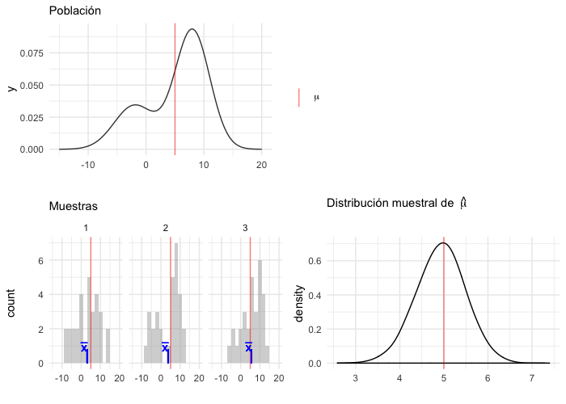
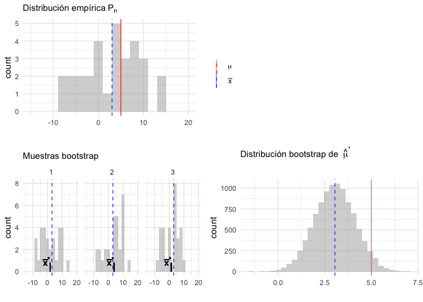

# Bootstrap no paramétrico

> Bootstrap: _to pull oneself up by one's bootstrap_

```{r options, echo = FALSE, message=FALSE, error=TRUE}
knitr::opts_chunk$set(
    comment = "#>",
    collapse = TRUE, error=FALSE
)
comma <- function(x) format(x, digits = 2, big.mark = ",")
options(digits=5)

library(tidyverse)
library(magrittr)
library(gridExtra)
theme_set(theme_minimal())
```

Estas notas se desarrollaron con base en @efron, adicionalmente se usaron ideas 
de @tim. Abordamos los siguientes temas:

* Muestras aleatorias  
* El principio del _plug-in_  
* Bootstrap no paramétrico  
* Ejemplos: componentes principales, ajuste de curvas, muestreo.

<!-- la inferencia estadística se ocupa de aprender de la experiencia: 
observamos una muestra aleatoria x y queremos inferir propiedades de la 
población que produjo la muestra. Probabilidad va en la dirección contraria:
de la composicion de una pob deducimos las propiedades de una muestra aleatoria
x -->

#### Ejemplo: aspirina y ataques cardiacos {-}
Como explican Efron y Tibshirani, las 
explicaciones del *bootstrap* y otros métodos computacionales involucran
las ideas de inferencia estadistica tradicional. Las ideas báscias no han 
cambiado pero la implementación de estas sí.

Los tres conceptos básicos de estadística son:

1. Recolección de datos,

2. resúmenes (o descriptivos) de datos y

3. inferencia.

Veamos un ejemplo de estos conceptos y como se introduce bootstrap. Usaremos 
datos de un estudio clínico de consumo de aspirina y ataques cardiacos cuyos 
resultados fueron publicados en el [New York Times](http://www.nytimes.com/1988/01/27/us/heart-attack-risk-found-to-be-cut-by-taking-aspirin.html):

**Planteamiento:** se diseñó un estudio para investigar si el consumo de dosis 
bajas de aspirina podía prevenir los ataques cardiacos en hombres sanos en edad 
media.

**Recolección de datos:** Se hizo un diseño controlado, aleatorizado y 
doblemente ciego. La mitad de los participantes recibieron aspirina y la otra 
mitad un placebo. 

**Descriptivos:** Las estadísticas descriptivas del artículo son muy sencillas:

grupo    | ataques cardiacos | sujetos 
---------|-------------------|---------
aspirina |    104            | 11037
placebo  |    189            | 11034

De manera que la estimación del cociente de las tasas es 
$$\hat{\theta}=\frac{104/11037}{189/11034} = 0.55$$
    En la muestra los individuos que toman aspirina tienen únicamente 55\% de 
    los ataques que los que toman placebo. Sin embargo, lo que realmente nos 
    interesa es $\theta$: el cociente de tasas que observaríamos si pudieramos 
    tratar a todos los hombres y no únicamente a una muestra.

**Inferencia:** aquí es donde recurrimos a inferencia estadística: 

$$0.43 < \theta < 0.70$$
    El verdadero valor de $\theta$ esta en el intervalo $(0.43,0.70)$ con una 
    confianza del 95%.

Ahora, el **bootstrap** es un método de simulación basado en datos para 
inferencia estadística. La idea detrás es que si una muestra es una aproximación 
de la población que la generó, entoces podemos hacer muestreos de la muestra 
para calcular una estadística de interés y medir la exactitud en la misma.

En este caso tenemos los resultados del experimento en la variable *trial*.

```{r datos_bootstrap}
trial <- data_frame(patient = 1:22071, 
  group = ifelse(patient <= 11037, "aspirin", "control"), 
  heart_attack = c(rep(TRUE, 104), rep(FALSE, 10933), rep(TRUE, 189), 
      rep(FALSE, 10845)))
trial
```

Y calculamos el cociente de las tasas:

```{r bootstrap_summary}
summ_stats <- trial %>% 
  group_by(group) %>%
  summarise(
    n_attacks = sum(heart_attack), 
    n_subjects = n(),
    rate_attacks = n_attacks / n_subjects * 100
  )
summ_stats

ratio_rates <- summ_stats$rate_attacks[1] / summ_stats$rate_attacks[2]
```

Después calculamos 1000 replicaciones *bootstrap* de $\hat{\theta*}$

```{r replicaciones_bootstrap}
boot_ratio_rates <- function(){
  boot_sample <- trial %>%
    group_by(group) %>%
    sample_frac(replace = TRUE)
  rates <- boot_sample %>% 
      summarise(rate_attacks = sum(heart_attack) / n()) %>%
      pull(rate_attacks)
  rates[1] / rates[2]
} 

boot_ratio_rates <- rerun(1000, boot_ratio_rates()) %>% 
  map_dbl(~.x)
```

Las replicaciones se pueden utilizar para hacer inferencia de los datos. Por 
ejemplo, podemos estimar el error estándar de $\theta$:

```{r inferencias_bootstrap, fig.align='center', fig.width=4, fig.height=4}
se <- sd(boot_ratio_rates)
comma(se)
```


## El principio del plug-in

### Muestras aleatorias {-} 

Supongamos que tenemos una población finita o _universo_ $U$, conformado
por unidades individuales con propiedades que nos gustaría aprender (opinión 
política, nivel educativo, preferencias de consumo, ...). Debido a que es muy 
difícil y caro examinar cada unidad en $U$ seleccionamos una muestra aleatoria.

<div class="caja">
Una **muestra aleatoria** de tamaño $n$ se define como una colección de $n$
unidades $u_1,...,u_n$ seleccionadas aleatoriamente de una población $U$.  

Una vez que se selecciona una muestra aleatoria, los **datos observados** son la 
colección de medidas $x_1,...,x_n$, también denotadas
$\textbf{x} = (x_1,...,x_n)$.
</div>

En principio, el proceso de muestreo es como sigue:

1. Seleccionamos $n$ enteros de manera independiente (con probabilidad $1/N$), 
cada uno de ellos asociado a un número entre $1$ y $N$.

2. Los enteros determinan las unidades que seleccionamos y tomamos medidas
a cada unidad.

En la práctica el proceso de selección suele ser más complicado y la
definición de la población $U$ suele ser deficiente; sin embargo, el marco
conceptual sigue siendo útil para entender la inferencia estadística.

<div class="caja">
Nuestra definición de muestra aleatoria comprende muestras con y sin reemplazo:

* **muestra sin reemplazo:** una unidad particular puede aparecer a lo más una
vez.

* **muestra con reemplazo:** permite que una unidad aparezca más de una vez.
</div>

* Es más común tomar muestras sin remplazo, sin embargo, **para hacer inferencia 
suele ser más sencillo permitir repeticiones (muestreo con 
remplazo)** y si el tamaño de la muestra $n$ es mucho más chico que la población 
$N$, la probabilidad de muestrear la misma unidad más de una vez es chica.

* El caso particular en el que obtenemos las medidas de interés de cada unidad 
en la población se denomina **censo**, y denotamos al conjunto de datos 
observados de la población por $\mathcal{X}$. 

En general, no nos interesa simplemente describir la muestra que observamos 
sino que queremos aprender acerca de la población de donde se seleccionó la
muestra:

<div class="caja">
El objetivo de la **inferencia estadística** es expresar lo que hemos aprendido 
de la población $\mathcal{X}$ a partir de los datos observados $\textbf{x}$.
</div>

#### Ejemplo: ENLACE {-}

```{r limpieza de datos, echo = FALSE, eval = FALSE}
load("data/base_completa.Rdata")
primaria <- tbl_df(primaria) %>%
    filter(entidad == "DISTRITO FEDERAL", esp.3 > 0, esp.6 > 0, eval.3 > 0, 
        eval.6 > 0) %>%
    select(clave, turno, tipo = tipo.esc, mun = clave.mun, esp_3 = esp.3, 
        esp_6 = esp.6) %>%
    mutate(tipo = as.character(tipo))
```

Veamos un ejemplo donde tomamos una muestra de 300 escuelas primarias
de la Ciudad de México, de un universo de 3,200 escuelas, 

```{r seleccion_muestra}
# universo
primaria <- read_csv("data/primarias.csv")
glimpse(primaria)
set.seed(16021)
n <- 300
# muestra
primaria_muestra <- sample_n(primaria, n) %>% 
    mutate(clase = "muestra")
```

para cada escuela en la muestra tenemos la medida $x_i$, conformada por el 
promedio de las calificaciones en español de los alumnos de tercero y sexto 
de primaria (prueba ENLACE 2010):
$$x_i=(esp_{3i}, esp_{6i})$$

En este ejemplo contamos con un censo de las escuelas y tomamos la muestra
aleatoria de la tabla de datos general, sin embargo, es común contar únicamente 
con la muestra.

Para español 3^o^ de primaria la media observada es

```{r}
mean(primaria_muestra$esp_3)
```

La media muestral es una estadística descriptiva de la muestra, pero también la
podemos usar para describir a la población de escuelas. 

Al usar la media observada para describir a la población estamos aplicando el 
principio del *plug-in* que dice que una característica dada de una distribución
puede ser aproximada por la equivalente evaluada en la distribución empírica de 
una muestra aleatoria.

### Función de distribución empírica {-}

<div class="caja">
Dada una muestra aleatoria de tamaño $n$ de una distribución de probabilidad 
$P$, la **función de distribución empírica** $P_n$ se define como la 
distribución que asigna probabilidad $1/n$ a cada valor $x_i$ con $i=1,2,...,n$. 

En otras palabras, $P_n$ asigna a un conjunto $A$ en el espacio muestral de $x$ 
la probabilidad empírica:

$$P_n(A)=\#\{x_i \in A \}/n$$
</div>

<!--Ahora, muchos problemas de inferencia estadística involucran la estimación
de algún aspecto de una distribución de de probabilidad $P$ en base a una 
muestra aleatoria obtenida de $P$. -->

* La función de distribución empírica $P_n$ es una estimación de la distribución 
completa $P$, por lo que una manera inmediata de estimar aspectos de $P$ 
(e.g media o mediana) es calcular el aspecto correspondiente de $P_n$.

* En cuanto a la teoría el principio del *plug-in* está soportado por el teorema 
de [Glivenko Cantelli](https://www.stat.berkeley.edu/~bartlett/courses/2013spring-stat210b/notes/8notes.pdf):

    Sea $X_1,...,X_n$ una muestra aleatoria de una distribución $P$, con 
    distribución empírica $P_n$ entonces
    $$\sup_{x \in \mathcal{R}}|P_n(x)-P(x)|\to_p0$$
    casi seguro.


Regresando al ejemplo de las escuelas, comparemos la distribución poblacional y 
la distribución empírica. 


```{r distribucion_empirica, fig.width=5, fig.height=4}
primaria_long <- primaria %>% 
    mutate(clase = "población") %>% 
    rbind(primaria_muestra) %>% 
    gather(grado, calif, esp_3:esp_6)
    
ggplot(primaria_long, aes(x = calif)) +
  geom_histogram(aes(y = ..density..), binwidth = 20, fill = "darkgray") +
  facet_grid(grado ~ clase)
```

Podemos comparar la función de distribución acumulada empírica y la función de
distribución acumulada poblacional: 

En la siguiente gráfica la curva roja 
representa la función de distribución acumulada empírica y la curva con relleno
gris la función de distribución acumulada poblacional.

```{r, out.height="300px"}
ggplot() +
    stat_ecdf(data = filter(primaria_long, clase == "población"), 
        aes(x = calif, ymin=0, ymax=..y..), geom = "ribbon", pad = TRUE, alpha = 0.5, 
        fill = "gray", color = "darkgray")  +
    stat_ecdf(data = filter(primaria_long, clase == "muestra"), 
        aes(x = calif), geom = "step", color = "red") +
    facet_grid(~ grado) +
    labs(color = "")

```

Cuando la variable de interés toma pocos valores es fácil ver la distribución 
empírica, supongamos que la medición de las unidades que nos interesa es la 
variable tipo de escuela, entonces la distribución empírica en la muestra es

```{r dist_empirica_categorica}
table(primaria_muestra$tipo) / n
```

Vale la pena notar que pasar de la muestra desagregada a la distribución 
empírica (lista de valores y la proporción que ocurre cada una en la muestra) 
no conlleva ninguna pérdida de información:  
_el vector de frecuencias observadas es un **estadístico suficiente** para la
verdadera distribución._

Esto quiere decir que toda la información de $P$ contenida en el vector de 
observaciones $\textbf{x}$ está también contenida en $P_n$.

**Nota**: el teorema de suficiencia asume que las observaciones $\textbf{x}$ son
una muestra aleatoria de la distribución $P$, este no es siempre el caso 
(e.g. si tenemos una serie de tiempo).

### Parámetros y estadísticas {-}

Cuando aplicamos teoría estadística a problemas reales, es común que las 
respuestas estén dadas en términos de distribuciones de probabilidad. Por 
ejemplo, podemos preguntarnos que tan correlacionados están los resultados de 
las pruebas de español correspondientes a 3^o^ y 6^o^. Si conocemos la 
distribución de probabilidad $P$ contestar esta pregunta es simplemente cuestión 
de aritmética, el coeficiente de correlación poblacional esta dado por:

$$corr(y,z) = \frac{\sum_{j=1}^{N}(Y_j - \mu_y)(Z_j-\mu_z)}
{[\sum_{j=1}^{N}(Y_j - \mu_y)^2\sum_{j=1}^{N}(Z_j - \mu_z)^2]^{1/2}}$$

en nuestro ejemplo $(Y_j,Z_j)$ son el j-ésimo punto en la población de escuelas 
primarias $\mathcal{X}$, $\mu_y=\sum Y_j/3311$ y $\mu_z=\sum Z_j/3311$.

```{r grafica_corr, fig.width=4, fig.height=4, out.width="300px"}
ggplot(primaria, aes(x = esp_3, y = esp_6)) +
  geom_point(alpha = 0.5)
cor(primaria$esp_3, primaria$esp_6) %>% round(2)
```

Si no tenemos un censo debemos inferir, podríamos estimar la correlación 
$corr(y,z)$ a través del coeficiente de correlación muestral:

$$\hat{corr}(y,z) = \frac{\sum_{j=1}^{n}(y_j - \hat{\mu}_y)(z_j-\hat{\mu}_z)}
{[\sum_{j=1}^{n}(y_j - \hat{\mu}_y)^2\sum_{j=1}^{n}(z_j - \hat{\mu}_z)^2]^{1/2}}$$

recordando que la distribución empírica es una estimación de la distribución 
completa.

```{r correlacion}
cor(primaria_muestra$esp_3, primaria_muestra$esp_6)
```

Al igual que la media esto es una estimación _plug-in_. Otros ejemplos son:

* Supongamos que nos interesa estimar la mediana de las calificaciones
de español para 3^o de primaria:

```{r mediana_esp3}
median(primaria_muestra$esp_3)
```

* Supongamos que nos interesa estimar la probabilidad de que la calificación de 
español de una escuela sea mayor a 700:

$$\theta=\frac{1}{N}\sum_{j=1}^N I_{\{Y_i>700\}}$$

donde $I_{\{\cdot\}}$ es la función indicadora.

La estimación _plug-in_ de $\hat{\theta}$ sería:
```{r calif_700}
sum(primaria_muestra$esp_3 > 700) / n
```

#### Ejemplo: dado {-}
Observamos 100 lanzamientos de un dado, obteniendo la siguiente distribución 
empírica:

```{r dado}
dado <- read.table("data/dado.csv", header=TRUE, quote="\"")
prop.table(table(dado$x))
```

En este caso no tenemos un censo, solo contamos con la muestra. Una pregunta
de inferencia que surge de manera natural es si el dado es justo, esto es, 
si la distribución que generó esta muestra tiene una distribución 
$P = (1/6, 1/6, 1/6,1/6, 1/6, 1/6)$.

Para resolver esta pregunta, debemos hacer inferencia de la distribución 
empírica.

Antes de proseguir repasemos dos conceptos importantes: parámetros y 
estadísticos:

<div class='caja'>
Un **parámetro** es una función de la distribución de probabilidad 
$\theta=t(P)$, mientras que una **estadística** es una función de la 
muestra $\textbf{x}$. 
</div>

Por ejemplo, la $corr(x,y)$ es un parámetro de $P$ y $\hat{corr}(x,y)$ es una 
estadística con base en $\textbf{x}$ y $\textbf{y}$.

Entonces:

<div class="caja">
El **principio del _plug-in_** es un método para estimar parámetros a 
partir de muestras; la estimación _plug-in_ de un parámetro $\theta=t(P)$ se 
define como:
$$\hat{\theta}=t(P_n).$$
</div>

Es decir, estimamos la función $\theta = t(P)$ de la distribución de 
probabilidad $P$ con la misma función aplicada en la distribución empírica 
$\hat{\theta}=t(P_n)$.

¿Qué tan _bien_ funciona el principio del _plug-in_?

Suele ser muy bueno cuando la única información disponible de $P$ es la 
muestra $\textbf{x}$, bajo esta circunstancia $\hat{\theta}=t(P_n)$ no puede
ser superado como estimador de $\theta=t(P)$, al menos no en el sentido 
asintótico de teoría estadística $(n\to\infty)$.

El principio del _plug-in_ provee de una estimación más no habla de precisión: 
usaremos el bootstrap para estudiar el sesgo y el error estándar del 
estimador _plug-in_ $\hat{\theta}=t(P_n)$. 

### Distribuciones muestrales y errores estándar {-}

<div class="caja">
La **distribución muestral** de una estadística es la distribución de 
probabilidad de la misma, considerada como una variable aleatoria.
</div>

Es así que la distribución muestral depende de: 
1) La distribución poblacional,  
2) la estadística que se está considerando,  
y 3) la muestra aleatoria: cómo se seleccionan las unidades de la muestra y
cuántas.

En teoría para obtener la distribución muestral uno seguiría los siguientes 
pasos:

* Selecciona muestras de una población (todas las posibles o un número infinito 
de muestras).

* Calcula la estadística de interés para cada muestra.

La distribución de la estadística es la distribución muestral.

```{r, eval = FALSE}
library(LaplacesDemon)
library(patchwork)
# En este ejemplo la población es una mezcla de normales
pob_plot <- ggplot(data_frame(x = -15:20), aes(x)) +
    stat_function(fun = dnormm, args = list(p = c(0.3, 0.7), mu = c(-2, 8), 
        sigma = c(3.5, 3)), alpha = 0.8) +
    geom_vline(aes(color = "mu", xintercept = 5), alpha = 0.5) +
    scale_colour_manual(values = c('mu' = 'red'), name = '', 
        labels = expression(mu)) +
    labs(x = "", subtitle = "Población", color = "")

samples <- data_frame(sample = 1:3) %>% 
    mutate(
        sims = rerun(3, rnormm(30, p = c(0.3, 0.7), mu = c(-2, 8), 
            sigma = c(3.5, 3))), 
        x_bar = map_dbl(sims, mean))
muestras_plot <- samples %>% 
    unnest() %>% 
    ggplot(aes(x = sims)) +
        geom_histogram(binwidth = 2, alpha = 0.5, fill = "darkgray") +
        geom_vline(xintercept = 5, color = "red", alpha = 0.5) +
        geom_segment(aes(x = x_bar, xend = x_bar, y = 0, yend = 0.8), 
            color = "blue") +
        xlim(-15, 20) +
        facet_wrap(~ sample) +
        geom_text(aes(x = x_bar, y = 0.95, label = "bar(x)"), parse = TRUE, 
            color = "blue", alpha = 0.2, hjust = 1) +
        labs(x = "", subtitle = "Muestras") 

samples_dist <- data_frame(sample = 1:10000) %>% 
    mutate(
        sims = rerun(10000, rnormm(100, p = c(0.3, 0.7), mu = c(-2, 8), 
            sigma = c(3.5, 3))), 
        mu_hat = map_dbl(sims, mean))
dist_muestral_plot <- ggplot(samples_dist, aes(x = mu_hat)) +
    geom_density(adjust = 2) +
    labs(x = "", subtitle = expression("Distribución muestral de "~hat(mu))) +
    geom_vline(xintercept = 5, color = "red", alpha = 0.5)

(pob_plot | plot_spacer()) / (muestras_plot | dist_muestral_plot) 
```



Para hacer inferencia necesitamos describir la forma de la distribución
muestral, es natural pensar en la desviación estándar pues es una medida de la
dispersión de la distribución de la estadística alrededor de su media:

<div class="caja">
El **error estándar** es la desviación estándar de la distribución muestral de
una estadística.
</div>

#### Ejemplo: el error estándar de una media {-}

Supongamos que $x$ es una variable aleatoria que toma valores en los reales con 
distribución de probabilidad $P$. Denotamos por $\mu_P$ y $\sigma_P^2$ la 
media y varianza de $P$,

$$\mu_P = E_P(x),$$ 
$$\sigma_P^2=var_P(x)=E_P[(x-\mu_P)^2]$$

en la notación enfatizamos la dependencia de la media y varianza en la 
distribución $P$. 

Ahora, sea $(x_1,...,x_n)$ una muestra aleatoria de $P$, de tamaño $n$, 
la media de la muestra $\bar{x}=\sum_{i=1}^nx_i/n$ tiene:

* esperanza $\mu_P$,

* varianza $\sigma_P^2/n$.

En palabras: la esperanza de $\bar{x}$ es la misma que la esperanza de $x$, pero
la varianza de $\bar{x}$ es $1/n$ veces la varianza de $x$, así que entre
mayor es la $n$ tenemos una mejor estimación de $\mu_P$.

En el caso de la media $\bar{x}$, el error estándar, que denotamos 
$se_P(\bar{x})$, es la raíz de la varianza de $\bar{x}$,

$$se_P(\bar{x}) = [var_P(\bar{x})]^{1/2}= \sigma_P/ \sqrt{n}.$$

En este punto podemos usar el principio del _plug-in_, simplemente sustituimos
$P_n$ por $P$ y obtenemos, primero, una estimación de $\sigma_P$:
$$\hat{\sigma}=\hat{\sigma}_{P_n} = \bigg\{\frac{1}{n}\sum_{i=1}^n(x_i-\bar{x})^2\bigg\}^{1/2}$$

de donde se sigue la estimación del error estándar:

$$\hat{se}(\bar{x})=\hat{\sigma}_{P_n}/\sqrt{n}=\bigg\{\frac{1}{n^2}\sum_{i=1}^n(x_i-\bar{x})^2\bigg\}^{1/2}$$

Notemos que usamos el principio del _plug-in_ en dos ocasiones, primero para 
estimar la esperanza $\mu_P$ mediante $\mu_{P_n}$ y luego para estimar el 
error estándar $se_P(\bar{x})$. 

 Consideramos la base de datos `primaria`, y la 
columna de calificaciones de español 3^o^ de primaria (`esp_3`). 

- Selecciona una muestra de tamaño $n = 10, 100, 1000$. Para cada muestra 
calcula media y el error estándar de la media usando el principio del *plug-in*:
$\hat{\mu}=\bar{x}$, y $\hat{se}(\bar{x})=\hat{\sigma}_{P_n}/\sqrt{n}$.

- Ahora aproximareos la distribución muestral, para cada tamaño de muestra $n$: 
i) simula 10,000 muestras aleatorias, ii) calcula la media en cada muestra, iii)
Realiza un histograma de la distribución muestral de las medias (las medias del
paso anterior) iv) aproxima el error estándar calculando la desviación estándar
de las medias del paso ii.

- Calcula el error estándar de la media para cada tamaño de muestra usando la
información poblacional (ésta no es una aproximación), usa la fórmula:
$se_P(\bar{x}) = \sigma_P/ \sqrt{n}$.

- ¿Cómo se comparan los errores estándar correspondientes a los distintos 
tamaños de muestra? 

#### ¿Por qué bootstrap? {-}

* En el caso de la media $\hat{\theta}=\bar{x}$ la aplicación del principio del 
_plug-in_ para el cálculo de errores estándar es inmediata; sin embargo, hay 
estadísticas para las cuáles no es fácil aplicar este método.

* El método de aproximarlo con simulación, como lo hicimos en el ejercicio de 
arriba no es factible pues en la práctica no podemos seleccionar un número 
arbitrario de muestras de la población, sino que tenemos únicamente una muestra. 

* La idea del *bootstrap* es replicar el método de simulación para aproximar
el error estándar, esto es seleccionar muchas muestras y calcular la estadística 
de interés en cada una, con la diferencia que las muestras se seleccionan de la
distribución empírica a falta de la distribución poblacional.


## El estimador bootstrap del error estándar
Entonces, los pasos para calcular estimador bootstrap del error estándar son:

Tenemos una muestra aleatoria $\textbf{x}=(x_1,x_2,...,x_n)$ 
proveniente de una distribución de probabilidad desconocida $P$, 

* Seleccionamos muestras aleatorias con reemplazo de la distribución empírica.

* Calculamos la estadística de interés para cada muestra:
    $$\hat{\theta}=s(\textbf{x})$$ 
    la estimación puede ser la estimación _plug-in_ $t(P_n)$ pero también puede 
    ser otra. 

* La distribución de la estadística es la distribución bootstrap, y el estimador
bootstrap del error estándar es la desviación estándar de la distribución 
bootstrap.


```{r, eval = FALSE}
dist_empirica <- data_frame(id = 1:30, obs = samples$sims[[1]])

dist_empirica_plot <- ggplot(dist_empirica, aes(x = obs)) +
    geom_histogram(binwidth = 2, alpha = 0.5, fill = "darkgray") +
    geom_vline(aes(color = "mu", xintercept = 5), alpha = 0.5) +
    geom_vline(aes(xintercept = samples$x_bar[1], color = "x_bar"), 
        alpha = 0.8, linetype = "dashed") +
    xlim(-15, 20) +
    geom_vline(xintercept = 5, color = "red", alpha = 0.5) +
    labs(x = "", subtitle = expression("Distribución empírica"~P[n])) +
    scale_colour_manual(values = c('mu' = 'red', 'x_bar' = 'blue'), name = '', 
        labels = c(expression(mu), expression(bar(x)))) 
    
samples_boot <- data_frame(sample_boot = 1:3) %>% 
    mutate(
        sims_boot = rerun(3, sample(dist_empirica$obs, replace = TRUE)), 
        x_bar_boot = map_dbl(sims_boot, mean))

muestras_boot_plot <- samples_boot %>% 
    unnest() %>% 
    ggplot(aes(x = sims_boot)) +
        geom_histogram(binwidth = 2, alpha = 0.5, fill = "darkgray") +
        geom_vline(aes(xintercept = samples$x_bar[1]), color = "blue",
            linetype = "dashed", alpha = 0.8) +
        geom_vline(xintercept = 5, color = "red", alpha = 0.5) +
        geom_segment(aes(x = x_bar_boot, xend = x_bar_boot, y = 0, yend = 0.8), 
            color = "black") +
        xlim(-15, 20) +
        facet_wrap(~ sample_boot) +
        geom_text(aes(x = x_bar_boot, y = 0.95, label = "bar(x)^'*'"), 
            parse = TRUE, color = "black", alpha = 0.3, hjust = 1) +
        labs(x = "", subtitle = "Muestras bootstrap") 

boot_dist <- data_frame(sample = 1:10000) %>% 
    mutate(
        sims_boot = rerun(10000, sample(dist_empirica$obs, replace = TRUE)), 
        mu_hat_star = map_dbl(sims_boot, mean))
boot_muestral_plot <- ggplot(boot_dist, aes(x = mu_hat_star)) +
    geom_histogram(alpha = 0.5, fill = "darkgray") +
    labs(x = "", 
        subtitle = expression("Distribución bootstrap de "~hat(mu)^'*')) +
    geom_vline(xintercept = 5, color = "red", alpha = 0.5) +
    geom_vline(aes(xintercept = samples$x_bar[1]), color = "blue", 
        linetype = "dashed", alpha = 0.8)

(dist_empirica_plot | plot_spacer()) / (muestras_boot_plot | boot_muestral_plot) 
```



Describamos la notación y conceptos:

<div class="caja">
Definimos una **muestra bootstrap** como una muestra aleatoria de tamaño $n$ que
se obtiene de la distribución empírica $P_n$ y la denotamos 
$$\textbf{x}^* = (x_1^*,...,x_n^*).$$
</div>

La notación de estrella indica que $\textbf{x}^*$ no son los datos $\textbf{x}$
sino una versión de **remuestreo** de $\textbf{x}$.

Otra manera de frasearlo: Los datos bootsrtap $x_1^*,...,x_n^*$ son una muestra
aleatoria de tamaño $n$ seleccionada con reemplazo de la población de $n$
objetos $(x_1,...,x_n)$. 

<div class="caja">
A cada muestra bootstrap $\textbf{x}^*$ le corresponde una replicación
$\hat{\theta}^*=s(\textbf{x}^*).$
</div>

el estimador bootstrap de $se_P(\hat{\theta})$ se define como:

$$se_{P_n}(\hat{\theta}^*)$$

en otras palabras, la estimación bootstrap de $se_P(\hat{\theta})$ es el error
estándar de $\hat{\theta}$ para conjuntos de datos de tamaño $n$ seleccionados
de manera aleatoria de $P_n$.

La fórmula $se_{P_n}(\hat{\theta}^*)$ no existe para casi ninguna estimación 
diferente de la media, por lo que recurrimos a la técnica computacional 
bootstrap: 

<div class="caja">

**Algoritmo bootstrap para estimar errores estándar** 

1. Selecciona $B$ muestras bootstrap independientes: 
$$\textbf{x}^{*1},..., \textbf{x}^{*B}$$.  

2. Evalúa la replicación bootstrap correspondiente a cada muestra bootstrap:
$$\hat{\theta}^{*b}=s(\textbf{x}^{*b})$$
para $b=1,2,...,B.$

3. Estima el error estándar $se_P(\hat{\theta})$ usando la desviación estándar
muestral de las $B$ replicaciones:
$$\hat{se}_B = \bigg\{\frac{\sum_{b=1}^B[\hat{\theta}^{*}(b)-\hat{\theta}^*(\cdot)]^2 }{B-1}\bigg\}^{1/2}$$

donde $$\hat{\theta}^*(\cdot)=\sum_{b=1}^B \theta^{*}(b)/B $$.
</p>
</div>

Notemos que:

* La estimación bootstrap de $se_{P}(\hat{\theta})$, el error estándar
de una estadística $\hat{\theta}$, es un estimador *plug-in* que usa la 
función de distribución empírica $P_n$ en lugar de la distribución desconocida
$P$. 

* Conforme el número de replicaciones $B$ aumenta 
$$\hat{se}_B\approx se_{P_n}(\hat{\theta})$$
    este hecho equivale a decir que la desviación estándar empírica se acerca a 
    la desviación estándar poblacional conforme crece el número de muestras. La 
    _población_ en este caso es la población de valores $\hat{\theta}^*=s(x^*)$.

* Al estimador de bootstrap ideal $se_{P_n}(\hat{\theta})$ y su aproximación
$\hat{se}_B$ se les denota **estimadores bootstrap no paramétricos** ya que 
estan basados en $P_n$, el estimador no paramétrico de la población $P$.

#### Ejemplo: Error estándar bootstrap de una media {-}

```{r esp3_media_boot, cache=TRUE}
mediaBoot <- function(x){ 
  # x: variable de interés
  # n: número de replicaciones bootstrap
  n <- length(x)
  muestra_boot <- sample(x, size = n, replace = TRUE)
  mean(muestra_boot) # replicacion bootstrap de theta_gorro
}
thetas_boot <- rerun(10000, mediaBoot(primaria_muestra$esp_3)) %>% flatten_dbl()
sd(thetas_boot)
```

y se compara con $\hat{se}(\bar{x})$ (estimador *plug-in* del error estándar):

```{r}
se <- function(x) sqrt(sum((x - mean(x)) ^ 2)) / length(x)
se(primaria_muestra$esp_3)
```

**Nota:** Conforme $B$ aumenta $\hat{se}_{B}(\bar{x})\to \{\sum_{i=1}^n(x_i - \bar{x})^2 / n \}^{1/2}$, 
se demuestra con la ley débil de los grandes números.

 Considera el coeficiente de correlación muestral
entre la calificación de $y=$esp_3 y la de $z=$esp_6: 
$\hat{corr}(y,z)=0.9$. ¿Qué tan precisa es esta estimación? 


### Variación en distribuciones bootstrap {-}

En el proceso de estimación bootstrap hay dos fuentes de variación pues:

* La muestra original se selecciona con aleatoriedad de una población.

* Las muestras bootstrap se seleccionan con aleatoriedad de la muestra 
original. Esto es: *La estimación bootstrap ideal es un resultado asintótico 
$B=\infty$, en esta caso $\hat{se}_B$ iguala la estimación _plug-in_ 
$se_{P_n}$.* 

En el proceso de *bootstrap* podemos controlar la variación del sgundo aspecto,
conocida como **implementación de muestreo Monte Carlo**, y la variación 
Monte Carlo decrece conforme incrementamos el número de muestras. 

Podemos eliminar la variación Monte Carlo si seleccionamos todas las posibles
muestras con reemplazo de tamaño $n$, hay ${2n-1}\choose{n}$ posibles muestras 
y si seleccionamos todas obtenemos $\hat{se}_\infty$ (bootstrap ideal), sin
embargo, en la mayor parte de los problemas no es factible proceder así.

<!--
* En la práctica para elegir el tamaño de $B$ debemos considerar que buscamos 
las mismas propiedades para la estimación de un error estándar que para 
cualquier estimación: poco sesgo y desviación estándar chica. El sesgo de la 
estifmación bootstrap del error estándar suele ser bajo y el error estándar está

 Una respuesta aproximada es en términos del coeficiente de variación de 
$\hat{se}_B$, esto es el cociente de la desviación estándar de $\hat{se}_B$ y su 
valor esperado, la variabilidad adicional de parar en $B$ replicaciones en lugar 
de seguir hasta infiniti se refleja en un incremento en el coeficiente de 
variación
-->
Entonces, ¿cuántas muestras bootstrap? 

1. Incluso un número chico de replicaciones bootstrap, digamos $B=25$ es 
informativo, y $B=50$ con frecuencia es suficiente para dar una buena 
estimación de $se_P(\hat{\theta})$ (@efron).

2. Cuando se busca estimar error estándar @tim recomienda $B=1000$ muestras, o 
$B=10,000$ muestras dependiendo la presición que se busque.


```{r}
seMediaBoot <- function(x, B){
    thetas_boot <- rerun(B, mediaBoot(x)) %>% flatten_dbl()
    sd(thetas_boot)
}

B_muestras <- data_frame(n_sims = c(5, 25, 50, 100, 200, 400, 1000, 1500, 3000, 
    5000, 10000, 20000)) %>% 
    mutate(est = map_dbl(n_sims, ~seMediaBoot(x = primaria_muestra$esp_3, B = .)))
B_muestras
```


#### Ejemplo componentes principales: calificaciones en exámenes {-}
Los datos _marks_ (Mardia, Kent y Bibby, 1979) contienen los puntajes de 88 
estudiantes en 5 pruebas: mecánica, vectores, álgebra, análisis y estadística.
Cada renglón corresponde a la calificación de un estudiante en cada prueba.

```{r leer_marks}
marks <- read_csv("data/marks.csv")
glimpse(marks)
marks <- select(marks, -id)
```

Entonces un análisis de componentes principales proseguiría como sigue:

```{r pc, fig.height=4, fig.width=4}
pc_marks <- princomp(marks)
summary(pc_marks)
loadings(pc_marks)
plot(pc_marks, type = "lines")
```


```{r}
biplot(pc_marks)
```

Los cálculos de un análisis de componentes principales involucran la matriz de 
covarianzas empírica $G$ (estimaciones _plug-in_)

$$G_{jk} = \frac{1}{88}\sum_{i=1}^88(x_{ij}-\bar{x_j})(x_{ik}-\bar{x_k})$$

para $j,k=1,2,3,4,5$, y donde $\bar{x_j} = \sum_{i=1}^88 x_{ij} / 88$ (la media 
de la i-ésima columna).

```{r}
G <- cov(marks) * 87 / 88
G
```

Los _pesos_ y las _componentes principales_ no son mas que los eigenvalores y 
eigenvectores de la matriz de covarianzas $G$, estos se calculan a través de una 
serie de de manipulaciones algebraicas que requieren cálculos del orden de p^3
(cuando G es una matriz de tamaño p$\times$p).

```{r}
eigen_G <- eigen(G)
lambda <- eigen_G$values
v <- eigen_G$vectors
lambda
v
```

1. Proponemos el siguiente modelo simple para puntajes correlacionados:

$$\textbf{x}_i = Q_i \textbf{v}$$

donde $\textbf{x}_i$ es la tupla de calificaciones del i-ésimo estudiante, 
$Q_i$ es un número que representa la habilidad del estudiante y $\textbf{v}$ es
un vector fijo con 5 números que aplica a todos los estudiantes. Si este modelo
simple fuera cierto, entonces únicamente el $\hat{\lambda}_1$ sería positivo
y $\textbf{v} = \hat{v}_1$.
Sea $$\hat{\theta}=\sum_{i=1}^5\hat{\lambda}_i$$
el modelo propuesto es equivalente a $\hat{\theta}=1$, inculso si el modelo es
correcto, no esperamos que $\hat{\theta}$ sea exactamente uno pues hay ruido en 
los datos.

```{r}
theta_hat <- lambda[1]/sum(lambda)
theta_hat
```

El valor de $\hat{\theta}$ mide el porcentaje de la varianza explicada en la 
primer componente principal, ¿qué tan preciso es  $\hat{\theta}$? La complejidad
matemática en el cálculo de  $\hat{\theta}$ es irrelevante siempre y cuando 
podamos calcular  $\hat{\theta}^*$ para una muestra bootstrap, en esta caso una
muestra bootsrtap es una base de datos de 88$\times$5 $\textbf{X}^*$, donde las
filas $\textbf{x_i}^*$ de $\textbf{X}^*$ son una muestra aleatoria de tamaño
88 de la verdadera matriz de datos.

```{r}
pc_boot <- function(){
    muestra_boot <- sample_n(marks, size = 88, replace = TRUE)
    G <- cov(muestra_boot) * 87 / 88 
    eigen_G <- eigen(G)
    theta_hat <- eigen_G$values[1] / sum(eigen_G$values)
}
B <- 1000
thetas_boot <- rerun(B, pc_boot()) %>% flatten_dbl()
```

Veamos un histograma de las replicaciones de  $\hat{\theta}$:

```{r pc_hist, fig.height=4, fig.width=4, out.width="300px"}
ggplot(data_frame(theta = thetas_boot)) +
    geom_histogram(aes(x = theta, y = ..density..), binwidth = 0.02, fill = "gray40") + 
    geom_vline(aes(xintercept = mean(theta)), color = "red") +
    labs(x = expression(hat(theta)^"*"), y = "")
```

Estas tienen un error estándar

```{r}
theta_se <- sd(thetas_boot)
theta_se
```

y media

```{r}
mean(thetas_boot)
```

la media de las replicaciones es muy similar a la estimación $\hat{\theta}$, 
esto indica que $\hat{\theta}$ es cercano a insesgado. 


2. El eigenvetor $\hat{v}_1$ correspondiente al mayor eigenvalor se conoce
como primera componente de $G$, supongamos que deseamos resumir la calificación
de los estudiantes mediante un único número, entonces la mejor combinación 
lineal de los puntajes es 

$$y_i = \sum_{k = 1}^5 \hat{v}_{1k}x_{ik}$$

esto es, la combinación lineal que utiliza las componentes de $\hat{v}_1$ como
ponderadores. Si queremos un resumen compuesto por dos números $(y_i,z_i)$, la
segunda combinación lineal debería ser:

$$z_i = \sum_{k = 1}^5 \hat{v}_{2k}x_{ik}$$

 Las componentes principales $\hat{v}_1$ y 
$\hat{v}_2$ son estadísticos, usa bootstrap para dar una medición de su 
variabilidad calculando el error estándar de cada una.


### Más alla de muestras aleatorias simples {-}

Introdujimos el bootstrap en el contexto de muestras aleatorias, esto es,
suponiendo que las observaciones son independientes; en este escenario basta con
aproximar la distribución desconocida $P$ usando la dsitribución empírica $P_n$, 
y el cálculo de los estadísticos es inmediato. Hay casos en los que el mecanismo
que generó los datos es más complicado, por ejemplo, cuando tenemos dos 
muestras, en diseños de encuestas complejas o en series de 
tiempo.

#### Ejemplo: Dos muestras {-}

En el ejemplo de experimentos clínicos de aspirina y ataques de de corazón, 
podemos pensar el modelo probabilístico $P$ como compuesto por dos 
distribuciones de probabilidad $G$ y $Q$ una correspondiente al grupo control y
otra al grupo de tratamiento, entonces las observaciones de 
cada grupo provienen de distribuciones distintas y el método bootstrap debe 
tomar en cuenta esto al generar las muestras, en este caso implica seleccionar 
muesreas de manera independiente dentro de cada grupo.

#### Ejemplo: Bootstrap en muestreo de encuestas {-}

La necesidad de estimaciones confiables junto con el uso eficiente de recursos
conllevan a diseños de muestras complejas. Estos diseños típicamente usan las
siguientes técnicas: muestreo sin reemplazo de una población finita, muestreo
sistemático, estratificación, conglomerados, ajustes a no-respuesta, 
postestratificación. Como consecuencia, los valores de la muestra suelen no ser
independientes.

La complejidad de los diseños de encuestas conlleva a que el cálculo de errores
estándar sea muy complicado, para atacar este problema hay dos técnicas básicas:
1) un enfoque analítico usando linearización, 2) métodos de remuestreo como 
bootstrap. El incremento en el poder de cómputo ha favorecido los métodos de
remuestreo pues la linearización requiere del desarrollo de una fórmula para 
cada estimación y supuestos adicionales para simplificar.

En 1988 @RaoWu propusieron un método de bootstrap para diseños 
estratificados multietápicos con reemplazo de UPMs que describimos a 
continuación.

**ENIGH**. Usaremos como ejemplo la Encuesta Nacional de Ingresos y 
Gastos de los Hogares, ENIGH 2014 [@enigh], esta encuesta usa un diseño de 
conglomerados estratificado.

Antes de proceder a bootstrap debemos entender como se seleccionaron los datos,
esto es, el [diseño de la muestra](http://www.inegi.org.mx/prod_serv/contenidos/espanol/bvinegi/productos/metodologias/ENIGH/ENIGH2012/702825050597.pdf):

1. Unidad primaria de muestreo (UPM). Las UPMs están constituidas por 
agrupaciones de viviendas. Se les denomina unidades primarias pues corresponden
a la primera etapa de selección, las unidades secundarias (USMs) serían los 
hogares.

2. Estratificación. Los estratos se construyen en base a estado, ámbito (urbano, 
complemento urbano, rural), características sociodemográficas de los habitantes
de las viviendas, características físicas y equipamiento. El proceso de 
estratificación resulta en 888 subestratos en todo el ámbito nacional.

3. La selección de la muestra es independiente para cada estrato, y una 
vez que se obtiene la muestra se calculan los factores de expansión que 
reflejan las distintas probabilidades de selección. Después se llevan a cabo
ajustes por no respuesta y por proyección (calibración), esta última 
busca que distintos dominios de la muestra coincidan con la proyección de 
población de INEGI.

```{r, message=FALSE, warning=FALSE}
concentrado_hogar <- read_csv("data/concentradohogar.csv")
concentrado_hogar

# seleccionar variable de ingreso corriente
hogar <- concentrado_hogar %>% 
    mutate(jefe_hombre = sexo_jefe == 1) %>% 
    select(folioviv, foliohog, est_dis, upm, factor_hog, ing_cor, sexo_jefe, edad_jefe) %>%
    group_by(est_dis) %>% 
    mutate(
        n = n_distinct(upm), # número de upms por estrato
        jefa_50 = (sexo_jefe == 2) & (edad_jefe > 50)
      ) %>% 
    ungroup()

head(hogar)
```

Para el cálculo de estadísticos debemos usar los factores de expansión, por ejemplo
el ingreso trimestral total sería:

```{r}
sum(hogar$factor_hog * hogar$ing_cor / 1000)
```

y ingreso trimestral medio (miles pesos)

```{r}
sum(hogar$factor_hog * hogar$ing_cor / 1000) / sum(hogar$factor_hog)
```

Veamos ahora como calcular el error estándar siguiendo el bootstrap de Rao y Wu:

1. En cada estrato se seleccionan con reemplazo $m_h$ UPMs de las $n_h$ de la
muestra original. Denotamos por $m_{hi}^*$ el número de veces que se seleccionó
la UPM $i$ en el estrato $h$ (de tal manera que $\sum m_{hi}^*=m_h$). Creamos
una replicación del ponderador correspondiente a la $k$-ésima unidad (USM) como:

$$d_k^*=d_k \bigg[\bigg(1-\sqrt{\frac{m_h}{n_h - 1}}\bigg) + 
\bigg(\sqrt{\frac{m_h}{n_h - 1}}\frac{n_h}{m_h}m_{h}^*\bigg)\bigg]$$

donde $d_k$ es el inverso de la probabilidad de selección. Si $m_h<(n_h -1)$ 
todos los pesos definidos de esta manera serán no negativos. Calculamos el 
peso final $w_k^*$ aplicando a $d_k^*$ los mismos ajustes que se hicieron a los 
ponderadores originales.

2. Calculamos el estadístico de interés $\hat{\theta}$ usando los ponderadores
$w_k^*$ en lugar de los originales $w_k$.

3. Repetimos los pasos 1 y 2 $B$ veces para obtener $\hat{\theta}^{*1},\hat{\theta}^{*2},...,\hat{\theta}^{*B}$.

4. Calculamos el error estándar como:
$$\hat{se}_B = \bigg\{\frac{\sum_{b=1}^B[\hat{\theta}^*(b)-\hat{\theta}^*(\cdot)]^2 }{B}\bigg\}^{1/2}$$

Podemos elegir cualquier valor de $m_h \geq 1$, el más sencillo es elegir
$m_h=n_h-1$, en este caso:
$$d_k^*=d_k \frac{n_h}{n_h-1}m_{hi}^*$$
en este escenario las unidades que no se incluyen en la muestra tienen 
un valor de cero como ponderador. Si elegimos $n_h \ne n_h-1$ las unidades que 
no están en la muestra tienen ponderador distinto a cero, si $m_h=n_h$ el
ponderador podría tomar valores negativos.

Implementemos el bootstrap de Rao y Wu a la ENIGH, usaremos $m_h=n_h-1$

```{r, cache = TRUE, message=FALSE}
# creamos una tabla con los estratos y upms
est_upm <- hogar %>% 
    distinct(est_dis, upm, n)

hogar_factor <- est_upm %>% 
    split(.$est_dis) %>% # dentro de cada estrato tomamos muestra (n_h-1)
    map_df(~sample_n(., size = first(.$n) - 1, replace = TRUE)) %>% 
    add_count(upm) %>% # calculamos m_hi*
    left_join(hogar, by = c("est_dis", "upm", "n")) %>% 
    mutate(factor_b = factor_hog * nn * n / (n - 1))

# unimos los pasos anteriores en una función para replicar en cada muestra bootstrap
svy_boot <- function(est_upm, hogar){
    m_hi <- est_upm %>% 
        split(.$est_dis) %>% 
        map(~sample(.$upm, size = first(.$n) - 1, replace = TRUE)) %>% 
        flatten_chr() %>% 
        plyr::count() %>% 
        select(upm = x, m_h = freq)
    m_hi %>% 
        mutate(upm = as.character(upm)) %>% 
        left_join(hogar, by = c("upm")) %>% 
        mutate(factor_b = factor_hog * m_h * n / (n - 1))
}
set.seed(1038984)
boot_rep <- rerun(500, svy_boot(est_upm, hogar))

# Aplicación a ingreso medio
media <- function(w, x) sum(w * x) / sum(w)

# La media es:
hogar %>% 
    summarise(media = media(factor_hog, ing_cor))
```

Y el error estándar:

```{r}
map_dbl(boot_rep, ~media(w = .$factor_b, x = .$ing_cor)) %>% sd()
```


El método bootstrap está implementado en el paquete `survey` y más recientemente 
en `srvyr` que es una versión *tidy* que utiliza las funciones en `survey`. 

Podemos comparar nuestros resultados con la implementación en `survey`.
```{r srvyr_media, cache=TRUE, message=FALSE}
# 1. Definimos el diseño de la encuesta
library(survey)
library(srvyr)

enigh_design <- hogar %>% 
    as_survey_design(ids = upm, weights = factor_hog, strata = est_dis)

# 2. Elegimos bootstrap como el método para el cálculo de errores estándar
set.seed(7398731)
enigh_boot <- enigh_design %>% 
    as_survey_rep(type = "subbootstrap", replicates = 500)

# 3. Así calculamos la media
enigh_boot %>% 
    srvyr::summarise(mean_ingcor = survey_mean(ing_cor))
# cuantiles
svyquantile(~ing_cor, enigh_boot, quantiles = seq(0.1, 1, 0.1), interval.type = "quantile")
```

Supongamos que queremos calcular la media para los hogares con jefe de familia
mujer mayor a 50 años.

```{r jefa_50, cache = TRUE}
# Creamos datos con filter y repetimos lo de arriba
hogar_mujer <- filter(hogar, jefa_50)
est_upm_mujer <- hogar_mujer %>% 
    distinct(est_dis, upm, n)
# bootstrap
boot_rep_mujer <- rerun(500, svy_boot(est_upm_mujer, hogar_mujer))
# media y error estándar
hogar_mujer %>% 
    summarise(media = media(factor_hog, ing_cor))
# usamos bootstrap para calcular los errores estándar
map_dbl(boot_rep_mujer, ~media(w = .$factor_b, x = .$ing_cor)) %>% sd()
```

Comparemos con los resultados de `srvyr`. ¿qué pasa?

```{r srvyr_jefa_50}
library(srvyr)
enigh_boot %>% 
    srvyr::group_by(jefa_50) %>% 
    srvyr::summarise(mean_ingcor = survey_mean(ing_cor))
```

Sub-poblaciones como "jefas de familia mayores a 50" se conocen como un dominio, 
esto es
un subgrupo cuyo tamaño de muestra es aleatorio. Este ejemplo nos recalca la 
importancia de considerar el proceso en que se generó la muestra para calcular 
los errores estándar bootstrap.

```{r jefa_50_2}
map_dbl(boot_rep, 
    function(x){hm <- filter(x, jefa_50); media(w = hm$factor_b, x = hm$ing_cor)}) %>% 
    sd()
```

Resumiendo:

* El bootstrap de Rao y Wu genera un estimador consistente y aproximadamente 
insesgado de la varianza de estadísticos no lineales. 

* Este método supone que la seleccion de UPMs es con reemplazo; hay variaciones 
del estimador bootstrap de Rao y Wu que extienden el método que acabamos de 
estudiar; sin embargo, es común ignorar este aspecto, 
por ejemplo [Mach et al](https://fcsm.sites.usa.gov/files/2014/05/2005FCSM_Mach_Dumais_Robidou_VA.pdf) estudian las propiedades del estimador de varianza bootstrap de Rao y Wu cuando 
la muestra se seleccionó sin reemplazo.

<!-- West explica porque únicamente se ignora la variabilidad de las USMs en un 
(deocumento)[http://www.isr.umich.edu/src/smp/asda/first_stage_ve_new.pdf]
-->

## Intervalos de confianza

Hasta ahora hemos discutido la idea detrás del bootstrap y como se puede usar 
para estimar errores estándar. Comenzamos con el error estándar pues es la 
manera más común para describir la precisión de una estadística. 

* En términos generales, esperamos que $\bar{x}$ este a una distancia de $\mu_P$ 
menor a un error estándar el 68% del tiempo, y a menos de 2 errores estándar el 
95% del tiempo. 

* Estos porcentajes están basados el teorema central del límite que nos dice que 
bajo ciertas condiciones (bastante generales) de $P$ la distribución de 
$\bar{x}$ se aproximará a una distribución normal:

$$\bar{x} \overset{\cdot}{\sim} N(\mu_P,\sigma_P^2/n)$$

Veamos algunos ejemplos de como funciona el Teorema del Límite
Central, buscamos ver como se aproxima la distribución muestral de la media 
(cuando las observaciones provienen de distintas distribuciones) a una 
Normal conforme aumenta el tamaño de muestra. Para esto, aproximamos la 
distribución muestral de la media usando simulación de la población.

Vale la pena observar que hay distribuciones que requieren un mayor tamaño 
de muestra $n$ para lograr una buena aproximación (por ejemplo la log-normal), 
¿a qué se debe esto?

Para la opción de *Elecciones* tenemos una población de tamaño $N=143,437$ y el 
objetivo es estimar la media del tamaño de la lista nominal de las casillas 
(datos de las elecciones presidenciales de 2012). Podemos ver como mejora la 
aproximación Normal de la distribución muestral conforme aumenta el tamaño de 
muestra $n$; sin embargo, también sobresale que no es necesario tomar una 
muestra demasiado grande ($n = 60$ ya es razonable).

```{r shiny_clt}
knitr::include_app("https://tereom.shinyapps.io/15-TLC/", height = "900px")
```

En lo que sigue veremos distintas maneras de construir intervalos de confianza 
usando bootstrap.

<div class="caja">
Un **intervalo de confianza** $(1-2\alpha)$% para un parámetro $\theta$ es un 
intervalo $(a,b)$ tal que $P(a \le \theta \le b) = 1-2\alpha$ para todo 
$\theta \in \Theta$.
</div>

Y comenzamos con la versión bootstrap del intervalo más popular.

<div class="caja">
1. **Intervalo Normal** con error estándar bootstrap. 
El intervalo para $\hat{\theta}$ con un nivel de confianza de 
$100\cdot(1-2\alpha)\%$ se define como:

$$(\hat{\theta}-z^{(1-\alpha)}\cdot \hat{se}_B, \hat{\theta}+z^{(1-\alpha)}\cdot \hat{se})$$.

donde $z^{(\alpha)}$ denota el percentil $100\cdot \alpha$ de una 
distribución $N(0,1)$.
</div>

este intervalo está soportado por el Teorema Central del Límite, sin embargo,
no es adecuado cuando $\hat{\theta}$ no se distribuye aproximadamente Normal.

#### Ejemplo: kurtosis {-}

Supongamos que queremos estimar la kurtosis de una base de datos que consta de
799 tiempos de espera entre pulsasiones de un nervio (Cox, Lewis 1976).

$$\hat{\theta} = t(P_n) =\frac{1/n \sum_{i=1}^n(x_i-\hat{\mu})^3}{\hat{\sigma}^3}$$

```{r}
nerve <- read_delim("data/nerve.txt", "\t", escape_double = FALSE, 
    col_names = FALSE, trim_ws = TRUE)
nerve_long <- tidyr::gather(nerve, col, val, X1:X6) %>%
    filter(!is.na(val))

kurtosis <- function(x){
    n <- length(x)
    1 / n * sum((x - mean(x)) ^ 3) / sd(x) ^ 3 
}

theta_hat <- kurtosis(nerve_long$val)
theta_hat

kurtosis_boot <- function(x, n){
  x_boot <- sample(x, n, replace = TRUE)
  kurtosis(x_boot)
}
B <- 10000
kurtosis <- rerun(B, kurtosis_boot(nerve_long$val, length(nerve_long$val))) %>% 
  flatten_dbl()
```

Usando el intervalo normal tenemos:

```{r, results="hold"}
li_normal <- round(theta_hat - 1.96 * sd(kurtosis), 2)
ls_normal <- round(theta_hat + 1.96 * sd(kurtosis), 2)
c(li_normal, ls_normal)
```

Una modificación común del intervalo normal es el intervalo t, estos intervalos
son mejores en caso de muestras pequeñas ($n$ chica).

<div class="caja">
2. **Intervalo $t$** con error estándar bootstrap. Para una muestra de tamaño 
$n$ el intervalo $t$ con un nivel de confianza de  $100\cdot(1-2\alpha)\%$ se
define como:

$$(\hat{\theta}-t^{(1-\alpha)}_{n-1}\cdot \hat{se}_B, \hat{\theta}+t^{(1-\alpha)}_{n-1}\cdot \hat{se}_B)$$.

donde $t^{(\alpha)}_{n-1}$ denota denota el percentil $100\cdot \alpha$ de una 
distribución $t$ con $n-1$ grados de libertad.
</div>

```{r, results="hold"}
n_nerve <- nrow(nerve_long)
li_t <- round(theta_hat + qt(0.025, n_nerve - 1) * sd(kurtosis), 2)
ls_t <- round(theta_hat - qt(0.025, n_nerve - 1) * sd(kurtosis), 2)
c(li_t, ls_t)
```


Los intervalos normales y $t$ se valen de la estimación bootstrap del error estándar; sin embargo, el bootstrap se puede usar para estimar la función de
distribución de $\hat{\theta}$ por lo que no es necesario hacer supuestos
distribucionales para $\hat{\theta}$ sino que podemos estimarla como parte del
proceso de construir intervalos de confianza.

Veamos un histograma de las replicaciones bootstrap de $\hat{\theta}^*$

```{r, fig.width=8.5, fig.height=4}
nerve_kurtosis <- data_frame(kurtosis)
hist_nerve <- ggplot(nerve_kurtosis, aes(x = kurtosis)) + 
        geom_histogram(binwidth = 0.05, fill = "gray30") +
            geom_vline(xintercept = c(li_normal, ls_normal, theta_hat), 
            color = c("black", "black", "red"), alpha = 0.5)

qq_nerve <- ggplot(nerve_kurtosis) +
  geom_abline(color = "red", alpha = 0.5) +
  stat_qq(aes(sample = kurtosis), dparams = list(mean = mean(kurtosis), sd = sd(kurtosis))) 

grid.arrange(hist_nerve, qq_nerve, ncol = 2, newpage = FALSE)
```

En el ejemplo anterior el supuesto de normalidad parece razonable, veamos 
como se comparan los cuantiles de la estimación de la distribución de 
$\hat{\theta}$ con los cuantiles de una normal:

```{r, results="hold"}
comma(q_kurt <- quantile(kurtosis, probs = c(0.025, 0.05, 0.1, 0.9, 0.95, 0.975)))
comma(qnorm(p = c(0.025, 0.05, 0.1, 0.9, 0.95, 0.975), mean = theta_hat, 
  sd = sd(kurtosis)))
```

Esto sugiere usar los cuantiles del histograma bootstrap para definir los 
límites de los intervalos de confianza:

<div class="caja">
3. **Percentiles**. Denotemos por $G$ la función de distribución acumulada de
$\hat{\theta}^*$ el intervalo percentil de $1-2\alpha$ se define por los 
percentiles $\alpha$ y $1-\alpha$ de $G$
$$(\theta^*_{\%,inf}, \theta^*_{\%,sup}) = (G^{-1}(\alpha), G^{-1}(1-\alpha))$$
Por definición $G^{-1}(\alpha)=\hat{\theta}^*(\alpha)$, esto es, el percentil 
$100\cdot \alpha$ de la distribución bootstrap, por lo que podemos escribir el
intervalo bootstrap como 
$$(\theta^*_{\%,inf}, \theta^*_{\%,sup})=(\hat{\theta}^*(\alpha),\hat{\theta}^*(1-\alpha))$$
</div>

```{r, fig.width=4, fig.height=4}
ggplot(arrange(nerve_kurtosis, kurtosis)) + 
    stat_ecdf(aes(x = kurtosis)) + 
    geom_segment(data = data_frame(x = c(-Inf, -Inf, q_kurt[c(1, 6)]), 
        xend = q_kurt[c(1, 6, 1, 6)], y = c(0.025, 0.975, 0, 0), 
        yend = c(0.025, 0.975, 0.025, 0.975)), aes(x = x, xend = xend, y = y, 
        yend = yend), color = "red", size = 0.4, alpha = 0.5) + 
  labs(x = "Cuantiles muestrales", y = "ecdf")
  
```

Las expresiones de arriba hacen referencia a la situación bootstrap _ideal_ 
donde el número de replicaciones bootstrap es infinito, en la práctica usamos
aproximaciones. Y se procede como sigue:

<div style="caja">
Intervalo percentil:

+ Generamos B muestras bootstrap independientes $\textbf{x}^{*1},..., \textbf{x}^{*B}$ y calculamos las replicaciones $\hat{\theta}^{*b}=s(x^{*b}).$  

+ Sea $\hat{\theta}^{*}_B(\alpha)$ el percentil $100\cdot\alpha$ de la 
distribución empírica de $\hat{\theta}^{*}$, y $\hat{\theta}^{*}_B(1-\alpha)$
el correspondiente al percentil $100\cdot (1-\alpha)$, escribimos el intervalo
de percentil $1-2\alpha$ como 
$$(\theta^*_{\%,inf}, \theta^*_{\%,sup})\approx(\hat{\theta}^*_B(\alpha),\hat{\theta}^*_B(1-\alpha))$$
</div>


```{r, results = "hold"}
ls_per <- round(quantile(kurtosis, prob = 0.975), 2)
li_per <- round(quantile(kurtosis, prob = 0.025), 2)
stringr::str_c(li_normal, ls_normal, sep = ",")
stringr::str_c(li_per, ls_per, sep = ",")
```

Si la distribución de $\hat{\theta}^*$ es aproximadamente normal, entonces 
los intervalos normales y de percentiles serán similares.

Con el fin de comparar los intervalos creamos un ejemplo de simulación 
(ejemplo tomado de @efron), generamos una muestra de tamaño 10 de una 
distribución normal estándar, supongamos que el parámetro de interés es 
$e^{\mu}$ donde $\mu$ es la media poblacional.

```{r, fig.width=8.5, fig.height=4}
set.seed(137612)
x <- rnorm(10)

boot_sim_exp <- function(){
  x_boot <- sample(x, size = 10, replace = TRUE)
  exp(mean(x_boot))
}
theta_boot <- rerun(1000, boot_sim_exp()) %>% flatten_dbl()
theta_boot_df <- data_frame(theta_boot)

hist_emu <- ggplot(theta_boot_df, aes(x = theta_boot)) +
    geom_histogram(fill = "gray30", binwidth = 0.08) 
qq_emu <- ggplot(theta_boot_df) +
    geom_abline(color = "red", alpha = 0.5) +
    stat_qq(aes(sample = theta_boot), 
        dparams = list(mean = mean(theta_boot), sd = sd(theta_boot))) 

grid.arrange(hist_emu, qq_emu, ncol = 2, newpage = FALSE)
```

La distribución empírica de $\hat{\theta}^*$ es asimétrica, por lo que no
esperamos que coincidan los intervalos.

```{r}
# Normal
round(exp(mean(x)) - 1.96 * sd(theta_boot), 2)
round(exp(mean(x)) + 1.96 * sd(theta_boot), 2)

#Percentil
round(quantile(theta_boot, prob = 0.025), 2)
round(quantile(theta_boot, prob = 0.975), 2)
```

La inspección del histograma deja claro que la aproximación normal no es
conveniente en este caso, veamos que ocurre cuando aplicamos la transformación
logarítmica.

```{r, fig.width=8.5, fig.height=4}
hist_log <- ggplot(data_frame(theta_boot), aes(x = log(theta_boot))) +
  geom_histogram(fill = "gray30", binwidth = 0.08) 
qq_log <- ggplot(data_frame(theta_boot)) +
    geom_abline(color = "red", alpha = 0.5) +
    stat_qq(aes(sample = log(theta_boot)), 
        dparams = list(mean = mean(log(theta_boot)), sd = sd(log(theta_boot)))) 

grid.arrange(hist_log, qq_log, ncol = 2, newpage = FALSE)
```

Y los intervalos se comparan:
```{r}
# Normal
round(mean(x) - 1.96 * sd(log(theta_boot)), 2)
round(mean(x) + 1.96 * sd(log(theta_boot)), 2)

#Percentil
round(quantile(log(theta_boot), prob = 0.025), 2)
round(quantile(log(theta_boot), prob = 0.975), 2)
```

La transformación logarítmica convierte la distribución de $\hat{\theta}$ en 
normal y por tanto los intervalos de $\hat{\phi}^*=log(\hat{\theta}^*)$ son
similares. La forma normal no es sorprendente pues  $\hat{\phi}^*=\bar{x}^*$. 

Si mapeamos los intervalos normales calculados para $log(\hat{\theta}^*)$ de 
regreso a la escala de $\theta$ obtenemos intervalos similares a los calculados
para $\hat{\theta}^*$ usando percentiles:

```{r}
exp(round(mean(x) - 1.96 * sd(log(theta_boot)), 2))
exp(round(mean(x) + 1.96 * sd(log(theta_boot)), 2))
```

Podemos ver que el método de aplicar una transformación, calcular intervalos 
usando la normal y aplicar la transformación inversa para volver a la escala
original genera intervalos de confianza atractivos, el problema con este 
método es que requiere que conozcamos la transformación adecuada para cada 
parámetro. 

Por otra parte, podemos pensar en el método del percentil como un 
algoritmo que incorpora la transformación de manera automática:

<div class="caja>
**Lema**. Supongamos que la transformación $\hat{\phi}=m(\hat{\theta})$ 
normaliza la distribución de $\hat{\theta}$ de manera perfecta, 
$$\hat{\phi} \approx N(\phi, c^2)$$
para alguna desviación estándar $c$. Entonces el intervalo de percentil basado
en $\hat{\theta}$ es igual a 
$$(m^{-1} (\hat{\phi}-z^{(1-\alpha)}c), m^{-1}(\hat{\phi}-z^{(\alpha)}c))$$
</div>

Se dice que el intervalo de confianza de percentiles es **invariante a
transformaciones**.

Existen otras alternativas al método del percentil y cubren otras fallas del 
intervalo normal. Por ejemplo, hay ocasiones en que $\hat{\theta}$ tiene una
distribución normal sesgada:
$$\hat{\theta} \approx N(\theta + sesgo, \hat{se}^2)$$

en este caso no existe una transformación $m(\theta)$ que _arregle_ el 
intervalo.

<div class="caja>
3. **Intervalos acelerados y corregidos por sesgo**. Esta es una versión 
mejorada del intervalo de percentil, la denotamos $BC_{a}$ (*bias-corrected and 
accelerated*).

Usaremos un ejemplo de @efron, los datos constan de los resultados 
en dos pruebas espaciales de 26 niños con algún problema neurológico. Supongamos
que queremos calcular un intervalo de confianza de 90\% para $\theta=var(A)$.
El estimador plugin es:
$$\hat{\theta}=\sum_{i=1}^n(A_i-\bar{A})^2/n$$
notemos que el estimador _plug-in_ es ligeramente menor que el estimador
usual insesgado:
$$\hat{\theta}=\sum_{i=1}^n(A_i-\bar{A})^2/(n-1)$$
</div>

```{r spatial, fig.width=3.5, fig.height=3.5}
library(bootstrap)

ggplot(spatial) +
    geom_point(aes(A, B))

sum((spatial$A - mean(spatial$A)) ^ 2) / nrow(spatial)
sum((spatial$A - mean(spatial$A)) ^ 2) / (nrow(spatial) - 1)
```

El método $BC_{a}$ corrige el sesgo de manera automática, lo cuál es una 
de sus prinicipales ventajas comparado con el método del percentil.

<div class="caja>
Los extremos en los intervalos $BC_{a}$ están dados por percentiles de la
distribución bootstrap, los percentiles usados dependen de dos números $\hat{a}$
y $\hat{z}_0$, que se denominan la aceleración y la corrección del sesgo:
$$BC_a : (\hat{\theta}_{inf}, \hat{\theta}_{sup})=(\hat{\theta}^*(\alpha_1), \hat{\theta}^*(\alpha_2))$$ 
donde 
$$\alpha_1= \Phi\bigg(\hat{z}_0 + \frac{\hat{z}_0 + z^{(\alpha)}}{1- \hat{a}(\hat{z}_0 + z^{(\alpha)})}\bigg)$$
$$\alpha_2= \Phi\bigg(\hat{z}_0 + \frac{\hat{z}_0 + z^{(1-\alpha)}}{1- \hat{a}(\hat{z}_0 + z^{(1-\alpha)})}\bigg)$$
y $\Phi$ es la función de distribución acumulada de la distribución normal estándar
y $z^{\alpha}$ es el percentil $100 \cdot \alpha$ de una distribución normal
estándar.
</div>

Notemos que si $\hat{a}$ y $\hat{z}_0$ son cero entonces $\alpha_1=\alpha$  
y $\alpha_2=1-\alpha$, obteniendo así los intervalos de percentiles.
El valor de la corrección por sesgo $\hat{z}_0$ se obtiene de la 
propoción de de replicaciones bootstrap menores a la estimación original 
$\hat{\theta}$, 

$$z_0=\Phi^{-1}\bigg(\frac{\#\{\hat{\theta}^*(b) < \hat{\theta} \} }{B} \bigg)$$

a grandes razgos $\hat{z}_0$ mide la mediana del sesgo de $\hat{\theta}^*$, esto 
es, la discrepancia entre la mediana de $\hat{\theta}^*$ y $\hat{\theta}$ en 
unidades normales.

Por su parte la aceleración $\hat{a}$ se refiere a la tasa de cambio del error 
estándar de $\hat{\theta}$ respecto al verdadero valor del parámetro $\theta$. 
La aproximación estándar usual $\hat{\theta} \approx N(\theta, se^2)$ supone que 
el error estándar de $\hat{\theta}$ es el mismo para toda $\hat{\theta}$, esto 
puede ser poco realista, en nuestro ejemplo, donde $\hat{\theta}$ es la varianza
si los datos provienen de una normal $se(\hat{\theta})$ depende de $\theta$. 
Una manera de calcular $\hat{a}$ es

$$\hat{a}=\frac{\sum_{i=1}^n (\hat{\theta}(\cdot) - \hat{\theta}(i))^3}{6\{\sum_{i=1}^n (\hat{\theta}(\cdot) - \hat{\theta}(i))^2\}^{3/2}}$$

Los intervalos $BC_{a}$ tienen 2 ventajas teóricas: 

1. Respetan transformaciones, esto nos dice que los extremos del intervalo se 
transforman de manera adecuada si cambiamos el parámetro de interés por una
función del mismo.

2. Su exactitud, los intervalos $BC_{a}$ tienen precisión de segundo orden, esto
es, los errores de cobertura se van a cero a una tasa de 1/n.

Los intervalos $BC_{a}$ están implementados en el paquete boot (`boot.ci()`) y 
en el paquete bootstrap (`bcanon()`). La desventaja de los intervalos $BC_{a}$ es 
que requieren intenso cómputo estadístico, de acuerdo a @efron al
menos $B= 1000$ replicaciones son necesairas para reducir el error de muestreo.

Ante esto surgen los intervalos ABC (approximate bootstrap confidence 
intervals), que es un método para aproximar $BC_{a}$ analíticamente (usando
expansiones de Taylor).

Usando la implementación del paquete bootstrap:

```{r}
library(bootstrap)
var_sesgada <- function(x) sum((x - mean(x)) ^ 2) / length(x)
bcanon(x = spatial[, 1], nboot = 2000, theta = var_sesgada, alpha = c(0.025, 0.975))
```

 Comapara el intervalo anterior con los intervalos
normal y de percentiles.

Otros intervalos basados en bootstrap incluyen los intervalos pivotales y los 
intervalos bootstrap-t. Sin embargo, BC y ABC son mejores alternativas.

<div class="caja">
4. **Intervalos pivotales**. Sea $\theta=s(P)$ y $\hat{\theta}=s(P_n)$ definimos
el pivote $R=\hat{\theta}-\theta$. Sea $H(r)$ la función de distribución 
acumulada del pivote:
$$H(r) = P(R<r)$$

Definimos $C_n^*=(a,b)$ donde:
$$a=\hat{\theta}-H^{-1}(1-\alpha), b=\hat{\theta}-H^{-1}(\alpha)$$
$C_n^*$ es un intervalo de confianza de $1-2\alpha$ para $\theta$; sin
embargo, $a$ y $b$ dependen de la distribución desconocida $H$, la podemos
estimar usando bootstrap:
$$\hat{H}(r)=\frac{1}{B}\sum_{b=1}^B I(R^*_b \le r)$$
 y obtenemos
$$C_n=(2\hat{\theta} - \hat{\theta}^*_{1-\alpha}, 2\hat{\theta} + \hat{\theta}^*_{1-\alpha})$$
</div>

<div class="caja">
**Exactitud en intervalos de confianza.** Un intervalo de $95%$ de confianza
exacto no captura el verdadero valor $2.5%$ de las veces, en cada lado.

Un intervalo que sub-cubre un lado y sobre-cubre el otro es **sesgado**.
</div>

* Los intervalos estándar y de percentiles tienen exactitud de primer 
orden: los errores de cobertura se van a cero a una tasa de $1/\sqrt{n}$.

* Los intervalos $BC_a$ tienen exactitud de segundo 
orden: los errores de cobertura se van a cero a una tasa de $1/n$.

## Bootstrap en R

Es común crear nuestras porpias funciones cuando usamos bootstrap, sin embargo, 
en R también hay alternativas que pueden resultar convenientes, mencionamos 3:

1. El paquete `rsample` (forma parte de la colección [tidymodels](https://www.tidyverse.org/articles/2018/08/tidymodels-0-0-1/)) 
y tiene una función `bootsrtraps()` que regresa un arreglo cuadrangular 
(`tibble`, `data.frame`) que incluye una columna con las muestras bootstrap y un 
identificador del número y tipo de muestra.

Veamos un ejemplo donde seleccionamos muestras del conjunto de datos 
`muestra_computos` que contiene 10,000 observaciones.
```{r}
library(rsample)
muestra_computos <- read_csv("data/muestra_computos_2012.csv")
muestra_computos
```

Generamos 100 muestras bootstrap, y la función nos regresa un arreglo con 100
renglones, cada uno corresponde a una muestra bootstrap.

```{r}
set.seed(839287482)
computos_boot <- bootstraps(muestra_computos, times = 100)
computos_boot
```

La columna `splits` tiene información de las muestras seleccionadas, para la 
primera vemos que de 10,000 observaciones en la muestra original la primera 
muestra bootstrap contiene 10000-3709=6291.

```{r}
first_computos_boot <- computos_boot$splits[[1]]
first_computos_boot 
```

Y podemos obtener los datos de la muestra bootstrap con la función 
`as.data.frame()`

```{r}
as.data.frame(first_computos_boot)
```

Una de las principales ventajas de usar este paquete es que es eficiente en 
el uso de memoria.

```{r}
library(pryr)
object_size(muestra_computos)
object_size(computos_boot)
# tamaño por muestra
object_size(computos_boot)/nrow(computos_boot)
# el incremento en tamaño es << 100
as.numeric(object_size(computos_boot)/object_size(muestra_computos))
```

2. El paquete `boot` está asociado al libro *Bootstrap Methods and Their 
Applications* (@davison) y tiene, entre otras, funciones para calcular 
replicaciones bootstrap y para construir intervalos de confianza usando bootstrap: 
    + calculo de replicaciones bootstrap con la función `boot()`,
    + intervalos normales, de percentiles y $BC_a$ con la función `boot.ci()`,
    + intevalos ABC con la función `abc.ci().
    

3. El paquete `bootstrap` contiene datos usados en @efron, y la implementación 
de funciones para calcular replicaciones y construir intervalos de confianza:
    + calculo de replicaciones bootstrap con la función `bootstrap()`,
    + intervalos $BC_a$ con la función `bcanon()`, 
    + intevalos ABC con la función `abcnon().

## Conclusiones y observaciones

* El principio fundamental del Bootstrap no paramétrico es que podemos estimar
la distribución poblacional con la distribución empírica. Por tanto para 
hacer inferencia tomamos muestras con reemplazo de la distribución empírica y 
analizamos la variación de la estadística de interés a lo largo de las 
muestras.

* El bootstrap nos da la posibilidad de crear intervalos de confianza
cuando no contamos con fórmulas para hacerlo de manera analítica y sin 
supuestos distribucionales de la población.

* Hay muchas opciones para construir intervalos bootstrap, los que tienen 
mejores propiedades son los intervalos $BC_a$, sin embargo los más comunes son 
los intervalos normales con error estándar bootstrap y los intervalos de 
percentiles de la distribución bootstrap.

* Antes de hacer intervalos normales vale la pena graficar la distribución 
bootstrap y evaluar si el supuesto de normalidad es razonable.

* En cuanto al número de muestras bootstrap se recomienda al menos $1,000$ 
al hacer pruebas, y $10,000$ o $15,000$ para los resultados finales, sobre
todo cuando se hacen intervalos de confianza de percentiles.

* La función de distribución empírica es una mala estimación en las colas de 
las distribuciones, por lo que es difícil construir intervalos de confianza 
(usando bootstrap no paramétrico) para estadísticas que dependen mucho de las 
colas.


