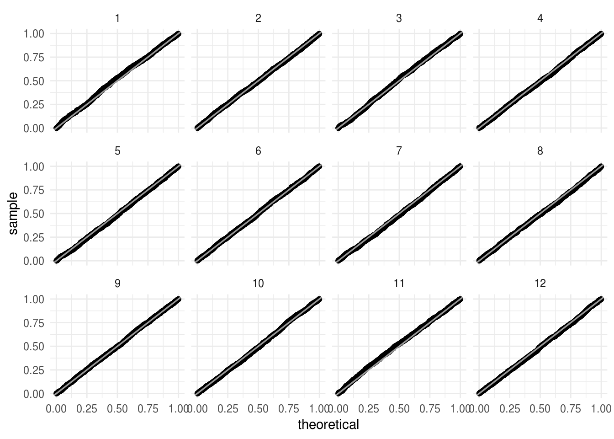
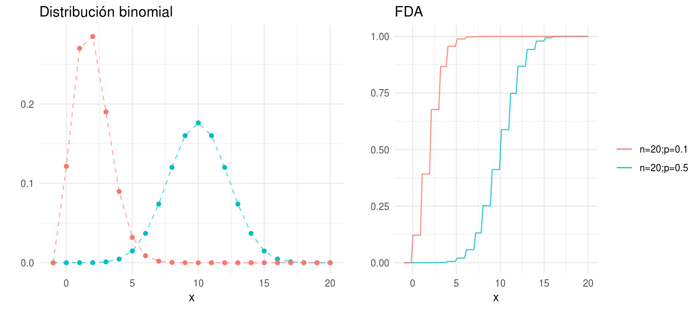
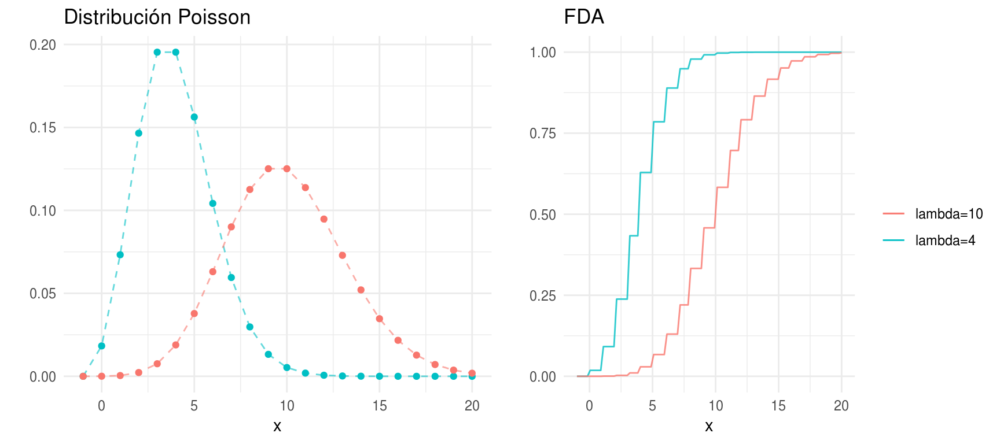
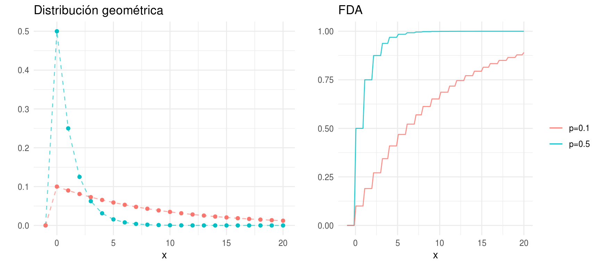
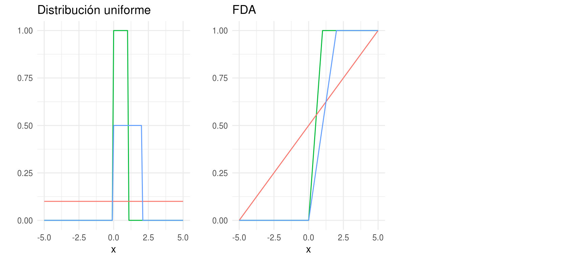
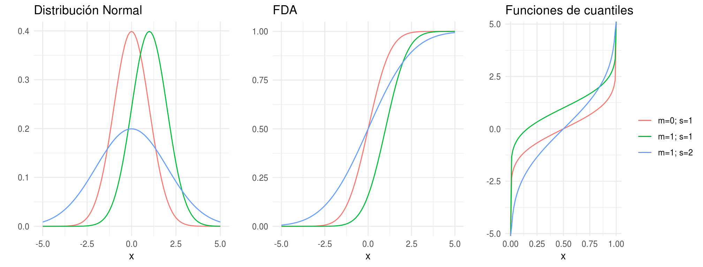
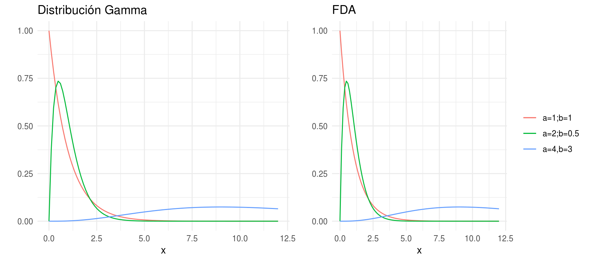
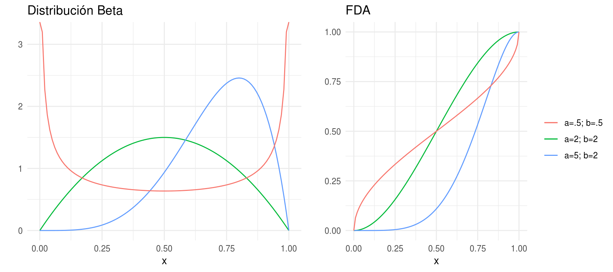
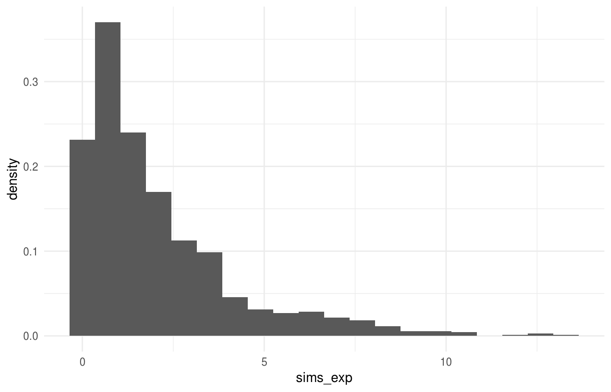

# Teoría básica de simulación

> "Any one who considers arithmetical methods of producing random digits is, of course, in a state of sin."
> -Von Neuman


La simulación de un modelo consiste en la construcción de un programa 
computacional que permite obtener los valores de las varibles de salida para
distintos valores de las variables de entrada con el objetivo de obtener 
conclusiones del sistema que apoyen la toma de decisiones (explicar y/o predecir
el comportamiento del sistema).  

Requerimientos prácticos de un proyecto de simulación: 

* Fuente de números aleatorios $U(0,1)$ (números pseudoaleatorios).  
* Transformar los números aleatorios en variables de entrada del modelo
(e.g. generación de muestras con cierta distribución).  
* Construir el programa computacional de simulación.  
* Analizar las distintas simulaciones del modelo para obtener conclusiones
acerca del sistema.   

## Números pseudoaleatorios

El objetivo es generar sucesiones $\{u_i\}_{i=1}^N$ de números independientes
que se puedan considerar como observaciones de una distribución uniforme
en el intervalo $(0, 1)$.

1. **Verdaderos números aleatorios. **Los números completamente aleatorios (no 
    determinísticos) son fáciles de imaginar  conceptualmente, por ejemplo 
    podemos imaginar lanzar una moneda, lanzar un dadoo una lotería.  
    En general los números aleatorios se basan en alguna fuente de aleatoreidad 
    física que puede ser teóricamente impredecible (cuántica) o prácticamente
    impredecible (caótica). Por ejemplo:
    - [random.org](http://www.random.org) genera aleatoreidad a través de ruido 
    atmosférico (el paquete `random` contiene funciones para obtener números de 
    random.org),  
    - [ERNIE](https://en.wikipedia.org/wiki/Premium_Bond#ERNIE), usa ruido 
    térmico en transistores y se utiliza en la lotería de bonos de Reino Unido.  
    - [RAND Corporation](https://www.rand.org/pubs/monograph_reports/MR1418/index2.html) 
    En 1955 publicó una tabla de un millón de números aleatorios
    que fue ampliamente utilizada. Los números en la tabla se obtuvieron de una
    ruleta electrónica.
    
    La desventaja de éstos métodos es que son costosos, tardados y no 
    reproducibles.

<div class="caja">
2. **Números pseudoaleatorios.** Los números pseudoaleatorios se generan de 
    manera secuencial con un algoritmo determinístico, formalmente se definen 
    por: 
    + **Función de inicialización**. Recibe un número (la semilla) y pone al 
    generador en su estado inicial.
    + **Función de transición**. Transforma el estado del generador.
    + **Función de salidas**. Transforma el estado para producir un número fijo 
    de bits (0 ó 1). 
    
    Una sucesión de bits pseudoaleatorios se obtiene definiendo la semilla y 
    llamando repetidamente la función de transición y la función de salidas.
</div>

  Esto implica, entre otras cosas, que una sucesión de números pseudoaletorios 
  esta completamente determinada por la semilla.
  
  <!--
  Since a computer can represent a real number with only finite accuracy, we 
  shall actually be generating integers X, between zero and some number m; the fraction
  U=X,/m will then lie between zero and one. Usually m is the word size (máximo número de 
bits que puede procesar el CPU en una llamada) of the computer -->

Buscamos que una secuencia de números pseudoaleatorios:

* no muestre ningún patrón o regularidad aparente desde un punto de vista 
estadístico, y 

* dada una semilla inicial, se puedan generar muchos valores antes de repetir el 
ciclo. 

Construir un buen algoritmo de números pseudo aleatorios es complicado, como 
veremos en los siguientes ejemplos.

#### Ejemplo: método de la parte media del cuadrado

En 1946 Jon Von Neuman sugirió usar las operaciones aritméticas de una 
computadora para generar secuencias de número pseudoaleatorios. 

Sugirió el método *middle square*, para generar secuencias de dígitos
pseudoaleatorios de 4 dígitos propuso:

1. Se inicia con una semilla de 4 dígitos. 
`seed = 9731`

2. La semilla se eleva al cuadrado, produciendo un número de 8 dígitos (si el
resultado tiene menos de 8 dígitos se añaden ceros al inicio).
`value = 94692361`

3. Los 4 números del centro serán el siguiente número en la secuencia, y se 
devuelven como resultado.
`seed = 6923`


```r
mid_square <- function(seed, n) {
   seeds <- numeric(n)
   values <- numeric(n)
   for(i in 1:n) {
       x <- seed ^ 2
       seed = case_when(
           nchar(x) > 2 ~ (x %/% 1e2) %% 1e4,
           TRUE ~ 0)
       values[i] <- x
       seeds[i] <- seed
   }
   cbind(seeds, values)
}
x <- mid_square(1931, 10) 
print(x, digits = 4)
#>       seeds   values
#>  [1,]  7287  3728761
#>  [2,]  1003 53100369
#>  [3,]    60  1006009
#>  [4,]    36     3600
#>  [5,]    12     1296
#>  [6,]     1      144
#>  [7,]     0        1
#>  [8,]     0        0
#>  [9,]     0        0
#> [10,]     0        0

x <- mid_square(9731, 100) 
print(x, digits = 4)
#>        seeds   values
#>   [1,]  6923 94692361
#>   [2,]  9279 47927929
#>   [3,]   998 86099841
#>   [4,]  9960   996004
#>   [5,]  2016 99201600
#>   [6,]   642  4064256
#>   [7,]  4121   412164
#>   [8,]  9826 16982641
#>   [9,]  5502 96550276
#>  [10,]  2720 30272004
#>  [11,]  3984  7398400
#>  [12,]  8722 15872256
#>  [13,]   732 76073284
#>  [14,]  5358   535824
#>  [15,]  7081 28708164
#>  [16,]  1405 50140561
#>  [17,]  9740  1974025
#>  [18,]  8676 94867600
#>  [19,]  2729 75272976
#>  [20,]  4474  7447441
#>  [21,]   166 20016676
#>  [22,]   275    27556
#>  [23,]   756    75625
#>  [24,]  5715   571536
#>  [25,]  6612 32661225
#>  [26,]  7185 43718544
#>  [27,]  6242 51624225
#>  [28,]  9625 38962564
#>  [29,]  6406 92640625
#>  [30,]   368 41036836
#>  [31,]  1354   135424
#>  [32,]  8333  1833316
#>  [33,]  4388 69438889
#>  [34,]  2545 19254544
#>  [35,]  4770  6477025
#>  [36,]  7529 22752900
#>  [37,]  6858 56685841
#>  [38,]   321 47032164
#>  [39,]  1030   103041
#>  [40,]   609  1060900
#>  [41,]  3708   370881
#>  [42,]  7492 13749264
#>  [43,]  1300 56130064
#>  [44,]  6900  1690000
#>  [45,]  6100 47610000
#>  [46,]  2100 37210000
#>  [47,]  4100  4410000
#>  [48,]  8100 16810000
#>  [49,]  6100 65610000
#>  [50,]  2100 37210000
#>  [51,]  4100  4410000
#>  [52,]  8100 16810000
#>  [53,]  6100 65610000
#>  [54,]  2100 37210000
#>  [55,]  4100  4410000
#>  [56,]  8100 16810000
#>  [57,]  6100 65610000
#>  [58,]  2100 37210000
#>  [59,]  4100  4410000
#>  [60,]  8100 16810000
#>  [61,]  6100 65610000
#>  [62,]  2100 37210000
#>  [63,]  4100  4410000
#>  [64,]  8100 16810000
#>  [65,]  6100 65610000
#>  [66,]  2100 37210000
#>  [67,]  4100  4410000
#>  [68,]  8100 16810000
#>  [69,]  6100 65610000
#>  [70,]  2100 37210000
#>  [71,]  4100  4410000
#>  [72,]  8100 16810000
#>  [73,]  6100 65610000
#>  [74,]  2100 37210000
#>  [75,]  4100  4410000
#>  [76,]  8100 16810000
#>  [77,]  6100 65610000
#>  [78,]  2100 37210000
#>  [79,]  4100  4410000
#>  [80,]  8100 16810000
#>  [81,]  6100 65610000
#>  [82,]  2100 37210000
#>  [83,]  4100  4410000
#>  [84,]  8100 16810000
#>  [85,]  6100 65610000
#>  [86,]  2100 37210000
#>  [87,]  4100  4410000
#>  [88,]  8100 16810000
#>  [89,]  6100 65610000
#>  [90,]  2100 37210000
#>  [91,]  4100  4410000
#>  [92,]  8100 16810000
#>  [93,]  6100 65610000
#>  [94,]  2100 37210000
#>  [95,]  4100  4410000
#>  [96,]  8100 16810000
#>  [97,]  6100 65610000
#>  [98,]  2100 37210000
#>  [99,]  4100  4410000
#> [100,]  8100 16810000
```

Este generador cae rápidamente en cilcos cortos, por ejemplo, si aparece un cero
se propagará por siempre. 

A inicios de 1950s se exploró el método y se propusieron mejoras, por ejemplo 
para evitar caer en cero. Metrópolis logró obtener una secuencia de 750,000 
números distintos al usar semillas de 38 bits (usaba sistema binario), además la
secuencia de Metrópolis mostraba propiedades deseables. No obstante, el método
del valor medio no es considerado un método bueno por lo común de los ciclos
cortos.

#### Ejemplo: rand {-}
Por muchos años (antes de 1995) el generador de la función _rand_ en Matlab fue 
el generador congruencial:
    
$$X_{n+1} = (7^5)X_n mod(2^{31}-1)$$
Construyamos sucesiones de longitud $1,500$ usando el algoritmo de _rand_:


```r
sucesion <- function(n = 1500, semilla = runif(1, 0, 2 ^ 31 - 1)){
    x <- rep(NA, n)
    u <- rep(NA, n)
    x[1] <- semilla
    u[1] <- x[1] / (2 ^ 31 - 1) # transformamos al (0, 1)
    for(i in 2:n){
        x[i] <- (7 ^ 5 * x[i - 1]) %% (2 ^ 31 - 1)
        u[i] <- x[i] / (2 ^ 31 - 1)
    }
    u
}
u_rand <- sucesion(n = 150000)
sucesiones <- map_df(1:12, ~data_frame(serie = ., sim = sucesion(), 
    ind = 1:length(sim)))
sucesiones
#> # A tibble: 18,000 x 3
#>    serie   sim   ind
#>    <int> <dbl> <int>
#>  1     1 0.845     1
#>  2     1 0.826     2
#>  3     1 0.667     3
#>  4     1 0.740     4
#>  5     1 0.774     5
#>  6     1 0.526     6
#>  7     1 0.701     7
#>  8     1 0.885     8
#>  9     1 0.163     9
#> 10     1 0.411    10
#> # ... with 17,990 more rows
```

Una propiedad deseable es que la sucesión de $u_i$ parezca una sucesión de 
observaciones independientes de una $Uniforme(0,1)$.

1. Veamos una gráfica del índice de simulación contra el valor obtenido


```r
ggplot(sucesiones, aes(x = ind, y = sim)) + 
  geom_point(alpha = 0.5, size = 1.5) +     # alpha controla la transparencia
  facet_wrap(~ serie) +
  geom_smooth(method = "loess", se = FALSE, color = "white", size = 0.7)
```


2. Comparemos con los cuantiles de una uniforme:


```r
ggplot(sucesiones) + 
  stat_qq(aes(sample = sim), distribution = qunif) +
  geom_abline(color = "white", size = 0.6, alpha = 0.6) +
  facet_wrap(~ serie) 
```



#### Ejemplo: RANDU {-}
*RANDU* fue generador de números aleatorios ampliamente utilizado en los 60´s 
y 70´s, se define como:

$$X_{n + 1}= (2 ^ {16} + 3)X_n mod(2^{31})$$

A primera vista las sucesiones se asemejan a una uniforme, sin embargo, 
cuando se grafican ternas emergen patrones no deseados.


```r
library(tourr)
library(plotly)

n <- 150000 # longitud de la sucesión
x <- rep(NA, n)
u <- rep(NA, n)
 
x[1] <- 4798373 # semilla
u[1] <- x[1] / (2 ^ 31 - 1) # transformamos al (0, 1)
for(i in 2:n){
    x[i] <- ((2 ^ 16 + 3) * x[i - 1]) %% (2 ^ 31)
    u[i] <- x[i] / (2 ^ 31)
}
u_randu <- u

set.seed(8111938)
mat <- matrix(u[1:1500], ncol = 3, byrow = TRUE)
tour <- new_tour(mat, grand_tour(), NULL)
steps <- seq(0, 1, 0.01)
names(steps) <- steps
mat_xy <- map_dfr(steps, ~data.frame(center(mat %*% tour(.)$proj)), 
    .id = "steps")
# step 0.72
mat_xy %>% 
    mutate(steps = as.numeric(steps)) %>% 
    plot_ly(x = ~X1, y = ~X2, frame = ~steps, type = 'scatter', 
        mode = 'markers', showlegend = F, marker = list(size = 5, 
            color = "black"), opacity=0.5) %>% 
    animation_opts(frame = 250)
```

<!--html_preserve--><div id="htmlwidget-e078194fa30572ab909d" style="width:450px;height:480px;" class="plotly html-widget"></div>
<script type="application/json" data-for="htmlwidget-e078194fa30572ab909d">{"x":{"visdat":{"343c1b1df93":["function () ","plotlyVisDat"]},"cur_data":"343c1b1df93","attrs":{"343c1b1df93":{"x":{},"y":{},"mode":"markers","showlegend":false,"marker":{"size":5,"color":"black"},"opacity":0.5,"frame":{},"alpha_stroke":1,"sizes":[10,100],"spans":[1,20],"type":"scatter"}},"layout":{"margin":{"b":40,"l":60,"t":25,"r":10},"xaxis":{"domain":[0,1],"automargin":true,"title":"X1","range":[-0.903468352164405,0.831223417219692]},"yaxis":{"domain":[0,1],"automargin":true,"title":"X2","range":[-0.861635771496615,0.819653510116218]},"hovermode":"closest","showlegend":false,"sliders":[{"currentvalue":{"prefix":"steps: ","xanchor":"right","font":{"size":16,"color":"rgba(204,204,204,1)"}},"steps":[{"method":"animate","args":[["0"],{"transition":{"duration":250,"easing":"linear"},"frame":{"duration":250,"redraw":true},"mode":"immediate"}],"label":"0","value":"0"},{"method":"animate","args":[["0.01"],{"transition":{"duration":250,"easing":"linear"},"frame":{"duration":250,"redraw":true},"mode":"immediate"}],"label":"0.01","value":"0.01"},{"method":"animate","args":[["0.02"],{"transition":{"duration":250,"easing":"linear"},"frame":{"duration":250,"redraw":true},"mode":"immediate"}],"label":"0.02","value":"0.02"},{"method":"animate","args":[["0.03"],{"transition":{"duration":250,"easing":"linear"},"frame":{"duration":250,"redraw":true},"mode":"immediate"}],"label":"0.03","value":"0.03"},{"method":"animate","args":[["0.04"],{"transition":{"duration":250,"easing":"linear"},"frame":{"duration":250,"redraw":true},"mode":"immediate"}],"label":"0.04","value":"0.04"},{"method":"animate","args":[["0.05"],{"transition":{"duration":250,"easing":"linear"},"frame":{"duration":250,"redraw":true},"mode":"immediate"}],"label":"0.05","value":"0.05"},{"method":"animate","args":[["0.06"],{"transition":{"duration":250,"easing":"linear"},"frame":{"duration":250,"redraw":true},"mode":"immediate"}],"label":"0.06","value":"0.06"},{"method":"animate","args":[["0.07"],{"transition":{"duration":250,"easing":"linear"},"frame":{"duration":250,"redraw":true},"mode":"immediate"}],"label":"0.07","value":"0.07"},{"method":"animate","args":[["0.08"],{"transition":{"duration":250,"easing":"linear"},"frame":{"duration":250,"redraw":true},"mode":"immediate"}],"label":"0.08","value":"0.08"},{"method":"animate","args":[["0.09"],{"transition":{"duration":250,"easing":"linear"},"frame":{"duration":250,"redraw":true},"mode":"immediate"}],"label":"0.09","value":"0.09"},{"method":"animate","args":[["0.1"],{"transition":{"duration":250,"easing":"linear"},"frame":{"duration":250,"redraw":true},"mode":"immediate"}],"label":"0.1","value":"0.1"},{"method":"animate","args":[["0.11"],{"transition":{"duration":250,"easing":"linear"},"frame":{"duration":250,"redraw":true},"mode":"immediate"}],"label":"0.11","value":"0.11"},{"method":"animate","args":[["0.12"],{"transition":{"duration":250,"easing":"linear"},"frame":{"duration":250,"redraw":true},"mode":"immediate"}],"label":"0.12","value":"0.12"},{"method":"animate","args":[["0.13"],{"transition":{"duration":250,"easing":"linear"},"frame":{"duration":250,"redraw":true},"mode":"immediate"}],"label":"0.13","value":"0.13"},{"method":"animate","args":[["0.14"],{"transition":{"duration":250,"easing":"linear"},"frame":{"duration":250,"redraw":true},"mode":"immediate"}],"label":"0.14","value":"0.14"},{"method":"animate","args":[["0.15"],{"transition":{"duration":250,"easing":"linear"},"frame":{"duration":250,"redraw":true},"mode":"immediate"}],"label":"0.15","value":"0.15"},{"method":"animate","args":[["0.16"],{"transition":{"duration":250,"easing":"linear"},"frame":{"duration":250,"redraw":true},"mode":"immediate"}],"label":"0.16","value":"0.16"},{"method":"animate","args":[["0.17"],{"transition":{"duration":250,"easing":"linear"},"frame":{"duration":250,"redraw":true},"mode":"immediate"}],"label":"0.17","value":"0.17"},{"method":"animate","args":[["0.18"],{"transition":{"duration":250,"easing":"linear"},"frame":{"duration":250,"redraw":true},"mode":"immediate"}],"label":"0.18","value":"0.18"},{"method":"animate","args":[["0.19"],{"transition":{"duration":250,"easing":"linear"},"frame":{"duration":250,"redraw":true},"mode":"immediate"}],"label":"0.19","value":"0.19"},{"method":"animate","args":[["0.2"],{"transition":{"duration":250,"easing":"linear"},"frame":{"duration":250,"redraw":true},"mode":"immediate"}],"label":"0.2","value":"0.2"},{"method":"animate","args":[["0.21"],{"transition":{"duration":250,"easing":"linear"},"frame":{"duration":250,"redraw":true},"mode":"immediate"}],"label":"0.21","value":"0.21"},{"method":"animate","args":[["0.22"],{"transition":{"duration":250,"easing":"linear"},"frame":{"duration":250,"redraw":true},"mode":"immediate"}],"label":"0.22","value":"0.22"},{"method":"animate","args":[["0.23"],{"transition":{"duration":250,"easing":"linear"},"frame":{"duration":250,"redraw":true},"mode":"immediate"}],"label":"0.23","value":"0.23"},{"method":"animate","args":[["0.24"],{"transition":{"duration":250,"easing":"linear"},"frame":{"duration":250,"redraw":true},"mode":"immediate"}],"label":"0.24","value":"0.24"},{"method":"animate","args":[["0.25"],{"transition":{"duration":250,"easing":"linear"},"frame":{"duration":250,"redraw":true},"mode":"immediate"}],"label":"0.25","value":"0.25"},{"method":"animate","args":[["0.26"],{"transition":{"duration":250,"easing":"linear"},"frame":{"duration":250,"redraw":true},"mode":"immediate"}],"label":"0.26","value":"0.26"},{"method":"animate","args":[["0.27"],{"transition":{"duration":250,"easing":"linear"},"frame":{"duration":250,"redraw":true},"mode":"immediate"}],"label":"0.27","value":"0.27"},{"method":"animate","args":[["0.28"],{"transition":{"duration":250,"easing":"linear"},"frame":{"duration":250,"redraw":true},"mode":"immediate"}],"label":"0.28","value":"0.28"},{"method":"animate","args":[["0.29"],{"transition":{"duration":250,"easing":"linear"},"frame":{"duration":250,"redraw":true},"mode":"immediate"}],"label":"0.29","value":"0.29"},{"method":"animate","args":[["0.3"],{"transition":{"duration":250,"easing":"linear"},"frame":{"duration":250,"redraw":true},"mode":"immediate"}],"label":"0.3","value":"0.3"},{"method":"animate","args":[["0.31"],{"transition":{"duration":250,"easing":"linear"},"frame":{"duration":250,"redraw":true},"mode":"immediate"}],"label":"0.31","value":"0.31"},{"method":"animate","args":[["0.32"],{"transition":{"duration":250,"easing":"linear"},"frame":{"duration":250,"redraw":true},"mode":"immediate"}],"label":"0.32","value":"0.32"},{"method":"animate","args":[["0.33"],{"transition":{"duration":250,"easing":"linear"},"frame":{"duration":250,"redraw":true},"mode":"immediate"}],"label":"0.33","value":"0.33"},{"method":"animate","args":[["0.34"],{"transition":{"duration":250,"easing":"linear"},"frame":{"duration":250,"redraw":true},"mode":"immediate"}],"label":"0.34","value":"0.34"},{"method":"animate","args":[["0.35"],{"transition":{"duration":250,"easing":"linear"},"frame":{"duration":250,"redraw":true},"mode":"immediate"}],"label":"0.35","value":"0.35"},{"method":"animate","args":[["0.36"],{"transition":{"duration":250,"easing":"linear"},"frame":{"duration":250,"redraw":true},"mode":"immediate"}],"label":"0.36","value":"0.36"},{"method":"animate","args":[["0.37"],{"transition":{"duration":250,"easing":"linear"},"frame":{"duration":250,"redraw":true},"mode":"immediate"}],"label":"0.37","value":"0.37"},{"method":"animate","args":[["0.38"],{"transition":{"duration":250,"easing":"linear"},"frame":{"duration":250,"redraw":true},"mode":"immediate"}],"label":"0.38","value":"0.38"},{"method":"animate","args":[["0.39"],{"transition":{"duration":250,"easing":"linear"},"frame":{"duration":250,"redraw":true},"mode":"immediate"}],"label":"0.39","value":"0.39"},{"method":"animate","args":[["0.4"],{"transition":{"duration":250,"easing":"linear"},"frame":{"duration":250,"redraw":true},"mode":"immediate"}],"label":"0.4","value":"0.4"},{"method":"animate","args":[["0.41"],{"transition":{"duration":250,"easing":"linear"},"frame":{"duration":250,"redraw":true},"mode":"immediate"}],"label":"0.41","value":"0.41"},{"method":"animate","args":[["0.42"],{"transition":{"duration":250,"easing":"linear"},"frame":{"duration":250,"redraw":true},"mode":"immediate"}],"label":"0.42","value":"0.42"},{"method":"animate","args":[["0.43"],{"transition":{"duration":250,"easing":"linear"},"frame":{"duration":250,"redraw":true},"mode":"immediate"}],"label":"0.43","value":"0.43"},{"method":"animate","args":[["0.44"],{"transition":{"duration":250,"easing":"linear"},"frame":{"duration":250,"redraw":true},"mode":"immediate"}],"label":"0.44","value":"0.44"},{"method":"animate","args":[["0.45"],{"transition":{"duration":250,"easing":"linear"},"frame":{"duration":250,"redraw":true},"mode":"immediate"}],"label":"0.45","value":"0.45"},{"method":"animate","args":[["0.46"],{"transition":{"duration":250,"easing":"linear"},"frame":{"duration":250,"redraw":true},"mode":"immediate"}],"label":"0.46","value":"0.46"},{"method":"animate","args":[["0.47"],{"transition":{"duration":250,"easing":"linear"},"frame":{"duration":250,"redraw":true},"mode":"immediate"}],"label":"0.47","value":"0.47"},{"method":"animate","args":[["0.48"],{"transition":{"duration":250,"easing":"linear"},"frame":{"duration":250,"redraw":true},"mode":"immediate"}],"label":"0.48","value":"0.48"},{"method":"animate","args":[["0.49"],{"transition":{"duration":250,"easing":"linear"},"frame":{"duration":250,"redraw":true},"mode":"immediate"}],"label":"0.49","value":"0.49"},{"method":"animate","args":[["0.5"],{"transition":{"duration":250,"easing":"linear"},"frame":{"duration":250,"redraw":true},"mode":"immediate"}],"label":"0.5","value":"0.5"},{"method":"animate","args":[["0.51"],{"transition":{"duration":250,"easing":"linear"},"frame":{"duration":250,"redraw":true},"mode":"immediate"}],"label":"0.51","value":"0.51"},{"method":"animate","args":[["0.52"],{"transition":{"duration":250,"easing":"linear"},"frame":{"duration":250,"redraw":true},"mode":"immediate"}],"label":"0.52","value":"0.52"},{"method":"animate","args":[["0.53"],{"transition":{"duration":250,"easing":"linear"},"frame":{"duration":250,"redraw":true},"mode":"immediate"}],"label":"0.53","value":"0.53"},{"method":"animate","args":[["0.54"],{"transition":{"duration":250,"easing":"linear"},"frame":{"duration":250,"redraw":true},"mode":"immediate"}],"label":"0.54","value":"0.54"},{"method":"animate","args":[["0.55"],{"transition":{"duration":250,"easing":"linear"},"frame":{"duration":250,"redraw":true},"mode":"immediate"}],"label":"0.55","value":"0.55"},{"method":"animate","args":[["0.56"],{"transition":{"duration":250,"easing":"linear"},"frame":{"duration":250,"redraw":true},"mode":"immediate"}],"label":"0.56","value":"0.56"},{"method":"animate","args":[["0.57"],{"transition":{"duration":250,"easing":"linear"},"frame":{"duration":250,"redraw":true},"mode":"immediate"}],"label":"0.57","value":"0.57"},{"method":"animate","args":[["0.58"],{"transition":{"duration":250,"easing":"linear"},"frame":{"duration":250,"redraw":true},"mode":"immediate"}],"label":"0.58","value":"0.58"},{"method":"animate","args":[["0.59"],{"transition":{"duration":250,"easing":"linear"},"frame":{"duration":250,"redraw":true},"mode":"immediate"}],"label":"0.59","value":"0.59"},{"method":"animate","args":[["0.6"],{"transition":{"duration":250,"easing":"linear"},"frame":{"duration":250,"redraw":true},"mode":"immediate"}],"label":"0.6","value":"0.6"},{"method":"animate","args":[["0.61"],{"transition":{"duration":250,"easing":"linear"},"frame":{"duration":250,"redraw":true},"mode":"immediate"}],"label":"0.61","value":"0.61"},{"method":"animate","args":[["0.62"],{"transition":{"duration":250,"easing":"linear"},"frame":{"duration":250,"redraw":true},"mode":"immediate"}],"label":"0.62","value":"0.62"},{"method":"animate","args":[["0.63"],{"transition":{"duration":250,"easing":"linear"},"frame":{"duration":250,"redraw":true},"mode":"immediate"}],"label":"0.63","value":"0.63"},{"method":"animate","args":[["0.64"],{"transition":{"duration":250,"easing":"linear"},"frame":{"duration":250,"redraw":true},"mode":"immediate"}],"label":"0.64","value":"0.64"},{"method":"animate","args":[["0.65"],{"transition":{"duration":250,"easing":"linear"},"frame":{"duration":250,"redraw":true},"mode":"immediate"}],"label":"0.65","value":"0.65"},{"method":"animate","args":[["0.66"],{"transition":{"duration":250,"easing":"linear"},"frame":{"duration":250,"redraw":true},"mode":"immediate"}],"label":"0.66","value":"0.66"},{"method":"animate","args":[["0.67"],{"transition":{"duration":250,"easing":"linear"},"frame":{"duration":250,"redraw":true},"mode":"immediate"}],"label":"0.67","value":"0.67"},{"method":"animate","args":[["0.68"],{"transition":{"duration":250,"easing":"linear"},"frame":{"duration":250,"redraw":true},"mode":"immediate"}],"label":"0.68","value":"0.68"},{"method":"animate","args":[["0.69"],{"transition":{"duration":250,"easing":"linear"},"frame":{"duration":250,"redraw":true},"mode":"immediate"}],"label":"0.69","value":"0.69"},{"method":"animate","args":[["0.7"],{"transition":{"duration":250,"easing":"linear"},"frame":{"duration":250,"redraw":true},"mode":"immediate"}],"label":"0.7","value":"0.7"},{"method":"animate","args":[["0.71"],{"transition":{"duration":250,"easing":"linear"},"frame":{"duration":250,"redraw":true},"mode":"immediate"}],"label":"0.71","value":"0.71"},{"method":"animate","args":[["0.72"],{"transition":{"duration":250,"easing":"linear"},"frame":{"duration":250,"redraw":true},"mode":"immediate"}],"label":"0.72","value":"0.72"},{"method":"animate","args":[["0.73"],{"transition":{"duration":250,"easing":"linear"},"frame":{"duration":250,"redraw":true},"mode":"immediate"}],"label":"0.73","value":"0.73"},{"method":"animate","args":[["0.74"],{"transition":{"duration":250,"easing":"linear"},"frame":{"duration":250,"redraw":true},"mode":"immediate"}],"label":"0.74","value":"0.74"},{"method":"animate","args":[["0.75"],{"transition":{"duration":250,"easing":"linear"},"frame":{"duration":250,"redraw":true},"mode":"immediate"}],"label":"0.75","value":"0.75"},{"method":"animate","args":[["0.76"],{"transition":{"duration":250,"easing":"linear"},"frame":{"duration":250,"redraw":true},"mode":"immediate"}],"label":"0.76","value":"0.76"},{"method":"animate","args":[["0.77"],{"transition":{"duration":250,"easing":"linear"},"frame":{"duration":250,"redraw":true},"mode":"immediate"}],"label":"0.77","value":"0.77"},{"method":"animate","args":[["0.78"],{"transition":{"duration":250,"easing":"linear"},"frame":{"duration":250,"redraw":true},"mode":"immediate"}],"label":"0.78","value":"0.78"},{"method":"animate","args":[["0.79"],{"transition":{"duration":250,"easing":"linear"},"frame":{"duration":250,"redraw":true},"mode":"immediate"}],"label":"0.79","value":"0.79"},{"method":"animate","args":[["0.8"],{"transition":{"duration":250,"easing":"linear"},"frame":{"duration":250,"redraw":true},"mode":"immediate"}],"label":"0.8","value":"0.8"},{"method":"animate","args":[["0.81"],{"transition":{"duration":250,"easing":"linear"},"frame":{"duration":250,"redraw":true},"mode":"immediate"}],"label":"0.81","value":"0.81"},{"method":"animate","args":[["0.82"],{"transition":{"duration":250,"easing":"linear"},"frame":{"duration":250,"redraw":true},"mode":"immediate"}],"label":"0.82","value":"0.82"},{"method":"animate","args":[["0.83"],{"transition":{"duration":250,"easing":"linear"},"frame":{"duration":250,"redraw":true},"mode":"immediate"}],"label":"0.83","value":"0.83"},{"method":"animate","args":[["0.84"],{"transition":{"duration":250,"easing":"linear"},"frame":{"duration":250,"redraw":true},"mode":"immediate"}],"label":"0.84","value":"0.84"},{"method":"animate","args":[["0.85"],{"transition":{"duration":250,"easing":"linear"},"frame":{"duration":250,"redraw":true},"mode":"immediate"}],"label":"0.85","value":"0.85"},{"method":"animate","args":[["0.86"],{"transition":{"duration":250,"easing":"linear"},"frame":{"duration":250,"redraw":true},"mode":"immediate"}],"label":"0.86","value":"0.86"},{"method":"animate","args":[["0.87"],{"transition":{"duration":250,"easing":"linear"},"frame":{"duration":250,"redraw":true},"mode":"immediate"}],"label":"0.87","value":"0.87"},{"method":"animate","args":[["0.88"],{"transition":{"duration":250,"easing":"linear"},"frame":{"duration":250,"redraw":true},"mode":"immediate"}],"label":"0.88","value":"0.88"},{"method":"animate","args":[["0.89"],{"transition":{"duration":250,"easing":"linear"},"frame":{"duration":250,"redraw":true},"mode":"immediate"}],"label":"0.89","value":"0.89"},{"method":"animate","args":[["0.9"],{"transition":{"duration":250,"easing":"linear"},"frame":{"duration":250,"redraw":true},"mode":"immediate"}],"label":"0.9","value":"0.9"},{"method":"animate","args":[["0.91"],{"transition":{"duration":250,"easing":"linear"},"frame":{"duration":250,"redraw":true},"mode":"immediate"}],"label":"0.91","value":"0.91"},{"method":"animate","args":[["0.92"],{"transition":{"duration":250,"easing":"linear"},"frame":{"duration":250,"redraw":true},"mode":"immediate"}],"label":"0.92","value":"0.92"},{"method":"animate","args":[["0.93"],{"transition":{"duration":250,"easing":"linear"},"frame":{"duration":250,"redraw":true},"mode":"immediate"}],"label":"0.93","value":"0.93"},{"method":"animate","args":[["0.94"],{"transition":{"duration":250,"easing":"linear"},"frame":{"duration":250,"redraw":true},"mode":"immediate"}],"label":"0.94","value":"0.94"},{"method":"animate","args":[["0.95"],{"transition":{"duration":250,"easing":"linear"},"frame":{"duration":250,"redraw":true},"mode":"immediate"}],"label":"0.95","value":"0.95"},{"method":"animate","args":[["0.96"],{"transition":{"duration":250,"easing":"linear"},"frame":{"duration":250,"redraw":true},"mode":"immediate"}],"label":"0.96","value":"0.96"},{"method":"animate","args":[["0.97"],{"transition":{"duration":250,"easing":"linear"},"frame":{"duration":250,"redraw":true},"mode":"immediate"}],"label":"0.97","value":"0.97"},{"method":"animate","args":[["0.98"],{"transition":{"duration":250,"easing":"linear"},"frame":{"duration":250,"redraw":true},"mode":"immediate"}],"label":"0.98","value":"0.98"},{"method":"animate","args":[["0.99"],{"transition":{"duration":250,"easing":"linear"},"frame":{"duration":250,"redraw":true},"mode":"immediate"}],"label":"0.99","value":"0.99"},{"method":"animate","args":[["1"],{"transition":{"duration":250,"easing":"linear"},"frame":{"duration":250,"redraw":true},"mode":"immediate"}],"label":"1","value":"1"}],"visible":true,"pad":{"t":40}}],"updatemenus":[{"type":"buttons","direction":"right","showactive":false,"y":0,"x":0,"yanchor":"top","xanchor":"right","pad":{"t":60,"r":5},"buttons":[{"label":"Play","method":"animate","args":[null,{"fromcurrent":true,"mode":"immediate","transition":{"duration":250,"easing":"linear"},"frame":{"duration":250,"redraw":true}}]}]}]},"source":"A","config":{"modeBarButtonsToAdd":[{"name":"Collaborate","icon":{"width":1000,"ascent":500,"descent":-50,"path":"M487 375c7-10 9-23 5-36l-79-259c-3-12-11-23-22-31-11-8-22-12-35-12l-263 0c-15 0-29 5-43 15-13 10-23 23-28 37-5 13-5 25-1 37 0 0 0 3 1 7 1 5 1 8 1 11 0 2 0 4-1 6 0 3-1 5-1 6 1 2 2 4 3 6 1 2 2 4 4 6 2 3 4 5 5 7 5 7 9 16 13 26 4 10 7 19 9 26 0 2 0 5 0 9-1 4-1 6 0 8 0 2 2 5 4 8 3 3 5 5 5 7 4 6 8 15 12 26 4 11 7 19 7 26 1 1 0 4 0 9-1 4-1 7 0 8 1 2 3 5 6 8 4 4 6 6 6 7 4 5 8 13 13 24 4 11 7 20 7 28 1 1 0 4 0 7-1 3-1 6-1 7 0 2 1 4 3 6 1 1 3 4 5 6 2 3 3 5 5 6 1 2 3 5 4 9 2 3 3 7 5 10 1 3 2 6 4 10 2 4 4 7 6 9 2 3 4 5 7 7 3 2 7 3 11 3 3 0 8 0 13-1l0-1c7 2 12 2 14 2l218 0c14 0 25-5 32-16 8-10 10-23 6-37l-79-259c-7-22-13-37-20-43-7-7-19-10-37-10l-248 0c-5 0-9-2-11-5-2-3-2-7 0-12 4-13 18-20 41-20l264 0c5 0 10 2 16 5 5 3 8 6 10 11l85 282c2 5 2 10 2 17 7-3 13-7 17-13z m-304 0c-1-3-1-5 0-7 1-1 3-2 6-2l174 0c2 0 4 1 7 2 2 2 4 4 5 7l6 18c0 3 0 5-1 7-1 1-3 2-6 2l-173 0c-3 0-5-1-8-2-2-2-4-4-4-7z m-24-73c-1-3-1-5 0-7 2-2 3-2 6-2l174 0c2 0 5 0 7 2 3 2 4 4 5 7l6 18c1 2 0 5-1 6-1 2-3 3-5 3l-174 0c-3 0-5-1-7-3-3-1-4-4-5-6z"},"click":"function(gd) { \n        // is this being viewed in RStudio?\n        if (location.search == '?viewer_pane=1') {\n          alert('To learn about plotly for collaboration, visit:\\n https://cpsievert.github.io/plotly_book/plot-ly-for-collaboration.html');\n        } else {\n          window.open('https://cpsievert.github.io/plotly_book/plot-ly-for-collaboration.html', '_blank');\n        }\n      }"}],"cloud":false},"data":[{"x":[-0.525382243650858,0.270230897147206,-0.0727382270582042,0.404949423301963,0.224574088495223,0.250008896369485,0.117107595693318,0.398462418843059,-0.523328938145193,-0.407728291671725,-0.179394137669357,-0.122221100699159,-0.490475372035058,-0.0553499754481038,-0.10121475588158,0.215672988820819,-0.236963861245664,0.309480347115544,-0.210268702913078,0.365454700220374,0.351575940292327,-0.10023798010871,-0.380573694217952,-0.146354283761235,-0.133770533461126,-0.200198240201922,0.0391516270153204,0.389842670787124,-0.158894166905435,-0.444454311948272,0.164452533613888,0.218767930198459,0.25870893095061,-0.180401138585063,-0.00933444182947485,0.339507874477653,0.469371020238844,0.175932303447274,-0.339991663206371,-0.283061321448537,-0.10025117601827,0.269277535755185,-0.044768047142776,-0.389660406481477,-0.0746178781576476,0.36420860924199,0.394835780750958,0.144193727899341,0.282314843874423,0.458911635357884,0.304844829630105,0.246176328886298,0.392778664272276,0.0786418173499385,0.242149587165562,0.0773305635936538,-0.020060904879125,-0.126132018487903,0.144408363293854,0.0794308003075399,0.346704080145804,0.148104608435182,-0.418487866032871,-0.235466610264035,-0.306404911536725,0.440431364256887,-0.516388115096839,0.371714946258811,-0.149319291669878,0.287700131911782,-0.279291544664653,-0.484001870822164,-0.201427259106191,0.291429542381314,-0.0911951182372889,-0.0455350760333262,0.35348479394242,-0.385612994056197,-0.182378758300098,-0.405442576479169,0.391353375654666,0.0318582434244433,-0.245128002572807,-0.130433890592309,-0.0139785116501174,-0.337395682554694,0.302105839740483,-0.393694366883489,-0.163515277761968,-0.495493836324664,-0.222891968298706,-0.490021902691575,0.358199849169699,-0.100103377919646,-0.202134747613223,0.39122383706644,-0.186544083613904,0.0555799681730547,0.323092940639702,0.260359701145438,-0.144192159730943,-0.257461055736991,-0.455674861181529,0.413804833222179,-0.136427499908956,0.300329290706662,0.00456683654710444,-0.362306046854707,0.437387331765143,0.0711617771573344,0.318508814465252,-0.34632186181471,0.436831421595065,0.388671733815221,-0.130695012021812,-0.0680868957154475,-0.0688908999748549,0.246376082677392,-0.14308774899319,-0.00376501269266216,0.438796035390345,-0.229182131212207,0.0729928197376409,0.346523624289779,-0.168352172333749,-0.375601708512755,-0.22262092362717,0.123253334689883,0.277471102219073,0.462896235663442,0.0511009128801504,-0.360768798362466,-0.402942896444352,-0.427324696999045,0.000975574743000585,-0.0964771468155107,0.410177789073435,-0.187421656768771,0.190760004710404,0.262565743554381,0.445644422810523,-0.0144905146174154,-0.326134313452991,0.283469934392718,0.39042866919562,-0.235296330969783,0.00263598878308913,0.00450637601688297,-0.347153813201936,0.299683675546197,-0.410813991535457,-0.322217311333867,0.414802722077815,-0.373095340650531,-0.207195085097106,0.129106443751601,0.348102703135459,0.0100861791558543,0.10892079342529,-0.139964054893704,0.369820333462206,0.335231729228047,-0.165372010875495,0.0171185102350989,-0.188266814310106,-0.314664229374381,-0.414223049391063,0.353316251564769,0.378818295340983,0.219778262455014,0.0406265737526097,0.306619357693938,0.271810754578559,-0.516593306880446,0.285059045445172,0.320846874643115,-0.151175194043668,0.270305611569432,0.134357187341897,-0.466365012895318,0.201037436168639,0.167253658551721,-0.193455700386318,-0.043387200307103,0.0174344698004403,-0.0981319021396361,0.322286504697053,0.272765618193892,0.113619163077323,-0.379563152413817,0.00635759104415556,0.375985730815677,-0.000316702384503764,0.220438011366872,0.465666356872765,-0.222189310561868,-0.137859225828203,-0.137253090362998,0.418846453916279,0.00634909086301716,0.334923706393687,-0.211469389121981,-0.247591268826278,0.122393858063964,0.434441014569251,-0.434170037131759,0.178456078659741,-0.522276978563519,0.0336995193771996,-0.109170876067134,-0.13103922884539,-0.15941199995205,0.25048753563687,0.0688125941939631,0.441604311954228,0.0133893828876296,0.124620966058222,0.299809746820478,-0.327820223379882,0.0675402101166526,-0.0407481050081571,-0.10607314072177,0.308556656729428,0.320516754318027,-0.298760317821058,-0.458633355420085,0.361208203624932,0.180096801746635,-0.264415443498643,-0.237864717464896,0.245301272165028,-0.0192145664207659,0.468923709731547,-0.339563048999759,0.14934866447374,-0.0625716928355416,0.077089890282599,0.108755857128648,0.00542397369071634,0.341012437272815,-0.208267503041776,-0.513374231379481,0.43593892772123,0.121654477346686,0.101001172702757,0.0990870449729243,0.0519832329861799,-0.0962234992496691,0.239291898351161,0.39983116872981,-0.521773081827911,-0.321530717980119,0.341055586379019,0.144032776731996,-0.520614822018894,0.218043078113345,-0.366330825347455,-0.404130808632823,-0.436754283118995,0.357765909660605,0.0443692201785723,-0.0842725481800756,0.435258592855183,0.26978934221342,-0.403752007145437,-0.147901154678317,-0.320311438847335,-0.145738232504578,-0.0316879307813963,-0.136839061599227,0.0423299180380979,0.372629184652118,-0.405396573800596,-0.20695289186761,-0.310216155458244,0.448123481500892,-0.322616965133699,0.227803573388604,-0.179701749790462,-0.441561784218999,-0.510623045820745,-0.343966073911639,0.00117011685296675,0.145591896403579,0.340084924738852,-0.44076883755252,-0.392289657700809,0.467978764701632,-0.418848537463697,-0.443202785771342,-0.261228915859016,0.319607075680045,0.0257994527034441,-0.269250020008536,-0.0161643965132556,-0.258475120734426,0.157326243262736,0.255117856342343,0.416670608710496,-0.149566698443147,-0.498337761122735,0.455021769184617,0.190541099201886,-0.0905126739256105,-0.461008005399259,0.42044470496848,0.109987709116189,-0.233715924989434,-0.470562190372499,0.299688741941003,-0.445833448875697,-0.21696140952036,-0.372194178957494,0.397519581396131,0.126751560162751,0.383947115767745,-0.337605402428659,0.202998578924684,0.407399337183682,0.344737876582889,-0.0471337666697821,0.472002275664357,0.17977649290487,-0.0505906376950463,-0.457820058424028,-0.510570570450278,-0.488850508440288,0.139156107235698,0.217588148456065,-0.363904453437777,0.0585369946472326,-0.221518028151246,-0.304304913241418,0.38531491198018,-0.0235752953179201,0.16350092403963,0.346577889662234,-0.145829878371211,-0.198957291055473,-0.102574679624291,-0.168029815513643,0.0344691131301204,-0.313794676769527,0.258241687346248,0.0325081864409127,-0.171610302846881,0.365713435601441,0.18357400261238,-0.360960707623514,0.0138115886636058,0.217319350134579,-0.00226552374288647,-0.217006825465711,0.264335938174275,-0.196745869327339,0.00596183203533074,0.0808153742961564,0.348992362994698,0.262317444574086,0.0808470886237898,0.46746339593455,-0.36336652151868,-0.0714700935371241,0.365946840871123,0.193965300362555,0.0300169292874614,-0.44865207802132,0.221584041047839,0.364040798883883,0.454574920613317,-0.507558968473228,-0.46216371990368,0.38478484694287,0.0268712494559565,0.27403175402805,-0.460288431119176,-0.293586262125524,0.0277458358593264,-0.146202069330963,0.209511619437484,0.226073696654288,-0.194853245835753,0.00133756865188261,0.451382626224307,-0.269288026351484,-0.268350235741588,0.151196184944359,0.123053547371177,-0.245989561636003,0.341665342826394,0.107456650029866,0.0597618859298505,0.222381673198191,-0.226666785400363,-0.0251084683425745,0.215366971123962,0.265027567189185,-0.359895616393538,-0.308322061408313,0.0456507395990172,-0.436939590234311,0.457010664422063,-0.461325135637077,0.258806016672401,-0.387313515502962,-0.253378286581489,0.000263031017033177,0.0581122975833692,0.277452162843196,-0.0503104399852476,0.35174723286554,0.00179902874305637,0.00455249790474566,0.265480637926606,0.348321180235592,-0.394903611015531,0.0802023181728998,-0.453204683583232,0.390594843219964,-0.190526429187509,0.299069821279494,0.374674931544808,-0.458315704572948,0.44406456165388,0.422772667746989,0.437796317417172,-0.229135942269119,-0.195718574892732,-0.197563425261529,0.341553837437181,-0.2012180579789,-0.527384917806836,-0.45968359019235,-0.0281710844449721,-0.0807636050470195,-0.49337640739605,-0.434520215351137,-0.461552932482215,0.172516341697422,0.119107935953883,-0.00144685115292875,0.423322432119397,0.245303529690949,-0.0245247069709025,0.18053038362786,-0.0417101975493154,0.472137372385708,0.2332898270376,-0.25935610439256,0.257624157149343,0.313442292999474,0.449010964859275,0.0782982105426469,0.230247691649942,-0.314882431734355,-0.523080821704122,-0.365933932919057,-0.103375650566073,-0.485310327816757,-0.514770734678956,0.324747010510413,0.135341853279618,-0.100972880233081,0.214391131330279,-0.482511513490232,-0.0156187634877881,0.238617810796944,-0.397421929609033,-0.0820305651016555,-0.377926125746222,-0.276591126430782,-0.096637453507634,-0.252353616613897,0.152746014673261,-0.454790991354736,0.420579474795608,-0.41493795867637,0.322050810236482,0.211653332602231,-0.0146229971162997,0.246216393452136,0.286987848956136,0.336730721782891,0.300454792011527,0.0790002936534562,-0.434389814358207,0.282873656045643,0.276489798355845,0.0466915587000528,0.2914188731499,0.0296105625145116,-0.514250445734712,-0.0244864379949888,-0.102555006366225,-0.356219340670856,-0.142107050489636,0.341256327372042,0.355019189793614,-0.273688700605186,-0.257041487466546],"y":[-0.0468667016588151,-0.35723186910525,-0.210663167502731,-0.0397462125159801,0.341185888532549,0.313059159811586,0.0947141445018351,-0.191531444642693,-0.475277097638696,-0.124507873062044,-0.332388711836189,-0.268718722019345,-0.285407805558294,0.39795910685882,0.466114277277142,-0.0279856722094119,-0.394502179440111,0.0124696057997644,0.179479779932648,-0.484402256760746,-0.0844491810761393,0.483021655377001,-0.439345350231975,0.0665965725444257,-0.206992508586496,0.187535406347364,-0.0615170427821577,-0.121199282560498,0.215195184830576,-0.111150777641684,0.0346005207635462,-0.188622723076493,0.504625572148711,-0.330221726302057,0.210016938183457,-0.013414608988911,0.0872954337634146,0.407235631044954,0.266385117802769,0.424053584482521,-0.381825061257929,0.160415859218687,-0.0730416902564466,0.0266196106337012,-0.401116573926061,-0.151958889070898,0.122234637174755,0.292732795026153,-0.387447314079851,-0.410330279473215,0.205289127562195,0.130418879237026,0.300877740863711,0.0860672977529466,0.221793243918568,0.147807364609092,0.208355127159506,0.413640321489423,0.359721916053444,-0.204778643999249,-0.381291324015707,-0.392067766491324,-0.296251928176731,-0.266170094463974,0.508502794686705,0.411182032223791,0.419324668381363,-0.194137143645436,-0.257056751962751,-0.441054633561522,0.491454223427922,-0.0186118136383592,-0.361134560521692,-0.0192218709029258,0.143145846460015,-0.343348148021847,0.01991019237414,0.28998255103454,0.0585597700215876,-0.321019868109375,-0.111112968739122,-0.0625842052735389,-0.464160619046539,0.473244470801204,-0.157675036903471,0.404361048039049,-0.30536924835667,-0.355111176822335,0.352210758510977,-0.190538882020861,-0.136710328724235,0.434519497003406,0.039914733055979,0.304714524444193,0.270776177082211,0.39905749752745,0.067304028455168,-0.364465906027705,0.168236585590988,-0.305546628985554,-0.229956606145948,0.239868053492159,0.505273023877293,0.334964548494667,-0.341916532929987,0.261383624073118,0.285900460813194,-0.196004810485989,-0.0916634441576899,-0.148286885324866,-0.270808761682361,0.391498525884003,0.474539919082075,0.136762515898794,0.359607102606446,-0.367058294568211,-0.0606934518776834,0.222082593735307,0.152018735442311,0.224833135750145,0.233363447967917,-0.387697516683489,-0.143587214615196,-0.208187672052533,0.346977418545634,0.419625782664865,-0.372713600959629,-0.119697759602219,0.1585683359541,-0.263610853556544,0.0827292523123324,-0.446275877509266,0.505509933713824,-0.453316620294005,-0.0818069183491171,-0.0357251416184008,-0.377881915982813,-0.447962968353182,0.199948715303093,0.276266810741276,0.0698265789784491,0.286162489350885,0.463230604562908,0.316030164506286,0.284550411883742,-0.106235428456217,-0.259931144978851,0.32337777062878,-0.133763441558927,-0.0515883776582778,-0.35819124218449,0.17963248982653,-0.264397741969675,-0.315530894998461,-0.378682179119438,0.487217036332935,0.283060794953257,0.0180956956706941,-0.46011969980225,-0.124193678352982,-0.3651652203165,-0.267698122862727,-0.336220768954605,-0.0899577017165721,0.161256930116564,0.201071032579988,0.215565959248692,-0.0261886964775623,0.35225835281983,0.0275430393181741,-0.394982827570289,0.506083903159946,0.185044324282557,-0.0287396374382078,0.464779431257397,-0.0366827647425235,0.108957572165877,-0.460523350838572,-0.384298799302429,-0.116580146107823,-0.227470943447202,-0.382472178641707,0.0868523812629282,0.426279072906822,-0.382283748801798,-0.486734329465777,0.315231340263039,-0.234149190340191,0.466328924778849,-0.209446049038321,-0.349840556945652,-0.291188071224839,0.22364242214337,0.266826973553747,0.287363084290177,-0.0852249141074717,-0.175801554437727,-0.450289300385863,-0.242256780829281,0.0930660714171826,-0.455206664022058,0.487706334587187,0.0958323946930469,-0.448936345729977,-0.190346145745367,-0.0900635781921446,-0.187060719098896,0.469101925637573,-0.38719953757152,0.0299534362517297,-0.200019297864288,0.276935142721981,-0.317401895042509,-0.111389121714979,0.285001168284565,0.50676507249102,-0.486505510028452,0.210996867414564,-0.0296200939677655,0.497830835428089,0.38994587052241,0.0524302360378205,0.474725390110165,0.327561249282211,-0.472469674166292,-0.391480876807123,0.204457374546677,0.344289672818035,0.456248542550951,-0.435717931691557,-0.219923576083034,-0.323468650434166,-0.228987904008478,0.357331604953855,0.142120944593102,0.0938232515715062,0.374319231394678,-0.269879645410925,0.46181171599403,-0.405873576853424,0.336118145171553,-0.0537503796853124,-0.0186160781644286,0.0927908246181905,0.495857766155153,0.0458404806219041,-0.0908933186195791,-0.411917323920876,-0.068273963149637,-0.485032616857439,0.493990080688149,0.178274301137775,0.422075694683939,-0.255845761600882,0.4051797038652,0.305296470668167,0.024037553254515,-0.349066986445338,-0.458961335685104,-0.400046753440052,-0.105678716417402,-0.158535173837095,0.392917135987431,-0.296300674531609,0.477203695360571,-0.31377646208182,0.0886093846298755,0.441979882564396,0.184704518202692,-0.315258151594549,0.240498299036175,-0.275867084715515,-0.306050317104906,0.494419888850302,-0.27661257770285,-0.455145912919194,-0.0132778973542154,-0.0016036841310561,0.507020483050495,0.462224071171135,0.256199954334647,-0.212518094781786,-0.331711573269218,-0.0727016057111323,-0.194117540236563,0.431155645545572,-0.291876053180546,-0.159740219566971,0.0657031669057906,-0.0873766678608953,0.298083516094834,-0.291867005381733,-0.149669268842787,-0.397061339322478,-0.418383082117885,-0.220937813375145,-0.0153428034149111,0.149186820980161,0.155024277303368,-0.471849265251309,0.421473777178675,-0.348269409243018,-0.146899407472461,-0.1301364104487,-0.0236658619008958,0.505518929358572,0.464467766020447,0.471992117609829,-0.195394823070615,0.28045807152614,0.501594135794789,-0.453818554732949,-0.254294695075601,0.0158451211415231,0.150501506660134,0.490020302381366,-0.340469771739095,0.303864144977182,-0.474840318527073,-0.244306633923203,-0.119933770712465,-0.462855233553797,0.35156849238649,0.320196104492992,-0.0888090522252022,-0.304616740647703,0.206527332101017,0.132112120535225,0.489661662165076,0.046026141639799,0.436092185113579,-0.0900470043756068,0.140291070822626,0.134016269143671,-0.121279841031879,-0.332939366552979,0.348310573283583,0.435601429339498,-0.481898484494537,0.338072103705257,0.473921051505953,0.0512054350934922,0.190679202113301,-0.118053014133126,-0.46596884888038,-0.187638281587511,0.472855882976204,0.236557212915271,-0.0238169373236596,0.177709424193948,-0.127111529674381,0.499839415099472,-0.430334197100252,0.293052003975958,0.452470155689865,-0.287490236315876,-0.461184004064649,-0.409521690312773,0.00299994114413854,-0.382658685300499,0.0635061546005308,0.301546187397093,-0.098460329439491,-0.229996147308499,0.271820461634546,0.259528571065515,-0.228541439142078,0.376466234471649,-0.15008194905147,0.365722076293081,0.0727652332521976,0.231961232867092,0.39408378887549,0.0948180940710008,-0.252872755493969,0.136512880470604,-0.370033444579691,0.41433638453111,0.0425781181789934,0.162026313390583,-0.375994974490255,0.493121170695871,-0.357088124122471,0.145940115001053,0.11204095024243,-0.426100267771631,0.226765068504959,-0.213558840308338,0.0701199381388725,0.384903499182314,-0.418613692488521,-0.285758043382317,-0.347520263608545,0.465551645752043,0.396093296144158,-0.0840795065499843,-0.378273987885565,-0.218802815977484,-0.139582639303058,-0.116177419874817,0.396195633593947,0.00193555771931997,0.191935481760651,-0.132473307404667,-0.160492548462003,-0.179524264041334,0.218789825472981,-0.398128683421761,-0.0826994196735323,-0.315926193002611,0.141894774768501,-0.1134552086927,0.346160179261118,0.31552907198295,-0.398168539371342,0.39223765328154,0.359730733815581,0.398242638703436,0.175429793331772,0.0683574800156057,-0.282983163114637,-0.199661484662443,0.427037993703038,-0.472693766210228,0.0778714700378477,-0.287152795795351,-0.360520375635475,-0.219679894600064,-0.129328215237707,0.076951795514673,0.34969812098518,-0.300128142092377,-0.222817616280168,-0.324703438881785,-0.185911176469177,-0.41636432961002,-0.0403938980065285,0.262358048256487,-0.471481492485851,0.195014481689781,0.154822288338095,0.108878673311323,-0.0719675847552717,-0.344770165834576,-0.23918741356954,0.335362815555185,0.391248787079006,-0.438025782559067,0.0402742161192001,0.409635410901159,-0.325559107329697,-0.290374087844044,-0.433579245325178,0.183463045652956,-0.0996934377811849,-0.213973666284233,0.0359704180397094,-0.156762449745089,0.226425217721611,0.420819876041263,-0.425678157921881,0.149722093041986,0.318402404222637,-0.0396437446810305,-0.342082636173814,0.341859773989767,-0.247298178937286,0.344155353751034,-0.221206197258085,0.079644718464464,0.474164853129536,0.457934563305229,-0.0236792580448091,-0.198944329027087,0.433217602107674,0.338198629464954,0.361126309517771,-0.131947911087424,-0.472234582271427,-0.396608005020767,-0.243789540346712,-0.123367263678461,-0.0252250709794463,0.486613643612713,-0.41975424599275,0.505956777628511,0.236543575558811,-0.155105556104332,0.0980656428970396,0.28152737140283,-0.373343361284584,-0.479963007126003,0.163340246561915,-0.372562235895544,-0.279368227090687,0.426017959859222,-0.421560363586992,-0.417320116166025,-0.303748963143676,-0.262047069821507],"mode":"markers","showlegend":false,"marker":{"color":"black","size":5,"line":{"color":"rgba(31,119,180,1)"}},"opacity":0.5,"frame":"0","type":"scatter","error_y":{"color":"rgba(31,119,180,1)"},"error_x":{"color":"rgba(31,119,180,1)"},"line":{"color":"rgba(31,119,180,1)"},"xaxis":"x","yaxis":"y","visible":true}],"highlight":{"on":"plotly_click","persistent":false,"dynamic":false,"selectize":false,"opacityDim":0.2,"selected":{"opacity":1},"debounce":0},"frames":[{"name":"0","data":[{"x":[-0.525382243650858,0.270230897147206,-0.0727382270582042,0.404949423301963,0.224574088495223,0.250008896369485,0.117107595693318,0.398462418843059,-0.523328938145193,-0.407728291671725,-0.179394137669357,-0.122221100699159,-0.490475372035058,-0.0553499754481038,-0.10121475588158,0.215672988820819,-0.236963861245664,0.309480347115544,-0.210268702913078,0.365454700220374,0.351575940292327,-0.10023798010871,-0.380573694217952,-0.146354283761235,-0.133770533461126,-0.200198240201922,0.0391516270153204,0.389842670787124,-0.158894166905435,-0.444454311948272,0.164452533613888,0.218767930198459,0.25870893095061,-0.180401138585063,-0.00933444182947485,0.339507874477653,0.469371020238844,0.175932303447274,-0.339991663206371,-0.283061321448537,-0.10025117601827,0.269277535755185,-0.044768047142776,-0.389660406481477,-0.0746178781576476,0.36420860924199,0.394835780750958,0.144193727899341,0.282314843874423,0.458911635357884,0.304844829630105,0.246176328886298,0.392778664272276,0.0786418173499385,0.242149587165562,0.0773305635936538,-0.020060904879125,-0.126132018487903,0.144408363293854,0.0794308003075399,0.346704080145804,0.148104608435182,-0.418487866032871,-0.235466610264035,-0.306404911536725,0.440431364256887,-0.516388115096839,0.371714946258811,-0.149319291669878,0.287700131911782,-0.279291544664653,-0.484001870822164,-0.201427259106191,0.291429542381314,-0.0911951182372889,-0.0455350760333262,0.35348479394242,-0.385612994056197,-0.182378758300098,-0.405442576479169,0.391353375654666,0.0318582434244433,-0.245128002572807,-0.130433890592309,-0.0139785116501174,-0.337395682554694,0.302105839740483,-0.393694366883489,-0.163515277761968,-0.495493836324664,-0.222891968298706,-0.490021902691575,0.358199849169699,-0.100103377919646,-0.202134747613223,0.39122383706644,-0.186544083613904,0.0555799681730547,0.323092940639702,0.260359701145438,-0.144192159730943,-0.257461055736991,-0.455674861181529,0.413804833222179,-0.136427499908956,0.300329290706662,0.00456683654710444,-0.362306046854707,0.437387331765143,0.0711617771573344,0.318508814465252,-0.34632186181471,0.436831421595065,0.388671733815221,-0.130695012021812,-0.0680868957154475,-0.0688908999748549,0.246376082677392,-0.14308774899319,-0.00376501269266216,0.438796035390345,-0.229182131212207,0.0729928197376409,0.346523624289779,-0.168352172333749,-0.375601708512755,-0.22262092362717,0.123253334689883,0.277471102219073,0.462896235663442,0.0511009128801504,-0.360768798362466,-0.402942896444352,-0.427324696999045,0.000975574743000585,-0.0964771468155107,0.410177789073435,-0.187421656768771,0.190760004710404,0.262565743554381,0.445644422810523,-0.0144905146174154,-0.326134313452991,0.283469934392718,0.39042866919562,-0.235296330969783,0.00263598878308913,0.00450637601688297,-0.347153813201936,0.299683675546197,-0.410813991535457,-0.322217311333867,0.414802722077815,-0.373095340650531,-0.207195085097106,0.129106443751601,0.348102703135459,0.0100861791558543,0.10892079342529,-0.139964054893704,0.369820333462206,0.335231729228047,-0.165372010875495,0.0171185102350989,-0.188266814310106,-0.314664229374381,-0.414223049391063,0.353316251564769,0.378818295340983,0.219778262455014,0.0406265737526097,0.306619357693938,0.271810754578559,-0.516593306880446,0.285059045445172,0.320846874643115,-0.151175194043668,0.270305611569432,0.134357187341897,-0.466365012895318,0.201037436168639,0.167253658551721,-0.193455700386318,-0.043387200307103,0.0174344698004403,-0.0981319021396361,0.322286504697053,0.272765618193892,0.113619163077323,-0.379563152413817,0.00635759104415556,0.375985730815677,-0.000316702384503764,0.220438011366872,0.465666356872765,-0.222189310561868,-0.137859225828203,-0.137253090362998,0.418846453916279,0.00634909086301716,0.334923706393687,-0.211469389121981,-0.247591268826278,0.122393858063964,0.434441014569251,-0.434170037131759,0.178456078659741,-0.522276978563519,0.0336995193771996,-0.109170876067134,-0.13103922884539,-0.15941199995205,0.25048753563687,0.0688125941939631,0.441604311954228,0.0133893828876296,0.124620966058222,0.299809746820478,-0.327820223379882,0.0675402101166526,-0.0407481050081571,-0.10607314072177,0.308556656729428,0.320516754318027,-0.298760317821058,-0.458633355420085,0.361208203624932,0.180096801746635,-0.264415443498643,-0.237864717464896,0.245301272165028,-0.0192145664207659,0.468923709731547,-0.339563048999759,0.14934866447374,-0.0625716928355416,0.077089890282599,0.108755857128648,0.00542397369071634,0.341012437272815,-0.208267503041776,-0.513374231379481,0.43593892772123,0.121654477346686,0.101001172702757,0.0990870449729243,0.0519832329861799,-0.0962234992496691,0.239291898351161,0.39983116872981,-0.521773081827911,-0.321530717980119,0.341055586379019,0.144032776731996,-0.520614822018894,0.218043078113345,-0.366330825347455,-0.404130808632823,-0.436754283118995,0.357765909660605,0.0443692201785723,-0.0842725481800756,0.435258592855183,0.26978934221342,-0.403752007145437,-0.147901154678317,-0.320311438847335,-0.145738232504578,-0.0316879307813963,-0.136839061599227,0.0423299180380979,0.372629184652118,-0.405396573800596,-0.20695289186761,-0.310216155458244,0.448123481500892,-0.322616965133699,0.227803573388604,-0.179701749790462,-0.441561784218999,-0.510623045820745,-0.343966073911639,0.00117011685296675,0.145591896403579,0.340084924738852,-0.44076883755252,-0.392289657700809,0.467978764701632,-0.418848537463697,-0.443202785771342,-0.261228915859016,0.319607075680045,0.0257994527034441,-0.269250020008536,-0.0161643965132556,-0.258475120734426,0.157326243262736,0.255117856342343,0.416670608710496,-0.149566698443147,-0.498337761122735,0.455021769184617,0.190541099201886,-0.0905126739256105,-0.461008005399259,0.42044470496848,0.109987709116189,-0.233715924989434,-0.470562190372499,0.299688741941003,-0.445833448875697,-0.21696140952036,-0.372194178957494,0.397519581396131,0.126751560162751,0.383947115767745,-0.337605402428659,0.202998578924684,0.407399337183682,0.344737876582889,-0.0471337666697821,0.472002275664357,0.17977649290487,-0.0505906376950463,-0.457820058424028,-0.510570570450278,-0.488850508440288,0.139156107235698,0.217588148456065,-0.363904453437777,0.0585369946472326,-0.221518028151246,-0.304304913241418,0.38531491198018,-0.0235752953179201,0.16350092403963,0.346577889662234,-0.145829878371211,-0.198957291055473,-0.102574679624291,-0.168029815513643,0.0344691131301204,-0.313794676769527,0.258241687346248,0.0325081864409127,-0.171610302846881,0.365713435601441,0.18357400261238,-0.360960707623514,0.0138115886636058,0.217319350134579,-0.00226552374288647,-0.217006825465711,0.264335938174275,-0.196745869327339,0.00596183203533074,0.0808153742961564,0.348992362994698,0.262317444574086,0.0808470886237898,0.46746339593455,-0.36336652151868,-0.0714700935371241,0.365946840871123,0.193965300362555,0.0300169292874614,-0.44865207802132,0.221584041047839,0.364040798883883,0.454574920613317,-0.507558968473228,-0.46216371990368,0.38478484694287,0.0268712494559565,0.27403175402805,-0.460288431119176,-0.293586262125524,0.0277458358593264,-0.146202069330963,0.209511619437484,0.226073696654288,-0.194853245835753,0.00133756865188261,0.451382626224307,-0.269288026351484,-0.268350235741588,0.151196184944359,0.123053547371177,-0.245989561636003,0.341665342826394,0.107456650029866,0.0597618859298505,0.222381673198191,-0.226666785400363,-0.0251084683425745,0.215366971123962,0.265027567189185,-0.359895616393538,-0.308322061408313,0.0456507395990172,-0.436939590234311,0.457010664422063,-0.461325135637077,0.258806016672401,-0.387313515502962,-0.253378286581489,0.000263031017033177,0.0581122975833692,0.277452162843196,-0.0503104399852476,0.35174723286554,0.00179902874305637,0.00455249790474566,0.265480637926606,0.348321180235592,-0.394903611015531,0.0802023181728998,-0.453204683583232,0.390594843219964,-0.190526429187509,0.299069821279494,0.374674931544808,-0.458315704572948,0.44406456165388,0.422772667746989,0.437796317417172,-0.229135942269119,-0.195718574892732,-0.197563425261529,0.341553837437181,-0.2012180579789,-0.527384917806836,-0.45968359019235,-0.0281710844449721,-0.0807636050470195,-0.49337640739605,-0.434520215351137,-0.461552932482215,0.172516341697422,0.119107935953883,-0.00144685115292875,0.423322432119397,0.245303529690949,-0.0245247069709025,0.18053038362786,-0.0417101975493154,0.472137372385708,0.2332898270376,-0.25935610439256,0.257624157149343,0.313442292999474,0.449010964859275,0.0782982105426469,0.230247691649942,-0.314882431734355,-0.523080821704122,-0.365933932919057,-0.103375650566073,-0.485310327816757,-0.514770734678956,0.324747010510413,0.135341853279618,-0.100972880233081,0.214391131330279,-0.482511513490232,-0.0156187634877881,0.238617810796944,-0.397421929609033,-0.0820305651016555,-0.377926125746222,-0.276591126430782,-0.096637453507634,-0.252353616613897,0.152746014673261,-0.454790991354736,0.420579474795608,-0.41493795867637,0.322050810236482,0.211653332602231,-0.0146229971162997,0.246216393452136,0.286987848956136,0.336730721782891,0.300454792011527,0.0790002936534562,-0.434389814358207,0.282873656045643,0.276489798355845,0.0466915587000528,0.2914188731499,0.0296105625145116,-0.514250445734712,-0.0244864379949888,-0.102555006366225,-0.356219340670856,-0.142107050489636,0.341256327372042,0.355019189793614,-0.273688700605186,-0.257041487466546],"y":[-0.0468667016588151,-0.35723186910525,-0.210663167502731,-0.0397462125159801,0.341185888532549,0.313059159811586,0.0947141445018351,-0.191531444642693,-0.475277097638696,-0.124507873062044,-0.332388711836189,-0.268718722019345,-0.285407805558294,0.39795910685882,0.466114277277142,-0.0279856722094119,-0.394502179440111,0.0124696057997644,0.179479779932648,-0.484402256760746,-0.0844491810761393,0.483021655377001,-0.439345350231975,0.0665965725444257,-0.206992508586496,0.187535406347364,-0.0615170427821577,-0.121199282560498,0.215195184830576,-0.111150777641684,0.0346005207635462,-0.188622723076493,0.504625572148711,-0.330221726302057,0.210016938183457,-0.013414608988911,0.0872954337634146,0.407235631044954,0.266385117802769,0.424053584482521,-0.381825061257929,0.160415859218687,-0.0730416902564466,0.0266196106337012,-0.401116573926061,-0.151958889070898,0.122234637174755,0.292732795026153,-0.387447314079851,-0.410330279473215,0.205289127562195,0.130418879237026,0.300877740863711,0.0860672977529466,0.221793243918568,0.147807364609092,0.208355127159506,0.413640321489423,0.359721916053444,-0.204778643999249,-0.381291324015707,-0.392067766491324,-0.296251928176731,-0.266170094463974,0.508502794686705,0.411182032223791,0.419324668381363,-0.194137143645436,-0.257056751962751,-0.441054633561522,0.491454223427922,-0.0186118136383592,-0.361134560521692,-0.0192218709029258,0.143145846460015,-0.343348148021847,0.01991019237414,0.28998255103454,0.0585597700215876,-0.321019868109375,-0.111112968739122,-0.0625842052735389,-0.464160619046539,0.473244470801204,-0.157675036903471,0.404361048039049,-0.30536924835667,-0.355111176822335,0.352210758510977,-0.190538882020861,-0.136710328724235,0.434519497003406,0.039914733055979,0.304714524444193,0.270776177082211,0.39905749752745,0.067304028455168,-0.364465906027705,0.168236585590988,-0.305546628985554,-0.229956606145948,0.239868053492159,0.505273023877293,0.334964548494667,-0.341916532929987,0.261383624073118,0.285900460813194,-0.196004810485989,-0.0916634441576899,-0.148286885324866,-0.270808761682361,0.391498525884003,0.474539919082075,0.136762515898794,0.359607102606446,-0.367058294568211,-0.0606934518776834,0.222082593735307,0.152018735442311,0.224833135750145,0.233363447967917,-0.387697516683489,-0.143587214615196,-0.208187672052533,0.346977418545634,0.419625782664865,-0.372713600959629,-0.119697759602219,0.1585683359541,-0.263610853556544,0.0827292523123324,-0.446275877509266,0.505509933713824,-0.453316620294005,-0.0818069183491171,-0.0357251416184008,-0.377881915982813,-0.447962968353182,0.199948715303093,0.276266810741276,0.0698265789784491,0.286162489350885,0.463230604562908,0.316030164506286,0.284550411883742,-0.106235428456217,-0.259931144978851,0.32337777062878,-0.133763441558927,-0.0515883776582778,-0.35819124218449,0.17963248982653,-0.264397741969675,-0.315530894998461,-0.378682179119438,0.487217036332935,0.283060794953257,0.0180956956706941,-0.46011969980225,-0.124193678352982,-0.3651652203165,-0.267698122862727,-0.336220768954605,-0.0899577017165721,0.161256930116564,0.201071032579988,0.215565959248692,-0.0261886964775623,0.35225835281983,0.0275430393181741,-0.394982827570289,0.506083903159946,0.185044324282557,-0.0287396374382078,0.464779431257397,-0.0366827647425235,0.108957572165877,-0.460523350838572,-0.384298799302429,-0.116580146107823,-0.227470943447202,-0.382472178641707,0.0868523812629282,0.426279072906822,-0.382283748801798,-0.486734329465777,0.315231340263039,-0.234149190340191,0.466328924778849,-0.209446049038321,-0.349840556945652,-0.291188071224839,0.22364242214337,0.266826973553747,0.287363084290177,-0.0852249141074717,-0.175801554437727,-0.450289300385863,-0.242256780829281,0.0930660714171826,-0.455206664022058,0.487706334587187,0.0958323946930469,-0.448936345729977,-0.190346145745367,-0.0900635781921446,-0.187060719098896,0.469101925637573,-0.38719953757152,0.0299534362517297,-0.200019297864288,0.276935142721981,-0.317401895042509,-0.111389121714979,0.285001168284565,0.50676507249102,-0.486505510028452,0.210996867414564,-0.0296200939677655,0.497830835428089,0.38994587052241,0.0524302360378205,0.474725390110165,0.327561249282211,-0.472469674166292,-0.391480876807123,0.204457374546677,0.344289672818035,0.456248542550951,-0.435717931691557,-0.219923576083034,-0.323468650434166,-0.228987904008478,0.357331604953855,0.142120944593102,0.0938232515715062,0.374319231394678,-0.269879645410925,0.46181171599403,-0.405873576853424,0.336118145171553,-0.0537503796853124,-0.0186160781644286,0.0927908246181905,0.495857766155153,0.0458404806219041,-0.0908933186195791,-0.411917323920876,-0.068273963149637,-0.485032616857439,0.493990080688149,0.178274301137775,0.422075694683939,-0.255845761600882,0.4051797038652,0.305296470668167,0.024037553254515,-0.349066986445338,-0.458961335685104,-0.400046753440052,-0.105678716417402,-0.158535173837095,0.392917135987431,-0.296300674531609,0.477203695360571,-0.31377646208182,0.0886093846298755,0.441979882564396,0.184704518202692,-0.315258151594549,0.240498299036175,-0.275867084715515,-0.306050317104906,0.494419888850302,-0.27661257770285,-0.455145912919194,-0.0132778973542154,-0.0016036841310561,0.507020483050495,0.462224071171135,0.256199954334647,-0.212518094781786,-0.331711573269218,-0.0727016057111323,-0.194117540236563,0.431155645545572,-0.291876053180546,-0.159740219566971,0.0657031669057906,-0.0873766678608953,0.298083516094834,-0.291867005381733,-0.149669268842787,-0.397061339322478,-0.418383082117885,-0.220937813375145,-0.0153428034149111,0.149186820980161,0.155024277303368,-0.471849265251309,0.421473777178675,-0.348269409243018,-0.146899407472461,-0.1301364104487,-0.0236658619008958,0.505518929358572,0.464467766020447,0.471992117609829,-0.195394823070615,0.28045807152614,0.501594135794789,-0.453818554732949,-0.254294695075601,0.0158451211415231,0.150501506660134,0.490020302381366,-0.340469771739095,0.303864144977182,-0.474840318527073,-0.244306633923203,-0.119933770712465,-0.462855233553797,0.35156849238649,0.320196104492992,-0.0888090522252022,-0.304616740647703,0.206527332101017,0.132112120535225,0.489661662165076,0.046026141639799,0.436092185113579,-0.0900470043756068,0.140291070822626,0.134016269143671,-0.121279841031879,-0.332939366552979,0.348310573283583,0.435601429339498,-0.481898484494537,0.338072103705257,0.473921051505953,0.0512054350934922,0.190679202113301,-0.118053014133126,-0.46596884888038,-0.187638281587511,0.472855882976204,0.236557212915271,-0.0238169373236596,0.177709424193948,-0.127111529674381,0.499839415099472,-0.430334197100252,0.293052003975958,0.452470155689865,-0.287490236315876,-0.461184004064649,-0.409521690312773,0.00299994114413854,-0.382658685300499,0.0635061546005308,0.301546187397093,-0.098460329439491,-0.229996147308499,0.271820461634546,0.259528571065515,-0.228541439142078,0.376466234471649,-0.15008194905147,0.365722076293081,0.0727652332521976,0.231961232867092,0.39408378887549,0.0948180940710008,-0.252872755493969,0.136512880470604,-0.370033444579691,0.41433638453111,0.0425781181789934,0.162026313390583,-0.375994974490255,0.493121170695871,-0.357088124122471,0.145940115001053,0.11204095024243,-0.426100267771631,0.226765068504959,-0.213558840308338,0.0701199381388725,0.384903499182314,-0.418613692488521,-0.285758043382317,-0.347520263608545,0.465551645752043,0.396093296144158,-0.0840795065499843,-0.378273987885565,-0.218802815977484,-0.139582639303058,-0.116177419874817,0.396195633593947,0.00193555771931997,0.191935481760651,-0.132473307404667,-0.160492548462003,-0.179524264041334,0.218789825472981,-0.398128683421761,-0.0826994196735323,-0.315926193002611,0.141894774768501,-0.1134552086927,0.346160179261118,0.31552907198295,-0.398168539371342,0.39223765328154,0.359730733815581,0.398242638703436,0.175429793331772,0.0683574800156057,-0.282983163114637,-0.199661484662443,0.427037993703038,-0.472693766210228,0.0778714700378477,-0.287152795795351,-0.360520375635475,-0.219679894600064,-0.129328215237707,0.076951795514673,0.34969812098518,-0.300128142092377,-0.222817616280168,-0.324703438881785,-0.185911176469177,-0.41636432961002,-0.0403938980065285,0.262358048256487,-0.471481492485851,0.195014481689781,0.154822288338095,0.108878673311323,-0.0719675847552717,-0.344770165834576,-0.23918741356954,0.335362815555185,0.391248787079006,-0.438025782559067,0.0402742161192001,0.409635410901159,-0.325559107329697,-0.290374087844044,-0.433579245325178,0.183463045652956,-0.0996934377811849,-0.213973666284233,0.0359704180397094,-0.156762449745089,0.226425217721611,0.420819876041263,-0.425678157921881,0.149722093041986,0.318402404222637,-0.0396437446810305,-0.342082636173814,0.341859773989767,-0.247298178937286,0.344155353751034,-0.221206197258085,0.079644718464464,0.474164853129536,0.457934563305229,-0.0236792580448091,-0.198944329027087,0.433217602107674,0.338198629464954,0.361126309517771,-0.131947911087424,-0.472234582271427,-0.396608005020767,-0.243789540346712,-0.123367263678461,-0.0252250709794463,0.486613643612713,-0.41975424599275,0.505956777628511,0.236543575558811,-0.155105556104332,0.0980656428970396,0.28152737140283,-0.373343361284584,-0.479963007126003,0.163340246561915,-0.372562235895544,-0.279368227090687,0.426017959859222,-0.421560363586992,-0.417320116166025,-0.303748963143676,-0.262047069821507],"mode":"markers","showlegend":false,"marker":{"color":"black","size":5,"line":{"color":"rgba(31,119,180,1)"}},"opacity":0.5,"frame":"0","type":"scatter","error_y":{"color":"rgba(31,119,180,1)"},"error_x":{"color":"rgba(31,119,180,1)"},"line":{"color":"rgba(31,119,180,1)"},"xaxis":"x","yaxis":"y","visible":true}],"traces":[0]},{"name":"0.01","data":[{"x":[-0.52608247766751,0.26963559376269,-0.0731433581239825,0.40601490342365,0.226139738155839,0.248328993218626,0.11603937904085,0.398729640783311,-0.52086473320451,-0.405605032498286,-0.181036573771878,-0.12314920322283,-0.492552065493032,-0.0530247935515908,-0.103314087874241,0.217958593947818,-0.239390136567758,0.309618873641541,-0.208394621346506,0.362808802022638,0.351498561830064,-0.102836118274351,-0.383124943621592,-0.14850978791052,-0.131865438377626,-0.198096285994737,0.0393517272431542,0.387420223374107,-0.161070659621388,-0.444542529544193,0.162233940711791,0.221005622718113,0.256649520410094,-0.182162380013365,-0.00948177640804038,0.341937875114334,0.469455099374816,0.178393724145032,-0.341825281423499,-0.281841870952908,-0.101847724695859,0.26807539876723,-0.042876165926337,-0.391543216816901,-0.0743488889009534,0.361537355118718,0.395565588082105,0.143428706127918,0.283281246416911,0.458402645081108,0.303917032089818,0.244823511215107,0.39302504716086,0.0759885813453849,0.243036867042529,0.0780062946745438,-0.0206744418634724,-0.127743991596161,0.146876707618244,0.0808239398813314,0.345205534142945,0.148102322186103,-0.416725228329032,-0.236578875805172,-0.30904476906196,0.439424258583496,-0.515550893908602,0.370769960377913,-0.151937479478825,0.285272318077805,-0.280066581549419,-0.483609208541389,-0.203209023133965,0.291716903828517,-0.0931499267414371,-0.0457225769443214,0.355515749197887,-0.385033139050362,-0.180633795615616,-0.407634474923788,0.38867833650782,0.0317393248276487,-0.245699841291538,-0.128792848702619,-0.0132473580627473,-0.338173557283893,0.30138014504306,-0.394215632210253,-0.16495479822432,-0.495491380783901,-0.222189759463864,-0.488397610674136,0.359813136997449,-0.102322123441115,-0.202815522333421,0.393610294464189,-0.185283463038241,0.0555885256312902,0.324246463703394,0.263003281913822,-0.142050378745982,-0.259824942981449,-0.454671364957889,0.413969214291149,-0.135679687830644,0.302757522304634,0.00264204420971326,-0.361058644028053,0.436315169408483,0.070329323477875,0.317461743228087,-0.347116874868402,0.438990097046032,0.388633501915459,-0.130782741769703,-0.0686015294188462,-0.0685670654856689,0.247458862738537,-0.142457400073636,-0.00412100987534469,0.43806675736678,-0.231451053552907,0.0720973014048556,0.344811547782547,-0.169857074931939,-0.373337544493873,-0.225055857429202,0.124022122937273,0.276725764664857,0.463227856166409,0.0526075386677852,-0.362136285532631,-0.404778145198821,-0.426303668333624,-1.92050702764179e-05,-0.0982968782828743,0.411645511022094,-0.185719846255839,0.189862199238179,0.262682915930842,0.445142822514506,-0.0119605609822059,-0.328268004329946,0.283315827279155,0.391088565070573,-0.236179738773158,0.00208864537020004,0.00675491715766929,-0.347182564220619,0.30141660649417,-0.412065505668166,-0.320387141732022,0.412828797776774,-0.373896762322296,-0.208689570993098,0.126714754583197,0.346759291484359,0.0116927462890196,0.109217609786459,-0.141033739035687,0.368921259156483,0.334894691742202,-0.166211047828937,0.0171694244204605,-0.19012458836852,-0.313160497305808,-0.412626016748975,0.351441271359533,0.376728342762723,0.220469131859306,0.0408961483926474,0.306834929064361,0.269935838851043,-0.517453111371034,0.285563877588162,0.323124042715121,-0.149545845505119,0.267663617271428,0.133437644784384,-0.467339801881952,0.203670667769876,0.167869515279255,-0.193161524796835,-0.0413970160564438,0.0161697756406165,-0.0962369205320578,0.32403953614763,0.273704176072564,0.111151581973148,-0.378717971589889,0.00889490801296067,0.378382710364971,-0.000467106414032137,0.218818294792303,0.46449509642068,-0.223116145133774,-0.137159839443702,-0.138431467136129,0.416353313571302,0.0053528128661261,0.335241835784488,-0.208836203120768,-0.250210973952961,0.122982429101447,0.436413734266337,-0.43444096948463,0.178689507868189,-0.523333096592286,0.0333819398636096,-0.108340541515232,-0.12922700579884,-0.158221067096754,0.253035591945476,0.066674397857761,0.43934312436994,0.0155314892154322,0.126531050920208,0.298453539020576,-0.330276001101424,0.067208589411487,-0.0428432320963837,-0.105818720491207,0.309879077099888,0.321785725826134,-0.296276299950882,-0.461127212320127,0.363039054665805,0.17940649755361,-0.26333224995328,-0.239003289646135,0.244449186503406,-0.0187685373606782,0.468429063410804,-0.338926809115102,0.148311735090144,-0.0615459657629573,0.07582396200061,0.108286349289825,0.00324524803658355,0.340032096934979,-0.205969345719613,-0.5132701104619,0.437823832930635,0.120868763539814,0.102355049533847,0.0987241544136618,0.053754169045673,-0.0966527867953114,0.238636785872298,0.39887176752849,-0.523608722969182,-0.319623398374699,0.340266982097521,0.144819718946847,-0.519525542493061,0.220451499437373,-0.366999507192461,-0.405353141686122,-0.436007943597074,0.357409345003366,0.0462487284708867,-0.0869205728836751,0.434590775753394,0.267204417724295,-0.404712113599849,-0.148618429879297,-0.320835506119352,-0.143829031530004,-0.0321010284155108,-0.136972324889222,0.0437019966441863,0.374368577738579,-0.408069794136044,-0.204317666910648,-0.309227144981355,0.448539268248134,-0.319961577498011,0.229824915363015,-0.18153963262235,-0.443870551883774,-0.509623965988054,-0.341296364252299,0.0028704023286612,0.145925288891794,0.337606283623763,-0.442035590398526,-0.394785482979068,0.470588325853101,-0.41802163961714,-0.443998304624908,-0.260269048152884,0.319293464742152,0.0281999321078918,-0.267771583065915,-0.0178914443625681,-0.25677678671804,0.156375544457662,0.253592162013711,0.417399509292283,-0.150645445350946,-0.49669510910884,0.452319536273522,0.19006295250648,-0.0889936186012646,-0.459337634776427,0.420808465872529,0.107404240995871,-0.23165336272647,-0.469194506810156,0.301469778589594,-0.444234129198328,-0.21650216216677,-0.369543127641909,0.396429226954966,0.124348698202306,0.383042578679537,-0.33588113827008,0.204724101341885,0.406477509654901,0.344105976655546,-0.0492286902315041,0.473824432376866,0.178835541304581,-0.0509097252339463,-0.459277767768986,-0.513000730540904,-0.490578499047077,0.13794848047157,0.219405962197534,-0.365165818412251,0.0597633151589781,-0.222256562675401,-0.305722626672104,0.38520269415699,-0.0244849219699814,0.162334870121103,0.348439722540835,-0.143719080264338,-0.196718385124411,-0.100603861715062,-0.168232802039968,0.03618793339718,-0.311913119392492,0.260112999927636,0.0346772992530154,-0.172164386333488,0.364479612019596,0.181145370848615,-0.359823302323026,0.0158296881574698,0.217499878433386,-0.000658453662574887,-0.217308378990972,0.263996706110448,-0.197647731564745,0.00646590641325251,0.0797843761665893,0.348516630774482,0.260476004493169,0.0826679447239458,0.468223467024611,-0.362081972380407,-0.0700513071208678,0.365880620155188,0.196288090018661,0.0301775081686638,-0.450538625669513,0.221865133449827,0.366687650508606,0.455721777967893,-0.505872879064103,-0.463419848202413,0.387019886247269,0.0268130308121169,0.275636493058183,-0.4583704641468,-0.294160401556139,0.0281825550451057,-0.147574343792404,0.210747636550074,0.223944304826496,-0.196976500589902,0.00386569202331377,0.448700495929521,-0.268096020554222,-0.26589016335585,0.152901465305824,0.121457716330212,-0.247701063829053,0.342107040672873,0.106341762167673,0.0574306815938704,0.224540407775374,-0.224054528009414,-0.0266441605706654,0.214062837852813,0.264859782070438,-0.357794957580629,-0.306280768248326,0.0479314923699885,-0.436891459600169,0.459252994069344,-0.461247694617847,0.261170489984241,-0.388425286503932,-0.252770677259145,0.000297475329385954,0.0593309766910046,0.279112551652917,-0.0516151832295251,0.349753585834037,0.00186647334379608,0.00606734935387909,0.26447082449946,0.347446184259123,-0.392690257602008,0.0795584834921685,-0.454011001293458,0.389400775737918,-0.189492851131542,0.297473856017178,0.374051857321089,-0.460299897041785,0.444850460194638,0.420902666250286,0.437671872256931,-0.226893642571619,-0.196406102370724,-0.195872069662714,0.341163954124688,-0.199016898018363,-0.525388147667329,-0.46228969840835,-0.0281192671479787,-0.0823572517949541,-0.491363504145499,-0.436412566765617,-0.463761345805409,0.17087560695585,0.120283603495761,0.000571020866935945,0.425864339636548,0.245059097419042,-0.0236479573492665,0.182548162989534,-0.0420887943075268,0.473310862026421,0.233513921838279,-0.260751360290082,0.258580574968604,0.313918225351381,0.449534118740825,0.0762535139767561,0.23179627376263,-0.314447616589135,-0.523658434728866,-0.36696883790445,-0.101619945736106,-0.487509483652679,-0.513903422120955,0.323618063021138,0.133380516585546,-0.098289050111169,0.216991191288771,-0.482371490549932,-0.0149426456288158,0.23832605946565,-0.399164330179169,-0.0825455062531684,-0.375566173492599,-0.276676794206063,-0.0982507120791652,-0.251343633952181,0.152117214690089,-0.456803966269947,0.42096773612392,-0.41269064697887,0.322076748295767,0.211933789018791,-0.0169787234164235,0.246179587733021,0.285037204683486,0.334020758237841,0.301000518409314,0.0765430453457258,-0.432376776057972,0.285258251697593,0.275055562923395,0.0474890736666762,0.292764550632334,0.0286472153600005,-0.516581733484565,-0.0238603827064212,-0.104562426427518,-0.357370966823538,-0.139506248453289,0.340794527639546,0.355087469043223,-0.275439602605735,-0.259332612569531],"y":[-0.045955913160503,-0.356457562997963,-0.210136216931572,-0.0411320735523411,0.339149461182028,0.315244195716291,0.0961035649207758,-0.191879017973737,-0.478482268287486,-0.127269578417848,-0.330252409006257,-0.267511546869735,-0.2827066678371,0.394934762314759,0.468844860750073,-0.030958539582104,-0.39134634352733,0.0122894255120484,0.177042177795161,-0.480960759220075,-0.0843485355608257,0.486401031845464,-0.436026961582035,0.0694002186692157,-0.209470449744708,0.184801412182047,-0.0617773114661785,-0.11804842557687,0.218026130607572,-0.111036033756349,0.037486225898707,-0.191533270923631,0.507304230124472,-0.327930894383726,0.210208575031096,-0.0165752903870557,0.087186072738144,0.404034081837529,0.268770089601826,0.422467455475265,-0.379748443815812,0.161979468692075,-0.0755024442488669,0.0290685662074484,-0.401466445990743,-0.14848441129106,0.121285382914914,0.2937278524124,-0.388704305741934,-0.409668240099497,0.206495906022481,0.132178477808265,0.30055727271197,0.0895183395172539,0.220639166442313,0.14692844687332,0.209153149556796,0.415737001358833,0.356511361343068,-0.206590688930198,-0.379342177828664,-0.392064792786369,-0.298544576218914,-0.264723380025878,0.511936435175441,0.41249196610603,0.418235701820677,-0.192908008455026,-0.253651297091805,-0.437896796519269,0.492462307387892,-0.0191225461656944,-0.358817035030769,-0.0195956395213403,0.145688449446504,-0.343104267163311,0.0172685459484059,0.289228338503523,0.0562901117284805,-0.318168884230626,-0.107633567810944,-0.0624295288544843,-0.463416833232763,0.47110998141218,-0.158626042227462,0.405372823159415,-0.304425343364938,-0.354433171394298,0.354083130673734,-0.190542075922087,-0.137623685851964,0.432406794032397,0.037816343141981,0.307600428090087,0.271661655037227,0.395953452454099,0.0656643498709436,-0.364477036641685,0.166736207840174,-0.308985112265351,-0.232742402666278,0.242942741756881,0.503967784775998,0.334750739420275,-0.342889205813092,0.25822524364875,0.288404022023941,-0.197627296855203,-0.0902688915944791,-0.147204119822764,-0.269446844927326,0.392532592678948,0.471732148071849,0.136812243809384,0.359721211951948,-0.366388914836931,-0.0611146606751616,0.220674230813141,0.151198845902242,0.225296178292649,0.234312013761836,-0.384746348470677,-0.142422421448723,-0.205960788533688,0.348934832702781,0.416680803561237,-0.369546503034787,-0.120697716012089,0.159537790244518,-0.264042189556687,0.0807695968171609,-0.444497198444043,0.507897026339091,-0.454644663694922,-0.0805130166094992,-0.0333582321980108,-0.379790969581708,-0.450176498979552,0.201116483332607,0.276114405616329,0.0704790062663236,0.2828717999279,0.466005878347772,0.316230610333258,0.283692090867199,-0.10508638735353,-0.259219220003441,0.320453112071344,-0.133726045350647,-0.0538423863728625,-0.356563408274055,0.177252003612378,-0.261830275226882,-0.314488492567868,-0.376738313879262,0.490327886326392,0.284808159193243,0.0160060473076382,-0.460505766347769,-0.122802349182767,-0.363995801925922,-0.267259741038496,-0.335129440643382,-0.0900239253694159,0.163673321215294,0.199115140920872,0.21348871231802,-0.0237499254883201,0.354976736567306,0.0266444312924277,-0.395333461038165,0.505803511290832,0.18748301140617,-0.0276212969660209,0.464122800333336,-0.0396446581087189,0.10683829222037,-0.45708693106746,-0.383102758028834,-0.115312246268349,-0.230895965652301,-0.383273218309457,0.0864697495469401,0.423690456984264,-0.380638771740904,-0.489199116110886,0.312951186993709,-0.235369964682147,0.469538486775108,-0.210545368630231,-0.353140823794738,-0.29430580237224,0.223838051400071,0.268933725284683,0.288886532912949,-0.0840193881720617,-0.176711240428026,-0.448756595624136,-0.239013974143396,0.0943619218316314,-0.455620452246033,0.484281371693655,0.0992398231264153,-0.449701895130079,-0.192912045669925,-0.0897111787586019,-0.187364338507791,0.470475609478384,-0.386786464568211,0.028873427081026,-0.202376441144852,0.275386106369746,-0.320716130460585,-0.108607987717153,0.287942275964741,0.503978852799992,-0.488989941349589,0.212760875497715,-0.0264258845320608,0.49826217169123,0.392670984711495,0.0520993137829392,0.473005329052424,0.325910708710366,-0.475700615325898,-0.388237138104091,0.20207600199051,0.345187545678239,0.454839641813339,-0.434237000427851,-0.218815275426788,-0.324048796682678,-0.228344521697777,0.356504053085006,0.143469669924465,0.0924890969918934,0.375965813667897,-0.269268960512308,0.464645566134944,-0.404598456418115,0.333128951264142,-0.0538858088874238,-0.0210677585231497,0.0938127959609793,0.49409678994354,0.0463124893213709,-0.0931967602631943,-0.411358953219451,-0.0674218638561727,-0.483784731780953,0.496377683687631,0.175793466562605,0.423101425642772,-0.256869330723601,0.403762887143959,0.302163857300566,0.0249073021084387,-0.347477108119554,-0.459932093226493,-0.399582972788163,-0.108123377051438,-0.155090910368126,0.393785760077122,-0.292938484981098,0.478452497753827,-0.312843508258324,0.0892910345245443,0.439496600908183,0.185241830822308,-0.315084817153651,0.238713647928849,-0.278129498679303,-0.302573281889421,0.490992273904171,-0.277898975315133,-0.455686723245647,-0.0167317377270486,-0.00423282664294239,0.509411001798117,0.465227065861975,0.25490045959593,-0.215990563690374,-0.333923120292474,-0.0731352465175895,-0.190893592577092,0.432803300322275,-0.288629754224515,-0.163134453817062,0.0646276278288346,-0.0863419431763076,0.29683502423946,-0.291459094271468,-0.152791552222362,-0.398984329823935,-0.416136725500266,-0.223146822151684,-0.0141062374720567,0.151171278766292,0.154076202444795,-0.470446148217791,0.419337193514633,-0.344754637614309,-0.146277486085717,-0.132112232937771,-0.02583849892654,0.505045788608958,0.467828061284295,0.469309360215177,-0.197173757581493,0.278141492131204,0.499513914136554,-0.454415893904687,-0.257742895233334,0.0172633359961002,0.153626889010264,0.491196826167194,-0.342712507633581,0.301619772476286,-0.47364130521056,-0.243484727000343,-0.117208921248593,-0.465225297470157,0.35279238022203,0.320611138972143,-0.0869130219357597,-0.301455851849154,0.20877491495536,0.133682870514325,0.487297247114633,0.0476667884572969,0.434497120334119,-0.0890863987291938,0.142135078762636,0.134162229922833,-0.120096697293138,-0.331422690024632,0.34588890291156,0.432855931988212,-0.484810610615692,0.335508677420177,0.474185074374155,0.0489697800229368,0.188231876251996,-0.120487014674864,-0.468790195678484,-0.186917589854883,0.474460706935861,0.239716113831922,-0.0252963508353826,0.175084499149249,-0.127346341314866,0.497749112557292,-0.429941968965226,0.293493240269318,0.453643200319743,-0.288145881621284,-0.459842993465535,-0.408902909413608,0.00539508677566436,-0.385027057521307,0.0625175365239103,0.29987538513266,-0.100305733002811,-0.229910014580026,0.268799228657471,0.259319707464786,-0.226087622477034,0.37610061994764,-0.153524686706607,0.364230368574071,0.0705721509333774,0.233595068384481,0.391176692043127,0.0948938185715757,-0.25496002605878,0.13401819695475,-0.36928666624931,0.41376834755784,0.0443630240337302,0.160418636323927,-0.373225292442494,0.495882870303541,-0.360376432936747,0.14942873932574,0.110490518323601,-0.429300063240948,0.224547024675777,-0.211483156290145,0.0723460746520894,0.38432898650693,-0.417163567219475,-0.282725865501874,-0.350328111523742,0.462153904525927,0.398090758114057,-0.0823832313685707,-0.378055751192248,-0.221535125234356,-0.142237732154286,-0.119143975828819,0.396133030482771,-0.000981021600736487,0.191834754878017,-0.135548757962306,-0.159046477268144,-0.180314576378492,0.218745024045491,-0.39971380909114,-0.0848590734387843,-0.314229124434278,0.14448789470099,-0.113542933317848,0.344189824717192,0.316842527817734,-0.397030439461188,0.389358763105118,0.360568164171832,0.399291409370092,0.176982906866666,0.0670131137279139,-0.28090730451586,-0.198851057258086,0.429618816165355,-0.473715977834829,0.080303765262759,-0.286990931021685,-0.363436916000103,-0.218785633389758,-0.131528147245183,0.0774589134613273,0.346835090730541,-0.302725324225189,-0.21942787323421,-0.324770837204335,-0.183838333542564,-0.41898249594473,-0.0379325324314691,0.265230512898952,-0.469347402601801,0.193485300802368,0.152197659166914,0.105572435574598,-0.0716496537542417,-0.345910546696253,-0.241811922220991,0.335855253175577,0.389722438969328,-0.438317260782255,0.0420890137346323,0.408391406284633,-0.326178148538469,-0.291054549699413,-0.430919725692505,0.181448817918531,-0.100258998184908,-0.213222369879171,0.0373165102533503,-0.159046080256515,0.229285641228213,0.419691769888915,-0.424209745414093,0.152273187190225,0.314911568947099,-0.0430256208092968,-0.342264762835033,0.340980353174995,-0.246918700433541,0.346421679523552,-0.220536417631628,0.0765751484092387,0.474276280484602,0.46003291516591,-0.024992934001575,-0.198126454175547,0.435835861656004,0.337693621219486,0.358203250086881,-0.131981648503065,-0.472599369574538,-0.393543931627729,-0.2437416674573,-0.120830077072871,-0.0217002441801469,0.485903821875252,-0.416558123777954,0.503338435635814,0.23344195204257,-0.153240058135535,0.0970283218849797,0.279777060015076,-0.372090343739956,-0.476930720749837,0.162525941711572,-0.369951201499004,-0.277870316636075,0.422635118516528,-0.420959704557469,-0.417408926411941,-0.301471579632095,-0.259067022662459],"mode":"markers","showlegend":false,"marker":{"color":"black","size":5,"line":{"color":"rgba(31,119,180,1)"}},"opacity":0.5,"frame":"0.01","type":"scatter","error_y":{"color":"rgba(31,119,180,1)"},"error_x":{"color":"rgba(31,119,180,1)"},"line":{"color":"rgba(31,119,180,1)"},"xaxis":"x","yaxis":"y","visible":true}],"traces":[0]},{"name":"0.02","data":[{"x":[-0.527442296795787,0.268381198441007,-0.0739710150955942,0.408105777589372,0.229289630947893,0.244983395415252,0.113903809335604,0.399207625920896,-0.515945351242896,-0.401337781132714,-0.184342952460317,-0.125024905694528,-0.49669442249363,-0.0483252764620281,-0.107450506123596,0.22250714592318,-0.244265970257613,0.309870353703008,-0.204608416244016,0.357431168478913,0.35130366054733,-0.107968163612121,-0.388243262184771,-0.152799841132081,-0.128067636103093,-0.193854371340982,0.039741491213945,0.382528424354511,-0.165384765788671,-0.444692831146685,0.157787049619803,0.225439905918691,0.252565960291635,-0.185705999199089,-0.00975180648787122,0.346766042506696,0.469592255073432,0.183346592498617,-0.345432184082345,-0.27933069318246,-0.105074830351918,0.265666222630835,-0.0390973679321292,-0.395271313354844,-0.0738499174607616,0.356146769035102,0.397004443245889,0.141919495342493,0.285145301711696,0.457298411111873,0.302058433886875,0.242111635266242,0.393517611510795,0.0706858376966709,0.244815183240944,0.079367550116436,-0.0218759854734643,-0.130909616871503,0.151840785334733,0.0835796816390428,0.342135554187815,0.148040462986383,-0.41319761731792,-0.238812699656474,-0.314239407069886,0.437418578946148,-0.51378427864103,0.368825942064649,-0.157189144943864,0.280342462303353,-0.281536451700656,-0.48278397956299,-0.206795350980765,0.292263990174026,-0.0970347854780357,-0.0461324338200638,0.359548507156598,-0.383807205839988,-0.177121907779076,-0.412018640780458,0.383282443512148,0.0314916649113091,-0.246874557959383,-0.125446336836817,-0.0118019161516588,-0.339653905662552,0.299868105437758,-0.395263936743337,-0.167779273443125,-0.495464910421821,-0.220781637303046,-0.485057674436398,0.363012545267712,-0.106715703651418,-0.204128602059803,0.398393591525646,-0.182738755356625,0.0555595305314391,0.326544072329344,0.268232354626602,-0.137780971619589,-0.264502405229629,-0.452567804910725,0.414299829885482,-0.134211136265582,0.307616678536063,-0.00117496382569049,-0.358554881581715,0.434122724007637,0.0686416905840384,0.315309536323667,-0.348632173914092,0.44332247799207,0.388538700203329,-0.130906077577361,-0.0696662711554791,-0.06792037280892,0.249627783049963,-0.141167229512363,-0.00480710715781352,0.436596654000912,-0.236012137379797,0.0702839316568373,0.341334189952933,-0.172812465497179,-0.368729711401832,-0.229947786847218,0.12553517596759,0.275229122186891,0.463820847427997,0.0556252384593217,-0.364889958346992,-0.408355751881585,-0.424276059000259,-0.00201780189288447,-0.10193141907537,0.414502000549928,-0.182351164373305,0.188072902696658,0.262925648526359,0.444108889832684,-0.00686778024328172,-0.332453875875631,0.283018768297362,0.392406382009721,-0.237937823908377,0.000964467809141278,0.0112875209946376,-0.34722498215005,0.304849996725568,-0.414572938068405,-0.316678983917913,0.408815517445471,-0.375502603532583,-0.211702917155386,0.121976052320337,0.344074635292001,0.0149065495368331,0.109749567889184,-0.143174651181278,0.36704984889483,0.33416122690905,-0.167912533835269,0.0172595606351326,-0.193804907267346,-0.310103342585117,-0.409371981714246,0.347658173638611,0.37255599935164,0.22183464085015,0.0413869523997273,0.307296616268599,0.266183883621561,-0.519130734159942,0.286601195932509,0.327645582576323,-0.146262159651766,0.262304777296707,0.131543636024177,-0.46926167660806,0.208893050243384,0.169043168403907,-0.192546589957686,-0.0373652243037219,0.0135959783313857,-0.09249412001207,0.327552688807229,0.275530740149924,0.106260102605511,-0.377018547133186,0.0139285829055417,0.383110217758258,-0.00074251664366165,0.215590390695954,0.462144941546715,-0.22495983221999,-0.135769190124521,-0.140826890734157,0.411303918398443,0.00337055340760262,0.335797295026299,-0.203497020987328,-0.255417160554182,0.124097898811225,0.4402991841554,-0.43495515107912,0.179119576866099,-0.525346419208928,0.0327001033588482,-0.10666723637201,-0.125614366769067,-0.155794338301209,0.258073162617128,0.0623800701042271,0.434815283042138,0.0198712485123449,0.13028468750133,0.295739338773536,-0.33516160493663,0.06659594184333,-0.0469851303728995,-0.105294788648569,0.312550397065486,0.324332460036755,-0.291336530140828,-0.466118548619391,0.366691890830502,0.178049410895149,-0.261091521249006,-0.241308707871553,0.242699024656005,-0.0179115725806136,0.467373174863113,-0.337584506615016,0.146241291338796,-0.0594787612502014,0.0733281745087451,0.107307453866909,-0.00105970329361205,0.337996078407308,-0.201317559493975,-0.513023295836907,0.441552996057133,0.119297497652796,0.105109734070942,0.0979950512720599,0.0572806705225399,-0.0975494928996559,0.237298203434512,0.396863537035527,-0.527178074006345,-0.315761178218838,0.338708121582878,0.146351849115159,-0.51725612300031,0.225283176992796,-0.368302049413409,-0.407801769697124,-0.434529444994308,0.356619884252776,0.0499913291583485,-0.0922264097253589,0.433261949409456,0.261978339585432,-0.406542843825755,-0.150075409948858,-0.321845559036848,-0.139948493090095,-0.0329034217499495,-0.137262594387318,0.046469272020446,0.377783144680419,-0.413414762373938,-0.198974040501373,-0.307253748461931,0.44928016401994,-0.314625050106196,0.233846954839497,-0.185141769740885,-0.448396587793802,-0.507552656661253,-0.335951898928585,0.00623278011914119,0.14657106319312,0.332598189782178,-0.444481509184617,-0.399775252578189,0.475747805601438,-0.416324199999282,-0.445560404732666,-0.258293119187665,0.318605469213771,0.0329809477294926,-0.264836691360212,-0.0213909672231485,-0.253383164922771,0.15445901065161,0.250535933478195,0.418838363226085,-0.152843009649792,-0.493319211862383,0.446836868153819,0.189073587477977,-0.0859628385228742,-0.455959962323599,0.421556512862188,0.102281129197842,-0.22745509245662,-0.466440727220413,0.30503696271823,-0.440940381710034,-0.215616309834675,-0.364238246200822,0.39421604704353,0.119549732197083,0.381255848313014,-0.332442310374522,0.208191341960384,0.404544910008811,0.342784700158031,-0.0534273598243006,0.477374676973379,0.176978090218129,-0.0515071403311355,-0.462162931651702,-0.51785033603801,-0.493967998416592,0.135536449291187,0.22307752458853,-0.367651263146176,0.0622598562900184,-0.223724312948243,-0.308515234159026,0.384959924980657,-0.0263155713727896,0.159951194049579,0.352172074983889,-0.139436124808861,-0.192278518544332,-0.0966156318257906,-0.168570421342265,0.0396278342462368,-0.308101684481298,0.263819192039889,0.0389592550211324,-0.173278687216653,0.362034055328729,0.176299670817291,-0.357520120665163,0.0198841764610875,0.217827567027839,0.00261197893995446,-0.217941227595099,0.263328518928877,-0.199382812973995,0.00744082584786288,0.0776634463492546,0.347488563051026,0.256771203456514,0.0862587210581626,0.469709867802504,-0.359447498376941,-0.0672191045563523,0.365690299391887,0.200946836548698,0.0305253893423575,-0.454297952328309,0.222450568207349,0.371931841435284,0.458016972650196,-0.502448802485454,-0.46586521368505,0.391500391796825,0.0267050088037968,0.278792980980938,-0.45447960179071,-0.295324842301015,0.0291003573088291,-0.150300915241175,0.213219392067658,0.219623931455098,-0.201149547217459,0.00888059895953164,0.443314303427666,-0.265676252150379,-0.260995673910806,0.156324007759346,0.118231659004092,-0.25109417921183,0.343004137882189,0.104055580134349,0.0527314420744566,0.228798493033482,-0.218758382154437,-0.0296680293414434,0.211426709708753,0.264458360055903,-0.353587741039282,-0.302187783990327,0.0524751563062076,-0.436712314168368,0.463697387089568,-0.461030943293582,0.265861167518849,-0.390632936494636,-0.251553918461829,0.000391104095340822,0.0617178146697497,0.282399292890519,-0.0542556549600456,0.345752360395352,0.00198833820671951,0.00913537870703152,0.262464129562601,0.345621057730284,-0.38818545071435,0.0783047660102955,-0.455538837847206,0.38699887491876,-0.187401691586233,0.294224346293817,0.372750678535146,-0.464179409624622,0.446329830298821,0.41713526073943,0.437352394069992,-0.22243061856133,-0.19778877891459,-0.192487332108199,0.340363288853319,-0.194558152220491,-0.521383303868725,-0.467486312921586,-0.0280499628353609,-0.085558067444495,-0.48734252130455,-0.440163425242471,-0.4681075951076,0.167526245447717,0.122646284059698,0.00462379107499955,0.430922836787618,0.244540805507504,-0.0219316357444516,0.186540291842548,-0.0428042649895364,0.475660674485707,0.23389213437574,-0.263514297736548,0.260517067884326,0.314805791392773,0.450508295261843,0.0721088488592391,0.234893683756041,-0.31356199861681,-0.52479217223169,-0.369002395361605,-0.0981178357011437,-0.491839221396834,-0.512076605012094,0.321284050107356,0.129463627082713,-0.0928773852390521,0.22216734621257,-0.482088217998875,-0.0135505523372621,0.23769387337491,-0.402575020476535,-0.0835931339450249,-0.370805087921061,-0.276770334306194,-0.101416460030409,-0.2493046969049,0.15082398728804,-0.460740641871151,0.421745818721775,-0.408119712823468,0.322085639739534,0.212422717233861,-0.0217330753213379,0.2460569490059,0.281097573023176,0.328569507681935,0.302120744527824,0.0715749099444526,-0.428256222822085,0.290028856597576,0.272145907735838,0.0490908937848888,0.295461993462186,0.0266759702525139,-0.521253159484293,-0.0225878408961168,-0.108609897077551,-0.359674481970421,-0.134244847473949,0.339793630843449,0.355145846598782,-0.278951427526255,-0.263921442169857],"y":[-0.0441872078528971,-0.354825981549252,-0.20905969046704,-0.0438516560008813,0.335052422109812,0.319595786651361,0.0988812824818011,-0.192500729223582,-0.484880867045747,-0.132819956392559,-0.325951830044252,-0.265071836434578,-0.277318738912873,0.388822139947084,0.474225065190488,-0.0368748028949623,-0.385004387640019,0.0119623275103919,0.172117492650492,-0.473966116481667,-0.0840950291009872,0.493076240069144,-0.429369607658658,0.0749802548263069,-0.214410219233551,0.179283989455381,-0.0622842741860846,-0.111685703719392,0.223637452228942,-0.110840537725634,0.0432702597552641,-0.197300905801832,0.512615682438429,-0.323321738701478,0.210559800885681,-0.0228552471219682,0.0870076754740763,0.397591927610764,0.273461557565514,0.419201187661717,-0.375550974620543,0.165113063837776,-0.0804174950300678,0.0339176700307531,-0.402115453947949,-0.141472921292913,0.119413876100411,0.295690870192463,-0.391128866792002,-0.408231972259449,0.208913369079071,0.13570579205513,0.299916598403194,0.0964155735988503,0.21832612551405,0.14515787336467,0.210715987228455,0.419854503539794,0.350054627192217,-0.210175059065831,-0.375349080711575,-0.391984333045368,-0.303132910203032,-0.26181786412314,0.518693057158951,0.415100736747778,0.415937880194787,-0.190379440179103,-0.24682049997428,-0.431484574560708,0.49437415513582,-0.0201959145598678,-0.354152328552128,-0.0203072301313696,0.150741452543637,-0.342571169770863,0.0120231715765188,0.2876337774837,0.0517222287453387,-0.31246643656029,-0.100615175156903,-0.0621073996834774,-0.461888889139209,0.466757201563794,-0.160506116368807,0.407298299849656,-0.302458646162643,-0.353069650501631,0.357756901844342,-0.190576505699498,-0.139455218507893,0.428062567048149,0.0336548997035545,0.313315120931042,0.273369566797745,0.389731858181353,0.0623544699838411,-0.364439322959083,0.163747727617316,-0.315786523179959,-0.238295584620965,0.249026677577793,0.501231701908121,0.334320710496342,-0.344799338487068,0.251904979991399,0.293368772284478,-0.200883919619023,-0.0874171962943637,-0.145009029906355,-0.266647487501212,0.394503529407953,0.466097056599396,0.136935551599315,0.359881633800036,-0.365004014211802,-0.0619558084028051,0.217853134399049,0.149520731900174,0.226188579259662,0.236224164850074,-0.378813785083896,-0.1400637866632,-0.201437818440247,0.352778884363839,0.410687433798314,-0.36318361156918,-0.12266573136778,0.161484460532737,-0.264813488305121,0.076844500069318,-0.440915519365632,0.512550389272992,-0.457281958107907,-0.0779134585253354,-0.0286308155462495,-0.383506381494912,-0.454558115182309,0.203443806300832,0.27579868537009,0.0718238338128845,0.276247662837825,0.471450406274949,0.316616992453382,0.281978017453863,-0.102799660799074,-0.257757011701182,0.314557592368011,-0.133670872706461,-0.0583081681809577,-0.353302012032051,0.172428833919531,-0.256610235241208,-0.312399788406597,-0.372818879860379,0.496491476519529,0.288300068931665,0.0118258804429358,-0.461197679779599,-0.120017682754501,-0.361561674332284,-0.266305729496548,-0.332916332100019,-0.0901411647860288,0.168460281065085,0.195138725478391,0.209256216306322,-0.0188292820887317,0.360403668563542,0.0248683252284158,-0.395971845683788,0.505202998625868,0.19236314802897,-0.0254392271089331,0.462773569083994,-0.0455257869917914,0.102567229638174,-0.45011673296625,-0.380639236758122,-0.112812479970069,-0.237688674628936,-0.384799779061321,0.0856699089716612,0.418446339348384,-0.377291055219731,-0.494067345280014,0.308381658865847,-0.237745761220915,0.47590079286397,-0.212755795733324,-0.359688082407401,-0.300454831492644,0.224196275170266,0.273132233004525,0.291943359598824,-0.0816213198796356,-0.17852004630574,-0.445640888289464,-0.232446268294343,0.0969402300436853,-0.456342933411888,0.477336742381328,0.106011466268131,-0.451152777203387,-0.197965817674098,-0.0890423870815786,-0.187923725637611,0.473094321279041,-0.38589960555894,0.0266969731493814,-0.207075370357977,0.272229680627859,-0.327268456280332,-0.103022391712261,0.293831601112441,0.498334164368588,-0.493872264892332,0.216291212939673,-0.0200712206988327,0.499059037232359,0.398058316977165,0.0514178400401248,0.469530765632025,0.322598192934024,-0.482125732387216,-0.381744948943798,0.197324788701942,0.346952696885328,0.451925144826391,-0.431238362324622,-0.216538854626183,-0.325163443567262,-0.226971136341073,0.354758131508417,0.146162678704795,0.0898003014619664,0.379212063475482,-0.267995719465687,0.470244980136682,-0.401950224236795,0.327078412029882,-0.054206838595084,-0.0259182496492205,0.0958565282899635,0.490513794925874,0.0472608276477909,-0.0977836510854475,-0.410192615128497,-0.0656807809333419,-0.481172643262751,0.501020308572708,0.170769909277105,0.425129022408205,-0.258862159552294,0.400811072289653,0.295879334926071,0.0266015078242322,-0.344292198252238,-0.461855163928781,-0.398556127827182,-0.112991346300079,-0.148189652996439,0.395514153330709,-0.286140969083606,0.480833713166982,-0.31094842653126,0.0906048018624135,0.43444921718463,0.186285497086371,-0.314707266057889,0.235114276112538,-0.282570797192924,-0.295621126639677,0.48404186395963,-0.280465755576814,-0.456650400147028,-0.0236729140392635,-0.00946425957510894,0.514096271263589,0.471114042717955,0.252206324968885,-0.222942064803872,-0.338296536815697,-0.0739751997220421,-0.184379607022391,0.435984686323526,-0.282139602857925,-0.169845345747916,0.0624197823889404,-0.084310132699347,0.294264950046824,-0.290564224271956,-0.159010179045468,-0.402801718790734,-0.411584925537397,-0.227560877489256,-0.0116134180635909,0.155146489527501,0.152204697230119,-0.467587794810083,0.414946192348684,-0.337623377285993,-0.144990627311131,-0.136054343104754,-0.030231809088491,0.50407281017864,0.474491649727943,0.463848705371719,-0.200755575541745,0.27350168572583,0.495229764470382,-0.455568114585328,-0.264642909923498,0.0201420004998162,0.159868863746431,0.493520811333174,-0.347185362165732,0.297109961754281,-0.471127589099028,-0.241766153768526,-0.111747747009136,-0.469843070768516,0.355208351233844,0.321388191766349,-0.0831603135302379,-0.295148010751641,0.213183608288412,0.136820179191739,0.482521676780958,0.0508995855265854,0.431249890274394,-0.0871773082892707,0.145767399842308,0.134477997749432,-0.117715587005907,-0.328322262598919,0.341034263468259,0.427285127835792,-0.490585507748668,0.330321220333844,0.474624212962153,0.0444955299091902,0.183274374907263,-0.125307627595834,-0.47435969954596,-0.185468228064524,0.477641621962899,0.246018875122928,-0.0282920798539962,0.169810860300437,-0.127772563114661,0.493495288367016,-0.429118828106449,0.294362345718671,0.455900006121232,-0.289413951133345,-0.457084317883633,-0.407565710369086,0.0102138903362981,-0.389697550110131,0.0605841875288698,0.296448746945428,-0.103989555067017,-0.229662465963303,0.262739636213796,0.258867221346939,-0.2211978978981,0.375339149880515,-0.160345761754928,0.36124502814742,0.0661184833151089,0.236775734708583,0.385348936144222,0.0950343218896134,-0.259065643362052,0.128957385000219,-0.367772087962369,0.412574569869746,0.0479094525937703,0.157203644703242,-0.367605819121424,0.501310716967533,-0.366899280226359,0.156434514629029,0.107343145904682,-0.435666284512187,0.220095352481163,-0.207287050648814,0.0767594713031898,0.383162139709027,-0.414189949469578,-0.276613604167358,-0.355866567219538,0.455265252139174,0.402023878801334,-0.0789544416545761,-0.377533624952857,-0.227007416417936,-0.147561442367311,-0.12505388131026,0.395900017525775,-0.00676180623635314,0.19155282825286,-0.14164988279517,-0.156175005485832,-0.181897204316383,0.218623241896788,-0.402818349182992,-0.0891341101335856,-0.310794685053891,0.149692254989186,-0.113701441920486,0.340199264731696,0.31945261905102,-0.394656512729696,0.383499398660054,0.36219886396,0.401278653530419,0.180107039068405,0.0642931600885445,-0.276680694538612,-0.197158624950739,0.434664865565238,-0.475640182091684,0.0852039979366457,-0.286575388429915,-0.369241933807859,-0.216987197633865,-0.135930646925499,0.0785003320482835,0.341035637557707,-0.30793439088371,-0.212668680426859,-0.324860980741088,-0.179675059537743,-0.424212554519942,-0.0330538223455914,0.270883642825656,-0.464990916247594,0.190412182056855,0.146926255030545,0.098992890859009,-0.070975515822392,-0.348142951777834,-0.247004450656685,0.336785859876418,0.386666057659347,-0.438809198649946,0.0456827432421313,0.405872626230023,-0.327332598226384,-0.29232165291001,-0.425528794620008,0.177420042781265,-0.101410914035767,-0.211747727041033,0.0399615413409409,-0.163601245335351,0.234917294710199,0.417315644234201,-0.421173914440116,0.157367852435704,0.307872661945966,-0.0497582020006793,-0.342633213060608,0.339169669134556,-0.246096421300358,0.350857935718299,-0.219173777100655,0.0703824444346879,0.474397947306412,0.464150576910384,-0.027644962276815,-0.196444364166383,0.440956262513286,0.336681575726107,0.35225787446062,-0.131993213529218,-0.473235314393265,-0.387359986076744,-0.243582152296006,-0.115705831294366,-0.014609848412922,0.484446753181093,-0.410096111830618,0.497978866685034,0.227236866357545,-0.149455494095714,0.0949448479243627,0.276268518804768,-0.369526361801694,-0.470854636226536,0.160870757277677,-0.36468669045321,-0.274874153851097,0.415791658497401,-0.419657846509725,-0.417484857607653,-0.296903778483291,-0.25309837058144],"mode":"markers","showlegend":false,"marker":{"color":"black","size":5,"line":{"color":"rgba(31,119,180,1)"}},"opacity":0.5,"frame":"0.02","type":"scatter","error_y":{"color":"rgba(31,119,180,1)"},"error_x":{"color":"rgba(31,119,180,1)"},"line":{"color":"rgba(31,119,180,1)"},"xaxis":"x","yaxis":"y","visible":true}],"traces":[0]},{"name":"0.03","data":[{"x":[-0.529379614561622,0.266340881376571,-0.0752554994027422,0.411140656607187,0.234059104928879,0.240002477081495,0.110703864656253,0.399783187784539,-0.508591728182715,-0.394887575404558,-0.189354345576743,-0.127886100341599,-0.502877958706818,-0.0411558802307577,-0.113497108138788,0.229270668006124,-0.251635067525241,0.310183498992083,-0.198836229110004,0.349153292351247,0.350911069743107,-0.115502660250856,-0.395957287944213,-0.159180024188138,-0.12240412481142,-0.187398976159321,0.0402998196665433,0.375076340187989,-0.171756207203946,-0.44485286663153,0.151095056711362,0.231985986481198,0.246531157843811,-0.191072188769081,-0.0100951005383112,0.353925886698245,0.469720407894403,0.190848055097869,-0.350689602437767,-0.275384719777622,-0.109998612461439,0.262041615312908,-0.0334437947431157,-0.400767471183772,-0.0731992626709363,0.347943862589712,0.399109988396819,0.139708641107425,0.287768431613002,0.455427090338746,0.299264118156967,0.238029809701951,0.39425566595556,0.0627441488212204,0.247491006152598,0.0814331171237991,-0.0236137760954501,-0.135510409350935,0.159352461200954,0.0876353424104768,0.337350177054236,0.147804504857845,-0.407902428774831,-0.242185356934656,-0.321815644994387,0.434432562054076,-0.510904976420456,0.36577594760461,-0.165101788271124,0.272765010852219,-0.283539902472502,-0.481446866276983,-0.212229736853508,0.293015213225726,-0.102797906931465,-0.0468341098614267,0.365522405958469,-0.381803479129297,-0.171801231459361,-0.418593243603575,0.375077237203324,0.0310957652308996,-0.248713536809591,-0.1202674718391,-0.00967675991170136,-0.341685073045781,0.297449318122314,-0.396850213002215,-0.171877928043312,-0.495371326394131,-0.218661018455934,-0.479821363995312,0.367741870255141,-0.113193731636692,-0.205976287608199,0.405591688629972,-0.178864522817959,0.0554007888309604,0.329965547384933,0.275927689712168,-0.131414746355743,-0.271390087699286,-0.449172296994171,0.414800192876578,-0.132076845409133,0.314909298381311,-0.00681680458282607,-0.354778314419338,0.430715047951097,0.0660544204838319,0.311937337024872,-0.350717431736743,0.449856083614263,0.388350711970868,-0.130960709995318,-0.0713514389163343,-0.0669531531992214,0.252888292748555,-0.13915905342123,-0.00577111350563675,0.434363494118256,-0.242909184496175,0.0675091109883833,0.33598718864748,-0.177107794082287,-0.36162191398975,-0.237337965437167,0.127742565272271,0.272970117966447,0.46453437629492,0.0601611400060177,-0.369065596960406,-0.413487857165722,-0.421271949975678,-0.00503711754492997,-0.107368796702626,0.41858769096285,-0.177387456007991,0.185405790854683,0.263310573191849,0.442481772279702,0.000850584691480027,-0.338526471446173,0.282601239781104,0.394377398780767,-0.240552097225305,-0.000794861052065277,0.0181725684363884,-0.347250876870934,0.30991689792219,-0.418343627255241,-0.310999382301732,0.402634381441203,-0.377917918704236,-0.216282102302551,0.114982456387614,0.340054641065698,0.0197270440387222,0.110393018909205,-0.146388624574624,0.364060689982821,0.332912996277721,-0.170522291766115,0.0173654840471423,-0.199235163465545,-0.305395184674682,-0.404342922757911,0.341902906446066,0.366318831341689,0.223841533026309,0.0420020171485495,0.308065231805615,0.260552839706129,-0.521541228285747,0.288225695518429,0.334343259281435,-0.141276087442051,0.254082542791551,0.12856643403439,-0.472074110126907,0.216613371391344,0.170657821059697,-0.191558093977562,-0.0311913504705637,0.00962577633382489,-0.0870000093473247,0.33283808275209,0.278143146909799,0.0990349476255532,-0.374447750743473,0.0213737568300095,0.390032593118697,-0.00109198103488084,0.210779245885393,0.458602002557106,-0.227699329595778,-0.133704337846647,-0.144515290434998,0.403575009766343,0.000424064783813627,0.336428175421904,-0.195309364448881,-0.263140337953372,0.125616281047824,0.445975120787631,-0.435656919883584,0.179672462059027,-0.528117959413639,0.0315610634527033,-0.10412667127279,-0.120227039913777,-0.15204351776954,0.265480224110254,0.0558962599534023,0.428012509195404,0.0265172009194493,0.135746623573309,0.291665167151552,-0.342422274679455,0.0658038041144786,-0.0530746710962248,-0.104471472304804,0.316622005006454,0.328173045707848,-0.284000428521057,-0.473611684611103,0.372146842131461,0.176073375634308,-0.257545901327744,-0.244836163798039,0.239959839825907,-0.0167143539302666,0.465623483835833,-0.335397296013327,0.143145375480702,-0.0563397926364332,0.0696761209764536,0.105739992608307,-0.00738336869251799,0.334754913427156,-0.194203937119051,-0.512556794044931,0.447042945855444,0.116941923578017,0.109357465164782,0.0968935192699619,0.0625299332580247,-0.0989893468390719,0.235220225776471,0.393628814984523,-0.532275201375753,-0.309851167459077,0.336416610552061,0.148544769323672,-0.51362618986076,0.23256494723009,-0.37016805282383,-0.411483181258888,-0.432348011549783,0.355245341920234,0.0555620011821488,-0.100206523426062,0.431286506659096,0.254001721968946,-0.409064177462946,-0.152316096321929,-0.323264850079562,-0.133974629613439,-0.0340470415114256,-0.137757181249102,0.0506763548701885,0.382742459252973,-0.421425402775319,-0.190778804313388,-0.304306369910136,0.450164397050899,-0.306559009961957,0.239826050735325,-0.190358808249187,-0.45495425956005,-0.504264046205408,-0.327925717781686,0.0111789016309003,0.147486823756288,0.324961963728312,-0.447930004347926,-0.407252281870757,0.483334907985806,-0.413669933668338,-0.447830301445726,-0.255189910358961,0.317421956695407,0.040099816299348,-0.260491024260281,-0.026751760476282,-0.248302335261985,0.151547495142069,0.245941282307758,0.420948436850707,-0.156238237115953,-0.48803087828698,0.438420587328892,0.187507446883704,-0.0814367688747831,-0.450803111528235,0.422729454075569,0.0947090152430388,-0.220977296383983,-0.462265643473058,0.310398425283192,-0.435763938241794,-0.214369649845089,-0.3562770852341,0.390816402457672,0.11237098796314,0.378632654617428,-0.327310332206514,0.213430658025456,0.401424798582536,0.340659879051784,-0.0597449590220325,0.48246281038146,0.174254127220751,-0.0523010210104938,-0.466413356194761,-0.525095118695905,-0.498884070225001,0.131927870764144,0.228672547572912,-0.371284768480711,0.066112947172382,-0.225901783409053,-0.312595469364771,0.384550083189168,-0.0290889610771219,0.156248165818617,0.357790132200169,-0.132860814521413,-0.185716175408093,-0.0905191472770635,-0.168905781485607,0.0447913207215939,-0.302265973951902,0.269285233555108,0.045239016589193,-0.174964819344707,0.358422374803506,0.169062865934584,-0.353995775313906,0.0260092534562176,0.21823549446294,0.0076564320885425,-0.218964477845421,0.262352319948662,-0.201812824392517,0.00881956706365783,0.0743359717079551,0.345755570474446,0.251161374321759,0.091515452311748,0.47185425129749,-0.355333904134351,-0.0629858844765114,0.365260242713698,0.207965142655237,0.0311138106187074,-0.459900321142778,0.223386497731019,0.379671284563461,0.461462119758932,-0.497184959225146,-0.469364614653579,0.398244590691261,0.0265640756272524,0.283393398752443,-0.448508277278651,-0.297111222824956,0.0305874241094842,-0.154344234974293,0.216924880638974,0.212991940073535,-0.207223029671059,0.0162966801143155,0.435183344487301,-0.26195863203958,-0.253720940312785,0.161485768450948,0.113308481492642,-0.256107147877833,0.344383509278781,0.100486641605863,0.0455932657521905,0.235034678327906,-0.210638202236991,-0.03408328113644,0.207404413211449,0.263691845609889,-0.347264634739299,-0.29602471251875,0.0592433899356078,-0.436236506743479,0.470260715206876,-0.460551282150575,0.272798770703821,-0.393903391282364,-0.249725642980124,0.000593337917051295,0.0651703826675674,0.287242395017893,-0.0582922727830315,0.339718040494967,0.00213850580788666,0.0138314340931747,0.259487589976767,0.34269661535532,-0.381235644464379,0.0765097973023672,-0.457617717041583,0.383363018809142,-0.184206173404027,0.289208048566277,0.37066210750582,-0.46977424229159,0.448316969424252,0.411417858531868,0.436696908062812,-0.215792631299112,-0.199881036219632,-0.187407143108633,0.339110517452804,-0.187731591848949,-0.515350127675206,-0.475239188688553,-0.0280318659653282,-0.0903912185778069,-0.481325460802048,-0.445702911378901,-0.474447993386365,0.162334448485893,0.126217282297724,0.0107431343110621,0.438444329408669,0.243690108590432,-0.0194510956196081,0.192417580279798,-0.0437727529409582,0.479191099011556,0.23428430262486,-0.267588154850389,0.263479811405279,0.31597588640587,0.45178867533709,0.0657561100175063,0.23953859861022,-0.312194124383626,-0.526438397155541,-0.371960916054966,-0.0928899694823306,-0.498159870161303,-0.509106987546031,0.317594118061756,0.123605045983369,-0.0846530551857076,0.229868638528005,-0.481655409071448,-0.0113635917578726,0.236624265519159,-0.407503795255446,-0.0852083217739621,-0.363563304058338,-0.27671611622502,-0.10601131630331,-0.246200060168259,0.148795842144528,-0.466420180971268,0.422916386354854,-0.40107522731131,0.32199151840347,0.212975875647183,-0.0289690578942021,0.245750504110575,0.275094583126611,0.320317522722618,0.303872355149263,0.0639915307588865,-0.421841633709367,0.297185502971657,0.267680176708846,0.0515096597290073,0.299521795979159,0.0236088890791745,-0.528279686416011,-0.0206286995611275,-0.114760301931694,-0.363129062310387,-0.126206347621009,0.338099643756108,0.355037941641697,-0.284242157970355,-0.270818445567983],"y":[-0.0416673549226806,-0.352172158297302,-0.207388972527905,-0.0477990976239112,0.328848807401617,0.326074425251507,0.103043423623019,-0.193249357700644,-0.494445662735275,-0.141209684753714,-0.319433553150502,-0.26135030461234,-0.269275865347841,0.37949696654505,0.482089829595448,-0.0456720592046139,-0.375419464778961,0.0115550220656297,0.164609657374367,-0.463199152597825,-0.0835843895426017,0.502876296501622,-0.419336039208251,0.0832789052865707,-0.221776700755227,0.170887511215682,-0.0630104873102888,-0.101992840496647,0.231924732510535,-0.110632380915978,0.0519744786690139,-0.205815337753969,0.520465099245318,-0.31634198104349,0.211006320570878,-0.0321679962662437,0.0868409881772715,0.387834838275713,0.280299837419194,0.414068693229421,-0.369146652626893,0.169827560102681,-0.0877710501451678,0.0410664763104436,-0.402961755162759,-0.130803469844507,0.116675211224756,0.298566509708481,-0.394540749800929,-0.405797961062785,0.212547912056032,0.141014988249063,0.298956617192007,0.106745261550196,0.214845705149575,0.14247120772424,0.212976316880171,0.425838715637088,0.340284253546685,-0.215450222933673,-0.369124780906508,-0.391677424291372,-0.310020317422261,-0.257431077156687,0.528547406130889,0.418984623814658,0.41219279600393,-0.186412338027452,-0.236528591323268,-0.421628647164881,0.496980026710948,-0.0219350865693306,-0.347083868536506,-0.0212843396388835,0.158237496165247,-0.341658505643133,0.00425297162988081,0.285027546997235,0.0448016697893379,-0.303914905943576,-0.0899427322954643,-0.0615924562976556,-0.459496944809774,0.460021095402052,-0.163270289223082,0.409940222188185,-0.299312549837157,-0.351006394308167,0.363087987423777,-0.190698229657516,-0.142213489613441,0.421251742081184,0.02750350645373,0.321741037468117,0.275772835856313,0.380369353795036,0.0573152882930192,-0.364232848963875,0.159297443778219,-0.325795780827997,-0.246576080298249,0.257985428258576,0.496815193308452,0.333669892560576,-0.347575392660215,0.242419530670655,0.300707067124073,-0.205796068776017,-0.0829848606973176,-0.14164378943923,-0.262261296224697,0.397215806726278,0.457598850697244,0.137180066312784,0.359952693726755,-0.362812130673137,-0.0632138628173381,0.213612216846499,0.146908714141976,0.227442454211489,0.239128817134376,-0.369842853885856,-0.136454600748768,-0.194483018796621,0.358365782141944,0.401442381462514,-0.35357126840942,-0.125536864077974,0.164422728329916,-0.265741569303405,0.0709446910626682,-0.435484301327428,0.519225675468408,-0.461189377459435,-0.0739862600413135,-0.0215584641806841,-0.388820604664968,-0.461014368921191,0.206912896250213,0.275298017093902,0.0739402119342207,0.26620845045856,0.479348980278814,0.317160068284151,0.279414332510889,-0.0993992974749878,-0.255468667442792,0.305602269045872,-0.133637191660715,-0.06489864396794,-0.348397508308425,0.165041423848047,-0.248570483607739,-0.309258208269348,-0.366862772238502,0.505587987951266,0.293528841624119,0.00555590377215298,-0.462034611111591,-0.115837294582935,-0.357673700466489,-0.264682166408751,-0.329521841900646,-0.0902789384774894,0.175523369647748,0.189014864067654,0.202714961603125,-0.0113434544382204,0.368516300555721,0.0222579774476316,-0.396771855231486,0.50420326685893,0.199687399507335,-0.0223039176654859,0.460660596130405,-0.0542373987720859,0.0960818874349001,-0.439422141673006,-0.376766815160533,-0.109154371337357,-0.247730431438261,-0.386899944195676,0.0843841805609953,0.41041603355982,-0.372127046860579,-0.501213488830463,0.301506991398186,-0.241143696729937,0.485298491201636,-0.216099608983711,-0.369371957536403,-0.30945870692479,0.224650820565838,0.279390048610404,0.296551630555704,-0.0780580786749969,-0.181205782303532,-0.440843417808432,-0.222393341816595,0.10077270302434,-0.457163514238388,0.466687126358673,0.116056938179418,-0.453127724212885,-0.205348460731772,-0.0881296022976628,-0.188642858759725,0.476699240321863,-0.384418065929381,0.0233924814843727,-0.214082621105242,0.267351019896966,-0.336902758890314,-0.0945889543610675,0.302679911861249,0.489689829947846,-0.500976559220474,0.221590453715198,-0.0106273286076942,0.500089364116457,0.405978931398791,0.0503469593937391,0.464234859414845,0.317602775440973,-0.491667738086514,-0.371998689957168,0.190229579406742,0.349522909335787,0.44731338680425,-0.426650230057774,-0.212976019947097,-0.326720655800273,-0.224695327932242,0.351913245067554,0.150189510432816,0.0857174713766022,0.383962258800659,-0.265956935784896,0.478470118555456,-0.397734468196881,0.317825783213885,-0.0548136135538397,-0.0330589811956811,0.0989204036847755,0.484988806804489,0.0486935810618998,-0.104611322992842,-0.408319809214926,-0.0629779728639173,-0.476965267486613,0.50765009928851,0.163082807969707,0.42810957154034,-0.26171447243075,0.396089648773341,0.286407997599176,0.0290286027719299,-0.339503817184951,-0.464692536069891,-0.396768272171572,-0.12023707256657,-0.13780998619794,0.398083595107765,-0.275765849612456,0.484113190631016,-0.308033984604153,0.0924508617891243,0.426679063185202,0.187772993695254,-0.314063961084956,0.229642158820506,-0.289021335962506,-0.285201754018256,0.473382389150545,-0.284299386079344,-0.457800514616295,-0.0341643446404515,-0.0172412193381625,0.520882029389609,0.479643551251346,0.24792885699763,-0.233381651142329,-0.344729915482022,-0.0751663217873896,-0.174447231994932,0.440470114989565,-0.272414293719457,-0.17971382603146,0.0589674004877594,-0.081357697128598,0.290228632413245,-0.289024839489583,-0.168269631543105,-0.408454091451854,-0.404612186823378,-0.234169469912474,-0.00782643431860564,0.16112271367582,0.149460142206806,-0.463171650989882,0.408067701328292,-0.326676391576048,-0.142953561407331,-0.141941363843549,-0.036939281562314,0.502547175403781,0.484340634687166,0.455423090481462,-0.206186071870332,0.266528076443544,0.488496807971672,-0.457189634752614,-0.27499792506025,0.0245638896304714,0.169206196016948,0.496932777318785,-0.353860483022269,0.290295227397466,-0.467069286398896,-0.239002416819851,-0.103530498847229,-0.476461163114435,0.358751387003087,0.322420785691518,-0.0776318220620993,-0.2857247828583,0.219577901558228,0.141513826943101,0.475244277424767,0.0556256553668841,0.426238207358179,-0.0843450907677604,0.151074527470251,0.135011075521919,-0.114108262334478,-0.323505764911745,0.333726903680296,0.41873267702617,-0.499121092293732,0.322391574136898,0.475060413081091,0.0377794264621883,0.175683915284829,-0.132417261839483,-0.48252773262107,-0.18327509018155,0.482339304457215,0.255431726391154,-0.0328761662217954,0.161844024148842,-0.128303150899888,0.486934010567381,-0.427787895108729,0.295632079524941,0.459060701543226,-0.2912072682411,-0.452756299593104,-0.405311621494689,0.0175105479277977,-0.396534936256228,0.0577950059456313,0.291098229498723,-0.109495668834493,-0.229103094857641,0.253610984466725,0.258101866739883,-0.213910943882474,0.374121794217811,-0.170412390363155,0.356763954267815,0.0592718466416604,0.241327376127486,0.376576813343404,0.095217632487463,-0.265049368079897,0.121190533410696,-0.365448557833694,0.410640354584499,0.0531685645768322,0.152383946872055,-0.358979643689227,0.509210444532736,-0.376545314634427,0.167010384562539,0.102507668682085,-0.445128469341541,0.213381493746581,-0.200883515050793,0.0832797975010284,0.381368002930406,-0.409547861131068,-0.267329038238488,-0.363977921001893,0.444703402390151,0.4077667596903,-0.0737226744175873,-0.37653662605732,-0.235231827621441,-0.155577697614985,-0.133857265888775,0.395281138808525,-0.0152986719380122,0.190928937036853,-0.150673564930659,-0.151921152439455,-0.184275226864394,0.21836019806515,-0.407309075350634,-0.0954334923527654,-0.305544290188993,0.157541044150677,-0.113896763656805,0.334091144972555,0.323324179065356,-0.390852715119537,0.374459844100516,0.364533564667384,0.403982634220577,0.184836166542088,0.060136776454949,-0.270156038258422,-0.194442038172347,0.441942017377168,-0.478224837245459,0.0926405749195351,-0.285722803291309,-0.377875908031613,-0.214265816147641,-0.142538406046055,0.0801298012763844,0.332156387876064,-0.315781692435296,-0.202584580098292,-0.324884519187792,-0.173388620492878,-0.432038894527713,-0.025848659300611,0.279130545560583,-0.458237989588861,0.185767414671464,0.138966876731163,0.0892097486430035,-0.0698690214945054,-0.351369369463326,-0.254648990314302,0.338045564012367,0.382074064160266,-0.439319288594461,0.050981574939558,0.40201901064129,-0.328854530972463,-0.293987032509215,-0.417265840618581,0.17137844108209,-0.103190096550604,-0.209606496123051,0.043809664333329,-0.1704010869734,0.243138509417923,0.413453087762854,-0.416374450851139,0.164988059616187,0.297175344990812,-0.0597752081675214,-0.343196163993715,0.336325107895596,-0.244705191355003,0.357268751635048,-0.217072915871086,0.0609631170490162,0.474327426304062,0.470127067833753,-0.0316831371782408,-0.193806372829644,0.448343591270651,0.335159028247193,0.343095171380762,-0.131870790698715,-0.473954802890849,-0.377948204380018,-0.243183561997062,-0.107897792805439,-0.00387656095407596,0.48216844797228,-0.400232474280453,0.489635464556136,0.217928276587564,-0.14364695529409,0.0917987793963798,0.270987967803323,-0.365537035105709,-0.461715291721273,0.15832251861454,-0.356686910568339,-0.27038081024694,0.405336049321565,-0.417454491747247,-0.417344506537173,-0.290022169875936,-0.244127496247362],"mode":"markers","showlegend":false,"marker":{"color":"black","size":5,"line":{"color":"rgba(31,119,180,1)"}},"opacity":0.5,"frame":"0.03","type":"scatter","error_y":{"color":"rgba(31,119,180,1)"},"error_x":{"color":"rgba(31,119,180,1)"},"line":{"color":"rgba(31,119,180,1)"},"xaxis":"x","yaxis":"y","visible":true}],"traces":[0]},{"name":"0.04","data":[{"x":[-0.531769441865167,0.263326439398715,-0.0770469957237725,0.414994525454817,0.240496496841582,0.233436650519105,0.106447135134458,0.400286028936496,-0.498842439236029,-0.386202284752468,-0.196127452110578,-0.131786817259393,-0.511059920076435,-0.0313803258876865,-0.121257686311866,0.238170610445892,-0.261555774504913,0.310481091346028,-0.19097293655899,0.337730560463509,0.350200953968594,-0.125235119625994,-0.406302435397161,-0.167577496455476,-0.114920920630997,-0.178626151584618,0.0409945268407561,0.364934881710877,-0.180058377334381,-0.444943975010615,0.142139296649498,0.24051031645856,0.23866033737784,-0.198315982837678,-0.0104371954023995,0.36331070840662,0.469746337802862,0.200976485666311,-0.357408298383472,-0.269793256612813,-0.116713417217889,0.25719253082537,-0.025939173700476,-0.407910517074859,-0.0725149774527294,0.336797198174129,0.4018166476185,0.136862103659686,0.290940262001673,0.452532812216607,0.295529439676008,0.232565686945504,0.395237453136514,0.0521871078665126,0.251071426373257,0.084229152507629,-0.025808497879358,-0.141364196006775,0.169482178283413,0.0928929622889002,0.330638186194593,0.147222933930405,-0.400840927189308,-0.246719460768493,-0.331506382770355,0.430496471163377,-0.506640930644459,0.361462580968083,-0.175708923741598,0.262329087996727,-0.28583316185721,-0.479480228697692,-0.219572099365705,0.293886478968747,-0.110356003390173,-0.047931087680304,0.373340644054383,-0.378826393696302,-0.164614182702599,-0.427349119509591,0.363938073855298,0.0305227722600017,-0.251307034783852,-0.113071034767998,-0.00692581166989137,-0.344037653618627,0.29394558742996,-0.398989306780048,-0.177080640616548,-0.495146088634018,-0.215820100860093,-0.4724227672827,0.373912210976596,-0.121614337683276,-0.208210264420782,0.415224491670578,-0.173596409039305,0.0549742004537843,0.334477227605764,0.2859029762504,-0.123004118415281,-0.280326273983827,-0.444200405185664,0.415475082684203,-0.129361377830324,0.324632069373493,-0.0141769216586971,-0.349707968464679,0.425953083891092,0.0625033695604892,0.307176197448912,-0.35314518033809,0.458625803033605,0.388014809993191,-0.130790162246698,-0.0737608369599611,-0.065669846945938,0.257245380103927,-0.136347579317374,-0.00693382156873495,0.431336119922396,-0.25220114676151,0.0637101662874078,0.328619261788255,-0.182573085315573,-0.351786709925232,-0.247281042227514,0.130567262464199,0.269934376609202,0.465156551403085,0.066221503650253,-0.374712780863636,-0.419887734838133,-0.417339383955402,-0.00909955033129611,-0.114585748472822,0.423659305585797,-0.170941306610556,0.18188397598491,0.263862255397966,0.44017180348318,0.0112811093414084,-0.346231741882638,0.282097364093273,0.396992611031842,-0.243992279846541,-0.00327507649504355,0.0275058821169665,-0.347214949712946,0.316511966824604,-0.423384896734187,-0.303213735116697,0.394098725262771,-0.381147929372048,-0.222493105406148,0.105878937948562,0.334712091068917,0.0261487063613309,0.110961909683497,-0.150675270492777,0.359738638548997,0.330973757061986,-0.174106490069294,0.017451948145212,-0.20630117232802,-0.298894287554964,-0.397366763659059,0.334085035856836,0.358049270708551,0.226437977400435,0.0425953270692011,0.309231220258302,0.253045131841631,-0.52455485306214,0.290517811511254,0.343108207970711,-0.134520442090778,0.242785175256587,0.124345897444141,-0.475689588252989,0.226687311018196,0.172536747139493,-0.190117819730791,-0.0227307496173595,0.00413212762950876,-0.0799046780211733,0.33990873311642,0.281385640425605,0.0896184698535931,-0.370982406584857,0.0310959057008442,0.398939641142535,-0.00143875023851292,0.20442696805642,0.453848909385184,-0.231300407509884,-0.130992881872494,-0.1496069294366,0.392989293768639,-0.00345115633371523,0.336891061213522,-0.184067565528536,-0.273268756965284,0.127350162583454,0.45325268518745,-0.436462119435965,0.180236917091741,-0.531346608501547,0.0298265488982179,-0.100684902066166,-0.113108867188092,-0.146839858299216,0.275069556307734,0.0471792842470666,0.41892902959814,0.0356256256698156,0.142708701005172,0.286232034239516,-0.351968802654155,0.064985215006623,-0.0609572545139301,-0.103304777614584,0.322166988223551,0.333327860044536,-0.274364264479444,-0.483605783333674,0.37936878555773,0.173552053131901,-0.252477875316684,-0.249664979423671,0.236097921662027,-0.0152840454516817,0.462982909981012,-0.3321590987264,0.139039070377662,-0.0520867064027064,0.0649817279979784,0.103466759405314,-0.0155583488015795,0.330087622393655,-0.18447315517119,-0.511755600421028,0.454163148096553,0.113806206467287,0.115232417915549,0.0954113118678176,0.0694476388538823,-0.101084507192205,0.232321015622273,0.388904335489271,-0.538586308717496,-0.301759837365837,0.333451080147139,0.151269774666125,-0.50836879698019,0.242329944991316,-0.372490124316794,-0.41640351248356,-0.429509597990799,0.353058841202172,0.0629027878607434,-0.110877813475879,0.428687959803451,0.243118316599674,-0.412003692641069,-0.155404286335331,-0.324976902254252,-0.12573033979785,-0.0354586860213544,-0.138526550855363,0.0563860363585437,0.389046091166466,-0.432084783139318,-0.179525202974668,-0.300403488868915,0.450918517384322,-0.295698791515244,0.247690920946224,-0.196961683619048,-0.463258788694511,-0.499543794566266,-0.31721521942953,0.017586445563595,0.148608099733938,0.31455708018717,-0.452112893665997,-0.417199246537318,0.493158829369735,-0.40993203832751,-0.450717624597726,-0.250795666925927,0.3155624313833,0.0494855792746258,-0.254807325750949,-0.0341017486555791,-0.241551374976518,0.147600131834905,0.239800864800472,0.423669584689588,-0.160946050786457,-0.480566554834798,0.426849204375428,0.185267749534505,-0.0754444749168366,-0.443764330438961,0.424387040692648,0.0848312188366083,-0.212010628395565,-0.456620533349171,0.317561125029151,-0.428427523940921,-0.212862069625274,-0.345663744255454,0.386138178392419,0.102843956615408,0.375244135739611,-0.320522326063877,0.220482458289512,0.396855181137954,0.337562380375015,-0.0681980892441497,0.488798640614197,0.170741273618817,-0.0531678311943077,-0.47193162508735,-0.53469161238221,-0.505119563013978,0.127138050561337,0.236290109297184,-0.37594878789397,0.0714482859320773,-0.228757612417868,-0.317828483239726,0.383918801289817,-0.0328349512061066,0.151076845495638,0.365311181039146,-0.123819319738598,-0.177155458165028,-0.082184131659282,-0.16903327060875,0.0516771081854825,-0.294270125076822,0.276393271966005,0.0533379420788105,-0.177238552746523,0.353716492707539,0.159480956637704,-0.349170647791981,0.034250225561361,0.218622906422588,0.0146359245924059,-0.220465767488107,0.261100469054054,-0.204728013608947,0.0105002752265971,0.0696303267665488,0.343090520569858,0.243589509647832,0.0982770988515734,0.474552030136147,-0.3495514632396,-0.0573743729749736,0.364417461352669,0.217371551047222,0.0320220334332059,-0.46729566872727,0.2247412188441,0.389745332921408,0.466056277738182,-0.489933858969593,-0.473711884819079,0.407273231951523,0.0264157005761008,0.289271568424158,-0.44030101239654,-0.299565244386566,0.0327745413417089,-0.159644047018868,0.221857477269924,0.203873898054058,-0.214967042532857,0.0259783144176372,0.424254517092417,-0.256841683537943,-0.244154303248165,0.168414633484087,0.106592675676779,-0.262642459814464,0.346284109893061,0.0954712810592914,0.0359167970465346,0.243061046518498,-0.199491752501794,-0.0397404527710345,0.201918636353805,0.262363855131429,-0.338817817668217,-0.287769983987359,0.0681720880476331,-0.435216095764171,0.478811910549476,-0.459623828491588,0.281857639306096,-0.398183859477318,-0.247284085910121,0.000978090952078015,0.0695317065897193,0.293532169634198,-0.0638116984736531,0.331618253455774,0.00227766344916591,0.0202631736125601,0.255584656535671,0.338451992652914,-0.37161736523378,0.0742782503958003,-0.459989961492959,0.378457584447148,-0.179839268986564,0.282260039267369,0.367624294509737,-0.476809002934898,0.450531456192598,0.403677173168984,0.435494647065697,-0.207054785318723,-0.202702473475733,-0.180633359138949,0.337344892914536,-0.178378581768785,-0.507264129217938,-0.485489402213881,-0.028168009066193,-0.0968897265275546,-0.47333619543323,-0.452920825038146,-0.482560875981512,0.155104624162313,0.131025060423263,0.0189705760147921,0.448341103784605,0.242420042036996,-0.0163217595476585,0.200040540145577,-0.0448675603727284,0.483905120969399,0.234479855403168,-0.272883833579868,0.267535158169649,0.3172337613439,0.453156836831821,0.0570393842304718,0.245724499378924,-0.310298161508358,-0.528530063710743,-0.37573100644008,-0.0859724166285721,-0.506255807171113,-0.50472259689925,0.312325647798734,0.115831279554804,-0.0734968770287222,0.240011132833287,-0.481064058635331,-0.00826559209548194,0.234972837548345,-0.413720593235605,-0.0874417895722736,-0.353728575830767,-0.276280807916298,-0.11184577143533,-0.24197765126222,0.145929051427303,-0.473565853352861,0.424482290780349,-0.391339233332975,0.321665560506373,0.213376418128532,-0.038804081663979,0.245113630757319,0.266922568616741,0.309183712082394,0.306338945095462,0.0536438173281566,-0.412859562855495,0.306721251954382,0.26154177720656,0.0547619660792915,0.304955881880494,0.0193170934724145,-0.537676892306003,-0.0179247176154068,-0.123101937078805,-0.367730099680372,-0.115223892660504,0.335483290552342,0.354529349365768,-0.291333595363647,-0.280032588929211],"y":[-0.0385589266411922,-0.348251298960324,-0.205058788324967,-0.0528117924330085,0.320475745862492,0.33461454065968,0.108580115923991,-0.193903398959408,-0.507126480902061,-0.152506569284177,-0.310623830426157,-0.25627667491225,-0.2586336569834,0.366781985198011,0.492183948378887,-0.0572481395106451,-0.362515684617851,0.0111679461928308,0.154381938863107,-0.448341701266918,-0.0826607479249193,0.515535224586186,-0.405880192891991,0.0942014268637918,-0.231510041518415,0.15947677204801,-0.0639140870911065,-0.0888019307187633,0.242723295399528,-0.110513877013288,0.0636231604868261,-0.216902862088073,0.530702609252271,-0.306920038999939,0.21145128048447,-0.0443747549603788,0.0868072613633415,0.374660873789105,0.28903878874901,0.406795924100621,-0.360412762534227,0.17613472352743,-0.0975322476409799,0.0503573760465376,-0.403851799193022,-0.116305097153623,0.113154682331082,0.302268977034777,-0.398666322920628,-0.402033397842672,0.217405576957281,0.14812212677931,0.297679614860018,0.120476715962721,0.210188682670588,0.13883442800788,0.215830973052597,0.433452686725215,0.327108615702112,-0.222288764906627,-0.36039455082576,-0.39092097987555,-0.319205153165684,-0.251533606420039,0.541152067282184,0.424104264143901,0.406646587512628,-0.18080197830752,-0.22273197939525,-0.408054730045718,0.499962849912289,-0.0244930755344065,-0.337533719347069,-0.022417587665751,0.168068248685149,-0.340231675816851,-0.00591614493042114,0.281155277004087,0.0354535358958096,-0.29252621176677,-0.0754541161800865,-0.0608471691577894,-0.456123603799226,0.450660750206993,-0.166848424472883,0.413000203960201,-0.294755276782876,-0.348224093015557,0.3698551119265,-0.19099119451843,-0.145908647245622,0.41162844954005,0.0194777961538551,0.332693648957508,0.278678550714504,0.367840047866946,0.0504630969922621,-0.363677989048181,0.153429139246483,-0.338770552162053,-0.257515713348896,0.269608650628788,0.49034829543381,0.332792069061867,-0.351107378509951,0.229773204184347,0.310280309525212,-0.212391025130817,-0.0767910140802052,-0.137024967358343,-0.256068522007049,0.400373558920996,0.446192150379044,0.137616971191087,0.359730863703989,-0.359678246894564,-0.0648830484717152,0.207944989955143,0.143251853412277,0.22895477881381,0.243066497298587,-0.357756876688577,-0.131513345315456,-0.184899618275933,0.365474440500192,0.388649814224287,-0.340638392023637,-0.129210923967156,0.168371291590594,-0.266550827235719,0.0630620270225112,-0.428139056702629,0.527549942550583,-0.466304433019353,-0.0687022878705835,-0.0121714356889896,-0.395417211165943,-0.46939882124708,0.211493691242021,0.274580448686618,0.0769447689270255,0.252641554739988,0.489371160754235,0.317815455155028,0.276012747923051,-0.0949246808625361,-0.252242672068273,0.293462506410444,-0.133683921813056,-0.0734767946419302,-0.341840371481127,0.15491469801152,-0.237468227379126,-0.305056960549717,-0.35878417272004,0.517428857848022,0.300477851487979,-0.00279669842138197,-0.46277456255882,-0.110261690276739,-0.352052044503728,-0.262159814264804,-0.32485990530149,-0.0903914016029103,0.184714067968408,0.180559201839677,0.193641130114606,-0.00117481589077206,0.379272448545742,0.0188808040795515,-0.397543568457084,0.502686675481451,0.209452612006387,-0.0183841212555799,0.457679260129273,-0.0656378938417993,0.0872948763239096,-0.424727750701763,-0.371277198701335,-0.104451749335533,-0.260833520015269,-0.389343847550785,0.0825108279571817,0.399411401161711,-0.364981504178175,-0.510442326633101,0.292310255915087,-0.245361180785006,0.497546424671531,-0.220606952996289,-0.382017474834706,-0.321044029404283,0.225101860353575,0.28765240297641,0.302733938883268,-0.0733741869078208,-0.184732550292819,-0.434220765766492,-0.208624590016727,0.105813170551377,-0.45776558589588,0.452065013017277,0.129230887634543,-0.455382969348845,-0.214814327561224,-0.0870822860095153,-0.189377040675177,0.480898717045962,-0.382161997431119,0.0189158012136468,-0.223341168524217,0.26058266377316,-0.349375522658227,-0.0832508573469363,0.314494717404965,0.477842578453213,-0.510032074803131,0.228657284015363,0.0017897600675213,0.501154096086839,0.41623174137817,0.0488294494190392,0.457022546363257,0.310897951771827,-0.504201415640356,-0.358999449773103,0.180836058309959,0.352802372316901,0.440721447980584,-0.420369430171298,-0.207952855460028,-0.328581046013193,-0.221260755719636,0.347701349081268,0.155530546956992,0.0801855178697899,0.390068216280124,-0.263000160469743,0.489103246452986,-0.391663761989387,0.305169036944877,-0.0558557193644951,-0.0423201683883049,0.102999004567475,0.477347305154643,0.0506214757683587,-0.113609124501458,-0.405594651758457,-0.0592069945911712,-0.470820176727726,0.515858903547913,0.152558482944477,0.431966812005622,-0.265258863969469,0.389251402054587,0.273706747109389,0.0320489016402449,-0.333103983728212,-0.468384436722385,-0.393924309070374,-0.12978517208249,-0.123929928947945,0.401463503155881,-0.261609895749784,0.487936593309521,-0.304017201817369,0.0946777136588363,0.415955784735106,0.189609107841059,-0.313063248506489,0.222215624112177,-0.297220416995232,-0.271337187596474,0.458744924502797,-0.289375830636579,-0.458781392593787,-0.0482901394678929,-0.0274709898983708,0.529470333870174,0.490445182477043,0.24178926537564,-0.247312706301538,-0.353064154004494,-0.0766247560245027,-0.160913687450983,0.445910763958357,-0.25947636040577,-0.192491717981903,0.0541055514439246,-0.077602180179672,0.284513076924059,-0.286606170549899,-0.180477614535188,-0.415846830317817,-0.395052118992855,-0.242950387197759,-0.00269213205203878,0.169109503102602,0.145920768090551,-0.457048237329129,0.39835891856959,-0.311625591053719,-0.140040405895258,-0.14973549021504,-0.0460945649472864,0.500391166426939,0.497188601426427,0.443760220815288,-0.213528619147774,0.257211613103655,0.478954395570694,-0.459150531669698,-0.288802608440575,0.0306488163404458,0.181597925593382,0.501340195334529,-0.362689585542516,0.281123010081313,-0.46112562340733,-0.234973526332887,-0.0925355834361657,-0.484702124230299,0.363320526149158,0.323548238409985,-0.070454256107801,-0.273242704202082,0.22768835460457,0.147743905810959,0.465336178933894,0.0616921062054344,0.419298577089769,-0.0806305379860909,0.157881064621366,0.135832178580965,-0.109235884467744,-0.316779472045004,0.323944338687903,0.406972480777625,-0.510255945238415,0.311550289398658,0.475226237111711,0.0288231405994762,0.165283781877311,-0.141662627640416,-0.493061936914512,-0.180317664261993,0.488460205735208,0.267894835254664,-0.0391521690227883,0.151125061016829,-0.128807054378676,0.47785584334699,-0.425835180292431,0.297260351458747,0.462852463647875,-0.29339335121825,-0.446635706780055,-0.401845213489931,0.0273592086494815,-0.405329753062714,0.054286027691495,0.283577057242211,-0.116794514666322,-0.22800689622695,0.241376148154706,0.256920548960858,-0.204291877454969,0.372359719855708,-0.183515620365785,0.350788371609127,0.0498404015021605,0.246981833882512,0.364833335563579,0.0954106226690475,-0.272695053951775,0.110515412980291,-0.362256632620448,0.407795589588513,0.0600619855455726,0.14596815990449,-0.347119883093518,0.519283016955064,-0.389138134975387,0.181225418472044,0.095852096786237,-0.45757171374095,0.204369177251716,-0.192148322888564,0.0917802227920248,0.378895907690521,-0.403024423834283,-0.254742936746982,-0.37441775062651,0.43020530893224,0.415124995273313,-0.0665873705799687,-0.374809320006934,-0.24621853157003,-0.166314553614963,-0.145470748455952,0.393953898826742,-0.0264211398268141,0.189722605860083,-0.162456359160108,-0.146353583445886,-0.1874509396182,0.217859753027262,-0.412981812708784,-0.103614549315544,-0.29836521959722,0.168076369054407,-0.114077764830863,0.325725435453895,0.328400691778668,-0.385331770056757,0.361949429169994,0.367436118967248,0.407068192634074,0.191216623774787,0.0544567805934651,-0.261118820978024,-0.190490780348451,0.451092071401874,-0.481105201566971,0.102708819292002,-0.28415903252025,-0.389241150835742,-0.21059599642958,-0.151349009905513,0.0824263342689976,0.319991006299289,-0.326299082646444,-0.189252213543541,-0.324707439001107,-0.164936065838195,-0.442430464823987,-0.0164603796879166,0.289682903743844,-0.448834217875204,0.179513978084489,0.128265512478513,0.0763370974183613,-0.0682170566064079,-0.355439670582531,-0.26456411012245,0.339469570834387,0.375942575432367,-0.439573642449117,0.057869619740104,0.396744255199794,-0.330490638328901,-0.295766588662731,-0.405928068672383,0.163332491959578,-0.105656159522348,-0.206885883020177,0.0487133892005901,-0.179398689811652,0.253668826620805,0.407750347709912,-0.409521795874162,0.175099332252659,0.28266459785647,-0.0729674652383976,-0.343965328534253,0.332295565780846,-0.24255719287758,0.365354888500735,-0.214167863083479,0.0481711687279065,0.473761224446719,0.477715894571375,-0.0371751889428465,-0.190077562246005,0.457637907260865,0.333122269526136,0.330431645867535,-0.13144682000242,-0.474475785128819,-0.365155871649645,-0.242355186180931,-0.0972685222378443,0.0106050929392676,0.478960175166865,-0.386773290418466,0.477952560512366,0.205525208056587,-0.135662790669447,0.087568531870005,0.26391989795799,-0.359954732642837,-0.449492425026227,0.154805472031199,-0.345837015863952,-0.264396279622562,0.391051262488324,-0.414051423131836,-0.41668298483981,-0.28079839687903,-0.2321427374444],"mode":"markers","showlegend":false,"marker":{"color":"black","size":5,"line":{"color":"rgba(31,119,180,1)"}},"opacity":0.5,"frame":"0.04","type":"scatter","error_y":{"color":"rgba(31,119,180,1)"},"error_x":{"color":"rgba(31,119,180,1)"},"line":{"color":"rgba(31,119,180,1)"},"xaxis":"x","yaxis":"y","visible":true}],"traces":[0]},{"name":"0.05","data":[{"x":[-0.534441973691321,0.259091226941495,-0.079409922385804,0.419495543326064,0.248657412139272,0.225362061273418,0.101149552709431,0.400488553908185,-0.486762209535168,-0.375224321488725,-0.204728560659145,-0.136793715324577,-0.521172155921662,-0.0188303948432809,-0.130460201019766,0.249090146142822,-0.27409227191742,0.310659836767133,-0.180889218459555,0.322852658892577,0.34901461247327,-0.136879772946658,-0.419311750455017,-0.177883724648429,-0.105689565544136,-0.167409385714954,0.0417817780890576,0.351945910360244,-0.19011123426517,-0.444861222083844,0.130907141274743,0.250823301361955,0.229117785254259,-0.207500808285523,-0.0106784070816752,0.374765510667302,0.469545800893851,0.213822466187905,-0.365326942802956,-0.262283213294193,-0.125335774890499,0.251113544480708,-0.0166253779831776,-0.416529233018089,-0.0719552935343487,0.322546882157527,0.405033346261905,0.13347166093026,0.294376150003862,0.448278605399277,0.290853314110922,0.225710283916899,0.396459289469178,0.039060581672291,0.255560997365154,0.0877866861860481,-0.0283514685669201,-0.148220243667234,0.182309949822609,0.099214830471283,0.321727326818177,0.146068016256011,-0.392024450018092,-0.25243894356583,-0.342942483673306,0.42565601009904,-0.500635475686999,0.355682020260323,-0.189040707255113,0.248767983439965,-0.288088287837397,-0.476730008944008,-0.228892238877219,0.294764547691175,-0.119587769007446,-0.0495597503256401,0.382863553861023,-0.374619443549127,-0.155493859597667,-0.438262089610724,0.349714101904658,0.0297350241592333,-0.254771767104518,-0.103620072832068,-0.00362467911226427,-0.346402766112173,0.28912427084337,-0.401698074938988,-0.18315362581511,-0.49470351039792,-0.212252372226228,-0.462517690518779,0.381396679310329,-0.131776980978334,-0.210629861157976,0.427305356277493,-0.166855865311701,0.0540963408874313,0.34002809479062,0.29789633382138,-0.112630424123434,-0.291083274327325,-0.43727993682316,0.416329944982851,-0.126181118459476,0.336767287499371,-0.0231032761066289,-0.343322828228964,0.419658058007137,0.0579079254839741,0.300807515830568,-0.355609017689624,0.46966613564813,0.387458533647827,-0.130186174300438,-0.0770294829097083,-0.0640781245878316,0.262699735737428,-0.132623004693954,-0.00818810435363682,0.427477154295741,-0.263953871432349,0.0588087834122107,0.319038909235806,-0.188974389503516,-0.338934494052227,-0.259836241254439,0.133902772015705,0.266106893683025,0.465404193483795,0.0738063866814748,-0.381889851539155,-0.427164596251588,-0.412547749669085,-0.0142293911679249,-0.123541413541749,0.42938576455921,-0.163171539030124,0.177543067493058,0.264612672613092,0.43706266754222,0.0245248910033695,-0.355220653787271,0.281553295399691,0.400236446334565,-0.24821332500792,-0.00658702383108895,0.039402380213268,-0.347056892824238,0.324485826677861,-0.429699613413813,-0.293153338440239,0.382971500649759,-0.385195177607106,-0.230415348278912,0.0948711037549421,0.328071319600852,0.0341553989553681,0.111207561176929,-0.156028211420834,0.353802940053612,0.328111330246121,-0.17874839369469,0.0174718714980976,-0.214841132908135,-0.290420685293927,-0.388223762175265,0.324094752216341,0.347801834504651,0.229551364031208,0.0429715167321152,0.310913498180875,0.243674253359869,-0.527994619662506,0.293581584348689,0.353783393542771,-0.125914936958523,0.228145992358556,0.11867441951192,-0.479986562999088,0.238908803232563,0.174441904451388,-0.188123517731967,-0.011802258691979,-0.00304673194208954,-0.071417807485446,0.348772316427894,0.285046255733463,0.0782132150977625,-0.366596371559585,0.0429024970584351,0.409539117536606,-0.00168008769290601,0.196598345604071,0.447869014940848,-0.235712535031797,-0.127675302464381,-0.156241764945274,0.37932501003627,-0.00820251620527018,0.33686098706323,-0.169512954434272,-0.285639675571668,0.129047459734146,0.461870289463049,-0.437257517126594,0.180663943257136,-0.534626749138898,0.0273146949627127,-0.0963014054843747,-0.104327994682482,-0.140018927307446,0.286578594930211,0.036182854117905,0.407569568405027,0.0473923020745435,0.150884048529187,0.279448712643532,-0.363669277062118,0.0643452057761504,-0.0704161134673084,-0.101737680991231,0.329275150233143,0.339817007788264,-0.262569481524658,-0.496086068304803,0.388301050487223,0.170587037920547,-0.245604549200523,-0.255894244470483,0.23094039049654,-0.0137653900529989,0.459192468529155,-0.327599757447306,0.133948085829592,-0.0466688834704365,0.0594032108527989,0.100334693580887,-0.0253504222928325,0.323706147031136,-0.171931558603775,-0.510467575356798,0.462729943190137,0.109900182387506,0.122905339543189,0.0935394672748442,0.0779519561981861,-0.103981552608337,0.228495494189736,0.382345775254261,-0.545684659858375,-0.291320331604383,0.329893705504835,0.154351650936785,-0.501135445930214,0.254608971751952,-0.375121996789779,-0.422564213485098,-0.42607931535475,0.349761075175842,0.0719264320272516,-0.124248210160235,0.425501189206606,0.229134811700896,-0.414994390234228,-0.159420763629316,-0.326824178742534,-0.114990919324028,-0.0370388900970961,-0.139663541177043,0.0636741760683289,0.396418365954752,-0.445355771929054,-0.164953133956738,-0.295575062884425,0.451177143344534,-0.281973078166568,0.257335836825102,-0.204636159437562,-0.472919378205302,-0.493112762542412,-0.303831578301012,0.0252836695753291,0.149847456013597,0.301210522950453,-0.45666712740146,-0.429579466400266,0.504951910044035,-0.404946669223793,-0.454098016170084,-0.244898205058239,0.312788938482172,0.0610308601652682,-0.247890290798977,-0.0436013343068034,-0.233162266296613,0.142567865625884,0.232113289602914,0.426917947928237,-0.167113141406234,-0.4705852801156,0.411843419172525,0.18222860353181,-0.0680328749355457,-0.434716331621609,0.426606620707417,0.0728522046788303,-0.200288407909525,-0.449448194779747,0.326524542989204,-0.418571719999898,-0.211228722184549,-0.332418193309331,0.380065033854505,0.0910236204647105,0.37118970962758,-0.312137033298651,0.22939094491699,0.390493217065374,0.333271081668031,-0.0787973157031857,0.49598684869855,0.166547755624826,-0.0539417837740091,-0.478580395535217,-0.546568784054297,-0.512389940023844,0.121193929680086,0.246051810979454,-0.381480324352604,0.0784260624969057,-0.232246109287598,-0.324027446696268,0.38299450174087,-0.0375882075262308,0.144245851046941,0.374747974091496,-0.112092385074229,-0.166773425650481,-0.0714483952042118,-0.16867875259732,0.0602740725252164,-0.283944041133552,0.284976561719247,0.0630069343388421,-0.180117791712818,0.348018672515142,0.147628332797817,-0.342945248300431,0.0446561951787384,0.21885502603399,0.0237554609946464,-0.222559814849954,0.259617794479322,-0.207844917205418,0.0123449392556806,0.0633242662168919,0.339194419898571,0.233990001700994,0.106319845127051,0.477660162070071,-0.341855284202613,-0.0504225213859846,0.362932613231837,0.229191234708017,0.0333544260134256,-0.476407180537697,0.22660387994476,0.401926166307211,0.471791912116632,-0.480508894116481,-0.478626381163604,0.418601620460277,0.0262940223263174,0.29619803569563,-0.4296618633008,-0.3027444458744,0.0358329814082425,-0.166112820463014,0.228001612124925,0.19204985124248,-0.224064669107555,0.0377315631440123,0.410472005939094,-0.250197191383587,-0.232426546807375,0.177138287610141,0.0979661644799603,-0.2705612571441,0.348755246279343,0.0887982825677717,0.023582879474678,0.252616241068996,-0.185064805989445,-0.0464326631604724,0.19487386559488,0.260214537994485,-0.328248415194575,-0.277406141938126,0.0791636304640425,-0.433322113182745,0.489164646413106,-0.458003508243767,0.292857957923278,-0.403398149523227,-0.244230233107254,0.0016433221450467,0.0745866689879697,0.301113867738669,-0.0709218574172429,0.321420937091015,0.00235323979224683,0.0285652515490366,0.250818559110393,0.332598706974595,-0.359045999347529,0.0717526443569659,-0.462308993382412,0.372241812417299,-0.174217638541918,0.273170068031558,0.363425739850528,-0.484907136878299,0.452596623822154,0.39382613715691,0.433466423599591,-0.196329095660066,-0.206275348357167,-0.172177713138832,0.334987888061131,-0.166300537945068,-0.497103730692181,-0.498144431125251,-0.0285954888852819,-0.105088706610128,-0.463417454661205,-0.461660466664135,-0.49213980214623,0.145586044150979,0.137100970200113,0.0293501992228039,0.460482759938904,0.240616468327109,-0.0127016967505116,0.209212894199651,-0.0459183757836203,0.489800274359385,0.234197955647036,-0.279275378831833,0.272765974516778,0.318318208784206,0.454319879016543,0.0457628444420788,0.253434244340229,-0.30781563356108,-0.530974979411993,-0.380156424947669,-0.0774226928677934,-0.515828665186056,-0.498567043578366,0.305189218330164,0.106188271583908,-0.0592652985598017,0.252469127577612,-0.48030297638907,-0.00410599821873014,0.232549447266454,-0.420910377652503,-0.0903580645713337,-0.341164787504725,-0.275154107579088,-0.118659343449667,-0.236573859413004,0.142089324571759,-0.481799169803172,0.426445191251816,-0.37863462844189,0.32093656392317,0.213334866525619,-0.0513811431961089,0.243951836691633,0.256451907871276,0.295075247138051,0.309628526306385,0.0403472628507397,-0.400957942790346,0.31861382328508,0.253583749392861,0.0588654781303276,0.311772710518136,0.0136347296224376,-0.549452688283586,-0.0144019895036275,-0.133741047719902,-0.373465164735967,-0.101090171928507,0.331642655380276,0.353308438775194,-0.300245094870544,-0.291563223826137],"y":[-0.0350827869639575,-0.342742593724341,-0.201985349481732,-0.0586662285362821,0.309860911946864,0.345117091005244,0.11547063684533,-0.194166821487375,-0.52283913411065,-0.166785513805202,-0.299436440849993,-0.249764244693859,-0.245480756837123,0.35045839540084,0.504153581890232,-0.0714510877867404,-0.34620956783275,0.010935453526384,0.141266131509022,-0.428990139778073,-0.0811176835159999,0.530681327259119,-0.38895908617075,0.107606651225785,-0.243517187468202,0.144887218985172,-0.0649380581710363,-0.0719072848864699,0.255798961891019,-0.110621513049402,0.0782327305495495,-0.230316874846532,0.543114526571363,-0.294973413760426,0.211765022487741,-0.0592739199557454,0.0870680980348983,0.357952214925962,0.299338502970223,0.397027673896028,-0.349197734401071,0.184041609957464,-0.109646623425666,0.0615676674129068,-0.404579775360173,-0.0977698309189317,0.108970749449676,0.306678897388133,-0.403135353558191,-0.396499986802188,0.223487774165732,0.157038891862502,0.296090382614588,0.137550278223591,0.204349135427046,0.134207173861968,0.219138593646138,0.44237029027564,0.310423641109283,-0.230511565700979,-0.348804270952012,-0.389418788166321,-0.330672670898636,-0.24409432323152,0.55602690757878,0.430400211154593,0.398835342739721,-0.173283251594421,-0.205391440664856,-0.390415915362365,0.502896073314973,-0.028070263245827,-0.325411092242581,-0.0235596842707388,0.180075928608392,-0.33811328800688,-0.0183025136530081,0.275683332317167,0.023590808311427,-0.278331803305929,-0.0569531154505073,-0.0598225518260335,-0.451617055599127,0.438367963474945,-0.171142179836647,0.41607648589611,-0.288484230833434,-0.34470082104492,0.377754192716256,-0.191566852309191,-0.150549161884369,0.398744999469157,0.00974281111708608,0.345912113649985,0.281825699848054,0.352126568841389,0.0416957284362136,-0.362536164490742,0.1462091729675,-0.354370211521675,-0.271008690298507,0.283600190537173,0.481346900417844,0.331680156857184,-0.3552439151359,0.213989027993647,0.321890743708207,-0.220696123352984,-0.0686031268377441,-0.131047711883755,-0.247784831370121,0.403578251449672,0.43183208256782,0.138340515156665,0.358945261660257,-0.355426746588541,-0.066953388360658,0.200850555439595,0.138407330513582,0.230586213886875,0.24808582144531,-0.342470206519071,-0.125138157817573,-0.172438534256816,0.373800563039126,0.371933045091986,-0.324307950205893,-0.133549393197838,0.173349666453493,-0.266872933208074,0.0531964334329447,-0.418803901215484,0.537014895011582,-0.47253687145038,-0.0620299470230031,-0.000522877427692303,-0.402865568208032,-0.479504892615406,0.217139874421621,0.273604387323962,0.0809887959056834,0.235415479278042,0.501062962895216,0.318523120730567,0.271793518617019,-0.0894344029091441,-0.247934850013144,0.2779888313552,-0.133889505079351,-0.0838483271136336,-0.333626872586285,0.141829224636227,-0.222995139876006,-0.299792738797211,-0.348479778020899,0.5317466552364,0.309115447104871,-0.0132109361629806,-0.463094079391037,-0.103299165015931,-0.344331531374571,-0.258436679770975,-0.318822220282276,-0.0904173157405052,0.1958219228961,0.169537658619708,0.181748904953505,0.011819462048111,0.392601202661861,0.0148312482643909,-0.398032875188859,0.500498550731143,0.221641234862892,-0.0139100457579776,0.453694236557984,-0.0795230179648244,0.0761017681483076,-0.405686688583758,-0.363900355037278,-0.0988627104096663,-0.276729912187526,-0.391821869648948,0.0799168561142048,0.385196804895261,-0.35564402188894,-0.521481127786409,0.280781467621541,-0.250122512339681,0.512381143643904,-0.226311831878511,-0.397374208950791,-0.334830679236016,0.225415765951483,0.297835026381822,0.310511937311653,-0.0676353697345892,-0.189047697936735,-0.425590891002074,-0.19085157104713,0.111993224389726,-0.457726468701441,0.433133952733401,0.14532163745861,-0.457590629482894,-0.226023172990851,-0.0860477189205413,-0.189932470018327,0.485165168395509,-0.378894850135368,0.0132142240635188,-0.234762375567959,0.251710736178459,-0.364345232433394,-0.0689478931293198,0.329269873075317,0.462537761380736,-0.520665680594202,0.237480293385163,0.0170084687593933,0.501986550712101,0.42853479969442,0.0467911400162507,0.44777701979854,0.30245757185842,-0.519542790666191,-0.3427664480379,0.169217936413289,0.35665894267424,0.431781370488095,-0.412267077496832,-0.201244498034505,-0.330556348322317,-0.216330560390961,0.341771052211755,0.162152347756724,0.0731386011315897,0.397324146630035,-0.258926308784442,0.501839714117183,-0.383363430636973,0.288856287731856,-0.0575310427365976,-0.0534629267420584,0.10807953724854,0.467367200502891,0.0530561682930933,-0.124670618571998,-0.401826489142313,-0.0542311710265583,-0.462289512570486,0.525091669198178,0.138979905569651,0.436593859294596,-0.269267434524151,0.379843043157556,0.257735520236516,0.0354721560386528,-0.325090811730987,-0.472846176507336,-0.389634932525564,-0.141522150184483,-0.106539166390874,0.405608508878742,-0.24342166849286,0.491826568524953,-0.298793003569213,0.097080450656352,0.401987110815407,0.191664465996969,-0.311584374754213,0.212736002065963,-0.306809472830694,-0.254075724052174,0.439791156844385,-0.295656123720098,-0.459117785205863,-0.0661430594229565,-0.0400160508933637,0.539452460044929,0.503010630033291,0.23342447609047,-0.264720695795781,-0.363075868562917,-0.0782367763176919,-0.143553932663029,0.45183441748881,-0.243373512515491,-0.207830878865821,0.0476211237647108,-0.0732053332818094,0.276842297855077,-0.282998711651265,-0.195494464323855,-0.424843759525569,-0.382696087803122,-0.253862030327122,0.00385329429776127,0.179108667529548,0.141695649336329,-0.449026754409181,0.385376358458897,-0.29210769239994,-0.136087414240868,-0.159375695998421,-0.0578632209388739,0.497504177362626,0.512769604429088,0.42851322718249,-0.222857619624307,0.245552970722052,0.466135034246289,-0.461275012953644,-0.306030985195555,0.0385481043815562,0.196972537446303,0.506613753291265,-0.373596265343736,0.26953581642216,-0.4528506702257,-0.229391870183376,-0.0787492586928318,-0.494051766051478,0.36877499974736,0.324554912023474,-0.0618062562851317,-0.257794166864329,0.237144872856337,0.155475373866601,0.452639215626292,0.0688869291713405,0.410222641776854,-0.0760930794368207,0.165944004272126,0.137034407233324,-0.103053363934684,-0.307894454996485,0.311669981303603,0.391719355452706,-0.523759767644188,0.297586407251176,0.474765118514819,0.0176411413609001,0.151852731307815,-0.152826840459309,-0.505638313856051,-0.176572662345446,0.495871312555606,0.283311443433458,-0.0472494938020252,0.137590103822653,-0.129108970405704,0.465994139020184,-0.423111470494368,0.299188853812663,0.466906593950751,-0.295792690212051,-0.438433466840688,-0.396777588102865,0.039845207929032,-0.415790885524643,0.050243306616348,0.273566701873657,-0.125836729581125,-0.226075566759896,0.226002384989917,0.255187517133723,-0.192440610647269,0.369936972222216,-0.199359127941563,0.343328080194849,0.0375814289571651,0.253374077959701,0.350098595872533,0.0955688885455429,-0.281704251698199,0.0966771611990417,-0.35812147197404,0.403817502307501,0.0684758647788085,0.137976535354789,-0.331740444815187,0.531116223353391,-0.404425486779523,0.19915221485409,0.0872096617039685,-0.472825907943548,0.193022393673205,-0.18092789230139,0.102080135902187,0.375681721368715,-0.39434491079893,-0.238700313857444,-0.386846111844002,0.411440300896733,0.423829497062767,-0.057424296482039,-0.37201372127708,-0.259966064506304,-0.179794715835437,-0.159767355266685,0.39149041160655,-0.0398868563250496,0.187615068936422,-0.1767643811014,-0.139571400221792,-0.191423060283929,0.216994492407433,-0.419556759801098,-0.113476000297662,-0.289117095637241,0.181339932717134,-0.114176066344908,0.314926992480808,0.33459991462924,-0.377718450585881,0.345597959254246,0.37072115350818,0.410084537915657,0.199301426195532,0.0471447731374087,-0.249295571814626,-0.185029755602145,0.461625246137806,-0.483791347740045,0.115521979011309,-0.281520939309972,-0.403191965199596,-0.205948788109888,-0.16234719756787,0.0854920706655392,0.304281196242724,-0.339514627586363,-0.172791923834409,-0.324151419594411,-0.154271721376895,-0.455331687555341,-0.00509280130265455,0.30214213247243,-0.436453480880969,0.171611093320342,0.114764823837494,0.0605445473382212,-0.065871163445324,-0.360148255827465,-0.276494513924937,0.340836357604709,0.368274798980923,-0.439206977806359,0.0661830489130579,0.389940576354648,-0.331901169997125,-0.297279347854239,-0.391260768175998,0.153304491507317,-0.108885162751767,-0.203705801722945,0.0544694938471486,-0.190519243626351,0.266120162557996,0.399743871257634,-0.400239502063208,0.187641911647781,0.264153703392515,-0.0891714742629991,-0.344955261813242,0.326885216996723,-0.239405109512336,0.374706580644403,-0.210374688710492,0.0318295548810147,0.47229573479073,0.486578250405999,-0.0442038555692829,-0.185083261807117,0.468346912747002,0.330569141385787,0.313906873098392,-0.130498620275614,-0.474421739308251,-0.348796993455188,-0.240844050407361,-0.0836494218372483,0.0289558546768687,0.474681444542642,-0.369478573799139,0.462472223355304,0.19005664051235,-0.125311850798489,0.0822311282450885,0.255053306260812,-0.352563729757077,-0.434175746202008,0.150223489193191,-0.331998814100334,-0.256936728721734,0.372667650760056,-0.409055941253286,-0.415094956699334,-0.269207284392949,-0.217144937576625],"mode":"markers","showlegend":false,"marker":{"color":"black","size":5,"line":{"color":"rgba(31,119,180,1)"}},"opacity":0.5,"frame":"0.05","type":"scatter","error_y":{"color":"rgba(31,119,180,1)"},"error_x":{"color":"rgba(31,119,180,1)"},"line":{"color":"rgba(31,119,180,1)"},"xaxis":"x","yaxis":"y","visible":true}],"traces":[0]},{"name":"0.06","data":[{"x":[-0.537180577990749,0.253334852302838,-0.0824205253874413,0.424421322540189,0.258596903718699,0.215887942846979,0.0948403159827809,0.400106345152036,-0.472453061328858,-0.361901111504259,-0.21522528380267,-0.142981188446319,-0.533111828614037,-0.00331819853277737,-0.140748940660026,0.261864265162129,-0.289302622477309,0.310590499948399,-0.168441399351519,0.304158443090802,0.347156056922224,-0.150059479600304,-0.435003605247845,-0.189945128616365,-0.0948155811302263,-0.153610500111243,0.0426054793593911,0.335934890335107,-0.201672393526216,-0.444473785165685,0.117402577290301,0.262670176825941,0.218125324269823,-0.218689679724051,-0.0106938960769776,0.388076702726532,0.468964081158109,0.229476466624496,-0.374105449101589,-0.252526950044327,-0.135995967236587,0.243808573545079,-0.0055710445363753,-0.426394769086453,-0.0717186836505133,0.305018405883114,0.408640758769429,0.129657821710911,0.297714792554839,0.442251376143021,0.285242609467498,0.217464441721239,0.397914429299371,0.0234448950405367,0.260957508928191,0.0921381918411674,-0.0311025710955838,-0.155753558727623,0.197913086965759,0.106417955530222,0.310293464915902,0.144057548047536,-0.381482648265002,-0.259363619574951,-0.355643122397047,0.41997673200659,-0.492454016378667,0.348190038886718,-0.205111336973746,0.23177265910325,-0.289892011732836,-0.473008762980106,-0.240260886823652,0.295506541339088,-0.1303255712964,-0.0518874537811752,0.393900073765518,-0.368869880517047,-0.144372796948911,-0.451282789574824,0.332242051764987,0.0286869002419036,-0.25924731428032,-0.0916354619659741,0.000126468043022243,-0.348390738157077,0.282703484301861,-0.404992794059094,-0.189794419327953,-0.493937424343815,-0.207955977203059,-0.449693960766887,0.390023747564286,-0.143413499394031,-0.212980366268254,0.44182971153863,-0.158556706068748,0.0525398217566441,0.346544713925953,0.311559823766911,-0.100413417771525,-0.303357997084424,-0.427958526209397,0.417370073527055,-0.122686918502816,0.351271520802429,-0.0333904144759647,-0.335607890394982,0.411617910669294,0.0521755556657204,0.29256965285516,-0.357722192183572,0.483000729460835,0.386592422988714,-0.128889879108038,-0.08132014521713,-0.0621903582067047,0.269242632002266,-0.127854833632877,-0.00939805163568413,0.422746731592937,-0.278228879218415,0.0527158360270157,0.307023963783338,-0.196008459979267,-0.322726406924208,-0.275055405923373,0.137610312711353,0.261475671497768,0.464923431629988,0.0829025251922503,-0.390657006469293,-0.434817904969099,-0.406992075502185,-0.0204479384391409,-0.134169048107041,0.435343779721784,-0.154290040232715,0.172435141407386,0.26560041650468,0.433014657146408,0.0406848243849031,-0.365041775319107,0.28102759518589,0.404083765600669,-0.253151588670302,-0.0108632259638597,0.0539845759824075,-0.346701713976874,0.333638021342217,-0.437280253218073,-0.280625320973684,0.368976411514058,-0.390055720468368,-0.240134028594565,0.0822349247011976,0.320174373769178,0.0437129035584148,0.110819165658939,-0.162430076287319,0.345913621168766,0.324040966230426,-0.184543764277572,0.0173664568314943,-0.224638087162239,-0.279764660667345,-0.376655733252485,0.311812566781524,0.335662581955822,0.233085594766714,0.0428860895112186,0.31325752739376,0.232473520732468,-0.531633581017157,0.297541480114015,0.366154052137101,-0.115374496264884,0.209857886350445,0.111302857998401,-0.48480577579713,0.252999170288153,0.176072843418175,-0.185451076885064,0.00180101757504925,-0.0121000783684374,-0.0618160220118225,0.359422830180983,0.288854003825882,0.0650920326219946,-0.361264727851776,0.056532473667841,0.421447637210569,-0.00168734377938029,0.187388004744839,0.440652055611599,-0.24086488739199,-0.123807955785014,-0.164582812209235,0.362329403816232,-0.0137560190495218,0.335932417217975,-0.151348275166297,-0.300028225755979,0.130390563213475,0.471486295162109,-0.437900389114442,0.180766824769866,-0.537446364092911,0.0238029328467498,-0.0909333113853669,-0.093984913551286,-0.131387489059544,0.299659399304238,0.0228685299610191,0.393959993533505,0.0620408942673555,0.159900249115537,0.271338077576767,-0.377338487771764,0.0641408007854884,-0.0811640711196194,-0.0997017666041576,0.338046077375199,0.34765417269275,-0.248813352106874,-0.511012154732373,0.398857202104589,0.167310342905984,-0.236584927871895,-0.263636680612583,0.224280543286811,-0.0123417111197378,0.453935585264436,-0.321390105383338,0.127913460936323,-0.040032671642489,0.0531478456395283,0.0961582670528207,-0.036450041970402,0.315262181978041,-0.156359497004398,-0.508505098242101,0.472499044181135,0.105242995116354,0.132575849136424,0.091270091292255,0.087925800114223,-0.107858334165621,0.22361923871292,0.373534915995206,-0.553025166170698,-0.278342751379991,0.325853303679827,0.157566295194115,-0.491503893838795,0.269418882326807,-0.37787648730345,-0.429956262672408,-0.422144459578366,0.344984277421226,0.0825081631982077,-0.140304104005613,0.421775331826459,0.211834520395016,-0.417572961208494,-0.164459292518532,-0.328606810336276,-0.101494796733283,-0.0386607331851175,-0.141282024104606,0.0726226405132969,0.404502253222484,-0.461168692869816,-0.146763583757885,-0.289866971041592,0.450483788043288,-0.265316991752127,0.268611881375914,-0.212976544899373,-0.483431290273792,-0.484633863780472,-0.287812271713526,0.0340426894483484,0.151093586013441,0.284729816147828,-0.46113157680379,-0.444325394636605,0.518359350348512,-0.398518097086953,-0.457810321896385,-0.237243067175707,0.308809363292977,0.0745813441667032,-0.239882750224747,-0.0554340137892946,-0.223189675548504,0.136398318442319,0.222890336128658,0.430583151407275,-0.174911750709058,-0.457679049499971,0.393081020280278,0.178238226727238,-0.0592735583078011,-0.423516155665184,0.429480829637243,0.0590482257580634,-0.185498400888797,-0.440689844062479,0.337272272351507,-0.405765264524206,-0.209641163420264,-0.316588644720249,0.372462441406323,0.0769993848290469,0.366600587950616,-0.302242511537769,0.24019562403398,0.381922192971099,0.32751754517815,-0.0915371897237355,0.503521399772802,0.161816023031695,-0.0544145994410287,-0.486176560676728,-0.560617095580207,-0.520327288999561,0.11413958382245,0.258092260273905,-0.387666216259365,0.0872339415927932,-0.236304114234542,-0.330948279953937,0.381689473810005,-0.0433836393477648,0.135528328871883,0.386099836484042,-0.0974269760771467,-0.15480931790082,-0.0581283842698921,-0.167500701979776,0.070553214949172,-0.271093579592185,0.294811897237388,0.073918096082483,-0.183619820402939,0.341466566735366,0.133618679039347,-0.335206349033644,0.0572701516027809,0.218763230432697,0.035254873509738,-0.225386117996579,0.25796285303321,-0.210804265018457,0.0141780645720588,0.0551514931475894,0.333700945265288,0.222297843027831,0.115350206964266,0.480994651755697,-0.331953249500501,-0.0421899191405924,0.360522067530713,0.243434831138979,0.0352389075937614,-0.487122965023438,0.229082472131922,0.415908026945016,0.478649534992764,-0.468693730629564,-0.483749193210421,0.432228941134624,0.0262418632246778,0.303874241272846,-0.416364978135731,-0.306715051933936,0.0399711318575338,-0.173629935024828,0.235327050171691,0.177266063794955,-0.234104371212838,0.0512937076853888,0.393790379860845,-0.241876812404988,-0.218721521597609,0.187675946567408,0.0872967428801141,-0.279676309126564,0.351854113211353,0.0802157601042497,0.00846447900968184,0.26335726385121,-0.167065427336902,-0.0538899384591,0.186163276472023,0.256923353956171,-0.315576414550834,-0.264929620253295,0.09207685277354,-0.430147304514037,0.501068167059699,-0.455387293693265,0.305555959009197,-0.409441999344601,-0.240570684166543,0.00271012429036988,0.0800578947648237,0.309781017583317,-0.0797449503134812,0.30910400312214,0.00229948777346312,0.0388911333103877,0.245276594328779,0.324786994659856,-0.343188423439011,0.0691152973753118,-0.464138172364222,0.364675759268745,-0.167247149537545,0.261691703363054,0.357809852869806,-0.493584429151741,0.45403872432231,0.381773401381571,0.430267350230057,-0.183774225523536,-0.210621158952731,-0.162069715315999,0.331945637252992,-0.151270843106136,-0.484859864449573,-0.513066548904022,-0.0294846640391631,-0.115017571097064,-0.451640007745752,-0.471710894178706,-0.502785462509905,0.133482510050888,0.144473459306435,0.0419187748898457,0.474685198975807,0.238140103600832,-0.00879455776364796,0.219673542754464,-0.046710786210937,0.496863116770351,0.233088586768488,-0.28659434895512,0.279266489176216,0.318901309604853,0.454910188230716,0.0317019051914066,0.262632884006107,-0.304677920891678,-0.533653780447412,-0.385034386190811,-0.0673276152231694,-0.526489222032703,-0.490206340951005,0.295836150822979,0.0947503183405545,-0.0418041738773969,0.267063831788836,-0.479359533840017,0.00129578423275545,0.229121039254671,-0.428667310946718,-0.0940325558200497,-0.325724142392903,-0.272950709033606,-0.126114945955229,-0.229918792844263,0.137115804616515,-0.49063326318878,0.428803707594571,-0.362637898276565,0.319592133292976,0.212489996754308,-0.0668566037948006,0.242024419111469,0.243539229445513,0.277901073546525,0.313870124683391,0.0238949621558034,-0.385718283674415,0.332814500012405,0.243636664429366,0.0638350292873412,0.319970854942793,0.00636478618474218,-0.563596244523903,-0.00997446734775725,-0.146791533070929,-0.380308661294694,-0.0835712906655085,0.326207670069183,0.350988410360939,-0.310985145825935,-0.305389268298745],"y":[-0.0315207073762331,-0.335255325627983,-0.198069483468845,-0.0650731481470999,0.296932698814782,0.357439997189813,0.123677008011408,-0.193669685771634,-0.541450922879868,-0.184114901018444,-0.285783441307358,-0.24171625042497,-0.229950924947752,0.330281812077004,0.517536059038771,-0.0880662769980287,-0.326425592739,0.0110256393435691,0.125075357848991,-0.40467473045445,-0.0787002759363733,0.547824060896453,-0.368548822569415,0.123294817961834,-0.25766088757344,0.126939124493172,-0.0660094394881733,-0.0510818857508197,0.270836464542574,-0.111125448991513,0.0957980033858443,-0.245726006161121,0.557412328155805,-0.280420142749648,0.211785168893708,-0.0765876755546731,0.0878247360044282,0.337591188167526,0.310756632308444,0.384337784311733,-0.335332111841013,0.193543124237626,-0.124024902001722,0.0743996872335225,-0.404887531846804,-0.0749706891977103,0.104278618330099,0.311639525996269,-0.407477897854944,-0.388660420381902,0.230785570523996,0.167764189480305,0.294197694471398,0.157861470538194,0.197329938207634,0.128547207041202,0.222716929575552,0.452168809839097,0.290128771808999,-0.239880609905589,-0.333932342904772,-0.386803789070368,-0.344384303809738,-0.235087455364977,0.572546521587402,0.437787200421481,0.388193787402172,-0.163538494409855,-0.184488507702039,-0.368310239884085,0.505242161821143,-0.0329104565850716,-0.310623987439424,-0.0245247891703418,0.194042497768638,-0.335085663692199,-0.0326576223043497,0.268204924020216,0.00912573562340924,-0.261395888332854,-0.0342273667283479,-0.0584592658587595,-0.445795749015275,0.42277968088083,-0.176021265404135,0.41866222442124,-0.280132767761013,-0.340415407585418,0.386391817006606,-0.192563293998973,-0.156137446769494,0.382065281995095,-0.0014783440296241,0.361047635320419,0.284882982083358,0.33323486206529,0.0309010817832546,-0.360511613143605,0.137733061245995,-0.372142198019405,-0.286899247747179,0.299565819228832,0.469222620001348,0.330327270404515,-0.359788791642392,0.195123493679247,0.335271138097117,-0.230730878131078,-0.0581453747921442,-0.123591666655477,-0.237069912257016,0.406326839747647,0.414487888504896,0.139467058009234,0.357259181401974,-0.349845918198591,-0.0694087902213832,0.192340265276665,0.13220541050236,0.232159982144123,0.254238642484293,-0.323902823907431,-0.117213112379494,-0.156810795721241,0.382949719368692,0.35085132243244,-0.304512510674612,-0.13837176020989,0.179373458213321,-0.266247610306783,0.0413651625468519,-0.40740053650683,0.546969489316023,-0.479763090130493,-0.0539415348691454,0.0133003975006106,-0.410615108438576,-0.491056983430885,0.223783710936877,0.27231963714853,0.0862540089942736,0.214396389791702,0.51383721310158,0.319206894578886,0.266789342793549,-0.0830112448814417,-0.242372829850789,0.259021891916629,-0.134351483219987,-0.0957525097674023,-0.323766798126353,0.12553413764553,-0.20479184509951,-0.293470671562094,-0.335838772243159,0.548182427094197,0.319386938155348,-0.0256423020464017,-0.462588896606183,-0.0949723132071303,-0.334069960629709,-0.253142391516939,-0.311284230489119,-0.0902802037699175,0.208564738927503,0.155677456977372,0.166702466990689,0.0277947973819344,0.408390626392574,0.0102343040604093,-0.39792176072086,0.497449691641135,0.236209933622316,-0.00917687931818556,0.448543633428452,-0.095613429593397,0.0623919055557904,-0.381899502854426,-0.354312226952308,-0.0925944008403011,-0.295057134153383,-0.393943218251092,0.0764408347729167,0.367503137822919,-0.343868410307292,-0.533970089425902,0.266928433926024,-0.255075218270231,0.529447755375109,-0.233246656023997,-0.415102604933983,-0.350319990656255,0.225425203882156,0.309814839302407,0.319898975635345,-0.0609337483375722,-0.194077923248259,-0.414741760952359,-0.168745528925582,0.119216618848726,-0.456518685710575,0.409507307127267,0.164036703713049,-0.459337592886449,-0.238530630758015,-0.0852115407308282,-0.190066287136969,0.488832617860564,-0.374327130675923,0.00623198920065238,-0.248215534236887,0.240483897017364,-0.38135932470714,-0.0516300636373039,0.346971732689567,0.443484460672116,-0.532392976894065,0.248029728227153,0.03478789620691,0.502252418564941,0.442514577850405,0.0441430432897311,0.436368748605558,0.292263837357333,-0.537435272546623,-0.323352212911135,0.155487638754368,0.360920912331198,0.420049624857511,-0.402196555900558,-0.192582090760809,-0.332408115541372,-0.209492976525261,0.333694209979178,0.170001533619895,0.0645069362002642,0.40546044757158,-0.253494065912273,0.516276896112858,-0.372380436284202,0.268601838130093,-0.0600836202203546,-0.0661695142683124,0.114137101577292,0.454788849978811,0.0560079265540963,-0.137643513499494,-0.396783991964406,-0.0478886665244932,-0.450829302008649,0.534639404044046,0.122100076079489,0.441849175979111,-0.27344869528286,0.367315364328557,0.238472394064641,0.039054898691681,-0.315476035500965,-0.477964210333774,-0.383421791846583,-0.155285718953701,-0.0856554002545086,0.410454700248327,-0.220919325041766,0.495180494112104,-0.292239431403936,0.0993991045830369,0.384432817628924,0.193773983666075,-0.309479227617565,0.201096809595711,-0.317324117035362,-0.233507990730072,0.416132161827558,-0.30308059078986,-0.458215943794848,-0.0878074909878436,-0.0546827072383917,0.550300729294151,0.516683385682929,0.222396043756307,-0.285556873193408,-0.374468652071172,-0.079857607131776,-0.122117615884744,0.45764128929201,-0.224193607633398,-0.225269823748144,0.0392595340338988,-0.068376768434448,0.266885324371072,-0.277822511660559,-0.213119464940185,-0.435259100227876,-0.367305421082313,-0.26683329526963,0.0118779724495747,0.191104885572456,0.136928349985975,-0.438883168855025,0.368589332804988,-0.267703597903782,-0.130897164679854,-0.170768865493052,-0.0724311956410383,0.493765717972224,0.53072432375576,0.409275989396131,-0.234249532767301,0.231573489500962,0.449477785278048,-0.463339937291108,-0.32662034596003,0.0484367324608727,0.215213742830255,0.512582785273912,-0.386465986610915,0.255482261133949,-0.441702411246302,-0.221908293643269,-0.0621786116635165,-0.503851893287775,0.374929524549678,0.325169899386416,-0.0519259881495656,-0.239521646172349,0.247468915936586,0.164650902214923,0.43697830445787,0.076932866767199,0.398766307488193,-0.0708148665196009,0.174945873904164,0.138731846091109,-0.0955152944889274,-0.296555647195081,0.296904709329263,0.372644181268158,-0.539321382007136,0.280261181015563,0.473232837980922,0.00427114723092081,0.135138244019926,-0.165619578678158,-0.519830370201506,-0.172017603071161,0.504393581457188,0.30153368229234,-0.0573154150143143,0.121183236752475,-0.128989572638864,0.451036949841962,-0.419435321753415,0.301341422237867,0.47075579277075,-0.298177020899247,-0.427803209621217,-0.38963227183319,0.0550531004145638,-0.427536601244448,0.0459061639166419,0.260687208586983,-0.136544806106929,-0.222940190232864,0.207475858863773,0.25273638778577,-0.178502679858549,0.36671308820289,-0.217545216522064,0.334408427774641,0.0222135451445348,0.260037276519467,0.332373654441742,0.0956367314505233,-0.291688627755555,0.0793820144570647,-0.352956938054874,0.398435044809193,0.0782533124899726,0.128448399675246,-0.312511296775402,0.544174779473943,-0.422065654162121,0.220849865644969,0.0763874147192569,-0.490651919010264,0.1793161492618,-0.167050265328563,0.113936007381892,0.371651051203664,-0.383181695987324,-0.21903593747906,-0.400816869872755,0.388028660411343,0.433529112347397,-0.0460945064433428,-0.367732905868744,-0.276448429205043,-0.196022822695791,-0.176563474958026,0.387360964663047,-0.0553696655524162,0.184212180666146,-0.193280564356684,-0.131710215572193,-0.19618300482382,0.215606911826043,-0.42667313717027,-0.124749289232403,-0.277640972886373,0.197360465177062,-0.114106151545991,0.301496204887635,0.341808301627173,-0.367557822054287,0.324972143591016,0.374151528553987,0.412463735638659,0.209142527915022,0.0380783166931086,-0.234365759393503,-0.177725218621327,0.472911727244407,-0.485667075736283,0.131198871102124,-0.277359931474108,-0.419521979232367,-0.200296228805204,-0.175494585354049,0.0894491007142674,0.284732198526379,-0.355440121469046,-0.153382850695771,-0.322994876947409,-0.14135733081467,-0.470650513740566,0.00797970526758673,0.315988853405141,-0.420710515836231,0.162021758723212,0.0984169831364122,0.0420715542885045,-0.0626501766656437,-0.365230238658799,-0.290100591553327,0.341867039185408,0.35908821923712,-0.43776403103294,0.0757027718189099,0.381485411589542,-0.332659604332179,-0.298047158086148,-0.372971822708586,0.14133989823055,-0.112966359240853,-0.200221507737927,0.0608142170251325,-0.20364982624536,0.279986259220868,0.388869175641995,-0.38807404579159,0.202519161267965,0.241442165320767,-0.108154683327025,-0.346182389604896,0.31985916397702,-0.234945808035406,0.384795958564549,-0.205595308836204,0.0117460375997441,0.469429792827474,0.496275689902753,-0.0528600447034394,-0.178614246215701,0.479837343741907,0.327501439007755,0.29310006066326,-0.128749930658086,-0.473322824299864,-0.328668191962854,-0.238337074565411,-0.0668540095709077,0.0512941578772242,0.469164433194484,-0.348079204606304,0.44265012686912,0.171585939683885,-0.112373761015591,0.0757672748361642,0.244390048732738,-0.343107775448987,-0.415779341510759,0.144464648348999,-0.315024157524901,-0.248035450283809,0.349880989189512,-0.401986701553242,-0.412077315246319,-0.255237790411173,-0.199161517772187],"mode":"markers","showlegend":false,"marker":{"color":"black","size":5,"line":{"color":"rgba(31,119,180,1)"}},"opacity":0.5,"frame":"0.06","type":"scatter","error_y":{"color":"rgba(31,119,180,1)"},"error_x":{"color":"rgba(31,119,180,1)"},"line":{"color":"rgba(31,119,180,1)"},"xaxis":"x","yaxis":"y","visible":true}],"traces":[0]},{"name":"0.07","data":[{"x":[-0.539720166672162,0.245710283613767,-0.0861635558959388,0.429495183673248,0.270359460866989,0.205165371196953,0.0875679323745328,0.398799923347296,-0.456067842981554,-0.346198410017241,-0.227675939654617,-0.150424938070567,-0.5467302111463,0.0153477009167914,-0.151676169470465,0.276268057264232,-0.307223578600545,0.310118601862375,-0.153484349961481,0.281256021705607,0.344394788019517,-0.164294645603209,-0.453366227223576,-0.203552006803114,-0.0824486133171363,-0.137093848867548,0.0433967430763616,0.316727433164428,-0.214426976546346,-0.443625970214108,0.101659424216921,0.275720637313177,0.205972007931432,-0.231933924992535,-0.0103342604137199,0.402960092806302,0.467817314456283,0.248013059865706,-0.383318025256088,-0.240153437173084,-0.148826943497814,0.235298018596652,0.00711792469741518,-0.437212088026468,-0.0720431265281226,0.284040677537445,0.412488353978965,0.125572976928068,0.300516714050055,0.433969828846683,0.278717612327541,0.207846904250102,0.399591671417427,0.00546974613170237,0.267246708225642,0.0973131632983423,-0.033888239565084,-0.163559086223295,0.216350527682317,0.114267896321125,0.29597337405895,0.140858201243855,-0.369273675257107,-0.267502300679077,-0.369005678237133,0.413549286896769,-0.481594164908865,0.338710539158164,-0.223903231475358,0.211009913808182,-0.290745983574211,-0.468100221448992,-0.253738217398004,0.295939912293343,-0.142345742465606,-0.055109429970679,0.406197860798332,-0.361215873742575,-0.131194195994778,-0.46632414703742,0.311364157630594,0.0273260706211705,-0.264891055082565,-0.076809014196823,0.00419970913320789,-0.349531056095208,0.27435976926949,-0.408885851606677,-0.196626842055882,-0.492722450698958,-0.202937937807792,-0.433486004020052,0.399569627762262,-0.156178009660206,-0.214951964921336,0.458760845276302,-0.148613663736981,0.0500359243645189,0.353925203266667,0.326447751159782,-0.0865226634781737,-0.316761393489228,-0.415714975488136,0.41859956481092,-0.119066785575367,0.368061603711064,-0.0447703861559213,-0.326561799210705,0.401596210649292,0.0452078770253798,0.282167281221687,-0.359017415489479,0.498629195098104,0.385311303562493,-0.126594334430772,-0.0868183443953588,-0.0600254115687734,0.276849552058055,-0.121897186403588,-0.0103984460939048,0.417107328694865,-0.295069071980323,0.0453377922173145,0.29233445076832,-0.203297335593374,-0.302791873111672,-0.292967828376898,0.141515859591224,0.256036317151024,0.463291898576357,0.0934744825264644,-0.401067412161241,-0.442232313447565,-0.400798012281251,-0.0277672987196261,-0.146365933210455,0.441014076699207,-0.144569434784672,0.166633493534914,0.266869536722319,0.427869322139381,0.0598492600986432,-0.375133848721154,0.280591462249645,0.408496214357077,-0.258720299027424,-0.0162530461506661,0.0713676871984296,-0.346060450074502,0.343709020779481,-0.446101507085262,-0.265425863847531,0.351812978229727,-0.395714384834758,-0.251730178414361,0.0683277774905751,0.311088549345669,0.0547597194930091,0.109425681644505,-0.169846309889909,0.33568087933026,0.318430721940306,-0.191594712885888,0.0170655808125917,-0.235411373828844,-0.266698212080372,-0.362378646038322,0.297121933044055,0.321760594266652,0.23691808712038,0.0420466924885325,0.316432308652639,0.219506890383183,-0.535192370515952,0.302537902597824,0.379936611539442,-0.102820001470022,0.187592746553256,0.101948974683067,-0.489946309527654,0.268594668688131,0.177066572172064,-0.181957748709455,0.0182973645566862,-0.0232349030998023,-0.0514509528162957,0.371830182286093,0.292476459475779,0.0506096074281598,-0.354969130482746,0.0716441650591544,0.434180869186679,-0.00130657548011315,0.176928976620836,0.432201275438661,-0.246661640620732,-0.119466590166553,-0.174807174301041,0.341736616722179,-0.0200111839174762,0.333622131444763,-0.129256939017157,-0.316134405167538,0.130996568968674,0.481671251952232,-0.438218585513156,0.180321937584351,-0.539186766908628,0.0190325163034173,-0.0845408734996161,-0.0822221088725204,-0.12073290676385,0.313867525498573,0.00721895961034458,0.37816053094843,0.0798075027597394,0.169292316541496,0.261944945580377,-0.392725429880169,0.0646799656623136,-0.0928344047475642,-0.09711955532926,0.348580056241424,0.356838868750349,-0.233361500488552,-0.528303615490297,0.410911115205167,0.163886968076984,-0.225030417600791,-0.273010503052436,0.215885388738612,-0.0112354148898808,0.446844791724812,-0.313149656724509,0.120997279389003,-0.0321281519074439,0.0464770910472703,0.0907244820077874,-0.0484629628441022,0.304357148604316,-0.137527658683876,-0.505647905187044,0.483157151075328,0.0998675679207361,0.1444619859452,0.0885986202497921,0.0992076252773096,-0.112919308815301,0.217553868398992,0.361990318501723,-0.559939846924209,-0.262627801429646,0.321468763959913,0.16063865652906,-0.478989651515918,0.28674798585652,-0.380523709028372,-0.43855296490344,-0.417817943204167,0.338298696038295,0.094475933072287,-0.158994673853934,0.417577193965204,0.190995394391353,-0.419179516271339,-0.170621222337781,-0.33008182182159,-0.0849580368856553,-0.040168867952428,-0.143514764212078,0.0833101328710615,0.412853182119474,-0.47940616434203,-0.124637914344538,-0.283346385602882,0.448293762983859,-0.245688735172597,0.281316621815755,-0.22147949592716,-0.494168001360815,-0.473722018176978,-0.269236599653022,0.043572003598609,0.152210632483383,0.264920116611548,-0.464944904570033,-0.461324492678773,0.53292779705121,-0.390425963090096,-0.461653737534582,-0.227542265326652,0.303282755211564,0.0899232475796814,-0.230972823954517,-0.0697938847254249,-0.211720462108756,0.129042091908167,0.212165937648356,0.434525248673322,-0.184531187955188,-0.44138745376682,0.370216845914553,0.173123597620465,-0.0492710227378614,-0.4100168462502,0.433114321867175,0.0437795083376095,-0.167298838408217,-0.430293987318918,0.349761563305128,-0.389519706686229,-0.208308072460612,-0.298266834569118,0.363185794748633,0.0609083892259713,0.361643635173188,-0.290965404433311,0.252920522347802,0.370661954318355,0.319992965369896,-0.106383787470855,0.510780622966125,0.156726693324845,-0.0543360579454734,-0.494484695788608,-0.57667526703214,-0.528474334319666,0.106042923438462,0.272546613242907,-0.394238112454206,0.0980775148403694,-0.240847328369889,-0.338284057770773,0.379901580101924,-0.0502505486795802,0.124671604062068,0.399341541900566,-0.0795518872499549,-0.141575117994839,-0.042033132075027,-0.165093022554569,0.0824577274957352,-0.255514094178586,0.305611059613627,0.0856556320903222,-0.187757785896393,0.334238968753373,0.117618153352192,-0.325835121602001,0.0721163971890366,0.218145962258834,0.0493963816826302,-0.229105504724181,0.256209267013584,-0.21316982967635,0.0157857312371076,0.0448109674964562,0.326183613201598,0.208460403996917,0.124997609699669,0.484328178647356,-0.319517144874314,-0.0327655731729894,0.356851649364749,0.260084428745889,0.037824478006059,-0.499286094979875,0.232300873527942,0.431295003880726,0.486591078032708,-0.454254943402234,-0.488639870148662,0.448124905191389,0.0263105717889278,0.311926451091932,-0.400168731173107,-0.311547758278444,0.0454294238590378,-0.182034900315203,0.24378185797873,0.159250745650178,-0.244572153091931,0.0663212356756036,0.374191164747597,-0.231720953998014,-0.203288682910605,0.200027934290991,0.0744491803300242,-0.289743989620228,0.35564247747776,0.069440797427844,-0.00955787773546479,0.274850617690926,-0.14518303832573,-0.0617732176168617,0.175677792292041,0.252113860870917,-0.300852988743808,-0.250362990204382,0.106715076337517,-0.425211224941386,0.514196841367925,-0.451418244264512,0.319632663716823,-0.416177660030063,-0.236321207415103,0.00432108838247719,0.0856017395440833,0.319267934915092,-0.0904082092955574,0.294667518035966,0.00203785760664621,0.0514022261720312,0.239075132591062,0.314615172214572,-0.323680171235408,0.0665900236914472,-0.464951129853011,0.355727908476161,-0.158830167884966,0.247554784496453,0.350481706813166,-0.502242857934011,0.45428782298627,0.367435594427896,0.425491655610696,-0.169607019749394,-0.215756279199584,-0.150366417387156,0.328112375754251,-0.133050683138472,-0.470548018797738,-0.530058868992129,-0.0310374534574845,-0.126690153497808,-0.438113863392778,-0.48279809909317,-0.513997189443472,0.118465660507491,0.153160706114724,0.0566932628358539,0.490697598549628,0.234829623608072,-0.00485241210407888,0.231087582045593,-0.0469865451002344,0.505062371765245,0.230735345327515,-0.294623462209342,0.287135462290333,0.318589459015506,0.454486650236398,0.0146180995198637,0.273258814747817,-0.300809670572558,-0.536417887407996,-0.390111767467394,-0.0558127743954081,-0.537748847224004,-0.479139214880261,0.283869375352068,0.0816309182669339,-0.0209666300312878,0.283549930178762,-0.478220650605962,0.00814421409860283,0.224416140875655,-0.436489128508006,-0.098547585006281,-0.307263018061421,-0.269214338705961,-0.133793222309659,-0.221943142680942,0.130826727004809,-0.499466601120544,0.431551115076413,-0.342996372932808,0.317381032623133,0.2104114268069,-0.0853842584431391,0.239047526635425,0.228040767768873,0.257589189238768,0.319208993806763,0.00407474652210793,-0.366672650291301,0.349234446121341,0.231519200201919,0.0696776775698926,0.329530972910821,-0.00271281978828097,-0.580064179282311,-0.00454872008942392,-0.16236159917208,-0.388215242939732,-0.0624250818047745,0.318747244526079,0.347111454683203,-0.323540802815549,-0.32145575706619],"y":[-0.0282174857296559,-0.325338113236906,-0.193200955155596,-0.0716726766648912,0.281633239624522,0.371386755986056,0.133136136228821,-0.19197043391382,-0.562763038627126,-0.20453927282372,-0.269588977918372,-0.23203422787129,-0.212237609283224,0.306003233594628,0.531749013682928,-0.106801168286795,-0.303115955778148,0.011639433216624,0.105620849457262,-0.374885743508539,-0.0751087166897142,0.566339621635701,-0.344664714547486,0.140993170020874,-0.273746498633884,0.105456055082588,-0.0670386295523662,-0.0260989076936884,0.287426243443979,-0.11222819477111,0.116274990229409,-0.262700630396431,0.57322004453936,-0.263193464278596,0.21131739381011,-0.0959463759008201,0.0893163258121665,0.313480797183235,0.32273935265879,0.368243660149176,-0.318642968893181,0.204612731507407,-0.140529337602876,0.0884696830332752,-0.404465531723618,-0.0476851343066464,0.0992740835893265,0.316952649262391,-0.411122333586897,-0.377888681439834,0.239272579445678,0.180273639610531,0.292016119749689,0.181241595599652,0.189149629557251,0.121816165174908,0.226340225133603,0.462321393828528,0.266147347679907,-0.250090961894726,-0.315306321121862,-0.382642425581007,-0.360264412355391,-0.224501541277986,0.589927085624254,0.446147324237725,0.374068469898514,-0.151208588810868,-0.160046048514761,-0.341304311639491,0.506352915815537,-0.0392949552865198,-0.293094136870669,-0.0250884711270192,0.20967703335004,-0.330894866350953,-0.0486532505055191,0.258249421758955,-0.00801555983986479,-0.24183172113996,-0.00707166535654591,-0.0566892462121105,-0.43845498280298,0.403495044919369,-0.181319295844773,0.420145426376259,-0.269280167767356,-0.335351740363769,0.395278691805913,-0.19414360000407,-0.162664368422256,0.360983728921258,-0.0138945901471008,0.377650326507293,0.287447423875403,0.31121267875951,0.0179682502174568,-0.357254814856935,0.128133320811254,-0.391506800010555,-0.304966835071416,0.316999504244848,0.45329753651463,0.328728081428416,-0.36449746810522,0.173284774000924,0.350072971585266,-0.242497052880363,-0.0451102338325657,-0.114528865628046,-0.223539634930253,0.408011525812181,0.394160074645259,0.141133399276037,0.354273385739816,-0.342694456753027,-0.0722247181117686,0.182446008314519,0.124456348839546,0.233461186805215,0.2615737664211,-0.30199892676425,-0.107616552826379,-0.137704269643216,0.392430298599471,0.324922641900069,-0.281213973386208,-0.143451672201045,0.186448380681304,-0.264125488980877,0.0276143065249113,-0.393859809347756,0.556613348088067,-0.487819656085997,-0.0444213044891061,0.0291647834105327,-0.417990416044657,-0.503700493212139,0.231329865547829,0.270668903151449,0.0929465029790264,0.189469369381912,0.526963888127527,0.319774169022316,0.26105010779331,-0.0757680701383067,-0.235362336048184,0.236411825304714,-0.13518556978644,-0.108851774064533,-0.312293067385108,0.105764331549456,-0.182467511726424,-0.286110494395383,-0.320755757666018,0.566271336548108,0.331204793594848,-0.0400108026575308,-0.460776403664186,-0.0853260805114822,-0.320760319351116,-0.245845193936346,-0.302113120914426,-0.0898888568617159,0.222577462319429,0.138682037155153,0.148132379684407,0.0469027811742303,0.42647282490031,0.00524941347729047,-0.396829964070598,0.493320280349365,0.253075520701986,-0.00454799173726883,0.442044828710682,-0.113540288732536,0.0460623797267692,-0.352939422712153,-0.342145709565889,-0.085908151835531,-0.315342067804645,-0.3952357528866,0.0718970921847087,0.346046477995287,-0.329385437394128,-0.547451847785243,0.250790295356478,-0.259786915878619,0.548284924065192,-0.241435286592291,-0.434758254876634,-0.366881998434208,0.22492994175657,0.323418809250068,0.330890834357198,-0.0533939601485689,-0.199724701008594,-0.401443019139846,-0.141960663884141,0.127352659202802,-0.453513716428855,0.380773291928775,0.184985875862575,-0.460125819477304,-0.251778118425925,-0.0847976653502257,-0.189487626115115,0.491096345170705,-0.368122289984809,-0.00208260101356283,-0.263515315387957,0.226625571402688,-0.399839714994715,-0.0312747990543756,0.367521960841577,0.420375582377052,-0.544609160032144,0.260247296043042,0.0548015624431389,0.501551131342629,0.457694082683112,0.0407843827941543,0.422667290857631,0.280317380414626,-0.557533366036681,-0.300861355279527,0.139809215326512,0.365373667189598,0.405020770491272,-0.390004103862514,-0.181662583821386,-0.333847065746472,-0.200270040983408,0.322975927689386,0.178997352811391,0.0542255938373484,0.41413704198603,-0.246426387388201,0.531902001295852,-0.358196351057973,0.244107424353383,-0.0637999472055025,-0.0800324242986241,0.121128874537267,0.439328651763139,0.0594826864789026,-0.152317688638307,-0.390201224787203,-0.039999490351159,-0.435813341108922,0.543633271165652,0.101659772800942,0.447552109930225,-0.277444889840654,0.351038194551428,0.215932574796245,0.0424981177330362,-0.304294377184974,-0.483591673806942,-0.374725912350161,-0.170852096611091,-0.0613447331918893,0.415915182869039,-0.193814049051664,0.497270126775396,-0.284224661093846,0.101317639620973,0.362923593126265,0.195735601878424,-0.306575121331315,0.187195678139988,-0.328186100042079,-0.209786664915876,0.387353489640965,-0.311561861448822,-0.455367396612464,-0.113337799298239,-0.0712076563146609,0.561360446208286,0.530648535525998,0.20820309792009,-0.309718093669405,-0.386863350869662,-0.081310540083773,-0.0963513062459679,0.462601252657392,-0.202083023728163,-0.244218879891588,0.0287341633779936,-0.0633776700269765,0.254267572964525,-0.270634098993468,-0.23307454972393,-0.446848166418251,-0.348627657684863,-0.281751204764447,0.0214461544558094,0.205054020511479,0.131800897214815,-0.426371247703437,0.347398991204836,-0.237964358534537,-0.124244609601406,-0.183779079413557,-0.0899896339030173,0.489039665176974,0.550584216134334,0.385603971488638,-0.247771336231527,0.215328773760049,0.428347324781089,-0.465073877494498,-0.350451370384825,0.0605027887760529,0.236143165527743,0.519030252076429,-0.401134025010537,0.238931092880468,-0.427056313500005,-0.212121135948824,-0.0428677667951198,-0.513293903864139,0.381549172911348,0.325067741123477,-0.0411196666593568,-0.218634917572286,0.258065709288979,0.175182160304516,0.418177649074614,0.08548087689527,0.384662162931326,-0.0649055460903725,0.184487458435706,0.141057344405672,-0.0865835632538868,-0.282434396511779,0.279681334422302,0.349394203513647,-0.556534994559636,0.259326221804921,0.470101189594878,-0.0112129521523978,0.11487413832542,-0.179665958388057,-0.535097284604745,-0.166635386143356,0.513794457387061,0.322345431530807,-0.069504491746997,0.101872849936754,-0.12818669711474,0.432643209054794,-0.414597546707193,0.303622296830496,0.473832662833024,-0.30026809941418,-0.414353374843721,-0.379854541219165,0.0730513410251921,-0.440084896872815,0.0415702735149537,0.244511671855005,-0.148802973672746,-0.218166108183069,0.185819867236288,0.249373358088419,-0.162682198984508,0.362526940565474,-0.237558928057876,0.324078929510312,0.00343313599060302,0.266398538895161,0.311697907636832,0.0955473627986638,-0.302162069369093,0.0583156922011024,-0.346671077543066,0.39133549029288,0.0891855801792601,0.11745130224358,-0.289078923926472,0.557790135357252,-0.441611833476558,0.246342399964335,0.0631777750736674,-0.510725282540407,0.163250022677833,-0.150339548734255,0.127030954756986,0.36672355765264,-0.369166792623542,-0.195594409581806,-0.415766178582854,0.359566420998503,0.443782827270019,-0.0324561253260982,-0.361477238648085,-0.295599065366515,-0.21496951593293,-0.195603289278293,0.380940647462494,-0.0724460218471124,0.179049671443552,-0.21159001582141,-0.122949198348004,-0.201710263507369,0.213511544375458,-0.433883969465334,-0.137088842845536,-0.263771361578668,0.216137879955348,-0.113765851387641,0.285223131588254,0.349874490771253,-0.354327418118284,0.299597923963465,0.377436130803605,0.413521142609468,0.220780922212778,0.0271304194225281,-0.215977987878444,-0.168193560656108,0.484173672766634,-0.485991076274223,0.149847936063095,-0.271148225633879,-0.437949144673431,-0.193617021073131,-0.190716966575791,0.094434991717917,0.261033389640606,-0.37405541878298,-0.131281082818398,-0.32097517680592,-0.126174901022089,-0.488243855980777,0.0224007394852654,0.33057185236616,-0.401178225887792,0.150722329836827,0.079199930880066,0.0212443607854806,-0.0583442631715886,-0.370357754375006,-0.304946736496908,0.342225716454302,0.348423517199676,-0.434703189675308,0.0861461719247119,0.371250304417612,-0.332253982892467,-0.297496265777792,-0.350751060301994,0.127518839451255,-0.117997759909005,-0.196626257053247,0.0674183241640108,-0.218627082900159,0.294631559043023,0.374474257807533,-0.372508961546042,0.219583454643682,0.214338947229694,-0.129598012897583,-0.347663725452385,0.310951468828,-0.228826186269782,0.394969730905369,-0.199722648333328,-0.0122661916081629,0.464569927355464,0.506262759402621,-0.063233905816392,-0.170434095840946,0.49132679212435,0.323927909194677,0.267552493782791,-0.125873970606428,-0.47061924584464,-0.304569427331159,-0.234465055549745,-0.0466952907698646,0.0777136550261927,0.462220211011721,-0.322299216768033,0.417877631651956,0.150228653829043,-0.0966126771713164,0.0681677913365295,0.231955283667458,-0.331300609678938,-0.394359637223009,0.137407424506511,-0.294772303450903,-0.237751426011901,0.322376293108987,-0.392282988772106,-0.407034591591403,-0.23890675292521,-0.178263970909766],"mode":"markers","showlegend":false,"marker":{"color":"black","size":5,"line":{"color":"rgba(31,119,180,1)"}},"opacity":0.5,"frame":"0.07","type":"scatter","error_y":{"color":"rgba(31,119,180,1)"},"error_x":{"color":"rgba(31,119,180,1)"},"line":{"color":"rgba(31,119,180,1)"},"xaxis":"x","yaxis":"y","visible":true}],"traces":[0]},{"name":"0.08","data":[{"x":[-0.541746563645687,0.23583412189319,-0.0907278544412038,0.434383039286816,0.283966758267066,0.193397028188472,0.0794072354260069,0.396178559728487,-0.437825720265041,-0.32811647203438,-0.242116501923899,-0.159193871882182,-0.561819970673267,0.0373419641288293,-0.162694330660554,0.292003757500202,-0.327852144685357,0.309066030271952,-0.135887714332795,0.253748847170864,0.34047028411124,-0.178992306596587,-0.474339169279785,-0.218426278302194,-0.0687938734138229,-0.117744057376622,0.0440735907947175,0.294170048353239,-0.227976987559177,-0.44213921235251,0.0837570470559288,0.289558026114132,0.193024323240919,-0.247259381902411,-0.00942699513320666,0.419047881924288,0.465894998564232,0.269471582706096,-0.392446954457275,-0.224763518510027,-0.1639503379579,0.225627242075101,0.0212862747213992,-0.448611160767875,-0.0732040339400543,0.25946854334923,0.41639159757298,0.121404424089623,0.302264646430404,0.422896389105558,0.271318494262618,0.196903931137983,0.401473740747355,-0.0146685207059828,0.274396028205541,0.10333265196201,-0.0364999070843885,-0.171146764976044,0.237643712842914,0.122472521761013,0.278381915098228,0.136091209818306,-0.355496138003504,-0.276844480771813,-0.38229660434442,0.406495273502961,-0.467500432354867,0.326947186046576,-0.245348107256369,0.1861458745406,-0.290069558492157,-0.461765850910313,-0.269359743161248,0.295863268528284,-0.155358032439376,-0.0594440895433853,0.41943267235048,-0.351256921034965,-0.115925701206448,-0.48324677068631,0.286950479803296,0.0255952593266673,-0.27187129153649,-0.0588207673429038,0.00843618053802675,-0.349274657071157,0.263738922108134,-0.413381708346354,-0.203196830181374,-0.490916147851904,-0.197219189285682,-0.413394688883794,0.40975023399692,-0.169636501423456,-0.21618001066277,0.478013008200614,-0.13695309393785,0.0462791074610502,0.362032498587994,0.342004837597433,-0.0711903750761559,-0.330807720345296,-0.399975486825514,0.420020041580924,-0.115548176003474,0.386998224623291,-0.0569031699602512,-0.316206027409811,0.389344047867015,0.0369084408669451,0.269284095935709,-0.358948973964902,0.516511264425139,0.38349635598513,-0.122949099499646,-0.0937254193251091,-0.0576106967185109,0.28547265759811,-0.114595908441475,-0.0109949598976796,0.410529757258936,-0.314481345629084,0.0365848798451109,0.274729239045556,-0.210383721088496,-0.278751526716722,-0.313561875099595,0.145407459822204,0.249797589173566,0.460023480070872,0.105454191058645,-0.413156260381349,-0.448674655829502,-0.394127192024284,-0.0361828776374369,-0.159981762232526,0.445779451816306,-0.134350941738909,0.160237984061664,0.268467931438286,0.42145584709212,0.0820719281589272,-0.384819672082074,0.280328653075883,0.41341803045747,-0.26480454681788,-0.0229161291617542,0.0916411686714133,-0.345031469234656,0.354371912972022,-0.456111523401733,-0.247357103611868,0.331176140092016,-0.402139141811178,-0.265268314094091,0.053599924759193,0.300915108856745,0.0671963150411268,0.106599965789735,-0.178217907507867,0.322678313419426,0.310909581168111,-0.200001803404015,0.0164886129780157,-0.246807763224253,-0.25098997132308,-0.345099179600396,0.279924994298004,0.306281122574332,0.240896787209927,0.0401161099447081,0.32062592451518,0.204881635636614,-0.538337641419311,0.308721098945744,0.394766796490421,-0.088191598920684,0.161026436451429,0.0903089867698016,-0.495161849432389,0.285233344058819,0.176999209287224,-0.177486735028632,0.0378981339261889,-0.0366631075588575,-0.0407571693076939,0.385927832946375,0.295518524941712,0.0352145433267169,-0.347704324268682,0.087802471125941,0.447144176981182,-0.00036006057283311,0.16540232581222,0.422541969797873,-0.252976797007401,-0.114750192294105,-0.18709437869661,0.317290512172915,-0.0268354395397571,0.329375108486176,-0.102927741025291,-0.333568947137423,0.130419469915409,0.491900719267882,-0.438011469399672,0.179070839250097,-0.53912537151292,0.01271525413547,-0.0770942414044068,-0.0692349406542374,-0.107835502561098,0.328650879136722,-0.0107461288620447,0.360281340892768,0.100920922280531,0.178496581298961,0.251345268903182,-0.409499543819173,0.0663188037687434,-0.104971701805271,-0.0939076904158972,0.360966659311374,0.367347132250337,-0.216561621306221,-0.547823040334502,0.424285678167933,0.160517161944352,-0.210519387874727,-0.284129050941377,0.205505865840923,-0.01070748212288,0.437511606881461,-0.302457749248144,0.113289226159539,-0.0229175179229066,0.0397114351126157,0.0837999406589121,-0.0609009525728564,0.290556171581973,-0.115217843021657,-0.501647599863513,0.494313441597478,0.0938258119214178,0.158786561241667,0.0855265628048976,0.111581172511292,-0.119388910173294,0.210154207661116,0.347182554844735,-0.565635714426576,-0.243984182471175,0.316912475092027,0.163241636992484,-0.463062221044826,0.306538563128237,-0.382790072197336,-0.448301431728659,-0.413241854152274,0.329222520963139,0.107599543382609,-0.18021331068588,0.412995017779161,0.166412778102883,-0.41916006027713,-0.178008497701024,-0.330963417243409,-0.0650931868473696,-0.0413791297908078,-0.146510182227474,0.0958007811600197,0.420933833147317,-0.499885470346053,-0.0982626294305639,-0.276107890348347,0.443980390064837,-0.223089797954271,0.295182712953969,-0.229539083576076,-0.504374908729981,-0.459958036431427,-0.248243935759859,0.0535089684618347,0.153038050664297,0.241605724981706,-0.467445812621795,-0.480402821158075,0.548093896157418,-0.380435097603446,-0.465385383978947,-0.215486226438544,0.295827429291161,0.106769330801798,-0.22140157532609,-0.0868696654300516,-0.198884669418175,0.120460587148726,0.200006805073756,0.438571751051385,-0.196166690334169,-0.421217569729862,0.342908493306276,0.166696908588586,-0.038172049081638,-0.394082212802053,0.437619320034081,0.0275030915653776,-0.145339372136022,-0.418227337252515,0.36391097460868,-0.369309456180756,-0.207475073858515,-0.277605925174515,0.352090873189429,0.0429508155013774,0.35652517108127,-0.278481446359248,0.267561110484576,0.35618383993517,0.310358060469252,-0.123259906984997,0.51702440785856,0.151502387624257,-0.0534159114577782,-0.503210360752562,-0.594515178747679,-0.536279528608117,0.0970034044912097,0.289534929952422,-0.400867776191934,0.111167800795819,-0.245766325543557,-0.345659821682561,0.377516817648943,-0.0582054537733108,0.111410038742883,0.41441007292716,-0.0581978514539088,-0.127466682606134,-0.0229819756657903,-0.160990464381524,0.0958913404789856,-0.237007729203529,0.317011980560574,0.0977069967712644,-0.192536406748852,0.326561829930396,0.0998603908400385,-0.314717508474261,0.0891853180362625,0.216770832557946,0.0664483339651527,-0.233895183197208,0.25444696246408,-0.21442922526112,0.0169155317991492,0.0319795955094458,0.316166526563596,0.192451846978278,0.134807323333187,0.487388383362067,-0.304197672445038,-0.0222768100963962,0.351542809874893,0.279076818635634,0.0412775044685565,-0.512683426528637,0.236394678603577,0.447588334994871,0.495552120266561,-0.436958365044857,-0.492774690471791,0.46621385668837,0.0265595767436728,0.319900331842634,-0.380833913421543,-0.317312314167886,0.0524730365553516,-0.191120010982123,0.253284212770749,0.137734308383629,-0.254844715920692,0.0823771234125267,0.351702848742182,-0.219570239772205,-0.186456908503087,0.214163158014954,0.059299236733416,-0.300455855814289,0.360182384557247,0.0561724451576149,-0.030576956768552,0.286563831210807,-0.119112878455923,-0.0696688450650446,0.163317513749011,0.245361349336497,-0.284175048236907,-0.233769562781311,0.122812709322479,-0.417968764479035,0.528139239282842,-0.445692146202098,0.334681948477548,-0.423428076667683,-0.231510932500783,0.00663762543393653,0.0908051876789214,0.329242052142135,-0.103032155031236,0.278148338398033,0.00147783767652299,0.066254012580242,0.23236505233238,0.301642892301604,-0.300147882134396,0.0644430535160078,-0.464134802327448,0.345384472796355,-0.148874806639545,0.230481733364789,0.341117629518177,-0.510166199177421,0.452681722612178,0.350752469326217,0.41868049980273,-0.154115278476756,-0.221686632869416,-0.137163859353292,0.323375101013184,-0.111409268947092,-0.454222633934793,-0.548849560750186,-0.0334842823949651,-0.140092773442568,-0.423001176448351,-0.494575774296856,-0.52516525967525,0.100192601782316,0.163161679285647,0.073655708986071,0.508188017540223,0.23050620215693,-0.00117789755463527,0.243037186943755,-0.0464451852956503,0.5143408456331,0.226660878370334,-0.303090049145036,0.296467484036819,0.316926567241032,0.452538312303607,-0.00572185375577339,0.285213457620955,-0.29613327027841,-0.539087791880587,-0.395081816284982,-0.0430532881920018,-0.54901166780153,-0.464811997228521,0.268858472815211,0.0669952407371508,0.00336473138616122,0.301600667221336,-0.476874044881621,0.0166591733419446,0.218131621613138,-0.443772889706333,-0.103987205798069,-0.28566173487046,-0.263424887379038,-0.14118783458341,-0.212586776643432,0.123027127550617,-0.507578438981434,0.434672608350515,-0.319350724204047,0.314017268096806,0.206604878068441,-0.107095425264198,0.2346992574964,0.209829129168225,0.234107764403759,0.325800137867217,-0.0193091675853737,-0.343326399889268,0.36772871092072,0.217051754899772,0.0763867305731989,0.340406256525057,-0.0138304270375809,-0.598764181519679,0.00196988114465324,-0.180537180869001,-0.397112129597654,-0.0374243188518347,0.308779989400726,0.341156037904205,-0.337865051541144,-0.339657956030395],"y":[-0.025581768222922,-0.312492272719791,-0.187264210411652,-0.0780302693673026,0.26393434229823,0.386693740796022,0.143750686139526,-0.188560848293687,-0.586490414275675,-0.228058297535946,-0.250806259982296,-0.220628549386453,-0.192610485932138,0.277395480349294,0.546080243308791,-0.127268461287399,-0.276284553304235,0.0130085042348981,0.0827330534369806,-0.339107392855012,-0.0700041474510913,0.585456745720676,-0.317385385142882,0.160340009905781,-0.291507104025267,0.0802879439717739,-0.0679189996891025,0.00324129308127308,0.305050628848008,-0.114162008221924,0.139560461690269,-0.280698805673373,0.59006098915995,-0.243259771323162,0.210137321487488,-0.116871627950109,0.0918166659312792,0.285569876935119,0.334613274120217,0.348226122333335,-0.298972096867371,0.217191429222903,-0.158957991360089,0.103296361111462,-0.402955549213131,-0.0157243659557906,0.0941971674627204,0.322374650892666,-0.413395854538451,-0.363485551467388,0.248896550105381,0.194507072735514,0.28956812799556,0.207435269964969,0.179850569166589,0.113986666878322,0.229737199118629,0.47219062378958,0.238451480761838,-0.260762649224822,-0.292425258350079,-0.376442039911798,-0.378184739227889,-0.212350246174806,0.607214481469873,0.455322420153141,0.355736870457173,-0.135908094317838,-0.132152878882043,-0.308963864806065,0.505473095398285,-0.0475340177905945,-0.27277534964683,-0.0249887812261812,0.2266020095194,-0.32525681108795,-0.0658676586210472,0.245295895701064,-0.0278751626427061,-0.219820606835111,0.0246830001378723,-0.0544379945129727,-0.429375847932998,0.380097883470859,-0.186829638583312,0.419811930321324,-0.255465721158288,-0.329504017300936,0.403824220124224,-0.196493042930923,-0.170102696545159,0.334851124239245,-0.0271364190840941,0.395155673592833,0.289044732646615,0.286171552304487,0.00280144511479885,-0.352368354695654,0.117588229948075,-0.411741771545363,-0.324909413691243,0.335269443493451,0.432825315939331,0.326880479236187,-0.369074093993024,0.148654070388133,0.365853981474394,-0.255966718196673,-0.0291739487104892,-0.103733858793448,-0.206782584142871,0.407922504496578,0.37090101741329,0.143494086330923,0.349532059311847,-0.333710482462441,-0.0753655174160319,0.171230007436464,0.114959637978988,0.234237067294654,0.27012915828754,-0.276749545636052,-0.0962317132930877,-0.11480531876947,0.4016475006349,0.29365356546096,-0.25442746995638,-0.148513443903242,0.194563041710103,-0.259874284509693,0.0120324003553031,-0.37813594610364,0.564992848660905,-0.496496335909981,-0.0334752317438458,0.0468747777458225,-0.424188699395054,-0.516991601205807,0.239648450950081,0.268589884582733,0.10128845605235,0.160564531870755,0.539562157140487,0.320116002705086,0.254648342971204,-0.0678543401899638,-0.226695719994864,0.210042278400068,-0.136523956513774,-0.122720908292174,-0.299273123320483,0.0822624470222191,-0.155625349862852,-0.277753867011654,-0.303146818407913,0.585427730772871,0.344437302106611,-0.0561869779275369,-0.457101018808809,-0.0744372138731723,-0.303847991188664,-0.236062509367189,-0.291178088959269,-0.0891383996500821,0.237400650192035,0.118250460467604,0.125657122963977,0.0692706948196802,0.446606843588403,7.43517213395162e-05,-0.394318871587025,0.487865679454364,0.272098466590485,-0.000456964316820296,0.434002397205546,-0.132829785614981,0.0270353395176738,-0.318384846516296,-0.327005675149136,-0.079124342930571,-0.336983852971303,-0.395148134548635,0.0660816822796615,0.320551922067879,-0.311919484750518,-0.561361162087969,0.232453599667233,-0.263743704854297,0.56830915450948,-0.250884558956794,-0.455775227728364,-0.383743263894808,0.2236988177744,0.338411427047673,0.343454611994527,-0.0451798893304727,-0.205859280068645,-0.385461155685969,-0.110163821225087,0.136228911116458,-0.44798964937304,0.346527125460848,0.207662838023641,-0.459375191590624,-0.265083500560169,-0.0850670595377261,-0.187860333030234,0.491016488695684,-0.359905480194709,-0.0117683727729887,-0.280407615901162,0.209850026189801,-0.419068298782291,-0.00790775951801947,0.390777273029479,0.392913535115317,-0.556581069818246,0.27403420638135,0.0766195114169208,0.499419508395963,0.473480962922963,0.0366067371047756,0.40655614038367,0.266649370427363,-0.579384827645839,-0.275472603492277,0.12241303372614,0.369756745695004,0.386146396126609,-0.375542302101445,-0.168162025653161,-0.334533743457968,-0.188130445925477,0.309069053526019,0.18902315284227,0.0422453996511426,0.422937073778661,-0.237419694673106,0.54807998996489,-0.340245536275343,0.215089234689073,-0.0690031107076527,-0.0945433175853897,0.128987335770122,0.420696797107455,0.0634784857694619,-0.168411857496189,-0.381786268693387,-0.0303748138413104,-0.416553007415067,0.551041838138546,0.0774101743660165,0.453478436554142,-0.280830564645132,0.330321519645954,0.190191137326217,0.0454459572526864,-0.29161462834467,-0.489543754363728,-0.362920607736938,-0.187921866206289,-0.0337458306581403,0.421875180910037,-0.161839646721135,0.497244820527302,-0.274616094136654,0.102464323374208,0.337085549693202,0.19730977927645,-0.302679006302366,0.170949196924413,-0.338696534896731,-0.183149403774156,0.353047378300923,-0.320976911369473,-0.449757028720943,-0.142732046939816,-0.0892431644803645,0.571843484103055,0.543924574127521,0.190300402582948,-0.337023075101526,-0.399788277523224,-0.0823867559552524,-0.0660264730664429,0.465854162734184,-0.17726800227427,-0.263945297491574,0.015739128636707,-0.0585239488702343,0.238586384542702,-0.260937019248705,-0.254986108539182,-0.459297409039934,-0.32641733328527,-0.298446612401446,0.0326080455482736,0.220869302024573,0.126537645592232,-0.411237047583417,0.321164192614244,-0.202444613889188,-0.115885469209385,-0.198215421134698,-0.110715677660189,0.4831800519366,0.571754814587633,0.357041478330405,-0.263466326523747,0.196924753437275,0.402060021864276,-0.466157351772894,-0.377324841529859,0.074933859968669,0.259500430694821,0.525687795287814,-0.417371804319844,0.219888202980242,-0.408224751845093,-0.199589096149053,-0.0209171400273598,-0.521415142379733,0.388344383413277,0.323870914322972,-0.0297702676008947,-0.195430694391155,0.268217859878579,0.186939786600357,0.396081088358118,0.0941040247806998,0.36763573804434,-0.058507447822558,0.194081052544773,0.144159184878614,-0.0762366850785388,-0.265185189996397,0.260081822803176,0.321619188685646,-0.574885717854468,0.234546542834115,0.464765026671045,-0.0286859396179572,0.0908030649927715,-0.194495040411651,-0.550772393324606,-0.160419874176338,0.523780047309332,0.345442803933756,-0.0839650776720315,0.0796714480960083,-0.126398077474061,0.410463878083496,-0.408367652186069,0.305914511541636,0.475470748081893,-0.301737621506542,-0.39766371717869,-0.366825400846767,0.0938735365489962,-0.452844308921748,0.0375898909708939,0.224585762863175,-0.162445619623246,-0.211260945292149,0.161116625383311,0.244882035599622,-0.145256402475755,0.357202162721852,-0.258751526853497,0.312423377215804,-0.0190643780595885,0.271776664926367,0.288169760505756,0.0952234841475114,-0.312533629021928,0.0331670573071863,-0.339173168162595,0.382173922477252,0.101002507241566,0.105091669255695,-0.261092674871162,0.571151571463079,-0.462495591667707,0.275592763524314,0.0473734432360697,-0.532618230000809,0.144864456020551,-0.130634144469779,0.14096378905666,0.360818538683166,-0.351908758377997,-0.168255070199269,-0.431001456930494,0.325657183238101,0.454052603510174,-0.0163792149429816,-0.352694303666329,-0.317291922365727,-0.236552447474541,-0.216541345162598,0.371520440029375,-0.0905807815957325,0.171601783835366,-0.231164493984332,-0.113518642384603,-0.207966947646521,0.210498444108678,-0.440652050706849,-0.150062093266359,-0.247351501494829,0.237624238027059,-0.113037438172842,0.265905537872,0.358602235749394,-0.33745448269863,0.268989673375141,0.380228676860362,0.412459352260159,0.234234542040103,0.0141815647493112,-0.193771213811455,-0.156013784046057,0.49447949610724,-0.48390203502077,0.171547536621147,-0.262289012538567,-0.45809912230149,-0.185903459913635,-0.207889422811255,0.100596725145461,0.232884584149899,-0.395289709620175,-0.10684018802955,-0.317792606978408,-0.108742225941123,-0.507900800830993,0.0377198626030766,0.345098067422203,-0.377410612032867,0.137714148115587,0.0571370197825444,-0.00150528014664286,-0.0527208252388216,-0.375137164556355,-0.320489487122841,0.341521574307908,0.336355084247595,-0.429403564759775,0.0971585903699885,0.359112222189996,-0.330091073542004,-0.294962079009067,-0.324295054082491,0.111969535973626,-0.124080314455238,-0.193153534752702,0.0738828248758603,-0.235223239330829,0.309281015077175,0.355838966262561,-0.352984406819011,0.23861995735868,0.1826913499975,-0.153076454809097,-0.349415244196583,0.299876132928852,-0.220651964901492,0.404443657858542,-0.192647379302516,-0.0403627990440217,0.457039636688768,0.515880869417628,-0.0754036524586713,-0.160289222405229,0.501877791430545,0.319867809136694,0.236796797279713,-0.121498750367548,-0.465668099903702,-0.276329895181466,-0.228809298438253,-0.0230075655545279,0.108255746891363,0.453647165346672,-0.291883956286345,0.387511360035292,0.126173319093168,-0.0777949927004106,0.0594413825008194,0.217809893703279,-0.316840031399943,-0.370036701531258,0.128928734685833,-0.271131477147099,-0.226179320335625,0.289858010927507,-0.379318663829258,-0.39928843105653,-0.220275323037514,-0.154588523750187],"mode":"markers","showlegend":false,"marker":{"color":"black","size":5,"line":{"color":"rgba(31,119,180,1)"}},"opacity":0.5,"frame":"0.08","type":"scatter","error_y":{"color":"rgba(31,119,180,1)"},"error_x":{"color":"rgba(31,119,180,1)"},"line":{"color":"rgba(31,119,180,1)"},"xaxis":"x","yaxis":"y","visible":true}],"traces":[0]},{"name":"0.09","data":[{"x":[-0.542897619683285,0.223300865835362,-0.0962006673652643,0.438691723525861,0.299403213876824,0.180847413805396,0.0704671425088977,0.391807035288714,-0.418028983836681,-0.307708944684319,-0.258545139948896,-0.169340231643083,-0.578101533394709,0.0627976943059083,-0.173150166325323,0.308687366512446,-0.351124051842923,0.307233972119335,-0.115555638814234,0.221268539529179,0.335098782498965,-0.193436869990548,-0.497792015718438,-0.234208800801311,-0.0541242955121972,-0.0954874291674967,0.0445410893458207,0.268155294188348,-0.241831249083349,-0.439815466624237,0.0638382470726599,0.303669162519469,0.179735949980937,-0.264650117871307,-0.00777921515194563,0.435875636813048,0.462964167653912,0.293833307768949,-0.400878382195837,-0.205950099980448,-0.18145941513168,0.214876207178622,0.0367161894083453,-0.460138861822239,-0.0755102040523712,0.231209957962117,0.420129771896712,0.117376796276274,0.302367024519985,0.40845430582911,0.263112630337679,0.184720256827034,0.403535499386898,-0.0366878912617177,0.282347451888457,0.110202760087136,-0.0386934224959808,-0.177938640697337,0.261754115035387,0.130676442860577,0.257134381055899,0.129341248006288,-0.340302479703929,-0.287350681615237,-0.394645086224383,0.398973359407684,-0.449584671205703,0.312598748268533,-0.269305272157259,0.156875413473099,-0.28720647746518,-0.453753927151773,-0.287119625757611,0.295048525704059,-0.16899499770548,-0.0651262452180301,0.433197872223317,-0.338568376135914,-0.0985756881874034,-0.50184270085925,0.258925752955627,0.0234346422166413,-0.280358223272965,-0.0373610739669549,0.012643283176667,-0.346999845939939,0.25047073666025,-0.41847215444275,-0.208970241365538,-0.48836236536901,-0.19084034060067,-0.388913456523195,0.420213466862922,-0.183257238894212,-0.216247493781376,0.499432178333932,-0.123525918035349,0.0409340765096336,0.370687291533527,0.357555677549768,-0.0547250486775989,-0.344904859655139,-0.380136013057707,0.421629151794714,-0.112399331479321,0.407867571131626,-0.0693674940916726,-0.304595476690387,0.374615397335195,0.0271923977859469,0.253599531035313,-0.356898414696417,0.536548518739131,0.381018234956842,-0.117567649627225,-0.102249238160969,-0.0549844152402593,0.295032270202617,-0.105797785917899,-0.0109655306949908,0.403000337339622,-0.336416234069574,0.026381156630881,0.253986918637382,-0.216728286926541,-0.25024623571611,-0.336763586590534,0.149033346775818,0.242787826658244,0.454576731590903,0.118729134148428,-0.42692777368837,-0.453294759039489,-0.387182535765985,-0.0456646331737676,-0.174805959269533,0.448926142496592,-0.124051541983247,0.153380693221845,0.27044518428842,0.413599510565442,0.107348163318804,-0.393302945335202,0.280334894742043,0.418771474669801,-0.271256109743852,-0.03101379611497,0.114846606861322,-0.343502591665528,0.365224624997206,-0.46722198137507,-0.226248049122127,0.306780958638252,-0.409274722621074,-0.280781625662268,0.0386052726542256,0.289798870623112,0.080873155683882,0.101866120283578,-0.187453273956265,0.30646089795078,0.301079131051769,-0.209854232792012,0.0155458482026357,-0.258393182606285,-0.232423998511084,-0.324535797134343,0.260161560594628,0.289479857486116,0.244837576554488,0.0367177501578288,0.326039222098177,0.188762525897712,-0.540682209772108,0.316243152643476,0.410187879501143,-0.0714646017888431,0.129869889352452,0.0760728556841074,-0.500157767253407,0.302342397121774,0.175390415234654,-0.17187347321719,0.0607850871061363,-0.0525852910358988,-0.0302588826708539,0.401598747722028,0.29752331604687,0.0194608347927927,-0.339485789342134,0.104466453777957,0.459625190286788,0.00135088481814577,0.153047332395883,0.41173131876811,-0.25964888231071,-0.109784897252253,-0.201611690549561,0.288772855904784,-0.0340583571783702,0.322574674325064,-0.0720855748162089,-0.351839107158928,0.128155347685807,0.501549972551198,-0.437052197476528,0.176724235223429,-0.53644319062749,0.00454307652817426,-0.0685815490923902,-0.05528320500281,-0.0924842949696611,0.343339947508391,-0.0309513572627146,0.340500067607485,0.125578225100236,0.186846871737251,0.239656430344717,-0.427236587956386,0.0694561799410004,-0.117023862365408,-0.0899811513749239,0.37527087985216,0.379120787580194,-0.198857457600707,-0.569357052557302,0.438740639227257,0.15743788262633,-0.192616672793422,-0.297088002829006,0.192890252523992,-0.0110553346945297,0.425500492589699,-0.288869044909778,0.104913719416201,-0.012385089754565,0.033234167769845,0.0751404824262022,-0.0731738173563768,0.273406974568932,-0.0892485183348015,-0.496234389278061,0.505491934217252,0.0871944054222254,0.175759897296062,0.0820646946075447,0.124764763850591,-0.127502478962241,0.201277512115507,0.328555128910458,-0.56919698062968,-0.222250041260321,0.312393312830748,0.164996736892453,-0.443167197334926,0.328666779992241,-0.384358730641509,-0.459112938741155,-0.408590775706516,0.317236325291868,0.121579300581577,-0.2037765417661,0.408142361612657,0.137927202151119,-0.416773241123864,-0.18671489022429,-0.330924999054959,-0.0416329913568312,-0.0420791668977081,-0.150427697919322,0.110130426198531,0.42811122233748,-0.522339040240108,-0.0673601610516447,-0.26828007141959,0.436845956412605,-0.197588555978501,0.309866158194505,-0.236444606103952,-0.513166428264076,-0.44290731568725,-0.22505422995458,0.0634131457557527,0.153391395415856,0.214656256049851,-0.467877232450197,-0.501306893314839,0.563174240909745,-0.368308379799616,-0.468718906665671,-0.200759575445818,0.286032683711205,0.124744250029973,-0.211470532533051,-0.106824909740513,-0.184867599971454,0.110635369266794,0.186524446453149,0.442515173832491,-0.210005255615822,-0.396670108413733,0.310848377698624,0.158764213779273,-0.0261757892233534,-0.375604882777727,0.44310975287827,0.0107851335247789,-0.119287625689632,-0.404487764825178,0.379586425878732,-0.34459830967507,-0.207423080959875,-0.254840519183788,0.339046919227646,0.0234065932788498,0.351494196686961,-0.265026699660166,0.284069050715658,0.337931250188351,0.298256631251027,-0.142028227545648,0.521395294511163,0.146410899474961,-0.0513278322745672,-0.511994011376574,-0.613825576268419,-0.543094571136641,0.0871604511770203,0.309143187082415,-0.407163534420674,0.126705395041733,-0.250922537994302,-0.352628730326079,0.374412982808157,-0.0672436065950492,0.0954816229088439,0.431189523342721,-0.0331226244161971,-0.112974412063547,-0.000826322403638891,-0.154677697482637,0.110705275320917,-0.21540479364939,0.328570553973799,0.109455574207625,-0.197946930963545,0.318713957251336,0.0806626561937665,-0.301757013942352,0.108415646506584,0.214378448652058,0.0866646281788555,-0.239941913722234,0.252783085521817,-0.213997862919752,0.0172779875633217,0.0163289621691257,0.303139738239088,0.174290120521873,0.144234890185696,0.489857472021918,-0.285644052713699,-0.0108989265853108,0.344182068432075,0.300284298589199,0.0457764016477621,-0.527033792311436,0.241505525252333,0.464174512539615,0.505433186919325,-0.416589569378583,-0.49554772950134,0.486356648617328,0.0270555153927032,0.327257292922012,-0.358146397875187,-0.324070781052502,0.0613818084772138,-0.200622990062209,0.26371331464477,0.112474622723903,-0.264185136108856,0.0989185543248776,0.326424088602046,-0.205279846326746,-0.168648703551978,0.230004657380789,0.0417507718084184,-0.311430628108531,0.365530776234449,0.0401086819990429,-0.0546358981431627,0.297858697235481,-0.0885863827985942,-0.0770845759327609,0.149005662762967,0.23620426840075,-0.265701671727713,-0.215270076841881,0.140021157784385,-0.407823324387171,0.542387795483706,-0.437767654845873,0.350198997417869,-0.430971133539886,-0.226187077254132,0.00983588511821293,0.0951846641124905,0.339296917339424,-0.117716165200796,0.259636993589681,0.000518470958866868,0.0835789309180317,0.225337199510461,0.285409229765021,-0.27223773286119,0.0629825374503222,-0.460996591807226,0.333660344625056,-0.137306274355074,0.210208251142222,0.329378318598937,-0.516519115810999,0.448474454770668,0.331704956646641,0.409333812411557,-0.137670984436797,-0.228401435621859,-0.122609877586667,0.317619685555098,-0.0861488253849942,-0.435993601270532,-0.569075010582273,-0.0370791548775767,-0.155170372188913,-0.406530371783611,-0.506616569769041,-0.535565497149293,0.078328530253235,0.174445697731489,0.092735704960401,0.526728534355657,0.224979868765378,0.00187505376373687,0.255013422812777,-0.044747676068232,0.524606320158689,0.220336052296594,-0.311660010666501,0.307342249828888,0.313400489617593,0.448491676039318,-0.0295223954528707,0.29834978042537,-0.290574533458624,-0.541452113351344,-0.399582112836868,-0.0292853330361444,-0.559568929685592,-0.446639293631675,0.250359789096928,0.0510737204702443,0.0312512010242519,0.320792346592159,-0.475309766952026,0.0270648069973057,0.209942378891382,-0.449813569927064,-0.110430654862868,-0.260848359829394,-0.255009811048692,-0.147702945872098,-0.201809134769489,0.113518998602072,-0.514127758667155,0.438142191933687,-0.291363371324045,0.309186545502397,0.200521238357309,-0.132074907100171,0.22862751517743,0.18881363303476,0.207490006187681,0.333799829418264,-0.046409728889315,-0.315187667234417,0.388078394531124,0.200073412777214,0.0839348036098277,0.352511549543851,-0.0272186222139867,-0.619536419824299,0.00966937776522642,-0.20136206486919,-0.406890559411404,-0.00838517855577031,0.295789584226792,0.332548490729211,-0.353862324211995,-0.359823419197426],"y":[-0.0240845993122055,-0.296190371937469,-0.180145768653453,-0.0836345387321967,0.243856274267072,0.403016918714465,0.155378989833875,-0.182874843208027,-0.612239862908966,-0.254602196785929,-0.22943766862531,-0.207431264549952,-0.171433194185965,0.244285426124467,0.559680060851566,-0.148968691263855,-0.246014979320616,0.015391446871161,0.0562872937498747,-0.296860529780402,-0.0630174804643661,0.604244667885983,-0.286880464957583,0.180868204230407,-0.310587700668905,0.0513389347805348,-0.0685270711240751,0.0370784651071091,0.323070750334184,-0.117184484754029,0.165468677363193,-0.29905304215783,0.607345064538542,-0.220639787259288,0.207994067919407,-0.138759347256257,0.095628773055666,0.253882785964628,0.345579961293381,0.323755667023843,-0.276198187393247,0.231175209924505,-0.179027551667939,0.118290344954882,-0.399955933136935,0.0210313384760038,0.0893349555481688,0.327613352527611,-0.413529016858835,-0.344700855170079,0.259569848322571,0.210354275478746,0.286886415867136,0.236075680121163,0.169508219233018,0.105050774999718,0.232590286172726,0.481024759438252,0.207091283335878,-0.271433420425381,-0.264788769457735,-0.367662421332535,-0.397947002838986,-0.198684919067596,0.623276048032518,0.465106110577129,0.332433990555421,-0.11724520193299,-0.100991995912918,-0.270892022184033,0.501749109977563,-0.0579550596638815,-0.249675219668173,-0.0239290520845804,0.244339495589603,-0.317866078974094,-0.0837719383661075,0.228792012028538,-0.0504421787080822,-0.195633036802587,0.061134526733554,-0.0516276980031335,-0.418336967176392,0.352185440716983,-0.192301781614598,0.416853102608197,-0.238207903897165,-0.322882916860768,0.41133364751209,-0.199814726335753,-0.178399611400223,0.30300859113132,-0.040745858104321,0.412872052306059,0.289132507371629,0.258311817791606,-0.0146631696939482,-0.345416117874959,0.106331013528125,-0.431968618329237,-0.346325725307265,0.353605474073477,0.407020279207931,0.324787523109545,-0.373169769591996,0.121509486841682,0.382066223079578,-0.271068463902886,-0.0100165167934029,-0.0910962832446516,-0.186381802443334,0.405255359295931,0.344838729188287,0.146717357517863,0.34253245270679,-0.322623622965791,-0.0787814996545955,0.158795899693267,0.103515993981906,0.23419878897814,0.279922611473749,-0.248219020656883,-0.0829598162951187,-0.0878259570035367,0.409899824079144,0.256576973111841,-0.224249198886179,-0.153229604579526,0.203680580879907,-0.252789744554789,-0.00523420651382489,-0.360223454527816,0.57100217806308,-0.505529191918649,-0.0211423920346495,0.066156486198906,-0.428281573507415,-0.530387943876826,0.248567671493447,0.266018088424119,0.111507126921238,0.127687945305717,0.550596279338561,0.320107884222388,0.24768516309277,-0.059462846533021,-0.216163152669139,0.17985916004385,-0.138512554714054,-0.136836939580242,-0.284821844044626,0.054806077319672,-0.123894742445985,-0.268472677043903,-0.282968784477796,0.604931148699767,0.358896099718438,-0.0739763295649016,-0.450943745758283,-0.0624248503791583,-0.28275413523489,-0.223276125549387,-0.278363116887614,-0.0879121534329455,0.252469707778993,0.0941018557225957,0.0989105042749597,0.0949768268785729,0.468460107833695,-0.00505139984733993,-0.3898986535836,0.480824648799916,0.293064457108075,0.00259259602794004,0.424218525201818,-0.152887858635817,0.00527867497884016,-0.277859787650203,-0.308488859134819,-0.0726261946234508,-0.35923745444764,-0.393055589650232,0.058780559834456,0.290783054486486,-0.291209634566092,-0.575016195253214,0.212070572570187,-0.266351319789696,0.58879987075183,-0.261574338239247,-0.477449929863077,-0.399977212968541,0.221473405488956,0.354481463110933,0.357515934899475,-0.0365015640713467,-0.212317597584361,-0.36657861021168,-0.0730711454764664,0.145623699363046,-0.43914438183365,0.306410979175116,0.231426681559073,-0.456430266841962,-0.277634203180648,-0.0863147764631774,-0.184808124901585,0.487527798568172,-0.349275997487663,-0.0228407600936212,-0.298554521165155,0.189882839539359,-0.43817424651645,0.0183730111892993,0.416506608882575,0.360841988641528,-0.5674422223871,0.289237780421607,0.0996899356037727,0.495338749585884,0.489157106836202,0.0314995207861649,0.387950760987572,0.251335475925645,-0.602412484531619,-0.24746349483913,0.103611587404914,0.373761938415224,0.362860485135638,-0.358686702332294,-0.151753003476332,-0.334081294542559,-0.172507690548422,0.291394340038776,0.199917104047096,0.028545958882915,0.431362000954427,-0.226156410153347,0.564043202005934,-0.317939719900636,0.181311152403375,-0.0760440282051256,-0.109083088953874,0.137612750450737,0.398619721603126,0.0679813086284491,-0.185559643911493,-0.37123301798362,-0.0188289705750637,-0.392324471110569,0.555673947147935,0.0491407596206722,0.459356472912985,-0.283113408329195,0.304444229571906,0.161409151691972,0.0474862981026836,-0.277552192070177,-0.495593372994651,-0.347330263800053,-0.206105218861578,-0.00309733409760127,0.428186989987589,-0.124788697570299,0.494140304921592,-0.263291762579764,0.102414353159488,0.306571070657901,0.198220311655903,-0.297583526578099,0.152310748097876,-0.348032104673196,-0.153944234189097,0.312852797489868,-0.331158489638504,-0.440477330851521,-0.175901297978563,-0.108341798255134,0.580825439197575,0.555359629671699,0.168122673463223,-0.367185730477324,-0.412670557661045,-0.0828463485028954,-0.0309735254017386,0.466415306877868,-0.150078251368858,-0.283560175124439,-3.39912565698874e-05,-0.0541880639378702,0.219431553409305,-0.248197076021198,-0.278365934856936,-0.472214632906592,-0.30046171478237,-0.31667849678369,0.0453876238427676,0.238405692530819,0.121408468734779,-0.393237342067921,0.289235516060675,-0.160744291060524,-0.105567479764248,-0.213818855475017,-0.134748985476529,0.476038692096426,0.593499722056483,0.323156190755033,-0.281337272865906,0.176535825760105,0.369918441360818,-0.46622497849903,-0.40693561370413,0.0919000212210251,0.284921436223574,0.532231541385079,-0.434872280231905,0.198416463910527,-0.384483761818224,-0.183848868906461,0.00349465673310545,-0.527100317900982,0.39496683924289,0.321154967284685,-0.0183454470819048,-0.170313822686159,0.277082128398644,0.19974243322248,0.370576793163592,0.102292864577865,0.347426119839445,-0.0518008056382135,0.203145453426996,0.148196316760844,-0.0644808356906674,-0.244467233437622,0.238256932719203,0.289004051695152,-0.593735692306899,0.205728870907469,0.456554063839618,-0.0479543001201846,0.0627043083420183,-0.209529179672685,-0.566053669221094,-0.153382450818727,0.533987709322783,0.370413135985133,-0.100822683945627,0.0546587215317202,-0.1232863238414,0.3841687141662,-0.400502720629448,0.308078702291559,0.47490967871111,-0.302209064671691,-0.377307069974066,-0.349881566794496,0.117496341457949,-0.465106665865482,0.0343783681096415,0.20045322566632,-0.1772447370477,-0.201686890782171,0.133532234507472,0.239030357862656,-0.126591002351331,0.350554527454746,-0.280325028539319,0.299571156894632,-0.0455578993341027,0.275383533478054,0.261970200392263,0.0945784209162719,-0.322102766444962,0.0036575965790534,-0.330382487106908,0.370586357738093,0.113362952235689,0.0915266241297849,-0.228237614101831,0.583300577473178,-0.484010891784979,0.308472634309948,0.0287860486266113,-0.555781212460019,0.124259550981229,-0.107809003678795,0.155238583110483,0.353861930594696,-0.33101475669212,-0.136961807426451,-0.445692594208334,0.285951626985066,0.463698182302798,0.00223608930911345,-0.340783765480442,-0.341320087878175,-0.260614573303383,-0.238924229398693,0.358324351398658,-0.109113758852888,0.161294464552691,-0.251347389082973,-0.103707451728423,-0.21489164140606,0.206338494626388,-0.446348398883983,-0.163140371893203,-0.228252132921625,0.261701788587007,-0.111789597948966,0.243371162247551,0.367743304828896,-0.316339494320187,0.232687176867264,0.382128357827857,0.408377508220698,0.249484016983079,-0.000865527931824039,-0.167401665931831,-0.140744561030482,0.502742681361024,-0.4784296771115,0.196322476223417,-0.250131854830205,-0.479488077305511,-0.177169572427563,-0.226819664533962,0.108082745643716,0.200028537583326,-0.419000059147815,-0.0805331154763972,-0.313116786563805,-0.0891309200151525,-0.529324237981781,0.0533812240419659,0.358625568865737,-0.34897219801498,0.123037120192334,0.032319829431887,-0.02562077449094,-0.0455327698585229,-0.379108112668779,-0.336066876428676,0.339313638327444,0.32300286783811,-0.421176916661003,0.108305467269866,0.344967505752755,-0.325504734022341,-0.289698653241795,-0.293337889597746,0.0948832313442413,-0.131310516702211,-0.190078281693484,0.0797363227651059,-0.253131102849349,0.323012756850654,0.332201883479326,-0.328923324432469,0.259328944911259,0.146419653391934,-0.178038910814606,-0.351449887348097,0.286341612717646,-0.210000285743541,0.412300719835233,-0.184266439276583,-0.0726373473439732,0.446094217654798,0.524355019895679,-0.0894220406321654,-0.147922079020497,0.510396436483014,0.315354950940238,0.200393882689559,-0.115215470102816,-0.457755160879024,-0.243839293169906,-0.220911834251533,0.0043271135805919,0.142877241216881,0.44324203380283,-0.256634484043561,0.350911547044702,0.0997046567090399,-0.0557114058453078,0.049623667361744,0.202064640847771,-0.2994261184939,-0.343018425808951,0.1189140641642,-0.244044725611179,-0.213460598888049,0.252087045288077,-0.362422153035051,-0.388092666813106,-0.199467804970004,-0.12835947534794],"mode":"markers","showlegend":false,"marker":{"color":"black","size":5,"line":{"color":"rgba(31,119,180,1)"}},"opacity":0.5,"frame":"0.09","type":"scatter","error_y":{"color":"rgba(31,119,180,1)"},"error_x":{"color":"rgba(31,119,180,1)"},"line":{"color":"rgba(31,119,180,1)"},"xaxis":"x","yaxis":"y","visible":true}],"traces":[0]},{"name":"0.1","data":[{"x":[-0.542766948044963,0.207701992956758,-0.102660549022447,0.441969750454077,0.31659956465337,0.167852738414234,0.0608987943854313,0.385216333047576,-0.397080233627151,-0.285104126575353,-0.276904536026397,-0.180887938947091,-0.595209376891135,0.0917771704555141,-0.182282423927118,0.325835944435376,-0.376889557083782,0.304407620132645,-0.0924500043872413,0.183514957687957,0.327982968379071,-0.206784378686012,-0.523500895330476,-0.250447294169461,-0.0387925978885378,-0.0703169481747601,0.0446921514186399,0.23865129444847,-0.255397218212029,-0.436442434016675,0.042128769302252,0.317436183580785,0.166655849732673,-0.284029904016967,-0.00518208178502311,0.452870533696774,0.458775752521423,0.320995442230162,-0.40790166333546,-0.183324021795296,-0.201398915821633,0.20316996723249,0.0531136531818467,-0.471252770412641,-0.079297092479992,0.199257708126215,0.423444979607474,0.113753316681491,0.300166004397671,0.390051142992938,0.254202518107245,0.171431058563232,0.405742069734459,-0.0602008227591211,0.29100973903328,0.117907151890349,-0.0401900409570559,-0.183269486968028,0.288557780253465,0.138457053433146,0.231874685337107,0.120169412849715,-0.32391326170746,-0.298941671063493,-0.405041697658906,0.391185208380153,-0.427253467862756,0.295378703171322,-0.295537736070064,0.122957890295137,-0.281436971011589,-0.44381162990049,-0.30695161341372,0.293244919464223,-0.182802351586801,-0.0723977606245741,0.446995181229111,-0.322720960318155,-0.079211849526481,-0.521818223255185,0.22730062717977,0.0207849978738406,-0.290512461056061,-0.0121579868704569,0.016592794337977,-0.342023289940753,0.23418839255711,-0.424130935467072,-0.213333971471606,-0.484896142292353,-0.183867991952943,-0.359561668730743,0.430532773734316,-0.196403386156605,-0.214690698719078,0.522775090495401,-0.10832277018789,0.0336461521957211,0.379661164814812,0.372297257454118,-0.0375249709876563,-0.358347260148395,-0.355591942168569,0.423418866539739,-0.109928987164921,0.430361773725057,-0.0816531900170432,-0.291830237895161,0.357186375270865,0.0159981361549834,0.234810070318165,-0.352185253908884,0.558564143723289,0.377741517676864,-0.110038487926501,-0.112592154494995,-0.0521978641011675,0.305407662247293,-0.0953621342311627,-0.0100634447008976,0.394529201050665,-0.360744946104573,0.0146765518984607,0.22993120052343,-0.221710241663031,-0.216972761616459,-0.362412685370112,0.152101491353181,0.235062115417224,0.446368189204819,0.133129583662122,-0.442340303602109,-0.455132145207228,-0.380212950601776,-0.0561472684350944,-0.19055459420739,0.449650243400419,-0.114169349834232,0.14623149760022,0.272849751833044,0.404132554021338,0.135587724848742,-0.399670068441132,0.280716562800748,0.424452128613118,-0.277888535296731,-0.0406980995775624,0.140952136146213,-0.341354279054094,0.375783750187613,-0.47929732909862,-0.201979683810823,0.278392827670017,-0.417035686876156,-0.29825479952516,0.0240099217724301,0.277938200590727,0.0955780170966319,0.0947111346174322,-0.197419527736447,0.286588578342532,0.288529632563688,-0.221217985854358,0.0141407555129055,-0.269646193286946,-0.210822760905291,-0.300444779088116,0.237831238095087,0.271697525091571,0.248522554421884,0.0314444831329342,0.332877218434271,0.171386936745755,-0.541787847589941,0.325247785985698,0.425640334944543,-0.0526678587109924,0.0939066629632022,0.0589438919292271,-0.504589784815457,0.319227613331324,0.171711726807289,-0.164953947791552,0.0870832286700842,-0.071170832308358,-0.0205740583774419,0.418660114601127,0.29797627935235,0.00401723485006983,-0.330358386896186,0.120978808497863,0.470790140855664,0.00404133193343137,0.14017152098235,0.399869253821659,-0.266475972986842,-0.104727607207109,-0.218496166616047,0.25603705287311,-0.0414662071769724,0.312558305865824,-0.0365284564899043,-0.37033574097462,0.123651737405553,0.509892187041426,-0.435091871098855,0.172968483393991,-0.530238980530772,-0.00579892326037984,-0.0590182535416361,-0.0407026023181106,-0.0744964444941895,0.357141166562945,-0.0532449545772167,0.319080719823617,0.153915475850765,0.193574667483123,0.227048229263697,-0.445405350007514,0.0745248580087821,-0.128336694965014,-0.0852586545210811,0.391516820848737,0.392055556227888,-0.180801785994545,-0.592596030283612,0.453960327309931,0.154922860839665,-0.170898847380975,-0.311950093961502,0.177801222489325,-0.0126083737733438,0.410367784675829,-0.271934296017257,0.0960372285399828,-0.000548881852752869,0.0274930956571994,0.0645038726693752,-0.0845842833414641,0.252464579446996,-0.0595053076946364,-0.489126625709517,0.516125979743686,0.0800808880201495,0.195558642393552,0.0782366416523258,0.138400962979116,-0.137494283866908,0.1907949979023,0.305552201055223,-0.569593802452254,-0.197318621056267,0.308158640807277,0.165477364016108,-0.418755330340915,0.352920537778839,-0.384872244787144,-0.470852491415537,-0.404074400785251,0.301803122227446,0.136035065674661,-0.22940115380716,0.403161770088255,0.105457278198664,-0.411203109367378,-0.196815325704971,-0.329603697317491,-0.0143593520741464,-0.0420306036666949,-0.155431316956689,0.126290683716059,0.433657662865261,-0.546393923560064,-0.0317259922749977,-0.260032187731227,0.426138991626638,-0.169346818779164,0.324935209660164,-0.241382911543454,-0.519528687256061,-0.422144189773749,-0.199989981430297,0.0727616792110749,0.153064474827367,0.184017478231386,-0.465396263013464,-0.523684626437771,0.577358507957793,-0.353823066884817,-0.471324817300764,-0.183061342188345,0.273475000644719,0.143370340368879,-0.201548249620308,-0.129774250590895,-0.169922377553006,0.0995790108992657,0.171888166874504,0.446111636858761,-0.226208156524427,-0.36727273461216,0.273802515304197,0.149136644489352,-0.0135439598498225,-0.354527693112482,0.449693771807887,-0.0056888486928508,-0.0888618420548568,-0.389119137893565,0.396586143999925,-0.314873454039064,-0.208464491903093,-0.230307973884509,0.32395249489677,0.00265261943548123,0.346844395398189,-0.250908813286868,0.302335067865144,0.315346969038587,0.283333499273529,-0.162472966916716,0.52292554463954,0.141767003013339,-0.0477161475648581,-0.520406472331491,-0.634195533331052,-0.548175970467087,0.0767021494501977,0.331400961496749,-0.412668873810367,0.144860966392196,-0.256144602722715,-0.358670687973472,0.370464695976386,-0.0773293161749073,0.0766487433688405,0.449494604836989,-0.00414134108570902,-0.0986921324270736,0.0245244274513086,-0.145603197312135,0.126684321527003,-0.190589377913073,0.33975427984962,0.120176487738918,-0.203961424447229,0.311031641160709,0.0604421766783385,-0.286889999714435,0.129674575440994,0.210688557127857,0.110259432292798,-0.247432924917987,0.251342323549884,-0.211227448673047,0.0165501356523339,-0.00245328679765966,0.286580299448871,0.154056288584527,0.152643444685682,0.491373921732589,-0.263528842902814,0.00113495557998117,0.334334628164535,0.323493569058395,0.0515043308590303,-0.541976397289327,0.247773639744296,0.48031583574136,0.51609046585857,-0.39297877265183,-0.496276196465534,0.508330843752197,0.0278707833990151,0.333373957431371,-0.331944535882347,-0.33186939508037,0.0724367898324219,-0.210220350026607,0.274899805340185,0.0832875721494191,-0.271742923700806,0.115286548435249,0.298549601100944,-0.188736896365569,-0.150393589804401,0.2474135869818,0.0217559810016776,-0.322207599987373,0.371732943325392,0.0209678793719468,-0.0817016909191191,0.30798786810057,-0.0534077757474168,-0.0834483468594907,0.132705063709783,0.224160437833616,-0.245671832015978,-0.195060979951465,0.157895067356899,-0.394145950457177,0.556330425863664,-0.427180900684401,0.365570513797028,-0.438534575840281,-0.220420037254532,0.0141008880030495,0.0981879587254663,0.348946941550882,-0.134521281588398,0.239296394539623,-0.000949223658732845,0.103465881770015,0.2182273402483,0.26545651289075,-0.239650382694595,0.0625558864131489,-0.454777265432093,0.32061152836756,-0.124080372092644,0.186508802027721,0.31492615718655,-0.520351788565383,0.44085106504707,0.310335957148037,0.396927238525856,-0.120742916224207,-0.235866105552988,-0.106917760608248,0.310738648763798,-0.0571345361949509,-0.416044401809676,-0.590263018094738,-0.0420922886417135,-0.17181101759561,-0.389010758775447,-0.518404986481237,-0.54435801392359,0.0525748994452844,0.186940689576687,0.113790789930101,0.545781142877273,0.218058075685406,0.00390278812342132,0.266410330055844,-0.0415229114339041,0.535721755018358,0.211194041003712,-0.319933171653925,0.319811743706251,0.307453864623031,0.441722939572998,-0.0569306630625569,0.312460158920154,-0.284069710296203,-0.543267955378608,-0.403194699322826,-0.0148177386306839,-0.5685973574086,-0.424031615117448,0.2279424703903,0.0341760523399618,0.0626670617740201,0.340589467189768,-0.47352202198976,0.0395752273337682,0.199514632207213,-0.453807237315272,-0.117944317915903,-0.232826440457628,-0.243361068576279,-0.152654385316193,-0.189601403575128,0.102114258336064,-0.518157765778719,0.441919297674502,-0.25875328621892,0.302555795821767,0.191570664630127,-0.16033290176595,0.220461391092559,0.164964209702271,0.177862392698303,0.343354839454634,-0.0773057389245517,-0.281804453058558,0.409971721619588,0.180462455635507,0.0922660602127705,0.36571146966518,-0.0430886407332125,-0.642133349028157,0.0186217149349546,-0.224814841688552,-0.417396743430615,0.0247989329439702,0.279245874083583,0.320680168978994,-0.371372569872426,-0.381692622651918],"y":[-0.0242545628135626,-0.275901049130228,-0.171743454892763,-0.0878982407980452,0.221489125388613,0.419918983744318,0.167824459793141,-0.174302372213648,-0.639487726181984,-0.284004093652519,-0.205557756502088,-0.192411258745821,-0.149181165982643,0.206592065138716,0.571558311535681,-0.171273702393259,-0.212502003274733,0.0190676591379781,0.0262339893089908,-0.24775476328898,-0.053762000864114,0.621605660228331,-0.253441141391033,0.201989476030854,-0.330529510868288,0.0185999017715783,-0.0687235562921519,0.0754540695168472,0.340715892325332,-0.12157175990825,0.193706012578904,-0.316959690707434,0.624358240961827,-0.195432662353238,0.204615998384189,-0.160864466750028,0.101076609404813,0.218553226033851,0.354715084024157,0.2943261173549,-0.250263046485178,0.2464014178034,-0.200355594938099,0.132746112419345,-0.395030359197013,0.0625913612022231,0.0850228927510571,0.332326381972505,-0.410666168490597,-0.320764015991817,0.271159156389821,0.227639423932871,0.284016348367582,0.266658752437221,0.158241255171057,0.0950297373551796,0.234536925222377,0.487958546363984,0.172227981335853,-0.281553595182418,-0.231933695604661,-0.355732692455664,-0.419264320896286,-0.18360861654233,0.636798833116933,0.475236093140539,0.303387982114603,-0.0948472340508502,-0.066871650648343,-0.226775784944634,0.494244761439924,-0.0708869221097587,-0.223879920059321,-0.0215831166120639,0.262298604699093,-0.308408080019339,-0.101717982190451,0.208179411509938,-0.0756285608548114,-0.169651042764396,0.102269061945136,-0.0481813278830719,-0.405129435462656,0.319403997222997,-0.197438877576994,0.41038013805995,-0.217029595814386,-0.315522587958068,0.417009514573429,-0.204323213549638,-0.187468486666998,0.264830967521893,-0.0541680937934046,0.429971135525338,0.287107597122695,0.227949888196377,-0.0344377762801972,-0.335936775992346,0.0946587719980976,-0.451142867372469,-0.368697721750644,0.371089891379421,0.375096012554245,0.322459656187538,-0.376382925672563,0.0922514666461582,0.39804612447895,-0.28767210268137,0.0126532656729152,-0.0765360012558899,-0.161942508859046,0.399124990685014,0.316203190865553,0.150979356135258,0.332739335383331,-0.309170678647155,-0.0824059432935628,0.145300714490825,0.0899424295696637,0.233025453309821,0.290940947224567,-0.216574869454168,-0.0677357353249509,-0.0565368866987584,0.416379810719611,0.213298445093823,-0.190887631745809,-0.157220314436185,0.213729348537959,-0.242112962485707,-0.0239647501259508,-0.340176506448316,0.573392050803818,-0.514594472745647,-0.00750771648194704,0.0866406032575079,-0.429223405465217,-0.543241628121509,0.257866570132349,0.262890487634988,0.123820717705666,0.0909569850450089,0.558877942831494,0.319611451787267,0.240296384268227,-0.0508361063778439,-0.203566860575156,0.145903917582612,-0.141306846866023,-0.150571104940618,-0.269115540782879,0.0232404185931075,-0.086970539165967,-0.258378056086847,-0.26024157413829,0.623915198882769,0.374323173512166,-0.0931028191748172,-0.441637316057152,-0.0494618278775556,-0.256906376194977,-0.206953098374591,-0.263582378819035,-0.0860845611845895,0.267106404162768,0.0660053075789806,0.0675755196450509,0.124021689613778,0.491589438076103,-0.00984441957838034,-0.383039759498784,0.471930524455328,0.315664739834502,0.00403068984205579,0.412506274319142,-0.172986737516077,-0.0191700907107869,-0.231082721442927,-0.286209359988892,-0.0668615066422359,-0.38119991321064,-0.388270750540962,0.0497803912885447,0.256577282853249,-0.26703557728908,-0.587613164787465,0.189878996112275,-0.266940485352891,0.608887231356811,-0.27344627386297,-0.498927410821293,-0.414499370305275,0.217973963545768,0.371228922764423,0.372944823046202,-0.0276216246269827,-0.218895572227421,-0.344617114146542,-0.0304919616961506,0.155259027575472,-0.426116175590331,0.260162134311,0.255485097654549,-0.450572458814087,-0.288484851431756,-0.0888645565013685,-0.179923050073142,0.479458034656645,-0.335824245312017,-0.0352796582140383,-0.317519388492188,0.166486193656963,-0.456125376108343,0.0473701057850875,0.444366574464032,0.323983964832911,-0.576193009750487,0.305637161565503,0.123321891651629,0.488745962637523,0.503871613087003,0.0253570088322905,0.366819802119444,0.23451133109336,-0.625897344788505,-0.217236751889895,0.083815467073781,0.377033206108346,0.334612292212109,-0.339355705347799,-0.132126828969749,-0.332061269669766,-0.152824704591576,0.269367454531478,0.211462681101586,0.0131507027767593,0.438829365183856,-0.212321461268873,0.578884699180389,-0.290700122636621,0.142624408386774,-0.0852890365209203,-0.122914702565435,0.146865242729432,0.372867660310785,0.0729604249233307,-0.203296133472989,-0.358236761349218,-0.00519445246863359,-0.362404756244074,0.556190089956317,0.0167126709696759,0.464864475211332,-0.283738555988109,0.27269191941312,0.129862492849982,0.048154221634593,-0.262282654605721,-0.50146778388377,-0.327256426327268,-0.224907710982756,0.0302323833478489,0.434665203509554,-0.0825553404729725,0.486895281376256,-0.250154211068441,0.100695747098276,0.271096477343301,0.198157145869615,-0.291075361363622,0.131291237010572,-0.355246313236537,-0.12265624969385,0.266503733752785,-0.341886442608702,-0.426550871772147,-0.212635088114167,-0.127941986804978,0.587248651564427,0.56363496645252,0.141116250151432,-0.399786587807703,-0.424830116529525,-0.0824211256420001,0.00887807531428575,0.463188330790011,-0.120971722034408,-0.302009532021031,-0.0188749159810332,-0.0507985778837382,0.196411610207432,-0.231863403234082,-0.302592733963765,-0.485120462870597,-0.27061170008256,-0.336117621932906,0.0597685362161869,0.257442978325709,0.116730579513412,-0.372162365080363,0.250998599112442,-0.112559049303468,-0.093044981331672,-0.230248969740329,-0.162163908869754,0.467474914029153,0.6149272922236,0.283581629783007,-0.301327116705665,0.154424435323295,0.33125557154381,-0.464870424040744,-0.438844889119986,0.111533212043335,0.311915955514688,0.538279498828645,-0.45323529634294,0.174658008973899,-0.355108577201806,-0.164438476608065,0.0300869573459565,-0.529090701377537,0.401007116327428,0.316457279347644,-0.00740342984476683,-0.143818790793165,0.283691461786399,0.213345458351435,0.341626293112875,0.10945361323645,0.323811320825045,-0.0450085099499523,0.211004176941807,0.153331820248103,-0.0513624380347383,-0.219971465355486,0.214447667117746,0.251308340124421,-0.612312533353225,0.172755363705027,0.444750937760796,-0.0687381111782116,0.0304271057269113,-0.224075757893311,-0.57999827131624,-0.14555944971075,0.543980033273559,0.396713743689195,-0.120160084358946,0.0270074113990474,-0.118486912958265,0.353479150826146,-0.390759225347059,0.309952689275392,0.471306224192402,-0.301262353810411,-0.352877156652844,-0.328342843981883,0.14381431654494,-0.476043602009536,0.032405934720371,0.171688158196713,-0.192897106406437,-0.188878408017549,0.103344131537803,0.231580088494551,-0.107155281685041,0.342401643633594,-0.301319911921272,0.28570932377836,-0.0762682641311835,0.276331044333868,0.233388549526183,0.0935180086747459,-0.330058660547041,-0.0304229450255047,-0.320238895406925,0.356207236433021,0.12584615765254,0.076976449731558,-0.190274262806802,0.593130928252685,-0.50530060411207,0.344728745850671,0.00726877269530213,-0.579525485433453,0.101615902613024,-0.0818019473806666,0.169256099826981,0.345794824003605,-0.306118475639436,-0.101757558315705,-0.458867521592566,0.240195108554213,0.47197548564443,0.023438141451937,-0.32511845631907,-0.36737273199236,-0.286900375722792,-0.262172673306559,0.340534306119065,-0.127248820966832,0.147524362421939,-0.271340991202862,-0.0938697459171823,-0.222392781847729,0.200791041231665,-0.450254758937182,-0.175692077253434,-0.206393859323604,0.28815863475987,-0.109880579899349,0.217504372471922,0.37699103899576,-0.29038716323229,0.190301084480454,0.382683299244882,0.400288082692925,0.266456502582589,-0.0180683478091203,-0.136575991719342,-0.121946756186489,0.507727806589841,-0.4685139981909,0.22411695421353,-0.233994728484101,-0.50150627330859,-0.167460339006608,-0.24723026915789,0.117032852346531,0.162289895568564,-0.444947815165656,-0.0529740522409835,-0.306596245624212,-0.0674865724392198,-0.552111851327109,0.0687143185495883,0.370061921511861,-0.315474666944148,0.106784989349677,0.00493365743031504,-0.0504023422121102,-0.0365296517936851,-0.381745569702447,-0.350890737861378,0.335119214079459,0.308545115168043,-0.409285979432894,0.119066298210437,0.328748539902488,-0.317770008887568,-0.280894614627526,-0.257688186350089,0.0765299806676684,-0.139771285500922,-0.187716431235132,0.0844351836349323,-0.271948981257682,0.334755956884369,0.302796266107662,-0.299765306462118,0.281307599782867,0.105557307440411,-0.203788859133609,-0.35377519219023,0.270069414166114,-0.196437003301677,0.417495249430716,-0.174493480913871,-0.109085222279351,0.430942796256565,0.530795315551883,-0.105300533961394,-0.133088029240711,0.515638232851145,0.310442101258798,0.157978219159344,-0.106590909740583,-0.44611322488313,-0.207084357084386,-0.210290225310212,0.0353478579975247,0.181413628991324,0.430813912581312,-0.216448303545837,0.307490281032189,0.0712281902310286,-0.0302035987682466,0.038787271942501,0.184895615722963,-0.278784118831533,-0.31362678997491,0.107269834473412,-0.213539895979105,-0.19979529366395,0.208924750452456,-0.340903888341364,-0.372655640494325,-0.176692375655117,-0.0999143862778175],"mode":"markers","showlegend":false,"marker":{"color":"black","size":5,"line":{"color":"rgba(31,119,180,1)"}},"opacity":0.5,"frame":"0.1","type":"scatter","error_y":{"color":"rgba(31,119,180,1)"},"error_x":{"color":"rgba(31,119,180,1)"},"line":{"color":"rgba(31,119,180,1)"},"xaxis":"x","yaxis":"y","visible":true}],"traces":[0]},{"name":"0.11","data":[{"x":[-0.540911252119713,0.188650587733733,-0.110168764210833,0.443711634543089,0.335414899199024,0.154829483396123,0.0509035626209549,0.375919282010348,-0.375498643083871,-0.260527927785802,-0.297062408978709,-0.193819285048207,-0.612679397145168,0.124238405227538,-0.189225117676649,0.342857007498922,-0.404887334924114,0.300363123228316,-0.0666168865659262,0.14030363720271,0.318825170453702,-0.218062529754072,-0.551123746217151,-0.266586210899345,-0.0232421600550272,-0.0423204933771049,0.0444092594567457,0.205735228654495,-0.267976318407026,-0.431801077640885,0.0189575412187625,0.330132098992323,0.15443316202901,-0.305241934158185,-0.00141739185799833,0.469342514865301,0.45307365656198,0.350742631044773,-0.412714082792604,-0.156546186874874,-0.22374201364988,0.190689520048528,0.070095347138437,-0.481318353029582,-0.0849166577707383,0.163725199380836,0.426043001503827,0.110835190698248,0.294951545418882,0.367109787592401,0.24473391006638,0.157234398448458,0.408046988291528,-0.0846948518512902,0.300250371319699,0.126398744020611,-0.0406796797669243,-0.186392612046221,0.317817605148399,0.145323315257438,0.202309844830682,0.108131216555066,-0.306631556296919,-0.311486927556684,-0.41234463686133,0.383380608200883,-0.3999435516237,0.27503951810009,-0.323687123273277,0.08425925737648,-0.271996918067777,-0.431700606510079,-0.328708078956642,0.290185449884225,-0.196231583333609,-0.0814951608808258,0.460228084944677,-0.303306034712538,-0.0579816088556757,-0.54277676656306,0.192206773907492,0.0175917112315118,-0.30247085612589,0.0169898079227647,0.0200204931966013,-0.333617648707682,0.214553109146538,-0.430307901086988,-0.215601919566176,-0.480350490746631,-0.176401339046289,-0.324925858985319,0.440203170445607,-0.208329590251953,-0.211009136422795,0.547687484315831,-0.0913911298141384,0.0240556718812396,0.38867061389988,0.38529669502089,-0.0200903761959526,-0.370313404104012,-0.325776173770532,0.425373624573539,-0.108483672558442,0.454059242687443,-0.0931564973173838,-0.278068068375915,0.336878646707932,0.00330086391610585,0.212655580516883,-0.344084262674724,0.582281484391809,0.373530753950244,-0.0999408200901026,-0.124935888437432,-0.0493176389475495,0.316427611345574,-0.0831749305838085,-0.0080227034522905,0.385159567426615,-0.387234490257173,0.00146081396252173,0.202460878637647,-0.224632742852844,-0.178726252106012,-0.390236783666967,0.15428133872887,0.226709936500019,0.434791841612689,0.148415528342391,-0.459289866006974,-0.453130955018672,-0.3735167090795,-0.0675196868188889,-0.206857824712998,0.44707110521496,-0.105285838865881,0.139003046626841,0.275725423680826,0.392907711781554,0.166584875512771,-0.40289918104047,0.281588375426144,0.430324400377775,-0.284473033921369,-0.0520983286065014,0.169823867786118,-0.338464144639497,0.385481306915754,-0.492143702796635,-0.174514152863226,0.24586330089195,-0.425299271152196,-0.317604788760271,0.0105966842347073,0.265594743430226,0.111023324797883,0.0846019367624974,-0.20793372687041,0.262656225533579,0.272861266998378,-0.234121987008169,0.0121732521214624,-0.279954647145376,-0.186074377649943,-0.272651416210331,0.213018357017625,0.253373710890768,0.251699776154382,0.0238717205944454,0.341337846028616,0.153080046377308,-0.541171793469164,0.335857770854306,0.440454482008465,-0.0319042214224462,0.053036899954113,0.0386631144771475,-0.508065112030422,0.335066787114284,0.165400001781101,-0.156575311247229,0.116829248082887,-0.0925341545664404,-0.0124143036973431,0.436847533967063,0.296313780012373,-0.0103273280701323,-0.320405752704733,0.13655905241317,0.479686136886648,0.00793593598314857,0.127159595638465,0.387109930049023,-0.273211645513967,-0.0997688625903852,-0.237833389801736,0.219047271596568,-0.048797468790728,0.298640517698459,0.00382922355170234,-0.388323427056908,0.116322417146508,0.516101972436588,-0.431866122653475,0.167475328355843,-0.519552092148823,-0.0186153819240302,-0.0484575343410156,-0.0259150768573125,-0.0537405595502917,0.369135542677291,-0.0773765591195736,0.296392909432318,0.18597370213096,0.197815172678384,0.213753951772489,-0.463356758185685,0.0819781961171521,-0.138152852409974,-0.0796693598267836,0.409669138324721,0.405988464225476,-0.163066798239389,-0.617113643157103,0.469542245276831,0.153280569237553,-0.144985947931787,-0.328727421277489,0.160036878915636,-0.0157204253115159,0.391686421863753,-0.251227183937012,0.0868752385210002,0.01252650591319,0.0229990354462527,0.0516659541654794,-0.0943275848332616,0.227322542170215,-0.0259762041216114,-0.48004371646122,0.525556407588777,0.0726296989238033,0.218300553336251,0.0740827349181906,0.152047673760273,-0.149582230445971,0.178605816248072,0.277654082724273,-0.565700038669613,-0.169167972116911,0.304494664992192,0.164215836129911,-0.389319475625862,0.378976154009821,-0.383938325363644,-0.483328109255326,-0.399938866519026,0.282395078593785,0.150496839311762,-0.256680600548864,0.398227813425652,0.0690373742125493,-0.401579754320492,-0.208353287763736,-0.326608257058723,0.0168623803028034,-0.0409733075423068,-0.161681148426671,0.144211057424283,0.436757435073361,-0.571551535307361,0.0087279602190381,-0.251580384534273,0.411079497167849,-0.138648488205522,0.339861180897161,-0.24344725678392,-0.522330341544103,-0.397282623699706,-0.173498511424624,0.0809481015626453,0.151833358962179,0.149746465317648,-0.45909183558099,-0.547066590095308,0.589707947814754,-0.336790896322273,-0.472833408456253,-0.162130031765444,0.257739545383835,0.162055270286505,-0.192074866689425,-0.155755762357285,-0.154382153045042,0.0873472090969256,0.156338410762015,0.449081160750658,-0.244890007981074,-0.33262122208808,0.231656002107248,0.137644491435967,-0.000610314619130081,-0.330868222897031,0.457464491741692,-0.0211077084670278,-0.0538698185425517,-0.37222769758752,0.414625256980672,-0.279687702360285,-0.210936506578517,-0.204469818009883,0.306754120024514,-0.0188207407947518,0.342914132192801,-0.23651734169665,0.322170495300043,0.287908215767169,0.265257438164206,-0.18428087807904,0.520552536042159,0.137932072828562,-0.0422061556416904,-0.527947133251121,-0.655098980711963,-0.550692512772888,0.0658735947292478,0.356256067528111,-0.41686436437251,0.165751978873558,-0.26122556197297,-0.363194792928158,0.365550023692108,-0.0883853235416702,0.0547234007164076,0.469053492735142,0.0288378738039481,-0.0853225404310706,0.0530729877987901,-0.133199118775471,0.143532807097708,-0.162529096591092,0.349939193600439,0.129037445530885,-0.210526552403062,0.303911286103865,0.0397313351154149,-0.27010340137222,0.152736379878917,0.205409114549886,0.13737706740362,-0.256544244860378,0.250266309531175,-0.205420532120171,0.0143820488140467,-0.0246369636033441,0.26597998207262,0.131915679210253,0.159305584203997,0.491537177161604,-0.237578404558317,0.0135245793238691,0.321563049737491,0.348383600763752,0.0586395707173279,-0.55706051866001,0.255328363284937,0.495145433740546,0.527326455404004,-0.366030184034716,-0.494211688037434,0.531810122094503,0.0290813455314252,0.337546352419309,-0.302151255542712,-0.340729046621426,0.0859029381566474,-0.219522398763393,0.286616276899932,0.0500828798626084,-0.276560617924657,0.130699341150054,0.268397830287128,-0.16988091569401,-0.132339120673965,0.26617224145183,-0.00066144519532263,-0.332242752519217,0.378814803567354,-0.00148486011686144,-0.111635550697837,0.316096758731217,-0.013496790706444,-0.0881112836326376,0.114436992123877,0.208749010487898,-0.224422526404841,-0.173433510358916,0.175880246149348,-0.376301712273548,0.569245784303023,-0.413465502002343,0.380068403551381,-0.445792380137118,-0.21430857788108,0.0196184959923992,0.0992006334639651,0.357625210711079,-0.15345037655901,0.217381655129549,-0.0030386874543159,0.125936462693644,0.211319929005819,0.241360679084323,-0.202182631510981,0.0635441082219497,-0.444671313756864,0.306348713391031,-0.109199034832407,0.15922704794677,0.29744730925001,-0.520612424190555,0.428950523023859,0.286773431756445,0.380935251231327,-0.103907255864364,-0.244014543651172,-0.090379992424517,0.302640735660887,-0.0243293069276965,-0.394651127227836,-0.611817494841754,-0.0487997450161061,-0.189829311007765,-0.370846617242957,-0.529333330420945,-0.550592240379673,0.0227034375013831,0.200520521232172,0.136585470433425,0.564685997285649,0.209556825503244,0.00445680071766963,0.276522913720871,-0.0363778673563844,0.547495304606679,0.198650545663824,-0.327441120022517,0.333885403505832,0.298500600291631,0.431576575617758,-0.0880033024314155,0.327264298630433,-0.276573873800741,-0.54426317163629,-0.405449434543633,-4.26762713342521e-05,-0.575163627462888,-0.396431026282558,0.201221095473196,0.0167045763984289,0.0974649826609417,0.360332092804981,-0.471511267614361,0.0543767681640432,0.186523459343886,-0.454860803147259,-0.126572171163662,-0.201706214989327,-0.227858867383191,-0.155276213125621,-0.176000295827448,0.0886508024738216,-0.518608300878896,0.445945286379194,-0.221337353296119,0.293786461362789,0.179142995874882,-0.191773285468319,0.209826832935252,0.13833854817614,0.145475502716721,0.354589180083879,-0.111965979002041,-0.242809868135312,0.432985117909457,0.158160400002808,0.101287901085209,0.37980806973419,-0.0616109225618799,-0.666198866387838,0.0288714791807083,-0.250783110343731,-0.428422858359292,0.0621184623689681,0.25863270171798,0.304931454995403,-0.390154541172153,-0.404899144583863],"y":[-0.0266682509019585,-0.251121046529419,-0.161977582521796,-0.0901638947879074,0.197016177933121,0.436858222054664,0.180825173715286,-0.16220977609355,-0.667558719556569,-0.31597014879616,-0.179338580628311,-0.175591565591096,-0.126458057515666,0.164370009985322,0.580588614925693,-0.193412856017132,-0.176085529026324,0.0243283022577357,-0.00736692985184506,-0.191550162028664,-0.0418505300958552,0.636275056502632,-0.217512331479085,0.22298122933509,-0.350755834619588,-0.0178148516063446,-0.0683556010957018,0.118267719556547,0.357077422191441,-0.127608733124502,0.223844634137322,-0.333473161143585,0.640256188096961,-0.167842353086573,0.199719297847361,-0.182289434169401,0.10849327767946,0.179861307639195,0.360974557552129,0.25949641260587,-0.221201566987333,0.262634630527471,-0.222443541495546,0.145838331103824,-0.387721037869272,0.108808196591333,0.0816436675130787,0.336121963905057,-0.403883765536928,-0.290924387899485,0.2834748952622,0.24610490038716,0.281018360178774,0.298517930146311,0.146222042445802,0.0839847948635571,0.235173794305783,0.492020768895829,0.134169973094057,-0.290484484209866,-0.193478956121387,-0.340074711745143,-0.441742489829572,-0.167291106894623,0.646297704738796,0.485387470977322,0.267866203667846,-0.0683922270283593,-0.0302579793762758,-0.176440798462214,0.481966163942207,-0.0866396284114506,-0.195581468242946,-0.0176036902515453,0.279765893527247,-0.296575167991513,-0.118929908798976,0.182926581003753,-0.103242556404207,-0.142390441690696,0.147915341848334,-0.0440278467946321,-0.389575251534337,0.281491705592616,-0.201897256664372,0.399446991177681,-0.191490147763933,-0.307488260708461,0.419959415592491,-0.210235704298049,-0.197180299327548,0.219780460983118,-0.0667462974928896,0.445483448923792,0.282319019996286,0.195546547002598,-0.0564606185632663,-0.323462518878302,0.0829402573191906,-0.468051126524102,-0.391374752616605,0.386654154218336,0.336314893272002,0.319917118847405,-0.378262834229873,0.0614283680008793,0.4130083795716,-0.305572440870993,0.0390673574795292,-0.0600207660058256,-0.133126350236171,0.388588099495014,0.285354245259173,0.156456261112898,0.319605383723657,-0.293115287686933,-0.0861522279356695,0.130967159347809,0.0740906362482432,0.230371078325085,0.303127950905112,-0.182120142083068,-0.050546136101667,-0.0208064699758992,0.420181083446565,0.16355153172728,-0.154697061019407,-0.160055623590895,0.22459295743546,-0.227055704499605,-0.0438470498565291,-0.318130353130055,0.570789119550369,-0.523304217795692,0.00728429249738671,0.107846078108376,-0.425868742111236,-0.554796336150816,0.267268555540947,0.259150125439501,0.138420775635217,0.050639251781744,0.563078022441012,0.318477492435091,0.232658369754473,-0.0422717043752903,-0.188738678523498,0.108350698974777,-0.145066020400574,-0.163184635445675,-0.252406370518471,-0.0124837665967329,-0.0446596571744712,-0.247629681494258,-0.235073205823277,0.641361684177635,0.390378204464452,-0.113192401046958,-0.428488367399306,-0.0357860974610846,-0.225777766105229,-0.186573387014005,-0.246798253007369,-0.083525446064927,0.280514523429136,0.0338152935483003,0.0314249262198285,0.156295595419423,0.515423069151456,-0.013977005173667,-0.373189930932214,0.460925857275242,0.339476358223395,0.00322939342657447,0.398705956202928,-0.192255374053665,-0.0461771791637996,-0.177923764305441,-0.259830323265575,-0.0623411777521967,-0.401801793383869,-0.380061142864596,0.0388823691778907,0.217886885489693,-0.239248483637982,-0.59822648909755,0.166222772651907,-0.264778086438678,0.627545083746643,-0.286391581480018,-0.519192503092593,-0.426070317550581,0.212908284801794,0.388153424662755,0.389540768204534,-0.0188605920004434,-0.225345369660245,-0.319465350524682,0.0176203358223692,0.164794737919637,-0.408013425533447,0.207669239184031,0.278881529712113,-0.441039273573673,-0.296561867087094,-0.093060260384118,-0.172778149498174,0.465557688787187,-0.319153985281299,-0.0490158968900973,-0.33675339853441,0.139489188613457,-0.471726360278758,0.0787578809292847,0.473876418694502,0.282286099436586,-0.581708599206341,0.322928916528012,0.146671137344312,0.479051468423159,0.516639406547303,0.0180870602148528,0.343209235392222,0.216388914800425,-0.648965094256504,-0.185346898954717,0.0635481973776481,0.37916932098781,0.300907601758654,-0.317533576761592,-0.10902089663539,-0.328013450398327,-0.128526013043594,0.242433887941672,0.223379604490764,-0.0038563441603906,0.444674751516874,-0.195623288604369,0.591557729514939,-0.257998086129871,0.0990133852619183,-0.0971031002165319,-0.135180780778167,0.156556941741924,0.343287447947954,0.0783633764888659,-0.221046295452686,-0.34251407086203,0.0106599136296979,-0.326117908281641,0.551125504140664,-0.0199026414319853,0.469630177749504,-0.282097697272702,0.234404950664248,0.0959721718783253,0.0469394804922805,-0.246055723369015,-0.50684683853476,-0.302012547144146,-0.243718018366621,0.0657145303755686,0.441082759458856,-0.0351842775549247,0.474378264374164,-0.235146880822865,0.0967996031375591,0.230486632534188,0.196781929689734,-0.282946258115448,0.107982357592032,-0.359278160886589,-0.08993395560424,0.213885617856344,-0.352879631969293,-0.40696311394079,-0.252564148598166,-0.147356072104333,0.589933728062926,0.567279054630348,0.108779020180049,-0.434243820119703,-0.435478127255687,-0.080819823586632,0.0534540936810783,0.454988215032434,-0.0905589984865651,-0.318072344616303,-0.0410285170354672,-0.048836366051122,0.16918643071826,-0.211396428870512,-0.326896065215946,-0.497442412402279,-0.236817766164972,-0.356330661297535,0.0756783379828432,0.277668415368208,0.112868144753196,-0.347863037956496,0.20592766810149,-0.0577394339307815,-0.078097234474259,-0.247071653353565,-0.192937582864367,0.457367603942801,0.634982473499354,0.238067798992482,-0.323297671098647,0.130961112731273,0.285489760155902,-0.461655095335637,-0.472452361234407,0.133902993646066,0.339846174631028,0.5433915591366,-0.471954162445481,0.148858235273693,-0.31941922151024,-0.140927095895841,0.058452324046965,-0.526004149045757,0.405995177776977,0.309290479177885,0.00240464441604504,-0.116629852528453,0.286964707205977,0.227430068436986,0.309297465664695,0.114910652537463,0.296638556529631,-0.0383997489708003,0.216888642220408,0.159724293168649,-0.0369819822050634,-0.191453356502587,0.189007586068008,0.208412552586887,-0.629702249258922,0.135622491280218,0.428617057094205,-0.090652794708074,-0.00607066627458708,-0.23732318958036,-0.591523644618637,-0.137020242974253,0.553241419232325,0.423652161185766,-0.141994271691023,-0.00298888374354966,-0.111619986383482,0.318207470826299,-0.378908208100499,0.311352251663046,0.463753216653144,-0.298442341487823,-0.32402303473873,-0.301548184365697,0.172612421013104,-0.484708990869737,0.0321935897564041,0.137934641217734,-0.209012185845592,-0.172266523333258,0.0709698765590917,0.222299341999677,-0.0875354918364315,0.332575278239863,-0.320608645360455,0.27109476664207,-0.111320066777907,0.273645755578587,0.202849249586024,0.0919434406867998,-0.335485659628859,-0.0691748142792507,-0.308715221134107,0.338691930522993,0.137945254238435,0.061736933678855,-0.147085198714469,0.599397262625367,-0.525347894014706,0.383946900650211,-0.0172570428344277,-0.603008781640271,0.0772166784553626,-0.0526437895984919,0.182308738355612,0.336583507926915,-0.2769143861555,-0.0628228385674523,-0.469414687461163,0.188283225859025,0.478040528302088,0.0471992685767435,-0.305072942340526,-0.395011525149357,-0.315031043591037,-0.28556584415331,0.317324455537263,-0.144047719104325,0.129684858667026,-0.290198274516794,-0.0844295808875495,-0.230341905673296,0.193614334908654,-0.451571936455587,-0.186979828988425,-0.181772944639797,0.316662952064578,-0.107162831907392,0.188277076783715,0.385975450725487,-0.259045914783577,0.14156709552229,0.381397927446551,0.38714335631373,0.285008026109373,-0.0374243780701586,-0.101090843554863,-0.0992121656270919,0.508066813156233,-0.453035063233925,0.254764532890803,-0.213194085061137,-0.523404275194511,-0.156861734079477,-0.268740805194841,0.127565739837096,0.119620409667323,-0.472773867552443,-0.0249383255532423,-0.297871913510307,-0.0440503296850263,-0.57573779750522,0.0829287236330097,0.378170727449654,-0.276621107535038,0.0891218164864612,-0.0247151918563669,-0.0749917274004168,-0.0254721471551566,-0.382466169225981,-0.364044090413945,0.328427098504272,0.293231358203452,-0.392970760502482,0.12883182353114,0.310443048924059,-0.306124573245389,-0.267697324335483,-0.217272265563116,0.0572743606108286,-0.149521057010076,-0.186421961815946,0.0873678987801756,-0.291166780648632,0.343296649138723,0.266896412259306,-0.265009038764721,0.304032601650336,0.0602959443028236,-0.22946792628717,-0.356390563501095,0.250817174450646,-0.179539493980332,0.418865613650633,-0.163271304732321,-0.149563037905793,0.410779213497918,0.534205504940851,-0.122991380458852,-0.115576225393348,0.516224240068116,0.305205531598701,0.109311629777363,-0.0951847101370912,-0.429948660617562,-0.166190114334589,-0.196457944923984,0.069979632091983,0.223538984500837,0.416201500176447,-0.17136602067954,0.256770352265588,0.0412948591596181,-0.00119550250909151,0.0270526393699427,0.166560286528954,-0.254692342581214,-0.282324973873598,0.0939380522928258,-0.179763187264929,-0.185453718677176,0.160383552289564,-0.314092508348604,-0.352171420621602,-0.152262823493102,-0.0697298583074446],"mode":"markers","showlegend":false,"marker":{"color":"black","size":5,"line":{"color":"rgba(31,119,180,1)"}},"opacity":0.5,"frame":"0.11","type":"scatter","error_y":{"color":"rgba(31,119,180,1)"},"error_x":{"color":"rgba(31,119,180,1)"},"line":{"color":"rgba(31,119,180,1)"},"xaxis":"x","yaxis":"y","visible":true}],"traces":[0]},{"name":"0.12","data":[{"x":[-0.536862264088813,0.165812028667006,-0.118759207035446,0.443367018816554,0.355617891444668,0.14228035302013,0.0407402272640793,0.363432115521564,-0.353933595453115,-0.234327458533533,-0.318790996525378,-0.208060287091203,-0.629938837453029,0.15999833060441,-0.193018564294634,0.359041811561895,-0.43471769207641,0.294877227988147,-0.0382155733866614,0.0916200996361026,0.307344576150687,-0.226179015463443,-0.58017574780149,-0.28196023027636,-0.00801531934179811,-0.0117114495937743,0.0435673875361736,0.169629898683594,-0.278764728330704,-0.425675851918376,-0.00522364510722789,0.340922071046813,0.143817091950108,-0.328027622714828,0.00373323074972748,0.484480363520867,0.445607035922676,0.382717123383024,-0.414432971999201,-0.125366175878559,-0.248364929982639,0.177682324555563,0.0871773632168649,-0.489611261497092,-0.0927230620519655,0.124885265338809,0.427596767785222,0.10895835267791,0.285983139509225,0.339107855949065,0.234903606268572,0.142403358892966,0.410390551069081,-0.109515424164347,0.309887732777554,0.135590871765688,-0.0398271909395789,-0.186492703240043,0.349154549961336,0.150718609639173,0.168250817738554,0.0928003900260608,-0.288856351933503,-0.324792934402883,-0.415296429167995,0.375861033141276,-0.367165974629652,0.251401759261921,-0.353248852228663,0.0408000100671869,-0.258105681390234,-0.417216311878359,-0.352137982200284,0.285596329777199,-0.208636447418677,-0.0926338367584454,0.472199610446572,-0.27996718933263,-0.0351335511444838,-0.564203285394214,0.15393478216653,0.0138096912763359,-0.316329577319276,0.0501746608528438,0.022628005554905,-0.321037395471979,0.191284449321759,-0.436922930023108,-0.215027489644194,-0.474565365415698,-0.16857866540836,-0.284709124411937,0.448641140364318,-0.218184561196415,-0.204680867761333,0.573682956690284,-0.0728539593886368,0.0118170756918026,0.397372827673786,0.395496709223682,-0.0030326786807281,-0.379870021476158,-0.290206296957162,0.427468402995432,-0.108441745845437,0.478406418665001,-0.103180011201664,-0.263536911597258,0.313586970970283,-0.0108720820308594,0.186950808737051,-0.331850887329787,0.6073025746289,0.368258350444396,-0.0868655789991922,-0.139423165713782,-0.0464275133656742,0.32786136606153,-0.0691654991839132,-0.00456626560211837,0.374977682327424,-0.415522017816743,-0.0132208985212406,0.171584001044601,-0.224734874772328,-0.135449227973667,-0.419825044120299,0.155208567527659,0.217862902411907,0.419245960664292,0.164264197500282,-0.477592729272233,-0.446165571479306,-0.367442653260125,-0.0796142212809721,-0.223249101857594,0.440253764427032,-0.0980633402648173,0.131954474644617,0.279107012916888,0.379814510839027,0.199986882535407,-0.401878955082874,0.283069848600286,0.436217688964334,-0.290735871758709,-0.0653049016719812,0.201195276680698,-0.334713013813329,0.393665996102215,-0.505498268635023,-0.143927531004392,0.20917118746022,-0.433898490136143,-0.338660148432857,-0.000736593967289645,0.253102000457689,0.126834542022278,0.0710089085453873,-0.218754681207014,0.234330399709059,0.253711174481678,-0.248542459364692,0.00954419921135335,-0.288617208397707,-0.158163861847886,-0.241086178124451,0.185918959384492,0.235058464529077,0.254085118256893,0.013575588750466,0.351597748892539,0.13426894501448,-0.538318120766844,0.348159884210485,0.453848037399529,-0.00937241602018474,0.00732704810790696,0.0150385443292287,-0.510147073092156,0.348909448232049,0.155877182681755,-0.146608997917184,0.14993612623858,-0.116707362851008,-0.00657865323936063,0.455799707037889,0.291937471032753,-0.0226644799395804,-0.309760023068467,0.150302631106534,0.485251845343911,0.0132594511986658,0.114480079741651,0.37367315929611,-0.279562582460165,-0.0951344031405269,-0.259633098573296,0.177922240578528,-0.0557400769122678,0.280144168433357,0.0489078901946743,-0.404935780168872,0.105568864034819,0.519266365041371,-0.427104699106348,0.159915530791152,-0.503396092387796,-0.0341790434932177,-0.0370013986235083,-0.0114366992842105,-0.030163727196075,0.378284984723373,-0.1029746862806,0.2729300739167,0.221660717060199,0.198621467159817,0.200080679839873,-0.480317331669148,0.0922714780146465,-0.145617129666029,-0.0731609323178907,0.429612716574726,0.420685239140348,-0.146449888996736,-0.642347753975515,0.484987834688147,0.152849325482823,-0.114579983136523,-0.347361670495358,0.139455862772357,-0.0207583148248675,0.369077088412604,-0.226377800563553,0.0776981474712349,0.026716111650076,0.0203197678595173,0.0364405189280855,-0.101497893161125,0.197651151933093,0.0112091821948775,-0.468722875180062,0.533035105897134,0.0650276530156333,0.244015456523409,0.0696639499819252,0.165172028687767,-0.163948999200877,0.164653450287454,0.244421138644391,-0.556322624800748,-0.137894165092914,0.301724378565524,0.160715166897836,-0.354440007607535,0.406375211005968,-0.381139574916393,-0.496280557105678,-0.396466131475929,0.258527725832124,0.16439831828586,-0.285062256845999,0.393548972039446,0.0288591994014302,-0.3870096867737,-0.221326443895477,-0.321531153771738,0.0520441354094568,-0.0386323579924124,-0.169322605787037,0.163739659537844,0.436521181068025,-0.597169407764537,0.0539243692150251,-0.243192750668599,0.390893665480315,-0.10592898536515,0.354012758585529,-0.241654914391555,-0.52034428083569,-0.36801363641709,-0.146172893315338,0.0872861981331459,0.149462752124093,0.112050182030902,-0.448012145869855,-0.570849179107921,0.599161740018415,-0.317082042056967,-0.472841157062506,-0.137773729899994,0.23844761417209,0.180083387309595,-0.183563412527307,-0.184699913606877,-0.138670821284283,0.0740517775791644,0.140199535344259,0.45111039204762,-0.2660945178974,-0.292428659907033,0.184464550412688,0.124154310563214,0.0122116827970613,-0.304745912958378,0.466488902013905,-0.0345346406730545,-0.0142538308020256,-0.353999352814634,0.433321106533976,-0.23871026931487,-0.215190812388275,-0.177931608782479,0.287467447776319,-0.0403955077305113,0.340083557218212,-0.222331881601914,0.343288376311917,0.255170081319545,0.243749497951581,-0.207022806137391,0.513144967875056,0.135310569026674,-0.0344187997390231,-0.534046227415622,-0.675882010534219,-0.54974067639429,0.0549840736832443,0.383546810882446,-0.419174242620955,0.189415811193962,-0.265921522341484,-0.365547115618915,0.359558883043417,-0.100281652249057,0.0295968487482183,0.489491083743246,0.0657735355767437,-0.0736772427996359,0.0847009351073647,-0.116908246979264,0.160861533678558,-0.131308427067126,0.35841179218276,0.135106802642683,-0.217557123257746,0.297808942439531,0.019190002338135,-0.251454533409557,0.177260585000216,0.19824886937134,0.168057295291834,-0.267426223907111,0.249711748012638,-0.195852646748886,0.0104070771268159,-0.0504175934657223,0.240880443253462,0.108139978202593,0.163411673219127,0.489916298818579,-0.2076091122971,0.0258947726462474,0.305451752024186,0.374503779915966,0.0673432877751838,-0.571737913460802,0.264276514728068,0.5076691512484,0.538881258704778,-0.335755450722238,-0.488559101825487,0.556344183031215,0.0307636520849356,0.33900059075846,-0.268810401138647,-0.350634518741175,0.102007615846854,-0.22807102303494,0.298568667289617,0.0129047058271971,-0.277589311921855,0.144251713036001,0.236438976814474,-0.148727090282011,-0.115257584098166,0.285967049474284,-0.0253807805615247,-0.340909090635114,0.386774096097808,-0.0274064152975455,-0.144161179527569,0.321232974984071,0.0310631567365896,-0.0903565970097027,0.0943019444606255,0.189518999940755,-0.202406046296266,-0.150792415915322,0.193304982465706,-0.353684459123114,0.580304162955126,-0.396178801476721,0.392848984556001,-0.452363509728775,-0.207984760525023,0.026564896366424,0.0975584022842847,0.364685904662993,-0.174426081950097,0.194259942173585,-0.00586288954166297,0.150918366472578,0.204949863045409,0.212768646426621,-0.159775464832569,0.0663522518665036,-0.429856473571713,0.291051414234506,-0.0927275904231288,0.128311016956066,0.276678965873272,-0.516170159812998,0.411898556611483,0.261254972904442,0.360861340075211,-0.0878544494145516,-0.252741118540981,-0.0733810264665484,0.293262345370106,0.0121672758991373,-0.372201260708546,-0.633006556664408,-0.057469539383036,-0.208949529205322,-0.352549395545583,-0.538702415374183,-0.553220650984153,-0.0114040863248175,0.214991992019734,0.160769914424648,0.582653991737744,0.199314614863144,0.00305298761607481,0.284550941623855,-0.0289122554960221,0.559670862625776,0.182131270610149,-0.333648812997073,0.349513550014169,0.285949215517668,0.417391591981352,-0.122669091588093,0.342398207537838,-0.268070626066295,-0.544141213631265,-0.405831745925732,0.0145558161660405,-0.578237327486645,-0.363355545466404,0.169895247218333,-0.000834286546569474,0.135338812172826,0.379227459765802,-0.46928654157943,0.071606664596496,0.170675069707866,-0.452010502545351,-0.136324779896259,-0.167738361644171,-0.207903362403126,-0.154734572481205,-0.161103053690131,0.0730117342025931,-0.51433870766104,0.45014006088403,-0.179077911089838,0.282552161477308,0.162635664971,-0.226159179877007,0.196367262154775,0.109111779319402,0.110736141087386,0.367588306752128,-0.150209601640516,-0.197975565219304,0.45656579986693,0.133199216818902,0.110862518108881,0.394528816088317,-0.0828898167768338,-0.691248189301135,0.0404229978201863,-0.279035766674714,-0.439698812684007,0.103404530897906,0.233483262047776,0.284703739339813,-0.409869280710361,-0.428950769393949],"y":[-0.0319347355922888,-0.221415124764223,-0.150804065763109,-0.0897156560097259,0.170738315773844,0.453180770429162,0.194044538566751,-0.145967823626189,-0.695608195703918,-0.350048878874767,-0.151076389487281,-0.157068413963567,-0.104008848614246,0.117857375695613,0.585522719048684,-0.214464294589723,-0.13728543427407,0.03146376007451,-0.0443082791229211,-0.128227894017741,-0.0269178176078695,0.646832101226271,-0.179724637270126,0.242978087083246,-0.370561258317148,-0.057627777512855,-0.0672605853665676,0.165229618697756,0.371109816276694,-0.135575762724548,0.255296899890637,-0.347507587079252,0.654064421195043,-0.138205199549339,0.193019926324836,-0.20197910664575,0.118205048370139,0.138272354277171,0.363210302291762,0.21894083444578,-0.189174746728014,0.279552980348478,-0.24466197619342,0.156624847425717,-0.377567313452241,0.159326972256945,0.0796226967740022,0.338563151338783,-0.392218635371211,-0.25450251083443,0.296261088764716,0.26539550884651,0.27797010777728,0.33080183987743,0.13368680742272,0.0720286715874284,0.23406496925527,0.492150956670126,0.0934102724380919,-0.297502098251793,-0.149178665930513,-0.320134034571253,-0.464862548701818,-0.149984095658691,0.650137076175177,0.495168119037279,0.225232684845881,-0.0376467928396411,0.00819271293872226,-0.119913720866283,0.463897949184907,-0.105479228663673,-0.165106390078503,-0.0116346603109031,0.295900795950043,-0.282087185924794,-0.13450117136989,0.15256994103711,-0.1329608329764,-0.114521148788322,0.197695399737869,-0.0391086052358887,-0.371549329393909,0.238328446384787,-0.205288826066419,0.38308396156122,-0.161224797558767,-0.298884148186443,0.41921225942243,-0.217760368178131,-0.207355185160057,0.167470892441686,-0.0777214940247719,0.458301726776574,0.274087894152607,0.161734454639475,-0.0805717602863139,-0.307543879709472,0.07162136102646,-0.481318199242076,-0.413561556363775,0.399084366087983,0.290049453551026,0.31719245816569,-0.378317367952984,0.0297602009033102,0.426045879809196,-0.324472994323748,0.0693626442890604,-0.0415861343702304,-0.0996923696924361,0.372676251034732,0.252809523550098,0.163314032025751,0.302598527565489,-0.274271807933917,-0.0899113899815734,0.116095370716911,0.0558686866092897,0.225875318673021,0.316371443250452,-0.145326792810887,-0.0314497561090634,0.0193548251151227,0.420313925575575,0.107261470285581,-0.116211859408092,-0.161261662293897,0.236100220293315,-0.206835307850461,-0.0644612805840998,-0.294323972760421,0.56172930374148,-0.531204691132938,0.0230155517886321,0.129166074482332,-0.417001484264489,-0.564190579358786,0.276436573858064,0.254751720750527,0.155450992021387,0.00719354207142719,0.561751023115416,0.316550552732822,0.22499301883717,-0.0341256838544434,-0.171560999970167,0.0675461711775736,-0.149945084728915,-0.17383039185855,-0.235036199009653,-0.0522675284945611,0.00306546628091464,-0.236444749658909,-0.20768667651797,0.656102783851572,0.406627410217346,-0.133757918359505,-0.410808029879333,-0.0217113731315526,-0.188934602601818,-0.161665022680016,-0.228041665851916,-0.0801058590482469,0.291781844020428,-0.00248767970057129,-0.00963171357689985,0.191543554085369,0.539245556110509,-0.0170795995918778,-0.359797838806446,0.447580887879241,0.363943799613576,-0.000482354665365281,0.382704700789332,-0.209676258945847,-0.0754841090166257,-0.118469344310078,-0.229102043495383,-0.0596331885030779,-0.419806826318961,-0.367674892124223,0.0259192692202819,0.174825047415342,-0.207806594856071,-0.605816870585602,0.141571840477179,-0.259085858142265,0.643591913459867,-0.300238392515005,-0.537068660351291,-0.433309587747807,0.205984033317892,0.404645564387983,0.407017862954544,-0.0105999817093887,-0.231373372102922,-0.291110652604381,0.0711113179129581,0.173824929934041,-0.383955379550532,0.149035796475889,0.300489077738151,-0.427052217450719,-0.300677765943823,-0.0992534039606754,-0.16294518436402,0.444543715727968,-0.298910461528181,-0.0639167963015465,-0.355585302518235,0.108823000990182,-0.48362696262508,0.112053149713944,0.504394331588229,0.235868299153125,-0.582757339659501,0.340713626374102,0.16873161267993,0.465663083198824,0.52634812921909,0.00962160327298778,0.317268790836075,0.197272943230313,-0.670578568403424,-0.152525103166467,0.0434582490875934,0.379730236113949,0.261358818984556,-0.293296165469492,-0.0822513419706565,-0.321460709863861,-0.0991182431093894,0.210112503906513,0.235316169663721,-0.0223126450446702,0.448159652341267,-0.175819692997411,0.600884089273343,-0.219404758307685,0.0506466659124694,-0.111828023292095,-0.144908260791441,0.166444858941242,0.309840289567888,0.0841108529049748,-0.238117033565179,-0.323827335529692,0.0288076387315559,-0.282892097319585,0.538928380761099,-0.0605802192966998,0.473233466013765,-0.277544406234067,0.189037519858442,0.0603344487982626,0.0432991693157549,-0.229208583346468,-0.511363795808643,-0.27096848206943,-0.26179955519294,0.102630312105322,0.447168489113004,0.0170751366279204,0.455427100012433,-0.218272805712819,0.0901958575774147,0.184726019454043,0.193737076291485,-0.273007078771607,0.0825816690076873,-0.358970867288131,-0.0566130042788868,0.155099028659542,-0.363789356820184,-0.380707572375171,-0.295122130856697,-0.165762910225623,0.587602443382116,0.564695802164521,0.0707090944976276,-0.469786021857056,-0.443722036178026,-0.077736395202974,0.102485332424426,0.440576955776542,-0.0596251849075935,-0.330368812653794,-0.066663658078133,-0.0488262875041143,0.137506393655035,-0.186303576138374,-0.350345085458291,-0.508513189271749,-0.199170351979679,-0.376766258427306,0.0929715939779873,0.298660114938105,0.110228740665796,-0.320282510183123,0.15364954038754,0.00364209053093334,-0.0605506696304126,-0.263749117593147,-0.22691465178087,0.44562962937356,0.652446771334146,0.186539616805825,-0.347007125891758,0.10664357840077,0.232190757507391,-0.456121555536534,-0.506970386859157,0.15898900608853,0.367908292596681,0.547073264208272,-0.490405071127871,0.121390384988018,-0.2768370052768,-0.112951898887132,0.0880325586719808,-0.516369187409193,0.409404945732062,0.299161530826699,0.010337684918289,-0.0895975403698841,0.285726661630804,0.241593976908966,0.2738006252279,0.117915091755145,0.26585920878178,-0.0322917528002912,0.219948288567358,0.167516919440487,-0.0215085274725567,-0.158771461606531,0.162424583270764,0.160370647851886,-0.644849189981456,0.0944842861247515,0.407427657112751,-0.113192123682255,-0.0466791286397596,-0.248343427323861,-0.599418006386442,-0.127875638572386,0.561178686331681,0.450370100029977,-0.16625069746157,-0.0348873111600269,-0.102306715678791,0.278301956353039,-0.364754109443562,0.312073565167787,0.451308348591752,-0.293272129233418,-0.290490386224796,-0.268901425245475,0.203537275421945,-0.490049746330186,0.0343018525898044,0.0989538347373897,-0.225101992298849,-0.151310693851683,0.0369955791385952,0.210978490398152,-0.0684447278177671,0.320936492888469,-0.33689813943102,0.256065531134604,-0.150698157865661,0.266293484216259,0.170938002793301,0.0897552786964727,-0.337377175210231,-0.112540983292726,-0.295831256827213,0.317744711649804,0.149064377956736,0.0461905599875166,-0.0987278603183814,0.600735276258881,-0.54297535018655,0.425515512671236,-0.0447716456991473,-0.625226592653106,0.0514697380834206,-0.0204915579130072,0.193580971481591,0.326230923049507,-0.243198437264861,-0.0205170266045835,-0.476095320759028,0.130324476853163,0.48096098853439,0.0733887557889403,-0.280060629296242,-0.423648175725232,-0.344480124781088,-0.308230052183272,0.287906384516782,-0.158431259244905,0.107200192629551,-0.30682186877805,-0.0758825678737942,-0.238567241741459,0.184579210343325,-0.44943590016707,-0.196163614249602,-0.154490020988751,0.346737169712917,-0.103489415996575,0.155783324571307,0.394260941964501,-0.221856498290354,0.0864084503576821,0.377745398617266,0.367873818239189,0.304905094511755,-0.058848647331289,-0.0608786219686861,-0.0721989560047347,0.502288797228238,-0.430855713884046,0.287956177775719,-0.187084117589772,-0.544284025581421,-0.145511151488105,-0.290851217299268,0.139764133240437,0.0721496112258225,-0.501974220189081,0.00262210901457094,-0.286595184867668,-0.019180822626782,-0.599536839934937,0.0951150136620444,0.381589479024802,-0.232257738049887,0.0702988961005191,-0.0561716948274626,-0.0983625467201443,-0.0121501898859369,-0.380640241327154,-0.374486078812516,0.318716639923882,0.277394712252795,-0.371484278324317,0.13690611759259,0.290115650152739,-0.289799092594405,-0.249247035378438,-0.172182765056173,0.0375898125317902,-0.160581159848067,-0.186580591567732,0.0878651679806275,-0.310154917026564,0.3472945849178,0.223875412440524,-0.224263771308551,0.326845253226663,0.0110337726771408,-0.254044971232207,-0.359284245950569,0.228406393019582,-0.158925626824508,0.415158251621348,-0.150586168547913,-0.193744739170516,0.384823255944255,0.533500997508449,-0.14236809805979,-0.09523462077686,0.510670816065828,0.299749423667407,0.0543451285916774,-0.0805723507272968,-0.408477714094612,-0.121464670573169,-0.178951194369809,0.107994644622813,0.268724180104412,0.39929364540791,-0.1216228622431,0.198454751402643,0.0106236643897526,0.0312712985995683,0.0145990155048854,0.14741313550934,-0.227015063775993,-0.249743530159944,0.0789130891166918,-0.143015194706595,-0.170787179688475,0.106683110062458,-0.281380843610963,-0.325861400930868,-0.126620027525453,-0.0384461121285901],"mode":"markers","showlegend":false,"marker":{"color":"black","size":5,"line":{"color":"rgba(31,119,180,1)"}},"opacity":0.5,"frame":"0.12","type":"scatter","error_y":{"color":"rgba(31,119,180,1)"},"error_x":{"color":"rgba(31,119,180,1)"},"line":{"color":"rgba(31,119,180,1)"},"xaxis":"x","yaxis":"y","visible":true}],"traces":[0]},{"name":"0.13","data":[{"x":[-0.53014428265006,0.138940870348626,-0.128427001800093,0.440355898038145,0.376868357963835,0.130796074027153,0.0307304243918516,0.347302727446752,-0.333173545188706,-0.206993679629183,-0.341746654249501,-0.223465292091782,-0.646300622482264,0.19869406485776,-0.192630563612002,0.37356465565522,-0.46581689979351,0.287739980667973,-0.00754895441102665,0.0376796763956428,0.293298800271271,-0.229940993259749,-0.610006893007999,-0.295793383831863,0.00624262646028029,0.02113966323801,0.042038391862546,0.130741814806711,-0.286861830688395,-0.417867977793922,-0.0298227632969381,0.34887269579094,0.135649719848674,-0.352005742158661,0.0104761735882213,0.497355041595463,0.436146161720029,0.416389359255826,-0.412117350791769,-0.0896670480719885,-0.275020202649989,0.164471524714505,0.103767365176811,-0.495326690883246,-0.103053615133023,0.0832102465564983,0.427753258074548,0.108486721901953,0.272520676879783,0.305625929463532,0.224966162316993,0.127296803965418,0.412698558296943,-0.133853197523108,0.319684228952769,0.145348397952769,-0.0372824161315288,-0.182707633465204,0.382019576076946,0.154029121548681,0.129659168420052,0.0737990642152163,-0.271093522552739,-0.338592140227427,-0.412554144591317,0.368980715612291,-0.328559278585008,0.224387775533555,-0.383549616962727,-0.0071923081051431,-0.239004062539648,-0.400211192809355,-0.376865017976414,0.279209951053356,-0.219275200781912,-0.105988653053117,0.482116456959762,-0.252438321933128,-0.0110386303690144,-0.585451954826275,0.112973066536567,0.00940920103320297,-0.332124605329448,0.0873369618222767,0.0240876456179987,-0.303554227219824,0.164196269318962,-0.44386000916147,-0.210824372450922,-0.467399030807915,-0.160583173270456,-0.238788209197813,0.455190027383039,-0.225021937118289,-0.19518426741883,0.60012430803052,-0.0529290279998076,-0.00337685799101162,0.405364284787597,0.40173160455754,0.0129211470846036,-0.385985524217122,-0.248540990133467,0.429666832892901,-0.110203268715258,0.502702937454727,-0.110939202966083,-0.248546506442877,0.287310467462811,-0.0264246682980847,0.157621746251908,-0.314756209978716,0.633088294385861,0.361814439174599,-0.0704423897174599,-0.156136192363178,-0.0436297140549039,0.339410893534939,-0.0533255153131252,0.00058228201173538,0.364122929130844,-0.445090047742467,-0.0292513072435501,0.137455348960036,-0.221211989417823,-0.0872859630558665,-0.450603107415713,0.154493756667133,0.208702017990451,0.399168264424665,0.180259393732493,-0.49696801119852,-0.433079398213162,-0.362388227620177,-0.092196378533787,-0.239157707478314,0.428242413046907,-0.0932360461457623,0.125393036322335,0.283015291413139,0.364798226753272,0.235262726505201,-0.395439730769817,0.285280272966384,0.44192377807368,-0.296358087152625,-0.0803508117430398,0.234636070639686,-0.3299927089556,0.399610726506113,-0.519019988250793,-0.110445117512644,0.16846791684281,-0.442616129681692,-0.361139941742051,-0.00898734551975194,0.240871611282779,0.142540940467253,0.0534367251294841,-0.229576228934386,0.201392899615812,0.230786592542342,-0.264385959260393,0.00616127801815247,-0.294851641279435,-0.127207597702743,-0.205825119281358,0.156868610064843,0.21741986543321,0.255367008115891,0.000156898703215558,0.3637950058857,0.115494113028679,-0.532695097883403,0.362187555316227,0.464930804450482,0.0146107944485252,-0.0429361228153392,-0.0120207903598264,-0.510364309638741,0.359685526182386,0.142577470053638,-0.134966349084995,0.186155057998632,-0.143609869124539,-0.00393920236568168,0.475045015982905,0.284235729224815,-0.0319757712839465,-0.298611277508527,0.16118846902288,0.48633924290763,0.0202241866965995,0.102688194076168,0.359854902117957,-0.285188708158271,-0.0910847542751934,-0.283802311247845,0.132982261727025,-0.061931339655208,0.256441254117096,0.0984098903934764,-0.419178472876525,0.0908094804794464,0.51840551976087,-0.420544543660522,0.149976951975339,-0.48080501912436,-0.0527044229603075,-0.0248119234874515,0.0021185379642546,-0.00382171963823469,0.383449054764702,-0.129525469009895,0.249324848977579,0.26071003089605,0.194988990592131,0.186417724744856,-0.495389278226173,0.105837101316025,-0.149790352931269,-0.0657088953787257,0.451131416570905,0.435828668801766,-0.131872495467069,-0.667584731391446,0.499697028622672,0.153988719289974,-0.0795100694705016,-0.367702935252475,0.11600628079429,-0.0280858507908367,0.342246018439646,-0.197112934338204,0.0688351976501441,0.0418206493058653,0.0200680375049257,0.018702904180152,-0.10510392621747,0.163242522898322,0.0517377127962923,-0.454940010637175,0.537736012621267,0.0575081970769059,0.272613052158435,0.0650656616057655,0.177148698323322,-0.180719592766236,0.148944268643592,0.205546183153005,-0.540245110167346,-0.103746887165958,0.300202256706315,0.154466706617257,-0.313838687833577,0.434503435898871,-0.376048130985181,-0.509374504810838,-0.393970631695002,0.229802128357578,0.177075155523562,-0.31382763290721,0.389367741303444,-0.0146843012150319,-0.366617657998353,-0.23567087015964,-0.313965752535583,0.0910318513387821,-0.0347282987114971,-0.178473166871494,0.184623454823525,0.432010113426619,-0.622447195267086,0.103567399539445,-0.235192347904371,0.364859335926692,-0.0718034845016765,0.366655705721266,-0.234975792318438,-0.512283057866096,-0.334149343732218,-0.118769361235504,0.0910207255973209,0.145715215512685,0.0713259383067483,-0.431203780332328,-0.594281813641175,0.604553983598257,-0.29465266753475,-0.470921568155415,-0.109904999643185,0.21529037207628,0.196612956998674,-0.176596397175982,-0.216396101276073,-0.123310800831069,0.0598738708673493,0.123890789558266,0.451858553851277,-0.289767424456452,-0.246582237598307,0.132510603238507,0.108588981415561,0.0244243257785074,-0.276410744318051,0.476795047331238,-0.0449159860803814,0.0298594501493898,-0.334716933778859,0.452180715609908,-0.191785694575282,-0.221578931424983,-0.151459043468298,0.266200389433822,-0.0613163693345531,0.338767836882218,-0.208926490741596,0.365285400754048,0.216817462399249,0.218616765321682,-0.230137466849136,0.499542331657544,0.134342359236919,-0.0239903702237154,-0.538072710298701,-0.695755091266319,-0.544370095102258,0.0444120398953989,0.412973020174276,-0.418979077405188,0.215779861835599,-0.269952481585383,-0.365025414980418,0.352403316648417,-0.1128245808189,0.00127319461595454,0.510314133906866,0.106446823150932,-0.0646691441234613,0.119133281136219,-0.096218872571432,0.178177089022653,-0.0971645525922701,0.364377880944218,0.137371208999909,-0.224929796838381,0.29323549038917,-0.000387133259555861,-0.231092314830677,0.202771183642486,0.188933936929018,0.20219679357796,-0.280186205786679,0.249846877386667,-0.181803476058736,0.00425656223453197,-0.0798796819175879,0.210916195366633,0.0831289479674925,0.16408660653028,0.486063532477892,-0.17356888009131,0.0377904373668522,0.28563785881673,0.401254139628403,0.0777445759900512,-0.585359645545671,0.274688593372365,0.516776998115949,0.55042546748328,-0.302310305035123,-0.478504922405371,0.581340904707997,0.0329905288502526,0.336911910329638,-0.232126257478113,-0.361522803559263,0.120914813886882,-0.235341573514194,0.310389577665283,-0.0280241526566256,-0.273715608414579,0.154922791544975,0.203321367760062,-0.125391683088792,-0.100046084673073,0.306372841499066,-0.0521573320565297,-0.347502926723054,0.395570725303314,-0.0568397811388077,-0.178832488916974,0.322365658901746,0.0799728121535819,-0.0894161204208027,0.0725015166429972,0.166084886894454,-0.180204690729861,-0.127672708899333,0.209376838569492,-0.325760734968336,0.588576307749066,-0.374934876101965,0.402960075461474,-0.457814140808808,-0.201618110969085,0.0350933826380491,0.0925670027618815,0.369413047296101,-0.197267262161609,0.170428827782381,-0.00952784056241118,0.178216827191382,0.199501251774081,0.179442716279669,-0.11256741311717,0.0713950849888203,-0.409533930028253,0.274981817796774,-0.0748131113837267,0.0938522443694365,0.25244176845631,-0.505850902023756,0.388851984167203,0.234152567968243,0.336275872147967,-0.0733902344213561,-0.261892853875402,-0.056407698165215,0.282580691174072,0.0520770670937829,-0.349210662664068,-0.652956340252397,-0.0683438482401202,-0.228789697713753,-0.334746292439079,-0.545728930245974,-0.551123729818489,-0.0497110421611662,0.230082363286017,0.185859835255752,0.598766048352503,0.187209282301016,-0.000813619895534745,0.289610666619852,-0.0187384036733921,0.571920086040669,0.161107536925761,-0.337961389138717,0.366569643803348,0.269234071738204,0.398536627177728,-0.160688535231301,0.357405510094039,-0.258582920349027,-0.542589255598965,-0.403796002791516,0.0283970306609534,-0.576714917892089,-0.3244524877977,0.133795836249988,-0.0178222436826462,0.175785574963582,0.396348231138353,-0.466867934708965,0.0913283271324294,0.15173405437965,-0.444251295756922,-0.147167108024581,-0.131348725399234,-0.182955151910393,-0.150150778304208,-0.145083020316973,0.055147600922987,-0.50416372464005,0.454399099243411,-0.132135356890707,0.268561186129421,0.141490058088885,-0.263077343831313,0.179769596413107,0.0776074464878014,0.0742388081708273,0.382380950073047,-0.191664305622058,-0.147272615856938,0.480017854383391,0.105730944953692,0.120798911848964,0.409515947097548,-0.106934797022906,-0.716650313063854,0.0532261201094546,-0.309194727402374,-0.450885745042386,0.148283072996061,0.203423360651969,0.259460215711363,-0.4300651692901,-0.453213363391027],"y":[-0.0406727575689192,-0.186464035056077,-0.138229246393748,-0.0857991165289442,0.14309801263353,0.468118275562403,0.207064205006243,-0.124988464163495,-0.722610618544793,-0.38560169528965,-0.121218158482905,-0.13703125347535,-0.0827272123867882,0.067526159482787,0.585018049822862,-0.233354035802555,-0.0968349562599103,0.0407471176581692,-0.0841960925980042,-0.0580680390075763,-0.00864859500996507,0.651725274117475,-0.140923517502383,0.260970753612037,-0.389106448549661,-0.100356943780719,-0.065271833548758,0.21581102244875,0.381641649237766,-0.145731398954307,0.287292766105373,-0.357848897839857,0.664687653421016,-0.107017061182381,0.184249437265423,-0.218725092174812,0.13051072790417,0.0944751601733648,0.360198393255608,0.172507279044613,-0.154504457671124,0.296736156633267,-0.266240452263943,0.164058858376388,-0.364130449912799,0.213533318808553,0.0794191511703534,0.339176597523882,-0.374708123413401,-0.210952850550639,0.309186638564471,0.285044477833925,0.27496810218034,0.362457777067781,0.120944587210678,0.0593371393113157,0.230755002057378,0.487227748236587,0.0506630092789311,-0.301808053259693,-0.0989828321173608,-0.29541916984083,-0.48796651153817,-0.132035584658146,0.646570209681775,0.50411729020165,0.17501727988254,-0.00250993132151545,0.0476046628776771,-0.0574905161101376,0.439052634140895,-0.127597644067893,-0.132944142534566,-0.00332795119763907,0.30973853300535,-0.264716688649594,-0.147399930254705,0.11676337465677,-0.164300893853422,-0.0868831831040994,0.250973958876243,-0.0333849245733262,-0.351004869256193,0.189991753952166,-0.207187367624708,0.360343751603627,-0.125991429570287,-0.289861147673974,0.413745300226428,-0.227081559352235,-0.21775485456253,0.107741944098165,-0.0862395763109107,0.467195044153602,0.261735745928829,0.127342411254242,-0.106487951026901,-0.28778125790971,0.0612269399459014,-0.489427875183567,-0.434312563406551,0.407038749087679,0.235855739262336,0.314332978881131,-0.376026169966034,-0.00184207681593973,0.436138195302548,-0.343970888277723,0.103540271484159,-0.0213570161692604,-0.0615443046991634,0.350441347925979,0.219270254653073,0.171695573237838,0.281237023343058,-0.252533314684144,-0.093550464022875,0.101072997433743,0.0352657527616321,0.219178646077579,0.330490129472994,-0.106867904876747,-0.01059913825801,0.0637456759482956,0.415731738213274,0.0446159165348202,-0.0761790912432293,-0.160331913817312,0.248015705641085,-0.180720417152798,-0.0852660978453287,-0.26912270645464,0.544708228194896,-0.537778940068242,0.0393810579441426,0.149858264063195,-0.401378420508593,-0.570469400234449,0.284970981519221,0.249668255768913,0.174982546483825,-0.0386894516019608,0.553375578188555,0.31367547234376,0.217571156706015,-0.0268129155597893,-0.151990911237722,0.0240500116252401,-0.156084745571872,-0.181562652715176,-0.217448611987924,-0.0958178222232424,0.0560078681643116,-0.225105789194695,-0.17844739835731,0.666834467028493,0.422535374591381,-0.154187098766913,-0.387952038646638,-0.00763587698363866,-0.146093073149262,-0.131847211687647,-0.207434158740215,-0.0757057218938213,0.299890918454321,-0.0427522322124707,-0.0554954763602936,0.229329099207537,0.562187933659749,-0.0187469429541162,-0.342344261478279,0.431716018255453,0.38836406572999,-0.00779617325485593,0.364459026918331,-0.224091520871769,-0.106678869236839,-0.0530924604727833,-0.193906194363973,-0.0593506307533289,-0.433823180310169,-0.350376067724832,0.0107757737686561,0.127715387382081,-0.172814731126214,-0.609249982146078,0.116539628935403,-0.249068267324303,0.655703031827735,-0.314739472132858,-0.551227778207491,-0.434723956616751,0.196925060411045,0.41998317093398,0.424991153890556,-0.00328212731495059,-0.236640716335045,-0.259673960878827,0.129564370576741,0.181877853331363,-0.353125198179248,0.0846489610004119,0.319014428398984,-0.407854811348284,-0.299558071724946,-0.107786142995211,-0.150018158455897,0.415159696666401,-0.274814656205608,-0.0797715441292252,-0.373216485643015,0.0745601732274872,-0.490343825111436,0.146587529586893,0.535097449207981,0.185077184950026,-0.578032607927594,0.358484917196266,0.188335566850773,0.448018391022339,0.531776205634232,-7.1198521530591e-05,0.289279598667358,0.177576011586575,-0.689539261609487,-0.119699578818922,0.0243261242030307,0.378248236168326,0.215743677125945,-0.266838453417055,-0.0517506678417949,-0.311929845438449,-0.064219295975095,0.172047938448632,0.246844133981651,-0.041958990183669,0.448487075897087,-0.152748526621992,0.605574426152369,-0.174649743809258,-0.00206845310123227,-0.129755279324976,-0.15102269064512,0.176225352061672,0.272643637356828,0.0900918079361969,-0.253694987067497,-0.302013965476314,0.0492404392223565,-0.232327769549231,0.518016492647525,-0.104995296606476,0.475213277118951,-0.269417086480422,0.13622772457998,0.0237483031652942,0.0366767710002318,-0.21217739565242,-0.514609671393032,-0.23360533894187,-0.278288210808781,0.140045194906123,0.452606980778043,0.0737118017921359,0.428903359628278,-0.199615131070348,0.0803556037949015,0.134015025130084,0.188659099207786,-0.261105020901479,0.0554182920580174,-0.353103359533303,-0.0237343985947859,0.0905287564853694,-0.374195413433031,-0.34684493880579,-0.339508882923089,-0.182207485270765,0.578914965455662,0.554210637221895,0.0266620937130616,-0.505429565640847,-0.448579504653013,-0.0728620058395542,0.155455013851436,0.418714456036529,-0.0291465541777151,-0.337382458543348,-0.0958373569464631,-0.0513230806568166,0.10125777051356,-0.156183146036545,-0.371844957782176,-0.517575127564734,-0.157943387160877,-0.39674490789297,0.111412678038716,0.319872763467801,0.109255612897874,-0.289491359649353,0.0940174843397799,0.0712181528227881,-0.0403049768720044,-0.279633999642542,-0.263769967406254,0.432224512807188,0.665949700025335,0.129161843150307,-0.372087606216585,0.0821130434359778,0.171156357657268,-0.447812582812957,-0.541403029997872,0.186650890073955,0.395119881395011,0.548784610587513,-0.507841350315407,0.0927790402339153,-0.22695207629297,-0.0802619648563517,0.118097603525555,-0.498676352843875,0.410664288065469,0.285597360232114,0.0155748973520585,-0.0637487913425752,0.278741191696881,0.255344932373502,0.235526202199923,0.117661241999829,0.231567709765315,-0.0270487180016378,0.219269716933011,0.176824104490756,-0.00519404573517701,-0.121931122804978,0.135340216990651,0.107467244660728,-0.65656594819487,0.0496984231315183,0.380517161764324,-0.135714320939522,-0.0910897791080025,-0.256103468816596,-0.602363300697516,-0.118286064031068,0.567127336962745,0.475833915709089,-0.192735663973807,-0.0680687323362262,-0.090190861365424,0.233896997956685,-0.348157308291077,0.311897803527074,0.433034710392068,-0.285272206222862,-0.25216929547501,-0.229927179940488,0.23606891217101,-0.490927626413568,0.0393131133773887,0.054677990897159,-0.240574583389331,-0.125538929540066,0.00220161116159678,0.197449622264862,-0.0507270554183249,0.307393589734339,-0.348744639278333,0.241050075833184,-0.194199977674181,0.253216097574019,0.138424977065743,0.0868587988100681,-0.334660446136834,-0.160255740533722,-0.281668956306488,0.293152278119513,0.158521121838676,0.0308152012450067,-0.0454920381937484,0.595696782674741,-0.55685513228715,0.468591308335331,-0.0751238136452704,-0.645012062066168,0.024928095956438,0.014336477495373,0.202157518644158,0.314789221398684,-0.204914705773204,0.0245796540226567,-0.477568593207821,0.0667080992553067,0.47973771854217,0.101744388966418,-0.249580075476875,-0.452525292254783,-0.374551733320166,-0.329134580294948,0.251586231274573,-0.169190768431155,0.0795683975007792,-0.319973279710815,-0.068792977853629,-0.2468482892919,0.173486279952215,-0.442943628772971,-0.202312168929508,-0.12478068992257,0.377734099843851,-0.0987224450165963,0.120276446223431,0.401347904836464,-0.17850974113263,0.0250053343884254,0.371186227972183,0.341440456711958,0.325806683494793,-0.0821498596036525,-0.0160583861739333,-0.0406738370962999,0.488866625379896,-0.400879230867519,0.32320804801548,-0.155106006156663,-0.563097508416633,-0.133607566280922,-0.312928282719257,0.153657671048282,0.0202392813565158,-0.531877897774385,0.0285706248016624,-0.27245106276192,0.00662511774790719,-0.622693186467761,0.104254342481063,0.378862031294278,-0.182432202655439,0.0506709770652494,-0.0888059439114857,-0.11931936329846,0.003595114403253,-0.375610977444919,-0.381067220575679,0.305483596393826,0.261462250341162,-0.344138884675967,0.142515449122474,0.267930932358553,-0.268057845611352,-0.224722541179591,-0.122731194354114,0.0180699402693314,-0.172921738907582,-0.188599210332413,0.0852172940012589,-0.328158068351474,0.345314399557668,0.173274532404397,-0.177309570964203,0.348941346249011,-0.0415749916326916,-0.276313814615314,-0.362430107572788,0.202754592366994,-0.134289207431786,0.405065916586391,-0.136483643507192,-0.241076433092086,0.352373328305937,0.527538894960218,-0.163205220781431,-0.0719988928109861,0.497436301195577,0.294209728280799,-0.00671265699031398,-0.0623744067200233,-0.380973801002616,-0.0734455251035658,-0.157362750082833,0.148972065467355,0.316195954181312,0.380052978608057,-0.0677030773005766,0.132505851446978,-0.0198802257490107,0.0669990488779051,0.0016748317063946,0.127919500208435,-0.195739960125689,-0.216703201347585,0.0622601755960078,-0.103787688046568,-0.156236430822943,0.0483099676672313,-0.242282182591045,-0.293027361979738,-0.100351405044695,-0.00688796010191817],"mode":"markers","showlegend":false,"marker":{"color":"black","size":5,"line":{"color":"rgba(31,119,180,1)"}},"opacity":0.5,"frame":"0.13","type":"scatter","error_y":{"color":"rgba(31,119,180,1)"},"error_x":{"color":"rgba(31,119,180,1)"},"line":{"color":"rgba(31,119,180,1)"},"xaxis":"x","yaxis":"y","visible":true}],"traces":[0]},{"name":"0.14","data":[{"x":[-0.520298153217019,0.107923493310852,-0.139116153335559,0.434091156148323,0.398700702085908,0.121051265024161,0.0212612570681418,0.327146068705459,-0.31414753134701,-0.179180981609683,-0.365451205094894,-0.239801730322606,-0.66096427605682,0.239744518795122,-0.186990076907797,0.385490634274338,-0.49743508259524,0.278770708251501,0.0249065438522619,-0.0210096343050953,0.276509845399568,-0.228088558917831,-0.639784290482287,-0.307206101353216,0.0187857156472208,0.0556746024904156,0.0396971074275534,0.0896984359829737,-0.291288684862741,-0.408211932150095,-0.0540947595165746,0.352971718955925,0.130849501079948,-0.376653657816748,0.0189904792832077,0.50693289553673,0.424502042569216,0.45103143150545,-0.404801167400342,-0.0495152808237451,-0.303310158136154,0.151462652862039,0.119162166107343,-0.497597853548592,-0.116204569140748,0.0394107201619341,0.426144645568823,0.10980111579442,0.253865649447528,0.266404347990629,0.215238562782489,0.11236738701353,0.414881713644493,-0.156738571729191,0.32934125066521,0.155479433992319,-0.0326947331938758,-0.17416106767883,0.415668778302429,0.154599286008191,0.0866982254237255,0.0508344957445155,-0.253962546264951,-0.352533707633063,-0.402736108998114,0.363144161086701,-0.283951054672011,0.194059139918613,-0.413729830640953,-0.0592283355347448,-0.214003413723405,-0.380621428628657,-0.402367723918436,0.270781747535089,-0.227320681103185,-0.121671052213303,0.489101665138419,-0.220587802620479,0.0137905839887947,-0.605739440603452,0.0700451573967313,0.00438250588568978,-0.349810143582619,0.128218982520205,0.0240510600827732,-0.280503089862365,0.133237743267104,-0.450961988488936,-0.202197255811943,-0.458741887303779,-0.152647438252828,-0.187276870100646,0.459132670077551,-0.227821856787945,-0.182027074615812,0.626209817914338,-0.0319476870823788,-0.021765482911626,0.412183385569829,0.402756672647631,0.0269312944743311,-0.387555251924994,-0.200644890365892,0.431919524374147,-0.114174869067629,0.52609271043935,-0.115577598497693,-0.23349782353826,0.258186635598263,-0.043175132636721,0.124745947703329,-0.292132490871342,0.658942341044787,0.354118744747463,-0.0503727191295454,-0.175072392330235,-0.0410452543820513,0.350705518073591,-0.0357297637022915,0.0076831798177775,0.352797390596358,-0.475244849672711,-0.0464240465939365,0.100415611121128,-0.213246126313064,-0.0346401516851675,-0.48181173813031,0.151735826606395,0.199463713284697,0.374079962499927,0.195884178519691,-0.517021642866248,-0.412738962595342,-0.358793243078085,-0.104956099561223,-0.253906518313262,0.410106657706529,-0.0915926561985773,0.119672719003652,0.287451266390708,0.347881067831942,0.271674535825303,-0.382399440985771,0.288332020220546,0.447196147011491,-0.300978469571401,-0.0971911022625544,0.269522761158341,-0.324215632667979,0.402528294315674,-0.532283088350654,-0.0744775080541341,0.124125325931005,-0.451180451137222,-0.384633689588344,-0.0130698324804279,0.229395944501667,0.157570412186326,0.0314630070785584,-0.240023078172538,0.1637903842423,0.203903921458159,-0.281471884316823,0.00194633327977745,-0.297811887298353,-0.0934896451831214,-0.167133048618333,0.126369191137496,0.201245367285305,0.25521478012731,-0.016728664448794,0.378008914131957,0.0974163364794752,-0.523779552904662,0.377901644893272,0.472718948526132,0.0395897662215077,-0.0971897171904978,-0.0424669260107757,-0.508225649876045,0.366225803749096,0.124982712757058,-0.121616523685415,0.225036595874662,-0.173016181059431,-0.00541649120571747,0.493991786426484,0.272613276736913,-0.0371533664243398,-0.287215851494935,0.168097706263273,0.48174910844231,0.0290141728833991,0.0924232653644097,0.346035630651275,-0.289706841203966,-0.0879120921031931,-0.310117048954844,0.0847970503206371,-0.0669615867018823,0.227003755588335,0.151765023748155,-0.429942770148581,0.0715173804935237,0.512505317348096,-0.411946737085866,0.137387443043346,-0.450893652736993,-0.0743169467862445,-0.012121815064757,0.0140409200588227,0.025088722007697,0.383414943083422,-0.156354827816122,0.226359270724489,0.302638901707196,0.185892529517173,0.17324178862035,-0.507559853299514,0.123053130948867,-0.149674167513233,-0.0573270575170419,0.473887186118415,0.451009207225978,-0.120369338561542,-0.691949740183263,0.512968510699061,0.157066580754078,-0.039783290530623,-0.389488221591806,0.0897577080878028,-0.0380426523198282,0.311029147000711,-0.163302709073832,0.060675358365407,0.0575533745889534,0.0228821840142492,-0.00158305519614144,-0.104096144896183,0.124061787395576,0.0950703574516376,-0.43853475903708,0.538775585204206,0.0503536337335171,0.303848822397842,0.0604008480733669,0.187264497120614,-0.199935623487515,0.131567642330959,0.160914642735244,-0.516287554468375,-0.0671655900977979,0.300304832281049,0.144974574049118,-0.267440130360172,0.462574057220799,-0.368246004583611,-0.522192366713895,-0.392792402465091,0.195954865731991,0.187769914246769,-0.342078256341436,0.385958246290439,-0.0609552481978181,-0.339601170905204,-0.251244549654185,-0.303529164553702,0.133459991403846,-0.028991170094264,-0.189206760697561,0.206489377974343,0.422272024766456,-0.646419698806227,0.157087997770443,-0.227957176690734,0.332362884425692,-0.0370912855868167,0.376960105982729,-0.22237418275797,-0.496850696928454,-0.295672804462103,-0.0922184531700654,0.0913468555684793,0.140363646713412,0.0282013005807218,-0.407764103772511,-0.616460751175952,0.604644195353264,-0.269575349600617,-0.466641366249995,-0.0785797430735317,0.188068735897064,0.210681834653455,-0.171816101833088,-0.250458417162921,-0.108926112596945,0.0450765024375933,0.107933935982213,0.450967431059033,-0.31572761658973,-0.195206178569753,0.0763614644811838,0.0909503214116752,0.0354458633391001,-0.246271858177312,0.488357794212956,-0.0511016680512207,0.0781059638089579,-0.314776045391766,0.470592236362133,-0.138999541765442,-0.230432658287213,-0.125987594003908,0.243177157309729,-0.0806878945456237,0.339405511833362,-0.196968578216423,0.387626412382337,0.172724802787911,0.189791076159128,-0.252919585693756,0.478609808248599,0.1354898331148,-0.0105976851029968,-0.539349333546727,-0.713792736341253,-0.533621051704909,0.0346066259332848,0.444067628748571,-0.415635931796984,0.24462977769779,-0.273006113801208,-0.360902384381465,0.344029576266259,-0.125746643537424,-0.0300940933398852,0.530900175223621,0.150415996778536,-0.0592947577704822,0.155902769331196,-0.0707080028653805,0.19487530635284,-0.0605239078258617,0.366980382385983,0.134765250675145,-0.232477511319614,0.290746135879815,-0.0180707829294591,-0.209278823504833,0.228638935024976,0.177228652411417,0.239508313359616,-0.294868570937914,0.250845887659296,-0.162598179769467,-0.00442035705218585,-0.112955886139027,0.175865115460349,0.0574299331586609,0.160417063309341,0.479533684639099,-0.135582870271701,0.0486757882578839,0.261848493702741,0.42787003911603,0.0899228522163423,-0.597179322089141,0.286583043812352,0.521267044004424,0.561555815959348,-0.266032824027507,-0.463256375105294,0.60605303960613,0.0358259556704626,0.330433885020223,-0.192504438964241,-0.373271042189001,0.142695422343818,-0.240750322499672,0.321634789424956,-0.0722564758833187,-0.263802416986908,0.161595059098497,0.169893459814089,-0.100118484185358,-0.0877173871978683,0.326840118115238,-0.0805956661191821,-0.351257968300383,0.405116670118072,-0.0896746114460476,-0.215003086516056,0.318417156732908,0.132663430588845,-0.0844962165724898,0.0493601257893779,0.138169324997852,-0.158540770403935,-0.10475237789476,0.223187330025607,-0.292123046989572,0.593052585014536,-0.349444422732185,0.409358520350466,-0.461664555187738,-0.195418406561993,0.0453183949167815,0.0835309676344935,0.371037403967713,-0.221665288472923,0.146531124907924,-0.0141244443219687,0.207485566655176,0.195402119301958,0.141311324118985,-0.060951168131203,0.0790772391738099,-0.38298028121496,0.258497144104809,-0.0557028621792581,0.0561274069915325,0.224676927112093,-0.488488413073563,0.359055628922706,0.20599570307217,0.306861705187918,-0.0614284534383499,-0.271262506415548,-0.0400555342681331,0.270628350837912,0.0949006749617778,-0.326336731164814,-0.67065328308535,-0.0816171581493848,-0.248848202522009,-0.318183128318348,-0.549561526228505,-0.543148666053666,-0.0919775624831439,0.245428603521103,0.211219600709295,0.611981814947292,0.173177594305681,-0.00764762299266181,0.290756686196623,-0.00550687724288584,0.583837102749023,0.135140471525747,-0.33973770925301,0.384832288409804,0.247855176304667,0.374454634329008,-0.201612380015469,0.371732702155076,-0.248184596734424,-0.539290256811486,-0.398785687186694,0.0408043486757015,-0.569457170642053,-0.279560126495636,0.0929372343853391,-0.0335270271833205,0.218069315759563,0.410640155034884,-0.464289073890032,0.113503791363749,0.129555454840234,-0.430579209004122,-0.159005618415911,-0.0931717048137936,-0.15258488800247,-0.14063548912836,-0.128204792072136,0.0351010930002714,-0.486904743670025,0.45859130467042,-0.0809237168359793,0.251583970786288,0.115236823580456,-0.301903697700057,0.159795783460891,0.0443278607861586,0.0367938051568419,0.398919056430259,-0.235724675956138,-0.090938030177067,0.502494268555581,0.0760583377668288,0.130846176706933,0.424318584598105,-0.13362905212017,-0.741615431764743,0.0671612668769953,-0.340708068255272,-0.461572444160596,0.196128803965989,0.168222326799332,0.228775790029651,-0.450166315954886,-0.476899870367604],"y":[-0.0534795353421291,-0.146119993518533,-0.124325956859537,-0.0776506194230429,0.114700866187194,0.48079326670409,0.219380671333117,-0.0987708676037824,-0.747357594789383,-0.421777437771141,-0.090385848491937,-0.115782585615485,-0.0636543214655599,0.0141321791740373,0.577681516188529,-0.248866055925972,-0.0557094517164024,0.0524133748820148,-0.126410686322715,0.018268653996377,0.0131886574402027,0.649315828343099,-0.102192306958061,0.275815179340781,-0.40542113920035,-0.145276248917282,-0.0622265445682773,0.269195800216692,0.387399621244005,-0.158290936340996,0.318863147523879,-0.363180462808427,0.67093125761614,-0.0749577245107881,0.173174951431126,-0.23118292627137,0.145656135786868,0.0494165080480292,0.350682295028457,0.120282212956781,-0.117707950415235,0.313656686880984,-0.286264340404041,0.167012940560631,-0.347025114600279,0.270502994549835,0.0815114599323017,0.337466976438585,-0.35044368607254,-0.159937669280349,0.321839245495182,0.304463044945669,0.272128490374441,0.392224590891142,0.108383780259747,0.0461597859103426,0.224787841430857,0.476111301972646,0.00689577484654091,-0.302549661378577,-0.0431038947518609,-0.265549348703297,-0.510248628368729,-0.113901905145967,0.633799973329847,0.511708847602838,0.116995738078077,0.0369382700378762,0.0868598130718243,0.0101923072798608,0.406534500416056,-0.153077885638748,-0.099772987327221,0.00763454225929405,0.320203221617661,-0.244318723910139,-0.156485531805246,0.0753356719668578,-0.196596044219493,-0.0604954209187282,0.306809929382335,-0.0268467444563913,-0.328001438339684,0.136816853341862,-0.207139781126629,0.330361331042907,-0.0857239350153411,-0.280623662871918,0.402524082145727,-0.238341833123999,-0.228076798381063,0.0407415784109004,-0.0913677385162893,0.47083687612788,0.244622295867724,0.0934132078596689,-0.13377820475968,-0.263863328075987,0.0523573928893583,-0.490761172630191,-0.45253544432746,0.409080480719981,0.17355768497631,0.311402922010751,-0.370860342778538,-0.0322649578898666,0.442171317373667,-0.363544583611464,0.141421394734681,0.00043017196815387,-0.018783029927008,0.321014866689668,0.185642113529113,0.181705298278434,0.255132571543101,-0.227903158591196,-0.0969120489907689,0.0863821742547416,0.0123791065759389,0.209942568001347,0.345221162226469,-0.0676458075295521,0.0117372994369529,0.111922951547479,0.40537060704511,-0.0238600477006656,-0.0355862876561869,-0.15674469737433,0.260031890901739,-0.148088273766675,-0.105589124054225,-0.243039116343325,0.518251594596971,-0.542454906237669,0.0559775198084529,0.169041918317064,-0.377789396011907,-0.572606943722117,0.292411350162636,0.243898420410604,0.196986552863482,-0.0860499858559803,0.536414182901376,0.30970609034753,0.210713430755517,-0.0208032229930889,-0.130086886942044,-0.0213268134260198,-0.163598940128992,-0.185357508635913,-0.20019740919622,-0.142600589451855,0.113683903357409,-0.213966248281161,-0.147889278054966,0.672144523495144,0.437461677893056,-0.173735806273135,-0.359371008319631,0.00595225198958871,-0.0971837975423139,-0.0968811474218133,-0.185210639667519,-0.0702233787093424,0.303741285563157,-0.0866088895744361,-0.105821927371984,0.268999436985529,0.583225967415256,-0.0185489412892106,-0.32038135145014,0.413228107301555,0.411877677700445,-0.0193925476521533,0.344019842720102,-0.234221494392925,-0.139168807813756,0.0174747335993289,-0.154305161695617,-0.0621323675261004,-0.442330064354461,-0.327490714835328,-0.00658823189125912,0.0771424979593611,-0.13456618842312,-0.607328484972001,0.091895723912513,-0.233951041087893,0.662437486296732,-0.329561406942836,-0.560214564997351,-0.428753607308805,0.185491999278802,0.433334677408004,0.44296576410313,0.00259457035183452,-0.240767371348326,-0.225446602781853,0.192238469940694,0.188420653373674,-0.314836091335707,0.0152503876239177,0.333015459360998,-0.382761739092991,-0.29188372805201,-0.118969237721669,-0.133643090033089,0.376254233883167,-0.24670342817034,-0.0962774614638093,-0.388723827797188,0.0369566048402639,-0.490299456334385,0.181484251021007,0.564968583760978,0.130540655198746,-0.566200917484981,0.375622746538049,0.204165731525777,0.425625646020946,0.53162508423781,-0.0109733845587612,0.259681360533763,0.157830812887057,-0.704501321084868,-0.0880082167297757,0.00706401904492748,0.374244887638779,0.164071389757757,-0.238502514633098,-0.0176093700047112,-0.298979117400501,-0.0236157737471892,0.128071262703343,0.257457568336278,-0.0624224136880709,0.444826739192064,-0.126362749813417,0.604263613460591,-0.123687690548942,-0.0584308596895735,-0.151093452155712,-0.152374853963646,0.185531232451144,0.232015533618039,0.0961592916788356,-0.26685252151557,-0.277019835873998,0.0718420709749543,-0.174275900163052,0.486855101370622,-0.152576282149443,0.475079857931289,-0.257070749453196,0.075877510965544,-0.012762917987202,0.0265286107853053,-0.195505310440003,-0.516142184246532,-0.189580489012236,-0.292198793564944,0.176790543292736,0.457041682276472,0.133896033514297,0.393763242004627,-0.179358577085943,0.0667808215514351,0.0788291000577898,0.181196864249684,-0.247143925653528,0.0269774696513061,-0.340437109485033,0.00744643521215482,0.020914964335376,-0.383606139801632,-0.304577077549098,-0.384658748212314,-0.195610332057637,0.562524157847131,0.534137895096332,-0.0233840174279302,-0.539964108537464,-0.449003699164594,-0.0659012652951171,0.211546867575609,0.388226665801905,-0.000298596593425238,-0.337499796214638,-0.128455213548353,-0.0568903032898276,0.0605132726573667,-0.120776192721416,-0.390144228665071,-0.523792817527382,-0.11363881926236,-0.415454950941271,0.130659490747907,0.340627708758525,0.110414688821721,-0.255725155999312,0.0271930763004069,0.144250865536182,-0.0173625201002161,-0.293969620885133,-0.302971363219849,0.417184945150772,0.673995364559305,0.0664080084610346,-0.398024552090656,0.0581653331865754,0.102497852491797,-0.436296614720077,-0.574533530167547,0.216597014532246,0.420316261372894,0.547955192139748,-0.523394906601948,0.0637202742388163,-0.169601124641119,-0.0427686333117105,0.147730113968371,-0.471449595633953,0.409171778439781,0.268177607293254,0.0172353904776839,-0.0402873780433017,0.264760001321454,0.268098751875989,0.195081706252142,0.1133128406144,0.19404286675614,-0.0230768842516207,0.21390692569692,0.187715758204446,0.0116135726018609,-0.0811319550781469,0.108564126125027,0.0502769101897231,-0.663556367339575,0.00187265897209776,0.347335388017743,-0.157433551832308,-0.138747957703122,-0.25948852056163,-0.598973752613828,-0.108468815261982,0.570365219444065,0.498834890161219,-0.221108288746591,-0.101714699078904,-0.0749658962043864,0.185366217869548,-0.329060079379378,0.310598399264544,0.408054542975219,-0.273986210256957,-0.209147354729056,-0.184336534994825,0.269495404670967,-0.486154682397409,0.0478064315622668,0.00526990728836374,-0.2547330677758,-0.0945963023430035,-0.0324174655314536,0.181609440764962,-0.0353533015109799,0.291922578048448,-0.354584804215861,0.226572925147652,-0.241385792221501,0.233382440301443,0.106282110968539,0.0831707829835877,-0.326234533080226,-0.211791506758247,-0.266388121092927,0.264822423817859,0.165556236170572,0.0161886488521914,0.0120405727483874,0.582802777928933,-0.565533694597595,0.512070707158872,-0.107996450977081,-0.661047895219879,-0.00169351866163958,0.0513259795182219,0.207041669653654,0.302372891234702,-0.162206718048122,0.0716264462191094,-0.47243280963345,-0.00182614515234691,0.473338440970268,0.131844201490796,-0.213270538815254,-0.480703371285477,-0.404364015157428,-0.347097770421594,0.207833973326086,-0.175013024636499,0.0464131791111373,-0.328295683183644,-0.0637847762429277,-0.254912192690811,0.160186692447034,-0.431190533852338,-0.204424955995659,-0.0930463822234049,0.408817641055115,-0.0927436811520252,0.0822068428768674,0.406679611979909,-0.128912559935085,-0.0421314815064154,0.361194114610708,0.306902348947648,0.347248159972689,-0.1070064000764,0.0330099926357177,-0.00456034138999772,0.466283381975766,-0.362123362110871,0.359831445459783,-0.116847246488388,-0.578656096373754,-0.121420537996368,-0.334197404821012,0.169203979635423,-0.0354610253621944,-0.561629828165179,0.0515888895592113,-0.255186580156962,0.032715046312137,-0.644236754786454,0.109239367853374,0.368488932904922,-0.127456495024176,0.0307102514134485,-0.121791177627222,-0.136508999798069,0.0218460130087739,-0.366722047072682,-0.38255783860414,0.288273461208399,0.24596188689973,-0.310363741025667,0.144825893760901,0.24417686406029,-0.240250496061871,-0.193399295548201,-0.0695018935064693,-0.000565317990029013,-0.186446751010233,-0.192890190319285,0.078700418617794,-0.344296162579974,0.335874308728328,0.11488341548683,-0.124165131033454,0.369368426111945,-0.0965730977897115,-0.294903199869614,-0.36578441015846,0.17391115247931,-0.105441689475219,0.387282748293724,-0.121085392572277,-0.290732962798095,0.312870981375851,0.515162438328033,-0.185158590357479,-0.0459245684949159,0.474987689751017,0.288756961927435,-0.0733232066527671,-0.0402922854574457,-0.34682643959894,-0.0229444130551688,-0.131382979503716,0.192258542794701,0.364900354786494,0.358542002711701,-0.0103941240401854,0.0592319294805522,-0.0491151086945787,0.105593959576387,-0.0113935612229934,0.108665834063152,-0.161018966949951,-0.184231281345072,0.0441348473538175,-0.062798550544458,-0.14233633112724,-0.0139225723471671,-0.196496493808084,-0.253116387471768,-0.0742060125761838,0.0239208803805824],"mode":"markers","showlegend":false,"marker":{"color":"black","size":5,"line":{"color":"rgba(31,119,180,1)"}},"opacity":0.5,"frame":"0.14","type":"scatter","error_y":{"color":"rgba(31,119,180,1)"},"error_x":{"color":"rgba(31,119,180,1)"},"line":{"color":"rgba(31,119,180,1)"},"xaxis":"x","yaxis":"y","visible":true}],"traces":[0]},{"name":"0.15","data":[{"x":[-0.506912237153082,0.0728253215118902,-0.150706868954032,0.42400941237323,0.420511285612323,0.113792441415708,0.0127837786403623,0.3026865865127,-0.297916417282135,-0.151720958434526,-0.389277195253531,-0.256736291258417,-0.673025862684,0.282315533226918,-0.175035487477226,0.393794445231157,-0.528620784631116,0.267837255564552,0.0584740370008194,-0.0835851331995189,0.256894059862339,-0.219344898398766,-0.668482414092028,-0.315232638968387,0.0287781397629248,0.0911206943949532,0.0364293158311769,0.0473812711550854,-0.291018876304919,-0.396595063137449,-0.0771361033406764,0.35216059734424,0.130383217928261,-0.401292957428188,0.0294092996466578,0.512101443645744,0.410549677699049,0.485696637539771,-0.39153991257316,-0.00521382597248504,-0.332662780857117,0.139146315619142,0.132552983354314,-0.495525575703945,-0.132401728670813,-0.00553072401070126,0.422404416543793,0.113283046923204,0.229413351674127,0.221407297529259,0.206101710619125,0.0981651146542125,0.41683597572084,-0.177046639821534,0.338497088205722,0.165728567096728,-0.0257326486648431,-0.160007391052367,0.44914491493257,0.151755760561463,0.0397863673673272,0.0237419055962031,-0.238196814965794,-0.366177470605781,-0.384487679221836,0.35879894679629,-0.233426190390188,0.160656296615698,-0.442734325921509,-0.114503362051539,-0.18254624810503,-0.35849645266857,-0.427963882767232,0.260111096596272,-0.231880415399259,-0.139703141645316,0.492218073905228,-0.184467524627737,0.0386849054175925,-0.624146410191311,0.0261417815402614,-0.00124887767470677,-0.369235872456903,0.172318033230186,0.0221624365252266,-0.251339199389709,0.0985381274324282,-0.458026688198416,-0.188383803944256,-0.448532591770819,-0.14505560719751,-0.130592867883551,0.459713033474491,-0.225525606199818,-0.164783195092592,0.650967426540317,-0.0103713915872986,-0.0434857956386097,0.417318450074184,0.39729378787249,0.0380574562073439,-0.38344102390187,-0.146659991146342,0.43416281451712,-0.120748885726581,0.547563890314963,-0.116192709188345,-0.218888746420131,0.226526466660422,-0.0608396678338943,0.0885950996222793,-0.263429699479919,0.684001749435592,0.345134266781964,-0.0264689269767696,-0.196118298358617,-0.0388129402654429,0.361300291065372,-0.016557665133725,0.0169608387352952,0.341273889709398,-0.505100914833059,-0.0644276924587925,0.0610297759989224,-0.200047932146255,0.0217674811604239,-0.512492311424667,0.146541005426634,0.190443698468717,0.343638561066879,0.210518774028969,-0.537233500272562,-0.384104878254747,-0.357128239979213,-0.11750181236685,-0.266717170477295,0.385001760468764,-0.0939488618188962,0.115188788675107,0.292390003289513,0.329184748486761,0.308255065622255,-0.361626306374568,0.292322075277518,0.451751985495652,-0.304200808703668,-0.115681259402771,0.305013932588942,-0.317326071519975,0.40159707914121,-0.544774787495112,-0.036654862667576,0.0767829813955508,-0.459263602830695,-0.40858436115847,-0.0118505061238378,0.219245381836459,0.171250279084909,0.00478468430008444,-0.249650524507951,0.121688426890668,0.173032862835911,-0.299515649273079,-0.00315584154240478,-0.296615925181326,-0.0574976740529824,-0.125507074565585,0.0951121542674259,0.187434439278138,0.253291376037824,-0.0373341679248798,0.394237322786123,0.0808167667772888,-0.511088972987961,0.395170176237663,0.476161379472319,0.0649526158858936,-0.154540891555205,-0.0760726398941264,-0.503241620531588,0.367297028553197,0.102666329150245,-0.106606138457893,0.265893816849455,-0.204523722848054,-0.011942690196279,0.511924414719382,0.256529750150302,-0.0370347224277309,-0.275902424815156,0.169846397460019,0.470282671564889,0.0397660456480281,0.0843987840287632,0.33268508261689,-0.292698914926182,-0.0859335983021758,-0.33819437780848,0.034230901165979,-0.0703826815635069,0.19146432193277,0.208078239851643,-0.436032510662418,0.0472669898092004,0.500563834478563,-0.401117420784894,0.121942547425234,-0.412932347285705,-0.099018305123864,0.000756818847790386,0.0235353168637371,0.0561973088074949,0.376943324782415,-0.182616801622365,0.204967019950649,0.346708542468039,0.170337529874925,0.161117193391848,-0.515722769435403,0.144205193342451,-0.144248907771395,-0.048078590689908,0.497401336093864,0.465719434870151,-0.113065259736466,-0.714406065406501,0.52400783787917,0.162440827381622,0.00436059137260414,-0.412321232235984,0.0609348864207535,-0.0509175417682873,0.275441509053544,-0.125012280589121,0.0536639267586204,0.0735291426542343,0.0293981365418699,-0.0243355862738394,-0.0974077902445358,0.0803026363804036,0.140402584606922,-0.419439244913659,0.535244734428791,0.0438943599471736,0.337290038934336,0.0558122796370158,0.19473132179246,-0.221527147994831,0.112716617160347,0.110670650617525,-0.483384251274268,-0.0288135175846275,0.302416331752013,0.131787522957738,-0.215438861611231,0.489618674459414,-0.357351665794537,-0.534232335362516,-0.393285865340363,0.156914824694714,0.195645876525213,-0.368730511690558,0.383620606221386,-0.1090308853909,-0.305298180371727,-0.267811183769201,-0.289891152884623,0.178706633283981,-0.0211786457537289,-0.201536120511091,0.228828163825225,0.40639073070052,-0.667960146538052,0.213591317270194,-0.22191591157205,0.292967373697718,-0.00283290761168392,0.384017450158856,-0.202865321937105,-0.472813001888233,-0.252791909227219,-0.0676266079742141,0.0874401226674701,0.13320726385565,-0.0164299306556754,-0.376907791958175,-0.636332527899227,0.598164039662183,-0.242071042472474,-0.459582784223725,-0.0440384418184874,0.156738566684446,0.221224336398586,-0.169906934661407,-0.286293084261054,-0.0962387171926227,0.0300150889083313,0.0929556263825314,0.44807613386553,-0.343638047644029,-0.138728148985408,0.0169255776857124,0.0713434278988645,0.0446172205599015,-0.214923812283958,0.501083778263063,-0.051880071863379,0.129831241345666,-0.294697721590183,0.487822580146343,-0.0807482190419352,-0.242039274814503,-0.102622423756092,0.218761658539105,-0.097481546001621,0.342441050214067,-0.187210244516939,0.409633703965602,0.123021856995552,0.157371482979023,-0.274515008108524,0.449310100618311,0.139218849260433,0.00601116841161553,-0.537176458766841,-0.728943498114041,-0.516575603750764,0.0260842490532414,0.476171283578802,-0.408507274336092,0.275577624178163,-0.274745340360392,-0.352458828931183,0.334431741622563,-0.138698849729476,-0.0641645721038824,0.550492537390738,0.196972232794635,-0.0586040040689217,0.19431663724979,-0.0400926441228774,0.210240975331141,-0.022036779995823,0.36532810740574,0.126215298420248,-0.239985347843838,0.290922884793714,-0.032807685045437,-0.186409585527832,0.254069332786767,0.162960671538176,0.279479892379664,-0.311432740812794,0.252880958506077,-0.137659462230783,-0.0159314840107872,-0.149383783375461,0.135705343427929,0.031752752442291,0.151491082808668,0.469909974925463,-0.0940013360273765,0.0579395257638644,0.233944009817331,0.453414210581252,0.103888002625476,-0.606364928185001,0.299909098155177,0.519884602934054,0.571795009079024,-0.227480865434631,-0.442092473080119,0.629572239142306,0.0393187258024366,0.318739360479294,-0.150591402904568,-0.385684906516798,0.167294409883897,-0.24366902672763,0.331784480315577,-0.119076299295299,-0.246745622642444,0.163087329211509,0.137218053913175,-0.0733045788688448,-0.0793787253118844,0.346687480042593,-0.110125187993381,-0.351369065152313,0.415266097757968,-0.125605945617577,-0.251800633555867,0.30830918776756,0.188245338575658,-0.074814562967134,0.0253447826631689,0.105652249808284,-0.13827930645093,-0.0828584994562546,0.233727127557217,-0.252551809379322,0.592674921791233,-0.319560962482116,0.410940735077119,-0.463401931159887,-0.189636332623761,0.0572970466389422,0.0697923987568471,0.368763288493051,-0.247161931147361,0.123363680254302,-0.019718702849397,0.238199367829242,0.193113910336622,0.0985245138606817,-0.00563018383065012,0.0897672949135543,-0.349611610420628,0.242058967313152,-0.035761407001456,0.0156400812748319,0.193486865880804,-0.462992389681971,0.321912079109267,0.177490330889798,0.272466873653273,-0.0529730912971069,-0.280583426917063,-0.0250288893010352,0.25750857732754,0.139877059028706,-0.304385227121637,-0.684957915641839,-0.0974105503735921,-0.268494977092775,-0.303719096902989,-0.549307669297204,-0.528163934051863,-0.137711108243685,0.260569862380535,0.236051145467255,0.621160670768991,0.157237052628287,-0.017924738078669,0.287016065539186,0.0110620107792903,0.594937349558965,0.103933520606971,-0.338312114742019,0.403968318512733,0.221426654783847,0.344717249380812,-0.244741947625466,0.384730229694532,-0.237011983671287,-0.533939502205511,-0.390261348218817,0.0510136270331987,-0.555342243594959,-0.228775929461682,0.0475732773065914,-0.0471083185645547,0.261190379534247,0.420942106026529,-0.461599420908925,0.137964462609951,0.104120931909054,-0.410048177108057,-0.171675422222794,-0.0540791243630091,-0.116531523997283,-0.125335467189229,-0.110837582697846,0.0130331742917416,-0.461458212751317,0.462558155506287,-0.0261658810180824,0.231485262674333,0.0835499326822192,-0.341773162655707,0.1363194350721,0.00998118480090637,-0.000551550734324835,0.417056715415061,-0.281514074644796,-0.0295437679302845,0.522997816637964,0.0446644925828572,0.140689073221674,0.438389278305412,-0.162696955147712,-0.765190220258592,0.0820246618925597,-0.372827258552912,-0.471276091174092,0.246022622536691,0.127850442007267,0.192395601938082,-0.46946649152197,-0.49906725922437],"y":[-0.0708904838257451,-0.100468096543984,-0.109250010502369,-0.0645373800560298,0.0863320235646818,0.490234757543772,0.230407256250579,-0.066956624756305,-0.7684692683921,-0.457494459047677,-0.0593955834072218,-0.0937559445818983,-0.0479659171461683,-0.0412395813858635,0.562132282223198,-0.259666753024048,-0.015146471269003,0.066634424870022,-0.17007164244571,0.0996600793111191,0.0387027447707261,0.6379430226174,-0.0648648988554691,0.286255229334524,-0.418418201237342,-0.19138068264805,-0.0579761555125007,0.324237380731004,0.387048683521234,-0.173400900198084,0.348832829718099,-0.362125443747532,0.67153774819131,-0.0429095946586306,0.159623279379574,-0.237905613342715,0.163803859470386,0.0043277660034331,0.333433492367413,0.0626596830917883,-0.0795292408213122,0.329676443184449,-0.303681663815222,0.164317546190567,-0.325957605375519,0.328957953144494,0.0863763443795568,0.332938057893363,-0.318638787938919,-0.101410384053436,0.3337234722869,0.322935821199253,0.269586598121998,0.418639124320807,0.096474859347589,0.0328288246499977,0.215732316616972,0.457701733780223,-0.0366463546210206,-0.298851111736673,0.0179139646153518,-0.230310244475623,-0.530754982520737,-0.0961555773559214,0.610064394141686,0.517360631298421,0.0512784718894413,0.0803850674909207,0.124585716230857,0.0820880695510096,0.365618429569204,-0.181855655856516,-0.0664802787097325,0.0215137682229847,0.326134029681054,-0.220864536788904,-0.16053901848734,0.0283543300593145,-0.228975878805418,-0.0365536303305519,0.363914681245613,-0.0195220512046763,-0.302734556112771,0.0794575888417385,-0.204683264343742,0.292428103897609,-0.0405904364327199,-0.271434667355551,0.384557041436638,-0.251620977990091,-0.237951429207156,-0.0329868267078075,-0.0921226123073424,0.467850162293401,0.222193326748059,0.061211194466971,-0.161842310909589,-0.235611899923352,0.0456782576610836,-0.483655644331822,-0.4670071493515,0.403729138920263,0.103339980434071,0.308485093382024,-0.362309574580624,-0.0601923410372849,0.442971386677517,-0.382546487394663,0.182601510292433,0.0234062843863079,0.0282380742373816,0.283681387242686,0.153047551719658,0.193391333232061,0.224041110058722,-0.200528925561424,-0.0998156011942841,0.0726016420988245,-0.0125578808446986,0.197875195048319,0.36020968294746,-0.0288122745873629,0.035154490249523,0.163151776158472,0.388203826854836,-0.0972289815014075,0.00431967608393835,-0.149987837140753,0.271764148338014,-0.108493398855739,-0.124624219394248,-0.216749723344097,0.481007481833353,-0.544620561770025,0.0722956229779097,0.185704625882547,-0.345135667241654,-0.56954224688133,0.29824356064278,0.237474646848264,0.221304698248328,-0.133629973415739,0.509394741360632,0.304516259280915,0.204787689941925,-0.016611953575242,-0.106036895003907,-0.0674898817173375,-0.172560134390906,-0.184146284887586,-0.183949561141731,-0.191796186316051,0.175261692868658,-0.203452560831748,-0.116736840906574,0.670558555954492,0.450664429411854,-0.191529094136011,-0.324670738176995,0.0184745904962696,-0.0424221355830328,-0.0567274210171864,-0.161741266290062,-0.0635870228141533,0.302185707692471,-0.133423343824518,-0.159964481856189,0.309655202052025,0.601189725360186,-0.0160471857608433,-0.2935799463175,0.3921199526038,0.43346859845286,-0.0358990782550284,0.321558809183899,-0.238699035382738,-0.172158053136606,0.0920709239212534,-0.110594492184214,-0.0686150525917082,-0.44372339745094,-0.298463982300706,-0.0261121137583876,0.0239998541404379,-0.093584593715158,-0.598839912813341,0.0685709050587151,-0.213031333277326,0.662283167047831,-0.344276685908723,-0.562489072935012,-0.413839309265262,0.171507128769142,0.443772052816257,0.46033070968806,0.00648633548676047,-0.243340781601321,-0.188926657199257,0.258009435016328,0.192870442697677,-0.268610248774139,-0.0579957391141694,0.340936333648462,-0.35121945981262,-0.27635154168043,-0.133054838387953,-0.113554044154022,0.326878283038548,-0.214574579054793,-0.113028592318036,-0.40107310989815,-0.00350607246790779,-0.481881876819748,0.215642979555875,0.592793304489307,0.073219643972205,-0.545968660227409,0.391393105615441,0.214783167914828,0.398113336299455,0.524568494503929,-0.0230027876052563,0.229096703353556,0.138697343465045,-0.714001675004333,-0.0587994633112134,-0.00729474100620453,0.367254650233772,0.106653813701492,-0.208803809654464,0.0198802318126357,-0.282232856939233,0.022672767731192,0.0782672242962185,0.266577278479317,-0.0832019608959131,0.436351494521606,-0.0967687239302799,0.595564126796865,-0.0667705307241836,-0.117394106424296,-0.175930826832424,-0.147782306045336,0.193932755559344,0.188518824422698,0.102127604066068,-0.276564557589659,-0.248935921475911,0.0963614409262648,-0.108923962036862,0.444058051537271,-0.202460500426119,0.472333448321626,-0.239918462967449,0.00823989789925172,-0.0479396242545608,0.0123584359154183,-0.17984502444357,-0.515500341233406,-0.138801435860282,-0.302442991484153,0.211456907749173,0.460082231060814,0.196427610620238,0.349145630616687,-0.157810495374857,0.0490419744336807,0.0199771733709045,0.171035179522966,-0.231107231001926,-0.00207840129383419,-0.319780443813859,0.0354639144777844,-0.0525784282919559,-0.391463962550173,-0.25333566795903,-0.42921833242069,-0.204789760293612,0.537149146596223,0.502872267252027,-0.0791588373431162,-0.571950514830234,-0.443922244525716,-0.0565930182785986,0.269598334812188,0.348092120446347,0.025548456320567,-0.329071112188509,-0.164229834590223,-0.0660713415870762,0.0155856925174584,-0.0800253050318214,-0.403856772049936,-0.526276055216457,-0.0670289690441898,-0.431957339475667,0.150249744698094,0.360109870126195,0.114175374773019,-0.219422292981137,-0.0462674219465783,0.221558623789791,0.00814000144890459,-0.305898728114963,-0.343745502957781,0.400632364689234,0.675007827853427,-0.00087062515587577,-0.424140259052881,0.0357539698888413,0.0267308467674893,-0.421199986184495,-0.604924410668554,0.248354048512337,0.442159622630768,0.544006892888951,-0.536087489202654,0.035095575100561,-0.104952920921531,-0.0006007410268275,0.17581909834191,-0.433339712253592,0.404321478490486,0.246574611164068,0.0144091505197126,-0.0205809095839474,0.242589130475394,0.279183735832832,0.15332475232272,0.104040655788491,0.153789263030035,-0.0208146868884624,0.202924464111084,0.200199581032669,0.0284603983014873,-0.0368167697939508,0.0830805053750783,-0.0102783945795284,-0.664454824871752,-0.0480919360688727,0.307514248296929,-0.177419548287062,-0.188807841294984,-0.257339420386165,-0.587852901598751,-0.0987034354163066,0.570135323617755,0.518003054844445,-0.25085411431245,-0.134791803644146,-0.0564076534391809,0.133375521095215,-0.30751520288472,0.30795139972379,0.37561696274242,-0.259013784200551,-0.16176589505752,-0.132101057151514,0.302893497750426,-0.47454473460447,0.0603239098764176,-0.0488148447106482,-0.266782333265884,-0.0583011747574023,-0.0656425545962058,0.163445087038404,-0.0234056608891577,0.274589491202201,-0.352786674738366,0.213254892741879,-0.291530000641528,0.205854730870682,0.0756908858671466,0.0786277662380439,-0.311023563330382,-0.266307440381415,-0.250241512130081,0.232826727538,0.169352570221164,0.00298703124326805,0.0729387234273783,0.560617148928378,-0.567474677787478,0.554571332898991,-0.142873072187048,-0.671893922628514,-0.0275088154558447,0.0897347803534974,0.207186172394924,0.289171616033785,-0.115471133780304,0.119488706282104,-0.459285459381958,-0.0741210655714745,0.460745595523314,0.163080756388466,-0.170975852500233,-0.507057287102922,-0.432841198771804,-0.360806796458668,0.156363997257647,-0.174521801257115,0.00754401360606916,-0.330353656576289,-0.0615249859227682,-0.262432887650062,0.144606160861333,-0.413320892818824,-0.201467033117163,-0.0598831134572309,0.438951341538113,-0.0854672761185671,0.0422576599129644,0.409655866143235,-0.0732601155579292,-0.114087020680514,0.347289648985595,0.263499999389216,0.368629158323274,-0.132944083170382,0.0856715168022973,0.0360083090262261,0.433120918705583,-0.313811059149203,0.396908143401335,-0.0721101782823732,-0.589653914823259,-0.109296895064752,-0.353742435594705,0.186268758737183,-0.0939614299836078,-0.590181964919068,0.0701948048606713,-0.234644247672298,0.0582694408180442,-0.663049998843517,0.108909178277108,0.348998417972809,-0.0679712565536417,0.0110161433136017,-0.154089359125178,-0.148447860395042,0.0425797415500541,-0.353354689884127,-0.377692444763905,0.26672244785922,0.231523889198251,-0.269773122334927,0.142971634965998,0.219286790589664,-0.205875140314886,-0.154720128960167,-0.0134036275236636,-0.0174710927851888,-0.200978874888831,-0.199849871849343,0.0676128825898009,-0.357575285106086,0.317515141788007,0.0488288373678137,-0.0651606134540494,0.38703349762817,-0.152660302905421,-0.308302860911826,-0.369282819177998,0.142095363040017,-0.0723592193368348,0.360578207719105,-0.104605885280771,-0.341580353523479,0.265976673929348,0.495261828425206,-0.207747973577546,-0.0172210121645459,0.441889600924211,0.283597312396124,-0.14454626333009,-0.0141500647940997,-0.305611567011962,0.0289134648141152,-0.100847490529461,0.236932975482483,0.413475145216798,0.33495050216072,0.0491637618643722,-0.0206230712577319,-0.0757839013038091,0.146427670066573,-0.0241961339665522,0.0903642010560046,-0.123210589867508,-0.153567752153793,0.0248021544195762,-0.0210213897631896,-0.129714879039225,-0.0788190426848008,-0.143985122681619,-0.205796982683848,-0.0491024364803683,0.0527538166964779],"mode":"markers","showlegend":false,"marker":{"color":"black","size":5,"line":{"color":"rgba(31,119,180,1)"}},"opacity":0.5,"frame":"0.15","type":"scatter","error_y":{"color":"rgba(31,119,180,1)"},"error_x":{"color":"rgba(31,119,180,1)"},"line":{"color":"rgba(31,119,180,1)"},"xaxis":"x","yaxis":"y","visible":true}],"traces":[0]},{"name":"0.16","data":[{"x":[-0.506912237153082,0.0728253215118903,-0.150706868954032,0.42400941237323,0.420511285612323,0.113792441415708,0.0127837786403625,0.3026865865127,-0.297916417282135,-0.151720958434526,-0.389277195253531,-0.256736291258417,-0.673025862684,0.282315533226918,-0.175035487477226,0.393794445231157,-0.528620784631116,0.267837255564552,0.0584740370008194,-0.0835851331995189,0.256894059862339,-0.219344898398766,-0.668482414092028,-0.315232638968387,0.0287781397629248,0.0911206943949533,0.036429315831177,0.0473812711550855,-0.291018876304919,-0.396595063137449,-0.0771361033406763,0.35216059734424,0.130383217928261,-0.401292957428188,0.0294092996466578,0.512101443645744,0.410549677699049,0.485696637539771,-0.39153991257316,-0.00521382597248504,-0.332662780857117,0.139146315619142,0.132552983354314,-0.495525575703945,-0.132401728670812,-0.0055307240107012,0.422404416543793,0.113283046923204,0.229413351674127,0.221407297529259,0.206101710619125,0.0981651146542123,0.41683597572084,-0.177046639821534,0.338497088205722,0.165728567096728,-0.0257326486648432,-0.160007391052367,0.44914491493257,0.151755760561463,0.0397863673673273,0.0237419055962031,-0.238196814965794,-0.366177470605781,-0.384487679221836,0.358798946796291,-0.233426190390188,0.160656296615698,-0.442734325921509,-0.114503362051539,-0.18254624810503,-0.35849645266857,-0.427963882767232,0.260111096596272,-0.231880415399259,-0.139703141645316,0.492218073905228,-0.184467524627737,0.0386849054175925,-0.624146410191311,0.0261417815402615,-0.00124887767470677,-0.369235872456903,0.172318033230186,0.0221624365252266,-0.251339199389709,0.0985381274324282,-0.458026688198416,-0.188383803944256,-0.448532591770819,-0.14505560719751,-0.130592867883551,0.459713033474491,-0.225525606199819,-0.164783195092592,0.650967426540317,-0.0103713915872986,-0.0434857956386097,0.417318450074184,0.39729378787249,0.038057456207344,-0.383441023901871,-0.146659991146342,0.43416281451712,-0.120748885726581,0.547563890314963,-0.116192709188345,-0.218888746420131,0.226526466660422,-0.0608396678338942,0.0885950996222794,-0.263429699479919,0.684001749435592,0.345134266781964,-0.0264689269767696,-0.196118298358617,-0.0388129402654429,0.361300291065372,-0.016557665133725,0.0169608387352953,0.341273889709398,-0.505100914833059,-0.0644276924587924,0.0610297759989225,-0.200047932146255,0.0217674811604239,-0.512492311424667,0.146541005426634,0.190443698468717,0.343638561066879,0.210518774028969,-0.537233500272562,-0.384104878254747,-0.357128239979213,-0.11750181236685,-0.266717170477295,0.385001760468764,-0.0939488618188961,0.115188788675107,0.292390003289513,0.329184748486761,0.308255065622255,-0.361626306374569,0.292322075277518,0.451751985495652,-0.304200808703668,-0.115681259402771,0.305013932588942,-0.317326071519975,0.40159707914121,-0.544774787495112,-0.0366548626675759,0.0767829813955508,-0.459263602830695,-0.40858436115847,-0.0118505061238379,0.219245381836459,0.171250279084909,0.00478468430008444,-0.249650524507951,0.121688426890668,0.173032862835912,-0.299515649273079,-0.00315584154240478,-0.296615925181326,-0.0574976740529824,-0.125507074565585,0.0951121542674259,0.187434439278138,0.253291376037824,-0.0373341679248797,0.394237322786124,0.0808167667772889,-0.511088972987961,0.395170176237663,0.476161379472319,0.0649526158858936,-0.154540891555205,-0.0760726398941264,-0.503241620531588,0.367297028553197,0.102666329150245,-0.106606138457893,0.265893816849455,-0.204523722848054,-0.011942690196279,0.511924414719382,0.256529750150302,-0.037034722427731,-0.275902424815156,0.169846397460019,0.470282671564889,0.0397660456480281,0.0843987840287632,0.33268508261689,-0.292698914926182,-0.0859335983021758,-0.33819437780848,0.034230901165979,-0.0703826815635069,0.19146432193277,0.208078239851643,-0.436032510662418,0.0472669898092003,0.500563834478564,-0.401117420784894,0.121942547425234,-0.412932347285706,-0.0990183051238639,0.000756818847790441,0.0235353168637371,0.0561973088074949,0.376943324782415,-0.182616801622365,0.204967019950649,0.346708542468039,0.170337529874925,0.161117193391848,-0.515722769435403,0.144205193342451,-0.144248907771395,-0.048078590689908,0.497401336093864,0.465719434870151,-0.113065259736466,-0.714406065406501,0.52400783787917,0.162440827381622,0.00436059137260414,-0.412321232235984,0.0609348864207536,-0.0509175417682873,0.275441509053544,-0.125012280589121,0.0536639267586204,0.0735291426542343,0.0293981365418698,-0.0243355862738394,-0.0974077902445358,0.0803026363804037,0.140402584606922,-0.419439244913659,0.535244734428791,0.0438943599471737,0.337290038934336,0.0558122796370159,0.19473132179246,-0.221527147994831,0.112716617160347,0.110670650617525,-0.483384251274268,-0.0288135175846275,0.302416331752013,0.131787522957738,-0.215438861611232,0.489618674459415,-0.357351665794537,-0.534232335362516,-0.393285865340363,0.156914824694714,0.195645876525213,-0.368730511690558,0.383620606221386,-0.1090308853909,-0.305298180371727,-0.267811183769201,-0.289891152884623,0.178706633283981,-0.0211786457537289,-0.201536120511091,0.228828163825226,0.406390730700521,-0.667960146538052,0.213591317270194,-0.22191591157205,0.292967373697718,-0.00283290761168387,0.384017450158856,-0.202865321937105,-0.472813001888233,-0.252791909227219,-0.067626607974214,0.0874401226674703,0.13320726385565,-0.0164299306556753,-0.376907791958175,-0.636332527899227,0.598164039662183,-0.242071042472474,-0.459582784223725,-0.0440384418184874,0.156738566684446,0.221224336398586,-0.169906934661407,-0.286293084261054,-0.0962387171926227,0.0300150889083313,0.0929556263825314,0.44807613386553,-0.343638047644029,-0.138728148985408,0.0169255776857125,0.0713434278988646,0.0446172205599015,-0.214923812283958,0.501083778263062,-0.0518800718633791,0.129831241345666,-0.294697721590183,0.487822580146343,-0.0807482190419352,-0.242039274814503,-0.102622423756092,0.218761658539105,-0.097481546001621,0.342441050214067,-0.187210244516939,0.409633703965602,0.123021856995552,0.157371482979023,-0.274515008108524,0.449310100618311,0.139218849260433,0.00601116841161553,-0.537176458766841,-0.728943498114041,-0.516575603750764,0.0260842490532415,0.476171283578802,-0.408507274336092,0.275577624178163,-0.274745340360392,-0.352458828931183,0.334431741622563,-0.138698849729476,-0.0641645721038824,0.550492537390739,0.196972232794635,-0.0586040040689217,0.19431663724979,-0.0400926441228774,0.210240975331141,-0.022036779995823,0.36532810740574,0.126215298420248,-0.239985347843838,0.290922884793714,-0.032807685045437,-0.186409585527832,0.254069332786767,0.162960671538176,0.279479892379664,-0.311432740812794,0.252880958506077,-0.137659462230783,-0.0159314840107871,-0.149383783375461,0.135705343427929,0.0317527524422911,0.151491082808668,0.469909974925463,-0.0940013360273765,0.0579395257638644,0.233944009817332,0.453414210581252,0.103888002625476,-0.606364928185001,0.299909098155178,0.519884602934054,0.571795009079024,-0.227480865434631,-0.442092473080119,0.629572239142307,0.0393187258024366,0.318739360479294,-0.150591402904568,-0.385684906516798,0.167294409883897,-0.24366902672763,0.331784480315578,-0.119076299295299,-0.246745622642444,0.163087329211509,0.137218053913175,-0.0733045788688448,-0.0793787253118844,0.346687480042593,-0.110125187993381,-0.351369065152313,0.415266097757968,-0.125605945617577,-0.251800633555867,0.30830918776756,0.188245338575658,-0.074814562967134,0.0253447826631689,0.105652249808284,-0.13827930645093,-0.0828584994562545,0.233727127557217,-0.252551809379322,0.592674921791233,-0.319560962482116,0.410940735077119,-0.463401931159887,-0.189636332623761,0.0572970466389422,0.0697923987568472,0.368763288493051,-0.247161931147361,0.123363680254302,-0.019718702849397,0.238199367829242,0.193113910336622,0.0985245138606818,-0.00563018383065012,0.0897672949135543,-0.349611610420628,0.242058967313152,-0.035761407001456,0.0156400812748319,0.193486865880804,-0.462992389681972,0.321912079109267,0.177490330889798,0.272466873653273,-0.0529730912971068,-0.280583426917063,-0.0250288893010351,0.25750857732754,0.139877059028707,-0.304385227121637,-0.684957915641839,-0.097410550373592,-0.268494977092775,-0.303719096902989,-0.549307669297204,-0.528163934051863,-0.137711108243685,0.260569862380535,0.236051145467255,0.621160670768991,0.157237052628287,-0.0179247380786689,0.287016065539186,0.0110620107792903,0.594937349558965,0.103933520606971,-0.338312114742019,0.403968318512734,0.221426654783847,0.344717249380812,-0.244741947625465,0.384730229694532,-0.237011983671287,-0.533939502205511,-0.390261348218817,0.0510136270331988,-0.555342243594959,-0.228775929461682,0.0475732773065915,-0.0471083185645547,0.261190379534247,0.420942106026529,-0.461599420908925,0.137964462609951,0.104120931909054,-0.410048177108057,-0.171675422222794,-0.054079124363009,-0.116531523997283,-0.125335467189229,-0.110837582697846,0.0130331742917417,-0.461458212751317,0.462558155506287,-0.0261658810180824,0.231485262674333,0.0835499326822193,-0.341773162655707,0.1363194350721,0.00998118480090643,-0.000551550734324779,0.417056715415061,-0.281514074644796,-0.0295437679302846,0.522997816637964,0.0446644925828572,0.140689073221674,0.438389278305412,-0.162696955147712,-0.765190220258592,0.0820246618925599,-0.372827258552912,-0.471276091174092,0.246022622536691,0.127850442007267,0.192395601938082,-0.46946649152197,-0.49906725922437],"y":[-0.0708904838257451,-0.100468096543984,-0.109250010502369,-0.0645373800560299,0.0863320235646819,0.490234757543772,0.23040725625058,-0.066956624756305,-0.768469268392101,-0.457494459047677,-0.059395583407222,-0.0937559445818984,-0.0479659171461684,-0.0412395813858634,0.562132282223197,-0.259666753024048,-0.0151464712690031,0.0666344248700221,-0.17007164244571,0.0996600793111191,0.0387027447707261,0.6379430226174,-0.0648648988554692,0.286255229334524,-0.418418201237342,-0.19138068264805,-0.0579761555125008,0.324237380731004,0.387048683521234,-0.173400900198084,0.348832829718099,-0.362125443747532,0.67153774819131,-0.0429095946586306,0.159623279379574,-0.237905613342715,0.163803859470386,0.00432776600343321,0.333433492367413,0.0626596830917884,-0.0795292408213123,0.329676443184449,-0.303681663815222,0.164317546190567,-0.325957605375519,0.328957953144494,0.0863763443795569,0.332938057893362,-0.318638787938919,-0.101410384053436,0.3337234722869,0.322935821199252,0.269586598121998,0.418639124320807,0.0964748593475891,0.0328288246499978,0.215732316616972,0.457701733780223,-0.0366463546210205,-0.298851111736673,0.0179139646153518,-0.230310244475623,-0.530754982520737,-0.0961555773559214,0.610064394141686,0.517360631298421,0.0512784718894413,0.0803850674909207,0.124585716230856,0.0820880695510096,0.365618429569204,-0.181855655856516,-0.0664802787097326,0.0215137682229848,0.326134029681055,-0.220864536788904,-0.16053901848734,0.0283543300593145,-0.228975878805418,-0.036553630330552,0.363914681245613,-0.0195220512046764,-0.302734556112771,0.0794575888417385,-0.204683264343742,0.292428103897609,-0.0405904364327199,-0.271434667355551,0.384557041436638,-0.251620977990091,-0.237951429207156,-0.0329868267078076,-0.0921226123073423,0.4678501622934,0.222193326748059,0.0612111944669711,-0.161842310909589,-0.235611899923352,0.0456782576610837,-0.483655644331822,-0.4670071493515,0.403729138920263,0.103339980434071,0.308485093382024,-0.362309574580625,-0.0601923410372848,0.442971386677517,-0.382546487394663,0.182601510292433,0.023406284386308,0.0282380742373817,0.283681387242686,0.153047551719658,0.193391333232061,0.224041110058722,-0.200528925561425,-0.0998156011942842,0.0726016420988244,-0.0125578808446986,0.197875195048319,0.36020968294746,-0.0288122745873629,0.035154490249523,0.163151776158472,0.388203826854836,-0.0972289815014075,0.00431967608393824,-0.149987837140753,0.271764148338014,-0.10849339885574,-0.124624219394248,-0.216749723344097,0.481007481833353,-0.544620561770025,0.0722956229779096,0.185704625882547,-0.345135667241654,-0.56954224688133,0.29824356064278,0.237474646848264,0.221304698248328,-0.133629973415739,0.509394741360632,0.304516259280915,0.204787689941925,-0.0166119535752419,-0.106036895003907,-0.0674898817173374,-0.172560134390906,-0.184146284887586,-0.183949561141731,-0.191796186316051,0.175261692868658,-0.203452560831748,-0.116736840906574,0.670558555954492,0.450664429411853,-0.191529094136011,-0.324670738176995,0.0184745904962696,-0.0424221355830329,-0.0567274210171863,-0.161741266290062,-0.0635870228141533,0.302185707692471,-0.133423343824518,-0.159964481856189,0.309655202052025,0.601189725360186,-0.0160471857608434,-0.2935799463175,0.3921199526038,0.43346859845286,-0.0358990782550285,0.321558809183899,-0.238699035382738,-0.172158053136606,0.0920709239212533,-0.110594492184214,-0.0686150525917082,-0.44372339745094,-0.298463982300706,-0.0261121137583876,0.023999854140438,-0.0935845937151579,-0.598839912813341,0.0685709050587152,-0.213031333277326,0.662283167047831,-0.344276685908723,-0.562489072935012,-0.413839309265262,0.171507128769142,0.443772052816257,0.460330709688059,0.00648633548676047,-0.243340781601321,-0.188926657199257,0.258009435016327,0.192870442697677,-0.268610248774139,-0.0579957391141694,0.340936333648462,-0.35121945981262,-0.27635154168043,-0.133054838387953,-0.113554044154022,0.326878283038548,-0.214574579054792,-0.113028592318036,-0.40107310989815,-0.00350607246790768,-0.481881876819748,0.215642979555875,0.592793304489307,0.0732196439722052,-0.545968660227409,0.391393105615441,0.214783167914828,0.398113336299455,0.524568494503929,-0.0230027876052563,0.229096703353556,0.138697343465045,-0.714001675004333,-0.0587994633112136,-0.00729474100620442,0.367254650233772,0.106653813701492,-0.208803809654464,0.0198802318126358,-0.282232856939233,0.022672767731192,0.0782672242962185,0.266577278479317,-0.0832019608959131,0.436351494521606,-0.09676872393028,0.595564126796865,-0.0667705307241836,-0.117394106424296,-0.175930826832425,-0.147782306045336,0.193932755559344,0.188518824422698,0.102127604066068,-0.276564557589659,-0.248935921475911,0.0963614409262646,-0.108923962036862,0.444058051537271,-0.202460500426119,0.472333448321626,-0.239918462967449,0.00823989789925184,-0.0479396242545607,0.0123584359154184,-0.17984502444357,-0.515500341233406,-0.138801435860282,-0.302442991484153,0.211456907749173,0.460082231060814,0.196427610620238,0.349145630616687,-0.157810495374857,0.0490419744336809,0.0199771733709045,0.171035179522966,-0.231107231001926,-0.00207840129383419,-0.319780443813859,0.0354639144777843,-0.0525784282919559,-0.391463962550173,-0.25333566795903,-0.429218332420691,-0.204789760293612,0.537149146596223,0.502872267252027,-0.0791588373431162,-0.571950514830234,-0.443922244525716,-0.0565930182785986,0.269598334812188,0.348092120446348,0.0255484563205669,-0.329071112188509,-0.164229834590223,-0.0660713415870763,0.0155856925174584,-0.0800253050318215,-0.403856772049936,-0.526276055216457,-0.0670289690441898,-0.431957339475667,0.150249744698094,0.360109870126195,0.11417537477302,-0.219422292981137,-0.0462674219465783,0.221558623789791,0.00814000144890459,-0.305898728114963,-0.343745502957781,0.400632364689234,0.675007827853427,-0.000870625155875659,-0.424140259052881,0.0357539698888414,0.0267308467674893,-0.421199986184495,-0.604924410668555,0.248354048512337,0.442159622630768,0.54400689288895,-0.536087489202654,0.0350955751005612,-0.104952920921531,-0.0006007410268275,0.17581909834191,-0.433339712253592,0.404321478490485,0.246574611164069,0.0144091505197126,-0.0205809095839475,0.242589130475394,0.279183735832832,0.15332475232272,0.104040655788491,0.153789263030035,-0.0208146868884626,0.202924464111084,0.200199581032669,0.0284603983014874,-0.0368167697939509,0.0830805053750784,-0.0102783945795283,-0.664454824871752,-0.0480919360688727,0.307514248296929,-0.177419548287062,-0.188807841294984,-0.257339420386164,-0.587852901598751,-0.0987034354163066,0.570135323617755,0.518003054844444,-0.25085411431245,-0.134791803644146,-0.0564076534391807,0.133375521095215,-0.30751520288472,0.30795139972379,0.37561696274242,-0.259013784200551,-0.16176589505752,-0.132101057151514,0.302893497750426,-0.47454473460447,0.0603239098764177,-0.0488148447106483,-0.266782333265884,-0.0583011747574023,-0.0656425545962058,0.163445087038404,-0.0234056608891579,0.274589491202201,-0.352786674738366,0.213254892741879,-0.291530000641528,0.205854730870682,0.0756908858671466,0.078627766238044,-0.311023563330382,-0.266307440381415,-0.250241512130082,0.232826727538,0.169352570221164,0.00298703124326816,0.0729387234273783,0.560617148928378,-0.567474677787478,0.554571332898991,-0.142873072187048,-0.671893922628514,-0.0275088154558447,0.0897347803534975,0.207186172394924,0.289171616033785,-0.115471133780304,0.119488706282104,-0.459285459381958,-0.0741210655714745,0.460745595523314,0.163080756388466,-0.170975852500233,-0.507057287102923,-0.432841198771804,-0.360806796458668,0.156363997257647,-0.174521801257115,0.00754401360606916,-0.330353656576289,-0.0615249859227682,-0.262432887650062,0.144606160861333,-0.413320892818824,-0.201467033117163,-0.059883113457231,0.438951341538112,-0.0854672761185672,0.0422576599129645,0.409655866143235,-0.0732601155579292,-0.114087020680514,0.347289648985594,0.263499999389216,0.368629158323274,-0.132944083170382,0.0856715168022973,0.0360083090262261,0.433120918705583,-0.313811059149203,0.396908143401335,-0.0721101782823732,-0.589653914823259,-0.109296895064752,-0.353742435594705,0.186268758737183,-0.0939614299836078,-0.590181964919068,0.0701948048606712,-0.234644247672298,0.0582694408180443,-0.663049998843517,0.108909178277108,0.348998417972809,-0.0679712565536418,0.0110161433136017,-0.154089359125178,-0.148447860395042,0.0425797415500541,-0.353354689884127,-0.377692444763905,0.26672244785922,0.23152388919825,-0.269773122334927,0.142971634965998,0.219286790589664,-0.205875140314886,-0.154720128960166,-0.0134036275236636,-0.0174710927851887,-0.200978874888831,-0.199849871849343,0.0676128825898009,-0.357575285106086,0.317515141788007,0.0488288373678137,-0.0651606134540493,0.387033497628171,-0.152660302905421,-0.308302860911826,-0.369282819177998,0.142095363040017,-0.0723592193368348,0.360578207719105,-0.104605885280771,-0.341580353523479,0.265976673929348,0.495261828425206,-0.207747973577546,-0.0172210121645459,0.441889600924211,0.283597312396124,-0.14454626333009,-0.0141500647940996,-0.305611567011962,0.0289134648141151,-0.100847490529461,0.236932975482483,0.413475145216798,0.33495050216072,0.0491637618643722,-0.0206230712577319,-0.0757839013038091,0.146427670066573,-0.0241961339665521,0.0903642010560045,-0.123210589867508,-0.153567752153793,0.0248021544195763,-0.0210213897631896,-0.129714879039225,-0.0788190426848008,-0.143985122681619,-0.205796982683848,-0.0491024364803684,0.0527538166964779],"mode":"markers","showlegend":false,"marker":{"color":"black","size":5,"line":{"color":"rgba(31,119,180,1)"}},"opacity":0.5,"frame":"0.16","type":"scatter","error_y":{"color":"rgba(31,119,180,1)"},"error_x":{"color":"rgba(31,119,180,1)"},"line":{"color":"rgba(31,119,180,1)"},"xaxis":"x","yaxis":"y","visible":true}],"traces":[0]},{"name":"0.17","data":[{"x":[-0.524263030496501,0.123219586746965,-0.133066605884739,0.4380269526085,0.388097408313509,0.119562048631412,0.0227401799944535,0.337298001509892,-0.313597521102135,-0.186284094537022,-0.354306942023993,-0.231468667232692,-0.654257563689638,0.221908855390318,-0.196524969225699,0.383563091302971,-0.483358792208877,0.28221202714594,0.0123580529493281,0.00423338274842544,0.283817184632882,-0.236869353381511,-0.626038390134527,-0.30577583057996,0.0182415460192173,0.0424707603032526,0.0414893921124015,0.104327089261329,-0.294226193190342,-0.410758172172305,-0.0474381492850854,0.355799281840608,0.124927458495891,-0.365293142689746,0.0132185218724515,0.505889764761311,0.428074158062748,0.435688433023002,-0.412466759743665,-0.0684273591757281,-0.289805852560392,0.153425329365718,0.11600800342585,-0.498946743091824,-0.106386242315187,0.0551876133671617,0.426134903751439,0.105232127791782,0.266353176772855,0.285530689996471,0.215719314571412,0.115249410235261,0.410920222618538,-0.151634693980476,0.324054666771824,0.150625256296282,-0.0374178462210052,-0.183724456502191,0.401246696233157,0.158099679662156,0.10592311140264,0.06403816751743,-0.255410186763557,-0.345335634896143,-0.414900293501385,0.359741736230517,-0.304909238187738,0.206904460692172,-0.401942895181955,-0.0368007520929018,-0.22989619891679,-0.38752493130582,-0.390353504861492,0.274522987765496,-0.227835833716682,-0.1119958080737,0.488271780906161,-0.235464695070131,0.00539177686520359,-0.59659391278298,0.0850256471432488,0.00689112792226321,-0.338403421934444,0.108905155898839,0.02658017756336,-0.294673978948075,0.147796350940223,-0.444786084619929,-0.21092636721008,-0.459921829937905,-0.153440581174243,-0.210249840445865,0.458819025265183,-0.232430779059453,-0.190805665125625,0.614163659774031,-0.0394631102226427,-0.0106153682085879,0.408857738721672,0.408489127309652,0.0263236444847206,-0.39205654868451,-0.22365863539161,0.427465259197291,-0.108052554112371,0.516667640072809,-0.118970398078699,-0.235797328437893,0.269290439810586,-0.0359368392846902,0.139324176857731,-0.306012638232457,0.645905660612074,0.355496780690203,-0.0621938194641147,-0.164217065736418,-0.0410250520058019,0.344987133437736,-0.0435403397918329,0.00207413617217644,0.353778578752756,-0.46164556646418,-0.039140883438373,0.115209628665887,-0.221729639360425,-0.0572281732966055,-0.468145805063847,0.154920950119424,0.200467172458631,0.386997653893236,0.190501052284667,-0.505719271208753,-0.428084040176028,-0.35404421248456,-0.100159820237158,-0.249706195067581,0.422799277209984,-0.0854605350105432,0.118707132539455,0.282770049383605,0.353073827054594,0.257081099711691,-0.394774987029373,0.283458741120187,0.442655031310213,-0.298916043206619,-0.0883748580539756,0.254809544555207,-0.32495984551614,0.403756467826075,-0.524454900979705,-0.0884194733054932,0.142083547830513,-0.445173655428204,-0.372899921827294,-0.0194108909265444,0.229250464373,0.153242722484575,0.0453553763303481,-0.235714708554969,0.181391017503542,0.216873324359018,-0.272003172050279,0.00462404796788496,-0.300381487597524,-0.107142459729134,-0.182760935453703,0.136446761698728,0.201363831277151,0.255669128866903,-0.00554627263102242,0.367099726885733,0.10036018792058,-0.527753737857169,0.367175688392101,0.472467298649022,0.0304501224082031,-0.0739117904619434,-0.0274171031206631,-0.508732614334392,0.368956572005268,0.136650086310657,-0.127410637540548,0.207373178198429,-0.158739956012091,0.00254456446424178,0.484977557575767,0.280655389059245,-0.0429175254112806,-0.28837390852247,0.171961997208299,0.489222354931001,0.0229804872880066,0.0917136308581188,0.346916360000185,-0.287963665611414,-0.0864428233675745,-0.296175439980169,0.103450754116458,-0.0670931643655969,0.243725234660537,0.128517709979344,-0.429562865743392,0.0845535496064306,0.518916698109529,-0.414510154697725,0.144552608605052,-0.468705824013453,-0.0620081571298173,-0.0164774422255632,0.0135617985489945,0.0121093385419912,0.389589142592002,-0.146997490537046,0.22966206983264,0.283058812245223,0.1967885072026,0.174543837200559,-0.505065856839812,0.110526806416873,-0.15623155460618,-0.0608702424974466,0.461183330121463,0.44280711106363,-0.116945469000134,-0.680758019648795,0.507453060579051,0.151319086835744,-0.0590326228601838,-0.377406594116774,0.101422360536145,-0.0301398330939219,0.325065658361059,-0.179629251972897,0.0611521888650626,0.0515136641640025,0.0163115385654751,0.00874569977095913,-0.111887062321193,0.142641486395881,0.0770256707290547,-0.444117154225344,0.540509153564228,0.0512547190317696,0.287687756079348,0.0613052813320591,0.186211785300205,-0.18838260214468,0.138329355297614,0.18249428864722,-0.532891012907853,-0.0812489509988598,0.294725398726207,0.152288381288261,-0.288669033515008,0.450840919576851,-0.372190270940339,-0.51460752595299,-0.38733347637289,0.213060233397609,0.186771832965029,-0.332167137362238,0.382176141427889,-0.0425230216264305,-0.356296031972088,-0.242483368592401,-0.309060671082144,0.114177604650173,-0.0336852385645254,-0.18168926857468,0.196805323312357,0.430876688698933,-0.636520006192879,0.133703984895129,-0.226619380784145,0.35035649244962,-0.0475453932684662,0.375088817641636,-0.23477092880064,-0.510311001468889,-0.312284080868564,-0.0972926268512597,0.0966783549772589,0.143571922126282,0.0443888993690183,-0.422883482958829,-0.607226927320458,0.609064626080042,-0.279086267679218,-0.468114357539873,-0.0929583015106775,0.20146319982665,0.209414876998017,-0.167686050443624,-0.234463326722085,-0.110231093406352,0.0499535550747795,0.110823027795288,0.450313718907048,-0.301578429767167,-0.217962168287901,0.0990454867686494,0.0988752292324709,0.0342290397418605,-0.25586061502946,0.478622925578792,-0.0565765822543658,0.0564119134018083,-0.318835897571531,0.462201992593111,-0.163239435279623,-0.22147696656948,-0.130198113859129,0.250716549672293,-0.0773990529300127,0.332740269018911,-0.19597532907429,0.377409897196832,0.194021769953664,0.202942338076487,-0.244974409952618,0.493690046951337,0.130145244767832,-0.0196519722495099,-0.539350836059199,-0.705937218431889,-0.541823856223957,0.0356526693444299,0.428503628414955,-0.418721590044941,0.229924090619242,-0.271578352036573,-0.365504267216162,0.345622967833631,-0.120358353597758,-0.0155187551659747,0.520997157688698,0.13081987456814,-0.053664737908819,0.140019213719573,-0.0860160227176651,0.189650703865525,-0.0747954919373124,0.3692162820074,0.143205926028302,-0.228043073650074,0.285136720626945,-0.0164210480369466,-0.216216810608254,0.2187837745301,0.183328135597956,0.221230790733402,-0.284717317843916,0.246828759206176,-0.175960394899475,0.00264718545662812,-0.0961485245021649,0.193416867269856,0.0653732198215489,0.16797559173647,0.482101090138173,-0.152223472717143,0.0470534950071235,0.27348492214748,0.416983007093391,0.0825044196918957,-0.592007291603897,0.27808448219731,0.523929759499605,0.554354289013185,-0.27904167982955,-0.472988663437035,0.594434884035118,0.0336153249988074,0.33739287726046,-0.20727449199323,-0.365199758673214,0.130139286706794,-0.240553976053069,0.316765510107678,-0.0532471461874019,-0.275303370754126,0.165622162886836,0.178339358070635,-0.109851837241151,-0.0851547916600641,0.318186551305925,-0.0689215476725167,-0.35235100114948,0.397588024579198,-0.0735230318036929,-0.200303888080446,0.326033222187652,0.109898172681349,-0.0923940173279155,0.0578477708023148,0.152948148705298,-0.16225086730398,-0.109893699993652,0.221521541508548,-0.309419566060065,0.593602270808613,-0.361294783866621,0.4108036317228,-0.459521725926545,-0.195161943573345,0.0389774195948286,0.0927067199868119,0.373036564754077,-0.210095173809214,0.152069963915175,-0.0110198641108561,0.193922649685634,0.192403758428263,0.15950963372482,-0.0828889075551857,0.0714381045974445,-0.398454820656365,0.261632636464078,-0.0627441895761819,0.072141805346197,0.236929456241158,-0.501962986735436,0.376588250926593,0.214012466501078,0.321237179913948,-0.0596831187532253,-0.265906011409429,-0.043149988491524,0.273951079657876,0.0767998762681799,-0.329704486475063,-0.664025698656269,-0.0728308133086155,-0.240695843838405,-0.317810052474127,-0.549569473443416,-0.551404218957946,-0.0721522234725782,0.238554827049799,0.201815806103135,0.608285635501911,0.17911697629516,-0.000263942989796151,0.295059668881472,-0.0147302415324785,0.576074660668896,0.150242270396549,-0.340932061536206,0.374208404087218,0.26019252327434,0.387482099046208,-0.183139427186794,0.365759877099735,-0.250610340395915,-0.538744257706546,-0.402166829316976,0.0395962632590494,-0.577025034024387,-0.300613350548073,0.112230973382108,-0.0311851536838773,0.201019208434519,0.408256905648997,-0.461297307287648,0.101853645263262,0.140538107669138,-0.441461839500815,-0.152509040697342,-0.106298622182069,-0.169639585611947,-0.151068660261597,-0.133381594648385,0.0443796260395226,-0.500438321351836,0.453585372848184,-0.102322585057901,0.259601838983075,0.13088968368247,-0.284967339766067,0.170153652732195,0.0564847345460474,0.048672272846824,0.38767384142636,-0.216624898337878,-0.116165583129973,0.49365364644148,0.0877149127560664,0.126706463901967,0.416856159000828,-0.120185748277957,-0.729034964401249,0.0606231922927542,-0.32649072676286,-0.455514757812489,0.17565348982314,0.185980870639886,0.245295473413254,-0.440836015902464,-0.467213647505936],"y":[-0.0781733023916191,-0.0793156176225076,-0.101845689971015,-0.0586536604904331,0.072726629118941,0.492656491335228,0.234586354185509,-0.0524288362717327,-0.775051251807689,-0.472001982958539,-0.0447171762339855,-0.0831501170714306,-0.0400881150387592,-0.0665946683921878,0.553112291404844,-0.263961259498041,0.00385178847720835,0.0726680886501765,-0.189428356469459,0.13652100582407,0.0500034518363549,0.630587311349387,-0.0470494526352351,0.290224628216867,-0.422840829011123,-0.211800996360446,-0.0558522400951336,0.348139807158688,0.385702444966173,-0.179345720782826,0.361298243078956,-0.360598143036781,0.669247748806349,-0.0277990395413007,0.152827365519263,-0.240512902208958,0.171159581391796,-0.0166626678685067,0.324649661675523,0.0361264471690824,-0.0615404822154071,0.33566991358996,-0.310626250417698,0.162881546067906,-0.315037870278631,0.35444385606502,0.087942178342181,0.329558766689661,-0.303133673058902,-0.0744952439832474,0.337760363467412,0.330106780047064,0.26710352108501,0.429305529441494,0.090412800231724,0.026489363962146,0.210827574106152,0.447746737419694,-0.0567511434633515,-0.296188316388214,0.0456741884744817,-0.213396299467654,-0.53798011979422,-0.0874074293578005,0.597299009439789,0.517756357549054,0.021274191546682,0.0997972627322103,0.141707503300682,0.114702947684997,0.345743770581585,-0.194040063737705,-0.0506937061271396,0.0275630125715947,0.327831701596456,-0.209234666076234,-0.162195434730168,0.00694878782537622,-0.242950329998413,-0.0249887505184316,0.388630583346222,-0.016105366865547,-0.289792949429321,0.0528406802541339,-0.202828962594252,0.274238772097664,-0.0199147994411357,-0.265877059028589,0.375095030390499,-0.256401494565483,-0.241470936525551,-0.0664220286144768,-0.0924978631362773,0.464951786403183,0.211270660323797,0.0457631886845002,-0.174053263135068,-0.221814873215846,0.0421269603515606,-0.478956514770974,-0.471932297162934,0.400112860252201,0.0710205847293646,0.305673862836896,-0.356980418860288,-0.0731607270024595,0.441805480092124,-0.389643692266177,0.200551251923507,0.0338589927156192,0.0495310870816683,0.265807632953861,0.137057106932514,0.197740892770136,0.209045950752686,-0.187138708490842,-0.100744112538613,0.0657543605430426,-0.0238835833683547,0.191626653459156,0.365458398653015,-0.010572335258743,0.0457683704658686,0.185893216799797,0.379103151357534,-0.130386601877377,0.0229336698918189,-0.146470440813005,0.275971399327836,-0.0902938618094981,-0.133026453959573,-0.203521947070561,0.462547677107862,-0.543326072679459,0.0795747473240748,0.192844809336145,-0.329270545041274,-0.565979358265835,0.299720349600451,0.233436769298683,0.231331895360984,-0.155109723744516,0.495480920699596,0.300795965154939,0.200969336191562,-0.0143937271508695,-0.0945753115031364,-0.0885626616198827,-0.175764333178049,-0.183239903508141,-0.175420495995151,-0.213523853745854,0.202670939707217,-0.197538449096104,-0.101758661400306,0.667385161532894,0.454863960776675,-0.199087582381431,-0.307641603929343,0.0243240071277845,-0.0173625820087226,-0.0383258343693891,-0.1501931845427,-0.060321493530014,0.300605151268747,-0.154261236344184,-0.183996206100203,0.327004981999002,0.607036445602533,-0.0150491482586997,-0.280237301434696,0.380729223468553,0.441671750177737,-0.0428939433648375,0.309808408393083,-0.240249588136796,-0.186640122924128,0.12591416686521,-0.0901718268032827,-0.0709198412443446,-0.443026821010635,-0.28419964679239,-0.0348445900880843,-0.000563587151203748,-0.0743673244797398,-0.592759035407802,0.0572602365715074,-0.202904842373885,0.65981392048717,-0.349511464013096,-0.561601071515147,-0.405889570315556,0.164461561823393,0.44684238517749,0.46630414324189,0.00847390809748005,-0.243554523629544,-0.171289636546805,0.287063762401651,0.194251183995641,-0.246674263603314,-0.0913904601852088,0.343651901127038,-0.33556880657884,-0.268648114330277,-0.13867630187136,-0.104063701546813,0.303467934949178,-0.199039946856605,-0.120262497651923,-0.405259392502757,-0.0220115483862802,-0.476573923753772,0.230593822145109,0.603158799841942,0.046503318798786,-0.534866132236055,0.397028802431838,0.219256298299699,0.383977176833104,0.519538900691737,-0.0283719530046856,0.213894564690843,0.129080129202693,-0.715630353273135,-0.0446760392406629,-0.0142434399555202,0.362586413056993,0.080045158498987,-0.194148746356635,0.0368744361891604,-0.273511625610212,0.0435019983455682,0.055342307531163,0.269720400134651,-0.0924427334826068,0.430858528475603,-0.0828831914695167,0.589486599999497,-0.0406044341496928,-0.143995919719051,-0.18628912760547,-0.145572619798762,0.197022191225589,0.16769877202878,0.104433235510996,-0.280140546151702,-0.235023836356962,0.107112126565645,-0.0787767224174329,0.42327809320193,-0.224469738875359,0.469105257614688,-0.23131343674699,-0.0224977199702638,-0.0642161914184908,0.00613008272668625,-0.171607710823923,-0.513001886665618,-0.115234973117234,-0.306167780772765,0.226804011257283,0.459475931694115,0.224343608201074,0.327739802473638,-0.147179403242543,0.0409957646573015,-0.00710822834361347,0.165785664730443,-0.222776717295966,-0.015519662036392,-0.309502712647077,0.0486605927672156,-0.0861103213808629,-0.393438195786883,-0.229247170606025,-0.447985942305865,-0.208537462740252,0.523757093482447,0.487132864325377,-0.104130069699939,-0.584402523725566,-0.440044590723384,-0.0522425586662766,0.295126418496417,0.328794293000006,0.0377652353502336,-0.32449570220168,-0.179766597896664,-0.0696523824831989,-0.00494791971309416,-0.0612525963635184,-0.408813672202748,-0.525343861714189,-0.0452739568670256,-0.43783049669984,0.158618712542848,0.367609529660904,0.115114578275738,-0.201768197293152,-0.0795250935356331,0.256027618184443,0.0196961942947139,-0.310259061076681,-0.360928308444628,0.391204650826433,0.673036515510913,-0.0316876393442388,-0.434272012264613,0.0249999895371565,-0.0078940000188511,-0.412569166989079,-0.616499025377763,0.261766788195708,0.450589044300205,0.53993508890897,-0.539766544060969,0.0215699608215034,-0.0751514315007098,0.0185271606775885,0.188218463168559,-0.414711682358393,0.400512925535576,0.235802769579294,0.0134964778251232,-0.0109242583009435,0.231991433976555,0.283199982673163,0.1333167401732,0.0997533009333134,0.134626657884562,-0.0194853758358724,0.197448774425814,0.20489698410881,0.0361586345199523,-0.0163981842148734,0.0707001205333104,-0.0380451723361762,-0.662381618270728,-0.0708827258810837,0.288238378449478,-0.186062104759158,-0.210952772609309,-0.255707398747968,-0.580721258927396,-0.093690787608471,0.567706640214934,0.524881178621011,-0.263365393071655,-0.149602556887101,-0.0478586181035376,0.108926054692242,-0.296301676532237,0.305411050786812,0.359540536840222,-0.251215577153272,-0.139420938028302,-0.107877233549796,0.317005346077861,-0.467625530087851,0.0654410061643234,-0.0732529928481165,-0.271351633662395,-0.0417042800373798,-0.0809341807418857,0.154469546167666,-0.0173791893506337,0.265428831217088,-0.351088761521699,0.205934328351324,-0.313172126676607,0.192886370041726,0.060942339384839,0.0762338219128962,-0.303193939886435,-0.290099588983228,-0.241643080226303,0.217231243485153,0.170660080975128,-0.00331702834095138,0.100569839131478,0.548630325384877,-0.566410707202002,0.571831580971998,-0.158213411186969,-0.674318367574958,-0.0394717896461156,0.107029588191445,0.206774014773706,0.281751425094559,-0.0936098618383829,0.141103940041586,-0.451845976680391,-0.107006489486404,0.453366798827243,0.176723554200702,-0.151123881252618,-0.51711910531366,-0.444188948497643,-0.365929966732398,0.132494336317261,-0.174132555963995,-0.0099733323266582,-0.330411204311111,-0.0598963093456535,-0.264752206497041,0.136916684229571,-0.403702840158351,-0.19967336898464,-0.0443247200641483,0.451000511363649,-0.0818160272671355,0.0236729589975719,0.409357787121693,-0.0476622334093855,-0.146515582094403,0.339596158267937,0.242998559986353,0.376845006340893,-0.144269830990938,0.109387539287626,0.0542428933108707,0.416763408006985,-0.290861293605879,0.412237937378512,-0.0516393395795822,-0.592470380420406,-0.10313619958286,-0.361348582184456,0.193170331412891,-0.120437434198459,-0.600809465831771,0.078980889477674,-0.224327153698667,0.0699378435113951,-0.66896453374767,0.108799288656563,0.3392435453834,-0.0404535832277654,0.00177555673858731,-0.168459293697914,-0.153852025151286,0.0517636163820044,-0.345941751246937,-0.374316224288087,0.255896412975743,0.223606467894688,-0.250335496858403,0.141871939016848,0.206795369995392,-0.189603562342813,-0.136770019420762,0.0124534022199094,-0.0254337048308771,-0.206686646450589,-0.201866618972938,0.0626156783086365,-0.362367607118223,0.308414011622148,0.0186758124508933,-0.0380212048929998,0.393717083705487,-0.177916538360596,-0.313627344409081,-0.369156010066363,0.126938215709858,-0.0570734811868371,0.347392643280183,-0.0965609920905051,-0.363498955208715,0.243685106652309,0.484460583055193,-0.217210592694322,-0.00406365870845204,0.425528097850733,0.279831078378083,-0.176512263219501,-0.00234841861589896,-0.285741189291209,0.0527571296772735,-0.0866459227014281,0.256452366253822,0.434136343189976,0.322617340444815,0.0764003318919623,-0.0569816948353243,-0.0881008174976251,0.164497644914439,-0.0300651916365605,0.081325893818481,-0.105366944304974,-0.138391952211963,0.0158191058030954,-0.00157210307528222,-0.123099220091714,-0.108355768530542,-0.119585468065918,-0.183592801094778,-0.0370850863071197,0.0661240453783343],"mode":"markers","showlegend":false,"marker":{"color":"black","size":5,"line":{"color":"rgba(31,119,180,1)"}},"opacity":0.5,"frame":"0.17","type":"scatter","error_y":{"color":"rgba(31,119,180,1)"},"error_x":{"color":"rgba(31,119,180,1)"},"line":{"color":"rgba(31,119,180,1)"},"xaxis":"x","yaxis":"y","visible":true}],"traces":[0]},{"name":"0.18","data":[{"x":[-0.534711330328904,0.17528356653734,-0.111895704024893,0.446988897432505,0.347837799749103,0.121030909849473,0.0315563504071599,0.369452933176888,-0.321115286102023,-0.2174056900735,-0.311988760642857,-0.200937233677518,-0.624853640004009,0.155212088787667,-0.219777985696626,0.368856542807085,-0.428602449615348,0.292983211041933,-0.035501078544002,0.0963142495141344,0.307983130717031,-0.255814195834107,-0.571933367469006,-0.293151360311892,0.00935183342028545,-0.00836505593755521,0.0465889790310967,0.161044359050495,-0.295740361991053,-0.418841961730703,-0.0174841420418038,0.356745183557022,0.113384606673227,-0.321829960347465,-0.0050189014426138,0.493559573637897,0.439518673797128,0.376662187075753,-0.430692256363599,-0.134581556203324,-0.239956026035835,0.164356583713225,0.0986995187360994,-0.496448435310214,-0.07545759539508,0.116558862784474,0.423502546206762,0.0932486623905412,0.303476612348553,0.34979128125584,0.220818667110656,0.12972580309136,0.397224811585285,-0.125142213478316,0.303622452451514,0.132339695171199,-0.0505124698558076,-0.208888723125565,0.345182511971995,0.164334621582683,0.174150619038234,0.107054441320282,-0.266791095105494,-0.317845146074696,-0.444758342410424,0.352538150348554,-0.376367077496625,0.252321937103244,-0.353898126472856,0.0452858329210864,-0.278811036812922,-0.411586181907651,-0.344692800301783,0.285711819329188,-0.222272245941698,-0.0798277974225685,0.478122678201816,-0.286139857305177,-0.0284761308886805,-0.558801579181216,0.143827102313651,0.0155054200212985,-0.299229101589817,0.039919908717973,0.0320885492731438,-0.337991558686981,0.197954181064874,-0.422863354747681,-0.234027415323178,-0.463911073620957,-0.158694755733685,-0.291181927392364,0.45190356341251,-0.239210141796516,-0.2168988403674,0.566205263589699,-0.0686573559519958,0.0256519309699735,0.393839923273642,0.417390928777951,0.0163446733983909,-0.397990831700951,-0.302406243154957,0.412477075213401,-0.0909482726411538,0.477057427219668,-0.122855313572358,-0.248019273594216,0.309532205297833,-0.00926855648131109,0.19074502625364,-0.348322951388156,0.595583597240074,0.360233323987651,-0.100371582353386,-0.126999454665467,-0.0421824995066812,0.322424352965264,-0.0713400696820676,-0.0148559996254738,0.359806497041411,-0.409024098625905,-0.0120916677524749,0.169812359558977,-0.243789844963529,-0.139253493048831,-0.414688548054203,0.162463043626577,0.206581512149169,0.427931488345139,0.167398476738387,-0.46395997120249,-0.47131097221849,-0.342506699866023,-0.0808545958582086,-0.229301642238879,0.458763007775253,-0.0718847013536306,0.118956162776533,0.26717593358045,0.37196221831211,0.200185267704599,-0.427207778530584,0.268253881098221,0.42553583098504,-0.28898793909902,-0.0576509502141632,0.198575300721911,-0.327373139324577,0.401396912819015,-0.494446116700307,-0.140681605567323,0.20797546465652,-0.4227540681823,-0.329221241992564,-0.0311189599755734,0.233869062862867,0.133191520789653,0.0894898866270183,-0.217758731697054,0.242111468411151,0.260424557125173,-0.238119528129875,0.0131531531869586,-0.301891422618313,-0.157248201656423,-0.239668733245936,0.176309224142143,0.209624837949009,0.254642050732094,0.0298516489788538,0.33088606115627,0.116985619673818,-0.53763672902216,0.330477008647259,0.463275417886274,-0.00538995453186586,0.0117330297171693,0.0250121264152327,-0.506891372874403,0.368112297184186,0.172374990431019,-0.147413405943455,0.142485451209852,-0.107578338753196,0.0213792171421568,0.449220119979045,0.30341388351959,-0.0524706282712787,-0.295391374257484,0.175107598444129,0.504738201289822,0.0039053455945865,0.0954872218143298,0.354267792590795,-0.278909300052827,-0.0843003323994781,-0.246467380834921,0.173536834710996,-0.0638164807356977,0.297050752284801,0.0430219284224208,-0.418659694296474,0.124821320033251,0.532570648083134,-0.421967796368338,0.167051589161938,-0.522890644710533,-0.0207644302058669,-0.0337682037277549,0.00522972642666691,-0.0345983484163956,0.400280670408676,-0.108581047782492,0.248939415007926,0.21138550690745,0.225180647876491,0.183906676499177,-0.487915310794343,0.0710169095948829,-0.169794020272248,-0.0733757697339128,0.41501619410011,0.411491108648094,-0.115121439284806,-0.635199952266705,0.482802712762189,0.135233134261702,-0.125772533002322,-0.333927536659868,0.142616707572253,-0.00608672516083558,0.372713065737308,-0.23521820945681,0.0666003224350055,0.0280297254263566,-0.00034269325282521,0.0441322194812947,-0.129139714899609,0.206841782082465,0.00970581521305824,-0.462815271543957,0.539267956086669,0.057141820060387,0.230094817044062,0.0656252941881905,0.176218557858592,-0.149219837015537,0.162835323040223,0.25639549573893,-0.580245049219752,-0.134257758550219,0.27959733534265,0.173203950864037,-0.361945885201759,0.403770376130761,-0.382643679919353,-0.485497178307132,-0.372467594742259,0.270149189171965,0.176550668577372,-0.290097079139983,0.372474484886878,0.0271412422977071,-0.407168295098415,-0.211349707065894,-0.325203551051909,0.0442936103175784,-0.0474336549818649,-0.156770235015151,0.160204798588038,0.452517475493511,-0.594484531666327,0.0477570757678026,-0.22603008078853,0.40749073289889,-0.091525114728501,0.361551000470299,-0.268330671200419,-0.545655670414186,-0.370196718531445,-0.123824907896929,0.107708043762772,0.152814002073354,0.106373857220519,-0.467499731834483,-0.568013882071389,0.613882313426833,-0.313227781220938,-0.470076401638284,-0.143389040553546,0.246306110621912,0.196377114600684,-0.159818057088613,-0.175999399295786,-0.120863397181232,0.0694021094750001,0.125967519741862,0.445595392680346,-0.251568699822591,-0.298258783055379,0.183033969033189,0.126494740663312,0.0245975877281318,-0.293402464346442,0.445712055410252,-0.0647587512373308,-0.0219147942095105,-0.337263914666808,0.428364552050547,-0.248188841224755,-0.194102928425942,-0.153858650516693,0.279415753439555,-0.0577298120824404,0.314521967062461,-0.199247828083551,0.337808550889903,0.26686560720806,0.248184018497222,-0.21134696641934,0.536123414995638,0.116301914447709,-0.0479436660404942,-0.53406740115022,-0.671486895537475,-0.562232295717318,0.0435846383485078,0.371162247020024,-0.424177399888908,0.177529141289497,-0.264250066466745,-0.375295963316096,0.351334340355878,-0.09945014558095,0.0362909808098951,0.481950017517985,0.05916562178945,-0.0437223722389957,0.0809784979563335,-0.135122685034701,0.166270559509127,-0.12831884395894,0.369609848252629,0.162619426809583,-0.211602260998164,0.271572913335525,-0.00197369436542993,-0.243123511200257,0.179217188789766,0.202566947775883,0.155780367673372,-0.250625035277517,0.235092542842196,-0.216145759851197,0.0237736283427892,-0.0376010400345917,0.252398836146697,0.0981400889463147,0.185826652147746,0.48776307778741,-0.211250842554366,0.0364806999065652,0.311700666525172,0.372977213497058,0.0577759169672004,-0.568292234083317,0.24944753663616,0.522859629151468,0.526786111589831,-0.327784423012539,-0.50012045283022,0.548430219208457,0.0266457703208058,0.354151056535926,-0.262596767524607,-0.336884403704542,0.0876652705463031,-0.234855921203966,0.296385768462175,0.016589500517056,-0.304891737207606,0.169330318028066,0.215920117794396,-0.146031828736249,-0.0860357902083381,0.283731710951769,-0.0249666457138026,-0.34961611170892,0.371544358028478,-0.0167901513466636,-0.143789788705974,0.342855788579229,0.0260445188256849,-0.112393212899055,0.090375606614516,0.20173838209474,-0.182233757517117,-0.134298631063843,0.207636590535426,-0.366006579391343,0.587186096928455,-0.400275429815024,0.406791050931391,-0.448526288018769,-0.19665764703375,0.018215438000135,0.118052128306019,0.373449189864194,-0.167609802347878,0.17760366379062,-0.00116749026025192,0.144158621895378,0.186475487789534,0.222079378197083,-0.162614773893479,0.0489955595681646,-0.44594169779768,0.27638473010147,-0.0895529295498643,0.130270724377602,0.279222273891686,-0.538565246486311,0.430845594123801,0.247170089201233,0.368602780960013,-0.0624029941485071,-0.245975591968713,-0.0595621703439577,0.286309493042245,0.00965995449836021,-0.348234717848857,-0.632902760842152,-0.0444399447849312,-0.208266932696048,-0.324217648233034,-0.542684890574601,-0.570190891550282,-0.00149168457728577,0.211850973954317,0.163714519504835,0.586930035949024,0.199422269352557,0.0204974022217638,0.301613251708023,-0.0433484189371958,0.546587211982228,0.198617920153513,-0.339706113457221,0.336155605864914,0.298659105666264,0.428057300598222,-0.115404894961008,0.34063322343698,-0.260209337736624,-0.534968927378565,-0.409426467298563,0.0291100006206484,-0.593615056096337,-0.372491846687526,0.179302554537291,-0.0162360828321664,0.135532714076694,0.390898297895407,-0.452219122892404,0.0614256780484368,0.177428583054744,-0.470511159258351,-0.129477950929897,-0.15789345970758,-0.224896915348555,-0.179050125980205,-0.154052853718391,0.0769531841746888,-0.537124604473237,0.435971806780218,-0.180426821670982,0.285687515250044,0.180842905672449,-0.22110329365989,0.204065585246364,0.10337584040757,0.097493827396615,0.349137819969753,-0.145317024025014,-0.205863408791422,0.456102514342775,0.131055600044635,0.110284483943684,0.387653745221013,-0.0728511407056006,-0.679577825790392,0.0370138688419452,-0.272794118366561,-0.431623114837446,0.099318046499999,0.245581778133164,0.298898693283305,-0.40404419347128,-0.427250958885657],"y":[-0.0825588696965344,-0.0574622930438692,-0.0929594198120973,-0.0548919755427325,0.0558280689837138,0.493273030852347,0.238286851810646,-0.0389321316142702,-0.778206757001682,-0.485064955312979,-0.0269545511518623,-0.0703348591902864,-0.0277461179272293,-0.0945899560129564,0.543352074870926,-0.270134183254659,0.0268352048862772,0.0771891832480743,-0.209516738855641,0.17517101062615,0.0601468612655439,0.622635406925739,-0.0243394211239137,0.295523620869989,-0.426572195218959,-0.233138811813728,-0.0537117404906099,0.37194630276097,0.385066888053275,-0.182738809013044,0.373871132154165,-0.360201110437438,0.664402754465551,-0.00955581198223454,0.145172393064472,-0.245688374192113,0.175963300162349,-0.041438332666653,0.316999695329387,0.00835889759442365,-0.0406165258905901,0.340258196127514,-0.317891310357649,0.163930185281978,-0.302055886138261,0.380203812155834,0.0868372731070745,0.324528829292546,-0.287551489553601,-0.0475225161191778,0.339900764693551,0.336183098320964,0.261355011966948,0.440425477967097,0.0818365866345341,0.0188141861524992,0.205331239371877,0.437184293124845,-0.0802835130752936,-0.293571263099802,0.074311989033628,-0.195340657210527,-0.542757140010452,-0.0758685770176727,0.584766397896814,0.514732725835871,-0.00871950779003317,0.11886078529714,0.161873805015091,0.14915795464154,0.325212266198717,-0.204139528305855,-0.0315280910272143,0.0322594105189193,0.330166960828616,-0.195732471648557,-0.166455417091735,-0.0143215947473053,-0.25716603889975,-0.00912580388798168,0.41331189450816,-0.0124896056038578,-0.273349927956788,0.0238848262481405,-0.200516879742377,0.256056659746538,0.00113843825385962,-0.256675216728462,0.365398601025035,-0.258075938919911,-0.243676322715824,-0.100392446780539,-0.0954005577263976,0.462106218028927,0.200318316109204,0.0256331409565524,-0.186307250062707,-0.20659204423253,0.03582338546602,-0.475220074383501,-0.476120868512809,0.397622005472718,0.0379670794235351,0.299382725456253,-0.349801071138891,-0.0897867099102949,0.440174826431275,-0.394773729108517,0.217442322609057,0.04505273246436,0.0711144642357489,0.248048310479127,0.115934934006762,0.19972900851689,0.193021224109338,-0.171516995781791,-0.101229939323682,0.0562838635305832,-0.0355522364935253,0.184520401608335,0.367988555883136,0.0115149892428466,0.0571220029073671,0.208812156264109,0.369843605021331,-0.164815893365067,0.0453718083748745,-0.143304723976185,0.278537831060089,-0.0731123022336188,-0.142723524449538,-0.185993906746177,0.44440361320291,-0.538483319415145,0.0876779183862035,0.201409412304319,-0.314175135887654,-0.560281040532066,0.299824877502903,0.226891298216079,0.239260104971175,-0.17899116901683,0.481867587210282,0.294413880216933,0.193783726433357,-0.0102265066965858,-0.0816792645038303,-0.112166412002993,-0.176777288643838,-0.18423030266007,-0.162824614817638,-0.235460350803665,0.230328399841942,-0.18812805598024,-0.0834249809663862,0.662470818946182,0.456802570393224,-0.207503869814607,-0.289116593307494,0.0318608453023236,0.00812420804436076,-0.0200456485428232,-0.135970870545942,-0.0567414885924693,0.299971371441795,-0.175292610549522,-0.207882673888805,0.343736844099962,0.610503918908901,-0.0154802538318423,-0.265379384820092,0.365528906578552,0.448650105613229,-0.0470422281215149,0.294404511816207,-0.244107786349942,-0.201683629729566,0.161862706746122,-0.068165192368708,-0.0701469989181381,-0.443381196757034,-0.269204482603513,-0.0432405481408508,-0.0277995488421999,-0.052892757371572,-0.584853382018383,0.0422514167876989,-0.19335219641087,0.655804102982376,-0.352456973692613,-0.560280737474639,-0.399376952034033,0.156454965622176,0.44842631149901,0.469389832103314,0.0122743857060321,-0.242655234894393,-0.150425185633737,0.316481680006948,0.195626538534307,-0.224291421383819,-0.127276442624324,0.348228396153453,-0.318666820585098,-0.262917008069191,-0.141806570911016,-0.0946199838983016,0.280724409027874,-0.181728313075807,-0.127520118464635,-0.408756694807249,-0.0416166236711276,-0.47208626398285,0.246718732227898,0.61125026889264,0.0164191797937271,-0.522948820725735,0.400958758747012,0.226455065104341,0.367393300556341,0.5138461940358,-0.0336210205332502,0.194516380149382,0.115935556543293,-0.714864735401228,-0.0255535050493688,-0.0245901720721806,0.355834498505465,0.0520317618174878,-0.175898855380097,0.0541653432656027,-0.26341557884423,0.0635015116927267,0.032009409512701,0.272007198641624,-0.10229987728308,0.423868084506498,-0.0680300606859704,0.582244975018913,-0.013657014737417,-0.172252742557056,-0.194137471670183,-0.146093599782476,0.199493241846836,0.143524723190344,0.106246516852704,-0.284335101461323,-0.21858566506829,0.117398256618498,-0.0477574443708688,0.40340171936729,-0.2467196452715,0.462755407282497,-0.222534339710482,-0.0532549312026517,-0.0839735720137117,0.00174237090958318,-0.159388939261255,-0.506762084450539,-0.0912724661130501,-0.310458010291031,0.244462489173778,0.455403760296638,0.253584472560574,0.306386688811838,-0.134111366311836,0.0342199554119521,-0.0364413223012958,0.160014907142949,-0.212317207078826,-0.0308823590443702,-0.300419213078601,0.0663045545301165,-0.122185660017143,-0.39319084312329,-0.20526565582135,-0.466445981892043,-0.214219823441886,0.509670733845886,0.472297299973669,-0.128438308777083,-0.595539178123427,-0.435414991334293,-0.0483632898574323,0.321143972444002,0.310067077522305,0.0542245112064976,-0.322473527067706,-0.194097150037266,-0.0704759304849619,-0.0261157081434394,-0.0424302418565171,-0.414286140012455,-0.522041351739694,-0.0207343195336332,-0.442293297783174,0.166782044919754,0.373966275714886,0.113134108958656,-0.180777123138446,-0.113228778734973,0.291280927116726,0.0312892025593868,-0.314301764839764,-0.376686116850931,0.377390648691861,0.669602133520486,-0.0645644761035122,-0.44200698451501,0.0107970689370731,-0.0435506468667489,-0.401079193633463,-0.62643029435421,0.273812986308101,0.458845007562869,0.532288142449461,-0.541140142147796,0.00494769955602115,-0.0445759736605059,0.0375168946683068,0.202333239665503,-0.396900708849057,0.394702328805303,0.223927619623736,0.0157141457487223,0.00353591341627324,0.223425199620526,0.286529345773943,0.109248280088967,0.097463280388599,0.112634412216936,-0.0164094027003724,0.193338809841685,0.207294274481553,0.044934641617156,0.00534842411535574,0.054310481641818,-0.0681213142238546,-0.658208411671137,-0.0956644642369314,0.267626357722123,-0.195875681926577,-0.23341865379962,-0.255542203330046,-0.57257263994957,-0.0867899241580514,0.562013370425437,0.530945307993319,-0.274659206255832,-0.166210227759236,-0.0397833228855292,0.0814539070635182,-0.281991788591478,0.30048489365169,0.342673139704297,-0.242347968195174,-0.114846228478934,-0.0831201536004246,0.330758905242804,-0.460132729521871,0.0678175677402383,-0.0980291293876179,-0.27578945658654,-0.0256636110515954,-0.0994051638413956,0.144090009325452,-0.00742503579792875,0.253408765351814,-0.351537937822348,0.1943628670128,-0.333631396058622,0.181498078128664,0.0416323504705002,0.0733084224109722,-0.296159865032221,-0.313320549971684,-0.229757998732703,0.199403208343569,0.17305178139038,-0.0118712170679974,0.129883059405092,0.536210910302454,-0.564854246896517,0.587605721624746,-0.173399593660498,-0.674688157731344,-0.0539338575209912,0.125479210045047,0.207921956726509,0.270819861648157,-0.0697968138174599,0.164825156934193,-0.444784875990797,-0.142203205569015,0.444972340434176,0.19037678157031,-0.13064467834074,-0.525506719698985,-0.4544326694376,-0.371758033307328,0.108742514534848,-0.176825679519294,-0.0263350609464307,-0.332095444178784,-0.0552810864132086,-0.265380012771652,0.128202054181861,-0.393064363483924,-0.199500173802539,-0.0264919186508333,0.461718021498647,-0.0776805938159427,0.00278501581651847,0.406869455976441,-0.0213992212412758,-0.179979701460975,0.330176128856619,0.223066427568252,0.383037047206198,-0.155522526204559,0.133786560263612,0.0719948722257258,0.401399982739303,-0.268087327104717,0.426155511371895,-0.0317581115657123,-0.593612020380814,-0.0947706092691732,-0.368237428148767,0.198357649402276,-0.148618731681436,-0.608587341483214,0.0920444252394638,-0.212410376160423,0.0835495482596512,-0.671654056724052,0.111689022108106,0.331358031145612,-0.010794542608942,-0.00943311327752538,-0.184451920198017,-0.162815820283346,0.0602865560734054,-0.337227388314558,-0.37156542472881,0.243884224852737,0.211229412015743,-0.230030311198414,0.142386518221021,0.190823095996637,-0.173457606658551,-0.119738992347343,0.0408842813780562,-0.0359803614690763,-0.210715727695638,-0.200281962567855,0.0595685192982459,-0.366769108923819,0.301450519039275,-0.0114944533006752,-0.00986859268609186,0.399991803747766,-0.20540382654872,-0.320913442993934,-0.365345534744023,0.109968988748006,-0.0415890803456443,0.335199487551288,-0.0868939270272082,-0.385155362105899,0.220491405998903,0.472715648169369,-0.225887142887465,0.00960876013995371,0.410129404630127,0.272437963640786,-0.209295720045981,0.0086007779804923,-0.264773833774188,0.0795634117571817,-0.0724117348559182,0.27613442975279,0.454628692839503,0.306442238421279,0.10633108495091,-0.0946314424356829,-0.103862522256892,0.18268945642389,-0.0369581502558822,0.0690684784349576,-0.0854987254856274,-0.117632822634366,0.00590933304792129,0.0209665007114631,-0.113070946595282,-0.14039679241138,-0.0945685949441134,-0.161093396189567,-0.0216420940375023,0.0828979763949457],"mode":"markers","showlegend":false,"marker":{"color":"black","size":5,"line":{"color":"rgba(31,119,180,1)"}},"opacity":0.5,"frame":"0.18","type":"scatter","error_y":{"color":"rgba(31,119,180,1)"},"error_x":{"color":"rgba(31,119,180,1)"},"line":{"color":"rgba(31,119,180,1)"},"xaxis":"x","yaxis":"y","visible":true}],"traces":[0]},{"name":"0.19","data":[{"x":[-0.536708252698525,0.227824997153687,-0.0871629734774277,0.449723216621767,0.299468370210789,0.11737865682149,0.0387729176421138,0.397783944180479,-0.318776797251305,-0.243569724340092,-0.262207724695853,-0.165065864065545,-0.583733587815615,0.0830014591132469,-0.244446211453985,0.349287148726351,-0.364205454465503,0.29918958297196,-0.0840450730839377,0.19078572764821,0.328199358885536,-0.275892666450058,-0.505610300102938,-0.277148409442608,0.00266216196740693,-0.0603231416332966,0.0515888523503356,0.21586376814376,-0.295211551257119,-0.419514367407836,0.0119124798439127,0.354483901035415,0.0949845355518313,-0.270800460545188,-0.0251498356390676,0.474357657056575,0.443454580750661,0.308680343138867,-0.445204474013404,-0.202309696041357,-0.183278797502456,0.17102055125971,0.0809861811902577,-0.487031249523881,-0.0396145115193945,0.176939626257254,0.413431562270932,0.0769650296118441,0.339751327275785,0.412369423658487,0.220435836931785,0.140706884535267,0.374735135858947,-0.0981340930447674,0.276703075994731,0.110820915696824,-0.0648956958091416,-0.235039767188914,0.28108396611047,0.170261905523857,0.242888871998281,0.152048208056996,-0.270957506182632,-0.283292009879632,-0.473104462626207,0.335920890922262,-0.445744090750281,0.295454796359487,-0.298666579578947,0.130193527214479,-0.328169919737132,-0.429090768315855,-0.290835686233503,0.292773234705255,-0.215074484137212,-0.0433152823606744,0.46093969535586,-0.334980214424063,-0.0620507110595368,-0.510001295094187,0.200843455472522,0.0244325631430288,-0.251327895829818,-0.0336659271505419,0.0387267911725041,-0.380045480765392,0.247734717545898,-0.391316741732509,-0.257124934526798,-0.459046811964717,-0.160100811116308,-0.371296861231951,0.4380755780575,-0.245646341215391,-0.242326561652904,0.506450391271105,-0.0971347175835813,0.0648897747637296,0.3715095715383,0.423328674616227,0.00872450291966492,-0.400588378171761,-0.380958989729872,0.388128303628943,-0.069129380220789,0.428293418487378,-0.127936296277559,-0.254355741771052,0.345640316566896,0.0187191739982362,0.24150688803473,-0.389096874152122,0.532267700214871,0.358189940522897,-0.140350238123313,-0.0845717399471171,-0.0420612220946042,0.293128718616132,-0.0993067622257112,-0.0337133758472729,0.358012672241886,-0.34708832396075,0.0162624626424446,0.223347223702199,-0.265663842501136,-0.222502312403969,-0.352006361543064,0.168799198311188,0.207903871004727,0.464826296086332,0.141315965869575,-0.411300402686078,-0.512408816851399,-0.32131723007682,-0.0597850164030071,-0.205475126415362,0.491528866020674,-0.0526904587669839,0.115337158666832,0.244974246948291,0.384402908454782,0.138165297062857,-0.457864223584247,0.245996440019232,0.399434155237116,-0.273861264378107,-0.0237730171186064,0.136834209127325,-0.323552053396008,0.393768450760517,-0.453856599660051,-0.192031203244488,0.272674437657607,-0.391141126952207,-0.277355497319905,-0.0473891676785382,0.231993940925123,0.111302412508226,0.136566283784785,-0.195570548359968,0.302291097841594,0.302384173899045,-0.197684436502213,0.0223222313974628,-0.300694241319671,-0.206460122154502,-0.294534422875725,0.213288987976194,0.210954665561534,0.249623527616498,0.0684967932371177,0.284993478903202,0.129687860151342,-0.539227132498265,0.284552501908623,0.447854761050171,-0.0417809281417578,0.10084288333861,0.0803930099527768,-0.496443998692606,0.36433537869245,0.209130684169023,-0.165895232864478,0.0719410038196832,-0.0515342578589413,0.0448073053618416,0.404084199638001,0.323904615076622,-0.0660839581500362,-0.295766510824675,0.179379288671297,0.515765325557199,-0.017326158608463,0.0949704634637071,0.353283484115251,-0.265014174402932,-0.0790878010613384,-0.189105647894736,0.242634201785185,-0.0606490036035047,0.350102908290011,-0.04702908378599,-0.402833716587851,0.167453935657866,0.540283519960406,-0.422202351229371,0.188773600573698,-0.573644078410765,0.0242951097160753,-0.0506293920836977,-0.000924728909463435,-0.0830591302721161,0.408357405945963,-0.0679640086384683,0.261265419432088,0.132294024549504,0.255050259432151,0.188201635860854,-0.463588399756171,0.0257543616753718,-0.1848328846012,-0.0851844525261632,0.358424798334916,0.37114967041231,-0.106613360297977,-0.576884433821741,0.449299464029053,0.113746425424288,-0.194549076627212,-0.281582333561983,0.18346343174762,0.0211440590430184,0.416658420739821,-0.290359459851935,0.0694827942243069,0.00348567291356361,-0.0207320850512204,0.081225398020925,-0.149172379798462,0.27139760391771,-0.0603381622593642,-0.473914878356138,0.530379595701581,0.0611201036606432,0.164718427399724,0.0684360718464357,0.164771815233016,-0.104073963156468,0.185330858092033,0.330629013764902,-0.623697626721566,-0.186422177482256,0.256120635664535,0.194008932358489,-0.433174595920563,0.348257555129849,-0.387618359769563,-0.446020466894176,-0.347502045634198,0.326713798380518,0.165032004103216,-0.242731456520938,0.353299988644192,0.0985334726917635,-0.456432057029875,-0.174253278439824,-0.337308781912884,-0.029908433140597,-0.0622539782347373,-0.126576474959204,0.119248816783819,0.470177109575501,-0.541143073319904,-0.0428789366122458,-0.219207215073558,0.462684050012976,-0.133377129386009,0.342958556386328,-0.302880594021388,-0.577442870880368,-0.424581742234132,-0.145894853627106,0.120536762430907,0.160465100758282,0.167956794531202,-0.509229930167266,-0.517990012443736,0.611378136594658,-0.342995628600299,-0.464223862700628,-0.194156533399522,0.290001573868295,0.182263014572379,-0.145506961823457,-0.111378959807135,-0.127222453892378,0.087713871651429,0.137461706934422,0.432797933496026,-0.193605738679099,-0.37750551109,0.266818413840798,0.153425069545396,0.0161362442064139,-0.325857488631982,0.40140490900391,-0.0768224456004812,-0.103788644111499,-0.348419596383177,0.385794679762423,-0.333602934218741,-0.15947031536478,-0.17221646911214,0.303446408705431,-0.0391131669637896,0.286767844100322,-0.195939943532838,0.290631399150563,0.33979618300284,0.291738387946154,-0.173858384076199,0.575040011034631,0.0972231357344597,-0.078527484809702,-0.520128335164231,-0.624510591561418,-0.576339388185976,0.0493563734551832,0.304042577866245,-0.423857067815174,0.118676830151646,-0.252217852974908,-0.380964110739762,0.350410361922395,-0.0761097344987035,0.0903500416191325,0.43274352463381,-0.0169293835443705,-0.0281569867176359,0.0180308521707911,-0.186579127244128,0.140266803744445,-0.181208913337808,0.365865170374823,0.184336986419989,-0.19032081348964,0.249213443305143,0.0097687855291792,-0.265832542122599,0.135730616794097,0.219920669683316,0.0837041901646829,-0.208799623457148,0.216980667961718,-0.257403098086645,0.0473024640195527,0.025539411884925,0.311188172454701,0.128958395422636,0.204779158124261,0.485551995043702,-0.269534886051522,0.0265812907481436,0.347254550186459,0.321289329131672,0.0298070237748104,-0.534207251396443,0.213587557201241,0.515779331568968,0.488049232928215,-0.371800109001895,-0.522027919411612,0.490912309610018,0.0183810022087318,0.368189932050607,-0.314724077571043,-0.300134724738382,0.0401290559338922,-0.226271026494679,0.270260199607359,0.0891542621046692,-0.33484793376774,0.174317668473567,0.248241000365933,-0.180739622271873,-0.0811106853426666,0.243234574130076,0.0209757120199275,-0.342570347671511,0.336368900318231,0.0438056884035574,-0.0829725854473594,0.358130910375324,-0.061905152441528,-0.13467595740455,0.121999138922336,0.250892918160168,-0.196932669329691,-0.154896857699833,0.192166938533933,-0.420637831209325,0.572281774627679,-0.434885858770751,0.398316909532686,-0.429443739096675,-0.193351311743908,-0.0048349034208493,0.145541031962936,0.369290746629992,-0.119944792975907,0.198657815634558,0.00976435459299607,0.0893427498719017,0.174555054304702,0.284724539540907,-0.242965831578388,0.022339529182124,-0.490463800281246,0.285019368434729,-0.115386642480144,0.188652798738552,0.318943338990825,-0.571320029598733,0.483050972989305,0.275402676077634,0.412949963424408,-0.0603326424131724,-0.220413716133342,-0.0734851319635008,0.293490089605556,-0.0603507282280153,-0.358215592664505,-0.590638443354685,-0.0123632354576811,-0.171301306668048,-0.321367685171317,-0.527558411087637,-0.583178849288266,0.0731654666976645,0.180376356516835,0.122141375947139,0.556172308964791,0.217285183629768,0.0443244196735179,0.30621909148423,-0.0744824360988711,0.505398863078785,0.248045941924367,-0.333973555424791,0.289401581053763,0.335668139725478,0.464882012541686,-0.0423729672251177,0.30895751489556,-0.264809782974597,-0.521169333031123,-0.410991236783073,0.0200243066231587,-0.603714604357137,-0.442355720004074,0.247299648975749,-0.002866449050347,0.065648764665718,0.368518887840817,-0.433037434580634,0.0170597902075159,0.213819132012074,-0.495934512095362,-0.10254390714758,-0.207269678552358,-0.281106364497759,-0.208883530029408,-0.17191916304703,0.110040930370713,-0.570048993752613,0.408659495290552,-0.258589163342544,0.308626068191894,0.232448690040913,-0.150736950687433,0.237095919837371,0.149378712944155,0.144438997191551,0.300898516010998,-0.0684757586732361,-0.296619241114922,0.409937225531478,0.173495068599128,0.0914530968248971,0.350232498041281,-0.0211789985280094,-0.615831436901582,0.0114748458095204,-0.211946903999761,-0.398815768786646,0.0181277641588654,0.305208517011986,0.351793955824173,-0.358670288851564,-0.378858929527128],"y":[-0.0833970574969556,-0.0354085633499797,-0.0825781083843896,-0.0537442729470966,0.0355254941970707,0.49174003488882,0.241315932314364,-0.02704047865967,-0.777225200154049,-0.496047041880632,-0.00605946897045995,-0.055278217604933,-0.0104863953554704,-0.124899631428794,0.532997838671058,-0.27834823685516,0.0538651868923535,0.0797942445743253,-0.229892585521535,0.214824450171111,0.0686324168780988,0.614207673641044,0.0034990100532114,0.302240696302381,-0.429380116591332,-0.254947688426031,-0.0516130946525982,0.394956190690163,0.385288850966134,-0.183021044438958,0.386210064409645,-0.361150260715762,0.656679512252703,0.011863300170826,0.136722638726874,-0.253748182859701,0.177615356968479,-0.0699730183934972,0.310908339963663,-0.0200692984241523,-0.016826837197092,0.343055328547302,-0.325326303155335,0.167882952981157,-0.287011117202262,0.405548021872215,0.0826100803019515,0.317693940491018,-0.272325547885405,-0.0212559790054299,0.339740075629998,0.340792295274104,0.25191519992617,0.451761861095503,0.0705374528853809,0.0097818979124713,0.199294026955315,0.426207659062531,-0.107188224036126,-0.291083346110787,0.103164169734232,-0.176454982460501,-0.544505948571828,-0.0613652504659784,0.572868403004477,0.507757800651275,-0.0378398016099255,0.136965363109412,0.185056683583203,0.184797093448987,0.304494378443598,-0.21148689994232,-0.00892211662146059,0.0352233676120784,0.33318814794467,-0.180406715798876,-0.173667798912597,-0.034821836583465,-0.271258626539407,0.0113576177017134,0.437243927304881,-0.00874252831578604,-0.253243885326237,-0.00700207794358176,-0.197730545400624,0.238404954811869,0.0220333107895103,-0.243433847621586,0.355703652883338,-0.256034214694501,-0.244266500123999,-0.134019873263144,-0.101204713564049,0.459404688957968,0.189645289406585,0.000551642669424868,-0.198260332200952,-0.190122359440024,0.0264504480457077,-0.472727766119866,-0.479319357362233,0.39653171183087,0.00499536511439369,0.289162576887728,-0.340642813550277,-0.110254905289767,0.438042135755644,-0.39743339700767,0.232598334090728,0.0568002969197011,0.0924212380587373,0.23093387220351,0.0893587319136747,0.198871319145588,0.176240591044491,-0.153708395198373,-0.101179034366726,0.043987319763734,-0.0472909704898117,0.176605210243101,0.367235616216613,0.0375118990495239,0.0690233599907104,0.231282869550062,0.360662217621706,-0.199758736334068,0.0716820169421405,-0.140645187662197,0.27909287770455,-0.0576260829303489,-0.153671392402334,-0.163890589873483,0.427153212026097,-0.529589255557231,0.0965216594990382,0.211410349343052,-0.300422001029008,-0.552224452945485,0.298305837433758,0.217572366660725,0.244481957790816,-0.205023419226065,0.468999857027489,0.285071546301096,0.182827814217994,-0.00387723924137828,-0.0674593475675637,-0.13808160557614,-0.175173426792015,-0.187432271815548,-0.145787578964016,-0.257013820775414,0.257485133971566,-0.174858846281554,-0.061654863556846,0.655641565183286,0.456015507081987,-0.216691599794854,-0.269356755676493,0.0411741089872739,0.0333839937975965,-0.00243352729802682,-0.118998653184455,-0.052892861518092,0.300473876083277,-0.195948812324968,-0.230911987601244,0.359258722856843,0.611062100487934,-0.017586727731688,-0.249158479613374,0.346265963181483,0.453981741518684,-0.0477097837619835,0.275128168441879,-0.250580449800028,-0.216958369794225,0.199265659078712,-0.0449196312673364,-0.0657618201456248,-0.444966519777657,-0.253776654984424,-0.0509981065168624,-0.0574098612356265,-0.0293688259428794,-0.575019680903272,0.0233060745119101,-0.184751420800313,0.650090046591867,-0.352614433441121,-0.558487739063655,-0.394748429075277,0.147543258247709,0.448209407451138,0.468976678658492,0.0181067229977784,-0.240467328021593,-0.126348183195925,0.345484595194786,0.196956054759227,-0.202023319916233,-0.165074436676041,0.354871188906396,-0.300772214935814,-0.259679608753078,-0.14190502292199,-0.085502391125076,0.259421172805878,-0.162815030702024,-0.134597430329912,-0.411339964672647,-0.0619575426614088,-0.468696136606057,0.263767320203912,0.616423983551479,-0.0167786633664186,-0.510411355879754,0.402761524139913,0.236666037931492,0.348394807645814,0.507533784097145,-0.0385775947126399,0.170762718885024,0.0990026492379877,-0.711293556010246,-0.00107616087244566,-0.0386528190682798,0.346815671588251,0.0231635090007972,-0.153927490185992,0.0713103391912392,-0.25198573486892,0.0819471263088215,0.00886443197912745,0.273217086780295,-0.112601993029836,0.415309845226186,-0.0524605772630035,0.573836468216852,0.0134396331501728,-0.201652987806204,-0.198796418437957,-0.149824398412341,0.201163085818279,0.116083650332879,0.107426312110987,-0.289139754946747,-0.199636144904814,0.12684052805139,-0.0165986821984909,0.385162943081864,-0.268615128155593,0.452901302003439,-0.213801660893353,-0.0831524561502879,-0.107274512519859,-0.000345700226721868,-0.142818992221516,-0.49628304980626,-0.0675300482326773,-0.315292852238951,0.264343726242686,0.447355461036565,0.283550633224356,0.2857087271234,-0.11854051869823,0.0291389082048553,-0.0675868733448126,0.153794227592339,-0.199643684205453,-0.0480732147455296,-0.29300676176221,0.0886940877051776,-0.160229201925188,-0.390327014817692,-0.182098823813459,-0.484012938245801,-0.222023812243993,0.495168756075198,0.458954946737696,-0.151265867868359,-0.604802812778642,-0.430030267498129,-0.045151819208855,0.346992782369307,0.292551252328591,0.0752215203489818,-0.323524629755902,-0.206591900408017,-0.0680193869489379,-0.0474248455484888,-0.02408951675671,-0.420210389566481,-0.51603441544392,0.00638945095501509,-0.44496244698925,0.17446822035351,0.378790843573471,0.107762505972045,-0.156447761293505,-0.146491784684738,0.326448593407196,0.042592933477369,-0.317853327495864,-0.390308782324741,0.358793175823487,0.66453852083477,-0.0989301896662251,-0.446689468151977,-0.00707120083656299,-0.0794023413646151,-0.386542507477713,-0.634135801500175,0.28389960879599,0.466659154502485,0.520638632367268,-0.539751691340799,-0.0148544287831203,-0.0139641082025187,0.0557983970854812,0.218068689802743,-0.380565864525591,0.386694206002102,0.211090373583215,0.0215649265484487,0.0232537379549832,0.2175038914182,0.288951972725935,0.0810754834350413,0.0975977365098645,0.0879317547812812,-0.0113590037893543,0.19095966276327,0.206906443956652,0.0547315411479421,0.0280391636062124,0.0336565580519596,-0.100061416710615,-0.65167499983133,-0.122086096627526,0.246028040847537,-0.206790493227543,-0.255618721058728,-0.257113993681756,-0.563456915774564,-0.0778572535904239,0.552628210897725,0.535874094181548,-0.28419109040319,-0.184463272886789,-0.0324992750847757,0.0512006665731296,-0.264435998507319,0.292882618871997,0.325355792714303,-0.232471979362357,-0.0883436676798032,-0.0584439292073929,0.343694575107125,-0.45217760841221,0.0668894883067598,-0.122493262276174,-0.279944632628532,-0.0107402309563823,-0.121100626200744,0.132350351629296,0.00688178809284146,0.238356904677124,-0.3545098205291,0.178103457225765,-0.352106531389223,0.172302642439221,0.0174897944730453,0.069839370278432,-0.290267190200664,-0.335200456779475,-0.214332695752758,0.179450367025109,0.176655203397511,-0.0228371581713206,0.160341378080123,0.523637102283822,-0.562760857407052,0.601172082482055,-0.187967836053727,-0.672620895189243,-0.0709321177199475,0.144763046192524,0.210879344329876,0.256055321986778,-0.0443623280269297,0.190352557799949,-0.438373299389616,-0.179119183189732,0.435619385663103,0.203650436765867,-0.110012563095705,-0.53167643803566,-0.463078565011336,-0.378251261978443,0.0858116037031635,-0.183081616813656,-0.0408624355501533,-0.33565237861324,-0.0472713811032939,-0.263992212251107,0.118526908433316,-0.381526176500443,-0.201245637943098,-0.00648501704547255,0.470555287028981,-0.0730920634196263,-0.020223387463701,0.401865975583452,0.0048954463895855,-0.213706238519708,0.318987531935108,0.204378729078544,0.386661348592215,-0.166365963759848,0.158291840607546,0.0886673842333688,0.387651496554791,-0.246174651706254,0.438005851802817,-0.0131438339702508,-0.592743011352952,-0.0840412725623297,-0.374081449304907,0.201371631583394,-0.178005001800464,-0.612776711904056,0.109784441501513,-0.198946504532372,0.099065492816617,-0.670457813792267,0.118038207615854,0.325906468333768,0.0205420352995648,-0.0226442629748624,-0.201901823251503,-0.175726062523642,0.0677843321787283,-0.327226240722488,-0.369632170452208,0.230816038647795,0.193941022594319,-0.209283403117481,0.144792700995618,0.171198570870637,-0.15792344202315,-0.104282195040346,0.071538688279757,-0.049275917106603,-0.212646717669828,-0.194489723566103,0.0589117232643387,-0.370582736325119,0.297211336650039,-0.0408191016670617,0.0186724942832655,0.405603571186752,-0.234736901651011,-0.330306972143463,-0.357294216686296,0.0913468597615018,-0.0263145185245676,0.324528294460376,-0.075588636817737,-0.405880526436888,0.196898062931588,0.460193381054987,-0.233386344031003,0.0234970041833142,0.396309727986647,0.260973899418656,-0.242103565878213,0.0182290016549186,-0.243112832051309,0.109098966637548,-0.0585475887482912,0.295443666371647,0.474333449123188,0.28619428251966,0.138584422469994,-0.13272527754309,-0.12323993145077,0.200502990560167,-0.0448624329601583,0.053361291545888,-0.063809870749071,-0.0908759259716027,-0.00481041142793381,0.0465064984338325,-0.0993003976534133,-0.174475585461313,-0.06954087936165,-0.138891149153669,-0.00259686028765815,0.103210037225656],"mode":"markers","showlegend":false,"marker":{"color":"black","size":5,"line":{"color":"rgba(31,119,180,1)"}},"opacity":0.5,"frame":"0.19","type":"scatter","error_y":{"color":"rgba(31,119,180,1)"},"error_x":{"color":"rgba(31,119,180,1)"},"line":{"color":"rgba(31,119,180,1)"},"xaxis":"x","yaxis":"y","visible":true}],"traces":[0]},{"name":"0.2","data":[{"x":[-0.536708252698525,0.227824997153687,-0.0871629734774277,0.449723216621767,0.299468370210789,0.11737865682149,0.0387729176421137,0.397783944180479,-0.318776797251305,-0.243569724340092,-0.262207724695853,-0.165065864065545,-0.583733587815615,0.083001459113247,-0.244446211453985,0.349287148726351,-0.364205454465504,0.29918958297196,-0.0840450730839377,0.19078572764821,0.328199358885536,-0.275892666450058,-0.505610300102938,-0.277148409442608,0.00266216196740698,-0.0603231416332965,0.0515888523503356,0.21586376814376,-0.295211551257119,-0.419514367407836,0.0119124798439127,0.354483901035415,0.0949845355518312,-0.270800460545188,-0.0251498356390676,0.474357657056575,0.443454580750661,0.308680343138867,-0.445204474013404,-0.202309696041357,-0.183278797502456,0.17102055125971,0.0809861811902578,-0.487031249523881,-0.0396145115193945,0.176939626257254,0.413431562270932,0.0769650296118441,0.339751327275785,0.412369423658487,0.220435836931785,0.140706884535267,0.374735135858947,-0.0981340930447675,0.276703075994731,0.110820915696824,-0.0648956958091416,-0.235039767188914,0.28108396611047,0.170261905523857,0.242888871998281,0.152048208056996,-0.270957506182632,-0.283292009879632,-0.473104462626207,0.335920890922262,-0.445744090750281,0.295454796359487,-0.298666579578947,0.130193527214479,-0.328169919737132,-0.429090768315855,-0.290835686233503,0.292773234705255,-0.215074484137212,-0.0433152823606744,0.46093969535586,-0.334980214424063,-0.0620507110595367,-0.510001295094187,0.200843455472522,0.0244325631430288,-0.251327895829818,-0.0336659271505418,0.0387267911725042,-0.380045480765392,0.247734717545898,-0.391316741732509,-0.257124934526798,-0.459046811964717,-0.160100811116308,-0.371296861231951,0.4380755780575,-0.245646341215391,-0.242326561652904,0.506450391271105,-0.0971347175835812,0.0648897747637296,0.3715095715383,0.423328674616227,0.00872450291966498,-0.400588378171761,-0.380958989729872,0.388128303628943,-0.0691293802207889,0.428293418487378,-0.127936296277559,-0.254355741771052,0.345640316566896,0.0187191739982362,0.24150688803473,-0.389096874152122,0.532267700214871,0.358189940522897,-0.140350238123313,-0.0845717399471171,-0.0420612220946041,0.293128718616132,-0.0993067622257112,-0.0337133758472729,0.358012672241886,-0.34708832396075,0.0162624626424445,0.223347223702199,-0.265663842501136,-0.222502312403969,-0.352006361543064,0.168799198311188,0.207903871004727,0.464826296086332,0.141315965869575,-0.411300402686078,-0.512408816851399,-0.32131723007682,-0.0597850164030071,-0.205475126415362,0.491528866020674,-0.0526904587669838,0.115337158666832,0.244974246948291,0.384402908454782,0.138165297062857,-0.457864223584247,0.245996440019232,0.399434155237116,-0.273861264378107,-0.0237730171186064,0.136834209127325,-0.323552053396008,0.393768450760517,-0.453856599660051,-0.192031203244488,0.272674437657607,-0.391141126952207,-0.277355497319905,-0.0473891676785383,0.231993940925123,0.111302412508226,0.136566283784785,-0.195570548359968,0.302291097841594,0.302384173899045,-0.197684436502213,0.0223222313974628,-0.300694241319671,-0.206460122154502,-0.294534422875725,0.213288987976194,0.210954665561534,0.249623527616498,0.0684967932371177,0.284993478903202,0.129687860151342,-0.539227132498265,0.284552501908623,0.447854761050171,-0.0417809281417578,0.10084288333861,0.0803930099527768,-0.496443998692606,0.36433537869245,0.209130684169023,-0.165895232864478,0.0719410038196833,-0.0515342578589413,0.0448073053618416,0.404084199638001,0.323904615076622,-0.0660839581500363,-0.295766510824675,0.179379288671297,0.515765325557199,-0.017326158608463,0.094970463463707,0.353283484115251,-0.265014174402932,-0.0790878010613384,-0.189105647894736,0.242634201785185,-0.0606490036035047,0.350102908290011,-0.0470290837859899,-0.402833716587851,0.167453935657866,0.540283519960406,-0.422202351229371,0.188773600573698,-0.573644078410765,0.0242951097160753,-0.0506293920836977,-0.000924728909463379,-0.0830591302721161,0.408357405945963,-0.0679640086384684,0.261265419432088,0.132294024549504,0.255050259432151,0.188201635860854,-0.463588399756171,0.0257543616753718,-0.1848328846012,-0.0851844525261632,0.358424798334917,0.37114967041231,-0.106613360297977,-0.576884433821741,0.449299464029053,0.113746425424288,-0.194549076627212,-0.281582333561983,0.18346343174762,0.0211440590430184,0.416658420739821,-0.290359459851935,0.069482794224307,0.00348567291356366,-0.0207320850512204,0.0812253980209249,-0.149172379798462,0.27139760391771,-0.0603381622593641,-0.473914878356138,0.530379595701581,0.0611201036606432,0.164718427399724,0.0684360718464357,0.164771815233016,-0.104073963156468,0.185330858092033,0.330629013764902,-0.623697626721566,-0.186422177482256,0.256120635664535,0.194008932358489,-0.433174595920563,0.348257555129849,-0.387618359769563,-0.446020466894176,-0.347502045634198,0.326713798380518,0.165032004103216,-0.242731456520938,0.353299988644192,0.0985334726917634,-0.456432057029875,-0.174253278439824,-0.337308781912884,-0.029908433140597,-0.0622539782347374,-0.126576474959204,0.119248816783819,0.470177109575501,-0.541143073319904,-0.0428789366122458,-0.219207215073558,0.462684050012976,-0.133377129386009,0.342958556386328,-0.302880594021388,-0.577442870880368,-0.424581742234132,-0.145894853627106,0.120536762430907,0.160465100758282,0.167956794531202,-0.509229930167266,-0.517990012443736,0.611378136594658,-0.342995628600299,-0.464223862700628,-0.194156533399522,0.290001573868295,0.182263014572379,-0.145506961823457,-0.111378959807135,-0.127222453892378,0.087713871651429,0.137461706934422,0.432797933496026,-0.193605738679099,-0.37750551109,0.266818413840798,0.153425069545396,0.016136244206414,-0.325857488631982,0.40140490900391,-0.0768224456004812,-0.103788644111499,-0.348419596383177,0.385794679762423,-0.333602934218741,-0.15947031536478,-0.17221646911214,0.303446408705431,-0.0391131669637896,0.286767844100322,-0.195939943532838,0.290631399150563,0.33979618300284,0.291738387946154,-0.173858384076199,0.575040011034631,0.0972231357344597,-0.078527484809702,-0.520128335164231,-0.624510591561419,-0.576339388185976,0.0493563734551831,0.304042577866245,-0.423857067815174,0.118676830151646,-0.252217852974908,-0.380964110739762,0.350410361922395,-0.0761097344987035,0.0903500416191325,0.43274352463381,-0.0169293835443704,-0.0281569867176358,0.0180308521707912,-0.186579127244128,0.140266803744445,-0.181208913337808,0.365865170374823,0.184336986419989,-0.19032081348964,0.249213443305143,0.00976878552917915,-0.265832542122599,0.135730616794097,0.219920669683316,0.083704190164683,-0.208799623457148,0.216980667961717,-0.257403098086645,0.0473024640195527,0.025539411884925,0.311188172454701,0.128958395422635,0.204779158124261,0.485551995043702,-0.269534886051522,0.0265812907481436,0.347254550186459,0.321289329131672,0.0298070237748104,-0.534207251396443,0.213587557201241,0.515779331568968,0.488049232928215,-0.371800109001895,-0.522027919411612,0.490912309610018,0.0183810022087318,0.368189932050607,-0.314724077571043,-0.300134724738382,0.0401290559338921,-0.22627102649468,0.27026019960736,0.0891542621046691,-0.33484793376774,0.174317668473567,0.248241000365933,-0.180739622271873,-0.0811106853426666,0.243234574130076,0.0209757120199275,-0.342570347671511,0.336368900318231,0.0438056884035573,-0.0829725854473594,0.358130910375324,-0.061905152441528,-0.13467595740455,0.121999138922336,0.250892918160168,-0.196932669329691,-0.154896857699833,0.192166938533933,-0.420637831209325,0.572281774627679,-0.434885858770751,0.398316909532686,-0.429443739096675,-0.193351311743908,-0.0048349034208493,0.145541031962936,0.369290746629992,-0.119944792975907,0.198657815634558,0.00976435459299613,0.0893427498719017,0.174555054304701,0.284724539540907,-0.242965831578388,0.022339529182124,-0.490463800281246,0.285019368434729,-0.115386642480144,0.188652798738552,0.318943338990825,-0.571320029598733,0.483050972989305,0.275402676077634,0.412949963424408,-0.0603326424131724,-0.220413716133342,-0.0734851319635007,0.293490089605556,-0.0603507282280152,-0.358215592664505,-0.590638443354685,-0.0123632354576812,-0.171301306668048,-0.321367685171317,-0.527558411087637,-0.583178849288266,0.0731654666976644,0.180376356516835,0.122141375947139,0.556172308964791,0.217285183629768,0.0443244196735179,0.30621909148423,-0.0744824360988711,0.505398863078785,0.248045941924367,-0.333973555424791,0.289401581053763,0.335668139725478,0.464882012541686,-0.0423729672251178,0.30895751489556,-0.264809782974597,-0.521169333031123,-0.410991236783073,0.0200243066231587,-0.603714604357137,-0.442355720004074,0.247299648975749,-0.00286644905034705,0.065648764665718,0.368518887840817,-0.433037434580634,0.0170597902075159,0.213819132012074,-0.495934512095362,-0.10254390714758,-0.207269678552358,-0.281106364497759,-0.208883530029408,-0.17191916304703,0.110040930370713,-0.570048993752613,0.408659495290552,-0.258589163342544,0.308626068191894,0.232448690040913,-0.150736950687433,0.237095919837371,0.149378712944155,0.144438997191551,0.300898516010998,-0.0684757586732361,-0.296619241114922,0.409937225531478,0.173495068599128,0.0914530968248971,0.350232498041281,-0.0211789985280094,-0.615831436901582,0.0114748458095205,-0.211946903999761,-0.398815768786646,0.0181277641588654,0.305208517011986,0.351793955824173,-0.358670288851564,-0.378858929527128],"y":[-0.0833970574969556,-0.0354085633499797,-0.0825781083843896,-0.0537442729470964,0.0355254941970707,0.49174003488882,0.241315932314364,-0.0270404786596699,-0.777225200154049,-0.496047041880632,-0.00605946897046006,-0.055278217604933,-0.0104863953554705,-0.124899631428794,0.532997838671058,-0.27834823685516,0.0538651868923534,0.0797942445743254,-0.229892585521535,0.214824450171111,0.0686324168780988,0.614207673641044,0.00349901005321129,0.30224069630238,-0.429380116591332,-0.254947688426031,-0.0516130946525982,0.394956190690163,0.385288850966134,-0.183021044438958,0.386210064409645,-0.361150260715762,0.656679512252703,0.0118633001708259,0.136722638726874,-0.253748182859701,0.177615356968479,-0.0699730183934971,0.310908339963663,-0.0200692984241523,-0.016826837197092,0.343055328547302,-0.325326303155335,0.167882952981157,-0.287011117202262,0.405548021872215,0.0826100803019516,0.317693940491018,-0.272325547885405,-0.0212559790054299,0.339740075629998,0.340792295274104,0.251915199926171,0.451761861095503,0.0705374528853809,0.00978189791247142,0.199294026955315,0.426207659062531,-0.107188224036126,-0.291083346110787,0.103164169734232,-0.176454982460501,-0.544505948571828,-0.0613652504659785,0.572868403004477,0.507757800651275,-0.0378398016099254,0.136965363109412,0.185056683583203,0.184797093448987,0.304494378443598,-0.21148689994232,-0.0089221166214607,0.0352233676120784,0.33318814794467,-0.180406715798877,-0.173667798912597,-0.034821836583465,-0.271258626539407,0.0113576177017133,0.437243927304881,-0.00874252831578592,-0.253243885326237,-0.00700207794358165,-0.197730545400624,0.238404954811869,0.0220333107895103,-0.243433847621586,0.355703652883338,-0.256034214694501,-0.244266500123999,-0.134019873263144,-0.10120471356405,0.459404688957968,0.189645289406585,0.00055164266942509,-0.198260332200952,-0.190122359440024,0.0264504480457078,-0.472727766119866,-0.479319357362233,0.396531711830871,0.0049953651143938,0.289162576887728,-0.340642813550277,-0.110254905289767,0.438042135755644,-0.39743339700767,0.232598334090728,0.0568002969197011,0.0924212380587374,0.230933872203511,0.0893587319136747,0.198871319145588,0.176240591044491,-0.153708395198373,-0.101179034366726,0.0439873197637342,-0.0472909704898116,0.176605210243101,0.367235616216613,0.0375118990495239,0.0690233599907103,0.231282869550061,0.360662217621706,-0.199758736334067,0.0716820169421405,-0.140645187662197,0.27909287770455,-0.0576260829303489,-0.153671392402333,-0.163890589873483,0.427153212026097,-0.529589255557231,0.0965216594990381,0.211410349343052,-0.300422001029008,-0.552224452945485,0.298305837433758,0.217572366660725,0.244481957790816,-0.205023419226065,0.468999857027489,0.285071546301096,0.182827814217994,-0.00387723924137839,-0.0674593475675636,-0.138081605576139,-0.175173426792015,-0.187432271815548,-0.145787578964016,-0.257013820775414,0.257485133971566,-0.174858846281554,-0.0616548635568459,0.655641565183286,0.456015507081987,-0.216691599794853,-0.269356755676493,0.0411741089872738,0.0333839937975965,-0.00243352729802682,-0.118998653184455,-0.0528928615180919,0.300473876083277,-0.195948812324968,-0.230911987601244,0.359258722856843,0.611062100487934,-0.0175867277316879,-0.249158479613374,0.346265963181483,0.453981741518684,-0.0477097837619834,0.275128168441879,-0.250580449800028,-0.216958369794225,0.199265659078712,-0.0449196312673366,-0.0657618201456248,-0.444966519777657,-0.253776654984424,-0.0509981065168624,-0.0574098612356265,-0.0293688259428794,-0.575019680903272,0.0233060745119102,-0.184751420800313,0.650090046591867,-0.352614433441121,-0.558487739063654,-0.394748429075277,0.14754325824771,0.448209407451138,0.468976678658492,0.0181067229977784,-0.240467328021593,-0.126348183195925,0.345484595194786,0.196956054759227,-0.202023319916233,-0.165074436676041,0.354871188906396,-0.300772214935814,-0.259679608753078,-0.14190502292199,-0.085502391125076,0.259421172805878,-0.162815030702024,-0.134597430329912,-0.411339964672647,-0.0619575426614088,-0.468696136606057,0.263767320203912,0.616423983551479,-0.0167786633664184,-0.510411355879754,0.402761524139913,0.236666037931492,0.348394807645814,0.507533784097145,-0.0385775947126398,0.170762718885024,0.0990026492379878,-0.711293556010246,-0.00107616087244577,-0.0386528190682798,0.346815671588251,0.0231635090007972,-0.153927490185992,0.0713103391912392,-0.25198573486892,0.0819471263088215,0.00886443197912767,0.273217086780295,-0.112601993029836,0.415309845226186,-0.0524605772630035,0.573836468216852,0.0134396331501728,-0.201652987806204,-0.198796418437957,-0.149824398412341,0.201163085818279,0.116083650332879,0.107426312110987,-0.289139754946747,-0.199636144904814,0.12684052805139,-0.016598682198491,0.385162943081864,-0.268615128155593,0.452901302003439,-0.213801660893353,-0.0831524561502878,-0.107274512519859,-0.000345700226721868,-0.142818992221516,-0.49628304980626,-0.0675300482326773,-0.315292852238951,0.264343726242686,0.447355461036566,0.283550633224356,0.2857087271234,-0.11854051869823,0.0291389082048553,-0.0675868733448125,0.153794227592339,-0.199643684205453,-0.0480732147455295,-0.29300676176221,0.0886940877051775,-0.160229201925187,-0.390327014817692,-0.182098823813459,-0.484012938245801,-0.222023812243992,0.495168756075198,0.458954946737696,-0.151265867868359,-0.604802812778642,-0.430030267498129,-0.0451518192088549,0.346992782369307,0.292551252328591,0.0752215203489818,-0.323524629755901,-0.206591900408017,-0.0680193869489379,-0.0474248455484887,-0.02408951675671,-0.420210389566481,-0.51603441544392,0.00638945095501497,-0.44496244698925,0.17446822035351,0.378790843573471,0.107762505972045,-0.156447761293505,-0.146491784684738,0.326448593407196,0.042592933477369,-0.317853327495864,-0.390308782324741,0.358793175823487,0.66453852083477,-0.0989301896662249,-0.446689468151977,-0.00707120083656287,-0.079402341364615,-0.386542507477713,-0.634135801500175,0.28389960879599,0.466659154502485,0.520638632367268,-0.539751691340799,-0.0148544287831202,-0.0139641082025188,0.0557983970854812,0.218068689802743,-0.380565864525591,0.386694206002102,0.211090373583215,0.0215649265484485,0.0232537379549831,0.2175038914182,0.288951972725934,0.0810754834350416,0.0975977365098646,0.0879317547812813,-0.0113590037893543,0.19095966276327,0.206906443956652,0.0547315411479422,0.0280391636062124,0.0336565580519597,-0.100061416710615,-0.65167499983133,-0.122086096627526,0.246028040847537,-0.206790493227543,-0.255618721058727,-0.257113993681756,-0.563456915774564,-0.0778572535904239,0.552628210897725,0.535874094181548,-0.28419109040319,-0.184463272886789,-0.0324992750847756,0.0512006665731297,-0.264435998507319,0.292882618871997,0.325355792714303,-0.232471979362357,-0.0883436676798032,-0.0584439292073929,0.343694575107125,-0.45217760841221,0.0668894883067599,-0.122493262276174,-0.279944632628532,-0.0107402309563823,-0.121100626200743,0.132350351629296,0.00688178809284157,0.238356904677124,-0.354509820529099,0.178103457225765,-0.352106531389223,0.172302642439221,0.0174897944730456,0.069839370278432,-0.290267190200664,-0.335200456779474,-0.214332695752758,0.179450367025109,0.176655203397511,-0.0228371581713206,0.160341378080123,0.523637102283822,-0.562760857407052,0.601172082482055,-0.187967836053727,-0.672620895189243,-0.0709321177199475,0.144763046192524,0.210879344329876,0.256055321986778,-0.0443623280269297,0.190352557799949,-0.438373299389616,-0.179119183189732,0.435619385663103,0.203650436765867,-0.110012563095705,-0.53167643803566,-0.463078565011336,-0.378251261978442,0.0858116037031637,-0.183081616813656,-0.0408624355501533,-0.33565237861324,-0.0472713811032938,-0.263992212251107,0.118526908433316,-0.381526176500443,-0.201245637943098,-0.00648501704547255,0.470555287028981,-0.0730920634196262,-0.0202233874637009,0.401865975583452,0.0048954463895855,-0.213706238519708,0.318987531935108,0.204378729078544,0.386661348592215,-0.166365963759848,0.158291840607546,0.0886673842333688,0.387651496554791,-0.246174651706254,0.438005851802817,-0.0131438339702508,-0.592743011352952,-0.0840412725623297,-0.374081449304907,0.201371631583394,-0.178005001800464,-0.612776711904056,0.109784441501513,-0.198946504532372,0.099065492816617,-0.670457813792267,0.118038207615854,0.325906468333768,0.0205420352995648,-0.0226442629748623,-0.201901823251502,-0.175726062523642,0.0677843321787283,-0.327226240722488,-0.369632170452208,0.230816038647795,0.19394102259432,-0.209283403117481,0.144792700995618,0.171198570870637,-0.15792344202315,-0.104282195040346,0.0715386882797568,-0.0492759171066028,-0.212646717669828,-0.194489723566103,0.0589117232643387,-0.370582736325119,0.297211336650039,-0.0408191016670615,0.0186724942832656,0.405603571186752,-0.234736901651011,-0.330306972143463,-0.357294216686296,0.0913468597615018,-0.0263145185245676,0.324528294460376,-0.0755886368177371,-0.405880526436888,0.196898062931588,0.460193381054987,-0.233386344031003,0.0234970041833142,0.396309727986647,0.260973899418656,-0.242103565878213,0.0182290016549186,-0.243112832051309,0.109098966637548,-0.0585475887482912,0.295443666371647,0.474333449123189,0.28619428251966,0.138584422469994,-0.13272527754309,-0.12323993145077,0.200502990560167,-0.0448624329601582,0.053361291545888,-0.0638098707490709,-0.0908759259716028,-0.00481041142793381,0.0465064984338325,-0.0993003976534133,-0.174475585461313,-0.06954087936165,-0.138891149153669,-0.00259686028765815,0.103210037225656],"mode":"markers","showlegend":false,"marker":{"color":"black","size":5,"line":{"color":"rgba(31,119,180,1)"}},"opacity":0.5,"frame":"0.2","type":"scatter","error_y":{"color":"rgba(31,119,180,1)"},"error_x":{"color":"rgba(31,119,180,1)"},"line":{"color":"rgba(31,119,180,1)"},"xaxis":"x","yaxis":"y","visible":true}],"traces":[0]},{"name":"0.21","data":[{"x":[-0.536708252698525,0.227824997153687,-0.0871629734774277,0.449723216621768,0.299468370210789,0.11737865682149,0.0387729176421137,0.397783944180479,-0.318776797251305,-0.243569724340092,-0.262207724695853,-0.165065864065545,-0.583733587815615,0.083001459113247,-0.244446211453985,0.349287148726351,-0.364205454465503,0.29918958297196,-0.0840450730839376,0.19078572764821,0.328199358885536,-0.275892666450058,-0.505610300102938,-0.277148409442608,0.00266216196740704,-0.0603231416332965,0.0515888523503357,0.21586376814376,-0.295211551257119,-0.419514367407836,0.0119124798439127,0.354483901035415,0.0949845355518312,-0.270800460545188,-0.0251498356390676,0.474357657056575,0.443454580750661,0.308680343138867,-0.445204474013404,-0.202309696041357,-0.183278797502456,0.17102055125971,0.0809861811902578,-0.487031249523881,-0.0396145115193944,0.176939626257254,0.413431562270932,0.0769650296118441,0.339751327275785,0.412369423658487,0.220435836931785,0.140706884535267,0.374735135858947,-0.0981340930447674,0.276703075994731,0.110820915696824,-0.0648956958091415,-0.235039767188914,0.28108396611047,0.170261905523857,0.242888871998281,0.152048208056996,-0.270957506182632,-0.283292009879632,-0.473104462626207,0.335920890922262,-0.445744090750281,0.295454796359487,-0.298666579578947,0.130193527214479,-0.328169919737132,-0.429090768315855,-0.290835686233503,0.292773234705255,-0.215074484137212,-0.0433152823606744,0.460939695355861,-0.334980214424063,-0.0620507110595367,-0.510001295094187,0.200843455472522,0.0244325631430289,-0.251327895829818,-0.0336659271505418,0.0387267911725041,-0.380045480765392,0.247734717545898,-0.391316741732509,-0.257124934526798,-0.459046811964717,-0.160100811116307,-0.371296861231951,0.4380755780575,-0.245646341215391,-0.242326561652904,0.506450391271105,-0.0971347175835812,0.0648897747637297,0.3715095715383,0.423328674616227,0.00872450291966503,-0.400588378171761,-0.380958989729872,0.388128303628943,-0.0691293802207889,0.428293418487378,-0.127936296277559,-0.254355741771052,0.345640316566896,0.0187191739982362,0.24150688803473,-0.389096874152122,0.532267700214871,0.358189940522897,-0.140350238123313,-0.0845717399471171,-0.0420612220946041,0.293128718616132,-0.0993067622257111,-0.033713375847273,0.358012672241886,-0.34708832396075,0.0162624626424446,0.223347223702199,-0.265663842501135,-0.222502312403969,-0.352006361543064,0.168799198311188,0.207903871004727,0.464826296086332,0.141315965869575,-0.411300402686078,-0.512408816851399,-0.32131723007682,-0.0597850164030071,-0.205475126415362,0.491528866020674,-0.0526904587669837,0.115337158666832,0.244974246948291,0.384402908454782,0.138165297062857,-0.457864223584247,0.245996440019232,0.399434155237116,-0.273861264378107,-0.0237730171186063,0.136834209127325,-0.323552053396008,0.393768450760517,-0.453856599660051,-0.192031203244488,0.272674437657607,-0.391141126952207,-0.277355497319905,-0.0473891676785383,0.231993940925123,0.111302412508226,0.136566283784785,-0.195570548359968,0.302291097841594,0.302384173899045,-0.197684436502213,0.0223222313974629,-0.300694241319671,-0.206460122154502,-0.294534422875725,0.213288987976194,0.210954665561534,0.249623527616498,0.0684967932371178,0.284993478903202,0.129687860151342,-0.539227132498265,0.284552501908623,0.447854761050171,-0.0417809281417578,0.10084288333861,0.0803930099527769,-0.496443998692606,0.36433537869245,0.209130684169023,-0.165895232864478,0.0719410038196833,-0.0515342578589413,0.0448073053618417,0.404084199638001,0.323904615076622,-0.0660839581500362,-0.295766510824675,0.179379288671297,0.515765325557199,-0.017326158608463,0.094970463463707,0.353283484115251,-0.265014174402932,-0.0790878010613384,-0.189105647894736,0.242634201785185,-0.0606490036035046,0.350102908290011,-0.0470290837859899,-0.402833716587851,0.167453935657866,0.540283519960406,-0.422202351229371,0.188773600573699,-0.573644078410765,0.0242951097160753,-0.0506293920836977,-0.000924728909463379,-0.0830591302721161,0.408357405945963,-0.0679640086384683,0.261265419432088,0.132294024549504,0.255050259432151,0.188201635860854,-0.463588399756171,0.0257543616753718,-0.1848328846012,-0.0851844525261632,0.358424798334917,0.37114967041231,-0.106613360297977,-0.576884433821741,0.449299464029053,0.113746425424288,-0.194549076627212,-0.281582333561983,0.18346343174762,0.0211440590430185,0.416658420739821,-0.290359459851935,0.069482794224307,0.00348567291356361,-0.0207320850512204,0.081225398020925,-0.149172379798462,0.27139760391771,-0.0603381622593641,-0.473914878356138,0.530379595701581,0.0611201036606433,0.164718427399724,0.0684360718464358,0.164771815233016,-0.104073963156468,0.185330858092033,0.330629013764902,-0.623697626721566,-0.186422177482256,0.256120635664535,0.194008932358489,-0.433174595920563,0.348257555129849,-0.387618359769563,-0.446020466894176,-0.347502045634197,0.326713798380518,0.165032004103216,-0.242731456520938,0.353299988644192,0.0985334726917635,-0.456432057029875,-0.174253278439824,-0.337308781912884,-0.029908433140597,-0.0622539782347374,-0.126576474959203,0.119248816783819,0.470177109575501,-0.541143073319904,-0.0428789366122458,-0.219207215073557,0.462684050012976,-0.133377129386009,0.342958556386328,-0.302880594021388,-0.577442870880368,-0.424581742234132,-0.145894853627106,0.120536762430907,0.160465100758282,0.167956794531202,-0.509229930167266,-0.517990012443736,0.611378136594658,-0.342995628600299,-0.464223862700628,-0.194156533399522,0.290001573868295,0.18226301457238,-0.145506961823457,-0.111378959807135,-0.127222453892378,0.087713871651429,0.137461706934422,0.432797933496026,-0.193605738679099,-0.37750551109,0.266818413840798,0.153425069545396,0.016136244206414,-0.325857488631982,0.40140490900391,-0.0768224456004813,-0.103788644111499,-0.348419596383177,0.385794679762423,-0.333602934218741,-0.15947031536478,-0.17221646911214,0.303446408705431,-0.0391131669637896,0.286767844100322,-0.195939943532838,0.290631399150563,0.33979618300284,0.291738387946154,-0.173858384076199,0.575040011034631,0.0972231357344597,-0.078527484809702,-0.520128335164231,-0.624510591561419,-0.576339388185976,0.0493563734551831,0.304042577866245,-0.423857067815174,0.118676830151646,-0.252217852974908,-0.380964110739762,0.350410361922395,-0.0761097344987035,0.0903500416191325,0.43274352463381,-0.0169293835443704,-0.0281569867176358,0.0180308521707912,-0.186579127244128,0.140266803744445,-0.181208913337808,0.365865170374823,0.184336986419989,-0.19032081348964,0.249213443305143,0.00976878552917909,-0.265832542122598,0.135730616794097,0.219920669683316,0.0837041901646831,-0.208799623457148,0.216980667961717,-0.257403098086645,0.0473024640195527,0.025539411884925,0.311188172454701,0.128958395422635,0.204779158124261,0.485551995043702,-0.269534886051522,0.0265812907481436,0.347254550186459,0.321289329131672,0.0298070237748104,-0.534207251396443,0.213587557201241,0.515779331568969,0.488049232928215,-0.371800109001895,-0.522027919411612,0.490912309610018,0.0183810022087319,0.368189932050607,-0.314724077571043,-0.300134724738382,0.0401290559338922,-0.226271026494679,0.270260199607359,0.0891542621046692,-0.33484793376774,0.174317668473567,0.248241000365933,-0.180739622271873,-0.0811106853426665,0.243234574130076,0.0209757120199275,-0.342570347671511,0.336368900318231,0.0438056884035574,-0.0829725854473593,0.358130910375324,-0.061905152441528,-0.13467595740455,0.121999138922336,0.250892918160168,-0.196932669329691,-0.154896857699833,0.192166938533933,-0.420637831209325,0.572281774627679,-0.434885858770751,0.398316909532686,-0.429443739096675,-0.193351311743908,-0.0048349034208493,0.145541031962936,0.369290746629992,-0.119944792975907,0.198657815634558,0.00976435459299618,0.0893427498719017,0.174555054304701,0.284724539540907,-0.242965831578388,0.022339529182124,-0.490463800281246,0.285019368434729,-0.115386642480144,0.188652798738552,0.318943338990825,-0.571320029598733,0.483050972989305,0.275402676077634,0.412949963424408,-0.0603326424131723,-0.220413716133342,-0.0734851319635006,0.293490089605556,-0.0603507282280152,-0.358215592664505,-0.590638443354685,-0.0123632354576811,-0.171301306668048,-0.321367685171316,-0.527558411087637,-0.583178849288266,0.0731654666976645,0.180376356516835,0.122141375947139,0.556172308964791,0.217285183629768,0.044324419673518,0.30621909148423,-0.0744824360988711,0.505398863078785,0.248045941924367,-0.333973555424791,0.289401581053763,0.335668139725478,0.464882012541686,-0.0423729672251177,0.30895751489556,-0.264809782974597,-0.521169333031123,-0.410991236783073,0.0200243066231587,-0.603714604357137,-0.442355720004074,0.247299648975749,-0.002866449050347,0.0656487646657181,0.368518887840818,-0.433037434580634,0.0170597902075159,0.213819132012074,-0.495934512095362,-0.10254390714758,-0.207269678552358,-0.281106364497759,-0.208883530029408,-0.17191916304703,0.110040930370713,-0.570048993752613,0.408659495290552,-0.258589163342544,0.308626068191894,0.232448690040913,-0.150736950687433,0.237095919837371,0.149378712944155,0.144438997191551,0.300898516010998,-0.0684757586732361,-0.296619241114922,0.409937225531478,0.173495068599128,0.0914530968248972,0.350232498041281,-0.0211789985280093,-0.615831436901582,0.0114748458095205,-0.211946903999761,-0.398815768786646,0.0181277641588654,0.305208517011986,0.351793955824173,-0.358670288851564,-0.378858929527128],"y":[-0.0833970574969556,-0.0354085633499797,-0.0825781083843897,-0.0537442729470965,0.0355254941970707,0.49174003488882,0.241315932314364,-0.0270404786596699,-0.777225200154049,-0.496047041880632,-0.00605946897046006,-0.055278217604933,-0.0104863953554705,-0.124899631428794,0.532997838671058,-0.27834823685516,0.0538651868923534,0.0797942445743254,-0.229892585521535,0.214824450171111,0.068632416878099,0.614207673641045,0.00349901005321129,0.30224069630238,-0.429380116591333,-0.254947688426031,-0.0516130946525981,0.394956190690163,0.385288850966134,-0.183021044438958,0.386210064409645,-0.361150260715762,0.656679512252703,0.0118633001708259,0.136722638726874,-0.253748182859701,0.177615356968479,-0.0699730183934971,0.310908339963663,-0.0200692984241523,-0.016826837197092,0.343055328547302,-0.325326303155335,0.167882952981157,-0.287011117202262,0.405548021872215,0.0826100803019516,0.317693940491018,-0.272325547885405,-0.0212559790054299,0.339740075629998,0.340792295274104,0.251915199926171,0.451761861095503,0.070537452885381,0.0097818979124713,0.199294026955315,0.426207659062531,-0.107188224036126,-0.291083346110787,0.103164169734232,-0.176454982460501,-0.544505948571828,-0.0613652504659785,0.572868403004477,0.507757800651276,-0.0378398016099255,0.136965363109412,0.185056683583203,0.184797093448988,0.304494378443597,-0.21148689994232,-0.00892211662146059,0.0352233676120786,0.33318814794467,-0.180406715798876,-0.173667798912597,-0.0348218365834652,-0.271258626539407,0.0113576177017133,0.437243927304881,-0.00874252831578604,-0.253243885326237,-0.00700207794358176,-0.197730545400624,0.238404954811869,0.0220333107895103,-0.243433847621586,0.355703652883338,-0.256034214694501,-0.244266500123999,-0.134019873263144,-0.101204713564049,0.459404688957968,0.189645289406585,0.00055164266942509,-0.198260332200952,-0.190122359440024,0.0264504480457078,-0.472727766119866,-0.479319357362233,0.39653171183087,0.00499536511439369,0.289162576887728,-0.340642813550277,-0.110254905289767,0.438042135755644,-0.39743339700767,0.232598334090728,0.056800296919701,0.0924212380587373,0.230933872203511,0.0893587319136749,0.198871319145588,0.176240591044491,-0.153708395198373,-0.101179034366726,0.0439873197637342,-0.0472909704898116,0.176605210243101,0.367235616216613,0.0375118990495239,0.0690233599907104,0.231282869550061,0.360662217621706,-0.199758736334068,0.0716820169421405,-0.140645187662197,0.27909287770455,-0.0576260829303488,-0.153671392402333,-0.163890589873483,0.427153212026097,-0.529589255557231,0.0965216594990381,0.211410349343052,-0.300422001029008,-0.552224452945485,0.298305837433758,0.217572366660725,0.244481957790816,-0.205023419226065,0.46899985702749,0.285071546301096,0.182827814217994,-0.00387723924137839,-0.0674593475675636,-0.138081605576139,-0.175173426792015,-0.187432271815547,-0.145787578964016,-0.257013820775414,0.257485133971566,-0.174858846281554,-0.061654863556846,0.655641565183287,0.456015507081987,-0.216691599794854,-0.269356755676493,0.0411741089872739,0.0333839937975966,-0.00243352729802671,-0.118998653184456,-0.0528928615180919,0.300473876083277,-0.195948812324968,-0.230911987601244,0.359258722856843,0.611062100487934,-0.0175867277316879,-0.249158479613374,0.346265963181483,0.453981741518684,-0.0477097837619835,0.27512816844188,-0.250580449800028,-0.216958369794225,0.199265659078712,-0.0449196312673366,-0.0657618201456248,-0.444966519777657,-0.253776654984424,-0.0509981065168625,-0.0574098612356264,-0.0293688259428794,-0.575019680903272,0.0233060745119102,-0.184751420800313,0.650090046591867,-0.352614433441121,-0.558487739063655,-0.394748429075277,0.147543258247709,0.448209407451138,0.468976678658492,0.0181067229977784,-0.240467328021593,-0.126348183195925,0.345484595194786,0.196956054759228,-0.202023319916233,-0.165074436676041,0.354871188906396,-0.300772214935814,-0.259679608753078,-0.14190502292199,-0.0855023911250761,0.259421172805878,-0.162815030702024,-0.134597430329912,-0.411339964672647,-0.061957542661409,-0.468696136606057,0.263767320203912,0.616423983551479,-0.0167786633664185,-0.510411355879754,0.402761524139913,0.236666037931492,0.348394807645814,0.507533784097145,-0.0385775947126399,0.170762718885024,0.099002649237988,-0.711293556010246,-0.00107616087244566,-0.0386528190682797,0.346815671588251,0.0231635090007973,-0.153927490185992,0.0713103391912393,-0.25198573486892,0.0819471263088216,0.00886443197912756,0.273217086780295,-0.112601993029836,0.415309845226187,-0.0524605772630035,0.573836468216852,0.0134396331501729,-0.201652987806204,-0.198796418437957,-0.149824398412341,0.201163085818278,0.116083650332879,0.107426312110987,-0.289139754946746,-0.199636144904814,0.12684052805139,-0.0165986821984909,0.385162943081865,-0.268615128155593,0.452901302003439,-0.213801660893353,-0.0831524561502879,-0.107274512519859,-0.000345700226721979,-0.142818992221516,-0.49628304980626,-0.0675300482326773,-0.315292852238951,0.264343726242686,0.447355461036566,0.283550633224356,0.2857087271234,-0.11854051869823,0.0291389082048552,-0.0675868733448126,0.153794227592339,-0.199643684205453,-0.0480732147455295,-0.29300676176221,0.0886940877051776,-0.160229201925187,-0.390327014817692,-0.182098823813459,-0.484012938245801,-0.222023812243993,0.495168756075198,0.458954946737696,-0.151265867868359,-0.604802812778642,-0.430030267498129,-0.0451518192088549,0.346992782369307,0.292551252328591,0.0752215203489818,-0.323524629755901,-0.206591900408017,-0.0680193869489381,-0.0474248455484888,-0.02408951675671,-0.420210389566481,-0.51603441544392,0.00638945095501509,-0.44496244698925,0.17446822035351,0.378790843573471,0.107762505972045,-0.156447761293505,-0.146491784684738,0.326448593407196,0.042592933477369,-0.317853327495864,-0.390308782324741,0.358793175823487,0.66453852083477,-0.098930189666225,-0.446689468151977,-0.00707120083656287,-0.079402341364615,-0.386542507477713,-0.634135801500175,0.28389960879599,0.466659154502485,0.520638632367268,-0.539751691340799,-0.0148544287831202,-0.0139641082025187,0.0557983970854813,0.218068689802743,-0.380565864525591,0.386694206002103,0.211090373583215,0.0215649265484485,0.0232537379549831,0.2175038914182,0.288951972725934,0.0810754834350415,0.0975977365098646,0.0879317547812813,-0.0113590037893543,0.19095966276327,0.206906443956652,0.0547315411479421,0.0280391636062124,0.0336565580519597,-0.100061416710615,-0.65167499983133,-0.122086096627526,0.246028040847537,-0.206790493227543,-0.255618721058728,-0.257113993681756,-0.563456915774564,-0.0778572535904239,0.552628210897725,0.535874094181548,-0.28419109040319,-0.184463272886789,-0.0324992750847757,0.0512006665731297,-0.264435998507319,0.292882618871997,0.325355792714304,-0.232471979362357,-0.0883436676798032,-0.0584439292073928,0.343694575107125,-0.45217760841221,0.0668894883067599,-0.122493262276174,-0.279944632628532,-0.0107402309563822,-0.121100626200743,0.132350351629296,0.00688178809284146,0.238356904677124,-0.354509820529099,0.178103457225765,-0.352106531389223,0.172302642439221,0.0174897944730454,0.0698393702784321,-0.290267190200664,-0.335200456779475,-0.214332695752758,0.179450367025109,0.176655203397511,-0.0228371581713205,0.160341378080123,0.523637102283822,-0.562760857407052,0.601172082482055,-0.187967836053727,-0.672620895189243,-0.0709321177199473,0.144763046192524,0.210879344329876,0.256055321986778,-0.0443623280269296,0.190352557799949,-0.438373299389616,-0.179119183189732,0.435619385663103,0.203650436765867,-0.110012563095705,-0.53167643803566,-0.463078565011336,-0.378251261978443,0.0858116037031635,-0.183081616813656,-0.0408624355501535,-0.33565237861324,-0.0472713811032939,-0.263992212251107,0.118526908433316,-0.381526176500443,-0.201245637943098,-0.00648501704547255,0.470555287028981,-0.0730920634196262,-0.0202233874637009,0.401865975583452,0.0048954463895855,-0.213706238519708,0.318987531935108,0.204378729078544,0.386661348592215,-0.166365963759848,0.158291840607546,0.0886673842333688,0.387651496554791,-0.246174651706254,0.438005851802818,-0.0131438339702508,-0.592743011352952,-0.0840412725623297,-0.374081449304907,0.201371631583394,-0.178005001800464,-0.612776711904056,0.109784441501513,-0.198946504532372,0.099065492816617,-0.670457813792267,0.118038207615855,0.325906468333768,0.0205420352995648,-0.0226442629748623,-0.201901823251502,-0.175726062523642,0.0677843321787284,-0.327226240722488,-0.369632170452208,0.230816038647795,0.193941022594319,-0.209283403117481,0.144792700995618,0.171198570870637,-0.15792344202315,-0.104282195040346,0.071538688279757,-0.0492759171066028,-0.212646717669828,-0.194489723566103,0.0589117232643387,-0.370582736325119,0.297211336650039,-0.0408191016670616,0.0186724942832655,0.405603571186752,-0.234736901651011,-0.330306972143463,-0.357294216686296,0.0913468597615018,-0.0263145185245677,0.324528294460376,-0.075588636817737,-0.405880526436888,0.196898062931588,0.460193381054987,-0.233386344031003,0.0234970041833142,0.396309727986647,0.260973899418656,-0.242103565878213,0.0182290016549186,-0.243112832051309,0.109098966637548,-0.0585475887482912,0.295443666371647,0.474333449123189,0.28619428251966,0.138584422469994,-0.13272527754309,-0.12323993145077,0.200502990560167,-0.0448624329601583,0.0533612915458879,-0.0638098707490709,-0.0908759259716028,-0.00481041142793381,0.0465064984338325,-0.0993003976534134,-0.174475585461313,-0.06954087936165,-0.138891149153669,-0.00259686028765815,0.103210037225655],"mode":"markers","showlegend":false,"marker":{"color":"black","size":5,"line":{"color":"rgba(31,119,180,1)"}},"opacity":0.5,"frame":"0.21","type":"scatter","error_y":{"color":"rgba(31,119,180,1)"},"error_x":{"color":"rgba(31,119,180,1)"},"line":{"color":"rgba(31,119,180,1)"},"xaxis":"x","yaxis":"y","visible":true}],"traces":[0]},{"name":"0.22","data":[{"x":[-0.534676160136637,0.168274666926133,-0.115620280740678,0.445618608527402,0.35374099847322,0.126161791826043,0.0329977083008781,0.365283747445247,-0.328655213336599,-0.218801787624691,-0.317817517661591,-0.205663361893323,-0.629305363471146,0.162694387648815,-0.211270900207811,0.36811735697099,-0.435509486179294,0.292669263795105,-0.0317424356208282,0.0866895099933457,0.305819461477451,-0.247034944271041,-0.579408248155512,-0.291825246639293,0.00595623821066749,-0.00446278609228784,0.0454152861423291,0.157988920982523,-0.291694017802791,-0.420077510435598,-0.0172954996885067,0.353079269880808,0.121954638201311,-0.327625478920796,-0.00119709156915027,0.492874744011084,0.440276348148019,0.38391127600701,-0.425371524070645,-0.12629444493444,-0.246820329754362,0.166712239067881,0.0975782317711806,-0.495398199973739,-0.0825935916429913,0.112973619651587,0.425070309243738,0.0982591995456147,0.296001408302254,0.34148844693937,0.223944565820339,0.131567544801097,0.402009150903584,-0.123895195192644,0.307280426508391,0.134932339602849,-0.046732852035158,-0.201258125512365,0.351624947709889,0.160566454959038,0.166508669149067,0.0996691552027273,-0.271311907297393,-0.322336101920997,-0.435152806185855,0.359158070940773,-0.367776902639387,0.248072173262356,-0.358476866086331,0.036601154619128,-0.269439125796348,-0.4110384440611,-0.351013884472444,0.284864159394324,-0.219640185522678,-0.085996471906776,0.477991799147219,-0.280148659998662,-0.026972189107591,-0.564058918152048,0.140935376363373,0.0143040441809638,-0.307263476283992,0.0488575848652003,0.0292978514948037,-0.330098717462269,0.191822085943087,-0.42864955219063,-0.227434823994914,-0.466492044931251,-0.160735482400718,-0.282310131465452,0.452099876999736,-0.233644878911918,-0.211666402478538,0.572918404330782,-0.0670194377581544,0.0189331063679431,0.396398984955609,0.411554208162381,0.0125662035269465,-0.393333706144394,-0.292351541317041,0.417837806805741,-0.0968671934953215,0.481433892077542,-0.117798146459155,-0.250853166812371,0.30701880129157,-0.012144100100231,0.185190193348453,-0.340649050477885,0.603571726635096,0.362024776564669,-0.0936128767092191,-0.133580570221362,-0.0431410864938026,0.326093099668121,-0.0682824458611829,-0.0107888399353805,0.363217681441549,-0.415810865107191,-0.0148892932727572,0.165301005533561,-0.237288083777805,-0.1308128519823,-0.421225838363128,0.160120978350451,0.208919483512565,0.422342794449484,0.168910889619287,-0.471517067014285,-0.461534734332737,-0.349914365023195,-0.0824086538320268,-0.229900467694495,0.45126785232206,-0.0795758736377788,0.122189683127831,0.271735878392411,0.37240569047313,0.205577802050137,-0.418355868750566,0.273480942706005,0.430055298232204,-0.290558671943517,-0.0624138516251269,0.204591377740177,-0.329188317664141,0.400042939364908,-0.500306503774657,-0.136724273648109,0.202304312441936,-0.427876523724307,-0.335831703926205,-0.0226571003219156,0.23830319616299,0.133609345210202,0.0809579311476978,-0.219837419357946,0.234761331944642,0.25494382720684,-0.243989282408561,0.0114920203267181,-0.298751486536348,-0.152936591291782,-0.234910767387592,0.175081040394727,0.215211685759166,0.254798040169336,0.022622419587624,0.339549037248314,0.119739343959899,-0.53729851381661,0.33844723612098,0.462190876578709,-0.00303364041807347,0.00271132186553114,0.0177312805134229,-0.508245691109968,0.363798531154253,0.165171178448496,-0.145472488428315,0.150438629812158,-0.114637898019946,0.0128380211198357,0.454490771934456,0.298738509916711,-0.0443657573900943,-0.298465576047396,0.168910333228342,0.498940510277406,0.00795844650960686,0.0998348093097445,0.358582733323118,-0.280124541428228,-0.0872023884273701,-0.254481787114563,0.168226111710863,-0.0622035421228327,0.288208043446756,0.052432336352539,-0.416653608540645,0.11648801991637,0.528472703316591,-0.422850725735168,0.163352134414841,-0.513511912642978,-0.0278790832115933,-0.032974866890104,0.00194976444056144,-0.0292052273569691,0.394239765155669,-0.110869139201537,0.253181582137532,0.220710022593055,0.216248966728095,0.187116662804265,-0.488034700942556,0.0799181595834477,-0.162777684791451,-0.0722179998018027,0.423179822825578,0.416956635691469,-0.1230079215803,-0.641662884050285,0.485997161831534,0.141121430868996,-0.116942782153765,-0.341495892574498,0.138129243783577,-0.0118988267434063,0.3676875635496,-0.228081625104843,0.0688476630874611,0.0299135321081918,0.00623571510453752,0.0390052971774949,-0.120905485068011,0.198797915567527,0.0163345551088044,-0.462872891487797,0.538281049098195,0.0585589832577416,0.239013074340501,0.0662578353930273,0.174593084618174,-0.156560174583481,0.161126432925197,0.24681059487984,-0.570467037318345,-0.130321178764148,0.286606208251192,0.168353001873205,-0.35358836098307,0.409089371080143,-0.381600905511364,-0.491201746039176,-0.379979348664064,0.262222965808574,0.174677368908081,-0.29300365520825,0.378794405885941,0.021107426513366,-0.397846516054198,-0.216834671138831,-0.323059907199253,0.0527083991088947,-0.0440496561961711,-0.162262858148669,0.164589767701851,0.446960252487127,-0.599502088047945,0.0572815519497173,-0.23043798149274,0.398454570696224,-0.0910163975990006,0.361251904202121,-0.258923684144262,-0.536628688411205,-0.36456922940218,-0.126896598122326,0.101793553093523,0.151256959926857,0.102078463636516,-0.458969114076436,-0.57278541982606,0.61032319312818,-0.311235223173955,-0.470929424380786,-0.137446298607455,0.240415655577261,0.193772396473863,-0.166454118968963,-0.183685840795903,-0.124304591252042,0.0687806303498105,0.128122790837137,0.447719950328955,-0.259946243770958,-0.28960797457796,0.175719299882568,0.123455965293596,0.0224955655675946,-0.292902260435319,0.454172466720296,-0.05668895893757,-0.0127883406366002,-0.33988643282026,0.433045536254855,-0.238178756493122,-0.201930776958646,-0.157640335007546,0.278924887470018,-0.0553810918650264,0.322681176246923,-0.204718093445817,0.343082756571278,0.257454914324033,0.243091677533519,-0.213581451369849,0.526998483888773,0.122306305592867,-0.0420585690704159,-0.534964593539474,-0.676275411342407,-0.557727469314906,0.0456568970893262,0.379791776463926,-0.422778985565727,0.185428658367413,-0.265541551602761,-0.372301461786017,0.353076939856107,-0.101671966439152,0.0298749143995971,0.487785669728669,0.0674781357333146,-0.0519737287633842,0.0874331973756581,-0.126228783760841,0.167254005678977,-0.124172380716887,0.367131343634198,0.154241666441146,-0.214742889706711,0.27943077406955,0.00183562036654294,-0.242839257162968,0.18255526080665,0.199883943033583,0.164971239669595,-0.258076881662351,0.239923849581413,-0.207637074763196,0.0185742387309655,-0.0461908628722881,0.244308141465199,0.0976059929858289,0.17885319776203,0.488137030255673,-0.205042156544804,0.0349135844815241,0.306868294094119,0.377725164667205,0.0624477434125426,-0.571772574978115,0.25591135607187,0.519663051418483,0.532698600542947,-0.325448778361896,-0.495169575737994,0.555054360330682,0.0283165741708048,0.349177691146684,-0.259171634211419,-0.34312300203793,0.0951716746689579,-0.233914207339717,0.299039253589373,0.00921599702550563,-0.295729335646277,0.163009701726783,0.217590773388675,-0.143438848943591,-0.0931355616782954,0.287696041414618,-0.0291709036823097,-0.348019447326558,0.37795885753106,-0.0246595747000982,-0.149242146032606,0.336291756388716,0.0350780766417291,-0.105255718168361,0.0883788617617905,0.194384965289593,-0.185429226680894,-0.136150591044903,0.205597030722313,-0.358030233692235,0.586558902148921,-0.395964289326037,0.404082445821783,-0.450827827763909,-0.199428259520693,0.0221916736605111,0.110797921168882,0.371564725928354,-0.173346290148827,0.179423668019427,-0.00322715386320371,0.150539593322455,0.191668395068905,0.214169512937896,-0.154640750875698,0.0553448750832948,-0.437956197855856,0.278798176737532,-0.0879039263387217,0.124492700205275,0.274888345174715,-0.530126054394461,0.42152253264317,0.247709166700763,0.362600638343724,-0.0683956381597076,-0.249664338967028,-0.0614478925553884,0.287074722877867,0.0165163976749599,-0.352616925960594,-0.636307466609411,-0.0502848293653432,-0.211606799104937,-0.330770665405369,-0.542772940297299,-0.564752366111712,-0.0104720607826659,0.215260255308975,0.166663923657236,0.588325300301233,0.197662963310268,0.0143364744365548,0.297082076128494,-0.0372075498282473,0.552933984439652,0.19026156440821,-0.338606800616689,0.343202931294522,0.292220165650073,0.422019863286074,-0.123556323666259,0.34366010675116,-0.261432058844588,-0.537965243977206,-0.408192028772267,0.0265629169399674,-0.58878645152371,-0.363875378937035,0.170917920144632,-0.0138873661118334,0.141674758295523,0.389970562902244,-0.457566844259148,0.0677084852561986,0.172493046532669,-0.463669615523231,-0.133384856492613,-0.15561820664948,-0.215797946213146,-0.170667378128381,-0.153967492179093,0.073026085827045,-0.528581335101865,0.441394167908105,-0.172980102511342,0.28272033611842,0.171907317607704,-0.228438799772301,0.19919727170609,0.100495137845176,0.0962569836853667,0.357480053699369,-0.15324604550654,-0.195766840381432,0.460055846757674,0.127651405735738,0.112036082265834,0.392339840459774,-0.0797498463793342,-0.687538456956023,0.0400662100399242,-0.279513437687244,-0.436141964456228,0.107482502534281,0.237287064612227,0.290691872226781,-0.409192439563289,-0.431707228669176],"y":[-0.0845773175098791,-0.000821126319715648,-0.0660498151027659,-0.0513602748490962,0.00400340010757083,0.486638700811621,0.244670232595543,-0.00816403408319777,-0.771487715693371,-0.5104325112515,0.0262392639688669,-0.0316987782577631,0.0159821551096567,-0.171186094273728,0.51372928072517,-0.289285013182672,0.0952792932034475,0.0835813122208846,-0.260270488932975,0.275284591357034,0.0816308887486673,0.597446815306765,0.046361608320551,0.31076515251285,-0.431293349552448,-0.287391950655644,-0.0480274246545368,0.428570490126897,0.383245831785744,-0.182693965244983,0.403174355774588,-0.360334436665331,0.641015002525819,0.0448678483790322,0.122810641529636,-0.264503095159527,0.179461306765757,-0.113667908805724,0.299389161066614,-0.0642197288408031,0.020078730533116,0.345557640055436,-0.334963134764458,0.172742562839137,-0.262048430652696,0.442700128621193,0.0758501777708511,0.305326070172219,-0.24691515029745,0.0199124126650784,0.337702170230894,0.346100516678518,0.236074174791395,0.466724171043494,0.0527778169370621,-0.0042222621463045,0.188744862695055,0.406586938240299,-0.148159143085606,-0.285452129883953,0.147526567831961,-0.146032696213234,-0.544300108802453,-0.0386880449874493,0.55082569522588,0.494261410327662,-0.0831239368768114,0.164485672172996,0.219795105862833,0.239156494669518,0.270382936417969,-0.221971873342557,0.0260299925310934,0.0398170389357996,0.335839953712419,-0.155617047124302,-0.183571834102048,-0.0666685606690107,-0.291632588606309,0.0427548345832144,0.472039148521523,-0.00285978156238231,-0.220755931702517,-0.0549325724421669,-0.192254121405687,0.209395367056251,0.0545079354871207,-0.221750571879052,0.338459334933813,-0.251709947718624,-0.243897876591592,-0.185704270319665,-0.109350168924324,0.452434117676394,0.171837557346511,-0.038053654856945,-0.215751592797334,-0.163430259359536,0.0119944237717559,-0.465889036334806,-0.4815506561197,0.392318124585208,-0.046468741477128,0.271906995492942,-0.324532409689809,-0.141119432439068,0.432153795302996,-0.399467728141759,0.255030102688724,0.074726000192033,0.125130546701882,0.202794883818679,0.0479446286771376,0.196644007397537,0.149095056524471,-0.12524356847852,-0.100551838148573,0.0248412722183969,-0.0653102087470095,0.16329040679414,0.364212493972835,0.0774266494023681,0.0871166164341591,0.264996703009607,0.344181288560879,-0.253012906824057,0.111885392584783,-0.13560478930874,0.278502999637917,-0.0329512334026508,-0.169698804574541,-0.128916139225337,0.397605027845374,-0.512979748936124,0.109661698050994,0.225596835802598,-0.277037995083881,-0.536609130741178,0.294325821581831,0.202028939128692,0.25145006392714,-0.244177287263241,0.446053003000692,0.269108267804497,0.165042743151381,0.00582078477512049,-0.0450163581637411,-0.177435657750003,-0.171899827221449,-0.191076558567144,-0.118809002565083,-0.289136647591694,0.298356817896883,-0.153522554479618,-0.0276912884425597,0.641276929100553,0.45235102751632,-0.229647693022543,-0.237058859294685,0.0552685542969281,0.0726059681628802,0.0251203082162438,-0.0921043280671644,-0.0466025648563865,0.29934550436012,-0.227035823031336,-0.265542012688086,0.38145028713499,0.60858957989133,-0.020592137213041,-0.222514177157928,0.314579540424429,0.45975994083347,-0.048829945093621,0.243825559057353,-0.258907011402746,-0.239463188308504,0.25626146733304,-0.00852506195245017,-0.0589072772442458,-0.444654713271274,-0.228244527283699,-0.0628598440500007,-0.103002080215189,0.00728240961045934,-0.556451595698744,-0.00597057498025944,-0.170134691150127,0.637475894859631,-0.351046788928073,-0.552407263342156,-0.384976405363369,0.132857702617462,0.445384145945444,0.465898820860149,0.0268829777388441,-0.235754293207567,-0.0883770570928948,0.388701570149477,0.197858946530657,-0.166074153352716,-0.222842640359154,0.362897922609732,-0.271170693085931,-0.252819766408241,-0.141528440419331,-0.0707373452113654,0.224495799780417,-0.132511729182201,-0.144851357992434,-0.41300949962498,-0.0932364368135313,-0.460496467351759,0.288687056097144,0.621119158411466,-0.068131573637675,-0.487875170724001,0.4033916875182,0.250864698118194,0.31693592333221,0.494723899891723,-0.0461086422382538,0.133152342529334,0.0723974982491303,-0.701771428192913,0.0365478213898921,-0.0599672149255114,0.330915990202708,-0.0219110155735517,-0.119129086185781,0.0976408963104498,-0.232794090975947,0.110389897875537,-0.0273071673968157,0.27358597739967,-0.127951562247102,0.399646672811058,-0.027938713593172,0.557418768469518,0.0556062700039665,-0.246185281309485,-0.20520971663527,-0.154413642850762,0.202650610577987,0.0729325643031192,0.108691453981425,-0.294844048023181,-0.169151619869402,0.140898704187654,0.0320839073704576,0.354246075752456,-0.301199158388219,0.4351949716079,-0.198900435715898,-0.12937695026909,-0.142606249482148,-0.00384069881770632,-0.11657724609848,-0.477419902126542,-0.0300731172284672,-0.320894978147362,0.293542330176973,0.43254804439248,0.328520467757003,0.25168164949617,-0.0938088130467242,0.0208630169540998,-0.115571569183611,0.143220972334449,-0.17891667015386,-0.0744076998571516,-0.27952217520297,0.122589596585503,-0.218403431653546,-0.383804071538608,-0.144793689436103,-0.508616481796952,-0.2326487745781,0.469638136066703,0.435249654748556,-0.186121745252607,-0.615837192662775,-0.419144021020156,-0.0398036374279023,0.385255586501072,0.263359259522027,0.107047249864532,-0.322911907868754,-0.225038666673487,-0.0641247285737658,-0.0803627262847827,0.00471048854847289,-0.426895155549367,-0.503868093679377,0.0483860223173788,-0.446657171266175,0.185464839327682,0.384214980957957,0.0990956469369854,-0.117916521690759,-0.197543567229158,0.37935988467129,0.0599992938149466,-0.321546885974794,-0.409449513798681,0.328145242003771,0.65284478715618,-0.15178409079735,-0.451645616275313,-0.0345149785169399,-0.134825673622182,-0.361881039841144,-0.642601768331271,0.298141957551659,0.476107730622626,0.499779804054796,-0.534653252655451,-0.0453187102574391,0.0338605375137619,0.0840529009093401,0.2411402510085,-0.352662857293798,0.372125646017936,0.189908856673491,0.0301819761996864,0.0533192713905886,0.20669389977742,0.291100666198499,0.0370795790197544,0.0969715753823996,0.0491616145277254,-0.00362046421215723,0.185928308208929,0.205357668391241,0.0695783452582605,0.0631637321285049,0.00168752076527456,-0.149086161774865,-0.637841993991973,-0.162395684086628,0.210975947987485,-0.222464934392972,-0.288746118890317,-0.257849399979432,-0.545977248059939,-0.0636726635121072,0.535077678078798,0.540481757135974,-0.297545823997802,-0.211659502027083,-0.0208617406052507,0.00399993827077172,-0.235815266117024,0.279556985806441,0.296451180575814,-0.215786334138169,-0.046681995077009,-0.0195993274798751,0.361904369089574,-0.437119547137802,0.0653880735828881,-0.15995129503938,-0.284784113513352,0.0127165170439097,-0.153879133060012,0.113392289922861,0.0287001098206593,0.213774812139171,-0.356765524489513,0.15217065072554,-0.379027855312262,0.15670304346137,-0.0197645604871303,0.0640686891036223,-0.279224687454569,-0.367465880484703,-0.189364667389925,0.147481054643378,0.181094440513048,-0.0395523252172437,0.206770334883033,0.500916622916736,-0.556193075393078,0.618974045821104,-0.209632504305644,-0.665636724799826,-0.0967557897986911,0.173888710252728,0.214044236790931,0.231899452142004,-0.00459700737615609,0.228842592112217,-0.425688896794036,-0.235448028321085,0.41853181170493,0.223177435437191,-0.0771921697552868,-0.538357754440223,-0.473966587210413,-0.386051596016915,0.0494484747588927,-0.191373917582216,-0.0634684786593019,-0.339001060687425,-0.0348512850702193,-0.260462659219871,0.102829597782424,-0.361347024642964,-0.202566388230959,0.0245311152535818,0.481726675448274,-0.0655464632703084,-0.0557671361080631,0.391926373337796,0.0458745229198972,-0.265006343075363,0.299817691589023,0.173881779933869,0.390274679958436,-0.18232820461275,0.195556677920714,0.114254972390493,0.363725617085112,-0.210438308214784,0.454090523509245,0.0160995657571729,-0.588059941475877,-0.0670522135346102,-0.381072800292473,0.205097741780804,-0.222650209756614,-0.616028474427203,0.136309474360619,-0.1769212573783,0.122475332464989,-0.664996467306036,0.126874960812242,0.315204179629021,0.0691195613021728,-0.0429051859325152,-0.227760971462193,-0.194400846675708,0.0791811171688582,-0.309808937349239,-0.364325299070413,0.209166405862066,0.166332140989257,-0.175721649370088,0.147483736892618,0.139950199845913,-0.132688417100815,-0.0793874231273214,0.118690806800071,-0.0694315351528167,-0.214608534173714,-0.18473448778498,0.0572859148021788,-0.374380427651664,0.288540913763528,-0.0864012813862575,0.0630357786867926,0.412004631826102,-0.278893571434136,-0.342766323041193,-0.3430472862427,0.0619295829140464,-0.00231190806440151,0.305788514610083,-0.0576758999890953,-0.435880226272887,0.158966269836006,0.437997051624656,-0.243812856921195,0.0449956020911179,0.3722248903897,0.24196126886666,-0.291826178488499,0.0332753141336287,-0.207949787635638,0.15422899030137,-0.0365356687343485,0.323835743612686,0.502318052260878,0.253331150369194,0.1878198666175,-0.191301376892855,-0.15234933603477,0.227129455878918,-0.0568172400974635,0.0289049191152693,-0.0297913270377966,-0.0492277599365257,-0.0214165663585553,0.0857498279055421,-0.0776209638472909,-0.226373725658115,-0.0300914094946679,-0.103402437995106,0.026746918322771,0.133904866486004],"mode":"markers","showlegend":false,"marker":{"color":"black","size":5,"line":{"color":"rgba(31,119,180,1)"}},"opacity":0.5,"frame":"0.22","type":"scatter","error_y":{"color":"rgba(31,119,180,1)"},"error_x":{"color":"rgba(31,119,180,1)"},"line":{"color":"rgba(31,119,180,1)"},"xaxis":"x","yaxis":"y","visible":true}],"traces":[0]},{"name":"0.23","data":[{"x":[-0.521891885763481,0.102339027710695,-0.143662124896582,0.4308903728334,0.402740684170982,0.138775950381943,0.0293581556614456,0.32319656797206,-0.341600480230601,-0.194624250315688,-0.368617621358499,-0.243976776585644,-0.662907483053666,0.240219025868962,-0.165412645065349,0.376023728556789,-0.499245753353433,0.28049552259178,0.0202921413526289,-0.020484705710498,0.276758742541116,-0.20383579237801,-0.643215065286095,-0.296792452560361,0.00376786956300523,0.0503448283165482,0.0373542764659471,0.0995056850814399,-0.276726560427893,-0.41377258847299,-0.0422969756968442,0.339264216850158,0.155635324259828,-0.379242605465924,0.0254260975078593,0.498030770994535,0.429576953734407,0.452649572661494,-0.391488682880416,-0.0449039598986955,-0.307546525813244,0.162956323944594,0.108503130876699,-0.491061997856151,-0.129035338820651,0.0492936076791425,0.428867366934036,0.122247980401538,0.240634737684836,0.260173537388158,0.227000760621049,0.123541722862976,0.424694716769936,-0.142143772728087,0.333160424903405,0.157112567439108,-0.0243195725120604,-0.156352387530948,0.415731244288778,0.143269125579846,0.0849162130806225,0.0408820844975884,-0.272666388853294,-0.356553675323605,-0.378914656860602,0.381858394240053,-0.279285746736651,0.195207882109493,-0.410305549116538,-0.0589574415264047,-0.198701256975933,-0.385979554062947,-0.405861821383971,0.270852435154124,-0.215306302029968,-0.130694976071707,0.482975724873253,-0.217548530422892,0.00655838410471343,-0.607619944757097,0.0812561424066272,0.00336913772736769,-0.361785480014904,0.133322073514618,0.0163496187647016,-0.267986120320248,0.129876432477299,-0.461079067384859,-0.187098811481942,-0.467239993931439,-0.160979864578477,-0.185488087181156,0.455434690161246,-0.210203866854765,-0.172787681214271,0.629313817223181,-0.0368285717954221,-0.0315917515593654,0.413858294753639,0.384272679335351,0.0101640890821752,-0.37211363332078,-0.193929825097929,0.443177891592013,-0.127865116795362,0.524596229811632,-0.0991064415470735,-0.246779339191251,0.263170351215086,-0.043176906943828,0.123868491749148,-0.279955385898025,0.665444456703655,0.360591289350736,-0.0408153361310026,-0.183459430778603,-0.0446046090642525,0.353698263505546,-0.0351954439729569,0.0154866637779116,0.365326707699936,-0.47750961464098,-0.0460052854660359,0.10439222056508,-0.198036275051481,-0.0353510157742402,-0.482885575178844,0.145807323588295,0.208945322438425,0.368254113786892,0.191875187629268,-0.525735352726802,-0.393167209526879,-0.378657535627135,-0.102842752752076,-0.24750062814484,0.395753976826164,-0.112767119644277,0.130421141679654,0.296312108319092,0.354898559235422,0.268396964420397,-0.362195828540796,0.299629671846152,0.454717056364562,-0.301553903088656,-0.101997530220988,0.268643475180863,-0.330042746891188,0.395379905392046,-0.539377434196391,-0.0796133295861363,0.128129924565317,-0.458828653670323,-0.389919447360865,0.0118632346119427,0.245432729421709,0.151058248032554,0.0180462561048974,-0.239664976427916,0.159963705214859,0.200091129557816,-0.288195744322039,-0.000672235203367955,-0.286344644265959,-0.0965414367950894,-0.170832160962,0.136173709484767,0.222695992982462,0.254348544903767,-0.0286508903176962,0.39311650578565,0.11257702971673,-0.524108937602367,0.390446061942515,0.463722808589145,0.0344705038043395,-0.0966285561824998,-0.0482487296255025,-0.510170783368555,0.349579701099398,0.112696067425284,-0.121738191077077,0.227852747834433,-0.177971851412636,-0.0279479674902552,0.497111162931287,0.263711091130649,-0.0125667759075953,-0.299209667253777,0.14721722900096,0.465494500035268,0.0359005450156764,0.108405748617595,0.362188727458829,-0.289421804257527,-0.0967739735420949,-0.318339995375114,0.0917323273889825,-0.0599391830632082,0.215081772784633,0.152377364201057,-0.417319781518465,0.0572126340263749,0.501303241143098,-0.416049032941997,0.132297916341149,-0.436535936064901,-0.0834792225691345,-0.0156489307795727,-0.000355947149287161,0.0265247754162589,0.36495852125652,-0.149589718035468,0.24709571611089,0.307390723193046,0.164731916014938,0.187018675700489,-0.499666989146838,0.138806699776144,-0.129847101607804,-0.0576703348405073,0.483256035863114,0.456593859086807,-0.146388736162847,-0.694802550229711,0.512911348803279,0.170849982556538,-0.0335554399156627,-0.398127349408948,0.0889670566328758,-0.0491362807690303,0.309847459569761,-0.158341307275692,0.0701611545867568,0.0552424113453336,0.0393767298912288,-0.00632770837250246,-0.0816034760699526,0.119275004694023,0.0929601001340634,-0.443788035161758,0.532750603418414,0.0571811173202214,0.312333869870614,0.0639128674520482,0.177263144576652,-0.210128311985745,0.134091719821867,0.154209903547551,-0.49779816490225,-0.0726748349736668,0.31772086954979,0.135309609955425,-0.264306636708308,0.461858645991993,-0.366983226195142,-0.529118396452933,-0.411663757299873,0.188688722552369,0.176829550590056,-0.335362044660776,0.402635447383908,-0.0560774703409156,-0.324679627077315,-0.257768033993709,-0.300810620768852,0.136412580965049,-0.0222324721496205,-0.198274363563491,0.207408844329792,0.409320550727209,-0.645761850367785,0.157907252659185,-0.242009096443663,0.32073942644791,-0.0512367313029428,0.369470224700021,-0.201314576047701,-0.476645034739616,-0.296224721556199,-0.112110417649663,0.0746267917765646,0.137805824110769,0.0359067273285984,-0.393010713719415,-0.616105970714567,0.591702777457007,-0.274081654706691,-0.468414864653178,-0.0761907148977753,0.18337952765012,0.196101509841273,-0.191114834909682,-0.254597085497133,-0.124222041621284,0.0498501905654316,0.120450084972326,0.454747188759346,-0.325068937570367,-0.193914892174967,0.0814996204275509,0.0901925612450328,0.024546773295195,-0.25725424856552,0.503527798756407,-0.0260794627862253,0.0806528812242969,-0.329266182329941,0.472475024793885,-0.134949658027359,-0.246483498209205,-0.147141607499272,0.250977635855845,-0.0650938499900831,0.359499429123607,-0.21621456266443,0.38978424653575,0.166186807254164,0.187990063340777,-0.247327939189369,0.46072679996338,0.150578486212105,-0.000603087169685046,-0.53833811259106,-0.714841913276671,-0.523396694875861,0.0445006474239025,0.451084470699688,-0.411133312583353,0.251740509760159,-0.273680899327379,-0.352703742555089,0.350730189358199,-0.125265127086803,-0.0331725149960836,0.534616909925525,0.152301933281724,-0.0838551558446704,0.1559686163543,-0.057700345717661,0.188946724902056,-0.0655245954455616,0.35710568414003,0.112442919191376,-0.236361251711546,0.311696385359714,0.000397418388214166,-0.217273712781115,0.224780101199905,0.174290755239107,0.246324859728322,-0.306912859722769,0.262196881340925,-0.147291949925358,-0.0146065376746974,-0.12073069231387,0.168804066127348,0.0673145368739766,0.142259269356796,0.480954791379304,-0.135184609089864,0.0392227209112401,0.258088954763195,0.426445479893933,0.0966324535033848,-0.598108889604242,0.297247397514169,0.507762389781805,0.569602194216265,-0.274699207147621,-0.454232227332536,0.609644570562519,0.038894624705993,0.318082538195576,-0.200114559407752,-0.382927340678674,0.152482766964263,-0.234456257790481,0.322043549715267,-0.0718856809836076,-0.241969332732537,0.140521100201488,0.188676927078911,-0.103983202251682,-0.112145098441447,0.326608161751402,-0.0787165732186035,-0.343343207330814,0.416079501367559,-0.0957235040921692,-0.212299370362576,0.300657641331631,0.132653656962357,-0.0668631702912214,0.0541509779446964,0.130081463133641,-0.176202018685405,-0.11961540242489,0.210194525693349,-0.284113378091855,0.586159780164764,-0.34740657904571,0.39691250238946,-0.463720489616512,-0.204721567150358,0.0512587200705609,0.0674504781868336,0.36319987168712,-0.22503247817271,0.161527501075771,-0.0175683859286896,0.210474391487787,0.21034164176748,0.136321692018953,-0.0623244982652884,0.0924439018150001,-0.371252277483231,0.271152585908422,-0.0595793521914094,0.0572053322530395,0.224272129811705,-0.470800372460241,0.345286406544462,0.219121214347863,0.302229305405654,-0.0828188920537429,-0.275604936215552,-0.0523792520566158,0.276683089804704,0.0936412320360052,-0.346879978105031,-0.668323038203999,-0.0910652736571179,-0.247518517021493,-0.341814656269404,-0.545137270296143,-0.529077393461666,-0.09676257581967,0.246440843896347,0.206626634546662,0.606529211522936,0.173827465649317,-0.021266668328408,0.27636519534162,0.00522924497725025,0.592589517981428,0.123458255919859,-0.334133440351685,0.393675117770199,0.238708689794056,0.366950420605193,-0.204167209089839,0.371493832215759,-0.254899075450044,-0.546061386298485,-0.395574113630935,0.0280384381498462,-0.556579587188017,-0.274975428757685,0.0881496190018254,-0.0198454444112257,0.214455419993855,0.399454578796517,-0.477528600342516,0.119939903263332,0.125490255191245,-0.415872821319782,-0.163420803126163,-0.10378371210726,-0.140784951682569,-0.121398641027903,-0.134936515851187,0.033315729567438,-0.468895183221583,0.468996505101295,-0.0834414670186401,0.249865614618543,0.10221493215766,-0.302655510451259,0.154753437577908,0.0513345792410099,0.0501986527902639,0.41198994532649,-0.23607189191863,-0.088516584578202,0.500386492727412,0.0798381243209662,0.130361070783054,0.428096786792148,-0.139585764303937,-0.748005120684077,0.0687916113717899,-0.342890537035051,-0.466562098490465,0.195612267844126,0.16071505262663,0.21913873040443,-0.452663230437732,-0.475748034192752],"y":[-0.0920025539975607,0.0374749630671901,-0.0497628270164089,-0.0428059658690011,-0.0244561153493207,0.479312269319557,0.246784121758771,0.0162806275038631,-0.763968973113349,-0.524475070646663,0.0557444804980386,-0.00944595760972777,0.0354986076751215,-0.216213192066255,0.487094340062426,-0.293877114155357,0.132297964955659,0.0906519448384332,-0.290492700087619,0.337532465092745,0.0985096496627351,0.572356308836833,0.0834212562044929,0.313650156195529,-0.43002232280061,-0.319224770136256,-0.0433455083071913,0.462538147927036,0.374552580422079,-0.186355928000339,0.417695467140346,-0.352310513457156,0.621452917752593,0.0748476000821846,0.107347622731467,-0.267497768034303,0.185675623783457,-0.153591810117769,0.279709662538305,-0.111492149753994,0.0553491223890157,0.347739113731926,-0.341308427199113,0.170224052578666,-0.235074591885644,0.479686126780516,0.0736448080732922,0.291393142443413,-0.214757625288979,0.0671409385687488,0.335927101229298,0.350761995629854,0.222898167573633,0.477323130343756,0.0377464508403431,-0.0171047639002335,0.175727002152811,0.380505229225508,-0.185392731676854,-0.275405665180761,0.194916295573657,-0.111888568070904,-0.543513412148641,-0.0188141305881711,0.518162006526708,0.48107683184287,-0.134520499596542,0.195189789755758,0.249897731722653,0.29465789851152,0.22929766326949,-0.236526331337122,0.057886231731083,0.0479551907813308,0.333322790132842,-0.129655701616327,-0.186466548817383,-0.103027352157063,-0.311107486312798,0.0680555215637653,0.506701454147802,0.00349132324174495,-0.189088997806419,-0.103990405896522,-0.184733656237915,0.173319739360709,0.09048660059879,-0.202915179859959,0.315031768915064,-0.251275531337606,-0.243755936938995,-0.241939497681596,-0.111287062301585,0.43881933963311,0.149256400896049,-0.07080868383425,-0.233286754590475,-0.134084908370782,0.00185387919503055,-0.450043647118851,-0.480155483636516,0.379993290621068,-0.103633074556912,0.257189216707541,-0.30652850079271,-0.166188556871329,0.4212974631187,-0.401833848628063,0.280497728142686,0.0927501698057661,0.160746814228022,0.167543386576427,0.012008318215729,0.197476591340499,0.118429708353876,-0.0962734193278331,-0.0997018093652838,0.00880791249917123,-0.0845274757202786,0.148029327188885,0.362987550087076,0.113261910200948,0.105189100944434,0.300373144359927,0.321383439120617,-0.308458111510964,0.147697994400205,-0.127291273147415,0.278487992127166,-0.00153597794867133,-0.18303670225419,-0.0974256078411316,0.357896474591315,-0.496285423320883,0.121530030383774,0.23581918786971,-0.244794971985886,-0.517331317724541,0.289544906795288,0.187754815009107,0.261618383682059,-0.280663295224452,0.413434680869646,0.253920820159785,0.150718943380681,0.0122069267732003,-0.0220257553303234,-0.214637766930936,-0.17140356604247,-0.188368221043405,-0.0961162090824658,-0.32230726434452,0.341438056239938,-0.135545242827951,0.00372342265991188,0.621227167726837,0.448210122139325,-0.239782193122025,-0.200519119033019,0.0667846009586515,0.116049189966082,0.0569793125009568,-0.0664287656996575,-0.0395374416142616,0.29213948427372,-0.259790701929788,-0.302759518556874,0.404048060358441,0.604242618189997,-0.0203310657943961,-0.192734117653524,0.283467010270087,0.4639198857394,-0.0564905850098525,0.2136241125351,-0.259796773084052,-0.261245976442673,0.31395907813471,0.0297967985177768,-0.0577891640949666,-0.436396272263691,-0.197766449475632,-0.076644965172867,-0.147964986753531,0.0440674134295276,-0.532762678989499,-0.0307249312394976,-0.149790410321353,0.619006723228681,-0.350614613192907,-0.539807687931098,-0.3655506226894,0.116628647818284,0.44040605728552,0.463804422816951,0.0322829224819453,-0.230195019293043,-0.0512875607183588,0.433129937520906,0.19654378377523,-0.123601672140279,-0.28089172831533,0.363284842645835,-0.236742946521291,-0.23703946664364,-0.14547893272196,-0.0527007397375817,0.179787370245875,-0.100218603156629,-0.154914437775929,-0.411670318899717,-0.125604988830789,-0.443489623298004,0.3111763618168,0.624653891252858,-0.118476605517181,-0.457953544081169,0.403448599423956,0.257620849330893,0.282732860680231,0.47559748249182,-0.0545580739015793,0.0982594674182723,0.0493757960519791,-0.688191613454691,0.0674118795868309,-0.0755992482584728,0.313649345239284,-0.0703432314447398,-0.0862369604879234,0.126194794262776,-0.211166199218553,0.143984018119407,-0.067813052791054,0.272823088187334,-0.142662832735682,0.380398034597405,-0.0016088432320559,0.534591762201227,0.101793984862816,-0.290690176636573,-0.21629439515655,-0.151201503791788,0.203450889118307,0.0303471010703187,0.110053435194404,-0.296394845983965,-0.138038701231512,0.156600740322796,0.0858673300345441,0.312039256090036,-0.334680740744846,0.417123260094782,-0.17970849785669,-0.18123268313416,-0.173255180666443,-0.0123307955299572,-0.0945548701759099,-0.459017275569399,0.0126363186130033,-0.322144987141746,0.318144513276451,0.41870092518431,0.373350240311307,0.2091855767537,-0.0700342998782822,0.00794040526682227,-0.164187808725133,0.130549330103344,-0.158000821809432,-0.0992774547502608,-0.257660653873292,0.149457736697547,-0.276847861325316,-0.377083450373189,-0.0996559438062273,-0.531720916278546,-0.237422058649397,0.436178180579545,0.400410539057955,-0.225816930022438,-0.624425156559232,-0.40336528994048,-0.031991081036583,0.423688803478841,0.22504995023276,0.132208266104863,-0.312096981200118,-0.246617836846023,-0.0655852104200484,-0.115940591868646,0.0378376513298017,-0.42824792826488,-0.489544899224174,0.089571993939524,-0.446705116930705,0.196459831152168,0.388671366505053,0.0950141554359469,-0.0800925992637754,-0.253123082056331,0.434083632091488,0.0793190169557859,-0.322738248270238,-0.430154241397829,0.299479163538989,0.635066480694785,-0.206055702135104,-0.457813965697993,-0.0574160261982543,-0.194782183170192,-0.336004366531487,-0.648699535970893,0.314374005328397,0.48174899925635,0.478395388585217,-0.527975986490013,-0.0724434102749429,0.0868699816946418,0.116056478452485,0.260740554113287,-0.314171589723992,0.355704876172671,0.165831091456711,0.0321413503512861,0.0757190876809731,0.186754237065672,0.291772227755611,-0.00432794236887291,0.0902076501545505,0.0106470172846428,0.00110695166978458,0.174545753700056,0.206720684931401,0.0832814927492538,0.0997823198980508,-0.0255125395059018,-0.198352685489556,-0.619324937119319,-0.202201751982616,0.171173934689763,-0.235064286189619,-0.322809348637074,-0.252026395050386,-0.521700110839692,-0.051116499143539,0.516337483113009,0.541317079462016,-0.312394552007754,-0.236184118475622,-0.00599695702029657,-0.0432510710890942,-0.207450833719728,0.266620582590682,0.261402118758078,-0.196514601972104,-0.00338850455889195,0.0242542068548163,0.379497954663662,-0.415865421601141,0.069559590918283,-0.200525268591729,-0.287286903747228,0.0410480530914729,-0.182176387307972,0.0935374628690594,0.0439965090221354,0.189766419154569,-0.349853499259692,0.130736668453923,-0.408503722061938,0.132926215444645,-0.0514711094121753,0.0579248498437773,-0.261164306587945,-0.401766829751618,-0.166245902959782,0.114194189762446,0.18140926892393,-0.0529134542091325,0.253875013739894,0.469692266839774,-0.543131467066431,0.635767501620934,-0.232548744908007,-0.654595792646174,-0.119356344769918,0.202665338672094,0.211328229074884,0.209758594766238,0.0366776450662262,0.265466868879148,-0.404992240604952,-0.292120917071408,0.396233029698889,0.243057338229992,-0.0398440421605996,-0.543717010623852,-0.483570392814728,-0.388721867822294,0.00651681377928159,-0.19114210347738,-0.0916712903017719,-0.334836684670896,-0.0273630960328886,-0.257388252350534,0.0859471618073134,-0.336170389201389,-0.197707995872252,0.054550978565494,0.492120951095135,-0.0572169299309301,-0.0905778760240917,0.381080761871502,0.0910893285085209,-0.318624560838915,0.27827019981083,0.135139465042516,0.394715316817216,-0.198779405151617,0.234637865096118,0.143653384706405,0.329268658066808,-0.166159591358059,0.470694696786736,0.0511638495058878,-0.579682769024856,-0.0519856510078814,-0.386339958862423,0.211133307884068,-0.267445097404405,-0.619360552048636,0.154904443729964,-0.153235560865482,0.143333223216245,-0.658582005167657,0.128248187705213,0.294483792934693,0.119237969441083,-0.0610151886849983,-0.250971720103972,-0.204973863326988,0.0930250164601457,-0.289130270182204,-0.352292724155355,0.184518684136717,0.143299804072961,-0.136921608851,0.144885563786133,0.110635440971588,-0.101608408064859,-0.0474025311252378,0.16551042833513,-0.0855976457880697,-0.218402957326619,-0.180032166040411,0.0499573014471165,-0.37523742536668,0.269834839625964,-0.138035275976587,0.111108449198268,0.41546514425675,-0.321165319447839,-0.348274735862478,-0.331453295430076,0.031593044486469,0.0249877908550832,0.278027650758562,-0.0402307169168508,-0.465986227517949,0.115397960225232,0.409381268378588,-0.254866241391955,0.0680597805991154,0.337558566763121,0.225929550891134,-0.34383112800004,0.0523576702965856,-0.167471741854341,0.197334810158169,-0.0107222381720319,0.352388695688633,0.529069198954207,0.221671251306078,0.235925960006231,-0.253593415491115,-0.175773785110667,0.254899895670342,-0.0674605796725376,0.00813692127311338,0.00496198222945676,-0.0141081070961031,-0.038100571399979,0.122559891333852,-0.0599526408280758,-0.277560389048535,0.0143823932989062,-0.0618436460011536,0.0519951954738841,0.159484213938622],"mode":"markers","showlegend":false,"marker":{"color":"black","size":5,"line":{"color":"rgba(31,119,180,1)"}},"opacity":0.5,"frame":"0.23","type":"scatter","error_y":{"color":"rgba(31,119,180,1)"},"error_x":{"color":"rgba(31,119,180,1)"},"line":{"color":"rgba(31,119,180,1)"},"xaxis":"x","yaxis":"y","visible":true}],"traces":[0]},{"name":"0.24","data":[{"x":[-0.497350746615328,0.0316397669895023,-0.170164699888503,0.40462556334163,0.443873286971053,0.155272681172639,0.0282887460893782,0.271793425873925,-0.357545606499015,-0.172038244844901,-0.412009669198337,-0.278232678075268,-0.681602766670879,0.312327114463978,-0.106856601678921,0.371191084135861,-0.55194163172125,0.262347393906769,0.0700430404829409,-0.127088713681051,0.241195864384979,-0.14594931719373,-0.693219450708239,-0.290514947138582,-0.00457986628696716,0.101869854063702,0.027450628280424,0.0425533501649218,-0.249290764535822,-0.399887085236885,-0.0615581236918133,0.311843339996025,0.195676398091583,-0.422967199010554,0.0540777193802285,0.487777216565959,0.410720416896212,0.511381486398749,-0.342896254531799,0.0395124050579784,-0.36275812298607,0.159972201329498,0.112559756230757,-0.472426251257101,-0.177654042135173,-0.0116395246819561,0.423591132273771,0.148392875615674,0.17414582377791,0.170069798724622,0.229425476330951,0.11708896203517,0.441293108308236,-0.151144386832062,0.352707788626164,0.176250509874205,0.00208126115936369,-0.100487622994452,0.470073261198672,0.11797361130764,0.000491134009225458,-0.0229662669771409,-0.275108109755814,-0.38397452878949,-0.303992914227542,0.40308431838066,-0.182176097858446,0.138111901119855,-0.451075375098058,-0.153121557965766,-0.11698114577084,-0.353895439977434,-0.452555048134612,0.250424695803833,-0.20100370934795,-0.175990970546195,0.4740287497543,-0.148482904281639,0.0370514943503649,-0.637572775119813,0.0241065979175427,-0.00806819447603974,-0.41262488993172,0.216785153715985,-0.000113532875458178,-0.194382561404971,0.0634165817372919,-0.486692426416409,-0.13617451780051,-0.460333657800194,-0.16077055311315,-0.0834257345521137,0.446471149548879,-0.174628509109972,-0.126029154746016,0.672095829014939,-0.0076995527290879,-0.0853971187412901,0.422193499018534,0.340371364683234,0.000743802095162893,-0.335798716189068,-0.0880752925042184,0.462579271197892,-0.161396558052835,0.554755874141259,-0.0713859445241923,-0.242209950565465,0.215037463680211,-0.0732228268180432,0.0591794158828185,-0.207625709230529,0.714225746974725,0.353213542037392,0.0168751525850759,-0.232432462235789,-0.0464493372637129,0.374151567529051,-0.00101779938812235,0.0445786956183318,0.363830311124734,-0.528864839079289,-0.0758974674863243,0.0425398458937413,-0.147892904205568,0.0607765907385321,-0.533593013852879,0.12562112594963,0.207843175546814,0.303007775414398,0.208693689153675,-0.571062118600914,-0.307480278035636,-0.406474120586155,-0.120006796325935,-0.256660121578407,0.324983206724875,-0.151876492616006,0.139909744944318,0.317465501950639,0.331783231850196,0.323597426577937,-0.289210694914501,0.323263202247618,0.471655488953803,-0.305638305255854,-0.141149730952843,0.32604142212685,-0.325419863847915,0.378440184150198,-0.568560764045286,-0.0226197129853866,0.0524440700915613,-0.482018822828016,-0.436953760871135,0.056216430184757,0.253225192215298,0.162312126760396,-0.0507893110160979,-0.25368383848359,0.079734490633268,0.138883977416853,-0.328332074311453,-0.0138929897168509,-0.262494624478279,-0.0390207634272718,-0.104117322868021,0.0979493564676217,0.233570475746571,0.247512376939653,-0.0841221797554308,0.443522153393107,0.108859542311839,-0.498598590658178,0.438309024042027,0.450617040089046,0.0691331682715442,-0.193567194149605,-0.115498409620258,-0.500776712375494,0.320322540025987,0.0525198836648759,-0.095135623874626,0.301089703294489,-0.239159975727231,-0.0772223167582321,0.529245330273977,0.2187869182641,0.0295016065419857,-0.297699440138722,0.11356858618907,0.414394484550506,0.0658061815968428,0.120871308845557,0.36372959406446,-0.29174649036994,-0.107640636266682,-0.378041807254591,0.0157721081397278,-0.0534125403528201,0.131947284979244,0.249072954994173,-0.402983174024164,-0.00927055019175577,0.457678726653546,-0.401022951459199,0.0960107176057504,-0.34330756350967,-0.140866287106674,0.000644093825491188,-0.00847241953139816,0.082272036547931,0.319524603506296,-0.182073338410896,0.243516231339233,0.388799769967709,0.100694871277222,0.188048243494667,-0.496266350216622,0.200836004894463,-0.0857853706084752,-0.0418753555435215,0.535720521832805,0.487698839367489,-0.17683544966515,-0.732669273240942,0.52766223661165,0.202128059340929,0.0532439369933786,-0.448868414961485,0.0373153649546838,-0.0897340328479923,0.244107596811374,-0.0827555071356789,0.0736434993019937,0.0783568885281885,0.0782867780546628,-0.0534815703994792,-0.0312306955072424,0.0348925916650512,0.166618486746498,-0.416270826077498,0.51213623511109,0.0572029503369619,0.381757998757645,0.0614672111352672,0.171688976006789,-0.262891621654993,0.10486221605444,0.0551301487492898,-0.405758942694671,-0.0154607088372658,0.348368803946824,0.0951108735781074,-0.167379823391928,0.50344114143767,-0.34312871209212,-0.557321532789599,-0.441240638443924,0.107653129570703,0.170367806889835,-0.367098848995383,0.423687395720601,-0.130053069749692,-0.23769166151262,-0.295268508936068,-0.270297643505578,0.21817228223433,0.0028689588552564,-0.233286844227197,0.245728333766439,0.356689442091246,-0.67648594504009,0.255236689800935,-0.253527793142844,0.230623735700137,-0.0159084860868498,0.365904163083576,-0.130350829824084,-0.397114797606157,-0.220991592380747,-0.102682504639633,0.0389015034974878,0.120034849183284,-0.0280831218818052,-0.311686156818859,-0.644713575187774,0.553789460791262,-0.232199821534388,-0.455497443493528,-0.0120886314970031,0.120028855614499,0.187888974698386,-0.219066339598717,-0.321223014795982,-0.127371053205897,0.0316427112507441,0.114966336037636,0.452517867557422,-0.38632888745322,-0.0929838586506986,-0.0126908761808825,0.0544428469275317,0.02161456678038,-0.219895508578058,0.547121226486683,0.0152946870863637,0.173320640051563,-0.316673276868532,0.501499548523859,-0.0267584671368932,-0.291724588698884,-0.141684790618495,0.220192290845161,-0.0669732856735406,0.39594816942115,-0.230369122659084,0.428162985866662,0.0682243597125182,0.127633653913762,-0.272986104542666,0.376217163351255,0.18140686558363,0.0449541221008274,-0.528531342861275,-0.736913811341472,-0.472473002214795,0.046284199653559,0.514592095840613,-0.387897667282944,0.315030082651777,-0.275607624886727,-0.321399972870901,0.342764251989339,-0.145719153465846,-0.0967517097212402,0.570318211618432,0.234374566565676,-0.123707226520853,0.220911067717596,0.0175344818947732,0.203786096242308,-0.00727205898643563,0.334603799919658,0.0589073579712276,-0.253965200757535,0.345067467927496,0.00640937415820553,-0.189751320772015,0.260161918999508,0.143343816561814,0.32468383720433,-0.353389540464621,0.282859986437716,-0.0771953897789947,-0.0515956061619964,-0.1956354716743,0.0863510482406369,0.0393828623122058,0.0949096533157823,0.462924150793753,-0.0618745381094267,0.0387870573082232,0.201607532043338,0.464528098974146,0.131275458454795,-0.610657963790402,0.33588705809661,0.478341364383934,0.596282937246034,-0.220871182678394,-0.398820367252571,0.6512829786458,0.0498020348102403,0.274411501258982,-0.139312404031886,-0.417592860028923,0.210197777051739,-0.226892012965279,0.33759776519531,-0.151228439767518,-0.173581983804052,0.1061567534995,0.162839564766279,-0.0635740911151572,-0.138384924516255,0.357722019982885,-0.12569415830505,-0.327315572372674,0.448800401867011,-0.16704441600901,-0.269301322584161,0.250670801455305,0.22719371159248,-0.019714080246805,0.0205326520316026,0.0593465157700256,-0.169917475561781,-0.106226551260845,0.204559999198023,-0.200129718559202,0.569064756377879,-0.289722954003142,0.375286219820509,-0.466454205210885,-0.208921323358993,0.0815439589425995,0.0159538828920729,0.343039181842303,-0.272800328449228,0.14583526824499,-0.0329011973082183,0.266693332244969,0.230081080139508,0.0531298668520218,0.0310262572802286,0.132793614651374,-0.290919960006358,0.262175805923354,-0.0313731513842259,-0.011084502831675,0.168109517532268,-0.393084737843598,0.255202047776659,0.190601773711094,0.232741867028944,-0.103935840068678,-0.296790270822279,-0.0470356063388497,0.262158999576576,0.168127075885808,-0.341203706167072,-0.683574847432657,-0.133550392912174,-0.277061843554025,-0.354307266975004,-0.532779854803932,-0.475118897437809,-0.182792983060862,0.272219123013557,0.239877841315178,0.608157888745712,0.146100799552721,-0.0619098449164342,0.24325062221184,0.051930108994057,0.621765200148874,0.048925548814423,-0.319460950566044,0.438437513312456,0.175773037016139,0.300075014458109,-0.281061275939551,0.390448049025494,-0.245021759655076,-0.54394372704027,-0.372255907188482,0.0236927827330172,-0.505922923307836,-0.177591356487857,0.00125626698550318,-0.0198121959809824,0.280773535961284,0.394951047656281,-0.491530425253783,0.171987549408224,0.0738108295468036,-0.352207991227888,-0.191398112751887,-0.0537116631525457,-0.0575739976802808,-0.0614181926663165,-0.115400184001433,-0.00795400320028156,-0.390733965151943,0.489705428374437,0.0071671440176781,0.210347640182826,0.0247526012587931,-0.370082019065147,0.104546779960453,0.00372780988676158,0.00830967153456974,0.462068394552141,-0.313534513068927,0.0219407197353094,0.528038637401984,0.0316000912363483,0.14541824624047,0.455263323875797,-0.198587078421582,-0.793373923964249,0.0965774405516726,-0.399087631583584,-0.487962031527701,0.278996362852359,0.0772045115166067,0.138406099116629,-0.48645216661197,-0.508085694377697],"y":[-0.106256297036335,0.0785378122392509,-0.0343698621047085,-0.0275510975762957,-0.0483463491028872,0.469730800413371,0.24740524570707,0.0461360948653911,-0.754707881719885,-0.537593252174807,0.0809470228943556,0.0104502181320327,0.0463570184077305,-0.25809430278592,0.453084394934828,-0.291070265159562,0.16290426668122,0.101192562425462,-0.319388527941021,0.399449156381708,0.119164930735739,0.538735255726135,0.112464311472475,0.310004117245733,-0.425173872977529,-0.349151028759887,-0.0375933687862557,0.495616642876172,0.358617591326869,-0.194420769403856,0.428882537654665,-0.336384189490809,0.598196655117475,0.100243288403641,0.0907064695499691,-0.261542399411164,0.196627692025695,-0.18770390253257,0.251486686288918,-0.160522032478503,0.0874165791647942,0.349472322475619,-0.343664556433875,0.159400221551304,-0.206836354869016,0.51507670934392,0.0767092987884823,0.276207921581895,-0.176140188338102,0.119474105745283,0.33451880170162,0.354509824700662,0.21325765307202,0.482550778492228,0.0263931433223982,-0.0282202753731899,0.160393129634094,0.348058406206506,-0.216955127398026,-0.260713773402917,0.243951239544562,-0.074804796617752,-0.54209523583226,-0.00288782020595679,0.474646696945442,0.46874859937435,-0.190922770629657,0.228351715804097,0.273577261012957,0.349349374367516,0.181833792127017,-0.255161110881821,0.0850061323900111,0.0598198294113597,0.32501569894009,-0.103347327664026,-0.181270054736567,-0.143141369761806,-0.328818194657289,0.0854524298611647,0.539894490421006,0.0101342420277188,-0.159560951825239,-0.15246661114653,-0.175171690443639,0.130570044279966,0.129087157366939,-0.188038680615504,0.285454421580687,-0.255286801554521,-0.243877507165374,-0.301218349389528,-0.106080946813832,0.418156810288179,0.122098573497463,-0.0956569110937987,-0.250205184914208,-0.102834204265803,-0.00298729215607407,-0.424545317382078,-0.474684085212271,0.358901217667773,-0.165114462929784,0.245920698248376,-0.287053098916765,-0.183705584822645,0.405197116713183,-0.404487795982465,0.308453798416951,0.110201145437551,0.198318886952438,0.125533575252176,-0.0163243509576989,0.20176166196312,0.0849224861757987,-0.067829384924766,-0.0986303724783182,-0.00307157435288485,-0.104378199056381,0.131132379421878,0.363856672426437,0.143089546498643,0.122550784068158,0.33629763219975,0.292259659705944,-0.364290002357341,0.1771493901423,-0.115566924398384,0.279128130243379,0.0363597585030091,-0.192805058872802,-0.0710993615471864,0.308128633910247,-0.480129268065476,0.13149908133659,0.241139114747564,-0.203690589439087,-0.49461619641818,0.284033829582657,0.175468708997406,0.275044000757823,-0.312724284670183,0.371044173482051,0.240194225505482,0.140880929580706,0.0145791890633409,0.00071424077439497,-0.247975077875723,-0.174088583498234,-0.178529458780899,-0.0791662345042385,-0.355409736115421,0.385397169744257,-0.122076156890091,0.0310414299754354,0.595466380958674,0.443684180550856,-0.246318560264879,-0.160538722045425,0.0749268985199543,0.162647133197039,0.0925290485374803,-0.0431171773200449,-0.0318586930249535,0.278287150383634,-0.293199293627693,-0.341508174571749,0.426249153080364,0.597926608078835,-0.0163605499620975,-0.160515828970929,0.254190897846685,0.466079040206489,-0.0713072537870152,0.185824817697053,-0.252184809539966,-0.281378404255909,0.370262024292605,0.0688560961444383,-0.0632453360034809,-0.419403415759889,-0.162815510352684,-0.0920960065767045,-0.190501754821541,0.0796060979111086,-0.504143636139509,-0.0493887822246764,-0.123697994137916,0.594572979143972,-0.35149176845038,-0.52026421420118,-0.335871214345718,0.0992591501488584,0.433165933212588,0.46290947183195,0.03363312380276,-0.223883551140312,-0.0166121416050883,0.477248404875315,0.192753043356126,-0.0753163166934722,-0.337053510204385,0.354957995304403,-0.1981288374319,-0.211701905254517,-0.154206233563315,-0.0316247659105796,0.125639383948125,-0.0668876128252698,-0.164377592059152,-0.406956189249194,-0.157983564678035,-0.417101142105385,0.330043178675026,0.626732892387989,-0.165759807276987,-0.420760177663108,0.402850615985183,0.255645723678154,0.246705609838586,0.45000598131021,-0.0637319584080339,0.0677875607492774,0.0313097073724591,-0.670507852810286,0.0894052571665809,-0.0841667138168157,0.295482720351161,-0.120757191730698,-0.0567660339130303,0.156194621746512,-0.187586612199711,0.182166398550302,-0.111714053721443,0.270800506984246,-0.156087956005268,0.35779868316552,0.0257785990769906,0.505334739291454,0.150804147962648,-0.333471716201061,-0.232276669861218,-0.139228469166729,0.203438208280287,-0.0099751385727801,0.111473897239385,-0.293157312226058,-0.107393234720749,0.173577533182191,0.14341385860901,0.258581940400019,-0.367911286695181,0.399322628309627,-0.156360663212721,-0.237528761414735,-0.197406716641017,-0.0261857397640708,-0.0781742019516887,-0.441838722399124,0.0597026146142738,-0.318391940727342,0.336577571787974,0.40647373963089,0.416316020291871,0.158662082259835,-0.0482536428992599,-0.0097818420434207,-0.211674674179256,0.115970163859712,-0.137665217193944,-0.121533803671541,-0.227091971066273,0.167302603144628,-0.333377787615694,-0.370393274261129,-0.0473158347376943,-0.552239920155303,-0.235350853819239,0.394961715539603,0.354218569032864,-0.269513096072272,-0.629900984255152,-0.382615679417432,-0.0216695181850912,0.460854758254971,0.177815821050541,0.14882385353356,-0.290076541552276,-0.270943231214513,-0.0730877799145506,-0.153171733403224,0.0746323655066026,-0.423478004386574,-0.47331038121833,0.128269010822572,-0.444876138997683,0.207034920188117,0.391856383619881,0.0963089678475173,-0.0445121977621578,-0.311744852130157,0.488790429817794,0.100082814370202,-0.321035192925233,-0.451852577274537,0.2741596576556,0.61103595394656,-0.259878078281907,-0.465128053176773,-0.0742737645686014,-0.257620726430222,-0.309727881371574,-0.651868910675085,0.33225444659452,0.482840594602768,0.457225589777109,-0.519754874186598,-0.0947341721369925,0.14376756685882,0.151112094474304,0.275643077324798,-0.26508753387404,0.337799440112396,0.139371001296047,0.0264454788220585,0.0885386704026396,0.157177238810032,0.290736322493663,-0.0412138165044124,0.0767121512108084,-0.0261122098883456,0.00222601345674567,0.156364206114603,0.21134738231628,0.0951613991527482,0.136709762375502,-0.0462482183759165,-0.246021305038254,-0.596178449437874,-0.239920987770827,0.127476782170468,-0.243683143882572,-0.356643013856631,-0.23895707199944,-0.49060611277946,-0.0408919466215714,0.496955219193826,0.537825274448866,-0.328379837007845,-0.256734237853362,0.0119773394897342,-0.088762761601152,-0.18045670518355,0.254619241142969,0.220689324205367,-0.175030975059812,0.0401169525812253,0.0721437576467996,0.395720955130048,-0.388364283371215,0.0800319702230663,-0.24310450289708,-0.28703386589877,0.0738530374507174,-0.204295159518826,0.0734164535024041,0.0512851388507757,0.167324111577784,-0.332765468690823,0.115240221735047,-0.439767585749657,0.100742443937047,-0.0756551200149335,0.0515897151988085,-0.235799724488753,-0.437081339550828,-0.146111817001459,0.0806727253226402,0.177015878650973,-0.0619475006437266,0.299958094434149,0.429972199533813,-0.523172305243156,0.650774104247678,-0.256018767350246,-0.639355434975956,-0.137427589853494,0.229950397542507,0.202019215795858,0.190753963200405,0.0781015555708121,0.298574182063349,-0.375959375968303,-0.34703074164941,0.368848359005813,0.262583203596965,0.00123953417607814,-0.547367137142407,-0.491346773647117,-0.385449277567836,-0.0422617492371957,-0.181213139918314,-0.125174525988516,-0.32227591995819,-0.025775326231819,-0.254948991260738,0.0683571872692972,-0.306260643273458,-0.185998462309134,0.0822950314900855,0.501235159409764,-0.048311477248134,-0.123230408191704,0.369615895445129,0.139407986077654,-0.372843628421251,0.254834676505007,0.0884816386021036,0.39992912186719,-0.21516185325146,0.274301295370545,0.176273200721654,0.284130627626023,-0.113837680221933,0.487259077763186,0.0915228599440321,-0.567417830997695,-0.0396809933531672,-0.389443602604935,0.219569047102771,-0.310707232542139,-0.622657388480451,0.163762849540277,-0.128559771808689,0.16049228752712,-0.651326169902387,0.121070875193924,0.26314415004201,0.169205304328604,-0.0759874751913548,-0.270284358940594,-0.205919815610882,0.109128945926374,-0.26552430014683,-0.333059443524773,0.157394347675979,0.126354271345846,-0.0936322550581045,0.136363632596183,0.0846369867023078,-0.0650547412909419,-0.00856061555320098,0.210171283866956,-0.096606447550538,-0.224139802727493,-0.181262124060209,0.0364138501529732,-0.372713424533932,0.240412934400184,-0.194596934904632,0.161576991181642,0.415445833230547,-0.359683555219567,-0.34565903920502,-0.3233208932154,0.00136324262422871,0.0550037265082876,0.241050470389762,-0.0239812111415132,-0.49506858245334,0.0670681924341099,0.374544014364614,-0.266213141485937,0.0920296608315991,0.29216173692419,0.213901597780926,-0.396457530181909,0.0753101114860132,-0.122480832787268,0.236496811644003,0.0184382988427614,0.38003919117644,0.553398745002179,0.192585179028278,0.280917037654284,-0.317748140458678,-0.191834431777593,0.282917035548536,-0.0762059402103715,-0.00764167956957829,0.0392305451232124,0.0122425549505252,-0.0542388633862791,0.155199735001449,-0.0475233422238713,-0.325990718895612,0.0628861643270262,-0.0149533132308017,0.071620153014511,0.178266255634763],"mode":"markers","showlegend":false,"marker":{"color":"black","size":5,"line":{"color":"rgba(31,119,180,1)"}},"opacity":0.5,"frame":"0.24","type":"scatter","error_y":{"color":"rgba(31,119,180,1)"},"error_x":{"color":"rgba(31,119,180,1)"},"line":{"color":"rgba(31,119,180,1)"},"xaxis":"x","yaxis":"y","visible":true}],"traces":[0]},{"name":"0.25","data":[{"x":[-0.497350746615328,0.0316397669895023,-0.170164699888503,0.40462556334163,0.443873286971053,0.155272681172639,0.0282887460893781,0.271793425873925,-0.357545606499015,-0.172038244844901,-0.412009669198337,-0.278232678075268,-0.681602766670879,0.312327114463978,-0.106856601678921,0.371191084135861,-0.55194163172125,0.262347393906769,0.0700430404829408,-0.127088713681051,0.241195864384979,-0.14594931719373,-0.693219450708239,-0.290514947138582,-0.00457986628696716,0.101869854063702,0.0274506282804239,0.0425533501649219,-0.249290764535822,-0.399887085236885,-0.0615581236918135,0.311843339996025,0.195676398091583,-0.422967199010554,0.0540777193802285,0.487777216565958,0.410720416896212,0.511381486398749,-0.342896254531799,0.0395124050579784,-0.36275812298607,0.159972201329498,0.112559756230757,-0.472426251257101,-0.177654042135173,-0.0116395246819562,0.42359113227377,0.148392875615673,0.17414582377791,0.170069798724622,0.229425476330951,0.11708896203517,0.441293108308236,-0.151144386832062,0.352707788626164,0.176250509874204,0.00208126115936369,-0.100487622994452,0.470073261198672,0.11797361130764,0.000491134009225347,-0.022966266977141,-0.275108109755814,-0.38397452878949,-0.303992914227542,0.40308431838066,-0.182176097858446,0.138111901119855,-0.451075375098058,-0.153121557965766,-0.11698114577084,-0.353895439977434,-0.452555048134612,0.250424695803833,-0.20100370934795,-0.175990970546195,0.4740287497543,-0.148482904281639,0.0370514943503649,-0.637572775119813,0.0241065979175426,-0.00806819447603974,-0.41262488993172,0.216785153715985,-0.000113532875458289,-0.194382561404971,0.0634165817372918,-0.486692426416409,-0.13617451780051,-0.460333657800194,-0.16077055311315,-0.0834257345521137,0.446471149548879,-0.174628509109972,-0.126029154746016,0.672095829014939,-0.0076995527290879,-0.0853971187412901,0.422193499018534,0.340371364683234,0.000743802095162949,-0.335798716189068,-0.0880752925042183,0.462579271197892,-0.161396558052835,0.554755874141259,-0.0713859445241923,-0.242209950565465,0.215037463680211,-0.0732228268180433,0.0591794158828184,-0.207625709230529,0.714225746974725,0.353213542037392,0.0168751525850758,-0.232432462235789,-0.0464493372637129,0.37415156752905,-0.00101779938812235,0.0445786956183318,0.363830311124734,-0.528864839079289,-0.0758974674863244,0.0425398458937412,-0.147892904205568,0.0607765907385321,-0.533593013852879,0.125621125949629,0.207843175546814,0.303007775414398,0.208693689153675,-0.571062118600914,-0.307480278035636,-0.406474120586155,-0.120006796325935,-0.256660121578407,0.324983206724875,-0.151876492616006,0.139909744944318,0.317465501950639,0.331783231850196,0.323597426577936,-0.289210694914501,0.323263202247618,0.471655488953803,-0.305638305255854,-0.141149730952843,0.32604142212685,-0.325419863847915,0.378440184150198,-0.568560764045286,-0.0226197129853865,0.0524440700915612,-0.482018822828016,-0.436953760871135,0.056216430184757,0.253225192215298,0.162312126760396,-0.050789311016098,-0.25368383848359,0.0797344906332679,0.138883977416853,-0.328332074311453,-0.0138929897168509,-0.262494624478279,-0.0390207634272718,-0.104117322868021,0.0979493564676216,0.233570475746571,0.247512376939653,-0.0841221797554308,0.443522153393107,0.108859542311839,-0.498598590658178,0.438309024042027,0.450617040089046,0.0691331682715442,-0.193567194149605,-0.115498409620259,-0.500776712375494,0.320322540025987,0.0525198836648759,-0.0951356238746259,0.301089703294489,-0.239159975727231,-0.0772223167582322,0.529245330273977,0.218786918264099,0.0295016065419856,-0.297699440138722,0.11356858618907,0.414394484550506,0.0658061815968428,0.120871308845557,0.36372959406446,-0.29174649036994,-0.107640636266682,-0.378041807254591,0.0157721081397278,-0.0534125403528201,0.131947284979244,0.249072954994173,-0.402983174024164,-0.00927055019175588,0.457678726653546,-0.401022951459199,0.0960107176057503,-0.34330756350967,-0.140866287106674,0.000644093825491188,-0.00847241953139816,0.082272036547931,0.319524603506296,-0.182073338410896,0.243516231339233,0.388799769967709,0.100694871277222,0.188048243494667,-0.496266350216622,0.200836004894463,-0.0857853706084754,-0.0418753555435215,0.535720521832805,0.487698839367489,-0.17683544966515,-0.732669273240942,0.527662236611649,0.202128059340929,0.0532439369933786,-0.448868414961485,0.0373153649546837,-0.0897340328479923,0.244107596811374,-0.0827555071356789,0.0736434993019937,0.0783568885281885,0.0782867780546628,-0.0534815703994793,-0.0312306955072424,0.0348925916650512,0.166618486746498,-0.416270826077498,0.51213623511109,0.0572029503369619,0.381757998757645,0.0614672111352672,0.171688976006789,-0.262891621654993,0.10486221605444,0.0551301487492897,-0.405758942694671,-0.0154607088372657,0.348368803946824,0.0951108735781073,-0.167379823391927,0.50344114143767,-0.34312871209212,-0.557321532789599,-0.441240638443924,0.107653129570703,0.170367806889835,-0.367098848995383,0.423687395720601,-0.130053069749692,-0.23769166151262,-0.295268508936068,-0.270297643505578,0.21817228223433,0.0028689588552564,-0.233286844227197,0.245728333766439,0.356689442091246,-0.67648594504009,0.255236689800935,-0.253527793142844,0.230623735700137,-0.0159084860868498,0.365904163083576,-0.130350829824084,-0.397114797606157,-0.220991592380747,-0.102682504639633,0.0389015034974878,0.120034849183284,-0.0280831218818053,-0.311686156818859,-0.644713575187774,0.553789460791262,-0.232199821534388,-0.455497443493528,-0.0120886314970031,0.120028855614499,0.187888974698386,-0.219066339598717,-0.321223014795982,-0.127371053205897,0.031642711250744,0.114966336037636,0.452517867557422,-0.38632888745322,-0.0929838586506986,-0.0126908761808825,0.0544428469275316,0.02161456678038,-0.219895508578058,0.547121226486683,0.0152946870863638,0.173320640051563,-0.316673276868532,0.501499548523859,-0.0267584671368931,-0.291724588698884,-0.141684790618495,0.220192290845161,-0.0669732856735407,0.39594816942115,-0.230369122659084,0.428162985866662,0.0682243597125181,0.127633653913762,-0.272986104542666,0.376217163351255,0.18140686558363,0.0449541221008274,-0.528531342861275,-0.736913811341472,-0.472473002214795,0.0462841996535588,0.514592095840613,-0.387897667282944,0.315030082651777,-0.275607624886727,-0.321399972870901,0.342764251989338,-0.145719153465846,-0.0967517097212402,0.570318211618432,0.234374566565676,-0.123707226520853,0.220911067717596,0.0175344818947732,0.203786096242308,-0.00727205898643557,0.334603799919658,0.0589073579712276,-0.253965200757535,0.345067467927496,0.00640937415820531,-0.189751320772015,0.260161918999508,0.143343816561814,0.32468383720433,-0.353389540464621,0.282859986437716,-0.0771953897789947,-0.0515956061619965,-0.1956354716743,0.0863510482406368,0.0393828623122058,0.0949096533157822,0.462924150793753,-0.0618745381094267,0.0387870573082231,0.201607532043338,0.464528098974145,0.131275458454795,-0.610657963790402,0.33588705809661,0.478341364383934,0.596282937246034,-0.220871182678394,-0.398820367252571,0.6512829786458,0.0498020348102403,0.274411501258982,-0.139312404031886,-0.417592860028923,0.210197777051739,-0.226892012965279,0.33759776519531,-0.151228439767518,-0.173581983804052,0.1061567534995,0.162839564766279,-0.0635740911151572,-0.138384924516255,0.357722019982885,-0.12569415830505,-0.327315572372674,0.448800401867011,-0.16704441600901,-0.269301322584161,0.250670801455305,0.22719371159248,-0.0197140802468051,0.0205326520316025,0.0593465157700256,-0.169917475561781,-0.106226551260845,0.204559999198023,-0.200129718559202,0.569064756377879,-0.289722954003142,0.375286219820509,-0.466454205210885,-0.208921323358993,0.0815439589425995,0.0159538828920729,0.343039181842303,-0.272800328449228,0.145835268244989,-0.0329011973082184,0.266693332244969,0.230081080139508,0.0531298668520216,0.0310262572802286,0.132793614651373,-0.290919960006358,0.262175805923354,-0.0313731513842258,-0.0110845028316751,0.168109517532268,-0.393084737843598,0.255202047776659,0.190601773711094,0.232741867028944,-0.103935840068678,-0.296790270822279,-0.0470356063388498,0.262158999576576,0.168127075885808,-0.341203706167072,-0.683574847432657,-0.133550392912174,-0.277061843554025,-0.354307266975004,-0.532779854803932,-0.475118897437809,-0.182792983060862,0.272219123013557,0.239877841315178,0.608157888745712,0.146100799552721,-0.0619098449164342,0.24325062221184,0.051930108994057,0.621765200148874,0.0489255488144228,-0.319460950566044,0.438437513312456,0.175773037016139,0.300075014458109,-0.281061275939552,0.390448049025494,-0.245021759655076,-0.54394372704027,-0.372255907188482,0.0236927827330173,-0.505922923307836,-0.177591356487856,0.00125626698550307,-0.0198121959809824,0.280773535961284,0.394951047656281,-0.491530425253783,0.171987549408224,0.0738108295468036,-0.352207991227888,-0.191398112751887,-0.0537116631525457,-0.0575739976802808,-0.0614181926663165,-0.115400184001433,-0.00795400320028167,-0.390733965151943,0.489705428374437,0.00716714401767821,0.210347640182826,0.024752601258793,-0.370082019065147,0.104546779960453,0.00372780988676147,0.00830967153456974,0.462068394552141,-0.313534513068927,0.0219407197353095,0.528038637401984,0.0316000912363482,0.14541824624047,0.455263323875797,-0.198587078421582,-0.793373923964249,0.0965774405516726,-0.399087631583584,-0.487962031527701,0.278996362852359,0.0772045115166066,0.138406099116629,-0.48645216661197,-0.508085694377697],"y":[-0.106256297036335,0.078537812239251,-0.0343698621047084,-0.0275510975762957,-0.048346349102887,0.469730800413371,0.24740524570707,0.0461360948653911,-0.754707881719885,-0.537593252174807,0.0809470228943556,0.0104502181320328,0.0463570184077305,-0.25809430278592,0.453084394934828,-0.291070265159562,0.16290426668122,0.101192562425462,-0.319388527941021,0.399449156381708,0.119164930735739,0.538735255726135,0.112464311472476,0.310004117245733,-0.425173872977529,-0.349151028759887,-0.0375933687862557,0.495616642876173,0.358617591326869,-0.194420769403856,0.428882537654665,-0.336384189490809,0.598196655117476,0.100243288403641,0.0907064695499691,-0.261542399411164,0.196627692025695,-0.18770390253257,0.251486686288918,-0.160522032478503,0.0874165791647943,0.34947232247562,-0.343664556433874,0.159400221551304,-0.206836354869016,0.51507670934392,0.0767092987884823,0.276207921581895,-0.176140188338102,0.119474105745283,0.33451880170162,0.354509824700663,0.21325765307202,0.482550778492228,0.0263931433223984,-0.0282202753731898,0.160393129634094,0.348058406206506,-0.216955127398026,-0.260713773402917,0.243951239544562,-0.074804796617752,-0.54209523583226,-0.00288782020595679,0.474646696945442,0.468748599374351,-0.190922770629656,0.228351715804097,0.273577261012957,0.349349374367516,0.181833792127017,-0.255161110881821,0.0850061323900111,0.0598198294113598,0.32501569894009,-0.103347327664026,-0.181270054736567,-0.143141369761806,-0.328818194657289,0.0854524298611649,0.539894490421006,0.0101342420277188,-0.159560951825239,-0.152466611146529,-0.175171690443639,0.130570044279966,0.129087157366939,-0.188038680615504,0.285454421580687,-0.255286801554521,-0.243877507165374,-0.301218349389528,-0.106080946813832,0.418156810288179,0.122098573497464,-0.0956569110937985,-0.250205184914208,-0.102834204265803,-0.00298729215607385,-0.424545317382078,-0.474684085212271,0.358901217667773,-0.165114462929783,0.245920698248376,-0.287053098916765,-0.183705584822645,0.405197116713183,-0.404487795982465,0.308453798416952,0.110201145437551,0.198318886952438,0.125533575252176,-0.0163243509576988,0.20176166196312,0.0849224861757987,-0.067829384924766,-0.0986303724783182,-0.00307157435288463,-0.104378199056381,0.131132379421878,0.363856672426437,0.143089546498643,0.122550784068158,0.33629763219975,0.292259659705944,-0.364290002357341,0.1771493901423,-0.115566924398384,0.279128130243379,0.0363597585030091,-0.192805058872802,-0.0710993615471864,0.308128633910247,-0.480129268065476,0.13149908133659,0.241139114747564,-0.203690589439086,-0.49461619641818,0.284033829582657,0.175468708997407,0.275044000757823,-0.312724284670183,0.371044173482051,0.240194225505482,0.140880929580706,0.0145791890633409,0.000714240774395081,-0.247975077875723,-0.174088583498234,-0.178529458780899,-0.0791662345042385,-0.35540973611542,0.385397169744258,-0.122076156890091,0.0310414299754355,0.595466380958674,0.443684180550856,-0.246318560264879,-0.160538722045425,0.0749268985199544,0.162647133197039,0.0925290485374806,-0.0431171773200449,-0.0318586930249534,0.278287150383635,-0.293199293627693,-0.341508174571749,0.426249153080364,0.597926608078835,-0.0163605499620973,-0.160515828970929,0.254190897846685,0.466079040206489,-0.0713072537870152,0.185824817697054,-0.252184809539966,-0.281378404255909,0.370262024292605,0.0688560961444384,-0.0632453360034809,-0.419403415759889,-0.162815510352684,-0.0920960065767044,-0.190501754821541,0.0796060979111086,-0.504143636139509,-0.0493887822246761,-0.123697994137916,0.594572979143972,-0.35149176845038,-0.52026421420118,-0.335871214345718,0.0992591501488584,0.433165933212588,0.46290947183195,0.0336331238027601,-0.223883551140312,-0.0166121416050883,0.477248404875315,0.192753043356126,-0.0753163166934721,-0.337053510204385,0.354957995304403,-0.1981288374319,-0.211701905254516,-0.154206233563315,-0.0316247659105795,0.125639383948125,-0.0668876128252698,-0.164377592059152,-0.406956189249194,-0.157983564678035,-0.417101142105385,0.330043178675026,0.626732892387989,-0.165759807276986,-0.420760177663108,0.402850615985183,0.255645723678154,0.246705609838586,0.450005981310211,-0.0637319584080338,0.0677875607492776,0.0313097073724591,-0.670507852810286,0.0894052571665809,-0.0841667138168156,0.295482720351161,-0.120757191730698,-0.0567660339130303,0.156194621746512,-0.187586612199711,0.182166398550303,-0.111714053721443,0.270800506984246,-0.156087956005268,0.35779868316552,0.0257785990769908,0.505334739291454,0.150804147962648,-0.333471716201061,-0.232276669861218,-0.139228469166729,0.203438208280287,-0.00997513857277987,0.111473897239385,-0.293157312226058,-0.107393234720749,0.173577533182191,0.14341385860901,0.258581940400019,-0.367911286695181,0.399322628309627,-0.156360663212721,-0.237528761414735,-0.197406716641017,-0.0261857397640707,-0.0781742019516886,-0.441838722399124,0.0597026146142738,-0.318391940727342,0.336577571787974,0.40647373963089,0.416316020291871,0.158662082259835,-0.0482536428992599,-0.00978184204342059,-0.211674674179255,0.115970163859712,-0.137665217193944,-0.121533803671541,-0.227091971066272,0.167302603144628,-0.333377787615694,-0.370393274261129,-0.0473158347376943,-0.552239920155303,-0.235350853819239,0.394961715539603,0.354218569032864,-0.269513096072272,-0.629900984255152,-0.382615679417432,-0.0216695181850911,0.460854758254971,0.177815821050541,0.14882385353356,-0.290076541552276,-0.270943231214513,-0.0730877799145506,-0.153171733403224,0.0746323655066026,-0.423478004386574,-0.47331038121833,0.128269010822572,-0.444876138997683,0.207034920188118,0.391856383619881,0.0963089678475175,-0.0445121977621578,-0.311744852130157,0.488790429817794,0.100082814370202,-0.321035192925233,-0.451852577274537,0.2741596576556,0.61103595394656,-0.259878078281906,-0.465128053176773,-0.0742737645686012,-0.257620726430222,-0.309727881371574,-0.651868910675085,0.33225444659452,0.482840594602768,0.45722558977711,-0.519754874186598,-0.0947341721369925,0.14376756685882,0.151112094474304,0.275643077324798,-0.26508753387404,0.337799440112397,0.139371001296047,0.0264454788220585,0.0885386704026396,0.157177238810033,0.290736322493663,-0.0412138165044124,0.0767121512108085,-0.0261122098883455,0.00222601345674578,0.156364206114603,0.21134738231628,0.0951613991527482,0.136709762375502,-0.0462482183759165,-0.246021305038254,-0.596178449437874,-0.239920987770827,0.127476782170468,-0.243683143882572,-0.356643013856631,-0.23895707199944,-0.49060611277946,-0.0408919466215713,0.496955219193827,0.537825274448866,-0.328379837007845,-0.256734237853362,0.0119773394897342,-0.0887627616011519,-0.18045670518355,0.254619241142969,0.220689324205367,-0.175030975059811,0.0401169525812253,0.0721437576467996,0.395720955130049,-0.388364283371215,0.0800319702230665,-0.24310450289708,-0.28703386589877,0.0738530374507175,-0.204295159518825,0.0734164535024042,0.0512851388507757,0.167324111577784,-0.332765468690823,0.115240221735047,-0.439767585749657,0.100742443937047,-0.0756551200149334,0.0515897151988085,-0.235799724488753,-0.437081339550828,-0.146111817001459,0.0806727253226404,0.177015878650973,-0.0619475006437266,0.299958094434149,0.429972199533813,-0.523172305243156,0.650774104247678,-0.256018767350246,-0.639355434975956,-0.137427589853493,0.229950397542507,0.202019215795858,0.190753963200405,0.0781015555708121,0.298574182063349,-0.375959375968303,-0.34703074164941,0.368848359005813,0.262583203596965,0.00123953417607825,-0.547367137142407,-0.491346773647117,-0.385449277567836,-0.0422617492371955,-0.181213139918314,-0.125174525988516,-0.32227591995819,-0.025775326231819,-0.254948991260738,0.0683571872692973,-0.306260643273458,-0.185998462309134,0.0822950314900857,0.501235159409764,-0.048311477248134,-0.123230408191704,0.36961589544513,0.139407986077654,-0.372843628421251,0.254834676505007,0.0884816386021037,0.39992912186719,-0.21516185325146,0.274301295370545,0.176273200721654,0.284130627626023,-0.113837680221933,0.487259077763186,0.0915228599440321,-0.567417830997695,-0.0396809933531672,-0.389443602604935,0.219569047102771,-0.310707232542139,-0.622657388480451,0.163762849540277,-0.128559771808689,0.16049228752712,-0.651326169902387,0.121070875193924,0.26314415004201,0.169205304328604,-0.0759874751913547,-0.270284358940594,-0.205919815610882,0.109128945926374,-0.26552430014683,-0.333059443524773,0.157394347675979,0.126354271345846,-0.0936322550581044,0.136363632596183,0.0846369867023078,-0.0650547412909419,-0.00856061555320098,0.210171283866956,-0.0966064475505379,-0.224139802727493,-0.181262124060209,0.0364138501529732,-0.372713424533932,0.240412934400184,-0.194596934904632,0.161576991181642,0.415445833230547,-0.359683555219567,-0.34565903920502,-0.3233208932154,0.00136324262422882,0.0550037265082877,0.241050470389762,-0.0239812111415131,-0.49506858245334,0.0670681924341101,0.374544014364614,-0.266213141485937,0.0920296608315991,0.29216173692419,0.213901597780926,-0.396457530181909,0.0753101114860133,-0.122480832787268,0.236496811644003,0.0184382988427614,0.38003919117644,0.553398745002179,0.192585179028278,0.280917037654284,-0.317748140458678,-0.191834431777593,0.282917035548536,-0.0762059402103714,-0.00764167956957817,0.0392305451232126,0.0122425549505252,-0.0542388633862791,0.155199735001449,-0.0475233422238713,-0.325990718895612,0.0628861643270262,-0.0149533132308017,0.071620153014511,0.178266255634763],"mode":"markers","showlegend":false,"marker":{"color":"black","size":5,"line":{"color":"rgba(31,119,180,1)"}},"opacity":0.5,"frame":"0.25","type":"scatter","error_y":{"color":"rgba(31,119,180,1)"},"error_x":{"color":"rgba(31,119,180,1)"},"line":{"color":"rgba(31,119,180,1)"},"xaxis":"x","yaxis":"y","visible":true}],"traces":[0]},{"name":"0.26","data":[{"x":[-0.522488538007429,0.110648445099268,-0.139109056961959,0.434177761473504,0.397052891560286,0.128227004766782,0.0252456360031533,0.328940886521351,-0.325891288388703,-0.188254742710013,-0.363235591277507,-0.238910956001681,-0.659804019067286,0.234099011246054,-0.180943116156332,0.380912083587789,-0.49370728732488,0.280757349469161,0.0187538352891671,-0.0123912856013062,0.27914695100661,-0.220653895116012,-0.636914334125007,-0.302357717038176,0.0121480481306458,0.0490068891237775,0.0392993448940539,0.0988189803418568,-0.286102675396009,-0.411597623796473,-0.0468214964486015,0.348138877409989,0.139592574185965,-0.374121542725209,0.0198462651143316,0.502934919968709,0.428025850914176,0.446782753997031,-0.401766682905173,-0.0538415267780673,-0.300747580296442,0.157116211744498,0.113567621377965,-0.495410907034096,-0.11850076718909,0.0489280147227451,0.42746481489552,0.113676592007732,0.252417122809113,0.27018207923966,0.220537252495647,0.118175525645622,0.41793434934921,-0.148814760738491,0.329342929166035,0.154622326708272,-0.0306735957872616,-0.169740993113942,0.411044443862939,0.150942897484843,0.0923594492921211,0.0509630119242977,-0.262584253062536,-0.351993983980153,-0.396675074818744,0.370195271451579,-0.289018345668578,0.198897005860584,-0.408481080785773,-0.0516697833958311,-0.212782435598278,-0.385360069657742,-0.4000167823572,0.272153457359556,-0.222402324472819,-0.122378444733396,0.486363099619279,-0.224308729331941,0.00788814722645331,-0.603721004206075,0.0798799164448965,0.00478271241873474,-0.351292748231261,0.124033933908695,0.021586720017906,-0.279931460682306,0.136683080473864,-0.453421456030691,-0.198675953024264,-0.462955105270038,-0.156551728884721,-0.194218185701931,0.457600154199,-0.221854286376795,-0.181036636156353,0.623760005451697,-0.0365604993963807,-0.0222918551793925,0.411944231305849,0.396852509695766,0.0195225246841482,-0.382545353387823,-0.205484392626568,0.435436291335605,-0.11807013209511,0.522499551558194,-0.109658977364514,-0.240062094508199,0.264118276968482,-0.0407826315620797,0.129263776355696,-0.291614520292667,0.65763702413394,0.357488907961604,-0.0502110136149015,-0.175132001075784,-0.0425849855663237,0.35021543891045,-0.038111580480069,0.00917784611831152,0.358641698202204,-0.471863318459612,-0.0438367835351265,0.107085646781446,-0.209599082565043,-0.0424748418421663,-0.477897821938923,0.150298235965557,0.203949223780698,0.376004289112919,0.192437216781461,-0.517194750976457,-0.409568921867143,-0.365889660854438,-0.1024878987364,-0.249842232613938,0.408299190774383,-0.0986976242010463,0.124019818362849,0.289809279761409,0.352752935701256,0.265504485672696,-0.377958523760875,0.29167517273278,0.449080948698938,-0.30064691462944,-0.0963605312698068,0.264344243898936,-0.327086468369081,0.400003733947069,-0.532920771791242,-0.0813536777405368,0.131868769488038,-0.452633731836537,-0.383140843465765,-0.00445402969945408,0.236330951644798,0.153383729200064,0.0303228451941664,-0.238520702717386,0.168058580072329,0.206651270597392,-0.281314976200799,0.00171110596382312,-0.293837725989119,-0.0993794514242236,-0.173984875435098,0.133987182017873,0.210588158656181,0.255083973389801,-0.01814454701504,0.381015150047138,0.104955349352658,-0.525430132689135,0.379865694122773,0.468931712209173,0.0343593378110438,-0.0892367873212748,-0.0399623626855657,-0.509412311662256,0.360100774757418,0.123621799368001,-0.12364021731612,0.220450952227685,-0.170459946650451,-0.0124662191355859,0.492510457559248,0.271555122930884,-0.0285032768227719,-0.292865214612377,0.160457014846689,0.477411787157241,0.0299804243446101,0.0990984375806855,0.35340367982738,-0.289107187049148,-0.0912683685273767,-0.309127090392437,0.0940192146414055,-0.0640069445069707,0.227517895673399,0.144346742176543,-0.424536738411508,0.0697243905468312,0.5100000636852,-0.414711834938559,0.137630225268232,-0.450802121600853,-0.0741906901709148,-0.0150934887243532,0.00769046225933295,0.0213966455183565,0.377662759967255,-0.150385177346187,0.236463258776533,0.298276134205063,0.180477482607106,0.179665899146178,-0.503513666529541,0.125708541190215,-0.143376439705572,-0.0586742284179511,0.473860540735801,0.450843818969779,-0.130470875932196,-0.689699537595035,0.511291097640709,0.161141922068392,-0.0435225885211469,-0.389324547697959,0.0933309192172252,-0.040200828895638,0.315302060848289,-0.166658409075925,0.0649380469806522,0.0545694925053676,0.0278026708559304,-0.000188574249842699,-0.0970454686425035,0.128228440510343,0.0881914063509301,-0.442809267843996,0.536951162683416,0.0536097600258869,0.30223088433493,0.0622347776275941,0.182676514859392,-0.200549015397864,0.134950788587364,0.16526723946366,-0.51403891795779,-0.0742469204586778,0.306050450569577,0.143300374185013,-0.273250882998567,0.458526412550207,-0.369146064774628,-0.522834997545207,-0.399237357984465,0.198589448631004,0.182796165903841,-0.336011454862864,0.392014447892481,-0.0527441346175861,-0.33885558707172,-0.251226089446216,-0.30430784882747,0.128361752196195,-0.027654731645831,-0.190674998447787,0.203736079486076,0.419711612697293,-0.643072341651836,0.149715172280296,-0.23364068286508,0.333466304906639,-0.0466710249562685,0.373248097038483,-0.217514985116648,-0.492810586316489,-0.301543133848519,-0.102500716792946,0.0859576152365511,0.140380363070614,0.0369141538845517,-0.406590881664112,-0.613454742219492,0.600760648156863,-0.274775527171648,-0.468060821654473,-0.0823641630420423,0.190574708997965,0.204060226442101,-0.178808562755045,-0.247006149309937,-0.115982069183366,0.0487699029578949,0.114320329222449,0.452537063588682,-0.315151898374157,-0.20229222162689,0.0861483308666149,0.0932936686440024,0.0303628908314114,-0.25427677704521,0.491820922223439,-0.0421728150362138,0.0720109296375983,-0.322475169714478,0.468778026175733,-0.145372147054424,-0.234442382264573,-0.136537633651723,0.249129616676404,-0.0729109504689429,0.345956213521006,-0.204991094646694,0.385293341312022,0.177059298946678,0.193459734590517,-0.247959233722328,0.476101866532718,0.140253313471143,-0.00931297243826046,-0.539106536410103,-0.711884231430415,-0.532140212244514,0.0392251403944693,0.442066386615893,-0.414872802379953,0.242883595471637,-0.27291855653806,-0.359033654094624,0.347565966253508,-0.123791137141884,-0.0265795558710639,0.529393310569095,0.144760333026179,-0.0680125282502214,0.150701140717355,-0.0702289418273973,0.19065459667112,-0.0674466392739144,0.363605176986345,0.12801500985155,-0.232756074048407,0.297999405233265,-0.00958003214075337,-0.215102766029561,0.223780129523681,0.178056995068231,0.236445129301482,-0.296779073986607,0.254483553409547,-0.160515081512072,-0.00645397775203665,-0.11074929593137,0.178729356623439,0.0643476535290844,0.155174708680975,0.481170246566493,-0.140997066025678,0.0440849271680482,0.264195815784301,0.423786399987338,0.0903739073827963,-0.596070810347716,0.288446664660196,0.51652652863082,0.562822172336693,-0.27418610533988,-0.462775990301501,0.603948298428376,0.0364237613894902,0.327551458134684,-0.200763030497356,-0.374873849551492,0.14278020072223,-0.238061852457062,0.320304839401525,-0.0657970285396575,-0.258326990780993,0.153922962626937,0.180848274542816,-0.10505626383213,-0.097408887188107,0.323977007240571,-0.0759309327753977,-0.348340370194093,0.407473673740191,-0.0869351704191995,-0.209024650253859,0.313421574212941,0.125131021246122,-0.0795655826574961,0.0542639042221114,0.139655517231312,-0.167432679921442,-0.112897126526886,0.217120681410017,-0.294535461916353,0.590480036464305,-0.352635071612701,0.404628623276216,-0.462000586022192,-0.199406424459464,0.0457810403944909,0.0796934218815351,0.368461605342145,-0.219343214784238,0.154880408080243,-0.0145785634192473,0.204332481479402,0.200903469795694,0.145269902110836,-0.0688639383432716,0.0823160124845555,-0.383218468600832,0.265079049469934,-0.059734101693132,0.0619402656358762,0.228659827584459,-0.485533591215389,0.359091669728297,0.214385533148467,0.309760837431777,-0.0700753931198636,-0.27144545125756,-0.0464032954019348,0.274436114590909,0.0883691589641574,-0.336414759589739,-0.66768362671987,-0.0827886513602533,-0.245651691562893,-0.328342562533038,-0.547855629724297,-0.540033161240011,-0.0874725151695449,0.24366424027424,0.206188843937043,0.608622963818404,0.17549529808341,-0.0110546052112754,0.286098301055401,-0.00395748372259208,0.585228595047103,0.135186147662518,-0.337844100365717,0.385239706585166,0.248112362449061,0.375693299922043,-0.19663655328474,0.36977463717956,-0.251969826574316,-0.542214563222318,-0.398670518996864,0.0349227616910516,-0.566635921244133,-0.284692173452254,0.0973300599243884,-0.0268714891758243,0.210917961494116,0.405179242030675,-0.469156658797581,0.112437382245604,0.131506606433366,-0.428024505570236,-0.158800557221458,-0.102140110862144,-0.15323595710057,-0.135878271448814,-0.132870200946429,0.0374327507214566,-0.483830619207699,0.461566808343286,-0.0891568050379084,0.253601992023377,0.114882229841258,-0.29669890613375,0.16112925359192,0.0514044761049295,0.0465286778408878,0.400944373663161,-0.229602306692772,-0.098323025534374,0.498824110304712,0.0815909789895158,0.129306418596973,0.42361238678652,-0.131766788918376,-0.740442955435665,0.0657111985977729,-0.337037583591198,-0.461868321064342,0.18916288488106,0.17096061801803,0.230206779583599,-0.448296326500758,-0.473350632331484],"y":[-0.120419432144087,0.123052883802185,-0.0168724909249575,-0.0109007973035234,-0.0747258975547628,0.454492724679436,0.245690696539775,0.0783341186929242,-0.736873204951863,-0.546729951841681,0.108427315199025,0.0326048638489462,0.0586388693736227,-0.302169582822128,0.4113425689391,-0.285593259384771,0.195714662580054,0.111565100087613,-0.34828589332201,0.464071984420433,0.140547332989147,0.496645200407539,0.14418774178452,0.303331663507785,-0.415749030982778,-0.378935081899725,-0.030917564550525,0.527317825756111,0.337877023511863,-0.201018721356632,0.437185448575621,-0.315934556816875,0.566597905531852,0.127763909392386,0.0714197826592872,-0.253002245748983,0.206377920129335,-0.224100122093948,0.218317907938513,-0.213119507284871,0.122354560808408,0.347863200746198,-0.343096705025306,0.146450206170198,-0.173508215094946,0.549201674037613,0.0788918091562637,0.256648072130172,-0.132040570915606,0.175879369547623,0.329510998387328,0.355122016399525,0.20009686046595,0.483863336489036,0.0132289135718312,-0.0404060269189908,0.141938387245074,0.309039670535969,-0.250213145261899,-0.242138217290991,0.295711688232272,-0.0331515602945017,-0.535039044154548,0.0151306592176761,0.422427711512059,0.450218251661777,-0.251119832787882,0.262599261165314,0.297575739469334,0.406509335946586,0.127857426814778,-0.272888913389468,0.114607243518902,0.0720622488362629,0.31295929062621,-0.0731409569168683,-0.174320635001193,-0.185863158167674,-0.345249408484611,0.104525195547278,0.571318295057988,0.0173747003388266,-0.125005194885338,-0.204724505925314,-0.162945333370055,0.0823700811294611,0.170366970071729,-0.169293149578637,0.250239861252185,-0.256763777559062,-0.241500537104199,-0.363641035220509,-0.0998106427120964,0.391548861579973,0.0911062568297165,-0.122890282116433,-0.266466020268063,-0.0672794349586515,-0.0087619348486655,-0.392722709127623,-0.464103776821997,0.33256322606971,-0.23126510130428,0.230627799798381,-0.262642122828862,-0.201879442967029,0.383633323512511,-0.403277650864441,0.336106911570661,0.128478601128286,0.237805819230413,0.078212597046179,-0.0482075707150643,0.204170488748067,0.0471247965963576,-0.0355451575442869,-0.0964531193401927,-0.0165576685882075,-0.125277578205008,0.111186831836678,0.360933303992935,0.175205344791785,0.140614415489271,0.372664029086069,0.257493163021478,-0.422463927301634,0.208529176680643,-0.101663346404087,0.276934199833728,0.0774874562303394,-0.201964280977551,-0.0407494078195947,0.250609847434553,-0.45726317066298,0.141369579091512,0.244980449932793,-0.156748695446789,-0.464654156933872,0.275081126717269,0.159886639541648,0.286858751870183,-0.345455011010211,0.321041869347018,0.222396897059718,0.128161981498198,0.017391438505417,0.025949372874276,-0.282736503705821,-0.17502758186274,-0.166380122969647,-0.0590859491020824,-0.388501628130346,0.430146636031831,-0.105520008126892,0.0613607053591129,0.561283428805625,0.434165627070536,-0.251348998260416,-0.114838508794071,0.0834701128844995,0.212410694063714,0.130710498698778,-0.0166268026276658,-0.023067033013441,0.260627819280525,-0.327206587255569,-0.380872952933559,0.446553585729057,0.584977910360599,-0.0120945608848498,-0.123342709343346,0.218973200326614,0.463879339703564,-0.0864246819256375,0.152896675169249,-0.241865956477439,-0.300970676756861,0.429043864936755,0.111414617756552,-0.0681108055877839,-0.396991561668914,-0.122755267079292,-0.108156065386417,-0.23593524213413,0.118313070156358,-0.467658753861088,-0.0700859452056798,-0.0939673308337392,0.56189186618579,-0.348768068973245,-0.493846334455519,-0.300366004002309,0.0790742010263856,0.42089866149416,0.457091644952505,0.0351201601513252,-0.214659087606697,0.0222157900380177,0.521334391742171,0.186783943880326,-0.0214699206247623,-0.396058355869758,0.342814285472859,-0.153621505779008,-0.182223016125442,-0.161918824664432,-0.00817550177486615,0.0650747971136622,-0.0293212461918072,-0.173244461246112,-0.397849697952401,-0.192281979142562,-0.384344940415728,0.347896923241333,0.62275910639547,-0.216762636592937,-0.375809056624309,0.39812783530507,0.251562440524617,0.204377292201248,0.417558019597935,-0.0731967798184484,0.0329344085222621,0.0105448507806529,-0.644385123420483,0.113615266789328,-0.0933905413797285,0.272390309777723,-0.175277390159928,-0.0232178266048747,0.187754906847981,-0.159678613085777,0.222278785408428,-0.158986629007655,0.265895680801306,-0.169490251317444,0.329354926118727,0.0558049404126653,0.46825337802701,0.203391434449876,-0.377659103964092,-0.247228959440891,-0.125247242001069,0.201413732897791,-0.0547823075372137,0.111906359573304,-0.286966712787796,-0.0722681618129297,0.190530037534546,0.205467301245682,0.197574833801247,-0.401032615640912,0.375479620502352,-0.129209733474114,-0.297178636689015,-0.22271257440866,-0.0408444373179129,-0.0587437973291869,-0.418173232983732,0.110937957964978,-0.311389554354674,0.354092832233056,0.388628566506755,0.459873422620244,0.101664300578255,-0.023439261716072,-0.0289438728480721,-0.262275725448565,0.0987725053299356,-0.113656849889484,-0.145193080716808,-0.19158401799456,0.186128496471652,-0.392830723878401,-0.359188478049189,0.0106277283932225,-0.569572150639241,-0.231213134351233,0.3458516848012,0.300301645162885,-0.314897447750209,-0.629798561341643,-0.356103323665477,-0.0102064481990206,0.497475525129661,0.124344598404875,0.166435706052137,-0.26361203389312,-0.294931236439104,-0.0801662387786478,-0.19276637529186,0.114379312132775,-0.414366797290644,-0.450628343497474,0.17008427918712,-0.438459357310895,0.216684723004166,0.391492410442552,0.0963197832759705,-0.00440965664525916,-0.373331372962113,0.544478418532532,0.121972145395141,-0.316106211951189,-0.471223672486552,0.243002358728128,0.578657612342418,-0.316957998070368,-0.468396955801354,-0.092709725577231,-0.324450049185582,-0.27745393906914,-0.648968899357301,0.348558315498998,0.479495195342741,0.429059120628312,-0.505456384955729,-0.118887788434384,0.205087351273203,0.188199826634084,0.289743717561,-0.208810491699154,0.314612704665295,0.108795833419375,0.0204872029860299,0.102640836994808,0.123559537717204,0.286759107134499,-0.0820762535623482,0.0615138198630177,-0.0667609856516407,0.00374108841866627,0.135160636419091,0.214052764297197,0.107516082704576,0.176246159200495,-0.0693061272348182,-0.296511758928979,-0.564798941028066,-0.279478666745054,0.0780291115972063,-0.251081693727033,-0.390546577513844,-0.222617115346152,-0.451669477683186,-0.0289422998760263,0.470436130034386,0.528816522718352,-0.342663348982259,-0.277232466666329,0.0315354394650719,-0.138478216800378,-0.148561234625507,0.238631390476807,0.173745341229893,-0.149597277557051,0.0879435240200062,0.124191546660688,0.409786618474386,-0.354409744243263,0.0903121859980887,-0.287683719721071,-0.284048939918695,0.10911652997314,-0.227249848666689,0.0503717004883678,0.0595038332389867,0.140595243821488,-0.311251182415447,0.0963877566625325,-0.469806280921232,0.0647085650646541,-0.10232442682652,0.044052128025336,-0.205859608544948,-0.471703853180244,-0.122043070959933,0.0426883126390324,0.170722567381641,-0.0716906813633608,0.348091862464634,0.382225165404994,-0.49625986640139,0.660920571998283,-0.279390654227238,-0.616268714913461,-0.156440205847768,0.257987995419759,0.190173423637224,0.167469656918613,0.123236708893195,0.332535266422097,-0.340604333879701,-0.404534905411798,0.3351268238947,0.281588066620769,0.046487233956985,-0.545967153515352,-0.495105109344383,-0.37837233765537,-0.0954518357193052,-0.169147342231342,-0.160620472997964,-0.305743822207552,-0.0232660679877649,-0.249588106664767,0.0482076427312058,-0.27034851048771,-0.17167495977152,0.112413839920711,0.506331372341003,-0.0379881383655895,-0.158365760420963,0.353176645434064,0.191321527241564,-0.429123765147978,0.226394584523472,0.0364788103871198,0.401564867424926,-0.231140980643515,0.315444912400608,0.210388458053088,0.232043092152526,-0.0553041866049606,0.500659324150291,0.134916890336775,-0.548340177059663,-0.0254012144267853,-0.389087345959713,0.226486219577042,-0.355644440256782,-0.619959200069997,0.172716281545167,-0.0999595900070946,0.178189396213654,-0.636697135421658,0.11257688167951,0.226570153770415,0.222910764932557,-0.09207586799861,-0.289265414756864,-0.205657783000815,0.12569039508557,-0.236871439613203,-0.308918203148914,0.125906158672165,0.105768816308711,-0.0450313061161436,0.126006197837589,0.054664276993553,-0.0242973165940349,0.0340442408932876,0.257737863394317,-0.108254261813336,-0.228054482779529,-0.180287878535012,0.0215313288516591,-0.366386229484894,0.206206015456675,-0.254939680102765,0.215706890204322,0.411468486067296,-0.399041584880002,-0.33989626965326,-0.310715065111979,-0.032188514173245,0.0875106826861426,0.198333927823222,-0.00561509552067219,-0.522354139775025,0.0131703286636445,0.332591714757985,-0.276056098906789,0.117601466956852,0.239709217571769,0.198047735719993,-0.450728372170643,0.0996804795728637,-0.0716999950074595,0.277842327121603,0.0503179976704434,0.406901179749839,0.574932098571598,0.158146681521623,0.32820612364657,-0.38550714307949,-0.208294481426893,0.311082902881935,-0.0852836665781451,-0.025474451402638,0.0768784344469492,0.0420649226741303,-0.0716295222648874,0.190159974723814,-0.0328216231670717,-0.376604699490047,0.115710232394267,0.0367690286470853,0.0931179174845702,0.197836685234686],"mode":"markers","showlegend":false,"marker":{"color":"black","size":5,"line":{"color":"rgba(31,119,180,1)"}},"opacity":0.5,"frame":"0.26","type":"scatter","error_y":{"color":"rgba(31,119,180,1)"},"error_x":{"color":"rgba(31,119,180,1)"},"line":{"color":"rgba(31,119,180,1)"},"xaxis":"x","yaxis":"y","visible":true}],"traces":[0]},{"name":"0.27","data":[{"x":[-0.528794492160246,0.186619132564106,-0.101896001730349,0.450504648879174,0.336562652622187,0.0872772730115808,0.0166019300833479,0.375750590473415,-0.268201813271989,-0.188453057518095,-0.302487347165367,-0.190708115959411,-0.616174004459207,0.150766832605368,-0.259539919030463,0.383628297655694,-0.420415901523198,0.288349048960512,-0.0285308737497666,0.0983047529374574,0.306526948257199,-0.300172035305393,-0.55985292383936,-0.31024369344392,0.0369529932418383,-0.000346377861566771,0.0508637570590009,0.143947834463924,-0.321100981862959,-0.406162012195259,-0.0382123845098515,0.380107853171938,0.0660066790311795,-0.313299298681636,-0.0176959738231629,0.506589006561186,0.427745369529159,0.368994423080967,-0.453525453936027,-0.144904181316614,-0.228618505113433,0.142317984018526,0.117286061112424,-0.50542873109201,-0.0498584259332682,0.0997806008794117,0.41566966551436,0.0689890056321892,0.327688046303359,0.361711963722807,0.197699273300983,0.108637226850919,0.375905641844603,-0.15054598258269,0.293805422146049,0.127755597845795,-0.0663217311616108,-0.241765224183272,0.340727881531269,0.184674916453291,0.179029782154038,0.126611618519253,-0.230682880692318,-0.307290700670039,-0.487551470451277,0.315152199685354,-0.385481219092711,0.250361095978918,-0.356201998343689,0.0476819868911821,-0.307496912098844,-0.399949309573205,-0.334245734125328,0.284223972596351,-0.243067631591712,-0.0612520127633892,0.486156543256228,-0.291980772762783,-0.0161255016551979,-0.550327248846245,0.124301692515584,0.0176322015759776,-0.273503094757369,0.0274770370524146,0.0464625680934567,-0.360895742545053,0.204928088946665,-0.400497285163383,-0.261612410259199,-0.445312222535998,-0.142366318319166,-0.295833390641972,0.455699612656235,-0.270827712952392,-0.233781528203158,0.555008564295353,-0.0602582614856825,0.0452220543447073,0.387666247302983,0.449589323238904,0.0471218901891287,-0.424522337207722,-0.316088955186645,0.388316921226132,-0.0641857241979987,0.475322009220516,-0.152951046813394,-0.222172651044678,0.299860774309491,-0.00817241498247978,0.193181316395364,-0.370489553255213,0.577774437529748,0.346090265562525,-0.119046259290246,-0.109119817460009,-0.0353257649902435,0.313947939942543,-0.0729681167590596,-0.0299714539358213,0.334421789729799,-0.400196280239827,-0.0117472548633687,0.163451597699592,-0.2714810333113,-0.140238062495736,-0.408013603975369,0.172792986799589,0.18784345768617,0.437702310290485,0.172929018289797,-0.443183670513212,-0.506531787520808,-0.302870856228481,-0.0835398104500583,-0.239018649547849,0.484048304279124,-0.0314222365825007,0.0981772537602642,0.248373485391245,0.357278583054937,0.202835240241298,-0.463464370672502,0.24491571599111,0.408180633315191,-0.285718974333146,-0.0471347704503165,0.19678880321278,-0.314549399722151,0.412120379773886,-0.476954459696596,-0.132250896087619,0.201761426056975,-0.404973267813074,-0.315607002635254,-0.0778724639800339,0.202678164949046,0.143722606502701,0.115660669856417,-0.216365393464727,0.250086343994428,0.267592608191202,-0.222774442462316,0.0182846820161391,-0.321442125267568,-0.152516237953791,-0.23347718055654,0.158468161997516,0.168631659045542,0.254622022007512,0.0532701837692349,0.299235673822731,0.0886266523526266,-0.534037332625728,0.303590071928026,0.476791686910384,0.00279938010683117,0.0139361989203501,0.0376714010361546,-0.500016718249086,0.396814069756051,0.195592766042862,-0.147039014344502,0.133823521604622,-0.0956780240259151,0.0639918747736589,0.439201144837103,0.318996297180757,-0.0983606392447794,-0.271447246908108,0.213069577183529,0.532488671731363,-0.00970069549046512,0.0652318485491961,0.322211661503601,-0.277341957876069,-0.0671637185611408,-0.227660548254387,0.162236301458228,-0.0763845907781386,0.319490268399669,0.0382931674852224,-0.439152313996884,0.152276593902039,0.550652724057103,-0.411963459177395,0.176368636232144,-0.548490529130166,-0.00194857479874272,-0.0276502988925185,0.0317203741362653,-0.0388717735763039,0.432604300947355,-0.119025425169708,0.209459126216588,0.198419025513685,0.264330867431929,0.157427075512363,-0.498911044621483,0.0396622814324032,-0.206229118193377,-0.0727611212902725,0.393153850071268,0.397283714912013,-0.0658094096234156,-0.624132499611856,0.478927771664787,0.108058914608356,-0.139187519395612,-0.314038322920433,0.144795883580961,0.0155716596999358,0.374430112746539,-0.245153154275115,0.0487056837954065,0.0312522907189451,-0.0317451263360654,0.0540763808520827,-0.170943432892916,0.216963030479788,0.0109680404782262,-0.450844838884474,0.547076079521837,0.0442805938851303,0.210595871354917,0.0588326553964046,0.193376812513554,-0.127758395628754,0.158059112857854,0.270159193593098,-0.612925109226849,-0.125199925395297,0.244781752120406,0.190953106117286,-0.368364497925531,0.40074817264633,-0.383006551500322,-0.468410321800733,-0.334366473163072,0.284221260947743,0.195449028952639,-0.299171192843113,0.338665269063871,0.0205783489690781,-0.434416126994938,-0.196652706774938,-0.328861734068192,0.0357986322658575,-0.060273259120014,-0.137912173473391,0.156066285305909,0.474673242877511,-0.590355405397612,0.0425952959309963,-0.198387525027068,0.428829376086605,-0.0662802446416052,0.372727200335977,-0.307222683051846,-0.581286915827308,-0.369095077331989,-0.0869847971920804,0.138640061371218,0.156984852501407,0.0937436663827414,-0.493813241129886,-0.563594975883568,0.634355517654832,-0.304186754678866,-0.46390004684608,-0.148902349521071,0.255247048072952,0.221829617960558,-0.122523891106161,-0.164910557351298,-0.0919954106165928,0.0608201008382239,0.102426254461922,0.43557202841135,-0.230632698304074,-0.3019135363038,0.175564559299003,0.128186878054584,0.044393949138602,-0.272541245219251,0.41335397558317,-0.11133089252071,-0.0295660388840901,-0.308845129705399,0.420856689230725,-0.2574819720854,-0.161893631802668,-0.114365512827907,0.264232569061023,-0.0856840667330767,0.274374048718703,-0.162237236091993,0.330131539940668,0.280211738886769,0.251742869629963,-0.219145039045679,0.567758242449751,0.0868993464269222,-0.0673785485488056,-0.532401803012727,-0.663986418279274,-0.578567391481385,0.0251693411980503,0.353527034443496,-0.430127650383887,0.161124010673906,-0.261051708747793,-0.388612921999285,0.336859571216372,-0.0989136766152658,0.0438143891667996,0.470484394154671,0.0524978253686854,0.00273661168262573,0.0780574800084986,-0.160437612163234,0.175376974841767,-0.120266524348041,0.385723219945178,0.203979577610575,-0.202396267526747,0.23027784394891,-0.03583952642205,-0.227735640753943,0.183754849383438,0.207522696091723,0.139553526101637,-0.225272173696742,0.211997272207644,-0.244893155879096,0.0434391879179087,-0.0205955855985945,0.266273125567037,0.0803641502883684,0.219214905107276,0.482276592470638,-0.212960208466026,0.0534695947296197,0.318241112443011,0.37158925610604,0.0439426202304806,-0.562077921799164,0.226886974465809,0.544724996641155,0.507411209335727,-0.31146118463302,-0.51486749080769,0.536511569351483,0.020486057922841,0.37561460937877,-0.248906942369945,-0.31566825226584,0.0672168975657312,-0.244900228270017,0.292975721862369,0.0185038530943432,-0.344842926705783,0.207711119818992,0.180998745846363,-0.139313895032644,-0.039979073025272,0.281049603729936,-0.0266087720951532,-0.362078555991228,0.347762812816257,-0.00320391469464759,-0.14573782467493,0.374477550984454,0.0226459425588444,-0.145346395474898,0.0821376693672837,0.217449400887086,-0.148933305067585,-0.106688120607483,0.230025328621453,-0.380845063687489,0.596111469294889,-0.403080026962249,0.427295390145916,-0.441455518327438,-0.178135327607923,0.00621843461631233,0.148282146512769,0.38574041849186,-0.158632135465965,0.149516947754983,0.00564423421480398,0.135751031739166,0.157218442774396,0.232420151464694,-0.162128407835905,0.0228921502393891,-0.466860044935399,0.25162602988462,-0.0828033059675015,0.129699888377931,0.279868623442585,-0.569594952720252,0.455927613732737,0.222432025928278,0.376769399219148,-0.0222294882810135,-0.235563480666598,-0.0368450036837855,0.273704460079684,0.00934288368289982,-0.308463559342926,-0.632074956843096,-0.0254414295786558,-0.20818327166505,-0.278367696029993,-0.547267664683613,-0.59358677166597,0.0101822738074038,0.20759986441474,0.169775150636162,0.592591715510531,0.197748772817079,0.0465707937586275,0.326814418266732,-0.0642075267794376,0.5256971832156,0.221035013192184,-0.347980684632742,0.316083122181403,0.315336365219367,0.440943167642874,-0.10728948801612,0.337969427485785,-0.246430514177419,-0.518843977145613,-0.41313164161264,0.0523260942863281,-0.614552991734652,-0.381496272372654,0.189709315967541,-0.0410671874264982,0.138881613972728,0.408633952805443,-0.424344886272992,0.0474703485445943,0.185328893042537,-0.496114137520345,-0.119539793189707,-0.139117240151816,-0.247635891223771,-0.214886086919294,-0.141336627882136,0.0810641881954229,-0.568766154952114,0.41315352695176,-0.177631861203,0.288113973253745,0.205930756845222,-0.215837990264791,0.213505569961654,0.0914816993151349,0.0737804660396416,0.321080926305992,-0.140992218143124,-0.212569332947275,0.455718206288871,0.124867722120985,0.109860894989228,0.377046313649652,-0.0594502034929837,-0.661485596571606,0.0328256826263941,-0.264931615479143,-0.418687182345693,0.0966970695831667,0.260354898820301,0.317076571546237,-0.39542888219769,-0.425171255009421],"y":[-0.123972333003854,0.165856290593579,0.00409408966267277,-0.00170190195871556,-0.108807309617467,0.431420825703564,0.240820659516063,0.104707643362847,-0.704369799317346,-0.546841686376228,0.142654092543883,0.0597633092925882,0.0832208933871398,-0.349120601171425,0.367059556132595,-0.284062889980981,0.237008497155742,0.115842415620879,-0.374927045370857,0.52644034945548,0.155973771782486,0.451843087705893,0.187605683657189,0.298888546467431,-0.40177342813564,-0.406741700922828,-0.02440194313498,0.552744325969241,0.31815827673327,-0.197956188920889,0.442035994657588,-0.297922595626235,0.525138138488452,0.162032379780619,0.0502677333791616,-0.250943460181969,0.206219891299783,-0.267927625607917,0.189155979760863,-0.264426030574155,0.162993526303808,0.339525582879575,-0.341001661609291,0.140805963467853,-0.134833745323345,0.577853039508876,0.0722461857721036,0.231470191002754,-0.0896314251594973,0.227449139544961,0.316643623530216,0.349747947833982,0.17641704494409,0.482887931430635,-0.00679362959697316,-0.0555432800231818,0.121853513845855,0.268459776313941,-0.289830904717451,-0.22313292224914,0.34454348952341,0.00947037968444941,-0.51706517206871,0.0403173843123955,0.371226130220652,0.419205882674751,-0.30546894754811,0.291595160215241,0.327030821516407,0.462486113055631,0.0744933938966343,-0.281108783338227,0.151663969297094,0.0788630188582714,0.301316042728941,-0.0387011009588764,-0.174437012992864,-0.223990942712415,-0.358779179188645,0.134608306639891,0.596346413336237,0.0246143598682158,-0.0811769462158017,-0.259126595370232,-0.148929782372816,0.0367531832469954,0.208817574595946,-0.139474611793532,0.214780200810348,-0.24682342409066,-0.233508192698715,-0.420893076743136,-0.100881445879654,0.363956252250829,0.0613887283225212,-0.161626220956944,-0.279817814026985,-0.0292407462239351,-0.0224406372538606,-0.363009732211183,-0.448553741560821,0.308912552707691,-0.293581926940936,0.204079803013654,-0.232282568270389,-0.228460215150149,0.359241704569753,-0.39319838014315,0.356244950391695,0.146851850237794,0.273818241372695,0.0337728238357153,-0.0932037514250825,0.197748265338502,0.0083416406114788,0.00164742873844148,-0.092363129086383,-0.0369915038401035,-0.144916448820456,0.0891293321386407,0.347287322504687,0.215583989408837,0.158694298603624,0.40442173468074,0.222627632654085,-0.47754568373313,0.247903344660588,-0.0889893532792293,0.26785988866404,0.112249356995153,-0.212955590700692,0.000949917141826906,0.195979027038804,-0.42175711405186,0.152045311507583,0.251078673397372,-0.114070127862002,-0.42674985621765,0.260520908268156,0.136540883154074,0.289408592224908,-0.380764118970454,0.272866162761567,0.196051682674438,0.10511792469567,0.025802139031928,0.0536841523699558,-0.320798591928989,-0.167963946305742,-0.159553362049357,-0.0275534080241834,-0.417178140271544,0.469525558491049,-0.078667148194473,0.0994106237910279,0.51991801257251,0.415204973077916,-0.256792268272527,-0.0667574693089203,0.0959528578243763,0.258626779036896,0.165046068778315,0.0163561064786042,-0.0137291483446508,0.245074947890564,-0.357144916962868,-0.414392109098224,0.460346660132992,0.561338778212317,-0.0123548335451852,-0.0831062197884506,0.172897005614798,0.454679424797052,-0.0912741507472984,0.109921462044062,-0.237437489318158,-0.318752188982321,0.48717359164256,0.155155035017693,-0.0628171400921732,-0.376306556005299,-0.0822053830838398,-0.121339416242609,-0.28474287144469,0.160446703029195,-0.424580732517571,-0.100121479625079,-0.0672380231515027,0.522532829155792,-0.336700757028556,-0.464203363157101,-0.269334584202141,0.0567170634129489,0.401817546983741,0.439517437142746,0.041748925891037,-0.20107804506912,0.0681156714184132,0.55976926464622,0.179810130082603,0.0303491561105155,-0.455811063797999,0.334579577480243,-0.107109941126204,-0.159318493116403,-0.160370334718555,0.0136504947808183,0.0100351918946633,0.011381408410036,-0.180319219571539,-0.384310764351126,-0.226238413463061,-0.353389775906973,0.365565635662928,0.607544437296325,-0.273024131479471,-0.328564380272613,0.385598036690297,0.254155649884856,0.155897106195347,0.382145561780078,-0.0811336173825398,-0.0125373573203206,-0.0196319844998627,-0.607953558319487,0.150557049107669,-0.111624687378618,0.242482280275237,-0.229176928107186,0.0191999402006738,0.216751298465277,-0.128255276048981,0.255592714012205,-0.203212140476177,0.256750042295332,-0.182627629780199,0.295804504610167,0.0863789028875931,0.42661778500529,0.25338627953651,-0.421168294858012,-0.251756361094403,-0.119542661081428,0.196157493857805,-0.106411309035107,0.109989535773559,-0.280937950793348,-0.0312564688488908,0.203549730221611,0.264565528885449,0.141860373235122,-0.429740559063899,0.340959608760811,-0.102361229956723,-0.350767552190182,-0.255265991901967,-0.0486537131247325,-0.0280798450455033,-0.38162367729868,0.159184635982392,-0.304260677912636,0.374849373659153,0.35857057072457,0.50118477831079,0.0478235785835793,0.00730847502834386,-0.0427780235361812,-0.314427640989577,0.080394573695976,-0.0839292176117387,-0.17205119744637,-0.160617534828129,0.215830274125433,-0.453184207515693,-0.339326142904203,0.0643571925432206,-0.580620377726059,-0.231506617985483,0.295308571198115,0.250452309190853,-0.352957565579345,-0.621056581499407,-0.326420978435792,-0.000851146313690099,0.529494410602331,0.0752017742696238,0.194527696953077,-0.244684011609645,-0.31150211103871,-0.077821974923283,-0.230255322122066,0.150817003168002,-0.404355166239496,-0.418916432270894,0.216338579834488,-0.424944793490803,0.223474045820644,0.384791050518466,0.0867613426963487,0.0432101533499757,-0.429460016778622,0.594857312380441,0.141631678387384,-0.308200832699297,-0.481514239640414,0.198792509524427,0.539692566450874,-0.37418849642913,-0.460717518289859,-0.11970956653818,-0.387614969844407,-0.236578520116726,-0.636476682441547,0.357067621341059,0.472298565830858,0.388728295394439,-0.481368004809563,-0.149967052058751,0.263205501781241,0.221037712158363,0.305978211907018,-0.157169453894705,0.284552011106541,0.0760805249527164,0.024264784058579,0.129627424179178,0.0974015351326881,0.278839788370128,-0.131961097764076,0.0529189329870038,-0.1128259731353,0.0104271081224293,0.118495084494201,0.208020566915069,0.121532542189039,0.215907517622469,-0.102496590518356,-0.348494303495074,-0.524937458688729,-0.32040756003138,0.0272037401105697,-0.259689411832381,-0.420306358594526,-0.210155366982552,-0.408869518856607,-0.0118369768623824,0.432280446139276,0.514021397738354,-0.349780963602012,-0.299783511088235,0.0481370055346938,-0.193068886502463,-0.108272814925273,0.21469376877001,0.126205044282102,-0.121486468802431,0.138737929940228,0.17351545933265,0.418810633512791,-0.318328215036299,0.0909355234374009,-0.328229195386102,-0.278761430266688,0.139566732482035,-0.256658764887622,0.0242113834220198,0.078656107426733,0.105911281502967,-0.295363600804459,0.0651681103860527,-0.490807807107292,0.0353591704369892,-0.140319630551579,0.0350725067060036,-0.178779866567767,-0.498829097312927,-0.0886854517318844,0.000114434325689472,0.166869689495682,-0.0870884535083049,0.395588667480691,0.333480354440358,-0.465954541417769,0.661005350544207,-0.298692089727131,-0.58391160746062,-0.180626364697712,0.285777088527599,0.18243305462289,0.133827362037782,0.170412575263906,0.368192331405807,-0.306204173791554,-0.46227705122468,0.298064596553465,0.297292704134662,0.0903178659957118,-0.535544235233579,-0.491606831060916,-0.371101600973592,-0.144080393889494,-0.165974480193237,-0.189042171108827,-0.292972911803214,-0.0116905653901045,-0.237603544699904,0.0259172783109195,-0.231704249396188,-0.161939730398191,0.1466196778764,0.503309491379114,-0.0265942091742685,-0.197005922693201,0.328563626325199,0.240423723095604,-0.481670835078396,0.192913990446015,-0.0106465288192538,0.393985166765388,-0.244138632341305,0.353622040883247,0.239240519204007,0.184681237574122,-0.000744876408260375,0.505192879330473,0.172670856035961,-0.521382836058011,-0.00518459358348144,-0.383702012980699,0.226073990772489,-0.400169426418555,-0.604210934069038,0.192778919292673,-0.0676490167559299,0.199299854368457,-0.608540294781438,0.112908152958675,0.196396977132108,0.277931428785871,-0.11239525962326,-0.309781618823808,-0.214690109357126,0.13822844842342,-0.20440413576306,-0.285977927285683,0.09196007777939,0.0722276266404042,0.00333766402838309,0.120295043255008,0.0157000723335953,0.0135780328695986,0.0708073231338168,0.30807778933062,-0.126173953921405,-0.22493352323867,-0.167120422293978,0.0133836427553634,-0.35658084336217,0.179208578301629,-0.309481048141352,0.26775521314903,0.403470345373983,-0.439628305753777,-0.337949816414866,-0.285467215021099,-0.0687922420626573,0.11783523686688,0.159970865543633,0.0165052052146576,-0.543187794962052,-0.0400164847797156,0.2880771292233,-0.280826253400473,0.142184292641506,0.191854835719613,0.170770723405647,-0.500576990714192,0.119125220973474,-0.0204014314540939,0.323400986533046,0.0798278632596694,0.429481489937631,0.590286301817475,0.11315001584614,0.378130822139886,-0.449875800699869,-0.232581211036321,0.335465886670521,-0.0962396640164884,-0.051710709592057,0.117623046968197,0.086551079946257,-0.0901578805651765,0.230785921232671,-0.00849250481934838,-0.428701791652408,0.166076760507819,0.0857132091901601,0.122904494387312,0.224981911311872],"mode":"markers","showlegend":false,"marker":{"color":"black","size":5,"line":{"color":"rgba(31,119,180,1)"}},"opacity":0.5,"frame":"0.27","type":"scatter","error_y":{"color":"rgba(31,119,180,1)"},"error_x":{"color":"rgba(31,119,180,1)"},"line":{"color":"rgba(31,119,180,1)"},"xaxis":"x","yaxis":"y","visible":true}],"traces":[0]},{"name":"0.28","data":[{"x":[-0.513745555740181,0.255260603693824,-0.0597358623742713,0.451217734826255,0.263943018490966,0.0329239997689698,0.00215238733579093,0.408591141984861,-0.184430380943438,-0.170754786607895,-0.231516514332287,-0.135086340816923,-0.55042761955696,0.0660537171054358,-0.339100015667595,0.378382032588901,-0.334109515578779,0.283467396171525,-0.0688936939062948,0.198796297894347,0.320684125485313,-0.380944367408231,-0.463607952533621,-0.313302750508988,0.0694915245155986,-0.0432230642749073,0.0615114218715987,0.174302435149521,-0.352260505127603,-0.381862257071257,-0.0368915488490014,0.405588998659531,-0.0233091365589828,-0.242255596725624,-0.0569896215898711,0.497208502939174,0.407842544760475,0.280509364715791,-0.494660948393523,-0.228689329364817,-0.148928661125635,0.114951617994722,0.123838501730377,-0.500448323360349,0.0258224942201682,0.137149964254706,0.386989544596254,0.015482990302538,0.395708018300605,0.438915306681658,0.160468143671018,0.0877292271671532,0.315207590050514,-0.156721935437507,0.246517237515479,0.0964316518684824,-0.10335323271288,-0.313151061174389,0.261451050881049,0.217510576530962,0.255404524929207,0.200259841608832,-0.178797262417625,-0.250697479047085,-0.571702147188729,0.238223800413229,-0.465355364316119,0.288750156073238,-0.29581781956764,0.139540276120715,-0.396089573984034,-0.394939024958703,-0.257106983902378,0.284884332619092,-0.261843200101201,0.00509697036982396,0.471957197570194,-0.347041226767183,-0.0331444425062412,-0.477879366271787,0.153746043431551,0.0298142271579452,-0.181367747691904,-0.0683256467206808,0.0735952610472208,-0.4325450296447,0.26402941188284,-0.328370465842491,-0.32177315908082,-0.405955957257273,-0.11778707514045,-0.38193519231252,0.439348438978864,-0.31921472993171,-0.281266633423414,0.467023334175235,-0.076962626104868,0.114160093870112,0.348981566377033,0.495412217847158,0.0831403668836203,-0.458998092785242,-0.41336369854381,0.32133320699379,-0.0013043801117604,0.413927868689917,-0.199604037301246,-0.187632811307528,0.318857138626299,0.0229377396186705,0.246900522372896,-0.439566985361203,0.476062268746864,0.31778032400821,-0.186267422002509,-0.0368007579184772,-0.0246519319653162,0.26579035879594,-0.103520168969127,-0.0712775912199378,0.290206168117481,-0.315867251054872,0.0187115533171793,0.207762749893002,-0.330352437114904,-0.226806764766716,-0.325907069059543,0.191685147179379,0.158936296367917,0.483586861349366,0.150800805246264,-0.350514979500026,-0.592746313131824,-0.218067026493432,-0.063977771025097,-0.22428310192715,0.547422621800987,0.0481073661441224,0.0625605234223823,0.193698339111034,0.343207854528603,0.138303594990521,-0.540919092632056,0.183638607213283,0.348936811359551,-0.26046922017117,0.00449401144276557,0.126192706254981,-0.28680184039607,0.413060470045145,-0.401191525515883,-0.17175983205229,0.25738841621763,-0.339375898881581,-0.236251739898934,-0.161720951872506,0.152056301066865,0.133743958756412,0.201294644222345,-0.187550568825317,0.320832665257934,0.317753836158176,-0.154400210179406,0.0350819359329041,-0.34344129211761,-0.1948352356248,-0.278301238017637,0.168775833205143,0.107662357861695,0.245213546767113,0.127055293567937,0.200174005984325,0.0592706180371683,-0.521848732316136,0.211355181974148,0.472570365688281,-0.0235363998654293,0.110470195575085,0.113624426167216,-0.470973932817662,0.428202435461478,0.264804489713166,-0.163523987814568,0.0449981478290495,-0.0179802205160227,0.149554536771227,0.370146964201738,0.358030699038002,-0.1778326627885,-0.232621365199953,0.269347387375889,0.575844914764186,-0.0516304735061263,0.0196161273460976,0.269336441941261,-0.255996181310123,-0.0356740352531964,-0.136400043032627,0.215718498928574,-0.0901120214816909,0.402678606252469,-0.0637467120528665,-0.445263353799132,0.234522943307428,0.576169160626136,-0.391003248705492,0.209882457033314,-0.630166775611626,0.0727655573197807,-0.0360046646774217,0.0632895436073877,-0.0953392293191121,0.48112926413051,-0.0896574937567578,0.161576419404761,0.0933146751831045,0.348384368308784,0.12086820669687,-0.481314996707625,-0.0541171315527438,-0.27169991947631,-0.0830897439556937,0.295584792470223,0.327845859327649,0.0159319725062976,-0.536730527525087,0.430384282640122,0.0442190795651667,-0.228664876443703,-0.225075232338242,0.188512549636015,0.0754208744709834,0.417020395840678,-0.313541295076642,0.0249097676614203,0.00966845334770092,-0.0983278098658499,0.106614555637173,-0.250037785656102,0.295961373969589,-0.0609093924744571,-0.437803220254691,0.5402730695424,0.0290299437992535,0.110189541062948,0.0509508564319901,0.203201863322847,-0.0470733824763124,0.172175605928878,0.363758631375685,-0.696197527383122,-0.164765709546378,0.165527657747415,0.235537029946486,-0.446537142461977,0.331600368841233,-0.382574101962473,-0.394542584858365,-0.247322752415537,0.359492353170547,0.207696887867299,-0.257816252514288,0.263876499259767,0.0856497748064931,-0.518767688994468,-0.133148261487036,-0.34158403241389,-0.0550413345266524,-0.093540591817378,-0.0765487597086592,0.104527129137995,0.517786072472779,-0.518815752507418,-0.0607582299171354,-0.147803122873705,0.510898787886695,-0.0724192055224639,0.363451228282523,-0.3951217728024,-0.657116833549865,-0.418630693919489,-0.055150456919784,0.194874928718325,0.168551548869477,0.138507853991613,-0.567937278723519,-0.49554874698965,0.65127311363402,-0.31737405710998,-0.441280277239224,-0.207819209670012,0.310009451271545,0.240462695333339,-0.0512599421018327,-0.0782717010815427,-0.0551848956334395,0.0665767388985841,0.0785886716993025,0.400521125156722,-0.135595163927686,-0.38555551628286,0.249825163354236,0.156852697040109,0.0635967310172564,-0.271862793033889,0.313084848647315,-0.189959083393776,-0.126177558236081,-0.274223231360171,0.358446212630942,-0.35651972276149,-0.0760574607487537,-0.0743318800892656,0.263105051348221,-0.105427898429923,0.182393209057297,-0.10229665662784,0.264102575322386,0.371673436534342,0.298583037986607,-0.18759501900631,0.645476884009613,0.0226869726633456,-0.126676556972608,-0.506749315410569,-0.593035496034034,-0.60780448856808,0.00402919840409538,0.251694689937305,-0.431504799168481,0.0728671064219912,-0.239551678568685,-0.407665584453746,0.309391250738134,-0.0720319806794025,0.110808068250047,0.394546822460163,-0.0379406257115878,0.0866295919503154,0.00646075799691001,-0.248701953311691,0.158494648666727,-0.162136762030722,0.399008966419414,0.283664149302613,-0.163391872603952,0.143003499781833,-0.0722060531585081,-0.225511982425419,0.141735327532494,0.229601972495601,0.0380209543741214,-0.140837136957174,0.155957282420341,-0.326080444170173,0.0960524990189264,0.0707680818661456,0.343881871243794,0.0855587551621874,0.284151857133941,0.464186927177495,-0.27319975797096,0.0669313560162464,0.359946382192896,0.309305609535743,-0.00625716878134089,-0.508177662435521,0.152751438847885,0.560310778371666,0.430361581628639,-0.328894116210421,-0.551011749220505,0.45012305967471,0.00251634662700864,0.415518163746209,-0.279697347520355,-0.241121440801108,-0.0135263226128911,-0.246547606818636,0.255856175867044,0.0971737540890976,-0.428852936500666,0.265436150797088,0.161200458293883,-0.163729136592533,0.0328473427101751,0.230093474965593,0.0196649334045386,-0.366968392191151,0.270618073368333,0.0802326854722543,-0.0823694074064928,0.430477060065372,-0.0749998496247798,-0.214339162475513,0.102026354362491,0.288403440398405,-0.113510311969085,-0.0864192085959619,0.242645316989764,-0.453641611120595,0.58382642907762,-0.436989697331268,0.44133334511656,-0.404007009171485,-0.144839263779184,-0.035536802416578,0.218731220315843,0.393030455206106,-0.0929672369123434,0.128342422553088,0.0269408259978463,0.0637775009830983,0.0995978929820647,0.309482418214239,-0.243161314062712,-0.0434418956290919,-0.536500635091525,0.22060634916989,-0.0987681306371841,0.188068907168886,0.317992728681219,-0.639934438091159,0.539869053280142,0.212488906576474,0.429127597521452,0.0387534837786014,-0.189774919938128,-0.0178150613731011,0.258484799644408,-0.064771157643551,-0.256097274873046,-0.576294580641237,0.0362874840144332,-0.165891708181789,-0.204172249932919,-0.529219640302601,-0.63167955760842,0.105383001906291,0.16501911041185,0.132206007052729,0.558971019072098,0.210875189950245,0.108769686252002,0.36304040733581,-0.126206541483437,0.443574198286863,0.301975305270916,-0.34838365149925,0.232690364252005,0.373364816922867,0.49123404808212,-0.0170761141146791,0.295382365874563,-0.227234533666214,-0.472519131158578,-0.413495797723622,0.0757208821085157,-0.645698668636026,-0.461786256421023,0.273175921990675,-0.0624959330955897,0.0681431955065394,0.404346191827055,-0.356800483786007,-0.0201786028408855,0.232036787820991,-0.552047226443095,-0.0748732756471628,-0.161391325083824,-0.33573466468451,-0.294877712551509,-0.139310674868979,0.120474545999742,-0.640187287938499,0.344609896854107,-0.252757729971745,0.311075537636521,0.29328707295008,-0.13081750862078,0.258470962548317,0.120996328087433,0.08737375083213,0.22443120885872,-0.0517506003986697,-0.314175995738746,0.39933465403921,0.158404613312182,0.0877005793157989,0.316238748257061,0.0152561272876691,-0.557558204364225,-0.000610427300111488,-0.185333595679633,-0.358663502334818,0.00608364200507289,0.340246104085813,0.393938680971004,-0.328873761306763,-0.364476345072031],"y":[-0.115493460838007,0.204530270118707,0.0278479565218518,-0.00130013505507565,-0.14972266584877,0.400797103019416,0.232679497749434,0.123210667785902,-0.657171296643321,-0.536870126100112,0.18264048110308,0.0911017313515601,0.120263723351486,-0.396849667003404,0.32223380432802,-0.287018740787167,0.285635243464756,0.113091994674142,-0.397668266597891,0.583059298439932,0.163950208960223,0.40633433816236,0.241832027999963,0.297165012452884,-0.383440567963092,-0.430899284744439,-0.0184028355375534,0.569846715910589,0.30060237729061,-0.184265220230033,0.442780179921439,-0.283566007944691,0.474815819246834,0.202059824263034,0.0281289052889907,-0.256228623787036,0.195006241228944,-0.317781879591309,0.165979418358227,-0.311632260959318,0.207892380364214,0.324106824192401,-0.337309885338654,0.14361202492707,-0.0921935992383978,0.59890768723506,0.0560872312667592,0.2013238303949,-0.0513076106924387,0.270947049128215,0.295666859464574,0.337967962085231,0.14221854695643,0.479408275905712,-0.033436739863754,-0.0731918185150722,0.100989224237725,0.22823956610077,-0.334497058791999,-0.204632653757836,0.387574549168707,0.0509652635345609,-0.487831775613497,0.0722031387737329,0.323813953651481,0.375862881870927,-0.35047164061568,0.313224325494507,0.361052477159734,0.514240912864083,0.0245785139350794,-0.27828588864487,0.195125486039335,0.0792350789201902,0.290737511410223,-0.00131875508290036,-0.182437208724306,-0.255013105200545,-0.36836799130441,0.175426894604426,0.612935950327698,0.0314779570519252,-0.029266046473916,-0.313103746059371,-0.1336426797731,-0.00361546003346691,0.242116443567186,-0.0988369172960275,0.180884430078004,-0.22464931604017,-0.219659754840493,-0.469404556175017,-0.110094024596323,0.336694037832322,0.0346346690517605,-0.211198861696951,-0.289229387593667,0.00960032587473192,-0.0442363612300992,-0.337192195688507,-0.428260210444965,0.28948822156539,-0.348388465480846,0.166339836924596,-0.196853959680285,-0.263050903472609,0.332956475404086,-0.373737942701893,0.36694788249016,0.16437993438673,0.304084717861159,-0.00514678483448494,-0.150510424318673,0.181797877300342,-0.029532108706575,0.0423934352262719,-0.0863492777940561,-0.0641244495155219,-0.162130086905075,0.0658566271500026,0.322375355776962,0.263096653318817,0.175855401134604,0.429387525251054,0.189458304726753,-0.526320224313967,0.294163810789192,-0.0783451317657843,0.251573015050288,0.138101631996914,-0.225423069093689,0.0531613135451993,0.147404036681328,-0.373976938003072,0.163066956290822,0.259380976037383,-0.0783637681654307,-0.381941285292961,0.240453729095435,0.105735810754354,0.281480861977071,-0.41712254028743,0.229226621214921,0.161526932385298,0.0717387689230197,0.0400283562065189,0.0827728420640771,-0.360573846791175,-0.152330415677863,-0.159023696363234,0.0151329464062357,-0.439438266044049,0.500866918795699,-0.0417082768124099,0.144120968073653,0.472676095250571,0.386683601156799,-0.262414438256313,-0.018509573149693,0.112187707104031,0.298486673281476,0.193307909199595,0.0548795182854174,-0.00426523908740717,0.232680176707404,-0.380988287778153,-0.439646880768365,0.466154208524287,0.526987452886124,-0.0176557569202429,-0.0415342112249729,0.117083678035214,0.438139647147044,-0.0844068492303723,0.0579544778452873,-0.239815866235577,-0.33359029484839,0.541562778655302,0.197948490496512,-0.046453853136901,-0.358621722148448,-0.0432101118568325,-0.130627380442105,-0.334788865945834,0.204223201589525,-0.376373015174859,-0.139027987951069,-0.0452452593986709,0.477756699495895,-0.314825477703778,-0.432495317812541,-0.244906808576978,0.0330929867464341,0.376116736106615,0.409726479503215,0.0537755639026162,-0.183336126845911,0.119533667744998,0.589902205795139,0.172075820703387,0.0772191316792025,-0.513302375494173,0.331136495269159,-0.0607707007140991,-0.144942021732797,-0.148560932366136,0.032532852605345,-0.0359828411125827,0.0534768467541374,-0.185026236568599,-0.366524062031704,-0.258053308908796,-0.326049839834559,0.382112116375927,0.58056636132606,-0.332242027392644,-0.281206954529454,0.365000037830974,0.2640696156776,0.103059906788415,0.345258001145999,-0.0869529702447532,-0.0675097183994992,-0.0587546629760211,-0.561898826583536,0.199801070590712,-0.138975061281158,0.206513638684179,-0.279590263041412,0.0693235271087377,0.241382143639398,-0.0945350298398578,0.279588932467946,-0.241743388620926,0.243342946581893,-0.194788396017153,0.258290487250418,0.115979962749588,0.382054442626802,0.297895528367584,-0.461665480081179,-0.244408451972385,-0.123375613148506,0.187564972172897,-0.162982246370739,0.105548772387312,-0.275402320399969,0.0142030834492423,0.211503245130458,0.317301326658874,0.0949430251395728,-0.452032714243133,0.296306264760196,-0.0772417543839765,-0.394811585694568,-0.294225249396786,-0.0484100623943914,0.0135387173054987,-0.332581501794902,0.20159387680355,-0.297359988910836,0.398149575260564,0.316433080013635,0.537847322820527,0.000298219234600938,0.0430881513143847,-0.049946021215081,-0.36560869754295,0.0616510922055793,-0.0493558413645366,-0.201089390211987,-0.136326903208554,0.256137147296633,-0.511415653851491,-0.310825877671353,0.11059674276495,-0.584079191232012,-0.23673288641136,0.245784463667463,0.207728214891472,-0.380866924020239,-0.603120476639998,-0.294737127950269,0.00566576206764002,0.554715450398708,0.0334388069987365,0.23286630508157,-0.235152299224328,-0.318932101332024,-0.06507754371805,-0.26345026106472,0.181671237863044,-0.393856917280886,-0.378764896190544,0.265152646583217,-0.404205012140873,0.226717450992704,0.371360478991992,0.0670129618342165,0.0967562035452748,-0.476585583406387,0.636697223930825,0.157782574897486,-0.29738160081254,-0.48113198609174,0.142298875307417,0.495391869017158,-0.428621361282062,-0.441210847385413,-0.154872878956298,-0.44341482201575,-0.18821670229407,-0.613920931998425,0.356432355280739,0.461174495640865,0.336904448218338,-0.447596281902573,-0.187169093094367,0.314736853949832,0.247428401083941,0.323754125053082,-0.113381214759697,0.24837347373954,0.0426708394387049,0.0387179093189577,0.169602594714435,0.0809287690993347,0.266929008543941,-0.189335480066951,0.0521430197814466,-0.162551680522011,0.0225406557089186,0.107760432897493,0.192544365046413,0.136678228042123,0.253653098108094,-0.145281339221532,-0.399449138054971,-0.477670473471539,-0.360746587088503,-0.0225261573725927,-0.269201252503689,-0.443896889045019,-0.202669911343793,-0.363973635313223,0.0101388803826282,0.383108332782207,0.493531768258416,-0.348528109966261,-0.323458151228859,0.0605769120448491,-0.250274370818248,-0.0607004242359992,0.183119716204517,0.0804625001117405,-0.091843075635279,0.190214049940549,0.217241780926219,0.42173737793165,-0.281741435764662,0.0807434437274349,-0.362169364001575,-0.27117680435756,0.163064316695359,-0.291750618727088,-0.00407218306419399,0.109024593018909,0.0641418360149221,-0.286582259239245,0.0217568070541151,-0.500629869889327,0.0149947713819852,-0.188992647016102,0.0249480114804548,-0.156297404884074,-0.516177028217656,-0.0466842851950788,-0.0453779129767123,0.165941523429151,-0.108002349119492,0.4399128652323,0.286147432443783,-0.433431102898869,0.649850598834556,-0.312448125788826,-0.542879746332257,-0.2093360681478,0.311848620934953,0.17967802297854,0.0903624708462437,0.217422426792336,0.403895366781433,-0.27465292886675,-0.517292646104455,0.259192689899231,0.308498387573947,0.130294792861107,-0.515586211501523,-0.48018692010579,-0.363991246784925,-0.185095426618142,-0.172896117885561,-0.208147558507605,-0.285063646833013,0.00940867465396367,-0.218843875514689,0.00239154152964993,-0.192011830323825,-0.15783237771498,0.183616596799994,0.491379339815712,-0.014595282854407,-0.237557251343356,0.296099054598815,0.283842147517186,-0.52732639730192,0.155540060524139,-0.0498834320133318,0.376508057415992,-0.253133534289585,0.38650831503313,0.260720403611298,0.145050562819182,0.0465494117376215,0.499590726755671,0.202170513543145,-0.487023808286621,0.0206135985437156,-0.372980162368014,0.217498929277363,-0.441926761592316,-0.5747067206531,0.224206700364816,-0.0328697105855243,0.223127768212937,-0.566737094529606,0.123076771344799,0.174934738643522,0.331569425592726,-0.13638610919815,-0.330948826720278,-0.233632683056098,0.145624134720513,-0.169360034067913,-0.265567479542111,0.0570285912337519,0.0259578922450799,0.0489410455860891,0.120068003652153,-0.0312850776001913,0.0462724247018332,0.0991422123545403,0.358905810900317,-0.150168357329154,-0.214118123378546,-0.141020076311859,0.0131784699094398,-0.34339975137304,0.161660480177338,-0.354718033130958,0.314781970577792,0.39139696090806,-0.479483747404078,-0.340365626821572,-0.247411345940407,-0.106907016086574,0.144151400209447,0.128457043066145,0.041671215739616,-0.555737460498409,-0.0896530981117745,0.243008245340615,-0.279684790898866,0.164388877504233,0.151614739035831,0.132151869477458,-0.542904409732925,0.132062226200623,0.0288168665343828,0.371303228606255,0.105162265970089,0.446110622880813,0.597945030703843,0.0586956294213286,0.428411336829265,-0.507123029404917,-0.264348833573672,0.354361242814823,-0.108725229674092,-0.0859709097343554,0.159714089882304,0.145105854081744,-0.108996454526593,0.275633039706421,0.0253260385999284,-0.479755211475452,0.211089065544775,0.129018860966388,0.160402982404329,0.259178639114547],"mode":"markers","showlegend":false,"marker":{"color":"black","size":5,"line":{"color":"rgba(31,119,180,1)"}},"opacity":0.5,"frame":"0.28","type":"scatter","error_y":{"color":"rgba(31,119,180,1)"},"error_x":{"color":"rgba(31,119,180,1)"},"line":{"color":"rgba(31,119,180,1)"},"xaxis":"x","yaxis":"y","visible":true}],"traces":[0]},{"name":"0.29","data":[{"x":[-0.513745555740181,0.255260603693824,-0.0597358623742712,0.451217734826255,0.263943018490966,0.0329239997689698,0.00215238733579093,0.408591141984861,-0.184430380943438,-0.170754786607895,-0.231516514332287,-0.135086340816923,-0.55042761955696,0.0660537171054358,-0.339100015667595,0.378382032588901,-0.334109515578779,0.283467396171525,-0.0688936939062948,0.198796297894347,0.320684125485313,-0.380944367408231,-0.463607952533621,-0.313302750508988,0.0694915245155986,-0.0432230642749072,0.0615114218715987,0.174302435149521,-0.352260505127603,-0.381862257071257,-0.0368915488490014,0.405588998659531,-0.0233091365589827,-0.242255596725624,-0.0569896215898711,0.497208502939174,0.407842544760475,0.280509364715791,-0.494660948393523,-0.228689329364817,-0.148928661125634,0.114951617994722,0.123838501730377,-0.500448323360349,0.0258224942201682,0.137149964254706,0.386989544596254,0.0154829903025381,0.395708018300605,0.438915306681658,0.160468143671018,0.0877292271671533,0.315207590050514,-0.156721935437507,0.246517237515479,0.0964316518684824,-0.10335323271288,-0.313151061174389,0.261451050881049,0.217510576530962,0.255404524929208,0.200259841608832,-0.178797262417625,-0.250697479047085,-0.571702147188729,0.238223800413229,-0.465355364316119,0.288750156073238,-0.29581781956764,0.139540276120714,-0.396089573984034,-0.394939024958704,-0.257106983902378,0.284884332619092,-0.261843200101201,0.00509697036982398,0.471957197570194,-0.347041226767183,-0.0331444425062412,-0.477879366271787,0.153746043431551,0.0298142271579452,-0.181367747691904,-0.0683256467206808,0.0735952610472208,-0.4325450296447,0.26402941188284,-0.328370465842491,-0.32177315908082,-0.405955957257273,-0.11778707514045,-0.38193519231252,0.439348438978864,-0.31921472993171,-0.281266633423414,0.467023334175235,-0.0769626261048679,0.114160093870112,0.348981566377033,0.495412217847158,0.0831403668836203,-0.458998092785242,-0.41336369854381,0.32133320699379,-0.00130438011176037,0.413927868689917,-0.199604037301246,-0.187632811307528,0.318857138626299,0.0229377396186705,0.246900522372896,-0.439566985361203,0.476062268746864,0.31778032400821,-0.186267422002509,-0.0368007579184772,-0.0246519319653162,0.26579035879594,-0.103520168969127,-0.0712775912199378,0.290206168117481,-0.315867251054872,0.0187115533171794,0.207762749893002,-0.330352437114904,-0.226806764766716,-0.325907069059543,0.191685147179379,0.158936296367917,0.483586861349366,0.150800805246264,-0.350514979500026,-0.592746313131824,-0.218067026493432,-0.0639777710250969,-0.22428310192715,0.547422621800987,0.0481073661441224,0.0625605234223824,0.193698339111034,0.343207854528603,0.138303594990521,-0.540919092632056,0.183638607213283,0.348936811359551,-0.26046922017117,0.00449401144276557,0.126192706254981,-0.28680184039607,0.413060470045145,-0.401191525515883,-0.17175983205229,0.25738841621763,-0.339375898881581,-0.236251739898934,-0.161720951872506,0.152056301066865,0.133743958756412,0.201294644222345,-0.187550568825317,0.320832665257934,0.317753836158176,-0.154400210179406,0.0350819359329042,-0.34344129211761,-0.1948352356248,-0.278301238017637,0.168775833205143,0.107662357861695,0.245213546767113,0.127055293567937,0.200174005984325,0.0592706180371683,-0.521848732316136,0.211355181974148,0.472570365688282,-0.0235363998654293,0.110470195575085,0.113624426167216,-0.470973932817662,0.428202435461478,0.264804489713166,-0.163523987814568,0.0449981478290496,-0.0179802205160227,0.149554536771227,0.370146964201738,0.358030699038002,-0.1778326627885,-0.232621365199953,0.269347387375889,0.575844914764186,-0.0516304735061262,0.0196161273460975,0.269336441941261,-0.255996181310123,-0.0356740352531964,-0.136400043032627,0.215718498928574,-0.0901120214816908,0.402678606252469,-0.0637467120528665,-0.445263353799132,0.234522943307428,0.576169160626136,-0.391003248705492,0.209882457033314,-0.630166775611626,0.0727655573197807,-0.0360046646774216,0.0632895436073878,-0.0953392293191121,0.48112926413051,-0.0896574937567577,0.161576419404761,0.0933146751831045,0.348384368308784,0.12086820669687,-0.481314996707625,-0.0541171315527437,-0.27169991947631,-0.0830897439556937,0.295584792470223,0.327845859327649,0.0159319725062977,-0.536730527525087,0.430384282640122,0.0442190795651666,-0.228664876443703,-0.225075232338242,0.188512549636015,0.0754208744709834,0.417020395840678,-0.313541295076642,0.0249097676614203,0.00966845334770094,-0.09832780986585,0.106614555637173,-0.250037785656102,0.295961373969589,-0.0609093924744571,-0.437803220254691,0.5402730695424,0.0290299437992536,0.110189541062948,0.0509508564319901,0.203201863322847,-0.0470733824763124,0.172175605928878,0.363758631375685,-0.696197527383122,-0.164765709546378,0.165527657747415,0.235537029946486,-0.446537142461978,0.331600368841233,-0.382574101962473,-0.394542584858365,-0.247322752415537,0.359492353170547,0.207696887867299,-0.257816252514288,0.263876499259767,0.085649774806493,-0.518767688994468,-0.133148261487036,-0.34158403241389,-0.0550413345266524,-0.093540591817378,-0.0765487597086593,0.104527129137995,0.517786072472779,-0.518815752507418,-0.0607582299171354,-0.147803122873704,0.510898787886695,-0.0724192055224638,0.363451228282523,-0.3951217728024,-0.657116833549865,-0.418630693919489,-0.055150456919784,0.194874928718325,0.168551548869477,0.138507853991613,-0.567937278723519,-0.495548746989651,0.65127311363402,-0.31737405710998,-0.441280277239224,-0.207819209670012,0.310009451271545,0.240462695333339,-0.0512599421018327,-0.0782717010815427,-0.0551848956334395,0.0665767388985842,0.0785886716993026,0.400521125156722,-0.135595163927686,-0.38555551628286,0.249825163354236,0.156852697040109,0.0635967310172564,-0.271862793033889,0.313084848647315,-0.189959083393776,-0.126177558236081,-0.274223231360171,0.358446212630942,-0.35651972276149,-0.0760574607487537,-0.0743318800892656,0.263105051348221,-0.105427898429923,0.182393209057297,-0.10229665662784,0.264102575322386,0.371673436534342,0.298583037986607,-0.18759501900631,0.645476884009613,0.0226869726633455,-0.126676556972608,-0.506749315410569,-0.593035496034034,-0.60780448856808,0.00402919840409544,0.251694689937305,-0.431504799168481,0.0728671064219912,-0.239551678568685,-0.407665584453746,0.309391250738135,-0.0720319806794025,0.110808068250047,0.394546822460163,-0.0379406257115878,0.0866295919503154,0.00646075799691004,-0.248701953311691,0.158494648666727,-0.162136762030722,0.399008966419414,0.283664149302613,-0.163391872603952,0.143003499781833,-0.0722060531585081,-0.225511982425419,0.141735327532494,0.229601972495601,0.0380209543741215,-0.140837136957174,0.155957282420341,-0.326080444170173,0.0960524990189264,0.0707680818661455,0.343881871243794,0.0855587551621874,0.284151857133941,0.464186927177495,-0.27319975797096,0.0669313560162465,0.359946382192896,0.309305609535743,-0.00625716878134086,-0.508177662435521,0.152751438847885,0.560310778371666,0.430361581628639,-0.328894116210421,-0.551011749220505,0.45012305967471,0.00251634662700861,0.41551816374621,-0.279697347520355,-0.241121440801108,-0.013526322612891,-0.246547606818636,0.255856175867044,0.0971737540890975,-0.428852936500666,0.265436150797088,0.161200458293883,-0.163729136592533,0.0328473427101751,0.230093474965593,0.0196649334045387,-0.366968392191152,0.270618073368333,0.0802326854722544,-0.0823694074064929,0.430477060065372,-0.0749998496247798,-0.214339162475513,0.102026354362491,0.288403440398405,-0.113510311969085,-0.0864192085959619,0.242645316989765,-0.453641611120595,0.58382642907762,-0.436989697331268,0.44133334511656,-0.404007009171485,-0.144839263779184,-0.035536802416578,0.218731220315843,0.393030455206107,-0.0929672369123434,0.128342422553088,0.0269408259978463,0.0637775009830983,0.0995978929820647,0.309482418214239,-0.243161314062712,-0.0434418956290918,-0.536500635091525,0.22060634916989,-0.0987681306371841,0.188068907168886,0.317992728681219,-0.639934438091159,0.539869053280142,0.212488906576474,0.429127597521453,0.0387534837786014,-0.189774919938128,-0.017815061373101,0.258484799644408,-0.064771157643551,-0.256097274873046,-0.576294580641237,0.0362874840144332,-0.165891708181789,-0.204172249932919,-0.529219640302601,-0.63167955760842,0.105383001906291,0.16501911041185,0.132206007052729,0.558971019072098,0.210875189950245,0.108769686252002,0.36304040733581,-0.126206541483436,0.443574198286863,0.301975305270916,-0.348383651499251,0.232690364252005,0.373364816922867,0.49123404808212,-0.017076114114679,0.295382365874563,-0.227234533666214,-0.472519131158578,-0.413495797723622,0.0757208821085158,-0.645698668636026,-0.461786256421023,0.273175921990675,-0.0624959330955897,0.0681431955065394,0.404346191827055,-0.356800483786007,-0.0201786028408855,0.232036787820991,-0.552047226443095,-0.0748732756471629,-0.161391325083824,-0.335734664684511,-0.294877712551509,-0.139310674868979,0.120474545999742,-0.640187287938499,0.344609896854107,-0.252757729971745,0.311075537636521,0.293287072950081,-0.13081750862078,0.258470962548317,0.120996328087433,0.0873737508321301,0.22443120885872,-0.0517506003986697,-0.314175995738746,0.39933465403921,0.158404613312182,0.0877005793157991,0.316238748257061,0.0152561272876691,-0.557558204364225,-0.00061042730011146,-0.185333595679633,-0.358663502334818,0.00608364200507291,0.340246104085813,0.393938680971004,-0.328873761306763,-0.364476345072031],"y":[-0.115493460838007,0.204530270118707,0.0278479565218518,-0.00130013505507565,-0.14972266584877,0.400797103019416,0.232679497749434,0.123210667785902,-0.657171296643321,-0.536870126100112,0.18264048110308,0.0911017313515601,0.120263723351486,-0.396849667003404,0.32223380432802,-0.287018740787167,0.285635243464756,0.113091994674142,-0.397668266597891,0.583059298439932,0.163950208960223,0.40633433816236,0.241832027999963,0.297165012452884,-0.383440567963092,-0.430899284744439,-0.0184028355375534,0.569846715910589,0.30060237729061,-0.184265220230033,0.442780179921439,-0.283566007944691,0.474815819246834,0.202059824263034,0.0281289052889907,-0.256228623787036,0.195006241228944,-0.317781879591309,0.165979418358227,-0.311632260959318,0.207892380364214,0.324106824192401,-0.337309885338654,0.14361202492707,-0.0921935992383978,0.59890768723506,0.0560872312667592,0.2013238303949,-0.0513076106924387,0.270947049128215,0.295666859464574,0.337967962085231,0.14221854695643,0.479408275905712,-0.033436739863754,-0.0731918185150722,0.100989224237725,0.22823956610077,-0.334497058791999,-0.204632653757836,0.387574549168707,0.0509652635345609,-0.487831775613497,0.0722031387737329,0.323813953651481,0.375862881870927,-0.35047164061568,0.313224325494507,0.361052477159734,0.514240912864083,0.0245785139350795,-0.27828588864487,0.195125486039335,0.0792350789201902,0.290737511410223,-0.00131875508290036,-0.182437208724306,-0.255013105200545,-0.36836799130441,0.175426894604426,0.612935950327698,0.0314779570519252,-0.029266046473916,-0.313103746059371,-0.1336426797731,-0.00361546003346691,0.242116443567186,-0.0988369172960275,0.180884430078004,-0.22464931604017,-0.219659754840493,-0.469404556175017,-0.110094024596323,0.336694037832322,0.0346346690517605,-0.211198861696951,-0.289229387593667,0.00960032587473192,-0.0442363612300992,-0.337192195688507,-0.428260210444965,0.28948822156539,-0.348388465480846,0.166339836924596,-0.196853959680285,-0.263050903472609,0.332956475404086,-0.373737942701893,0.36694788249016,0.16437993438673,0.304084717861159,-0.00514678483448494,-0.150510424318673,0.181797877300342,-0.029532108706575,0.0423934352262719,-0.0863492777940561,-0.0641244495155219,-0.162130086905075,0.0658566271500026,0.322375355776962,0.263096653318817,0.175855401134604,0.429387525251054,0.189458304726753,-0.526320224313967,0.294163810789192,-0.0783451317657843,0.251573015050288,0.138101631996914,-0.225423069093689,0.0531613135451993,0.147404036681328,-0.373976938003072,0.163066956290822,0.259380976037383,-0.0783637681654307,-0.381941285292961,0.240453729095435,0.105735810754354,0.281480861977071,-0.41712254028743,0.229226621214921,0.161526932385298,0.0717387689230197,0.0400283562065189,0.0827728420640771,-0.360573846791175,-0.152330415677863,-0.159023696363234,0.0151329464062357,-0.439438266044049,0.500866918795699,-0.0417082768124099,0.144120968073653,0.472676095250571,0.386683601156799,-0.262414438256313,-0.018509573149693,0.112187707104031,0.298486673281476,0.193307909199595,0.0548795182854174,-0.00426523908740717,0.232680176707404,-0.380988287778153,-0.439646880768365,0.466154208524287,0.526987452886124,-0.0176557569202429,-0.0415342112249729,0.117083678035214,0.438139647147044,-0.0844068492303723,0.0579544778452873,-0.239815866235577,-0.33359029484839,0.541562778655302,0.197948490496512,-0.046453853136901,-0.358621722148448,-0.0432101118568325,-0.130627380442105,-0.334788865945834,0.204223201589525,-0.376373015174859,-0.139027987951069,-0.0452452593986709,0.477756699495895,-0.314825477703778,-0.432495317812541,-0.244906808576978,0.0330929867464341,0.376116736106615,0.409726479503215,0.0537755639026162,-0.183336126845911,0.119533667744998,0.589902205795139,0.172075820703387,0.0772191316792025,-0.513302375494173,0.331136495269159,-0.0607707007140991,-0.144942021732797,-0.148560932366136,0.032532852605345,-0.0359828411125827,0.0534768467541374,-0.185026236568599,-0.366524062031704,-0.258053308908796,-0.326049839834559,0.382112116375927,0.58056636132606,-0.332242027392644,-0.281206954529454,0.365000037830974,0.2640696156776,0.103059906788415,0.345258001145999,-0.0869529702447532,-0.0675097183994992,-0.0587546629760211,-0.561898826583536,0.199801070590712,-0.138975061281158,0.206513638684179,-0.279590263041412,0.0693235271087377,0.241382143639398,-0.0945350298398578,0.279588932467946,-0.241743388620926,0.243342946581893,-0.194788396017153,0.258290487250418,0.115979962749588,0.382054442626802,0.297895528367584,-0.461665480081179,-0.244408451972385,-0.123375613148506,0.187564972172897,-0.162982246370739,0.105548772387312,-0.275402320399969,0.0142030834492423,0.211503245130458,0.317301326658874,0.0949430251395728,-0.452032714243133,0.296306264760196,-0.0772417543839765,-0.394811585694568,-0.294225249396786,-0.0484100623943914,0.0135387173054987,-0.332581501794902,0.20159387680355,-0.297359988910836,0.398149575260564,0.316433080013635,0.537847322820527,0.000298219234600938,0.0430881513143847,-0.049946021215081,-0.36560869754295,0.0616510922055793,-0.0493558413645366,-0.201089390211987,-0.136326903208554,0.256137147296633,-0.511415653851491,-0.310825877671353,0.11059674276495,-0.584079191232012,-0.23673288641136,0.245784463667463,0.207728214891472,-0.380866924020239,-0.603120476639998,-0.294737127950269,0.00566576206764002,0.554715450398708,0.0334388069987365,0.23286630508157,-0.235152299224328,-0.318932101332024,-0.06507754371805,-0.26345026106472,0.181671237863044,-0.393856917280886,-0.378764896190544,0.265152646583217,-0.404205012140873,0.226717450992704,0.371360478991992,0.0670129618342165,0.0967562035452748,-0.476585583406387,0.636697223930825,0.157782574897486,-0.29738160081254,-0.48113198609174,0.142298875307417,0.495391869017158,-0.428621361282062,-0.441210847385413,-0.154872878956298,-0.44341482201575,-0.18821670229407,-0.613920931998425,0.356432355280739,0.461174495640865,0.336904448218338,-0.447596281902573,-0.187169093094367,0.314736853949832,0.247428401083941,0.323754125053082,-0.113381214759697,0.24837347373954,0.0426708394387049,0.0387179093189577,0.169602594714435,0.0809287690993348,0.266929008543941,-0.189335480066951,0.0521430197814466,-0.162551680522011,0.0225406557089186,0.107760432897493,0.192544365046413,0.136678228042123,0.253653098108094,-0.145281339221532,-0.399449138054971,-0.477670473471539,-0.360746587088503,-0.0225261573725927,-0.269201252503689,-0.443896889045019,-0.202669911343793,-0.363973635313223,0.0101388803826282,0.383108332782207,0.493531768258416,-0.348528109966261,-0.323458151228859,0.0605769120448491,-0.250274370818248,-0.0607004242359992,0.183119716204517,0.0804625001117405,-0.091843075635279,0.190214049940549,0.217241780926219,0.42173737793165,-0.281741435764662,0.0807434437274349,-0.362169364001575,-0.27117680435756,0.163064316695359,-0.291750618727088,-0.00407218306419399,0.109024593018909,0.0641418360149221,-0.286582259239245,0.0217568070541151,-0.500629869889327,0.0149947713819852,-0.188992647016102,0.0249480114804548,-0.156297404884074,-0.516177028217656,-0.0466842851950788,-0.0453779129767123,0.165941523429151,-0.108002349119492,0.4399128652323,0.286147432443784,-0.433431102898869,0.649850598834556,-0.312448125788826,-0.542879746332257,-0.2093360681478,0.311848620934953,0.17967802297854,0.0903624708462437,0.217422426792336,0.403895366781433,-0.27465292886675,-0.517292646104455,0.259192689899231,0.308498387573947,0.130294792861107,-0.515586211501523,-0.48018692010579,-0.363991246784925,-0.185095426618142,-0.172896117885561,-0.208147558507605,-0.285063646833013,0.00940867465396367,-0.218843875514689,0.00239154152964993,-0.192011830323825,-0.15783237771498,0.183616596799994,0.491379339815712,-0.014595282854407,-0.237557251343356,0.296099054598815,0.283842147517186,-0.52732639730192,0.155540060524139,-0.0498834320133318,0.376508057415992,-0.253133534289585,0.38650831503313,0.260720403611298,0.145050562819182,0.0465494117376215,0.499590726755671,0.202170513543145,-0.487023808286621,0.0206135985437156,-0.372980162368014,0.217498929277363,-0.441926761592316,-0.5747067206531,0.224206700364816,-0.0328697105855243,0.223127768212937,-0.566737094529606,0.123076771344799,0.174934738643522,0.331569425592726,-0.13638610919815,-0.330948826720278,-0.233632683056098,0.145624134720513,-0.169360034067913,-0.265567479542111,0.0570285912337519,0.0259578922450799,0.0489410455860891,0.120068003652153,-0.0312850776001913,0.0462724247018332,0.0991422123545403,0.358905810900317,-0.150168357329154,-0.214118123378546,-0.141020076311859,0.0131784699094398,-0.34339975137304,0.161660480177338,-0.354718033130958,0.314781970577792,0.39139696090806,-0.479483747404078,-0.340365626821572,-0.247411345940407,-0.106907016086574,0.144151400209447,0.128457043066145,0.041671215739616,-0.555737460498409,-0.0896530981117745,0.243008245340615,-0.279684790898866,0.164388877504233,0.151614739035831,0.132151869477458,-0.542904409732925,0.132062226200623,0.0288168665343828,0.371303228606255,0.105162265970089,0.446110622880813,0.597945030703843,0.0586956294213286,0.428411336829265,-0.507123029404917,-0.264348833573672,0.354361242814823,-0.108725229674092,-0.0859709097343554,0.159714089882304,0.145105854081744,-0.108996454526593,0.275633039706421,0.0253260385999284,-0.479755211475452,0.211089065544775,0.129018860966388,0.160402982404329,0.259178639114547],"mode":"markers","showlegend":false,"marker":{"color":"black","size":5,"line":{"color":"rgba(31,119,180,1)"}},"opacity":0.5,"frame":"0.29","type":"scatter","error_y":{"color":"rgba(31,119,180,1)"},"error_x":{"color":"rgba(31,119,180,1)"},"line":{"color":"rgba(31,119,180,1)"},"xaxis":"x","yaxis":"y","visible":true}],"traces":[0]},{"name":"0.3","data":[{"x":[-0.502477123111702,0.275128626207326,-0.0444814644273933,0.447474352570153,0.23740705107045,0.00862205739513985,-0.00570164858790631,0.415257173371003,-0.145332179605914,-0.156739818770269,-0.206236254532659,-0.115086656245181,-0.523457240291729,0.039807660597573,-0.368183332883533,0.376449557707613,-0.303630589770568,0.277902474302861,-0.0781049241134949,0.226173192978239,0.320996196378528,-0.411056393645684,-0.427926705205368,-0.315029404928999,0.084898787643276,-0.053176996293973,0.0649756138157577,0.177022692273908,-0.363707212896214,-0.367673977700962,-0.0411900783679125,0.414339109760126,-0.0604386897556535,-0.21707741336217,-0.0708276004373427,0.492389574670824,0.394868482909387,0.2500998334413,-0.506850950823336,-0.252964182207176,-0.121562454907421,0.100432744996215,0.128958842416297,-0.495874040879102,0.0536591311814211,0.142369076595709,0.372668413845022,-0.00606489877422131,0.417050812598453,0.459440441045216,0.142351931217689,0.0755973649915995,0.289108380489239,-0.163051536106005,0.227836276856706,0.0852395933052733,-0.116810571067853,-0.338466175023005,0.234689182023075,0.229648796232862,0.275923220364317,0.224171594169976,-0.153076482521738,-0.229105410394664,-0.600373097595513,0.204327790134184,-0.485682766866357,0.296274098870902,-0.275797426074079,0.165155928398178,-0.424462074053617,-0.386434907806686,-0.229542021706937,0.28167414586888,-0.269561533882847,0.0287417777509281,0.46479376122831,-0.360665747364112,-0.0346812755697086,-0.449798035926817,0.155828209134363,0.033533508880564,-0.146541680850145,-0.0982978670698423,0.0841610595154355,-0.454222898397126,0.279982544935755,-0.298575601132192,-0.34246098573279,-0.385715912500662,-0.105440044745299,-0.403857326872546,0.430874256809688,-0.337518056000864,-0.296107875500271,0.433906299132407,-0.078908681456387,0.13763309719581,0.332583646483288,0.511239366783083,0.100184005783113,-0.470550906411864,-0.4403864234896,0.29265892241772,0.0234112996753512,0.391368377116892,-0.218309317109629,-0.16933646826265,0.318574997351113,0.0319420399854483,0.260372047213031,-0.460247073943811,0.43726800539466,0.302759416346475,-0.20825704857619,-0.0111563502283581,-0.0196298320016393,0.246981096161554,-0.111634587400377,-0.0861409850799396,0.268136415767014,-0.28599663145636,0.0273888997276447,0.216782645536267,-0.350602610688221,-0.249619803794676,-0.297097893274477,0.197623651166409,0.144311575890311,0.494068910455889,0.144159196874101,-0.314943353956799,-0.619935459616303,-0.181561841685435,-0.0583060434361437,-0.22001685370726,0.566070003630149,0.080455114930047,0.0465267796292516,0.171248906158486,0.331894021417646,0.118849657866161,-0.566385497657137,0.158280547482653,0.323868008627528,-0.249603928268784,0.0219234669899184,0.10403145867183,-0.272596376188477,0.411553371676386,-0.370763773613685,-0.179270643395063,0.269181774065904,-0.312470775914291,-0.207494105175394,-0.195644059539718,0.128188837599638,0.132015203649627,0.230273899790888,-0.176892458899346,0.339786839310075,0.330601091598077,-0.129261329005375,0.0408127248706837,-0.350915772399525,-0.20381649086711,-0.286758713125111,0.165585858595298,0.0788821009055921,0.239878900830778,0.152731905007014,0.161698125237332,0.0432240581935043,-0.511886788238099,0.175896607142888,0.469622507025369,-0.0288835685126927,0.137698214756593,0.137436778051285,-0.455887412496603,0.439723430478507,0.28764345981711,-0.166448000547961,0.0167574556824134,0.00755286251733081,0.183088723526682,0.343815606350963,0.369296003214662,-0.210109349642449,-0.213073846751533,0.292012828525275,0.589014070346638,-0.0665139025670256,-0.00116553478046919,0.243356619732465,-0.246721982390575,-0.0220096521933065,-0.103999247339414,0.226092021080468,-0.0961901016636726,0.427892071337736,-0.0936802646080027,-0.447296599144569,0.262484473691241,0.581818811459815,-0.378336387076335,0.21959990953798,-0.653292348640043,0.0981625757212118,-0.0365352211334094,0.0782113032408325,-0.111669251646201,0.497919312969663,-0.0827803687031899,0.136369432500673,0.0588062284796322,0.378516114608134,0.102545782819516,-0.473796181632885,-0.0882852337999732,-0.296620323263646,-0.0850351844898275,0.258918303408208,0.300829569632065,0.0514270130663327,-0.503070461161962,0.410835329465858,0.0186685187524252,-0.255339980815958,-0.192127507672282,0.199656103508579,0.0971942351877002,0.425289956641708,-0.332372166615452,0.0133955549966459,0.00412350830607167,-0.124185509245931,0.123077991991047,-0.280435709055277,0.318088066004908,-0.080699991850548,-0.426442168391068,0.534461275028443,0.0211704471823981,0.0752586289744456,0.046470087590836,0.208071383800616,-0.018027871279455,0.17324638604452,0.390268987467384,-0.720812831920078,-0.172214000885344,0.132364258272828,0.25024029844121,-0.465914257777039,0.307365263105009,-0.378460094965391,-0.36483186176501,-0.210234744239888,0.380832835546739,0.213643758835549,-0.245351033457977,0.231200066706149,0.101914685373106,-0.54425630167209,-0.10980028033687,-0.342510815019356,-0.0827563634642423,-0.105289131160263,-0.0534037573815365,0.0875223309284374,0.530134576596464,-0.491623695409079,-0.0912088238681166,-0.124860234559695,0.534366270971596,-0.0672409350629273,0.359634675079821,-0.425802237302207,-0.680722570733359,-0.428198142155341,-0.0363567214210385,0.216601279471308,0.171114625615793,0.146862350442046,-0.58972074262753,-0.469542221865026,0.654225197493883,-0.315585115550941,-0.428535298054167,-0.223960788356274,0.324701370405475,0.249507586177806,-0.0210144538799623,-0.0497135494761464,-0.0369054330809883,0.065428467332779,0.0651082887318079,0.383680609596561,-0.101591542191455,-0.406485051019265,0.26677084205224,0.16386981558341,0.0733070593376147,-0.263663473635141,0.272883657297251,-0.222029867948643,-0.154593893813416,-0.25435069125861,0.334771979187742,-0.383582980459507,-0.0425855786050783,-0.0523174991078044,0.256259100760635,-0.116845090557215,0.144071178671935,-0.0748452569152803,0.240348039408673,0.397380131707629,0.309792635472893,-0.178396385627601,0.668773823138429,-0.00328697910825501,-0.147200268240076,-0.493534996914261,-0.564397146581876,-0.613763408837339,-0.0066232291572754,0.215299914682695,-0.428759059659772,0.0425983699542314,-0.230009062240752,-0.412079260003138,0.29462153142746,-0.0633729660090586,0.13080719964127,0.365614304228634,-0.0652748452052165,0.121293885264106,-0.0149907407467289,-0.277725720554857,0.154160516100842,-0.170524390440565,0.402534584240449,0.313765457005714,-0.148137789549486,0.10617920044679,-0.0902226267017224,-0.218700231934589,0.129205352450711,0.234741043304537,0.00433501832014738,-0.108757262243189,0.132465525943389,-0.353076550846667,0.115029434832161,0.100549513547353,0.366015152928583,0.0817957742567092,0.308039737907292,0.452674317638333,-0.288095262075865,0.0742617836585535,0.369749321650241,0.287689585947494,-0.0240671594395517,-0.485680611703309,0.124201100512671,0.564188725731531,0.398790560865622,-0.326425702741196,-0.559181260626573,0.417470402535894,-0.00420530524771839,0.427860943903321,-0.282253728422159,-0.211839447891336,-0.0416947449142412,-0.246853376982934,0.241579089070049,0.119316012394059,-0.458310417870561,0.288663553755855,0.145220328153361,-0.167387658002537,0.0647918956591293,0.21227496840614,0.0324111967461904,-0.367518371819049,0.239643868293343,0.106788110952579,-0.0636756858808408,0.449792919305964,-0.103219464651621,-0.240035507047067,0.104663902942254,0.309656601976667,-0.0939248675510658,-0.0728896097321265,0.249181322259677,-0.473451774715042,0.576241330867065,-0.442806745172552,0.445699602872765,-0.387159843673406,-0.129150668260062,-0.0501475969907459,0.244134668615251,0.393953590266098,-0.0708236588459905,0.113987981179067,0.0344684249510729,0.0402634818571753,0.0747425919070087,0.330959826883713,-0.263842014788739,-0.0685159790806641,-0.556004543273435,0.203240949749633,-0.100671965217745,0.202773825818822,0.325766567859137,-0.661012225924557,0.564484286848106,0.201299229559792,0.441666270943652,0.0657763852985444,-0.171986047946619,-0.00657199059282448,0.248251115768534,-0.0855527508530103,-0.22851730274135,-0.553847018355842,0.0583696112567897,-0.151894685176965,-0.169356635545974,-0.519490207817537,-0.641668410660426,0.134598265361743,0.149927962564094,0.121435026823256,0.544693165219627,0.212007016095416,0.131946383253157,0.375795714337499,-0.147863525438217,0.410027006399704,0.327607771149265,-0.346811568226128,0.201224594855748,0.390217612692791,0.503668932576898,0.0111338637366622,0.279288293687743,-0.215898842303239,-0.450163421357941,-0.410100140284171,0.0873490253770584,-0.652931113935847,-0.482244890948917,0.296905216235552,-0.0740927699415395,0.0478164755170182,0.403139034843318,-0.326677300150581,-0.0429070952285716,0.244980073553541,-0.568575012510902,-0.0587490724346257,-0.161505522947775,-0.363152486594605,-0.323596131895024,-0.134128704733025,0.131573040043825,-0.661724361884195,0.315565611193394,-0.271065954184069,0.314981822927037,0.321517899591614,-0.103591687520327,0.271006293491106,0.125315555678966,0.0845627286960514,0.187272493005527,-0.0243792473923127,-0.341798977953998,0.378707788807578,0.164882752437018,0.0802650894032211,0.292718536516991,0.0399386524658763,-0.517186504723083,-0.0112809028221423,-0.158456323875115,-0.334347474722145,-0.0207799337435262,0.363296996358848,0.41637612525513,-0.304047282706249,-0.342561558530619],"y":[-0.0778638159939423,0.27087726402516,0.0787882776806541,-0.0138007329161028,-0.238336500846908,0.319643539724644,0.206451841060577,0.145471118893004,-0.526607315042683,-0.490068740351221,0.267061023798738,0.15788839567664,0.210328227131313,-0.484495377592476,0.225113385383762,-0.29347202012516,0.387416138040365,0.0945085731454428,-0.428428118717684,0.674481315405845,0.16499233409555,0.305778662833851,0.360985481618883,0.29139904705773,-0.331989770977512,-0.464139304810119,-0.00683456186292353,0.578930704150133,0.262377402960284,-0.136885080395569,0.428425731127953,-0.254346010459916,0.350825913456527,0.286139494348739,-0.0180814459247188,-0.272320884817977,0.151680842237118,-0.419331039040647,0.125272296329307,-0.392695361855117,0.299278703082975,0.275622704662848,-0.320211091935493,0.158887319270201,0.000763673262640263,0.616336317308852,0.00826344940624779,0.129367113801636,0.0199642152914326,0.339488393070354,0.235169835342912,0.297454992800625,0.0550632149877659,0.458271296787749,-0.0958196761701721,-0.110566420883741,0.0560499785111964,0.143702632285948,-0.423865265861354,-0.164098454239496,0.456094391044083,0.130815832477127,-0.401940166327172,0.144307388018283,0.228070586608367,0.262671023652095,-0.418352681731781,0.338349673858185,0.427908296565987,0.599781460465521,-0.0701682122651831,-0.2498873598793,0.287175531662629,0.0685150266044591,0.264963016538835,0.0776403808938807,-0.206358686918788,-0.300510636945765,-0.373500069941215,0.269201292736734,0.619889105081917,0.0438980739316636,0.0870316295009123,-0.413192555578147,-0.0983594015247968,-0.0760062289207417,0.295390110875106,0.000659633306045571,0.111799793804653,-0.157059996306885,-0.178428255840876,-0.542611022851912,-0.138392588902782,0.275572169143442,-0.0149259652271806,-0.321789421008683,-0.295728017362237,0.0879857418142339,-0.0989953434352706,-0.284339237962355,-0.371344923307561,0.250908918830709,-0.438627771687373,0.0705853358036366,-0.114318767508295,-0.338385751161198,0.270492328072773,-0.312639393025701,0.366005703898768,0.194448767918627,0.349071337735967,-0.0742055807082443,-0.280059439701802,0.131637270303586,-0.102963957261088,0.128030008246795,-0.0695785480718997,-0.126935835628075,-0.189227261263857,0.0162220195191437,0.248675936334577,0.362846178725161,0.20483240924037,0.459508437429096,0.121835160965947,-0.602501764794259,0.390368765709226,-0.0585141753848392,0.202735429943272,0.173105238809063,-0.247601962332683,0.171948697722725,0.0566089847378616,-0.252072039195748,0.18200704333409,0.27362762511663,-0.0160929645285851,-0.273919669647586,0.186910871419613,0.030768491269298,0.243699607402734,-0.482086743290987,0.144184467781179,0.0768465856983451,-0.0119756370262001,0.0763117586009699,0.140976519868139,-0.434578804121953,-0.104892889040322,-0.164056479380294,0.116742951562521,-0.464519763412636,0.540249491508423,0.0481383110072888,0.240153807500429,0.359393748396229,0.306980930589233,-0.268187418655226,0.0782633437982843,0.147779248931212,0.361781974536779,0.236209852652019,0.138827943194589,0.0148720765903675,0.20772000277056,-0.410980164746727,-0.467889653748828,0.455501652344763,0.430879069095284,-0.03547019825131,0.0442099025402022,-0.0114021349706509,0.384553991732994,-0.0511400738080675,-0.0604553863806205,-0.249659903839846,-0.351446554343549,0.632487641534463,0.277467122221284,0.00392585984815563,-0.32014867402946,0.0330580224925324,-0.140391787285968,-0.429095434628929,0.289488018622805,-0.264389425322872,-0.226958552640472,-0.00762606166244684,0.369972387062984,-0.249548770547733,-0.356806663604333,-0.200929916332756,-0.0166085261514667,0.306718746974065,0.322969827974039,0.0847456928514981,-0.137705478954616,0.227732427483713,0.624543399227069,0.151778765547403,0.161416621048659,-0.613262058327451,0.324346704465754,0.0326036391191257,-0.126075657494435,-0.106261393458705,0.0649831763189992,-0.113208053221984,0.138287291476389,-0.186797969307905,-0.316694548560955,-0.31258555493838,-0.269981387764745,0.405077490696038,0.49639050510338,-0.447479047161495,-0.180585426304632,0.303814394190993,0.289177840595733,-0.0110405715078717,0.262039156537731,-0.093449546900826,-0.189953274355572,-0.148972479398857,-0.443367189217738,0.312205021027517,-0.204256559540432,0.121190456601143,-0.368668730012004,0.179348693738098,0.278594770128864,-0.0218253764350831,0.307204187066238,-0.30462693520386,0.204892547354279,-0.213305107211666,0.171941650971457,0.170957729696821,0.280544046352424,0.371785091389752,-0.527753928255536,-0.206469515761979,-0.142783437703822,0.161319080122396,-0.279630041082452,0.0905857561737841,-0.2591411124591,0.111197253507086,0.215078993132524,0.405829635547116,0.0127430246609644,-0.476905433193598,0.185560876719572,-0.0281418671374497,-0.459519251032643,-0.375155619367463,-0.0346718055054148,0.112754286579769,-0.208730330861308,0.272857982388881,-0.277501091950919,0.439775751806803,0.207313862434425,0.592162135556353,-0.0848180941205316,0.121056069965839,-0.0530409059644664,-0.458159873926497,0.0224181857770513,0.0279342526706828,-0.257874973297733,-0.0950904828606716,0.346941918902934,-0.613101937423026,-0.234210720318297,0.188963724490262,-0.566786947960626,-0.249477830298514,0.143330553630244,0.12889954938104,-0.412816325596215,-0.540360941625008,-0.22218445895475,0.0142248643715598,0.582614337905586,-0.0393045848470644,0.3197121279509,-0.225294152057013,-0.312958135144101,-0.0225171401472294,-0.31735322106037,0.230733225214349,-0.363652536480805,-0.277763539795343,0.360519334901349,-0.343162832942792,0.222882929135903,0.326344278411728,0.0107759819087019,0.210307417945091,-0.546477376244727,0.693285384154278,0.181215441500935,-0.264955067499391,-0.453751294640637,0.00805158442971754,0.388295143815095,-0.52351447115809,-0.374848767509172,-0.233930279909436,-0.533789482722865,-0.0764411715831143,-0.540406418924024,0.333571084532239,0.423048085426489,0.208932400938213,-0.355925465231461,-0.266494654983915,0.400581428912339,0.284861572684736,0.354471911501639,-0.0355837451137803,0.161636425865463,-0.0258657522364416,0.0828456179601487,0.265237094589897,0.0610296348737253,0.231356442324887,-0.310871678770334,0.061312103535464,-0.263630671781342,0.0544071339621367,0.0930214670753272,0.143222572883184,0.165594019393717,0.320437915149956,-0.24189818216607,-0.490728644757209,-0.361913021732265,-0.432381419164079,-0.119447715978435,-0.283674593609635,-0.471906416949434,-0.190896512963067,-0.263453753307016,0.0610781499941546,0.260137787428176,0.4333674769066,-0.32578104653807,-0.365300573132403,0.0777382525563971,-0.362764710135475,0.046426656515099,0.104671676256453,-0.00968791742206709,-0.0284717640763054,0.289665742474907,0.291153349330801,0.409171332617569,-0.201970583933257,0.0422983979548567,-0.411911200130967,-0.246697677771846,0.195800114331979,-0.363934862746171,-0.0635466144461424,0.184150926645158,-0.0311987607790608,-0.273632296570354,-0.0836710139965621,-0.492386884796575,-0.0122863796791601,-0.298032469310759,0.00250182209896299,-0.115080099069364,-0.524713770512935,0.0510995885564807,-0.139443144758687,0.164920438859023,-0.15567905122099,0.513854410035565,0.187777535005841,-0.355865841357579,0.596486777833397,-0.324665340538367,-0.43620455717298,-0.268838937410139,0.35441331280018,0.177841428773154,-0.0130723523210333,0.306101239760712,0.466320916546563,-0.210149821199012,-0.611528830151251,0.173382679590033,0.317306180067164,0.201267300606532,-0.450182854897995,-0.435006368656062,-0.342165003054795,-0.251249207267092,-0.198225687771721,-0.227572925950033,-0.270483027320019,0.0656678612882854,-0.166453601112664,-0.0463995396120173,-0.107179913691039,-0.15474967352746,0.257562548795818,0.443444320931699,0.0105422748235416,-0.316079634867111,0.213097613068885,0.355563502833325,-0.596387237358773,0.0718080202146024,-0.115014507661036,0.31851828773781,-0.259491172611643,0.435613712784675,0.286680252419431,0.074663695681621,0.128749175223379,0.462224077289857,0.244041982561881,-0.396783912430862,0.0800175065482113,-0.335435210521806,0.18332470981029,-0.51132452058405,-0.482606551060569,0.299167772970392,0.0408710333961417,0.269869229240497,-0.450474323334826,0.155567100835874,0.141578103773418,0.429130463946543,-0.186781275280534,-0.366917286045595,-0.281311946651825,0.149403738971807,-0.0919640992856587,-0.222972587406225,-0.0152924352550927,-0.0860691267601223,0.134537740288966,0.125317796341454,-0.136361423722536,0.102550412986471,0.140667090094226,0.453109812699295,-0.203912674791209,-0.176263875665989,-0.0663657345972115,0.024517880426542,-0.304568893895551,0.137508554442911,-0.423037308460653,0.39402324079476,0.352670647656227,-0.547362509186556,-0.344396789811732,-0.146818411754613,-0.182806222709874,0.18737402586549,0.0732643875926174,0.0955161523235958,-0.556118811233164,-0.18121178554335,0.147106361200295,-0.26238019298028,0.201451031838573,0.079694138338564,0.035161791957712,-0.60404263521196,0.145106820155086,0.123090490489008,0.462220751244573,0.147022573160268,0.460534190525819,0.588557943065576,-0.0653916617324842,0.519814846659696,-0.599366826263305,-0.333229896140531,0.375994249156977,-0.133555199721993,-0.164513972786372,0.24213856602136,0.279922537939622,-0.144629289850692,0.365386621746333,0.106526637942454,-0.569463057099575,0.288064889793917,0.203946145661362,0.243308174569656,0.33236056792181],"mode":"markers","showlegend":false,"marker":{"color":"black","size":5,"line":{"color":"rgba(31,119,180,1)"}},"opacity":0.5,"frame":"0.3","type":"scatter","error_y":{"color":"rgba(31,119,180,1)"},"error_x":{"color":"rgba(31,119,180,1)"},"line":{"color":"rgba(31,119,180,1)"},"xaxis":"x","yaxis":"y","visible":true}],"traces":[0]},{"name":"0.31","data":[{"x":[-0.487089500278861,0.289842049667496,-0.0298043353872389,0.441634050517186,0.212751854710466,-0.0217672694845215,-0.0171758185476105,0.417708223153413,-0.0955906930192609,-0.133445008967543,-0.183503021503588,-0.0964613766178139,-0.496486078086096,0.0204679075395626,-0.40010353118363,0.377423237120916,-0.277026975553325,0.269236018103521,-0.0801944505297934,0.242251076579044,0.317028766680175,-0.445153176468013,-0.394905154643931,-0.320049836436045,0.105845653703048,-0.0555694447808205,0.0683455867117841,0.169450102651847,-0.378048937594848,-0.348964690021947,-0.052464666851545,0.425515130507197,-0.104247142809245,-0.194709683507207,-0.0844720852264887,0.489464671096858,0.377036219603215,0.224355533957384,-0.519003647054781,-0.270336156029608,-0.0976209791487365,0.0804175526788412,0.138872523607022,-0.491321115230295,0.082128476901462,0.136932933491829,0.355910395427043,-0.030412051314662,0.436711051998024,0.472798547207973,0.119080245969218,0.0578106630569673,0.259829812222157,-0.176314344706886,0.20899843637522,0.07507904084365,-0.131053617799649,-0.365303845890928,0.212861992134026,0.243749573829916,0.288261864540138,0.245612480733583,-0.119159333165733,-0.208051701323464,-0.630773773094085,0.164004198627315,-0.497411978804785,0.29702776482645,-0.260796095645824,0.180942407776536,-0.450520407139795,-0.37164671841169,-0.204665253292439,0.275847811913993,-0.280558735270466,0.0517420064857791,0.458499884856815,-0.368024107433207,-0.0299617318653296,-0.423009187737748,0.147028077748124,0.0364881352827215,-0.111286943826428,-0.12197745742693,0.096273810719002,-0.473125613924115,0.290226623531529,-0.26634952118193,-0.363976466496422,-0.360336992476793,-0.089239736929506,-0.41559455487826,0.422277124944956,-0.359285963904207,-0.309731955458581,0.402859375995517,-0.0756718076993498,0.159750257900542,0.31564027924343,0.529739615302233,0.12339203741584,-0.484288172841875,-0.458919401296015,0.260448700399718,0.0506971583888806,0.371705756671411,-0.240995307858764,-0.14447332659193,0.310703556736271,0.0378888530437494,0.267268045666422,-0.478119363936038,0.399656328292303,0.283595866741698,-0.228248876764217,0.0132772586492293,-0.0132040694903628,0.228427763655843,-0.116356181210229,-0.101332589736972,0.239941370913063,-0.259704301929122,0.0328498936392418,0.217481760479888,-0.371790953803279,-0.26205191376005,-0.272299212893352,0.203745193190291,0.125168626335879,0.499618922532063,0.140659125349337,-0.279485286135919,-0.645892876010384,-0.138829972789898,-0.0551522799442974,-0.219024100359534,0.582806039825746,0.117963666645933,0.0266698105301336,0.146718263234567,0.314574312291932,0.106095455931776,-0.592266057248098,0.130053088030775,0.296583834019232,-0.238409472931475,0.0374983707760567,0.0877739426686741,-0.254862657319122,0.410667553974752,-0.339436048870064,-0.178513597202366,0.271160725839188,-0.283940460250523,-0.180721688124686,-0.235616939837598,0.0978679914027078,0.133986381118258,0.257781135825306,-0.167443747189184,0.35174506923187,0.33836105342505,-0.10494612709867,0.0462855970760422,-0.360320525801941,-0.205336726266305,-0.286395097681549,0.153993979574355,0.0416951289861543,0.233772626685032,0.177769532515788,0.121357335476706,0.0201231685900828,-0.498241061484515,0.139407687875486,0.468369511187256,-0.028489641196678,0.154747499750823,0.156792486819409,-0.438129853884121,0.454716985328855,0.309270261900616,-0.166342278469752,-0.00543881259284329,0.0291269945419341,0.221160989802071,0.318661300910214,0.379237782011872,-0.248484657794413,-0.187739963735926,0.319843739060071,0.603016620159008,-0.0812834042599137,-0.0276591153980298,0.210025175252699,-0.237323322982322,-0.00552840712659669,-0.0737697581672141,0.22543194013863,-0.104486961489072,0.449172258141872,-0.11405584568024,-0.452524214007292,0.289532390731885,0.58686191729975,-0.361648851334178,0.22748687200314,-0.672099562090437,0.1216344058144,-0.0338346038044272,0.098438433129362,-0.122848063754676,0.517243566819466,-0.0819260936570248,0.101513394090064,0.0302326307844004,0.410736637266646,0.0781292677788978,-0.468451605975266,-0.122953674266728,-0.32520031810481,-0.0850906207126691,0.222901012182939,0.273898256172773,0.0951121911480538,-0.470965058153368,0.391982302577195,-0.00979939444097547,-0.275573634070225,-0.160104813120812,0.205604594782451,0.119559184676581,0.426690561617736,-0.345178501586008,-0.0019266778314396,0.00188139492861794,-0.153101570137172,0.136665149590755,-0.315055760962429,0.33326485272197,-0.092069925953759,-0.409220189987289,0.528176025701662,0.0102998926245589,0.0434103603682077,0.0401261839001378,0.216333580467056,0.0102282697175116,0.169966472615576,0.409058232406467,-0.742895423859081,-0.171223632994593,0.0944180209491502,0.264655075665212,-0.476083099836542,0.286989620044047,-0.371780261523068,-0.334208241744806,-0.167471986526145,0.396514257500559,0.223292704754175,-0.23849639769328,0.192913110952488,0.108481288604881,-0.566506544929493,-0.0871382534369134,-0.340911501126452,-0.103442757445677,-0.11727173229445,-0.0296989546105424,0.073767970267215,0.541840571942761,-0.466824547341827,-0.112133123432389,-0.0967060266679487,0.552867090470661,-0.0522514041674483,0.358022709531385,-0.457744741786055,-0.70386809583396,-0.429189696453145,-0.00789307084162529,0.241621807214805,0.172685924307975,0.145195891849238,-0.608668858730787,-0.445628621622308,0.657756406422269,-0.307043846185825,-0.412895910145742,-0.234314253671882,0.334485243964496,0.263594628220377,0.0148855031841624,-0.0259007370511284,-0.0122097767918911,0.060259231114156,0.0455060196601891,0.364225463672175,-0.0694324557023283,-0.417120813036175,0.271568152237678,0.167332914840525,0.0873266726772113,-0.246444886574873,0.229894629466142,-0.26043491594632,-0.174577430532407,-0.226419645302309,0.312520612237535,-0.400873920263773,-0.0065551005540056,-0.0204487395988265,0.242448866454925,-0.135010326054555,0.100356266765017,-0.0402817641269859,0.219013246278667,0.415390700929122,0.3151645530078,-0.173843024998663,0.690126229436948,-0.0327485585909173,-0.167245261174996,-0.478822097909011,-0.536404184652154,-0.617900139532841,-0.0213918007894826,0.181764274717864,-0.424821586736744,0.0154623902577635,-0.219917028140978,-0.416138038346982,0.275567083061419,-0.0568397766416434,0.145551814903032,0.337912068712938,-0.0851189440175293,0.162439317163251,-0.0299658891699343,-0.304368892875867,0.153586698708174,-0.170594478646786,0.40733117082291,0.347634473662603,-0.132660096833989,0.0633561359196997,-0.115503300597137,-0.205238064246823,0.121631731624193,0.237616048244799,-0.0245129388828084,-0.0758572296582349,0.105835209378574,-0.37905830395273,0.134528066795353,0.126050337721974,0.382287604674611,0.0707855088021617,0.334510483414408,0.437863827687542,-0.295293015863318,0.0855191271211274,0.374836800807683,0.269931030443338,-0.0412965209044478,-0.46308468743335,0.0946197455950492,0.569913090358614,0.365601030777387,-0.314181733761373,-0.564664851867938,0.386593597010886,-0.0111669200787181,0.440392562996343,-0.274884911029111,-0.181398335349752,-0.0682873092681762,-0.248664084599228,0.228204744313331,0.133152789747402,-0.489560254006451,0.317075802398935,0.118204574448437,-0.165008518372725,0.104627197106036,0.197246713539794,0.0395919490890324,-0.36919991789878,0.206693763846389,0.128656859497989,-0.0517189563635054,0.47097931574019,-0.121806670928166,-0.268238686856675,0.101659912966326,0.326774116542087,-0.0658419087029488,-0.0514131069296733,0.260326132693571,-0.487452244279031,0.568830137174795,-0.442896759172563,0.452459403448459,-0.368936554129884,-0.109579726447007,-0.064226659205762,0.27092762256803,0.395511073426901,-0.0518396867238642,0.0913188875886075,0.0418991389252634,0.0209759821841759,0.0452069136035389,0.345669291909792,-0.274102621739785,-0.0952516756118132,-0.571520731790718,0.179075784550065,-0.0978797346479462,0.209805120661331,0.327482042012667,-0.680753195741602,0.585011399646858,0.181160220984754,0.448432512795703,0.0998768224314266,-0.154084590172381,0.0105812647294527,0.233450177071006,-0.0981920811055906,-0.190983890529976,-0.532856378474217,0.0802144188408048,-0.141126705238356,-0.125170162427917,-0.509443022274621,-0.651152696272443,0.157055760489348,0.136674804564566,0.115742641494219,0.531890775012162,0.20967838844981,0.156741799220502,0.39078195854815,-0.169249245693044,0.374780875757421,0.350255571378016,-0.345540733967425,0.169981301101761,0.404016455087982,0.511721240635823,0.0327666872439265,0.264644497600249,-0.200235056836506,-0.423772628828997,-0.404978849191702,0.103930801969208,-0.659446695704093,-0.494049573817989,0.313475827047703,-0.0914976607168192,0.0355828015701293,0.405567028865832,-0.291551121164731,-0.0631636998457586,0.254062706901295,-0.584049124029062,-0.0433783473230593,-0.151692849157976,-0.386702320742913,-0.354077342292894,-0.123807170902452,0.139077275369658,-0.682018757623735,0.28344255954186,-0.278715288562494,0.315082278617206,0.347066949193338,-0.0825604456334964,0.280202514128163,0.121593589089156,0.071574892917549,0.149053030935057,-0.00453358050249722,-0.3587961609892,0.361018503036399,0.16458440625684,0.0743859451641145,0.269692716446837,0.0612529906881839,-0.4775504553649,-0.019868404690755,-0.135924290027559,-0.309342418023759,-0.0390634410353159,0.380581140910534,0.43414758447818,-0.280911248739092,-0.323705825363108],"y":[-0.0264786055316819,0.320011062619938,0.127800875201599,-0.0333037551447475,-0.320669715516188,0.218161850546173,0.168135159876995,0.153656119935127,-0.360501296931429,-0.412278381346789,0.342976061252957,0.220085391532824,0.300395345451266,-0.549078275936793,0.118519525795068,-0.290220528837724,0.476255871796529,0.0655679316569701,-0.435405853734609,0.728171572932297,0.151743555368726,0.191916347618268,0.471257181401401,0.274633888956094,-0.262040102162588,-0.472128613513111,0.00441907805245434,0.553642905267809,0.21448484996254,-0.0744075492376413,0.390775529508091,-0.217024964548055,0.204532583769464,0.360833975663118,-0.0636456458115944,-0.28208826652227,0.0921320338889868,-0.505301189307214,0.0846897540925681,-0.450707085999113,0.379228529251807,0.20878425399093,-0.287105484917757,0.174091294908574,0.0958338044608808,0.598182937769312,-0.0476980407272709,0.0480625763147114,0.0856173412004798,0.384096264215047,0.157456698148515,0.23805833145343,-0.0427092225603406,0.413981660975876,-0.158726494741901,-0.144496426338455,0.0084869493228833,0.0540812930546598,-0.496754675644316,-0.117010516591339,0.497297885221258,0.202415226388514,-0.288677716573164,0.214613846877277,0.126551000012114,0.128014991418674,-0.457521046498707,0.340866455310705,0.478003527625631,0.65249860684526,-0.157187041909957,-0.200503888977227,0.37024866092284,0.0490586492453553,0.228239117471551,0.154447020038824,-0.227376368823657,-0.325083040683173,-0.357739692320198,0.358659594203486,0.590502070561396,0.0537647116288259,0.204760800629876,-0.4922678453339,-0.0579102511502563,-0.139129690303588,0.329599042323072,0.1082749497592,0.039951301074743,-0.0723099890511729,-0.124329176619144,-0.581806156360774,-0.167101729686908,0.202880724786672,-0.0604220255100149,-0.425467077845314,-0.284918846832651,0.16184347604559,-0.155575784808021,-0.222559769223897,-0.293844350098985,0.205034885242121,-0.50051653614569,-0.0369770248943923,-0.0232007561124165,-0.404046828301344,0.19473505082126,-0.229611768721297,0.339719926230004,0.214307471494878,0.372099737621014,-0.13388805360673,-0.405659343256654,0.067642783283548,-0.169724386089294,0.20962325680549,-0.0481204474536702,-0.188892572281871,-0.20499448497815,-0.0345086106139966,0.154521801576278,0.450646412781905,0.223068775216384,0.461843052002479,0.0510791070815104,-0.644017377309621,0.473181128893153,-0.038071984367562,0.138809734440546,0.191638870787205,-0.259290051772278,0.290356868845326,-0.0300728451299538,-0.109373839448046,0.192538676617358,0.276942811631414,0.0397951184818323,-0.148664141552499,0.120600789129115,-0.0511487914138987,0.185862415249141,-0.524677945180718,0.057759292436718,-0.0174157939106824,-0.103088024544836,0.113694364723233,0.192987133702015,-0.488868923556961,-0.0456731585933585,-0.167014566508118,0.221358313320618,-0.461991694043901,0.546857975123441,0.143412044374904,0.329557239055692,0.225908876223144,0.205727924835941,-0.261604896443421,0.170120619494374,0.179332143429488,0.401715118724335,0.26212335963031,0.220025785186261,0.0331481087728832,0.176313902024614,-0.416056817377769,-0.466675401469724,0.416791895183771,0.306697420032744,-0.0558614039318758,0.127820202389002,-0.146115598809883,0.307411207104567,-0.00557172652268123,-0.182305968271301,-0.253844140453206,-0.350131079025488,0.689421783160931,0.342103302838709,0.0632252003967745,-0.270079408624912,0.105278260066517,-0.140038740470465,-0.503217339564543,0.36153237054563,-0.137251436785693,-0.310958485128176,0.0255733741057356,0.241822424761185,-0.164949159241625,-0.263868513850964,-0.1541699991621,-0.0659295916049334,0.218246457867345,0.211663272815396,0.116131443399367,-0.0826682418431401,0.328680356878303,0.6223391342482,0.124072348972508,0.232479376451856,-0.681303986119784,0.306889681190958,0.122927071451573,-0.109234781045642,-0.050535272177831,0.0913207874355955,-0.176012596318443,0.216668789539808,-0.17777956592388,-0.249148356555824,-0.349915922283109,-0.205450247257513,0.407930244725476,0.379992742494638,-0.542897315933972,-0.0729886677930994,0.22227822855016,0.307025441097879,-0.126811872191211,0.166599525226435,-0.0936346698407946,-0.310228908220285,-0.23890652737782,-0.297485522231478,0.41941735060525,-0.267214091385899,0.0261251091621419,-0.436236706052588,0.286284827861696,0.298459077914501,0.0528598201640489,0.311881347550968,-0.347392229418626,0.153725699350791,-0.220792388972616,0.0753797654367507,0.216330491976571,0.164934333741926,0.422466238703338,-0.565722525691433,-0.148958684201565,-0.163772310577357,0.125018103690616,-0.3859836996669,0.0694010137454004,-0.231550449547901,0.205555411862885,0.204126096530157,0.468574174850563,-0.0609992711221218,-0.473598212640161,0.058843747484595,0.0199946364322318,-0.493476938653491,-0.443197754164069,-0.0123652640067448,0.215018370964271,-0.0659289814301485,0.325224301488206,-0.245279538163583,0.462666025713139,0.0794589428842547,0.614090557688381,-0.159120242349567,0.196733322677703,-0.047700179727878,-0.527239725960087,-0.0175963432931208,0.107093736405513,-0.303806091120712,-0.0559996472537617,0.429755843871309,-0.682976248001451,-0.140192955935091,0.250745099950988,-0.516731120094161,-0.254860805294985,0.0366622050864255,0.0516077096034465,-0.416127508020613,-0.445309828698982,-0.138631261820719,0.0194720370423462,0.577049389606014,-0.102579656273381,0.39956886701523,-0.213502082811327,-0.284435540802586,0.0297088110542931,-0.351927436976346,0.263405354459256,-0.316610467149386,-0.15787972997196,0.440039504550063,-0.260694506957401,0.20562085468109,0.260884737797483,-0.0541922577445999,0.317699017379868,-0.581994289779874,0.709305454064319,0.192780066271876,-0.218138168626798,-0.396251788084866,-0.135505368237141,0.260045868692358,-0.590247211571647,-0.281576226942833,-0.308236180582354,-0.591530603010546,0.0438784981815298,-0.433984333308235,0.287453383049619,0.362387354443714,0.0629514412358412,-0.240504625344036,-0.337739761980849,0.460725669516961,0.302800478265915,0.369677339706522,0.0357201790494411,0.0632528432476023,-0.0928037186698996,0.131977665197572,0.358716396483813,0.0472154947870322,0.182038482702929,-0.422860121449194,0.0744608450296619,-0.354248179303474,0.0881083301665592,0.0794676399713127,0.0795924169996062,0.1874108597388,0.369675875206639,-0.334406636377148,-0.556995748193638,-0.224512547294723,-0.482389218405671,-0.208419549507885,-0.285590791310183,-0.472140468515858,-0.174878859442591,-0.150352037208946,0.112764138551049,0.11713505027587,0.348945551385314,-0.280825673805787,-0.390591815604333,0.0873390034677146,-0.459099171174937,0.15629256088241,0.0157427730577636,-0.0964510169623193,0.0366416922410931,0.374822834730732,0.345493344974708,0.372403807589607,-0.113574550071995,-0.00715954310842248,-0.435947277518726,-0.209105063931859,0.212789170410841,-0.423237532300776,-0.121082100896627,0.259607437167572,-0.129982319793568,-0.254516434145029,-0.194503662239522,-0.451499547632394,-0.0305982068591971,-0.401142037795804,-0.0207456961911696,-0.0732321871778989,-0.500106445735541,0.152754210043325,-0.228245978757312,0.158873787406774,-0.20034114929712,0.560060748996743,0.0834222733648565,-0.260986379332106,0.506270751290207,-0.31672047524468,-0.303179113872646,-0.319024079558253,0.378392615803814,0.17222609753274,-0.123105465957448,0.379129429934042,0.506249050304648,-0.139400268033064,-0.67359868439718,0.0792013790756503,0.307274698348613,0.258429287099838,-0.356403018565268,-0.363288038379462,-0.304948180422163,-0.29800217768567,-0.222974523364514,-0.22787351743095,-0.247909444705062,0.126522457133338,-0.10109867430342,-0.0934149612199517,-0.0177079014949174,-0.14954863624713,0.320957357305372,0.367743469813331,0.0353562961702139,-0.380488038995179,0.114466585894866,0.404684082689185,-0.630651363363006,-0.0174727873560265,-0.166829048554974,0.237821476207898,-0.250166837264533,0.459093919521577,0.29240888259053,0.00874097975612437,0.197297125924075,0.394972156354998,0.266637075084176,-0.282909394062204,0.139797381926187,-0.278153871849599,0.133898664067322,-0.553532121601197,-0.357268004177804,0.36926361946806,0.113819275460963,0.305827669436856,-0.302918638780964,0.189118530402648,0.109906414289481,0.504124706145173,-0.231038684010484,-0.385926357254475,-0.324064067780412,0.141627552685103,-0.00916263723902844,-0.172927735048678,-0.0867076075737182,-0.203769557860417,0.210167484655842,0.129561602324713,-0.240694837825756,0.148630072483923,0.16755685395247,0.525350158130776,-0.252813960720599,-0.123956451602672,0.0217633054174324,0.0416198476039156,-0.249195943227218,0.115750512665929,-0.462457699787955,0.449358904614993,0.294549001104579,-0.588215467263092,-0.33628878084873,-0.0295185455224629,-0.250450842207792,0.21770444344824,0.0215903580355541,0.146844934773978,-0.523350506904167,-0.25985376924726,0.0453178374982293,-0.227912608614653,0.226510569349026,0.0119233197001519,-0.0721094732491068,-0.629586714450287,0.145442280468712,0.208408626055306,0.532452183505252,0.177732302533416,0.448105107838485,0.545186547614987,-0.193021193829807,0.586087186512002,-0.656126979343313,-0.392301247326707,0.374997956134616,-0.153187930998701,-0.241406071275157,0.313315366188285,0.412282601627695,-0.173306272361725,0.440629777494109,0.190028171286845,-0.630518743243103,0.345783318111059,0.263291905712679,0.320568319790214,0.395327137076663],"mode":"markers","showlegend":false,"marker":{"color":"black","size":5,"line":{"color":"rgba(31,119,180,1)"}},"opacity":0.5,"frame":"0.31","type":"scatter","error_y":{"color":"rgba(31,119,180,1)"},"error_x":{"color":"rgba(31,119,180,1)"},"line":{"color":"rgba(31,119,180,1)"},"xaxis":"x","yaxis":"y","visible":true}],"traces":[0]},{"name":"0.32","data":[{"x":[-0.46819875791956,0.29789745244972,-0.0167452105194538,0.433877011391784,0.191817303382589,-0.0568213929131892,-0.0318658918372641,0.415356362430896,-0.037466108991598,-0.101496934378626,-0.165094999241497,-0.0805957340754684,-0.471319877095178,0.0100237661701234,-0.433008682680035,0.381530096725674,-0.256469554517284,0.257736416914676,-0.0743062750567373,0.244817342821732,0.308617161872248,-0.481352477621914,-0.367021656322319,-0.328359101294231,0.131486663622884,-0.0494799094345492,0.0713862340894718,0.151056721540829,-0.394616543278289,-0.326532459612779,-0.0706618888160829,0.438612711663731,-0.152472923348382,-0.176932607206195,-0.0969900692337936,0.488820072310597,0.355051195075606,0.205469240903471,-0.530301616222779,-0.278948037300362,-0.0790515685472649,0.0556934732016807,0.153397762699227,-0.487096529726045,0.109388019022263,0.120134106251237,0.337592470904889,-0.0562098014264623,0.453203224961846,0.477374594958869,0.0916928273385945,0.0349914081038494,0.2290125093064,-0.196319508059343,0.191249207366188,0.0667340017251012,-0.145207750201644,-0.392020283679954,0.19792708357695,0.259066145780878,0.290771823396718,0.262898502923386,-0.0784925424763681,-0.189000111237052,-0.661042657754511,0.119306543805855,-0.498893125461755,0.290279933251147,-0.252322898070375,0.184854413132311,-0.472287175373432,-0.350932711466955,-0.184412575101279,0.267532369291598,-0.294428193666367,0.0724928897438641,0.453584402997315,-0.367993566182336,-0.0186727164079621,-0.399436398669581,0.126840623191332,0.0384033957258088,-0.0779208733186671,-0.137146246419453,0.109278067495895,-0.487708521683251,0.293501714658009,-0.233605424041922,-0.384962278976459,-0.331001692961114,-0.0698833726164771,-0.415336918668157,0.414120291629927,-0.383409376682,-0.321104301644561,0.376169427848866,-0.0669475759154811,0.178894415461456,0.299231042740587,0.549943084252025,0.151830432392623,-0.499509778814914,-0.466868123169286,0.226503596032512,0.0789847377347936,0.356547779336545,-0.266543360848254,-0.114047769238278,0.295006726355809,0.04007258262553,0.266465626700068,-0.491704909209383,0.36586439418925,0.26115620056713,-0.244703495756923,0.0347423974284629,-0.00566373387089249,0.211398312232724,-0.117027668775312,-0.115868270931247,0.206892894207759,-0.239110436470344,0.0344054922465041,0.208976621320213,-0.392593159652235,-0.26222690167578,-0.253574655157568,0.209658317210402,0.102334828066304,0.499369380425129,0.14085081938563,-0.246526248211312,-0.668756761597153,-0.0921063815995167,-0.054980821585574,-0.221700464562905,0.596318000287516,0.158640604950032,0.00393468634114012,0.121539562799922,0.291804449792819,0.101568598790836,-0.616869612320156,0.100557643909345,0.268688309366907,-0.227602268133812,0.0499894456699354,0.0791022890138602,-0.234433253917396,0.410524796390115,-0.309215369355106,-0.168708037141161,0.262205922231763,-0.255531750910895,-0.157926621012245,-0.279571567185082,0.0624749638060944,0.139897546139249,0.28182662382631,-0.159958667740509,0.355203254620856,0.340002628619346,-0.0831654225861453,0.0511081888865201,-0.371219959361763,-0.198543941287464,-0.276347765378332,0.133931494891538,-0.00225405309803064,0.22722597464466,0.200427560147812,0.0816650885394291,-0.00919467924247943,-0.481454776876891,0.104227895006771,0.469065691647418,-0.0218037184379149,0.159453050921504,0.169947492367006,-0.418621617457054,0.472528394201512,0.328115013495475,-0.162909256429926,-0.0194967571715419,0.0448996270651606,0.261678560778421,0.296486579324491,0.3870573130191,-0.291002437048274,-0.157734090663764,0.351496127096372,0.616998838559508,-0.0949386481902976,-0.0586651081415088,0.170834561831343,-0.228416964765424,0.0129494563212619,-0.0479538835033195,0.212673008376724,-0.114670195418215,0.464698880358611,-0.122548165809021,-0.460917387373874,0.313763867545942,0.590899833981448,-0.341653652234954,0.232831223927592,-0.684894984309819,0.141415938333369,-0.0277587307997317,0.123150110910923,-0.127609240574666,0.538063010182102,-0.0877574707628706,0.0583718255188937,0.0101037507262118,0.443098677655597,0.0486406724803666,-0.465857732108898,-0.155851577372393,-0.355894340083214,-0.0830622986435868,0.190009692410484,0.248863618271472,0.144886144962371,-0.442720221874961,0.375157460785281,-0.0395719673622493,-0.287363419404131,-0.131244203995814,0.205437379040403,0.141077788682152,0.42043775273237,-0.350497091949229,-0.0204139497175292,0.00342433519725716,-0.183447473323073,0.146177102610006,-0.352004536295307,0.339776768241902,-0.0934112255414602,-0.386701039089722,0.521790536662857,-0.00315666016922774,0.0170870628095012,0.0321565535185774,0.227776405389413,0.0357238112020845,0.162118000728652,0.418091986646575,-0.760712121431266,-0.161012396999379,0.0537486717149771,0.277787228769198,-0.475436922148359,0.27222574103541,-0.362723845056555,-0.304630300819739,-0.121327006905721,0.404917661965393,0.236369939937742,-0.238275440619471,0.151014945540723,0.103934748188527,-0.583703057416498,-0.0667484640751746,-0.336639168759027,-0.115008744864274,-0.128709649267756,-0.00696519032993988,0.0645117900054029,0.552055692105062,-0.446319316514442,-0.121172285511135,-0.0647015267873504,0.564663141198444,-0.0274676849030708,0.358944932984505,-0.488937512626413,-0.724957452161548,-0.420676651514239,0.0293070662436402,0.268592525178961,0.173060515932897,0.13261243437134,-0.623227880107628,-0.425619499859038,0.661688544175983,-0.291643164736966,-0.39511819415012,-0.237604399270464,0.3382124938823,0.282287634551119,0.0546048530667464,-0.00890477286916843,0.0178937605692094,0.0510108174003488,0.0204787483188502,0.343195379737868,-0.0414565491348217,-0.415715645419788,0.262674361825361,0.166652765904637,0.105150208119895,-0.220452983660515,0.186715725180575,-0.3032397801081,-0.183942265331186,-0.191489891367433,0.293324997261369,-0.406252228490423,0.0298788645787066,0.0201315327759515,0.221898729155613,-0.159385896904937,0.0536330935314024,-0.000205206919841293,0.201769950442343,0.423725412275315,0.313752134016271,-0.174706890121264,0.707908952084935,-0.0640758852603764,-0.185421310795293,-0.463445019325168,-0.510995741068731,-0.619754487193785,-0.0397015873771469,0.153620599570051,-0.419836179036796,-0.00640897198586986,-0.209896032057874,-0.419534483328413,0.253072839228368,-0.0530835891033891,0.153526357212045,0.31341859343507,-0.0953911424673035,0.207962729624051,-0.0368108384030525,-0.326608235760132,0.157189720190801,-0.16150599483726,0.413205373784737,0.383382386426865,-0.117972601187259,0.016798291422836,-0.147085851082397,-0.185358115363774,0.120019915709908,0.237806840022326,-0.0461049708583882,-0.044257354815896,0.0775337485144904,-0.402184130817844,0.153295343827082,0.145132755813417,0.391020409522221,0.0525364147666203,0.362051485894411,0.420415470473862,-0.293537083593055,0.100344520359106,0.3743940479304,0.257606819779962,-0.0567332982677545,-0.441892831666718,0.0658842893859619,0.577286263639666,0.332852414703362,-0.291999045599788,-0.566825302800038,0.359738527913822,-0.0179265195972995,0.452292968997444,-0.257086274780072,-0.151719701618876,-0.091365086873649,-0.252009819194575,0.216719377185262,0.136922534206551,-0.520690371905476,0.34929193033494,0.0808523597909675,-0.156143915819625,0.150479545343088,0.186295473059481,0.0401667923523532,-0.3720142248942,0.173775216881723,0.143903483150506,-0.0479771808372706,0.492805823639026,-0.128548432792972,-0.297312456152744,0.0926482492957912,0.338194056249008,-0.0302872615874872,-0.0226285633278838,0.27579698159686,-0.494121462564507,0.562106542196219,-0.436677852086424,0.461400825980489,-0.350418888749495,-0.0870464132412033,-0.0767778754237201,0.297455907562831,0.397662409710109,-0.0376040727342789,0.0610168759016226,0.048725711178799,0.00763135598383925,0.0124977673311182,0.351945432870825,-0.272208394333188,-0.122026004959675,-0.581609362006914,0.149045079168535,-0.0901061942245279,0.207920426972684,0.322415117330235,-0.697701195072053,0.599664956959554,0.152520398257029,0.448392871942083,0.139483295078274,-0.137257797314038,0.0330905047756631,0.214613720012666,-0.101024181915221,-0.145009213387948,-0.514874560323591,0.100335450222801,-0.134633410317646,-0.0736290329916315,-0.499718830857872,-0.659446670211205,0.17057236963998,0.126331798427258,0.116020637232706,0.521569377362954,0.203697264591714,0.18165855006863,0.407220076914323,-0.188904570247742,0.340024839723602,0.368102236874607,-0.344686526924461,0.141074711689123,0.413530379765455,0.514411165735538,0.0457126146531891,0.2525772630807,-0.180856732542687,-0.394707985826311,-0.398301299914926,0.124854092333282,-0.664737089190617,-0.495539770446502,0.321058473770491,-0.11412928828182,0.0330750310818486,0.411833129380723,-0.253270721918228,-0.079343607799659,0.258288377226623,-0.597327561507464,-0.0298659925548398,-0.131612140465282,-0.404418484261782,-0.384457760518577,-0.108520350103442,0.14212340736684,-0.699586734572592,0.250081929766357,-0.274121816006237,0.31098749785573,0.367953958717164,-0.0697547781036595,0.285108150429222,0.109271076076626,0.0482565375538709,0.112225103030846,0.00570093945146164,-0.362961080686526,0.347746539648676,0.156848166066437,0.070613270398192,0.248752666825756,0.0774333897238216,-0.441377812561314,-0.0255885210563627,-0.119683019473946,-0.285253234064816,-0.0466799921633003,0.390361444148297,0.445594020530139,-0.261184682059143,-0.30947920097983],"y":[0.0366048728240118,0.34691116095348,0.171410332430556,-0.059207502094671,-0.390578260689271,0.101102605624475,0.119079336512006,0.145802349439365,-0.166400881569121,-0.305591432072734,0.404447550930542,0.273066894264845,0.384435001771276,-0.583955294186868,0.00863652740711646,-0.276506139849771,0.54490503339697,0.0271663257858067,-0.415742963682744,0.736741326195374,0.123653961019026,0.0710329123673007,0.564370942067685,0.246886047189833,-0.176414875608179,-0.451793305143211,0.0145729729809515,0.492220308043426,0.159159221426698,0.000502324316898783,0.330007983368304,-0.173287086931334,0.0434880930361962,0.420198493305285,-0.105448024890303,-0.284240830609367,0.0187155533421604,-0.568369809715302,0.0469614753454005,-0.479465480741494,0.441238956871615,0.126221012012568,-0.238600106544778,0.188198816103363,0.18686393459851,0.542085171229654,-0.108868659284015,-0.0380860662240518,0.140691070777303,0.399377453474724,0.0659995389992051,0.161856033600415,-0.145620088872046,0.347176700887823,-0.217998019530348,-0.172363732164749,-0.0387791606076912,-0.035135202144396,-0.546628098445016,-0.0658625724410043,0.505679606394051,0.260139924863878,-0.152875609834626,0.278234457862209,0.0254715138802853,-0.0212477260992238,-0.462467166735775,0.318332841806686,0.506298803993696,0.665562302304899,-0.2298746804698,-0.131331826603805,0.437880168569113,0.021290177540505,0.181923643898211,0.223742226652469,-0.243791059553845,-0.324981051661166,-0.320041313467909,0.437378233242718,0.523088369798974,0.0601605053149074,0.316182985457592,-0.542922285159062,-0.0144840196494569,-0.187827646608813,0.340535835396662,0.217620125502986,-0.0301284248662131,0.0256518960276268,-0.0596908068843176,-0.580945809637783,-0.194340543709814,0.122323340704618,-0.0983986778210622,-0.514595113906577,-0.255785270372817,0.22577320554811,-0.210372557537857,-0.155092590223568,-0.198877575375849,0.154204069137833,-0.527060385757879,-0.15033282721817,0.0712623870220417,-0.454665163829556,0.109420243327785,-0.128009092009443,0.287302152448271,0.221599787232756,0.369420151052452,-0.179255431706586,-0.518503650962611,-0.00729192116100119,-0.224672708465121,0.281303638223376,-0.0229403571322697,-0.245760481960958,-0.207236841073655,-0.0830488591952165,0.044160185009041,0.519417276373147,0.228263519245227,0.433441110358965,-0.0183874854675744,-0.64460172948512,0.535709652663086,-0.0183257814898569,0.0625588708418622,0.190805553398073,-0.258649911413608,0.400419814810904,-0.106424181890937,0.0466542613802604,0.193111242240017,0.268005398792675,0.0849167685007011,-0.0128281480125724,0.0446794363621496,-0.13523018819984,0.109825057859761,-0.539794868011927,-0.0244014720446771,-0.115912463625178,-0.196241945770129,0.149783791860184,0.234699652867221,-0.51782692135487,0.022548502726265,-0.167491289170958,0.32227682387018,-0.429247145199745,0.516954430370984,0.238279687300391,0.405678764375007,0.0791274141625865,0.0875369481200856,-0.241865235419724,0.250417782676873,0.204327712074182,0.413263334193413,0.267605212660169,0.292759962359084,0.0492526037846865,0.139916487461295,-0.393373087112577,-0.43312348181367,0.349795517054312,0.159934141807577,-0.0777232013369792,0.203484100001991,-0.278663327900248,0.209507599930003,0.0504841553255044,-0.299784871947027,-0.251519325252461,-0.327804202949461,0.70513543431245,0.386032942656291,0.128370729725254,-0.210600241277663,0.168208157512682,-0.128574555134343,-0.550162241235875,0.414203276932818,-0.00194763225027547,-0.385008437352936,0.0516858055636374,0.0998391529406116,-0.0647479702947343,-0.158168976076536,-0.107477976421223,-0.111529720416173,0.114705483408659,0.0807906916065824,0.145873210298593,-0.0209635254957437,0.414889524290467,0.579732137639214,0.090066601345353,0.284328759494467,-0.709663120072495,0.278861636536288,0.203845323050795,-0.0957506190816954,0.0162364134236403,0.109167640806361,-0.21874144864599,0.282726959979489,-0.157489881384568,-0.166626528624672,-0.365815328942665,-0.135926091998588,0.388457026339256,0.235926397433822,-0.610115413842647,0.035080673029672,0.123804429698167,0.315687386869737,-0.236670665405446,0.0641003415365777,-0.0868613197569465,-0.420065717144536,-0.32250684377363,-0.1312710835185,0.513737758143478,-0.323398730550998,-0.0732970005543516,-0.475607348761264,0.382661538551021,0.297900680026076,0.124718742604003,0.291000805829533,-0.365153054995488,0.0919895645975839,-0.215639916021076,-0.0259569152717855,0.248094573609648,0.0415481149979435,0.444212037462457,-0.570201642599593,-0.0737585495951119,-0.185095922530151,0.080081481256024,-0.473887347930755,0.0427873425557929,-0.193338441539539,0.290694863178138,0.177917020307156,0.49874136623126,-0.120496099477914,-0.43949895530887,-0.0769669032223561,0.0638479631222247,-0.491319102003607,-0.49250004330512,0.0178776052928896,0.313790529340235,0.0881669120896535,0.353286511727948,-0.201609603601765,0.463403886646185,-0.0604551992190566,0.598907904805122,-0.216546033387006,0.26482269743142,-0.0334332133322404,-0.565863021069714,-0.0557919617657035,0.183010547913595,-0.33471604881832,-0.0218874191897307,0.498230722225731,-0.713161498242154,-0.0333175808385471,0.290136665227529,-0.433968717852296,-0.251781145314581,-0.0675024935122484,-0.0188177892002996,-0.387699165929544,-0.321084216067528,-0.0485656269944829,0.0207229430265305,0.535028369343892,-0.151197846730773,0.466387045764469,-0.200371157506219,-0.23300672258234,0.0890754648836126,-0.362914502741552,0.275852080217512,-0.25418730569604,-0.0252414936886473,0.49679558740876,-0.160167179262746,0.17473683248425,0.177309021188016,-0.124419823154967,0.411121364837973,-0.577301892878338,0.679605655914289,0.190508786516977,-0.15861850598279,-0.30945479441808,-0.279696391655548,0.117103909583035,-0.621520008696136,-0.16493229975299,-0.372337746250944,-0.609490849577516,0.165545567010609,-0.298471144608058,0.21882854465679,0.28098791725375,-0.0930752638735421,-0.10667353596375,-0.395321780674569,0.488558486926047,0.298083866224596,0.366792560711217,0.0951035520229863,-0.0413611891872585,-0.153500562182217,0.183327664343585,0.44356499429752,0.0410231123857389,0.120895039849739,-0.516842712936,0.0911090451243021,-0.427285097623755,0.121572303020951,0.0681255995476391,0.0044754566927884,0.199954219378275,0.396305949217441,-0.416199801947813,-0.591298582685087,-0.0724923063731604,-0.505247145245196,-0.282685297184738,-0.273558912234636,-0.441790513983658,-0.155262628997478,-0.0309759619741266,0.161811354171649,-0.0383395583839374,0.243479228142943,-0.214438853149232,-0.395974290914634,0.0879761308361987,-0.531203297941361,0.261816736838247,-0.0787667258225106,-0.173677076730405,0.0993128722248415,0.438546392320469,0.374655550202574,0.311463040588185,-0.0216045151841948,-0.0654263408708509,-0.430083542083753,-0.159597355041734,0.211310647702747,-0.464392827410247,-0.172631457304018,0.330375221151088,-0.225941096602271,-0.229894563376724,-0.303863928447773,-0.377422991936665,-0.0378127862029544,-0.490821476427877,-0.043318607398845,-0.0334921393748125,-0.440669931107291,0.251862620553533,-0.305311583506059,0.147701088530514,-0.238695222146669,0.572649380426473,-0.0205332028859966,-0.153404296494874,0.381537292961002,-0.287118146619675,-0.150060429463426,-0.355594497420506,0.380312239282335,0.162828040481559,-0.233033196983002,0.430043789724005,0.518744282674639,-0.0665131356785945,-0.69611202879565,-0.0178871556797845,0.277181275904097,0.29656487254284,-0.23767233190974,-0.267165339824532,-0.253285045995141,-0.320273271079417,-0.245427201519569,-0.207106186899265,-0.218050584526879,0.188360087492346,-0.025851246284772,-0.135328315473779,0.0708802789192425,-0.14236449423321,0.368495565699275,0.266553359756663,0.0581528551835472,-0.425050895343662,0.00523812458490147,0.425642539214724,-0.624325807102057,-0.10688260480941,-0.200518877878628,0.137537362597658,-0.22420798611296,0.452800200023763,0.27548846583535,-0.0478549299545574,0.246231008351108,0.299332736643906,0.266504698977203,-0.150648098426433,0.195988536454977,-0.202986833400257,0.0709964652793176,-0.562989599064356,-0.203740816350212,0.429311849152508,0.181011163611159,0.327511286829798,-0.130802918743048,0.221591357944182,0.0822096348036844,0.549261879930004,-0.265577972694097,-0.384998022209814,-0.358531197383908,0.121654272108381,0.0740440087956188,-0.118034514632158,-0.152344320919181,-0.319833373943834,0.269764387475343,0.13241412926522,-0.337225094438524,0.180400738244631,0.176539551857022,0.568581605364742,-0.293111113323086,-0.0592447490180031,0.118821363957578,0.0639187613924028,-0.17932500275769,0.0980838473410545,-0.467434041372236,0.474680288037512,0.218973263502723,-0.59658988062968,-0.315363853247294,0.0983144793202593,-0.304481798418701,0.23181558727922,-0.0227514686292807,0.19196790153424,-0.456293271773394,-0.319014875604639,-0.0561341022469095,-0.176864015041152,0.236682779538436,-0.0467429345172664,-0.18351348937233,-0.614247337041573,0.131768227399503,0.278158410799085,0.575215248877901,0.194114115144733,0.406955481840281,0.467317560896704,-0.316003856376491,0.620264197966429,-0.670035253384756,-0.436621454504521,0.349163664854609,-0.165786347853503,-0.311332977370946,0.367347962310615,0.533077014359955,-0.192407948202653,0.494865647104248,0.270471252134437,-0.655953346557708,0.378443524675559,0.301515972676252,0.386442938083016,0.442835325706168],"mode":"markers","showlegend":false,"marker":{"color":"black","size":5,"line":{"color":"rgba(31,119,180,1)"}},"opacity":0.5,"frame":"0.32","type":"scatter","error_y":{"color":"rgba(31,119,180,1)"},"error_x":{"color":"rgba(31,119,180,1)"},"line":{"color":"rgba(31,119,180,1)"},"xaxis":"x","yaxis":"y","visible":true}],"traces":[0]},{"name":"0.33","data":[{"x":[-0.46819875791956,0.29789745244972,-0.0167452105194538,0.433877011391784,0.191817303382589,-0.0568213929131892,-0.0318658918372642,0.415356362430895,-0.0374661089915978,-0.101496934378626,-0.165094999241497,-0.0805957340754684,-0.471319877095179,0.0100237661701236,-0.433008682680036,0.381530096725675,-0.256469554517284,0.257736416914676,-0.0743062750567371,0.244817342821732,0.308617161872248,-0.481352477621914,-0.36702165632232,-0.328359101294231,0.131486663622885,-0.049479909434549,0.0713862340894718,0.151056721540828,-0.394616543278289,-0.326532459612779,-0.0706618888160829,0.438612711663731,-0.152472923348382,-0.176932607206195,-0.0969900692337936,0.488820072310597,0.355051195075606,0.205469240903471,-0.530301616222779,-0.278948037300362,-0.0790515685472651,0.0556934732016807,0.153397762699227,-0.487096529726045,0.109388019022262,0.120134106251236,0.337592470904889,-0.0562098014264622,0.453203224961846,0.477374594958868,0.0916928273385945,0.0349914081038493,0.2290125093064,-0.196319508059343,0.191249207366188,0.0667340017251012,-0.145207750201644,-0.392020283679954,0.19792708357695,0.259066145780878,0.290771823396717,0.262898502923386,-0.078492542476368,-0.189000111237052,-0.661042657754511,0.119306543805855,-0.498893125461755,0.290279933251147,-0.252322898070375,0.184854413132311,-0.472287175373432,-0.350932711466955,-0.184412575101279,0.267532369291598,-0.294428193666367,0.072492889743864,0.453584402997315,-0.367993566182336,-0.0186727164079619,-0.399436398669581,0.126840623191331,0.0384033957258088,-0.0779208733186671,-0.137146246419452,0.109278067495895,-0.487708521683251,0.293501714658008,-0.233605424041922,-0.384962278976459,-0.331001692961114,-0.0698833726164771,-0.415336918668157,0.414120291629927,-0.383409376682,-0.321104301644561,0.376169427848866,-0.066947575915481,0.178894415461456,0.299231042740587,0.549943084252025,0.151830432392623,-0.499509778814914,-0.466868123169286,0.226503596032512,0.0789847377347936,0.356547779336545,-0.266543360848254,-0.114047769238278,0.295006726355809,0.0400725826255299,0.266465626700068,-0.491704909209383,0.36586439418925,0.26115620056713,-0.244703495756923,0.0347423974284629,-0.00566373387089247,0.211398312232725,-0.117027668775312,-0.115868270931247,0.206892894207759,-0.239110436470345,0.034405492246504,0.208976621320213,-0.392593159652235,-0.262226901675779,-0.253574655157568,0.209658317210402,0.102334828066304,0.499369380425129,0.14085081938563,-0.246526248211312,-0.668756761597153,-0.0921063815995166,-0.0549808215855741,-0.221700464562905,0.596318000287516,0.158640604950032,0.00393468634113998,0.121539562799922,0.291804449792819,0.101568598790836,-0.616869612320156,0.100557643909345,0.268688309366907,-0.227602268133812,0.0499894456699353,0.0791022890138604,-0.234433253917396,0.410524796390115,-0.309215369355106,-0.168708037141161,0.262205922231763,-0.255531750910895,-0.157926621012246,-0.279571567185082,0.0624749638060943,0.139897546139249,0.28182662382631,-0.15995866774051,0.355203254620856,0.340002628619346,-0.0831654225861453,0.0511081888865201,-0.371219959361763,-0.198543941287464,-0.276347765378332,0.133931494891538,-0.00225405309803078,0.22722597464466,0.200427560147812,0.0816650885394291,-0.00919467924247962,-0.481454776876892,0.104227895006771,0.469065691647418,-0.0218037184379148,0.159453050921504,0.169947492367006,-0.418621617457054,0.472528394201512,0.328115013495475,-0.162909256429926,-0.0194967571715417,0.0448996270651604,0.261678560778421,0.296486579324491,0.3870573130191,-0.291002437048274,-0.157734090663764,0.351496127096372,0.616998838559508,-0.0949386481902976,-0.058665108141509,0.170834561831343,-0.228416964765425,0.0129494563212619,-0.0479538835033196,0.212673008376724,-0.114670195418215,0.464698880358611,-0.122548165809021,-0.460917387373874,0.313763867545942,0.590899833981448,-0.341653652234954,0.232831223927592,-0.684894984309819,0.141415938333369,-0.0277587307997316,0.123150110910923,-0.127609240574666,0.538063010182102,-0.0877574707628708,0.0583718255188935,0.010103750726212,0.443098677655597,0.0486406724803665,-0.465857732108898,-0.155851577372393,-0.355894340083214,-0.0830622986435868,0.190009692410484,0.248863618271472,0.144886144962371,-0.442720221874961,0.375157460785281,-0.0395719673622493,-0.287363419404131,-0.131244203995814,0.205437379040403,0.141077788682152,0.42043775273237,-0.350497091949229,-0.0204139497175292,0.00342433519725725,-0.183447473323073,0.146177102610006,-0.352004536295307,0.339776768241902,-0.0934112255414599,-0.386701039089722,0.521790536662858,-0.00315666016922777,0.0170870628095013,0.0321565535185774,0.227776405389413,0.0357238112020844,0.162118000728652,0.418091986646575,-0.760712121431266,-0.161012396999379,0.0537486717149771,0.277787228769198,-0.475436922148358,0.272225741035411,-0.362723845056555,-0.304630300819739,-0.121327006905721,0.404917661965393,0.236369939937742,-0.238275440619471,0.151014945540723,0.103934748188527,-0.583703057416497,-0.0667484640751747,-0.336639168759027,-0.115008744864273,-0.128709649267756,-0.00696519032993994,0.064511790005403,0.552055692105062,-0.446319316514442,-0.121172285511135,-0.0647015267873504,0.564663141198444,-0.0274676849030705,0.358944932984506,-0.488937512626413,-0.724957452161548,-0.420676651514239,0.0293070662436404,0.268592525178961,0.173060515932897,0.13261243437134,-0.623227880107628,-0.425619499859038,0.661688544175983,-0.291643164736966,-0.39511819415012,-0.237604399270464,0.3382124938823,0.282287634551119,0.0546048530667465,-0.00890477286916862,0.0178937605692095,0.0510108174003487,0.0204787483188501,0.343195379737868,-0.0414565491348218,-0.415715645419788,0.262674361825361,0.166652765904637,0.105150208119895,-0.220452983660515,0.186715725180575,-0.3032397801081,-0.183942265331185,-0.191489891367433,0.29332499726137,-0.406252228490423,0.0298788645787066,0.0201315327759517,0.221898729155613,-0.159385896904937,0.0536330935314023,-0.000205206919841168,0.201769950442343,0.423725412275315,0.31375213401627,-0.174706890121264,0.707908952084935,-0.0640758852603764,-0.185421310795293,-0.463445019325168,-0.510995741068731,-0.619754487193786,-0.0397015873771471,0.153620599570051,-0.419836179036797,-0.00640897198586978,-0.209896032057874,-0.419534483328413,0.253072839228367,-0.0530835891033893,0.153526357212045,0.31341859343507,-0.0953911424673032,0.207962729624051,-0.0368108384030523,-0.326608235760132,0.157189720190801,-0.16150599483726,0.413205373784737,0.383382386426865,-0.117972601187259,0.0167982914228358,-0.147085851082397,-0.185358115363774,0.120019915709908,0.237806840022326,-0.0461049708583881,-0.044257354815896,0.0775337485144903,-0.402184130817844,0.153295343827082,0.145132755813417,0.39102040952222,0.05253641476662,0.362051485894411,0.420415470473862,-0.293537083593055,0.100344520359106,0.3743940479304,0.257606819779962,-0.0567332982677545,-0.441892831666718,0.0658842893859619,0.577286263639667,0.332852414703362,-0.291999045599788,-0.566825302800038,0.359738527913823,-0.0179265195972995,0.452292968997444,-0.257086274780072,-0.151719701618876,-0.0913650868736489,-0.252009819194575,0.216719377185262,0.136922534206551,-0.520690371905476,0.34929193033494,0.0808523597909672,-0.156143915819625,0.150479545343088,0.186295473059481,0.0401667923523531,-0.3720142248942,0.173775216881724,0.143903483150505,-0.0479771808372708,0.492805823639026,-0.128548432792972,-0.297312456152744,0.0926482492957911,0.338194056249008,-0.0302872615874871,-0.0226285633278837,0.27579698159686,-0.494121462564507,0.562106542196219,-0.436677852086424,0.461400825980489,-0.350418888749495,-0.0870464132412032,-0.07677787542372,0.297455907562831,0.397662409710109,-0.037604072734279,0.0610168759016224,0.048725711178799,0.00763135598383941,0.012497767331118,0.351945432870825,-0.272208394333188,-0.122026004959675,-0.581609362006914,0.149045079168534,-0.0901061942245278,0.207920426972684,0.322415117330235,-0.697701195072053,0.599664956959554,0.152520398257029,0.448392871942083,0.139483295078274,-0.137257797314038,0.0330905047756633,0.214613720012666,-0.101024181915221,-0.145009213387948,-0.514874560323591,0.100335450222801,-0.134633410317647,-0.0736290329916313,-0.499718830857872,-0.659446670211205,0.17057236963998,0.126331798427258,0.116020637232706,0.521569377362954,0.203697264591714,0.18165855006863,0.407220076914323,-0.188904570247742,0.340024839723602,0.368102236874607,-0.344686526924461,0.141074711689123,0.413530379765455,0.514411165735538,0.0457126146531888,0.2525772630807,-0.180856732542687,-0.394707985826311,-0.398301299914926,0.124854092333282,-0.664737089190617,-0.495539770446502,0.321058473770491,-0.11412928828182,0.0330750310818488,0.411833129380723,-0.253270721918228,-0.0793436077996589,0.258288377226622,-0.597327561507464,-0.0298659925548399,-0.131612140465281,-0.404418484261781,-0.384457760518577,-0.108520350103442,0.14212340736684,-0.699586734572592,0.250081929766357,-0.274121816006237,0.31098749785573,0.367953958717164,-0.0697547781036597,0.285108150429222,0.109271076076626,0.0482565375538707,0.112225103030846,0.00570093945146134,-0.362961080686526,0.347746539648676,0.156848166066437,0.070613270398192,0.248752666825756,0.0774333897238215,-0.441377812561314,-0.0255885210563626,-0.119683019473947,-0.285253234064816,-0.0466799921633001,0.390361444148297,0.445594020530139,-0.261184682059144,-0.30947920097983],"y":[0.0366048728240117,0.34691116095348,0.171410332430556,-0.0592075020946708,-0.390578260689271,0.101102605624475,0.119079336512006,0.145802349439365,-0.166400881569121,-0.305591432072734,0.404447550930542,0.273066894264845,0.384435001771276,-0.583955294186868,0.00863652740711626,-0.276506139849771,0.54490503339697,0.0271663257858068,-0.415742963682744,0.736741326195374,0.123653961019026,0.0710329123673006,0.564370942067685,0.246886047189833,-0.176414875608179,-0.451793305143211,0.0145729729809516,0.492220308043426,0.159159221426698,0.000502324316898672,0.330007983368304,-0.173287086931334,0.0434880930361961,0.420198493305285,-0.105448024890303,-0.284240830609367,0.0187155533421605,-0.568369809715302,0.0469614753454003,-0.479465480741494,0.441238956871615,0.126221012012568,-0.238600106544778,0.188198816103363,0.18686393459851,0.542085171229654,-0.108868659284015,-0.0380860662240518,0.140691070777303,0.399377453474724,0.0659995389992052,0.161856033600415,-0.145620088872046,0.347176700887823,-0.217998019530348,-0.172363732164749,-0.0387791606076912,-0.0351352021443962,-0.546628098445016,-0.0658625724410042,0.505679606394051,0.260139924863878,-0.152875609834625,0.278234457862209,0.025471513880285,-0.0212477260992237,-0.462467166735775,0.318332841806686,0.506298803993696,0.665562302304899,-0.229874680469801,-0.131331826603805,0.437880168569113,0.0212901775405051,0.181923643898211,0.223742226652469,-0.243791059553845,-0.324981051661166,-0.320041313467909,0.437378233242718,0.523088369798974,0.0601605053149074,0.316182985457592,-0.542922285159062,-0.0144840196494568,-0.187827646608813,0.340535835396662,0.217620125502986,-0.0301284248662132,0.0256518960276267,-0.0596908068843176,-0.580945809637783,-0.194340543709814,0.122323340704618,-0.0983986778210622,-0.514595113906577,-0.255785270372817,0.22577320554811,-0.210372557537857,-0.155092590223567,-0.198877575375849,0.154204069137833,-0.527060385757879,-0.15033282721817,0.0712623870220418,-0.454665163829556,0.109420243327785,-0.128009092009443,0.287302152448271,0.221599787232756,0.369420151052452,-0.179255431706586,-0.518503650962611,-0.00729192116100108,-0.224672708465121,0.281303638223376,-0.0229403571322696,-0.245760481960957,-0.207236841073655,-0.0830488591952165,0.044160185009041,0.519417276373147,0.228263519245227,0.433441110358965,-0.0183874854675745,-0.64460172948512,0.535709652663086,-0.0183257814898568,0.0625588708418623,0.190805553398074,-0.258649911413608,0.400419814810903,-0.106424181890937,0.0466542613802604,0.193111242240016,0.268005398792674,0.0849167685007014,-0.0128281480125723,0.0446794363621496,-0.13523018819984,0.109825057859762,-0.539794868011927,-0.0244014720446774,-0.115912463625178,-0.196241945770129,0.149783791860184,0.234699652867221,-0.51782692135487,0.0225485027262649,-0.167491289170958,0.32227682387018,-0.429247145199745,0.516954430370984,0.238279687300391,0.405678764375007,0.0791274141625864,0.0875369481200856,-0.241865235419724,0.250417782676873,0.204327712074182,0.413263334193413,0.267605212660169,0.292759962359084,0.0492526037846865,0.139916487461295,-0.393373087112577,-0.433123481813671,0.349795517054312,0.159934141807576,-0.0777232013369791,0.203484100001991,-0.278663327900248,0.209507599930003,0.0504841553255044,-0.299784871947027,-0.251519325252461,-0.327804202949461,0.70513543431245,0.386032942656291,0.128370729725254,-0.210600241277663,0.168208157512682,-0.128574555134343,-0.550162241235875,0.414203276932818,-0.00194763225027536,-0.385008437352936,0.0516858055636375,0.0998391529406115,-0.0647479702947343,-0.158168976076536,-0.107477976421222,-0.111529720416173,0.114705483408659,0.0807906916065824,0.145873210298593,-0.0209635254957436,0.414889524290467,0.579732137639214,0.0900666013453529,0.284328759494467,-0.709663120072495,0.278861636536288,0.203845323050795,-0.0957506190816952,0.0162364134236401,0.109167640806361,-0.21874144864599,0.282726959979489,-0.157489881384568,-0.166626528624672,-0.365815328942665,-0.135926091998588,0.388457026339256,0.235926397433822,-0.610115413842647,0.0350806730296722,0.123804429698167,0.315687386869737,-0.236670665405446,0.0641003415365776,-0.0868613197569465,-0.420065717144536,-0.32250684377363,-0.1312710835185,0.513737758143478,-0.323398730550998,-0.0732970005543516,-0.475607348761264,0.382661538551021,0.297900680026076,0.124718742604003,0.291000805829533,-0.365153054995489,0.0919895645975839,-0.215639916021076,-0.0259569152717856,0.248094573609648,0.0415481149979434,0.444212037462457,-0.570201642599593,-0.0737585495951119,-0.18509592253015,0.080081481256024,-0.473887347930754,0.0427873425557929,-0.193338441539539,0.290694863178138,0.177917020307156,0.49874136623126,-0.120496099477915,-0.43949895530887,-0.076966903222356,0.0638479631222248,-0.491319102003607,-0.49250004330512,0.0178776052928895,0.313790529340235,0.0881669120896534,0.353286511727949,-0.201609603601765,0.463403886646185,-0.0604551992190565,0.598907904805122,-0.216546033387006,0.26482269743142,-0.0334332133322405,-0.565863021069714,-0.0557919617657035,0.183010547913594,-0.33471604881832,-0.0218874191897305,0.498230722225731,-0.713161498242154,-0.0333175808385472,0.29013666522753,-0.433968717852296,-0.251781145314581,-0.0675024935122486,-0.0188177892002999,-0.387699165929544,-0.321084216067528,-0.0485656269944828,0.0207229430265305,0.535028369343892,-0.151197846730774,0.466387045764469,-0.200371157506219,-0.23300672258234,0.0890754648836125,-0.362914502741552,0.275852080217512,-0.25418730569604,-0.0252414936886473,0.49679558740876,-0.160167179262746,0.17473683248425,0.177309021188016,-0.124419823154967,0.411121364837973,-0.577301892878338,0.679605655914289,0.190508786516977,-0.15861850598279,-0.30945479441808,-0.279696391655548,0.117103909583034,-0.621520008696136,-0.16493229975299,-0.372337746250944,-0.609490849577516,0.165545567010609,-0.298471144608058,0.21882854465679,0.28098791725375,-0.0930752638735421,-0.10667353596375,-0.395321780674568,0.488558486926047,0.298083866224596,0.366792560711217,0.0951035520229866,-0.0413611891872586,-0.153500562182217,0.183327664343585,0.44356499429752,0.0410231123857386,0.120895039849739,-0.516842712936,0.091109045124302,-0.427285097623755,0.121572303020951,0.0681255995476389,0.00447545669278851,0.199954219378275,0.396305949217441,-0.416199801947812,-0.591298582685087,-0.0724923063731603,-0.505247145245196,-0.282685297184738,-0.273558912234636,-0.441790513983658,-0.155262628997477,-0.0309759619741264,0.161811354171649,-0.0383395583839373,0.243479228142943,-0.214438853149232,-0.395974290914634,0.0879761308361988,-0.53120329794136,0.261816736838247,-0.0787667258225105,-0.173677076730405,0.0993128722248416,0.43854639232047,0.374655550202574,0.311463040588185,-0.0216045151841947,-0.0654263408708507,-0.430083542083753,-0.159597355041734,0.211310647702747,-0.464392827410247,-0.172631457304018,0.330375221151088,-0.225941096602271,-0.229894563376723,-0.303863928447772,-0.377422991936665,-0.0378127862029547,-0.490821476427877,-0.043318607398845,-0.0334921393748124,-0.440669931107291,0.251862620553533,-0.305311583506059,0.147701088530514,-0.238695222146669,0.572649380426472,-0.0205332028859967,-0.153404296494873,0.381537292961001,-0.287118146619675,-0.150060429463426,-0.355594497420506,0.380312239282335,0.162828040481558,-0.233033196983002,0.430043789724005,0.518744282674639,-0.0665131356785943,-0.69611202879565,-0.0178871556797846,0.277181275904097,0.29656487254284,-0.237672331909739,-0.267165339824532,-0.253285045995141,-0.320273271079417,-0.245427201519569,-0.207106186899265,-0.218050584526879,0.188360087492346,-0.025851246284772,-0.135328315473779,0.0708802789192426,-0.142364494233209,0.368495565699275,0.266553359756663,0.0581528551835472,-0.425050895343662,0.0052381245849015,0.425642539214724,-0.624325807102057,-0.10688260480941,-0.200518877878628,0.137537362597658,-0.22420798611296,0.452800200023763,0.27548846583535,-0.0478549299545576,0.246231008351108,0.299332736643906,0.266504698977203,-0.150648098426433,0.195988536454977,-0.202986833400257,0.0709964652793177,-0.562989599064356,-0.203740816350212,0.429311849152508,0.181011163611159,0.327511286829798,-0.130802918743048,0.221591357944182,0.0822096348036842,0.549261879930004,-0.265577972694097,-0.384998022209814,-0.358531197383908,0.121654272108381,0.0740440087956189,-0.118034514632158,-0.152344320919181,-0.319833373943834,0.269764387475343,0.13241412926522,-0.337225094438524,0.180400738244632,0.176539551857022,0.568581605364742,-0.293111113323085,-0.0592447490180032,0.118821363957578,0.0639187613924026,-0.179325002757689,0.0980838473410542,-0.467434041372236,0.474680288037512,0.218973263502723,-0.59658988062968,-0.315363853247294,0.0983144793202592,-0.304481798418701,0.23181558727922,-0.0227514686292809,0.19196790153424,-0.456293271773394,-0.319014875604639,-0.0561341022469096,-0.176864015041152,0.236682779538436,-0.0467429345172667,-0.18351348937233,-0.614247337041573,0.131768227399503,0.278158410799086,0.575215248877901,0.194114115144733,0.406955481840281,0.467317560896704,-0.316003856376491,0.620264197966429,-0.670035253384756,-0.43662145450452,0.34916366485461,-0.165786347853503,-0.311332977370946,0.367347962310615,0.533077014359955,-0.192407948202652,0.494865647104248,0.270471252134437,-0.655953346557708,0.378443524675559,0.301515972676253,0.386442938083016,0.442835325706168],"mode":"markers","showlegend":false,"marker":{"color":"black","size":5,"line":{"color":"rgba(31,119,180,1)"}},"opacity":0.5,"frame":"0.33","type":"scatter","error_y":{"color":"rgba(31,119,180,1)"},"error_x":{"color":"rgba(31,119,180,1)"},"line":{"color":"rgba(31,119,180,1)"},"xaxis":"x","yaxis":"y","visible":true}],"traces":[0]},{"name":"0.34","data":[{"x":[-0.38603623727098,0.303254241427437,0.0234572010397675,0.391750216126988,0.124158559168292,-0.177142145625498,-0.0842191655738161,0.386395612024219,0.167284987859821,0.0205780181741279,-0.107537213816801,-0.0312422194284298,-0.37783432132698,-0.00886571223598162,-0.528198205048084,0.388373169284978,-0.192039642431251,0.20736139028057,-0.0390196007577084,0.222117325107895,0.263906186428009,-0.587678840360374,-0.273730064856091,-0.350805084057032,0.218902626985029,-0.0134422758570598,0.0784730610923579,0.0677702007878584,-0.440012245613826,-0.2369026821259,-0.139625110031277,0.470817582511419,-0.312217205944208,-0.121516195053556,-0.132723950407569,0.475373969021541,0.265239727572656,0.149476251551505,-0.548978160509056,-0.283069520269508,-0.0254732618454876,-0.0346226709834832,0.20382755253429,-0.458680730881253,0.192541366203403,0.0420640731965947,0.264743610500406,-0.140877054740123,0.487184073014329,0.462121029707684,-0.00738650503774119,-0.0490410968032605,0.118939787993602,-0.266919498417665,0.129413826542762,0.0406432587622241,-0.186550809128861,-0.466447003734214,0.155082565636217,0.302885805933118,0.272825282336509,0.303708632027009,0.0679280419255023,-0.124579921466059,-0.738588277523092,-0.0373910683970579,-0.470361591565641,0.246262916379047,-0.228164698634423,0.171241879823965,-0.520883524226867,-0.262315592657755,-0.120767289706175,0.227803775089784,-0.335301210756889,0.133829976199674,0.425787410377412,-0.343589735672232,0.0300035622363359,-0.315825728078025,0.0374954929478803,0.0416326652448947,0.029782182256413,-0.167464931737807,0.149702079324416,-0.512405625754577,0.28290832963577,-0.11888819060118,-0.440262231015076,-0.218373586896187,0.000728865436165044,-0.380740625108879,0.37539097361374,-0.453957804337324,-0.344150989578833,0.285122047379742,-0.0269764382265551,0.230423029851563,0.23741569953385,0.60140043305037,0.248637302936664,-0.535961346649512,-0.4597946680441,0.105995709446469,0.170261332014331,0.303881401758484,-0.346259655255481,-0.00188238095261739,0.221171717702471,0.0394085203268411,0.242192316667057,-0.513089946318186,0.251108135669667,0.174321394762462,-0.284447658566674,0.0983394157977319,0.0209700113133216,0.152027120038201,-0.108539670287171,-0.158389119487403,0.0845174550872391,-0.174503310251684,0.0316292472747644,0.158840320579556,-0.447305518421625,-0.233375066315033,-0.195245644108309,0.221971231340503,0.0184700012353389,0.472893088696858,0.143456778032823,-0.135927624843262,-0.71684750890413,0.0696683020233423,-0.0578645904761531,-0.229819443423287,0.616029444005893,0.291475130098534,-0.0751233579157322,0.0347128910480372,0.199173566567866,0.0979056574597326,-0.675387006609814,-0.000727050000797091,0.168483235831809,-0.185996505769798,0.0837186813506435,0.0615497789944953,-0.155978334437305,0.398500360214986,-0.203153116382992,-0.115871359290045,0.205947756044072,-0.155337724663083,-0.0857207904511938,-0.42069144375541,-0.0633863501773855,0.161567372930211,0.345231454556302,-0.134004389898116,0.340624618299701,0.324112872261131,-0.0141011890226447,0.064070372395315,-0.397644649009122,-0.155846681761432,-0.218256917928801,0.0498194174208171,-0.156846680095765,0.198058280313358,0.2637394364326,-0.0488795178868943,-0.11503329077167,-0.406350409954273,-0.0112011776593239,0.460025918943766,0.011517238386604,0.148404417186047,0.196687746641833,-0.339035112242077,0.520556556393011,0.374330793004602,-0.140885378359935,-0.0505282814389671,0.084758530610705,0.389518857639348,0.22023578404271,0.396707649056603,-0.427369002477235,-0.0471080242280362,0.450070975001339,0.64313803898499,-0.134457213653829,-0.165496576867908,0.0278674182001116,-0.193150645612863,0.0761052446925401,0.0298816869624949,0.143574076091847,-0.147471181819997,0.490704101423764,-0.125769052275867,-0.47927490267197,0.377891239957365,0.583804068329555,-0.260196711624326,0.23852872903016,-0.694678741961389,0.194949061999955,-0.00128428548539647,0.207441212573947,-0.127995270619996,0.591535692058679,-0.115551705492331,-0.0981275535517037,-0.0410713616600987,0.534745949674339,-0.0575815160526892,-0.447603724856798,-0.254920990405528,-0.448258805822392,-0.0702586376888321,0.0824850185312413,0.162925894566421,0.312796807821148,-0.343673340391185,0.312200330402533,-0.137436632514883,-0.30210605285092,-0.0387321068137513,0.187879429428992,0.205194361954075,0.373695089445846,-0.343869433046322,-0.0853891375363205,0.0148874924037393,-0.278891576476243,0.165489941683648,-0.465207908470908,0.335328796982666,-0.077493002552611,-0.292180945005429,0.484518248044292,-0.0513056104902282,-0.0595095672965977,0.00241263637689881,0.263375451167452,0.11276008219986,0.123607778725642,0.417508733956093,-0.787478601275597,-0.106798620726163,-0.0849365770153374,0.309591129181502,-0.439738263592932,0.225396186419973,-0.317801017319616,-0.200696020053315,0.038424973407219,0.406984414658258,0.277445182292133,-0.241582540881915,0.00375173431639997,0.066658011364809,-0.612627546841705,-0.00226841108507669,-0.30758125421369,-0.133245758580303,-0.160944739115766,0.0655208363226373,0.040170136221811,0.565428108365668,-0.373085412189512,-0.126211755719063,0.0480922734736208,0.573758989851177,0.0709611683590191,0.355098929794405,-0.573804333545074,-0.767312868426444,-0.363370227852093,0.164516929872187,0.35129404236545,0.166792222028973,0.0686351794252122,-0.643486666791854,-0.353973025140804,0.654467364394295,-0.220548702464096,-0.321225260982827,-0.228645855157292,0.329269978907791,0.342231490064348,0.18870682251092,0.0348596329444635,0.124615463004387,0.0122706736530818,-0.0709611760331521,0.261323012234688,0.0436007476733042,-0.377295056592548,0.201827416373017,0.152054047168706,0.16642062026839,-0.11382219212144,0.0400912062264623,-0.440602676652725,-0.190268907541053,-0.0597638142546545,0.226995463814099,-0.390415251211852,0.148155340471354,0.166580258707564,0.136443330221925,-0.244436908769252,-0.105234082585261,0.139705330862401,0.146448644220905,0.420829851482172,0.287597056285751,-0.181426404145587,0.73742228783745,-0.167202266710329,-0.235507581129611,-0.397774378205158,-0.416829977025792,-0.602442396796525,-0.104147004746959,0.0665999674321515,-0.388668142565655,-0.0682396599954514,-0.170854409716829,-0.416307954599574,0.166030142357112,-0.0440109019317553,0.162943857738676,0.229492147225948,-0.109252099109333,0.357112199939356,-0.0438520666954133,-0.381106077867569,0.171220423041983,-0.111036707671963,0.421248206981648,0.490919100938272,-0.0678729515321785,-0.141635963839667,-0.256123198625682,-0.103783700798217,0.121340354202374,0.226339957811911,-0.102338194716474,0.0576658108166157,-0.0198444813272445,-0.459879819139184,0.208279069487703,0.191553499127774,0.394140672278363,-0.0209979678661567,0.442160458955644,0.345937641569978,-0.263142346222754,0.151604638366985,0.351666184094136,0.218863432375074,-0.102068306487284,-0.361562044420382,-0.0281844562353436,0.586059185216912,0.216674607642143,-0.193502953962585,-0.550363771304487,0.26808794542391,-0.0390036485458121,0.475757061702392,-0.173093177415509,-0.0517526072472699,-0.15749028120355,-0.25766387574469,0.175847508308869,0.12747557614626,-0.60545024879507,0.449739035706801,-0.0610686465484587,-0.111197449192275,0.305334755218699,0.151900241648931,0.0293458267142543,-0.371488179963137,0.0613139843540196,0.177532941364578,-0.0485235116880581,0.549490475920188,-0.125952765183081,-0.384087468141346,0.0500373234655737,0.354896504620911,0.0992457652918059,0.0843596383272323,0.32497833780614,-0.487663702917679,0.523836521621906,-0.391864409660177,0.479823509434671,-0.278709400298864,-0.00589831134514077,-0.112557664686329,0.373981456328052,0.393244479131556,0.00165975051213463,-0.0526709448243866,0.0683608915627736,-0.0257287929933046,-0.0997830619957654,0.346750522298224,-0.236490480954389,-0.205366445153461,-0.586831673914846,0.0365442644261866,-0.0533786995175991,0.179851231251476,0.284104866965241,-0.72616313400433,0.618399189013108,0.0398738247954681,0.422452699425158,0.273481412501288,-0.0800883018428867,0.114543973397163,0.139641493345297,-0.0901002603776902,0.0236863794310854,-0.44547929378492,0.15966217734853,-0.116697824010854,0.109058807815694,-0.453009580874687,-0.663729685552926,0.19372642122471,0.0937717569268783,0.12362827989403,0.475968971963355,0.171545659442521,0.257233739789882,0.450460489324085,-0.243933461368548,0.217177944431561,0.406325379804759,-0.33184308593109,0.0466768099658716,0.424120586781463,0.497782420185416,0.0713570949183882,0.209880727976807,-0.105733810634931,-0.283186650336579,-0.361423069192482,0.19652136433069,-0.659024087763541,-0.467027642625568,0.32011990301456,-0.193221272470298,0.0407169224215839,0.425971703607701,-0.115366628733772,-0.122434874521138,0.255544578997889,-0.618027828033195,0.0118052303006741,-0.0444022582170553,-0.439293536498074,-0.471074771337526,-0.046805034072648,0.139868209110184,-0.730121537301533,0.131598181173448,-0.229411605014598,0.280675072442073,0.416312182079621,-0.0401548293594494,0.284717233081674,0.0508824883843557,-0.0469845968416797,-0.00867266685057214,0.0221780043356472,-0.342940088198902,0.301339292395997,0.113901492382042,0.0597778123661575,0.176464664080414,0.118756087183035,-0.315897793957995,-0.0384312501139726,-0.0739964238256305,-0.199554555790667,-0.051531496436975,0.39697162385496,0.457935853293266,-0.194746031584803,-0.261530655694822],"y":[0.0340147767191229,0.34674229322454,0.170142989257967,-0.0578794945376305,-0.388445382480718,0.104895604068016,0.120729724174322,0.146715309828492,-0.172855467117864,-0.309439730014612,0.402633095937466,0.271511071183459,0.381487957645229,-0.583359821165145,0.0116372874758858,-0.276721861269238,0.542873941081215,0.0287543510707994,-0.416855342866524,0.737456922881033,0.125063432423138,0.0743847508430672,0.561430012483635,0.247593635662842,-0.179170581548334,-0.452929357611193,0.0143495674321527,0.494845837193325,0.160590278201366,-0.00232317002916388,0.332181983986104,-0.174302315162924,0.0485238811408403,0.418451543088441,-0.104321547930855,-0.283816954863102,0.021546775294913,-0.566604683445114,0.0475502358194804,-0.479335554871395,0.439549951198477,0.129068143422558,-0.240189858188119,0.187303034799136,0.184242603620076,0.544546255516348,-0.106572167549222,-0.0354170107801797,0.139619856536469,0.399858307757563,0.0691229216661094,0.164505079198405,-0.142150149969536,0.349402299111792,-0.216048717369816,-0.171541246058087,-0.0374758596007811,-0.0327889698697473,-0.545277465356375,-0.0672439459697365,0.506245354203749,0.258853423967886,-0.15749138089838,0.276203672033283,0.0279160665318872,-0.0163079814101814,-0.463366596478528,0.319720436820194,0.50553723950217,0.665991424600823,-0.228342726327163,-0.134125397838503,0.435873810871039,0.0225425840670154,0.183212127278778,0.221808632752716,-0.242914785533231,-0.325750359441035,-0.321575787321946,0.434742485574355,0.525904890908692,0.0600587056337754,0.31278774803635,-0.541966517150382,-0.0157583485618919,-0.187049093656053,0.340869781885488,0.214003772728594,-0.0283851459448132,0.0221014010267797,-0.0619167912053182,-0.582036425218757,-0.193119638424206,0.124547313462923,-0.0976721526831048,-0.511724930961216,-0.257045322854396,0.224148814495248,-0.208423887044324,-0.156714734695748,-0.201929320823084,0.155353170493539,-0.527283369770823,-0.146533929555452,0.0683849783271196,-0.453004905863433,0.111933224453613,-0.131545000267962,0.28962973157812,0.221620721171487,0.37018534429717,-0.178581288546405,-0.514886067959352,-0.00455453566566777,-0.223419811152904,0.279298802097847,-0.023779960872706,-0.243888861026841,-0.20750441723428,-0.0817084294791795,0.0480179555070496,0.517380597548714,0.22835103775404,0.435021610034934,-0.0166627298707497,-0.645511256429971,0.533870885508329,-0.0187139345148182,0.0652026305463767,0.191640193566559,-0.25873206180637,0.396933297341255,-0.104908166361012,0.0415544667949244,0.193202150339134,0.268261341956978,0.0842953837964142,-0.0170156313500596,0.0471716667717505,-0.132493059122862,0.112745159238583,-0.539679397235237,-0.0225567662856347,-0.112719559012337,-0.193083075173115,0.148472209374772,0.233636370469507,-0.517273595002741,0.0200752852573914,-0.167112230141916,0.31893331120613,-0.430912771721633,0.518727916091245,0.235121164958708,0.403402543550596,0.0835760854027319,0.0915046075410898,-0.242548356306496,0.248419005085722,0.203509527901956,0.4137229119772,0.268106122268664,0.29058277742211,0.0488439831538689,0.140749500922765,-0.394719078018343,-0.434954741085185,0.352447071102451,0.164807528819934,-0.0768037172354724,0.201488252712205,-0.274548032094448,0.21284406250813,0.0481165608713562,-0.296146079111275,-0.251234354929204,-0.328854614740641,0.70548373208833,0.385189981317055,0.125861840081511,-0.212114283870748,0.166751248577244,-0.129268837154336,-0.549184001650485,0.412946762526937,-0.00597767724321749,-0.382604702824163,0.0513815878061455,0.104137980522415,-0.068235352881253,-0.161276455345468,-0.108301990103769,-0.110283934847888,0.118073244875122,0.0852975962015637,0.14476147279164,-0.0229544522610175,0.412435831216133,0.58191041642071,0.0911006215585247,0.283508969385109,-0.709561584659192,0.279440339921891,0.201823768013432,-0.0955269317504024,0.0136685600651223,0.10898803232238,-0.218433024897735,0.281039378658993,-0.158324463346593,-0.169283726241916,-0.365803159708945,-0.137611767948561,0.389333213419969,0.240859893010011,-0.608502166607621,0.0321915790680262,0.127152984180191,0.315111946477827,-0.233547595436497,0.0670120443550002,-0.0872649431135019,-0.416676103038303,-0.319797737946857,-0.136564309072034,0.510615398460408,-0.32141406629177,-0.0702119091280278,-0.4751426011225,0.379745181790361,0.298454177856222,0.122697527999345,0.292474324279975,-0.365361985702257,0.0940378462174197,-0.216001281259092,-0.0229481297834608,0.247485754541488,0.0451167447212985,0.444352255568502,-0.570703449591817,-0.0767382065675234,-0.183920948724464,0.0815993315811658,-0.471472711284759,0.0437249915388652,-0.194460667940087,0.288266367266968,0.179131018797234,0.498759752723177,-0.119652311402292,-0.441207993561933,-0.0725949813325895,0.0628453751060841,-0.492444468603174,-0.491023785687345,0.0164614554447161,0.310514098996418,0.0831308813217249,0.353221359295218,-0.202904461943375,0.463508139868221,-0.0558128651380838,0.600083018836288,-0.215634216091178,0.262790024470874,-0.0343492367293558,-0.565288116383029,-0.0547757809085804,0.180725494171211,-0.333948701101213,-0.022308972021802,0.495922092343876,-0.713002633688667,-0.0368732991929182,0.289849927162775,-0.43707159477757,-0.251659903685145,-0.064827146887528,-0.0174825745814852,-0.38950569697972,-0.325346579714144,-0.0511727144577473,0.0209205450900589,0.537045192069501,-0.150559207554828,0.464128458106352,-0.200143516612565,-0.235247908567854,0.0867460597379986,-0.363196912409973,0.276133984582428,-0.256076979302098,-0.0294689320142176,0.495415955721029,-0.163531480450228,0.175958079040837,0.180191578709693,-0.121838873854799,0.408440013640176,-0.578513065766943,0.681523798580391,0.190968997379981,-0.160549998037781,-0.312816229725157,-0.275074191747045,0.121434145565183,-0.6213205672572,-0.169084840309789,-0.370246770160329,-0.609990095375218,0.161817012469059,-0.303087802807041,0.22152244564927,0.283669070324611,-0.0880671257248307,-0.111084083937231,-0.393577828582661,0.48864976675379,0.298908380424235,0.367004387064203,0.0941731719011081,-0.0381102271087307,-0.151921639667703,0.181257459213219,0.440596507246049,0.0404773650358342,0.122926620954966,-0.514099469440473,0.0901265021202208,-0.425335943399761,0.120341552635546,0.0680238862673391,0.00721939575826008,0.199668211457405,0.396009071380207,-0.413554099750418,-0.590861629077467,-0.077194102996005,-0.505025177152813,-0.280967304023707,-0.274001216931679,-0.443381510743147,-0.155516171741434,-0.0343659556499515,0.160232009886644,-0.0333450676575449,0.246916527862205,-0.217010409763573,-0.396015916494875,0.0883376135014574,-0.529430598504556,0.258603705005499,-0.075696968811369,-0.171858274478352,0.097579562042271,0.437083022094052,0.374557186857011,0.313781142765785,-0.024129875134871,-0.0630784974378382,-0.431041707561765,-0.161213281998944,0.212027122211198,-0.463171478600407,-0.171202313854211,0.327842868717071,-0.222975667965197,-0.230171121469469,-0.300201532465171,-0.380527988488407,-0.0383317204843102,-0.487932278106744,-0.0426541707535127,-0.0342318228051659,-0.443317734419606,0.248711252025584,-0.303227049013727,0.147879327339787,-0.237406774962471,0.572947186884719,-0.0178612275711014,-0.156570796917661,0.386011219062829,-0.288535041661612,-0.154942094153779,-0.354510220134464,0.380653360035802,0.162811457410394,-0.2294879625133,0.428983652716983,0.518761505240322,-0.0683000659714024,-0.69619385477315,-0.015151655128205,0.278524545221389,0.296038343583788,-0.241755738622753,-0.270538042149004,-0.254835441943868,-0.320476845872103,-0.244220775153373,-0.208518888478508,-0.218631342277245,0.186099513385644,-0.0284093637935944,-0.134200391305055,0.0684678830455931,-0.142225223131339,0.367257810639538,0.270137261264446,0.0575338746090728,-0.423999248056771,0.00877767201355351,0.425806303879356,-0.625451780691802,-0.104255375899906,-0.200354249412699,0.141083844859409,-0.225365785803522,0.453685054990857,0.276696160407819,-0.0469576941275145,0.245640429324479,0.302883813812044,0.267322438492324,-0.154872262914816,0.194186321937099,-0.205554577307587,0.0733598941363333,-0.563333965405616,-0.209058786081707,0.427124228712669,0.179140944396472,0.326945884358387,-0.136561980918239,0.220118892816667,0.0823446528297405,0.548531970254052,-0.264551548042085,-0.385237845981881,-0.35709368753788,0.122667821188977,0.071661572096038,-0.119397627921188,-0.150609586938003,-0.315960741233909,0.268559438882743,0.132009251880401,-0.334249289465247,0.18006689193946,0.177063757404011,0.567773187269454,-0.291765145254045,-0.0616129284005877,0.115305758857055,0.0627562098908739,-0.181584246030452,0.0979037503500335,-0.46833285935674,0.474709875596899,0.221466563836713,-0.596830784059088,-0.315809558487894,0.0939671826235937,-0.303123386807069,0.23190208293501,-0.0220989122169992,0.190654255468467,-0.459042481200464,-0.317915472418831,-0.0534035825334402,-0.178809532272142,0.236753872540138,-0.0457803536106991,-0.179778400754058,-0.615656784347036,0.132723798070581,0.276633963338349,0.574282138363008,0.194126438446054,0.408796127092616,0.470319947986046,-0.312192668009974,0.619744774009622,-0.670666396322544,-0.43515850972874,0.350517518306887,-0.165444770240962,-0.309054166145792,0.366045303179813,0.529121374916809,-0.192003093260938,0.493425420191779,0.267769681989804,-0.655800407453322,0.378235144983996,0.301126908018613,0.38434852218086,0.441323792961098],"mode":"markers","showlegend":false,"marker":{"color":"black","size":5,"line":{"color":"rgba(31,119,180,1)"}},"opacity":0.5,"frame":"0.34","type":"scatter","error_y":{"color":"rgba(31,119,180,1)"},"error_x":{"color":"rgba(31,119,180,1)"},"line":{"color":"rgba(31,119,180,1)"},"xaxis":"x","yaxis":"y","visible":true}],"traces":[0]},{"name":"0.35","data":[{"x":[-0.38603623727098,0.303254241427437,0.0234572010397675,0.391750216126988,0.124158559168292,-0.177142145625498,-0.0842191655738162,0.386395612024219,0.167284987859821,0.020578018174128,-0.107537213816801,-0.0312422194284298,-0.37783432132698,-0.00886571223598157,-0.528198205048084,0.388373169284978,-0.192039642431251,0.20736139028057,-0.0390196007577084,0.222117325107895,0.263906186428009,-0.587678840360374,-0.273730064856091,-0.350805084057032,0.218902626985029,-0.0134422758570598,0.0784730610923579,0.0677702007878583,-0.440012245613826,-0.2369026821259,-0.139625110031277,0.470817582511419,-0.312217205944208,-0.121516195053556,-0.132723950407569,0.475373969021541,0.265239727572656,0.149476251551505,-0.548978160509056,-0.283069520269508,-0.0254732618454876,-0.0346226709834832,0.20382755253429,-0.458680730881253,0.192541366203403,0.0420640731965947,0.264743610500406,-0.140877054740123,0.487184073014329,0.462121029707684,-0.00738650503774119,-0.0490410968032606,0.118939787993602,-0.266919498417665,0.129413826542762,0.0406432587622241,-0.186550809128861,-0.466447003734214,0.155082565636217,0.302885805933118,0.272825282336509,0.303708632027009,0.0679280419255023,-0.124579921466059,-0.738588277523092,-0.0373910683970579,-0.470361591565641,0.246262916379047,-0.228164698634423,0.171241879823965,-0.520883524226867,-0.262315592657755,-0.120767289706175,0.227803775089784,-0.335301210756889,0.133829976199674,0.425787410377412,-0.343589735672231,0.0300035622363359,-0.315825728078025,0.0374954929478802,0.0416326652448947,0.029782182256413,-0.167464931737807,0.149702079324416,-0.512405625754577,0.28290832963577,-0.11888819060118,-0.440262231015076,-0.218373586896187,0.000728865436165044,-0.380740625108879,0.37539097361374,-0.453957804337324,-0.344150989578833,0.285122047379742,-0.0269764382265551,0.230423029851563,0.23741569953385,0.60140043305037,0.248637302936664,-0.535961346649512,-0.4597946680441,0.105995709446469,0.170261332014331,0.303881401758484,-0.346259655255481,-0.00188238095261739,0.221171717702471,0.0394085203268411,0.242192316667057,-0.513089946318186,0.251108135669667,0.174321394762462,-0.284447658566674,0.0983394157977319,0.0209700113133216,0.152027120038201,-0.108539670287171,-0.158389119487403,0.084517455087239,-0.174503310251684,0.0316292472747644,0.158840320579556,-0.447305518421625,-0.233375066315033,-0.195245644108309,0.221971231340503,0.0184700012353389,0.472893088696858,0.143456778032823,-0.135927624843262,-0.71684750890413,0.0696683020233423,-0.0578645904761531,-0.229819443423287,0.616029444005893,0.291475130098534,-0.0751233579157322,0.0347128910480372,0.199173566567866,0.0979056574597327,-0.675387006609815,-0.000727050000797091,0.168483235831809,-0.185996505769798,0.0837186813506435,0.0615497789944953,-0.155978334437305,0.398500360214986,-0.203153116382992,-0.115871359290045,0.205947756044072,-0.155337724663083,-0.0857207904511939,-0.42069144375541,-0.0633863501773855,0.161567372930211,0.345231454556302,-0.134004389898116,0.340624618299701,0.324112872261131,-0.0141011890226447,0.064070372395315,-0.397644649009122,-0.155846681761432,-0.218256917928801,0.0498194174208171,-0.156846680095765,0.198058280313358,0.2637394364326,-0.0488795178868943,-0.11503329077167,-0.406350409954273,-0.0112011776593239,0.460025918943766,0.011517238386604,0.148404417186047,0.196687746641833,-0.339035112242077,0.520556556393011,0.374330793004602,-0.140885378359935,-0.0505282814389671,0.0847585306107049,0.389518857639348,0.22023578404271,0.396707649056603,-0.427369002477235,-0.0471080242280362,0.45007097500134,0.64313803898499,-0.134457213653829,-0.165496576867908,0.0278674182001115,-0.193150645612864,0.0761052446925401,0.0298816869624949,0.143574076091847,-0.147471181819997,0.490704101423764,-0.125769052275867,-0.47927490267197,0.377891239957365,0.583804068329555,-0.260196711624326,0.23852872903016,-0.694678741961389,0.194949061999955,-0.00128428548539644,0.207441212573947,-0.127995270619996,0.591535692058679,-0.115551705492331,-0.0981275535517037,-0.0410713616600986,0.534745949674339,-0.0575815160526892,-0.447603724856798,-0.254920990405528,-0.448258805822392,-0.0702586376888321,0.0824850185312413,0.162925894566421,0.312796807821148,-0.343673340391185,0.312200330402534,-0.137436632514883,-0.30210605285092,-0.0387321068137513,0.187879429428992,0.205194361954075,0.373695089445846,-0.343869433046321,-0.0853891375363206,0.0148874924037393,-0.278891576476243,0.165489941683648,-0.465207908470908,0.335328796982666,-0.0774930025526109,-0.292180945005429,0.484518248044292,-0.0513056104902282,-0.0595095672965977,0.00241263637689881,0.263375451167452,0.11276008219986,0.123607778725642,0.417508733956093,-0.787478601275597,-0.106798620726163,-0.0849365770153374,0.309591129181502,-0.439738263592932,0.225396186419973,-0.317801017319616,-0.200696020053315,0.038424973407219,0.406984414658258,0.277445182292133,-0.241582540881915,0.00375173431639991,0.066658011364809,-0.612627546841705,-0.00226841108507669,-0.30758125421369,-0.133245758580303,-0.160944739115766,0.0655208363226373,0.040170136221811,0.565428108365668,-0.373085412189512,-0.126211755719063,0.0480922734736209,0.573758989851177,0.0709611683590192,0.355098929794405,-0.573804333545075,-0.767312868426444,-0.363370227852093,0.164516929872187,0.35129404236545,0.166792222028973,0.0686351794252122,-0.643486666791854,-0.353973025140804,0.654467364394295,-0.220548702464096,-0.321225260982827,-0.228645855157292,0.329269978907791,0.342231490064348,0.18870682251092,0.0348596329444634,0.124615463004387,0.0122706736530818,-0.0709611760331521,0.261323012234688,0.0436007476733041,-0.377295056592548,0.201827416373016,0.152054047168706,0.16642062026839,-0.11382219212144,0.0400912062264623,-0.440602676652725,-0.190268907541053,-0.0597638142546545,0.226995463814099,-0.390415251211852,0.148155340471354,0.166580258707564,0.136443330221925,-0.244436908769252,-0.105234082585261,0.139705330862401,0.146448644220905,0.420829851482172,0.287597056285751,-0.181426404145588,0.73742228783745,-0.167202266710329,-0.235507581129611,-0.397774378205158,-0.416829977025792,-0.602442396796525,-0.104147004746959,0.0665999674321515,-0.388668142565655,-0.0682396599954513,-0.170854409716829,-0.416307954599574,0.166030142357112,-0.0440109019317554,0.162943857738676,0.229492147225948,-0.109252099109333,0.357112199939357,-0.0438520666954133,-0.381106077867569,0.171220423041983,-0.111036707671963,0.421248206981648,0.490919100938272,-0.0678729515321784,-0.141635963839667,-0.256123198625682,-0.103783700798217,0.121340354202374,0.226339957811911,-0.102338194716474,0.0576658108166156,-0.0198444813272445,-0.459879819139184,0.208279069487703,0.191553499127774,0.394140672278363,-0.0209979678661567,0.442160458955644,0.345937641569978,-0.263142346222754,0.151604638366985,0.351666184094136,0.218863432375074,-0.102068306487284,-0.361562044420382,-0.0281844562353436,0.586059185216912,0.216674607642143,-0.193502953962585,-0.550363771304487,0.26808794542391,-0.0390036485458121,0.475757061702392,-0.173093177415509,-0.0517526072472699,-0.15749028120355,-0.25766387574469,0.175847508308869,0.12747557614626,-0.60545024879507,0.449739035706801,-0.0610686465484588,-0.111197449192275,0.305334755218699,0.151900241648931,0.0293458267142542,-0.371488179963137,0.0613139843540197,0.177532941364578,-0.0485235116880582,0.549490475920188,-0.125952765183081,-0.384087468141346,0.0500373234655737,0.354896504620911,0.0992457652918059,0.0843596383272323,0.32497833780614,-0.487663702917679,0.523836521621906,-0.391864409660177,0.479823509434671,-0.278709400298864,-0.00589831134514077,-0.112557664686329,0.373981456328052,0.393244479131557,0.00165975051213457,-0.0526709448243866,0.0683608915627736,-0.0257287929933046,-0.0997830619957654,0.346750522298224,-0.236490480954389,-0.205366445153461,-0.586831673914846,0.0365442644261866,-0.0533786995175991,0.179851231251476,0.284104866965241,-0.72616313400433,0.618399189013108,0.039873824795468,0.422452699425158,0.273481412501288,-0.0800883018428867,0.114543973397163,0.139641493345297,-0.0901002603776901,0.0236863794310855,-0.44547929378492,0.15966217734853,-0.116697824010854,0.109058807815694,-0.453009580874687,-0.663729685552926,0.19372642122471,0.0937717569268783,0.12362827989403,0.475968971963355,0.171545659442521,0.257233739789883,0.450460489324085,-0.243933461368548,0.217177944431561,0.406325379804759,-0.33184308593109,0.0466768099658716,0.424120586781463,0.497782420185416,0.0713570949183882,0.209880727976807,-0.105733810634931,-0.283186650336579,-0.361423069192482,0.19652136433069,-0.659024087763541,-0.467027642625568,0.32011990301456,-0.193221272470299,0.040716922421584,0.425971703607701,-0.115366628733772,-0.122434874521138,0.255544578997889,-0.618027828033195,0.0118052303006741,-0.0444022582170552,-0.439293536498074,-0.471074771337526,-0.0468050340726479,0.139868209110184,-0.730121537301533,0.131598181173448,-0.229411605014598,0.280675072442073,0.416312182079621,-0.0401548293594495,0.284717233081674,0.0508824883843556,-0.0469845968416798,-0.00867266685057214,0.0221780043356471,-0.342940088198902,0.301339292395997,0.113901492382042,0.0597778123661575,0.176464664080414,0.118756087183035,-0.315897793957996,-0.0384312501139726,-0.0739964238256306,-0.199554555790668,-0.051531496436975,0.39697162385496,0.457935853293266,-0.194746031584803,-0.261530655694822],"y":[0.0340147767191229,0.346742293224541,0.170142989257967,-0.0578794945376305,-0.388445382480718,0.104895604068016,0.120729724174322,0.146715309828492,-0.172855467117864,-0.309439730014612,0.402633095937466,0.271511071183459,0.381487957645229,-0.583359821165145,0.0116372874758858,-0.276721861269238,0.542873941081215,0.0287543510707994,-0.416855342866524,0.737456922881033,0.125063432423138,0.0743847508430671,0.561430012483635,0.247593635662842,-0.179170581548334,-0.452929357611193,0.0143495674321527,0.494845837193325,0.160590278201366,-0.00232317002916391,0.332181983986104,-0.174302315162924,0.0485238811408402,0.418451543088441,-0.104321547930855,-0.283816954863102,0.021546775294913,-0.566604683445114,0.0475502358194803,-0.479335554871395,0.439549951198477,0.129068143422558,-0.240189858188119,0.187303034799136,0.184242603620076,0.544546255516348,-0.106572167549222,-0.0354170107801797,0.139619856536469,0.399858307757563,0.0691229216661094,0.164505079198405,-0.142150149969536,0.349402299111792,-0.216048717369816,-0.171541246058087,-0.0374758596007811,-0.0327889698697474,-0.545277465356375,-0.0672439459697365,0.506245354203749,0.258853423967886,-0.15749138089838,0.276203672033283,0.0279160665318871,-0.0163079814101814,-0.463366596478528,0.319720436820194,0.50553723950217,0.665991424600823,-0.228342726327163,-0.134125397838503,0.435873810871039,0.0225425840670154,0.183212127278778,0.221808632752716,-0.242914785533231,-0.325750359441035,-0.321575787321946,0.434742485574355,0.525904890908692,0.0600587056337754,0.31278774803635,-0.541966517150382,-0.0157583485618919,-0.187049093656053,0.340869781885488,0.214003772728594,-0.0283851459448132,0.0221014010267797,-0.0619167912053182,-0.582036425218757,-0.193119638424206,0.124547313462923,-0.0976721526831047,-0.511724930961216,-0.257045322854396,0.224148814495248,-0.208423887044324,-0.156714734695748,-0.201929320823084,0.155353170493539,-0.527283369770823,-0.146533929555452,0.0683849783271196,-0.453004905863433,0.111933224453613,-0.131545000267962,0.28962973157812,0.221620721171487,0.37018534429717,-0.178581288546405,-0.514886067959352,-0.00455453566566774,-0.223419811152904,0.279298802097847,-0.023779960872706,-0.243888861026841,-0.20750441723428,-0.0817084294791795,0.0480179555070497,0.517380597548714,0.22835103775404,0.435021610034934,-0.0166627298707497,-0.645511256429971,0.533870885508329,-0.0187139345148183,0.0652026305463767,0.191640193566559,-0.25873206180637,0.396933297341255,-0.104908166361012,0.0415544667949244,0.193202150339134,0.268261341956978,0.0842953837964142,-0.0170156313500596,0.0471716667717505,-0.132493059122862,0.112745159238583,-0.539679397235237,-0.0225567662856348,-0.112719559012337,-0.193083075173115,0.148472209374772,0.233636370469507,-0.517273595002741,0.0200752852573914,-0.167112230141916,0.31893331120613,-0.430912771721633,0.518727916091245,0.235121164958708,0.403402543550596,0.0835760854027318,0.0915046075410899,-0.242548356306496,0.248419005085722,0.203509527901956,0.4137229119772,0.268106122268664,0.29058277742211,0.0488439831538689,0.140749500922765,-0.394719078018343,-0.434954741085185,0.352447071102451,0.164807528819934,-0.0768037172354723,0.201488252712205,-0.274548032094448,0.21284406250813,0.0481165608713562,-0.296146079111275,-0.251234354929204,-0.328854614740641,0.70548373208833,0.385189981317055,0.125861840081511,-0.212114283870748,0.166751248577244,-0.129268837154336,-0.549184001650485,0.412946762526937,-0.00597767724321749,-0.382604702824163,0.0513815878061455,0.104137980522415,-0.068235352881253,-0.161276455345468,-0.108301990103769,-0.110283934847888,0.118073244875122,0.0852975962015638,0.14476147279164,-0.0229544522610175,0.412435831216133,0.58191041642071,0.0911006215585247,0.283508969385109,-0.709561584659192,0.279440339921891,0.201823768013432,-0.0955269317504024,0.0136685600651223,0.10898803232238,-0.218433024897735,0.281039378658993,-0.158324463346593,-0.169283726241916,-0.365803159708945,-0.137611767948561,0.389333213419969,0.240859893010011,-0.608502166607621,0.0321915790680262,0.127152984180191,0.315111946477827,-0.233547595436497,0.0670120443550003,-0.0872649431135019,-0.416676103038303,-0.319797737946857,-0.136564309072034,0.510615398460408,-0.32141406629177,-0.0702119091280279,-0.4751426011225,0.379745181790361,0.298454177856222,0.122697527999345,0.292474324279975,-0.365361985702257,0.0940378462174197,-0.216001281259092,-0.0229481297834608,0.247485754541488,0.0451167447212985,0.444352255568502,-0.570703449591817,-0.0767382065675235,-0.183920948724464,0.0815993315811658,-0.471472711284759,0.0437249915388652,-0.194460667940087,0.288266367266968,0.179131018797234,0.498759752723177,-0.119652311402292,-0.441207993561934,-0.0725949813325895,0.0628453751060841,-0.492444468603174,-0.491023785687345,0.016461455444716,0.310514098996418,0.0831308813217248,0.353221359295218,-0.202904461943375,0.463508139868221,-0.0558128651380837,0.600083018836288,-0.215634216091179,0.262790024470874,-0.0343492367293558,-0.565288116383029,-0.0547757809085803,0.180725494171211,-0.333948701101213,-0.022308972021802,0.495922092343876,-0.713002633688667,-0.0368732991929182,0.289849927162775,-0.43707159477757,-0.251659903685144,-0.064827146887528,-0.0174825745814852,-0.38950569697972,-0.325346579714144,-0.0511727144577473,0.0209205450900589,0.537045192069501,-0.150559207554828,0.464128458106352,-0.200143516612565,-0.235247908567854,0.0867460597379986,-0.363196912409973,0.276133984582428,-0.256076979302098,-0.0294689320142176,0.495415955721029,-0.163531480450228,0.175958079040837,0.180191578709693,-0.121838873854799,0.408440013640176,-0.578513065766943,0.681523798580391,0.190968997379981,-0.160549998037781,-0.312816229725157,-0.275074191747045,0.121434145565183,-0.6213205672572,-0.169084840309789,-0.370246770160329,-0.609990095375218,0.161817012469059,-0.303087802807041,0.22152244564927,0.283669070324611,-0.0880671257248306,-0.111084083937231,-0.393577828582661,0.48864976675379,0.298908380424235,0.367004387064203,0.0941731719011081,-0.0381102271087307,-0.151921639667702,0.181257459213219,0.440596507246049,0.0404773650358342,0.122926620954966,-0.514099469440473,0.0901265021202207,-0.425335943399761,0.120341552635546,0.068023886267339,0.00721939575826011,0.199668211457405,0.396009071380207,-0.413554099750418,-0.590861629077467,-0.077194102996005,-0.505025177152813,-0.280967304023707,-0.274001216931679,-0.443381510743147,-0.155516171741433,-0.0343659556499515,0.160232009886644,-0.0333450676575449,0.246916527862205,-0.217010409763573,-0.396015916494875,0.0883376135014574,-0.529430598504556,0.258603705005499,-0.0756969688113689,-0.171858274478352,0.0975795620422711,0.437083022094052,0.374557186857011,0.313781142765785,-0.024129875134871,-0.0630784974378382,-0.431041707561765,-0.161213281998944,0.212027122211198,-0.463171478600407,-0.171202313854211,0.327842868717071,-0.222975667965197,-0.230171121469469,-0.300201532465171,-0.380527988488407,-0.0383317204843102,-0.487932278106744,-0.0426541707535128,-0.0342318228051659,-0.443317734419606,0.248711252025584,-0.303227049013727,0.147879327339787,-0.237406774962471,0.57294718688472,-0.0178612275711015,-0.156570796917661,0.386011219062829,-0.288535041661612,-0.154942094153779,-0.354510220134464,0.380653360035802,0.162811457410394,-0.229487962513299,0.428983652716983,0.518761505240322,-0.0683000659714024,-0.69619385477315,-0.015151655128205,0.278524545221389,0.296038343583788,-0.241755738622753,-0.270538042149004,-0.254835441943868,-0.320476845872103,-0.244220775153373,-0.208518888478508,-0.218631342277245,0.186099513385644,-0.0284093637935944,-0.134200391305055,0.0684678830455931,-0.142225223131339,0.367257810639538,0.270137261264446,0.0575338746090728,-0.423999248056771,0.00877767201355348,0.425806303879356,-0.625451780691802,-0.104255375899906,-0.200354249412699,0.141083844859409,-0.225365785803522,0.453685054990857,0.276696160407819,-0.0469576941275145,0.245640429324479,0.302883813812044,0.267322438492324,-0.154872262914816,0.194186321937099,-0.205554577307587,0.0733598941363333,-0.563333965405616,-0.209058786081707,0.427124228712669,0.179140944396472,0.326945884358387,-0.136561980918239,0.220118892816667,0.0823446528297404,0.548531970254052,-0.264551548042085,-0.385237845981881,-0.35709368753788,0.122667821188977,0.071661572096038,-0.119397627921188,-0.150609586938003,-0.315960741233909,0.268559438882743,0.132009251880401,-0.334249289465247,0.18006689193946,0.177063757404011,0.567773187269454,-0.291765145254045,-0.0616129284005877,0.115305758857055,0.0627562098908739,-0.181584246030452,0.0979037503500335,-0.46833285935674,0.474709875596899,0.221466563836713,-0.596830784059088,-0.315809558487894,0.0939671826235936,-0.303123386807069,0.23190208293501,-0.0220989122169993,0.190654255468467,-0.459042481200464,-0.317915472418831,-0.0534035825334403,-0.178809532272142,0.236753872540138,-0.0457803536106991,-0.179778400754058,-0.615656784347036,0.132723798070581,0.276633963338349,0.574282138363008,0.194126438446054,0.408796127092616,0.470319947986046,-0.312192668009974,0.619744774009622,-0.670666396322544,-0.43515850972874,0.350517518306887,-0.165444770240962,-0.309054166145792,0.366045303179813,0.529121374916809,-0.192003093260938,0.493425420191779,0.267769681989804,-0.655800407453322,0.378235144983996,0.301126908018613,0.38434852218086,0.441323792961098],"mode":"markers","showlegend":false,"marker":{"color":"black","size":5,"line":{"color":"rgba(31,119,180,1)"}},"opacity":0.5,"frame":"0.35","type":"scatter","error_y":{"color":"rgba(31,119,180,1)"},"error_x":{"color":"rgba(31,119,180,1)"},"line":{"color":"rgba(31,119,180,1)"},"xaxis":"x","yaxis":"y","visible":true}],"traces":[0]},{"name":"0.36","data":[{"x":[-0.485370531359387,0.299638976942036,-0.0246229198775033,0.439705063019563,0.201261711168174,-0.0202770488773108,-0.0144468179027107,0.421601632955026,-0.098021426458764,-0.140650670210168,-0.171726375668679,-0.0883856454055082,-0.484996054617025,0.00406688082312097,-0.401053030830147,0.369971479451487,-0.261314532303087,0.269547256006215,-0.0913785454017956,0.262541972736054,0.320097450719242,-0.444509719398192,-0.378384869143042,-0.313567173299012,0.101940911537221,-0.0677361628526092,0.068853463981626,0.182269661201292,-0.374272318408806,-0.348112786746972,-0.0440768303376432,0.421221651801794,-0.104815818349388,-0.182523581727393,-0.087818985789656,0.481621430784976,0.376726506147685,0.208063163469713,-0.518104868270645,-0.283790263728143,-0.0848333097421205,0.082970308798894,0.132853368400711,-0.485981026206638,0.0882486352511422,0.151180192575836,0.352236449022051,-0.0324002278037917,0.441153597048285,0.483898514661996,0.119881788558881,0.0614117018229804,0.254694496498071,-0.16751596105239,0.202358905477292,0.0700420086480288,-0.132629567818215,-0.367228932870956,0.197311258338704,0.242492532239285,0.302210657700729,0.2533695219235,-0.121857420138244,-0.199712265833193,-0.631154054876812,0.16177643725656,-0.510127932146174,0.305498246849998,-0.246585989723347,0.199333095452557,-0.457601749090728,-0.374472804568397,-0.191903007340259,0.276114190334142,-0.276063473069724,0.0586367423943394,0.45161117930498,-0.376919640987308,-0.0383253385169463,-0.4101287974707,0.160629670184039,0.0382067299630856,-0.101386851026814,-0.137419312889304,0.0963483094984792,-0.478789432315406,0.299673565539294,-0.259168408790882,-0.365554378680811,-0.358541866773255,-0.0901638093448031,-0.431500469655042,0.416627796989571,-0.356797372419567,-0.312832906679764,0.387747751291658,-0.0823647016249385,0.166636754476099,0.309253960630661,0.526200561272144,0.118972794804261,-0.480593155949957,-0.473645818114636,0.255069521170539,0.0536855813424753,0.358661840599229,-0.238918403086676,-0.146863269333604,0.317994452938062,0.0440453878025405,0.277358994924255,-0.483511284557806,0.384177510250945,0.282560540931711,-0.235003441750589,0.0217788428039916,-0.0135564933334408,0.221052174628662,-0.122059656623358,-0.104138206027823,0.239930815828968,-0.244690453302267,0.0391664403145398,0.229048971108508,-0.373039725873963,-0.279726958481025,-0.256906351122659,0.203449506374798,0.126042299222485,0.504819881019592,0.133564915171655,-0.267281606715623,-0.649619021207736,-0.135832307431307,-0.0498464842989262,-0.211760588275944,0.585602679223863,0.119096173446855,0.0270613236470079,0.142079806141344,0.316737871465616,0.0911184225971782,-0.593808625552921,0.125787173230621,0.290165281004391,-0.233893902230432,0.0443917883151017,0.0732485217909538,-0.253483842292436,0.406048775442988,-0.329473253807866,-0.189919975975761,0.284999648439791,-0.276350639092975,-0.16875071078631,-0.235045408256539,0.0989680572779257,0.127562374554472,0.265518520838949,-0.16155710575604,0.363190682504795,0.345745452483656,-0.0961131672920819,0.0478110245273156,-0.356864941183229,-0.215868191702626,-0.297893856387991,0.162846512743731,0.0444702519842587,0.231389907104228,0.184172511759748,0.112254187871801,0.0247950018389087,-0.496217950297425,0.129889623654145,0.461473906187524,-0.0372348530967994,0.174253954513295,0.167855567004587,-0.433873500194761,0.449571314798811,0.314559766484893,-0.169735398790666,-0.0210440646227487,0.0410646713615305,0.222581235895507,0.30727351162597,0.380924016282322,-0.247291780124803,-0.188408027054341,0.316649562251817,0.600552270612422,-0.0848389283857803,-0.0256472215053352,0.210795804146577,-0.232984693551124,-0.00542634347535007,-0.0614405335837767,0.24085563111105,-0.102384562520634,0.457518735123144,-0.133827115693195,-0.445161305225808,0.295997638595389,0.58435575759525,-0.360454039077673,0.230666291850678,-0.678536465286983,0.130108250515232,-0.0379302998483567,0.0947684881478519,-0.133050735349765,0.514253388957608,-0.0714807049993442,0.106399693952238,0.0127588501326595,0.412864875694878,0.0804413290151843,-0.459675399584356,-0.130644597505699,-0.324551025270099,-0.0873948601272264,0.210163608634765,0.264122201249809,0.0933301758395334,-0.455816783671959,0.382476926240478,-0.0128999482184938,-0.289038070878609,-0.148543983325303,0.213759988116337,0.123762693111407,0.434423358773726,-0.35537293562979,-8.05372043767016e-05,-0.0039770380578964,-0.154917856334236,0.143812181349459,-0.31525464227259,0.345672094161869,-0.107754965379495,-0.410399186759021,0.522840157360862,0.0120030938375147,0.0294457106824678,0.0410060027990464,0.211439363734837,0.0191352208404187,0.174551121284815,0.423049972863232,-0.746818104567994,-0.182896696705341,0.0908127536440196,0.266874909596409,-0.489513527961579,0.272926350311708,-0.370940626878484,-0.324502009375429,-0.163355499135947,0.406493770661069,0.218231153385975,-0.22576619107399,0.189711092118892,0.124737284131423,-0.573049416821151,-0.0791233817191899,-0.34165597890422,-0.119382770908125,-0.119215491181013,-0.0238449892613977,0.0642444096442612,0.541588817248259,-0.452385306904481,-0.132020472410345,-0.0964430631095031,0.561231336699332,-0.0632446202002445,0.351133408559511,-0.460717242798219,-0.705123522048004,-0.439491958332791,-0.0153372364212862,0.241266184920483,0.173259914700101,0.159403600837356,-0.613320676407415,-0.43208200389201,0.652373355492184,-0.312856474911581,-0.409781976571546,-0.244378216950117,0.342172427352291,0.257294701854228,0.0156473080263175,-0.0116502028584565,-0.0154998296247391,0.0647105471816653,0.0494506275725946,0.360025224232796,-0.0571276748955478,-0.432884673105786,0.289870705765887,0.172525637259268,0.0836246036044565,-0.253969352467235,0.220630313627653,-0.258778429176145,-0.191960097130074,-0.229653518643465,0.301589781850453,-0.417769937865217,-0.000679460630317263,-0.0271482416087401,0.247687027209646,-0.128189487457991,0.0960871344937769,-0.0417378995486304,0.207527901282834,0.429077228033036,0.323274192137768,-0.163805588764698,0.693353654487174,-0.0350290000006756,-0.172113552994552,-0.473207710715008,-0.523281508411531,-0.616813673649599,-0.0187453827684908,0.166548182681823,-0.422119875239203,0.00294039614094375,-0.216204950049764,-0.414374172809752,0.274852908305195,-0.051214899410846,0.156707453997326,0.325582880034238,-0.101710112867359,0.162110696980378,-0.0440737907570396,-0.312922999927528,0.146207886802769,-0.182371552826778,0.403268366636777,0.348077819200049,-0.127677477452918,0.0605961691271262,-0.109976202428263,-0.210382122272592,0.110705642339847,0.240024953402667,-0.0398732229290809,-0.0675147318205828,0.102633054045013,-0.384651334742448,0.137933225560658,0.138772390259646,0.392865993060864,0.0786569551311722,0.334910892978322,0.435409459930229,-0.307011673705293,0.0816804763639425,0.380599010367779,0.256728889463696,-0.0465951667706703,-0.453224638467678,0.0873653272866438,0.56385041658763,0.356049460022004,-0.323706852818614,-0.565754526105017,0.372128786662892,-0.0126021886685292,0.439889014306025,-0.286307287380843,-0.173394265499879,-0.0775038889061021,-0.244723559767616,0.221226033300233,0.148991981352069,-0.491240622623903,0.314033097188081,0.127296153199578,-0.172551496017344,0.102185710633102,0.187082557733552,0.0500428496047767,-0.364819318710467,0.199086305702615,0.141005068494757,-0.0373506484542915,0.469932159294252,-0.14114175730517,-0.269781596465446,0.108927930847209,0.335311574421115,-0.0710556796816681,-0.057684511768119,0.25393308576814,-0.496458415029979,0.56182511950658,-0.448328859732136,0.44678458618366,-0.363074279753927,-0.109458275322434,-0.0683953287244492,0.273830734017645,0.391666250747914,-0.041208221138778,0.09751604079984,0.0437423043349521,0.00882733311927099,0.0441503685756904,0.357557963009071,-0.291145150339732,-0.0991596072974326,-0.577363401026014,0.181739911844105,-0.103740259371517,0.222146198168978,0.334837463709201,-0.682654489848527,0.592274492794928,0.188313135918099,0.455719951939323,0.0971906629638713,-0.148085143085865,0.00583745337680301,0.234696596127221,-0.113733616101713,-0.194879367370084,-0.520396850899324,0.0859126561408736,-0.131898789261466,-0.126864214626933,-0.502984700087227,-0.649170817142962,0.172609334861504,0.129004878811646,0.105187122994224,0.521653349911632,0.212786312057717,0.159678048484455,0.388128019155909,-0.174139911820919,0.364717311607621,0.358292203934894,-0.341861111831583,0.15966461270891,0.409294148933375,0.516637989789184,0.0488351493083511,0.256150162608924,-0.201140853282677,-0.419428847374696,-0.402961904503937,0.0997735237761974,-0.656918989175934,-0.50690225535821,0.32675894540934,-0.0863160175946455,0.0191252016602364,0.397127192095559,-0.28743850757165,-0.072105101376874,0.260564049091185,-0.585131998182996,-0.0376158097418648,-0.163465986201159,-0.396083361959121,-0.356713151337845,-0.128092657660261,0.145674341348087,-0.683912199644175,0.277173580427979,-0.295382284195546,0.318531742698701,0.355445338253502,-0.0663097237481881,0.285693402908889,0.132299015194124,0.0835356082123312,0.139029266777642,0.0128549454909771,-0.377310411870454,0.348539100223822,0.173870601699416,0.0696968383078767,0.260373330757573,0.0719188775617553,-0.461581022687996,-0.0253546097500812,-0.121749145508604,-0.301026623372786,-0.0573329473453201,0.391301879843025,0.442816752614542,-0.269575565531212,-0.311022772613339],"y":[0.0739074854340779,0.348194185487602,0.189451993024838,-0.0771381881852962,-0.419410051953264,0.0418984924506593,0.0927091098684029,0.132576551901091,-0.0663082610019074,-0.244690197527023,0.428411499659096,0.294459903390887,0.424524170372777,-0.588553557855684,-0.0394242864360829,-0.269331732219375,0.570694776053457,0.00378047220704467,-0.39582796106976,0.721222361518976,0.102496988887533,0.0168879508513402,0.603459441104975,0.232638869631072,-0.132198690440836,-0.43112490187118,0.0182128030751434,0.448862789100917,0.134189086236402,0.0423388709157255,0.293809740794435,-0.154384561325711,-0.034768633476861,0.442952144098139,-0.122355407131218,-0.28632593904247,-0.0232263780664436,-0.590133220423308,0.0351515041866519,-0.47904610389057,0.46338898002309,0.0818427362010911,-0.211686585678803,0.198266848849886,0.226126623385323,0.500725160229475,-0.14170934100799,-0.0789813658602316,0.158105721731121,0.39111245747696,0.0180119029419929,0.120147172769568,-0.196669317722745,0.309481782257665,-0.24534350234644,-0.183347800647728,-0.0591306606228731,-0.0726350032717168,-0.562236532241115,-0.0429899730803091,0.494444170829545,0.279069639070216,-0.0812734319420604,0.306376864045321,-0.0152295780753151,-0.0962937643810923,-0.447396411599305,0.295931494584307,0.512935240427307,0.654709976508756,-0.253756723030301,-0.0890829980701951,0.464441955325564,0.00314109396807255,0.159422218303497,0.25200627799759,-0.253285625747115,-0.312365050606525,-0.29413486211501,0.472614651604548,0.476454135654258,0.0614345631815411,0.365465306025869,-0.554032854681478,0.00566855559083274,-0.200549375963197,0.334136853659899,0.270340387732186,-0.0583878617162494,0.0783930615406764,-0.0254142415809838,-0.561651242926182,-0.209680370026104,0.0855276290257963,-0.110249512496942,-0.552939471723761,-0.234801364931743,0.249765418779974,-0.237274173351019,-0.126514423637204,-0.149855980985482,0.133117273778094,-0.521720740064719,-0.206402056698367,0.115201865762195,-0.475004761099796,0.0688249168427727,-0.0733205934556412,0.25074566631964,0.21975855256944,0.356062386409752,-0.19046009584668,-0.568326804089491,-0.0480234380151664,-0.243276636604622,0.310045571534504,-0.00991409706948618,-0.271609362008712,-0.202074783071283,-0.103495627022831,-0.0143961381086376,0.545567793913747,0.22532409676429,0.406825776254419,-0.0464879141817428,-0.626896310307544,0.558633860336462,-0.0112755992879353,0.0220015348041519,0.178818375703735,-0.254759484083941,0.449685130788825,-0.131907165061626,0.124083627835963,0.189982074361255,0.261008895511067,0.0965147897500892,0.0522118551831723,0.00613424083419015,-0.175611672978703,0.0655312678670079,-0.536953639873827,-0.0553186902798184,-0.163527742651091,-0.241950653369117,0.167707830896461,0.249430072965996,-0.52197181672962,0.0592335523862306,-0.170143677968809,0.369663549875151,-0.401174805359688,0.486980631373022,0.283720019869812,0.436747406540278,0.00902053249719201,0.0263029856375849,-0.228891929716817,0.280431764372769,0.214574714181408,0.404660367823258,0.259418465810342,0.323518834302205,0.0553737464581307,0.124372347184384,-0.370614405662341,-0.402972501536819,0.307055325663544,0.0839585349799094,-0.0901897174156353,0.23344237468436,-0.339259419505849,0.15668894107284,0.0842074159253839,-0.352808224756046,-0.251815867425652,-0.309275747214172,0.695102543270553,0.396769000974277,0.163948990348318,-0.183606570678989,0.19075532664944,-0.117682652624356,-0.561024879807743,0.430494241125902,0.061064566112007,-0.417559103472548,0.0577203036595829,0.0318188661276396,-0.011489191790549,-0.107694340487758,-0.0911995214278713,-0.130210666288414,0.0619096646267122,0.011833452894072,0.160758848984039,0.00978867968246422,0.449110886662875,0.542842088877505,0.0729938097353006,0.296836231269625,-0.706325461831078,0.265740299884079,0.234712284660506,-0.0957484904716828,0.053931959501743,0.112145591542679,-0.224915772344404,0.307079485241915,-0.143607403242007,-0.124034296355695,-0.363772882212797,-0.106575151292404,0.371634274684081,0.15872163467916,-0.63012041012382,0.0811390873454924,0.0717229314996773,0.319959937879262,-0.283457065147792,0.0173309296842291,-0.0803830264855835,-0.467951897071761,-0.36043823197359,-0.0484263854813876,0.55565226873917,-0.349637186946824,-0.120225912011469,-0.480390710077195,0.423845693535269,0.288060530842677,0.155400532285278,0.268085816954355,-0.360742172555393,0.0597778640516035,-0.208425275151064,-0.0727360459439445,0.25619155535822,-0.0151045718361197,0.440198381568502,-0.558550228196583,-0.0292616937846074,-0.199311049190737,0.0561745200994418,-0.507197201257159,0.0282258737453866,-0.173603105838727,0.325866164567246,0.1586721435988,0.496534388042519,-0.13598158988811,-0.410646963188032,-0.143176011974456,0.0800002330627487,-0.472454694267021,-0.510111926401563,0.0378023527130019,0.360234654364721,0.164166033274045,0.353418402202123,-0.179124074427962,0.457156284835559,-0.130494248458054,0.576758350028626,-0.231528815503013,0.293655024166492,-0.0206648080122019,-0.570855500076651,-0.0715342704919834,0.216614860294078,-0.343616942930277,-0.01273509921941,0.527768974933844,-0.710669849778543,0.0211721737652622,0.294881039757422,-0.383174474150824,-0.250067348113291,-0.110242986522638,-0.0424578512773717,-0.358935166944623,-0.253117044758864,-0.00698546464776473,0.0183231160535418,0.500592542668396,-0.16267388636287,0.495497068171384,-0.199302561452567,-0.198177054919903,0.122310486828906,-0.356878787011701,0.27095235398617,-0.221966317094799,0.0400318669298154,0.514094332097419,-0.107261099645088,0.154898196158265,0.131834130245708,-0.161477738044622,0.448892605141756,-0.556188244319427,0.646165563740262,0.18274759521561,-0.127299070894802,-0.25653305082697,-0.347578799438763,0.0484134248919821,-0.620641384561277,-0.100857038893887,-0.400203890493479,-0.599004437736373,0.221589152810772,-0.225286327457297,0.176846913990926,0.236984040146539,-0.168917840422884,-0.0382163799331563,-0.418107292780884,0.485337615664124,0.284580422477892,0.359927857636368,0.111871159991144,-0.0911910858105558,-0.177380717238725,0.211551528233689,0.483347502486955,0.0462488779521232,0.0886292812432687,-0.554238729241184,0.10356073689083,-0.453921894221903,0.138554355295194,0.0672472784063018,-0.0364838886246635,0.202561340921444,0.398513614651648,-0.452144192419885,-0.593890495019933,0.00111861093537496,-0.5049361326442,-0.308349666706331,-0.26395616822448,-0.414733396563619,-0.148295457684907,0.0229991839239231,0.18424954133725,-0.114561606691569,0.188223811490955,-0.174200423379953,-0.391745010193153,0.0828417115284531,-0.554516566520643,0.308876281762941,-0.124884016321694,-0.20207007638068,0.125830492769093,0.458279945282076,0.375069098752045,0.273759669299577,0.0189416112495881,-0.0990104303196105,-0.413423760820992,-0.133131698971414,0.200407682807847,-0.478378267593648,-0.193480358154293,0.364654618354428,-0.269380526412334,-0.221252067420952,-0.356174552047222,-0.328238029030979,-0.0321507846474437,-0.529715138820605,-0.0532570119796925,-0.0198271946745829,-0.39785088379448,0.297562610811671,-0.335349629421279,0.14268248912102,-0.25563081627678,0.564306186378848,-0.0637278780678106,-0.102071215218326,0.310363808896392,-0.26389522173902,-0.0733573228948014,-0.368639458182223,0.372341423931404,0.160133238957697,-0.284817404726391,0.443653267131072,0.514274477043394,-0.0363494009957596,-0.690093946942115,-0.0610569578740764,0.254874043973235,0.303903662634305,-0.173362581955063,-0.213493031093969,-0.226303628523922,-0.31694488451125,-0.25947701755999,-0.18584273337878,-0.205362892004318,0.219980496713294,0.0131803763398644,-0.151936010416933,0.108688469796485,-0.141591405719416,0.384473612311705,0.209822082853331,0.0674207131703771,-0.437877007857423,-0.049026075149748,0.421466029574409,-0.603502434539896,-0.146908102080819,-0.204156713162547,0.0827731906963332,-0.205140554868725,0.436699372343866,0.256321920848026,-0.0644307902401756,0.256132122108555,0.243270502469704,0.253962291058112,-0.084073798145155,0.221493891856799,-0.161897977355015,0.035185711071474,-0.553842796373738,-0.1212826584893,0.457211162042472,0.208758793845183,0.333050600604612,-0.0418151616064789,0.240188928971217,0.0764978030380546,0.557012604086776,-0.278701189727933,-0.377831866935852,-0.375440559572754,0.106105551762383,0.110839992926913,-0.0943648726303561,-0.178638715929531,-0.375212634578065,0.287849589492011,0.136032496750814,-0.379625254981842,0.186021197768902,0.169491349981573,0.576818013370656,-0.310346976384208,-0.0232974060864665,0.170020702281226,0.0794382296570139,-0.142730258518281,0.0970583415660648,-0.452319192319964,0.472043632414404,0.178533352985515,-0.588159536783494,-0.304225586342736,0.163071346533041,-0.323335852181282,0.229886260905237,-0.0353098960991897,0.210501773114814,-0.41122642066895,-0.335268702964474,-0.0993312738376877,-0.146164376642149,0.234422126547953,-0.0643380497617924,-0.238241563469602,-0.589162922257967,0.117520537874041,0.301078122260876,0.584785958749467,0.193734408091071,0.376099203855665,0.417902959780524,-0.371509848133305,0.623488919717164,-0.656863254887344,-0.454113979260758,0.326433890071062,-0.169428256671911,-0.342751934163684,0.384855153066903,0.587627842010718,-0.197254679430592,0.512602940240895,0.308520921749508,-0.653470541485736,0.380512117387456,0.307198747406444,0.414400105356587,0.461199855121058],"mode":"markers","showlegend":false,"marker":{"color":"black","size":5,"line":{"color":"rgba(31,119,180,1)"}},"opacity":0.5,"frame":"0.36","type":"scatter","error_y":{"color":"rgba(31,119,180,1)"},"error_x":{"color":"rgba(31,119,180,1)"},"line":{"color":"rgba(31,119,180,1)"},"xaxis":"x","yaxis":"y","visible":true}],"traces":[0]},{"name":"0.37","data":[{"x":[-0.532926702777343,0.279041938645689,-0.0633418551880859,0.439202144813818,0.241353709694847,0.144684378572414,0.0626434986995808,0.418822579259796,-0.362846860438445,-0.301692991187529,-0.201299455857198,-0.125215746291279,-0.525749278681209,-0.00806109046548759,-0.229819271218144,0.30055823095763,-0.280604726727641,0.305067514198682,-0.152272739261685,0.306906380311365,0.348311200176453,-0.249844044331573,-0.420236325295776,-0.232333232565622,-0.0345156847544725,-0.134612773791001,0.0524753096748672,0.299605178819214,-0.261540963946489,-0.423703720349839,0.0711400641314955,0.31924620957327,0.117706558262884,-0.207072281699055,-0.0376314406396117,0.424994978058793,0.45038907160102,0.221182749700073,-0.430173022323453,-0.274871965122042,-0.117145933885902,0.198399668233634,0.0369691314153053,-0.454243955238792,-0.0185495018940265,0.268474866369979,0.398826269284042,0.0790362900725277,0.353992875880218,0.471721813633822,0.238635163345292,0.173414212815184,0.35880540465345,-0.034633065489146,0.245452674650887,0.0850421317307457,-0.065767936508671,-0.229648987930319,0.195957039770835,0.153044554774977,0.321427097205342,0.186760561933161,-0.307267933553584,-0.242741246684774,-0.454815864970401,0.345065728068763,-0.516035847464802,0.346588049325793,-0.217676125597324,0.234892218339068,-0.355051437563419,-0.453827604218048,-0.224946677045827,0.296668606271979,-0.179313780458989,-0.0140601468232188,0.419655225420386,-0.384565084779711,-0.116905112422438,-0.443551122964,0.290287164996552,0.0332594769626828,-0.209826301601228,-0.115563823478019,0.0316342297503325,-0.402197799088391,0.299399392507328,-0.364326354092757,-0.252709492623064,-0.461229927695806,-0.17502746639726,-0.461851008974594,0.406042062977667,-0.215720493349548,-0.252304345076056,0.428670573023304,-0.140488174555225,0.0941436759272909,0.34025890571783,0.388029756169116,-0.033073688449172,-0.367320832807611,-0.459957448175685,0.372401460712152,-0.0667775464647192,0.356846206297453,-0.10055402720089,-0.283296794340538,0.394434407030736,0.0534770734176589,0.299264371072434,-0.410137598219185,0.45607871658459,0.361786718948018,-0.169734965028676,-0.0459643487785265,-0.0479903786036269,0.257031775661977,-0.131617226130657,-0.0418312540867367,0.373518402758856,-0.26774000945065,0.0523273611869008,0.294187916359439,-0.259352764417365,-0.324357861082947,-0.269357257379864,0.162458952855468,0.224093716071199,0.491843388271711,0.0984860685263786,-0.354807975478196,-0.51755696191817,-0.327185398133865,-0.0282861133282223,-0.159769678202899,0.49658438101642,-0.0682401795550305,0.129367107255156,0.229840121377358,0.406744797701541,0.0517370842866912,-0.44966181148982,0.23543883077447,0.374159417379896,-0.25123554175835,0.00991187784202313,0.0553692221590419,-0.324287310225702,0.363673382577641,-0.408656049281292,-0.262895838913629,0.356706622917199,-0.359345070919993,-0.217626788307425,-0.0192387571849698,0.256303214193384,0.069460424456957,0.167527881119775,-0.163667093010865,0.365152930744761,0.34242939884494,-0.156424204287104,0.0284167097085395,-0.272014163493839,-0.270404924145532,-0.365274134616037,0.274705236412225,0.250010190216041,0.23733207180881,0.0929331326397703,0.251419738211877,0.172374704848356,-0.532472101633804,0.246040346636564,0.403513508885662,-0.096474398107972,0.2118757353711,0.13735635227262,-0.478434578758286,0.321401600149126,0.228054605932757,-0.186412326837269,-0.0123583041900185,0.0101365101739361,0.0302720827103647,0.346441459647595,0.32691959553427,-0.0349407445180884,-0.314049094097126,0.141647958341964,0.489506049507633,-0.0304608124057741,0.123262100119035,0.37682244792473,-0.24243928316586,-0.088139592614282,-0.129643840888974,0.338312451350459,-0.0421818775491647,0.387702852412688,-0.157931709169007,-0.351825432199313,0.190607640543335,0.519113688611877,-0.423004651243226,0.202980291650156,-0.599811818483192,0.0628244195634755,-0.0776379224284242,-0.0361806210807333,-0.139618707650081,0.376053221249914,-0.0029133726866058,0.311864245689085,0.0399349051864267,0.247557418562151,0.216682197601351,-0.409919859462684,-0.00128389755320296,-0.162521281967644,-0.0991637964726341,0.299176917288098,0.324809086780941,-0.143895366986958,-0.499203146668986,0.399373505826836,0.111213268792642,-0.265466537871155,-0.227597570597743,0.229966530306391,0.0336803894056644,0.462241472388371,-0.344940529230842,0.0900441869047874,-0.031767992530044,-0.0143611859106802,0.117232994580621,-0.128639430932333,0.338445330142449,-0.151138622590305,-0.489641736471658,0.498479106465943,0.0781125620145053,0.0961348908475776,0.07749164130643,0.128412376323595,-0.0651758403240029,0.215140035855245,0.405107862563173,-0.631933739544451,-0.259120632998191,0.255569339269687,0.198217274362346,-0.508938351968357,0.271236829245541,-0.384695625182745,-0.402029123282298,-0.346280323617338,0.378035512142531,0.126780553503466,-0.166274132377664,0.355037651242145,0.195656998116174,-0.48169185203765,-0.13720260102896,-0.341413948105912,-0.11676038027479,-0.0668141392428704,-0.103878224909536,0.0675899354891081,0.459348046466496,-0.463599613986492,-0.154191090612062,-0.233737002201584,0.501581426233211,-0.210600257027899,0.29934861189152,-0.300616611347172,-0.568574161583541,-0.486432913764947,-0.209099567659854,0.102519749600189,0.162369976628662,0.256987606048093,-0.524448742937264,-0.445588470773544,0.572833855866028,-0.382973440174659,-0.452206687819625,-0.249851451307587,0.330760819301151,0.133490979383389,-0.161973750379799,-0.0363516897798263,-0.162258880799177,0.118281882087843,0.173437045272051,0.416460956899029,-0.13545255860509,-0.467815473856833,0.377048707178885,0.18306728274729,-0.0156134975732835,-0.381897784902703,0.367913358183167,-0.0427159505166413,-0.199749781609062,-0.38407949491832,0.329320100360232,-0.427128158820699,-0.144001444948895,-0.232725260907381,0.343224927950873,0.0147538684507819,0.285446682570526,-0.225222743782425,0.230562612396013,0.412801297964027,0.337818711777958,-0.113133897905806,0.579596576038344,0.100494418779004,-0.0963728374082438,-0.491670949781799,-0.556764077005286,-0.564429945073442,0.0746713442149903,0.228039943360674,-0.407464650862766,0.0564425511917594,-0.234038140798086,-0.36575084850798,0.355982339546664,-0.0446034617812146,0.150657512373301,0.370642578026059,-0.108421839868171,-0.0551636414334825,-0.0610712330693243,-0.222944886876193,0.0938796810049417,-0.253934354315622,0.335906056287058,0.16563069347282,-0.167764532140601,0.256947592730769,0.0596690531578649,-0.304980571398504,0.0714666302697397,0.232227612845934,0.00493699935354514,-0.17578667991648,0.212226958851525,-0.275351212304024,0.0564797445197945,0.0893699603235852,0.365961535324761,0.18427044821716,0.190222040130289,0.477054463004111,-0.33715226096295,-0.00438519686205036,0.378590664726137,0.248175480721763,0.00706784033902208,-0.483963772968282,0.185328638781355,0.472082961426664,0.446398746313391,-0.437101365804286,-0.52313939840952,0.417140298440377,0.0135737417466519,0.355744335533622,-0.389165526714697,-0.267325557049732,-0.00142931919695338,-0.199525596015224,0.233589297404232,0.179284253331135,-0.324788493849533,0.137201234385895,0.320394896173599,-0.228504654543377,-0.120281511883381,0.187790430489884,0.0818033172081079,-0.312629439350589,0.307403781375364,0.107431950596062,-0.00011063801502903,0.337058560090671,-0.171105433758256,-0.126517572926179,0.168691982848177,0.292670983347035,-0.245739197067775,-0.20647428778488,0.144561848118378,-0.466478922640194,0.530449449339241,-0.466810374614131,0.356942572491628,-0.401986288710633,-0.203649947633772,-0.0222778082075207,0.146692059082527,0.34265258214705,-0.0645480971331229,0.250300883075568,0.0167073503447799,0.0247894344274547,0.185169862465121,0.348756887114228,-0.342100649088174,0.0141181052712051,-0.515299871519363,0.315109824806649,-0.153185939395417,0.260625436927975,0.362417264064533,-0.568589705168977,0.513741134521033,0.331129167761134,0.452496411339088,-0.0976302376215369,-0.192845786268661,-0.113249793067247,0.308976220371596,-0.149480722556555,-0.403818298430223,-0.522919888748626,0.00998063349543982,-0.119434540871931,-0.357437053334751,-0.490950438828356,-0.562384217686407,0.156328185208307,0.139718137734201,0.0591073640487756,0.497502154190221,0.237143512837469,0.0473566173462163,0.279120710619731,-0.0916685860727218,0.461724699964066,0.283336584959851,-0.310250897796014,0.24268010292877,0.358719115841573,0.48859777323688,0.0450306585802236,0.263415962982139,-0.278822944085951,-0.507764553152012,-0.399657005852519,-0.0161489838633372,-0.581226500884192,-0.513471059973398,0.319079101746531,0.0401316201046585,-0.0300205400190409,0.312643035603668,-0.42679922354824,-0.0265372805599621,0.247940055213799,-0.491031427921743,-0.0754452372185548,-0.285877057176719,-0.324098186411704,-0.205830517611293,-0.204211857311472,0.146190138427494,-0.566937997596704,0.387227273168028,-0.356898824383796,0.32872578167417,0.268176573430293,-0.0613390854392644,0.264729111195359,0.217863311908624,0.226437216028372,0.260207783711525,0.0283829829796837,-0.400601369430502,0.340897139118795,0.23091638470003,0.0653258220025175,0.304459005033057,0.0325668262769709,-0.537434068804039,-0.0176212424170979,-0.136156393645875,-0.360300238026807,-0.084960653658614,0.360281602108953,0.393541269541585,-0.300327699954858,-0.309397581995135],"y":[0.0930060707855434,0.356465967722403,0.205001539354966,-0.076936215949289,-0.435511021247932,-0.024350110157804,0.0617495950987922,0.133692621437643,0.0400457831377792,-0.180015510295516,0.440288065396953,0.3092508927472,0.440890688217469,-0.583682957723476,-0.108191861190163,-0.241455332346238,0.578441729049859,-0.0104844835824532,-0.371372818358195,0.703405590332801,0.0911663311405563,-0.0612898944084376,0.620267009577872,0.200015273065711,-0.077397644155109,-0.404267217075693,0.0247902791124384,0.401740778830382,0.0889161104944581,0.0726962326243305,0.24753857077929,-0.113431166023172,-0.124133745840296,0.452810915897823,-0.142510753662472,-0.263584723585135,-0.0528093060350149,-0.595402053677236,-0.000161974902630868,-0.482627697657266,0.476365748163572,0.0354862401355358,-0.173179421848653,0.185521223190541,0.269016815695345,0.453619552861681,-0.160419839188403,-0.123734334496546,0.19310951667276,0.396002627500151,-0.0296795195697123,0.0751669009776424,-0.238480317349879,0.256115936206689,-0.262649984431486,-0.189371858565678,-0.0859823295909384,-0.127887187010514,-0.561692677297964,-0.00706761471583789,0.486726837850727,0.305819835093513,-0.00681246483853845,0.323657327103585,-0.0860470949240091,-0.169902847286885,-0.445023789464306,0.279429806659056,0.501325022635434,0.640429412636139,-0.294940986168527,-0.0572140656273903,0.477712311777327,-0.0051135711034323,0.12056748700449,0.281201389843438,-0.240452096584547,-0.309294636053264,-0.262577180449614,0.486037076434929,0.424383612369892,0.0634213827859428,0.409014650737825,-0.562810031596142,0.031657766636633,-0.231308619207114,0.334246961704679,0.312571878069827,-0.103706431811161,0.119632644913978,0.00866705111201607,-0.549462449161371,-0.205429133256907,0.0288710745618727,-0.134557817087528,-0.569374100087674,-0.21145894531334,0.278878680145925,-0.249725776842406,-0.0710249501228475,-0.0887940272742669,0.0876270447081393,-0.527217997177869,-0.253522630011431,0.163579926054523,-0.474275601336812,0.0132577051925272,-0.018528812610929,0.220047337501904,0.215970782289419,0.347265174953323,-0.219927009799318,-0.597202369238917,-0.0798407159372388,-0.269488493788797,0.337251275607033,0.0039145707396912,-0.286058790143017,-0.198236457748929,-0.128518134179224,-0.0680449886112131,0.554824508705701,0.220038663494744,0.380665938982287,-0.0921446622333276,-0.608972514567883,0.563634151334794,0.00518623020023834,-0.017375969685417,0.184029742534129,-0.240671799421571,0.484835770011323,-0.184943362800616,0.200931137340684,0.181323417179323,0.240129316606288,0.132264588681866,0.127446240554402,-0.0349518197533324,-0.210856265237315,0.0293844353595701,-0.521138072124112,-0.113208132374109,-0.207563910367909,-0.275682746066228,0.174672243143769,0.263277224522699,-0.514791479880309,0.0876682651729007,-0.153125696215653,0.401463405343454,-0.371867657509904,0.458183069846968,0.317050630654561,0.45637606692965,-0.0776475406889529,-0.0368829024089349,-0.205558153680233,0.319784860732723,0.215422086256898,0.403872327819735,0.260750194828063,0.347739780886856,0.0631625142637687,0.09029622685088,-0.348712423053253,-0.375912543672803,0.262132798942184,0.00141357947971893,-0.0925760941234134,0.270084160967426,-0.395148383270288,0.0974208488351706,0.0987671036167553,-0.399454420830538,-0.228538939071901,-0.285485112416547,0.679993614789494,0.409017502868843,0.181844744714649,-0.132133540749887,0.225495848076768,-0.110985188884075,-0.564513086112429,0.44291500815977,0.138296030850728,-0.433288973561507,0.0794085095908048,-0.0534614299324339,0.0389683318287683,-0.037413597331599,-0.0466032961958558,-0.152048948436246,0.00210759680091538,-0.0548429411946488,0.164555817523267,0.043006367340568,0.476501373469992,0.50370337472269,0.0488163773846205,0.324874329271982,-0.696645043451427,0.228256560461839,0.277036967513928,-0.0695472386502491,0.0790523207421594,0.123264304889538,-0.256531635047735,0.334100709825198,-0.127660799544998,-0.0714450599909657,-0.361135180820454,-0.0510738857393984,0.344097595227949,0.0762069544379937,-0.641034329211186,0.147526655670453,0.0170085215825613,0.299978084811855,-0.335408395448431,-0.0477403069117751,-0.0756566149897273,-0.503699692195783,-0.384810119543019,0.0468435267535736,0.573076256669273,-0.356422862869761,-0.17006985019353,-0.489857051071116,0.455593658916943,0.281551974328559,0.191577636427247,0.256914046785626,-0.364931832868465,0.0235837238516161,-0.197264412109331,-0.129183684321085,0.266865771804617,-0.0900493463079755,0.443100654088019,-0.541127326911756,0.0025621590199752,-0.189527637366455,0.0296249202710268,-0.533979613748037,0.0135732206751508,-0.140259420712932,0.35972553443892,0.142371612539775,0.503739949691699,-0.18211921588974,-0.380035387240941,-0.209342349990467,0.107573178223183,-0.464653673954217,-0.509433413785362,0.0433263678153616,0.391369587179015,0.237628746295148,0.364847254926486,-0.142397461767143,0.433264240399089,-0.196889488153218,0.548276952761901,-0.268218065215426,0.316979671505855,-0.0207620077177573,-0.571908653638898,-0.0925786830820371,0.248756253017773,-0.344960508002658,0.0202928408630993,0.532272647003679,-0.701766116963323,0.076309497393441,0.318836477553963,-0.323996367018552,-0.229270544468613,-0.174539490707515,-0.0972961517073739,-0.34008365268118,-0.175301982891595,0.0487351822875703,0.0226965213451843,0.461402750957127,-0.198364905133328,0.500921272913743,-0.167359453394684,-0.170018041994043,0.139348274872474,-0.35468073299667,0.275535262236852,-0.172246672095251,0.111364584493912,0.524014463222562,-0.0483225816487299,0.133383917746204,0.082041114738967,-0.184142360217961,0.480347922760227,-0.542160014971953,0.61115482904248,0.178514064422551,-0.0874449933072022,-0.205156919971628,-0.406727753473467,-0.0383573887982392,-0.617513042866664,-0.0388394794388148,-0.411340402098414,-0.595246170905232,0.279147342812926,-0.142726480179673,0.138478838992415,0.179577907528012,-0.244964742081019,0.0354712373374027,-0.4273580457983,0.491874038389694,0.278739335160266,0.339578077914483,0.157556067066485,-0.145617367479412,-0.207798231476635,0.218966375490473,0.496794120980568,0.025211542914215,0.0511130708261511,-0.578933855125382,0.0976751904884851,-0.475408389964903,0.145716174790764,0.0477201238528394,-0.0690655141189307,0.199906183828253,0.400943274631262,-0.470240192630767,-0.591195061658526,0.088376108188686,-0.498109950193457,-0.344484927822533,-0.242941131165767,-0.385993734991355,-0.121242715730994,0.096270052855045,0.200348525183382,-0.193416449517709,0.120094180852533,-0.136209632681749,-0.37598660074211,0.0859731279082202,-0.572512377145544,0.352358357384743,-0.168896990506517,-0.24596506740024,0.158542256846163,0.478119989099131,0.385873944202952,0.231345230714062,0.0770487364266245,-0.115735087119217,-0.401319283923041,-0.0985676759029518,0.201214235553968,-0.474943213802878,-0.215031452175158,0.376999472163839,-0.30872264774188,-0.184398205501009,-0.392458876546661,-0.282698728450802,-0.0492650440440432,-0.547791787420543,-0.0637692804462747,0.0139653559343079,-0.356542956674902,0.335285470649813,-0.365901219663835,0.124530961302454,-0.260595910136791,0.552140792810948,-0.130575147171776,-0.03105543905534,0.232815244451661,-0.241424401613453,0.0159856395525549,-0.368923740281721,0.359586402170008,0.139173753874738,-0.328317764248818,0.457136250276787,0.499318867778448,0.0170127116319152,-0.678060517523386,-0.118591870794462,0.230872766871711,0.321028148138152,-0.103209582526832,-0.153738972851834,-0.182380077595247,-0.328984665619106,-0.24687653066663,-0.178420546544267,-0.169282288467825,0.235607581528957,0.0510078052391578,-0.170456832752474,0.159747433592796,-0.121907488674559,0.393846919718077,0.148463603740956,0.0782779659907605,-0.444287396775063,-0.105659583692675,0.425000546633932,-0.583038677408973,-0.192400495547422,-0.229081461731529,0.0292117581822159,-0.18528314179192,0.421246088284489,0.245245857419089,-0.110239272311892,0.287671163230037,0.185915503268025,0.255256866787231,-0.0058336142291958,0.239469791487154,-0.114072471796678,0.00535497194325385,-0.539486738193707,-0.0373726655458965,0.458224415470431,0.23925313710629,0.328044951398387,0.0507830208899409,0.235355962839978,0.041644255587458,0.56355112300031,-0.283003640573408,-0.359326209668785,-0.365741425704901,0.0963236861465312,0.155948343229949,-0.0505874758396285,-0.211759247017022,-0.414170856634368,0.317951808486585,0.123337816907255,-0.412964322829072,0.206332159676829,0.180752316815744,0.578345898999871,-0.313264925925499,0.00789976553711885,0.205496371706814,0.0781109804885031,-0.0961757138546281,0.0666601954369423,-0.449681156669497,0.475127861975085,0.127751910134136,-0.568422579115612,-0.270296701289603,0.21903868892754,-0.341635914806245,0.234956063989777,-0.073100738363618,0.225694092595516,-0.362066065297948,-0.364177990197665,-0.159925824920334,-0.115594862989605,0.234214982148996,-0.111314955494781,-0.282439188748709,-0.564457844908772,0.113426606053119,0.336125307595558,0.582789747591931,0.202153679506026,0.341736533877926,0.360513593219661,-0.42017520910372,0.617252851075043,-0.647509593151867,-0.451044963356718,0.303524271338234,-0.167672854050307,-0.360456765898926,0.400658959130524,0.618090468252933,-0.200360404127501,0.518388899245272,0.33232523893498,-0.642375238996974,0.392969878478514,0.326987809291443,0.426750179942448,0.460547177649161],"mode":"markers","showlegend":false,"marker":{"color":"black","size":5,"line":{"color":"rgba(31,119,180,1)"}},"opacity":0.5,"frame":"0.37","type":"scatter","error_y":{"color":"rgba(31,119,180,1)"},"error_x":{"color":"rgba(31,119,180,1)"},"line":{"color":"rgba(31,119,180,1)"},"xaxis":"x","yaxis":"y","visible":true}],"traces":[0]},{"name":"0.38","data":[{"x":[-0.518166741393456,0.24277131934545,-0.0868294496726106,0.386303979020617,0.236099159174053,0.296696600468922,0.137508731786078,0.375285860360044,-0.592291640014799,-0.441334960629121,-0.189503588180808,-0.135206111988754,-0.489242686474067,-0.0457237341953446,-0.0333943558443048,0.185055858715105,-0.243241145629851,0.307043335052795,-0.214391658677458,0.349696210943337,0.342521994729873,-0.0250516108892226,-0.388586428051282,-0.114161335328945,-0.174115592583182,-0.206308508663478,0.0309361078082241,0.404565774040834,-0.112774888669736,-0.450782242052564,0.192484217487379,0.173986947484416,0.327307822865425,-0.188918566256652,0.0116687740753733,0.307753780325654,0.473405835898918,0.183351424433754,-0.292043112302132,-0.256692174390948,-0.115922990533654,0.296292258275057,-0.0732616892497915,-0.362769391430929,-0.114001820234995,0.379183899862213,0.395000789687106,0.179008240947122,0.233776923855925,0.424388423099487,0.332538160288729,0.272351179077025,0.41495353723003,0.117003465393158,0.250556165998036,0.0824794621689746,0.0063020077429724,-0.0686477776445602,0.147597257978218,0.0439156746183644,0.327104891999558,0.111305482023418,-0.463535770973324,-0.245350354814717,-0.227092752609925,0.487037876656496,-0.484510202169214,0.362624301705088,-0.141330016211342,0.273855486243521,-0.223487210041788,-0.487224025945552,-0.212401394595308,0.284468110827619,-0.0546883292602928,-0.0744850824004479,0.329352143705459,-0.363397564748189,-0.19623896712858,-0.406663106045411,0.409939660420176,0.0273164366380776,-0.279383924053937,-0.105452066898108,-0.0368602233102082,-0.289162039063213,0.280714068787385,-0.417617827184962,-0.113430792655143,-0.509823871689698,-0.242193063839803,-0.466110831128492,0.340745520498661,-0.0456691593882234,-0.168119467565649,0.397405669669546,-0.193921841830687,0.021766947063419,0.322975505910279,0.199873150818051,-0.189336961889945,-0.206270662466105,-0.418256034499476,0.43992411752205,-0.175592235394087,0.293997409664829,0.0531832630363017,-0.392517513865546,0.438745442327719,0.0668582081682021,0.303929283891406,-0.299008894411105,0.452293293602239,0.399173986001488,-0.0959263212737542,-0.0952443656388808,-0.0777913346111936,0.252499511940705,-0.13562689790388,0.0209956527863415,0.465892304478571,-0.236723274326869,0.0698442343749588,0.345263810391197,-0.117952601335053,-0.361250654377492,-0.226893586609993,0.102538884010338,0.298930751974919,0.431961748606271,0.0407567921049709,-0.383364186622503,-0.332688452568458,-0.478033569197461,0.00509734310953791,-0.0778869272464366,0.355851394639116,-0.247109975686471,0.21833711646509,0.284821688565234,0.455069557286672,-0.0177474428012179,-0.256751596708893,0.312400855411868,0.406295336444182,-0.233214099794665,-0.014781866136667,0.00782159662888648,-0.356862441166979,0.272827397579975,-0.426383796349307,-0.325104236824133,0.411022777075761,-0.390254993663657,-0.223093424267817,0.200813029673917,0.387493820854341,-0.00708124780043151,0.0626482565979003,-0.137954474112428,0.34455073412934,0.312539906436569,-0.185302361148147,0.00818135446616286,-0.15062028685295,-0.31182484680911,-0.41051557038738,0.370574684705078,0.433066079179707,0.212839610176449,0.00106706720807803,0.348483210266181,0.30891980352036,-0.505910946213868,0.319901047217718,0.288865817936056,-0.159269975694458,0.257290115755532,0.109067090958897,-0.462698593139993,0.148194155266511,0.123993469138744,-0.18771515110526,-0.0273327509838553,-0.00290003760032631,-0.164190498885517,0.328628705916953,0.238645302352983,0.184398096660754,-0.406198860506029,-0.0553331831983643,0.318960445415683,0.0219124125489223,0.262378466401575,0.502696201124967,-0.217759857111085,-0.161244288436949,-0.163840252011618,0.423130422115928,0.0264610962912936,0.287420080654832,-0.196235655834321,-0.206660353658686,0.0736527921271904,0.391229892054622,-0.43649937480814,0.157477272399282,-0.463696924654471,0.00175253691689647,-0.115433251109783,-0.16967884161525,-0.146959588041067,0.190093816015421,0.0831484632156799,0.491297497968388,0.0346772975731501,0.0569956197276005,0.333059978292536,-0.299778311320993,0.116552966568062,0.0196681019669777,-0.10357280228372,0.334613191482947,0.333651141448655,-0.369120239122467,-0.462440468760869,0.356255540693897,0.218530556877257,-0.233626434706608,-0.262945442434217,0.233566442160641,-0.0539094219200698,0.450768523941317,-0.312133078047284,0.173519508148646,-0.0655646667673192,0.12564656794103,0.0888461300810712,0.0731019747327243,0.313148114377802,-0.203017367948546,-0.516257354866536,0.409462829770553,0.138551969509525,0.129939761737499,0.106892669730784,0.0226548368984786,-0.12830540391548,0.239176151256182,0.364103944077105,-0.451815619152008,-0.325447194662286,0.386737427712569,0.11051254271703,-0.492948157600604,0.216483386143307,-0.354001351604338,-0.41924852703051,-0.484712546827255,0.323044959415857,0.0124679035662483,-0.0673289409146201,0.476264150153396,0.271142638109149,-0.346302453964103,-0.167309597833413,-0.304051698010812,-0.12665250348507,-0.00975671183015014,-0.163272726517078,0.0480536768920171,0.324706193351578,-0.399626777620008,-0.191157066309042,-0.345118743935485,0.398767852027867,-0.352795252432597,0.202610230731635,-0.11069270868011,-0.369495493424114,-0.495603107973947,-0.392413546024305,-0.0490543558872313,0.134121765638545,0.349104975763242,-0.38371899234553,-0.387376923759057,0.419920228077368,-0.419836395652203,-0.439103351633928,-0.243497465605983,0.294528427227849,-0.0160942119973841,-0.321152331626344,-0.0341914292233438,-0.296892184618552,0.166026372581186,0.284972636450701,0.419709223348207,-0.179212686372734,-0.475782515356114,0.451814371486118,0.181470915414143,-0.119589091234887,-0.479758267635769,0.459805250878543,0.181972505284665,-0.213116447092991,-0.501436444472977,0.302664173580334,-0.415771151232167,-0.262489138121978,-0.424068898713832,0.409183385081894,0.167782680254873,0.436930177567411,-0.386765107340826,0.209377313646823,0.372118353446851,0.327570045599147,-0.0333506969079524,0.405367502904846,0.221805346098962,-0.0172353505291057,-0.446026722055799,-0.506841399965002,-0.446671231375656,0.164468617878311,0.239803511574258,-0.342656890954284,0.0837635362986298,-0.219732992395512,-0.272980857469401,0.396450992049007,-0.0239054160265849,0.145605814568602,0.354523576925897,-0.129681463143601,-0.267950433356221,-0.0939930039803081,-0.121215132704702,0.0188670789603158,-0.316323874702332,0.223948337165327,-0.0356784168588364,-0.181228211542016,0.421085978701202,0.232423022606166,-0.37413524728189,0.00642514375730496,0.20219941219559,0.024735266809035,-0.251500779420093,0.293446516144194,-0.143551953140793,-0.0262770924255448,0.0501283843644544,0.314851243912969,0.282432533131094,0.0240465066446175,0.461439214640648,-0.348462295274687,-0.096596889847267,0.343349087686252,0.190493897177499,0.0517073011652605,-0.444699518335286,0.251357179825686,0.317089417036159,0.471778865201252,-0.517371133864001,-0.423335403198652,0.392320323321409,0.0360598761133426,0.230410577508609,-0.467272667490407,-0.318892475240747,0.0603962527134081,-0.125354361388945,0.20858208827527,0.215089990964373,-0.123688174704372,-0.0608774430454906,0.493200421412,-0.271245374279424,-0.33437885209739,0.151082328348313,0.121360569025099,-0.218027442231855,0.369574566453257,0.0814770673366171,0.0604482047469562,0.163955291285802,-0.213120282690332,0.0292388223222805,0.221534685925514,0.23068275973497,-0.402172616669978,-0.342981288629419,0.00809498409819331,-0.398467928195969,0.428108581522191,-0.441737934573867,0.217430507234047,-0.386567885326256,-0.275300507941436,0.0198858215126919,0.00707135547291204,0.248736103890861,-0.0636741120330336,0.385786598312607,-0.00938490650132562,0.0185200837087226,0.304471755486311,0.319885714947585,-0.382343886356933,0.120139746193495,-0.404465201594117,0.418120969615243,-0.195131353069132,0.289908521906199,0.361300905468052,-0.393154044030781,0.388806630653811,0.449057919679536,0.410191457184094,-0.28686730641044,-0.206558401215547,-0.22789955649186,0.350986155003288,-0.193636921993902,-0.574831634857525,-0.446734901796534,-0.0583190053562304,-0.0786600344709147,-0.551866523935287,-0.413367563972872,-0.408826314220015,0.147425674530693,0.122475425342788,-0.0108289107689324,0.400924531100152,0.240016088272443,-0.0661652521607758,0.133931217703428,-0.00632801970658059,0.491255614992178,0.189100814037332,-0.237733997622125,0.282319273808224,0.276099238096902,0.413478176728461,0.0619908975411446,0.227499142306927,-0.327090033921799,-0.532607681613734,-0.348238324545555,-0.137571109265847,-0.435830353862995,-0.483117584260371,0.296908240993036,0.171091511634697,-0.102527641719189,0.179043125124104,-0.512401553349234,0.00787688743595627,0.217876599110003,-0.343056051738539,-0.0957457034482078,-0.395798621523445,-0.230436228480927,-0.0352706559576663,-0.264715759942837,0.140910605380534,-0.388749927198337,0.444337612987338,-0.405495569376608,0.307629765634185,0.163812009552604,-0.0233255600214096,0.222771196341527,0.296654936703248,0.363932546343813,0.336720294310881,0.0687713551309151,-0.408831686726296,0.274888204805544,0.277288166193403,0.0460594625820486,0.299628269175286,0.006498426548606,-0.527702602184678,-0.0166905919288152,-0.112566615973229,-0.366086472632439,-0.132581211539407,0.305899587639941,0.313773642179022,-0.279312651289341,-0.252645593104759],"y":[0.08707846194174,0.371032268957379,0.214434170590582,-0.0556922826339181,-0.433400790785455,-0.0853983044886907,0.0316836751282047,0.151176992383361,0.132190936448682,-0.123935216350324,0.435550838263335,0.313263029264429,0.426229620129553,-0.568557618689878,-0.1870762183528,-0.195069514295761,0.563436493738525,-0.011277974355498,-0.346425825170366,0.686221170138056,0.0934912793237679,-0.15156666287936,0.607556392935152,0.152557372267013,-0.0213342421774505,-0.37547416938134,0.0334404347702003,0.359588544396644,0.0291715704829212,0.0835709822627279,0.198806690128073,-0.0550949641722515,-0.208309732309115,0.445520373503739,-0.162309747788904,-0.216500592233701,-0.0620528516012584,-0.580208972043145,-0.0556350249290329,-0.489928711902043,0.475874613421297,-0.00382747941835146,-0.128910661894618,0.148784986603739,0.307350520753484,0.409158742365668,-0.158883524417597,-0.163883126537657,0.241388311030809,0.415011743922692,-0.0673910162779075,0.0354337593426672,-0.261029439164473,0.195218619599694,-0.26469954944435,-0.188342689019566,-0.114925659983714,-0.19254536416501,-0.542271361565306,0.0367586053064481,0.484446632248547,0.336122637882086,0.0559447870945499,0.324705146404954,-0.177500825706798,-0.226918942495718,-0.457684506454036,0.272989638629298,0.470664381905008,0.624781742198055,-0.347777254387813,-0.0438020437640104,0.472674119246356,-0.000213845229236093,0.0705178352828535,0.305468078163154,-0.204186327869161,-0.317795524075722,-0.230716659507974,0.471222827967064,0.376331102501509,0.0658081111432179,0.436949031274532,-0.566870918760447,0.0591651777438432,-0.276703844395353,0.341750998283838,0.333973763819033,-0.159640836530169,0.13914800031917,0.0356407930510956,-0.547751702173913,-0.179206004848803,-0.0394216373818103,-0.168366511532349,-0.556818097209326,-0.189999954299675,0.307945215412567,-0.242784753699753,0.00453884905595796,-0.0260386082377142,0.0229492051675509,-0.54396530850729,-0.280639767194485,0.20727996670216,-0.44903548904569,-0.0484832775601211,0.0253342901536726,0.202252000652906,0.210596911001786,0.345391743325548,-0.264556360131649,-0.595682141227195,-0.0948554635417762,-0.299130086885945,0.357042158263617,0.0158826515354231,-0.284238630467939,-0.196626171295901,-0.153749455530526,-0.105142399812311,0.542368170328939,0.213003877310367,0.360153831037458,-0.148931047739521,-0.594156347904732,0.546580717125229,0.0292501637546599,-0.0474305656514457,0.208078242908242,-0.217487689344192,0.496303960565621,-0.259186660764685,0.261511848198386,0.167916602183641,0.207245157488208,0.188783035645801,0.199280451895596,-0.0706822257963853,-0.232936893731696,0.00997718456525595,-0.49323304672727,-0.190680983789813,-0.238471903011823,-0.288588549346795,0.167434821853586,0.27319424607768,-0.49569632656222,0.100750456191798,-0.116641897234713,0.408582878597347,-0.346884729707959,0.436369671601689,0.329464073119026,0.458571471024681,-0.166020462809426,-0.0895691242791579,-0.17481897478999,0.361904577287626,0.205095883957609,0.412146181638395,0.272753831892457,0.359337265023171,0.0712890443794339,0.0415443773002685,-0.332078158673788,-0.357743557466828,0.223631574259332,-0.0721017691116288,-0.0827399076726156,0.306977624827892,-0.434129128571386,0.0425842599434315,0.0881001285702815,-0.429116919978557,-0.182496361512288,-0.260266372924468,0.66175517392904,0.420378486220123,0.175525163986017,-0.0625733328743042,0.267286859497014,-0.110461973920838,-0.558499339806622,0.448150493122742,0.216392313657736,-0.426135361583802,0.114859515683077,-0.141548032664376,0.0759757301622158,0.0416941405742444,0.0218879149119732,-0.173082065213832,-0.0537616146181859,-0.105393911706465,0.154644546054632,0.0723652545497884,0.49023467152714,0.469640429668397,0.0212493202481539,0.365147947155691,-0.681262156796064,0.169958182777181,0.324006100817624,-0.0181890335888558,0.0844718093619185,0.141538343168912,-0.311195453430977,0.358627212454044,-0.112482174159796,-0.0178320990833402,-0.358187079101542,0.0236075166292899,0.30953511323086,0.00414645878898193,-0.638922871018638,0.224056381913223,-0.0297288609962536,0.255745176753735,-0.382731746758399,-0.120907666593141,-0.0738859557611267,-0.517930919964315,-0.388361093700915,0.137293962848367,0.558312344418938,-0.339106663673751,-0.213168533814599,-0.502644054518958,0.469789384248328,0.280106247690855,0.22675375421901,0.261521589374016,-0.378107323828123,-0.00994001239505063,-0.183691648611541,-0.185410877492363,0.278265952650555,-0.171068808979941,0.45326003025372,-0.520292793419911,0.0132510064280042,-0.153778650275062,0.00535242002093753,-0.547555669026168,0.00176575102313889,-0.0977871330361131,0.385078402899592,0.132718694993744,0.520207146558077,-0.254454754960526,-0.353398602545261,-0.262019528531569,0.142795448080318,-0.471075345060477,-0.487444400052861,0.0309995301776897,0.398284909468025,0.293223205469156,0.386931492018333,-0.0964894368676906,0.393527795518657,-0.245574118712895,0.51796187702661,-0.322590524092863,0.329070658458792,-0.0357667084976571,-0.567935971360118,-0.115492978217356,0.272609118472184,-0.337114735495329,0.0743650852621468,0.506581119719392,-0.686920560205943,0.121040467899965,0.360126467132657,-0.266890776401926,-0.190420355854669,-0.250813037488463,-0.177246257490349,-0.336400897497823,-0.101682985450851,0.109607428820656,0.0340410188632761,0.424408363154223,-0.254882052603947,0.477543482693287,-0.105949253947442,-0.155213858215083,0.134085967645677,-0.357232497249885,0.290086211395859,-0.112173174592836,0.175290792794912,0.523146901360679,0.00574622934838981,0.114209703347502,0.0372483582083754,-0.185446865862007,0.497922014833708,-0.538960446597632,0.581128895949987,0.179155166446859,-0.0456883360573373,-0.165856094730946,-0.443631589577642,-0.128592399789682,-0.612144982444691,0.00829113790964031,-0.400635366820152,-0.599807151579234,0.326732067438381,-0.0658827669633787,0.111989885285513,0.118121450114995,-0.305800599389833,0.100346741952408,-0.418850017832766,0.50821233192854,0.282855205296961,0.307537099247826,0.227526561425718,-0.1943359045358,-0.239579890987834,0.200635627807585,0.476745145632071,-0.0220804231414621,0.0150504349105048,-0.58365811077646,0.0716483574372844,-0.486380513043606,0.139971219097616,0.0104636429571552,-0.0853177478633607,0.19159383694105,0.402972039328169,-0.463766792667884,-0.582657184921197,0.17383140423185,-0.484888548366576,-0.385339654662343,-0.212816027738206,-0.360938068300477,-0.0762804323795967,0.177115905476499,0.205755546449514,-0.259334518202365,0.0507160889679731,-0.108437075715292,-0.349865902954506,0.0980324702810798,-0.580463372558666,0.382765182588781,-0.201514810673945,-0.298895724459787,0.191777449391985,0.493879428209457,0.406399866155067,0.191923281866878,0.143784924706135,-0.109463994540446,-0.39677716774358,-0.0615354078214148,0.215367272834895,-0.451778257211948,-0.232958684902547,0.361230925285256,-0.335239747188026,-0.122152710369529,-0.402651546653555,-0.250462344176774,-0.0893463849955624,-0.537824071368197,-0.0727997247318844,0.0642994640781945,-0.32517508474187,0.35599477417485,-0.390730404327498,0.0947437515061944,-0.250553000800084,0.537761188316495,-0.211337149134588,0.0484930698854011,0.163416447732624,-0.224259704382301,0.101967252531077,-0.354181745690113,0.343700187456539,0.101181538300609,-0.353285586715902,0.467559746080544,0.474998402257562,0.086531082335726,-0.661187330417849,-0.181143727262161,0.209651107414415,0.345922653817256,-0.0403858326955703,-0.0989176840691631,-0.127574907783948,-0.356297919472436,-0.205776380240959,-0.188489652651864,-0.113254164116438,0.229415542005173,0.0797827108027192,-0.187389770306716,0.215819187167833,-0.0841905778635344,0.39349592680733,0.0940524638361596,0.0887566311046545,-0.441769621978862,-0.153571291437851,0.436595225713024,-0.566876970549904,-0.234978846534949,-0.273592727890132,-0.0121575758625398,-0.168437839925431,0.409485984787182,0.245694187663136,-0.180694333096568,0.337844930678234,0.138555249766731,0.27224656031445,0.0701640996776339,0.244976785409208,-0.0680290619299301,-0.0115162415764684,-0.521753583513553,0.0313063871324795,0.427628481600628,0.266682310716981,0.31166988655518,0.128866006302482,0.204198636397167,-0.0200246853365298,0.567126376325992,-0.276078957520099,-0.331239762128031,-0.326955797622761,0.0951700582263774,0.201538790261153,0.00772070667211562,-0.24603206676026,-0.426030488819946,0.355796947413082,0.0942149887631919,-0.428883436284381,0.239512349330163,0.210920389280509,0.571534657436087,-0.298840710418533,0.0272838561274879,0.215473386154711,0.0574612089799819,-0.047412519585365,0.00826902051973558,-0.461871129691589,0.484031692199235,0.0751583435910409,-0.539303686044149,-0.216642901642504,0.253416633014336,-0.35545666414692,0.247029564972692,-0.132527733171763,0.233846771320515,-0.317921502856366,-0.401792685501983,-0.228422761873,-0.0912964614562647,0.236335245608118,-0.182875385395814,-0.305374733536455,-0.544941364620829,0.121898778032115,0.378038175504304,0.567523494273883,0.219004001853523,0.310093772775577,0.305295390762222,-0.450902676655596,0.601032857965047,-0.64420429306869,-0.424535737984869,0.284901337650676,-0.159935473205034,-0.358516739644937,0.411128043212434,0.614182305751975,-0.200734153890211,0.508915231183486,0.334648994026786,-0.6232507960056,0.414809726261738,0.359022533577355,0.418310524506855,0.43775554679725],"mode":"markers","showlegend":false,"marker":{"color":"black","size":5,"line":{"color":"rgba(31,119,180,1)"}},"opacity":0.5,"frame":"0.38","type":"scatter","error_y":{"color":"rgba(31,119,180,1)"},"error_x":{"color":"rgba(31,119,180,1)"},"line":{"color":"rgba(31,119,180,1)"},"xaxis":"x","yaxis":"y","visible":true}],"traces":[0]},{"name":"0.39","data":[{"x":[-0.518166741393456,0.24277131934545,-0.0868294496726106,0.386303979020617,0.236099159174053,0.296696600468922,0.137508731786078,0.375285860360044,-0.592291640014799,-0.441334960629121,-0.189503588180808,-0.135206111988754,-0.489242686474067,-0.0457237341953446,-0.0333943558443048,0.185055858715105,-0.243241145629851,0.307043335052795,-0.214391658677458,0.349696210943337,0.342521994729873,-0.0250516108892226,-0.388586428051282,-0.114161335328945,-0.174115592583182,-0.206308508663478,0.030936107808224,0.404565774040834,-0.112774888669736,-0.450782242052564,0.192484217487379,0.173986947484416,0.327307822865425,-0.188918566256652,0.0116687740753733,0.307753780325654,0.473405835898918,0.183351424433754,-0.292043112302132,-0.256692174390948,-0.115922990533654,0.296292258275057,-0.0732616892497915,-0.362769391430929,-0.114001820234995,0.379183899862213,0.395000789687106,0.179008240947122,0.233776923855925,0.424388423099487,0.332538160288729,0.272351179077025,0.41495353723003,0.117003465393158,0.250556165998036,0.0824794621689746,0.0063020077429724,-0.0686477776445602,0.147597257978218,0.0439156746183644,0.327104891999558,0.111305482023418,-0.463535770973324,-0.245350354814717,-0.227092752609925,0.487037876656496,-0.484510202169214,0.362624301705088,-0.141330016211342,0.273855486243521,-0.223487210041788,-0.487224025945552,-0.212401394595308,0.284468110827619,-0.0546883292602928,-0.0744850824004479,0.329352143705459,-0.363397564748189,-0.19623896712858,-0.406663106045411,0.409939660420176,0.0273164366380776,-0.279383924053937,-0.105452066898108,-0.0368602233102082,-0.289162039063213,0.280714068787385,-0.417617827184962,-0.113430792655143,-0.509823871689698,-0.242193063839803,-0.466110831128492,0.340745520498661,-0.0456691593882234,-0.168119467565649,0.397405669669546,-0.193921841830687,0.021766947063419,0.322975505910279,0.199873150818051,-0.189336961889945,-0.206270662466105,-0.418256034499476,0.43992411752205,-0.175592235394087,0.293997409664829,0.0531832630363017,-0.392517513865546,0.438745442327719,0.0668582081682021,0.303929283891406,-0.299008894411105,0.452293293602239,0.399173986001488,-0.0959263212737541,-0.0952443656388808,-0.0777913346111935,0.252499511940705,-0.13562689790388,0.0209956527863415,0.465892304478571,-0.236723274326869,0.0698442343749588,0.345263810391197,-0.117952601335053,-0.361250654377492,-0.226893586609993,0.102538884010338,0.298930751974919,0.431961748606271,0.0407567921049709,-0.383364186622503,-0.332688452568458,-0.478033569197461,0.00509734310953791,-0.0778869272464366,0.355851394639116,-0.247109975686471,0.21833711646509,0.284821688565234,0.455069557286672,-0.0177474428012179,-0.256751596708893,0.312400855411868,0.406295336444182,-0.233214099794665,-0.014781866136667,0.00782159662888648,-0.356862441166979,0.272827397579975,-0.426383796349307,-0.325104236824133,0.411022777075761,-0.390254993663657,-0.223093424267817,0.200813029673917,0.387493820854341,-0.00708124780043151,0.0626482565979003,-0.137954474112428,0.34455073412934,0.312539906436569,-0.185302361148147,0.00818135446616286,-0.15062028685295,-0.31182484680911,-0.41051557038738,0.370574684705078,0.433066079179707,0.212839610176449,0.00106706720807803,0.348483210266181,0.30891980352036,-0.505910946213868,0.319901047217718,0.288865817936056,-0.159269975694458,0.257290115755532,0.109067090958897,-0.462698593139993,0.148194155266511,0.123993469138744,-0.18771515110526,-0.0273327509838553,-0.00290003760032631,-0.164190498885517,0.328628705916953,0.238645302352983,0.184398096660754,-0.406198860506029,-0.0553331831983643,0.318960445415683,0.0219124125489224,0.262378466401575,0.502696201124967,-0.217759857111085,-0.161244288436949,-0.163840252011618,0.423130422115928,0.0264610962912936,0.287420080654832,-0.196235655834321,-0.206660353658686,0.0736527921271904,0.391229892054622,-0.43649937480814,0.157477272399282,-0.463696924654471,0.00175253691689647,-0.115433251109783,-0.16967884161525,-0.146959588041067,0.190093816015421,0.0831484632156799,0.491297497968388,0.0346772975731501,0.0569956197276005,0.333059978292536,-0.299778311320993,0.116552966568062,0.0196681019669777,-0.10357280228372,0.334613191482947,0.333651141448655,-0.369120239122467,-0.462440468760869,0.356255540693897,0.218530556877257,-0.233626434706608,-0.262945442434217,0.233566442160641,-0.0539094219200698,0.450768523941317,-0.312133078047284,0.173519508148646,-0.0655646667673192,0.12564656794103,0.0888461300810713,0.0731019747327242,0.313148114377802,-0.203017367948546,-0.516257354866536,0.409462829770553,0.138551969509525,0.129939761737499,0.106892669730784,0.0226548368984786,-0.12830540391548,0.239176151256182,0.364103944077105,-0.451815619152008,-0.325447194662286,0.386737427712569,0.11051254271703,-0.492948157600604,0.216483386143307,-0.354001351604338,-0.41924852703051,-0.484712546827255,0.323044959415857,0.0124679035662483,-0.0673289409146201,0.476264150153396,0.271142638109149,-0.346302453964103,-0.167309597833413,-0.304051698010812,-0.12665250348507,-0.00975671183015014,-0.163272726517078,0.048053676892017,0.324706193351578,-0.399626777620008,-0.191157066309042,-0.345118743935485,0.398767852027867,-0.352795252432597,0.202610230731635,-0.11069270868011,-0.369495493424114,-0.495603107973947,-0.392413546024305,-0.0490543558872313,0.134121765638545,0.349104975763242,-0.38371899234553,-0.387376923759057,0.419920228077368,-0.419836395652203,-0.439103351633928,-0.243497465605983,0.294528427227849,-0.0160942119973841,-0.321152331626344,-0.0341914292233438,-0.296892184618552,0.166026372581186,0.284972636450701,0.419709223348207,-0.179212686372734,-0.475782515356114,0.451814371486118,0.181470915414143,-0.119589091234887,-0.479758267635769,0.459805250878543,0.181972505284665,-0.213116447092991,-0.501436444472977,0.302664173580334,-0.415771151232167,-0.262489138121978,-0.424068898713832,0.409183385081894,0.167782680254873,0.436930177567411,-0.386765107340826,0.209377313646823,0.372118353446851,0.327570045599147,-0.0333506969079523,0.405367502904846,0.221805346098962,-0.0172353505291057,-0.446026722055799,-0.506841399965002,-0.446671231375656,0.164468617878311,0.239803511574258,-0.342656890954284,0.0837635362986298,-0.219732992395512,-0.272980857469401,0.396450992049007,-0.0239054160265849,0.145605814568602,0.354523576925897,-0.129681463143601,-0.267950433356221,-0.0939930039803081,-0.121215132704702,0.0188670789603158,-0.316323874702332,0.223948337165327,-0.0356784168588364,-0.181228211542016,0.421085978701202,0.232423022606166,-0.37413524728189,0.00642514375730496,0.20219941219559,0.024735266809035,-0.251500779420093,0.293446516144194,-0.143551953140793,-0.0262770924255448,0.0501283843644544,0.314851243912969,0.282432533131094,0.0240465066446175,0.461439214640648,-0.348462295274687,-0.096596889847267,0.343349087686252,0.190493897177499,0.0517073011652605,-0.444699518335286,0.251357179825686,0.317089417036159,0.471778865201252,-0.517371133864001,-0.423335403198652,0.392320323321409,0.0360598761133426,0.230410577508609,-0.467272667490407,-0.318892475240747,0.0603962527134081,-0.125354361388945,0.20858208827527,0.215089990964373,-0.123688174704372,-0.0608774430454906,0.493200421412,-0.271245374279424,-0.33437885209739,0.151082328348313,0.121360569025099,-0.218027442231855,0.369574566453257,0.0814770673366171,0.0604482047469563,0.163955291285802,-0.213120282690332,0.0292388223222805,0.221534685925514,0.23068275973497,-0.402172616669978,-0.342981288629419,0.00809498409819331,-0.398467928195969,0.428108581522191,-0.441737934573867,0.217430507234047,-0.386567885326256,-0.275300507941436,0.019885821512692,0.00707135547291204,0.248736103890861,-0.0636741120330336,0.385786598312607,-0.00938490650132562,0.0185200837087227,0.304471755486311,0.319885714947585,-0.382343886356933,0.120139746193495,-0.404465201594117,0.418120969615243,-0.195131353069132,0.289908521906199,0.361300905468052,-0.393154044030781,0.388806630653811,0.449057919679536,0.410191457184094,-0.28686730641044,-0.206558401215547,-0.22789955649186,0.350986155003288,-0.193636921993902,-0.574831634857525,-0.446734901796534,-0.0583190053562302,-0.0786600344709147,-0.551866523935287,-0.413367563972872,-0.408826314220015,0.147425674530693,0.122475425342788,-0.0108289107689326,0.400924531100152,0.240016088272443,-0.0661652521607757,0.133931217703428,-0.0063280197065807,0.491255614992178,0.189100814037332,-0.237733997622125,0.282319273808224,0.276099238096902,0.413478176728461,0.0619908975411446,0.227499142306927,-0.327090033921799,-0.532607681613734,-0.348238324545555,-0.137571109265848,-0.435830353862995,-0.483117584260371,0.296908240993036,0.171091511634697,-0.102527641719189,0.179043125124104,-0.512401553349234,0.00787688743595627,0.217876599110003,-0.343056051738539,-0.0957457034482078,-0.395798621523445,-0.230436228480927,-0.0352706559576663,-0.264715759942837,0.140910605380534,-0.388749927198337,0.444337612987338,-0.405495569376608,0.307629765634185,0.163812009552604,-0.0233255600214096,0.222771196341527,0.296654936703248,0.363932546343813,0.336720294310881,0.0687713551309151,-0.408831686726296,0.274888204805544,0.277288166193403,0.0460594625820486,0.299628269175286,0.006498426548606,-0.527702602184678,-0.0166905919288152,-0.112566615973229,-0.366086472632439,-0.132581211539407,0.305899587639941,0.313773642179022,-0.279312651289341,-0.252645593104759],"y":[0.0870784619417401,0.371032268957379,0.214434170590582,-0.0556922826339182,-0.433400790785455,-0.0853983044886906,0.0316836751282047,0.151176992383361,0.132190936448682,-0.123935216350324,0.435550838263335,0.313263029264429,0.426229620129553,-0.568557618689878,-0.1870762183528,-0.195069514295761,0.563436493738525,-0.0112779743554979,-0.346425825170366,0.686221170138056,0.0934912793237679,-0.15156666287936,0.607556392935152,0.152557372267013,-0.0213342421774505,-0.37547416938134,0.0334404347702003,0.359588544396644,0.0291715704829212,0.0835709822627279,0.198806690128073,-0.0550949641722516,-0.208309732309114,0.445520373503739,-0.162309747788904,-0.216500592233701,-0.0620528516012584,-0.580208972043145,-0.0556350249290328,-0.489928711902043,0.475874613421297,-0.00382747941835139,-0.128910661894618,0.148784986603739,0.307350520753484,0.409158742365668,-0.158883524417597,-0.163883126537657,0.241388311030809,0.415011743922692,-0.0673910162779075,0.0354337593426672,-0.261029439164473,0.195218619599694,-0.26469954944435,-0.188342689019566,-0.114925659983714,-0.19254536416501,-0.542271361565306,0.0367586053064481,0.484446632248547,0.336122637882086,0.0559447870945499,0.324705146404954,-0.177500825706798,-0.226918942495718,-0.457684506454036,0.272989638629298,0.470664381905008,0.624781742198055,-0.347777254387813,-0.0438020437640104,0.472674119246357,-0.000213845229236079,0.0705178352828536,0.305468078163154,-0.204186327869161,-0.317795524075722,-0.230716659507974,0.471222827967065,0.376331102501509,0.0658081111432179,0.436949031274532,-0.566870918760447,0.0591651777438431,-0.276703844395353,0.341750998283838,0.333973763819033,-0.159640836530169,0.13914800031917,0.0356407930510956,-0.547751702173913,-0.179206004848803,-0.0394216373818103,-0.168366511532349,-0.556818097209326,-0.189999954299675,0.307945215412567,-0.242784753699753,0.0045388490559579,-0.0260386082377142,0.0229492051675509,-0.54396530850729,-0.280639767194485,0.20727996670216,-0.44903548904569,-0.0484832775601211,0.0253342901536726,0.202252000652906,0.210596911001786,0.345391743325548,-0.264556360131649,-0.595682141227195,-0.0948554635417762,-0.299130086885945,0.357042158263617,0.0158826515354231,-0.284238630467939,-0.196626171295901,-0.153749455530526,-0.105142399812312,0.542368170328939,0.213003877310367,0.360153831037458,-0.148931047739521,-0.594156347904732,0.546580717125229,0.0292501637546599,-0.0474305656514458,0.208078242908242,-0.217487689344192,0.496303960565621,-0.259186660764685,0.261511848198386,0.167916602183641,0.207245157488208,0.188783035645801,0.199280451895596,-0.0706822257963852,-0.232936893731696,0.00997718456525597,-0.49323304672727,-0.190680983789813,-0.238471903011823,-0.288588549346795,0.167434821853586,0.27319424607768,-0.49569632656222,0.100750456191798,-0.116641897234713,0.408582878597347,-0.34688472970796,0.436369671601689,0.329464073119026,0.458571471024681,-0.166020462809426,-0.0895691242791579,-0.17481897478999,0.361904577287626,0.205095883957609,0.412146181638395,0.272753831892457,0.359337265023171,0.0712890443794339,0.0415443773002686,-0.332078158673788,-0.357743557466828,0.223631574259332,-0.0721017691116287,-0.0827399076726156,0.306977624827892,-0.434129128571385,0.0425842599434316,0.0881001285702815,-0.429116919978557,-0.182496361512288,-0.260266372924468,0.66175517392904,0.420378486220123,0.175525163986017,-0.0625733328743042,0.267286859497014,-0.110461973920838,-0.558499339806622,0.448150493122742,0.216392313657736,-0.426135361583802,0.114859515683077,-0.141548032664376,0.0759757301622158,0.0416941405742444,0.0218879149119732,-0.173082065213832,-0.0537616146181859,-0.105393911706465,0.154644546054632,0.0723652545497884,0.49023467152714,0.469640429668397,0.0212493202481538,0.365147947155691,-0.681262156796064,0.169958182777181,0.324006100817624,-0.0181890335888558,0.0844718093619185,0.141538343168912,-0.311195453430977,0.358627212454044,-0.112482174159796,-0.0178320990833403,-0.358187079101542,0.0236075166292898,0.30953511323086,0.004146458788982,-0.638922871018638,0.224056381913223,-0.0297288609962536,0.255745176753736,-0.382731746758399,-0.12090766659314,-0.0738859557611267,-0.517930919964315,-0.388361093700915,0.137293962848367,0.558312344418938,-0.339106663673751,-0.213168533814599,-0.502644054518958,0.469789384248328,0.280106247690855,0.22675375421901,0.261521589374016,-0.378107323828123,-0.00994001239505067,-0.183691648611541,-0.185410877492363,0.278265952650555,-0.171068808979941,0.45326003025372,-0.520292793419911,0.0132510064280042,-0.153778650275062,0.00535242002093754,-0.547555669026168,0.0017657510231389,-0.0977871330361131,0.385078402899592,0.132718694993744,0.520207146558078,-0.254454754960526,-0.353398602545261,-0.262019528531569,0.142795448080318,-0.471075345060477,-0.487444400052861,0.0309995301776897,0.398284909468025,0.293223205469156,0.386931492018333,-0.0964894368676906,0.393527795518657,-0.245574118712895,0.51796187702661,-0.322590524092863,0.329070658458792,-0.0357667084976571,-0.567935971360118,-0.115492978217356,0.272609118472184,-0.337114735495329,0.0743650852621468,0.506581119719392,-0.686920560205943,0.121040467899965,0.360126467132657,-0.266890776401927,-0.190420355854669,-0.250813037488463,-0.177246257490349,-0.336400897497823,-0.101682985450851,0.109607428820656,0.0340410188632761,0.424408363154223,-0.254882052603947,0.477543482693287,-0.105949253947442,-0.155213858215083,0.134085967645677,-0.357232497249885,0.290086211395859,-0.112173174592837,0.175290792794912,0.523146901360679,0.00574622934838978,0.114209703347502,0.0372483582083755,-0.185446865862007,0.497922014833708,-0.538960446597632,0.581128895949987,0.179155166446859,-0.0456883360573374,-0.165856094730945,-0.443631589577642,-0.128592399789682,-0.612144982444691,0.0082911379096403,-0.400635366820152,-0.599807151579234,0.326732067438381,-0.0658827669633787,0.111989885285513,0.118121450114995,-0.305800599389833,0.100346741952408,-0.418850017832766,0.50821233192854,0.282855205296961,0.307537099247826,0.227526561425718,-0.1943359045358,-0.239579890987834,0.200635627807585,0.476745145632071,-0.022080423141462,0.0150504349105048,-0.58365811077646,0.0716483574372845,-0.486380513043606,0.139971219097616,0.0104636429571552,-0.0853177478633607,0.19159383694105,0.402972039328169,-0.463766792667884,-0.582657184921197,0.17383140423185,-0.484888548366576,-0.385339654662343,-0.212816027738206,-0.360938068300477,-0.0762804323795968,0.177115905476499,0.205755546449514,-0.259334518202365,0.0507160889679732,-0.108437075715292,-0.349865902954506,0.0980324702810798,-0.580463372558666,0.382765182588781,-0.201514810673945,-0.298895724459787,0.191777449391985,0.493879428209457,0.406399866155067,0.191923281866878,0.143784924706135,-0.109463994540446,-0.39677716774358,-0.0615354078214149,0.215367272834895,-0.451778257211948,-0.232958684902547,0.361230925285256,-0.335239747188026,-0.122152710369529,-0.402651546653555,-0.250462344176774,-0.0893463849955624,-0.537824071368197,-0.0727997247318844,0.0642994640781945,-0.32517508474187,0.35599477417485,-0.390730404327498,0.0947437515061944,-0.250553000800084,0.537761188316495,-0.211337149134587,0.048493069885401,0.163416447732625,-0.224259704382301,0.101967252531077,-0.354181745690113,0.343700187456539,0.101181538300609,-0.353285586715902,0.467559746080544,0.474998402257562,0.086531082335726,-0.661187330417849,-0.181143727262161,0.209651107414415,0.345922653817256,-0.0403858326955704,-0.0989176840691631,-0.127574907783948,-0.356297919472436,-0.205776380240959,-0.188489652651864,-0.113254164116438,0.229415542005173,0.0797827108027192,-0.187389770306716,0.215819187167833,-0.0841905778635344,0.39349592680733,0.0940524638361596,0.0887566311046545,-0.441769621978862,-0.153571291437851,0.436595225713024,-0.566876970549904,-0.234978846534949,-0.273592727890132,-0.0121575758625398,-0.168437839925431,0.409485984787182,0.245694187663136,-0.180694333096568,0.337844930678234,0.138555249766731,0.27224656031445,0.0701640996776338,0.244976785409209,-0.0680290619299301,-0.0115162415764684,-0.521753583513553,0.0313063871324795,0.427628481600628,0.266682310716981,0.31166988655518,0.128866006302482,0.204198636397168,-0.0200246853365297,0.567126376325992,-0.276078957520099,-0.331239762128031,-0.326955797622761,0.0951700582263775,0.201538790261153,0.00772070667211559,-0.24603206676026,-0.426030488819946,0.355796947413082,0.0942149887631919,-0.42888343628438,0.239512349330163,0.210920389280509,0.571534657436087,-0.298840710418533,0.0272838561274879,0.215473386154711,0.057461208979982,-0.047412519585365,0.00826902051973565,-0.461871129691589,0.484031692199235,0.0751583435910409,-0.539303686044149,-0.216642901642504,0.253416633014336,-0.35545666414692,0.247029564972692,-0.132527733171763,0.233846771320515,-0.317921502856366,-0.401792685501983,-0.228422761873,-0.0912964614562647,0.236335245608118,-0.182875385395814,-0.305374733536455,-0.544941364620829,0.121898778032115,0.378038175504304,0.567523494273883,0.219004001853523,0.310093772775577,0.305295390762223,-0.450902676655596,0.601032857965047,-0.64420429306869,-0.424535737984869,0.284901337650676,-0.159935473205033,-0.358516739644937,0.411128043212434,0.614182305751975,-0.200734153890211,0.508915231183486,0.334648994026786,-0.6232507960056,0.414809726261738,0.359022533577355,0.418310524506855,0.43775554679725],"mode":"markers","showlegend":false,"marker":{"color":"black","size":5,"line":{"color":"rgba(31,119,180,1)"}},"opacity":0.5,"frame":"0.39","type":"scatter","error_y":{"color":"rgba(31,119,180,1)"},"error_x":{"color":"rgba(31,119,180,1)"},"line":{"color":"rgba(31,119,180,1)"},"xaxis":"x","yaxis":"y","visible":true}],"traces":[0]},{"name":"0.4","data":[{"x":[-0.497789852030925,0.233856815958582,-0.0870576286826245,0.357225395296954,0.217244766765996,0.338214670387346,0.160060376546448,0.354931915520435,-0.651201056127846,-0.48035691670561,-0.169573817621789,-0.127127614108152,-0.45359973829126,-0.0717929214368251,0.0288892795800575,0.136426414295484,-0.210056447542093,0.29961416985816,-0.238737954856285,0.37277308039579,0.334251500623379,0.0474907340205499,-0.352504386490399,-0.0675213613901633,-0.217294710748833,-0.234831410226833,0.023743310894448,0.438855627802012,-0.0590108777585364,-0.446312596453569,0.233579164479702,0.119186006425395,0.384319274497572,-0.166605492258127,0.0238423036095352,0.254870539394695,0.467541807254255,0.151103016115167,-0.239474676943324,-0.256561951929933,-0.100397464287811,0.321661605723376,-0.111854664215685,-0.318904713268419,-0.135423857903099,0.417324250209533,0.37960596959617,0.203968800504234,0.193477782066173,0.408251053326688,0.354015967590159,0.299685044436737,0.416657841672338,0.170137784466097,0.23913887328227,0.0747034226865598,0.0274993189545661,-0.017549356093134,0.113678550279438,0.00695016661184988,0.333086874006397,0.091631626820545,-0.502999372101389,-0.231690489583155,-0.149088332106327,0.516713690966922,-0.473264082490933,0.365789200939345,-0.0999667771098743,0.296000004122119,-0.18234390236994,-0.487213952611417,-0.190687724621267,0.273116796716468,-0.0094823023088505,-0.0851518548463035,0.285315714934664,-0.355146436906329,-0.223892056851359,-0.371840995516437,0.449473716596637,0.0263008083846842,-0.284558329552844,-0.113854157102267,-0.0575007406376454,-0.250778043228824,0.276014462188565,-0.416426545463623,-0.0676754218499409,-0.509685299258553,-0.257766197912338,-0.469698819710029,0.305488028654169,0.0118105348362831,-0.139769431589274,0.362526305388989,-0.211861659140102,0.00468709753045116,0.302730239008539,0.131477365784294,-0.237866746039543,-0.146147379604737,-0.407469906049004,0.444326664404751,-0.202511197592178,0.253855483305917,0.102418205755681,-0.418709251090079,0.447698227131657,0.0750531375560773,0.306604122944481,-0.26070687093065,0.424288446517236,0.399203248641697,-0.0762528126580401,-0.100307728853959,-0.0854536185947562,0.237284961259782,-0.138556912582297,0.0377108895386872,0.482498841190558,-0.20638251149348,0.0794189816587856,0.362910760885795,-0.0710932912033507,-0.379692130577083,-0.192836162248494,0.080479736808059,0.31534599394525,0.406111376788676,0.0146991840081484,-0.370555301285345,-0.268534248109924,-0.510046169026739,0.0205145038638673,-0.0430046729196892,0.304186979213741,-0.296031437568457,0.240971502283858,0.290159664701253,0.460044830416977,-0.0533298117499215,-0.19006586080881,0.32430597093396,0.399420431122768,-0.216928642232223,-0.0157463337781527,-0.0210786773302607,-0.356194587091616,0.232283236794631,-0.411073285464141,-0.34667743989414,0.430038530025484,-0.382329646479486,-0.207540465027468,0.265644875895907,0.419577430142457,-0.0371735725874791,0.0349513197292931,-0.120535501175419,0.339381470079067,0.301490114245413,-0.181139516628403,0.00297426835355419,-0.104805196004852,-0.326349119486491,-0.42447493889008,0.399188310635544,0.481921921041015,0.197055973847323,-0.0220812884254868,0.361245329925597,0.348184822690481,-0.48184123227758,0.32569610774419,0.238206448163082,-0.183043234884102,0.282975802979566,0.107504317058969,-0.441141863387865,0.0844361747319998,0.0925937720250681,-0.186205456755746,-0.0459639476022001,0.00423594147174244,-0.220039326340779,0.30337386988057,0.205755566379502,0.250032608604809,-0.42499325931756,-0.119265042681269,0.253917143137518,0.0345860390298475,0.301230562147553,0.529653726026552,-0.199949840030361,-0.179938909965372,-0.158669545098204,0.452971420093555,0.0494718966392822,0.255640643203382,-0.221575406545165,-0.148123914597953,0.0406364726528546,0.337706289715041,-0.42779059744119,0.14175207461549,-0.413976718762883,-0.00971173534821312,-0.128115106972031,-0.210824285138088,-0.154854769247183,0.123174876218195,0.117960088583548,0.539400802458419,0.0156890524339676,-0.00296617561286916,0.363063871504261,-0.248487939473734,0.143529105259,0.077495205648824,-0.104314580577118,0.324810309247309,0.31821996028153,-0.432150993713057,-0.424015957350446,0.323992473062518,0.243702431444767,-0.22980269971341,-0.256165733965442,0.236002278541781,-0.076269295912149,0.442125398940055,-0.302803325167887,0.196993987969208,-0.0799869706292912,0.164910092103465,0.0841314703868502,0.134879306803676,0.308245629973191,-0.228645712217544,-0.511764620208962,0.365111973684617,0.155540810201316,0.124033601576554,0.114131383243822,-0.0160732487319777,-0.136480250735054,0.24459066223042,0.354322446051371,-0.38611291601922,-0.348566487444645,0.414423964096094,0.081786914568977,-0.487067016888156,0.180059450965351,-0.333860566505552,-0.404211338394599,-0.511559058429197,0.306185163812861,-0.0288520216571801,-0.0222008472317337,0.498743371801216,0.302937396683409,-0.300103021363147,-0.164792264871302,-0.284639970197566,-0.141286322841168,0.00677350876703675,-0.172174646708986,0.0316275785019506,0.272961964650821,-0.354949020536882,-0.216319557569713,-0.370797414234067,0.363175736513265,-0.398583758425133,0.159978867533482,-0.0502646849384908,-0.297520200526263,-0.494693360681063,-0.446832855036973,-0.0961023995895098,0.122059027004276,0.382132503527369,-0.333036932119219,-0.3456951822073,0.354985689129787,-0.425556592279663,-0.420093451978861,-0.244296958896944,0.282241434166498,-0.0689796630546178,-0.362166340947321,-0.0192195159121979,-0.334582956142192,0.180819987643099,0.316279123840834,0.405391713099162,-0.176678633034626,-0.480149588940168,0.480387511668639,0.18089878487254,-0.152767841572288,-0.504789945393841,0.467750552670893,0.249803321383758,-0.227853343164502,-0.528037327701685,0.275740285963234,-0.41670526628217,-0.287405729080252,-0.479474992458396,0.423877859665261,0.218124238495642,0.469069804793886,-0.428823651657136,0.186203901340438,0.361934635588872,0.323017494057882,0.00225536616425848,0.342142639804076,0.252092835779904,0.00375617714669174,-0.414169517600987,-0.464936828518777,-0.396180750716771,0.190943315375451,0.222750596650419,-0.310265298105896,0.0784096123715987,-0.205745223614465,-0.234498648460535,0.39783209420683,-0.0114219195855448,0.150502664200186,0.328219267635242,-0.148446736597598,-0.328426433438239,-0.115097678170554,-0.0936900475386337,-0.0123409418149226,-0.33854066186703,0.178561809444713,-0.0981069575450654,-0.175898887178598,0.459082486736739,0.286047388186979,-0.390707514719337,-0.0246088410377256,0.189441617329248,0.0159409654077045,-0.26084478227823,0.308213643649202,-0.103112193735837,-0.0486044689380134,0.0482510965123364,0.300005575888026,0.313249519397183,-0.0289087703220384,0.441644069123766,-0.353558656923734,-0.126799623789912,0.328244593018107,0.154655471415914,0.0594854635571931,-0.410921187447033,0.258654710158791,0.253654057029077,0.458045475238825,-0.537679392464716,-0.381210672348285,0.360228505814925,0.0408622238385844,0.183944459425066,-0.490035727043887,-0.319067056869898,0.0697136794165609,-0.0947409499940104,0.188443016141415,0.235439555181904,-0.0581528186972553,-0.124864510605385,0.543092811568096,-0.28449029030262,-0.395444852889997,0.125811460541286,0.14039679588321,-0.178005680223199,0.372104450187408,0.0826089409442976,0.0914697348550954,0.103643556544047,-0.238768497194638,0.076371763877027,0.239075579119702,0.212763981362421,-0.445714966416287,-0.382807584060041,-0.0413769070241072,-0.374517924253599,0.377462430964845,-0.426872802514667,0.161975567637447,-0.365676209925543,-0.290415289936249,0.0288034224278592,-0.0346587970919786,0.208599012668405,-0.0517007294165469,0.424055854162178,-0.0156732213430562,0.00464182778904398,0.333022243174232,0.313181058885827,-0.40068111800376,0.146818954432028,-0.363811973344333,0.441905253556825,-0.208616352641109,0.302877508920176,0.358019293401142,-0.32863569528171,0.345440932118212,0.480937490322892,0.392460398645191,-0.341573699055933,-0.199666252630033,-0.262493926420808,0.355929579023311,-0.216937757764573,-0.61706618225836,-0.39876094077769,-0.073043036599269,-0.0549465705723925,-0.600084718917115,-0.371482768666084,-0.347177195126486,0.155174721455908,0.106490640130592,-0.0425981041024843,0.349814457861809,0.237314827177913,-0.0976001362988036,0.0817781473886027,0.016312358224814,0.47782860459965,0.161620708736082,-0.204834423788473,0.27753937732768,0.247350128755761,0.383033533680288,0.0807435560605457,0.201966842920776,-0.334347303651633,-0.5219318567149,-0.320581131029475,-0.176218158953358,-0.375522720565434,-0.47240905720475,0.294259285647847,0.212810887468005,-0.138151127515838,0.123914139969217,-0.521752116484057,0.0101907442199979,0.208517436848919,-0.287837303299003,-0.094176472787316,-0.430918568826855,-0.20327445007396,0.0172842406912965,-0.280715658324767,0.141589941643074,-0.323471446972392,0.444485473995648,-0.425499424401367,0.295812578166475,0.134128963073396,0.0045911305035341,0.208561343600774,0.323601332366812,0.408835379714748,0.342424708284873,0.096003639753263,-0.417680383021198,0.234793169977603,0.293153821748459,0.0343046631660836,0.281215871228616,0.00805576418768017,-0.49530294962252,-0.0210842730011453,-0.0887416166991032,-0.350173590027203,-0.161197120001419,0.290393587660712,0.288083438296237,-0.254432241478529,-0.215898761533013],"y":[0.0299206940924167,0.396037710465813,0.215074219356143,0.0258739912116109,-0.380513671214525,-0.20185769923384,-0.0315743449209124,0.208270400177954,0.297433563545641,-0.0144774935956556,0.379647251673847,0.290602607537855,0.326250112882267,-0.495432789582792,-0.361783628844201,-0.0586625070569977,0.470352449569463,0.00956105028435034,-0.278133755648751,0.621489879537938,0.116690256053132,-0.355050052116512,0.506345215980006,0.021730887642069,0.0997844412556038,-0.295466600171823,0.0536164395013693,0.26340450639168,-0.121638045236027,0.0710334962426177,0.0835341675080807,0.0986232707971959,-0.368228513785897,0.382931551386579,-0.196456852513336,-0.0681615619492397,-0.0456040805464498,-0.489751247932746,-0.203091016419369,-0.49029398969607,0.432325060341316,-0.0749892375327279,-0.0206562436431522,0.0257432874223018,0.367439960025037,0.302173949345562,-0.115700605907089,-0.233898222717059,0.354428576891067,0.460277535907036,-0.127636890994438,-0.0412385287018415,-0.2658100627388,0.046175307817899,-0.232673711010174,-0.16653067190471,-0.174384735002789,-0.335877924132371,-0.447128399069724,0.14044793136,0.467666998579119,0.391308374447684,0.166641337075527,0.286388826780903,-0.396305495989986,-0.310160465522971,-0.489230199535085,0.26411200414448,0.354639292108669,0.562665724904094,-0.46318543012169,-0.0438302997595017,0.411766642867003,0.0316269212983072,-0.0562863862992684,0.335388685391992,-0.0806628632316838,-0.340940177869021,-0.153148937832187,0.373545794234017,0.265436924058781,0.0686569779597309,0.45146338933002,-0.543302811146266,0.117062429709147,-0.384372070099399,0.354933531602808,0.330632183911522,-0.287985983613923,0.138759300615855,0.0793238874708479,-0.537687289753504,-0.08030771385143,-0.200653852961074,-0.247889187738131,-0.458980465036385,-0.139678244504445,0.355854690560519,-0.185996190684582,0.196391017131237,0.110088849042446,-0.145698353495073,-0.574220712803623,-0.292989039362097,0.282788439300161,-0.336436217045605,-0.186588725156242,0.0988028755307468,0.177139178655188,0.187609895507897,0.337888741914984,-0.371994650996629,-0.517127729910433,-0.0949375460994202,-0.354314851264475,0.371245039480432,0.0373755811644851,-0.241561372900303,-0.188407394827888,-0.200636181214665,-0.151724218718898,0.457261447337596,0.186146432450739,0.310653621183376,-0.280372776770659,-0.542427470318869,0.45104865035257,0.091126713816338,-0.0934757972389469,0.280589288381439,-0.14439534007495,0.460374664318075,-0.439141071850685,0.351308122631703,0.12467101746196,0.10939941865157,0.333703224906119,0.336506576617153,-0.134172336922967,-0.247910072185952,-0.0039786013993996,-0.393423465995153,-0.37773641426425,-0.271866098618653,-0.269304239786278,0.121753639308339,0.275899605888466,-0.414630216796898,0.0988771060686445,-0.00291434595911949,0.365636449863331,-0.286371267083525,0.383029931014053,0.307233243554278,0.414944967596513,-0.347875678768612,-0.179564582311657,-0.0904091277508616,0.439595291483885,0.15623515778917,0.42664611778079,0.303748820656874,0.347660364961582,0.0858950725077107,-0.0869682862423054,-0.291337151000628,-0.318587122448457,0.143369520559012,-0.209143827764934,-0.0384663482952332,0.371909436247048,-0.469927245731482,-0.0675552618646306,0.0205838802905147,-0.445372233454124,-0.0403953545646301,-0.19358168883907,0.589706073534882,0.424762112503008,0.115057909497786,0.11626965857042,0.355363923970982,-0.114696710519625,-0.506238290923243,0.428133864091574,0.373049900473443,-0.355294811313425,0.207116182535012,-0.32565474934019,0.128694565948429,0.221024867530968,0.204336271264381,-0.208631956432154,-0.162742874200999,-0.18101055381036,0.104686929679467,0.124804212152285,0.475730688111631,0.385935561646015,-0.0432966445906171,0.454290194331658,-0.610183418391889,0.0057617671696194,0.416617838074403,0.131946229088216,0.0600434353282018,0.185647980725437,-0.450662078351541,0.390784829891742,-0.0769091992872987,0.0975820677747396,-0.336040865983395,0.211317090823961,0.211887490679943,-0.13078471063093,-0.585660290640343,0.392250963378697,-0.113890654892289,0.111874190618739,-0.458400601083289,-0.283114375813607,-0.07180524605439,-0.490433549923667,-0.345076181313199,0.314097064350267,0.450530471344674,-0.248607819764224,-0.283776374749716,-0.51336974248684,0.45077210463072,0.273273655732626,0.289473851680472,0.285765806610785,-0.404277552251343,-0.0757866116524655,-0.143236666433997,-0.295546205760345,0.291490710340331,-0.344356023826134,0.467011641723864,-0.448404541683929,0.000648754926437067,-0.0293732078653887,-0.0423017726781727,-0.530988717841704,-0.018539051105627,0.0108462745626295,0.408009086204775,0.117530834090294,0.547644533267432,-0.438752749905835,-0.288548313269779,-0.339681069064408,0.223371671261443,-0.48757211596357,-0.385274201549032,-0.025495958338646,0.356105157599799,0.368528452035865,0.434223709486767,0.019414156239847,0.266942179023533,-0.308628989823015,0.428776653655151,-0.452181277440698,0.32200946621851,-0.0902171701046175,-0.526887682064167,-0.161860728200308,0.297579263752448,-0.29103905133443,0.21950915308334,0.381258710496253,-0.616339039719667,0.193069885613962,0.45996338726585,-0.13845268415311,-0.0708381410510281,-0.420315403191442,-0.379139049326725,-0.338952765137827,0.0509647605189653,0.241578561011443,0.0678773518882966,0.331765186318298,-0.397046706933751,0.360624984252029,0.0761940180964929,-0.139168540155595,0.0807626457199443,-0.354989895294856,0.324551584617069,0.0361720551601614,0.290336282890618,0.481150248678634,0.111469940680476,0.0727131824449574,-0.050567250277644,-0.145285832819349,0.490813921452011,-0.526710678065383,0.500980405951225,0.18076000927123,0.0473790244988284,-0.0956415099275453,-0.465918392399226,-0.318859813556534,-0.570807559961361,0.0829073897389909,-0.325113078278447,-0.597186931671144,0.396623830418078,0.0895329389054905,0.0707714563113468,-0.023088086233081,-0.395953189370153,0.218322183117264,-0.353847921716929,0.53677795697628,0.295625244898597,0.207661055809516,0.404874142949325,-0.279293194783708,-0.298461737198479,0.111275241923331,0.359201602850074,-0.163707691207604,-0.0592118622684324,-0.535824187991204,-0.0192110034474229,-0.471362600571309,0.100735120471728,-0.0974800735603649,-0.0891917796210333,0.156577266019442,0.389236233560396,-0.389982439368277,-0.53002004661073,0.343468344966278,-0.42568932288912,-0.462548319830242,-0.125276620973406,-0.29861933355519,0.0510300991145735,0.352229779445743,0.190806636469265,-0.365915829350553,-0.099701817534054,-0.0619513831213953,-0.262814672180515,0.133818456270702,-0.55579510111884,0.408975382617196,-0.242937033208296,-0.412330426824184,0.254406390477112,0.499145275283988,0.44804239713421,0.105480738283567,0.29232601816775,-0.0539380351131932,-0.38248172495887,0.0231841401132642,0.25773582008287,-0.351250429665679,-0.2547766568404,0.266481723829684,-0.355709532209287,0.0557853211040161,-0.364128988019063,-0.193497087612241,-0.207507481315193,-0.447805589044229,-0.0862704499013418,0.194638277968112,-0.261324040043625,0.356484480726828,-0.416866057467528,0.00887224136269837,-0.194062317200248,0.480680068294356,-0.395165730520782,0.22797865710523,0.023466840937694,-0.187107329367218,0.273259162434096,-0.283296225836381,0.290303016959865,-0.0110806691989308,-0.36038198423712,0.464384807661261,0.387982107242868,0.255707254008819,-0.589243342093387,-0.313353000400565,0.160448391375394,0.396185348782119,0.0817517258951897,0.0127962339888055,0.0111951869801231,-0.423478377734408,-0.0637124535779599,-0.230186780813714,0.0422985557893342,0.17081378433292,0.122180114301471,-0.212403900472201,0.332873479910216,0.0283951314380398,0.359910240013413,-0.0132939128703022,0.106395537293545,-0.402840710117118,-0.233656240529828,0.455401981144116,-0.515440501969187,-0.309814802296964,-0.387626216578518,-0.0788731846980599,-0.130612023566995,0.373107598675471,0.25489920504115,-0.361670179518057,0.459486977480496,0.0491321260725129,0.32198269568126,0.223617123594756,0.225644107990926,0.0290091527903368,-0.0253826898596303,-0.456394060870997,0.149775522073021,0.293060124382685,0.307983646981941,0.245152930002069,0.264119446896439,0.0867105662619898,-0.19295225904867,0.545390074119857,-0.231241169670104,-0.242126250000984,-0.183590554334409,0.10274717423239,0.28971455536275,0.154011587122474,-0.309538985937194,-0.388367333797974,0.432879442750767,0.00193072642708891,-0.415475687509875,0.320154437941453,0.296318499298357,0.518932904384393,-0.227221867374876,0.047640708984555,0.185527386531745,-0.0201180239554785,0.0609935798343952,-0.160895646482996,-0.49190885981633,0.491462089055684,-0.0418657201055306,-0.4393787713566,-0.0620044934345294,0.279645234809828,-0.361947099784364,0.273282287567674,-0.287417930006257,0.229445033635164,-0.219409028300758,-0.477982264634452,-0.375840776888097,-0.0464162807252091,0.234429687615675,-0.365983422737962,-0.305789487969116,-0.488829968948282,0.155046332886749,0.461299984975526,0.489216364674396,0.258863052451426,0.234508348508313,0.179341635999631,-0.466903723912661,0.524645506845941,-0.619383442368918,-0.312067998094206,0.240397711956918,-0.126962918651711,-0.306869427405009,0.406759665799496,0.523300337135518,-0.188409750578781,0.442085414654924,0.290012895082456,-0.542982339737847,0.458304507595443,0.431084303330794,0.348520250699049,0.334679614509067],"mode":"markers","showlegend":false,"marker":{"color":"black","size":5,"line":{"color":"rgba(31,119,180,1)"}},"opacity":0.5,"frame":"0.4","type":"scatter","error_y":{"color":"rgba(31,119,180,1)"},"error_x":{"color":"rgba(31,119,180,1)"},"line":{"color":"rgba(31,119,180,1)"},"xaxis":"x","yaxis":"y","visible":true}],"traces":[0]},{"name":"0.41","data":[{"x":[-0.469215945377655,0.236349327357419,-0.0781440237285497,0.323677174154025,0.180916597772171,0.368745384225777,0.179858965566186,0.33712732406588,-0.691841127074723,-0.514488777399425,-0.132808311559087,-0.106369821629235,-0.398965102809208,-0.115950479932483,0.0788386218421938,0.0826416918611519,-0.155810180156241,0.288392080057962,-0.270842788888755,0.414563638675258,0.32569063723413,0.1079488242821,-0.292066007254785,-0.0180595199251397,-0.254922348336296,-0.271909079718245,0.0180560363859774,0.477943645480322,-0.00769539996123658,-0.433181794682854,0.275670287806549,0.0651559771766859,0.423920813006321,-0.127316737977704,0.0286903526126531,0.194807448434846,0.453647003146908,0.0978756585444722,-0.190019671364354,-0.271251998920498,-0.0671006304093076,0.340590663316242,-0.150659635713789,-0.268804765404915,-0.141908948717793,0.462081440406564,0.354511475461114,0.218132498119209,0.162820851559643,0.403424181307879,0.366574601289731,0.322171392096589,0.403002799731669,0.224009350489446,0.215631028607152,0.0595613997231541,0.0423596551557364,0.0225244575792888,0.0608208595305085,-0.0257746588011755,0.352180881544213,0.0848152665505749,-0.530551763920861,-0.203988490430372,-0.0819656925965582,0.52872742061467,-0.473660521195246,0.373999604234184,-0.0431051154653139,0.33566675786651,-0.155012267758938,-0.482376991767364,-0.150621944471835,0.25904963847559,0.0348424504278593,-0.0824808931567388,0.23344374391708,-0.354663304838811,-0.254934422560157,-0.317372370551355,0.493866662375347,0.0274641039243881,-0.269306800308568,-0.141142427124676,-0.0735239071866872,-0.222435905301636,0.280736712121599,-0.397400215433543,-0.0306287139641855,-0.497632642725419,-0.267349422217588,-0.487133694407574,0.262351630442097,0.0630556805608309,-0.118100292737025,0.304947098603474,-0.232616337787676,0.000361325658635447,0.271074795881207,0.0669970701330999,-0.280317912214496,-0.0880596635145969,-0.41236803309961,0.432057844293942,-0.216882502533011,0.196881947523639,0.144542888191878,-0.436309445938301,0.457517586078217,0.089423253280668,0.317839000955475,-0.231857078478595,0.370769228881917,0.390415105006207,-0.0682656310044178,-0.0903653547919024,-0.0907783932220425,0.209582946151211,-0.146723938988301,0.0468705655503164,0.48747158842553,-0.15558368097532,0.0950897940979059,0.387718799109897,-0.0325878958788085,-0.413705815732658,-0.138641863070718,0.0602116543570214,0.324502605513931,0.384688183299293,-0.0175454456577019,-0.335418134025036,-0.215603672157945,-0.52301177397691,0.0406635905166024,-0.00264922536859835,0.259654742347972,-0.32969765271942,0.255969437143145,0.282566939534997,0.45889595073769,-0.103682130029449,-0.13330046774573,0.322095191166256,0.377078780334269,-0.192852670298255,-0.00627086717430214,-0.0658040406782496,-0.347116045696436,0.187579754756045,-0.376358735637834,-0.374818559780397,0.458048799484479,-0.357729078149963,-0.173441840760807,0.315583448113314,0.440197723916608,-0.0708559179298071,0.0224650184983436,-0.0952944527137086,0.345448524314028,0.297469797267395,-0.161555013369167,0.000795272518242629,-0.0597340722820064,-0.347726034581573,-0.444986007778321,0.428528077575068,0.517791577339016,0.176852749384419,-0.0316698319556209,0.352061272967763,0.381267956490417,-0.450044207989501,0.310761437879742,0.18167340665351,-0.212156673637519,0.327446316316379,0.120266832669936,-0.408946075388288,0.0223504190554483,0.0724214037883721,-0.186455225107752,-0.0832488300649022,0.0273996583459383,-0.260447883834096,0.260287711158595,0.177048005439335,0.301825871258065,-0.433824297035109,-0.174936294203145,0.19154274880923,0.0393513162783474,0.330975149893166,0.543512612605799,-0.175172010606236,-0.192059397072891,-0.133590692289508,0.491870904899115,0.070770299699582,0.236595832103991,-0.267266336941184,-0.0860055793114183,0.0217737664457278,0.283327338688566,-0.410972802245789,0.130671204485592,-0.374327663322468,-0.00679809060700798,-0.142262321395248,-0.246537024017726,-0.173377329133783,0.0608716467506055,0.159919595333654,0.57665064571202,-0.0257302665516695,-0.0497490446745568,0.384744269240412,-0.188515842560998,0.152213456668455,0.125160927903698,-0.106360778085178,0.292240223638869,0.285376341637255,-0.479294456606825,-0.362305819118002,0.277421927316162,0.255702200391235,-0.241922807218546,-0.229075053801319,0.245526340076565,-0.0873963354662077,0.438037686639351,-0.30426331487501,0.215604933777973,-0.0990193312873947,0.191946321582099,0.0890228025875801,0.18355353690197,0.316498701997843,-0.26852559691876,-0.500358930915291,0.313767006615381,0.169304245100601,0.0966067850797123,0.119342536041612,-0.0551148368823661,-0.127878331694797,0.251262558992969,0.359965769646589,-0.330024294382495,-0.378346692959197,0.424658828439163,0.0595902002877986,-0.492712693382926,0.126055789576199,-0.309760220049969,-0.370221846229226,-0.518574492558403,0.301002572102453,-0.070059895484025,0.0342261567584166,0.503682798265224,0.347417812459427,-0.265624567322743,-0.148062750399986,-0.264343877687859,-0.173982315757988,0.0175948338896037,-0.167948671893972,0.00357099167915154,0.224517452741533,-0.290325334955333,-0.26212740272495,-0.38500342015417,0.339012722301894,-0.445335924916744,0.111571589399264,-0.00334215433627472,-0.233966620304075,-0.499804930540701,-0.494743546741203,-0.134027552580742,0.110612249082259,0.423220271458866,-0.291482667492722,-0.28502894187162,0.286620785885202,-0.430947886066785,-0.392059185101536,-0.255072664762199,0.277982451363947,-0.120876127545589,-0.38857502015504,0.0142494897549221,-0.364602093191625,0.196275343892388,0.342266850940596,0.379959117821857,-0.153500494668807,-0.497835803170199,0.521901341872854,0.184634330467972,-0.182957832844459,-0.527288617889767,0.452371837110763,0.304101194327495,-0.261140236676318,-0.5451986589223,0.232432937703585,-0.434336183400379,-0.294370773104654,-0.526530164165661,0.435938953084924,0.265925843287897,0.481049096311794,-0.458095282453522,0.146855434075545,0.366661340182691,0.325063199046602,0.0464044093983305,0.287914774957818,0.269386464548107,0.0141087859741751,-0.37192399051325,-0.402515333019017,-0.345313413713115,0.213322705551106,0.182421721274285,-0.273699131637397,0.0543689577023873,-0.184951477091976,-0.195608646225588,0.390659961473701,0.00733211907608577,0.167989716869837,0.282439992123504,-0.185394896674975,-0.373236542926313,-0.151005584490283,-0.0814545230523358,-0.0487907321841949,-0.367903855740376,0.131616518124918,-0.147642623515657,-0.161019173045655,0.478307985519671,0.33346307581073,-0.404803170904302,-0.0658297827691359,0.178841116826006,-0.0139330507039119,-0.251756309028952,0.310222015950642,-0.0756606907519561,-0.0613681591037218,0.0642412888469797,0.297480941785481,0.344576020320555,-0.0718871355926061,0.413517155333896,-0.368308424115864,-0.155185507722157,0.318007565244391,0.102852553897242,0.0571927722866722,-0.360982856492922,0.249479408753176,0.187408449913355,0.424379538232991,-0.558542502179756,-0.34073616789853,0.305949542543589,0.0420319706235479,0.14115987014853,-0.516564795264431,-0.301768551642606,0.0628372490971891,-0.0618076173073808,0.158110853275439,0.271023525467957,-0.00496109784797227,-0.180259647567261,0.58785887747272,-0.301237838694586,-0.442580600672112,0.0877376215689049,0.1688194431783,-0.135076483520297,0.356370164597839,0.0999333226009828,0.136444135380859,0.0500147840139389,-0.283769197058603,0.111977626345122,0.259833137480639,0.206321057406282,-0.481358159527521,-0.418041951848539,-0.0910719403656769,-0.360770135444616,0.318231117969398,-0.414550112620229,0.104615432651263,-0.333089082399963,-0.297503702008059,0.0296589450119052,-0.0645593687648029,0.165789881346004,-0.0253780086707635,0.457130761561223,-0.0179503685655042,-0.0246035575298776,0.349161044568417,0.319091805834513,-0.433306914755088,0.160678189021291,-0.331769355514799,0.457473588409669,-0.224515317197138,0.326011997012675,0.359388985849947,-0.271656492539,0.31353502636868,0.509035850669495,0.381070768751282,-0.384756052592425,-0.181576463505115,-0.293362378912549,0.355332105231894,-0.254886347948147,-0.646571476999971,-0.333459515981179,-0.0757057373202124,-0.0208241779915922,-0.631692442770955,-0.320447567028584,-0.286619625173825,0.181324343705383,0.0801165318266561,-0.0835646071787214,0.28601888388642,0.235223084085526,-0.117728431627841,0.0330138434578193,0.0277753115028865,0.443313396433012,0.147428434642799,-0.168359286048033,0.25352517787743,0.226532771796879,0.357796190161054,0.11816380237293,0.164700352647258,-0.335577915459681,-0.497188505411145,-0.288760029593061,-0.211190968628194,-0.314771794098438,-0.473466880395122,0.305914058304681,0.251155837940006,-0.189129681607892,0.0635154440748102,-0.514020129238731,-0.00102748312093581,0.206327881776139,-0.238161755378858,-0.08279386366821,-0.469326580047654,-0.190532571811023,0.0569026252458948,-0.295105226901247,0.149122601615762,-0.265942606143721,0.427381979009987,-0.458513959136296,0.285554805302813,0.119101456621179,0.0512999303660379,0.200868159518509,0.355622778882579,0.456064509828382,0.326375290898332,0.142117173829594,-0.444227921531514,0.179025932197133,0.314450881730067,0.0170942961505369,0.247229831210943,0.0246618988996193,-0.436113058512042,-0.0323067263335141,-0.0467377714442098,-0.318459867802725,-0.208545191056216,0.287701547420677,0.273981647868637,-0.212629776637873,-0.16297003781414],"y":[-0.0502299458791073,0.389046143433091,0.190071297977848,0.119977728132874,-0.278612099645013,-0.287497240323953,-0.0871099634739205,0.258212797513769,0.411430145616355,0.0812633692560515,0.276518936894903,0.232376395358679,0.172998369897505,-0.371569552540896,-0.501892987954493,0.0922052050872661,0.318190090400246,0.0410393388578476,-0.18807876159047,0.504266147007708,0.140703727073504,-0.524636755283155,0.336813802814917,-0.117011017540787,0.205331060058832,-0.191462657888025,0.0695694100587045,0.153761478920798,-0.265579454291743,0.0342012150276985,-0.0345326587297345,0.250179075696862,-0.479311982135156,0.272725451903173,-0.210055771097636,0.100317156677389,-0.00662875053656348,-0.340446960456319,-0.341813746742848,-0.449087980248605,0.338926472014851,-0.128085795120609,0.0881928310525495,-0.114788524784076,0.385630828546393,0.176628727925559,-0.0453098193376125,-0.273627806843541,0.440422159409465,0.473817052433871,-0.162864224113531,-0.104313388483155,-0.227507272586115,-0.104936003121642,-0.16673352236445,-0.12405685669605,-0.216068410643253,-0.448286138064042,-0.298861037789644,0.23224201928918,0.414107751593831,0.410428463434609,0.243926598201141,0.208683912730162,-0.584586453808201,-0.34385932691411,-0.488118177428841,0.2410815838911,0.195140675907573,0.451399325920393,-0.53985146085113,-0.0573981157348409,0.299380963201185,0.0710857096701121,-0.180618608054474,0.327896560098948,0.0648395255068871,-0.342295377382766,-0.0660741983511047,0.220759715582054,0.14091341883561,0.0653939001064044,0.408682405815702,-0.466758419350208,0.162007878326306,-0.463872592047292,0.341687483072202,0.277262774305577,-0.391903077692539,0.104951248178015,0.106205110622342,-0.48878195868385,0.040691138868223,-0.344397978505298,-0.30867175302452,-0.297469113826603,-0.0814607667128294,0.367988606587615,-0.0972017511973392,0.377260123505425,0.229165605950332,-0.308636088107439,-0.560481323838307,-0.258574641796185,0.323100368019291,-0.176623790631465,-0.304749685672716,0.148171934435653,0.149595590960754,0.147301302574945,0.306374582037931,-0.452919158665002,-0.367004766456459,-0.0702865473720333,-0.376719128316082,0.343356390805964,0.0523117290024389,-0.163856414093115,-0.165498648010423,-0.226329339072724,-0.165672919473615,0.31476924893988,0.142189347369218,0.241066351783084,-0.388381531578621,-0.447018093292109,0.299032063519842,0.147979275111467,-0.119160359245327,0.340681969765326,-0.0539482151954771,0.361813887282078,-0.587612878247065,0.387677021955984,0.0681522428451327,-0.00379878650835008,0.458617445683363,0.430941290165852,-0.176241980805055,-0.226612257064347,-0.000755960454197846,-0.252183747425125,-0.536964994291838,-0.265664797012689,-0.206635258941348,0.0542198371629076,0.249320646226311,-0.289174270614961,0.0734115331716181,0.12248022251296,0.26826112703244,-0.207434606592239,0.304460309780397,0.238227933247896,0.319297333890512,-0.487954827589914,-0.23740510662127,0.00407083145417642,0.474619729922838,0.0854332820671168,0.40962785403496,0.31502592681483,0.292725263198991,0.0920072192580579,-0.213394100341074,-0.231374281859957,-0.261052977123443,0.0610706201897457,-0.309759257874991,0.0182042844551125,0.398805579979187,-0.444165698609568,-0.160354415249737,-0.0686076984741639,-0.403480049724252,0.118181472591431,-0.111917645620426,0.46496498905318,0.388962884687287,0.024747786914028,0.290422010608775,0.411948004108565,-0.113996103021292,-0.40165311022284,0.36315896394527,0.486397080567379,-0.234436881826005,0.287641726672067,-0.47093635882556,0.153465883824672,0.377184348684149,0.37929826312336,-0.2219986978352,-0.246177308716005,-0.219885134108336,0.0351843968425143,0.158802531325877,0.40538377591793,0.276821374371542,-0.103039285188177,0.507711443875017,-0.482019028531804,-0.168481971623155,0.469528278093743,0.284480769731906,0.0128690302257365,0.216730144012726,-0.561878833077378,0.38261197157415,-0.0372258509935326,0.197757339958299,-0.284084546295062,0.386079463177014,0.0941898527713499,-0.235271605329786,-0.469477895136379,0.523478272983183,-0.174704801675779,-0.0563492870568315,-0.482760459595175,-0.416818114325538,-0.0660656024778469,-0.399073511650948,-0.252948874912199,0.446335850150911,0.277431737171562,-0.117976083240143,-0.317436075967357,-0.479372488108985,0.374781958139151,0.246558385874565,0.32068552154656,0.29723195861081,-0.400182238621404,-0.127990856425456,-0.0898503407408907,-0.371383616494015,0.277770381126721,-0.480888656197321,0.443861534441239,-0.33654030416192,-0.0313445355709778,0.114650919456565,-0.080908608235182,-0.454055699151666,-0.033156486404222,0.120359065856089,0.383880452888163,0.0988159694471336,0.531814846301218,-0.596082966381144,-0.205013969876041,-0.36839016149174,0.28563410098412,-0.471735829045615,-0.233792359263011,-0.0930981317267716,0.260763642614832,0.388206948993143,0.448761030103822,0.135003441918063,0.108662790196287,-0.322484224845183,0.304007792543212,-0.548894344719194,0.275082691117023,-0.147148300429708,-0.435174470126181,-0.192214860186472,0.285725281374851,-0.212339508546966,0.355397419247086,0.199987391193227,-0.487846700556497,0.23291814576796,0.527741345533269,-0.00731149615146293,0.0649456832897414,-0.551934467482769,-0.55740869194513,-0.324614662879688,0.185355645467594,0.347959719183156,0.0999858971843455,0.21651280117291,-0.513607628888702,0.190454414068036,0.267959561854152,-0.124045804137874,0.00212571102928749,-0.324763726653463,0.336498155360594,0.18174314880461,0.364413396845883,0.387268713473041,0.195674493985042,0.0293604582480156,-0.12346358131584,-0.0739466627034718,0.425798568601884,-0.47710033229041,0.384532903727853,0.170281695131348,0.132062828871879,-0.0325320786222603,-0.422780647566446,-0.471166927817895,-0.477436854652824,0.131045423392791,-0.203634705698849,-0.547731695904576,0.416160981664486,0.221524065357766,0.0369397381611919,-0.157172979218014,-0.429555450804571,0.300429959621535,-0.243474325573791,0.523519412992496,0.289886982853142,0.0838217043242527,0.556984882459267,-0.327802326909776,-0.327501106332229,-0.0072246913585981,0.184107490833965,-0.306392052291414,-0.121986703192956,-0.422700518555573,-0.121780164861691,-0.403927864381631,0.0424080561536782,-0.206567661948223,-0.0690737385181294,0.103971641628617,0.340184541760042,-0.261570238886805,-0.426379382003421,0.469162006538178,-0.324966600354623,-0.496869322200138,-0.0230338979052677,-0.216254719954572,0.182713007881292,0.491178764515807,0.149068605166071,-0.419843913106209,-0.232704201626977,-0.0224126571868286,-0.147188730649577,0.163553168771282,-0.471997616269434,0.3834819505803,-0.248570575979149,-0.48933269182901,0.290208912953075,0.454292320298122,0.455124069285953,0.017608991254202,0.412881583886019,0.0249587768641779,-0.341108198607517,0.102807370878823,0.286450980996148,-0.205941738001757,-0.248345591084526,0.126403251758951,-0.329972544666227,0.24160617752582,-0.269695054675552,-0.13497545751987,-0.321039644541708,-0.295551516964428,-0.0895516236854218,0.314650296382149,-0.186909231402765,0.307961669991056,-0.397577470243346,-0.0835067155387528,-0.108979717367848,0.380865995764358,-0.544370055956235,0.383363628879698,-0.102103277100488,-0.140129968593327,0.405476307121959,-0.176497999159179,0.210576663891313,-0.131498315653562,-0.316246855120836,0.415789412787758,0.261827604527602,0.406137522131908,-0.463015068968875,-0.413228481138489,0.102222835903966,0.414257938037719,0.181731920173843,0.111629661335954,0.150591202165092,-0.462041325552649,0.102433103644806,-0.264752284690899,0.203195404224639,0.0794059429865184,0.142063316512201,-0.214803666225391,0.416745453881863,0.148475991005168,0.286074242046196,-0.106069990961431,0.112783001542075,-0.320806552941163,-0.278926048253836,0.438822163886515,-0.423924192318872,-0.348690358773167,-0.477506692376399,-0.122542817166873,-0.0860149651558539,0.3082146861127,0.251057177849418,-0.521498501921175,0.548983971914174,-0.0296845926652811,0.353930939094841,0.344744882337201,0.174901722887411,0.115596060634822,-0.0237067584817695,-0.349947160692492,0.232538732745788,0.109887726852164,0.315452600017519,0.149438625482992,0.35278003243239,-0.0564446600064257,-0.362818005644813,0.472039622473822,-0.157261028106337,-0.127214016304718,-0.00464211219364696,0.108614574498838,0.346175009711354,0.290796879215916,-0.341692903577856,-0.291551170125451,0.472689184730787,-0.100383096755055,-0.348115158979516,0.378547730220904,0.36710998254891,0.413968024145083,-0.122688277300546,0.0510926109302158,0.116121565826114,-0.109377139822138,0.159093329058557,-0.331303763730612,-0.488941634973264,0.458770112473582,-0.149424422431438,-0.296382443102217,0.107415606803259,0.257956785502402,-0.330479645521543,0.279424053286509,-0.426759288016895,0.197516483699285,-0.111673438738723,-0.513723604088182,-0.486971498886367,-0.00605312197642105,0.213300357110574,-0.527353495972604,-0.257813686638021,-0.396223237937495,0.18381968438123,0.503452578036637,0.358196821329834,0.280442657756875,0.144687258861863,0.0468625511534218,-0.421884640932134,0.395295701360254,-0.544916824027562,-0.155639272691433,0.180658838734189,-0.0786873381656579,-0.211537595794836,0.360178974514744,0.357270969505916,-0.156930442286963,0.324263405949672,0.201054981031168,-0.410169622089211,0.465855758836169,0.470640235994523,0.231263119918076,0.18621300368047],"mode":"markers","showlegend":false,"marker":{"color":"black","size":5,"line":{"color":"rgba(31,119,180,1)"}},"opacity":0.5,"frame":"0.41","type":"scatter","error_y":{"color":"rgba(31,119,180,1)"},"error_x":{"color":"rgba(31,119,180,1)"},"line":{"color":"rgba(31,119,180,1)"},"xaxis":"x","yaxis":"y","visible":true}],"traces":[0]},{"name":"0.42","data":[{"x":[-0.469215945377655,0.236349327357419,-0.0781440237285498,0.323677174154025,0.180916597772171,0.368745384225777,0.179858965566186,0.33712732406588,-0.691841127074723,-0.514488777399425,-0.132808311559087,-0.106369821629235,-0.398965102809208,-0.115950479932483,0.0788386218421937,0.0826416918611519,-0.155810180156241,0.288392080057962,-0.270842788888755,0.414563638675258,0.32569063723413,0.1079488242821,-0.292066007254785,-0.0180595199251397,-0.254922348336296,-0.271909079718245,0.0180560363859774,0.477943645480322,-0.00769539996123658,-0.433181794682854,0.275670287806549,0.0651559771766858,0.423920813006321,-0.127316737977704,0.028690352612653,0.194807448434846,0.453647003146908,0.0978756585444721,-0.190019671364354,-0.271251998920498,-0.0671006304093076,0.340590663316242,-0.150659635713789,-0.268804765404915,-0.141908948717793,0.462081440406564,0.354511475461113,0.218132498119209,0.162820851559643,0.403424181307879,0.366574601289731,0.322171392096589,0.403002799731669,0.224009350489446,0.215631028607152,0.0595613997231543,0.0423596551557364,0.0225244575792889,0.0608208595305084,-0.0257746588011755,0.352180881544213,0.0848152665505749,-0.530551763920861,-0.203988490430372,-0.0819656925965582,0.52872742061467,-0.473660521195246,0.373999604234184,-0.0431051154653139,0.335666757866509,-0.155012267758938,-0.482376991767364,-0.150621944471835,0.25904963847559,0.0348424504278593,-0.0824808931567388,0.23344374391708,-0.354663304838811,-0.254934422560157,-0.317372370551355,0.493866662375347,0.0274641039243881,-0.269306800308568,-0.141142427124676,-0.0735239071866872,-0.222435905301636,0.280736712121599,-0.397400215433543,-0.0306287139641855,-0.497632642725419,-0.267349422217588,-0.487133694407574,0.262351630442097,0.0630556805608309,-0.118100292737025,0.304947098603474,-0.232616337787676,0.000361325658635336,0.271074795881207,0.0669970701330997,-0.280317912214496,-0.0880596635145969,-0.41236803309961,0.432057844293942,-0.216882502533011,0.196881947523639,0.144542888191878,-0.436309445938301,0.457517586078217,0.089423253280668,0.317839000955475,-0.231857078478595,0.370769228881917,0.390415105006207,-0.0682656310044178,-0.0903653547919026,-0.0907783932220425,0.209582946151211,-0.146723938988301,0.0468705655503164,0.48747158842553,-0.15558368097532,0.0950897940979059,0.387718799109897,-0.0325878958788085,-0.413705815732658,-0.138641863070718,0.0602116543570212,0.324502605513931,0.384688183299293,-0.0175454456577019,-0.335418134025036,-0.215603672157945,-0.52301177397691,0.0406635905166024,-0.00264922536859835,0.259654742347972,-0.32969765271942,0.255969437143145,0.282566939534997,0.45889595073769,-0.103682130029449,-0.13330046774573,0.322095191166256,0.377078780334269,-0.192852670298255,-0.00627086717430214,-0.0658040406782496,-0.347116045696436,0.187579754756044,-0.376358735637834,-0.374818559780397,0.458048799484479,-0.357729078149963,-0.173441840760807,0.315583448113314,0.440197723916608,-0.0708559179298071,0.0224650184983435,-0.0952944527137087,0.345448524314028,0.297469797267395,-0.161555013369167,0.00079527251824274,-0.0597340722820064,-0.347726034581573,-0.444986007778321,0.428528077575068,0.517791577339015,0.176852749384419,-0.031669831955621,0.352061272967763,0.381267956490417,-0.450044207989501,0.310761437879741,0.18167340665351,-0.212156673637519,0.327446316316379,0.120266832669936,-0.408946075388288,0.0223504190554482,0.072421403788372,-0.186455225107752,-0.0832488300649024,0.0273996583459383,-0.260447883834096,0.260287711158595,0.177048005439334,0.301825871258065,-0.433824297035109,-0.174936294203145,0.191542748809229,0.0393513162783474,0.330975149893166,0.543512612605799,-0.175172010606236,-0.192059397072891,-0.133590692289508,0.491870904899114,0.070770299699582,0.236595832103991,-0.267266336941184,-0.0860055793114183,0.0217737664457277,0.283327338688566,-0.410972802245789,0.130671204485592,-0.374327663322468,-0.00679809060700798,-0.142262321395248,-0.246537024017726,-0.173377329133783,0.0608716467506054,0.159919595333654,0.57665064571202,-0.0257302665516697,-0.0497490446745569,0.384744269240412,-0.188515842560998,0.152213456668455,0.125160927903698,-0.106360778085178,0.292240223638869,0.285376341637255,-0.479294456606825,-0.362305819118002,0.277421927316162,0.255702200391235,-0.241922807218546,-0.229075053801319,0.245526340076565,-0.0873963354662077,0.438037686639351,-0.30426331487501,0.215604933777973,-0.0990193312873948,0.191946321582099,0.0890228025875801,0.18355353690197,0.316498701997843,-0.26852559691876,-0.500358930915291,0.313767006615381,0.169304245100601,0.0966067850797123,0.119342536041612,-0.0551148368823662,-0.127878331694797,0.251262558992969,0.359965769646588,-0.330024294382495,-0.378346692959197,0.424658828439163,0.0595902002877985,-0.492712693382926,0.126055789576199,-0.309760220049969,-0.370221846229226,-0.518574492558403,0.301002572102452,-0.0700598954840251,0.0342261567584164,0.503682798265224,0.347417812459427,-0.265624567322743,-0.148062750399986,-0.264343877687859,-0.173982315757988,0.0175948338896037,-0.167948671893972,0.00357099167915143,0.224517452741533,-0.290325334955333,-0.26212740272495,-0.38500342015417,0.339012722301893,-0.445335924916745,0.111571589399264,-0.00334215433627472,-0.233966620304075,-0.499804930540701,-0.494743546741203,-0.134027552580742,0.110612249082259,0.423220271458866,-0.291482667492722,-0.28502894187162,0.286620785885202,-0.430947886066785,-0.392059185101536,-0.255072664762199,0.277982451363947,-0.120876127545589,-0.38857502015504,0.0142494897549221,-0.364602093191625,0.196275343892388,0.342266850940596,0.379959117821857,-0.153500494668807,-0.497835803170199,0.521901341872854,0.184634330467972,-0.182957832844459,-0.527288617889767,0.452371837110763,0.304101194327494,-0.261140236676318,-0.5451986589223,0.232432937703585,-0.434336183400379,-0.294370773104654,-0.526530164165661,0.435938953084923,0.265925843287897,0.481049096311794,-0.458095282453522,0.146855434075545,0.366661340182691,0.325063199046602,0.0464044093983305,0.287914774957818,0.269386464548107,0.0141087859741749,-0.37192399051325,-0.402515333019017,-0.345313413713115,0.213322705551106,0.182421721274284,-0.273699131637397,0.0543689577023871,-0.184951477091976,-0.195608646225588,0.390659961473701,0.00733211907608566,0.167989716869837,0.282439992123504,-0.185394896674975,-0.373236542926313,-0.151005584490283,-0.0814545230523358,-0.0487907321841948,-0.367903855740376,0.131616518124918,-0.147642623515657,-0.161019173045655,0.478307985519671,0.33346307581073,-0.404803170904302,-0.065829782769136,0.178841116826005,-0.013933050703912,-0.251756309028952,0.310222015950642,-0.075660690751956,-0.0613681591037218,0.0642412888469795,0.297480941785481,0.344576020320555,-0.0718871355926062,0.413517155333896,-0.368308424115864,-0.155185507722157,0.318007565244391,0.102852553897241,0.0571927722866723,-0.360982856492922,0.249479408753175,0.187408449913355,0.424379538232991,-0.558542502179756,-0.34073616789853,0.305949542543589,0.0420319706235478,0.14115987014853,-0.516564795264431,-0.301768551642606,0.0628372490971891,-0.0618076173073809,0.158110853275439,0.271023525467957,-0.00496109784797227,-0.180259647567261,0.58785887747272,-0.301237838694586,-0.442580600672112,0.0877376215689047,0.1688194431783,-0.135076483520297,0.356370164597839,0.0999333226009828,0.136444135380859,0.0500147840139388,-0.283769197058603,0.111977626345122,0.259833137480639,0.206321057406282,-0.481358159527521,-0.418041951848539,-0.0910719403656769,-0.360770135444616,0.318231117969398,-0.414550112620229,0.104615432651263,-0.333089082399963,-0.297503702008059,0.0296589450119051,-0.0645593687648031,0.165789881346004,-0.0253780086707635,0.457130761561223,-0.0179503685655044,-0.0246035575298775,0.349161044568417,0.319091805834513,-0.433306914755088,0.160678189021291,-0.331769355514799,0.457473588409669,-0.224515317197138,0.326011997012675,0.359388985849947,-0.271656492539,0.31353502636868,0.509035850669495,0.381070768751282,-0.384756052592425,-0.181576463505115,-0.293362378912549,0.355332105231894,-0.254886347948147,-0.646571476999971,-0.333459515981179,-0.0757057373202124,-0.0208241779915922,-0.631692442770955,-0.320447567028584,-0.286619625173825,0.181324343705383,0.080116531826656,-0.0835646071787214,0.28601888388642,0.235223084085525,-0.117728431627841,0.0330138434578192,0.0277753115028865,0.443313396433012,0.147428434642799,-0.168359286048033,0.25352517787743,0.226532771796879,0.357796190161054,0.11816380237293,0.164700352647257,-0.335577915459681,-0.497188505411145,-0.288760029593061,-0.211190968628194,-0.314771794098437,-0.473466880395122,0.305914058304681,0.251155837940006,-0.189129681607892,0.0635154440748101,-0.514020129238731,-0.00102748312093581,0.206327881776139,-0.238161755378858,-0.0827938636682101,-0.469326580047654,-0.190532571811023,0.0569026252458948,-0.295105226901247,0.149122601615762,-0.265942606143721,0.427381979009987,-0.458513959136296,0.285554805302813,0.119101456621179,0.0512999303660379,0.200868159518509,0.355622778882578,0.456064509828382,0.326375290898332,0.142117173829593,-0.444227921531514,0.179025932197133,0.314450881730067,0.0170942961505369,0.247229831210943,0.0246618988996193,-0.436113058512042,-0.0323067263335141,-0.0467377714442098,-0.318459867802725,-0.208545191056216,0.287701547420677,0.273981647868637,-0.212629776637873,-0.16297003781414],"y":[-0.0502299458791073,0.389046143433091,0.190071297977848,0.119977728132874,-0.278612099645013,-0.287497240323953,-0.0871099634739205,0.258212797513769,0.411430145616355,0.0812633692560515,0.276518936894903,0.232376395358679,0.172998369897505,-0.371569552540896,-0.501892987954493,0.0922052050872662,0.318190090400246,0.0410393388578477,-0.18807876159047,0.504266147007708,0.140703727073504,-0.524636755283155,0.336813802814917,-0.117011017540787,0.205331060058832,-0.191462657888025,0.0695694100587045,0.153761478920799,-0.265579454291743,0.0342012150276985,-0.0345326587297345,0.250179075696862,-0.479311982135156,0.272725451903173,-0.210055771097636,0.100317156677389,-0.00662875053656348,-0.340446960456319,-0.341813746742848,-0.449087980248605,0.338926472014851,-0.128085795120609,0.0881928310525495,-0.114788524784075,0.385630828546393,0.176628727925559,-0.0453098193376125,-0.273627806843541,0.440422159409465,0.473817052433871,-0.162864224113531,-0.104313388483155,-0.227507272586115,-0.104936003121642,-0.16673352236445,-0.12405685669605,-0.216068410643253,-0.448286138064042,-0.298861037789644,0.23224201928918,0.414107751593831,0.410428463434609,0.243926598201141,0.208683912730162,-0.584586453808201,-0.34385932691411,-0.488118177428841,0.2410815838911,0.195140675907573,0.451399325920393,-0.53985146085113,-0.0573981157348409,0.299380963201185,0.0710857096701121,-0.180618608054474,0.327896560098948,0.0648395255068872,-0.342295377382766,-0.0660741983511046,0.220759715582054,0.14091341883561,0.0653939001064045,0.408682405815702,-0.466758419350208,0.162007878326306,-0.463872592047292,0.341687483072202,0.277262774305577,-0.391903077692539,0.104951248178015,0.106205110622341,-0.48878195868385,0.040691138868223,-0.344397978505298,-0.308671753024519,-0.297469113826603,-0.0814607667128294,0.367988606587615,-0.0972017511973392,0.377260123505425,0.229165605950332,-0.308636088107439,-0.560481323838307,-0.258574641796185,0.323100368019291,-0.176623790631465,-0.304749685672716,0.148171934435653,0.149595590960754,0.147301302574945,0.306374582037931,-0.452919158665002,-0.367004766456459,-0.0702865473720333,-0.376719128316082,0.343356390805964,0.052311729002439,-0.163856414093115,-0.165498648010423,-0.226329339072724,-0.165672919473615,0.31476924893988,0.142189347369218,0.241066351783084,-0.388381531578621,-0.447018093292109,0.299032063519842,0.147979275111467,-0.119160359245327,0.340681969765326,-0.053948215195477,0.361813887282078,-0.587612878247065,0.387677021955984,0.0681522428451327,-0.00379878650835008,0.458617445683364,0.430941290165852,-0.176241980805055,-0.226612257064347,-0.000755960454197735,-0.252183747425125,-0.536964994291838,-0.265664797012689,-0.206635258941348,0.0542198371629076,0.249320646226312,-0.289174270614961,0.0734115331716181,0.12248022251296,0.26826112703244,-0.207434606592239,0.304460309780397,0.238227933247896,0.319297333890512,-0.487954827589914,-0.23740510662127,0.00407083145417647,0.474619729922838,0.0854332820671168,0.40962785403496,0.31502592681483,0.292725263198991,0.0920072192580579,-0.213394100341074,-0.231374281859957,-0.261052977123443,0.0610706201897457,-0.309759257874991,0.0182042844551125,0.398805579979187,-0.444165698609568,-0.160354415249737,-0.0686076984741639,-0.403480049724252,0.118181472591431,-0.111917645620426,0.46496498905318,0.388962884687287,0.024747786914028,0.290422010608775,0.411948004108565,-0.113996103021292,-0.40165311022284,0.36315896394527,0.486397080567379,-0.234436881826005,0.287641726672067,-0.47093635882556,0.153465883824672,0.377184348684149,0.37929826312336,-0.2219986978352,-0.246177308716005,-0.219885134108336,0.0351843968425143,0.158802531325877,0.40538377591793,0.276821374371542,-0.103039285188177,0.507711443875017,-0.482019028531804,-0.168481971623156,0.469528278093743,0.284480769731906,0.0128690302257365,0.216730144012726,-0.561878833077378,0.38261197157415,-0.0372258509935326,0.197757339958299,-0.284084546295062,0.386079463177014,0.0941898527713499,-0.235271605329785,-0.469477895136379,0.523478272983183,-0.174704801675779,-0.0563492870568315,-0.482760459595175,-0.416818114325538,-0.0660656024778469,-0.399073511650948,-0.252948874912199,0.446335850150911,0.277431737171562,-0.117976083240143,-0.317436075967356,-0.479372488108985,0.374781958139151,0.246558385874565,0.32068552154656,0.29723195861081,-0.400182238621404,-0.127990856425456,-0.0898503407408907,-0.371383616494015,0.277770381126721,-0.480888656197321,0.443861534441239,-0.33654030416192,-0.0313445355709778,0.114650919456565,-0.0809086082351819,-0.454055699151666,-0.033156486404222,0.120359065856089,0.383880452888163,0.0988159694471336,0.531814846301218,-0.596082966381144,-0.205013969876041,-0.36839016149174,0.28563410098412,-0.471735829045615,-0.233792359263011,-0.0930981317267716,0.260763642614832,0.388206948993143,0.448761030103822,0.135003441918063,0.108662790196287,-0.322484224845183,0.304007792543212,-0.548894344719194,0.275082691117023,-0.147148300429708,-0.435174470126181,-0.192214860186472,0.285725281374851,-0.212339508546966,0.355397419247087,0.199987391193227,-0.487846700556497,0.23291814576796,0.527741345533269,-0.00731149615146293,0.0649456832897414,-0.551934467482769,-0.55740869194513,-0.324614662879688,0.185355645467594,0.347959719183156,0.0999858971843455,0.21651280117291,-0.513607628888702,0.190454414068036,0.267959561854152,-0.124045804137874,0.00212571102928749,-0.324763726653463,0.336498155360595,0.18174314880461,0.364413396845883,0.387268713473041,0.195674493985042,0.0293604582480156,-0.12346358131584,-0.0739466627034718,0.425798568601884,-0.47710033229041,0.384532903727853,0.170281695131348,0.132062828871879,-0.0325320786222603,-0.422780647566446,-0.471166927817895,-0.477436854652824,0.131045423392791,-0.203634705698848,-0.547731695904576,0.416160981664486,0.221524065357766,0.0369397381611921,-0.157172979218014,-0.429555450804571,0.300429959621535,-0.243474325573791,0.523519412992496,0.289886982853142,0.0838217043242526,0.556984882459268,-0.327802326909776,-0.327501106332229,-0.00722469135859816,0.184107490833965,-0.306392052291414,-0.121986703192956,-0.422700518555573,-0.121780164861691,-0.403927864381631,0.0424080561536783,-0.206567661948223,-0.0690737385181294,0.103971641628617,0.340184541760042,-0.261570238886805,-0.426379382003421,0.469162006538178,-0.324966600354623,-0.496869322200138,-0.0230338979052678,-0.216254719954572,0.182713007881292,0.491178764515807,0.149068605166071,-0.419843913106209,-0.232704201626977,-0.0224126571868286,-0.147188730649577,0.163553168771282,-0.471997616269434,0.3834819505803,-0.248570575979149,-0.48933269182901,0.290208912953075,0.454292320298122,0.455124069285953,0.017608991254202,0.412881583886019,0.0249587768641779,-0.341108198607517,0.102807370878823,0.286450980996148,-0.205941738001757,-0.248345591084526,0.126403251758951,-0.329972544666227,0.24160617752582,-0.269695054675552,-0.13497545751987,-0.321039644541708,-0.295551516964428,-0.0895516236854218,0.314650296382149,-0.186909231402765,0.307961669991056,-0.397577470243346,-0.0835067155387528,-0.108979717367848,0.380865995764358,-0.544370055956235,0.383363628879698,-0.102103277100488,-0.140129968593327,0.405476307121959,-0.176497999159179,0.210576663891313,-0.131498315653562,-0.316246855120836,0.415789412787758,0.261827604527602,0.406137522131908,-0.463015068968875,-0.413228481138489,0.102222835903966,0.414257938037719,0.181731920173843,0.111629661335954,0.150591202165092,-0.462041325552649,0.102433103644806,-0.264752284690899,0.203195404224639,0.0794059429865185,0.142063316512201,-0.214803666225391,0.416745453881863,0.148475991005168,0.286074242046196,-0.106069990961431,0.112783001542075,-0.320806552941163,-0.278926048253836,0.438822163886515,-0.423924192318872,-0.348690358773167,-0.477506692376399,-0.122542817166873,-0.0860149651558539,0.3082146861127,0.251057177849418,-0.521498501921175,0.548983971914174,-0.0296845926652811,0.353930939094841,0.344744882337201,0.174901722887411,0.115596060634822,-0.0237067584817695,-0.349947160692492,0.232538732745788,0.109887726852164,0.315452600017519,0.149438625482992,0.35278003243239,-0.0564446600064257,-0.362818005644813,0.472039622473822,-0.157261028106337,-0.127214016304718,-0.00464211219364691,0.108614574498839,0.346175009711354,0.290796879215916,-0.341692903577856,-0.291551170125451,0.472689184730787,-0.100383096755055,-0.348115158979516,0.378547730220905,0.36710998254891,0.413968024145083,-0.122688277300546,0.0510926109302158,0.116121565826114,-0.109377139822138,0.159093329058557,-0.331303763730612,-0.488941634973264,0.458770112473582,-0.149424422431438,-0.296382443102217,0.107415606803259,0.257956785502402,-0.330479645521543,0.279424053286509,-0.426759288016895,0.197516483699285,-0.111673438738723,-0.513723604088182,-0.486971498886367,-0.00605312197642105,0.213300357110574,-0.527353495972604,-0.257813686638021,-0.396223237937495,0.18381968438123,0.503452578036637,0.358196821329834,0.280442657756875,0.144687258861863,0.0468625511534219,-0.421884640932134,0.395295701360254,-0.544916824027562,-0.155639272691432,0.180658838734189,-0.0786873381656578,-0.211537595794836,0.360178974514744,0.357270969505916,-0.156930442286963,0.324263405949672,0.201054981031168,-0.410169622089211,0.46585575883617,0.470640235994523,0.231263119918076,0.18621300368047],"mode":"markers","showlegend":false,"marker":{"color":"black","size":5,"line":{"color":"rgba(31,119,180,1)"}},"opacity":0.5,"frame":"0.42","type":"scatter","error_y":{"color":"rgba(31,119,180,1)"},"error_x":{"color":"rgba(31,119,180,1)"},"line":{"color":"rgba(31,119,180,1)"},"xaxis":"x","yaxis":"y","visible":true}],"traces":[0]},{"name":"0.43","data":[{"x":[-0.368080876429673,0.263924490977408,-0.0317975098975751,0.225409166204087,0.0473397660231871,0.398387595448999,0.212218995849182,0.29241201145786,-0.715546395062197,-0.563429367078302,-0.00140148667934681,-0.0230090753279837,-0.212825618092848,-0.259559654714427,0.158477662857404,-0.0559032567636012,0.0270716818260277,0.24389678675543,-0.355455932385175,0.544925824671853,0.295103156613276,0.211273578057396,-0.0822616619474088,0.102572033202593,-0.318354104040868,-0.369879076713546,0.00839235142830497,0.564295888943605,0.103260954895551,-0.367209007932613,0.365486630262405,-0.058131587072483,0.455958797004351,0.0100305070747162,0.019970151877968,0.0331778512173593,0.38690721898587,-0.0806345955643152,-0.0792424436483252,-0.334327282249269,0.056724295953725,0.356379543497659,-0.234922898083665,-0.129983491982493,-0.113731891647543,0.566548030479056,0.261074455985721,0.215713621124178,0.112586810832869,0.408766997193505,0.360629008649009,0.3507579191733,0.319539470928339,0.341659276163708,0.124054112412567,0.00417397107813899,0.0585841183778988,0.0848006194700335,-0.110418634420185,-0.0886613099862931,0.418335535797234,0.0996988509083163,-0.545896998065361,-0.0981898584350012,0.0456700616549884,0.493885085429216,-0.489544652540051,0.39386906860856,0.127842599695393,0.460616680243014,-0.12334693963508,-0.443633962375176,-0.00721951367707252,0.21177006613024,0.132546196024539,-0.0394259558652688,0.0875803091893507,-0.36233252202578,-0.326375709356351,-0.13250974556987,0.591968122782487,0.0348586141952245,-0.173389311241046,-0.247539915896115,-0.0958416806107294,-0.176621197086023,0.306877612021666,-0.295489653166661,0.032393043143945,-0.423698799967136,-0.265306433843261,-0.547122323915699,0.13538115043819,0.161859467869754,-0.0821517011753087,0.105520974471248,-0.279825418098647,0.0233334800716923,0.160914152401577,-0.0720805592592391,-0.352586993083064,0.041949429481868,-0.450868769249467,0.347456089723325,-0.210467491826578,0.0173739781347113,0.217711723857623,-0.440495189915757,0.467647502660409,0.135263837824898,0.355436187878556,-0.183067691941904,0.171267436718711,0.335297619654825,-0.077987246675733,-0.0261831415272552,-0.0940248776829822,0.107611085696602,-0.174187628151363,0.0468140048038777,0.45340591094945,0.017875230256752,0.143513172875657,0.450451214878809,0.0347359371816387,-0.518270107597672,0.0411960714229842,0.0166981542479492,0.316408633012463,0.335050715123448,-0.106454212311697,-0.187160020086485,-0.11697808185467,-0.48695431998765,0.0975099844486234,0.10355657440194,0.168247556924344,-0.356735086957908,0.262393900032019,0.222998255989422,0.425965911568263,-0.253259794472273,-0.0251807421140858,0.270494704139471,0.274351337486529,-0.111776513288073,0.0424233923101597,-0.206467565530649,-0.293755524171181,0.0689841984176983,-0.235298742429351,-0.444032628962039,0.530577494990343,-0.247351013151519,-0.0424253725877652,0.381107409505213,0.443751037515728,-0.154665837118665,0.0324546853877734,-0.0145707617481374,0.377279196777891,0.29698268486183,-0.0720586561008947,0.00359995885780995,0.0430214250703811,-0.403106730354534,-0.494536053221702,0.483728605399432,0.549738969608126,0.113796576857743,-0.0176089091011949,0.263442956390223,0.428710389847281,-0.343376280070286,0.213470835303738,0.0318737858265984,-0.285578974015649,0.466862837507331,0.18245488917185,-0.295171593698495,-0.115629886163733,0.0530423779248557,-0.185649515424091,-0.213677622707566,0.120632994700435,-0.304577667430743,0.107864829902511,0.116746291995144,0.374724538423957,-0.414558660348281,-0.275070894713443,0.050111305449183,0.0286034610454959,0.364862757050333,0.524162662335808,-0.0951743227687547,-0.196682793790712,-0.0208961195718186,0.588324436776948,0.112686523318072,0.218469176849263,-0.415406454256933,0.0675975020385382,0.0145223603245483,0.148144185447217,-0.338717862983241,0.11322447858757,-0.297992527795103,0.0370916650296932,-0.173790591522938,-0.306173631445466,-0.237494038745741,-0.0712439856888197,0.268946348492104,0.61537358883969,-0.177137910137936,-0.120913517073991,0.40055831904185,-0.0234249951114645,0.120084750493922,0.20372130797672,-0.111016977049941,0.150073433481186,0.156594381386933,-0.530698190297867,-0.150133844331802,0.125586150986982,0.241041150458303,-0.302960531235942,-0.107730408633239,0.277722383232976,-0.0810715029047124,0.426571883594475,-0.325742697420089,0.238688767230155,-0.151156629926253,0.216027189429354,0.122096858932274,0.25498749309685,0.359174410208518,-0.387664874180929,-0.440694411482941,0.168727860738378,0.187019668388291,-0.0244234185367419,0.122223299718767,-0.143205886718858,-0.0610032158541145,0.261755597239593,0.401157729556707,-0.216427034914811,-0.451426240336437,0.389598732807868,0.0239006591073335,-0.519665428820354,-0.0463627906604839,-0.234791522156073,-0.232173111274519,-0.467069565979165,0.309723296342001,-0.16152144030845,0.190917091583542,0.453816719197739,0.470515884530071,-0.208773107798513,-0.0686192708300711,-0.207409213586038,-0.28954890101607,0.02701096333409,-0.119180601704052,-0.0904759967201465,0.115431451431911,-0.0823910127924241,-0.411454570175055,-0.375654159999337,0.302607770187317,-0.540322594580158,-0.0172256682564419,0.0689816170621584,-0.1033185227701,-0.511135662993393,-0.571562120967,-0.192769476871601,0.082591547472632,0.524267742176356,-0.210997796017898,-0.0887630334430709,0.11280809839306,-0.428742903457113,-0.292468133389222,-0.297258494440686,0.28014015132249,-0.232843355064598,-0.39887118615167,0.137759176568728,-0.401748579759924,0.227005874621558,0.376987561570022,0.281299561283183,-0.0426141406158755,-0.556699344470783,0.633363807619104,0.198398097362406,-0.23830897845584,-0.555366301635749,0.342900975483518,0.383433281422892,-0.37654959044691,-0.542750062361103,0.0841170321316305,-0.50378437791378,-0.25469424788611,-0.595646015822401,0.44285036802101,0.35996567746968,0.44120442014348,-0.477401030098809,0.0108150528381337,0.404226120894693,0.336424179666446,0.167613270769928,0.178305451097685,0.266822982695256,0.00986927344935273,-0.237050891420609,-0.194578154750712,-0.217406753872875,0.247050880232823,0.0247306140551886,-0.170892263219495,-0.0503027047525797,-0.114146006266149,-0.0996777020836498,0.339900207545503,0.0660158806355571,0.234970987477995,0.118940829108314,-0.31060738878876,-0.423249393955817,-0.266231063366817,-0.0903505855157759,-0.143864546226569,-0.441613664287817,0.0163793685773519,-0.222720047804937,-0.0973898886968709,0.458652441767326,0.415034582458053,-0.417744276723034,-0.183980127995013,0.154558501212645,-0.135906341286605,-0.175583042832501,0.272114228862798,-0.044115111483328,-0.0638989369523721,0.14468739411636,0.314032557367664,0.406408670977247,-0.141921336565827,0.314818843642196,-0.415138014046139,-0.210320650246667,0.297125144064031,-0.0596524153866889,0.0242153610574649,-0.194048956640694,0.178227316521078,0.0231686355368371,0.282828351124844,-0.589853127764256,-0.24189484136244,0.115337913509606,0.0340121692083408,0.0486046939206037,-0.570396079485614,-0.207759849036194,0.00345862799837582,0.0212258175188293,0.0576809910066172,0.382818717553948,0.0847024445909077,-0.278742644382612,0.658116774316649,-0.338906615158172,-0.500170140840886,-0.0348385496885799,0.252460419848587,-0.0254144541931574,0.262161314528318,0.177977315594008,0.270615855310842,-0.0566516744325848,-0.427240402106557,0.159937249962022,0.307221419589323,0.214648608710275,-0.527044904549196,-0.473319963362155,-0.202085069195197,-0.344266754801134,0.150968956807473,-0.37986512092767,-0.0344083672739428,-0.21810455617612,-0.283571449092649,0.00990648586180864,-0.100231849179728,0.0560349267478666,0.0724083073818116,0.50469455312558,-0.0122437514630553,-0.1300925914161,0.342936307472961,0.354952817607792,-0.530779335461039,0.154174624089124,-0.27036638874636,0.457322794699919,-0.259875657920013,0.394620743847279,0.363106632017795,-0.152533440803166,0.260359505156605,0.547246439207123,0.359358358950396,-0.441359371433054,-0.105733274362949,-0.344864599983143,0.328442469226742,-0.371074067414249,-0.660587794295989,-0.129357064480351,-0.0483155688309649,0.0844555994644893,-0.640978411863889,-0.170349651551815,-0.142256797453138,0.282601682784825,-0.00932206121334,-0.198024083965703,0.0988085549186984,0.224571241997891,-0.13077902405249,-0.0705053747291526,0.0242479441090396,0.296249372354266,0.144616930087462,-0.0706398247375841,0.141194463979915,0.192313075489161,0.302322125580484,0.247831001361182,0.0442797566882565,-0.312231734512328,-0.388782968040986,-0.196324060329219,-0.274788900453347,-0.165123230466053,-0.491184178210211,0.359639351273582,0.321949643201929,-0.338935457939347,-0.0898006872937951,-0.436108574038946,-0.0614284931733913,0.213263813329754,-0.131614354612929,-0.0289400960807853,-0.550511885256716,-0.192578646752367,0.112127072386143,-0.31442280833062,0.179226502577591,-0.146289306274287,0.330409704676178,-0.552783129285182,0.257133299463388,0.118805202564447,0.204587451718399,0.193745053459248,0.430448709581113,0.555308420385042,0.223410444865839,0.291399824115434,-0.536276775158085,0.0058204839840561,0.367043223886395,-0.0367441594086667,0.121786967957747,0.100506939813152,-0.218323954476316,-0.0744621580778482,0.0973469733569856,-0.195357093959888,-0.358154694565272,0.30545074263172,0.262990540453639,-0.0669857798390808,0.00456658359785955],"y":[-0.143995556802589,0.363480312608641,0.1471019380047,0.211085193579886,-0.154768675554317,-0.314979498193356,-0.11711199976608,0.299669817793075,0.433408070366607,0.126637781296603,0.154687396732496,0.155089936909785,0.0004224011167,-0.238424817013281,-0.575728932417953,0.220654731876476,0.14863436958088,0.0822923720849009,-0.109631164979064,0.383403125521281,0.169062374937774,-0.6204324942097,0.142297372294999,-0.228852452893821,0.264140703315687,-0.100631488087163,0.0785289266067605,0.073701506181644,-0.368450698729619,-0.026964300735608,-0.117804310283338,0.364482985323277,-0.509015438844888,0.14538635504033,-0.201970989450988,0.250169211795965,0.0552478734659344,-0.174944299443396,-0.444518916584039,-0.39060883412239,0.224124356499839,-0.142724179327077,0.166316041494824,-0.243494241278165,0.359506962733074,0.0797743554400034,0.0413186796105187,-0.27138518732939,0.486995771974298,0.468863554099628,-0.157351871849786,-0.130816887253766,-0.150125706563977,-0.214013074712144,-0.0818295856509618,-0.0727053706249645,-0.231110638050188,-0.506024392720879,-0.140099334934889,0.290546278421463,0.352773620555104,0.396629408422814,0.258153663741215,0.110594560865312,-0.702921711771304,-0.311555865032405,-0.473391482771615,0.22265995739531,0.0366494906564767,0.335554190020988,-0.569209416182659,-0.0933180380503472,0.166427906746562,0.114920138531211,-0.27120292752626,0.287978927764279,0.200074258729619,-0.335184996756924,0.000161341618223787,0.0493675649797449,0.049960365030975,0.0585382091948617,0.319754182853908,-0.368113847895874,0.182699411751111,-0.506348897742279,0.317451404778925,0.18277817831025,-0.450332597919143,0.0364047785284358,0.104310989670816,-0.433164549680205,0.158409599444322,-0.436002182417396,-0.342000861163624,-0.112574669615781,-0.0376916933089179,0.346690375270081,0.00493176334947065,0.506203515954879,0.29616862072066,-0.429171745592296,-0.524786039466158,-0.180137604228213,0.317152803003255,-0.0101961153406743,-0.37258689237188,0.152052673780552,0.140203815913647,0.104801006094304,0.271517007533678,-0.49815338535592,-0.182040167953698,-0.0191853345059347,-0.367705902319737,0.28385097394333,0.0553216503086694,-0.0693149865547771,-0.140036168779687,-0.226276899765575,-0.134089522208025,0.15394985215712,0.0972944583726987,0.182905089320275,-0.450799646306661,-0.35007313829784,0.13229846685129,0.188322055944935,-0.111656174156094,0.386702480520076,0.0284819933215412,0.224358969097748,-0.679051869920983,0.35424698392054,0.0154481026168363,-0.102265636857002,0.543364019480142,0.456008574595936,-0.182198309246778,-0.17138419361752,0.0297745496109471,-0.11350543106186,-0.637206307539418,-0.21782430765183,-0.111393306397867,-0.0209485042686685,0.20417461491866,-0.158760542917604,0.0239392585980515,0.232434019040205,0.137479820630616,-0.143263992493436,0.237216597838217,0.135892840141329,0.197827706123701,-0.548704222769523,-0.240699499198345,0.081773732692449,0.465357984926241,0.0105917233662646,0.380116602589485,0.315477544564947,0.209750280317415,0.0894069033556332,-0.308662063128032,-0.180029038053479,-0.215113518826593,0.00989241594674062,-0.339378724047166,0.0766657123352998,0.385769241196728,-0.362004775802689,-0.204339837850191,-0.167503002855984,-0.313278768580669,0.257065571935504,-0.0438454435447667,0.335707398997846,0.331306315401264,-0.0807362345447703,0.418348038136768,0.429914929113869,-0.114743102667421,-0.280728335549065,0.276719306241469,0.527311237861215,-0.0931206724402669,0.343549405973057,-0.538523083523727,0.135604085612032,0.470022392787883,0.510423953038749,-0.21203401177221,-0.277595611198806,-0.201945166031211,-0.038984060751612,0.163089032757057,0.300900973181424,0.187396168690372,-0.14190117905028,0.524517255366906,-0.344673508853246,-0.310892382891238,0.476251292494973,0.409813466709226,-0.0541208734018236,0.23290557088947,-0.632651619333466,0.341920352006715,-0.00799496658682003,0.253048377844891,-0.224639859998749,0.508568161875548,-0.0068923951891845,-0.271172905016334,-0.329102945605736,0.589457169324395,-0.189366521455382,-0.209410379811341,-0.452972891405691,-0.489653997155821,-0.0617486890169308,-0.267266057808978,-0.133550932097666,0.493993923096584,0.080720200376129,0.022795802077593,-0.303843339856719,-0.422782429473501,0.262279391968654,0.216708387379658,0.314821563620923,0.307862277435076,-0.380268004641552,-0.149392629011511,-0.041512155879544,-0.393709772087252,0.247106348055532,-0.54711739972781,0.404295497718366,-0.226082406286602,-0.0866614515846277,0.249121427683262,-0.0973331531988356,-0.341844661968044,-0.0358273360800507,0.202031142522769,0.32187835848503,0.089087532497689,0.493624440873261,-0.701402679355277,-0.137259545252443,-0.33588480682001,0.318723035091499,-0.446747071628054,-0.0739374871734173,-0.162604049221865,0.132774171653975,0.340455056830443,0.440675763098793,0.219800414082867,-0.0366104704330816,-0.276251761499296,0.189879567277024,-0.601603181422741,0.201428058028361,-0.199934278802614,-0.328028931177291,-0.200944859968753,0.240510817762145,-0.125145487575769,0.456534598095082,0.00720471993610439,-0.349400628100326,0.224250142678434,0.561493560379923,0.0807537338743147,0.184357808826215,-0.618988187621649,-0.678536791314545,-0.314109572393384,0.256576643460461,0.402421267242082,0.125964800766076,0.122828405417257,-0.588227770274243,0.0084899085934762,0.429106956110989,-0.126090115212383,-0.0902083913098352,-0.285651872246642,0.334497681569388,0.285551606157106,0.373959307130871,0.272758866794428,0.230114209535431,0.000869183976916488,-0.155654281116916,0.0175238201717282,0.322992224185404,-0.422526029147277,0.281192427427685,0.157520859301703,0.183380675762706,-0.00650034504908681,-0.321286652203887,-0.544718285321402,-0.370437090128515,0.128775249902487,-0.0661262070120415,-0.483344016597894,0.379375585014871,0.285603618795597,0.0305319406427946,-0.244360367281527,-0.392614155941837,0.318328946008007,-0.117346864647748,0.488691883340253,0.279353848307523,-0.028554972273388,0.658607250660167,-0.325425639529976,-0.323570516418733,-0.132269927052948,-0.00867782841133913,-0.424978475634545,-0.153257190643671,-0.276499965578209,-0.217095755433867,-0.306883362622162,-0.0232379981553689,-0.295508359547013,-0.0220127201501968,0.0495640181291765,0.27808402782026,-0.109984848526489,-0.310290809162882,0.515530546942482,-0.218137312223461,-0.488621493426452,0.0651121265078258,-0.147915959706547,0.289553116271051,0.560785485787403,0.090075826680337,-0.401620619374933,-0.308331797813905,-0.0104145371900644,-0.0376477038211602,0.186066371278495,-0.358912212494053,0.312859238644237,-0.2132396074595,-0.51857962410311,0.292555279387179,0.379708120322168,0.439778528288376,-0.0397180697163599,0.477812568836151,0.116465190901908,-0.297690963075034,0.153924954284268,0.305811752684008,-0.0552780969768359,-0.217771160842411,-0.0283665948066787,-0.263912413129111,0.393878249846198,-0.138458346437718,-0.105946358446065,-0.412678652291934,-0.118829277770778,-0.0821162050220038,0.400461209781593,-0.137000497426512,0.220803145023342,-0.34252561987097,-0.160489712876296,-0.0158679264870731,0.277217038055706,-0.627500041645664,0.474670417494401,-0.167241657766034,-0.105206021098271,0.458869442390447,-0.0628536451069663,0.133030394755333,-0.233169548806691,-0.228902766932091,0.343432289210152,0.137432640260955,0.505031464117815,-0.329998249667859,-0.457693407645949,0.0582876186864791,0.40653719444563,0.224089587030885,0.16287970322672,0.253515083599147,-0.477342146370152,0.257507291944379,-0.296909868304169,0.332088889624798,-0.0271999501055326,0.129146271814028,-0.196490519077566,0.449818570398764,0.250233378198591,0.195413368819894,-0.150167928702127,0.107492211270377,-0.223004239550176,-0.273154892089463,0.40557425381701,-0.333554341675027,-0.342660692255029,-0.534435379442587,-0.122403011415364,-0.0532312434969685,0.244605286044461,0.247610427204448,-0.631941356583439,0.598284726681933,-0.0651108717517106,0.374061220220652,0.397223659744453,0.10458503612114,0.163345444432487,0.00122349740039107,-0.242225748022584,0.245533716264656,-0.0793422925172683,0.290058284194069,0.0518303205325586,0.361389356320461,-0.195605318019713,-0.496661477317669,0.378142108285415,-0.0743396003190547,-0.0210949136180565,0.168926671112104,0.11849024365294,0.358274638300522,0.386772912421718,-0.338422566571355,-0.1552033314771,0.475295822022754,-0.190981986776088,-0.243969701586405,0.410273923353373,0.418541791612898,0.293749347712246,-0.0110424271981139,0.0294476074509118,0.0156152672223195,-0.195077532569053,0.218057039600176,-0.470047813037873,-0.472515352074307,0.408959646433725,-0.215059661216873,-0.157492636789729,0.249559977413182,0.185722449309247,-0.274479905106308,0.27299352561482,-0.52554284775585,0.147586904663122,-0.0364039024629098,-0.511826621480013,-0.538171879504887,0.0118568358960647,0.185390051672233,-0.638287960921044,-0.167907537958518,-0.308823225041807,0.210170186596933,0.503727244805612,0.216078975996253,0.287046720998904,0.0753137054757982,-0.0451497053326734,-0.326422584176681,0.256890902214591,-0.459575338775391,0.00494513028482874,0.131898768231628,-0.0287719554087433,-0.0952354383802149,0.289860570911028,0.15535160953701,-0.117846770793313,0.190677753993604,0.0869223965990973,-0.271461786692365,0.449399902824249,0.480830449065155,0.096231834734492,0.0308843543587188],"mode":"markers","showlegend":false,"marker":{"color":"black","size":5,"line":{"color":"rgba(31,119,180,1)"}},"opacity":0.5,"frame":"0.43","type":"scatter","error_y":{"color":"rgba(31,119,180,1)"},"error_x":{"color":"rgba(31,119,180,1)"},"line":{"color":"rgba(31,119,180,1)"},"xaxis":"x","yaxis":"y","visible":true}],"traces":[0]},{"name":"0.44","data":[{"x":[-0.241784106224839,0.299251755941763,0.0320181872703255,0.122091333700266,-0.1078249811894,0.36111038836344,0.213890620555098,0.245294975852521,-0.630419620613546,-0.5468084793727,0.147042924831881,0.078492678309997,-0.0017612658097379,-0.402531804612052,0.172107495373432,-0.171978092310823,0.224777920098974,0.182029402882249,-0.417075308471376,0.65958957676806,0.250308444488026,0.239882841626347,0.153078793004391,0.195031944271669,-0.328048204905589,-0.442918521333383,0.00482169634670382,0.603994729465226,0.173101312229145,-0.266308154730009,0.410805467121868,-0.145348514178986,0.397890363939028,0.162582211967585,-0.00921966405630459,-0.112524816571443,0.285861138614146,-0.271019238510821,0.00137333795816053,-0.401500387197415,0.198033266454162,0.324686926588708,-0.282943319123846,0.00249277635944889,-0.0411917104569187,0.625086811169073,0.143799484553908,0.167508527543061,0.0944252252288107,0.416764053216061,0.304984928569376,0.333772523168577,0.189364097627324,0.409021262250194,0.010915531340393,-0.0594263605210447,0.0484601558065569,0.0942235847717554,-0.287297695633679,-0.117880918041294,0.4770010530433,0.141136992046804,-0.484731311654387,0.0295593010370989,0.10784244782735,0.381682211321544,-0.500818604930126,0.3958290566761,0.293332204204755,0.573659449415993,-0.130565325403069,-0.369097865891976,0.155116676811158,0.15316205920321,0.194802473641938,0.0345549131383157,-0.0518815581703505,-0.365122043303371,-0.367420230216747,0.0738308597978494,0.638810234862622,0.044314275669956,-0.0294001794028197,-0.365432120858507,-0.0926902022203547,-0.158464682454809,0.332359564381497,-0.145855759884841,0.0527596010182034,-0.303385487993006,-0.22779104463976,-0.59417795408715,0.00676600173738195,0.207418615610565,-0.0684099150947396,-0.118794384351267,-0.304099326261934,0.0759788308134692,0.0330513871279402,-0.161208262290844,-0.365055063934668,0.131748769359924,-0.493700522077052,0.210662450528599,-0.154539960086309,-0.168673647901825,0.237364856843885,-0.387868265113892,0.444954050609998,0.178375500581268,0.383704476232122,-0.160497172626729,-0.0658620654698264,0.244424476741065,-0.113651337587277,0.0677151864633365,-0.0831212243310003,-0.0134044832999595,-0.197909435353952,0.0216444255684991,0.362059816395086,0.207335314101299,0.18777556807707,0.487064517014195,0.059226722995565,-0.606157941048788,0.232927577632936,-0.0123115614572589,0.267042884186015,0.286628068457887,-0.184299599079803,0.00300334038981975,-0.0663655400525069,-0.370314662431537,0.147455007295894,0.192665234707275,0.107682295977126,-0.308076740204634,0.226748792785074,0.124757517811607,0.353333203587455,-0.391612974393218,0.0299461532565519,0.171534209444467,0.13242825831681,-0.0198943969976607,0.106552875628025,-0.344397498278023,-0.208311740264299,-0.0378592842439104,-0.055662163291945,-0.4843003628896,0.574287097213026,-0.0980299248636338,0.113549057321866,0.360979258643213,0.382116204528359,-0.217747840706509,0.0817087263761889,0.0703000957153437,0.407371023232886,0.296045235237872,0.045472031529299,0.014225526955293,0.11580200646942,-0.436580305687295,-0.516287601504795,0.493691468597933,0.49779180326359,0.0451850011807425,0.0334833056130429,0.114265822507937,0.416692590276959,-0.215976523943293,0.06474369351381,-0.10098760894959,-0.336632979952655,0.594090295124155,0.258203428158174,-0.157355271697639,-0.207345751809632,0.0670567569262593,-0.177068923736048,-0.351510377996512,0.229201059603496,-0.272019236805222,-0.0668866349786733,0.0748753365315349,0.363680297687979,-0.34199960223148,-0.307824013471814,-0.0529966153683319,-0.00441613448088429,0.33859624186171,0.43477210052134,-0.00765531817640908,-0.167361815406334,0.12360198208754,0.646309026771002,0.131614059016785,0.226157564868927,-0.557396891891192,0.189726994362599,0.0489026446544594,0.0326985147831067,-0.236650043516531,0.105448760590517,-0.24823200256673,0.109331536507233,-0.18972416563646,-0.314188263790919,-0.300149006013525,-0.153125202231634,0.353405374222836,0.570114967268141,-0.344371944307568,-0.128314525745222,0.360336043275445,0.128558069636576,0.0344047387745416,0.219631011703167,-0.110512858831842,-0.0341294167475984,-0.00243775307202976,-0.486466529003169,0.0886810199320818,-0.0397823812579559,0.174903341883142,-0.374040435383583,0.0506000133798434,0.30310415159164,-0.0381106504738725,0.401043475276163,-0.350314746213711,0.22536265232775,-0.193404707939645,0.183770301692707,0.166363745854679,0.253384596280276,0.404313323506874,-0.49197699909832,-0.344464328086058,0.026617076809454,0.177987985757999,-0.176718713939292,0.109955130989177,-0.20087273502218,0.0425045981336182,0.254944427731231,0.448776898325396,-0.142811954780097,-0.494375391563394,0.285171673338596,0.0140121333809667,-0.536884160060557,-0.22471234988553,-0.149964106823969,-0.0563462856694802,-0.337842928586426,0.328307063256911,-0.219227639992288,0.329019420549225,0.333386885449795,0.567480380604588,-0.184835277921504,0.037547654815449,-0.147075806204459,-0.409062069549924,0.0157570225969684,-0.0358638845518587,-0.189074171800786,0.034092428048435,0.138794137980732,-0.555473582422157,-0.308992011805737,0.286740193007336,-0.577176267827594,-0.130418619802681,0.0799699963451096,-0.0212752275014004,-0.501192085079116,-0.570841671972384,-0.197415103269763,0.0573061980304107,0.587356862766725,-0.161479927436833,0.121239455505386,-0.0369008418931128,-0.395972326440076,-0.170268510826907,-0.337191377524096,0.2852791647722,-0.298556928470527,-0.336427427425987,0.275228439065279,-0.379510326341964,0.236269999149476,0.361449675289395,0.154549948280878,0.104166066262096,-0.600702872568527,0.710787222202408,0.207338361797003,-0.254907164834544,-0.530296476350296,0.16833504879609,0.3775483857838,-0.491235749044121,-0.47544920743596,-0.0816646333813368,-0.569299865311669,-0.154806203104927,-0.582064308976266,0.409344246310036,0.398657772109859,0.321691046112842,-0.421525611696693,-0.139897224542704,0.447391198509243,0.340455776045793,0.272471275282957,0.108613045832787,0.208565267286474,-0.0247865632747789,-0.0880394522763903,0.0361477832418643,-0.103993979964512,0.243432238188531,-0.163906512983665,-0.0688171065811939,-0.180178046240275,-0.0327343797646019,-0.0187121355136936,0.252772865302538,0.124015817623803,0.305648962424661,-0.069742480609633,-0.436306555732772,-0.38615768039183,-0.377706995536173,-0.134932070150832,-0.221024835644318,-0.487133976128296,-0.0767019308541819,-0.22675771451115,-0.0146695896312475,0.357243759528634,0.429793062198864,-0.391030989860608,-0.290117891395189,0.131502988747119,-0.279803853160495,-0.0521795739944477,0.187198137141366,-0.0546159655370133,-0.0336876017675757,0.247179702296206,0.340114850587391,0.426213763407348,-0.156241234352965,0.193726450496338,-0.44937225550909,-0.232109694426259,0.274456719428064,-0.224878639868831,-0.0316096299276822,-0.00705858029876005,0.0640345759052755,-0.111182699364048,0.0979497167543771,-0.573734661500322,-0.154668741202336,-0.101498945067831,0.0150384455762044,-0.0143908282254106,-0.582011054500289,-0.0713355171670609,-0.0886311244074104,0.0894311608618159,-0.0520233371836952,0.48474039512984,0.111097926378601,-0.309027096108353,0.650327631098389,-0.353776030097593,-0.46843362117457,-0.162380991671021,0.325288878880228,0.0679701193718713,0.119473715156476,0.271465934679163,0.393699598559827,-0.114277711822157,-0.561970510195711,0.151763579579644,0.330866095102151,0.239037433599864,-0.501817944194414,-0.468704737667925,-0.272740545217561,-0.337022676027052,-0.0113506360841654,-0.334188327492978,-0.142965448636172,-0.0817363497150237,-0.229866738795386,-0.0290740467622278,-0.0860605236969484,-0.0388929677739469,0.182971010338917,0.490279856191644,0.00453843890817385,-0.245384207184742,0.278231463567967,0.393657594842869,-0.608697694734189,0.101351199439038,-0.229655892046325,0.401308138509555,-0.275404718105355,0.448300377972614,0.353836884995976,-0.0732225313912901,0.234828306348809,0.526827708386662,0.335943926254587,-0.419963711457979,-0.00839979100018684,-0.348919958783002,0.268935288776194,-0.475458602167016,-0.587985309638884,0.0846563329593965,0.0107175741876036,0.18846867599165,-0.554949695271305,-0.0180554774451133,-0.0258872908546918,0.392740736339578,-0.106543585042914,-0.29751426029687,-0.0868266948085383,0.202460822167633,-0.0988090229526094,-0.134289565144398,-0.0124349008666603,0.102904977026802,0.170715856837733,0.0187953762130705,-0.00953908292538663,0.175751733527998,0.254027343417231,0.382724636486476,-0.0841019124297803,-0.255148863649193,-0.238549499563677,-0.10035938015357,-0.293097442887892,-0.0387002638981893,-0.504091329645951,0.416446477628833,0.343267657174043,-0.473128313666516,-0.215028895573629,-0.296968541043953,-0.142039019449746,0.224249571936293,-0.057546811698737,0.042310923360302,-0.582895987972379,-0.22226191626214,0.108753529618835,-0.30231562404755,0.20926800315882,-0.0676234901842629,0.183753653435554,-0.623031150338958,0.22199739308976,0.152579853616603,0.360801236908747,0.193550431081605,0.471614798599365,0.598276023538833,0.0667200553896928,0.438728660092677,-0.619549387135063,-0.171282747956374,0.396829976619039,-0.0907712442790946,-0.0269504938419057,0.194469459861544,0.0396752020046001,-0.120942178810964,0.252347441626602,-0.0425652455863185,-0.500606749597588,0.334469529507468,0.269649327931244,0.0971207362206319,0.178111735544419],"y":[-0.26108939911766,0.330727256560968,0.0879363301329757,0.306874515570594,-0.0109103930859569,-0.280418587400915,-0.118661817385384,0.343353553557475,0.354484269798195,0.111228015860957,0.017059756010897,0.060984360687108,-0.195262222840732,-0.105870687969383,-0.588365593330375,0.328271486194663,-0.0346655125260988,0.139651635349852,-0.052501837797627,0.277094632553233,0.210593009091254,-0.646957072721564,-0.0758944158068661,-0.314575042866858,0.27312841944017,-0.0329142440339312,0.0818393970361184,0.0368954202889433,-0.433201964938445,-0.120512762625805,-0.159820877520315,0.445344634384062,-0.455178306400355,0.00395070907210748,-0.174908161964028,0.385254892762129,0.148930980186821,0.00156749356788738,-0.519260429009309,-0.328330464328331,0.0931122151549142,-0.113340923675567,0.210837335270292,-0.366317297248338,0.292252602039087,0.0255011484188229,0.150048118930857,-0.226692677636419,0.503833968528844,0.461449223429325,-0.105762435888403,-0.115069174321674,-0.029435885202012,-0.276466562351207,0.0230648716683362,-0.0137394351748114,-0.221724383160141,-0.514760730248677,0.0238909941050377,0.317636727152269,0.298382911951852,0.358210760373223,0.201444967009828,-0.00784583876524403,-0.760563752585263,-0.207528932065289,-0.462939034927619,0.220842788727039,-0.116781302734161,0.230748563028849,-0.56251701602456,-0.162422876711144,0.0159207460311352,0.169257527447683,-0.328922746826723,0.219388858553578,0.329373890692474,-0.332598740876563,0.0382150515090636,-0.141937519615358,0.00653151980618805,0.0497715579819195,0.186257176784754,-0.258812151299407,0.179777573662113,-0.523182392833013,0.293826258176498,0.044047730362017,-0.469215095962137,-0.0751416051031826,0.0695292524921156,-0.389537744890217,0.277652885847266,-0.478241549686404,-0.354741317866008,0.0953953933732635,-0.0151865637617989,0.297881158784327,0.123477490612631,0.588836707506501,0.307728174618223,-0.512427633503166,-0.48507532870501,-0.0533117733570527,0.2653005697906,0.162294688271196,-0.390807951003532,0.103260540582827,0.161243653208502,0.0648307817366451,0.245308558231127,-0.519079247714665,0.0378103040138993,0.0650661111150517,-0.334640563984214,0.196794780870878,0.0452125187435116,0.0428824823968848,-0.118042909985313,-0.202941364443934,-0.0493995877425675,-0.0217047520478293,0.0562573525480939,0.148959706394632,-0.473505850175668,-0.268589470149814,-0.0454620468860595,0.215217906653401,-0.0658875832453798,0.431596690751579,0.100654982610157,0.0480523342597958,-0.725976403140128,0.246106564752191,-0.0308575520742213,-0.184881173277907,0.599516042240684,0.410895839149105,-0.149150571283976,-0.0803020108629446,0.0971146949007105,0.0147663007265099,-0.688316244740345,-0.126074815226609,0.0201881950626697,-0.106135401914866,0.144718085704252,-0.030881217346132,-0.0552784517469473,0.331492085932026,-0.0290670929398555,-0.105930467025984,0.196692004358776,-0.00254759612587874,0.0532187404993172,-0.530042759619623,-0.183555841421239,0.140259109389366,0.419692961984453,-0.068094808243816,0.352217491819043,0.316346684593375,0.100783758194706,0.0795555936721246,-0.37613930667208,-0.148994597937718,-0.194946951141304,0.000655521523551028,-0.291216817018216,0.140277735115307,0.338399987623783,-0.223697804345726,-0.193197745098498,-0.285619459284113,-0.175388999424446,0.380245691145615,0.00348838542841179,0.217750686120943,0.261077381872114,-0.208510227898985,0.503380799404642,0.416921742650964,-0.122698448227408,-0.152939106359117,0.176062323077185,0.497125258160326,0.0688970928591811,0.382369330256833,-0.528283608823536,0.0683322235059848,0.500388874187204,0.606018659079608,-0.181420471096524,-0.253243070887009,-0.119068269554896,-0.120125775671855,0.135904600297735,0.166932084641465,0.13363676988345,-0.159449512843167,0.517389100838714,-0.21302955717001,-0.424122606380088,0.444376212985459,0.516846901806393,-0.148751267660477,0.240114691879317,-0.67878622028293,0.27494441821258,0.00677756806896207,0.260479004095663,-0.166550402559647,0.584482900177095,-0.0851971042087383,-0.229212165330739,-0.174054834755292,0.596318885114245,-0.152075141727253,-0.350318821011425,-0.373536166574555,-0.504404400799577,-0.0622160734088076,-0.0964856058330936,0.0138929308385394,0.452985311676236,-0.140692825572654,0.176114345435105,-0.242524826993689,-0.356881939108342,0.115486109457864,0.19317612462229,0.274991160419803,0.33153049486717,-0.357486459221727,-0.137037554574342,-0.00234258901736994,-0.36380336260359,0.206065077810343,-0.545631301969467,0.362445743465275,-0.129371243468921,-0.175879490913471,0.380876956329454,-0.0889595865586437,-0.200646741575691,-0.0244531179398133,0.255495952676543,0.22591289848316,0.0954023892204682,0.449475161125787,-0.769653613811681,-0.0974399906179179,-0.239067084442075,0.327891008827121,-0.430783026012035,0.0914161883876439,-0.241250304219385,-0.0302405955389227,0.22064483937808,0.423446148523335,0.273301708181065,-0.164649630144173,-0.164597346742359,0.0999806300746278,-0.623796721862749,0.102997249145042,-0.255871342583514,-0.217224386546568,-0.190510965578908,0.163265180168992,-0.0337319134461885,0.531946651488686,-0.197863225388723,-0.215875918932514,0.162445497505755,0.576204907132666,0.114921972673831,0.289302674779926,-0.629175871352351,-0.754601798073002,-0.32332858680249,0.255908691771477,0.406728378532726,0.149407670410858,0.0643364303158819,-0.634137396355779,-0.186210227338915,0.567906982577182,-0.156472782730985,-0.203503634822921,-0.248628797884792,0.32973313510031,0.346476796800336,0.316065667998795,0.145306643591619,0.209496401693933,-0.00771988710463134,-0.141248601517172,0.135037507768944,0.186907521692475,-0.38172892743179,0.209410662272421,0.149232049443288,0.19876939406003,-0.029743395240159,-0.159440905396818,-0.539262207221487,-0.264107823364819,0.0663784389508432,0.0875753656316767,-0.422602477933671,0.286766130744591,0.273011576756584,0.0615965555640732,-0.280233066332255,-0.281809420788364,0.266525028765668,0.0223833882633567,0.448672136330742,0.275616024213086,-0.125772237813974,0.723221345695304,-0.271413017270131,-0.291439963324692,-0.27042327753053,-0.222591347794953,-0.53012714604791,-0.149902229940861,-0.101608351387031,-0.311732952222878,-0.186471710510142,-0.0987173642604944,-0.370574168985503,0.0587658718706662,-0.00420960937508269,0.212556179086431,0.0649495831281486,-0.19375102426255,0.481141613225387,-0.114784350764558,-0.447288549412423,0.136649939766342,-0.105712598463522,0.375851815599949,0.564528937879261,0.0133831476883378,-0.30760133267284,-0.322014864267449,-0.0351812940478455,0.0607560677962622,0.207441886556938,-0.225500150272944,0.198447870104721,-0.134511137698038,-0.508843940864801,0.2645453681874,0.284684168774916,0.415596786154092,-0.058080014889499,0.49108901169954,0.228733886020393,-0.2659512846562,0.174126285634415,0.326828386249142,0.0979085082265173,-0.166013996498038,-0.201731452881095,-0.158040610219928,0.518439740992719,0.0329486469896764,-0.120890312626436,-0.493548805988984,0.0822072244705914,-0.0645250488941958,0.458866406721765,-0.12623187641858,0.0943197109821145,-0.257146216030726,-0.223725104450413,0.0858425233174903,0.18272213669597,-0.65197215108493,0.502748117416743,-0.160020089817074,-0.0914201030149331,0.429445483065044,0.0553951000173127,0.0655087623013131,-0.319749423445996,-0.0966124539330736,0.256755950586,0.0233176997112419,0.558458437146447,-0.205085585582328,-0.450115332059873,0.0363658711896925,0.383925521864932,0.200700851807645,0.158600777417198,0.319022072848682,-0.484058367349632,0.407999064488319,-0.339258308721335,0.432735689591238,-0.153631348455998,0.0793548886383117,-0.160350399793171,0.436679873749713,0.338244115879462,0.0929070918581744,-0.136803594467257,0.0919328968885195,-0.116113633755837,-0.213164927366338,0.369689796320166,-0.261313697204214,-0.293686377658641,-0.572179404673246,-0.0704700022920927,-0.0388337468571525,0.194837151803114,0.256204711082911,-0.705473079567941,0.621955531267562,-0.0461800024738403,0.395769502115219,0.377387047681571,0.0143439988058437,0.167105299439639,0.0563945393279882,-0.145447451692052,0.178221592001037,-0.277761072130393,0.235326737783433,-0.0446035847987013,0.281629335862911,-0.336802198822225,-0.604551430748952,0.276028610459976,0.0157976356725538,0.0711456638751471,0.341035147238819,0.138989532818651,0.328634210746194,0.445909309358585,-0.304412708217207,0.0240525442057005,0.451098658401447,-0.273900269647044,-0.104219729007572,0.425628481993164,0.463317454506677,0.168685072394275,0.107984392691835,-0.0234757782294895,-0.123671066385402,-0.284049507941656,0.235031484610705,-0.587258656104502,-0.460548712290074,0.356291912452674,-0.234824285145678,-0.0330780768382594,0.365663121222291,0.0567212004506605,-0.199743265068485,0.262808271598433,-0.59421327516736,0.0815277677454354,-0.00637954783568623,-0.484306297138098,-0.535044158311402,0.000631871670755513,0.157537599655753,-0.711221596911042,-0.0319379441940107,-0.243694000542432,0.242745827872938,0.47241366760064,0.0712480963082548,0.287227161733546,0.0371472857929062,-0.0849863673485478,-0.181149829158084,0.120297547844536,-0.382370592524301,0.169143295294819,0.104282501228937,0.0213183117160666,0.0426638987925885,0.202744863294523,-0.0838477975214724,-0.0747536322300869,0.0469717798749562,-0.0547358941985738,-0.139389854509466,0.422495641938617,0.474656870677934,-0.0559166523820551,-0.130014998994639],"mode":"markers","showlegend":false,"marker":{"color":"black","size":5,"line":{"color":"rgba(31,119,180,1)"}},"opacity":0.5,"frame":"0.44","type":"scatter","error_y":{"color":"rgba(31,119,180,1)"},"error_x":{"color":"rgba(31,119,180,1)"},"line":{"color":"rgba(31,119,180,1)"},"xaxis":"x","yaxis":"y","visible":true}],"traces":[0]},{"name":"0.45","data":[{"x":[-0.112833011322832,0.336084187910234,0.102255130638995,0.0331965421455145,-0.256289031953048,0.259495084460983,0.182457957007755,0.204649871705424,-0.445358690017581,-0.463338010749499,0.285214682038766,0.179904717930789,0.195444934530797,-0.517399605987029,0.112606983927973,-0.241784080073096,0.400398158149072,0.113470783917585,-0.442311662308603,0.735489158505583,0.198928686307982,0.18318781941454,0.370557613049708,0.239661843191509,-0.278476275297362,-0.475315414430092,0.00844496736711736,0.586240186135555,0.185622239686442,-0.147448563401658,0.399896025932286,-0.177302801176665,0.254701762826906,0.302115149632843,-0.0546776852060517,-0.213265569143618,0.16754839796028,-0.437570856774344,0.0343053007910493,-0.460166457327869,0.330915187997124,0.248350060365897,-0.283035514480805,0.102780245063376,0.0648263715773967,0.623333607212764,0.0235538235702157,0.0796375078117899,0.114009452051273,0.426062632562127,0.206922431868299,0.271361800308688,0.0342566754688691,0.409741046343004,-0.103555450144349,-0.119600997159227,0.0121307358377823,0.0453773712119185,-0.436273767495396,-0.105530189704898,0.516413340518363,0.202994347440781,-0.353563274914402,0.156253782954611,0.0881565339807107,0.20835892635832,-0.505005135541072,0.378280852757983,0.421248088860912,0.652299102427982,-0.17793762643694,-0.270621885705012,0.306541231431383,0.0936939135872458,0.207249589086262,0.127382727353053,-0.157754277328241,-0.362163643710945,-0.368119804476879,0.26353716377956,0.621908379722904,0.0541580999056696,0.138323775698808,-0.472990654779493,-0.0629350569173257,-0.17333736327309,0.352249825314048,0.0260581287660202,0.023652126743627,-0.156603743318523,-0.15957730078068,-0.618391733899393,-0.0989361249894686,0.187359048021472,-0.0810269443333221,-0.326671818189206,-0.299216131769676,0.150225278059993,-0.0891964449170324,-0.179879919978059,-0.311247693022361,0.161368417108652,-0.532943329605717,0.0443522528871712,-0.0564470444889456,-0.326021182978066,0.196078799422189,-0.284644295350803,0.391549106901321,0.210302573588396,0.396584729287046,-0.170264913520947,-0.297703923124572,0.132785061829705,-0.170188305896861,0.175347627114932,-0.0591927914256341,-0.131551679500927,-0.213083747683482,-0.0255249207802619,0.227043809959134,0.377548254216313,0.219102813278578,0.488752543337573,0.0332624080624786,-0.659372758373526,0.400588206673205,-0.0202628268467891,0.183056499980366,0.248791248949759,-0.235394545765334,0.201457328996599,-0.0767522403833704,-0.189964000982134,0.180447394828348,0.246417306199752,0.0916818532392634,-0.187887773354872,0.152998997984457,0.00404819029372089,0.252218989447773,-0.491437465316544,0.0178881222159343,0.0409620624598472,-0.0241439247404757,0.0659073240867015,0.174870589418825,-0.452950532365234,-0.104983393166781,-0.1116544183037,0.130728286945801,-0.48592160610769,0.578825945104669,0.0642513773100447,0.266267619065057,0.253211944747622,0.262664843283915,-0.246586824314386,0.163460372508064,0.143321983903833,0.429833298950715,0.294806516178419,0.170407244418602,0.0311678301459695,0.142600923097191,-0.440230409863258,-0.504170499540654,0.453417074605277,0.366186305782498,-0.0162007207573068,0.114334995508821,-0.0709907452325039,0.343460086035046,-0.0908663311785553,-0.110404096518392,-0.190269861194597,-0.353998709625786,0.683892679735625,0.3339087797747,-0.0202905370645524,-0.232046243044333,0.114056336733015,-0.161828485503007,-0.470814568602285,0.333326127508762,-0.163781831168105,-0.231971665250456,0.0607248634797602,0.265080387249029,-0.226426252649358,-0.262312739963565,-0.0953871057996544,-0.0548945008154997,0.253106837740428,0.287705137384673,0.0711112893349737,-0.107403044134994,0.27435846446407,0.652076052848291,0.122352823032289,0.259948784584346,-0.665582255460605,0.254808094322273,0.121162449428006,-0.0395181899847082,-0.122311749017666,0.109495815606457,-0.23640514914013,0.198000618956617,-0.18594206214051,-0.265519135888165,-0.34922443128085,-0.16563642638146,0.395419027938413,0.443822122341395,-0.49643535139619,-0.066179028607872,0.267966704949936,0.237386184535233,-0.092048293935023,0.165560899122069,-0.104592800002149,-0.227905939669345,-0.16328105087066,-0.348554167581016,0.310150159498022,-0.187887880734875,0.0664602616221328,-0.442214140509038,0.218071670346488,0.316337864145823,0.0357471141348833,0.365389005527733,-0.373477388783447,0.175696821680973,-0.21698467575344,0.0975164811330138,0.21409671374388,0.174065726401987,0.443425413496913,-0.560441292205684,-0.227630297702196,-0.0851068016565701,0.142115432970853,-0.333201592793164,0.0838569265914284,-0.214976959483313,0.16529211790713,0.230954076136828,0.494128145317958,-0.126029113768581,-0.496898820598123,0.126672040077569,0.0335829237564055,-0.540401533919557,-0.375188167807993,-0.0708758221672166,0.126112156623128,-0.150375418369632,0.353862673084814,-0.229805091025897,0.420774271692269,0.160675506935545,0.617928043866003,-0.200649821271111,0.151898431524339,-0.0946843026134921,-0.509867166055855,-0.0154195875881711,0.0683791017516833,-0.273621912473086,-0.00200336530463374,0.331708760712935,-0.666197394226096,-0.193890576881832,0.295855773674278,-0.544858935315229,-0.205230073116245,0.0233276153436267,-0.00689213818096035,-0.470428999326797,-0.487426430565418,-0.143379929857349,0.0397929998478,0.597794759486386,-0.154541468364732,0.305635306109546,-0.132144325964686,-0.336835098546262,-0.047356124693482,-0.367057872506996,0.292617313762139,-0.302254211325116,-0.208254928254479,0.40124205541844,-0.298098425217587,0.220825129240021,0.295202156359707,0.022104583411476,0.261136507655513,-0.620391400998269,0.736996805875887,0.209410946613258,-0.22692280404045,-0.453259210513505,-0.0422863856241137,0.281757132067702,-0.583151109389011,-0.351777458427171,-0.234305551078145,-0.618047458120708,-0.00975547551751782,-0.482744025249357,0.339087978822908,0.370801648666895,0.13999375774799,-0.296053647186371,-0.27737463532809,0.488259335059153,0.335884265873065,0.339749006397903,0.0949307456175886,0.101985358513956,-0.085287973091051,0.0474933776129265,0.246962283242046,-0.0278186350652784,0.200611033894415,-0.349419553068041,0.0128971002543753,-0.312066141885985,0.0443917761312567,0.0307360960598134,0.143507049859621,0.170160135074332,0.366719121557496,-0.249137581189867,-0.538414966505273,-0.263129007219832,-0.463794915643974,-0.20908411006224,-0.264248258238066,-0.493808799232027,-0.128260546996667,-0.154130924833011,0.0725783801851763,0.187951703248214,0.370346010510331,-0.327079854738493,-0.363064377610138,0.114180692764759,-0.419521131049236,0.0980084142147015,0.0685658729607321,-0.108019770167514,0.0257063985767501,0.353564117784002,0.371375619219344,0.397323012784714,-0.108296212877723,0.0719380470635163,-0.463584651835333,-0.214096533710749,0.254228437217564,-0.361319474357434,-0.101134188912404,0.165490551714629,-0.074126993289834,-0.187834673535584,-0.097752522908136,-0.510040613941147,-0.09658194194554,-0.30475955734145,-0.011997681545089,-0.0337251950657514,-0.546299514609777,0.0842324837653368,-0.198001397391947,0.128713397490005,-0.150592693227548,0.556564604731566,0.0648427535392091,-0.260647828348081,0.560656857073536,-0.34143732384231,-0.347359781963162,-0.270764553824095,0.372597196581935,0.12605357838138,-0.0476332591851163,0.363521382202274,0.481329347957911,-0.108461715475081,-0.66151981970123,0.0851919378606979,0.324610732445567,0.275906033113686,-0.405674504138696,-0.400992334301129,-0.286730362032861,-0.341059580098907,-0.13725529757923,-0.285530644676751,-0.198153108654097,0.0513183905075483,-0.143975344346487,-0.0811184960349484,-0.0213605530417185,-0.0997731407881375,0.285975108117108,0.412420020284781,0.0299333527697665,-0.349033312744247,0.163464987320784,0.427976238888488,-0.650781235878434,0.00917762429266816,-0.21885941737737,0.296359832084938,-0.266769855041376,0.475735198070284,0.332471085693632,-0.0516547455246552,0.243726040613973,0.447693319677512,0.315202443894554,-0.319347661899911,0.0932214629920026,-0.30151116283384,0.185997822975946,-0.547211844380895,-0.436776199508181,0.268206921114986,0.0922308203435394,0.271177570236152,-0.383600077611015,0.107372993663145,0.0382565425041751,0.491220500070334,-0.193431123988283,-0.361929661095799,-0.235172184717369,0.172350545293496,-0.0248768994965906,-0.143391228748006,-0.0775006821156753,-0.102793719924319,0.222692970691363,0.0822259303498011,-0.17238484498448,0.181231036996519,0.222665545615539,0.497327269948469,-0.196362999479524,-0.172975139912991,-0.0724489487499874,-0.0190322824979637,-0.259512667123155,0.0386618905654219,-0.509384171319608,0.465649537764034,0.307642871400655,-0.564902426537417,-0.286231160906784,-0.119108452384599,-0.228776764013015,0.237454453971651,-0.0323837550012218,0.118480159418091,-0.556935324127931,-0.275775684792452,0.0434283190322923,-0.258960462936934,0.233480510724702,-0.0478326483847306,0.012152124887273,-0.654143542112273,0.186428164373106,0.216273196737845,0.490177335257621,0.200794664113339,0.468926761193838,0.572883347435801,-0.117308818199579,0.555710788202739,-0.677473842059015,-0.318579288386229,0.396540624716995,-0.134636772387746,-0.172043298725103,0.289763249780844,0.291142306815944,-0.163126604692095,0.389277890562128,0.112635321725836,-0.608088612630645,0.36996117391673,0.293885815110672,0.249472631747083,0.324787537430266],"y":[-0.380644152167343,0.29657871124186,0.0228173761156636,0.38929176731869,0.12673545582515,-0.186207735035849,-0.0895195729480482,0.381036951226006,0.182908263612607,0.0338398302796584,-0.111043772880138,-0.033038038753098,-0.37809850352137,0.000626985719866718,-0.533200734454246,0.392990887256359,-0.197488745679422,0.203214560239915,-0.0291043935713738,0.206725662378149,0.258228853561093,-0.594393274137073,-0.277526101399088,-0.355952873338546,0.227168671622506,-0.00287803102854861,0.0784801446590308,0.0533562347155417,-0.444810523913828,-0.230711354577628,-0.14970637986272,0.474970492883281,-0.322423498397381,-0.125414814481947,-0.132762552445821,0.478654920152034,0.258622569096965,0.155982914442384,-0.549792722565399,-0.273939243127986,-0.0300869350881198,-0.0425665328354559,0.210922812583547,-0.459297070425039,0.193959790907506,0.0271266008137917,0.261531781129505,-0.145224598034774,0.4856767950422,0.452828208165541,-0.0148455066026009,-0.0572061638149667,0.114369249344684,-0.277133897588107,0.129194640734376,0.0420504270873062,-0.188042196621859,-0.469473817376815,0.162011554425011,0.306185965316058,0.261842498706156,0.300860794837425,0.0798348150962088,-0.125308412541109,-0.742312301752055,-0.0468352788063938,-0.459057566269235,0.237112299175867,-0.235376278704082,0.157839183679216,-0.518596615381172,-0.253723159981516,-0.124469882268969,0.224392378910883,-0.340462872284811,0.133325173611481,0.42753193117471,-0.335341569333845,0.0388636495529463,-0.317820402515551,0.0222017792859237,0.0406450284517937,0.0307548443080176,-0.159091137134453,0.152190610935163,-0.509393446847191,0.275385350515404,-0.115339225747841,-0.442228610105298,-0.211227733337261,0.00628607252637711,-0.367088362292482,0.375652764539713,-0.459643672318864,-0.343043659804355,0.28812532161453,-0.0197139321572297,0.229044863349071,0.236817430704665,0.606147808474815,0.257841611448193,-0.539888972041693,-0.44869204582842,0.10087981860868,0.174355438156952,0.308176704343349,-0.352530304712922,0.00755824179108597,0.210757113032748,0.035230154212955,0.233366856810374,-0.510023257524362,0.252758428801487,0.168570642739861,-0.282223302311743,0.0970052453728291,0.023027690541464,0.152420589661914,-0.103974311617581,-0.159209129688374,0.0757781419965326,-0.179514703462163,0.0272128448869577,0.147394682302466,-0.449433489547103,-0.219252282678256,-0.200905667712204,0.222589783338901,0.0119789244478851,0.466676436417307,0.14802676908252,-0.135940811495485,-0.716346555530063,0.0788976022512093,-0.061445867334045,-0.2347164665577,0.614350572972388,0.299464739925487,-0.0807747384804403,0.0316115316561071,0.190860970653303,0.107316832148657,-0.677136852084377,-0.00501713208110519,0.165351357066748,-0.185684967455771,0.0813785118341357,0.0697618302600372,-0.151077522159365,0.39990995423699,-0.201875740015918,-0.104427359722245,0.19248389089353,-0.153003868100139,-0.0883716038803462,-0.430128178751536,-0.0728086003382513,0.166996668818883,0.343898352623992,-0.135795775158681,0.33139198561904,0.317495141311507,-0.0150477400608214,0.0638478334891388,-0.400985453669645,-0.145610467669614,-0.206181110371217,0.037995221753911,-0.16920108102707,0.197190433938509,0.263439756952731,-0.0519404166021691,-0.125301509192126,-0.40161318707179,-0.0130037881906042,0.463022170298296,0.0195887180713916,0.134491975338723,0.190888488757781,-0.335587400165972,0.526281427988018,0.373346903976616,-0.136828354070432,-0.0423283119606322,0.0795245868977794,0.396774839953195,0.221952792319047,0.395488693939063,-0.436868425786838,-0.0388195868676716,0.45819389267588,0.645320261125119,-0.134620336316184,-0.173983064557855,0.0172822939896198,-0.193152858665922,0.0803148738362817,0.0271608478414881,0.128289972486923,-0.15086311982415,0.486060162287285,-0.112727388856044,-0.484461410325826,0.377381798384446,0.583801356990655,-0.254758018307469,0.236362535580242,-0.689751280655984,0.192736428715214,0.00327105693921784,0.215356273094589,-0.121050980060739,0.596082462900608,-0.124149328681882,-0.112121962268617,-0.0330719055588488,0.538711045324127,-0.0664365246898345,-0.451216904982396,-0.256297448210326,-0.454274241285119,-0.0677047524460922,0.0831709093934008,0.163015982198629,0.325122277051724,-0.346024066141433,0.313427769789653,-0.141983721155044,-0.293675880354445,-0.039782309214219,0.180906719406707,0.206515225296402,0.364586913109529,-0.336011620140235,-0.090990748050559,0.0195191658676126,-0.283834640938666,0.161810291197957,-0.472092198577712,0.326183653069148,-0.0658957711482553,-0.284200119450642,0.484459796862205,-0.055700976439916,-0.0555663764024072,-0.000256624035018721,0.268572437786573,0.112072596349544,0.117644624252466,0.407428545400568,-0.785213531423304,-0.0951004375081538,-0.0921169206812526,0.309746292707411,-0.427521954336639,0.230927212046188,-0.314575624554558,-0.199403750196114,0.0468376149738239,0.399752711687217,0.283108406970085,-0.2497185361341,-0.00447101184902207,0.0532089611117914,-0.60913454449859,-0.00302107416473504,-0.304445209121673,-0.123764703803476,-0.161606116539488,0.0666181180083174,0.0446550460803414,0.565412235194958,-0.376720644923997,-0.113220272720289,0.0557312145564794,0.567753555894673,0.0849595228731815,0.358662805711639,-0.576660878145629,-0.767936827861647,-0.351850043894107,0.178571709138116,0.356630612257635,0.165644725904053,0.0546591168690632,-0.640570267372041,-0.357169616238398,0.656210313591326,-0.211300829613878,-0.317459704618961,-0.220938599248994,0.322929698564927,0.349904667955452,0.197232776367629,0.0284753224194478,0.134016780977051,0.00659955399288339,-0.0798283726171253,0.25783191212487,0.0413751214352233,-0.363475052533573,0.185110905019495,0.147310488668095,0.172824183230036,-0.101167149336542,0.0358330750080221,-0.450451021158659,-0.178890104074753,-0.0482816608583438,0.22909372369127,-0.377406999566621,0.152284884737586,0.180928512221006,0.126733425599949,-0.254406748520251,-0.11335195668723,0.15019589062931,0.149843166009693,0.410781958069454,0.279854419941171,-0.188147609929291,0.735906651117664,-0.172599318301238,-0.23534713902383,-0.396080171098245,-0.4180443255767,-0.600751785216915,-0.110201299068088,0.070386820206026,-0.38749285039436,-0.0641939685716333,-0.170223531220983,-0.41641923233302,0.160069762248465,-0.0469915065093139,0.155936048800766,0.231272614076364,-0.0990829964844335,0.367077729934704,-0.0349694408029932,-0.378539782087295,0.17672378030321,-0.0995241529259074,0.423653485102503,0.497194279640341,-0.067507282078198,-0.150645162604962,-0.266899569670259,-0.0944724708508151,0.128387127089692,0.223501950412916,-0.0959637189037032,0.0592037027324439,-0.0245233081366193,-0.45933153711697,0.209479259216439,0.186051717986937,0.386613911082139,-0.0312944605773481,0.446637623312413,0.341647874907349,-0.252774509892718,0.157425698620218,0.345582684428103,0.224407242382854,-0.101555517206932,-0.361707363767887,-0.0299465269658837,0.589506278658123,0.214390556823025,-0.179943135190359,-0.547402966326824,0.270656747319284,-0.0394589763349643,0.476791926894552,-0.159341206245353,-0.0499124411220555,-0.155745479669556,-0.260144943327246,0.177229378380988,0.116131576542539,-0.609087476315117,0.457894125178839,-0.0768833994891476,-0.102859718788836,0.317193989902488,0.155881024682804,0.0216476826856535,-0.373600486931964,0.0583178556193252,0.171408351917938,-0.0579266903193724,0.553066237820486,-0.112790183800412,-0.388394598382747,0.0421654213076068,0.349743444438508,0.111563142337685,0.0958224065234143,0.331992486910187,-0.480315622320886,0.524729370068781,-0.384370428610542,0.483901963672483,-0.276990724516261,-0.000277815994668668,-0.112098298598256,0.376694427174903,0.394688103856956,-0.00259135646702327,-0.064617208912272,0.068388446507948,-0.0200171777435497,-0.106761195497748,0.337871865522511,-0.222296677823497,-0.208229259030027,-0.582189167396354,0.0268309850869779,-0.0468394091744551,0.169401438021607,0.276013638345157,-0.725469275141724,0.613706152512137,0.0271880624274279,0.414999604839996,0.284102636510881,-0.0798723700808867,0.123151063173618,0.133288560661039,-0.0789226877114645,0.0380307092925487,-0.447936790729304,0.159753156792465,-0.1212856900102,0.122765533736214,-0.4530910128113,-0.664021264352978,0.184724819343129,0.0963538982587865,0.130867276483125,0.478571074526307,0.166905749572611,0.260089335117648,0.454347757634634,-0.244088106746222,0.214762494635519,0.402908986063045,-0.332708798891284,0.0467598720803993,0.420548441582797,0.492393997006953,0.0624332444993368,0.212065296770395,-0.0996617094611719,-0.277668287960275,-0.359450504605175,0.203893946958672,-0.658983625010869,-0.455641546672705,0.310674155517591,-0.201795387881783,0.0520086873258765,0.431677056621228,-0.108178671033352,-0.119325881724603,0.250565596094304,-0.617542763232062,0.0109087922819694,-0.0304485234212552,-0.434691942283174,-0.474479031466007,-0.0395641079287029,0.135089396598987,-0.729570329861208,0.127159412708063,-0.214848690480735,0.275723216383045,0.41336149814403,-0.0487006912564043,0.280510797736781,0.0396394526756333,-0.0614439916667011,-0.0105306765817048,0.0118396130898688,-0.328666946896219,0.305706707412771,0.104550768785871,0.0619874691544665,0.177184156028702,0.114394892093209,-0.316991127081297,-0.0356430793294411,-0.0799808917553959,-0.198627386645967,-0.0397399244177383,0.38959018436262,0.45218643534173,-0.197167048589682,-0.266002904224544],"mode":"markers","showlegend":false,"marker":{"color":"black","size":5,"line":{"color":"rgba(31,119,180,1)"}},"opacity":0.5,"frame":"0.45","type":"scatter","error_y":{"color":"rgba(31,119,180,1)"},"error_x":{"color":"rgba(31,119,180,1)"},"line":{"color":"rgba(31,119,180,1)"},"xaxis":"x","yaxis":"y","visible":true}],"traces":[0]},{"name":"0.46","data":[{"x":[-0.112833011322832,0.336084187910234,0.102255130638995,0.0331965421455145,-0.256289031953048,0.259495084460983,0.182457957007755,0.204649871705425,-0.445358690017581,-0.463338010749499,0.285214682038766,0.179904717930789,0.195444934530797,-0.517399605987029,0.112606983927973,-0.241784080073096,0.400398158149072,0.113470783917585,-0.442311662308603,0.735489158505583,0.198928686307982,0.18318781941454,0.370557613049708,0.239661843191509,-0.278476275297362,-0.475315414430092,0.00844496736711736,0.586240186135555,0.185622239686442,-0.147448563401658,0.399896025932286,-0.177302801176665,0.254701762826906,0.302115149632843,-0.0546776852060517,-0.213265569143618,0.16754839796028,-0.437570856774344,0.0343053007910493,-0.460166457327869,0.330915187997124,0.248350060365897,-0.283035514480805,0.102780245063376,0.0648263715773967,0.623333607212764,0.0235538235702158,0.0796375078117899,0.114009452051274,0.426062632562127,0.206922431868299,0.271361800308688,0.0342566754688691,0.409741046343004,-0.103555450144349,-0.119600997159227,0.0121307358377823,0.0453773712119185,-0.436273767495396,-0.105530189704898,0.516413340518364,0.202994347440782,-0.353563274914402,0.156253782954611,0.0881565339807104,0.20835892635832,-0.505005135541072,0.378280852757983,0.421248088860912,0.652299102427982,-0.17793762643694,-0.270621885705012,0.306541231431383,0.0936939135872459,0.207249589086262,0.127382727353053,-0.157754277328241,-0.362163643710945,-0.368119804476879,0.26353716377956,0.621908379722904,0.0541580999056696,0.138323775698808,-0.472990654779493,-0.0629350569173256,-0.17333736327309,0.352249825314048,0.0260581287660202,0.023652126743627,-0.156603743318523,-0.15957730078068,-0.618391733899393,-0.0989361249894686,0.187359048021472,-0.0810269443333221,-0.326671818189206,-0.299216131769676,0.150225278059993,-0.0891964449170324,-0.179879919978059,-0.311247693022361,0.161368417108652,-0.532943329605717,0.0443522528871712,-0.0564470444889456,-0.326021182978066,0.196078799422189,-0.284644295350803,0.391549106901321,0.210302573588396,0.396584729287046,-0.170264913520947,-0.297703923124572,0.132785061829705,-0.170188305896861,0.175347627114932,-0.0591927914256341,-0.131551679500927,-0.213083747683482,-0.025524920780262,0.227043809959134,0.377548254216313,0.219102813278579,0.488752543337574,0.0332624080624786,-0.659372758373526,0.400588206673205,-0.020262826846789,0.183056499980366,0.248791248949759,-0.235394545765334,0.201457328996599,-0.0767522403833705,-0.189964000982134,0.180447394828348,0.246417306199752,0.0916818532392635,-0.187887773354872,0.152998997984457,0.00404819029372089,0.252218989447773,-0.491437465316544,0.0178881222159343,0.0409620624598472,-0.0241439247404756,0.0659073240867015,0.174870589418825,-0.452950532365234,-0.104983393166781,-0.1116544183037,0.130728286945801,-0.48592160610769,0.578825945104669,0.0642513773100447,0.266267619065057,0.253211944747622,0.262664843283915,-0.246586824314386,0.163460372508064,0.143321983903833,0.429833298950715,0.29480651617842,0.170407244418602,0.0311678301459695,0.142600923097191,-0.440230409863258,-0.504170499540654,0.453417074605277,0.366186305782498,-0.0162007207573068,0.114334995508821,-0.0709907452325039,0.343460086035046,-0.0908663311785554,-0.110404096518392,-0.190269861194597,-0.353998709625786,0.683892679735625,0.3339087797747,-0.0202905370645525,-0.232046243044333,0.114056336733015,-0.161828485503007,-0.470814568602285,0.333326127508762,-0.163781831168105,-0.231971665250456,0.0607248634797604,0.265080387249029,-0.226426252649358,-0.262312739963565,-0.0953871057996543,-0.0548945008154997,0.253106837740428,0.287705137384673,0.0711112893349737,-0.107403044134994,0.27435846446407,0.652076052848291,0.122352823032289,0.259948784584346,-0.665582255460605,0.254808094322273,0.121162449428006,-0.0395181899847081,-0.122311749017666,0.109495815606457,-0.23640514914013,0.198000618956617,-0.18594206214051,-0.265519135888165,-0.34922443128085,-0.16563642638146,0.395419027938413,0.443822122341395,-0.49643535139619,-0.0661790286078719,0.267966704949936,0.237386184535233,-0.092048293935023,0.165560899122069,-0.104592800002149,-0.227905939669345,-0.16328105087066,-0.348554167581016,0.310150159498022,-0.187887880734875,0.0664602616221328,-0.442214140509038,0.218071670346488,0.316337864145823,0.0357471141348834,0.365389005527733,-0.373477388783447,0.175696821680973,-0.21698467575344,0.0975164811330138,0.21409671374388,0.174065726401987,0.443425413496914,-0.560441292205684,-0.227630297702196,-0.08510680165657,0.142115432970853,-0.333201592793164,0.0838569265914285,-0.214976959483313,0.16529211790713,0.230954076136828,0.494128145317958,-0.126029113768581,-0.496898820598124,0.126672040077569,0.0335829237564056,-0.540401533919557,-0.375188167807993,-0.0708758221672166,0.126112156623128,-0.150375418369632,0.353862673084814,-0.229805091025897,0.420774271692269,0.160675506935545,0.617928043866003,-0.200649821271111,0.151898431524339,-0.0946843026134921,-0.509867166055855,-0.0154195875881711,0.0683791017516834,-0.273621912473086,-0.00200336530463363,0.331708760712935,-0.666197394226096,-0.193890576881832,0.295855773674278,-0.544858935315229,-0.205230073116245,0.0233276153436266,-0.00689213818096041,-0.470428999326797,-0.487426430565419,-0.143379929857349,0.0397929998478,0.597794759486386,-0.154541468364732,0.305635306109546,-0.132144325964686,-0.336835098546263,-0.047356124693482,-0.367057872506996,0.292617313762139,-0.302254211325116,-0.208254928254479,0.40124205541844,-0.298098425217587,0.220825129240022,0.295202156359707,0.022104583411476,0.261136507655514,-0.620391400998269,0.736996805875887,0.209410946613258,-0.22692280404045,-0.453259210513505,-0.0422863856241137,0.281757132067701,-0.583151109389011,-0.351777458427171,-0.234305551078145,-0.618047458120708,-0.00975547551751782,-0.482744025249357,0.339087978822909,0.370801648666895,0.13999375774799,-0.296053647186371,-0.27737463532809,0.488259335059154,0.335884265873065,0.339749006397903,0.0949307456175887,0.101985358513956,-0.0852879730910511,0.0474933776129264,0.246962283242046,-0.0278186350652785,0.200611033894415,-0.349419553068041,0.0128971002543752,-0.312066141885985,0.0443917761312566,0.0307360960598133,0.143507049859621,0.170160135074332,0.366719121557496,-0.249137581189867,-0.538414966505273,-0.263129007219832,-0.463794915643974,-0.209084110062241,-0.264248258238066,-0.493808799232027,-0.128260546996667,-0.154130924833011,0.0725783801851764,0.187951703248214,0.370346010510331,-0.327079854738493,-0.363064377610138,0.114180692764759,-0.419521131049236,0.0980084142147015,0.0685658729607321,-0.108019770167514,0.0257063985767501,0.353564117784002,0.371375619219345,0.397323012784714,-0.108296212877723,0.0719380470635164,-0.463584651835333,-0.214096533710749,0.254228437217564,-0.361319474357434,-0.101134188912404,0.165490551714629,-0.074126993289834,-0.187834673535584,-0.097752522908136,-0.510040613941147,-0.0965819419455402,-0.30475955734145,-0.011997681545089,-0.0337251950657514,-0.546299514609777,0.0842324837653368,-0.198001397391947,0.128713397490005,-0.150592693227548,0.556564604731566,0.064842753539209,-0.260647828348081,0.560656857073536,-0.34143732384231,-0.347359781963162,-0.270764553824095,0.372597196581935,0.126053578381379,-0.0476332591851163,0.363521382202274,0.481329347957911,-0.108461715475081,-0.66151981970123,0.0851919378606978,0.324610732445567,0.275906033113686,-0.405674504138696,-0.400992334301129,-0.286730362032861,-0.341059580098907,-0.13725529757923,-0.285530644676751,-0.198153108654097,0.0513183905075483,-0.143975344346487,-0.0811184960349485,-0.0213605530417184,-0.0997731407881374,0.285975108117108,0.412420020284781,0.0299333527697665,-0.349033312744247,0.163464987320784,0.427976238888488,-0.650781235878434,0.00917762429266816,-0.21885941737737,0.296359832084938,-0.266769855041376,0.475735198070285,0.332471085693632,-0.0516547455246553,0.243726040613973,0.447693319677512,0.315202443894554,-0.319347661899911,0.0932214629920027,-0.30151116283384,0.185997822975946,-0.547211844380895,-0.436776199508181,0.268206921114986,0.0922308203435395,0.271177570236152,-0.383600077611015,0.107372993663145,0.0382565425041751,0.491220500070334,-0.193431123988283,-0.361929661095799,-0.235172184717369,0.172350545293496,-0.0248768994965906,-0.143391228748006,-0.0775006821156753,-0.102793719924319,0.222692970691363,0.0822259303498011,-0.17238484498448,0.181231036996519,0.222665545615539,0.497327269948469,-0.196362999479524,-0.172975139912991,-0.0724489487499875,-0.0190322824979638,-0.259512667123155,0.0386618905654219,-0.509384171319609,0.465649537764034,0.307642871400655,-0.564902426537417,-0.286231160906784,-0.119108452384599,-0.228776764013015,0.237454453971651,-0.0323837550012219,0.118480159418091,-0.556935324127931,-0.275775684792452,0.0434283190322923,-0.258960462936934,0.233480510724702,-0.0478326483847306,0.012152124887273,-0.654143542112273,0.186428164373106,0.216273196737845,0.490177335257621,0.200794664113339,0.468926761193838,0.572883347435801,-0.117308818199579,0.555710788202739,-0.677473842059015,-0.318579288386229,0.396540624716996,-0.134636772387746,-0.172043298725103,0.289763249780844,0.291142306815944,-0.163126604692095,0.389277890562128,0.112635321725836,-0.608088612630645,0.36996117391673,0.293885815110672,0.249472631747083,0.324787537430266],"y":[-0.380644152167343,0.29657871124186,0.0228173761156636,0.38929176731869,0.12673545582515,-0.186207735035849,-0.0895195729480482,0.381036951226006,0.182908263612608,0.0338398302796586,-0.111043772880138,-0.0330380387530981,-0.37809850352137,0.00062698571986694,-0.533200734454246,0.392990887256359,-0.197488745679423,0.203214560239915,-0.0291043935713736,0.206725662378149,0.258228853561093,-0.594393274137073,-0.277526101399088,-0.355952873338546,0.227168671622506,-0.00287803102854847,0.0784801446590307,0.0533562347155414,-0.444810523913828,-0.230711354577628,-0.14970637986272,0.474970492883281,-0.322423498397381,-0.125414814481947,-0.132762552445821,0.478654920152034,0.258622569096965,0.155982914442384,-0.549792722565399,-0.273939243127986,-0.0300869350881199,-0.0425665328354561,0.210922812583547,-0.459297070425039,0.193959790907506,0.0271266008137916,0.261531781129505,-0.145224598034774,0.4856767950422,0.452828208165541,-0.0148455066026011,-0.0572061638149668,0.114369249344684,-0.277133897588107,0.129194640734377,0.0420504270873062,-0.188042196621859,-0.469473817376815,0.162011554425012,0.306185965316058,0.261842498706156,0.300860794837425,0.079834815096209,-0.125308412541109,-0.742312301752055,-0.0468352788063938,-0.459057566269235,0.237112299175867,-0.235376278704082,0.157839183679216,-0.518596615381172,-0.253723159981516,-0.124469882268969,0.224392378910883,-0.340462872284811,0.133325173611481,0.42753193117471,-0.335341569333845,0.0388636495529464,-0.317820402515552,0.0222017792859235,0.0406450284517937,0.0307548443080176,-0.159091137134453,0.152190610935163,-0.509393446847191,0.275385350515404,-0.115339225747841,-0.442228610105298,-0.211227733337261,0.0062860725263772,-0.367088362292482,0.375652764539713,-0.459643672318864,-0.343043659804355,0.28812532161453,-0.0197139321572296,0.229044863349071,0.236817430704665,0.606147808474815,0.257841611448193,-0.539888972041693,-0.44869204582842,0.10087981860868,0.174355438156952,0.308176704343349,-0.352530304712922,0.00755824179108608,0.210757113032748,0.0352301542129549,0.233366856810374,-0.510023257524362,0.252758428801488,0.168570642739861,-0.282223302311743,0.0970052453728291,0.023027690541464,0.152420589661914,-0.103974311617581,-0.159209129688374,0.0757781419965326,-0.179514703462163,0.0272128448869576,0.147394682302466,-0.449433489547103,-0.219252282678256,-0.200905667712204,0.222589783338901,0.011978924447885,0.466676436417307,0.14802676908252,-0.135940811495485,-0.716346555530062,0.0788976022512094,-0.0614458673340451,-0.2347164665577,0.614350572972388,0.299464739925487,-0.0807747384804403,0.0316115316561071,0.190860970653303,0.107316832148657,-0.677136852084378,-0.00501713208110524,0.165351357066749,-0.185684967455771,0.0813785118341356,0.0697618302600374,-0.151077522159365,0.39990995423699,-0.201875740015918,-0.104427359722245,0.192483890893529,-0.153003868100139,-0.0883716038803464,-0.430128178751536,-0.0728086003382514,0.166996668818883,0.343898352623992,-0.135795775158681,0.33139198561904,0.317495141311507,-0.0150477400608214,0.0638478334891388,-0.400985453669645,-0.145610467669614,-0.206181110371217,0.0379952217539109,-0.16920108102707,0.197190433938509,0.263439756952731,-0.0519404166021689,-0.125301509192126,-0.40161318707179,-0.0130037881906043,0.463022170298296,0.0195887180713917,0.134491975338723,0.190888488757781,-0.335587400165972,0.526281427988018,0.373346903976616,-0.136828354070432,-0.042328311960632,0.0795245868977793,0.396774839953196,0.221952792319047,0.395488693939062,-0.436868425786839,-0.0388195868676715,0.45819389267588,0.645320261125119,-0.134620336316184,-0.173983064557855,0.0172822939896197,-0.193152858665922,0.0803148738362817,0.027160847841488,0.128289972486923,-0.15086311982415,0.486060162287285,-0.112727388856044,-0.484461410325826,0.377381798384446,0.583801356990655,-0.254758018307469,0.236362535580242,-0.689751280655984,0.192736428715213,0.00327105693921789,0.215356273094589,-0.121050980060739,0.596082462900608,-0.124149328681882,-0.112121962268617,-0.0330719055588486,0.538711045324127,-0.0664365246898345,-0.451216904982396,-0.256297448210326,-0.454274241285119,-0.0677047524460922,0.0831709093934009,0.163015982198629,0.325122277051724,-0.346024066141434,0.313427769789653,-0.141983721155044,-0.293675880354445,-0.0397823092142191,0.180906719406707,0.206515225296402,0.364586913109529,-0.336011620140235,-0.0909907480505591,0.0195191658676127,-0.283834640938666,0.161810291197956,-0.472092198577712,0.326183653069148,-0.065895771148255,-0.284200119450642,0.484459796862205,-0.0557009764399161,-0.0555663764024071,-0.000256624035018721,0.268572437786573,0.112072596349544,0.117644624252466,0.407428545400568,-0.785213531423304,-0.0951004375081536,-0.0921169206812526,0.309746292707411,-0.427521954336639,0.230927212046188,-0.314575624554558,-0.199403750196114,0.0468376149738239,0.399752711687217,0.283108406970085,-0.249718536134101,-0.00447101184902213,0.0532089611117913,-0.60913454449859,-0.0030210741647351,-0.304445209121673,-0.123764703803475,-0.161606116539488,0.0666181180083174,0.0446550460803415,0.565412235194958,-0.376720644923997,-0.113220272720288,0.0557312145564794,0.567753555894673,0.0849595228731817,0.358662805711639,-0.576660878145629,-0.767936827861647,-0.351850043894107,0.178571709138116,0.356630612257635,0.165644725904053,0.054659116869063,-0.640570267372041,-0.357169616238399,0.656210313591326,-0.211300829613878,-0.31745970461896,-0.220938599248994,0.322929698564927,0.349904667955452,0.197232776367629,0.0284753224194476,0.134016780977051,0.00659955399288334,-0.0798283726171253,0.25783191212487,0.0413751214352232,-0.363475052533573,0.185110905019495,0.147310488668095,0.172824183230037,-0.101167149336542,0.0358330750080221,-0.450451021158659,-0.178890104074752,-0.0482816608583438,0.22909372369127,-0.37740699956662,0.152284884737586,0.180928512221006,0.126733425599949,-0.254406748520251,-0.11335195668723,0.15019589062931,0.149843166009693,0.410781958069454,0.279854419941171,-0.188147609929291,0.735906651117664,-0.172599318301238,-0.23534713902383,-0.396080171098245,-0.418044325576701,-0.600751785216914,-0.110201299068088,0.0703868202060262,-0.38749285039436,-0.0641939685716331,-0.170223531220983,-0.41641923233302,0.160069762248465,-0.046991506509314,0.155936048800766,0.231272614076364,-0.0990829964844333,0.367077729934704,-0.0349694408029931,-0.378539782087295,0.17672378030321,-0.0995241529259072,0.423653485102503,0.497194279640341,-0.067507282078198,-0.150645162604962,-0.266899569670259,-0.094472470850815,0.128387127089692,0.223501950412916,-0.0959637189037031,0.0592037027324439,-0.0245233081366192,-0.45933153711697,0.209479259216439,0.186051717986937,0.386613911082139,-0.0312944605773482,0.446637623312414,0.341647874907349,-0.252774509892717,0.157425698620218,0.345582684428103,0.224407242382854,-0.101555517206932,-0.361707363767887,-0.0299465269658837,0.589506278658123,0.214390556823025,-0.179943135190359,-0.547402966326824,0.270656747319284,-0.0394589763349643,0.476791926894552,-0.159341206245353,-0.0499124411220556,-0.155745479669556,-0.260144943327246,0.177229378380988,0.116131576542539,-0.609087476315117,0.457894125178839,-0.0768833994891478,-0.102859718788836,0.317193989902488,0.155881024682804,0.0216476826856533,-0.373600486931964,0.0583178556193253,0.171408351917938,-0.0579266903193726,0.553066237820486,-0.112790183800411,-0.388394598382747,0.0421654213076067,0.349743444438508,0.111563142337685,0.0958224065234144,0.331992486910187,-0.480315622320886,0.524729370068781,-0.384370428610542,0.483901963672483,-0.276990724516261,-0.00027781599466864,-0.112098298598256,0.376694427174903,0.394688103856956,-0.00259135646702341,-0.0646172089122722,0.0683884465079479,-0.0200171777435496,-0.106761195497748,0.337871865522511,-0.222296677823497,-0.208229259030027,-0.582189167396354,0.0268309850869778,-0.0468394091744551,0.169401438021607,0.276013638345157,-0.725469275141724,0.613706152512137,0.0271880624274277,0.414999604839996,0.284102636510881,-0.0798723700808868,0.123151063173618,0.133288560661038,-0.0789226877114642,0.0380307092925488,-0.447936790729304,0.159753156792465,-0.1212856900102,0.122765533736214,-0.4530910128113,-0.664021264352978,0.184724819343128,0.0963538982587865,0.130867276483125,0.478571074526307,0.166905749572611,0.260089335117648,0.454347757634634,-0.244088106746222,0.214762494635519,0.402908986063045,-0.332708798891284,0.0467598720803994,0.420548441582797,0.492393997006953,0.0624332444993365,0.212065296770395,-0.0996617094611718,-0.277668287960275,-0.359450504605175,0.203893946958672,-0.658983625010869,-0.455641546672705,0.310674155517591,-0.201795387881783,0.0520086873258767,0.431677056621228,-0.108178671033352,-0.119325881724603,0.250565596094304,-0.617542763232062,0.0109087922819694,-0.030448523421255,-0.434691942283174,-0.474479031466007,-0.0395641079287028,0.135089396598987,-0.729570329861208,0.127159412708063,-0.214848690480735,0.275723216383045,0.413361498144029,-0.0487006912564044,0.280510797736781,0.0396394526756332,-0.0614439916667014,-0.0105306765817047,0.0118396130898686,-0.328666946896219,0.305706707412771,0.104550768785871,0.0619874691544665,0.177184156028702,0.114394892093209,-0.316991127081297,-0.0356430793294411,-0.0799808917553961,-0.198627386645967,-0.0397399244177381,0.38959018436262,0.45218643534173,-0.197167048589682,-0.266002904224544],"mode":"markers","showlegend":false,"marker":{"color":"black","size":5,"line":{"color":"rgba(31,119,180,1)"}},"opacity":0.5,"frame":"0.46","type":"scatter","error_y":{"color":"rgba(31,119,180,1)"},"error_x":{"color":"rgba(31,119,180,1)"},"line":{"color":"rgba(31,119,180,1)"},"xaxis":"x","yaxis":"y","visible":true}],"traces":[0]},{"name":"0.47","data":[{"x":[-0.21517183719633,0.26971557200019,0.0255539160809053,0.0925719200402424,-0.109629016004941,0.382951654384911,0.223200009197573,0.213179292645747,-0.656362384369938,-0.553433050171153,0.14797466169557,0.0749439716945204,0.0197254440064674,-0.394347250111349,0.222782374711812,-0.202174029989406,0.230873072649566,0.167654362390336,-0.411742246937525,0.634619890046372,0.229778827244265,0.295641878887182,0.163917343644658,0.223420375099167,-0.350413922868228,-0.439405249473833,-0.00240500372789165,0.598629941403506,0.211449867451355,-0.252354960205456,0.42364851411711,-0.185260334926439,0.434327993462266,0.164665618599982,0.00543957771872372,-0.148605794014103,0.269333121287063,-0.273847674189639,0.0482958038775906,-0.372341176406666,0.191937933480991,0.332276784284539,-0.300920093061487,0.0371894785189365,-0.0649015433864886,0.621009080413899,0.12753420497924,0.185398752441707,0.0496951094983031,0.374682162316886,0.311504813231962,0.341779565125964,0.18823030808099,0.432498624763475,0.00645497740648326,-0.0592832763485323,0.0673147195840358,0.138785240475773,-0.291703314765871,-0.145578005295476,0.449895434832828,0.110120394008889,-0.498576140697174,0.032803559506557,0.174860767267305,0.395485861626592,-0.458259894998112,0.374676605158649,0.305556055893436,0.553117358892105,-0.0810834950638409,-0.351544252395427,0.156402014790917,0.136420864004286,0.223801412687419,0.0168457278806139,-0.0832642853035868,-0.334406870139639,-0.369797418360232,0.0901989877966352,0.636068608268563,0.0399606338355096,-0.0424233791432238,-0.343580692742341,-0.107820346346035,-0.111732339511169,0.305664249483593,-0.145797674580896,0.0937922388559309,-0.292788368399027,-0.231922237897723,-0.558307236783523,-0.0201732503065601,0.24900486075903,-0.0368863899308103,-0.131267444565978,-0.301784289894796,0.0507765522355209,0.0194244679660938,-0.213578253485699,-0.390309369982109,0.177624757127993,-0.44991813045236,0.211362128437089,-0.175693021061154,-0.185914549121775,0.270639350860407,-0.39382349060553,0.428225966532518,0.172759362465293,0.361039029764382,-0.114018538861206,-0.0738541043216006,0.235620920145651,-0.0847012224245871,0.0522314473901021,-0.0864156496486176,-0.0196373157020194,-0.187151482931964,0.0386772482521708,0.362631755690618,0.212213424936483,0.182883869428834,0.472454452906475,0.100688388958588,-0.581626238958041,0.239795954633292,-0.0316080130080538,0.270411274730185,0.246595079192537,-0.193801864302842,0.00283398493161013,-0.00174104393611407,-0.387440214839669,0.150470107881286,0.209699743982188,0.0536551523333078,-0.341302449153146,0.237858754972919,0.129050459891726,0.34158553103012,-0.393890524156032,0.0909093574255031,0.179566306395429,0.127006030659658,-0.00860550376260605,0.0947809626305662,-0.342924753918106,-0.200654581146044,-0.0688046625484902,-0.049047823008992,-0.473528725865556,0.555238351895422,-0.0941576280317733,0.111657388359818,0.404923596206545,0.394901684648192,-0.230220463035847,0.0457979791479708,0.0776806098570035,0.375316589319985,0.267008718113196,0.0389606650059361,0.00745198557390103,0.149527413255968,-0.422150831152605,-0.497212868210747,0.491399082969803,0.519585229380998,0.0312906229764682,0.00493003828602312,0.130019109475134,0.43119797745962,-0.187332521489563,0.0765448609328476,-0.136417369563679,-0.336350634775337,0.574879529770236,0.235792914169314,-0.135496193645376,-0.252099883211391,0.0307130966788408,-0.1653242037976,-0.339370695509246,0.21503351893998,-0.313274285781245,-0.0762588287946462,0.0403175780907405,0.407650572666659,-0.344717896446277,-0.350570041373623,-0.107695453261086,0.0107052730540889,0.358415802552314,0.441092387635448,0.00469883206029675,-0.177746546861036,0.111514340090968,0.63269720023,0.145248947751293,0.180142041926174,-0.539091986816853,0.228310666543429,0.0106896510001793,-0.0149207767480615,-0.220359883965036,0.0838506014492562,-0.186833981579587,0.0863767477132036,-0.189711930072263,-0.335485472386064,-0.285485186260799,-0.205002509869675,0.360863639448082,0.58629196954378,-0.331051854235067,-0.179767032929075,0.370941709485733,0.161650229219196,0.0649484490503021,0.262806799092963,-0.104536338425805,-0.0294615949721291,-0.00700603179237691,-0.52256749710056,0.105555410115073,-0.0584272373127639,0.193755634364074,-0.342613642730091,0.043647549188478,0.285316984546944,-0.0609594008704626,0.369643166870376,-0.317967208362505,0.235897619943725,-0.193137688233325,0.21385847420696,0.148531971125076,0.299612284017778,0.371702198400836,-0.480483271852023,-0.325401116273762,-0.00969602133449921,0.184661772734588,-0.1615970054836,0.111279794211705,-0.223349821996807,0.0248136441708606,0.245228429100845,0.408418889512969,-0.0735174188632682,-0.484350065965136,0.302364928270819,-0.0148218559080102,-0.497073085662242,-0.235339824020205,-0.126413453687526,-0.0497071011836542,-0.352645247987943,0.290197450810087,-0.243165251055386,0.344654691020873,0.343516725660236,0.55801631418253,-0.129087550395337,0.0306419516983283,-0.122785283212119,-0.390650536362951,0.0320314189943358,-0.0481386230395897,-0.187289278797658,-0.0141259162353565,0.160025346457401,-0.536973320460497,-0.320194873461233,0.234803140944641,-0.58510536837588,-0.157365755271341,0.134599510152268,0.0462848530828505,-0.47034007549894,-0.590283913708393,-0.231955960632872,0.0434748972727617,0.580180497355576,-0.104405265333463,0.141305831255921,-0.0893480616862128,-0.379688876297286,-0.149112424977417,-0.314714488925701,0.255258997150199,-0.328643719553407,-0.360962027577901,0.264123748515967,-0.395402756577849,0.235967823245133,0.371630125982259,0.139337819769334,0.0904835064963165,-0.565415181396001,0.690668952456018,0.193504248153735,-0.271305960071335,-0.524547057927884,0.177686391643348,0.422515374861857,-0.468231780467776,-0.477447494632267,-0.0924001245034195,-0.531064158799538,-0.176895629049913,-0.602667796711747,0.401241411126457,0.421906883826366,0.342105891962644,-0.44146338586647,-0.144347412964647,0.407015590929934,0.314851601223962,0.28429648981401,0.0436147532851743,0.229933538745554,-1.76438306813687e-05,-0.0608947883988606,0.0602433443182678,-0.0549079400527055,0.255203743466496,-0.158243446336356,-0.0391649200789497,-0.165798493319683,-0.022249779893976,0.0153686645503445,0.244555993749798,0.124997097916687,0.2871214287472,-0.0790520128511893,-0.419935338546878,-0.42535908443085,-0.368201676829132,-0.0962553391119928,-0.233465278002532,-0.476478592024547,-0.111026304043167,-0.274882628270198,-0.0140092479879765,0.380112266064979,0.456019288602785,-0.385463289997656,-0.296220731933973,0.112297255886794,-0.261828931356956,-0.0665878256985279,0.196184956984371,-0.0102542799352079,-0.0559187880967047,0.223334773376751,0.302789222466953,0.429579440623516,-0.198537856165609,0.170280365052669,-0.424710128896377,-0.24658538424579,0.244153806340811,-0.235792554270542,-0.0181784969350386,0.0145075495968198,0.0750603507991894,-0.158628394227248,0.0906766936700569,-0.560022006880534,-0.109072067969616,-0.112750699399084,0.0201810819537993,-0.0556158275172413,-0.568379979416607,-0.076304695396495,-0.0677495943181921,0.109917014767251,-0.0615663234006437,0.468585707319623,0.167884975793772,-0.351920301171935,0.660875543655067,-0.344376574381892,-0.502838758840601,-0.169103595186658,0.31951548713352,0.0974584118616264,0.124271274787166,0.249742015717157,0.39232657963862,-0.163567082494521,-0.54418088329431,0.19003740297688,0.326560644319068,0.204934944732108,-0.516274971204388,-0.480096331020614,-0.300669059988122,-0.293043963986364,-0.0502658639996575,-0.302019306310502,-0.182243281070905,-0.0650619119925034,-0.234500218910269,-0.0157917079900424,-0.123362770020517,-0.0701687019030603,0.176316555719098,0.499458602497674,-0.00313451750420257,-0.236499708372332,0.294045231954267,0.360332049239163,-0.58457574157913,0.12530564949213,-0.177825773100177,0.404269342355806,-0.270987182893362,0.430248783830787,0.329574966659898,-0.00974140238647203,0.178959416605534,0.527805978678029,0.299316646389118,-0.450294595428821,-0.00754448989109036,-0.361829528552566,0.261430208860229,-0.462648239535724,-0.599053635243159,0.112961869427403,-0.00857826257799177,0.193623532955897,-0.574902625371132,0.0145926876686728,0.0293557346537965,0.369090338832662,-0.109451859426792,-0.304344358953042,-0.120030377215706,0.188884790147898,-0.126261525294774,-0.173808738642812,0.0133596061434134,0.0962027115167641,0.131138279515906,0.0444507923660162,-0.00361024051297243,0.137463191698198,0.211396154389816,0.368996717846378,-0.095810041120894,-0.250630270798496,-0.223413277110501,-0.0730912543155746,-0.312501187508267,0.0153133520838205,-0.46175918096375,0.384558436905514,0.362468524694498,-0.470747134623311,-0.248461809644624,-0.297487723708882,-0.125648583933339,0.200484017576157,-0.0039437490241272,0.0365113300229997,-0.580138256924117,-0.179612924817177,0.154738397839762,-0.300615956299807,0.195148235270634,-0.00368315864121349,0.18251627694724,-0.600210049672567,0.199012687889525,0.111398568215803,0.356119283910964,0.167573487895034,0.466915170581732,0.603623146180859,0.0788443512435006,0.429200679929005,-0.584944677395631,-0.18891757912323,0.386413177974861,-0.0933230083627502,-0.0336846918331799,0.177840787194283,0.0522485695087274,-0.114817885212034,0.250291354704733,-0.0343493294095395,-0.489006093014574,0.2966333119741,0.227117877448847,0.104987077285982,0.19222975938217],"y":[-0.448556334796197,0.252536408371603,-0.0280816531282594,0.428693348026958,0.224059239857323,-0.10428178902422,-0.0624830922636851,0.3866970864452,0.0428859279652042,-0.0259473591758893,-0.202116435146711,-0.102690131264589,-0.494706194005219,0.0822846947448835,-0.460088196800489,0.419276169819076,-0.309985820649245,0.239170855862017,-0.00881848837539122,0.139788680027887,0.278701048620087,-0.519768608873645,-0.414652862376961,-0.366730733430582,0.179430751844516,0.0209520027824341,0.0712800892330201,0.0615780929917342,-0.427671275357186,-0.300327380732561,-0.133944196725194,0.469689862773669,-0.203223289916191,-0.216626508324247,-0.0928686558328105,0.521563233979713,0.326167048529828,0.264629838826818,-0.540508605881696,-0.215658268469123,-0.1223124282907,0.0131273541478636,0.199054582159322,-0.50282319140906,0.107872171884223,0.0255840417005448,0.330533302221767,-0.0750412937115439,0.442997710737373,0.418732058937051,0.0545555024700352,-0.0104768402784834,0.21654635924145,-0.262031937909657,0.20219770856462,0.0820773478232895,-0.151422030713411,-0.407488229577906,0.257948701492145,0.279610180973605,0.217701126939893,0.239229514303419,-0.0163959178686824,-0.207230147022804,-0.68477525581279,0.0773424073674274,-0.428037361711609,0.234720515616535,-0.31214966753798,0.092022045140001,-0.45432408340685,-0.307423351463405,-0.224102468564655,0.252746040731107,-0.329479059859292,0.0599726719451338,0.476963590168467,-0.316922137022863,0.0377503827213741,-0.432847849463751,0.0315985260127994,0.0312235708535262,-0.0891892109858251,-0.0732145121014116,0.122404672441014,-0.468512270139672,0.244471099675954,-0.22938296821906,-0.395683537277639,-0.301600033886629,-0.0417221251427925,-0.327216209114374,0.427919914218087,-0.418735427992198,-0.313751928476231,0.417795927024651,-0.0214181653465815,0.163050555003705,0.308898414730709,0.583785548990934,0.205376176176629,-0.529101242918879,-0.39359641189307,0.211707796869718,0.0952236475622637,0.401151655196546,-0.30305182239733,-0.0648932191683705,0.235095926462224,0.0103164287670776,0.209778682751806,-0.472698087575422,0.401305469929112,0.23681265676668,-0.225493958627914,0.0153051827555907,0.00496256517444127,0.226687112149658,-0.0867656258157546,-0.116604483882796,0.165754485326579,-0.289231118763248,0.00317790498654735,0.1365792475502,-0.404689517848557,-0.167659587723667,-0.307607622641189,0.215061102528213,0.0699476705779728,0.465219055209703,0.175627728497435,-0.267747530024472,-0.666569024579767,-0.0521478791277251,-0.0813388353106657,-0.259082290278288,0.589116003055685,0.197658554522916,-0.0244616894958421,0.114563206052435,0.250164727961907,0.172049113630638,-0.628679862090505,0.0869608307980351,0.265654670964111,-0.235131780333512,0.0282309276724387,0.14277508496573,-0.214565051304935,0.428345109844957,-0.321175408615267,-0.0962034277089774,0.176831132283795,-0.258124297311693,-0.19097116112876,-0.329452122593348,0.0149439456221101,0.177857408197424,0.265817429980849,-0.17935547934942,0.295214623712007,0.29904848509113,-0.102275867126161,0.0481099671023709,-0.396389025475117,-0.133612834896611,-0.201564016853601,0.0632001336399509,-0.0674053488054761,0.228705753578042,0.190838480047319,0.0814499936022496,-0.067078526320879,-0.465628280835021,0.111055791664223,0.498758756246413,0.0313000043018286,0.062150702256819,0.125778668248236,-0.412038028974877,0.512973805374856,0.318040217671303,-0.139148117437025,0.0448980191873594,0.00102545259368858,0.297571445809582,0.325284040227983,0.381946391880493,-0.342258658800847,-0.117318080947855,0.399626228638982,0.637152425178932,-0.0910882380590681,-0.104099893730776,0.119070279761948,-0.237224254724774,0.0336348307235205,-0.0809027323302461,0.115430139799592,-0.135669220635468,0.433100300415161,-0.0287882762896586,-0.502045139073467,0.304071900617737,0.600124233530097,-0.319822892661169,0.219344336939262,-0.656855787124932,0.118662677478387,0.000769367504317636,0.168926517998604,-0.0787535312530134,0.569959076899101,-0.147080331006134,-0.0175787798573469,0.0766768058137846,0.463333892732559,0.00189782695581092,-0.50147538689376,-0.152114198199875,-0.389741731141861,-0.0676672844680159,0.214858843700947,0.266720295252706,0.209646797307662,-0.481793417278748,0.399338027057986,-0.0575103404251851,-0.227580855935758,-0.155530390842617,0.160321221941347,0.142340651742458,0.367409980303902,-0.299174989679304,-0.0510414172748038,0.0353440588912626,-0.206629937703071,0.118301439726024,-0.388779333920004,0.278588030970118,-0.0128355211937401,-0.349080966284006,0.534502492209789,-0.0274671680923815,0.058310658768212,0.0179412278373212,0.263016194950198,0.0188508920513832,0.12711710409701,0.350551767857638,-0.750366699987419,-0.0867730670392605,0.0244731164598777,0.277624815754542,-0.398769137739808,0.323730761262189,-0.351430471601988,-0.316077646382916,-0.0873889162776273,0.357504384472946,0.274242586787675,-0.300231592347757,0.1168626670566,0.0134514566344197,-0.561645725200833,-0.0834870374253954,-0.323093057679393,-0.0446523878374033,-0.130117564687842,-0.0107032010314844,0.101945498017351,0.557367694076688,-0.490649989762087,-0.0274670033945116,-0.0280844866976281,0.527238946619864,0.0582519357101883,0.390425631473454,-0.502820698944785,-0.732648504866571,-0.351791033922223,0.110315344846967,0.297851438984708,0.168088037992212,0.0429702688049012,-0.607299815541905,-0.466218876988741,0.684609972183316,-0.239738654223682,-0.384985322482324,-0.186203459434324,0.298138669365581,0.332392554766849,0.0958961396663829,-0.062516570643999,0.0694454956851422,0.0166482661213492,-0.0291106690802961,0.335628045603554,-0.0718704398848879,-0.326992759190788,0.154367679118681,0.136754782155099,0.143371461134708,-0.148473860855858,0.181807306153004,-0.357043661737031,-0.102629482686235,-0.131676466074155,0.323262355814142,-0.319684765031103,0.041370453831982,0.101346936024675,0.167978526954017,-0.220493245665229,0.0207699276820484,0.0537017922754415,0.238120209865194,0.356868500086503,0.26589711536366,-0.224945974590324,0.701853289518933,-0.0876927336423649,-0.178761633726838,-0.46800670398712,-0.541951264827029,-0.618728284477019,-0.0739735034976552,0.197251542014386,-0.422041277178876,0.0328694399377275,-0.21444695751914,-0.426617080571942,0.227125977456613,-0.0769617587703181,0.103114912689138,0.344141626212841,-0.0204597558616113,0.259421632286423,0.028466361172124,-0.303666457782852,0.197151407430769,-0.0880238040912915,0.435090151928981,0.417063286670887,-0.124966948707198,-0.0231271544131662,-0.210046666985804,-0.133215797090665,0.172744660352282,0.222252099165019,0.00868103711377922,-0.0500225836705995,0.0601648878355882,-0.394454226176713,0.155312675447596,0.0996313497099596,0.341099885859091,-0.00988905163655163,0.38675314733386,0.406907969523635,-0.226977324133489,0.135866053665286,0.338897145814771,0.307707075549947,-0.0465060083271482,-0.461899887242329,0.0690543954231541,0.608887604927673,0.339432438627377,-0.2131108548351,-0.555691430771911,0.398074083952187,-0.0181051055546947,0.462265273728291,-0.17399383241819,-0.15644512934574,-0.0693102077912503,-0.272618248207716,0.236307397254706,0.0577486617736064,-0.540708518900802,0.397325589332407,-0.0103781441487955,-0.104810209404028,0.214017931524605,0.223343373701192,-0.0135774111684476,-0.392576277932268,0.172393935799143,0.0959042111367643,-0.116989047200863,0.516498242077794,-0.0349239076268656,-0.318819006577749,0.0434593854520366,0.302646934639812,0.038168523491009,0.0433288878023141,0.322742748181347,-0.448452394824972,0.582455675306433,-0.395312326669455,0.494459746676159,-0.354220849938596,-0.0603502446292213,-0.0687473541019207,0.309005618661749,0.414333649357676,-0.0753609194721226,-0.0068582885753794,0.0464445632747264,0.054660273622128,-0.0201079693582252,0.292983090201556,-0.178362622673738,-0.131166545164005,-0.554959185810238,0.0984398813817631,-0.04963803361484,0.139216592293721,0.274091769855313,-0.697655524207111,0.570726933624554,0.0803509307961877,0.404457768228272,0.197206075126678,-0.146740792075742,0.0831237144757968,0.183345593488794,-0.0228061656878645,-0.0696568155359911,-0.550957616036263,0.0928561136460355,-0.17275065356071,-0.00418309450884073,-0.514660148779755,-0.669927852425685,0.103679079921449,0.152082651283437,0.169080960512398,0.55497933300032,0.177877896718117,0.192810360943417,0.434162657117216,-0.183793097131895,0.346816794449572,0.342153169738538,-0.357776431314154,0.158758926829666,0.391504040517994,0.484915613817533,-0.0227270826475842,0.278792375312061,-0.151193758864229,-0.377848419504235,-0.395324111083167,0.168730693492439,-0.674477746581498,-0.424037538954828,0.25686199181458,-0.165413010543977,0.114490265801751,0.456740848967837,-0.226551395636925,-0.0508898825818186,0.226031964728796,-0.598669936976759,-0.0434858332595999,-0.045846020863012,-0.370878205299245,-0.400613513312133,-0.0672067494052753,0.109652047000761,-0.700272669028762,0.240213293377046,-0.179058352286854,0.284074323131138,0.34376655346364,-0.137661794612976,0.258465180472501,0.038304558437227,-0.0410450198343582,0.119636830742577,-0.0721126650816827,-0.267264468653186,0.391750392243813,0.0978301814931647,0.0894033385823518,0.268999113834969,0.0401229952390753,-0.47552133278203,-0.00358534804423671,-0.172212544068533,-0.296166599025468,0.0392833959207936,0.340929716455876,0.407879142019382,-0.293047857051591,-0.353968424200366],"mode":"markers","showlegend":false,"marker":{"color":"black","size":5,"line":{"color":"rgba(31,119,180,1)"}},"opacity":0.5,"frame":"0.47","type":"scatter","error_y":{"color":"rgba(31,119,180,1)"},"error_x":{"color":"rgba(31,119,180,1)"},"line":{"color":"rgba(31,119,180,1)"},"xaxis":"x","yaxis":"y","visible":true}],"traces":[0]},{"name":"0.48","data":[{"x":[-0.258602144190038,0.150037715465518,-0.0535060755452008,0.108317905437043,0.0353261265576101,0.471586993030714,0.243155952829363,0.166037419016218,-0.796956433250792,-0.577501826814068,0.00633938454489569,-0.0329273107962764,-0.122836323149108,-0.228446320430026,0.344974939286627,-0.170811282917067,0.0549609458842895,0.184129253770314,-0.330922896291624,0.44526919608672,0.211950317263827,0.416205817168434,-0.0336385865618717,0.209224077994053,-0.39629371914766,-0.352198269418261,-0.0188089641710092,0.535254073211885,0.246395165322119,-0.305676684789206,0.408084949487357,-0.208405031423616,0.581955660322426,0.0219771985065521,0.0734398618892097,-0.106127334036193,0.315414305348042,-0.0951678063901296,0.0994608353712128,-0.221487133401861,0.0370100068397412,0.377352814519859,-0.299095148035246,0.0055267506552823,-0.198022292809425,0.542803275280474,0.192365643236515,0.277160106277837,-0.0567579224805301,0.244706329257323,0.376851488549718,0.37380837677111,0.305832924650517,0.424971734405081,0.101952447485723,0.00281516712992858,0.1275467347748,0.249709743879012,-0.12991038720902,-0.191179257304661,0.311395884246701,-0.0165736848647968,-0.58593678692925,-0.0806724479383767,0.296531456294835,0.533250611842575,-0.322343616885223,0.307949357493924,0.175848720624272,0.378943649475421,0.0631855309470406,-0.368051608380569,0.00234168750411357,0.143851434266741,0.240071588211902,-0.10263836344129,-0.0350075733440384,-0.241345983943154,-0.330530144663117,-0.0631900017275959,0.572413275222273,0.01826594159138,-0.214713100001397,-0.164963524956735,-0.150443778932164,0.00134377567068267,0.202528818905073,-0.285671888699925,0.185399898123599,-0.373108307114884,-0.274857664960659,-0.404845030549056,0.0288111103702976,0.315316943135478,0.0372714147282396,0.050698654689131,-0.266842643936402,-0.0695610966027878,0.103546473644458,-0.268613122185968,-0.440760253862955,0.214828431904639,-0.280703422272141,0.339894193060505,-0.283954862478288,-0.0525452716115282,0.3384282056086,-0.453258757818285,0.396191880816735,0.113115232829949,0.265318966143592,-0.00580648333513856,0.131603496901784,0.293829740067864,0.0303531046894028,-0.0807665922485639,-0.104303383235425,0.0789719953035257,-0.13160987439734,0.108765711225199,0.444756500258224,0.0411563597428826,0.123950158989792,0.388897995972123,0.189418222806022,-0.419962137574672,0.0715433684602793,-0.0563872356034567,0.321855752925844,0.178347019279462,-0.142193088020169,-0.178984963110086,0.12755818799181,-0.538705225151305,0.108422592548923,0.167756873009434,-0.0379801247452645,-0.472812133395286,0.298074571986581,0.232180229244642,0.372406479540121,-0.261140747995036,0.2041771407698,0.292743162710526,0.245132240334551,-0.0650408977454918,-0.000405935865479212,-0.201195146196322,-0.257466394995712,-0.0507057095537486,-0.201260692592859,-0.397012829266328,0.45123117103954,-0.224186828545792,-0.0442582875045736,0.537529573648619,0.481668262009911,-0.200190255501711,-0.100632574940417,0.0156383093441593,0.25180926884418,0.183327175742657,-0.0916824701638537,-0.0214195691533732,0.170085904114266,-0.342990564764111,-0.415115077079113,0.466746214253046,0.619612845676154,0.0579736802437398,-0.122305588202938,0.313175740244847,0.47472977367082,-0.226735075311689,0.249379913019044,-0.104612648880827,-0.28083744287271,0.390446945776401,0.0977627136665773,-0.204402301336162,-0.283052260716559,-0.0830371053145755,-0.138262647031991,-0.168495948802154,0.0687304675980014,-0.451995842608427,0.0659793427149713,-0.0154185603011581,0.531618004857335,-0.41514986522903,-0.430446715739717,-0.157707264009237,0.0835315364640865,0.431442154548064,0.535729111648814,-0.0448903131291061,-0.231024193005114,-0.0614652882663336,0.528619139394061,0.162040087209124,0.0431613299371774,-0.343717729221845,0.213745212678794,-0.127251612913055,-0.0353945507129356,-0.268951294367698,0.0304229901421504,-0.0622493310375466,-0.047110271054382,-0.171067760973062,-0.380300383826333,-0.180322794953612,-0.265747393436782,0.294323403502107,0.663312162848221,-0.129053175224197,-0.310809633344414,0.431737411776575,0.104738675098472,0.229368442740947,0.361504470969958,-0.0867154073920526,0.159511706029432,0.1321932770302,-0.654487868536776,-0.0776807887852831,0.0490719987586133,0.305106276271423,-0.182341656752332,-0.127190409931349,0.207114302718062,-0.16358475671991,0.30106357032184,-0.199950998876129,0.273290253908054,-0.148643512833942,0.323409265463187,0.054667036769019,0.422726665732252,0.232384841810651,-0.340798231869451,-0.358915998789864,0.026216546171459,0.208276982204169,0.0280537210743851,0.124609412244518,-0.22608833466849,-0.122915111507839,0.220612537471705,0.2447945337073,0.0479732961530095,-0.407132748253713,0.44370578408426,-0.0843332788771421,-0.362337144155209,-0.0902521263537597,-0.14031667527458,-0.198207604166411,-0.510156026802093,0.162562732537307,-0.249521115912533,0.249724884733331,0.479969925746172,0.429514498717485,0.00355451167026954,-0.0901002143760823,-0.111368789746831,-0.219088852888216,0.086889051525096,-0.160423955579009,-0.0850065010893841,-0.0687770415203539,0.00458370644931927,-0.339166556401475,-0.408753631790372,0.103029261467248,-0.56120388992882,-0.120633855917964,0.271763172823901,0.152816211898718,-0.386593007496748,-0.633738791768993,-0.318228954773591,0.0288041846074314,0.489860398446814,0.00704884735117273,-0.00633657104286134,-0.0890757906241854,-0.359358613264029,-0.20481517932396,-0.209226274162684,0.163293839188863,-0.342716296100748,-0.481386152884691,0.0977949268423844,-0.453134140827373,0.222052152036265,0.407711148011158,0.215882658301482,-0.08867403158845,-0.416336308636527,0.54913986885872,0.143490780867328,-0.295638221862721,-0.52320065986799,0.366603650112397,0.544033888188246,-0.287258528021863,-0.538496073977283,0.0378321840785345,-0.353996698602482,-0.329620130741545,-0.661351366661255,0.403695923710246,0.441277912331943,0.505963451571348,-0.54154686739826,-0.0102804302096708,0.247614736760644,0.234998785109636,0.211683750057706,-0.0692751985059785,0.34003052288416,0.101063398044892,-0.12729961787249,-0.0946277185772729,-0.0272082572683738,0.286389990630134,0.0400126260582615,-0.0543240287557821,0.000513986060284521,-0.0706660078833712,0.0315179184692359,0.300644112698393,0.0701422605219619,0.163666833423271,0.0766913207528765,-0.247552762332165,-0.560741133590672,-0.229172534264026,0.0542279305222553,-0.189865882834953,-0.395221037834651,-0.11456929469318,-0.398276641831239,-0.0908087241548391,0.532763843202458,0.505771958687536,-0.388689831884613,-0.206453701376601,0.0794966870862334,-0.0705403722850362,-0.222620239557774,0.298294877302504,0.121802697797921,-0.1447831117046,0.0560911779909822,0.169932004418278,0.412199771602333,-0.297494606533689,0.218255366414968,-0.316669637137623,-0.261131498212792,0.178123858980148,-0.103995391413918,0.072267999358113,-0.104789760651051,0.212866911359081,-0.158010331465771,0.245327647596271,-0.527627094574803,-0.0650148333917424,0.0651065127185299,0.052033682203152,-0.107797343066803,-0.509617323490309,-0.218647192728647,0.0786314583559673,0.0991827420348955,0.0179216145413863,0.318590618174206,0.295686192054763,-0.434530569488875,0.685364858751581,-0.298172777235955,-0.618543388916911,-0.0629229072889645,0.228462083043517,0.0876722016597437,0.271249207522331,0.0964329782362874,0.264134912914052,-0.24107480446679,-0.357052392882699,0.299542302377996,0.286304711632308,0.084309929829839,-0.570734151776185,-0.50713559844841,-0.304605486799974,-0.173860041078032,-0.00150287549789363,-0.251756507142356,-0.183355001011541,-0.148098998206958,-0.294203926619128,0.0581434470809693,-0.237118720609694,-0.0643130217971269,0.0494479351072143,0.529413099368501,-0.0401556851019471,-0.0979118813239024,0.393875275192628,0.225391469222691,-0.433488993169022,0.239211569453146,-0.0710579677747791,0.458521697752658,-0.239162492235804,0.321728121526872,0.265825486580552,0.089200065152236,0.0466047476880845,0.54044728043072,0.215630780163867,-0.545895382706807,-0.0978572183481021,-0.38690373678078,0.292836265575315,-0.319598857698056,-0.687880154308067,-0.015360878028442,-0.11771137010767,0.105127334975282,-0.701370897144992,-0.04118452264835,0.0696307717801066,0.19246354063419,-0.0227765767324543,-0.222766509592999,-0.0320911868592657,0.169267399675849,-0.229877536932089,-0.218422130514104,0.118949359380265,0.260393218597076,-0.00482697518531006,0.0288565265869569,0.156451312967489,0.0455973907901446,0.136523423266307,0.196027305542123,-0.00384542004292443,-0.288123455062224,-0.321040851335144,-0.0883620722907199,-0.34271480589264,0.042879314630218,-0.32484508999246,0.235871123731164,0.388354976442102,-0.327781122526396,-0.216429795470783,-0.426208686595469,-0.00150523421751636,0.121113109198208,0.072757436857749,-0.0480091765990849,-0.531231122108752,-0.0309195141835459,0.281485143271531,-0.302071679394284,0.124202431504727,0.097025568121097,0.315650090182493,-0.459727855260155,0.165785889450247,-0.035934316572066,0.187904316497858,0.0933805579798652,0.406341659278884,0.566466211768379,0.260117781768414,0.254827497364877,-0.399950604290825,-0.065103919154047,0.322434823364891,-0.0471408932929825,0.0902307564044083,0.0393724261700121,-0.160132025602333,-0.0516108059540372,0.0923538343336416,-0.156833739981691,-0.312510912430746,0.159684804469318,0.0998427593405334,-0.0317564990393377,0.0620880968275268],"y":[-0.47737674498763,0.173118021652382,-0.0805459700101495,0.439142405135163,0.320251667615563,-0.0454632589687282,-0.0492403012028572,0.355413675637338,-0.0504124721545024,-0.0419194317600254,-0.29610579574808,-0.174273659553053,-0.589310374621178,0.192376775034543,-0.379001046440268,0.440088531000081,-0.426721344801934,0.250103615961987,0.0448133415206672,0.0141353045926103,0.266870025394469,-0.439762217114458,-0.545751243632411,-0.376151415302072,0.148984857265318,0.0788226721544435,0.060394398998245,0.0195217815365711,-0.404481528643142,-0.335711748953604,-0.144272199166792,0.454331011018338,-0.105257371436027,-0.311314736000279,-0.0477435757082016,0.549751997209987,0.35674658431199,0.383202039656045,-0.506555422098827,-0.115551322435688,-0.225122808989966,0.0430398684980755,0.200265618135666,-0.523834620247047,0.0195330633461258,-0.0263134358748072,0.373555531932139,-0.0141483357671835,0.372355335398045,0.332479921131704,0.0979196441874073,0.0107775222497628,0.294587613925896,-0.267026792484972,0.265569958277857,0.123285958518997,-0.111451984342199,-0.333878579781382,0.365314706041384,0.249349128747149,0.1257926387084,0.155155152994059,-0.0743685603223013,-0.282532978336498,-0.60403442276835,0.168763281084029,-0.337843136571226,0.190440224231043,-0.39822362984814,-0.0235598629197229,-0.358586963516021,-0.318377655119069,-0.326337109164258,0.257676977161081,-0.318682149476637,-0.0193171319180266,0.508986809193041,-0.255166807654605,0.0638081984124791,-0.534636989420286,-0.0106432386961669,0.0168269438726643,-0.2035209017017,0.0453160809141761,0.0941197051927483,-0.393474807870136,0.176030289092375,-0.322203685021703,-0.334892571255829,-0.35490045335355,-0.0702141323459066,-0.225378482450355,0.460426001911105,-0.374730640850946,-0.264540709465515,0.538548875472082,0.00176915795349685,0.08319432922351,0.364721890952689,0.547264336027755,0.171896901711058,-0.504412834249629,-0.281305303730189,0.297001847997087,0.0233809438444718,0.489655687307977,-0.258067047122003,-0.10433454250871,0.213838064053603,-0.0292634959580847,0.146258719664718,-0.400888421841969,0.5376474107094,0.275440108033845,-0.149143752256936,-0.0729524954044596,-0.0069077589160965,0.292124383691076,-0.0499081396162721,-0.0700936854934956,0.220252576386538,-0.402744817520583,-0.0359305846035077,0.0811310702361477,-0.345808280650044,-0.06037907239659,-0.419260265344779,0.19861757705353,0.104086295568534,0.419929550768729,0.209875381919734,-0.388402828728573,-0.580765880196286,-0.15252754361926,-0.109241623093972,-0.286915635923674,0.528306709817378,0.110388551007779,0.0154976077432376,0.183000259839081,0.27061755088752,0.260142043812669,-0.553515208570327,0.162065145019222,0.344043382738193,-0.272582383759768,-0.0349352263200672,0.236827043461084,-0.252265447461564,0.440355599418966,-0.422184073795962,-0.0454273757120498,0.107811827042518,-0.344411849831667,-0.294437013542314,-0.24145461743479,0.0725223631735623,0.197785494346874,0.168645917147711,-0.220526833497559,0.213254999565827,0.243517300913221,-0.188970827510247,0.0289507645154537,-0.382746383263566,-0.0810819755473994,-0.147083812130041,0.0468404567692486,-0.00102688796440113,0.246412666304118,0.106404747011374,0.20299298036559,-0.0381907677480823,-0.491775868599212,0.225749364917195,0.519864411710386,0.0681386331860605,-0.0602390087838689,0.0341816413639686,-0.457764214807071,0.492433765991109,0.242555430486087,-0.121190031934276,0.158290731151591,-0.0960614492452743,0.205515633937637,0.419673482337626,0.344959815405827,-0.259993703901228,-0.164056830254952,0.346619959991333,0.603964520235344,-0.0427606316138826,-0.0556395082307048,0.181871337227045,-0.27013167823454,-0.00172028698561378,-0.195692246591368,0.0463637985081235,-0.124526597885269,0.342199715521543,0.10086234408359,-0.511710793867573,0.212533892173999,0.586537809563077,-0.3520682180232,0.183889702146044,-0.574181245296385,0.030080512110071,0.0131416632192723,0.139187282432334,-0.00896762680098546,0.529648690382872,-0.191236521163288,0.033531924112097,0.210723401157087,0.376373846673725,0.042241936845529,-0.539241970828543,-0.0430048690274198,-0.324245823207188,-0.0558412906416221,0.340261780661149,0.359093143991996,0.122104261217627,-0.603389205560705,0.470674664841635,0.016382095456379,-0.121224150266054,-0.268898690514412,0.108425816995095,0.0742383274358075,0.321900467705288,-0.220859274178416,-0.0262276150342115,0.0648704535889927,-0.133931885136738,0.0560125429165801,-0.307080464464858,0.186136845573316,0.079859659397264,-0.371321487442922,0.558334120355987,-0.0117960832951098,0.184163136239678,0.026786780309618,0.261198914254397,-0.0791821091048596,0.110781965271432,0.241970425056823,-0.669745297939146,-0.0355315510479541,0.118267098665478,0.231496941888699,-0.309358185560165,0.420011152765833,-0.360656668165124,-0.414622780089138,-0.191913281156136,0.272805813591961,0.270024826311544,-0.363227139604576,0.207413194341157,-0.0718225211107298,-0.473624274237519,-0.163611701388071,-0.315517057245754,0.0691961762906615,-0.0937139658853636,-0.0852158988748683,0.169820487008304,0.521101133760519,-0.593801271343197,0.103797831543151,-0.0868521979518816,0.439793622790927,0.0741129889863203,0.414800969336669,-0.411798707731862,-0.661954151732735,-0.296216366846931,0.0814786292624639,0.240600563923224,0.158352533316255,-0.01696627042929,-0.533338716313231,-0.564194573925814,0.684790651626637,-0.226247464304093,-0.421949745259547,-0.11620133809835,0.237110466729352,0.323053974024063,0.0159825279852803,-0.172892600635795,0.0311348713731473,0.00741380797241671,-0.00516725428588398,0.386423303506132,-0.190759623358502,-0.228063818522074,0.0604487887023015,0.103565777930493,0.127224539451316,-0.147580389290651,0.307173053213181,-0.276403812692743,0.0174646112819398,-0.172188385517472,0.409684691121443,-0.202182560057654,-0.0599777311042371,0.0624044400002397,0.16960734480914,-0.207638605069629,0.12950602484052,-0.0127137408118758,0.32708724011635,0.251089878657707,0.212906679084004,-0.273131886451451,0.626939365526097,-0.0146322267439435,-0.111684118252368,-0.512073038226928,-0.644723910668086,-0.600346737689134,-0.0532782678936864,0.328814538568455,-0.432100882105595,0.143234625161479,-0.246576031595878,-0.415900413929556,0.264346128702576,-0.113363502716761,0.0211902770247269,0.447493112070418,0.0939335537938746,0.169581922198532,0.12072628735386,-0.203805557457293,0.226084024762027,-0.0341011817334827,0.432739018563688,0.33517885314589,-0.175931184486992,0.0781726376907387,-0.177030728135329,-0.135356934630758,0.232314182683892,0.200485597549421,0.135620382446514,-0.153565903574704,0.127925168429725,-0.306821037964133,0.0963421906629759,-0.0113517253488068,0.252935657095748,-0.0214222233973316,0.321085314563704,0.438744245016607,-0.155281508347003,0.126213232853288,0.295079583849833,0.395167850260689,0.0135144083814933,-0.541065742933297,0.160503014540262,0.609297752208291,0.442059019860056,-0.191613547415607,-0.52645499059159,0.516100369363364,0.0030323228540682,0.427637549757403,-0.134998854833082,-0.250903802211672,0.0278284558367614,-0.279741526044505,0.289055699887989,-0.0417882813223245,-0.455899459730683,0.342505304058727,0.0058729983193216,-0.0741493074136142,0.137236183232326,0.293805021141617,-0.0740005727081625,-0.399070420197454,0.269928689839221,-0.00583187253615567,-0.202057209824277,0.465064013428018,0.0892548105421697,-0.246151407908252,0.0167454943243679,0.222600012352691,0.00202933794493594,0.0253855935341465,0.320130530049374,-0.369361783125176,0.614814860126025,-0.361957865472451,0.493722007826839,-0.409324372143694,-0.0999697054441785,-0.0196838856575808,0.233517016700647,0.418219486559501,-0.159551106913937,0.0130195558759692,0.0218772666151063,0.146627342232852,0.0461393817363675,0.203436339631544,-0.0781012530200521,-0.0555784233258456,-0.484107926454349,0.134441817463293,-0.0285191260487665,0.0672021346870098,0.231787529048461,-0.631997833143102,0.482896197141275,0.0887397156583124,0.348923714734554,0.133765263981256,-0.206672440268229,0.06648443613804,0.204186695007034,0.0721215966876083,-0.128602213174988,-0.636112764009428,0.0204352365629701,-0.231476849683458,-0.0881076099227515,-0.551673980639229,-0.643201283566211,-0.0135307011564734,0.209600485570704,0.223216131176331,0.613335898113763,0.164859769989889,0.124050636122213,0.404557150208226,-0.113723594727982,0.455773835998451,0.251926443668205,-0.368124807079765,0.264975989210857,0.330541771356087,0.435229968642493,-0.13750981752215,0.339820221671766,-0.176074286418874,-0.442634209196131,-0.405457846450641,0.148680895655845,-0.656184936723535,-0.333181163858252,0.158192890613714,-0.148234726313225,0.209362703905019,0.477997336698436,-0.311970799906049,0.0314918114243263,0.173361323071795,-0.547770926762411,-0.0995737552443362,-0.013391180355651,-0.272205057816191,-0.316504202403924,-0.0681727692106166,0.0625723161070649,-0.633442222364702,0.328561071078585,-0.0858341789429958,0.262024974953452,0.245996252763515,-0.249289473456846,0.209230652294535,-0.00189210521372144,-0.0657024115350203,0.239930123288108,-0.187826943790603,-0.144502152682522,0.473913303690225,0.0553740592396558,0.120049852317829,0.351229572113332,-0.0517647955571795,-0.616457381626637,0.0383589548473324,-0.277020095218751,-0.377447418782436,0.156405835372441,0.250050502501339,0.323419202291668,-0.383791078399537,-0.440330606681906],"mode":"markers","showlegend":false,"marker":{"color":"black","size":5,"line":{"color":"rgba(31,119,180,1)"}},"opacity":0.5,"frame":"0.48","type":"scatter","error_y":{"color":"rgba(31,119,180,1)"},"error_x":{"color":"rgba(31,119,180,1)"},"line":{"color":"rgba(31,119,180,1)"},"xaxis":"x","yaxis":"y","visible":true}],"traces":[0]},{"name":"0.49","data":[{"x":[-0.258602144190038,0.150037715465518,-0.0535060755452007,0.108317905437043,0.0353261265576101,0.471586993030714,0.243155952829363,0.166037419016218,-0.796956433250792,-0.577501826814068,0.00633938454489569,-0.0329273107962764,-0.122836323149108,-0.228446320430026,0.344974939286627,-0.170811282917067,0.0549609458842895,0.184129253770314,-0.330922896291624,0.44526919608672,0.211950317263828,0.416205817168434,-0.0336385865618717,0.209224077994054,-0.396293719147659,-0.352198269418261,-0.0188089641710092,0.535254073211885,0.246395165322119,-0.305676684789206,0.408084949487357,-0.208405031423616,0.581955660322426,0.0219771985065522,0.0734398618892097,-0.106127334036193,0.315414305348042,-0.0951678063901296,0.0994608353712128,-0.221487133401861,0.0370100068397412,0.37735281451986,-0.299095148035246,0.0055267506552823,-0.198022292809425,0.542803275280474,0.192365643236515,0.277160106277837,-0.05675792248053,0.244706329257323,0.376851488549718,0.373808376771111,0.305832924650518,0.424971734405081,0.101952447485724,0.00281516712992858,0.1275467347748,0.249709743879012,-0.12991038720902,-0.191179257304661,0.311395884246701,-0.0165736848647968,-0.58593678692925,-0.0806724479383767,0.296531456294835,0.533250611842576,-0.322343616885223,0.307949357493924,0.175848720624272,0.378943649475421,0.0631855309470407,-0.368051608380569,0.00234168750411357,0.143851434266741,0.240071588211902,-0.10263836344129,-0.0350075733440383,-0.241345983943154,-0.330530144663117,-0.0631900017275959,0.572413275222273,0.01826594159138,-0.214713100001397,-0.164963524956735,-0.150443778932164,0.00134377567068267,0.202528818905073,-0.285671888699925,0.185399898123599,-0.373108307114884,-0.274857664960659,-0.404845030549056,0.0288111103702976,0.315316943135478,0.0372714147282396,0.0506986546891312,-0.266842643936402,-0.0695610966027878,0.103546473644458,-0.268613122185968,-0.440760253862955,0.214828431904639,-0.280703422272141,0.339894193060505,-0.283954862478288,-0.0525452716115281,0.3384282056086,-0.453258757818285,0.396191880816735,0.113115232829949,0.265318966143592,-0.00580648333513856,0.131603496901784,0.293829740067864,0.0303531046894028,-0.0807665922485638,-0.104303383235425,0.0789719953035257,-0.13160987439734,0.108765711225199,0.444756500258224,0.0411563597428827,0.123950158989792,0.388897995972123,0.189418222806022,-0.419962137574672,0.0715433684602793,-0.0563872356034567,0.321855752925844,0.178347019279462,-0.142193088020169,-0.178984963110086,0.12755818799181,-0.538705225151305,0.108422592548923,0.167756873009434,-0.0379801247452644,-0.472812133395286,0.298074571986582,0.232180229244642,0.372406479540121,-0.261140747995036,0.2041771407698,0.292743162710526,0.245132240334551,-0.0650408977454917,-0.000405935865479212,-0.201195146196322,-0.257466394995712,-0.0507057095537485,-0.201260692592859,-0.397012829266328,0.45123117103954,-0.224186828545792,-0.0442582875045736,0.537529573648619,0.481668262009911,-0.20019025550171,-0.100632574940417,0.0156383093441593,0.25180926884418,0.183327175742658,-0.0916824701638537,-0.0214195691533731,0.170085904114266,-0.342990564764111,-0.415115077079113,0.466746214253046,0.619612845676154,0.0579736802437398,-0.122305588202938,0.313175740244847,0.47472977367082,-0.226735075311689,0.249379913019044,-0.104612648880827,-0.28083744287271,0.390446945776402,0.0977627136665773,-0.204402301336162,-0.283052260716558,-0.0830371053145754,-0.138262647031991,-0.168495948802154,0.0687304675980015,-0.451995842608427,0.0659793427149714,-0.015418560301158,0.531618004857335,-0.41514986522903,-0.430446715739717,-0.157707264009237,0.0835315364640865,0.431442154548064,0.535729111648814,-0.0448903131291061,-0.231024193005114,-0.0614652882663336,0.528619139394061,0.162040087209124,0.0431613299371774,-0.343717729221845,0.213745212678794,-0.127251612913055,-0.0353945507129355,-0.268951294367698,0.0304229901421507,-0.0622493310375466,-0.0471102710543819,-0.171067760973062,-0.380300383826333,-0.180322794953612,-0.265747393436782,0.294323403502107,0.663312162848221,-0.129053175224197,-0.310809633344414,0.431737411776575,0.104738675098472,0.229368442740947,0.361504470969958,-0.0867154073920526,0.159511706029432,0.1321932770302,-0.654487868536776,-0.0776807887852831,0.0490719987586133,0.305106276271423,-0.182341656752332,-0.127190409931349,0.207114302718062,-0.16358475671991,0.30106357032184,-0.199950998876129,0.273290253908054,-0.148643512833942,0.323409265463187,0.0546670367690191,0.422726665732252,0.232384841810651,-0.34079823186945,-0.358915998789864,0.026216546171459,0.208276982204169,0.0280537210743852,0.124609412244518,-0.22608833466849,-0.122915111507839,0.220612537471705,0.2447945337073,0.0479732961530095,-0.407132748253713,0.44370578408426,-0.084333278877142,-0.362337144155209,-0.0902521263537597,-0.14031667527458,-0.198207604166411,-0.510156026802093,0.162562732537307,-0.249521115912533,0.249724884733332,0.479969925746172,0.429514498717485,0.00355451167026954,-0.0901002143760822,-0.111368789746831,-0.219088852888216,0.0868890515250961,-0.160423955579009,-0.0850065010893841,-0.0687770415203539,0.00458370644931938,-0.339166556401475,-0.408753631790372,0.103029261467248,-0.56120388992882,-0.120633855917964,0.271763172823901,0.152816211898718,-0.386593007496748,-0.633738791768993,-0.318228954773591,0.0288041846074314,0.489860398446814,0.00704884735117273,-0.00633657104286134,-0.0890757906241852,-0.359358613264029,-0.20481517932396,-0.209226274162684,0.163293839188863,-0.342716296100748,-0.481386152884691,0.0977949268423846,-0.453134140827373,0.222052152036265,0.407711148011158,0.215882658301482,-0.08867403158845,-0.416336308636527,0.54913986885872,0.143490780867328,-0.295638221862721,-0.52320065986799,0.366603650112397,0.544033888188246,-0.287258528021863,-0.538496073977283,0.0378321840785346,-0.353996698602482,-0.329620130741545,-0.661351366661255,0.403695923710246,0.441277912331943,0.505963451571348,-0.54154686739826,-0.0102804302096707,0.247614736760644,0.234998785109636,0.211683750057706,-0.0692751985059784,0.34003052288416,0.101063398044892,-0.12729961787249,-0.0946277185772729,-0.0272082572683737,0.286389990630134,0.0400126260582615,-0.0543240287557821,0.000513986060284632,-0.0706660078833712,0.0315179184692359,0.300644112698393,0.0701422605219619,0.163666833423271,0.0766913207528765,-0.247552762332165,-0.560741133590672,-0.229172534264026,0.0542279305222553,-0.189865882834953,-0.395221037834651,-0.11456929469318,-0.398276641831239,-0.0908087241548391,0.532763843202459,0.505771958687536,-0.388689831884613,-0.206453701376601,0.0794966870862335,-0.0705403722850361,-0.222620239557774,0.298294877302504,0.121802697797921,-0.1447831117046,0.0560911779909823,0.169932004418278,0.412199771602333,-0.297494606533689,0.218255366414968,-0.316669637137623,-0.261131498212792,0.178123858980148,-0.103995391413918,0.072267999358113,-0.104789760651051,0.212866911359081,-0.158010331465771,0.245327647596271,-0.527627094574803,-0.0650148333917424,0.06510651271853,0.052033682203152,-0.107797343066803,-0.509617323490309,-0.218647192728647,0.0786314583559673,0.0991827420348955,0.0179216145413864,0.318590618174206,0.295686192054763,-0.434530569488875,0.685364858751581,-0.298172777235955,-0.618543388916911,-0.0629229072889644,0.228462083043517,0.0876722016597438,0.271249207522331,0.0964329782362874,0.264134912914053,-0.24107480446679,-0.357052392882699,0.299542302377996,0.286304711632308,0.0843099298298391,-0.570734151776185,-0.50713559844841,-0.304605486799974,-0.173860041078032,-0.00150287549789352,-0.251756507142356,-0.183355001011541,-0.148098998206958,-0.294203926619128,0.0581434470809693,-0.237118720609693,-0.0643130217971267,0.0494479351072145,0.529413099368501,-0.040155685101947,-0.0979118813239024,0.393875275192628,0.225391469222691,-0.433488993169022,0.239211569453146,-0.0710579677747791,0.458521697752658,-0.239162492235803,0.321728121526872,0.265825486580553,0.089200065152236,0.0466047476880846,0.54044728043072,0.215630780163867,-0.545895382706807,-0.0978572183481021,-0.38690373678078,0.292836265575315,-0.319598857698056,-0.687880154308067,-0.015360878028442,-0.11771137010767,0.105127334975282,-0.701370897144992,-0.04118452264835,0.0696307717801066,0.19246354063419,-0.0227765767324543,-0.222766509592999,-0.0320911868592657,0.16926739967585,-0.229877536932089,-0.218422130514104,0.118949359380265,0.260393218597076,-0.00482697518530995,0.0288565265869569,0.156451312967489,0.0455973907901446,0.136523423266307,0.196027305542123,-0.00384542004292432,-0.288123455062224,-0.321040851335144,-0.0883620722907199,-0.34271480589264,0.042879314630218,-0.32484508999246,0.235871123731164,0.388354976442102,-0.327781122526396,-0.216429795470783,-0.426208686595469,-0.00150523421751625,0.121113109198209,0.072757436857749,-0.0480091765990849,-0.531231122108752,-0.0309195141835459,0.281485143271532,-0.302071679394284,0.124202431504727,0.097025568121097,0.315650090182493,-0.459727855260155,0.165785889450247,-0.035934316572066,0.187904316497858,0.0933805579798652,0.406341659278884,0.566466211768379,0.260117781768414,0.254827497364877,-0.399950604290825,-0.065103919154047,0.322434823364891,-0.0471408932929824,0.0902307564044085,0.0393724261700122,-0.160132025602333,-0.0516108059540372,0.0923538343336416,-0.156833739981691,-0.312510912430746,0.159684804469318,0.0998427593405335,-0.0317564990393377,0.0620880968275269],"y":[-0.47737674498763,0.173118021652382,-0.0805459700101495,0.439142405135163,0.320251667615563,-0.0454632589687282,-0.0492403012028572,0.355413675637338,-0.0504124721545023,-0.0419194317600253,-0.29610579574808,-0.174273659553053,-0.589310374621178,0.192376775034543,-0.379001046440268,0.440088531000081,-0.426721344801934,0.250103615961987,0.0448133415206672,0.0141353045926103,0.266870025394469,-0.439762217114458,-0.545751243632411,-0.376151415302072,0.148984857265318,0.0788226721544435,0.060394398998245,0.019521781536571,-0.404481528643142,-0.335711748953604,-0.144272199166792,0.454331011018338,-0.105257371436027,-0.311314736000279,-0.0477435757082016,0.549751997209987,0.35674658431199,0.383202039656045,-0.506555422098827,-0.115551322435688,-0.225122808989966,0.0430398684980755,0.200265618135666,-0.523834620247047,0.0195330633461259,-0.0263134358748072,0.373555531932139,-0.0141483357671834,0.372355335398045,0.332479921131704,0.0979196441874073,0.0107775222497627,0.294587613925896,-0.267026792484972,0.265569958277857,0.123285958518997,-0.111451984342199,-0.333878579781382,0.365314706041385,0.249349128747149,0.1257926387084,0.155155152994059,-0.0743685603223012,-0.282532978336498,-0.60403442276835,0.168763281084029,-0.337843136571226,0.190440224231043,-0.39822362984814,-0.023559862919723,-0.358586963516021,-0.318377655119069,-0.326337109164258,0.257676977161081,-0.318682149476637,-0.0193171319180265,0.508986809193041,-0.255166807654605,0.0638081984124791,-0.534636989420286,-0.010643238696167,0.0168269438726643,-0.2035209017017,0.0453160809141761,0.0941197051927484,-0.393474807870136,0.176030289092375,-0.322203685021703,-0.334892571255829,-0.35490045335355,-0.0702141323459066,-0.225378482450355,0.460426001911105,-0.374730640850946,-0.264540709465515,0.538548875472082,0.00176915795349683,0.08319432922351,0.364721890952689,0.547264336027755,0.171896901711058,-0.504412834249629,-0.281305303730189,0.297001847997087,0.0233809438444718,0.489655687307977,-0.258067047122003,-0.10433454250871,0.213838064053603,-0.0292634959580848,0.146258719664718,-0.400888421841969,0.5376474107094,0.275440108033845,-0.149143752256936,-0.0729524954044596,-0.00690775891609646,0.292124383691076,-0.0499081396162721,-0.0700936854934956,0.220252576386538,-0.402744817520583,-0.0359305846035077,0.0811310702361477,-0.345808280650044,-0.06037907239659,-0.419260265344779,0.19861757705353,0.104086295568534,0.419929550768729,0.209875381919734,-0.388402828728573,-0.580765880196286,-0.15252754361926,-0.109241623093972,-0.286915635923674,0.528306709817378,0.110388551007779,0.0154976077432376,0.183000259839081,0.27061755088752,0.260142043812669,-0.553515208570327,0.162065145019221,0.344043382738193,-0.272582383759768,-0.0349352263200672,0.236827043461084,-0.252265447461563,0.440355599418966,-0.422184073795962,-0.0454273757120497,0.107811827042518,-0.344411849831667,-0.294437013542314,-0.24145461743479,0.0725223631735624,0.197785494346874,0.168645917147711,-0.220526833497559,0.213254999565827,0.243517300913221,-0.188970827510247,0.0289507645154536,-0.382746383263566,-0.0810819755473993,-0.147083812130041,0.0468404567692485,-0.00102688796440126,0.246412666304118,0.106404747011374,0.20299298036559,-0.0381907677480823,-0.491775868599212,0.225749364917195,0.519864411710386,0.0681386331860605,-0.060239008783869,0.0341816413639687,-0.45776421480707,0.492433765991109,0.242555430486087,-0.121190031934276,0.158290731151591,-0.0960614492452743,0.205515633937637,0.419673482337626,0.344959815405827,-0.259993703901228,-0.164056830254952,0.346619959991333,0.603964520235344,-0.0427606316138827,-0.0556395082307048,0.181871337227045,-0.27013167823454,-0.00172028698561374,-0.195692246591368,0.0463637985081235,-0.124526597885269,0.342199715521543,0.10086234408359,-0.511710793867573,0.212533892173999,0.586537809563077,-0.3520682180232,0.183889702146044,-0.574181245296385,0.0300805121100711,0.0131416632192723,0.139187282432334,-0.00896762680098545,0.529648690382872,-0.191236521163288,0.0335319241120969,0.210723401157087,0.376373846673725,0.0422419368455291,-0.539241970828543,-0.0430048690274198,-0.324245823207188,-0.0558412906416221,0.340261780661149,0.359093143991996,0.122104261217627,-0.603389205560705,0.470674664841635,0.0163820954563789,-0.121224150266054,-0.268898690514412,0.108425816995095,0.0742383274358075,0.321900467705288,-0.220859274178416,-0.0262276150342116,0.0648704535889927,-0.133931885136738,0.0560125429165801,-0.307080464464858,0.186136845573316,0.0798596593972641,-0.371321487442922,0.558334120355986,-0.0117960832951098,0.184163136239678,0.026786780309618,0.261198914254397,-0.0791821091048596,0.110781965271432,0.241970425056823,-0.669745297939146,-0.0355315510479541,0.118267098665478,0.231496941888699,-0.309358185560165,0.420011152765833,-0.360656668165124,-0.414622780089138,-0.191913281156135,0.272805813591961,0.270024826311544,-0.363227139604576,0.207413194341156,-0.0718225211107298,-0.473624274237519,-0.163611701388071,-0.315517057245754,0.0691961762906615,-0.0937139658853636,-0.0852158988748683,0.169820487008304,0.521101133760519,-0.593801271343197,0.103797831543151,-0.0868521979518815,0.439793622790927,0.0741129889863204,0.414800969336669,-0.411798707731862,-0.661954151732735,-0.296216366846931,0.0814786292624639,0.240600563923224,0.158352533316255,-0.0169662704292901,-0.533338716313231,-0.564194573925814,0.684790651626637,-0.226247464304093,-0.421949745259547,-0.11620133809835,0.237110466729352,0.323053974024064,0.0159825279852803,-0.172892600635795,0.0311348713731473,0.00741380797241681,-0.00516725428588399,0.386423303506132,-0.190759623358502,-0.228063818522074,0.0604487887023015,0.103565777930494,0.127224539451316,-0.147580389290651,0.307173053213181,-0.276403812692743,0.0174646112819398,-0.172188385517472,0.409684691121443,-0.202182560057654,-0.059977731104237,0.0624044400002398,0.16960734480914,-0.207638605069629,0.12950602484052,-0.0127137408118758,0.32708724011635,0.251089878657707,0.212906679084004,-0.273131886451451,0.626939365526097,-0.0146322267439435,-0.111684118252368,-0.512073038226928,-0.644723910668086,-0.600346737689134,-0.0532782678936864,0.328814538568455,-0.432100882105595,0.143234625161479,-0.246576031595878,-0.415900413929556,0.264346128702576,-0.113363502716761,0.021190277024727,0.447493112070418,0.0939335537938747,0.169581922198532,0.12072628735386,-0.203805557457293,0.226084024762027,-0.0341011817334826,0.432739018563688,0.33517885314589,-0.175931184486992,0.0781726376907387,-0.177030728135329,-0.135356934630758,0.232314182683892,0.20048559754942,0.135620382446514,-0.153565903574704,0.127925168429725,-0.306821037964133,0.0963421906629759,-0.0113517253488067,0.252935657095748,-0.0214222233973317,0.321085314563704,0.438744245016607,-0.155281508347003,0.126213232853288,0.295079583849833,0.395167850260689,0.0135144083814933,-0.541065742933297,0.160503014540262,0.609297752208291,0.442059019860056,-0.191613547415607,-0.52645499059159,0.516100369363364,0.00303232285406824,0.427637549757403,-0.134998854833082,-0.250903802211672,0.0278284558367614,-0.279741526044505,0.289055699887989,-0.0417882813223245,-0.455899459730683,0.342505304058727,0.00587299831932148,-0.0741493074136141,0.137236183232326,0.293805021141618,-0.0740005727081625,-0.399070420197454,0.269928689839221,-0.00583187253615564,-0.202057209824277,0.465064013428018,0.0892548105421697,-0.246151407908252,0.0167454943243677,0.222600012352691,0.00202933794493602,0.0253855935341465,0.320130530049374,-0.369361783125176,0.614814860126025,-0.361957865472451,0.493722007826839,-0.409324372143693,-0.0999697054441784,-0.0196838856575808,0.233517016700647,0.418219486559501,-0.159551106913937,0.0130195558759692,0.0218772666151063,0.146627342232852,0.0461393817363674,0.203436339631544,-0.0781012530200521,-0.0555784233258456,-0.484107926454349,0.134441817463293,-0.0285191260487665,0.0672021346870097,0.231787529048461,-0.631997833143102,0.482896197141275,0.0887397156583123,0.348923714734554,0.133765263981256,-0.206672440268229,0.0664844361380401,0.204186695007034,0.0721215966876083,-0.128602213174988,-0.636112764009428,0.0204352365629701,-0.231476849683458,-0.0881076099227514,-0.551673980639229,-0.643201283566211,-0.0135307011564734,0.209600485570704,0.223216131176331,0.613335898113763,0.164859769989889,0.124050636122213,0.404557150208226,-0.113723594727982,0.455773835998451,0.251926443668205,-0.368124807079764,0.264975989210857,0.330541771356087,0.435229968642493,-0.13750981752215,0.339820221671766,-0.176074286418874,-0.442634209196131,-0.405457846450641,0.148680895655845,-0.656184936723535,-0.333181163858252,0.158192890613714,-0.148234726313225,0.209362703905019,0.477997336698436,-0.311970799906049,0.0314918114243262,0.173361323071795,-0.547770926762411,-0.0995737552443362,-0.0133911803556509,-0.272205057816191,-0.316504202403924,-0.0681727692106166,0.0625723161070649,-0.633442222364702,0.328561071078585,-0.0858341789429958,0.262024974953452,0.245996252763515,-0.249289473456846,0.209230652294535,-0.00189210521372146,-0.0657024115350203,0.239930123288108,-0.187826943790603,-0.144502152682522,0.473913303690225,0.0553740592396557,0.120049852317829,0.351229572113332,-0.0517647955571795,-0.616457381626637,0.0383589548473323,-0.277020095218751,-0.377447418782436,0.156405835372441,0.250050502501339,0.323419202291668,-0.383791078399537,-0.440330606681906],"mode":"markers","showlegend":false,"marker":{"color":"black","size":5,"line":{"color":"rgba(31,119,180,1)"}},"opacity":0.5,"frame":"0.49","type":"scatter","error_y":{"color":"rgba(31,119,180,1)"},"error_x":{"color":"rgba(31,119,180,1)"},"line":{"color":"rgba(31,119,180,1)"},"xaxis":"x","yaxis":"y","visible":true}],"traces":[0]},{"name":"0.5","data":[{"x":[-0.220386288647866,-0.0680242747013471,-0.146893130132816,0.0659672962611385,0.203224054552877,0.502884600407865,0.225184461031417,0.030236718190219,-0.82461872628331,-0.486489301212899,-0.167894993879336,-0.16260257525986,-0.243242933136591,0.0367919617253101,0.482408382127975,-0.132486485145895,-0.165684593086871,0.144978659747701,-0.150941265516855,0.0814675781068642,0.116624412415547,0.542186196323532,-0.255057705137861,0.18111217937964,-0.392549777517137,-0.161928763283304,-0.0439406099275279,0.331020220039367,0.283004628070669,-0.285178962374167,0.314125630011453,-0.240988974101605,0.679615889376356,-0.15558100119149,0.159197642942628,-0.076071177994316,0.28057541104363,0.142008855914555,0.199709245315537,0.0503562947826329,-0.169332398853254,0.358081834688653,-0.252880755904651,0.00947067515607836,-0.347451260368035,0.320299262515435,0.208381078901212,0.350708187195918,-0.231682366850226,-0.0230905209107893,0.38123617727072,0.339830301030804,0.380555821507493,0.350622875894209,0.190833497653586,0.0786573755903476,0.197004643431453,0.386813688993493,0.0922772170111948,-0.239682369473066,0.0372559993609645,-0.207919775547127,-0.579967773862694,-0.19793896089036,0.46490642729055,0.600920360274416,-0.0293011779803967,0.130315712668166,-0.00725047475701557,0.05422704428544,0.289168310778484,-0.283820137336184,-0.185814967204809,0.0995807526550712,0.243273528088736,-0.248997493194039,-0.00777038777471817,-0.0340901916470592,-0.211478536216034,-0.216723694918712,0.362868134007547,-0.0179971566076701,-0.394958039880624,0.119078370913207,-0.188423338904798,0.19932623897007,-0.00332654083897232,-0.393625821660565,0.308654555772299,-0.374979588988529,-0.271457631203048,-0.0803146967124371,0.0483317458770655,0.379179045518049,0.16009627157448,0.247078220623696,-0.161370343939812,-0.233876147212832,0.166452017950541,-0.342752270794561,-0.436368970677626,0.270825879886795,0.0455001471673416,0.422764995557413,-0.380401323194206,0.101136929640218,0.388383383542377,-0.432596693182592,0.247089201658483,0.00744007358688081,0.0596673833434457,0.187475239109659,0.34446354267053,0.288523996315046,0.201696445478239,-0.245786327029061,-0.1071655773873,0.17455776492388,-0.0203117104753042,0.192213369188939,0.447029470261967,-0.171987153878734,0.0176478472190972,0.180818836409299,0.308784847713857,-0.096383340228399,-0.142414027423163,-0.0987469304271934,0.31744224953284,0.00380960227328875,-0.0590999763921919,-0.362588568407826,0.340007693822514,-0.625961892601673,0.0363780996521358,0.100396878807157,-0.210705482715494,-0.570970301341918,0.319583332793934,0.312468602745927,0.312162360130838,-0.0426168697551129,0.375166131146075,0.376596625515081,0.328609345173571,-0.105503965546561,-0.132208795400322,0.0197347197575519,-0.26002322763364,-0.0564558884872569,-0.33489921627366,-0.200646658679014,0.198465794158445,-0.328934551951398,-0.228321100324084,0.636194932505905,0.496914223967544,-0.134425384392896,-0.303666307393846,-0.0546993286525802,0.00311086475790623,0.00268628581242403,-0.23997285869877,-0.0607091209417893,0.200193131012783,-0.150796008403223,-0.197300120604099,0.329290058963433,0.631780689548355,0.0601541101844073,-0.287570286323713,0.48824538917191,0.440595611291488,-0.188108207972523,0.420998849033629,-0.0871804766440224,-0.149548747928646,0.0522488354543457,-0.12211675880713,-0.215628864853765,-0.314705502935226,-0.250402587362489,-0.059213266906032,0.094485990597524,-0.144356005345028,-0.573863732403111,0.214078209144536,-0.124347816968595,0.621024146885548,-0.41239787731429,-0.486729909069513,-0.253407042871511,0.173551061283046,0.449962707520455,0.540355079261368,-0.080090425253143,-0.258065063332982,-0.275600393756303,0.265387237507539,0.163794355358821,-0.193218973402316,-0.00366623415194056,0.19712138060736,-0.316834802713532,-0.113133836918763,-0.247876906480596,-0.0694466927520027,0.182706924484318,-0.229739375170806,-0.109935920294653,-0.377463276430278,0.00777840451728229,-0.346915659615079,0.156308624328273,0.630318949512968,0.164854344189526,-0.467734920808894,0.423461573881597,0.0534645099683279,0.418928770273445,0.456855287488435,-0.0378600829903302,0.36196894722011,0.267871207612582,-0.716222097903461,-0.264002472426612,0.146490465881474,0.397700017634107,0.0952085722516175,-0.317489911452122,0.0421815161405158,-0.282147946799969,0.109674046027127,0.0307901795322102,0.271565895958013,-0.0604396432513293,0.423976941966072,-0.095511567787313,0.538275651142941,-0.0321048711134243,-0.078466809094584,-0.295701556023432,0.0183497359320461,0.19924379600235,0.273987105939031,0.114833813384897,-0.20750478532109,-0.299421023851699,0.128750327351414,-0.0621700250384396,0.274539370824507,-0.208592445699072,0.540076518205197,-0.187521073642781,-0.0653018341797011,0.0946503473466326,-0.0961369861529732,-0.327935815924048,-0.608511503662807,-0.0789633665073363,-0.232002732347119,0.0971825321729279,0.55326274828665,0.163683656005835,0.236532993923495,-0.227081423415047,-0.0416095095730559,0.0640053921156093,0.155548451161363,-0.278128022468767,0.0619054793155024,-0.181808267254539,-0.160432587202791,0.00310489665895641,-0.440477851681234,-0.147849466361945,-0.416556563504179,-0.0827940103295824,0.448966048201035,0.335382198526153,-0.158161672631462,-0.570263676256249,-0.397012934228951,-0.0132236352180035,0.260363272250382,0.21490261199528,-0.160811802680515,-0.135470430613017,-0.233426644507503,-0.200621958070414,-0.00434330928130033,-0.024298363706425,-0.321672559226119,-0.552969583198867,-0.142494908387237,-0.443030332599522,0.154972625811056,0.373899390396824,0.242373108662621,-0.306347289459427,-0.0953648226130563,0.227049425240044,0.0324224240645276,-0.280326117753949,-0.397375106606635,0.52868344360448,0.628924306275369,0.0284591202400428,-0.495749797231495,0.175736985177103,-0.00882048322014084,-0.471679142888699,-0.611892366437627,0.306244083604475,0.396041442795909,0.620182427673094,-0.568863681977313,0.151066803792246,-0.0548134671471349,0.0518798991888306,0.0902155839768818,-0.275059118287485,0.426479224299582,0.234134085798391,-0.145961275682238,-0.233143398711501,0.0752551259728694,0.275685684663404,0.281830855572744,-0.0231444150277599,0.22298461235417,-0.101042603289116,0.087611811893099,0.291956203108287,-0.0116692482168179,-0.048094525033927,0.239068427271335,0.0403160671093076,-0.651607010797863,0.00489322271311676,0.276119705052305,-0.109696257332998,-0.193577554431191,-0.136934296297794,-0.522040712820248,-0.164035650470493,0.630346601190184,0.487235864918513,-0.298758864701595,-0.0578099728823958,-0.00295465472487688,0.20305272768681,-0.382885999391951,0.368525108767473,0.313185003720408,-0.249855797264207,-0.192191574990284,-0.0786601968766684,0.303050669682326,-0.406344795215163,0.198657200926809,-0.0818754334715212,-0.239061687838787,0.0187218408761914,0.0672853411865402,0.18430307100353,-0.200545670422085,0.348623516131003,-0.182228536357872,0.371281386475015,-0.352552983802009,0.061556337238903,0.254771408245171,0.0860754026749876,-0.200194645717404,-0.306276365201999,-0.350991180483518,0.267426494132898,0.0898650333239118,0.0994482007476801,0.0426325832384892,0.458784212748011,-0.493446793785908,0.575759523204305,-0.162866791503015,-0.666230888874542,0.0730374553288223,0.0582350770390062,0.0935265281723893,0.397320160046136,-0.141047636300705,0.0459044795723108,-0.345060139238868,-0.0248070064742293,0.415783381313899,0.167427926847107,-0.126034781288465,-0.528518510011354,-0.441545905239954,-0.27688035802511,0.0672633439453901,0.00930343783071874,-0.0929067867750432,-0.193661020507016,-0.195848564696729,-0.307720773224666,0.152859974313973,-0.371291672051425,-0.0824845139122391,-0.125911558818182,0.459617606679005,-0.0864146777027132,0.105503262640492,0.448627341762935,-0.0330667253807654,-0.120403718993308,0.356144975357401,0.141822968045778,0.426513287887098,-0.141031476502168,0.0936117567394714,0.097309238865852,0.271470019581503,-0.197378695710967,0.436500010320467,0.0181260108377169,-0.579936614181312,-0.185863371335216,-0.347684562391189,0.256474179366296,-0.056197008193371,-0.657413712800253,-0.133619157675197,-0.250002820170542,-0.0205260669002745,-0.725421229773481,-0.0590341723551463,0.173733734782104,-0.0975611545966788,0.0850989748040145,-0.0814634298862444,0.040932096884474,0.090111384148965,-0.340698252837258,-0.274644500928791,0.254866744757462,0.395426353803954,-0.221062171842695,0.0358441596471234,0.325675386371655,-0.126086491464034,-0.0401109855532803,-0.0776952832455801,0.0951206801082809,-0.264086108139668,-0.350039055352241,-0.0527451714093597,-0.327929864035053,0.13578262647368,-0.0303058715871843,-0.0399899484957915,0.357801614104573,-0.0759026759598628,-0.17120502326187,-0.489802129256524,0.172165262049956,-0.0336393304195531,0.218828980037869,-0.14848806723593,-0.348982889101034,0.212838970556689,0.432737327286395,-0.234226920965976,-0.00863617524580806,0.280301995409686,0.407128936002617,-0.155462039570822,0.0587358322875972,-0.261223682163619,-0.0666714003323239,-0.0516252095764579,0.235190808375131,0.401078822402097,0.440115405116765,-0.0284185264991947,-0.0393842344225835,0.0791438089971469,0.158580604848992,0.0168831012675948,0.213753872521011,-0.160657720263473,-0.369304811013974,0.0453487552654704,-0.124916879041089,-0.261839343341566,-0.0111401662489731,-0.0922933333710964,-0.132849014381252,-0.182662472591826,-0.093727629788448],"y":[-0.465414462245213,0.104860510607739,-0.109777877437313,0.425885866609766,0.372806882147632,-0.0356665182365078,-0.0548657167048817,0.312905497896651,-0.0590712910102893,-0.0134307966399435,-0.350644438638334,-0.21486446031373,-0.62699991191642,0.275401354237118,-0.335981789689156,0.452084914712565,-0.495787555294421,0.237848742465428,0.101150982670512,-0.0997414555814904,0.23703122130925,-0.400327985064171,-0.615059599114862,-0.38495096917522,0.150156781528691,0.138380612107791,0.0525277204153201,-0.0444072621172346,-0.39302207710835,-0.329295575676162,-0.173683236285026,0.444131623103374,-0.0746878798975428,-0.366893797567506,-0.0208997746269656,0.559160140286266,0.345841354056378,0.457442803185744,-0.475175781182285,-0.0304592080900477,-0.289711869306211,0.0370076887602719,0.21473159351662,-0.522600097577753,-0.0272410186280714,-0.095961383677014,0.378568665013843,0.00887359915020743,0.317600688866543,0.248654461939649,0.0992921343612891,0.000141744421884714,0.317977288364801,-0.290299385874948,0.293391401431934,0.147025998576762,-0.089710350398377,-0.290962462026267,0.434863612008164,0.234166740876612,0.0399816901517685,0.0952602217953468,-0.0725001467807926,-0.319239606102583,-0.551329884790012,0.189945187189903,-0.246115332496847,0.134837546917513,-0.455537127452376,-0.125202277758612,-0.287850096084698,-0.292011617825183,-0.385233686816739,0.243819419790582,-0.317679881973071,-0.0651302968255745,0.517512561404145,-0.19029184012408,0.101073594698375,-0.582695927847373,-0.0762348155678199,0.00547591096711039,-0.259940963561783,0.134226545455236,0.0822313874152255,-0.331502567018062,0.111593683333728,-0.355995299808558,-0.29631154138757,-0.355486199833532,-0.0691498577257183,-0.123794374054279,0.466536328578682,-0.354740599691655,-0.226094215345546,0.600019379251597,0.0347839748705219,0.0317606228117058,0.38441251141321,0.524057385787968,0.173271456076509,-0.486884578081789,-0.179197441067928,0.322941970401651,-0.00680861533774022,0.537761111555821,-0.242430135311088,-0.0978669270201201,0.167166116495744,-0.0623418116409717,0.0818858999285141,-0.340387601435771,0.604276615156747,0.273779310283027,-0.0955100586115168,-0.12460678123733,-0.0078036796071995,0.32204453034561,-0.0150697175357271,-0.0439729964602945,0.22096405881874,-0.469462752746198,-0.0692052108426197,0.015998373239522,-0.308444278277262,0.0409071871517822,-0.48623296105127,0.185358194549195,0.102704785859469,0.365296051093311,0.235885091270458,-0.445874216139358,-0.514265182483807,-0.179840524380623,-0.131792906634241,-0.308000583120161,0.474240418758028,0.0796631952150882,0.0222302550846704,0.208132033317012,0.251760006558921,0.3285441345258,-0.499992433279732,0.188312858612653,0.370173289198113,-0.285248086274994,-0.0761920044203258,0.305982253655665,-0.253065784246022,0.43855568508377,-0.464015449356424,0.0160389350714177,0.02869150217085,-0.377199860625241,-0.352052141558535,-0.210570501331973,0.0772946364886549,0.218371137964198,0.105092533888344,-0.242543839298261,0.135407713797619,0.186973299227774,-0.235388512800063,0.0166523946203393,-0.373322254047023,-0.0209214586068497,-0.078903627284874,0.00381409059394485,0.00278187640054225,0.247095181953192,0.0546737830380728,0.257793078659092,-0.0488754036345292,-0.479684931421185,0.279469325060279,0.525321010029402,0.109234468082935,-0.166101388710423,-0.034644775882704,-0.461278340688017,0.482525704853603,0.190166881566417,-0.0964460867245177,0.24060903256386,-0.162761529663888,0.167368688533339,0.466031217600335,0.310862905924386,-0.232007897102529,-0.163195406192274,0.329002260146456,0.574008686540242,-0.0145828244460136,-0.0498422262371834,0.183319352239494,-0.281149976472764,-0.0101845888277129,-0.262720568752615,-0.0360327458716314,-0.123977478905333,0.268208227350748,0.207304868352584,-0.516914366486312,0.153190782163023,0.562203948431494,-0.345471537589062,0.152628609931136,-0.497505322528076,-0.0270858380721,0.0322770810291018,0.140075350496249,0.0499115923172587,0.504241493920526,-0.234437747138403,0.0232044267710608,0.302721991728211,0.327253275344012,0.0396514436738951,-0.555291750480638,0.0163310846629715,-0.29439922129988,-0.0405486537066459,0.403634711294617,0.401562892333532,0.102780284399821,-0.661711402699568,0.501168480341084,0.0453656808987199,-0.0343456997521271,-0.328466019588611,0.0567987475877854,0.0371258153002215,0.261991940967645,-0.148632938347906,-0.0267673715581695,0.0924799264623184,-0.102452307772627,0.0090038104395039,-0.270911455176114,0.103346582642602,0.161974336850728,-0.351534175944898,0.555871660546315,-0.0146236407546523,0.261144918900653,0.0237268337016924,0.2670159153001,-0.134431784905932,0.0820273628894537,0.145884735190065,-0.598825848234054,0.0266153040002828,0.148432953996829,0.199197218147306,-0.216380537618001,0.477889110456344,-0.346827593158244,-0.455230154350342,-0.222700398356084,0.197203594422567,0.275508410400571,-0.410975769738145,0.230355228577483,-0.155032582930822,-0.400697620154454,-0.206489400439294,-0.293681088339462,0.157810008257604,-0.0722222803082261,-0.122059489266661,0.215806704585257,0.485720230683202,-0.645454480038055,0.210935244485503,-0.0967824764379496,0.361263854615541,0.119390327203095,0.426645553879808,-0.35633086937112,-0.604807558513703,-0.224713055561096,0.10134753624096,0.21593969412331,0.145197033938662,-0.0888031944804733,-0.468276572172433,-0.612548231624537,0.670268255270323,-0.186828385620574,-0.420637188010081,-0.0520691102508973,0.178390573128382,0.329641060113856,-0.0064244342805617,-0.248107845940814,0.0342975536965443,-0.0135833474634435,-0.0157509714070255,0.39471531352915,-0.258895453871111,-0.127593696537506,-0.040371588089878,0.0687992898076611,0.132017516505783,-0.108194620661909,0.357907082036515,-0.249831512560417,0.116290183068822,-0.158807995588625,0.452851491887096,-0.0941359017850268,-0.104444878190281,0.0778860388402665,0.139103082937319,-0.221798472255165,0.165258716159199,-0.0212644184031763,0.377591964018398,0.156424153316714,0.155587017969944,-0.31115371080282,0.5625251218216,0.0124278454270151,-0.0700304860347477,-0.51791448869285,-0.688081928080399,-0.568273768402241,-0.0566289173222744,0.404508200078424,-0.422341075608463,0.212872122369239,-0.256084478229882,-0.398341968521503,0.261626649327249,-0.138972046218739,-0.0450950175956707,0.49832020547216,0.184041920639348,0.141139190788509,0.193993278908942,-0.134349251756741,0.251178627879045,0.0290170273820074,0.425738351721786,0.296438367305153,-0.198852591963514,0.108717879326005,-0.182832874690974,-0.107206847671297,0.278842470037623,0.174676774241833,0.221260177024084,-0.203732105688096,0.149908553962526,-0.246914770712984,0.0634524605931591,-0.0890689044905957,0.175121614802005,-0.0555879485845444,0.287013154851451,0.432609650004248,-0.0817864992548932,0.133121499278831,0.245183749170239,0.448781946363655,0.0485834964622388,-0.571039146660305,0.202997389385286,0.601716997824461,0.481484913001961,-0.136812052480334,-0.486835829679394,0.575469054805904,0.0136880226819333,0.3987154533327,-0.0713493040994959,-0.292329963639244,0.0869248587901443,-0.282658144409604,0.314575057269575,-0.128168345097167,-0.404846706610756,0.324063415916799,-0.0284355365883218,-0.031795984817112,0.122309097349277,0.336363176031041,-0.127284832535188,-0.397237905707927,0.309391273060246,-0.0801677788407959,-0.270367446755999,0.432514644639561,0.193253875738971,-0.209765760307599,-0.0204651788618137,0.156758155037928,0.0152436291279828,0.0459164031684396,0.328809017676293,-0.293885621031252,0.618197439780623,-0.312234910389296,0.490496029567169,-0.424270886020589,-0.104200733078844,0.00996417175384536,0.191518355182799,0.412531467190349,-0.214441932152377,-0.00882774822995983,0.0073973304467503,0.210300114480655,0.0632778100602583,0.122534055564411,0.0199003360859218,-0.0189760643411837,-0.417472183027232,0.124422582161221,0.00219773058972949,-0.00420258503064922,0.179038768795534,-0.574943903579119,0.406524782894449,0.0562022618261164,0.287101001095495,0.123109717218768,-0.234220024122333,0.0787607765814654,0.192804676989501,0.154571337873532,-0.119065643018404,-0.673129833435108,-0.0209744795772366,-0.270808731685244,-0.0956358171254841,-0.557261257271312,-0.610615094925763,-0.104313894608903,0.243367565495147,0.267446657167337,0.636193561628805,0.14008244589071,0.0893616642657054,0.386958489081636,-0.0711788925245223,0.498041751239999,0.184240753407432,-0.365937546290228,0.317946312239485,0.276801481816473,0.379940071023742,-0.223190144538555,0.370798475465318,-0.168550143986739,-0.45171119335764,-0.394309085479392,0.153308860994355,-0.627104449888637,-0.240984839602042,0.0718431779934176,-0.157798504327032,0.288205402879135,0.492153542400215,-0.33187674551116,0.0858539485764019,0.12492089405291,-0.502047781870008,-0.131025540959718,0.0436559499941728,-0.195904059867625,-0.269159419330905,-0.0469360816787924,0.0209913296156029,-0.576073247834566,0.357195673212318,0.00940675350483577,0.228516290319702,0.175476437052675,-0.328976468838009,0.163841115250785,-0.0554655458987466,-0.117471780179575,0.296272770414771,-0.276488285400201,-0.0316380861169758,0.519065560119282,0.00408460195504575,0.140090568778762,0.389894634539599,-0.114377999807023,-0.681932404117023,0.0687091241535922,-0.345029921720402,-0.410316150859959,0.250740556523494,0.17117659828039,0.250582293380314,-0.43102749107549,-0.489103864562752],"mode":"markers","showlegend":false,"marker":{"color":"black","size":5,"line":{"color":"rgba(31,119,180,1)"}},"opacity":0.5,"frame":"0.5","type":"scatter","error_y":{"color":"rgba(31,119,180,1)"},"error_x":{"color":"rgba(31,119,180,1)"},"line":{"color":"rgba(31,119,180,1)"},"xaxis":"x","yaxis":"y","visible":true}],"traces":[0]},{"name":"0.51","data":[{"x":[-0.0876978491964477,-0.281002410773887,-0.195529330335509,-0.028200150800693,0.292191246361025,0.408773479477263,0.153598712197717,-0.140852926262589,-0.636784701966672,-0.268124426560433,-0.274141129972724,-0.235729998299539,-0.253225319334897,0.27530494972917,0.525676660586038,-0.0957822428284879,-0.308106194973539,0.0489061873353193,0.0628455817903345,-0.301770344683619,-0.0293072706907475,0.563640401850538,-0.365805757517182,0.136964115140551,-0.300212679722536,0.0621609301836721,-0.0624808755969399,0.0418589308407445,0.279289121510762,-0.164844794941526,0.151923546888463,-0.248037851065561,0.610917264228862,-0.267062568616274,0.207393946031322,-0.0708243264537787,0.145493870329064,0.310400243384823,0.288708295433165,0.316646140670831,-0.312783909959789,0.243758776352948,-0.158267030104471,0.0529678304769013,-0.408378460728889,0.019419007676728,0.140942309625516,0.335023998116754,-0.375877316199318,-0.3097434944682,0.280068973813625,0.218167002191938,0.3336333547864,0.208386550788225,0.208901012355057,0.123926443748038,0.224439310581557,0.450626654908481,0.259960491691461,-0.246434856978392,-0.254580679806982,-0.357090434307516,-0.419495697955048,-0.241010903338599,0.561427487223525,0.500629647618222,0.296271427903501,-0.0947211418081964,-0.155265187869178,-0.280200215094116,0.468229750150313,-0.101940336633679,-0.298869879575437,0.0094474660858922,0.20968459678351,-0.328983836807209,-0.0195514824043692,0.200898309428337,-0.0442058071980823,-0.270777605852116,0.0626929577748326,-0.050742957937842,-0.456425791091928,0.366974435466161,-0.185410412421461,0.37639932518826,-0.22099261853259,-0.374136808349334,0.378820840530663,-0.252311781613492,-0.192906494138458,0.280573848707905,0.0184100107256417,0.375499158453943,0.262253148706736,0.335585322500745,-0.0154431949487703,-0.343786173566403,0.15702248279452,-0.372444846393758,-0.334000463774088,0.297495241004547,0.380302605620862,0.372925778726688,-0.380587180469318,0.188557514205953,0.359181210278984,-0.292887130343396,0.0185894737040142,-0.0970484144881831,-0.171547272028023,0.363511380437898,0.424458006358866,0.187250899750376,0.332117851481988,-0.340823074378393,-0.0819989624346238,0.201322878217867,0.0994065923978554,0.231449888494778,0.317099804716928,-0.307267771378465,-0.0895438391369546,-0.0786212246240174,0.375932521634966,0.25444536156577,-0.284754687648919,-0.131437232677339,0.223387761181427,-0.204146606371951,0.0217169601086306,-0.420857924649852,0.510423880122125,-0.540006428934017,-0.0357171453369303,0.0308001846283114,-0.370596976426035,-0.53101139769971,0.257823688267083,0.297463942631046,0.150669576898452,0.164420950611117,0.493222006253758,0.350381813225117,0.299721448315798,-0.0967934734842905,-0.22640917999235,0.215057420023282,-0.175717209720564,-0.0830150942767504,-0.347940955475363,0.0493796249002929,-0.112005554071866,-0.321054246256473,-0.328979596326067,0.590540250881427,0.378932817725047,-0.0505472927044119,-0.44099472766336,-0.0928425357692972,-0.26173011506529,-0.19689567023978,-0.310583967111614,-0.0864899027976216,0.209493712427582,0.0851761313777699,0.0813182148188427,0.104687543698958,0.482089637173748,0.0271479877779714,-0.386528691709098,0.520717516177252,0.296889217194794,-0.0621262567881891,0.465447576073942,-0.0892256595271274,0.0136616723814834,-0.292116582763212,-0.311900050628432,-0.134825363005059,-0.305000413829628,-0.371887104749179,0.044166314792524,0.318711410989325,-0.311252344343942,-0.564334333991073,0.272632562610734,-0.228314529249912,0.571548893167831,-0.29085741679538,-0.445717003898846,-0.331944214814238,0.221902239304759,0.357538802256377,0.391930662788585,-0.0728613322778149,-0.218663616038832,-0.401924981879437,-0.0676936492596181,0.133559945869657,-0.405871582894603,0.326835482808505,0.171149677769778,-0.440953477730299,-0.208376299321689,-0.135214867439462,-0.165566322240057,0.425171083016955,-0.354634654319106,-0.0221251231633496,-0.289105921049201,0.193278049626553,-0.38110847990339,-0.00544073404454481,0.433388805692526,0.39755472943644,-0.533905937482402,0.303370444241752,0.0320982050230323,0.503274504785625,0.460493524509571,0.02482770360516,0.442978105999492,0.305169192304844,-0.603823974553889,-0.332987211437608,0.167947566908541,0.386439938747905,0.356129180250592,-0.403544956794827,-0.141088220714479,-0.333544198390624,-0.134275467426683,0.269725430109314,0.202384727441347,0.0374234172424563,0.425956624274463,-0.224652685853344,0.539733926764606,-0.301429129159433,0.195710860062654,-0.127400845751737,-0.0389364821179128,0.140176239458791,0.433223335620573,0.0735599672199326,-0.156838030519807,-0.391622668008179,-0.00433162404014187,-0.370444310099759,0.482880178751585,0.0448346790962346,0.487921091751322,-0.260503738424911,0.271174164988475,0.220317525598342,0.00128184451607538,-0.33948515184082,-0.534888672725327,-0.320431650487113,-0.176825283645002,-0.0500521013362536,0.467665359589802,-0.136444872045346,0.445250418424754,-0.291799437257716,0.0636191438325694,0.3231546011195,0.191388424638469,-0.316914119982881,0.178302541650771,-0.289252375892176,-0.235564700773487,0.333840806541063,-0.352167617766179,-0.394347572577175,-0.17215641678848,-0.0572741075382356,0.542920670815312,0.483821488552096,0.132930488864798,-0.367675261187804,-0.392824569238045,-0.0642656083731695,-0.0328553456561966,0.409002783181298,-0.22775434137251,-0.201746233304913,-0.0304391116443099,-0.111224172077331,0.209524365987969,-0.223355607552207,-0.244274725298271,-0.483664530710819,-0.330718108609278,-0.321995069094057,0.0480698331452603,0.244951749174602,0.175595122266148,-0.428703588253591,0.266061020636308,-0.155782251030046,-0.0944732417570948,-0.203508003017208,-0.158799896616948,0.529543219443498,0.574257233301544,0.33325644723053,-0.312491455404496,0.234792866706921,0.352392021361107,-0.48708645362587,-0.411026701075074,0.1174226670185,0.266313779184745,0.56432570424535,-0.449231417025429,0.246343509851223,-0.361199400384132,-0.160310700005359,-0.031604302678362,-0.459198639784141,0.404231669223358,0.31523889884062,-0.0860333227404627,-0.25925067724319,0.205858619677737,0.198701765651014,0.423371609862266,0.048395470309354,0.375272148584969,-0.0855453010979268,0.154216399513098,0.187335172472191,-0.0808228066159682,-0.247738902137409,0.303167085766225,0.308291360399051,-0.588495886073251,0.226371662796888,0.442049697359698,-0.0201197547907196,0.0589694875095831,-0.158762546585968,-0.538068559017323,-0.180613186872684,0.559483684296613,0.358202552727929,-0.122069467066569,0.0859649130766627,-0.100144307471132,0.411818760332777,-0.431614336048568,0.333588830090711,0.44758620935172,-0.297902234741861,-0.388573809095671,-0.325628939044932,0.11875173623059,-0.43607389376018,0.0931197899657867,0.184689120338688,-0.166023973942911,-0.168014202680698,0.188429795862204,0.247247014746766,-0.200858792744571,0.381237100447916,-0.20845161704691,0.365778064866275,-0.0730287303100047,0.213681375883279,0.33644052358182,0.0975820474657539,-0.274945077115562,-0.0150804337330304,-0.372360248045266,0.38414530776702,0.0800236996306918,0.131741722251174,-0.238948179679551,0.539754778674221,-0.452997575683944,0.318953675092869,0.0191548543391162,-0.553905865837113,0.165765753544512,-0.119775109997893,0.107381309463605,0.399065853303905,-0.340249161275076,-0.166342157760677,-0.397205134009071,0.304290578433472,0.444424027735055,0.00515431083132167,-0.32045652016679,-0.351362940801195,-0.265335720095361,-0.204089139022912,0.319072194031516,-0.0316532254487102,0.117649339271864,-0.193873001220958,-0.160262210033356,-0.234290705636569,0.209325255726446,-0.428122711512516,-0.112933951284199,-0.254981163673571,0.271521753845549,-0.111962975765589,0.268695218593909,0.384359416475276,-0.297542910821353,0.227580478439018,0.385469339069284,0.355689113427587,0.274681620965674,-0.00517550219464968,-0.162265557190516,-0.113534409203045,0.433586714804375,-0.427797828991853,0.214343806445623,-0.210609013372945,-0.475890976431723,-0.209058568825275,-0.225000782030022,0.1382887596896,0.213958780838842,-0.448427239951988,-0.165799621125173,-0.318951067129596,-0.121471237608551,-0.5563912151164,-0.0173940428278752,0.284172677245569,-0.359459192303591,0.153603235055078,0.0618119799247565,0.0537688513868427,-0.0247918064228899,-0.373401288096251,-0.292551278099044,0.333650226467319,0.391652833498685,-0.399339572723597,0.0631202509173333,0.389021330133684,-0.290763156948276,-0.240124376259693,-0.318553587076878,0.141768351320277,-0.158442715939697,-0.253660607512704,0.0286475080134838,-0.241160256373065,0.24586483098607,0.296636485491407,-0.316344333748796,0.247686309998322,0.176853798050932,-0.120770233838043,-0.402447070326316,0.297977431259842,-0.192583423990487,0.351734550967209,-0.202231554902423,-0.0775417923266462,0.422178230356169,0.497440226111472,-0.101387825801502,-0.143342283603442,0.441271230388407,0.367311982520026,0.193366641863507,-0.0836182746210646,-0.437726835744679,-0.282378366171396,-0.199160087373344,0.00514664048300761,0.139375799754828,0.486849030715836,-0.287322169626885,0.340314366459828,0.164093337249109,-0.0491840313919386,0.0665027961938234,0.253477720988265,-0.313965823070773,-0.432954051589974,0.126929867912081,-0.286436571761077,-0.268754970798255,0.278414472707165,-0.338900080575843,-0.355799213982001,-0.254929968412655,-0.189120337652565],"y":[-0.423880480947412,0.0381943416705722,-0.12500192436986,0.396409681636171,0.400655289257962,-0.0651250720698867,-0.0772734047110138,0.259351215983855,-0.000275702748704358,0.0549215229548068,-0.383901480832141,-0.237754721390306,-0.63012458685707,0.350060412886021,-0.322438003390251,0.463574034037985,-0.540368199799849,0.207776248667879,0.168070293459629,-0.219702145326551,0.191351855254813,-0.393612414553267,-0.649725825918853,-0.398770144998082,0.179060032699252,0.208524907842726,0.0467242679762586,-0.134920193215657,-0.394185100658925,-0.291628714265348,-0.224455544066678,0.441925191818163,-0.096191843798673,-0.401789628399594,-0.00581342377842855,0.560802503665155,0.303558286979001,0.510152479829891,-0.447317401820902,0.0528945303715762,-0.334614894800165,0.00122241774153318,0.244347472142871,-0.508984668508938,-0.0463123801632375,-0.190142571797202,0.357459059735314,0.00396415249020896,0.272464953196856,0.158926680891689,0.0676248937658777,-0.0379411601589043,0.303289672297434,-0.334822035257548,0.299046873911761,0.16119606974501,-0.0811227827320848,-0.270987801507023,0.487351636008733,0.232053085075704,-0.0513686884093691,0.0485669953413349,-0.0222693638495663,-0.332721935531592,-0.521116974647468,0.158552304727595,-0.144204973314359,0.0643967719428463,-0.501868521141354,-0.229884310300194,-0.231800492179681,-0.235079813727876,-0.420622004257501,0.21560600305171,-0.328193850261583,-0.0901675292585115,0.513824856838182,-0.116736012282446,0.153433110172271,-0.599615820304191,-0.170195300801187,-0.00477414175528065,-0.279181527696708,0.211822683834047,0.0831744901657587,-0.276075355109199,0.0434601003519014,-0.349894871483921,-0.274348172378644,-0.317088865156743,-0.0445618719806892,-0.0108294604713823,0.457170261773503,-0.355892473669,-0.194117188245108,0.627723769545748,0.0804619216614656,-0.00264328605845129,0.381460889264089,0.514763050239827,0.205314727282302,-0.478536565621407,-0.0743979641477287,0.30734135660061,-0.00686679216626029,0.565125401462368,-0.251570965689313,-0.0541352018293087,0.0956413968845214,-0.0950486768922892,0.00951135688859826,-0.285284972812718,0.629316389326188,0.242078923149999,-0.0546857014920266,-0.154355073577871,7.39449929159433e-05,0.330422515041051,0.0224043666655478,-0.0316912267313184,0.180293625726843,-0.511808134607787,-0.102758228082091,-0.0652112535177756,-0.287425791328734,0.150723180159867,-0.530788269291953,0.175125514084412,0.0732639590902915,0.300201840050192,0.26118231492497,-0.464113622393565,-0.460921705660402,-0.15293484491694,-0.154360076535523,-0.329785659547043,0.424191368992223,0.0921710848505204,0.00289832284293044,0.203435292024645,0.2012097230057,0.393350872735852,-0.463038720287929,0.180107128498724,0.361130833255576,-0.282521538160443,-0.105678499461391,0.367121938570288,-0.226676412377828,0.430242153316376,-0.468097759423027,0.0943018721371869,-0.0684918788698316,-0.37473317648375,-0.383560147136834,-0.22486127677999,0.0403642336545921,0.244626560862289,0.062106151180762,-0.25448338171487,0.0525074977098783,0.124500387010838,-0.257491119992981,0.00858252420909775,-0.370410996848294,0.0529422666806431,0.00830916066051208,-0.0664907280247799,-0.0440742430585408,0.236763643829679,0.0236979378511861,0.267957466161994,-0.0938582123062053,-0.440250207296131,0.293382614004183,0.524680829257297,0.160322404400469,-0.273894252195671,-0.094050521595969,-0.435985322332717,0.485563580580169,0.152139938948266,-0.0640863300600018,0.310795813383257,-0.215003227970923,0.170351569762941,0.48435983335484,0.278319366326372,-0.247494583592409,-0.125150952319812,0.341840072116884,0.549425072141448,0.000552005174284421,-0.0787726497810775,0.136859713680141,-0.278887134180861,0.00214880646872265,-0.302262544694533,-0.140293338420894,-0.133441418668772,0.201643954365874,0.310758132162744,-0.525043998761648,0.114339298581127,0.532391263403663,-0.310206196901867,0.122541355080497,-0.421609473066612,-0.0661804133777981,0.0597635148199809,0.16773286731605,0.107976475909005,0.493538497003498,-0.28506834354426,-0.0384384182592032,0.375561596209165,0.306540500513465,0.00206065767087447,-0.561979806453487,0.042732888574915,-0.29326038457064,-0.0209261955119297,0.42899210414364,0.413237864207937,0.137963014503586,-0.683304925630142,0.507884957198056,0.0418410640759973,0.0473273660978027,-0.355402869992627,-0.000568132710592716,0.0210378202859694,0.185631147432894,-0.0738417035584718,-0.0484223806246013,0.123112908062668,-0.101832629914388,-0.0314197924358273,-0.270454987433727,0.0190430160095606,0.247797112596166,-0.298852882972194,0.537939995067803,-0.033112898740727,0.310988858680704,0.0108073422841182,0.282875564076113,-0.163292636535917,0.0403702049409238,0.049389076312281,-0.53361125037016,0.105942768435928,0.132107322948111,0.176352269132479,-0.111057210925878,0.517225304723402,-0.31633366386199,-0.458845314073015,-0.199655065274388,0.121619472457669,0.292779991345595,-0.457062983815282,0.203561633325524,-0.248978466404553,-0.335365134207671,-0.226747358010318,-0.260742537395525,0.238928592850259,-0.0610036934119894,-0.134200268489222,0.252241177928521,0.452088200514151,-0.668972247017687,0.31446181509216,-0.0691397095247461,0.284105303532912,0.195892177438406,0.434633764229102,-0.32692130245906,-0.558343264252005,-0.133595725057345,0.164761526769385,0.217250731271081,0.129219934749055,-0.18058614590148,-0.40751956189128,-0.63350250738176,0.649522680441931,-0.123289463703316,-0.392653996807798,0.0148755012130891,0.116081905717236,0.353868040249729,0.0152693528027929,-0.307025253592569,0.0721838713862696,-0.0470459355353262,-0.0561140123852873,0.373812545740466,-0.297195280493501,-0.0144605986118421,-0.160205115020679,0.0290785557874461,0.156063033613369,-0.0335160853592274,0.358176208071652,-0.266943336287394,0.211697488567184,-0.101444682148683,0.471337095373922,0.018930417118378,-0.109267656713058,0.140760776255451,0.0799984222937108,-0.262405674936196,0.147774509428034,0.0161827343078503,0.407415367955697,0.0605195841350575,0.0891673629122984,-0.34928563032013,0.504885982544299,0.00546394156110228,-0.0446431515994,-0.499155910424918,-0.696253998102133,-0.527392414401907,-0.080726334291766,0.448813122691445,-0.399947743740795,0.260540990191096,-0.251233530686627,-0.377493477816556,0.228878295757327,-0.160618412798235,-0.107587468777622,0.518384293151144,0.267923235890206,0.16089416179301,0.263320203140901,-0.0824100381693913,0.27921776072811,0.10806900930409,0.418905698153917,0.29142134949301,-0.204041673165606,0.0865364513347384,-0.223222732296309,-0.0518997375173656,0.323846717952553,0.144254581952951,0.286607878235901,-0.218984993066502,0.138972840563721,-0.204844661333662,0.0484130205042322,-0.150540243457844,0.0978157457996528,-0.113276986806986,0.277707386933205,0.399574452128714,0.00165322796160897,0.155983679703344,0.186731849571579,0.486702442946732,0.0682861366700058,-0.571137159846229,0.213206055691659,0.593508679545852,0.479762269660022,-0.0493156951125226,-0.439217826663419,0.601033026490432,0.0172898192778991,0.375317160063675,0.0198005083606613,-0.299018884363088,0.123460046351499,-0.285738667258841,0.324683537885608,-0.216308428658405,-0.379501394051836,0.336724783215288,-0.108820605074498,0.0251802194811527,0.157468945678187,0.365388880303322,-0.183005374654575,-0.392901098150211,0.309937707937464,-0.142521608963337,-0.336804642806804,0.416192278904357,0.296267619763839,-0.200800698409733,-0.0712598777865362,0.0959004880109918,0.0706966597672491,0.101073510784865,0.351594040555308,-0.215064707066648,0.605377232581706,-0.246326876218983,0.490429675610149,-0.413131686591037,-0.0812157385570202,0.0276388685990016,0.173729169177822,0.403000219648632,-0.254843150045523,-0.0677052937499592,-0.000599768157477441,0.261382271106684,0.0431607386862793,0.0397480269908752,0.128825945640446,-0.00979698605060516,-0.350528050446843,0.0768964100214309,0.0447232099714421,-0.0842970048251529,0.113040734815642,-0.524198323818847,0.334399253255918,-0.0133368152410036,0.215502629323281,0.155677961975248,-0.24148055791664,0.117163111103832,0.155810414107075,0.239135189370668,-0.0536489398703418,-0.683202924750462,-0.0425565798080707,-0.302406471847347,-0.042726238140613,-0.544227112260835,-0.576045625348831,-0.186292914371452,0.264810689522007,0.312294559638174,0.64021170762276,0.104115582552806,0.0791249981292737,0.381353330477253,-0.0465181785283279,0.496860568294191,0.128436568320766,-0.357399615861792,0.33777478602651,0.225254583136495,0.317332111632138,-0.298583331225416,0.385400075361399,-0.135481771986808,-0.421542923487046,-0.368831643443727,0.180469382866119,-0.592646646011064,-0.138645722490541,-0.0146609508976746,-0.192266669001056,0.367322940984676,0.507940581643032,-0.304532966362985,0.12523552774489,0.0751683983791019,-0.460445834329026,-0.147848265085854,0.128622127028832,-0.130376927757593,-0.248906193045143,-0.00535494230456645,-0.021174220061194,-0.525686844747994,0.344732216651079,0.118596702461424,0.183956773013945,0.120227624796333,-0.396496812901182,0.117659919055222,-0.127473704306531,-0.199389756554519,0.310901275653322,-0.357530003247331,0.0872147291927191,0.545656362846793,-0.0609496433164463,0.155622468088069,0.402328947477009,-0.162366324194024,-0.701855815520702,0.0942455493382344,-0.395588628450197,-0.412480872539076,0.34137661350643,0.0939840405213289,0.180794680692709,-0.453648578732189,-0.518963579250447],"mode":"markers","showlegend":false,"marker":{"color":"black","size":5,"line":{"color":"rgba(31,119,180,1)"}},"opacity":0.5,"frame":"0.51","type":"scatter","error_y":{"color":"rgba(31,119,180,1)"},"error_x":{"color":"rgba(31,119,180,1)"},"line":{"color":"rgba(31,119,180,1)"},"xaxis":"x","yaxis":"y","visible":true}],"traces":[0]},{"name":"0.52","data":[{"x":[-0.0876978491964477,-0.281002410773887,-0.195529330335509,-0.0282001508006929,0.292191246361025,0.408773479477263,0.153598712197717,-0.140852926262589,-0.636784701966672,-0.268124426560433,-0.274141129972724,-0.235729998299539,-0.253225319334897,0.27530494972917,0.525676660586038,-0.0957822428284878,-0.308106194973539,0.0489061873353194,0.0628455817903346,-0.301770344683619,-0.0293072706907475,0.563640401850538,-0.365805757517182,0.136964115140551,-0.300212679722536,0.0621609301836722,-0.0624808755969399,0.0418589308407447,0.279289121510762,-0.164844794941526,0.151923546888463,-0.248037851065561,0.610917264228862,-0.267062568616274,0.207393946031322,-0.0708243264537786,0.145493870329064,0.310400243384823,0.288708295433165,0.316646140670831,-0.312783909959789,0.243758776352948,-0.158267030104471,0.0529678304769015,-0.408378460728889,0.019419007676728,0.140942309625516,0.335023998116754,-0.375877316199318,-0.3097434944682,0.280068973813625,0.218167002191938,0.3336333547864,0.208386550788225,0.208901012355057,0.123926443748038,0.224439310581557,0.450626654908481,0.259960491691461,-0.246434856978392,-0.254580679806982,-0.357090434307516,-0.419495697955048,-0.241010903338599,0.561427487223525,0.500629647618223,0.296271427903501,-0.0947211418081964,-0.155265187869178,-0.280200215094116,0.468229750150313,-0.101940336633679,-0.298869879575437,0.00944746608589231,0.20968459678351,-0.328983836807209,-0.0195514824043691,0.200898309428337,-0.0442058071980822,-0.270777605852116,0.0626929577748326,-0.050742957937842,-0.456425791091928,0.366974435466161,-0.185410412421461,0.37639932518826,-0.22099261853259,-0.374136808349334,0.378820840530663,-0.252311781613492,-0.192906494138458,0.280573848707905,0.018410010725642,0.375499158453943,0.262253148706736,0.335585322500745,-0.0154431949487702,-0.343786173566403,0.15702248279452,-0.372444846393758,-0.334000463774088,0.297495241004547,0.380302605620862,0.372925778726688,-0.380587180469318,0.188557514205953,0.359181210278984,-0.292887130343396,0.0185894737040141,-0.097048414488183,-0.171547272028023,0.363511380437899,0.424458006358866,0.187250899750376,0.332117851481988,-0.340823074378393,-0.0819989624346238,0.201322878217867,0.0994065923978554,0.231449888494779,0.317099804716928,-0.307267771378465,-0.0895438391369546,-0.0786212246240175,0.375932521634966,0.25444536156577,-0.284754687648919,-0.131437232677339,0.223387761181427,-0.204146606371951,0.0217169601086307,-0.420857924649852,0.510423880122125,-0.540006428934017,-0.0357171453369303,0.0308001846283114,-0.370596976426035,-0.53101139769971,0.257823688267083,0.297463942631046,0.150669576898452,0.164420950611117,0.493222006253758,0.350381813225117,0.299721448315798,-0.0967934734842905,-0.22640917999235,0.215057420023282,-0.175717209720564,-0.0830150942767502,-0.347940955475363,0.049379624900293,-0.112005554071866,-0.321054246256473,-0.328979596326067,0.590540250881427,0.378932817725047,-0.0505472927044118,-0.44099472766336,-0.0928425357692972,-0.26173011506529,-0.19689567023978,-0.310583967111614,-0.0864899027976216,0.209493712427582,0.0851761313777699,0.0813182148188427,0.104687543698958,0.482089637173748,0.0271479877779714,-0.386528691709098,0.520717516177252,0.296889217194794,-0.0621262567881891,0.465447576073942,-0.0892256595271274,0.0136616723814835,-0.292116582763212,-0.311900050628432,-0.134825363005059,-0.305000413829628,-0.371887104749179,0.044166314792524,0.318711410989325,-0.311252344343942,-0.564334333991073,0.272632562610734,-0.228314529249912,0.571548893167831,-0.29085741679538,-0.445717003898846,-0.331944214814238,0.221902239304759,0.357538802256377,0.391930662788585,-0.0728613322778149,-0.218663616038832,-0.401924981879437,-0.067693649259618,0.133559945869657,-0.405871582894603,0.326835482808505,0.171149677769778,-0.440953477730299,-0.208376299321689,-0.135214867439462,-0.165566322240057,0.425171083016955,-0.354634654319106,-0.0221251231633495,-0.289105921049201,0.193278049626553,-0.38110847990339,-0.00544073404454481,0.433388805692526,0.39755472943644,-0.533905937482402,0.303370444241752,0.0320982050230322,0.503274504785625,0.460493524509571,0.02482770360516,0.442978105999492,0.305169192304844,-0.603823974553889,-0.332987211437608,0.167947566908541,0.386439938747905,0.356129180250592,-0.403544956794827,-0.141088220714479,-0.333544198390624,-0.134275467426683,0.269725430109314,0.202384727441348,0.0374234172424563,0.425956624274463,-0.224652685853344,0.539733926764606,-0.301429129159433,0.195710860062654,-0.127400845751737,-0.0389364821179126,0.140176239458791,0.433223335620573,0.0735599672199325,-0.156838030519807,-0.391622668008179,-0.00433162404014176,-0.370444310099759,0.482880178751585,0.0448346790962346,0.487921091751322,-0.260503738424911,0.271174164988475,0.220317525598342,0.00128184451607527,-0.33948515184082,-0.534888672725327,-0.320431650487113,-0.176825283645002,-0.0500521013362536,0.467665359589803,-0.136444872045346,0.445250418424754,-0.291799437257716,0.0636191438325695,0.3231546011195,0.191388424638469,-0.316914119982881,0.178302541650772,-0.289252375892176,-0.235564700773487,0.333840806541063,-0.352167617766179,-0.394347572577175,-0.17215641678848,-0.0572741075382356,0.542920670815312,0.483821488552096,0.132930488864798,-0.367675261187804,-0.392824569238045,-0.0642656083731695,-0.0328553456561966,0.409002783181298,-0.22775434137251,-0.201746233304912,-0.0304391116443098,-0.111224172077331,0.20952436598797,-0.223355607552207,-0.244274725298271,-0.483664530710819,-0.330718108609278,-0.321995069094057,0.0480698331452604,0.244951749174602,0.175595122266148,-0.428703588253591,0.266061020636308,-0.155782251030046,-0.0944732417570949,-0.203508003017208,-0.158799896616948,0.529543219443498,0.574257233301544,0.33325644723053,-0.312491455404496,0.234792866706921,0.352392021361107,-0.48708645362587,-0.411026701075073,0.1174226670185,0.266313779184745,0.56432570424535,-0.449231417025429,0.246343509851223,-0.361199400384132,-0.160310700005359,-0.031604302678362,-0.459198639784141,0.404231669223358,0.315238898840621,-0.0860333227404626,-0.25925067724319,0.205858619677737,0.198701765651014,0.423371609862266,0.048395470309354,0.37527214858497,-0.0855453010979268,0.154216399513098,0.187335172472191,-0.0808228066159682,-0.247738902137409,0.303167085766226,0.308291360399051,-0.588495886073251,0.226371662796889,0.442049697359698,-0.0201197547907194,0.0589694875095831,-0.158762546585968,-0.538068559017323,-0.180613186872684,0.559483684296613,0.358202552727929,-0.122069467066569,0.0859649130766629,-0.100144307471132,0.411818760332777,-0.431614336048568,0.333588830090711,0.44758620935172,-0.297902234741861,-0.388573809095671,-0.325628939044933,0.11875173623059,-0.43607389376018,0.0931197899657867,0.184689120338688,-0.166023973942911,-0.168014202680698,0.188429795862204,0.247247014746766,-0.200858792744571,0.381237100447916,-0.20845161704691,0.365778064866275,-0.0730287303100047,0.213681375883279,0.33644052358182,0.0975820474657539,-0.274945077115562,-0.0150804337330303,-0.372360248045266,0.38414530776702,0.0800236996306918,0.131741722251175,-0.238948179679551,0.539754778674222,-0.452997575683944,0.318953675092869,0.0191548543391165,-0.553905865837113,0.165765753544513,-0.119775109997893,0.107381309463605,0.399065853303905,-0.340249161275076,-0.166342157760677,-0.397205134009071,0.304290578433472,0.444424027735055,0.00515431083132167,-0.32045652016679,-0.351362940801195,-0.265335720095361,-0.204089139022911,0.319072194031516,-0.0316532254487101,0.117649339271864,-0.193873001220958,-0.160262210033356,-0.234290705636569,0.209325255726446,-0.428122711512516,-0.112933951284199,-0.254981163673571,0.271521753845549,-0.111962975765589,0.268695218593909,0.384359416475276,-0.297542910821353,0.227580478439018,0.385469339069284,0.355689113427587,0.274681620965674,-0.00517550219464957,-0.162265557190516,-0.113534409203045,0.433586714804375,-0.427797828991853,0.214343806445623,-0.210609013372945,-0.475890976431723,-0.209058568825275,-0.225000782030022,0.1382887596896,0.213958780838842,-0.448427239951988,-0.165799621125173,-0.318951067129596,-0.121471237608551,-0.5563912151164,-0.0173940428278753,0.284172677245569,-0.359459192303591,0.153603235055078,0.0618119799247565,0.0537688513868428,-0.02479180642289,-0.373401288096251,-0.292551278099044,0.333650226467319,0.391652833498685,-0.399339572723597,0.0631202509173334,0.389021330133684,-0.290763156948276,-0.240124376259692,-0.318553587076878,0.141768351320277,-0.158442715939697,-0.253660607512704,0.0286475080134838,-0.241160256373065,0.24586483098607,0.296636485491407,-0.316344333748796,0.247686309998322,0.176853798050933,-0.120770233838043,-0.402447070326316,0.297977431259842,-0.192583423990487,0.35173455096721,-0.202231554902423,-0.0775417923266462,0.422178230356169,0.497440226111472,-0.101387825801502,-0.143342283603442,0.441271230388407,0.367311982520026,0.193366641863507,-0.0836182746210645,-0.437726835744679,-0.282378366171396,-0.199160087373344,0.00514664048300761,0.139375799754828,0.486849030715837,-0.287322169626885,0.340314366459828,0.164093337249109,-0.0491840313919385,0.0665027961938234,0.253477720988265,-0.313965823070773,-0.432954051589974,0.126929867912081,-0.286436571761077,-0.268754970798255,0.278414472707166,-0.338900080575843,-0.355799213982001,-0.254929968412655,-0.189120337652565],"y":[-0.423880480947413,0.0381943416705723,-0.12500192436986,0.396409681636171,0.400655289257962,-0.0651250720698867,-0.0772734047110138,0.259351215983855,-0.000275702748704337,0.0549215229548067,-0.383901480832141,-0.237754721390306,-0.63012458685707,0.35006041288602,-0.322438003390251,0.463574034037985,-0.540368199799849,0.207776248667879,0.168070293459629,-0.21970214532655,0.191351855254813,-0.393612414553267,-0.649725825918853,-0.398770144998082,0.179060032699252,0.208524907842725,0.0467242679762586,-0.134920193215657,-0.394185100658925,-0.291628714265348,-0.224455544066678,0.441925191818163,-0.0961918437986731,-0.401789628399594,-0.00581342377842858,0.560802503665155,0.303558286979001,0.510152479829891,-0.447317401820902,0.0528945303715761,-0.334614894800165,0.0012224177415332,0.244347472142871,-0.508984668508938,-0.0463123801632375,-0.190142571797202,0.357459059735314,0.00396415249020898,0.272464953196856,0.158926680891689,0.0676248937658778,-0.0379411601589044,0.303289672297434,-0.334822035257548,0.299046873911761,0.16119606974501,-0.0811227827320848,-0.270987801507023,0.487351636008733,0.232053085075705,-0.051368688409369,0.0485669953413351,-0.0222693638495663,-0.332721935531592,-0.521116974647468,0.158552304727595,-0.144204973314359,0.0643967719428462,-0.501868521141354,-0.229884310300194,-0.231800492179681,-0.235079813727876,-0.420622004257501,0.21560600305171,-0.328193850261583,-0.0901675292585114,0.513824856838182,-0.116736012282446,0.153433110172271,-0.599615820304191,-0.170195300801186,-0.00477414175528068,-0.279181527696708,0.211822683834047,0.0831744901657587,-0.276075355109199,0.0434601003519015,-0.349894871483921,-0.274348172378644,-0.317088865156743,-0.0445618719806892,-0.0108294604713825,0.457170261773503,-0.355892473669,-0.194117188245108,0.627723769545748,0.0804619216614657,-0.00264328605845116,0.381460889264089,0.514763050239827,0.205314727282302,-0.478536565621408,-0.0743979641477289,0.30734135660061,-0.00686679216626027,0.565125401462368,-0.251570965689313,-0.0541352018293088,0.0956413968845216,-0.0950486768922892,0.00951135688859839,-0.285284972812718,0.629316389326187,0.242078923149999,-0.0546857014920267,-0.154355073577871,7.39449929159641e-05,0.330422515041051,0.0224043666655477,-0.0316912267313185,0.180293625726843,-0.511808134607787,-0.102758228082091,-0.0652112535177755,-0.287425791328735,0.150723180159867,-0.530788269291953,0.175125514084412,0.0732639590902914,0.300201840050192,0.26118231492497,-0.464113622393565,-0.460921705660402,-0.15293484491694,-0.154360076535523,-0.329785659547043,0.424191368992223,0.0921710848505205,0.00289832284293046,0.203435292024644,0.2012097230057,0.393350872735852,-0.463038720287929,0.180107128498724,0.361130833255576,-0.282521538160443,-0.105678499461391,0.367121938570288,-0.226676412377828,0.430242153316376,-0.468097759423027,0.0943018721371868,-0.0684918788698314,-0.37473317648375,-0.383560147136834,-0.22486127677999,0.040364233654592,0.244626560862289,0.0621061511807621,-0.25448338171487,0.0525074977098784,0.124500387010838,-0.257491119992981,0.00858252420909772,-0.370410996848295,0.052942266680643,0.00830916066051196,-0.0664907280247798,-0.0440742430585408,0.236763643829679,0.0236979378511862,0.267957466161994,-0.0938582123062053,-0.440250207296131,0.293382614004183,0.524680829257297,0.160322404400469,-0.273894252195671,-0.0940505215959689,-0.435985322332717,0.485563580580169,0.152139938948266,-0.0640863300600019,0.310795813383256,-0.215003227970923,0.170351569762941,0.48435983335484,0.278319366326372,-0.247494583592409,-0.125150952319812,0.341840072116884,0.549425072141448,0.000552005174284387,-0.0787726497810776,0.136859713680141,-0.278887134180861,0.00214880646872267,-0.302262544694533,-0.140293338420894,-0.133441418668772,0.201643954365874,0.310758132162744,-0.525043998761648,0.114339298581127,0.532391263403663,-0.310206196901867,0.122541355080497,-0.421609473066612,-0.0661804133777981,0.0597635148199809,0.16773286731605,0.107976475909005,0.493538497003498,-0.28506834354426,-0.0384384182592031,0.375561596209165,0.306540500513465,0.00206065767087438,-0.561979806453487,0.0427328885749149,-0.29326038457064,-0.0209261955119297,0.42899210414364,0.413237864207937,0.137963014503586,-0.683304925630142,0.507884957198056,0.0418410640759974,0.0473273660978026,-0.355402869992627,-0.000568132710592695,0.0210378202859695,0.185631147432894,-0.0738417035584719,-0.0484223806246013,0.123112908062668,-0.101832629914389,-0.0314197924358272,-0.270454987433727,0.0190430160095606,0.247797112596166,-0.298852882972194,0.537939995067803,-0.033112898740727,0.310988858680704,0.0108073422841182,0.282875564076113,-0.163292636535917,0.0403702049409239,0.0493890763122812,-0.53361125037016,0.105942768435928,0.132107322948111,0.176352269132479,-0.111057210925879,0.517225304723402,-0.31633366386199,-0.458845314073015,-0.199655065274388,0.12161947245767,0.292779991345595,-0.457062983815282,0.203561633325524,-0.248978466404553,-0.335365134207671,-0.226747358010318,-0.260742537395525,0.238928592850259,-0.0610036934119895,-0.134200268489222,0.252241177928521,0.452088200514151,-0.668972247017687,0.31446181509216,-0.069139709524746,0.284105303532912,0.195892177438406,0.434633764229102,-0.32692130245906,-0.558343264252005,-0.133595725057345,0.164761526769385,0.217250731271081,0.129219934749055,-0.18058614590148,-0.40751956189128,-0.63350250738176,0.649522680441931,-0.123289463703317,-0.392653996807798,0.014875501213089,0.116081905717236,0.353868040249729,0.015269352802793,-0.307025253592569,0.0721838713862697,-0.0470459355353262,-0.0561140123852873,0.373812545740466,-0.297195280493501,-0.0144605986118423,-0.160205115020679,0.0290785557874461,0.156063033613369,-0.0335160853592274,0.358176208071652,-0.266943336287394,0.211697488567184,-0.101444682148683,0.471337095373922,0.0189304171183779,-0.109267656713058,0.140760776255451,0.0799984222937108,-0.262405674936196,0.147774509428034,0.0161827343078503,0.407415367955697,0.0605195841350576,0.0891673629122985,-0.34928563032013,0.504885982544299,0.0054639415611023,-0.0446431515994001,-0.499155910424918,-0.696253998102133,-0.527392414401907,-0.080726334291766,0.448813122691445,-0.399947743740795,0.260540990191096,-0.251233530686627,-0.377493477816556,0.228878295757327,-0.160618412798235,-0.107587468777622,0.518384293151144,0.267923235890206,0.16089416179301,0.263320203140901,-0.0824100381693914,0.27921776072811,0.10806900930409,0.418905698153917,0.29142134949301,-0.204041673165606,0.0865364513347384,-0.223222732296309,-0.0518997375173657,0.323846717952553,0.144254581952951,0.286607878235901,-0.218984993066501,0.138972840563721,-0.204844661333662,0.0484130205042322,-0.150540243457844,0.097815745799653,-0.113276986806986,0.277707386933205,0.399574452128714,0.00165322796160888,0.155983679703344,0.186731849571579,0.486702442946732,0.0682861366700058,-0.571137159846229,0.213206055691659,0.593508679545852,0.479762269660022,-0.0493156951125227,-0.439217826663419,0.601033026490432,0.017289819277899,0.375317160063675,0.0198005083606612,-0.299018884363088,0.123460046351499,-0.285738667258841,0.324683537885607,-0.216308428658404,-0.379501394051836,0.336724783215288,-0.108820605074498,0.0251802194811527,0.157468945678187,0.365388880303322,-0.183005374654575,-0.392901098150211,0.309937707937464,-0.142521608963337,-0.336804642806804,0.416192278904357,0.296267619763839,-0.200800698409733,-0.0712598777865362,0.0959004880109919,0.0706966597672491,0.101073510784865,0.351594040555308,-0.215064707066648,0.605377232581706,-0.246326876218983,0.490429675610149,-0.413131686591037,-0.0812157385570201,0.0276388685990016,0.173729169177822,0.403000219648632,-0.254843150045523,-0.0677052937499593,-0.000599768157477421,0.261382271106684,0.0431607386862793,0.0397480269908753,0.128825945640446,-0.00979698605060525,-0.350528050446843,0.0768964100214309,0.0447232099714421,-0.0842970048251528,0.113040734815642,-0.524198323818847,0.334399253255918,-0.0133368152410037,0.215502629323281,0.155677961975248,-0.24148055791664,0.117163111103832,0.155810414107075,0.239135189370668,-0.0536489398703418,-0.683202924750462,-0.0425565798080706,-0.302406471847347,-0.042726238140613,-0.544227112260835,-0.576045625348831,-0.186292914371452,0.264810689522007,0.312294559638174,0.64021170762276,0.104115582552806,0.0791249981292738,0.381353330477254,-0.046518178528328,0.496860568294191,0.128436568320766,-0.357399615861792,0.33777478602651,0.225254583136495,0.317332111632138,-0.298583331225416,0.385400075361399,-0.135481771986808,-0.421542923487046,-0.368831643443727,0.180469382866119,-0.592646646011064,-0.138645722490541,-0.0146609508976746,-0.192266669001056,0.367322940984676,0.507940581643032,-0.304532966362985,0.12523552774489,0.075168398379102,-0.460445834329026,-0.147848265085854,0.128622127028832,-0.130376927757594,-0.248906193045143,-0.00535494230456648,-0.0211742200611939,-0.525686844747994,0.344732216651079,0.118596702461424,0.183956773013945,0.120227624796333,-0.396496812901182,0.117659919055222,-0.127473704306531,-0.199389756554519,0.310901275653322,-0.357530003247331,0.087214729192719,0.545656362846793,-0.0609496433164463,0.155622468088069,0.402328947477009,-0.162366324194024,-0.701855815520702,0.0942455493382344,-0.395588628450197,-0.412480872539076,0.341376613506429,0.0939840405213291,0.180794680692709,-0.453648578732189,-0.518963579250447],"mode":"markers","showlegend":false,"marker":{"color":"black","size":5,"line":{"color":"rgba(31,119,180,1)"}},"opacity":0.5,"frame":"0.52","type":"scatter","error_y":{"color":"rgba(31,119,180,1)"},"error_x":{"color":"rgba(31,119,180,1)"},"line":{"color":"rgba(31,119,180,1)"},"xaxis":"x","yaxis":"y","visible":true}],"traces":[0]},{"name":"0.53","data":[{"x":[0.0158009470705558,-0.389705013329895,-0.201427854812908,-0.0856763462385219,0.316161465185525,0.274152713685391,0.0759459410975217,-0.238171550570281,-0.398805333329944,-0.066167954511181,-0.3132538851489,-0.254705482191998,-0.229819556950991,0.40951201684814,0.467820635058916,-0.0465859351927908,-0.370444114087345,-0.0252526665139873,0.210289181989029,-0.534531226912909,-0.12732278981336,0.482788954476557,-0.397681748018135,0.0768017200900948,-0.18246380448666,0.217812452092467,-0.0651772593359626,-0.176422564285525,0.225707702148039,-0.0558712207028407,0.00658720285710945,-0.206506345716137,0.461863235307722,-0.311381575207994,0.209021055418059,-0.0468833630835902,0.0291220304749568,0.390708684936604,0.299945998239016,0.459692014494206,-0.37188889307888,0.121949718315608,-0.0605629570427277,0.0680077418735646,-0.387877627634263,-0.204626895439079,0.0751444870138034,0.27010296896283,-0.415891417418232,-0.465319307878116,0.163020716464624,0.094521998142772,0.251005789031411,0.0667432030643825,0.193248385990198,0.139414439742713,0.207116515793009,0.42047266419176,0.347471097900517,-0.208240180515258,-0.426042115082424,-0.407230936723803,-0.236460118466832,-0.238860444468058,0.533305590082326,0.350342253782217,0.482427355031394,-0.241562549386026,-0.245513024825947,-0.481215714864535,0.519357608851889,0.0424355656431508,-0.339533371848291,-0.0539706924036359,0.146639900488872,-0.33568506713918,-0.0168892392144695,0.337132732432541,0.0864479391946631,-0.276008220161889,-0.16745519400493,-0.066416810675044,-0.432282373903729,0.491136072354053,-0.152246408657583,0.440089564130544,-0.342613217791182,-0.305630534290338,0.364709131657896,-0.128048044944139,-0.105829545326846,0.496918485313044,0.000966123726221069,0.307145937067795,0.291231618431979,0.355841811743843,0.0939989655582681,-0.3684203266381,0.131048705751261,-0.326260685023639,-0.203164942077659,0.261685842427922,0.560790924265995,0.281960072765446,-0.319915151639922,0.23057653926289,0.27658965814751,-0.145656052796547,-0.148405652656024,-0.158697392534293,-0.311429145259484,0.428368650218202,0.424348666361441,0.0877207354428851,0.372577606943066,-0.357539383594171,-0.0506432733443031,0.193676149437557,0.170569851280836,0.222330155304718,0.175058456914548,-0.364118685263891,-0.15447314416645,-0.254995419980659,0.359891151718945,0.470221137127736,-0.350621070582346,-0.131331048555297,0.120652417744206,-0.317399000103228,0.0808840330824348,-0.402993828378939,0.544938755739879,-0.393712647318647,-0.0846484926906338,-0.0297217709001992,-0.420444446118345,-0.415628312476741,0.171865851574153,0.242178455999969,0.0127306262241462,0.294255007392752,0.492527942336444,0.278139919332534,0.236493653665846,-0.079427113861795,-0.260067818393506,0.327888884755224,-0.090081907170207,-0.0822125038706489,-0.309047929896934,0.224071589191471,-0.320054169454319,-0.269843154857123,-0.355262288723604,0.45942019612303,0.233453100401078,0.0221434832390925,-0.468915137881361,-0.109608376746101,-0.410861182351464,-0.308000925198727,-0.316065862877663,-0.0911872761224941,0.176885207205289,0.243308798872805,0.270259811216014,-0.0758102923241868,0.295803659573991,0.00261092170146093,-0.395975013554146,0.465103797296123,0.143798876481929,0.032164636101615,0.427754846707603,-0.06818882328159,0.132218994858054,-0.499114806548151,-0.400931635362683,-0.0615582452791217,-0.241530419013121,-0.397977885499287,0.110977609272381,0.435004981265577,-0.385707613503447,-0.464432982060427,0.279016825807055,-0.262714059576231,0.440345581542336,-0.158227532822955,-0.339302350911931,-0.327080354352418,0.22141936469804,0.232126272773776,0.223833149836464,-0.0603414465387094,-0.15509016554434,-0.433848204664609,-0.300339801417209,0.08818684342547,-0.49178644331007,0.518812936170213,0.116699918490419,-0.458491519410385,-0.235658427812378,-0.0368329039541629,-0.206770346971521,0.526138540152205,-0.389385055078344,0.0459630348580367,-0.176195419510692,0.298411183900621,-0.337130794273614,-0.126213975097184,0.220766864125394,0.508385053883905,-0.491572731436439,0.167855171633118,0.00266036422912291,0.484492983551467,0.384821063322401,0.0659353737492234,0.437494516142704,0.289831478967092,-0.423594270330066,-0.340390483211077,0.164583788166865,0.317089000350264,0.488878849545761,-0.406872611576326,-0.251272937284123,-0.317059433987884,-0.286582699944544,0.398476196702308,0.11911835825045,0.104256865634149,0.357615889204541,-0.28273708707496,0.450157643083139,-0.447979212961237,0.366886649246219,0.0102124173325374,-0.0657561365844889,0.0744330697258673,0.484114776610288,0.032057999309054,-0.0905922363824306,-0.398294920725234,-0.0994068543325984,-0.533686560382602,0.548134274766084,0.222900352470425,0.374120962324666,-0.268907805474438,0.469765657540219,0.284206401668276,0.0666788503123891,-0.300719176761635,-0.399081061012063,-0.442151470480868,-0.103957482353757,-0.155871187468325,0.334004266417372,-0.335923328057392,0.51991255615034,-0.295536339055759,0.125568898179971,0.462906921907122,0.185760083189119,-0.296393697386363,0.238040750124494,-0.313689386194861,-0.262788860643391,0.524924823137315,-0.232916845337544,-0.505329373571808,0.0355127330370268,-0.0227972836486118,0.518950623120492,0.505144981621383,0.320419281795049,-0.159489017788984,-0.323506671265878,-0.0889248591152809,-0.242834538177338,0.47774518956655,-0.249739319368356,-0.20726762106791,0.119537919240241,-0.0348286664893926,0.331144865902066,-0.329977922220895,-0.143556229049418,-0.355808986139423,-0.41895135906971,-0.181649308836659,-0.0378011339530011,0.111457774966525,0.104986388790018,-0.453386672756591,0.485060693356256,-0.410680725981508,-0.170816989154487,-0.112839830288784,0.0389103256410161,0.451033877713874,0.438554231849439,0.504031133383773,-0.131319377110034,0.247392364718167,0.557943774756264,-0.422002643721897,-0.197526629385657,-0.0368943891334966,0.125596942839877,0.435861532725087,-0.290416499762598,0.282328476862238,-0.524378696892554,-0.28695973558463,-0.12027392597765,-0.511163036156078,0.323502835722744,0.322833751798167,-0.0366892285631423,-0.247599356480645,0.259237131027425,0.109865519924058,0.46518537479808,0.0861927530494042,0.429613362606787,-0.0645717868682907,0.171854110285955,0.0851590847591671,-0.120502162928019,-0.35439546264732,0.309214559711147,0.45727128014287,-0.446062160558502,0.354709344433992,0.490200985720927,0.0523718847199609,0.234168693902103,-0.142587235923436,-0.458983607198723,-0.166917254014101,0.419962833516564,0.203896701660634,0.0246442423248134,0.181438353173399,-0.152253594049596,0.501631866743128,-0.401268794220114,0.257071232526716,0.470090227198071,-0.284265770251887,-0.47100050232194,-0.450875067384654,-0.0355364289334408,-0.383453851849151,0.00803933856985073,0.348249744404094,-0.084094971551965,-0.273459661032901,0.253667038243612,0.254341780442809,-0.177904151218088,0.347190647986046,-0.184765674849483,0.31077954072009,0.140368228585944,0.282781998934723,0.35118777098474,0.0905703266718569,-0.279194570630869,0.198581555690509,-0.332936480998607,0.409148800899955,0.0556006389238796,0.13914631482934,-0.408071975372313,0.506060511691076,-0.345906273446735,0.0801695791820091,0.148337793800922,-0.38141246259067,0.212141672088297,-0.23242538322267,0.0940621885781005,0.341324330841665,-0.432326759100333,-0.29875412937427,-0.364869694418406,0.498631803305206,0.390886482087804,-0.114337708826888,-0.408496417096923,-0.165687479869227,-0.0936371606646402,-0.113175159159253,0.447033055541527,-0.046750983193022,0.247475125230212,-0.155296745695517,-0.115319568371838,-0.14487512906934,0.217158356791682,-0.398039921827919,-0.110588443663263,-0.311667286011852,0.0907471938311026,-0.112559037384736,0.348006674042921,0.27696419892744,-0.440878070919882,0.445251789007702,0.344861727276539,0.448177479935546,0.121940705697467,0.0947667912887979,-0.322970999101714,-0.246319655877922,0.473394233523943,-0.520988839517965,0.0189016321529567,-0.339208664402297,-0.321909727532109,-0.19619134904349,-0.0982790114499541,0.0329897711900233,0.379164545451227,-0.226110694597784,-0.173299920903575,-0.318514784415448,-0.17990001620801,-0.345566915099479,0.00700906211931984,0.309646006158787,-0.494565653617931,0.182799262440873,0.160608012127203,0.0645129005113215,-0.10242312183099,-0.336084227863915,-0.252711474816785,0.336587303259852,0.334034431247364,-0.462548429004816,0.0671648256188464,0.377946698001939,-0.359977920023594,-0.341595800260382,-0.446729264804798,0.1589192888213,-0.0586840850140701,-0.149864470679532,0.0772312464423159,-0.136873822447174,0.27695043198482,0.48381348794807,-0.466128834327949,0.125258909500607,0.337407118796288,-0.0569317740608853,-0.279536428831306,0.343387379268539,-0.275715991208413,0.38448368643681,-0.211115679729481,0.133515795972151,0.504201895560375,0.460784870668808,0.0109820301691854,-0.218311064502632,0.478994241800728,0.28509177716805,0.416965143266859,-0.170465670570595,-0.493635304607264,-0.399662050931438,-0.272308278614821,-0.164318550262094,-0.0756355081700352,0.44766109743267,-0.434493753263508,0.562262267696461,0.207932296722622,-0.192770048335708,0.0942456880024942,0.24799941652387,-0.377317307186435,-0.420783540130107,0.167189875347546,-0.363804115958442,-0.237225142257879,0.448961228689031,-0.4618200449209,-0.457515085113422,-0.273599008678958,-0.236099418625042],"y":[-0.4942006010831,0.112050080543908,-0.120994293703278,0.435460695888584,0.384369219001946,0.0263402276696499,-0.0245138327199757,0.325472345886682,-0.161965871097889,-0.0822936320895679,-0.357327126906991,-0.224862220655242,-0.64602714883912,0.258876192167957,-0.283128921426197,0.430148618594024,-0.49801398777807,0.25816195072334,0.0678927836414217,-0.061557569818376,0.257946475950525,-0.338679568012566,-0.628068342331426,-0.357894047882086,0.0990579906361921,0.102770695091378,0.0485562702342447,0.0133866616880299,-0.357780311593484,-0.3656685592536,-0.125709765941869,0.413707468028863,0.00507983856372793,-0.371677994446054,-0.0069189296555601,0.54453631042352,0.38262473078421,0.455588567383389,-0.454952626962245,-0.0442950350628297,-0.294457234388057,0.0839830671765594,0.177964457042645,-0.519203225771334,-0.0602412479191164,-0.0379192089054451,0.402164031750505,0.0480734052940683,0.299651708080233,0.264629455066662,0.147150915471685,0.0460668848862232,0.359429265799766,-0.238585387222859,0.309681727708287,0.150673070654306,-0.0693531674848311,-0.25050029511806,0.4278943614923,0.206102500776131,0.0651272435442903,0.0826339244337375,-0.14662910911184,-0.334183020409653,-0.50201013228081,0.260661971415541,-0.270684774353138,0.16416513441856,-0.440551491710267,-0.0933084794419792,-0.266538260113718,-0.333173039533263,-0.392994034030805,0.258694161413117,-0.285359433077445,-0.0856145166728823,0.512016050671382,-0.209297678096968,0.0646631198545707,-0.596061987410349,-0.0138258910506795,0.00587513386166202,-0.295585274004832,0.127463623273806,0.0606418925610481,-0.319348372916459,0.126092705360904,-0.396440044912308,-0.264760263156078,-0.401517295305395,-0.103724506932356,-0.157820356844109,0.469022150623188,-0.30945128871903,-0.213806011167942,0.613960916174708,0.00610370540830052,0.014093880613263,0.39910823578344,0.483384175382824,0.116421233487714,-0.454206609131877,-0.197027025624652,0.369146127304609,-0.0480891494307107,0.536576442473845,-0.195455840899889,-0.154168317519774,0.209102787463573,-0.0531625516540679,0.104551207449424,-0.32935090562664,0.629390678129844,0.309702638242991,-0.0821752469486113,-0.142997522430645,-0.0212300305439625,0.335617927025257,-0.0259460402414899,-0.0254950123147171,0.276800686697201,-0.473181954995674,-0.0586433524054501,0.0546225518370057,-0.276526813752942,0.00411878467738461,-0.48603671538177,0.175053369475124,0.14306536696415,0.377148840595903,0.220982468843075,-0.476251013756508,-0.484372125254147,-0.25233113423955,-0.121114682884404,-0.288665266488245,0.458059203050703,0.0137764299641607,0.0613006001723885,0.240997874410897,0.294929494951495,0.305137803599907,-0.462567152889972,0.229190391691956,0.404089652836714,-0.294320752634619,-0.0828098325653337,0.290460929542057,-0.284859550543628,0.429696849836409,-0.494522822609848,-0.0243889760539747,0.0728624571749607,-0.409527495155744,-0.365702914458339,-0.135774462871335,0.139207423802774,0.195238314027835,0.0810760974176483,-0.243092177235321,0.153831522198755,0.199988558450666,-0.253766559101999,0.0117740575258241,-0.348255821258026,-0.0544977092099049,-0.120063305846265,0.0561447998381245,0.0824939180881337,0.253434846747114,0.0301160461861903,0.30574305917338,0.0101558587634702,-0.504314207602057,0.318992160712776,0.510387785227638,0.0797710795521062,-0.133253583033884,-0.0335598496249446,-0.485765152691246,0.442440203096684,0.169866781220406,-0.109479884610376,0.231782548226652,-0.164416132653173,0.102475658903481,0.480022177544959,0.301691416943439,-0.158351202524447,-0.215263588513791,0.269538833337908,0.546120422577061,0.000880084355682181,0.0064363039248749,0.251070098067693,-0.287393512042375,-0.041044861839071,-0.280572970106821,0.0177732861089497,-0.102613601052681,0.260017032350961,0.180323015324167,-0.488049234068868,0.126255158884533,0.550927542299828,-0.377049790653659,0.150536578925571,-0.490209727094969,-0.0425699710896692,0.0135024217003114,0.0910181583615074,0.0365459385593563,0.463658766530137,-0.203011458572493,0.10602316983417,0.300260220628745,0.277778077738988,0.0941337115977597,-0.541978873342897,0.0554936053866328,-0.241846293261624,-0.0488559532220716,0.432717816049596,0.423658756850351,0.0155096632554886,-0.678274925482465,0.510170407210578,0.0889601272490974,-0.0428666557604509,-0.353141963658978,0.0742945979274087,0.00983758748114852,0.289113151808674,-0.161318753542942,0.00815123468258613,0.0777043014943189,-0.0553999285341673,0.00804445467847206,-0.20959423100967,0.118613444560751,0.131495256981764,-0.392351373209565,0.556162055537201,0.0115549405044138,0.276411719879564,0.0390049974706728,0.237866227057288,-0.158759312192429,0.104967107100502,0.160300652728066,-0.57794679857545,-0.0150402767331416,0.209426471202693,0.182062238966588,-0.245986100128973,0.473817327021114,-0.360766309167809,-0.485184055421396,-0.291926742969852,0.204319490946521,0.243271468293744,-0.385166390638881,0.294374903318589,-0.113446948191905,-0.386092782101333,-0.224208397241192,-0.30283301888139,0.143976764022471,-0.05717963302522,-0.148142445927689,0.211653285623708,0.468691422601958,-0.650475353704009,0.184633725416667,-0.150162184625054,0.359509596725698,0.0547956614312781,0.411209198096363,-0.310635348473571,-0.572831071341823,-0.260981114245234,0.0233136822105414,0.170154116732868,0.145974153514729,-0.0379201190813322,-0.454225170553207,-0.618565268016579,0.653274073354831,-0.225188260692105,-0.444559345705881,-0.067757036298347,0.188524235938207,0.285436937555222,-0.0715994570631694,-0.247076993360311,-0.0231711576362371,0.0112973200416716,0.0345857120780311,0.421786191809364,-0.280424868371098,-0.163255404453006,0.0129803907773706,0.0809487386516377,0.0944604157211001,-0.167846213657212,0.411517759290842,-0.174742733873937,0.0956681541249737,-0.224538310001439,0.462776626597893,-0.12072747760302,-0.153487507536528,-0.00429743921834608,0.184845959839939,-0.166798525927839,0.235056838307799,-0.0917207821006974,0.382966125118464,0.171388387908648,0.175216435154916,-0.289040885572505,0.540192118726079,0.0603134806372098,-0.0498033176269328,-0.532681736383168,-0.704170247423989,-0.563659341807428,-0.0203683813759928,0.420403623454116,-0.425628327080393,0.223619974332368,-0.265483551880021,-0.389477056227132,0.298299728876594,-0.133659093430192,-0.0351218709269221,0.514275461844283,0.166701905478169,0.0641205078875887,0.176123815200553,-0.115125436844316,0.229964813031276,-0.0109664740595638,0.407915717303445,0.237688711883755,-0.213347091960055,0.181331012645151,-0.118382807813525,-0.151581338096941,0.258979260363481,0.17965916079394,0.225586217498493,-0.239602644903287,0.190961142334046,-0.220134551608411,0.039148006264963,-0.0945371286476419,0.182911641684838,-0.00844907864600555,0.241955785927308,0.457380608133914,-0.109474660947126,0.100318710655147,0.258374589067416,0.442378345594461,0.0634657446067666,-0.586733217076207,0.236338214843891,0.577415755174508,0.517129881310963,-0.194303852727816,-0.486166818242924,0.591013313735815,0.0220537881970424,0.378204390691375,-0.125367718774395,-0.325804548882031,0.106471939201113,-0.269144922935925,0.31965264034445,-0.101400757652862,-0.356608520051387,0.263963809074291,0.0534163186055161,-0.0625904614357572,0.0402718643941547,0.333879719993971,-0.106467472454743,-0.383851696470657,0.349168993158284,-0.0799613862900814,-0.246840062665695,0.394222632119386,0.164226487178668,-0.164425718434388,0.0099265077627623,0.155717378179349,-0.055456698435118,-0.0155835302800851,0.289824414080299,-0.302005072352024,0.615635092350632,-0.334534325914818,0.464219835295332,-0.443667036516268,-0.141967305850503,0.0223168298139188,0.153290038860015,0.401406612924377,-0.216328934647589,0.0551182485151856,-0.000194786397509666,0.207495740282471,0.116128201810001,0.137134142011906,-0.0190663319643546,0.0177930173376715,-0.413367361420227,0.180673071187484,-0.0231805177807302,0.0248909895211838,0.203258928989956,-0.551244720488449,0.397715961199618,0.119452334696404,0.302877006958189,0.0510585817330825,-0.250222924721885,0.031064620566717,0.227353637685776,0.126889543685273,-0.204697326337834,-0.678107000928215,-0.0428530030900657,-0.262708244634193,-0.185966455799439,-0.560807298054915,-0.593352952719211,-0.0944976188375567,0.244974051538726,0.245169635445986,0.632911885282527,0.156860576916855,0.0537706920571642,0.354284998728126,-0.0485137147118201,0.536008202029822,0.171382520618298,-0.360147618632514,0.345299216165328,0.272281124798519,0.386274775541579,-0.211497013496191,0.373747224999737,-0.203260714006236,-0.492065065531087,-0.401840861388086,0.109614118585823,-0.613767115770759,-0.265819272078834,0.0871070353503739,-0.109085899548533,0.258238302223555,0.464566858249902,-0.388042063933417,0.0943826761707608,0.131651104698425,-0.482696558237169,-0.141812129906779,-0.0147765935363036,-0.186106213499712,-0.224001468629848,-0.0817023207910142,0.0297617702053692,-0.551316965967481,0.400595037538545,-0.0333226825745178,0.242963443013156,0.158213479596778,-0.316810834901923,0.167358947269416,-0.0123340794816196,-0.0533047628237474,0.33752670779103,-0.257537309465769,-0.0635831896406568,0.515870886995962,0.0366069112085242,0.136773133069097,0.406051068332234,-0.119323466359283,-0.710124818241881,0.0668917185533623,-0.343022847989074,-0.433903163529756,0.22550214151298,0.177499472309733,0.249903429157912,-0.440964284791633,-0.487044612682698],"mode":"markers","showlegend":false,"marker":{"color":"black","size":5,"line":{"color":"rgba(31,119,180,1)"}},"opacity":0.5,"frame":"0.53","type":"scatter","error_y":{"color":"rgba(31,119,180,1)"},"error_x":{"color":"rgba(31,119,180,1)"},"line":{"color":"rgba(31,119,180,1)"},"xaxis":"x","yaxis":"y","visible":true}],"traces":[0]},{"name":"0.54","data":[{"x":[0.0732172951053673,-0.436848902467424,-0.191186396685745,-0.0921783637514541,0.33305800854489,0.102251166386278,-0.015688527363429,-0.27462081220202,-0.117299757382745,0.14073554877143,-0.343451956371934,-0.260127021994306,-0.234493365660579,0.514247102224987,0.318998183790463,0.0496417640774801,-0.429507051052958,-0.0733759825341498,0.337957705628647,-0.704252673337576,-0.185835136138103,0.303385086870102,-0.434075538967075,-0.0280129760411272,-0.0286149127302266,0.356036825237367,-0.054545813142809,-0.373264229669212,0.107311956992209,0.0287797400571753,-0.153838313879028,-0.0978112238048057,0.247731342059351,-0.348460985262191,0.181557451061808,0.0342746198819409,-0.0578430412354151,0.461369616425664,0.22839846793189,0.538519365541891,-0.408621711747241,-0.0108414200435088,0.0635844635679818,0.0259827462473358,-0.319745291892848,-0.408240939418972,0.0351806512840441,0.171689903497866,-0.372205092373099,-0.535733487117472,0.0353257225656719,-0.0399103182622485,0.165999533382718,-0.108569614927429,0.179658451879132,0.150127647445168,0.154849800466317,0.309310730332696,0.428788157067354,-0.121922562655411,-0.536440771518689,-0.39511859467769,-0.0315636323340649,-0.235063542435639,0.385555556954545,0.173809454703348,0.581067656069999,-0.342875446850059,-0.34467875474303,-0.628837177685629,0.47594862055112,0.152725110624856,-0.371030626007541,-0.0872024676548544,0.0360915110259281,-0.304692920166607,0.0355189113367956,0.410452929863469,0.213605713135632,-0.298903266445602,-0.380112987136098,-0.0727730972870939,-0.376179442324896,0.562362970347711,-0.0921424322681449,0.415375221739198,-0.408018407913202,-0.230977370662807,0.276149091167231,-0.0213227424780789,-0.0124048397240255,0.634751727094024,0.0265019728869093,0.167096783921256,0.26124725423095,0.384806555525392,0.193122583496347,-0.341986041934704,0.123709150278938,-0.190064709120777,-0.0315715433298567,0.147546219731836,0.649805665599884,0.185151143731189,-0.219040389731742,0.29158997115624,0.136767861708154,0.00973676133259668,-0.278759066584652,-0.204729001498422,-0.401659495052745,0.405512861958011,0.424684004766865,0.00315888308804985,0.355378287280603,-0.339072748281219,-0.0138016660469643,0.190575496662969,0.217342183929944,0.180397854752343,0.0322927912821144,-0.416161270125371,-0.204925650592956,-0.39467048728825,0.268934730991073,0.626103907307927,-0.414866600703124,-0.0971244173151314,0.0129163299413382,-0.354483712003554,0.150527375188889,-0.373995568972319,0.460974226335661,-0.214563305620777,-0.134118406323829,-0.113980077960266,-0.371480002234779,-0.240313086872226,0.0666553414088226,0.175234235014034,-0.102065393743984,0.414526317132181,0.381895021666507,0.187948518450594,0.177339683581862,-0.0781793244726664,-0.266550015711535,0.424917525061189,-0.0170376825994072,-0.0304168852720389,-0.273142556421039,0.369046945302544,-0.481407742265484,-0.218876670689388,-0.36745655700707,0.250831298992902,0.0664952591015169,0.111168379555651,-0.425931969351906,-0.134238277888465,-0.492393884275825,-0.360581185753255,-0.302072086671094,-0.0824531395473462,0.087364704167613,0.36602555101653,0.414585490045371,-0.243954281437323,0.0735770945873772,0.000747622675062717,-0.34884846374212,0.373445860914934,-0.0306345678428677,0.077045475736789,0.3606481224838,0.00975565288975014,0.242230049626822,-0.654083194724333,-0.440008436925686,-0.0235839957149356,-0.103079391293361,-0.354578560398205,0.153708006516419,0.515530233028608,-0.424139677191612,-0.290011043632045,0.291933927166173,-0.233995853841199,0.232180895457848,-0.0216353770064637,-0.159836245785659,-0.227011708987106,0.190841402178019,0.0734783247552572,0.0455259370520268,-0.0659844483362827,-0.0730680533432382,-0.433194340483228,-0.494508988651785,0.0205018195927069,-0.488136114529365,0.660169970790575,0.000213564663613608,-0.402181412226555,-0.180311903462337,0.0333927598997044,-0.20659108431276,0.511815730834561,-0.375633861155995,0.110235510429288,-0.0288682610560206,0.368117240928505,-0.203525046565385,-0.250706591800789,-0.0158567807955604,0.579692168656305,-0.35580508804234,0.0158020118324234,-0.0778290488199485,0.404506980787373,0.232999176874104,0.0942593312712146,0.412363781203135,0.273953684059275,-0.181046825219731,-0.364334941019801,0.185963704616876,0.211551318144415,0.553384583166634,-0.387513748106143,-0.32228123647834,-0.256175347174343,-0.375756966329871,0.460264709407469,0.0189132890465805,0.165253376683197,0.234220841607838,-0.3025752238207,0.27827114724773,-0.525088469613242,0.50325608184307,0.11253260083413,-0.0326033873869613,-0.00153740460412052,0.495528572508366,-0.0109305586408862,0.0111805957719811,-0.365513891007279,-0.172892232110018,-0.612244838826378,0.486351554243688,0.372333717354409,0.226734010120271,-0.223967553359348,0.585071628595616,0.354357405546845,0.0907438376928007,-0.265213366025523,-0.2335361809026,-0.486854127804785,0.00687511699040567,-0.277968363245194,0.17973688328358,-0.50364085379496,0.489308581214058,-0.279827778748339,0.14346531608162,0.555373363471,0.149430076375007,-0.248843108155911,0.285989274743429,-0.252428831556923,-0.314902264332977,0.664939029236696,-0.0937361326433371,-0.516131226091064,0.247066008079156,0.0534577930022848,0.395097067535057,0.404990293283044,0.443387524193871,0.0762448217541776,-0.193141675776636,-0.0883886449370801,-0.426928970102898,0.440555573923887,-0.295345476572546,-0.124171727443569,0.23501824684999,0.00650156560792373,0.40351270871336,-0.376063378908328,0.0049151778659582,-0.183855726203384,-0.474526186874527,-0.0162322308558195,-0.11898528884059,-0.0363669280836449,0.0578776133403943,-0.442689612871837,0.626708116423194,-0.612903254516897,-0.217735525133851,0.00354059411241051,0.21925646662171,0.347786589654767,0.224537449206779,0.617990112854479,0.050143423899543,0.269346290296623,0.679913554830613,-0.312486141280326,0.0462410124045677,-0.171785626933745,-0.0501464149497682,0.267513361586284,-0.0977319865684379,0.315930760402985,-0.603114692301071,-0.360517007203627,-0.220871819783314,-0.444389301383464,0.202861537804693,0.281966106248097,-0.0307899910016369,-0.267194122044697,0.226054519627769,0.00261326174921747,0.483270555231693,0.0735097988111173,0.44707630816931,-0.0590079608332786,0.130332573423217,-0.00280175876107053,-0.156833705108644,-0.417892117547001,0.320845424364262,0.561999056684302,-0.234413844593221,0.453278171211308,0.461752134437702,0.140290244334196,0.379527029943444,-0.0689390288259926,-0.293969581440534,-0.149988164918393,0.237556347749779,0.00813915127361953,0.156546903492326,0.277843245286422,-0.167903188824159,0.545559790304198,-0.337897896278217,0.161860622364944,0.408562540238109,-0.228034834460047,-0.499454280667069,-0.499959188958854,-0.188476856270278,-0.255265719477861,-0.0372916056253913,0.457102519857023,0.0200185390261856,-0.319581971713748,0.326440706415516,0.232782652087039,-0.184621494818131,0.287119666316406,-0.0820372361037474,0.260342418696133,0.320404119198257,0.269563472454893,0.373056255092019,0.0731368316939591,-0.210468034340628,0.377337158713638,-0.277617790671045,0.38870208357205,-0.00174229956403255,0.157313223828966,-0.533956018973291,0.36981227926844,-0.165367937801575,-0.168789774454702,0.25378647832409,-0.150192240942355,0.261336408289502,-0.325243903504048,0.032159479449647,0.268385959625028,-0.474521022044078,-0.415638970556282,-0.245759233478347,0.643653731494859,0.26792909111076,-0.219432769400183,-0.428011775042373,0.0406925644152663,0.0923946688413069,0.0215861754445199,0.488378464737368,0.00124576729226022,0.314896445892527,-0.0519100580736934,-0.0949456718652374,-0.0472909697405687,0.197607522100566,-0.299005746868302,-0.0559754703393575,-0.346911399113449,-0.100466631094447,-0.0978476000695675,0.400504913889189,0.140695467050073,-0.513968931316974,0.604319173894851,0.258200565912621,0.442962022329699,-0.0333740311311198,0.181408070948816,-0.44019261828304,-0.329062217344767,0.398372732645719,-0.508016802953396,-0.171493275066558,-0.395814293670651,-0.11663566868735,-0.179530628616146,0.0469362010013256,-0.0576084399842869,0.507359816441597,0.0119716519347131,-0.220093416746245,-0.27864060760424,-0.239163909540365,-0.101169132595169,-0.0210285233969393,0.238450813318397,-0.573410771524574,0.210279888395598,0.261953626731239,0.125245466836807,-0.152943167973313,-0.247342633629276,-0.144943221012801,0.289225490795183,0.279510526510038,-0.447981642233712,0.0287900558779819,0.347147501177053,-0.356157377613274,-0.362550890733069,-0.535870199993972,0.189317418601338,0.0320075123653232,-0.0693761908389736,0.0789473688094605,-0.00195837545604891,0.214031117577684,0.583754358782087,-0.546973087365474,-0.0264849528743289,0.478716681972514,0.0587911870477335,-0.152300510280709,0.351546579961682,-0.310556752091801,0.320739263180135,-0.204519480940205,0.328723898545265,0.501742407602866,0.339967848065301,0.116267425994675,-0.262097909602008,0.401081913482844,0.199666643024417,0.58459818700393,-0.213122435549386,-0.46862334492361,-0.493881420839008,-0.294147944574461,-0.315516028321352,-0.289055308716012,0.378036456777818,-0.548893563320183,0.705617920203643,0.271966157745816,-0.30922647119535,0.122296637321102,0.246223920691424,-0.401419297293744,-0.416805114708416,0.191570399778347,-0.424717814994259,-0.212986500702842,0.582210365027621,-0.507546889670605,-0.475549152403806,-0.296139346285411,-0.296822379798331],"y":[-0.533210953253231,0.144081022616531,-0.127952640967615,0.439878357437557,0.372889211487238,0.143135184650594,0.0377453148562002,0.350237044117458,-0.353229022298266,-0.222869945361786,-0.336809670928164,-0.221178667377626,-0.642851626013699,0.187716100922825,-0.182014579718423,0.364768695183035,-0.457884894756796,0.290858344168685,-0.0188489587139533,0.0537561626369852,0.297701481529161,-0.216787314402706,-0.603341332510748,-0.286679866753653,-0.00547146227787937,0.008856998741189,0.0413329536307355,0.147126666951286,-0.277338767119536,-0.423182906714117,-0.0167119609759813,0.339856811725096,0.150567332150242,-0.346485154880606,0.0117406492704434,0.489395194604324,0.441711353149418,0.407579456452363,-0.406341134770303,-0.0978526511470894,-0.269499879183482,0.174205264334082,0.0936150554384055,-0.490650210202782,-0.106532356678502,0.100422149162543,0.429316634785131,0.114938130643766,0.26996993654025,0.312470915276436,0.23391064249822,0.137404146580866,0.417185011036455,-0.119472712803858,0.318915127842341,0.14339420288147,-0.0338416269313633,-0.174973614369823,0.372645164632647,0.14745577756138,0.140135331207351,0.0744044437196826,-0.285841796021417,-0.336762747099173,-0.401624422935997,0.380603536794625,-0.337703890221508,0.233000090745842,-0.373175384039191,0.00698987546260565,-0.237044919298392,-0.408106993671398,-0.371593875030803,0.281272804955592,-0.210249612401015,-0.106671491024081,0.476408414874857,-0.259113572365092,-0.0217316041637439,-0.580506420937582,0.130660055647634,0.0101937815590045,-0.333703252482671,0.0790699780870055,0.0198054867980834,-0.302556723267216,0.170530911337839,-0.447161595540339,-0.204589972185165,-0.474029598458853,-0.167199994170713,-0.251468307064954,0.451672345161548,-0.214297783273811,-0.193433754012708,0.594281419060911,-0.0612437901481475,-0.00386634832745164,0.404094945205885,0.390848631657474,-0.000164358322529146,-0.376656799185057,-0.257506253695074,0.434920955277817,-0.116626423600957,0.495122125946698,-0.100456808275025,-0.259746756611898,0.297668723089633,-0.0218873253794946,0.165856355588331,-0.313822012207376,0.629162839374168,0.367156442837471,-0.0704895243263269,-0.155544296504796,-0.0462612999362871,0.337724601532326,-0.0577245359297553,0.00299502349982333,0.37379987046186,-0.437822695259069,-0.0243644386303962,0.149521892382876,-0.214728351709039,-0.101792544937272,-0.442386416448638,0.151812380159266,0.216264427344545,0.402345282391233,0.173664738007417,-0.495953282369747,-0.427324159405259,-0.374050455476137,-0.0875033714947143,-0.231417699476855,0.424791322645729,-0.105337880257581,0.132783708973739,0.286481743131231,0.372925280471865,0.22342194549529,-0.387399899230306,0.290469076797263,0.444280596430662,-0.295168537371373,-0.0784056374385509,0.224536823281769,-0.334487940750079,0.394505386227883,-0.518917987263049,-0.122889488389835,0.182490810679019,-0.444155620494738,-0.357417770653883,0.0059469564514667,0.252643481817327,0.134752186364114,0.0518720710538425,-0.2263578994492,0.209227233077531,0.235713130835272,-0.263274341409527,0.00583982876763206,-0.287432963840665,-0.137875072663931,-0.218122408367254,0.170386761493664,0.233481169252734,0.254700826798196,-0.00190311503973278,0.368018151543409,0.128671060901256,-0.534807567416544,0.364586438902799,0.457430020248981,0.00502633983903411,-0.0279635113921797,-0.00700992363991276,-0.511565972485587,0.348372510975449,0.140380005866586,-0.138512170743393,0.177071328558699,-0.138304260504996,-0.0160317257905541,0.471245919731924,0.282179425014962,-0.0169180046377225,-0.308068308501346,0.147604293730254,0.478130847647602,0.0216556496324541,0.114226376527867,0.372217252201877,-0.283559490984704,-0.0967730924252962,-0.281017224624221,0.149697531273694,-0.0566264091337719,0.257536891830953,0.0842808968159977,-0.408904986109332,0.0879964192195313,0.5133234890957,-0.424763167977127,0.150414782613395,-0.480478390033821,-0.0519129358728933,-0.0301661847627893,-0.00908023751795112,-0.0108144026347629,0.372883099869981,-0.11842752061036,0.266792219696933,0.251812073807901,0.185533555692735,0.19744309151182,-0.487292003549164,0.109838443456385,-0.138694047251642,-0.0681000813424247,0.449792375018279,0.434446596764229,-0.149284190334483,-0.662006358016717,0.495644264419727,0.160665526338105,-0.0866937445891798,-0.366294943732309,0.122539720673441,-0.0315288482021694,0.349700765881508,-0.203299682724218,0.0762334999723463,0.0362614814854612,0.0284382887603021,0.0215230670831009,-0.0928095004349647,0.171003736882163,0.0388418616871242,-0.461870709237162,0.533637104615219,0.0631715106901009,0.268656851922584,0.0682126855649498,0.168718777601115,-0.181031705989081,0.154895229744494,0.213675452987268,-0.53596980477316,-0.11656969108317,0.309565492710812,0.15152851256934,-0.324328361386388,0.426154675876322,-0.37711676796241,-0.50930774542101,-0.404402793677862,0.234691788468638,0.167968547081734,-0.302209985554634,0.39918869155822,0.000505261728492246,-0.365299543225423,-0.234881254200096,-0.314992370508976,0.0811523494996474,-0.0324959600179699,-0.180449711981121,0.179075650586928,0.427069203628461,-0.615067977576877,0.0895039640210718,-0.244725646136031,0.366848692389019,-0.0889398432569388,0.359399260740051,-0.226485607393186,-0.50478303629091,-0.344529347560449,-0.136850807760506,0.0815803122545791,0.145609833862815,0.0871590416068748,-0.428957454076142,-0.587579106155795,0.596816284151452,-0.303648984910354,-0.472640318539821,-0.116925872883871,0.219836047936561,0.184561105684969,-0.188429549127539,-0.209317824087723,-0.135560375826743,0.0664562178329257,0.135022154359866,0.453793276611749,-0.287692764842609,-0.259494821395416,0.150376312407859,0.112826569173917,0.0153881393226218,-0.290378675455641,0.481666997367682,-0.0293334498117303,0.0182410784878128,-0.347829463400292,0.447860485156554,-0.20359732630759,-0.227896233882139,-0.169920330248499,0.276495026201005,-0.0473933301327555,0.349437527224836,-0.222636296143439,0.360135747368727,0.224883934290138,0.225193404585142,-0.220691723717888,0.494824083343278,0.142280719570473,-0.0220366396712806,-0.536689851540023,-0.690856988543759,-0.541114101628788,0.0525019509534952,0.408116021021655,-0.417011155694062,0.211755136535495,-0.269263778600598,-0.361266105320286,0.35806290783785,-0.108974377249866,0.00801962019961161,0.506373111003612,0.0955467800703503,-0.0796795703935089,0.109153261043253,-0.0957964522366323,0.170230498882768,-0.10972719420148,0.357876963639975,0.125573339203921,-0.224849212003334,0.30526333316759,0.014620617899469,-0.241199877771431,0.193478946934068,0.190291954839033,0.195740296835254,-0.282658693061417,0.255650025550579,-0.17833083509432,0.000943057967560057,-0.075204796449479,0.216260834625673,0.0954631368756594,0.154861006147804,0.48817978219822,-0.183432431694585,0.0295809355730441,0.289711440750653,0.392933779346935,0.0781136492267142,-0.582169256663285,0.277152203025747,0.507619038550715,0.551398342471353,-0.316625521319334,-0.477185763355286,0.576155223737917,0.0338986164022716,0.331509564637826,-0.246819522398136,-0.363389690834288,0.120364039116648,-0.230184447366714,0.307309509125299,-0.01587144341475,-0.26403747171264,0.141300764579423,0.222566611054067,-0.134235392886843,-0.116825941093014,0.30045537222873,-0.0434038453168478,-0.341793178887442,0.398725463488852,-0.0512933655375847,-0.167425070700419,0.313295488762914,0.0656943324056117,-0.0808848578936456,0.0813311767225459,0.168976685192686,-0.195677358299168,-0.141979015751934,0.198263607763906,-0.330096356952187,0.583024691244704,-0.380342350159368,0.393975885063853,-0.457509659828332,-0.208268848040776,0.0356002407695936,0.0860033134885119,0.364300955818986,-0.192383049702353,0.185034533779807,-0.0101901687273923,0.171826895174573,0.208713178080002,0.186794217967619,-0.127141382287429,0.0766731540929598,-0.40982382643592,0.286198462269843,-0.0820471463228107,0.104534798344481,0.259476653954338,-0.500272910720665,0.388902378795511,0.248812223234236,0.341336533001738,-0.0884106391597372,-0.261542707214577,-0.0675988572070715,0.288908721644631,0.0397899137184281,-0.366457460892067,-0.64631412634505,-0.0699446892237117,-0.222442615958776,-0.352017482926967,-0.541757739481,-0.544980848944167,-0.0409279314278181,0.226302907639091,0.176312450133455,0.591648397066304,0.191185379157297,-0.0065229518564679,0.281064083822419,-0.0163347091341366,0.573053343323101,0.161485418113914,-0.334074673673856,0.366225094522612,0.269685336142349,0.400512279093718,-0.15093204561638,0.353093843365056,-0.264879247293947,-0.546751165389694,-0.403006845296863,0.0179486037898741,-0.571017886721267,-0.333722033241225,0.142034993847714,-0.00598666538419662,0.162228437207939,0.385941281710613,-0.474489881693255,0.0888390757266271,0.1553229403072,-0.439386726016264,-0.146293780979359,-0.147406708276849,-0.184435165189178,-0.141914837187321,-0.15323630910796,0.0595118380207232,-0.498381043184083,0.458635381119841,-0.147217492944017,0.27194570122387,0.141219620023319,-0.252795429409508,0.182197457371922,0.0903939251408811,0.0916989140790358,0.384831732311534,-0.179810720589006,-0.16098322780563,0.472364402260753,0.115730823190419,0.117714494735605,0.407257392316099,-0.102947866825906,-0.712827877250243,0.0503268746249156,-0.301636292892748,-0.450371608067787,0.134968767084803,0.208567632831425,0.262156303820563,-0.425649717805794,-0.445787650488813],"mode":"markers","showlegend":false,"marker":{"color":"black","size":5,"line":{"color":"rgba(31,119,180,1)"}},"opacity":0.5,"frame":"0.54","type":"scatter","error_y":{"color":"rgba(31,119,180,1)"},"error_x":{"color":"rgba(31,119,180,1)"},"line":{"color":"rgba(31,119,180,1)"},"xaxis":"x","yaxis":"y","visible":true}],"traces":[0]},{"name":"0.55","data":[{"x":[0.0732172951053674,-0.436848902467424,-0.191186396685745,-0.0921783637514541,0.33305800854489,0.102251166386278,-0.0156885273634291,-0.27462081220202,-0.117299757382745,0.14073554877143,-0.343451956371934,-0.260127021994306,-0.234493365660579,0.514247102224987,0.318998183790463,0.04964176407748,-0.429507051052958,-0.0733759825341498,0.337957705628647,-0.704252673337576,-0.185835136138103,0.303385086870102,-0.434075538967075,-0.0280129760411272,-0.0286149127302266,0.356036825237367,-0.054545813142809,-0.373264229669212,0.107311956992209,0.0287797400571754,-0.153838313879028,-0.0978112238048058,0.247731342059351,-0.348460985262191,0.181557451061808,0.0342746198819409,-0.0578430412354151,0.461369616425664,0.22839846793189,0.538519365541891,-0.408621711747241,-0.0108414200435089,0.0635844635679818,0.0259827462473358,-0.319745291892848,-0.408240939418972,0.035180651284044,0.171689903497866,-0.372205092373099,-0.535733487117472,0.0353257225656718,-0.0399103182622485,0.165999533382718,-0.108569614927429,0.179658451879132,0.150127647445168,0.154849800466317,0.309310730332696,0.428788157067354,-0.121922562655411,-0.53644077151869,-0.39511859467769,-0.0315636323340649,-0.235063542435639,0.385555556954545,0.173809454703348,0.581067656069999,-0.34287544685006,-0.34467875474303,-0.628837177685629,0.47594862055112,0.152725110624856,-0.371030626007541,-0.0872024676548544,0.0360915110259281,-0.304692920166607,0.0355189113367956,0.410452929863469,0.213605713135632,-0.298903266445602,-0.380112987136098,-0.0727730972870939,-0.376179442324896,0.562362970347711,-0.0921424322681449,0.415375221739198,-0.408018407913202,-0.230977370662807,0.276149091167231,-0.0213227424780789,-0.0124048397240254,0.634751727094024,0.0265019728869093,0.167096783921256,0.26124725423095,0.384806555525392,0.193122583496347,-0.341986041934704,0.123709150278938,-0.190064709120777,-0.0315715433298567,0.147546219731836,0.649805665599884,0.185151143731189,-0.219040389731742,0.29158997115624,0.136767861708154,0.00973676133259671,-0.278759066584652,-0.204729001498422,-0.401659495052745,0.405512861958011,0.424684004766865,0.00315888308804979,0.355378287280603,-0.339072748281219,-0.0138016660469643,0.190575496662969,0.217342183929944,0.180397854752343,0.0322927912821143,-0.416161270125371,-0.204925650592956,-0.39467048728825,0.268934730991073,0.626103907307927,-0.414866600703124,-0.0971244173151314,0.0129163299413382,-0.354483712003554,0.150527375188889,-0.373995568972319,0.460974226335661,-0.214563305620777,-0.134118406323829,-0.113980077960266,-0.371480002234779,-0.240313086872225,0.0666553414088226,0.175234235014034,-0.102065393743984,0.414526317132181,0.381895021666507,0.187948518450594,0.177339683581862,-0.0781793244726664,-0.266550015711535,0.424917525061189,-0.0170376825994072,-0.030416885272039,-0.273142556421039,0.369046945302544,-0.481407742265484,-0.218876670689388,-0.36745655700707,0.250831298992902,0.0664952591015168,0.111168379555651,-0.425931969351906,-0.134238277888465,-0.492393884275825,-0.360581185753255,-0.302072086671094,-0.0824531395473462,0.087364704167613,0.36602555101653,0.414585490045371,-0.243954281437323,0.0735770945873772,0.00074762267506269,-0.34884846374212,0.373445860914934,-0.0306345678428678,0.077045475736789,0.3606481224838,0.00975565288975008,0.242230049626822,-0.654083194724333,-0.440008436925686,-0.0235839957149356,-0.103079391293361,-0.354578560398205,0.153708006516419,0.515530233028607,-0.424139677191612,-0.290011043632045,0.291933927166173,-0.233995853841199,0.232180895457848,-0.0216353770064636,-0.159836245785659,-0.227011708987106,0.190841402178019,0.0734783247552571,0.0455259370520268,-0.0659844483362827,-0.0730680533432382,-0.433194340483228,-0.494508988651785,0.0205018195927069,-0.488136114529365,0.660169970790575,0.000213564663613608,-0.402181412226555,-0.180311903462337,0.0333927598997044,-0.20659108431276,0.511815730834561,-0.375633861155995,0.110235510429288,-0.0288682610560206,0.368117240928505,-0.203525046565385,-0.250706591800789,-0.0158567807955604,0.579692168656305,-0.35580508804234,0.0158020118324233,-0.0778290488199485,0.404506980787373,0.232999176874104,0.0942593312712146,0.412363781203135,0.273953684059275,-0.181046825219731,-0.364334941019801,0.185963704616876,0.211551318144415,0.553384583166634,-0.387513748106143,-0.32228123647834,-0.256175347174343,-0.375756966329871,0.460264709407469,0.0189132890465805,0.165253376683197,0.234220841607838,-0.3025752238207,0.27827114724773,-0.525088469613242,0.50325608184307,0.11253260083413,-0.0326033873869613,-0.00153740460412052,0.495528572508366,-0.0109305586408862,0.0111805957719811,-0.365513891007279,-0.172892232110018,-0.612244838826379,0.486351554243688,0.37233371735441,0.226734010120271,-0.223967553359348,0.585071628595616,0.354357405546845,0.0907438376928007,-0.265213366025523,-0.2335361809026,-0.486854127804786,0.00687511699040567,-0.277968363245194,0.17973688328358,-0.50364085379496,0.489308581214058,-0.279827778748339,0.14346531608162,0.555373363471,0.149430076375007,-0.248843108155911,0.285989274743429,-0.252428831556923,-0.314902264332977,0.664939029236696,-0.0937361326433371,-0.516131226091064,0.247066008079156,0.0534577930022847,0.395097067535057,0.404990293283044,0.443387524193871,0.0762448217541777,-0.193141675776636,-0.0883886449370801,-0.426928970102898,0.440555573923887,-0.295345476572546,-0.124171727443569,0.23501824684999,0.00650156560792378,0.40351270871336,-0.376063378908329,0.0049151778659582,-0.183855726203384,-0.474526186874527,-0.0162322308558195,-0.11898528884059,-0.036366928083645,0.0578776133403942,-0.442689612871837,0.626708116423194,-0.612903254516897,-0.217735525133851,0.00354059411241051,0.21925646662171,0.347786589654767,0.224537449206779,0.617990112854479,0.050143423899543,0.269346290296623,0.679913554830613,-0.312486141280326,0.0462410124045678,-0.171785626933746,-0.0501464149497682,0.267513361586284,-0.0977319865684379,0.315930760402985,-0.603114692301071,-0.360517007203627,-0.220871819783314,-0.444389301383464,0.202861537804693,0.281966106248097,-0.0307899910016368,-0.267194122044697,0.226054519627769,0.00261326174921753,0.483270555231692,0.0735097988111174,0.44707630816931,-0.0590079608332785,0.130332573423217,-0.00280175876107058,-0.156833705108644,-0.417892117547001,0.320845424364261,0.561999056684302,-0.234413844593221,0.453278171211308,0.461752134437702,0.140290244334196,0.379527029943444,-0.0689390288259927,-0.293969581440534,-0.149988164918393,0.237556347749779,0.00813915127361947,0.156546903492326,0.277843245286422,-0.167903188824159,0.545559790304198,-0.337897896278217,0.161860622364944,0.408562540238109,-0.228034834460047,-0.499454280667069,-0.499959188958854,-0.188476856270278,-0.255265719477861,-0.0372916056253914,0.457102519857023,0.0200185390261856,-0.319581971713748,0.326440706415516,0.232782652087039,-0.184621494818131,0.287119666316406,-0.0820372361037475,0.260342418696133,0.320404119198257,0.269563472454894,0.373056255092019,0.0731368316939591,-0.210468034340628,0.377337158713638,-0.277617790671045,0.38870208357205,-0.00174229956403255,0.157313223828966,-0.533956018973291,0.36981227926844,-0.165367937801575,-0.168789774454702,0.25378647832409,-0.150192240942355,0.261336408289502,-0.325243903504048,0.0321594794496471,0.268385959625027,-0.474521022044078,-0.415638970556282,-0.245759233478347,0.643653731494859,0.26792909111076,-0.219432769400183,-0.428011775042373,0.0406925644152663,0.0923946688413069,0.0215861754445199,0.488378464737368,0.00124576729226017,0.314896445892527,-0.0519100580736934,-0.0949456718652374,-0.0472909697405687,0.197607522100566,-0.299005746868302,-0.0559754703393575,-0.346911399113449,-0.100466631094447,-0.0978476000695675,0.400504913889189,0.140695467050073,-0.513968931316974,0.604319173894851,0.258200565912621,0.442962022329699,-0.0333740311311199,0.181408070948816,-0.44019261828304,-0.329062217344767,0.398372732645719,-0.508016802953396,-0.171493275066558,-0.395814293670651,-0.11663566868735,-0.179530628616146,0.0469362010013256,-0.0576084399842869,0.507359816441597,0.0119716519347132,-0.220093416746245,-0.27864060760424,-0.239163909540365,-0.101169132595169,-0.0210285233969392,0.238450813318397,-0.573410771524574,0.210279888395598,0.261953626731239,0.125245466836807,-0.152943167973313,-0.247342633629276,-0.144943221012801,0.289225490795183,0.279510526510038,-0.447981642233712,0.028790055877982,0.347147501177053,-0.356157377613274,-0.362550890733069,-0.535870199993972,0.189317418601338,0.0320075123653233,-0.0693761908389735,0.0789473688094606,-0.00195837545604891,0.214031117577685,0.583754358782087,-0.546973087365474,-0.0264849528743289,0.478716681972514,0.0587911870477335,-0.152300510280709,0.351546579961683,-0.310556752091801,0.320739263180135,-0.204519480940205,0.328723898545265,0.501742407602866,0.339967848065301,0.116267425994675,-0.262097909602008,0.401081913482844,0.199666643024417,0.58459818700393,-0.213122435549386,-0.46862334492361,-0.493881420839008,-0.294147944574461,-0.315516028321352,-0.289055308716012,0.378036456777818,-0.548893563320183,0.705617920203643,0.271966157745816,-0.30922647119535,0.122296637321102,0.246223920691424,-0.401419297293744,-0.416805114708416,0.191570399778347,-0.424717814994259,-0.212986500702842,0.582210365027621,-0.507546889670605,-0.475549152403806,-0.296139346285411,-0.296822379798331],"y":[-0.533210953253231,0.144081022616531,-0.127952640967615,0.439878357437557,0.372889211487238,0.143135184650594,0.0377453148562001,0.350237044117458,-0.353229022298266,-0.222869945361786,-0.336809670928164,-0.221178667377626,-0.642851626013699,0.187716100922825,-0.182014579718423,0.364768695183035,-0.457884894756796,0.290858344168685,-0.0188489587139533,0.0537561626369851,0.297701481529161,-0.216787314402706,-0.603341332510748,-0.286679866753653,-0.00547146227787937,0.008856998741189,0.0413329536307355,0.147126666951286,-0.277338767119536,-0.423182906714117,-0.0167119609759814,0.339856811725096,0.150567332150242,-0.346485154880606,0.0117406492704434,0.489395194604324,0.441711353149418,0.407579456452363,-0.406341134770303,-0.0978526511470894,-0.269499879183482,0.174205264334082,0.0936150554384055,-0.490650210202782,-0.106532356678502,0.100422149162543,0.429316634785131,0.114938130643766,0.26996993654025,0.312470915276436,0.23391064249822,0.137404146580866,0.417185011036455,-0.119472712803858,0.318915127842341,0.14339420288147,-0.0338416269313633,-0.174973614369823,0.372645164632647,0.14745577756138,0.140135331207351,0.0744044437196825,-0.285841796021417,-0.336762747099173,-0.401624422935997,0.380603536794624,-0.337703890221508,0.233000090745842,-0.373175384039191,0.00698987546260554,-0.237044919298392,-0.408106993671398,-0.371593875030803,0.281272804955591,-0.210249612401015,-0.106671491024081,0.476408414874857,-0.259113572365092,-0.0217316041637439,-0.580506420937582,0.130660055647634,0.0101937815590045,-0.333703252482671,0.0790699780870055,0.0198054867980834,-0.302556723267216,0.170530911337839,-0.447161595540339,-0.204589972185165,-0.474029598458853,-0.167199994170713,-0.251468307064954,0.451672345161548,-0.214297783273811,-0.193433754012708,0.594281419060911,-0.0612437901481475,-0.00386634832745175,0.404094945205885,0.390848631657474,-0.00016435832252909,-0.376656799185057,-0.257506253695074,0.434920955277817,-0.116626423600957,0.495122125946698,-0.100456808275025,-0.259746756611898,0.297668723089633,-0.0218873253794946,0.165856355588331,-0.313822012207376,0.629162839374168,0.367156442837471,-0.0704895243263269,-0.155544296504796,-0.0462612999362871,0.337724601532326,-0.0577245359297553,0.00299502349982333,0.37379987046186,-0.437822695259069,-0.0243644386303963,0.149521892382876,-0.214728351709038,-0.101792544937272,-0.442386416448639,0.151812380159266,0.216264427344545,0.402345282391233,0.173664738007417,-0.495953282369747,-0.427324159405259,-0.374050455476137,-0.0875033714947143,-0.231417699476855,0.424791322645729,-0.105337880257581,0.132783708973739,0.286481743131231,0.372925280471865,0.22342194549529,-0.387399899230306,0.290469076797263,0.444280596430662,-0.295168537371373,-0.0784056374385511,0.224536823281769,-0.334487940750079,0.394505386227883,-0.518917987263049,-0.122889488389835,0.182490810679019,-0.444155620494738,-0.357417770653883,0.00594695645146659,0.252643481817327,0.134752186364114,0.0518720710538425,-0.2263578994492,0.209227233077531,0.235713130835272,-0.263274341409527,0.00583982876763206,-0.287432963840664,-0.137875072663931,-0.218122408367254,0.170386761493663,0.233481169252734,0.254700826798196,-0.00190311503973289,0.368018151543409,0.128671060901256,-0.534807567416543,0.364586438902799,0.457430020248981,0.00502633983903417,-0.0279635113921798,-0.00700992363991287,-0.511565972485587,0.348372510975449,0.140380005866586,-0.138512170743393,0.177071328558699,-0.138304260504996,-0.0160317257905541,0.471245919731924,0.282179425014962,-0.0169180046377224,-0.308068308501346,0.147604293730254,0.478130847647602,0.0216556496324541,0.114226376527867,0.372217252201877,-0.283559490984704,-0.0967730924252962,-0.281017224624221,0.149697531273694,-0.0566264091337719,0.257536891830953,0.0842808968159977,-0.408904986109332,0.0879964192195313,0.513323489095699,-0.424763167977127,0.150414782613395,-0.480478390033821,-0.0519129358728932,-0.0301661847627893,-0.00908023751795112,-0.0108144026347629,0.372883099869981,-0.11842752061036,0.266792219696933,0.251812073807901,0.185533555692735,0.19744309151182,-0.487292003549164,0.109838443456385,-0.138694047251642,-0.0681000813424247,0.449792375018279,0.434446596764229,-0.149284190334483,-0.662006358016717,0.495644264419727,0.160665526338105,-0.0866937445891797,-0.366294943732309,0.122539720673441,-0.0315288482021694,0.349700765881508,-0.203299682724218,0.0762334999723463,0.0362614814854612,0.0284382887603021,0.0215230670831008,-0.0928095004349647,0.171003736882163,0.0388418616871242,-0.461870709237162,0.533637104615219,0.0631715106901009,0.268656851922584,0.0682126855649498,0.168718777601115,-0.181031705989081,0.154895229744494,0.213675452987268,-0.53596980477316,-0.11656969108317,0.309565492710812,0.15152851256934,-0.324328361386388,0.426154675876322,-0.37711676796241,-0.50930774542101,-0.404402793677862,0.234691788468638,0.167968547081734,-0.302209985554634,0.39918869155822,0.000505261728492135,-0.365299543225423,-0.234881254200096,-0.314992370508976,0.0811523494996475,-0.0324959600179699,-0.180449711981121,0.179075650586928,0.427069203628461,-0.615067977576877,0.0895039640210719,-0.244725646136031,0.366848692389019,-0.0889398432569388,0.359399260740051,-0.226485607393186,-0.50478303629091,-0.344529347560449,-0.136850807760506,0.081580312254579,0.145609833862815,0.0871590416068748,-0.428957454076142,-0.587579106155795,0.596816284151452,-0.303648984910354,-0.472640318539821,-0.116925872883871,0.21983604793656,0.184561105684969,-0.188429549127539,-0.209317824087723,-0.135560375826743,0.0664562178329258,0.135022154359866,0.453793276611749,-0.287692764842609,-0.259494821395416,0.150376312407859,0.112826569173917,0.0153881393226218,-0.290378675455641,0.481666997367682,-0.0293334498117304,0.0182410784878129,-0.347829463400292,0.447860485156554,-0.20359732630759,-0.227896233882139,-0.169920330248499,0.276495026201005,-0.0473933301327554,0.349437527224836,-0.222636296143439,0.360135747368727,0.224883934290138,0.225193404585142,-0.220691723717888,0.494824083343278,0.142280719570473,-0.0220366396712806,-0.536689851540023,-0.690856988543759,-0.541114101628788,0.0525019509534952,0.408116021021655,-0.417011155694062,0.211755136535495,-0.269263778600598,-0.361266105320286,0.35806290783785,-0.108974377249867,0.0080196201996115,0.506373111003612,0.0955467800703503,-0.079679570393509,0.109153261043253,-0.0957964522366322,0.170230498882768,-0.10972719420148,0.357876963639975,0.125573339203921,-0.224849212003334,0.30526333316759,0.014620617899469,-0.241199877771431,0.193478946934068,0.190291954839033,0.195740296835254,-0.282658693061417,0.255650025550579,-0.17833083509432,0.000943057967560057,-0.075204796449479,0.216260834625673,0.0954631368756594,0.154861006147804,0.48817978219822,-0.183432431694585,0.0295809355730441,0.289711440750653,0.392933779346935,0.0781136492267143,-0.582169256663284,0.277152203025747,0.507619038550715,0.551398342471353,-0.316625521319334,-0.477185763355286,0.576155223737917,0.0338986164022715,0.331509564637826,-0.246819522398136,-0.363389690834288,0.120364039116648,-0.230184447366714,0.307309509125299,-0.01587144341475,-0.26403747171264,0.141300764579423,0.222566611054067,-0.134235392886843,-0.116825941093014,0.30045537222873,-0.0434038453168479,-0.341793178887442,0.398725463488852,-0.0512933655375848,-0.167425070700419,0.313295488762914,0.0656943324056118,-0.0808848578936456,0.0813311767225459,0.168976685192686,-0.195677358299168,-0.141979015751934,0.198263607763906,-0.330096356952187,0.583024691244704,-0.380342350159368,0.393975885063853,-0.457509659828332,-0.208268848040776,0.0356002407695936,0.0860033134885119,0.364300955818986,-0.192383049702353,0.185034533779807,-0.0101901687273923,0.171826895174573,0.208713178080002,0.186794217967619,-0.127141382287429,0.0766731540929598,-0.40982382643592,0.286198462269843,-0.0820471463228107,0.104534798344481,0.259476653954338,-0.500272910720665,0.388902378795511,0.248812223234236,0.341336533001738,-0.0884106391597372,-0.261542707214577,-0.0675988572070715,0.288908721644631,0.0397899137184282,-0.366457460892067,-0.64631412634505,-0.0699446892237117,-0.222442615958776,-0.352017482926967,-0.541757739481,-0.544980848944167,-0.0409279314278182,0.226302907639091,0.176312450133455,0.591648397066304,0.191185379157296,-0.00652295185646795,0.281064083822419,-0.0163347091341366,0.573053343323101,0.161485418113914,-0.334074673673856,0.366225094522612,0.269685336142349,0.400512279093718,-0.15093204561638,0.353093843365056,-0.264879247293947,-0.546751165389693,-0.403006845296863,0.0179486037898741,-0.571017886721267,-0.333722033241225,0.142034993847714,-0.00598666538419662,0.162228437207939,0.385941281710612,-0.474489881693255,0.0888390757266271,0.1553229403072,-0.439386726016264,-0.146293780979359,-0.147406708276849,-0.184435165189178,-0.141914837187321,-0.15323630910796,0.0595118380207232,-0.498381043184083,0.458635381119841,-0.147217492944017,0.27194570122387,0.141219620023319,-0.252795429409508,0.182197457371922,0.0903939251408811,0.0916989140790357,0.384831732311534,-0.179810720589006,-0.16098322780563,0.472364402260753,0.115730823190419,0.117714494735605,0.407257392316099,-0.102947866825906,-0.712827877250243,0.0503268746249156,-0.301636292892748,-0.450371608067787,0.134968767084803,0.208567632831425,0.262156303820563,-0.425649717805794,-0.445787650488813],"mode":"markers","showlegend":false,"marker":{"color":"black","size":5,"line":{"color":"rgba(31,119,180,1)"}},"opacity":0.5,"frame":"0.55","type":"scatter","error_y":{"color":"rgba(31,119,180,1)"},"error_x":{"color":"rgba(31,119,180,1)"},"line":{"color":"rgba(31,119,180,1)"},"xaxis":"x","yaxis":"y","visible":true}],"traces":[0]},{"name":"0.56","data":[{"x":[0.0202655923940752,-0.397240477002304,-0.202182406483534,-0.0851183434531162,0.321916626782838,0.256714283169815,0.0659991354834962,-0.242528610713908,-0.370416535452855,-0.0435780794335374,-0.320376476745572,-0.258048596200958,-0.234728969481334,0.425303233459256,0.452989281594946,-0.034161767936247,-0.381834816593132,-0.0297528114898279,0.226473750309245,-0.557681362339091,-0.133702979209714,0.464361464668769,-0.407259057225794,0.063927381855775,-0.165892200188562,0.235393789138227,-0.0642142037104108,-0.199845828855536,0.212324819114953,-0.0482642898696847,-0.0120567151892028,-0.193846220119991,0.440850965944674,-0.319331686123981,0.207326499631416,-0.035670754054144,0.0211422274346058,0.403367396529595,0.291953573640995,0.471587059436405,-0.379882992734611,0.108134591430964,-0.0461685476436778,0.0614767069160218,-0.383107419165432,-0.22923272673027,0.0728828814476604,0.26104276671139,-0.412522088091976,-0.475348110425575,0.150338640413602,0.0801679813846461,0.244677619958879,0.0463418932409854,0.194384295860153,0.142239816261145,0.202333225794143,0.409715616813624,0.360917024673764,-0.199021460071973,-0.441185868910926,-0.40831224261078,-0.215550250575382,-0.241524658182652,0.518100046647332,0.333919503201606,0.495740549828542,-0.253977608369824,-0.260329286197014,-0.501635822820479,0.516876603518581,0.0537611121845684,-0.347138517667621,-0.0569822697387553,0.133912630720127,-0.334865499427171,-0.00886229886652073,0.346845495893747,0.101706562369203,-0.283080967058382,-0.192723289957722,-0.0675684444656837,-0.43019748115682,0.503131592218079,-0.146235891988482,0.438947785940696,-0.351828590960974,-0.301010314320148,0.356062194141883,-0.118597307663177,-0.0964413043645767,0.515253060225234,0.00589070808076064,0.292084745819909,0.288923724691313,0.364229198208846,0.105885386180895,-0.367910608763226,0.132849536101521,-0.311014495635874,-0.184653947233361,0.248615250785036,0.573874651763585,0.274552486702382,-0.310920162019014,0.241389988922574,0.261836716811639,-0.1297517327203,-0.163268404564868,-0.165228596519634,-0.323330559762003,0.427312959041824,0.430037144454192,0.0801013830389722,0.372846498617424,-0.358535604744326,-0.046917386560469,0.196113663301773,0.176924397702239,0.219010493238377,0.16131584107242,-0.374564245193139,-0.161498966170447,-0.272316218379041,0.350889015025037,0.491113872994979,-0.362409404467446,-0.127610359613074,0.109917931593785,-0.322150787027705,0.0902753998643255,-0.40455446675449,0.537104411088656,-0.377257044087919,-0.091351892497361,-0.0407061960020579,-0.415824042234852,-0.398606003309556,0.161416450278519,0.237319862619657,0.00111038056042978,0.311208691206477,0.481410048768456,0.270848840947831,0.233182740415297,-0.0811074569722126,-0.262953178742251,0.34238212228748,-0.0836740691463876,-0.0750616385055489,-0.309258393382179,0.241909423899495,-0.340196789033647,-0.267711870291223,-0.360674510618213,0.438408506865197,0.216781528960726,0.0332104845823329,-0.466936925266315,-0.114202179303937,-0.422251409158284,-0.315207187695162,-0.317761269177627,-0.0907773950940113,0.16647279773685,0.258631412235959,0.287928731926199,-0.0951086222356675,0.273065415396447,0.0035148761340803,-0.393245566840899,0.459267702189495,0.125104913166053,0.0352805227720484,0.42449540085337,-0.0576344141942527,0.145919276558384,-0.520662224215757,-0.408262189014177,-0.0597897362237958,-0.225621914240547,-0.395079082471276,0.116102462468043,0.448116474013535,-0.393426493831125,-0.447464510771834,0.284479598237967,-0.259972367094127,0.419152608717259,-0.144800804671939,-0.320177312939784,-0.315654617529928,0.219491817749263,0.215810916663019,0.206295590833537,-0.0626395707030998,-0.147060186679937,-0.437980866547365,-0.324296529384823,0.0806953726440027,-0.493640495763704,0.539160358728604,0.102217399084088,-0.454738524643828,-0.22863971998233,-0.0307755185456251,-0.207524853987289,0.526026275229218,-0.390699701489749,0.0536082093725713,-0.160353028278202,0.308511926033181,-0.322337915244023,-0.142044116557796,0.195984449078764,0.521256372177628,-0.478404963420725,0.152221921275618,-0.00877058724982871,0.479027897151558,0.369256601975597,0.0693824073275313,0.439542188172655,0.291868017049443,-0.399014923273585,-0.348381769114325,0.170344925880247,0.307723967619848,0.499361507347323,-0.409017559260334,-0.260716190458631,-0.312317332301722,-0.297394621511166,0.407515377574902,0.108641287754894,0.112211410552538,0.345885891106283,-0.286896311921737,0.432913946656262,-0.459277537578711,0.38541072396152,0.0201582223748929,-0.0600531572044729,0.0664036295763534,0.489941092406708,0.027585570677536,-0.0786764783577082,-0.398021392820057,-0.107950051884715,-0.545559555386227,0.542425975640391,0.241274798749804,0.360937133083862,-0.264891672146692,0.48498341334136,0.296151715131041,0.0682995471650969,-0.300876973964225,-0.38437259995318,-0.44937328216206,-0.0910857916712306,-0.172423194296135,0.320133101759211,-0.357701442286521,0.51836637127068,-0.296768278638431,0.127148775588753,0.4771815445086,0.182684730211924,-0.29370080801338,0.246021889269705,-0.306895841037794,-0.273310713511056,0.545181172301936,-0.219430787740216,-0.508480953914703,0.0599231116275596,-0.0125500484342165,0.507177085823137,0.49482213394415,0.335408688948018,-0.133824895721943,-0.310256468151004,-0.0888458917156246,-0.265496093213964,0.47486843482816,-0.259297056903189,-0.196471530353757,0.132449686672332,-0.0323178900622078,0.341321103797866,-0.336650769440702,-0.126517968099139,-0.339123785806348,-0.429196220067007,-0.164292562558958,-0.047195536010105,0.0956561080813048,0.102207382779635,-0.456517498087617,0.503721372755654,-0.436330170128367,-0.176951761510736,-0.100045860256783,0.0588509241384126,0.444247612865847,0.416616054076181,0.52081133589498,-0.112671967450598,0.253584513465627,0.575065507407087,-0.413190453421996,-0.171335670832198,-0.0516062184547052,0.105863527719173,0.420843597001529,-0.271022459372726,0.289733750694656,-0.536159611312782,-0.296500725025075,-0.133732696761287,-0.504798581674438,0.312349743306856,0.320222547381385,-0.0385801400919403,-0.254570686268124,0.254832873006369,0.0984041220493694,0.472258811513114,0.0835108917909431,0.435519510526114,-0.06553669934299,0.166657673945651,0.077088266854955,-0.12602109744936,-0.364173864668098,0.314888364469718,0.472992221782172,-0.424922360964636,0.369067008374874,0.489866193417283,0.063672503140782,0.2521775754939,-0.133475365424885,-0.442456543210411,-0.167076986897253,0.403012642037042,0.182649113646377,0.0390774920771402,0.194714660089899,-0.15429641238255,0.51103666689681,-0.397905665124811,0.248901689776169,0.46542083824581,-0.279696944183788,-0.477876682117068,-0.458745266896063,-0.0531168479072812,-0.370552646347049,0.00494675231141944,0.362490165004471,-0.0724648646121929,-0.279444573627326,0.265562301702634,0.253932246343104,-0.182430029825979,0.343813632580921,-0.17192204851611,0.309456123555647,0.160859053784552,0.281133571222998,0.358641112174736,0.0893186102381902,-0.271710204286795,0.219627409216735,-0.330385819127092,0.410118978698168,0.0483335354679675,0.143544145332556,-0.425563919790141,0.492597189139468,-0.326729633756098,0.052794477481672,0.161017169278903,-0.357716206889992,0.220614042999077,-0.24498775820703,0.0860482544947465,0.336939708453194,-0.440427266002983,-0.31510353610369,-0.352208148155073,0.519184898343475,0.378963679704562,-0.126970464748863,-0.412847531702199,-0.143727119090581,-0.07330882553492,-0.097459072573903,0.453486088629943,-0.0389805838047333,0.255360321839971,-0.142665240650643,-0.115730442939772,-0.135451229769289,0.216541436782674,-0.388920548871802,-0.103437059325091,-0.318739533014791,0.0699838815671207,-0.111672283278785,0.357242924019088,0.263964050443577,-0.451592758133374,0.466232172475837,0.337515373845481,0.448890110627152,0.105996334390332,0.105119936369392,-0.338349661848768,-0.256497906626795,0.465788552928752,-0.521394089238686,-0.00198621608614707,-0.346640250309817,-0.300691083038271,-0.19674292995257,-0.0823975057111785,0.0239537989408649,0.396828816132238,-0.201627145130851,-0.182722369408978,-0.316387114243323,-0.188980915268896,-0.321111939903299,0.00145933557426214,0.301161434404829,-0.507303853490278,0.188228484338178,0.174239715897258,0.0745660283269461,-0.108165007149195,-0.32813233771096,-0.240732028036269,0.333342004609115,0.332490861806026,-0.463349627253142,0.0617291331977963,0.378564199857138,-0.360850494924254,-0.344650609765831,-0.460808344117886,0.165071035359999,-0.0497105192475714,-0.143923653902699,0.0762191560674675,-0.122083598372404,0.2690880679969,0.497304402820694,-0.478111142534416,0.108487433215598,0.356835084646813,-0.0422249635249362,-0.268752367332922,0.347087201041463,-0.280988812275805,0.377836897870189,-0.212439446381613,0.156452326245174,0.506596114664667,0.449328482607226,0.0226128164392442,-0.224640714053028,0.471099899937214,0.279129477401134,0.438657568604792,-0.175414887614644,-0.493526482964385,-0.414446621388997,-0.275932550636764,-0.182606919387329,-0.100527301904941,0.444334365197644,-0.451544643500955,0.582079977413653,0.218841590735366,-0.207113396806567,0.0986603940455612,0.251266300835717,-0.383162341765,-0.426308871796284,0.171390162518378,-0.374687654792859,-0.237997480922318,0.468105286104286,-0.469409424194021,-0.461629187223866,-0.279943857009137,-0.246703766949527],"y":[-0.48845663693506,0.110604327602668,-0.118658909594875,0.43391128998805,0.382305809973579,0.012584308398098,-0.0312963838078863,0.32311299591496,-0.139296933788297,-0.0670896777581237,-0.356312864621905,-0.222935334692113,-0.642652495723644,0.262890681408118,-0.295262684461273,0.435598707973585,-0.498177050652928,0.253988421281335,0.0753763059195346,-0.0701246283426821,0.25363983814363,-0.352843141937377,-0.626006388494562,-0.364387053662418,0.110554101238145,0.110823438396658,0.0495045928339029,0.000554950311259114,-0.366094720342461,-0.358065966007356,-0.136544528975861,0.421024751236653,-0.0126556860354718,-0.371104983913602,-0.010039125351546,0.548512413312017,0.374953694423933,0.456602425752104,-0.460057354625372,-0.0412820510347214,-0.293789593308122,0.0736477793210967,0.186377341240988,-0.520649395532328,-0.0529792405112917,-0.0508740276176609,0.397451039379393,0.0394178716259308,0.304045508939476,0.26143372268235,0.136702729579788,0.035915017238872,0.35068697993184,-0.25040256553578,0.306468973217778,0.150060928856248,-0.0739742029993765,-0.259834946855344,0.430009252518103,0.21261909179088,0.0596267200790599,0.0855555996363773,-0.130337914380868,-0.331301868541844,-0.513649867146622,0.245279923212686,-0.265586165810166,0.157864414655531,-0.444466817615186,-0.100519597892265,-0.271636892779913,-0.324463487164043,-0.391787276175668,0.255730957810299,-0.292927167781272,-0.0811698907502455,0.513919025833905,-0.205353125121514,0.0728445800326411,-0.593879290088122,-0.0277200785666085,0.00579485448454102,-0.288047678195433,0.129131821182551,0.065524806161007,-0.322480048499196,0.123039769165298,-0.387970363669625,-0.272131828355379,-0.391813986172641,-0.096173108759871,-0.150469078280854,0.469092806027204,-0.319936516239103,-0.216825664945337,0.611673221612717,0.0124883265441794,0.0180448689676966,0.396369570998291,0.493074334083421,0.129219551471598,-0.462079460858244,-0.193330024459968,0.359359721592526,-0.0389704431199163,0.537550712168023,-0.20616391147001,-0.141852300608745,0.200057024972775,-0.0552727224224397,0.0996534240984668,-0.332247263723372,0.624638412498449,0.30212531437897,-0.0852535038709169,-0.139094460333253,-0.0182721823993842,0.33304379149441,-0.0235637762734066,-0.0296400410627864,0.264750716478395,-0.472980137161591,-0.0610682927423409,0.0461091337130132,-0.283995396270063,0.0122998522115351,-0.486722780215751,0.177578832133409,0.134279521450349,0.375017776800894,0.2245891809318,-0.470125169057986,-0.491668726158344,-0.236543129714707,-0.123649255188969,-0.29334814407271,0.462270517673873,0.0284499091887285,0.0526924479969595,0.234007513325555,0.285722017816307,0.310745099901339,-0.471509130346345,0.220402448795734,0.39708253287974,-0.292693705375493,-0.0814456526075795,0.294295024322477,-0.278167449262136,0.432238741452607,-0.488393197526503,-0.0154339665192092,0.0631405472326232,-0.402880536625236,-0.363149896984671,-0.152591660162379,0.125622840078405,0.200641517820692,0.0865291013973584,-0.243292234851464,0.149943426173992,0.197363424258624,-0.250013981483062,0.0128754167992381,-0.354294433097441,-0.0471064852228671,-0.111073223422148,0.0445837112911471,0.0648753840913479,0.252361968361241,0.0356209284556514,0.295482281406216,-0.00295858723873628,-0.499508194208685,0.31062327726878,0.514387515939426,0.0864273634520707,-0.140729749527609,-0.0338415749032017,-0.480965197056291,0.451944380312815,0.174610693136303,-0.106728293597191,0.23404884846221,-0.164262774639048,0.117046568446507,0.477546253389023,0.304134546973991,-0.174944862496958,-0.203969965540452,0.283123162260961,0.553051059182972,-0.00255943119532499,-0.00607188612396987,0.236336145999678,-0.286386552325059,-0.0342355880420679,-0.276971694630455,0.00583544840808074,-0.107501474063417,0.26218914674031,0.186557163271271,-0.495117735418083,0.132417231270032,0.554169737219106,-0.370528699884711,0.151203996580886,-0.492489017951859,-0.0391794193026678,0.0176947151511256,0.102049538522802,0.0395634885468291,0.473302698017842,-0.21026809494383,0.0877458637616428,0.301201498245677,0.289153898803674,0.0821421764004561,-0.545659611677018,0.0468540162800435,-0.25385763201756,-0.047074322656836,0.42682142299489,0.419305559097464,0.0349405410355204,-0.675489839475824,0.508845119695218,0.0793812435786355,-0.0410339130842277,-0.348120110494404,0.070505481874144,0.0159218669300724,0.283469596950618,-0.158716408503966,0.000396179713108388,0.0810920876567516,-0.0659400350904961,0.00827138778438689,-0.223512242871628,0.115380912333428,0.138443728165614,-0.383796691942579,0.55683741014594,0.00574834242533233,0.27337934126829,0.0356591897072876,0.244665191278342,-0.153556649582022,0.100006666631772,0.15731363427259,-0.583363415630762,-0.00579983857195031,0.196138186156645,0.1861172200796,-0.239734676653852,0.475349616680952,-0.358147049778077,-0.479165175701613,-0.276917170650859,0.203013305324992,0.250764250875473,-0.391415839854642,0.280527034806748,-0.122841453325175,-0.389858933407671,-0.220563291757928,-0.301201773095755,0.147239391467234,-0.060602502785503,-0.142536376131044,0.212855735462647,0.473104243984053,-0.65022079280921,0.190722257983533,-0.138489622256305,0.360382749211181,0.0692316971401409,0.415188511394286,-0.321214659238035,-0.580708122861039,-0.253266579777348,0.0406982813793601,0.180564711151756,0.14599629484357,-0.049282614968955,-0.457958384207965,-0.618046915386573,0.657923445649657,-0.216958934327499,-0.439830453900855,-0.0643620719821652,0.18652485489229,0.29564725189042,-0.0571983422394991,-0.247630315836232,-0.0104210775619801,0.0057801462040981,0.023437438113313,0.416326142936891,-0.276005557118005,-0.155547500587826,0.00113828478322524,0.0783564886217173,0.102938505179468,-0.154805312940251,0.400138983647315,-0.191676607823999,0.100375731402965,-0.210219317685432,0.461182201171559,-0.114980673027915,-0.142781829445227,0.0139735807391824,0.174920440557803,-0.179251570103883,0.219844152403106,-0.0761727031388192,0.382277231004657,0.168294085045883,0.171087402408914,-0.29434094887461,0.545881479050379,0.0497422452390774,-0.0543706493446176,-0.530105685617086,-0.701526206129587,-0.565437314373131,-0.0284596469319756,0.417423050566727,-0.425463992068125,0.221522840893723,-0.26374574587528,-0.391967762789813,0.290540556449443,-0.135016923932264,-0.0373825776203496,0.51140796596003,0.170774578983785,0.0813365625432953,0.180327799842343,-0.119558209161052,0.234987144077909,-0.00209254837231339,0.412422511266846,0.251073221472219,-0.210405889028118,0.165421119372541,-0.132873677029725,-0.141915757960429,0.26373850057395,0.178791626317803,0.224918938996953,-0.231940651317777,0.182083676139073,-0.226386971612226,0.0446074215640729,-0.0934419941493995,0.18142718791997,-0.0189419591065669,0.252300509096083,0.452480291245665,-0.103466896312943,0.107747099996126,0.255787662700642,0.444387674915149,0.0602381970151454,-0.584021463720604,0.229234958260874,0.583588896382017,0.509887868392279,-0.181779426502341,-0.48696470970803,0.588338776539027,0.0202219186101785,0.383270911401797,-0.113524620552825,-0.318790614391285,0.102262666545998,-0.272508105458273,0.318947013924679,-0.107483498265607,-0.367814204359504,0.27768225965163,0.0352855380288031,-0.0558275837128239,0.0585715011055936,0.334873559446779,-0.111235637859635,-0.387339500551859,0.340784434159159,-0.0801091101540895,-0.252396741190563,0.403265181052944,0.170894302291049,-0.174730321698253,0.00318284497891512,0.156159999261505,-0.0398074536821557,-0.00192787060229448,0.298879610898689,-0.300605625635795,0.617023651601775,-0.330022938473336,0.470681372150974,-0.439942552981132,-0.133756566811034,0.0195974615682446,0.161998518260126,0.404415076001518,-0.216193664698566,0.0409712502657291,0.0014943326892518,0.208391550890301,0.10452764879939,0.134074421578891,-0.0104314556089759,0.00963697166279391,-0.414834194851697,0.168403847468988,-0.0175690817569559,0.0184580217035473,0.198145932768869,-0.55725217278984,0.400208744242433,0.105546338525409,0.299775061348724,0.0671513883513511,-0.246995020565594,0.0417128612918026,0.219973030182986,0.133209749106533,-0.185925624528394,-0.677899808920592,-0.0380416717278991,-0.264856844102932,-0.166123744554788,-0.560764281332976,-0.597983317777196,-0.0968009207565507,0.244940561612683,0.250447480925026,0.63448221554168,0.153339269003012,0.0617597999076597,0.362023946296383,-0.0536216010184003,0.528274826994603,0.174474304731639,-0.361914493927366,0.339671975389366,0.273651917874367,0.385383118073915,-0.214373670140209,0.373586674560134,-0.195811881214295,-0.483744301174927,-0.400700983732711,0.119477392269093,-0.617551540001692,-0.260655286060629,0.083833479950102,-0.120064146409156,0.265241697986709,0.471319249263846,-0.376065789936115,0.0926081038137171,0.130332376007188,-0.487645147806222,-0.139599895411103,-0.00180428107288592,-0.188537475974988,-0.234345489658132,-0.0740802516804699,0.0278533437296013,-0.557559633357577,0.391474088033121,-0.0238697578368789,0.240075611284455,0.162267534634651,-0.319933027621209,0.166801965623666,-0.021939692065557,-0.0676433094876012,0.328797319578264,-0.262089176762103,-0.0565700383173879,0.517264821973686,0.0294257452152426,0.137691640964393,0.402995616690024,-0.118378486067653,-0.704795384825203,0.0673830347758488,-0.343921347016696,-0.429232546189589,0.231409382478946,0.176334180343251,0.250391270915057,-0.439338003788774,-0.488147464017244],"mode":"markers","showlegend":false,"marker":{"color":"black","size":5,"line":{"color":"rgba(31,119,180,1)"}},"opacity":0.5,"frame":"0.56","type":"scatter","error_y":{"color":"rgba(31,119,180,1)"},"error_x":{"color":"rgba(31,119,180,1)"},"line":{"color":"rgba(31,119,180,1)"},"xaxis":"x","yaxis":"y","visible":true}],"traces":[0]},{"name":"0.57","data":[{"x":[0.0202655923940752,-0.397240477002304,-0.202182406483534,-0.0851183434531163,0.321916626782838,0.256714283169815,0.0659991354834962,-0.242528610713908,-0.370416535452855,-0.0435780794335374,-0.320376476745572,-0.258048596200958,-0.234728969481334,0.425303233459256,0.452989281594945,-0.034161767936247,-0.381834816593132,-0.0297528114898279,0.226473750309245,-0.557681362339091,-0.133702979209714,0.464361464668769,-0.407259057225794,0.063927381855775,-0.165892200188562,0.235393789138227,-0.0642142037104108,-0.199845828855536,0.212324819114953,-0.0482642898696846,-0.0120567151892026,-0.193846220119991,0.440850965944675,-0.319331686123981,0.207326499631416,-0.035670754054144,0.0211422274346058,0.403367396529595,0.291953573640995,0.471587059436405,-0.379882992734611,0.108134591430964,-0.0461685476436778,0.0614767069160218,-0.383107419165433,-0.22923272673027,0.0728828814476604,0.26104276671139,-0.412522088091976,-0.475348110425575,0.150338640413602,0.0801679813846462,0.244677619958879,0.0463418932409855,0.194384295860153,0.142239816261145,0.202333225794143,0.409715616813624,0.360917024673764,-0.199021460071973,-0.441185868910926,-0.40831224261078,-0.215550250575382,-0.241524658182652,0.518100046647333,0.333919503201606,0.495740549828542,-0.253977608369824,-0.260329286197014,-0.501635822820479,0.516876603518581,0.0537611121845684,-0.347138517667621,-0.0569822697387553,0.133912630720127,-0.334865499427171,-0.00886229886652085,0.346845495893747,0.101706562369203,-0.283080967058382,-0.192723289957722,-0.0675684444656838,-0.43019748115682,0.503131592218079,-0.146235891988482,0.438947785940696,-0.351828590960974,-0.301010314320148,0.356062194141883,-0.118597307663177,-0.0964413043645768,0.515253060225234,0.00589070808076053,0.292084745819909,0.288923724691314,0.364229198208846,0.105885386180894,-0.367910608763226,0.132849536101521,-0.311014495635874,-0.184653947233361,0.248615250785036,0.573874651763585,0.274552486702383,-0.310920162019014,0.241389988922574,0.261836716811639,-0.1297517327203,-0.163268404564868,-0.165228596519634,-0.323330559762003,0.427312959041825,0.430037144454192,0.0801013830389722,0.372846498617424,-0.358535604744326,-0.0469173865604689,0.196113663301773,0.176924397702239,0.219010493238377,0.16131584107242,-0.374564245193139,-0.161498966170447,-0.272316218379041,0.350889015025037,0.491113872994979,-0.362409404467446,-0.127610359613074,0.109917931593785,-0.322150787027705,0.0902753998643254,-0.40455446675449,0.537104411088656,-0.377257044087919,-0.0913518924973609,-0.0407061960020579,-0.415824042234852,-0.398606003309556,0.161416450278519,0.237319862619657,0.00111038056042978,0.311208691206477,0.481410048768456,0.270848840947831,0.233182740415297,-0.0811074569722126,-0.262953178742251,0.34238212228748,-0.0836740691463876,-0.075061638505549,-0.309258393382179,0.241909423899495,-0.340196789033647,-0.267711870291223,-0.360674510618213,0.438408506865198,0.216781528960726,0.0332104845823329,-0.466936925266315,-0.114202179303937,-0.422251409158284,-0.315207187695162,-0.317761269177627,-0.0907773950940113,0.16647279773685,0.258631412235959,0.287928731926199,-0.0951086222356675,0.273065415396447,0.00351487613408036,-0.393245566840899,0.459267702189496,0.125104913166053,0.0352805227720484,0.42449540085337,-0.0576344141942529,0.145919276558384,-0.520662224215757,-0.408262189014177,-0.0597897362237958,-0.225621914240547,-0.395079082471276,0.116102462468043,0.448116474013535,-0.393426493831125,-0.447464510771834,0.284479598237967,-0.259972367094127,0.41915260871726,-0.144800804671939,-0.320177312939784,-0.315654617529928,0.219491817749263,0.215810916663019,0.206295590833537,-0.0626395707030997,-0.147060186679937,-0.437980866547365,-0.324296529384823,0.0806953726440027,-0.493640495763705,0.539160358728604,0.102217399084088,-0.454738524643828,-0.22863971998233,-0.0307755185456251,-0.207524853987289,0.526026275229218,-0.390699701489749,0.0536082093725712,-0.160353028278202,0.308511926033181,-0.322337915244023,-0.142044116557796,0.195984449078764,0.521256372177628,-0.478404963420725,0.152221921275618,-0.00877058724982865,0.479027897151558,0.369256601975598,0.0693824073275312,0.439542188172655,0.291868017049443,-0.399014923273585,-0.348381769114325,0.170344925880247,0.307723967619848,0.499361507347324,-0.409017559260334,-0.260716190458631,-0.312317332301722,-0.297394621511166,0.407515377574903,0.108641287754894,0.112211410552538,0.345885891106283,-0.286896311921737,0.432913946656262,-0.459277537578711,0.38541072396152,0.020158222374893,-0.0600531572044729,0.0664036295763535,0.489941092406708,0.0275855706775359,-0.0786764783577082,-0.398021392820057,-0.107950051884715,-0.545559555386227,0.542425975640391,0.241274798749804,0.360937133083862,-0.264891672146692,0.48498341334136,0.296151715131041,0.0682995471650968,-0.300876973964225,-0.38437259995318,-0.44937328216206,-0.0910857916712306,-0.172423194296135,0.320133101759212,-0.357701442286521,0.51836637127068,-0.296768278638431,0.127148775588753,0.4771815445086,0.182684730211924,-0.29370080801338,0.246021889269705,-0.306895841037794,-0.273310713511056,0.545181172301936,-0.219430787740216,-0.508480953914703,0.0599231116275596,-0.0125500484342166,0.507177085823137,0.49482213394415,0.335408688948018,-0.133824895721943,-0.310256468151004,-0.0888458917156246,-0.265496093213964,0.47486843482816,-0.259297056903189,-0.196471530353757,0.132449686672332,-0.0323178900622078,0.341321103797866,-0.336650769440702,-0.126517968099139,-0.339123785806348,-0.429196220067007,-0.164292562558958,-0.047195536010105,0.0956561080813049,0.102207382779635,-0.456517498087617,0.503721372755654,-0.436330170128367,-0.176951761510736,-0.100045860256783,0.0588509241384126,0.444247612865847,0.416616054076181,0.52081133589498,-0.112671967450598,0.253584513465627,0.575065507407087,-0.413190453421997,-0.171335670832198,-0.0516062184547052,0.105863527719173,0.420843597001529,-0.271022459372726,0.289733750694656,-0.536159611312782,-0.296500725025075,-0.133732696761287,-0.504798581674438,0.312349743306856,0.320222547381385,-0.0385801400919403,-0.254570686268124,0.254832873006369,0.0984041220493695,0.472258811513114,0.0835108917909431,0.435519510526114,-0.0655366993429899,0.166657673945651,0.077088266854955,-0.12602109744936,-0.364173864668098,0.314888364469717,0.472992221782172,-0.424922360964636,0.369067008374874,0.489866193417283,0.0636725031407819,0.2521775754939,-0.133475365424885,-0.442456543210411,-0.167076986897253,0.403012642037042,0.182649113646377,0.0390774920771401,0.194714660089899,-0.15429641238255,0.51103666689681,-0.397905665124811,0.248901689776169,0.46542083824581,-0.279696944183788,-0.477876682117068,-0.458745266896063,-0.0531168479072811,-0.370552646347049,0.00494675231141944,0.362490165004472,-0.072464864612193,-0.279444573627326,0.265562301702634,0.253932246343104,-0.182430029825979,0.343813632580921,-0.17192204851611,0.309456123555647,0.160859053784552,0.281133571222998,0.358641112174736,0.0893186102381901,-0.271710204286795,0.219627409216735,-0.330385819127092,0.410118978698168,0.0483335354679676,0.143544145332557,-0.425563919790141,0.492597189139468,-0.326729633756098,0.0527944774816722,0.161017169278903,-0.357716206889992,0.220614042999077,-0.24498775820703,0.0860482544947466,0.336939708453195,-0.440427266002983,-0.31510353610369,-0.352208148155073,0.519184898343475,0.378963679704562,-0.126970464748863,-0.412847531702199,-0.143727119090581,-0.07330882553492,-0.097459072573903,0.453486088629943,-0.0389805838047334,0.255360321839971,-0.142665240650643,-0.115730442939772,-0.135451229769289,0.216541436782674,-0.388920548871802,-0.103437059325091,-0.318739533014791,0.0699838815671207,-0.111672283278785,0.357242924019088,0.263964050443577,-0.451592758133374,0.466232172475837,0.337515373845481,0.448890110627152,0.105996334390332,0.105119936369392,-0.338349661848768,-0.256497906626795,0.465788552928752,-0.521394089238687,-0.00198621608614713,-0.346640250309817,-0.300691083038271,-0.19674292995257,-0.0823975057111785,0.0239537989408649,0.396828816132238,-0.201627145130851,-0.182722369408978,-0.316387114243323,-0.188980915268896,-0.321111939903299,0.0014593355742622,0.301161434404829,-0.507303853490278,0.188228484338178,0.174239715897259,0.0745660283269461,-0.108165007149194,-0.32813233771096,-0.240732028036269,0.333342004609115,0.332490861806026,-0.463349627253142,0.0617291331977964,0.378564199857138,-0.360850494924254,-0.344650609765831,-0.460808344117886,0.165071035359999,-0.0497105192475714,-0.143923653902699,0.0762191560674676,-0.122083598372405,0.2690880679969,0.497304402820694,-0.478111142534416,0.108487433215598,0.356835084646813,-0.0422249635249362,-0.268752367332922,0.347087201041463,-0.280988812275805,0.377836897870189,-0.212439446381613,0.156452326245174,0.506596114664667,0.449328482607226,0.0226128164392442,-0.224640714053028,0.471099899937214,0.279129477401134,0.438657568604792,-0.175414887614644,-0.493526482964385,-0.414446621388997,-0.275932550636764,-0.182606919387329,-0.100527301904941,0.444334365197644,-0.451544643500955,0.582079977413653,0.218841590735366,-0.207113396806567,0.0986603940455611,0.251266300835717,-0.383162341765,-0.426308871796284,0.171390162518378,-0.374687654792859,-0.237997480922318,0.468105286104286,-0.469409424194021,-0.461629187223866,-0.279943857009137,-0.246703766949527],"y":[-0.48845663693506,0.110604327602669,-0.118658909594875,0.43391128998805,0.38230580997358,0.012584308398098,-0.0312963838078862,0.32311299591496,-0.139296933788297,-0.0670896777581236,-0.356312864621905,-0.222935334692113,-0.642652495723644,0.262890681408118,-0.295262684461272,0.435598707973585,-0.498177050652928,0.253988421281335,0.0753763059195346,-0.0701246283426822,0.25363983814363,-0.352843141937377,-0.626006388494562,-0.364387053662418,0.110554101238145,0.110823438396658,0.0495045928339029,0.000554950311259156,-0.366094720342461,-0.358065966007356,-0.136544528975861,0.421024751236653,-0.0126556860354719,-0.371104983913602,-0.0100391253515459,0.548512413312017,0.374953694423933,0.456602425752104,-0.460057354625372,-0.0412820510347214,-0.293789593308122,0.0736477793210966,0.186377341240988,-0.520649395532328,-0.0529792405112916,-0.0508740276176608,0.397451039379393,0.0394178716259308,0.304045508939476,0.26143372268235,0.136702729579788,0.035915017238872,0.35068697993184,-0.25040256553578,0.306468973217778,0.150060928856248,-0.0739742029993764,-0.259834946855344,0.430009252518104,0.21261909179088,0.0596267200790599,0.0855555996363773,-0.130337914380868,-0.331301868541844,-0.513649867146621,0.245279923212685,-0.265586165810165,0.157864414655531,-0.444466817615186,-0.100519597892265,-0.271636892779913,-0.324463487164043,-0.391787276175668,0.255730957810299,-0.292927167781272,-0.0811698907502455,0.513919025833905,-0.205353125121514,0.0728445800326412,-0.593879290088122,-0.0277200785666084,0.00579485448454101,-0.288047678195433,0.129131821182551,0.0655248061610071,-0.322480048499196,0.123039769165298,-0.387970363669625,-0.272131828355379,-0.391813986172641,-0.096173108759871,-0.150469078280854,0.469092806027204,-0.319936516239103,-0.216825664945337,0.611673221612717,0.0124883265441794,0.0180448689676966,0.396369570998291,0.493074334083421,0.129219551471598,-0.462079460858244,-0.193330024459968,0.359359721592526,-0.0389704431199162,0.537550712168023,-0.20616391147001,-0.141852300608745,0.200057024972775,-0.0552727224224397,0.0996534240984668,-0.332247263723372,0.624638412498449,0.302125314378971,-0.0852535038709169,-0.139094460333253,-0.0182721823993842,0.33304379149441,-0.0235637762734066,-0.0296400410627863,0.264750716478395,-0.472980137161591,-0.061068292742341,0.0461091337130131,-0.283995396270063,0.0122998522115351,-0.486722780215751,0.177578832133409,0.134279521450349,0.375017776800894,0.2245891809318,-0.470125169057986,-0.491668726158344,-0.236543129714707,-0.123649255188969,-0.29334814407271,0.462270517673873,0.0284499091887285,0.0526924479969594,0.234007513325555,0.285722017816307,0.310745099901339,-0.471509130346345,0.220402448795734,0.39708253287974,-0.292693705375493,-0.0814456526075795,0.294295024322477,-0.278167449262136,0.432238741452607,-0.488393197526503,-0.0154339665192092,0.0631405472326232,-0.402880536625236,-0.363149896984671,-0.152591660162378,0.125622840078405,0.200641517820692,0.0865291013973583,-0.243292234851464,0.149943426173992,0.197363424258624,-0.250013981483062,0.0128754167992382,-0.354294433097441,-0.0471064852228671,-0.111073223422148,0.044583711291147,0.0648753840913478,0.252361968361241,0.0356209284556514,0.295482281406216,-0.00295858723873635,-0.499508194208685,0.31062327726878,0.514387515939426,0.0864273634520707,-0.140729749527609,-0.0338415749032017,-0.480965197056291,0.451944380312815,0.174610693136303,-0.106728293597191,0.23404884846221,-0.164262774639048,0.117046568446507,0.477546253389023,0.304134546973991,-0.174944862496958,-0.203969965540452,0.283123162260961,0.553051059182972,-0.00255943119532501,-0.00607188612396994,0.236336145999678,-0.286386552325058,-0.0342355880420679,-0.276971694630455,0.00583544840808067,-0.107501474063417,0.26218914674031,0.186557163271271,-0.495117735418083,0.132417231270032,0.554169737219106,-0.370528699884711,0.151203996580886,-0.492489017951859,-0.0391794193026679,0.0176947151511256,0.102049538522802,0.0395634885468291,0.473302698017842,-0.21026809494383,0.0877458637616428,0.301201498245677,0.289153898803673,0.0821421764004563,-0.545659611677018,0.0468540162800436,-0.25385763201756,-0.047074322656836,0.42682142299489,0.419305559097464,0.0349405410355204,-0.675489839475824,0.508845119695218,0.0793812435786354,-0.0410339130842276,-0.348120110494404,0.070505481874144,0.0159218669300724,0.283469596950618,-0.158716408503966,0.000396179713108319,0.0810920876567517,-0.0659400350904961,0.00827138778438694,-0.223512242871628,0.115380912333428,0.138443728165614,-0.383796691942579,0.55683741014594,0.00574834242533226,0.27337934126829,0.0356591897072877,0.244665191278342,-0.153556649582022,0.100006666631772,0.15731363427259,-0.583363415630762,-0.00579983857195024,0.196138186156645,0.1861172200796,-0.239734676653852,0.475349616680952,-0.358147049778077,-0.479165175701613,-0.276917170650859,0.203013305324992,0.250764250875472,-0.391415839854642,0.280527034806748,-0.122841453325175,-0.389858933407671,-0.220563291757928,-0.301201773095755,0.147239391467234,-0.0606025027855029,-0.142536376131044,0.212855735462647,0.473104243984053,-0.65022079280921,0.190722257983533,-0.138489622256305,0.360382749211181,0.0692316971401409,0.415188511394286,-0.321214659238035,-0.580708122861039,-0.253266579777348,0.0406982813793602,0.180564711151756,0.14599629484357,-0.0492826149689551,-0.457958384207965,-0.618046915386573,0.657923445649657,-0.216958934327499,-0.439830453900855,-0.0643620719821652,0.18652485489229,0.29564725189042,-0.057198342239499,-0.247630315836232,-0.01042107756198,0.00578014620409814,0.0234374381133132,0.416326142936891,-0.276005557118005,-0.155547500587826,0.00113828478322517,0.0783564886217172,0.102938505179468,-0.154805312940251,0.400138983647315,-0.191676607823999,0.100375731402965,-0.210219317685432,0.461182201171559,-0.114980673027915,-0.142781829445227,0.0139735807391825,0.174920440557803,-0.179251570103883,0.219844152403106,-0.0761727031388192,0.382277231004657,0.168294085045883,0.171087402408914,-0.29434094887461,0.545881479050379,0.0497422452390775,-0.0543706493446176,-0.530105685617086,-0.701526206129587,-0.565437314373131,-0.0284596469319756,0.417423050566727,-0.425463992068125,0.221522840893723,-0.26374574587528,-0.391967762789813,0.290540556449443,-0.135016923932264,-0.0373825776203497,0.51140796596003,0.170774578983785,0.0813365625432953,0.180327799842343,-0.119558209161052,0.234987144077909,-0.00209254837231329,0.412422511266846,0.251073221472219,-0.210405889028118,0.165421119372541,-0.132873677029725,-0.141915757960429,0.26373850057395,0.178791626317803,0.224918938996953,-0.231940651317777,0.182083676139073,-0.226386971612226,0.0446074215640729,-0.0934419941493995,0.18142718791997,-0.018941959106567,0.252300509096083,0.452480291245665,-0.103466896312943,0.107747099996126,0.255787662700642,0.444387674915149,0.0602381970151454,-0.584021463720604,0.229234958260874,0.583588896382017,0.509887868392279,-0.181779426502341,-0.48696470970803,0.588338776539027,0.0202219186101786,0.383270911401797,-0.113524620552825,-0.318790614391285,0.102262666545998,-0.272508105458273,0.318947013924679,-0.107483498265607,-0.367814204359504,0.27768225965163,0.0352855380288032,-0.0558275837128239,0.0585715011055936,0.334873559446779,-0.111235637859635,-0.387339500551859,0.340784434159159,-0.0801091101540896,-0.252396741190563,0.403265181052944,0.170894302291049,-0.174730321698253,0.00318284497891505,0.156159999261505,-0.0398074536821557,-0.00192787060229443,0.298879610898689,-0.300605625635795,0.617023651601775,-0.330022938473336,0.470681372150974,-0.439942552981132,-0.133756566811034,0.0195974615682447,0.161998518260125,0.404415076001518,-0.216193664698566,0.040971250265729,0.00149433268925184,0.208391550890301,0.104527648799391,0.134074421578891,-0.0104314556089758,0.00963697166279384,-0.414834194851697,0.168403847468988,-0.0175690817569559,0.0184580217035474,0.19814593276887,-0.55725217278984,0.400208744242433,0.105546338525409,0.299775061348724,0.0671513883513511,-0.246995020565594,0.0417128612918027,0.219973030182986,0.133209749106533,-0.185925624528394,-0.677899808920592,-0.0380416717278991,-0.264856844102932,-0.166123744554788,-0.560764281332976,-0.597983317777196,-0.0968009207565508,0.244940561612683,0.250447480925026,0.63448221554168,0.153339269003012,0.0617597999076597,0.362023946296383,-0.0536216010184003,0.528274826994603,0.174474304731639,-0.361914493927366,0.339671975389367,0.273651917874367,0.385383118073915,-0.214373670140209,0.373586674560135,-0.195811881214295,-0.483744301174927,-0.40070098373271,0.119477392269093,-0.617551540001691,-0.260655286060629,0.0838334799501019,-0.120064146409156,0.265241697986709,0.471319249263846,-0.376065789936115,0.0926081038137171,0.130332376007188,-0.487645147806222,-0.139599895411103,-0.00180428107288585,-0.188537475974988,-0.234345489658132,-0.0740802516804699,0.0278533437296012,-0.557559633357577,0.391474088033121,-0.0238697578368788,0.240075611284455,0.162267534634651,-0.319933027621209,0.166801965623666,-0.0219396920655569,-0.0676433094876011,0.328797319578264,-0.262089176762103,-0.0565700383173878,0.517264821973686,0.0294257452152426,0.137691640964393,0.402995616690024,-0.118378486067653,-0.704795384825202,0.0673830347758488,-0.343921347016696,-0.429232546189589,0.231409382478946,0.176334180343251,0.250391270915057,-0.439338003788774,-0.488147464017244],"mode":"markers","showlegend":false,"marker":{"color":"black","size":5,"line":{"color":"rgba(31,119,180,1)"}},"opacity":0.5,"frame":"0.57","type":"scatter","error_y":{"color":"rgba(31,119,180,1)"},"error_x":{"color":"rgba(31,119,180,1)"},"line":{"color":"rgba(31,119,180,1)"},"xaxis":"x","yaxis":"y","visible":true}],"traces":[0]},{"name":"0.58","data":[{"x":[0.0954690034862432,-0.438156958539158,-0.177743511996434,-0.0899445082512068,0.326210104110435,0.0174163561750031,-0.0577148028387687,-0.278058286082116,0.0190209649975579,0.230403461482212,-0.342258003241333,-0.250989702237997,-0.227130156014776,0.539592073725029,0.234109751314314,0.0931122560175948,-0.438052257241697,-0.0918074631566706,0.381810699708632,-0.750570668326781,-0.203852807880304,0.204852134659027,-0.432127900536954,-0.0763376433179373,0.0446402845809152,0.404040906560395,-0.0469351805644642,-0.447526403381102,0.0463334612031167,0.0660830190897768,-0.22168965810148,-0.0416749126853741,0.136369320116226,-0.350271434217438,0.160257522598278,0.0716912809337305,-0.0948292380041326,0.473737699425093,0.183380746060444,0.549990252403537,-0.407289374120383,-0.0720368858197724,0.118861539262404,0.00404313150159128,-0.273180856909996,-0.484137252448543,0.0157943260549398,0.11790629993654,-0.333791714750456,-0.542929991869018,-0.0255137731895993,-0.100595279420046,0.1194135335899,-0.18572261490132,0.165608019955549,0.148434683006821,0.123101714961158,0.242498149654206,0.447584437714485,-0.0755439915870874,-0.562676695026881,-0.370825568143813,0.0650804771303906,-0.22304140048167,0.297575724812302,0.0839862241795118,0.599286692066421,-0.373706303177621,-0.375752126899022,-0.668450016207519,0.432888500808876,0.196255572234941,-0.369231494999481,-0.0980464542213839,-0.0177421476082904,-0.276196655313617,0.0594073402999614,0.424980495932923,0.26302545167747,-0.296911933676439,-0.461485818489181,-0.0723212978588347,-0.333100291209089,0.569554371469761,-0.0596917285483554,0.383742734410663,-0.419153665828395,-0.186260730700786,0.221388568220461,0.0285311082376723,0.0314872625393334,0.668975116365748,0.0381937715933333,0.09333876096768,0.23459390304219,0.381668380295719,0.230305944823054,-0.313652085470056,0.115382893736031,-0.116647162722196,0.0501296767152522,0.0864591523925716,0.660487836538074,0.132190815416538,-0.161896531736729,0.307574706646352,0.0647835288909169,0.0813631623599985,-0.326022057670264,-0.216729998487627,-0.424708857213113,0.375185524487444,0.406373375214376,-0.0357184460893194,0.330572863245036,-0.314933073405905,0.00396659403159941,0.180960234908727,0.2289252268111,0.152368294328392,-0.0351439441499347,-0.422003916284285,-0.2189898212471,-0.441199516988485,0.213368738460167,0.669498835658362,-0.426485085148802,-0.0762590179551519,-0.0375830518614873,-0.354371323935582,0.176434111419251,-0.344047054723447,0.399235110306621,-0.121597641507928,-0.151171115861847,-0.148554728024904,-0.330292941647677,-0.147346658191226,0.0146418884728653,0.136374354927117,-0.150147717615733,0.451874079251984,0.311471068129198,0.137634277985978,0.142370019531117,-0.0745900075930875,-0.2572949832738,0.45091530408286,0.0171751163548873,-0.00391297441234987,-0.244728721970805,0.419310084885829,-0.533946012854468,-0.185793349869092,-0.356768516498574,0.141598471234596,-0.0141166688950896,0.147890790683184,-0.385815065464947,-0.139976609003534,-0.507040906344876,-0.367794329057715,-0.281989429086535,-0.0745031702990943,0.0407965310394918,0.405990317111166,0.46220748252384,-0.310791797816175,-0.033247977098084,0.000400640822421035,-0.310515097461697,0.313946568879019,-0.110474172113449,0.0932539648596662,0.313217992423317,0.0467456636920177,0.282354004446619,-0.696027783052239,-0.437728849283468,-0.00585042166632651,-0.0327662231378896,-0.317407655934843,0.166198040483688,0.52947290921938,-0.422588530275632,-0.194943469664166,0.285363429585643,-0.209013317139259,0.123967876312118,0.0425612189356462,-0.068135139043094,-0.168566572473749,0.16767325988421,-0.00387865455326344,-0.0391496898886711,-0.0661612917630446,-0.0315172381904415,-0.413259225929912,-0.561849397625191,-0.0122258396494107,-0.463049988227081,0.695589916172626,-0.0551555557411253,-0.356864425576536,-0.144881312751008,0.0637326310549247,-0.196521590190221,0.480143720550314,-0.35176256685836,0.135066856199612,0.0413417128851733,0.383478785745205,-0.130728863108279,-0.297453959644762,-0.125159984450462,0.586490358401618,-0.275292265276364,-0.0555933620652368,-0.11289289994224,0.348446267074144,0.150822853175961,0.102946876514284,0.382328916395391,0.254680113460067,-0.0595133544882209,-0.359955059482673,0.188356186458475,0.152674071996133,0.557489341782517,-0.361155566506404,-0.340148614018395,-0.215806161105237,-0.399119609359524,0.467195261393741,-0.0286527504557092,0.186127532415819,0.165644866958365,-0.297661486755327,0.184698744990077,-0.536223227914814,0.543578116821554,0.154097566720063,-0.0144080682466332,-0.036845774492391,0.478295056104117,-0.0303686337262749,0.058610834270903,-0.333501892266971,-0.198828731582741,-0.619889947354156,0.433558658239802,0.424541393160549,0.1479080103225,-0.192156132564115,0.610924685245498,0.371529308465231,0.0969261148510444,-0.237335833281656,-0.146110976246475,-0.484484807648795,0.0587406979556609,-0.322725076672997,0.100087292900611,-0.558514879012597,0.451329308940668,-0.259920707259244,0.144435887796537,0.572826252355484,0.125389225541004,-0.215377405350004,0.29543367825829,-0.211052022036738,-0.325899673270892,0.699519727683275,-0.0248204560289568,-0.496253633834282,0.334232267596267,0.087400236219784,0.318228208814091,0.338128198068178,0.479400540736022,0.182594887772349,-0.122985416068052,-0.0836872641775328,-0.492854859079773,0.401636118707929,-0.304154202767666,-0.0782078724571572,0.277358737620744,0.02448351487541,0.418231511773966,-0.379551229188893,0.0745062656209506,-0.0952821985141854,-0.478790855195429,0.0615672019257811,-0.151234841905177,-0.103484143291089,0.0341437129662234,-0.417629818768341,0.663073087254532,-0.678473978302979,-0.229247579778124,0.0578208828048689,0.292689824079531,0.284317588200371,0.113918345913279,0.642426892109583,0.131876616830459,0.268005176988847,0.704714559825753,-0.247178827106674,0.157676867044904,-0.22621633333522,-0.130073016926972,0.177068860244042,-0.00356613537206833,0.317665867010998,-0.611245002644827,-0.377563741398296,-0.258066439408889,-0.39131445065644,0.137288592193343,0.249632343029701,-0.027770989160544,-0.265384029105058,0.198787457783495,-0.0475378666632142,0.470035194259714,0.063229001699362,0.434810597831154,-0.054239893505914,0.10403534661424,-0.0430096154446107,-0.166729242104393,-0.428030341978368,0.312399433574376,0.584906487760028,-0.124679793500041,0.478417254838973,0.426659983112916,0.175212117178186,0.429508310097568,-0.0304982447078072,-0.202804679079437,-0.135556772747036,0.141842220890982,-0.0837327696635614,0.210370039393122,0.310355064249183,-0.166954874657215,0.541029398497936,-0.293097832548874,0.11034256409637,0.36030961153092,-0.191085088955213,-0.489579419849785,-0.499066324604429,-0.250963499554838,-0.18306285019067,-0.0556708770690137,0.486228692476113,0.0678246320608407,-0.325573446087831,0.346070620555064,0.211994854547838,-0.180411373092659,0.246223576101232,-0.0290595226546168,0.225804018731591,0.388907446774906,0.249737178035581,0.367109711936869,0.0616422551138852,-0.167771516077941,0.442734252410431,-0.239576965122884,0.361239885336854,-0.0289760320623245,0.159129122303011,-0.567890507574859,0.288247775344552,-0.0729208267664441,-0.276809781904722,0.290931540585849,-0.0353254550634651,0.272782118802641,-0.353534146853259,0.000964414095978507,0.222616345884046,-0.472183147129087,-0.451228511725726,-0.17789701013209,0.68151826681495,0.197742320869018,-0.258134231824652,-0.416760882333384,0.134851165206305,0.174741221718324,0.0840182406014584,0.484158836627733,0.0249075849889119,0.33086600043702,-0.00028211944490714,-0.0819869782236072,8.61514353052498e-05,0.179309335635072,-0.23854025825579,-0.0270261135112548,-0.347597920354806,-0.184764174674068,-0.0864187249654751,0.406708416290484,0.0708674419274791,-0.523709979558261,0.650165534971728,0.205784128567353,0.418921154189385,-0.103801121327253,0.213257331583803,-0.474195040483218,-0.351798251976658,0.343580483139667,-0.477354905660257,-0.251948353224618,-0.403030878373958,-0.0154056000315258,-0.163924525247972,0.112487415592191,-0.0966396551149254,0.543670424269743,0.121919645727709,-0.233103272773685,-0.247128668033702,-0.256182336532465,0.0170511360693441,-0.0343435417824347,0.192823661604149,-0.583563888525289,0.213796940732616,0.297480361832451,0.149085261094844,-0.1689952581101,-0.194306995974024,-0.0871664969184157,0.253528707078527,0.242213083300338,-0.419879243896228,0.00876955982397335,0.317327009699704,-0.337133321049095,-0.354524317492246,-0.552833000180244,0.195456566292398,0.0723316544114886,-0.0297028347488845,0.0751752572875962,0.0612503225525288,0.173357385468367,0.602464629350863,-0.558894855237095,-0.0962059125693986,0.522766164741746,0.110995266464345,-0.0867366913414043,0.339126006795822,-0.311990523713958,0.274981477902184,-0.192197995756579,0.40430339994645,0.476737594142098,0.267280912279866,0.159721692045297,-0.270189449356299,0.344815632816724,0.151402287355694,0.635326931166832,-0.222508265854214,-0.434717208558386,-0.515404618701439,-0.290211149218382,-0.371261451393557,-0.375125715501724,0.328660871314786,-0.57712050418482,0.739309776751696,0.290230255985092,-0.348967552688644,0.129954055462392,0.234780002617325,-0.394152604565574,-0.397029545831483,0.194126171802839,-0.434009157355171,-0.192688332060099,0.617594464580835,-0.504746639113226,-0.461179391297459,-0.293771411563342,-0.312318462787278],"y":[-0.532543958182054,0.134591245743937,-0.132985990993532,0.436740585557949,0.379788797627205,0.152870559087313,0.0412297963524779,0.343941947541102,-0.367601154815471,-0.227708884183417,-0.343485017134895,-0.227073547590622,-0.647107231559835,0.195889879947554,-0.166946534625373,0.360985459731777,-0.465220083281866,0.290367400946944,-0.0156885791733184,0.0429549869924083,0.29476454229078,-0.200708138583477,-0.611427253476915,-0.282157948163835,-0.0128686684761723,0.0119555873884343,0.039374921410675,0.145755452484835,-0.268783784386179,-0.425101044212074,-0.0136491075594127,0.331815695184357,0.165843931714584,-0.352966835740702,0.0175546377649181,0.485572388950085,0.442940919711043,0.415348470579781,-0.396407514030086,-0.0872452155366042,-0.277722849488599,0.179271682302885,0.0896299417389794,-0.486979480127079,-0.117422695845964,0.0985614507661718,0.43091868990978,0.123330333856247,0.25789053789502,0.301052990936308,0.239794620465986,0.141885847989933,0.424121920398729,-0.114356841386959,0.323338805339403,0.146429244118381,-0.0275254446219486,-0.161805215414962,0.379201263560138,0.140231539939183,0.130849620766003,0.0635793749451706,-0.294855146571026,-0.342137511608027,-0.384369473101716,0.391801053072834,-0.326289157475443,0.228054281761498,-0.376801218630142,-0.00272628206249231,-0.222399625330033,-0.407999578744495,-0.378835467543762,0.279804465470911,-0.204020922257219,-0.115563971285423,0.473896565819953,-0.251159063939092,-0.0217271633610909,-0.585771010695058,0.129839528935755,0.00858117190472968,-0.344970029764827,0.0901920661307742,0.0147890711693986,-0.290116585114822,0.162508486881043,-0.455241271764278,-0.193180630221315,-0.478066692561615,-0.17117007690069,-0.240587246770702,0.450155426490052,-0.203423475760238,-0.184975297182082,0.601449658455369,-0.0604521034034008,-0.0137637007776538,0.406609232496224,0.379128238798135,-0.00842022978606238,-0.367016911192431,-0.244106222586117,0.44281796695783,-0.126334201840863,0.498750518539124,-0.0906432579193642,-0.265616503113116,0.295469885697741,-0.0250804901784699,0.15908553631639,-0.30168802552387,0.638511083714279,0.370023644247185,-0.0604709665381811,-0.164656050936412,-0.0481024569322632,0.341927352171448,-0.0540487931727413,0.00942834678400606,0.379923493050965,-0.445169057998124,-0.0273647976519069,0.145115443811386,-0.20337537487954,-0.0922767227118413,-0.449158990524662,0.147474571392333,0.220750642206697,0.393906775860621,0.174079413630239,-0.505597093446728,-0.4108440924695,-0.386421147848016,-0.0885807751969699,-0.230122915213336,0.412128681639677,-0.118848614956206,0.138737710615194,0.293185906452265,0.374395713180058,0.22828128528135,-0.371883936182647,0.298498284433816,0.450320671160829,-0.296514501271791,-0.0847627186511685,0.230668425711053,-0.337289374373262,0.390528479050719,-0.526223135187036,-0.119433503465056,0.176724281638972,-0.450904530131364,-0.365439750796359,0.0214105453245596,0.260984825344543,0.133411223046225,0.0389721429924622,-0.228182207984046,0.199650503905546,0.228192161426816,-0.270984899993118,0.00333479934373521,-0.280617855631843,-0.133494313693524,-0.213242568569355,0.171026027022487,0.244448846797874,0.254187660715217,-0.0128790628009331,0.380675484682383,0.135147526047288,-0.533494601580264,0.375858653985616,0.453195637024275,0.0064437351791069,-0.0379232728558639,-0.0165670111766159,-0.512586633560326,0.338884471400792,0.129076520102221,-0.136096374232826,0.186354372342843,-0.147166793881342,-0.0309916135888106,0.477028115235616,0.274260263704467,-0.00189547636201504,-0.313809261448863,0.135365711807608,0.466822019837449,0.0278187308318284,0.122719142902044,0.380226227348469,-0.284321975127599,-0.101971599133881,-0.291464533397018,0.145098674146902,-0.0530272517170519,0.244255737692908,0.0948517465700599,-0.402859260513739,0.0750394237387821,0.505067126671052,-0.425933249909602,0.144753432454317,-0.465590784236337,-0.0620059631788181,-0.0300596816089863,-0.0161921837389835,-0.00438515658778726,0.360973619952654,-0.119160476584301,0.276013890465041,0.262958662380768,0.170080912054981,0.20397201129258,-0.484618845281139,0.123406318769666,-0.125802817552932,-0.0667511898897283,0.46036218738049,0.441106632057276,-0.164089190588682,-0.668705102414778,0.498286180683762,0.170277845985378,-0.0751108315766037,-0.376178771922377,0.117072023524957,-0.0406569364336246,0.343104953285993,-0.193703201944489,0.0808835709096272,0.0377594281059156,0.0397246391322936,0.0145823744042208,-0.0779983203604163,0.160489629067858,0.045719521130994,-0.462317424127455,0.530078388566911,0.0662773740162078,0.280206724976952,0.0696343191603033,0.164181742893586,-0.191380624668649,0.153283472672381,0.200889155934616,-0.519540933035446,-0.113238226063798,0.321024587368353,0.143476666239291,-0.313566611030975,0.431160182666092,-0.374929116807223,-0.51641559614118,-0.416595897887235,0.223597120355782,0.162929823107367,-0.30330271737599,0.409526904936497,-0.00511638783838553,-0.350559060443454,-0.242164848030087,-0.311336186658503,0.0911685444247702,-0.0270135301079252,-0.188452764287239,0.183888519974794,0.416916669823891,-0.619390989622017,0.100242672375976,-0.252578173394272,0.353214593132267,-0.0915795706541155,0.356593558794744,-0.210445084840045,-0.488847716689392,-0.337680503754108,-0.144799961868146,0.0707787464788912,0.142972095991915,0.0840044102267672,-0.41502659960451,-0.59174981833699,0.588592443214915,-0.301910558036826,-0.473129765067688,-0.109450104751371,0.21167486235996,0.177798608567758,-0.200148272783888,-0.218555908448587,-0.142829326722451,0.0667722506139474,0.140181613782443,0.456227855275917,-0.298803108263627,-0.248966005497944,0.143092907637778,0.109014440253766,0.0103905513766042,-0.291891258272077,0.493896517674928,-0.0142228074351961,0.0290797088210392,-0.35358371883584,0.452728217288251,-0.190986260279068,-0.240104647570186,-0.178907051149964,0.277284045026185,-0.0409358994892604,0.362754892424684,-0.232966560019935,0.365902279825412,0.212312218273312,0.21860986438496,-0.221451414020561,0.479352431126015,0.152370265629682,-0.0129877789276168,-0.536442452827495,-0.695186981452378,-0.53258119535582,0.0570975272221491,0.418726626119449,-0.413573916990707,0.221938434565139,-0.270368396374387,-0.355255988387576,0.360946856391548,-0.111152141408291,5.27060721539074e-05,0.512867079241607,0.105165850275452,-0.0946779337620782,0.116222204440663,-0.0825041386338716,0.169598051689454,-0.106051091607217,0.35205310333427,0.110579478330246,-0.228884330189671,0.318529922418288,0.0232902986903551,-0.242334468376107,0.195945356974995,0.186212535618208,0.207335970698439,-0.293383297560425,0.263312713450441,-0.164766463292922,-0.00734047908323154,-0.0865813697389017,0.205065044213864,0.0970438553950891,0.142386307683741,0.488016829561075,-0.176007491640279,0.0255036483018544,0.282830297993281,0.397190399356033,0.0848236145844759,-0.585204883017639,0.286446248387851,0.499837029540586,0.558928160113162,-0.315470739377823,-0.468558857468773,0.583374136334505,0.0364469320981398,0.322337793202693,-0.244318994444033,-0.372026485748878,0.130917594028489,-0.22718606900175,0.309810461787685,-0.0240458202863049,-0.248016204218662,0.128889136486576,0.228513061314098,-0.131988711768451,-0.130427168454972,0.30429049568162,-0.0476012968510567,-0.337459866767812,0.407805474008607,-0.0614925113541756,-0.172594702388988,0.301076849069839,0.0757278296407955,-0.0684909351096908,0.0800764200316355,0.158454165761715,-0.203121459441561,-0.147344972828988,0.192490173387699,-0.318587247411558,0.579569789063072,-0.374287461317926,0.38721055196366,-0.459724354728195,-0.213214133686821,0.0414244449478035,0.0738394296586921,0.359619848418656,-0.199275695488763,0.190314999830332,-0.0133103380274005,0.179392852337426,0.217728793371419,0.17635249197789,-0.118260729874976,0.0868632256916914,-0.397265164528196,0.291395713033267,-0.0809636540561825,0.0980961492937501,0.254014900404387,-0.485608794470694,0.374391170203165,0.252084386195917,0.332833558279623,-0.100094652137524,-0.266234514227021,-0.0725366655171164,0.290669854595994,0.0471251811811615,-0.375602011541388,-0.648364458873353,-0.0786438109496025,-0.225460617196808,-0.364368796843782,-0.539775167505986,-0.534471275925881,-0.0520941632562157,0.229951284737066,0.178198764156409,0.590795987664445,0.189000454801644,-0.0166940992767023,0.271997539188858,-0.00683177543854169,0.581199360132699,0.148990184690363,-0.33086742185275,0.375571725620447,0.259747938672899,0.391171490145228,-0.160425045795325,0.355773431197605,-0.267358004423975,-0.550705225872311,-0.400089007491352,0.0119995352157404,-0.561430291077798,-0.322304520079551,0.131192202669247,-6.45192421780405e-05,0.167966099356744,0.381495271827545,-0.48277083779082,0.0972752821121469,0.148506849631866,-0.427347085839773,-0.151466263216113,-0.147104736849932,-0.171033187710389,-0.127621744036799,-0.154459092970659,0.0545558788479684,-0.483526621129464,0.466353000807539,-0.139165397233975,0.267683679388035,0.127791128107528,-0.260747312567516,0.175172665216709,0.0886573252301929,0.0933375329813534,0.39660986172912,-0.188471461416025,-0.148744589608967,0.475413861059141,0.112586464254031,0.119346014298767,0.412660560276655,-0.111935543657981,-0.721960125505962,0.0540542544633413,-0.309144651354397,-0.455794625918504,0.143772700329415,0.197050303767595,0.250127582111383,-0.431231724687359,-0.449681440576134],"mode":"markers","showlegend":false,"marker":{"color":"black","size":5,"line":{"color":"rgba(31,119,180,1)"}},"opacity":0.5,"frame":"0.58","type":"scatter","error_y":{"color":"rgba(31,119,180,1)"},"error_x":{"color":"rgba(31,119,180,1)"},"line":{"color":"rgba(31,119,180,1)"},"xaxis":"x","yaxis":"y","visible":true}],"traces":[0]},{"name":"0.59","data":[{"x":[0.0686704124854597,-0.348873788901268,-0.127687920574925,-0.0073079291938617,0.304366550174795,-0.207246633720598,-0.162589197548423,-0.192761152072125,0.355034187885356,0.416475621639174,-0.328824520894642,-0.214001490695531,-0.257931707338184,0.548149563567498,-0.0720868920615259,0.252303199952074,-0.453295422813906,-0.088507558944802,0.440577380037272,-0.75011592914804,-0.179770288193093,-0.140196367008093,-0.438731529873582,-0.241268910495238,0.245165907260244,0.474795685020217,-0.0116785460224553,-0.564119909213599,-0.173767901548187,0.10239391712745,-0.380440213801211,0.17256709403876,-0.182638911054364,-0.345412607194919,0.0745311229044892,0.234566904053652,-0.122869809026101,0.486922681472526,-0.03203427332319,0.477490639320357,-0.373256970216625,-0.21012736737943,0.269618336093753,-0.127516225620732,-0.109884808024043,-0.605801521968272,0.0177586616062324,-0.0389417223891698,-0.131162304625723,-0.42951820352643,-0.162013367794874,-0.237606223370061,0.0249425817879185,-0.391282679794785,0.142453533178804,0.138887290540653,0.00743878036112705,-0.0126118636520643,0.478569453923884,0.0897211516052282,-0.524241487244101,-0.229517176289324,0.289771565147424,-0.198593337008562,-0.058597251280774,-0.132877167241253,0.504383275100019,-0.366875623997711,-0.453747372921571,-0.669077208355398,0.205113317225056,0.230742672105241,-0.354431465856204,-0.0734256273569648,-0.197471658898278,-0.163897792854497,0.183973213286802,0.359524816410652,0.357022966129446,-0.322715534094223,-0.598310200558528,-0.0575755672390876,-0.201419023879969,0.506260818841723,0.0454624624913462,0.187577836895801,-0.357347221269933,-0.0901667191655313,3.65129093915506e-06,0.0997656730460845,0.128002777709464,0.620089247196464,0.128092867842217,-0.162212750574016,0.0926485380560125,0.392016349441696,0.28937942697639,-0.181254484044268,0.128768181354332,0.166417742165693,0.274545561039433,-0.154471247344681,0.545099668873315,0.0199030153628965,0.0116124134826828,0.370921853639423,-0.165096707378517,0.235700173090051,-0.364934710422061,-0.217898675535873,-0.39657481879576,0.182593693965557,0.374240896033131,-0.0893760486688628,0.195050187801015,-0.215410140524292,0.0474847402308479,0.170508298831032,0.215778615057283,0.0475622352014572,-0.169342732189295,-0.429422371448622,-0.226005944953863,-0.479495147513565,-0.0103890850403763,0.667515848706888,-0.450250142702027,0.017040216491201,-0.145071836813882,-0.238995923682405,0.24508164451973,-0.270566330079543,0.097324434406426,0.111392807208537,-0.186789521226854,-0.254587722661682,-0.0987675150380034,0.127379172756935,-0.117487340168232,0.0428789497128254,-0.210181479035009,0.51420644254032,0.00498767235742703,0.0118490964707424,0.0809511802007841,-0.0930819648920638,-0.199025289542786,0.481224284721896,0.0651817113986106,0.127230734629421,-0.195352455377089,0.475599867621495,-0.569331015401316,-0.122503845069014,-0.316741140119737,-0.192367682607934,-0.206238293008332,0.246682567512273,-0.200066397013257,-0.164571953099446,-0.435218693300667,-0.294278096089786,-0.21452226378963,-0.0386372626269315,-0.138732069701095,0.433066716973688,0.490560364615148,-0.425748981636649,-0.299542030153677,0.0348399639779943,-0.1498757664631,0.143451281661847,-0.30163315309127,0.0493832435346075,0.176753160059279,0.208103267002765,0.350377699223044,-0.703579309424902,-0.359350785505494,-0.0256410470938891,0.221572323082437,-0.13910483260045,0.154818150839846,0.505743912473263,-0.367102975991556,0.106136964782768,0.284815997059515,-0.0637188896374998,-0.207344447743214,0.17545383311421,0.225050331354905,0.0926444575090362,0.0767713374215919,-0.207719954027732,-0.222019270671581,-0.095168926461702,0.0786291476826451,-0.326835199345517,-0.639334100770025,-0.111329748247131,-0.278610151310214,0.692472617429345,-0.260716679265841,-0.156084308904484,0.051718711319232,0.0803744079109663,-0.114159080328322,0.24302544215078,-0.232432162547663,0.179130473841552,0.23323702926163,0.361909741469835,0.150405912307675,-0.397639051647223,-0.378573806216598,0.543330488806516,0.0257826305624182,-0.222244035695305,-0.261913798499009,0.146026252968432,-0.127746287069679,0.10107359915948,0.295797249330658,0.217918075932329,0.275861480382911,-0.379817365043217,0.232893009669187,-0.0181013525725695,0.464309039033649,-0.276987752597445,-0.317361656440595,-0.0692592658238544,-0.350517287539839,0.380845663974112,-0.148784761153965,0.219674522299099,-0.0533500743682058,-0.23111611824999,-0.125584325562488,-0.454863241226677,0.573397899780129,0.182509370748826,0.114198869502194,-0.122509835055563,0.38702068377498,-0.0711906888998085,0.207505488570589,-0.212010255682946,-0.218045981073722,-0.50871428662887,0.13628371848893,0.486381506638545,-0.0581616128251179,-0.0484180130137557,0.53769894203609,0.418002512532529,0.045853004986339,-0.189378876827684,0.0709440111055814,-0.364385452577924,0.220146350273439,-0.438643604646836,-0.0878794236319999,-0.621826584097429,0.217087664821765,-0.192670352326751,0.079263140935602,0.538515290953811,0.0314924945306385,-0.109324592649512,0.298123360839489,0.00148382891612386,-0.388702182832087,0.694085008863021,0.141560741972092,-0.305893702891171,0.514558669786503,0.219646383396275,0.0146819963212738,0.0209978658072389,0.454199544988997,0.436142991365284,0.108743389764297,-0.0360704471463512,-0.586508702406722,0.164115891738477,-0.360509459600449,0.148941103156489,0.309512827834128,0.00577608229774856,0.374259083506875,-0.295676567104957,0.286103508470563,0.14668176449803,-0.440417145385789,0.254093814696321,-0.208685921799221,-0.258672944947848,0.0240777141285368,-0.316807376136049,0.620152838546265,-0.731409746614143,-0.208166136908764,0.204996296975528,0.412731083808053,0.123281450025517,-0.224306834922497,0.607662188362348,0.294326864540391,0.281987621098282,0.629704841790945,-0.0517217023430182,0.425254481919053,-0.30511460695871,-0.342753647423248,-0.0614014939133201,0.234298333920352,0.31992189184984,-0.501328735452936,-0.331905237110498,-0.351841269217585,-0.106001704518277,-0.0525653586855755,0.112884797297819,-0.0893388684789332,-0.312330084781423,0.012601411317565,-0.175199061881118,0.410961976557102,-0.0347013734907959,0.356998754739092,-0.0691505960799345,-0.0385526820989974,-0.100511796001261,-0.182357962028955,-0.384552898705323,0.30690346848059,0.566131817596571,0.197623091986795,0.48562230709327,0.242307969498708,0.269270362463202,0.485131798009284,0.133976617573441,0.108198589464585,-0.103210035146831,-0.111934893916482,-0.329519153226106,0.295093505985068,0.378291910143103,-0.109944574914526,0.465345086401985,-0.156058280612329,-0.019182143893992,0.138002131598963,-0.0538704516337341,-0.390433909365366,-0.38331509292094,-0.373923823699007,0.0747092974572465,-0.0307388072556219,0.462719339821281,0.196866544823067,-0.248078999686399,0.399155179200245,0.128365555541384,-0.219516452553622,0.127342058911879,0.197462214801567,0.166654076216098,0.475228947236649,0.0851796972237482,0.369353345066378,0.0233556370768002,0.0280033935909423,0.520974042775086,-0.141954882342046,0.239640006081656,-0.133825314374326,0.180642011981073,-0.572263001004334,-0.0289201702248764,0.222308286478534,-0.507488616611403,0.329632798962907,0.281551926480391,0.30185952132875,-0.381341549880911,-0.135708656202804,0.110720844576113,-0.394075351555881,-0.500855192385885,0.0887270603609858,0.685118123476948,-0.0464197837580745,-0.314101724707157,-0.291786756906212,0.3534123664282,0.360491172295677,0.275544304507704,0.345546445805989,0.169428125787483,0.268289971221586,0.201766748648355,-0.0951760638467616,0.106034608060248,0.102289344273506,-0.014571885959518,0.110723101729797,-0.318506427848189,-0.368404425574699,-0.0408912956093649,0.380632281925432,-0.11079636671781,-0.438261336461069,0.654852623976331,0.0328716337639945,0.223582285805489,-0.247300001249046,0.257071534613058,-0.477577110966801,-0.321860701483632,0.0605605092068203,-0.256340697530676,-0.40456991857952,-0.308939848409487,0.263262331076643,-0.128622528765526,0.271111762664208,-0.151499830577318,0.562177615119566,0.36382079488959,-0.321440004502653,-0.125957741913839,-0.293028828335244,0.301989315988345,-0.14206251296752,-0.0452200871161988,-0.52106156001095,0.219768367476373,0.373758001004271,0.274645303644967,-0.15995833194565,-0.0117646454088225,0.131128198682008,0.107345313976989,0.175488594779689,-0.247416776527002,-0.0962884908708787,0.230579921255269,-0.189231357799627,-0.216829822544063,-0.530177923555914,0.22962096129005,0.138270402153129,0.0120841927197282,-0.00424742991030957,0.233650525292504,-0.050961406293519,0.508986772979623,-0.480040551594529,-0.279675481266608,0.583865251626608,0.295043866993371,0.0483808471415179,0.259670275814053,-0.242499290743738,0.0376057602487842,-0.145487530767893,0.53180567403547,0.300438451273397,-0.00408437732421196,0.235591060003808,-0.239977353109018,0.0576539101623669,0.0526012873146876,0.653597007736171,-0.174316005835062,-0.24607317273911,-0.526168457089612,-0.20529810702327,-0.455697554858226,-0.545138604734309,0.186903932407381,-0.586541006991482,0.689812094065315,0.359787266355777,-0.387984050257044,0.146545169362013,0.219849524310379,-0.322188292807743,-0.373937848872959,0.176109230807312,-0.430276673715033,-0.165544823467061,0.634421142079276,-0.383687510263175,-0.306940198413317,-0.29744419898895,-0.366608584441249],"y":[-0.516833525992079,0.0822497930809545,-0.162330629849124,0.388295636655449,0.392594384043443,0.284577209942531,0.102711464045476,0.293937272301869,-0.564585875130038,-0.336792009281401,-0.351360274960083,-0.248757552889609,-0.629050099996527,0.190873128735426,0.0125584849636626,0.267661205114522,-0.456283914993177,0.288432861875376,-0.0501400153068846,0.0426884002516528,0.280646382403247,0.00157343239670604,-0.607555935358071,-0.185468480836246,-0.130425005574794,-0.0295237631146295,0.0187060375054436,0.214107343340567,-0.139751346288056,-0.446387980579784,0.0794169734285244,0.206218251692446,0.352859629058635,-0.355815279244984,0.0678109661383248,0.39008802440455,0.459379451482953,0.407618893812996,-0.270122402449785,-0.044742971477972,-0.2976740392275,0.260225981227057,0.0012501297657469,-0.409853993978699,-0.213153531203639,0.169886031083723,0.429767115915609,0.215281071818842,0.139100874387477,0.234566353252709,0.319816276266568,0.222207277730336,0.479504663549818,0.00615089203758146,0.336912914306143,0.152026316812481,0.0402809072446186,-0.0122492717866305,0.361036577362688,0.0433463408101121,0.108317326976328,-0.0192613948564768,-0.426578269696424,-0.356469968242007,-0.175566279357374,0.518935259692294,-0.270652885523532,0.224049857720536,-0.331077209343912,-0.00235859632449753,-0.0888684790041626,-0.42821732989139,-0.387511851099089,0.265370727857494,-0.0986561178323815,-0.181398166210962,0.400870946648869,-0.212786262378244,-0.0768323581372201,-0.570643882757288,0.210051588456829,-6.33796310733903e-05,-0.422166984672033,0.12729734030718,-0.0468566245976904,-0.175116683800211,0.126275016393329,-0.511575519040307,-0.063395720066789,-0.519827313482777,-0.227751426879745,-0.211928347031921,0.397452892408434,-0.0536087077747076,-0.101761107628928,0.595383254905754,-0.095083399338645,-0.0913806000860697,0.398762228395729,0.213183992196774,-0.139982017229489,-0.225773638086576,-0.176460950356331,0.508645676647965,-0.228052255530478,0.461613825149761,0.0441219565510854,-0.356095183182792,0.318282077292863,-0.0243953638030605,0.142592210127224,-0.188782802496702,0.657348459726248,0.401479929645843,0.0189779792181497,-0.223000472415076,-0.0736145775089286,0.348054705396765,-0.0463417106444012,0.0708699533581771,0.458596321760789,-0.440820055589367,-0.0232516584302083,0.167565911693038,-0.0721993696567658,-0.091114214502592,-0.435226939948947,0.0927787369694264,0.283764972591756,0.326268988410683,0.133835416706944,-0.548674505305976,-0.233851682643888,-0.523009696304348,-0.0676998064107512,-0.167962028766268,0.276398989175619,-0.279904154697812,0.216197278799917,0.347996744217969,0.409589964171056,0.191739499683231,-0.192210810588655,0.372238712228736,0.486326911580633,-0.285673758144773,-0.118922800875825,0.212900059267349,-0.365432807588985,0.313646662839473,-0.55516952599139,-0.15243288073199,0.197468420128869,-0.488007431305149,-0.388905439060491,0.217195189880557,0.373614394106975,0.0754954352066631,-0.0699213380119376,-0.213763409413754,0.157545379508072,0.185093933132974,-0.310536916941169,-0.0176912654370197,-0.175370833203922,-0.149367608822226,-0.22986418988791,0.238418638862016,0.400561332823773,0.233997918236276,-0.107052421266782,0.480626808558233,0.247212753956809,-0.507775787017122,0.455859930735909,0.358601197895878,-0.0334345421551514,-0.0334962586518313,-0.062515443918077,-0.500984557959865,0.189780793391208,0.0245480986193805,-0.129425016601608,0.200265282595741,-0.179694699474502,-0.207497301853114,0.477349042614973,0.189082716467714,0.192333384424817,-0.391716357517453,-0.0365116250135377,0.313689410227556,0.0811091627334763,0.242219265606871,0.487431869182964,-0.267316511000342,-0.166543924081092,-0.342129839240861,0.190523382277329,0.00507152055573223,0.136129547367162,0.0966792348331852,-0.282350906476179,-0.0426661081669583,0.389812136339183,-0.435689341444783,0.09646915414492,-0.326582332870716,-0.131962336074346,-0.0558915798975366,-0.128689081632535,0.0082595010168186,0.196160894340058,-0.0604278702952208,0.424575457106473,0.288260746530723,-0.00642152925026485,0.301669465140149,-0.397256688009629,0.242073225750286,0.0375058275889307,-0.065652997941696,0.511090596484769,0.462658044880733,-0.360699661688191,-0.657061004983074,0.47217686989991,0.270393397856087,-0.0204847197883136,-0.425521393441415,0.103713375235149,-0.126568731606075,0.314612280622673,-0.143081529526969,0.151309878317549,0.0180928079569819,0.168108447652605,-0.0244292474914776,0.103902330292109,0.11279307092404,0.0282379424137856,-0.478973587900233,0.454683731638707,0.116497156636731,0.333715502252502,0.0935658806980155,0.0768935951787812,-0.262604000485185,0.164549411803175,0.135713427891704,-0.345266181702493,-0.149491434651818,0.441831044722018,0.0592114904976082,-0.270638679737187,0.403915686075625,-0.344987966944637,-0.544529929181515,-0.543842425892783,0.153189957014787,0.0683072156821086,-0.235346526200061,0.519720696616498,0.0319995280520391,-0.213237009971071,-0.281589761858125,-0.273129251817668,0.111283035983602,0.0280325812848559,-0.250625268895356,0.18231171782862,0.292319444759483,-0.582573585013223,0.103428727250827,-0.35011764958561,0.241617801096346,-0.19729429698391,0.279065448173517,-0.0324938564432669,-0.302932920638205,-0.322906647367706,-0.293440250019011,-0.0650701752195159,0.115057166619361,0.138908130906544,-0.275782509516264,-0.558712057471346,0.455428405661739,-0.320760603321407,-0.462162701502619,-0.0836716654110897,0.162504098453445,0.0537516340355005,-0.341997463034598,-0.24105214960636,-0.255696316431305,0.10045242786244,0.23115964859781,0.46212895627631,-0.357909355609094,-0.223804396930972,0.174126024209186,0.0966556345741599,-0.0758897073240148,-0.362264363742773,0.588302500767755,0.184058653269483,0.0494602027361692,-0.448818710885122,0.444531135582538,-0.1470124898394,-0.354689623495121,-0.335772013711345,0.323537446096103,0.0837462012762336,0.502555986004534,-0.372412459064172,0.364579705618115,0.147874798326758,0.19184297818978,-0.166476766107434,0.312090407872323,0.263670431418061,0.0671792359838566,-0.500348839059373,-0.667665279872292,-0.423431305436717,0.131937751124348,0.453357767022842,-0.356163118090167,0.267554925538082,-0.261627131518813,-0.271665043022722,0.39465699094245,-0.101989945359111,-0.025435552781258,0.516089039191735,0.116172331268558,-0.283625092473754,0.111998307562538,0.0255705660730567,0.114457254010385,-0.138659859545104,0.255631199259182,-0.0717433818969463,-0.247847313266657,0.467304466327469,0.16738034850177,-0.292002836267296,0.156117994014531,0.152790761756608,0.25170521582008,-0.373721498474822,0.339245404902371,-0.0344407089018341,-0.0877813222248778,-0.144704530742419,0.13720692897876,0.169128236042858,-0.00873028818387434,0.473400628576943,-0.162225345754207,-0.0501460088034913,0.237399877966579,0.366070055793735,0.13385053660055,-0.562279883000396,0.356139465258473,0.367040704698107,0.593604280245874,-0.36607594020728,-0.372088519025536,0.582058826655004,0.0588921164900179,0.20756651874421,-0.290186365644477,-0.429256551005954,0.202204426134406,-0.165719123225305,0.297198724309109,-0.0214824854631097,-0.0620793577047304,-0.0441862675153053,0.36374644691321,-0.15467697531864,-0.31619367443046,0.287244130794985,-0.0312994577121084,-0.257336512407056,0.473403202098498,-0.107282501799025,-0.143501508597486,0.144770893298724,0.0736174461515927,0.0746468958305052,0.112886857779941,0.085189212280853,-0.331250991738828,-0.256239205467989,0.0802097464233118,-0.237326983891297,0.494845925923844,-0.337602828768467,0.268761225984258,-0.451992372277166,-0.275325460487176,0.0865767199880467,-0.0574600078959486,0.278865613794769,-0.216330320499347,0.297972440068144,-0.0400003827264725,0.194679750842905,0.324227562169042,0.126258995903242,-0.121008493515723,0.188231615706234,-0.282749515338953,0.375520636701189,-0.106649335278333,0.100078857600784,0.236464281532638,-0.319690888236348,0.244823584737968,0.34155740189163,0.277673540878017,-0.263461212531226,-0.286929991160566,-0.165528757835745,0.32283113749728,0.0362755075224019,-0.517414377739064,-0.596577846895454,-0.149679173150062,-0.203859693816578,-0.531411234030931,-0.476625892518815,-0.39492027593453,-0.0887355894346059,0.226450589684387,0.1334816863897,0.517187545556557,0.183702638371361,-0.123707905348427,0.144024243407691,0.0788669198605907,0.620315989521304,0.0478856191988097,-0.269278087495424,0.426426423564985,0.173041747129953,0.310449334799334,-0.173706380066026,0.335744862870768,-0.306014000370054,-0.575202493711768,-0.353528173694835,-0.0890685281986829,-0.429925423273021,-0.267503970164755,0.0849645786039357,0.10749286009382,0.132147310923204,0.273598440304328,-0.561982275658962,0.143855487528824,0.107768241272028,-0.28818771303426,-0.17884985188111,-0.221851794674152,-0.0676794058228068,0.0314637086615632,-0.198936825422101,0.0368443100048139,-0.315180652075125,0.524274195671874,-0.149876064785112,0.239431401755588,0.0172002641066793,-0.25443710942675,0.125393160338568,0.138157229080684,0.193006055391066,0.479713588193625,-0.182948776639977,-0.119727019715737,0.434636691291741,0.13545953393597,0.109619623464692,0.421413418477234,-0.154123972144262,-0.735497424508277,0.064616523568189,-0.311332786212938,-0.471707262934997,0.133908212460851,0.126080481707898,0.159706246871332,-0.429078586195991,-0.417854346576853],"mode":"markers","showlegend":false,"marker":{"color":"black","size":5,"line":{"color":"rgba(31,119,180,1)"}},"opacity":0.5,"frame":"0.59","type":"scatter","error_y":{"color":"rgba(31,119,180,1)"},"error_x":{"color":"rgba(31,119,180,1)"},"line":{"color":"rgba(31,119,180,1)"},"xaxis":"x","yaxis":"y","visible":true}],"traces":[0]},{"name":"0.6","data":[{"x":[0.0686704124854597,-0.348873788901269,-0.127687920574926,-0.0073079291938617,0.304366550174795,-0.207246633720598,-0.162589197548423,-0.192761152072124,0.355034187885355,0.416475621639174,-0.328824520894642,-0.214001490695531,-0.257931707338184,0.548149563567498,-0.0720868920615259,0.252303199952074,-0.453295422813906,-0.0885075589448019,0.440577380037272,-0.750115929148039,-0.179770288193093,-0.140196367008093,-0.438731529873582,-0.241268910495238,0.245165907260244,0.474795685020217,-0.0116785460224553,-0.564119909213599,-0.173767901548187,0.10239391712745,-0.380440213801211,0.172567094038759,-0.182638911054364,-0.345412607194919,0.0745311229044892,0.234566904053652,-0.122869809026101,0.486922681472526,-0.03203427332319,0.477490639320356,-0.373256970216625,-0.21012736737943,0.269618336093753,-0.127516225620732,-0.109884808024043,-0.605801521968272,0.0177586616062324,-0.0389417223891697,-0.131162304625723,-0.42951820352643,-0.162013367794873,-0.237606223370061,0.0249425817879185,-0.391282679794785,0.142453533178804,0.138887290540653,0.00743878036112705,-0.0126118636520643,0.478569453923884,0.0897211516052282,-0.524241487244101,-0.229517176289324,0.289771565147424,-0.198593337008562,-0.058597251280774,-0.132877167241253,0.504383275100019,-0.366875623997711,-0.453747372921571,-0.669077208355398,0.205113317225056,0.230742672105241,-0.354431465856204,-0.0734256273569648,-0.197471658898277,-0.163897792854497,0.183973213286802,0.359524816410652,0.357022966129446,-0.322715534094223,-0.598310200558528,-0.0575755672390876,-0.201419023879969,0.506260818841723,0.0454624624913462,0.187577836895801,-0.357347221269933,-0.0901667191655313,3.65129093926608e-06,0.0997656730460845,0.128002777709464,0.620089247196464,0.128092867842217,-0.162212750574016,0.0926485380560125,0.392016349441696,0.28937942697639,-0.181254484044268,0.128768181354332,0.166417742165693,0.274545561039433,-0.154471247344681,0.545099668873315,0.0199030153628965,0.0116124134826828,0.370921853639423,-0.165096707378517,0.235700173090051,-0.36493471042206,-0.217898675535873,-0.39657481879576,0.182593693965557,0.374240896033131,-0.0893760486688627,0.195050187801015,-0.215410140524292,0.0474847402308479,0.170508298831032,0.215778615057283,0.0475622352014572,-0.169342732189295,-0.429422371448622,-0.226005944953863,-0.479495147513565,-0.0103890850403763,0.667515848706888,-0.450250142702027,0.0170402164912011,-0.145071836813882,-0.238995923682405,0.24508164451973,-0.270566330079543,0.0973244344064259,0.111392807208537,-0.186789521226854,-0.254587722661682,-0.0987675150380034,0.127379172756935,-0.117487340168231,0.0428789497128255,-0.210181479035009,0.51420644254032,0.00498767235742703,0.0118490964707425,0.0809511802007841,-0.0930819648920639,-0.199025289542786,0.481224284721896,0.0651817113986105,0.127230734629421,-0.195352455377089,0.475599867621495,-0.569331015401316,-0.122503845069014,-0.316741140119737,-0.192367682607934,-0.206238293008332,0.246682567512273,-0.200066397013257,-0.164571953099446,-0.435218693300667,-0.294278096089786,-0.21452226378963,-0.0386372626269315,-0.138732069701095,0.433066716973688,0.490560364615148,-0.425748981636649,-0.299542030153677,0.0348399639779943,-0.1498757664631,0.143451281661847,-0.30163315309127,0.0493832435346075,0.176753160059279,0.208103267002765,0.350377699223044,-0.703579309424902,-0.359350785505494,-0.0256410470938891,0.221572323082437,-0.13910483260045,0.154818150839846,0.505743912473263,-0.367102975991556,0.106136964782768,0.284815997059515,-0.0637188896374998,-0.207344447743214,0.17545383311421,0.225050331354905,0.0926444575090362,0.0767713374215919,-0.207719954027733,-0.222019270671581,-0.0951689264617019,0.0786291476826451,-0.326835199345517,-0.639334100770025,-0.111329748247131,-0.278610151310214,0.692472617429344,-0.260716679265841,-0.156084308904484,0.051718711319232,0.0803744079109662,-0.114159080328322,0.24302544215078,-0.232432162547663,0.179130473841552,0.23323702926163,0.361909741469835,0.150405912307675,-0.397639051647223,-0.378573806216598,0.543330488806516,0.0257826305624181,-0.222244035695305,-0.261913798499009,0.146026252968432,-0.127746287069679,0.10107359915948,0.295797249330658,0.217918075932329,0.275861480382911,-0.379817365043217,0.232893009669187,-0.0181013525725695,0.464309039033649,-0.276987752597445,-0.317361656440595,-0.0692592658238544,-0.350517287539839,0.380845663974112,-0.148784761153965,0.219674522299098,-0.0533500743682057,-0.231116118249989,-0.125584325562488,-0.454863241226677,0.573397899780129,0.182509370748825,0.114198869502194,-0.122509835055563,0.38702068377498,-0.0711906888998084,0.207505488570589,-0.212010255682946,-0.218045981073722,-0.50871428662887,0.13628371848893,0.486381506638545,-0.0581616128251179,-0.0484180130137558,0.53769894203609,0.418002512532529,0.0458530049863389,-0.189378876827684,0.0709440111055813,-0.364385452577924,0.220146350273439,-0.438643604646836,-0.0878794236319999,-0.621826584097429,0.217087664821766,-0.192670352326751,0.079263140935602,0.538515290953811,0.0314924945306385,-0.109324592649512,0.298123360839489,0.00148382891612386,-0.388702182832087,0.694085008863021,0.141560741972092,-0.305893702891171,0.514558669786503,0.219646383396275,0.0146819963212738,0.0209978658072389,0.454199544988997,0.436142991365284,0.108743389764296,-0.0360704471463512,-0.586508702406722,0.164115891738477,-0.360509459600449,0.148941103156489,0.309512827834128,0.00577608229774845,0.374259083506875,-0.295676567104957,0.286103508470563,0.14668176449803,-0.440417145385789,0.254093814696321,-0.208685921799221,-0.258672944947848,0.0240777141285368,-0.316807376136049,0.620152838546265,-0.731409746614142,-0.208166136908764,0.204996296975528,0.412731083808053,0.123281450025517,-0.224306834922497,0.607662188362348,0.294326864540391,0.281987621098282,0.629704841790945,-0.0517217023430183,0.425254481919053,-0.30511460695871,-0.342753647423248,-0.0614014939133201,0.234298333920352,0.31992189184984,-0.501328735452936,-0.331905237110498,-0.351841269217585,-0.106001704518277,-0.0525653586855755,0.112884797297819,-0.0893388684789332,-0.312330084781423,0.012601411317565,-0.175199061881118,0.410961976557102,-0.0347013734907959,0.356998754739091,-0.0691505960799344,-0.0385526820989975,-0.100511796001261,-0.182357962028955,-0.384552898705323,0.30690346848059,0.566131817596571,0.197623091986795,0.48562230709327,0.242307969498708,0.269270362463202,0.485131798009284,0.133976617573441,0.108198589464585,-0.103210035146831,-0.111934893916482,-0.329519153226105,0.295093505985068,0.378291910143103,-0.109944574914526,0.465345086401985,-0.156058280612329,-0.019182143893992,0.138002131598963,-0.0538704516337341,-0.390433909365366,-0.38331509292094,-0.373923823699007,0.0747092974572465,-0.0307388072556218,0.46271933982128,0.196866544823067,-0.248078999686399,0.399155179200245,0.128365555541384,-0.219516452553622,0.127342058911879,0.197462214801567,0.166654076216098,0.475228947236649,0.0851796972237483,0.369353345066378,0.0233556370768002,0.0280033935909424,0.520974042775086,-0.141954882342046,0.239640006081656,-0.133825314374326,0.180642011981073,-0.572263001004334,-0.0289201702248763,0.222308286478534,-0.507488616611403,0.329632798962907,0.281551926480391,0.30185952132875,-0.381341549880911,-0.135708656202804,0.110720844576113,-0.394075351555881,-0.500855192385885,0.0887270603609858,0.685118123476948,-0.0464197837580744,-0.314101724707157,-0.291786756906212,0.3534123664282,0.360491172295677,0.275544304507704,0.345546445805989,0.169428125787483,0.268289971221586,0.201766748648355,-0.0951760638467616,0.106034608060248,0.102289344273506,-0.014571885959518,0.110723101729797,-0.318506427848189,-0.368404425574699,-0.0408912956093649,0.380632281925432,-0.11079636671781,-0.438261336461069,0.654852623976331,0.0328716337639946,0.223582285805489,-0.247300001249046,0.257071534613058,-0.477577110966801,-0.321860701483632,0.0605605092068203,-0.256340697530676,-0.40456991857952,-0.308939848409487,0.263262331076643,-0.128622528765526,0.271111762664207,-0.151499830577317,0.562177615119566,0.36382079488959,-0.321440004502653,-0.125957741913839,-0.293028828335244,0.301989315988345,-0.14206251296752,-0.0452200871161988,-0.52106156001095,0.219768367476373,0.373758001004271,0.274645303644967,-0.15995833194565,-0.0117646454088225,0.131128198682008,0.107345313976989,0.175488594779689,-0.247416776527002,-0.0962884908708787,0.230579921255269,-0.189231357799627,-0.216829822544063,-0.530177923555914,0.22962096129005,0.138270402153129,0.0120841927197282,-0.00424742991030957,0.233650525292504,-0.050961406293519,0.508986772979623,-0.480040551594529,-0.279675481266608,0.583865251626608,0.295043866993371,0.0483808471415178,0.259670275814053,-0.242499290743738,0.0376057602487841,-0.145487530767893,0.53180567403547,0.300438451273397,-0.00408437732421202,0.235591060003808,-0.239977353109018,0.0576539101623669,0.0526012873146877,0.653597007736171,-0.174316005835062,-0.24607317273911,-0.526168457089612,-0.20529810702327,-0.455697554858226,-0.545138604734309,0.186903932407381,-0.586541006991482,0.689812094065315,0.359787266355777,-0.387984050257044,0.146545169362013,0.219849524310379,-0.322188292807743,-0.373937848872959,0.176109230807312,-0.430276673715033,-0.165544823467061,0.634421142079276,-0.383687510263175,-0.306940198413317,-0.29744419898895,-0.366608584441249],"y":[-0.516833525992079,0.0822497930809545,-0.162330629849124,0.388295636655449,0.392594384043443,0.284577209942531,0.102711464045476,0.293937272301869,-0.564585875130038,-0.336792009281401,-0.351360274960083,-0.248757552889609,-0.629050099996527,0.190873128735426,0.0125584849636627,0.267661205114522,-0.456283914993177,0.288432861875376,-0.0501400153068846,0.0426884002516527,0.280646382403247,0.00157343239670615,-0.607555935358071,-0.185468480836246,-0.130425005574794,-0.0295237631146295,0.0187060375054436,0.214107343340567,-0.139751346288056,-0.446387980579784,0.0794169734285244,0.206218251692446,0.352859629058635,-0.355815279244984,0.0678109661383248,0.39008802440455,0.459379451482954,0.407618893812996,-0.270122402449785,-0.044742971477972,-0.2976740392275,0.260225981227057,0.00125012976574679,-0.409853993978699,-0.213153531203639,0.169886031083723,0.429767115915609,0.215281071818842,0.139100874387477,0.234566353252709,0.319816276266568,0.222207277730336,0.479504663549818,0.00615089203758157,0.336912914306143,0.152026316812481,0.0402809072446186,-0.0122492717866305,0.361036577362688,0.0433463408101121,0.108317326976328,-0.0192613948564768,-0.426578269696424,-0.356469968242007,-0.175566279357374,0.518935259692294,-0.270652885523532,0.224049857720536,-0.331077209343912,-0.00235859632449764,-0.0888684790041626,-0.42821732989139,-0.387511851099089,0.265370727857494,-0.0986561178323815,-0.181398166210962,0.400870946648869,-0.212786262378244,-0.0768323581372201,-0.570643882757288,0.210051588456829,-6.33796310733903e-05,-0.422166984672033,0.12729734030718,-0.0468566245976904,-0.175116683800211,0.126275016393329,-0.511575519040307,-0.063395720066789,-0.519827313482777,-0.227751426879745,-0.211928347031921,0.397452892408434,-0.0536087077747075,-0.101761107628928,0.595383254905754,-0.0950833993386451,-0.0913806000860697,0.398762228395729,0.213183992196774,-0.139982017229489,-0.225773638086576,-0.176460950356331,0.508645676647965,-0.228052255530478,0.461613825149761,0.0441219565510854,-0.356095183182792,0.318282077292863,-0.0243953638030606,0.142592210127224,-0.188782802496701,0.657348459726249,0.401479929645843,0.0189779792181497,-0.223000472415076,-0.0736145775089286,0.348054705396765,-0.0463417106444012,0.0708699533581771,0.458596321760789,-0.440820055589367,-0.0232516584302083,0.167565911693038,-0.0721993696567659,-0.0911142145025921,-0.435226939948947,0.0927787369694264,0.283764972591756,0.326268988410684,0.133835416706944,-0.548674505305976,-0.233851682643888,-0.523009696304348,-0.0676998064107513,-0.167962028766268,0.276398989175619,-0.279904154697812,0.216197278799917,0.347996744217969,0.409589964171056,0.191739499683231,-0.192210810588655,0.372238712228736,0.486326911580633,-0.285673758144773,-0.118922800875826,0.212900059267349,-0.365432807588985,0.313646662839473,-0.55516952599139,-0.15243288073199,0.197468420128869,-0.488007431305149,-0.388905439060491,0.217195189880557,0.373614394106975,0.0754954352066631,-0.0699213380119376,-0.213763409413754,0.157545379508072,0.185093933132974,-0.310536916941169,-0.0176912654370197,-0.175370833203922,-0.149367608822226,-0.22986418988791,0.238418638862016,0.400561332823773,0.233997918236276,-0.107052421266783,0.480626808558233,0.247212753956809,-0.507775787017122,0.455859930735909,0.358601197895878,-0.0334345421551514,-0.0334962586518314,-0.062515443918077,-0.500984557959865,0.189780793391208,0.0245480986193805,-0.129425016601608,0.200265282595741,-0.179694699474502,-0.207497301853114,0.477349042614973,0.189082716467714,0.192333384424818,-0.391716357517453,-0.0365116250135377,0.313689410227556,0.0811091627334762,0.242219265606871,0.487431869182964,-0.267316511000342,-0.166543924081092,-0.342129839240862,0.190523382277329,0.00507152055573223,0.136129547367162,0.0966792348331852,-0.282350906476179,-0.0426661081669584,0.389812136339183,-0.435689341444783,0.09646915414492,-0.326582332870716,-0.131962336074346,-0.0558915798975367,-0.128689081632535,0.00825950101681872,0.196160894340058,-0.0604278702952207,0.424575457106473,0.288260746530723,-0.00642152925026485,0.301669465140149,-0.397256688009629,0.242073225750286,0.0375058275889307,-0.0656529979416961,0.51109059648477,0.462658044880733,-0.360699661688191,-0.657061004983074,0.47217686989991,0.270393397856087,-0.0204847197883137,-0.425521393441416,0.103713375235149,-0.126568731606075,0.314612280622673,-0.143081529526969,0.151309878317549,0.0180928079569819,0.168108447652605,-0.0244292474914777,0.103902330292109,0.11279307092404,0.0282379424137855,-0.478973587900233,0.454683731638707,0.116497156636731,0.333715502252502,0.0935658806980156,0.0768935951787812,-0.262604000485185,0.164549411803176,0.135713427891704,-0.345266181702493,-0.149491434651818,0.441831044722017,0.0592114904976082,-0.270638679737187,0.403915686075625,-0.344987966944637,-0.544529929181515,-0.543842425892783,0.153189957014787,0.0683072156821086,-0.235346526200061,0.519720696616498,0.0319995280520391,-0.213237009971071,-0.281589761858125,-0.273129251817668,0.111283035983603,0.0280325812848559,-0.250625268895356,0.18231171782862,0.292319444759483,-0.582573585013223,0.103428727250827,-0.35011764958561,0.241617801096346,-0.19729429698391,0.279065448173517,-0.0324938564432667,-0.302932920638205,-0.322906647367706,-0.293440250019011,-0.0650701752195159,0.115057166619361,0.138908130906544,-0.275782509516264,-0.558712057471346,0.455428405661739,-0.320760603321407,-0.462162701502619,-0.0836716654110898,0.162504098453445,0.0537516340355005,-0.341997463034598,-0.24105214960636,-0.255696316431305,0.10045242786244,0.23115964859781,0.46212895627631,-0.357909355609094,-0.223804396930972,0.174126024209186,0.0966556345741599,-0.0758897073240148,-0.362264363742773,0.588302500767755,0.184058653269483,0.0494602027361691,-0.448818710885122,0.444531135582538,-0.1470124898394,-0.354689623495121,-0.335772013711345,0.323537446096103,0.0837462012762336,0.502555986004534,-0.372412459064172,0.364579705618115,0.147874798326758,0.19184297818978,-0.166476766107434,0.312090407872323,0.263670431418061,0.0671792359838566,-0.500348839059373,-0.667665279872292,-0.423431305436717,0.131937751124348,0.453357767022842,-0.356163118090166,0.267554925538082,-0.261627131518813,-0.271665043022722,0.39465699094245,-0.101989945359111,-0.025435552781258,0.516089039191736,0.116172331268558,-0.283625092473754,0.111998307562538,0.0255705660730569,0.114457254010385,-0.138659859545104,0.255631199259181,-0.0717433818969465,-0.247847313266657,0.467304466327469,0.16738034850177,-0.292002836267296,0.156117994014531,0.152790761756608,0.25170521582008,-0.373721498474822,0.339245404902371,-0.0344407089018341,-0.0877813222248777,-0.144704530742419,0.137206928978761,0.169128236042858,-0.00873028818387422,0.473400628576943,-0.162225345754207,-0.0501460088034913,0.237399877966579,0.366070055793735,0.13385053660055,-0.562279883000396,0.356139465258473,0.367040704698107,0.593604280245874,-0.36607594020728,-0.372088519025536,0.582058826655004,0.0588921164900179,0.20756651874421,-0.290186365644477,-0.429256551005954,0.202204426134406,-0.165719123225305,0.297198724309108,-0.0214824854631097,-0.0620793577047303,-0.0441862675153053,0.36374644691321,-0.15467697531864,-0.31619367443046,0.287244130794985,-0.0312994577121083,-0.257336512407056,0.473403202098498,-0.107282501799025,-0.143501508597486,0.144770893298724,0.0736174461515928,0.0746468958305052,0.112886857779941,0.085189212280853,-0.331250991738828,-0.256239205467989,0.0802097464233118,-0.237326983891297,0.494845925923844,-0.337602828768467,0.268761225984258,-0.451992372277166,-0.275325460487176,0.0865767199880466,-0.0574600078959486,0.278865613794768,-0.216330320499347,0.297972440068144,-0.0400003827264727,0.194679750842905,0.324227562169042,0.126258995903242,-0.121008493515723,0.188231615706234,-0.282749515338953,0.375520636701189,-0.106649335278333,0.100078857600784,0.236464281532638,-0.319690888236348,0.244823584737968,0.34155740189163,0.277673540878017,-0.263461212531226,-0.286929991160566,-0.165528757835745,0.32283113749728,0.0362755075224018,-0.517414377739064,-0.596577846895454,-0.149679173150062,-0.203859693816578,-0.531411234030931,-0.476625892518815,-0.39492027593453,-0.0887355894346058,0.226450589684387,0.1334816863897,0.517187545556557,0.183702638371361,-0.123707905348427,0.144024243407691,0.0788669198605908,0.620315989521303,0.0478856191988096,-0.269278087495425,0.426426423564986,0.173041747129953,0.310449334799334,-0.173706380066026,0.335744862870768,-0.306014000370055,-0.575202493711768,-0.353528173694835,-0.0890685281986829,-0.429925423273021,-0.267503970164755,0.0849645786039357,0.10749286009382,0.132147310923204,0.273598440304328,-0.561982275658963,0.143855487528824,0.107768241272028,-0.288187713034261,-0.17884985188111,-0.221851794674153,-0.067679405822807,0.0314637086615632,-0.198936825422101,0.0368443100048139,-0.315180652075125,0.524274195671874,-0.149876064785112,0.239431401755588,0.0172002641066793,-0.25443710942675,0.125393160338568,0.138157229080684,0.193006055391067,0.479713588193625,-0.182948776639977,-0.119727019715737,0.434636691291741,0.13545953393597,0.109619623464692,0.421413418477234,-0.154123972144262,-0.735497424508277,0.0646165235681889,-0.311332786212938,-0.471707262934997,0.133908212460851,0.126080481707898,0.159706246871332,-0.429078586195991,-0.417854346576853],"mode":"markers","showlegend":false,"marker":{"color":"black","size":5,"line":{"color":"rgba(31,119,180,1)"}},"opacity":0.5,"frame":"0.6","type":"scatter","error_y":{"color":"rgba(31,119,180,1)"},"error_x":{"color":"rgba(31,119,180,1)"},"line":{"color":"rgba(31,119,180,1)"},"xaxis":"x","yaxis":"y","visible":true}],"traces":[0]},{"name":"0.61","data":[{"x":[0.0174828434508587,-0.153198355329111,-0.0384942927928834,0.0855812302934267,0.196359114944287,-0.387620924965791,-0.228189348682154,-0.0446833047405137,0.611191760988508,0.495525652144292,-0.222639933539394,-0.114704924648203,-0.220948285176373,0.402155747676723,-0.379962552162934,0.352658061481173,-0.342980717023206,-0.0581419980056243,0.377772394867803,-0.535594689169491,-0.101140519907702,-0.470401218640913,-0.324137878456942,-0.350471342930943,0.389692305910935,0.415213131463636,0.0295774944995584,-0.527231289410575,-0.361143017921938,0.10968969837695,-0.441876980736302,0.354366979118392,-0.470862969669196,-0.243723803185472,-0.0383039430178208,0.344608653838435,-0.115385056724455,0.364545743778345,-0.255501291446317,0.263370598615574,-0.232011914059934,-0.296939597460233,0.354512791441474,-0.234582497611426,0.0954385343948372,-0.562718027209784,0.0171871769694505,-0.194917475310888,0.124375758515578,-0.184127708193526,-0.260501865102937,-0.315639119294177,-0.0808576104482747,-0.500253137443298,0.0788791696412234,0.0899021822837744,-0.118542642529808,-0.282770191121264,0.377411165119625,0.241687697993003,-0.332988831420565,-0.0126100766107257,0.44586761409012,-0.117738768605562,-0.424975896162384,-0.324781294242957,0.25731079855209,-0.253739180427423,-0.409930858685324,-0.479063937865166,-0.0982003188493058,0.19960086629754,-0.239682814645533,-0.0246132150844676,-0.334551536126761,0.00228590971300313,0.267395718662547,0.185652343370033,0.355680579950616,-0.261581866164881,-0.573403132231995,-0.0253464385114442,-0.00508227362437341,0.294770940520776,0.145055705783248,-0.0773041537316917,-0.188489976551821,0.0357869734921547,-0.237853211253665,0.144869913764381,0.193799943896841,0.389732203695084,0.190232414151116,-0.390435044693965,-0.086602823493543,0.294686860990648,0.269748583284952,0.0119374272386757,0.10863759514413,0.423842939504857,0.436274991078742,-0.370168819167175,0.264968210451748,-0.103413370883445,0.193180746712766,0.335721184916721,-0.364414740826942,0.33212164130945,-0.300903009816904,-0.157182601466589,-0.252570682230865,-0.077110263761641,0.236747755396101,-0.119240885948294,-0.00582777819544766,-0.0484812968087107,0.0802293724493102,0.112627033266283,0.139917009168374,-0.0780381297513073,-0.262504476531809,-0.317431745148543,-0.16924602001371,-0.382985278208256,-0.247878319115529,0.474629135569335,-0.349829040228034,0.11279034124037,-0.217465715158022,-0.0452927529747507,0.249616792654983,-0.117660941470188,-0.255604642970318,0.326699076310056,-0.172138284255175,-0.296710231822855,0.179298631116503,0.384251060504603,-0.224552467046916,-0.0677159568869202,-0.212410020595309,0.435582155990257,-0.326298548218858,-0.124408187149436,-0.005315964866768,-0.0879741165452362,-0.080446365233553,0.377762770000143,0.0960797594124541,0.23339907625617,-0.0897799485780828,0.399588462401237,-0.443927945339546,-0.0223958778516705,-0.185678450131899,-0.494618044181105,-0.351495583347619,0.282777077190389,0.0558418790326697,-0.145237257506944,-0.233248256821488,-0.13050820211131,-0.0827216017343432,0.0107543468650324,-0.292763580119792,0.337854568490959,0.379884617722838,-0.426408348486345,-0.497629711176442,0.0631541710687451,0.0645838111587055,-0.0776796322658583,-0.419369224014877,-0.014572095582853,-0.0174984351814188,0.323884518579412,0.323304919867815,-0.511333450259497,-0.173190943733469,-0.0423420330986631,0.432329732178496,0.0919640487174072,0.0977661225292954,0.337251228977338,-0.203942632296163,0.397738233011768,0.205697448813396,0.11136403277116,-0.502616935978801,0.265843316428718,0.475237282209192,0.348208509576606,-0.042180865009338,-0.365856424654353,-0.352221971826031,-0.100645823145958,0.17346140133195,-0.142861314465075,-0.539182433746041,-0.185890462737701,-0.000577224781071584,0.492297023004816,-0.408501462511062,0.103565291844037,0.250053935503224,0.0729042009094729,0.00727264994271781,-0.0824351454959128,-0.0388973139775273,0.175037118449884,0.371914305672435,0.235665132400822,0.41022972883637,-0.392119438435876,-0.540184787950246,0.34376713685653,0.34139520277644,-0.336012735656418,-0.34933741715488,-0.111410375745202,-0.389980581895215,0.0698921157673039,0.121491012865433,0.118933751276158,0.555030225528437,-0.296513852771094,0.216911704917364,-0.194652920827105,0.231893998869344,-0.11010412630957,-0.201886677302426,0.106996406495497,-0.196728065903079,0.17886757320461,-0.234418541392396,0.193153192505094,-0.272152663171411,-0.0939885942740668,-0.422089784281438,-0.237309628178013,0.442116611424762,0.158315885951011,0.222141983584155,-0.178847832678026,0.180642679831032,-0.0941756821129426,0.308524888837118,-0.0227017251828129,-0.175603104212791,-0.243698463323139,-0.223393892238656,0.41326790569883,-0.260208831377099,0.119914228828369,0.304387035315826,0.35096054531816,-0.0239204381233515,-0.0869726139131949,0.280567674236477,-0.130835642061273,0.330937216228879,-0.439285737578786,-0.261603680440847,-0.512338800169285,-0.0972656921079744,-0.067169992742205,-0.0147606609802815,0.348836379287262,-0.0780615426165778,0.0342201111103499,0.217049053815457,0.230692538869795,-0.348520122232541,0.491001118155741,0.277767951160737,-0.0131484767911778,0.560262522984434,0.300465564786137,-0.315330743027527,-0.326887571258643,0.295918222131155,0.582216798495536,0.325990173451167,0.0259320649472726,-0.519045844231927,-0.1390036080731,-0.321313858597381,0.352703234423669,0.254012967649939,-0.0185020620912429,0.219950391926126,-0.120520680178093,0.431860812546874,0.362560488903478,-0.2750588899053,0.386799641325206,-0.210283899676946,-0.35015322753861,0.0089783189255318,-0.120332297517567,0.396111815578851,-0.578769364469992,-0.125682697658768,0.304039387251416,0.421868425567378,-0.0813558368461702,-0.5222068040359,0.397445614437689,0.382228559130235,0.21908108679598,0.368941109315328,0.170742177210198,0.589248043885217,-0.301000635161983,-0.472764590523815,-0.296948504605711,0.420638127624698,0.233179894783351,-0.239701596612418,-0.187259603413884,-0.353085805921667,0.232027866170822,-0.239798997577407,-0.0656213540287444,-0.132700419228374,-0.277376235955155,-0.193080372854857,-0.261489084605886,0.23296936073446,-0.131846332556862,0.173253503496534,-0.0668882938010835,-0.182040734199712,-0.131365078174561,-0.147714740124807,-0.228446215119496,0.216395524604157,0.38527631543106,0.485494776723997,0.355561694379455,-0.0243874648373361,0.294064760627814,0.405765169627829,0.273658666564223,0.410610231105775,-0.0404654357831691,-0.349695677034808,-0.498354729637945,0.300259899098629,0.344220807736199,-0.0165999494202458,0.252913721836015,0.0333668507010226,-0.150789686157857,-0.140016019835614,0.108202415161766,-0.173590918065216,-0.149123320057154,-0.398324325592851,0.329908378993242,0.00739433792372335,0.304715376723231,0.278915655901288,-0.0929188242105345,0.344367962713142,0.00280262248741692,-0.20202001691871,-0.0345157495210628,0.386232000804292,0.0589889044334964,0.430357171339091,-0.117700189691007,0.269714926338362,-0.0240489731374715,0.231202325430855,0.454814670202008,0.000855103197032747,0.0420055042379225,-0.20908497664767,0.153882741453319,-0.413967574293274,-0.361283079227123,0.475426664835681,-0.608303410006352,0.276343052562233,0.539501253024663,0.248611158712022,-0.3026578923157,-0.245080407253116,-0.0382548062228097,-0.198556517620079,-0.412138010755203,0.350278305240982,0.494117079248352,-0.294715426277229,-0.283993728312279,-0.074076194218508,0.485321920866899,0.455598718817179,0.402925264998445,0.0970386242828818,0.278924860832725,0.122818413252463,0.362510004877468,-0.084704472082521,0.187949116095313,-0.00901294331112701,0.229538707606059,0.228490053096113,-0.197715960486663,-0.458761864424513,0.0193840634341381,0.245249690805762,-0.272310887229822,-0.220978553109523,0.472565158347027,-0.160956356931403,-0.0512721886689109,-0.328680334805449,0.23021457173366,-0.344532397342547,-0.196696180579696,-0.262099917344497,0.0551850613131675,-0.451100679444008,-0.118404927423228,0.485725334361042,-0.0556811491714432,0.363096316772197,-0.165384432528239,0.422002591973201,0.516771009781684,-0.327899947416019,0.0391062636341473,-0.250169848501494,0.518655662670494,-0.219776774733698,-0.289897173921727,-0.305988242769714,0.164792069015152,0.349801747448197,0.333936043781576,-0.103653893551976,0.18673622080581,0.328741883780037,-0.0796400734378726,0.0573274557884225,0.00838676821227524,-0.183044948504164,0.0741613147473255,0.0243333683893994,-0.00558791385969326,-0.355725968794188,0.202688186671389,0.167904092092583,0.0502805808944851,-0.0902024440854621,0.351515022773143,-0.279471890924966,0.2621490318542,-0.258153357697255,-0.396195225773117,0.483733472375326,0.409917362672545,0.176431393201911,0.101216024865661,-0.0982340735697365,-0.229369790054574,-0.0549009656365878,0.515787319180206,0.0252969918191717,-0.293869694227026,0.248733926431388,-0.138963267886848,-0.268596394013503,-0.0654792579211748,0.486079358375029,-0.071604096353705,0.0265370732621182,-0.389159062664129,-0.054993491787493,-0.415633522510821,-0.57108593531062,-0.015786003921227,-0.430486846233961,0.439437585397188,0.334272607222342,-0.318507869901457,0.123184014177474,0.143507188891572,-0.154009079744098,-0.246663409812834,0.106944345931409,-0.305361799733975,-0.0918568722573195,0.472393812602195,-0.143756903820218,-0.0531015855396089,-0.218986265676891,-0.32267818332153],"y":[-0.542670171444901,0.181015897750109,-0.117310634152556,0.435180931764138,0.33807822195665,0.193534273159269,0.0696001466209656,0.368678755694794,-0.435291741395192,-0.296891938820644,-0.297764185366588,-0.198638154370931,-0.610382919975127,0.117183548811739,-0.142840070264004,0.318314772488304,-0.400603170712861,0.303759712647118,-0.0818404880016599,0.150966822609996,0.320334327807607,-0.165095660106432,-0.549715416680683,-0.240587811225227,-0.057476096475654,-0.0595977310808465,0.0395297982711479,0.232726672389978,-0.234327911257518,-0.442705474905071,0.0484071014028262,0.297980749165047,0.207380112178845,-0.304488411701468,0.0108580838690021,0.445630995634062,0.463157339262487,0.345849803964847,-0.382916157389459,-0.152818890697609,-0.226381369801893,0.216407982992948,0.0441001416943618,-0.463895109068753,-0.109517697322194,0.19163218937835,0.429478662171453,0.136553163784154,0.268082313858057,0.358425863383437,0.270104746023561,0.182820600385189,0.426102595289864,-0.0488513503465646,0.304824102088885,0.127301351388834,-0.0233075267885515,-0.148610209697761,0.309977484466851,0.120050623778827,0.204851058771307,0.0902212771338171,-0.347789642903217,-0.31565906714887,-0.360493896117073,0.422072701383954,-0.395361366471404,0.281154858709014,-0.30896106347781,0.093549562503453,-0.241964377560356,-0.443935986014135,-0.329593097123577,0.290008525927744,-0.167846435979246,-0.0975178514343161,0.442977999881311,-0.30054744199041,-0.0775099202175708,-0.539786998296664,0.222623294942574,0.0162040967874021,-0.323067084024592,0.0205489811626952,0.00341252013723742,-0.308814419554258,0.211504786945104,-0.448001081690674,-0.183452670259742,-0.497061194719262,-0.194540667184661,-0.328199804589951,0.428817488478565,-0.168802662260431,-0.192237251791211,0.546256728043062,-0.10499196030298,0.00613196029350821,0.388601425128848,0.343117952330312,-0.0583499721447147,-0.334645807508124,-0.317855771558475,0.44640240528229,-0.136406632587252,0.443846480174345,-0.056482730479071,-0.307426974564775,0.350601727893155,0.00625074244111257,0.21527751029555,-0.319866954470328,0.587949549134644,0.38640581640219,-0.0824140752321458,-0.13874405172017,-0.0570869035234817,0.318839453237669,-0.0846324412221416,0.00747385623475266,0.411573440937578,-0.384293399599928,0.00539760318282539,0.216278740275577,-0.192070761390845,-0.188472727787846,-0.384539937820595,0.141108088643374,0.247224558522319,0.424039604188082,0.136124507919057,-0.471496346861778,-0.41199070378026,-0.414335034790622,-0.0603046746976852,-0.189223134837642,0.416751355309086,-0.150249474553747,0.162156741698887,0.292174570112103,0.408465120009548,0.15205432115479,-0.359425718150467,0.303463593705733,0.442784042025119,-0.283095599633777,-0.0590707375070088,0.160678425689266,-0.349837186879232,0.367234552490379,-0.501882380710322,-0.190799221702764,0.26076493373535,-0.43747848248461,-0.322752263256814,0.0646359733122837,0.300296571426299,0.0937139415146405,0.0592469643970324,-0.204004327582303,0.259488852458248,0.267755891228852,-0.244011253773462,0.00723887926130473,-0.253117395471029,-0.197425419918643,-0.285727167689217,0.238085827051644,0.300577659449927,0.248289359374788,0.00119487735431362,0.369012189431731,0.187786116223627,-0.540056894574229,0.357812500675569,0.41704115125736,-0.0470993794352869,0.0635387870967195,0.0314477178442239,-0.509414289284402,0.296159442701342,0.141178852421227,-0.158221715792922,0.115219522326562,-0.0973404085495151,-0.060313156895321,0.437414388199266,0.277454863776734,0.0432962112518068,-0.346092760282702,0.0897688698029919,0.4426839674665,0.0210686892747207,0.162400747130662,0.421712768038441,-0.270080944640807,-0.118677862823662,-0.249270027261489,0.241074388336214,-0.0325625922051166,0.276465146076451,-0.00435830140844295,-0.356944467374681,0.0883906074190368,0.489920755769495,-0.439459887563633,0.157761155716918,-0.490856784079963,-0.0342766799750675,-0.0579576786391167,-0.0586924849868353,-0.0554617747999976,0.327305544388063,-0.0576418757213841,0.343003198156021,0.187532236328898,0.152882190042101,0.244245336197109,-0.441383281282452,0.112133495693019,-0.0948554981930811,-0.0813916811081523,0.423110477156902,0.412696248496151,-0.219790764745685,-0.615014012868744,0.464110393750843,0.181279959590468,-0.137794939903853,-0.341287795995786,0.161998739258748,-0.0376046451950654,0.392236548952519,-0.245028865938314,0.108086696194764,0.00470631182621517,0.0576690378957831,0.0447851200905089,-0.0457571779875151,0.222602067001177,-0.0380255697200773,-0.491185117003458,0.509167427977635,0.0880608605291829,0.229547333735719,0.0819643311112043,0.127882584844977,-0.167051555312015,0.185972221718457,0.26947871495797,-0.526811488130406,-0.186395124764189,0.339848816440624,0.144176268719714,-0.388401588340612,0.370076619871749,-0.380205730664362,-0.492840928180479,-0.4380360286565,0.271072946258005,0.124228299200781,-0.235670639284728,0.432034328336515,0.0872628880458379,-0.371905147237129,-0.218244141897237,-0.320587251485222,0.0155436429428238,-0.027264219658837,-0.178171864922081,0.141389904868579,0.408011287241171,-0.562291909738265,0.000923244370075849,-0.281367805857996,0.389379352531596,-0.174225527101431,0.319858487865354,-0.199065981321981,-0.47852619191849,-0.402798279215221,-0.219710294954784,0.0445839504157398,0.146352595418966,0.172959639520246,-0.428780418855823,-0.538928292281364,0.55827622675484,-0.348773854141948,-0.474416962071367,-0.161558133353446,0.250913074203882,0.127321835914655,-0.233033857837784,-0.157588474731342,-0.188713776396704,0.099645857270265,0.184985476395497,0.454507619147595,-0.2587396344772,-0.336887877675754,0.251170422089769,0.138288699316713,-0.0258982493143535,-0.357652340474832,0.485012949670746,0.0336952734968132,-0.0566454629797958,-0.404450811399901,0.412779406518481,-0.27863155731988,-0.242402197261021,-0.252997160422239,0.325613950855356,0.0181238889604114,0.38366492089813,-0.278358467548444,0.320797157113777,0.279929665446729,0.264852070526084,-0.167104939200683,0.482708984514635,0.169165276433657,-0.0229207673949828,-0.52223534459435,-0.650022515889393,-0.527248060832435,0.0883833341965052,0.363516967880353,-0.405196504755241,0.174810515136711,-0.260485246819302,-0.34408985238095,0.379083965545823,-0.0845039686158934,0.0533584417898936,0.470405649636381,0.024886505905691,-0.138323434381066,0.0463509247811424,-0.109042495472586,0.126972090848254,-0.17871973105202,0.326134949368099,0.0808972399033894,-0.216177319977028,0.347296011699335,0.0821615149090514,-0.289395127605555,0.138920791457814,0.199905950840737,0.144481646643744,-0.278110199679035,0.272817217892939,-0.174768849962968,-0.00597592931615876,-0.0352542171054469,0.255413945204893,0.156812216192882,0.120080052175798,0.492648125001978,-0.241976981780241,-0.00873216882968436,0.315716127747022,0.338416507980839,0.0704733330232752,-0.553448652826488,0.274442621881797,0.462321221533368,0.539260873762088,-0.388724723624207,-0.474491032107995,0.531766879865826,0.0349648988073922,0.310130068007334,-0.323579947031323,-0.357173992035404,0.102449492472096,-0.203706026055972,0.283692128894617,0.0584162652271639,-0.229837717859611,0.0835738492971598,0.312860731446159,-0.181574683297198,-0.185995162947849,0.260367311054986,0.00841568801144366,-0.312541305440517,0.398208557316807,-0.00859543993965589,-0.0987219964894572,0.276787453357292,-0.0227892860672615,-0.0506789714501131,0.128083704256934,0.195077427829715,-0.264670365736282,-0.208234191639285,0.144504589403928,-0.362759947363453,0.550113803945031,-0.411028801863169,0.349895505233118,-0.446706893618149,-0.233979560663067,0.0303974991997282,0.0657534788193182,0.338307838262479,-0.155361992872951,0.25236501710165,-0.00957672498066692,0.1263461285746,0.242703991492526,0.23593129217231,-0.213017094603501,0.0903979977228401,-0.421480807761072,0.334444358523027,-0.120205240372899,0.167232448992444,0.299640388756665,-0.482551973450755,0.402064507338313,0.318071254887986,0.373844999940191,-0.151174228589018,-0.25011322883028,-0.119100057343688,0.315822960617127,-0.0344770685947712,-0.440213593473871,-0.599838467742388,-0.0663640193188044,-0.182226858202023,-0.422050080798576,-0.515851741015805,-0.518419697013707,0.0198214909019857,0.198701603779413,0.12138989845799,0.547114222295384,0.212121995641761,-0.0235156790092807,0.243768669931483,-0.0155129315488522,0.56067480100627,0.177001059053673,-0.313067934891747,0.347474987605244,0.280837374385565,0.417072532626253,-0.0856527102251394,0.322150692215531,-0.291056557481783,-0.555923075730765,-0.396913496889896,-0.029577067863386,-0.545264840342901,-0.392093969692217,0.19696092590791,0.0486801564658543,0.0816063431087957,0.331580208842365,-0.497349463024977,0.0638765711735919,0.18058532044958,-0.422942161582054,-0.13312677867745,-0.229936971660252,-0.206555552343565,-0.11480384479835,-0.192303035489752,0.0878306169314452,-0.479853708382394,0.464673686413999,-0.234429681908602,0.291274676189236,0.154798794483833,-0.185282367089129,0.20125859264977,0.158379330241038,0.179909282225415,0.377406951630414,-0.104181292679091,-0.246102183312783,0.421758306669988,0.170527255906712,0.0978282081805773,0.382880042299069,-0.0692364343609631,-0.671256347637047,0.0297059262879009,-0.24828268690756,-0.434513672665767,0.0521258042644962,0.247184142789299,0.287829898116047,-0.389477373554411,-0.395680716929328],"mode":"markers","showlegend":false,"marker":{"color":"black","size":5,"line":{"color":"rgba(31,119,180,1)"}},"opacity":0.5,"frame":"0.61","type":"scatter","error_y":{"color":"rgba(31,119,180,1)"},"error_x":{"color":"rgba(31,119,180,1)"},"line":{"color":"rgba(31,119,180,1)"},"xaxis":"x","yaxis":"y","visible":true}],"traces":[0]},{"name":"0.62","data":[{"x":[0.0432608177799639,0.0639871936012498,0.0815677974327406,0.0873083395127952,-0.0243746497750675,-0.482710343693169,-0.236227571159273,0.0626528900345428,0.752373791338597,0.470966438086709,-0.00195745268260461,0.0511307917671113,-0.0231536483241871,0.11432535321047,-0.55524217349494,0.298910228644757,-0.0659220140909605,-0.0561827811074166,0.212134943107418,-0.178842752877251,-0.0397393392142874,-0.637522418856441,-0.0256452404029361,-0.318245680451103,0.426990661732845,0.2380985846285,0.0564124174103388,-0.365669636457038,-0.405923265631612,0.15155688571176,-0.377709002800404,0.385811660537021,-0.652229307542117,-0.0201846240990804,-0.142795269035957,0.283653901052247,-0.143664052304965,0.0770931698989749,-0.346169611902365,-0.0102131688969544,0.0161516831143134,-0.328111878045867,0.326457987651776,-0.201152535604613,0.29150761232505,-0.377837435138384,-0.0542785331089293,-0.314933226326241,0.304859568899603,0.0657185209749617,-0.32276761017127,-0.32710553200596,-0.228823386477958,-0.451733177304989,-0.0561117119356928,-0.00648419445410753,-0.206831425769655,-0.448362087819902,0.113066206707324,0.304225402642248,-0.0694612009974649,0.197398098652449,0.522276577916007,0.0482080890075292,-0.612665447835901,-0.485552841523979,-0.0107657545456789,-0.105116000745183,-0.194043979058432,-0.155514687403614,-0.339062325787222,0.175432095223853,-0.000283634463578597,-0.0120009768424757,-0.34654633770521,0.18504813243199,0.20324358867293,-0.000974169586442919,0.258408917874176,-0.0377792135469516,-0.408458887284363,0.0125413821056982,0.244985754395211,-0.0121715564898918,0.201591472556828,-0.275297130503153,0.00752689072717649,0.221196510100235,-0.378965846134186,0.222735626725628,0.231563973557348,0.0882166252395115,0.130039679768975,-0.477787767525004,-0.212760609817992,0.0231553016581683,0.184167251090052,0.203316053642433,-0.00412103236606576,0.504033588792528,0.477040562596492,-0.425597482959785,-0.0508091142575064,-0.265414355122641,0.339655999283044,0.130428751320805,-0.447513388037693,0.376299342288039,-0.198411987433858,-0.0489379717470585,-0.0629214432697596,-0.268220251828277,-0.0643389904072696,-0.172493838599565,-0.195187035491961,0.156722600387252,0.0978609642206653,-0.0289581687897843,0.0335297054248783,-0.182919741128715,-0.340395484289634,-0.0489083309688294,-0.0612282497962892,-0.202144508821133,-0.384262780471863,0.164025610497352,-0.0831859261286507,0.154146836034272,-0.262806614967785,0.100034647890288,0.157770692869146,0.145167187312732,-0.473094397479157,0.50944048062408,-0.0959027617966044,-0.220596328477454,0.34325425888548,0.551325109150535,-0.289900295535129,-0.2040449427108,-0.212779753368768,0.200617054411554,-0.508458209632023,-0.271313545513116,-0.158910068894292,-0.0128466391965759,0.0732221139052477,0.133807194268313,0.15180558528763,0.214198977942568,0.121243178174077,0.230610106496991,-0.222122814418819,0.152820169147337,0.0528579444003955,-0.661183034570491,-0.438241730764584,0.219376997627437,0.289401956288837,-0.0504267351780718,0.00257440192184399,0.0341796000675575,0.113327918975916,0.0564814299554052,-0.321571187423955,0.169120391386536,0.196236923231304,-0.334294199509933,-0.593723357828409,0.034765696181976,0.262336164845455,-0.334844790648696,-0.440433537028263,0.00756926152978588,-0.263923755536043,0.279401825605984,0.205096314814201,-0.171153514037599,0.0632742931993108,0.0314517990622485,0.469800310489023,0.27685846278004,0.0344798694531314,0.0465677516213685,0.0382090106319125,0.582194453344919,-0.00375798897014568,0.212760067578704,-0.656418130102075,0.329897383293081,0.571259448424265,0.434200905343416,-0.153262975429245,-0.440225512763718,-0.442047620382739,-0.0344043140632492,0.235233193017725,0.125126972528498,-0.3111157304614,-0.200208630229001,0.23929674121419,0.140792184308231,-0.380029681210858,0.322003769989616,0.300520429235665,0.110444760043234,0.104098044189856,-0.312472555979198,0.174410510861932,0.126716477179409,0.408852914999741,0.0447093332621613,0.499395681922966,-0.258902763701964,-0.592878886018001,0.00853939541445936,0.53467088580525,-0.386942731931126,-0.26466047544452,-0.355893087074146,-0.52327409982259,0.0295393480751019,-0.156802560775352,-0.0806017432168747,0.703609814105969,-0.0281389204588604,0.0640091663491894,-0.342456519000907,-0.0530051904917606,0.14469865859017,-0.0483798167740503,0.259086151888655,-0.0411357801100166,-0.0426979891861655,-0.266772965327585,0.107014561061751,-0.420422619531715,0.0667123409500801,-0.587920794774933,0.0211888040400197,0.180835845511826,0.160928143915592,0.186447165497085,-0.195265034244451,-0.118498436975946,-0.101488145294905,0.29794459991495,0.201717727092187,-0.107794157418052,0.0577026169204006,-0.439927933124931,0.242410390244768,-0.438257229793511,0.232255131701095,0.0349388799061831,0.120039196206489,-0.0292929097831033,0.118606100576265,0.475147179544128,0.104214139034591,0.324035427022092,-0.270802506456994,-0.424602257294031,-0.259414660459494,-0.329735818340034,0.113837545677534,-0.0566200599052885,0.048399113826129,-0.161349667281684,0.196680884563471,0.0474408733898818,0.3308628234061,-0.116184338621431,0.136131658494498,0.374778776832902,0.228187762228173,0.463511121606224,0.242481984940526,-0.524045154361524,-0.507489870407926,0.107332782195241,0.587563684702243,0.44073342495677,0.0585762600674139,-0.319816165200292,-0.338737036755937,-0.101794366391407,0.367119729027406,0.174101989492351,0.035032072085628,0.0215185019079178,0.055264385831309,0.42937084330418,0.507291436434979,8.2088660453894e-05,0.433055866262107,-0.163431567565171,-0.365131869394208,-0.0785619305186441,0.15495691365119,0.100397630428679,-0.28701913765046,-0.0250977689268979,0.316330958161411,0.358012963293982,-0.338419143815431,-0.671269211994923,0.0724913651607076,0.417421817981667,0.025780091432912,0.0353063392611078,0.381701211570613,0.615729087633698,-0.255426648862195,-0.464154407222429,-0.504541353551272,0.524746079551476,0.0255001402146634,0.0554535219731084,-0.0243288934045075,-0.22181578097449,0.43073524217113,-0.382905286957552,-0.223273308186501,-0.0566081137292563,-0.0584815605424175,-0.262551089800804,-0.283294099157309,-0.0737250003857542,-0.128457717229983,-0.0923242351033641,-0.00449301699377813,-0.219789800232809,-0.180827424638468,-0.0549026519662995,-0.00907014322960453,-0.0128974482527092,0.0813183659453992,0.651510005317436,0.108839781095289,-0.270802704543446,0.210698244243965,0.229665296016495,0.282535246567676,0.580535431246594,0.068488909188991,-0.537990672299788,-0.531159873745859,0.258783559261041,0.184130056496252,0.0525276245643923,-0.0612544015560079,0.257900821726171,-0.280299649759826,-0.35283035398564,0.240705841212852,0.104314530936052,0.0945129855059935,-0.326368126249749,0.470409936560966,-0.0315108347382946,0.0891520067269329,0.278958914233782,0.0443139185563732,0.132714337953671,-0.136168340124066,-0.0384305015595643,-0.230182276923399,0.389959011490786,-0.150543727315372,0.313906135776799,-0.215235787744255,0.00562351933409466,-0.070186963283334,0.319807975129208,0.299401509349634,0.200053824997936,-0.186827305445314,-0.190912163132995,0.0367365040065415,-0.136936196452671,-0.553752616116332,0.575311858601746,-0.574090603221104,0.166338788323607,0.666097029899371,0.0794662847864377,-0.132445926329394,-0.233954040016223,-0.238650655595303,0.0612094011665191,-0.182195814368847,0.467085756731144,0.15418412280079,-0.449491579461273,-0.187001953415658,0.139334447308735,0.512536236416998,0.445863726244985,0.38793735273713,-0.128920246289129,0.221339921725759,0.000928685671694462,0.362192964538944,0.0198927656940086,0.249863116273576,-0.123812384258865,0.397512278386341,0.226964136124059,0.00845111529161546,-0.449999782072023,0.0761062647914036,0.0143190439404647,-0.390728756815865,0.0302588470137847,0.177090106384133,-0.322592568455868,-0.250036573183928,-0.362777801694023,0.151609060222687,-0.130788289929601,-0.0559839889634183,-0.436132899567574,0.292924821799913,-0.410259468421718,0.0535367827409722,0.587299160377552,0.0734144021130664,0.364589265309049,-0.177655894589001,0.157253350940153,0.58264139175143,-0.143373577158045,0.20481287223017,-0.10303928962079,0.645797561599818,-0.153118578181909,-0.370933189760725,0.00181341603416552,0.028720458658096,0.200959404295323,0.20922423728215,-0.0475847641304642,0.33507277287477,0.392279079875889,-0.242777062933016,-0.16562145145426,0.238210756554398,-0.167697269210131,-0.160084248042262,0.190608376826305,0.146562824745959,-0.0579227701020079,0.0646976400702782,0.191597261226853,0.158800513917517,-0.0893490036134821,0.369073554672909,-0.343165209705461,-0.00765500810680309,0.0149765634007355,-0.40177415598176,0.223140269945522,0.351517194859193,0.328901987914537,-0.0999212808394365,0.0502246401265515,-0.36596023089117,0.0739634071195728,0.378432720712279,-0.229825083596025,-0.481174058108448,0.216110524454414,-0.00784464081463654,-0.444714535505492,-0.236457496746543,0.204763739761323,0.00971602849534003,0.271302404358748,-0.103964157324032,0.0833278515944726,-0.273293427607618,-0.451887618894881,-0.274284744060221,-0.125858037555979,0.0900059264344143,0.142620380237519,-0.177623019006369,0.0472087262835265,-0.0359505725653125,0.073806004427723,0.0598037063146338,-0.000146601407492564,-0.0481873618302975,0.0771560687722973,0.156970847078223,0.105332312925515,0.176410546186087,-0.0135054420028408,-0.119849731526467],"y":[-0.529658879918577,0.290639115476996,-0.0567099509009784,0.436052680694605,0.226664061720491,0.145538409235482,0.0655428977980758,0.422856112833664,-0.36403088390069,-0.309288067767045,-0.186375910379515,-0.114933483700971,-0.510547159043306,-0.0280972682425629,-0.231311500278558,0.29118584788723,-0.260759306034695,0.304748616658753,-0.165445085671635,0.33103541087133,0.35132623787249,-0.249449171692416,-0.399052890502391,-0.224322084376369,-0.038649955412138,-0.148995329705296,0.0530745788121219,0.314274032908519,-0.256930496322308,-0.421573241128836,0.0807955372403162,0.313852280095552,0.115836445287148,-0.191658233910336,-0.0418833413274331,0.414864417613204,0.448883670941148,0.200759689784938,-0.428680496146047,-0.290908800732022,-0.101122151686773,0.20067394489275,0.029939632953012,-0.447021518621676,-0.0105529028167111,0.284949656852291,0.393406735956689,0.0759758699954662,0.359180529827528,0.484534380792949,0.238676451819965,0.177032991294986,0.351417679273509,-0.0243611658912111,0.23668819306947,0.0786508550041478,-0.067870807152325,-0.232191813699524,0.176550812785631,0.151616188093155,0.337865188621103,0.196221754765426,-0.309222636401063,-0.231898298567321,-0.455229170583999,0.340924142381406,-0.53067154015673,0.356171595622723,-0.199993341977585,0.256859276724313,-0.363538157946437,-0.456135041000301,-0.208757670540294,0.296374484186176,-0.173900746459391,-0.00526961930264053,0.410597563208011,-0.394746153480176,-0.126607259534014,-0.426823833681798,0.305878000265943,0.0353277669816931,-0.196846614858321,-0.134378565099712,0.0319486391419319,-0.408750291475331,0.31044322841,-0.354416632355391,-0.254678500770602,-0.457758902060062,-0.175479479798544,-0.480388143399187,0.39843553507859,-0.2128934712535,-0.255914704302666,0.409202658861093,-0.148188669562705,0.102729275049743,0.33168712472989,0.383593743881902,-0.0377737729258421,-0.36262312233949,-0.477242648771545,0.364633294700638,-0.062474050133246,0.340226247352208,-0.0984263180743718,-0.285128521666318,0.402333510772275,0.0608866271486868,0.311001926200579,-0.416328675495465,0.435977661260713,0.359526679867366,-0.177992124478292,-0.0351685071615778,-0.0481874540290653,0.247375097030091,-0.138330850803662,-0.0454645633617505,0.372258380868178,-0.248757675228006,0.0599189817977256,0.307557129349148,-0.260910072180457,-0.345248157936849,-0.249953284628193,0.161982553153287,0.22433898737701,0.497392814773096,0.0897656914887032,-0.338835286638296,-0.521767467608753,-0.322097310634966,-0.0218252117768874,-0.15080505849891,0.499507061519678,-0.0659197624645771,0.129172782749391,0.223363260294023,0.408278499414738,0.0334569714902349,-0.451369810759292,0.229313917705366,0.365258258241161,-0.245175416420737,0.0184925867075034,0.03754318337757,-0.321709881112292,0.35754340789915,-0.395369611866857,-0.276090122463211,0.37271986020083,-0.349039141266859,-0.202352323010398,-0.0194367944066554,0.256511928055263,0.06171309818017,0.177135135720858,-0.156149235089982,0.378519049410454,0.350881158467536,-0.145056330667765,0.030319374304917,-0.267657877668155,-0.282593072765639,-0.378422336854186,0.284579939844599,0.25207491697475,0.233960431972512,0.101009296089687,0.239209482538877,0.177154019460715,-0.528881165694101,0.233430668276053,0.394588755317942,-0.10676452618563,0.235242748978314,0.150802252622382,-0.472167256184281,0.315072512123859,0.23450329646963,-0.190165105830865,-0.0315013727087682,0.0248843085477514,0.0327901112652296,0.331692901786797,0.328633957667159,-0.0343341001251119,-0.313761820435428,0.138235532918674,0.486088158815457,-0.0349993982941632,0.12486335673745,0.376373763313278,-0.236645905300046,-0.0874988888877815,-0.114004405409403,0.356189809198963,-0.0397896089199903,0.397540218201725,-0.181778445862186,-0.342573491515945,0.198646234313259,0.515393442408133,-0.420511495703413,0.206633243787792,-0.606966908620636,0.0733892777297089,-0.0823472579862886,-0.0400479239985065,-0.151845669807217,0.372311571433497,0.00959851209967716,0.316406140415058,0.0183278676718469,0.250437033752139,0.218538699185812,-0.398643058172405,-0.0112678154276681,-0.162134672195679,-0.101759519854289,0.282643318243859,0.311981799193331,-0.144796030203615,-0.479553233907175,0.386933673849339,0.106676901959689,-0.281596247216248,-0.212677484195354,0.239480487363769,0.0391618217976666,0.470770904051743,-0.356862871498842,0.0917559777056966,-0.0387716911805016,-0.0171694114784585,0.125898038043626,-0.12945947336918,0.35307773656878,-0.169905606999656,-0.489866594085978,0.491150663813757,0.079774367847483,0.0785574914543135,0.078273405322338,0.122542241890115,-0.0537770644443954,0.220198416669826,0.421609261421036,-0.636105860736062,-0.272634521027617,0.249979861339084,0.200879724893037,-0.524404070789619,0.253520332143913,-0.382917456344956,-0.389076196643402,-0.33982308778367,0.389713037445615,0.120744658854327,-0.150629650049685,0.349761688340201,0.214924963963617,-0.489243171744024,-0.12688157706675,-0.341715554104214,-0.136100423281291,-0.0693034449627019,-0.0961706782499399,0.0557811036263945,0.458571690387554,-0.445021693934385,-0.178195174109696,-0.232402122289727,0.511192498966534,-0.223060267676486,0.290591593132695,-0.304413438687766,-0.569684214444043,-0.497985748381709,-0.217011483391651,0.102499978919657,0.162829574328469,0.273519730141863,-0.529594774358163,-0.428127029453756,0.565552873541826,-0.389108483220546,-0.447395900699676,-0.261715544334775,0.339639624654358,0.126065037560577,-0.159981703810024,-0.0187125709364097,-0.165366199900684,0.123294315601848,0.177425088858314,0.410322157122393,-0.119788911086796,-0.486147994950134,0.398429753081267,0.189058391852532,-0.019694146137563,-0.389883035741265,0.355261651721725,-0.0415431614868407,-0.220664342666813,-0.386687206516473,0.315211786546196,-0.447031882383133,-0.135921778701677,-0.239630998452569,0.348617171131424,0.0224698318804852,0.278883566012493,-0.225810548327406,0.215971937090277,0.428907596930932,0.347090455104246,-0.100847112210489,0.583005445538406,0.0969331597202338,-0.10249472883404,-0.48382816965038,-0.539536625920162,-0.562313025177049,0.0773773723842163,0.208714666851245,-0.403486119706141,0.0407616043996246,-0.228991572179053,-0.36314348695799,0.354118116747872,-0.0376575748387943,0.164087313997528,0.354671275915259,-0.128534606320192,-0.0545281559212044,-0.0781806112770722,-0.233419239719909,0.0848932977531886,-0.267605178917442,0.330615354566239,0.166666055112613,-0.161183210378128,0.252255142891647,0.0656032978784291,-0.310330083245666,0.0581158605327609,0.234797715652766,-0.0140929950074568,-0.164777906098744,0.207447772238466,-0.282185720941852,0.0609044501340144,0.105017038019003,0.378388037645487,0.193131714180833,0.190997444755873,0.473010951928377,-0.350781413564157,-0.00871033442299929,0.384983603938167,0.231585498717271,0.000328499874369059,-0.470877739851971,0.17568101255314,0.46420240978907,0.433500424117904,-0.447502746788446,-0.523721591664892,0.398468186870779,0.0116770006753547,0.354853284982647,-0.402023889796623,-0.256629526906649,-0.0130526164044218,-0.194533397847324,0.224563206382229,0.198246337714802,-0.326985663715641,0.13399035443683,0.330129458512663,-0.237098733902349,-0.122096637102143,0.174992361234192,0.0943292467124479,-0.306925332443574,0.29705984859508,0.12251998653975,0.0173400692566514,0.335745375511379,-0.194368586258842,-0.128801388079522,0.177039772050463,0.302795281695199,-0.250934088836048,-0.213147875885622,0.136939522680172,-0.476811451195227,0.521048120944471,-0.472551975071815,0.349735480856591,-0.393912010041046,-0.202728807768543,-0.0275468906177272,0.150537219785039,0.337537640018238,-0.0513002891939239,0.256787630236817,0.0190534958602678,0.0097851478564831,0.182933219614203,0.362741995510981,-0.362156510709761,0.0088130041734894,-0.521806043520782,0.317233848638412,-0.159880942303066,0.27511861793954,0.370664097720491,-0.570394169194714,0.522062350908159,0.338685632732996,0.460631637552563,-0.0999053955584599,-0.184952955526037,-0.118346499736764,0.309629007271983,-0.168107799717218,-0.406965878513158,-0.506699791791034,0.0172754848856419,-0.10796351347263,-0.357875902833318,-0.48220638095448,-0.559322182707571,0.175182694379543,0.13002020282026,0.0462625399813931,0.484166620190497,0.2404225819957,0.0513563841845987,0.27583872208585,-0.09785543456902,0.448142559699217,0.293003459936101,-0.305321277726303,0.229240821208317,0.364763775300313,0.493869785609334,0.0646618252067929,0.252500718684575,-0.279097559972797,-0.501148233186773,-0.39648272748034,-0.0207144949394859,-0.577413694568285,-0.528276082921687,0.334821759447314,0.045864221962121,-0.0499266502639316,0.302103043611898,-0.420390764421648,-0.0376463835759405,0.255519044056578,-0.491885439387535,-0.0680831914707485,-0.299265953849885,-0.33532702428502,-0.209344697834355,-0.208769519173988,0.15401202667246,-0.568748376860644,0.378373355689311,-0.376422201489878,0.332320564351725,0.27834275638621,-0.0413317987540278,0.271075534046266,0.230224714483628,0.240073980371657,0.246931126641389,0.0495784320542355,-0.422475901637044,0.32502289351717,0.241638113697,0.0594800972326814,0.292299718912655,0.0457519831310516,-0.516568747274903,-0.0243476435491757,-0.118475296227325,-0.349205315252484,-0.107082212088295,0.3729105623196,0.403674891077321,-0.285762051870908,-0.293304165442161],"mode":"markers","showlegend":false,"marker":{"color":"black","size":5,"line":{"color":"rgba(31,119,180,1)"}},"opacity":0.5,"frame":"0.62","type":"scatter","error_y":{"color":"rgba(31,119,180,1)"},"error_x":{"color":"rgba(31,119,180,1)"},"line":{"color":"rgba(31,119,180,1)"},"xaxis":"x","yaxis":"y","visible":true}],"traces":[0]},{"name":"0.63","data":[{"x":[0.0432608177799638,0.0639871936012499,0.0815677974327405,0.0873083395127952,-0.0243746497750674,-0.482710343693169,-0.236227571159273,0.0626528900345427,0.752373791338597,0.470966438086709,-0.00195745268260472,0.0511307917671112,-0.0231536483241872,0.11432535321047,-0.55524217349494,0.298910228644757,-0.0659220140909607,-0.0561827811074167,0.212134943107418,-0.178842752877251,-0.0397393392142873,-0.637522418856441,-0.0256452404029363,-0.318245680451103,0.426990661732845,0.2380985846285,0.0564124174103388,-0.365669636457038,-0.405923265631611,0.15155688571176,-0.377709002800404,0.385811660537021,-0.652229307542117,-0.0201846240990804,-0.142795269035957,0.283653901052247,-0.143664052304965,0.0770931698989749,-0.346169611902365,-0.0102131688969544,0.0161516831143133,-0.328111878045867,0.326457987651776,-0.201152535604613,0.29150761232505,-0.377837435138384,-0.0542785331089293,-0.314933226326241,0.304859568899603,0.0657185209749616,-0.32276761017127,-0.32710553200596,-0.228823386477959,-0.451733177304989,-0.0561117119356929,-0.00648419445410764,-0.206831425769656,-0.448362087819902,0.113066206707324,0.304225402642248,-0.0694612009974649,0.197398098652449,0.522276577916007,0.0482080890075292,-0.612665447835901,-0.485552841523979,-0.0107657545456787,-0.105116000745183,-0.194043979058432,-0.155514687403614,-0.339062325787221,0.175432095223853,-0.000283634463578597,-0.0120009768424758,-0.34654633770521,0.185048132431989,0.20324358867293,-0.000974169586442919,0.258408917874176,-0.0377792135469516,-0.408458887284363,0.0125413821056981,0.244985754395211,-0.0121715564898918,0.201591472556828,-0.275297130503153,0.00752689072717649,0.221196510100235,-0.378965846134186,0.222735626725627,0.231563973557348,0.0882166252395113,0.130039679768975,-0.477787767525004,-0.212760609817992,0.0231553016581684,0.184167251090052,0.203316053642433,-0.00412103236606576,0.504033588792528,0.477040562596492,-0.425597482959785,-0.0508091142575064,-0.265414355122641,0.339655999283044,0.130428751320805,-0.447513388037694,0.376299342288039,-0.198411987433859,-0.0489379717470586,-0.0629214432697596,-0.268220251828277,-0.0643389904072695,-0.172493838599565,-0.195187035491961,0.156722600387252,0.0978609642206651,-0.0289581687897842,0.0335297054248782,-0.182919741128715,-0.340395484289634,-0.0489083309688295,-0.0612282497962892,-0.202144508821133,-0.384262780471863,0.164025610497352,-0.0831859261286507,0.154146836034272,-0.262806614967785,0.100034647890288,0.157770692869146,0.145167187312732,-0.473094397479157,0.50944048062408,-0.0959027617966044,-0.220596328477454,0.34325425888548,0.551325109150535,-0.289900295535129,-0.2040449427108,-0.212779753368767,0.200617054411554,-0.508458209632024,-0.271313545513116,-0.158910068894292,-0.012846639196576,0.0732221139052477,0.133807194268313,0.15180558528763,0.214198977942568,0.121243178174077,0.230610106496991,-0.222122814418819,0.152820169147337,0.0528579444003954,-0.661183034570491,-0.438241730764584,0.219376997627437,0.289401956288837,-0.0504267351780718,0.00257440192184399,0.0341796000675575,0.113327918975916,0.0564814299554052,-0.321571187423955,0.169120391386536,0.196236923231304,-0.334294199509933,-0.593723357828409,0.034765696181976,0.262336164845455,-0.334844790648696,-0.440433537028263,0.00756926152978576,-0.263923755536043,0.279401825605984,0.205096314814201,-0.171153514037599,0.0632742931993107,0.0314517990622485,0.469800310489023,0.27685846278004,0.0344798694531314,0.0465677516213685,0.0382090106319124,0.582194453344919,-0.00375798897014556,0.212760067578704,-0.656418130102075,0.329897383293081,0.571259448424265,0.434200905343416,-0.153262975429245,-0.440225512763718,-0.442047620382739,-0.0344043140632493,0.235233193017725,0.125126972528498,-0.3111157304614,-0.200208630229001,0.23929674121419,0.140792184308231,-0.380029681210858,0.322003769989616,0.300520429235665,0.110444760043234,0.104098044189856,-0.312472555979198,0.174410510861932,0.126716477179409,0.408852914999741,0.0447093332621613,0.499395681922966,-0.258902763701964,-0.592878886018001,0.00853939541445936,0.53467088580525,-0.386942731931126,-0.26466047544452,-0.355893087074146,-0.52327409982259,0.0295393480751019,-0.156802560775352,-0.0806017432168747,0.703609814105969,-0.0281389204588605,0.0640091663491894,-0.342456519000907,-0.0530051904917606,0.14469865859017,-0.0483798167740503,0.259086151888655,-0.0411357801100165,-0.0426979891861654,-0.266772965327585,0.107014561061751,-0.420422619531715,0.0667123409500801,-0.587920794774933,0.0211888040400197,0.180835845511826,0.160928143915592,0.186447165497085,-0.195265034244451,-0.118498436975946,-0.101488145294905,0.29794459991495,0.201717727092187,-0.107794157418052,0.0577026169204005,-0.439927933124931,0.242410390244768,-0.438257229793511,0.232255131701095,0.0349388799061832,0.120039196206489,-0.0292929097831034,0.118606100576265,0.475147179544128,0.104214139034591,0.324035427022092,-0.270802506456994,-0.424602257294031,-0.259414660459494,-0.329735818340034,0.113837545677534,-0.0566200599052886,0.0483991138261289,-0.161349667281684,0.196680884563471,0.0474408733898817,0.3308628234061,-0.116184338621431,0.136131658494498,0.374778776832902,0.228187762228173,0.463511121606224,0.242481984940526,-0.524045154361524,-0.507489870407926,0.107332782195241,0.587563684702243,0.44073342495677,0.0585762600674139,-0.319816165200292,-0.338737036755937,-0.101794366391407,0.367119729027406,0.174101989492351,0.0350320720856279,0.0215185019079177,0.0552643858313091,0.42937084330418,0.507291436434979,8.20886604537829e-05,0.433055866262107,-0.163431567565171,-0.365131869394208,-0.0785619305186442,0.15495691365119,0.100397630428679,-0.28701913765046,-0.0250977689268979,0.316330958161411,0.358012963293982,-0.338419143815431,-0.671269211994923,0.0724913651607078,0.417421817981667,0.025780091432912,0.0353063392611079,0.381701211570613,0.615729087633698,-0.255426648862195,-0.464154407222429,-0.504541353551272,0.524746079551476,0.0255001402146634,0.0554535219731083,-0.0243288934045075,-0.221815780974491,0.43073524217113,-0.382905286957552,-0.223273308186501,-0.0566081137292564,-0.0584815605424176,-0.262551089800803,-0.283294099157309,-0.0737250003857542,-0.128457717229983,-0.0923242351033642,-0.00449301699377813,-0.21978980023281,-0.180827424638468,-0.0549026519662995,-0.00907014322960453,-0.0128974482527091,0.0813183659453992,0.651510005317436,0.108839781095289,-0.270802704543446,0.210698244243965,0.229665296016495,0.282535246567676,0.580535431246594,0.0684889091889909,-0.537990672299788,-0.531159873745859,0.258783559261041,0.184130056496252,0.0525276245643923,-0.0612544015560079,0.25790082172617,-0.280299649759826,-0.35283035398564,0.240705841212852,0.104314530936052,0.0945129855059934,-0.326368126249748,0.470409936560965,-0.0315108347382946,0.0891520067269328,0.278958914233782,0.0443139185563732,0.132714337953671,-0.136168340124067,-0.0384305015595644,-0.230182276923399,0.389959011490786,-0.150543727315372,0.313906135776799,-0.215235787744255,0.00562351933409477,-0.070186963283334,0.319807975129208,0.299401509349634,0.200053824997935,-0.186827305445314,-0.190912163132995,0.0367365040065416,-0.136936196452671,-0.553752616116331,0.575311858601746,-0.574090603221104,0.166338788323607,0.666097029899371,0.0794662847864376,-0.132445926329394,-0.233954040016223,-0.238650655595303,0.061209401166519,-0.182195814368847,0.467085756731144,0.15418412280079,-0.449491579461273,-0.187001953415658,0.139334447308735,0.512536236416998,0.445863726244985,0.38793735273713,-0.128920246289129,0.221339921725759,0.000928685671694462,0.362192964538944,0.0198927656940084,0.249863116273576,-0.123812384258865,0.397512278386341,0.226964136124059,0.00845111529161546,-0.449999782072023,0.0761062647914035,0.0143190439404647,-0.390728756815865,0.0302588470137847,0.177090106384133,-0.322592568455868,-0.250036573183928,-0.362777801694023,0.151609060222687,-0.130788289929601,-0.0559839889634182,-0.436132899567574,0.292924821799913,-0.410259468421718,0.0535367827409722,0.587299160377552,0.0734144021130664,0.364589265309049,-0.177655894589001,0.157253350940153,0.58264139175143,-0.143373577158046,0.20481287223017,-0.10303928962079,0.645797561599818,-0.153118578181909,-0.370933189760725,0.0018134160341654,0.0287204586580961,0.200959404295323,0.20922423728215,-0.0475847641304643,0.33507277287477,0.392279079875889,-0.242777062933016,-0.16562145145426,0.238210756554398,-0.167697269210131,-0.160084248042262,0.190608376826306,0.146562824745959,-0.057922770102008,0.0646976400702782,0.191597261226853,0.158800513917517,-0.0893490036134821,0.369073554672909,-0.343165209705462,-0.00765500810680309,0.0149765634007354,-0.40177415598176,0.223140269945522,0.351517194859193,0.328901987914537,-0.0999212808394366,0.0502246401265515,-0.36596023089117,0.0739634071195728,0.378432720712279,-0.229825083596025,-0.481174058108448,0.216110524454414,-0.00784464081463654,-0.444714535505492,-0.236457496746543,0.204763739761323,0.00971602849534015,0.271302404358748,-0.103964157324032,0.0833278515944726,-0.273293427607618,-0.451887618894881,-0.274284744060221,-0.125858037555979,0.0900059264344144,0.14262038023752,-0.177623019006369,0.0472087262835263,-0.0359505725653125,0.073806004427723,0.0598037063146337,-0.000146601407492675,-0.0481873618302976,0.0771560687722972,0.156970847078223,0.105332312925515,0.176410546186087,-0.0135054420028408,-0.119849731526467],"y":[-0.529658879918577,0.290639115476996,-0.0567099509009784,0.436052680694605,0.226664061720491,0.145538409235482,0.0655428977980758,0.422856112833664,-0.36403088390069,-0.309288067767045,-0.186375910379515,-0.114933483700971,-0.510547159043306,-0.0280972682425628,-0.231311500278558,0.29118584788723,-0.260759306034695,0.304748616658753,-0.165445085671635,0.331035410871329,0.35132623787249,-0.249449171692416,-0.399052890502391,-0.224322084376369,-0.0386499554121381,-0.148995329705296,0.0530745788121219,0.314274032908519,-0.256930496322308,-0.421573241128836,0.0807955372403162,0.313852280095552,0.115836445287148,-0.191658233910336,-0.0418833413274331,0.414864417613204,0.448883670941147,0.200759689784938,-0.428680496146047,-0.290908800732022,-0.101122151686773,0.20067394489275,0.029939632953012,-0.447021518621676,-0.0105529028167112,0.284949656852291,0.393406735956689,0.0759758699954662,0.359180529827528,0.484534380792949,0.238676451819965,0.177032991294986,0.351417679273509,-0.0243611658912111,0.23668819306947,0.0786508550041478,-0.067870807152325,-0.232191813699524,0.176550812785631,0.151616188093155,0.337865188621103,0.196221754765426,-0.309222636401063,-0.231898298567321,-0.455229170583999,0.340924142381406,-0.53067154015673,0.356171595622723,-0.199993341977585,0.256859276724313,-0.363538157946437,-0.456135041000301,-0.208757670540294,0.296374484186176,-0.173900746459391,-0.00526961930264058,0.410597563208011,-0.394746153480176,-0.126607259534014,-0.426823833681798,0.305878000265943,0.035327766981693,-0.196846614858321,-0.134378565099712,0.0319486391419319,-0.408750291475331,0.31044322841,-0.354416632355391,-0.254678500770602,-0.457758902060062,-0.175479479798544,-0.480388143399187,0.39843553507859,-0.2128934712535,-0.255914704302666,0.409202658861093,-0.148188669562705,0.102729275049743,0.33168712472989,0.383593743881902,-0.0377737729258421,-0.36262312233949,-0.477242648771545,0.364633294700638,-0.062474050133246,0.340226247352208,-0.0984263180743718,-0.285128521666318,0.402333510772275,0.0608866271486868,0.311001926200579,-0.416328675495465,0.435977661260713,0.359526679867366,-0.177992124478292,-0.0351685071615779,-0.0481874540290652,0.247375097030091,-0.138330850803662,-0.0454645633617505,0.372258380868178,-0.248757675228006,0.0599189817977256,0.307557129349148,-0.260910072180457,-0.345248157936849,-0.249953284628193,0.161982553153287,0.22433898737701,0.497392814773096,0.0897656914887032,-0.338835286638297,-0.521767467608753,-0.322097310634966,-0.0218252117768875,-0.15080505849891,0.499507061519678,-0.0659197624645771,0.129172782749391,0.223363260294023,0.408278499414738,0.0334569714902349,-0.451369810759292,0.229313917705366,0.365258258241161,-0.245175416420737,0.0184925867075034,0.0375431833775701,-0.321709881112292,0.35754340789915,-0.395369611866857,-0.276090122463211,0.37271986020083,-0.349039141266859,-0.202352323010398,-0.0194367944066554,0.256511928055263,0.06171309818017,0.177135135720858,-0.156149235089982,0.378519049410454,0.350881158467536,-0.145056330667765,0.030319374304917,-0.267657877668155,-0.282593072765639,-0.378422336854186,0.284579939844599,0.25207491697475,0.233960431972512,0.101009296089687,0.239209482538877,0.177154019460716,-0.528881165694101,0.233430668276053,0.394588755317942,-0.10676452618563,0.235242748978314,0.150802252622382,-0.472167256184281,0.315072512123859,0.23450329646963,-0.190165105830865,-0.0315013727087682,0.0248843085477514,0.0327901112652296,0.331692901786797,0.328633957667159,-0.0343341001251118,-0.313761820435428,0.138235532918674,0.486088158815457,-0.0349993982941631,0.12486335673745,0.376373763313278,-0.236645905300046,-0.0874988888877815,-0.114004405409403,0.356189809198963,-0.0397896089199903,0.397540218201725,-0.181778445862186,-0.342573491515945,0.198646234313259,0.515393442408134,-0.420511495703413,0.206633243787792,-0.606966908620636,0.0733892777297088,-0.0823472579862886,-0.0400479239985065,-0.151845669807217,0.372311571433497,0.0095985120996771,0.316406140415058,0.018327867671847,0.250437033752139,0.218538699185812,-0.398643058172405,-0.0112678154276681,-0.162134672195678,-0.101759519854289,0.282643318243859,0.311981799193331,-0.144796030203615,-0.479553233907175,0.386933673849339,0.106676901959689,-0.281596247216248,-0.212677484195354,0.239480487363769,0.0391618217976666,0.470770904051743,-0.356862871498842,0.0917559777056965,-0.0387716911805016,-0.0171694114784584,0.125898038043626,-0.12945947336918,0.35307773656878,-0.169905606999656,-0.489866594085978,0.491150663813757,0.0797743678474829,0.0785574914543135,0.0782734053223381,0.122542241890115,-0.0537770644443955,0.220198416669826,0.421609261421036,-0.636105860736061,-0.272634521027617,0.249979861339084,0.200879724893037,-0.524404070789619,0.253520332143913,-0.382917456344956,-0.389076196643402,-0.33982308778367,0.389713037445615,0.120744658854327,-0.150629650049685,0.349761688340201,0.214924963963616,-0.489243171744024,-0.12688157706675,-0.341715554104214,-0.136100423281291,-0.0693034449627019,-0.09617067824994,0.0557811036263945,0.458571690387554,-0.445021693934385,-0.178195174109696,-0.232402122289727,0.511192498966534,-0.223060267676486,0.290591593132695,-0.304413438687766,-0.569684214444043,-0.497985748381709,-0.217011483391651,0.102499978919657,0.162829574328468,0.273519730141863,-0.529594774358163,-0.428127029453756,0.565552873541826,-0.389108483220546,-0.447395900699676,-0.261715544334775,0.339639624654358,0.126065037560577,-0.159981703810024,-0.0187125709364098,-0.165366199900684,0.123294315601848,0.177425088858314,0.410322157122394,-0.119788911086796,-0.486147994950134,0.398429753081267,0.189058391852531,-0.019694146137563,-0.389883035741265,0.355261651721725,-0.0415431614868407,-0.220664342666813,-0.386687206516473,0.315211786546196,-0.447031882383133,-0.135921778701678,-0.239630998452569,0.348617171131424,0.0224698318804851,0.278883566012493,-0.225810548327406,0.215971937090277,0.428907596930932,0.347090455104246,-0.100847112210489,0.583005445538406,0.0969331597202339,-0.10249472883404,-0.48382816965038,-0.539536625920162,-0.562313025177049,0.0773773723842163,0.208714666851245,-0.403486119706141,0.0407616043996247,-0.228991572179053,-0.36314348695799,0.354118116747872,-0.0376575748387943,0.164087313997528,0.354671275915259,-0.128534606320192,-0.0545281559212044,-0.0781806112770721,-0.233419239719909,0.0848932977531886,-0.267605178917442,0.330615354566239,0.166666055112613,-0.161183210378128,0.252255142891648,0.065603297878429,-0.310330083245666,0.0581158605327609,0.234797715652766,-0.0140929950074568,-0.164777906098744,0.207447772238466,-0.282185720941852,0.0609044501340144,0.105017038019003,0.378388037645486,0.193131714180833,0.190997444755873,0.473010951928377,-0.350781413564157,-0.00871033442299929,0.384983603938167,0.231585498717271,0.000328499874369059,-0.470877739851971,0.17568101255314,0.46420240978907,0.433500424117904,-0.447502746788446,-0.523721591664892,0.398468186870779,0.0116770006753547,0.354853284982647,-0.402023889796623,-0.25662952690665,-0.0130526164044218,-0.194533397847324,0.224563206382229,0.198246337714802,-0.326985663715641,0.13399035443683,0.330129458512663,-0.237098733902349,-0.122096637102143,0.174992361234192,0.0943292467124478,-0.306925332443574,0.29705984859508,0.12251998653975,0.0173400692566513,0.335745375511379,-0.194368586258842,-0.128801388079522,0.177039772050463,0.302795281695199,-0.250934088836048,-0.213147875885622,0.136939522680172,-0.476811451195227,0.521048120944471,-0.472551975071815,0.349735480856591,-0.393912010041046,-0.202728807768543,-0.0275468906177272,0.150537219785039,0.337537640018238,-0.0513002891939239,0.256787630236817,0.0190534958602678,0.00978514785648316,0.182933219614203,0.362741995510981,-0.362156510709761,0.00881300417348946,-0.521806043520782,0.317233848638412,-0.159880942303066,0.27511861793954,0.370664097720491,-0.570394169194714,0.522062350908159,0.338685632732996,0.460631637552563,-0.09990539555846,-0.184952955526037,-0.118346499736764,0.309629007271984,-0.168107799717218,-0.406965878513158,-0.506699791791034,0.0172754848856418,-0.10796351347263,-0.357875902833318,-0.48220638095448,-0.559322182707571,0.175182694379543,0.13002020282026,0.0462625399813931,0.484166620190497,0.2404225819957,0.0513563841845986,0.27583872208585,-0.09785543456902,0.448142559699217,0.293003459936101,-0.305321277726303,0.229240821208317,0.364763775300313,0.493869785609334,0.0646618252067929,0.252500718684575,-0.279097559972797,-0.501148233186773,-0.39648272748034,-0.0207144949394859,-0.577413694568285,-0.528276082921686,0.334821759447314,0.045864221962121,-0.0499266502639316,0.302103043611898,-0.420390764421648,-0.0376463835759405,0.255519044056578,-0.491885439387534,-0.0680831914707485,-0.299265953849885,-0.33532702428502,-0.209344697834355,-0.208769519173988,0.154012026672461,-0.568748376860644,0.378373355689311,-0.376422201489877,0.332320564351725,0.27834275638621,-0.0413317987540278,0.271075534046266,0.230224714483628,0.240073980371657,0.24693112664139,0.0495784320542355,-0.422475901637044,0.32502289351717,0.241638113697,0.0594800972326813,0.292299718912655,0.0457519831310515,-0.516568747274903,-0.0243476435491757,-0.118475296227325,-0.349205315252484,-0.107082212088295,0.3729105623196,0.403674891077321,-0.285762051870908,-0.293304165442161],"mode":"markers","showlegend":false,"marker":{"color":"black","size":5,"line":{"color":"rgba(31,119,180,1)"}},"opacity":0.5,"frame":"0.63","type":"scatter","error_y":{"color":"rgba(31,119,180,1)"},"error_x":{"color":"rgba(31,119,180,1)"},"line":{"color":"rgba(31,119,180,1)"},"xaxis":"x","yaxis":"y","visible":true}],"traces":[0]},{"name":"0.64","data":[{"x":[-0.0526387431118688,-0.135698044924159,-0.0570941823372682,0.139628051615166,0.244350722141101,-0.354240373127084,-0.215861842679519,-0.000983408059457513,0.54232802608894,0.451712584766976,-0.26513779866664,-0.14418529967173,-0.302394267212397,0.421553063308248,-0.386613798226541,0.390063104166358,-0.398847940270393,-0.0187910282839099,0.367911936411476,-0.521470575780201,-0.0611747830691891,-0.478900633969534,-0.399975221724978,-0.377270339375491,0.375610708955166,0.408059071476541,0.0332411985265447,-0.495955904740798,-0.384283509844609,0.0504132070741223,-0.431791650053114,0.386162011736119,-0.431515852931575,-0.286881356626511,-0.032705243751817,0.398561152308419,-0.0539082761065957,0.413518268871059,-0.297389936427934,0.249896678950453,-0.2662746347228,-0.264175333057614,0.356136460026084,-0.291428690960207,0.0732734440419049,-0.536989559444745,0.0740470217008481,-0.170601708623009,0.150343547253064,-0.144797524296577,-0.220328446357089,-0.28757570600514,-0.0203569277074801,-0.501158748684221,0.121270143160968,0.108216937221756,-0.116732183992054,-0.291858561079736,0.420830105818165,0.251353468235299,-0.311571877410091,-0.00836676799252656,0.392724383918238,-0.162052775648572,-0.458220605768801,-0.26092223237023,0.212902935758662,-0.21968695566795,-0.451057320175177,-0.471859549797187,-0.119088243092131,0.141234417866797,-0.28664641501122,0.0121447393674097,-0.350770833578989,-0.0165794278212335,0.322206078911469,0.151429010732596,0.344271281662789,-0.334402579852639,-0.542883740553767,-0.0242667385812501,-0.0548810328739586,0.304065665973408,0.141463951674036,-0.108491512753159,-0.165874213047691,-0.0281843444597093,-0.252861909800435,0.0769237483052542,0.165028356482013,0.353181890160383,0.244185272870585,-0.403337226422332,-0.105375127871423,0.369547497584879,0.255639260849885,0.00580609677657917,0.16047535265169,0.458682982255042,0.421307167703736,-0.405557035908073,0.231983986011846,-0.0395220523119892,0.167975636697754,0.394657271137471,-0.363556775038729,0.28683829580014,-0.25573812034546,-0.157998849415021,-0.228352791758022,-0.109947537701333,0.318760732755576,-0.0665844746815071,-0.0095479769892397,-0.0726651787757681,0.071228258025181,0.156558500405251,0.130948274663031,-0.0722987876813687,-0.203773097749207,-0.371283552899091,-0.169993595282063,-0.356501618280296,-0.264008362164612,0.454966935630781,-0.403191782013899,0.127685527492318,-0.181399785448512,0.00411288802850973,0.266654027931966,-0.185195126482706,-0.296718331454101,0.263022397712397,-0.180075589301906,-0.319281310677087,0.223973308400895,0.353882425105202,-0.198493552721242,-0.0248304984966244,-0.157507398498495,0.45707991280548,-0.360985610192331,-0.078920626402472,0.0564441442430068,-0.125366799273938,-0.0922405688328695,0.401483864008691,0.0483084130369003,0.277475826812004,-0.159741374490033,0.375692286205681,-0.412379615202352,-0.0838550941965752,-0.232499278503781,-0.473600881881616,-0.305346943307285,0.292957184695588,0.0543592263187865,-0.172469017462946,-0.205309326991237,-0.100452354822495,-0.119481404230627,0.00991237227915454,-0.319813382645799,0.31397304790774,0.344717091841684,-0.39341819121111,-0.449067475446673,0.094824369893039,0.0568624461950288,-0.0206314601505171,-0.388882465700897,-0.0837840754847251,0.0369043200532048,0.373913631096789,0.316952075972793,-0.508076781042074,-0.175098397179348,-0.109090346736023,0.462588086769661,0.102102553301297,0.0785170795231889,0.357409297017526,-0.221987116487358,0.377998116388261,0.265785436032794,0.14149207245318,-0.484649463499038,0.215874655472482,0.476600791361801,0.396558262243329,-0.0349979192288552,-0.337467832026471,-0.290523798664753,-0.135893734244731,0.153770436733799,-0.18198121046786,-0.509021935662852,-0.186918538145192,0.0261148970239929,0.497227520700772,-0.449142546497118,0.105650347545704,0.307034735721399,0.0147083027301137,0.0238089604575795,-0.135557331402757,-0.0502242807669967,0.166920175560785,0.35794000524167,0.232041320270399,0.442934746532213,-0.398642384514512,-0.487163333795698,0.374593658263117,0.349229245322294,-0.298466709789244,-0.403519644896038,-0.08698307448033,-0.391872410486079,0.0599901061118115,0.183367055719831,0.176747018877606,0.514081230591823,-0.379976050076249,0.278242633998944,-0.163677396244037,0.221169423116271,-0.160913198825447,-0.183877008561112,0.0953583924064558,-0.149603156934323,0.153026324083587,-0.216255648894787,0.194078827794672,-0.255784086194653,-0.0926416632055374,-0.416145104587587,-0.214800715699717,0.440292666372678,0.093579615052542,0.284996052163709,-0.164570578478528,0.217824072669796,-0.0821809827227538,0.320825445514167,-0.0515216677060888,-0.151895475722458,-0.216654108884324,-0.27958541515191,0.389805902761768,-0.207096062919511,0.132598323789819,0.260252108101931,0.401210604375631,-0.0717163500582386,-0.155632474361818,0.214108374737817,-0.102832872121923,0.34232955837632,-0.469015899545346,-0.197285744434416,-0.502978436290498,-0.134976644566185,-0.100343032594956,-0.0538224013689517,0.356507869715131,-0.0774976066643439,0.00537209219419332,0.237951984876318,0.275783499622547,-0.423282963419539,0.496739569874983,0.234696811265752,0.0280186661659084,0.533675429000085,0.338947682033464,-0.328855687675541,-0.376757787376277,0.247223097047482,0.545943792681651,0.323043610998946,0.0430183394215946,-0.496808272803871,-0.184511275061238,-0.3930371965674,0.418202662689786,0.208942071192856,-0.0804228784866513,0.203326454805086,-0.0931364164824318,0.442076113897266,0.322762073228081,-0.300925814759715,0.355763899360138,-0.196322959950979,-0.321207105287695,0.0697005707809452,-0.161228753462979,0.358163486699303,-0.549014742134867,-0.109889850953069,0.296052841713398,0.372750436431548,-0.00951712777379876,-0.505351881587079,0.396125018065333,0.32422857878985,0.275281381889199,0.340113631010408,0.130108470841387,0.547901359401143,-0.25700459044693,-0.464137383295647,-0.236711098326486,0.375696620828448,0.277999125724524,-0.2111649748751,-0.15671535075311,-0.37399904831266,0.283121479425944,-0.209895787587383,-0.0620595528686745,-0.199892510255973,-0.363812494663103,-0.254934152354801,-0.245822539690952,0.286709645096322,-0.181614128762666,0.202399329563262,-0.101254372680392,-0.221889327731411,-0.0796028110559667,-0.159653996687542,-0.226192311528946,0.28122540527549,0.393748432352038,0.455259900489404,0.365161538908654,-0.0292213214099183,0.309016957279814,0.38356852625061,0.310958396110697,0.40914817883459,-0.0712113226982651,-0.294020970712522,-0.479770940610424,0.260732923501884,0.362691893020175,0.00660315390451949,0.278800462317173,-0.0103575933457095,-0.109440106069463,-0.152766130653866,0.101257336113303,-0.185430108887428,-0.123156853104931,-0.375346679073093,0.335594122563925,0.0712724122380045,0.277286368046245,0.273894514818507,-0.0563272249919412,0.390007831447481,0.0166165248075346,-0.275290300351851,0.00774152920382265,0.439443103044957,0.13407989191808,0.379024409579843,-0.172916855031,0.342821940996618,-0.017642457371996,0.264253853247265,0.412791190874802,-0.051569148538853,0.0625000453677358,-0.232683446138031,0.191907878335506,-0.410501738611658,-0.378647053517326,0.475864075692544,-0.561220090132349,0.253268905691404,0.503839651409882,0.284176223252824,-0.303343167617844,-0.28175793637872,0.0199509987880946,-0.206018509772286,-0.427009392671946,0.376429394073464,0.496271920564078,-0.291571316676606,-0.267152028136927,-0.0557649216500488,0.443922682944373,0.423090565762018,0.416170319678324,0.0575367538530267,0.346958148914707,0.0731537300974026,0.401907897397949,-0.143974806364847,0.153396303353047,-0.000978361006046313,0.228759055569912,0.268336551161939,-0.221953790231487,-0.420566481545903,0.0158965966057405,0.266006106929867,-0.233475761263743,-0.196748706589393,0.449279477784399,-0.141516025558777,-0.0971161087809255,-0.280366758399435,0.214480178251404,-0.325980449757174,-0.160815503031869,-0.313621438303796,0.0971331902004903,-0.405792375001698,-0.0752914222746492,0.456124632088596,-0.091236356946891,0.342817341968463,-0.122495589836357,0.42103379924712,0.451258982156569,-0.406039068012782,0.0242850953839691,-0.275006471877237,0.453266698242473,-0.284604518890743,-0.348864265805419,-0.310025294132133,0.192529635340317,0.365570247095683,0.403182209530692,-0.0772178047761921,0.175903232377508,0.352875496711831,-0.0747470248526174,0.135635967867186,0.0226664089588259,-0.220807760328391,0.125536224724784,0.0538252517791147,0.0421352728468667,-0.372118263721356,0.245651343818382,0.127725054351678,-0.0249005298114265,-0.139411985153575,0.34220983711405,-0.342607963854614,0.218149470430227,-0.239126549292508,-0.384257998241862,0.496505992951423,0.448369581808324,0.105377428606905,0.115002438783741,-0.0791373565013196,-0.27509358581974,-0.0755910998740396,0.484173954954082,0.0076804656904591,-0.297740956240684,0.2219567861889,-0.130472863678311,-0.319610452060956,0.00051872327226099,0.459383986097804,-0.0364474587060113,0.0372141219790506,-0.417300415073018,-0.0335183508432967,-0.394694076058659,-0.544415693851428,0.0415084266401065,-0.448426452441407,0.414312670876636,0.38994118462749,-0.297334769547492,0.136567275000214,0.196479182589084,-0.168676630508783,-0.339314470331955,0.112993933968138,-0.341697250956984,-0.151747015848965,0.483510546127247,-0.119103728477145,-0.023863721577242,-0.27265558464877,-0.37558887686668],"y":[-0.506530470338417,0.338797855108107,-0.0232683894225694,0.423434565247919,0.161854688158622,0.114554887826506,0.060631228700765,0.438203486198004,-0.313373462280671,-0.304644553225019,-0.122903848789654,-0.0678284655091911,-0.443201789106227,-0.10219237616001,-0.27198015500205,0.269202211884445,-0.180466475609568,0.295730725792729,-0.203014330731744,0.413668079342003,0.356495893712394,-0.287704504408052,-0.308774509187224,-0.210086915057165,-0.0262584847839065,-0.189985254119013,0.0586628571716068,0.345695596756306,-0.262149426736608,-0.397180090584446,0.0938388255015717,0.313767784755278,0.062606262264282,-0.127338113919983,-0.0684341114434059,0.387151861413069,0.427236977934466,0.119622952455675,-0.44044484942429,-0.353640340281338,-0.0330084763538803,0.185254160006597,0.0227819790659343,-0.425249324078039,0.0420793426440502,0.323332893253778,0.362458043766227,0.0411669675800352,0.396445662244233,0.535305221378209,0.213970864894329,0.167499454354075,0.301141144143098,-0.0124410397930146,0.193908433093389,0.050988009334818,-0.0896003348719008,-0.269936279195762,0.102326390416782,0.164367484792402,0.396255809346852,0.24584673812004,-0.277978111640742,-0.181189000722568,-0.492477136389599,0.286749246433669,-0.584614447001232,0.38380304614034,-0.138008597046185,0.333153197968337,-0.416590024235278,-0.447887475722122,-0.139694625668902,0.290551183131248,-0.172881911024381,0.0433575563884434,0.381906991808877,-0.431501725069429,-0.147314965583509,-0.355286209909967,0.338297680139915,0.0442049013836318,-0.124526764684338,-0.210646526471017,0.0464497892732178,-0.448979345828822,0.352262937618894,-0.294272639076649,-0.285091397994262,-0.422592976226859,-0.159432868228312,-0.544290679705038,0.370906670457385,-0.230848950841455,-0.281813210889412,0.325662124282416,-0.165425807041438,0.150363394915065,0.291990878233014,0.394531097431317,-0.0243323684774277,-0.367456342254901,-0.545444782218747,0.310154111982553,-0.0210693376839198,0.276501394263754,-0.118674407996214,-0.26355290958426,0.416159041038484,0.0871891943806833,0.350899543558289,-0.454499821678506,0.343584252730405,0.333984173475351,-0.222763301105149,0.0201536909780956,-0.0417643574956828,0.202633437431363,-0.161825604576252,-0.072143379152824,0.339308714734774,-0.171009392525149,0.0861502745703795,0.344783936395823,-0.289912222081551,-0.41541542532476,-0.172776429654772,0.168364313156084,0.204705837045199,0.520526578151172,0.0635059427852952,-0.259160730965112,-0.564304658157164,-0.262667858648553,-0.00152497669803653,-0.127004879785909,0.528274437014024,-0.0183018670045832,0.107127920744523,0.180141528829148,0.394948285490802,-0.0283950117292056,-0.48693625809203,0.182913890508864,0.313320580946992,-0.218038562778313,0.0583977610483504,-0.0270132712634646,-0.296749130844591,0.342282724075531,-0.327603651738597,-0.311080064480461,0.418604712780038,-0.291959396821685,-0.133531791752398,-0.0646765933897803,0.224461259138775,0.0439675247106888,0.233821156772799,-0.126715900207815,0.428655045682385,0.383350785714182,-0.0889089476023289,0.041550585685679,-0.268081813174148,-0.317527659927883,-0.41423178292689,0.298839065573248,0.217187786472892,0.219475885937964,0.150564062333777,0.163429629787466,0.164721279614282,-0.506849183739886,0.160878981065647,0.37179503522972,-0.133741144575932,0.316499631115183,0.208291371076436,-0.438272248938488,0.316811907618623,0.276649748584636,-0.200785703274649,-0.106468041060474,0.087636656350195,0.0820368072040032,0.266686235696441,0.345821892271773,-0.0757601091421286,-0.286262587634388,0.161064669678934,0.495166557706986,-0.0635217672537922,0.10008095204762,0.33983026950315,-0.21216937114096,-0.0678522505159072,-0.0399381242324739,0.403919493566519,-0.0429948237323821,0.448953978198458,-0.267741117351654,-0.325905316596959,0.250824894171736,0.513822365886702,-0.397422422344789,0.225996823726082,-0.649634129793683,0.127565182378614,-0.0920433149249694,-0.0277690916571304,-0.197025135518001,0.385928439194437,0.0432999717797093,0.290910376221226,-0.0699546316534278,0.2951605984319,0.197200648634895,-0.365153939815982,-0.0761217193834002,-0.193825245773254,-0.10910342839099,0.200603503422385,0.249916159691793,-0.0990868041560948,-0.394699526928503,0.335266290396247,0.0635601583891273,-0.347719832152796,-0.138972076734371,0.272158786612161,0.0786485790437964,0.496930334751407,-0.404066341879736,0.0795725518955809,-0.0597692640793656,-0.0568758230228381,0.164329962466166,-0.17088717628691,0.409992097994503,-0.232479653902795,-0.473623929931105,0.467383307703907,0.0723716859353614,-0.00255450407283764,0.0736170340142032,0.117023993801826,0.00729750555632303,0.230834475305379,0.487776766949455,-0.674776188256925,-0.308182377056029,0.194229969506733,0.224914281979519,-0.578743596195967,0.185709307464652,-0.372686057020933,-0.322937185944474,-0.276867508657656,0.439647239769827,0.116332603585887,-0.102825880178501,0.29493902424395,0.273666033410886,-0.536213876287873,-0.0752269491171079,-0.342390274529335,-0.210408015883014,-0.0895263196459938,-0.0500321134321808,0.00983491810632003,0.471855350375331,-0.370957717939272,-0.265164159104957,-0.198618098209729,0.559467932096413,-0.23998202231459,0.267326646640211,-0.351487918375305,-0.601213296887224,-0.531723551434317,-0.206973878418464,0.130883614833273,0.166581728744671,0.316205493445082,-0.566789903836498,-0.357887047112303,0.553233035981441,-0.397510979247451,-0.419551254070849,-0.305562760739436,0.375429929698694,0.12300086605269,-0.115478156013501,0.0538824859379315,-0.146725444394188,0.131226839877102,0.166831610373953,0.374565206584281,-0.043533383487029,-0.548314226413196,0.461616086703292,0.209507974561964,-0.014803606719423,-0.393437320158549,0.275939280816071,-0.0815579846876233,-0.298716125268239,-0.364211489359006,0.255038747349903,-0.520543250120767,-0.0752443376282624,-0.223272764224325,0.348997728444992,0.0224657261645922,0.21429007065974,-0.189863804703255,0.155075934010201,0.493208848567603,0.379018528392073,-0.0641445777513977,0.618605937685498,0.0552078950216288,-0.141375175504197,-0.449271804861037,-0.46589896964558,-0.564150026799989,0.0683402342900936,0.121787468957274,-0.390666214731538,-0.0303178380205864,-0.205655320740157,-0.362637137070036,0.32970544685911,-0.012394351709774,0.216451374798846,0.283736708957664,-0.203884383460045,-0.00719787867695632,-0.139998564809735,-0.291682209060884,0.0611814533678717,-0.304722522432489,0.323760450976737,0.208000077226376,-0.127491250253554,0.193416175007069,0.0532096614280557,-0.310800217771454,0.0150515205910062,0.24587346988246,-0.0961051345651713,-0.100081150040547,0.166241019356592,-0.330435861573601,0.0945357004889688,0.174895696911425,0.430884181880382,0.204944031357338,0.223511413902438,0.448222381345369,-0.396154390502005,-0.00748893671413903,0.409255556457601,0.169533188524244,-0.0365191238365802,-0.41375349039142,0.118300152976653,0.452268170189601,0.364856818447552,-0.463207533063417,-0.533927786559688,0.317144944788463,-0.000995329026710401,0.368251453574899,-0.42937044875987,-0.195944794488524,-0.0731837060101886,-0.184459281417125,0.187140020423697,0.26422303090538,-0.369216442812973,0.157974500282473,0.327025434933667,-0.258063953561713,-0.0829644964311264,0.125621798345794,0.135545091246887,-0.295396310993242,0.234692044977789,0.18696821255837,0.0763825576384819,0.357609265888931,-0.276871015106961,-0.166887532423916,0.19636982673262,0.349848032220294,-0.234386334574117,-0.207655598567701,0.130130486048445,-0.521779893472454,0.490752363777902,-0.489970724374611,0.340157301091538,-0.354391533740238,-0.179463592168284,-0.0571711722489485,0.191235984398494,0.327559719875353,0.00426721262422303,0.249689105243237,0.0335744577242563,-0.0509150412237594,0.145008002282511,0.417490146896642,-0.427801308314333,-0.0348578156982211,-0.558686370198088,0.29735850879827,-0.175043774697793,0.322193747140811,0.395946655552202,-0.5999406575,0.569282056669971,0.337608289257277,0.491701555531008,-0.068269607150907,-0.14524359546423,-0.11309569404291,0.296325816840021,-0.231724589939678,-0.375279954693697,-0.443351899490313,0.0608139570607557,-0.066489627788635,-0.311442607173361,-0.450495488198917,-0.564644617007426,0.250389852208034,0.0905138099227105,0.00656280665397668,0.437389144029147,0.247569278964761,0.089743820905595,0.285341812630468,-0.138379786363256,0.37548732626194,0.344986992577108,-0.292512447527674,0.160356801123114,0.397752207263145,0.519054918568387,0.140437376180017,0.208859524330686,-0.263693291719014,-0.456844453897751,-0.384408875096706,-0.014235684642869,-0.577548087365869,-0.582734084773535,0.396104635107107,0.0416397931252048,-0.115855152418268,0.278744837866803,-0.36648261811926,-0.0894802373465856,0.28671769829746,-0.513800044259996,-0.0320146437095274,-0.324767911860043,-0.392607011496375,-0.253583856711653,-0.210179481165999,0.18358667475325,-0.598920136305083,0.321221028542214,-0.437829795955442,0.343453962979542,0.334798590202806,0.0342365275046,0.29925571342076,0.259503304443385,0.262389277703128,0.170770258680662,0.127373307731592,-0.500690015917799,0.265375729250403,0.270509386644703,0.037929204872086,0.236243877511143,0.104232310305997,-0.420312116123267,-0.0516341151237191,-0.0476885598917309,-0.294000012474779,-0.185834855307449,0.427038533728826,0.451975688809038,-0.223261967552144,-0.231626722458037],"mode":"markers","showlegend":false,"marker":{"color":"black","size":5,"line":{"color":"rgba(31,119,180,1)"}},"opacity":0.5,"frame":"0.64","type":"scatter","error_y":{"color":"rgba(31,119,180,1)"},"error_x":{"color":"rgba(31,119,180,1)"},"line":{"color":"rgba(31,119,180,1)"},"xaxis":"x","yaxis":"y","visible":true}],"traces":[0]},{"name":"0.65","data":[{"x":[-0.175388901017782,-0.258148282263209,-0.178697764480981,0.17886396475442,0.441216330125084,-0.0836538421463907,-0.11048892455095,-0.0262633455007197,0.102292476583327,0.239126112426392,-0.445288269434588,-0.295139803310916,-0.513523172092635,0.56888393262537,-0.0976975281850067,0.362913506263463,-0.605631492054583,0.0522327741446253,0.372532672218334,-0.64032971341952,-0.0288016131313943,-0.167592585911031,-0.659682293879302,-0.317021385772754,0.183124961827303,0.413450310902081,0.0027385664314665,-0.415019348581929,-0.244321163977891,-0.105841363544943,-0.319543715617521,0.272372036461447,-0.0436402929211512,-0.462995172440435,0.0848237943897418,0.402819510516932,0.0947547767966362,0.613060364798385,-0.177674742757218,0.390286847682811,-0.457542092646159,-0.0858338010772191,0.257308505445399,-0.313486952310065,-0.171107390381623,-0.472205301509143,0.20901591273151,0.0420423785416339,-0.026375002651241,-0.257456446137647,-0.0165388920476334,-0.126941214848708,0.22510167819332,-0.368112647961966,0.273651623889601,0.189200338423917,0.00955086352812448,-0.0498840629000677,0.587103278547128,0.119937571615403,-0.407268398592341,-0.192030496047882,0.0924037198813133,-0.331635592696274,-0.176903973485327,0.0880810982841616,0.309482287236025,-0.221009204779075,-0.557947482013844,-0.589458740192717,0.110693813687271,0.0149433847743381,-0.483873149344676,0.0579119322351136,-0.241426756035441,-0.210984060796727,0.358179640296705,0.211957700152751,0.291664925037005,-0.543586422994564,-0.449545398622189,-0.0487302689192784,-0.349652603564482,0.494103423813948,0.032638457751917,0.0606384107043696,-0.249398728475041,-0.296654380421035,-0.0573765424899577,-0.136600008899169,0.0227914367032286,0.443618725839264,0.302984455641782,-0.200072750093975,0.0172098138839616,0.613623820174135,0.219426651694506,-0.183167645584895,0.294182355411391,0.279076201214266,0.207780750283909,-0.268731532065792,0.384942397054341,0.231441929529828,-0.0696384169163698,0.541873213765581,-0.155336959435366,0.0673546785810835,-0.182922123798606,-0.202713613559968,-0.28095211505191,0.0505803454579787,0.620298823360197,0.0948419175472543,0.162351421653228,-0.276642567009376,0.0143482422444002,0.304984936698588,0.167191027552632,0.059995201681018,0.0396867137797984,-0.576669247340617,-0.210091340103461,-0.351308483881746,-0.0707809820649362,0.545737008388052,-0.594602463236498,0.0688543756328424,-0.0140586853223272,-0.0484620525254233,0.284605023894977,-0.474902756852784,-0.058916363305068,-0.106698898743828,-0.199316561318329,-0.313179199228144,0.0675843148936184,0.0220595861701457,-0.0233851375723218,0.18189851556379,-0.00856905802611183,0.546444363088361,-0.1219903069127,0.161295317854861,0.281728837664849,-0.212646148180706,-0.220844365302396,0.522774437661103,-0.100653130856237,0.269944513762084,-0.41483187534165,0.357032483785314,-0.416482309403712,-0.318777078220459,-0.448066565265948,-0.115116479669422,-0.0385060812777049,0.263727296873152,-0.183102920757269,-0.24398574038868,-0.302510417622051,-0.165980085489286,-0.319385168182342,-0.0372441717062883,-0.224227918595744,0.317198765212345,0.331742770179064,-0.282210923138504,-0.118116091923962,0.140291193853957,-0.158934359145906,0.319889746840013,-0.179067775325022,-0.19050508696091,0.342481966290403,0.365201351469631,0.301936125258363,-0.634693641812021,-0.33384357491264,-0.250279326037921,0.313307095769167,-0.0880151443577653,0.076480261848752,0.531604718160046,-0.39630960347608,0.0393612675525464,0.464894700693318,0.04790870970309,-0.139112496610731,-0.00442672627244287,0.219734891898746,0.256524721998238,0.0920946785750948,-0.100389356780437,-2.34664700635989e-05,-0.207603351741807,0.00866376959669951,-0.429866171304464,-0.48665057471191,-0.108544710835065,-0.15973423589737,0.65193086674812,-0.382964115851355,-0.130219231354992,0.246318559105918,-0.122961520663593,-0.0462772455789433,0.0359780602806638,-0.248111225066468,0.138139995510185,0.172289925817624,0.31912318147844,0.25709473723258,-0.389872928993493,-0.175135320092113,0.601665516404064,0.0590720861685622,-0.0815893888520714,-0.428279329080974,0.21077809566203,-0.131821730311217,0.0591236195675579,0.478494345154811,0.394743581138435,0.124222772586777,-0.631857837449059,0.422797640671571,0.0833182289151259,0.386899742819509,-0.42380747273814,-0.229470836144752,-0.0986584782422348,-0.160474321669066,0.259305036895415,-0.0785007826063358,0.205667703097021,6.34202874389145e-05,-0.205514834778799,-0.10421940932718,-0.338651628609124,0.520768275755273,-0.0510714366677772,0.321539018490037,-0.0665450138129301,0.478372558951481,-0.0258745267401227,0.236445362733734,-0.288584833040574,-0.120283395046715,-0.371811181250516,-0.07412622339084,0.368558936709395,0.120534759353604,0.00279334388075619,0.341611737963102,0.555138656118836,-0.121389511464845,-0.404982927255493,-0.153707365869241,-0.235884715770023,0.245334128938153,-0.506592477790639,0.131771168500742,-0.540650089206133,0.0644857174892061,-0.287189830526014,-0.0615574863531236,0.519049515629561,0.0280368836399543,-0.194924923389626,0.344423561533085,0.160411873671326,-0.611797636807546,0.656079568140465,-0.0111636888263441,-0.135543866612626,0.3873129594988,0.335807709808724,-0.0413034052018995,-0.159062285389473,0.250967743476577,0.284707531826275,0.0966124577147303,0.0262055485555635,-0.465508085248887,-0.0106289587425659,-0.575442816068916,0.365281210348733,0.132194064754907,-0.20506583786908,0.285743085881523,-0.176010323245372,0.303338008057543,0.00685139765047824,-0.490582449626316,0.133632435379896,-0.145848537542559,-0.143813795556311,0.227546331357404,-0.426261463863115,0.439115805583663,-0.571778158329114,-0.136850073266893,0.165351347280231,0.215769440733852,0.351780066297019,-0.158648320244399,0.552006689997701,0.078292104634417,0.449554822979519,0.477839023321547,-0.179376750481482,0.257939433187515,-0.133178447324822,-0.291497813712192,0.140748747021883,0.0696883466310868,0.44544858895307,-0.360015913382617,-0.199667520545912,-0.396426774792963,0.0842823795061636,0.0475031844068276,0.11160633299816,-0.311454403996913,-0.580816456195249,-0.20351221824678,-0.111415414643855,0.557395208704148,-0.203357387302816,0.423997471819671,-0.180329118685065,-0.174596399037313,0.0814822762982053,-0.208221998499472,-0.343893579541326,0.501080784971046,0.547557288079664,0.0883608930624684,0.47827983436194,0.200496044374939,0.300481059836242,0.371516750691614,0.254152435068326,0.103478944888609,-0.197917913166578,0.0784749244591841,-0.246594195869025,0.139299243110155,0.411657697593431,-0.0205678107034581,0.512420467282106,-0.287295673354491,0.11869396019928,0.0768574437302315,-0.0689132235487631,-0.395402020955914,-0.260279899829966,-0.268825860323908,0.0954049090275258,0.188978981723902,0.330892748799435,0.167406280939186,-0.101331127040351,0.522420538056041,0.162113124694777,-0.450820683354893,0.256513411741291,0.368140882585151,0.405595347800969,0.264610461778547,-0.113797797403306,0.58665057221339,0.0420075649280119,0.143453904332881,0.337885385716059,-0.30499659682025,0.285720867218382,-0.205830835741845,0.29521106063026,-0.513413715682405,-0.0947163390269682,0.21414138761011,-0.312860457496769,0.225380554292418,0.146814342342886,0.398310469323606,-0.353007196675254,-0.252813931278193,0.295510321537587,-0.384531071849984,-0.511367736628905,0.177871740307794,0.635976265727368,-0.0391300534600641,-0.232758396977858,-0.201973523677572,0.190404586901831,0.226058930578691,0.303324955083684,0.179091299826689,0.390228014477623,0.0760164004796808,0.324563934125699,-0.288541847678386,-0.0166747351619697,0.118801232946475,-0.00941069834837863,0.2406601953488,-0.373487687726612,-0.213986118956077,-0.0479914825361451,0.418778053219856,0.0245850080832422,-0.317468298958773,0.522037683857351,0.0909348368462745,0.0440327887571425,-0.067409965227403,0.183829334705463,-0.375395868993984,-0.172833285095485,-0.127355236727047,-0.0865312783821647,-0.22215083860592,-0.134580476239535,0.149445240199082,-0.237441786402115,0.184695114842608,0.00471372998639089,0.513038351750012,0.118937410324446,-0.562279998353137,-0.162210763465432,-0.354085121957349,0.0638947506416958,-0.353174894497491,-0.248308046824708,-0.489890613500754,0.295791307813243,0.39858631331366,0.490311582971271,-0.0569124744581719,-0.0421209154225648,0.20851280189076,0.110756836371604,0.424379781865993,-0.173527245518365,-0.219393214799175,0.383071417093889,-0.0693227184583048,-0.0331686696918995,-0.541293571621894,0.357252231227808,-0.00734276285988272,-0.242427135463791,-0.172980088631385,0.187915714252074,-0.267297280376336,0.315131321564064,-0.373623490577742,-0.221549522218909,0.580752426027302,0.406407187446526,-0.192391487007761,0.282609840938954,-0.155727862216445,-0.127425056806659,-0.202209410290152,0.384548578884025,0.210752685274377,-0.0248617022771122,0.127649011680198,-0.19051028364411,-0.128424482274345,0.268977005918078,0.509732513639153,-0.03938228386656,-0.184024783617997,-0.578410648283496,-0.113083677659938,-0.349621006677243,-0.414783163278284,0.361437158217817,-0.599192654772872,0.546282714181989,0.52076897394779,-0.285366347931996,0.180286440813203,0.380754691948403,-0.343174069965609,-0.656333533025251,0.181540834216065,-0.517771613310409,-0.35401398720058,0.620220259758958,-0.264915143685385,-0.177989875327952,-0.45485578410282,-0.517232481185412],"y":[-0.476926414786176,0.368329577839973,0.00605914271708988,0.413971912229519,0.114375968012693,0.0492966524686299,0.0352180986877601,0.444300331083058,-0.207248654991137,-0.253374380997222,-0.0794563727508494,-0.031422275995197,-0.39228314317219,-0.137724641977273,-0.341659033254994,0.275749968875147,-0.130595812640638,0.278601683936528,-0.204128728642526,0.442333724858018,0.348688350833507,-0.362783680726892,-0.246140108364218,-0.224617351513197,0.0201639300479792,-0.191285476898127,0.066019276343991,0.326175863783166,-0.295904601743683,-0.359495666647135,0.0667676254041953,0.341210883866414,-0.0309389504001806,-0.0848641711095086,-0.0967789725295398,0.386124859288455,0.391383425060943,0.0714987349913609,-0.469316952762778,-0.387498694722941,0.0131201197008721,0.142242951629446,0.046616638893936,-0.419929461313483,0.101017464774389,0.307708662673918,0.329907156532676,-0.0101170998026131,0.439065450745755,0.562475540647329,0.164822274052045,0.1287587107092,0.241943092353767,-0.0445282014226526,0.15715809486506,0.031456978589947,-0.120056428924009,-0.328294057373343,0.0622257475639354,0.196061484786805,0.419335251178666,0.290141517866473,-0.205548798527764,-0.140290160165201,-0.560323185241712,0.202578975984576,-0.60790680389194,0.384121937266897,-0.112229548423817,0.361514977902146,-0.472007311592411,-0.417429455763526,-0.0921288115045741,0.279513360099165,-0.199252778493153,0.0902427551727148,0.373231130793067,-0.446099626324041,-0.134627719143106,-0.304836660853163,0.315786968081895,0.050104850707412,-0.0534357444949207,-0.256478551749932,0.0726955882402529,-0.489768960563335,0.37240681716144,-0.229524845718998,-0.332237240999575,-0.371096755954394,-0.125129126819374,-0.566101626045805,0.35672587995674,-0.27987090691612,-0.311377420724288,0.266797442263373,-0.156692294095987,0.195938808113897,0.259744324705517,0.437847450047057,0.027164493367855,-0.400454994849832,-0.582334260610745,0.244804845570611,0.0362368178696832,0.240996845690557,-0.168891459390348,-0.210619330452411,0.398597769887068,0.0979731997484562,0.363585093747121,-0.493214854325343,0.270861328885223,0.295052444468526,-0.264220839194093,0.0693475823399068,-0.028046418751545,0.166836950156642,-0.170566387384306,-0.104049151635117,0.280592718696975,-0.121475855366338,0.0958207783437605,0.343531491251575,-0.336513498953791,-0.437306739537544,-0.126613291970262,0.182552813745918,0.164347638662222,0.53320624787516,0.0591766425972306,-0.189290997763159,-0.621656133671453,-0.173500968879451,0.00311543121809726,-0.128476545887218,0.56599128015729,0.0617249282755094,0.0648964536884327,0.130284018900767,0.359028340617228,-0.0499473273897495,-0.544575534128138,0.124980228510818,0.258987937365045,-0.196989117810757,0.0894135576865191,-0.0562653141253674,-0.260823589926427,0.344099075383869,-0.266082644459336,-0.306579819129496,0.41959417290883,-0.235302496463021,-0.0815427267978387,-0.151133444759666,0.160106378966756,0.0510169919997201,0.291090676531642,-0.109467979109169,0.45209734943061,0.39915432203516,-0.0406975054821108,0.0529234830538988,-0.291134470995521,-0.318305616680937,-0.411102723495885,0.272018846373548,0.137371162934152,0.208510503853856,0.202608481031843,0.0813050207406042,0.11411958707451,-0.481110929661598,0.0871818244260374,0.373896204095562,-0.130119698814042,0.347036231996437,0.246576462846899,-0.404221242748979,0.352814490636557,0.322501053210061,-0.200294477319323,-0.148479318377134,0.129678578551016,0.163706959454661,0.218666405559082,0.368391696798971,-0.159094385346928,-0.233131785567225,0.223013855626289,0.528938902894274,-0.0941731031856824,0.0429039636741823,0.269769357819209,-0.194874929030014,-0.0328564027857573,0.0198450994827788,0.398524119550963,-0.0618964950386553,0.493775819157366,-0.305051427404481,-0.341865784352112,0.307710329074491,0.528465484039121,-0.364220142452503,0.24289974240535,-0.691003879138231,0.175290221531679,-0.0851023051246032,0.0170047429212328,-0.218026951733759,0.430748079779765,0.041185013617243,0.21565756344182,-0.124718291573993,0.365138745955355,0.144895638469723,-0.359182566103953,-0.147933751013951,-0.256542515662189,-0.108894455007746,0.12942669338429,0.197341218449651,-0.00506336952117922,-0.333952375534223,0.300403488417848,0.00399141865702118,-0.387689553372591,-0.0755690080780953,0.283154798573791,0.125440259924225,0.499552168973173,-0.429697925347951,0.0463497619312649,-0.0625641908973148,-0.118579399816634,0.191551953041311,-0.24611531259398,0.439861626217645,-0.251888218839949,-0.438737964455601,0.4585701214431,0.048730541097695,-0.0653918314826104,0.0600374225554769,0.137374213310702,0.0644708015885069,0.22321048680376,0.525196503657024,-0.724327451003775,-0.303058177021899,0.1152141765443,0.256219771941746,-0.598365363232438,0.14858597766538,-0.360706218829086,-0.262800524734647,-0.188160188001775,0.471735786439603,0.139725307354154,-0.0937634143632688,0.215579296349768,0.282751428694157,-0.584318864074487,-0.0301644980370118,-0.340524778879641,-0.249608714255163,-0.114978416547087,-0.00172582953447412,-0.0158431789638082,0.499679901333793,-0.325493019900605,-0.303592705681336,-0.139323120288748,0.598914841080044,-0.204683308636353,0.268083923972962,-0.420837839302072,-0.653715630442102,-0.532626660015207,-0.143970678173704,0.185492753875863,0.17063652430076,0.308656725223671,-0.608725668642568,-0.31389568950523,0.565996275082205,-0.379001412458508,-0.389490705418998,-0.325439448203134,0.395416899829696,0.156460787103381,-0.0392889490186427,0.0996225945473673,-0.0931532754311793,0.119053758958612,0.124049087846291,0.3364970301802,0.0203854188648218,-0.567837760934204,0.467106013959351,0.216010059224788,0.0167180985717923,-0.355577701918036,0.188804059268418,-0.165173612278225,-0.336310616014224,-0.304898188525616,0.213008653708212,-0.553758931749937,-0.000604778372768039,-0.153341701665183,0.319134174032163,-0.0191703213619691,0.123256849838971,-0.116062792115331,0.114691601344736,0.52910771442452,0.389377443136688,-0.0587356098774642,0.666560611312024,-0.00686985376503219,-0.183258743072978,-0.42236605943339,-0.413563417155473,-0.576551622202452,0.035924829989261,0.0565053495780239,-0.385422322221007,-0.0837613840456787,-0.186584606588441,-0.374042926782839,0.290856031461,-0.000681048458435002,0.244837773124121,0.230713470658004,-0.240978966367851,0.0812883504507837,-0.16727967270974,-0.347083894680074,0.0632400835677729,-0.301815956451326,0.337460529698312,0.281719322372143,-0.0969330089685684,0.10358012622498,-0.00302633388615037,-0.28151366139093,0.00324227795151469,0.252426379951049,-0.15244803239181,-0.0332910909076307,0.11122118324074,-0.385814927215059,0.135576288847748,0.225535307119097,0.463954593861863,0.17925405841133,0.281438629165417,0.419834704446452,-0.409082816019701,0.0181931776326283,0.420109294155681,0.137598784616862,-0.0716090129186419,-0.371420255973008,0.0583030274648502,0.469464359029604,0.299374551244198,-0.435613948464879,-0.548185722321758,0.258339999304801,-0.015381319268901,0.397385170870076,-0.411305171656076,-0.134824871016526,-0.127018598960375,-0.190935412963129,0.162226055345776,0.289042647744721,-0.437692938388667,0.221095013766561,0.267127733073981,-0.251338028983198,0.00314046069061141,0.0980956703249864,0.147522726960322,-0.302376831014708,0.168234505225649,0.230020668821372,0.0967275343244673,0.405496062229405,-0.31056396724372,-0.227769614430429,0.188075002637511,0.38510963717852,-0.173244549286197,-0.160136837101122,0.15734577032395,-0.551095599399202,0.480316829309226,-0.490661123918453,0.35881059673208,-0.319525829328277,-0.138447005648819,-0.0860588072132407,0.248676160005151,0.334234516787661,0.0408131364423554,0.199867446074385,0.04898255394432,-0.0877595493038166,0.0827706456718761,0.446604484342026,-0.445348641948853,-0.0909187476041497,-0.592727709738011,0.245999025088896,-0.167651610886871,0.33411142481374,0.398845023211319,-0.644863084265508,0.613577015011786,0.293318861545694,0.506000489863635,0.00569326107760854,-0.109982755645603,-0.0749608413002701,0.26564633067853,-0.253913627655152,-0.295132878375744,-0.405670765223465,0.105791771019026,-0.0474179720783245,-0.217536505837892,-0.433958147283591,-0.588896087992172,0.293768557354723,0.0656098559037762,-0.00139978561562029,0.416375869133453,0.242672176288918,0.142325415042121,0.320158234132996,-0.183118357021929,0.305850039794753,0.392303655506306,-0.292853598082121,0.098246199624778,0.427452204511609,0.537216215761415,0.181237936428532,0.181944374672953,-0.231118546136073,-0.404382853622182,-0.376313146202393,0.0229759317209264,-0.595711010293243,-0.606123513817903,0.428541700682749,0.00239885979218238,-0.136173139192412,0.288865045245631,-0.294668718487915,-0.129902660657624,0.305189280123878,-0.549413744566367,-0.00147769321238375,-0.300740935293125,-0.441582600385532,-0.319395035541936,-0.187434967894547,0.198066094952799,-0.645029079600375,0.256476069769961,-0.449972514398624,0.344161764326368,0.388155497952221,0.0730920074108111,0.31844474254541,0.248632885434228,0.231125377909155,0.0936120040277925,0.163734084005641,-0.532517661273969,0.233823565009738,0.267622923405696,0.0273853111980966,0.1918015524742,0.146316426363616,-0.343855595796139,-0.0681657944102659,-0.00522413220088053,-0.245218627925634,-0.218805582400006,0.46220434784765,0.489146795514958,-0.17932015176726,-0.197466072871864],"mode":"markers","showlegend":false,"marker":{"color":"black","size":5,"line":{"color":"rgba(31,119,180,1)"}},"opacity":0.5,"frame":"0.65","type":"scatter","error_y":{"color":"rgba(31,119,180,1)"},"error_x":{"color":"rgba(31,119,180,1)"},"line":{"color":"rgba(31,119,180,1)"},"xaxis":"x","yaxis":"y","visible":true}],"traces":[0]},{"name":"0.66","data":[{"x":[-0.175388901017782,-0.258148282263208,-0.178697764480981,0.17886396475442,0.441216330125084,-0.0836538421463907,-0.11048892455095,-0.0262633455007197,0.102292476583327,0.239126112426392,-0.445288269434588,-0.295139803310916,-0.513523172092635,0.56888393262537,-0.0976975281850068,0.362913506263463,-0.605631492054583,0.0522327741446253,0.372532672218334,-0.64032971341952,-0.0288016131313942,-0.167592585911031,-0.659682293879302,-0.317021385772754,0.183124961827303,0.413450310902081,0.00273856643146655,-0.415019348581929,-0.244321163977891,-0.105841363544943,-0.319543715617521,0.272372036461447,-0.0436402929211512,-0.462995172440435,0.0848237943897418,0.402819510516932,0.0947547767966363,0.613060364798385,-0.177674742757218,0.390286847682811,-0.457542092646159,-0.0858338010772191,0.257308505445399,-0.313486952310065,-0.171107390381623,-0.472205301509143,0.20901591273151,0.0420423785416339,-0.0263750026512409,-0.257456446137647,-0.0165388920476333,-0.126941214848708,0.22510167819332,-0.368112647961966,0.273651623889601,0.189200338423917,0.00955086352812448,-0.0498840629000677,0.587103278547129,0.119937571615403,-0.407268398592341,-0.192030496047882,0.0924037198813133,-0.331635592696274,-0.176903973485327,0.0880810982841616,0.309482287236025,-0.221009204779075,-0.557947482013844,-0.589458740192717,0.110693813687271,0.0149433847743381,-0.483873149344676,0.0579119322351136,-0.241426756035441,-0.210984060796727,0.358179640296705,0.21195770015275,0.291664925037005,-0.543586422994564,-0.449545398622189,-0.0487302689192784,-0.349652603564482,0.494103423813948,0.0326384577519171,0.0606384107043696,-0.249398728475041,-0.296654380421035,-0.0573765424899577,-0.136600008899169,0.0227914367032286,0.443618725839264,0.302984455641782,-0.200072750093975,0.0172098138839617,0.613623820174136,0.219426651694506,-0.183167645584895,0.294182355411391,0.279076201214266,0.207780750283909,-0.268731532065792,0.384942397054341,0.231441929529828,-0.0696384169163697,0.541873213765581,-0.155336959435366,0.0673546785810835,-0.182922123798606,-0.202713613559967,-0.28095211505191,0.0505803454579787,0.620298823360197,0.0948419175472544,0.162351421653228,-0.276642567009376,0.0143482422444002,0.304984936698588,0.167191027552632,0.059995201681018,0.0396867137797985,-0.576669247340618,-0.210091340103461,-0.351308483881746,-0.0707809820649363,0.545737008388052,-0.594602463236498,0.0688543756328425,-0.014058685322327,-0.0484620525254232,0.284605023894977,-0.474902756852784,-0.0589163633050681,-0.106698898743828,-0.199316561318329,-0.313179199228144,0.0675843148936185,0.0220595861701457,-0.0233851375723218,0.18189851556379,-0.00856905802611166,0.546444363088361,-0.1219903069127,0.161295317854861,0.281728837664849,-0.212646148180706,-0.220844365302396,0.522774437661103,-0.100653130856237,0.269944513762085,-0.41483187534165,0.357032483785314,-0.416482309403712,-0.318777078220459,-0.448066565265948,-0.115116479669422,-0.0385060812777049,0.263727296873152,-0.183102920757269,-0.24398574038868,-0.30251041762205,-0.165980085489286,-0.319385168182342,-0.0372441717062883,-0.224227918595744,0.317198765212345,0.331742770179064,-0.282210923138504,-0.118116091923962,0.140291193853957,-0.158934359145906,0.319889746840013,-0.179067775325022,-0.19050508696091,0.342481966290403,0.365201351469631,0.301936125258363,-0.634693641812021,-0.33384357491264,-0.250279326037921,0.313307095769167,-0.0880151443577652,0.076480261848752,0.531604718160046,-0.39630960347608,0.0393612675525464,0.464894700693318,0.0479087097030901,-0.139112496610731,-0.00442672627244292,0.219734891898747,0.256524721998238,0.0920946785750948,-0.100389356780437,-2.34664700634324e-05,-0.207603351741807,0.00866376959669959,-0.429866171304464,-0.48665057471191,-0.108544710835065,-0.15973423589737,0.65193086674812,-0.382964115851355,-0.130219231354992,0.246318559105918,-0.122961520663593,-0.0462772455789433,0.0359780602806637,-0.248111225066468,0.138139995510185,0.172289925817624,0.31912318147844,0.25709473723258,-0.389872928993493,-0.175135320092113,0.601665516404064,0.0590720861685623,-0.0815893888520714,-0.428279329080975,0.21077809566203,-0.131821730311217,0.059123619567558,0.478494345154812,0.394743581138435,0.124222772586777,-0.63185783744906,0.422797640671571,0.0833182289151259,0.386899742819509,-0.42380747273814,-0.229470836144752,-0.0986584782422348,-0.160474321669066,0.259305036895415,-0.0785007826063357,0.205667703097021,6.34202874390255e-05,-0.205514834778799,-0.10421940932718,-0.338651628609124,0.520768275755273,-0.0510714366677772,0.321539018490037,-0.06654501381293,0.478372558951481,-0.0258745267401226,0.236445362733734,-0.288584833040574,-0.120283395046715,-0.371811181250516,-0.07412622339084,0.368558936709395,0.120534759353604,0.00279334388075628,0.341611737963102,0.555138656118836,-0.121389511464845,-0.404982927255494,-0.153707365869241,-0.235884715770023,0.245334128938153,-0.506592477790639,0.131771168500742,-0.540650089206133,0.0644857174892061,-0.287189830526014,-0.0615574863531237,0.519049515629561,0.0280368836399543,-0.194924923389626,0.344423561533085,0.160411873671326,-0.611797636807546,0.656079568140465,-0.0111636888263442,-0.135543866612626,0.3873129594988,0.335807709808724,-0.0413034052018994,-0.159062285389473,0.250967743476577,0.284707531826275,0.0966124577147303,0.0262055485555635,-0.465508085248887,-0.0106289587425659,-0.575442816068916,0.365281210348733,0.132194064754907,-0.20506583786908,0.285743085881523,-0.176010323245372,0.303338008057543,0.00685139765047825,-0.490582449626316,0.133632435379896,-0.145848537542558,-0.143813795556311,0.227546331357404,-0.426261463863115,0.439115805583663,-0.571778158329114,-0.136850073266893,0.165351347280231,0.215769440733852,0.35178006629702,-0.158648320244399,0.552006689997701,0.078292104634417,0.449554822979519,0.477839023321547,-0.179376750481482,0.257939433187515,-0.133178447324822,-0.291497813712192,0.140748747021883,0.0696883466310868,0.44544858895307,-0.360015913382617,-0.199667520545912,-0.396426774792963,0.0842823795061637,0.0475031844068276,0.11160633299816,-0.311454403996913,-0.58081645619525,-0.20351221824678,-0.111415414643855,0.557395208704148,-0.203357387302816,0.423997471819671,-0.180329118685065,-0.174596399037313,0.0814822762982053,-0.208221998499472,-0.343893579541326,0.501080784971046,0.547557288079664,0.0883608930624684,0.47827983436194,0.200496044374939,0.300481059836242,0.371516750691614,0.254152435068326,0.103478944888609,-0.197917913166578,0.0784749244591842,-0.246594195869025,0.139299243110155,0.411657697593431,-0.020567810703458,0.512420467282106,-0.287295673354491,0.11869396019928,0.0768574437302315,-0.0689132235487631,-0.395402020955914,-0.260279899829966,-0.268825860323908,0.0954049090275259,0.188978981723902,0.330892748799435,0.167406280939186,-0.101331127040351,0.522420538056041,0.162113124694777,-0.450820683354893,0.256513411741291,0.368140882585151,0.405595347800969,0.264610461778547,-0.113797797403306,0.58665057221339,0.0420075649280119,0.143453904332881,0.337885385716059,-0.30499659682025,0.285720867218382,-0.205830835741845,0.29521106063026,-0.513413715682405,-0.0947163390269683,0.21414138761011,-0.312860457496769,0.225380554292418,0.146814342342886,0.398310469323606,-0.353007196675254,-0.252813931278193,0.295510321537587,-0.384531071849984,-0.511367736628905,0.177871740307795,0.635976265727368,-0.0391300534600641,-0.232758396977858,-0.201973523677572,0.190404586901831,0.226058930578691,0.303324955083684,0.179091299826689,0.390228014477623,0.0760164004796807,0.324563934125699,-0.288541847678386,-0.0166747351619697,0.118801232946475,-0.00941069834837857,0.2406601953488,-0.373487687726612,-0.213986118956077,-0.0479914825361451,0.418778053219856,0.0245850080832423,-0.317468298958773,0.522037683857351,0.0909348368462745,0.0440327887571424,-0.067409965227403,0.183829334705463,-0.375395868993984,-0.172833285095485,-0.127355236727047,-0.0865312783821645,-0.22215083860592,-0.134580476239535,0.149445240199082,-0.237441786402115,0.184695114842608,0.00471372998639094,0.513038351750012,0.118937410324446,-0.562279998353137,-0.162210763465432,-0.354085121957349,0.0638947506416958,-0.353174894497491,-0.248308046824708,-0.489890613500754,0.295791307813243,0.39858631331366,0.490311582971271,-0.0569124744581718,-0.0421209154225647,0.20851280189076,0.110756836371604,0.424379781865994,-0.173527245518365,-0.219393214799175,0.383071417093889,-0.0693227184583047,-0.0331686696918994,-0.541293571621894,0.357252231227808,-0.00734276285988275,-0.242427135463791,-0.172980088631385,0.187915714252074,-0.267297280376336,0.315131321564064,-0.373623490577742,-0.221549522218909,0.580752426027302,0.406407187446526,-0.192391487007761,0.282609840938954,-0.155727862216445,-0.127425056806659,-0.202209410290152,0.384548578884025,0.210752685274377,-0.0248617022771122,0.127649011680198,-0.19051028364411,-0.128424482274345,0.268977005918078,0.509732513639153,-0.03938228386656,-0.184024783617997,-0.578410648283496,-0.113083677659938,-0.349621006677243,-0.414783163278284,0.361437158217817,-0.599192654772872,0.546282714181989,0.520768973947791,-0.285366347931996,0.180286440813203,0.380754691948403,-0.343174069965609,-0.656333533025251,0.181540834216065,-0.517771613310409,-0.35401398720058,0.620220259758958,-0.264915143685385,-0.177989875327952,-0.454855784102821,-0.517232481185412],"y":[-0.476926414786176,0.368329577839973,0.0060591427170899,0.413971912229519,0.114375968012693,0.0492966524686301,0.0352180986877602,0.444300331083058,-0.207248654991138,-0.253374380997222,-0.0794563727508493,-0.031422275995197,-0.39228314317219,-0.137724641977273,-0.341659033254993,0.275749968875147,-0.130595812640638,0.278601683936528,-0.204128728642526,0.442333724858018,0.348688350833507,-0.362783680726892,-0.246140108364217,-0.224617351513197,0.0201639300479792,-0.191285476898127,0.0660192763439909,0.326175863783166,-0.295904601743683,-0.359495666647135,0.0667676254041954,0.341210883866413,-0.0309389504001805,-0.0848641711095085,-0.0967789725295397,0.386124859288455,0.391383425060943,0.0714987349913608,-0.469316952762777,-0.387498694722941,0.0131201197008722,0.142242951629447,0.0466166388939359,-0.419929461313483,0.101017464774389,0.307708662673918,0.329907156532676,-0.010117099802613,0.439065450745755,0.562475540647329,0.164822274052045,0.1287587107092,0.241943092353767,-0.0445282014226525,0.15715809486506,0.0314569785899469,-0.120056428924009,-0.328294057373343,0.0622257475639354,0.196061484786805,0.419335251178666,0.290141517866473,-0.205548798527764,-0.140290160165201,-0.560323185241712,0.202578975984576,-0.60790680389194,0.384121937266897,-0.112229548423817,0.361514977902146,-0.472007311592411,-0.417429455763526,-0.0921288115045739,0.279513360099165,-0.199252778493153,0.0902427551727148,0.373231130793067,-0.446099626324041,-0.134627719143106,-0.304836660853163,0.315786968081895,0.050104850707412,-0.0534357444949207,-0.256478551749932,0.0726955882402529,-0.489768960563335,0.37240681716144,-0.229524845718998,-0.332237240999575,-0.371096755954394,-0.125129126819374,-0.566101626045804,0.356725879956739,-0.279870906916119,-0.311377420724288,0.266797442263373,-0.156692294095987,0.195938808113897,0.259744324705517,0.437847450047057,0.027164493367855,-0.400454994849832,-0.582334260610745,0.244804845570611,0.0362368178696831,0.240996845690557,-0.168891459390348,-0.210619330452411,0.398597769887068,0.0979731997484562,0.363585093747121,-0.493214854325343,0.270861328885223,0.295052444468526,-0.264220839194093,0.0693475823399068,-0.0280464187515451,0.166836950156642,-0.170566387384306,-0.104049151635117,0.280592718696976,-0.121475855366338,0.0958207783437605,0.343531491251575,-0.336513498953791,-0.437306739537544,-0.126613291970262,0.182552813745918,0.164347638662222,0.53320624787516,0.0591766425972306,-0.189290997763159,-0.621656133671453,-0.173500968879451,0.00311543121809735,-0.128476545887218,0.565991280157289,0.0617249282755094,0.0648964536884327,0.130284018900767,0.359028340617228,-0.0499473273897495,-0.544575534128138,0.124980228510817,0.258987937365045,-0.196989117810757,0.0894135576865191,-0.0562653141253674,-0.260823589926427,0.344099075383869,-0.266082644459336,-0.306579819129496,0.41959417290883,-0.23530249646302,-0.0815427267978386,-0.151133444759666,0.160106378966756,0.05101699199972,0.291090676531642,-0.109467979109168,0.45209734943061,0.39915432203516,-0.0406975054821107,0.0529234830538989,-0.29113447099552,-0.318305616680937,-0.411102723495885,0.272018846373548,0.137371162934152,0.208510503853856,0.202608481031843,0.0813050207406041,0.11411958707451,-0.481110929661598,0.0871818244260374,0.373896204095562,-0.130119698814042,0.347036231996437,0.246576462846899,-0.404221242748979,0.352814490636557,0.32250105321006,-0.200294477319323,-0.148479318377134,0.129678578551016,0.163706959454661,0.218666405559082,0.36839169679897,-0.159094385346928,-0.233131785567225,0.223013855626288,0.528938902894274,-0.0941731031856823,0.0429039636741824,0.269769357819209,-0.194874929030014,-0.0328564027857574,0.0198450994827789,0.398524119550963,-0.0618964950386553,0.493775819157366,-0.305051427404481,-0.341865784352112,0.307710329074491,0.528465484039121,-0.364220142452503,0.24289974240535,-0.691003879138231,0.175290221531679,-0.0851023051246032,0.0170047429212328,-0.218026951733759,0.430748079779765,0.041185013617243,0.21565756344182,-0.124718291573993,0.365138745955355,0.144895638469723,-0.359182566103953,-0.147933751013951,-0.256542515662189,-0.108894455007746,0.12942669338429,0.197341218449651,-0.00506336952117928,-0.333952375534223,0.300403488417848,0.00399141865702121,-0.387689553372591,-0.0755690080780952,0.283154798573791,0.125440259924225,0.499552168973173,-0.429697925347951,0.0463497619312649,-0.0625641908973148,-0.118579399816634,0.191551953041311,-0.24611531259398,0.439861626217645,-0.251888218839949,-0.438737964455601,0.4585701214431,0.048730541097695,-0.0653918314826105,0.0600374225554769,0.137374213310702,0.064470801588507,0.22321048680376,0.525196503657024,-0.724327451003775,-0.303058177021899,0.1152141765443,0.256219771941746,-0.598365363232438,0.14858597766538,-0.360706218829086,-0.262800524734647,-0.188160188001775,0.471735786439603,0.139725307354153,-0.0937634143632687,0.215579296349768,0.282751428694157,-0.584318864074487,-0.0301644980370118,-0.340524778879641,-0.249608714255164,-0.114978416547087,-0.00172582953447412,-0.0158431789638082,0.499679901333793,-0.325493019900605,-0.303592705681336,-0.139323120288748,0.598914841080044,-0.204683308636353,0.268083923972962,-0.420837839302072,-0.653715630442102,-0.532626660015207,-0.143970678173704,0.185492753875862,0.17063652430076,0.308656725223671,-0.608725668642567,-0.31389568950523,0.565996275082205,-0.379001412458508,-0.389490705418998,-0.325439448203134,0.395416899829696,0.156460787103381,-0.0392889490186427,0.0996225945473674,-0.0931532754311794,0.119053758958612,0.124049087846291,0.3364970301802,0.0203854188648218,-0.567837760934204,0.467106013959352,0.216010059224788,0.0167180985717922,-0.355577701918036,0.188804059268418,-0.165173612278224,-0.336310616014224,-0.304898188525616,0.213008653708212,-0.553758931749937,-0.000604778372768039,-0.153341701665184,0.319134174032163,-0.0191703213619689,0.123256849838971,-0.116062792115331,0.114691601344736,0.52910771442452,0.389377443136688,-0.058735609877464,0.666560611312024,-0.00686985376503216,-0.183258743072978,-0.42236605943339,-0.413563417155473,-0.576551622202452,0.0359248299892611,0.0565053495780238,-0.385422322221007,-0.0837613840456787,-0.186584606588441,-0.374042926782839,0.290856031461,-0.000681048458434891,0.244837773124121,0.230713470658004,-0.240978966367851,0.0812883504507837,-0.16727967270974,-0.347083894680074,0.0632400835677729,-0.301815956451326,0.337460529698312,0.281719322372143,-0.0969330089685684,0.10358012622498,-0.00302633388615023,-0.28151366139093,0.00324227795151466,0.252426379951049,-0.15244803239181,-0.0332910909076307,0.11122118324074,-0.385814927215059,0.135576288847748,0.225535307119097,0.463954593861863,0.17925405841133,0.281438629165417,0.419834704446452,-0.409082816019701,0.0181931776326283,0.420109294155681,0.137598784616862,-0.0716090129186418,-0.371420255973008,0.0583030274648502,0.469464359029604,0.299374551244198,-0.435613948464879,-0.548185722321757,0.258339999304801,-0.0153813192689009,0.397385170870076,-0.411305171656076,-0.134824871016526,-0.127018598960375,-0.190935412963129,0.162226055345776,0.289042647744721,-0.437692938388667,0.221095013766561,0.267127733073982,-0.251338028983198,0.00314046069061133,0.0980956703249864,0.147522726960322,-0.302376831014708,0.168234505225649,0.230020668821372,0.0967275343244673,0.405496062229404,-0.31056396724372,-0.227769614430429,0.188075002637511,0.38510963717852,-0.173244549286197,-0.160136837101122,0.15734577032395,-0.551095599399202,0.480316829309226,-0.490661123918453,0.35881059673208,-0.319525829328277,-0.138447005648819,-0.0860588072132407,0.248676160005151,0.334234516787661,0.0408131364423554,0.199867446074385,0.04898255394432,-0.0877595493038167,0.0827706456718762,0.446604484342026,-0.445348641948853,-0.0909187476041496,-0.592727709738011,0.245999025088896,-0.167651610886871,0.33411142481374,0.398845023211319,-0.644863084265508,0.613577015011786,0.293318861545694,0.506000489863635,0.00569326107760845,-0.109982755645603,-0.0749608413002702,0.26564633067853,-0.253913627655152,-0.295132878375744,-0.405670765223464,0.105791771019026,-0.0474179720783243,-0.217536505837892,-0.433958147283591,-0.588896087992172,0.293768557354723,0.0656098559037762,-0.00139978561562037,0.416375869133453,0.242672176288917,0.142325415042121,0.320158234132996,-0.183118357021929,0.305850039794753,0.392303655506305,-0.292853598082121,0.098246199624778,0.427452204511609,0.537216215761415,0.181237936428532,0.181944374672953,-0.231118546136073,-0.404382853622182,-0.376313146202393,0.0229759317209263,-0.595711010293243,-0.606123513817903,0.428541700682749,0.00239885979218257,-0.136173139192412,0.288865045245631,-0.294668718487915,-0.129902660657624,0.305189280123877,-0.549413744566367,-0.0014776932123837,-0.300740935293125,-0.441582600385531,-0.319395035541936,-0.187434967894547,0.198066094952799,-0.645029079600374,0.256476069769961,-0.449972514398624,0.344161764326368,0.388155497952221,0.0730920074108111,0.31844474254541,0.248632885434228,0.231125377909155,0.0936120040277925,0.163734084005641,-0.532517661273969,0.233823565009738,0.267622923405696,0.0273853111980967,0.1918015524742,0.146316426363616,-0.343855595796139,-0.0681657944102659,-0.00522413220088044,-0.245218627925633,-0.218805582400006,0.46220434784765,0.489146795514958,-0.17932015176726,-0.197466072871864],"mode":"markers","showlegend":false,"marker":{"color":"black","size":5,"line":{"color":"rgba(31,119,180,1)"}},"opacity":0.5,"frame":"0.66","type":"scatter","error_y":{"color":"rgba(31,119,180,1)"},"error_x":{"color":"rgba(31,119,180,1)"},"line":{"color":"rgba(31,119,180,1)"},"xaxis":"x","yaxis":"y","visible":true}],"traces":[0]},{"name":"0.67","data":[{"x":[-0.210442196770706,-0.299047060696367,-0.234275610154952,0.12667397006617,0.462306800360348,0.236411094494378,0.0456650524231101,-0.0635305268230573,-0.398142381685879,-0.0739032395925007,-0.448586532213807,-0.331895211200385,-0.506524969167122,0.496465999275079,0.266389730944976,0.170484924821378,-0.568374612596904,0.0927918715158529,0.232872285911786,-0.522609817963051,0.000872058138214005,0.250277221845281,-0.650785477537904,-0.110852666882748,-0.0984167577909142,0.257042137103883,-0.0339948040463082,-0.172608110830042,0.0199131275882014,-0.21096042006366,-0.0709748173575664,0.0221817453925475,0.388422110277663,-0.454405559287447,0.179302946402585,0.221977158097097,0.194867527224834,0.567852709821707,0.0457139126061968,0.396435709479879,-0.472016813145298,0.132584587989518,0.0433698549953223,-0.186968064172818,-0.364946710508154,-0.222395371524006,0.250167783461253,0.251252533189708,-0.224398594234541,-0.297520382054448,0.199153048583055,0.090322453553677,0.381303395198687,-0.0719761696434987,0.314809867703055,0.195432327614062,0.145640087742556,0.243831985569578,0.517712558907556,-0.0788960927540122,-0.360374113080098,-0.321680378607416,-0.255430332054064,-0.367871234254026,0.222381988357952,0.41305420844312,0.313065260027809,-0.149232632150938,-0.435090044803222,-0.487607379432327,0.331792305593633,-0.105579425292339,-0.488739268891905,0.0692143604926683,-0.0155793974215395,-0.334637342322943,0.230177817169155,0.209862749513516,0.121322251549281,-0.52624921791102,-0.17914335188371,-0.0569554770767175,-0.515717109628221,0.50376936952067,-0.1000976815874,0.238822518935724,-0.252720604425149,-0.448277857108229,0.190191772977352,-0.289325382133846,-0.131930121948377,0.383094523176522,0.222915199832298,0.112382752072702,0.155349247548288,0.606197710652338,0.0975034901456497,-0.317628256352165,0.302064847222456,-0.0485119450690229,-0.106687631832553,0.00728379684938052,0.415996170136465,0.412004534338457,-0.295220589982564,0.462398923421338,0.138542763484265,-0.183889399538699,-0.0487730047085431,-0.170969948356287,-0.237890358689088,0.223948347147818,0.671022630178343,0.213102453619238,0.290545873830553,-0.382273433749163,-0.0507453510099438,0.328492144353261,0.144628989593948,0.180811359678066,0.268732161939783,-0.550361552084059,-0.170277857546734,-0.216676100693715,0.180144226936387,0.43709476531103,-0.545756739151733,-0.0309755181751863,0.161865890985867,-0.109814899335679,0.182949131020316,-0.577187743775966,0.248144189949614,-0.447383419063436,-0.137349523829837,-0.170787994883353,-0.153821680123519,-0.342923675771018,0.169423476214358,0.320155030858871,0.136192929149843,0.417475874617642,0.208782522229102,0.343954718144641,0.392198944580634,-0.207937921830464,-0.27039432382349,0.437868045403952,-0.204887937426738,0.133626595295568,-0.501514758054207,0.203938509966847,-0.268374037827025,-0.425280446679874,-0.48777927720377,0.32105430172873,0.253567094573116,0.120935423513446,-0.373710997770047,-0.213718466008951,-0.302186354730802,-0.186003789004761,-0.397708571476814,-0.074496826346012,-0.0157410309670077,0.20444443875096,0.20017527674393,-0.060039032112981,0.276209104261749,0.120541764668972,-0.332280257480194,0.545605711463252,0.112795578638149,-0.202048533659395,0.521394442871274,0.186735667456866,0.167099212697371,-0.52299830590547,-0.37615346045577,-0.277393838940211,0.00785742283789087,-0.269171934950687,0.0522133836638113,0.503716744220962,-0.423711004847654,-0.344917535517539,0.473569955664852,-0.0890956856786034,0.293611604835909,-0.225723385334866,-0.155150231288122,-0.0239939292553391,0.193607458605592,0.191279772643903,0.296019307881575,-0.188527355383231,-0.147672514605981,-0.516341181871562,-0.280307720621946,0.022738269744112,-0.314834477220004,0.560954323659725,-0.137557489680365,-0.341839216430687,0.0544041656142099,-0.200996771152821,-0.113264762510525,0.236568104297785,-0.364155995660688,0.0543727788624199,-0.0973418925827028,0.289952430244744,-0.0676754889223953,-0.220989811382209,0.218942038483733,0.599847024784471,-0.291455664329385,0.175925911657815,-0.259981070404936,0.447196171798099,0.211631758766948,0.0389181523695629,0.587920045346039,0.453590096815829,-0.341611477029538,-0.621964314437307,0.386984487912141,0.311284671723517,0.421410003276652,-0.524188541678796,-0.196438736379374,-0.27012139070042,-0.129457350556779,0.285463310789335,0.0983052966462108,0.135776523039213,0.277802986573537,-0.249574780625252,0.282467632135168,-0.351110125756378,0.402648972430945,-0.162749578138401,0.205239128564891,0.0629420904718471,0.560398222518359,0.0418535067193109,0.0421721551205299,-0.424220854214084,-0.04751224599439,-0.407909079286718,0.20975341143604,0.207769489501338,0.413513725709253,-0.148672263787413,0.315240550598459,0.481729237330986,-0.106660803457886,-0.489798921894919,-0.472187745382418,-0.302231013281296,0.0338494301393577,-0.33218145743332,0.416808125391263,-0.370249114983804,0.277859033542954,-0.365470217756722,-0.0279829278485011,0.488809492700638,0.134158305839536,-0.327096684140749,0.315715218207207,-0.052658397994052,-0.543229900416176,0.56824539379401,-0.261340499846244,-0.28199662346564,0.0809866227848947,0.180510149991159,0.301758018695632,0.169640961819956,0.176462430430862,-0.104180968764185,-0.193099217127865,-0.0106982134386739,-0.254128165510663,0.207829043498302,-0.515995336044997,0.130572938285757,0.0139425546438969,-0.234021192242122,0.270581164781936,-0.210146997169,0.0226279876752026,-0.330074230250553,-0.493795005976391,-0.1535087940475,-0.0374408815612666,0.0984885409750499,0.285034784303344,-0.532492228800924,0.370453619222334,-0.38144867814509,-0.119161560390756,-0.0429548549360388,-0.023555984095824,0.58123388961418,0.283701253186204,0.505178797177839,-0.201103740328476,0.438443690787248,0.452837167306482,-0.434164300536764,-0.149959728476427,0.0384130896811676,0.013790044873695,0.477960550838534,-0.279065862201844,0.433486761994909,-0.394481382934951,-0.181257459524501,-0.25322415892936,-0.194000037493068,0.301891769006347,0.258828882155036,-0.280847080055669,-0.551167645257471,-0.0369158893143449,0.0759661341402332,0.611627946872813,-0.123782639063006,0.4880071302526,-0.180782576455045,-0.0340630081839582,0.205115693679527,-0.173572618809144,-0.338306724570784,0.516250513420958,0.495806007723064,-0.342330977756845,0.40842978886407,0.378341239170613,0.163884607176505,0.219221381623178,0.0722920139957979,-0.277951584822974,-0.246030646767485,0.437149935288737,0.103697640077474,-0.0340842891356136,0.293023517723593,-0.0530230507361847,0.555867994176525,-0.461193606353807,0.3068130414068,0.307681099890889,-0.227824686481464,-0.465679720112212,-0.320476331353826,-0.0527439539381863,-0.213029799829251,0.215770289989064,0.270388560449227,-0.0160713728830466,-0.127315503166517,0.44021104464423,0.253109183604412,-0.43294054477991,0.412013269845138,0.117319931275244,0.511979467259152,0.0541497021128686,0.0224572818714249,0.590541068623527,0.0887766709127819,-0.0634678426370845,0.137919226645134,-0.441698368416273,0.410815708627913,-0.0828579643472653,0.275000288455456,-0.423980433903321,0.267429714121478,-0.163499601164722,0.0681038418527172,0.114372960531398,-0.293854751075247,0.349972537186743,-0.266630352499216,-0.102817972850682,0.458080410881467,-0.426070713814106,-0.393846697407857,-0.126392220087788,0.535922417915423,0.256450875298468,-0.108748152056872,-0.292215829414658,-0.14980416258484,-0.0694763590196109,0.0501146180901473,0.260538406744366,0.251582862257388,0.0710486737784269,0.0906676788428211,-0.307449744091861,-0.184008987451958,0.201083611626825,-0.270703711977026,0.0955231208351606,-0.381856080229541,0.0848008193005819,-0.0983966146474041,0.411945650985714,0.284882586239526,-0.335695822584353,0.40444374927867,0.304819691236097,0.204266682400485,0.175222609213295,0.083093835344685,-0.288408594662115,-0.133095634565229,0.154363126143251,-0.275370281687389,0.0511512281537523,-0.166092030577434,-0.23889373355458,-0.289291666698821,-0.0563994308698668,0.12533306868346,0.410479456391258,-0.269635055490044,-0.476067963713151,-0.298404529494505,-0.28921428252603,-0.366259067125109,-0.259006631533929,-0.0103078695796533,-0.492268327334472,0.279919864690508,0.268627527825067,0.359905061712215,-0.0233524798345326,-0.26334741352098,-0.0467262103738651,0.270914170265269,0.540993590670149,-0.329057920663723,-0.112976791548278,0.493545198784302,-0.192025198797464,-0.125221644803125,-0.505620352486978,0.319218060791883,-0.136882726716472,-0.353971326420741,-0.119002468563141,-0.0551290873614423,-0.047951872370594,0.316716556102948,-0.382372999593359,0.0431642508939181,0.436253450385979,0.179577872999094,-0.415253390422262,0.349987410222378,-0.187267292366698,0.108706025163057,-0.253018570543508,0.133669049430203,0.360534192896384,0.290928309059648,-0.0165620726538343,-0.184908300958338,0.158976939366616,0.43076513746383,0.373625582076981,-0.0426579511480442,-0.361643042015606,-0.513606701514484,-0.166089056078749,-0.16873423878553,-0.116133233142062,0.547450799868007,-0.519115740215804,0.485786691556696,0.432953054242363,-0.167216113263627,0.15077632160572,0.409800104068397,-0.393572329168605,-0.705098288439337,0.182487917588781,-0.490257085900353,-0.410715585700153,0.519118124652061,-0.332347366221592,-0.291568081171865,-0.451590700808202,-0.444124260033391],"y":[-0.492321686483669,0.350366992794842,-0.0183504317931966,0.391050268747557,0.123638820835104,0.189867932703083,0.103800320431036,0.427932729420118,-0.427037706047999,-0.390855659721747,-0.0809049569859441,-0.0475651087490425,-0.389209559558487,-0.169530317756152,-0.181753319526664,0.191236081378081,-0.114232735516745,0.29641508237519,-0.265467029261142,0.494035846893194,0.361720912298704,-0.179256879996583,-0.242232661093525,-0.134068848878581,-0.103488102509907,-0.259979340901802,0.0498861223359879,0.432641940297655,-0.179853924536956,-0.40566354903676,0.175938122558924,0.231328277271306,0.158821183266068,-0.0810916462890546,-0.0552840949796847,0.306699598692671,0.435352557210145,0.0516437080609924,-0.371205520739429,-0.384798138442486,0.00676287853301638,0.238171461950209,-0.0473443875809886,-0.364362855780389,0.0158839863123447,0.417424216154564,0.347980898733982,0.0817671896343627,0.352094256469852,0.544879615201185,0.259553338782012,0.22418007218759,0.310546281333848,0.0855337926159871,0.175234636100042,0.0341940440994035,-0.0602865688614949,-0.199295106747511,0.0317496123193154,0.108734509681479,0.439931039706213,0.233199791712648,-0.358316166621483,-0.156204713559742,-0.384958337642204,0.345305907013852,-0.606333176122299,0.41564592990125,-0.0582710379531602,0.406247700973835,-0.37490171048726,-0.470362607036956,-0.0942659923582695,0.284477342804043,-0.100061493527258,0.0359347129617661,0.317013225957153,-0.447019720528911,-0.209441561427881,-0.297222227545161,0.434546499466323,0.046492371149291,-0.12637063222079,-0.252233305841613,0.0143983900649692,-0.411511190517039,0.370947862113169,-0.296117289287534,-0.223506195931098,-0.438173148217814,-0.193082235984646,-0.59268362138327,0.321559772995164,-0.142641660823581,-0.250707116613934,0.263535923730301,-0.2102404743154,0.136884228768094,0.263206284572,0.293972005282678,-0.11094880180069,-0.279230131679371,-0.568695563776034,0.324107242099301,-0.0628379986309935,0.206092045256407,-0.0398206235801602,-0.320964756237873,0.457515543294967,0.111914894530298,0.382497650319539,-0.417072299614384,0.293139028334678,0.346992013767583,-0.207918332425767,0.022954914883951,-0.0566352727349287,0.177161224691166,-0.180475547049959,-0.050987163087104,0.381188592202046,-0.109921617526212,0.113306705644422,0.402661512379126,-0.22630811924985,-0.485021991814679,-0.105160439181577,0.138707911128501,0.24161303104134,0.506260315238291,0.0145297682637074,-0.234214167765669,-0.48679632824092,-0.323128290384957,0.0303311140214603,-0.0659388805654514,0.468750624877159,-0.0985743064163574,0.149577249918992,0.191005744809772,0.42260724457398,-0.106589787899502,-0.399301388989828,0.205203529491801,0.307505980358982,-0.194921283037496,0.0676514078616169,-0.0935558726755916,-0.306603113164398,0.284228773691806,-0.304153430735414,-0.373818099341351,0.484642752010809,-0.282078363294147,-0.0989843960330639,0.0404310726957902,0.288383786302923,-0.0116966456011973,0.207376347527256,-0.0961747094576373,0.45223967659702,0.390359989023404,-0.0750968407825611,0.0365622614536855,-0.199567837631487,-0.367826880050189,-0.46888665691741,0.369595880213465,0.310557261474965,0.199836631065507,0.126475634029013,0.180438597974823,0.242304841450475,-0.486180766732022,0.165759491029728,0.2955147670569,-0.189339548449847,0.396092390816557,0.227994125025726,-0.416129831773482,0.21866217760348,0.242937692586796,-0.210952396207762,-0.160727608492593,0.117643989222215,-0.00506680214970362,0.222476543934463,0.308219897105187,0.0309563636263328,-0.330324420919615,0.0583657618353232,0.40573619799875,-0.0495890834588936,0.171003915385123,0.399790197438628,-0.186496825330131,-0.101518693157582,-0.0181343901523139,0.489149101690799,-0.00423751856125809,0.425656394030003,-0.345007972683898,-0.23408414484815,0.214767651449437,0.444177425897885,-0.398492922157201,0.213479084480023,-0.602905508895883,0.124323807846535,-0.121892542160375,-0.101416507160959,-0.230838632667506,0.288110254619061,0.115357824615434,0.388734812664508,-0.125516966048444,0.211188315888399,0.257995360834074,-0.285266622884365,-0.0440998478634979,-0.105699073804966,-0.117768617924708,0.177486036990856,0.223186380162545,-0.209655967301164,-0.329607178555174,0.2846744904668,0.10411339719176,-0.372532780673276,-0.119655984678498,0.297662368823708,0.0501344130234529,0.513174702525303,-0.418209312791435,0.124002306988582,-0.0932601264188295,0.00340274172740634,0.172200995514689,-0.0762838620172995,0.434389902535047,-0.303765759263374,-0.487786571546074,0.407491660336151,0.105600775663854,-0.0293664778131514,0.0897833124710601,0.0520501731454002,0.00489998654584789,0.255171293550608,0.509342446683527,-0.599648615143376,-0.373676279334039,0.243889403561136,0.189696663834778,-0.609947486560464,0.11634484532336,-0.354237427331748,-0.300051381001368,-0.328035536884396,0.442596749599579,0.0468420469378122,-0.0171627698942281,0.340766423577029,0.357590876435712,-0.490606130276313,-0.0645449408489027,-0.325778962852944,-0.262890015175073,-0.0683702990336118,-0.0597751548202376,-0.0284517721358192,0.40610026345699,-0.295378335710341,-0.342169134782894,-0.249199806498557,0.534593357631205,-0.339220649006547,0.19987783732704,-0.270166590953315,-0.509350437670888,-0.565349104869764,-0.314769001070953,0.0582525086340047,0.154428534998827,0.401493967082526,-0.512779760369189,-0.28778658657949,0.462913311256838,-0.430937017590472,-0.402207784885997,-0.332098505212477,0.380424204888618,0.033174033627872,-0.187265379535937,0.0982116522439239,-0.21926459100464,0.166665981492098,0.230467335366611,0.361745736002603,-0.0262707215556873,-0.597993927185372,0.550697984315839,0.223778785554323,-0.0747691784590654,-0.460688501351593,0.289579289560466,0.0291046067011159,-0.356877245128484,-0.427607761248046,0.208128687494122,-0.564739650054047,-0.112506483304819,-0.332489433258213,0.394496512336037,0.114910923437485,0.271358967709754,-0.269234289553749,0.109438013285076,0.513970613717075,0.397463070616335,0.0041584242399399,0.544340051837791,0.104856627084447,-0.118599169826473,-0.408923441331801,-0.400541774251706,-0.503383159932944,0.118222080295244,0.0803241580829542,-0.3504734010683,-0.0556485900366746,-0.186783763484311,-0.312321205949303,0.345155349416464,0.0145368248691448,0.247291498183592,0.237375956625363,-0.263707928214941,-0.107869850703859,-0.197957542091886,-0.268974974101771,0.00324745073709432,-0.368703492550779,0.257588137294284,0.114196511392563,-0.118063935176363,0.261108801466922,0.150820483423747,-0.357663037061887,-0.0488613942560557,0.238172164260946,-0.133366046896397,-0.109666389396747,0.193842354929878,-0.284438071644908,0.0657829899539936,0.194669613906908,0.437516554338803,0.274156394590172,0.145975299917951,0.43160134324643,-0.435656021148638,-0.0623894971298772,0.408697056825079,0.101492693591669,-0.0316438963661412,-0.363567368378902,0.126597962734399,0.359304768899836,0.346098044375957,-0.528047498780716,-0.488343019359286,0.26004869025627,0.00515949089512791,0.306505941219987,-0.499129534046998,-0.194863759516013,-0.0720774292333072,-0.136926204246072,0.153349562503551,0.328321398635714,-0.278639794807156,0.0552365544856425,0.434445777484715,-0.300092134117328,-0.190399697977466,0.0768658377926234,0.18545910229676,-0.236499187160784,0.239634658665599,0.21177661899616,0.148342319471419,0.271864509548529,-0.354507229592054,-0.0979516156063031,0.242539821788559,0.345475566099347,-0.322662914085024,-0.289934791382883,0.0461367712584619,-0.515324345568732,0.419424415568281,-0.492842930240567,0.256084267530762,-0.327830104183494,-0.211939560998234,-0.0499207052604646,0.133917280673979,0.270490875925294,0.0371377708743945,0.331093511849942,0.0268448151915775,-0.0907603138961846,0.197092333599924,0.438599026579474,-0.496995442454479,0.00301865184951844,-0.522353604399268,0.352562311819648,-0.21189425195472,0.3723158987098,0.416297645379729,-0.521133470675627,0.530639656326329,0.413352070488693,0.492160737274842,-0.164863711761798,-0.132755022204409,-0.180848631771941,0.318621876952474,-0.298957097181439,-0.465792400023712,-0.367806773596785,0.045975996596519,-0.0189269507110605,-0.406458396176301,-0.392599810999789,-0.484367332163744,0.292724274650266,0.058639179570569,-0.0584771807391921,0.359101830194032,0.257411595915508,0.0451635941133188,0.208058248747576,-0.112777876428649,0.357066372857235,0.323995185511511,-0.246115917249748,0.146765856565496,0.373561750498593,0.496786905707691,0.1969054760738,0.165239914362657,-0.288011996421393,-0.453372630165976,-0.352606384578834,-0.0837684035871507,-0.49937535684576,-0.605427284949656,0.424698950218868,0.118660123436714,-0.199636529502066,0.189242489081766,-0.392548803095949,-0.10031069325044,0.29133728458629,-0.445705888141954,-0.0237928795599214,-0.410926252716767,-0.375799142494599,-0.180701285939855,-0.250771917457336,0.200526464046194,-0.518803488614706,0.327532790374293,-0.509750151459667,0.342723103946343,0.310146246960791,0.101553649779934,0.295164985687799,0.328077653133195,0.362291270248988,0.175308474819867,0.198903554659484,-0.559087280048158,0.1952551532758,0.319514048755595,0.0144245811649811,0.204558184954775,0.124181706165557,-0.365272887458336,-0.0677498390619896,0.00686014164576898,-0.270121750323482,-0.263209248467196,0.43258837694357,0.439263687512626,-0.177886139833264,-0.165357225364654],"mode":"markers","showlegend":false,"marker":{"color":"black","size":5,"line":{"color":"rgba(31,119,180,1)"}},"opacity":0.5,"frame":"0.67","type":"scatter","error_y":{"color":"rgba(31,119,180,1)"},"error_x":{"color":"rgba(31,119,180,1)"},"line":{"color":"rgba(31,119,180,1)"},"xaxis":"x","yaxis":"y","visible":true}],"traces":[0]},{"name":"0.68","data":[{"x":[-0.0567967823013404,-0.276093521207732,-0.183108362026686,-0.0584217892770695,0.254663764228965,0.41858503659954,0.163254433673236,-0.156394930898176,-0.645003495133704,-0.281861481770503,-0.237337387660163,-0.212720971218132,-0.199154677613023,0.23611794722831,0.552174246258366,-0.137061801395744,-0.256496639598226,0.0350055320321662,0.0399855593453649,-0.267997995124672,-0.0399007483165681,0.5971490344191,-0.306162541853623,0.173038802679506,-0.319585025397283,0.0354239189590079,-0.0658146165730922,0.0650120875036382,0.313521622436148,-0.144866487452293,0.177801874380986,-0.285892729841507,0.622609433087034,-0.228509481817691,0.206207856551406,-0.119145446079708,0.125060405742264,0.260343879401297,0.32379906872222,0.3018481529858,-0.27876014367677,0.248503584948701,-0.18315679362235,0.0948834304667272,-0.402453227581844,0.047743605101823,0.113185560090098,0.335700317444277,-0.39388979140907,-0.312265324153325,0.278643565633332,0.22652936084645,0.309920385196684,0.242985248984988,0.182810668305476,0.10845693951043,0.230552052697201,0.471810046674577,0.211826537379635,-0.26632547292287,-0.23882086598282,-0.355706874414622,-0.424485460636515,-0.21107511424096,0.602855262687476,0.49163821080546,0.295962282612146,-0.0913581836816705,-0.106551856124705,-0.247480310538077,0.481474296334969,-0.0891901826664547,-0.258678043836916,-0.00540683744269421,0.239377639688144,-0.31844916351436,-0.0631095521365229,0.201743804714993,-0.0640788389205585,-0.217579982769211,0.0893313290302421,-0.0490851534121692,-0.430591019368033,0.339358404429689,-0.192869621088822,0.393408425121414,-0.216277720570795,-0.345383745326049,0.399954812376417,-0.230347837163583,-0.192451674346592,0.267413118563154,-0.0195272675687951,0.406562531450778,0.275102615782876,0.278679651306289,-0.0281807030986629,-0.339569424013602,0.124911860072402,-0.415778009901969,-0.356061296029972,0.337759472762611,0.37374393898331,0.349027973371954,-0.380433994554045,0.136885517558482,0.382310520173605,-0.2941713539622,0.0195465302166182,-0.0848474919538933,-0.163326262498879,0.381335664548792,0.36785923350959,0.170780943443188,0.33197816299134,-0.324203767715933,-0.0831057816048454,0.172189206373787,0.0928216468248142,0.232865894455242,0.307216866386551,-0.258388452216168,-0.0765659506098477,-0.0627653314414183,0.398303719873528,0.227820088614043,-0.233941686353462,-0.145282715612638,0.221129434791378,-0.22178828233954,-0.00385435780285737,-0.379271280616426,0.54368557141842,-0.530969291748725,-0.0196591123399117,0.061859839881881,-0.400970798513636,-0.541118446097191,0.26034187002182,0.280986006945388,0.140062539597155,0.122654669913194,0.528736344604816,0.336411039161441,0.270295008508572,-0.0730576692916942,-0.21385914687816,0.176064251323776,-0.159875292962347,-0.118898331962084,-0.307734790351232,0.0313743126934315,-0.093869248538375,-0.289648577233982,-0.292491999565165,0.612308070189041,0.380628597640718,-0.0749069682422501,-0.44134122194755,-0.069632042622265,-0.255953197672158,-0.199815661698597,-0.28607214360345,-0.0862957510040708,0.241089112755428,0.0713159544779476,0.0695727635841608,0.119474614087808,0.49240345934682,0.00822051222700104,-0.385055001340538,0.497076856480658,0.31101244376777,-0.0295256395986619,0.439086814633926,-0.134183317524257,-0.00657187503168299,-0.255244409280178,-0.296627551981984,-0.100870021821324,-0.347328025624413,-0.3804969354583,0.0455771428349266,0.283508287435762,-0.286534378532002,-0.579960393804659,0.229128299555992,-0.2482636562176,0.595385639557353,-0.285331530240836,-0.477149610049532,-0.376247983766408,0.22018166681142,0.368392252799868,0.386593241588948,-0.0493498083585658,-0.220675527404601,-0.371459665369362,-0.042453444118579,0.146351197919672,-0.415119264362952,0.287400231706194,0.21735268118572,-0.446300979936509,-0.250410384167748,-0.113304643540547,-0.17241452614658,0.45208916357097,-0.344390426260351,-0.0307764742264567,-0.307336301371485,0.176846105760546,-0.422454217050755,0.0254277238209319,0.445050135675464,0.356557955670446,-0.558136803982645,0.308343129516693,0.0811189734805848,0.496830762150883,0.485999339428852,0.024144935776473,0.403516856438321,0.268642901841425,-0.620830747654598,-0.272098086506098,0.123788560753305,0.383755390545527,0.342068327940405,-0.370138797040706,-0.133883539751499,-0.333680791427204,-0.140586056520208,0.26681965145438,0.209530198113703,0.0230142965488492,0.435093949346927,-0.217064833827128,0.563465768436299,-0.292653260182023,0.163765075899404,-0.108676152807514,-0.0827648665614588,0.145534297715035,0.400732512431249,0.0743684050189677,-0.183270531836074,-0.374410193599972,-0.00247866949955533,-0.362791895933336,0.520820511215077,0.0256912808469122,0.479257153957457,-0.272994969075626,0.267561457285708,0.171257173888411,0.0244843215150249,-0.300121181576772,-0.52135171231006,-0.321575500736702,-0.204309429778028,-0.00508495854105584,0.45419397357386,-0.103292523724966,0.466153429145125,-0.270134170070925,0.0818211052602191,0.292716725087608,0.19540396138426,-0.304239874014015,0.152257856209328,-0.324015653970307,-0.175544318477532,0.294087146045737,-0.350182749243243,-0.409292333075238,-0.198895070194075,-0.0955836411818677,0.567797794295119,0.526273593046595,0.132900073857893,-0.390305000709603,-0.412054586651443,-0.0733685079620956,-0.00571596667585816,0.436627072125787,-0.171089744649735,-0.254961149756907,-0.028023069471789,-0.081295724042781,0.199951770958366,-0.225606319081787,-0.277956582437656,-0.488302515174261,-0.297289834582074,-0.333385691702571,0.0564247130483347,0.25519257475362,0.146451681198613,-0.398861872645927,0.25317294709611,-0.126952003375892,-0.0920050817724987,-0.220178558627219,-0.165642983943098,0.499448777896406,0.599970159097525,0.303339248320414,-0.311486089969561,0.192339909408644,0.336753074164562,-0.477679087823349,-0.431582502284284,0.118249518002309,0.294278182818758,0.554556604459103,-0.455917733664218,0.207931773610754,-0.354564922926755,-0.15965851385139,0.0031387283120129,-0.4956179354182,0.405122125551883,0.316189272214443,-0.0457773128133079,-0.198879419898433,0.246049298058583,0.2089212388965,0.379772324879993,0.0798473643563689,0.347312056223469,-0.0647471195734428,0.184065336870562,0.172129585889485,-0.0643987042619145,-0.230838614360443,0.256562882488992,0.275000475277981,-0.60548017491975,0.195236925528481,0.442993939642915,-0.0476341878117161,0.0396955696024396,-0.19395188438325,-0.563012178042982,-0.162686080203923,0.555552979437158,0.382890245575291,-0.124823629275512,0.0525868389154309,-0.108733339594292,0.379412861815819,-0.41141501214754,0.323469779206768,0.460281944614329,-0.30047571378744,-0.368288862205408,-0.324520494392975,0.13595233294946,-0.459177210925717,0.0632222414309425,0.174115292358251,-0.182493174240952,-0.176743444156343,0.14212711843947,0.239172041120668,-0.152165395250788,0.362117797490494,-0.258476828269294,0.325334349169247,-0.0800545441048187,0.245469947210647,0.282094859135569,0.0957551078539571,-0.304422588353252,-0.0284244496594745,-0.346330412938606,0.369356312128761,0.104981516825376,0.102797876761695,-0.209453769345509,0.569649977825823,-0.48397803672044,0.338901303231729,0.00975043533007236,-0.572522263608892,0.130961459301462,-0.0971311177095459,0.140602267256024,0.372915707475261,-0.320482189689628,-0.129212896030212,-0.431228327506272,0.26612622935224,0.460993945277931,0.0177446596700631,-0.321276821433525,-0.364901834866976,-0.281338457731948,-0.237345543311252,0.327804452157755,-0.081900945149774,0.130472585712859,-0.236092107379493,-0.126487679562383,-0.230540267823164,0.204946158099009,-0.441229218637312,-0.146363479868322,-0.228296599004156,0.285148628513058,-0.111021309470038,0.240103672307262,0.383676622319959,-0.290729417818541,0.202912956340853,0.385585150879465,0.377580995475831,0.274479500414805,-0.0144380246243522,-0.145014603729684,-0.114926261837914,0.472509841657843,-0.447731042774966,0.22460831441299,-0.220174311069894,-0.493932627109079,-0.18769379855538,-0.240196708747565,0.129825755056586,0.182936683453987,-0.452700883567445,-0.106194923933791,-0.3129231885935,-0.0916813217569584,-0.560129893951481,0.0275322468461259,0.329426615242753,-0.333461637527667,0.128366235957447,0.0294151541563161,-0.00151151329419952,-0.0291481064159395,-0.379305638013687,-0.324836613004383,0.334875299306179,0.349705737657044,-0.403682891214278,0.0927132233677029,0.358015053393312,-0.303815371560945,-0.259592213425633,-0.28373186668148,0.10706284505195,-0.15124321370454,-0.221702364556568,0.0570180181742554,-0.260362298821366,0.292510268370681,0.295796939872002,-0.304418473861345,0.268838755171122,0.135505042165104,-0.166426966605691,-0.380322522705985,0.282573029533767,-0.192896548923228,0.386269267928437,-0.187657738623254,-0.0994892663283673,0.425473626464105,0.516751329619456,-0.106352791253006,-0.136315126341421,0.480376601943586,0.339805057775938,0.169501696185571,-0.0937844246997239,-0.441482590240902,-0.240133495084685,-0.203575687041439,0.0252581776641718,0.16706699657804,0.458921517354556,-0.24669498412193,0.318074900498691,0.114159005875459,-0.035722880928642,0.051270126866533,0.217728741345113,-0.294301763427615,-0.370805450389271,0.115747404586013,-0.246438499320277,-0.233464695828145,0.237936135594251,-0.337493357053574,-0.36279179123619,-0.213487639567339,-0.1410840517831],"y":[-0.424841215674232,0.360448098415765,0.00412202536176232,0.3097569283088,0.0324428037796095,0.269878022330057,0.155445121132401,0.387147042908944,-0.535458150729234,-0.482190114051802,0.0118748489184685,0.0047757557676964,-0.254213718266783,-0.283874173621364,-0.0562378675361361,0.0561627506658886,0.022742862002567,0.271035545939427,-0.350182132321952,0.605860373112352,0.343813653658457,-0.0269121237027252,-0.0908756028173576,-0.00938481524825285,-0.200624348832189,-0.357313203757478,0.0359109839448352,0.537003810860253,-0.0509022110451092,-0.376635349883107,0.285199881804456,0.096023161235387,0.26167534819742,0.0181210358095937,-0.0434675626724997,0.15687987245423,0.404693539889231,-0.0834129789640936,-0.249071597480907,-0.426340626820539,0.0916404590832661,0.289082636342094,-0.146834014084957,-0.24057477123321,-0.000588730685398553,0.536068208164655,0.287818836901332,0.11885632932651,0.277654379283196,0.538403693753568,0.29446526592259,0.284001618202205,0.279195139880222,0.22386362751058,0.11726109909225,-0.00400520941126237,-0.0229935628041201,-0.0991680255019113,-0.102594343326984,0.0264162520166052,0.493316754931548,0.21825548657347,-0.432564524171837,-0.0873404650814098,-0.217855949517997,0.379819696415344,-0.613844737545971,0.441064163462144,0.086021661750718,0.511710579374966,-0.309161960024787,-0.463164515167932,0.00677600642394616,0.251704001754893,0.0119146494624897,0.0430444983811572,0.188202549559423,-0.450585529631463,-0.290869002114582,-0.161655895261869,0.552459539247274,0.0499489868129642,-0.0889835831587465,-0.324441964778098,-0.0263466863636462,-0.343617659389275,0.386953435521516,-0.250926594006714,-0.131379081653374,-0.412270438947102,-0.219663067336199,-0.643490446137311,0.215079980539729,-0.0134390413792697,-0.198111901212323,0.119691260877241,-0.265440485085142,0.127247752931728,0.185401378910027,0.132670172404367,-0.220472749037473,-0.134086495087872,-0.587252580012484,0.296448180495311,-0.100263395800299,0.0631278184470959,0.0672412307964759,-0.369400163386107,0.487521218362809,0.149739543742055,0.41524591250343,-0.347948399533593,0.159990838979019,0.328404570452665,-0.189721431535893,0.0484588872426605,-0.0708478484872332,0.10851357985139,-0.203229131291447,-0.0281250130733111,0.398090925304526,0.0183118368259487,0.15446461212924,0.470258525981237,-0.130493315106238,-0.576934619085578,0.0317875240294717,0.0885046328424154,0.267641349892528,0.457082039210193,-0.0675136003468578,-0.147290023878464,-0.356995698433234,-0.359838881854939,0.0820202868127514,0.036239147180924,0.360203689541007,-0.18562068173298,0.189508256259494,0.173802861248577,0.424306762491489,-0.236074118862262,-0.258778909710128,0.201890374906748,0.253966243894498,-0.135682398651352,0.092481438557563,-0.208539084802301,-0.286833734095552,0.173320803927027,-0.219046019627863,-0.449607626266572,0.561284579431227,-0.222509371674174,-0.0132149802411343,0.168348599480446,0.344188706211328,-0.0977098653628299,0.177673415069382,-0.0328925104999841,0.472545100068971,0.384293868043752,-0.0260665541424064,0.0313802194531436,-0.0867690334738724,-0.426296394600399,-0.526246774740348,0.44843757818528,0.405508984686933,0.150505572127844,0.103297170975997,0.159124912868254,0.329360920719177,-0.410409380017802,0.129610299569335,0.154568392099964,-0.265615217375068,0.513688864930261,0.262921595942402,-0.338601255151779,0.0626661046345971,0.194044183639203,-0.213867007470874,-0.257442309620545,0.177891432074967,-0.108296714948521,0.115118715543475,0.238313941064464,0.16349435059715,-0.356504087239133,-0.0830551178844467,0.251027581896969,-0.0379177941639255,0.248791030532218,0.439569918237617,-0.125370585853589,-0.133581333563557,0.0454970106214659,0.5936137784787,0.0500528006144122,0.381611704022156,-0.465151870115689,-0.0782089727330949,0.168888449604709,0.310304056491509,-0.359978879431003,0.187500737438473,-0.508249494596134,0.133004769354939,-0.159289764247045,-0.193645237978317,-0.280514492204729,0.132292811645203,0.223583451450035,0.488040613003679,-0.232368582696447,0.0940629924809289,0.316152489930658,-0.135456805038457,-0.022300528065983,0.0148021047160694,-0.124256957420647,0.0964968708043474,0.141958288619039,-0.332287989258471,-0.175947286636777,0.169079858885095,0.135942256145326,-0.407379337109667,-0.0519979336253397,0.325136368842547,0.0222193704546804,0.508287017979002,-0.426397535745426,0.17285185282554,-0.142784859450204,0.0724843232290419,0.18647923820422,0.0471294308535753,0.460063931432199,-0.408682641178879,-0.464037732622314,0.281001421410081,0.141874953121146,-0.0994910391351528,0.104063729840882,-0.0469633815963162,0.0267766357200383,0.274949865886134,0.529157738827432,-0.463029150000789,-0.453644323200323,0.272763662556349,0.135094613300922,-0.630887959633633,-0.0200132821654349,-0.296638996502568,-0.21674565226912,-0.349628160696794,0.434100725650108,-0.057756401705563,0.126496745240664,0.357186143265278,0.474837177121247,-0.407907961184215,-0.0226737180391174,-0.277553456894685,-0.349013199043286,-0.0414714443853028,-0.0497365323603302,-0.100241612288092,0.286921207875832,-0.133892252544425,-0.462578375099224,-0.28821897825701,0.478685575116876,-0.462143604295454,0.0786185138368944,-0.153322952153604,-0.352718767638324,-0.584481523115143,-0.440433567450974,-0.0379118414231286,0.126903984430155,0.510595642456785,-0.412292552564285,-0.136305387010073,0.293588233355517,-0.449368157126387,-0.335131350914464,-0.363118661360059,0.373634530594254,-0.0988415450948646,-0.256758629294787,0.184515962255217,-0.298265827607932,0.207891387007383,0.299291139927496,0.300880573992808,0.0324192131808289,-0.649503144035464,0.662471937949098,0.235705805758703,-0.152605142551944,-0.523092561236544,0.253659585331231,0.168008684945096,-0.445524393056085,-0.476087261586909,0.100040860123769,-0.615723334049805,-0.131618009303902,-0.456177064502183,0.42956036236671,0.238100227006119,0.304999657725215,-0.346906946372222,0.0103751361914369,0.531501768315484,0.406949243881204,0.116752011161233,0.411870639543037,0.150194999762714,-0.0934067087277167,-0.305681710224088,-0.245818150445875,-0.379105945851733,0.176615447233375,-0.0215059328828257,-0.261039892433348,-0.117441321494647,-0.135821440345667,-0.21652008183507,0.330667978663941,0.062485585196289,0.294491075854295,0.123322155155288,-0.36068486265963,-0.223443958652384,-0.291591021755322,-0.240579758520232,-0.0896507845935535,-0.447550533703585,0.140654848560565,-0.0110009968190409,-0.0814593244202186,0.313110959761071,0.27344079416047,-0.397515403725254,-0.154460252131943,0.213704421217274,-0.210864457438394,-0.0878038236646567,0.201157929643078,-0.217416371821196,0.0338749402127888,0.237443301405382,0.435740373599179,0.357031072777915,0.0378683105445363,0.364602831293993,-0.477938867529566,-0.135481307564775,0.386988496627211,-0.0294246120141768,-0.0377650353522239,-0.240252010434438,0.104684064572329,0.194256287952281,0.264124231577911,-0.586989483809504,-0.39039672069797,0.124580309976143,0.00822439336508329,0.200679550365106,-0.572187032261145,-0.152978522927651,-0.0902862355611768,-0.0544278318090765,0.0777189304033498,0.422540678628778,-0.145905825795749,-0.0855163328703531,0.55337897344742,-0.346041941875927,-0.312789389918546,-0.0193229791611548,0.259902509572848,-0.129589960720955,0.202230650859412,0.258150689739508,0.26456845983967,0.137981672111705,-0.473000670412999,-0.00811709167539909,0.298094974663265,0.332712090987544,-0.417132978458514,-0.382983804379196,-0.0801146180024325,-0.485781359013221,0.272959619278211,-0.466744178328427,0.11257263529608,-0.248352266492922,-0.232375919074127,-0.0482242898134664,0.0590231387681143,0.16425521797001,0.104580500135983,0.419085493504512,0.0213000981338053,-0.166232645212387,0.240482291516315,0.458348097351838,-0.585506985978316,0.0384905288378276,-0.446234629519803,0.396155553912105,-0.254729867012682,0.435293984016042,0.424277563493041,-0.381404665728563,0.454939477785812,0.489533750797416,0.468408009198425,-0.276875805784994,-0.0881336321080486,-0.261571684181377,0.320595047402791,-0.398893001550088,-0.546194202514509,-0.205359967421483,0.0395994577658257,0.0678287604119473,-0.491605712258858,-0.2667530456728,-0.335157262568152,0.36247155759302,-0.00792258704710413,-0.163538328540833,0.200369070586488,0.254866179173331,-0.0057648088593224,0.0859132373176947,-0.0846863963406158,0.273053488866971,0.291220187544384,-0.155777659546014,0.0872415417563551,0.32446393969831,0.437771872523042,0.294358039438999,0.072062165503364,-0.294319066673729,-0.39528061452792,-0.27529886871077,-0.173906034982651,-0.349845703589555,-0.614615099355262,0.458936275922927,0.217775491447572,-0.331724065287131,0.0372785039572372,-0.377207301317863,-0.129918828084175,0.288864936914518,-0.323801187205133,0.00491334461024162,-0.513328481737802,-0.347277994848362,-0.0815206901530309,-0.290207653214995,0.221868398086981,-0.377646001919829,0.287583475756598,-0.599400571363026,0.32026855482746,0.2750810266803,0.221662022603053,0.278701002592968,0.413278370907277,0.48667171401852,0.136426756904228,0.31854969537228,-0.632745648961892,0.0552420422477813,0.377265366989623,-0.0292781540754169,0.120201186535133,0.167780954062778,-0.218452768044104,-0.0970620138186802,0.1139443203135,-0.192273846165304,-0.386703288756555,0.430328277705838,0.407982509974498,-0.073312197752452,-0.0322631398851503],"mode":"markers","showlegend":false,"marker":{"color":"black","size":5,"line":{"color":"rgba(31,119,180,1)"}},"opacity":0.5,"frame":"0.68","type":"scatter","error_y":{"color":"rgba(31,119,180,1)"},"error_x":{"color":"rgba(31,119,180,1)"},"line":{"color":"rgba(31,119,180,1)"},"xaxis":"x","yaxis":"y","visible":true}],"traces":[0]},{"name":"0.69","data":[{"x":[-0.0567967823013404,-0.276093521207732,-0.183108362026686,-0.0584217892770695,0.254663764228965,0.418585036599541,0.163254433673236,-0.156394930898176,-0.645003495133704,-0.281861481770503,-0.237337387660163,-0.212720971218133,-0.199154677613023,0.23611794722831,0.552174246258366,-0.137061801395744,-0.256496639598226,0.0350055320321662,0.039985559345365,-0.267997995124672,-0.0399007483165681,0.5971490344191,-0.306162541853623,0.173038802679506,-0.319585025397283,0.0354239189590078,-0.0658146165730922,0.0650120875036382,0.313521622436148,-0.144866487452292,0.177801874380986,-0.285892729841507,0.622609433087034,-0.228509481817691,0.206207856551406,-0.119145446079708,0.125060405742264,0.260343879401297,0.32379906872222,0.3018481529858,-0.27876014367677,0.248503584948701,-0.18315679362235,0.0948834304667272,-0.402453227581844,0.0477436051018229,0.113185560090098,0.335700317444277,-0.39388979140907,-0.312265324153325,0.278643565633332,0.22652936084645,0.309920385196684,0.242985248984988,0.182810668305476,0.10845693951043,0.230552052697201,0.471810046674577,0.211826537379636,-0.26632547292287,-0.23882086598282,-0.355706874414622,-0.424485460636515,-0.21107511424096,0.602855262687476,0.49163821080546,0.295962282612146,-0.0913581836816705,-0.106551856124705,-0.247480310538077,0.481474296334969,-0.0891901826664546,-0.258678043836916,-0.00540683744269421,0.239377639688144,-0.31844916351436,-0.0631095521365229,0.201743804714993,-0.0640788389205584,-0.217579982769211,0.0893313290302421,-0.0490851534121692,-0.430591019368033,0.339358404429689,-0.192869621088822,0.393408425121414,-0.216277720570795,-0.345383745326049,0.399954812376417,-0.230347837163583,-0.192451674346592,0.267413118563154,-0.0195272675687951,0.406562531450778,0.275102615782876,0.27867965130629,-0.0281807030986629,-0.339569424013602,0.124911860072402,-0.415778009901969,-0.356061296029972,0.337759472762611,0.37374393898331,0.349027973371954,-0.380433994554045,0.136885517558482,0.382310520173606,-0.2941713539622,0.0195465302166182,-0.0848474919538933,-0.163326262498879,0.381335664548792,0.36785923350959,0.170780943443188,0.331978162991341,-0.324203767715933,-0.0831057816048454,0.172189206373787,0.092821646824814,0.232865894455242,0.307216866386551,-0.258388452216168,-0.0765659506098477,-0.0627653314414183,0.398303719873528,0.227820088614043,-0.233941686353462,-0.145282715612638,0.221129434791378,-0.22178828233954,-0.00385435780285737,-0.379271280616426,0.543685571418421,-0.530969291748725,-0.0196591123399117,0.061859839881881,-0.400970798513636,-0.541118446097191,0.26034187002182,0.280986006945388,0.140062539597155,0.122654669913194,0.528736344604816,0.336411039161441,0.270295008508572,-0.0730576692916942,-0.21385914687816,0.176064251323776,-0.159875292962347,-0.118898331962084,-0.307734790351232,0.0313743126934314,-0.0938692485383751,-0.289648577233982,-0.292491999565165,0.612308070189041,0.380628597640718,-0.0749069682422501,-0.44134122194755,-0.069632042622265,-0.255953197672158,-0.199815661698597,-0.28607214360345,-0.0862957510040709,0.241089112755428,0.0713159544779477,0.0695727635841609,0.119474614087808,0.49240345934682,0.00822051222700104,-0.385055001340538,0.497076856480658,0.31101244376777,-0.0295256395986618,0.439086814633926,-0.134183317524257,-0.00657187503168288,-0.255244409280178,-0.296627551981984,-0.100870021821324,-0.347328025624413,-0.3804969354583,0.0455771428349266,0.283508287435762,-0.286534378532002,-0.579960393804659,0.229128299555992,-0.2482636562176,0.595385639557353,-0.285331530240836,-0.477149610049532,-0.376247983766408,0.22018166681142,0.368392252799868,0.386593241588948,-0.0493498083585658,-0.220675527404601,-0.371459665369362,-0.0424534441185791,0.146351197919673,-0.415119264362952,0.287400231706194,0.21735268118572,-0.446300979936509,-0.250410384167748,-0.113304643540547,-0.17241452614658,0.45208916357097,-0.344390426260351,-0.0307764742264567,-0.307336301371485,0.176846105760546,-0.422454217050756,0.0254277238209318,0.445050135675464,0.356557955670446,-0.558136803982645,0.308343129516693,0.0811189734805848,0.496830762150883,0.485999339428852,0.024144935776473,0.403516856438322,0.268642901841425,-0.620830747654598,-0.272098086506098,0.123788560753305,0.383755390545528,0.342068327940405,-0.370138797040706,-0.133883539751499,-0.333680791427204,-0.140586056520208,0.26681965145438,0.209530198113703,0.0230142965488492,0.435093949346927,-0.217064833827128,0.563465768436299,-0.292653260182023,0.163765075899404,-0.108676152807514,-0.0827648665614588,0.145534297715035,0.400732512431249,0.0743684050189676,-0.183270531836074,-0.374410193599972,-0.00247866949955533,-0.362791895933336,0.520820511215077,0.0256912808469123,0.479257153957457,-0.272994969075626,0.267561457285708,0.171257173888411,0.0244843215150249,-0.300121181576772,-0.52135171231006,-0.321575500736702,-0.204309429778028,-0.00508495854105584,0.45419397357386,-0.103292523724966,0.466153429145126,-0.270134170070925,0.0818211052602191,0.292716725087608,0.195403961384261,-0.304239874014015,0.152257856209328,-0.324015653970307,-0.175544318477532,0.294087146045737,-0.350182749243243,-0.409292333075238,-0.198895070194075,-0.0955836411818677,0.567797794295119,0.526273593046595,0.132900073857893,-0.390305000709603,-0.412054586651443,-0.0733685079620956,-0.00571596667585816,0.436627072125787,-0.171089744649735,-0.254961149756907,-0.0280230694717889,-0.081295724042781,0.199951770958366,-0.225606319081787,-0.277956582437656,-0.488302515174262,-0.297289834582074,-0.333385691702571,0.0564247130483347,0.25519257475362,0.146451681198613,-0.398861872645927,0.253172947096111,-0.126952003375892,-0.0920050817724987,-0.220178558627219,-0.165642983943098,0.499448777896406,0.599970159097525,0.303339248320414,-0.31148608996956,0.192339909408644,0.336753074164562,-0.477679087823349,-0.431582502284284,0.118249518002309,0.294278182818758,0.554556604459103,-0.455917733664218,0.207931773610754,-0.354564922926755,-0.15965851385139,0.0031387283120129,-0.4956179354182,0.405122125551883,0.316189272214443,-0.0457773128133079,-0.198879419898433,0.246049298058583,0.2089212388965,0.379772324879993,0.079847364356369,0.347312056223469,-0.0647471195734428,0.184065336870562,0.172129585889485,-0.0643987042619145,-0.230838614360443,0.256562882488992,0.275000475277981,-0.60548017491975,0.195236925528481,0.442993939642916,-0.0476341878117161,0.0396955696024395,-0.19395188438325,-0.563012178042982,-0.162686080203923,0.555552979437159,0.382890245575291,-0.124823629275512,0.052586838915431,-0.108733339594292,0.379412861815819,-0.41141501214754,0.323469779206768,0.460281944614329,-0.30047571378744,-0.368288862205408,-0.324520494392975,0.13595233294946,-0.459177210925717,0.0632222414309423,0.174115292358251,-0.182493174240951,-0.176743444156343,0.14212711843947,0.239172041120668,-0.152165395250788,0.362117797490494,-0.258476828269294,0.325334349169247,-0.0800545441048186,0.245469947210647,0.28209485913557,0.0957551078539571,-0.304422588353252,-0.0284244496594745,-0.346330412938606,0.369356312128761,0.104981516825376,0.102797876761695,-0.209453769345509,0.569649977825823,-0.483978036720441,0.338901303231729,0.00975043533007258,-0.572522263608892,0.130961459301462,-0.0971311177095459,0.140602267256024,0.372915707475261,-0.320482189689628,-0.129212896030212,-0.431228327506272,0.26612622935224,0.460993945277931,0.0177446596700631,-0.321276821433525,-0.364901834866975,-0.281338457731948,-0.237345543311252,0.327804452157755,-0.081900945149774,0.130472585712859,-0.236092107379493,-0.126487679562383,-0.230540267823164,0.204946158099009,-0.441229218637312,-0.146363479868322,-0.228296599004156,0.285148628513058,-0.111021309470038,0.240103672307262,0.383676622319959,-0.290729417818541,0.202912956340853,0.385585150879465,0.377580995475831,0.274479500414805,-0.0144380246243521,-0.145014603729684,-0.114926261837914,0.472509841657843,-0.447731042774966,0.22460831441299,-0.220174311069894,-0.493932627109079,-0.18769379855538,-0.240196708747565,0.129825755056586,0.182936683453987,-0.452700883567445,-0.106194923933791,-0.3129231885935,-0.0916813217569585,-0.560129893951481,0.0275322468461259,0.329426615242753,-0.333461637527667,0.128366235957448,0.0294151541563161,-0.00151151329419963,-0.0291481064159395,-0.379305638013687,-0.324836613004383,0.334875299306179,0.349705737657044,-0.403682891214278,0.0927132233677029,0.358015053393312,-0.303815371560945,-0.259592213425633,-0.28373186668148,0.10706284505195,-0.15124321370454,-0.221702364556568,0.0570180181742554,-0.260362298821366,0.292510268370682,0.295796939872002,-0.304418473861345,0.268838755171122,0.135505042165104,-0.166426966605691,-0.380322522705985,0.282573029533767,-0.192896548923228,0.386269267928437,-0.187657738623254,-0.0994892663283672,0.425473626464105,0.516751329619456,-0.106352791253006,-0.136315126341421,0.480376601943586,0.339805057775938,0.169501696185571,-0.0937844246997239,-0.441482590240902,-0.240133495084685,-0.203575687041439,0.0252581776641718,0.16706699657804,0.458921517354556,-0.24669498412193,0.318074900498691,0.114159005875459,-0.0357228809286421,0.0512701268665331,0.217728741345113,-0.294301763427615,-0.370805450389271,0.115747404586013,-0.246438499320277,-0.233464695828145,0.237936135594251,-0.337493357053574,-0.36279179123619,-0.213487639567339,-0.1410840517831],"y":[-0.424841215674232,0.360448098415765,0.00412202536176232,0.309756928308799,0.0324428037796094,0.269878022330057,0.155445121132401,0.387147042908944,-0.535458150729234,-0.482190114051802,0.0118748489184684,0.00477575576769629,-0.254213718266783,-0.283874173621364,-0.0562378675361361,0.0561627506658886,0.022742862002567,0.271035545939427,-0.350182132321952,0.605860373112352,0.343813653658457,-0.0269121237027252,-0.0908756028173576,-0.00938481524825296,-0.200624348832189,-0.357313203757478,0.0359109839448351,0.537003810860253,-0.0509022110451092,-0.376635349883107,0.285199881804455,0.096023161235387,0.26167534819742,0.0181210358095937,-0.0434675626724996,0.15687987245423,0.404693539889231,-0.0834129789640937,-0.249071597480908,-0.426340626820539,0.091640459083266,0.289082636342094,-0.146834014084957,-0.24057477123321,-0.000588730685398664,0.536068208164655,0.287818836901332,0.11885632932651,0.277654379283196,0.538403693753568,0.29446526592259,0.284001618202205,0.279195139880222,0.22386362751058,0.11726109909225,-0.00400520941126237,-0.0229935628041202,-0.0991680255019113,-0.102594343326984,0.0264162520166052,0.493316754931548,0.21825548657347,-0.432564524171837,-0.0873404650814098,-0.217855949517997,0.379819696415344,-0.613844737545971,0.441064163462144,0.086021661750718,0.511710579374966,-0.309161960024787,-0.463164515167932,0.00677600642394605,0.251704001754893,0.0119146494624898,0.0430444983811571,0.188202549559423,-0.450585529631463,-0.290869002114582,-0.161655895261869,0.552459539247274,0.0499489868129641,-0.0889835831587465,-0.324441964778098,-0.0263466863636463,-0.343617659389275,0.386953435521516,-0.250926594006714,-0.131379081653374,-0.412270438947102,-0.219663067336199,-0.643490446137311,0.215079980539728,-0.0134390413792697,-0.198111901212323,0.119691260877241,-0.265440485085142,0.127247752931728,0.185401378910026,0.132670172404366,-0.220472749037473,-0.134086495087872,-0.587252580012484,0.296448180495311,-0.100263395800299,0.0631278184470959,0.0672412307964759,-0.369400163386107,0.487521218362809,0.149739543742055,0.41524591250343,-0.347948399533593,0.159990838979019,0.328404570452665,-0.189721431535893,0.0484588872426605,-0.0708478484872333,0.10851357985139,-0.203229131291447,-0.0281250130733111,0.398090925304526,0.0183118368259487,0.15446461212924,0.470258525981237,-0.130493315106238,-0.576934619085578,0.0317875240294716,0.0885046328424153,0.267641349892528,0.457082039210193,-0.0675136003468578,-0.147290023878464,-0.356995698433234,-0.359838881854939,0.0820202868127513,0.036239147180924,0.360203689541007,-0.18562068173298,0.189508256259494,0.173802861248577,0.424306762491489,-0.236074118862262,-0.258778909710128,0.201890374906748,0.253966243894498,-0.135682398651352,0.092481438557563,-0.208539084802301,-0.286833734095552,0.173320803927027,-0.219046019627863,-0.449607626266572,0.561284579431228,-0.222509371674174,-0.0132149802411343,0.168348599480446,0.344188706211328,-0.0977098653628299,0.177673415069382,-0.0328925104999841,0.472545100068971,0.384293868043752,-0.0260665541424064,0.0313802194531436,-0.0867690334738724,-0.426296394600399,-0.526246774740348,0.44843757818528,0.405508984686933,0.150505572127844,0.103297170975997,0.159124912868254,0.329360920719177,-0.410409380017802,0.129610299569335,0.154568392099964,-0.265615217375068,0.513688864930261,0.262921595942402,-0.338601255151779,0.062666104634597,0.194044183639203,-0.213867007470874,-0.257442309620545,0.177891432074967,-0.108296714948521,0.115118715543474,0.238313941064464,0.16349435059715,-0.356504087239133,-0.0830551178844469,0.251027581896968,-0.0379177941639255,0.248791030532218,0.439569918237617,-0.125370585853589,-0.133581333563557,0.0454970106214658,0.593613778478699,0.0500528006144121,0.381611704022156,-0.465151870115689,-0.0782089727330949,0.168888449604709,0.310304056491508,-0.359978879431003,0.187500737438473,-0.508249494596134,0.133004769354939,-0.159289764247045,-0.193645237978317,-0.28051449220473,0.132292811645203,0.223583451450035,0.488040613003679,-0.232368582696447,0.0940629924809288,0.316152489930658,-0.135456805038457,-0.0223005280659831,0.0148021047160694,-0.124256957420647,0.0964968708043473,0.141958288619039,-0.332287989258471,-0.175947286636777,0.169079858885095,0.135942256145326,-0.407379337109667,-0.0519979336253398,0.325136368842547,0.0222193704546804,0.508287017979002,-0.426397535745426,0.17285185282554,-0.142784859450204,0.072484323229042,0.18647923820422,0.0471294308535753,0.460063931432199,-0.408682641178879,-0.464037732622314,0.281001421410081,0.141874953121146,-0.0994910391351529,0.104063729840882,-0.0469633815963163,0.0267766357200382,0.274949865886134,0.529157738827432,-0.463029150000789,-0.453644323200323,0.272763662556349,0.135094613300921,-0.630887959633633,-0.020013282165435,-0.296638996502568,-0.21674565226912,-0.349628160696794,0.434100725650108,-0.057756401705563,0.126496745240664,0.357186143265278,0.474837177121247,-0.407907961184215,-0.0226737180391174,-0.277553456894685,-0.349013199043286,-0.0414714443853028,-0.0497365323603303,-0.100241612288092,0.286921207875832,-0.133892252544425,-0.462578375099224,-0.28821897825701,0.478685575116876,-0.462143604295454,0.0786185138368944,-0.153322952153604,-0.352718767638324,-0.584481523115143,-0.440433567450974,-0.0379118414231288,0.126903984430155,0.510595642456785,-0.412292552564285,-0.136305387010073,0.293588233355517,-0.449368157126387,-0.335131350914464,-0.363118661360059,0.373634530594254,-0.0988415450948646,-0.256758629294787,0.184515962255217,-0.298265827607932,0.207891387007383,0.299291139927496,0.300880573992808,0.0324192131808289,-0.649503144035465,0.662471937949098,0.235705805758703,-0.152605142551944,-0.523092561236544,0.253659585331231,0.168008684945097,-0.445524393056085,-0.476087261586909,0.100040860123769,-0.615723334049805,-0.131618009303902,-0.456177064502184,0.42956036236671,0.238100227006119,0.304999657725215,-0.346906946372222,0.0103751361914369,0.531501768315484,0.406949243881204,0.116752011161233,0.411870639543037,0.150194999762714,-0.0934067087277168,-0.305681710224088,-0.245818150445875,-0.379105945851733,0.176615447233375,-0.0215059328828258,-0.261039892433348,-0.117441321494647,-0.135821440345667,-0.21652008183507,0.330667978663941,0.062485585196289,0.294491075854295,0.123322155155288,-0.36068486265963,-0.223443958652384,-0.291591021755322,-0.240579758520232,-0.0896507845935536,-0.447550533703585,0.140654848560565,-0.011000996819041,-0.0814593244202186,0.313110959761071,0.27344079416047,-0.397515403725254,-0.154460252131943,0.213704421217274,-0.210864457438394,-0.0878038236646568,0.201157929643078,-0.217416371821196,0.0338749402127888,0.237443301405382,0.435740373599179,0.357031072777915,0.0378683105445362,0.364602831293993,-0.477938867529566,-0.135481307564775,0.386988496627211,-0.0294246120141769,-0.0377650353522239,-0.240252010434438,0.104684064572329,0.194256287952281,0.264124231577911,-0.586989483809504,-0.39039672069797,0.124580309976143,0.00822439336508318,0.200679550365106,-0.572187032261145,-0.152978522927651,-0.0902862355611769,-0.0544278318090766,0.0777189304033498,0.422540678628778,-0.145905825795749,-0.0855163328703532,0.55337897344742,-0.346041941875927,-0.312789389918546,-0.0193229791611548,0.259902509572848,-0.129589960720955,0.202230650859412,0.258150689739508,0.26456845983967,0.137981672111705,-0.473000670412999,-0.0081170916753992,0.298094974663265,0.332712090987544,-0.417132978458514,-0.382983804379196,-0.0801146180024325,-0.485781359013221,0.272959619278211,-0.466744178328427,0.11257263529608,-0.248352266492922,-0.232375919074127,-0.0482242898134664,0.0590231387681142,0.16425521797001,0.104580500135983,0.419085493504512,0.0213000981338052,-0.166232645212387,0.240482291516314,0.458348097351838,-0.585506985978316,0.0384905288378276,-0.446234629519803,0.396155553912105,-0.254729867012682,0.435293984016042,0.424277563493041,-0.381404665728563,0.454939477785812,0.489533750797416,0.468408009198425,-0.276875805784994,-0.0881336321080487,-0.261571684181377,0.320595047402791,-0.398893001550088,-0.546194202514509,-0.205359967421483,0.0395994577658256,0.0678287604119473,-0.491605712258858,-0.2667530456728,-0.335157262568152,0.36247155759302,-0.00792258704710413,-0.163538328540833,0.200369070586488,0.254866179173331,-0.00576480885932251,0.0859132373176946,-0.0846863963406158,0.273053488866971,0.291220187544384,-0.155777659546014,0.0872415417563551,0.32446393969831,0.437771872523042,0.294358039438999,0.0720621655033639,-0.294319066673729,-0.395280614527921,-0.27529886871077,-0.173906034982651,-0.349845703589555,-0.614615099355262,0.458936275922927,0.217775491447572,-0.331724065287132,0.0372785039572371,-0.377207301317863,-0.129918828084175,0.288864936914518,-0.323801187205133,0.00491334461024151,-0.513328481737802,-0.347277994848362,-0.0815206901530309,-0.290207653214995,0.221868398086982,-0.377646001919829,0.287583475756598,-0.599400571363026,0.32026855482746,0.2750810266803,0.221662022603053,0.278701002592968,0.413278370907277,0.48667171401852,0.136426756904228,0.31854969537228,-0.632745648961892,0.0552420422477812,0.377265366989623,-0.029278154075417,0.120201186535133,0.167780954062778,-0.218452768044104,-0.0970620138186802,0.1139443203135,-0.192273846165304,-0.386703288756555,0.430328277705838,0.407982509974498,-0.073312197752452,-0.0322631398851503],"mode":"markers","showlegend":false,"marker":{"color":"black","size":5,"line":{"color":"rgba(31,119,180,1)"}},"opacity":0.5,"frame":"0.69","type":"scatter","error_y":{"color":"rgba(31,119,180,1)"},"error_x":{"color":"rgba(31,119,180,1)"},"line":{"color":"rgba(31,119,180,1)"},"xaxis":"x","yaxis":"y","visible":true}],"traces":[0]},{"name":"0.7","data":[{"x":[0.0270381882659917,-0.185670854816167,-0.112994412853825,-0.142204683735945,0.0768671642573008,0.452026224778921,0.206764570483482,-0.159948455984796,-0.682006337610631,-0.370412867114359,-0.0589035936194239,-0.0953146145917035,0.0159654023214584,0.0150868484017009,0.603493993935754,-0.290156233712309,-0.0128679679008982,0.00600209249813088,-0.101786657186489,-0.0278607439464308,-0.0391029590024669,0.677065925531562,-0.0377721855745842,0.306497605371239,-0.394257726998652,-0.12301680217383,-0.0691525672901674,0.220419749410818,0.420790181406591,-0.0925603237758132,0.303515658537372,-0.405563504356461,0.643375911389863,-0.0428395843437245,0.176228516438249,-0.291350744953979,0.0761223409798565,0.0155557780369052,0.40983553734814,0.159583021729235,-0.0984066239572823,0.279334773769108,-0.287566152870564,0.23250103646779,-0.339090290645978,0.226367980429869,0.020633305439266,0.320636125300186,-0.398191094247983,-0.228103378478519,0.281372748245203,0.274017663217953,0.214407559028382,0.391613216151102,0.0700428903791669,0.0327412308022085,0.231289717578834,0.503401546742018,-0.0225592087390113,-0.320961681466067,-0.0905117561070483,-0.289530545090591,-0.456727110048316,-0.075880494138466,0.692439234133647,0.452498986382823,0.192422869051181,-0.0154339238925992,0.118170476730147,-0.0250495888479113,0.453602037773037,-0.0829276679784753,-0.0646116784929189,-0.0368566405807985,0.342291384650054,-0.238576056769669,-0.216959495698004,0.131723377435499,-0.176215035006984,0.00678497891010088,0.258872141221436,-0.0314196766836161,-0.291725908513114,0.152036574567628,-0.208801031840216,0.385614322808601,-0.129216295709854,-0.221945716153937,0.434355720086701,-0.165808566373484,-0.198515667300333,0.109185510075172,-0.150767491485341,0.496132965323138,0.278730258807142,0.0278651322621225,-0.110796394611485,-0.274017163592498,0.000665633075218164,-0.541540323199528,-0.440890606013474,0.457973046961592,0.239752435086438,0.25106531495175,-0.355365698411275,-0.085200458655888,0.450663548853177,-0.315782929153645,0.0803399600429396,-0.00756019621512216,-0.0632459158728728,0.377594820717634,0.114625878028689,0.124889284707161,0.276723878230342,-0.217627206037576,-0.0882973950442151,0.0466334557682556,0.0318697283868665,0.213080700733404,0.284228782054859,-0.02655358403552,0.00375170192414209,0.0662855649684154,0.438154651122264,0.0249694569667065,0.00527355970137422,-0.178724048468271,0.222657091509542,-0.219454625735782,-0.118774398278421,-0.186329427279376,0.587980734529129,-0.485462015662071,0.0593924941106526,0.190454392450741,-0.446465879006867,-0.553907445070563,0.268725480047464,0.205889174194139,0.133226851724538,-0.0925517687033218,0.595723181904115,0.269884719128199,0.151602872180301,0.0170989967830192,-0.129623621081466,-0.0293302636438473,-0.112660009488655,-0.237023363780081,-0.136073381549907,-0.101189000434015,0.0586740073175985,-0.157020570766561,-0.113111667184468,0.665059751008746,0.392638938723739,-0.181567193343246,-0.379084384630863,0.0303619506404255,-0.150337269567922,-0.146650213891316,-0.159043037370406,-0.0734293385315304,0.339937902814504,-0.0449018364334627,-0.0496410174541305,0.223940998165738,0.537187988939008,-0.0537825454542947,-0.329517483808556,0.36946920150673,0.379998158231622,0.0605526253958567,0.302090558290482,-0.291128444520876,-0.122696326343196,-0.0144292465200336,-0.172536705254441,0.0103685973925367,-0.48386435017311,-0.356737118055358,0.0213862460548376,0.0778079190658363,-0.134057300634669,-0.602849985999182,0.0386802696186107,-0.279382496877227,0.657847055993493,-0.277698917475829,-0.573106958425202,-0.495629099766893,0.187289786019769,0.408477068009352,0.380032110160649,0.0388336485853635,-0.224013066117995,-0.202679715623984,0.138819661946894,0.191942761139258,-0.368144116591258,0.0385990721852492,0.380727010261817,-0.405584098142282,-0.365217352602396,-0.053925248713935,-0.162017666466829,0.460386023060984,-0.252422564229291,-0.0832467510478679,-0.377558288766159,0.0572683856129509,-0.539292485543417,0.179256214380613,0.509953873191718,0.122587184446402,-0.594834043275669,0.337646725603883,0.262481347601507,0.419488502101962,0.54805727373793,0.00401735333781583,0.211045457988193,0.106877994425792,-0.672536707059542,-0.0119892000879167,-0.0528071790017939,0.352052640824117,0.201316064467622,-0.200891127454167,-0.0517283046863545,-0.299574493197564,-0.0923927696641551,0.177746451388486,0.240175884201555,-0.0567597520398556,0.440376115227287,-0.142008222542818,0.614548433993433,-0.172450621177388,-0.0349956852875978,-0.0756110268312328,-0.224697080350797,0.17110030397539,0.214159715610702,0.0831440410522634,-0.282118246383477,-0.263140878035745,0.0386058909327902,-0.232256916354094,0.574158808517566,-0.111582220520341,0.429797271323441,-0.282905521392694,0.150850664763301,-0.0531838021438932,0.0836841253144097,-0.132442815002985,-0.456680109109336,-0.243295066733116,-0.306845095477034,0.199075045826396,0.397148052822205,0.102684075356244,0.459965625025265,-0.156155168943146,0.116861084078256,0.0950861828803314,0.188500517990463,-0.227926127990544,0.0164425527899515,-0.404104880475326,0.0767226542712852,0.0436198203297512,-0.342953994734265,-0.375072247194878,-0.347480637832915,-0.237507618360139,0.599146772695445,0.611269477266067,0.0497019917699503,-0.500699153470926,-0.457684321922453,-0.0892117970258782,0.170004123557448,0.460911939070286,0.0663958807138733,-0.418200506021716,-0.069276684479378,0.0116066147736295,0.096965917653961,-0.16844475556732,-0.404345507255471,-0.491796289331638,-0.106480114867205,-0.385032115208217,0.111040057210061,0.309643664659045,0.0464687485496963,-0.231640542408912,0.0967304425397357,0.0857562036811003,-0.0444769823290107,-0.287285477416512,-0.24137099205627,0.35594068126042,0.670397867565364,0.0952599514466058,-0.334677804407369,0.0080122594808093,0.164829572418069,-0.40827264717233,-0.531220041194784,0.162056357560576,0.411895621647215,0.497121229206441,-0.481948492482507,0.0282565833720051,-0.228803079129234,-0.0926483298937248,0.162489323704316,-0.551154326906745,0.388067279014689,0.278606076515346,0.090543256203895,0.0436296006351112,0.345270973454189,0.252960977396289,0.158038541726576,0.172592582880391,0.182691218983207,0.01228443820597,0.265453063900214,0.131679736976515,0.018127941286625,-0.102437735379423,0.051478932187179,0.0657082445585514,-0.645468430651559,0.0109446889898299,0.375514944093985,-0.169161916001243,-0.0987349732104514,-0.305900296552066,-0.614869897015434,-0.0817522522797423,0.523466058196551,0.4825281025193,-0.172221492137551,-0.110925309305228,-0.108587395795437,0.181840701849114,-0.297864804884885,0.274238769892349,0.443180966082268,-0.278364678158266,-0.219383389281353,-0.236321181823716,0.237955267387943,-0.507402034846405,-0.0242711276911143,0.0555966327771475,-0.250310573075122,-0.149812730512067,-0.0690950444770493,0.177846439078576,0.037592035572149,0.259853228731185,-0.419962631233942,0.156413007756001,-0.172445568331201,0.308176378771983,0.0422697202061193,0.0799036789820241,-0.374615401033792,-0.15046554976775,-0.222429473756924,0.261086970041002,0.192959028206156,-0.0190117202178778,-0.0149168080558313,0.62274393236016,-0.577681664182153,0.456574765285473,-0.0722326083438418,-0.633261527895149,-0.0297858354031889,0.0383547008300764,0.250749796433576,0.251886493664577,-0.17584146522446,0.0706176978677909,-0.515852547972872,0.0237474563956837,0.485243326004911,0.104673513583778,-0.253867903565928,-0.436830327671402,-0.367498987678445,-0.363593516679271,0.274510685170505,-0.251786342307372,0.115541527178239,-0.376838384640602,-0.00269113961395451,-0.220668945492239,0.16113396086694,-0.446734682867191,-0.252661676691412,-0.0819842448225042,0.365330378270936,-0.0938633788494388,0.0772490406999154,0.372948561526639,-0.179141859716698,0.00962463949447634,0.353717759558913,0.379421600623086,0.294969873512936,-0.082519890925269,-0.00643497389865644,-0.0586880703703565,0.544421551410699,-0.433587212228957,0.304981693944188,-0.182785507423851,-0.555480167638406,-0.0907574816786186,-0.312314133908099,0.120479017681915,-0.0126140060706624,-0.49290667956593,0.129079415242922,-0.252882107041044,0.0501197437493186,-0.581221585216723,0.181077691843028,0.447158439267139,-0.148912638529557,0.00933504589081136,-0.128854400085391,-0.208932744819223,-0.0139442600781222,-0.368362222513228,-0.418647077536614,0.297700254823799,0.173220627278016,-0.34812669494752,0.189098745318716,0.204228323034497,-0.290336330176277,-0.263609148490698,-0.0751668650361097,-0.0399829451454161,-0.141975940358009,-0.114063120934659,0.137323583108397,-0.33678701095616,0.417847314131096,0.189957846095876,-0.170021761785456,0.357902631877738,-0.090692514922198,-0.337321182202853,-0.296506482476171,0.175280007101364,-0.140951426434769,0.454992187220339,-0.107989864981476,-0.243688567121895,0.356690881114298,0.538308959105697,-0.151876545412587,-0.067095590142266,0.552749763754903,0.226535011808746,-0.0188900715715369,-0.0888603256402719,-0.38178019905855,-0.0133872498091921,-0.169022196616859,0.156845441307767,0.325648558288475,0.314276842155122,-0.014441651355499,0.118232783635255,-0.0994135585270143,0.0695093925272993,-0.0210086725227959,0.0614871891365875,-0.16347651765373,-0.1010647594342,0.0461025920119903,-0.041463921045987,-0.0863077967414089,-0.00105334480804786,-0.247450852775047,-0.308211920618434,-0.0281510917030331,0.0698813162197607],"y":[-0.539250364218887,0.237048755623754,-0.0915621166100844,0.424095008858944,0.275080899543661,0.2242410066547,0.0960670636006258,0.39199652012282,-0.484960563948105,-0.36134449877836,-0.231632822279405,-0.155448088821975,-0.547786973122228,0.0177658179896757,-0.1262736604226,0.265089926637138,-0.309735919839077,0.310616389106663,-0.156706325377274,0.278146314704102,0.342724914728549,-0.135974289582171,-0.45714652689217,-0.191515349539872,-0.0987189011183364,-0.141089975229588,0.0404662679371862,0.324919782491256,-0.19729105587167,-0.448017299555972,0.113638934048087,0.259337245146696,0.233335443205271,-0.235261708129097,-0.00255491305783578,0.391887548675213,0.471479062482019,0.250648070517277,-0.366485118982352,-0.232192141713302,-0.154487051769332,0.247007473224702,-0.00434710425670959,-0.428380802782896,-0.0870598013503418,0.292300451674667,0.414124417720799,0.139414354039292,0.283524344908549,0.423548323979416,0.290740764598931,0.219194578808171,0.40954099726002,0.0210318133126972,0.271154699441997,0.0993236246795824,-0.0240002502335754,-0.142280781425902,0.217270666023749,0.100978001807106,0.290920083620321,0.127944993940897,-0.388564512817187,-0.271839860370416,-0.340110729677709,0.433232792532503,-0.472545038074986,0.337450720795347,-0.220655737750997,0.20816052971751,-0.271124833650108,-0.47171093640899,-0.258065353570691,0.294623384615983,-0.128531203323698,-0.065957915199188,0.398160767799333,-0.35502901650135,-0.137837318218653,-0.467845592178001,0.321088074152227,0.0258410025496912,-0.278492078097747,-0.0688048372964037,-0.00460517292542939,-0.332981088478063,0.268141161574037,-0.419381830765809,-0.17832582158377,-0.50034684630813,-0.211387567673906,-0.427558051328061,0.394182831909403,-0.135675346882372,-0.203062526790428,0.461976531239846,-0.152695280328155,0.0377889238869616,0.354959559039845,0.304297347627431,-0.104706630660318,-0.298141334906406,-0.404395071155284,0.430137311214632,-0.134473969237026,0.36620739574578,-0.0260397921317461,-0.339906959063024,0.404556740693523,0.0442659729999983,0.278666783697759,-0.34284328940276,0.505577082853307,0.391032678576993,-0.114316196343825,-0.0969855924765121,-0.0637628806134242,0.279858860042392,-0.120048365037726,-0.00112426204795535,0.429462644495974,-0.2980720026627,0.0448555292210633,0.294143438479472,-0.184877673829399,-0.300105416528899,-0.294668278779608,0.134141845956702,0.265556564710272,0.453897310173793,0.0893171815160261,-0.410596768182629,-0.417445077276549,-0.421942424975755,-0.0258610295864996,-0.139253170253218,0.422290589398873,-0.168167601313434,0.178067187236943,0.276287118537965,0.433635390198169,0.0576169892376488,-0.350195498363391,0.29267849804087,0.41594478535957,-0.258718732193671,-0.0224743456264475,0.0717617420980307,-0.351268186018943,0.334525420814833,-0.453311451893531,-0.268699161928426,0.353109591110637,-0.403506122677094,-0.25801438739128,0.0963586548780979,0.327798256167147,0.0478487893943216,0.0927118328050371,-0.169353793319618,0.328411591994862,0.311739257784289,-0.199422515099519,0.0138214932336907,-0.221667463434496,-0.267694579463644,-0.363556347451111,0.305872846868345,0.344391769950154,0.23512082264296,0.0275054094936605,0.333270416284656,0.235216474789956,-0.533338720013521,0.316568378471151,0.368750591084512,-0.107140782305098,0.185049664110089,0.0935754624588685,-0.490408020555477,0.248996517006927,0.161619284337021,-0.180853816383525,0.0232759138280316,-0.0301932435294718,-0.0770594074646898,0.375022152017434,0.280781661151576,0.0782535802719259,-0.366920274203906,0.0478973766410433,0.413946370339275,0.00696958457479213,0.194087491583591,0.448523860191928,-0.245714091152207,-0.129026611830487,-0.18483610944887,0.346231312919904,-0.012165768718577,0.317504964043014,-0.125614221028636,-0.301165070375407,0.113322332673475,0.466980529527923,-0.441013630886582,0.173312197078179,-0.519572175613655,0.00749670610590136,-0.0876838502183803,-0.0978136568067625,-0.117327399104843,0.291741389311742,0.0136545100101654,0.399466819796027,0.0869301125727334,0.144143524185563,0.276162024675596,-0.382961094248495,0.083248052184421,-0.0698880356477229,-0.0967889502932435,0.359161587769835,0.362718016887367,-0.261725135235006,-0.530916531840982,0.410079146953878,0.179206833893794,-0.215295454802813,-0.282969348531619,0.213019546606173,-0.0243253174489105,0.442517889923533,-0.3048398026333,0.13102984432299,-0.0339176300204109,0.0652757789097207,0.084049870941685,-0.0225828172957716,0.296024014816547,-0.137434863579568,-0.509161538163938,0.474695575780354,0.106985157274134,0.155123886848389,0.0920876649635076,0.0879335806191187,-0.12507202083344,0.218881979828717,0.351017330738895,-0.53581964706786,-0.266307889455682,0.340261307286021,0.14861949253127,-0.471613347761058,0.28628015114309,-0.377428661016835,-0.445575447511405,-0.437885161410715,0.327271824280562,0.0821734882758609,-0.152119351460812,0.435036414780563,0.193741983056876,-0.39946349706711,-0.178220268395763,-0.325372333843829,-0.0793078254105341,-0.0320503510710732,-0.153881504866596,0.0851048262970455,0.39621855896967,-0.478159678927662,-0.120766917666816,-0.298084021959105,0.431985601797835,-0.259369652512043,0.27230142774686,-0.196104740019152,-0.468712209009427,-0.470941532967655,-0.289779241025372,0.0243588211100133,0.14852523865936,0.270791348738617,-0.445433984246531,-0.460400785452699,0.516360134303878,-0.39306956316891,-0.461914689774897,-0.2225744026937,0.29562644200169,0.0736407636126579,-0.251990693863454,-0.0758810703779538,-0.227784221916761,0.13335811072982,0.224982020579685,0.43732676245032,-0.195786866948416,-0.436006871282401,0.372190153472233,0.170844455507403,-0.0610246793134913,-0.419746942211698,0.449504338830614,0.0718963572943666,-0.16155965824434,-0.444437649448149,0.351591845813486,-0.38110022490427,-0.226336618073743,-0.320202233084073,0.369777396137024,0.0775883196325818,0.383381415773572,-0.311382905125261,0.255576934327744,0.359875233816682,0.31550079416463,-0.100712918038866,0.487660864319748,0.173469660177999,-0.0421171169210676,-0.491717682144122,-0.576768950164443,-0.514513250492798,0.116514645028841,0.281093008376336,-0.387608810047498,0.107215879359739,-0.240946006823958,-0.327589489845045,0.385869677210207,-0.0501380989961181,0.119263063758731,0.403199156070558,-0.0750648433338048,-0.168872193921008,-0.0400883645337387,-0.14849152406202,0.0761974743446799,-0.258635091512582,0.293430264720265,0.05976896269733,-0.191909298680403,0.356899814384798,0.137465528723683,-0.332831786659665,0.0686839265805467,0.213505252473617,0.0587612422541309,-0.242765201262512,0.26834323214322,-0.194078755312317,0.00370012482661741,0.0342327765421597,0.315375230211094,0.217828198378498,0.103680477068178,0.484004577329296,-0.316197068879593,-0.0429312559022746,0.350236291707345,0.258829175748899,0.0459256949736012,-0.499212989886768,0.244243989969357,0.414635123827183,0.494650308122408,-0.46090393331218,-0.475971861890919,0.45186843042088,0.0298567559481592,0.296471316955936,-0.405638177333992,-0.32206549057052,0.0574683727833435,-0.174490284268205,0.243951854214157,0.157057098793308,-0.21836286955726,0.0423605204390892,0.392790611469552,-0.234160108336085,-0.229898831680223,0.200048018330222,0.0750057172903914,-0.279907721223776,0.367398589816202,0.0607602449292328,-0.00813931289916964,0.253467905891234,-0.142227618885698,-0.0412100955010614,0.179463619598338,0.240719491176772,-0.318972538224979,-0.265400977038452,0.0921753349942436,-0.413051632235879,0.504801337685698,-0.446367840360439,0.304648348250981,-0.417296761044856,-0.245847261346311,0.0115659880058076,0.0665364171842806,0.309319814618188,-0.095091209058959,0.309661876408449,-0.00211524059425405,0.056014223995799,0.255122820314655,0.306065136861556,-0.321727424723951,0.0819797921208095,-0.44874649379648,0.368192448257566,-0.161818897973061,0.246175083546368,0.347529595933048,-0.479542202218862,0.435637465761735,0.379848617545827,0.417383703216096,-0.192882197159313,-0.220422119858132,-0.163153408943565,0.333350491312057,-0.132025992061886,-0.491325561712012,-0.5264376350995,-0.0423382941249517,-0.125686416578164,-0.462821990827418,-0.476295716304464,-0.49582527082398,0.110618497977709,0.154518659292254,0.0524513094204857,0.483435747037483,0.234117569108317,-0.0206992311070449,0.213935890621915,-0.0339538063777811,0.513901801601299,0.215402935289793,-0.287314480324056,0.29711349326718,0.306069161987027,0.443253762925617,0.00973046585028037,0.272734791016424,-0.30696606643686,-0.542175330771455,-0.384891455734267,-0.0696096276010831,-0.52089251841529,-0.47017703824878,0.275525781570165,0.0962304818753886,-0.0230334349438609,0.270496951645185,-0.49159061572931,0.0165034019017577,0.217975698274191,-0.417586997929247,-0.103808988421395,-0.316540445517618,-0.253410539814009,-0.110940275052641,-0.228081622553711,0.127404856851038,-0.476413279635602,0.442162518690861,-0.342303305197682,0.313548662437339,0.193605483777033,-0.0877773996584655,0.231546033825524,0.233701916226071,0.270256281086497,0.333822593261018,0.00159477943866454,-0.360022150892024,0.346703410700947,0.23365543041974,0.069360347733581,0.333423220663672,-0.0107555787927348,-0.586566486832028,-0.00201810012461495,-0.165783421164343,-0.393098101402124,-0.0605555871599245,0.307447740173342,0.333497644257992,-0.326240021211646,-0.32016648096442],"mode":"markers","showlegend":false,"marker":{"color":"black","size":5,"line":{"color":"rgba(31,119,180,1)"}},"opacity":0.5,"frame":"0.7","type":"scatter","error_y":{"color":"rgba(31,119,180,1)"},"error_x":{"color":"rgba(31,119,180,1)"},"line":{"color":"rgba(31,119,180,1)"},"xaxis":"x","yaxis":"y","visible":true}],"traces":[0]},{"name":"0.71","data":[{"x":[0.0270381882659917,-0.185670854816168,-0.112994412853825,-0.142204683735945,0.0768671642573006,0.452026224778921,0.206764570483482,-0.159948455984796,-0.682006337610631,-0.370412867114359,-0.058903593619424,-0.0953146145917037,0.0159654023214583,0.0150868484017009,0.603493993935754,-0.290156233712309,-0.0128679679008983,0.00600209249813077,-0.101786657186489,-0.0278607439464309,-0.039102959002467,0.677065925531562,-0.0377721855745843,0.306497605371239,-0.394257726998652,-0.12301680217383,-0.0691525672901675,0.220419749410818,0.420790181406591,-0.0925603237758134,0.303515658537372,-0.405563504356461,0.643375911389863,-0.0428395843437246,0.176228516438249,-0.291350744953979,0.0761223409798564,0.0155557780369052,0.40983553734814,0.159583021729235,-0.0984066239572824,0.279334773769108,-0.287566152870564,0.232501036467789,-0.339090290645978,0.226367980429869,0.0206333054392659,0.320636125300186,-0.398191094247983,-0.22810337847852,0.281372748245203,0.274017663217953,0.214407559028382,0.391613216151102,0.0700428903791668,0.0327412308022086,0.231289717578834,0.503401546742018,-0.0225592087390113,-0.320961681466067,-0.0905117561070484,-0.289530545090591,-0.456727110048316,-0.0758804941384661,0.692439234133647,0.452498986382823,0.192422869051182,-0.0154339238925993,0.118170476730147,-0.0250495888479114,0.453602037773037,-0.0829276679784753,-0.0646116784929192,-0.0368566405807986,0.342291384650054,-0.238576056769669,-0.216959495698004,0.131723377435499,-0.176215035006984,0.00678497891010077,0.258872141221436,-0.0314196766836162,-0.291725908513114,0.152036574567628,-0.208801031840216,0.385614322808602,-0.129216295709854,-0.221945716153937,0.434355720086701,-0.165808566373484,-0.198515667300333,0.109185510075172,-0.150767491485341,0.496132965323138,0.278730258807142,0.0278651322621224,-0.110796394611485,-0.274017163592498,0.000665633075218053,-0.541540323199529,-0.440890606013474,0.457973046961592,0.239752435086438,0.25106531495175,-0.355365698411275,-0.0852004586558882,0.450663548853177,-0.315782929153645,0.0803399600429395,-0.00756019621512227,-0.063245915872873,0.377594820717633,0.114625878028689,0.124889284707161,0.276723878230342,-0.217627206037576,-0.0882973950442152,0.0466334557682557,0.0318697283868665,0.213080700733404,0.284228782054859,-0.0265535840355201,0.00375170192414198,0.0662855649684153,0.438154651122264,0.0249694569667065,0.00527355970137411,-0.178724048468271,0.222657091509542,-0.219454625735783,-0.118774398278421,-0.186329427279376,0.587980734529129,-0.485462015662071,0.0593924941106525,0.190454392450741,-0.446465879006867,-0.553907445070563,0.268725480047464,0.205889174194139,0.133226851724538,-0.0925517687033219,0.595723181904115,0.269884719128199,0.151602872180301,0.0170989967830191,-0.129623621081467,-0.0293302636438474,-0.112660009488655,-0.237023363780081,-0.136073381549907,-0.101189000434015,0.0586740073175983,-0.157020570766561,-0.113111667184468,0.665059751008746,0.392638938723739,-0.181567193343246,-0.379084384630863,0.0303619506404254,-0.150337269567922,-0.146650213891316,-0.159043037370407,-0.0734293385315306,0.339937902814504,-0.044901836433463,-0.0496410174541306,0.223940998165737,0.537187988939008,-0.0537825454542948,-0.329517483808556,0.36946920150673,0.379998158231622,0.0605526253958566,0.302090558290482,-0.291128444520876,-0.122696326343196,-0.0144292465200337,-0.172536705254442,0.0103685973925367,-0.48386435017311,-0.356737118055358,0.0213862460548376,0.0778079190658362,-0.134057300634669,-0.602849985999182,0.0386802696186106,-0.279382496877227,0.657847055993493,-0.277698917475829,-0.573106958425202,-0.495629099766893,0.187289786019769,0.408477068009352,0.380032110160649,0.0388336485853634,-0.224013066117995,-0.202679715623984,0.138819661946893,0.191942761139258,-0.368144116591258,0.0385990721852492,0.380727010261817,-0.405584098142282,-0.365217352602396,-0.053925248713935,-0.162017666466829,0.460386023060984,-0.252422564229291,-0.0832467510478681,-0.377558288766159,0.0572683856129508,-0.539292485543417,0.179256214380613,0.509953873191718,0.122587184446402,-0.594834043275669,0.337646725603883,0.262481347601507,0.419488502101962,0.54805727373793,0.00401735333781583,0.211045457988193,0.106877994425792,-0.672536707059542,-0.0119892000879168,-0.0528071790017939,0.352052640824117,0.201316064467622,-0.200891127454167,-0.0517283046863546,-0.299574493197564,-0.0923927696641552,0.177746451388486,0.240175884201555,-0.0567597520398557,0.440376115227287,-0.142008222542818,0.614548433993433,-0.172450621177388,-0.0349956852875978,-0.0756110268312328,-0.224697080350797,0.17110030397539,0.214159715610702,0.0831440410522633,-0.282118246383477,-0.263140878035745,0.0386058909327902,-0.232256916354094,0.574158808517566,-0.111582220520341,0.429797271323441,-0.282905521392694,0.150850664763301,-0.0531838021438932,0.0836841253144096,-0.132442815002985,-0.456680109109336,-0.243295066733116,-0.306845095477034,0.199075045826396,0.397148052822205,0.102684075356244,0.459965625025264,-0.156155168943146,0.116861084078256,0.0950861828803313,0.188500517990463,-0.227926127990544,0.0164425527899517,-0.404104880475327,0.0767226542712851,0.0436198203297512,-0.342953994734265,-0.375072247194878,-0.347480637832915,-0.237507618360139,0.599146772695445,0.611269477266067,0.0497019917699504,-0.500699153470926,-0.457684321922453,-0.0892117970258783,0.170004123557448,0.460911939070286,0.0663958807138731,-0.418200506021716,-0.0692766844793781,0.0116066147736293,0.096965917653961,-0.16844475556732,-0.404345507255471,-0.491796289331638,-0.106480114867205,-0.385032115208217,0.11104005721006,0.309643664659045,0.0464687485496962,-0.231640542408912,0.0967304425397357,0.0857562036811,-0.0444769823290108,-0.287285477416512,-0.24137099205627,0.35594068126042,0.670397867565364,0.0952599514466057,-0.334677804407369,0.00801225948080919,0.164829572418068,-0.40827264717233,-0.531220041194784,0.162056357560575,0.411895621647215,0.497121229206441,-0.481948492482507,0.0282565833720051,-0.228803079129235,-0.092648329893725,0.162489323704316,-0.551154326906745,0.388067279014689,0.278606076515346,0.090543256203895,0.0436296006351111,0.345270973454189,0.252960977396289,0.158038541726576,0.172592582880391,0.182691218983207,0.0122844382059699,0.265453063900214,0.131679736976515,0.0181279412866249,-0.102437735379423,0.0514789321871789,0.0657082445585514,-0.645468430651559,0.0109446889898299,0.375514944093985,-0.169161916001243,-0.0987349732104515,-0.305900296552066,-0.614869897015434,-0.0817522522797424,0.523466058196551,0.4825281025193,-0.172221492137551,-0.110925309305228,-0.108587395795437,0.181840701849114,-0.297864804884885,0.274238769892349,0.443180966082268,-0.278364678158266,-0.219383389281353,-0.236321181823716,0.237955267387943,-0.507402034846405,-0.0242711276911144,0.0555966327771474,-0.250310573075122,-0.149812730512067,-0.0690950444770495,0.177846439078576,0.0375920355721489,0.259853228731185,-0.419962631233942,0.156413007756001,-0.172445568331201,0.308176378771983,0.0422697202061193,0.079903678982024,-0.374615401033792,-0.15046554976775,-0.222429473756924,0.261086970041002,0.192959028206156,-0.0190117202178779,-0.0149168080558315,0.62274393236016,-0.577681664182154,0.456574765285473,-0.0722326083438419,-0.633261527895149,-0.0297858354031889,0.0383547008300762,0.250749796433576,0.251886493664577,-0.17584146522446,0.0706176978677908,-0.515852547972872,0.0237474563956837,0.485243326004911,0.104673513583778,-0.253867903565928,-0.436830327671402,-0.367498987678445,-0.363593516679271,0.274510685170505,-0.251786342307372,0.115541527178239,-0.376838384640602,-0.00269113961395451,-0.220668945492239,0.16113396086694,-0.446734682867191,-0.252661676691413,-0.0819842448225043,0.365330378270936,-0.093863378849439,0.0772490406999154,0.372948561526639,-0.179141859716699,0.00962463949447634,0.353717759558913,0.379421600623086,0.294969873512936,-0.0825198909252691,-0.00643497389865655,-0.0586880703703566,0.5444215514107,-0.433587212228957,0.304981693944188,-0.182785507423851,-0.555480167638406,-0.0907574816786187,-0.312314133908099,0.120479017681915,-0.0126140060706624,-0.492906679565931,0.129079415242922,-0.252882107041044,0.0501197437493185,-0.581221585216723,0.181077691843028,0.447158439267139,-0.148912638529557,0.00933504589081136,-0.128854400085392,-0.208932744819223,-0.0139442600781223,-0.368362222513228,-0.418647077536614,0.297700254823799,0.173220627278016,-0.34812669494752,0.189098745318716,0.204228323034497,-0.290336330176277,-0.263609148490698,-0.0751668650361099,-0.0399829451454162,-0.14197594035801,-0.114063120934659,0.137323583108397,-0.33678701095616,0.417847314131096,0.189957846095876,-0.170021761785456,0.357902631877738,-0.090692514922198,-0.337321182202853,-0.296506482476171,0.175280007101364,-0.140951426434769,0.454992187220339,-0.107989864981477,-0.243688567121896,0.356690881114298,0.538308959105697,-0.151876545412588,-0.0670955901422661,0.552749763754903,0.226535011808746,-0.0188900715715369,-0.088860325640272,-0.381780199058551,-0.0133872498091923,-0.169022196616859,0.156845441307767,0.325648558288475,0.314276842155122,-0.0144416513554991,0.118232783635255,-0.0994135585270143,0.0695093925272992,-0.021008672522796,0.0614871891365875,-0.16347651765373,-0.1010647594342,0.0461025920119903,-0.0414639210459871,-0.086307796741409,-0.00105334480804786,-0.247450852775047,-0.308211920618434,-0.0281510917030332,0.0698813162197606],"y":[-0.539250364218887,0.237048755623754,-0.0915621166100844,0.424095008858944,0.275080899543661,0.2242410066547,0.0960670636006258,0.39199652012282,-0.484960563948105,-0.361344498778359,-0.231632822279405,-0.155448088821975,-0.547786973122228,0.0177658179896758,-0.1262736604226,0.265089926637138,-0.309735919839077,0.310616389106663,-0.156706325377274,0.278146314704102,0.342724914728549,-0.135974289582171,-0.45714652689217,-0.191515349539871,-0.0987189011183363,-0.141089975229588,0.0404662679371863,0.324919782491256,-0.19729105587167,-0.448017299555972,0.113638934048087,0.259337245146696,0.233335443205271,-0.235261708129097,-0.00255491305783567,0.391887548675213,0.471479062482019,0.250648070517277,-0.366485118982352,-0.232192141713302,-0.154487051769332,0.247007473224702,-0.00434710425670953,-0.428380802782896,-0.0870598013503418,0.292300451674667,0.414124417720799,0.139414354039292,0.283524344908549,0.423548323979416,0.290740764598931,0.219194578808171,0.40954099726002,0.0210318133126972,0.271154699441997,0.0993236246795824,-0.0240002502335752,-0.142280781425902,0.217270666023749,0.100978001807106,0.290920083620321,0.127944993940897,-0.388564512817187,-0.271839860370416,-0.340110729677709,0.433232792532503,-0.472545038074986,0.337450720795347,-0.220655737750997,0.20816052971751,-0.271124833650108,-0.47171093640899,-0.258065353570691,0.294623384615983,-0.128531203323698,-0.065957915199188,0.398160767799333,-0.35502901650135,-0.137837318218653,-0.467845592178001,0.321088074152227,0.0258410025496912,-0.278492078097747,-0.0688048372964036,-0.00460517292542939,-0.332981088478063,0.268141161574037,-0.419381830765809,-0.17832582158377,-0.50034684630813,-0.211387567673906,-0.427558051328061,0.394182831909403,-0.135675346882372,-0.203062526790427,0.461976531239846,-0.152695280328155,0.0377889238869618,0.354959559039845,0.304297347627431,-0.104706630660318,-0.298141334906405,-0.404395071155284,0.430137311214632,-0.134473969237026,0.36620739574578,-0.0260397921317461,-0.339906959063024,0.404556740693523,0.0442659729999983,0.278666783697759,-0.34284328940276,0.505577082853307,0.391032678576994,-0.114316196343825,-0.0969855924765121,-0.0637628806134242,0.279858860042392,-0.120048365037726,-0.00112426204795518,0.429462644495974,-0.2980720026627,0.0448555292210633,0.294143438479472,-0.184877673829399,-0.300105416528899,-0.294668278779608,0.134141845956702,0.265556564710272,0.453897310173793,0.0893171815160261,-0.410596768182629,-0.417445077276549,-0.421942424975755,-0.0258610295864996,-0.139253170253218,0.422290589398873,-0.168167601313434,0.178067187236943,0.276287118537965,0.433635390198169,0.0576169892376488,-0.350195498363391,0.29267849804087,0.41594478535957,-0.258718732193671,-0.0224743456264475,0.0717617420980307,-0.351268186018943,0.334525420814833,-0.453311451893531,-0.268699161928426,0.353109591110637,-0.403506122677094,-0.25801438739128,0.096358654878098,0.327798256167147,0.0478487893943216,0.0927118328050371,-0.169353793319618,0.328411591994862,0.311739257784289,-0.199422515099519,0.0138214932336908,-0.221667463434496,-0.267694579463644,-0.363556347451111,0.305872846868345,0.344391769950154,0.23512082264296,0.0275054094936606,0.333270416284656,0.235216474789956,-0.533338720013521,0.316568378471152,0.368750591084512,-0.107140782305098,0.185049664110089,0.0935754624588685,-0.490408020555477,0.248996517006927,0.161619284337021,-0.180853816383525,0.0232759138280316,-0.0301932435294718,-0.0770594074646898,0.375022152017434,0.280781661151576,0.078253580271926,-0.366920274203906,0.0478973766410433,0.413946370339275,0.00696958457479213,0.194087491583591,0.448523860191928,-0.245714091152207,-0.129026611830487,-0.18483610944887,0.346231312919904,-0.0121657687185769,0.317504964043014,-0.125614221028636,-0.301165070375407,0.113322332673475,0.466980529527923,-0.441013630886582,0.173312197078179,-0.519572175613655,0.00749670610590136,-0.0876838502183802,-0.0978136568067625,-0.117327399104843,0.291741389311742,0.0136545100101654,0.399466819796027,0.0869301125727335,0.144143524185563,0.276162024675596,-0.382961094248495,0.083248052184421,-0.0698880356477228,-0.0967889502932434,0.359161587769835,0.362718016887367,-0.261725135235006,-0.530916531840982,0.410079146953878,0.179206833893794,-0.215295454802813,-0.282969348531619,0.213019546606173,-0.0243253174489105,0.442517889923533,-0.3048398026333,0.13102984432299,-0.0339176300204108,0.0652757789097208,0.084049870941685,-0.0225828172957715,0.296024014816547,-0.137434863579568,-0.509161538163938,0.474695575780354,0.106985157274134,0.155123886848389,0.0920876649635076,0.0879335806191187,-0.12507202083344,0.218881979828717,0.351017330738895,-0.53581964706786,-0.266307889455682,0.340261307286021,0.14861949253127,-0.471613347761058,0.28628015114309,-0.377428661016835,-0.445575447511405,-0.437885161410715,0.327271824280562,0.0821734882758609,-0.152119351460812,0.435036414780563,0.193741983056876,-0.39946349706711,-0.178220268395763,-0.325372333843828,-0.079307825410534,-0.0320503510710731,-0.153881504866596,0.0851048262970456,0.39621855896967,-0.478159678927662,-0.120766917666816,-0.298084021959105,0.431985601797835,-0.259369652512043,0.27230142774686,-0.196104740019152,-0.468712209009427,-0.470941532967655,-0.289779241025372,0.0243588211100133,0.14852523865936,0.270791348738617,-0.445433984246531,-0.460400785452699,0.516360134303878,-0.39306956316891,-0.461914689774897,-0.2225744026937,0.29562644200169,0.073640763612658,-0.251990693863454,-0.0758810703779538,-0.227784221916761,0.13335811072982,0.224982020579685,0.43732676245032,-0.195786866948416,-0.436006871282401,0.372190153472233,0.170844455507403,-0.0610246793134913,-0.419746942211698,0.449504338830614,0.0718963572943667,-0.16155965824434,-0.444437649448149,0.351591845813486,-0.38110022490427,-0.226336618073743,-0.320202233084073,0.369777396137024,0.0775883196325819,0.383381415773572,-0.311382905125261,0.255576934327744,0.359875233816682,0.31550079416463,-0.100712918038866,0.487660864319748,0.173469660177999,-0.0421171169210676,-0.491717682144122,-0.576768950164443,-0.514513250492798,0.116514645028841,0.281093008376336,-0.387608810047498,0.107215879359739,-0.240946006823957,-0.327589489845045,0.385869677210207,-0.0501380989961181,0.119263063758731,0.403199156070558,-0.0750648433338047,-0.168872193921008,-0.0400883645337387,-0.14849152406202,0.0761974743446799,-0.258635091512582,0.293430264720265,0.0597689626973301,-0.191909298680403,0.356899814384798,0.137465528723683,-0.332831786659665,0.0686839265805468,0.213505252473617,0.0587612422541309,-0.242765201262512,0.26834323214322,-0.194078755312317,0.00370012482661741,0.0342327765421597,0.315375230211094,0.217828198378498,0.103680477068178,0.484004577329296,-0.316197068879593,-0.0429312559022746,0.350236291707345,0.258829175748899,0.0459256949736013,-0.499212989886768,0.244243989969357,0.414635123827183,0.494650308122408,-0.46090393331218,-0.475971861890919,0.451868430420881,0.0298567559481593,0.296471316955936,-0.405638177333992,-0.32206549057052,0.0574683727833436,-0.174490284268205,0.243951854214157,0.157057098793308,-0.21836286955726,0.0423605204390892,0.392790611469552,-0.234160108336085,-0.229898831680223,0.200048018330222,0.0750057172903914,-0.279907721223776,0.367398589816202,0.0607602449292328,-0.00813931289916958,0.253467905891234,-0.142227618885698,-0.0412100955010613,0.179463619598338,0.240719491176772,-0.318972538224979,-0.265400977038452,0.0921753349942436,-0.413051632235878,0.504801337685698,-0.446367840360439,0.304648348250981,-0.417296761044856,-0.245847261346311,0.0115659880058078,0.0665364171842806,0.309319814618188,-0.0950912090589588,0.309661876408449,-0.00211524059425405,0.056014223995799,0.255122820314655,0.306065136861556,-0.321727424723951,0.0819797921208095,-0.44874649379648,0.368192448257566,-0.161818897973061,0.246175083546368,0.347529595933048,-0.479542202218862,0.435637465761735,0.379848617545827,0.417383703216096,-0.192882197159313,-0.220422119858132,-0.163153408943565,0.333350491312057,-0.132025992061886,-0.491325561712012,-0.5264376350995,-0.0423382941249517,-0.125686416578164,-0.462821990827418,-0.476295716304464,-0.49582527082398,0.110618497977709,0.154518659292254,0.0524513094204858,0.483435747037483,0.234117569108318,-0.0206992311070449,0.213935890621915,-0.0339538063777811,0.513901801601299,0.215402935289793,-0.287314480324056,0.29711349326718,0.306069161987027,0.443253762925617,0.00973046585028037,0.272734791016424,-0.30696606643686,-0.542175330771455,-0.384891455734266,-0.0696096276010831,-0.52089251841529,-0.47017703824878,0.275525781570165,0.0962304818753887,-0.0230334349438608,0.270496951645185,-0.49159061572931,0.0165034019017578,0.217975698274191,-0.417586997929247,-0.103808988421395,-0.316540445517618,-0.253410539814009,-0.110940275052641,-0.228081622553711,0.127404856851038,-0.476413279635602,0.442162518690861,-0.342303305197682,0.313548662437339,0.193605483777033,-0.0877773996584655,0.231546033825524,0.233701916226071,0.270256281086497,0.333822593261018,0.00159477943866454,-0.360022150892024,0.346703410700947,0.23365543041974,0.069360347733581,0.333423220663672,-0.0107555787927348,-0.586566486832028,-0.00201810012461495,-0.165783421164343,-0.393098101402124,-0.0605555871599244,0.307447740173342,0.333497644257992,-0.326240021211646,-0.32016648096442],"mode":"markers","showlegend":false,"marker":{"color":"black","size":5,"line":{"color":"rgba(31,119,180,1)"}},"opacity":0.5,"frame":"0.71","type":"scatter","error_y":{"color":"rgba(31,119,180,1)"},"error_x":{"color":"rgba(31,119,180,1)"},"line":{"color":"rgba(31,119,180,1)"},"xaxis":"x","yaxis":"y","visible":true}],"traces":[0]},{"name":"0.72","data":[{"x":[-0.0546964689694781,-0.306046882542052,-0.194532304457935,-0.0526062376104077,0.286581343451042,0.38912700066631,0.142740264668535,-0.16956403123834,-0.597385664860683,-0.23374573405358,-0.271816754589727,-0.233947948706758,-0.230540999068902,0.292424631263915,0.530472139652748,-0.102535321042654,-0.305449571983269,0.02827700271457,0.08635264237509,-0.342433916275746,-0.0547839722430292,0.566733725239349,-0.35426615357989,0.139888941702974,-0.286466563136441,0.0859105393954031,-0.0651714396265055,0.00467595417700783,0.284772971376368,-0.135923840754932,0.132854766753711,-0.257097680317653,0.591561473653236,-0.265080541960583,0.210000341263555,-0.0853899559960644,0.114558991770901,0.312223188857207,0.30852285199381,0.345669115375034,-0.31632463608735,0.222724162123001,-0.149092867083138,0.0731558544501503,-0.407043120952549,-0.0172840396346592,0.117929310836036,0.325782486448293,-0.396362915834096,-0.348082659660175,0.258133642937217,0.197808528190716,0.311114076082275,0.194234225783303,0.198159033573424,0.122859698260735,0.226046986407616,0.458304386544179,0.263410217031472,-0.249212930300211,-0.2884987296872,-0.371966359957614,-0.38775483191656,-0.23208680096854,0.578852880372315,0.471533348100361,0.339880232583638,-0.126087254953741,-0.157703429958498,-0.314194828669294,0.49045353147963,-0.0674236849468784,-0.295886095169296,-0.00977028313579131,0.210467961886622,-0.330640416872045,-0.0361501851680603,0.233019932755624,-0.0245360153058594,-0.254791715938421,0.0245963274173111,-0.0541193118626552,-0.447210367179192,0.387638283880791,-0.18363858539049,0.401569868638913,-0.248090755623338,-0.353214107695942,0.388971826104479,-0.220493705525311,-0.176620542314831,0.325448652161207,0.000187758796686976,0.377851933782489,0.276882572499475,0.322225416088011,0.0028339728632768,-0.351928237607121,0.141053805266414,-0.384266664061726,-0.318940025994974,0.309363634215548,0.421373343920046,0.349065093792447,-0.372530331202735,0.179960439211401,0.355191934205486,-0.265711511722877,-0.0165391665888065,-0.106778797896405,-0.200544609018256,0.389079284624176,0.408023120534116,0.162007125352947,0.345077294269307,-0.342416021296162,-0.076792174283545,0.191013527042575,0.113384849751295,0.233081664132629,0.287016538292321,-0.304485775613722,-0.0995763029760144,-0.111246920403045,0.38611299389749,0.29362803442005,-0.282856474173079,-0.138513234549533,0.203449582050218,-0.237913131639808,0.0247373134692344,-0.406404330571249,0.53741693081976,-0.512263359965859,-0.0404238618487097,0.0303092073400765,-0.397917634571627,-0.517199684372756,0.243782571488532,0.283132015778563,0.1190015794623,0.178149636566447,0.513328016187619,0.334087641194233,0.278691628684672,-0.0851293041283092,-0.231708655846385,0.226887329560915,-0.153540172378834,-0.0978638622807849,-0.328566450384246,0.080427383796673,-0.150963105308355,-0.302107672441407,-0.324750658578924,0.578668024905707,0.353419797542359,-0.0451091445730625,-0.452886222669792,-0.0886362506311579,-0.294838302162858,-0.224391597312381,-0.306311470127732,-0.0885537163117036,0.217527814936934,0.114758180032932,0.118265168565169,0.0731671505921421,0.452540736728205,0.0149029565778686,-0.393045266445351,0.506460816794692,0.273496918542206,-0.0301006610979437,0.453246072289745,-0.103348182010808,0.0313609109059447,-0.32593575912739,-0.32911526354016,-0.107726719074741,-0.311847815075279,-0.385689473491477,0.059593456472538,0.334112672182449,-0.321671747102468,-0.556416034597065,0.260681547146868,-0.246415974307163,0.560213196241989,-0.264136301946112,-0.440986866869067,-0.352456247820585,0.224039670561573,0.339596188873814,0.359016102549626,-0.0620078741380413,-0.20870378758018,-0.402197829511665,-0.108577008096938,0.130565441228927,-0.433171945330075,0.356899541771504,0.179677881298518,-0.452563907888859,-0.233267861940259,-0.107422449167813,-0.179214990474472,0.462807183542477,-0.362743943555323,-0.0112004989994228,-0.275806434320673,0.211934518597533,-0.392744487881026,-0.019377302115682,0.398087706005433,0.410570661273401,-0.541251724967004,0.2802720326575,0.0452512796581872,0.503349804131247,0.460236009348043,0.0336868178398139,0.432289645733713,0.291704607897289,-0.579765801967336,-0.315295472161258,0.152283572409889,0.375619313556201,0.383752112708907,-0.396576558800403,-0.1637244610356,-0.334441109289555,-0.171085934289279,0.299690964562282,0.189989600918845,0.0466245176955267,0.420460298694937,-0.237083928125471,0.536850367521199,-0.333340877905955,0.222511560103188,-0.0923457054930503,-0.0622046051459543,0.130022344319234,0.437180009570357,0.0659549767475301,-0.154977515238973,-0.391501371988778,-0.0240190233739255,-0.407269774227865,0.517908214638889,0.0761030910718747,0.466595153773726,-0.270567358070745,0.315833038310037,0.217831860428428,0.0243051315267009,-0.320353994985724,-0.507575853389164,-0.351129302357725,-0.174217708942843,-0.0558985702659206,0.43995624059676,-0.168058156176398,0.475183832281879,-0.288012428743389,0.0847801867121298,0.345485453903162,0.194251670079923,-0.311755184992508,0.183313968201211,-0.311772110392792,-0.22117568914584,0.363681834450455,-0.330488749273552,-0.429074239545096,-0.140345080698743,-0.0655198123498939,0.554566031725401,0.511210664011148,0.174791631033999,-0.336720863755149,-0.390603452560136,-0.0739205212620572,-0.0676929583697509,0.439803634307899,-0.213444490389485,-0.226234347820902,0.00220128360130178,-0.084710060902919,0.234586056525668,-0.249978991161619,-0.238996487838033,-0.464439072237862,-0.340959801685408,-0.30059875989943,0.0335639353375061,0.223565646152759,0.151468229330089,-0.428019899768068,0.311419733458873,-0.201189352502341,-0.111094089724533,-0.193241600214413,-0.121220272421698,0.50799579283646,0.562722379774626,0.362561963204424,-0.277419057383135,0.224084333778121,0.394935920333404,-0.4758882477575,-0.378697954661971,0.0862526738224129,0.250543222214176,0.540433508790702,-0.423723295420716,0.242360935176413,-0.398285434907957,-0.189267100475267,-0.0375079505847912,-0.490481122609858,0.392596988021214,0.32136585994899,-0.0609692536006159,-0.236714948863719,0.235587155412513,0.186259714244751,0.420943070772817,0.0693318521210161,0.380966699476845,-0.0741021896551776,0.171602580419566,0.162017080233969,-0.0839983508676529,-0.267253510876547,0.290340638527901,0.331294732963452,-0.572317968393402,0.244720047150258,0.458517359668457,-0.0155502612552393,0.0897589671294553,-0.171044436243626,-0.537879246808111,-0.173088738472871,0.535428293217699,0.339455670151078,-0.0933361349992715,0.09456742393365,-0.115945473573586,0.423858682273681,-0.422934223859318,0.317654850551148,0.463199601207533,-0.299887750620911,-0.403434209337699,-0.356275001232686,0.0939627643159271,-0.439497634641999,0.0645214123014674,0.218013442359257,-0.157058574129104,-0.196175652025637,0.186885452261872,0.248871395896169,-0.179672394803393,0.371523801760122,-0.225537580696203,0.343097898099938,-0.0310380963329761,0.243615368061972,0.322906591112546,0.0966510688200325,-0.290903994155105,0.0252733888181524,-0.358696472396176,0.388790604714864,0.0855354891282221,0.123815572229216,-0.266828241052847,0.551225613249746,-0.448042491873614,0.279770009019298,0.0434050388583364,-0.531474193904963,0.164351670052536,-0.136665093440864,0.118836745276441,0.381784675088347,-0.356742901792978,-0.182448219252983,-0.408700957293066,0.335058502179433,0.445224127825891,-0.0154659561441365,-0.343819966666881,-0.321483265218751,-0.238276619897379,-0.200217509246258,0.354034210605319,-0.0548093283774648,0.151958555832608,-0.204549844377314,-0.139629829631601,-0.216767093963907,0.212045563107646,-0.432384685012803,-0.126891966727663,-0.26009602201642,0.24167862801236,-0.113192617768812,0.278092192049397,0.366145675713504,-0.329477518376007,0.26757684699982,0.381875553154025,0.388648006451085,0.245510917264199,0.012552121988968,-0.192092289625116,-0.143984678744086,0.462903541824416,-0.461091872737454,0.179306173831762,-0.2446093986567,-0.45617585355474,-0.200749641518334,-0.206726594636505,0.114277240351463,0.240079490548944,-0.40837981565555,-0.146435755240064,-0.320698254111203,-0.124003255609117,-0.520011158476426,0.0050447050429,0.310920835590362,-0.382995578803532,0.152067187495722,0.071190040630186,0.0353097182755479,-0.0434245455529184,-0.372601130863179,-0.300394231226376,0.339128233592551,0.368167370364783,-0.419790066934057,0.0763034064932927,0.3797116575532,-0.314457271955347,-0.272549943191479,-0.336644132644059,0.133822687284418,-0.136371833130092,-0.222360657548952,0.0504373671684786,-0.2294554444015,0.273852362489857,0.340262690335973,-0.347920856897162,0.232941403143559,0.197482776236729,-0.126416359470584,-0.372824321633844,0.305622075538482,-0.213023337317516,0.376763738397864,-0.201125545064866,-0.0419046567588005,0.446548385510441,0.50361310465129,-0.0805927881996147,-0.158539320375413,0.470313379258551,0.343848301576961,0.234494795689432,-0.107250556423488,-0.456889813851003,-0.294781186108239,-0.219142002101885,-0.0232498256281549,0.105933070197152,0.47399971347866,-0.306815149032668,0.383646627442133,0.156239793847472,-0.0753356134059856,0.0673983202971772,0.241747662964129,-0.324006397199342,-0.411894118351586,0.132869260532441,-0.291221233168256,-0.251827165062882,0.302851738939251,-0.369106400617021,-0.384949685199745,-0.246176935580546,-0.183003932387569],"y":[-0.479099934971976,0.325636265300222,-0.0315564917532285,0.358157435048841,0.12074737293051,0.270530003974056,0.143184034629329,0.399072844885403,-0.547234878923307,-0.461921010573935,-0.0749450908096916,-0.0534246040849249,-0.366377197180732,-0.186333486390956,-0.0725351848714715,0.127015347083148,-0.0944183340002611,0.294223766242958,-0.295162397863636,0.509648005482093,0.354264935930681,-0.0547782653765074,-0.224231278043291,-0.0689041711871052,-0.178044917702185,-0.294844449792329,0.0375364637885481,0.483690643342677,-0.0971928375025016,-0.416105082044184,0.23923224102036,0.15007780311217,0.271466889233933,-0.071709434845721,-0.0274083819338524,0.240316228957549,0.443192640025577,0.0323236447721246,-0.291926764933543,-0.369137212363434,0.00588386570444732,0.288668534830841,-0.106252805718798,-0.31111498897792,-0.0370517380668878,0.471609622220724,0.342522031577975,0.13562702755395,0.28217894602814,0.511843858675568,0.307842960985005,0.275278648154886,0.338372429255785,0.166287588482118,0.176871059340683,0.033003355114033,-0.0201420028139228,-0.109092735675592,0.00681913550552249,0.0481764323563056,0.436623287731575,0.188611421344944,-0.439322811390709,-0.156884017589611,-0.256519898487795,0.41922496444004,-0.58106233064211,0.418883072579161,-0.0176337337859139,0.42094921542585,-0.29824470225683,-0.483120676975966,-0.0878651483280604,0.274689906185179,-0.0315192902355433,0.00179438187776026,0.265099004184394,-0.429575500084018,-0.249461425437813,-0.27534523788155,0.493497077127432,0.0425461903604619,-0.164067460116605,-0.242189597517099,-0.0231228006496529,-0.344723144577926,0.355623632684074,-0.322778378021693,-0.144926761793717,-0.460102784551889,-0.227500697780986,-0.586711111568896,0.283091363386079,-0.048629593470318,-0.201702771598702,0.245349973739755,-0.236318502230223,0.0951254895933108,0.251644648277301,0.188556015537206,-0.194452889874327,-0.188776222613175,-0.538054108778491,0.358017001877699,-0.121842118010226,0.171069343349418,0.0442199825610164,-0.376755676037333,0.475852336087989,0.117283242323269,0.379708075202078,-0.351294972654567,0.289659249788695,0.363716799082565,-0.164619059955177,-0.0051506101459069,-0.0722298393154232,0.173606218193896,-0.180037232747281,-0.015843434728269,0.427411070047744,-0.0935352591268286,0.120897003648072,0.424793710488322,-0.146579011711412,-0.497817492425026,-0.0826267066647825,0.104549775721285,0.279691816240281,0.467481352622091,-0.0162964144242081,-0.248638544496166,-0.380234001824027,-0.402218694323496,0.0475961409687176,-0.0213986156243127,0.386562810746167,-0.195181693466595,0.196423251937428,0.219442320569718,0.444104097863544,-0.141598451010781,-0.289558985611651,0.245430079171842,0.322417222942917,-0.183486555428264,0.0526523982602443,-0.116794725050018,-0.321183526356838,0.232114717300727,-0.311651339658839,-0.402354869791444,0.507386402649794,-0.296733160764617,-0.102264346853575,0.159936329077045,0.356660531443582,-0.0525738524242645,0.14702431648578,-0.0817802580752585,0.434753252083643,0.368950944248626,-0.0910442610701029,0.0249518734951384,-0.131583041733482,-0.385192087238778,-0.487122402584572,0.41683081693278,0.406685645366834,0.184573569249924,0.0742569776038581,0.232455110495097,0.313593206268638,-0.466624864720335,0.205329531235275,0.230558742288495,-0.220515074955923,0.414294528899337,0.208805253716393,-0.403498939171651,0.122405560689676,0.182925993951948,-0.208971388349733,-0.165344696319918,0.107876577396656,-0.11123122885523,0.211646264868152,0.256520832875822,0.150104601267425,-0.376901317416372,-0.0493328618898152,0.308582149183189,-0.0200755074917918,0.244778527516745,0.463990027441123,-0.171502476607224,-0.140293064846338,-0.0380061036863939,0.528296258204033,0.0330032240135447,0.365360450857695,-0.359858916273996,-0.153208355122773,0.147895863875225,0.369875840150275,-0.401643800760074,0.185968106528902,-0.521353963745682,0.0886847669116718,-0.140704357466125,-0.172695205571723,-0.231149792244398,0.183893320171705,0.159833520043263,0.481791725803485,-0.125003604813001,0.104711053856292,0.318385391425546,-0.223096450851471,0.0215325757282807,-0.00525833108017559,-0.118623397095655,0.196342860544512,0.226699826898079,-0.32999739515095,-0.307706414180212,0.259148108037981,0.161863573045798,-0.349554372414831,-0.138959902710697,0.295440114652403,0.00133383370258477,0.500430014242627,-0.394581597115632,0.167963093740865,-0.110000511044142,0.0799322900366035,0.154018286974483,0.0345969912216335,0.414426884923272,-0.326940415671413,-0.496846100149467,0.355113595950105,0.137215380162165,-0.009001918118271,0.104737495907361,-0.00563223114021971,-0.0306085573435619,0.264969106202146,0.479813350455578,-0.49442353088365,-0.404429861669849,0.313180892445773,0.139539552086966,-0.593027701508465,0.0868334416597746,-0.333730282808792,-0.307287253511978,-0.400429803196474,0.406629538372963,-0.0154300803907921,0.0355216440890456,0.403532876905513,0.392987468298696,-0.410662928615672,-0.0811834538477207,-0.301763257688541,-0.263582454369285,-0.0362827572320077,-0.0921897582736492,-0.0376997171551907,0.328268732765339,-0.258929381345797,-0.356307974375826,-0.307257485095678,0.47172691998427,-0.411805511367173,0.145731613831236,-0.163296739151561,-0.395076608509128,-0.562997898658372,-0.41045466620227,-0.0250075458984765,0.137272034302279,0.445718142246409,-0.429899893383773,-0.25445976836384,0.375087787820622,-0.445671857069326,-0.391033015078576,-0.323852253560619,0.355629376316163,-0.0480434133315452,-0.272123504189567,0.0966779674750312,-0.289920685644127,0.190374585070619,0.288328830084989,0.360055210170505,-0.0512667448861719,-0.594001697960368,0.583360040992572,0.219869529332381,-0.130233748918486,-0.508168642440086,0.337603456881155,0.151137245175313,-0.358273405993664,-0.486575688905826,0.192579396788208,-0.550440821264415,-0.176576729960813,-0.43244677273086,0.425563084479874,0.196331291270133,0.35150690504858,-0.354232177572357,0.0980125779058996,0.484601228819006,0.386604787505493,0.0464697129721742,0.443010046592216,0.170136142300496,-0.0735850329194049,-0.38021611341835,-0.37045689650517,-0.433794385817804,0.165601651025791,0.0876154701084467,-0.311616844220416,-0.0386996436780739,-0.177372084539418,-0.258522743163427,0.363543722947138,0.0250190071599405,0.240554814138915,0.227415288455475,-0.270516097673951,-0.222705315062779,-0.212129070597872,-0.209574926063104,-0.0368489038114238,-0.397352152369928,0.194186710536814,0.00310975821045345,-0.124692660888753,0.348096528292809,0.242755848784065,-0.390885349905101,-0.0825429400817815,0.218920232504827,-0.119345400636284,-0.150723716151724,0.236392331800887,-0.208810933025536,0.0195394528562289,0.169680042170759,0.403652026998403,0.323795619801296,0.0537080546197416,0.418660088527065,-0.435723364623795,-0.11155756393922,0.384355840556103,0.0704471933870553,-0.00634321743541244,-0.339323058379192,0.162063026237069,0.271553221464689,0.35726456909924,-0.5649689704348,-0.428459917286637,0.245341250660395,0.0175319634844258,0.234866151816384,-0.534968536680642,-0.221783446972712,-0.0365116927339568,-0.0954348112863479,0.13884193830521,0.342444562807769,-0.165730880398539,-0.0530439520982834,0.522905330757697,-0.319260533927585,-0.304806490664709,0.0571777270602073,0.20380684166257,-0.182829848522695,0.271803506465903,0.193889806231867,0.178097762748246,0.174612566040581,-0.371328635107629,-0.011759039731042,0.267877040759593,0.306917299917561,-0.403859115762204,-0.3604987134606,-0.0280568566870802,-0.471574838326427,0.359841386296594,-0.47316797606232,0.177857217026132,-0.316520404188775,-0.248718724348972,-0.0259010404495035,0.0559759210639259,0.216762969132378,0.0359853772327003,0.400660066243122,0.0121095944676574,-0.0917909075553124,0.260129221706894,0.416700633544722,-0.511560434752179,0.061257818986298,-0.455536419756058,0.404590440848335,-0.231784596485558,0.382804606584602,0.410301347605104,-0.419551208999881,0.455878783115161,0.472336146536293,0.462881338138047,-0.265962544226706,-0.139476339305172,-0.240857727100971,0.337914523035415,-0.317988994828063,-0.553530840587253,-0.323679633425325,0.00756918079587676,0.00245473562604903,-0.507868163006356,-0.346748960059568,-0.395564859660569,0.282885560850377,0.0494787670941073,-0.0947660324573298,0.303692055776271,0.255812794678566,-0.0175797201748175,0.126910879374385,-0.0644416164458333,0.370435973596731,0.268141672223049,-0.204305775364862,0.167971238879666,0.32382032227722,0.449833501034888,0.20215764933521,0.144827196493002,-0.311090258875005,-0.462476662739287,-0.320949874999798,-0.148597415870715,-0.414923295033633,-0.580789857886427,0.406445850186572,0.188192347280025,-0.235108312943604,0.115287202847408,-0.435426548492742,-0.0794183481930184,0.271015088452989,-0.360016868743584,-0.0352682821322677,-0.465037903437993,-0.319538760611621,-0.0854067913492892,-0.280540992173874,0.19470041801815,-0.415746433028124,0.355828948885871,-0.528775103648007,0.327082459641301,0.248880390691007,0.119306922076726,0.26843036069082,0.366238198605337,0.431950002793969,0.216278829139247,0.216759214949023,-0.555346352069786,0.158562181461611,0.340250228463104,0.00429959203443953,0.200765358702604,0.107382081389844,-0.357819955142782,-0.065871703141435,0.0180187753559088,-0.271288560749966,-0.284206384214783,0.396976878368434,0.389970744349628,-0.165789747854884,-0.13406236346478],"mode":"markers","showlegend":false,"marker":{"color":"black","size":5,"line":{"color":"rgba(31,119,180,1)"}},"opacity":0.5,"frame":"0.72","type":"scatter","error_y":{"color":"rgba(31,119,180,1)"},"error_x":{"color":"rgba(31,119,180,1)"},"line":{"color":"rgba(31,119,180,1)"},"xaxis":"x","yaxis":"y","visible":true}],"traces":[0]},{"name":"0.73","data":[{"x":[-0.0546964689694781,-0.306046882542052,-0.194532304457935,-0.0526062376104078,0.286581343451042,0.38912700066631,0.142740264668535,-0.16956403123834,-0.597385664860683,-0.23374573405358,-0.271816754589727,-0.233947948706758,-0.230540999068903,0.292424631263915,0.530472139652748,-0.102535321042654,-0.305449571983269,0.02827700271457,0.08635264237509,-0.342433916275746,-0.0547839722430292,0.566733725239349,-0.35426615357989,0.139888941702974,-0.286466563136441,0.0859105393954031,-0.0651714396265056,0.00467595417700783,0.284772971376368,-0.135923840754932,0.132854766753711,-0.257097680317653,0.591561473653235,-0.265080541960583,0.210000341263555,-0.0853899559960644,0.114558991770901,0.312223188857207,0.30852285199381,0.345669115375034,-0.31632463608735,0.222724162123001,-0.149092867083138,0.0731558544501502,-0.407043120952549,-0.0172840396346592,0.117929310836036,0.325782486448293,-0.396362915834096,-0.348082659660176,0.258133642937217,0.197808528190716,0.311114076082275,0.194234225783303,0.198159033573423,0.122859698260735,0.226046986407616,0.458304386544179,0.263410217031472,-0.249212930300211,-0.2884987296872,-0.371966359957614,-0.38775483191656,-0.23208680096854,0.578852880372315,0.471533348100361,0.339880232583638,-0.12608725495374,-0.157703429958498,-0.314194828669294,0.49045353147963,-0.0674236849468784,-0.295886095169296,-0.00977028313579131,0.210467961886622,-0.330640416872045,-0.0361501851680603,0.233019932755624,-0.0245360153058595,-0.254791715938421,0.024596327417311,-0.0541193118626552,-0.447210367179192,0.38763828388079,-0.18363858539049,0.401569868638913,-0.248090755623338,-0.353214107695942,0.388971826104479,-0.220493705525312,-0.176620542314831,0.325448652161207,0.000187758796686865,0.377851933782489,0.276882572499475,0.32222541608801,0.0028339728632768,-0.351928237607121,0.141053805266414,-0.384266664061726,-0.318940025994974,0.309363634215548,0.421373343920046,0.349065093792447,-0.372530331202735,0.179960439211401,0.355191934205486,-0.265711511722877,-0.0165391665888065,-0.106778797896405,-0.200544609018256,0.389079284624177,0.408023120534116,0.162007125352947,0.345077294269307,-0.342416021296162,-0.076792174283545,0.191013527042575,0.113384849751295,0.233081664132628,0.287016538292321,-0.304485775613722,-0.0995763029760144,-0.111246920403045,0.38611299389749,0.29362803442005,-0.282856474173079,-0.138513234549533,0.203449582050218,-0.237913131639808,0.0247373134692345,-0.406404330571249,0.53741693081976,-0.51226335996586,-0.0404238618487097,0.0303092073400766,-0.397917634571627,-0.517199684372756,0.243782571488532,0.283132015778563,0.1190015794623,0.178149636566447,0.513328016187619,0.334087641194233,0.278691628684672,-0.0851293041283092,-0.231708655846385,0.226887329560915,-0.153540172378834,-0.0978638622807849,-0.328566450384246,0.080427383796673,-0.150963105308355,-0.302107672441407,-0.324750658578924,0.578668024905707,0.353419797542359,-0.0451091445730626,-0.452886222669792,-0.0886362506311579,-0.294838302162858,-0.224391597312381,-0.306311470127732,-0.0885537163117035,0.217527814936934,0.114758180032931,0.118265168565169,0.0731671505921421,0.452540736728205,0.0149029565778684,-0.393045266445351,0.506460816794692,0.273496918542206,-0.0301006610979437,0.453246072289745,-0.103348182010808,0.0313609109059446,-0.32593575912739,-0.32911526354016,-0.107726719074741,-0.311847815075279,-0.385689473491477,0.059593456472538,0.334112672182449,-0.321671747102468,-0.556416034597065,0.260681547146868,-0.246415974307163,0.56021319624199,-0.264136301946112,-0.440986866869067,-0.352456247820585,0.224039670561573,0.339596188873814,0.359016102549626,-0.0620078741380413,-0.20870378758018,-0.402197829511665,-0.108577008096938,0.130565441228928,-0.433171945330075,0.356899541771504,0.179677881298518,-0.452563907888859,-0.233267861940259,-0.107422449167813,-0.179214990474472,0.462807183542477,-0.362743943555323,-0.0112004989994228,-0.275806434320673,0.211934518597533,-0.392744487881027,-0.0193773021156821,0.398087706005433,0.410570661273401,-0.541251724967004,0.2802720326575,0.0452512796581871,0.503349804131247,0.460236009348043,0.033686817839814,0.432289645733713,0.291704607897289,-0.579765801967336,-0.315295472161258,0.152283572409889,0.375619313556201,0.383752112708908,-0.396576558800403,-0.1637244610356,-0.334441109289555,-0.171085934289279,0.299690964562282,0.189989600918845,0.0466245176955266,0.420460298694937,-0.237083928125471,0.536850367521199,-0.333340877905955,0.222511560103188,-0.0923457054930504,-0.0622046051459544,0.130022344319234,0.437180009570357,0.0659549767475301,-0.154977515238973,-0.391501371988778,-0.0240190233739255,-0.407269774227865,0.517908214638889,0.0761030910718747,0.466595153773726,-0.270567358070745,0.315833038310037,0.217831860428428,0.024305131526701,-0.320353994985724,-0.507575853389164,-0.351129302357726,-0.174217708942844,-0.0558985702659206,0.43995624059676,-0.168058156176398,0.475183832281879,-0.28801242874339,0.0847801867121299,0.345485453903162,0.194251670079923,-0.311755184992508,0.183313968201211,-0.311772110392792,-0.22117568914584,0.363681834450455,-0.330488749273552,-0.429074239545096,-0.140345080698743,-0.0655198123498939,0.554566031725401,0.511210664011148,0.174791631033999,-0.336720863755149,-0.390603452560136,-0.0739205212620572,-0.0676929583697508,0.439803634307899,-0.213444490389485,-0.226234347820902,0.00220128360130167,-0.084710060902919,0.234586056525668,-0.249978991161619,-0.238996487838033,-0.464439072237862,-0.340959801685408,-0.30059875989943,0.0335639353375062,0.223565646152759,0.151468229330089,-0.428019899768068,0.311419733458873,-0.201189352502341,-0.111094089724533,-0.193241600214413,-0.121220272421698,0.50799579283646,0.562722379774626,0.362561963204424,-0.277419057383135,0.224084333778121,0.394935920333404,-0.4758882477575,-0.378697954661971,0.0862526738224129,0.250543222214176,0.540433508790702,-0.423723295420716,0.242360935176413,-0.398285434907957,-0.189267100475267,-0.0375079505847912,-0.490481122609858,0.392596988021214,0.32136585994899,-0.060969253600616,-0.236714948863719,0.235587155412513,0.186259714244751,0.420943070772817,0.0693318521210161,0.380966699476845,-0.0741021896551776,0.171602580419566,0.162017080233969,-0.0839983508676529,-0.267253510876547,0.290340638527901,0.331294732963451,-0.572317968393402,0.244720047150258,0.458517359668457,-0.0155502612552394,0.0897589671294552,-0.171044436243626,-0.537879246808112,-0.173088738472871,0.535428293217699,0.339455670151078,-0.0933361349992715,0.0945674239336499,-0.115945473573586,0.423858682273681,-0.422934223859318,0.317654850551148,0.463199601207533,-0.299887750620911,-0.403434209337699,-0.356275001232686,0.0939627643159271,-0.439497634641999,0.0645214123014674,0.218013442359257,-0.157058574129104,-0.196175652025636,0.186885452261872,0.248871395896169,-0.179672394803393,0.371523801760122,-0.225537580696203,0.343097898099938,-0.0310380963329762,0.243615368061972,0.322906591112546,0.0966510688200325,-0.290903994155105,0.0252733888181523,-0.358696472396176,0.388790604714864,0.085535489128222,0.123815572229216,-0.266828241052847,0.551225613249746,-0.448042491873614,0.279770009019298,0.0434050388583365,-0.531474193904963,0.164351670052536,-0.136665093440864,0.118836745276441,0.381784675088347,-0.356742901792978,-0.182448219252983,-0.408700957293066,0.335058502179433,0.445224127825891,-0.0154659561441365,-0.343819966666881,-0.321483265218751,-0.238276619897379,-0.200217509246258,0.354034210605319,-0.0548093283774648,0.151958555832608,-0.204549844377314,-0.139629829631601,-0.216767093963907,0.212045563107646,-0.432384685012803,-0.126891966727663,-0.26009602201642,0.24167862801236,-0.113192617768812,0.278092192049397,0.366145675713504,-0.329477518376007,0.26757684699982,0.381875553154025,0.388648006451085,0.245510917264199,0.0125521219889679,-0.192092289625116,-0.143984678744086,0.462903541824416,-0.461091872737454,0.179306173831762,-0.2446093986567,-0.45617585355474,-0.200749641518334,-0.206726594636505,0.114277240351463,0.240079490548944,-0.40837981565555,-0.146435755240064,-0.320698254111203,-0.124003255609117,-0.520011158476426,0.0050447050429,0.310920835590362,-0.382995578803532,0.152067187495722,0.071190040630186,0.0353097182755477,-0.0434245455529184,-0.372601130863179,-0.300394231226376,0.339128233592552,0.368167370364783,-0.419790066934057,0.0763034064932927,0.3797116575532,-0.314457271955347,-0.272549943191479,-0.336644132644059,0.133822687284418,-0.136371833130092,-0.222360657548952,0.0504373671684787,-0.2294554444015,0.273852362489857,0.340262690335973,-0.347920856897162,0.232941403143559,0.197482776236729,-0.126416359470584,-0.372824321633844,0.305622075538482,-0.213023337317516,0.376763738397864,-0.201125545064866,-0.0419046567588005,0.446548385510441,0.50361310465129,-0.0805927881996148,-0.158539320375413,0.470313379258551,0.343848301576961,0.234494795689432,-0.107250556423488,-0.456889813851003,-0.294781186108239,-0.219142002101885,-0.0232498256281548,0.105933070197152,0.473999713478659,-0.306815149032668,0.383646627442133,0.156239793847472,-0.0753356134059856,0.0673983202971771,0.241747662964129,-0.324006397199342,-0.411894118351586,0.132869260532441,-0.291221233168256,-0.251827165062882,0.302851738939251,-0.369106400617021,-0.384949685199745,-0.246176935580546,-0.183003932387569],"y":[-0.479099934971976,0.325636265300222,-0.0315564917532285,0.358157435048841,0.12074737293051,0.270530003974056,0.143184034629328,0.399072844885403,-0.547234878923307,-0.461921010573935,-0.0749450908096916,-0.0534246040849249,-0.366377197180732,-0.186333486390956,-0.0725351848714715,0.127015347083148,-0.0944183340002611,0.294223766242958,-0.295162397863636,0.509648005482093,0.354264935930681,-0.0547782653765074,-0.224231278043291,-0.0689041711871052,-0.178044917702185,-0.294844449792329,0.0375364637885481,0.483690643342677,-0.0971928375025016,-0.416105082044184,0.23923224102036,0.15007780311217,0.271466889233933,-0.071709434845721,-0.0274083819338524,0.240316228957549,0.443192640025577,0.0323236447721246,-0.291926764933543,-0.369137212363434,0.00588386570444732,0.288668534830841,-0.106252805718798,-0.31111498897792,-0.0370517380668878,0.471609622220724,0.342522031577975,0.13562702755395,0.28217894602814,0.511843858675568,0.307842960985005,0.275278648154886,0.338372429255785,0.166287588482118,0.176871059340683,0.033003355114033,-0.0201420028139229,-0.109092735675592,0.00681913550552249,0.0481764323563056,0.436623287731575,0.188611421344944,-0.439322811390709,-0.156884017589611,-0.256519898487795,0.41922496444004,-0.58106233064211,0.418883072579161,-0.017633733785914,0.42094921542585,-0.29824470225683,-0.483120676975966,-0.0878651483280604,0.274689906185179,-0.0315192902355433,0.00179438187776026,0.265099004184394,-0.429575500084018,-0.249461425437813,-0.27534523788155,0.493497077127432,0.0425461903604619,-0.164067460116605,-0.2421895975171,-0.023122800649653,-0.344723144577926,0.355623632684074,-0.322778378021693,-0.144926761793717,-0.460102784551889,-0.227500697780986,-0.586711111568896,0.283091363386079,-0.048629593470318,-0.201702771598702,0.245349973739755,-0.236318502230223,0.0951254895933108,0.251644648277301,0.188556015537206,-0.194452889874327,-0.188776222613175,-0.538054108778492,0.358017001877699,-0.121842118010226,0.171069343349418,0.0442199825610164,-0.376755676037333,0.475852336087989,0.117283242323269,0.379708075202078,-0.351294972654567,0.289659249788695,0.363716799082565,-0.164619059955177,-0.00515061014590701,-0.0722298393154233,0.173606218193896,-0.180037232747281,-0.015843434728269,0.427411070047744,-0.0935352591268286,0.120897003648072,0.424793710488322,-0.146579011711412,-0.497817492425026,-0.0826267066647826,0.104549775721285,0.279691816240281,0.467481352622091,-0.0162964144242081,-0.248638544496166,-0.380234001824027,-0.402218694323496,0.0475961409687176,-0.0213986156243127,0.386562810746167,-0.195181693466595,0.196423251937428,0.219442320569718,0.444104097863544,-0.141598451010781,-0.289558985611651,0.245430079171842,0.322417222942917,-0.183486555428264,0.0526523982602443,-0.116794725050018,-0.321183526356838,0.232114717300727,-0.311651339658839,-0.402354869791444,0.507386402649794,-0.296733160764617,-0.102264346853575,0.159936329077045,0.356660531443582,-0.0525738524242645,0.14702431648578,-0.0817802580752585,0.434753252083643,0.368950944248626,-0.091044261070103,0.0249518734951383,-0.131583041733482,-0.385192087238778,-0.487122402584572,0.41683081693278,0.406685645366834,0.184573569249924,0.0742569776038581,0.232455110495097,0.313593206268638,-0.466624864720335,0.205329531235275,0.230558742288495,-0.220515074955923,0.414294528899337,0.208805253716393,-0.403498939171651,0.122405560689676,0.182925993951948,-0.208971388349734,-0.165344696319918,0.107876577396656,-0.11123122885523,0.211646264868152,0.256520832875822,0.150104601267425,-0.376901317416372,-0.0493328618898152,0.308582149183189,-0.0200755074917918,0.244778527516745,0.463990027441123,-0.171502476607224,-0.140293064846338,-0.0380061036863939,0.528296258204033,0.0330032240135447,0.365360450857695,-0.359858916273996,-0.153208355122774,0.147895863875225,0.369875840150275,-0.401643800760074,0.185968106528902,-0.521353963745682,0.0886847669116717,-0.140704357466125,-0.172695205571723,-0.231149792244398,0.183893320171705,0.159833520043263,0.481791725803485,-0.125003604813001,0.104711053856292,0.318385391425546,-0.223096450851471,0.0215325757282807,-0.0052583310801757,-0.118623397095655,0.196342860544512,0.226699826898079,-0.32999739515095,-0.307706414180212,0.259148108037981,0.161863573045798,-0.349554372414831,-0.138959902710697,0.295440114652402,0.00133383370258477,0.500430014242627,-0.394581597115632,0.167963093740865,-0.110000511044142,0.0799322900366034,0.154018286974483,0.0345969912216335,0.414426884923272,-0.326940415671413,-0.496846100149467,0.355113595950105,0.137215380162165,-0.009001918118271,0.104737495907361,-0.00563223114021971,-0.0306085573435619,0.264969106202146,0.479813350455578,-0.49442353088365,-0.404429861669849,0.313180892445773,0.139539552086965,-0.593027701508465,0.0868334416597746,-0.333730282808792,-0.307287253511978,-0.400429803196474,0.406629538372963,-0.0154300803907921,0.0355216440890455,0.403532876905513,0.392987468298696,-0.410662928615672,-0.0811834538477207,-0.301763257688541,-0.263582454369285,-0.0362827572320078,-0.0921897582736492,-0.0376997171551907,0.328268732765339,-0.258929381345797,-0.356307974375826,-0.307257485095678,0.47172691998427,-0.411805511367173,0.145731613831236,-0.163296739151561,-0.395076608509128,-0.562997898658372,-0.41045466620227,-0.0250075458984765,0.137272034302279,0.445718142246409,-0.429899893383773,-0.25445976836384,0.375087787820622,-0.445671857069326,-0.391033015078576,-0.32385225356062,0.355629376316163,-0.0480434133315453,-0.272123504189567,0.0966779674750311,-0.289920685644127,0.190374585070619,0.288328830084989,0.360055210170505,-0.0512667448861719,-0.594001697960368,0.583360040992572,0.219869529332381,-0.130233748918486,-0.508168642440086,0.337603456881155,0.151137245175313,-0.358273405993664,-0.486575688905826,0.192579396788208,-0.550440821264415,-0.176576729960813,-0.43244677273086,0.425563084479874,0.196331291270133,0.35150690504858,-0.354232177572357,0.0980125779058996,0.484601228819006,0.386604787505493,0.0464697129721742,0.443010046592216,0.170136142300496,-0.0735850329194049,-0.38021611341835,-0.37045689650517,-0.433794385817804,0.165601651025791,0.0876154701084467,-0.311616844220416,-0.0386996436780739,-0.177372084539418,-0.258522743163427,0.363543722947138,0.0250190071599404,0.240554814138915,0.227415288455475,-0.270516097673951,-0.222705315062779,-0.212129070597872,-0.209574926063104,-0.0368489038114238,-0.397352152369928,0.194186710536814,0.00310975821045345,-0.124692660888753,0.348096528292809,0.242755848784065,-0.390885349905101,-0.0825429400817815,0.218920232504827,-0.119345400636284,-0.150723716151724,0.236392331800887,-0.208810933025536,0.0195394528562288,0.169680042170759,0.403652026998403,0.323795619801296,0.0537080546197416,0.418660088527065,-0.435723364623795,-0.11155756393922,0.384355840556103,0.0704471933870553,-0.00634321743541244,-0.339323058379192,0.162063026237069,0.271553221464689,0.35726456909924,-0.5649689704348,-0.428459917286637,0.245341250660395,0.0175319634844258,0.234866151816384,-0.534968536680642,-0.221783446972712,-0.0365116927339568,-0.0954348112863479,0.13884193830521,0.342444562807769,-0.165730880398539,-0.0530439520982834,0.522905330757697,-0.319260533927585,-0.304806490664709,0.0571777270602072,0.20380684166257,-0.182829848522695,0.271803506465903,0.193889806231867,0.178097762748246,0.174612566040581,-0.371328635107629,-0.011759039731042,0.267877040759593,0.306917299917561,-0.403859115762204,-0.3604987134606,-0.0280568566870802,-0.471574838326427,0.359841386296594,-0.47316797606232,0.177857217026132,-0.316520404188775,-0.248718724348972,-0.0259010404495035,0.0559759210639259,0.216762969132378,0.0359853772327003,0.400660066243122,0.0121095944676574,-0.0917909075553124,0.260129221706893,0.416700633544722,-0.511560434752179,0.0612578189862979,-0.455536419756058,0.404590440848335,-0.231784596485558,0.382804606584602,0.410301347605104,-0.419551208999881,0.455878783115161,0.472336146536293,0.462881338138047,-0.265962544226706,-0.139476339305172,-0.240857727100971,0.337914523035415,-0.317988994828063,-0.553530840587253,-0.323679633425325,0.00756918079587676,0.00245473562604903,-0.507868163006356,-0.346748960059568,-0.395564859660569,0.282885560850377,0.0494787670941073,-0.0947660324573298,0.30369205577627,0.255812794678566,-0.0175797201748175,0.126910879374385,-0.0644416164458334,0.370435973596731,0.268141672223049,-0.204305775364862,0.167971238879666,0.32382032227722,0.449833501034888,0.20215764933521,0.144827196493002,-0.311090258875005,-0.462476662739287,-0.320949874999798,-0.148597415870715,-0.414923295033633,-0.580789857886427,0.406445850186572,0.188192347280025,-0.235108312943604,0.115287202847408,-0.435426548492742,-0.0794183481930184,0.271015088452989,-0.360016868743584,-0.0352682821322677,-0.465037903437993,-0.319538760611621,-0.0854067913492892,-0.280540992173874,0.19470041801815,-0.415746433028124,0.355828948885871,-0.528775103648007,0.327082459641301,0.248880390691007,0.119306922076726,0.26843036069082,0.366238198605337,0.431950002793969,0.216278829139247,0.216759214949023,-0.555346352069787,0.158562181461611,0.340250228463104,0.00429959203443953,0.200765358702604,0.107382081389844,-0.357819955142782,-0.065871703141435,0.0180187753559088,-0.271288560749966,-0.284206384214783,0.396976878368434,0.389970744349628,-0.165789747854884,-0.13406236346478],"mode":"markers","showlegend":false,"marker":{"color":"black","size":5,"line":{"color":"rgba(31,119,180,1)"}},"opacity":0.5,"frame":"0.73","type":"scatter","error_y":{"color":"rgba(31,119,180,1)"},"error_x":{"color":"rgba(31,119,180,1)"},"line":{"color":"rgba(31,119,180,1)"},"xaxis":"x","yaxis":"y","visible":true}],"traces":[0]},{"name":"0.74","data":[{"x":[-0.18470815180786,-0.318767784537557,-0.231979046804792,0.113311655314976,0.461774143566375,0.199378770024854,0.0257957685075681,-0.0836005296641789,-0.333865685980556,-0.0241181463761206,-0.451800999001624,-0.331585548058967,-0.495474977968408,0.521095680059153,0.245214286395022,0.182069300376387,-0.575857958669804,0.0748161655118779,0.264518064120474,-0.569228747525797,-0.02109177756382,0.223459688833436,-0.650188552342848,-0.125753093553348,-0.0672888752521921,0.290447417040323,-0.0336475448848573,-0.222021323101244,0.00405846815960964,-0.182996289403191,-0.105668177701314,0.0346861396541683,0.344782807906183,-0.458867432802573,0.176153763524879,0.227236115801721,0.165543055083326,0.579403894283995,0.0443806464598279,0.423047691309559,-0.479179715561873,0.101080242701854,0.0674275065567749,-0.183291531840585,-0.353286124096881,-0.272591120370127,0.232150998231056,0.230964352044881,-0.227632357219424,-0.327563089336867,0.16794353104493,0.0589335370733197,0.356356746472737,-0.106540537884119,0.307035715501275,0.196422061081294,0.138122937302076,0.230033026337888,0.531792993996704,-0.0666734527175958,-0.394426830547861,-0.326979890927774,-0.207137067498072,-0.362503575090326,0.20774416328388,0.370413528590894,0.350169788372232,-0.180749035718735,-0.451532075149836,-0.527440238427368,0.335854842634875,-0.0708685355694377,-0.491794700601153,0.0543035091742224,-0.0325306701972899,-0.330332784668738,0.229896728685105,0.237314228801646,0.151053276702961,-0.521403393801209,-0.231492707804515,-0.0596008144083176,-0.501872017407245,0.524909588424532,-0.089691906110879,0.247372836908592,-0.276375640323482,-0.425703453567815,0.181224929862527,-0.256379492497826,-0.108988458512859,0.426931059133645,0.217606669222746,0.0914837420298924,0.15785304349997,0.603557412044208,0.122153791642799,-0.31730542585216,0.292661142766525,-0.0330179826454729,-0.072107988689159,-0.00469065702756288,0.450233749941444,0.384507383419856,-0.275104614203144,0.46729472477708,0.114477893992748,-0.145715500310704,-0.0868166744446472,-0.182939233117583,-0.266407447401579,0.233001715641468,0.662293099665113,0.186994669841362,0.294110665579885,-0.379865185717149,-0.0423090079276906,0.322570808513833,0.158866057242644,0.174900537446073,0.231014323066319,-0.556694294217714,-0.18309329445104,-0.254792940562943,0.170824015764598,0.480867133200917,-0.554452324475447,-0.0291285314997548,0.134821600136534,-0.13248266975194,0.195250901229935,-0.564921831907915,0.248298393926605,-0.404982928316993,-0.147366370743185,-0.184125715055953,-0.159711303726596,-0.308195735393337,0.145726966876376,0.302199342836944,0.102178435559503,0.442907851105439,0.201327534390054,0.321345890778921,0.372049420327478,-0.201725113209986,-0.273852036855103,0.458682163035874,-0.182133041460394,0.134204643633345,-0.48575750939827,0.242106452015287,-0.313028278925935,-0.40743450187871,-0.487180377462819,0.282092468788376,0.214355115411048,0.137542628543547,-0.372625072962152,-0.215304013202059,-0.331347670960103,-0.207898443156521,-0.393048679089737,-0.0741005379124105,-0.0257544912444516,0.23838221416131,0.241202651992286,-0.10219743584858,0.226277456296484,0.114011376472535,-0.327881667424377,0.52362607327271,0.0735867446706442,-0.178778734673706,0.50431962915643,0.191740673831198,0.193113043330242,-0.563868198571597,-0.390619216262465,-0.257618587659958,0.026154696968873,-0.269063119206227,0.0666168500433566,0.523677743038205,-0.434629195166522,-0.313283747965928,0.469223413644126,-0.0935928066231084,0.255007533220014,-0.190695539159068,-0.124476094620727,-0.0185499660711341,0.189722607554847,0.157219140841863,0.251279421085332,-0.183818628868402,-0.129680952066174,-0.515959680734147,-0.331070354825784,0.0105913431555126,-0.327698851514158,0.597773441756385,-0.151458872799267,-0.338545599306536,0.0505671075987622,-0.17587146068323,-0.119990150218571,0.253003154044364,-0.365770583028938,0.0698987420965668,-0.0674628029508551,0.310019312010212,-0.0524795960651128,-0.247346984310411,0.163911387653611,0.617087113854087,-0.273588675415928,0.140327458031006,-0.265812851475196,0.434315710911451,0.18749542701685,0.0477766151858569,0.578140904048805,0.443979647515722,-0.291190257894723,-0.616350727488878,0.382174321860008,0.289037646334865,0.445051200454865,-0.517232506088601,-0.218781187041014,-0.260794612993962,-0.16181415284504,0.309962131088466,0.0762773729024346,0.149858274660312,0.25544931693989,-0.258722738105357,0.253807084612775,-0.378937547216128,0.437175900081614,-0.128973846939842,0.198610250113078,0.0458715540384801,0.563723352799524,0.0312565366786919,0.0590501002249428,-0.418671722110718,-0.0688846778609795,-0.43838247459197,0.217450670419907,0.246744933866796,0.379345507938379,-0.146543563514553,0.355486526192012,0.491108953754793,-0.0912505879381103,-0.474235875794047,-0.432119024187895,-0.324400919569524,0.052531150726036,-0.354015890657685,0.378355870248979,-0.412137416251807,0.287841770435254,-0.36081051759133,-0.0145384507672307,0.514132464074836,0.129782203694897,-0.316780501439212,0.325502418735389,-0.0542912779645619,-0.543758662679384,0.604735962763219,-0.228406216372052,-0.300880741858866,0.130089550600787,0.188202108033728,0.2879095162544,0.167515079060917,0.216620099998189,-0.0515622503622877,-0.171361914310114,-0.0154472861864365,-0.300298185809319,0.217269191319056,-0.51556405035004,0.131233682322583,0.0484312747856712,-0.214047090096621,0.29429373049855,-0.230564922872973,0.0485675480513202,-0.293169523452865,-0.50725915840783,-0.116683775767589,-0.0574316809162337,0.0644750277636432,0.265309527187955,-0.530041195620096,0.415141854942713,-0.435662932874286,-0.134767326203015,-0.0194994166019991,0.0236241806793828,0.553749731130314,0.244086474725678,0.537360776403405,-0.154862679130701,0.436167351195169,0.49295797993659,-0.411004303393074,-0.0953535815118166,0.00157200517930517,-0.0217224974692644,0.439162470955278,-0.235796592152326,0.436416287758883,-0.42512416476774,-0.207181851047854,-0.2717753322538,-0.199047993968132,0.276872716111295,0.255276714604531,-0.267125316538968,-0.542498900147199,-0.0271873520410206,0.0528262166780704,0.612757136046867,-0.115174825005294,0.493211819065117,-0.174024847864292,-0.0318356294001272,0.178443410487017,-0.18072964030256,-0.357790122623858,0.511228643177391,0.523385703587653,-0.300712396543165,0.43277839358482,0.381828466569291,0.179847880266916,0.257307624948174,0.0776376799615438,-0.251724832783456,-0.239401169390317,0.396095639977817,0.0634777804516138,0.00106211950673019,0.312237789851181,-0.0633616104352998,0.568355351343251,-0.446519754446055,0.283626706731758,0.305603252537792,-0.21980845580884,-0.477224612166348,-0.343293590132882,-0.0891454306502556,-0.194449088859684,0.194137502462327,0.303973257575766,0.00478401041354426,-0.148577226898899,0.450508022854743,0.250335143922108,-0.423021834998108,0.397378977611734,0.12478588386373,0.492274467729274,0.103430691838473,0.0353755209753244,0.586711951906596,0.0855011745709,-0.0606296174085655,0.186110917414742,-0.425805175402117,0.409604332915764,-0.0890302726129321,0.273656291498829,-0.457385221285899,0.251575295204922,-0.132537587959503,0.00931077027219274,0.142998177100312,-0.246066089302701,0.35670547117984,-0.289458904658488,-0.106709421662293,0.437593546091207,-0.440623928500063,-0.419958240937093,-0.113354591321324,0.573690078168531,0.237340724113666,-0.135501996888837,-0.306761207995414,-0.102296378870696,-0.0266425160486934,0.0731740945107882,0.284353321825913,0.247303437559561,0.0987828123124526,0.101472566488651,-0.293656430400367,-0.159751665018795,0.199216366368853,-0.257074261130585,0.0970208893797136,-0.389647247343409,0.039744869578269,-0.0966242876608291,0.424569033600257,0.254124284719043,-0.362916207696728,0.449150466178387,0.289165792518307,0.219812049111764,0.136067423901624,0.105520353234682,-0.321538719110518,-0.161250101107506,0.157162286790323,-0.289808660506279,0.00364593175991196,-0.191896659851661,-0.196585329590351,-0.282276087113055,-0.0243901089669444,0.0989661703984142,0.443375684168297,-0.211954321656446,-0.473320684888806,-0.29278005477981,-0.299555981802423,-0.309348151744896,-0.251947287370449,-0.00806356303659439,-0.51605446320714,0.283238802082133,0.28902609146865,0.359893521296546,-0.0406097807210188,-0.248801248626389,-0.033701610766012,0.266007209923613,0.520219737137534,-0.336761741795681,-0.112299614605786,0.483643507439588,-0.203153205634709,-0.144672097004956,-0.528281183486141,0.319749045583382,-0.111465084549864,-0.325352579141315,-0.107709760331295,-0.0280324017801709,-0.0437563682758709,0.354031067256257,-0.410593553683683,0.0119104624099225,0.468433874446898,0.194770914266254,-0.380086793821294,0.35482043238502,-0.202837193249338,0.111162278382266,-0.251224588256532,0.182081902334114,0.372079266353235,0.274820863311416,0.0104101811042077,-0.199255415088226,0.161180761689714,0.405239292917868,0.42026954391451,-0.061172371654054,-0.367035004390966,-0.534206087693492,-0.17940508404039,-0.206577821284732,-0.166319053658412,0.529634809965007,-0.546434791623393,0.529634029129139,0.438719659544154,-0.198480598943401,0.155508184436682,0.403308894124531,-0.402074906731097,-0.693344612673688,0.189147441845292,-0.501825652280579,-0.398090173733922,0.551876141965835,-0.354407430927889,-0.3087835647305,-0.450376517217488,-0.45023320682362],"y":[-0.490713889749588,0.324499906034033,-0.034901612458465,0.372978894652803,0.136397360789156,0.253579778258254,0.132737372758237,0.406751971853159,-0.52369461661076,-0.443194960189275,-0.0910230987982587,-0.0621465792083516,-0.390043772236273,-0.165906281991498,-0.0980172933663862,0.152439102321893,-0.118573938372897,0.29838111364679,-0.279246865459849,0.489388403756849,0.357274662570781,-0.0854429644874542,-0.250666051302768,-0.0926339969777233,-0.158465756047046,-0.276573152971449,0.0403524960092743,0.4634397561221,-0.122269088148624,-0.420310067918815,0.217924965936726,0.176142876773314,0.24942212985928,-0.0890204344235881,-0.0304318996258939,0.268243142761716,0.447747050773614,0.056190920101025,-0.315522610806441,-0.362224977539301,-0.00866399251128547,0.2778020730769,-0.0869110221729935,-0.334023455987919,-0.0322496209276295,0.448803018803769,0.352725464708499,0.127156915476193,0.297251661299337,0.513676873652285,0.299786270555062,0.262872933288602,0.342413960881727,0.139419353049592,0.186597022674443,0.0395746872934214,-0.0279962656607912,-0.129484235859122,0.0307937919880406,0.0644826995431469,0.427160721397414,0.19263006648137,-0.423188211005623,-0.16853415920631,-0.289671072011183,0.410191922291334,-0.580143163741094,0.414000131015689,-0.0438814718592799,0.401899984684468,-0.312055016389547,-0.483428405777506,-0.105365680852196,0.280413623547131,-0.0532263788788965,0.00182186268886386,0.28886499781479,-0.429191890249953,-0.233776018924319,-0.299161681929359,0.470620621649151,0.04205652726797,-0.1689503900192,-0.22992714010997,-0.0147305357328408,-0.358497578646165,0.35309694150813,-0.329253857505034,-0.163484809851158,-0.463308464979669,-0.221459117934902,-0.577645679451028,0.302513413300047,-0.0742108885982009,-0.21233568963207,0.270481385065247,-0.225659652585911,0.098218348336596,0.265187744737866,0.219933090370823,-0.172403362813752,-0.216830719382875,-0.535476006233563,0.361183064649607,-0.11313907035553,0.196736939720474,0.0227169767054394,-0.366036422047156,0.469574440284304,0.110479824113525,0.373824542200971,-0.365237395276835,0.312373208830383,0.36594893857462,-0.169171913266846,-0.00849594721523317,-0.0691494551076161,0.185358241429933,-0.17597439258166,-0.021040759764729,0.422408387358917,-0.11606506772285,0.113436423637282,0.411970732197089,-0.165810794590971,-0.48109140767351,-0.106888387264057,0.114321120625435,0.273561272730471,0.476899464824136,-0.00106442100648563,-0.262798926484858,-0.406060985519182,-0.39263532416405,0.0380429574779013,-0.0405541056316548,0.407841802708869,-0.176511352780313,0.187663936368283,0.221145606531036,0.442601284975973,-0.117947577000638,-0.317430015407448,0.244291857514523,0.330756882476631,-0.19390206905266,0.048887726420565,-0.0960884726972281,-0.323737729803987,0.252845416835977,-0.325693230441095,-0.387912064762055,0.492909106792003,-0.306142015470965,-0.116774207571268,0.133443209215088,0.344237871462756,-0.0362575538677412,0.154194051872272,-0.0930955001686061,0.431491867037981,0.370424279123804,-0.0987925033851673,0.0262429771610359,-0.15331547100829,-0.374148741668228,-0.476140386647043,0.401165483386955,0.386473527121776,0.193426932898545,0.0800780474927607,0.233988484328353,0.295735213292613,-0.479906289783327,0.209891936450188,0.25691905508736,-0.206065743094775,0.39304000367896,0.203311100345197,-0.416888792646932,0.152599354077306,0.193344236181998,-0.208343987999734,-0.14841083228348,0.0977860788739867,-0.0895122008397114,0.230275327686675,0.270172539550987,0.122840553215567,-0.370340847778406,-0.0210589274612528,0.338410025967306,-0.0231410536731764,0.228486770175595,0.454365900446537,-0.182383841773645,-0.13323394817296,-0.0481684596121903,0.508420908459959,0.022285927543799,0.374782371373528,-0.338341630131265,-0.182788829764255,0.15808112915897,0.395230842320573,-0.407758356828859,0.191258666588019,-0.540095775693313,0.0884143969479325,-0.133459755304038,-0.154083851114135,-0.222387869237199,0.214289212138367,0.139468968782377,0.460872735202411,-0.106555472393343,0.12862141702718,0.305884130572668,-0.250883836362136,0.0153657542606679,-0.0296222706897556,-0.117364754290407,0.209371765957844,0.240302569246135,-0.30421891705102,-0.334599705956798,0.279684268401539,0.154129225287767,-0.344078519649542,-0.149738108829274,0.290521892596734,0.00791268153251323,0.501258263274179,-0.393664072929004,0.157805170660323,-0.100778630681263,0.0651918448852635,0.15208529022326,0.00931271048594118,0.410353730543474,-0.307764431771761,-0.500118095166099,0.378412209337591,0.129698182849705,0.00230220958460925,0.101637881280311,0.0134868741039463,-0.0330356870500544,0.260961253439187,0.477034050263862,-0.521263429075643,-0.389186411218921,0.305386874100867,0.150618608290815,-0.589485452035328,0.111245307842564,-0.344052885138516,-0.321033535121327,-0.39368923817283,0.40901718709963,0.00482541468916331,0.00889079829223349,0.398030110539565,0.371183847064189,-0.427398211066682,-0.0876865133675919,-0.31063540009203,-0.248517202487666,-0.0420418201930132,-0.0926386702227988,-0.0249980106750465,0.351269517607428,-0.287745746035912,-0.334774588421108,-0.2981384436771,0.483178456126315,-0.387647562561007,0.16839661473802,-0.187117188546757,-0.42577896458769,-0.559261357938637,-0.384981422812994,-0.00542268048468719,0.142495453406185,0.424939497331262,-0.449778914260277,-0.28144813456456,0.407020437609407,-0.441542127992192,-0.402586702988252,-0.318518561924157,0.357363636701317,-0.0223552933443717,-0.256823980708713,0.081822431677366,-0.273491544339281,0.182245938866987,0.274117251500852,0.370224663071053,-0.0603803159938684,-0.584736191953121,0.562414495949748,0.217754797087568,-0.11471334475645,-0.495229675022864,0.341690660112753,0.122673472451424,-0.342658613020043,-0.475627717126235,0.211524790922081,-0.541684502273797,-0.170780641646363,-0.407135595578052,0.417998553087863,0.172009771181601,0.342460354553848,-0.337444669053003,0.115347559194067,0.482203722778971,0.385004461300494,0.0255425876771669,0.469043792966768,0.159798483166395,-0.0794887819407583,-0.398632052200352,-0.397772603097021,-0.457268055103883,0.153682025245048,0.104750237009142,-0.3280988415112,-0.0286727775192348,-0.186298184166497,-0.276695895893259,0.365011088437346,0.0163779927791504,0.232467170847206,0.247147232853928,-0.25335659479458,-0.1984427660368,-0.195329802383194,-0.216425551460409,-0.0193939710721184,-0.382385016398192,0.216401505304129,0.028671956555566,-0.13061635602949,0.335649930429874,0.218102720229649,-0.382452745734588,-0.0630984276271958,0.223617553508504,-0.106437500796422,-0.152830613621706,0.233352594795284,-0.222889028367495,0.0266929431293041,0.163088339157892,0.404811657565221,0.307438549041808,0.0755982622295713,0.430238704976869,-0.428044566958684,-0.0971001519825817,0.388607811954663,0.0939966202261001,-0.00621246069872594,-0.361061484741168,0.164372671313205,0.302847646597186,0.370590524857448,-0.552956862055548,-0.447062000685309,0.268907006163787,0.0165359424749478,0.255436581639231,-0.520600906457858,-0.227778273167402,-0.0346524006088078,-0.111028785753254,0.152227222607741,0.325422091421592,-0.192498669007167,-0.0248598719742799,0.498745183766129,-0.310363870347431,-0.279310960204301,0.0743607086109613,0.190157757403069,-0.202977906957925,0.276788917698696,0.186396706922577,0.156880972142605,0.200995882241418,-0.350011655959739,-0.0303292820125087,0.257154210945709,0.310227762007801,-0.384279132407504,-0.341593420814288,-0.00363476127769802,-0.477799438096848,0.38682914558661,-0.47791816979127,0.205194225232937,-0.330279613644602,-0.243625531191725,-0.0270470736943978,0.0716364162637549,0.236765123770972,0.0244125551640688,0.382621306284586,0.0135896448170854,-0.0787061187378802,0.250122341242526,0.413713552560036,-0.495340447779403,0.0529760481180214,-0.470618550304367,0.394813844200502,-0.223479736415525,0.371241145937487,0.408759025944715,-0.446863101532113,0.471179527152833,0.456644402047583,0.467590171616089,-0.242773300458768,-0.146759103681767,-0.224569593199131,0.336546783843448,-0.299828528417587,-0.535984134363077,-0.352880292224142,0.0100631159363843,-0.0132274044600091,-0.489049618548799,-0.369706076781205,-0.424059763345669,0.270999399295618,0.0611963386742458,-0.075306719354548,0.332687154736089,0.256064237862391,-0.00652066607766222,0.150734554031377,-0.0709735237609588,0.384018824560386,0.275558599628079,-0.221153699414032,0.177255479943099,0.333763124066958,0.461256840001395,0.185038695148903,0.16143601402469,-0.308865336888358,-0.471676939927607,-0.335077171461878,-0.130604278199532,-0.443295310190713,-0.579559927595377,0.40084729280789,0.168447634388917,-0.210904228104019,0.143978889554989,-0.436075305756069,-0.0750234547567197,0.271925017576152,-0.383743069944468,-0.0397436339570185,-0.44502916490538,-0.326191093412324,-0.105844821889153,-0.272411689121649,0.191063245785687,-0.443361276266424,0.361313011407179,-0.512179829457221,0.331198627838369,0.256907128525922,0.0979190750852976,0.271980062989048,0.349861493031326,0.407629697221906,0.221248717079578,0.195353971726874,-0.542305284957366,0.18379613208946,0.329249676344267,0.0121704537542271,0.215197637337477,0.100408214738302,-0.382961951937463,-0.0608443683784026,-0.000794535464599955,-0.284354247857905,-0.261961012936358,0.398289938591331,0.396774670423069,-0.184030913994445,-0.157933977467443],"mode":"markers","showlegend":false,"marker":{"color":"black","size":5,"line":{"color":"rgba(31,119,180,1)"}},"opacity":0.5,"frame":"0.74","type":"scatter","error_y":{"color":"rgba(31,119,180,1)"},"error_x":{"color":"rgba(31,119,180,1)"},"line":{"color":"rgba(31,119,180,1)"},"xaxis":"x","yaxis":"y","visible":true}],"traces":[0]},{"name":"0.75","data":[{"x":[-0.18470815180786,-0.318767784537557,-0.231979046804792,0.113311655314976,0.461774143566375,0.199378770024855,0.0257957685075681,-0.0836005296641789,-0.333865685980556,-0.0241181463761206,-0.451800999001624,-0.331585548058967,-0.495474977968408,0.521095680059153,0.245214286395022,0.182069300376387,-0.575857958669804,0.0748161655118779,0.264518064120474,-0.569228747525797,-0.0210917775638199,0.223459688833436,-0.650188552342848,-0.125753093553348,-0.067288875252192,0.290447417040323,-0.0336475448848573,-0.222021323101244,0.00405846815960964,-0.182996289403191,-0.105668177701314,0.0346861396541684,0.344782807906183,-0.458867432802573,0.176153763524879,0.227236115801721,0.165543055083326,0.579403894283995,0.0443806464598279,0.423047691309559,-0.479179715561873,0.101080242701854,0.0674275065567749,-0.183291531840585,-0.353286124096881,-0.272591120370127,0.232150998231056,0.230964352044881,-0.227632357219424,-0.327563089336867,0.16794353104493,0.0589335370733198,0.356356746472737,-0.106540537884119,0.307035715501275,0.196422061081294,0.138122937302076,0.230033026337888,0.531792993996704,-0.0666734527175957,-0.394426830547861,-0.326979890927774,-0.207137067498072,-0.362503575090326,0.20774416328388,0.370413528590895,0.350169788372232,-0.180749035718735,-0.451532075149836,-0.527440238427368,0.335854842634875,-0.0708685355694377,-0.491794700601152,0.0543035091742224,-0.0325306701972899,-0.330332784668738,0.229896728685105,0.237314228801646,0.151053276702961,-0.521403393801209,-0.231492707804515,-0.0596008144083176,-0.501872017407245,0.524909588424532,-0.089691906110879,0.247372836908592,-0.276375640323482,-0.425703453567815,0.181224929862527,-0.256379492497826,-0.108988458512859,0.426931059133645,0.217606669222746,0.0914837420298924,0.15785304349997,0.603557412044208,0.122153791642799,-0.31730542585216,0.292661142766525,-0.0330179826454728,-0.072107988689159,-0.00469065702756288,0.450233749941444,0.384507383419856,-0.275104614203144,0.46729472477708,0.114477893992748,-0.145715500310704,-0.0868166744446472,-0.182939233117583,-0.266407447401579,0.233001715641468,0.662293099665113,0.186994669841362,0.294110665579885,-0.379865185717149,-0.0423090079276906,0.322570808513833,0.158866057242644,0.174900537446073,0.231014323066319,-0.556694294217714,-0.18309329445104,-0.254792940562943,0.170824015764598,0.480867133200917,-0.554452324475447,-0.0291285314997548,0.134821600136534,-0.13248266975194,0.195250901229935,-0.564921831907915,0.248298393926605,-0.404982928316993,-0.147366370743185,-0.184125715055953,-0.159711303726596,-0.308195735393337,0.145726966876376,0.302199342836944,0.102178435559503,0.442907851105439,0.201327534390054,0.321345890778921,0.372049420327478,-0.201725113209986,-0.273852036855103,0.458682163035874,-0.182133041460394,0.134204643633345,-0.48575750939827,0.242106452015287,-0.313028278925935,-0.40743450187871,-0.487180377462819,0.282092468788376,0.214355115411048,0.137542628543547,-0.372625072962152,-0.215304013202059,-0.331347670960103,-0.207898443156521,-0.393048679089737,-0.0741005379124105,-0.0257544912444516,0.23838221416131,0.241202651992286,-0.10219743584858,0.226277456296484,0.114011376472535,-0.327881667424377,0.523626073272711,0.0735867446706442,-0.178778734673706,0.50431962915643,0.191740673831198,0.193113043330242,-0.563868198571597,-0.390619216262465,-0.257618587659958,0.0261546969688731,-0.269063119206227,0.0666168500433566,0.523677743038205,-0.434629195166522,-0.313283747965928,0.469223413644126,-0.0935928066231084,0.255007533220014,-0.190695539159068,-0.124476094620727,-0.0185499660711341,0.189722607554847,0.157219140841863,0.251279421085332,-0.183818628868402,-0.129680952066174,-0.515959680734147,-0.331070354825784,0.0105913431555126,-0.327698851514158,0.597773441756385,-0.151458872799267,-0.338545599306536,0.0505671075987623,-0.17587146068323,-0.119990150218571,0.253003154044364,-0.365770583028938,0.0698987420965668,-0.0674628029508551,0.310019312010212,-0.0524795960651128,-0.247346984310411,0.163911387653611,0.617087113854087,-0.273588675415928,0.140327458031006,-0.265812851475196,0.434315710911451,0.18749542701685,0.047776615185857,0.578140904048805,0.443979647515722,-0.291190257894723,-0.616350727488878,0.382174321860008,0.289037646334865,0.445051200454865,-0.517232506088601,-0.218781187041014,-0.260794612993962,-0.16181415284504,0.309962131088466,0.0762773729024346,0.149858274660312,0.25544931693989,-0.258722738105356,0.253807084612775,-0.378937547216128,0.437175900081614,-0.128973846939842,0.198610250113078,0.0458715540384801,0.563723352799524,0.0312565366786919,0.0590501002249428,-0.418671722110718,-0.0688846778609793,-0.43838247459197,0.217450670419907,0.246744933866796,0.379345507938379,-0.146543563514553,0.355486526192012,0.491108953754793,-0.0912505879381103,-0.474235875794047,-0.432119024187895,-0.324400919569524,0.052531150726036,-0.354015890657685,0.378355870248979,-0.412137416251807,0.287841770435254,-0.36081051759133,-0.0145384507672307,0.514132464074836,0.129782203694897,-0.316780501439212,0.325502418735389,-0.0542912779645619,-0.543758662679384,0.604735962763219,-0.228406216372052,-0.300880741858866,0.130089550600787,0.188202108033728,0.2879095162544,0.167515079060917,0.216620099998189,-0.0515622503622877,-0.171361914310114,-0.0154472861864365,-0.300298185809319,0.217269191319056,-0.51556405035004,0.131233682322583,0.0484312747856712,-0.214047090096621,0.29429373049855,-0.230564922872973,0.0485675480513202,-0.293169523452865,-0.50725915840783,-0.116683775767589,-0.0574316809162336,0.0644750277636432,0.265309527187955,-0.530041195620096,0.415141854942713,-0.435662932874286,-0.134767326203015,-0.019499416601999,0.0236241806793828,0.553749731130314,0.244086474725678,0.537360776403405,-0.154862679130701,0.436167351195169,0.49295797993659,-0.411004303393074,-0.0953535815118166,0.00157200517930517,-0.0217224974692644,0.439162470955278,-0.235796592152326,0.436416287758883,-0.42512416476774,-0.207181851047854,-0.2717753322538,-0.199047993968132,0.276872716111295,0.255276714604531,-0.267125316538968,-0.542498900147199,-0.0271873520410206,0.0528262166780704,0.612757136046868,-0.115174825005294,0.493211819065117,-0.174024847864292,-0.0318356294001272,0.178443410487017,-0.18072964030256,-0.357790122623858,0.511228643177391,0.523385703587653,-0.300712396543165,0.43277839358482,0.381828466569291,0.179847880266916,0.257307624948174,0.0776376799615438,-0.251724832783456,-0.239401169390317,0.396095639977817,0.063477780451614,0.00106211950673019,0.312237789851181,-0.0633616104352998,0.568355351343251,-0.446519754446055,0.283626706731758,0.305603252537792,-0.21980845580884,-0.477224612166348,-0.343293590132882,-0.0891454306502556,-0.194449088859684,0.194137502462328,0.303973257575766,0.00478401041354426,-0.148577226898899,0.450508022854743,0.250335143922108,-0.423021834998108,0.397378977611734,0.12478588386373,0.492274467729274,0.103430691838473,0.0353755209753244,0.586711951906596,0.0855011745709001,-0.0606296174085655,0.186110917414742,-0.425805175402117,0.409604332915764,-0.0890302726129321,0.273656291498829,-0.457385221285899,0.251575295204922,-0.132537587959503,0.00931077027219285,0.142998177100312,-0.246066089302701,0.35670547117984,-0.289458904658488,-0.106709421662293,0.437593546091207,-0.440623928500063,-0.419958240937093,-0.113354591321324,0.573690078168531,0.237340724113666,-0.135501996888837,-0.306761207995414,-0.102296378870696,-0.0266425160486934,0.0731740945107882,0.284353321825913,0.247303437559561,0.0987828123124526,0.101472566488651,-0.293656430400367,-0.159751665018795,0.199216366368853,-0.257074261130585,0.0970208893797136,-0.389647247343409,0.039744869578269,-0.0966242876608291,0.424569033600257,0.254124284719043,-0.362916207696728,0.449150466178387,0.289165792518307,0.219812049111764,0.136067423901624,0.105520353234682,-0.321538719110518,-0.161250101107506,0.157162286790323,-0.289808660506279,0.00364593175991196,-0.191896659851661,-0.196585329590351,-0.282276087113054,-0.0243901089669444,0.0989661703984142,0.443375684168297,-0.211954321656446,-0.473320684888806,-0.29278005477981,-0.299555981802423,-0.309348151744896,-0.251947287370449,-0.00806356303659439,-0.51605446320714,0.283238802082133,0.28902609146865,0.359893521296546,-0.0406097807210187,-0.248801248626389,-0.033701610766012,0.266007209923613,0.520219737137534,-0.336761741795681,-0.112299614605786,0.483643507439588,-0.203153205634709,-0.144672097004956,-0.528281183486141,0.319749045583382,-0.111465084549864,-0.325352579141315,-0.107709760331295,-0.0280324017801708,-0.0437563682758709,0.354031067256257,-0.410593553683683,0.0119104624099225,0.468433874446898,0.194770914266254,-0.380086793821294,0.35482043238502,-0.202837193249338,0.111162278382266,-0.251224588256532,0.182081902334114,0.372079266353235,0.274820863311416,0.0104101811042077,-0.199255415088226,0.161180761689714,0.405239292917868,0.42026954391451,-0.061172371654054,-0.367035004390966,-0.534206087693492,-0.17940508404039,-0.206577821284732,-0.166319053658412,0.529634809965007,-0.546434791623393,0.52963402912914,0.438719659544154,-0.198480598943401,0.155508184436682,0.403308894124531,-0.402074906731097,-0.693344612673688,0.189147441845292,-0.501825652280579,-0.398090173733922,0.551876141965835,-0.354407430927889,-0.3087835647305,-0.450376517217488,-0.45023320682362],"y":[-0.490713889749588,0.324499906034033,-0.034901612458465,0.372978894652803,0.136397360789156,0.253579778258254,0.132737372758237,0.406751971853159,-0.52369461661076,-0.443194960189275,-0.0910230987982587,-0.0621465792083516,-0.390043772236273,-0.165906281991498,-0.0980172933663863,0.152439102321893,-0.118573938372897,0.29838111364679,-0.279246865459849,0.489388403756849,0.357274662570781,-0.0854429644874543,-0.250666051302768,-0.0926339969777235,-0.158465756047046,-0.276573152971449,0.0403524960092743,0.4634397561221,-0.122269088148624,-0.420310067918815,0.217924965936725,0.176142876773314,0.24942212985928,-0.0890204344235881,-0.030431899625894,0.268243142761716,0.447747050773614,0.056190920101025,-0.315522610806441,-0.362224977539301,-0.00866399251128558,0.2778020730769,-0.0869110221729935,-0.334023455987919,-0.0322496209276295,0.448803018803769,0.352725464708499,0.127156915476193,0.297251661299337,0.513676873652285,0.299786270555062,0.262872933288602,0.342413960881727,0.139419353049592,0.186597022674443,0.0395746872934213,-0.0279962656607912,-0.129484235859123,0.0307937919880406,0.0644826995431469,0.427160721397414,0.19263006648137,-0.423188211005623,-0.16853415920631,-0.289671072011183,0.410191922291334,-0.580143163741094,0.414000131015689,-0.04388147185928,0.401899984684468,-0.312055016389547,-0.483428405777506,-0.105365680852196,0.280413623547131,-0.0532263788788966,0.00182186268886386,0.28886499781479,-0.429191890249953,-0.233776018924319,-0.29916168192936,0.470620621649151,0.0420565272679702,-0.1689503900192,-0.22992714010997,-0.0147305357328408,-0.358497578646165,0.35309694150813,-0.329253857505034,-0.163484809851158,-0.463308464979669,-0.221459117934902,-0.577645679451028,0.302513413300047,-0.074210888598201,-0.21233568963207,0.270481385065247,-0.225659652585911,0.0982183483365959,0.265187744737866,0.219933090370823,-0.172403362813752,-0.216830719382875,-0.535476006233563,0.361183064649607,-0.11313907035553,0.196736939720474,0.0227169767054393,-0.366036422047157,0.469574440284304,0.110479824113525,0.373824542200971,-0.365237395276835,0.312373208830383,0.36594893857462,-0.169171913266846,-0.00849594721523328,-0.0691494551076162,0.185358241429933,-0.17597439258166,-0.0210407597647291,0.422408387358916,-0.11606506772285,0.113436423637282,0.411970732197089,-0.165810794590971,-0.48109140767351,-0.106888387264057,0.114321120625435,0.273561272730471,0.476899464824136,-0.00106442100648574,-0.262798926484858,-0.406060985519182,-0.39263532416405,0.0380429574779013,-0.0405541056316548,0.407841802708869,-0.176511352780313,0.187663936368283,0.221145606531036,0.442601284975973,-0.117947577000638,-0.317430015407448,0.244291857514523,0.330756882476631,-0.19390206905266,0.0488877264205649,-0.0960884726972282,-0.323737729803987,0.252845416835977,-0.325693230441095,-0.387912064762055,0.492909106792003,-0.306142015470965,-0.116774207571268,0.133443209215088,0.344237871462756,-0.0362575538677412,0.154194051872272,-0.0930955001686062,0.431491867037981,0.370424279123804,-0.0987925033851673,0.0262429771610359,-0.15331547100829,-0.374148741668228,-0.476140386647043,0.401165483386955,0.386473527121776,0.193426932898545,0.0800780474927607,0.233988484328353,0.295735213292613,-0.479906289783327,0.209891936450188,0.25691905508736,-0.206065743094775,0.393040003678959,0.203311100345197,-0.416888792646932,0.152599354077306,0.193344236181998,-0.208343987999734,-0.14841083228348,0.0977860788739867,-0.0895122008397115,0.230275327686675,0.270172539550987,0.122840553215567,-0.370340847778406,-0.0210589274612529,0.338410025967306,-0.0231410536731764,0.228486770175595,0.454365900446537,-0.182383841773645,-0.13323394817296,-0.0481684596121903,0.508420908459959,0.0222859275437989,0.374782371373528,-0.338341630131265,-0.182788829764255,0.15808112915897,0.395230842320573,-0.407758356828859,0.191258666588019,-0.540095775693313,0.0884143969479324,-0.133459755304038,-0.154083851114135,-0.222387869237199,0.214289212138366,0.139468968782377,0.460872735202411,-0.106555472393343,0.12862141702718,0.305884130572668,-0.250883836362136,0.0153657542606678,-0.0296222706897558,-0.117364754290407,0.209371765957844,0.240302569246135,-0.30421891705102,-0.334599705956798,0.279684268401539,0.154129225287767,-0.344078519649542,-0.149738108829274,0.290521892596734,0.00791268153251312,0.501258263274179,-0.393664072929005,0.157805170660323,-0.100778630681263,0.0651918448852634,0.15208529022326,0.00931271048594107,0.410353730543474,-0.307764431771761,-0.500118095166099,0.378412209337591,0.129698182849705,0.00230220958460914,0.101637881280311,0.0134868741039463,-0.0330356870500544,0.260961253439187,0.477034050263862,-0.521263429075643,-0.389186411218921,0.305386874100867,0.150618608290815,-0.589485452035328,0.111245307842564,-0.344052885138516,-0.321033535121327,-0.39368923817283,0.40901718709963,0.00482541468916331,0.00889079829223338,0.398030110539565,0.371183847064189,-0.427398211066682,-0.0876865133675919,-0.31063540009203,-0.248517202487666,-0.0420418201930133,-0.0926386702227989,-0.0249980106750465,0.351269517607428,-0.287745746035912,-0.334774588421108,-0.2981384436771,0.483178456126315,-0.387647562561007,0.16839661473802,-0.187117188546757,-0.42577896458769,-0.559261357938637,-0.384981422812994,-0.00542268048468719,0.142495453406185,0.424939497331262,-0.449778914260278,-0.28144813456456,0.407020437609407,-0.441542127992193,-0.402586702988252,-0.318518561924157,0.357363636701317,-0.0223552933443717,-0.256823980708714,0.081822431677366,-0.273491544339281,0.182245938866987,0.274117251500852,0.370224663071053,-0.0603803159938685,-0.584736191953121,0.562414495949748,0.217754797087568,-0.11471334475645,-0.495229675022865,0.341690660112753,0.122673472451423,-0.342658613020043,-0.475627717126235,0.211524790922081,-0.541684502273797,-0.170780641646363,-0.407135595578053,0.417998553087863,0.172009771181601,0.342460354553848,-0.337444669053004,0.115347559194067,0.482203722778971,0.385004461300494,0.0255425876771668,0.469043792966768,0.159798483166395,-0.0794887819407584,-0.398632052200352,-0.397772603097021,-0.457268055103883,0.153682025245048,0.104750237009142,-0.3280988415112,-0.0286727775192348,-0.186298184166497,-0.276695895893259,0.365011088437346,0.0163779927791503,0.232467170847206,0.247147232853928,-0.25335659479458,-0.1984427660368,-0.195329802383194,-0.216425551460409,-0.0193939710721185,-0.382385016398192,0.216401505304129,0.028671956555566,-0.13061635602949,0.335649930429874,0.218102720229649,-0.382452745734588,-0.0630984276271958,0.223617553508504,-0.106437500796422,-0.152830613621706,0.233352594795284,-0.222889028367495,0.026692943129304,0.163088339157892,0.404811657565221,0.307438549041808,0.0755982622295713,0.430238704976869,-0.428044566958684,-0.0971001519825817,0.388607811954663,0.0939966202261,-0.00621246069872605,-0.361061484741168,0.164372671313205,0.302847646597186,0.370590524857448,-0.552956862055548,-0.44706200068531,0.268907006163787,0.0165359424749478,0.255436581639231,-0.520600906457858,-0.227778273167402,-0.0346524006088079,-0.111028785753254,0.152227222607741,0.325422091421592,-0.192498669007167,-0.0248598719742799,0.498745183766129,-0.310363870347431,-0.279310960204301,0.0743607086109612,0.190157757403069,-0.202977906957925,0.276788917698696,0.186396706922577,0.156880972142605,0.200995882241418,-0.350011655959739,-0.0303292820125088,0.257154210945709,0.310227762007801,-0.384279132407504,-0.341593420814288,-0.00363476127769802,-0.477799438096848,0.38682914558661,-0.47791816979127,0.205194225232937,-0.330279613644602,-0.243625531191725,-0.0270470736943978,0.0716364162637549,0.236765123770972,0.0244125551640687,0.382621306284586,0.0135896448170852,-0.0787061187378803,0.250122341242526,0.413713552560036,-0.495340447779403,0.0529760481180214,-0.470618550304367,0.394813844200502,-0.223479736415525,0.371241145937487,0.408759025944715,-0.446863101532113,0.471179527152833,0.456644402047583,0.467590171616089,-0.242773300458768,-0.146759103681767,-0.224569593199131,0.336546783843448,-0.299828528417587,-0.535984134363077,-0.352880292224142,0.0100631159363843,-0.0132274044600093,-0.489049618548799,-0.369706076781206,-0.424059763345669,0.270999399295618,0.0611963386742458,-0.0753067193545481,0.332687154736089,0.256064237862391,-0.00652066607766233,0.150734554031377,-0.0709735237609589,0.384018824560385,0.275558599628079,-0.221153699414032,0.177255479943099,0.333763124066958,0.461256840001395,0.185038695148903,0.16143601402469,-0.308865336888358,-0.471676939927607,-0.335077171461878,-0.130604278199532,-0.443295310190713,-0.579559927595377,0.40084729280789,0.168447634388917,-0.210904228104019,0.143978889554989,-0.436075305756069,-0.0750234547567199,0.271925017576152,-0.383743069944468,-0.0397436339570186,-0.44502916490538,-0.326191093412325,-0.105844821889153,-0.272411689121649,0.191063245785687,-0.443361276266425,0.361313011407179,-0.512179829457221,0.331198627838369,0.256907128525922,0.0979190750852976,0.271980062989048,0.349861493031326,0.407629697221906,0.221248717079578,0.195353971726874,-0.542305284957366,0.18379613208946,0.329249676344267,0.0121704537542271,0.215197637337477,0.100408214738302,-0.382961951937463,-0.0608443683784027,-0.000794535464600066,-0.284354247857906,-0.261961012936358,0.398289938591331,0.396774670423069,-0.184030913994445,-0.157933977467443],"mode":"markers","showlegend":false,"marker":{"color":"black","size":5,"line":{"color":"rgba(31,119,180,1)"}},"opacity":0.5,"frame":"0.75","type":"scatter","error_y":{"color":"rgba(31,119,180,1)"},"error_x":{"color":"rgba(31,119,180,1)"},"line":{"color":"rgba(31,119,180,1)"},"xaxis":"x","yaxis":"y","visible":true}],"traces":[0]},{"name":"0.76","data":[{"x":[-0.0775572050713706,-0.298461565974847,-0.199117131127966,-0.032949149407679,0.301716576642638,0.392207329334852,0.143009247799103,-0.153488964040238,-0.607884090120913,-0.240887223065098,-0.285530447658124,-0.242564987141403,-0.257801409255615,0.299989995726973,0.518632356524204,-0.0851912546225598,-0.324551982581523,0.0406323747120462,0.0860114143536402,-0.339549248142046,-0.0417777818962466,0.552948825201797,-0.379380456904986,0.125741614011637,-0.284120678248732,0.0868728695026547,-0.062934520983456,0.00971460493671439,0.270198928688702,-0.153309058320975,0.130265477168633,-0.239973576333426,0.593627392530285,-0.279306434702476,0.209245536532634,-0.0627370246232334,0.13285512687294,0.329153008149297,0.288469845981479,0.340155435360529,-0.326884628274299,0.228313221358875,-0.143287746547281,0.0507958928656181,-0.409172805070247,-0.0142462931308099,0.136003977015899,0.328477500508678,-0.382090192376264,-0.333012368790486,0.266217082356031,0.201886851033588,0.327336627475938,0.186682136986962,0.211138457078107,0.128646083519389,0.223014947294663,0.447419573180296,0.279123725354615,-0.240793759234294,-0.281639564564738,-0.366689941513678,-0.396906527040403,-0.245753025574612,0.55707039152841,0.48465125269492,0.323943169345167,-0.115888287836741,-0.174110835010823,-0.313359313548926,0.477156897472327,-0.0843054277258826,-0.311023233251856,0.00246474380192274,0.199295186391956,-0.333437951384161,-0.0145326922702468,0.220916305579016,-0.0244418075118195,-0.279306663185421,0.0286900767930811,-0.0534388468284214,-0.459260168318871,0.389671896216736,-0.181386132088237,0.385969325219096,-0.239766286139737,-0.370621712471193,0.377297787288612,-0.239532207504144,-0.182423245690616,0.313681956246409,0.0203303100749452,0.365429576827655,0.26670210750992,0.347048830165537,0.000837691924781669,-0.350107914010504,0.158134281127449,-0.364038867153321,-0.316064093793516,0.29030673082898,0.408493097144852,0.365791172236172,-0.375043118666811,0.201363541375782,0.347917021397346,-0.274695423772825,-0.00425471089016427,-0.10753666188681,-0.192850978501007,0.373058383714736,0.433740234368386,0.176784229200133,0.340074065397905,-0.3474043315737,-0.0781746977570502,0.204937183240222,0.110596761011732,0.231716801551904,0.301023244778676,-0.322655378289742,-0.100512715424527,-0.105092505294834,0.373988092619828,0.288769142726636,-0.301427386426438,-0.130847878054541,0.211178540941369,-0.219191129244431,0.0327930623107341,-0.42602959084147,0.515176645332057,-0.524864510642564,-0.0444450732007574,0.0193136531918395,-0.376757691648546,-0.517930684939317,0.24763536196617,0.29385443097599,0.13403239438474,0.187989996803052,0.492779990235574,0.344556049077684,0.296465918810862,-0.097727145466495,-0.234036522790252,0.236358128808313,-0.167001242631715,-0.079554394567514,-0.34955360803091,0.0756458935101946,-0.14330745114887,-0.319816627028467,-0.338972927919159,0.574450330110114,0.361557250861315,-0.0382742725369548,-0.44796641155377,-0.0983648781630133,-0.284683050074739,-0.213214458410877,-0.316276923707301,-0.0877794463646051,0.203062294965674,0.108976532596725,0.109077792920275,0.0790932869147761,0.458921287951696,0.0260670434043546,-0.390776945308277,0.519464316983552,0.276510417725036,-0.0532491923392203,0.466549199265766,-0.0820393467289288,0.032226546933773,-0.326638337402582,-0.328029033843914,-0.129502197060863,-0.29385032187061,-0.377199250481391,0.0534810941040146,0.340817831486243,-0.326420016852748,-0.553007251456045,0.28026587532154,-0.232479228417522,0.555082609589323,-0.275400690988846,-0.430900779733633,-0.328798403997988,0.223628473527875,0.3417490852341,0.37232535498658,-0.0742612498057436,-0.211314106043859,-0.412554821401727,-0.102826623684726,0.126901836173959,-0.419553026164929,0.359832833976196,0.159841531680097,-0.44595223490046,-0.208990740156799,-0.125128500522709,-0.171652053049783,0.439108310960917,-0.363083945150657,-0.0120065601553739,-0.273722114435024,0.21088319820282,-0.37328610120356,-0.0254205494775591,0.406113104836635,0.420120228225396,-0.529296766389959,0.286453095562894,0.0229012321773716,0.505046923895608,0.450647249562955,0.0307126822952097,0.449771315115251,0.309294092027625,-0.581627677896561,-0.34311000769707,0.173561573135254,0.380028098345944,0.378432277857681,-0.410593563058429,-0.157992430338956,-0.333680682699496,-0.15541201163145,0.289628569087109,0.191655148368217,0.0484341666858379,0.418667116684884,-0.235066610520808,0.528750970829832,-0.324645482999205,0.224087303354387,-0.111533872353851,-0.0380660609207077,0.131594194777987,0.44690030819461,0.0683178685737466,-0.145987381298294,-0.39726046702016,-0.0175892397636912,-0.396321829313424,0.491129208573833,0.0716555027598983,0.476812452428853,-0.262161449709926,0.300731589531824,0.236060941870599,0.00769404789632555,-0.340961405636616,-0.521641455396198,-0.339292225363951,-0.165096231056817,-0.0698580717065956,0.454219328764317,-0.16840260850338,0.456391896806801,-0.296804308648113,0.0705600018167791,0.347981618387004,0.191557970972461,-0.317788081415177,0.190640110538924,-0.29086180317198,-0.247602947278554,0.366801443318013,-0.338596460614611,-0.410751955393856,-0.142012144965987,-0.0487480321209054,0.54082064974126,0.485563492126133,0.159574181551678,-0.339324887735203,-0.384050764140387,-0.0671052352169783,-0.0648410783077505,0.418331645466962,-0.238649120379642,-0.198101324031799,-0.0103828215313569,-0.104858699982006,0.228749968828156,-0.239325193656065,-0.228535916637415,-0.46913556077924,-0.348872480110511,-0.30384407192681,0.0357356373709182,0.227309278477984,0.17040082968092,-0.438466542463435,0.299397931677339,-0.194994655337506,-0.105884114429758,-0.190724090381194,-0.132113538601652,0.525928298208242,0.556987645568679,0.362348207887729,-0.290044574267221,0.242888389946185,0.384813464721519,-0.482726241262309,-0.382489979994009,0.0970432557740919,0.245885097051977,0.551882142251288,-0.429987743792332,0.257280643872478,-0.386889448233975,-0.178887488162736,-0.0478024829411922,-0.465623782177973,0.395996357058037,0.318451714839025,-0.0843280548361397,-0.26617392823164,0.210232204858557,0.186844261246109,0.436957008106506,0.0504595176376547,0.388504215213363,-0.0855802447954185,0.154460105890522,0.176367505441278,-0.0886496316509625,-0.26599768131577,0.311316118266443,0.334588994984611,-0.571368205466111,0.249012820770548,0.451734192013525,-0.00730689861136824,0.0855141694728486,-0.153819833834683,-0.528377150490645,-0.182015590667051,0.544847967541223,0.336937115150467,-0.10255286248357,0.103337416938989,-0.107059479011738,0.430662813337957,-0.432799570383826,0.326632078550241,0.452504083462418,-0.297903099793947,-0.40490382484155,-0.34525801024294,0.0965832701804754,-0.429473173878859,0.0854305699807892,0.209590032776366,-0.154188448754586,-0.182709595258973,0.203823952221333,0.250893797750641,-0.204526403009879,0.381432615209222,-0.201205815303547,0.365339770262107,-0.0435540796922165,0.221189909249921,0.346873779887495,0.0975276941342728,-0.274268013854046,0.0155446994330857,-0.372515907335802,0.391973094036021,0.0745089235471323,0.136894056408571,-0.267086021145061,0.535747526273161,-0.438191041724311,0.286355682193415,0.0380225901964406,-0.532231401238743,0.177146904955127,-0.138562803791766,0.102675345560004,0.396918711599187,-0.357494941993412,-0.189767678705121,-0.391899806729161,0.337308919278038,0.438477230081738,-0.012561214838741,-0.33473979949309,-0.326978831054497,-0.241973326058264,-0.189449792937681,0.337942355584993,-0.0284179441087786,0.134869537831176,-0.185341768296063,-0.158982452788727,-0.224148905004707,0.212392347557516,-0.425652018247532,-0.10974817755418,-0.267525040000372,0.247222480469745,-0.112957072610693,0.284647066157282,0.372501295199739,-0.320074806704007,0.2617542930351,0.382679127143937,0.36851639788463,0.255767362282234,0.00949580392316463,-0.187348514034462,-0.132388737329708,0.437886082040477,-0.441457877485209,0.187992661956382,-0.228691454354404,-0.456251817267425,-0.211158418970322,-0.207596256438304,0.125796755082851,0.241547644690085,-0.420745637375737,-0.174586591634782,-0.321858931757618,-0.133631242663889,-0.531122483523099,-0.019123239936098,0.284732419485941,-0.383423282926149,0.161490141557186,0.0793570744243492,0.0617147659234469,-0.0351243626669695,-0.370337333184431,-0.28565342494516,0.336327828468667,0.3912081184278,-0.410403748384309,0.0608722526932933,0.393728152677553,-0.300906855059809,-0.253614122067476,-0.342244354997707,0.148962369652427,-0.146716051699299,-0.244794486270782,0.0323855436991328,-0.226504360728321,0.24676336248338,0.324509112003344,-0.340458231920449,0.230378088869354,0.204674266859582,-0.10787234417516,-0.390955039262068,0.30804556443304,-0.205326673445663,0.354958993546409,-0.206513714854405,-0.0467774129529881,0.436099792732612,0.493886950798296,-0.0861824654572158,-0.155419751101956,0.445320532283162,0.361732017487057,0.228016789074656,-0.0949984733995012,-0.448133070292415,-0.305133180459106,-0.210131649368621,-0.020241720886052,0.107884218101756,0.488072941486136,-0.31402830934547,0.375620985689678,0.176780614474396,-0.0706880716754285,0.0724600891139741,0.258494072688752,-0.32707583302045,-0.44125663918648,0.134592226233213,-0.303506085634649,-0.270262937649981,0.308241545992851,-0.358339244700791,-0.371531462178877,-0.263891031314404,-0.202209541476117],"y":[-0.500541435351545,0.322637483955588,-0.0379156033257216,0.386393472610063,0.151077334095875,0.235894153280632,0.121986923527635,0.413161917792033,-0.498562516106903,-0.423313586751726,-0.106272907366066,-0.070311263222583,-0.411842439500026,-0.145627168630324,-0.123094333135355,0.176951394297397,-0.141622926881842,0.30151634271536,-0.262874800683321,0.468322927223268,0.359171917397648,-0.115662664934644,-0.275503712456054,-0.115700295340201,-0.138578629551155,-0.257901939974663,0.0430386047364348,0.44218567046287,-0.146678648605497,-0.423032886765893,0.196285878062188,0.201333796369449,0.226598892382829,-0.105489200691247,-0.0334669722798304,0.294838561165971,0.450745084061281,0.0791431390997716,-0.337909699416525,-0.354622362254981,-0.0226320157612657,0.266132667085558,-0.0675848862686539,-0.355493213476879,-0.0271238714822375,0.425108449151781,0.361543765099331,0.118213318219184,0.311418044936771,0.514176664311717,0.290772931556283,0.249761707912774,0.345075594320362,0.112525897633746,0.195392415612725,0.0457908853811982,-0.035782292054899,-0.149422241704275,0.0539678173739282,0.0804524628036415,0.416816230438364,0.196272146601751,-0.405783156973787,-0.179242149983479,-0.321710167722353,0.399714399905488,-0.577737741275649,0.408051308564732,-0.0693256697077831,0.382265160020473,-0.325014793506405,-0.482196016569216,-0.121945467527128,0.285168110989022,-0.0744887125001425,0.00210665874925287,0.311283290457655,-0.427687924646699,-0.21768016540581,-0.321366027599421,0.446757480367112,0.0414913711099183,-0.172858613911328,-0.217523567134138,-0.0063206316239694,-0.371209209766814,0.349739247445157,-0.334305780413317,-0.181467991580757,-0.464853644621915,-0.214723911744571,-0.567258830273278,0.320606976397356,-0.0993363332717049,-0.222318981174224,0.294007540106185,-0.214532923998413,0.101226888700001,0.277526122584377,0.250293277907955,-0.150028481202254,-0.243886945855125,-0.531647685707168,0.362899656285105,-0.103973027124727,0.221127305941744,0.00130667899251657,-0.354206791809001,0.462002118372728,0.103564138999724,0.36707817574826,-0.378082949462493,0.33333535405235,0.366885407864663,-0.173387530781112,-0.0114731539883824,-0.0658599675848368,0.196147225119857,-0.171547285548717,-0.0262517676320328,0.415987390703011,-0.137530376140247,0.105862394373547,0.39824068221584,-0.184444360516286,-0.463472788156568,-0.130095033521921,0.123650497054808,0.266558055860807,0.484852090215618,0.0138356976485571,-0.275537683111949,-0.430538213819439,-0.381640164970201,0.0286033419092377,-0.0592129204119416,0.427748610254757,-0.157275127214745,0.178317221005793,0.221910975427492,0.43967974072002,-0.0945673184568589,-0.344161111938664,0.242163095277166,0.337689161943437,-0.203440433403499,0.0452359735237851,-0.0756976161408632,-0.325125570486293,0.272450719072976,-0.338185421062089,-0.372644829338936,0.477342849793053,-0.314178049559912,-0.130367325628564,0.106629071760047,0.33073695763135,-0.0201321843251591,0.161104120922269,-0.103820787412926,0.427211935747437,0.370911847212786,-0.105833765734614,0.0274975633377641,-0.174301822220878,-0.362280062244836,-0.464022312871404,0.384538072249374,0.365136171417134,0.201492908701696,0.0858466032580391,0.234370187439353,0.277123696442809,-0.491419461988131,0.213356120701111,0.282029291803944,-0.191309743001152,0.371282031866373,0.197570526970089,-0.428639222384777,0.181949201290828,0.203262139790814,-0.2071392180519,-0.131639500118154,0.0878614756220512,-0.0675255200481382,0.247605914874724,0.28291076245287,0.0953186172285482,-0.36257195942341,0.00704537453729348,0.366865030468203,-0.0262507923565241,0.211562267885371,0.443263950612426,-0.192432097729955,-0.125746813735219,-0.0576524259373078,0.487487116044052,0.0116182973553702,0.383206945468338,-0.316518470889678,-0.211340317306892,0.167932125733437,0.419036666373968,-0.412412340485972,0.195996932757577,-0.557164751489249,0.0881679870274519,-0.125947660288185,-0.135166400067959,-0.213295418737075,0.243712569137778,0.119114578783722,0.438658760496783,-0.0884902932274336,0.152074153576645,0.292481949722215,-0.277363778065317,0.00887851133603923,-0.0537577227326567,-0.115799704388944,0.221145418245317,0.252655501990064,-0.277580916393852,-0.359660479714303,0.298817569260597,0.145783869098981,-0.337968442979971,-0.159518695072257,0.28494654028515,0.0145975610934945,0.500671079150818,-0.391799142996934,0.147223086372903,-0.0914763325997707,0.0502220250292641,0.149915625094919,-0.0159042723039764,0.405374234298533,-0.288220620304151,-0.501717634421336,0.400119411284277,0.121835973633211,0.0130168493818449,0.0982387332525886,0.0322922627743375,-0.0349994595803623,0.256256598254822,0.473176381040097,-0.546364358147218,-0.373127762919196,0.296447514526013,0.161222714774179,-0.584463502595314,0.134637504027676,-0.353127773885167,-0.33325704758613,-0.38547852420442,0.410382970522219,0.0247855091525864,-0.0171712572373564,0.391072154303162,0.348829262145564,-0.44285709503908,-0.0935569602124974,-0.31844036074704,-0.233278372943616,-0.0477076979897738,-0.0925462581773339,-0.0126288667322929,0.37296701721303,-0.314908210643337,-0.312951987582331,-0.288032143330099,0.493255495986849,-0.362691256499348,0.190128931424745,-0.210313397010479,-0.454949358114079,-0.554029286902276,-0.358588744750368,0.0140844674631061,0.147233356945663,0.403344116872635,-0.468219726004473,-0.306845895247342,0.437226001739681,-0.43614788527948,-0.412601116446442,-0.312507095610904,0.358167101003112,0.00305975914588763,-0.240684932861815,0.0672957069855408,-0.256325794512507,0.173700927395173,0.259182609547653,0.378929388331825,-0.0687792532621849,-0.574120525748722,0.540341163473706,0.215105720346036,-0.0990091597632597,-0.480945904465586,0.344242353859574,0.0939751676858325,-0.326607014313844,-0.463229261681131,0.229251725339604,-0.531765829716556,-0.164202532571843,-0.380800354163853,0.409242232238888,0.147465649839815,0.3321220631655,-0.319634071420749,0.131777313319889,0.478696955627044,0.382409391914727,0.00500050702123955,0.493493280300301,0.148872839956221,-0.0852829929544507,-0.41539763831986,-0.423116254694781,-0.479043425208312,0.141390314489412,0.120874068172413,-0.343290299031187,-0.0190693275912058,-0.19441004315029,-0.293782350934309,0.365201483875966,0.00793270590476003,0.224048258739144,0.265482576729109,-0.236040758399231,-0.173619072120533,-0.178475405834152,-0.222837083281314,-0.0022287272728847,-0.366628664548558,0.237630055690548,0.054045631272979,-0.135879579631093,0.322006837885655,0.19302189580499,-0.372949507624524,-0.0439387467882647,0.227625383669813,-0.0938087771359208,-0.154088985466711,0.229408278244217,-0.236362307501719,0.0338555366332108,0.156455305507225,0.404991827958493,0.290404100606228,0.0971539272370336,0.440208960665216,-0.419388036391045,-0.0825197013238285,0.391738324719859,0.116621702199367,-0.00626369865921839,-0.381101194021239,0.165835221187649,0.332746573176944,0.382232573442395,-0.539475884154686,-0.46410430810196,0.290904203989806,0.0154329081757499,0.27503081899637,-0.504957112945791,-0.232665796124194,-0.0330353191980781,-0.126028083070925,0.164770621830152,0.307968451259184,-0.218562046370514,0.00317369512668564,0.473335501550332,-0.300735841862278,-0.25306478377372,0.0908292518347095,0.176318044758512,-0.222182014909419,0.280519484744505,0.178772379460986,0.135768622542576,0.226543167543148,-0.328331524433204,-0.0487768855552073,0.245878471638348,0.312793869841623,-0.363671969222786,-0.321843960643118,0.0204522702294549,-0.482714454613943,0.412117437797821,-0.481227930007693,0.231499927984436,-0.342631484502357,-0.237719220217561,-0.0282555329747488,0.0870978344406441,0.255729327973145,0.0132118929372864,0.363592116673826,0.0150876361441847,-0.0658729188675787,0.239265176614916,0.409784274893987,-0.478153064062421,0.0443993011231067,-0.484257242385815,0.383835344814212,-0.214672668759958,0.358933645165104,0.406111953032159,-0.472610199279742,0.485088313222887,0.439736703583352,0.470964873678027,-0.218957512295718,-0.153281791050049,-0.207766505371438,0.334085967560024,-0.281317499610687,-0.516834455904611,-0.38027923748529,0.012730138471014,-0.0284454962271954,-0.468709178960769,-0.391059961306559,-0.450914083890185,0.25883488734167,0.072362740369497,-0.0560765409092959,0.360035166164961,0.255561132684939,0.0046262388229058,0.173842776765337,-0.0774231082635474,0.395851361786307,0.282312811326732,-0.237036474832181,0.185502231615888,0.342728779310728,0.471248657636982,0.16797598622007,0.177100027241911,-0.305632229783611,-0.479065473164171,-0.347926269215209,-0.112401058473724,-0.469940860129962,-0.576852267324111,0.394414703139492,0.148410475343916,-0.186713031941345,0.17173637107097,-0.435078504692378,-0.0707334119542601,0.272153344818232,-0.406103332815268,-0.043844373713834,-0.424038913060496,-0.332062853407146,-0.125936869884903,-0.263552517384878,0.187042777465639,-0.469421676457791,0.365303360968576,-0.494547015442642,0.334301050799292,0.264345186379364,0.0769092332632263,0.274798206282708,0.33277133583036,0.382480641245239,0.225060640074371,0.174038384955685,-0.528179696208069,0.207820352021802,0.317528950325823,0.019787362132524,0.228479594285551,0.0935295371396007,-0.406082662772086,-0.0558407367206178,-0.0189837782509126,-0.296078157259065,-0.239615619124513,0.398650552102723,0.402529708921398,-0.20113477236093,-0.180681922826819],"mode":"markers","showlegend":false,"marker":{"color":"black","size":5,"line":{"color":"rgba(31,119,180,1)"}},"opacity":0.5,"frame":"0.76","type":"scatter","error_y":{"color":"rgba(31,119,180,1)"},"error_x":{"color":"rgba(31,119,180,1)"},"line":{"color":"rgba(31,119,180,1)"},"xaxis":"x","yaxis":"y","visible":true}],"traces":[0]},{"name":"0.77","data":[{"x":[-0.0775572050713706,-0.298461565974847,-0.199117131127966,-0.0329491494076789,0.301716576642638,0.392207329334852,0.143009247799103,-0.153488964040238,-0.607884090120913,-0.240887223065098,-0.285530447658124,-0.242564987141403,-0.257801409255615,0.299989995726973,0.518632356524204,-0.0851912546225598,-0.324551982581523,0.0406323747120462,0.0860114143536402,-0.339549248142046,-0.0417777818962466,0.552948825201797,-0.379380456904986,0.125741614011637,-0.284120678248732,0.0868728695026547,-0.062934520983456,0.00971460493671439,0.270198928688702,-0.153309058320975,0.130265477168633,-0.239973576333426,0.593627392530285,-0.279306434702476,0.209245536532634,-0.0627370246232334,0.13285512687294,0.329153008149297,0.288469845981479,0.340155435360529,-0.326884628274299,0.228313221358875,-0.143287746547281,0.0507958928656181,-0.409172805070247,-0.0142462931308099,0.136003977015899,0.328477500508678,-0.382090192376264,-0.333012368790486,0.266217082356031,0.201886851033588,0.327336627475938,0.186682136986962,0.211138457078107,0.128646083519389,0.223014947294663,0.447419573180296,0.279123725354615,-0.240793759234294,-0.281639564564738,-0.366689941513678,-0.396906527040403,-0.245753025574612,0.55707039152841,0.48465125269492,0.323943169345167,-0.115888287836741,-0.174110835010823,-0.313359313548926,0.477156897472327,-0.0843054277258826,-0.311023233251856,0.00246474380192285,0.199295186391956,-0.333437951384161,-0.0145326922702468,0.220916305579016,-0.0244418075118195,-0.279306663185421,0.0286900767930812,-0.0534388468284213,-0.45926016831887,0.389671896216736,-0.181386132088237,0.385969325219096,-0.239766286139737,-0.370621712471193,0.377297787288612,-0.239532207504144,-0.182423245690616,0.313681956246409,0.0203303100749452,0.365429576827655,0.26670210750992,0.347048830165537,0.000837691924781669,-0.350107914010504,0.158134281127449,-0.364038867153321,-0.316064093793516,0.29030673082898,0.408493097144852,0.365791172236172,-0.375043118666811,0.201363541375782,0.347917021397346,-0.274695423772825,-0.00425471089016427,-0.10753666188681,-0.192850978501007,0.373058383714736,0.433740234368386,0.176784229200133,0.340074065397905,-0.3474043315737,-0.0781746977570502,0.204937183240222,0.110596761011732,0.231716801551904,0.301023244778676,-0.322655378289742,-0.100512715424527,-0.105092505294834,0.373988092619829,0.288769142726636,-0.301427386426437,-0.130847878054541,0.211178540941369,-0.219191129244431,0.0327930623107341,-0.42602959084147,0.515176645332057,-0.524864510642564,-0.0444450732007573,0.0193136531918395,-0.376757691648546,-0.517930684939317,0.24763536196617,0.29385443097599,0.13403239438474,0.187989996803052,0.492779990235574,0.344556049077684,0.296465918810862,-0.097727145466495,-0.234036522790252,0.236358128808313,-0.167001242631715,-0.079554394567514,-0.34955360803091,0.0756458935101946,-0.14330745114887,-0.319816627028467,-0.338972927919159,0.574450330110114,0.361557250861315,-0.0382742725369548,-0.44796641155377,-0.0983648781630133,-0.284683050074739,-0.213214458410877,-0.316276923707301,-0.0877794463646051,0.203062294965674,0.108976532596725,0.109077792920275,0.0790932869147762,0.458921287951696,0.0260670434043546,-0.390776945308277,0.519464316983552,0.276510417725037,-0.0532491923392203,0.466549199265766,-0.0820393467289288,0.032226546933773,-0.326638337402582,-0.328029033843914,-0.129502197060863,-0.29385032187061,-0.377199250481391,0.0534810941040146,0.340817831486243,-0.326420016852748,-0.553007251456045,0.28026587532154,-0.232479228417522,0.555082609589323,-0.275400690988846,-0.430900779733633,-0.328798403997988,0.223628473527875,0.3417490852341,0.37232535498658,-0.0742612498057436,-0.211314106043859,-0.412554821401727,-0.102826623684726,0.126901836173959,-0.419553026164929,0.359832833976196,0.159841531680097,-0.44595223490046,-0.208990740156799,-0.125128500522709,-0.171652053049783,0.439108310960917,-0.363083945150657,-0.0120065601553739,-0.273722114435024,0.21088319820282,-0.37328610120356,-0.0254205494775591,0.406113104836635,0.420120228225396,-0.529296766389959,0.286453095562894,0.0229012321773716,0.505046923895608,0.450647249562955,0.0307126822952097,0.449771315115251,0.309294092027625,-0.581627677896561,-0.34311000769707,0.173561573135254,0.380028098345944,0.378432277857681,-0.410593563058429,-0.157992430338956,-0.333680682699496,-0.15541201163145,0.289628569087109,0.191655148368217,0.0484341666858379,0.418667116684884,-0.235066610520808,0.528750970829832,-0.324645482999205,0.224087303354387,-0.111533872353851,-0.0380660609207076,0.131594194777987,0.44690030819461,0.0683178685737467,-0.145987381298294,-0.39726046702016,-0.0175892397636911,-0.396321829313424,0.491129208573833,0.0716555027598983,0.476812452428853,-0.262161449709926,0.300731589531824,0.236060941870599,0.00769404789632555,-0.340961405636616,-0.521641455396198,-0.339292225363951,-0.165096231056817,-0.0698580717065956,0.454219328764317,-0.16840260850338,0.456391896806801,-0.296804308648113,0.0705600018167791,0.347981618387004,0.191557970972461,-0.317788081415177,0.190640110538924,-0.29086180317198,-0.247602947278554,0.366801443318013,-0.338596460614611,-0.410751955393856,-0.142012144965987,-0.0487480321209053,0.54082064974126,0.485563492126133,0.159574181551678,-0.339324887735203,-0.384050764140387,-0.0671052352169782,-0.0648410783077505,0.418331645466962,-0.238649120379642,-0.198101324031799,-0.0103828215313569,-0.104858699982006,0.228749968828156,-0.239325193656065,-0.228535916637415,-0.46913556077924,-0.348872480110511,-0.30384407192681,0.0357356373709183,0.227309278477984,0.17040082968092,-0.438466542463435,0.299397931677339,-0.194994655337506,-0.105884114429758,-0.190724090381194,-0.132113538601652,0.525928298208242,0.556987645568679,0.362348207887729,-0.290044574267221,0.242888389946185,0.384813464721519,-0.482726241262309,-0.382489979994009,0.0970432557740919,0.245885097051977,0.551882142251288,-0.429987743792332,0.257280643872478,-0.386889448233975,-0.178887488162735,-0.0478024829411922,-0.465623782177973,0.395996357058037,0.318451714839025,-0.0843280548361397,-0.26617392823164,0.210232204858557,0.186844261246109,0.436957008106506,0.0504595176376547,0.388504215213363,-0.0855802447954184,0.154460105890522,0.176367505441279,-0.0886496316509625,-0.26599768131577,0.311316118266443,0.334588994984611,-0.571368205466111,0.249012820770548,0.451734192013525,-0.00730689861136824,0.0855141694728486,-0.153819833834683,-0.528377150490645,-0.182015590667051,0.544847967541223,0.336937115150467,-0.10255286248357,0.103337416938989,-0.107059479011738,0.430662813337957,-0.432799570383826,0.326632078550241,0.452504083462418,-0.297903099793947,-0.40490382484155,-0.345258010242939,0.0965832701804754,-0.429473173878859,0.0854305699807892,0.209590032776366,-0.154188448754586,-0.182709595258973,0.203823952221333,0.250893797750641,-0.204526403009879,0.381432615209222,-0.201205815303547,0.365339770262107,-0.0435540796922165,0.221189909249921,0.346873779887495,0.0975276941342728,-0.274268013854046,0.0155446994330857,-0.372515907335802,0.391973094036021,0.0745089235471323,0.136894056408571,-0.267086021145061,0.535747526273161,-0.438191041724311,0.286355682193415,0.0380225901964406,-0.532231401238743,0.177146904955127,-0.138562803791766,0.102675345560004,0.396918711599187,-0.357494941993412,-0.189767678705121,-0.391899806729161,0.337308919278038,0.438477230081738,-0.0125612148387408,-0.33473979949309,-0.326978831054497,-0.241973326058264,-0.189449792937681,0.337942355584993,-0.0284179441087786,0.134869537831176,-0.185341768296063,-0.158982452788727,-0.224148905004707,0.212392347557516,-0.425652018247532,-0.10974817755418,-0.267525040000372,0.247222480469745,-0.112957072610693,0.284647066157282,0.372501295199739,-0.320074806704007,0.2617542930351,0.382679127143937,0.36851639788463,0.255767362282234,0.00949580392316463,-0.187348514034462,-0.132388737329708,0.437886082040477,-0.441457877485209,0.187992661956382,-0.228691454354404,-0.456251817267425,-0.211158418970322,-0.207596256438304,0.125796755082851,0.241547644690085,-0.420745637375737,-0.174586591634782,-0.321858931757618,-0.133631242663889,-0.531122483523099,-0.019123239936098,0.284732419485941,-0.383423282926149,0.161490141557186,0.0793570744243492,0.0617147659234469,-0.0351243626669695,-0.370337333184431,-0.28565342494516,0.336327828468667,0.3912081184278,-0.410403748384309,0.0608722526932933,0.393728152677553,-0.300906855059809,-0.253614122067476,-0.342244354997707,0.148962369652427,-0.146716051699299,-0.244794486270782,0.0323855436991328,-0.226504360728321,0.24676336248338,0.324509112003344,-0.340458231920449,0.230378088869354,0.204674266859582,-0.10787234417516,-0.390955039262068,0.30804556443304,-0.205326673445663,0.354958993546409,-0.206513714854405,-0.0467774129529881,0.436099792732612,0.493886950798296,-0.0861824654572158,-0.155419751101956,0.445320532283162,0.361732017487057,0.228016789074656,-0.0949984733995012,-0.448133070292415,-0.305133180459106,-0.210131649368621,-0.020241720886052,0.107884218101756,0.488072941486136,-0.31402830934547,0.375620985689678,0.176780614474396,-0.0706880716754283,0.0724600891139741,0.258494072688752,-0.32707583302045,-0.44125663918648,0.134592226233213,-0.303506085634649,-0.270262937649981,0.308241545992851,-0.358339244700791,-0.371531462178877,-0.263891031314404,-0.202209541476117],"y":[-0.500541435351545,0.322637483955588,-0.0379156033257216,0.386393472610063,0.151077334095875,0.235894153280632,0.121986923527635,0.413161917792033,-0.498562516106903,-0.423313586751726,-0.106272907366066,-0.070311263222583,-0.411842439500026,-0.145627168630324,-0.123094333135355,0.176951394297397,-0.141622926881842,0.30151634271536,-0.262874800683321,0.468322927223268,0.359171917397648,-0.115662664934644,-0.275503712456054,-0.115700295340201,-0.138578629551155,-0.257901939974663,0.0430386047364348,0.44218567046287,-0.146678648605497,-0.423032886765893,0.196285878062188,0.201333796369449,0.226598892382829,-0.105489200691247,-0.0334669722798304,0.294838561165971,0.450745084061281,0.0791431390997716,-0.337909699416525,-0.354622362254981,-0.0226320157612657,0.266132667085558,-0.0675848862686539,-0.355493213476879,-0.0271238714822375,0.425108449151781,0.361543765099331,0.118213318219184,0.311418044936771,0.514176664311717,0.290772931556283,0.249761707912774,0.345075594320362,0.112525897633746,0.195392415612725,0.0457908853811982,-0.035782292054899,-0.149422241704275,0.0539678173739282,0.0804524628036415,0.416816230438364,0.196272146601751,-0.405783156973787,-0.179242149983479,-0.321710167722353,0.399714399905488,-0.577737741275649,0.408051308564732,-0.0693256697077831,0.382265160020473,-0.325014793506405,-0.482196016569216,-0.121945467527128,0.285168110989022,-0.0744887125001425,0.00210665874925287,0.311283290457655,-0.427687924646699,-0.21768016540581,-0.321366027599421,0.446757480367112,0.0414913711099183,-0.172858613911328,-0.217523567134138,-0.0063206316239694,-0.371209209766814,0.349739247445157,-0.334305780413317,-0.181467991580757,-0.464853644621915,-0.214723911744571,-0.567258830273278,0.320606976397356,-0.0993363332717049,-0.222318981174224,0.294007540106185,-0.214532923998413,0.101226888700001,0.277526122584377,0.250293277907955,-0.150028481202254,-0.243886945855125,-0.531647685707168,0.362899656285105,-0.103973027124727,0.221127305941744,0.00130667899251657,-0.354206791809001,0.462002118372728,0.103564138999724,0.36707817574826,-0.378082949462493,0.33333535405235,0.366885407864663,-0.173387530781112,-0.0114731539883824,-0.0658599675848368,0.196147225119857,-0.171547285548717,-0.0262517676320328,0.415987390703011,-0.137530376140247,0.105862394373547,0.39824068221584,-0.184444360516286,-0.463472788156568,-0.130095033521921,0.123650497054808,0.266558055860807,0.484852090215618,0.0138356976485571,-0.275537683111949,-0.430538213819439,-0.381640164970201,0.0286033419092377,-0.0592129204119416,0.427748610254757,-0.157275127214745,0.178317221005793,0.221910975427492,0.43967974072002,-0.0945673184568589,-0.344161111938664,0.242163095277166,0.337689161943437,-0.203440433403499,0.0452359735237851,-0.0756976161408632,-0.325125570486293,0.272450719072976,-0.338185421062089,-0.372644829338936,0.477342849793053,-0.314178049559912,-0.130367325628564,0.106629071760047,0.33073695763135,-0.0201321843251591,0.161104120922269,-0.103820787412926,0.427211935747437,0.370911847212786,-0.105833765734614,0.0274975633377641,-0.174301822220878,-0.362280062244836,-0.464022312871404,0.384538072249374,0.365136171417134,0.201492908701696,0.0858466032580391,0.234370187439353,0.277123696442809,-0.491419461988131,0.213356120701111,0.282029291803944,-0.191309743001152,0.371282031866373,0.197570526970089,-0.428639222384777,0.181949201290828,0.203262139790814,-0.2071392180519,-0.131639500118154,0.0878614756220512,-0.0675255200481382,0.247605914874724,0.28291076245287,0.0953186172285482,-0.36257195942341,0.00704537453729348,0.366865030468203,-0.0262507923565241,0.211562267885371,0.443263950612426,-0.192432097729955,-0.125746813735219,-0.0576524259373078,0.487487116044052,0.0116182973553702,0.383206945468338,-0.316518470889678,-0.211340317306892,0.167932125733437,0.419036666373968,-0.412412340485972,0.195996932757577,-0.557164751489249,0.0881679870274519,-0.125947660288185,-0.135166400067959,-0.213295418737075,0.243712569137778,0.119114578783722,0.438658760496783,-0.0884902932274336,0.152074153576645,0.292481949722215,-0.277363778065317,0.00887851133603923,-0.0537577227326567,-0.115799704388944,0.221145418245317,0.252655501990064,-0.277580916393852,-0.359660479714303,0.298817569260597,0.145783869098981,-0.337968442979971,-0.159518695072257,0.28494654028515,0.0145975610934945,0.500671079150818,-0.391799142996934,0.147223086372903,-0.0914763325997707,0.0502220250292641,0.149915625094919,-0.0159042723039764,0.405374234298533,-0.288220620304151,-0.501717634421336,0.400119411284277,0.121835973633211,0.0130168493818449,0.0982387332525886,0.0322922627743375,-0.0349994595803623,0.256256598254822,0.473176381040097,-0.546364358147218,-0.373127762919196,0.296447514526013,0.161222714774179,-0.584463502595314,0.134637504027676,-0.353127773885167,-0.33325704758613,-0.38547852420442,0.410382970522219,0.0247855091525864,-0.0171712572373564,0.391072154303162,0.348829262145564,-0.44285709503908,-0.0935569602124974,-0.31844036074704,-0.233278372943616,-0.0477076979897738,-0.0925462581773339,-0.0126288667322929,0.37296701721303,-0.314908210643337,-0.312951987582331,-0.288032143330099,0.493255495986849,-0.362691256499348,0.190128931424745,-0.210313397010479,-0.454949358114079,-0.554029286902276,-0.358588744750368,0.0140844674631061,0.147233356945663,0.403344116872635,-0.468219726004473,-0.306845895247342,0.437226001739681,-0.43614788527948,-0.412601116446442,-0.312507095610904,0.358167101003112,0.00305975914588763,-0.240684932861815,0.0672957069855408,-0.256325794512507,0.173700927395173,0.259182609547653,0.378929388331825,-0.0687792532621849,-0.574120525748722,0.540341163473706,0.215105720346036,-0.0990091597632597,-0.480945904465586,0.344242353859574,0.0939751676858325,-0.326607014313844,-0.463229261681131,0.229251725339604,-0.531765829716556,-0.164202532571843,-0.380800354163853,0.409242232238888,0.147465649839815,0.3321220631655,-0.319634071420749,0.131777313319889,0.478696955627044,0.382409391914727,0.00500050702123955,0.493493280300301,0.148872839956221,-0.0852829929544507,-0.41539763831986,-0.423116254694781,-0.479043425208312,0.141390314489412,0.120874068172413,-0.343290299031187,-0.0190693275912058,-0.19441004315029,-0.293782350934309,0.365201483875966,0.00793270590476003,0.224048258739144,0.265482576729109,-0.236040758399231,-0.173619072120533,-0.178475405834152,-0.222837083281314,-0.0022287272728847,-0.366628664548558,0.237630055690548,0.054045631272979,-0.135879579631093,0.322006837885655,0.19302189580499,-0.372949507624524,-0.0439387467882647,0.227625383669813,-0.0938087771359208,-0.154088985466711,0.229408278244217,-0.236362307501719,0.0338555366332108,0.156455305507225,0.404991827958493,0.290404100606228,0.0971539272370336,0.440208960665216,-0.419388036391045,-0.0825197013238285,0.391738324719859,0.116621702199367,-0.00626369865921839,-0.381101194021239,0.165835221187649,0.332746573176944,0.382232573442395,-0.539475884154686,-0.46410430810196,0.290904203989806,0.0154329081757499,0.27503081899637,-0.504957112945791,-0.232665796124194,-0.0330353191980781,-0.126028083070925,0.164770621830152,0.307968451259184,-0.218562046370514,0.00317369512668564,0.473335501550332,-0.300735841862278,-0.25306478377372,0.0908292518347095,0.176318044758512,-0.222182014909419,0.280519484744505,0.178772379460986,0.135768622542576,0.226543167543148,-0.328331524433204,-0.0487768855552073,0.245878471638348,0.312793869841623,-0.363671969222786,-0.321843960643118,0.0204522702294549,-0.482714454613943,0.412117437797821,-0.481227930007693,0.231499927984436,-0.342631484502357,-0.237719220217561,-0.0282555329747488,0.0870978344406441,0.255729327973145,0.0132118929372864,0.363592116673826,0.0150876361441847,-0.0658729188675787,0.239265176614916,0.409784274893987,-0.478153064062421,0.0443993011231067,-0.484257242385815,0.383835344814212,-0.214672668759958,0.358933645165104,0.406111953032159,-0.472610199279742,0.485088313222887,0.439736703583352,0.470964873678027,-0.218957512295718,-0.153281791050049,-0.207766505371438,0.334085967560024,-0.281317499610687,-0.516834455904611,-0.38027923748529,0.012730138471014,-0.0284454962271954,-0.468709178960769,-0.391059961306559,-0.450914083890185,0.25883488734167,0.072362740369497,-0.0560765409092959,0.360035166164961,0.255561132684939,0.0046262388229058,0.173842776765337,-0.0774231082635474,0.395851361786307,0.282312811326732,-0.237036474832181,0.185502231615888,0.342728779310728,0.471248657636982,0.16797598622007,0.177100027241911,-0.305632229783611,-0.479065473164171,-0.347926269215209,-0.112401058473724,-0.469940860129962,-0.576852267324111,0.394414703139492,0.148410475343916,-0.186713031941345,0.17173637107097,-0.435078504692378,-0.0707334119542601,0.272153344818232,-0.406103332815268,-0.043844373713834,-0.424038913060496,-0.332062853407146,-0.125936869884903,-0.263552517384878,0.187042777465639,-0.469421676457791,0.365303360968576,-0.494547015442642,0.334301050799292,0.264345186379364,0.0769092332632263,0.274798206282708,0.33277133583036,0.382480641245239,0.225060640074371,0.174038384955685,-0.528179696208069,0.207820352021802,0.317528950325823,0.019787362132524,0.228479594285551,0.0935295371396007,-0.406082662772086,-0.0558407367206178,-0.0189837782509126,-0.296078157259065,-0.239615619124513,0.398650552102723,0.402529708921398,-0.20113477236093,-0.180681922826819],"mode":"markers","showlegend":false,"marker":{"color":"black","size":5,"line":{"color":"rgba(31,119,180,1)"}},"opacity":0.5,"frame":"0.77","type":"scatter","error_y":{"color":"rgba(31,119,180,1)"},"error_x":{"color":"rgba(31,119,180,1)"},"line":{"color":"rgba(31,119,180,1)"},"xaxis":"x","yaxis":"y","visible":true}],"traces":[0]},{"name":"0.78","data":[{"x":[-0.103826949907399,-0.299150887964588,-0.207847351221175,-0.0066911457320068,0.330603512831112,0.381697426011831,0.134286044981933,-0.138256042008773,-0.597734599040905,-0.228917207787364,-0.313819182667209,-0.259748952077883,-0.301415099243998,0.329375971449447,0.492326218620804,-0.0500433665543756,-0.364806616831239,0.0526299168309587,0.103339490858728,-0.363209966087164,-0.0316684959462061,0.52062516988351,-0.426198137456551,0.0947300023105063,-0.266327057900032,0.107396540011209,-0.0595617695940747,-0.00808989018461537,0.239453067046182,-0.169761348494965,0.108525908438016,-0.206329445367387,0.579930234557781,-0.309081057835208,0.208445483190431,-0.0216298912344848,0.149927625070169,0.367908554083033,0.256305219759905,0.348547056009235,-0.352308469157596,0.223371768238625,-0.121875280370261,0.0148714380964948,-0.410847492347725,-0.0361615526771324,0.158808290528244,0.325640559754982,-0.36329635828044,-0.326747576901753,0.266118339154665,0.194134123378849,0.34523462072423,0.157072325927891,0.231478372481545,0.140470714369476,0.216096454092436,0.425975306378665,0.316624756583187,-0.222271959633986,-0.291106435756199,-0.364308610198281,-0.390827051822089,-0.268929629766387,0.517591777770957,0.489346629208205,0.31989035782224,-0.116515835332942,-0.212974936036925,-0.336619506353205,0.46148157322706,-0.095542615438327,-0.34193998631684,0.015503682713686,0.173063672802337,-0.339422664431576,0.0223207485008257,0.217184064726701,-0.00855101817597215,-0.321762144523113,0.00788150161818468,-0.0542509170102036,-0.477335653349339,0.408612489870001,-0.173818769814541,0.367792226278232,-0.240685949667422,-0.392285156547111,0.356360878459795,-0.257050407196275,-0.181972295799649,0.320309288884172,0.0523105654632675,0.336666931695778,0.253341760543086,0.391929453467288,0.0106683072561251,-0.350470596731005,0.184092201269501,-0.324751468781422,-0.295837990073124,0.254152281989406,0.409038122730436,0.383585934151591,-0.372473014994214,0.242891897555857,0.32611649901941,-0.272488827507255,-0.00363839255813259,-0.116400257663031,-0.19697787310369,0.354294069118108,0.477790648513335,0.189997429312206,0.336951010297634,-0.358320352666585,-0.0768336230669159,0.227831309534038,0.114616778276277,0.228618622476818,0.307970764864141,-0.360668207823851,-0.110064604629433,-0.116107607655901,0.352051596158981,0.306974489292301,-0.341178144237419,-0.118049212208842,0.212133754270076,-0.201493059797313,0.0535967626704793,-0.457627136108942,0.482425455046388,-0.529221782160275,-0.0572076081010229,-0.00655455894284351,-0.347498015043485,-0.505937758640214,0.244109679424625,0.305706797438996,0.142983135373748,0.220545182817543,0.458611999917657,0.354000850202723,0.319287062140177,-0.117063400857695,-0.242346729257815,0.266301673370717,-0.179652660757846,-0.0486056350170465,-0.380814337374363,0.0887400301324555,-0.155657034070711,-0.344008421879375,-0.366645037667105,0.552266799655329,0.358246925779106,-0.0179982134192996,-0.443615763981038,-0.116968876362567,-0.285886546850445,-0.208006465536587,-0.334211347312461,-0.0871544593066154,0.174940641793453,0.118426165122972,0.116486318629623,0.0674410181264432,0.447847026714743,0.0420180132177869,-0.388604027393052,0.535435789652532,0.263504295751749,-0.0810840297128128,0.48511879457897,-0.0435810801555671,0.0480379838089434,-0.353238810362516,-0.337373371004214,-0.157654067457478,-0.25615447908898,-0.36649620608482,0.05127881845755,0.366642574373828,-0.343868667374156,-0.535929509382572,0.314524960097648,-0.213375931522967,0.531319576674409,-0.278812678878871,-0.401583608372732,-0.288649771055021,0.223174060113399,0.330714585343678,0.375045125087644,-0.0935684402250881,-0.208339839961583,-0.434470361159203,-0.121311408962865,0.115402465988408,-0.40745299104148,0.388437130820784,0.119945585443016,-0.437485532442222,-0.171513374046522,-0.143363519415154,-0.1640654741149,0.41180706110038,-0.368337330953107,-0.00517027578120044,-0.256940629320595,0.222072624795482,-0.335578244123736,-0.0502447456187097,0.394571780570033,0.450201298242917,-0.504683075041635,0.280936649171573,-0.0184102890938764,0.506325898011213,0.425906627536684,0.0306848804828582,0.479269938425837,0.337598154700381,-0.563807926015828,-0.391492041187408,0.209365497345763,0.379623320600388,0.385960555103492,-0.435244730749673,-0.161806298090943,-0.330852251895384,-0.147494651393224,0.288536675463237,0.184681059478079,0.0596226455932438,0.407949391513655,-0.238978315826488,0.504955504435636,-0.328059400922939,0.247704787649278,-0.127523222166355,-0.000538585127571212,0.126495628210953,0.470073876421258,0.0673970411799061,-0.122988824735276,-0.408334566869272,-0.0182124696824009,-0.398036937152714,0.454380494730679,0.0857159350133165,0.480995308097444,-0.249313085500373,0.299561048025892,0.274907689527436,-0.0124917425277095,-0.371583881486551,-0.529735786768904,-0.334417734342367,-0.141102165843993,-0.106322490701584,0.462816387086567,-0.193278592538628,0.434236695586952,-0.312517819983095,0.0540849864079397,0.369529662868287,0.186580489112632,-0.325937869730008,0.210490205427341,-0.258843398484246,-0.295903088448823,0.395622293496057,-0.338369821567107,-0.393712006650923,-0.119964246979039,-0.0162950397769562,0.51541068749708,0.445420579265842,0.156679085592151,-0.319062762506188,-0.365121285983157,-0.058646745387535,-0.0854410445379364,0.390879749777867,-0.284237880007017,-0.151464120418759,-0.0135787164676845,-0.129849428887386,0.233862334101025,-0.234496115721399,-0.199002156173317,-0.462277482908685,-0.373364061816274,-0.292804181390041,0.0290945613505905,0.217836307708338,0.194121311517378,-0.459694757570854,0.305895162829269,-0.215536341899791,-0.10642787053796,-0.175782813086859,-0.126854013660065,0.547480062426217,0.531662729826693,0.383076477471251,-0.289920675549675,0.276528074183091,0.393013853701531,-0.487081080458079,-0.363653160864394,0.0967988568923117,0.221359484267949,0.556478086267125,-0.421993026505948,0.287193382149878,-0.387826778257252,-0.176857523052782,-0.0759713450639831,-0.430486691897501,0.392533365779544,0.314866683301903,-0.117983106637712,-0.314934486550357,0.17408275800952,0.177363901234732,0.469663517145966,0.0231774420227847,0.408325181392803,-0.102571651016878,0.127809670188524,0.188539456807294,-0.101420326942673,-0.277098845820192,0.347928309683601,0.358581946662999,-0.553341028379806,0.272089014999857,0.446678933335188,0.015368082480483,0.0995901673062319,-0.122949924356593,-0.503475292077431,-0.195700401271969,0.544669805715061,0.314511354948979,-0.100572092549539,0.129823735253486,-0.0984652175822889,0.453580040530277,-0.446397780459117,0.333015672434583,0.43774020361315,-0.293300515679245,-0.417875583238036,-0.342203601933931,0.0825274727352691,-0.406748949428097,0.110633332838201,0.215362368531819,-0.139656523031796,-0.172907722908566,0.240608106636883,0.255504962648568,-0.244054431058738,0.394589076568012,-0.157476026494101,0.396799903437468,-0.0390271492948049,0.191905383881222,0.38964170691088,0.0982943657204909,-0.247018855168386,0.0248955159190253,-0.39162386004496,0.400895279544263,0.0530176603284467,0.160084158879423,-0.288284971567337,0.506227768382615,-0.409198712498578,0.269063206278078,0.0445593322572392,-0.513411197308208,0.204614053642395,-0.155548818711075,0.0738793473453622,0.416071930027441,-0.37035442725883,-0.218373851003476,-0.360114510191636,0.365013662247993,0.421196172223059,-0.0220840307486144,-0.330457011887113,-0.314305385711303,-0.227831002641352,-0.160527396398169,0.326624942442688,0.0143459426499392,0.121819477799737,-0.148457475876649,-0.186494626606669,-0.226141609573613,0.21420790300778,-0.411207831201937,-0.0806246140060477,-0.287283665517087,0.235115325673119,-0.112781809096093,0.305680446234494,0.370787950402724,-0.321898752888431,0.278522817779666,0.379650132604904,0.346129335013,0.255022298463964,0.0163994313138143,-0.198968267232606,-0.128980335177008,0.400974351937279,-0.420094539492261,0.179350230072457,-0.217599040643629,-0.438411721442501,-0.227487893631576,-0.194054610621909,0.132737658753696,0.264286246699079,-0.415393119180569,-0.22332355261291,-0.324199313025779,-0.157139138920517,-0.52518306211952,-0.0570684933476679,0.24390643148279,-0.400960750753439,0.181161508985798,0.105192703284934,0.107740288424944,-0.0305037885665609,-0.362502430071242,-0.256304276380341,0.332397033226991,0.423737516451557,-0.402708493077856,0.0353501059603439,0.416618175083969,-0.286748978997547,-0.234179114965083,-0.367636387931639,0.176829722367382,-0.152366180339128,-0.270530213494566,0.00776809706634041,-0.209234710374919,0.205041003619093,0.320890499702784,-0.346367966248222,0.211580453733071,0.236479432856571,-0.0689592078328828,-0.407304119310943,0.318034312321514,-0.202617967416696,0.322516883864427,-0.216972382139904,-0.02961360024856,0.428912898834524,0.473679511112867,-0.0821908481674534,-0.159398402031878,0.408208853588001,0.382533925973701,0.244347076873571,-0.0848879419932194,-0.440671951547526,-0.33719586124958,-0.204003458770115,-0.0356296147674012,0.0853851339996639,0.507793035844746,-0.344401792193899,0.389332748017049,0.217037698307027,-0.0802489350652446,0.0844629893567159,0.286494285178629,-0.34034698464133,-0.490025641220035,0.142543127232576,-0.334018606656651,-0.297992050058631,0.338344655789988,-0.35544409750234,-0.361613030785256,-0.296448190269505,-0.240621887790894],"y":[-0.259988526838065,0.328949627852285,0.0420273062264106,0.14594807828412,-0.113441280818519,0.332133680094795,0.201865575654676,0.27367355493582,-0.591501736280791,-0.532923406260167,0.152767959877906,0.0870428630190572,-0.0124704607009688,-0.414715504800717,0.117791827880603,-0.144898960766287,0.226990069184842,0.191654459026285,-0.421548561249364,0.684984891575862,0.2666008569075,0.180326098912706,0.153207312216272,0.168274042399339,-0.301515390246065,-0.445837858843362,0.0121542104846922,0.60522201180472,0.134862207197488,-0.27237873013955,0.395355816526402,-0.10674660596433,0.352024213763778,0.167157992464909,-0.0261408577844615,-0.0815807972647004,0.294411662379075,-0.275742656463881,-0.0433771701839901,-0.431464705672779,0.210174922723858,0.311381714146301,-0.263659536002759,-0.0265318118563419,-0.0117887055732228,0.625787194133942,0.152723924012609,0.144191277039936,0.139322294403636,0.45680976107482,0.29167712626517,0.320753687389589,0.181183087586656,0.383663901266939,0.00913914822260364,-0.0624876441911798,0.0275705753868934,0.0469436073844726,-0.28943034620153,-0.0891522589996482,0.503504678074339,0.174466218237065,-0.461453109427812,0.0329867689724114,0.0397967834381026,0.356718684344234,-0.540626014245853,0.413797781413394,0.28655416837001,0.595259502621773,-0.181475339178728,-0.379296722928831,0.161160246593674,0.165770122971546,0.165714111245594,0.0569088709199502,-0.0261848662201544,-0.393511673681909,-0.363192640581077,0.0674001968869057,0.637302280538822,0.0489275241964485,-0.00734080915108404,-0.390963199711617,-0.0756152142731451,-0.204760923121661,0.358160636302161,-0.135932917889952,0.0102519640370188,-0.304438919843823,-0.21885327457406,-0.627945530949323,0.0277627368859675,0.164044144391898,-0.0999778491350021,-0.116965788280604,-0.304552188562745,0.104547986176534,0.0398286029431695,-0.109462707743144,-0.335239571306294,0.0871805189545721,-0.536638502734312,0.199952442226584,-0.127507550108618,-0.15914920329942,0.200934771989192,-0.374412665634994,0.456358471345862,0.184728374022428,0.404868283950701,-0.206257509944315,-0.0700357220632509,0.245891704363948,-0.144789613576087,0.0884852064630915,-0.0781402321728361,-0.0134950345300944,-0.208358714487089,0.00211835900069279,0.352368723146617,0.210554341177467,0.193329354725877,0.499106333065034,0.016428851583419,-0.630179739221454,0.233903949594675,0.00645269732389453,0.257811136318742,0.32279029223656,-0.176664463682143,0.0138020673660344,-0.130634498360002,-0.341740487858338,0.145470289396798,0.177663140085896,0.159816799213395,-0.267094743691586,0.210602010795626,0.113378469944846,0.357717514147351,-0.392676216425411,-0.0312837124687207,0.15567674395777,0.12871520967494,-0.0263777134134165,0.121332804634919,-0.349891628326732,-0.20927612291621,-0.010948079477174,-0.0519299049633141,-0.492548264588062,0.590428382573066,-0.0926529966950606,0.12302708402872,0.309764382182912,0.361049712156412,-0.205800717627925,0.121265099490188,0.0665366296391293,0.438232394895013,0.32322208694874,0.0583923349626944,0.0217745365051425,0.0832090712046122,-0.44881065486235,-0.531862423930891,0.491238276812083,0.466543542018378,0.0554293589343789,0.0659491231823456,0.0881188923564382,0.396221178686504,-0.236534950166211,0.0433137319991369,-0.0701343069806626,-0.336095585111168,0.614863428575283,0.283136926494376,-0.170851628851982,-0.163232858016878,0.105254013879629,-0.186972908275685,-0.368117511305436,0.247639336380086,-0.223906960075794,-0.066105639513895,0.107981250999085,0.312917483089801,-0.331328275258163,-0.261412917854682,-0.000777308182363989,-0.0220897139295346,0.312605542542246,0.418358927271592,-0.0156355266331806,-0.152982265059561,0.143028884947512,0.656752896494469,0.116918404435728,0.272406530000692,-0.578448948132522,0.153988160953209,0.0904022557419301,0.0758552050570039,-0.245433678958967,0.126526382516443,-0.307166317892034,0.136273411812151,-0.188547738815683,-0.288835005478824,-0.315757362249048,-0.101579505489543,0.346430550847264,0.544343042462884,-0.363943630482095,-0.0733142192472959,0.342996228881526,0.100927166857992,-0.00283309626968853,0.172792958440689,-0.115545122288325,-0.0489744355559705,-0.0065257211690396,-0.440756964378146,0.0833753757362534,-0.029040130111577,0.149490432090089,-0.406905122756628,0.0662128498436183,0.319870251427098,-0.0113024718419331,0.428171553748416,-0.381800637543258,0.211085045338462,-0.193929598127005,0.148364583271832,0.185735237900542,0.201991587982724,0.436635591845269,-0.504486692714414,-0.355302637753292,0.0564790939703624,0.168523713640018,-0.199184269142563,0.106670779669859,-0.178306268249782,0.0664064331871644,0.261963534905864,0.488881679349261,-0.209855189357092,-0.501879598714642,0.258144969021579,0.0435698255078251,-0.573744815925721,-0.221083428682926,-0.168285833948022,-0.0528460395019121,-0.311358468363381,0.365747097578501,-0.19492892698047,0.316734614374635,0.312348611421964,0.576619457640984,-0.239981196342607,0.0503321745386409,-0.1675781084055,-0.430594517622784,-0.00212873458800533,-0.0179183813121927,-0.19439683172328,0.0797734433252103,0.127377754166844,-0.5768654507482,-0.290107484464934,0.337220130717086,-0.564584575999549,-0.107044175776364,0.0223664543245193,-0.0873593984467651,-0.527518798968844,-0.544129684981324,-0.159253380155378,0.0697786902633378,0.591978678147648,-0.216841823651816,0.110611860522202,0.0101676102677455,-0.406882971324827,-0.183760198440398,-0.359321190816179,0.313947077174445,-0.267381846713777,-0.303484575145035,0.291565917838023,-0.357418431493442,0.234513476672699,0.345926911219602,0.161720164080983,0.125608203430431,-0.633615882884338,0.72844205593281,0.220084912727477,-0.235826922268868,-0.529107545547181,0.146892147430443,0.325876245432073,-0.516416453571487,-0.464363806270457,-0.078787958150762,-0.606857058519753,-0.124325128311176,-0.55328972005053,0.411480200754251,0.372047484383639,0.29003685421979,-0.39284195783102,-0.14213460471148,0.4872801171592,0.363820935329851,0.262943694343691,0.171741800930151,0.18058356380977,-0.052454742480374,-0.107217233539639,0.0233857649297871,-0.148021763788773,0.228202279688405,-0.178620499661164,-0.093467444625647,-0.200570560045981,-0.0388191833296642,-0.0497434437700873,0.253742529034345,0.124874378362392,0.325701983436271,-0.0697764517625195,-0.455744997861206,-0.338694519463703,-0.389784867495504,-0.176545915020928,-0.209864267175514,-0.495523034866385,-0.0450467101803628,-0.173981496743664,-0.0105673234970128,0.323638271526783,0.398375311902712,-0.391087482382224,-0.286474825693308,0.148927452027026,-0.303662572465375,-0.0295697332011748,0.170953501266659,-0.101168979174666,-0.00829047591392795,0.275238119359659,0.377022511655429,0.41911349531202,-0.11093253570596,0.209426440858957,-0.47224550278662,-0.215589018164885,0.301982260567516,-0.220211997065731,-0.0484882857176466,-0.0191417545860008,0.0453610762975312,-0.0676885263054726,0.0941511099644785,-0.580929133150159,-0.195944956123173,-0.10072309581015,0.00841247150647184,0.0255093859830204,-0.59058284386586,-0.0576936512245624,-0.114736062303926,0.070768113738473,-0.047581901306598,0.502087930277408,0.0517513374673738,-0.262310007260318,0.631683266357271,-0.360593001676445,-0.425402003741623,-0.160688322718698,0.331859536249867,0.0415038780186718,0.105132840181752,0.296527104597872,0.397716273376608,-0.0645158274258036,-0.582024757566601,0.109466323735269,0.333079206881762,0.273576244333886,-0.479723120736474,-0.451345676488134,-0.244391056273592,-0.379080534101084,0.0205271348329249,-0.36172810553536,-0.106250738241426,-0.0907016133618528,-0.219471959619843,-0.0448806333270536,-0.0451680564775375,-0.0109560913755875,0.194142269914376,0.474457727220489,0.0134827424363729,-0.258476264846932,0.254954330688583,0.426486209472109,-0.631702990944594,0.0721359027073153,-0.27925817899716,0.390657918449078,-0.277889409481266,0.46533610341011,0.374901103580323,-0.134608285290411,0.289463531869387,0.518875733645676,0.369391280283155,-0.382319850439148,-0.00375226007133478,-0.331767796877152,0.27052788672766,-0.489535618322385,-0.565847639236072,0.066006700523436,0.0341610859202767,0.186817074949732,-0.523096654074671,-0.0435940407424685,-0.0770691829063916,0.419426051060558,-0.107768611454683,-0.292654235305669,-0.0614220414590593,0.213250385253126,-0.0671182240016407,-0.0949083319237296,-0.0414286882926537,0.0979786052882811,0.211847108013829,-0.0033293464820503,-0.02410244860356,0.213084647386019,0.293281665013246,0.400491658277553,-0.0780822286192041,-0.253893817923507,-0.243402581307665,-0.122503509129162,-0.270539808867075,-0.0878878619949022,-0.543716516706224,0.448530332733957,0.320541032128259,-0.477953972197337,-0.184592484993083,-0.285369446541078,-0.162200701491263,0.247349635545709,-0.109029878504016,0.051925983037071,-0.581208504657302,-0.266252232057233,0.0591033130434852,-0.300103886829783,0.223475413531444,-0.129588826703761,0.17481960787819,-0.644083992349394,0.241718585625803,0.19602347918158,0.37050824486497,0.218682165506633,0.473678780960118,0.588505486687401,0.0444830941661954,0.452169356020666,-0.653738750141895,-0.16081507495536,0.405078087581474,-0.0901235860708576,-0.0279192628589485,0.215053904492713,0.0404966762240936,-0.128647395964461,0.260420369895016,-0.0421617723823423,-0.515270775358489,0.37213959497279,0.311706309816479,0.0969921918889943,0.171061182655274],"mode":"markers","showlegend":false,"marker":{"color":"black","size":5,"line":{"color":"rgba(31,119,180,1)"}},"opacity":0.5,"frame":"0.78","type":"scatter","error_y":{"color":"rgba(31,119,180,1)"},"error_x":{"color":"rgba(31,119,180,1)"},"line":{"color":"rgba(31,119,180,1)"},"xaxis":"x","yaxis":"y","visible":true}],"traces":[0]},{"name":"0.79","data":[{"x":[-0.103826949907399,-0.299150887964588,-0.207847351221174,-0.00669114573200658,0.330603512831112,0.381697426011831,0.134286044981933,-0.138256042008772,-0.597734599040905,-0.228917207787364,-0.313819182667209,-0.259748952077883,-0.301415099243998,0.329375971449447,0.492326218620804,-0.0500433665543755,-0.364806616831239,0.0526299168309589,0.103339490858728,-0.363209966087164,-0.0316684959462061,0.52062516988351,-0.426198137456551,0.0947300023105063,-0.266327057900032,0.107396540011209,-0.0595617695940746,-0.00808989018461526,0.239453067046182,-0.169761348494965,0.108525908438016,-0.206329445367387,0.579930234557781,-0.309081057835208,0.208445483190431,-0.0216298912344847,0.149927625070169,0.367908554083033,0.256305219759905,0.348547056009235,-0.352308469157596,0.223371768238625,-0.121875280370261,0.0148714380964949,-0.410847492347725,-0.0361615526771323,0.158808290528244,0.325640559754982,-0.36329635828044,-0.326747576901753,0.266118339154665,0.194134123378849,0.345234620724231,0.157072325927892,0.231478372481545,0.140470714369476,0.216096454092436,0.425975306378665,0.316624756583188,-0.222271959633986,-0.291106435756199,-0.364308610198281,-0.390827051822089,-0.268929629766387,0.517591777770957,0.489346629208205,0.31989035782224,-0.116515835332942,-0.212974936036925,-0.336619506353205,0.46148157322706,-0.095542615438327,-0.341939986316839,0.0155036827136861,0.173063672802337,-0.339422664431576,0.0223207485008258,0.217184064726701,-0.00855101817597215,-0.321762144523113,0.00788150161818479,-0.0542509170102036,-0.477335653349339,0.408612489870001,-0.173818769814541,0.367792226278232,-0.240685949667422,-0.392285156547111,0.356360878459795,-0.257050407196275,-0.181972295799649,0.320309288884172,0.0523105654632676,0.336666931695779,0.253341760543086,0.391929453467288,0.0106683072561252,-0.350470596731005,0.184092201269501,-0.324751468781421,-0.295837990073124,0.254152281989406,0.409038122730436,0.383585934151591,-0.372473014994214,0.242891897555858,0.326116499019411,-0.272488827507255,-0.00363839255813247,-0.116400257663031,-0.19697787310369,0.354294069118108,0.477790648513335,0.189997429312206,0.336951010297635,-0.358320352666585,-0.0768336230669159,0.227831309534038,0.114616778276277,0.228618622476818,0.307970764864142,-0.360668207823851,-0.110064604629433,-0.116107607655901,0.352051596158981,0.306974489292301,-0.341178144237419,-0.118049212208842,0.212133754270076,-0.201493059797313,0.0535967626704794,-0.457627136108942,0.482425455046388,-0.529221782160275,-0.0572076081010229,-0.00655455894284351,-0.347498015043485,-0.505937758640214,0.244109679424625,0.305706797438997,0.142983135373748,0.220545182817543,0.458611999917657,0.354000850202723,0.319287062140177,-0.117063400857695,-0.242346729257815,0.266301673370717,-0.179652660757846,-0.0486056350170464,-0.380814337374363,0.0887400301324555,-0.15565703407071,-0.344008421879375,-0.366645037667105,0.552266799655329,0.358246925779106,-0.0179982134192995,-0.443615763981037,-0.116968876362567,-0.285886546850445,-0.208006465536587,-0.334211347312461,-0.0871544593066154,0.174940641793453,0.118426165122972,0.116486318629623,0.0674410181264433,0.447847026714743,0.042018013217787,-0.388604027393052,0.535435789652532,0.26350429575175,-0.0810840297128127,0.48511879457897,-0.0435810801555669,0.0480379838089434,-0.353238810362516,-0.337373371004214,-0.157654067457477,-0.25615447908898,-0.36649620608482,0.0512788184575501,0.366642574373828,-0.343868667374156,-0.535929509382572,0.314524960097649,-0.213375931522966,0.531319576674409,-0.278812678878871,-0.401583608372732,-0.288649771055021,0.223174060113399,0.330714585343678,0.375045125087644,-0.093568440225088,-0.208339839961583,-0.434470361159203,-0.121311408962865,0.115402465988408,-0.40745299104148,0.388437130820784,0.119945585443016,-0.437485532442222,-0.171513374046522,-0.143363519415154,-0.1640654741149,0.41180706110038,-0.368337330953107,-0.00517027578120044,-0.256940629320595,0.222072624795482,-0.335578244123736,-0.0502447456187096,0.394571780570033,0.450201298242917,-0.504683075041635,0.280936649171573,-0.0184102890938763,0.506325898011213,0.425906627536684,0.0306848804828582,0.479269938425837,0.337598154700381,-0.563807926015828,-0.391492041187408,0.209365497345764,0.379623320600388,0.385960555103492,-0.435244730749673,-0.161806298090943,-0.330852251895384,-0.147494651393224,0.288536675463237,0.18468105947808,0.0596226455932439,0.407949391513655,-0.238978315826488,0.504955504435637,-0.328059400922939,0.247704787649279,-0.127523222166355,-0.000538585127571101,0.126495628210953,0.470073876421258,0.0673970411799061,-0.122988824735275,-0.408334566869272,-0.0182124696824009,-0.398036937152714,0.454380494730679,0.0857159350133165,0.480995308097444,-0.249313085500373,0.299561048025892,0.274907689527436,-0.0124917425277095,-0.371583881486551,-0.529735786768904,-0.334417734342367,-0.141102165843993,-0.106322490701583,0.462816387086567,-0.193278592538627,0.434236695586952,-0.312517819983095,0.0540849864079399,0.369529662868287,0.186580489112632,-0.325937869730008,0.210490205427341,-0.258843398484246,-0.295903088448823,0.395622293496057,-0.338369821567107,-0.393712006650923,-0.119964246979039,-0.0162950397769561,0.51541068749708,0.445420579265842,0.156679085592151,-0.319062762506188,-0.365121285983157,-0.0586467453875349,-0.0854410445379363,0.390879749777867,-0.284237880007016,-0.151464120418759,-0.0135787164676845,-0.129849428887386,0.233862334101025,-0.234496115721399,-0.199002156173317,-0.462277482908685,-0.373364061816274,-0.292804181390041,0.0290945613505906,0.217836307708338,0.194121311517379,-0.459694757570854,0.305895162829269,-0.215536341899791,-0.106427870537959,-0.175782813086859,-0.126854013660065,0.547480062426218,0.531662729826693,0.383076477471251,-0.289920675549675,0.276528074183091,0.393013853701531,-0.487081080458079,-0.363653160864394,0.0967988568923118,0.22135948426795,0.556478086267125,-0.421993026505948,0.287193382149878,-0.387826778257252,-0.176857523052782,-0.0759713450639831,-0.430486691897501,0.392533365779544,0.314866683301903,-0.117983106637712,-0.314934486550356,0.17408275800952,0.177363901234732,0.469663517145966,0.0231774420227847,0.408325181392803,-0.102571651016877,0.127809670188524,0.188539456807294,-0.101420326942673,-0.277098845820192,0.347928309683601,0.358581946662999,-0.553341028379806,0.272089014999857,0.446678933335188,0.0153680824804832,0.0995901673062319,-0.122949924356593,-0.503475292077431,-0.195700401271969,0.544669805715061,0.314511354948979,-0.100572092549539,0.129823735253486,-0.0984652175822888,0.453580040530277,-0.446397780459117,0.333015672434583,0.43774020361315,-0.293300515679245,-0.417875583238036,-0.342203601933931,0.0825274727352691,-0.406748949428096,0.110633332838201,0.215362368531819,-0.139656523031795,-0.172907722908566,0.240608106636883,0.255504962648568,-0.244054431058738,0.394589076568012,-0.157476026494101,0.396799903437468,-0.0390271492948049,0.191905383881222,0.38964170691088,0.098294365720491,-0.247018855168386,0.0248955159190253,-0.39162386004496,0.400895279544263,0.0530176603284468,0.160084158879423,-0.288284971567337,0.506227768382616,-0.409198712498578,0.269063206278078,0.0445593322572394,-0.513411197308208,0.204614053642395,-0.155548818711074,0.0738793473453623,0.416071930027441,-0.37035442725883,-0.218373851003476,-0.360114510191636,0.365013662247993,0.42119617222306,-0.0220840307486142,-0.330457011887113,-0.314305385711303,-0.227831002641352,-0.160527396398169,0.326624942442688,0.0143459426499393,0.121819477799737,-0.148457475876649,-0.186494626606669,-0.226141609573613,0.21420790300778,-0.411207831201937,-0.0806246140060476,-0.287283665517087,0.235115325673119,-0.112781809096093,0.305680446234494,0.370787950402725,-0.321898752888431,0.278522817779666,0.379650132604904,0.346129335013,0.255022298463965,0.0163994313138143,-0.198968267232606,-0.128980335177008,0.40097435193728,-0.420094539492261,0.179350230072457,-0.217599040643628,-0.438411721442501,-0.227487893631576,-0.194054610621909,0.132737658753696,0.264286246699079,-0.415393119180569,-0.223323552612909,-0.324199313025779,-0.157139138920517,-0.52518306211952,-0.0570684933476679,0.24390643148279,-0.400960750753438,0.181161508985798,0.105192703284934,0.107740288424945,-0.0305037885665608,-0.362502430071242,-0.256304276380341,0.332397033226991,0.423737516451557,-0.402708493077855,0.0353501059603439,0.416618175083969,-0.286748978997547,-0.234179114965083,-0.367636387931639,0.176829722367382,-0.152366180339128,-0.270530213494566,0.00776809706634041,-0.209234710374919,0.205041003619093,0.320890499702784,-0.346367966248221,0.211580453733071,0.236479432856571,-0.0689592078328827,-0.407304119310943,0.318034312321514,-0.202617967416695,0.322516883864427,-0.216972382139904,-0.02961360024856,0.428912898834524,0.473679511112867,-0.0821908481674534,-0.159398402031878,0.408208853588001,0.382533925973701,0.244347076873571,-0.0848879419932193,-0.440671951547526,-0.33719586124958,-0.204003458770115,-0.0356296147674011,0.085385133999664,0.507793035844746,-0.344401792193898,0.389332748017049,0.217037698307027,-0.0802489350652444,0.084462989356716,0.286494285178629,-0.34034698464133,-0.490025641220035,0.142543127232576,-0.334018606656651,-0.297992050058631,0.338344655789988,-0.355444097502339,-0.361613030785256,-0.296448190269505,-0.240621887790893],"y":[-0.259988526838065,0.328949627852285,0.0420273062264106,0.14594807828412,-0.113441280818519,0.332133680094795,0.201865575654676,0.27367355493582,-0.591501736280791,-0.532923406260168,0.152767959877906,0.0870428630190572,-0.0124704607009688,-0.414715504800717,0.117791827880603,-0.144898960766287,0.226990069184842,0.191654459026285,-0.421548561249364,0.684984891575863,0.2666008569075,0.180326098912706,0.153207312216272,0.168274042399339,-0.301515390246065,-0.445837858843362,0.0121542104846922,0.60522201180472,0.134862207197488,-0.27237873013955,0.395355816526402,-0.10674660596433,0.352024213763778,0.167157992464909,-0.0261408577844615,-0.0815807972647004,0.294411662379075,-0.275742656463881,-0.0433771701839901,-0.431464705672779,0.210174922723858,0.311381714146301,-0.263659536002759,-0.026531811856342,-0.0117887055732228,0.625787194133942,0.152723924012609,0.144191277039936,0.139322294403636,0.45680976107482,0.29167712626517,0.320753687389589,0.181183087586656,0.383663901266939,0.00913914822260364,-0.0624876441911798,0.0275705753868934,0.0469436073844726,-0.28943034620153,-0.0891522589996481,0.503504678074339,0.174466218237065,-0.461453109427812,0.0329867689724114,0.0397967834381024,0.356718684344234,-0.540626014245854,0.413797781413395,0.28655416837001,0.595259502621774,-0.181475339178728,-0.379296722928831,0.161160246593674,0.165770122971546,0.165714111245594,0.0569088709199502,-0.0261848662201545,-0.393511673681909,-0.363192640581077,0.0674001968869057,0.637302280538822,0.0489275241964485,-0.00734080915108404,-0.390963199711617,-0.075615214273145,-0.204760923121661,0.358160636302161,-0.135932917889952,0.0102519640370187,-0.304438919843823,-0.21885327457406,-0.627945530949323,0.0277627368859673,0.164044144391898,-0.0999778491350022,-0.116965788280604,-0.304552188562745,0.104547986176534,0.0398286029431696,-0.109462707743144,-0.335239571306294,0.0871805189545721,-0.536638502734312,0.199952442226584,-0.127507550108618,-0.15914920329942,0.200934771989192,-0.374412665634994,0.456358471345862,0.184728374022428,0.404868283950701,-0.206257509944315,-0.0700357220632509,0.245891704363948,-0.144789613576087,0.0884852064630915,-0.0781402321728361,-0.0134950345300944,-0.20835871448709,0.00211835900069279,0.352368723146617,0.210554341177467,0.193329354725877,0.499106333065034,0.0164288515834189,-0.630179739221454,0.233903949594675,0.00645269732389464,0.257811136318742,0.32279029223656,-0.176664463682143,0.0138020673660344,-0.130634498360002,-0.341740487858338,0.145470289396798,0.177663140085896,0.159816799213395,-0.267094743691586,0.210602010795626,0.113378469944845,0.357717514147351,-0.392676216425411,-0.0312837124687207,0.15567674395777,0.12871520967494,-0.0263777134134165,0.121332804634919,-0.349891628326732,-0.20927612291621,-0.010948079477174,-0.0519299049633141,-0.492548264588062,0.590428382573066,-0.0926529966950606,0.12302708402872,0.309764382182912,0.361049712156412,-0.205800717627925,0.121265099490188,0.0665366296391293,0.438232394895013,0.32322208694874,0.0583923349626944,0.0217745365051425,0.0832090712046121,-0.44881065486235,-0.531862423930891,0.491238276812083,0.466543542018378,0.0554293589343789,0.0659491231823457,0.0881188923564382,0.396221178686504,-0.236534950166211,0.0433137319991369,-0.0701343069806625,-0.336095585111168,0.614863428575283,0.283136926494377,-0.170851628851982,-0.163232858016877,0.105254013879629,-0.186972908275685,-0.368117511305436,0.247639336380087,-0.223906960075794,-0.066105639513895,0.107981250999085,0.312917483089801,-0.331328275258163,-0.261412917854682,-0.000777308182363878,-0.0220897139295347,0.312605542542246,0.418358927271592,-0.0156355266331806,-0.152982265059561,0.143028884947512,0.656752896494469,0.116918404435728,0.272406530000692,-0.578448948132522,0.153988160953209,0.0904022557419302,0.0758552050570037,-0.245433678958967,0.126526382516443,-0.307166317892035,0.136273411812151,-0.188547738815683,-0.288835005478824,-0.315757362249048,-0.101579505489543,0.346430550847264,0.544343042462884,-0.363943630482095,-0.0733142192472958,0.342996228881526,0.100927166857992,-0.00283309626968864,0.172792958440689,-0.115545122288325,-0.0489744355559706,-0.0065257211690396,-0.440756964378146,0.0833753757362534,-0.029040130111577,0.149490432090089,-0.406905122756628,0.0662128498436183,0.319870251427098,-0.0113024718419331,0.428171553748417,-0.381800637543258,0.211085045338462,-0.193929598127005,0.148364583271832,0.185735237900542,0.201991587982724,0.436635591845269,-0.504486692714414,-0.355302637753292,0.0564790939703625,0.168523713640018,-0.199184269142563,0.106670779669859,-0.178306268249782,0.0664064331871644,0.261963534905864,0.488881679349261,-0.209855189357093,-0.501879598714643,0.258144969021579,0.0435698255078251,-0.573744815925721,-0.221083428682926,-0.168285833948022,-0.0528460395019121,-0.311358468363381,0.365747097578501,-0.19492892698047,0.316734614374635,0.312348611421964,0.576619457640984,-0.239981196342608,0.050332174538641,-0.1675781084055,-0.430594517622784,-0.00212873458800544,-0.0179183813121927,-0.19439683172328,0.0797734433252104,0.127377754166844,-0.5768654507482,-0.290107484464934,0.337220130717086,-0.564584575999549,-0.107044175776364,0.0223664543245192,-0.0873593984467652,-0.527518798968844,-0.544129684981324,-0.159253380155378,0.0697786902633378,0.591978678147649,-0.216841823651817,0.110611860522202,0.0101676102677455,-0.406882971324827,-0.183760198440398,-0.359321190816179,0.313947077174446,-0.267381846713777,-0.303484575145035,0.291565917838023,-0.357418431493442,0.234513476672699,0.345926911219602,0.161720164080983,0.125608203430431,-0.633615882884338,0.72844205593281,0.220084912727477,-0.235826922268868,-0.529107545547181,0.146892147430443,0.325876245432073,-0.516416453571487,-0.464363806270457,-0.078787958150762,-0.606857058519753,-0.124325128311176,-0.55328972005053,0.411480200754251,0.372047484383639,0.29003685421979,-0.39284195783102,-0.14213460471148,0.4872801171592,0.363820935329851,0.262943694343691,0.171741800930151,0.18058356380977,-0.0524547424803741,-0.107217233539639,0.0233857649297871,-0.148021763788773,0.228202279688405,-0.178620499661164,-0.0934674446256472,-0.200570560045982,-0.0388191833296642,-0.0497434437700873,0.253742529034345,0.124874378362392,0.325701983436271,-0.0697764517625196,-0.455744997861206,-0.338694519463703,-0.389784867495504,-0.176545915020928,-0.209864267175514,-0.495523034866385,-0.0450467101803628,-0.173981496743664,-0.0105673234970127,0.323638271526783,0.398375311902712,-0.391087482382225,-0.286474825693308,0.148927452027026,-0.303662572465375,-0.0295697332011748,0.170953501266659,-0.101168979174667,-0.00829047591392795,0.275238119359659,0.377022511655429,0.41911349531202,-0.11093253570596,0.209426440858957,-0.47224550278662,-0.215589018164885,0.301982260567516,-0.220211997065731,-0.0484882857176466,-0.0191417545860008,0.0453610762975312,-0.0676885263054726,0.0941511099644785,-0.580929133150159,-0.195944956123173,-0.10072309581015,0.00841247150647184,0.0255093859830204,-0.59058284386586,-0.0576936512245623,-0.114736062303926,0.070768113738473,-0.047581901306598,0.502087930277408,0.0517513374673738,-0.262310007260318,0.631683266357271,-0.360593001676445,-0.425402003741623,-0.160688322718698,0.331859536249867,0.0415038780186718,0.105132840181752,0.296527104597872,0.397716273376608,-0.0645158274258035,-0.582024757566601,0.109466323735269,0.333079206881762,0.273576244333886,-0.479723120736474,-0.451345676488134,-0.244391056273592,-0.379080534101084,0.0205271348329249,-0.36172810553536,-0.106250738241426,-0.0907016133618528,-0.219471959619843,-0.0448806333270537,-0.0451680564775375,-0.0109560913755874,0.194142269914376,0.474457727220489,0.0134827424363729,-0.258476264846932,0.254954330688583,0.426486209472109,-0.631702990944594,0.0721359027073151,-0.27925817899716,0.390657918449078,-0.277889409481266,0.46533610341011,0.374901103580323,-0.134608285290411,0.289463531869387,0.518875733645676,0.369391280283155,-0.382319850439148,-0.00375226007133478,-0.331767796877152,0.27052788672766,-0.489535618322385,-0.565847639236072,0.0660067005234359,0.0341610859202767,0.186817074949732,-0.523096654074671,-0.0435940407424685,-0.0770691829063918,0.419426051060558,-0.107768611454683,-0.292654235305669,-0.0614220414590593,0.213250385253126,-0.0671182240016407,-0.0949083319237296,-0.0414286882926537,0.0979786052882811,0.211847108013829,-0.0033293464820503,-0.0241024486035601,0.213084647386019,0.293281665013246,0.400491658277553,-0.0780822286192042,-0.253893817923507,-0.243402581307665,-0.122503509129162,-0.270539808867075,-0.0878878619949023,-0.543716516706224,0.448530332733958,0.320541032128259,-0.477953972197337,-0.184592484993083,-0.285369446541078,-0.162200701491264,0.247349635545709,-0.109029878504016,0.051925983037071,-0.581208504657303,-0.266252232057233,0.059103313043485,-0.300103886829783,0.223475413531444,-0.129588826703761,0.17481960787819,-0.644083992349394,0.241718585625803,0.19602347918158,0.37050824486497,0.218682165506633,0.473678780960118,0.588505486687401,0.0444830941661954,0.452169356020666,-0.653738750141895,-0.16081507495536,0.405078087581474,-0.0901235860708577,-0.0279192628589485,0.215053904492713,0.0404966762240936,-0.128647395964461,0.260420369895016,-0.0421617723823423,-0.515270775358489,0.37213959497279,0.311706309816479,0.0969921918889943,0.171061182655274],"mode":"markers","showlegend":false,"marker":{"color":"black","size":5,"line":{"color":"rgba(31,119,180,1)"}},"opacity":0.5,"frame":"0.79","type":"scatter","error_y":{"color":"rgba(31,119,180,1)"},"error_x":{"color":"rgba(31,119,180,1)"},"line":{"color":"rgba(31,119,180,1)"},"xaxis":"x","yaxis":"y","visible":true}],"traces":[0]},{"name":"0.8","data":[{"x":[-0.210416342595398,-0.277777720165079,-0.230701997494868,0.103347020961526,0.426610357612087,0.325650915759223,0.0961822048881452,-0.0626152373954899,-0.537152923718558,-0.180056325058695,-0.407427900828746,-0.312913258005776,-0.461562094021906,0.420525601790645,0.361257445132195,0.0916821158010523,-0.502320906106703,0.102702058587653,0.158044428431945,-0.423075522063349,0.0171592385114556,0.365068351184671,-0.588580598066896,-0.0321880583959954,-0.186481670885629,0.17425366506724,-0.0423261851912271,-0.0657683024709004,0.104819417442173,-0.233237131965374,0.0236151931355785,-0.0611501497431441,0.500452115357285,-0.408636090833238,0.193050960826762,0.144105875641659,0.217521468470945,0.498058087630721,0.110884720008712,0.353254672299284,-0.430862280687626,0.198165189701526,-0.0345128065393369,-0.132000663621001,-0.395128121133272,-0.108451981540886,0.24584809247306,0.299431294101455,-0.26386421675335,-0.272744238215663,0.257693471516724,0.159382946247161,0.402735272276874,0.0373396052073529,0.30120344740888,0.179115353468768,0.176746311812907,0.316633405245832,0.444222338878382,-0.137024536005046,-0.30168988669961,-0.330454370102135,-0.355191960710666,-0.347091849057479,0.329997267354075,0.489457419797695,0.273289740144148,-0.103058916200121,-0.351901782225075,-0.39840586136191,0.368260735167751,-0.14448403258398,-0.444435895167095,0.0712527644144161,0.0610967077499289,-0.343526879532609,0.16967706996997,0.180965231022886,0.0478820072425047,-0.47425120534081,-0.0621042247639616,-0.0534037026683478,-0.524225504925756,0.453631096515511,-0.135292581589318,0.269099070835766,-0.222812243739209,-0.461378883723478,0.252085404307193,-0.32074258665235,-0.175106417224832,0.314909781490248,0.179519872428712,0.205346863981128,0.182907694298562,0.549204778631619,0.0428540610021007,-0.330104047998488,0.279895007916656,-0.150225185544332,-0.205286814311777,0.0957086183071889,0.376202317821455,0.438975777848307,-0.344363728301455,0.393883746692304,0.224417043275872,-0.257084848780504,0.00957921869435463,-0.141573430499192,-0.193433983473643,0.253937259427819,0.628028089486671,0.238627912483599,0.302294421465717,-0.38061307552687,-0.068947420026827,0.307577154950368,0.119735332505897,0.203453795165043,0.327151457200798,-0.489715074162425,-0.138177120304126,-0.142759488609042,0.244110642050442,0.34913486121943,-0.477802744604007,-0.0595436676859529,0.210187027028781,-0.11123517576276,0.130774878924673,-0.55986446406376,0.320086134825383,-0.52540843310822,-0.102350971212721,-0.106820051287825,-0.206099195466805,-0.435502056298822,0.221161939181117,0.339360033141863,0.17954128141925,0.331064974643619,0.294147191469812,0.376205800369155,0.396947078928618,-0.189464055123851,-0.259760588876114,0.364698854041341,-0.225738049686218,0.0791285476206463,-0.487460779364738,0.125476670494548,-0.183414080727177,-0.425015830461335,-0.455515224601343,0.438991506818121,0.333313471282384,0.0603402014009297,-0.398619915596152,-0.184268265644668,-0.264810727959006,-0.167942325882358,-0.386947283904349,-0.0792918044105778,0.0533155591358692,0.139771422724456,0.127761224466209,0.0278551954225016,0.388948156671075,0.105542804323632,-0.35674871569202,0.572449872247247,0.20538035962277,-0.194729340387221,0.534406939547454,0.112911556965259,0.101638047530935,-0.427174860897725,-0.349976787987087,-0.266824751654794,-0.093112987118441,-0.300426794526834,0.0352105939304657,0.442383737468641,-0.389739866666725,-0.442250570031539,0.43426277234478,-0.121722732923865,0.412883518564905,-0.284811159713925,-0.266665374429099,-0.110132159528903,0.208455896700329,0.274919791426675,0.37491402160215,-0.166905970194287,-0.188278604900311,-0.495815417001977,-0.174280688001701,0.0651478604342872,-0.329604491819621,0.469374096595999,-0.0446666273222767,-0.376877562825815,-0.0085356138582563,-0.214898375523249,-0.12134189950065,0.271375446403303,-0.366048608045705,0.0184454602717804,-0.181420663817466,0.247784116827338,-0.166664754630212,-0.13997140309424,0.338528385157719,0.538638773786513,-0.378755731050062,0.250940619495104,-0.182308288909165,0.483375611820497,0.306124924551603,0.0262078700575284,0.570999613245542,0.433322451568538,-0.470579146063737,-0.563741074498041,0.342040317371082,0.36039060880583,0.38566559876168,-0.509392668163912,-0.160904052816083,-0.301324973443956,-0.0973962628609002,0.259322313852587,0.151077751249148,0.0971425867536565,0.345369939605192,-0.237287290129172,0.38529207469997,-0.313631640403319,0.317958304442898,-0.193377583560022,0.152719185112448,0.102728846155337,0.533244019502665,0.0623929204047096,-0.0271757924125667,-0.429004254023303,-0.0136868434616847,-0.37164879717634,0.275585664032257,0.126317001225946,0.477221568471525,-0.182475438537759,0.264992202200163,0.411841061291698,-0.0973989974493336,-0.476179136533578,-0.540322599626557,-0.287717115363579,-0.0406382248270737,-0.240749847353808,0.479170222176615,-0.269980596553116,0.314944026969904,-0.357650804734868,-0.0194732570918877,0.426356727552622,0.156039533238701,-0.341279601663565,0.274703244926537,-0.113035106386468,-0.472104112419908,0.477074224841451,-0.325386507475954,-0.29513218683455,-0.0370727217170996,0.113522678364976,0.384490611536651,0.256205314691472,0.124113395200434,-0.231894280203898,-0.271922203554385,-0.019544352337789,-0.150454791281374,0.253080478701251,-0.450495230155894,0.0459706600003591,-0.0351446083892455,-0.228061225731073,0.233313758349491,-0.194711626666987,-0.0745726274152956,-0.415888418133754,-0.445100350446049,-0.240121835079478,0.00600280924253094,0.175387580652402,0.283120319357191,-0.517260826021986,0.300637122798403,-0.269957691162785,-0.0976566936480405,-0.110988796476963,-0.110728622659319,0.60777275047056,0.407183292503392,0.433855417613229,-0.284055848425027,0.395571884952788,0.390439264460975,-0.480581223498593,-0.279994656666578,0.0999306643241502,0.118378705683438,0.550928342732957,-0.375295179340309,0.389097555770527,-0.358892703636811,-0.150449723970864,-0.1797373364312,-0.260419302653294,0.360921102055488,0.281692524281225,-0.250164526800995,-0.494342081416261,0.0146748032213273,0.134414398294767,0.571923541268908,-0.0907104234202321,0.461313102881622,-0.166569461508201,0.0116877717875761,0.233216358581368,-0.144621084357279,-0.299173966106626,0.475256431186647,0.425333900897444,-0.457499689715127,0.341444028379501,0.397386330067288,0.101475284422822,0.13963182326977,0.0077994149316668,-0.37876905294465,-0.24049891116619,0.521221730887762,0.215475681257081,-0.0959951315781779,0.223250917071799,-0.0547815667544611,0.514217938335881,-0.477389051425779,0.34434294027049,0.351376474299858,-0.258602613179734,-0.440884535627033,-0.302179918503776,0.0307123126136881,-0.294766084688241,0.211360272359132,0.215907608387287,-0.0780554321549871,-0.116680752774234,0.371112417020759,0.258893726733229,-0.390994047708218,0.427027490209475,0.0267267204806833,0.5043409860483,-0.0319300206222697,0.05819668314824,0.538865268533828,0.0961441954732217,-0.122424697565314,0.0477561913782577,-0.448604890623078,0.412151307517693,-0.0352943358142431,0.243997233166593,-0.346553492909087,0.359856031291609,-0.275194185807485,0.198706667299791,0.0602398550821639,-0.418571408469827,0.300766692241658,-0.208042977245944,-0.0458359644056487,0.4729748567651,-0.395051886102459,-0.312910646964591,-0.212963485989678,0.443524676048005,0.330414839004103,-0.0517333238957795,-0.288496260258414,-0.256637687909009,-0.168355283973419,-0.0401753155668457,0.253965384436624,0.187148947490394,0.0538967307494983,0.00664317501246092,-0.28962932852794,-0.226734806905856,0.20865098120639,-0.330982525805813,0.0414949083291277,-0.346876046277851,0.184007858338994,-0.105510591039662,0.367930750008585,0.349178701136237,-0.30160959964331,0.316408171759685,0.348008755633351,0.229875799697026,0.24687776009124,0.0370326350992035,-0.224254053253538,-0.0993902035846039,0.226214303204148,-0.303650698463797,0.146384063218267,-0.152116427704386,-0.350703372550317,-0.281074121267215,-0.136125961163824,0.159716983965018,0.330407370683926,-0.383746181281332,-0.406730507736078,-0.314918021707463,-0.239292073249779,-0.484089502074466,-0.208527707134178,0.0633318227879162,-0.440066868496633,0.248273633932114,0.197208338459461,0.286682099248484,-0.00519099119467947,-0.312239583501251,-0.125470005347964,0.297105674503543,0.534202640587783,-0.344351353508188,-0.070009504589885,0.485639483996422,-0.208627075458092,-0.135758118364494,-0.440824339487125,0.278046865606507,-0.172648567136041,-0.36533591178639,-0.0951476547346463,-0.133960752481085,0.0227422121474822,0.275921009364112,-0.340755283663156,0.131143331489061,0.341113718652285,0.0881427729015878,-0.457495913492909,0.337106464953832,-0.17471972776331,0.170789734456856,-0.246090504670932,0.0281143752008463,0.369907191386217,0.366981125349307,-0.0683944306642972,-0.161518999684062,0.232354086086667,0.449576767550937,0.282067012503168,-0.0336791492308706,-0.381523386914721,-0.439767576792122,-0.162845920440457,-0.0850309022789257,0.00313502567202406,0.560509104001438,-0.437852982140902,0.408193562178273,0.364277487283379,-0.105168652599697,0.12629640413962,0.383327668848651,-0.37025244881946,-0.659368641137402,0.163865292801362,-0.433028726973858,-0.394706303035719,0.429582246664667,-0.315443890404803,-0.294231147142603,-0.409585778904257,-0.378850109739144],"y":[-0.451974466863327,0.367446401385064,0.000862133612626659,0.344145857055149,0.059483659265224,0.231184217070096,0.133233966312541,0.409915732620947,-0.482383656219007,-0.444916501777789,-0.0158375392021709,-0.00871525129193906,-0.300922909479382,-0.250539248395606,-0.118285712778861,0.110373156555795,-0.0206969607125358,0.281843050609465,-0.323015502760517,0.577156666370891,0.354548055617953,-0.0998586484819406,-0.139271597342258,-0.0603273463171229,-0.157700032112713,-0.325416607932963,0.0431984803695132,0.50133321083969,-0.107636292197447,-0.386709599760673,0.242416925662534,0.154746426688662,0.208870368513798,-0.0121578485617809,-0.0538690563668481,0.216937997120986,0.416159870507099,-0.0413208259995496,-0.305304653206599,-0.42298547414766,0.0686859155268212,0.265980304557348,-0.106304603786781,-0.291073881199552,0.0165246019999482,0.495579622909084,0.309497668327876,0.0969838544534056,0.318416786626524,0.554079118566139,0.276502481844473,0.258160804173333,0.284751710711404,0.168004553187149,0.134726073109581,0.00711803773752306,-0.0433058398468118,-0.150000076632779,-0.0596050215221859,0.0643931018228864,0.48444205160803,0.235443562649978,-0.397268144185181,-0.107796912842771,-0.298093390412367,0.356918237366657,-0.624561790265091,0.438036021302056,0.0363228790497937,0.483971585991995,-0.3493821990775,-0.467448683831545,-0.0234526207200474,0.26618386570849,-0.0359577671211758,0.0495164693463319,0.239229366683186,-0.458748060341877,-0.261546996861638,-0.20725898773148,0.511245877279664,0.0504535038246484,-0.0917975454690578,-0.309876899306803,-0.00622288286489686,-0.382524373535,0.390354273472114,-0.260382676231594,-0.177566208314959,-0.41915955607941,-0.206486639217164,-0.637670978074537,0.256888710510851,-0.0724860206515952,-0.226841790065204,0.16631428662175,-0.246580076774567,0.141231664588399,0.212386035041976,0.204889327683737,-0.172141235153636,-0.19820393578303,-0.595781469149267,0.299719135157218,-0.076877860858532,0.112813244009625,0.0177564545356669,-0.346667434506405,0.480165676333182,0.139387133881251,0.411251442394636,-0.387017489529936,0.20056790560432,0.333483619376274,-0.207212126897283,0.0483321551497944,-0.0639358159011972,0.130141031960853,-0.199139312625778,-0.0432078494069895,0.386916468993779,-0.0218813948422079,0.142693849520597,0.451101683735549,-0.177991484428916,-0.554241614121734,-0.0121805966296723,0.111831306570641,0.254304743703421,0.485360359239256,-0.0376533217215934,-0.170345051011221,-0.423035704612495,-0.334871986369204,0.0641592810090293,-0.00293236115964313,0.414500540346556,-0.140227855867821,0.169269159833604,0.173993770664482,0.423565061047923,-0.193610947452223,-0.327513290803574,0.195671701461609,0.268594337883774,-0.156783819660956,0.0899674302390544,-0.172661279691749,-0.292283882804118,0.219123286055777,-0.244018600653734,-0.426379218537381,0.540433138578521,-0.238561356743059,-0.0370435003748567,0.105735979088008,0.31614024622445,-0.0646996771766092,0.20231040832962,-0.0546812156700199,0.476193591592316,0.395384535001476,-0.0365942120508721,0.0359365384946702,-0.135858748170395,-0.410364152425681,-0.511554367555436,0.41993736035283,0.360456485449264,0.169848499787005,0.123326051669237,0.154787659875544,0.29152991218915,-0.441229819412291,0.132090209707139,0.211736011322188,-0.239552595611246,0.481691807968466,0.260435991664305,-0.367486921541689,0.130433081057464,0.224256456477315,-0.215914561029061,-0.231694570629448,0.165017369088763,-0.0551749804826465,0.149562879286306,0.273064520972079,0.0995936487416988,-0.342132577194776,-0.0184018328207692,0.320763800136241,-0.0485996730074975,0.21210946419394,0.418122787208605,-0.147729108135054,-0.116848509399842,0.0325358244761864,0.561346059357322,0.0264011639805907,0.412625147686345,-0.432667467768609,-0.142506918063611,0.199567696377173,0.369406352163583,-0.374280332909653,0.203478933109967,-0.56010795567584,0.140395797799667,-0.146011711813529,-0.152810479940591,-0.269446516087866,0.202662917190219,0.184817314798646,0.443399189804533,-0.20465243416768,0.153502717235996,0.288968189043461,-0.19428149105137,-0.0441705329231722,-0.0429546151732345,-0.123608992747984,0.116246581323463,0.165890301232778,-0.27283579975624,-0.226874938527032,0.209930178264249,0.114848990198011,-0.407436390166274,-0.0673404156963738,0.321495351287966,0.0418812659290331,0.518407420316141,-0.434420757938128,0.15055967263863,-0.126349691799371,0.0356481618913335,0.188781067789603,-0.0135429550434822,0.462622485061994,-0.377947952586831,-0.473917737793635,0.332522857272697,0.125715626650732,-0.0854039107488006,0.0976574922610622,-0.00573041793989415,0.0291767500243165,0.270114970825294,0.536411285542925,-0.531895617373892,-0.428750053022643,0.251347810962771,0.163955993001569,-0.636009288910079,0.0255572682571775,-0.321218492067274,-0.241240192578331,-0.330427150218973,0.449862993244108,-0.013975985338021,0.0746076842819547,0.341804698220125,0.438465876208664,-0.454847934439188,-0.030960140627075,-0.300069233167406,-0.328239141002585,-0.0571382807995092,-0.0455514951953062,-0.0787380364225313,0.342399407466027,-0.189990779112276,-0.43015642828485,-0.266722289207002,0.514779444056697,-0.415282595791035,0.126779997726216,-0.213443256356677,-0.428168830983565,-0.586175242398692,-0.387124165075922,0.00861429408829295,0.140208866264687,0.474877670548902,-0.465042155085158,-0.188846395590322,0.365781813112463,-0.445726874349619,-0.360656638725006,-0.360309270668005,0.38560582610731,-0.0432627346419551,-0.219929842510645,0.162356449060727,-0.262528409849585,0.192921235423394,0.269469408637103,0.322022777226143,0.021921753152031,-0.643086522809748,0.63041978906164,0.235883320034929,-0.119121686661836,-0.500062926082887,0.25548971139936,0.10166723939821,-0.424954795794899,-0.453800237793179,0.135630543901391,-0.611494339238426,-0.112617761218381,-0.402606278063594,0.417121127854188,0.186561282778639,0.280040805809746,-0.308731054680518,0.0414124450622668,0.539395392184983,0.411385950974331,0.0760431886470183,0.478062596727004,0.123644406785447,-0.112207143197912,-0.345298843388037,-0.299758357382864,-0.435143073665241,0.150842793086553,0.00556749844213461,-0.298599196980681,-0.1051301446306,-0.154090313944883,-0.258899076050314,0.334213359838483,0.0470623389756607,0.285940872011542,0.159563527403768,-0.335513177798815,-0.166067684533913,-0.26486448748986,-0.265330422897625,-0.0547702968380116,-0.423401083831068,0.19045547421068,0.0506360185939352,-0.0912571915681086,0.281404231403497,0.219994926854183,-0.382843583694126,-0.118196304979686,0.227609266008878,-0.194443225982735,-0.0853903748153761,0.191355870663397,-0.256724999695708,0.0542064504713516,0.233795014731713,0.449112091048229,0.325785426048884,0.0907679807491205,0.390853088315321,-0.471263431460841,-0.104634794294003,0.403256763065243,0.0148488478697116,-0.0423845352232441,-0.283805430004221,0.103788272276721,0.264092494688851,0.287851208217309,-0.568145976352698,-0.436777462552006,0.168054359709819,0.00453964283444175,0.249925023091483,-0.549406811645655,-0.160326347061095,-0.0944620082265648,-0.0882970724624658,0.103560065461036,0.397136240793419,-0.211889488602473,-0.0209446670924101,0.504958965448565,-0.332349666774982,-0.254579133353097,0.0124992172593503,0.23730847335328,-0.174124113494622,0.207624857486846,0.252042707672858,0.227439145588689,0.200528629575532,-0.440612836486873,-0.0540465658240524,0.279675699530848,0.349154818734651,-0.375853618411102,-0.344219615731182,-0.0276161334627281,-0.509952970783847,0.331775247678395,-0.484068726048214,0.173112371994479,-0.276465057530624,-0.220540410659662,-0.054889611038462,0.0993316004008217,0.209002299414589,0.0868060805415032,0.382404335123837,0.0265794643379496,-0.14635269621089,0.216032333583201,0.463030485218974,-0.563464912899303,0.0151443076866099,-0.488650912139265,0.375988195542069,-0.240725439178275,0.419792027437034,0.428198050734039,-0.449381372825492,0.499199038529411,0.459497962810101,0.487336797031242,-0.224341937389031,-0.100270328385595,-0.22742827546569,0.319122319825748,-0.370440032695814,-0.508846028022367,-0.264340961645549,0.0508782975813931,0.0388454248137351,-0.449080041771349,-0.316398292657154,-0.402315299060335,0.348989166241802,0.0131119383822612,-0.126918154345786,0.26088312319592,0.258843113343196,0.0234138599490707,0.14074682923471,-0.10499453202649,0.296945408292575,0.316958414260435,-0.193100236080698,0.100216871913811,0.35379571355643,0.470554910259106,0.268667493381216,0.104227360556482,-0.290425906126312,-0.414164048722954,-0.307872586245064,-0.134958385601335,-0.416239529675309,-0.624714350143536,0.458639745265385,0.175659856454932,-0.289489517988811,0.0983753665962775,-0.375773552846339,-0.127848454432883,0.297599192559165,-0.38231672883472,-0.00052079412258127,-0.477230431859283,-0.372531721278812,-0.133078942370578,-0.275254151630732,0.219655850220285,-0.446333692166051,0.295575366378908,-0.576143861376533,0.333954482351625,0.302560278911864,0.185758836581159,0.292814013771069,0.384698513954374,0.440358809365733,0.139433854690021,0.283847592513004,-0.619767160239103,0.104389262764154,0.360193364295547,-0.0147743673632187,0.14649441678489,0.16118898878824,-0.264519369049743,-0.090242486274431,0.0820860108959572,-0.216360877034316,-0.350936086812247,0.444186889428294,0.433072741743471,-0.106788182109513,-0.0779117635217926],"mode":"markers","showlegend":false,"marker":{"color":"black","size":5,"line":{"color":"rgba(31,119,180,1)"}},"opacity":0.5,"frame":"0.8","type":"scatter","error_y":{"color":"rgba(31,119,180,1)"},"error_x":{"color":"rgba(31,119,180,1)"},"line":{"color":"rgba(31,119,180,1)"},"xaxis":"x","yaxis":"y","visible":true}],"traces":[0]},{"name":"0.81","data":[{"x":[-0.210416342595398,-0.277777720165079,-0.230701997494868,0.103347020961526,0.426610357612087,0.325650915759223,0.0961822048881451,-0.06261523739549,-0.537152923718558,-0.180056325058695,-0.407427900828746,-0.312913258005776,-0.461562094021906,0.420525601790645,0.361257445132195,0.0916821158010522,-0.502320906106703,0.102702058587653,0.158044428431945,-0.423075522063349,0.0171592385114555,0.365068351184671,-0.588580598066896,-0.0321880583959954,-0.186481670885629,0.17425366506724,-0.0423261851912272,-0.0657683024709004,0.104819417442173,-0.233237131965374,0.0236151931355784,-0.0611501497431442,0.500452115357284,-0.408636090833238,0.193050960826762,0.144105875641659,0.217521468470945,0.498058087630721,0.110884720008712,0.353254672299284,-0.430862280687627,0.198165189701526,-0.034512806539337,-0.132000663621001,-0.395128121133272,-0.108451981540886,0.245848092473059,0.299431294101455,-0.26386421675335,-0.272744238215663,0.257693471516724,0.159382946247161,0.402735272276874,0.0373396052073529,0.30120344740888,0.179115353468767,0.176746311812907,0.316633405245832,0.444222338878382,-0.137024536005046,-0.30168988669961,-0.330454370102135,-0.355191960710666,-0.347091849057479,0.329997267354074,0.489457419797695,0.273289740144148,-0.103058916200121,-0.351901782225075,-0.39840586136191,0.368260735167751,-0.14448403258398,-0.444435895167095,0.071252764414416,0.0610967077499288,-0.343526879532609,0.16967706996997,0.180965231022886,0.0478820072425046,-0.47425120534081,-0.0621042247639617,-0.0534037026683478,-0.524225504925756,0.453631096515511,-0.135292581589318,0.269099070835765,-0.222812243739209,-0.461378883723478,0.252085404307193,-0.32074258665235,-0.175106417224832,0.314909781490248,0.179519872428712,0.205346863981128,0.182907694298562,0.549204778631619,0.0428540610021005,-0.330104047998488,0.279895007916656,-0.150225185544332,-0.205286814311777,0.0957086183071889,0.376202317821455,0.438975777848307,-0.344363728301455,0.393883746692304,0.224417043275872,-0.257084848780504,0.00957921869435452,-0.141573430499192,-0.193433983473643,0.253937259427819,0.628028089486671,0.238627912483599,0.302294421465716,-0.38061307552687,-0.0689474200268271,0.307577154950368,0.119735332505896,0.203453795165043,0.327151457200798,-0.489715074162425,-0.138177120304126,-0.142759488609042,0.244110642050442,0.34913486121943,-0.477802744604007,-0.059543667685953,0.210187027028781,-0.11123517576276,0.130774878924672,-0.55986446406376,0.320086134825383,-0.52540843310822,-0.102350971212721,-0.106820051287825,-0.206099195466805,-0.435502056298822,0.221161939181117,0.339360033141863,0.17954128141925,0.331064974643619,0.294147191469812,0.376205800369155,0.396947078928618,-0.189464055123851,-0.259760588876114,0.364698854041341,-0.225738049686218,0.0791285476206461,-0.487460779364739,0.125476670494548,-0.183414080727178,-0.425015830461335,-0.455515224601343,0.438991506818121,0.333313471282384,0.0603402014009295,-0.398619915596152,-0.184268265644668,-0.264810727959006,-0.167942325882358,-0.386947283904349,-0.0792918044105779,0.0533155591358692,0.139771422724456,0.127761224466209,0.0278551954225015,0.388948156671075,0.105542804323632,-0.35674871569202,0.572449872247247,0.20538035962277,-0.194729340387221,0.534406939547454,0.112911556965259,0.101638047530935,-0.427174860897725,-0.349976787987087,-0.266824751654794,-0.0931129871184411,-0.300426794526834,0.0352105939304656,0.442383737468641,-0.389739866666725,-0.442250570031539,0.434262772344779,-0.121722732923865,0.412883518564905,-0.284811159713925,-0.266665374429099,-0.110132159528903,0.208455896700329,0.274919791426675,0.37491402160215,-0.166905970194287,-0.188278604900311,-0.495815417001977,-0.174280688001701,0.0651478604342872,-0.329604491819621,0.469374096595999,-0.0446666273222768,-0.376877562825816,-0.00853561385825641,-0.214898375523249,-0.12134189950065,0.271375446403303,-0.366048608045706,0.0184454602717803,-0.181420663817467,0.247784116827338,-0.166664754630212,-0.13997140309424,0.338528385157719,0.538638773786512,-0.378755731050062,0.250940619495104,-0.182308288909165,0.483375611820496,0.306124924551603,0.0262078700575284,0.570999613245542,0.433322451568538,-0.470579146063737,-0.563741074498041,0.342040317371082,0.36039060880583,0.38566559876168,-0.509392668163912,-0.160904052816084,-0.301324973443956,-0.0973962628609003,0.259322313852586,0.151077751249148,0.0971425867536565,0.345369939605192,-0.237287290129172,0.38529207469997,-0.313631640403319,0.317958304442898,-0.193377583560022,0.152719185112448,0.102728846155337,0.533244019502665,0.0623929204047095,-0.0271757924125668,-0.429004254023303,-0.0136868434616848,-0.37164879717634,0.275585664032257,0.126317001225945,0.477221568471525,-0.182475438537759,0.264992202200162,0.411841061291698,-0.0973989974493336,-0.476179136533578,-0.540322599626557,-0.287717115363579,-0.0406382248270738,-0.240749847353808,0.479170222176615,-0.269980596553116,0.314944026969904,-0.357650804734868,-0.0194732570918879,0.426356727552622,0.156039533238701,-0.341279601663565,0.274703244926537,-0.113035106386468,-0.472104112419908,0.477074224841451,-0.325386507475955,-0.29513218683455,-0.0370727217170997,0.113522678364976,0.384490611536651,0.256205314691472,0.124113395200433,-0.231894280203898,-0.271922203554385,-0.0195443523377891,-0.150454791281374,0.253080478701251,-0.450495230155894,0.045970660000359,-0.0351446083892456,-0.228061225731074,0.233313758349491,-0.194711626666988,-0.0745726274152957,-0.415888418133754,-0.445100350446049,-0.240121835079478,0.00600280924253094,0.175387580652401,0.283120319357191,-0.517260826021986,0.300637122798403,-0.269957691162785,-0.0976566936480405,-0.110988796476963,-0.110728622659319,0.60777275047056,0.407183292503392,0.433855417613229,-0.284055848425027,0.395571884952788,0.390439264460975,-0.480581223498593,-0.279994656666578,0.0999306643241501,0.118378705683438,0.550928342732957,-0.375295179340309,0.389097555770526,-0.358892703636811,-0.150449723970864,-0.1797373364312,-0.260419302653294,0.360921102055488,0.281692524281225,-0.250164526800995,-0.494342081416261,0.0146748032213273,0.134414398294767,0.571923541268908,-0.0907104234202321,0.461313102881622,-0.166569461508201,0.011687771787576,0.233216358581368,-0.144621084357279,-0.299173966106626,0.475256431186647,0.425333900897444,-0.457499689715128,0.341444028379501,0.397386330067288,0.101475284422822,0.13963182326977,0.00779941493166669,-0.37876905294465,-0.24049891116619,0.521221730887762,0.215475681257081,-0.0959951315781779,0.223250917071799,-0.0547815667544611,0.514217938335881,-0.477389051425779,0.34434294027049,0.351376474299858,-0.258602613179734,-0.440884535627033,-0.302179918503776,0.030712312613688,-0.294766084688241,0.211360272359132,0.215907608387287,-0.0780554321549872,-0.116680752774234,0.371112417020758,0.258893726733229,-0.390994047708218,0.427027490209475,0.0267267204806831,0.5043409860483,-0.0319300206222698,0.05819668314824,0.538865268533828,0.0961441954732216,-0.122424697565314,0.0477561913782576,-0.448604890623078,0.412151307517693,-0.0352943358142431,0.243997233166593,-0.346553492909087,0.359856031291609,-0.275194185807485,0.198706667299791,0.0602398550821638,-0.418571408469827,0.300766692241658,-0.208042977245944,-0.0458359644056487,0.4729748567651,-0.395051886102459,-0.312910646964591,-0.212963485989678,0.443524676048005,0.330414839004103,-0.0517333238957796,-0.288496260258414,-0.256637687909009,-0.168355283973419,-0.0401753155668458,0.253965384436623,0.187148947490394,0.0538967307494982,0.00664317501246081,-0.28962932852794,-0.226734806905856,0.20865098120639,-0.330982525805813,0.0414949083291276,-0.346876046277851,0.184007858338994,-0.105510591039662,0.367930750008585,0.349178701136237,-0.30160959964331,0.316408171759685,0.348008755633351,0.229875799697026,0.24687776009124,0.0370326350992034,-0.224254053253538,-0.0993902035846039,0.226214303204148,-0.303650698463797,0.146384063218267,-0.152116427704386,-0.350703372550317,-0.281074121267215,-0.136125961163825,0.159716983965018,0.330407370683926,-0.383746181281332,-0.406730507736078,-0.314918021707463,-0.23929207324978,-0.484089502074466,-0.208527707134178,0.063331822787916,-0.440066868496633,0.248273633932114,0.197208338459461,0.286682099248484,-0.00519099119467958,-0.312239583501251,-0.125470005347964,0.297105674503543,0.534202640587783,-0.344351353508188,-0.070009504589885,0.485639483996423,-0.208627075458092,-0.135758118364494,-0.440824339487125,0.278046865606507,-0.172648567136042,-0.36533591178639,-0.0951476547346464,-0.133960752481085,0.0227422121474822,0.275921009364112,-0.340755283663156,0.131143331489061,0.341113718652285,0.0881427729015877,-0.457495913492909,0.337106464953832,-0.17471972776331,0.170789734456856,-0.246090504670932,0.0281143752008461,0.369907191386217,0.366981125349307,-0.0683944306642973,-0.161518999684062,0.232354086086667,0.449576767550937,0.282067012503168,-0.0336791492308707,-0.381523386914721,-0.439767576792122,-0.162845920440457,-0.0850309022789258,0.00313502567202406,0.560509104001437,-0.437852982140902,0.408193562178273,0.364277487283378,-0.105168652599697,0.12629640413962,0.383327668848651,-0.37025244881946,-0.659368641137402,0.163865292801362,-0.433028726973858,-0.394706303035719,0.429582246664666,-0.315443890404803,-0.294231147142603,-0.409585778904257,-0.378850109739144],"y":[-0.451974466863327,0.367446401385064,0.000862133612626603,0.344145857055149,0.059483659265224,0.231184217070096,0.133233966312541,0.409915732620947,-0.482383656219007,-0.444916501777789,-0.0158375392021709,-0.00871525129193912,-0.300922909479382,-0.250539248395606,-0.118285712778861,0.110373156555795,-0.0206969607125358,0.281843050609465,-0.323015502760517,0.577156666370891,0.354548055617953,-0.0998586484819407,-0.139271597342258,-0.0603273463171229,-0.157700032112713,-0.325416607932963,0.0431984803695131,0.501333210839689,-0.107636292197447,-0.386709599760673,0.242416925662534,0.154746426688662,0.208870368513798,-0.012157848561781,-0.0538690563668481,0.216937997120986,0.416159870507099,-0.0413208259995496,-0.305304653206599,-0.42298547414766,0.0686859155268211,0.265980304557348,-0.106304603786781,-0.291073881199552,0.0165246019999482,0.495579622909084,0.309497668327876,0.0969838544534056,0.318416786626524,0.554079118566139,0.276502481844473,0.258160804173333,0.284751710711404,0.168004553187149,0.134726073109581,0.00711803773752295,-0.0433058398468118,-0.150000076632779,-0.0596050215221859,0.0643931018228863,0.48444205160803,0.235443562649978,-0.397268144185181,-0.107796912842771,-0.298093390412367,0.356918237366657,-0.624561790265091,0.438036021302056,0.0363228790497937,0.483971585991994,-0.3493821990775,-0.467448683831545,-0.0234526207200474,0.266183865708489,-0.0359577671211759,0.0495164693463319,0.239229366683186,-0.458748060341877,-0.261546996861638,-0.20725898773148,0.511245877279664,0.0504535038246482,-0.0917975454690579,-0.309876899306803,-0.00622288286489692,-0.382524373535,0.390354273472114,-0.260382676231594,-0.177566208314959,-0.41915955607941,-0.206486639217164,-0.637670978074536,0.256888710510851,-0.0724860206515952,-0.226841790065204,0.16631428662175,-0.246580076774567,0.141231664588399,0.212386035041976,0.204889327683737,-0.172141235153636,-0.19820393578303,-0.595781469149267,0.299719135157218,-0.076877860858532,0.112813244009625,0.0177564545356669,-0.346667434506405,0.480165676333182,0.139387133881251,0.411251442394636,-0.387017489529936,0.20056790560432,0.333483619376274,-0.207212126897283,0.0483321551497943,-0.0639358159011973,0.130141031960853,-0.199139312625778,-0.0432078494069895,0.386916468993779,-0.0218813948422079,0.142693849520597,0.451101683735549,-0.177991484428916,-0.554241614121734,-0.0121805966296724,0.111831306570641,0.254304743703421,0.485360359239256,-0.0376533217215935,-0.170345051011221,-0.423035704612495,-0.334871986369204,0.0641592810090293,-0.00293236115964313,0.414500540346556,-0.140227855867821,0.169269159833604,0.173993770664482,0.423565061047923,-0.193610947452223,-0.327513290803574,0.195671701461609,0.268594337883774,-0.156783819660956,0.0899674302390543,-0.172661279691749,-0.292283882804118,0.219123286055777,-0.244018600653734,-0.426379218537381,0.540433138578521,-0.238561356743059,-0.0370435003748567,0.105735979088008,0.31614024622445,-0.0646996771766093,0.20231040832962,-0.05468121567002,0.476193591592315,0.395384535001476,-0.0365942120508721,0.0359365384946702,-0.135858748170395,-0.410364152425681,-0.511554367555436,0.41993736035283,0.360456485449264,0.169848499787005,0.123326051669237,0.154787659875544,0.29152991218915,-0.441229819412291,0.132090209707139,0.211736011322188,-0.239552595611246,0.481691807968466,0.260435991664305,-0.367486921541689,0.130433081057464,0.224256456477315,-0.215914561029061,-0.231694570629449,0.165017369088763,-0.0551749804826465,0.149562879286306,0.273064520972079,0.0995936487416987,-0.342132577194776,-0.0184018328207693,0.320763800136241,-0.0485996730074975,0.21210946419394,0.418122787208604,-0.147729108135054,-0.116848509399842,0.0325358244761864,0.561346059357322,0.0264011639805904,0.412625147686345,-0.432667467768609,-0.14250691806361,0.199567696377173,0.369406352163583,-0.374280332909653,0.203478933109967,-0.56010795567584,0.140395797799667,-0.146011711813529,-0.152810479940591,-0.269446516087866,0.202662917190219,0.184817314798646,0.443399189804532,-0.20465243416768,0.153502717235996,0.288968189043461,-0.19428149105137,-0.0441705329231723,-0.0429546151732345,-0.123608992747984,0.116246581323463,0.165890301232778,-0.27283579975624,-0.226874938527032,0.209930178264249,0.114848990198011,-0.407436390166274,-0.0673404156963739,0.321495351287966,0.041881265929033,0.518407420316141,-0.434420757938128,0.15055967263863,-0.126349691799371,0.0356481618913334,0.188781067789603,-0.0135429550434822,0.462622485061994,-0.377947952586831,-0.473917737793635,0.332522857272697,0.125715626650732,-0.0854039107488007,0.0976574922610622,-0.00573041793989426,0.0291767500243164,0.270114970825294,0.536411285542925,-0.531895617373892,-0.428750053022643,0.251347810962771,0.163955993001569,-0.636009288910079,0.0255572682571775,-0.321218492067274,-0.241240192578331,-0.330427150218973,0.449862993244108,-0.0139759853380211,0.0746076842819546,0.341804698220125,0.438465876208664,-0.454847934439188,-0.030960140627075,-0.300069233167406,-0.328239141002585,-0.0571382807995092,-0.0455514951953062,-0.0787380364225313,0.342399407466027,-0.189990779112276,-0.43015642828485,-0.266722289207002,0.514779444056697,-0.415282595791035,0.126779997726215,-0.213443256356677,-0.428168830983565,-0.586175242398692,-0.387124165075922,0.00861429408829284,0.140208866264687,0.474877670548902,-0.465042155085158,-0.188846395590322,0.365781813112463,-0.445726874349619,-0.360656638725006,-0.360309270668005,0.38560582610731,-0.0432627346419551,-0.219929842510645,0.162356449060727,-0.262528409849585,0.192921235423394,0.269469408637103,0.322022777226143,0.0219217531520309,-0.643086522809748,0.63041978906164,0.235883320034929,-0.119121686661836,-0.500062926082887,0.25548971139936,0.10166723939821,-0.424954795794899,-0.453800237793179,0.135630543901391,-0.611494339238426,-0.112617761218381,-0.402606278063594,0.417121127854188,0.186561282778639,0.280040805809746,-0.308731054680518,0.0414124450622667,0.539395392184983,0.41138595097433,0.0760431886470183,0.478062596727004,0.123644406785447,-0.112207143197912,-0.345298843388037,-0.299758357382864,-0.435143073665241,0.150842793086553,0.0055674984421345,-0.298599196980681,-0.1051301446306,-0.154090313944883,-0.258899076050314,0.334213359838483,0.0470623389756607,0.285940872011542,0.159563527403768,-0.335513177798815,-0.166067684533913,-0.26486448748986,-0.265330422897625,-0.0547702968380117,-0.423401083831068,0.19045547421068,0.0506360185939352,-0.0912571915681086,0.281404231403497,0.219994926854183,-0.382843583694126,-0.118196304979686,0.227609266008878,-0.194443225982736,-0.0853903748153761,0.191355870663397,-0.256724999695708,0.0542064504713515,0.233795014731712,0.449112091048229,0.325785426048884,0.0907679807491204,0.390853088315321,-0.471263431460841,-0.104634794294003,0.403256763065243,0.0148488478697115,-0.0423845352232441,-0.283805430004221,0.103788272276721,0.264092494688851,0.287851208217309,-0.568145976352698,-0.436777462552005,0.168054359709819,0.0045396428344418,0.249925023091483,-0.549406811645655,-0.160326347061095,-0.0944620082265647,-0.0882970724624658,0.103560065461036,0.397136240793419,-0.211889488602473,-0.0209446670924101,0.504958965448565,-0.332349666774982,-0.254579133353097,0.0124992172593503,0.23730847335328,-0.174124113494622,0.207624857486846,0.252042707672858,0.227439145588689,0.200528629575532,-0.440612836486873,-0.0540465658240524,0.279675699530848,0.349154818734651,-0.375853618411102,-0.344219615731182,-0.0276161334627282,-0.509952970783847,0.331775247678395,-0.484068726048214,0.173112371994479,-0.276465057530624,-0.220540410659662,-0.054889611038462,0.0993316004008216,0.209002299414589,0.0868060805415032,0.382404335123837,0.0265794643379496,-0.14635269621089,0.216032333583201,0.463030485218974,-0.563464912899303,0.0151443076866099,-0.488650912139265,0.375988195542069,-0.240725439178275,0.419792027437034,0.428198050734039,-0.449381372825492,0.49919903852941,0.4594979628101,0.487336797031242,-0.224341937389031,-0.100270328385595,-0.22742827546569,0.319122319825748,-0.370440032695814,-0.508846028022367,-0.264340961645549,0.050878297581393,0.0388454248137351,-0.449080041771349,-0.316398292657154,-0.402315299060335,0.348989166241801,0.0131119383822613,-0.126918154345786,0.26088312319592,0.258843113343196,0.0234138599490706,0.14074682923471,-0.10499453202649,0.296945408292575,0.316958414260434,-0.193100236080698,0.100216871913811,0.35379571355643,0.470554910259106,0.268667493381216,0.104227360556482,-0.290425906126312,-0.414164048722954,-0.307872586245064,-0.134958385601335,-0.416239529675309,-0.624714350143536,0.458639745265385,0.175659856454932,-0.289489517988811,0.0983753665962774,-0.375773552846339,-0.127848454432883,0.297599192559165,-0.38231672883472,-0.000520794122581325,-0.477230431859283,-0.372531721278812,-0.133078942370578,-0.275254151630733,0.219655850220285,-0.446333692166051,0.295575366378908,-0.576143861376533,0.333954482351624,0.302560278911864,0.185758836581159,0.292814013771069,0.384698513954374,0.440358809365733,0.139433854690021,0.283847592513004,-0.619767160239103,0.104389262764154,0.360193364295547,-0.0147743673632187,0.14649441678489,0.16118898878824,-0.264519369049743,-0.090242486274431,0.0820860108959572,-0.216360877034316,-0.350936086812247,0.444186889428294,0.433072741743471,-0.106788182109513,-0.0779117635217926],"mode":"markers","showlegend":false,"marker":{"color":"black","size":5,"line":{"color":"rgba(31,119,180,1)"}},"opacity":0.5,"frame":"0.81","type":"scatter","error_y":{"color":"rgba(31,119,180,1)"},"error_x":{"color":"rgba(31,119,180,1)"},"line":{"color":"rgba(31,119,180,1)"},"xaxis":"x","yaxis":"y","visible":true}],"traces":[0]},{"name":"0.82","data":[{"x":[-0.212356351259293,-0.283084911317583,-0.232516295165213,0.110029238276736,0.436903641447953,0.306712039631678,0.0850917234892327,-0.0621530155596572,-0.508059646130622,-0.157037022953699,-0.418815772245007,-0.318700124164008,-0.474724660823795,0.439485245817342,0.340351313545407,0.110741953880379,-0.519941477556333,0.101470792706199,0.175461167864036,-0.44680898577989,0.0142410282218468,0.339564698282535,-0.60594115343137,-0.0508475255752656,-0.167056568727931,0.193594210756311,-0.0404598346068599,-0.0898638284619225,0.0851751714586315,-0.229912046534336,0.00216730896564943,-0.0415798144027324,0.476879276781771,-0.421098191161961,0.190535214871054,0.163415961103294,0.214109096698963,0.516392198851373,0.0954239934243296,0.363875918044544,-0.44215453264685,0.18429328946142,-0.0167028392270736,-0.146077083108763,-0.389717147173713,-0.134402363940491,0.248614692345956,0.289668329683344,-0.255031224985326,-0.278420484509261,0.245744210294879,0.144514886811976,0.400094059400838,0.0123376064771832,0.30597395900317,0.183706728231919,0.170128905239448,0.300621466948785,0.463149121082209,-0.123874640175126,-0.31557363482766,-0.329267951673617,-0.334301609269837,-0.353671921852659,0.305565706891379,0.474504156881811,0.282311610860587,-0.113280916662165,-0.372755898844572,-0.419833881260995,0.36050097207694,-0.137081189691445,-0.456733586210896,0.0716913820993172,0.0433547005264111,-0.342796507369718,0.185087667207778,0.187433493733247,0.0646472828022386,-0.488896507228044,-0.0885449546277274,-0.0543448708483169,-0.524677566647794,0.4665651669263,-0.12765722785851,0.262288437238267,-0.229851946858586,-0.46087796049462,0.238284726010253,-0.315728118873097,-0.166235550315882,0.33071773712979,0.191015399959161,0.184327843256073,0.176723647532047,0.565242019350704,0.0552409584988283,-0.328267628023169,0.286754709844915,-0.126622675329557,-0.183513033616063,0.0749951277641653,0.385732306056087,0.43522855176719,-0.334520253161426,0.41183018105972,0.205343486013221,-0.241869438620867,-0.00291300861415322,-0.148725008706606,-0.203700567683512,0.247119037142164,0.641207882494552,0.234444153397305,0.300357997481237,-0.382508651817529,-0.0651338153190834,0.314072240634766,0.125604348405404,0.198928178800316,0.315779740585944,-0.506021091842948,-0.14593862724358,-0.159603790952654,0.22979066238655,0.36990162319813,-0.495743562306939,-0.0528634261833246,0.200372939739212,-0.110260453344954,0.143437569617296,-0.566685525662366,0.303662018241187,-0.510178362612764,-0.11081788945314,-0.122230355567069,-0.193805506728344,-0.416041022035115,0.210400397664219,0.336715080660652,0.171148138261043,0.352221993306068,0.274695487620229,0.37071852099516,0.398143086539446,-0.194947593789722,-0.26314355709212,0.382952493674263,-0.222497379010264,0.0927050077497843,-0.493379267574971,0.14336652814959,-0.202806726390554,-0.427433639052259,-0.465077695981312,0.413539668509547,0.316821113689112,0.0746091439596691,-0.394028840930074,-0.192060133436436,-0.2735767902717,-0.171968499236093,-0.39119193072537,-0.0784258122922278,0.0370914607075318,0.154536450671078,0.144051611368778,0.00839827177914487,0.365083913811127,0.109887395436728,-0.352264095143129,0.568966779370216,0.185287019427281,-0.198282383030215,0.533942329002834,0.131131197591122,0.1168177954423,-0.45027801201677,-0.356983889763083,-0.271274361818892,-0.0696123678078037,-0.293884626130648,0.0388374844113525,0.458065923903978,-0.398957007284846,-0.421511535065271,0.445639524817496,-0.113987681417833,0.386994606073312,-0.273000195130628,-0.241780716422808,-0.0897326141341416,0.205760610805609,0.25702998383324,0.359032078177709,-0.173008330407184,-0.179858330318069,-0.502646078446597,-0.19850977734796,0.0555745165026666,-0.326605842949821,0.491777783412675,-0.0668927667094918,-0.369833085231709,0.00698636483440818,-0.213423982477133,-0.119502511430553,0.263107377723552,-0.366840258700878,0.0265844154873761,-0.162894356459713,0.258073137735336,-0.143773868783826,-0.159075734245149,0.313040196789357,0.554763328780695,-0.359611606359846,0.235141266197359,-0.201682363487613,0.47687464036197,0.285245046991288,0.0290055313546576,0.577649510283037,0.440283211232304,-0.443067998967983,-0.580266889084598,0.35448101510962,0.350711283896428,0.394722491905761,-0.515171617755994,-0.169153651890622,-0.295217896763094,-0.104111289124133,0.265535544830771,0.139733498801224,0.106293963809864,0.331130317773319,-0.240733989047627,0.362869481890056,-0.322660566583125,0.338233766840351,-0.188131785562456,0.166407039628157,0.094156610067078,0.541661373981013,0.0580827320014066,-0.0110979565497771,-0.429643763871604,-0.0210290256014674,-0.380470121155053,0.260149854654359,0.144903895229899,0.464940459743664,-0.174974740628449,0.27639996209334,0.429984128408644,-0.100716190562052,-0.48194178777543,-0.527457062928873,-0.291298353526686,-0.0234354515806752,-0.262969705733166,0.467419865243646,-0.29355342274114,0.306570957844712,-0.361070391953557,-0.022234651329651,0.442010481226655,0.151458141080999,-0.3395211771751,0.285274958360197,-0.0986186212141658,-0.491170735099917,0.499420835016879,-0.31241599310581,-0.292134047631292,-0.0105947228665079,0.129951881003816,0.366300486722934,0.236080474828096,0.135527526724778,-0.203923952254623,-0.254637932465044,-0.0172377855184507,-0.174231299733538,0.242512385993035,-0.468152604401048,0.066778625680018,-0.0248471694449456,-0.231253130074036,0.24218700263202,-0.198260409393653,-0.0522734934030677,-0.398107998176511,-0.457999924604599,-0.221505160378706,-0.00368089818312445,0.15878171979235,0.285512125898255,-0.522969802612104,0.316753269513043,-0.295711795194215,-0.102555378810171,-0.0958351741752612,-0.0919769898531708,0.604742745417537,0.380291000988509,0.451391766638346,-0.266921316716139,0.407585112632226,0.405276231119458,-0.472036336208252,-0.251721923012586,0.0869379998082631,0.0948687366816128,0.536862614356523,-0.355112271668919,0.401221253685177,-0.36749596471457,-0.157343514926734,-0.197500732276666,-0.244905573774431,0.348945161206827,0.277289312834583,-0.259192780824135,-0.510413682287059,0.00168007801771741,0.121673496864081,0.583647515623421,-0.0995116504160388,0.469271655659483,-0.17095370596698,0.000450320921662639,0.228409438510442,-0.15189388995097,-0.308934208425261,0.487224740683154,0.442840697826617,-0.432912263709969,0.357941725851793,0.394015497087092,0.116365948590529,0.157852274122268,0.0233423404356644,-0.356702469486281,-0.243024271898326,0.504437800428137,0.190775356246412,-0.0828150179682533,0.240234443420726,-0.0540802934019523,0.525691366760184,-0.475830736990743,0.33747657540754,0.342068995213688,-0.252384986573368,-0.448016645017013,-0.30670836234709,0.0120882297074726,-0.276709252488757,0.214188351608394,0.228474537092491,-0.0641422997299451,-0.118735203263837,0.388873137364993,0.258545459503973,-0.403112223127266,0.425573347662598,0.0486191356044432,0.508932736587927,-0.0132552134256295,0.0490877294784234,0.553619926665314,0.0948417266935014,-0.108592566163881,0.0677672380570845,-0.449267261162148,0.413374801063486,-0.0467630322903451,0.252518392069096,-0.365208920388406,0.339299293946846,-0.25030970977225,0.170190828551041,0.0723828381194079,-0.391790569752766,0.313573910640738,-0.222074001225866,-0.0597478834432509,0.471982835023884,-0.403401588973632,-0.332633216680296,-0.193176486776356,0.465991216679921,0.314410425640279,-0.0646346874410402,-0.289789714820871,-0.233626273497491,-0.146754681146306,-0.019308947710492,0.255409154963481,0.203765795521982,0.0570214483786481,0.0267059078601438,-0.295661290680457,-0.218221091143988,0.207643646480611,-0.318074627636804,0.0547782514793662,-0.356326485552916,0.162484930926137,-0.104235665508808,0.379445274583725,0.336134381682284,-0.309793690384146,0.337032233938874,0.339430318227526,0.223745145342616,0.23204631801946,0.0474011702005913,-0.239235526064526,-0.106705387238403,0.209351611585545,-0.297185261508237,0.125807140821408,-0.154909030822493,-0.326580752656146,-0.284420434135912,-0.11859569104905,0.153094398495227,0.349673676884099,-0.359880316648818,-0.425272111894099,-0.312281136283732,-0.251887223171801,-0.459643771471746,-0.221938847514762,0.0454666572659753,-0.453335497796277,0.256755345081386,0.214445866189955,0.305613253583074,-0.00886230725623982,-0.302087567098166,-0.107277631701455,0.292006874280043,0.538744226930152,-0.341513039425608,-0.0807926217021281,0.489782773680023,-0.204821080664611,-0.132791274281088,-0.457224194715526,0.289090654340214,-0.165692047444653,-0.365185893211702,-0.1018349697327,-0.116417811420317,0.00536080214415657,0.28519209939146,-0.350876053889287,0.111544236202213,0.364132967472348,0.110112136044377,-0.450433411184462,0.34125645114295,-0.177710941265315,0.156128170833333,-0.248757360077957,0.0518048448810057,0.368433398331361,0.350462358084957,-0.0572049212932961,-0.167166977239861,0.215167894046377,0.447771996489828,0.303339200960061,-0.0351529455721785,-0.377804300551837,-0.45846691951407,-0.163623197655856,-0.104069513618072,-0.0237121746175945,0.560161678771533,-0.45805357182311,0.426638132074684,0.38211612834201,-0.119288275852139,0.13252049527407,0.391481275558147,-0.376906321024605,-0.673467939440394,0.168706805567018,-0.448055830817987,-0.400623692862507,0.451526847529035,-0.319714537702833,-0.293864441118677,-0.421389704559024,-0.395894942720693],"y":[-0.479455969709645,0.292266536739184,-0.0248385900591595,0.438803874612101,0.205294816863525,-0.0370974601674305,-0.0238700208002141,0.416463409924388,-0.0702581818738544,-0.118832898084761,-0.177154252144615,-0.0906900289093747,-0.487379353598891,0.0180366198371919,-0.414434861697704,0.380368339657517,-0.270303982298938,0.264401356943092,-0.0762958962018975,0.240956492208011,0.313209681273269,-0.461134720524951,-0.385195319509811,-0.324651011433259,0.117469357680059,-0.0514450163131979,0.0696365679157434,0.160004185650602,-0.385909998886196,-0.339607570559503,-0.0614065060740478,0.431973140347255,-0.125054444537301,-0.188691722883367,-0.0895062578541893,0.490478099519823,0.36782137269022,0.218393957275367,-0.524316047094761,-0.272528519695859,-0.091276284711826,0.0694756842290823,0.145985335167421,-0.490475651623677,0.0931746185892511,0.127975332758222,0.348688381079111,-0.0413149786590787,0.443541943504455,0.473671344324193,0.107233311870684,0.0475449315272663,0.247337187507794,-0.18616525649152,0.202303517683267,0.0721578908940005,-0.137045770481249,-0.376819748150032,0.208505337305656,0.250670053263457,0.287769598129172,0.252249962552735,-0.101342531446432,-0.20100798587305,-0.644182565626361,0.145095401194633,-0.496761038450359,0.29323463973056,-0.259089443535101,0.180429544759443,-0.459304363568601,-0.362582529464197,-0.197657529034609,0.272397174638694,-0.287285006574569,0.0598626729725888,0.457530645299089,-0.367120850941391,-0.0240558059259172,-0.414719352723384,0.136695491741291,0.0371212355219125,-0.0982012980564108,-0.126657257341461,0.101936940949775,-0.479001492466555,0.290632233610729,-0.253286768158686,-0.373061922822199,-0.348126311170286,-0.0808249559759553,-0.413740855499604,0.419730443348075,-0.370234318704339,-0.314442893080139,0.39349238364306,-0.071111500191073,0.167245765307636,0.309558239256676,0.539234459083916,0.136298735914775,-0.491624197202016,-0.460782897406014,0.246637205096533,0.0625614597552206,0.367036328848384,-0.252433069850496,-0.131131109647751,0.30320503346354,0.0380803095766176,0.265818502616443,-0.483602107236642,0.387268370298464,0.274217911249249,-0.234642850394313,0.0214800661892379,-0.00991358879415386,0.222148206487834,-0.116000829716353,-0.107316191458865,0.225828599473063,-0.25286689487582,0.0327469822627814,0.212491026260069,-0.380843445462055,-0.260066727665028,-0.266324117709834,0.206461335438631,0.115281721383128,0.499167945461848,0.141722047464973,-0.266969889459412,-0.655694153544646,-0.119127988180007,-0.0557802027953447,-0.221229489824183,0.588648753365037,0.135450535916512,0.0168248232018465,0.136526273485974,0.304670649963859,0.106092182442169,-0.603059511115123,0.1179407683264,0.285536574881413,-0.234461763197274,0.0420454531946303,0.08591357044349,-0.246377644310121,0.411442802264877,-0.327857891489076,-0.172957580161757,0.265723516444358,-0.272811210833864,-0.172502217305938,-0.254806105047151,0.0825151183696421,0.137429309585015,0.267346010413033,-0.165058164434595,0.352016534612789,0.338351132759722,-0.096722435117304,0.0482038882793549,-0.365683807942053,-0.201207788800834,-0.280790287805578,0.144317198218167,0.0224037384249091,0.231392499699305,0.186853660938534,0.105447350940058,0.0068944896515973,-0.491561012939273,0.125508694767529,0.469829243088058,-0.0245214500312457,0.154420427663342,0.161175771344031,-0.430518585608661,0.46333486056742,0.316930588684477,-0.164537264149552,-0.00954605182137588,0.0344504902670963,0.238607134547187,0.310722085056571,0.382636629558753,-0.267139879601019,-0.174822470361596,0.334105768076414,0.609736821372166,-0.0867801762010566,-0.0413114650259836,0.193144578839434,-0.234173067216795,0.00243023620844864,-0.0642250021253002,0.218125021109015,-0.10921156981893,0.455102987597141,-0.115304460850767,-0.457354848487775,0.299357369823543,0.589285422583005,-0.353394582527441,0.229535078850242,-0.677230604241689,0.12918154389539,-0.0307180406634572,0.109626888437732,-0.123695745675732,0.526927419844063,-0.0858081420209632,0.0823421830867616,0.0237625271750558,0.424691875797816,0.0651599243163495,-0.468728041513329,-0.136261083324426,-0.338731858483275,-0.0839782744264974,0.210446760819935,0.264494054954283,0.116877752192208,-0.460974006768457,0.386160870773284,-0.022265034083733,-0.279139522554305,-0.14920304993051,0.204634336867185,0.128392036891672,0.42328464236133,-0.346406241307586,-0.0101391488351812,0.00328560277343653,-0.166065477426826,0.139956303292052,-0.331173777830732,0.334721787953095,-0.0907326488844223,-0.399607547697954,0.526420348471596,0.0042842460373246,0.033833469660995,0.0366008294337423,0.222022736078858,0.0201176710400766,0.166108116047915,0.411451410599615,-0.750554042590484,-0.165454434822562,0.0773778020954084,0.270208328251549,-0.474410842568615,0.282565785741905,-0.368208721371669,-0.322871949926939,-0.148178333521999,0.399132391569807,0.229712649013848,-0.240151271521364,0.175353138746038,0.104541238634535,-0.573457983599672,-0.079400850007689,-0.339186204662018,-0.106493391019852,-0.122036723762733,-0.0206422520129821,0.0710172601513629,0.546618432705325,-0.460082070559518,-0.113601949652537,-0.0829863945097057,0.557250064204627,-0.0402042704621872,0.359510493978446,-0.471118377167371,-0.713250467101897,-0.424486537697407,0.00909398665492401,0.253457399162104,0.172882907257675,0.138067739302703,-0.614746161693994,-0.438974753059802,0.660540377181673,-0.299856856898593,-0.405872069933531,-0.23461391036133,0.335334977106047,0.2726192128113,0.0319415386627596,-0.0203745307291598,0.00118907157184122,0.055745129907091,0.0342364321127919,0.355904295123142,-0.0589496673373262,-0.414790670294974,0.265595911511016,0.166490212296944,0.0955393724182015,-0.234433674046177,0.212567690462704,-0.279279814892946,-0.176540840426214,-0.21107828984958,0.305805840955505,-0.401318916291027,0.00842620562631157,-0.00210434998185364,0.233071461726584,-0.146472941276429,0.0807904820321418,-0.0228268497453822,0.213152625892376,0.417524522123347,0.313730853189734,-0.175587034749641,0.697824803090254,-0.0460026977068534,-0.174581538815748,-0.473190018954244,-0.52742318862587,-0.61922193079419,-0.0296404828123319,0.17164533128375,-0.423274384900045,0.00760800694970484,-0.216196029664194,-0.418084982641506,0.266120165168961,-0.0559617512479509,0.147680599234341,0.329102528757218,-0.087517847369239,0.182229428937555,-0.0311637167252016,-0.313080496319315,0.156165786760054,-0.165296374670298,0.41063127003447,0.363223734002393,-0.127030592707889,0.0436487815013026,-0.129901475527181,-0.196138577460471,0.122386552398578,0.237543265785106,-0.0319145415662521,-0.0633158225832606,0.0940892815822283,-0.388571582527469,0.142283234075547,0.132763979072606,0.384963695896461,0.061963002509016,0.346554923725565,0.430914697000172,-0.293244594014979,0.0924539071410982,0.3741541162429,0.266441171025979,-0.0473179703311305,-0.455467381040077,0.0831893835786118,0.574213000711921,0.352896384495528,-0.303605009768345,-0.565811801863358,0.37706382806071,-0.0139106868693706,0.44586629157833,-0.265937131073326,-0.169709262814799,-0.077130414823446,-0.250758725710292,0.224267904034739,0.132869800692702,-0.503089237533889,0.331560356064698,0.101013293285741,-0.160336299457976,0.124789118514343,0.193921916775035,0.0385497602521042,-0.37119562649598,0.193572214933137,0.133763656918871,-0.0519440684483782,0.480824529960392,-0.12235946380183,-0.280759641696833,0.0969193718974676,0.330832181366435,-0.0498817491009082,-0.0382328234435883,0.267969735976265,-0.489501008593335,0.567163864737447,-0.439805038974261,0.457314221253973,-0.361911781634644,-0.0999380090844464,-0.0691591721228485,0.282180495291499,0.397169620203205,-0.0470656276987896,0.0775178663336029,0.0446396257470517,0.0167581422996571,0.0312509411731733,0.347097439571018,-0.271311463263691,-0.106374918682083,-0.575495676405521,0.165891032010738,-0.0938482977490237,0.207569579486467,0.324573647325667,-0.688252526515458,0.590786219248561,0.168012279296549,0.447777731153258,0.117370890816184,-0.147673058248214,0.0208995681268033,0.225309026707461,-0.0975200924235173,-0.170770307519486,-0.526995019293323,0.0882315195676112,-0.13957318479022,-0.102790137173692,-0.5063759455411,-0.65538715707737,0.16103027685585,0.133260973501684,0.117262800206174,0.529055416140978,0.206836498799053,0.167223871146155,0.398453806245813,-0.177222401655455,0.361279975615591,0.357165006112735,-0.345850205257263,0.158909304247774,0.407710141206514,0.512582214384134,0.036352722562846,0.260669915256262,-0.191882214411305,-0.412038936622149,-0.402602815843222,0.113548950302132,-0.662458671563209,-0.493383242341461,0.315272356782755,-0.101974260822292,0.0365933308879825,0.40958589208334,-0.275728547427654,-0.069061161679553,0.255226679539439,-0.590007452051535,-0.0382985606979724,-0.141639296591541,-0.39340897238891,-0.367078180642734,-0.116747367949353,0.139648521302503,-0.689787442792217,0.270009593413115,-0.274809275348597,0.313077184686769,0.355243591295674,-0.0791296919090358,0.281803369125554,0.115004021633848,0.0600505020340702,0.134512347058542,-0.00230708977291297,-0.358487656935474,0.357085384256138,0.160179584036545,0.0733939905469446,0.261995636013905,0.0669324984189866,-0.464245232988282,-0.0216592632579389,-0.13078283074887,-0.300184608543389,-0.0400763353384862,0.383690352448524,0.438267374544777,-0.273998577875406,-0.319363069804571],"mode":"markers","showlegend":false,"marker":{"color":"black","size":5,"line":{"color":"rgba(31,119,180,1)"}},"opacity":0.5,"frame":"0.82","type":"scatter","error_y":{"color":"rgba(31,119,180,1)"},"error_x":{"color":"rgba(31,119,180,1)"},"line":{"color":"rgba(31,119,180,1)"},"xaxis":"x","yaxis":"y","visible":true}],"traces":[0]},{"name":"0.83","data":[{"x":[-0.212356351259293,-0.283084911317583,-0.232516295165213,0.110029238276736,0.436903641447953,0.306712039631678,0.0850917234892326,-0.0621530155596572,-0.508059646130622,-0.157037022953699,-0.418815772245007,-0.318700124164008,-0.474724660823795,0.439485245817342,0.340351313545407,0.110741953880379,-0.519941477556333,0.101470792706199,0.175461167864036,-0.44680898577989,0.0142410282218468,0.339564698282535,-0.60594115343137,-0.0508475255752656,-0.167056568727931,0.193594210756311,-0.04045983460686,-0.0898638284619224,0.0851751714586315,-0.229912046534336,0.00216730896564954,-0.0415798144027325,0.47687927678177,-0.421098191161961,0.190535214871053,0.163415961103294,0.214109096698962,0.516392198851373,0.0954239934243295,0.363875918044544,-0.44215453264685,0.18429328946142,-0.0167028392270736,-0.146077083108763,-0.389717147173713,-0.134402363940491,0.248614692345956,0.289668329683344,-0.255031224985326,-0.278420484509261,0.245744210294879,0.144514886811976,0.400094059400838,0.0123376064771832,0.30597395900317,0.183706728231918,0.170128905239448,0.300621466948785,0.463149121082209,-0.123874640175126,-0.31557363482766,-0.329267951673617,-0.334301609269837,-0.353671921852659,0.305565706891379,0.474504156881811,0.282311610860587,-0.113280916662165,-0.372755898844572,-0.419833881260995,0.36050097207694,-0.137081189691445,-0.456733586210896,0.0716913820993171,0.0433547005264111,-0.342796507369718,0.185087667207778,0.187433493733247,0.0646472828022385,-0.488896507228044,-0.0885449546277274,-0.054344870848317,-0.524677566647794,0.4665651669263,-0.12765722785851,0.262288437238267,-0.229851946858586,-0.46087796049462,0.238284726010253,-0.315728118873097,-0.166235550315882,0.33071773712979,0.191015399959161,0.184327843256073,0.176723647532047,0.565242019350704,0.0552409584988283,-0.328267628023169,0.286754709844915,-0.126622675329557,-0.183513033616063,0.0749951277641653,0.385732306056087,0.43522855176719,-0.334520253161426,0.41183018105972,0.205343486013221,-0.241869438620867,-0.00291300861415311,-0.148725008706606,-0.203700567683512,0.247119037142164,0.641207882494552,0.234444153397305,0.300357997481237,-0.382508651817529,-0.0651338153190834,0.314072240634766,0.125604348405404,0.198928178800316,0.315779740585944,-0.506021091842948,-0.14593862724358,-0.159603790952654,0.22979066238655,0.36990162319813,-0.495743562306939,-0.0528634261833246,0.200372939739212,-0.110260453344954,0.143437569617296,-0.566685525662366,0.303662018241187,-0.510178362612765,-0.11081788945314,-0.12223035556707,-0.193805506728344,-0.416041022035115,0.210400397664219,0.336715080660652,0.171148138261043,0.352221993306068,0.274695487620229,0.37071852099516,0.398143086539446,-0.194947593789722,-0.26314355709212,0.382952493674263,-0.222497379010264,0.0927050077497842,-0.493379267574971,0.14336652814959,-0.202806726390554,-0.427433639052259,-0.465077695981312,0.413539668509547,0.316821113689112,0.074609143959669,-0.394028840930074,-0.192060133436436,-0.2735767902717,-0.171968499236093,-0.39119193072537,-0.0784258122922279,0.0370914607075319,0.154536450671078,0.144051611368778,0.00839827177914487,0.365083913811127,0.109887395436728,-0.352264095143129,0.568966779370216,0.185287019427281,-0.198282383030215,0.533942329002834,0.131131197591122,0.1168177954423,-0.45027801201677,-0.356983889763083,-0.271274361818892,-0.0696123678078038,-0.293884626130648,0.0388374844113524,0.458065923903978,-0.398957007284846,-0.421511535065271,0.445639524817496,-0.113987681417833,0.386994606073312,-0.273000195130628,-0.241780716422808,-0.0897326141341416,0.205760610805609,0.25702998383324,0.359032078177709,-0.173008330407184,-0.179858330318069,-0.502646078446597,-0.19850977734796,0.0555745165026666,-0.326605842949821,0.491777783412675,-0.0668927667094919,-0.369833085231709,0.00698636483440818,-0.213423982477133,-0.119502511430553,0.263107377723552,-0.366840258700878,0.026584415487376,-0.162894356459713,0.258073137735336,-0.143773868783826,-0.159075734245149,0.313040196789357,0.554763328780695,-0.359611606359846,0.235141266197358,-0.201682363487613,0.47687464036197,0.285245046991287,0.0290055313546574,0.577649510283037,0.440283211232304,-0.443067998967983,-0.580266889084598,0.35448101510962,0.350711283896429,0.394722491905761,-0.515171617755994,-0.169153651890622,-0.295217896763094,-0.104111289124133,0.265535544830771,0.139733498801224,0.106293963809863,0.331130317773319,-0.240733989047627,0.362869481890056,-0.322660566583125,0.338233766840351,-0.188131785562456,0.166407039628157,0.0941566100670779,0.541661373981013,0.0580827320014066,-0.0110979565497772,-0.429643763871604,-0.0210290256014675,-0.380470121155053,0.260149854654359,0.144903895229899,0.464940459743664,-0.174974740628449,0.27639996209334,0.429984128408644,-0.100716190562052,-0.48194178777543,-0.527457062928874,-0.291298353526686,-0.0234354515806753,-0.262969705733166,0.467419865243646,-0.29355342274114,0.306570957844712,-0.361070391953557,-0.022234651329651,0.442010481226655,0.151458141080999,-0.3395211771751,0.285274958360197,-0.0986186212141658,-0.491170735099917,0.499420835016879,-0.31241599310581,-0.292134047631292,-0.010594722866508,0.129951881003815,0.366300486722934,0.236080474828096,0.135527526724778,-0.203923952254623,-0.254637932465044,-0.0172377855184506,-0.174231299733538,0.242512385993035,-0.468152604401048,0.066778625680018,-0.0248471694449457,-0.231253130074036,0.24218700263202,-0.198260409393653,-0.0522734934030678,-0.398107998176511,-0.457999924604599,-0.221505160378706,-0.00368089818312434,0.15878171979235,0.285512125898255,-0.522969802612104,0.316753269513043,-0.295711795194215,-0.102555378810171,-0.0958351741752612,-0.0919769898531709,0.604742745417537,0.380291000988509,0.451391766638346,-0.266921316716139,0.407585112632226,0.405276231119458,-0.472036336208252,-0.251721923012586,0.0869379998082631,0.0948687366816128,0.536862614356523,-0.355112271668919,0.401221253685177,-0.36749596471457,-0.157343514926734,-0.197500732276666,-0.244905573774431,0.348945161206827,0.277289312834583,-0.259192780824135,-0.510413682287059,0.00168007801771741,0.121673496864081,0.583647515623421,-0.0995116504160388,0.469271655659483,-0.17095370596698,0.000450320921662639,0.228409438510442,-0.15189388995097,-0.308934208425261,0.487224740683154,0.442840697826617,-0.432912263709969,0.357941725851793,0.394015497087092,0.116365948590529,0.157852274122267,0.0233423404356643,-0.356702469486281,-0.243024271898326,0.504437800428137,0.190775356246412,-0.0828150179682534,0.240234443420726,-0.0540802934019523,0.525691366760184,-0.475830736990743,0.33747657540754,0.342068995213688,-0.252384986573368,-0.448016645017013,-0.30670836234709,0.0120882297074725,-0.276709252488757,0.214188351608394,0.228474537092491,-0.0641422997299452,-0.118735203263837,0.388873137364993,0.258545459503973,-0.403112223127266,0.425573347662598,0.0486191356044432,0.508932736587927,-0.0132552134256296,0.0490877294784233,0.553619926665314,0.0948417266935013,-0.108592566163881,0.0677672380570845,-0.449267261162148,0.413374801063486,-0.0467630322903451,0.252518392069096,-0.365208920388406,0.339299293946846,-0.25030970977225,0.170190828551041,0.0723828381194078,-0.391790569752766,0.313573910640737,-0.222074001225866,-0.0597478834432508,0.471982835023884,-0.403401588973632,-0.332633216680296,-0.193176486776356,0.465991216679921,0.314410425640279,-0.0646346874410402,-0.289789714820871,-0.233626273497491,-0.146754681146306,-0.019308947710492,0.255409154963481,0.203765795521982,0.0570214483786481,0.0267059078601437,-0.295661290680457,-0.218221091143988,0.207643646480611,-0.318074627636804,0.0547782514793662,-0.356326485552916,0.162484930926137,-0.104235665508808,0.379445274583725,0.336134381682284,-0.309793690384146,0.337032233938874,0.339430318227526,0.223745145342616,0.23204631801946,0.0474011702005913,-0.239235526064526,-0.106705387238403,0.209351611585545,-0.297185261508237,0.125807140821408,-0.154909030822493,-0.326580752656146,-0.284420434135912,-0.11859569104905,0.153094398495227,0.349673676884099,-0.359880316648818,-0.425272111894099,-0.312281136283732,-0.251887223171801,-0.459643771471746,-0.221938847514762,0.0454666572659753,-0.453335497796277,0.256755345081386,0.214445866189955,0.305613253583074,-0.00886230725623993,-0.302087567098166,-0.107277631701455,0.292006874280043,0.538744226930152,-0.341513039425608,-0.0807926217021282,0.489782773680023,-0.204821080664611,-0.132791274281088,-0.457224194715526,0.289090654340214,-0.165692047444653,-0.365185893211702,-0.1018349697327,-0.116417811420317,0.00536080214415657,0.28519209939146,-0.350876053889287,0.111544236202213,0.364132967472348,0.110112136044376,-0.450433411184462,0.34125645114295,-0.177710941265315,0.156128170833333,-0.248757360077957,0.0518048448810056,0.368433398331361,0.350462358084957,-0.0572049212932961,-0.167166977239861,0.215167894046377,0.447771996489828,0.303339200960061,-0.0351529455721785,-0.377804300551837,-0.45846691951407,-0.163623197655856,-0.104069513618072,-0.0237121746175945,0.560161678771533,-0.45805357182311,0.426638132074684,0.38211612834201,-0.119288275852139,0.13252049527407,0.391481275558147,-0.376906321024605,-0.673467939440394,0.168706805567018,-0.448055830817987,-0.400623692862507,0.451526847529035,-0.319714537702833,-0.293864441118677,-0.421389704559025,-0.395894942720693],"y":[-0.479455969709645,0.292266536739184,-0.0248385900591595,0.438803874612101,0.205294816863525,-0.0370974601674305,-0.0238700208002141,0.416463409924388,-0.0702581818738544,-0.118832898084761,-0.177154252144615,-0.0906900289093747,-0.487379353598891,0.0180366198371919,-0.414434861697704,0.380368339657517,-0.270303982298938,0.264401356943092,-0.0762958962018975,0.240956492208011,0.313209681273269,-0.461134720524951,-0.385195319509811,-0.324651011433258,0.117469357680059,-0.0514450163131979,0.0696365679157435,0.160004185650602,-0.385909998886196,-0.339607570559503,-0.0614065060740477,0.431973140347255,-0.125054444537301,-0.188691722883367,-0.0895062578541893,0.490478099519823,0.36782137269022,0.218393957275367,-0.524316047094761,-0.272528519695859,-0.091276284711826,0.0694756842290823,0.145985335167421,-0.490475651623677,0.0931746185892511,0.127975332758222,0.348688381079111,-0.0413149786590786,0.443541943504455,0.473671344324193,0.107233311870684,0.0475449315272663,0.247337187507794,-0.18616525649152,0.202303517683267,0.0721578908940005,-0.137045770481249,-0.376819748150032,0.208505337305656,0.250670053263457,0.287769598129172,0.252249962552735,-0.101342531446432,-0.20100798587305,-0.644182565626361,0.145095401194633,-0.496761038450359,0.29323463973056,-0.259089443535101,0.180429544759443,-0.459304363568601,-0.362582529464197,-0.197657529034609,0.272397174638694,-0.287285006574569,0.0598626729725888,0.457530645299089,-0.367120850941391,-0.0240558059259172,-0.414719352723384,0.136695491741291,0.0371212355219124,-0.0982012980564108,-0.126657257341461,0.101936940949775,-0.479001492466555,0.290632233610729,-0.253286768158686,-0.373061922822199,-0.348126311170286,-0.0808249559759553,-0.413740855499604,0.419730443348075,-0.370234318704339,-0.314442893080139,0.39349238364306,-0.071111500191073,0.167245765307636,0.309558239256676,0.539234459083916,0.136298735914775,-0.491624197202016,-0.460782897406015,0.246637205096533,0.0625614597552206,0.367036328848384,-0.252433069850496,-0.131131109647751,0.30320503346354,0.0380803095766177,0.265818502616443,-0.483602107236642,0.387268370298464,0.274217911249249,-0.234642850394313,0.0214800661892379,-0.00991358879415386,0.222148206487834,-0.116000829716353,-0.107316191458865,0.225828599473063,-0.25286689487582,0.0327469822627814,0.212491026260069,-0.380843445462055,-0.260066727665028,-0.266324117709833,0.206461335438631,0.115281721383128,0.499167945461848,0.141722047464973,-0.266969889459412,-0.655694153544646,-0.119127988180007,-0.0557802027953447,-0.221229489824183,0.588648753365037,0.135450535916512,0.0168248232018465,0.136526273485974,0.304670649963859,0.106092182442169,-0.603059511115123,0.1179407683264,0.285536574881413,-0.234461763197274,0.0420454531946304,0.0859135704434899,-0.246377644310121,0.411442802264877,-0.327857891489076,-0.172957580161757,0.265723516444358,-0.272811210833864,-0.172502217305938,-0.254806105047151,0.0825151183696421,0.137429309585015,0.267346010413033,-0.165058164434595,0.352016534612789,0.338351132759722,-0.0967224351173039,0.0482038882793549,-0.365683807942053,-0.201207788800834,-0.280790287805578,0.144317198218167,0.0224037384249092,0.231392499699305,0.186853660938534,0.105447350940058,0.00689448965159733,-0.491561012939273,0.125508694767529,0.469829243088058,-0.0245214500312458,0.154420427663342,0.161175771344031,-0.430518585608661,0.46333486056742,0.316930588684477,-0.164537264149552,-0.0095460518213759,0.0344504902670963,0.238607134547188,0.310722085056571,0.382636629558753,-0.267139879601019,-0.174822470361596,0.334105768076414,0.609736821372166,-0.0867801762010566,-0.0413114650259837,0.193144578839434,-0.234173067216795,0.00243023620844864,-0.0642250021253002,0.218125021109015,-0.10921156981893,0.455102987597141,-0.115304460850767,-0.457354848487775,0.299357369823543,0.589285422583005,-0.353394582527441,0.229535078850242,-0.677230604241689,0.12918154389539,-0.0307180406634572,0.109626888437732,-0.123695745675732,0.526927419844063,-0.0858081420209632,0.0823421830867616,0.0237625271750558,0.424691875797816,0.0651599243163495,-0.468728041513329,-0.136261083324426,-0.338731858483275,-0.0839782744264974,0.210446760819935,0.264494054954283,0.116877752192208,-0.460974006768457,0.386160870773284,-0.022265034083733,-0.279139522554305,-0.14920304993051,0.204634336867185,0.128392036891672,0.42328464236133,-0.346406241307586,-0.0101391488351811,0.00328560277343653,-0.166065477426826,0.139956303292052,-0.331173777830732,0.334721787953095,-0.0907326488844224,-0.399607547697954,0.526420348471596,0.00428424603732463,0.0338334696609949,0.0366008294337423,0.222022736078858,0.0201176710400767,0.166108116047915,0.411451410599615,-0.750554042590484,-0.165454434822562,0.0773778020954084,0.270208328251549,-0.474410842568615,0.282565785741905,-0.368208721371669,-0.322871949926939,-0.148178333521999,0.399132391569807,0.229712649013848,-0.240151271521364,0.175353138746038,0.104541238634535,-0.573457983599672,-0.079400850007689,-0.339186204662018,-0.106493391019852,-0.122036723762733,-0.0206422520129821,0.0710172601513629,0.546618432705325,-0.460082070559518,-0.113601949652537,-0.0829863945097057,0.557250064204627,-0.0402042704621872,0.359510493978446,-0.471118377167371,-0.713250467101897,-0.424486537697407,0.00909398665492402,0.253457399162104,0.172882907257675,0.138067739302703,-0.614746161693994,-0.438974753059802,0.660540377181673,-0.299856856898593,-0.405872069933531,-0.23461391036133,0.335334977106047,0.2726192128113,0.0319415386627596,-0.0203745307291597,0.00118907157184125,0.055745129907091,0.0342364321127918,0.355904295123142,-0.0589496673373262,-0.414790670294974,0.265595911511016,0.166490212296944,0.0955393724182014,-0.234433674046177,0.212567690462705,-0.279279814892946,-0.176540840426214,-0.21107828984958,0.305805840955505,-0.401318916291027,0.0084262056263116,-0.00210434998185362,0.233071461726584,-0.146472941276429,0.0807904820321418,-0.0228268497453822,0.213152625892376,0.417524522123347,0.313730853189734,-0.175587034749641,0.697824803090254,-0.0460026977068535,-0.174581538815748,-0.473190018954244,-0.52742318862587,-0.61922193079419,-0.0296404828123318,0.17164533128375,-0.423274384900045,0.00760800694970486,-0.216196029664194,-0.418084982641506,0.266120165168961,-0.0559617512479509,0.147680599234341,0.329102528757218,-0.0875178473692391,0.182229428937555,-0.0311637167252016,-0.313080496319315,0.156165786760054,-0.165296374670298,0.41063127003447,0.363223734002393,-0.127030592707889,0.0436487815013026,-0.129901475527181,-0.196138577460471,0.122386552398578,0.237543265785106,-0.0319145415662522,-0.0633158225832606,0.0940892815822283,-0.388571582527469,0.142283234075547,0.132763979072606,0.384963695896461,0.061963002509016,0.346554923725565,0.430914697000172,-0.293244594014979,0.0924539071410981,0.374154116242901,0.266441171025979,-0.0473179703311305,-0.455467381040077,0.0831893835786118,0.574213000711921,0.352896384495528,-0.303605009768345,-0.565811801863358,0.37706382806071,-0.0139106868693707,0.44586629157833,-0.265937131073326,-0.169709262814799,-0.077130414823446,-0.250758725710292,0.224267904034739,0.132869800692702,-0.503089237533889,0.331560356064698,0.101013293285741,-0.160336299457976,0.124789118514343,0.193921916775035,0.0385497602521042,-0.37119562649598,0.193572214933137,0.133763656918871,-0.0519440684483781,0.480824529960392,-0.12235946380183,-0.280759641696833,0.0969193718974676,0.330832181366435,-0.0498817491009082,-0.0382328234435883,0.267969735976265,-0.489501008593335,0.567163864737447,-0.439805038974261,0.457314221253973,-0.361911781634644,-0.0999380090844463,-0.0691591721228486,0.282180495291499,0.397169620203205,-0.0470656276987896,0.0775178663336029,0.0446396257470517,0.0167581422996571,0.0312509411731732,0.347097439571018,-0.271311463263691,-0.106374918682083,-0.575495676405521,0.165891032010738,-0.0938482977490237,0.207569579486467,0.324573647325667,-0.688252526515458,0.590786219248561,0.168012279296549,0.447777731153258,0.117370890816184,-0.147673058248214,0.0208995681268033,0.225309026707461,-0.0975200924235173,-0.170770307519486,-0.526995019293323,0.0882315195676112,-0.13957318479022,-0.102790137173692,-0.5063759455411,-0.65538715707737,0.16103027685585,0.133260973501684,0.117262800206174,0.529055416140978,0.206836498799053,0.167223871146155,0.398453806245813,-0.177222401655455,0.361279975615591,0.357165006112735,-0.345850205257263,0.158909304247774,0.407710141206514,0.512582214384134,0.036352722562846,0.260669915256262,-0.191882214411305,-0.412038936622149,-0.402602815843222,0.113548950302132,-0.662458671563209,-0.49338324234146,0.315272356782755,-0.101974260822292,0.0365933308879825,0.40958589208334,-0.275728547427654,-0.0690611616795529,0.255226679539439,-0.590007452051535,-0.0382985606979724,-0.141639296591541,-0.39340897238891,-0.367078180642734,-0.116747367949353,0.139648521302503,-0.689787442792217,0.270009593413115,-0.274809275348597,0.313077184686769,0.355243591295674,-0.0791296919090357,0.281803369125554,0.115004021633848,0.0600505020340702,0.134512347058542,-0.00230708977291295,-0.358487656935474,0.357085384256138,0.160179584036545,0.0733939905469446,0.261995636013905,0.0669324984189866,-0.464245232988282,-0.0216592632579389,-0.13078283074887,-0.300184608543389,-0.0400763353384862,0.383690352448524,0.438267374544777,-0.273998577875406,-0.319363069804571],"mode":"markers","showlegend":false,"marker":{"color":"black","size":5,"line":{"color":"rgba(31,119,180,1)"}},"opacity":0.5,"frame":"0.83","type":"scatter","error_y":{"color":"rgba(31,119,180,1)"},"error_x":{"color":"rgba(31,119,180,1)"},"line":{"color":"rgba(31,119,180,1)"},"xaxis":"x","yaxis":"y","visible":true}],"traces":[0]},{"name":"0.84","data":[{"x":[-0.175098836307278,-0.311500387986864,-0.214720084078526,0.141387831673622,0.468700302201405,0.0589061924822929,-0.0453232040085867,-0.0695301078120501,-0.115000311654344,0.119487485033801,-0.466583491144452,-0.326600341640051,-0.516513305887707,0.573364081177808,0.086178050831977,0.27736159369233,-0.61382092857679,0.0587424313467293,0.338555048882303,-0.644206930729462,-0.035624589085093,0.0388294261730657,-0.67772607277029,-0.225361748549319,0.060166779825167,0.373144913239499,-0.0179312176612727,-0.341956076024686,-0.117632873489017,-0.14102694262036,-0.224180236275142,0.151287455705396,0.157911064019309,-0.479388526160306,0.138951543001757,0.318789263976764,0.125245482575662,0.621176787622971,-0.0569694062931511,0.435584251477739,-0.489816411460605,0.00393023553391224,0.168554875086285,-0.248186718702535,-0.276643741208228,-0.397762014537629,0.221476068456548,0.142790289627591,-0.144598133052686,-0.3210435129224,0.0744617874083861,-0.0392032775811639,0.29711035417257,-0.247004018611312,0.299103216828828,0.200635896311971,0.0803550245695542,0.102911503218512,0.583004990291302,0.0226057909574415,-0.430408588040786,-0.279045129292464,-0.0540971566275866,-0.358849984351207,0.0311656162537412,0.233820174840135,0.361308205701083,-0.220482577029428,-0.524500118282481,-0.593568940856669,0.246092298638089,-0.0177282336426044,-0.507295801497257,0.0509862647187136,-0.137856159861408,-0.285239495231455,0.297170619731444,0.246957556120521,0.235130455916885,-0.548168656258924,-0.36468100019001,-0.0579708865224836,-0.443376094087703,0.539473251881872,-0.0317103055245965,0.174216608561242,-0.284914031011273,-0.371077477479172,0.0736315839447664,-0.195095112082551,-0.0415151101724819,0.470409328295968,0.262326328358198,-0.049300036009863,0.0998963074830166,0.62872695572229,0.18285330840715,-0.266779894715892,0.299537605063613,0.116823046809517,0.0703628980080998,-0.1321091697588,0.452307484015669,0.315038275789459,-0.180977931512691,0.520787324147201,-0.0169307559596074,-0.035017879194818,-0.151936026884398,-0.20421624436938,-0.295983094489887,0.161549033901653,0.662755805316819,0.139121764029196,0.24565389126055,-0.344871328595231,-0.0137996484103148,0.32334075242641,0.175054139295097,0.125503953592447,0.133623669719965,-0.588915548188443,-0.208098442491142,-0.326191116121656,0.0613071702693761,0.548463807820043,-0.596989475900681,0.0158341423165859,0.0584903077490702,-0.109086716087808,0.249190870308986,-0.53809747659303,0.115748026405625,-0.262396641343898,-0.181280046783171,-0.25644125890025,-0.0634649616125983,-0.150956752213541,0.0620230901815138,0.249301341255879,0.0389998772452406,0.518421209087113,0.0561225572496355,0.248655244445078,0.334464636313684,-0.211139596679354,-0.260906139403264,0.514438504964351,-0.14056328498802,0.201864825225562,-0.463253508654073,0.321555135405299,-0.392765157196999,-0.37296366264623,-0.486440493765309,0.091088235187307,0.087312171362899,0.208377998489961,-0.298216082987708,-0.237021166937905,-0.343572589047474,-0.206263585031356,-0.371104155092841,-0.0596030812563918,-0.122804541943389,0.299088072598474,0.310711460979505,-0.208453127323387,0.0524957870288269,0.127193664310489,-0.259799765265121,0.438388995814424,-0.0584344026171454,-0.179800674213448,0.439976822850373,0.280917787257603,0.262327863791963,-0.635851201190809,-0.38526846389844,-0.254322792565268,0.167939423926362,-0.195280354835021,0.0802655934047102,0.555497696115577,-0.437719523070366,-0.147350033318868,0.4821224252443,-0.0338513389678955,0.0646167743152048,-0.0954341969289117,0.0439312534623927,0.110076838249328,0.149764980646055,0.0283255214634331,0.123713701052387,-0.199215355457006,-0.0622315535813236,-0.494708853121966,-0.438321125930059,-0.0495800541795266,-0.268095456395914,0.661412887896968,-0.270071793431082,-0.253215243000888,0.140812848106838,-0.146138927498805,-0.0934761276776697,0.16975974005799,-0.325487493791454,0.111090321945838,0.0544925799380211,0.334728174218541,0.095359903515195,-0.334208047687761,-0.0120271921043677,0.640248895576359,-0.121838750670076,0.0265571067999838,-0.352978612818349,0.340967577300487,0.0358737920818405,0.0588498017111345,0.548513550377592,0.432824716505291,-0.086793123108316,-0.643105291185384,0.412434590876411,0.194305027827206,0.445298004844145,-0.489589933092188,-0.241990347207734,-0.191139887951331,-0.182085580470805,0.309191439060093,-0.00254838533324327,0.187531588390746,0.136568386765888,-0.247786734609406,0.0846326151558287,-0.386981622998098,0.507523533381012,-0.0820083818234951,0.259335321275425,-0.0122222960875048,0.546261391788753,0.00112505893581859,0.150781025595573,-0.371235633786772,-0.104998450115372,-0.437687689602442,0.0945042766450281,0.329910743012295,0.257855783661453,-0.0820173568857042,0.38063438730454,0.54268520904229,-0.101259031744246,-0.452177685993231,-0.300753753681917,-0.305620555365993,0.151966663659632,-0.447249785267862,0.260471282279727,-0.505708132252163,0.199934665830854,-0.337723583795848,-0.0304747963297849,0.54671609342942,0.085537647356196,-0.267246264636006,0.350510551163076,0.0419332421670929,-0.59496236974916,0.667176857030411,-0.121204905549439,-0.244322366951786,0.276162610339198,0.266587072884695,0.140134497919332,0.0220685946546732,0.258942854278397,0.126024751343196,-0.0439351542589962,0.00098098908068199,-0.408740328957018,0.124472247506476,-0.561544135898988,0.244128309053536,0.104824839907289,-0.208331276959848,0.311996231684964,-0.223236967684327,0.179793598184059,-0.148308906114967,-0.524126189715748,0.0115969375343027,-0.109548752213923,-0.0450122671452613,0.248294015152628,-0.500184765723873,0.461949126185057,-0.539320373592843,-0.147846850421011,0.0758958235066207,0.134974432246615,0.467851601023667,0.0488617875037459,0.57845657988622,-0.0314856968853919,0.457002023869146,0.52243030531359,-0.308304735160328,0.089424212313794,-0.0776100157588517,-0.163349615171543,0.299424797656491,-0.0833882616679276,0.45767516841008,-0.424704424414928,-0.223250538658462,-0.347647939710373,-0.0780057089796681,0.169513071681299,0.196619480884575,-0.290799169169756,-0.57568119614737,-0.104896640153111,-0.03172343706029,0.609860928048567,-0.155959071454867,0.481518499322013,-0.180059609564833,-0.0977353630943306,0.127783719891927,-0.203244578157221,-0.373350435772751,0.522646149788423,0.566226010103281,-0.112892439070437,0.480678213302336,0.313653173586154,0.249350513800346,0.33693594835894,0.164267124438116,-0.0849085011267237,-0.22583061314146,0.24490440451336,-0.0958378893377374,0.0811573539594756,0.378250223580404,-0.0507356467157256,0.568879172702505,-0.382414730201607,0.207057670678169,0.210241076136034,-0.154466040334417,-0.462094696421089,-0.328031260864441,-0.192098468098623,-0.0592406004978186,0.188693780928729,0.342963788226735,0.0896013837770974,-0.142054074758663,0.504679977924326,0.217414057333458,-0.446467880252442,0.339980908433833,0.244903594996636,0.46090890126398,0.204365761462126,-0.0260819175211207,0.606053865207299,0.067016429962777,0.0325529066998704,0.285185653867578,-0.378089014778003,0.366718377063022,-0.148936998228415,0.292829738075048,-0.515237061232567,0.093686670130057,0.0368503990052856,-0.166175279716855,0.199436669095525,-0.0516507452189744,0.391870798876425,-0.33980110434633,-0.179696376182525,0.378361009178541,-0.437431261390255,-0.489371937776041,0.022830758750071,0.64064860226703,0.109599584708513,-0.197653903812472,-0.276298928072383,0.0510057283890023,0.108779337662344,0.192601740462128,0.257177616199141,0.32009180223417,0.104756996037833,0.212965282695477,-0.295468372657791,-0.0882902384101883,0.168471935771966,-0.145869863585049,0.167408769304618,-0.399872941774073,-0.0967129869406828,-0.0768716607408079,0.443080228470886,0.143195900512939,-0.367721446142126,0.519733077238662,0.200956398825255,0.153965387397977,0.0289860361284226,0.155846394784705,-0.373364673336342,-0.185501206417597,0.0330165489331385,-0.213298465530627,-0.122380082297994,-0.18440840325359,-0.0245258282308251,-0.268527326528463,0.0859767864000396,0.0468315449487214,0.506768863066049,-0.0402727642896042,-0.530101407450279,-0.240548023173233,-0.340295925963416,-0.12201930247656,-0.304394411032237,-0.118021779852267,-0.533669314651283,0.300778809021215,0.35942570167169,0.432963347966302,-0.057616195940976,-0.155758344886458,0.0827631441606799,0.20177005551945,0.4851427309041,-0.277263714598427,-0.165384998296292,0.450125848618584,-0.153981859826127,-0.107553720461738,-0.563866804676924,0.348806112299275,-0.0556744075934071,-0.285551578341547,-0.136416997126571,0.0830800181841592,-0.14639599605288,0.366230242412464,-0.421489839649607,-0.109787412912345,0.552054476353083,0.306390082281802,-0.290931358917142,0.336584207248793,-0.195684885978222,0.0063646099362039,-0.236859247741672,0.304474759184113,0.316520999484711,0.139131382250653,0.0773624595532725,-0.209084389303121,0.0345583202602843,0.345178222117448,0.49835092748956,-0.0619507411031046,-0.29843945552168,-0.583420421031519,-0.161505822753875,-0.297551939871094,-0.310165553431065,0.462928922580809,-0.603158179859948,0.576801955260182,0.495030036817452,-0.260222621047057,0.174734716523961,0.404434857346477,-0.393383203034531,-0.695816078551299,0.195559733436964,-0.53264829564224,-0.386255859179441,0.618508989591994,-0.336207930101862,-0.267652224565845,-0.468112495341286,-0.500182448448722],"y":[-0.514422280414177,0.318934562970003,-0.0415403976548072,0.409373722832391,0.175453537306803,0.195469211468747,0.0985248539323309,0.4233868373222,-0.439145769581066,-0.378352135375865,-0.132324077538608,-0.0832756466228358,-0.448160561118821,-0.107609144782485,-0.17589234783791,0.223995213252133,-0.182197782586478,0.304502076519128,-0.229360085400709,0.426215167791514,0.360008741019294,-0.178893594729656,-0.317824916606203,-0.160868790565069,-0.0957805655921894,-0.219953991169145,0.0484933805379123,0.396593659367145,-0.195573925153111,-0.423026557694409,0.151021472665035,0.250966519266344,0.174298361109721,-0.133986035527448,-0.0410947977719618,0.344659700454287,0.451220191579909,0.12005324687766,-0.381294297772394,-0.339827046453712,-0.0465454414038408,0.238747053813716,-0.0278796906518072,-0.394645394326677,-0.0129451763165821,0.375139304420764,0.374158076420646,0.0965305859438399,0.339900092738183,0.513673208554307,0.26798247682674,0.219965084253782,0.343987762275149,0.0572277838962205,0.208751733726344,0.0562698062533921,-0.0527926631900629,-0.191268241827665,0.0960201764481872,0.11319764605348,0.395542611411514,0.205115664570175,-0.364315409924803,-0.196148355744607,-0.386657101597297,0.370978177018847,-0.570899624540988,0.393843780444083,-0.116676952221165,0.343480518017235,-0.351931415375236,-0.474595704526546,-0.150204709599674,0.291829001169165,-0.117217967602249,0.00584521173710184,0.352340394482001,-0.422984395853338,-0.184054872119646,-0.359092229395154,0.395850155660427,0.0405242641685012,-0.174503020109894,-0.195081755183367,0.0118904120336055,-0.396345767043015,0.342308196030703,-0.337564841846084,-0.218534361567663,-0.461340818420509,-0.197875534010395,-0.544841912180866,0.352804882632584,-0.150973720508917,-0.24234016035046,0.333911544365794,-0.190876145857237,0.109539308231562,0.297561446488932,0.310759780325349,-0.101964731656966,-0.297256075099438,-0.523263939438539,0.359436207899416,-0.0815385568985882,0.264779661338975,-0.043827900760549,-0.325262036144691,0.443063667773307,0.0901590322198744,0.352425983256708,-0.403294353910927,0.367045567854149,0.363678313748891,-0.183302851540663,-0.0138426959319812,-0.0580908875807774,0.213449675104498,-0.162409634886265,-0.0384072941487659,0.396782721851323,-0.175070151856514,0.091084190637572,0.368833825257759,-0.222721087018632,-0.427647974981475,-0.171304466591327,0.141988422312045,0.248439077694564,0.498066388858524,0.042472197474227,-0.293799875503362,-0.47933620179414,-0.351672017591245,0.0103487832437585,-0.0952720782274084,0.466323686763438,-0.113331997041015,0.156077455633833,0.218564379779668,0.428692264386972,-0.0498863745102809,-0.397928036168887,0.232497588848661,0.345299027601214,-0.219265510717828,0.0399456287112981,-0.0374865202493593,-0.323273083862812,0.308995924118979,-0.35613102371474,-0.340188223787225,0.444000181462896,-0.323931478021161,-0.152453155370503,0.047815715522163,0.297910079552175,0.01188676236683,0.177425395256984,-0.122862074087882,0.417707841484914,0.370537193131708,-0.115574884214743,0.0305386880491584,-0.215620838999932,-0.336870001690426,-0.437201151250567,0.347833009927493,0.315768810617587,0.215150504618435,0.10007555746693,0.227995066664025,0.235627913754939,-0.508906162600223,0.21369565752839,0.329253994298762,-0.161083168307545,0.328581527764825,0.187720945079746,-0.446427693830586,0.240391656521388,0.224390128287227,-0.203417692241137,-0.100986117645189,0.070829249623201,-0.0186944129562485,0.276482752847509,0.307428386270434,0.0354128656377712,-0.341468793168637,0.0659640650165965,0.422214937458516,-0.0342280775230653,0.173328488847353,0.413991715307007,-0.209577680709838,-0.107962913411082,-0.0716741164097706,0.443188827318159,-0.0105236300781612,0.400190781071258,-0.274507611609291,-0.26667060703631,0.189911108837356,0.463688790584723,-0.416541846674657,0.205109224844929,-0.589623513260125,0.0903718264953782,-0.110027135362886,-0.0943915269337551,-0.195636770894164,0.302499521393949,0.0785541589571033,0.387419087292748,-0.0564659822459294,0.201541202440768,0.260916902067702,-0.326735971743179,-0.00871181977132257,-0.10469604607944,-0.111987228630197,0.237790963138332,0.271493878864942,-0.217487489868952,-0.401999942210951,0.331771233157621,0.124522795241242,-0.326604821883104,-0.17321155225419,0.272991835278703,0.0307144543071062,0.496463792975775,-0.387377453791099,0.1233929070381,-0.0729561977237719,0.0165315889540508,0.146575330163565,-0.070047485746715,0.39508732887407,-0.249611698750799,-0.499204740718964,0.439206824609321,0.104121228986942,0.0295163365371413,0.0900558088112868,0.0700987338066231,-0.0346985674247627,0.244913720528392,0.465150302720198,-0.595095076661978,-0.339084021507475,0.271727509405837,0.182967491968842,-0.572235222502093,0.176795419488332,-0.367699262985508,-0.350805665637665,-0.360940198050112,0.412573829092712,0.0650971380860833,-0.0672037594297773,0.369575122179416,0.303649190406047,-0.473379443102862,-0.101311912757123,-0.331452799181374,-0.204759981625948,-0.0601701052202376,-0.0884725152830815,0.00979342356758539,0.414710007481053,-0.362673251148162,-0.271041574808327,-0.2624386823571,0.512378631311192,-0.309327050727797,0.231277878930625,-0.258860789792322,-0.512399554037972,-0.540312262910143,-0.300564048815715,0.0557120901003041,0.155784522298034,0.358155299876921,-0.50396507059753,-0.351326467559954,0.494097066612634,-0.421554500301029,-0.427384310858526,-0.300130120882963,0.358775566169658,0.0548234194207977,-0.202495800434695,0.0416852049935429,-0.21757807894805,0.155102488615277,0.22549781592096,0.390833624839399,-0.0803335057461465,-0.551057499790799,0.494223431450188,0.208996419988192,-0.065630781583689,-0.447428393371852,0.34104051785712,0.0317676843885437,-0.295791620983124,-0.432035459014477,0.259427893457023,-0.511268432887873,-0.1452364860955,-0.322271215078353,0.387500361387343,0.0958659031724912,0.303626720102016,-0.277840802549613,0.160170425514803,0.471214865652344,0.375584830095672,-0.034673344899242,0.541188684538754,0.122394958465159,-0.0988726137283054,-0.4435273107311,-0.46616939401581,-0.519199300561601,0.114323086943468,0.147043950202265,-0.37029827887002,-0.00388569952012741,-0.207650106650861,-0.325937367899569,0.360557761090574,-0.00776894716469761,0.208135458415021,0.295859409940454,-0.203315403137468,-0.11811031820789,-0.146352348079331,-0.237660169008409,0.0313592978672111,-0.333367041850694,0.278372857476755,0.10814412502906,-0.1431669027923,0.287221799493681,0.139086077991543,-0.350027233511967,-0.00714174967436304,0.234404302937527,-0.0724464515224356,-0.150987078231215,0.216487888960774,-0.264850610156179,0.0503859536889929,0.145976280541002,0.404975312227802,0.253592946868315,0.142459817978323,0.454841442538943,-0.400693164662944,-0.0518350883351227,0.39603896033455,0.15775603800186,-0.00871600265133199,-0.414777942149948,0.163518193159346,0.389999335296553,0.397966925279666,-0.507843071097686,-0.495264819974704,0.327854389672705,0.0122034533835528,0.313400761736944,-0.469985089985994,-0.236510300985949,-0.0333431944448525,-0.15486809415566,0.186435561991063,0.273671746124024,-0.272580913820024,0.0620595694879602,0.416694085934352,-0.279576773113662,-0.19443332031314,0.120440007829333,0.149037066540685,-0.258623538124988,0.281436632499635,0.1657006258881,0.0951557804901091,0.278100959393892,-0.286276043293128,-0.0885439367873629,0.221758381029109,0.318171029872467,-0.317009898340981,-0.278052411753458,0.0690907991014282,-0.491160715772267,0.457991492426666,-0.484605020756508,0.28250913346129,-0.362092835887182,-0.221878577923946,-0.0323963818715242,0.120565709861247,0.291465477397053,-0.00619712317637677,0.320776036981103,0.018958409646877,-0.0429634889511872,0.212324394089092,0.401462845016295,-0.442776856514642,0.0235833487045157,-0.510007124624175,0.356463831015087,-0.195624527916672,0.333450262727973,0.398523804741864,-0.522761441113002,0.512058161944186,0.400936873641206,0.47546299742351,-0.166108733385606,-0.162588796438975,-0.171092431803775,0.325037093870362,-0.244954485117154,-0.470723135659005,-0.428612351418788,0.0209097369942021,-0.0566013018082858,-0.419651905854267,-0.42899110500671,-0.501952675571091,0.236423850577847,0.0919447955334971,-0.0188012926318846,0.409536898220753,0.252592197266872,0.0298933740478666,0.220099860098731,-0.092534825314542,0.41158517086784,0.296866785542816,-0.266459958026983,0.196127469900275,0.359997351072651,0.488896680085716,0.136437192475964,0.204626744917361,-0.295134161916997,-0.486776025235779,-0.370147459757232,-0.0736804745216686,-0.520034375038956,-0.569437828683041,0.381543646644644,0.105746281507318,-0.139771675636236,0.225378339286958,-0.425421792529285,-0.0646762441159188,0.272095290777388,-0.449453815844434,-0.0494649815739699,-0.378770912604814,-0.344689000865651,-0.168743305865621,-0.243039334964232,0.178988162070857,-0.520284713440803,0.36629421668108,-0.457828476431651,0.338227011397909,0.280759401088258,0.0381396150564324,0.279816205225976,0.296587968951409,0.328888020018162,0.225765635636744,0.133874102553255,-0.499416940728209,0.251115278313742,0.2924469698075,0.0337757932980238,0.249838653291609,0.0823961109691801,-0.443271424702183,-0.0468608318659427,-0.0513925007143357,-0.313668871714461,-0.196789671399725,0.399169460057794,0.413667115793724,-0.230149072035322,-0.221488873616676],"mode":"markers","showlegend":false,"marker":{"color":"black","size":5,"line":{"color":"rgba(31,119,180,1)"}},"opacity":0.5,"frame":"0.84","type":"scatter","error_y":{"color":"rgba(31,119,180,1)"},"error_x":{"color":"rgba(31,119,180,1)"},"line":{"color":"rgba(31,119,180,1)"},"xaxis":"x","yaxis":"y","visible":true}],"traces":[0]},{"name":"0.85","data":[{"x":[-0.175098836307279,-0.311500387986864,-0.214720084078526,0.141387831673622,0.468700302201405,0.0589061924822928,-0.0453232040085868,-0.0695301078120501,-0.115000311654344,0.119487485033801,-0.466583491144452,-0.326600341640051,-0.516513305887707,0.573364081177808,0.086178050831977,0.27736159369233,-0.61382092857679,0.0587424313467293,0.338555048882303,-0.644206930729462,-0.035624589085093,0.0388294261730656,-0.677726072770291,-0.225361748549319,0.0601667798251671,0.373144913239499,-0.0179312176612727,-0.341956076024686,-0.117632873489018,-0.141026942620361,-0.224180236275142,0.151287455705396,0.157911064019309,-0.479388526160306,0.138951543001757,0.318789263976764,0.125245482575663,0.621176787622971,-0.056969406293151,0.435584251477739,-0.489816411460605,0.00393023553391232,0.168554875086285,-0.248186718702535,-0.276643741208228,-0.397762014537629,0.221476068456547,0.142790289627591,-0.144598133052686,-0.3210435129224,0.0744617874083862,-0.039203277581164,0.29711035417257,-0.247004018611312,0.299103216828828,0.200635896311971,0.0803550245695542,0.102911503218513,0.583004990291302,0.0226057909574415,-0.430408588040786,-0.279045129292464,-0.0540971566275866,-0.358849984351207,0.0311656162537412,0.233820174840135,0.361308205701083,-0.220482577029428,-0.524500118282481,-0.593568940856669,0.246092298638089,-0.0177282336426044,-0.507295801497257,0.0509862647187137,-0.137856159861408,-0.285239495231455,0.297170619731444,0.246957556120521,0.235130455916885,-0.548168656258924,-0.36468100019001,-0.0579708865224836,-0.443376094087703,0.539473251881872,-0.0317103055245965,0.174216608561242,-0.284914031011273,-0.371077477479172,0.0736315839447663,-0.195095112082551,-0.0415151101724819,0.470409328295968,0.262326328358198,-0.0493000360098631,0.0998963074830165,0.62872695572229,0.18285330840715,-0.266779894715892,0.299537605063613,0.116823046809518,0.0703628980080998,-0.1321091697588,0.452307484015669,0.315038275789459,-0.180977931512691,0.520787324147201,-0.0169307559596075,-0.035017879194818,-0.151936026884398,-0.204216244369381,-0.295983094489887,0.161549033901653,0.66275580531682,0.139121764029196,0.24565389126055,-0.344871328595231,-0.0137996484103148,0.32334075242641,0.175054139295097,0.125503953592447,0.133623669719965,-0.588915548188443,-0.208098442491142,-0.326191116121657,0.0613071702693762,0.548463807820043,-0.596989475900681,0.015834142316586,0.0584903077490701,-0.109086716087808,0.249190870308986,-0.53809747659303,0.115748026405625,-0.262396641343898,-0.181280046783171,-0.256441258900251,-0.0634649616125983,-0.150956752213541,0.0620230901815138,0.249301341255879,0.0389998772452407,0.518421209087113,0.0561225572496355,0.248655244445078,0.334464636313684,-0.211139596679354,-0.260906139403264,0.514438504964351,-0.14056328498802,0.201864825225562,-0.463253508654073,0.321555135405299,-0.392765157196999,-0.37296366264623,-0.486440493765309,0.0910882351873069,0.0873121713628989,0.208377998489961,-0.298216082987708,-0.237021166937905,-0.343572589047474,-0.206263585031356,-0.371104155092841,-0.0596030812563918,-0.122804541943389,0.299088072598474,0.310711460979505,-0.208453127323387,0.0524957870288269,0.127193664310489,-0.259799765265121,0.438388995814424,-0.0584344026171455,-0.179800674213448,0.439976822850373,0.280917787257603,0.262327863791963,-0.635851201190809,-0.38526846389844,-0.254322792565269,0.167939423926362,-0.195280354835021,0.0802655934047102,0.555497696115577,-0.437719523070366,-0.147350033318868,0.4821224252443,-0.0338513389678955,0.0646167743152048,-0.0954341969289117,0.0439312534623928,0.110076838249328,0.149764980646055,0.028325521463433,0.123713701052387,-0.199215355457006,-0.0622315535813236,-0.494708853121966,-0.438321125930059,-0.0495800541795266,-0.268095456395914,0.661412887896968,-0.270071793431082,-0.253215243000888,0.140812848106838,-0.146138927498805,-0.0934761276776698,0.16975974005799,-0.325487493791454,0.111090321945838,0.0544925799380211,0.334728174218541,0.0953599035151951,-0.334208047687761,-0.0120271921043676,0.640248895576359,-0.121838750670076,0.0265571067999839,-0.352978612818349,0.340967577300487,0.0358737920818404,0.0588498017111344,0.548513550377592,0.432824716505291,-0.0867931231083159,-0.643105291185384,0.412434590876411,0.194305027827205,0.445298004844145,-0.489589933092188,-0.241990347207734,-0.191139887951331,-0.182085580470805,0.309191439060093,-0.00254838533324335,0.187531588390746,0.136568386765888,-0.247786734609407,0.0846326151558287,-0.386981622998098,0.507523533381012,-0.0820083818234951,0.259335321275425,-0.0122222960875048,0.546261391788753,0.00112505893581856,0.150781025595573,-0.371235633786772,-0.104998450115372,-0.437687689602443,0.094504276645028,0.329910743012295,0.257855783661453,-0.0820173568857042,0.38063438730454,0.54268520904229,-0.101259031744246,-0.452177685993231,-0.300753753681917,-0.305620555365993,0.151966663659632,-0.447249785267862,0.260471282279727,-0.505708132252163,0.199934665830854,-0.337723583795848,-0.0304747963297849,0.54671609342942,0.0855376473561959,-0.267246264636006,0.350510551163076,0.0419332421670929,-0.594962369749161,0.667176857030411,-0.121204905549439,-0.244322366951786,0.276162610339198,0.266587072884695,0.140134497919332,0.0220685946546732,0.258942854278397,0.126024751343196,-0.0439351542589962,0.000980989080682018,-0.408740328957018,0.124472247506476,-0.561544135898988,0.244128309053536,0.104824839907289,-0.208331276959848,0.311996231684964,-0.223236967684327,0.179793598184059,-0.148308906114967,-0.524126189715748,0.0115969375343027,-0.109548752213923,-0.0450122671452613,0.248294015152628,-0.500184765723873,0.461949126185057,-0.539320373592843,-0.147846850421011,0.0758958235066207,0.134974432246615,0.467851601023667,0.0488617875037458,0.57845657988622,-0.0314856968853919,0.457002023869146,0.52243030531359,-0.308304735160328,0.089424212313794,-0.0776100157588517,-0.163349615171543,0.299424797656491,-0.0833882616679276,0.45767516841008,-0.424704424414929,-0.223250538658462,-0.347647939710373,-0.0780057089796681,0.169513071681299,0.196619480884575,-0.290799169169756,-0.575681196147369,-0.104896640153111,-0.0317234370602901,0.609860928048567,-0.155959071454867,0.481518499322013,-0.180059609564833,-0.0977353630943307,0.127783719891927,-0.203244578157221,-0.373350435772751,0.522646149788423,0.566226010103281,-0.112892439070437,0.480678213302336,0.313653173586154,0.249350513800346,0.33693594835894,0.164267124438116,-0.0849085011267237,-0.22583061314146,0.24490440451336,-0.0958378893377375,0.0811573539594756,0.378250223580404,-0.0507356467157256,0.568879172702505,-0.382414730201607,0.20705767067817,0.210241076136033,-0.154466040334417,-0.462094696421089,-0.328031260864441,-0.192098468098623,-0.0592406004978185,0.188693780928729,0.342963788226735,0.0896013837770974,-0.142054074758663,0.504679977924326,0.217414057333458,-0.446467880252442,0.339980908433833,0.244903594996637,0.46090890126398,0.204365761462126,-0.0260819175211208,0.606053865207299,0.067016429962777,0.0325529066998704,0.285185653867578,-0.378089014778003,0.366718377063022,-0.148936998228415,0.292829738075048,-0.515237061232567,0.093686670130057,0.0368503990052856,-0.166175279716855,0.199436669095525,-0.0516507452189744,0.391870798876425,-0.33980110434633,-0.179696376182525,0.378361009178541,-0.437431261390255,-0.489371937776041,0.022830758750071,0.64064860226703,0.109599584708513,-0.197653903812472,-0.276298928072383,0.0510057283890023,0.108779337662344,0.192601740462128,0.257177616199141,0.32009180223417,0.104756996037833,0.212965282695477,-0.295468372657791,-0.0882902384101883,0.168471935771966,-0.145869863585049,0.167408769304618,-0.399872941774073,-0.0967129869406827,-0.0768716607408079,0.443080228470886,0.143195900512939,-0.367721446142126,0.519733077238662,0.200956398825255,0.153965387397977,0.0289860361284227,0.155846394784705,-0.373364673336342,-0.185501206417597,0.0330165489331384,-0.213298465530627,-0.122380082297994,-0.18440840325359,-0.0245258282308251,-0.268527326528463,0.0859767864000396,0.0468315449487214,0.506768863066049,-0.0402727642896042,-0.530101407450279,-0.240548023173233,-0.340295925963417,-0.122019302476559,-0.304394411032237,-0.118021779852267,-0.533669314651283,0.300778809021215,0.35942570167169,0.432963347966302,-0.057616195940976,-0.155758344886458,0.0827631441606799,0.20177005551945,0.485142730904099,-0.277263714598427,-0.165384998296292,0.450125848618584,-0.153981859826127,-0.107553720461738,-0.563866804676924,0.348806112299275,-0.0556744075934071,-0.285551578341548,-0.136416997126571,0.0830800181841591,-0.14639599605288,0.366230242412463,-0.421489839649607,-0.109787412912345,0.552054476353083,0.306390082281802,-0.290931358917142,0.336584207248793,-0.195684885978222,0.00636460993620382,-0.236859247741672,0.304474759184113,0.316520999484711,0.139131382250653,0.0773624595532725,-0.209084389303121,0.0345583202602842,0.345178222117448,0.49835092748956,-0.0619507411031046,-0.298439455521681,-0.583420421031519,-0.161505822753875,-0.297551939871095,-0.310165553431065,0.462928922580809,-0.603158179859948,0.576801955260182,0.495030036817452,-0.260222621047057,0.174734716523961,0.404434857346477,-0.393383203034531,-0.695816078551299,0.195559733436964,-0.53264829564224,-0.386255859179441,0.618508989591994,-0.336207930101862,-0.267652224565845,-0.468112495341286,-0.500182448448722],"y":[-0.514422280414177,0.318934562970003,-0.0415403976548072,0.409373722832391,0.175453537306803,0.195469211468747,0.0985248539323309,0.4233868373222,-0.439145769581066,-0.378352135375865,-0.132324077538608,-0.0832756466228358,-0.448160561118821,-0.107609144782485,-0.17589234783791,0.223995213252133,-0.182197782586478,0.304502076519128,-0.229360085400709,0.426215167791514,0.360008741019294,-0.178893594729656,-0.317824916606202,-0.160868790565069,-0.0957805655921894,-0.219953991169145,0.0484933805379123,0.396593659367145,-0.195573925153111,-0.423026557694409,0.151021472665035,0.250966519266344,0.174298361109721,-0.133986035527448,-0.0410947977719618,0.344659700454287,0.451220191579909,0.12005324687766,-0.381294297772394,-0.339827046453712,-0.0465454414038408,0.238747053813716,-0.0278796906518072,-0.394645394326677,-0.0129451763165821,0.375139304420764,0.374158076420646,0.0965305859438398,0.339900092738183,0.513673208554307,0.26798247682674,0.219965084253782,0.343987762275149,0.0572277838962205,0.208751733726344,0.0562698062533921,-0.0527926631900629,-0.191268241827665,0.0960201764481872,0.11319764605348,0.395542611411514,0.205115664570175,-0.364315409924803,-0.196148355744607,-0.386657101597297,0.370978177018847,-0.570899624540988,0.393843780444083,-0.116676952221165,0.343480518017235,-0.351931415375236,-0.474595704526546,-0.150204709599674,0.291829001169165,-0.117217967602249,0.00584521173710184,0.352340394482001,-0.422984395853338,-0.184054872119646,-0.359092229395154,0.395850155660427,0.0405242641685012,-0.174503020109894,-0.195081755183367,0.0118904120336055,-0.396345767043015,0.342308196030703,-0.337564841846083,-0.218534361567663,-0.461340818420509,-0.197875534010395,-0.544841912180866,0.352804882632584,-0.150973720508917,-0.24234016035046,0.333911544365794,-0.190876145857237,0.109539308231562,0.297561446488932,0.310759780325349,-0.101964731656966,-0.297256075099438,-0.523263939438539,0.359436207899416,-0.0815385568985882,0.264779661338975,-0.043827900760549,-0.325262036144691,0.443063667773307,0.0901590322198744,0.352425983256708,-0.403294353910927,0.367045567854149,0.363678313748891,-0.183302851540663,-0.0138426959319812,-0.0580908875807774,0.213449675104498,-0.162409634886266,-0.0384072941487659,0.396782721851323,-0.175070151856514,0.0910841906375721,0.368833825257759,-0.222721087018632,-0.427647974981475,-0.171304466591327,0.141988422312045,0.248439077694564,0.498066388858524,0.042472197474227,-0.293799875503362,-0.47933620179414,-0.351672017591245,0.0103487832437585,-0.0952720782274084,0.466323686763438,-0.113331997041015,0.156077455633833,0.218564379779668,0.428692264386972,-0.049886374510281,-0.397928036168887,0.232497588848661,0.345299027601214,-0.219265510717828,0.0399456287112981,-0.0374865202493593,-0.323273083862812,0.308995924118979,-0.35613102371474,-0.340188223787225,0.444000181462896,-0.323931478021161,-0.152453155370503,0.047815715522163,0.297910079552175,0.01188676236683,0.177425395256984,-0.122862074087882,0.417707841484915,0.370537193131708,-0.115574884214743,0.0305386880491584,-0.215620838999932,-0.336870001690426,-0.437201151250567,0.347833009927493,0.315768810617587,0.215150504618435,0.10007555746693,0.227995066664025,0.235627913754939,-0.508906162600223,0.21369565752839,0.329253994298762,-0.161083168307545,0.328581527764825,0.187720945079746,-0.446427693830586,0.240391656521388,0.224390128287227,-0.203417692241137,-0.100986117645189,0.070829249623201,-0.0186944129562485,0.276482752847509,0.307428386270434,0.0354128656377712,-0.341468793168637,0.0659640650165965,0.422214937458516,-0.0342280775230653,0.173328488847353,0.413991715307007,-0.209577680709838,-0.107962913411082,-0.0716741164097706,0.443188827318159,-0.0105236300781612,0.400190781071258,-0.274507611609291,-0.26667060703631,0.189911108837356,0.463688790584723,-0.416541846674657,0.205109224844929,-0.589623513260125,0.0903718264953782,-0.110027135362886,-0.0943915269337551,-0.195636770894164,0.302499521393949,0.0785541589571033,0.387419087292749,-0.0564659822459294,0.201541202440768,0.260916902067702,-0.326735971743179,-0.00871181977132257,-0.10469604607944,-0.111987228630197,0.237790963138332,0.271493878864942,-0.217487489868952,-0.401999942210951,0.331771233157621,0.124522795241242,-0.326604821883104,-0.17321155225419,0.272991835278704,0.0307144543071062,0.496463792975775,-0.387377453791099,0.1233929070381,-0.0729561977237719,0.0165315889540508,0.146575330163566,-0.070047485746715,0.39508732887407,-0.249611698750799,-0.499204740718964,0.439206824609321,0.104121228986942,0.0295163365371413,0.0900558088112868,0.0700987338066232,-0.0346985674247627,0.244913720528392,0.465150302720198,-0.595095076661978,-0.339084021507475,0.271727509405837,0.182967491968842,-0.572235222502093,0.176795419488332,-0.367699262985508,-0.350805665637665,-0.360940198050112,0.412573829092712,0.0650971380860834,-0.0672037594297772,0.369575122179416,0.303649190406047,-0.473379443102862,-0.101311912757123,-0.331452799181374,-0.204759981625948,-0.0601701052202376,-0.0884725152830815,0.00979342356758534,0.414710007481053,-0.362673251148162,-0.271041574808327,-0.2624386823571,0.512378631311192,-0.309327050727797,0.231277878930625,-0.258860789792322,-0.512399554037972,-0.540312262910143,-0.300564048815715,0.0557120901003041,0.155784522298034,0.358155299876921,-0.50396507059753,-0.351326467559954,0.494097066612634,-0.421554500301029,-0.427384310858526,-0.300130120882963,0.358775566169658,0.0548234194207977,-0.202495800434695,0.0416852049935428,-0.21757807894805,0.155102488615277,0.22549781592096,0.390833624839399,-0.0803335057461465,-0.551057499790799,0.494223431450188,0.208996419988192,-0.065630781583689,-0.447428393371852,0.34104051785712,0.0317676843885438,-0.295791620983124,-0.432035459014477,0.259427893457023,-0.511268432887873,-0.1452364860955,-0.322271215078353,0.387500361387343,0.0958659031724912,0.303626720102016,-0.277840802549613,0.160170425514803,0.471214865652344,0.375584830095672,-0.034673344899242,0.541188684538754,0.122394958465159,-0.0988726137283054,-0.4435273107311,-0.466169394015809,-0.519199300561601,0.114323086943468,0.147043950202265,-0.37029827887002,-0.00388569952012741,-0.207650106650861,-0.325937367899569,0.360557761090574,-0.00776894716469756,0.208135458415021,0.295859409940454,-0.203315403137468,-0.11811031820789,-0.146352348079331,-0.237660169008409,0.031359297867211,-0.333367041850694,0.278372857476755,0.10814412502906,-0.1431669027923,0.287221799493681,0.139086077991543,-0.350027233511967,-0.0071417496743631,0.234404302937527,-0.0724464515224356,-0.150987078231215,0.216487888960774,-0.264850610156179,0.050385953688993,0.145976280541002,0.404975312227802,0.253592946868315,0.142459817978323,0.454841442538943,-0.400693164662944,-0.0518350883351227,0.39603896033455,0.15775603800186,-0.00871600265133193,-0.414777942149948,0.163518193159346,0.389999335296553,0.397966925279666,-0.507843071097686,-0.495264819974704,0.327854389672705,0.0122034533835528,0.313400761736944,-0.469985089985994,-0.236510300985949,-0.0333431944448525,-0.15486809415566,0.186435561991063,0.273671746124024,-0.272580913820024,0.0620595694879602,0.416694085934352,-0.279576773113662,-0.19443332031314,0.120440007829333,0.149037066540685,-0.258623538124988,0.281436632499635,0.1657006258881,0.0951557804901091,0.278100959393892,-0.286276043293128,-0.0885439367873629,0.221758381029109,0.318171029872467,-0.317009898340981,-0.278052411753458,0.0690907991014281,-0.491160715772267,0.457991492426666,-0.484605020756508,0.28250913346129,-0.362092835887182,-0.221878577923946,-0.0323963818715242,0.120565709861247,0.291465477397053,-0.00619712317637677,0.320776036981103,0.018958409646877,-0.0429634889511872,0.212324394089092,0.401462845016295,-0.442776856514642,0.0235833487045157,-0.510007124624175,0.356463831015087,-0.195624527916672,0.333450262727973,0.398523804741864,-0.522761441113002,0.512058161944186,0.400936873641206,0.47546299742351,-0.166108733385606,-0.162588796438975,-0.171092431803775,0.325037093870362,-0.244954485117154,-0.470723135659005,-0.428612351418788,0.0209097369942021,-0.0566013018082857,-0.419651905854267,-0.42899110500671,-0.501952675571091,0.236423850577847,0.0919447955334971,-0.0188012926318846,0.409536898220753,0.252592197266872,0.0298933740478666,0.220099860098731,-0.092534825314542,0.41158517086784,0.296866785542816,-0.266459958026983,0.196127469900275,0.359997351072651,0.488896680085716,0.136437192475964,0.204626744917361,-0.295134161916997,-0.486776025235779,-0.370147459757232,-0.0736804745216686,-0.520034375038956,-0.569437828683041,0.381543646644644,0.105746281507318,-0.139771675636236,0.225378339286958,-0.425421792529285,-0.0646762441159188,0.272095290777388,-0.449453815844434,-0.0494649815739698,-0.378770912604814,-0.344689000865651,-0.168743305865621,-0.243039334964232,0.178988162070857,-0.520284713440803,0.36629421668108,-0.457828476431651,0.338227011397909,0.280759401088258,0.0381396150564325,0.279816205225976,0.296587968951409,0.328888020018162,0.225765635636744,0.133874102553255,-0.499416940728209,0.251115278313742,0.2924469698075,0.0337757932980238,0.249838653291609,0.0823961109691801,-0.443271424702183,-0.0468608318659427,-0.0513925007143357,-0.313668871714461,-0.196789671399725,0.399169460057794,0.413667115793724,-0.230149072035322,-0.221488873616676],"mode":"markers","showlegend":false,"marker":{"color":"black","size":5,"line":{"color":"rgba(31,119,180,1)"}},"opacity":0.5,"frame":"0.85","type":"scatter","error_y":{"color":"rgba(31,119,180,1)"},"error_x":{"color":"rgba(31,119,180,1)"},"line":{"color":"rgba(31,119,180,1)"},"xaxis":"x","yaxis":"y","visible":true}],"traces":[0]},{"name":"0.86","data":[{"x":[-0.175098836307278,-0.311500387986864,-0.214720084078526,0.141387831673622,0.468700302201405,0.0589061924822928,-0.0453232040085869,-0.06953010781205,-0.115000311654344,0.119487485033801,-0.466583491144452,-0.326600341640051,-0.516513305887707,0.573364081177808,0.086178050831977,0.27736159369233,-0.61382092857679,0.0587424313467293,0.338555048882303,-0.644206930729462,-0.035624589085093,0.0388294261730657,-0.67772607277029,-0.225361748549319,0.060166779825167,0.373144913239499,-0.0179312176612726,-0.341956076024686,-0.117632873489017,-0.14102694262036,-0.224180236275142,0.151287455705396,0.157911064019309,-0.479388526160306,0.138951543001757,0.318789263976763,0.125245482575662,0.621176787622971,-0.0569694062931511,0.435584251477739,-0.489816411460605,0.00393023553391231,0.168554875086285,-0.248186718702535,-0.276643741208228,-0.397762014537629,0.221476068456547,0.142790289627591,-0.144598133052686,-0.3210435129224,0.0744617874083861,-0.0392032775811639,0.29711035417257,-0.247004018611312,0.299103216828828,0.200635896311971,0.0803550245695543,0.102911503218513,0.583004990291302,0.0226057909574415,-0.430408588040786,-0.279045129292464,-0.0540971566275865,-0.358849984351207,0.0311656162537412,0.233820174840135,0.361308205701083,-0.220482577029428,-0.524500118282481,-0.593568940856669,0.246092298638089,-0.0177282336426044,-0.507295801497257,0.0509862647187136,-0.137856159861408,-0.285239495231455,0.297170619731444,0.246957556120521,0.235130455916885,-0.548168656258924,-0.36468100019001,-0.0579708865224836,-0.443376094087703,0.539473251881872,-0.0317103055245965,0.174216608561242,-0.284914031011273,-0.371077477479172,0.0736315839447663,-0.195095112082551,-0.0415151101724819,0.470409328295968,0.262326328358198,-0.0493000360098632,0.0998963074830165,0.62872695572229,0.18285330840715,-0.266779894715892,0.299537605063613,0.116823046809517,0.0703628980080998,-0.1321091697588,0.452307484015669,0.315038275789459,-0.180977931512691,0.520787324147201,-0.0169307559596074,-0.035017879194818,-0.151936026884398,-0.20421624436938,-0.295983094489887,0.161549033901653,0.662755805316819,0.139121764029196,0.24565389126055,-0.344871328595231,-0.0137996484103147,0.32334075242641,0.175054139295097,0.125503953592447,0.133623669719965,-0.588915548188443,-0.208098442491142,-0.326191116121657,0.0613071702693761,0.548463807820043,-0.596989475900681,0.0158341423165859,0.0584903077490702,-0.109086716087808,0.249190870308986,-0.53809747659303,0.115748026405625,-0.262396641343898,-0.181280046783171,-0.25644125890025,-0.0634649616125983,-0.150956752213541,0.0620230901815138,0.249301341255879,0.0389998772452407,0.518421209087113,0.0561225572496355,0.248655244445078,0.334464636313684,-0.211139596679354,-0.260906139403264,0.514438504964351,-0.14056328498802,0.201864825225562,-0.463253508654073,0.321555135405299,-0.392765157196999,-0.37296366264623,-0.486440493765309,0.091088235187307,0.087312171362899,0.208377998489961,-0.298216082987708,-0.237021166937905,-0.343572589047473,-0.206263585031356,-0.371104155092841,-0.0596030812563918,-0.122804541943389,0.299088072598474,0.310711460979505,-0.208453127323387,0.0524957870288268,0.127193664310488,-0.259799765265121,0.438388995814424,-0.0584344026171454,-0.179800674213448,0.439976822850373,0.280917787257603,0.262327863791963,-0.635851201190809,-0.38526846389844,-0.254322792565268,0.167939423926362,-0.195280354835021,0.0802655934047102,0.555497696115577,-0.437719523070366,-0.147350033318868,0.4821224252443,-0.0338513389678954,0.0646167743152048,-0.0954341969289117,0.0439312534623927,0.110076838249328,0.149764980646055,0.0283255214634331,0.123713701052387,-0.199215355457006,-0.0622315535813236,-0.494708853121966,-0.438321125930059,-0.0495800541795266,-0.268095456395914,0.661412887896968,-0.270071793431082,-0.253215243000888,0.140812848106838,-0.146138927498805,-0.0934761276776697,0.16975974005799,-0.325487493791454,0.111090321945838,0.0544925799380211,0.334728174218541,0.095359903515195,-0.334208047687761,-0.0120271921043677,0.640248895576359,-0.121838750670076,0.0265571067999837,-0.352978612818349,0.340967577300487,0.0358737920818404,0.0588498017111345,0.548513550377592,0.432824716505291,-0.0867931231083159,-0.643105291185383,0.412434590876411,0.194305027827205,0.445298004844145,-0.489589933092188,-0.241990347207734,-0.191139887951331,-0.182085580470805,0.309191439060093,-0.00254838533324331,0.187531588390746,0.136568386765888,-0.247786734609406,0.0846326151558287,-0.386981622998098,0.507523533381012,-0.082008381823495,0.259335321275425,-0.0122222960875049,0.546261391788753,0.00112505893581855,0.150781025595573,-0.371235633786772,-0.104998450115372,-0.437687689602442,0.0945042766450281,0.329910743012295,0.257855783661453,-0.0820173568857042,0.38063438730454,0.54268520904229,-0.101259031744246,-0.452177685993231,-0.300753753681917,-0.305620555365993,0.151966663659632,-0.447249785267862,0.260471282279727,-0.505708132252163,0.199934665830854,-0.337723583795848,-0.0304747963297849,0.54671609342942,0.0855376473561961,-0.267246264636006,0.350510551163076,0.0419332421670929,-0.59496236974916,0.66717685703041,-0.121204905549439,-0.244322366951786,0.276162610339198,0.266587072884695,0.140134497919332,0.0220685946546732,0.258942854278397,0.126024751343196,-0.0439351542589961,0.000980989080682004,-0.408740328957018,0.124472247506476,-0.561544135898987,0.244128309053536,0.104824839907289,-0.208331276959848,0.311996231684964,-0.223236967684327,0.179793598184059,-0.148308906114967,-0.524126189715748,0.0115969375343028,-0.109548752213923,-0.0450122671452614,0.248294015152628,-0.500184765723873,0.461949126185057,-0.539320373592843,-0.147846850421011,0.0758958235066208,0.134974432246615,0.467851601023667,0.0488617875037459,0.57845657988622,-0.0314856968853919,0.457002023869146,0.52243030531359,-0.308304735160328,0.089424212313794,-0.0776100157588517,-0.163349615171543,0.299424797656491,-0.0833882616679276,0.45767516841008,-0.424704424414928,-0.223250538658462,-0.347647939710373,-0.0780057089796681,0.169513071681299,0.196619480884575,-0.290799169169756,-0.57568119614737,-0.104896640153111,-0.0317234370602901,0.609860928048566,-0.155959071454867,0.481518499322013,-0.180059609564833,-0.0977353630943307,0.127783719891927,-0.203244578157221,-0.373350435772751,0.522646149788423,0.566226010103281,-0.112892439070437,0.480678213302336,0.313653173586154,0.249350513800346,0.33693594835894,0.164267124438116,-0.0849085011267237,-0.22583061314146,0.24490440451336,-0.0958378893377375,0.0811573539594757,0.378250223580404,-0.0507356467157256,0.568879172702504,-0.382414730201607,0.207057670678169,0.210241076136033,-0.154466040334417,-0.462094696421089,-0.328031260864441,-0.192098468098623,-0.0592406004978185,0.188693780928729,0.342963788226735,0.0896013837770973,-0.142054074758663,0.504679977924326,0.217414057333458,-0.446467880252442,0.339980908433833,0.244903594996636,0.46090890126398,0.204365761462126,-0.0260819175211207,0.606053865207299,0.067016429962777,0.0325529066998704,0.285185653867578,-0.378089014778003,0.366718377063022,-0.148936998228415,0.292829738075048,-0.515237061232567,0.093686670130057,0.0368503990052856,-0.166175279716855,0.199436669095525,-0.0516507452189744,0.391870798876425,-0.33980110434633,-0.179696376182525,0.378361009178541,-0.437431261390255,-0.489371937776041,0.022830758750071,0.64064860226703,0.109599584708513,-0.197653903812472,-0.276298928072383,0.0510057283890024,0.108779337662344,0.192601740462128,0.257177616199141,0.32009180223417,0.104756996037833,0.212965282695477,-0.295468372657791,-0.0882902384101882,0.168471935771966,-0.145869863585049,0.167408769304618,-0.399872941774073,-0.0967129869406827,-0.0768716607408079,0.443080228470886,0.143195900512939,-0.367721446142126,0.519733077238662,0.200956398825255,0.153965387397977,0.0289860361284227,0.155846394784705,-0.373364673336342,-0.185501206417597,0.0330165489331385,-0.213298465530627,-0.122380082297994,-0.18440840325359,-0.024525828230825,-0.268527326528463,0.0859767864000397,0.0468315449487214,0.506768863066049,-0.0402727642896041,-0.530101407450279,-0.240548023173233,-0.340295925963416,-0.122019302476559,-0.304394411032237,-0.118021779852267,-0.533669314651283,0.300778809021215,0.35942570167169,0.432963347966302,-0.0576161959409759,-0.155758344886458,0.0827631441606799,0.20177005551945,0.485142730904099,-0.277263714598427,-0.165384998296292,0.450125848618584,-0.153981859826126,-0.107553720461738,-0.563866804676924,0.348806112299275,-0.0556744075934071,-0.285551578341547,-0.136416997126571,0.0830800181841592,-0.14639599605288,0.366230242412464,-0.421489839649607,-0.109787412912345,0.552054476353083,0.306390082281802,-0.290931358917142,0.336584207248793,-0.195684885978222,0.00636460993620397,-0.236859247741672,0.304474759184113,0.316520999484711,0.139131382250653,0.0773624595532726,-0.209084389303121,0.0345583202602842,0.345178222117447,0.49835092748956,-0.0619507411031046,-0.29843945552168,-0.583420421031519,-0.161505822753875,-0.297551939871094,-0.310165553431065,0.462928922580809,-0.603158179859948,0.576801955260182,0.495030036817452,-0.260222621047057,0.174734716523961,0.404434857346477,-0.393383203034531,-0.695816078551299,0.195559733436964,-0.53264829564224,-0.386255859179441,0.618508989591994,-0.336207930101862,-0.267652224565845,-0.468112495341285,-0.500182448448722],"y":[-0.514422280414177,0.318934562970003,-0.0415403976548072,0.409373722832391,0.175453537306803,0.195469211468747,0.098524853932331,0.4233868373222,-0.439145769581066,-0.378352135375865,-0.132324077538608,-0.0832756466228358,-0.448160561118821,-0.107609144782485,-0.17589234783791,0.223995213252133,-0.182197782586478,0.304502076519128,-0.229360085400709,0.426215167791514,0.360008741019294,-0.178893594729656,-0.317824916606203,-0.160868790565069,-0.0957805655921893,-0.219953991169145,0.0484933805379124,0.396593659367145,-0.195573925153111,-0.423026557694409,0.151021472665035,0.250966519266344,0.174298361109721,-0.133986035527448,-0.0410947977719618,0.344659700454287,0.451220191579909,0.12005324687766,-0.381294297772394,-0.339827046453712,-0.0465454414038408,0.238747053813716,-0.0278796906518072,-0.394645394326678,-0.0129451763165821,0.375139304420764,0.374158076420646,0.0965305859438398,0.339900092738184,0.513673208554307,0.26798247682674,0.219965084253782,0.343987762275149,0.0572277838962204,0.208751733726344,0.0562698062533921,-0.0527926631900628,-0.191268241827665,0.0960201764481873,0.113197646053481,0.395542611411514,0.205115664570175,-0.364315409924803,-0.196148355744607,-0.386657101597297,0.370978177018847,-0.570899624540988,0.393843780444083,-0.116676952221165,0.343480518017235,-0.351931415375236,-0.474595704526546,-0.150204709599674,0.291829001169165,-0.117217967602249,0.0058452117371019,0.352340394482001,-0.422984395853338,-0.184054872119646,-0.359092229395154,0.395850155660427,0.0405242641685012,-0.174503020109894,-0.195081755183367,0.0118904120336055,-0.396345767043015,0.342308196030703,-0.337564841846084,-0.218534361567663,-0.461340818420509,-0.197875534010395,-0.544841912180866,0.352804882632584,-0.150973720508917,-0.24234016035046,0.333911544365794,-0.190876145857237,0.109539308231562,0.297561446488932,0.310759780325349,-0.101964731656966,-0.297256075099438,-0.523263939438539,0.359436207899416,-0.0815385568985883,0.264779661338975,-0.043827900760549,-0.325262036144691,0.443063667773307,0.0901590322198744,0.352425983256709,-0.403294353910927,0.367045567854149,0.363678313748891,-0.183302851540663,-0.0138426959319812,-0.0580908875807774,0.213449675104498,-0.162409634886265,-0.0384072941487658,0.396782721851323,-0.175070151856514,0.0910841906375721,0.368833825257759,-0.222721087018632,-0.427647974981475,-0.171304466591327,0.141988422312045,0.248439077694564,0.498066388858524,0.0424721974742271,-0.293799875503362,-0.47933620179414,-0.351672017591245,0.0103487832437585,-0.0952720782274085,0.466323686763438,-0.113331997041015,0.156077455633833,0.218564379779669,0.428692264386972,-0.0498863745102809,-0.397928036168887,0.232497588848661,0.345299027601214,-0.219265510717828,0.0399456287112981,-0.0374865202493593,-0.323273083862812,0.308995924118979,-0.35613102371474,-0.340188223787225,0.444000181462896,-0.323931478021161,-0.152453155370503,0.047815715522163,0.297910079552175,0.01188676236683,0.177425395256984,-0.122862074087882,0.417707841484915,0.370537193131708,-0.115574884214743,0.0305386880491584,-0.215620838999932,-0.336870001690426,-0.437201151250567,0.347833009927493,0.315768810617587,0.215150504618435,0.10007555746693,0.227995066664025,0.235627913754939,-0.508906162600223,0.213695657528391,0.329253994298762,-0.161083168307545,0.328581527764825,0.187720945079746,-0.446427693830586,0.240391656521388,0.224390128287228,-0.203417692241137,-0.100986117645189,0.0708292496232011,-0.0186944129562485,0.276482752847509,0.307428386270434,0.0354128656377712,-0.341468793168637,0.0659640650165964,0.422214937458516,-0.0342280775230654,0.173328488847353,0.413991715307007,-0.209577680709838,-0.107962913411082,-0.0716741164097706,0.443188827318159,-0.0105236300781612,0.400190781071258,-0.274507611609291,-0.266670607036311,0.189911108837356,0.463688790584724,-0.416541846674657,0.205109224844929,-0.589623513260125,0.0903718264953782,-0.110027135362886,-0.0943915269337551,-0.195636770894164,0.302499521393949,0.0785541589571033,0.387419087292748,-0.0564659822459293,0.201541202440768,0.260916902067702,-0.326735971743179,-0.00871181977132257,-0.10469604607944,-0.111987228630197,0.237790963138332,0.271493878864942,-0.217487489868952,-0.401999942210951,0.331771233157621,0.124522795241242,-0.326604821883104,-0.17321155225419,0.272991835278703,0.0307144543071062,0.496463792975775,-0.387377453791099,0.1233929070381,-0.072956197723772,0.0165315889540508,0.146575330163566,-0.070047485746715,0.39508732887407,-0.249611698750799,-0.499204740718964,0.439206824609321,0.104121228986941,0.0295163365371414,0.0900558088112869,0.0700987338066233,-0.0346985674247627,0.244913720528392,0.465150302720198,-0.595095076661978,-0.339084021507475,0.271727509405837,0.182967491968842,-0.572235222502093,0.176795419488332,-0.367699262985508,-0.350805665637665,-0.360940198050112,0.412573829092713,0.0650971380860834,-0.0672037594297773,0.369575122179416,0.303649190406047,-0.473379443102862,-0.101311912757123,-0.331452799181374,-0.204759981625948,-0.0601701052202376,-0.0884725152830815,0.00979342356758545,0.414710007481053,-0.362673251148162,-0.271041574808327,-0.2624386823571,0.512378631311192,-0.309327050727797,0.231277878930625,-0.258860789792322,-0.512399554037972,-0.540312262910143,-0.300564048815715,0.0557120901003041,0.155784522298034,0.358155299876921,-0.50396507059753,-0.351326467559954,0.494097066612634,-0.421554500301029,-0.427384310858526,-0.300130120882963,0.358775566169658,0.0548234194207976,-0.202495800434695,0.0416852049935429,-0.21757807894805,0.155102488615277,0.22549781592096,0.390833624839398,-0.0803335057461465,-0.551057499790799,0.494223431450188,0.208996419988192,-0.065630781583689,-0.447428393371852,0.34104051785712,0.0317676843885438,-0.295791620983124,-0.432035459014477,0.259427893457023,-0.511268432887873,-0.1452364860955,-0.322271215078353,0.387500361387343,0.0958659031724912,0.303626720102016,-0.277840802549613,0.160170425514803,0.471214865652344,0.375584830095672,-0.034673344899242,0.541188684538754,0.12239495846516,-0.0988726137283054,-0.4435273107311,-0.46616939401581,-0.519199300561601,0.114323086943468,0.147043950202265,-0.37029827887002,-0.00388569952012746,-0.207650106650861,-0.325937367899569,0.360557761090574,-0.00776894716469761,0.208135458415021,0.295859409940454,-0.203315403137468,-0.11811031820789,-0.146352348079331,-0.237660169008409,0.0313592978672111,-0.333367041850694,0.278372857476755,0.10814412502906,-0.1431669027923,0.287221799493681,0.139086077991543,-0.350027233511967,-0.0071417496743631,0.234404302937527,-0.0724464515224356,-0.150987078231215,0.216487888960774,-0.264850610156179,0.050385953688993,0.145976280541002,0.404975312227802,0.253592946868315,0.142459817978323,0.454841442538943,-0.400693164662944,-0.0518350883351227,0.39603896033455,0.15775603800186,-0.00871600265133188,-0.414777942149948,0.163518193159346,0.389999335296553,0.397966925279666,-0.507843071097686,-0.495264819974704,0.327854389672705,0.0122034533835529,0.313400761736944,-0.469985089985994,-0.236510300985949,-0.0333431944448525,-0.15486809415566,0.186435561991063,0.273671746124024,-0.272580913820024,0.0620595694879603,0.416694085934352,-0.279576773113662,-0.19443332031314,0.120440007829333,0.149037066540685,-0.258623538124988,0.281436632499635,0.1657006258881,0.095155780490109,0.278100959393892,-0.286276043293128,-0.0885439367873629,0.221758381029109,0.318171029872467,-0.317009898340981,-0.278052411753458,0.0690907991014283,-0.491160715772267,0.457991492426666,-0.484605020756508,0.28250913346129,-0.362092835887182,-0.221878577923946,-0.0323963818715242,0.120565709861247,0.291465477397053,-0.00619712317637677,0.320776036981103,0.018958409646877,-0.0429634889511871,0.212324394089092,0.401462845016296,-0.442776856514642,0.0235833487045156,-0.510007124624175,0.356463831015088,-0.195624527916672,0.333450262727973,0.398523804741864,-0.522761441113002,0.512058161944186,0.400936873641206,0.47546299742351,-0.166108733385606,-0.162588796438975,-0.171092431803775,0.325037093870362,-0.244954485117154,-0.470723135659005,-0.428612351418788,0.0209097369942021,-0.0566013018082858,-0.419651905854267,-0.42899110500671,-0.501952675571091,0.236423850577847,0.0919447955334972,-0.0188012926318845,0.409536898220753,0.252592197266872,0.0298933740478666,0.220099860098731,-0.092534825314542,0.41158517086784,0.296866785542816,-0.266459958026983,0.196127469900275,0.359997351072651,0.488896680085716,0.136437192475964,0.204626744917361,-0.295134161916997,-0.486776025235779,-0.370147459757232,-0.0736804745216686,-0.520034375038956,-0.569437828683041,0.381543646644644,0.105746281507319,-0.139771675636236,0.225378339286958,-0.425421792529285,-0.0646762441159187,0.272095290777388,-0.449453815844434,-0.0494649815739699,-0.378770912604814,-0.344689000865651,-0.168743305865621,-0.243039334964232,0.178988162070857,-0.520284713440803,0.36629421668108,-0.457828476431651,0.338227011397909,0.280759401088259,0.0381396150564324,0.279816205225976,0.296587968951409,0.328888020018162,0.225765635636744,0.133874102553255,-0.499416940728209,0.251115278313742,0.2924469698075,0.0337757932980238,0.249838653291609,0.0823961109691801,-0.443271424702183,-0.0468608318659427,-0.0513925007143357,-0.313668871714461,-0.196789671399725,0.399169460057794,0.413667115793724,-0.230149072035322,-0.221488873616676],"mode":"markers","showlegend":false,"marker":{"color":"black","size":5,"line":{"color":"rgba(31,119,180,1)"}},"opacity":0.5,"frame":"0.86","type":"scatter","error_y":{"color":"rgba(31,119,180,1)"},"error_x":{"color":"rgba(31,119,180,1)"},"line":{"color":"rgba(31,119,180,1)"},"xaxis":"x","yaxis":"y","visible":true}],"traces":[0]},{"name":"0.87","data":[{"x":[-0.201370695653229,-0.307296024234864,-0.229050430909641,0.139691498340851,0.474810856066828,0.155462252449514,0.00288212420135353,-0.0637120986889795,-0.270523053519758,0.0158957176943308,-0.466137561658734,-0.335658704457879,-0.523991530944206,0.541429202284525,0.181273448335792,0.227584591196465,-0.601803560079464,0.0804736629729939,0.286350237631246,-0.586971797231367,-0.0136910587410002,0.149605133724503,-0.677789419655744,-0.170104824542931,-0.0234826726937509,0.316102195763252,-0.0262845444980055,-0.254657088416759,-0.0486986267911509,-0.184177773120626,-0.145640774289183,0.0878808090256372,0.283956009544095,-0.475481978856916,0.162247323264708,0.276118272436696,0.168219955578283,0.60455989576756,-0.0071102058526214,0.41917784958633,-0.48909262570306,0.0741354896904056,0.10499510055251,-0.223584471441584,-0.328088657284381,-0.308417493474363,0.243749596264302,0.203384392961975,-0.186138864354352,-0.309393280646085,0.144026336948281,0.0305653989409462,0.349715879587695,-0.158164302971949,0.314331893617096,0.201778181322584,0.11573251911951,0.177387825231003,0.559202950698518,-0.0296279287207677,-0.397091128696866,-0.30443074339222,-0.164687232336879,-0.371439961823189,0.129246425215583,0.335824052839736,0.336758103407915,-0.182997213588646,-0.487153195052786,-0.544488498167123,0.292353913046257,-0.068732879196188,-0.50740224311411,0.0641118651088249,-0.0766246784098417,-0.316101274799562,0.269961646480357,0.227704352295915,0.177296223210018,-0.54907238297547,-0.269216948710213,-0.058046470267464,-0.490656463746176,0.527945583234676,-0.0682757159934825,0.207718358491984,-0.269619077647569,-0.421177571380692,0.134495316781183,-0.252342787900858,-0.0917787712340881,0.427287954147708,0.249108745899072,0.0339438367369915,0.128697446487066,0.630440047304176,0.13911395215554,-0.297161106319405,0.308610617376726,0.0342300386409078,-0.0229288561714915,-0.0633606513985954,0.436027176768636,0.374835332509797,-0.245135421471178,0.501106923194945,0.0645447937875345,-0.117211506453829,-0.0959865342494289,-0.189279036586878,-0.26709762159217,0.193608382821332,0.681615385382658,0.183843586712107,0.271865627325642,-0.370577718505668,-0.0340797596501829,0.333442952097697,0.160463851739902,0.15650033222212,0.210853137015847,-0.580055866530812,-0.190801185822246,-0.270494131738151,0.123128402158688,0.495005592277449,-0.581532195942628,-0.0073530815498285,0.116345297028982,-0.106817195789782,0.218773356872149,-0.570481414000177,0.183336973250216,-0.367748237712293,-0.16103028657532,-0.216364886034839,-0.108074604323424,-0.255966453204953,0.121231056284304,0.29291978454993,0.0948856144444625,0.473373192723392,0.134148326752863,0.305306362439959,0.373730526081568,-0.214987716169844,-0.269960368951346,0.482315576017016,-0.17984229900194,0.171999031895447,-0.494499382727652,0.261757318720446,-0.329651891353218,-0.40982335281288,-0.496728694762847,0.214576731813639,0.179326947343651,0.165792957688529,-0.341538908973375,-0.229813989749352,-0.323728948873602,-0.195693330630906,-0.392465213229464,-0.068203150120217,-0.0702462357009611,0.251080813102583,0.253596839536582,-0.13040431340275,0.174447088729867,0.127765489950854,-0.301579666929372,0.504497243647102,0.0331889341519884,-0.199182033080728,0.492349848081612,0.238858739923224,0.214977635389028,-0.583976824195085,-0.385256471133587,-0.274832375393332,0.0883494823872014,-0.235595866088795,0.0649603411942186,0.536593821436999,-0.437061162765858,-0.25440443228814,0.488230163472495,-0.0608409033131343,0.187033614550947,-0.168973713556755,-0.0599328007692407,0.0448966649775884,0.175149902664966,0.116476994342593,0.220587307749287,-0.198818936387962,-0.109404887763424,-0.515131289829418,-0.358216631511453,-0.0122962582180779,-0.293704649030677,0.61700713110002,-0.207009261389847,-0.302604114432598,0.101711356711573,-0.181351077236888,-0.103658900153343,0.202606095026268,-0.350595736950288,0.0820001509350754,-0.0256736511962095,0.314948113441407,0.0135455003705143,-0.279308764789173,0.113316535152545,0.629189329076187,-0.211705638592192,0.108290176960216,-0.312738300290863,0.402774466044959,0.128409655380464,0.0482994813441378,0.580734884561198,0.453548286962887,-0.224872871790784,-0.646408912082987,0.408936575180747,0.260521486170695,0.437238864528739,-0.517694007124122,-0.219538013496242,-0.235822867094047,-0.152866794526539,0.298372604462932,0.0518160202112329,0.162687623484192,0.213653506320565,-0.251588518291376,0.189969715407238,-0.370988449844458,0.458413147220322,-0.130562216783085,0.239086938443794,0.0282300824049473,0.563212147538144,0.0234787283122731,0.0965648727883858,-0.405809480398459,-0.0741821816152304,-0.425137240605308,0.15162935702763,0.267872887363079,0.346911212735788,-0.116972112105942,0.347335202101661,0.521223462289131,-0.109139440515662,-0.482850482607294,-0.399674297735435,-0.305261612585801,0.0927008888047645,-0.394594861088795,0.350812514936581,-0.439917819185997,0.240212948095098,-0.358996469372572,-0.0326629498126709,0.523490715937793,0.112130045418996,-0.304179061104416,0.338124349116132,-0.00360218024306047,-0.58093365628542,0.623706563999928,-0.199669097204305,-0.263728150365161,0.174893043926973,0.227685221410621,0.225568827561161,0.0957985821016208,0.214850049142077,0.00379109169326031,-0.122996031258683,-0.00376835144891768,-0.330701497480178,0.166072318223533,-0.550116975166415,0.192698811850613,0.0547642745718214,-0.229277139045636,0.292665710753236,-0.216847884320156,0.10027022136614,-0.248687706797832,-0.516562925666317,-0.0774173328696001,-0.0718931521376099,0.0320931776744405,0.275423718524597,-0.526418750172971,0.416419760621792,-0.460533861206695,-0.133296653145172,0.0137797102021268,0.0494417522765548,0.538734950190382,0.17406845748307,0.546822588045133,-0.125546274364843,0.457244763740839,0.489853983748741,-0.381323407202022,-0.0384727184312674,-0.0141125702217215,-0.071634256711008,0.401558524716491,-0.190703530846889,0.454058514433015,-0.411645404984155,-0.201436782453688,-0.303928596017509,-0.135732708556226,0.243429445278228,0.231917002941058,-0.294447487550507,-0.576644409841486,-0.0754280741644366,0.0256792912180496,0.622408415051517,-0.144928201848761,0.493034267237486,-0.185352564142858,-0.0686787674857743,0.174057052168139,-0.191063422600534,-0.359251738380752,0.53075200404395,0.536730316877967,-0.237104268336404,0.44928735602245,0.350982207158144,0.208676819989996,0.277407365376947,0.120947578361598,-0.187374293397,-0.24160597883849,0.353215108217546,0.00924084195677444,0.0184708321169798,0.339529739747049,-0.0506849974561304,0.570945588578482,-0.431856578913386,0.2652172955434,0.262887505406643,-0.195381636022812,-0.470466317424875,-0.325917789597172,-0.119411512885895,-0.140220921488116,0.210288882993652,0.306782264019769,0.034804524197169,-0.133088215227234,0.480549022810184,0.239864974583414,-0.450593270085473,0.385255026921897,0.185134892978706,0.499261543154339,0.123851930851653,-0.00534142970855306,0.611037549572705,0.0797556823734558,-0.0148100933151395,0.207935343476602,-0.42021361910095,0.395905435661062,-0.117928635701793,0.290029798395055,-0.473235778063777,0.184618032082478,-0.0678386441840098,-0.0414184529048265,0.155327825265793,-0.182263916547567,0.377427283845721,-0.305522380705361,-0.144436402766763,0.429408603901026,-0.43731122201017,-0.446289569580617,-0.0531283273982149,0.593531277260899,0.188249666812485,-0.152006473442812,-0.286499323602045,-0.0571081319948858,0.0139097902661612,0.12117967819765,0.258859490004659,0.293421635238412,0.0843386877833379,0.154481215815878,-0.310050881004081,-0.142362121476522,0.188254253180058,-0.21320814599218,0.134876198748543,-0.397153132509027,0.000467288208869598,-0.089371623154188,0.433713844036069,0.222398457489632,-0.353378139012563,0.463582136989393,0.259443162482954,0.178540951357346,0.109967091854607,0.118265398398716,-0.331760317817034,-0.15734146209244,0.0929792496925707,-0.245076204608922,-0.0291275883343446,-0.173549658203998,-0.13971649383281,-0.285496333283796,0.0106475111808224,0.0920369092461346,0.462224411091658,-0.166401214022273,-0.514357752890416,-0.274989824903376,-0.319553654366972,-0.256927452266969,-0.289415656285083,-0.0676228490807664,-0.518660182077537,0.295659434988323,0.31733836114387,0.405355813876691,-0.0382028368968658,-0.214968980757228,0.0177194015339732,0.240876144078752,0.526553067072884,-0.306631209256591,-0.142885084667718,0.482432172402519,-0.173433875512291,-0.114292525273718,-0.541367647349293,0.3409009299013,-0.102189445519103,-0.330915541425352,-0.13285574746993,0.0107829061478775,-0.101537249503251,0.341104858248702,-0.404486018146326,-0.029861055987344,0.498912516142185,0.24658069631586,-0.365372782400312,0.34876059113328,-0.192082248439818,0.0564963877588754,-0.249839886835026,0.215934063720177,0.342007434425015,0.220169323341752,0.0268419067149115,-0.198220693385322,0.0961927299619103,0.399532383196781,0.436717243363174,-0.0497488244822047,-0.334338520156593,-0.556025610167351,-0.164127002182729,-0.231823711754551,-0.209897370771229,0.517438386280418,-0.567713570315626,0.533929636499888,0.47284271973883,-0.212825753891341,0.165326552756164,0.416346284572115,-0.399375059343687,-0.716457694026272,0.191527983304193,-0.519695813525023,-0.408526692208777,0.574645044348883,-0.336236976611243,-0.28107192914375,-0.469354606922602,-0.480995205313307],"y":[-0.428747623293092,0.305223792897673,0.0051920218140598,0.41490560296065,0.155526527179874,-0.1194079055911,-0.058676618236507,0.40441383924914,0.0680264639633509,-0.0405310078147335,-0.133778289640079,-0.0537355932038356,-0.42377346467646,-0.00346692312404086,-0.486006126525925,0.386322042320135,-0.221387392729728,0.233634773452278,-0.0591159757201061,0.239566770616508,0.288481725479956,-0.540142132065402,-0.317618337291831,-0.341066086670911,0.177007061219977,-0.0339330781961243,0.0757342546280731,0.111904603604523,-0.420374076218567,-0.282308211157959,-0.105102061932024,0.45774071982644,-0.236744395608847,-0.146725602085642,-0.11706422041978,0.483813253351773,0.311076961099863,0.174242274513041,-0.543889180982757,-0.286324443606766,-0.0489057652693961,0.00980204467855532,0.179393872218957,-0.47487531146861,0.154820853769401,0.0837795987011595,0.301522301667212,-0.101071683403467,0.475367775629003,0.475680859306741,0.041126857240303,-0.00755620992310337,0.172436891312141,-0.23248571052801,0.159089787647001,0.0525447224924701,-0.168161532802929,-0.43414154851059,0.173640551696147,0.283536028451957,0.286891683136958,0.287900204300138,-0.00367223303260447,-0.155091421445797,-0.706506548387966,0.0383352849586038,-0.490839756354347,0.271600979979971,-0.238468287965542,0.18342522678692,-0.502794279708384,-0.308265432205742,-0.14985759488247,0.249025357235052,-0.316898778514771,0.106487969747745,0.4410710558032,-0.360198141769277,0.00454723600581865,-0.356145103516026,0.084534166555073,0.0407707488710056,-0.0203179125502253,-0.157489095838295,0.13113317148818,-0.505597681819085,0.292430116681121,-0.174184385585816,-0.417015914517706,-0.274651519725383,-0.0339616720184622,-0.404219625189528,0.395908487529505,-0.422438718897674,-0.336263002901343,0.328325014232451,-0.0482385692697497,0.208614895260973,0.267973619881556,0.580102256709131,0.20226722034582,-0.521450551041664,-0.470172541420285,0.164433171993064,0.127684204290947,0.32895903979054,-0.309526254897571,-0.0572219731927119,0.260607849383028,0.0414475901304296,0.258228121061097,-0.507842482387496,0.305542952667628,0.217836834707211,-0.268781441782556,0.0699879196478464,0.0080441945987413,0.180505585323517,-0.114829527702794,-0.139488990580045,0.144931185837422,-0.203962289950903,0.0346764383453268,0.187201456688047,-0.424325121783545,-0.253316412582074,-0.221711906087417,0.217603833775152,0.0597692807064565,0.490665299700642,0.141666167716714,-0.188193237729711,-0.699749221285211,-0.00811194530376265,-0.055687321766801,-0.225964369880156,0.61179933784762,0.229113126783605,-0.0370045081471344,0.0763211101212774,0.246444357626597,0.097018848493731,-0.65237637805331,0.0477537134409335,0.217249786848241,-0.206716481980753,0.0694722032035251,0.0672689478371474,-0.195181043882564,0.406390690492878,-0.254235702471892,-0.14518270957515,0.238182719525573,-0.203729048682868,-0.118902500228435,-0.354890254677475,-0.00215754331440511,0.150760022957443,0.318704632975291,-0.146365261521602,0.352996126735547,0.336066739041798,-0.0459147468221143,0.0585842078360756,-0.387017724423619,-0.180314447609802,-0.250945753629564,0.0933095183350053,-0.0819242426651902,0.213285734979321,0.236323194244457,0.0124107263492043,-0.0631631941989527,-0.445701984562061,0.0429029884601446,0.466411947672469,-0.00667024573486255,0.159414990902877,0.187681835704077,-0.379544286251682,0.499940889861277,0.355862269556161,-0.153506027519632,-0.0393390541457889,0.068682283448935,0.330418636265753,0.256564924741195,0.395443537412838,-0.363798346440396,-0.101650484575567,0.404673142144505,0.634772751605388,-0.117010360321443,-0.114140590298918,0.0980790526914787,-0.210870435340159,0.0458731428074834,-0.00507489937499674,0.181961595442395,-0.132109102697632,0.483704428477771,-0.129696848972224,-0.472322621942256,0.350972211128975,0.591201914954767,-0.301712179859635,0.238316069054448,-0.696738132082052,0.172251837164574,-0.0151617360730164,0.167037033362401,-0.131132393697259,0.569302903852955,-0.10047684058481,-0.0213369399684185,-0.0203998418432671,0.494604388714759,-0.00562124695412893,-0.45796288388669,-0.210269080381428,-0.406462976813839,-0.077581781034826,0.132714587621351,0.203912640327561,0.232801732829694,-0.391226567402064,0.343178545117686,-0.0914144282969777,-0.30032331382077,-0.0815618949274904,0.199772960018672,0.176429261424136,0.401178969990636,-0.352096359584707,-0.0538938142130404,0.00806198020071509,-0.234849217406839,0.158973254083309,-0.413560285024854,0.342932298346036,-0.0894587594404801,-0.340866759866541,0.505238437884682,-0.0277972474115491,-0.025761448245772,0.017158685923749,0.246901990896843,0.0780495412952206,0.144419377789461,0.424222273973313,-0.781384581730766,-0.136773559149839,-0.0186894439679208,0.296957774453625,-0.463643887678737,0.246783910599066,-0.342000612936624,-0.250779196317375,-0.0383523072420422,0.411403287669889,0.258367620880782,-0.238915723755352,0.0749650593798343,0.0891016610663898,-0.604730177627378,-0.0319393132101148,-0.324317053785285,-0.129020148106718,-0.146890065009038,0.031968319615099,0.0501858297323222,0.563204701003955,-0.408422019822244,-0.129281435135771,-0.00656061039452094,0.575662459768628,0.0209211918849126,0.358139961378946,-0.537469045190196,-0.752839003369635,-0.396522060937117,0.0980497965639783,0.31353600120786,0.171272505697559,0.103664361840629,-0.639626264118885,-0.388591362470469,0.661812814506568,-0.258302949890113,-0.359078161351753,-0.237091729462334,0.337940248831232,0.314155579823687,0.124847583125855,0.0170207895207529,0.0727046526741991,0.032304532720917,-0.0259492727722506,0.302361469002113,0.00521763827452847,-0.402582558135231,0.237294245526776,0.161547050446564,0.136934885314088,-0.168499409603065,0.109884186077022,-0.376541388010819,-0.192630616325335,-0.12529631207985,0.258636299112554,-0.405034414823795,0.0928833061975205,0.0948110151563871,0.18043005841326,-0.203225294956012,-0.0294396202410727,0.0721229655147028,0.171964626501128,0.428628347608977,0.304448407707089,-0.177245658914862,0.72944109675765,-0.118652311168884,-0.213980686575053,-0.43162984956463,-0.463028276293948,-0.615298676463555,-0.0728718503581308,0.106125580757857,-0.406270836381303,-0.0414395496170076,-0.19038935389414,-0.420693275088637,0.209656683842471,-0.0474926801489277,0.162158466493448,0.269425563943072,-0.107127563123888,0.28695449820317,-0.0439842248804028,-0.359393165132824,0.163999501408301,-0.139239520508261,0.419641399146183,0.442293356866718,-0.0917221599876359,-0.0659881610274422,-0.203584159231835,-0.145601418260443,0.119128878235976,0.234239131607546,-0.0791852007412365,0.0102467872533447,0.0268246507024705,-0.436534871898551,0.183815018809523,0.173276813388808,0.398083111574084,0.0165549099702494,0.40654319110542,0.384418068976222,-0.28270228934152,0.12686190048483,0.366800567610383,0.236449033354208,-0.0819302587157908,-0.401324712411556,0.0158756328499561,0.584909904226187,0.272895859681457,-0.245280960809869,-0.562901227374232,0.311602192080467,-0.0293402785576014,0.467855333569045,-0.218065582954056,-0.0991385609729543,-0.12852455198914,-0.255988871043659,0.195566391632176,0.136702166363909,-0.569115435957982,0.403459002298184,0.00985198846846584,-0.135734267664869,0.231506790042988,0.167541477945476,0.0372513776856969,-0.373609161818945,0.114966299467071,0.165309167765767,-0.045339304935821,0.525809679788992,-0.13262263752513,-0.345028212531697,0.072898420495634,0.351435344285674,0.0355581402000106,0.0313248514760446,0.302003917842423,-0.496645442213255,0.544965062992615,-0.418019266940566,0.473230403356055,-0.314538097332816,-0.0455457961212875,-0.0969081181244053,0.340161292358269,0.397556819884728,-0.0150666410566741,0.00386330375066822,0.059721797562848,-0.0124189521389921,-0.0459615468767622,0.35468816096649,-0.259664101169285,-0.167146715601639,-0.590150025362595,0.092378061854868,-0.0730698606873558,0.197775096120098,0.306692602088627,-0.718304655621362,0.615687937962908,0.0968329523763671,0.440051752005416,0.209537339054293,-0.107251493650291,0.0745624242382718,0.177618746534712,-0.0996914262944489,-0.0594080649681219,-0.47995368164165,0.133227236681077,-0.124243526271235,0.0202944764681171,-0.477838035106504,-0.666307663022074,0.18747785592982,0.108639488100442,0.11844892713283,0.499567298655683,0.189283664065203,0.222984044158036,0.432212762883216,-0.22006294140814,0.276542717046374,0.392636559665461,-0.339833995242938,0.0907739364261376,0.423431946709026,0.510872467336622,0.0630656216185212,0.23040618376513,-0.143444863006655,-0.338840474436721,-0.381760982775817,0.162086252263428,-0.666322373878806,-0.487501919811114,0.326092810148508,-0.154900029601319,0.0335285525607032,0.420421581859911,-0.182662292771641,-0.104384416291367,0.260346798530612,-0.612937595932876,-0.00713406814712604,-0.0900325471451762,-0.427802325506907,-0.43301458279939,-0.0782877281213967,0.143560771471316,-0.721279505949133,0.189040903458923,-0.256836050082834,0.298435574904975,0.397829152911437,-0.0511970777439713,0.288364083237302,0.0822429036513632,0.00190537077297236,0.0480058680153447,0.0182863655182422,-0.359606843490451,0.323469912910274,0.137881954491769,0.0644565758924717,0.210994526199531,0.101936038769718,-0.375957447988306,-0.0337129687598491,-0.0936315919658137,-0.241041884851293,-0.0537458000392875,0.399264183072978,0.457429857259354,-0.226098445757445,-0.284060024561078],"mode":"markers","showlegend":false,"marker":{"color":"black","size":5,"line":{"color":"rgba(31,119,180,1)"}},"opacity":0.5,"frame":"0.87","type":"scatter","error_y":{"color":"rgba(31,119,180,1)"},"error_x":{"color":"rgba(31,119,180,1)"},"line":{"color":"rgba(31,119,180,1)"},"xaxis":"x","yaxis":"y","visible":true}],"traces":[0]},{"name":"0.88","data":[{"x":[-0.201370695653228,-0.307296024234864,-0.229050430909641,0.139691498340851,0.474810856066828,0.155462252449514,0.00288212420135353,-0.0637120986889796,-0.270523053519758,0.0158957176943309,-0.466137561658734,-0.335658704457879,-0.523991530944206,0.541429202284525,0.181273448335792,0.227584591196465,-0.601803560079464,0.0804736629729939,0.286350237631246,-0.586971797231367,-0.0136910587410002,0.149605133724503,-0.677789419655744,-0.17010482454293,-0.0234826726937509,0.316102195763252,-0.0262845444980055,-0.254657088416759,-0.0486986267911509,-0.184177773120626,-0.145640774289183,0.0878808090256371,0.283956009544095,-0.475481978856916,0.162247323264708,0.276118272436696,0.168219955578283,0.60455989576756,-0.00711020585262123,0.41917784958633,-0.48909262570306,0.0741354896904056,0.10499510055251,-0.223584471441584,-0.328088657284381,-0.308417493474363,0.243749596264302,0.203384392961975,-0.186138864354352,-0.309393280646085,0.144026336948281,0.0305653989409462,0.349715879587695,-0.158164302971949,0.314331893617096,0.201778181322584,0.11573251911951,0.177387825231003,0.559202950698518,-0.0296279287207678,-0.397091128696866,-0.30443074339222,-0.164687232336879,-0.371439961823189,0.129246425215583,0.335824052839736,0.336758103407916,-0.182997213588646,-0.487153195052785,-0.544488498167123,0.292353913046258,-0.0687328791961879,-0.50740224311411,0.0641118651088248,-0.0766246784098416,-0.316101274799562,0.269961646480357,0.227704352295915,0.177296223210018,-0.54907238297547,-0.269216948710213,-0.058046470267464,-0.490656463746176,0.527945583234676,-0.0682757159934825,0.207718358491984,-0.269619077647569,-0.421177571380692,0.134495316781183,-0.252342787900858,-0.0917787712340882,0.427287954147708,0.249108745899071,0.0339438367369916,0.128697446487066,0.630440047304176,0.13911395215554,-0.297161106319406,0.308610617376726,0.0342300386409077,-0.0229288561714916,-0.0633606513985953,0.436027176768636,0.374835332509796,-0.245135421471178,0.501106923194945,0.0645447937875346,-0.117211506453829,-0.0959865342494289,-0.189279036586878,-0.26709762159217,0.193608382821333,0.681615385382658,0.183843586712107,0.271865627325642,-0.370577718505668,-0.034079759650183,0.333442952097697,0.160463851739902,0.15650033222212,0.210853137015847,-0.580055866530812,-0.190801185822246,-0.270494131738151,0.123128402158688,0.495005592277449,-0.581532195942628,-0.0073530815498285,0.116345297028982,-0.106817195789782,0.218773356872149,-0.570481414000177,0.183336973250216,-0.367748237712293,-0.16103028657532,-0.216364886034839,-0.108074604323425,-0.255966453204953,0.121231056284304,0.29291978454993,0.0948856144444625,0.473373192723392,0.134148326752863,0.305306362439959,0.373730526081568,-0.214987716169844,-0.269960368951346,0.482315576017016,-0.17984229900194,0.171999031895447,-0.494499382727652,0.261757318720445,-0.329651891353218,-0.40982335281288,-0.496728694762847,0.214576731813639,0.179326947343651,0.165792957688529,-0.341538908973375,-0.229813989749351,-0.323728948873602,-0.195693330630906,-0.392465213229464,-0.0682031501202171,-0.0702462357009608,0.251080813102583,0.253596839536582,-0.13040431340275,0.174447088729866,0.127765489950854,-0.301579666929372,0.504497243647102,0.0331889341519885,-0.199182033080728,0.492349848081612,0.238858739923223,0.214977635389028,-0.583976824195085,-0.385256471133587,-0.274832375393332,0.0883494823872013,-0.235595866088795,0.0649603411942186,0.536593821436999,-0.437061162765858,-0.25440443228814,0.488230163472495,-0.0608409033131344,0.187033614550947,-0.168973713556755,-0.0599328007692408,0.0448966649775882,0.175149902664966,0.116476994342593,0.220587307749287,-0.198818936387962,-0.109404887763424,-0.515131289829418,-0.358216631511453,-0.0122962582180778,-0.293704649030678,0.61700713110002,-0.207009261389847,-0.302604114432598,0.101711356711573,-0.181351077236887,-0.103658900153343,0.202606095026268,-0.350595736950288,0.0820001509350755,-0.0256736511962095,0.314948113441407,0.0135455003705142,-0.279308764789173,0.113316535152544,0.629189329076187,-0.211705638592192,0.108290176960216,-0.312738300290863,0.402774466044959,0.128409655380465,0.0482994813441378,0.580734884561198,0.453548286962887,-0.224872871790784,-0.646408912082987,0.408936575180747,0.260521486170695,0.437238864528739,-0.517694007124122,-0.219538013496242,-0.235822867094047,-0.152866794526539,0.298372604462932,0.051816020211233,0.162687623484192,0.213653506320565,-0.251588518291376,0.189969715407238,-0.370988449844458,0.458413147220322,-0.130562216783085,0.239086938443794,0.0282300824049473,0.563212147538145,0.023478728312273,0.0965648727883859,-0.405809480398459,-0.0741821816152304,-0.425137240605308,0.151629357027631,0.267872887363079,0.346911212735788,-0.116972112105942,0.347335202101661,0.521223462289131,-0.109139440515662,-0.482850482607294,-0.399674297735435,-0.305261612585801,0.0927008888047644,-0.394594861088795,0.350812514936581,-0.439917819185997,0.240212948095098,-0.358996469372572,-0.0326629498126709,0.523490715937793,0.112130045418996,-0.304179061104416,0.338124349116131,-0.00360218024306064,-0.58093365628542,0.623706563999929,-0.199669097204305,-0.263728150365161,0.174893043926973,0.227685221410621,0.225568827561161,0.0957985821016211,0.214850049142077,0.00379109169326031,-0.122996031258683,-0.00376835144891768,-0.330701497480178,0.166072318223533,-0.550116975166415,0.192698811850613,0.0547642745718215,-0.229277139045635,0.292665710753237,-0.216847884320156,0.10027022136614,-0.248687706797832,-0.516562925666317,-0.0774173328696001,-0.0718931521376099,0.0320931776744403,0.275423718524597,-0.526418750172971,0.416419760621792,-0.460533861206695,-0.133296653145172,0.0137797102021268,0.049441752276555,0.538734950190382,0.17406845748307,0.546822588045133,-0.125546274364843,0.457244763740839,0.489853983748741,-0.381323407202022,-0.0384727184312674,-0.0141125702217215,-0.0716342567110079,0.401558524716491,-0.190703530846889,0.454058514433015,-0.411645404984155,-0.201436782453688,-0.303928596017509,-0.135732708556227,0.243429445278228,0.231917002941059,-0.294447487550507,-0.576644409841486,-0.0754280741644365,0.0256792912180495,0.622408415051517,-0.144928201848761,0.493034267237486,-0.185352564142858,-0.0686787674857743,0.174057052168139,-0.191063422600534,-0.359251738380752,0.53075200404395,0.536730316877967,-0.237104268336404,0.44928735602245,0.350982207158144,0.208676819989996,0.277407365376947,0.120947578361598,-0.187374293397,-0.24160597883849,0.353215108217546,0.00924084195677455,0.0184708321169799,0.339529739747049,-0.0506849974561304,0.570945588578482,-0.431856578913386,0.2652172955434,0.262887505406643,-0.195381636022812,-0.470466317424875,-0.325917789597172,-0.119411512885895,-0.140220921488116,0.210288882993652,0.306782264019769,0.034804524197169,-0.133088215227234,0.480549022810184,0.239864974583414,-0.450593270085473,0.385255026921897,0.185134892978706,0.499261543154339,0.123851930851654,-0.00534142970855284,0.611037549572705,0.0797556823734558,-0.0148100933151397,0.207935343476603,-0.42021361910095,0.395905435661063,-0.117928635701792,0.290029798395055,-0.473235778063777,0.184618032082478,-0.0678386441840099,-0.0414184529048265,0.155327825265794,-0.182263916547567,0.377427283845721,-0.305522380705361,-0.144436402766763,0.429408603901026,-0.43731122201017,-0.446289569580617,-0.0531283273982151,0.593531277260899,0.188249666812485,-0.152006473442812,-0.286499323602045,-0.0571081319948858,0.0139097902661612,0.121179678197649,0.258859490004659,0.293421635238412,0.0843386877833381,0.154481215815878,-0.310050881004081,-0.142362121476522,0.188254253180058,-0.21320814599218,0.134876198748543,-0.397153132509027,0.000467288208869598,-0.0893716231541881,0.433713844036069,0.222398457489632,-0.353378139012563,0.463582136989394,0.259443162482954,0.178540951357346,0.109967091854607,0.118265398398716,-0.331760317817034,-0.15734146209244,0.0929792496925708,-0.245076204608922,-0.0291275883343446,-0.173549658203998,-0.13971649383281,-0.285496333283796,0.0106475111808224,0.0920369092461344,0.462224411091658,-0.166401214022273,-0.514357752890416,-0.274989824903376,-0.319553654366972,-0.256927452266969,-0.289415656285083,-0.0676228490807663,-0.518660182077537,0.295659434988323,0.31733836114387,0.405355813876691,-0.0382028368968658,-0.214968980757228,0.0177194015339731,0.240876144078752,0.526553067072884,-0.306631209256591,-0.142885084667718,0.482432172402518,-0.173433875512291,-0.114292525273718,-0.541367647349293,0.3409009299013,-0.102189445519103,-0.330915541425352,-0.13285574746993,0.0107829061478774,-0.101537249503251,0.341104858248702,-0.404486018146326,-0.029861055987344,0.498912516142185,0.24658069631586,-0.365372782400312,0.34876059113328,-0.192082248439818,0.0564963877588757,-0.249839886835026,0.215934063720177,0.342007434425015,0.220169323341752,0.0268419067149115,-0.198220693385322,0.0961927299619105,0.399532383196781,0.436717243363174,-0.0497488244822048,-0.334338520156593,-0.556025610167351,-0.164127002182729,-0.231823711754551,-0.209897370771229,0.517438386280418,-0.567713570315626,0.533929636499889,0.47284271973883,-0.212825753891341,0.165326552756164,0.416346284572114,-0.399375059343687,-0.716457694026271,0.191527983304193,-0.519695813525023,-0.408526692208777,0.574645044348883,-0.336236976611243,-0.28107192914375,-0.469354606922602,-0.480995205313307],"y":[-0.428747623293092,0.305223792897673,0.00519202181405974,0.41490560296065,0.155526527179874,-0.1194079055911,-0.058676618236507,0.40441383924914,0.0680264639633508,-0.0405310078147335,-0.133778289640079,-0.0537355932038357,-0.42377346467646,-0.00346692312404072,-0.486006126525925,0.386322042320135,-0.221387392729728,0.233634773452278,-0.059115975720106,0.239566770616508,0.288481725479956,-0.540142132065402,-0.317618337291831,-0.341066086670911,0.177007061219977,-0.0339330781961243,0.0757342546280731,0.111904603604523,-0.420374076218567,-0.282308211157959,-0.105102061932025,0.45774071982644,-0.236744395608847,-0.146725602085642,-0.11706422041978,0.483813253351773,0.311076961099863,0.174242274513041,-0.543889180982757,-0.286324443606766,-0.0489057652693961,0.00980204467855529,0.179393872218957,-0.47487531146861,0.154820853769401,0.0837795987011594,0.301522301667212,-0.101071683403467,0.475367775629003,0.475680859306741,0.041126857240303,-0.00755620992310339,0.172436891312142,-0.23248571052801,0.159089787647001,0.0525447224924702,-0.168161532802929,-0.43414154851059,0.173640551696147,0.283536028451957,0.286891683136958,0.287900204300138,-0.0036722330326045,-0.155091421445797,-0.706506548387966,0.0383352849586038,-0.490839756354347,0.271600979979971,-0.238468287965543,0.18342522678692,-0.502794279708384,-0.308265432205742,-0.14985759488247,0.249025357235052,-0.316898778514771,0.106487969747745,0.4410710558032,-0.360198141769277,0.00454723600581869,-0.356145103516026,0.0845341665550729,0.0407707488710056,-0.0203179125502254,-0.157489095838295,0.13113317148818,-0.505597681819084,0.292430116681121,-0.174184385585816,-0.417015914517706,-0.274651519725383,-0.0339616720184622,-0.404219625189528,0.395908487529505,-0.422438718897674,-0.336263002901343,0.328325014232452,-0.0482385692697497,0.208614895260973,0.267973619881556,0.580102256709131,0.20226722034582,-0.521450551041664,-0.470172541420285,0.164433171993064,0.127684204290947,0.32895903979054,-0.309526254897571,-0.0572219731927119,0.260607849383028,0.0414475901304296,0.258228121061097,-0.507842482387496,0.305542952667628,0.217836834707211,-0.268781441782556,0.0699879196478463,0.0080441945987413,0.180505585323517,-0.114829527702794,-0.139488990580045,0.144931185837422,-0.203962289950903,0.0346764383453268,0.187201456688047,-0.424325121783545,-0.253316412582074,-0.221711906087417,0.217603833775152,0.0597692807064565,0.490665299700642,0.141666167716714,-0.188193237729711,-0.699749221285211,-0.00811194530376269,-0.055687321766801,-0.225964369880156,0.61179933784762,0.229113126783605,-0.0370045081471344,0.0763211101212775,0.246444357626597,0.0970188484937312,-0.65237637805331,0.0477537134409335,0.217249786848241,-0.206716481980753,0.0694722032035251,0.0672689478371475,-0.195181043882564,0.406390690492878,-0.254235702471892,-0.14518270957515,0.238182719525573,-0.203729048682868,-0.118902500228435,-0.354890254677475,-0.00215754331440508,0.150760022957443,0.318704632975291,-0.146365261521602,0.352996126735547,0.336066739041798,-0.0459147468221144,0.0585842078360756,-0.387017724423619,-0.180314447609802,-0.250945753629564,0.0933095183350053,-0.0819242426651903,0.213285734979321,0.236323194244457,0.0124107263492044,-0.0631631941989527,-0.445701984562061,0.0429029884601446,0.466411947672469,-0.00667024573486254,0.159414990902877,0.187681835704077,-0.379544286251682,0.499940889861277,0.355862269556161,-0.153506027519632,-0.0393390541457887,0.0686822834489349,0.330418636265753,0.256564924741195,0.395443537412838,-0.363798346440396,-0.101650484575567,0.404673142144505,0.634772751605388,-0.117010360321443,-0.114140590298918,0.0980790526914788,-0.210870435340159,0.0458731428074834,-0.00507489937499687,0.181961595442395,-0.132109102697632,0.483704428477771,-0.129696848972224,-0.472322621942256,0.350972211128975,0.591201914954767,-0.301712179859635,0.238316069054448,-0.696738132082052,0.172251837164574,-0.0151617360730164,0.167037033362401,-0.131132393697259,0.569302903852955,-0.10047684058481,-0.0213369399684186,-0.020399841843267,0.494604388714759,-0.0056212469541289,-0.45796288388669,-0.210269080381428,-0.406462976813839,-0.077581781034826,0.132714587621352,0.203912640327561,0.232801732829694,-0.391226567402064,0.343178545117686,-0.0914144282969776,-0.30032331382077,-0.0815618949274904,0.199772960018672,0.176429261424136,0.401178969990636,-0.352096359584707,-0.0538938142130404,0.00806198020071507,-0.234849217406839,0.158973254083309,-0.413560285024854,0.342932298346036,-0.08945875944048,-0.340866759866541,0.505238437884682,-0.027797247411549,-0.0257614482457719,0.017158685923749,0.246901990896843,0.0780495412952205,0.144419377789461,0.424222273973313,-0.781384581730766,-0.136773559149839,-0.0186894439679208,0.296957774453625,-0.463643887678737,0.246783910599066,-0.342000612936624,-0.250779196317376,-0.0383523072420423,0.411403287669889,0.258367620880782,-0.238915723755352,0.0749650593798344,0.0891016610663897,-0.604730177627378,-0.0319393132101149,-0.324317053785285,-0.129020148106718,-0.146890065009038,0.031968319615099,0.0501858297323222,0.563204701003955,-0.408422019822244,-0.129281435135771,-0.00656061039452095,0.575662459768628,0.0209211918849126,0.358139961378946,-0.537469045190196,-0.752839003369635,-0.396522060937117,0.0980497965639783,0.31353600120786,0.171272505697559,0.103664361840629,-0.639626264118885,-0.388591362470469,0.661812814506568,-0.258302949890113,-0.359078161351753,-0.237091729462334,0.337940248831232,0.314155579823687,0.124847583125855,0.0170207895207528,0.0727046526741991,0.0323045327209169,-0.0259492727722506,0.302361469002113,0.00521763827452838,-0.402582558135231,0.237294245526776,0.161547050446564,0.136934885314088,-0.168499409603065,0.109884186077022,-0.376541388010819,-0.192630616325335,-0.12529631207985,0.258636299112554,-0.405034414823795,0.0928833061975204,0.0948110151563871,0.180430058413259,-0.203225294956012,-0.0294396202410727,0.0721229655147028,0.171964626501128,0.428628347608977,0.304448407707089,-0.177245658914862,0.72944109675765,-0.118652311168884,-0.213980686575053,-0.43162984956463,-0.463028276293948,-0.615298676463555,-0.0728718503581308,0.106125580757857,-0.406270836381303,-0.0414395496170075,-0.19038935389414,-0.420693275088637,0.209656683842471,-0.0474926801489278,0.162158466493448,0.269425563943072,-0.107127563123888,0.28695449820317,-0.0439842248804028,-0.359393165132824,0.163999501408301,-0.139239520508261,0.419641399146183,0.442293356866718,-0.0917221599876359,-0.0659881610274422,-0.203584159231835,-0.145601418260443,0.119128878235976,0.234239131607546,-0.0791852007412363,0.0102467872533446,0.0268246507024705,-0.436534871898551,0.183815018809523,0.173276813388808,0.398083111574084,0.0165549099702494,0.40654319110542,0.384418068976222,-0.28270228934152,0.12686190048483,0.366800567610383,0.236449033354208,-0.0819302587157908,-0.401324712411556,0.0158756328499561,0.584909904226187,0.272895859681457,-0.245280960809869,-0.562901227374232,0.311602192080467,-0.0293402785576014,0.467855333569045,-0.218065582954056,-0.0991385609729544,-0.12852455198914,-0.255988871043659,0.195566391632176,0.136702166363909,-0.569115435957982,0.403459002298184,0.00985198846846581,-0.135734267664869,0.231506790042988,0.167541477945476,0.0372513776856968,-0.373609161818945,0.114966299467072,0.165309167765767,-0.0453393049358211,0.525809679788992,-0.13262263752513,-0.345028212531697,0.0728984204956341,0.351435344285674,0.0355581402000106,0.0313248514760447,0.302003917842423,-0.496645442213255,0.544965062992615,-0.418019266940566,0.473230403356055,-0.314538097332816,-0.0455457961212875,-0.0969081181244052,0.340161292358269,0.397556819884728,-0.0150666410566742,0.00386330375066819,0.059721797562848,-0.0124189521389921,-0.0459615468767622,0.35468816096649,-0.259664101169285,-0.167146715601639,-0.590150025362595,0.092378061854868,-0.0730698606873558,0.197775096120098,0.306692602088627,-0.718304655621361,0.615687937962908,0.0968329523763671,0.440051752005416,0.209537339054293,-0.107251493650291,0.0745624242382718,0.177618746534712,-0.0996914262944488,-0.0594080649681219,-0.47995368164165,0.133227236681077,-0.124243526271235,0.0202944764681171,-0.477838035106504,-0.666307663022074,0.18747785592982,0.108639488100442,0.11844892713283,0.499567298655684,0.189283664065203,0.222984044158036,0.432212762883216,-0.22006294140814,0.276542717046374,0.392636559665461,-0.339833995242938,0.0907739364261377,0.423431946709026,0.510872467336622,0.0630656216185211,0.23040618376513,-0.143444863006655,-0.338840474436721,-0.381760982775817,0.162086252263428,-0.666322373878806,-0.487501919811114,0.326092810148508,-0.154900029601319,0.0335285525607033,0.420421581859911,-0.182662292771641,-0.104384416291367,0.260346798530612,-0.612937595932876,-0.00713406814712612,-0.0900325471451761,-0.427802325506907,-0.43301458279939,-0.0782877281213967,0.143560771471316,-0.721279505949133,0.189040903458923,-0.256836050082834,0.298435574904975,0.397829152911437,-0.0511970777439714,0.288364083237302,0.0822429036513631,0.00190537077297227,0.0480058680153447,0.018286365518242,-0.359606843490451,0.323469912910274,0.137881954491769,0.0644565758924717,0.210994526199531,0.101936038769718,-0.375957447988306,-0.0337129687598491,-0.0936315919658139,-0.241041884851293,-0.0537458000392874,0.399264183072978,0.457429857259354,-0.226098445757445,-0.284060024561078],"mode":"markers","showlegend":false,"marker":{"color":"black","size":5,"line":{"color":"rgba(31,119,180,1)"}},"opacity":0.5,"frame":"0.88","type":"scatter","error_y":{"color":"rgba(31,119,180,1)"},"error_x":{"color":"rgba(31,119,180,1)"},"line":{"color":"rgba(31,119,180,1)"},"xaxis":"x","yaxis":"y","visible":true}],"traces":[0]},{"name":"0.89","data":[{"x":[-0.161818243318974,-0.294768240045551,-0.195743077045241,0.151756415396025,0.45344430372808,-0.0263388229740328,-0.0854068705284114,-0.0587873943399755,0.0188880346694819,0.199443015030229,-0.45607587712646,-0.310231284176198,-0.507359965031862,0.580762398791702,-0.0107718007163614,0.321887113751847,-0.610885461973282,0.04660685279345,0.36847801938351,-0.662357334411286,-0.0430430303161317,-0.0712412578195038,-0.665919535799587,-0.274611226357798,0.132791351386072,0.406740576227877,-0.00799327471947894,-0.39889843651816,-0.184252362721748,-0.110180607693502,-0.284882319135441,0.213485167541683,0.0413320135398544,-0.471732392413251,0.111413128489899,0.359311165955017,0.0960030876212117,0.620238258359228,-0.113933741487889,0.425448262631932,-0.475996071748025,-0.0536121714690027,0.221191819019026,-0.275865297500383,-0.220215888098476,-0.455483283947369,0.205797508799623,0.0849772034312027,-0.0901284978245429,-0.304536349336881,0.016166289293756,-0.0955449384822896,0.249783648552757,-0.319605010780505,0.282011747549713,0.19485717784189,0.0431225966782151,0.0240707645937998,0.589203953796908,0.0741143409116471,-0.434330514223726,-0.23960799966951,0.0384982348302655,-0.341843603905248,-0.0736665699182467,0.143544422442289,0.353596032896117,-0.235198337743686,-0.545875873844215,-0.608508996163572,0.183522368306953,0.0146940198222565,-0.495529481592663,0.0466857790390557,-0.194088623823615,-0.247041583238791,0.324283166748906,0.242910311483852,0.275151564090617,-0.541170487717177,-0.428491933056442,-0.0546767828154354,-0.390660131609162,0.526149864509562,0.00369472683770673,0.124398737737706,-0.278591237447223,-0.323449524581279,0.0075042854064735,-0.150636771320002,6.51753490481313e-05,0.477240545834509,0.277592122536929,-0.12998974656683,0.0619240286767081,0.617516990771911,0.211262831322383,-0.226233956599319,0.291062550315148,0.199936281257154,0.151411454025354,-0.201414993380219,0.435495818557029,0.260948838362099,-0.11811341612342,0.530721545668597,-0.0935244257855472,0.0318460766415753,-0.184438166426856,-0.208463502994355,-0.301595699681094,0.113258055753949,0.635585530910372,0.104932926140992,0.207255923314662,-0.310159147074868,0.00359313737445669,0.310374382538883,0.177564899069354,0.0913376180872259,0.0704918598396692,-0.583626691621817,-0.214381494989,-0.355192671541705,-0.00544404907530496,0.566188617026732,-0.597443978208276,0.0415162689919717,0.010957731304704,-0.0913055639260429,0.270698988177979,-0.500035962692078,0.0334469942232907,-0.167442797241608,-0.193829608999038,-0.288418110769491,-0.00465365297813616,-0.052154097700447,0.0100908481708319,0.207778964047617,-0.000158113504825384,0.541693362234183,-0.0312590475627452,0.19550002528129,0.298355152870398,-0.207844695510099,-0.242651081239286,0.52623665621983,-0.110060862912278,0.233142483876114,-0.430739857763918,0.355457767409878,-0.424017772548794,-0.337130855908864,-0.465968501488673,-0.0250750537167668,0.0087153855215609,0.241525112692777,-0.242391355298985,-0.239993643898582,-0.337087359952491,-0.197197329851712,-0.342905957905173,-0.0486614848943432,-0.174694567412255,0.322877827041226,0.339296039810608,-0.26276367097665,-0.0521956088805615,0.129553653078866,-0.209200029069541,0.37009339601168,-0.133942257470339,-0.172588530003579,0.383924108235865,0.321604662668681,0.292470130920315,-0.652493043178946,-0.366528292144709,-0.241577625906795,0.244284311441158,-0.144077311056851,0.0851966525894708,0.551588303697024,-0.421695481520383,-0.0436638252900804,0.469741041600852,0.0024107665653905,-0.0500914592715268,-0.0351674129259412,0.141171863566877,0.180882461420754,0.120156642997941,-0.0488350731994161,0.0432156642995152,-0.199937148933151,-0.0198988422575354,-0.461901944367656,-0.483899599891596,-0.0829494404737721,-0.22241563266328,0.672050706227614,-0.328579827242224,-0.192816117719419,0.187738934199263,-0.122289905418425,-0.0742350273831584,0.114362531274995,-0.288549715532909,0.13088354591642,0.124111457021948,0.335750831465429,0.178180816876808,-0.371719234267125,-0.115412790990322,0.627737619317694,-0.0277407162821781,-0.0417109112347007,-0.389536329250802,0.272097571866222,-0.0547192816302884,0.0630590687360815,0.508426973090545,0.408310266249526,0.0372281035586079,-0.632178518026505,0.413070235405332,0.130500070759394,0.427520991140623,-0.453139871178708,-0.245993898239122,-0.142360941326307,-0.187012250841108,0.296438269938477,-0.0489392373998926,0.202094090225395,0.061012790311013,-0.231347065358934,-0.0183150252692579,-0.376240083538495,0.528381605350922,-0.0505678965217443,0.284063860495758,-0.0460006303656738,0.513613032601846,-0.016732527286568,0.198527633969527,-0.328104689852886,-0.122174353579546,-0.419792670834403,0.0188278431113724,0.365657863782941,0.17557367616574,-0.0408572959231531,0.380376497080138,0.550675196956436,-0.102675004097736,-0.420384252349511,-0.210825311612839,-0.282438588917546,0.204202938692087,-0.483755428372463,0.180115480135219,-0.540354445960001,0.140454110337457,-0.310231527552626,-0.0383072492929439,0.543708746641136,0.0560574960154862,-0.227086285356638,0.350878726701494,0.0964665389949891,-0.600427224329011,0.676870489236611,-0.0529291230395229,-0.201507865141246,0.351098638845667,0.301597900699714,0.047678608833146,-0.0639589760890509,0.273740738093016,0.225638720266045,0.0327946327027064,0.0104676080667257,-0.456153386025154,0.0652288906173814,-0.565312509878065,0.300128024531982,0.13410026562742,-0.196060652853699,0.309920085486245,-0.210115744232275,0.249607509819743,-0.0568181831612542,-0.512647900294502,0.0868035629187521,-0.135874587196851,-0.107800319161793,0.227772336234878,-0.462082195104233,0.471090939248858,-0.578698659020314,-0.149683361579286,0.128984264739859,0.195378347879955,0.3978599750087,-0.0680431206875086,0.579241628811084,0.0427909035410549,0.450333261305754,0.518861597909555,-0.235129567582983,0.194786313034618,-0.121377662706678,-0.240092264899601,0.20467568902867,0.00995587171339563,0.451317853654921,-0.40750783303959,-0.223911348442482,-0.378041366966486,-0.00407611505748099,0.0992940108220613,0.154149072520928,-0.292434377774177,-0.571237157379722,-0.145865097415114,-0.0802807801034132,0.58307604860107,-0.173244655314417,0.454943205127848,-0.176057835566113,-0.132221594565066,0.0924216616679352,-0.208171859694073,-0.367421036205861,0.50771779930384,0.568454659156206,0.00235236081462312,0.489332380212474,0.260919314419283,0.280019756620836,0.370308945982515,0.20827262426184,0.0166285095252203,-0.208477992863399,0.145660689950158,-0.185789830064018,0.125283516381852,0.401627324324218,-0.0414416039745225,0.545980866799162,-0.328913150262385,0.153336354792721,0.145764317412732,-0.109742585494876,-0.434419701671155,-0.305995816274209,-0.24504979765922,0.0226162593153066,0.177361877695964,0.352238026538166,0.135892325735664,-0.13276101512006,0.515769235865224,0.189155916713056,-0.441626810897143,0.292150555139657,0.305215649378009,0.423239022719465,0.255856722721154,-0.060732892216508,0.592347672508884,0.0533868167905114,0.0857711241355061,0.332241652483794,-0.334331208582918,0.326510953122065,-0.177956179092981,0.291965142839557,-0.528448260202926,-0.00280799586484162,0.134961233170386,-0.263015044699432,0.224740313217156,0.0650384601778443,0.39642425724733,-0.355657890926845,-0.21506072735868,0.327774963453511,-0.41780728041181,-0.51028393184846,0.101782933969127,0.654099512550928,0.0300281576460063,-0.226340407208979,-0.247357386002456,0.139413255371515,0.184266975114074,0.254936230213122,0.231107982174461,0.349416486882167,0.104423325437081,0.269605382570995,-0.284121530651053,-0.0424281267726982,0.143518070139909,-0.0745743522464795,0.201716822260835,-0.389526497349964,-0.173342324125531,-0.0621208758475049,0.435886013466284,0.0718724792990721,-0.355867691806584,0.540403863235759,0.140808734246829,0.109379509848397,-0.0355313344316423,0.179260856004269,-0.388887568242704,-0.192541761348318,-0.0409154015368485,-0.160012411513109,-0.191893115112816,-0.17288631338878,0.077873237646115,-0.249305716383961,0.147557664075206,0.0139451607298577,0.52356135460263,0.0628223380755012,-0.541441956844869,-0.199991216408679,-0.350297002461376,-0.00641863731691479,-0.322417813887362,-0.177445308826195,-0.522416009585831,0.298712929257749,0.386164953151026,0.457879919889076,-0.0654938515715938,-0.0946635770261096,0.147711488363966,0.155799808006329,0.444285282210476,-0.231177810838003,-0.189616921258391,0.411812436608555,-0.11907262492253,-0.0817522406601987,-0.561862824907759,0.35145114108575,-0.0203018447166446,-0.250011554070377,-0.147395584523974,0.14513038799143,-0.200335980176911,0.35893959165189,-0.41100278712446,-0.177002979323815,0.578802287064537,0.359334196679573,-0.226184513687118,0.312142543253739,-0.183716082275624,-0.0551579384792054,-0.218672149598564,0.364380802525212,0.271190512182701,0.0537469720725643,0.113813734880576,-0.206476026889641,-0.0408963154936735,0.295385680749592,0.524322524722953,-0.0601789934526052,-0.24611947033679,-0.58854767987584,-0.144618263862498,-0.339179236709619,-0.382418006822747,0.40453588929784,-0.611982804741239,0.581411085767762,0.507688327928359,-0.286172008942959,0.178869847313512,0.388327814092518,-0.372250304924595,-0.66840677133174,0.191375176902061,-0.528949582703608,-0.363208706334198,0.632593381442897,-0.312104425324176,-0.232872309685449,-0.459192198187152,-0.508913509214518],"y":[-0.513952344292911,0.278236177880135,-0.0665593772970567,0.388915106015361,0.201554801618231,0.272231777784867,0.131517382877026,0.393804938023056,-0.555428962138312,-0.4359324389981,-0.155453381139226,-0.108511874394609,-0.459601532210065,-0.088199318630214,-0.0722982298183862,0.183173573648526,-0.201822969505829,0.306591365071827,-0.236037362829026,0.401963873293088,0.351712357242522,-0.0643902111402017,-0.343188689636033,-0.11593620764141,-0.159641713645209,-0.22918817525304,0.0363308182737098,0.422632335927048,-0.128361379942666,-0.441714454333813,0.194854989528331,0.187161180705107,0.285921296841758,-0.154803039714471,-0.00755613362823249,0.304597380174238,0.466648050188416,0.140467617531781,-0.31376768375932,-0.299832298684603,-0.0771186360256148,0.284998731232429,-0.0709195317228703,-0.362250861274349,-0.0775609243385242,0.400591803921066,0.383279483155253,0.154003563589619,0.268540233707461,0.465217956182081,0.316565649135197,0.264113319554693,0.387712995869816,0.115293242609831,0.228714523050825,0.0674540931081723,-0.0117437175143678,-0.103862726208799,0.109011762636227,0.0600522589699156,0.367113547187418,0.148257692461424,-0.441378620866391,-0.218848515385203,-0.269387125513587,0.452548090867839,-0.527112376624072,0.384053734664289,-0.111966663729906,0.32133952408405,-0.268347087227706,-0.487985404931439,-0.175434146353493,0.286564996728091,-0.0638554877489353,-0.0422818638403755,0.324050499412584,-0.392955137446653,-0.206254788293765,-0.373167531737743,0.427647672862693,0.0335116976045929,-0.235732105044192,-0.153620720960436,-0.0239070634343492,-0.326108810176333,0.311758131187904,-0.384712190310324,-0.14344917568896,-0.493748750247035,-0.231813824850997,-0.511828544149168,0.334549001168159,-0.0692895611700809,-0.19241830809822,0.35616413320771,-0.203663195482788,0.0558221442036998,0.305776033381286,0.22313439917333,-0.173300326359225,-0.224050996850921,-0.469027878434831,0.409769842333938,-0.1459492593191,0.265162599962782,0.0309897676884537,-0.378324939785559,0.45115220749175,0.082775169365355,0.332544603229033,-0.334750125378536,0.404701428982302,0.387827832005003,-0.12959786455165,-0.0601670320215003,-0.0731115489974506,0.230200380895557,-0.151668961935518,0.000885892639172603,0.447300388128756,-0.196269943771024,0.0854736340960124,0.369660824619675,-0.147351655180877,-0.406660374984961,-0.187434411556939,0.112328455571856,0.286797381480136,0.457249817544629,0.0298068854966582,-0.339948303981689,-0.376853089947297,-0.439614119323697,0.0149696653772227,-0.0707458044478337,0.38900775894773,-0.209943717032823,0.202416055314846,0.259733248395006,0.451189546477716,-0.0501578912096096,-0.296052348868692,0.284300824162402,0.379624994090523,-0.222104126652343,0.010641963790161,-0.0273467627910013,-0.345505674647295,0.274674185964871,-0.391587806197482,-0.347034178118018,0.44146767670654,-0.360324747608035,-0.185166752661569,0.161372639735839,0.365377455566182,-0.0123837710940734,0.10511889681792,-0.124436037403463,0.381773095590951,0.339306685655215,-0.152676332353637,0.0164871434272412,-0.162012941227154,-0.334981078380613,-0.435560765299326,0.378440817868421,0.406314202156059,0.209433636526947,0.0373170440469281,0.301946309182346,0.296874318322488,-0.502990265727221,0.27647598754205,0.288158948292874,-0.173606202209168,0.307014064486148,0.147337200380416,-0.451182363910532,0.164022816023154,0.158711082016517,-0.197099513251607,-0.0716404817969807,0.0355812111708204,-0.123563191987445,0.296394578217337,0.259185465745688,0.147021452705349,-0.389898819139456,-0.0285507366611456,0.341829301526477,0.00145727114679362,0.241978127038402,0.480176760962497,-0.208461558461271,-0.146942654571573,-0.119742669927988,0.452710477578961,0.020093461911294,0.330132136711802,-0.248272871059164,-0.210432763439827,0.114464609779206,0.405879506215501,-0.428942992861748,0.174930546231971,-0.506641999333655,0.03859099865727,-0.120467369102052,-0.155633183083393,-0.175946044448812,0.214642057767135,0.0985957277300535,0.471396563728933,-0.0172725382844433,0.0983033010675808,0.317514238079964,-0.29252296184169,0.0712378212773453,-0.0119627862028682,-0.109377193242779,0.288481804553206,0.3013653317787,-0.331821676351047,-0.421881980246086,0.334273727707949,0.188680427276037,-0.279388867487366,-0.220625766268027,0.256764780886582,-0.0249083760464343,0.474735826948774,-0.34792937564946,0.163155271428256,-0.0768282555777876,0.0939726091362143,0.115368692344263,0.0351310645755079,0.354245477612702,-0.240186277001819,-0.513192199559564,0.408348210637019,0.132112108341871,0.0810860036965509,0.103782614710699,0.027251675781328,-0.0893437455440627,0.247805119534062,0.412708889863888,-0.495300779746413,-0.347424002854757,0.350409464915765,0.132989643678825,-0.534822137166839,0.183338367094419,-0.355926437225742,-0.385345257507351,-0.44517474742078,0.362237452196729,0.0181675702930367,-0.0468441627965075,0.442684185942071,0.305464345486609,-0.389827600498306,-0.136989771958597,-0.312157985659954,-0.172574253189405,-0.0260974049914194,-0.134106552131912,0.0227100824764186,0.347634570701237,-0.366428567370581,-0.243808276070075,-0.322670935301046,0.441626218520406,-0.358664590224785,0.198915720010677,-0.154254211196436,-0.408685926381793,-0.523385616176303,-0.379859010133329,-0.0220715091692093,0.140605103624878,0.373915446957742,-0.422387240828129,-0.355856823418187,0.430386555108263,-0.429210203023494,-0.430633811420186,-0.274261464798291,0.323437731690903,-0.00754993390849068,-0.288481762211968,0.0085869598888072,-0.281063439623553,0.170134679820782,0.275412227316011,0.405013074493967,-0.133377515785585,-0.520356355883194,0.491847327207374,0.196847640873543,-0.111241178317619,-0.482879079590867,0.413360007368041,0.14502044321309,-0.262468392759551,-0.487931785505278,0.273525202376867,-0.467523224634003,-0.222050524235154,-0.407680474594459,0.411502766647972,0.159670473594439,0.394689506890337,-0.360141721050193,0.177868615335479,0.419715103490154,0.352863588350865,-0.0175903759031878,0.445823706309975,0.191847259761373,-0.0464513824959231,-0.435966532796927,-0.474676692768525,-0.463561766109348,0.155389553960591,0.190856188138442,-0.345270939412687,0.0406170139611676,-0.21041225281474,-0.283807986483107,0.385517351406115,-0.0106373267316768,0.179756938923689,0.319046330103102,-0.175468805529714,-0.228887986251343,-0.13025005448579,-0.16537779578478,0.0103110534818001,-0.33937005069752,0.231523956785152,0.00282624723530778,-0.16308716103585,0.381129912747134,0.216554998145956,-0.375699539234558,-0.0146430387098179,0.214326819823786,-0.0254056743526043,-0.211516102259753,0.267840915921583,-0.184225647901639,-0.000670417017746283,0.0956244389588303,0.3551667794993,0.287207533745386,0.0557559266015504,0.45535011324088,-0.380624044748321,-0.0909035582478821,0.366095706288326,0.160576912921615,0.0273082555359712,-0.420640446542062,0.216443235460302,0.326229424442411,0.436665165023536,-0.529648447478684,-0.443575779008168,0.351864316595175,0.0274640838138999,0.251181168885649,-0.485848836643798,-0.284148247986559,0.0209664953344012,-0.126676280164908,0.191397232106015,0.255642051471855,-0.165358362075478,-0.0334167398871874,0.487220006481808,-0.285264102624738,-0.301237168116897,0.126617800069673,0.145254343582846,-0.221468762993572,0.33390761580681,0.123293368385211,0.0925186902274945,0.192096596893665,-0.26309999821381,-0.00418412451481365,0.233030137078983,0.267114962722962,-0.3877923473891,-0.335662163200418,0.0138627527873781,-0.436862562961835,0.424339781115959,-0.461286013922714,0.225227512768883,-0.370395646793103,-0.260825700011405,-0.000536495896783618,0.0415134710443179,0.253567349151291,-0.031496098209009,0.378287610008253,0.00101766711651285,-0.0170982850082076,0.278304667176519,0.360051207723649,-0.425155072404897,0.0884180537686274,-0.441160999905587,0.405813818324919,-0.204467552633667,0.32083981516384,0.382521823798093,-0.429865994348,0.432441733741125,0.447465858279336,0.438622760714822,-0.259199016568115,-0.185214078364445,-0.220372293862779,0.345845626336927,-0.231824754328522,-0.55320624056604,-0.421608322371911,-0.0283363361199712,-0.0580155620770795,-0.519356858054301,-0.406744096173696,-0.42972582068662,0.195568738190753,0.102061586808701,-0.0298187585160644,0.386418769691417,0.248074539318931,-0.0361803756117858,0.152181087554162,-0.0367897168435088,0.453765701786666,0.230093268887604,-0.239163294350164,0.242904449966875,0.30632580242855,0.440773504867272,0.107216762259641,0.207678697922699,-0.3198488472844,-0.5131255380302,-0.350438961347079,-0.127327906200634,-0.453488079533549,-0.525921875946394,0.340131370334604,0.162076182627195,-0.138571664757133,0.177525630452042,-0.482504575670611,-0.0255010508108359,0.242324228202123,-0.372409508441841,-0.0742762603173069,-0.409819620177358,-0.275247028790284,-0.0745040690089594,-0.265644261442642,0.161344583763196,-0.425959413746947,0.413395910578894,-0.445557181538598,0.32090446329636,0.207785828587507,0.018862645795563,0.246337950658053,0.313510423406738,0.373552937332337,0.291222791059386,0.11365207726308,-0.461892375708449,0.248404774122748,0.295885992907419,0.0352813271765325,0.271352501980168,0.0435033248399725,-0.479469751786109,-0.0333837900087924,-0.0736969286383714,-0.338666838927103,-0.178579321176556,0.347277335783421,0.353597227779506,-0.247990519444118,-0.223917829720971],"mode":"markers","showlegend":false,"marker":{"color":"black","size":5,"line":{"color":"rgba(31,119,180,1)"}},"opacity":0.5,"frame":"0.89","type":"scatter","error_y":{"color":"rgba(31,119,180,1)"},"error_x":{"color":"rgba(31,119,180,1)"},"line":{"color":"rgba(31,119,180,1)"},"xaxis":"x","yaxis":"y","visible":true}],"traces":[0]},{"name":"0.9","data":[{"x":[-0.161818243318974,-0.294768240045551,-0.195743077045241,0.151756415396025,0.45344430372808,-0.0263388229740329,-0.0854068705284114,-0.0587873943399755,0.0188880346694821,0.199443015030229,-0.45607587712646,-0.310231284176198,-0.507359965031862,0.580762398791702,-0.0107718007163614,0.321887113751847,-0.610885461973282,0.0466068527934499,0.36847801938351,-0.662357334411286,-0.0430430303161317,-0.0712412578195038,-0.665919535799587,-0.274611226357798,0.132791351386073,0.406740576227877,-0.00799327471947895,-0.39889843651816,-0.184252362721748,-0.110180607693502,-0.284882319135441,0.213485167541683,0.0413320135398543,-0.471732392413251,0.111413128489899,0.359311165955017,0.0960030876212117,0.620238258359227,-0.113933741487889,0.425448262631932,-0.475996071748025,-0.0536121714690028,0.221191819019027,-0.275865297500383,-0.220215888098476,-0.455483283947369,0.205797508799623,0.0849772034312027,-0.0901284978245429,-0.304536349336881,0.016166289293756,-0.0955449384822896,0.249783648552757,-0.319605010780505,0.282011747549712,0.19485717784189,0.0431225966782151,0.0240707645937999,0.589203953796908,0.0741143409116471,-0.434330514223726,-0.23960799966951,0.0384982348302657,-0.341843603905248,-0.0736665699182467,0.143544422442289,0.353596032896117,-0.235198337743686,-0.545875873844215,-0.608508996163572,0.183522368306953,0.0146940198222566,-0.495529481592663,0.0466857790390556,-0.194088623823615,-0.247041583238791,0.324283166748906,0.242910311483852,0.275151564090617,-0.541170487717177,-0.428491933056442,-0.0546767828154353,-0.390660131609162,0.526149864509562,0.00369472683770674,0.124398737737706,-0.278591237447223,-0.323449524581279,0.00750428540647343,-0.150636771320002,6.5175349048173e-05,0.477240545834509,0.277592122536929,-0.12998974656683,0.0619240286767082,0.617516990771911,0.211262831322383,-0.226233956599319,0.291062550315148,0.199936281257154,0.151411454025354,-0.201414993380219,0.435495818557029,0.260948838362099,-0.11811341612342,0.530721545668597,-0.0935244257855473,0.0318460766415753,-0.184438166426856,-0.208463502994355,-0.301595699681094,0.113258055753949,0.635585530910372,0.104932926140992,0.207255923314662,-0.310159147074868,0.00359313737445673,0.310374382538883,0.177564899069355,0.091337618087226,0.0704918598396691,-0.583626691621817,-0.214381494989,-0.355192671541705,-0.00544404907530491,0.566188617026732,-0.597443978208276,0.0415162689919717,0.010957731304704,-0.0913055639260429,0.270698988177979,-0.500035962692078,0.0334469942232907,-0.167442797241608,-0.193829608999038,-0.288418110769491,-0.0046536529781362,-0.0521540977004469,0.0100908481708319,0.207778964047617,-0.000158113504825454,0.541693362234183,-0.0312590475627452,0.19550002528129,0.298355152870398,-0.207844695510099,-0.242651081239286,0.52623665621983,-0.110060862912278,0.233142483876114,-0.430739857763918,0.355457767409878,-0.424017772548794,-0.337130855908864,-0.465968501488673,-0.025075053716767,0.00871538552156084,0.241525112692777,-0.242391355298985,-0.239993643898582,-0.337087359952492,-0.197197329851712,-0.342905957905173,-0.0486614848943432,-0.174694567412255,0.322877827041226,0.339296039810608,-0.26276367097665,-0.0521956088805617,0.129553653078866,-0.209200029069541,0.370093396011679,-0.133942257470339,-0.172588530003579,0.383924108235865,0.321604662668681,0.292470130920316,-0.652493043178946,-0.366528292144709,-0.241577625906794,0.244284311441158,-0.144077311056851,0.0851966525894709,0.551588303697024,-0.421695481520383,-0.0436638252900803,0.469741041600852,0.00241076656539049,-0.0500914592715269,-0.0351674129259411,0.141171863566877,0.180882461420754,0.120156642997941,-0.048835073199416,0.0432156642995152,-0.199937148933151,-0.0198988422575354,-0.461901944367656,-0.483899599891596,-0.0829494404737721,-0.22241563266328,0.672050706227614,-0.328579827242224,-0.192816117719419,0.187738934199263,-0.122289905418425,-0.0742350273831584,0.114362531274995,-0.288549715532909,0.13088354591642,0.124111457021948,0.335750831465429,0.178180816876808,-0.371719234267125,-0.115412790990322,0.627737619317694,-0.027740716282178,-0.0417109112347008,-0.389536329250802,0.272097571866222,-0.0547192816302884,0.0630590687360816,0.508426973090545,0.408310266249525,0.037228103558608,-0.632178518026505,0.413070235405332,0.130500070759394,0.427520991140623,-0.453139871178708,-0.245993898239122,-0.142360941326307,-0.187012250841108,0.296438269938477,-0.0489392373998926,0.202094090225395,0.0610127903110129,-0.231347065358934,-0.0183150252692579,-0.376240083538495,0.528381605350922,-0.0505678965217442,0.284063860495758,-0.0460006303656738,0.513613032601846,-0.016732527286568,0.198527633969527,-0.328104689852887,-0.122174353579546,-0.419792670834404,0.0188278431113726,0.365657863782941,0.17557367616574,-0.0408572959231531,0.380376497080138,0.550675196956436,-0.102675004097736,-0.420384252349511,-0.210825311612839,-0.282438588917547,0.204202938692087,-0.483755428372463,0.180115480135219,-0.540354445960001,0.140454110337457,-0.310231527552627,-0.0383072492929438,0.543708746641136,0.0560574960154863,-0.227086285356638,0.350878726701494,0.0964665389949891,-0.600427224329011,0.676870489236611,-0.0529291230395228,-0.201507865141246,0.351098638845667,0.301597900699714,0.0476786088331459,-0.0639589760890509,0.273740738093016,0.225638720266045,0.0327946327027065,0.0104676080667257,-0.456153386025154,0.0652288906173816,-0.565312509878065,0.300128024531981,0.13410026562742,-0.196060652853699,0.309920085486245,-0.210115744232275,0.249607509819743,-0.0568181831612541,-0.512647900294502,0.0868035629187522,-0.135874587196851,-0.107800319161793,0.227772336234878,-0.462082195104234,0.471090939248858,-0.578698659020314,-0.149683361579286,0.128984264739859,0.195378347879955,0.3978599750087,-0.0680431206875087,0.579241628811084,0.0427909035410551,0.450333261305754,0.518861597909555,-0.235129567582983,0.194786313034618,-0.121377662706678,-0.240092264899601,0.204675689028671,0.00995587171339573,0.451317853654921,-0.40750783303959,-0.223911348442482,-0.378041366966486,-0.00407611505748103,0.0992940108220613,0.154149072520928,-0.292434377774177,-0.571237157379722,-0.145865097415114,-0.0802807801034132,0.58307604860107,-0.173244655314417,0.454943205127848,-0.176057835566113,-0.132221594565066,0.0924216616679352,-0.208171859694073,-0.367421036205861,0.50771779930384,0.568454659156206,0.00235236081462321,0.489332380212474,0.260919314419283,0.280019756620836,0.370308945982516,0.20827262426184,0.0166285095252203,-0.208477992863399,0.145660689950158,-0.185789830064018,0.125283516381852,0.401627324324218,-0.0414416039745224,0.545980866799162,-0.328913150262385,0.153336354792721,0.145764317412732,-0.109742585494876,-0.434419701671155,-0.305995816274209,-0.24504979765922,0.0226162593153067,0.177361877695964,0.352238026538166,0.135892325735665,-0.13276101512006,0.515769235865224,0.189155916713056,-0.441626810897143,0.292150555139657,0.305215649378009,0.423239022719465,0.255856722721155,-0.060732892216508,0.592347672508884,0.0533868167905114,0.0857711241355061,0.332241652483794,-0.334331208582918,0.326510953122065,-0.177956179092981,0.291965142839557,-0.528448260202927,-0.00280799586484169,0.134961233170386,-0.263015044699432,0.224740313217156,0.0650384601778444,0.39642425724733,-0.355657890926845,-0.21506072735868,0.327774963453511,-0.41780728041181,-0.51028393184846,0.101782933969127,0.654099512550928,0.0300281576460062,-0.226340407208979,-0.247357386002456,0.139413255371515,0.184266975114074,0.254936230213122,0.231107982174462,0.349416486882167,0.104423325437081,0.269605382570995,-0.284121530651053,-0.0424281267726981,0.143518070139909,-0.0745743522464795,0.201716822260835,-0.389526497349964,-0.173342324125531,-0.0621208758475049,0.435886013466284,0.0718724792990721,-0.355867691806584,0.540403863235759,0.140808734246829,0.109379509848397,-0.0355313344316424,0.179260856004269,-0.388887568242704,-0.192541761348318,-0.0409154015368485,-0.160012411513109,-0.191893115112816,-0.17288631338878,0.0778732376461151,-0.249305716383961,0.147557664075206,0.0139451607298577,0.52356135460263,0.0628223380755014,-0.541441956844869,-0.199991216408679,-0.350297002461376,-0.00641863731691466,-0.322417813887362,-0.177445308826195,-0.522416009585831,0.298712929257749,0.386164953151026,0.457879919889076,-0.0654938515715938,-0.0946635770261096,0.147711488363966,0.155799808006329,0.444285282210476,-0.231177810838003,-0.189616921258391,0.411812436608555,-0.11907262492253,-0.0817522406601987,-0.561862824907759,0.35145114108575,-0.0203018447166445,-0.250011554070377,-0.147395584523974,0.14513038799143,-0.200335980176911,0.35893959165189,-0.41100278712446,-0.177002979323815,0.578802287064537,0.359334196679573,-0.226184513687118,0.312142543253739,-0.183716082275624,-0.0551579384792054,-0.218672149598564,0.364380802525212,0.271190512182701,0.0537469720725643,0.113813734880576,-0.206476026889641,-0.0408963154936734,0.295385680749592,0.524322524722953,-0.0601789934526052,-0.24611947033679,-0.58854767987584,-0.144618263862498,-0.339179236709619,-0.382418006822747,0.40453588929784,-0.611982804741239,0.581411085767762,0.507688327928359,-0.286172008942959,0.178869847313512,0.388327814092518,-0.372250304924595,-0.66840677133174,0.191375176902061,-0.528949582703608,-0.363208706334198,0.632593381442897,-0.312104425324176,-0.232872309685449,-0.459192198187152,-0.508913509214518],"y":[-0.513952344292911,0.278236177880135,-0.0665593772970569,0.388915106015361,0.201554801618232,0.272231777784867,0.131517382877026,0.393804938023056,-0.555428962138312,-0.4359324389981,-0.155453381139227,-0.108511874394609,-0.459601532210065,-0.0881993186302139,-0.0722982298183862,0.183173573648526,-0.201822969505829,0.306591365071827,-0.236037362829026,0.401963873293087,0.351712357242522,-0.0643902111402017,-0.343188689636033,-0.11593620764141,-0.159641713645209,-0.22918817525304,0.0363308182737097,0.422632335927048,-0.128361379942666,-0.441714454333813,0.194854989528331,0.187161180705107,0.285921296841758,-0.154803039714472,-0.00755613362823238,0.304597380174238,0.466648050188417,0.140467617531781,-0.31376768375932,-0.299832298684603,-0.0771186360256148,0.284998731232429,-0.0709195317228703,-0.36225086127435,-0.0775609243385243,0.400591803921066,0.383279483155253,0.154003563589619,0.268540233707461,0.465217956182081,0.316565649135197,0.264113319554693,0.387712995869816,0.115293242609831,0.228714523050825,0.0674540931081724,-0.0117437175143678,-0.103862726208799,0.109011762636227,0.0600522589699156,0.367113547187417,0.148257692461424,-0.441378620866391,-0.218848515385203,-0.269387125513587,0.452548090867839,-0.527112376624072,0.384053734664289,-0.111966663729906,0.32133952408405,-0.268347087227706,-0.487985404931439,-0.175434146353493,0.286564996728091,-0.0638554877489354,-0.0422818638403756,0.324050499412584,-0.392955137446653,-0.206254788293765,-0.373167531737743,0.427647672862693,0.033511697604593,-0.235732105044192,-0.153620720960436,-0.0239070634343493,-0.326108810176333,0.311758131187904,-0.384712190310324,-0.14344917568896,-0.493748750247035,-0.231813824850997,-0.511828544149168,0.334549001168159,-0.0692895611700809,-0.19241830809822,0.35616413320771,-0.203663195482788,0.0558221442036999,0.305776033381286,0.22313439917333,-0.173300326359225,-0.224050996850921,-0.46902787843483,0.409769842333938,-0.1459492593191,0.265162599962782,0.0309897676884536,-0.378324939785559,0.45115220749175,0.0827751693653549,0.332544603229033,-0.334750125378536,0.404701428982302,0.387827832005003,-0.12959786455165,-0.0601670320215004,-0.0731115489974506,0.230200380895558,-0.151668961935518,0.000885892639172714,0.447300388128756,-0.196269943771024,0.0854736340960124,0.369660824619675,-0.147351655180877,-0.406660374984961,-0.187434411556939,0.112328455571856,0.286797381480136,0.457249817544629,0.0298068854966582,-0.339948303981689,-0.376853089947297,-0.439614119323697,0.0149696653772226,-0.0707458044478337,0.38900775894773,-0.209943717032823,0.202416055314846,0.259733248395006,0.451189546477716,-0.0501578912096095,-0.296052348868692,0.284300824162402,0.379624994090523,-0.222104126652343,0.010641963790161,-0.0273467627910012,-0.345505674647295,0.274674185964871,-0.391587806197482,-0.347034178118018,0.44146767670654,-0.360324747608035,-0.18516675266157,0.161372639735839,0.365377455566182,-0.0123837710940734,0.10511889681792,-0.124436037403463,0.38177309559095,0.339306685655215,-0.152676332353637,0.0164871434272412,-0.162012941227154,-0.334981078380613,-0.435560765299326,0.378440817868421,0.406314202156059,0.209433636526947,0.037317044046928,0.301946309182346,0.296874318322488,-0.502990265727221,0.27647598754205,0.288158948292874,-0.173606202209168,0.307014064486148,0.147337200380416,-0.451182363910532,0.164022816023154,0.158711082016516,-0.197099513251607,-0.0716404817969806,0.0355812111708202,-0.123563191987445,0.296394578217337,0.259185465745688,0.147021452705349,-0.389898819139456,-0.0285507366611456,0.341829301526477,0.00145727114679373,0.241978127038402,0.480176760962497,-0.208461558461271,-0.146942654571573,-0.119742669927988,0.452710477578961,0.020093461911294,0.330132136711802,-0.248272871059164,-0.210432763439827,0.114464609779206,0.405879506215501,-0.428942992861748,0.174930546231971,-0.506641999333655,0.03859099865727,-0.120467369102052,-0.155633183083393,-0.175946044448812,0.214642057767135,0.0985957277300534,0.471396563728933,-0.0172725382844432,0.0983033010675808,0.317514238079964,-0.29252296184169,0.0712378212773453,-0.0119627862028682,-0.109377193242779,0.288481804553206,0.3013653317787,-0.331821676351047,-0.421881980246086,0.334273727707949,0.188680427276037,-0.279388867487366,-0.220625766268027,0.256764780886582,-0.0249083760464343,0.474735826948774,-0.34792937564946,0.163155271428256,-0.0768282555777876,0.0939726091362144,0.115368692344263,0.0351310645755079,0.354245477612701,-0.240186277001819,-0.513192199559564,0.408348210637019,0.132112108341871,0.0810860036965511,0.103782614710699,0.0272516757813281,-0.0893437455440628,0.247805119534061,0.412708889863888,-0.495300779746413,-0.347424002854757,0.350409464915765,0.132989643678825,-0.534822137166839,0.183338367094419,-0.355926437225742,-0.385345257507351,-0.44517474742078,0.362237452196729,0.0181675702930368,-0.0468441627965076,0.442684185942071,0.305464345486609,-0.389827600498306,-0.136989771958597,-0.312157985659954,-0.172574253189405,-0.0260974049914193,-0.134106552131912,0.0227100824764187,0.347634570701237,-0.366428567370581,-0.243808276070075,-0.322670935301046,0.441626218520406,-0.358664590224785,0.198915720010677,-0.154254211196436,-0.408685926381793,-0.523385616176303,-0.379859010133329,-0.0220715091692093,0.140605103624878,0.373915446957742,-0.422387240828129,-0.355856823418187,0.430386555108263,-0.429210203023494,-0.430633811420186,-0.274261464798291,0.323437731690903,-0.00754993390849068,-0.288481762211968,0.00858695988880709,-0.281063439623553,0.170134679820781,0.275412227316011,0.405013074493967,-0.133377515785585,-0.520356355883194,0.491847327207374,0.196847640873543,-0.111241178317619,-0.482879079590867,0.413360007368041,0.14502044321309,-0.26246839275955,-0.487931785505278,0.273525202376866,-0.467523224634003,-0.222050524235154,-0.407680474594459,0.411502766647972,0.159670473594439,0.394689506890337,-0.360141721050193,0.177868615335479,0.419715103490153,0.352863588350865,-0.0175903759031879,0.445823706309975,0.191847259761373,-0.046451382495923,-0.435966532796927,-0.474676692768525,-0.463561766109348,0.155389553960591,0.190856188138442,-0.345270939412687,0.0406170139611676,-0.21041225281474,-0.283807986483108,0.385517351406115,-0.0106373267316768,0.179756938923689,0.319046330103102,-0.175468805529714,-0.228887986251343,-0.13025005448579,-0.16537779578478,0.0103110534817999,-0.33937005069752,0.231523956785152,0.00282624723530778,-0.16308716103585,0.381129912747134,0.216554998145956,-0.375699539234558,-0.0146430387098178,0.214326819823786,-0.0254056743526043,-0.211516102259753,0.267840915921583,-0.184225647901639,-0.000670417017746283,0.0956244389588302,0.3551667794993,0.287207533745386,0.0557559266015504,0.45535011324088,-0.380624044748321,-0.0909035582478821,0.366095706288326,0.160576912921616,0.0273082555359713,-0.420640446542062,0.216443235460302,0.326229424442411,0.436665165023536,-0.529648447478684,-0.443575779008168,0.351864316595175,0.0274640838138998,0.251181168885649,-0.485848836643798,-0.284148247986559,0.0209664953344011,-0.126676280164908,0.191397232106015,0.255642051471855,-0.165358362075478,-0.0334167398871874,0.487220006481808,-0.285264102624738,-0.301237168116897,0.126617800069673,0.145254343582846,-0.221468762993572,0.33390761580681,0.123293368385211,0.0925186902274944,0.192096596893665,-0.26309999821381,-0.00418412451481365,0.233030137078983,0.267114962722962,-0.3877923473891,-0.335662163200418,0.0138627527873781,-0.436862562961835,0.424339781115959,-0.461286013922714,0.225227512768883,-0.370395646793103,-0.260825700011405,-0.000536495896783618,0.0415134710443179,0.253567349151291,-0.0314960982090091,0.378287610008253,0.00101766711651274,-0.0170982850082076,0.278304667176519,0.360051207723649,-0.425155072404897,0.0884180537686274,-0.441160999905587,0.405813818324919,-0.204467552633667,0.32083981516384,0.382521823798093,-0.429865994348,0.432441733741125,0.447465858279336,0.438622760714822,-0.259199016568115,-0.185214078364445,-0.220372293862779,0.345845626336927,-0.231824754328522,-0.55320624056604,-0.421608322371911,-0.0283363361199713,-0.0580155620770796,-0.519356858054301,-0.406744096173696,-0.42972582068662,0.195568738190753,0.102061586808701,-0.0298187585160643,0.386418769691417,0.248074539318931,-0.0361803756117858,0.152181087554162,-0.0367897168435088,0.453765701786666,0.230093268887604,-0.239163294350164,0.242904449966875,0.30632580242855,0.440773504867272,0.107216762259641,0.207678697922699,-0.3198488472844,-0.5131255380302,-0.350438961347079,-0.127327906200634,-0.453488079533549,-0.525921875946394,0.340131370334604,0.162076182627195,-0.138571664757133,0.177525630452042,-0.482504575670611,-0.0255010508108358,0.242324228202123,-0.372409508441841,-0.0742762603173069,-0.409819620177358,-0.275247028790284,-0.0745040690089594,-0.265644261442642,0.161344583763196,-0.425959413746947,0.413395910578894,-0.445557181538597,0.32090446329636,0.207785828587507,0.0188626457955628,0.246337950658053,0.313510423406738,0.373552937332337,0.291222791059386,0.113652077263079,-0.461892375708449,0.248404774122748,0.295885992907419,0.0352813271765325,0.271352501980168,0.0435033248399725,-0.479469751786109,-0.0333837900087924,-0.0736969286383715,-0.338666838927103,-0.178579321176556,0.34727733578342,0.353597227779506,-0.247990519444118,-0.223917829720971],"mode":"markers","showlegend":false,"marker":{"color":"black","size":5,"line":{"color":"rgba(31,119,180,1)"}},"opacity":0.5,"frame":"0.9","type":"scatter","error_y":{"color":"rgba(31,119,180,1)"},"error_x":{"color":"rgba(31,119,180,1)"},"line":{"color":"rgba(31,119,180,1)"},"xaxis":"x","yaxis":"y","visible":true}],"traces":[0]},{"name":"0.91","data":[{"x":[0.0523329741704814,-0.411006621641694,-0.195927202357354,-0.108042592300167,0.306718138702049,0.234588845638421,0.0557427347126122,-0.264692365505021,-0.328014751357372,-0.013020731774653,-0.308229716139192,-0.248952626118425,-0.204490684877544,0.428225195517178,0.450260798593207,-0.0432931476120553,-0.366751814801725,-0.0489460835457793,0.240783460906802,-0.579497038111592,-0.154779982309737,0.460506446990036,-0.382925439271518,0.0685198483083845,-0.151841963299829,0.249380695987003,-0.0655962883721233,-0.226978296741016,0.215949416054148,-0.0194321357428029,-0.0265796049324858,-0.201402494910941,0.415312525509217,-0.307354529406618,0.205230289757412,-0.0524372340257122,-0.00897534497047331,0.392003350977274,0.306875306127822,0.486472290002188,-0.372019624367401,0.0874015992619402,-0.0392333734982281,0.0821724335417559,-0.373362888302778,-0.2548470738177,0.0481359288595755,0.247344676116676,-0.423966948810429,-0.500112866297489,0.127350226083136,0.0609577311557111,0.21715576938277,0.0358159803007313,0.178282270103063,0.136895271678224,0.200110962088936,0.409995984502712,0.352077791927025,-0.199180289261464,-0.461018383330964,-0.413028912114806,-0.182972040141796,-0.225720433572155,0.526729827769554,0.299967566920472,0.524557391096733,-0.27656015898897,-0.252628934883167,-0.518723656259918,0.527268180907179,0.0848312141255281,-0.333530197420689,-0.0744252241604468,0.134534733430505,-0.328396619402067,-0.0275807668976708,0.368552162893002,0.115446209878713,-0.257933784264601,-0.220507136643371,-0.0690405019641921,-0.410565362999658,0.508671780232747,-0.142270661908404,0.453960237169095,-0.368407093031777,-0.273286090355294,0.359681982402335,-0.0855102263962866,-0.0797457103351312,0.543625194741367,-0.0140813778597088,0.290938986449289,0.297214070725,0.339408431983354,0.118938376327978,-0.367159022333415,0.112784056790724,-0.319107044417962,-0.169276196104436,0.257772447323487,0.598206486175722,0.245183908290288,-0.297169277230996,0.223894999338415,0.254896391727238,-0.102730583966958,-0.191347848355462,-0.169408334134858,-0.34189093610122,0.443000169346491,0.401105722108895,0.0542304504558372,0.376694982277636,-0.350958726036238,-0.0413581682973591,0.180086125714897,0.185191790218065,0.216032070012937,0.130000559719879,-0.359770064602749,-0.165957105150206,-0.294505609999381,0.354756498101308,0.513642353532167,-0.348486737465613,-0.132571499312877,0.0894929181483239,-0.34738772264991,0.0887665052635966,-0.379309022274278,0.553190944510598,-0.343612116187768,-0.092206281474917,-0.0374571883083202,-0.434474315738867,-0.378788638490309,0.145653392312142,0.217972923028711,-0.0283492469675753,0.313229840157985,0.492675114369668,0.249266925074631,0.206717442854843,-0.0667579050351261,-0.261076746124273,0.342298868609839,-0.0605426438870257,-0.0901225205005436,-0.281706299830662,0.263118998357946,-0.36645150379908,-0.242216986144272,-0.346002887311967,0.420569412133921,0.189474643959627,0.0351777283315773,-0.467904510616569,-0.105913307725724,-0.442664268047797,-0.333606346274082,-0.305041923341461,-0.0907186474523269,0.173106457491248,0.27855318972333,0.314052265908647,-0.120103714352392,0.241743020449321,-0.00929638337182848,-0.390754443654754,0.434697360792758,0.102755664373512,0.0663125389342466,0.402250088924943,-0.0732362509129378,0.156931097991353,-0.536815250007434,-0.413812706453146,-0.0310768710398613,-0.230934675406101,-0.400020930622912,0.127673848075909,0.449381496750801,-0.392314423154322,-0.432428860688732,0.263816525547734,-0.272637658926346,0.402387203363662,-0.117251153207581,-0.312111647552903,-0.331550675802436,0.216671070437486,0.196166756723991,0.171911341707228,-0.0494250385945104,-0.135219402816929,-0.426291812564929,-0.351964913283138,0.0774876467812066,-0.508715326729294,0.551317132205209,0.111973091988478,-0.456165549640641,-0.250082598704858,-0.00314646550750314,-0.216085110000014,0.551331249005053,-0.388891483992377,0.0615175650890595,-0.14671555159888,0.317335571168361,-0.32984518497008,-0.148782148757276,0.161224661708596,0.518319688194455,-0.477230813666717,0.128733706764284,0.00771841027392911,0.468500388371147,0.36364428526739,0.0758342140326426,0.417144760274579,0.270328120298059,-0.370609325875398,-0.319633873354831,0.148668423898191,0.291324006111725,0.512475480051529,-0.391155390403014,-0.274959370617174,-0.306612343644703,-0.324848774759281,0.425673631899561,0.0958833086005982,0.1168208851263,0.334555825333266,-0.291384274456675,0.423449172658736,-0.477567283833516,0.398530416754606,0.0529605831622804,-0.0837222404514174,0.0563791301049009,0.48029288814641,0.0202471166165582,-0.077777619427701,-0.388024549828471,-0.123222856256245,-0.56656672710827,0.566051854968805,0.262591909718969,0.333435615839004,-0.269547019364559,0.514666787546195,0.283245243227751,0.0896902750455444,-0.273795709152703,-0.350554334398095,-0.467685603963457,-0.0893523517077217,-0.169965257010356,0.287306437658696,-0.375615659699015,0.536357345378241,-0.285184132002807,0.145179029568925,0.484504231326998,0.181809757500633,-0.281769636042114,0.243006247907637,-0.32390721095288,-0.249179186614059,0.556982583442679,-0.195178548234269,-0.530442278131627,0.08482184758561,-0.023203008873876,0.50932594400064,0.512988307994894,0.366029062355887,-0.10527372175811,-0.30353760553619,-0.096501285879933,-0.28878449376777,0.495162331639982,-0.235836257482407,-0.219246047813032,0.15924461210809,-0.00507251575416945,0.355844329937354,-0.353756479739597,-0.122210458708509,-0.315182359420177,-0.426380778572249,-0.142669096238772,-0.0584851755788691,0.0753703647990419,0.0757198133740251,-0.443638435231152,0.532794302626234,-0.465396529219618,-0.187970457550572,-0.0902519120272178,0.0907764388333074,0.412847209131726,0.399896166217709,0.533539851759039,-0.0786997665929849,0.234779785439572,0.599866404230612,-0.393633357722257,-0.14057591867152,-0.0784715302535364,0.0920330477552733,0.389682869416911,-0.243043318997392,0.276589460335403,-0.557690437634828,-0.316276815930034,-0.133069215177998,-0.52570444548414,0.295448294872735,0.319128165581392,-0.0115630643267456,-0.223475391703951,0.279908047711492,0.086098881626473,0.456224503724337,0.103462274535988,0.42898454388293,-0.0519797154438696,0.181534410123662,0.0513290809888451,-0.12474146037338,-0.372563398876765,0.292519723492103,0.480746069965736,-0.403057153907951,0.37500441995286,0.494523028935619,0.0639341458503129,0.272824498634553,-0.144945264960094,-0.435325119751193,-0.15518405548912,0.372611530875319,0.164239673049644,0.0638379453313615,0.195328214146783,-0.166062581682411,0.508221656650585,-0.379944558009875,0.228454186281743,0.47089493140573,-0.275874713697093,-0.479397996071836,-0.476609503094647,-0.0727174665536611,-0.368002675761084,-0.0235976237745363,0.383906981401586,-0.0643980978517147,-0.299720180957831,0.254393103581587,0.249349878013389,-0.155122353006006,0.326152424933119,-0.188263860295877,0.27890670126748,0.194602184168999,0.305075776949337,0.334014722854279,0.0864489980134233,-0.283075654242064,0.250093909256793,-0.308822093496999,0.40437575745571,0.054560643323683,0.130774315194349,-0.439039284214836,0.495352560605528,-0.318283553090939,0.0182932909004266,0.178592513389621,-0.331782514556548,0.211552224906309,-0.252982373721373,0.097585925228685,0.311976380749757,-0.444246408908505,-0.31960437077645,-0.358295903988446,0.532507839588001,0.373282203972256,-0.141702708190479,-0.42530046538665,-0.115103918741976,-0.0489172523994876,-0.0949840524728854,0.476239641134108,-0.063576117494127,0.282039617663592,-0.153143193620062,-0.0916781747789033,-0.116526904137449,0.21406317401376,-0.385826297668816,-0.116880164776242,-0.314239423261914,0.0429419372286594,-0.110358887560874,0.355613394613483,0.242015478334938,-0.470243011137617,0.490190835447827,0.327245434155514,0.471142353280008,0.0775420877986425,0.118012678013132,-0.356516173482457,-0.27863933304538,0.485971272360444,-0.542254030743815,-0.0325016642970334,-0.370837366766298,-0.278337903433846,-0.183210823240619,-0.0656391183916181,0.0010955140217852,0.409183220988391,-0.16180747060649,-0.156049147917314,-0.310797758049455,-0.184585536553926,-0.282044154336562,0.0257071945616992,0.323052797226371,-0.515487023228044,0.180608332201718,0.176067823343647,0.0513606709464006,-0.123053051963665,-0.321098899840701,-0.24570581528483,0.33141535234664,0.300598934193431,-0.472451341868636,0.0749961002236307,0.359453003331618,-0.375805265947638,-0.368379155095914,-0.464260545206396,0.151307165569853,-0.0281742077441337,-0.109859427532326,0.0968082849844627,-0.110767807360327,0.292890699599627,0.526055719807922,-0.495418121300198,0.0949012262145426,0.364144072778669,-0.0505931186607671,-0.234487537839049,0.345300451191711,-0.293521668932457,0.395601304925953,-0.205675170867079,0.183211884051097,0.518222075153917,0.447257491310401,0.0403792555417983,-0.232966535055254,0.490941430074751,0.249692147837528,0.464282967673816,-0.193923574682415,-0.500786778684918,-0.413075735713668,-0.288534453215921,-0.20247935749883,-0.125957261760912,0.420949069164974,-0.455920153105337,0.60683947098872,0.202644849945316,-0.225064109719144,0.0960116916494929,0.23220474881136,-0.382386264542922,-0.392790373318695,0.172126581943426,-0.367504700639787,-0.214582749660036,0.476592931917437,-0.48662834536868,-0.478829541183752,-0.262438753055319,-0.231660117003206],"y":[-0.382258553732362,0.206754571282342,-0.0666726064468819,0.229149887267233,0.111324519142055,0.432691074465694,0.218318320869503,0.267182234375244,-0.768759259222152,-0.566588507646458,-0.0645343493051107,-0.0708281345835611,-0.273349947860184,-0.182003139762896,0.211216995015905,-0.0413965848623514,-0.0516912738922981,0.247830417862533,-0.314564025609178,0.4529193926434,0.282998936295267,0.262611762928372,-0.169159488611881,0.0950746491338008,-0.334678963352396,-0.32595773535183,0.000907441724373292,0.528355829570348,0.117745505901526,-0.385908046138381,0.353700052116595,-0.0679768921283199,0.515903231076828,-0.0537177219779423,0.0501373865477968,0.0513898187772385,0.402090828066694,0.000112963265828769,-0.0549882136616705,-0.262305145797623,-0.0131775917247665,0.371716136841896,-0.231069827210902,-0.142073051792788,-0.171739744362627,0.523974446081296,0.286324390714127,0.253852577722538,0.0632439409261304,0.344946807761267,0.384938989510715,0.360355731991543,0.367648253132321,0.333861869531505,0.164925354640018,0.0318100130964215,0.084797376938483,0.133464689803771,-0.0368106308286009,-0.108012187309091,0.350701655226593,0.0416112881582837,-0.57757331706976,-0.147437758760267,0.0998308428796995,0.548741598750869,-0.421978492424102,0.35861799309748,0.0683675945329971,0.376553647483846,-0.0569581930559085,-0.444854046233773,-0.0758115523247975,0.212086937359978,0.138233746628916,-0.0923117129308201,0.107669309864852,-0.315690801249587,-0.304466714032718,-0.19898913788677,0.555549379608535,0.0246786279474471,-0.247972966452922,-0.1643689912581,-0.113669501210665,-0.123442658698231,0.256525241956484,-0.353863835217129,0.0731249648272079,-0.453698725467054,-0.280894087793055,-0.471004839516221,0.155182339966765,0.189563510302518,-0.0477250493731491,0.185139327822236,-0.260438765485086,-0.0308407116468932,0.196142425583507,-0.0960549279976698,-0.370509442079647,0.0583295347799399,-0.368967814174872,0.400075088209175,-0.256060914754825,0.0764774670715191,0.245253588862963,-0.461083799456254,0.446903050212078,0.106792418897653,0.307764765468077,-0.131972903957475,0.260506428865155,0.356647989592429,-0.0254001289261442,-0.0852570187593149,-0.10075466914389,0.150078705157142,-0.146978751824451,0.0775676188907439,0.483895679766269,-0.0586077436684642,0.115252551667502,0.406980758011524,0.0741561932253911,-0.438974067620088,-0.034336413304789,0.00527196358893733,0.335093144488472,0.299770301095301,-0.0820737686596373,-0.265706426710174,-0.0572329087656541,-0.547950675447328,0.0774636421471033,0.0835843719057563,0.124686533022431,-0.410809914801414,0.28578119096662,0.266002094842751,0.433853211576465,-0.190653133682418,0.0261446323015956,0.317365155635666,0.323271742721167,-0.135341817040043,-0.000689027836920486,-0.140460593109868,-0.315054099159222,0.0758801082051646,-0.299938576297951,-0.403818550650212,0.476868456720552,-0.301956798863196,-0.11139305829239,0.435424824160605,0.476536627116514,-0.139278539834387,-0.033561996959884,-0.041982395919469,0.31684783676809,0.255421005947684,-0.12939157919618,-0.00937620314819809,0.0518697341428405,-0.362238824435233,-0.45108460080293,0.466170557018642,0.5870738202541,0.124046834462361,-0.0743311143433248,0.341674969644804,0.442433362585013,-0.356076380734069,0.287745677674926,0.0453487640336419,-0.256956879476297,0.378150933307291,0.118259318742782,-0.321733450898173,-0.128216427152481,0.00131676119225366,-0.170977864485982,-0.134493273322675,0.0536492987225422,-0.362636972418207,0.169759855303763,0.0900425107564116,0.425276374291915,-0.440376789929461,-0.307300605458404,0.0267049560247801,0.0608094940400425,0.392643717713707,0.559319068838537,-0.115903082408062,-0.217859840696755,-0.0978439700539475,0.533844636840706,0.118755372008266,0.15407013533777,-0.322518827712276,0.0604883387428564,-0.0474839672041621,0.136638089177967,-0.35567490031371,0.0876988447728811,-0.23792502695834,-0.023114874393052,-0.163124464673107,-0.322180148211937,-0.187270637701706,-0.097772088978641,0.23569244934341,0.641516702124733,-0.0845598611109972,-0.178113781393858,0.42233034927502,-0.0482283784184991,0.192017108388217,0.245312818405357,-0.101521028198334,0.232347168675727,0.216512245053091,-0.582624159027941,-0.22968046274484,0.171677982530055,0.287580232318967,-0.227145509728439,-0.182507975834823,0.238952260847884,-0.125915925897326,0.389972291512101,-0.268455184978759,0.252214910056616,-0.129267610088111,0.262189813716391,0.078448390263108,0.306797051073777,0.291933606355671,-0.320039174573526,-0.449526636130155,0.182175572829796,0.195071258848289,0.0605955475749205,0.126523505639426,-0.142664174328026,-0.126191882960935,0.247160335472004,0.322449156329548,-0.15878154230241,-0.410805132915773,0.447487769977639,-0.00764470290725239,-0.452239382820261,0.0188804446560518,-0.237630061983961,-0.295199606538605,-0.53110208828597,0.248318503299675,-0.162356310846034,0.146123300063492,0.508602015761445,0.406771615505383,-0.146364134219987,-0.121586700697573,-0.199321813806954,-0.208982484398283,0.0512348286549096,-0.167734461497763,-0.0436268536198006,0.0891227899521344,-0.150426127338156,-0.317534183125198,-0.41014821527438,0.239345698239705,-0.522413367329281,-0.000822873403420576,0.129639049757719,-0.0538881545765961,-0.466632265020328,-0.583355933217387,-0.228901373881862,0.0748238333568325,0.476840119073512,-0.157996661121084,-0.153243095201559,0.110993832956909,-0.413747511108747,-0.313184319320178,-0.24602002913756,0.235104855699684,-0.236201996913547,-0.447364621321872,0.0616375303853822,-0.42217925800993,0.217725840332042,0.388054321875004,0.311507310975129,-0.122035396518884,-0.48241144056231,0.561523265205587,0.173302723141462,-0.246062000187943,-0.547204755922365,0.422576511924112,0.432782983941036,-0.290573020535637,-0.562643323712997,0.140969083209731,-0.417708751837142,-0.319523539734973,-0.613913826998357,0.437888193204445,0.36391325996469,0.50846096778547,-0.515725344734684,0.0704181665144963,0.327359259300863,0.29606279742876,0.133056963995259,0.125044712368276,0.312473710099419,0.0550036658716816,-0.263242752090736,-0.260818160135494,-0.201729589491577,0.257705891837444,0.112847942473897,-0.17510807555614,0.024653553480777,-0.134109544120917,-0.0908615346581176,0.360247181210556,0.0406687814629371,0.176594606995309,0.186708766687758,-0.229405816538207,-0.47819740577756,-0.200556834106997,-0.0217215559821946,-0.122572305770467,-0.39931879412498,0.0143101427767259,-0.275105801411294,-0.130313681113603,0.520694921355177,0.431808091793829,-0.413485923359108,-0.141508120902836,0.13769027705689,-0.048625965002053,-0.242898223747056,0.314035152328225,0.0157156995535767,-0.10283453241867,0.067964721904615,0.250246698248768,0.393184507332025,-0.184457922415993,0.331768660807103,-0.361148999226994,-0.214073556552929,0.263422998302969,-0.000158169633694527,0.0643249534816007,-0.244452524220132,0.237352923351606,0.0227607449047131,0.347906993413555,-0.567317354830882,-0.21861917671973,0.193000660504228,0.0477959036395774,0.0243562600663426,-0.536366166493166,-0.268461239064112,0.0688500019245897,0.0163115677311814,0.0922718040788085,0.310624727246689,0.140988959963753,-0.312142794561609,0.660212537020416,-0.313643015229411,-0.545265004845294,0.0129294494124081,0.208395371764108,-0.0292045150103699,0.324192166760418,0.107034441204381,0.209778421338905,-0.0908321057195203,-0.337873648818317,0.206902354543733,0.285078682675591,0.157687620199097,-0.544309465595142,-0.479060436533636,-0.20132317499381,-0.286117133011705,0.170367087514693,-0.352059631449446,-0.0347446840056553,-0.252051257720255,-0.306393261949487,0.0428457096472621,-0.149893092002801,0.0576439013373712,0.0148022151188447,0.511293130827785,-0.0286466359218323,-0.0664624939951028,0.382935295678439,0.289715304309891,-0.456033925406237,0.203068607701544,-0.218692406478995,0.475349111001427,-0.242132548514333,0.340746831017806,0.329575519276601,-0.105853345273094,0.197379573756101,0.545484746927071,0.316891374499273,-0.478253551763689,-0.144568561066979,-0.351479147923748,0.337943646127856,-0.302162388405441,-0.691343914145594,-0.184608316219967,-0.0964775947065477,0.0438898641004386,-0.688854699519133,-0.192662184854011,-0.12194100616562,0.199829766864307,0.0294323379476671,-0.159019459472097,0.13642691133682,0.21267810604094,-0.175428362748369,-0.089753637809572,0.0712062917090392,0.365404776063241,0.0817204217198448,-0.0764376641194442,0.210705649882157,0.148446267333766,0.264510277035881,0.16723796751782,0.0845987588845565,-0.324690012045977,-0.426938006549897,-0.200264082015826,-0.284694293086276,-0.150174879511397,-0.423152642884462,0.288219569554924,0.329285577542095,-0.27057723654734,-0.0745620421951479,-0.487610578505909,-0.00511036317150793,0.174798513891042,-0.0952119557491813,-0.0662836772489038,-0.521230715035066,-0.123333239566188,0.167487979933898,-0.310803308658613,0.145054060295233,-0.0989020684832829,0.38529635259441,-0.482478927508903,0.238657296665359,0.0511763842827198,0.126770346413157,0.157835682395603,0.397574971222463,0.531265268100845,0.301316190934459,0.209623897548782,-0.446255012181684,0.0608161515955921,0.333464723377968,-0.0156728757748844,0.175343529900333,0.0372701455064395,-0.309977518118233,-0.0452208482463541,0.0255847319323059,-0.247268266275644,-0.274512889838939,0.239952629234513,0.202344106216538,-0.126995610804226,-0.0534189150095654],"mode":"markers","showlegend":false,"marker":{"color":"black","size":5,"line":{"color":"rgba(31,119,180,1)"}},"opacity":0.5,"frame":"0.91","type":"scatter","error_y":{"color":"rgba(31,119,180,1)"},"error_x":{"color":"rgba(31,119,180,1)"},"line":{"color":"rgba(31,119,180,1)"},"xaxis":"x","yaxis":"y","visible":true}],"traces":[0]},{"name":"0.92","data":[{"x":[0.0523329741704814,-0.411006621641694,-0.195927202357354,-0.108042592300167,0.306718138702049,0.234588845638421,0.0557427347126122,-0.264692365505021,-0.328014751357372,-0.013020731774653,-0.308229716139192,-0.248952626118425,-0.204490684877544,0.428225195517178,0.450260798593207,-0.0432931476120553,-0.366751814801725,-0.0489460835457793,0.240783460906802,-0.579497038111592,-0.154779982309737,0.460506446990036,-0.382925439271519,0.0685198483083845,-0.151841963299829,0.249380695987003,-0.0655962883721233,-0.226978296741016,0.215949416054148,-0.0194321357428029,-0.026579604932486,-0.201402494910941,0.415312525509217,-0.307354529406618,0.205230289757412,-0.0524372340257122,-0.00897534497047336,0.392003350977274,0.306875306127822,0.486472290002188,-0.372019624367402,0.0874015992619403,-0.0392333734982281,0.0821724335417559,-0.373362888302778,-0.2548470738177,0.0481359288595755,0.247344676116676,-0.423966948810429,-0.500112866297489,0.127350226083136,0.0609577311557111,0.21715576938277,0.0358159803007313,0.178282270103063,0.136895271678224,0.200110962088936,0.409995984502712,0.352077791927025,-0.199180289261464,-0.461018383330964,-0.413028912114806,-0.182972040141796,-0.225720433572155,0.526729827769554,0.299967566920472,0.524557391096733,-0.27656015898897,-0.252628934883167,-0.518723656259918,0.527268180907179,0.0848312141255282,-0.333530197420689,-0.0744252241604469,0.134534733430505,-0.328396619402067,-0.0275807668976709,0.368552162893002,0.115446209878713,-0.257933784264601,-0.220507136643371,-0.0690405019641922,-0.410565362999658,0.508671780232747,-0.142270661908404,0.453960237169095,-0.368407093031777,-0.273286090355294,0.359681982402335,-0.0855102263962866,-0.0797457103351312,0.543625194741368,-0.0140813778597088,0.290938986449289,0.297214070725,0.339408431983354,0.118938376327978,-0.367159022333415,0.112784056790724,-0.319107044417962,-0.169276196104436,0.257772447323487,0.598206486175722,0.245183908290288,-0.297169277230996,0.223894999338415,0.254896391727238,-0.102730583966958,-0.191347848355462,-0.169408334134858,-0.34189093610122,0.443000169346491,0.401105722108895,0.0542304504558371,0.376694982277636,-0.350958726036238,-0.0413581682973591,0.180086125714897,0.185191790218065,0.216032070012937,0.130000559719879,-0.359770064602749,-0.165957105150206,-0.294505609999381,0.354756498101307,0.513642353532168,-0.348486737465613,-0.132571499312877,0.0894929181483238,-0.34738772264991,0.0887665052635966,-0.379309022274278,0.553190944510598,-0.343612116187768,-0.092206281474917,-0.0374571883083203,-0.434474315738867,-0.378788638490309,0.145653392312142,0.217972923028711,-0.0283492469675753,0.313229840157985,0.492675114369668,0.249266925074631,0.206717442854843,-0.0667579050351262,-0.261076746124273,0.342298868609839,-0.0605426438870258,-0.0901225205005436,-0.281706299830662,0.263118998357945,-0.36645150379908,-0.242216986144272,-0.346002887311967,0.420569412133921,0.189474643959627,0.0351777283315773,-0.467904510616569,-0.105913307725724,-0.442664268047798,-0.333606346274082,-0.305041923341461,-0.0907186474523269,0.173106457491248,0.27855318972333,0.314052265908647,-0.120103714352392,0.241743020449321,-0.00929638337182853,-0.390754443654754,0.434697360792758,0.102755664373512,0.0663125389342466,0.402250088924943,-0.0732362509129378,0.156931097991353,-0.536815250007435,-0.413812706453146,-0.0310768710398614,-0.230934675406101,-0.400020930622912,0.127673848075909,0.449381496750801,-0.392314423154323,-0.432428860688732,0.263816525547734,-0.272637658926346,0.402387203363661,-0.117251153207581,-0.312111647552903,-0.331550675802436,0.216671070437486,0.196166756723991,0.171911341707228,-0.0494250385945104,-0.135219402816929,-0.426291812564929,-0.351964913283138,0.0774876467812066,-0.508715326729294,0.551317132205209,0.111973091988478,-0.456165549640641,-0.250082598704859,-0.00314646550750308,-0.216085110000014,0.551331249005053,-0.388891483992377,0.0615175650890595,-0.146715551598881,0.317335571168361,-0.32984518497008,-0.148782148757276,0.161224661708597,0.518319688194455,-0.477230813666717,0.128733706764284,0.00771841027392911,0.468500388371147,0.36364428526739,0.0758342140326427,0.417144760274579,0.270328120298059,-0.370609325875398,-0.319633873354831,0.148668423898191,0.291324006111725,0.512475480051529,-0.391155390403014,-0.274959370617174,-0.306612343644704,-0.324848774759281,0.425673631899562,0.0958833086005982,0.1168208851263,0.334555825333266,-0.291384274456675,0.423449172658736,-0.477567283833516,0.398530416754606,0.0529605831622804,-0.0837222404514174,0.0563791301049009,0.48029288814641,0.0202471166165583,-0.077777619427701,-0.388024549828471,-0.123222856256245,-0.56656672710827,0.566051854968805,0.262591909718969,0.333435615839004,-0.269547019364559,0.514666787546195,0.283245243227751,0.0896902750455443,-0.273795709152703,-0.350554334398095,-0.467685603963458,-0.0893523517077218,-0.169965257010356,0.287306437658696,-0.375615659699015,0.536357345378241,-0.285184132002807,0.145179029568925,0.484504231326998,0.181809757500633,-0.281769636042114,0.243006247907637,-0.32390721095288,-0.249179186614059,0.556982583442679,-0.195178548234269,-0.530442278131627,0.0848218475856101,-0.023203008873876,0.50932594400064,0.512988307994894,0.366029062355887,-0.10527372175811,-0.30353760553619,-0.096501285879933,-0.28878449376777,0.495162331639982,-0.235836257482407,-0.219246047813032,0.15924461210809,-0.00507251575416945,0.355844329937354,-0.353756479739597,-0.122210458708509,-0.315182359420177,-0.426380778572249,-0.142669096238772,-0.0584851755788691,0.075370364799042,0.075719813374025,-0.443638435231152,0.532794302626234,-0.465396529219618,-0.187970457550572,-0.0902519120272178,0.0907764388333074,0.412847209131726,0.399896166217708,0.533539851759039,-0.0786997665929849,0.234779785439572,0.599866404230612,-0.393633357722257,-0.14057591867152,-0.0784715302535364,0.0920330477552733,0.389682869416911,-0.243043318997393,0.276589460335403,-0.557690437634828,-0.316276815930034,-0.133069215177998,-0.52570444548414,0.295448294872735,0.319128165581392,-0.0115630643267456,-0.223475391703951,0.279908047711492,0.0860988816264729,0.456224503724337,0.103462274535988,0.42898454388293,-0.0519797154438697,0.181534410123662,0.051329080988845,-0.12474146037338,-0.372563398876765,0.292519723492103,0.480746069965736,-0.403057153907951,0.37500441995286,0.49452302893562,0.0639341458503129,0.272824498634553,-0.144945264960094,-0.435325119751193,-0.15518405548912,0.372611530875319,0.164239673049644,0.0638379453313616,0.195328214146783,-0.166062581682412,0.508221656650585,-0.379944558009875,0.228454186281743,0.47089493140573,-0.275874713697093,-0.479397996071836,-0.476609503094647,-0.0727174665536612,-0.368002675761084,-0.0235976237745363,0.383906981401586,-0.0643980978517147,-0.299720180957831,0.254393103581587,0.249349878013389,-0.155122353006006,0.326152424933119,-0.188263860295877,0.27890670126748,0.194602184168999,0.305075776949337,0.334014722854279,0.0864489980134234,-0.283075654242064,0.250093909256793,-0.308822093496999,0.40437575745571,0.054560643323683,0.130774315194349,-0.439039284214836,0.495352560605528,-0.318283553090939,0.0182932909004265,0.178592513389621,-0.331782514556548,0.211552224906309,-0.252982373721373,0.0975859252286849,0.311976380749757,-0.444246408908505,-0.31960437077645,-0.358295903988446,0.532507839588001,0.373282203972256,-0.14170270819048,-0.42530046538665,-0.115103918741976,-0.0489172523994877,-0.0949840524728855,0.476239641134108,-0.0635761174941271,0.282039617663592,-0.153143193620062,-0.0916781747789033,-0.116526904137449,0.21406317401376,-0.385826297668816,-0.116880164776242,-0.314239423261914,0.0429419372286594,-0.110358887560874,0.355613394613483,0.242015478334938,-0.470243011137617,0.490190835447827,0.327245434155514,0.471142353280008,0.0775420877986424,0.118012678013132,-0.356516173482457,-0.27863933304538,0.485971272360445,-0.542254030743816,-0.0325016642970334,-0.370837366766298,-0.278337903433846,-0.183210823240619,-0.0656391183916181,0.00109551402178509,0.409183220988391,-0.16180747060649,-0.156049147917314,-0.310797758049455,-0.184585536553926,-0.282044154336562,0.0257071945616992,0.323052797226371,-0.515487023228044,0.180608332201718,0.176067823343647,0.0513606709464005,-0.123053051963665,-0.321098899840701,-0.24570581528483,0.33141535234664,0.300598934193431,-0.472451341868636,0.0749961002236307,0.359453003331618,-0.375805265947638,-0.368379155095914,-0.464260545206396,0.151307165569853,-0.0281742077441337,-0.109859427532326,0.0968082849844628,-0.110767807360327,0.292890699599627,0.526055719807922,-0.495418121300199,0.0949012262145426,0.364144072778669,-0.0505931186607671,-0.234487537839049,0.345300451191711,-0.293521668932457,0.395601304925953,-0.205675170867079,0.183211884051097,0.518222075153917,0.447257491310401,0.0403792555417983,-0.232966535055254,0.490941430074751,0.249692147837529,0.464282967673816,-0.193923574682415,-0.500786778684918,-0.413075735713668,-0.288534453215921,-0.202479357498831,-0.125957261760912,0.420949069164974,-0.455920153105338,0.606839470988721,0.202644849945316,-0.225064109719144,0.0960116916494929,0.23220474881136,-0.382386264542923,-0.392790373318695,0.172126581943426,-0.367504700639787,-0.214582749660036,0.476592931917437,-0.48662834536868,-0.478829541183753,-0.262438753055319,-0.231660117003206],"y":[-0.382258553732362,0.206754571282342,-0.0666726064468818,0.229149887267233,0.111324519142055,0.432691074465694,0.218318320869503,0.267182234375244,-0.768759259222152,-0.566588507646458,-0.0645343493051106,-0.0708281345835612,-0.273349947860184,-0.182003139762896,0.211216995015905,-0.0413965848623513,-0.051691273892298,0.247830417862533,-0.314564025609178,0.4529193926434,0.282998936295267,0.262611762928372,-0.169159488611881,0.0950746491338009,-0.334678963352396,-0.325957735351829,0.000907441724373403,0.528355829570348,0.117745505901526,-0.385908046138381,0.353700052116595,-0.0679768921283199,0.515903231076828,-0.0537177219779422,0.0501373865477969,0.0513898187772385,0.402090828066694,0.000112963265828769,-0.0549882136616705,-0.262305145797623,-0.0131775917247666,0.371716136841896,-0.231069827210902,-0.142073051792788,-0.171739744362627,0.523974446081296,0.286324390714127,0.253852577722539,0.0632439409261304,0.344946807761267,0.384938989510715,0.360355731991543,0.367648253132321,0.333861869531505,0.164925354640018,0.0318100130964215,0.084797376938483,0.133464689803771,-0.0368106308286009,-0.108012187309091,0.350701655226593,0.0416112881582837,-0.57757331706976,-0.147437758760267,0.0998308428796995,0.548741598750869,-0.421978492424102,0.35861799309748,0.0683675945329971,0.376553647483846,-0.0569581930559085,-0.444854046233773,-0.0758115523247974,0.212086937359978,0.138233746628916,-0.0923117129308201,0.107669309864852,-0.315690801249587,-0.304466714032718,-0.19898913788677,0.555549379608535,0.0246786279474472,-0.247972966452922,-0.1643689912581,-0.113669501210665,-0.123442658698231,0.256525241956484,-0.353863835217129,0.0731249648272079,-0.453698725467054,-0.280894087793054,-0.471004839516221,0.155182339966765,0.189563510302518,-0.047725049373149,0.185139327822236,-0.260438765485086,-0.0308407116468932,0.196142425583507,-0.0960549279976698,-0.370509442079647,0.0583295347799399,-0.368967814174872,0.400075088209175,-0.256060914754825,0.0764774670715193,0.245253588862963,-0.461083799456254,0.446903050212078,0.106792418897652,0.307764765468077,-0.131972903957475,0.260506428865155,0.356647989592429,-0.0254001289261442,-0.085257018759315,-0.10075466914389,0.150078705157142,-0.146978751824451,0.077567618890744,0.483895679766269,-0.0586077436684643,0.115252551667502,0.406980758011524,0.074156193225391,-0.438974067620088,-0.0343364133047889,0.00527196358893744,0.335093144488472,0.299770301095301,-0.0820737686596373,-0.265706426710174,-0.0572329087656541,-0.547950675447328,0.0774636421471032,0.0835843719057563,0.124686533022431,-0.410809914801414,0.28578119096662,0.266002094842751,0.433853211576465,-0.190653133682418,0.0261446323015956,0.317365155635666,0.323271742721167,-0.135341817040043,-0.000689027836920486,-0.140460593109868,-0.315054099159222,0.0758801082051648,-0.299938576297951,-0.403818550650212,0.476868456720552,-0.301956798863196,-0.11139305829239,0.435424824160605,0.476536627116514,-0.139278539834387,-0.0335619969598842,-0.0419823959194688,0.31684783676809,0.255421005947684,-0.12939157919618,-0.0093762031481982,0.0518697341428404,-0.362238824435233,-0.45108460080293,0.466170557018642,0.5870738202541,0.124046834462361,-0.0743311143433248,0.341674969644804,0.442433362585014,-0.356076380734069,0.287745677674926,0.0453487640336419,-0.256956879476297,0.378150933307291,0.118259318742782,-0.321733450898173,-0.128216427152481,0.00131676119225366,-0.170977864485982,-0.134493273322675,0.0536492987225422,-0.362636972418207,0.169759855303763,0.0900425107564116,0.425276374291915,-0.440376789929461,-0.307300605458404,0.0267049560247801,0.0608094940400425,0.392643717713707,0.559319068838537,-0.115903082408062,-0.217859840696755,-0.0978439700539476,0.533844636840706,0.118755372008266,0.15407013533777,-0.322518827712276,0.0604883387428564,-0.0474839672041621,0.136638089177967,-0.35567490031371,0.0876988447728814,-0.237925026958339,-0.023114874393052,-0.163124464673107,-0.322180148211937,-0.187270637701706,-0.097772088978641,0.23569244934341,0.641516702124733,-0.0845598611109971,-0.178113781393859,0.42233034927502,-0.0482283784184993,0.192017108388217,0.245312818405358,-0.101521028198334,0.232347168675728,0.216512245053091,-0.582624159027941,-0.22968046274484,0.171677982530055,0.287580232318967,-0.227145509728439,-0.182507975834823,0.238952260847884,-0.125915925897326,0.389972291512101,-0.268455184978759,0.252214910056616,-0.129267610088111,0.262189813716391,0.078448390263108,0.306797051073777,0.291933606355671,-0.320039174573526,-0.449526636130155,0.182175572829796,0.195071258848288,0.0605955475749206,0.126523505639427,-0.142664174328026,-0.126191882960936,0.247160335472004,0.322449156329547,-0.15878154230241,-0.410805132915772,0.447487769977639,-0.00764470290725239,-0.452239382820261,0.0188804446560518,-0.237630061983961,-0.295199606538605,-0.531102088285969,0.248318503299675,-0.162356310846034,0.146123300063492,0.508602015761445,0.406771615505383,-0.146364134219987,-0.121586700697573,-0.199321813806954,-0.208982484398283,0.0512348286549095,-0.167734461497763,-0.0436268536198005,0.0891227899521344,-0.150426127338156,-0.317534183125197,-0.41014821527438,0.239345698239705,-0.52241336732928,-0.000822873403420465,0.129639049757719,-0.0538881545765961,-0.466632265020328,-0.583355933217387,-0.228901373881862,0.0748238333568325,0.476840119073512,-0.157996661121084,-0.153243095201559,0.110993832956909,-0.413747511108747,-0.313184319320178,-0.246020029137559,0.235104855699684,-0.236201996913547,-0.447364621321872,0.0616375303853821,-0.42217925800993,0.217725840332042,0.388054321875004,0.311507310975129,-0.122035396518884,-0.48241144056231,0.561523265205586,0.173302723141462,-0.246062000187943,-0.547204755922364,0.422576511924112,0.432782983941036,-0.290573020535637,-0.562643323712997,0.140969083209731,-0.417708751837142,-0.319523539734973,-0.613913826998357,0.437888193204445,0.36391325996469,0.50846096778547,-0.515725344734684,0.0704181665144964,0.327359259300863,0.29606279742876,0.133056963995259,0.125044712368276,0.312473710099419,0.0550036658716816,-0.263242752090736,-0.260818160135494,-0.201729589491577,0.257705891837444,0.112847942473897,-0.17510807555614,0.024653553480777,-0.134109544120917,-0.0908615346581176,0.360247181210556,0.0406687814629371,0.176594606995309,0.186708766687758,-0.229405816538207,-0.47819740577756,-0.200556834106997,-0.0217215559821945,-0.122572305770467,-0.399318794124979,0.0143101427767259,-0.275105801411294,-0.130313681113603,0.520694921355177,0.431808091793829,-0.413485923359108,-0.141508120902836,0.137690277056889,-0.048625965002053,-0.242898223747056,0.314035152328225,0.0157156995535768,-0.10283453241867,0.067964721904615,0.250246698248768,0.393184507332025,-0.184457922415993,0.331768660807103,-0.361148999226994,-0.214073556552929,0.263422998302969,-0.000158169633694305,0.0643249534816007,-0.244452524220132,0.237352923351606,0.0227607449047131,0.347906993413555,-0.567317354830882,-0.21861917671973,0.193000660504228,0.0477959036395774,0.0243562600663426,-0.536366166493166,-0.268461239064112,0.0688500019245898,0.0163115677311815,0.0922718040788086,0.310624727246689,0.140988959963753,-0.312142794561609,0.660212537020416,-0.313643015229411,-0.545265004845293,0.0129294494124083,0.208395371764108,-0.0292045150103699,0.324192166760418,0.107034441204381,0.209778421338905,-0.0908321057195202,-0.337873648818317,0.206902354543734,0.285078682675591,0.157687620199097,-0.544309465595142,-0.479060436533636,-0.20132317499381,-0.286117133011705,0.170367087514693,-0.352059631449446,-0.0347446840056552,-0.252051257720255,-0.306393261949487,0.0428457096472622,-0.149893092002801,0.0576439013373712,0.0148022151188447,0.511293130827785,-0.0286466359218323,-0.0664624939951027,0.382935295678439,0.289715304309891,-0.456033925406237,0.203068607701544,-0.218692406478995,0.475349111001427,-0.242132548514333,0.340746831017806,0.329575519276602,-0.105853345273094,0.197379573756101,0.545484746927071,0.316891374499273,-0.478253551763689,-0.144568561066979,-0.351479147923748,0.337943646127856,-0.302162388405441,-0.691343914145594,-0.184608316219967,-0.0964775947065476,0.0438898641004386,-0.688854699519133,-0.192662184854011,-0.12194100616562,0.199829766864307,0.0294323379476671,-0.159019459472097,0.13642691133682,0.21267810604094,-0.175428362748369,-0.0897536378095719,0.0712062917090394,0.365404776063241,0.0817204217198448,-0.0764376641194443,0.210705649882157,0.148446267333766,0.264510277035881,0.16723796751782,0.0845987588845566,-0.324690012045977,-0.426938006549897,-0.200264082015826,-0.284694293086276,-0.150174879511397,-0.423152642884462,0.288219569554924,0.329285577542095,-0.27057723654734,-0.0745620421951479,-0.487610578505909,-0.00511036317150793,0.174798513891042,-0.0952119557491813,-0.0662836772489038,-0.521230715035066,-0.123333239566188,0.167487979933898,-0.310803308658613,0.145054060295233,-0.0989020684832828,0.385296352594409,-0.482478927508902,0.238657296665359,0.0511763842827198,0.126770346413157,0.157835682395603,0.397574971222463,0.531265268100845,0.301316190934459,0.209623897548782,-0.446255012181684,0.0608161515955922,0.333464723377969,-0.0156728757748844,0.175343529900333,0.0372701455064394,-0.309977518118233,-0.045220848246354,0.0255847319323059,-0.247268266275644,-0.274512889838939,0.239952629234513,0.202344106216538,-0.126995610804226,-0.0534189150095654],"mode":"markers","showlegend":false,"marker":{"color":"black","size":5,"line":{"color":"rgba(31,119,180,1)"}},"opacity":0.5,"frame":"0.92","type":"scatter","error_y":{"color":"rgba(31,119,180,1)"},"error_x":{"color":"rgba(31,119,180,1)"},"line":{"color":"rgba(31,119,180,1)"},"xaxis":"x","yaxis":"y","visible":true}],"traces":[0]},{"name":"0.93","data":[{"x":[-0.117651481943038,-0.35266693501746,-0.227578404620541,0.0434420743185832,0.420809572081379,0.237111873030187,0.0474171773372895,-0.141906097152276,-0.37469489443435,-0.0457649452028949,-0.412802288702452,-0.312537806919268,-0.411598201072474,0.49201153845322,0.338056283325163,0.100504459107487,-0.514994646687046,0.0413736909969664,0.248668218660247,-0.568090550240874,-0.059245612332693,0.330014395796512,-0.574696389834547,-0.0519729033866067,-0.115672654453849,0.268276878824003,-0.0464899617112088,-0.20631077911473,0.0889069200188687,-0.143627720742067,-0.0630868080118857,-0.0560015737239535,0.403330419332661,-0.416596009884475,0.193973576359745,0.1306140412246,0.122319041701298,0.524488328990709,0.14161583639389,0.44643840931345,-0.452290148822238,0.115147022829848,0.0189312346057524,-0.0948618992628601,-0.377838765123675,-0.249900946471796,0.181991003433648,0.25452660239906,-0.304545422384936,-0.385692841069038,0.174275379150612,0.0772677881393523,0.329926656270489,-0.0411229964492636,0.274209381512821,0.180718919778912,0.168821383651463,0.309605140431872,0.476855576183763,-0.122965642036925,-0.414318321170159,-0.36611091976469,-0.229232686553204,-0.327361554499609,0.337396573490538,0.37820149350777,0.406167977273831,-0.205574015549308,-0.385859509748276,-0.521459949304466,0.414076857856319,-0.034089445727803,-0.448846448604895,0.0168643638883875,0.0354351478766665,-0.342486752838832,0.144174278274972,0.278843142733608,0.128181277589457,-0.445236965517513,-0.208843582427813,-0.0636307279627321,-0.491964895454696,0.525465809148559,-0.116855017064733,0.325983578721915,-0.306859264832387,-0.395544809176079,0.256254219828893,-0.219231666609577,-0.113390501850984,0.461142616621029,0.143345500727889,0.177179857642541,0.212222162270465,0.528704306103362,0.112624213370412,-0.345815952516758,0.241655918013867,-0.145514627588543,-0.12694526806027,0.0962624595223825,0.501334488587925,0.360220042247302,-0.302071127134488,0.391778775534855,0.181106184526953,-0.153941774969727,-0.10849525541676,-0.177979988975195,-0.28814043176516,0.312131515677895,0.593460482985176,0.157989887862638,0.331788153699146,-0.382901917571468,-0.0475526117238489,0.2843453214069,0.166437553652132,0.198429111493139,0.220746353133398,-0.500200038678876,-0.176409466409622,-0.258387057236845,0.247677277255513,0.486445436021361,-0.493427582415996,-0.0684844223230536,0.136281886207374,-0.203327815937786,0.156837133745425,-0.522090838077114,0.366763012022188,-0.417059907488832,-0.127143632010607,-0.130270472771146,-0.261519093320817,-0.3611260000859,0.162267989766846,0.290442978491161,0.075188368117146,0.397549705274593,0.317165080106459,0.316938353170538,0.33425965577866,-0.162453947468645,-0.276367355344216,0.420961715356539,-0.155344151766256,0.0569659909766654,-0.435424367456642,0.238486832998035,-0.320210261032663,-0.36968127194953,-0.45210187313212,0.360895225934299,0.231885688486748,0.0965996260324867,-0.419772366163983,-0.181843696261442,-0.367849152416709,-0.249247858943887,-0.376219650430205,-0.0827222997620755,0.0504857648465183,0.243699740532873,0.2549106021752,-0.0909237781180549,0.264174811342196,0.076282256400112,-0.363490610426655,0.519352025895877,0.106142424289681,-0.107380626913251,0.49220575053099,0.0994215085357589,0.173253765334822,-0.551904610922368,-0.404450786243909,-0.193750793447332,-0.075316141693018,-0.325296415079451,0.0837029436202179,0.503742584481313,-0.4279193913842,-0.382427937125483,0.412159096643973,-0.159265047914732,0.335980244843337,-0.187767820065151,-0.211844191847603,-0.135306943564189,0.20757861733527,0.193455135787912,0.253022969072623,-0.143423243503741,-0.144884035403991,-0.500372632676696,-0.323994723170855,0.0412505456841221,-0.397488705218613,0.581901470158033,-0.0539471401935054,-0.393788632609575,-0.0548346340231096,-0.131532946476688,-0.155342009843674,0.361102555467571,-0.385194849772208,0.0613649813901232,-0.113307063285478,0.312685171535941,-0.162296385982198,-0.206465258552128,0.195758258365423,0.592670282641901,-0.365187268842863,0.158468166134016,-0.172380390857569,0.467216620626055,0.269474475284051,0.055064815828827,0.543416457217376,0.400237182264731,-0.354613102671706,-0.531595569836694,0.312337740097167,0.310353076045414,0.472089493943802,-0.491778183550972,-0.23506114040076,-0.290512359721221,-0.209967926124269,0.349694146566646,0.0968659416996096,0.135701755930582,0.303570058869691,-0.27437006804757,0.337838340257171,-0.413050053290745,0.420076615745487,-0.0841023748430569,0.106039525458468,0.0596993903664176,0.550091586770871,0.0335767544191565,0.00293868465076297,-0.423905158074798,-0.0801255695632235,-0.483809334923473,0.346985455627721,0.240999900527758,0.392079703906626,-0.196933816953374,0.404575325318191,0.427001793419715,-0.0363360889717151,-0.424740993007272,-0.436591211907181,-0.375757791556256,-0.00652545538808957,-0.287870568494501,0.376840539096013,-0.391316581645994,0.382242962782501,-0.347423539673964,0.0361528615777913,0.507395731709135,0.155030430728558,-0.319513893260846,0.301259796413023,-0.152945674375776,-0.454355392046416,0.58878376715258,-0.240228823135965,-0.384385592458577,0.0933533166478457,0.113840045766107,0.384404923028441,0.29920868591079,0.257712109343521,-0.0990022021928268,-0.235682627675987,-0.0429485713544685,-0.282776175492914,0.320301556709225,-0.431109497556819,0.00813850086294177,0.0729198488547574,-0.155233346702557,0.314282641412694,-0.272475059893141,-0.0247172684963923,-0.32909514528712,-0.487654268467,-0.148290523149597,-0.0496812344053082,0.0875158412284663,0.215057719047252,-0.517128280685541,0.448892949149829,-0.433454357910019,-0.15061437823767,-0.0574978106724412,0.0251413887895029,0.534367629761042,0.328265673880313,0.537300782278577,-0.155394021317789,0.378453678140415,0.527620040302161,-0.42960423193045,-0.142129465297802,-0.00896910014165841,0.0365521330089327,0.454855656411748,-0.267693350262303,0.391170334662469,-0.471624825402125,-0.24047292777091,-0.221039717862931,-0.321357849458523,0.30508304564653,0.288464586080571,-0.190022163381167,-0.448793801542202,0.0783628554684481,0.0781637239490128,0.575319013768497,-0.0439736070476763,0.483315101966629,-0.138811591206502,0.0433467328739969,0.151491303437737,-0.16271747081649,-0.36499808397379,0.451042234968733,0.511105231708627,-0.36835192610436,0.413692313174971,0.433299314302027,0.13568736984497,0.252229727861069,-0.00318508992436684,-0.339530572597379,-0.219951447457422,0.420942202833068,0.122157291612069,0.00627774511827317,0.270381091702234,-0.097466415162707,0.558736541872516,-0.444196252102941,0.284412697510776,0.376447795565016,-0.251257155215025,-0.487704696531935,-0.391326259876838,-0.0678836155325113,-0.27293570336278,0.13233287623416,0.326003053431626,-0.0305586555453211,-0.197538751171107,0.388884607727223,0.259476454663818,-0.344597986976161,0.391757683573138,0.0116449048517618,0.440749528961771,0.115188509765147,0.127806099495006,0.516057504308935,0.0902525783223249,-0.14462962949012,0.191238993117118,-0.405151681595222,0.421587499853237,-0.0367909109347153,0.231413664517215,-0.448858485159886,0.355999881114647,-0.219626005246516,0.0422579315276628,0.146222033741703,-0.308992998656044,0.312293191827073,-0.27420707292195,-0.0341832233939173,0.416489291068406,-0.448939367190654,-0.384144099511447,-0.212314156620208,0.558474935507819,0.303850833114822,-0.128765897878509,-0.352389942712749,-0.134001386981596,-0.0569906405341574,0.00307579915359679,0.3512039051018,0.144790323969157,0.154533710600961,0.00708410462113951,-0.236868101356153,-0.161389067381253,0.211985664144786,-0.318878524707988,0.0218961279022828,-0.371049808425177,0.0647144296012616,-0.105618748295978,0.407025928227988,0.273346168161428,-0.399964924550345,0.456229345218286,0.320161366651555,0.31024823808499,0.138839605811211,0.102256085096776,-0.328072338221006,-0.194943970946572,0.280019162054666,-0.383470448671256,0.0144112854820404,-0.250065093906779,-0.253732834820329,-0.259027544881693,-0.0561306326665401,0.0798842785669415,0.42890628243813,-0.229482677237391,-0.375048835218181,-0.311608484654374,-0.262426428649234,-0.337926028831729,-0.16301539612582,0.110553044595766,-0.520680174518578,0.253563260621555,0.247257235739861,0.259745681741976,-0.0631771504321986,-0.290336076510009,-0.118136920568091,0.300784192452709,0.467868463721497,-0.392998072807221,-0.0483992026525542,0.459257025615871,-0.266744028013197,-0.220710459876704,-0.5108695508774,0.268799527621404,-0.0975975278836297,-0.272104473316866,-0.0427256869306361,-0.0724702412328416,0.0747326745570631,0.409193049358535,-0.440532164880413,0.0579965405114229,0.429730302635769,0.104564938141366,-0.357215691587033,0.360451639122289,-0.234491461574389,0.216619915357514,-0.243754314802841,0.164190323718317,0.431328137390191,0.354270622831166,0.00812541099586217,-0.210757181766221,0.284810351697835,0.374758678263815,0.426521641405462,-0.102009698607726,-0.42470567620843,-0.497319820430526,-0.218111376168373,-0.192868629460804,-0.131993394266937,0.516313956059273,-0.517681109014665,0.552857005600318,0.364497100460834,-0.198917307385512,0.13661962604692,0.3576124829559,-0.40371771189188,-0.612762972009423,0.185778867586663,-0.463624175408117,-0.350796020431609,0.526099906540107,-0.402781900988258,-0.371809607432419,-0.397466644342084,-0.382555384474466],"y":[-0.00774936977633256,0.0782207692545777,0.00306121629098766,-0.104600622481447,-0.140041344468036,0.42713234897283,0.236661160973241,-0.0033400605049585,-0.665913724457287,-0.49444656637329,0.165859592060298,0.0692625226322789,0.182948637638274,-0.322536996720754,0.458425606967777,-0.358210990006556,0.274916836437661,0.0488381933234449,-0.331935697463465,0.42778865679886,0.0725179325735942,0.550111412735165,0.253349626891415,0.360543875801042,-0.414367063369702,-0.367589742042151,-0.0411875531344376,0.482821224009424,0.39764510734588,-0.112280749546308,0.434132599576419,-0.388323714333216,0.542302167243435,0.186962741655679,0.0749381397753254,-0.351908137303655,0.112823475423491,-0.291777496230708,0.309110896140042,-0.174102634049611,0.16367415870368,0.310587512634089,-0.359217896829672,0.247968396859315,-0.161878507553054,0.513077154891212,-0.0085846609325203,0.238029381809544,-0.199865165817881,0.0928569916905641,0.281553649556009,0.324421469113174,0.119191813126343,0.503373565223314,-0.0464209356898212,-0.0647421015110715,0.153734471275629,0.354645460970983,-0.311720626873326,-0.27592804261822,0.247812234803005,-0.0617582753279381,-0.475652015952412,0.0764976181867634,0.51696923410072,0.376376873917924,-0.161143332706685,0.202221559802312,0.361900750514054,0.382582239148097,0.192424550495483,-0.182848447042746,0.178252825767657,0.0109580229548928,0.356569621359507,-0.0612683781701985,-0.270740829971584,-0.118044188720774,-0.332524572527676,0.213676603247529,0.529852276054676,0.0127598319998911,-0.068633789382636,-0.201369539475254,-0.169665164742175,0.1585150862409,0.120923273163371,-0.0845038356975008,0.300996664660221,-0.159084096596164,-0.206767995895817,-0.289279499866294,-0.191660031274595,0.440197241592113,0.139528838458317,-0.231916707557747,-0.246527422820765,-0.0778636915293276,-0.0877876271110875,-0.478513158909819,-0.463772800861906,0.414167798554749,-0.155539753784644,0.146627863452776,-0.245261175477454,-0.293403505932252,0.407827926036885,-0.348255475088434,0.264362495154547,0.125677460111443,0.189341834475612,0.1563564751601,-0.163288935563487,0.128045544878268,0.0735384452794433,-0.014879886235969,-0.0871070921491605,-0.0796248053358889,-0.105659480682768,0.116350398100032,0.283964851879021,0.250787104523386,0.138281158960063,0.327404483627138,0.310072773685106,-0.379053910118808,0.284996770477702,-0.135924469628212,0.232007846887864,-0.0176220025133841,-0.232046749171919,0.0488699912910662,0.353504487224349,-0.386130747834861,0.154437495744451,0.288070289143028,-0.256367833298336,-0.449724180532441,0.249175965543164,0.106336311552749,0.205739485058806,-0.376426377884313,0.412827751516409,0.168271692075608,0.0422711667029354,0.0754953828958412,0.032999191145451,-0.313770313400357,-0.106187734755048,-0.248184807270689,0.038732555063952,-0.349549046491259,0.374989905648809,-0.0211279116113784,0.122363871644379,0.566898791179893,0.383096755967543,-0.274603058975339,-0.139606576288675,0.125307181599227,0.152015424774705,0.0695626694142669,0.0274269505524942,-0.0269937295772312,0.322027233178121,-0.285449822000482,-0.320783885496211,0.401881419312353,0.53765217374571,-0.0644997378410076,-0.134398700328657,0.155164095234808,0.434971664489439,0.026603820077021,0.0895556655375387,-0.335050232870081,-0.292918925457172,0.411395762698607,0.0976331675170407,0.0366691897001102,-0.471074659027515,-0.163316040991742,-0.0741013151707205,-0.254261439603246,0.132094045386007,-0.472798839619844,-0.157068000121384,-0.159739645822474,0.571583962721294,-0.285014705866368,-0.528209527792231,-0.405658577073504,0.0808419562387922,0.398617951871274,0.380614203296755,0.0911934475851154,-0.19656675457482,0.065370644512475,0.472220807735706,0.19859283168598,-0.0909839843655805,-0.389902138577466,0.426043238155376,-0.184912581732287,-0.29353157217745,-0.0728142357677379,-0.0461301498930665,0.181186193035603,-0.0312592865165637,-0.16278829277904,-0.395785617685576,-0.177024892818751,-0.466915041319292,0.362779683501392,0.565432397719995,-0.248368841589561,-0.42496774380263,0.356819488055479,0.348564696579916,0.194845501181277,0.452787428122626,-0.0557619596904801,-0.0458542107916318,-0.0697029648431623,-0.617866984374233,0.237312836491562,-0.188917706333317,0.24565544922263,-0.138167240501495,0.0391838247616484,0.151048613765823,-0.161387356513676,0.13686719085665,-0.101057437561041,0.25004997610646,-0.170865881359272,0.33045755053096,0.0409627477307212,0.49541455007083,0.149789460272456,-0.367509687971765,-0.147549986459916,-0.235906913780072,0.187756072568951,-0.0931847112834702,0.0971556923109732,-0.320498064929086,-0.0471398471371175,0.152208537883267,0.140118347253927,0.323864814459912,-0.363233690637715,0.318283311710095,-0.167625867074908,-0.209686242243682,-0.297843504884204,0.04003080080416,0.0373625369119326,-0.341545928136041,0.0457834551274338,-0.34484025119856,0.405891887130769,0.311340783574821,0.441363834112674,0.193180156954923,0.0155389536697008,0.0408842740776011,-0.259416961312562,0.110234951640296,-0.0845764405045176,-0.171970876432837,-0.287539094406289,0.30161740076156,-0.387598444483762,-0.310893600610311,-0.0824459020828955,-0.541209871371451,-0.302755672045823,0.404864624453847,0.417110392253348,-0.227988717199848,-0.597173324102764,-0.378399233667394,-0.0431633277878786,0.463602612389009,0.227256012108655,0.276982252814256,-0.389979042539299,-0.22355708205203,0.017649520116788,-0.154451456286343,0.0560259039327373,-0.450998666811564,-0.416712018132649,0.19663507794524,-0.409794149081878,0.198329026647471,0.36129544891486,0.00451850422815758,0.0398771846632304,-0.297560259803345,0.491148380439931,0.0909999344092449,-0.31822572650771,-0.402597833661174,0.154843128505305,0.590599044567964,-0.29885909005041,-0.39367079876683,-0.17557275562314,-0.258535804985077,-0.240272630246526,-0.610491058278504,0.284760672139946,0.486148625373101,0.364872501924353,-0.461416478473718,-0.182026031751141,0.137739790904176,0.129051925115771,0.326873280651495,-0.325171023067192,0.291246459488316,0.122561561449817,0.129937736787411,0.235602605198721,0.24231410251986,0.275188604635392,-0.149540682874855,0.149722164573941,-0.095047349984263,0.0571981535165526,0.213593092681394,0.139570108434527,0.124337400383344,0.15992673055847,-0.16254749926238,-0.296293019932417,-0.554659847349577,-0.285793870780013,0.113166326889114,-0.280658768373302,-0.353944464186318,-0.298015399710752,-0.486160026616764,0.0123816197838527,0.414212946892432,0.524523853525522,-0.2866694831797,-0.306864369171046,-0.0134405670989438,-0.159920190807405,-0.101339106679806,0.190747547949952,0.223801312670273,-0.15707185475332,0.0862660165159366,0.0623509426433522,0.382534582964312,-0.393909157358805,-0.0117768941647791,-0.233575259205752,-0.288628502419457,0.0382972146882005,-0.296469400779229,0.0420141137475988,0.172999557459178,0.0928116374113817,-0.417677576415099,-0.00866458209830956,-0.392353413562778,0.171940782475796,-0.208075385426343,0.0394158682518321,-0.280667557624262,-0.406697212523927,-0.0562282134432659,0.0309291487646138,0.21757700588148,-0.12945647302673,0.33225835785686,0.448010316336261,-0.529504773292435,0.607413721115084,-0.242324482968373,-0.595474789891467,-0.209022711244215,0.255157557901951,0.261108831571598,0.0939296730523603,0.11737395116177,0.351972135363825,-0.412458602220137,-0.395084267512444,0.359873318097018,0.256576345557811,-0.00294859897481781,-0.502674626910075,-0.461273174855685,-0.417368311420624,-0.0106388184796439,-0.28870515791534,-0.0711390443828888,-0.3877569304414,0.0678307018676783,-0.20755309425957,0.0474228724271958,-0.297392200994798,-0.248107561542084,0.139966665293705,0.463324048609428,-0.0390900948622684,-0.179734415730238,0.313907624866808,0.134878859498646,-0.381210083964512,0.218676201481915,0.135788968834363,0.340298624772932,-0.207417675813907,0.27807946850772,0.145178178030316,0.347899653843068,-0.152451882055933,0.442126293216469,0.0508063077392417,-0.53246335646181,0.0224705859304266,-0.372428211802732,0.16435650416586,-0.345616171283821,-0.542242125729902,0.297891060798956,-0.09469140456798,0.215388656658003,-0.565735940936043,0.223130794389045,0.346237736574237,0.211271300381226,-0.131301715816856,-0.315863734251023,-0.322686245983877,0.0807597204786417,-0.243204911999832,-0.370812999064537,0.138692760517939,-0.00312289073959737,-0.0933307543650895,0.195426453581442,-0.00918223749175517,-0.091837086532336,-0.0608328973156916,0.269926772588281,-0.174260019376952,-0.17173678580747,-0.069480265489746,0.107156697218064,-0.36907136241271,0.330470150041111,-0.165681199050242,0.167295014337401,0.410593857386218,-0.415076598336816,-0.416405752883401,-0.217216321528127,-0.0384914096364607,0.0447433588969784,0.299119241838837,0.0176121650368319,-0.479322477066282,0.0681111928640721,0.372356336894302,-0.239741746463325,0.0961224875700659,0.355245232487345,0.109750191956753,-0.39928330004274,0.0361529529741967,-0.116445245685118,0.312376631492324,0.00267979508825622,0.376400647422286,0.544564055006232,0.0912085917726156,0.345695428598066,-0.327321025376186,-0.295776184244418,0.275858176115267,-0.105140140729771,-0.100954369625733,0.0842675188069956,0.174665374013828,-0.0752995182158527,0.237354836568986,0.052836355329145,-0.38358649039031,0.0552224240117717,-0.0334418531153775,0.170497386692783,0.279033032512912],"mode":"markers","showlegend":false,"marker":{"color":"black","size":5,"line":{"color":"rgba(31,119,180,1)"}},"opacity":0.5,"frame":"0.93","type":"scatter","error_y":{"color":"rgba(31,119,180,1)"},"error_x":{"color":"rgba(31,119,180,1)"},"line":{"color":"rgba(31,119,180,1)"},"xaxis":"x","yaxis":"y","visible":true}],"traces":[0]},{"name":"0.94","data":[{"x":[-0.117651481943038,-0.35266693501746,-0.227578404620541,0.0434420743185832,0.420809572081379,0.237111873030187,0.0474171773372895,-0.141906097152276,-0.37469489443435,-0.045764945202895,-0.412802288702452,-0.312537806919268,-0.411598201072475,0.49201153845322,0.338056283325163,0.100504459107487,-0.514994646687046,0.0413736909969664,0.248668218660247,-0.568090550240874,-0.059245612332693,0.330014395796512,-0.574696389834547,-0.0519729033866068,-0.115672654453849,0.268276878824003,-0.0464899617112089,-0.20631077911473,0.0889069200188688,-0.143627720742067,-0.0630868080118857,-0.0560015737239536,0.403330419332662,-0.416596009884475,0.193973576359745,0.1306140412246,0.122319041701298,0.524488328990709,0.141615836393891,0.44643840931345,-0.452290148822238,0.115147022829849,0.0189312346057524,-0.09486189926286,-0.377838765123675,-0.249900946471796,0.181991003433647,0.25452660239906,-0.304545422384937,-0.385692841069038,0.174275379150612,0.0772677881393523,0.329926656270489,-0.0411229964492637,0.274209381512821,0.180718919778912,0.168821383651463,0.309605140431872,0.476855576183763,-0.122965642036925,-0.414318321170159,-0.36611091976469,-0.229232686553204,-0.327361554499609,0.337396573490538,0.37820149350777,0.406167977273831,-0.205574015549308,-0.385859509748276,-0.521459949304466,0.414076857856319,-0.0340894457278031,-0.448846448604895,0.0168643638883875,0.0354351478766665,-0.342486752838832,0.144174278274972,0.278843142733608,0.128181277589457,-0.445236965517513,-0.208843582427813,-0.0636307279627322,-0.491964895454696,0.525465809148559,-0.116855017064733,0.325983578721915,-0.306859264832387,-0.395544809176079,0.256254219828893,-0.219231666609577,-0.113390501850984,0.461142616621029,0.143345500727889,0.177179857642541,0.212222162270465,0.528704306103362,0.112624213370412,-0.345815952516758,0.241655918013867,-0.145514627588543,-0.12694526806027,0.0962624595223825,0.501334488587925,0.360220042247302,-0.302071127134488,0.391778775534855,0.181106184526953,-0.153941774969728,-0.10849525541676,-0.177979988975195,-0.28814043176516,0.312131515677896,0.593460482985176,0.157989887862638,0.331788153699146,-0.382901917571468,-0.0475526117238489,0.2843453214069,0.166437553652132,0.198429111493139,0.220746353133398,-0.500200038678876,-0.176409466409622,-0.258387057236845,0.247677277255513,0.486445436021361,-0.493427582415996,-0.0684844223230536,0.136281886207374,-0.203327815937786,0.156837133745425,-0.522090838077114,0.366763012022188,-0.417059907488833,-0.127143632010607,-0.130270472771146,-0.261519093320817,-0.3611260000859,0.162267989766846,0.290442978491161,0.0751883681171459,0.397549705274593,0.317165080106459,0.316938353170538,0.33425965577866,-0.162453947468645,-0.276367355344216,0.420961715356539,-0.155344151766257,0.0569659909766654,-0.435424367456642,0.238486832998035,-0.320210261032663,-0.36968127194953,-0.45210187313212,0.360895225934299,0.231885688486749,0.0965996260324866,-0.419772366163983,-0.181843696261442,-0.367849152416709,-0.249247858943887,-0.376219650430205,-0.0827222997620755,0.0504857648465183,0.243699740532873,0.2549106021752,-0.0909237781180548,0.264174811342197,0.0762822564001119,-0.363490610426655,0.519352025895876,0.106142424289681,-0.107380626913251,0.49220575053099,0.0994215085357589,0.173253765334822,-0.551904610922368,-0.404450786243909,-0.193750793447332,-0.075316141693018,-0.325296415079451,0.0837029436202178,0.503742584481313,-0.4279193913842,-0.382427937125483,0.412159096643973,-0.159265047914732,0.335980244843337,-0.187767820065151,-0.211844191847603,-0.135306943564189,0.20757861733527,0.193455135787912,0.253022969072622,-0.143423243503741,-0.144884035403991,-0.500372632676696,-0.323994723170855,0.041250545684122,-0.397488705218613,0.581901470158033,-0.0539471401935054,-0.393788632609575,-0.0548346340231096,-0.131532946476688,-0.155342009843674,0.361102555467571,-0.385194849772208,0.0613649813901231,-0.113307063285478,0.312685171535941,-0.162296385982198,-0.206465258552128,0.195758258365423,0.592670282641901,-0.365187268842863,0.158468166134016,-0.172380390857569,0.467216620626055,0.269474475284051,0.0550648158288269,0.543416457217376,0.400237182264731,-0.354613102671706,-0.531595569836694,0.312337740097167,0.310353076045414,0.472089493943802,-0.491778183550972,-0.23506114040076,-0.290512359721221,-0.20996792612427,0.349694146566646,0.0968659416996096,0.135701755930582,0.303570058869692,-0.27437006804757,0.337838340257171,-0.413050053290745,0.420076615745487,-0.084102374843057,0.106039525458468,0.0596993903664175,0.550091586770871,0.0335767544191565,0.00293868465076291,-0.423905158074798,-0.0801255695632235,-0.483809334923473,0.346985455627721,0.240999900527758,0.392079703906626,-0.196933816953374,0.404575325318191,0.427001793419715,-0.0363360889717151,-0.424740993007272,-0.436591211907181,-0.375757791556256,-0.00652545538808963,-0.287870568494501,0.376840539096013,-0.391316581645994,0.382242962782502,-0.347423539673964,0.0361528615777912,0.507395731709135,0.155030430728558,-0.319513893260846,0.301259796413023,-0.152945674375776,-0.454355392046416,0.58878376715258,-0.240228823135965,-0.384385592458577,0.0933533166478457,0.113840045766107,0.384404923028441,0.29920868591079,0.257712109343521,-0.0990022021928269,-0.235682627675987,-0.0429485713544685,-0.282776175492914,0.320301556709225,-0.431109497556819,0.00813850086294171,0.0729198488547574,-0.155233346702557,0.314282641412694,-0.272475059893141,-0.0247172684963923,-0.32909514528712,-0.487654268467,-0.148290523149597,-0.0496812344053082,0.0875158412284663,0.215057719047251,-0.517128280685541,0.448892949149829,-0.433454357910019,-0.15061437823767,-0.0574978106724413,0.0251413887895029,0.534367629761041,0.328265673880313,0.537300782278577,-0.155394021317789,0.378453678140415,0.527620040302161,-0.42960423193045,-0.142129465297802,-0.00896910014165841,0.0365521330089328,0.454855656411748,-0.267693350262303,0.391170334662469,-0.471624825402125,-0.24047292777091,-0.221039717862931,-0.321357849458523,0.30508304564653,0.288464586080571,-0.190022163381167,-0.448793801542202,0.0783628554684481,0.0781637239490128,0.575319013768497,-0.0439736070476763,0.483315101966629,-0.138811591206502,0.0433467328739969,0.151491303437737,-0.16271747081649,-0.36499808397379,0.451042234968733,0.511105231708627,-0.36835192610436,0.413692313174971,0.433299314302027,0.13568736984497,0.252229727861069,-0.00318508992436689,-0.33953057259738,-0.219951447457422,0.420942202833068,0.122157291612069,0.00627774511827311,0.270381091702234,-0.097466415162707,0.558736541872516,-0.444196252102941,0.284412697510776,0.376447795565016,-0.251257155215025,-0.487704696531935,-0.391326259876838,-0.0678836155325114,-0.27293570336278,0.13233287623416,0.326003053431627,-0.0305586555453211,-0.197538751171107,0.388884607727223,0.259476454663818,-0.344597986976161,0.391757683573138,0.0116449048517617,0.440749528961771,0.115188509765147,0.127806099495006,0.516057504308935,0.090252578322325,-0.14462962949012,0.191238993117118,-0.405151681595222,0.421587499853237,-0.0367909109347153,0.231413664517215,-0.448858485159886,0.355999881114647,-0.219626005246516,0.0422579315276629,0.146222033741703,-0.308992998656044,0.312293191827073,-0.27420707292195,-0.0341832233939172,0.416489291068406,-0.448939367190654,-0.384144099511447,-0.212314156620208,0.558474935507819,0.303850833114822,-0.128765897878509,-0.352389942712749,-0.134001386981596,-0.0569906405341575,0.00307579915359668,0.3512039051018,0.144790323969157,0.154533710600961,0.00708410462113951,-0.236868101356153,-0.161389067381254,0.211985664144786,-0.318878524707988,0.0218961279022827,-0.371049808425177,0.0647144296012616,-0.105618748295978,0.407025928227988,0.273346168161428,-0.399964924550345,0.456229345218286,0.320161366651555,0.31024823808499,0.138839605811211,0.102256085096776,-0.328072338221006,-0.194943970946572,0.280019162054666,-0.383470448671256,0.0144112854820403,-0.250065093906779,-0.253732834820329,-0.259027544881693,-0.0561306326665401,0.0798842785669416,0.42890628243813,-0.229482677237391,-0.375048835218181,-0.311608484654374,-0.262426428649234,-0.337926028831729,-0.163015396125821,0.110553044595766,-0.520680174518578,0.253563260621555,0.247257235739861,0.259745681741976,-0.0631771504321986,-0.290336076510009,-0.118136920568091,0.300784192452709,0.467868463721497,-0.392998072807221,-0.0483992026525541,0.459257025615871,-0.266744028013197,-0.220710459876704,-0.5108695508774,0.268799527621404,-0.0975975278836297,-0.272104473316866,-0.0427256869306361,-0.0724702412328416,0.0747326745570631,0.409193049358535,-0.440532164880413,0.057996540511423,0.429730302635769,0.104564938141366,-0.357215691587033,0.360451639122289,-0.234491461574389,0.216619915357514,-0.243754314802841,0.164190323718317,0.431328137390191,0.354270622831166,0.00812541099586217,-0.210757181766221,0.284810351697835,0.374758678263815,0.426521641405462,-0.102009698607726,-0.42470567620843,-0.497319820430526,-0.218111376168373,-0.192868629460804,-0.131993394266937,0.516313956059273,-0.517681109014665,0.552857005600318,0.364497100460834,-0.198917307385512,0.13661962604692,0.3576124829559,-0.40371771189188,-0.612762972009423,0.185778867586663,-0.463624175408117,-0.350796020431609,0.526099906540107,-0.402781900988258,-0.371809607432419,-0.397466644342084,-0.382555384474466],"y":[-0.00774936977633256,0.0782207692545777,0.00306121629098755,-0.104600622481447,-0.140041344468036,0.42713234897283,0.236661160973241,-0.0033400605049585,-0.665913724457287,-0.49444656637329,0.165859592060298,0.0692625226322788,0.182948637638274,-0.322536996720754,0.458425606967777,-0.358210990006556,0.274916836437661,0.0488381933234449,-0.331935697463465,0.42778865679886,0.0725179325735942,0.550111412735165,0.253349626891415,0.360543875801042,-0.414367063369702,-0.367589742042151,-0.0411875531344376,0.482821224009424,0.39764510734588,-0.112280749546308,0.434132599576419,-0.388323714333216,0.542302167243435,0.186962741655679,0.0749381397753254,-0.351908137303655,0.112823475423491,-0.291777496230708,0.309110896140042,-0.174102634049611,0.16367415870368,0.310587512634089,-0.359217896829672,0.247968396859315,-0.161878507553054,0.513077154891212,-0.0085846609325203,0.238029381809544,-0.199865165817881,0.0928569916905641,0.281553649556009,0.324421469113174,0.119191813126343,0.503373565223314,-0.0464209356898212,-0.0647421015110715,0.153734471275629,0.354645460970983,-0.311720626873326,-0.27592804261822,0.247812234803005,-0.0617582753279381,-0.475652015952412,0.0764976181867634,0.51696923410072,0.376376873917924,-0.161143332706685,0.202221559802312,0.361900750514054,0.382582239148097,0.192424550495483,-0.182848447042746,0.178252825767657,0.0109580229548928,0.356569621359507,-0.0612683781701985,-0.270740829971584,-0.118044188720774,-0.332524572527676,0.213676603247529,0.529852276054676,0.0127598319998911,-0.068633789382636,-0.201369539475254,-0.169665164742175,0.1585150862409,0.120923273163371,-0.0845038356975008,0.300996664660221,-0.159084096596164,-0.206767995895817,-0.289279499866294,-0.191660031274595,0.440197241592113,0.139528838458317,-0.231916707557747,-0.246527422820765,-0.0778636915293276,-0.0877876271110875,-0.478513158909819,-0.463772800861906,0.414167798554749,-0.155539753784644,0.146627863452775,-0.245261175477454,-0.293403505932252,0.407827926036885,-0.348255475088434,0.264362495154547,0.125677460111443,0.189341834475612,0.1563564751601,-0.163288935563487,0.128045544878268,0.0735384452794433,-0.014879886235969,-0.0871070921491606,-0.0796248053358889,-0.105659480682768,0.116350398100032,0.283964851879021,0.250787104523386,0.138281158960063,0.327404483627138,0.310072773685106,-0.379053910118808,0.284996770477702,-0.135924469628212,0.232007846887864,-0.0176220025133841,-0.232046749171919,0.0488699912910662,0.353504487224349,-0.386130747834861,0.154437495744451,0.288070289143028,-0.256367833298336,-0.449724180532441,0.249175965543164,0.106336311552749,0.205739485058806,-0.376426377884313,0.412827751516409,0.168271692075608,0.0422711667029354,0.0754953828958412,0.032999191145451,-0.313770313400357,-0.106187734755048,-0.248184807270689,0.038732555063952,-0.349549046491259,0.374989905648809,-0.0211279116113784,0.122363871644379,0.566898791179893,0.383096755967543,-0.274603058975339,-0.139606576288675,0.125307181599227,0.152015424774705,0.0695626694142669,0.0274269505524942,-0.0269937295772312,0.322027233178121,-0.285449822000482,-0.320783885496211,0.401881419312353,0.53765217374571,-0.0644997378410077,-0.134398700328657,0.155164095234808,0.434971664489438,0.026603820077021,0.0895556655375386,-0.335050232870081,-0.292918925457172,0.411395762698607,0.0976331675170407,0.0366691897001102,-0.471074659027515,-0.163316040991742,-0.0741013151707205,-0.254261439603246,0.132094045386007,-0.472798839619844,-0.157068000121384,-0.159739645822474,0.571583962721294,-0.285014705866368,-0.528209527792231,-0.405658577073504,0.0808419562387922,0.398617951871274,0.380614203296755,0.0911934475851154,-0.196566754574821,0.065370644512475,0.472220807735706,0.19859283168598,-0.0909839843655805,-0.389902138577466,0.426043238155376,-0.184912581732287,-0.29353157217745,-0.0728142357677379,-0.0461301498930665,0.181186193035603,-0.0312592865165637,-0.16278829277904,-0.395785617685576,-0.177024892818751,-0.466915041319292,0.362779683501392,0.565432397719995,-0.248368841589561,-0.42496774380263,0.356819488055479,0.348564696579916,0.194845501181277,0.452787428122626,-0.0557619596904801,-0.0458542107916318,-0.0697029648431623,-0.617866984374233,0.237312836491562,-0.188917706333317,0.24565544922263,-0.138167240501495,0.0391838247616484,0.151048613765823,-0.161387356513676,0.13686719085665,-0.101057437561041,0.25004997610646,-0.170865881359272,0.33045755053096,0.0409627477307212,0.49541455007083,0.149789460272456,-0.367509687971765,-0.147549986459916,-0.235906913780072,0.187756072568951,-0.0931847112834702,0.0971556923109732,-0.320498064929086,-0.0471398471371175,0.152208537883267,0.140118347253927,0.323864814459912,-0.363233690637715,0.318283311710095,-0.167625867074909,-0.209686242243682,-0.297843504884204,0.04003080080416,0.0373625369119326,-0.341545928136041,0.0457834551274338,-0.34484025119856,0.405891887130769,0.311340783574821,0.441363834112674,0.193180156954923,0.0155389536697008,0.0408842740776011,-0.259416961312562,0.110234951640296,-0.0845764405045176,-0.171970876432837,-0.287539094406289,0.30161740076156,-0.387598444483762,-0.310893600610311,-0.0824459020828955,-0.541209871371451,-0.302755672045823,0.404864624453847,0.417110392253348,-0.227988717199848,-0.597173324102764,-0.378399233667394,-0.0431633277878786,0.463602612389009,0.227256012108655,0.276982252814256,-0.389979042539299,-0.22355708205203,0.017649520116788,-0.154451456286343,0.0560259039327372,-0.450998666811564,-0.416712018132649,0.19663507794524,-0.409794149081878,0.198329026647471,0.36129544891486,0.00451850422815758,0.0398771846632304,-0.297560259803345,0.491148380439931,0.0909999344092449,-0.31822572650771,-0.402597833661174,0.154843128505305,0.590599044567964,-0.29885909005041,-0.39367079876683,-0.17557275562314,-0.258535804985077,-0.240272630246526,-0.610491058278504,0.284760672139946,0.486148625373101,0.364872501924353,-0.461416478473718,-0.182026031751141,0.137739790904176,0.129051925115771,0.326873280651495,-0.325171023067192,0.291246459488316,0.122561561449817,0.129937736787411,0.235602605198721,0.24231410251986,0.275188604635392,-0.149540682874855,0.149722164573941,-0.095047349984263,0.0571981535165526,0.213593092681394,0.139570108434527,0.124337400383344,0.15992673055847,-0.16254749926238,-0.296293019932417,-0.554659847349577,-0.285793870780013,0.113166326889114,-0.280658768373302,-0.353944464186318,-0.298015399710752,-0.486160026616764,0.0123816197838527,0.414212946892432,0.524523853525522,-0.2866694831797,-0.306864369171046,-0.0134405670989438,-0.159920190807405,-0.101339106679806,0.190747547949952,0.223801312670273,-0.157071854753321,0.0862660165159366,0.0623509426433522,0.382534582964312,-0.393909157358805,-0.0117768941647791,-0.233575259205752,-0.288628502419457,0.0382972146882005,-0.296469400779229,0.0420141137475988,0.172999557459178,0.0928116374113817,-0.417677576415099,-0.00866458209830967,-0.392353413562778,0.171940782475796,-0.208075385426343,0.0394158682518321,-0.280667557624262,-0.406697212523927,-0.0562282134432659,0.0309291487646137,0.21757700588148,-0.12945647302673,0.33225835785686,0.448010316336261,-0.529504773292435,0.607413721115084,-0.242324482968373,-0.595474789891467,-0.209022711244215,0.255157557901951,0.261108831571598,0.0939296730523602,0.11737395116177,0.351972135363825,-0.412458602220137,-0.395084267512444,0.359873318097018,0.256576345557811,-0.00294859897481781,-0.502674626910075,-0.461273174855685,-0.417368311420624,-0.010638818479644,-0.28870515791534,-0.0711390443828888,-0.3877569304414,0.0678307018676783,-0.20755309425957,0.0474228724271958,-0.297392200994798,-0.248107561542084,0.139966665293705,0.463324048609428,-0.0390900948622684,-0.179734415730238,0.313907624866808,0.134878859498646,-0.381210083964512,0.218676201481915,0.135788968834363,0.340298624772932,-0.207417675813907,0.27807946850772,0.145178178030316,0.347899653843068,-0.152451882055933,0.442126293216469,0.0508063077392417,-0.53246335646181,0.0224705859304265,-0.372428211802732,0.16435650416586,-0.345616171283821,-0.542242125729902,0.297891060798956,-0.09469140456798,0.215388656658003,-0.565735940936043,0.223130794389045,0.346237736574237,0.211271300381226,-0.131301715816856,-0.315863734251023,-0.322686245983877,0.0807597204786417,-0.243204911999832,-0.370812999064537,0.138692760517939,-0.00312289073959737,-0.0933307543650895,0.195426453581442,-0.00918223749175529,-0.091837086532336,-0.0608328973156916,0.269926772588281,-0.174260019376952,-0.17173678580747,-0.069480265489746,0.107156697218064,-0.36907136241271,0.330470150041111,-0.165681199050242,0.167295014337401,0.410593857386218,-0.415076598336816,-0.416405752883401,-0.217216321528127,-0.0384914096364607,0.0447433588969784,0.299119241838837,0.0176121650368319,-0.479322477066282,0.068111192864072,0.372356336894302,-0.239741746463325,0.0961224875700658,0.355245232487345,0.109750191956753,-0.39928330004274,0.0361529529741967,-0.116445245685118,0.312376631492324,0.00267979508825622,0.376400647422286,0.544564055006232,0.0912085917726156,0.345695428598066,-0.327321025376186,-0.295776184244418,0.275858176115267,-0.105140140729771,-0.100954369625733,0.0842675188069956,0.174665374013828,-0.0752995182158527,0.237354836568986,0.052836355329145,-0.38358649039031,0.0552224240117717,-0.0334418531153775,0.170497386692783,0.279033032512912],"mode":"markers","showlegend":false,"marker":{"color":"black","size":5,"line":{"color":"rgba(31,119,180,1)"}},"opacity":0.5,"frame":"0.94","type":"scatter","error_y":{"color":"rgba(31,119,180,1)"},"error_x":{"color":"rgba(31,119,180,1)"},"line":{"color":"rgba(31,119,180,1)"},"xaxis":"x","yaxis":"y","visible":true}],"traces":[0]},{"name":"0.95","data":[{"x":[-0.130779113215563,-0.344644242979237,-0.228910824490437,0.0531263512919358,0.424908014000442,0.245020799192351,0.0514399305204994,-0.131486010223158,-0.390407493421869,-0.0584298193371025,-0.415644789167154,-0.314618368365669,-0.422264090771218,0.487952965578731,0.336971523244758,0.104019935167951,-0.51854428854688,0.0493835268206472,0.24116325685556,-0.555473292524586,-0.0498295671169817,0.32941831485353,-0.581868418548269,-0.053822586729535,-0.120833333733426,0.260811134308809,-0.0455933273586532,-0.19360219918098,0.0866091517355388,-0.155150660378237,-0.0566570078922888,-0.052209593788801,0.411655060936033,-0.419353054813501,0.193674221041897,0.137240305576215,0.134524593240055,0.526384351957617,0.134169955613756,0.437416789033844,-0.453045537165514,0.123246781979742,0.0160040777127062,-0.10334690104589,-0.379690918533101,-0.23760051639987,0.191580663150169,0.258788453086859,-0.297674829860222,-0.372732281720937,0.183007423906543,0.0849312712443101,0.339760295438533,-0.0365848506771035,0.279532562636287,0.18197098526961,0.168688282938152,0.307444877277541,0.477958415902739,-0.122019612805277,-0.403391671139381,-0.361842777853253,-0.241675744400687,-0.332251610022457,0.331384715733729,0.390391174490457,0.391369710906126,-0.19469310667816,-0.387043181192495,-0.511140865642819,0.407005840584075,-0.0472016494039396,-0.452109136501343,0.0242851688570351,0.0347752513184094,-0.343188177800565,0.151520804563316,0.267857507013101,0.121647214011249,-0.453518802289873,-0.195862181027135,-0.062619162464412,-0.497444446921533,0.52001552746704,-0.117778662542833,0.317465106167137,-0.297919702663664,-0.405088516695471,0.253000464463941,-0.23211279343559,-0.119810359727395,0.446269741928068,0.151198475795564,0.176388652857646,0.207298325754385,0.536352438584566,0.106437034703112,-0.344021694230927,0.248906030456784,-0.140907793551589,-0.132586351856469,0.0915245374174984,0.487896661217359,0.370654758012346,-0.306066221004914,0.39711958104443,0.182808265811567,-0.164503116882538,-0.0958569908258304,-0.175168687964318,-0.278492357135488,0.303406226521236,0.602458862975124,0.168140623404181,0.328095206817814,-0.383861661343378,-0.0496222202117489,0.289592005882192,0.161921582039609,0.198462980267494,0.232791277716191,-0.503701941279537,-0.173493766090788,-0.247420816561942,0.24436366759948,0.473987185957637,-0.496611210052239,-0.0658635576388461,0.144160930141014,-0.191204941605473,0.156661170913627,-0.529870475747061,0.357438252799679,-0.428878530180807,-0.126087526329497,-0.131033259884328,-0.251769418921216,-0.367281754768383,0.167970252594687,0.296992519046895,0.0873469440822082,0.394474914868638,0.310189685227191,0.324262110757538,0.343649737705028,-0.167707445689588,-0.275531630947285,0.418622973824603,-0.164339464005024,0.0632472191462739,-0.444715592287715,0.228074194334894,-0.307141588142709,-0.378450115578262,-0.455775913880357,0.366140024562587,0.242084178452468,0.0953070362134703,-0.416760541792076,-0.184389943784427,-0.356903597287161,-0.239843350932049,-0.379460027662846,-0.08223667653073,0.0471582758261594,0.233779459703414,0.242264133666377,-0.0797910453015282,0.275834765930611,0.0813846090777821,-0.362312503554322,0.526754748412217,0.114931644740411,-0.120140381536596,0.498801143836148,0.105724313494581,0.167606061417116,-0.541820275067062,-0.399671930539758,-0.204995311448552,-0.0723348373729808,-0.321125756720401,0.0782428650682715,0.500294389512489,-0.425891948919042,-0.38638044310339,0.418676379288345,-0.152761521076188,0.340909171785557,-0.198385446341781,-0.213786870812452,-0.127430238483666,0.207507173601929,0.200570042273809,0.266149901349432,-0.148309208877807,-0.149024450294135,-0.502440717995604,-0.310341831507237,0.0422874864584147,-0.388547065475071,0.573350617571061,-0.0580459558654426,-0.390712135764923,-0.0451041564129616,-0.142629147215461,-0.150690466225539,0.3479196914107,-0.383643081923414,0.0576639820866515,-0.118313130048467,0.307085326092284,-0.157847013520632,-0.202497166225374,0.20929921035038,0.590497639841366,-0.363285290138982,0.167473326551313,-0.178634057231969,0.468852688039371,0.270049524439976,0.051977202442333,0.549837244525794,0.407160873199934,-0.364430285395421,-0.5409238105634,0.319908615150676,0.315441405629709,0.463660047772465,-0.496548935843885,-0.227576259376666,-0.291146613744618,-0.196925514114515,0.339805288342798,0.101664207704627,0.132981849421362,0.306468799877532,-0.270803710827203,0.339643515247406,-0.402747808231049,0.412072191214607,-0.0976790385271787,0.115734460763883,0.0635726583720611,0.550993829378332,0.0364932351995609,0.0026933803617778,-0.425646545560434,-0.073128676992516,-0.471903984183831,0.334540767829662,0.230532583829865,0.40143122515819,-0.193656595293245,0.389436951100306,0.430152767838043,-0.0453690003438612,-0.433892589094514,-0.448389479591417,-0.365618059215191,-0.00706184341191946,-0.287403104516664,0.388585305238003,-0.381452917872884,0.372083405268889,-0.350341238233963,0.0281338385409932,0.501313892195879,0.154420581750501,-0.322699130334196,0.300835511597835,-0.144540639403435,-0.462188053683822,0.580343734240794,-0.249094981005812,-0.372555078286645,0.0823172348136273,0.117904246205185,0.380963344758826,0.289360884354205,0.243061724269607,-0.110429756513264,-0.23697563881778,-0.0393649285141534,-0.271257086077648,0.309503609861167,-0.438780175703364,0.0181131866555687,0.0610294699192047,-0.16606667759538,0.306202181437675,-0.263482300215065,-0.0262020331921539,-0.337239822518141,-0.486034977244833,-0.156525644243432,-0.0446094732274999,0.0955633949118993,0.225193151529843,-0.519596413089157,0.433795446777232,-0.418549349581441,-0.144998876923343,-0.0612195736738385,0.0114137153191946,0.544627802345452,0.333211841812295,0.528725877571766,-0.168923722636429,0.384380923614523,0.513873215565251,-0.435340595669803,-0.154244136801832,0.00253645871911878,0.0420578921535364,0.46538552884869,-0.277927451158775,0.394581505855135,-0.459565571504354,-0.230556710470546,-0.220160227586025,-0.31024048165501,0.310396690515122,0.287140812287777,-0.200603911203655,-0.459632188268733,0.066948938862371,0.0828665053353911,0.57885372207089,-0.0523942787791249,0.483276304807085,-0.143856078107622,0.0365590117586734,0.161627131287342,-0.162353340555315,-0.359262432872355,0.458064479076161,0.504833453098875,-0.375295516510382,0.408785011282451,0.428627226456052,0.134898813326348,0.24197945861755,0.00193306709880919,-0.34032321517974,-0.223767420580052,0.431323528383941,0.129105147695395,-0.0043022983106078,0.268643745736453,-0.0917957247717811,0.556671227548099,-0.449225575849658,0.291431249800854,0.371709577050323,-0.25131711549785,-0.484158330576348,-0.381294563413558,-0.0592078127553874,-0.272197792250308,0.143861588402336,0.314916672007664,-0.033711842605793,-0.187619773783934,0.391514384626796,0.259872572065267,-0.354397091301989,0.396977202918241,0.0188362489090657,0.451287223361064,0.100129773433421,0.116618979504168,0.523685883753029,0.0909285174577177,-0.138714602782711,0.177144143234852,-0.411993123032294,0.421515233705315,-0.0393658462397189,0.235597690681581,-0.440509848384368,0.352445800759958,-0.221685410564557,0.0565894096010255,0.137879028990181,-0.318028952139472,0.314430379773213,-0.269235479043939,-0.0390874446185639,0.4247108324052,-0.44465003188635,-0.380067561984598,-0.208203827338029,0.549564284532621,0.304295461835048,-0.121761970769357,-0.344895054676533,-0.145296805192644,-0.0669436856561625,0.00219790493530148,0.339277596178043,0.154678443602425,0.142126197707548,0.0117572985768926,-0.245857570221523,-0.168481712318773,0.211756627047053,-0.318147480433778,0.0276900514532035,-0.370830452979738,0.0757637972916027,-0.105530838160932,0.405371275380739,0.281017483301074,-0.389578333514532,0.443336676125533,0.322558723029439,0.298711346458557,0.150114218229701,0.0961808567274365,-0.31839847484955,-0.184288833959591,0.269451112143108,-0.37208574216713,0.0272727980262445,-0.238144116822109,-0.261587414144145,-0.263320971598986,-0.0628390934225008,0.0891864257420871,0.421168077610052,-0.245016065699582,-0.384453465578773,-0.312099322583643,-0.262852835152263,-0.352471023247338,-0.172611076782216,0.100267579842921,-0.514123015986533,0.255392604153548,0.245139298769709,0.268359528394824,-0.0564124983396114,-0.291503780973369,-0.115094528780454,0.299737439303203,0.478819671736135,-0.386660031219445,-0.053931381165248,0.464747382457077,-0.258640049574854,-0.209112402598302,-0.506442428306626,0.273210117324467,-0.106218947335603,-0.285134141619238,-0.0514078030002403,-0.0767333033115603,0.063845682707641,0.394407137890157,-0.430497526357803,0.0633057030872186,0.42419928613916,0.107755720251351,-0.36974620620561,0.359074290178386,-0.227694952664205,0.20750118214648,-0.245216428139681,0.151894232383598,0.42368283121146,0.352847647942627,0.000529133391049763,-0.205944695041802,0.274357059016606,0.385154074185623,0.413097368644857,-0.0934266776538666,-0.418960076450435,-0.495076870312457,-0.211362540565379,-0.18332081518796,-0.120497359777489,0.523255513406878,-0.51285245066174,0.539010677889683,0.369442885627771,-0.190112178395783,0.136993678550191,0.363738582215822,-0.401666894092122,-0.623630564294198,0.184381474432129,-0.464054610251447,-0.358817712569938,0.51946492950176,-0.392956240406708,-0.362133880456261,-0.402716143631407,-0.386886567752863],"y":[0.380375821129911,-0.158974259633413,0.0424548971184851,-0.390921267161513,-0.261213894125461,0.193300866900495,0.117726387837906,-0.311415306119772,-0.201362629513916,-0.120003028990362,0.249899584699526,0.130775395123356,0.498291168942741,-0.202543195933938,0.490497098355241,-0.462147853311805,0.37986382922686,-0.187976734949285,-0.110047630018685,0.054752923376262,-0.205872301815353,0.567734853323009,0.465394355746976,0.415230718056638,-0.261788918157475,-0.146861153992794,-0.0676970103270015,0.107085502115918,0.46557981202427,0.228400905296459,0.244032242009963,-0.500435557337525,0.29617984369089,0.268476197297523,0.0837887341801196,-0.547817061242488,-0.248039952467804,-0.347834393375112,0.529252202614967,0.0926262236259013,0.18600760476535,0.0711139548318793,-0.272674993213553,0.498831851850701,-0.10711863650718,0.149408594220479,-0.292107897602844,0.112025567604473,-0.402997778239358,-0.290328631580379,0.0233862416253247,0.0978466376472885,-0.171544801893318,0.36920094431291,-0.203803531748699,-0.101760063664017,0.157669662529195,0.418514755573818,-0.344326652102166,-0.303897884893165,-0.0752398102401501,-0.187948092805403,-0.107766591517963,0.221074632420819,0.694712910101595,0.015982667204194,0.276375046642366,-0.11947812425924,0.396896607399472,0.0774932072420219,0.401482823973599,0.204820619017437,0.274715876594419,-0.20844190421723,0.376079803534407,-0.04053038732267,-0.487944669641344,0.206751798668968,-0.13934161201952,0.458533379888884,0.146050446747218,-0.017147623808332,0.0933719765469619,-0.0402291498483923,-0.142357109688266,0.410368121866044,-0.143379494131417,0.197660800558709,0.397195620585118,0.221753063181256,-0.0169615858781835,0.150444713108171,-0.423837290374074,0.46358961922739,0.285104605184361,-0.458037689913211,-0.0636002936559824,-0.130911863378939,-0.302140941702477,-0.614716583804026,-0.296991248282769,0.554246909803542,0.241756544785356,-0.161879891242977,-0.127144164193587,-0.451307176058599,0.357505014780908,-0.0360039530095821,-0.109294317353936,0.0425598954198388,-0.0959084692373157,0.41432415031322,-0.429330682085946,-0.172066188008836,0.182722324957982,0.013495433496946,-0.0259180495266301,-0.234745738528106,0.0278575497586684,0.115349050313864,-0.0721495571943004,0.354322661487227,0.0520769748707686,0.00318192076624349,0.408041352603694,-0.0107193199737614,0.379122363925589,-0.21341168607879,-0.000940151682385287,-0.376041036144284,-0.226844317273403,0.278878992393136,0.629195804131308,-0.0367070709090797,0.123213186454485,0.310622483653872,-0.544621986622907,-0.267726117689906,0.0805856233322812,-0.0873042337802786,-0.153735085762252,-0.285518613297294,0.61905889961611,-0.0482589791929064,-0.23535144964252,0.230817767993364,0.0082905682133709,-0.244624213489497,0.159763312121175,-0.433892558489857,0.313432410388243,-0.0416940127024792,-0.0113921502610576,0.238127473977615,0.2309887817446,0.411833614027218,0.0815731388939128,-0.236386974149801,-0.22865271759592,0.200588303184473,-0.1715955592664,-0.20848646159032,0.123230375094078,-0.0413514309371817,0.420406162663155,0.00784839843598847,0.0531154800770496,0.0727364303937506,0.192919601156004,-0.215353426978093,-0.16923003777559,-0.0637012149064038,0.175113827645992,0.403852548068612,-0.105440539986902,-0.521395912993477,-0.125941645570495,0.113247170789636,-0.0436561667110421,0.369119165272352,-0.559218459256414,-0.286623706952712,0.0873287239843695,-0.152313776481556,0.0721516629786043,-0.355940961348691,-0.349754823663653,-0.352019771869058,0.42585769492036,0.0289008924650127,-0.470773221999598,-0.638537426244775,0.0829542270717127,0.188262071149796,-0.00749032144058107,0.235649534460415,-0.0741532523742048,0.126514653857978,0.068566022393377,0.167935142752933,-0.355348176231667,-0.137091770596171,0.547226838009352,-0.275870798059695,-0.581218162518538,0.255250663425775,-0.18365543661986,0.570944369704761,-0.0771381034982356,-0.0533663390858211,-0.247778671288387,-0.0114625734067308,-0.598463033505272,0.245460986785844,0.16508716672518,-0.184133536360231,-0.481200725383143,0.0905772747005393,0.533457569105048,0.146474324085696,0.435785803169083,0.0355249229313523,-0.235688099946029,-0.274405459163374,-0.327616912620754,0.513107085866141,-0.412754532983094,0.0952163600754723,0.111053684169919,0.180233577456062,-0.0702457550413698,-0.142635309110468,-0.248738448582535,0.191311757330127,0.108186766319785,-0.090450442258108,0.244754777220238,-0.0644784433158197,0.44204362022376,-0.154801729680152,-0.130854747362288,0.253851079343803,-0.52254267754601,0.0732409058253663,-0.119859979425517,0.0109284334727425,-0.313245517076699,0.00434517222951364,-0.0546582005541592,-0.211869489142744,0.69179842922402,-0.0537620725440054,0.0418007616080266,-0.264518616122646,0.237887601152104,-0.391003689099148,0.307093485455505,0.307934196392617,0.00727594248512062,-0.254002962461158,-0.328981662560068,0.392071073468881,-0.0358992863492591,0.149739526155003,0.49355271599736,0.101802216789876,0.27797082704568,-0.0796042385798501,0.128265451287852,0.00959673678171674,-0.159426676990078,-0.536038289386066,0.533194082815762,-0.138064517369438,-0.0487610692798704,-0.432221156748233,-0.214922418605481,-0.422915854682877,0.506616661449964,0.708265725596382,0.205157475408706,-0.259311785327367,-0.340170692216624,-0.14911557710556,0.123034791313503,0.546502881158775,0.503769809396456,-0.684885773778454,0.127988105233039,0.337942536704435,0.0844515114545577,-0.209849675169819,-0.407100832615123,-0.175910434089369,0.148759897595539,-0.166318545575996,0.0483797909854604,0.123365372660518,-0.29514078582644,0.112848792445985,0.148805186401411,0.0504741199512027,-0.0750252588957206,-0.208189883373667,0.00326791437467391,-0.148504167010974,0.444363038010339,-0.0453376087379673,0.00634180047428365,-0.350814825835855,0.147896160127685,-0.0706740769946586,-0.252314545497493,-0.0554071111118909,0.323368015930211,0.0535513911341647,-0.158840005861287,-0.282879067830742,-0.218798271758748,-0.164126154986658,0.30087069689986,-0.65386173744948,0.134145807724387,0.161699616547402,0.442792570112955,0.55604510011818,0.579772435234722,0.136148446857759,-0.25404615733432,0.398683668403474,-0.0939002919475073,0.206341011117895,0.414275569132204,-0.160100870849785,0.113571701362749,-0.00965075318568945,-0.370163768961414,-0.11086464982527,-0.349369014908824,-0.140706958729453,0.251299014310423,-0.257344688096617,-0.0508899660524606,-0.449336352475929,-0.462725139757692,0.125202833753643,0.107283701421823,0.319106904134674,0.0261349588695811,-0.255498839423838,-0.181097453924731,-0.0988581073435247,0.0473554444392204,-0.0167595712645554,0.363889187427996,-0.155299098059047,-0.0185841224742274,-0.23424133848454,0.126029998151383,-0.415725880075545,-0.352629216894274,0.0941993268797617,-0.195402900298062,-0.254962468804659,-0.374220111474734,0.0303026984231731,0.462715132052757,-0.0615061446927382,-0.630293373368148,-0.320216953240645,0.052865894644814,0.502693756260401,-0.433612359049375,0.0194313790078042,-0.455548373696042,0.0100242955518782,0.146042532033469,0.0330657347088711,0.293706296541666,-0.25315936504807,0.0854266046611123,0.553088535515587,-0.468617392650444,0.183696178496841,0.00434075653250637,-0.328322163650685,-0.27220977541277,0.108169820133133,0.406104662087209,-0.149144437931019,-0.00944245990914364,0.23144720036233,-0.533982607900596,-0.13163627456904,0.346727640606738,0.0495016273622622,-0.224538830257849,-0.168719760375674,-0.167006261207539,-0.391412915965203,0.341968657442377,-0.58105251599494,0.295695475147424,-0.52592232056892,0.333608986394895,0.00214461229976623,0.0541944723782478,-0.319005902095816,-0.419407900317127,0.133481308387359,0.136643792653231,-0.0416892033563319,-0.130813750692496,0.0871012352549544,-0.172206062750591,-3.16711164308481e-05,0.147797123412145,0.476883121466906,0.00695889222888277,-0.02780041496169,-0.00793329266007128,-0.169846443803766,0.660349501365444,-0.489046603037598,0.0618690397993965,-0.301643529609566,-0.300238666701923,0.149407961737061,-0.174089108765635,-0.110666275895591,-0.116832153526173,-0.08298948241969,0.575943809107548,-0.080179527973737,0.227995584896325,-0.135705677509627,0.50683204325285,0.650332808098115,0.0174055256485723,-0.185387201069156,-0.253245835118833,-0.577359066020433,-0.119240708414026,-0.20868112714062,-0.460762881787064,0.169640557386196,-0.326901005244635,-0.280718223601519,0.358988165271248,-0.171507469888889,-0.331435389774221,-0.403735444003053,0.139036609901931,-0.304661379300373,0.0831599279419103,0.315748599666392,0.3638479377801,-0.24303173281016,0.652349680493455,0.271471901326509,-0.12938425029237,0.253625726921152,-0.251549242252049,-0.510742872038344,0.153254807461272,0.00223062244223191,-0.156198933242357,0.568719293431014,0.0608403001212922,-0.115782193399332,0.294148614128867,0.414427323563856,-0.0151538802794779,-0.0461611651219646,0.664302223293649,-0.197595051289234,-0.0023877505088292,-0.217608489369271,-0.28631686659285,0.24606265414968,-0.196853011130104,0.0941145928816774,0.204677864706205,-0.114022132247224,0.202933653366581,0.0820527964867586,-0.442000874155996,0.0155299951093645,-0.116199195956657,-0.28207565460153,0.0236340325732011,0.495971346329475,-0.033984868709379,0.250080864766474,0.290001821660922,-0.187419971373546,-0.235278299982173,-0.319509712717595,0.325701541313984,0.407086700526577],"mode":"markers","showlegend":false,"marker":{"color":"black","size":5,"line":{"color":"rgba(31,119,180,1)"}},"opacity":0.5,"frame":"0.95","type":"scatter","error_y":{"color":"rgba(31,119,180,1)"},"error_x":{"color":"rgba(31,119,180,1)"},"line":{"color":"rgba(31,119,180,1)"},"xaxis":"x","yaxis":"y","visible":true}],"traces":[0]},{"name":"0.96","data":[{"x":[-0.130779113215563,-0.344644242979237,-0.228910824490438,0.0531263512919358,0.424908014000442,0.245020799192351,0.0514399305204994,-0.131486010223158,-0.390407493421869,-0.0584298193371025,-0.415644789167154,-0.314618368365669,-0.422264090771218,0.487952965578731,0.336971523244758,0.104019935167951,-0.51854428854688,0.0493835268206471,0.24116325685556,-0.555473292524586,-0.0498295671169817,0.329418314853531,-0.581868418548269,-0.053822586729535,-0.120833333733426,0.260811134308809,-0.0455933273586532,-0.19360219918098,0.0866091517355388,-0.155150660378237,-0.0566570078922887,-0.052209593788801,0.411655060936033,-0.419353054813501,0.193674221041897,0.137240305576215,0.134524593240055,0.526384351957617,0.134169955613756,0.437416789033844,-0.453045537165514,0.123246781979742,0.0160040777127062,-0.10334690104589,-0.379690918533101,-0.23760051639987,0.191580663150169,0.258788453086859,-0.297674829860222,-0.372732281720937,0.183007423906543,0.0849312712443102,0.339760295438533,-0.0365848506771034,0.279532562636287,0.18197098526961,0.168688282938152,0.307444877277541,0.477958415902739,-0.122019612805277,-0.403391671139381,-0.361842777853253,-0.241675744400687,-0.332251610022456,0.331384715733729,0.390391174490457,0.391369710906126,-0.19469310667816,-0.387043181192495,-0.511140865642819,0.407005840584075,-0.0472016494039396,-0.452109136501343,0.0242851688570352,0.0347752513184094,-0.343188177800565,0.151520804563316,0.267857507013101,0.121647214011249,-0.453518802289873,-0.195862181027135,-0.062619162464412,-0.497444446921533,0.52001552746704,-0.117778662542833,0.317465106167137,-0.297919702663664,-0.405088516695471,0.253000464463941,-0.23211279343559,-0.119810359727395,0.446269741928068,0.151198475795564,0.176388652857646,0.207298325754385,0.536352438584565,0.106437034703112,-0.344021694230927,0.248906030456784,-0.140907793551589,-0.132586351856469,0.0915245374174984,0.487896661217359,0.370654758012346,-0.306066221004914,0.39711958104443,0.182808265811567,-0.164503116882538,-0.0958569908258304,-0.175168687964318,-0.278492357135488,0.303406226521236,0.602458862975124,0.168140623404181,0.328095206817814,-0.383861661343378,-0.0496222202117489,0.289592005882192,0.16192158203961,0.198462980267494,0.232791277716191,-0.503701941279537,-0.173493766090788,-0.247420816561942,0.24436366759948,0.473987185957637,-0.496611210052239,-0.065863557638846,0.144160930141014,-0.191204941605473,0.156661170913627,-0.529870475747061,0.357438252799679,-0.428878530180807,-0.126087526329497,-0.131033259884328,-0.251769418921216,-0.367281754768383,0.167970252594687,0.296992519046895,0.0873469440822082,0.394474914868638,0.310189685227191,0.324262110757538,0.343649737705028,-0.167707445689588,-0.275531630947285,0.418622973824603,-0.164339464005024,0.0632472191462739,-0.444715592287715,0.228074194334894,-0.307141588142709,-0.378450115578262,-0.455775913880357,0.366140024562587,0.242084178452468,0.0953070362134703,-0.416760541792076,-0.184389943784427,-0.356903597287161,-0.239843350932049,-0.379460027662846,-0.08223667653073,0.0471582758261594,0.233779459703414,0.242264133666377,-0.0797910453015282,0.275834765930611,0.0813846090777821,-0.362312503554322,0.526754748412217,0.114931644740411,-0.120140381536596,0.498801143836148,0.105724313494581,0.167606061417116,-0.541820275067062,-0.399671930539758,-0.204995311448552,-0.0723348373729809,-0.321125756720401,0.0782428650682716,0.500294389512489,-0.425891948919042,-0.38638044310339,0.418676379288345,-0.152761521076188,0.340909171785557,-0.198385446341781,-0.213786870812452,-0.127430238483666,0.207507173601929,0.200570042273809,0.266149901349432,-0.148309208877807,-0.149024450294135,-0.502440717995604,-0.310341831507237,0.0422874864584148,-0.388547065475071,0.573350617571061,-0.0580459558654426,-0.390712135764923,-0.0451041564129616,-0.142629147215461,-0.150690466225539,0.3479196914107,-0.383643081923414,0.0576639820866514,-0.118313130048467,0.307085326092284,-0.157847013520632,-0.202497166225374,0.20929921035038,0.590497639841366,-0.363285290138982,0.167473326551312,-0.178634057231969,0.468852688039371,0.270049524439976,0.051977202442333,0.549837244525794,0.407160873199934,-0.364430285395422,-0.5409238105634,0.319908615150676,0.315441405629709,0.463660047772465,-0.496548935843885,-0.227576259376666,-0.291146613744618,-0.196925514114515,0.339805288342798,0.101664207704627,0.132981849421362,0.306468799877532,-0.270803710827203,0.339643515247406,-0.402747808231049,0.412072191214607,-0.0976790385271787,0.115734460763883,0.0635726583720611,0.550993829378332,0.0364932351995609,0.00269338036177774,-0.425646545560434,-0.073128676992516,-0.471903984183831,0.334540767829662,0.230532583829865,0.40143122515819,-0.193656595293245,0.389436951100306,0.430152767838043,-0.0453690003438612,-0.433892589094514,-0.448389479591417,-0.365618059215191,-0.00706184341191946,-0.287403104516664,0.388585305238003,-0.381452917872884,0.372083405268889,-0.350341238233963,0.0281338385409932,0.501313892195879,0.1544205817505,-0.322699130334196,0.300835511597835,-0.144540639403435,-0.462188053683822,0.580343734240794,-0.249094981005812,-0.372555078286645,0.0823172348136273,0.117904246205185,0.380963344758826,0.289360884354205,0.243061724269607,-0.110429756513264,-0.23697563881778,-0.0393649285141534,-0.271257086077648,0.309503609861167,-0.438780175703364,0.0181131866555687,0.0610294699192047,-0.16606667759538,0.306202181437675,-0.263482300215065,-0.0262020331921539,-0.337239822518141,-0.486034977244833,-0.156525644243432,-0.0446094732274998,0.0955633949118994,0.225193151529843,-0.519596413089156,0.433795446777232,-0.418549349581441,-0.144998876923343,-0.0612195736738385,0.0114137153191946,0.544627802345452,0.333211841812296,0.528725877571766,-0.168923722636429,0.384380923614523,0.513873215565251,-0.435340595669803,-0.154244136801832,0.00253645871911884,0.0420578921535364,0.465385528848689,-0.277927451158775,0.394581505855135,-0.459565571504354,-0.230556710470546,-0.220160227586025,-0.31024048165501,0.310396690515122,0.287140812287777,-0.200603911203655,-0.459632188268733,0.066948938862371,0.082866505335391,0.57885372207089,-0.0523942787791249,0.483276304807085,-0.143856078107622,0.0365590117586734,0.161627131287342,-0.162353340555315,-0.359262432872355,0.458064479076161,0.504833453098875,-0.375295516510382,0.408785011282451,0.428627226456052,0.134898813326348,0.24197945861755,0.00193306709880914,-0.34032321517974,-0.223767420580052,0.431323528383941,0.129105147695394,-0.00430229831060774,0.268643745736453,-0.0917957247717812,0.556671227548099,-0.449225575849658,0.291431249800854,0.371709577050323,-0.25131711549785,-0.484158330576348,-0.381294563413558,-0.0592078127553874,-0.272197792250308,0.143861588402336,0.314916672007664,-0.033711842605793,-0.187619773783934,0.391514384626795,0.259872572065267,-0.354397091301989,0.396977202918241,0.0188362489090657,0.451287223361064,0.100129773433421,0.116618979504168,0.523685883753029,0.0909285174577176,-0.138714602782711,0.177144143234852,-0.411993123032294,0.421515233705315,-0.039365846239719,0.235597690681581,-0.440509848384368,0.352445800759958,-0.221685410564557,0.0565894096010255,0.137879028990181,-0.318028952139472,0.314430379773213,-0.269235479043939,-0.0390874446185638,0.4247108324052,-0.44465003188635,-0.380067561984598,-0.208203827338029,0.549564284532621,0.304295461835048,-0.121761970769357,-0.344895054676533,-0.145296805192644,-0.0669436856561626,0.00219790493530142,0.339277596178043,0.154678443602424,0.142126197707548,0.0117572985768926,-0.245857570221523,-0.168481712318773,0.211756627047053,-0.318147480433778,0.0276900514532035,-0.370830452979738,0.0757637972916027,-0.105530838160932,0.405371275380739,0.281017483301074,-0.389578333514532,0.443336676125533,0.322558723029439,0.298711346458557,0.150114218229701,0.0961808567274365,-0.31839847484955,-0.184288833959591,0.269451112143108,-0.37208574216713,0.0272727980262445,-0.238144116822109,-0.261587414144145,-0.263320971598986,-0.0628390934225008,0.0891864257420871,0.421168077610052,-0.245016065699582,-0.384453465578773,-0.312099322583643,-0.262852835152263,-0.352471023247338,-0.172611076782216,0.100267579842921,-0.514123015986533,0.255392604153548,0.245139298769709,0.268359528394824,-0.0564124983396114,-0.291503780973369,-0.115094528780454,0.299737439303203,0.478819671736135,-0.386660031219445,-0.053931381165248,0.464747382457077,-0.258640049574854,-0.209112402598302,-0.506442428306625,0.273210117324467,-0.106218947335603,-0.285134141619238,-0.0514078030002403,-0.0767333033115603,0.063845682707641,0.394407137890157,-0.430497526357803,0.0633057030872186,0.42419928613916,0.107755720251351,-0.36974620620561,0.359074290178386,-0.227694952664205,0.20750118214648,-0.245216428139681,0.151894232383598,0.42368283121146,0.352847647942627,0.000529133391049819,-0.205944695041802,0.274357059016606,0.385154074185623,0.413097368644857,-0.0934266776538666,-0.418960076450435,-0.495076870312457,-0.211362540565379,-0.18332081518796,-0.120497359777489,0.523255513406878,-0.51285245066174,0.539010677889683,0.369442885627771,-0.190112178395783,0.136993678550191,0.363738582215822,-0.401666894092122,-0.623630564294198,0.184381474432129,-0.464054610251447,-0.358817712569938,0.51946492950176,-0.392956240406708,-0.362133880456261,-0.402716143631407,-0.386886567752863],"y":[0.380375821129911,-0.158974259633413,0.0424548971184851,-0.390921267161513,-0.261213894125461,0.193300866900495,0.117726387837906,-0.311415306119772,-0.201362629513916,-0.120003028990362,0.249899584699526,0.130775395123356,0.498291168942741,-0.202543195933938,0.490497098355241,-0.462147853311805,0.37986382922686,-0.187976734949285,-0.110047630018685,0.0547529233762621,-0.205872301815353,0.567734853323009,0.465394355746976,0.415230718056638,-0.261788918157475,-0.146861153992794,-0.0676970103270015,0.107085502115918,0.46557981202427,0.228400905296459,0.244032242009963,-0.500435557337525,0.29617984369089,0.268476197297523,0.0837887341801195,-0.547817061242488,-0.248039952467804,-0.347834393375112,0.529252202614967,0.0926262236259012,0.18600760476535,0.0711139548318794,-0.272674993213553,0.498831851850701,-0.10711863650718,0.149408594220479,-0.292107897602844,0.112025567604472,-0.402997778239358,-0.290328631580379,0.0233862416253247,0.0978466376472886,-0.171544801893318,0.36920094431291,-0.203803531748699,-0.101760063664017,0.157669662529195,0.418514755573818,-0.344326652102166,-0.303897884893165,-0.07523981024015,-0.187948092805403,-0.107766591517963,0.221074632420819,0.694712910101595,0.015982667204194,0.276375046642366,-0.11947812425924,0.396896607399472,0.077493207242022,0.401482823973599,0.204820619017437,0.274715876594419,-0.20844190421723,0.376079803534407,-0.04053038732267,-0.487944669641344,0.206751798668968,-0.13934161201952,0.458533379888884,0.146050446747218,-0.017147623808332,0.0933719765469619,-0.0402291498483923,-0.142357109688266,0.410368121866044,-0.143379494131417,0.197660800558709,0.397195620585118,0.221753063181256,-0.0169615858781835,0.150444713108171,-0.423837290374074,0.463589619227389,0.285104605184361,-0.458037689913211,-0.0636002936559825,-0.130911863378939,-0.302140941702477,-0.614716583804026,-0.296991248282769,0.554246909803542,0.241756544785356,-0.161879891242977,-0.127144164193587,-0.451307176058599,0.357505014780908,-0.0360039530095821,-0.109294317353936,0.0425598954198388,-0.0959084692373156,0.41432415031322,-0.429330682085946,-0.172066188008836,0.182722324957982,0.013495433496946,-0.0259180495266302,-0.234745738528106,0.0278575497586683,0.115349050313864,-0.0721495571943004,0.354322661487227,0.0520769748707687,0.00318192076624346,0.408041352603694,-0.0107193199737615,0.379122363925589,-0.21341168607879,-0.000940151682385371,-0.376041036144284,-0.226844317273403,0.278878992393136,0.629195804131308,-0.0367070709090797,0.123213186454485,0.310622483653872,-0.544621986622907,-0.267726117689906,0.0805856233322812,-0.0873042337802786,-0.153735085762251,-0.285518613297295,0.61905889961611,-0.0482589791929064,-0.23535144964252,0.230817767993364,0.00829056821337099,-0.244624213489497,0.159763312121175,-0.433892558489857,0.313432410388243,-0.0416940127024792,-0.0113921502610577,0.238127473977615,0.2309887817446,0.411833614027218,0.0815731388939129,-0.236386974149801,-0.22865271759592,0.200588303184473,-0.1715955592664,-0.20848646159032,0.123230375094078,-0.0413514309371817,0.420406162663155,0.00784839843598839,0.0531154800770494,0.0727364303937506,0.192919601156004,-0.215353426978093,-0.16923003777559,-0.0637012149064038,0.175113827645992,0.403852548068612,-0.105440539986902,-0.521395912993477,-0.125941645570495,0.113247170789636,-0.0436561667110421,0.369119165272352,-0.559218459256414,-0.286623706952712,0.0873287239843695,-0.152313776481556,0.0721516629786044,-0.355940961348691,-0.349754823663653,-0.352019771869058,0.42585769492036,0.0289008924650127,-0.470773221999598,-0.638537426244775,0.0829542270717127,0.188262071149796,-0.00749032144058104,0.235649534460415,-0.0741532523742049,0.126514653857978,0.0685660223933771,0.167935142752933,-0.355348176231667,-0.137091770596171,0.547226838009352,-0.275870798059695,-0.581218162518538,0.255250663425775,-0.18365543661986,0.570944369704761,-0.0771381034982356,-0.0533663390858211,-0.247778671288387,-0.0114625734067309,-0.598463033505272,0.245460986785844,0.16508716672518,-0.184133536360231,-0.481200725383143,0.0905772747005393,0.533457569105048,0.146474324085696,0.435785803169083,0.0355249229313522,-0.235688099946029,-0.274405459163374,-0.327616912620754,0.513107085866141,-0.412754532983094,0.0952163600754723,0.111053684169919,0.180233577456062,-0.0702457550413698,-0.142635309110468,-0.248738448582535,0.191311757330127,0.108186766319785,-0.090450442258108,0.244754777220238,-0.0644784433158197,0.44204362022376,-0.154801729680152,-0.130854747362288,0.253851079343803,-0.52254267754601,0.0732409058253663,-0.119859979425517,0.0109284334727426,-0.313245517076699,0.00434517222951364,-0.0546582005541592,-0.211869489142744,0.69179842922402,-0.0537620725440055,0.0418007616080265,-0.264518616122646,0.237887601152104,-0.391003689099148,0.307093485455505,0.307934196392617,0.00727594248512059,-0.254002962461158,-0.328981662560068,0.392071073468881,-0.0358992863492592,0.149739526155003,0.49355271599736,0.101802216789876,0.27797082704568,-0.0796042385798502,0.128265451287852,0.00959673678171677,-0.159426676990078,-0.536038289386066,0.533194082815762,-0.138064517369438,-0.0487610692798704,-0.432221156748233,-0.214922418605481,-0.422915854682877,0.506616661449963,0.708265725596382,0.205157475408706,-0.259311785327367,-0.340170692216624,-0.14911557710556,0.123034791313503,0.546502881158775,0.503769809396456,-0.684885773778454,0.127988105233039,0.337942536704435,0.0844515114545576,-0.209849675169819,-0.407100832615123,-0.175910434089369,0.148759897595539,-0.166318545575996,0.0483797909854604,0.123365372660518,-0.29514078582644,0.112848792445985,0.148805186401411,0.0504741199512028,-0.0750252588957205,-0.208189883373667,0.00326791437467383,-0.148504167010974,0.444363038010339,-0.0453376087379674,0.00634180047428359,-0.350814825835855,0.147896160127685,-0.0706740769946586,-0.252314545497493,-0.0554071111118908,0.323368015930211,0.0535513911341647,-0.158840005861287,-0.282879067830742,-0.218798271758748,-0.164126154986658,0.30087069689986,-0.65386173744948,0.134145807724387,0.161699616547402,0.442792570112955,0.55604510011818,0.579772435234722,0.136148446857759,-0.25404615733432,0.398683668403474,-0.0939002919475074,0.206341011117895,0.414275569132203,-0.160100870849785,0.113571701362749,-0.00965075318568936,-0.370163768961414,-0.11086464982527,-0.349369014908824,-0.140706958729453,0.251299014310423,-0.257344688096617,-0.0508899660524607,-0.449336352475929,-0.462725139757692,0.125202833753643,0.107283701421823,0.319106904134674,0.0261349588695811,-0.255498839423838,-0.181097453924731,-0.0988581073435248,0.0473554444392205,-0.0167595712645554,0.363889187427996,-0.155299098059047,-0.0185841224742274,-0.23424133848454,0.126029998151383,-0.415725880075545,-0.352629216894273,0.0941993268797616,-0.195402900298062,-0.254962468804659,-0.374220111474734,0.030302698423173,0.462715132052757,-0.0615061446927383,-0.630293373368148,-0.320216953240645,0.0528658946448139,0.502693756260401,-0.433612359049375,0.0194313790078042,-0.455548373696042,0.0100242955518781,0.146042532033469,0.0330657347088711,0.293706296541666,-0.25315936504807,0.0854266046611123,0.553088535515587,-0.468617392650444,0.183696178496841,0.00434075653250632,-0.328322163650685,-0.27220977541277,0.108169820133133,0.406104662087209,-0.149144437931019,-0.00944245990914355,0.23144720036233,-0.533982607900596,-0.13163627456904,0.346727640606738,0.0495016273622623,-0.224538830257849,-0.168719760375674,-0.167006261207539,-0.391412915965203,0.341968657442377,-0.58105251599494,0.295695475147424,-0.52592232056892,0.333608986394895,0.0021446122997662,0.0541944723782478,-0.319005902095815,-0.419407900317127,0.133481308387359,0.136643792653231,-0.0416892033563319,-0.130813750692496,0.0871012352549543,-0.172206062750591,-3.16711164309313e-05,0.147797123412145,0.476883121466906,0.0069588922288828,-0.0278004149616901,-0.00793329266007126,-0.169846443803766,0.660349501365444,-0.489046603037598,0.0618690397993965,-0.301643529609566,-0.300238666701923,0.149407961737061,-0.174089108765635,-0.110666275895591,-0.116832153526173,-0.08298948241969,0.575943809107548,-0.080179527973737,0.227995584896325,-0.135705677509627,0.50683204325285,0.650332808098115,0.0174055256485723,-0.185387201069156,-0.253245835118833,-0.577359066020433,-0.119240708414026,-0.20868112714062,-0.460762881787064,0.169640557386195,-0.326901005244635,-0.280718223601519,0.358988165271248,-0.171507469888889,-0.331435389774221,-0.403735444003053,0.139036609901931,-0.304661379300373,0.0831599279419102,0.315748599666392,0.3638479377801,-0.24303173281016,0.652349680493454,0.271471901326509,-0.12938425029237,0.253625726921152,-0.251549242252049,-0.510742872038344,0.153254807461272,0.00223062244223182,-0.156198933242357,0.568719293431014,0.0608403001212922,-0.115782193399332,0.294148614128867,0.414427323563855,-0.015153880279478,-0.0461611651219647,0.664302223293648,-0.197595051289234,-0.00238775050882928,-0.217608489369271,-0.28631686659285,0.24606265414968,-0.196853011130104,0.0941145928816774,0.204677864706205,-0.114022132247224,0.202933653366581,0.0820527964867585,-0.442000874155996,0.0155299951093645,-0.116199195956657,-0.28207565460153,0.0236340325732011,0.495971346329475,-0.033984868709379,0.250080864766474,0.290001821660922,-0.187419971373546,-0.235278299982173,-0.319509712717595,0.325701541313984,0.407086700526577],"mode":"markers","showlegend":false,"marker":{"color":"black","size":5,"line":{"color":"rgba(31,119,180,1)"}},"opacity":0.5,"frame":"0.96","type":"scatter","error_y":{"color":"rgba(31,119,180,1)"},"error_x":{"color":"rgba(31,119,180,1)"},"line":{"color":"rgba(31,119,180,1)"},"xaxis":"x","yaxis":"y","visible":true}],"traces":[0]},{"name":"0.97","data":[{"x":[-0.325783692802993,-0.0532375674694229,-0.17457887646228,0.16757033363775,0.299671037793768,0.475060455579211,0.200823701388161,0.0987195008162499,-0.807004379833832,-0.463608631233984,-0.260655047514062,-0.218474131783391,-0.39883604779121,0.122095811138581,0.386900594915196,-0.0106990375509625,-0.298123475201299,0.196197900886703,-0.107306969891987,0.0289181367523773,0.165101473164026,0.427244955006107,-0.413837390812208,0.0748676810644502,-0.338193047018577,-0.107790164475119,-0.0305595881015508,0.292566093898213,0.174771989086636,-0.354806657000871,0.251144568448404,-0.121379292397966,0.639011904696824,-0.253161413194883,0.152989495869505,0.0697614263076711,0.353608695742726,0.266879078426276,0.0784826005436862,0.0585810492513655,-0.248826580205341,0.351220783047177,-0.185278647509989,-0.12214385064045,-0.349735078087892,0.268112000694329,0.296015818252123,0.343215770866227,-0.153709982695859,0.0227140310010921,0.390646916818245,0.323480518065617,0.44966706152666,0.258081152345413,0.262588631044839,0.117392551386449,0.17083325631141,0.306587519064466,0.212544118377159,-0.174005379272417,0.0276302244105069,-0.187961128327311,-0.573685279956135,-0.277779414802748,0.317993984149273,0.628185634013295,-0.0706172484582599,0.147067374994006,-0.133670182926707,-0.00100929139909856,0.2196669602752,-0.339907951238692,-0.287452832549781,0.153852116948657,0.153439234643356,-0.264706738229617,0.12455611329064,-0.066837293671475,-0.169375854656572,-0.364465011652071,0.314730186507721,-0.018269615690343,-0.455849184781742,0.166684513330728,-0.162408241136205,0.120727690366887,0.0112700865365739,-0.473956599823145,0.229418051662502,-0.448940442559579,-0.277336917580581,-0.0866506644852756,0.164988647810512,0.278379411075477,0.104677744861509,0.400749475802696,-0.138928440676458,-0.227025420926738,0.260403230911715,-0.201549360546862,-0.37433099548739,0.140767506946718,0.0201017701286488,0.491908303730941,-0.372668842990745,0.242391558553856,0.314537147351769,-0.437855256889096,0.269003765532462,-0.0155446924088887,0.0641825895919732,0.106823363164476,0.496244638293315,0.345050121221107,0.180610627179352,-0.277827339491445,-0.104859914229046,0.254642402524808,-0.0158955173613641,0.178673859789751,0.484174908900845,-0.29704448135162,-0.00752984191143236,0.163556570368607,0.226233236471857,-0.0606763492282145,-0.272974737165263,-0.0508065692190671,0.329783539994058,0.0840102936815419,0.00820202445819729,-0.471827652436694,0.210532083012864,-0.650938850696263,-0.00305908643268826,0.0142740054630534,-0.0940511835954189,-0.533667421488043,0.313303697092233,0.357144531124872,0.358530941378994,0.0562705655428027,0.245076050309029,0.413854192570724,0.413592824843831,-0.17555728176802,-0.154596822210707,0.110510980869494,-0.313043840626435,0.0558490361556093,-0.446549126848978,-0.175274050502859,0.180706772088065,-0.417079414908556,-0.319571621945226,0.563277022725466,0.496696611261842,-0.0695423179709836,-0.27802382100842,-0.118098495474057,0.0205969263734411,0.0376655744451895,-0.299020721356106,-0.0565929670940604,0.0999318038105758,-0.137072161560265,-0.194534542183581,0.30745743437323,0.607001963481885,0.119962694587875,-0.272783837609254,0.544372819842161,0.407711163848519,-0.298411586163268,0.485149167131624,0.0497655833515459,-0.107159782049724,-0.0140868725601108,-0.140298166913055,-0.323454287173214,-0.182307873498681,-0.203212543458453,-0.0757855489147453,0.168486941837681,-0.193395847017341,-0.515943018866674,0.332218282417261,-0.0481702591359363,0.542731409121884,-0.43611759388931,-0.38743008109525,-0.104780086072044,0.168616988051542,0.419928531505733,0.564302545561783,-0.149821802408784,-0.251680110334036,-0.344398315771623,0.227867716518665,0.125904573453165,-0.13333886940096,0.0711373494570547,0.0577700313488213,-0.277653616754141,0.027875583924016,-0.323088030505201,-0.0347641483726293,0.0661424021162792,-0.239077490458552,-0.0931977249075774,-0.326330564428462,0.0324553536815479,-0.210990029813226,0.0816934848441003,0.607751674141073,0.253600647772283,-0.376323020464327,0.415273066888208,-0.0918579638279268,0.418148882067855,0.370088519032092,-0.0432548158359916,0.461853937851227,0.366732055711988,-0.664650844579605,-0.431825442429513,0.272929958117345,0.398693613179464,0.100967077326116,-0.39950931840755,0.0438061009973068,-0.26891259642916,0.158365359164121,0.00737850548033725,0.253419626649697,-0.028823255418752,0.387215188325225,-0.0992073840788141,0.455367060785547,-0.0222646660545932,-0.0170974246919048,-0.367660724253018,0.156918183667025,0.186678053605461,0.344559241159367,0.115379240507927,-0.130463996091084,-0.332462421715393,0.137954493625807,-0.0431866188499758,0.127446539233858,-0.180084533358135,0.561327561823303,-0.136429622234184,-0.0973750542999611,0.223176862938062,-0.176473556092551,-0.437406445530117,-0.645731799270565,-0.0420410841262746,-0.151876599872768,-0.020349208103761,0.593049464581714,0.100284041344708,0.141292765305996,-0.278646723047462,-0.109151235224483,0.11977339400121,0.135448754269293,-0.30505264953856,0.123343570459756,-0.0595190646616122,-0.327064820296821,0.0786870094066634,-0.448601153952409,-0.067403989647959,-0.359620631185426,0.0304937228716898,0.352360719445232,0.181342531613116,-0.193006374635724,-0.516842266215994,-0.331379521519309,0.0210765301059455,0.212007814657973,0.101897961968218,-0.318452036305489,0.035729746354526,-0.262389236210302,-0.297826711322932,-0.00370933869928558,0.00918437106969905,-0.223963463291249,-0.536316469356322,-0.214884084806698,-0.415301902268841,0.140670521137471,0.352144793849407,0.333348991971905,-0.373137760454761,-0.102265969502938,0.18613963034479,0.0410354699651525,-0.234436570704609,-0.399740561836664,0.607457024662522,0.545519920684792,0.0774180194326648,-0.512252350280574,0.291481887153271,-0.00930321149490898,-0.487731042754308,-0.563568997275123,0.322054063163486,0.320770245895596,0.643514782189136,-0.552354621748102,0.250454192301855,-0.0331844009544021,0.076752192658485,0.000143620941828293,-0.135702817396381,0.417582172759417,0.215577406659332,-0.271426015891668,-0.405722305027727,-0.064070018364951,0.24926108939415,0.387873342275806,-0.126376129081843,0.281981468819034,-0.16327698549976,-0.0125415359219432,0.345058304873509,-0.0515598653562694,-0.0714475873811214,0.365236996766057,0.103985157826521,-0.595000257314734,0.0689804830577047,0.245509992688256,-0.0366350131462658,-0.164884763551354,-0.0256051086003034,-0.43392863854186,-0.212084984140869,0.637930426164682,0.41974043705458,-0.307352964533941,0.0245823420655508,0.0356610393106518,0.268371002547622,-0.428816072665101,0.395555094352376,0.250694571458372,-0.230447909244392,-0.223029252741205,-0.0477735877963865,0.269237217725181,-0.324430656540138,0.297936789016153,-0.0835138858347406,-0.194164050126378,0.0690842230059627,0.188726103766829,0.196270129523544,-0.342205181962579,0.394172813916537,-0.0248629722452557,0.485304509039546,-0.360725144201045,-0.0551150870916685,0.40150178299576,0.0881901710855441,-0.0976651633297188,-0.298034004737762,-0.418691488430716,0.290659577789647,0.0143958419164943,0.179848278256362,-0.00964216052911826,0.348631220427029,-0.395284275914283,0.537401867175898,-0.15513998933359,-0.610896897297006,0.163618869803879,0.0125278228106296,-0.00991855503859851,0.466970571571004,-0.171058997077483,-0.0384635915797688,-0.228766916859599,0.0468245920342222,0.353400237201301,0.1474497608091,-0.0952672151847481,-0.499903108364717,-0.407285538545435,-0.180802069556775,0.00647685268049747,0.165164092790745,-0.157088899168979,-0.0628817032671006,-0.297602220353994,-0.322028992686119,0.155273214484644,-0.316536594378499,0.0235341128965435,-0.186225340215727,0.433658361201242,-0.0840186442691516,0.167479966930919,0.449505472829804,-0.0179601153807174,-0.0896767228688823,0.344289675094228,0.0449730793155354,0.437955514199434,-0.128119759242033,0.0735696323979206,0.127157804793675,0.127583088327999,-0.103029314773516,0.425604264362559,0.0765386109839142,-0.527088510275364,-0.242880418199548,-0.310810160191919,0.291906736167901,0.0024541843442264,-0.658004191284007,-0.305236628180329,-0.253630436675805,-0.0961173517683179,-0.720894093533309,-0.197960854813917,0.0197674206227185,-0.138932486336183,0.149923891011683,-0.00143975644205308,0.204120355574907,0.116369688738107,-0.311372830798082,-0.169582636796599,0.235346924552178,0.513211158256211,-0.179816540600321,-0.0572513473182994,0.403313416933775,-0.0625574807884911,0.0454624864991885,-0.148722847601894,0.19099974870952,-0.293915076162641,-0.45104132132058,-0.147399297026103,-0.274738054934638,-0.0214942826457505,-0.0701903444482441,-0.038499912113389,0.301194406770651,0.0164271363258423,-0.0372694466039992,-0.557129211186002,0.198091486678874,-0.0110480617055103,0.0930774455617474,-0.1819223172227,-0.311424887429897,0.170821779139589,0.357022006537226,-0.231803168495461,-0.0117831860303105,0.135830080759645,0.486110098287451,-0.126500049209521,0.106703338947028,-0.22111121103256,-0.163505857451714,-0.0178489528657013,0.200129747937992,0.343897495004269,0.508252289597555,-0.115535438162207,-0.0218534711268641,0.215985664451281,0.142171667500558,0.0556615426473767,0.311126436569869,-0.195982817028337,-0.539346021655935,0.067162787810552,-0.220899295229213,-0.361124339123032,0.0723435695148406,-0.0620560703513159,-0.0796709623199928,-0.29348859041753,-0.223189919626748],"y":[0.428806139873605,-0.231346499346137,0.0289612983192336,-0.419343976797522,-0.230110692913378,0.136169419495125,0.080626214839086,-0.368587944320276,-0.0978988029758516,-0.0193749357944308,0.211407142080266,0.106897514753058,0.49247270256896,-0.111680824179979,0.47809697492895,-0.433656848503196,0.325121267433409,-0.22443878598018,-0.0235033848026149,-0.0903834793217945,-0.259251452247336,0.543439139990339,0.42366304743973,0.38326987538484,-0.207806595184808,-0.0553172608841622,-0.0714307112773662,-0.0136567155628549,0.443684150274707,0.277986425677476,0.16758825036869,-0.483256932311721,0.23971468561516,0.22720170931803,0.0938929799997164,-0.531058359275811,-0.302450535738868,-0.283385019214863,0.543082423226928,0.18671188903943,0.135288851390373,0.0144955227913075,-0.222685467014944,0.503500164062648,-0.114558312560256,0.0238124751582222,-0.318044867187536,0.0910576399825637,-0.438752135653981,-0.388539612120762,-0.0281820181907695,0.0386017928130454,-0.198840672200559,0.296019235044832,-0.199595425408421,-0.0857217011622389,0.15713694814688,0.418727684581048,-0.278409743609592,-0.290986971490692,-0.182286156695995,-0.231132430978575,-0.0253104375808852,0.207546202561681,0.698038562248937,-0.0430747225993731,0.391111714595418,-0.204355972237988,0.333970213091097,-0.0492004057701234,0.448009329687675,0.277515627135384,0.233822697057795,-0.240620474628247,0.34660903649918,-0.0600216276921348,-0.481247859771935,0.289874851026535,-0.0670646428982315,0.436416445635094,0.0192423935203256,-0.0281620455770452,0.0830415945225009,0.0475222951323255,-0.131273140679709,0.459228798759762,-0.220168255066898,0.214764517939075,0.40305242544137,0.275603245478194,0.0221608871610014,0.282798041436267,-0.427262145460181,0.438259727284077,0.310590916597252,-0.424360046423967,-0.00266260590284484,-0.159968446665004,-0.304996326349701,-0.599655960997568,-0.236952811388639,0.542017183121063,0.357935640322651,-0.191993788467231,-0.110603084908352,-0.412879732643403,0.324789517871862,0.0318843565767735,-0.199909228885155,0.00291651370928014,-0.181013428980319,0.463146443369407,-0.402951872073702,-0.216002506767028,0.219350824743896,-0.0128386967882261,-0.0121995043848484,-0.226065837604011,0.0720192757052493,0.12026377290357,-0.134581882686234,0.302998294253154,0.0108590416049665,-0.0988862762351159,0.412544131770876,0.122066922710717,0.323581177726032,-0.217151161069751,-0.0470404134313091,-0.44439205434227,-0.189973779163657,0.264463779993241,0.665680653067898,0.0184426703208115,0.0926584857836192,0.274534730271685,-0.583792063677927,-0.226403442649844,0.0444913682331107,-0.102243273284758,-0.221084926750904,-0.201523947771964,0.635230181851219,-0.0705096006311501,-0.252722149403607,0.232767312276726,-0.0217441691590107,-0.168103128399387,0.196694754313939,-0.432055184408078,0.31388777745407,0.0584794504209541,-0.132551620641455,0.247721244971968,0.197161795288007,0.362873698945209,0.0183389250967088,-0.195445849665769,-0.26310864485272,0.184124505367802,-0.265349617378648,-0.277407128677597,0.103252889169393,-0.0477201686581939,0.40729960492527,0.0999511698807136,0.161596517512135,-0.0234385791539151,0.110672645885534,-0.224934478775585,-0.191464909580092,-0.0680767470954765,0.102400635668498,0.448127053216945,-0.102050006366202,-0.507498295085973,-0.0577022359774858,-0.0178179403435462,-0.108072879758342,0.398539017690868,-0.531906130468814,-0.31590801665688,0.125582416285163,-0.0699078120348702,0.0144101455968678,-0.3237634768263,-0.328282542354678,-0.377995511332656,0.375734178311451,0.0879428067918901,-0.427648101351322,-0.644162699780447,0.0926127904048994,0.133783342623966,-0.0815379547014475,0.236025194288455,-0.0486582288876015,0.0872640684054717,-0.0651008895167999,0.147168439816301,-0.418730350681221,-0.0123647067316591,0.518463384411137,-0.30394942125904,-0.599343029605401,0.300068489019121,-0.212446291359157,0.640925105357918,-0.113041658629231,-0.0158991135908805,-0.196116547903476,0.0567430919605314,-0.585264711581259,0.174880881208878,0.0661295942085723,-0.100463559253963,-0.477962742784546,0.0290350256184353,0.511906311838261,0.159066856476034,0.410940641044453,0.059176249528822,-0.213837025497477,-0.264364769239505,-0.253055702799621,0.486011985051997,-0.401087159124036,0.0745402766917838,0.20113021571588,0.156133324974038,-0.137644860447686,-0.148157233507416,-0.336976633942152,0.273871536628806,0.0704975831932034,-0.0502653716390346,0.224701025979126,-0.107095210661766,0.413303124957341,-0.249296535346736,-0.0242684234029452,0.320902320511193,-0.532770851835408,0.0426670929290954,-0.0685909634448679,-0.0086632827299431,-0.280175246633153,-0.0187975500040626,-0.107081714176779,-0.318343494512277,0.743231270042907,0.0482166497460306,0.00208974268209122,-0.278731208215872,0.358789687860388,-0.339600234535269,0.339653928072252,0.308806879421682,0.0562868501463746,-0.334364849729813,-0.293016226112228,0.325746962761401,-0.0866789369073518,0.0300978514062016,0.550870673760771,0.0839965415077728,0.312066230831993,0.0151531665041219,0.13297719525822,0.00521414899098241,-0.115345705651145,-0.557153803562958,0.499635582413073,-0.0134756736867085,0.000787241675597738,-0.50800688710915,-0.10516503875048,-0.401207033712873,0.513720260061722,0.735092599429231,0.313457070570128,-0.158377297388825,-0.316725037045087,-0.164126502041263,0.00301364499076978,0.598062735402807,0.473885741251985,-0.689260930521916,0.208310685649683,0.370665770408002,0.161419517715388,-0.277567745325103,-0.357985836879272,-0.126468797994478,0.0814182783566514,-0.102050225898651,0.00236461942943883,0.0596421567209909,-0.32200180538651,0.0764750865316803,0.281938599532383,-0.0997032763980802,-0.121227777503984,-0.165170614822261,0.105380042908372,-0.16410810446553,0.391635312572248,0.0667468534190412,0.0916091049951304,-0.327742906415709,0.27782952464311,-0.0576626592279818,-0.150656761334779,-0.134760834292143,0.254148471660578,0.00931214026577026,-0.0906847072950169,-0.247084361112441,-0.324692071995298,-0.240447788882652,0.246157183877553,-0.697209000014847,0.107525781257468,0.179472730144542,0.460381578080852,0.542656323124732,0.612311619049842,0.09482355715394,-0.206615267829897,0.417057414286721,-0.0439077579824774,0.21116428622909,0.426469924668331,-0.205656878934841,0.0860556126126097,-0.0811309447575908,-0.347109620356471,-0.0113120611169483,-0.294804293151175,-0.0563148811316206,0.296777053942112,-0.21474344299268,0.0501567068345768,-0.442497115010073,-0.43947778577679,0.122301444864984,0.0559718915385016,0.24692624185684,0.101399039291367,-0.194885024108205,-0.212751950058165,-0.0272573694521778,0.0422866468411345,-0.0426192253871305,0.393943842072455,-0.160482065109981,-0.0834367761891259,-0.31707286578006,0.0444591060748483,-0.402753598748591,-0.390894528878294,0.193151458949482,-0.155553828190156,-0.318716132506392,-0.323856673342602,0.0460986688136636,0.459687213135924,-0.060809661289522,-0.619440463073259,-0.328665308616143,0.167321414627253,0.54534473195535,-0.403267354036643,0.0201114604085363,-0.465743198049216,0.128037058201046,0.147706103073665,0.0655643618632637,0.280354324505352,-0.239313732195552,-0.021581443577225,0.554035904760904,-0.425503285278102,0.0642841081467191,0.0771134292841333,-0.255587010641466,-0.234755016588719,0.0381925583274718,0.398860429040241,-0.159639845998642,-0.0773901001606891,0.146608222704372,-0.528875666402137,-0.00677847069429588,0.33453223510469,-0.0173583920150825,-0.286535096496646,-0.0806515912717438,-0.0824807364628396,-0.345963998234706,0.424621311650932,-0.583656677053615,0.370006973602046,-0.507385367961634,0.346460017404005,0.0402788127690628,0.0682223976706515,-0.319405973341742,-0.418375753126512,0.0876337469003825,0.047758968289359,-0.0470318594583543,-0.0717323079953325,0.0452564383039055,-0.264499222189522,0.132344752363336,0.142400137672998,0.539900232045582,-0.0645278684456898,0.0279057143445604,-0.105280444257844,-0.247195704105164,0.695583102686193,-0.555868051878855,-0.0370584824214938,-0.379796488083795,-0.234300201361061,0.144331452669804,-0.112504309945705,-0.161012833245754,-0.0128425582244617,0.0195780911302795,0.556269929175134,-0.0947005550547226,0.186586031216854,-0.0442060482997386,0.51312778170553,0.670325407134511,-0.0757748344179727,-0.159193542408654,-0.192006749017932,-0.561404960624129,-0.162151989836803,-0.203746553715827,-0.447230499908927,0.185632249273947,-0.335442295186444,-0.332088792446294,0.35981269472256,-0.156250051123251,-0.380133432284286,-0.46696033364009,0.0501952434527731,-0.284244041592294,0.129775158031804,0.356952440170051,0.387687883806965,-0.193856307011648,0.673544268499463,0.386856905128836,-0.226738730093769,0.194544931130162,-0.150277081197973,-0.474725179164044,0.199792271748273,0.0422114705957969,-0.210004223385586,0.597136974935558,0.0451209053624947,-0.000714677035927369,0.356947864154768,0.413390601668838,0.0425469565861258,-0.0943821032613547,0.698706059992148,-0.222667962072622,0.131623845502152,-0.267311734875957,-0.335453577307738,0.163715409418355,-0.244913034917029,-0.00111718595104915,0.0893431844253839,-0.110296009954067,0.104258075601406,0.221346086758456,-0.403889040316899,-0.0669942851110666,-0.095999971537352,-0.269009176938216,-0.0274485903773821,0.475038877595799,-0.0048730480136249,0.189692080894501,0.290574683382556,-0.0763752460286621,-0.317458937698634,-0.389660727568404,0.298574356768196,0.366431856097819],"mode":"markers","showlegend":false,"marker":{"color":"black","size":5,"line":{"color":"rgba(31,119,180,1)"}},"opacity":0.5,"frame":"0.97","type":"scatter","error_y":{"color":"rgba(31,119,180,1)"},"error_x":{"color":"rgba(31,119,180,1)"},"line":{"color":"rgba(31,119,180,1)"},"xaxis":"x","yaxis":"y","visible":true}],"traces":[0]},{"name":"0.98","data":[{"x":[-0.325783692802993,-0.0532375674694229,-0.17457887646228,0.16757033363775,0.299671037793768,0.475060455579211,0.200823701388161,0.0987195008162499,-0.807004379833832,-0.463608631233984,-0.260655047514062,-0.218474131783391,-0.39883604779121,0.122095811138581,0.386900594915196,-0.0106990375509625,-0.298123475201299,0.196197900886703,-0.107306969891987,0.0289181367523773,0.165101473164026,0.427244955006107,-0.413837390812208,0.0748676810644502,-0.338193047018577,-0.107790164475119,-0.0305595881015508,0.292566093898213,0.174771989086636,-0.354806657000871,0.251144568448404,-0.121379292397966,0.639011904696824,-0.253161413194883,0.152989495869505,0.0697614263076711,0.353608695742726,0.266879078426276,0.0784826005436862,0.0585810492513655,-0.248826580205341,0.351220783047177,-0.185278647509989,-0.12214385064045,-0.349735078087892,0.268112000694329,0.296015818252123,0.343215770866227,-0.153709982695859,0.0227140310010921,0.390646916818245,0.323480518065617,0.44966706152666,0.258081152345413,0.262588631044839,0.117392551386449,0.17083325631141,0.306587519064466,0.212544118377159,-0.174005379272417,0.0276302244105069,-0.187961128327311,-0.573685279956135,-0.277779414802748,0.317993984149273,0.628185634013295,-0.0706172484582599,0.147067374994006,-0.133670182926707,-0.00100929139909856,0.2196669602752,-0.339907951238692,-0.287452832549781,0.153852116948657,0.153439234643356,-0.264706738229617,0.12455611329064,-0.066837293671475,-0.169375854656572,-0.364465011652071,0.314730186507721,-0.018269615690343,-0.455849184781742,0.166684513330728,-0.162408241136205,0.120727690366887,0.0112700865365739,-0.473956599823145,0.229418051662502,-0.448940442559579,-0.277336917580581,-0.0866506644852756,0.164988647810512,0.278379411075477,0.104677744861509,0.400749475802696,-0.138928440676458,-0.227025420926738,0.260403230911715,-0.201549360546862,-0.37433099548739,0.140767506946718,0.0201017701286488,0.491908303730941,-0.372668842990745,0.242391558553856,0.314537147351769,-0.437855256889096,0.269003765532462,-0.0155446924088887,0.0641825895919732,0.106823363164476,0.496244638293315,0.345050121221107,0.180610627179352,-0.277827339491445,-0.104859914229046,0.254642402524808,-0.0158955173613641,0.178673859789751,0.484174908900845,-0.29704448135162,-0.00752984191143236,0.163556570368607,0.226233236471857,-0.0606763492282145,-0.272974737165263,-0.0508065692190671,0.329783539994058,0.0840102936815419,0.00820202445819729,-0.471827652436694,0.210532083012864,-0.650938850696263,-0.00305908643268826,0.0142740054630534,-0.0940511835954189,-0.533667421488043,0.313303697092233,0.357144531124872,0.358530941378994,0.0562705655428027,0.245076050309029,0.413854192570724,0.413592824843831,-0.17555728176802,-0.154596822210707,0.110510980869494,-0.313043840626435,0.0558490361556093,-0.446549126848978,-0.175274050502859,0.180706772088065,-0.417079414908556,-0.319571621945226,0.563277022725466,0.496696611261842,-0.0695423179709836,-0.27802382100842,-0.118098495474057,0.0205969263734411,0.0376655744451895,-0.299020721356106,-0.0565929670940604,0.0999318038105758,-0.137072161560265,-0.194534542183581,0.30745743437323,0.607001963481885,0.119962694587875,-0.272783837609254,0.544372819842161,0.407711163848519,-0.298411586163268,0.485149167131624,0.0497655833515459,-0.107159782049724,-0.0140868725601108,-0.140298166913055,-0.323454287173214,-0.182307873498681,-0.203212543458453,-0.0757855489147453,0.168486941837681,-0.193395847017341,-0.515943018866674,0.332218282417261,-0.0481702591359363,0.542731409121884,-0.43611759388931,-0.38743008109525,-0.104780086072044,0.168616988051542,0.419928531505733,0.564302545561783,-0.149821802408784,-0.251680110334036,-0.344398315771623,0.227867716518665,0.125904573453165,-0.13333886940096,0.0711373494570547,0.0577700313488213,-0.277653616754141,0.027875583924016,-0.323088030505201,-0.0347641483726293,0.0661424021162792,-0.239077490458552,-0.0931977249075774,-0.326330564428462,0.0324553536815479,-0.210990029813226,0.0816934848441003,0.607751674141073,0.253600647772283,-0.376323020464327,0.415273066888208,-0.0918579638279268,0.418148882067855,0.370088519032092,-0.0432548158359916,0.461853937851227,0.366732055711988,-0.664650844579605,-0.431825442429513,0.272929958117345,0.398693613179464,0.100967077326116,-0.39950931840755,0.0438061009973068,-0.26891259642916,0.158365359164121,0.00737850548033725,0.253419626649697,-0.028823255418752,0.387215188325225,-0.0992073840788141,0.455367060785547,-0.0222646660545932,-0.0170974246919048,-0.367660724253018,0.156918183667025,0.186678053605461,0.344559241159367,0.115379240507927,-0.130463996091084,-0.332462421715393,0.137954493625807,-0.0431866188499758,0.127446539233858,-0.180084533358135,0.561327561823303,-0.136429622234184,-0.0973750542999611,0.223176862938062,-0.176473556092551,-0.437406445530117,-0.645731799270565,-0.0420410841262746,-0.151876599872768,-0.020349208103761,0.593049464581714,0.100284041344708,0.141292765305996,-0.278646723047462,-0.109151235224483,0.11977339400121,0.135448754269293,-0.30505264953856,0.123343570459756,-0.0595190646616122,-0.327064820296821,0.0786870094066634,-0.448601153952409,-0.067403989647959,-0.359620631185426,0.0304937228716898,0.352360719445232,0.181342531613116,-0.193006374635724,-0.516842266215994,-0.331379521519309,0.0210765301059455,0.212007814657973,0.101897961968218,-0.318452036305489,0.035729746354526,-0.262389236210302,-0.297826711322932,-0.00370933869928558,0.00918437106969905,-0.223963463291249,-0.536316469356322,-0.214884084806698,-0.415301902268841,0.140670521137471,0.352144793849407,0.333348991971905,-0.373137760454761,-0.102265969502938,0.18613963034479,0.0410354699651525,-0.234436570704609,-0.399740561836664,0.607457024662522,0.545519920684792,0.0774180194326648,-0.512252350280574,0.291481887153271,-0.00930321149490898,-0.487731042754308,-0.563568997275123,0.322054063163486,0.320770245895596,0.643514782189136,-0.552354621748102,0.250454192301855,-0.0331844009544021,0.076752192658485,0.000143620941828293,-0.135702817396381,0.417582172759417,0.215577406659332,-0.271426015891668,-0.405722305027727,-0.064070018364951,0.24926108939415,0.387873342275806,-0.126376129081843,0.281981468819034,-0.16327698549976,-0.0125415359219432,0.345058304873509,-0.0515598653562694,-0.0714475873811214,0.365236996766057,0.103985157826521,-0.595000257314734,0.0689804830577047,0.245509992688256,-0.0366350131462658,-0.164884763551354,-0.0256051086003034,-0.43392863854186,-0.212084984140869,0.637930426164682,0.41974043705458,-0.307352964533941,0.0245823420655508,0.0356610393106518,0.268371002547622,-0.428816072665101,0.395555094352376,0.250694571458372,-0.230447909244392,-0.223029252741205,-0.0477735877963865,0.269237217725181,-0.324430656540138,0.297936789016153,-0.0835138858347406,-0.194164050126378,0.0690842230059627,0.188726103766829,0.196270129523544,-0.342205181962579,0.394172813916537,-0.0248629722452557,0.485304509039546,-0.360725144201045,-0.0551150870916685,0.40150178299576,0.0881901710855441,-0.0976651633297188,-0.298034004737762,-0.418691488430716,0.290659577789647,0.0143958419164943,0.179848278256362,-0.00964216052911826,0.348631220427029,-0.395284275914283,0.537401867175898,-0.15513998933359,-0.610896897297006,0.163618869803879,0.0125278228106296,-0.00991855503859851,0.466970571571004,-0.171058997077483,-0.0384635915797688,-0.228766916859599,0.0468245920342222,0.353400237201301,0.1474497608091,-0.0952672151847481,-0.499903108364717,-0.407285538545435,-0.180802069556775,0.00647685268049747,0.165164092790745,-0.157088899168979,-0.0628817032671006,-0.297602220353994,-0.322028992686119,0.155273214484644,-0.316536594378499,0.0235341128965435,-0.186225340215727,0.433658361201242,-0.0840186442691516,0.167479966930919,0.449505472829804,-0.0179601153807174,-0.0896767228688823,0.344289675094228,0.0449730793155354,0.437955514199434,-0.128119759242033,0.0735696323979206,0.127157804793675,0.127583088327999,-0.103029314773516,0.425604264362559,0.0765386109839142,-0.527088510275364,-0.242880418199548,-0.310810160191919,0.291906736167901,0.0024541843442264,-0.658004191284007,-0.305236628180329,-0.253630436675805,-0.0961173517683179,-0.720894093533309,-0.197960854813917,0.0197674206227185,-0.138932486336183,0.149923891011683,-0.00143975644205308,0.204120355574907,0.116369688738107,-0.311372830798082,-0.169582636796599,0.235346924552178,0.513211158256211,-0.179816540600321,-0.0572513473182994,0.403313416933775,-0.0625574807884911,0.0454624864991885,-0.148722847601894,0.19099974870952,-0.293915076162641,-0.45104132132058,-0.147399297026103,-0.274738054934638,-0.0214942826457505,-0.0701903444482441,-0.038499912113389,0.301194406770651,0.0164271363258423,-0.0372694466039992,-0.557129211186002,0.198091486678874,-0.0110480617055103,0.0930774455617474,-0.1819223172227,-0.311424887429897,0.170821779139589,0.357022006537226,-0.231803168495461,-0.0117831860303105,0.135830080759645,0.486110098287451,-0.126500049209521,0.106703338947028,-0.22111121103256,-0.163505857451714,-0.0178489528657013,0.200129747937992,0.343897495004269,0.508252289597555,-0.115535438162207,-0.0218534711268641,0.215985664451281,0.142171667500558,0.0556615426473767,0.311126436569869,-0.195982817028337,-0.539346021655935,0.067162787810552,-0.220899295229213,-0.361124339123032,0.0723435695148406,-0.0620560703513159,-0.0796709623199928,-0.29348859041753,-0.223189919626748],"y":[0.428806139873605,-0.231346499346137,0.0289612983192335,-0.419343976797522,-0.230110692913378,0.136169419495125,0.080626214839086,-0.368587944320276,-0.0978988029758516,-0.0193749357944308,0.211407142080266,0.106897514753058,0.49247270256896,-0.111680824179979,0.47809697492895,-0.433656848503196,0.325121267433409,-0.22443878598018,-0.0235033848026148,-0.0903834793217947,-0.259251452247336,0.543439139990339,0.42366304743973,0.38326987538484,-0.207806595184808,-0.0553172608841621,-0.0714307112773662,-0.0136567155628549,0.443684150274707,0.277986425677476,0.16758825036869,-0.483256932311721,0.23971468561516,0.227201709318029,0.0938929799997165,-0.531058359275811,-0.302450535738868,-0.283385019214863,0.543082423226928,0.18671188903943,0.135288851390373,0.0144955227913075,-0.222685467014944,0.503500164062648,-0.114558312560256,0.0238124751582221,-0.318044867187536,0.0910576399825637,-0.438752135653981,-0.388539612120762,-0.0281820181907695,0.0386017928130454,-0.198840672200559,0.296019235044833,-0.199595425408421,-0.0857217011622389,0.15713694814688,0.418727684581048,-0.278409743609592,-0.290986971490692,-0.182286156695995,-0.231132430978575,-0.0253104375808852,0.207546202561681,0.698038562248937,-0.0430747225993731,0.391111714595418,-0.204355972237988,0.333970213091097,-0.0492004057701235,0.448009329687675,0.277515627135384,0.233822697057795,-0.240620474628247,0.34660903649918,-0.0600216276921348,-0.481247859771935,0.289874851026535,-0.0670646428982315,0.436416445635094,0.0192423935203254,-0.0281620455770452,0.0830415945225008,0.0475222951323256,-0.131273140679709,0.459228798759762,-0.220168255066898,0.214764517939075,0.403052425441371,0.275603245478194,0.0221608871610014,0.282798041436267,-0.427262145460181,0.438259727284077,0.310590916597252,-0.424360046423967,-0.00266260590284481,-0.159968446665004,-0.304996326349701,-0.599655960997568,-0.236952811388639,0.542017183121063,0.357935640322651,-0.191993788467231,-0.110603084908352,-0.412879732643403,0.324789517871862,0.0318843565767735,-0.199909228885155,0.00291651370928012,-0.181013428980319,0.463146443369407,-0.402951872073702,-0.216002506767028,0.219350824743896,-0.0128386967882262,-0.0121995043848484,-0.226065837604011,0.0720192757052494,0.12026377290357,-0.134581882686234,0.302998294253154,0.0108590416049665,-0.0988862762351159,0.412544131770876,0.122066922710717,0.323581177726031,-0.217151161069751,-0.0470404134313091,-0.44439205434227,-0.189973779163657,0.264463779993241,0.665680653067898,0.0184426703208115,0.0926584857836192,0.274534730271685,-0.583792063677927,-0.226403442649844,0.0444913682331106,-0.102243273284758,-0.221084926750904,-0.201523947771964,0.635230181851219,-0.0705096006311501,-0.252722149403607,0.232767312276726,-0.0217441691590108,-0.168103128399387,0.196694754313939,-0.432055184408079,0.31388777745407,0.0584794504209542,-0.132551620641455,0.247721244971968,0.197161795288007,0.362873698945209,0.0183389250967087,-0.195445849665769,-0.26310864485272,0.184124505367802,-0.265349617378648,-0.277407128677597,0.103252889169392,-0.0477201686581939,0.40729960492527,0.0999511698807137,0.161596517512135,-0.023438579153915,0.110672645885534,-0.224934478775585,-0.191464909580092,-0.0680767470954764,0.102400635668498,0.448127053216945,-0.102050006366202,-0.507498295085973,-0.0577022359774857,-0.0178179403435463,-0.108072879758342,0.398539017690868,-0.531906130468815,-0.31590801665688,0.125582416285163,-0.0699078120348701,0.0144101455968677,-0.3237634768263,-0.328282542354678,-0.377995511332657,0.375734178311451,0.0879428067918901,-0.427648101351322,-0.644162699780447,0.0926127904048995,0.133783342623966,-0.0815379547014475,0.236025194288455,-0.0486582288876015,0.0872640684054716,-0.0651008895167999,0.147168439816301,-0.418730350681221,-0.012364706731659,0.518463384411137,-0.303949421259041,-0.599343029605401,0.300068489019121,-0.212446291359157,0.640925105357918,-0.113041658629232,-0.0158991135908805,-0.196116547903476,0.0567430919605315,-0.585264711581259,0.174880881208878,0.0661295942085724,-0.100463559253963,-0.477962742784546,0.0290350256184353,0.511906311838261,0.159066856476034,0.410940641044453,0.059176249528822,-0.213837025497477,-0.264364769239505,-0.253055702799621,0.486011985051997,-0.401087159124036,0.0745402766917839,0.20113021571588,0.156133324974038,-0.137644860447687,-0.148157233507416,-0.336976633942152,0.273871536628806,0.0704975831932035,-0.0502653716390346,0.224701025979126,-0.107095210661766,0.413303124957341,-0.249296535346736,-0.0242684234029451,0.320902320511193,-0.532770851835408,0.0426670929290954,-0.0685909634448678,-0.00866328272994313,-0.280175246633153,-0.0187975500040626,-0.10708171417678,-0.318343494512277,0.743231270042907,0.0482166497460307,0.00208974268209125,-0.278731208215872,0.358789687860388,-0.339600234535269,0.339653928072252,0.308806879421682,0.0562868501463746,-0.334364849729814,-0.293016226112228,0.325746962761401,-0.0866789369073518,0.0300978514062016,0.550870673760771,0.0839965415077728,0.312066230831993,0.0151531665041219,0.13297719525822,0.00521414899098235,-0.115345705651145,-0.557153803562959,0.499635582413073,-0.0134756736867084,0.000787241675597711,-0.50800688710915,-0.10516503875048,-0.401207033712873,0.513720260061722,0.735092599429231,0.313457070570128,-0.158377297388825,-0.316725037045087,-0.164126502041262,0.0030136449907697,0.598062735402807,0.473885741251985,-0.689260930521916,0.208310685649683,0.370665770408002,0.161419517715388,-0.277567745325103,-0.357985836879272,-0.126468797994478,0.0814182783566513,-0.102050225898651,0.00236461942943875,0.0596421567209909,-0.32200180538651,0.0764750865316803,0.281938599532384,-0.0997032763980804,-0.121227777503984,-0.16517061482226,0.105380042908373,-0.16410810446553,0.391635312572248,0.0667468534190414,0.0916091049951304,-0.327742906415709,0.27782952464311,-0.0576626592279819,-0.15065676133478,-0.134760834292143,0.254148471660578,0.00931214026577029,-0.0906847072950169,-0.247084361112441,-0.324692071995298,-0.240447788882652,0.246157183877553,-0.697209000014847,0.107525781257468,0.179472730144542,0.460381578080852,0.542656323124732,0.612311619049842,0.0948235571539401,-0.206615267829897,0.417057414286721,-0.0439077579824773,0.21116428622909,0.426469924668331,-0.205656878934841,0.0860556126126097,-0.0811309447575909,-0.347109620356471,-0.0113120611169482,-0.294804293151175,-0.0563148811316205,0.296777053942112,-0.21474344299268,0.0501567068345769,-0.442497115010073,-0.43947778577679,0.122301444864984,0.0559718915385016,0.24692624185684,0.101399039291367,-0.194885024108205,-0.212751950058165,-0.0272573694521777,0.0422866468411344,-0.0426192253871305,0.393943842072455,-0.160482065109981,-0.083436776189126,-0.31707286578006,0.0444591060748482,-0.402753598748591,-0.390894528878294,0.193151458949482,-0.155553828190156,-0.318716132506392,-0.323856673342602,0.0460986688136636,0.459687213135924,-0.060809661289522,-0.619440463073259,-0.328665308616143,0.167321414627253,0.54534473195535,-0.403267354036643,0.0201114604085364,-0.465743198049216,0.128037058201046,0.147706103073665,0.0655643618632638,0.280354324505352,-0.239313732195552,-0.0215814435772251,0.554035904760904,-0.425503285278102,0.0642841081467191,0.0771134292841334,-0.255587010641466,-0.234755016588719,0.0381925583274716,0.398860429040241,-0.159639845998642,-0.0773901001606892,0.146608222704372,-0.528875666402137,-0.00677847069429577,0.33453223510469,-0.0173583920150825,-0.286535096496646,-0.0806515912717438,-0.0824807364628396,-0.345963998234706,0.424621311650932,-0.583656677053615,0.370006973602046,-0.507385367961634,0.346460017404005,0.0402788127690628,0.0682223976706515,-0.319405973341742,-0.418375753126512,0.0876337469003824,0.047758968289359,-0.0470318594583543,-0.0717323079953324,0.0452564383039055,-0.264499222189522,0.132344752363336,0.142400137672998,0.539900232045582,-0.0645278684456898,0.0279057143445604,-0.105280444257845,-0.247195704105165,0.695583102686193,-0.555868051878855,-0.0370584824214939,-0.379796488083796,-0.234300201361061,0.144331452669804,-0.112504309945705,-0.161012833245754,-0.0128425582244616,0.0195780911302795,0.556269929175134,-0.0947005550547227,0.186586031216854,-0.0442060482997387,0.51312778170553,0.670325407134511,-0.0757748344179729,-0.159193542408654,-0.192006749017932,-0.561404960624129,-0.162151989836803,-0.203746553715827,-0.447230499908927,0.185632249273947,-0.335442295186444,-0.332088792446294,0.35981269472256,-0.156250051123251,-0.380133432284286,-0.46696033364009,0.0501952434527731,-0.284244041592294,0.129775158031804,0.356952440170051,0.387687883806965,-0.193856307011648,0.673544268499464,0.386856905128836,-0.226738730093769,0.194544931130162,-0.150277081197973,-0.474725179164044,0.199792271748273,0.042211470595797,-0.210004223385586,0.597136974935558,0.0451209053624947,-0.000714677035927341,0.356947864154768,0.413390601668838,0.0425469565861258,-0.0943821032613547,0.698706059992148,-0.222667962072622,0.131623845502152,-0.267311734875957,-0.335453577307738,0.163715409418355,-0.244913034917029,-0.00111718595104923,0.0893431844253838,-0.110296009954067,0.104258075601406,0.221346086758456,-0.4038890403169,-0.0669942851110667,-0.095999971537352,-0.269009176938216,-0.0274485903773821,0.475038877595799,-0.00487304801362487,0.189692080894501,0.290574683382556,-0.0763752460286621,-0.317458937698634,-0.389660727568404,0.298574356768196,0.366431856097819],"mode":"markers","showlegend":false,"marker":{"color":"black","size":5,"line":{"color":"rgba(31,119,180,1)"}},"opacity":0.5,"frame":"0.98","type":"scatter","error_y":{"color":"rgba(31,119,180,1)"},"error_x":{"color":"rgba(31,119,180,1)"},"line":{"color":"rgba(31,119,180,1)"},"xaxis":"x","yaxis":"y","visible":true}],"traces":[0]},{"name":"0.99","data":[{"x":[-0.368593912797101,0.255435383585033,-0.036519640650001,0.224187703421851,0.0550109375443748,0.404828503297051,0.214017789942274,0.287642036969041,-0.725158043691345,-0.565348075298498,-0.00894504226984416,-0.0290669180144737,-0.218993620546803,-0.250124082114965,0.168735959580629,-0.0564083222760681,0.0180658685957952,0.243810464890051,-0.350822605851957,0.533095971464143,0.29274369592186,0.221824550358354,-0.0921174371911812,0.103881529021857,-0.322514419104581,-0.365037435576032,0.00699247884776755,0.56065246517391,0.107928699278431,-0.369165352835413,0.365671794043429,-0.062266025626197,0.466636238660523,0.00251634542385804,0.0246853414287823,0.0328694764459839,0.388294187335189,-0.0712587935447694,-0.0731334487865859,-0.324208696640214,0.0479755054433394,0.35944210707104,-0.23618179981643,-0.129219159346922,-0.122622848995481,0.56220108919257,0.263454748029804,0.221989794639976,0.103673814920371,0.398858764262485,0.364704778816619,0.353148011135816,0.325860812849148,0.343036174391871,0.128896613155418,0.00752203781019722,0.0631943217044715,0.0939936458330395,-0.102071662304359,-0.0931303671941099,0.409050827116306,0.0906829024792843,-0.551732082250759,-0.104079207518164,0.0570481553025671,0.502411827598835,-0.479304117570882,0.388863290501317,0.121787509632218,0.449899139645215,-0.112062503447435,-0.443372902093098,-0.0154067433097598,0.211018852846418,0.135544577760758,-0.0471323193429499,0.0879352135991608,-0.355214527368392,-0.324522906791974,-0.139607174031185,0.588505952044095,0.0333884176188061,-0.18363063072701,-0.236433252600116,-0.0992472060502211,-0.167224914953405,0.299493331618192,-0.303078865121099,0.0402801024345517,-0.427362459075569,-0.267980841260598,-0.536436009179332,0.136107864146044,0.168461282739425,-0.0759174833288874,0.114427434539423,-0.277854734896138,0.0150578990047827,0.164494708881639,-0.0788297615526159,-0.357210038608574,0.0472647297226534,-0.438740716325264,0.354504128389898,-0.217863965496849,0.0233025531063082,0.223808735302853,-0.444233649900185,0.464844016249779,0.13168999435115,0.348753459764684,-0.173952738772897,0.181776272878634,0.337879183486634,-0.0697398982023697,-0.0344518133166966,-0.0952480984918465,0.112488778968902,-0.170474001629969,0.0518194656180044,0.457979060076296,0.00904018496520786,0.140031864870825,0.445027415304854,0.042499892281278,-0.507952450410867,0.0326612421725645,0.0139808530223979,0.319498727396907,0.328587458492481,-0.104393789291222,-0.196990896323035,-0.105405333845788,-0.496443967277386,0.0954935691690557,0.102557434857187,0.159475555337381,-0.366288976793603,0.266498850380768,0.228907540605606,0.426887603313721,-0.246357603990432,-0.0147090391235276,0.277225723573376,0.280379958658198,-0.114024945703102,0.0364718499376203,-0.198800368404549,-0.296333694989516,0.0677452922081134,-0.243062742248628,-0.439261992313549,0.523756116749248,-0.254123771529619,-0.050950446888671,0.39149886444646,0.449451016352866,-0.153991554159089,0.0220079664897734,-0.0173764896657752,0.368432701059924,0.290472416817486,-0.0795664219199336,0.00156156884699932,0.0465672131520382,-0.397919706681623,-0.488880555339567,0.48236600938605,0.55682835934895,0.114259175721961,-0.0265073277972022,0.2744885518382,0.432207246378477,-0.343520020191944,0.223663952404213,0.031038467577215,-0.282650908202884,0.455691630437954,0.173471639811895,-0.297376772583353,-0.120547842047393,0.0443258563987353,-0.183398092989697,-0.203677775372291,0.111782858218444,-0.315083841731584,0.11486066342789,0.111292391757264,0.384652019112172,-0.418647959445526,-0.282514890211007,0.0434963465916841,0.0336135272719821,0.370310491319808,0.529840863437549,-0.0969737790250028,-0.20034541259126,-0.0310670029664928,0.581906152114001,0.114600733885637,0.207851107976704,-0.40369906486695,0.0696125064143228,0.00436119941069024,0.143652201376963,-0.340244174860937,0.108827399828432,-0.286953163815015,0.02827508881247,-0.172833627598967,-0.310196541822495,-0.23084943894596,-0.0782642806766043,0.265979097387492,0.620839359625792,-0.165371064038545,-0.131693489812897,0.404694427827456,-0.0241049082905443,0.13115150631508,0.212188789393082,-0.109658027824836,0.160603076246099,0.163785855843196,-0.540527049712696,-0.15880317638353,0.130051987853281,0.248445866370963,-0.292164280614026,-0.117439074761814,0.272311926429431,-0.088253260713409,0.420736843251566,-0.317156578830895,0.241519726507244,-0.148786390352708,0.224138134898965,0.115800702264083,0.265000291211079,0.34943354377325,-0.37943319874288,-0.441237660208015,0.168085611029753,0.188818566212382,-0.0131500882427823,0.123067103869927,-0.145010108314877,-0.0702315762796121,0.259801762787421,0.389563701736932,-0.204963540230429,-0.446673629243952,0.398534413530634,0.0180945554886641,-0.509694196561655,-0.0393448443692931,-0.233903545776074,-0.239735027091779,-0.476722197363165,0.300201002549743,-0.163630072243951,0.18699303118048,0.46199776384589,0.463053123159234,-0.197684431821624,-0.0756225463927863,-0.205100257170098,-0.279080224413733,0.031138194088833,-0.126129598143612,-0.0848753561111776,0.109051294476068,-0.0892351813480891,-0.399601363664253,-0.381318504671716,0.291864968652183,-0.539751686973079,-0.0171980005179393,0.0803057240418004,-0.0927540397158116,-0.504547388803052,-0.57544809847471,-0.199944353283275,0.0808284729561243,0.519035510925442,-0.200952569143726,-0.0952737339468896,0.109073703936278,-0.426590088253663,-0.294013810399352,-0.290049192121221,0.273109491173603,-0.235828408244983,-0.407214337343529,0.128058194003917,-0.406101248241864,0.226296086009065,0.379758872300448,0.2843904307491,-0.0532375951577745,-0.546293078116709,0.624476283974879,0.194766244791142,-0.240860554685776,-0.555025772167424,0.353815751126669,0.39330327821504,-0.365267218862235,-0.546317011294163,0.0903633020721333,-0.491647922569155,-0.264558872816376,-0.600440256368078,0.442514921971829,0.362776218086918,0.451595641902976,-0.48434070367719,0.0177009304336212,0.39285856831392,0.330377299517882,0.164607713048508,0.167603599320398,0.274348387164185,0.0170876716181269,-0.238725574942516,-0.201214797933078,-0.212439047447789,0.249639647679656,0.0357977798862692,-0.169615364120741,-0.040343656112055,-0.116022124987368,-0.0963807509060828,0.342411301853496,0.063156491392503,0.227064480592892,0.126669746394426,-0.300247141557753,-0.433459378002666,-0.258145956543594,-0.0795020498590852,-0.142456007662799,-0.436595989519106,0.0137203204514406,-0.232876075927378,-0.101494496569975,0.468622914471075,0.419706558098023,-0.417626361065075,-0.179644861065,0.15145298823814,-0.124368757445884,-0.18505119456691,0.278319813324955,-0.0338349081497235,-0.070292280091851,0.134021179119778,0.304287266641187,0.405824193079119,-0.150323145396468,0.315790183628648,-0.40766513150551,-0.212200484247496,0.291472124573566,-0.0533727253597593,0.0300492599041343,-0.198956258530312,0.186473157092354,0.019789595605153,0.290688396110172,-0.587279644252765,-0.236306054202405,0.124114169317219,0.0361031244866066,0.0428435127296999,-0.566406570966003,-0.21582081736292,0.0128293142391122,0.0221305816173637,0.0612796403263395,0.373695979947156,0.0956830697320664,-0.286345090074334,0.660365645829722,-0.335835918695243,-0.508997491197633,-0.0296267798949325,0.247218389707451,-0.0238224111816332,0.270473294468092,0.168221397000364,0.263700130114251,-0.0643823749734243,-0.416016308998539,0.168620734912955,0.304828990339986,0.205766659900566,-0.531151283977361,-0.475718036991335,-0.204361902028855,-0.334784767530398,0.150825036197239,-0.374946608416373,-0.0373070188555884,-0.221422291487443,-0.287187837857795,0.0148387177798618,-0.109058050164918,0.0541109610254855,0.0651310346430999,0.507098087855378,-0.0147890017579585,-0.122040125119281,0.349529878681159,0.345394540841305,-0.521062829289007,0.162061393706294,-0.260966433892408,0.460571481089246,-0.257915728335134,0.387592937549278,0.358028735794921,-0.142683596458277,0.249291107688958,0.548140071472812,0.352317366404377,-0.448797501149935,-0.110552121151729,-0.347232673630743,0.329675621981273,-0.362562396711119,-0.666331762901084,-0.134246749860059,-0.0555824074166673,0.0800941446261784,-0.649379895596529,-0.171039240205432,-0.13615003719773,0.27148157468137,-0.00487682877524465,-0.194184926641103,0.101167427241089,0.22259810184392,-0.138358771944631,-0.0757683293388831,0.03178627557026,0.304666645558547,0.134497840144209,-0.0696479009829284,0.150259145353476,0.184668942445157,0.295307113106812,0.237613156900044,0.0483892832792719,-0.314002865360003,-0.393040384535301,-0.195231616966772,-0.277882584681945,-0.159793940562891,-0.480906783289214,0.349447239008291,0.324808606228443,-0.331171211564433,-0.0905119219332602,-0.443177071468353,-0.0535933139314098,0.207342907131573,-0.123665708853144,-0.0339069902753338,-0.547830099414005,-0.181566975252841,0.122279981023497,-0.314461254659465,0.174444295930153,-0.136309777520691,0.337560960917043,-0.543735934251467,0.253759593345075,0.107952978682198,0.195265439148724,0.187937911426514,0.426968586448271,0.553843189344625,0.234082865534019,0.281420604904861,-0.523984557479307,0.0112041986594945,0.362951570880592,-0.0344562227520443,0.12799201090824,0.0918951643022238,-0.228887076882292,-0.0706442704853739,0.0887381720978124,-0.201397837560762,-0.347929680202805,0.295446576163318,0.253156696958795,-0.0737841217774914,-0.0014077915127112],"y":[0.398011178903921,-0.00930672750129585,0.128272368875019,-0.378617026715332,-0.406103674006585,0.0856490010144097,0.0901172065254262,-0.23268903681829,-0.0390237323182738,-0.0925598484035065,0.392471378336037,0.243145068636062,0.621839954791607,-0.379432241632648,0.321163153261646,-0.466537213034272,0.552567856182584,-0.190189322876476,-0.198673110768219,0.272290123940829,-0.167433721143589,0.39567271075043,0.655088006626852,0.404140600075151,-0.196528383235975,-0.240364655506304,-0.0444181325941829,0.17918764125371,0.395601320964036,0.267657689271516,0.249971883123916,-0.440734592008922,0.115718548514211,0.411120096062226,0.00159909716533291,-0.557596091533262,-0.277499989818964,-0.526619989069107,0.434019439618199,-0.0886428109819423,0.348789474478269,0.0204094226140327,-0.259301970941495,0.498410635078816,0.0488118413796527,0.235361539917987,-0.34146723891946,0.00385535027433381,-0.253606532503336,-0.117964913337828,-0.0468431492790979,0.0599427084002796,-0.287899046494168,0.357130497459728,-0.295764995978946,-0.164755590214094,0.0797083156732487,0.265801116358393,-0.504724410711689,-0.232810609848145,0.0920836684292936,-0.030693562542356,-0.00951869751064309,0.332495130749647,0.510330659424747,-0.133548433317865,0.0971282642679538,-0.0304233042511956,0.517730298249277,0.275154562198327,0.209384162864454,0.203089494222957,0.429515424197593,-0.199498345356824,0.333736753657808,0.0964876296426509,-0.507590615703323,0.0824345328626876,-0.178667606296431,0.598164933127469,0.216179340242356,0.00899747193407352,0.278858381927311,-0.242455095073453,-0.085839092208446,0.252093931357125,-0.0128387065603555,0.337683138106451,0.266998563415843,0.291125080200978,0.0288910559184364,-0.0407490493400898,-0.448037152125496,0.359191587189601,0.180682147051104,-0.630321989312285,-0.102597383363618,0.0141709618624176,-0.373986842936226,-0.511379253665458,-0.224637079329347,0.47475720698526,0.027873415379031,-0.290833650006869,0.000753739723649144,-0.570478487626974,0.259525244334553,0.0272961446065283,-0.0590341556441624,0.108827822569246,0.0236888323321396,0.26117389799189,-0.629160497969068,-0.221160825217144,0.0392645122014444,0.162230243071444,-0.00528537288737935,-0.328322151393237,-0.0391746959786099,0.0290127557892099,-0.153425517272339,0.523176217981246,0.117005587957801,0.103586023255724,0.280378000320087,-0.199675177201127,0.543436344458064,-0.1705471926826,-0.0544386562470053,-0.268458731750947,-0.270968076559009,0.462163936140993,0.438415284602983,0.129576504848059,0.163551024601036,0.33804023813491,-0.401420984265547,-0.106001990093863,0.0108229257941317,-0.194488842647729,-0.171913473378613,-0.419215486623798,0.44835724144861,-0.168791468154842,-0.348547048584478,0.277029777822417,0.115698532657213,-0.390602123491809,0.208714974783665,-0.42349777122794,0.460262995158917,-0.131416755803782,0.114216351608416,0.364941214370275,0.390390856073862,0.239307371082977,-0.0156465636817109,-0.256193281767035,-0.0472847788005691,0.256577537332627,-0.0151385905069253,-0.0955538972577291,0.261114413513263,-0.00588747859583238,0.368912498138175,-0.0876860338560513,-0.0501373625746361,0.102379572248348,0.074580932710625,-0.229037229027507,-0.0143091858193644,-0.262214396952395,0.120021566033352,0.415678902623282,-0.290145909232115,-0.520969396132047,-0.183939437775474,0.320110962292628,0.117633247257358,0.417297530122985,-0.487479875282771,-0.137844569116799,0.0481727674888558,-0.337619539336249,0.233936378300372,-0.179278105783374,-0.484635847573908,-0.263288179507351,0.262021876759845,0.100509355408669,-0.352178757609293,-0.537502024894124,-0.00450014912334951,0.0980912669670758,-0.106327506264404,0.274040715293778,-0.0117312985051624,0.312654770666332,0.189571938780438,0.139037173536018,-0.173299889496049,-0.353931950443676,0.526982110955331,-0.101085823317616,-0.516060663475158,0.287727445317457,-0.1091556256481,0.38693051778235,0.0792748546923229,-0.0731841384168319,-0.184510753854692,-0.132661700007622,-0.489790213554926,0.30744427953594,0.075544046265602,-0.401845274049916,-0.301991751524053,0.0214254226536973,0.560643568996428,-0.0473808792731618,0.297357575785124,0.0114099843300078,-0.430537816254695,-0.410351412259918,-0.163768905888471,0.682406911961926,-0.503864522060156,-0.0335384367413072,-0.0816635850492604,0.359036793934845,0.0267277584385574,-0.0182023490676411,-0.148243205028612,0.0404215507134545,0.0619375486855461,-0.136559253300951,0.107393721882021,0.0475679895742356,0.276365327399247,0.0180796160891903,-0.284909831490916,0.267975732623653,-0.524737711855882,0.0442068421337083,-0.325904400258489,-0.00313312072176791,-0.290638798519922,0.16983471237052,-0.0194325056791131,-0.00705032120164412,0.504116511360489,-0.143550661981801,-0.115013338042436,-0.167576301221641,0.062193410271763,-0.528441724519145,0.298342430699969,0.45099917874807,0.177861653895493,-0.0881775677485065,-0.301470929754925,0.474895838123497,-0.180949230536441,0.291050953656646,0.307031946545757,0.230039276089457,0.243046581171205,-0.271756866039416,0.0579427845514945,0.13392006045424,-0.265125214324166,-0.435894963243872,0.670715162239299,-0.357526037898801,0.0491861183648807,-0.249571552042087,-0.234739912067465,-0.435513439065678,0.31802112639202,0.537924885337588,0.089354195764553,-0.200534621440218,-0.222178901182444,-0.121144738616844,0.22386992474056,0.380211243714046,0.634426077446458,-0.636501932520899,0.0901949920008266,0.373408529850469,-0.044555238111777,-0.087716729057549,-0.366520726837978,-0.0336009006329559,0.328109234214411,-0.0954318580954654,0.0639582278853353,0.0795059758798422,-0.357219493644026,0.306591005250904,-0.0374663808934299,0.215608351105315,-0.0106435943052709,-0.169791622048973,-0.00632230274561187,-0.346561572817541,0.282140300296265,-0.251692870483874,0.0671051452746854,-0.472414879105972,-0.0691387122290518,0.102873265691447,-0.177179609963611,-0.0481089215972741,0.284364907696259,-0.128742334466223,-0.0417598021514012,-0.414512316768483,-0.0182237424274502,-0.058005949813802,0.364462235756212,-0.479029573094511,0.0044924673069125,0.0366917856803897,0.483904204286911,0.689766071681359,0.505584336164009,0.0950958680093507,-0.459876129457276,0.385953847064569,-0.275768039082822,0.24515644009579,0.366161303186804,-0.207560965265142,0.168575294341623,0.133599731317063,-0.518719791125283,-0.302091176102522,-0.178602015421504,-0.291628923924679,0.0629839744788382,-0.290864364500635,-0.145295140875003,-0.414208891942515,-0.294853305467647,0.201853237610566,-0.0658172096433324,0.246901871481145,0.0220753417575036,-0.341793139745514,-0.129458555436123,-0.309769479455531,0.217635661815755,-0.1269508617115,0.189271354510798,-0.0452762486132069,0.173402691463252,-0.0638225841218269,0.142711125699383,-0.277511681960121,-0.378051927500776,-0.0400224177575225,-0.16852809659776,-0.158744360582611,-0.498007238202713,-0.0734700975458929,0.56273141628772,-0.210215640193574,-0.587320233736928,-0.468659814660648,0.00435245563663676,0.415007425559764,-0.602802435563441,-0.0173566620926133,-0.364670155309718,-0.065013169138831,0.293638415458097,-0.134289133947161,0.285918206382897,-0.324604501030335,0.254167736776974,0.372081025083171,-0.347139334416085,0.152736462861331,-0.0528677783069227,-0.182287031475368,-0.373763698180526,0.207014088525994,0.388858875502049,-0.300987542410065,0.166666727737985,0.36396566719549,-0.410627837913965,-0.33971690185487,0.201613563774563,0.0958502584312278,-0.0699903920994027,-0.103129549770851,-0.131706741818325,-0.362911449603324,0.179139315148879,-0.593971286233382,0.213293935123344,-0.488988559714143,0.401259033537107,0.065341332962246,-0.0327972851391128,-0.170159048846061,-0.396380705102084,0.268443603853331,0.100586856495719,0.00276756085228191,-0.279994726078033,-0.0266596723853699,-0.00312489479643108,-0.177967091675311,0.0113166530824872,0.319826722271058,-0.0482593741992387,-0.0654612854698419,0.12060803347103,-0.0811217780614177,0.50117036641563,-0.302431053422697,0.0510860166693384,-0.181418717294248,-0.177982607790494,0.239520048835234,-0.138704359371305,-0.133844288803531,-0.275412369088177,0.013587763517961,0.679269218359083,0.0477626542443054,0.313341421743345,0.00723673649661441,0.532493486231769,0.558168262678493,0.219451048377879,-0.270547376249582,-0.330655417354413,-0.635462776963101,-0.0857379971987082,-0.0792911972534685,-0.379746428653139,0.039203610476377,-0.485456009898731,-0.105990933370344,0.350895399125542,-0.338281267444955,-0.202294400968804,-0.287237932635703,0.328100897323704,-0.386828978492815,0.115325274700553,0.398674640727619,0.353280342199726,-0.196118282559768,0.574060253508062,0.0914135108772731,0.0523258806168649,0.211531490665085,-0.400317318269425,-0.513024443917172,0.281762224145153,-0.138834635042604,-0.052907591730922,0.441225676615403,0.151593757333041,-0.17076961431685,0.103461712035856,0.244532055400334,-0.0169120356264727,0.0395781529401863,0.50294588134341,-0.329524803453759,-0.168509225451157,-0.161528778956574,-0.0987456398063323,0.421792758176995,-0.0968829978178345,0.162056308118684,0.24036482047057,-0.307516129689014,0.389803112618573,-0.139855215360917,-0.551195857409657,0.0918207947557166,-0.160824984549018,-0.400744484330507,0.179632597253194,0.698363380210116,-0.104002718035272,0.412425664660246,0.40547181266877,-0.378693204764649,-0.0602941754644712,-0.150245588413962,0.456615836993395,0.525967872964476],"mode":"markers","showlegend":false,"marker":{"color":"black","size":5,"line":{"color":"rgba(31,119,180,1)"}},"opacity":0.5,"frame":"0.99","type":"scatter","error_y":{"color":"rgba(31,119,180,1)"},"error_x":{"color":"rgba(31,119,180,1)"},"line":{"color":"rgba(31,119,180,1)"},"xaxis":"x","yaxis":"y","visible":true}],"traces":[0]},{"name":"1","data":[{"x":[-0.368593912797101,0.255435383585032,-0.036519640650001,0.224187703421851,0.0550109375443748,0.404828503297051,0.214017789942274,0.287642036969041,-0.725158043691345,-0.565348075298498,-0.00894504226984427,-0.0290669180144738,-0.218993620546803,-0.250124082114965,0.168735959580629,-0.0564083222760683,0.0180658685957951,0.243810464890051,-0.350822605851957,0.533095971464143,0.29274369592186,0.221824550358354,-0.092117437191181,0.103881529021857,-0.322514419104581,-0.365037435576032,0.00699247884776755,0.56065246517391,0.107928699278431,-0.369165352835413,0.365671794043429,-0.062266025626197,0.466636238660523,0.00251634542385815,0.0246853414287823,0.0328694764459838,0.388294187335188,-0.0712587935447695,-0.0731334487865859,-0.324208696640214,0.0479755054433393,0.35944210707104,-0.23618179981643,-0.129219159346921,-0.122622848995481,0.56220108919257,0.263454748029804,0.221989794639976,0.103673814920371,0.398858764262485,0.364704778816619,0.353148011135816,0.325860812849148,0.343036174391871,0.128896613155418,0.00752203781019711,0.0631943217044715,0.0939936458330395,-0.102071662304359,-0.0931303671941099,0.409050827116306,0.0906829024792843,-0.551732082250759,-0.104079207518164,0.0570481553025671,0.502411827598835,-0.479304117570882,0.388863290501317,0.121787509632218,0.449899139645215,-0.112062503447435,-0.443372902093098,-0.0154067433097598,0.211018852846417,0.135544577760758,-0.04713231934295,0.0879352135991607,-0.355214527368392,-0.324522906791974,-0.139607174031185,0.588505952044095,0.033388417618806,-0.18363063072701,-0.236433252600116,-0.0992472060502211,-0.167224914953406,0.299493331618192,-0.303078865121099,0.0402801024345516,-0.427362459075569,-0.267980841260598,-0.536436009179332,0.136107864146044,0.168461282739425,-0.0759174833288874,0.114427434539423,-0.277854734896138,0.0150578990047827,0.164494708881639,-0.078829761552616,-0.357210038608574,0.0472647297226534,-0.438740716325264,0.354504128389898,-0.217863965496849,0.0233025531063081,0.223808735302853,-0.444233649900185,0.464844016249779,0.13168999435115,0.348753459764684,-0.173952738772897,0.181776272878634,0.337879183486634,-0.0697398982023698,-0.0344518133166967,-0.0952480984918466,0.112488778968902,-0.170474001629969,0.0518194656180044,0.457979060076296,0.00904018496520786,0.140031864870825,0.445027415304854,0.0424998922812779,-0.507952450410867,0.0326612421725645,0.0139808530223979,0.319498727396907,0.328587458492481,-0.104393789291222,-0.196990896323035,-0.105405333845788,-0.496443967277386,0.0954935691690557,0.102557434857187,0.159475555337381,-0.366288976793603,0.266498850380767,0.228907540605606,0.426887603313721,-0.246357603990432,-0.0147090391235276,0.277225723573376,0.280379958658198,-0.114024945703102,0.0364718499376202,-0.198800368404549,-0.296333694989516,0.0677452922081133,-0.243062742248628,-0.439261992313549,0.523756116749248,-0.254123771529619,-0.050950446888671,0.39149886444646,0.449451016352866,-0.153991554159089,0.0220079664897734,-0.0173764896657753,0.368432701059924,0.290472416817486,-0.0795664219199336,0.00156156884699921,0.046567213152038,-0.397919706681623,-0.488880555339567,0.48236600938605,0.55682835934895,0.114259175721961,-0.0265073277972023,0.274488551838199,0.432207246378477,-0.343520020191944,0.223663952404213,0.0310384675772148,-0.282650908202884,0.455691630437955,0.173471639811895,-0.297376772583353,-0.120547842047394,0.0443258563987353,-0.183398092989697,-0.203677775372292,0.111782858218444,-0.315083841731585,0.11486066342789,0.111292391757263,0.384652019112171,-0.418647959445526,-0.282514890211007,0.043496346591684,0.033613527271982,0.370310491319808,0.529840863437549,-0.0969737790250028,-0.20034541259126,-0.0310670029664928,0.581906152114001,0.114600733885637,0.207851107976704,-0.40369906486695,0.0696125064143228,0.00436119941069024,0.143652201376963,-0.340244174860937,0.108827399828432,-0.286953163815015,0.0282750888124699,-0.172833627598967,-0.310196541822495,-0.23084943894596,-0.0782642806766044,0.265979097387492,0.620839359625792,-0.165371064038545,-0.131693489812897,0.404694427827456,-0.0241049082905443,0.13115150631508,0.212188789393082,-0.109658027824836,0.160603076246099,0.163785855843196,-0.540527049712696,-0.15880317638353,0.13005198785328,0.248445866370963,-0.292164280614026,-0.117439074761814,0.272311926429431,-0.0882532607134091,0.420736843251566,-0.317156578830895,0.241519726507244,-0.148786390352708,0.224138134898965,0.115800702264083,0.265000291211079,0.34943354377325,-0.37943319874288,-0.441237660208015,0.168085611029753,0.188818566212382,-0.0131500882427823,0.123067103869927,-0.145010108314877,-0.0702315762796122,0.259801762787421,0.389563701736932,-0.204963540230429,-0.446673629243952,0.398534413530633,0.018094555488664,-0.509694196561655,-0.0393448443692932,-0.233903545776074,-0.239735027091779,-0.476722197363165,0.300201002549743,-0.163630072243951,0.18699303118048,0.46199776384589,0.463053123159233,-0.197684431821624,-0.0756225463927864,-0.205100257170098,-0.279080224413733,0.031138194088833,-0.126129598143612,-0.0848753561111777,0.109051294476068,-0.0892351813480891,-0.399601363664253,-0.381318504671716,0.291864968652183,-0.539751686973079,-0.0171980005179394,0.0803057240418003,-0.0927540397158116,-0.504547388803052,-0.57544809847471,-0.199944353283275,0.0808284729561242,0.519035510925442,-0.200952569143726,-0.0952737339468896,0.109073703936277,-0.426590088253663,-0.294013810399352,-0.290049192121221,0.273109491173603,-0.235828408244983,-0.407214337343529,0.128058194003917,-0.406101248241864,0.226296086009065,0.379758872300448,0.2843904307491,-0.0532375951577746,-0.546293078116709,0.624476283974879,0.194766244791142,-0.240860554685776,-0.555025772167425,0.353815751126669,0.39330327821504,-0.365267218862235,-0.546317011294163,0.0903633020721333,-0.491647922569155,-0.264558872816376,-0.600440256368078,0.442514921971829,0.362776218086918,0.451595641902976,-0.48434070367719,0.0177009304336211,0.39285856831392,0.330377299517882,0.164607713048508,0.167603599320398,0.274348387164185,0.0170876716181267,-0.238725574942516,-0.201214797933078,-0.212439047447789,0.249639647679656,0.0357977798862692,-0.169615364120741,-0.0403436561120551,-0.116022124987368,-0.0963807509060828,0.342411301853496,0.0631564913925029,0.227064480592892,0.126669746394426,-0.300247141557753,-0.433459378002666,-0.258145956543594,-0.0795020498590853,-0.142456007662799,-0.436595989519106,0.0137203204514404,-0.232876075927378,-0.101494496569975,0.468622914471075,0.419706558098023,-0.417626361065075,-0.179644861065,0.15145298823814,-0.124368757445885,-0.18505119456691,0.278319813324955,-0.0338349081497235,-0.0702922800918511,0.134021179119778,0.304287266641187,0.405824193079119,-0.150323145396468,0.315790183628648,-0.40766513150551,-0.212200484247496,0.291472124573566,-0.0533727253597595,0.0300492599041341,-0.198956258530312,0.186473157092354,0.0197895956051529,0.290688396110172,-0.587279644252765,-0.236306054202405,0.124114169317219,0.0361031244866066,0.0428435127296998,-0.566406570966003,-0.21582081736292,0.012829314239112,0.0221305816173636,0.0612796403263394,0.373695979947156,0.0956830697320663,-0.286345090074334,0.660365645829722,-0.335835918695243,-0.508997491197633,-0.0296267798949325,0.247218389707451,-0.0238224111816332,0.270473294468092,0.168221397000364,0.263700130114251,-0.0643823749734243,-0.416016308998539,0.168620734912955,0.304828990339986,0.205766659900566,-0.531151283977362,-0.475718036991335,-0.204361902028855,-0.334784767530398,0.150825036197239,-0.374946608416373,-0.0373070188555885,-0.221422291487443,-0.287187837857795,0.0148387177798617,-0.109058050164918,0.0541109610254855,0.0651310346430998,0.507098087855379,-0.0147890017579586,-0.122040125119281,0.349529878681159,0.345394540841305,-0.521062829289007,0.162061393706294,-0.260966433892409,0.460571481089247,-0.257915728335134,0.387592937549277,0.358028735794921,-0.142683596458277,0.249291107688958,0.548140071472812,0.352317366404377,-0.448797501149935,-0.110552121151729,-0.347232673630744,0.329675621981273,-0.362562396711119,-0.666331762901084,-0.134246749860059,-0.0555824074166673,0.0800941446261783,-0.649379895596529,-0.171039240205432,-0.13615003719773,0.27148157468137,-0.00487682877524465,-0.194184926641103,0.101167427241089,0.22259810184392,-0.138358771944631,-0.0757683293388832,0.03178627557026,0.304666645558547,0.134497840144209,-0.0696479009829285,0.150259145353476,0.184668942445157,0.295307113106812,0.237613156900045,0.0483892832792719,-0.314002865360003,-0.393040384535301,-0.195231616966772,-0.277882584681945,-0.159793940562891,-0.480906783289214,0.349447239008291,0.324808606228443,-0.331171211564433,-0.0905119219332603,-0.443177071468353,-0.0535933139314099,0.207342907131573,-0.123665708853144,-0.0339069902753338,-0.547830099414005,-0.181566975252841,0.122279981023497,-0.314461254659465,0.174444295930153,-0.136309777520691,0.337560960917043,-0.543735934251467,0.253759593345075,0.107952978682198,0.195265439148724,0.187937911426514,0.426968586448271,0.553843189344625,0.234082865534018,0.281420604904861,-0.523984557479308,0.0112041986594944,0.362951570880593,-0.0344562227520444,0.12799201090824,0.0918951643022237,-0.228887076882292,-0.0706442704853739,0.0887381720978124,-0.201397837560762,-0.347929680202806,0.295446576163318,0.253156696958794,-0.0737841217774914,-0.0014077915127112],"y":[0.398011178903921,-0.00930672750129589,0.128272368875019,-0.378617026715332,-0.406103674006586,0.0856490010144097,0.0901172065254261,-0.23268903681829,-0.0390237323182737,-0.0925598484035065,0.392471378336037,0.243145068636062,0.621839954791607,-0.379432241632648,0.321163153261646,-0.466537213034272,0.552567856182584,-0.190189322876476,-0.198673110768219,0.272290123940828,-0.167433721143589,0.39567271075043,0.655088006626852,0.404140600075151,-0.196528383235975,-0.240364655506304,-0.0444181325941829,0.179187641253709,0.395601320964036,0.267657689271516,0.249971883123916,-0.440734592008922,0.115718548514211,0.411120096062226,0.00159909716533287,-0.557596091533262,-0.277499989818964,-0.526619989069107,0.434019439618199,-0.0886428109819423,0.348789474478269,0.0204094226140327,-0.259301970941495,0.498410635078816,0.0488118413796528,0.235361539917987,-0.34146723891946,0.00385535027433383,-0.253606532503336,-0.117964913337828,-0.0468431492790979,0.0599427084002795,-0.287899046494168,0.357130497459728,-0.295764995978946,-0.164755590214094,0.0797083156732487,0.265801116358393,-0.504724410711689,-0.232810609848145,0.0920836684292936,-0.030693562542356,-0.00951869751064303,0.332495130749647,0.510330659424747,-0.133548433317865,0.0971282642679538,-0.0304233042511956,0.517730298249277,0.275154562198327,0.209384162864454,0.203089494222957,0.429515424197593,-0.199498345356824,0.333736753657808,0.096487629642651,-0.507590615703323,0.0824345328626876,-0.178667606296431,0.598164933127469,0.216179340242356,0.00899747193407348,0.278858381927311,-0.242455095073453,-0.0858390922084461,0.252093931357125,-0.0128387065603556,0.337683138106451,0.266998563415843,0.291125080200978,0.0288910559184364,-0.0407490493400897,-0.448037152125496,0.359191587189601,0.180682147051104,-0.630321989312286,-0.102597383363618,0.0141709618624176,-0.373986842936226,-0.511379253665458,-0.224637079329347,0.47475720698526,0.0278734153790311,-0.290833650006869,0.00075373972364913,-0.570478487626974,0.259525244334553,0.0272961446065283,-0.0590341556441625,0.108827822569246,0.0236888323321396,0.26117389799189,-0.629160497969068,-0.221160825217144,0.0392645122014444,0.162230243071444,-0.00528537288737939,-0.328322151393237,-0.0391746959786099,0.0290127557892099,-0.15342551727234,0.523176217981246,0.117005587957801,0.103586023255724,0.280378000320087,-0.199675177201127,0.543436344458064,-0.1705471926826,-0.0544386562470054,-0.268458731750947,-0.270968076559009,0.462163936140993,0.438415284602983,0.129576504848059,0.163551024601036,0.33804023813491,-0.401420984265547,-0.106001990093863,0.0108229257941318,-0.194488842647729,-0.171913473378613,-0.419215486623798,0.44835724144861,-0.168791468154843,-0.348547048584478,0.277029777822417,0.115698532657213,-0.390602123491809,0.208714974783665,-0.42349777122794,0.460262995158917,-0.131416755803782,0.114216351608416,0.364941214370275,0.390390856073862,0.239307371082977,-0.0156465636817109,-0.256193281767035,-0.0472847788005691,0.256577537332627,-0.0151385905069253,-0.0955538972577291,0.261114413513263,-0.00588747859583237,0.368912498138175,-0.0876860338560513,-0.0501373625746361,0.102379572248348,0.074580932710625,-0.229037229027507,-0.0143091858193643,-0.262214396952395,0.120021566033352,0.415678902623282,-0.290145909232115,-0.520969396132047,-0.183939437775474,0.320110962292628,0.117633247257358,0.417297530122985,-0.487479875282771,-0.137844569116799,0.0481727674888559,-0.33761953933625,0.233936378300372,-0.179278105783374,-0.484635847573908,-0.263288179507351,0.262021876759845,0.100509355408669,-0.352178757609293,-0.537502024894124,-0.00450014912334949,0.0980912669670757,-0.106327506264404,0.274040715293778,-0.0117312985051623,0.312654770666332,0.189571938780438,0.139037173536018,-0.173299889496049,-0.353931950443676,0.526982110955331,-0.101085823317616,-0.516060663475158,0.287727445317457,-0.1091556256481,0.38693051778235,0.0792748546923229,-0.0731841384168319,-0.184510753854692,-0.132661700007622,-0.489790213554926,0.30744427953594,0.0755440462656021,-0.401845274049916,-0.301991751524053,0.0214254226536973,0.560643568996428,-0.0473808792731618,0.297357575785124,0.0114099843300079,-0.430537816254696,-0.410351412259918,-0.163768905888471,0.682406911961926,-0.503864522060156,-0.0335384367413072,-0.0816635850492603,0.359036793934845,0.0267277584385574,-0.0182023490676411,-0.148243205028612,0.0404215507134546,0.0619375486855461,-0.136559253300951,0.10739372188202,0.0475679895742357,0.276365327399247,0.0180796160891902,-0.284909831490916,0.267975732623653,-0.524737711855882,0.0442068421337084,-0.325904400258489,-0.0031331207217679,-0.290638798519922,0.16983471237052,-0.0194325056791131,-0.00705032120164416,0.504116511360489,-0.143550661981801,-0.115013338042436,-0.167576301221641,0.0621934102717631,-0.528441724519145,0.298342430699969,0.45099917874807,0.177861653895493,-0.0881775677485065,-0.301470929754925,0.474895838123497,-0.180949230536441,0.291050953656646,0.307031946545757,0.230039276089457,0.243046581171205,-0.271756866039416,0.0579427845514945,0.13392006045424,-0.265125214324166,-0.435894963243872,0.670715162239299,-0.357526037898801,0.0491861183648808,-0.249571552042087,-0.234739912067465,-0.435513439065678,0.31802112639202,0.537924885337588,0.0893541957645531,-0.200534621440218,-0.222178901182444,-0.121144738616844,0.22386992474056,0.380211243714046,0.634426077446458,-0.636501932520899,0.0901949920008266,0.373408529850469,-0.044555238111777,-0.0877167290575491,-0.366520726837978,-0.0336009006329558,0.328109234214411,-0.0954318580954653,0.0639582278853353,0.0795059758798422,-0.357219493644026,0.306591005250904,-0.0374663808934298,0.215608351105315,-0.0106435943052709,-0.169791622048973,-0.00632230274561181,-0.346561572817541,0.282140300296265,-0.251692870483874,0.0671051452746855,-0.472414879105972,-0.0691387122290518,0.102873265691447,-0.177179609963611,-0.0481089215972742,0.284364907696259,-0.128742334466223,-0.0417598021514012,-0.414512316768483,-0.0182237424274503,-0.058005949813802,0.364462235756212,-0.479029573094511,0.0044924673069124,0.0366917856803897,0.483904204286911,0.689766071681359,0.505584336164009,0.0950958680093507,-0.459876129457276,0.385953847064569,-0.275768039082822,0.24515644009579,0.366161303186804,-0.207560965265142,0.168575294341623,0.133599731317063,-0.518719791125283,-0.302091176102522,-0.178602015421504,-0.291628923924679,0.0629839744788381,-0.290864364500635,-0.145295140875003,-0.414208891942515,-0.294853305467647,0.201853237610566,-0.0658172096433325,0.246901871481145,0.0220753417575036,-0.341793139745514,-0.129458555436123,-0.309769479455531,0.217635661815755,-0.1269508617115,0.189271354510798,-0.0452762486132069,0.173402691463252,-0.0638225841218269,0.142711125699383,-0.277511681960121,-0.378051927500776,-0.0400224177575225,-0.16852809659776,-0.158744360582611,-0.498007238202714,-0.0734700975458929,0.56273141628772,-0.210215640193574,-0.587320233736928,-0.468659814660648,0.0043524556366368,0.415007425559764,-0.602802435563441,-0.0173566620926133,-0.364670155309718,-0.0650131691388309,0.293638415458097,-0.134289133947161,0.285918206382897,-0.324604501030335,0.254167736776974,0.372081025083171,-0.347139334416085,0.152736462861331,-0.0528677783069227,-0.182287031475368,-0.373763698180526,0.207014088525994,0.388858875502049,-0.300987542410065,0.166666727737985,0.36396566719549,-0.410627837913965,-0.33971690185487,0.201613563774563,0.0958502584312277,-0.0699903920994027,-0.103129549770851,-0.131706741818325,-0.362911449603324,0.179139315148879,-0.593971286233382,0.213293935123344,-0.488988559714143,0.401259033537107,0.065341332962246,-0.0327972851391129,-0.170159048846061,-0.396380705102084,0.268443603853331,0.100586856495719,0.00276756085228193,-0.279994726078033,-0.0266596723853699,-0.00312489479643106,-0.177967091675311,0.0113166530824873,0.319826722271058,-0.0482593741992387,-0.0654612854698418,0.12060803347103,-0.0811217780614177,0.50117036641563,-0.302431053422697,0.0510860166693383,-0.181418717294248,-0.177982607790494,0.239520048835234,-0.138704359371305,-0.133844288803531,-0.275412369088177,0.013587763517961,0.679269218359083,0.0477626542443054,0.313341421743345,0.00723673649661447,0.532493486231768,0.558168262678493,0.219451048377879,-0.270547376249582,-0.330655417354413,-0.635462776963101,-0.0857379971987083,-0.0792911972534685,-0.379746428653139,0.0392036104763771,-0.485456009898731,-0.105990933370344,0.350895399125542,-0.338281267444955,-0.202294400968804,-0.287237932635703,0.328100897323704,-0.386828978492815,0.115325274700553,0.398674640727619,0.353280342199726,-0.196118282559768,0.574060253508062,0.0914135108772731,0.0523258806168649,0.211531490665085,-0.400317318269425,-0.513024443917172,0.281762224145153,-0.138834635042604,-0.052907591730922,0.441225676615403,0.151593757333041,-0.17076961431685,0.103461712035856,0.244532055400334,-0.0169120356264727,0.0395781529401863,0.50294588134341,-0.329524803453759,-0.168509225451157,-0.161528778956574,-0.0987456398063324,0.421792758176995,-0.0968829978178345,0.162056308118684,0.24036482047057,-0.307516129689015,0.389803112618573,-0.139855215360917,-0.551195857409657,0.0918207947557166,-0.160824984549018,-0.400744484330507,0.179632597253194,0.698363380210116,-0.104002718035272,0.412425664660247,0.405471812668771,-0.378693204764649,-0.0602941754644712,-0.150245588413962,0.456615836993395,0.525967872964476],"mode":"markers","showlegend":false,"marker":{"color":"black","size":5,"line":{"color":"rgba(31,119,180,1)"}},"opacity":0.5,"frame":"1","type":"scatter","error_y":{"color":"rgba(31,119,180,1)"},"error_x":{"color":"rgba(31,119,180,1)"},"line":{"color":"rgba(31,119,180,1)"},"xaxis":"x","yaxis":"y","visible":true}],"traces":[0]}],"base_url":"https://plot.ly"},"evals":["config.modeBarButtonsToAdd.0.click"],"jsHooks":[]}</script><!--/html_preserve-->

Veamos los resultados enteros del generador, ¿qué notas?


```r
options(digits=5)
n <- 50
x <- rep(NA, n)
x[1] <- 1 # semilla
u[1] <- x[1] # transformamos al (0, 1)
for(i in 2:n){
    x[i] <- ((2 ^ 16 + 3) * x[i - 1]) %% (2 ^ 31)
}
x
#>  [1]          1      65539     393225    1769499    7077969   26542323
#>  [7]   95552217  334432395 1146624417 1722371299   14608041 1766175739
#> [13] 1875647473 1800754131  366148473 1022489195  692115265 1392739779
#> [19] 2127401289  229749723 1559239569  845238963 1775695897  899541067
#> [25]  153401569 1414474403  663781353 1989836731 1670020913  701529491
#> [31] 2063890617 1774610987  662584961  888912771 1517695625 1105958811
#> [37] 1566426833 1592415347 1899101529 1357838347 1792534561  682145891
#> [43]  844966185 1077967739 1010594417  656824147 1288046073 1816859115
#> [49] 1456223681  975544643
```

### Generadores congruenciales y Mersenne-Twister {-}
Los generadores como *rand* y *RANDU* 
($X_{n+1} = (7^5)X_n mod(2^{31}-1)$ y 
$X_{n+1}= (2 ^ {16} + 3)X_n mod(2^{31})$)
se denominan generadores congruenciales.

<div class="caja">
Los Generadores Congruenciales Lineales (GCL) tienen la forma

$$X_{n+1} = (aX_n + c)mod(m)$$
Están determinados por los parámetros:
* Módulo: $m > 0$  
* Multiplicador $0\le a < m$  
* Incremento $c \le m$  
* Semilla $0\le X_0 < m$

</div>

Los GCL se introdujeron en 1949 por D.H. Lehemer y son muy [populares](https://en.wikipedia.org/wiki/Linear_congruential_generator). 
La elección de los parámetros determina la calidad del generador:

1. Queremos $m$ grande pues el periodo (longitud del ciclo) del 
generador no puede tener más de $m$ elementos. 

2. Queremos velocidad, en este caso, un valor 
conveniente para $m$ es el *tamaño de palabra* (máximo número de bits que puede 
procesar el CPU en un ciclo) de la computadora. Los GCL más eficientes tienen 
$m$ igual a una potencia de 2 (es usual 2^32^ o 2^64^) de esta manera la 
operación módulo se calcula truncando todos los dígitos excepto los últimos 32 ó 
64 bits.

* ¿podemos elegir $a$ y $c$ de tal manera que logremos alcanzar el periodo 
máximo ($m$)?
 Un generador congruencial mixto ($c>0$) tendrá periodo completo para todas las 
 semillas sí y sólo sí:
    + $m$ y $c$ son primos relativos.  
    + $a-1$ es divisible por todos los factores primos de $m$.  
    + $a-1$ es divisible por 4 si $m$ es divisible por 4.

Vale la pena notar que un periodo grande no determina que el generador 
congruencial es *bueno*, debemos verificar que los números que generan se 
comportan como si fueran aleatorios. Los GCLs tienden a exhibir defectos, por 
ejemplo, si se utiliza un GCL para elegir puntos en un espacio de dimensión $k$ 
los puntos van a caer en a lo más $(k!m)^{1/k}$ hiperplanos paralelos $k$ 
dimensionales (como observamos con *RANDU*), donde $k$ se refiere a la dimensión 
de $[0,1]^k$. 

Los GCLs continuan siendo utilizados en muchas aplicaciones porque con una 
elección cuidadosa de los parámetros pueden pasar muchas pruebas de 
aleatoriedad, son rápidos y requiren poca memoria. Un ejemplo es Java, su
generador de números aleatorios default [java.util.Random](https://docs.oracle.com/javase/8/docs/api/java/util/Random.html)
es un GCL con multiplicador $a=25214903917$, incremento $c=11$ y 
módulo $m=2^{48}$.

, sin embargo, actualmente el
generador default de R es el Mersenne-Twister que no pertenece a la clase de 
GCLs (se puede elegir usar otros generadores para ver los disponible teclea 
?Random).

El generador **Mersenne-Twister** se desarrolló en 1997 por Makoto Matsumoto y 
Takuji Nishimura (@matsumoto), es el generador default en muchos programas, por
ejemplo, en Python, Ruby, C++ estándar, Excel y Matlab (más [aquí](https://en.wikipedia.org/wiki/Mersenne_Twister)).
Este generador tiene propiedades deseables como un periodo largo [(2^19937-1)](http://lcn2.github.io/mersenne-english-name/m19937/prime-c.html) y 
el hecho que pasa muchas pruebas de aleatoriedad. 

### Pruebas de aleatoriedad {-}
<!--If a sequence behaves randomly with respect to tests T1, T2, . . . , T, , we cannot be sure in general that it will not be a miserable failure when it is subjected to a further test T,+l; yet each test gives us more and more confidence in the randomness of the sequence. In practice, we apply about half a dozen different kinds of statistical tests to a sequence, and if it passesthese satisfactorily we consider it to be random-it is then presumed innocent until proven guilty.-->

Hasta ahora hemos graficado las secuencias de números aleatorios para evaluar 
su aleatoriedad, sin embargo, el ojo humano no es muy bueno discriminando 
aleatoriedad y las gráficas no escalan. Es por ello que resulta conveniente 
hacer pruebas estadísticas para evaluar la calidad de los generadores de números
pseudoaleatorios.

Hay dos tipos de pruebas: 

1) **empíricas**: evalúan estadísticas de sucesiones
de números.

2) **teóricas**: se establecen las características de las sucesiones usando 
métodos de teoría de números con base en la regla de recurrencia que generó la 
sucesión. 

Veremos 2 ejemplos de la primera clase:

#### Ejemplo: prueba de bondad de ajuste $\chi^2$ {-}

$H_0:$ Los datos son muestra de una cierta distribución $F$.  
$H_1:$ Los datos no son una muestra de $F$.

Procedimiento:

1. Partir el soporte de $F$ en $c$ celdas que son exhaustivas y mutuamente 
exculyentes.  
2. Contar el número de observaciones en cada celda $O_i$.  
3. Calcular el valor esperado en cada celda bajo $F$: $e_i=np_i$.  
4. Calcular la estadística de prueba:

$$\chi^2 = \sum_{i=1}^c \frac{(o_i - e_i)^2}{e_i} \sim \chi^2_{c-k-1}$$
    donde $c$ es el número de celdas y $k$ el número de parámetros estimados en 
    $F$ a partir de los datos observados.


```r
u_rand_cat <- cut(u_rand, breaks = seq(0, 1, 0.1))
u_randu_cat <- cut(u_randu, breaks = seq(0, 1, 0.1))
u_mt <- runif(150000)
u_mt_cat <- cut(u_mt, breaks = seq(0, 1, 0.1))

chisq_test <- function(o_i) {
    expected <- rep(15000, 10)
    observed <- table(o_i)
    x2 <- sum((observed - expected) ^ 2 / expected)
    list(x2 = x2, p_value = pchisq(x2, 8))
}

chisq_test(u_rand_cat)
#> $x2
#> [1] 12.3
#> 
#> $p_value
#> [1] 0.86168
chisq_test(u_randu_cat)
#> $x2
#> [1] 3.0491
#> 
#> $p_value
#> [1] 0.068759
chisq_test(u_mt_cat)
#> $x2
#> [1] 17.288
#> 
#> $p_value
#> [1] 0.97276
```

Una variación de esta prueba de bondad de ajuste $\chi^2$, es la prueba de u
uniformidad k-dimensional:

$H_0:$ Distribución uniforme en $[0,1]^k$, con $k = 1,2,...$

En este caso se divide el espacio $[0,1]^k$ en celdas exhaustivas y mutuamente
excluyentes, y se aplica la prueba $\chi^2$ a los vectores sucesivos 
$(u_1,u_2,...,u_k),(u_{k+1},u_{k+2},...,u_{2k}),...$

#### Ejemplo: prueba de espera
$H_0:$ independencia y uniformidad

Procedimiento:  
1. Seleccionar un subintervalo del $(0,1)$.  
2. Calcular la probabilidad del subintervalo.  
3. Ubicar en la sucesión las posiciones de los elementos que pertenezcan al
subintervalo.  
4. Calcular el número de elementos consecutivos de la sucesión entre cada una
de las ocurrencias consecutivas de elementos del subintervalo (_tiempos de espera_).  
5. La distribución de los tiempos de espera es geométrica con parámetro calculado 
en 2.  
6. Aplicar una prueba $\chi^2$ a los tiempos de espera.


```r
# 1
intervalo <- c(0, 0.5)
# 2
p_intervalo <- 0.5
# 3 evaluamos u_rand
gap_u_rand <- data_frame(posicion = 1:length(u_rand), u_rand = u_rand, 
    en_intervalo = (0.5 < u_rand & u_rand < 1))
    
posiciones <- gap_u_rand %>% 
    filter(en_intervalo) %>%
    mutate(
        espera = posicion - lag(posicion), 
        espera = ifelse(is.na(espera), posicion, espera), 
        espera = factor(espera, levels = 1:18)
        ) 
# 4
gap_frec <- as.data.frame(table(posiciones$espera)) %>% 
    rename(espera = Var1, obs = Freq)
# esperados geométrica
gap_frec$geom <- (dgeom(0:18, p_intervalo) * length(u_rand)) [-1]
x2 <- sum((gap_frec$obs - gap_frec$geom) ^ 2 / gap_frec$geom)
pchisq(x2, 16)
#> [1] 0.03094
```

Otras pruebas de aleatoriedad son _prueba de rachas_, _Kolmogorov-Smirnov_, 
_prueba de poker_, puedes leer más de generadores aleatorios y pruebas en 
@knuth. En R hay pruebas implementadas en los paquetes `randtoolbox`y 
`RDieHarder`.

## Variables aleatorias
El segundo requisito práctico de un proyecto de simulación es: 

* Transformar los números aleatorios en variables de entrada del modelo (e.g. generación de muestras con cierta distribución).

En nuestro caso, usamos simulación aplicada a modelos estadísticos:

Un modelo estadístico $F$ es un conjuto de distribuciones (o densidades o 
funciones de regresión). Un **modelo paramétrico** es un conjunto $F$ que puede 
ser parametrizado por un número finito de parámetros. 

Por ejemplo, si suponemos que los datos provienen de una distribución Normal, el
modelo es:

$$F=\bigg\{p(x;\mu, \sigma) = \frac{1}{\sigma\sqrt{2\pi}}exp\bigg(-\frac{1}{2\sigma^2}(x-\mu)^2\bigg), \mu \in \mathbb{R}, \sigma>0\bigg\}$$

En general, un modelo paramétrico tiene la forma

$$F=\bigg\{p(x;\theta):\theta \in \Theta \bigg\}$$

donde $\theta$ es un parámetro desconocido (o un vector de parámetros) que 
puede tomar valores en el espacio paramétrico $\Theta$. 

En lo que resta de esta sección estudiaremos simulación de modelos paramétricos.
Comencemos repasando algunos conceptos:

<div class="caja">
Una **variable aleatoria** es un mapeo entre el espacio de resultados y los 
números reales.
</div>

Ejemplo. Lanzamos una moneda justa dos veces, definimos $X$ como en el número de
soles, entonces la variable aleatoria se pueden resumir como:

$\omega$ |$P(\{\omega\})$|$X(\omega)$
---------|--------------|-----------
AA       |1/4           |0
AS       |1/4           |1
SA       |1/4           |1
SS       |1/4           |2


<div class = "caja">
La **función de distribución acumulada** es la función $P_X:\mathbb{R}\to[0,1]$
definida como:
$$P_X(x)=P(X\leq x)$$
</div>

<br/>

En el ejemplo:
$$
P_X(x) = \left\{
  \begin{array}{lr}
    0   &  x < 0\\
    1/4 &  0 \leq x < 1 \\
    3/4 &  1 \leq x < 2 \\ 
    1 &  x \ge 2
  \end{array}
\right.
$$

<div class = "caja">
Una variable aleatoria $X$ es **discreta** si toma un número contable de valores 
$\{x_1,x_2,...\}$. En este caso definimos la función de probabilidad o la 
función masa de probabilidad de X como $p_X(x)=P(X=x)$.  
</div>

Notemos que $p_X(x)\geq 0$ para toda $x \in \mathbb{R}$ y $\sum_i p_X(x)=1$. Más
aún, la función de distribución acumulada esta relacionada con $p_X$ por
$$P_X(x)=P(X \leq x)= \sum_{x_i\leq x} = \sum_{x_i\leq x}p_{X}(x_i)$$

$$
p_X(x) = \left\{
  \begin{array}{lr}
    1/4 &  x = 0 \\
    1/2 &  x = 1 \\ 
    1/4 &  x = 2\\
    0   &  e.o.c.
  \end{array}
\right.
$$

<div class = "caja">

Sea $X$ una variable aleatoria con FDA $P_X$. La función de distribución
acumulada inversa o **función de cuantiles** se define como:
$$P_X^{-1}(q) = inf\{x:P_X(x)>q\}$$
para $q \in [0,1]$.
</div>

Llamamos a $P^{-1}(1/4)$ el primer cuartil, a $P^{-1}(1/2)$ la mediana y 
$P^{-1}(3/4)$ el tercer cuartil.

### Familias discretas importantes {-}

Muchas variables aleatorias provienen de familias o tipos de experimentos 
similares lo que nos ahorra tener que determinar las funciones de distribución y 
sus propiedades cada vez. 

Por ejemplo, el resultado de interés en muchos experimentos es un resultado que
solo puede tomar dos valores: una moneda puede ser águila o sol, un persona 
puede estar empleada o desempleada, un transistor puede estar defectuoso o no,...
La misma distribución de probabilidad que describe a una variable aleatoria que 
puede tomar el valor de $1$ con probabilidad $p$ y $0$ con probabilidad $q=1-p$, 
se conoce como distribución Bernoulli.

#### Distribución Bernoulli {-}
Sea $X$ la variable aleatoria que representa un lanzamiento de moneda, con
$P(X=1)=p$ y $P(X=0)=1-p$ para alguna $p\in[0,1].$ Decimos que $X$ tiene una 
distribución Bernoulli ($X \sim Bernoulli(p)$), y su función de distribución
es:

$$
p(x) = \left\{
  \begin{array}{lr}
    p^x(1-p)^{1-x}   &  x \in \{0,1\}\\
    0 & e.o.c. \\
  \end{array}
\right.
$$

$E(X) = p, Var(X)=p(1-p)$

Notemos que un experimento Bernoulli es una repetición del experimento que 
involucra solo dos posibles salidas. Es común que nos interese el resultado
de la repetición de experimentos Bernoulli independientes, en este caso se usa
la distribución Binomial.

#### Distribución Binomial {-}
Supongamos que tenemos una moneda que cae en sol con probabilidad $p$, para 
alguna $p\in[0,1].$ Lanzamos la moneda $n$ veces y sea $X$ el número de
soles. Suponemos que los lanzamientos son independientes, entonces la función
de distribución es:

$$
p(x) = \left\{
  \begin{array}{lr}
     {n \choose x}p^x(1-p)^{n-x}   & x \in \{0,1,...,n\}\\
    0 &  e.o.c. \\
  \end{array}
\right.
$$

$E(X) = np, Var(X)=np(1-p)$ 

Si $X_1 \sim Binomial(n_1, p)$ y $X_2 \sim Binomial(n_2,p)$ entonces
$X_1 + X_2 \sim Binomial(n_1+n_2, p)$. En general la distribución binomial 
describe el comportamiento de una variable $X$ que cuenta número de 
_éxitos_ tal que: 1) el número de observaciones $n$ esta fijo, 2) cada 
observación es independiente, 3) cada observación representa uno de dos posibles 
eventos (_éxito_ o _fracaso_) y 3) la probabilidad de éxito $p$ es la misma en 
cada observación.


```r
densidades <- ggplot(data.frame(x = -1:20)) +
  geom_point(aes(x = x, y = dbinom(x, size = 20, prob = 0.5), color = "n=20;p=0.5"), 
      show.legend = FALSE) +
  geom_path(aes(x = x, y = dbinom(x, size = 20, prob = 0.5), color = "n=20;p=0.5"), 
      alpha = 0.6, linetype = "dashed", show.legend = FALSE) + 
  geom_point(aes(x = x, y = dbinom(x, size = 20, prob = 0.1), color = "n=20;p=0.1"), 
      show.legend = FALSE) +
  geom_path(aes(x = x, y = dbinom(x, size = 20, prob = 0.1), color = "n=20;p=0.1"), 
      alpha = 0.6, linetype = "dashed", show.legend = FALSE) + 
  labs(color = "", y  = "", title = "Distribución binomial")

dists <- ggplot(data_frame(x = -1:20), aes(x)) + 
    stat_function(fun = pbinom, args = list(size = 20, prob = 0.5), 
        aes(colour = "n=20;p=0.5"), alpha = 0.8) +
    stat_function(fun = pbinom, args = list(size = 20, prob = 0.1), 
        aes(colour = "n=20;p=0.1"), alpha = 0.8) +
    labs(y = "", title = "FDA", color = "")

grid.arrange(densidades, dists, ncol = 2, newpage = FALSE)
```




#### Distribución Uniforme {-}
Decimos que $X$ tiene una distribución uniforme en $\{a,...,b\}$ ($a,b$ enteros) 
si tiene una función de probailidad dada por:

$$
p(x) = \left\{
  \begin{array}{lr}
    1/n   &  x \in \{a,...,b\}\\
    0 &  e.o.c. \\
  \end{array}
\right.
$$
donde $n = b-a+1$,
$E(X) = (a+b)/2, Var(X)=(n^2-1)/12$

El ejemplo más común es el lanzamiento de un dado.

#### Distribución Poisson {-}
$X$ tienen una distribución Poisson con parámetro $\lambda$ si 
$$
p(x) = \left\{
  \begin{array}{lr}
    e^{-\lambda} \frac{\lambda^x}{x!}  & x \in \{0,1,...\}\\
    0 &  e.o.c. \\
  \end{array}
\right.
$$

$E(X) = \lambda, Var(X)=\lambda$

<br/>

La distribución Poisson se utiliza con frecuencia para modelar conteos de 
eventos raros, por ejemplo número de accidentes de tráfico. La distribución 
Poisson es un caso límite de la distribución binomial cuando el número de casos 
es muy grande y la probabilidad de éxito $p$ es chica.

Una propiedad de la distribución Poisson es:
$X_1 \sim Poisson(\lambda_1)$ y $X_2 \sim Poisson(\lambda_2)$ entonces 
$X_1 + X_2 \sim Poisson(\lambda_1 + \lambda_2)$.


```r
densidades <- ggplot(data.frame(x = -1:20)) +
  geom_point(aes(x = x, y = dpois(x, lambda = 4), color = "lambda=4"), show.legend = FALSE) +
  geom_path(aes(x = x, y = dpois(x, lambda = 4), color = "lambda=4"), 
      alpha = 0.6, linetype = "dashed", show.legend = FALSE) + 
  geom_point(aes(x = x, y = dpois(x, lambda = 10), color = "lambda=10"), show.legend = FALSE) +
  geom_path(aes(x = x, y = dpois(x, lambda = 10), color = "lambda=10"), 
      alpha = 0.6, linetype = "dashed", show.legend = FALSE) +
  labs(color = "", y = "", title = "Distribución Poisson")

dists <- ggplot(data_frame(x = -1:20), aes(x)) + 
    stat_function(fun = ppois, args = list(lambda = 4), 
        aes(colour = "lambda=4"), alpha = 0.8) +
    stat_function(fun = ppois, args = list(lambda = 10), 
        aes(colour = "lambda=10"), alpha = 0.8) +
    labs(y = "", title = "FDA", color = "")

grid.arrange(densidades, dists, ncol = 2, newpage = FALSE)
```



#### Distribución geométrica {-}
$X$ tiene distribución geométrica con parámetro $p \in (0,1)$, $X \sim Geom(p)$
si, 
$$
p(x) = \left\{
  \begin{array}{lr}
    p(1-p)^{k-1}  & x \in \{1,2,...\}\\
    0 &  e.o.c. \\
  \end{array}
\right.
$$

$E(X)=1/p, Var(X)=(1-p)/p^2$
<br/>
con $k \geq 1$. Podemos pensar en $X$ como el número de lanzamientos necesarios
hasta que obtenemos el primer sol en los lanzamientos de una moneda.


```r
densidades <- ggplot(data.frame(x = -1:20)) +
  geom_point(aes(x = x, y = dgeom(x, p = 0.5), color = "p=0.5"), show.legend = FALSE) +
  geom_path(aes(x = x, y = dgeom(x, p = 0.5), color = "p=0.5"), show.legend = FALSE, 
      alpha = 0.6, linetype = "dashed") + 
  geom_point(aes(x = x, y = dgeom(x, p = 0.1), color = "p=0.1"), show.legend = FALSE) +
  geom_path(aes(x = x, y = dgeom(x, p = 0.1), color = "p=0.1"), 
      show.legend = FALSE, alpha = 0.6, linetype = "dashed") +
  labs(title = "Distribución geométrica", y = "")

dists <- ggplot(data_frame(x = -1:20), aes(x)) + 
    stat_function(fun = pgeom, args = list(p = 0.5), 
        aes(colour = "p=0.5"), alpha = 0.8) +
    stat_function(fun = pgeom, args = list(p = 0.1), 
        aes(colour = "p=0.1"), alpha = 0.8) +
    labs(y = "", title = "FDA", color = "")

grid.arrange(densidades, dists, ncol = 2, newpage = FALSE)
```




#### Variables aleatorias continuas {-}

<div class = "caja">
Una variable aleatoria $X$ es **continua** si existe una función $p_x$ tal que
$p_X(x) \geq 0$ para toda $x$, $\int_{-\infty}^{\infty}p_X(x)dx=1$ y para toda 
$a\leq b$,

$$P(a < X < b) = \int_{a}^b p_X(x)dx$$

La función $p_X(x)$ se llama la **función de densidad de probabilidad** (fdp). 
Tenemos que 
$$P_X(x)=\int_{-\infty}^x p_X(t)dt$$
y $p_X(x)=P_X^{\'}(x)$ en todos los puntos $x$ en los que la FDA $P_X$ es 
diferenciable.
</div>
<br/>

Ejemplo. Supongamos que elegimos un número al azar entre cero y uno, entonces

$$
p(x) = \left\{
  \begin{array}{lr}
    \frac{1}{b-a}  & x \in [0, 1]\\
    0 &  e.o.c. \\
  \end{array}
\right.
$$
es claro que $p_X(x) \geq 0$ para toda $x$ y $\int_{-\infty}^{\infty}p_X(x)dx=1$, 
la FDA esta dada por 

$$
P_X(x) = \left\{
  \begin{array}{lr}
    0 & x < 0 \\ 
    x  & x \in [0,1]\\
    1 &  x>b \\
  \end{array}
\right.
$$

Vale la pena notar que en el caso de variables aleatorias continuas $P(X=x)=0$
para toda $x$ y pensar en $p_X(x)$ como $P(X=x)$ solo tiene sentido en el caso
discreto.
<br/>

### Familias Continuas importantes {-}

#### Distribución Uniforme {-}
$X$ tiene una distribución $Uniforme(a,b)$ si 

$$
p(x) = \left\{
  \begin{array}{lr}
    \frac{1}{b-a}  & x \in [a,b]\\
    0 &  e.o.c. \\
  \end{array}
\right.
$$

donde $a < b$. La función de distribución acumualda es 

$$
P_X(x) = \left\{
  \begin{array}{lr}
    0 & x < a \\ 
    \frac{x-a}{b-a}  & x \in [a,b]\\
    1 &  x>b \\
  \end{array}
\right.
$$

$E(X) = (a+b)/2, Var(X)= (b-a)^2/12$

<br/>


```r
densidades <- ggplot(data_frame(x = c(-5 , 5)), aes(x)) + 
    stat_function(fun = dunif, aes(colour = "a=0; b=1"), show.legend = FALSE) +
    stat_function(fun = dunif, args = list(min = -5, max = 5), aes(colour = "a=-5; b=5"), show.legend = FALSE) +
    stat_function(fun = dunif, args = list(min = 0, max = 2), aes(colour = "a=0; b=2"), show.legend = FALSE) +
    labs(y = "", title = "Distribución uniforme", colour = "")

dists <- ggplot(data_frame(x = c(-5 , 5)), aes(x)) + 
    stat_function(fun = punif, aes(colour = "a=0; b=1"), show.legend = FALSE) +
    stat_function(fun = punif, args = list(min = -5, max = 5), aes(colour = "a=-5; b=5"), show.legend = FALSE) +
    stat_function(fun = punif, args = list(min = 0, max = 2), aes(colour = "a=0; b=2"), show.legend = FALSE) +
    labs(y = "", title = "FDA")

grid.arrange(densidades, dists, ncol = 3, newpage = FALSE)
```



#### Distribución Normal {-}
$X$ tiene una distribución normal con parámetros $\mu$ y $\sigma$, denotado
$X\sim N(\mu, \sigma^2)$ si

$$p(x) = \frac{1}{\sigma\sqrt{2\pi}}exp\bigg(-\frac{1}{2\sigma^2}(x-\mu)^2\bigg)$$

$E(X)=\mu, Var(X)=\sigma^2$

<br/>
donde $\mu \in \mathbb{R}$ y $\sigma>0$. 

Decimos que $X$ tiene una distribución **Normal estándar** si $\mu=0$ y 
$\sigma=1$. Una variable aleatoria Normal estándar se denota tradicionalmente 
por $Z$, su función de densidad de probabilidad por $\phi(z)$ y la función de 
probabilidad acumulada por $\Phi(z)$.

Algunas porpiedades importantes son:

1. Si $X \sim N(\mu, \sigma^2)$, entonces $Z=(X-\mu)/\sigma \sim N(0,1)$.  

2. Si $Z \sim N(0, 1)$ entonces $X = \mu + \sigma Z \sim N(\mu, sigma^2)$.

3. Si $X_i \sim N(\mu_i, \sigma_i^2)$, $i=1,...,n$ independientes, entonces:
$$\sum_{i=1}^n X_i \sim N(\sum_{i=1}^n \mu_i, \sum_{i=1}^n \sigma_i^2)$$

4. Se sigue de 1 que si $X\sim N(\mu, \sigma^2)$, entonces
$$P(a<X<b) = P\big(\frac{a-\mu}{\sigma} < Z < \frac{b-\mu}{\sigma}\big)= \Phi\big(\frac{b-\mu}{\sigma}\big) - \Phi\big(\frac{a-\mu}{\sigma}\big)$$


```r
densidades <- ggplot(data_frame(x = c(-5 , 5)), aes(x)) + 
    stat_function(fun = dnorm, aes(colour = "m=0; s=1"), show.legend = FALSE) +
    stat_function(fun = dnorm, args = list(mean = 1), aes(colour = "m=1; s=1"), show.legend = FALSE) +
    stat_function(fun = dnorm, args = list(sd = 2), aes(colour = "m=1; s=2"), show.legend = FALSE) +
    labs(y = "", title = "Distribución Normal", colour = "")

dists <- ggplot(data_frame(x = c(-5 , 5)), aes(x)) + 
    stat_function(fun = pnorm, aes(colour = "m=0; s=1"), show.legend = FALSE) +
    stat_function(fun = pnorm, args = list(mean = 1), aes(colour = "m=1; s=1"), show.legend = FALSE) +
    stat_function(fun = pnorm, args = list(sd = 2), aes(colour = "m=1; s=2"), show.legend = FALSE) +
    labs(y = "", title = "FDA")

cuantiles <- ggplot(data_frame(x = c(0, 1)), aes(x)) + 
    stat_function(fun = qnorm, aes(colour = "m=0; s=1")) +
    stat_function(fun = qnorm, args = list(mean = 1), aes(colour = "m=1; s=1")) +
    stat_function(fun = qnorm, args = list(sd = 2), aes(colour = "m=1; s=2")) +
    labs(y = "", title = "Funciones de cuantiles", colour = "")

grid.arrange(densidades, dists, cuantiles, ncol = 3, newpage = FALSE)
```



#### Distribución Exponencial {-}
Una variable aleatoria $X$ tienen distribución Exponencial con parámetro $\beta$,
$X \sim Exp(\beta)$ si, 

$$
p(x) = \left\{
  \begin{array}{lr}
    \frac{1}{\beta}e^{-x/\beta}  & x >0\\
    0 &  e.o.c. \\
  \end{array}
\right.
$$

$E(X)=\beta, Var(X)=\beta^2$
<br/>

donde $\beta > 0$. La distribución exponencial se utiliza para modelar tiempos
de espera hasta un evento, por ejemplo modelar el tiempo de vida de un 
componente electrónico o el tiempo de espera entre llamadas telefónicas.

#### Distribución Gamma {-}
* Comencemos definiendo la **función Gamma**: para $\alpha>0$, 
$\Gamma(\alpha)=\int_0^{\infty}y^{\alpha-1}e^{-y}dy$, esta función es una 
extensión de la función factorial, tenemos que si $n$ es un entero positivo,
$\Gamma(n)=(n-1)!$.  

* Ahora, $X$ tienen una **distribución Gamma** con parámetros $\alpha$, $\beta$, 
denotado como $X \sim Gamma(\alpha, \beta)$ si 

$$
p(x) = \left\{
  \begin{array}{lr}
    \frac{1}{\beta^\alpha \Gamma(\alpha)}x^{\alpha-1}e^{-x/\beta}  & x >0\\
    0 &  e.o.c. \\
  \end{array}
\right.
$$
$E(X)=\alpha \beta, Var(X)=\alpha \beta^2$
<br/>

* Vale la pena notar que una distribución exponencial es una $Gamma(1, \beta)$. 

* Una propiedad adicional es que si $X_i \sim Gamma(\alpha_i, \beta)$ 
independientes, entonces 
$\sum_{i=1}^n X_i \sim Gamma(\sum_{i=1}^n \alpha_i, \beta)$. 

En la práctica la distribución Gamma se ha usado para modelar el tamaño de 
las reclamaciones de asegurados, en neurociencia se ha usado para describir la
distribución de los intervalos entre los que ocurren picos. Finalmente, 
la distribución Gamma es muy usada en estadística bayesiana como a priori
conjugada para el parámetro de precisión de una distribución Normal.


```r
densidades <- ggplot(data_frame(x = c(0 , 12)), aes(x)) + 
    stat_function(fun = dgamma, args = list(shape = 1), aes(colour = "a=1;b=1"), show.legend = FALSE) +
    stat_function(fun = dgamma, args = list(scale = 0.5, shape = 2), aes(colour = "a=2;b=0.5"), show.legend = FALSE) +
    stat_function(fun = dgamma, args = list(scale = 3, shape = 4), aes(colour = "a=4,b=3"), show.legend = FALSE) +
    labs(y = "", title = "Distribución Gamma", colour = "")

dists <- ggplot(data_frame(x = c(0 , 12)), aes(x)) + 
    stat_function(fun = dgamma, args = list(shape = 1), aes(colour = "a=1;b=1")) +
    stat_function(fun = dgamma, args = list(scale = 0.5, shape = 2), aes(colour = "a=2;b=0.5")) +
    stat_function(fun = dgamma, args = list(scale = 3, shape = 4), aes(colour = "a=4,b=3")) +
    labs(y = "", title = "FDA", color="")

grid.arrange(densidades, dists, ncol = 2, newpage = FALSE)
```




#### Distribución Beta {-}

* $X$ tiene una distrinución Beta con parámetros $\alpha > 0$ y $\beta >0$, 
$X \sim Beta(\alpha, \beta)$ si 

$$
p(x) = \left\{
  \begin{array}{lr}
    \frac{\Gamma(\alpha+\beta)}{\Gamma(\alpha)\Gamma(\beta)}x^{\alpha-1}(1-x)^{\beta-1}  & 0 < x < 1\\
    0 &  e.o.c. \\
  \end{array}
\right.
$$
$E(X)=\alpha/(\alpha+\beta), Var(X)=\alpha \beta /[(\alpha+\beta)^2(\alpha + \beta + 1)]$

<br/>
La distribución Beta se ha utilizado para describir variables aleatorias 
limitadas a intervalos de longitud finita, por ejemplo, distribución del tiempo
en sistemas de control o administración de proyectos, proporción de minerales
en rocas, etc. 


```r
densidades <- ggplot(data_frame(x = c(0 , 1)), aes(x)) + 
    stat_function(fun = dbeta, args = list(shape1 = 2, shape2 = 2), 
        aes(colour = "a=2; b=2"), show.legend = FALSE) +
    stat_function(fun = dbeta, args = list(shape1 = 5, shape2 = 2), 
        aes(colour = "a=5; b=2"), show.legend = FALSE) +
    stat_function(fun = dbeta, args = list(shape1 = .5, shape2 = .5), 
        aes(colour = "a=.5; b=.5"), show.legend = FALSE) +
    labs(y = "", title = "Distribución Beta", colour = "")

dists <- ggplot(data_frame(x = c(0 , 1)), aes(x)) + 
    stat_function(fun = pbeta, args = list(shape1 = 2, shape2 = 2), 
        aes(colour = "a=2; b=2")) +
    stat_function(fun = pbeta, args = list(shape1 = 5, shape2 = 2), 
        aes(colour = "a=5; b=2")) +
    stat_function(fun = pbeta, args = list(shape1 = .5, shape2 = .5), 
        aes(colour = "a=.5; b=.5")) +
    labs(y = "", title = "FDA", color="")

grid.arrange(densidades, dists, ncol = 2, newpage = FALSE)
```



## Simulación de variables aleatorias

Veremos métodos generales para simular muestras de distribuciones univariadas, 
generales se refiere a que se pueden utilizar independientemente de la forma
de la función de densidad.

Para utilizar estos métodos debemos tener un generador de números aleatorios
confiable, pues la mayoría de los métodos consisten en una transformación
de números aleatorios.

### Variables aletaorias discretas {-}

#### Método de Inversión {-}
Supongamos que deseamos generar el valor de una variable aleatoria discreta $X$
con función de probabilidad:
$$P(X=x_j) = p_j$$
con $j=0,1,2,..$.

Para lograr esto generamos un número aleatorio $U$, esto es 
$U\sim Uniforme(0,1)$ y definimos

$$
X = \left\{
  \begin{array}{lr}
    x_0   &  U < p_0\\
    x_1 &  p_0 \leq U < p_0 + p_1\\
    \vdots &\\
    x_j & \sum_{i=0}^{j-1}p_i \leq U < \sum_{i=0}^j p_i \\
    \vdots & \\
  \end{array}
\right.
$$

Como  para $0<a<b<1$ tenemos que $P(a\leq U < b)=b-a$, tenemos que 
$$P(X=x_j)=P\bigg\{\sum_{i=0}^{j-1}p_i \leq U < \sum_{i=0}^{j}p_i \bigg \}=p_j$$
y por tanto $X$ tiene la distribución deseada.

<div class = "caja">
**Método de inversión**  

1. Genera un número aleatorio $U$, tal que $U \in (0,1)$.  
   Si $U<p_0$ define $X=x_0$ y para.  
   Si $U< p_0+p_1$ define $X = x_1$ y para.  
   Si $U < p_0 + p_1 + p_2$ define $X=x_2$ y para.  
   $\vdots$

2. Si las $x_i$, están ordenadas de tal manera que $x_0<x_1<x_2<\cdots$ y si
denotamos por $P$ la función de distribución acumulada de $X$, entonces 
$P(x_k)=\sum_{i=0}^kp_i$ y por tanto, $X$ será igual a $x_j$ si 
$$P(x_{j-1}) \leq U \leq P(x_j)$$

En otras palabras, tras generar un número aleatorio $U$ determinamos el valor de
$X$ encontrando el intervalo $[P(x_{j-1}),P(x_j))$ en el que cae $U$, esto es 
equivalente a encontrar la inversa de $P(U)$.

</div>

El tiempo que uno tarda en generar una variable aleatoria discreta usando el 
método de arriba es proporcional al número de intervalos que uno debe buscar, 
es por esto que en ocasiones vale la pena considerar los posibles valores 
$x_j$ en orden decreciente de $p_j$.

  Utiliza la función runif de R y el método de 
inversión para generar 1000 simulaciones de una variable aleatoria $X$ tal que 
$p_1=0.20, p_2= 0.15, 
p_3=0.25, p_4=0.40$ donde $p_j=P(X=j)$.


```r
inv_ej <- function(n = 1000){
    sims_unif <- runif(n)
    sims_x <- case_when( 
        sims_unif < 0.2 ~ 1, 
        sims_unif < 0.35 ~ 2,
        sims_unif < 0.6 ~ 3,
        TRUE ~ 4
        )
}
sims <- inv_ej()
100 * prop.table(table(sims))
#> sims
#>    1    2    3    4 
#> 19.0 15.4 24.6 41.0
```

#### Ejemplos {-} 
**Uniforme discreta**. Supongamos que deseamos simular de una variable aleatoria 
uniforme discreta que toma valores $1,...,k$, usando los resultados anteriores 
tenemos que:

$X=j$ si $\frac{j-1}{n} \leq U < \frac{j}{n}$

Entonces $X=[kU] + 1$, donde $[x]$ representa la parte entera de x.


```r
# uniforme discreta: donde n es el número de simulaciones y k el número de elementos
runifD <- function(n = 1, k) floor(k * runif(n)) + 1
# veamos un histograma de 1000 simulaciones de una distribución Uniforme
# discreta con parámetro k = 20
x <- runifD(n = 1000, k = 20)
qplot(x, binwidth = 1)
```


También podmeos usar la función sample de R:


```r
qplot(sample(1:20, size = 1000, replace= TRUE), binwidth = 1)
```


**Poisson**: la clave para usar el método de la transformación inversa en este 
ejemplo es notar que:
$$p_{i+1}=\frac{\lambda}{i+1}p_i$$

donde $p_i=P(X=i) = e^{-\lambda} \cdot \lambda^i/i!$, con $i=0,1,...$. Ahora, 
la cantidad $i$ se refiere al valor que estamos considerando, $p=p_i$ es la 
probabilidad de $X = i$ y $P=P(i)$ es la probabilidad de $X\leq i$. Entonces, 
para generar una observación sequimos los siguientes pasos:

1. Generar un número aleatorio $U$, tal que $U \in (0,1)$.  
2. Inicializar: $i=0$, $p=e^{-\lambda}$, $F=p$.  
3. Si $U<F$, definir $X=i$ y parar.  
4. $p=\lambda p/(i+1)$, $F=F+p$, $i=i+1$.  
5. Volver a 3.


```r
# Poisson usando Inversión
rpoisI <- function(lambda = 1){
  U <- runif(1)
  i <- 0
  p <- exp(-lambda)
  P <- p
  while(U >= P){
    p <- lambda * p / (i + 1)
    P <- P + p
    i <- i + 1
  }
  i
}
sims_pois <- rerun(1000, rpoisI()) %>% flatten_dbl()

qplot(sims_pois, binwidth = 1)
```


El algoritmo que propusimos verifica de manera sucesiva si el valor es 0, 1, etc.
por lo que el número de comparaciones necesarias será uno más que el valor de 
la variable. Ahora, el valor esperado de una variable aleatoria Poisson es 
$\lambda$ por lo que en promedio se harían $1+\lambda$ busquedas. Cuando $\lambda$
es grande se puede mejorar el algoritmo buscando primero en valores cercanos a
$\lambda$.

 Escribe una función en R que genere simulaciones
de una variable aleatoria Poisson de la siguiente manera: define $I=[\lambda]$,
y usa que $p_{i+1}=\lambda p_i /(i+1)$ para determinar $F$ de manera recursiva. 
Genera un número aleatorio $U$, determina si $X \leq I$ comparando si 
$U \leq F(I)$. Si $X \leq I$ busca hacia abajo comenzando en $I$, de lo contrario
busca hacia arriba comenzando por $I+1$. Compara el tiempo que tardan los dos 
algoritmos en 5000 simulaciones de una variable aleatoria Poisson con 
parámetro $\lambda=10, 200, 500$.


### Aceptación y rechazo {-}
Supongamos que tenemos un método eficiente para generar simulaciones de una
variable aleatoria con función de probabilidad masa $\{q_j, j\geq 0\}$, podemos
usarla como la base para simular de una distribución que tiene función de 
probabilidad masa $\{p_j, j \geq 0\}$, para hacer esto comenzamos simulando 
una variable aleatoria $Y$ con función $\{q_j\}$ y después aceptamos o 
rechazamos el valor simulado con una probabilidad proporcional a $p_Y/q_Y$. 
En particular, sea $c$ una constante tal que 
$$\frac{p_j}{q_j}\leq c$$
para toda $j$ con $p_j > 0$. Entonces el método de aceptación y rechazo para
simular una variable aleatoria $X$ con función masa de probabilidad $p_j=P(x=j)$
es como sigue:

<div class = "caja">
**Método de aceptación y rechazo**

1. Simula el valor de $Y$, con función de probabilidad masa $q_j$.  
2. Genera un número aleatorio $U$, tal que $U \in (0,1)$.  
3. Si $U < p_y/(cq_y)$ definimos $X=Y$ y paramos, en otro caso regresamos a 1.  

En promedio este algoritmo requiere $c$ iteraciones para obtener un valor 
generado para $X$.
</div>

. Supongamos que queremos simular el valor de una 
variable aleatoria $X$ que toma uno de los valores $1,2,3,4$ con probabilidades 
$p_1=0.20, p_2= 0.15, p_3=0.25, p_4=0.40$ donde $p_j=P(X=j)$. Usemos el método 
de aceptación y rechazo con $q$ la densidad uniforme en $1,...,4$. ¿Cómo se 
compara en velocidad con la función que implementaste usando el método de la 
transformación inversa?


```r
sim_acept_rechazo <- function() {
  c <- 0.4 / 0.25
  p_j <- c(0.2, 0.15, 0.25, 0.4)
  prop <- floor(4 * runif(1)) + 1
  while(runif(1) > p_j[prop] / (c * 0.25)){
      prop <- floor(4 * runif(1)) + 1
  }
  prop
}
sims <- rerun(1000, sim_acept_rechazo()) %>% flatten_dbl()
100 * prop.table(table(sims))
#> sims
#>    1    2    3    4 
#> 21.9 15.3 24.4 38.4
```


### Variables aleatorias continuas

#### Método de inversión {-}


<div class = "caja">
Sea $U$ una variable aleatoria con ditribución $U(0,1)$. Para cualquier 
función de distribución $F_X$ ($F_X$ es creciente y continua entonces existe
$F_X^{-1}$) la variable aleatoria $X$ definida como:
$$X = F_X^{-1}(U)$$
tiene distribución $F_X$.   
</div>

La proposición anterior nos da un camino para simular variables aleatorias 
continuas:

1. Generamos un número aleatorio $U$.  
2. Definimos $X = F^{-1}(U)$:


```r
ggplot(data_frame(x = c(-2 , 2)), aes(x)) + 
    geom_hline(yintercept = 0, color = "gray") +
    geom_vline(xintercept = 0, color = "gray") +
    stat_function(fun = qnorm, aes(color = "fq")) +
    stat_function(fun = dnorm, aes(color = "fdp")) +
    stat_function(fun = pnorm, aes(color = "fda")) +
    coord_fixed() +
    labs(color = "", title = "Método de transformación inversa caso Normal")
```


#### Ejemplo: Exponencial {-}

Si $X$ es una variable aleatoria exponencial con tasa 1, entonces

$$F(x)=1-e^{-x}$$

Si definimos $x=F^{-1}(u)$, entonces
$$u=F(x)=1-e^{-x}$$
o 
$$x = -log(1-u)$$

Vale la pena notar que si $U$ tiene distribución $U(0,1)$, $1-U$ también
se distribuye uniforme(0,1).


```r
simExp <- function(){
  u <- runif(1)
  x <- -log(u)
}
```


Notemos que para cualquier constante positiva $c$, $cX$ tiene distribución 
exponencial con media $c$, por tanto una variable aleatoria exponencial con 
parámetro $\beta$ se puede generar de la siguiente manera:

$$X=-\beta log(U)$$


```r
sim_exp_beta <- function(beta, n = 1000){
  -beta * log(runif(n))
}
sims_exp <- sim_exp_beta(2)
mean(sims_exp)
#> [1] 2.0487
ggplot() + 
  geom_histogram(aes(x = sims_exp, y = ..density..), binwidth = 0.7)
```



El algoritmo anterior también provee una manera de generar variables aleatorias
Poisson. Para esto usamos la relación entre la Poisson y la exponencial:

* Un proceso Poisson con tasa $\lambda$ resulta cuando los tiempos de espera 
entre eventos sucesivos son exponenciales independientes con parámetro $\beta$,

* Para este proceso, $N(1)$, el número de eventos en el tiempo 1 se distribuye 
Poisson con media $1/\beta$. 

* Si denotamos por $X_i$ los tiempos entre eventos, el $n$-ésimo evento 
ocurrirá en el tiempo $\sum_{i=1}^n X_i$ y por tanto el número de eventos
al tiempo 1 se puede expresar como:

$$N(1)=max\bigg\{n: \sum_{i=1}^nX_i \leq 1\bigg\}$$

* Esto es, el número de eventos al tiempo 1 es igual a la $n$ mayor para la cual 
el n-ésimo evento ocurrió al tiempo 1. 

* Por ejemplo, si el cuarto evento ocurrió al tiempo uno pero el quinto no, 
habría 4 eventos al tiempo 1. Por tanto podemos generar una variable aleatoria 
Poisson con media $\lambda = 1/\beta$ generando números aleatorios 
$U_1,...U_n,...$ y definiendo

$$N=max\bigg\{n: \sum_{i=1}^n -\beta log(U_i) \le 1\bigg\}$$
$$=max\bigg\{n: \sum_{i=1}^n -1/\lambda log(U_i) \le 1\bigg\}$$
$$=max\bigg\{n:\sum_{i=1}^n log(U_i)\geq -\lambda \bigg\}$$
$$=max\{n:log(U_1\cdot\cdot\cdot U_n) \geq -\lambda\}$$
$$=max\{n: U_1\cdot \cdot \cdot U_n \geq e^{-\lambda}\}$$

Es así, que una variable aleatoria Poisson con media $\lambda$ se puede generar
a partir de una sucesión de números aleatorios, generando números hasta que
el producto sea menor a $e^{-\lambda}$ y definiendo $X$ como uno menos del 
número de números aleatorios requeridos.

$$N = min\{n: U_1\cdot\cdot\cdot U_n < e^{-\lambda}\} - 1$$


```r
poisson <- function(lambda){
  u <- runif(1)
  N <- 1
  while(u > exp(-lambda)){
    u <- u * runif(1)
    N <- N + 1
  }
  N - 1
}

poisson(10)
#> [1] 10
mean(rdply(1000, poisson(10))$V1)
#> [1] 10.099
```

#### Ejemplo: Gamma {-}

Supongamos que deseamos generar el valor de una variable aleatoria 
$Gamma(n,\beta)$, la función de distribución es,

$$\int_{0}^x \frac{1}{\beta^n \Gamma(n)}x^{n-1}e^{-x/\beta}dy$$

* La inversa de la función de distribución acumulada anterior no se puede 
escribir de forma cerrada. 

* Sin embargo, podeos usar que una $Gamma(n,\beta)$ se puede ver como la suma 
de $n$ exponenciales independientes, cada una con parámetro $\beta$:

$$X=-\beta log(U_1)-\cdot\cdot\cdot - \beta log(U_n)$$
$$=-\beta log(U_1\cdot\cdot\cdot U_n)$$

donde la identidad $\sum log(x_i) = log(x_1\cdot\cdot\cdot x_n)$ deriva en 
ganancias computacionales.


```r
gamma_nb <- function(n, beta){
  -beta * log(Reduce(`*`,runif(10)))
}
sims_gamma <- rdply(1000, gamma_nb(n = 10, beta = 2))
mean(sims_gamma$V1)
#> [1] 19.678
var(sims_gamma$V1)
#> [1] 38.735
```

### Aceptación y rechazo {-}

* Supongamos que tenemos un método para generar variables aleatorias con función 
de densidad $g(x)$, 

* podemos usarla como base para generar observaciones de una variable aleatoria 
con densidad $f(x)$ generando $Y$ de $g$ y después aceptando 
el valor generado con una probabilidad proporcional a $f(Y)/g(Y)$. 

* Sea $c$ una constante tal que 

$$\frac{f(y)}{g(y)} \leq c$$

para toda $c$, entonces el método se puede escribir como sigue:

<div class = "caja">
**Aceptación y rechazo**

1. Genera $Y$ con densidad $g$.  
2. Genera un número aleatorio $U$.  
3. Si $U \leq \frac{f(Y)}{cg(Y)}$
define $X=Y$, de lo contrario regresa a 1.

El método de aceptación y rechazo es análogo al correspondiente a variables
aleatorias discretas.

(i) La variable aleatoria generada usando el método de aceptación y rechazo
tiene densidad $f$.  
(ii) El número de iteraciones del algoritmo que se necesitan es una variable
aleatoria geométrica con media $c$.
</div>

#### Ejemplo: Beta {-}
Usemos el método de aceptación y rechazo para generar observaciones de una 
variable aleatoria $beta(2,4)$:
$$f(x)=20x(1-x)^3$$
La variable aleatoria beta toma valores en el intervalo (0,1) por lo que consideremos $g(x)=1$, para $0<x<1$. Para determinar la menor $c$ tal que $f(x)/g(x)\leq c$ podemos derivar y obtenemos $c = 135/64$,
$$\frac{f(x)}{g(x)} \leq 20 \cdot \frac{1}{4} \bigg(\frac{3}{4}\bigg)^3 = \frac{135}{64}$$

y 

$$\frac{f(x)}{cg(x)}=\frac{256}{27}x(1-x)^3$$

por lo que el procedimiento para simular sería el siguiente:


```r
beta24 <- function(){
  # 1. Generar dos números aleatorios U_1, U_2. 
  u1 <- runif(1)
  u2 <- runif(1)
  # 2. Comparar con f(x)/cg(x)
  while(u2 > 256 / 27 * u1 * (1 - u1) ^ 3){
    u1 <- runif(1)
    u2 <- runif(1)
  }
  u1
}
sims <- rdply(1000, beta24)
mean(sims$V1)
#> [1] 0.33246
```

#### Ejemplo: Gamma(3/2, 1) {-}
Supongamos que deseamos generar simulaciones de una variable aleatoria con densidad gamma(3/2, 1):
$$f(x)=\frac{1}{\Gamma(3/2)}x^{1/2}e^{-x}$$
dado que la variable aleatoria de nuestro interés se concentra en los números positivos, y tiene media $3/2$, es conveniente usar el método de aceptación y rechazo con la variable aleatoria exponencial de la misma media.
$$g(x)=\frac{2}{3}e^{-x2/3}$$

 Usa el método de aceptación y rechazo para generar 1000 observaciones de una variable aleatoria con distribución gamma(3/2,1).


#### Ejemplo: Variable aleatoria normal {-}
Nuestro objetivo es primero, simular una variable aleatoria normal estándar Z, para ello comencemos notando que el valor absoluto de Z tiene función de densidad:
$$f(x)=\frac{2}{\sqrt{2\pi}}e^{-x^2/2}$$
con soporte en los reales positivos. Generaremos observaciones de la densidad anterior usando el método de aceptación y rechazo con $g$ una densidad exponencial com media 1:

$$g(x)= e^{-x}$$

Ahora,
$\frac{f(x)}{g(x)}=\sqrt{2/\pi}e^{x - x^2/2}$
y por tanto el máximo valor de $f(x)/g(x)$ ocurre en el valor $x$ que maximiza
$x - x^2/2$, esto ocurre en $x=1$, y podemos tomar $c=\sqrt{2e/\pi}$, 
$$\frac{f(x)}{cg(x)}=exp\bigg\{x - \frac{x^2}{2}-{1}{2}\bigg\}$$
$$=exp\bigg\{\frac{(x-1)^2}{2}\bigg\}$$

 
y por tanto podemos generar el valor absoluto de una variable aleatoria con 
distribución normal estándar de la siguiente manera:

1. Genera $Y$ una variable aleatoria exponencial con tasa 1.  
2. Genera un número aleatorio $U$.  
3. Si $U \leq exp\{-(Y-1)^2/2\}$ define $X=Y$, en otro caso vuelve a 1.  

Para generar una variable aleatoria con distribución normal estándar $Z$ 
simplemente elegimos $X$ o $-X$ con igual probabilidad.

Notemos además que en paso 3 $Y$ es aceptado si $U \leq exp(-(Y-1)^2/2)$ esto es
equivalente a $-log(U) \geq (Y-1)^2/2$ y recordemos que $-log(U)$ es exponencial 
con parámetro 1, por lo que podems escribir los pasos como:

1. Genera 2 exponenciales independientes con parámetro 1: $Y_1, Y_2$.  
2. Si $Y_2 \geq (Y_1 - 1)^2/2$ define $X=Y$, de lo contrario vuelve a 1.

Supongamos ahora que aceptamos $Y_1$, esto es equivalente a decir que $Y_2$ es 
mayor a $(Y_1 - 1)^2/2$, y la diferencia $Y_2 - (Y_1 - 1)^2/2$ se distribuye 
exponencial con parámetro 1. Esto es, cuando aceptamos en el segundo paso no 
sólo obtenemos $X$ sino que calculando
$Y_2 - (Y_1 - 1)^2/2$ podemos generar una variable aleatoria exponencial con 
parámetro 1 independiente de $X$. Esto es relevante pues si estamos generando una
sucesión de variables aleatorias normales obtendríamos un algoritmo más eficiente.


