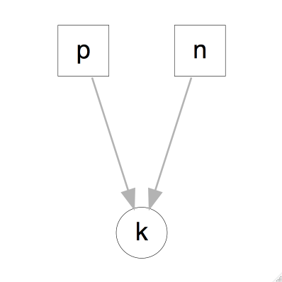
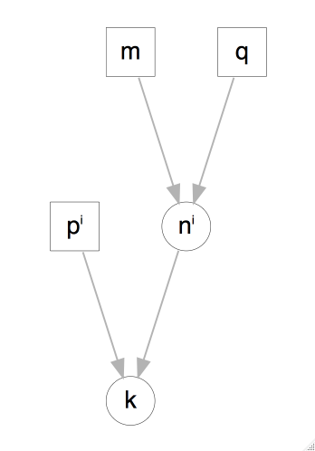
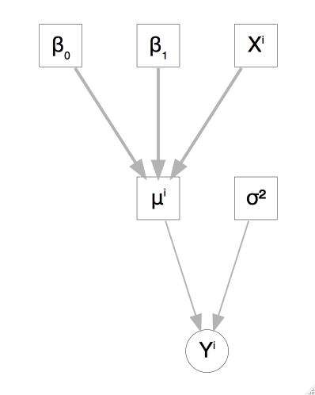

# Simulación de modelos

### ¿Para qué simular de un modelo? {-}

* Alternativa para presentar inferencias: en lugar de presentar un estimador 
puntual y/o intervalo de confianza podemos analizar simulaciones del modelo.

* Inferencia predictiva: es fácil usar simulación para calcular errores 
estándar, o intervalos de confianza, resulta particularmente útil cuando estamos 
estimando cantidades que no son coeficientes de un modelo o transformaciones 
lineales de coeficientes.

* Simulación para revisar el ajuste de un modelo. Podemos simular datos del 
modelo ajustado y compararlos con los datos verdaderos.

* Simulación para calcular tamaños de muestra.

```{r options, echo = FALSE, message=FALSE, error=TRUE}
knitr::opts_chunk$set(
    comment = "#>",
    collapse = TRUE, error=TRUE
)
comma <- function(x) format(x, digits = 2, big.mark = ",")
options(digits = 3)

library(tidyverse)
library(gridExtra)
theme_set(theme_minimal())
```

## Distribuciones multivariadas

Hasta ahora hemos estudiado distribuciones univariadas y como simular de ellas, 
sin embargo, es común que un modelo probabilístico involucre más de una variable 
aleatoria por lo que estudiaremos el concepto de distribuciones de probabilidad 
multivariadas.

<div class = "caja">
La **distribución conjunta** sobre un conjunto de variables aleatorias 
$\{X_1,...,X_n\}$, que denotamos $p(x_1,...,x_n)$, asigna probabilidades a todos 
los eventos determinados por el conjunto de variables aleatorias.  

En el caso **discreto bivariado**, dado las variables aleatorias discretas $X$ y 
$Y$, definimos la función de densidad conjunta como $f(x,y)=P(X=x, Y=y)$.
</div>

**Ejemplo.** Consideremos una distribución sobre la población de departamentos 
en renta de Hong Kong, el espacio de resultados es el conjunto de todos los 
departamentos en la población. En muchas ocasiones buscamos resolver preguntas 
que involucran más de una variable aleatoria, en este ejemplo nos interesan:  

+ Renta mensual: toma los valores baja (≤1k), media ((1k,5k]), 
media alta ((5k,12k]) y alta (>12k).  

+ Tipo de departamento: toma 3 valores, público, privado u otros. 

La distribución conjunta de variables aleatorias discretas se puede representar 
por medio de tablas.

<div class="mi-tabla">
Renta/Tipo    |público | privado |otros  
--------------|------|-----|----  
**baja**      |0.17  |0.01 |0.02  
**media**     |0.44  |0.03 |0.01  
**media alta**|0.09  |0.07 |0.01  
**alta**      |0     |0.14 |0.10  
</div>


<div class = "caja">
En el caso **continuo bivariado**, decimos que la función $p(x,y)$ es una 
función de densidad de probabilidad para las variables aleatorias $(X,Y)$ si:
1. $p(x,y) \geq 0$ para toda $(x,y)$.  

2. $\int_{-\infty}^{\infty}p(x,y)dxdy=1$.  

3. Para cualquier conjunto $A \subset \mathbb{R} \times \mathbb{R}$, 
$P((X,Y) \in A) = \int\int_A p(x,y)dxdy$.
</div>

**Ejemplo.** Sean $(X,Y)$ uniformes en el cuadrado unitario, entonces
$$
p(x,y) = \left\{
  \begin{array}{lr}
    1   &  0\leq x \leq 1,0\leq y \leq 1\\
    0 &  e.o.c.
  \end{array}
\right.
$$

Para encontrar $P(X < 1/2, Y<1/2)$, esto es la probailidad del evento
$A=\{X<1/2, Y<1/2\}$. La integral de $p$ sobre este subconjunto corresponde, 
en este caso, a calcular el área del conjunto $A$ que es igual a 1/4.

De la distribución conjunta $p(x_1,...,x_n)$ podemos obtener la distribución de 
únciamente una variable aleatoria $X_j$, donde $X_j \in \{X_1,...,X_n\}$, la 
llamamos la distribución marginal de $X_j$.

<br/>
<div class="caja">
Sea $\{X_1,...,X_n\}$ un conjunto de variables aleatorias con distribución 
conjunta $p(x_1,...,x_n)$, la **distribución marginal** de $X_j$ 
($j \in \{1,...,n\}$) se define como,
$$p_{X_j}(x_j) = \sum_{x_1,...,x_{j-1},x_{j+1},...,x_n}p(x_1,...,x_n)\mbox{ en el caso discreto,}$$
$$p_{X_j}(x_j) = \int_{x_1,...,x_{j-1},x_{j+1},...,x_n}p(x_1,...,x_n)dx_1,...,dx_n\mbox{ en el caso continuo}$$
</div>

<br/>


**Ejemplo.** Retomando el problema de los departamentos, ¿Cuál es la 
probabilidad de que un departamento elegido al azar tenga renta baja?

<!--

Renta/Tipo    |público | privado |otros |p(Renta)  
--------------|:--------|:---------|:------|:-------  
**baja**      |0.17    |0.01     |0.02   | **0.2**
**media**     |0.44    |0.03     |0.01   | **0.48**
**media alta**|0.09    |0.07     |0.01   | **0.17**
**alta**      |0       |0.14     |0.10   |**0.15**
**p(Tipo)**   |**0.7** |**0.25** |**0.5**|**1**  
-->

#### Probabilidad condicional {-}

<div class="caja">
Sean $A$, $B$ dos eventos, con $P(B)>0$, la probabilidad 
condicional de $A$ dado $B$ es

$$P(A|B)=\frac{P(AB)}{P(B)}$$
</div>

**Ejemplo.** ¿Cuál es la probabilidad de que un departamento privado tenga
renta _baja_?  ¿Cómo se compara con la probabilidad de que la renta sea baja 
(desconozco el tipo de departamento)?

La noción de probabilidad condicional se extiende a distribuciones 
condicionales:

<div class="caja">
Sean $X$, $Y$ dos variables aleatorias con función de densidad conjunta 
$p(x,y)$, entonces la **función de densidad condicional** de $X$ dado $Y=y$, 
para toda $y$ tal que $p_Y(y) > 0$, se define como
$$p_{X\vert Y}(x\vert y) = \frac{p(x, y)}{p_Y(y).}$$
</div>
<br/>

**Ejemplo.** ¿Cuál es la distribución condicional de _renta_ dado tipo 
_privado _? Para obtener toda la distribución condicional calculamos los dos casos 
restantes (renta media, media alta y alta).
<br/>

Vale la pena destacar que una distribución condicional es una distribución de 
probabilidad. En el ejemplo anterior, notemos que cada renglón de la tabla
probabilidades suman uno, son no negativas y menores que uno.

#### Probabilidad Total {-}

<div class ="caja">
Sean $E$, $F$ dos eventos entonces, 
$$P(E) = P(E\vert F)P(F) + P(E\vert F^c)P(F^c).$$
De manera más general, sean $F_i$ $i = 1,...,n$ eventos mutuamente excluyentes cuya unión es el espacio muestral, entonces
$$P(E) = \sum_{i=1}^n P(E\vert F_i)P(F_i).$$
</div>

**Ejemplo.** Supongamos que una aseguradora clasifica a la gente en tres grupos 
de acuerdo a su nivel de riesgo: bajo, medio y alto. De acuerdo a los registros, 
las probabilidades de incurrir en un accidente en un laspo de un año son 0.05,
0.15 y 0.30 respectivamente. Si el 20\% de la población se clasifica en riesgo 
bajo, 50\% en medio y 30\% en alto, ¿qué proporción de la población tiene un
accidente en un año dado?

Para variables aleatorias tenemos:

<div class="caja">
Sean $X$, $Y$ dos variables aleatorias, podemos expresar la distribución 
marginal de $X$ como:
$$p_X(x) = \sum_{y} p_{X \vert Y}(x\vert y)p_Y(y).$$
</div>
<br/>

 Supongamos que ruedo un dado, si 
observo un número par lanzo una moneda justa 
(la probabilidad de observar águila es la misma que la de observar sol), si el 
dado muestra un número impar lanzo una moneda sesgada en la que la probabilidad 
de observar águila es 0.9. Si observo sol, ¿Cuál es la probabilidad de que haya lanzado la moneda sesgada?

El ejercicio anterior introduce la noción de probabilidad inversa: inicialmente conozco la probabilidad de observar sol condicional a que la moneda es sesgada 
pero ahora me interesa conocer la probabilidad de que haya lanzado una moneda
sesgada una vez que observé un sol en el volado.

### Regla de Bayes {-}
La regla de Bayes es una consecuencia de la definición de probabilidad condicional.

<div class="caja">
Sean $F_i$ $i = 1,...,n$ eventos mutuamente excluyentes cuya unión es el espacio muestral, entonces
$$P(F_j\vert E) = \frac{P(E\vert F_j)P(F_j)}{\sum_{i=1}^n P(E\vert F_i)P(F_i)}$$
esta identidad se conoce como la **regla de Bayes**.
</div>

**Ejemplo.** En el contexto del ejemplo de los seguros ahora nos hacemos la
siguiente pregunta: si un asegurado tuvo accidentes en 2013, ¿cuál es la 
probabilidad de que clasifique en riesgo bajo?

<!--
$$P(B\vert Accidente) = \frac{P(Accidente\vert B)P(B)}{P(Accidente\vert B)P(B) + P(Accidente\vert M)P(M) + P(Accidente\vert A)P(A)}$$
Notemos que el denominador corresponde a la probabilidad de accidente que calculamos previamente ($P(Accidente) = 0.175$), 
$$P(B\vert Accidente) = \frac{0.05\cdot 0.20}{0.175} \approx .057$$
La nueva información implica que actualizemos de $P(B)= 0.20$ a $P(B\vert Accidente)=0.057$.
-->

Al igual que con probabilidad condicional, la Regla de Bayes tiene una 
definición análoga para variables aleatorias. 


<div class="caja">
Sean $X$, $Y$ dos variables aleatorias, 
$$p_{X\vert Y}(x\vert y) = \frac{p_{Y\vert X}(y\vert x)p_X(x)}{p_Y(y)}.$$
</div>


 Supongamos ahora que una compañía de
seguros divide a la gente en dos clases: propensos a accidente (30\% de las 
personas) y no propensos a accidente. En un año dado aquellos propensos a 
accidentes sufren un accidente con probabilidad 0.4, mientras que los del otro 
grupo sufren un accidente con probabilidad 0.2. ¿Cuál es la probabilidad de que 
un asegurado tenga un accidente en su segundo año condicional a que sufrió un
accidente en el primer año?


Una consecuencia de la regla de Bayes es que cualquier distribución multivariada
sobre $n$ variables $X_1,X_2,...X_n$ se puede expresar como:

<div class="caja">
$$p(x_1,x_2,...x_n) = p_{X_1}(x_1)p_{X_2\vert X_1}(x_2\vert x_1)p_{X_3\vert X_1X_2}(x_3\vert x_1x_2)···p_{X_n\vert X_1...X_{n-1}}(x_n\vert x_1...x_{n-1})$$
esta igualdad se conoce como **regla de la cadena**.
</div>

Nótese que esta regla funciona para cualquier ordenamiento de las variables aleatorias.

 Supongamos ahora que una compañía de
seguros divide a la gente en dos clases: propensos a accidente (30\% de las 
personas) y no propensos a accidente. En un año dado aquellos propensos a 
accidentes sufren un accidente con probabilidad 0.4, mientras que los del otro 
grupo sufren un accidente con probabilidad 0.2. ¿Cuál es la probabilidad de que 
un asegurado tenga un accidente en su segundo año condicional a que sufrió un
accidente en el primer año?


### Independencia

<div class="caja">
Los eventos $E$, $F$ son independientes sí y solo sí 
$$P(EF) = P(E)P(F)$$
</div>

De la definición de independencia se sigue que $P(E\vert F) = P(E)$. Esto es, los eventos $E$ y $F$ son independientes si saber que uno de ellos ocurrió no afecta la probabilidad del otro. Utilizaremos la notación $E\perp F$ que se lee "$E$ es independiente de $F$".

<div class="caja">
Dos variables aleatorias $X$, $Y$, son independientes sí y sólo sí
$$p(x,y) = p_X(x)p_Y(y)$$
</div>
<br/>

Más aún, $X$ y $Y$ son independientes sí y sólo sí $p(x,y)  \propto g(x)h(y)$, 
por lo que para demostrar independecia podemos omitir las constantes en la 
factorización de las densidades

Similar a la independencia en eventos, la independencia de variables aleatorias implica que $p_{X\vert Y}(x\vert y) = p_X(x)$, esto es, $Y = y$ no provee 
información sobre $X$. 
  
**Ejemplo.** Consideremos la función de densidad conjunta $p(x,y) = \frac{1}{384} x^2y^4e^{-y-(x/2)}$, $x>0$, $y>0$, ¿$X$ y $Y$ son independientes?

Podemos definir
$$
g(x) = \left\{
  \begin{array}{lr}
    x^2e^{-x/2} & : x > 0\\
    0 & : x \le 0
  \end{array}
\right.
$$
y
$$
h(y) = \left\{
  \begin{array}{lr}
    y^4e^{-y} & : y > 0\\
    0 & : y \le 0
  \end{array}
\right.
$$
entonces $p(x,y) \propto g(x)h(y)$, para toda $x$, $y$ $\in \mathbb{R}$ y 
concluímos que $X$ y $Y$ son independientes.

**Ejemplo.*. Si la densidad conjunta de $X$ y $Y$ está dada por: 
$$
p(x, y) = \left\{
  \begin{array}{lr}
    2 & : 0 < x < y, 0 < y < 1\\
    0 & : e.o.c.
  \end{array}
\right.
$$

¿$X$ y $Y$ son independientes?


**Ejercicio**. Recordando el ejemplo de departamentos en Hong Kong, veamos si 
Renta y Tipo son independientes, para esto comparemos $p(renta|tipo)$ y 
$p(renta)$.


#### Independencia condicional

La independencia de eventos o variables aleatorias es poco común en la práctica, 
más frecuente es el caso en que dos eventos son independientes dado un tercer 
evento. 

**Ejemplo.** En una competencia de velocidad, cada atleta 
se somete a dos pruebas de dopaje que buscan detectar si el deportista ingirió 
una substania prohibida. La prueba A consiste en un examen de sangre y la prueba 
B en un exámen de orina, cada prueba se realiza en un laboratorio distinto y no 
hay intercambio de información entre los laboratorios. Es razonable pensar 
que los resultados de los dos exámenes no son independientes. Ahora, supongamos 
que sabemos que el atleta consumió la substancia prohibida, en este caso 
podemos argumentar que conocer el resultado de la prueba A no cambia la 
probabilidad de que el atleta salga positivo en la prueba B. Decimos que 
el resultado de la prueba B es condicionalmente independiente del resultado
de la prueba A dado que el atleta consumió la substancia.

<div class="caja">
Sean $A$, $B$ y $C$, tres eventos decimos que $A$ es independiente de $B$ 
condicional a $C$ ($A \perp B \vert C$) si, 
$$ P(A,B\vert C) = P(A\vert C)P(B\vert C)$$
</div>


Similar al caso de independencia, $A$ y $B$ son condicionalmente independientes 
dado $C$ sí y solo sí $P(A \vert B,C) = P(A \vert C)$, esto es, una vez que
conocemos el valor de $C$, $B$ no proporciona información adicional sobre $A$. 

**Ejemplo.** Retomemos el ejercicio de asegurados. En la solución de este 
ejercicio utilizamos que $P(A_2|AA_1) = 0.4$ y que $P(A_2|A^cA_1) = 0.2$, al
establecer esa igualdad estamos asumiendo que $A_2$ (el asegurado tiene un 
accidente en el año 2) y $A_1$ (el asegurado tiene un accidente en el año 1) son
eventos condicionalmente independientes dado $A$ (el asegurado es propenso a
accidentes): $P(A_2|AA_1) = P(A_2|A) = 0.4$ y $P(A_2|A^cA_1) = P(A_2|A^c) = 0.2$.


**Ejemplo.** Retomemos el ejercicio de asegurados. En la solución de este 
ejercicio utilizamos que $P(A_2|AA_1) = 0.4$ y que $P(A_2|A^cA_1) = 0.2$, al
establecer esa igualdad estamos asumiendo que $A_2$ (el asegurado tiene un 
accidente en el año 2) y $A_1$ (el asegurado tiene un accidente en el año 1) son
eventos condicionalmente independientes dado $A$ (el asegurado es propenso a
accidentes): $P(A_2|AA_1) = P(A_2|A) = 0.4$ y $P(A_2|A^cA_1) = P(A_2|A^c) = 0.2$.

En el caso de variables aleatorias definimos independencia condicional como 
sigue.

<div class="caja">
Sean $X$, $Y$ y $Z$, tres variables aleatorias decimos que $X$ es independiente 
de $Y$ condicional a $Z$ ($X \perp Y \vert Z$) si y sólo sí, 
$$p(x,y\vert z) = p_{X\vert Z}(x\vert z)p_{Y\vert Z}(y\vert z).$$
</div>

Y tenemos que $X$ es independiente de $Y$ condicional a $Z$ sí y sólo sí, 
$p(x,y,z) \propto g(x,z)h(y,z)$.

**Ejemplo**. Supongamos que ruedo un dado, si observo un número par realizo dos 
lanzamientos de una moneda justa (la probabilidad de observar águila es la misma 
que la de observar sol), si el dado muestra un número impar realizo dos 
lanzamientos de una moneda sesgada en la que la probabilidad de observar águila
es 0.9. Denotemos por $Z$ la variable aleatoria asociada a la selección de la 
moneda, $X_1$ la correspondiente al primer lanzamiento y $X_2$ la 
correspondiente al segundo. Entonces, $X_1$ y $X_2$ no son independientes, sin
embargo, son condicionalmente independientes ($X_1 \perp X_2 \vert Z$), puesto 
que una vez que se que moneda voy a lanzar el resultado del primer lanzamiento 
no aporta información adicional para el segundo lanzamiento. Calcularemos la distribución conjunta y la distribución condicional de $X_2$ dado $X_1$.

La distribución conjunta esta determinada por la siguiente tabla:

<div class="mi-tabla">
 Z    | X1 | X2 | P(Z,X1,X2)  
------|:----|:----|:-----------
justa | a  | a  | 0.125
justa | a  | s  | 0.125
justa | s  | a  | 0.125 
justa | s  | s  | 0.125 
ses   | a  | a  | 0.405 
ses   | a  | s  | 0.045 
ses   | s  | a  | 0.045 
ses   | s  | s  | 0.005 
</div>

La distribución condicional $p(X_2|X_1)$ es,

<div class="mi-tabla">
X1/X2|  a  |  s  |.
-----|-----|-----|---
**a**|0.757|0.243|1
**s**|0.567|0.433|1
</div>

y la distribución condicional $p(X_2|X_1,Z)=p(X_2|Z)$ es,

<div class="mi-tabla">
X1/X2| Z | a  |  s  |.
-----|---|-----|-----|---
**a**|par|0.5|0.5|1
**s**|par|0.5|0.5|1
**a**|impar|0.9|0.1|1
**s**|impar|0.9|0.1|1
</div>

En este punto es claro que $X \perp Y \vert Z$ no implica $X \perp Y$, pues 
como vimos en el ejemplo de las monedas $X_1 \perp X_2 \vert Z$ pero 
$X_1 \not \perp X_2$. Más aún, $X \perp Y$ tampoco implica $X \perp Y \vert Z$.

<div class="caja">
La independencia condicional tiene importantes consecuencias, por ejemplo, si $X$ 
es independiente de $Y$ dado $Z$ entonces, 
$$p(x,y,z) = p_Z(z)p_{X\vert Z}(x\vert z)p_{Y\vert Z}(y\vert z).$$
</div>

Esta expresión de la densidad conjunta es similar a la que obtendríamos usando 
la regla de la cadena; sin embargo, el número de parámetros necesarios bajo esta 
representación es menor lo que facilita la estimación.

### Modelos gráficos y simulación predictiva

El objetivo de esta sección es la simulación de modelos, una manera conveniente
de simular de un modelo probabilístico es a partir del modelo gráfico 
asociado. Un modelo gráfico representa todas las cantidades involucradas en el 
modelo mediante nodos de una gráfica dirigida, el modelo representa el supuesto 
que dados los nodos padres $padres(v)$ cada nodo es independiente del resto de 
los nodos a excepción de sus descendientes.

Los nodos en las gráficas se clasifican en 3 tipos:

* __Constantes__ fijas por el diseño del estudio, siempre son nodos sin padres.

* __Estocásticos__ son variables a los que se les asigna una distribución. 

* __Determinísticos__ son funciones lógicas de otros nodos.

Los supuestos de independencia condicional que representa la gráfica implican
que la distribución conjunta de todas las cantidades V tiene una factorización 
en términos de la distribución condicional $p(v|padres(v))$ de tal manera que:
$$p(V) = \prod p(v|padres(v))$$


Veamos como usar las gráficas para simular de modelos probabilísticos. Los 
siguientes ejemplos están escritos con base en @gelman.

#### Ejemplo de simulación discreta predictiva {-}
La probabilidad de que un bebé sea niña o niño es 48.8\% y 51.2\% 
respectivamente. Supongamos que hay 400 nacimientos en un hospital en un año 
dado. ¿Cuántas niñas nacerán? 

Comencemos viendo el modelo gráfico asociado.

```{r, eval=FALSE, echo=FALSE, fig.width=3.5, fig.width=3.5, message=FALSE, out.width="150px", out.height="150px"}
library(DiagrammeR)
grViz("
digraph ninas {

  # a 'graph' statement
  graph [overlap = true]

  # several 'node' statements
  node [shape = box,penwidth = 0.1, fixedsize = true, fontsize = 7,
        fontname = Helvetica, width = 0.2, height = 0.2]
  p; n; 

  node [shape = circle,
        fixedsize = true, fontsize = 7,
        fontname = Helvetica, width = 0.2] // sets as circles
  k; 

  # several 'edge' statements
  edge[color = grey, arrowsize = 0.5, penwidth = 0.5]
  p->k; n->k
}
")
```




La gráfica superior muestra todas las variables relevantes en el problema, y las
dependencias entre ellas. En este caso $n$ es una constante que representa el 
número de nacimientos, ($n=400$), $p=48.8$ es la probabilidad de que un nacimiento 
resulte en niña y $k \sim Binomial(p, n)$. Debido a que el número de éxitos
(nacimientos que resultan en niña) depende de la tasa p y el número de 
experimentos n, los nodos que representan a éstas dos últimas variables están
dirigidos al nodo que representa k.

Una vez que tenemos la gráfica es fácil simular del modelo:

```{r, message=FALSE}
library(ggplot2)
library(dplyr)
library(arm)
library(tidyr)
set.seed(918739837)
n_ninas <- rbinom(1, 400, 0.488)
```

esto nos muestra algo que podría ocurrir en 400 nacimientos. Ahora, para tener 
una noción de la distribución simulamos el proceso 1000 veces:

```{r out.width="350px"}
sims_ninas <- rerun(1000, rbinom(1, 400, 0.488)) %>% flatten_dbl()
mean(sims_ninas)
sd(sims_ninas)

ggplot() + geom_histogram(aes(x = sims_ninas), binwidth = 3, alpha = 0.7)
```

El histograma de arriba representa la distribución de probabilidad para el 
número de niñas y refleja la incertidumbre en los nacimientos. 

Podemos agregar complejidad al modelo, por ejemplo con probabilidad 1/125 un
nacimiento resulta en gemelos fraternales, y para cada uno de los bebés hay una
posibilidad de aproximadamente 49.5\% de ser niña. Además la probabilidad de 
gemelos idénticos es de 1/300 y estos a su vez resultan en niñas en 
aproximadamente 40.5\% de los casos. 


```{r, echo = FALSE, eval = FALSE, fig.width=3.5, fig.width=3.5, message=FALSE, out.width="150px", out.height="150px"}
grViz("
digraph ninas_compleja {

  # a 'graph' statement
  graph [overlap = true]

  # several 'node' statements
  node [shape = box,penwidth = 0.1, fixedsize = true, fontsize = 7,
        fontname = Helvetica, width = 0.2, height = 0.2]
  p_i[label = 'p&#x2071;']; m; q;

  node [shape = circle,
        fixedsize = true, fontsize = 7,
        fontname = Helvetica, width = 0.2] // sets as circles
  k; n_i[label = 'n&#x2071;'];

  # several 'edge' statements
  edge[color = grey, arrowsize = 0.5, penwidth = 0.5]
  m->n_i; q->n_i; p_i->k; n_i->k
}
")
```



Podemos simular 400 nacimientos bajo este
modelo como sigue:

```{r}
tipo_nacimiento <- sample(c("unico", "fraternal", "identicos"), 
  size = 400, replace = TRUE, prob = c(1 - 1 / 125 - 1 / 1300, 1 / 125, 1 / 300))
n_unico <- sum(tipo_nacimiento == "unico")  # número de nacimientos únicos
n_fraternal <- sum(tipo_nacimiento == "fraternal")
n_identicos <- 400 - n_unico - n_fraternal
n_ninas <- rbinom(1, n_unico, 0.488) +
           rbinom(1, 2 * n_fraternal, 0.495) + # en cada nacimiento hay 2 bebés
           2 * rbinom(1, n_identicos, 0.495)
n_ninas
```

Repetimos la simulación 1000 veces para aproximar la distribución de número de 
niñas en 400 nacimientos.

```{r, out.width="350px"}
modelo2 <- function(){
    tipo_nacimiento <- sample(c("unico", "fraternal", "identicos"), 
        size = 400, replace = TRUE, prob = c(1 - 1 / 125 - 1 / 1300, 1 / 125, 1 / 300))
    # número de nacimientos de cada tipo
    n_unico <- sum(tipo_nacimiento == "unico")  # número de nacimientos únicos
    n_fraternal <- sum(tipo_nacimiento == "fraternal")
    n_identicos <- 400 - n_unico - n_fraternal
    # simulamos para cada tipo de nacimiento
    n_ninas <- rbinom(1, n_unico, 0.488) +
        rbinom(1, 2 * n_fraternal, 0.495) + # en cada nacimiento hay 2 bebés
    2 * rbinom(1, n_identicos, 0.495)
  n_ninas
}

sims_ninas_2 <- rerun(1000, modelo2()) %>% flatten_dbl()
mean(sims_ninas_2)

ggplot() + geom_histogram(aes(x = sims_ninas_2), binwidth = 4, alpha = 0.7)
```

#### Ejemplo de simulación continua predictiva 

El 52\% de los adultos en EUA son mujeres y el 48\% hombres, las estaturas de 
los hombres se distribuyen aproximadamente normal con  media 175 cm y desviación
estándar de 7.37 cm, en el caso de las mujeres la distribución es 
aproximadamente normal con media 161.80 cm y desviación estándar de 6.86 cm. 
Supongamos que seleccionamos 10 adultos al azar, ¿cuál es el modelo gráfico 
asociado? ¿qué podemos decir del promedio de estatura?

```{r}
sexo <- rbinom(10, 1, 0.52)
altura <- rnorm(sexo, mean = 161.8 * (sexo == 1) + 175 * (sexo == 0), 
  sd = 6.86 * (sexo == 1) + 7.37 * (sexo == 0))
mean(altura)
```

Simulamos la distribución de la altura promedio:

```{r, out.width="350px"}
mediaAltura <- function(){
  sexo <- rbinom(10, 1, 0.52)
  altura <- rnorm(sexo, mean = 161.8 * (sexo == 1) + 175 * (sexo == 0), 
    sd = 6.86 * (sexo == 1) + 7.37 * (sexo == 0))
}
sims_alturas <- rerun(1000, mediaAltura()) 
media_alturas <- sims_alturas %>% map_dbl(mean)
mean(media_alturas)
sd(media_alturas)
ggplot() + geom_histogram(aes(x = media_alturas), binwidth = 1.2, alpha = 0.7)
```

¿Y que podemos decir de la altura máxima?

```{r, out.width="350px"}
alt_max <- sims_alturas %>% map_dbl(max)
qplot(alt_max, geom = "histogram", binwidth = 1.5)
```

 Supongamos que una compañía cambia la tecnología
usada para producir una cámara, un estudio estima que el ahorro en la producción
es de \$5 por unidad con un error estándar de \$4. Más aún, una proyección
estima que el tamaño del mercado (esto es, el número de cámaras que se venderá)
es de 40,000 con un error estándar de 10,000. Suponiendo que las dos fuentes de
incertidumbre son independientes, usa simulación para estimar el total de dinero
que ahorrará la compañía, calcula un intervalo de confianza.

#### Ejemplo de simulación de un modelo de regresión 

En regresión utilizamos simulación para capturar tanto la incertidumbre en la
predicción (término de error en el modelo) como la incertidumbre en la inferencia
(errores estándar de los coeficientes e incertidumbre del error residual). 

Comenzamos con un ejemplo en el que simulamos únicamente **incertidumbre en la 
predicción**.

Supongamos que el puntaje de un niño de tres años en una prueba cognitiva esta 
relacionado con las características de la madre, el siguiente modelo resume la
diferencia en los puntajes promedio de los niños cuyas madres se graduaron
de preparatoria y los que no.

$$y_i= \beta_0 + \beta_1 X_{i1} + \epsilon_i$$

* donde $y_i$ es el puntaje del i-ésimo niño,
* $X_{i1}$ es una variable binaria que indica si la madre se graduó de 
preparatoria (codificado como 1) o no (codificado como 0), y 
* $\epsilon_i$ son los error aleatorios, estos son 
independientes con distribución normal $\epsilon_i \sim N(0, \sigma^2)$. 

Ahora consideremos el problema de simular el puntaje de 50 niños 30 con madres
que terminaron la preparatoria y 20 cuyas madres no terminaron. Los coeficientes
que usaremos son:

$$\beta_0 = 78$$
$$\beta_1 = 12$$
$$\sigma = 20$$

El modelo gráfico asociado sería como sigue:

```{r, echo = FALSE, eval = FALSE, fig.width=3.5, fig.width=3.5, message=FALSE, out.width="200px"}
grViz("
digraph regresion {
    graph [overlap = true]
    node [shape = box,penwidth = 0.1, fixedsize = true, fontsize = 7,
        fontname = Helvetica, width = 0.2, height = 0.2]
    beta_0[label = '&beta;&#x2080;']; beta_1[label = '&beta;&#x2081;']; mu_i[label='&mu;&#x2071;'];
    sigma[label = '&sigma;&#x00B2;']; X_i[label = 'X&#x2071;'];
    node [shape = circle,
        fixedsize = true, fontsize = 7,
        fontname = Helvetica, width = 0.2] // sets as circles
        Y_i[label = 'Y&#x2071;'];
    edge[color = grey, arrowsize = 0.5, penwidth = 0.5]
        mu_i->Y_i; sigma->Y_i;
    edge[color = grey, arrowsize = 0.5, penwidth = 1]
        beta_0->mu_i; beta_1 -> mu_i; X_i->mu_i;
}
")
```


```{r}
vector_mu <- c(rep(78 + 12, 30), rep(78, 20)) # beta_0 + beta_1 X
y <- rnorm(50, vector_mu, 20)
sims_y <- rerun(2000, rnorm(50, vector_mu, 20))
```

Podemos calcular la media y su intervalo de confianza:

```{r, out.width="350px"}
medias <- sims_y %>% map_dbl(mean)
quantile(medias, c(0.025, 0.975))

qplot(medias, geom = "histogram", binwidth = 1.5)
```

Supongamos ahora que nos interesa incorporar que tenemos **incertidumbre en los 
coeficientes de regresión**, y expresamos nuestra incertidumbre a través de 
distribuciones de probabilidad, ¿cómo sería el modelo gráfico asociado?

Primero suponemos que $\sigma^2$ tiene una distribución centrada en 20^2^, 
proporcional a una distribución $\chi^2$ con 432 grados de libertad.

$$
\begin{eqnarray*}
\begin{pmatrix}\beta_{0}\\
\beta_{1}
\end{pmatrix} & \sim & N\left[\left(\begin{array}{c}
77\\
12
\end{array}\right), \sigma^2 \left(\begin{array}{cc}
0.01 & -0.01\\
-0.01 & 0.01
\end{array}\right)\right]
\end{eqnarray*}
$$

Finalmente, simulamos del modelo incorporando tanto la incertidumbre 
correpondiente a la predicción como la incertidumbre en los coeficientes de 
regresión.

1. Simula $\sigma=20\sqrt{(432)/X}$ donde $X$ es una generación de una
distribución $\chi^2$ con $432$ grados de libertad.

2. Dado $\sigma$ (obtenido del paso anterior), simula $\beta$ de una distribución
normal multivariada con media $(77,12)$ y matriz de covarianzas $\sigma^2 V$.

3. Simula $y$ el vector de observaciones usando los parámetros de 1 y 2.

```{r, fig.width=4, fig.height=4, out.width="350px"}
simula_parametros <- function(){
    # empezamos simulando sigma
    sigma <- 20 * sqrt((432) / rchisq(1, 432))
    # la usamos para simular betas
    beta <- MASS::mvrnorm(1, mu = c(78, 12), 
        # Sigma = sigma ^ 2 * matrix(c(4.2, -4.2, -4.2, 5.4), nrow = 2))
        Sigma = sigma ^ 2 * matrix(c(0.011, -0.011, -0.011, 0.013), nrow = 2))
    # Simulamos parámetros
    list(sigma = sigma, beta = beta)
}

sims_parametros <- rerun(10000, simula_parametros()) 

# simulamos los puntajes
simula_puntajes <- function(beta, sigma, n_hs = 30, n_nhs = 20){
    vector_mu <- c(rep(beta[1] + beta[2], n_hs), rep(beta[1], n_nhs)) # beta_0 + beta_1 X
    obs = rnorm(50, vector_mu, sigma)
}

sims_puntajes <- map(sims_parametros, ~simula_puntajes(beta = .[["beta"]], sigma = .[["sigma"]]))
medias_incert <- sims_puntajes %>% map_dbl(mean)
    
quantile(medias_incert, c(0.025, 0.975))
qplot(medias_incert, geom = "histogram", binwidth = 1)
```

Los parametros se obtuvieron de ajustar el modelo de regresión lineal.

```{r}
library(foreign)
kids_iq <- read.dta("data/kidiq.dta")
lm_kid <- lm(kid_score ~ mom_hs, kids_iq)
V <- vcov(lm_kid) / 20 ^ 2
summary(lm_kid)
```

Podemos usar simulación para calcular intervalos de confianza para $\beta_0$ y 
$\beta_1$,

```{r}
sims_parametros %>% map_dbl(~(.$beta[1])) %>% sd()
sims_parametros %>% map_dbl(~(.$beta[2])) %>% sd()
```

No parece que valga la pena el esfuerzo cuando podemos calcular los intervalos 
analíticamente, sin embargo con simulación podemos responder fácilmente otras 
preguntas, por ejemplo, la pregunta inicial: ¿cuál es la media esperada para un 
conjunto de 50 niños, 30 con madres que hicieron preparatoria y 20 que no? es
fácil de responder con simulación.

Podríamos usar `predict()` para calcular el estimador puntual de la media en el
examen para los niños:

```{r}
pred_mi_pob <- predict(lm_kid, newdata = data.frame(mom_hs = c(rep(1, 30), 
    rep(0, 20))), se.fit = TRUE)
mean(pred_mi_pob$fit)
```

¿Cómo calculas el error estándar? En este caso se puede resolver pues es una 
combinación lineal de los coeficientes del modelo, pero en muchos casos nuestro
objetivo es más complicado que coeficientes o combinaciones lineales de estos. 


#### Simulación de predicciones no lineales

Veamos un ejemplo de las elecciones en el congreso de EUA. Tenemos un modelo 
que usaremos para predecir la elección de 1990 basados en la de 1988.

**Explicación del problema**. EUA está dividido en 435 distritos congresionales,
definimos la variable de interés $y_i$ con $i=1,...,n$, como la participación 
del partido Demócrata en el distrito $i$ en $1988$. La participación se calcula
como el porcentaje de los votos correspondientes a los demócratas del total de
votos que recibieron los demócratas y republicanos, esto es, se excluyen los 
votos a otros partidos. 

El modelo del que simularemos se construyó usando datos de 1986 y 1988.

```{r, eval=TRUE, fig.height=4.5, fig.width=5.5}
# Los datos están almacenados en 3 archivos correspondientes al año
paths <- dir("data/congress", full.names = TRUE)
paths <- set_names(paths, basename(paths))

# Leemos los datos y recodificamos variables
congress <- map_dfr(paths, read.table, quote = "\"", 
  stringsAsFactors = FALSE, .id = "year") %>%
  mutate(id = rep(1:435, 3),
         year = parse_number(year),          # año de la elección
         incumbency = ifelse(V3 == -9, NA, V3), # codificar NAs              
         dem_share = V4 / (V4 + V5)) %>%       # participación demócrata
  dplyr::select(id, year, incumbency, dem_share)

glimpse(congress)

# datos en forma horizontal
congress_share <- spread(dplyr::select(congress, -incumbency), year, dem_share)
colnames(congress_share) <- c("id", "share_86", "share_88", "share_90")
congress_inc <- spread(dplyr::select(congress, -dem_share), year, incumbency)
colnames(congress_inc) <- c("id", "inc_86", "inc_88", "inc_90")

# quitamos NAs
congress_h <- na.omit(left_join(congress_share, congress_inc))
glimpse(congress_h)

ggplot(congress_h, aes(x = share_86, y = share_88, color = factor(inc_86))) +
    geom_abline(color = "darkgray") +
    geom_point() +
    labs(color = "")
```

```{r}
# quitamos las elecciones que no se compitieron
congress_h <- filter(congress_h, share_88 != 1 & share_88 != 0)

fit_88 <- lm(share_88 ~ share_86 + inc_88, data = congress_h)
summary(fit_88)
```

Simulemos del modelo:

```{r, fig.width=9, fig.height=6}
# Matriz X
X <- cbind(1, congress_h$share_88, congress_h$inc_90)
simula_modelo <- function(){
    sigma <- 0.08 * sqrt((351) / rchisq(1, 351))
    beta <- MASS::mvrnorm(1, mu = c(0.30, 0.39, 0.10), 
        Sigma = sigma ^ 2 * matrix(c(0.04, -0.07, 0.01, -0.07, 0.13, -0.02, 0.01, 
            -0.02, 0.01), nrow = 3))
    mu <- X %*% beta
    data_frame(id = 1:358, dem_share = rnorm(358, mu, sigma))
}

sims_congress <- rerun(2000, simula_modelo()) 
sims_congress <- sims_congress %>% bind_rows() %>% mutate(sim = rep(1:2000, each = 358))

ggplot(sims_congress, aes(x = reorder(id, dem_share), y = dem_share)) +
    geom_boxplot() +
    geom_hline(color = "red", yintercept = 0.5)
```

Podemos preguntarnos cuántas elecciones ganaron los demócratas en 1990: 
$\sum I(\grave{y} > 0.5)$

```{r, eval=FALSE}
sims_congress %>%
  group_by(sim) %>%
  mutate(wins = sum(dem_share > 0.5)) %>%
  ungroup() %>%
  summarise(mean_wins = mean(wins),
            median_wins = median(wins), 
            sd_wins = sd(wins))
```

Veamos lo que ocurrió realmente

```{r, eval=FALSE}
sum(congress_h$share_90 > 0.5)
```

Podemos usar la función `sim()` del paquete `arm` para simular de modelos lineales 
y lineales generalizados.
