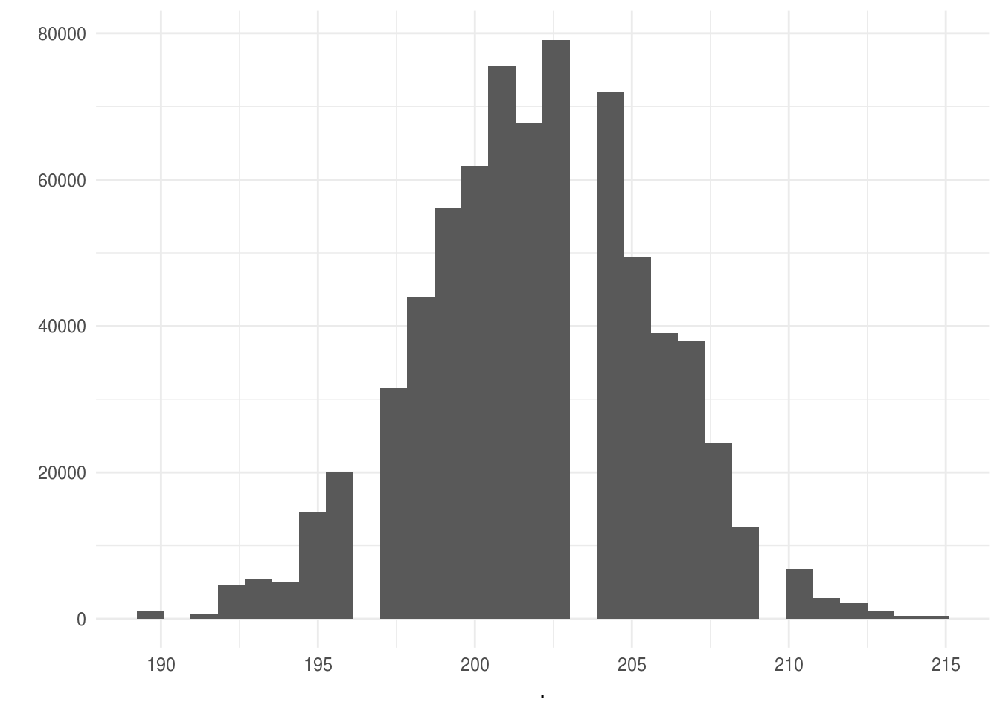

# Simulación de modelos

### ¿Para qué simular de un modelo? {-}

* Alternativa para presentar inferencias: en lugar de presentar un estimador 
puntual y/o intervalo de confianza podemos analizar simulaciones del modelo.

* Inferencia predictiva: es fácil usar simulación para calcular errores 
estándar, o intervalos de confianza, resulta particularmente útil cuando estamos 
estimando cantidades que no son coeficientes de un modelo o transformaciones 
lineales de coeficientes.

* Simulación para revisar el ajuste de un modelo. Podemos simular datos del 
modelo ajustado y compararlos con los datos verdaderos.

* Simulación para calcular tamaños de muestra.


## Distribuciones multivariadas

Hasta ahora hemos estudiado distribuciones univariadas y como simular de ellas, 
sin embargo, es común que un modelo probabilístico involucre más de una variable 
aleatoria por lo que estudiaremos el concepto de distribuciones de probabilidad 
multivariadas.

<div class = "caja">
La **distribución conjunta** sobre un conjunto de variables aleatorias 
$\{X_1,...,X_n\}$, que denotamos $p(x_1,...,x_n)$, asigna probabilidades a todos 
los eventos determinados por el conjunto de variables aleatorias.  

En el caso **discreto bivariado**, dado las variables aleatorias discretas $X$ y 
$Y$, definimos la función de densidad conjunta como $f(x,y)=P(X=x, Y=y)$.
</div>

**Ejemplo.** Consideremos una distribución sobre la población de departamentos 
en renta de Hong Kong, el espacio de resultados es el conjunto de todos los 
departamentos en la población. En muchas ocasiones buscamos resolver preguntas 
que involucran más de una variable aleatoria, en este ejemplo nos interesan:  

+ Renta mensual: toma los valores baja (≤1k), media ((1k,5k]), 
media alta ((5k,12k]) y alta (>12k).  

+ Tipo de departamento: toma 3 valores, público, privado u otros. 

La distribución conjunta de variables aleatorias discretas se puede representar 
por medio de tablas.

<div class="mi-tabla">
Renta/Tipo    |público | privado |otros  
--------------|------|-----|----  
**baja**      |0.17  |0.01 |0.02  
**media**     |0.44  |0.03 |0.01  
**media alta**|0.09  |0.07 |0.01  
**alta**      |0     |0.14 |0.10  
</div>


<div class = "caja">
En el caso **continuo bivariado**, decimos que la función $p(x,y)$ es una 
función de densidad de probabilidad para las variables aleatorias $(X,Y)$ si:
1. $p(x,y) \geq 0$ para toda $(x,y)$.  

2. $\int_{-\infty}^{\infty}p(x,y)dxdy=1$.  

3. Para cualquier conjunto $A \subset \mathbb{R} \times \mathbb{R}$, 
$P((X,Y) \in A) = \int\int_A p(x,y)dxdy$.
</div>

**Ejemplo.** Sean $(X,Y)$ uniformes en el cuadrado unitario, entonces
$$
p(x,y) = \left\{
  \begin{array}{lr}
    1,   &  0\leq x \leq 1,0\leq y \leq 1\\
    0, &  e.o.c.
  \end{array}
\right.
$$

Para encontrar $P(X < \frac{1}{2}, Y<\frac{1}{2})$, esto es la probailidad del evento
$A=\{X<1/2, Y<1/2\}$. La integral de $p$ sobre este subconjunto corresponde, 
en este caso, a calcular el área del conjunto $A$ que es igual a $\frac{1}{4}$.

De la distribución conjunta $p(x_1,...,x_n)$ podemos obtener la distribución de 
únciamente una variable aleatoria $X_j$, donde $X_j \in \{X_1,...,X_n\}$, la 
llamamos la distribución marginal de $X_j$.

<br/>
<div class="caja">
Sea $\{X_1,...,X_n\}$ un conjunto de variables aleatorias con distribución 
conjunta $p(x_1,...,x_n)$, la **distribución marginal** de $X_j$ 
($j \in \{1,...,n\}$) se define como,
$$p_{X_j}(x_j) = \sum_{x_1,...,x_{j-1},x_{j+1},...,x_n}p(x_1,...,x_n)\mbox{ en el caso discreto,}$$
$$p_{X_j}(x_j) = \int_{x_1,...,x_{j-1},x_{j+1},...,x_n}p(x_1,...,x_n)dx_1,...,dx_n\mbox{ en el caso continuo}$$
</div>

<br/>


**Ejemplo.** Retomando el problema de los departamentos, ¿Cuál es la 
probabilidad de que un departamento elegido al azar tenga renta baja?

<!--

Renta/Tipo    |público | privado |otros |p(Renta)  
--------------|:--------|:---------|:------|:-------  
**baja**      |0.17    |0.01     |0.02   | **0.2**
**media**     |0.44    |0.03     |0.01   | **0.48**
**media alta**|0.09    |0.07     |0.01   | **0.17**
**alta**      |0       |0.14     |0.10   |**0.15**
**p(Tipo)**   |**0.7** |**0.25** |**0.5**|**1**  
-->

#### Probabilidad condicional {-}

<div class="caja">
Sean $A$, $B$ dos eventos, con $P(B)>0$, la probabilidad 
condicional de $A$ dado $B$ es

$$P(A|B)=\frac{P(AB)}{P(B)}$$
</div>

**Ejemplo.** ¿Cuál es la probabilidad de que un departamento privado tenga
renta _baja_?  ¿Cómo se compara con la probabilidad de que la renta sea baja 
(desconozco el tipo de departamento)?

La noción de probabilidad condicional se extiende a distribuciones 
condicionales:

<div class="caja">
Sean $X$, $Y$ dos variables aleatorias con función de densidad conjunta 
$p(x,y)$, entonces la **función de densidad condicional** de $X$ dado $Y=y$, 
para toda $y$ tal que $p_Y(y) > 0$, se define como
$$p_{X\vert Y}(x\vert y) = \frac{p(x, y)}{p_Y(y).}$$
</div>
<br/>

**Ejemplo.** ¿Cuál es la distribución condicional de _renta_ dado tipo 
_privado_? Para obtener toda la distribución condicional calculamos los dos casos 
restantes (renta media, media alta y alta).
<br/>

Vale la pena destacar que una distribución condicional es una distribución de 
probabilidad. En el ejemplo anterior, notemos que cada renglón de la tabla
probabilidades suman uno, son no negativas y menores que uno.

#### Probabilidad Total {-}

<div class ="caja">
Sean $E$, $F$ dos eventos entonces, 
$$P(E) = P(E\vert F)P(F) + P(E\vert F^c)P(F^c).$$
De manera más general, sean $F_i$ $i = 1,...,n$ eventos mutuamente excluyentes cuya unión es el espacio muestral, entonces
$$P(E) = \sum_{i=1}^n P(E\vert F_i)P(F_i).$$
</div>

**Ejemplo.** Supongamos que una aseguradora clasifica a la gente en tres grupos 
de acuerdo a su nivel de riesgo: _bajo_, _medio_ y _alto_. De acuerdo a los registros, 
las probabilidades de incurrir en un accidente en un laspo de un año son $0.05$,
$0.15$ y $0.30$ respectivamente. Si el $20\%$ de la población se clasifica en riesgo 
bajo, $50\%$ en medio y $30\%$ en alto, ¿qué proporción de la población tiene un
accidente en un año dado?

Para variables aleatorias tenemos:

<div class="caja">
Sean $X$, $Y$ dos variables aleatorias, podemos expresar la distribución 
marginal de $X$ como:
$$p_X(x) = \sum_{y} p_{X \vert Y}(x\vert y)p_Y(y).$$
</div>
<br/>

 Supongamos que ruedo un dado, si observo un número
par lanzo una moneda justa 
(la probabilidad de observar águila es la misma que la de observar sol), si el 
dado muestra un número impar lanzo una moneda sesgada en la que la probabilidad 
de observar águila es $0.9$. Si observo sol, ¿Cuál es la probabilidad de que haya 
lanzado la moneda sesgada?

El ejercicio anterior introduce la noción de probabilidad inversa: inicialmente 
conozco la probabilidad de observar sol condicional a que la moneda es sesgada 
pero ahora me interesa conocer la probabilidad de que haya lanzado una moneda
sesgada una vez que observé un sol en el volado.

### Regla de Bayes {-}
La regla de Bayes es una consecuencia de la definición de probabilidad 
condicional.

<div class="caja">
Sean $F_i$ y $i = 1,...,n$ eventos mutuamente excluyentes cuya unión es el espacio
muestral, entonces
$$P(F_j\vert E) = \frac{P(E\vert F_j)P(F_j)}{\sum_{i=1}^n P(E\vert F_i)P(F_i)}$$
esta identidad se conoce como la **regla de Bayes**.
</div>

**Ejemplo.** En el contexto del ejemplo de los seguros ahora nos hacemos la
siguiente pregunta: si un asegurado tuvo accidentes en 2013, ¿cuál es la 
probabilidad de que clasifique en riesgo bajo?

<!--
$$P(B\vert Accidente) = \frac{P(Accidente\vert B)P(B)}{P(Accidente\vert B)P(B) + P(Accidente\vert M)P(M) + P(Accidente\vert A)P(A)}$$
Notemos que el denominador corresponde a la probabilidad de accidente que calculamos previamente ($P(Accidente) = 0.175$), 
$$P(B\vert Accidente) = \frac{0.05\cdot 0.20}{0.175} \approx .057$$
La nueva información implica que actualizemos de $P(B)= 0.20$ a $P(B\vert Accidente)=0.057$.
-->

 [La intuición es engañosa](http://www.amazon.com/The-Drunkards-Walk-Randomness-Rules/dp/0307275175): 
En estudios en Alemania y EUA, investigadores
le pidieron a médicos que estimaran la probabilidad de que una mujer 
asintomática entre los $40$ y $50$ años tuviera cáncer de mama si su mamograma 
era positivo. Se les explicó que el $7\%$ de los mamogramas indican cáncer cuando
no lo hay (falsos positivos). Adicional mente, se le explicó a los médicos que 
la incidencia de cáncer de mama en ese grupo de edad es $0.8\%$ y la tasa de 
falsos negativos de $10\%$. En Alemania, un tercio de los médicos determinaron
que la probabilidad era cercana al $90\%$ y la mediana de las estimaciones fue
$70\%$. En EUA $95$ de $100$ médicos estimaron que la probabilidad rondaba el $75\%$.
¿Cómo determinas la probabilidad de que una mujer con mamograma positivo tenga
cáncer?


Al igual que con probabilidad condicional, la Regla de Bayes tiene una 
definición análoga para variables aleatorias. 

<div class="caja">
Sean $X$, $Y$ dos variables aleatorias, 
$$p_{X\vert Y}(x\vert y) = \frac{p_{Y\vert X}(y\vert x)p_X(x)}{p_Y(y)}.$$
</div>


 Supongamos ahora que una compañía de
seguros divide a la gente en dos clases: propensos a accidente (30\% de las 
personas) y no propensos a accidente. En un año dado aquellos propensos a 
accidentes sufren un accidente con probabilidad 0.4, mientras que los del otro 
grupo sufren un accidente con probabilidad 0.2. ¿Cuál es la probabilidad de que 
un asegurado tenga un accidente en su segundo año condicional a que sufrió un
accidente en el primer año?


Una consecuencia de la regla de Bayes es que cualquier distribución multivariada
sobre $n$ variables $X_1,X_2,...X_n$ se puede expresar como:

<div class="caja">
$$p(x_1,x_2,...x_n) = p_{X_1}(x_1)p_{X_2\vert X_1}(x_2\vert x_1)p_{X_3\vert X_1X_2}(x_3\vert x_1x_2)···p_{X_n\vert X_1...X_{n-1}}(x_n\vert x_1...x_{n-1})$$
esta igualdad se conoce como **regla de la cadena**.
</div>

Nótese que esta regla funciona para cualquier ordenamiento de las variables aleatorias.


### Independencia {-}

<div class="caja">
Los eventos $E$, $F$ son independientes sí y solo sí 
$$P(EF) = P(E)P(F)$$
</div>

De la definición de independencia se sigue que $P(E\vert F) = P(E)$. Esto es, 
los eventos $E$ y $F$ son independientes si saber que uno de ellos ocurrió no 
afecta la probabilidad del otro. Utilizaremos la notación $E\perp F$ que se lee "$E$ es independiente de $F$".

<div class="caja">
Dos variables aleatorias $X$, $Y$, son independientes sí y sólo sí
$$p(x,y) = p_X(x)p_Y(y)$$
</div>
<br/>

Más aún, $X$ y $Y$ son independientes sí y sólo sí $p(x,y)  \propto g(x)h(y)$, 
por lo que para demostrar independecia podemos omitir las constantes en la 
factorización de las densidades

Similar a la independencia en eventos, la independencia de variables aleatorias implica que $p_{X\vert Y}(x\vert y) = p_X(x)$, esto es, $Y = y$ no provee 
información sobre $X$. 
  
**Ejemplo.** Consideremos la función de densidad conjunta $p(x,y) = \frac{1}{384} x^2y^4e^{-y-(x/2)}$, $x>0$, $y>0$, ¿$X$ y $Y$ son independientes?

Podemos definir
$$
g(x) = \left\{
  \begin{array}{lr}
    x^2e^{-x/2} & : x > 0\\
    0 & : x \le 0
  \end{array}
\right.
$$
y
$$
h(y) = \left\{
  \begin{array}{lr}
    y^4e^{-y} & : y > 0\\
    0 & : y \le 0
  \end{array}
\right.
$$
entonces $p(x,y) \propto g(x)h(y)$, para toda $x$, $y$ $\in \mathbb{R}$ y 
concluímos que $X$ y $Y$ son independientes.

**Ejemplo.*. Si la densidad conjunta de $X$ y $Y$ está dada por: 
$$
p(x, y) = \left\{
  \begin{array}{lr}
    2 & : 0 < x < y, 0 < y < 1\\
    0 & : e.o.c.
  \end{array}
\right.
$$

¿$X$ y $Y$ son independientes?


**Ejercicio**. Recordando el ejemplo de departamentos en Hong Kong, veamos si 
Renta y Tipo son independientes, para esto comparemos $p(renta|tipo)$ y 
$p(renta)$.


#### Independencia condicional

La independencia de eventos o variables aleatorias es poco común en la práctica, 
más frecuente es el caso en que dos eventos son independientes dado un tercer 
evento. 

**Ejemplo.** En una competencia de velocidad, cada atleta 
se somete a dos pruebas de dopaje que buscan detectar si el deportista ingirió 
una substania prohibida. La prueba A consiste en un examen de sangre y la prueba 
B en un exámen de orina, cada prueba se realiza en un laboratorio distinto y no 
hay intercambio de información entre los laboratorios. Es razonable pensar 
que los resultados de los dos exámenes no son independientes. Ahora, supongamos 
que sabemos que el atleta consumió la substancia prohibida, en este caso 
podemos argumentar que conocer el resultado de la prueba A no cambia la 
probabilidad de que el atleta salga positivo en la prueba B. Decimos que 
el resultado de la prueba B es condicionalmente independiente del resultado
de la prueba A dado que el atleta consumió la substancia.

<div class="caja">
Sean $A$, $B$ y $C$, tres eventos decimos que $A$ es independiente de $B$ 
condicional a $C$ ($A \perp B \vert C$) si, 
$$ P(A,B\vert C) = P(A\vert C)P(B\vert C)$$
</div>


Similar al caso de independencia, $A$ y $B$ son condicionalmente independientes 
dado $C$ sí y solo sí $P(A \vert B,C) = P(A \vert C)$, esto es, una vez que
conocemos el valor de $C$, $B$ no proporciona información adicional sobre $A$. 

**Ejemplo.** Retomemos el ejercicio de asegurados. En la solución de este 
ejercicio utilizamos que $P(A_2|AA_1) = 0.4$ y que $P(A_2|A^cA_1) = 0.2$, al
establecer esa igualdad estamos asumiendo que $A_2$ (el asegurado tiene un 
accidente en el año 2) y $A_1$ (el asegurado tiene un accidente en el año 1) son
eventos condicionalmente independientes dado $A$ (el asegurado es propenso a
accidentes): $P(A_2|AA_1) = P(A_2|A) = 0.4$ y $P(A_2|A^cA_1) = P(A_2|A^c) = 0.2$.


**Ejemplo.** Retomemos el ejercicio de asegurados. En la solución de este 
ejercicio utilizamos que $P(A_2|AA_1) = 0.4$ y que $P(A_2|A^cA_1) = 0.2$, al
establecer esa igualdad estamos asumiendo que $A_2$ (el asegurado tiene un 
accidente en el año 2) y $A_1$ (el asegurado tiene un accidente en el año 1) son
eventos condicionalmente independientes dado $A$ (el asegurado es propenso a
accidentes): $P(A_2|AA_1) = P(A_2|A) = 0.4$ y $P(A_2|A^cA_1) = P(A_2|A^c) = 0.2$.

En el caso de variables aleatorias definimos independencia condicional como 
sigue.

<div class="caja">
Sean $X$, $Y$ y $Z$, tres variables aleatorias decimos que $X$ es independiente 
de $Y$ condicional a $Z$ ($X \perp Y \vert Z$) si y sólo sí, 
$$p(x,y\vert z) = p_{X\vert Z}(x\vert z)p_{Y\vert Z}(y\vert z).$$
</div>

Y tenemos que $X$ es independiente de $Y$ condicional a $Z$ sí y sólo sí, 
$p(x,y,z) \propto g(x,z)h(y,z)$.

**Ejemplo**. Supongamos que ruedo un dado, si observo un número par realizo dos 
lanzamientos de una moneda justa (la probabilidad de observar águila es la misma 
que la de observar sol), si el dado muestra un número impar realizo dos 
lanzamientos de una moneda sesgada en la que la probabilidad de observar águila
es 0.9. Denotemos por $Z$ la variable aleatoria asociada a la selección de la 
moneda, $X_1$ la correspondiente al primer lanzamiento y $X_2$ la 
correspondiente al segundo. Entonces, $X_1$ y $X_2$ no son independientes, sin
embargo, son condicionalmente independientes ($X_1 \perp X_2 \vert Z$), puesto 
que una vez que se que moneda voy a lanzar el resultado del primer lanzamiento 
no aporta información adicional para el segundo lanzamiento. Calcularemos la distribución conjunta y la distribución condicional de $X_2$ dado $X_1$.

La distribución conjunta esta determinada por la siguiente tabla:

<div class="mi-tabla">
 Z    | X1 | X2 | P(Z,X1,X2)  
------|:----|:----|:-----------
justa | a  | a  | 0.125
justa | a  | s  | 0.125
justa | s  | a  | 0.125 
justa | s  | s  | 0.125 
ses   | a  | a  | 0.405 
ses   | a  | s  | 0.045 
ses   | s  | a  | 0.045 
ses   | s  | s  | 0.005 
</div>

La distribución condicional $p(X_2|X_1)$ es,

<div class="mi-tabla">
X1/X2|  a  |  s  |.
-----|-----|-----|---
**a**|0.757|0.243|1
**s**|0.567|0.433|1
</div>

y la distribución condicional $p(X_2|X_1,Z)=p(X_2|Z)$ es,

<div class="mi-tabla">
X1/X2| Z | a  |  s  |.
-----|---|-----|-----|---
**a**|par|0.5|0.5|1
**s**|par|0.5|0.5|1
**a**|impar|0.9|0.1|1
**s**|impar|0.9|0.1|1
</div>

En este punto es claro que $X \perp Y \vert Z$ no implica $X \perp Y$, pues 
como vimos en el ejemplo de las monedas $X_1 \perp X_2 \vert Z$ pero 
$X_1 \not \perp X_2$. Más aún, $X \perp Y$ tampoco implica $X \perp Y \vert Z$.

<div class="caja">
La independencia condicional tiene importantes consecuencias, por ejemplo, si $X$ 
es independiente de $Y$ dado $Z$ entonces, 
$$p(x,y,z) = p_Z(z)p_{X\vert Z}(x\vert z)p_{Y\vert Z}(y\vert z).$$
</div>

Esta expresión de la densidad conjunta es similar a la que obtendríamos usando 
la regla de la cadena; sin embargo, el número de parámetros necesarios bajo esta 
representación es menor lo que facilita la estimación.

## Modelos gráficos y simulación predictiva

El objetivo de esta sección es la simulación de modelos, una manera conveniente
de simular de un modelo probabilístico es a partir del modelo gráfico 
asociado. Un modelo gráfico representa todas las cantidades involucradas en el 
modelo mediante nodos de una gráfica dirigida, el modelo representa el supuesto 
que dados los nodos padres $padres(v)$ cada nodo es independiente del resto de 
los nodos a excepción de sus descendientes.

Los nodos en las gráficas se clasifican en 3 tipos:

* __Constantes__ fijas por el diseño del estudio, siempre son nodos sin padres.

* __Estocásticos__ son variables a los que se les asigna una distribución. 

* __Determinísticos__ son funciones lógicas de otros nodos.

Los supuestos de independencia condicional que representa la gráfica implican
que la distribución conjunta de todas las cantidades V tiene una factorización 
en términos de la distribución condicional $p(v|padres(v))$ de tal manera que:
$$p(V) = \prod p(v|padres(v))$$


Veamos como usar las gráficas para simular de modelos probabilísticos. Los 
siguientes ejemplos están escritos con base en @gelman-hill.

#### Ejemplo de simulación discreta predictiva {-}
La probabilidad de que un bebé sea niña o niño es $48.8\%$ y $51.2\%$
respectivamente. Supongamos que hay 400 nacimientos en un hospital en un año 
dado. ¿Cuántas niñas nacerán? 

Comencemos viendo el modelo gráfico asociado.


La gráfica superior muestra todas las variables relevantes en el problema, y las
dependencias entre ellas. En este caso $n$ es una constante que representa el 
número de nacimientos, ($n=400$), $p=48.8$ es la probabilidad de que un nacimiento 
resulte en niña y $k \sim Binomial(p, n)$. Debido a que el número de éxitos
(nacimientos que resultan en niña) depende de la tasa $p$ y el número de 
experimentos $n$, los nodos que representan a éstas dos últimas variables están
dirigidos al nodo que representa $k$.

Una vez que tenemos la gráfica es fácil simular del modelo:


```r
library(ggplot2)
library(dplyr)
library(arm)
library(tidyr)
set.seed(918739837)
n_ninas <- rbinom(1, 400, 0.488)
```

esto nos muestra algo que podría ocurrir en $400$ nacimientos. Ahora, para tener 
una noción de la distribución simulamos el proceso $1000$ veces:


```r
sims_ninas <- rerun(1000, rbinom(1, 400, 0.488)) %>% flatten_dbl()
mean(sims_ninas)
#> [1] 196
sd(sims_ninas)
#> [1] 10.1

ggplot() + geom_histogram(aes(x = sims_ninas), binwidth = 3, alpha = 0.7)
```


El histograma de arriba representa la distribución de probabilidad para el 
número de niñas y refleja la incertidumbre en los nacimientos. 

Podemos agregar complejidad al modelo, por ejemplo con probabilidad $1/125$ un
nacimiento resulta en gemelos fraternales, y para cada uno de los bebés hay una
posibilidad de aproximadamente $49.5\%$ de ser niña. Además la probabilidad de 
gemelos idénticos es de $1/300$ y estos a su vez resultan en niñas en 
aproximadamente $40.5\%$ de los casos. 


Podemos simular 400 nacimientos bajo este
modelo como sigue:


```r
tipo_nacimiento <- sample(c("unico", "fraternal", "identicos"), 
  size = 400, replace = TRUE, prob = c(1 - 1 / 125 - 1 / 300, 1 / 125, 1 / 300))
n_unico <- sum(tipo_nacimiento == "unico")  # número de nacimientos únicos
n_fraternal <- sum(tipo_nacimiento == "fraternal")
n_identicos <- 400 - n_unico - n_fraternal
n_ninas <- rbinom(1, n_unico, 0.488) +
           rbinom(1, 2 * n_fraternal, 0.495) + # en cada nacimiento hay 2 bebés
           2 * rbinom(1, n_identicos, 0.405)
n_ninas
#> [1] 183
```

Repetimos la simulación 1000 veces para aproximar la distribución de número de 
niñas en 400 nacimientos.


```r
modelo2 <- function(){
    tipo_nacimiento <- sample(c("unico", "fraternal", "identicos"), 
        size = 400, replace = TRUE, prob = c(1 - 1 / 125 - 1 / 300, 1 / 125, 1 / 300))
    # número de nacimientos de cada tipo
    n_unico <- sum(tipo_nacimiento == "unico")  # número de nacimientos únicos
    n_fraternal <- sum(tipo_nacimiento == "fraternal")
    n_identicos <- 400 - n_unico - n_fraternal
    # simulamos para cada tipo de nacimiento
    n_ninas <- rbinom(1, n_unico, 0.488) +
        rbinom(1, 2 * n_fraternal, 0.495) + # en cada nacimiento hay 2 bebés
    2 * rbinom(1, n_identicos, 0.405)
  n_ninas
}

sims_ninas_2 <- rerun(1000, modelo2()) %>% flatten_dbl()
mean(sims_ninas_2)
#> [1] 198
sd(sims_ninas_2)
#> [1] 10.2
ggplot() + geom_histogram(aes(x = sims_ninas_2), binwidth = 4, alpha = 0.7)
```


#### Ejemplo de simulación continua predictiva 

El 52\% de los adultos en EUA son mujeres y el 48\% hombres, las estaturas de 
los hombres se distribuyen aproximadamente normal con  media 175 cm y desviación
estándar de 7.37 cm, en el caso de las mujeres la distribución es 
aproximadamente normal con media 161.80 cm y desviación estándar de 6.86 cm. 
Supongamos que seleccionamos 10 adultos al azar, ¿cuál es el modelo gráfico 
asociado? ¿qué podemos decir del promedio de estatura?


```r
sexo <- rbinom(10, 1, 0.52)
altura <- rnorm(sexo, mean = 161.8 * (sexo == 1) + 175 * (sexo == 0), 
  sd = 6.86 * (sexo == 1) + 7.37 * (sexo == 0))
mean(altura)
#> [1] 172
```

Simulamos la distribución de la altura promedio:


```r
mediaAltura <- function(){
  sexo <- rbinom(10, 1, 0.52)
  altura <- rnorm(sexo, mean = 161.8 * (sexo == 1) + 175 * (sexo == 0), 
    sd = 6.86 * (sexo == 1) + 7.37 * (sexo == 0))
}
sims_alturas <- rerun(1000, mediaAltura()) 
media_alturas <- sims_alturas %>% map_dbl(mean)
mean(media_alturas)
#> [1] 168
sd(media_alturas)
#> [1] 3.05
ggplot() + geom_histogram(aes(x = media_alturas), binwidth = 1.2, alpha = 0.7)
```


¿Y que podemos decir de la altura máxima?


```r
alt_max <- sims_alturas %>% map_dbl(max)
qplot(alt_max, geom = "histogram", binwidth = 1.5)
```


 Supongamos que una compañía cambia la tecnología
usada para producir una cámara, un estudio estima que el ahorro en la producción
es de \$5 por unidad con un error estándar de \$4. Más aún, una proyección
estima que el tamaño del mercado (esto es, el número de cámaras que se venderá)
es de 40,000 con un error estándar de 10,000. Suponiendo que las dos fuentes de
incertidumbre son independientes, usa simulación de variables aleatorias 
normales para estimar el total de dinero que ahorrará la compañía, calcula un 
intervalo de confianza. 

#### Ejemplo de simulación de un modelo de regresión 

En regresión utilizamos simulación para capturar tanto la incertidumbre en la
predicción (término de error en el modelo) como la incertidumbre en la inferencia
(errores estándar de los coeficientes e incertidumbre del error residual). 

Comenzamos con un ejemplo en el que simulamos únicamente **incertidumbre en la 
predicción**.

Supongamos que el puntaje de un niño de tres años en una prueba cognitiva esta 
relacionado con las características de la madre, el siguiente modelo resume la
diferencia en los puntajes promedio de los niños cuyas madres se graduaron
de preparatoria y los que no.

$$y_i= \beta_0 + \beta_1 X_{i1} + \epsilon_i$$

* donde $y_i$ es el puntaje del $i$-ésimo niño,
* $X_{i1}$ es una variable binaria que indica si la madre se graduó de 
preparatoria (codificado como $1$) o no (codificado como $0$), y 
* $\epsilon_i$ son los error aleatorios, estos son 
independientes con distribución normal $\epsilon_i \sim N(0, \sigma^2)$. 

Ahora consideremos el problema de simular el puntaje de $50$ niños $30$ con madres
que terminaron la preparatoria y $20$ cuyas madres no terminaron. Los coeficientes
que usaremos son:

$$\beta_0 = 78$$
$$\beta_1 = 12$$
$$\sigma = 20$$

El modelo gráfico asociado sería como sigue:


```r
vector_mu <- c(rep(78 + 12, 30), rep(78, 20)) # beta_0 + beta_1 X
y <- rnorm(50, vector_mu, 20)
sims_y <- rerun(2000, rnorm(50, vector_mu, 20))
```

Podemos calcular la media y su intervalo de confianza:


```r
medias <- sims_y %>% map_dbl(mean)
quantile(medias, c(0.025, 0.975))
#>  2.5% 97.5% 
#>  79.7  90.8

qplot(medias, geom = "histogram", binwidth = 1.5)
```


Supongamos ahora que nos interesa incorporar que tenemos **incertidumbre en los 
coeficientes de regresión**, y expresamos nuestra incertidumbre a través de 
distribuciones de probabilidad, ¿cómo sería el modelo gráfico asociado?

Primero suponemos que $\sigma^2$ tiene una distribución centrada en $20^2$, 
proporcional a una distribución $\chi^2$ con $432$ grados de libertad.

$$
\begin{eqnarray*}
\begin{pmatrix}\beta_{0}\\
\beta_{1}
\end{pmatrix} & \sim & N\left[\left(\begin{array}{c}
77\\
12
\end{array}\right), \sigma^2 \left(\begin{array}{cc}
0.01 & -0.01\\
-0.01 & 0.01
\end{array}\right)\right]
\end{eqnarray*}
$$

Finalmente, simulamos del modelo incorporando tanto la incertidumbre 
correpondiente a la predicción como la incertidumbre en los coeficientes de 
regresión.

1. Simula $\sigma=20\sqrt{(432)/X}$ donde $X$ es una generación de una
distribución $\chi^2$ con $432$ grados de libertad.

2. Dado $\sigma$ (obtenido del paso anterior), simula $\beta$ de una distribución
normal multivariada con media $(77,12)$ y matriz de covarianzas $\sigma^2 V$.

3. Simula $y$ el vector de observaciones usando los parámetros de $1$ y $2$.


```r
simula_parametros <- function(){
    # empezamos simulando sigma
    sigma <- 20 * sqrt((432) / rchisq(1, 432))
    # la usamos para simular betas
    beta <- MASS::mvrnorm(1, mu = c(78, 12), 
        # Sigma = sigma ^ 2 * matrix(c(4.2, -4.2, -4.2, 5.4), nrow = 2))
        Sigma = sigma ^ 2 * matrix(c(0.011, -0.011, -0.011, 0.013), nrow = 2))
    # Simulamos parámetros
    list(sigma = sigma, beta = beta)
}

sims_parametros <- rerun(10000, simula_parametros()) 

# simulamos los puntajes
simula_puntajes <- function(beta, sigma, n_hs = 30, n_nhs = 20){
    vector_mu <- c(rep(beta[1] + beta[2], n_hs), rep(beta[1], n_nhs)) # beta_0 + beta_1 X
    obs = rnorm(50, vector_mu, sigma)
}

sims_puntajes <- map(sims_parametros, ~simula_puntajes(beta = .[["beta"]], sigma = .[["sigma"]]))
medias_incert <- sims_puntajes %>% map_dbl(mean)

quantile(medias_incert, c(0.025, 0.975))
#>  2.5% 97.5% 
#>  79.2  90.9
qplot(medias_incert, geom = "histogram", binwidth = 1)
```


Los parametros se obtuvieron de ajustar el modelo de regresión lineal.


```r
library(foreign)
kids_iq <- read.dta("data/kidiq.dta")
lm_kid <- lm(kid_score ~ mom_hs, kids_iq)
V <- vcov(lm_kid) / 20 ^ 2
summary(lm_kid)
#> 
#> Call:
#> lm(formula = kid_score ~ mom_hs, data = kids_iq)
#> 
#> Residuals:
#>    Min     1Q Median     3Q    Max 
#> -57.55 -13.32   2.68  14.68  58.45 
#> 
#> Coefficients:
#>             Estimate Std. Error t value Pr(>|t|)    
#> (Intercept)    77.55       2.06   37.67   <2e-16 ***
#> mom_hs         11.77       2.32    5.07    6e-07 ***
#> ---
#> Signif. codes:  0 '***' 0.001 '**' 0.01 '*' 0.05 '.' 0.1 ' ' 1
#> 
#> Residual standard error: 19.9 on 432 degrees of freedom
#> Multiple R-squared:  0.0561,	Adjusted R-squared:  0.0539 
#> F-statistic: 25.7 on 1 and 432 DF,  p-value: 5.96e-07
```

Podemos usar simulación para calcular intervalos de confianza para $\beta_0$ y 
$\beta_1$,


```r
sims_parametros %>% map_dbl(~(.$beta[1])) %>% sd()
#> [1] 2.11
sims_parametros %>% map_dbl(~(.$beta[2])) %>% sd()
#> [1] 2.3
```

No parece que valga la pena el esfuerzo cuando podemos calcular los intervalos 
analíticamente, sin embargo con simulación podemos responder fácilmente otras 
preguntas, por ejemplo, la pregunta inicial: ¿cuál es la media esperada para un 
conjunto de $50$ niños, $30$ con madres que hicieron preparatoria y $20$ que no? es
fácil de responder con simulación.

Podríamos usar `predict()` para calcular el estimador puntual de la media en el
examen para los niños:


```r
pred_mi_pob <- predict(lm_kid, newdata = data.frame(mom_hs = c(rep(1, 30), 
    rep(0, 20))), se.fit = TRUE)
mean(pred_mi_pob$fit)
#> [1] 84.6
```

¿Cómo calculas el error estándar? En este caso se puede resolver pues es una 
combinación lineal de los coeficientes del modelo, pero en muchos casos nuestro
objetivo es más complicado que coeficientes o combinaciones lineales de estos. 


#### Simulación de predicciones no lineales

Veamos un ejemplo de las elecciones en el congreso de EUA. Tenemos un modelo 
que usaremos para predecir la elección de $1990$ basados en la de $1988$.

**Explicación del problema**. EUA está dividido en $435$ distritos congresionales,
definimos la variable de interés $y_i$ con $i=1,...,n$, como la participación 
del partido Demócrata en el distrito $i$ en $1988$. La participación se calcula
como el porcentaje de los votos correspondientes a los demócratas del total de
votos que recibieron los demócratas y republicanos, esto es, se excluyen los 
votos a otros partidos. 

El modelo del que simularemos se construyó usando datos de $1986$ y $1988$.


```r
# Los datos están almacenados en 3 archivos correspondientes al año
paths <- dir("data/congress", full.names = TRUE)
paths <- set_names(paths, basename(paths))

# Leemos los datos y recodificamos variables
congress <- map_dfr(paths, read.table, quote = "\"", 
  stringsAsFactors = FALSE, .id = "year") %>%
  mutate(id = rep(1:435, 3),
         year = parse_number(year),          # año de la elección
         incumbency = ifelse(V3 == -9, NA, V3), # codificar NAs     
         dem_share = V4 / (V4 + V5)) %>%       # participación demócrata
  dplyr::select(id, year, incumbency, dem_share)

glimpse(congress)
#> Observations: 1,305
#> Variables: 4
#> $ id         <int> 1, 2, 3, 4, 5, 6, 7, 8, 9, 10, 11, 12, 13, 14, 15, ...
#> $ year       <dbl> 1986, 1986, 1986, 1986, 1986, 1986, 1986, 1986, 198...
#> $ incumbency <int> 1, 1, 1, -1, 1, -1, 0, -1, -1, 1, 1, 1, 1, 1, 1, 0,...
#> $ dem_share  <dbl> 0.745, 0.674, 0.696, 0.465, 0.391, 0.358, 0.549, 0....

# datos en forma horizontal
congress_share <- spread(dplyr::select(congress, -incumbency), year, dem_share)
colnames(congress_share) <- c("id", "share_86", "share_88", "share_90")
congress_inc <- spread(dplyr::select(congress, -dem_share), year, incumbency)
colnames(congress_inc) <- c("id", "inc_86", "inc_88", "inc_90")

# quitamos NAs
congress_h <- na.omit(left_join(congress_share, congress_inc))
#> Joining, by = "id"
glimpse(congress_h)
#> Observations: 431
#> Variables: 7
#> $ id       <int> 1, 2, 3, 4, 5, 6, 7, 8, 9, 10, 11, 12, 13, 14, 15, 16...
#> $ share_86 <dbl> 0.745, 0.674, 0.696, 0.465, 0.391, 0.358, 0.549, 0.22...
#> $ share_88 <dbl> 0.772, 0.636, 0.665, 0.274, 0.264, 0.334, 0.632, 0.33...
#> $ share_90 <dbl> 0.714, 0.597, 0.521, 0.234, 0.477, 0.256, 0.602, 0.49...
#> $ inc_86   <int> 1, 1, 1, -1, 1, -1, 0, -1, -1, 1, 1, 1, 1, 1, 1, 0, 1...
#> $ inc_88   <int> 1, 1, 1, -1, -1, -1, 1, -1, -1, 1, 1, 1, 1, 1, 1, 1, ...
#> $ inc_90   <int> 1, 1, 0, -1, 0, -1, 0, -1, -1, 1, 1, 1, 1, 1, 1, 1, 1...

ggplot(congress_h, aes(x = share_86, y = share_88, color = factor(inc_86))) +
    geom_abline(color = "darkgray") +
    geom_point() +
    labs(color = "")
```


```r
# quitamos las elecciones que no se compitieron
congress_h <- filter(congress_h, share_88 != 1 & share_88 != 0)

fit_88 <- lm(share_88 ~ share_86 + inc_88, data = congress_h)
summary(fit_88)
#> 
#> Call:
#> lm(formula = share_88 ~ share_86 + inc_88, data = congress_h)
#> 
#> Residuals:
#>     Min      1Q  Median      3Q     Max 
#> -0.2416 -0.0428 -0.0059  0.0523  0.2263 
#> 
#> Coefficients:
#>             Estimate Std. Error t value Pr(>|t|)    
#> (Intercept)   0.3004     0.0151    19.9   <2e-16 ***
#> share_86      0.3858     0.0278    13.9   <2e-16 ***
#> inc_88        0.1043     0.0069    15.1   <2e-16 ***
#> ---
#> Signif. codes:  0 '***' 0.001 '**' 0.01 '*' 0.05 '.' 0.1 ' ' 1
#> 
#> Residual standard error: 0.0774 on 351 degrees of freedom
#> Multiple R-squared:  0.846,	Adjusted R-squared:  0.845 
#> F-statistic:  965 on 2 and 351 DF,  p-value: <2e-16
```

Simulemos del modelo:


```r
# Matriz X
X <- cbind(1, congress_h$share_88, congress_h$inc_90)
simula_modelo <- function(){
    sigma <- 0.08 * sqrt((351) / rchisq(1, 351))
    beta <- MASS::mvrnorm(1, mu = c(0.30, 0.39, 0.10), 
        Sigma = sigma ^ 2 * matrix(c(0.04, -0.07, 0.01, -0.07, 0.13, -0.02, 0.01, 
            -0.02, 0.01), nrow = 3))
    mu <- X %*% beta
    data_frame(id = 1:358, dem_share = rnorm(358, mu, sigma))
}

sims_congress <- rerun(2000, simula_modelo()) 
sims_congress <- sims_congress %>% bind_rows() %>% mutate(sim = rep(1:2000, each = 358))

ggplot(sims_congress, aes(x = reorder(id, dem_share), y = dem_share)) +
    geom_boxplot() +
    geom_hline(color = "red", yintercept = 0.5)
```


Podemos preguntarnos cuántas elecciones ganaron los demócratas en $1990$: 
$\sum I(\tilde{y} > 0.5)$


```r
sims_congress %>%
  group_by(sim) %>%
  mutate(wins = sum(dem_share > 0.5)) %>%
  ungroup() %>%
  summarise(mean_wins = mean(wins),
            median_wins = median(wins), 
            sd_wins = sd(wins))
#> # A tibble: 1 x 3
#>   mean_wins median_wins sd_wins
#>       <dbl>       <dbl>   <dbl>
#> 1      202.         202    3.78
sims_congress %>%
  group_by(sim) %>%
  mutate(wins = sum(dem_share > 0.5)) %>%
    pull(wins) %>% qplot()
#> `stat_bin()` using `bins = 30`. Pick better value with `binwidth`.
```



Veamos lo que ocurrió realmente


```r
sum(congress_h$share_90 > 0.5)
#> [1] 207
```

La función `sim()` del paquete `arm` permite simular de modelos 
lineales y lineales generalizados.


```r
sim_fit_88 <- arm::sim(fit_88, n.sims = 1000)
sim_fit_88@coef[1:10, ]
#>       (Intercept) share_86 inc_88
#>  [1,]       0.317    0.358 0.1078
#>  [2,]       0.300    0.377 0.1057
#>  [3,]       0.288    0.408 0.1109
#>  [4,]       0.302    0.379 0.1078
#>  [5,]       0.302    0.377 0.1086
#>  [6,]       0.297    0.388 0.1042
#>  [7,]       0.283    0.423 0.0978
#>  [8,]       0.307    0.368 0.1095
#>  [9,]       0.305    0.372 0.1077
#> [10,]       0.283    0.430 0.0933
sim_fit_88@sigma[1:10]
#>  [1] 0.0812 0.0799 0.0747 0.0751 0.0807 0.0815 0.0760 0.0766 0.0804 0.0790
```

## Inferencia visual

Las gráficas nos ayudan a descubrir patrones, a diferencia de los modelos las
gráficas nos pueden sorprender y podemos entender relaciones en las variables
que de otra manera sería difícil.

La siguiente gráfica muestra las tasas de mortalidad por diabetes para mayores
de 75 años. Usamos las siguientes fuentes:

* INEGI - [México estadísticas vitales, defunciones generales y fetales 2015](http://www3.inegi.org.mx/rnm/index.php/catalog/231).

* CONAPO - [Estimaciones y proyecciones de la población, datos descargados de CONAPO](http://www.conapo.gob.mx/es/CONAPO/Proyecciones_Datos).


#### Apofenia {-}

El _ímpetu por concluir_ (*rage-to-conclude bias*, Tufte) nos hace ver patrones 
en datos donde no existen dichos patrones. Esto puede conllevar a inferencias 
prematuras, el análisis estadístico busca alinear la realidad en la evidencia 
con la inferencia que se realiza a partir de dicha evidencia.


La inferencia visual nos permite descubrir nuevas relaciones, controlando la 
apofenia. 

¿Qué mapa muestra las tasas de mortalidad reales?
    


### Inferencia {-}

Recordemos que la inferencia ocurre cuando usamos muestras de los datos para 
concluir acerca de la población completa. 

Típicamente se usan estadísticas (funciones de la muestra) como medias, 
desviaciones estándar, medianas, etc. y nuestros conocimientos de como se 
comportan las estadísticas a lo largo de las posibles muestras (ej. error estándar 
de la media).

En el caso de inferencia visual **las estadísticas son las gráficas**.

Las referencias de esta sección son los artículos @infovis, @graphical-tests, 
@buja, la discusión en el sitio de Tufte, E. [Making better inferences from statistical graphics](http://www.edwardtufte.com/bboard/q-and-a-fetch-msg?msg_id=0003wa) y 
la presentación de Cook, D. [To the tidyverse and beyond: Challenges to the future of data science](http://www.dicook.org/files/rstudio/#1).

### Protocolos de inferencia visual {-}

* **Rorschach**. Antes de observar los datos, grafica una serie de datos nulos, 
para obtener una idea de como se vería nuestra gráfica cuando no hay relación 
entre las variables.

* **Lineup**. Escondemos la gráfica de los datos en un conjunto de datos nulos
y pregunta a un tercero si puede identificar los datos reales. Si eligen la 
gráfica con los datos *verdaderos* tenemos evidencia de que los datos tienen 
estructura que es significativamente diferente a lo que esperaríamos por azar.


#### Datos nulos {-}

Para generar datos nulos podemos usar un método no paramétrico o uno 
paramétrico.

* **Permutación**: Seleccionamos una de las columnas de los datos de interés
y permutamos los valores.

* **Simulación**: Suponemos que una variable sigue una distribución y simulamos
de esta. 

#### Calibración con Rorschach {-}

La siguiente imagen proviene de un escrito de Edmond Murphy que en 1964 escribió
sobre la dudosa inferencia de mecanismos causales a partir de la observación de 
una distribución bimodal (Edward Tufte, *The Visual Display of Quantitative 
Information*, p. 169):


#### Ejemplo: Estaturas {-}

Estaturas de hombres y mujeres. Supongamos que nos interesa describir de manera 
simple los datos, independientemente de si se trata de un hombre o una mujer.


```
#> Error in library(nullabor): there is no package called 'nullabor'
```


```r
glimpse(singer_g)
#> Observations: 235
#> Variables: 2
#> $ gender <chr> "F", "F", "F", "F", "F", "F", "F", "F", "F", "F", "F", ...
#> $ height <dbl> 163, 157, 168, 165, 152, 155, 165, 168, 165, 160, 170, ...
```

* Suponemos que la estatura es una medición que se distribuye aproximadamente 
normal con media 171 cm y desviación estándar 10 cm. ¿Es razonable esta 
descripción?*

Una manera de probar que tan buena es esta descripción es considerando qué es 
lo que veríamos si el modelo es el que acabamos de mencionar, para esto 
hacemos 19 simulaciones bajo el modelo $N(\mu, \sigma^2)$ y las comparamos con 
los datos observados. ¿Captura este modelo las características observadas?


```r
library(nullabor)
#> Error in library(nullabor): there is no package called 'nullabor'

sing_null <- lineup(null_dist('height', dist = 'normal', 
    params = list(mean = 171, sd = 10)), n = 20, singer_g)
#> Error in lineup(null_dist("height", dist = "normal", params = list(mean = 171, : could not find function "lineup"

ggplot(sing_null, aes(x = gender, y = height)) +
    facet_wrap(~ .sample) +
    geom_jitter(position = position_jitter(width = 0.1, height = 1), 
        size = 0.8, alpha = 0.5)
#> Error in ggplot(sing_null, aes(x = gender, y = height)): object 'sing_null' not found
```

El poder distinguir los datos provee evidencia estadística rigurosa de que hay 
diferencia.

### Pruebas de hipótesis típicas {-}
Antes de proseguir recordemos los conceptos de prueba de hipótesis:

1. Hipótesis nula ($H_0$): hipótesis que se desea contrastar, describe la 
conducta _default_ del fenómeno de interés.

2. Hipótesis alternativa ($H_1$).

3. Estadística de prueba: es una estadística con base en la cuál tomamos 
la decisión de rechazar o no rechazar. Se calcula considerando la hipótesis
nula como verdadera.

4. Valor-p: Nivel de significancia alcanzado, probabilidad de que la estadística
de prueba sea al menos tan extrema como la observada con los datos si la 
hipótesis nula es verdadera.

Escenario | $H_0$ verdadera | $H_0$ Falsa
----------|-----------------|-------------
Rechazar $H_0$| Error Tipo 1 ($\alpha$)|Decisión correcta
No rechazar $H_0$|Decisión correcta |Error tipo 2 ($\beta$)

#### Ejemplo: estaturas {-}
Usamos datos de estaturas, la hipótesis nula es que la media de las estaturas 
es la misma para hombres y mujeres.
Hipótesis:
$$H_0:\mu_m = \mu_h$$
Estadistica de prueba es:
$$Z=\frac{\bar{X_m}-\bar{X_h}}{\hat{\sigma}\sqrt{1/n_1+1/n_2}}$$
la prueba se basa en una distribución $t$ con $n_1 + n_2 - 2$ grados de libertad.


```r
heights_f <- singer_g$height[singer_g$gender == "F"]
heights_m <- singer_g$height[singer_g$gender == "M"]
n_f <- length(heights_f)
n_m <- length(heights_m)
t <- (mean(heights_m) - mean(heights_f)) / (sd(singer_g$height) * 
        sqrt(1 / n_f + 1 / n_m))
t
#> [1] 11.2
```
Y rechazamos si $t$ es menor/mayor al valor crítico $t^*$.


```r
t_star <- qt(0.025, n_f + n_m -2)
t_star
#> [1] -1.97
```

**Datos nulos:** ¿Cómo se ven los *inocentes*?


```r
nulos <- data.frame(t = rt(10000, 233))
ggplot(nulos, aes(x = t)) +
    geom_histogram(color = "darkgray", fill = "darkgray") +
    geom_vline(xintercept = c(t_star, -t_star), color = "red", 
        alpha = 0.5) 
#> `stat_bin()` using `bins = 30`. Pick better value with `binwidth`.
```


Notamos que el valor obtenido con nuestros datos está en las colas de la 
distribución, es decir, es muy poco plausible observar un valor tan bajo como 
el que obtenemos bajo la hipótesis nula. ¿Cómo calculamos el valor-p con 
simulación?


### Inferencia visual {-}

Los principios de pruebas de hipótesis son los mismos para pruebas visuales, 
a excepción de dos aspectos: la estadística de prueba y el mecanismo para 
medir similitud. 

**La estadística de prueba ahora es una gráfica de los datos, 
y en lugar de una diferencia matemática usamos el ojo humano.**

En la siguiente prueba gráfica, los verdaderos datos están escondidos entre 19 gráficas
de datos nulos, donde un dato nulo es una muestra de la distribución bajo la
hipótesis nula. Si es posible identificar los datos, hay evidencia indicando
que estos son distintos a los datos nulos.


<div class="caja">
Prueba visual
1. Genera n-1 datos nulos (datos que siguen la hipótesis nula)

2. Grafica los nulos + los datos reales, donde los datos están posicionados
de manera aleatoria.

3. Muestra la gráfica a un observador imparcial.

¿Pueden distinguir los datos? Si es el caso, hay evidencia de diferencia 
verdadera (valor p = 1/n).
</div>


#### Regresando a estaturas {-}

Volvamos al ejemplo de las estaturas, proponemos el siguiente modelo: la 
estatura es aproximadamente normal con media 179 para hombres y 164 para mujeres,
la desviación estándar es de 6.5 en ambos casos.


```r
singer_g %>% 
    group_by(gender) %>% 
    summarise(mean(height), sd(height))
#> # A tibble: 2 x 3
#>   gender `mean(height)` `sd(height)`
#>   <chr>           <dbl>        <dbl>
#> 1 F                164.         6.33
#> 2 M                179.         6.92
```


```r
library(nullabor)
#> Error in library(nullabor): there is no package called 'nullabor'
singer_c <- singer_g %>%
    group_by(gender) %>%
    mutate(height_c = height - mean(height))
set.seed(26832)
sing_null_c <- lineup(null_dist('height_c', dist = 'normal', 
    params = list(mean = 0, sd = sd(singer_c$height_c))), n = 20, singer_c)
#> Error in lineup(null_dist("height_c", dist = "normal", params = list(mean = 0, : could not find function "lineup"
head(sing_null_c)
#> Error in head(sing_null_c): object 'sing_null_c' not found
```

Prueba:


```r
ggplot(sing_null_c, aes(x = gender, y = height_c)) +
    facet_wrap(~ .sample) +
    geom_jitter(position = position_jitter(width = 0.1, height = 1), 
        size = 0.8, alpha = 0.5)
#> Error in ggplot(sing_null_c, aes(x = gender, y = height_c)): object 'sing_null_c' not found
```

#### El paquete nullabor {-}

`null_dist`: Simula dada una distribución particular: Beta, Cauchy, Exponencial, 
Poisson,...

`null_lm`: Simula cuando la variable es una combinación lineal de predictores.

`null_permute`: Utiliza permutación, la variable es independiente de las otras.


#### ¿Porqué pruebas visuales? {-}

En el ejemplo de estaturas se pueden utilizar pruebas estadísticas tradicionales, 
sin embargo, estas pruebas no cubren todas las complejidades que pueden surgir 
en una exploración de datos.

El siguiente es un *lineup* de nubes de palabras tomado de [Graphical Inference for Infovis](http://stat.wharton.upenn.edu/~buja/PAPERS/Wickham-Cook-Hofmann-Buja-IEEE-TransVizCompGraphics_2010-Graphical%20Inference%20for%20Infovis.pdf).


#### Diagramas de dispersión {-}

Un diagrama de dispersión muestra la relación entre dos variables continuas
y responde a la pregunta: ¿existe una relación entre $x$ y $y$? Una posible 
hipótesis nula es que no hay relación entre las variables. Supongamos que 
queremos usar preubas visuales para esta hipótesis, la función _null\_permute_
del paquete nullabor recibe el nombre de una variable de los datos y la salida
de la funcción consiste en la variable permutada para obtener los datos nulos.

 En este ejercicio usarás los datos `diamonds`, 
toma una muestra de tamaño 5000 (sin reemplazo) y procede como se indica:

* Usa la función null_permute para crear una nueva base de datos con la variable
depth permutada en los datos nulos.

* Usa la función line_up (como se usó en el caso de las estaturas) y genera 
una gráfica con 20 páneles, donde grafiques depth en el eje horizontal y carat 
en el eje vertical tienes evidencia para afirmar que existe una 
relación entre depth y carat.

* Explora ahora precio y carat.

### Más allá que permutación {-}

En muchos casos el supuesto de independencia es demasiado fuerte, es claro que
las variables están relacionadas y queremos estudiar una relación particular.
Por ejemplo, podemos pensar que los intentos de encestar a tres puntos en el 
basquetbol siguen una distribución cuadrática en el espacio: mientras el ángulo
entre el jugador y la canasta aumenta el jugador se acerca más para asegurar el 
éxito. La siguiente figura prueba esta hipótesis usando datos de los tres 
punteros de los Lakers en la temporada 2008/2009, los datos se obtuvieron de
[Basketball Geek](http://www.basketballgeek.com/data/).


```r
paths <- dir("data/2008-2009", pattern = "LAL", full.names = TRUE)

basket <- purrr::set_names(paths, paths) %>% 
    map_df(read_csv)

basket_LA <- basket %>%
  filter(team == "LAL", type == "3pt", !is.na(x), !is.na(y)) %>% # datos Lakers
  mutate(
    x = x + runif(length(x), -0.5, 0.5),
    y = y + runif(length(y), -0.5, 0.5),
    r = sqrt((x - 25) ^ 2 + y ^ 2),  # distancia a canasta
    angle = atan2(y, x - 25)) %>%  # ángulo
  filter(r > 20 & r < 39) %>% # lanzamientos en el rango típico
  dplyr::select(x, y, r, angle)

# guardar datos
write.table(basket_LA, file = "data/basket_LA.csv", sep = ",")
```


```r
glimpse(basket_LA)
#> Observations: 1,411
#> Variables: 4
#> $ x     <dbl> 0.848, 41.391, 46.069, 36.613, 43.207, 7.706, 16.030, 1....
#> $ y     <dbl> 6.30, 26.07, 17.44, 29.61, 24.41, 27.99, 29.21, 4.84, 29...
#> $ r     <dbl> 25.0, 30.8, 27.4, 31.8, 30.5, 32.9, 30.6, 24.3, 33.6, 32...
#> $ angle <dbl> 2.887, 1.010, 0.691, 1.197, 0.930, 2.124, 1.869, 2.941, ...

basket_null <- lineup(null_lm(r ~ poly(angle, 2)), basket_LA, n = 10)
#> Error in lineup(null_lm(r ~ poly(angle, 2)), basket_LA, n = 10): could not find function "lineup"

ggplot(basket_null, aes(x = angle * 180 / pi, y = r)) +
    geom_point(alpha = 0.5, size = 0.8) +
    scale_x_continuous("Angle (degrees)", 
        breaks = c(0, 45, 90, 135, 180), 
    limits = c(0, 180)) +
    facet_wrap(~ .sample, nrow = 2)
#> Error in ggplot(basket_null, aes(x = angle * 180/pi, y = r)): object 'basket_null' not found
```

Los datos reales están _escondidos_ entre un conjunto de datos nulos que siguen
la hipótesis de una relación cuadrática, los conjuntos nulos se crean ajustando
el modelo, produciendo predicciones y residuales y sumando los residuales 
rotados a las predicciones.

En el siguiente ejemplo buscamos usar el protocolo *lineup* para evauar
el ajuste de un modelo, en este caso no usaremos el paquete `nullabor` sino que
simularemos directamente del modelo.

#### Ejemplo: modelo Poisson con sobreabundancia de ceros {-}

Las ideas detrás de inferencia visual para diagnósticos de modelos son comunes
en estadística bayesiana, y se pueden extender a la estimación frecuentista 
usando lo que aprendimos en la sección de simulación de modelos probabilísticos.

En este contexto se conoce como simulación de *datos falsos* (*fake data*) o 
datos replicados y buscamos comparar datos simulados bajo el 
modelo ajustado con los datos observados.

Problema: se busca estudiar el efecto de pesticidas en el control de cucarachas 
en departamentos urbanos. Se realiza un experimento deonde se dividen los 
departamentos en:

* grupo de tratamiento (160 deptos.) y
* grupo de control (104 deptos.). 

En cada departamento se mide el número de cucarachas atrapadas $y_i$ en un 
conjunto de trampas. Distintos departamentos tuvieron trampas un 
número distinto de días, y denotamos por $u_i$ el número de días-trampa en el 
i-ésimo departamento. Se propone el siguiente modelo: 

$$y_i \sim Poisson(u_iexp(X\beta))$$

donde X reprersenta variables explicativas (predictores), en este caso, 
consisten en el nivel de cucarachas antes del tratamiento (roach1), una variable
binaria indicando si se aplica insecticida en el departamento (treatment) y una
variable binaria indicando si el edificio es de personas mayor (senior). En R el
modelo se ajusta como sigue:


```r
library(arm)
roachdata <- read.csv("data/roachdata.csv", stringsAsFactors = FALSE)
glm_1 <- glm(y ~ roach1 + treatment + senior, family = poisson, 
  offset = log(exposure2), data = roachdata)
display(glm_1)
#> glm(formula = y ~ roach1 + treatment + senior, family = poisson, 
#>     data = roachdata, offset = log(exposure2))
#>             coef.est coef.se
#> (Intercept)  3.09     0.02  
#> roach1       0.01     0.00  
#> treatment   -0.52     0.02  
#> senior      -0.38     0.03  
#> ---
#>   n = 262, k = 4
#>   residual deviance = 11429.5, null deviance = 16953.7 (difference = 5524.2)
```

¿Qué tan bien se ajusta el modelo a los datos? Para responder esta pregunta
simularemos del modelo.


```r
X <- model.matrix(~ roach1 + treatment + senior, family = poisson, 
  data = roachdata)
n <- nrow(X)
simula_modelo <- function(n_sims = 19, ajuste){
    # simulamos los coeficientes del modelo
    betas <- coef(sim(ajuste, n_sims))
    # calculamos ui*exp(Xb)
    y_hat <- roachdata$exposure2 * exp(X %*% t(betas))
    # creamos una lista con las y_hat de cada simulación
    y_hat_list <- split(y_hat, rep(1:ncol(y_hat), each = nrow(y_hat)))
    # simulamos observaciones
    y_sims <- map_df(y_hat_list, ~rpois(n, .))
    y_sims_df <- bind_cols(X = 1:n, y_sims) %>% 
        gather(sim, y, -X) 
    # código para esconder los datos
    codigo <- sample(1:(n_sims + 1), n_sims + 1)
    sims_datos <- y_sims_df %>% 
        bind_rows(dplyr::select(roachdata, X, y)) %>% 
        mutate(sample = rep(codigo, each = n))
    list(sims_datos = sims_datos, y_sims_df = y_sims_df,
        codigo = codigo[n_sims + 1])
}

sim_1 <- simula_modelo(n_sims = 9, glm_1)
ggplot(sim_1$sims_datos, aes(x = y)) +
    geom_histogram(binwidth = 3) + 
    xlim(0, 40) +
    facet_wrap(~ sample, nrow = 2)
#> Warning: Removed 322 rows containing non-finite values (stat_bin).
```


```r
# los datos están en sim_1$codigo
```

* ¿En que se diferencían los datos observados de los simulados?

Comparemos el número de ceros de los datos observados y el primer conjunto de
datos simulados:


```r
mean(roachdata$y == 0)
#> [1] 0.359
mean(sim_1$sims_datos$y == 0)
#> [1] 0.0374
```

Vemos que el 36% de los datos observados hay ceros mientras que en los
datos replicados el porcentaje de ceros es cercano a cero.

Podemos pensar en la proporción de ceros como una estadística de prueba,
simulamos 1000 conjuntos de datos y calculamos la proporción de ceros:


```r
sim_2 <- simula_modelo(1000, glm_1)
# calculamos el porcentaje de ceros en cada conjunto simulado
sims_p_ceros <- sim_2$y_sims_df %>% 
    group_by(sim) %>% 
    summarise(p_ceros = mean(y == 0))
min(sims_p_ceros$p_ceros)
#> [1] 0
max(sims_p_ceros$p_ceros)
#> [1] 0.00763
```

Vemos que en el porcentaje de ceros varía entre 0 y 0.008, todos ellos
mucho menores a la estadística de prueba $0.36$.

Ahora veamos que ocurre si ajustamos un modelo Poisson con sobredispersión.


```r
glm_2 <- glm(y ~ roach1 + treatment + senior, family = quasipoisson, 
  offset = log(exposure2), data = roachdata)
display(glm_2)
#> glm(formula = y ~ roach1 + treatment + senior, family = quasipoisson, 
#>     data = roachdata, offset = log(exposure2))
#>             coef.est coef.se
#> (Intercept)  3.09     0.17  
#> roach1       0.01     0.00  
#> treatment   -0.52     0.20  
#> senior      -0.38     0.27  
#> ---
#>   n = 262, k = 4
#>   residual deviance = 11429.5, null deviance = 16953.7 (difference = 5524.2)
#>   overdispersion parameter = 65.4

simula_modelo <- function(n_sims = 19, ajuste){
    # simulamos los coeficientes del modelo
    betas <- coef(sim(ajuste, n_sims))
    # calculamos ui*exp(Xb)
    y_hat <- roachdata$exposure2 * exp(X %*% t(betas))
    # creamos una lista con las y_hat de cada simulación
    y_hat_list <- split(y_hat, rep(1:ncol(y_hat), each = nrow(y_hat)))
    # simulamos observaciones
    y_sims <- map_df(y_hat_list, ~rnegbin(n, ., . / (65.4 - 1)))
    y_sims_df <- bind_cols(X = 1:n, y_sims) %>% 
        gather(sim, y, -X) 
    # código para esconder los datos
    codigo <- sample(1:(n_sims + 1), n_sims + 1)
    sims_datos <- y_sims_df %>% 
        bind_rows(dplyr::select(roachdata, X, y)) %>% 
        mutate(sample = rep(codigo, each = n))
    list(sims_datos = sims_datos, y_sims_df = y_sims_df, codigo = codigo[n_sims + 1])
}

sim_2 <- simula_modelo(n_sims = 9, glm_2)
ggplot(sim_2$sims_datos, aes(x = y)) +
    geom_histogram(binwidth = 3) + 
    xlim(0, 40) +
    facet_wrap(~ sample, nrow = 2)
#> Warning: Removed 492 rows containing non-finite values (stat_bin).
```


El panel que corresponde a los datos es: 


```r
sim_2$codigo
#> [1] 10
```

Podemos comparar el número de ceros.


```r
sim_1000 <- simula_modelo(1000, glm_2)
# calculamos el porcentaje de ceros en cada conjunto simulado
sims_p_ceros <- sim_1000$y_sims_df %>% 
    group_by(sim) %>% 
    summarise(p_ceros = mean(y == 0))
mean(sims_p_ceros$p_ceros >= 0.36)
#> [1] 0.163
```

En este caso el 19% de los datos muestran una proporción de ceros al menos
tan alta como la observada.

La simulación de datos *falsos* no debe ser la única herramienta para evaluar 
el ajuste de un modelo; sin embargo, es una herramienta útil que nos puede 
ayudar a detectar desajustes y en caso de revelarlos nos da indicios de porque 
falla el modelo.


### Otras consideraciones {-}

**Potencia**

* La potencia en una prueba de hipótesis es la probabilidad de rechazar la 
hipótesis nula cuando esta es falsa.

* En el caso de pruebas visuales la potencia depende de la calidad de la 
gráfica.

* Se ha estudiado la potencia de las pruebas, @majumder, y se ha visto .

* El paquete `nullabor` incluye la función `visual_power()` para calcular 
el poder de una prueba simulada.

**Valor p**

* Si usamos un jurado compuesto por $K$ jueces en lugar de un juez y $k$ de 
ellos entonces el valor p combinado es $P(X \le k)$ donde $X$ tiene distribución 
$Binomial(K, 1/20)$. Si todos los jueces identifican los datos el valor p sería
$0.05^K$

* El paquete `nullabor` tiene una función para calcular el valor p de una 
prueba dada `pvisual()`.

Las pruebas de hipótesis visuales, no son la única herramienta que se debe usar 
para evaluar un modelo, por lo que no debemos descartar un modelo basados 
únicamente en una prueba visual. Sin embargo, las pruebas visuales y en general
graficar los modelos ajustados, si son una herramienta útil que nos puede ayudar 
a comprender las implicaciones de un modelo y las fallas del mismo.

## Simulación para cálculo de tamaño de muestra/poder estadístico

Cuando se esta diseñando un estudio se determina la precisión en las inferencias 
que se desea, y esto (junto con algunos supuestos de la población) determina el 
tamaño de muestra que se tomará. Usualmente se fija uno de los siguientes dos 
objetivos:

1. Se determina el error estándar de un parámetro o cantidad de interés. Por 
ejemplo, en encuestas electorales es típico reportar *los resultados de esta 
encuesta más menos 3 puntos porcentuales tienen un nivel del 95% de confianza*, 
cúantas personas se debe entrevistar para lograr esto?

2. Se determina la probabilidad de que un estadístico determinado sea 
*estadísticamente significativo*. Por ejemplo, cuando se hacen ensayos clínicos
se determina un tamaño de muestra para que con probabilidad de $x$% se detecte
una diferencia clinicamente relevante con el nuevo tratamiento (si es que este 
es efectivo).

En cualquiera de estos dos escenarios se necesita hacer supuestos para poder 
calcular el tamaño de muestra.

#### Tamaño de muestra para un error estándar determinado {-}

Supongamos que queremos estimar el porcentaje de la población que 
apoya la pena de muerte. Sospechamos que la proporción es 60%, imaginemos
que queremos una precisión (error estándar) de a lo más 0.05, o 5 puntos 
porcentuales. Bajo muestreo aleatorio simple, para una muestra de tamaño $n$, 
el error estándar de la proporción $p$ es 
$$\sqrt{p(1-p)/n}$$
Sustituyendo nuestra expectativa $p = 0.60$ llegamos a que el error estándar 
sería $0.49/\sqrt{n}$, de tal manera que si queremos $se(p) \le 0.05$ 
necesitamos $n>96$, en el caso de proporciones es fácil determinar el tamaño de 
muestra de manera conservadora pues basta con suponer $p = 0.5$.


```r
se_fun_n <- function(n, p) sqrt(p * (1 - p) / n)

xy <- data.frame(x = 20:220, y = seq(0, 1, 0.005))
ggplot(xy, aes(x = x, y = y)) +
    stat_function(fun = se_fun_n, args = list(p = 0.7), aes(color = "p=0.7")) +
    stat_function(fun = se_fun_n, args = list(p = 0.9), aes(color = "p=0.9")) +
    stat_function(fun = se_fun_n, args = list(p = 0.5), aes(color = "p=0.5")) +
    labs(x = "n", y = "se", color = "") +
    geom_segment(x = 20, xend = 100, y = 0.05, yend = 0.05, color = "red", 
        alpha = 0.3, linetype = "longdash") +
    geom_segment(x = 100, xend = 100, y = 0.05, yend = 0, color = "red", 
        alpha = 0.3, linetype = "longdash")
```


Cómo calcularíamos el tamaño de muestra simulando? En este caso es trivial 
calcular de manera analítica pero conforme se aumenta complejidad en el diseño 
de la muestra o en el estadístico de interés también se complica encontrar una 
solución analítica.


```r
sim_p_hat <- function(n, p, n_sims = 1000){
    sim_muestra <- rbinom(n_sims, size = n, prob = p)
    se_p_hat <- sd(sim_muestra / n)
    data_frame(n = n, se_p_hat = se_p_hat, p = p)
}

sims_.7 <- map_df(seq(20, 220, 5), ~sim_p_hat(n = ., p = 0.7))
sims_.5 <- map_df(seq(20, 220, 5), ~sim_p_hat(n = ., p = 0.5))
sims_.9 <- map_df(seq(20, 220, 5), ~sim_p_hat(n = ., p = 0.9))
sims <- bind_rows(sims_.7, sims_.5, sims_.9)

ggplot(sims, aes(x = n, y = se_p_hat, color = factor(p), group = p)) +
    geom_smooth(se = FALSE, size = 0.5) +
    labs(x = "n", y = "se", color = "") +
    geom_segment(x = 20, xend = 100, y = 0.05, yend = 0.05, color = "red", 
        alpha = 0.3, linetype = "longdash") +
    geom_segment(x = 100, xend = 100, y = 0.05, yend = 0, color = "red", 
        alpha = 0.3, linetype = "longdash")
#> `geom_smooth()` using method = 'loess' and formula 'y ~ x'
```


#### Tamaño de muestra determinado para obtener significancia estadística con una probabilidad determinada {-}
Supongamos que nuestro objetivo es demostrar que más de la mitad de la población 
apoya la pena de muerte, esto es $p>0.5$, nuevamente tenemos la hipótesis que el 
verdadero valor es $p=0.6$. 

Una prueba de potencia típica tiene un poder de $80$%, es decir nos gustaría 
seleccionar $n$ tal que el $80$% de los intervalos construidos con $95$% de 
confianza no incluyan $0.5$. Para encontrar la $n$ tal que el $80$% de las 
estimaciones estén al menos, $1.96$ errores estándar por encima de $0.5$ 
necesitamos que:

$$0.5 + 1.96 se \le 0.6 - 0.84 se$$

Sustituyendo $se = 0.5/\sqrt(n)$ obtenemos $n=196$

Y simulando sería


```r
sim_potencia <- function(n, p, n_sims = 1000){
    sim_muestra <- rbinom(n_sims, size = n, prob = p)
    se_p_hat <- sd(sim_muestra / n)
    acepta <- (sim_muestra / n - 1.96 * se_p_hat) > 0.5
    data_frame(n = n, potencia = mean(acepta))
}
sims <- map_df(c(2, 10, 50, 80, 100, 150, 200, 300, 500), 
    ~sim_potencia(n = ., p = 0.6))

ggplot(sims) +
    geom_line(aes(x = n, y = potencia)) +
    geom_hline(yintercept = 0.8, color = "red", alpha = 0.5)
```


Veamos un ejemplo más interesante, tenemos medidas del sistema inmune 
(porcentaje de CD4 transformado con raíz cuadrada) de niños VIH positivos a lo 
largo de un periodo de 2 años. Las series de tiempo se ajustan de manera 
razonable con un modelo de intercepto y pendiente variable:

$$y_i \sim N(\alpha_{j[i]} + \beta_{j[i]}t_i, \sigma^2_y)$$

donde $i$ indexa las mediciones tomadas al tiempo $i$ en el individuo $j[i]$. 


```r
# preparación de los datos
library(lme4)
allvar <- read.csv("data/allvar.csv")
cd4 <- allvar %>% 
    filter(treatmnt == 1, !is.na(CD4PCT), baseage > 1, baseage < 5) %>% 
    mutate(
        y = sqrt(CD4PCT), 
        person = newpid, 
        time = visage - baseage
        ) 
```

La siguiente gráfica muestra las mediciones para cada individuo, podemos ver que
las series de tiempo son ruidosas.


```r
ggplot(cd4, aes(x = time, y = y, group = person)) +
    geom_line(alpha = 0.5)
```


Veamos un ajuste usando la función `lmer()` del paquete `lme4`.


```r
fit_cd4 <- lmer(formula = y ~ time + (1 + time | person), cd4)
fit_cd4
#> Linear mixed model fit by REML ['lmerMod']
#> Formula: y ~ time + (1 + time | person)
#>    Data: cd4
#> REML criterion at convergence: 1096
#> Random effects:
#>  Groups   Name        Std.Dev. Corr
#>  person   (Intercept) 1.329        
#>           time        0.680    0.15
#>  Residual             0.748        
#> Number of obs: 369, groups:  person, 83
#> Fixed Effects:
#> (Intercept)         time  
#>       4.846       -0.468
```


Notamos que las tendencias sobre el tiempo $\beta$ tienen un promedio estimado 
en $-0.5$ con desviación estándar de $0.7$, es decir, estimamos que la mayoría 
de los niños tienen niveles de CD4 decrecientes, pero no todos.

Usaremos estos resultados para hacer calculos de potencia para una nueva prueba
que busca medir el efecto del consumo de zinc en la dieta. Quisiéramos que el 
estudio fuera suficientemente grande para que con probabilidad de al menos $80$%
la media del efecto del tratamiento sea significativo con un nivel de confianza 
del $95$%.

Necesitamos hacer supuestos del efecto del tratamiento y del resto de los 
parámetros que caracterizan el estudio. El análisis de arriba muestra que en los 
niños VIH positivos que no recibieron zinc los niveles de CD4 caían en promedio 
$0.5$ al año. Suponemos que con el zinc reduciremos la caída a cero.

$$y_i \sim N(\alpha_{j[i]} + \beta_{j[i]}t_i, \sigma^2_y)$$

$$
\begin{eqnarray*}
\begin{pmatrix}\alpha_{j}\\
\beta_{j}
\end{pmatrix} & \sim & N\left[\left(\begin{array}{c}
\gamma_0^{\alpha}\\
\gamma_0^{\beta}+\gamma_1^{\beta}z_j
\end{array}\right), \left(\begin{array}{cc}
\sigma^2_{\alpha} & \rho \sigma_{\alpha}\sigma_{\beta}\\
\rho \sigma_{\alpha}\sigma_{\beta} & \sigma^2_{\beta}
\end{array}\right)\right]
\end{eqnarray*}
$$

donde

$$
z_j = \left\{
  \begin{array}{lr}
    1 &  \text{si el }j \text{-ésimo niño recibió trataiento}\\
    0 &  e.o.c
  \end{array}
\right.
$$

El tratamiento $z_j$ afecta la pendiente $\beta_j$ más no el intercepto $\alpha_j$
pues el tratamiento no puede afectar en el tiempo cero. Usando los datos del ajuste
de arriba tenemos que para el grupo control la pendiente será:

$\gamma_0^{\beta} = -0.5$ y el efecto del tratamiento $\gamma_1^{\beta} = 0.5$, 
el resto de los parámetros los especificamos de acuerdo al ajuste de arriba.
Por simplicidad fijaremos la correlación $\rho$ en cero.

El siguiente paso es determinar el diseño del modelo, suponemos que dividiremos 
a $J$ niños VIH positivos en dos grupos del mismo tamaño, $J/2$ de ellos 
recibirán el cuidado usual y $J/2$ recibirán suplementos de zinc. Más aún 
suponemos que se medirá el porcentaje de CD4 cada 2 meses durante un año.

Usaremos simulación para determinar el tamaño de muestra $J$ que se requiere 
para tener una potencia de $80$% si el verdadero efecto es $0.5$, ¿cuál es el 
modelo gráfico asociado?


```r
# cd4_sim simula del modelo con los supuestos que fijamos arriba
#   podemos variar los valores de los parámetros para cambiar el escenario
cd4_sim <- function (J, K, mu.a.true = 4.8, g.0.true = -0.5, g.1.true = 0.5, 
    sigma.y.true = 0.7, sigma.a.true = 1.3, sigma.b.true = 0.7){
    time <- rep(seq(0, 1, length = K), J) # K mediciones en el año
    person <- rep (1:J, each = K)        # ids
    treatment <- sample(rep(0:1, J/2))
    treatment1 <- treatment[person]
    # parámetros a nivel persona
    a.true <- rnorm(J, mu.a.true, sigma.a.true)
    b.true <- rnorm(J, g.0.true + g.1.true * treatment, sigma.b.true)
    y <- rnorm (J * K, a.true[person] + b.true[person] * time, sigma.y.true)
    return (data.frame(y, time, person, treatment1))
}

# calcular si el parámetro es significativo para una generación de simulación
cd4_signif <- function (J, K){
    fake <- cd4_sim(J, K)
    lme_power <- lmer (y ~ time + time:treatment1 + (1 + time | person), data = fake)
    theta_hat <- fixef(lme_power)["time:treatment1"]
    theta_se <- summary(lme_power)$coefficients["time:treatment1", "Std. Error"]
    theta_hat - 1.96 * theta_se > 0
}

# repetir la simulación de cd4 n_sims veces y calcular el porcntaje de las
#   muestras en que es significativo el parámetro (el poder)
cd4_power <- function(n_sims, J, K){
    rerun(n_sims, cd4_signif(J, K = 7)) %>% flatten_dbl() %>% mean()
}

# calculamos el poder para distintos tamaños de muestra, con 7 mediciones al año
potencias <- map_df(c(8, 16, 60, 100, 150, 200, 225, 250, 300, 400), 
    ~data_frame(n = ., p = cd4_power(n_sims = 500, J = ., K = 7)))
#> Warning in checkConv(attr(opt, "derivs"), opt$par, ctrl = control
#> $checkConv, : unable to evaluate scaled gradient
#> Warning in checkConv(attr(opt, "derivs"), opt$par, ctrl = control
#> $checkConv, : Model failed to converge: degenerate Hessian with 1 negative
#> eigenvalues
#> Warning in checkConv(attr(opt, "derivs"), opt$par, ctrl = control
#> $checkConv, : unable to evaluate scaled gradient
#> Warning in checkConv(attr(opt, "derivs"), opt$par, ctrl = control
#> $checkConv, : Model failed to converge: degenerate Hessian with 1 negative
#> eigenvalues
#> Warning in checkConv(attr(opt, "derivs"), opt$par, ctrl = control
#> $checkConv, : unable to evaluate scaled gradient
#> Warning in checkConv(attr(opt, "derivs"), opt$par, ctrl = control
#> $checkConv, : Model failed to converge: degenerate Hessian with 1 negative
#> eigenvalues
#> Warning in checkConv(attr(opt, "derivs"), opt$par, ctrl = control
#> $checkConv, : unable to evaluate scaled gradient
#> Warning in checkConv(attr(opt, "derivs"), opt$par, ctrl = control
#> $checkConv, : Model failed to converge: degenerate Hessian with 1 negative
#> eigenvalues

ggplot(potencias, aes(x = n, y = p)) +
    geom_hline(yintercept = 0.8, color = "red", alpha = 0.5) +
    geom_line() + ylim(0, 1)
```


Notemos que la función `cd4_rep()` regresa la proporción de las simulaciones en 
las que el resultado es estadísticamente significarivo, est es, la potencia
calculada con simulaicón, para un estudio con $J$ niños medidos en $K$ i
ntervalos igualmente espaciados.

Notemos también que en el límite, cuando $J \to 0$ el poder es 0.025, esto es, 
con una muestra suficientemente chica el efecto del estimador es básicamente 
aleatorio y por tanto en $2.5$% de los casos el estimador está $2$ desviaciones 
por encima de cero.

Una ventaja de usar simulación para calcular potencia es que nos permite 
flexibilidad, por ejemplo, es fácil calcular para más escenarios:

* ¿qué ocurriría si solo puedo medir 3 veces al año?

* Se sabe que es común que algunos participantes abandonen el estudio, o no 
asistan a todas las mediciones, con simulación es fácil incorporar faltantes.


<!--
* Cook, D. [To the tidyverse and beyond: Challenges to the future of data science](http://www.dicook.org/files/rstudio/#1)

* Wickham, H., Cook, D., Hofmann, H. and Buja, A. (2010) [Graphical Inference for Infovis](http://stat.wharton.upenn.edu/~buja/PAPERS/Wickham-Cook-Hofmann-Buja-IEEE-TransVizCompGraphics_2010-Graphical%20Inference%20for%20Infovis.pdf)

* Hofmann, H., Follett, L., Majumder, M. and Cook, D. (2012) Graphical Tests for Power Comparison of Competing Designs.

* Tufte, E. [Making better inferences from statistical graphics](http://www.edwardtufte.com/bboard/q-and-a-fetch-msg?msg_id=0003wa).

* Cook, D. [To the tidyverse and beyond: Challenges to the future of data science](http://www.dicook.org/files/rstudio/#1)

* [Supplementary Material for “Statistical Inference for Exploratory Data Analysis
and Model Diagnostics"](http://stat.wharton.upenn.edu/~buja/PAPERS/06-Buja-Cook-Hofmann-Lawrence-Lee-Swayne-Wickham-suppl.pdf)
-->
