# Análisis bayesiano


Para esta sección seguiremos principalmente @kruschke, sin embargo, para el 
desarrollo de las notas también se utilizó @gelman-hill, @gelman-bayesian y 
@bolstad.

Hasta ahora hemos estudiado métodos estadísticos frecuentistas (o clásicos), 
el punto de vista frecuentista se basa en los siguientes puntos (@wasserman):

1. La probabilidad se refiere a un límite de frecuencias relativas, las 
probabilidades son propiedades objetivas en el mundo real.

2. En un modelo, los parámetros son constantes fijas (desconocidas). Como 
consecuencia, no se pueden realizar afirmaciones probabilísticas útiles en 
relación a éstos.

3. Los procedimientos estadísticos deben diseñarse con el objetivo de tener 
propiedades frecuentistas bien definidas. Por ejemplo, un intervalo de confianza 
del $95$% debe contener el verdadero valor del parámetro con frecuencia límite
de al menos el $95$%.

Por su parte, el paradigma Bayesiano se basa en los siguientes postulados:

1. La probabilidad describe grados de creencia, no frecuencias limite. Como 
tal uno puede hacer afirmaciones probabilísticas acerca de muchas cosas y no 
solo datos sujetos a variabilidad aleatoria. Por ejemplo, puedo decir: "La 
probabilidad de que Einstein tomara una copa de te el 1^ro^ de agosto de $1948$" 
es $0.35$, esto no hace referencia a ninguna frecuencia relativa sino que refleja
la certeza que yo tengo de que la proposición sea verdadera.

2. Podemos hacer afirmaciones probabilísticas de parámetros.

3. Podemos hacer inferencia de un parámetro $\theta$ por medio de 
distribuciones de probabilidad. Las infernecias como estimaciones puntuales y 
estimaciones de intervalos se pueden extraer de dicha distribución.

Kruschke describe los puntos de arriba como dos ideas fundamentales del 
análisis bayesiano:

* La inferencia bayesiana es la reubicación de creencias a lo largo de 
posbilidades. _How often have I said to you that when you have eliminated the impossible, whatever remains, however improbable, must be the truth?_ (Doyle, 1890, chap. 6).

* Las posibilidades son valores de los parámetros en modelos descriptivos.

## Probabilidad subjetiva

¿Qué tanta certeza tienes de que una moneda acuñada por la casa de moneda 
mexicana es justa? Si, en cambio, consideramos una moneda antigua y asimétrica, 
¿creemos que es justa? En estos escenarios no estamos considerando la verdadera
probabilidad, inherente a la moneda, lo que queremos medir es el grado en que 
creemos que cada probabilidad puede ocurrir.

Para especificar nuestras creencias debemos medir que tan verosímil pensamos
que es cada posible resultado. Describir con presición nuestras creencias puede
ser una tarea difícil, por lo que exploraremos como _calibrar_ las creencias
subjetivas.

#### Calibración {-}
Considera una pregunta sencilla que puede afectar a un viajero: ¿Qué tanto 
crees que habrá una tormenta que ocasionará el cierre de la autopista
México-Acapulco en el puente del $20$ de noviembre? Como respuesta debes dar
un número entre $0$ y $1$ que refleje tus creencias. Una manera de seleccionar 
dicho número es calibrar las creencias en relación a otros eventos cuyas 
probabilidades son claras.

Como evento de comparación considera una experimento donde hay canicas en una
urna: $5$ rojas y $5$ blancas. Seleccionamos una canica al azar. Usaremos esta urna
como comparación para considerar la tormenta en la autopista. Ahora, considera
el siguiente par de apuestas de las cuales puedes elegir una:

* A. Obtienes $\$1000$ si hay una tormenta que ocasiona el cierre de la autopista
el próximo $20$ de noviembre.

* B. Obtienes $\$1000$ si seleccionas una canica roja de la urna que contiene 
$5$ canicas rojas y $5$ blancas.

Si prefieres la apuesta B, quiere decir que consideras que la probabilidad de 
tormenta es menor a $0.5$, por lo que al menos sabes que tu creencia subjetiva de 
una la probabilidad de tormenta es menor a $0.5$. Podemos continuar con el proceso
para tener una mejor estimación de la creencia subjetiva.

* A. Obtienes $\$1000$ si hay una tormenta que ocasiona el cierre de la autopista
el próximo $20$ de noviembre.

* C. Obtienes $\$1000$ si seleccionas una canica roja de la urna que contiene 
$1$ canica roja y $9$ blancas.

Si ahora seleccionas la apuesta $A$, esto querría decir que consideras que la 
probabilidad de que ocurra una tormenta es mayor a $0.10$. Si consideramos ambas 
comparaciones tenemos que tu probabilidad subjetiva se ubica entre $0.1$ y $0.5$.

 ¿Cuántos analfabetas dirías que había en México en 
$2015$? Da un intervalo del $90\%$ de confianza para esta cantidad.

Más de calibración:

* Prueba de calibración de [Messy Matters](http://messymatters.com/calibration/).

* Más pruebas en [An Educated Guess](http://sethrylan.org/bayesian/index.html).

#### Descripción matemática de creencias subjetivas {-}

Cuando hay muchos posibles resultados de un evento es practicamente 
imposible calibrar las creencias subjetivas para cada resultado, en su lugar,
podemos usar una función matemática.

Por ejemplo, puedes pensar que una mujer mexicana promedio mide 156 cm pero 
estar abierto a la posibilidad de que el promedio sea un poco mayor o menor. 
Es así que puedes describir tus creencias a través de una curva con forma
de campana y centrada en 156. No olvidemos que estamos describiendo 
probabilidades, subjetivas o no deben cumplir los axiomas de probabilidad. Es
por esto que la curva debe conformar una distribuión de probabilidad.

Ahora, si $p(\theta)$ representa el grado de nuestra creencia en los valores de
$\theta$, entonces la media de $p(\theta)$ se puede pensar como un valor de
$\theta$ que representa nuestra creencia típica o central. Por su parte, 
la varianza de $\theta$, que mide que tan dispersa esta la distribución, se 
puede pensar como la incertidumbre entre los posibles valores.


## Regla de Bayes e inferencia bayesiana

Thomas Bayes (1702-1761) fue un matemático y ministro de la iglesia 
presbiteriana, en 1764 se publicó su famoso teorema. 

Una aplicación crucial de la regla de Bayes es determinar la probabilidad de un 
modelo dado un conjunto de datos. Lo que el modelo determina es la probabilidad 
de los datos condicional a valores particulares de los parámetros y a la 
estructura del modelo. Por su parte usamos la regla de Bayes para ir de la 
probabilidad de los datos, dado el modelo, a la probabilidad del modelo, dados 
los datos. 

#### Ejemplo: Lanzamientos de monedas {-}
Comencemos recordando la regla de Bayes usando dos variables aleatorias 
discretas. Lanzamos una moneda 3 veces, sea $X$ la variable aleatoria 
correspondiente al número de Águilas observadas y $Y$ registra el número de 
cambios entre águilas y soles.

+ Escribe la distribución conjunta de las variables, y las distribuciones
marginales.

+ Considera la probabilidad de observar un cambio condicional a que observamos 
un águila y compara con la probabilidad de observar un águila condicional a 
que observamos un cambio.

Para entender probabilidad condicional podemos pensar en restringir nuestra 
atención a una única fila o columna de la tabla. Supongamos que alguien lanza 
una moneda 3 veces y nos informa que 
la secuencia contiene  exactamente un cambio. Dada esta información podemos
restringir nuestra atención a la fila correspondiente a un solo cambio. Sabemos
que ocurrió uno de los eventos de esa fila. Las probabilidades relativas
de los eventos de esa fila no han cambiado pero sabemos que la probabilidad 
total debe sumar uno, por lo que simplemente normalizamos dividiendo entre
$p(C=1)$. En este ejemplo vemos que cuando no sabemos nada acerca del número de 
cambios, todo lo que sabemos de número de águilas está contenido en la 
distribución marginal de $X$, por otro lado, si sabemos que hubo un cambio 
entonces sabemos que estamos en los escenarios de la fila correspondiente a un 
cambio, y calculamos estas probabilidades condicionales. Es así que nos movemos 
de creencias iniciales (marginal) acerca de $X$ a creecnias posteriores 
(condicional).

### Regla de Bayes en modelos y datos {-}

Una de las aplicaciones más importantes de la regla de Bayes es cuando las 
variables fila y columna son datos y parámetros del modelo respectivamente.

Un modelo especifica la probabilidad de valores particulares dado la estructura
del modelo y valores de los parámetros. Por ejemplo en un modelo de lanzamientos
de monedas tenemos 
$$p(x = A|\theta)=\theta$$,

$$p(x = S|\theta)= 1- \theta$$ 

De manera general, el modelo especifica:

$$p(\text{datos}|\text{valores de parámetros y estructura del modelo})$$

y usamos la regla de Bayes para convertir la expresión anterior a lo que 
nos interesa de verdad, que es, que tanta certidumbre tenemos del modelo
condicional a los datos:

$$p(\text{valores de parámetros y estructura del modelo} | \text{datos})$$

Una vez que observamos los datos, usamos la regla de Bayes para determinar
o actualizar nuestras creencias de posibles parámetros y modelos.

Entonces:

<div class="caja">

* Cuantificamos la información (o incertidumbre) acerca del parámetro 
desconocido $\theta$ mediante distribuciones de probabilidad.  

* Antes de observar datos $x$, cuantificamos la información de $\theta$ externa 
a $x$ en una __distribución a priori__:

$$p(\theta),$$ 
esto es, la distribución a priori resume nuestras creencias acerca del parámetro 
ajenas a los datos. Por
otra parte, cuantificamos la información de $\theta$ asociada a $x$ mediante la 
__distribución de verosimilitud__ 

$$p(x|\theta)$$

* Combinamos la información a priori y la información que provee $x$ mediante el 
__teorema de Bayes__ obteniendo así la __distribución posterior__ 

$$p(\theta|x) \propto p(x|\theta)p(\theta).$$

* Las inferencias se obtienen de resúmenes de la distribución posterior.
</div>

#### Ejemplo: Ingesta calórica en estudiantes {-}

Supongamos que nos interesa aprender los hábitos alimenticios de los estudiantes
universitarios en México, y escuchamos que de acuerdo a investigaciones se
recomienda que un adulto promedio ingiera 2500 kcal. Es así que buscamos conocer
que proporción de los estudiantes siguen esta recomendación, para ello 
tomaremos una muestra aleatoria de estudiantes del ITAM. Denotemos por $\theta$ 
la proporción de estudiantes que ingieren en un día 2500 kcal o más. El valor 
de $\theta$ es desconocido, y desde el punto de vista bayesiano cuando tenemos 
incertidumbre de algo (puede ser un parámetro o una predicción) lo vemos como 
una variable aleatoria y por tanto tiene asociada una distribución de 
probabilidad que actualizaremos conforme obtenemos información (observamos 
datos).

Recordemos que la distribución $p(\theta)$ se conoce como la distribución 
_a priori_ y representa nuestras creencias de los posibles valores que puede 
tomar el parámetro. Supongamos que tras leer artículos y entrevistar
especialistas consideramos los posibles valores de $\theta$ y les asigmanos 
pesos:


```r
library(tidyverse)
theta <- seq(0.05, 0.95, 0.1)
pesos.prior <- c(1, 5.2, 8, 7.2, 4.6, 2.1, 0.7, 0.1, 0, 0)
prior <- pesos.prior/sum(pesos.prior) 
prior_df <- data_frame(theta, prior = round(prior, 3))
prior_df
#> # A tibble: 10 x 2
#>    theta prior
#>    <dbl> <dbl>
#>  1  0.05 0.035
#>  2  0.15 0.18 
#>  3  0.25 0.277
#>  4  0.35 0.249
#>  5  0.45 0.159
#>  6  0.55 0.073
#>  7  0.65 0.024
#>  8  0.75 0.003
#>  9  0.85 0    
#> 10  0.95 0
```

Una vez que cuantificamos nuestro conocimiento (o la falta de este) sobre los 
posibles valores que puede tomar $\theta$ especificamos la verosimilitud y la 
distribución conjunta $p(x, \theta)$, donde $x = (x_1,...,x_N)$ veamos
la distribución de un estudiante en particular:
$$p(x_i|\theta) \sim Bernoulli(\theta),$$
para $i=1,...,N$, es decir, condicional a $\theta$ la probabilidad de que un 
estudiante ingiera más de 2500 calorías es $\theta$ y la función de 
verosimilitud $p(x_1,...,x_N|\theta) = \mathcal{L}(\theta)$:

$$p(x_1,...,x_N|\theta) = \prod_{n=1}^N p(x_n|\theta)$$
$$= \theta^z(1 - \theta)^{N-z}$$

donde $z$ denota el número de estudiantes que ingirió al menos 2500 kcal y $N-z$ 
el número de estudiantes que ingirió menos de 2500 kcal. 

Ahora calculamos la distribución posterior de $\theta$ 
usando la regla de Bayes:

$$p(\theta|x) = \frac{p(x_1,...,x_N,\theta)}{p(x)}$$
$$\propto  p(\theta)\mathcal{L}(\theta)$$

Vemos que la distribución posterior es proporcional al producto de la 
verosimilitud y la distribución inicial, el denominador $p(x)$ no depende de 
$\theta$ por lo que es constante (como función de $\theta$) y esta ahí para
normalizar la distribución posterior asegurando que tengamos una distribución 
de probabilidad.

#### Inicial discreta {-}
Volviendo a nuestro ejemplo, usamos la inicial discreta que discutimos (tabla 
de pesos normalizados) y supongamos que tomamos una muestra de 30 alumnos de 
los cuales $z=11$ ingieren al menos 2500 kcal, calculemos la distribución 
posterior de $\theta$, usando que

$$\mathcal{L}(\theta) = \theta^{z}(1-\theta)^{N-z}$$
con $0<\theta<1$


```r
library(LearnBayes)

N <- 30 # estudiantes
z <- 11 # éxitos

# Verosimilitud
Like <- theta ^ z * (1 - theta) ^ (N - z)
product <- Like * prior

# Distribución posterior (normalizamos)
post <- product / sum(product)

dists <- bind_cols(prior_df, post = post)
round(dists, 3)
#> # A tibble: 10 x 3
#>    theta prior  post
#>    <dbl> <dbl> <dbl>
#>  1  0.05 0.035 0    
#>  2  0.15 0.18  0.006
#>  3  0.25 0.277 0.22 
#>  4  0.35 0.249 0.529
#>  5  0.45 0.159 0.224
#>  6  0.55 0.073 0.021
#>  7  0.65 0.024 0    
#>  8  0.75 0.003 0    
#>  9  0.85 0     0    
#> 10  0.95 0     0

# También podemos usar la función pdisc
pdisc(p = theta, prior = prior, data = c(z, N - z)) %>% round(3)
#>  [1] 0.000 0.006 0.220 0.529 0.224 0.021 0.000 0.000 0.000 0.000

# Alargamos los datos para graficar
dists_l <- dists %>% 
  gather(dist, val, prior:post) %>% 
  mutate(dist = factor(dist, levels = c("prior", "post")))

ggplot(dists_l, aes(x = theta, y = val)) +
  geom_bar(stat = "identity", fill = "darkgray") + 
  facet_wrap(~ dist) +
  labs(x = expression(theta), y = expression(p(theta))) 
```

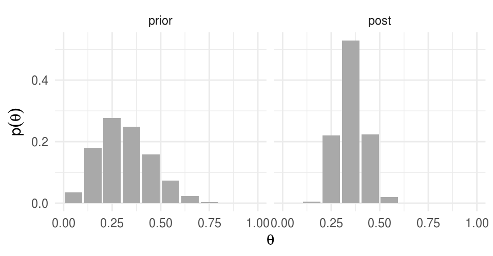

 ¿Cómo se ve la distribución posterior si tomamos 
una muestra de tamaño 90 donde observamos la misma proporción de éxitos. 
Realiza los cálculos y graficala como un panel adicional de la gráfica 
anterior.

* ¿Cómo definirías la distribución inicial si no tuvieras conocimiento de los
artículos y expertos?

#### Evidencia {-}
Ahora, en el teorema de Bayes también encontramos el término $p(x)$ que 
denominamos la __evidencia__, también se conoce como verosimilitud
marginal o inicial predictiva. 
$$p(\theta|x)=\frac{p(x|\theta)p(\theta)}{p(x)}$$

La evidencia es la probabilidad de los datos de acuerdo al modelo y se calcula
sumando a lo largo de todos los posibles valores de los parámetros y ponderando
por nuestra certidumbre en esos valores de los parámetros.

Es importante notar que hablamos de valores de los parámetros $\theta$ 
únicamente en el contexto de un modelo particular pues este el que da sentido a
los parámetros. Podemos hacer evidente el modelo en la notación, 

$$p(\theta|x,M)=\frac{p(x|\theta,M)p(\theta|M)}{p(x|M)}$$

en este contexto la evidencia se define como:

$$p(x|M)=\int p(x|\theta,M)p(\theta|M)d\theta$$

La notación anterior es conveniente sobre todo cuando estamos considerando
más de un modelo y queremos usar los datos para determinar la certeza que 
tenemos en cada modelo. Supongamos que tenemos dos modelos $M_1$ y $M_2$, 
entonces podemos calcular el cociente de $p(M_1|x)$ y $p(M_2|x)$ obteniendo:

$$\frac{p(M_1|x)}{p(M_2|x)} = \frac{p(x|M_1) \cdot p(M_1)}{p(x|M_2)\cdot p(M_2)}$$

El cociente de evidencia $\frac{p(x|M_1)}{p(x|M_2)}$ se conoce como __factor de
Bayes__, y $p(M_i)$ describe nuestras creencias iniciales en cada modelo.


#### Invarianza en el orden de los datos {-}

Vimos que la regla de Bayes nos permite pasar del conocimiento inicial 
$p(\theta)$ al posterior $p(\theta|x)$ conforme recopilamos datos. Supongamos 
ahora que observamos
más datos, los denotamos $x'$, podemos volver a actualizar nuestras creencias
pasando de $p(\theta|x)$ a $p(\theta|x,x')$. Entonces podemos preguntarnos si 
nuestro conocimiento posterior cambia si actualizamos de acuerdo a $x$ primero
y después $x'$ o vice-versa. La respuesta es que si $p(x|\theta)$ y 
$p(x'|\theta)$ son _iid_ entonces el orden en que actualizamos nuestro 
conocimiento no afecta la distribución posterior.

La **invarianza al orden** tiene sentido intuitivamente: Si la función de 
verosimilitud no depende del tiempo o del ordenamineto de los datos, entonces
la posterior tampoco tiene porque depender del ordenamiento de los datos.

<!--
#### Pasos de un análisis de datos bayesiano

Como vimos en los ejemplos, en general un análisis de datos bayesiano sigue los
siguientes pasos:

1. Identificar los datos releventes a nuestra pregunta de investigación, el tipo 
de datos que vamos a describir, que variables se van a predecir, que variables 

2. Definir el modelo descriptivo para los datos. La forma matemática y los 
parámetros deben ser apropiados para los objetivos del análisis.

3. Especificar la distribución inicial de los parámetros.

4. Utilizar inferencia bayesiana para reubicar la credibilidad a lo largo de 
los posibles valores de los parámetros.

5. Verificar que la distribución posterior replique los datos de manera 
razonable, de no ser el caso considerar otros modelos descriptivos para los datos.

En el caso de un volado, los datos consisten en águilas y soles, y para el 
modelo descriptivo necesitamos una expresión del función de verosimilitud:

$p(x|\theta)=\theta^x(1-\theta)^{1-x}$

esto es, $x$ tiene una distribución $Bernoulli(\theta)$.

El siguiente paso es determinar la distribución inicial sobre el espacio de
parámetros, como ejemplo, supongamos que solo hay 3 valores de $\theta$ que consideramos $\theat \in \{(0.25, 0.5, 0.75)\}$, y asignamos las probabilidades
$p(\theta = 0.25) = 0.25$, $p(\theta = 0.5) = 0.5$ y $p(\theta = 0.75) = 0.25$


```r
theta <- c(0.25, 0.5, 0.75)
prior <- data_frame(theta, p = c(0.25, 0.5, 0.25))
```

El siguiente paso es recolectar los datos y utilizar la regla de Bayes para 
reubicar nuestras creencias a lo largo de los posibles valores. Supongamos 
que observamos un único volado y resulta en águila.

-->


```r
Like <- theta ^ 1 * (1 - theta) ^ (1 - 1)
product <- Like * prior$p
post <- product / sum(product)
post
#> [1] 0.125 0.500 0.375
```

### Objetivos de la inferencia {-}
Los tres objetivos de la inferencia son: estimación de parámetros, predicción
de valores y comparación de modelos.

1. La **estimación de parámetros** implica determinar hasta que punto creemos en 
cada posible valor del parámetro. En estadística bayesiana la estimación se 
realiza con la distribución posterior sobre los valores 
de los parámetros $\theta$.  
La siguiente gráfica ejemplifica un experimento Bernoulli, con dos posibles 
iniciales, los datos observados son $N=20$ lanzamientos de moneda que resultan
en $12$ éxitos o águilas.

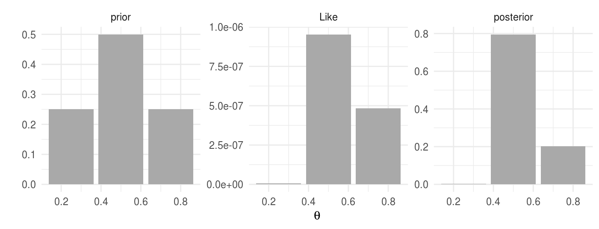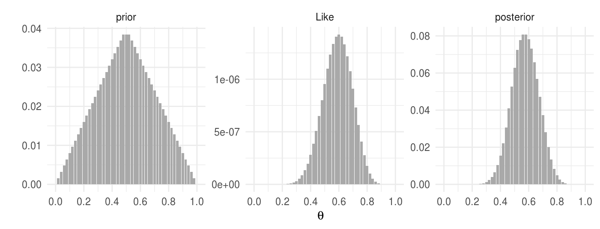

2. **Predicción** de valores. Usando nuestro conocimiento actual nos interesa
predecir la probabilidad de datos futuros. La probabilidad predictiva de un 
dato $y$ (no observado) se determina promediando las probabilidades predictivas 
de los datos a lo largo de todos los posibles valores de los parámetros y 
ponderados por la creencia en los valores de los parámetros. Cuando solo 
contamos con nuestro conocimiento incial tendríamos:
$$p(y) =\int p(y|\theta)p(\theta)d\theta$$
Notese que la ecuación anterior coincide con la correspondiente a la evidencia, 
con la diferencia de que la evidencia se refiere a un valor observado y en 
esta ecuación estamos calculando la probabilidad de cualquier valor $y$.  
Una vez que obserbamos datos tenemos la distribución predictiva posterior:
$$p(y|x) =\int p(y|\theta)p(\theta|x)d\theta$$
Por ejemplo podemos usar las creencias iniciales del modelo 1, que propusimos 
arriba para calcular la probabilidad predictiva de observar águila:

$$p(y=S) = \sum_{\theta}p(y=A|\theta)p(\theta) = 0.5$$

Vale la pena destacar que las prediciones son probabilidades de cada posible
valor condicional a nuestro modelo de creencias actuales. Si nos interesa 
predecir un valor particular en lugar de una distribución a lo largo de todos
los posibles valores podemos usar la media de la distribución predictiva. Por 
tanto el valor a predecir sería:

$$p(y)=\int y p(y) dy$$

La integral anterior únicamente tiene sentido si $y$ es una variable continua. 
Si $y$ es nominal, como el resultado de un volado, entonces podemos usar el 
valor más probable.

<!--
 Calcula las probabilidades predictivas usando 
la distribución posterior de cada modelo. ¿Cuál sería tu predicción?
-->


3. **Comparación de modelos**, una caracterítica conveniente de la comparación 
de modelos en estadística bayesiana es que la complejidad del modelo se toma
en cuenta de manera automática. 

Recordemos los dos modelos discretos, en el primero supusimos que el parámetro
$\theta$ únicamente puede tomar uno de 3 valores (0.25, 0.5, 0.75), esta 
restricción dió lugar a un modelo simple. Por su parte, el modelo 2 es más 
complejo y permite muchos más valores de $\theta$ (51). La forma de la 
distribución inicial es triangular en ambos casos y el valor de mayor 
probabilidad inicial es $\theta = 0.50$ y reflejamos que creemos que es menos
factible que el valor se encuentre en los extremos.

Podemos calcular el factor de Bayes para distintos datos observados:


```r
# Modelo 1, 3 posibles valores
p_M1 <- data_frame(theta = c(0.25, 0.5, 0.75), prior = c(0.25, 0.5, 0.25), 
  modelo ="M1")

# Modelo 2, Creamos una inicial que puede tomar más valores
p <- seq(0, 24, 1)
p2 <- c(p, 24, sort(p, decreasing = TRUE))
p_M2 <- data_frame(theta = seq(0, 1, 0.02), prior = p2 / sum(p2), 
  modelo = "M2")

N <- 20 # estudiantes
z <- 12 # éxitos

dists_h <- bind_rows(p_M1, p_M2) %>% # base de datos horizontal
    group_by(modelo) %>%
    mutate(
        Like = theta ^ z * (1 - theta) ^ (N - z), # verosimilitud 
        posterior = (Like * prior) / sum(Like * prior)
      ) 

dists <- dists_h %>% # base de datos larga
    gather(dist, valor, prior, Like, posterior) %>% 
    mutate(dist = factor(dist, levels = c("prior", "Like", "posterior")))

factorBayes <- function(N, z){
  evidencia <- bind_rows(p_M1, p_M2) %>% # base de datos horizontal
    group_by(modelo) %>%
    mutate(
      Like = theta ^ z * (1 - theta) ^ (N - z), # verosimilitud 
      posterior = (Like * prior) / sum(Like * prior)
    ) %>%
    summarise(evidencia = sum(prior * Like))
  print(evidencia)
  return(evidencia[1, 2] / evidencia[2, 2])
}

factorBayes(50, 25)
#> # A tibble: 2 x 2
#>   modelo evidencia
#>   <chr>      <dbl>
#> 1 M1      4.44e-16
#> 2 M2      2.75e-16
#>   evidencia
#> 1      1.61
factorBayes(100, 75)
#> # A tibble: 2 x 2
#>   modelo evidencia
#>   <chr>      <dbl>
#> 1 M1      9.46e-26
#> 2 M2      4.17e-26
#>   evidencia
#> 1      2.27
factorBayes(100, 10)
#> # A tibble: 2 x 2
#>   modelo evidencia
#>   <chr>      <dbl>
#> 1 M1      1.36e-18
#> 2 M2      2.47e-16
#>   evidencia
#> 1   0.00549
factorBayes(40, 38)
#> # A tibble: 2 x 2
#>   modelo   evidencia
#>   <chr>        <dbl>
#> 1 M1     0.000000279
#> 2 M2     0.00000895
#>   evidencia
#> 1    0.0312
```

¿Cómo explicarías los resultados anteriores?


<!-- $\theta$ 
puede tomar más valores, entonces si en una sucesión de volados observamos 
10% de águilas, el modelo simple no cuenta con un valor de $\theta$ cercano al 
resultado observado, pero el modelo complejo si. Por otra parte, para valores
de $\theta$ que se encuentran en ambos modelos la probabilidad inicial de esos 
valores es mayor en el caso del modelo simple. Por lo tanto si los datos 
observados resultan en valores de $\theta$ congruentes con el modelo simple, 
creeríamos en el modelo simple más que en el modelo más complicado.
-->

La evidencia de un modelo $p(x|M)$ no dice mucho por si misma, si no que es mas
relevante en el contexto del **factor de Bayes** (la evidencia relativa de dos 
modelos). Es importante recordar que la comparación de modelos nos habla 
únicamente de la evidencia relativa de un modelo; sin embargo, puede que
ninguno de los modelos que estamos considerando sean adecuados para nuestros
datos, por lo que más adelante estudiaremos maneras de evaluar un modelo.


### Cálculo de la distribución posterior {-}

En la inferencia Bayesiana se requiere calcular el denominador de la fórmula
de Bayes $p(x)$, es común que esto requiera que se calcule una integral 
complicada; sin embargo, hay algunas maneras de evitar esto,

1. El camino tradicional consiste en usar funciones de verosimilitud con 
dsitribuciones iniciales conjugadas. Cuando una distribución inicial es 
conjugada de la verosimilitud resulta en una distribución posterior con la 
misma forma funcional que la distribución inicial.

2. Otra alternativa es aproximar la integral numericamente. Cuando el espacio de
parámetros es de dimensión chica, se puede cubrir con una cuadrícula de 
puntos y la integral se puede calcular sumando a través de dicha cuadrícula. 
Sin embargo cuando el espacio de parámetros aumenta de dimensión el número de
puntos necesarios para la aproximación crece demasiado y hay que recurrir a otas
técnicas.

3. Se ha desarrollado una clase de métodos de simulación para poder calcular 
la distribución posterior, estos se conocen como cadenas de Markov via Monte
Carlo (MCMC por sus siglas en inglés). El desarrollo de los métodos MCMC es lo
que ha propiciado el desarrollo de la estadística bayesiana en años recientes.


## Distribuciones conjugadas

### Ejemplo: Bernoulli {-}

Comenzaremos con el modelo Beta-Binomial. Recordemos que si X en un experimento 
con dos posibles resultados, X se distribuye Bernoulli y la función de 
probabilidad esta definida por:

$$p(x|\theta)=\theta^x(1-\theta)^{1-x}$$

Ahora, si lanzamos una moneda $N$ veces tenemos un conjunto de datos 
$\{x_1,...,x_N\}$, suponemos que los lanzamientos son independientes por lo 
que la probabilidad de observar el conjunto de $N$ lanzamientos es el 
producto de las probabilidades para cada observación:

$$p(x_1,...,x_N|\theta) = \prod_{n=1}^N p(x_n|\theta)$$
$$= \theta^z(1 - \theta)^{N-z}$$

donde $z$ denota el número de éxitos (águilas).

Ahora, en principio para describir nuestras creencias iniciales podríamos usar
cualquier función de densidad con soporte en $[0, 1]$, sin embargo, sería
conveniente que el producto $p(x|\theta)p(\theta)$ (el numerador de la fórmula 
de Bayes)
resulte en una función con la misma forma que $p(\theta)$. Cuando este es el 
caso, las creencias inicial y posterior se describen con la misma distribución.
Esto es conveninte pues si obtenemos nueva información podemos actualizar 
nuestro conocimiento de manera inmediata, conservando la forma de las 
distribuciones.

<div class="caja">
Cuando las funciones $p(x|\theta)$ y $p(\theta)$ se combinan de tal manera
que la distribución posterior pertenece a la misma familia (tiene la misma
forma) que la distribución inicial, entonces decimos que $p(\theta)$ es 
**conjugada** para $p(x|\theta)$. 
</div>

<br/>
Vale la pena notar que la inicial es conjugada únicamente respecto a una 
función de verosimilitud particular.

Una distribución conjugada para $p(x|\theta) = \theta^z(1 - \theta)^{N-z}$ es 
una Beta(a, b)
$$p(\theta) = \frac {\theta^{a-1}(1-\theta)^{b-1}}{B(a,b)}$$

Para describir nuestro conocimiento inicial podemos explorar la media y 
desviación estándar de la distribución beta, la media es 
$$\bar{\theta} = a/(a+b)$$
por lo que si $a=b$ la media es 0.5 y conforme 
aumenta $a$ en relación a $b$ aumenta la media. La desviación estándar es

$$\sqrt{\bar{\theta}(1-\bar{\theta})/(a+b+1)}$$

Una manera de seleccionar los parámetros $a$ y $b$ es pensar en la 
proporción media de águilas (m) y el tamaño de muestra (n). Ahora, $m=a/(a+b)$
y $n = a+b$, obteniendo.

$$a=mn, b=(1-m)n$$

Otra manera es comenzar con la media y la desviación estándar. Al usar este 
enfoque debemos recordar que la desviación estándar debe tener sentido en el 
contexto de la densidad beta. En particular la desviación estándar típicamente
es menor a 0.289  que corresponde a la desviación estándar de una uniforme.
Entonces, para una densidad beta con media $m$ y desviación estándar $s$, los
parámetros son:
$$a=m\bigg(\frac{m(1-m)}{s^2}- 1\bigg), b=(1-m)\bigg(\frac{m(1-m)}{s^2}- 1\bigg)$$

Una vez que hemos determinado una inicial conveniente para la verosimilitud 
Bernoulli, veamos la posterior. Supongamos que observamos $N$ lanzamientos de 
los cuales $z$ son águilas, entonces podemos ver que la posterior es nuevamente
una densidad Beta.

$$p(\theta|z)\propto \theta^{a+z-1}(1 -\theta)^{(N-z+b)-1}$$

Concluímos entonces que si la distribución inicial es Beta(a,b), la posterior
es Beta(z+a,N-z+b).

Vale la pena explorar la relación entre la distribución inicial y posterior en 
las medias. La media incial es 
$$a/(a+b)$$
y la media posterior es 
$$(z+a)/[(z+a) + (N-z+b)]=(z+a)/(N+a+b)$$
podemos hacer algunas manipulaciones algebráicas para escribirla como:

$$\frac{z+a}{N+a+b}=\frac{z}{N}\frac{N}{N+a+b} + \frac{a}{a+b}\frac{a+b}{N+a+b}$$

es decir, podemos escribir la media posterior como un promedio ponderado entre
la media inicial $a/(a+b)$ y la proporción observada $z/N$.

Ahora podemos pasar a la inferencia, comencemos con estimación de la proporción
$\theta$. La distribución posterior resume todo nuestro conocimiento del 
parámetro $\theta$, en este caso podemos graficar la distribución y extraer 
valores numéricos como la media.


```r
library(gridExtra)

N = 14; z = 11; a = 1; b = 1
base <- ggplot(data_frame(x = c(0, 1)), aes(x)) 

p1 <- base +
    stat_function(fun = dbeta, args = list(shape1 = a, shape2 = b), 
        aes(colour = "inicial"), show.legend = FALSE) + 
    stat_function(fun = dbeta, args = list(shape1 = z + 1, shape2 = N - z + 1), 
        aes(colour = "verosimilitud"), show.legend = FALSE) + 
    stat_function(fun = dbeta, args = list(shape1 = a + z, shape2 = N - z + b), 
        aes(colour = "posterior"), show.legend = FALSE) +
      labs(y = "", colour = "", x = expression(theta))

N = 14; z = 11; a = 100; b = 100
p2 <- base +
    stat_function(fun = dbeta, args = list(shape1 = a, shape2 = b), 
        aes(colour = "inicial")) + 
    stat_function(fun = dbeta, args = list(shape1 = z + 1, shape2 = N - z + 1), 
        aes(colour = "verosimilitud")) + 
    stat_function(fun = dbeta, args = list(shape1 = a + z, shape2 = N - z + b), 
        aes(colour = "posterior")) +
      labs(y = "", colour = "", x = expression(theta))

grid.arrange(p1, p2, nrow = 1, widths = c(0.38, 0.62))
```


```r
knitr::include_app("https://tereom.shinyapps.io/app_bernoulli/", 
    height = "1000px")
```

<iframe src="https://tereom.shinyapps.io/app_bernoulli/?showcase=0" width="672" height="1000px"></iframe>


Una manera de resumir la distribución posterior es a través de intervalos de 
probabilidad, otro uso de los intervalos es establecer que valores del parámetro
son creíbles. 

 Calcula un intervalo del 95% de probabilidad para
cada una de las distribuciones posteriores del ejemplo.


Ahora pasemos a predicción, calculamos la probabilidad de $y =1$:

$$p(y = 1) = \int p(y=1|\theta)p(\theta|z)d\theta$$
$$=\int \theta p(\theta|z,N) d\theta$$
$$=(z+a)/(N+a+b)$$
Esto es, la probabilidad predictiva de águila es la media de la distribución
posterior sobre $\theta$. 

Finalmente, comparemos modelos. Para esto calculamos la evidencia $p(x|M)$
para cada modelo:

$$p(x|M)=\int p(x|\theta,M)p(\theta|M)d\theta$$

en este caso los datos están dados por $z$ y N, en el caso de la incial beta
es fácil calcular la evidencia:

$$p(z)=B(z+a,N-z+b)/B(a,b)$$

En nuestro ejemplo, una inicial tuiene un pico en 0.5 mientras que la otra es
uniforme. Por otra parte, la proporción de 1 observados en la muestra no es
cercana a 0.5 por lo que la inicial picuda no captura los datos muy bien.


```r
# N = 14, z = 11, a = 1, b = 1
beta(12, 4) / beta(1, 1)
#> [1] 0.000183
# N = 14, z = 12, a = 100, b = 100 
beta(126, 126) / beta(100, 100)
#> [1] 1.98e-16
```

Supongamos que observamos una secuencia en la que la mitad de los volados
resultan en águila:


```r
# N = 14, z = 7, a = 1, b = 1
beta(8, 8) / beta(1, 1)
#> [1] 1.94e-05
# N = 14, z = 7, a = 100, b = 100 
beta(107, 107) / beta(100, 100)
#> [1] 5.9e-05
```

En general, preferimos un modelo con un valor mayor de $p(x|\theta)$ pero la 
preferencia no es absoluta, una diferencia chica no nos dice mucho. Debemos
considerar que los datos no son mas que una muestra aleatoria.

 Supongamos que nos interesa analizar el IQ de una
muestra de estudiantes del 
ITAM y suponemos que el IQ de un estudiante tiene una distribución normal 
$x \sim N(\theta, \sigma^2)$ con $\sigma ^ 2$ conocida.

Considera que observamos el IQ de un estudiante $x$. 
La verosimilitud del modelo es:
$$p(x|\theta)=\frac{1}{\sqrt{2\pi\sigma^2}}exp\left(-\frac{1}{2\sigma^2}(x-\theta)^2\right)$$

Realizaremos un análisis bayesiano por lo que hace falta establer una 
distribución inicial, elegimos $p(\theta)$ que se distribuya $N(\mu, \tau^2)$ 
donde elegimos los parámetros $\mu, \tau$ que mejor describan nuestras creencias
iniciales.

Calcula la distribución posterior $p(\theta|x) \propto p(x|\theta)p(\theta)$, 
usando la inicial y verosimilitud que definimos arriba. Una vez que realices la
multiplicación debes identificar el núcleo de una distribución Normal, 
¿cuáles son sus parámetros (media y varianza)?


## Aproximación por cuadrícula

Supongamos que la distribución beta no describe nuestras creencias de manera
adecuada. Por ejemplo, mis creencias podrían estar mejor representadas por una
distribución trimodal: la moneda esta fuertemente sesgada hacia sol, 
fuertemente sesgada hacia águila o es justa. No hay parámetros en una beta
que puedan describir este patrón.

Exploraremos entonces una técnica de aproximación numérica de la distribución 
posterior que consiste en definir la distribución inicial en una cuadrícula
de valores de $\theta$. En este método no necesitamos describir nuestras 
creencias mediante una función matemática ni realizar integración analítica. 
Suponemos que existe únicamente un número finito de valores de $\theta$ que 
creemos que pueden ocurrir (el primer ejemplo que estudiamos usamos esta 
técnica). Es así que la regla de Bayes se escribe como:

$$p(x|\theta)=\frac{p(x|\theta)p(\theta)}{\sum_{\theta}p(x|\theta)p(\theta)}$$

Entonces, si podemos discretizar una distribución inicial continua mediante una
cuadrícula de masas de probabilidad discreta podemos usar la versión discreta 
de la regla de Bayes. El proceso consiste en dividir el dominio en regiones, 
crear un rectángulo con la altura correspondiente al valor de la densidad en 
el punto medio. Aproximamos el área de cada región mediante la altura del 
rectángulo.


```r
# N = 14, z = 11, a = 1, b = 1
N = 14; z = 11
inicial <- data.frame(theta = seq(0.05, 1, 0.05), inicial = rep(1/20, 20))
dists_h <- inicial %>%
    mutate(
        verosimilitud = theta ^ z * (1 - theta) ^ (N - z), # verosimilitud 
        posterior = (verosimilitud * inicial) / sum(verosimilitud * inicial)
        )  
dists <- dists_h %>% # base de datos larga
    gather(dist, valor, inicial, verosimilitud, posterior) %>% 
    mutate(dist = factor(dist, levels = c("inicial", "verosimilitud", "posterior")))

ggplot(dists, aes(x = theta, y = valor)) +
    geom_point() +
    facet_wrap(~ dist, scales = "free") +
    scale_x_continuous(expression(theta), breaks = seq(0, 1, 0.2)) +
    labs(y = "")
```

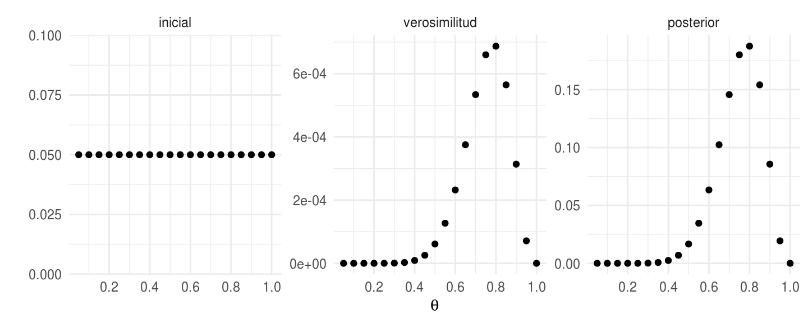

y lo podemos comparar con la versión continua (distribución beta).

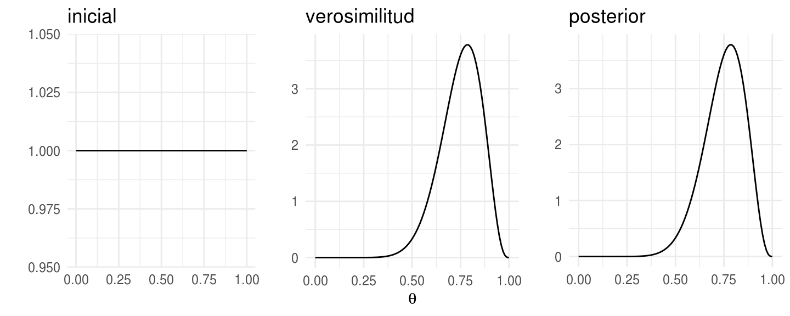


En cuanto a la estimación, la tabla de probabilidades nos da una estimación
para los valores de los parámetros. Podemos calcular la media de $\theta$
como el promedio ponderado por las probabilidades:

$\bar{\theta}=\sum_{\theta} \theta p(\theta|x)$


```r
head(dists_h)
#>   theta inicial verosimilitud posterior
#> 1  0.05    0.05      4.19e-15  1.14e-12
#> 2  0.10    0.05      7.29e-12  1.99e-09
#> 3  0.15    0.05      5.31e-10  1.45e-07
#> 4  0.20    0.05      1.05e-08  2.86e-06
#> 5  0.25    0.05      1.01e-07  2.75e-05
#> 6  0.30    0.05      6.08e-07  1.66e-04
sum(dists_h$posterior * dists_h$theta)
#> [1] 0.75
```

Ahora para intervalos de probabilidad, debido a que estamos usando masas 
discretas, la suma de las masas en un intervalo usualmente no será igual 
a 95% y por tanto elegimos los puntos tales que la masa sea mayor a igual 
a 95% y la masa total sea lo menor posible, en nuestro ejemplo podemos usar
cuantiles.


```r
dist_cum <- cumsum(dists_h$posterior) #vector de distribución acumulada
lb <- which.min(dist_cum < 0.05) - 1
ub <- which.min(dist_cum < 0.975)
dists_h$theta[lb]
#> [1] 0.5
dists_h$theta[ub]
#> [1] 0.9
```

Para el problema de predicción, la probabilidad predictiva para el 
siguiente valor $y$ es simplemente la probabilidad de que ocurra dicho valor
ponderado por la probabilidad posterior correspondiente:

$$p(y|x)=\int p(y|\theta)p(\theta|x)d\theta$$
$$\approx \sum_{\theta} p(y|\theta)p(\theta|x)$$

 Calcula la probabilidad predictiva para $y=1$
usando los datos del ejemplo.

Finalmente, para la comparación de modelos la integral que define la evidencia

$$p(x|M)=\int p(x|\theta,M)p(\theta|M)d\theta$$

se convierte en una suma

$$p(x|M)\approx \sum_{\theta} p(x|\theta,M)p(\theta|M)d\theta$$


```r
# calcula el factor de Bayes para el experimento Bernoulli Modelos M1 y M2
factorBayes <- function(M, s){
  evidencia <- rbind(p_M1, p_M2) %>% # base de datos horizontal
    group_by(modelo) %>%
    mutate(
      Like = theta ^ s * (1 - theta) ^ (M - s), # verosimilitud 
      posterior = (Like * prior) / sum(Like * prior)
    ) %>%
    summarise(evidencia = sum(prior * Like))
  print(evidencia)
  return(evidencia[1, 2] / evidencia[2, 2])
}

factorBayes(50, 25)
#> # A tibble: 2 x 2
#>   modelo evidencia
#>   <chr>      <dbl>
#> 1 M1      4.44e-16
#> 2 M2      2.75e-16
#>   evidencia
#> 1      1.61
```

## MCMC

Hay ocasiones en las que los métodos de inicial conjugada y aproximación por
cuadrícula no funcionan, hay casos en los que la distribución beta no describe
nuestras creencias iniciales. Por su parte, la aproximación por cuadrícula no es
factible cuando tenemos varios parámetros. Es por ello que surge la necesidad de
utilizar métodos de Monte Carlo vía Cadenas de Markov (MCMC).

### Introducción Metrópolis {-}

Para usar Metrópolis debemos poder calcular $p(\theta)$ para un valor
particular de $\theta$ y el valor de la verosimilitud $p(x|\theta)$ para 
cualquier $x$, $\theta$ dados. En realidad, el método únicamente requiere que
se pueda calcular el producto de la inicial y la verosimilitud, y sólo 
hasta una constante de proporcionalidad. Lo que el método produce es una 
aproximación de la distribución posterior $p(\theta|x)$ mediante una 
muestra de valores $\theta$ obtenido de dicha distribución.

**Caminata aleatoria**. Con el fin de entender el algoritmo comenzaremos 
estudiando el concepto de caminata aleatoria. Supongamos que un vendedor de 
*yakult* trabaja a lo largo de una cadena de islas:

* constantemente viaja entre las islas ofreciendo sus productos,

* al final de un día de trabajo decide si permanece en la misma isla o se 
transporta a una de las 2 islas vecinas.

* El vendedor ignora la distribución de la población en las islas y el número 
total de islasx; sin embargo, 
una vez que se encuentra en una isla puede investigar la población de la misma y 
también  de la isla a la que se propone viajar después. 

* El objetivo del vendedor es visitar las islas de manera proporcional a la 
población de cada una. Con esto en mente el vendedor utiliza el siguiente 
proceso: 
    1) Lanza un volado, si el resultado es águila se propone ir a la isla 
del lado izquierdo de su ubicación actual y si es sol a la del lado derecho.
    2) Si la isla propuesta en el paso anterior tiene población mayor a la 
población de la isla actual, el vendedor decide viajar a ella. Si la isla vecina 
tiene población menor, entonces visita la isla propuesta con una probabilidad que 
depende de la población de las islas. Sea $P_{prop}$ la población de la isla 
propuesta y $P_{actual}$ la población de la isla actual. Entonces el vendedor
cambia de isla con probabilidad 
$$p_{mover}=P_{prop}/P_{actual}$$

A la larga, si el vendedor sigue la heurística anterior la probabilidad de que
el vendedor este en alguna de las islas coincide con la población relativa de
la isla. 


```r
islas <- data.frame(islas = 1:10, pob = 1:10)

caminaIsla <- function(i){ # i: isla actual
  u <- runif(1) # volado
  v <- ifelse(u < 0.5, i - 1, i + 1)  # isla vecina (índice)
  if(v < 1 | v > 10){ # si estas en los extremos y el volado indica salir
    return(i)
  }
  u2 <- runif(1)
  p_move = min(islas$pob[v] / islas$pob[i], 1)
  if(p_move  > u2){
    return(v) # isla destino
  }
  else{
    return(i) # me quedo en la misma isla
  }
}

pasos <- 100000
camino <- numeric(pasos)
camino[1] <- sample(1:10, 1) # isla inicial
for(j in 2:pasos){
  camino[j] <- caminaIsla(camino[j - 1])
}

caminata <- data_frame(pasos = 1:pasos, isla = camino)

plot_caminata <- ggplot(caminata[1: 1000, ], aes(x = pasos, y = isla)) +
  geom_point(size = 0.8) +
  geom_path(alpha = 0.5) +
  coord_flip() + 
  labs(title = "Caminata aleatoria") +
  scale_y_continuous(expression(theta), breaks = 1:10) +
  scale_x_continuous("Tiempo")

plot_dist <- ggplot(caminata, aes(x = isla)) +
  geom_histogram() +
  scale_x_continuous(expression(theta), breaks = 1:10) +
  labs(title = "Distribución objetivo", 
       y = expression(P(theta)))

grid.arrange(plot_caminata, plot_dist, ncol = 1, heights = c(4, 2))
#> `stat_bin()` using `bins = 30`. Pick better value with `binwidth`.
```


Entonces:

* Para aproximar la distribución objetivo debemos permitir que el vendedor 
recorra las islas durante una sucesión larga de pasos y registramos sus visitas. 

* Nuestra aproximación de la distribución es justamente el registro de sus 
visitas. 

* Más aún, debemos tener cuidado y excluir la porción de las visitas que se 
encuentran bajo la influencia de la posición inicial. Esto es, debemos excluir 
el **periodo de calentamiento**. 

* Una vez que tenemos un registro _largo_ de los viajes del vendedor (excluyendo 
el calentamiento) podemos aproximar la distribución objetivo de cada valor de 
$\theta$ simplemente contando el número relativo de veces que el vendedor visitó
dicha isla.


```r
t <- c(1:10, 20, 50, 100, 200, 1000, 5000)

plots_list <- lapply(t, function(i){
  ggplot(caminata[1:i, ], aes(x = isla)) +
    geom_histogram() +
    labs(y = "", x = "", title = paste("t = ", i, sep = "")) +
    scale_x_continuous(expression(theta), breaks = 1:10, limits = c(0, 11))
})

args.list <- c(plots_list,list(nrow=4,ncol=4))
invoke(grid.arrange, args.list)
```

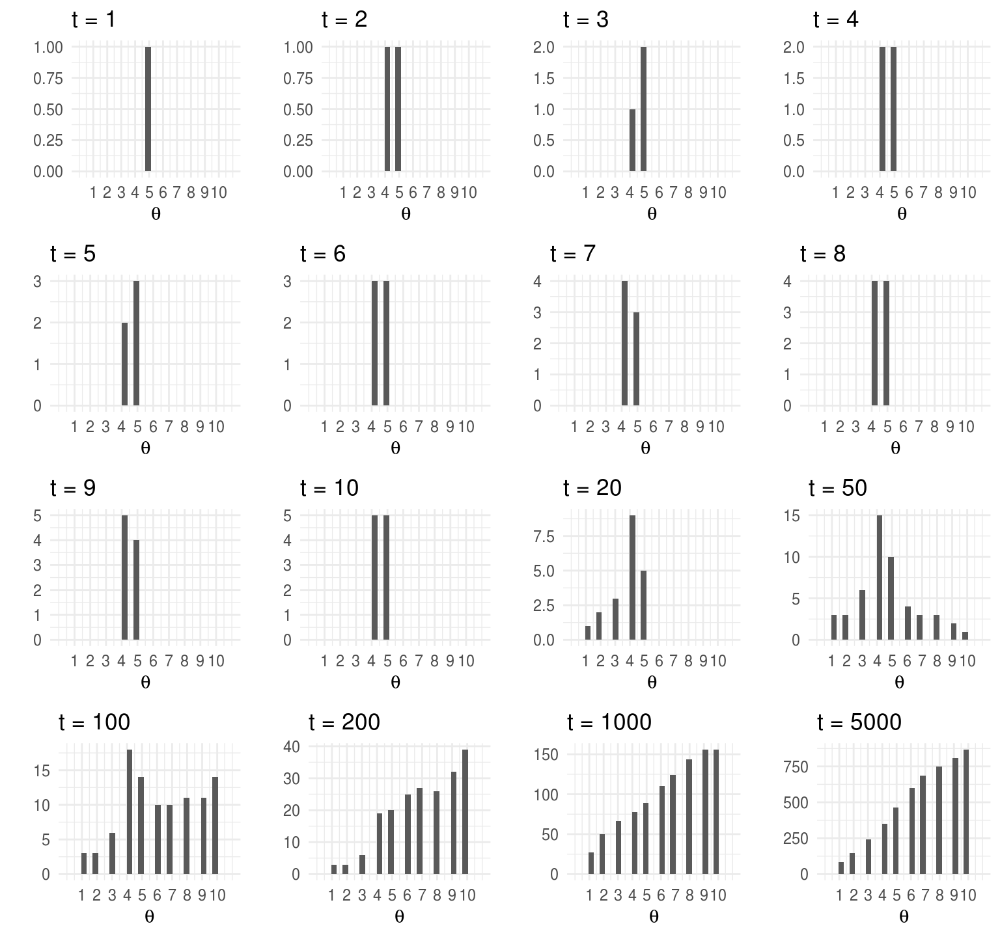


Escribamos el algoritmo, para esto indexamos las islas por el valor
$\theta$, es así que la isla del extremo oeste corresponde a $\theta=1$ y la 
población relativa de cada isla es $P(\theta)$:

1. El vendedor se ubica en $\theta_{actual}$ y propone moverse a la izquierda
o derecha con probabilidad 0.5.  
El rango de los posibles valores para moverse, y la probabilidad de proponer 
cada uno se conoce como **distribución propuesta**, en nuestro ejemplo sólo 
toma dos valores cada uno con probabilidad 0.5. 

2. Una vez que se propone un movimiento, decidimos si aceptarlo. La decisión de
aceptar se basa en el valor de la distribución **objetivo** en la posición
propuesta, relativo al valor de la distribución objetivo en la posición actual:
$$p_{mover}=min\bigg( \frac{P(\theta_{propuesta})}{P(\theta_{actual})},1\bigg)$$
Notemos que la distribución objetivo $P(\theta)$ no necesita estar normalizada, 
esto es porque lo que nos interesa es el cociente $P(\theta_{propuesta})/P(\theta_{actual})$.

3. Una vez que propusimos un movimiento y calculamos la probabilidad de aceptar 
el movimiento aceptamos o rechazamos el movimiento generando un valor de una
distribución uniforme, si dicho valor es menor a $p_{mover}$ entonces hacemos
el movimiento.

Entonces, para utilizar el algoritmo necesitamos ser capaces de:

* Generar un valor de la distribución propuesta (para crear $\theta_{propuesta}$).

* Evaluar la distribución objetivo en cualquier valor propuesto (para calcular
$P(\theta_{propuesta})/P(\theta_{actual})$).

* Generar un valor uniforme (para movernos con probabilidad $p_{mover}$)

Las 3 puntos anteriores nos permiten generar muestras aleatorias de la
distribución objetivo, sin importar si esta está normalizada. Esta técnica es
particularmente útil cuando cuando la distribución objetivo es una posterior
proporcional a $p(x|\theta)p(\theta)$.


Para entender porque funciona el algoritmo de Metrópolis hace falta entender 2
puntos, primero que la distribución objetivo es **estable**: si la probabilidad
_actual_ de ubicarse en una posición coincide con la probabilidad en la 
distribución objetivo, entonces el algoritmo preserva las probabilidades.


```r
library(expm)

transMat <- function(P){ # recibe vector de probabilidades (o población)
  T <- matrix(0, 10, 10)
  n <- length(P - 1) # número de estados
  for(j in 2:n - 1){ # llenamos por fila
    T[j, j - 1] <- 0.5 * min(P[j - 1] / P[j], 1)
    T[j, j] <- 0.5 * (1 - min(P[j - 1] / P[j], 1)) + 
               0.5 * (1 - min(P[j + 1] / P[j], 1))
    T[j, j + 1] <- 0.5 * min(P[j + 1] / P[j], 1)
  }
  # faltan los casos j = 1 y j = n
  T[1, 1] <- 0.5 + 0.5 * (1 - min(P[2] / P[1], 1))
  T[1, 2] <- 0.5 * min(P[2] / P[1], 1)
  T[n, n] <- 0.5 + 0.5 * (1 - min(P[n - 1] / P[n], 1))
  T[n, n - 1] <- 0.5 * min(P[n - 1] / P[n], 1)
  T
}

T <- transMat(islas$pob)

w <- c(0, 1, rep(0, 8))

t <- c(1:10, 20, 50, 100, 200, 1000, 5000)
expT <- map_df(t, ~data.frame(t = ., w %*% (T %^% .)))
expT_long <- expT %>%
    gather(theta, P, -t) %>% 
    mutate(theta = parse_number(theta))

ggplot(expT_long, aes(x = theta, y = P)) +
  geom_bar(stat = "identity", fill = "darkgray") + 
  facet_wrap(~ t) +
  scale_x_continuous(expression(theta), breaks = 1:10, limits = c(0, 11))
```

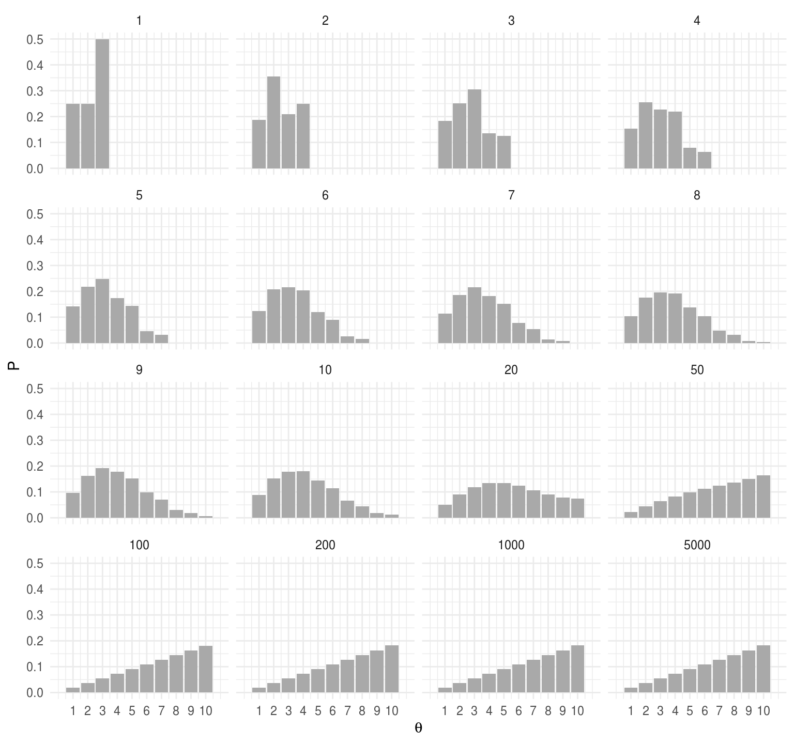

El segundo punto es que el proceso converge a la distribución objetivo. 
Podemos ver, (en nuestro ejemplo sencillo) que sin importar el punto de inicio
se alcanza la distribución objetivo.


```r
inicioP <- function(i){
  w <- rep(0, 10)
  w[i] <- 1
  t <- c(1, 10, 50, 100)
  expT <- map_df(t, ~data.frame(t = ., inicio = i, w %*% (T %^% .))) %>%
    gather(theta, P, -t, -inicio) %>% 
    mutate(theta = parse_number(theta))
  expT
}

expT <- map_df(c(1, 3, 5, 9), inicioP)
ggplot(expT, aes(x = as.numeric(theta), y = P)) +
  geom_bar(stat = "identity", fill = "darkgray") + 
  facet_grid(inicio ~ t) +
  scale_x_continuous(expression(theta), breaks = 1:10, limits = c(0, 11))
```

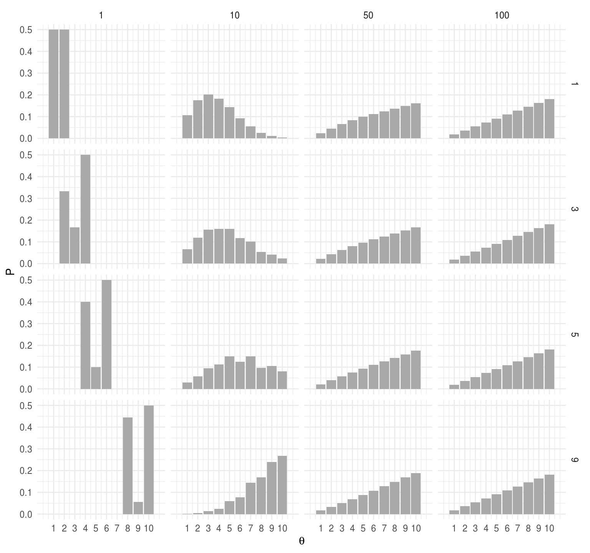

## Metrópolis

En la sección anterior implementamos el algoritmo de Metrópolis en un caso
sencillo: las posiciones eran discretas, en una dimensión y la propuesta era
únicamente mover a la izquierda o a la derecha. El algoritmo general aplica 
para valores continuos, en cualquier número de dimensiones y con distribuciones
propuesta más generales. Lo esencial del método no cambia para el caso general: 

<div class="caja">

#### Metropolis {-}

1. Tenemos una distribución objetivo $p(\theta)$ de la cual buscamos generar
muestras. Debemos ser capaces de calcular el valor de $p(\theta)$ para cualquier
valor candidato $\theta$. La distribución objetivo $p(\theta)$ no tiene que 
estar normalizada, típicamente $p(\theta)$ es la distribución posterior de 
$\theta$ no normalizada, es decir, es el producto de la verosimilitud y la 
inicial.

2. La muestra de la distribución objetivo se genera mediante una caminata
aleatoria a través del espacio de parámetros. La caminata inicia en un lugar 
arbitrario (definido por el usuario). El punto inicial debe ser tal que 
$p(\theta)>0$. La caminata avanza en cada tiempo proponiendo un movimiento a una
nueva posición y después decidiendo si se acepta o no el valor propuesto. Las
distribuciones propuesta pueden tener muchas formas, el objetivo es que la 
distribución propuesta explore el espacio de parámetros de manera eficiente.

3. Una vez que tenemos un valor propuesto calculamos:
$$p_{mover}=min\bigg( \frac{P(\theta_{propuesta})}{P(\theta_{actual})},1\bigg)$$
y aceptamos el valor propuesto con probabilidad $p_{mover}$

Y al final obtenemos valores representativos de la distribución objetivo 
$\{\theta_1,...,\theta_n\}$

Es importante recordar que debemos excluir las primeras observaciones pues 
estas siguen bajo la influencia del valor inicial.

</div>

Retomemos el problema de inferencia Bayesiana y veamos como usar el algoritmo
de Metrópolis cuando la distribución objetivo es la distribución posterior.

#### Ejemplo: Bernoulli

Retomemos el ejemplo del experimento Bernoulli, iniciamos con una función de 
distribución que describa nuestro conocimiento inicial y tal que podamos 
calcular $p(\theta)$ con facilidad. En este caso elegimos una densidad 
beta y podemos usar función dbeta de R:


```r
# p(theta) con theta = 0.4, a = 2, b = 2
dbeta(0.4, 2, 2)
#> [1] 1.44
# Definimos la distribución inicial
prior <- function(a = 1, b = 1){
  function(theta) dbeta(theta, a, b)
}
```

También necesitamos especificar la función de verosimilitud, en nuestro caso 
tenemos repeticiones de un experimento Bernoulli por lo que: 
$$\mathcal{L}(\theta) \propto \theta^{z}(1-\theta)^{N-z}$$

y en R:


```r
# Verosimilitid binomial
likeBern <- function(z, N){
  function(theta){
    theta ^ z * (1 - theta) ^ (N - z)
  }
}
```

Por tanto la distribución posterior $p(\theta|x)$ es, por la regla de Bayes,
proporcional a $p(x|\theta)p(\theta)$. Usamos este producto como la
distribución objetivo en el algoritmo de Metrópolis.


```r
# posterior no normalizada
postRelProb <- function(theta){
  mi_like(theta) * mi_prior(theta)
}
```

Implementemos el algoritmo con una inicial Beta(1,1) (uniforme) y observaciones
$z = \sum{x_i}=11$ y $N = 14$, es decir lanzamos 14 volados de los cuales 11 
resultan en águila.


```r
# Datos observados
N <-  14
z <- 11

# Defino mi inicial y la verosimilitud
mi_prior <- prior() # inicial uniforme
mi_like <- likeBern(z, N) # verosimilitud de los datos observados

# para cada paso decidimos el movimiento de acuerdo a la siguiente función
caminaAleat <- function(theta){ # theta: valor actual
  salto_prop <- rnorm(1, 0, sd = 0.1) # salto propuesto
  theta_prop <- theta + salto_prop # theta propuesta
  if(theta_prop < 0 | theta_prop > 1){ # si el salto implica salir del dominio
    return(theta)
  }
  u <- runif(1) 
  p_move <-  min(postRelProb(theta_prop) / postRelProb(theta), 1) # prob mover
  if(p_move  > u){
    return(theta_prop) # aceptar valor propuesto
  }
  else{
    return(theta) # rechazar
  }
}

set.seed(47405)

pasos <- 6000
camino <- numeric(pasos) # vector que guardará las simulaciones
camino[1] <- 0.1 # valor inicial

# Generamos la caminata aleatoria
for (j in 2:pasos){
  camino[j] <- caminaAleat(camino[j - 1])
}

caminata <- data.frame(pasos = 1:pasos, theta = camino)

ggplot(caminata[1:3000, ], aes(x = pasos, y = theta)) +
  geom_point(size = 0.8) +
  geom_path(alpha = 0.5) +
  scale_y_continuous(expression(theta), limits = c(0, 1)) +
  scale_x_continuous("Tiempo") +
  geom_vline(xintercept = 600, color = "red", alpha = 0.5)
```


```r
# excluímos las primeras observaciones (etapa de calentamiento)
caminata_f <- filter(caminata, pasos > 600)
ggplot(caminata_f, aes(x = theta)) +
  geom_density(adjust = 2, aes(color = "posterior")) +
  labs(title = "Distribución posterior", 
       y = expression(p(theta)), 
       x = expression(theta)) + 
  stat_function(fun = mi_prior, aes(color = "inicial")) + # inicial
  xlim(0, 1)
```


Si la distribución objetivo es muy dispersa y la distribución propuesta muy 
estrecha, entonces se necesitarán muchos pasos para que la caminata aleatoria
cubra la distribución con una muestra representativa.

Por otra parte, si la distribución propuesta es muy dispersa podemos caer en 
rechazar demasiados valores propuestos. Imaginemos que $\theta_{actual}$ se
ubica en una zona de densidad alta, entonces cuando los valores propuestos 
están lejos del valor actual se ubicarán en zonas de menor densidad y 
$p(\theta_{propuesta})/p(\theta_{actual})$ tenderá a ser chico y el movimiento
propuesto será aceptado en pocas ocasiones.

 ¿Qué porcentaje de los valores propuestos son 
aceptados? Si cambias la desviación estándar de la distribución propuesta a
$\sigma = 0.01$ y $\sigma = 2$, ¿Cómo cambia el porcentaje de aceptación de
valores propuestos? ¿De los 3 valores que usamos, qué desviación estándar crees 
que sea más conveniente?


De la muestra de valores de $p(\theta|x)$ obtenidos usando el algoritmo de
Metrópolis podemos estimar aspectos de la verdadera distribución $p(\theta|x)$.
Por ejemplo, para resumir la tendencia central es fácil calcular la media y 
la mediana.


```r
mean(caminata_f$theta)
#> [1] 0.748
sd(caminata_f$theta)
#> [1] 0.109
```

En el caso de predicción:


```r
sims_y <- rbinom(nrow(caminata_f), size = 1, prob = caminata_f$theta)
mean(sims_y) # p(y = 1 | x) probabilidad predictiva
#> [1] 0.75
sd(sims_y)
#> [1] 0.433
```


### Inferencia de dos proporciones binomiales {-}

Consideramos la situación en la que nos interesa estudiar dos proporciones 
$\theta_1$ y $\theta_2$ correspondientes a dos grupos. Queremos determinar
que debemos creer de estas proporciones tras observar datos provenientes de 
ambos grupos. Esto es relevante en muchos casos, por ejemplo, en un análisis
clínico nos podría interesar evaluar el efecto de una nueva medicina y queremos
comoparar la tasa de éxito en el grupo control contra el grupo de tratamiento.

En el marco Bayesiano comenzamos definiendo nuestras creencias iniciales. En 
este caso nuestras creencias describen combinaciones de parámetros, es decir
debemos especificar $p(\theta_1, \theta_2)$ para todas las combinaciones 
$\theta_1, \theta_2$. 

Un caso sencillo es asumir que nuestras creencias de $\theta_1$ son 
independientes de nuestras creencias de $\theta_2$. Esto implica:

$$p(\theta_1, \theta_2) = p(\theta_1)p(\theta_2)$$ 
para todo valor de $\theta_1$
y de $\theta_2$ y donde $p(\theta_1)$ y $p(\theta_2)$ corresponden a las 
distribuciones marginales. Las creencias de los dos parámetros no tienen porque
ser independientes, por ejemplo, puedo creer que dos monedas acuñadas en la 
misma casa de moneda tienen un sesgo similar, en este caso las manipulaciones
matemáticas son más complicadas pero es posible describir estas creencias 
mediante una distribución bivariada.

Además de las creencias iniciales tenemos datos observados. Suponemos que los 
lanzamientos dentro de cada grupo son independientes y que los lanzamientos
entre los grupos también lo son. Es importante recalcar que siempre suponemos
independencia en los datos, sin importar nuestros supuestos de independencia en 
las creencias.

Para el primer grupo observamos la secuencia $\{x_{1,1},...,x_{1,N_1}\}$ que 
contiene $z_1$  águilas, y en el otro grupo observamos la sucesión $\{x_{2,1},...,x_{2,N_2}\}$ que contiene $z_2$ águilas. Es decir, 
$$z_1 = \sum_{i=1}^{N_1}x_{1,i}$$
Por simplicidad denotamos los datos por 
$x =\{x_{1,1},...,x_{1,N_1}x_{2,1},...,x_{2,N_2}\}$

Debido a la independencia de los lanzamientos tenemos:

$$p(x|\theta_1,\theta_2)=\prod_{i=1}^{N_1}p(x_{1,i}|\theta_1,\theta_2)\cdot \prod_{i=1}^{N_2}p(x_{2,i}|\theta_1,\theta_2)$$
$$= \theta_1^{z_1}(1-\theta_1)^{N_1-z_1}\cdot  \theta_2^{z_2}(1-\theta_2)^{N_2-z_2}$$

Usamos la regla de Bayes para calcular la distribución posterior:

$$p(\theta_1,\theta_2|x)=p(x|\theta_1,\theta_2)p(\theta_1, \theta_2) / p(x)$$
$$= \frac{p(x|\theta_1,\theta_2)p(\theta_1, \theta_2)} { \int\int p(x|\theta_1,\theta_2)p(\theta_1, \theta_2)d\theta_1d\theta_2}$$

#### Distribuciones conjugadas {-}

Siguiendo el caso de la familia Beta-Bernoulli que estudiamos en el caso de 
una proporción y suponiendo independencia en las creencias, 
$p(\theta_1, \theta_2) = p(\theta_1)p(\theta_2)$. Escribimos la densidad inicial 
como el producto de dos densidades beta, donde $\theta_1$ se distribuye 
$Beta(a_1, b_1)$ y $\theta_2$ se
distribuye $Beta(a_2, b_2)$. 

$$p(\theta_1, \theta_2)=\frac{\theta_1^{a_1-1}(1-\theta)^{b_1-1}} {B(a_1, b_1)}\frac{\cdot \theta_2^{a_2-1}(1-\theta)^{b_2-1}}{B(a_2, b_2)}$$

donde $B(a, b) = \Gamma(a)\Gamma(b) / \Gamma(a+b)$.

La posterior se escribe:

$$p(\theta_1, \theta_2|x)=\frac{\theta_1^{z_1+a_1-1}(1-\theta)^{b_1-1}\cdot \theta_2^{z_2+a_2-1}(1-\theta)^{b_2-1}}{p(x)\cdot B(a_1, b_1) \cdot B(a_2, b_2)}$$
Resumiendo, cuando la inicial es el producto de distribuciones beta 
independientes, la posterior también es el producto de distribuciones beta
independientes.

Veamos las gráficas.


```r
grid <- expand.grid(x = seq(0.01, 1, 0.01), y = seq(0.01, 1, 0.01))
grid_inicial <- grid %>% 
  mutate(z = round(dbeta(x, 3, 3) * dbeta(y, 3, 3), 1))

binom_2_inicial <- ggplot(grid_inicial, aes(x = x, y = y, z = z)) + 
  # geom_tile(aes(fill = z)) +
    geom_raster(aes(fill = z), show.legend = FALSE) +
    geom_contour(colour = "white") +
    # stat_contour(binwidth = 0.6, aes(color = ..level..), show.legend = FALSE) +
    scale_x_continuous(expression(theta[1]), limits = c(0, 1)) +
    scale_y_continuous(expression(theta[2]), limits = c(0, 1)) +
    scale_color_gradient(expression(p(theta[1],theta[2])), limits = c(0, 8.6)) +
    scale_fill_gradient(expression(p(theta[1],theta[2])), limits = c(0, 8.6)) +
    coord_fixed() +
    labs(title = "Inicial")

# z_1=5, N_1=7, z_2=2, N_2=7, a_1=a_2=b_1=b_2=3
grid_v <- grid %>% 
  mutate(z = round(dbeta(x, 6, 3) * dbeta(y, 3, 6), 1))

binom_2_verosimilitud <- ggplot(grid_v, aes(x = x, y = y, z = z)) + 
    geom_raster(aes(fill = z), show.legend = FALSE) +
    geom_contour(colour = "white") +
    # stat_contour(binwidth = 0.6, aes(color = ..level..), show.legend = FALSE) +
  scale_x_continuous(expression(theta[1]), limits = c(0, 1)) +
  scale_y_continuous(expression(theta[2]), limits = c(0, 1)) +
  scale_color_gradient(expression(p(theta[1],theta[2])), limits = c(0, 8.6)) +
        scale_fill_gradient(expression(p(theta[1],theta[2])), limits = c(0, 8.6)) +
  coord_fixed() +
    labs(title = "Verosimilitud")

# z_1=5, N_1=7, z_2=2, N_2=7
grid_post <- grid %>% 
  mutate(z = round(dbeta(x, 8, 5) * dbeta(y, 5, 8), 1))
  
binom_2_posterior <- ggplot(grid_post, aes(x = x, y = y, z = z)) + 
    geom_raster(aes(fill = z)) +
    geom_contour(colour = "white", show.legend = FALSE) +
    # stat_contour(binwidth = 0.6, aes(color = ..level..), show.legend = FALSE) +
  scale_x_continuous(expression(theta[1]), limits = c(0, 1)) +
  scale_y_continuous(expression(theta[2]), limits = c(0, 1)) +
  # scale_color_gradient(expression(p(theta[1],theta[2])), limits = c(0, 8.6)) +
    scale_fill_gradient(expression(p(theta[1],theta[2])), limits = c(0, 8.6)) +
  coord_fixed() +
    labs(title = "Posterior")

grid.arrange(binom_2_inicial, binom_2_verosimilitud, binom_2_posterior, 
    nrow = 1, widths = c(0.3, 0.3, 0.4))
```


```r
library(plotly)
#> 
#> Attaching package: 'plotly'
#> The following object is masked from 'package:ggplot2':
#> 
#>     last_plot
#> The following object is masked from 'package:stats':
#> 
#>     filter
#> The following object is masked from 'package:graphics':
#> 
#>     layout
grid_inicial_pl <- grid_inicial %>% spread(y, z) %>% as.matrix()
pl_inicial <- plot_ly(z = grid_inicial_pl) %>% add_surface(cmin = 0, cmax = 9)
grid_v_pl <- grid_v %>% spread(y, z) %>% as.matrix()
pl_verosimilitud <- plot_ly(z = grid_v_pl) %>% add_surface(cmin = 0, cmax = 9)
grid_post_pl <- grid_post %>% spread(y, z) %>% as.matrix()
pl_post <- plot_ly(z = grid_post_pl) %>% add_surface(cmin = 0, cmax = 9)

pl_inicial
```

<!--html_preserve--><div id="htmlwidget-2bcb3a29b63cb785652c" style="width:307.2px;height:307.2px;" class="plotly html-widget"></div>
<script type="application/json" data-for="htmlwidget-2bcb3a29b63cb785652c">{"x":{"visdat":{"43bc40bdaac5":["function () ","plotlyVisDat"]},"cur_data":"43bc40bdaac5","attrs":{"43bc40bdaac5":{"z":[[0.01,0,0,0,0,0,0,0,0,0,0,0,0,0,0,0,0,0,0,0,0,0,0,0,0,0,0,0,0,0,0,0,0,0,0,0,0,0,0,0,0,0,0,0,0,0,0,0,0,0,0,0,0,0,0,0,0,0,0,0,0,0,0,0,0,0,0,0,0,0,0,0,0,0,0,0,0,0,0,0,0,0,0,0,0,0,0,0,0,0,0,0,0,0,0,0,0,0,0,0,0],[0.02,0,0,0,0,0,0,0,0,0,0,0,0,0,0,0,0,0,0,0,0,0,0,0,0,0,0,0,0,0,0,0,0,0,0,0,0,0,0,0,0,0,0,0,0,0,0,0,0,0,0,0,0,0,0,0,0,0,0,0,0,0,0,0,0,0,0,0,0,0,0,0,0,0,0,0,0,0,0,0,0,0,0,0,0,0,0,0,0,0,0,0,0,0,0,0,0,0,0,0,0],[0.03,0,0,0,0,0,0,0,0,0,0,0,0,0,0,0,0,0,0,0,0,0,0,0,0,0,0,0,0,0,0,0,0,0,0,0,0,0,0,0,0,0,0,0,0,0,0,0,0,0,0,0,0,0,0,0,0,0,0,0,0,0,0,0,0,0,0,0,0,0,0,0,0,0,0,0,0,0,0,0,0,0,0,0,0,0,0,0,0,0,0,0,0,0,0,0,0,0,0,0,0],[0.04,0,0,0,0,0,0,0,0,0,0,0,0,0,0,0,0,0,0,0,0,0,0,0,0,0,0,0.1,0.1,0.1,0.1,0.1,0.1,0.1,0.1,0.1,0.1,0.1,0.1,0.1,0.1,0.1,0.1,0.1,0.1,0.1,0.1,0.1,0.1,0.1,0.1,0.1,0.1,0.1,0.1,0.1,0.1,0.1,0.1,0.1,0.1,0.1,0.1,0.1,0.1,0.1,0.1,0.1,0.1,0.1,0.1,0.1,0.1,0.1,0,0,0,0,0,0,0,0,0,0,0,0,0,0,0,0,0,0,0,0,0,0,0,0,0,0,0],[0.05,0,0,0,0,0,0,0,0,0,0,0,0,0,0,0,0,0,0,0,0.1,0.1,0.1,0.1,0.1,0.1,0.1,0.1,0.1,0.1,0.1,0.1,0.1,0.1,0.1,0.1,0.1,0.1,0.1,0.1,0.1,0.1,0.1,0.1,0.1,0.1,0.1,0.1,0.1,0.1,0.1,0.1,0.1,0.1,0.1,0.1,0.1,0.1,0.1,0.1,0.1,0.1,0.1,0.1,0.1,0.1,0.1,0.1,0.1,0.1,0.1,0.1,0.1,0.1,0.1,0.1,0.1,0.1,0.1,0.1,0.1,0,0,0,0,0,0,0,0,0,0,0,0,0,0,0,0,0,0,0,0],[0.06,0,0,0,0,0,0,0,0,0,0,0,0,0,0,0,0.1,0.1,0.1,0.1,0.1,0.1,0.1,0.1,0.1,0.1,0.1,0.1,0.1,0.1,0.1,0.1,0.1,0.1,0.1,0.1,0.2,0.2,0.2,0.2,0.2,0.2,0.2,0.2,0.2,0.2,0.2,0.2,0.2,0.2,0.2,0.2,0.2,0.2,0.2,0.2,0.2,0.2,0.2,0.2,0.2,0.2,0.2,0.2,0.2,0.1,0.1,0.1,0.1,0.1,0.1,0.1,0.1,0.1,0.1,0.1,0.1,0.1,0.1,0.1,0.1,0.1,0.1,0.1,0.1,0,0,0,0,0,0,0,0,0,0,0,0,0,0,0,0],[0.07,0,0,0,0,0,0,0,0,0,0,0,0,0,0.1,0.1,0.1,0.1,0.1,0.1,0.1,0.1,0.1,0.1,0.1,0.1,0.1,0.1,0.2,0.2,0.2,0.2,0.2,0.2,0.2,0.2,0.2,0.2,0.2,0.2,0.2,0.2,0.2,0.2,0.2,0.2,0.2,0.2,0.2,0.2,0.2,0.2,0.2,0.2,0.2,0.2,0.2,0.2,0.2,0.2,0.2,0.2,0.2,0.2,0.2,0.2,0.2,0.2,0.2,0.2,0.2,0.2,0.2,0.1,0.1,0.1,0.1,0.1,0.1,0.1,0.1,0.1,0.1,0.1,0.1,0.1,0.1,0,0,0,0,0,0,0,0,0,0,0,0,0,0],[0.08,0,0,0,0,0,0,0,0,0,0,0,0.1,0.1,0.1,0.1,0.1,0.1,0.1,0.1,0.1,0.1,0.1,0.2,0.2,0.2,0.2,0.2,0.2,0.2,0.2,0.2,0.2,0.2,0.2,0.3,0.3,0.3,0.3,0.3,0.3,0.3,0.3,0.3,0.3,0.3,0.3,0.3,0.3,0.3,0.3,0.3,0.3,0.3,0.3,0.3,0.3,0.3,0.3,0.3,0.3,0.3,0.3,0.3,0.3,0.3,0.2,0.2,0.2,0.2,0.2,0.2,0.2,0.2,0.2,0.2,0.2,0.2,0.1,0.1,0.1,0.1,0.1,0.1,0.1,0.1,0.1,0.1,0.1,0,0,0,0,0,0,0,0,0,0,0,0],[0.09,0,0,0,0,0,0,0,0,0,0,0.1,0.1,0.1,0.1,0.1,0.1,0.1,0.1,0.1,0.2,0.2,0.2,0.2,0.2,0.2,0.2,0.2,0.2,0.3,0.3,0.3,0.3,0.3,0.3,0.3,0.3,0.3,0.3,0.3,0.3,0.4,0.4,0.4,0.4,0.4,0.4,0.4,0.4,0.4,0.4,0.4,0.4,0.4,0.4,0.4,0.4,0.4,0.4,0.4,0.3,0.3,0.3,0.3,0.3,0.3,0.3,0.3,0.3,0.3,0.3,0.3,0.2,0.2,0.2,0.2,0.2,0.2,0.2,0.2,0.2,0.1,0.1,0.1,0.1,0.1,0.1,0.1,0.1,0.1,0,0,0,0,0,0,0,0,0,0,0],[0.1,0,0,0,0,0,0,0,0,0,0.1,0.1,0.1,0.1,0.1,0.1,0.1,0.1,0.2,0.2,0.2,0.2,0.2,0.2,0.2,0.3,0.3,0.3,0.3,0.3,0.3,0.3,0.3,0.4,0.4,0.4,0.4,0.4,0.4,0.4,0.4,0.4,0.4,0.4,0.4,0.4,0.4,0.5,0.5,0.5,0.5,0.5,0.5,0.5,0.4,0.4,0.4,0.4,0.4,0.4,0.4,0.4,0.4,0.4,0.4,0.4,0.4,0.4,0.3,0.3,0.3,0.3,0.3,0.3,0.3,0.3,0.2,0.2,0.2,0.2,0.2,0.2,0.2,0.1,0.1,0.1,0.1,0.1,0.1,0.1,0.1,0,0,0,0,0,0,0,0,0,0],[0.11,0,0,0,0,0,0,0,0,0.1,0.1,0.1,0.1,0.1,0.1,0.1,0.2,0.2,0.2,0.2,0.2,0.2,0.3,0.3,0.3,0.3,0.3,0.3,0.4,0.4,0.4,0.4,0.4,0.4,0.4,0.4,0.5,0.5,0.5,0.5,0.5,0.5,0.5,0.5,0.5,0.5,0.5,0.5,0.5,0.5,0.5,0.5,0.5,0.5,0.5,0.5,0.5,0.5,0.5,0.5,0.5,0.5,0.5,0.5,0.5,0.4,0.4,0.4,0.4,0.4,0.4,0.4,0.4,0.3,0.3,0.3,0.3,0.3,0.3,0.2,0.2,0.2,0.2,0.2,0.2,0.1,0.1,0.1,0.1,0.1,0.1,0.1,0,0,0,0,0,0,0,0,0],[0.12,0,0,0,0,0,0,0,0.1,0.1,0.1,0.1,0.1,0.1,0.1,0.2,0.2,0.2,0.2,0.2,0.3,0.3,0.3,0.3,0.3,0.4,0.4,0.4,0.4,0.4,0.4,0.5,0.5,0.5,0.5,0.5,0.5,0.5,0.6,0.6,0.6,0.6,0.6,0.6,0.6,0.6,0.6,0.6,0.6,0.6,0.6,0.6,0.6,0.6,0.6,0.6,0.6,0.6,0.6,0.6,0.6,0.6,0.6,0.5,0.5,0.5,0.5,0.5,0.5,0.5,0.4,0.4,0.4,0.4,0.4,0.4,0.3,0.3,0.3,0.3,0.3,0.2,0.2,0.2,0.2,0.2,0.1,0.1,0.1,0.1,0.1,0.1,0.1,0,0,0,0,0,0,0,0],[0.13,0,0,0,0,0,0,0,0.1,0.1,0.1,0.1,0.1,0.1,0.2,0.2,0.2,0.2,0.3,0.3,0.3,0.3,0.3,0.4,0.4,0.4,0.4,0.4,0.5,0.5,0.5,0.5,0.5,0.6,0.6,0.6,0.6,0.6,0.6,0.7,0.7,0.7,0.7,0.7,0.7,0.7,0.7,0.7,0.7,0.7,0.7,0.7,0.7,0.7,0.7,0.7,0.7,0.7,0.7,0.7,0.7,0.7,0.6,0.6,0.6,0.6,0.6,0.6,0.5,0.5,0.5,0.5,0.5,0.4,0.4,0.4,0.4,0.4,0.3,0.3,0.3,0.3,0.3,0.2,0.2,0.2,0.2,0.1,0.1,0.1,0.1,0.1,0.1,0,0,0,0,0,0,0,0],[0.14,0,0,0,0,0,0,0.1,0.1,0.1,0.1,0.1,0.1,0.2,0.2,0.2,0.2,0.3,0.3,0.3,0.3,0.4,0.4,0.4,0.4,0.5,0.5,0.5,0.5,0.6,0.6,0.6,0.6,0.6,0.7,0.7,0.7,0.7,0.7,0.7,0.8,0.8,0.8,0.8,0.8,0.8,0.8,0.8,0.8,0.8,0.8,0.8,0.8,0.8,0.8,0.8,0.8,0.8,0.8,0.8,0.8,0.7,0.7,0.7,0.7,0.7,0.7,0.6,0.6,0.6,0.6,0.6,0.5,0.5,0.5,0.5,0.4,0.4,0.4,0.4,0.3,0.3,0.3,0.3,0.2,0.2,0.2,0.2,0.1,0.1,0.1,0.1,0.1,0.1,0,0,0,0,0,0,0],[0.15,0,0,0,0,0,0,0.1,0.1,0.1,0.1,0.1,0.2,0.2,0.2,0.2,0.3,0.3,0.3,0.3,0.4,0.4,0.4,0.5,0.5,0.5,0.5,0.6,0.6,0.6,0.6,0.7,0.7,0.7,0.7,0.8,0.8,0.8,0.8,0.8,0.8,0.9,0.9,0.9,0.9,0.9,0.9,0.9,0.9,0.9,0.9,0.9,0.9,0.9,0.9,0.9,0.9,0.9,0.9,0.9,0.8,0.8,0.8,0.8,0.8,0.8,0.7,0.7,0.7,0.7,0.6,0.6,0.6,0.6,0.5,0.5,0.5,0.5,0.4,0.4,0.4,0.3,0.3,0.3,0.3,0.2,0.2,0.2,0.2,0.1,0.1,0.1,0.1,0.1,0,0,0,0,0,0,0],[0.16,0,0,0,0,0,0.1,0.1,0.1,0.1,0.1,0.2,0.2,0.2,0.2,0.3,0.3,0.3,0.4,0.4,0.4,0.4,0.5,0.5,0.5,0.6,0.6,0.6,0.7,0.7,0.7,0.7,0.8,0.8,0.8,0.8,0.9,0.9,0.9,0.9,0.9,1,1,1,1,1,1,1,1,1,1,1,1,1,1,1,1,1,1,1,0.9,0.9,0.9,0.9,0.9,0.8,0.8,0.8,0.8,0.7,0.7,0.7,0.7,0.6,0.6,0.6,0.5,0.5,0.5,0.4,0.4,0.4,0.4,0.3,0.3,0.3,0.2,0.2,0.2,0.2,0.1,0.1,0.1,0.1,0.1,0,0,0,0,0,0],[0.17,0,0,0,0,0,0.1,0.1,0.1,0.1,0.1,0.2,0.2,0.2,0.3,0.3,0.3,0.4,0.4,0.4,0.5,0.5,0.5,0.6,0.6,0.6,0.7,0.7,0.7,0.8,0.8,0.8,0.8,0.9,0.9,0.9,1,1,1,1,1,1,1.1,1.1,1.1,1.1,1.1,1.1,1.1,1.1,1.1,1.1,1.1,1.1,1.1,1.1,1.1,1.1,1.1,1,1,1,1,1,1,0.9,0.9,0.9,0.8,0.8,0.8,0.8,0.7,0.7,0.7,0.6,0.6,0.6,0.5,0.5,0.5,0.4,0.4,0.4,0.3,0.3,0.3,0.2,0.2,0.2,0.1,0.1,0.1,0.1,0.1,0,0,0,0,0,0],[0.18,0,0,0,0,0,0.1,0.1,0.1,0.1,0.2,0.2,0.2,0.3,0.3,0.3,0.4,0.4,0.4,0.5,0.5,0.5,0.6,0.6,0.7,0.7,0.7,0.8,0.8,0.8,0.9,0.9,0.9,1,1,1,1,1.1,1.1,1.1,1.1,1.1,1.2,1.2,1.2,1.2,1.2,1.2,1.2,1.2,1.2,1.2,1.2,1.2,1.2,1.2,1.2,1.2,1.2,1.1,1.1,1.1,1.1,1.1,1,1,1,1,0.9,0.9,0.9,0.8,0.8,0.8,0.7,0.7,0.7,0.6,0.6,0.5,0.5,0.5,0.4,0.4,0.4,0.3,0.3,0.3,0.2,0.2,0.2,0.1,0.1,0.1,0.1,0,0,0,0,0,0],[0.19,0,0,0,0,0,0.1,0.1,0.1,0.1,0.2,0.2,0.2,0.3,0.3,0.3,0.4,0.4,0.5,0.5,0.5,0.6,0.6,0.7,0.7,0.7,0.8,0.8,0.9,0.9,0.9,1,1,1,1.1,1.1,1.1,1.2,1.2,1.2,1.2,1.2,1.3,1.3,1.3,1.3,1.3,1.3,1.3,1.3,1.3,1.3,1.3,1.3,1.3,1.3,1.3,1.3,1.3,1.2,1.2,1.2,1.2,1.2,1.1,1.1,1.1,1,1,1,0.9,0.9,0.9,0.8,0.8,0.7,0.7,0.7,0.6,0.6,0.5,0.5,0.5,0.4,0.4,0.3,0.3,0.3,0.2,0.2,0.2,0.1,0.1,0.1,0.1,0,0,0,0,0,0],[0.2,0,0,0,0,0.1,0.1,0.1,0.1,0.2,0.2,0.2,0.3,0.3,0.3,0.4,0.4,0.5,0.5,0.5,0.6,0.6,0.7,0.7,0.8,0.8,0.9,0.9,0.9,1,1,1.1,1.1,1.1,1.2,1.2,1.2,1.3,1.3,1.3,1.3,1.3,1.4,1.4,1.4,1.4,1.4,1.4,1.4,1.4,1.4,1.4,1.4,1.4,1.4,1.4,1.4,1.4,1.4,1.3,1.3,1.3,1.3,1.3,1.2,1.2,1.2,1.1,1.1,1.1,1,1,0.9,0.9,0.9,0.8,0.8,0.7,0.7,0.6,0.6,0.5,0.5,0.5,0.4,0.4,0.3,0.3,0.3,0.2,0.2,0.2,0.1,0.1,0.1,0.1,0,0,0,0,0],[0.21,0,0,0,0,0.1,0.1,0.1,0.1,0.2,0.2,0.2,0.3,0.3,0.4,0.4,0.4,0.5,0.5,0.6,0.6,0.7,0.7,0.8,0.8,0.9,0.9,1,1,1.1,1.1,1.1,1.2,1.2,1.2,1.3,1.3,1.3,1.4,1.4,1.4,1.4,1.5,1.5,1.5,1.5,1.5,1.5,1.5,1.5,1.5,1.5,1.5,1.5,1.5,1.5,1.5,1.5,1.5,1.4,1.4,1.4,1.4,1.3,1.3,1.3,1.2,1.2,1.2,1.1,1.1,1.1,1,1,0.9,0.9,0.8,0.8,0.7,0.7,0.6,0.6,0.5,0.5,0.4,0.4,0.4,0.3,0.3,0.2,0.2,0.2,0.1,0.1,0.1,0.1,0,0,0,0,0],[0.22,0,0,0,0,0.1,0.1,0.1,0.1,0.2,0.2,0.3,0.3,0.3,0.4,0.4,0.5,0.5,0.6,0.6,0.7,0.7,0.8,0.8,0.9,0.9,1,1,1.1,1.1,1.2,1.2,1.3,1.3,1.3,1.4,1.4,1.4,1.5,1.5,1.5,1.6,1.6,1.6,1.6,1.6,1.6,1.6,1.7,1.7,1.7,1.7,1.7,1.6,1.6,1.6,1.6,1.6,1.6,1.6,1.5,1.5,1.5,1.4,1.4,1.4,1.3,1.3,1.3,1.2,1.2,1.1,1.1,1,1,0.9,0.9,0.8,0.8,0.7,0.7,0.6,0.6,0.5,0.5,0.4,0.4,0.3,0.3,0.3,0.2,0.2,0.1,0.1,0.1,0.1,0,0,0,0,0],[0.23,0,0,0,0,0.1,0.1,0.1,0.2,0.2,0.2,0.3,0.3,0.4,0.4,0.5,0.5,0.6,0.6,0.7,0.7,0.8,0.8,0.9,0.9,1,1,1.1,1.1,1.2,1.2,1.3,1.3,1.4,1.4,1.5,1.5,1.5,1.6,1.6,1.6,1.7,1.7,1.7,1.7,1.7,1.7,1.8,1.8,1.8,1.8,1.8,1.8,1.8,1.7,1.7,1.7,1.7,1.7,1.7,1.6,1.6,1.6,1.5,1.5,1.5,1.4,1.4,1.3,1.3,1.2,1.2,1.1,1.1,1,1,0.9,0.9,0.8,0.8,0.7,0.7,0.6,0.6,0.5,0.5,0.4,0.4,0.3,0.3,0.2,0.2,0.2,0.1,0.1,0.1,0,0,0,0,0],[0.24,0,0,0,0,0.1,0.1,0.1,0.2,0.2,0.2,0.3,0.3,0.4,0.4,0.5,0.5,0.6,0.7,0.7,0.8,0.8,0.9,0.9,1,1.1,1.1,1.2,1.2,1.3,1.3,1.4,1.4,1.5,1.5,1.5,1.6,1.6,1.7,1.7,1.7,1.8,1.8,1.8,1.8,1.8,1.8,1.9,1.9,1.9,1.9,1.9,1.9,1.9,1.8,1.8,1.8,1.8,1.8,1.8,1.7,1.7,1.7,1.6,1.6,1.5,1.5,1.5,1.4,1.4,1.3,1.3,1.2,1.2,1.1,1.1,1,0.9,0.9,0.8,0.8,0.7,0.7,0.6,0.5,0.5,0.4,0.4,0.3,0.3,0.2,0.2,0.2,0.1,0.1,0.1,0,0,0,0,0],[0.25,0,0,0,0,0.1,0.1,0.1,0.2,0.2,0.3,0.3,0.4,0.4,0.5,0.5,0.6,0.6,0.7,0.7,0.8,0.9,0.9,1,1.1,1.1,1.2,1.2,1.3,1.3,1.4,1.4,1.5,1.5,1.6,1.6,1.7,1.7,1.8,1.8,1.8,1.9,1.9,1.9,1.9,1.9,2,2,2,2,2,2,2,2,2,1.9,1.9,1.9,1.9,1.9,1.8,1.8,1.8,1.7,1.7,1.6,1.6,1.5,1.5,1.4,1.4,1.3,1.3,1.2,1.2,1.1,1.1,1,0.9,0.9,0.8,0.7,0.7,0.6,0.6,0.5,0.5,0.4,0.4,0.3,0.3,0.2,0.2,0.1,0.1,0.1,0,0,0,0,0],[0.26,0,0,0,0,0.1,0.1,0.1,0.2,0.2,0.3,0.3,0.4,0.4,0.5,0.5,0.6,0.7,0.7,0.8,0.9,0.9,1,1,1.1,1.2,1.2,1.3,1.4,1.4,1.5,1.5,1.6,1.6,1.7,1.7,1.8,1.8,1.8,1.9,1.9,1.9,2,2,2,2,2.1,2.1,2.1,2.1,2.1,2.1,2.1,2.1,2.1,2,2,2,2,1.9,1.9,1.9,1.8,1.8,1.8,1.7,1.7,1.6,1.6,1.5,1.5,1.4,1.4,1.3,1.2,1.2,1.1,1,1,0.9,0.9,0.8,0.7,0.7,0.6,0.5,0.5,0.4,0.4,0.3,0.3,0.2,0.2,0.1,0.1,0.1,0,0,0,0,0],[0.27,0,0,0,0.1,0.1,0.1,0.1,0.2,0.2,0.3,0.3,0.4,0.4,0.5,0.6,0.6,0.7,0.8,0.8,0.9,1,1,1.1,1.2,1.2,1.3,1.4,1.4,1.5,1.5,1.6,1.7,1.7,1.8,1.8,1.9,1.9,1.9,2,2,2,2.1,2.1,2.1,2.1,2.2,2.2,2.2,2.2,2.2,2.2,2.2,2.2,2.2,2.1,2.1,2.1,2.1,2,2,2,1.9,1.9,1.9,1.8,1.8,1.7,1.7,1.6,1.5,1.5,1.4,1.4,1.3,1.2,1.2,1.1,1,1,0.9,0.8,0.8,0.7,0.6,0.6,0.5,0.4,0.4,0.3,0.3,0.2,0.2,0.1,0.1,0.1,0.1,0,0,0,0],[0.28,0,0,0,0.1,0.1,0.1,0.2,0.2,0.2,0.3,0.4,0.4,0.5,0.5,0.6,0.7,0.7,0.8,0.9,0.9,1,1.1,1.1,1.2,1.3,1.4,1.4,1.5,1.6,1.6,1.7,1.7,1.8,1.8,1.9,1.9,2,2,2.1,2.1,2.1,2.2,2.2,2.2,2.2,2.3,2.3,2.3,2.3,2.3,2.3,2.3,2.3,2.3,2.2,2.2,2.2,2.2,2.1,2.1,2.1,2,2,1.9,1.9,1.8,1.8,1.7,1.7,1.6,1.6,1.5,1.4,1.4,1.3,1.2,1.1,1.1,1,0.9,0.9,0.8,0.7,0.7,0.6,0.5,0.5,0.4,0.4,0.3,0.2,0.2,0.2,0.1,0.1,0.1,0,0,0,0],[0.29,0,0,0,0.1,0.1,0.1,0.2,0.2,0.3,0.3,0.4,0.4,0.5,0.6,0.6,0.7,0.8,0.8,0.9,1,1.1,1.1,1.2,1.3,1.3,1.4,1.5,1.6,1.6,1.7,1.7,1.8,1.9,1.9,2,2,2.1,2.1,2.2,2.2,2.2,2.3,2.3,2.3,2.3,2.4,2.4,2.4,2.4,2.4,2.4,2.4,2.4,2.4,2.3,2.3,2.3,2.3,2.2,2.2,2.2,2.1,2.1,2,2,1.9,1.9,1.8,1.7,1.7,1.6,1.6,1.5,1.4,1.3,1.3,1.2,1.1,1.1,1,0.9,0.8,0.8,0.7,0.6,0.6,0.5,0.4,0.4,0.3,0.3,0.2,0.2,0.1,0.1,0.1,0,0,0,0],[0.3,0,0,0,0.1,0.1,0.1,0.2,0.2,0.3,0.3,0.4,0.4,0.5,0.6,0.6,0.7,0.8,0.9,0.9,1,1.1,1.2,1.2,1.3,1.4,1.5,1.5,1.6,1.7,1.8,1.8,1.9,1.9,2,2.1,2.1,2.2,2.2,2.2,2.3,2.3,2.4,2.4,2.4,2.4,2.4,2.5,2.5,2.5,2.5,2.5,2.5,2.5,2.4,2.4,2.4,2.4,2.4,2.3,2.3,2.2,2.2,2.2,2.1,2.1,2,1.9,1.9,1.8,1.8,1.7,1.6,1.5,1.5,1.4,1.3,1.2,1.2,1.1,1,0.9,0.9,0.8,0.7,0.6,0.6,0.5,0.4,0.4,0.3,0.3,0.2,0.2,0.1,0.1,0.1,0,0,0,0],[0.31,0,0,0,0.1,0.1,0.1,0.2,0.2,0.3,0.3,0.4,0.5,0.5,0.6,0.7,0.7,0.8,0.9,1,1.1,1.1,1.2,1.3,1.4,1.4,1.5,1.6,1.7,1.7,1.8,1.9,1.9,2,2.1,2.1,2.2,2.2,2.3,2.3,2.4,2.4,2.4,2.5,2.5,2.5,2.5,2.6,2.6,2.6,2.6,2.6,2.6,2.6,2.5,2.5,2.5,2.5,2.4,2.4,2.4,2.3,2.3,2.2,2.2,2.1,2.1,2,1.9,1.9,1.8,1.7,1.7,1.6,1.5,1.4,1.4,1.3,1.2,1.1,1.1,1,0.9,0.8,0.7,0.7,0.6,0.5,0.5,0.4,0.3,0.3,0.2,0.2,0.1,0.1,0.1,0,0,0,0],[0.32,0,0,0,0.1,0.1,0.1,0.2,0.2,0.3,0.3,0.4,0.5,0.5,0.6,0.7,0.8,0.8,0.9,1,1.1,1.2,1.3,1.3,1.4,1.5,1.6,1.7,1.7,1.8,1.9,1.9,2,2.1,2.1,2.2,2.3,2.3,2.4,2.4,2.5,2.5,2.5,2.6,2.6,2.6,2.6,2.6,2.7,2.7,2.7,2.7,2.7,2.6,2.6,2.6,2.6,2.6,2.5,2.5,2.5,2.4,2.4,2.3,2.3,2.2,2.1,2.1,2,1.9,1.9,1.8,1.7,1.7,1.6,1.5,1.4,1.3,1.3,1.2,1.1,1,0.9,0.8,0.8,0.7,0.6,0.5,0.5,0.4,0.3,0.3,0.2,0.2,0.1,0.1,0.1,0,0,0,0],[0.33,0,0,0,0.1,0.1,0.1,0.2,0.2,0.3,0.4,0.4,0.5,0.6,0.6,0.7,0.8,0.9,1,1,1.1,1.2,1.3,1.4,1.5,1.5,1.6,1.7,1.8,1.9,1.9,2,2.1,2.2,2.2,2.3,2.3,2.4,2.4,2.5,2.5,2.6,2.6,2.6,2.7,2.7,2.7,2.7,2.7,2.7,2.7,2.7,2.7,2.7,2.7,2.7,2.7,2.6,2.6,2.6,2.5,2.5,2.4,2.4,2.3,2.3,2.2,2.2,2.1,2,1.9,1.9,1.8,1.7,1.6,1.5,1.5,1.4,1.3,1.2,1.1,1,1,0.9,0.8,0.7,0.6,0.6,0.5,0.4,0.4,0.3,0.2,0.2,0.1,0.1,0.1,0,0,0,0],[0.34,0,0,0,0.1,0.1,0.1,0.2,0.2,0.3,0.4,0.4,0.5,0.6,0.7,0.7,0.8,0.9,1,1.1,1.2,1.2,1.3,1.4,1.5,1.6,1.7,1.8,1.8,1.9,2,2.1,2.1,2.2,2.3,2.3,2.4,2.5,2.5,2.6,2.6,2.7,2.7,2.7,2.8,2.8,2.8,2.8,2.8,2.8,2.8,2.8,2.8,2.8,2.8,2.8,2.8,2.7,2.7,2.7,2.6,2.6,2.5,2.5,2.4,2.3,2.3,2.2,2.1,2.1,2,1.9,1.8,1.8,1.7,1.6,1.5,1.4,1.3,1.2,1.2,1.1,1,0.9,0.8,0.7,0.7,0.6,0.5,0.4,0.4,0.3,0.2,0.2,0.1,0.1,0.1,0,0,0,0],[0.35,0,0,0,0.1,0.1,0.1,0.2,0.3,0.3,0.4,0.4,0.5,0.6,0.7,0.8,0.8,0.9,1,1.1,1.2,1.3,1.4,1.5,1.5,1.6,1.7,1.8,1.9,2,2.1,2.1,2.2,2.3,2.3,2.4,2.5,2.5,2.6,2.6,2.7,2.7,2.8,2.8,2.8,2.9,2.9,2.9,2.9,2.9,2.9,2.9,2.9,2.9,2.9,2.9,2.8,2.8,2.8,2.7,2.7,2.6,2.6,2.5,2.5,2.4,2.3,2.3,2.2,2.1,2.1,2,1.9,1.8,1.7,1.6,1.5,1.5,1.4,1.3,1.2,1.1,1,0.9,0.8,0.8,0.7,0.6,0.5,0.4,0.4,0.3,0.3,0.2,0.1,0.1,0.1,0,0,0,0],[0.36,0,0,0,0.1,0.1,0.2,0.2,0.3,0.3,0.4,0.5,0.5,0.6,0.7,0.8,0.9,1,1,1.1,1.2,1.3,1.4,1.5,1.6,1.7,1.8,1.9,1.9,2,2.1,2.2,2.3,2.3,2.4,2.5,2.5,2.6,2.7,2.7,2.8,2.8,2.8,2.9,2.9,2.9,2.9,3,3,3,3,3,3,3,2.9,2.9,2.9,2.9,2.8,2.8,2.8,2.7,2.7,2.6,2.5,2.5,2.4,2.3,2.3,2.2,2.1,2,1.9,1.9,1.8,1.7,1.6,1.5,1.4,1.3,1.2,1.1,1,1,0.9,0.8,0.7,0.6,0.5,0.5,0.4,0.3,0.3,0.2,0.2,0.1,0.1,0,0,0,0],[0.37,0,0,0,0.1,0.1,0.2,0.2,0.3,0.3,0.4,0.5,0.5,0.6,0.7,0.8,0.9,1,1.1,1.2,1.3,1.3,1.4,1.5,1.6,1.7,1.8,1.9,2,2.1,2.2,2.2,2.3,2.4,2.5,2.5,2.6,2.7,2.7,2.8,2.8,2.9,2.9,2.9,3,3,3,3,3,3.1,3.1,3.1,3,3,3,3,3,2.9,2.9,2.9,2.8,2.8,2.7,2.7,2.6,2.5,2.5,2.4,2.3,2.2,2.2,2.1,2,1.9,1.8,1.7,1.6,1.5,1.4,1.3,1.3,1.2,1.1,1,0.9,0.8,0.7,0.6,0.5,0.5,0.4,0.3,0.3,0.2,0.2,0.1,0.1,0,0,0,0],[0.38,0,0,0,0.1,0.1,0.2,0.2,0.3,0.3,0.4,0.5,0.6,0.6,0.7,0.8,0.9,1,1.1,1.2,1.3,1.4,1.5,1.6,1.7,1.8,1.8,1.9,2,2.1,2.2,2.3,2.4,2.4,2.5,2.6,2.7,2.7,2.8,2.8,2.9,2.9,3,3,3,3.1,3.1,3.1,3.1,3.1,3.1,3.1,3.1,3.1,3.1,3.1,3,3,3,2.9,2.9,2.8,2.8,2.7,2.7,2.6,2.5,2.4,2.4,2.3,2.2,2.1,2,1.9,1.8,1.8,1.7,1.6,1.5,1.4,1.3,1.2,1.1,1,0.9,0.8,0.7,0.6,0.6,0.5,0.4,0.3,0.3,0.2,0.2,0.1,0.1,0,0,0,0],[0.39,0,0,0,0.1,0.1,0.2,0.2,0.3,0.3,0.4,0.5,0.6,0.7,0.7,0.8,0.9,1,1.1,1.2,1.3,1.4,1.5,1.6,1.7,1.8,1.9,2,2.1,2.2,2.2,2.3,2.4,2.5,2.6,2.6,2.7,2.8,2.8,2.9,2.9,3,3,3.1,3.1,3.1,3.1,3.2,3.2,3.2,3.2,3.2,3.2,3.2,3.1,3.1,3.1,3.1,3,3,2.9,2.9,2.8,2.8,2.7,2.6,2.6,2.5,2.4,2.3,2.2,2.2,2.1,2,1.9,1.8,1.7,1.6,1.5,1.4,1.3,1.2,1.1,1,0.9,0.8,0.7,0.7,0.6,0.5,0.4,0.3,0.3,0.2,0.2,0.1,0.1,0,0,0,0],[0.4,0,0,0,0.1,0.1,0.2,0.2,0.3,0.3,0.4,0.5,0.6,0.7,0.8,0.8,0.9,1,1.1,1.2,1.3,1.4,1.5,1.6,1.7,1.8,1.9,2,2.1,2.2,2.3,2.4,2.5,2.5,2.6,2.7,2.8,2.8,2.9,2.9,3,3,3.1,3.1,3.1,3.2,3.2,3.2,3.2,3.2,3.2,3.2,3.2,3.2,3.2,3.2,3.1,3.1,3.1,3,3,2.9,2.9,2.8,2.8,2.7,2.6,2.5,2.5,2.4,2.3,2.2,2.1,2,1.9,1.8,1.7,1.6,1.5,1.4,1.3,1.2,1.1,1,0.9,0.8,0.8,0.7,0.6,0.5,0.4,0.3,0.3,0.2,0.2,0.1,0.1,0,0,0,0],[0.41,0,0,0,0.1,0.1,0.2,0.2,0.3,0.4,0.4,0.5,0.6,0.7,0.8,0.9,1,1,1.1,1.2,1.3,1.4,1.6,1.7,1.8,1.9,1.9,2,2.1,2.2,2.3,2.4,2.5,2.6,2.7,2.7,2.8,2.9,2.9,3,3,3.1,3.1,3.2,3.2,3.2,3.2,3.3,3.3,3.3,3.3,3.3,3.3,3.3,3.2,3.2,3.2,3.2,3.1,3.1,3,3,2.9,2.9,2.8,2.7,2.7,2.6,2.5,2.4,2.3,2.2,2.1,2,1.9,1.9,1.8,1.7,1.6,1.4,1.3,1.2,1.1,1,1,0.9,0.8,0.7,0.6,0.5,0.4,0.4,0.3,0.2,0.2,0.1,0.1,0,0,0,0],[0.42,0,0,0,0.1,0.1,0.2,0.2,0.3,0.4,0.4,0.5,0.6,0.7,0.8,0.9,1,1.1,1.2,1.3,1.4,1.5,1.6,1.7,1.8,1.9,2,2.1,2.2,2.3,2.4,2.4,2.5,2.6,2.7,2.8,2.8,2.9,3,3,3.1,3.1,3.2,3.2,3.2,3.3,3.3,3.3,3.3,3.3,3.3,3.3,3.3,3.3,3.3,3.3,3.2,3.2,3.2,3.1,3.1,3,3,2.9,2.8,2.8,2.7,2.6,2.5,2.4,2.4,2.3,2.2,2.1,2,1.9,1.8,1.7,1.6,1.5,1.4,1.3,1.2,1.1,1,0.9,0.8,0.7,0.6,0.5,0.4,0.4,0.3,0.2,0.2,0.1,0.1,0,0,0,0],[0.43,0,0,0,0.1,0.1,0.2,0.2,0.3,0.4,0.4,0.5,0.6,0.7,0.8,0.9,1,1.1,1.2,1.3,1.4,1.5,1.6,1.7,1.8,1.9,2,2.1,2.2,2.3,2.4,2.5,2.6,2.6,2.7,2.8,2.9,2.9,3,3.1,3.1,3.2,3.2,3.2,3.3,3.3,3.3,3.4,3.4,3.4,3.4,3.4,3.4,3.4,3.3,3.3,3.3,3.2,3.2,3.2,3.1,3.1,3,2.9,2.9,2.8,2.7,2.6,2.6,2.5,2.4,2.3,2.2,2.1,2,1.9,1.8,1.7,1.6,1.5,1.4,1.3,1.2,1.1,1,0.9,0.8,0.7,0.6,0.5,0.4,0.4,0.3,0.2,0.2,0.1,0.1,0,0,0,0],[0.44,0,0,0,0.1,0.1,0.2,0.2,0.3,0.4,0.4,0.5,0.6,0.7,0.8,0.9,1,1.1,1.2,1.3,1.4,1.5,1.6,1.7,1.8,1.9,2,2.1,2.2,2.3,2.4,2.5,2.6,2.7,2.8,2.8,2.9,3,3,3.1,3.1,3.2,3.2,3.3,3.3,3.3,3.4,3.4,3.4,3.4,3.4,3.4,3.4,3.4,3.4,3.3,3.3,3.3,3.2,3.2,3.1,3.1,3,3,2.9,2.8,2.8,2.7,2.6,2.5,2.4,2.3,2.2,2.1,2,1.9,1.8,1.7,1.6,1.5,1.4,1.3,1.2,1.1,1,0.9,0.8,0.7,0.6,0.5,0.4,0.4,0.3,0.2,0.2,0.1,0.1,0,0,0,0],[0.45,0,0,0,0.1,0.1,0.2,0.2,0.3,0.4,0.4,0.5,0.6,0.7,0.8,0.9,1,1.1,1.2,1.3,1.4,1.5,1.6,1.7,1.8,1.9,2,2.1,2.2,2.3,2.4,2.5,2.6,2.7,2.8,2.9,2.9,3,3.1,3.1,3.2,3.2,3.3,3.3,3.3,3.4,3.4,3.4,3.4,3.4,3.4,3.4,3.4,3.4,3.4,3.4,3.3,3.3,3.3,3.2,3.2,3.1,3.1,3,2.9,2.9,2.8,2.7,2.6,2.5,2.4,2.3,2.2,2.1,2,1.9,1.8,1.7,1.6,1.5,1.4,1.3,1.2,1.1,1,0.9,0.8,0.7,0.6,0.5,0.4,0.4,0.3,0.2,0.2,0.1,0.1,0,0,0,0],[0.46,0,0,0,0.1,0.1,0.2,0.2,0.3,0.4,0.4,0.5,0.6,0.7,0.8,0.9,1,1.1,1.2,1.3,1.4,1.5,1.6,1.7,1.8,2,2.1,2.2,2.3,2.4,2.4,2.5,2.6,2.7,2.8,2.9,2.9,3,3.1,3.1,3.2,3.2,3.3,3.3,3.4,3.4,3.4,3.4,3.5,3.5,3.5,3.5,3.5,3.4,3.4,3.4,3.4,3.3,3.3,3.2,3.2,3.1,3.1,3,2.9,2.9,2.8,2.7,2.6,2.5,2.4,2.4,2.3,2.2,2.1,2,1.8,1.7,1.6,1.5,1.4,1.3,1.2,1.1,1,0.9,0.8,0.7,0.6,0.5,0.4,0.4,0.3,0.2,0.2,0.1,0.1,0,0,0,0],[0.47,0,0,0,0.1,0.1,0.2,0.2,0.3,0.4,0.5,0.5,0.6,0.7,0.8,0.9,1,1.1,1.2,1.3,1.4,1.5,1.6,1.8,1.9,2,2.1,2.2,2.3,2.4,2.5,2.6,2.6,2.7,2.8,2.9,3,3,3.1,3.2,3.2,3.3,3.3,3.4,3.4,3.4,3.4,3.5,3.5,3.5,3.5,3.5,3.5,3.5,3.4,3.4,3.4,3.4,3.3,3.3,3.2,3.2,3.1,3,3,2.9,2.8,2.7,2.6,2.6,2.5,2.4,2.3,2.2,2.1,2,1.9,1.8,1.6,1.5,1.4,1.3,1.2,1.1,1,0.9,0.8,0.7,0.6,0.5,0.5,0.4,0.3,0.2,0.2,0.1,0.1,0,0,0,0],[0.48,0,0,0,0.1,0.1,0.2,0.2,0.3,0.4,0.5,0.5,0.6,0.7,0.8,0.9,1,1.1,1.2,1.3,1.4,1.5,1.7,1.8,1.9,2,2.1,2.2,2.3,2.4,2.5,2.6,2.7,2.7,2.8,2.9,3,3,3.1,3.2,3.2,3.3,3.3,3.4,3.4,3.4,3.5,3.5,3.5,3.5,3.5,3.5,3.5,3.5,3.5,3.4,3.4,3.4,3.3,3.3,3.2,3.2,3.1,3,3,2.9,2.8,2.7,2.7,2.6,2.5,2.4,2.3,2.2,2.1,2,1.9,1.8,1.7,1.5,1.4,1.3,1.2,1.1,1,0.9,0.8,0.7,0.6,0.5,0.5,0.4,0.3,0.2,0.2,0.1,0.1,0,0,0,0],[0.49,0,0,0,0.1,0.1,0.2,0.2,0.3,0.4,0.5,0.5,0.6,0.7,0.8,0.9,1,1.1,1.2,1.3,1.4,1.5,1.7,1.8,1.9,2,2.1,2.2,2.3,2.4,2.5,2.6,2.7,2.7,2.8,2.9,3,3.1,3.1,3.2,3.2,3.3,3.3,3.4,3.4,3.4,3.5,3.5,3.5,3.5,3.5,3.5,3.5,3.5,3.5,3.4,3.4,3.4,3.3,3.3,3.2,3.2,3.1,3.1,3,2.9,2.8,2.7,2.7,2.6,2.5,2.4,2.3,2.2,2.1,2,1.9,1.8,1.7,1.5,1.4,1.3,1.2,1.1,1,0.9,0.8,0.7,0.6,0.5,0.5,0.4,0.3,0.2,0.2,0.1,0.1,0,0,0,0],[0.5,0,0,0,0.1,0.1,0.2,0.2,0.3,0.4,0.5,0.5,0.6,0.7,0.8,0.9,1,1.1,1.2,1.3,1.4,1.5,1.7,1.8,1.9,2,2.1,2.2,2.3,2.4,2.5,2.6,2.7,2.7,2.8,2.9,3,3.1,3.1,3.2,3.2,3.3,3.3,3.4,3.4,3.4,3.5,3.5,3.5,3.5,3.5,3.5,3.5,3.5,3.5,3.4,3.4,3.4,3.3,3.3,3.2,3.2,3.1,3.1,3,2.9,2.8,2.7,2.7,2.6,2.5,2.4,2.3,2.2,2.1,2,1.9,1.8,1.7,1.5,1.4,1.3,1.2,1.1,1,0.9,0.8,0.7,0.6,0.5,0.5,0.4,0.3,0.2,0.2,0.1,0.1,0,0,0,0],[0.51,0,0,0,0.1,0.1,0.2,0.2,0.3,0.4,0.5,0.5,0.6,0.7,0.8,0.9,1,1.1,1.2,1.3,1.4,1.5,1.7,1.8,1.9,2,2.1,2.2,2.3,2.4,2.5,2.6,2.7,2.7,2.8,2.9,3,3.1,3.1,3.2,3.2,3.3,3.3,3.4,3.4,3.4,3.5,3.5,3.5,3.5,3.5,3.5,3.5,3.5,3.5,3.4,3.4,3.4,3.3,3.3,3.2,3.2,3.1,3.1,3,2.9,2.8,2.7,2.7,2.6,2.5,2.4,2.3,2.2,2.1,2,1.9,1.8,1.7,1.5,1.4,1.3,1.2,1.1,1,0.9,0.8,0.7,0.6,0.5,0.5,0.4,0.3,0.2,0.2,0.1,0.1,0,0,0,0],[0.52,0,0,0,0.1,0.1,0.2,0.2,0.3,0.4,0.5,0.5,0.6,0.7,0.8,0.9,1,1.1,1.2,1.3,1.4,1.5,1.7,1.8,1.9,2,2.1,2.2,2.3,2.4,2.5,2.6,2.7,2.7,2.8,2.9,3,3,3.1,3.2,3.2,3.3,3.3,3.4,3.4,3.4,3.5,3.5,3.5,3.5,3.5,3.5,3.5,3.5,3.5,3.4,3.4,3.4,3.3,3.3,3.2,3.2,3.1,3,3,2.9,2.8,2.7,2.7,2.6,2.5,2.4,2.3,2.2,2.1,2,1.9,1.8,1.7,1.5,1.4,1.3,1.2,1.1,1,0.9,0.8,0.7,0.6,0.5,0.5,0.4,0.3,0.2,0.2,0.1,0.1,0,0,0,0],[0.53,0,0,0,0.1,0.1,0.2,0.2,0.3,0.4,0.5,0.5,0.6,0.7,0.8,0.9,1,1.1,1.2,1.3,1.4,1.5,1.6,1.8,1.9,2,2.1,2.2,2.3,2.4,2.5,2.6,2.6,2.7,2.8,2.9,3,3,3.1,3.2,3.2,3.3,3.3,3.4,3.4,3.4,3.4,3.5,3.5,3.5,3.5,3.5,3.5,3.5,3.4,3.4,3.4,3.4,3.3,3.3,3.2,3.2,3.1,3,3,2.9,2.8,2.7,2.6,2.6,2.5,2.4,2.3,2.2,2.1,2,1.9,1.8,1.6,1.5,1.4,1.3,1.2,1.1,1,0.9,0.8,0.7,0.6,0.5,0.5,0.4,0.3,0.2,0.2,0.1,0.1,0,0,0,0],[0.54,0,0,0,0.1,0.1,0.2,0.2,0.3,0.4,0.4,0.5,0.6,0.7,0.8,0.9,1,1.1,1.2,1.3,1.4,1.5,1.6,1.7,1.8,2,2.1,2.2,2.3,2.4,2.4,2.5,2.6,2.7,2.8,2.9,2.9,3,3.1,3.1,3.2,3.2,3.3,3.3,3.4,3.4,3.4,3.4,3.5,3.5,3.5,3.5,3.5,3.4,3.4,3.4,3.4,3.3,3.3,3.2,3.2,3.1,3.1,3,2.9,2.9,2.8,2.7,2.6,2.5,2.4,2.4,2.3,2.2,2.1,2,1.8,1.7,1.6,1.5,1.4,1.3,1.2,1.1,1,0.9,0.8,0.7,0.6,0.5,0.4,0.4,0.3,0.2,0.2,0.1,0.1,0,0,0,0],[0.55,0,0,0,0.1,0.1,0.2,0.2,0.3,0.4,0.4,0.5,0.6,0.7,0.8,0.9,1,1.1,1.2,1.3,1.4,1.5,1.6,1.7,1.8,1.9,2,2.1,2.2,2.3,2.4,2.5,2.6,2.7,2.8,2.9,2.9,3,3.1,3.1,3.2,3.2,3.3,3.3,3.3,3.4,3.4,3.4,3.4,3.4,3.4,3.4,3.4,3.4,3.4,3.4,3.3,3.3,3.3,3.2,3.2,3.1,3.1,3,2.9,2.9,2.8,2.7,2.6,2.5,2.4,2.3,2.2,2.1,2,1.9,1.8,1.7,1.6,1.5,1.4,1.3,1.2,1.1,1,0.9,0.8,0.7,0.6,0.5,0.4,0.4,0.3,0.2,0.2,0.1,0.1,0,0,0,0],[0.56,0,0,0,0.1,0.1,0.2,0.2,0.3,0.4,0.4,0.5,0.6,0.7,0.8,0.9,1,1.1,1.2,1.3,1.4,1.5,1.6,1.7,1.8,1.9,2,2.1,2.2,2.3,2.4,2.5,2.6,2.7,2.8,2.8,2.9,3,3,3.1,3.1,3.2,3.2,3.3,3.3,3.3,3.4,3.4,3.4,3.4,3.4,3.4,3.4,3.4,3.4,3.3,3.3,3.3,3.2,3.2,3.1,3.1,3,3,2.9,2.8,2.8,2.7,2.6,2.5,2.4,2.3,2.2,2.1,2,1.9,1.8,1.7,1.6,1.5,1.4,1.3,1.2,1.1,1,0.9,0.8,0.7,0.6,0.5,0.4,0.4,0.3,0.2,0.2,0.1,0.1,0,0,0,0],[0.57,0,0,0,0.1,0.1,0.2,0.2,0.3,0.4,0.4,0.5,0.6,0.7,0.8,0.9,1,1.1,1.2,1.3,1.4,1.5,1.6,1.7,1.8,1.9,2,2.1,2.2,2.3,2.4,2.5,2.6,2.6,2.7,2.8,2.9,2.9,3,3.1,3.1,3.2,3.2,3.2,3.3,3.3,3.3,3.4,3.4,3.4,3.4,3.4,3.4,3.4,3.3,3.3,3.3,3.2,3.2,3.2,3.1,3.1,3,2.9,2.9,2.8,2.7,2.6,2.6,2.5,2.4,2.3,2.2,2.1,2,1.9,1.8,1.7,1.6,1.5,1.4,1.3,1.2,1.1,1,0.9,0.8,0.7,0.6,0.5,0.4,0.4,0.3,0.2,0.2,0.1,0.1,0,0,0,0],[0.58,0,0,0,0.1,0.1,0.2,0.2,0.3,0.4,0.4,0.5,0.6,0.7,0.8,0.9,1,1.1,1.2,1.3,1.4,1.5,1.6,1.7,1.8,1.9,2,2.1,2.2,2.3,2.4,2.4,2.5,2.6,2.7,2.8,2.8,2.9,3,3,3.1,3.1,3.2,3.2,3.2,3.3,3.3,3.3,3.3,3.3,3.3,3.3,3.3,3.3,3.3,3.3,3.2,3.2,3.2,3.1,3.1,3,3,2.9,2.8,2.8,2.7,2.6,2.5,2.4,2.4,2.3,2.2,2.1,2,1.9,1.8,1.7,1.6,1.5,1.4,1.3,1.2,1.1,1,0.9,0.8,0.7,0.6,0.5,0.4,0.4,0.3,0.2,0.2,0.1,0.1,0,0,0,0],[0.59,0,0,0,0.1,0.1,0.2,0.2,0.3,0.4,0.4,0.5,0.6,0.7,0.8,0.9,1,1,1.1,1.2,1.3,1.4,1.6,1.7,1.8,1.9,1.9,2,2.1,2.2,2.3,2.4,2.5,2.6,2.7,2.7,2.8,2.9,2.9,3,3,3.1,3.1,3.2,3.2,3.2,3.2,3.3,3.3,3.3,3.3,3.3,3.3,3.3,3.2,3.2,3.2,3.2,3.1,3.1,3,3,2.9,2.9,2.8,2.7,2.7,2.6,2.5,2.4,2.3,2.2,2.1,2,1.9,1.9,1.8,1.7,1.6,1.4,1.3,1.2,1.1,1,1,0.9,0.8,0.7,0.6,0.5,0.4,0.4,0.3,0.2,0.2,0.1,0.1,0,0,0,0],[0.6,0,0,0,0.1,0.1,0.2,0.2,0.3,0.3,0.4,0.5,0.6,0.7,0.8,0.8,0.9,1,1.1,1.2,1.3,1.4,1.5,1.6,1.7,1.8,1.9,2,2.1,2.2,2.3,2.4,2.5,2.5,2.6,2.7,2.8,2.8,2.9,2.9,3,3,3.1,3.1,3.1,3.2,3.2,3.2,3.2,3.2,3.2,3.2,3.2,3.2,3.2,3.2,3.1,3.1,3.1,3,3,2.9,2.9,2.8,2.8,2.7,2.6,2.5,2.5,2.4,2.3,2.2,2.1,2,1.9,1.8,1.7,1.6,1.5,1.4,1.3,1.2,1.1,1,0.9,0.8,0.8,0.7,0.6,0.5,0.4,0.3,0.3,0.2,0.2,0.1,0.1,0,0,0,0],[0.61,0,0,0,0.1,0.1,0.2,0.2,0.3,0.3,0.4,0.5,0.6,0.7,0.7,0.8,0.9,1,1.1,1.2,1.3,1.4,1.5,1.6,1.7,1.8,1.9,2,2.1,2.2,2.2,2.3,2.4,2.5,2.6,2.6,2.7,2.8,2.8,2.9,2.9,3,3,3.1,3.1,3.1,3.1,3.2,3.2,3.2,3.2,3.2,3.2,3.2,3.1,3.1,3.1,3.1,3,3,2.9,2.9,2.8,2.8,2.7,2.6,2.6,2.5,2.4,2.3,2.2,2.2,2.1,2,1.9,1.8,1.7,1.6,1.5,1.4,1.3,1.2,1.1,1,0.9,0.8,0.7,0.7,0.6,0.5,0.4,0.3,0.3,0.2,0.2,0.1,0.1,0,0,0,0],[0.62,0,0,0,0.1,0.1,0.2,0.2,0.3,0.3,0.4,0.5,0.6,0.6,0.7,0.8,0.9,1,1.1,1.2,1.3,1.4,1.5,1.6,1.7,1.8,1.8,1.9,2,2.1,2.2,2.3,2.4,2.4,2.5,2.6,2.7,2.7,2.8,2.8,2.9,2.9,3,3,3,3.1,3.1,3.1,3.1,3.1,3.1,3.1,3.1,3.1,3.1,3.1,3,3,3,2.9,2.9,2.8,2.8,2.7,2.7,2.6,2.5,2.4,2.4,2.3,2.2,2.1,2,1.9,1.8,1.8,1.7,1.6,1.5,1.4,1.3,1.2,1.1,1,0.9,0.8,0.7,0.6,0.6,0.5,0.4,0.3,0.3,0.2,0.2,0.1,0.1,0,0,0,0],[0.63,0,0,0,0.1,0.1,0.2,0.2,0.3,0.3,0.4,0.5,0.5,0.6,0.7,0.8,0.9,1,1.1,1.2,1.3,1.3,1.4,1.5,1.6,1.7,1.8,1.9,2,2.1,2.2,2.2,2.3,2.4,2.5,2.5,2.6,2.7,2.7,2.8,2.8,2.9,2.9,2.9,3,3,3,3,3,3.1,3.1,3.1,3,3,3,3,3,2.9,2.9,2.9,2.8,2.8,2.7,2.7,2.6,2.5,2.5,2.4,2.3,2.2,2.2,2.1,2,1.9,1.8,1.7,1.6,1.5,1.4,1.3,1.3,1.2,1.1,1,0.9,0.8,0.7,0.6,0.5,0.5,0.4,0.3,0.3,0.2,0.2,0.1,0.1,0,0,0,0],[0.64,0,0,0,0.1,0.1,0.2,0.2,0.3,0.3,0.4,0.5,0.5,0.6,0.7,0.8,0.9,1,1,1.1,1.2,1.3,1.4,1.5,1.6,1.7,1.8,1.9,1.9,2,2.1,2.2,2.3,2.3,2.4,2.5,2.5,2.6,2.7,2.7,2.8,2.8,2.8,2.9,2.9,2.9,2.9,3,3,3,3,3,3,3,2.9,2.9,2.9,2.9,2.8,2.8,2.8,2.7,2.7,2.6,2.5,2.5,2.4,2.3,2.3,2.2,2.1,2,1.9,1.9,1.8,1.7,1.6,1.5,1.4,1.3,1.2,1.1,1,1,0.9,0.8,0.7,0.6,0.5,0.5,0.4,0.3,0.3,0.2,0.2,0.1,0.1,0,0,0,0],[0.65,0,0,0,0.1,0.1,0.1,0.2,0.3,0.3,0.4,0.4,0.5,0.6,0.7,0.8,0.8,0.9,1,1.1,1.2,1.3,1.4,1.5,1.5,1.6,1.7,1.8,1.9,2,2.1,2.1,2.2,2.3,2.3,2.4,2.5,2.5,2.6,2.6,2.7,2.7,2.8,2.8,2.8,2.9,2.9,2.9,2.9,2.9,2.9,2.9,2.9,2.9,2.9,2.9,2.8,2.8,2.8,2.7,2.7,2.6,2.6,2.5,2.5,2.4,2.3,2.3,2.2,2.1,2.1,2,1.9,1.8,1.7,1.6,1.5,1.5,1.4,1.3,1.2,1.1,1,0.9,0.8,0.8,0.7,0.6,0.5,0.4,0.4,0.3,0.3,0.2,0.1,0.1,0.1,0,0,0,0],[0.66,0,0,0,0.1,0.1,0.1,0.2,0.2,0.3,0.4,0.4,0.5,0.6,0.7,0.7,0.8,0.9,1,1.1,1.2,1.2,1.3,1.4,1.5,1.6,1.7,1.8,1.8,1.9,2,2.1,2.1,2.2,2.3,2.3,2.4,2.5,2.5,2.6,2.6,2.7,2.7,2.7,2.8,2.8,2.8,2.8,2.8,2.8,2.8,2.8,2.8,2.8,2.8,2.8,2.8,2.7,2.7,2.7,2.6,2.6,2.5,2.5,2.4,2.3,2.3,2.2,2.1,2.1,2,1.9,1.8,1.8,1.7,1.6,1.5,1.4,1.3,1.2,1.2,1.1,1,0.9,0.8,0.7,0.7,0.6,0.5,0.4,0.4,0.3,0.2,0.2,0.1,0.1,0.1,0,0,0,0],[0.67,0,0,0,0.1,0.1,0.1,0.2,0.2,0.3,0.4,0.4,0.5,0.6,0.6,0.7,0.8,0.9,1,1,1.1,1.2,1.3,1.4,1.5,1.5,1.6,1.7,1.8,1.9,1.9,2,2.1,2.2,2.2,2.3,2.3,2.4,2.4,2.5,2.5,2.6,2.6,2.6,2.7,2.7,2.7,2.7,2.7,2.7,2.7,2.7,2.7,2.7,2.7,2.7,2.7,2.6,2.6,2.6,2.5,2.5,2.4,2.4,2.3,2.3,2.2,2.2,2.1,2,1.9,1.9,1.8,1.7,1.6,1.5,1.5,1.4,1.3,1.2,1.1,1,1,0.9,0.8,0.7,0.6,0.6,0.5,0.4,0.4,0.3,0.2,0.2,0.1,0.1,0.1,0,0,0,0],[0.68,0,0,0,0.1,0.1,0.1,0.2,0.2,0.3,0.3,0.4,0.5,0.5,0.6,0.7,0.8,0.8,0.9,1,1.1,1.2,1.3,1.3,1.4,1.5,1.6,1.7,1.7,1.8,1.9,1.9,2,2.1,2.1,2.2,2.3,2.3,2.4,2.4,2.5,2.5,2.5,2.6,2.6,2.6,2.6,2.6,2.7,2.7,2.7,2.7,2.7,2.6,2.6,2.6,2.6,2.6,2.5,2.5,2.5,2.4,2.4,2.3,2.3,2.2,2.1,2.1,2,1.9,1.9,1.8,1.7,1.7,1.6,1.5,1.4,1.3,1.3,1.2,1.1,1,0.9,0.8,0.8,0.7,0.6,0.5,0.5,0.4,0.3,0.3,0.2,0.2,0.1,0.1,0.1,0,0,0,0],[0.69,0,0,0,0.1,0.1,0.1,0.2,0.2,0.3,0.3,0.4,0.5,0.5,0.6,0.7,0.7,0.8,0.9,1,1.1,1.1,1.2,1.3,1.4,1.4,1.5,1.6,1.7,1.7,1.8,1.9,1.9,2,2.1,2.1,2.2,2.2,2.3,2.3,2.4,2.4,2.4,2.5,2.5,2.5,2.5,2.6,2.6,2.6,2.6,2.6,2.6,2.6,2.5,2.5,2.5,2.5,2.4,2.4,2.4,2.3,2.3,2.2,2.2,2.1,2.1,2,1.9,1.9,1.8,1.7,1.7,1.6,1.5,1.4,1.4,1.3,1.2,1.1,1.1,1,0.9,0.8,0.7,0.7,0.6,0.5,0.5,0.4,0.3,0.3,0.2,0.2,0.1,0.1,0.1,0,0,0,0],[0.7,0,0,0,0.1,0.1,0.1,0.2,0.2,0.3,0.3,0.4,0.4,0.5,0.6,0.6,0.7,0.8,0.9,0.9,1,1.1,1.2,1.2,1.3,1.4,1.5,1.5,1.6,1.7,1.8,1.8,1.9,1.9,2,2.1,2.1,2.2,2.2,2.2,2.3,2.3,2.4,2.4,2.4,2.4,2.4,2.5,2.5,2.5,2.5,2.5,2.5,2.5,2.4,2.4,2.4,2.4,2.4,2.3,2.3,2.2,2.2,2.2,2.1,2.1,2,1.9,1.9,1.8,1.8,1.7,1.6,1.5,1.5,1.4,1.3,1.2,1.2,1.1,1,0.9,0.9,0.8,0.7,0.6,0.6,0.5,0.4,0.4,0.3,0.3,0.2,0.2,0.1,0.1,0.1,0,0,0,0],[0.71,0,0,0,0.1,0.1,0.1,0.2,0.2,0.3,0.3,0.4,0.4,0.5,0.6,0.6,0.7,0.8,0.8,0.9,1,1.1,1.1,1.2,1.3,1.3,1.4,1.5,1.6,1.6,1.7,1.7,1.8,1.9,1.9,2,2,2.1,2.1,2.2,2.2,2.2,2.3,2.3,2.3,2.3,2.4,2.4,2.4,2.4,2.4,2.4,2.4,2.4,2.4,2.3,2.3,2.3,2.3,2.2,2.2,2.2,2.1,2.1,2,2,1.9,1.9,1.8,1.7,1.7,1.6,1.6,1.5,1.4,1.3,1.3,1.2,1.1,1.1,1,0.9,0.8,0.8,0.7,0.6,0.6,0.5,0.4,0.4,0.3,0.3,0.2,0.2,0.1,0.1,0.1,0,0,0,0],[0.72,0,0,0,0.1,0.1,0.1,0.2,0.2,0.2,0.3,0.4,0.4,0.5,0.5,0.6,0.7,0.7,0.8,0.9,0.9,1,1.1,1.1,1.2,1.3,1.4,1.4,1.5,1.6,1.6,1.7,1.7,1.8,1.8,1.9,1.9,2,2,2.1,2.1,2.1,2.2,2.2,2.2,2.2,2.3,2.3,2.3,2.3,2.3,2.3,2.3,2.3,2.3,2.2,2.2,2.2,2.2,2.1,2.1,2.1,2,2,1.9,1.9,1.8,1.8,1.7,1.7,1.6,1.6,1.5,1.4,1.4,1.3,1.2,1.1,1.1,1,0.9,0.9,0.8,0.7,0.7,0.6,0.5,0.5,0.4,0.4,0.3,0.2,0.2,0.2,0.1,0.1,0.1,0,0,0,0],[0.73,0,0,0,0.1,0.1,0.1,0.1,0.2,0.2,0.3,0.3,0.4,0.4,0.5,0.6,0.6,0.7,0.8,0.8,0.9,1,1,1.1,1.2,1.2,1.3,1.4,1.4,1.5,1.5,1.6,1.7,1.7,1.8,1.8,1.9,1.9,1.9,2,2,2,2.1,2.1,2.1,2.1,2.2,2.2,2.2,2.2,2.2,2.2,2.2,2.2,2.2,2.1,2.1,2.1,2.1,2,2,2,1.9,1.9,1.9,1.8,1.8,1.7,1.7,1.6,1.5,1.5,1.4,1.4,1.3,1.2,1.2,1.1,1,1,0.9,0.8,0.8,0.7,0.6,0.6,0.5,0.4,0.4,0.3,0.3,0.2,0.2,0.1,0.1,0.1,0.1,0,0,0,0],[0.74,0,0,0,0,0.1,0.1,0.1,0.2,0.2,0.3,0.3,0.4,0.4,0.5,0.5,0.6,0.7,0.7,0.8,0.9,0.9,1,1,1.1,1.2,1.2,1.3,1.4,1.4,1.5,1.5,1.6,1.6,1.7,1.7,1.8,1.8,1.8,1.9,1.9,1.9,2,2,2,2,2.1,2.1,2.1,2.1,2.1,2.1,2.1,2.1,2.1,2,2,2,2,1.9,1.9,1.9,1.8,1.8,1.8,1.7,1.7,1.6,1.6,1.5,1.5,1.4,1.4,1.3,1.2,1.2,1.1,1,1,0.9,0.9,0.8,0.7,0.7,0.6,0.5,0.5,0.4,0.4,0.3,0.3,0.2,0.2,0.1,0.1,0.1,0,0,0,0,0],[0.75,0,0,0,0,0.1,0.1,0.1,0.2,0.2,0.3,0.3,0.4,0.4,0.5,0.5,0.6,0.6,0.7,0.7,0.8,0.9,0.9,1,1.1,1.1,1.2,1.2,1.3,1.3,1.4,1.4,1.5,1.5,1.6,1.6,1.7,1.7,1.8,1.8,1.8,1.9,1.9,1.9,1.9,1.9,2,2,2,2,2,2,2,2,2,1.9,1.9,1.9,1.9,1.9,1.8,1.8,1.8,1.7,1.7,1.6,1.6,1.5,1.5,1.4,1.4,1.3,1.3,1.2,1.2,1.1,1.1,1,0.9,0.9,0.8,0.7,0.7,0.6,0.6,0.5,0.5,0.4,0.4,0.3,0.3,0.2,0.2,0.1,0.1,0.1,0,0,0,0,0],[0.76,0,0,0,0,0.1,0.1,0.1,0.2,0.2,0.2,0.3,0.3,0.4,0.4,0.5,0.5,0.6,0.7,0.7,0.8,0.8,0.9,0.9,1,1.1,1.1,1.2,1.2,1.3,1.3,1.4,1.4,1.5,1.5,1.5,1.6,1.6,1.7,1.7,1.7,1.8,1.8,1.8,1.8,1.8,1.8,1.9,1.9,1.9,1.9,1.9,1.9,1.9,1.8,1.8,1.8,1.8,1.8,1.8,1.7,1.7,1.7,1.6,1.6,1.5,1.5,1.5,1.4,1.4,1.3,1.3,1.2,1.2,1.1,1.1,1,0.9,0.9,0.8,0.8,0.7,0.7,0.6,0.5,0.5,0.4,0.4,0.3,0.3,0.2,0.2,0.2,0.1,0.1,0.1,0,0,0,0,0],[0.77,0,0,0,0,0.1,0.1,0.1,0.2,0.2,0.2,0.3,0.3,0.4,0.4,0.5,0.5,0.6,0.6,0.7,0.7,0.8,0.8,0.9,0.9,1,1,1.1,1.1,1.2,1.2,1.3,1.3,1.4,1.4,1.5,1.5,1.5,1.6,1.6,1.6,1.7,1.7,1.7,1.7,1.7,1.7,1.8,1.8,1.8,1.8,1.8,1.8,1.8,1.7,1.7,1.7,1.7,1.7,1.7,1.6,1.6,1.6,1.5,1.5,1.5,1.4,1.4,1.3,1.3,1.2,1.2,1.1,1.1,1,1,0.9,0.9,0.8,0.8,0.7,0.7,0.6,0.6,0.5,0.5,0.4,0.4,0.3,0.3,0.2,0.2,0.2,0.1,0.1,0.1,0,0,0,0,0],[0.78,0,0,0,0,0.1,0.1,0.1,0.1,0.2,0.2,0.3,0.3,0.3,0.4,0.4,0.5,0.5,0.6,0.6,0.7,0.7,0.8,0.8,0.9,0.9,1,1,1.1,1.1,1.2,1.2,1.3,1.3,1.3,1.4,1.4,1.4,1.5,1.5,1.5,1.6,1.6,1.6,1.6,1.6,1.6,1.6,1.7,1.7,1.7,1.7,1.7,1.6,1.6,1.6,1.6,1.6,1.6,1.6,1.5,1.5,1.5,1.4,1.4,1.4,1.3,1.3,1.3,1.2,1.2,1.1,1.1,1,1,0.9,0.9,0.8,0.8,0.7,0.7,0.6,0.6,0.5,0.5,0.4,0.4,0.3,0.3,0.3,0.2,0.2,0.1,0.1,0.1,0.1,0,0,0,0,0],[0.79,0,0,0,0,0.1,0.1,0.1,0.1,0.2,0.2,0.2,0.3,0.3,0.4,0.4,0.4,0.5,0.5,0.6,0.6,0.7,0.7,0.8,0.8,0.9,0.9,1,1,1.1,1.1,1.1,1.2,1.2,1.2,1.3,1.3,1.3,1.4,1.4,1.4,1.4,1.5,1.5,1.5,1.5,1.5,1.5,1.5,1.5,1.5,1.5,1.5,1.5,1.5,1.5,1.5,1.5,1.5,1.4,1.4,1.4,1.4,1.3,1.3,1.3,1.2,1.2,1.2,1.1,1.1,1.1,1,1,0.9,0.9,0.8,0.8,0.7,0.7,0.6,0.6,0.5,0.5,0.4,0.4,0.4,0.3,0.3,0.2,0.2,0.2,0.1,0.1,0.1,0.1,0,0,0,0,0],[0.8,0,0,0,0,0.1,0.1,0.1,0.1,0.2,0.2,0.2,0.3,0.3,0.3,0.4,0.4,0.5,0.5,0.5,0.6,0.6,0.7,0.7,0.8,0.8,0.9,0.9,0.9,1,1,1.1,1.1,1.1,1.2,1.2,1.2,1.3,1.3,1.3,1.3,1.3,1.4,1.4,1.4,1.4,1.4,1.4,1.4,1.4,1.4,1.4,1.4,1.4,1.4,1.4,1.4,1.4,1.4,1.3,1.3,1.3,1.3,1.3,1.2,1.2,1.2,1.1,1.1,1.1,1,1,0.9,0.9,0.9,0.8,0.8,0.7,0.7,0.6,0.6,0.5,0.5,0.5,0.4,0.4,0.3,0.3,0.3,0.2,0.2,0.2,0.1,0.1,0.1,0.1,0,0,0,0,0],[0.81,0,0,0,0,0,0.1,0.1,0.1,0.1,0.2,0.2,0.2,0.3,0.3,0.3,0.4,0.4,0.5,0.5,0.5,0.6,0.6,0.7,0.7,0.7,0.8,0.8,0.9,0.9,0.9,1,1,1,1.1,1.1,1.1,1.2,1.2,1.2,1.2,1.2,1.3,1.3,1.3,1.3,1.3,1.3,1.3,1.3,1.3,1.3,1.3,1.3,1.3,1.3,1.3,1.3,1.3,1.2,1.2,1.2,1.2,1.2,1.1,1.1,1.1,1,1,1,0.9,0.9,0.9,0.8,0.8,0.7,0.7,0.7,0.6,0.6,0.5,0.5,0.5,0.4,0.4,0.3,0.3,0.3,0.2,0.2,0.2,0.1,0.1,0.1,0.1,0,0,0,0,0,0],[0.82,0,0,0,0,0,0.1,0.1,0.1,0.1,0.2,0.2,0.2,0.3,0.3,0.3,0.4,0.4,0.4,0.5,0.5,0.5,0.6,0.6,0.7,0.7,0.7,0.8,0.8,0.8,0.9,0.9,0.9,1,1,1,1,1.1,1.1,1.1,1.1,1.1,1.2,1.2,1.2,1.2,1.2,1.2,1.2,1.2,1.2,1.2,1.2,1.2,1.2,1.2,1.2,1.2,1.2,1.1,1.1,1.1,1.1,1.1,1,1,1,1,0.9,0.9,0.9,0.8,0.8,0.8,0.7,0.7,0.7,0.6,0.6,0.5,0.5,0.5,0.4,0.4,0.4,0.3,0.3,0.3,0.2,0.2,0.2,0.1,0.1,0.1,0.1,0,0,0,0,0,0],[0.83,0,0,0,0,0,0.1,0.1,0.1,0.1,0.1,0.2,0.2,0.2,0.3,0.3,0.3,0.4,0.4,0.4,0.5,0.5,0.5,0.6,0.6,0.6,0.7,0.7,0.7,0.8,0.8,0.8,0.8,0.9,0.9,0.9,1,1,1,1,1,1,1.1,1.1,1.1,1.1,1.1,1.1,1.1,1.1,1.1,1.1,1.1,1.1,1.1,1.1,1.1,1.1,1.1,1,1,1,1,1,1,0.9,0.9,0.9,0.8,0.8,0.8,0.8,0.7,0.7,0.7,0.6,0.6,0.6,0.5,0.5,0.5,0.4,0.4,0.4,0.3,0.3,0.3,0.2,0.2,0.2,0.1,0.1,0.1,0.1,0.1,0,0,0,0,0,0],[0.84,0,0,0,0,0,0.1,0.1,0.1,0.1,0.1,0.2,0.2,0.2,0.2,0.3,0.3,0.3,0.4,0.4,0.4,0.4,0.5,0.5,0.5,0.6,0.6,0.6,0.7,0.7,0.7,0.7,0.8,0.8,0.8,0.8,0.9,0.9,0.9,0.9,0.9,1,1,1,1,1,1,1,1,1,1,1,1,1,1,1,1,1,1,1,0.9,0.9,0.9,0.9,0.9,0.8,0.8,0.8,0.8,0.7,0.7,0.7,0.7,0.6,0.6,0.6,0.5,0.5,0.5,0.4,0.4,0.4,0.4,0.3,0.3,0.3,0.2,0.2,0.2,0.2,0.1,0.1,0.1,0.1,0.1,0,0,0,0,0,0],[0.85,0,0,0,0,0,0,0.1,0.1,0.1,0.1,0.1,0.2,0.2,0.2,0.2,0.3,0.3,0.3,0.3,0.4,0.4,0.4,0.5,0.5,0.5,0.5,0.6,0.6,0.6,0.6,0.7,0.7,0.7,0.7,0.8,0.8,0.8,0.8,0.8,0.8,0.9,0.9,0.9,0.9,0.9,0.9,0.9,0.9,0.9,0.9,0.9,0.9,0.9,0.9,0.9,0.9,0.9,0.9,0.9,0.8,0.8,0.8,0.8,0.8,0.8,0.7,0.7,0.7,0.7,0.6,0.6,0.6,0.6,0.5,0.5,0.5,0.5,0.4,0.4,0.4,0.3,0.3,0.3,0.3,0.2,0.2,0.2,0.2,0.1,0.1,0.1,0.1,0.1,0,0,0,0,0,0,0],[0.86,0,0,0,0,0,0,0.1,0.1,0.1,0.1,0.1,0.1,0.2,0.2,0.2,0.2,0.3,0.3,0.3,0.3,0.4,0.4,0.4,0.4,0.5,0.5,0.5,0.5,0.6,0.6,0.6,0.6,0.6,0.7,0.7,0.7,0.7,0.7,0.7,0.8,0.8,0.8,0.8,0.8,0.8,0.8,0.8,0.8,0.8,0.8,0.8,0.8,0.8,0.8,0.8,0.8,0.8,0.8,0.8,0.8,0.7,0.7,0.7,0.7,0.7,0.7,0.6,0.6,0.6,0.6,0.6,0.5,0.5,0.5,0.5,0.4,0.4,0.4,0.4,0.3,0.3,0.3,0.3,0.2,0.2,0.2,0.2,0.1,0.1,0.1,0.1,0.1,0.1,0,0,0,0,0,0,0],[0.87,0,0,0,0,0,0,0,0.1,0.1,0.1,0.1,0.1,0.1,0.2,0.2,0.2,0.2,0.3,0.3,0.3,0.3,0.3,0.4,0.4,0.4,0.4,0.4,0.5,0.5,0.5,0.5,0.5,0.6,0.6,0.6,0.6,0.6,0.6,0.7,0.7,0.7,0.7,0.7,0.7,0.7,0.7,0.7,0.7,0.7,0.7,0.7,0.7,0.7,0.7,0.7,0.7,0.7,0.7,0.7,0.7,0.7,0.6,0.6,0.6,0.6,0.6,0.6,0.5,0.5,0.5,0.5,0.5,0.4,0.4,0.4,0.4,0.4,0.3,0.3,0.3,0.3,0.3,0.2,0.2,0.2,0.2,0.1,0.1,0.1,0.1,0.1,0.1,0,0,0,0,0,0,0,0],[0.88,0,0,0,0,0,0,0,0.1,0.1,0.1,0.1,0.1,0.1,0.1,0.2,0.2,0.2,0.2,0.2,0.3,0.3,0.3,0.3,0.3,0.4,0.4,0.4,0.4,0.4,0.4,0.5,0.5,0.5,0.5,0.5,0.5,0.5,0.6,0.6,0.6,0.6,0.6,0.6,0.6,0.6,0.6,0.6,0.6,0.6,0.6,0.6,0.6,0.6,0.6,0.6,0.6,0.6,0.6,0.6,0.6,0.6,0.6,0.5,0.5,0.5,0.5,0.5,0.5,0.5,0.4,0.4,0.4,0.4,0.4,0.4,0.3,0.3,0.3,0.3,0.3,0.2,0.2,0.2,0.2,0.2,0.1,0.1,0.1,0.1,0.1,0.1,0.1,0,0,0,0,0,0,0,0],[0.89,0,0,0,0,0,0,0,0,0.1,0.1,0.1,0.1,0.1,0.1,0.1,0.2,0.2,0.2,0.2,0.2,0.2,0.3,0.3,0.3,0.3,0.3,0.3,0.4,0.4,0.4,0.4,0.4,0.4,0.4,0.4,0.5,0.5,0.5,0.5,0.5,0.5,0.5,0.5,0.5,0.5,0.5,0.5,0.5,0.5,0.5,0.5,0.5,0.5,0.5,0.5,0.5,0.5,0.5,0.5,0.5,0.5,0.5,0.5,0.5,0.4,0.4,0.4,0.4,0.4,0.4,0.4,0.4,0.3,0.3,0.3,0.3,0.3,0.3,0.2,0.2,0.2,0.2,0.2,0.2,0.1,0.1,0.1,0.1,0.1,0.1,0.1,0,0,0,0,0,0,0,0,0],[0.9,0,0,0,0,0,0,0,0,0,0.1,0.1,0.1,0.1,0.1,0.1,0.1,0.1,0.2,0.2,0.2,0.2,0.2,0.2,0.2,0.3,0.3,0.3,0.3,0.3,0.3,0.3,0.3,0.4,0.4,0.4,0.4,0.4,0.4,0.4,0.4,0.4,0.4,0.4,0.4,0.4,0.4,0.5,0.5,0.5,0.5,0.5,0.5,0.5,0.4,0.4,0.4,0.4,0.4,0.4,0.4,0.4,0.4,0.4,0.4,0.4,0.4,0.4,0.3,0.3,0.3,0.3,0.3,0.3,0.3,0.3,0.2,0.2,0.2,0.2,0.2,0.2,0.2,0.1,0.1,0.1,0.1,0.1,0.1,0.1,0.1,0,0,0,0,0,0,0,0,0,0],[0.91,0,0,0,0,0,0,0,0,0,0,0.1,0.1,0.1,0.1,0.1,0.1,0.1,0.1,0.1,0.2,0.2,0.2,0.2,0.2,0.2,0.2,0.2,0.2,0.3,0.3,0.3,0.3,0.3,0.3,0.3,0.3,0.3,0.3,0.3,0.3,0.4,0.4,0.4,0.4,0.4,0.4,0.4,0.4,0.4,0.4,0.4,0.4,0.4,0.4,0.4,0.4,0.4,0.4,0.4,0.3,0.3,0.3,0.3,0.3,0.3,0.3,0.3,0.3,0.3,0.3,0.3,0.2,0.2,0.2,0.2,0.2,0.2,0.2,0.2,0.2,0.1,0.1,0.1,0.1,0.1,0.1,0.1,0.1,0.1,0,0,0,0,0,0,0,0,0,0,0],[0.92,0,0,0,0,0,0,0,0,0,0,0,0.1,0.1,0.1,0.1,0.1,0.1,0.1,0.1,0.1,0.1,0.1,0.2,0.2,0.2,0.2,0.2,0.2,0.2,0.2,0.2,0.2,0.2,0.2,0.3,0.3,0.3,0.3,0.3,0.3,0.3,0.3,0.3,0.3,0.3,0.3,0.3,0.3,0.3,0.3,0.3,0.3,0.3,0.3,0.3,0.3,0.3,0.3,0.3,0.3,0.3,0.3,0.3,0.3,0.3,0.2,0.2,0.2,0.2,0.2,0.2,0.2,0.2,0.2,0.2,0.2,0.2,0.1,0.1,0.1,0.1,0.1,0.1,0.1,0.1,0.1,0.1,0.1,0,0,0,0,0,0,0,0,0,0,0,0],[0.93,0,0,0,0,0,0,0,0,0,0,0,0,0,0.1,0.1,0.1,0.1,0.1,0.1,0.1,0.1,0.1,0.1,0.1,0.1,0.1,0.1,0.2,0.2,0.2,0.2,0.2,0.2,0.2,0.2,0.2,0.2,0.2,0.2,0.2,0.2,0.2,0.2,0.2,0.2,0.2,0.2,0.2,0.2,0.2,0.2,0.2,0.2,0.2,0.2,0.2,0.2,0.2,0.2,0.2,0.2,0.2,0.2,0.2,0.2,0.2,0.2,0.2,0.2,0.2,0.2,0.2,0.1,0.1,0.1,0.1,0.1,0.1,0.1,0.1,0.1,0.1,0.1,0.1,0.1,0.1,0,0,0,0,0,0,0,0,0,0,0,0,0,0],[0.94,0,0,0,0,0,0,0,0,0,0,0,0,0,0,0,0.1,0.1,0.1,0.1,0.1,0.1,0.1,0.1,0.1,0.1,0.1,0.1,0.1,0.1,0.1,0.1,0.1,0.1,0.1,0.1,0.2,0.2,0.2,0.2,0.2,0.2,0.2,0.2,0.2,0.2,0.2,0.2,0.2,0.2,0.2,0.2,0.2,0.2,0.2,0.2,0.2,0.2,0.2,0.2,0.2,0.2,0.2,0.2,0.2,0.1,0.1,0.1,0.1,0.1,0.1,0.1,0.1,0.1,0.1,0.1,0.1,0.1,0.1,0.1,0.1,0.1,0.1,0.1,0.1,0,0,0,0,0,0,0,0,0,0,0,0,0,0,0,0],[0.95,0,0,0,0,0,0,0,0,0,0,0,0,0,0,0,0,0,0,0,0.1,0.1,0.1,0.1,0.1,0.1,0.1,0.1,0.1,0.1,0.1,0.1,0.1,0.1,0.1,0.1,0.1,0.1,0.1,0.1,0.1,0.1,0.1,0.1,0.1,0.1,0.1,0.1,0.1,0.1,0.1,0.1,0.1,0.1,0.1,0.1,0.1,0.1,0.1,0.1,0.1,0.1,0.1,0.1,0.1,0.1,0.1,0.1,0.1,0.1,0.1,0.1,0.1,0.1,0.1,0.1,0.1,0.1,0.1,0.1,0.1,0,0,0,0,0,0,0,0,0,0,0,0,0,0,0,0,0,0,0,0],[0.96,0,0,0,0,0,0,0,0,0,0,0,0,0,0,0,0,0,0,0,0,0,0,0,0,0,0,0.1,0.1,0.1,0.1,0.1,0.1,0.1,0.1,0.1,0.1,0.1,0.1,0.1,0.1,0.1,0.1,0.1,0.1,0.1,0.1,0.1,0.1,0.1,0.1,0.1,0.1,0.1,0.1,0.1,0.1,0.1,0.1,0.1,0.1,0.1,0.1,0.1,0.1,0.1,0.1,0.1,0.1,0.1,0.1,0.1,0.1,0.1,0,0,0,0,0,0,0,0,0,0,0,0,0,0,0,0,0,0,0,0,0,0,0,0,0,0,0],[0.97,0,0,0,0,0,0,0,0,0,0,0,0,0,0,0,0,0,0,0,0,0,0,0,0,0,0,0,0,0,0,0,0,0,0,0,0,0,0,0,0,0,0,0,0,0,0,0,0,0,0,0,0,0,0,0,0,0,0,0,0,0,0,0,0,0,0,0,0,0,0,0,0,0,0,0,0,0,0,0,0,0,0,0,0,0,0,0,0,0,0,0,0,0,0,0,0,0,0,0,0],[0.98,0,0,0,0,0,0,0,0,0,0,0,0,0,0,0,0,0,0,0,0,0,0,0,0,0,0,0,0,0,0,0,0,0,0,0,0,0,0,0,0,0,0,0,0,0,0,0,0,0,0,0,0,0,0,0,0,0,0,0,0,0,0,0,0,0,0,0,0,0,0,0,0,0,0,0,0,0,0,0,0,0,0,0,0,0,0,0,0,0,0,0,0,0,0,0,0,0,0,0,0],[0.99,0,0,0,0,0,0,0,0,0,0,0,0,0,0,0,0,0,0,0,0,0,0,0,0,0,0,0,0,0,0,0,0,0,0,0,0,0,0,0,0,0,0,0,0,0,0,0,0,0,0,0,0,0,0,0,0,0,0,0,0,0,0,0,0,0,0,0,0,0,0,0,0,0,0,0,0,0,0,0,0,0,0,0,0,0,0,0,0,0,0,0,0,0,0,0,0,0,0,0,0],[1,0,0,0,0,0,0,0,0,0,0,0,0,0,0,0,0,0,0,0,0,0,0,0,0,0,0,0,0,0,0,0,0,0,0,0,0,0,0,0,0,0,0,0,0,0,0,0,0,0,0,0,0,0,0,0,0,0,0,0,0,0,0,0,0,0,0,0,0,0,0,0,0,0,0,0,0,0,0,0,0,0,0,0,0,0,0,0,0,0,0,0,0,0,0,0,0,0,0,0,0]],"alpha_stroke":1,"sizes":[10,100],"spans":[1,20],"type":"surface","cmin":0,"cmax":9,"inherit":true}},"layout":{"margin":{"b":40,"l":60,"t":25,"r":10},"scene":{"zaxis":{"title":[]}},"hovermode":"closest","showlegend":false,"legend":{"yanchor":"top","y":0.5}},"source":"A","config":{"modeBarButtonsToAdd":[{"name":"Collaborate","icon":{"width":1000,"ascent":500,"descent":-50,"path":"M487 375c7-10 9-23 5-36l-79-259c-3-12-11-23-22-31-11-8-22-12-35-12l-263 0c-15 0-29 5-43 15-13 10-23 23-28 37-5 13-5 25-1 37 0 0 0 3 1 7 1 5 1 8 1 11 0 2 0 4-1 6 0 3-1 5-1 6 1 2 2 4 3 6 1 2 2 4 4 6 2 3 4 5 5 7 5 7 9 16 13 26 4 10 7 19 9 26 0 2 0 5 0 9-1 4-1 6 0 8 0 2 2 5 4 8 3 3 5 5 5 7 4 6 8 15 12 26 4 11 7 19 7 26 1 1 0 4 0 9-1 4-1 7 0 8 1 2 3 5 6 8 4 4 6 6 6 7 4 5 8 13 13 24 4 11 7 20 7 28 1 1 0 4 0 7-1 3-1 6-1 7 0 2 1 4 3 6 1 1 3 4 5 6 2 3 3 5 5 6 1 2 3 5 4 9 2 3 3 7 5 10 1 3 2 6 4 10 2 4 4 7 6 9 2 3 4 5 7 7 3 2 7 3 11 3 3 0 8 0 13-1l0-1c7 2 12 2 14 2l218 0c14 0 25-5 32-16 8-10 10-23 6-37l-79-259c-7-22-13-37-20-43-7-7-19-10-37-10l-248 0c-5 0-9-2-11-5-2-3-2-7 0-12 4-13 18-20 41-20l264 0c5 0 10 2 16 5 5 3 8 6 10 11l85 282c2 5 2 10 2 17 7-3 13-7 17-13z m-304 0c-1-3-1-5 0-7 1-1 3-2 6-2l174 0c2 0 4 1 7 2 2 2 4 4 5 7l6 18c0 3 0 5-1 7-1 1-3 2-6 2l-173 0c-3 0-5-1-8-2-2-2-4-4-4-7z m-24-73c-1-3-1-5 0-7 2-2 3-2 6-2l174 0c2 0 5 0 7 2 3 2 4 4 5 7l6 18c1 2 0 5-1 6-1 2-3 3-5 3l-174 0c-3 0-5-1-7-3-3-1-4-4-5-6z"},"click":"function(gd) { \n        // is this being viewed in RStudio?\n        if (location.search == '?viewer_pane=1') {\n          alert('To learn about plotly for collaboration, visit:\\n https://cpsievert.github.io/plotly_book/plot-ly-for-collaboration.html');\n        } else {\n          window.open('https://cpsievert.github.io/plotly_book/plot-ly-for-collaboration.html', '_blank');\n        }\n      }"}],"cloud":false},"data":[{"colorbar":{"title":"","ticklen":2,"len":0.5,"lenmode":"fraction","y":1,"yanchor":"top"},"colorscale":[["0","rgba(68,1,84,1)"],["0","rgba(68,1,84,1)"],["0","rgba(68,1,84,1)"],["0","rgba(68,1,84,1)"],["0","rgba(68,1,84,1)"],["0.0285714285714286","rgba(70,14,93,1)"],["0.0285714285714286","rgba(70,14,93,1)"],["0.0571428571428571","rgba(71,24,102,1)"],["0.0571428571428571","rgba(71,24,102,1)"],["0.0857142857142857","rgba(72,33,112,1)"],["0.114285714285714","rgba(72,41,120,1)"],["0.142857142857143","rgba(70,50,125,1)"],["0.171428571428571","rgba(68,59,129,1)"],["0.2","rgba(65,68,134,1)"],["0.257142857142857","rgba(59,84,139,1)"],["0.314285714285714","rgba(52,99,141,1)"],["0.342857142857143","rgba(49,106,142,1)"],["0.4","rgba(44,120,142,1)"],["0.485714285714286","rgba(37,140,140,1)"],["0.542857142857143","rgba(33,155,138,1)"],["0.628571428571429","rgba(48,174,127,1)"],["0.714285714285714","rgba(82,192,108,1)"],["0.8","rgba(125,208,82,1)"],["0.891666666666632","rgba(182,222,44,1)"],["1","rgba(253,231,37,1)"]],"showscale":true,"z":[[0.01,0,0,0,0,0,0,0,0,0,0,0,0,0,0,0,0,0,0,0,0,0,0,0,0,0,0,0,0,0,0,0,0,0,0,0,0,0,0,0,0,0,0,0,0,0,0,0,0,0,0,0,0,0,0,0,0,0,0,0,0,0,0,0,0,0,0,0,0,0,0,0,0,0,0,0,0,0,0,0,0,0,0,0,0,0,0,0,0,0,0,0,0,0,0,0,0,0,0,0,0],[0.02,0,0,0,0,0,0,0,0,0,0,0,0,0,0,0,0,0,0,0,0,0,0,0,0,0,0,0,0,0,0,0,0,0,0,0,0,0,0,0,0,0,0,0,0,0,0,0,0,0,0,0,0,0,0,0,0,0,0,0,0,0,0,0,0,0,0,0,0,0,0,0,0,0,0,0,0,0,0,0,0,0,0,0,0,0,0,0,0,0,0,0,0,0,0,0,0,0,0,0,0],[0.03,0,0,0,0,0,0,0,0,0,0,0,0,0,0,0,0,0,0,0,0,0,0,0,0,0,0,0,0,0,0,0,0,0,0,0,0,0,0,0,0,0,0,0,0,0,0,0,0,0,0,0,0,0,0,0,0,0,0,0,0,0,0,0,0,0,0,0,0,0,0,0,0,0,0,0,0,0,0,0,0,0,0,0,0,0,0,0,0,0,0,0,0,0,0,0,0,0,0,0,0],[0.04,0,0,0,0,0,0,0,0,0,0,0,0,0,0,0,0,0,0,0,0,0,0,0,0,0,0,0.1,0.1,0.1,0.1,0.1,0.1,0.1,0.1,0.1,0.1,0.1,0.1,0.1,0.1,0.1,0.1,0.1,0.1,0.1,0.1,0.1,0.1,0.1,0.1,0.1,0.1,0.1,0.1,0.1,0.1,0.1,0.1,0.1,0.1,0.1,0.1,0.1,0.1,0.1,0.1,0.1,0.1,0.1,0.1,0.1,0.1,0.1,0,0,0,0,0,0,0,0,0,0,0,0,0,0,0,0,0,0,0,0,0,0,0,0,0,0,0],[0.05,0,0,0,0,0,0,0,0,0,0,0,0,0,0,0,0,0,0,0,0.1,0.1,0.1,0.1,0.1,0.1,0.1,0.1,0.1,0.1,0.1,0.1,0.1,0.1,0.1,0.1,0.1,0.1,0.1,0.1,0.1,0.1,0.1,0.1,0.1,0.1,0.1,0.1,0.1,0.1,0.1,0.1,0.1,0.1,0.1,0.1,0.1,0.1,0.1,0.1,0.1,0.1,0.1,0.1,0.1,0.1,0.1,0.1,0.1,0.1,0.1,0.1,0.1,0.1,0.1,0.1,0.1,0.1,0.1,0.1,0.1,0,0,0,0,0,0,0,0,0,0,0,0,0,0,0,0,0,0,0,0],[0.06,0,0,0,0,0,0,0,0,0,0,0,0,0,0,0,0.1,0.1,0.1,0.1,0.1,0.1,0.1,0.1,0.1,0.1,0.1,0.1,0.1,0.1,0.1,0.1,0.1,0.1,0.1,0.1,0.2,0.2,0.2,0.2,0.2,0.2,0.2,0.2,0.2,0.2,0.2,0.2,0.2,0.2,0.2,0.2,0.2,0.2,0.2,0.2,0.2,0.2,0.2,0.2,0.2,0.2,0.2,0.2,0.2,0.1,0.1,0.1,0.1,0.1,0.1,0.1,0.1,0.1,0.1,0.1,0.1,0.1,0.1,0.1,0.1,0.1,0.1,0.1,0.1,0,0,0,0,0,0,0,0,0,0,0,0,0,0,0,0],[0.07,0,0,0,0,0,0,0,0,0,0,0,0,0,0.1,0.1,0.1,0.1,0.1,0.1,0.1,0.1,0.1,0.1,0.1,0.1,0.1,0.1,0.2,0.2,0.2,0.2,0.2,0.2,0.2,0.2,0.2,0.2,0.2,0.2,0.2,0.2,0.2,0.2,0.2,0.2,0.2,0.2,0.2,0.2,0.2,0.2,0.2,0.2,0.2,0.2,0.2,0.2,0.2,0.2,0.2,0.2,0.2,0.2,0.2,0.2,0.2,0.2,0.2,0.2,0.2,0.2,0.2,0.1,0.1,0.1,0.1,0.1,0.1,0.1,0.1,0.1,0.1,0.1,0.1,0.1,0.1,0,0,0,0,0,0,0,0,0,0,0,0,0,0],[0.08,0,0,0,0,0,0,0,0,0,0,0,0.1,0.1,0.1,0.1,0.1,0.1,0.1,0.1,0.1,0.1,0.1,0.2,0.2,0.2,0.2,0.2,0.2,0.2,0.2,0.2,0.2,0.2,0.2,0.3,0.3,0.3,0.3,0.3,0.3,0.3,0.3,0.3,0.3,0.3,0.3,0.3,0.3,0.3,0.3,0.3,0.3,0.3,0.3,0.3,0.3,0.3,0.3,0.3,0.3,0.3,0.3,0.3,0.3,0.3,0.2,0.2,0.2,0.2,0.2,0.2,0.2,0.2,0.2,0.2,0.2,0.2,0.1,0.1,0.1,0.1,0.1,0.1,0.1,0.1,0.1,0.1,0.1,0,0,0,0,0,0,0,0,0,0,0,0],[0.09,0,0,0,0,0,0,0,0,0,0,0.1,0.1,0.1,0.1,0.1,0.1,0.1,0.1,0.1,0.2,0.2,0.2,0.2,0.2,0.2,0.2,0.2,0.2,0.3,0.3,0.3,0.3,0.3,0.3,0.3,0.3,0.3,0.3,0.3,0.3,0.4,0.4,0.4,0.4,0.4,0.4,0.4,0.4,0.4,0.4,0.4,0.4,0.4,0.4,0.4,0.4,0.4,0.4,0.4,0.3,0.3,0.3,0.3,0.3,0.3,0.3,0.3,0.3,0.3,0.3,0.3,0.2,0.2,0.2,0.2,0.2,0.2,0.2,0.2,0.2,0.1,0.1,0.1,0.1,0.1,0.1,0.1,0.1,0.1,0,0,0,0,0,0,0,0,0,0,0],[0.1,0,0,0,0,0,0,0,0,0,0.1,0.1,0.1,0.1,0.1,0.1,0.1,0.1,0.2,0.2,0.2,0.2,0.2,0.2,0.2,0.3,0.3,0.3,0.3,0.3,0.3,0.3,0.3,0.4,0.4,0.4,0.4,0.4,0.4,0.4,0.4,0.4,0.4,0.4,0.4,0.4,0.4,0.5,0.5,0.5,0.5,0.5,0.5,0.5,0.4,0.4,0.4,0.4,0.4,0.4,0.4,0.4,0.4,0.4,0.4,0.4,0.4,0.4,0.3,0.3,0.3,0.3,0.3,0.3,0.3,0.3,0.2,0.2,0.2,0.2,0.2,0.2,0.2,0.1,0.1,0.1,0.1,0.1,0.1,0.1,0.1,0,0,0,0,0,0,0,0,0,0],[0.11,0,0,0,0,0,0,0,0,0.1,0.1,0.1,0.1,0.1,0.1,0.1,0.2,0.2,0.2,0.2,0.2,0.2,0.3,0.3,0.3,0.3,0.3,0.3,0.4,0.4,0.4,0.4,0.4,0.4,0.4,0.4,0.5,0.5,0.5,0.5,0.5,0.5,0.5,0.5,0.5,0.5,0.5,0.5,0.5,0.5,0.5,0.5,0.5,0.5,0.5,0.5,0.5,0.5,0.5,0.5,0.5,0.5,0.5,0.5,0.5,0.4,0.4,0.4,0.4,0.4,0.4,0.4,0.4,0.3,0.3,0.3,0.3,0.3,0.3,0.2,0.2,0.2,0.2,0.2,0.2,0.1,0.1,0.1,0.1,0.1,0.1,0.1,0,0,0,0,0,0,0,0,0],[0.12,0,0,0,0,0,0,0,0.1,0.1,0.1,0.1,0.1,0.1,0.1,0.2,0.2,0.2,0.2,0.2,0.3,0.3,0.3,0.3,0.3,0.4,0.4,0.4,0.4,0.4,0.4,0.5,0.5,0.5,0.5,0.5,0.5,0.5,0.6,0.6,0.6,0.6,0.6,0.6,0.6,0.6,0.6,0.6,0.6,0.6,0.6,0.6,0.6,0.6,0.6,0.6,0.6,0.6,0.6,0.6,0.6,0.6,0.6,0.5,0.5,0.5,0.5,0.5,0.5,0.5,0.4,0.4,0.4,0.4,0.4,0.4,0.3,0.3,0.3,0.3,0.3,0.2,0.2,0.2,0.2,0.2,0.1,0.1,0.1,0.1,0.1,0.1,0.1,0,0,0,0,0,0,0,0],[0.13,0,0,0,0,0,0,0,0.1,0.1,0.1,0.1,0.1,0.1,0.2,0.2,0.2,0.2,0.3,0.3,0.3,0.3,0.3,0.4,0.4,0.4,0.4,0.4,0.5,0.5,0.5,0.5,0.5,0.6,0.6,0.6,0.6,0.6,0.6,0.7,0.7,0.7,0.7,0.7,0.7,0.7,0.7,0.7,0.7,0.7,0.7,0.7,0.7,0.7,0.7,0.7,0.7,0.7,0.7,0.7,0.7,0.7,0.6,0.6,0.6,0.6,0.6,0.6,0.5,0.5,0.5,0.5,0.5,0.4,0.4,0.4,0.4,0.4,0.3,0.3,0.3,0.3,0.3,0.2,0.2,0.2,0.2,0.1,0.1,0.1,0.1,0.1,0.1,0,0,0,0,0,0,0,0],[0.14,0,0,0,0,0,0,0.1,0.1,0.1,0.1,0.1,0.1,0.2,0.2,0.2,0.2,0.3,0.3,0.3,0.3,0.4,0.4,0.4,0.4,0.5,0.5,0.5,0.5,0.6,0.6,0.6,0.6,0.6,0.7,0.7,0.7,0.7,0.7,0.7,0.8,0.8,0.8,0.8,0.8,0.8,0.8,0.8,0.8,0.8,0.8,0.8,0.8,0.8,0.8,0.8,0.8,0.8,0.8,0.8,0.8,0.7,0.7,0.7,0.7,0.7,0.7,0.6,0.6,0.6,0.6,0.6,0.5,0.5,0.5,0.5,0.4,0.4,0.4,0.4,0.3,0.3,0.3,0.3,0.2,0.2,0.2,0.2,0.1,0.1,0.1,0.1,0.1,0.1,0,0,0,0,0,0,0],[0.15,0,0,0,0,0,0,0.1,0.1,0.1,0.1,0.1,0.2,0.2,0.2,0.2,0.3,0.3,0.3,0.3,0.4,0.4,0.4,0.5,0.5,0.5,0.5,0.6,0.6,0.6,0.6,0.7,0.7,0.7,0.7,0.8,0.8,0.8,0.8,0.8,0.8,0.9,0.9,0.9,0.9,0.9,0.9,0.9,0.9,0.9,0.9,0.9,0.9,0.9,0.9,0.9,0.9,0.9,0.9,0.9,0.8,0.8,0.8,0.8,0.8,0.8,0.7,0.7,0.7,0.7,0.6,0.6,0.6,0.6,0.5,0.5,0.5,0.5,0.4,0.4,0.4,0.3,0.3,0.3,0.3,0.2,0.2,0.2,0.2,0.1,0.1,0.1,0.1,0.1,0,0,0,0,0,0,0],[0.16,0,0,0,0,0,0.1,0.1,0.1,0.1,0.1,0.2,0.2,0.2,0.2,0.3,0.3,0.3,0.4,0.4,0.4,0.4,0.5,0.5,0.5,0.6,0.6,0.6,0.7,0.7,0.7,0.7,0.8,0.8,0.8,0.8,0.9,0.9,0.9,0.9,0.9,1,1,1,1,1,1,1,1,1,1,1,1,1,1,1,1,1,1,1,0.9,0.9,0.9,0.9,0.9,0.8,0.8,0.8,0.8,0.7,0.7,0.7,0.7,0.6,0.6,0.6,0.5,0.5,0.5,0.4,0.4,0.4,0.4,0.3,0.3,0.3,0.2,0.2,0.2,0.2,0.1,0.1,0.1,0.1,0.1,0,0,0,0,0,0],[0.17,0,0,0,0,0,0.1,0.1,0.1,0.1,0.1,0.2,0.2,0.2,0.3,0.3,0.3,0.4,0.4,0.4,0.5,0.5,0.5,0.6,0.6,0.6,0.7,0.7,0.7,0.8,0.8,0.8,0.8,0.9,0.9,0.9,1,1,1,1,1,1,1.1,1.1,1.1,1.1,1.1,1.1,1.1,1.1,1.1,1.1,1.1,1.1,1.1,1.1,1.1,1.1,1.1,1,1,1,1,1,1,0.9,0.9,0.9,0.8,0.8,0.8,0.8,0.7,0.7,0.7,0.6,0.6,0.6,0.5,0.5,0.5,0.4,0.4,0.4,0.3,0.3,0.3,0.2,0.2,0.2,0.1,0.1,0.1,0.1,0.1,0,0,0,0,0,0],[0.18,0,0,0,0,0,0.1,0.1,0.1,0.1,0.2,0.2,0.2,0.3,0.3,0.3,0.4,0.4,0.4,0.5,0.5,0.5,0.6,0.6,0.7,0.7,0.7,0.8,0.8,0.8,0.9,0.9,0.9,1,1,1,1,1.1,1.1,1.1,1.1,1.1,1.2,1.2,1.2,1.2,1.2,1.2,1.2,1.2,1.2,1.2,1.2,1.2,1.2,1.2,1.2,1.2,1.2,1.1,1.1,1.1,1.1,1.1,1,1,1,1,0.9,0.9,0.9,0.8,0.8,0.8,0.7,0.7,0.7,0.6,0.6,0.5,0.5,0.5,0.4,0.4,0.4,0.3,0.3,0.3,0.2,0.2,0.2,0.1,0.1,0.1,0.1,0,0,0,0,0,0],[0.19,0,0,0,0,0,0.1,0.1,0.1,0.1,0.2,0.2,0.2,0.3,0.3,0.3,0.4,0.4,0.5,0.5,0.5,0.6,0.6,0.7,0.7,0.7,0.8,0.8,0.9,0.9,0.9,1,1,1,1.1,1.1,1.1,1.2,1.2,1.2,1.2,1.2,1.3,1.3,1.3,1.3,1.3,1.3,1.3,1.3,1.3,1.3,1.3,1.3,1.3,1.3,1.3,1.3,1.3,1.2,1.2,1.2,1.2,1.2,1.1,1.1,1.1,1,1,1,0.9,0.9,0.9,0.8,0.8,0.7,0.7,0.7,0.6,0.6,0.5,0.5,0.5,0.4,0.4,0.3,0.3,0.3,0.2,0.2,0.2,0.1,0.1,0.1,0.1,0,0,0,0,0,0],[0.2,0,0,0,0,0.1,0.1,0.1,0.1,0.2,0.2,0.2,0.3,0.3,0.3,0.4,0.4,0.5,0.5,0.5,0.6,0.6,0.7,0.7,0.8,0.8,0.9,0.9,0.9,1,1,1.1,1.1,1.1,1.2,1.2,1.2,1.3,1.3,1.3,1.3,1.3,1.4,1.4,1.4,1.4,1.4,1.4,1.4,1.4,1.4,1.4,1.4,1.4,1.4,1.4,1.4,1.4,1.4,1.3,1.3,1.3,1.3,1.3,1.2,1.2,1.2,1.1,1.1,1.1,1,1,0.9,0.9,0.9,0.8,0.8,0.7,0.7,0.6,0.6,0.5,0.5,0.5,0.4,0.4,0.3,0.3,0.3,0.2,0.2,0.2,0.1,0.1,0.1,0.1,0,0,0,0,0],[0.21,0,0,0,0,0.1,0.1,0.1,0.1,0.2,0.2,0.2,0.3,0.3,0.4,0.4,0.4,0.5,0.5,0.6,0.6,0.7,0.7,0.8,0.8,0.9,0.9,1,1,1.1,1.1,1.1,1.2,1.2,1.2,1.3,1.3,1.3,1.4,1.4,1.4,1.4,1.5,1.5,1.5,1.5,1.5,1.5,1.5,1.5,1.5,1.5,1.5,1.5,1.5,1.5,1.5,1.5,1.5,1.4,1.4,1.4,1.4,1.3,1.3,1.3,1.2,1.2,1.2,1.1,1.1,1.1,1,1,0.9,0.9,0.8,0.8,0.7,0.7,0.6,0.6,0.5,0.5,0.4,0.4,0.4,0.3,0.3,0.2,0.2,0.2,0.1,0.1,0.1,0.1,0,0,0,0,0],[0.22,0,0,0,0,0.1,0.1,0.1,0.1,0.2,0.2,0.3,0.3,0.3,0.4,0.4,0.5,0.5,0.6,0.6,0.7,0.7,0.8,0.8,0.9,0.9,1,1,1.1,1.1,1.2,1.2,1.3,1.3,1.3,1.4,1.4,1.4,1.5,1.5,1.5,1.6,1.6,1.6,1.6,1.6,1.6,1.6,1.7,1.7,1.7,1.7,1.7,1.6,1.6,1.6,1.6,1.6,1.6,1.6,1.5,1.5,1.5,1.4,1.4,1.4,1.3,1.3,1.3,1.2,1.2,1.1,1.1,1,1,0.9,0.9,0.8,0.8,0.7,0.7,0.6,0.6,0.5,0.5,0.4,0.4,0.3,0.3,0.3,0.2,0.2,0.1,0.1,0.1,0.1,0,0,0,0,0],[0.23,0,0,0,0,0.1,0.1,0.1,0.2,0.2,0.2,0.3,0.3,0.4,0.4,0.5,0.5,0.6,0.6,0.7,0.7,0.8,0.8,0.9,0.9,1,1,1.1,1.1,1.2,1.2,1.3,1.3,1.4,1.4,1.5,1.5,1.5,1.6,1.6,1.6,1.7,1.7,1.7,1.7,1.7,1.7,1.8,1.8,1.8,1.8,1.8,1.8,1.8,1.7,1.7,1.7,1.7,1.7,1.7,1.6,1.6,1.6,1.5,1.5,1.5,1.4,1.4,1.3,1.3,1.2,1.2,1.1,1.1,1,1,0.9,0.9,0.8,0.8,0.7,0.7,0.6,0.6,0.5,0.5,0.4,0.4,0.3,0.3,0.2,0.2,0.2,0.1,0.1,0.1,0,0,0,0,0],[0.24,0,0,0,0,0.1,0.1,0.1,0.2,0.2,0.2,0.3,0.3,0.4,0.4,0.5,0.5,0.6,0.7,0.7,0.8,0.8,0.9,0.9,1,1.1,1.1,1.2,1.2,1.3,1.3,1.4,1.4,1.5,1.5,1.5,1.6,1.6,1.7,1.7,1.7,1.8,1.8,1.8,1.8,1.8,1.8,1.9,1.9,1.9,1.9,1.9,1.9,1.9,1.8,1.8,1.8,1.8,1.8,1.8,1.7,1.7,1.7,1.6,1.6,1.5,1.5,1.5,1.4,1.4,1.3,1.3,1.2,1.2,1.1,1.1,1,0.9,0.9,0.8,0.8,0.7,0.7,0.6,0.5,0.5,0.4,0.4,0.3,0.3,0.2,0.2,0.2,0.1,0.1,0.1,0,0,0,0,0],[0.25,0,0,0,0,0.1,0.1,0.1,0.2,0.2,0.3,0.3,0.4,0.4,0.5,0.5,0.6,0.6,0.7,0.7,0.8,0.9,0.9,1,1.1,1.1,1.2,1.2,1.3,1.3,1.4,1.4,1.5,1.5,1.6,1.6,1.7,1.7,1.8,1.8,1.8,1.9,1.9,1.9,1.9,1.9,2,2,2,2,2,2,2,2,2,1.9,1.9,1.9,1.9,1.9,1.8,1.8,1.8,1.7,1.7,1.6,1.6,1.5,1.5,1.4,1.4,1.3,1.3,1.2,1.2,1.1,1.1,1,0.9,0.9,0.8,0.7,0.7,0.6,0.6,0.5,0.5,0.4,0.4,0.3,0.3,0.2,0.2,0.1,0.1,0.1,0,0,0,0,0],[0.26,0,0,0,0,0.1,0.1,0.1,0.2,0.2,0.3,0.3,0.4,0.4,0.5,0.5,0.6,0.7,0.7,0.8,0.9,0.9,1,1,1.1,1.2,1.2,1.3,1.4,1.4,1.5,1.5,1.6,1.6,1.7,1.7,1.8,1.8,1.8,1.9,1.9,1.9,2,2,2,2,2.1,2.1,2.1,2.1,2.1,2.1,2.1,2.1,2.1,2,2,2,2,1.9,1.9,1.9,1.8,1.8,1.8,1.7,1.7,1.6,1.6,1.5,1.5,1.4,1.4,1.3,1.2,1.2,1.1,1,1,0.9,0.9,0.8,0.7,0.7,0.6,0.5,0.5,0.4,0.4,0.3,0.3,0.2,0.2,0.1,0.1,0.1,0,0,0,0,0],[0.27,0,0,0,0.1,0.1,0.1,0.1,0.2,0.2,0.3,0.3,0.4,0.4,0.5,0.6,0.6,0.7,0.8,0.8,0.9,1,1,1.1,1.2,1.2,1.3,1.4,1.4,1.5,1.5,1.6,1.7,1.7,1.8,1.8,1.9,1.9,1.9,2,2,2,2.1,2.1,2.1,2.1,2.2,2.2,2.2,2.2,2.2,2.2,2.2,2.2,2.2,2.1,2.1,2.1,2.1,2,2,2,1.9,1.9,1.9,1.8,1.8,1.7,1.7,1.6,1.5,1.5,1.4,1.4,1.3,1.2,1.2,1.1,1,1,0.9,0.8,0.8,0.7,0.6,0.6,0.5,0.4,0.4,0.3,0.3,0.2,0.2,0.1,0.1,0.1,0.1,0,0,0,0],[0.28,0,0,0,0.1,0.1,0.1,0.2,0.2,0.2,0.3,0.4,0.4,0.5,0.5,0.6,0.7,0.7,0.8,0.9,0.9,1,1.1,1.1,1.2,1.3,1.4,1.4,1.5,1.6,1.6,1.7,1.7,1.8,1.8,1.9,1.9,2,2,2.1,2.1,2.1,2.2,2.2,2.2,2.2,2.3,2.3,2.3,2.3,2.3,2.3,2.3,2.3,2.3,2.2,2.2,2.2,2.2,2.1,2.1,2.1,2,2,1.9,1.9,1.8,1.8,1.7,1.7,1.6,1.6,1.5,1.4,1.4,1.3,1.2,1.1,1.1,1,0.9,0.9,0.8,0.7,0.7,0.6,0.5,0.5,0.4,0.4,0.3,0.2,0.2,0.2,0.1,0.1,0.1,0,0,0,0],[0.29,0,0,0,0.1,0.1,0.1,0.2,0.2,0.3,0.3,0.4,0.4,0.5,0.6,0.6,0.7,0.8,0.8,0.9,1,1.1,1.1,1.2,1.3,1.3,1.4,1.5,1.6,1.6,1.7,1.7,1.8,1.9,1.9,2,2,2.1,2.1,2.2,2.2,2.2,2.3,2.3,2.3,2.3,2.4,2.4,2.4,2.4,2.4,2.4,2.4,2.4,2.4,2.3,2.3,2.3,2.3,2.2,2.2,2.2,2.1,2.1,2,2,1.9,1.9,1.8,1.7,1.7,1.6,1.6,1.5,1.4,1.3,1.3,1.2,1.1,1.1,1,0.9,0.8,0.8,0.7,0.6,0.6,0.5,0.4,0.4,0.3,0.3,0.2,0.2,0.1,0.1,0.1,0,0,0,0],[0.3,0,0,0,0.1,0.1,0.1,0.2,0.2,0.3,0.3,0.4,0.4,0.5,0.6,0.6,0.7,0.8,0.9,0.9,1,1.1,1.2,1.2,1.3,1.4,1.5,1.5,1.6,1.7,1.8,1.8,1.9,1.9,2,2.1,2.1,2.2,2.2,2.2,2.3,2.3,2.4,2.4,2.4,2.4,2.4,2.5,2.5,2.5,2.5,2.5,2.5,2.5,2.4,2.4,2.4,2.4,2.4,2.3,2.3,2.2,2.2,2.2,2.1,2.1,2,1.9,1.9,1.8,1.8,1.7,1.6,1.5,1.5,1.4,1.3,1.2,1.2,1.1,1,0.9,0.9,0.8,0.7,0.6,0.6,0.5,0.4,0.4,0.3,0.3,0.2,0.2,0.1,0.1,0.1,0,0,0,0],[0.31,0,0,0,0.1,0.1,0.1,0.2,0.2,0.3,0.3,0.4,0.5,0.5,0.6,0.7,0.7,0.8,0.9,1,1.1,1.1,1.2,1.3,1.4,1.4,1.5,1.6,1.7,1.7,1.8,1.9,1.9,2,2.1,2.1,2.2,2.2,2.3,2.3,2.4,2.4,2.4,2.5,2.5,2.5,2.5,2.6,2.6,2.6,2.6,2.6,2.6,2.6,2.5,2.5,2.5,2.5,2.4,2.4,2.4,2.3,2.3,2.2,2.2,2.1,2.1,2,1.9,1.9,1.8,1.7,1.7,1.6,1.5,1.4,1.4,1.3,1.2,1.1,1.1,1,0.9,0.8,0.7,0.7,0.6,0.5,0.5,0.4,0.3,0.3,0.2,0.2,0.1,0.1,0.1,0,0,0,0],[0.32,0,0,0,0.1,0.1,0.1,0.2,0.2,0.3,0.3,0.4,0.5,0.5,0.6,0.7,0.8,0.8,0.9,1,1.1,1.2,1.3,1.3,1.4,1.5,1.6,1.7,1.7,1.8,1.9,1.9,2,2.1,2.1,2.2,2.3,2.3,2.4,2.4,2.5,2.5,2.5,2.6,2.6,2.6,2.6,2.6,2.7,2.7,2.7,2.7,2.7,2.6,2.6,2.6,2.6,2.6,2.5,2.5,2.5,2.4,2.4,2.3,2.3,2.2,2.1,2.1,2,1.9,1.9,1.8,1.7,1.7,1.6,1.5,1.4,1.3,1.3,1.2,1.1,1,0.9,0.8,0.8,0.7,0.6,0.5,0.5,0.4,0.3,0.3,0.2,0.2,0.1,0.1,0.1,0,0,0,0],[0.33,0,0,0,0.1,0.1,0.1,0.2,0.2,0.3,0.4,0.4,0.5,0.6,0.6,0.7,0.8,0.9,1,1,1.1,1.2,1.3,1.4,1.5,1.5,1.6,1.7,1.8,1.9,1.9,2,2.1,2.2,2.2,2.3,2.3,2.4,2.4,2.5,2.5,2.6,2.6,2.6,2.7,2.7,2.7,2.7,2.7,2.7,2.7,2.7,2.7,2.7,2.7,2.7,2.7,2.6,2.6,2.6,2.5,2.5,2.4,2.4,2.3,2.3,2.2,2.2,2.1,2,1.9,1.9,1.8,1.7,1.6,1.5,1.5,1.4,1.3,1.2,1.1,1,1,0.9,0.8,0.7,0.6,0.6,0.5,0.4,0.4,0.3,0.2,0.2,0.1,0.1,0.1,0,0,0,0],[0.34,0,0,0,0.1,0.1,0.1,0.2,0.2,0.3,0.4,0.4,0.5,0.6,0.7,0.7,0.8,0.9,1,1.1,1.2,1.2,1.3,1.4,1.5,1.6,1.7,1.8,1.8,1.9,2,2.1,2.1,2.2,2.3,2.3,2.4,2.5,2.5,2.6,2.6,2.7,2.7,2.7,2.8,2.8,2.8,2.8,2.8,2.8,2.8,2.8,2.8,2.8,2.8,2.8,2.8,2.7,2.7,2.7,2.6,2.6,2.5,2.5,2.4,2.3,2.3,2.2,2.1,2.1,2,1.9,1.8,1.8,1.7,1.6,1.5,1.4,1.3,1.2,1.2,1.1,1,0.9,0.8,0.7,0.7,0.6,0.5,0.4,0.4,0.3,0.2,0.2,0.1,0.1,0.1,0,0,0,0],[0.35,0,0,0,0.1,0.1,0.1,0.2,0.3,0.3,0.4,0.4,0.5,0.6,0.7,0.8,0.8,0.9,1,1.1,1.2,1.3,1.4,1.5,1.5,1.6,1.7,1.8,1.9,2,2.1,2.1,2.2,2.3,2.3,2.4,2.5,2.5,2.6,2.6,2.7,2.7,2.8,2.8,2.8,2.9,2.9,2.9,2.9,2.9,2.9,2.9,2.9,2.9,2.9,2.9,2.8,2.8,2.8,2.7,2.7,2.6,2.6,2.5,2.5,2.4,2.3,2.3,2.2,2.1,2.1,2,1.9,1.8,1.7,1.6,1.5,1.5,1.4,1.3,1.2,1.1,1,0.9,0.8,0.8,0.7,0.6,0.5,0.4,0.4,0.3,0.3,0.2,0.1,0.1,0.1,0,0,0,0],[0.36,0,0,0,0.1,0.1,0.2,0.2,0.3,0.3,0.4,0.5,0.5,0.6,0.7,0.8,0.9,1,1,1.1,1.2,1.3,1.4,1.5,1.6,1.7,1.8,1.9,1.9,2,2.1,2.2,2.3,2.3,2.4,2.5,2.5,2.6,2.7,2.7,2.8,2.8,2.8,2.9,2.9,2.9,2.9,3,3,3,3,3,3,3,2.9,2.9,2.9,2.9,2.8,2.8,2.8,2.7,2.7,2.6,2.5,2.5,2.4,2.3,2.3,2.2,2.1,2,1.9,1.9,1.8,1.7,1.6,1.5,1.4,1.3,1.2,1.1,1,1,0.9,0.8,0.7,0.6,0.5,0.5,0.4,0.3,0.3,0.2,0.2,0.1,0.1,0,0,0,0],[0.37,0,0,0,0.1,0.1,0.2,0.2,0.3,0.3,0.4,0.5,0.5,0.6,0.7,0.8,0.9,1,1.1,1.2,1.3,1.3,1.4,1.5,1.6,1.7,1.8,1.9,2,2.1,2.2,2.2,2.3,2.4,2.5,2.5,2.6,2.7,2.7,2.8,2.8,2.9,2.9,2.9,3,3,3,3,3,3.1,3.1,3.1,3,3,3,3,3,2.9,2.9,2.9,2.8,2.8,2.7,2.7,2.6,2.5,2.5,2.4,2.3,2.2,2.2,2.1,2,1.9,1.8,1.7,1.6,1.5,1.4,1.3,1.3,1.2,1.1,1,0.9,0.8,0.7,0.6,0.5,0.5,0.4,0.3,0.3,0.2,0.2,0.1,0.1,0,0,0,0],[0.38,0,0,0,0.1,0.1,0.2,0.2,0.3,0.3,0.4,0.5,0.6,0.6,0.7,0.8,0.9,1,1.1,1.2,1.3,1.4,1.5,1.6,1.7,1.8,1.8,1.9,2,2.1,2.2,2.3,2.4,2.4,2.5,2.6,2.7,2.7,2.8,2.8,2.9,2.9,3,3,3,3.1,3.1,3.1,3.1,3.1,3.1,3.1,3.1,3.1,3.1,3.1,3,3,3,2.9,2.9,2.8,2.8,2.7,2.7,2.6,2.5,2.4,2.4,2.3,2.2,2.1,2,1.9,1.8,1.8,1.7,1.6,1.5,1.4,1.3,1.2,1.1,1,0.9,0.8,0.7,0.6,0.6,0.5,0.4,0.3,0.3,0.2,0.2,0.1,0.1,0,0,0,0],[0.39,0,0,0,0.1,0.1,0.2,0.2,0.3,0.3,0.4,0.5,0.6,0.7,0.7,0.8,0.9,1,1.1,1.2,1.3,1.4,1.5,1.6,1.7,1.8,1.9,2,2.1,2.2,2.2,2.3,2.4,2.5,2.6,2.6,2.7,2.8,2.8,2.9,2.9,3,3,3.1,3.1,3.1,3.1,3.2,3.2,3.2,3.2,3.2,3.2,3.2,3.1,3.1,3.1,3.1,3,3,2.9,2.9,2.8,2.8,2.7,2.6,2.6,2.5,2.4,2.3,2.2,2.2,2.1,2,1.9,1.8,1.7,1.6,1.5,1.4,1.3,1.2,1.1,1,0.9,0.8,0.7,0.7,0.6,0.5,0.4,0.3,0.3,0.2,0.2,0.1,0.1,0,0,0,0],[0.4,0,0,0,0.1,0.1,0.2,0.2,0.3,0.3,0.4,0.5,0.6,0.7,0.8,0.8,0.9,1,1.1,1.2,1.3,1.4,1.5,1.6,1.7,1.8,1.9,2,2.1,2.2,2.3,2.4,2.5,2.5,2.6,2.7,2.8,2.8,2.9,2.9,3,3,3.1,3.1,3.1,3.2,3.2,3.2,3.2,3.2,3.2,3.2,3.2,3.2,3.2,3.2,3.1,3.1,3.1,3,3,2.9,2.9,2.8,2.8,2.7,2.6,2.5,2.5,2.4,2.3,2.2,2.1,2,1.9,1.8,1.7,1.6,1.5,1.4,1.3,1.2,1.1,1,0.9,0.8,0.8,0.7,0.6,0.5,0.4,0.3,0.3,0.2,0.2,0.1,0.1,0,0,0,0],[0.41,0,0,0,0.1,0.1,0.2,0.2,0.3,0.4,0.4,0.5,0.6,0.7,0.8,0.9,1,1,1.1,1.2,1.3,1.4,1.6,1.7,1.8,1.9,1.9,2,2.1,2.2,2.3,2.4,2.5,2.6,2.7,2.7,2.8,2.9,2.9,3,3,3.1,3.1,3.2,3.2,3.2,3.2,3.3,3.3,3.3,3.3,3.3,3.3,3.3,3.2,3.2,3.2,3.2,3.1,3.1,3,3,2.9,2.9,2.8,2.7,2.7,2.6,2.5,2.4,2.3,2.2,2.1,2,1.9,1.9,1.8,1.7,1.6,1.4,1.3,1.2,1.1,1,1,0.9,0.8,0.7,0.6,0.5,0.4,0.4,0.3,0.2,0.2,0.1,0.1,0,0,0,0],[0.42,0,0,0,0.1,0.1,0.2,0.2,0.3,0.4,0.4,0.5,0.6,0.7,0.8,0.9,1,1.1,1.2,1.3,1.4,1.5,1.6,1.7,1.8,1.9,2,2.1,2.2,2.3,2.4,2.4,2.5,2.6,2.7,2.8,2.8,2.9,3,3,3.1,3.1,3.2,3.2,3.2,3.3,3.3,3.3,3.3,3.3,3.3,3.3,3.3,3.3,3.3,3.3,3.2,3.2,3.2,3.1,3.1,3,3,2.9,2.8,2.8,2.7,2.6,2.5,2.4,2.4,2.3,2.2,2.1,2,1.9,1.8,1.7,1.6,1.5,1.4,1.3,1.2,1.1,1,0.9,0.8,0.7,0.6,0.5,0.4,0.4,0.3,0.2,0.2,0.1,0.1,0,0,0,0],[0.43,0,0,0,0.1,0.1,0.2,0.2,0.3,0.4,0.4,0.5,0.6,0.7,0.8,0.9,1,1.1,1.2,1.3,1.4,1.5,1.6,1.7,1.8,1.9,2,2.1,2.2,2.3,2.4,2.5,2.6,2.6,2.7,2.8,2.9,2.9,3,3.1,3.1,3.2,3.2,3.2,3.3,3.3,3.3,3.4,3.4,3.4,3.4,3.4,3.4,3.4,3.3,3.3,3.3,3.2,3.2,3.2,3.1,3.1,3,2.9,2.9,2.8,2.7,2.6,2.6,2.5,2.4,2.3,2.2,2.1,2,1.9,1.8,1.7,1.6,1.5,1.4,1.3,1.2,1.1,1,0.9,0.8,0.7,0.6,0.5,0.4,0.4,0.3,0.2,0.2,0.1,0.1,0,0,0,0],[0.44,0,0,0,0.1,0.1,0.2,0.2,0.3,0.4,0.4,0.5,0.6,0.7,0.8,0.9,1,1.1,1.2,1.3,1.4,1.5,1.6,1.7,1.8,1.9,2,2.1,2.2,2.3,2.4,2.5,2.6,2.7,2.8,2.8,2.9,3,3,3.1,3.1,3.2,3.2,3.3,3.3,3.3,3.4,3.4,3.4,3.4,3.4,3.4,3.4,3.4,3.4,3.3,3.3,3.3,3.2,3.2,3.1,3.1,3,3,2.9,2.8,2.8,2.7,2.6,2.5,2.4,2.3,2.2,2.1,2,1.9,1.8,1.7,1.6,1.5,1.4,1.3,1.2,1.1,1,0.9,0.8,0.7,0.6,0.5,0.4,0.4,0.3,0.2,0.2,0.1,0.1,0,0,0,0],[0.45,0,0,0,0.1,0.1,0.2,0.2,0.3,0.4,0.4,0.5,0.6,0.7,0.8,0.9,1,1.1,1.2,1.3,1.4,1.5,1.6,1.7,1.8,1.9,2,2.1,2.2,2.3,2.4,2.5,2.6,2.7,2.8,2.9,2.9,3,3.1,3.1,3.2,3.2,3.3,3.3,3.3,3.4,3.4,3.4,3.4,3.4,3.4,3.4,3.4,3.4,3.4,3.4,3.3,3.3,3.3,3.2,3.2,3.1,3.1,3,2.9,2.9,2.8,2.7,2.6,2.5,2.4,2.3,2.2,2.1,2,1.9,1.8,1.7,1.6,1.5,1.4,1.3,1.2,1.1,1,0.9,0.8,0.7,0.6,0.5,0.4,0.4,0.3,0.2,0.2,0.1,0.1,0,0,0,0],[0.46,0,0,0,0.1,0.1,0.2,0.2,0.3,0.4,0.4,0.5,0.6,0.7,0.8,0.9,1,1.1,1.2,1.3,1.4,1.5,1.6,1.7,1.8,2,2.1,2.2,2.3,2.4,2.4,2.5,2.6,2.7,2.8,2.9,2.9,3,3.1,3.1,3.2,3.2,3.3,3.3,3.4,3.4,3.4,3.4,3.5,3.5,3.5,3.5,3.5,3.4,3.4,3.4,3.4,3.3,3.3,3.2,3.2,3.1,3.1,3,2.9,2.9,2.8,2.7,2.6,2.5,2.4,2.4,2.3,2.2,2.1,2,1.8,1.7,1.6,1.5,1.4,1.3,1.2,1.1,1,0.9,0.8,0.7,0.6,0.5,0.4,0.4,0.3,0.2,0.2,0.1,0.1,0,0,0,0],[0.47,0,0,0,0.1,0.1,0.2,0.2,0.3,0.4,0.5,0.5,0.6,0.7,0.8,0.9,1,1.1,1.2,1.3,1.4,1.5,1.6,1.8,1.9,2,2.1,2.2,2.3,2.4,2.5,2.6,2.6,2.7,2.8,2.9,3,3,3.1,3.2,3.2,3.3,3.3,3.4,3.4,3.4,3.4,3.5,3.5,3.5,3.5,3.5,3.5,3.5,3.4,3.4,3.4,3.4,3.3,3.3,3.2,3.2,3.1,3,3,2.9,2.8,2.7,2.6,2.6,2.5,2.4,2.3,2.2,2.1,2,1.9,1.8,1.6,1.5,1.4,1.3,1.2,1.1,1,0.9,0.8,0.7,0.6,0.5,0.5,0.4,0.3,0.2,0.2,0.1,0.1,0,0,0,0],[0.48,0,0,0,0.1,0.1,0.2,0.2,0.3,0.4,0.5,0.5,0.6,0.7,0.8,0.9,1,1.1,1.2,1.3,1.4,1.5,1.7,1.8,1.9,2,2.1,2.2,2.3,2.4,2.5,2.6,2.7,2.7,2.8,2.9,3,3,3.1,3.2,3.2,3.3,3.3,3.4,3.4,3.4,3.5,3.5,3.5,3.5,3.5,3.5,3.5,3.5,3.5,3.4,3.4,3.4,3.3,3.3,3.2,3.2,3.1,3,3,2.9,2.8,2.7,2.7,2.6,2.5,2.4,2.3,2.2,2.1,2,1.9,1.8,1.7,1.5,1.4,1.3,1.2,1.1,1,0.9,0.8,0.7,0.6,0.5,0.5,0.4,0.3,0.2,0.2,0.1,0.1,0,0,0,0],[0.49,0,0,0,0.1,0.1,0.2,0.2,0.3,0.4,0.5,0.5,0.6,0.7,0.8,0.9,1,1.1,1.2,1.3,1.4,1.5,1.7,1.8,1.9,2,2.1,2.2,2.3,2.4,2.5,2.6,2.7,2.7,2.8,2.9,3,3.1,3.1,3.2,3.2,3.3,3.3,3.4,3.4,3.4,3.5,3.5,3.5,3.5,3.5,3.5,3.5,3.5,3.5,3.4,3.4,3.4,3.3,3.3,3.2,3.2,3.1,3.1,3,2.9,2.8,2.7,2.7,2.6,2.5,2.4,2.3,2.2,2.1,2,1.9,1.8,1.7,1.5,1.4,1.3,1.2,1.1,1,0.9,0.8,0.7,0.6,0.5,0.5,0.4,0.3,0.2,0.2,0.1,0.1,0,0,0,0],[0.5,0,0,0,0.1,0.1,0.2,0.2,0.3,0.4,0.5,0.5,0.6,0.7,0.8,0.9,1,1.1,1.2,1.3,1.4,1.5,1.7,1.8,1.9,2,2.1,2.2,2.3,2.4,2.5,2.6,2.7,2.7,2.8,2.9,3,3.1,3.1,3.2,3.2,3.3,3.3,3.4,3.4,3.4,3.5,3.5,3.5,3.5,3.5,3.5,3.5,3.5,3.5,3.4,3.4,3.4,3.3,3.3,3.2,3.2,3.1,3.1,3,2.9,2.8,2.7,2.7,2.6,2.5,2.4,2.3,2.2,2.1,2,1.9,1.8,1.7,1.5,1.4,1.3,1.2,1.1,1,0.9,0.8,0.7,0.6,0.5,0.5,0.4,0.3,0.2,0.2,0.1,0.1,0,0,0,0],[0.51,0,0,0,0.1,0.1,0.2,0.2,0.3,0.4,0.5,0.5,0.6,0.7,0.8,0.9,1,1.1,1.2,1.3,1.4,1.5,1.7,1.8,1.9,2,2.1,2.2,2.3,2.4,2.5,2.6,2.7,2.7,2.8,2.9,3,3.1,3.1,3.2,3.2,3.3,3.3,3.4,3.4,3.4,3.5,3.5,3.5,3.5,3.5,3.5,3.5,3.5,3.5,3.4,3.4,3.4,3.3,3.3,3.2,3.2,3.1,3.1,3,2.9,2.8,2.7,2.7,2.6,2.5,2.4,2.3,2.2,2.1,2,1.9,1.8,1.7,1.5,1.4,1.3,1.2,1.1,1,0.9,0.8,0.7,0.6,0.5,0.5,0.4,0.3,0.2,0.2,0.1,0.1,0,0,0,0],[0.52,0,0,0,0.1,0.1,0.2,0.2,0.3,0.4,0.5,0.5,0.6,0.7,0.8,0.9,1,1.1,1.2,1.3,1.4,1.5,1.7,1.8,1.9,2,2.1,2.2,2.3,2.4,2.5,2.6,2.7,2.7,2.8,2.9,3,3,3.1,3.2,3.2,3.3,3.3,3.4,3.4,3.4,3.5,3.5,3.5,3.5,3.5,3.5,3.5,3.5,3.5,3.4,3.4,3.4,3.3,3.3,3.2,3.2,3.1,3,3,2.9,2.8,2.7,2.7,2.6,2.5,2.4,2.3,2.2,2.1,2,1.9,1.8,1.7,1.5,1.4,1.3,1.2,1.1,1,0.9,0.8,0.7,0.6,0.5,0.5,0.4,0.3,0.2,0.2,0.1,0.1,0,0,0,0],[0.53,0,0,0,0.1,0.1,0.2,0.2,0.3,0.4,0.5,0.5,0.6,0.7,0.8,0.9,1,1.1,1.2,1.3,1.4,1.5,1.6,1.8,1.9,2,2.1,2.2,2.3,2.4,2.5,2.6,2.6,2.7,2.8,2.9,3,3,3.1,3.2,3.2,3.3,3.3,3.4,3.4,3.4,3.4,3.5,3.5,3.5,3.5,3.5,3.5,3.5,3.4,3.4,3.4,3.4,3.3,3.3,3.2,3.2,3.1,3,3,2.9,2.8,2.7,2.6,2.6,2.5,2.4,2.3,2.2,2.1,2,1.9,1.8,1.6,1.5,1.4,1.3,1.2,1.1,1,0.9,0.8,0.7,0.6,0.5,0.5,0.4,0.3,0.2,0.2,0.1,0.1,0,0,0,0],[0.54,0,0,0,0.1,0.1,0.2,0.2,0.3,0.4,0.4,0.5,0.6,0.7,0.8,0.9,1,1.1,1.2,1.3,1.4,1.5,1.6,1.7,1.8,2,2.1,2.2,2.3,2.4,2.4,2.5,2.6,2.7,2.8,2.9,2.9,3,3.1,3.1,3.2,3.2,3.3,3.3,3.4,3.4,3.4,3.4,3.5,3.5,3.5,3.5,3.5,3.4,3.4,3.4,3.4,3.3,3.3,3.2,3.2,3.1,3.1,3,2.9,2.9,2.8,2.7,2.6,2.5,2.4,2.4,2.3,2.2,2.1,2,1.8,1.7,1.6,1.5,1.4,1.3,1.2,1.1,1,0.9,0.8,0.7,0.6,0.5,0.4,0.4,0.3,0.2,0.2,0.1,0.1,0,0,0,0],[0.55,0,0,0,0.1,0.1,0.2,0.2,0.3,0.4,0.4,0.5,0.6,0.7,0.8,0.9,1,1.1,1.2,1.3,1.4,1.5,1.6,1.7,1.8,1.9,2,2.1,2.2,2.3,2.4,2.5,2.6,2.7,2.8,2.9,2.9,3,3.1,3.1,3.2,3.2,3.3,3.3,3.3,3.4,3.4,3.4,3.4,3.4,3.4,3.4,3.4,3.4,3.4,3.4,3.3,3.3,3.3,3.2,3.2,3.1,3.1,3,2.9,2.9,2.8,2.7,2.6,2.5,2.4,2.3,2.2,2.1,2,1.9,1.8,1.7,1.6,1.5,1.4,1.3,1.2,1.1,1,0.9,0.8,0.7,0.6,0.5,0.4,0.4,0.3,0.2,0.2,0.1,0.1,0,0,0,0],[0.56,0,0,0,0.1,0.1,0.2,0.2,0.3,0.4,0.4,0.5,0.6,0.7,0.8,0.9,1,1.1,1.2,1.3,1.4,1.5,1.6,1.7,1.8,1.9,2,2.1,2.2,2.3,2.4,2.5,2.6,2.7,2.8,2.8,2.9,3,3,3.1,3.1,3.2,3.2,3.3,3.3,3.3,3.4,3.4,3.4,3.4,3.4,3.4,3.4,3.4,3.4,3.3,3.3,3.3,3.2,3.2,3.1,3.1,3,3,2.9,2.8,2.8,2.7,2.6,2.5,2.4,2.3,2.2,2.1,2,1.9,1.8,1.7,1.6,1.5,1.4,1.3,1.2,1.1,1,0.9,0.8,0.7,0.6,0.5,0.4,0.4,0.3,0.2,0.2,0.1,0.1,0,0,0,0],[0.57,0,0,0,0.1,0.1,0.2,0.2,0.3,0.4,0.4,0.5,0.6,0.7,0.8,0.9,1,1.1,1.2,1.3,1.4,1.5,1.6,1.7,1.8,1.9,2,2.1,2.2,2.3,2.4,2.5,2.6,2.6,2.7,2.8,2.9,2.9,3,3.1,3.1,3.2,3.2,3.2,3.3,3.3,3.3,3.4,3.4,3.4,3.4,3.4,3.4,3.4,3.3,3.3,3.3,3.2,3.2,3.2,3.1,3.1,3,2.9,2.9,2.8,2.7,2.6,2.6,2.5,2.4,2.3,2.2,2.1,2,1.9,1.8,1.7,1.6,1.5,1.4,1.3,1.2,1.1,1,0.9,0.8,0.7,0.6,0.5,0.4,0.4,0.3,0.2,0.2,0.1,0.1,0,0,0,0],[0.58,0,0,0,0.1,0.1,0.2,0.2,0.3,0.4,0.4,0.5,0.6,0.7,0.8,0.9,1,1.1,1.2,1.3,1.4,1.5,1.6,1.7,1.8,1.9,2,2.1,2.2,2.3,2.4,2.4,2.5,2.6,2.7,2.8,2.8,2.9,3,3,3.1,3.1,3.2,3.2,3.2,3.3,3.3,3.3,3.3,3.3,3.3,3.3,3.3,3.3,3.3,3.3,3.2,3.2,3.2,3.1,3.1,3,3,2.9,2.8,2.8,2.7,2.6,2.5,2.4,2.4,2.3,2.2,2.1,2,1.9,1.8,1.7,1.6,1.5,1.4,1.3,1.2,1.1,1,0.9,0.8,0.7,0.6,0.5,0.4,0.4,0.3,0.2,0.2,0.1,0.1,0,0,0,0],[0.59,0,0,0,0.1,0.1,0.2,0.2,0.3,0.4,0.4,0.5,0.6,0.7,0.8,0.9,1,1,1.1,1.2,1.3,1.4,1.6,1.7,1.8,1.9,1.9,2,2.1,2.2,2.3,2.4,2.5,2.6,2.7,2.7,2.8,2.9,2.9,3,3,3.1,3.1,3.2,3.2,3.2,3.2,3.3,3.3,3.3,3.3,3.3,3.3,3.3,3.2,3.2,3.2,3.2,3.1,3.1,3,3,2.9,2.9,2.8,2.7,2.7,2.6,2.5,2.4,2.3,2.2,2.1,2,1.9,1.9,1.8,1.7,1.6,1.4,1.3,1.2,1.1,1,1,0.9,0.8,0.7,0.6,0.5,0.4,0.4,0.3,0.2,0.2,0.1,0.1,0,0,0,0],[0.6,0,0,0,0.1,0.1,0.2,0.2,0.3,0.3,0.4,0.5,0.6,0.7,0.8,0.8,0.9,1,1.1,1.2,1.3,1.4,1.5,1.6,1.7,1.8,1.9,2,2.1,2.2,2.3,2.4,2.5,2.5,2.6,2.7,2.8,2.8,2.9,2.9,3,3,3.1,3.1,3.1,3.2,3.2,3.2,3.2,3.2,3.2,3.2,3.2,3.2,3.2,3.2,3.1,3.1,3.1,3,3,2.9,2.9,2.8,2.8,2.7,2.6,2.5,2.5,2.4,2.3,2.2,2.1,2,1.9,1.8,1.7,1.6,1.5,1.4,1.3,1.2,1.1,1,0.9,0.8,0.8,0.7,0.6,0.5,0.4,0.3,0.3,0.2,0.2,0.1,0.1,0,0,0,0],[0.61,0,0,0,0.1,0.1,0.2,0.2,0.3,0.3,0.4,0.5,0.6,0.7,0.7,0.8,0.9,1,1.1,1.2,1.3,1.4,1.5,1.6,1.7,1.8,1.9,2,2.1,2.2,2.2,2.3,2.4,2.5,2.6,2.6,2.7,2.8,2.8,2.9,2.9,3,3,3.1,3.1,3.1,3.1,3.2,3.2,3.2,3.2,3.2,3.2,3.2,3.1,3.1,3.1,3.1,3,3,2.9,2.9,2.8,2.8,2.7,2.6,2.6,2.5,2.4,2.3,2.2,2.2,2.1,2,1.9,1.8,1.7,1.6,1.5,1.4,1.3,1.2,1.1,1,0.9,0.8,0.7,0.7,0.6,0.5,0.4,0.3,0.3,0.2,0.2,0.1,0.1,0,0,0,0],[0.62,0,0,0,0.1,0.1,0.2,0.2,0.3,0.3,0.4,0.5,0.6,0.6,0.7,0.8,0.9,1,1.1,1.2,1.3,1.4,1.5,1.6,1.7,1.8,1.8,1.9,2,2.1,2.2,2.3,2.4,2.4,2.5,2.6,2.7,2.7,2.8,2.8,2.9,2.9,3,3,3,3.1,3.1,3.1,3.1,3.1,3.1,3.1,3.1,3.1,3.1,3.1,3,3,3,2.9,2.9,2.8,2.8,2.7,2.7,2.6,2.5,2.4,2.4,2.3,2.2,2.1,2,1.9,1.8,1.8,1.7,1.6,1.5,1.4,1.3,1.2,1.1,1,0.9,0.8,0.7,0.6,0.6,0.5,0.4,0.3,0.3,0.2,0.2,0.1,0.1,0,0,0,0],[0.63,0,0,0,0.1,0.1,0.2,0.2,0.3,0.3,0.4,0.5,0.5,0.6,0.7,0.8,0.9,1,1.1,1.2,1.3,1.3,1.4,1.5,1.6,1.7,1.8,1.9,2,2.1,2.2,2.2,2.3,2.4,2.5,2.5,2.6,2.7,2.7,2.8,2.8,2.9,2.9,2.9,3,3,3,3,3,3.1,3.1,3.1,3,3,3,3,3,2.9,2.9,2.9,2.8,2.8,2.7,2.7,2.6,2.5,2.5,2.4,2.3,2.2,2.2,2.1,2,1.9,1.8,1.7,1.6,1.5,1.4,1.3,1.3,1.2,1.1,1,0.9,0.8,0.7,0.6,0.5,0.5,0.4,0.3,0.3,0.2,0.2,0.1,0.1,0,0,0,0],[0.64,0,0,0,0.1,0.1,0.2,0.2,0.3,0.3,0.4,0.5,0.5,0.6,0.7,0.8,0.9,1,1,1.1,1.2,1.3,1.4,1.5,1.6,1.7,1.8,1.9,1.9,2,2.1,2.2,2.3,2.3,2.4,2.5,2.5,2.6,2.7,2.7,2.8,2.8,2.8,2.9,2.9,2.9,2.9,3,3,3,3,3,3,3,2.9,2.9,2.9,2.9,2.8,2.8,2.8,2.7,2.7,2.6,2.5,2.5,2.4,2.3,2.3,2.2,2.1,2,1.9,1.9,1.8,1.7,1.6,1.5,1.4,1.3,1.2,1.1,1,1,0.9,0.8,0.7,0.6,0.5,0.5,0.4,0.3,0.3,0.2,0.2,0.1,0.1,0,0,0,0],[0.65,0,0,0,0.1,0.1,0.1,0.2,0.3,0.3,0.4,0.4,0.5,0.6,0.7,0.8,0.8,0.9,1,1.1,1.2,1.3,1.4,1.5,1.5,1.6,1.7,1.8,1.9,2,2.1,2.1,2.2,2.3,2.3,2.4,2.5,2.5,2.6,2.6,2.7,2.7,2.8,2.8,2.8,2.9,2.9,2.9,2.9,2.9,2.9,2.9,2.9,2.9,2.9,2.9,2.8,2.8,2.8,2.7,2.7,2.6,2.6,2.5,2.5,2.4,2.3,2.3,2.2,2.1,2.1,2,1.9,1.8,1.7,1.6,1.5,1.5,1.4,1.3,1.2,1.1,1,0.9,0.8,0.8,0.7,0.6,0.5,0.4,0.4,0.3,0.3,0.2,0.1,0.1,0.1,0,0,0,0],[0.66,0,0,0,0.1,0.1,0.1,0.2,0.2,0.3,0.4,0.4,0.5,0.6,0.7,0.7,0.8,0.9,1,1.1,1.2,1.2,1.3,1.4,1.5,1.6,1.7,1.8,1.8,1.9,2,2.1,2.1,2.2,2.3,2.3,2.4,2.5,2.5,2.6,2.6,2.7,2.7,2.7,2.8,2.8,2.8,2.8,2.8,2.8,2.8,2.8,2.8,2.8,2.8,2.8,2.8,2.7,2.7,2.7,2.6,2.6,2.5,2.5,2.4,2.3,2.3,2.2,2.1,2.1,2,1.9,1.8,1.8,1.7,1.6,1.5,1.4,1.3,1.2,1.2,1.1,1,0.9,0.8,0.7,0.7,0.6,0.5,0.4,0.4,0.3,0.2,0.2,0.1,0.1,0.1,0,0,0,0],[0.67,0,0,0,0.1,0.1,0.1,0.2,0.2,0.3,0.4,0.4,0.5,0.6,0.6,0.7,0.8,0.9,1,1,1.1,1.2,1.3,1.4,1.5,1.5,1.6,1.7,1.8,1.9,1.9,2,2.1,2.2,2.2,2.3,2.3,2.4,2.4,2.5,2.5,2.6,2.6,2.6,2.7,2.7,2.7,2.7,2.7,2.7,2.7,2.7,2.7,2.7,2.7,2.7,2.7,2.6,2.6,2.6,2.5,2.5,2.4,2.4,2.3,2.3,2.2,2.2,2.1,2,1.9,1.9,1.8,1.7,1.6,1.5,1.5,1.4,1.3,1.2,1.1,1,1,0.9,0.8,0.7,0.6,0.6,0.5,0.4,0.4,0.3,0.2,0.2,0.1,0.1,0.1,0,0,0,0],[0.68,0,0,0,0.1,0.1,0.1,0.2,0.2,0.3,0.3,0.4,0.5,0.5,0.6,0.7,0.8,0.8,0.9,1,1.1,1.2,1.3,1.3,1.4,1.5,1.6,1.7,1.7,1.8,1.9,1.9,2,2.1,2.1,2.2,2.3,2.3,2.4,2.4,2.5,2.5,2.5,2.6,2.6,2.6,2.6,2.6,2.7,2.7,2.7,2.7,2.7,2.6,2.6,2.6,2.6,2.6,2.5,2.5,2.5,2.4,2.4,2.3,2.3,2.2,2.1,2.1,2,1.9,1.9,1.8,1.7,1.7,1.6,1.5,1.4,1.3,1.3,1.2,1.1,1,0.9,0.8,0.8,0.7,0.6,0.5,0.5,0.4,0.3,0.3,0.2,0.2,0.1,0.1,0.1,0,0,0,0],[0.69,0,0,0,0.1,0.1,0.1,0.2,0.2,0.3,0.3,0.4,0.5,0.5,0.6,0.7,0.7,0.8,0.9,1,1.1,1.1,1.2,1.3,1.4,1.4,1.5,1.6,1.7,1.7,1.8,1.9,1.9,2,2.1,2.1,2.2,2.2,2.3,2.3,2.4,2.4,2.4,2.5,2.5,2.5,2.5,2.6,2.6,2.6,2.6,2.6,2.6,2.6,2.5,2.5,2.5,2.5,2.4,2.4,2.4,2.3,2.3,2.2,2.2,2.1,2.1,2,1.9,1.9,1.8,1.7,1.7,1.6,1.5,1.4,1.4,1.3,1.2,1.1,1.1,1,0.9,0.8,0.7,0.7,0.6,0.5,0.5,0.4,0.3,0.3,0.2,0.2,0.1,0.1,0.1,0,0,0,0],[0.7,0,0,0,0.1,0.1,0.1,0.2,0.2,0.3,0.3,0.4,0.4,0.5,0.6,0.6,0.7,0.8,0.9,0.9,1,1.1,1.2,1.2,1.3,1.4,1.5,1.5,1.6,1.7,1.8,1.8,1.9,1.9,2,2.1,2.1,2.2,2.2,2.2,2.3,2.3,2.4,2.4,2.4,2.4,2.4,2.5,2.5,2.5,2.5,2.5,2.5,2.5,2.4,2.4,2.4,2.4,2.4,2.3,2.3,2.2,2.2,2.2,2.1,2.1,2,1.9,1.9,1.8,1.8,1.7,1.6,1.5,1.5,1.4,1.3,1.2,1.2,1.1,1,0.9,0.9,0.8,0.7,0.6,0.6,0.5,0.4,0.4,0.3,0.3,0.2,0.2,0.1,0.1,0.1,0,0,0,0],[0.71,0,0,0,0.1,0.1,0.1,0.2,0.2,0.3,0.3,0.4,0.4,0.5,0.6,0.6,0.7,0.8,0.8,0.9,1,1.1,1.1,1.2,1.3,1.3,1.4,1.5,1.6,1.6,1.7,1.7,1.8,1.9,1.9,2,2,2.1,2.1,2.2,2.2,2.2,2.3,2.3,2.3,2.3,2.4,2.4,2.4,2.4,2.4,2.4,2.4,2.4,2.4,2.3,2.3,2.3,2.3,2.2,2.2,2.2,2.1,2.1,2,2,1.9,1.9,1.8,1.7,1.7,1.6,1.6,1.5,1.4,1.3,1.3,1.2,1.1,1.1,1,0.9,0.8,0.8,0.7,0.6,0.6,0.5,0.4,0.4,0.3,0.3,0.2,0.2,0.1,0.1,0.1,0,0,0,0],[0.72,0,0,0,0.1,0.1,0.1,0.2,0.2,0.2,0.3,0.4,0.4,0.5,0.5,0.6,0.7,0.7,0.8,0.9,0.9,1,1.1,1.1,1.2,1.3,1.4,1.4,1.5,1.6,1.6,1.7,1.7,1.8,1.8,1.9,1.9,2,2,2.1,2.1,2.1,2.2,2.2,2.2,2.2,2.3,2.3,2.3,2.3,2.3,2.3,2.3,2.3,2.3,2.2,2.2,2.2,2.2,2.1,2.1,2.1,2,2,1.9,1.9,1.8,1.8,1.7,1.7,1.6,1.6,1.5,1.4,1.4,1.3,1.2,1.1,1.1,1,0.9,0.9,0.8,0.7,0.7,0.6,0.5,0.5,0.4,0.4,0.3,0.2,0.2,0.2,0.1,0.1,0.1,0,0,0,0],[0.73,0,0,0,0.1,0.1,0.1,0.1,0.2,0.2,0.3,0.3,0.4,0.4,0.5,0.6,0.6,0.7,0.8,0.8,0.9,1,1,1.1,1.2,1.2,1.3,1.4,1.4,1.5,1.5,1.6,1.7,1.7,1.8,1.8,1.9,1.9,1.9,2,2,2,2.1,2.1,2.1,2.1,2.2,2.2,2.2,2.2,2.2,2.2,2.2,2.2,2.2,2.1,2.1,2.1,2.1,2,2,2,1.9,1.9,1.9,1.8,1.8,1.7,1.7,1.6,1.5,1.5,1.4,1.4,1.3,1.2,1.2,1.1,1,1,0.9,0.8,0.8,0.7,0.6,0.6,0.5,0.4,0.4,0.3,0.3,0.2,0.2,0.1,0.1,0.1,0.1,0,0,0,0],[0.74,0,0,0,0,0.1,0.1,0.1,0.2,0.2,0.3,0.3,0.4,0.4,0.5,0.5,0.6,0.7,0.7,0.8,0.9,0.9,1,1,1.1,1.2,1.2,1.3,1.4,1.4,1.5,1.5,1.6,1.6,1.7,1.7,1.8,1.8,1.8,1.9,1.9,1.9,2,2,2,2,2.1,2.1,2.1,2.1,2.1,2.1,2.1,2.1,2.1,2,2,2,2,1.9,1.9,1.9,1.8,1.8,1.8,1.7,1.7,1.6,1.6,1.5,1.5,1.4,1.4,1.3,1.2,1.2,1.1,1,1,0.9,0.9,0.8,0.7,0.7,0.6,0.5,0.5,0.4,0.4,0.3,0.3,0.2,0.2,0.1,0.1,0.1,0,0,0,0,0],[0.75,0,0,0,0,0.1,0.1,0.1,0.2,0.2,0.3,0.3,0.4,0.4,0.5,0.5,0.6,0.6,0.7,0.7,0.8,0.9,0.9,1,1.1,1.1,1.2,1.2,1.3,1.3,1.4,1.4,1.5,1.5,1.6,1.6,1.7,1.7,1.8,1.8,1.8,1.9,1.9,1.9,1.9,1.9,2,2,2,2,2,2,2,2,2,1.9,1.9,1.9,1.9,1.9,1.8,1.8,1.8,1.7,1.7,1.6,1.6,1.5,1.5,1.4,1.4,1.3,1.3,1.2,1.2,1.1,1.1,1,0.9,0.9,0.8,0.7,0.7,0.6,0.6,0.5,0.5,0.4,0.4,0.3,0.3,0.2,0.2,0.1,0.1,0.1,0,0,0,0,0],[0.76,0,0,0,0,0.1,0.1,0.1,0.2,0.2,0.2,0.3,0.3,0.4,0.4,0.5,0.5,0.6,0.7,0.7,0.8,0.8,0.9,0.9,1,1.1,1.1,1.2,1.2,1.3,1.3,1.4,1.4,1.5,1.5,1.5,1.6,1.6,1.7,1.7,1.7,1.8,1.8,1.8,1.8,1.8,1.8,1.9,1.9,1.9,1.9,1.9,1.9,1.9,1.8,1.8,1.8,1.8,1.8,1.8,1.7,1.7,1.7,1.6,1.6,1.5,1.5,1.5,1.4,1.4,1.3,1.3,1.2,1.2,1.1,1.1,1,0.9,0.9,0.8,0.8,0.7,0.7,0.6,0.5,0.5,0.4,0.4,0.3,0.3,0.2,0.2,0.2,0.1,0.1,0.1,0,0,0,0,0],[0.77,0,0,0,0,0.1,0.1,0.1,0.2,0.2,0.2,0.3,0.3,0.4,0.4,0.5,0.5,0.6,0.6,0.7,0.7,0.8,0.8,0.9,0.9,1,1,1.1,1.1,1.2,1.2,1.3,1.3,1.4,1.4,1.5,1.5,1.5,1.6,1.6,1.6,1.7,1.7,1.7,1.7,1.7,1.7,1.8,1.8,1.8,1.8,1.8,1.8,1.8,1.7,1.7,1.7,1.7,1.7,1.7,1.6,1.6,1.6,1.5,1.5,1.5,1.4,1.4,1.3,1.3,1.2,1.2,1.1,1.1,1,1,0.9,0.9,0.8,0.8,0.7,0.7,0.6,0.6,0.5,0.5,0.4,0.4,0.3,0.3,0.2,0.2,0.2,0.1,0.1,0.1,0,0,0,0,0],[0.78,0,0,0,0,0.1,0.1,0.1,0.1,0.2,0.2,0.3,0.3,0.3,0.4,0.4,0.5,0.5,0.6,0.6,0.7,0.7,0.8,0.8,0.9,0.9,1,1,1.1,1.1,1.2,1.2,1.3,1.3,1.3,1.4,1.4,1.4,1.5,1.5,1.5,1.6,1.6,1.6,1.6,1.6,1.6,1.6,1.7,1.7,1.7,1.7,1.7,1.6,1.6,1.6,1.6,1.6,1.6,1.6,1.5,1.5,1.5,1.4,1.4,1.4,1.3,1.3,1.3,1.2,1.2,1.1,1.1,1,1,0.9,0.9,0.8,0.8,0.7,0.7,0.6,0.6,0.5,0.5,0.4,0.4,0.3,0.3,0.3,0.2,0.2,0.1,0.1,0.1,0.1,0,0,0,0,0],[0.79,0,0,0,0,0.1,0.1,0.1,0.1,0.2,0.2,0.2,0.3,0.3,0.4,0.4,0.4,0.5,0.5,0.6,0.6,0.7,0.7,0.8,0.8,0.9,0.9,1,1,1.1,1.1,1.1,1.2,1.2,1.2,1.3,1.3,1.3,1.4,1.4,1.4,1.4,1.5,1.5,1.5,1.5,1.5,1.5,1.5,1.5,1.5,1.5,1.5,1.5,1.5,1.5,1.5,1.5,1.5,1.4,1.4,1.4,1.4,1.3,1.3,1.3,1.2,1.2,1.2,1.1,1.1,1.1,1,1,0.9,0.9,0.8,0.8,0.7,0.7,0.6,0.6,0.5,0.5,0.4,0.4,0.4,0.3,0.3,0.2,0.2,0.2,0.1,0.1,0.1,0.1,0,0,0,0,0],[0.8,0,0,0,0,0.1,0.1,0.1,0.1,0.2,0.2,0.2,0.3,0.3,0.3,0.4,0.4,0.5,0.5,0.5,0.6,0.6,0.7,0.7,0.8,0.8,0.9,0.9,0.9,1,1,1.1,1.1,1.1,1.2,1.2,1.2,1.3,1.3,1.3,1.3,1.3,1.4,1.4,1.4,1.4,1.4,1.4,1.4,1.4,1.4,1.4,1.4,1.4,1.4,1.4,1.4,1.4,1.4,1.3,1.3,1.3,1.3,1.3,1.2,1.2,1.2,1.1,1.1,1.1,1,1,0.9,0.9,0.9,0.8,0.8,0.7,0.7,0.6,0.6,0.5,0.5,0.5,0.4,0.4,0.3,0.3,0.3,0.2,0.2,0.2,0.1,0.1,0.1,0.1,0,0,0,0,0],[0.81,0,0,0,0,0,0.1,0.1,0.1,0.1,0.2,0.2,0.2,0.3,0.3,0.3,0.4,0.4,0.5,0.5,0.5,0.6,0.6,0.7,0.7,0.7,0.8,0.8,0.9,0.9,0.9,1,1,1,1.1,1.1,1.1,1.2,1.2,1.2,1.2,1.2,1.3,1.3,1.3,1.3,1.3,1.3,1.3,1.3,1.3,1.3,1.3,1.3,1.3,1.3,1.3,1.3,1.3,1.2,1.2,1.2,1.2,1.2,1.1,1.1,1.1,1,1,1,0.9,0.9,0.9,0.8,0.8,0.7,0.7,0.7,0.6,0.6,0.5,0.5,0.5,0.4,0.4,0.3,0.3,0.3,0.2,0.2,0.2,0.1,0.1,0.1,0.1,0,0,0,0,0,0],[0.82,0,0,0,0,0,0.1,0.1,0.1,0.1,0.2,0.2,0.2,0.3,0.3,0.3,0.4,0.4,0.4,0.5,0.5,0.5,0.6,0.6,0.7,0.7,0.7,0.8,0.8,0.8,0.9,0.9,0.9,1,1,1,1,1.1,1.1,1.1,1.1,1.1,1.2,1.2,1.2,1.2,1.2,1.2,1.2,1.2,1.2,1.2,1.2,1.2,1.2,1.2,1.2,1.2,1.2,1.1,1.1,1.1,1.1,1.1,1,1,1,1,0.9,0.9,0.9,0.8,0.8,0.8,0.7,0.7,0.7,0.6,0.6,0.5,0.5,0.5,0.4,0.4,0.4,0.3,0.3,0.3,0.2,0.2,0.2,0.1,0.1,0.1,0.1,0,0,0,0,0,0],[0.83,0,0,0,0,0,0.1,0.1,0.1,0.1,0.1,0.2,0.2,0.2,0.3,0.3,0.3,0.4,0.4,0.4,0.5,0.5,0.5,0.6,0.6,0.6,0.7,0.7,0.7,0.8,0.8,0.8,0.8,0.9,0.9,0.9,1,1,1,1,1,1,1.1,1.1,1.1,1.1,1.1,1.1,1.1,1.1,1.1,1.1,1.1,1.1,1.1,1.1,1.1,1.1,1.1,1,1,1,1,1,1,0.9,0.9,0.9,0.8,0.8,0.8,0.8,0.7,0.7,0.7,0.6,0.6,0.6,0.5,0.5,0.5,0.4,0.4,0.4,0.3,0.3,0.3,0.2,0.2,0.2,0.1,0.1,0.1,0.1,0.1,0,0,0,0,0,0],[0.84,0,0,0,0,0,0.1,0.1,0.1,0.1,0.1,0.2,0.2,0.2,0.2,0.3,0.3,0.3,0.4,0.4,0.4,0.4,0.5,0.5,0.5,0.6,0.6,0.6,0.7,0.7,0.7,0.7,0.8,0.8,0.8,0.8,0.9,0.9,0.9,0.9,0.9,1,1,1,1,1,1,1,1,1,1,1,1,1,1,1,1,1,1,1,0.9,0.9,0.9,0.9,0.9,0.8,0.8,0.8,0.8,0.7,0.7,0.7,0.7,0.6,0.6,0.6,0.5,0.5,0.5,0.4,0.4,0.4,0.4,0.3,0.3,0.3,0.2,0.2,0.2,0.2,0.1,0.1,0.1,0.1,0.1,0,0,0,0,0,0],[0.85,0,0,0,0,0,0,0.1,0.1,0.1,0.1,0.1,0.2,0.2,0.2,0.2,0.3,0.3,0.3,0.3,0.4,0.4,0.4,0.5,0.5,0.5,0.5,0.6,0.6,0.6,0.6,0.7,0.7,0.7,0.7,0.8,0.8,0.8,0.8,0.8,0.8,0.9,0.9,0.9,0.9,0.9,0.9,0.9,0.9,0.9,0.9,0.9,0.9,0.9,0.9,0.9,0.9,0.9,0.9,0.9,0.8,0.8,0.8,0.8,0.8,0.8,0.7,0.7,0.7,0.7,0.6,0.6,0.6,0.6,0.5,0.5,0.5,0.5,0.4,0.4,0.4,0.3,0.3,0.3,0.3,0.2,0.2,0.2,0.2,0.1,0.1,0.1,0.1,0.1,0,0,0,0,0,0,0],[0.86,0,0,0,0,0,0,0.1,0.1,0.1,0.1,0.1,0.1,0.2,0.2,0.2,0.2,0.3,0.3,0.3,0.3,0.4,0.4,0.4,0.4,0.5,0.5,0.5,0.5,0.6,0.6,0.6,0.6,0.6,0.7,0.7,0.7,0.7,0.7,0.7,0.8,0.8,0.8,0.8,0.8,0.8,0.8,0.8,0.8,0.8,0.8,0.8,0.8,0.8,0.8,0.8,0.8,0.8,0.8,0.8,0.8,0.7,0.7,0.7,0.7,0.7,0.7,0.6,0.6,0.6,0.6,0.6,0.5,0.5,0.5,0.5,0.4,0.4,0.4,0.4,0.3,0.3,0.3,0.3,0.2,0.2,0.2,0.2,0.1,0.1,0.1,0.1,0.1,0.1,0,0,0,0,0,0,0],[0.87,0,0,0,0,0,0,0,0.1,0.1,0.1,0.1,0.1,0.1,0.2,0.2,0.2,0.2,0.3,0.3,0.3,0.3,0.3,0.4,0.4,0.4,0.4,0.4,0.5,0.5,0.5,0.5,0.5,0.6,0.6,0.6,0.6,0.6,0.6,0.7,0.7,0.7,0.7,0.7,0.7,0.7,0.7,0.7,0.7,0.7,0.7,0.7,0.7,0.7,0.7,0.7,0.7,0.7,0.7,0.7,0.7,0.7,0.6,0.6,0.6,0.6,0.6,0.6,0.5,0.5,0.5,0.5,0.5,0.4,0.4,0.4,0.4,0.4,0.3,0.3,0.3,0.3,0.3,0.2,0.2,0.2,0.2,0.1,0.1,0.1,0.1,0.1,0.1,0,0,0,0,0,0,0,0],[0.88,0,0,0,0,0,0,0,0.1,0.1,0.1,0.1,0.1,0.1,0.1,0.2,0.2,0.2,0.2,0.2,0.3,0.3,0.3,0.3,0.3,0.4,0.4,0.4,0.4,0.4,0.4,0.5,0.5,0.5,0.5,0.5,0.5,0.5,0.6,0.6,0.6,0.6,0.6,0.6,0.6,0.6,0.6,0.6,0.6,0.6,0.6,0.6,0.6,0.6,0.6,0.6,0.6,0.6,0.6,0.6,0.6,0.6,0.6,0.5,0.5,0.5,0.5,0.5,0.5,0.5,0.4,0.4,0.4,0.4,0.4,0.4,0.3,0.3,0.3,0.3,0.3,0.2,0.2,0.2,0.2,0.2,0.1,0.1,0.1,0.1,0.1,0.1,0.1,0,0,0,0,0,0,0,0],[0.89,0,0,0,0,0,0,0,0,0.1,0.1,0.1,0.1,0.1,0.1,0.1,0.2,0.2,0.2,0.2,0.2,0.2,0.3,0.3,0.3,0.3,0.3,0.3,0.4,0.4,0.4,0.4,0.4,0.4,0.4,0.4,0.5,0.5,0.5,0.5,0.5,0.5,0.5,0.5,0.5,0.5,0.5,0.5,0.5,0.5,0.5,0.5,0.5,0.5,0.5,0.5,0.5,0.5,0.5,0.5,0.5,0.5,0.5,0.5,0.5,0.4,0.4,0.4,0.4,0.4,0.4,0.4,0.4,0.3,0.3,0.3,0.3,0.3,0.3,0.2,0.2,0.2,0.2,0.2,0.2,0.1,0.1,0.1,0.1,0.1,0.1,0.1,0,0,0,0,0,0,0,0,0],[0.9,0,0,0,0,0,0,0,0,0,0.1,0.1,0.1,0.1,0.1,0.1,0.1,0.1,0.2,0.2,0.2,0.2,0.2,0.2,0.2,0.3,0.3,0.3,0.3,0.3,0.3,0.3,0.3,0.4,0.4,0.4,0.4,0.4,0.4,0.4,0.4,0.4,0.4,0.4,0.4,0.4,0.4,0.5,0.5,0.5,0.5,0.5,0.5,0.5,0.4,0.4,0.4,0.4,0.4,0.4,0.4,0.4,0.4,0.4,0.4,0.4,0.4,0.4,0.3,0.3,0.3,0.3,0.3,0.3,0.3,0.3,0.2,0.2,0.2,0.2,0.2,0.2,0.2,0.1,0.1,0.1,0.1,0.1,0.1,0.1,0.1,0,0,0,0,0,0,0,0,0,0],[0.91,0,0,0,0,0,0,0,0,0,0,0.1,0.1,0.1,0.1,0.1,0.1,0.1,0.1,0.1,0.2,0.2,0.2,0.2,0.2,0.2,0.2,0.2,0.2,0.3,0.3,0.3,0.3,0.3,0.3,0.3,0.3,0.3,0.3,0.3,0.3,0.4,0.4,0.4,0.4,0.4,0.4,0.4,0.4,0.4,0.4,0.4,0.4,0.4,0.4,0.4,0.4,0.4,0.4,0.4,0.3,0.3,0.3,0.3,0.3,0.3,0.3,0.3,0.3,0.3,0.3,0.3,0.2,0.2,0.2,0.2,0.2,0.2,0.2,0.2,0.2,0.1,0.1,0.1,0.1,0.1,0.1,0.1,0.1,0.1,0,0,0,0,0,0,0,0,0,0,0],[0.92,0,0,0,0,0,0,0,0,0,0,0,0.1,0.1,0.1,0.1,0.1,0.1,0.1,0.1,0.1,0.1,0.1,0.2,0.2,0.2,0.2,0.2,0.2,0.2,0.2,0.2,0.2,0.2,0.2,0.3,0.3,0.3,0.3,0.3,0.3,0.3,0.3,0.3,0.3,0.3,0.3,0.3,0.3,0.3,0.3,0.3,0.3,0.3,0.3,0.3,0.3,0.3,0.3,0.3,0.3,0.3,0.3,0.3,0.3,0.3,0.2,0.2,0.2,0.2,0.2,0.2,0.2,0.2,0.2,0.2,0.2,0.2,0.1,0.1,0.1,0.1,0.1,0.1,0.1,0.1,0.1,0.1,0.1,0,0,0,0,0,0,0,0,0,0,0,0],[0.93,0,0,0,0,0,0,0,0,0,0,0,0,0,0.1,0.1,0.1,0.1,0.1,0.1,0.1,0.1,0.1,0.1,0.1,0.1,0.1,0.1,0.2,0.2,0.2,0.2,0.2,0.2,0.2,0.2,0.2,0.2,0.2,0.2,0.2,0.2,0.2,0.2,0.2,0.2,0.2,0.2,0.2,0.2,0.2,0.2,0.2,0.2,0.2,0.2,0.2,0.2,0.2,0.2,0.2,0.2,0.2,0.2,0.2,0.2,0.2,0.2,0.2,0.2,0.2,0.2,0.2,0.1,0.1,0.1,0.1,0.1,0.1,0.1,0.1,0.1,0.1,0.1,0.1,0.1,0.1,0,0,0,0,0,0,0,0,0,0,0,0,0,0],[0.94,0,0,0,0,0,0,0,0,0,0,0,0,0,0,0,0.1,0.1,0.1,0.1,0.1,0.1,0.1,0.1,0.1,0.1,0.1,0.1,0.1,0.1,0.1,0.1,0.1,0.1,0.1,0.1,0.2,0.2,0.2,0.2,0.2,0.2,0.2,0.2,0.2,0.2,0.2,0.2,0.2,0.2,0.2,0.2,0.2,0.2,0.2,0.2,0.2,0.2,0.2,0.2,0.2,0.2,0.2,0.2,0.2,0.1,0.1,0.1,0.1,0.1,0.1,0.1,0.1,0.1,0.1,0.1,0.1,0.1,0.1,0.1,0.1,0.1,0.1,0.1,0.1,0,0,0,0,0,0,0,0,0,0,0,0,0,0,0,0],[0.95,0,0,0,0,0,0,0,0,0,0,0,0,0,0,0,0,0,0,0,0.1,0.1,0.1,0.1,0.1,0.1,0.1,0.1,0.1,0.1,0.1,0.1,0.1,0.1,0.1,0.1,0.1,0.1,0.1,0.1,0.1,0.1,0.1,0.1,0.1,0.1,0.1,0.1,0.1,0.1,0.1,0.1,0.1,0.1,0.1,0.1,0.1,0.1,0.1,0.1,0.1,0.1,0.1,0.1,0.1,0.1,0.1,0.1,0.1,0.1,0.1,0.1,0.1,0.1,0.1,0.1,0.1,0.1,0.1,0.1,0.1,0,0,0,0,0,0,0,0,0,0,0,0,0,0,0,0,0,0,0,0],[0.96,0,0,0,0,0,0,0,0,0,0,0,0,0,0,0,0,0,0,0,0,0,0,0,0,0,0,0.1,0.1,0.1,0.1,0.1,0.1,0.1,0.1,0.1,0.1,0.1,0.1,0.1,0.1,0.1,0.1,0.1,0.1,0.1,0.1,0.1,0.1,0.1,0.1,0.1,0.1,0.1,0.1,0.1,0.1,0.1,0.1,0.1,0.1,0.1,0.1,0.1,0.1,0.1,0.1,0.1,0.1,0.1,0.1,0.1,0.1,0.1,0,0,0,0,0,0,0,0,0,0,0,0,0,0,0,0,0,0,0,0,0,0,0,0,0,0,0],[0.97,0,0,0,0,0,0,0,0,0,0,0,0,0,0,0,0,0,0,0,0,0,0,0,0,0,0,0,0,0,0,0,0,0,0,0,0,0,0,0,0,0,0,0,0,0,0,0,0,0,0,0,0,0,0,0,0,0,0,0,0,0,0,0,0,0,0,0,0,0,0,0,0,0,0,0,0,0,0,0,0,0,0,0,0,0,0,0,0,0,0,0,0,0,0,0,0,0,0,0,0],[0.98,0,0,0,0,0,0,0,0,0,0,0,0,0,0,0,0,0,0,0,0,0,0,0,0,0,0,0,0,0,0,0,0,0,0,0,0,0,0,0,0,0,0,0,0,0,0,0,0,0,0,0,0,0,0,0,0,0,0,0,0,0,0,0,0,0,0,0,0,0,0,0,0,0,0,0,0,0,0,0,0,0,0,0,0,0,0,0,0,0,0,0,0,0,0,0,0,0,0,0,0],[0.99,0,0,0,0,0,0,0,0,0,0,0,0,0,0,0,0,0,0,0,0,0,0,0,0,0,0,0,0,0,0,0,0,0,0,0,0,0,0,0,0,0,0,0,0,0,0,0,0,0,0,0,0,0,0,0,0,0,0,0,0,0,0,0,0,0,0,0,0,0,0,0,0,0,0,0,0,0,0,0,0,0,0,0,0,0,0,0,0,0,0,0,0,0,0,0,0,0,0,0,0],[1,0,0,0,0,0,0,0,0,0,0,0,0,0,0,0,0,0,0,0,0,0,0,0,0,0,0,0,0,0,0,0,0,0,0,0,0,0,0,0,0,0,0,0,0,0,0,0,0,0,0,0,0,0,0,0,0,0,0,0,0,0,0,0,0,0,0,0,0,0,0,0,0,0,0,0,0,0,0,0,0,0,0,0,0,0,0,0,0,0,0,0,0,0,0,0,0,0,0,0,0]],"type":"surface","cmin":0,"cmax":9,"frame":null}],"highlight":{"on":"plotly_click","persistent":false,"dynamic":false,"selectize":false,"opacityDim":0.2,"selected":{"opacity":1},"debounce":0},"base_url":"https://plot.ly"},"evals":["config.modeBarButtonsToAdd.0.click"],"jsHooks":[]}</script><!--/html_preserve-->

```r
pl_verosimilitud
```

<!--html_preserve--><div id="htmlwidget-850aa3f35357cedaf8fe" style="width:307.2px;height:307.2px;" class="plotly html-widget"></div>
<script type="application/json" data-for="htmlwidget-850aa3f35357cedaf8fe">{"x":{"visdat":{"43bca72a217":["function () ","plotlyVisDat"]},"cur_data":"43bca72a217","attrs":{"43bca72a217":{"z":[[0.01,0,0,0,0,0,0,0,0,0,0,0,0,0,0,0,0,0,0,0,0,0,0,0,0,0,0,0,0,0,0,0,0,0,0,0,0,0,0,0,0,0,0,0,0,0,0,0,0,0,0,0,0,0,0,0,0,0,0,0,0,0,0,0,0,0,0,0,0,0,0,0,0,0,0,0,0,0,0,0,0,0,0,0,0,0,0,0,0,0,0,0,0,0,0,0,0,0,0,0,0],[0.02,0,0,0,0,0,0,0,0,0,0,0,0,0,0,0,0,0,0,0,0,0,0,0,0,0,0,0,0,0,0,0,0,0,0,0,0,0,0,0,0,0,0,0,0,0,0,0,0,0,0,0,0,0,0,0,0,0,0,0,0,0,0,0,0,0,0,0,0,0,0,0,0,0,0,0,0,0,0,0,0,0,0,0,0,0,0,0,0,0,0,0,0,0,0,0,0,0,0,0,0],[0.03,0,0,0,0,0,0,0,0,0,0,0,0,0,0,0,0,0,0,0,0,0,0,0,0,0,0,0,0,0,0,0,0,0,0,0,0,0,0,0,0,0,0,0,0,0,0,0,0,0,0,0,0,0,0,0,0,0,0,0,0,0,0,0,0,0,0,0,0,0,0,0,0,0,0,0,0,0,0,0,0,0,0,0,0,0,0,0,0,0,0,0,0,0,0,0,0,0,0,0,0],[0.04,0,0,0,0,0,0,0,0,0,0,0,0,0,0,0,0,0,0,0,0,0,0,0,0,0,0,0,0,0,0,0,0,0,0,0,0,0,0,0,0,0,0,0,0,0,0,0,0,0,0,0,0,0,0,0,0,0,0,0,0,0,0,0,0,0,0,0,0,0,0,0,0,0,0,0,0,0,0,0,0,0,0,0,0,0,0,0,0,0,0,0,0,0,0,0,0,0,0,0,0],[0.05,0,0,0,0,0,0,0,0,0,0,0,0,0,0,0,0,0,0,0,0,0,0,0,0,0,0,0,0,0,0,0,0,0,0,0,0,0,0,0,0,0,0,0,0,0,0,0,0,0,0,0,0,0,0,0,0,0,0,0,0,0,0,0,0,0,0,0,0,0,0,0,0,0,0,0,0,0,0,0,0,0,0,0,0,0,0,0,0,0,0,0,0,0,0,0,0,0,0,0,0],[0.06,0,0,0,0,0,0,0,0,0,0,0,0,0,0,0,0,0,0,0,0,0,0,0,0,0,0,0,0,0,0,0,0,0,0,0,0,0,0,0,0,0,0,0,0,0,0,0,0,0,0,0,0,0,0,0,0,0,0,0,0,0,0,0,0,0,0,0,0,0,0,0,0,0,0,0,0,0,0,0,0,0,0,0,0,0,0,0,0,0,0,0,0,0,0,0,0,0,0,0,0],[0.07,0,0,0,0,0,0,0,0,0,0,0,0,0,0,0,0,0,0,0,0,0,0,0,0,0,0,0,0,0,0,0,0,0,0,0,0,0,0,0,0,0,0,0,0,0,0,0,0,0,0,0,0,0,0,0,0,0,0,0,0,0,0,0,0,0,0,0,0,0,0,0,0,0,0,0,0,0,0,0,0,0,0,0,0,0,0,0,0,0,0,0,0,0,0,0,0,0,0,0,0],[0.08,0,0,0,0,0,0,0,0,0,0,0,0,0,0,0,0,0,0,0,0,0,0,0,0,0,0,0,0,0,0,0,0,0,0,0,0,0,0,0,0,0,0,0,0,0,0,0,0,0,0,0,0,0,0,0,0,0,0,0,0,0,0,0,0,0,0,0,0,0,0,0,0,0,0,0,0,0,0,0,0,0,0,0,0,0,0,0,0,0,0,0,0,0,0,0,0,0,0,0,0],[0.09,0,0,0,0,0,0,0,0,0,0,0,0,0,0,0,0,0,0,0,0,0,0,0,0,0,0,0,0,0,0,0,0,0,0,0,0,0,0,0,0,0,0,0,0,0,0,0,0,0,0,0,0,0,0,0,0,0,0,0,0,0,0,0,0,0,0,0,0,0,0,0,0,0,0,0,0,0,0,0,0,0,0,0,0,0,0,0,0,0,0,0,0,0,0,0,0,0,0,0,0],[0.1,0,0,0,0,0,0,0,0,0,0,0,0,0,0,0,0,0,0,0,0,0,0,0,0,0,0,0,0,0,0,0,0,0,0,0,0,0,0,0,0,0,0,0,0,0,0,0,0,0,0,0,0,0,0,0,0,0,0,0,0,0,0,0,0,0,0,0,0,0,0,0,0,0,0,0,0,0,0,0,0,0,0,0,0,0,0,0,0,0,0,0,0,0,0,0,0,0,0,0,0],[0.11,0,0,0,0,0,0,0,0,0,0,0,0,0,0,0,0,0,0,0,0,0,0,0,0,0,0,0,0,0,0,0,0,0,0,0,0,0,0,0,0,0,0,0,0,0,0,0,0,0,0,0,0,0,0,0,0,0,0,0,0,0,0,0,0,0,0,0,0,0,0,0,0,0,0,0,0,0,0,0,0,0,0,0,0,0,0,0,0,0,0,0,0,0,0,0,0,0,0,0,0],[0.12,0,0,0,0,0,0,0,0,0,0,0,0,0,0,0,0,0,0,0,0,0,0,0,0,0,0,0,0,0,0,0,0,0,0,0,0,0,0,0,0,0,0,0,0,0,0,0,0,0,0,0,0,0,0,0,0,0,0,0,0,0,0,0,0,0,0,0,0,0,0,0,0,0,0,0,0,0,0,0,0,0,0,0,0,0,0,0,0,0,0,0,0,0,0,0,0,0,0,0,0],[0.13,0,0,0,0,0,0,0,0,0,0,0,0,0,0,0,0,0,0,0,0,0,0,0,0,0,0,0,0,0,0,0,0,0,0,0,0,0,0,0,0,0,0,0,0,0,0,0,0,0,0,0,0,0,0,0,0,0,0,0,0,0,0,0,0,0,0,0,0,0,0,0,0,0,0,0,0,0,0,0,0,0,0,0,0,0,0,0,0,0,0,0,0,0,0,0,0,0,0,0,0],[0.14,0,0,0,0,0,0,0,0,0,0,0,0,0,0,0,0,0,0,0,0,0,0,0,0,0,0,0,0,0,0,0,0,0,0,0,0,0,0,0,0,0,0,0,0,0,0,0,0,0,0,0,0,0,0,0,0,0,0,0,0,0,0,0,0,0,0,0,0,0,0,0,0,0,0,0,0,0,0,0,0,0,0,0,0,0,0,0,0,0,0,0,0,0,0,0,0,0,0,0,0],[0.15,0,0,0,0,0,0,0,0,0,0,0,0,0,0,0,0,0,0,0,0,0,0,0,0,0,0,0,0,0,0,0,0,0,0,0,0,0,0,0,0,0,0,0,0,0,0,0,0,0,0,0,0,0,0,0,0,0,0,0,0,0,0,0,0,0,0,0,0,0,0,0,0,0,0,0,0,0,0,0,0,0,0,0,0,0,0,0,0,0,0,0,0,0,0,0,0,0,0,0,0],[0.16,0,0,0,0,0,0,0,0,0,0,0,0,0,0,0,0,0,0,0,0,0,0,0,0,0,0,0,0,0,0,0,0,0,0,0,0,0,0,0,0,0,0,0,0,0,0,0,0,0,0,0,0,0,0,0,0,0,0,0,0,0,0,0,0,0,0,0,0,0,0,0,0,0,0,0,0,0,0,0,0,0,0,0,0,0,0,0,0,0,0,0,0,0,0,0,0,0,0,0,0],[0.17,0,0,0,0,0,0,0,0,0,0,0,0,0,0,0,0,0,0,0,0,0,0,0,0,0,0,0,0,0,0,0,0,0,0,0,0,0,0,0,0,0,0,0,0,0,0,0,0,0,0,0,0,0,0,0,0,0,0,0,0,0,0,0,0,0,0,0,0,0,0,0,0,0,0,0,0,0,0,0,0,0,0,0,0,0,0,0,0,0,0,0,0,0,0,0,0,0,0,0,0],[0.18,0,0,0,0,0,0,0,0,0,0,0,0,0,0,0,0,0,0,0,0,0,0.1,0.1,0.1,0.1,0.1,0.1,0.1,0.1,0.1,0.1,0.1,0.1,0.1,0.1,0,0,0,0,0,0,0,0,0,0,0,0,0,0,0,0,0,0,0,0,0,0,0,0,0,0,0,0,0,0,0,0,0,0,0,0,0,0,0,0,0,0,0,0,0,0,0,0,0,0,0,0,0,0,0,0,0,0,0,0,0,0,0,0,0],[0.19,0,0,0,0,0,0,0,0,0,0,0,0,0,0,0,0,0.1,0.1,0.1,0.1,0.1,0.1,0.1,0.1,0.1,0.1,0.1,0.1,0.1,0.1,0.1,0.1,0.1,0.1,0.1,0.1,0.1,0.1,0.1,0.1,0.1,0.1,0.1,0,0,0,0,0,0,0,0,0,0,0,0,0,0,0,0,0,0,0,0,0,0,0,0,0,0,0,0,0,0,0,0,0,0,0,0,0,0,0,0,0,0,0,0,0,0,0,0,0,0,0,0,0,0,0,0,0],[0.2,0,0,0,0,0,0,0,0,0,0,0,0,0,0.1,0.1,0.1,0.1,0.1,0.1,0.1,0.1,0.1,0.1,0.1,0.1,0.1,0.1,0.1,0.1,0.1,0.1,0.1,0.1,0.1,0.1,0.1,0.1,0.1,0.1,0.1,0.1,0.1,0.1,0.1,0.1,0.1,0.1,0.1,0,0,0,0,0,0,0,0,0,0,0,0,0,0,0,0,0,0,0,0,0,0,0,0,0,0,0,0,0,0,0,0,0,0,0,0,0,0,0,0,0,0,0,0,0,0,0,0,0,0,0,0],[0.21,0,0,0,0,0,0,0,0,0,0,0,0.1,0.1,0.1,0.1,0.1,0.1,0.1,0.1,0.1,0.1,0.1,0.1,0.1,0.1,0.1,0.1,0.1,0.1,0.1,0.1,0.1,0.1,0.1,0.1,0.1,0.1,0.1,0.1,0.1,0.1,0.1,0.1,0.1,0.1,0.1,0.1,0.1,0.1,0.1,0.1,0,0,0,0,0,0,0,0,0,0,0,0,0,0,0,0,0,0,0,0,0,0,0,0,0,0,0,0,0,0,0,0,0,0,0,0,0,0,0,0,0,0,0,0,0,0,0,0,0],[0.22,0,0,0,0,0,0,0,0,0,0.1,0.1,0.1,0.1,0.1,0.1,0.1,0.1,0.1,0.1,0.1,0.1,0.1,0.1,0.1,0.1,0.1,0.1,0.1,0.1,0.1,0.1,0.1,0.1,0.1,0.1,0.1,0.1,0.1,0.1,0.1,0.1,0.1,0.1,0.1,0.1,0.1,0.1,0.1,0.1,0.1,0.1,0.1,0.1,0.1,0,0,0,0,0,0,0,0,0,0,0,0,0,0,0,0,0,0,0,0,0,0,0,0,0,0,0,0,0,0,0,0,0,0,0,0,0,0,0,0,0,0,0,0,0,0],[0.23,0,0,0,0,0,0,0,0,0.1,0.1,0.1,0.1,0.1,0.1,0.1,0.1,0.1,0.1,0.1,0.1,0.1,0.2,0.2,0.2,0.2,0.2,0.2,0.2,0.2,0.2,0.2,0.2,0.2,0.2,0.2,0.1,0.1,0.1,0.1,0.1,0.1,0.1,0.1,0.1,0.1,0.1,0.1,0.1,0.1,0.1,0.1,0.1,0.1,0.1,0.1,0.1,0.1,0,0,0,0,0,0,0,0,0,0,0,0,0,0,0,0,0,0,0,0,0,0,0,0,0,0,0,0,0,0,0,0,0,0,0,0,0,0,0,0,0,0,0],[0.24,0,0,0,0,0,0,0,0.1,0.1,0.1,0.1,0.1,0.1,0.1,0.1,0.1,0.1,0.2,0.2,0.2,0.2,0.2,0.2,0.2,0.2,0.2,0.2,0.2,0.2,0.2,0.2,0.2,0.2,0.2,0.2,0.2,0.2,0.2,0.2,0.2,0.2,0.2,0.1,0.1,0.1,0.1,0.1,0.1,0.1,0.1,0.1,0.1,0.1,0.1,0.1,0.1,0.1,0.1,0.1,0,0,0,0,0,0,0,0,0,0,0,0,0,0,0,0,0,0,0,0,0,0,0,0,0,0,0,0,0,0,0,0,0,0,0,0,0,0,0,0,0],[0.25,0,0,0,0,0,0,0.1,0.1,0.1,0.1,0.1,0.1,0.1,0.1,0.2,0.2,0.2,0.2,0.2,0.2,0.2,0.2,0.2,0.2,0.2,0.2,0.2,0.2,0.2,0.2,0.2,0.2,0.2,0.2,0.2,0.2,0.2,0.2,0.2,0.2,0.2,0.2,0.2,0.2,0.2,0.2,0.1,0.1,0.1,0.1,0.1,0.1,0.1,0.1,0.1,0.1,0.1,0.1,0.1,0.1,0.1,0,0,0,0,0,0,0,0,0,0,0,0,0,0,0,0,0,0,0,0,0,0,0,0,0,0,0,0,0,0,0,0,0,0,0,0,0,0,0],[0.26,0,0,0,0,0,0,0.1,0.1,0.1,0.1,0.1,0.1,0.2,0.2,0.2,0.2,0.2,0.2,0.2,0.2,0.2,0.3,0.3,0.3,0.3,0.3,0.3,0.3,0.3,0.3,0.3,0.3,0.3,0.3,0.3,0.3,0.2,0.2,0.2,0.2,0.2,0.2,0.2,0.2,0.2,0.2,0.2,0.2,0.2,0.1,0.1,0.1,0.1,0.1,0.1,0.1,0.1,0.1,0.1,0.1,0.1,0.1,0.1,0,0,0,0,0,0,0,0,0,0,0,0,0,0,0,0,0,0,0,0,0,0,0,0,0,0,0,0,0,0,0,0,0,0,0,0,0],[0.27,0,0,0,0,0,0.1,0.1,0.1,0.1,0.1,0.1,0.2,0.2,0.2,0.2,0.2,0.2,0.3,0.3,0.3,0.3,0.3,0.3,0.3,0.3,0.3,0.3,0.3,0.3,0.3,0.3,0.3,0.3,0.3,0.3,0.3,0.3,0.3,0.3,0.3,0.3,0.2,0.2,0.2,0.2,0.2,0.2,0.2,0.2,0.2,0.2,0.1,0.1,0.1,0.1,0.1,0.1,0.1,0.1,0.1,0.1,0.1,0.1,0.1,0,0,0,0,0,0,0,0,0,0,0,0,0,0,0,0,0,0,0,0,0,0,0,0,0,0,0,0,0,0,0,0,0,0,0,0],[0.28,0,0,0,0,0,0.1,0.1,0.1,0.1,0.1,0.2,0.2,0.2,0.2,0.3,0.3,0.3,0.3,0.3,0.3,0.3,0.4,0.4,0.4,0.4,0.4,0.4,0.4,0.4,0.4,0.4,0.4,0.4,0.4,0.4,0.4,0.3,0.3,0.3,0.3,0.3,0.3,0.3,0.3,0.3,0.2,0.2,0.2,0.2,0.2,0.2,0.2,0.2,0.2,0.1,0.1,0.1,0.1,0.1,0.1,0.1,0.1,0.1,0.1,0.1,0,0,0,0,0,0,0,0,0,0,0,0,0,0,0,0,0,0,0,0,0,0,0,0,0,0,0,0,0,0,0,0,0,0,0],[0.29,0,0,0,0,0.1,0.1,0.1,0.1,0.1,0.2,0.2,0.2,0.2,0.3,0.3,0.3,0.3,0.4,0.4,0.4,0.4,0.4,0.4,0.4,0.4,0.4,0.4,0.4,0.4,0.4,0.4,0.4,0.4,0.4,0.4,0.4,0.4,0.4,0.4,0.4,0.4,0.3,0.3,0.3,0.3,0.3,0.3,0.3,0.2,0.2,0.2,0.2,0.2,0.2,0.2,0.2,0.1,0.1,0.1,0.1,0.1,0.1,0.1,0.1,0.1,0.1,0.1,0,0,0,0,0,0,0,0,0,0,0,0,0,0,0,0,0,0,0,0,0,0,0,0,0,0,0,0,0,0,0,0,0],[0.3,0,0,0,0,0.1,0.1,0.1,0.1,0.2,0.2,0.2,0.3,0.3,0.3,0.3,0.4,0.4,0.4,0.4,0.4,0.5,0.5,0.5,0.5,0.5,0.5,0.5,0.5,0.5,0.5,0.5,0.5,0.5,0.5,0.5,0.5,0.5,0.4,0.4,0.4,0.4,0.4,0.4,0.4,0.3,0.3,0.3,0.3,0.3,0.3,0.2,0.2,0.2,0.2,0.2,0.2,0.2,0.1,0.1,0.1,0.1,0.1,0.1,0.1,0.1,0.1,0.1,0.1,0,0,0,0,0,0,0,0,0,0,0,0,0,0,0,0,0,0,0,0,0,0,0,0,0,0,0,0,0,0,0,0],[0.31,0,0,0,0.1,0.1,0.1,0.1,0.2,0.2,0.2,0.3,0.3,0.3,0.4,0.4,0.4,0.4,0.5,0.5,0.5,0.5,0.5,0.6,0.6,0.6,0.6,0.6,0.6,0.6,0.6,0.6,0.6,0.6,0.6,0.5,0.5,0.5,0.5,0.5,0.5,0.5,0.4,0.4,0.4,0.4,0.4,0.4,0.3,0.3,0.3,0.3,0.3,0.2,0.2,0.2,0.2,0.2,0.2,0.2,0.1,0.1,0.1,0.1,0.1,0.1,0.1,0.1,0.1,0.1,0,0,0,0,0,0,0,0,0,0,0,0,0,0,0,0,0,0,0,0,0,0,0,0,0,0,0,0,0,0,0],[0.32,0,0,0,0.1,0.1,0.1,0.1,0.2,0.2,0.3,0.3,0.3,0.4,0.4,0.4,0.5,0.5,0.5,0.6,0.6,0.6,0.6,0.6,0.6,0.6,0.7,0.7,0.7,0.7,0.7,0.7,0.7,0.6,0.6,0.6,0.6,0.6,0.6,0.6,0.5,0.5,0.5,0.5,0.5,0.4,0.4,0.4,0.4,0.4,0.3,0.3,0.3,0.3,0.3,0.2,0.2,0.2,0.2,0.2,0.2,0.1,0.1,0.1,0.1,0.1,0.1,0.1,0.1,0.1,0.1,0,0,0,0,0,0,0,0,0,0,0,0,0,0,0,0,0,0,0,0,0,0,0,0,0,0,0,0,0,0],[0.33,0,0,0,0.1,0.1,0.1,0.2,0.2,0.3,0.3,0.3,0.4,0.4,0.5,0.5,0.5,0.6,0.6,0.6,0.6,0.7,0.7,0.7,0.7,0.7,0.7,0.7,0.8,0.8,0.8,0.7,0.7,0.7,0.7,0.7,0.7,0.7,0.7,0.6,0.6,0.6,0.6,0.6,0.5,0.5,0.5,0.5,0.4,0.4,0.4,0.4,0.3,0.3,0.3,0.3,0.3,0.2,0.2,0.2,0.2,0.2,0.2,0.1,0.1,0.1,0.1,0.1,0.1,0.1,0.1,0.1,0,0,0,0,0,0,0,0,0,0,0,0,0,0,0,0,0,0,0,0,0,0,0,0,0,0,0,0,0],[0.34,0,0,0,0.1,0.1,0.1,0.2,0.2,0.3,0.3,0.4,0.4,0.5,0.5,0.6,0.6,0.6,0.7,0.7,0.7,0.8,0.8,0.8,0.8,0.8,0.8,0.8,0.8,0.8,0.8,0.8,0.8,0.8,0.8,0.8,0.8,0.8,0.7,0.7,0.7,0.7,0.6,0.6,0.6,0.6,0.5,0.5,0.5,0.5,0.4,0.4,0.4,0.4,0.3,0.3,0.3,0.3,0.2,0.2,0.2,0.2,0.2,0.2,0.1,0.1,0.1,0.1,0.1,0.1,0.1,0.1,0,0,0,0,0,0,0,0,0,0,0,0,0,0,0,0,0,0,0,0,0,0,0,0,0,0,0,0,0],[0.35,0,0,0,0.1,0.1,0.2,0.2,0.3,0.3,0.4,0.4,0.5,0.5,0.6,0.6,0.7,0.7,0.8,0.8,0.8,0.8,0.9,0.9,0.9,0.9,0.9,0.9,1,1,0.9,0.9,0.9,0.9,0.9,0.9,0.9,0.9,0.8,0.8,0.8,0.8,0.7,0.7,0.7,0.6,0.6,0.6,0.5,0.5,0.5,0.5,0.4,0.4,0.4,0.3,0.3,0.3,0.3,0.3,0.2,0.2,0.2,0.2,0.2,0.1,0.1,0.1,0.1,0.1,0.1,0.1,0.1,0,0,0,0,0,0,0,0,0,0,0,0,0,0,0,0,0,0,0,0,0,0,0,0,0,0,0,0],[0.36,0,0,0.1,0.1,0.1,0.2,0.2,0.3,0.4,0.4,0.5,0.5,0.6,0.6,0.7,0.7,0.8,0.8,0.9,0.9,0.9,1,1,1,1,1,1.1,1.1,1.1,1.1,1.1,1,1,1,1,1,0.9,0.9,0.9,0.9,0.8,0.8,0.8,0.7,0.7,0.7,0.6,0.6,0.6,0.5,0.5,0.5,0.5,0.4,0.4,0.4,0.3,0.3,0.3,0.3,0.2,0.2,0.2,0.2,0.2,0.1,0.1,0.1,0.1,0.1,0.1,0.1,0.1,0,0,0,0,0,0,0,0,0,0,0,0,0,0,0,0,0,0,0,0,0,0,0,0,0,0,0],[0.37,0,0,0.1,0.1,0.2,0.2,0.3,0.3,0.4,0.5,0.5,0.6,0.7,0.7,0.8,0.8,0.9,0.9,1,1,1.1,1.1,1.1,1.1,1.2,1.2,1.2,1.2,1.2,1.2,1.2,1.2,1.1,1.1,1.1,1.1,1.1,1,1,1,0.9,0.9,0.9,0.8,0.8,0.8,0.7,0.7,0.6,0.6,0.6,0.5,0.5,0.5,0.4,0.4,0.4,0.3,0.3,0.3,0.3,0.2,0.2,0.2,0.2,0.2,0.1,0.1,0.1,0.1,0.1,0.1,0.1,0.1,0,0,0,0,0,0,0,0,0,0,0,0,0,0,0,0,0,0,0,0,0,0,0,0,0,0],[0.38,0,0,0.1,0.1,0.2,0.2,0.3,0.4,0.4,0.5,0.6,0.7,0.7,0.8,0.9,0.9,1,1,1.1,1.1,1.2,1.2,1.2,1.3,1.3,1.3,1.3,1.3,1.3,1.3,1.3,1.3,1.3,1.2,1.2,1.2,1.2,1.1,1.1,1.1,1,1,1,0.9,0.9,0.8,0.8,0.8,0.7,0.7,0.6,0.6,0.6,0.5,0.5,0.4,0.4,0.4,0.3,0.3,0.3,0.3,0.2,0.2,0.2,0.2,0.2,0.1,0.1,0.1,0.1,0.1,0.1,0.1,0,0,0,0,0,0,0,0,0,0,0,0,0,0,0,0,0,0,0,0,0,0,0,0,0,0],[0.39,0,0,0.1,0.1,0.2,0.3,0.3,0.4,0.5,0.6,0.6,0.7,0.8,0.9,0.9,1,1.1,1.1,1.2,1.2,1.3,1.3,1.4,1.4,1.4,1.4,1.4,1.4,1.4,1.4,1.4,1.4,1.4,1.4,1.3,1.3,1.3,1.3,1.2,1.2,1.1,1.1,1.1,1,1,0.9,0.9,0.8,0.8,0.7,0.7,0.7,0.6,0.6,0.5,0.5,0.5,0.4,0.4,0.3,0.3,0.3,0.3,0.2,0.2,0.2,0.2,0.1,0.1,0.1,0.1,0.1,0.1,0.1,0.1,0,0,0,0,0,0,0,0,0,0,0,0,0,0,0,0,0,0,0,0,0,0,0,0,0],[0.4,0,0,0.1,0.1,0.2,0.3,0.4,0.4,0.5,0.6,0.7,0.8,0.9,1,1,1.1,1.2,1.2,1.3,1.4,1.4,1.5,1.5,1.5,1.5,1.6,1.6,1.6,1.6,1.6,1.6,1.5,1.5,1.5,1.5,1.4,1.4,1.4,1.3,1.3,1.3,1.2,1.2,1.1,1.1,1,1,0.9,0.9,0.8,0.8,0.7,0.7,0.6,0.6,0.5,0.5,0.5,0.4,0.4,0.3,0.3,0.3,0.3,0.2,0.2,0.2,0.2,0.1,0.1,0.1,0.1,0.1,0.1,0.1,0,0,0,0,0,0,0,0,0,0,0,0,0,0,0,0,0,0,0,0,0,0,0,0,0],[0.41,0,0,0.1,0.1,0.2,0.3,0.4,0.5,0.6,0.7,0.8,0.9,1,1,1.1,1.2,1.3,1.4,1.4,1.5,1.5,1.6,1.6,1.7,1.7,1.7,1.7,1.7,1.7,1.7,1.7,1.7,1.7,1.6,1.6,1.6,1.5,1.5,1.5,1.4,1.4,1.3,1.3,1.2,1.2,1.1,1.1,1,0.9,0.9,0.8,0.8,0.7,0.7,0.6,0.6,0.5,0.5,0.5,0.4,0.4,0.3,0.3,0.3,0.3,0.2,0.2,0.2,0.2,0.1,0.1,0.1,0.1,0.1,0.1,0.1,0,0,0,0,0,0,0,0,0,0,0,0,0,0,0,0,0,0,0,0,0,0,0,0],[0.42,0,0,0.1,0.2,0.2,0.3,0.4,0.5,0.6,0.7,0.8,0.9,1,1.1,1.2,1.3,1.4,1.5,1.6,1.6,1.7,1.7,1.8,1.8,1.8,1.9,1.9,1.9,1.9,1.9,1.9,1.8,1.8,1.8,1.8,1.7,1.7,1.6,1.6,1.5,1.5,1.4,1.4,1.3,1.3,1.2,1.1,1.1,1,1,0.9,0.9,0.8,0.7,0.7,0.6,0.6,0.5,0.5,0.5,0.4,0.4,0.3,0.3,0.3,0.2,0.2,0.2,0.2,0.1,0.1,0.1,0.1,0.1,0.1,0.1,0,0,0,0,0,0,0,0,0,0,0,0,0,0,0,0,0,0,0,0,0,0,0,0],[0.43,0,0,0.1,0.2,0.3,0.4,0.5,0.6,0.7,0.8,0.9,1,1.1,1.2,1.3,1.4,1.5,1.6,1.7,1.8,1.8,1.9,1.9,2,2,2,2,2,2,2,2,2,2,2,1.9,1.9,1.8,1.8,1.7,1.7,1.6,1.6,1.5,1.4,1.4,1.3,1.2,1.2,1.1,1.1,1,0.9,0.9,0.8,0.8,0.7,0.6,0.6,0.5,0.5,0.5,0.4,0.4,0.3,0.3,0.3,0.2,0.2,0.2,0.2,0.1,0.1,0.1,0.1,0.1,0.1,0.1,0,0,0,0,0,0,0,0,0,0,0,0,0,0,0,0,0,0,0,0,0,0,0],[0.44,0,0.1,0.1,0.2,0.3,0.4,0.5,0.6,0.7,0.9,1,1.1,1.2,1.3,1.5,1.6,1.7,1.8,1.8,1.9,2,2,2.1,2.1,2.2,2.2,2.2,2.2,2.2,2.2,2.2,2.2,2.1,2.1,2.1,2,2,1.9,1.9,1.8,1.8,1.7,1.6,1.6,1.5,1.4,1.3,1.3,1.2,1.1,1.1,1,0.9,0.9,0.8,0.8,0.7,0.6,0.6,0.5,0.5,0.4,0.4,0.4,0.3,0.3,0.3,0.2,0.2,0.2,0.2,0.1,0.1,0.1,0.1,0.1,0.1,0,0,0,0,0,0,0,0,0,0,0,0,0,0,0,0,0,0,0,0,0,0,0],[0.45,0,0.1,0.1,0.2,0.3,0.4,0.5,0.7,0.8,0.9,1.1,1.2,1.3,1.5,1.6,1.7,1.8,1.9,2,2.1,2.1,2.2,2.3,2.3,2.3,2.4,2.4,2.4,2.4,2.4,2.4,2.3,2.3,2.3,2.2,2.2,2.1,2.1,2,2,1.9,1.8,1.8,1.7,1.6,1.5,1.5,1.4,1.3,1.2,1.2,1.1,1,0.9,0.9,0.8,0.8,0.7,0.6,0.6,0.5,0.5,0.4,0.4,0.3,0.3,0.3,0.2,0.2,0.2,0.2,0.1,0.1,0.1,0.1,0.1,0.1,0,0,0,0,0,0,0,0,0,0,0,0,0,0,0,0,0,0,0,0,0,0,0],[0.46,0,0.1,0.1,0.2,0.3,0.4,0.6,0.7,0.9,1,1.1,1.3,1.4,1.6,1.7,1.8,1.9,2,2.1,2.2,2.3,2.4,2.4,2.5,2.5,2.5,2.6,2.6,2.6,2.6,2.5,2.5,2.5,2.5,2.4,2.4,2.3,2.2,2.2,2.1,2,2,1.9,1.8,1.7,1.6,1.6,1.5,1.4,1.3,1.2,1.2,1.1,1,0.9,0.9,0.8,0.7,0.7,0.6,0.6,0.5,0.5,0.4,0.4,0.3,0.3,0.3,0.2,0.2,0.2,0.2,0.1,0.1,0.1,0.1,0.1,0.1,0,0,0,0,0,0,0,0,0,0,0,0,0,0,0,0,0,0,0,0,0,0],[0.47,0,0.1,0.1,0.2,0.4,0.5,0.6,0.8,0.9,1.1,1.2,1.4,1.5,1.7,1.8,1.9,2.1,2.2,2.3,2.4,2.5,2.5,2.6,2.7,2.7,2.7,2.7,2.8,2.8,2.8,2.7,2.7,2.7,2.6,2.6,2.5,2.5,2.4,2.3,2.3,2.2,2.1,2,1.9,1.9,1.8,1.7,1.6,1.5,1.4,1.3,1.3,1.2,1.1,1,0.9,0.9,0.8,0.7,0.7,0.6,0.6,0.5,0.5,0.4,0.4,0.3,0.3,0.2,0.2,0.2,0.2,0.1,0.1,0.1,0.1,0.1,0.1,0,0,0,0,0,0,0,0,0,0,0,0,0,0,0,0,0,0,0,0,0,0],[0.48,0,0.1,0.2,0.3,0.4,0.5,0.7,0.8,1,1.1,1.3,1.5,1.6,1.8,1.9,2.1,2.2,2.3,2.4,2.5,2.6,2.7,2.8,2.8,2.9,2.9,2.9,2.9,3,2.9,2.9,2.9,2.9,2.8,2.8,2.7,2.6,2.6,2.5,2.4,2.3,2.3,2.2,2.1,2,1.9,1.8,1.7,1.6,1.5,1.4,1.3,1.3,1.2,1.1,1,0.9,0.9,0.8,0.7,0.7,0.6,0.5,0.5,0.4,0.4,0.3,0.3,0.3,0.2,0.2,0.2,0.1,0.1,0.1,0.1,0.1,0.1,0,0,0,0,0,0,0,0,0,0,0,0,0,0,0,0,0,0,0,0,0,0],[0.49,0,0.1,0.2,0.3,0.4,0.5,0.7,0.9,1,1.2,1.4,1.6,1.7,1.9,2.1,2.2,2.4,2.5,2.6,2.7,2.8,2.9,3,3,3.1,3.1,3.1,3.1,3.1,3.1,3.1,3.1,3,3,2.9,2.9,2.8,2.7,2.7,2.6,2.5,2.4,2.3,2.2,2.1,2,1.9,1.8,1.7,1.6,1.5,1.4,1.3,1.2,1.2,1.1,1,0.9,0.8,0.8,0.7,0.6,0.6,0.5,0.5,0.4,0.4,0.3,0.3,0.2,0.2,0.2,0.2,0.1,0.1,0.1,0.1,0.1,0.1,0,0,0,0,0,0,0,0,0,0,0,0,0,0,0,0,0,0,0,0,0],[0.5,0,0.1,0.2,0.3,0.4,0.6,0.8,0.9,1.1,1.3,1.5,1.7,1.9,2,2.2,2.4,2.5,2.6,2.8,2.9,3,3.1,3.2,3.2,3.3,3.3,3.3,3.3,3.3,3.3,3.3,3.3,3.2,3.2,3.1,3.1,3,2.9,2.8,2.7,2.6,2.6,2.5,2.4,2.2,2.1,2,1.9,1.8,1.7,1.6,1.5,1.4,1.3,1.2,1.1,1.1,1,0.9,0.8,0.7,0.7,0.6,0.5,0.5,0.4,0.4,0.3,0.3,0.3,0.2,0.2,0.2,0.1,0.1,0.1,0.1,0.1,0.1,0,0,0,0,0,0,0,0,0,0,0,0,0,0,0,0,0,0,0,0,0],[0.51,0,0.1,0.2,0.3,0.5,0.6,0.8,1,1.2,1.4,1.6,1.8,2,2.2,2.3,2.5,2.7,2.8,2.9,3.1,3.2,3.3,3.3,3.4,3.5,3.5,3.5,3.5,3.5,3.5,3.5,3.5,3.4,3.4,3.3,3.3,3.2,3.1,3,2.9,2.8,2.7,2.6,2.5,2.4,2.3,2.2,2,1.9,1.8,1.7,1.6,1.5,1.4,1.3,1.2,1.1,1,0.9,0.9,0.8,0.7,0.6,0.6,0.5,0.5,0.4,0.4,0.3,0.3,0.2,0.2,0.2,0.2,0.1,0.1,0.1,0.1,0.1,0,0,0,0,0,0,0,0,0,0,0,0,0,0,0,0,0,0,0,0,0],[0.52,0,0.1,0.2,0.3,0.5,0.7,0.8,1,1.2,1.5,1.7,1.9,2.1,2.3,2.5,2.6,2.8,3,3.1,3.2,3.4,3.5,3.5,3.6,3.7,3.7,3.7,3.8,3.8,3.7,3.7,3.7,3.6,3.6,3.5,3.4,3.4,3.3,3.2,3.1,3,2.9,2.8,2.6,2.5,2.4,2.3,2.2,2,1.9,1.8,1.7,1.6,1.5,1.4,1.3,1.2,1.1,1,0.9,0.8,0.8,0.7,0.6,0.5,0.5,0.4,0.4,0.3,0.3,0.3,0.2,0.2,0.2,0.1,0.1,0.1,0.1,0.1,0.1,0,0,0,0,0,0,0,0,0,0,0,0,0,0,0,0,0,0,0,0],[0.53,0,0.1,0.2,0.3,0.5,0.7,0.9,1.1,1.3,1.5,1.8,2,2.2,2.4,2.6,2.8,3,3.1,3.3,3.4,3.5,3.6,3.7,3.8,3.9,3.9,3.9,4,4,3.9,3.9,3.9,3.8,3.8,3.7,3.6,3.5,3.4,3.3,3.2,3.1,3,2.9,2.8,2.7,2.5,2.4,2.3,2.2,2,1.9,1.8,1.7,1.6,1.5,1.3,1.2,1.1,1.1,1,0.9,0.8,0.7,0.6,0.6,0.5,0.5,0.4,0.4,0.3,0.3,0.2,0.2,0.2,0.1,0.1,0.1,0.1,0.1,0.1,0,0,0,0,0,0,0,0,0,0,0,0,0,0,0,0,0,0,0,0],[0.54,0,0.1,0.2,0.4,0.5,0.7,0.9,1.2,1.4,1.6,1.9,2.1,2.3,2.5,2.7,2.9,3.1,3.3,3.5,3.6,3.7,3.8,3.9,4,4.1,4.1,4.1,4.2,4.2,4.1,4.1,4.1,4,4,3.9,3.8,3.7,3.6,3.5,3.4,3.3,3.2,3.1,2.9,2.8,2.7,2.5,2.4,2.3,2.1,2,1.9,1.8,1.6,1.5,1.4,1.3,1.2,1.1,1,0.9,0.8,0.8,0.7,0.6,0.5,0.5,0.4,0.4,0.3,0.3,0.2,0.2,0.2,0.2,0.1,0.1,0.1,0.1,0.1,0,0,0,0,0,0,0,0,0,0,0,0,0,0,0,0,0,0,0,0],[0.55,0,0.1,0.2,0.4,0.6,0.8,1,1.2,1.5,1.7,1.9,2.2,2.4,2.7,2.9,3.1,3.3,3.5,3.6,3.8,3.9,4,4.1,4.2,4.3,4.3,4.3,4.4,4.4,4.4,4.3,4.3,4.2,4.2,4.1,4,3.9,3.8,3.7,3.6,3.5,3.3,3.2,3.1,2.9,2.8,2.7,2.5,2.4,2.2,2.1,2,1.9,1.7,1.6,1.5,1.4,1.3,1.2,1.1,1,0.9,0.8,0.7,0.6,0.6,0.5,0.4,0.4,0.3,0.3,0.3,0.2,0.2,0.2,0.1,0.1,0.1,0.1,0.1,0,0,0,0,0,0,0,0,0,0,0,0,0,0,0,0,0,0,0,0],[0.56,0,0.1,0.2,0.4,0.6,0.8,1,1.3,1.5,1.8,2,2.3,2.5,2.8,3,3.2,3.4,3.6,3.8,3.9,4.1,4.2,4.3,4.4,4.5,4.5,4.5,4.6,4.6,4.6,4.5,4.5,4.4,4.4,4.3,4.2,4.1,4,3.9,3.7,3.6,3.5,3.3,3.2,3.1,2.9,2.8,2.6,2.5,2.4,2.2,2.1,1.9,1.8,1.7,1.6,1.4,1.3,1.2,1.1,1,0.9,0.8,0.7,0.7,0.6,0.5,0.5,0.4,0.4,0.3,0.3,0.2,0.2,0.2,0.1,0.1,0.1,0.1,0.1,0,0,0,0,0,0,0,0,0,0,0,0,0,0,0,0,0,0,0,0],[0.57,0,0.1,0.2,0.4,0.6,0.8,1.1,1.3,1.6,1.9,2.1,2.4,2.6,2.9,3.1,3.4,3.6,3.8,4,4.1,4.3,4.4,4.5,4.6,4.7,4.7,4.7,4.8,4.8,4.7,4.7,4.7,4.6,4.5,4.5,4.4,4.3,4.2,4,3.9,3.8,3.6,3.5,3.3,3.2,3.1,2.9,2.8,2.6,2.5,2.3,2.2,2,1.9,1.8,1.6,1.5,1.4,1.3,1.2,1.1,1,0.9,0.8,0.7,0.6,0.6,0.5,0.4,0.4,0.3,0.3,0.2,0.2,0.2,0.1,0.1,0.1,0.1,0.1,0.1,0,0,0,0,0,0,0,0,0,0,0,0,0,0,0,0,0,0,0],[0.58,0,0.1,0.3,0.4,0.6,0.9,1.1,1.4,1.7,1.9,2.2,2.5,2.8,3,3.3,3.5,3.7,3.9,4.1,4.3,4.4,4.6,4.7,4.8,4.8,4.9,4.9,5,5,4.9,4.9,4.9,4.8,4.7,4.6,4.5,4.4,4.3,4.2,4.1,3.9,3.8,3.6,3.5,3.3,3.2,3,2.9,2.7,2.6,2.4,2.3,2.1,2,1.8,1.7,1.6,1.4,1.3,1.2,1.1,1,0.9,0.8,0.7,0.6,0.6,0.5,0.4,0.4,0.3,0.3,0.2,0.2,0.2,0.2,0.1,0.1,0.1,0.1,0.1,0,0,0,0,0,0,0,0,0,0,0,0,0,0,0,0,0,0,0],[0.59,0,0.1,0.3,0.4,0.7,0.9,1.2,1.4,1.7,2,2.3,2.6,2.9,3.1,3.4,3.6,3.9,4.1,4.3,4.4,4.6,4.7,4.9,5,5,5.1,5.1,5.1,5.1,5.1,5.1,5,5,4.9,4.8,4.7,4.6,4.5,4.4,4.2,4.1,3.9,3.8,3.6,3.5,3.3,3.1,3,2.8,2.6,2.5,2.3,2.2,2,1.9,1.8,1.6,1.5,1.4,1.3,1.1,1,0.9,0.8,0.8,0.7,0.6,0.5,0.5,0.4,0.4,0.3,0.3,0.2,0.2,0.2,0.1,0.1,0.1,0.1,0.1,0,0,0,0,0,0,0,0,0,0,0,0,0,0,0,0,0,0,0],[0.6,0,0.1,0.3,0.5,0.7,0.9,1.2,1.5,1.8,2.1,2.4,2.7,3,3.2,3.5,3.8,4,4.2,4.4,4.6,4.8,4.9,5,5.1,5.2,5.3,5.3,5.3,5.3,5.3,5.3,5.2,5.2,5.1,5,4.9,4.8,4.6,4.5,4.4,4.2,4.1,3.9,3.7,3.6,3.4,3.2,3.1,2.9,2.7,2.6,2.4,2.3,2.1,2,1.8,1.7,1.5,1.4,1.3,1.2,1.1,1,0.9,0.8,0.7,0.6,0.5,0.5,0.4,0.4,0.3,0.3,0.2,0.2,0.2,0.1,0.1,0.1,0.1,0.1,0,0,0,0,0,0,0,0,0,0,0,0,0,0,0,0,0,0,0],[0.61,0,0.1,0.3,0.5,0.7,1,1.2,1.5,1.8,2.1,2.4,2.8,3.1,3.3,3.6,3.9,4.1,4.4,4.6,4.8,4.9,5.1,5.2,5.3,5.4,5.4,5.5,5.5,5.5,5.5,5.4,5.4,5.3,5.2,5.2,5,4.9,4.8,4.7,4.5,4.4,4.2,4,3.9,3.7,3.5,3.3,3.2,3,2.8,2.7,2.5,2.3,2.2,2,1.9,1.7,1.6,1.5,1.3,1.2,1.1,1,0.9,0.8,0.7,0.6,0.6,0.5,0.4,0.4,0.3,0.3,0.2,0.2,0.2,0.1,0.1,0.1,0.1,0.1,0,0,0,0,0,0,0,0,0,0,0,0,0,0,0,0,0,0,0],[0.62,0,0.1,0.3,0.5,0.7,1,1.3,1.6,1.9,2.2,2.5,2.8,3.1,3.4,3.7,4,4.3,4.5,4.7,4.9,5.1,5.2,5.3,5.5,5.5,5.6,5.6,5.7,5.7,5.6,5.6,5.6,5.5,5.4,5.3,5.2,5.1,4.9,4.8,4.6,4.5,4.3,4.2,4,3.8,3.6,3.4,3.3,3.1,2.9,2.7,2.6,2.4,2.2,2.1,1.9,1.8,1.6,1.5,1.4,1.3,1.1,1,0.9,0.8,0.7,0.7,0.6,0.5,0.4,0.4,0.3,0.3,0.2,0.2,0.2,0.1,0.1,0.1,0.1,0.1,0,0,0,0,0,0,0,0,0,0,0,0,0,0,0,0,0,0,0],[0.63,0,0.1,0.3,0.5,0.7,1,1.3,1.6,1.9,2.3,2.6,2.9,3.2,3.5,3.8,4.1,4.4,4.6,4.8,5,5.2,5.4,5.5,5.6,5.7,5.8,5.8,5.8,5.8,5.8,5.8,5.7,5.6,5.6,5.5,5.3,5.2,5.1,4.9,4.8,4.6,4.4,4.3,4.1,3.9,3.7,3.5,3.4,3.2,3,2.8,2.6,2.5,2.3,2.1,2,1.8,1.7,1.5,1.4,1.3,1.2,1.1,0.9,0.9,0.8,0.7,0.6,0.5,0.5,0.4,0.3,0.3,0.2,0.2,0.2,0.1,0.1,0.1,0.1,0.1,0,0,0,0,0,0,0,0,0,0,0,0,0,0,0,0,0,0,0],[0.64,0,0.1,0.3,0.5,0.8,1,1.3,1.7,2,2.3,2.7,3,3.3,3.6,3.9,4.2,4.5,4.7,4.9,5.1,5.3,5.5,5.6,5.7,5.8,5.9,5.9,6,6,5.9,5.9,5.8,5.8,5.7,5.6,5.5,5.3,5.2,5,4.9,4.7,4.5,4.4,4.2,4,3.8,3.6,3.4,3.3,3.1,2.9,2.7,2.5,2.4,2.2,2,1.9,1.7,1.6,1.4,1.3,1.2,1.1,1,0.9,0.8,0.7,0.6,0.5,0.5,0.4,0.4,0.3,0.3,0.2,0.2,0.1,0.1,0.1,0.1,0.1,0,0,0,0,0,0,0,0,0,0,0,0,0,0,0,0,0,0,0],[0.65,0,0.1,0.3,0.5,0.8,1.1,1.4,1.7,2,2.4,2.7,3,3.4,3.7,4,4.3,4.6,4.8,5,5.3,5.4,5.6,5.7,5.9,5.9,6,6.1,6.1,6.1,6.1,6,6,5.9,5.8,5.7,5.6,5.5,5.3,5.2,5,4.8,4.6,4.5,4.3,4.1,3.9,3.7,3.5,3.3,3.1,2.9,2.8,2.6,2.4,2.2,2.1,1.9,1.8,1.6,1.5,1.3,1.2,1.1,1,0.9,0.8,0.7,0.6,0.5,0.5,0.4,0.4,0.3,0.3,0.2,0.2,0.2,0.1,0.1,0.1,0.1,0.1,0,0,0,0,0,0,0,0,0,0,0,0,0,0,0,0,0,0],[0.66,0,0.1,0.3,0.5,0.8,1.1,1.4,1.7,2.1,2.4,2.8,3.1,3.4,3.8,4.1,4.4,4.7,4.9,5.1,5.4,5.5,5.7,5.9,6,6.1,6.1,6.2,6.2,6.2,6.2,6.1,6.1,6,5.9,5.8,5.7,5.6,5.4,5.2,5.1,4.9,4.7,4.5,4.4,4.2,4,3.8,3.6,3.4,3.2,3,2.8,2.6,2.5,2.3,2.1,2,1.8,1.6,1.5,1.4,1.2,1.1,1,0.9,0.8,0.7,0.6,0.6,0.5,0.4,0.4,0.3,0.3,0.2,0.2,0.2,0.1,0.1,0.1,0.1,0.1,0,0,0,0,0,0,0,0,0,0,0,0,0,0,0,0,0,0],[0.67,0,0.2,0.3,0.5,0.8,1.1,1.4,1.8,2.1,2.5,2.8,3.2,3.5,3.8,4.1,4.4,4.7,5,5.2,5.4,5.6,5.8,5.9,6.1,6.2,6.2,6.3,6.3,6.3,6.3,6.2,6.2,6.1,6,5.9,5.8,5.6,5.5,5.3,5.2,5,4.8,4.6,4.4,4.2,4,3.8,3.6,3.4,3.2,3,2.9,2.7,2.5,2.3,2.1,2,1.8,1.7,1.5,1.4,1.3,1.1,1,0.9,0.8,0.7,0.6,0.6,0.5,0.4,0.4,0.3,0.3,0.2,0.2,0.2,0.1,0.1,0.1,0.1,0.1,0,0,0,0,0,0,0,0,0,0,0,0,0,0,0,0,0,0],[0.68,0,0.2,0.3,0.5,0.8,1.1,1.4,1.8,2.1,2.5,2.8,3.2,3.5,3.9,4.2,4.5,4.8,5,5.3,5.5,5.7,5.9,6,6.1,6.2,6.3,6.4,6.4,6.4,6.4,6.3,6.3,6.2,6.1,6,5.8,5.7,5.6,5.4,5.2,5,4.9,4.7,4.5,4.3,4.1,3.9,3.7,3.5,3.3,3.1,2.9,2.7,2.5,2.3,2.2,2,1.8,1.7,1.5,1.4,1.3,1.2,1,0.9,0.8,0.7,0.7,0.6,0.5,0.4,0.4,0.3,0.3,0.2,0.2,0.2,0.1,0.1,0.1,0.1,0.1,0,0,0,0,0,0,0,0,0,0,0,0,0,0,0,0,0,0],[0.69,0,0.2,0.3,0.6,0.8,1.1,1.4,1.8,2.1,2.5,2.9,3.2,3.6,3.9,4.2,4.5,4.8,5.1,5.3,5.6,5.8,5.9,6.1,6.2,6.3,6.4,6.4,6.4,6.4,6.4,6.4,6.3,6.2,6.1,6,5.9,5.8,5.6,5.4,5.3,5.1,4.9,4.7,4.5,4.3,4.1,3.9,3.7,3.5,3.3,3.1,2.9,2.7,2.5,2.4,2.2,2,1.9,1.7,1.6,1.4,1.3,1.2,1.1,0.9,0.8,0.7,0.7,0.6,0.5,0.4,0.4,0.3,0.3,0.2,0.2,0.2,0.1,0.1,0.1,0.1,0.1,0,0,0,0,0,0,0,0,0,0,0,0,0,0,0,0,0,0],[0.7,0,0.2,0.3,0.6,0.8,1.1,1.5,1.8,2.2,2.5,2.9,3.2,3.6,3.9,4.3,4.6,4.9,5.1,5.4,5.6,5.8,6,6.1,6.2,6.3,6.4,6.5,6.5,6.5,6.5,6.4,6.4,6.3,6.2,6.1,5.9,5.8,5.6,5.5,5.3,5.1,4.9,4.7,4.6,4.4,4.1,3.9,3.7,3.5,3.3,3.1,2.9,2.8,2.6,2.4,2.2,2,1.9,1.7,1.6,1.4,1.3,1.2,1.1,0.9,0.8,0.8,0.7,0.6,0.5,0.4,0.4,0.3,0.3,0.2,0.2,0.2,0.1,0.1,0.1,0.1,0.1,0,0,0,0,0,0,0,0,0,0,0,0,0,0,0,0,0,0],[0.71,0,0.2,0.3,0.6,0.8,1.1,1.5,1.8,2.2,2.5,2.9,3.3,3.6,3.9,4.3,4.6,4.9,5.1,5.4,5.6,5.8,6,6.1,6.3,6.4,6.4,6.5,6.5,6.5,6.5,6.4,6.4,6.3,6.2,6.1,6,5.8,5.7,5.5,5.3,5.1,5,4.8,4.6,4.4,4.2,4,3.8,3.5,3.3,3.1,3,2.8,2.6,2.4,2.2,2,1.9,1.7,1.6,1.4,1.3,1.2,1.1,1,0.8,0.8,0.7,0.6,0.5,0.4,0.4,0.3,0.3,0.2,0.2,0.2,0.1,0.1,0.1,0.1,0.1,0,0,0,0,0,0,0,0,0,0,0,0,0,0,0,0,0,0],[0.72,0,0.2,0.3,0.6,0.8,1.1,1.5,1.8,2.2,2.5,2.9,3.3,3.6,3.9,4.3,4.6,4.9,5.1,5.4,5.6,5.8,6,6.1,6.3,6.4,6.4,6.5,6.5,6.5,6.5,6.4,6.4,6.3,6.2,6.1,6,5.8,5.7,5.5,5.3,5.1,5,4.8,4.6,4.4,4.2,4,3.8,3.5,3.3,3.1,2.9,2.8,2.6,2.4,2.2,2,1.9,1.7,1.6,1.4,1.3,1.2,1.1,1,0.8,0.8,0.7,0.6,0.5,0.4,0.4,0.3,0.3,0.2,0.2,0.2,0.1,0.1,0.1,0.1,0.1,0,0,0,0,0,0,0,0,0,0,0,0,0,0,0,0,0,0],[0.73,0,0.2,0.3,0.6,0.8,1.1,1.5,1.8,2.2,2.5,2.9,3.2,3.6,3.9,4.3,4.6,4.9,5.1,5.4,5.6,5.8,6,6.1,6.2,6.3,6.4,6.4,6.5,6.5,6.5,6.4,6.4,6.3,6.2,6.1,5.9,5.8,5.6,5.5,5.3,5.1,4.9,4.7,4.5,4.3,4.1,3.9,3.7,3.5,3.3,3.1,2.9,2.7,2.6,2.4,2.2,2,1.9,1.7,1.6,1.4,1.3,1.2,1.1,0.9,0.8,0.7,0.7,0.6,0.5,0.4,0.4,0.3,0.3,0.2,0.2,0.2,0.1,0.1,0.1,0.1,0.1,0,0,0,0,0,0,0,0,0,0,0,0,0,0,0,0,0,0],[0.74,0,0.2,0.3,0.6,0.8,1.1,1.4,1.8,2.1,2.5,2.9,3.2,3.6,3.9,4.2,4.5,4.8,5.1,5.3,5.5,5.7,5.9,6.1,6.2,6.3,6.4,6.4,6.4,6.4,6.4,6.4,6.3,6.2,6.1,6,5.9,5.8,5.6,5.4,5.3,5.1,4.9,4.7,4.5,4.3,4.1,3.9,3.7,3.5,3.3,3.1,2.9,2.7,2.5,2.4,2.2,2,1.9,1.7,1.6,1.4,1.3,1.2,1,0.9,0.8,0.7,0.7,0.6,0.5,0.4,0.4,0.3,0.3,0.2,0.2,0.2,0.1,0.1,0.1,0.1,0.1,0,0,0,0,0,0,0,0,0,0,0,0,0,0,0,0,0,0],[0.75,0,0.2,0.3,0.5,0.8,1.1,1.4,1.8,2.1,2.5,2.8,3.2,3.5,3.9,4.2,4.5,4.8,5,5.3,5.5,5.7,5.8,6,6.1,6.2,6.3,6.3,6.4,6.4,6.3,6.3,6.2,6.2,6.1,5.9,5.8,5.7,5.5,5.4,5.2,5,4.8,4.7,4.5,4.3,4.1,3.9,3.7,3.5,3.3,3.1,2.9,2.7,2.5,2.3,2.2,2,1.8,1.7,1.5,1.4,1.3,1.2,1,0.9,0.8,0.7,0.6,0.6,0.5,0.4,0.4,0.3,0.3,0.2,0.2,0.2,0.1,0.1,0.1,0.1,0.1,0,0,0,0,0,0,0,0,0,0,0,0,0,0,0,0,0,0],[0.76,0,0.1,0.3,0.5,0.8,1.1,1.4,1.7,2.1,2.4,2.8,3.1,3.5,3.8,4.1,4.4,4.7,5,5.2,5.4,5.6,5.8,5.9,6,6.1,6.2,6.2,6.3,6.3,6.2,6.2,6.1,6.1,6,5.9,5.7,5.6,5.5,5.3,5.1,5,4.8,4.6,4.4,4.2,4,3.8,3.6,3.4,3.2,3,2.8,2.7,2.5,2.3,2.1,2,1.8,1.7,1.5,1.4,1.3,1.1,1,0.9,0.8,0.7,0.6,0.6,0.5,0.4,0.4,0.3,0.3,0.2,0.2,0.2,0.1,0.1,0.1,0.1,0.1,0,0,0,0,0,0,0,0,0,0,0,0,0,0,0,0,0,0],[0.77,0,0.1,0.3,0.5,0.8,1.1,1.4,1.7,2,2.4,2.7,3.1,3.4,3.7,4,4.3,4.6,4.9,5.1,5.3,5.5,5.6,5.8,5.9,6,6.1,6.1,6.1,6.1,6.1,6.1,6,5.9,5.9,5.7,5.6,5.5,5.3,5.2,5,4.9,4.7,4.5,4.3,4.1,3.9,3.7,3.5,3.3,3.2,3,2.8,2.6,2.4,2.3,2.1,1.9,1.8,1.6,1.5,1.4,1.2,1.1,1,0.9,0.8,0.7,0.6,0.6,0.5,0.4,0.4,0.3,0.3,0.2,0.2,0.2,0.1,0.1,0.1,0.1,0.1,0,0,0,0,0,0,0,0,0,0,0,0,0,0,0,0,0,0],[0.78,0,0.1,0.3,0.5,0.8,1,1.3,1.7,2,2.3,2.7,3,3.3,3.6,3.9,4.2,4.5,4.7,5,5.2,5.4,5.5,5.6,5.8,5.8,5.9,6,6,6,6,5.9,5.9,5.8,5.7,5.6,5.5,5.4,5.2,5.1,4.9,4.7,4.6,4.4,4.2,4,3.8,3.6,3.5,3.3,3.1,2.9,2.7,2.5,2.4,2.2,2,1.9,1.7,1.6,1.5,1.3,1.2,1.1,1,0.9,0.8,0.7,0.6,0.5,0.5,0.4,0.4,0.3,0.3,0.2,0.2,0.2,0.1,0.1,0.1,0.1,0.1,0,0,0,0,0,0,0,0,0,0,0,0,0,0,0,0,0,0],[0.79,0,0.1,0.3,0.5,0.7,1,1.3,1.6,1.9,2.3,2.6,2.9,3.2,3.5,3.8,4.1,4.4,4.6,4.8,5,5.2,5.4,5.5,5.6,5.7,5.7,5.8,5.8,5.8,5.8,5.8,5.7,5.6,5.5,5.4,5.3,5.2,5.1,4.9,4.8,4.6,4.4,4.3,4.1,3.9,3.7,3.5,3.4,3.2,3,2.8,2.6,2.5,2.3,2.1,2,1.8,1.7,1.5,1.4,1.3,1.2,1.1,0.9,0.8,0.8,0.7,0.6,0.5,0.5,0.4,0.3,0.3,0.2,0.2,0.2,0.1,0.1,0.1,0.1,0.1,0,0,0,0,0,0,0,0,0,0,0,0,0,0,0,0,0,0,0],[0.8,0,0.1,0.3,0.5,0.7,1,1.3,1.6,1.9,2.2,2.5,2.8,3.1,3.4,3.7,4,4.2,4.4,4.7,4.8,5,5.2,5.3,5.4,5.5,5.5,5.6,5.6,5.6,5.6,5.6,5.5,5.4,5.4,5.3,5.1,5,4.9,4.8,4.6,4.4,4.3,4.1,3.9,3.8,3.6,3.4,3.2,3.1,2.9,2.7,2.5,2.4,2.2,2.1,1.9,1.8,1.6,1.5,1.4,1.2,1.1,1,0.9,0.8,0.7,0.6,0.6,0.5,0.4,0.4,0.3,0.3,0.2,0.2,0.2,0.1,0.1,0.1,0.1,0.1,0,0,0,0,0,0,0,0,0,0,0,0,0,0,0,0,0,0,0],[0.81,0,0.1,0.3,0.5,0.7,0.9,1.2,1.5,1.8,2.1,2.4,2.7,3,3.3,3.5,3.8,4,4.3,4.5,4.7,4.8,5,5.1,5.2,5.3,5.3,5.4,5.4,5.4,5.4,5.3,5.3,5.2,5.1,5,4.9,4.8,4.7,4.6,4.4,4.3,4.1,4,3.8,3.6,3.5,3.3,3.1,2.9,2.8,2.6,2.4,2.3,2.1,2,1.8,1.7,1.6,1.4,1.3,1.2,1.1,1,0.9,0.8,0.7,0.6,0.6,0.5,0.4,0.4,0.3,0.3,0.2,0.2,0.2,0.1,0.1,0.1,0.1,0.1,0,0,0,0,0,0,0,0,0,0,0,0,0,0,0,0,0,0,0],[0.82,0,0.1,0.3,0.4,0.7,0.9,1.2,1.4,1.7,2,2.3,2.6,2.9,3.1,3.4,3.6,3.9,4.1,4.3,4.4,4.6,4.7,4.9,5,5,5.1,5.1,5.1,5.1,5.1,5.1,5,5,4.9,4.8,4.7,4.6,4.5,4.4,4.2,4.1,3.9,3.8,3.6,3.5,3.3,3.1,3,2.8,2.6,2.5,2.3,2.2,2,1.9,1.8,1.6,1.5,1.4,1.2,1.1,1,0.9,0.8,0.8,0.7,0.6,0.5,0.5,0.4,0.4,0.3,0.3,0.2,0.2,0.2,0.1,0.1,0.1,0.1,0.1,0,0,0,0,0,0,0,0,0,0,0,0,0,0,0,0,0,0,0],[0.83,0,0.1,0.2,0.4,0.6,0.8,1.1,1.4,1.6,1.9,2.2,2.4,2.7,3,3.2,3.4,3.7,3.9,4,4.2,4.4,4.5,4.6,4.7,4.8,4.8,4.9,4.9,4.9,4.9,4.8,4.8,4.7,4.7,4.6,4.5,4.4,4.3,4.1,4,3.9,3.7,3.6,3.4,3.3,3.1,3,2.8,2.7,2.5,2.4,2.2,2.1,1.9,1.8,1.7,1.5,1.4,1.3,1.2,1.1,1,0.9,0.8,0.7,0.6,0.6,0.5,0.4,0.4,0.3,0.3,0.2,0.2,0.2,0.1,0.1,0.1,0.1,0.1,0.1,0,0,0,0,0,0,0,0,0,0,0,0,0,0,0,0,0,0,0],[0.84,0,0.1,0.2,0.4,0.6,0.8,1,1.3,1.5,1.8,2,2.3,2.5,2.8,3,3.2,3.4,3.6,3.8,4,4.1,4.2,4.3,4.4,4.5,4.5,4.6,4.6,4.6,4.6,4.5,4.5,4.4,4.4,4.3,4.2,4.1,4,3.9,3.8,3.6,3.5,3.4,3.2,3.1,2.9,2.8,2.6,2.5,2.4,2.2,2.1,1.9,1.8,1.7,1.6,1.4,1.3,1.2,1.1,1,0.9,0.8,0.7,0.7,0.6,0.5,0.5,0.4,0.4,0.3,0.3,0.2,0.2,0.2,0.1,0.1,0.1,0.1,0.1,0,0,0,0,0,0,0,0,0,0,0,0,0,0,0,0,0,0,0,0],[0.85,0,0.1,0.2,0.4,0.5,0.7,1,1.2,1.4,1.7,1.9,2.1,2.4,2.6,2.8,3,3.2,3.4,3.5,3.7,3.8,3.9,4,4.1,4.2,4.2,4.3,4.3,4.3,4.3,4.2,4.2,4.1,4.1,4,3.9,3.8,3.7,3.6,3.5,3.4,3.3,3.1,3,2.9,2.7,2.6,2.5,2.3,2.2,2.1,1.9,1.8,1.7,1.6,1.5,1.3,1.2,1.1,1,0.9,0.9,0.8,0.7,0.6,0.6,0.5,0.4,0.4,0.3,0.3,0.3,0.2,0.2,0.2,0.1,0.1,0.1,0.1,0.1,0,0,0,0,0,0,0,0,0,0,0,0,0,0,0,0,0,0,0,0],[0.86,0,0.1,0.2,0.3,0.5,0.7,0.9,1.1,1.3,1.5,1.8,2,2.2,2.4,2.6,2.8,3,3.1,3.3,3.4,3.5,3.6,3.7,3.8,3.9,3.9,3.9,3.9,3.9,3.9,3.9,3.9,3.8,3.8,3.7,3.6,3.5,3.4,3.3,3.2,3.1,3,2.9,2.8,2.7,2.5,2.4,2.3,2.2,2,1.9,1.8,1.7,1.6,1.5,1.3,1.2,1.1,1,1,0.9,0.8,0.7,0.6,0.6,0.5,0.5,0.4,0.4,0.3,0.3,0.2,0.2,0.2,0.1,0.1,0.1,0.1,0.1,0.1,0,0,0,0,0,0,0,0,0,0,0,0,0,0,0,0,0,0,0,0],[0.87,0,0.1,0.2,0.3,0.5,0.6,0.8,1,1.2,1.4,1.6,1.8,2,2.2,2.4,2.5,2.7,2.9,3,3.1,3.2,3.3,3.4,3.5,3.5,3.6,3.6,3.6,3.6,3.6,3.6,3.5,3.5,3.4,3.4,3.3,3.2,3.1,3.1,3,2.9,2.8,2.6,2.5,2.4,2.3,2.2,2.1,2,1.9,1.7,1.6,1.5,1.4,1.3,1.2,1.1,1,1,0.9,0.8,0.7,0.7,0.6,0.5,0.5,0.4,0.4,0.3,0.3,0.2,0.2,0.2,0.2,0.1,0.1,0.1,0.1,0.1,0,0,0,0,0,0,0,0,0,0,0,0,0,0,0,0,0,0,0,0,0],[0.88,0,0.1,0.2,0.3,0.4,0.6,0.7,0.9,1.1,1.3,1.4,1.6,1.8,2,2.1,2.3,2.4,2.6,2.7,2.8,2.9,3,3.1,3.1,3.2,3.2,3.2,3.3,3.3,3.2,3.2,3.2,3.2,3.1,3,3,2.9,2.8,2.8,2.7,2.6,2.5,2.4,2.3,2.2,2.1,2,1.9,1.8,1.7,1.6,1.5,1.4,1.3,1.2,1.1,1,0.9,0.9,0.8,0.7,0.7,0.6,0.5,0.5,0.4,0.4,0.3,0.3,0.3,0.2,0.2,0.2,0.1,0.1,0.1,0.1,0.1,0.1,0,0,0,0,0,0,0,0,0,0,0,0,0,0,0,0,0,0,0,0,0],[0.89,0,0.1,0.1,0.2,0.4,0.5,0.7,0.8,1,1.1,1.3,1.4,1.6,1.8,1.9,2,2.2,2.3,2.4,2.5,2.6,2.7,2.7,2.8,2.8,2.9,2.9,2.9,2.9,2.9,2.9,2.8,2.8,2.8,2.7,2.7,2.6,2.5,2.4,2.4,2.3,2.2,2.1,2,1.9,1.9,1.8,1.7,1.6,1.5,1.4,1.3,1.2,1.1,1.1,1,0.9,0.8,0.8,0.7,0.6,0.6,0.5,0.5,0.4,0.4,0.3,0.3,0.3,0.2,0.2,0.2,0.1,0.1,0.1,0.1,0.1,0.1,0,0,0,0,0,0,0,0,0,0,0,0,0,0,0,0,0,0,0,0,0,0],[0.9,0,0.1,0.1,0.2,0.3,0.4,0.6,0.7,0.8,1,1.1,1.3,1.4,1.5,1.7,1.8,1.9,2,2.1,2.2,2.3,2.3,2.4,2.4,2.5,2.5,2.5,2.5,2.5,2.5,2.5,2.5,2.5,2.4,2.4,2.3,2.3,2.2,2.1,2.1,2,1.9,1.9,1.8,1.7,1.6,1.5,1.5,1.4,1.3,1.2,1.1,1.1,1,0.9,0.9,0.8,0.7,0.7,0.6,0.6,0.5,0.5,0.4,0.4,0.3,0.3,0.3,0.2,0.2,0.2,0.1,0.1,0.1,0.1,0.1,0.1,0.1,0,0,0,0,0,0,0,0,0,0,0,0,0,0,0,0,0,0,0,0,0,0],[0.91,0,0.1,0.1,0.2,0.3,0.4,0.5,0.6,0.7,0.8,1,1.1,1.2,1.3,1.4,1.5,1.6,1.7,1.8,1.9,1.9,2,2,2.1,2.1,2.1,2.2,2.2,2.2,2.2,2.1,2.1,2.1,2.1,2,2,1.9,1.9,1.8,1.8,1.7,1.7,1.6,1.5,1.5,1.4,1.3,1.2,1.2,1.1,1,1,0.9,0.9,0.8,0.7,0.7,0.6,0.6,0.5,0.5,0.4,0.4,0.4,0.3,0.3,0.3,0.2,0.2,0.2,0.1,0.1,0.1,0.1,0.1,0.1,0.1,0,0,0,0,0,0,0,0,0,0,0,0,0,0,0,0,0,0,0,0,0,0,0],[0.92,0,0,0.1,0.2,0.2,0.3,0.4,0.5,0.6,0.7,0.8,0.9,1,1.1,1.2,1.3,1.4,1.4,1.5,1.6,1.6,1.7,1.7,1.7,1.8,1.8,1.8,1.8,1.8,1.8,1.8,1.8,1.8,1.7,1.7,1.7,1.6,1.6,1.5,1.5,1.4,1.4,1.3,1.3,1.2,1.2,1.1,1,1,0.9,0.9,0.8,0.8,0.7,0.7,0.6,0.6,0.5,0.5,0.4,0.4,0.4,0.3,0.3,0.3,0.2,0.2,0.2,0.2,0.1,0.1,0.1,0.1,0.1,0.1,0.1,0,0,0,0,0,0,0,0,0,0,0,0,0,0,0,0,0,0,0,0,0,0,0,0],[0.93,0,0,0.1,0.1,0.2,0.3,0.3,0.4,0.5,0.6,0.7,0.7,0.8,0.9,1,1,1.1,1.2,1.2,1.3,1.3,1.3,1.4,1.4,1.4,1.4,1.5,1.5,1.5,1.5,1.4,1.4,1.4,1.4,1.4,1.3,1.3,1.3,1.2,1.2,1.2,1.1,1.1,1,1,0.9,0.9,0.8,0.8,0.8,0.7,0.7,0.6,0.6,0.5,0.5,0.5,0.4,0.4,0.4,0.3,0.3,0.3,0.2,0.2,0.2,0.2,0.1,0.1,0.1,0.1,0.1,0.1,0.1,0.1,0,0,0,0,0,0,0,0,0,0,0,0,0,0,0,0,0,0,0,0,0,0,0,0,0],[0.94,0,0,0.1,0.1,0.1,0.2,0.3,0.3,0.4,0.4,0.5,0.6,0.6,0.7,0.7,0.8,0.8,0.9,0.9,1,1,1,1.1,1.1,1.1,1.1,1.1,1.1,1.1,1.1,1.1,1.1,1.1,1.1,1.1,1,1,1,1,0.9,0.9,0.9,0.8,0.8,0.8,0.7,0.7,0.7,0.6,0.6,0.5,0.5,0.5,0.4,0.4,0.4,0.4,0.3,0.3,0.3,0.3,0.2,0.2,0.2,0.2,0.1,0.1,0.1,0.1,0.1,0.1,0.1,0.1,0,0,0,0,0,0,0,0,0,0,0,0,0,0,0,0,0,0,0,0,0,0,0,0,0,0,0],[0.95,0,0,0,0.1,0.1,0.1,0.2,0.2,0.3,0.3,0.4,0.4,0.5,0.5,0.5,0.6,0.6,0.7,0.7,0.7,0.7,0.8,0.8,0.8,0.8,0.8,0.8,0.8,0.8,0.8,0.8,0.8,0.8,0.8,0.8,0.8,0.7,0.7,0.7,0.7,0.7,0.6,0.6,0.6,0.6,0.5,0.5,0.5,0.5,0.4,0.4,0.4,0.4,0.3,0.3,0.3,0.3,0.2,0.2,0.2,0.2,0.2,0.2,0.1,0.1,0.1,0.1,0.1,0.1,0.1,0.1,0,0,0,0,0,0,0,0,0,0,0,0,0,0,0,0,0,0,0,0,0,0,0,0,0,0,0,0,0],[0.96,0,0,0,0,0.1,0.1,0.1,0.2,0.2,0.2,0.2,0.3,0.3,0.3,0.4,0.4,0.4,0.4,0.5,0.5,0.5,0.5,0.5,0.5,0.5,0.6,0.6,0.6,0.6,0.6,0.6,0.5,0.5,0.5,0.5,0.5,0.5,0.5,0.5,0.5,0.4,0.4,0.4,0.4,0.4,0.4,0.3,0.3,0.3,0.3,0.3,0.3,0.2,0.2,0.2,0.2,0.2,0.2,0.1,0.1,0.1,0.1,0.1,0.1,0.1,0.1,0.1,0.1,0.1,0,0,0,0,0,0,0,0,0,0,0,0,0,0,0,0,0,0,0,0,0,0,0,0,0,0,0,0,0,0,0],[0.97,0,0,0,0,0,0.1,0.1,0.1,0.1,0.1,0.1,0.2,0.2,0.2,0.2,0.2,0.2,0.3,0.3,0.3,0.3,0.3,0.3,0.3,0.3,0.3,0.3,0.3,0.3,0.3,0.3,0.3,0.3,0.3,0.3,0.3,0.3,0.3,0.3,0.3,0.3,0.3,0.2,0.2,0.2,0.2,0.2,0.2,0.2,0.2,0.2,0.2,0.1,0.1,0.1,0.1,0.1,0.1,0.1,0.1,0.1,0.1,0.1,0.1,0,0,0,0,0,0,0,0,0,0,0,0,0,0,0,0,0,0,0,0,0,0,0,0,0,0,0,0,0,0,0,0,0,0,0,0],[0.98,0,0,0,0,0,0,0,0,0.1,0.1,0.1,0.1,0.1,0.1,0.1,0.1,0.1,0.1,0.1,0.1,0.1,0.1,0.1,0.1,0.2,0.2,0.2,0.2,0.2,0.2,0.2,0.2,0.2,0.1,0.1,0.1,0.1,0.1,0.1,0.1,0.1,0.1,0.1,0.1,0.1,0.1,0.1,0.1,0.1,0.1,0.1,0.1,0.1,0.1,0.1,0.1,0,0,0,0,0,0,0,0,0,0,0,0,0,0,0,0,0,0,0,0,0,0,0,0,0,0,0,0,0,0,0,0,0,0,0,0,0,0,0,0,0,0,0,0],[0.99,0,0,0,0,0,0,0,0,0,0,0,0,0,0,0,0,0,0,0,0,0,0,0,0,0,0,0,0,0,0,0,0,0,0,0,0,0,0,0,0,0,0,0,0,0,0,0,0,0,0,0,0,0,0,0,0,0,0,0,0,0,0,0,0,0,0,0,0,0,0,0,0,0,0,0,0,0,0,0,0,0,0,0,0,0,0,0,0,0,0,0,0,0,0,0,0,0,0,0,0],[1,0,0,0,0,0,0,0,0,0,0,0,0,0,0,0,0,0,0,0,0,0,0,0,0,0,0,0,0,0,0,0,0,0,0,0,0,0,0,0,0,0,0,0,0,0,0,0,0,0,0,0,0,0,0,0,0,0,0,0,0,0,0,0,0,0,0,0,0,0,0,0,0,0,0,0,0,0,0,0,0,0,0,0,0,0,0,0,0,0,0,0,0,0,0,0,0,0,0,0,0]],"alpha_stroke":1,"sizes":[10,100],"spans":[1,20],"type":"surface","cmin":0,"cmax":9,"inherit":true}},"layout":{"margin":{"b":40,"l":60,"t":25,"r":10},"scene":{"zaxis":{"title":[]}},"hovermode":"closest","showlegend":false,"legend":{"yanchor":"top","y":0.5}},"source":"A","config":{"modeBarButtonsToAdd":[{"name":"Collaborate","icon":{"width":1000,"ascent":500,"descent":-50,"path":"M487 375c7-10 9-23 5-36l-79-259c-3-12-11-23-22-31-11-8-22-12-35-12l-263 0c-15 0-29 5-43 15-13 10-23 23-28 37-5 13-5 25-1 37 0 0 0 3 1 7 1 5 1 8 1 11 0 2 0 4-1 6 0 3-1 5-1 6 1 2 2 4 3 6 1 2 2 4 4 6 2 3 4 5 5 7 5 7 9 16 13 26 4 10 7 19 9 26 0 2 0 5 0 9-1 4-1 6 0 8 0 2 2 5 4 8 3 3 5 5 5 7 4 6 8 15 12 26 4 11 7 19 7 26 1 1 0 4 0 9-1 4-1 7 0 8 1 2 3 5 6 8 4 4 6 6 6 7 4 5 8 13 13 24 4 11 7 20 7 28 1 1 0 4 0 7-1 3-1 6-1 7 0 2 1 4 3 6 1 1 3 4 5 6 2 3 3 5 5 6 1 2 3 5 4 9 2 3 3 7 5 10 1 3 2 6 4 10 2 4 4 7 6 9 2 3 4 5 7 7 3 2 7 3 11 3 3 0 8 0 13-1l0-1c7 2 12 2 14 2l218 0c14 0 25-5 32-16 8-10 10-23 6-37l-79-259c-7-22-13-37-20-43-7-7-19-10-37-10l-248 0c-5 0-9-2-11-5-2-3-2-7 0-12 4-13 18-20 41-20l264 0c5 0 10 2 16 5 5 3 8 6 10 11l85 282c2 5 2 10 2 17 7-3 13-7 17-13z m-304 0c-1-3-1-5 0-7 1-1 3-2 6-2l174 0c2 0 4 1 7 2 2 2 4 4 5 7l6 18c0 3 0 5-1 7-1 1-3 2-6 2l-173 0c-3 0-5-1-8-2-2-2-4-4-4-7z m-24-73c-1-3-1-5 0-7 2-2 3-2 6-2l174 0c2 0 5 0 7 2 3 2 4 4 5 7l6 18c1 2 0 5-1 6-1 2-3 3-5 3l-174 0c-3 0-5-1-7-3-3-1-4-4-5-6z"},"click":"function(gd) { \n        // is this being viewed in RStudio?\n        if (location.search == '?viewer_pane=1') {\n          alert('To learn about plotly for collaboration, visit:\\n https://cpsievert.github.io/plotly_book/plot-ly-for-collaboration.html');\n        } else {\n          window.open('https://cpsievert.github.io/plotly_book/plot-ly-for-collaboration.html', '_blank');\n        }\n      }"}],"cloud":false},"data":[{"colorbar":{"title":"","ticklen":2,"len":0.5,"lenmode":"fraction","y":1,"yanchor":"top"},"colorscale":[["0","rgba(68,1,84,1)"],["0","rgba(68,1,84,1)"],["0","rgba(68,1,84,1)"],["0","rgba(68,1,84,1)"],["0","rgba(68,1,84,1)"],["0","rgba(68,1,84,1)"],["0","rgba(68,1,84,1)"],["0","rgba(68,1,84,1)"],["0","rgba(68,1,84,1)"],["0","rgba(68,1,84,1)"],["0.0153846153846154","rgba(69,8,89,1)"],["0.0153846153846154","rgba(69,8,89,1)"],["0.0153846153846154","rgba(69,8,89,1)"],["0.0307692307692308","rgba(70,14,94,1)"],["0.0461538461538461","rgba(70,20,99,1)"],["0.0769230769230769","rgba(71,30,109,1)"],["0.107692307692308","rgba(72,39,119,1)"],["0.149935897435897","rgba(70,53,126,1)"],["0.2","rgba(65,68,134,1)"],["0.276923076923077","rgba(57,89,140,1)"],["0.369230769230769","rgba(47,112,142,1)"],["0.476923076923077","rgba(38,138,141,1)"],["0.615384615384615","rgba(45,171,129,1)"],["0.784615384615385","rgba(114,206,87,1)"],["1","rgba(253,231,37,1)"]],"showscale":true,"z":[[0.01,0,0,0,0,0,0,0,0,0,0,0,0,0,0,0,0,0,0,0,0,0,0,0,0,0,0,0,0,0,0,0,0,0,0,0,0,0,0,0,0,0,0,0,0,0,0,0,0,0,0,0,0,0,0,0,0,0,0,0,0,0,0,0,0,0,0,0,0,0,0,0,0,0,0,0,0,0,0,0,0,0,0,0,0,0,0,0,0,0,0,0,0,0,0,0,0,0,0,0,0],[0.02,0,0,0,0,0,0,0,0,0,0,0,0,0,0,0,0,0,0,0,0,0,0,0,0,0,0,0,0,0,0,0,0,0,0,0,0,0,0,0,0,0,0,0,0,0,0,0,0,0,0,0,0,0,0,0,0,0,0,0,0,0,0,0,0,0,0,0,0,0,0,0,0,0,0,0,0,0,0,0,0,0,0,0,0,0,0,0,0,0,0,0,0,0,0,0,0,0,0,0,0],[0.03,0,0,0,0,0,0,0,0,0,0,0,0,0,0,0,0,0,0,0,0,0,0,0,0,0,0,0,0,0,0,0,0,0,0,0,0,0,0,0,0,0,0,0,0,0,0,0,0,0,0,0,0,0,0,0,0,0,0,0,0,0,0,0,0,0,0,0,0,0,0,0,0,0,0,0,0,0,0,0,0,0,0,0,0,0,0,0,0,0,0,0,0,0,0,0,0,0,0,0,0],[0.04,0,0,0,0,0,0,0,0,0,0,0,0,0,0,0,0,0,0,0,0,0,0,0,0,0,0,0,0,0,0,0,0,0,0,0,0,0,0,0,0,0,0,0,0,0,0,0,0,0,0,0,0,0,0,0,0,0,0,0,0,0,0,0,0,0,0,0,0,0,0,0,0,0,0,0,0,0,0,0,0,0,0,0,0,0,0,0,0,0,0,0,0,0,0,0,0,0,0,0,0],[0.05,0,0,0,0,0,0,0,0,0,0,0,0,0,0,0,0,0,0,0,0,0,0,0,0,0,0,0,0,0,0,0,0,0,0,0,0,0,0,0,0,0,0,0,0,0,0,0,0,0,0,0,0,0,0,0,0,0,0,0,0,0,0,0,0,0,0,0,0,0,0,0,0,0,0,0,0,0,0,0,0,0,0,0,0,0,0,0,0,0,0,0,0,0,0,0,0,0,0,0,0],[0.06,0,0,0,0,0,0,0,0,0,0,0,0,0,0,0,0,0,0,0,0,0,0,0,0,0,0,0,0,0,0,0,0,0,0,0,0,0,0,0,0,0,0,0,0,0,0,0,0,0,0,0,0,0,0,0,0,0,0,0,0,0,0,0,0,0,0,0,0,0,0,0,0,0,0,0,0,0,0,0,0,0,0,0,0,0,0,0,0,0,0,0,0,0,0,0,0,0,0,0,0],[0.07,0,0,0,0,0,0,0,0,0,0,0,0,0,0,0,0,0,0,0,0,0,0,0,0,0,0,0,0,0,0,0,0,0,0,0,0,0,0,0,0,0,0,0,0,0,0,0,0,0,0,0,0,0,0,0,0,0,0,0,0,0,0,0,0,0,0,0,0,0,0,0,0,0,0,0,0,0,0,0,0,0,0,0,0,0,0,0,0,0,0,0,0,0,0,0,0,0,0,0,0],[0.08,0,0,0,0,0,0,0,0,0,0,0,0,0,0,0,0,0,0,0,0,0,0,0,0,0,0,0,0,0,0,0,0,0,0,0,0,0,0,0,0,0,0,0,0,0,0,0,0,0,0,0,0,0,0,0,0,0,0,0,0,0,0,0,0,0,0,0,0,0,0,0,0,0,0,0,0,0,0,0,0,0,0,0,0,0,0,0,0,0,0,0,0,0,0,0,0,0,0,0,0],[0.09,0,0,0,0,0,0,0,0,0,0,0,0,0,0,0,0,0,0,0,0,0,0,0,0,0,0,0,0,0,0,0,0,0,0,0,0,0,0,0,0,0,0,0,0,0,0,0,0,0,0,0,0,0,0,0,0,0,0,0,0,0,0,0,0,0,0,0,0,0,0,0,0,0,0,0,0,0,0,0,0,0,0,0,0,0,0,0,0,0,0,0,0,0,0,0,0,0,0,0,0],[0.1,0,0,0,0,0,0,0,0,0,0,0,0,0,0,0,0,0,0,0,0,0,0,0,0,0,0,0,0,0,0,0,0,0,0,0,0,0,0,0,0,0,0,0,0,0,0,0,0,0,0,0,0,0,0,0,0,0,0,0,0,0,0,0,0,0,0,0,0,0,0,0,0,0,0,0,0,0,0,0,0,0,0,0,0,0,0,0,0,0,0,0,0,0,0,0,0,0,0,0,0],[0.11,0,0,0,0,0,0,0,0,0,0,0,0,0,0,0,0,0,0,0,0,0,0,0,0,0,0,0,0,0,0,0,0,0,0,0,0,0,0,0,0,0,0,0,0,0,0,0,0,0,0,0,0,0,0,0,0,0,0,0,0,0,0,0,0,0,0,0,0,0,0,0,0,0,0,0,0,0,0,0,0,0,0,0,0,0,0,0,0,0,0,0,0,0,0,0,0,0,0,0,0],[0.12,0,0,0,0,0,0,0,0,0,0,0,0,0,0,0,0,0,0,0,0,0,0,0,0,0,0,0,0,0,0,0,0,0,0,0,0,0,0,0,0,0,0,0,0,0,0,0,0,0,0,0,0,0,0,0,0,0,0,0,0,0,0,0,0,0,0,0,0,0,0,0,0,0,0,0,0,0,0,0,0,0,0,0,0,0,0,0,0,0,0,0,0,0,0,0,0,0,0,0,0],[0.13,0,0,0,0,0,0,0,0,0,0,0,0,0,0,0,0,0,0,0,0,0,0,0,0,0,0,0,0,0,0,0,0,0,0,0,0,0,0,0,0,0,0,0,0,0,0,0,0,0,0,0,0,0,0,0,0,0,0,0,0,0,0,0,0,0,0,0,0,0,0,0,0,0,0,0,0,0,0,0,0,0,0,0,0,0,0,0,0,0,0,0,0,0,0,0,0,0,0,0,0],[0.14,0,0,0,0,0,0,0,0,0,0,0,0,0,0,0,0,0,0,0,0,0,0,0,0,0,0,0,0,0,0,0,0,0,0,0,0,0,0,0,0,0,0,0,0,0,0,0,0,0,0,0,0,0,0,0,0,0,0,0,0,0,0,0,0,0,0,0,0,0,0,0,0,0,0,0,0,0,0,0,0,0,0,0,0,0,0,0,0,0,0,0,0,0,0,0,0,0,0,0,0],[0.15,0,0,0,0,0,0,0,0,0,0,0,0,0,0,0,0,0,0,0,0,0,0,0,0,0,0,0,0,0,0,0,0,0,0,0,0,0,0,0,0,0,0,0,0,0,0,0,0,0,0,0,0,0,0,0,0,0,0,0,0,0,0,0,0,0,0,0,0,0,0,0,0,0,0,0,0,0,0,0,0,0,0,0,0,0,0,0,0,0,0,0,0,0,0,0,0,0,0,0,0],[0.16,0,0,0,0,0,0,0,0,0,0,0,0,0,0,0,0,0,0,0,0,0,0,0,0,0,0,0,0,0,0,0,0,0,0,0,0,0,0,0,0,0,0,0,0,0,0,0,0,0,0,0,0,0,0,0,0,0,0,0,0,0,0,0,0,0,0,0,0,0,0,0,0,0,0,0,0,0,0,0,0,0,0,0,0,0,0,0,0,0,0,0,0,0,0,0,0,0,0,0,0],[0.17,0,0,0,0,0,0,0,0,0,0,0,0,0,0,0,0,0,0,0,0,0,0,0,0,0,0,0,0,0,0,0,0,0,0,0,0,0,0,0,0,0,0,0,0,0,0,0,0,0,0,0,0,0,0,0,0,0,0,0,0,0,0,0,0,0,0,0,0,0,0,0,0,0,0,0,0,0,0,0,0,0,0,0,0,0,0,0,0,0,0,0,0,0,0,0,0,0,0,0,0],[0.18,0,0,0,0,0,0,0,0,0,0,0,0,0,0,0,0,0,0,0,0,0,0.1,0.1,0.1,0.1,0.1,0.1,0.1,0.1,0.1,0.1,0.1,0.1,0.1,0.1,0,0,0,0,0,0,0,0,0,0,0,0,0,0,0,0,0,0,0,0,0,0,0,0,0,0,0,0,0,0,0,0,0,0,0,0,0,0,0,0,0,0,0,0,0,0,0,0,0,0,0,0,0,0,0,0,0,0,0,0,0,0,0,0,0],[0.19,0,0,0,0,0,0,0,0,0,0,0,0,0,0,0,0,0.1,0.1,0.1,0.1,0.1,0.1,0.1,0.1,0.1,0.1,0.1,0.1,0.1,0.1,0.1,0.1,0.1,0.1,0.1,0.1,0.1,0.1,0.1,0.1,0.1,0.1,0.1,0,0,0,0,0,0,0,0,0,0,0,0,0,0,0,0,0,0,0,0,0,0,0,0,0,0,0,0,0,0,0,0,0,0,0,0,0,0,0,0,0,0,0,0,0,0,0,0,0,0,0,0,0,0,0,0,0],[0.2,0,0,0,0,0,0,0,0,0,0,0,0,0,0.1,0.1,0.1,0.1,0.1,0.1,0.1,0.1,0.1,0.1,0.1,0.1,0.1,0.1,0.1,0.1,0.1,0.1,0.1,0.1,0.1,0.1,0.1,0.1,0.1,0.1,0.1,0.1,0.1,0.1,0.1,0.1,0.1,0.1,0.1,0,0,0,0,0,0,0,0,0,0,0,0,0,0,0,0,0,0,0,0,0,0,0,0,0,0,0,0,0,0,0,0,0,0,0,0,0,0,0,0,0,0,0,0,0,0,0,0,0,0,0,0],[0.21,0,0,0,0,0,0,0,0,0,0,0,0.1,0.1,0.1,0.1,0.1,0.1,0.1,0.1,0.1,0.1,0.1,0.1,0.1,0.1,0.1,0.1,0.1,0.1,0.1,0.1,0.1,0.1,0.1,0.1,0.1,0.1,0.1,0.1,0.1,0.1,0.1,0.1,0.1,0.1,0.1,0.1,0.1,0.1,0.1,0.1,0,0,0,0,0,0,0,0,0,0,0,0,0,0,0,0,0,0,0,0,0,0,0,0,0,0,0,0,0,0,0,0,0,0,0,0,0,0,0,0,0,0,0,0,0,0,0,0,0],[0.22,0,0,0,0,0,0,0,0,0,0.1,0.1,0.1,0.1,0.1,0.1,0.1,0.1,0.1,0.1,0.1,0.1,0.1,0.1,0.1,0.1,0.1,0.1,0.1,0.1,0.1,0.1,0.1,0.1,0.1,0.1,0.1,0.1,0.1,0.1,0.1,0.1,0.1,0.1,0.1,0.1,0.1,0.1,0.1,0.1,0.1,0.1,0.1,0.1,0.1,0,0,0,0,0,0,0,0,0,0,0,0,0,0,0,0,0,0,0,0,0,0,0,0,0,0,0,0,0,0,0,0,0,0,0,0,0,0,0,0,0,0,0,0,0,0],[0.23,0,0,0,0,0,0,0,0,0.1,0.1,0.1,0.1,0.1,0.1,0.1,0.1,0.1,0.1,0.1,0.1,0.1,0.2,0.2,0.2,0.2,0.2,0.2,0.2,0.2,0.2,0.2,0.2,0.2,0.2,0.2,0.1,0.1,0.1,0.1,0.1,0.1,0.1,0.1,0.1,0.1,0.1,0.1,0.1,0.1,0.1,0.1,0.1,0.1,0.1,0.1,0.1,0.1,0,0,0,0,0,0,0,0,0,0,0,0,0,0,0,0,0,0,0,0,0,0,0,0,0,0,0,0,0,0,0,0,0,0,0,0,0,0,0,0,0,0,0],[0.24,0,0,0,0,0,0,0,0.1,0.1,0.1,0.1,0.1,0.1,0.1,0.1,0.1,0.1,0.2,0.2,0.2,0.2,0.2,0.2,0.2,0.2,0.2,0.2,0.2,0.2,0.2,0.2,0.2,0.2,0.2,0.2,0.2,0.2,0.2,0.2,0.2,0.2,0.2,0.1,0.1,0.1,0.1,0.1,0.1,0.1,0.1,0.1,0.1,0.1,0.1,0.1,0.1,0.1,0.1,0.1,0,0,0,0,0,0,0,0,0,0,0,0,0,0,0,0,0,0,0,0,0,0,0,0,0,0,0,0,0,0,0,0,0,0,0,0,0,0,0,0,0],[0.25,0,0,0,0,0,0,0.1,0.1,0.1,0.1,0.1,0.1,0.1,0.1,0.2,0.2,0.2,0.2,0.2,0.2,0.2,0.2,0.2,0.2,0.2,0.2,0.2,0.2,0.2,0.2,0.2,0.2,0.2,0.2,0.2,0.2,0.2,0.2,0.2,0.2,0.2,0.2,0.2,0.2,0.2,0.2,0.1,0.1,0.1,0.1,0.1,0.1,0.1,0.1,0.1,0.1,0.1,0.1,0.1,0.1,0.1,0,0,0,0,0,0,0,0,0,0,0,0,0,0,0,0,0,0,0,0,0,0,0,0,0,0,0,0,0,0,0,0,0,0,0,0,0,0,0],[0.26,0,0,0,0,0,0,0.1,0.1,0.1,0.1,0.1,0.1,0.2,0.2,0.2,0.2,0.2,0.2,0.2,0.2,0.2,0.3,0.3,0.3,0.3,0.3,0.3,0.3,0.3,0.3,0.3,0.3,0.3,0.3,0.3,0.3,0.2,0.2,0.2,0.2,0.2,0.2,0.2,0.2,0.2,0.2,0.2,0.2,0.2,0.1,0.1,0.1,0.1,0.1,0.1,0.1,0.1,0.1,0.1,0.1,0.1,0.1,0.1,0,0,0,0,0,0,0,0,0,0,0,0,0,0,0,0,0,0,0,0,0,0,0,0,0,0,0,0,0,0,0,0,0,0,0,0,0],[0.27,0,0,0,0,0,0.1,0.1,0.1,0.1,0.1,0.1,0.2,0.2,0.2,0.2,0.2,0.2,0.3,0.3,0.3,0.3,0.3,0.3,0.3,0.3,0.3,0.3,0.3,0.3,0.3,0.3,0.3,0.3,0.3,0.3,0.3,0.3,0.3,0.3,0.3,0.3,0.2,0.2,0.2,0.2,0.2,0.2,0.2,0.2,0.2,0.2,0.1,0.1,0.1,0.1,0.1,0.1,0.1,0.1,0.1,0.1,0.1,0.1,0.1,0,0,0,0,0,0,0,0,0,0,0,0,0,0,0,0,0,0,0,0,0,0,0,0,0,0,0,0,0,0,0,0,0,0,0,0],[0.28,0,0,0,0,0,0.1,0.1,0.1,0.1,0.1,0.2,0.2,0.2,0.2,0.3,0.3,0.3,0.3,0.3,0.3,0.3,0.4,0.4,0.4,0.4,0.4,0.4,0.4,0.4,0.4,0.4,0.4,0.4,0.4,0.4,0.4,0.3,0.3,0.3,0.3,0.3,0.3,0.3,0.3,0.3,0.2,0.2,0.2,0.2,0.2,0.2,0.2,0.2,0.2,0.1,0.1,0.1,0.1,0.1,0.1,0.1,0.1,0.1,0.1,0.1,0,0,0,0,0,0,0,0,0,0,0,0,0,0,0,0,0,0,0,0,0,0,0,0,0,0,0,0,0,0,0,0,0,0,0],[0.29,0,0,0,0,0.1,0.1,0.1,0.1,0.1,0.2,0.2,0.2,0.2,0.3,0.3,0.3,0.3,0.4,0.4,0.4,0.4,0.4,0.4,0.4,0.4,0.4,0.4,0.4,0.4,0.4,0.4,0.4,0.4,0.4,0.4,0.4,0.4,0.4,0.4,0.4,0.4,0.3,0.3,0.3,0.3,0.3,0.3,0.3,0.2,0.2,0.2,0.2,0.2,0.2,0.2,0.2,0.1,0.1,0.1,0.1,0.1,0.1,0.1,0.1,0.1,0.1,0.1,0,0,0,0,0,0,0,0,0,0,0,0,0,0,0,0,0,0,0,0,0,0,0,0,0,0,0,0,0,0,0,0,0],[0.3,0,0,0,0,0.1,0.1,0.1,0.1,0.2,0.2,0.2,0.3,0.3,0.3,0.3,0.4,0.4,0.4,0.4,0.4,0.5,0.5,0.5,0.5,0.5,0.5,0.5,0.5,0.5,0.5,0.5,0.5,0.5,0.5,0.5,0.5,0.5,0.4,0.4,0.4,0.4,0.4,0.4,0.4,0.3,0.3,0.3,0.3,0.3,0.3,0.2,0.2,0.2,0.2,0.2,0.2,0.2,0.1,0.1,0.1,0.1,0.1,0.1,0.1,0.1,0.1,0.1,0.1,0,0,0,0,0,0,0,0,0,0,0,0,0,0,0,0,0,0,0,0,0,0,0,0,0,0,0,0,0,0,0,0],[0.31,0,0,0,0.1,0.1,0.1,0.1,0.2,0.2,0.2,0.3,0.3,0.3,0.4,0.4,0.4,0.4,0.5,0.5,0.5,0.5,0.5,0.6,0.6,0.6,0.6,0.6,0.6,0.6,0.6,0.6,0.6,0.6,0.6,0.5,0.5,0.5,0.5,0.5,0.5,0.5,0.4,0.4,0.4,0.4,0.4,0.4,0.3,0.3,0.3,0.3,0.3,0.2,0.2,0.2,0.2,0.2,0.2,0.2,0.1,0.1,0.1,0.1,0.1,0.1,0.1,0.1,0.1,0.1,0,0,0,0,0,0,0,0,0,0,0,0,0,0,0,0,0,0,0,0,0,0,0,0,0,0,0,0,0,0,0],[0.32,0,0,0,0.1,0.1,0.1,0.1,0.2,0.2,0.3,0.3,0.3,0.4,0.4,0.4,0.5,0.5,0.5,0.6,0.6,0.6,0.6,0.6,0.6,0.6,0.7,0.7,0.7,0.7,0.7,0.7,0.7,0.6,0.6,0.6,0.6,0.6,0.6,0.6,0.5,0.5,0.5,0.5,0.5,0.4,0.4,0.4,0.4,0.4,0.3,0.3,0.3,0.3,0.3,0.2,0.2,0.2,0.2,0.2,0.2,0.1,0.1,0.1,0.1,0.1,0.1,0.1,0.1,0.1,0.1,0,0,0,0,0,0,0,0,0,0,0,0,0,0,0,0,0,0,0,0,0,0,0,0,0,0,0,0,0,0],[0.33,0,0,0,0.1,0.1,0.1,0.2,0.2,0.3,0.3,0.3,0.4,0.4,0.5,0.5,0.5,0.6,0.6,0.6,0.6,0.7,0.7,0.7,0.7,0.7,0.7,0.7,0.8,0.8,0.8,0.7,0.7,0.7,0.7,0.7,0.7,0.7,0.7,0.6,0.6,0.6,0.6,0.6,0.5,0.5,0.5,0.5,0.4,0.4,0.4,0.4,0.3,0.3,0.3,0.3,0.3,0.2,0.2,0.2,0.2,0.2,0.2,0.1,0.1,0.1,0.1,0.1,0.1,0.1,0.1,0.1,0,0,0,0,0,0,0,0,0,0,0,0,0,0,0,0,0,0,0,0,0,0,0,0,0,0,0,0,0],[0.34,0,0,0,0.1,0.1,0.1,0.2,0.2,0.3,0.3,0.4,0.4,0.5,0.5,0.6,0.6,0.6,0.7,0.7,0.7,0.8,0.8,0.8,0.8,0.8,0.8,0.8,0.8,0.8,0.8,0.8,0.8,0.8,0.8,0.8,0.8,0.8,0.7,0.7,0.7,0.7,0.6,0.6,0.6,0.6,0.5,0.5,0.5,0.5,0.4,0.4,0.4,0.4,0.3,0.3,0.3,0.3,0.2,0.2,0.2,0.2,0.2,0.2,0.1,0.1,0.1,0.1,0.1,0.1,0.1,0.1,0,0,0,0,0,0,0,0,0,0,0,0,0,0,0,0,0,0,0,0,0,0,0,0,0,0,0,0,0],[0.35,0,0,0,0.1,0.1,0.2,0.2,0.3,0.3,0.4,0.4,0.5,0.5,0.6,0.6,0.7,0.7,0.8,0.8,0.8,0.8,0.9,0.9,0.9,0.9,0.9,0.9,1,1,0.9,0.9,0.9,0.9,0.9,0.9,0.9,0.9,0.8,0.8,0.8,0.8,0.7,0.7,0.7,0.6,0.6,0.6,0.5,0.5,0.5,0.5,0.4,0.4,0.4,0.3,0.3,0.3,0.3,0.3,0.2,0.2,0.2,0.2,0.2,0.1,0.1,0.1,0.1,0.1,0.1,0.1,0.1,0,0,0,0,0,0,0,0,0,0,0,0,0,0,0,0,0,0,0,0,0,0,0,0,0,0,0,0],[0.36,0,0,0.1,0.1,0.1,0.2,0.2,0.3,0.4,0.4,0.5,0.5,0.6,0.6,0.7,0.7,0.8,0.8,0.9,0.9,0.9,1,1,1,1,1,1.1,1.1,1.1,1.1,1.1,1,1,1,1,1,0.9,0.9,0.9,0.9,0.8,0.8,0.8,0.7,0.7,0.7,0.6,0.6,0.6,0.5,0.5,0.5,0.5,0.4,0.4,0.4,0.3,0.3,0.3,0.3,0.2,0.2,0.2,0.2,0.2,0.1,0.1,0.1,0.1,0.1,0.1,0.1,0.1,0,0,0,0,0,0,0,0,0,0,0,0,0,0,0,0,0,0,0,0,0,0,0,0,0,0,0],[0.37,0,0,0.1,0.1,0.2,0.2,0.3,0.3,0.4,0.5,0.5,0.6,0.7,0.7,0.8,0.8,0.9,0.9,1,1,1.1,1.1,1.1,1.1,1.2,1.2,1.2,1.2,1.2,1.2,1.2,1.2,1.1,1.1,1.1,1.1,1.1,1,1,1,0.9,0.9,0.9,0.8,0.8,0.8,0.7,0.7,0.6,0.6,0.6,0.5,0.5,0.5,0.4,0.4,0.4,0.3,0.3,0.3,0.3,0.2,0.2,0.2,0.2,0.2,0.1,0.1,0.1,0.1,0.1,0.1,0.1,0.1,0,0,0,0,0,0,0,0,0,0,0,0,0,0,0,0,0,0,0,0,0,0,0,0,0,0],[0.38,0,0,0.1,0.1,0.2,0.2,0.3,0.4,0.4,0.5,0.6,0.7,0.7,0.8,0.9,0.9,1,1,1.1,1.1,1.2,1.2,1.2,1.3,1.3,1.3,1.3,1.3,1.3,1.3,1.3,1.3,1.3,1.2,1.2,1.2,1.2,1.1,1.1,1.1,1,1,1,0.9,0.9,0.8,0.8,0.8,0.7,0.7,0.6,0.6,0.6,0.5,0.5,0.4,0.4,0.4,0.3,0.3,0.3,0.3,0.2,0.2,0.2,0.2,0.2,0.1,0.1,0.1,0.1,0.1,0.1,0.1,0,0,0,0,0,0,0,0,0,0,0,0,0,0,0,0,0,0,0,0,0,0,0,0,0,0],[0.39,0,0,0.1,0.1,0.2,0.3,0.3,0.4,0.5,0.6,0.6,0.7,0.8,0.9,0.9,1,1.1,1.1,1.2,1.2,1.3,1.3,1.4,1.4,1.4,1.4,1.4,1.4,1.4,1.4,1.4,1.4,1.4,1.4,1.3,1.3,1.3,1.3,1.2,1.2,1.1,1.1,1.1,1,1,0.9,0.9,0.8,0.8,0.7,0.7,0.7,0.6,0.6,0.5,0.5,0.5,0.4,0.4,0.3,0.3,0.3,0.3,0.2,0.2,0.2,0.2,0.1,0.1,0.1,0.1,0.1,0.1,0.1,0.1,0,0,0,0,0,0,0,0,0,0,0,0,0,0,0,0,0,0,0,0,0,0,0,0,0],[0.4,0,0,0.1,0.1,0.2,0.3,0.4,0.4,0.5,0.6,0.7,0.8,0.9,1,1,1.1,1.2,1.2,1.3,1.4,1.4,1.5,1.5,1.5,1.5,1.6,1.6,1.6,1.6,1.6,1.6,1.5,1.5,1.5,1.5,1.4,1.4,1.4,1.3,1.3,1.3,1.2,1.2,1.1,1.1,1,1,0.9,0.9,0.8,0.8,0.7,0.7,0.6,0.6,0.5,0.5,0.5,0.4,0.4,0.3,0.3,0.3,0.3,0.2,0.2,0.2,0.2,0.1,0.1,0.1,0.1,0.1,0.1,0.1,0,0,0,0,0,0,0,0,0,0,0,0,0,0,0,0,0,0,0,0,0,0,0,0,0],[0.41,0,0,0.1,0.1,0.2,0.3,0.4,0.5,0.6,0.7,0.8,0.9,1,1,1.1,1.2,1.3,1.4,1.4,1.5,1.5,1.6,1.6,1.7,1.7,1.7,1.7,1.7,1.7,1.7,1.7,1.7,1.7,1.6,1.6,1.6,1.5,1.5,1.5,1.4,1.4,1.3,1.3,1.2,1.2,1.1,1.1,1,0.9,0.9,0.8,0.8,0.7,0.7,0.6,0.6,0.5,0.5,0.5,0.4,0.4,0.3,0.3,0.3,0.3,0.2,0.2,0.2,0.2,0.1,0.1,0.1,0.1,0.1,0.1,0.1,0,0,0,0,0,0,0,0,0,0,0,0,0,0,0,0,0,0,0,0,0,0,0,0],[0.42,0,0,0.1,0.2,0.2,0.3,0.4,0.5,0.6,0.7,0.8,0.9,1,1.1,1.2,1.3,1.4,1.5,1.6,1.6,1.7,1.7,1.8,1.8,1.8,1.9,1.9,1.9,1.9,1.9,1.9,1.8,1.8,1.8,1.8,1.7,1.7,1.6,1.6,1.5,1.5,1.4,1.4,1.3,1.3,1.2,1.1,1.1,1,1,0.9,0.9,0.8,0.7,0.7,0.6,0.6,0.5,0.5,0.5,0.4,0.4,0.3,0.3,0.3,0.2,0.2,0.2,0.2,0.1,0.1,0.1,0.1,0.1,0.1,0.1,0,0,0,0,0,0,0,0,0,0,0,0,0,0,0,0,0,0,0,0,0,0,0,0],[0.43,0,0,0.1,0.2,0.3,0.4,0.5,0.6,0.7,0.8,0.9,1,1.1,1.2,1.3,1.4,1.5,1.6,1.7,1.8,1.8,1.9,1.9,2,2,2,2,2,2,2,2,2,2,2,1.9,1.9,1.8,1.8,1.7,1.7,1.6,1.6,1.5,1.4,1.4,1.3,1.2,1.2,1.1,1.1,1,0.9,0.9,0.8,0.8,0.7,0.6,0.6,0.5,0.5,0.5,0.4,0.4,0.3,0.3,0.3,0.2,0.2,0.2,0.2,0.1,0.1,0.1,0.1,0.1,0.1,0.1,0,0,0,0,0,0,0,0,0,0,0,0,0,0,0,0,0,0,0,0,0,0,0],[0.44,0,0.1,0.1,0.2,0.3,0.4,0.5,0.6,0.7,0.9,1,1.1,1.2,1.3,1.5,1.6,1.7,1.8,1.8,1.9,2,2,2.1,2.1,2.2,2.2,2.2,2.2,2.2,2.2,2.2,2.2,2.1,2.1,2.1,2,2,1.9,1.9,1.8,1.8,1.7,1.6,1.6,1.5,1.4,1.3,1.3,1.2,1.1,1.1,1,0.9,0.9,0.8,0.8,0.7,0.6,0.6,0.5,0.5,0.4,0.4,0.4,0.3,0.3,0.3,0.2,0.2,0.2,0.2,0.1,0.1,0.1,0.1,0.1,0.1,0,0,0,0,0,0,0,0,0,0,0,0,0,0,0,0,0,0,0,0,0,0,0],[0.45,0,0.1,0.1,0.2,0.3,0.4,0.5,0.7,0.8,0.9,1.1,1.2,1.3,1.5,1.6,1.7,1.8,1.9,2,2.1,2.1,2.2,2.3,2.3,2.3,2.4,2.4,2.4,2.4,2.4,2.4,2.3,2.3,2.3,2.2,2.2,2.1,2.1,2,2,1.9,1.8,1.8,1.7,1.6,1.5,1.5,1.4,1.3,1.2,1.2,1.1,1,0.9,0.9,0.8,0.8,0.7,0.6,0.6,0.5,0.5,0.4,0.4,0.3,0.3,0.3,0.2,0.2,0.2,0.2,0.1,0.1,0.1,0.1,0.1,0.1,0,0,0,0,0,0,0,0,0,0,0,0,0,0,0,0,0,0,0,0,0,0,0],[0.46,0,0.1,0.1,0.2,0.3,0.4,0.6,0.7,0.9,1,1.1,1.3,1.4,1.6,1.7,1.8,1.9,2,2.1,2.2,2.3,2.4,2.4,2.5,2.5,2.5,2.6,2.6,2.6,2.6,2.5,2.5,2.5,2.5,2.4,2.4,2.3,2.2,2.2,2.1,2,2,1.9,1.8,1.7,1.6,1.6,1.5,1.4,1.3,1.2,1.2,1.1,1,0.9,0.9,0.8,0.7,0.7,0.6,0.6,0.5,0.5,0.4,0.4,0.3,0.3,0.3,0.2,0.2,0.2,0.2,0.1,0.1,0.1,0.1,0.1,0.1,0,0,0,0,0,0,0,0,0,0,0,0,0,0,0,0,0,0,0,0,0,0],[0.47,0,0.1,0.1,0.2,0.4,0.5,0.6,0.8,0.9,1.1,1.2,1.4,1.5,1.7,1.8,1.9,2.1,2.2,2.3,2.4,2.5,2.5,2.6,2.7,2.7,2.7,2.7,2.8,2.8,2.8,2.7,2.7,2.7,2.6,2.6,2.5,2.5,2.4,2.3,2.3,2.2,2.1,2,1.9,1.9,1.8,1.7,1.6,1.5,1.4,1.3,1.3,1.2,1.1,1,0.9,0.9,0.8,0.7,0.7,0.6,0.6,0.5,0.5,0.4,0.4,0.3,0.3,0.2,0.2,0.2,0.2,0.1,0.1,0.1,0.1,0.1,0.1,0,0,0,0,0,0,0,0,0,0,0,0,0,0,0,0,0,0,0,0,0,0],[0.48,0,0.1,0.2,0.3,0.4,0.5,0.7,0.8,1,1.1,1.3,1.5,1.6,1.8,1.9,2.1,2.2,2.3,2.4,2.5,2.6,2.7,2.8,2.8,2.9,2.9,2.9,2.9,3,2.9,2.9,2.9,2.9,2.8,2.8,2.7,2.6,2.6,2.5,2.4,2.3,2.3,2.2,2.1,2,1.9,1.8,1.7,1.6,1.5,1.4,1.3,1.3,1.2,1.1,1,0.9,0.9,0.8,0.7,0.7,0.6,0.5,0.5,0.4,0.4,0.3,0.3,0.3,0.2,0.2,0.2,0.1,0.1,0.1,0.1,0.1,0.1,0,0,0,0,0,0,0,0,0,0,0,0,0,0,0,0,0,0,0,0,0,0],[0.49,0,0.1,0.2,0.3,0.4,0.5,0.7,0.9,1,1.2,1.4,1.6,1.7,1.9,2.1,2.2,2.4,2.5,2.6,2.7,2.8,2.9,3,3,3.1,3.1,3.1,3.1,3.1,3.1,3.1,3.1,3,3,2.9,2.9,2.8,2.7,2.7,2.6,2.5,2.4,2.3,2.2,2.1,2,1.9,1.8,1.7,1.6,1.5,1.4,1.3,1.2,1.2,1.1,1,0.9,0.8,0.8,0.7,0.6,0.6,0.5,0.5,0.4,0.4,0.3,0.3,0.2,0.2,0.2,0.2,0.1,0.1,0.1,0.1,0.1,0.1,0,0,0,0,0,0,0,0,0,0,0,0,0,0,0,0,0,0,0,0,0],[0.5,0,0.1,0.2,0.3,0.4,0.6,0.8,0.9,1.1,1.3,1.5,1.7,1.9,2,2.2,2.4,2.5,2.6,2.8,2.9,3,3.1,3.2,3.2,3.3,3.3,3.3,3.3,3.3,3.3,3.3,3.3,3.2,3.2,3.1,3.1,3,2.9,2.8,2.7,2.6,2.6,2.5,2.4,2.2,2.1,2,1.9,1.8,1.7,1.6,1.5,1.4,1.3,1.2,1.1,1.1,1,0.9,0.8,0.7,0.7,0.6,0.5,0.5,0.4,0.4,0.3,0.3,0.3,0.2,0.2,0.2,0.1,0.1,0.1,0.1,0.1,0.1,0,0,0,0,0,0,0,0,0,0,0,0,0,0,0,0,0,0,0,0,0],[0.51,0,0.1,0.2,0.3,0.5,0.6,0.8,1,1.2,1.4,1.6,1.8,2,2.2,2.3,2.5,2.7,2.8,2.9,3.1,3.2,3.3,3.3,3.4,3.5,3.5,3.5,3.5,3.5,3.5,3.5,3.5,3.4,3.4,3.3,3.3,3.2,3.1,3,2.9,2.8,2.7,2.6,2.5,2.4,2.3,2.2,2,1.9,1.8,1.7,1.6,1.5,1.4,1.3,1.2,1.1,1,0.9,0.9,0.8,0.7,0.6,0.6,0.5,0.5,0.4,0.4,0.3,0.3,0.2,0.2,0.2,0.2,0.1,0.1,0.1,0.1,0.1,0,0,0,0,0,0,0,0,0,0,0,0,0,0,0,0,0,0,0,0,0],[0.52,0,0.1,0.2,0.3,0.5,0.7,0.8,1,1.2,1.5,1.7,1.9,2.1,2.3,2.5,2.6,2.8,3,3.1,3.2,3.4,3.5,3.5,3.6,3.7,3.7,3.7,3.8,3.8,3.7,3.7,3.7,3.6,3.6,3.5,3.4,3.4,3.3,3.2,3.1,3,2.9,2.8,2.6,2.5,2.4,2.3,2.2,2,1.9,1.8,1.7,1.6,1.5,1.4,1.3,1.2,1.1,1,0.9,0.8,0.8,0.7,0.6,0.5,0.5,0.4,0.4,0.3,0.3,0.3,0.2,0.2,0.2,0.1,0.1,0.1,0.1,0.1,0.1,0,0,0,0,0,0,0,0,0,0,0,0,0,0,0,0,0,0,0,0],[0.53,0,0.1,0.2,0.3,0.5,0.7,0.9,1.1,1.3,1.5,1.8,2,2.2,2.4,2.6,2.8,3,3.1,3.3,3.4,3.5,3.6,3.7,3.8,3.9,3.9,3.9,4,4,3.9,3.9,3.9,3.8,3.8,3.7,3.6,3.5,3.4,3.3,3.2,3.1,3,2.9,2.8,2.7,2.5,2.4,2.3,2.2,2,1.9,1.8,1.7,1.6,1.5,1.3,1.2,1.1,1.1,1,0.9,0.8,0.7,0.6,0.6,0.5,0.5,0.4,0.4,0.3,0.3,0.2,0.2,0.2,0.1,0.1,0.1,0.1,0.1,0.1,0,0,0,0,0,0,0,0,0,0,0,0,0,0,0,0,0,0,0,0],[0.54,0,0.1,0.2,0.4,0.5,0.7,0.9,1.2,1.4,1.6,1.9,2.1,2.3,2.5,2.7,2.9,3.1,3.3,3.5,3.6,3.7,3.8,3.9,4,4.1,4.1,4.1,4.2,4.2,4.1,4.1,4.1,4,4,3.9,3.8,3.7,3.6,3.5,3.4,3.3,3.2,3.1,2.9,2.8,2.7,2.5,2.4,2.3,2.1,2,1.9,1.8,1.6,1.5,1.4,1.3,1.2,1.1,1,0.9,0.8,0.8,0.7,0.6,0.5,0.5,0.4,0.4,0.3,0.3,0.2,0.2,0.2,0.2,0.1,0.1,0.1,0.1,0.1,0,0,0,0,0,0,0,0,0,0,0,0,0,0,0,0,0,0,0,0],[0.55,0,0.1,0.2,0.4,0.6,0.8,1,1.2,1.5,1.7,1.9,2.2,2.4,2.7,2.9,3.1,3.3,3.5,3.6,3.8,3.9,4,4.1,4.2,4.3,4.3,4.3,4.4,4.4,4.4,4.3,4.3,4.2,4.2,4.1,4,3.9,3.8,3.7,3.6,3.5,3.3,3.2,3.1,2.9,2.8,2.7,2.5,2.4,2.2,2.1,2,1.9,1.7,1.6,1.5,1.4,1.3,1.2,1.1,1,0.9,0.8,0.7,0.6,0.6,0.5,0.4,0.4,0.3,0.3,0.3,0.2,0.2,0.2,0.1,0.1,0.1,0.1,0.1,0,0,0,0,0,0,0,0,0,0,0,0,0,0,0,0,0,0,0,0],[0.56,0,0.1,0.2,0.4,0.6,0.8,1,1.3,1.5,1.8,2,2.3,2.5,2.8,3,3.2,3.4,3.6,3.8,3.9,4.1,4.2,4.3,4.4,4.5,4.5,4.5,4.6,4.6,4.6,4.5,4.5,4.4,4.4,4.3,4.2,4.1,4,3.9,3.7,3.6,3.5,3.3,3.2,3.1,2.9,2.8,2.6,2.5,2.4,2.2,2.1,1.9,1.8,1.7,1.6,1.4,1.3,1.2,1.1,1,0.9,0.8,0.7,0.7,0.6,0.5,0.5,0.4,0.4,0.3,0.3,0.2,0.2,0.2,0.1,0.1,0.1,0.1,0.1,0,0,0,0,0,0,0,0,0,0,0,0,0,0,0,0,0,0,0,0],[0.57,0,0.1,0.2,0.4,0.6,0.8,1.1,1.3,1.6,1.9,2.1,2.4,2.6,2.9,3.1,3.4,3.6,3.8,4,4.1,4.3,4.4,4.5,4.6,4.7,4.7,4.7,4.8,4.8,4.7,4.7,4.7,4.6,4.5,4.5,4.4,4.3,4.2,4,3.9,3.8,3.6,3.5,3.3,3.2,3.1,2.9,2.8,2.6,2.5,2.3,2.2,2,1.9,1.8,1.6,1.5,1.4,1.3,1.2,1.1,1,0.9,0.8,0.7,0.6,0.6,0.5,0.4,0.4,0.3,0.3,0.2,0.2,0.2,0.1,0.1,0.1,0.1,0.1,0.1,0,0,0,0,0,0,0,0,0,0,0,0,0,0,0,0,0,0,0],[0.58,0,0.1,0.3,0.4,0.6,0.9,1.1,1.4,1.7,1.9,2.2,2.5,2.8,3,3.3,3.5,3.7,3.9,4.1,4.3,4.4,4.6,4.7,4.8,4.8,4.9,4.9,5,5,4.9,4.9,4.9,4.8,4.7,4.6,4.5,4.4,4.3,4.2,4.1,3.9,3.8,3.6,3.5,3.3,3.2,3,2.9,2.7,2.6,2.4,2.3,2.1,2,1.8,1.7,1.6,1.4,1.3,1.2,1.1,1,0.9,0.8,0.7,0.6,0.6,0.5,0.4,0.4,0.3,0.3,0.2,0.2,0.2,0.2,0.1,0.1,0.1,0.1,0.1,0,0,0,0,0,0,0,0,0,0,0,0,0,0,0,0,0,0,0],[0.59,0,0.1,0.3,0.4,0.7,0.9,1.2,1.4,1.7,2,2.3,2.6,2.9,3.1,3.4,3.6,3.9,4.1,4.3,4.4,4.6,4.7,4.9,5,5,5.1,5.1,5.1,5.1,5.1,5.1,5,5,4.9,4.8,4.7,4.6,4.5,4.4,4.2,4.1,3.9,3.8,3.6,3.5,3.3,3.1,3,2.8,2.6,2.5,2.3,2.2,2,1.9,1.8,1.6,1.5,1.4,1.3,1.1,1,0.9,0.8,0.8,0.7,0.6,0.5,0.5,0.4,0.4,0.3,0.3,0.2,0.2,0.2,0.1,0.1,0.1,0.1,0.1,0,0,0,0,0,0,0,0,0,0,0,0,0,0,0,0,0,0,0],[0.6,0,0.1,0.3,0.5,0.7,0.9,1.2,1.5,1.8,2.1,2.4,2.7,3,3.2,3.5,3.8,4,4.2,4.4,4.6,4.8,4.9,5,5.1,5.2,5.3,5.3,5.3,5.3,5.3,5.3,5.2,5.2,5.1,5,4.9,4.8,4.6,4.5,4.4,4.2,4.1,3.9,3.7,3.6,3.4,3.2,3.1,2.9,2.7,2.6,2.4,2.3,2.1,2,1.8,1.7,1.5,1.4,1.3,1.2,1.1,1,0.9,0.8,0.7,0.6,0.5,0.5,0.4,0.4,0.3,0.3,0.2,0.2,0.2,0.1,0.1,0.1,0.1,0.1,0,0,0,0,0,0,0,0,0,0,0,0,0,0,0,0,0,0,0],[0.61,0,0.1,0.3,0.5,0.7,1,1.2,1.5,1.8,2.1,2.4,2.8,3.1,3.3,3.6,3.9,4.1,4.4,4.6,4.8,4.9,5.1,5.2,5.3,5.4,5.4,5.5,5.5,5.5,5.5,5.4,5.4,5.3,5.2,5.2,5,4.9,4.8,4.7,4.5,4.4,4.2,4,3.9,3.7,3.5,3.3,3.2,3,2.8,2.7,2.5,2.3,2.2,2,1.9,1.7,1.6,1.5,1.3,1.2,1.1,1,0.9,0.8,0.7,0.6,0.6,0.5,0.4,0.4,0.3,0.3,0.2,0.2,0.2,0.1,0.1,0.1,0.1,0.1,0,0,0,0,0,0,0,0,0,0,0,0,0,0,0,0,0,0,0],[0.62,0,0.1,0.3,0.5,0.7,1,1.3,1.6,1.9,2.2,2.5,2.8,3.1,3.4,3.7,4,4.3,4.5,4.7,4.9,5.1,5.2,5.3,5.5,5.5,5.6,5.6,5.7,5.7,5.6,5.6,5.6,5.5,5.4,5.3,5.2,5.1,4.9,4.8,4.6,4.5,4.3,4.2,4,3.8,3.6,3.4,3.3,3.1,2.9,2.7,2.6,2.4,2.2,2.1,1.9,1.8,1.6,1.5,1.4,1.3,1.1,1,0.9,0.8,0.7,0.7,0.6,0.5,0.4,0.4,0.3,0.3,0.2,0.2,0.2,0.1,0.1,0.1,0.1,0.1,0,0,0,0,0,0,0,0,0,0,0,0,0,0,0,0,0,0,0],[0.63,0,0.1,0.3,0.5,0.7,1,1.3,1.6,1.9,2.3,2.6,2.9,3.2,3.5,3.8,4.1,4.4,4.6,4.8,5,5.2,5.4,5.5,5.6,5.7,5.8,5.8,5.8,5.8,5.8,5.8,5.7,5.6,5.6,5.5,5.3,5.2,5.1,4.9,4.8,4.6,4.4,4.3,4.1,3.9,3.7,3.5,3.4,3.2,3,2.8,2.6,2.5,2.3,2.1,2,1.8,1.7,1.5,1.4,1.3,1.2,1.1,0.9,0.9,0.8,0.7,0.6,0.5,0.5,0.4,0.3,0.3,0.2,0.2,0.2,0.1,0.1,0.1,0.1,0.1,0,0,0,0,0,0,0,0,0,0,0,0,0,0,0,0,0,0,0],[0.64,0,0.1,0.3,0.5,0.8,1,1.3,1.7,2,2.3,2.7,3,3.3,3.6,3.9,4.2,4.5,4.7,4.9,5.1,5.3,5.5,5.6,5.7,5.8,5.9,5.9,6,6,5.9,5.9,5.8,5.8,5.7,5.6,5.5,5.3,5.2,5,4.9,4.7,4.5,4.4,4.2,4,3.8,3.6,3.4,3.3,3.1,2.9,2.7,2.5,2.4,2.2,2,1.9,1.7,1.6,1.4,1.3,1.2,1.1,1,0.9,0.8,0.7,0.6,0.5,0.5,0.4,0.4,0.3,0.3,0.2,0.2,0.1,0.1,0.1,0.1,0.1,0,0,0,0,0,0,0,0,0,0,0,0,0,0,0,0,0,0,0],[0.65,0,0.1,0.3,0.5,0.8,1.1,1.4,1.7,2,2.4,2.7,3,3.4,3.7,4,4.3,4.6,4.8,5,5.3,5.4,5.6,5.7,5.9,5.9,6,6.1,6.1,6.1,6.1,6,6,5.9,5.8,5.7,5.6,5.5,5.3,5.2,5,4.8,4.6,4.5,4.3,4.1,3.9,3.7,3.5,3.3,3.1,2.9,2.8,2.6,2.4,2.2,2.1,1.9,1.8,1.6,1.5,1.3,1.2,1.1,1,0.9,0.8,0.7,0.6,0.5,0.5,0.4,0.4,0.3,0.3,0.2,0.2,0.2,0.1,0.1,0.1,0.1,0.1,0,0,0,0,0,0,0,0,0,0,0,0,0,0,0,0,0,0],[0.66,0,0.1,0.3,0.5,0.8,1.1,1.4,1.7,2.1,2.4,2.8,3.1,3.4,3.8,4.1,4.4,4.7,4.9,5.1,5.4,5.5,5.7,5.9,6,6.1,6.1,6.2,6.2,6.2,6.2,6.1,6.1,6,5.9,5.8,5.7,5.6,5.4,5.2,5.1,4.9,4.7,4.5,4.4,4.2,4,3.8,3.6,3.4,3.2,3,2.8,2.6,2.5,2.3,2.1,2,1.8,1.6,1.5,1.4,1.2,1.1,1,0.9,0.8,0.7,0.6,0.6,0.5,0.4,0.4,0.3,0.3,0.2,0.2,0.2,0.1,0.1,0.1,0.1,0.1,0,0,0,0,0,0,0,0,0,0,0,0,0,0,0,0,0,0],[0.67,0,0.2,0.3,0.5,0.8,1.1,1.4,1.8,2.1,2.5,2.8,3.2,3.5,3.8,4.1,4.4,4.7,5,5.2,5.4,5.6,5.8,5.9,6.1,6.2,6.2,6.3,6.3,6.3,6.3,6.2,6.2,6.1,6,5.9,5.8,5.6,5.5,5.3,5.2,5,4.8,4.6,4.4,4.2,4,3.8,3.6,3.4,3.2,3,2.9,2.7,2.5,2.3,2.1,2,1.8,1.7,1.5,1.4,1.3,1.1,1,0.9,0.8,0.7,0.6,0.6,0.5,0.4,0.4,0.3,0.3,0.2,0.2,0.2,0.1,0.1,0.1,0.1,0.1,0,0,0,0,0,0,0,0,0,0,0,0,0,0,0,0,0,0],[0.68,0,0.2,0.3,0.5,0.8,1.1,1.4,1.8,2.1,2.5,2.8,3.2,3.5,3.9,4.2,4.5,4.8,5,5.3,5.5,5.7,5.9,6,6.1,6.2,6.3,6.4,6.4,6.4,6.4,6.3,6.3,6.2,6.1,6,5.8,5.7,5.6,5.4,5.2,5,4.9,4.7,4.5,4.3,4.1,3.9,3.7,3.5,3.3,3.1,2.9,2.7,2.5,2.3,2.2,2,1.8,1.7,1.5,1.4,1.3,1.2,1,0.9,0.8,0.7,0.7,0.6,0.5,0.4,0.4,0.3,0.3,0.2,0.2,0.2,0.1,0.1,0.1,0.1,0.1,0,0,0,0,0,0,0,0,0,0,0,0,0,0,0,0,0,0],[0.69,0,0.2,0.3,0.6,0.8,1.1,1.4,1.8,2.1,2.5,2.9,3.2,3.6,3.9,4.2,4.5,4.8,5.1,5.3,5.6,5.8,5.9,6.1,6.2,6.3,6.4,6.4,6.4,6.4,6.4,6.4,6.3,6.2,6.1,6,5.9,5.8,5.6,5.4,5.3,5.1,4.9,4.7,4.5,4.3,4.1,3.9,3.7,3.5,3.3,3.1,2.9,2.7,2.5,2.4,2.2,2,1.9,1.7,1.6,1.4,1.3,1.2,1.1,0.9,0.8,0.7,0.7,0.6,0.5,0.4,0.4,0.3,0.3,0.2,0.2,0.2,0.1,0.1,0.1,0.1,0.1,0,0,0,0,0,0,0,0,0,0,0,0,0,0,0,0,0,0],[0.7,0,0.2,0.3,0.6,0.8,1.1,1.5,1.8,2.2,2.5,2.9,3.2,3.6,3.9,4.3,4.6,4.9,5.1,5.4,5.6,5.8,6,6.1,6.2,6.3,6.4,6.5,6.5,6.5,6.5,6.4,6.4,6.3,6.2,6.1,5.9,5.8,5.6,5.5,5.3,5.1,4.9,4.7,4.6,4.4,4.1,3.9,3.7,3.5,3.3,3.1,2.9,2.8,2.6,2.4,2.2,2,1.9,1.7,1.6,1.4,1.3,1.2,1.1,0.9,0.8,0.8,0.7,0.6,0.5,0.4,0.4,0.3,0.3,0.2,0.2,0.2,0.1,0.1,0.1,0.1,0.1,0,0,0,0,0,0,0,0,0,0,0,0,0,0,0,0,0,0],[0.71,0,0.2,0.3,0.6,0.8,1.1,1.5,1.8,2.2,2.5,2.9,3.3,3.6,3.9,4.3,4.6,4.9,5.1,5.4,5.6,5.8,6,6.1,6.3,6.4,6.4,6.5,6.5,6.5,6.5,6.4,6.4,6.3,6.2,6.1,6,5.8,5.7,5.5,5.3,5.1,5,4.8,4.6,4.4,4.2,4,3.8,3.5,3.3,3.1,3,2.8,2.6,2.4,2.2,2,1.9,1.7,1.6,1.4,1.3,1.2,1.1,1,0.8,0.8,0.7,0.6,0.5,0.4,0.4,0.3,0.3,0.2,0.2,0.2,0.1,0.1,0.1,0.1,0.1,0,0,0,0,0,0,0,0,0,0,0,0,0,0,0,0,0,0],[0.72,0,0.2,0.3,0.6,0.8,1.1,1.5,1.8,2.2,2.5,2.9,3.3,3.6,3.9,4.3,4.6,4.9,5.1,5.4,5.6,5.8,6,6.1,6.3,6.4,6.4,6.5,6.5,6.5,6.5,6.4,6.4,6.3,6.2,6.1,6,5.8,5.7,5.5,5.3,5.1,5,4.8,4.6,4.4,4.2,4,3.8,3.5,3.3,3.1,2.9,2.8,2.6,2.4,2.2,2,1.9,1.7,1.6,1.4,1.3,1.2,1.1,1,0.8,0.8,0.7,0.6,0.5,0.4,0.4,0.3,0.3,0.2,0.2,0.2,0.1,0.1,0.1,0.1,0.1,0,0,0,0,0,0,0,0,0,0,0,0,0,0,0,0,0,0],[0.73,0,0.2,0.3,0.6,0.8,1.1,1.5,1.8,2.2,2.5,2.9,3.2,3.6,3.9,4.3,4.6,4.9,5.1,5.4,5.6,5.8,6,6.1,6.2,6.3,6.4,6.4,6.5,6.5,6.5,6.4,6.4,6.3,6.2,6.1,5.9,5.8,5.6,5.5,5.3,5.1,4.9,4.7,4.5,4.3,4.1,3.9,3.7,3.5,3.3,3.1,2.9,2.7,2.6,2.4,2.2,2,1.9,1.7,1.6,1.4,1.3,1.2,1.1,0.9,0.8,0.7,0.7,0.6,0.5,0.4,0.4,0.3,0.3,0.2,0.2,0.2,0.1,0.1,0.1,0.1,0.1,0,0,0,0,0,0,0,0,0,0,0,0,0,0,0,0,0,0],[0.74,0,0.2,0.3,0.6,0.8,1.1,1.4,1.8,2.1,2.5,2.9,3.2,3.6,3.9,4.2,4.5,4.8,5.1,5.3,5.5,5.7,5.9,6.1,6.2,6.3,6.4,6.4,6.4,6.4,6.4,6.4,6.3,6.2,6.1,6,5.9,5.8,5.6,5.4,5.3,5.1,4.9,4.7,4.5,4.3,4.1,3.9,3.7,3.5,3.3,3.1,2.9,2.7,2.5,2.4,2.2,2,1.9,1.7,1.6,1.4,1.3,1.2,1,0.9,0.8,0.7,0.7,0.6,0.5,0.4,0.4,0.3,0.3,0.2,0.2,0.2,0.1,0.1,0.1,0.1,0.1,0,0,0,0,0,0,0,0,0,0,0,0,0,0,0,0,0,0],[0.75,0,0.2,0.3,0.5,0.8,1.1,1.4,1.8,2.1,2.5,2.8,3.2,3.5,3.9,4.2,4.5,4.8,5,5.3,5.5,5.7,5.8,6,6.1,6.2,6.3,6.3,6.4,6.4,6.3,6.3,6.2,6.2,6.1,5.9,5.8,5.7,5.5,5.4,5.2,5,4.8,4.7,4.5,4.3,4.1,3.9,3.7,3.5,3.3,3.1,2.9,2.7,2.5,2.3,2.2,2,1.8,1.7,1.5,1.4,1.3,1.2,1,0.9,0.8,0.7,0.6,0.6,0.5,0.4,0.4,0.3,0.3,0.2,0.2,0.2,0.1,0.1,0.1,0.1,0.1,0,0,0,0,0,0,0,0,0,0,0,0,0,0,0,0,0,0],[0.76,0,0.1,0.3,0.5,0.8,1.1,1.4,1.7,2.1,2.4,2.8,3.1,3.5,3.8,4.1,4.4,4.7,5,5.2,5.4,5.6,5.8,5.9,6,6.1,6.2,6.2,6.3,6.3,6.2,6.2,6.1,6.1,6,5.9,5.7,5.6,5.5,5.3,5.1,5,4.8,4.6,4.4,4.2,4,3.8,3.6,3.4,3.2,3,2.8,2.7,2.5,2.3,2.1,2,1.8,1.7,1.5,1.4,1.3,1.1,1,0.9,0.8,0.7,0.6,0.6,0.5,0.4,0.4,0.3,0.3,0.2,0.2,0.2,0.1,0.1,0.1,0.1,0.1,0,0,0,0,0,0,0,0,0,0,0,0,0,0,0,0,0,0],[0.77,0,0.1,0.3,0.5,0.8,1.1,1.4,1.7,2,2.4,2.7,3.1,3.4,3.7,4,4.3,4.6,4.9,5.1,5.3,5.5,5.6,5.8,5.9,6,6.1,6.1,6.1,6.1,6.1,6.1,6,5.9,5.9,5.7,5.6,5.5,5.3,5.2,5,4.9,4.7,4.5,4.3,4.1,3.9,3.7,3.5,3.3,3.2,3,2.8,2.6,2.4,2.3,2.1,1.9,1.8,1.6,1.5,1.4,1.2,1.1,1,0.9,0.8,0.7,0.6,0.6,0.5,0.4,0.4,0.3,0.3,0.2,0.2,0.2,0.1,0.1,0.1,0.1,0.1,0,0,0,0,0,0,0,0,0,0,0,0,0,0,0,0,0,0],[0.78,0,0.1,0.3,0.5,0.8,1,1.3,1.7,2,2.3,2.7,3,3.3,3.6,3.9,4.2,4.5,4.7,5,5.2,5.4,5.5,5.6,5.8,5.8,5.9,6,6,6,6,5.9,5.9,5.8,5.7,5.6,5.5,5.4,5.2,5.1,4.9,4.7,4.6,4.4,4.2,4,3.8,3.6,3.5,3.3,3.1,2.9,2.7,2.5,2.4,2.2,2,1.9,1.7,1.6,1.5,1.3,1.2,1.1,1,0.9,0.8,0.7,0.6,0.5,0.5,0.4,0.4,0.3,0.3,0.2,0.2,0.2,0.1,0.1,0.1,0.1,0.1,0,0,0,0,0,0,0,0,0,0,0,0,0,0,0,0,0,0],[0.79,0,0.1,0.3,0.5,0.7,1,1.3,1.6,1.9,2.3,2.6,2.9,3.2,3.5,3.8,4.1,4.4,4.6,4.8,5,5.2,5.4,5.5,5.6,5.7,5.7,5.8,5.8,5.8,5.8,5.8,5.7,5.6,5.5,5.4,5.3,5.2,5.1,4.9,4.8,4.6,4.4,4.3,4.1,3.9,3.7,3.5,3.4,3.2,3,2.8,2.6,2.5,2.3,2.1,2,1.8,1.7,1.5,1.4,1.3,1.2,1.1,0.9,0.8,0.8,0.7,0.6,0.5,0.5,0.4,0.3,0.3,0.2,0.2,0.2,0.1,0.1,0.1,0.1,0.1,0,0,0,0,0,0,0,0,0,0,0,0,0,0,0,0,0,0,0],[0.8,0,0.1,0.3,0.5,0.7,1,1.3,1.6,1.9,2.2,2.5,2.8,3.1,3.4,3.7,4,4.2,4.4,4.7,4.8,5,5.2,5.3,5.4,5.5,5.5,5.6,5.6,5.6,5.6,5.6,5.5,5.4,5.4,5.3,5.1,5,4.9,4.8,4.6,4.4,4.3,4.1,3.9,3.8,3.6,3.4,3.2,3.1,2.9,2.7,2.5,2.4,2.2,2.1,1.9,1.8,1.6,1.5,1.4,1.2,1.1,1,0.9,0.8,0.7,0.6,0.6,0.5,0.4,0.4,0.3,0.3,0.2,0.2,0.2,0.1,0.1,0.1,0.1,0.1,0,0,0,0,0,0,0,0,0,0,0,0,0,0,0,0,0,0,0],[0.81,0,0.1,0.3,0.5,0.7,0.9,1.2,1.5,1.8,2.1,2.4,2.7,3,3.3,3.5,3.8,4,4.3,4.5,4.7,4.8,5,5.1,5.2,5.3,5.3,5.4,5.4,5.4,5.4,5.3,5.3,5.2,5.1,5,4.9,4.8,4.7,4.6,4.4,4.3,4.1,4,3.8,3.6,3.5,3.3,3.1,2.9,2.8,2.6,2.4,2.3,2.1,2,1.8,1.7,1.6,1.4,1.3,1.2,1.1,1,0.9,0.8,0.7,0.6,0.6,0.5,0.4,0.4,0.3,0.3,0.2,0.2,0.2,0.1,0.1,0.1,0.1,0.1,0,0,0,0,0,0,0,0,0,0,0,0,0,0,0,0,0,0,0],[0.82,0,0.1,0.3,0.4,0.7,0.9,1.2,1.4,1.7,2,2.3,2.6,2.9,3.1,3.4,3.6,3.9,4.1,4.3,4.4,4.6,4.7,4.9,5,5,5.1,5.1,5.1,5.1,5.1,5.1,5,5,4.9,4.8,4.7,4.6,4.5,4.4,4.2,4.1,3.9,3.8,3.6,3.5,3.3,3.1,3,2.8,2.6,2.5,2.3,2.2,2,1.9,1.8,1.6,1.5,1.4,1.2,1.1,1,0.9,0.8,0.8,0.7,0.6,0.5,0.5,0.4,0.4,0.3,0.3,0.2,0.2,0.2,0.1,0.1,0.1,0.1,0.1,0,0,0,0,0,0,0,0,0,0,0,0,0,0,0,0,0,0,0],[0.83,0,0.1,0.2,0.4,0.6,0.8,1.1,1.4,1.6,1.9,2.2,2.4,2.7,3,3.2,3.4,3.7,3.9,4,4.2,4.4,4.5,4.6,4.7,4.8,4.8,4.9,4.9,4.9,4.9,4.8,4.8,4.7,4.7,4.6,4.5,4.4,4.3,4.1,4,3.9,3.7,3.6,3.4,3.3,3.1,3,2.8,2.7,2.5,2.4,2.2,2.1,1.9,1.8,1.7,1.5,1.4,1.3,1.2,1.1,1,0.9,0.8,0.7,0.6,0.6,0.5,0.4,0.4,0.3,0.3,0.2,0.2,0.2,0.1,0.1,0.1,0.1,0.1,0.1,0,0,0,0,0,0,0,0,0,0,0,0,0,0,0,0,0,0,0],[0.84,0,0.1,0.2,0.4,0.6,0.8,1,1.3,1.5,1.8,2,2.3,2.5,2.8,3,3.2,3.4,3.6,3.8,4,4.1,4.2,4.3,4.4,4.5,4.5,4.6,4.6,4.6,4.6,4.5,4.5,4.4,4.4,4.3,4.2,4.1,4,3.9,3.8,3.6,3.5,3.4,3.2,3.1,2.9,2.8,2.6,2.5,2.4,2.2,2.1,1.9,1.8,1.7,1.6,1.4,1.3,1.2,1.1,1,0.9,0.8,0.7,0.7,0.6,0.5,0.5,0.4,0.4,0.3,0.3,0.2,0.2,0.2,0.1,0.1,0.1,0.1,0.1,0,0,0,0,0,0,0,0,0,0,0,0,0,0,0,0,0,0,0,0],[0.85,0,0.1,0.2,0.4,0.5,0.7,1,1.2,1.4,1.7,1.9,2.1,2.4,2.6,2.8,3,3.2,3.4,3.5,3.7,3.8,3.9,4,4.1,4.2,4.2,4.3,4.3,4.3,4.3,4.2,4.2,4.1,4.1,4,3.9,3.8,3.7,3.6,3.5,3.4,3.3,3.1,3,2.9,2.7,2.6,2.5,2.3,2.2,2.1,1.9,1.8,1.7,1.6,1.5,1.3,1.2,1.1,1,0.9,0.9,0.8,0.7,0.6,0.6,0.5,0.4,0.4,0.3,0.3,0.3,0.2,0.2,0.2,0.1,0.1,0.1,0.1,0.1,0,0,0,0,0,0,0,0,0,0,0,0,0,0,0,0,0,0,0,0],[0.86,0,0.1,0.2,0.3,0.5,0.7,0.9,1.1,1.3,1.5,1.8,2,2.2,2.4,2.6,2.8,3,3.1,3.3,3.4,3.5,3.6,3.7,3.8,3.9,3.9,3.9,3.9,3.9,3.9,3.9,3.9,3.8,3.8,3.7,3.6,3.5,3.4,3.3,3.2,3.1,3,2.9,2.8,2.7,2.5,2.4,2.3,2.2,2,1.9,1.8,1.7,1.6,1.5,1.3,1.2,1.1,1,1,0.9,0.8,0.7,0.6,0.6,0.5,0.5,0.4,0.4,0.3,0.3,0.2,0.2,0.2,0.1,0.1,0.1,0.1,0.1,0.1,0,0,0,0,0,0,0,0,0,0,0,0,0,0,0,0,0,0,0,0],[0.87,0,0.1,0.2,0.3,0.5,0.6,0.8,1,1.2,1.4,1.6,1.8,2,2.2,2.4,2.5,2.7,2.9,3,3.1,3.2,3.3,3.4,3.5,3.5,3.6,3.6,3.6,3.6,3.6,3.6,3.5,3.5,3.4,3.4,3.3,3.2,3.1,3.1,3,2.9,2.8,2.6,2.5,2.4,2.3,2.2,2.1,2,1.9,1.7,1.6,1.5,1.4,1.3,1.2,1.1,1,1,0.9,0.8,0.7,0.7,0.6,0.5,0.5,0.4,0.4,0.3,0.3,0.2,0.2,0.2,0.2,0.1,0.1,0.1,0.1,0.1,0,0,0,0,0,0,0,0,0,0,0,0,0,0,0,0,0,0,0,0,0],[0.88,0,0.1,0.2,0.3,0.4,0.6,0.7,0.9,1.1,1.3,1.4,1.6,1.8,2,2.1,2.3,2.4,2.6,2.7,2.8,2.9,3,3.1,3.1,3.2,3.2,3.2,3.3,3.3,3.2,3.2,3.2,3.2,3.1,3,3,2.9,2.8,2.8,2.7,2.6,2.5,2.4,2.3,2.2,2.1,2,1.9,1.8,1.7,1.6,1.5,1.4,1.3,1.2,1.1,1,0.9,0.9,0.8,0.7,0.7,0.6,0.5,0.5,0.4,0.4,0.3,0.3,0.3,0.2,0.2,0.2,0.1,0.1,0.1,0.1,0.1,0.1,0,0,0,0,0,0,0,0,0,0,0,0,0,0,0,0,0,0,0,0,0],[0.89,0,0.1,0.1,0.2,0.4,0.5,0.7,0.8,1,1.1,1.3,1.4,1.6,1.8,1.9,2,2.2,2.3,2.4,2.5,2.6,2.7,2.7,2.8,2.8,2.9,2.9,2.9,2.9,2.9,2.9,2.8,2.8,2.8,2.7,2.7,2.6,2.5,2.4,2.4,2.3,2.2,2.1,2,1.9,1.9,1.8,1.7,1.6,1.5,1.4,1.3,1.2,1.1,1.1,1,0.9,0.8,0.8,0.7,0.6,0.6,0.5,0.5,0.4,0.4,0.3,0.3,0.3,0.2,0.2,0.2,0.1,0.1,0.1,0.1,0.1,0.1,0,0,0,0,0,0,0,0,0,0,0,0,0,0,0,0,0,0,0,0,0,0],[0.9,0,0.1,0.1,0.2,0.3,0.4,0.6,0.7,0.8,1,1.1,1.3,1.4,1.5,1.7,1.8,1.9,2,2.1,2.2,2.3,2.3,2.4,2.4,2.5,2.5,2.5,2.5,2.5,2.5,2.5,2.5,2.5,2.4,2.4,2.3,2.3,2.2,2.1,2.1,2,1.9,1.9,1.8,1.7,1.6,1.5,1.5,1.4,1.3,1.2,1.1,1.1,1,0.9,0.9,0.8,0.7,0.7,0.6,0.6,0.5,0.5,0.4,0.4,0.3,0.3,0.3,0.2,0.2,0.2,0.1,0.1,0.1,0.1,0.1,0.1,0.1,0,0,0,0,0,0,0,0,0,0,0,0,0,0,0,0,0,0,0,0,0,0],[0.91,0,0.1,0.1,0.2,0.3,0.4,0.5,0.6,0.7,0.8,1,1.1,1.2,1.3,1.4,1.5,1.6,1.7,1.8,1.9,1.9,2,2,2.1,2.1,2.1,2.2,2.2,2.2,2.2,2.1,2.1,2.1,2.1,2,2,1.9,1.9,1.8,1.8,1.7,1.7,1.6,1.5,1.5,1.4,1.3,1.2,1.2,1.1,1,1,0.9,0.9,0.8,0.7,0.7,0.6,0.6,0.5,0.5,0.4,0.4,0.4,0.3,0.3,0.3,0.2,0.2,0.2,0.1,0.1,0.1,0.1,0.1,0.1,0.1,0,0,0,0,0,0,0,0,0,0,0,0,0,0,0,0,0,0,0,0,0,0,0],[0.92,0,0,0.1,0.2,0.2,0.3,0.4,0.5,0.6,0.7,0.8,0.9,1,1.1,1.2,1.3,1.4,1.4,1.5,1.6,1.6,1.7,1.7,1.7,1.8,1.8,1.8,1.8,1.8,1.8,1.8,1.8,1.8,1.7,1.7,1.7,1.6,1.6,1.5,1.5,1.4,1.4,1.3,1.3,1.2,1.2,1.1,1,1,0.9,0.9,0.8,0.8,0.7,0.7,0.6,0.6,0.5,0.5,0.4,0.4,0.4,0.3,0.3,0.3,0.2,0.2,0.2,0.2,0.1,0.1,0.1,0.1,0.1,0.1,0.1,0,0,0,0,0,0,0,0,0,0,0,0,0,0,0,0,0,0,0,0,0,0,0,0],[0.93,0,0,0.1,0.1,0.2,0.3,0.3,0.4,0.5,0.6,0.7,0.7,0.8,0.9,1,1,1.1,1.2,1.2,1.3,1.3,1.3,1.4,1.4,1.4,1.4,1.5,1.5,1.5,1.5,1.4,1.4,1.4,1.4,1.4,1.3,1.3,1.3,1.2,1.2,1.2,1.1,1.1,1,1,0.9,0.9,0.8,0.8,0.8,0.7,0.7,0.6,0.6,0.5,0.5,0.5,0.4,0.4,0.4,0.3,0.3,0.3,0.2,0.2,0.2,0.2,0.1,0.1,0.1,0.1,0.1,0.1,0.1,0.1,0,0,0,0,0,0,0,0,0,0,0,0,0,0,0,0,0,0,0,0,0,0,0,0,0],[0.94,0,0,0.1,0.1,0.1,0.2,0.3,0.3,0.4,0.4,0.5,0.6,0.6,0.7,0.7,0.8,0.8,0.9,0.9,1,1,1,1.1,1.1,1.1,1.1,1.1,1.1,1.1,1.1,1.1,1.1,1.1,1.1,1.1,1,1,1,1,0.9,0.9,0.9,0.8,0.8,0.8,0.7,0.7,0.7,0.6,0.6,0.5,0.5,0.5,0.4,0.4,0.4,0.4,0.3,0.3,0.3,0.3,0.2,0.2,0.2,0.2,0.1,0.1,0.1,0.1,0.1,0.1,0.1,0.1,0,0,0,0,0,0,0,0,0,0,0,0,0,0,0,0,0,0,0,0,0,0,0,0,0,0,0],[0.95,0,0,0,0.1,0.1,0.1,0.2,0.2,0.3,0.3,0.4,0.4,0.5,0.5,0.5,0.6,0.6,0.7,0.7,0.7,0.7,0.8,0.8,0.8,0.8,0.8,0.8,0.8,0.8,0.8,0.8,0.8,0.8,0.8,0.8,0.8,0.7,0.7,0.7,0.7,0.7,0.6,0.6,0.6,0.6,0.5,0.5,0.5,0.5,0.4,0.4,0.4,0.4,0.3,0.3,0.3,0.3,0.2,0.2,0.2,0.2,0.2,0.2,0.1,0.1,0.1,0.1,0.1,0.1,0.1,0.1,0,0,0,0,0,0,0,0,0,0,0,0,0,0,0,0,0,0,0,0,0,0,0,0,0,0,0,0,0],[0.96,0,0,0,0,0.1,0.1,0.1,0.2,0.2,0.2,0.2,0.3,0.3,0.3,0.4,0.4,0.4,0.4,0.5,0.5,0.5,0.5,0.5,0.5,0.5,0.6,0.6,0.6,0.6,0.6,0.6,0.5,0.5,0.5,0.5,0.5,0.5,0.5,0.5,0.5,0.4,0.4,0.4,0.4,0.4,0.4,0.3,0.3,0.3,0.3,0.3,0.3,0.2,0.2,0.2,0.2,0.2,0.2,0.1,0.1,0.1,0.1,0.1,0.1,0.1,0.1,0.1,0.1,0.1,0,0,0,0,0,0,0,0,0,0,0,0,0,0,0,0,0,0,0,0,0,0,0,0,0,0,0,0,0,0,0],[0.97,0,0,0,0,0,0.1,0.1,0.1,0.1,0.1,0.1,0.2,0.2,0.2,0.2,0.2,0.2,0.3,0.3,0.3,0.3,0.3,0.3,0.3,0.3,0.3,0.3,0.3,0.3,0.3,0.3,0.3,0.3,0.3,0.3,0.3,0.3,0.3,0.3,0.3,0.3,0.3,0.2,0.2,0.2,0.2,0.2,0.2,0.2,0.2,0.2,0.2,0.1,0.1,0.1,0.1,0.1,0.1,0.1,0.1,0.1,0.1,0.1,0.1,0,0,0,0,0,0,0,0,0,0,0,0,0,0,0,0,0,0,0,0,0,0,0,0,0,0,0,0,0,0,0,0,0,0,0,0],[0.98,0,0,0,0,0,0,0,0,0.1,0.1,0.1,0.1,0.1,0.1,0.1,0.1,0.1,0.1,0.1,0.1,0.1,0.1,0.1,0.1,0.2,0.2,0.2,0.2,0.2,0.2,0.2,0.2,0.2,0.1,0.1,0.1,0.1,0.1,0.1,0.1,0.1,0.1,0.1,0.1,0.1,0.1,0.1,0.1,0.1,0.1,0.1,0.1,0.1,0.1,0.1,0.1,0,0,0,0,0,0,0,0,0,0,0,0,0,0,0,0,0,0,0,0,0,0,0,0,0,0,0,0,0,0,0,0,0,0,0,0,0,0,0,0,0,0,0,0],[0.99,0,0,0,0,0,0,0,0,0,0,0,0,0,0,0,0,0,0,0,0,0,0,0,0,0,0,0,0,0,0,0,0,0,0,0,0,0,0,0,0,0,0,0,0,0,0,0,0,0,0,0,0,0,0,0,0,0,0,0,0,0,0,0,0,0,0,0,0,0,0,0,0,0,0,0,0,0,0,0,0,0,0,0,0,0,0,0,0,0,0,0,0,0,0,0,0,0,0,0,0],[1,0,0,0,0,0,0,0,0,0,0,0,0,0,0,0,0,0,0,0,0,0,0,0,0,0,0,0,0,0,0,0,0,0,0,0,0,0,0,0,0,0,0,0,0,0,0,0,0,0,0,0,0,0,0,0,0,0,0,0,0,0,0,0,0,0,0,0,0,0,0,0,0,0,0,0,0,0,0,0,0,0,0,0,0,0,0,0,0,0,0,0,0,0,0,0,0,0,0,0,0]],"type":"surface","cmin":0,"cmax":9,"frame":null}],"highlight":{"on":"plotly_click","persistent":false,"dynamic":false,"selectize":false,"opacityDim":0.2,"selected":{"opacity":1},"debounce":0},"base_url":"https://plot.ly"},"evals":["config.modeBarButtonsToAdd.0.click"],"jsHooks":[]}</script><!--/html_preserve-->

```r
pl_post
```

<!--html_preserve--><div id="htmlwidget-43c40f74c6413b0dfbd8" style="width:307.2px;height:307.2px;" class="plotly html-widget"></div>
<script type="application/json" data-for="htmlwidget-43c40f74c6413b0dfbd8">{"x":{"visdat":{"43bc73b12b5b":["function () ","plotlyVisDat"]},"cur_data":"43bc73b12b5b","attrs":{"43bc73b12b5b":{"z":[[0.01,0,0,0,0,0,0,0,0,0,0,0,0,0,0,0,0,0,0,0,0,0,0,0,0,0,0,0,0,0,0,0,0,0,0,0,0,0,0,0,0,0,0,0,0,0,0,0,0,0,0,0,0,0,0,0,0,0,0,0,0,0,0,0,0,0,0,0,0,0,0,0,0,0,0,0,0,0,0,0,0,0,0,0,0,0,0,0,0,0,0,0,0,0,0,0,0,0,0,0,0],[0.02,0,0,0,0,0,0,0,0,0,0,0,0,0,0,0,0,0,0,0,0,0,0,0,0,0,0,0,0,0,0,0,0,0,0,0,0,0,0,0,0,0,0,0,0,0,0,0,0,0,0,0,0,0,0,0,0,0,0,0,0,0,0,0,0,0,0,0,0,0,0,0,0,0,0,0,0,0,0,0,0,0,0,0,0,0,0,0,0,0,0,0,0,0,0,0,0,0,0,0,0],[0.03,0,0,0,0,0,0,0,0,0,0,0,0,0,0,0,0,0,0,0,0,0,0,0,0,0,0,0,0,0,0,0,0,0,0,0,0,0,0,0,0,0,0,0,0,0,0,0,0,0,0,0,0,0,0,0,0,0,0,0,0,0,0,0,0,0,0,0,0,0,0,0,0,0,0,0,0,0,0,0,0,0,0,0,0,0,0,0,0,0,0,0,0,0,0,0,0,0,0,0,0],[0.04,0,0,0,0,0,0,0,0,0,0,0,0,0,0,0,0,0,0,0,0,0,0,0,0,0,0,0,0,0,0,0,0,0,0,0,0,0,0,0,0,0,0,0,0,0,0,0,0,0,0,0,0,0,0,0,0,0,0,0,0,0,0,0,0,0,0,0,0,0,0,0,0,0,0,0,0,0,0,0,0,0,0,0,0,0,0,0,0,0,0,0,0,0,0,0,0,0,0,0,0],[0.05,0,0,0,0,0,0,0,0,0,0,0,0,0,0,0,0,0,0,0,0,0,0,0,0,0,0,0,0,0,0,0,0,0,0,0,0,0,0,0,0,0,0,0,0,0,0,0,0,0,0,0,0,0,0,0,0,0,0,0,0,0,0,0,0,0,0,0,0,0,0,0,0,0,0,0,0,0,0,0,0,0,0,0,0,0,0,0,0,0,0,0,0,0,0,0,0,0,0,0,0],[0.06,0,0,0,0,0,0,0,0,0,0,0,0,0,0,0,0,0,0,0,0,0,0,0,0,0,0,0,0,0,0,0,0,0,0,0,0,0,0,0,0,0,0,0,0,0,0,0,0,0,0,0,0,0,0,0,0,0,0,0,0,0,0,0,0,0,0,0,0,0,0,0,0,0,0,0,0,0,0,0,0,0,0,0,0,0,0,0,0,0,0,0,0,0,0,0,0,0,0,0,0],[0.07,0,0,0,0,0,0,0,0,0,0,0,0,0,0,0,0,0,0,0,0,0,0,0,0,0,0,0,0,0,0,0,0,0,0,0,0,0,0,0,0,0,0,0,0,0,0,0,0,0,0,0,0,0,0,0,0,0,0,0,0,0,0,0,0,0,0,0,0,0,0,0,0,0,0,0,0,0,0,0,0,0,0,0,0,0,0,0,0,0,0,0,0,0,0,0,0,0,0,0,0],[0.08,0,0,0,0,0,0,0,0,0,0,0,0,0,0,0,0,0,0,0,0,0,0,0,0,0,0,0,0,0,0,0,0,0,0,0,0,0,0,0,0,0,0,0,0,0,0,0,0,0,0,0,0,0,0,0,0,0,0,0,0,0,0,0,0,0,0,0,0,0,0,0,0,0,0,0,0,0,0,0,0,0,0,0,0,0,0,0,0,0,0,0,0,0,0,0,0,0,0,0,0],[0.09,0,0,0,0,0,0,0,0,0,0,0,0,0,0,0,0,0,0,0,0,0,0,0,0,0,0,0,0,0,0,0,0,0,0,0,0,0,0,0,0,0,0,0,0,0,0,0,0,0,0,0,0,0,0,0,0,0,0,0,0,0,0,0,0,0,0,0,0,0,0,0,0,0,0,0,0,0,0,0,0,0,0,0,0,0,0,0,0,0,0,0,0,0,0,0,0,0,0,0,0],[0.1,0,0,0,0,0,0,0,0,0,0,0,0,0,0,0,0,0,0,0,0,0,0,0,0,0,0,0,0,0,0,0,0,0,0,0,0,0,0,0,0,0,0,0,0,0,0,0,0,0,0,0,0,0,0,0,0,0,0,0,0,0,0,0,0,0,0,0,0,0,0,0,0,0,0,0,0,0,0,0,0,0,0,0,0,0,0,0,0,0,0,0,0,0,0,0,0,0,0,0,0],[0.11,0,0,0,0,0,0,0,0,0,0,0,0,0,0,0,0,0,0,0,0,0,0,0,0,0,0,0,0,0,0,0,0,0,0,0,0,0,0,0,0,0,0,0,0,0,0,0,0,0,0,0,0,0,0,0,0,0,0,0,0,0,0,0,0,0,0,0,0,0,0,0,0,0,0,0,0,0,0,0,0,0,0,0,0,0,0,0,0,0,0,0,0,0,0,0,0,0,0,0,0],[0.12,0,0,0,0,0,0,0,0,0,0,0,0,0,0,0,0,0,0,0,0,0,0,0,0,0,0,0,0,0,0,0,0,0,0,0,0,0,0,0,0,0,0,0,0,0,0,0,0,0,0,0,0,0,0,0,0,0,0,0,0,0,0,0,0,0,0,0,0,0,0,0,0,0,0,0,0,0,0,0,0,0,0,0,0,0,0,0,0,0,0,0,0,0,0,0,0,0,0,0,0],[0.13,0,0,0,0,0,0,0,0,0,0,0,0,0,0,0,0,0,0,0,0,0,0,0,0,0,0,0,0,0,0,0,0,0,0,0,0,0,0,0,0,0,0,0,0,0,0,0,0,0,0,0,0,0,0,0,0,0,0,0,0,0,0,0,0,0,0,0,0,0,0,0,0,0,0,0,0,0,0,0,0,0,0,0,0,0,0,0,0,0,0,0,0,0,0,0,0,0,0,0,0],[0.14,0,0,0,0,0,0,0,0,0,0,0,0,0,0,0,0,0,0,0,0,0,0,0,0,0,0,0,0,0,0,0,0,0,0,0,0,0,0,0,0,0,0,0,0,0,0,0,0,0,0,0,0,0,0,0,0,0,0,0,0,0,0,0,0,0,0,0,0,0,0,0,0,0,0,0,0,0,0,0,0,0,0,0,0,0,0,0,0,0,0,0,0,0,0,0,0,0,0,0,0],[0.15,0,0,0,0,0,0,0,0,0,0,0,0,0,0,0,0,0,0,0,0,0,0,0,0,0,0,0,0,0,0,0,0,0,0,0,0,0,0,0,0,0,0,0,0,0,0,0,0,0,0,0,0,0,0,0,0,0,0,0,0,0,0,0,0,0,0,0,0,0,0,0,0,0,0,0,0,0,0,0,0,0,0,0,0,0,0,0,0,0,0,0,0,0,0,0,0,0,0,0,0],[0.16,0,0,0,0,0,0,0,0,0,0,0,0,0,0,0,0,0,0,0,0,0,0,0,0,0,0,0,0,0,0,0,0,0,0,0,0,0,0,0,0,0,0,0,0,0,0,0,0,0,0,0,0,0,0,0,0,0,0,0,0,0,0,0,0,0,0,0,0,0,0,0,0,0,0,0,0,0,0,0,0,0,0,0,0,0,0,0,0,0,0,0,0,0,0,0,0,0,0,0,0],[0.17,0,0,0,0,0,0,0,0,0,0,0,0,0,0,0,0,0,0,0,0,0,0,0,0,0,0,0,0,0,0,0,0,0,0,0,0,0,0,0,0,0,0,0,0,0,0,0,0,0,0,0,0,0,0,0,0,0,0,0,0,0,0,0,0,0,0,0,0,0,0,0,0,0,0,0,0,0,0,0,0,0,0,0,0,0,0,0,0,0,0,0,0,0,0,0,0,0,0,0,0],[0.18,0,0,0,0,0,0,0,0,0,0,0,0,0,0,0,0,0,0,0,0,0,0,0,0,0,0,0,0,0,0,0,0,0,0,0,0,0,0,0,0,0,0,0,0,0,0,0,0,0,0,0,0,0,0,0,0,0,0,0,0,0,0,0,0,0,0,0,0,0,0,0,0,0,0,0,0,0,0,0,0,0,0,0,0,0,0,0,0,0,0,0,0,0,0,0,0,0,0,0,0],[0.19,0,0,0,0,0,0,0,0,0,0,0,0,0,0,0,0,0,0,0,0,0,0,0,0,0,0,0,0,0,0,0,0,0,0,0,0,0,0,0,0,0,0,0,0,0,0,0,0,0,0,0,0,0,0,0,0,0,0,0,0,0,0,0,0,0,0,0,0,0,0,0,0,0,0,0,0,0,0,0,0,0,0,0,0,0,0,0,0,0,0,0,0,0,0,0,0,0,0,0,0],[0.2,0,0,0,0,0,0,0,0,0,0,0,0,0,0,0,0,0,0,0,0,0,0,0,0,0,0,0,0.1,0.1,0.1,0.1,0.1,0.1,0.1,0.1,0.1,0.1,0.1,0.1,0.1,0.1,0.1,0.1,0.1,0.1,0,0,0,0,0,0,0,0,0,0,0,0,0,0,0,0,0,0,0,0,0,0,0,0,0,0,0,0,0,0,0,0,0,0,0,0,0,0,0,0,0,0,0,0,0,0,0,0,0,0,0,0,0,0,0],[0.21,0,0,0,0,0,0,0,0,0,0,0,0,0,0,0,0,0,0,0,0,0,0,0,0.1,0.1,0.1,0.1,0.1,0.1,0.1,0.1,0.1,0.1,0.1,0.1,0.1,0.1,0.1,0.1,0.1,0.1,0.1,0.1,0.1,0.1,0.1,0.1,0.1,0.1,0.1,0.1,0,0,0,0,0,0,0,0,0,0,0,0,0,0,0,0,0,0,0,0,0,0,0,0,0,0,0,0,0,0,0,0,0,0,0,0,0,0,0,0,0,0,0,0,0,0,0,0,0],[0.22,0,0,0,0,0,0,0,0,0,0,0,0,0,0,0,0,0,0,0,0,0.1,0.1,0.1,0.1,0.1,0.1,0.1,0.1,0.1,0.1,0.1,0.1,0.1,0.1,0.1,0.1,0.1,0.1,0.1,0.1,0.1,0.1,0.1,0.1,0.1,0.1,0.1,0.1,0.1,0.1,0.1,0.1,0.1,0.1,0,0,0,0,0,0,0,0,0,0,0,0,0,0,0,0,0,0,0,0,0,0,0,0,0,0,0,0,0,0,0,0,0,0,0,0,0,0,0,0,0,0,0,0,0,0],[0.23,0,0,0,0,0,0,0,0,0,0,0,0,0,0,0,0,0,0,0.1,0.1,0.1,0.1,0.1,0.1,0.1,0.1,0.1,0.1,0.1,0.1,0.1,0.1,0.1,0.1,0.1,0.1,0.1,0.1,0.1,0.1,0.1,0.1,0.1,0.1,0.1,0.1,0.1,0.1,0.1,0.1,0.1,0.1,0.1,0.1,0.1,0.1,0.1,0,0,0,0,0,0,0,0,0,0,0,0,0,0,0,0,0,0,0,0,0,0,0,0,0,0,0,0,0,0,0,0,0,0,0,0,0,0,0,0,0,0,0],[0.24,0,0,0,0,0,0,0,0,0,0,0,0,0,0,0,0,0.1,0.1,0.1,0.1,0.1,0.1,0.1,0.1,0.1,0.1,0.1,0.1,0.2,0.2,0.2,0.2,0.2,0.2,0.2,0.2,0.2,0.2,0.2,0.2,0.2,0.2,0.2,0.2,0.1,0.1,0.1,0.1,0.1,0.1,0.1,0.1,0.1,0.1,0.1,0.1,0.1,0.1,0.1,0.1,0,0,0,0,0,0,0,0,0,0,0,0,0,0,0,0,0,0,0,0,0,0,0,0,0,0,0,0,0,0,0,0,0,0,0,0,0,0,0,0],[0.25,0,0,0,0,0,0,0,0,0,0,0,0,0,0,0,0.1,0.1,0.1,0.1,0.1,0.1,0.1,0.1,0.1,0.2,0.2,0.2,0.2,0.2,0.2,0.2,0.2,0.2,0.2,0.2,0.2,0.2,0.2,0.2,0.2,0.2,0.2,0.2,0.2,0.2,0.2,0.2,0.2,0.2,0.1,0.1,0.1,0.1,0.1,0.1,0.1,0.1,0.1,0.1,0.1,0.1,0.1,0,0,0,0,0,0,0,0,0,0,0,0,0,0,0,0,0,0,0,0,0,0,0,0,0,0,0,0,0,0,0,0,0,0,0,0,0,0],[0.26,0,0,0,0,0,0,0,0,0,0,0,0,0,0.1,0.1,0.1,0.1,0.1,0.1,0.1,0.1,0.2,0.2,0.2,0.2,0.2,0.2,0.2,0.2,0.3,0.3,0.3,0.3,0.3,0.3,0.3,0.3,0.3,0.3,0.3,0.3,0.3,0.3,0.2,0.2,0.2,0.2,0.2,0.2,0.2,0.2,0.2,0.2,0.1,0.1,0.1,0.1,0.1,0.1,0.1,0.1,0.1,0.1,0,0,0,0,0,0,0,0,0,0,0,0,0,0,0,0,0,0,0,0,0,0,0,0,0,0,0,0,0,0,0,0,0,0,0,0,0],[0.27,0,0,0,0,0,0,0,0,0,0,0,0,0.1,0.1,0.1,0.1,0.1,0.1,0.1,0.2,0.2,0.2,0.2,0.2,0.2,0.3,0.3,0.3,0.3,0.3,0.3,0.3,0.3,0.3,0.3,0.3,0.3,0.3,0.3,0.3,0.3,0.3,0.3,0.3,0.3,0.3,0.3,0.3,0.2,0.2,0.2,0.2,0.2,0.2,0.2,0.1,0.1,0.1,0.1,0.1,0.1,0.1,0.1,0.1,0.1,0,0,0,0,0,0,0,0,0,0,0,0,0,0,0,0,0,0,0,0,0,0,0,0,0,0,0,0,0,0,0,0,0,0,0],[0.28,0,0,0,0,0,0,0,0,0,0,0,0,0.1,0.1,0.1,0.1,0.1,0.1,0.2,0.2,0.2,0.2,0.3,0.3,0.3,0.3,0.3,0.4,0.4,0.4,0.4,0.4,0.4,0.4,0.4,0.4,0.4,0.4,0.4,0.4,0.4,0.4,0.4,0.4,0.4,0.3,0.3,0.3,0.3,0.3,0.3,0.2,0.2,0.2,0.2,0.2,0.2,0.1,0.1,0.1,0.1,0.1,0.1,0.1,0.1,0.1,0,0,0,0,0,0,0,0,0,0,0,0,0,0,0,0,0,0,0,0,0,0,0,0,0,0,0,0,0,0,0,0,0,0],[0.29,0,0,0,0,0,0,0,0,0,0,0,0.1,0.1,0.1,0.1,0.1,0.2,0.2,0.2,0.2,0.3,0.3,0.3,0.3,0.4,0.4,0.4,0.4,0.4,0.5,0.5,0.5,0.5,0.5,0.5,0.5,0.5,0.5,0.5,0.5,0.5,0.5,0.5,0.4,0.4,0.4,0.4,0.4,0.4,0.3,0.3,0.3,0.3,0.3,0.2,0.2,0.2,0.2,0.2,0.1,0.1,0.1,0.1,0.1,0.1,0.1,0.1,0.1,0,0,0,0,0,0,0,0,0,0,0,0,0,0,0,0,0,0,0,0,0,0,0,0,0,0,0,0,0,0,0,0],[0.3,0,0,0,0,0,0,0,0,0,0,0.1,0.1,0.1,0.1,0.1,0.2,0.2,0.2,0.2,0.3,0.3,0.3,0.4,0.4,0.4,0.5,0.5,0.5,0.5,0.5,0.6,0.6,0.6,0.6,0.6,0.6,0.6,0.6,0.6,0.6,0.6,0.6,0.6,0.5,0.5,0.5,0.5,0.4,0.4,0.4,0.4,0.4,0.3,0.3,0.3,0.3,0.2,0.2,0.2,0.2,0.2,0.1,0.1,0.1,0.1,0.1,0.1,0.1,0.1,0,0,0,0,0,0,0,0,0,0,0,0,0,0,0,0,0,0,0,0,0,0,0,0,0,0,0,0,0,0,0],[0.31,0,0,0,0,0,0,0,0,0,0,0.1,0.1,0.1,0.1,0.2,0.2,0.2,0.3,0.3,0.3,0.4,0.4,0.4,0.5,0.5,0.5,0.6,0.6,0.6,0.7,0.7,0.7,0.7,0.7,0.7,0.7,0.7,0.7,0.7,0.7,0.7,0.7,0.7,0.6,0.6,0.6,0.6,0.5,0.5,0.5,0.4,0.4,0.4,0.4,0.3,0.3,0.3,0.3,0.2,0.2,0.2,0.2,0.1,0.1,0.1,0.1,0.1,0.1,0.1,0.1,0,0,0,0,0,0,0,0,0,0,0,0,0,0,0,0,0,0,0,0,0,0,0,0,0,0,0,0,0,0],[0.32,0,0,0,0,0,0,0,0,0,0.1,0.1,0.1,0.1,0.2,0.2,0.2,0.3,0.3,0.3,0.4,0.4,0.5,0.5,0.6,0.6,0.6,0.7,0.7,0.7,0.8,0.8,0.8,0.8,0.8,0.8,0.9,0.9,0.8,0.8,0.8,0.8,0.8,0.8,0.7,0.7,0.7,0.7,0.6,0.6,0.6,0.5,0.5,0.5,0.4,0.4,0.4,0.3,0.3,0.3,0.2,0.2,0.2,0.2,0.2,0.1,0.1,0.1,0.1,0.1,0.1,0.1,0,0,0,0,0,0,0,0,0,0,0,0,0,0,0,0,0,0,0,0,0,0,0,0,0,0,0,0,0],[0.33,0,0,0,0,0,0,0,0,0,0.1,0.1,0.1,0.1,0.2,0.2,0.3,0.3,0.4,0.4,0.5,0.5,0.6,0.6,0.7,0.7,0.7,0.8,0.8,0.9,0.9,0.9,0.9,1,1,1,1,1,1,1,1,0.9,0.9,0.9,0.9,0.8,0.8,0.8,0.7,0.7,0.7,0.6,0.6,0.5,0.5,0.5,0.4,0.4,0.4,0.3,0.3,0.3,0.2,0.2,0.2,0.2,0.1,0.1,0.1,0.1,0.1,0.1,0,0,0,0,0,0,0,0,0,0,0,0,0,0,0,0,0,0,0,0,0,0,0,0,0,0,0,0,0],[0.34,0,0,0,0,0,0,0,0,0.1,0.1,0.1,0.1,0.2,0.2,0.3,0.3,0.4,0.4,0.5,0.5,0.6,0.6,0.7,0.8,0.8,0.9,0.9,1,1,1,1.1,1.1,1.1,1.1,1.1,1.2,1.2,1.1,1.1,1.1,1.1,1.1,1,1,1,0.9,0.9,0.9,0.8,0.8,0.7,0.7,0.6,0.6,0.5,0.5,0.4,0.4,0.4,0.3,0.3,0.3,0.2,0.2,0.2,0.2,0.1,0.1,0.1,0.1,0.1,0.1,0,0,0,0,0,0,0,0,0,0,0,0,0,0,0,0,0,0,0,0,0,0,0,0,0,0,0,0],[0.35,0,0,0,0,0,0,0,0,0.1,0.1,0.1,0.2,0.2,0.2,0.3,0.3,0.4,0.5,0.5,0.6,0.7,0.7,0.8,0.9,0.9,1,1.1,1.1,1.2,1.2,1.2,1.3,1.3,1.3,1.3,1.3,1.3,1.3,1.3,1.3,1.3,1.2,1.2,1.2,1.1,1.1,1,1,0.9,0.9,0.8,0.8,0.7,0.7,0.6,0.6,0.5,0.5,0.4,0.4,0.3,0.3,0.3,0.2,0.2,0.2,0.2,0.1,0.1,0.1,0.1,0.1,0.1,0,0,0,0,0,0,0,0,0,0,0,0,0,0,0,0,0,0,0,0,0,0,0,0,0,0,0],[0.36,0,0,0,0,0,0,0,0,0.1,0.1,0.1,0.2,0.2,0.3,0.3,0.4,0.5,0.5,0.6,0.7,0.8,0.8,0.9,1,1.1,1.1,1.2,1.3,1.3,1.4,1.4,1.5,1.5,1.5,1.5,1.5,1.5,1.5,1.5,1.5,1.4,1.4,1.4,1.3,1.3,1.2,1.2,1.1,1.1,1,0.9,0.9,0.8,0.8,0.7,0.6,0.6,0.5,0.5,0.4,0.4,0.3,0.3,0.3,0.2,0.2,0.2,0.2,0.1,0.1,0.1,0.1,0.1,0,0,0,0,0,0,0,0,0,0,0,0,0,0,0,0,0,0,0,0,0,0,0,0,0,0,0],[0.37,0,0,0,0,0,0,0,0.1,0.1,0.1,0.2,0.2,0.3,0.3,0.4,0.5,0.5,0.6,0.7,0.8,0.9,1,1.1,1.1,1.2,1.3,1.4,1.4,1.5,1.6,1.6,1.7,1.7,1.7,1.7,1.7,1.7,1.7,1.7,1.7,1.6,1.6,1.6,1.5,1.5,1.4,1.3,1.3,1.2,1.1,1.1,1,0.9,0.9,0.8,0.7,0.7,0.6,0.6,0.5,0.4,0.4,0.4,0.3,0.3,0.2,0.2,0.2,0.1,0.1,0.1,0.1,0.1,0.1,0,0,0,0,0,0,0,0,0,0,0,0,0,0,0,0,0,0,0,0,0,0,0,0,0,0],[0.38,0,0,0,0,0,0,0,0.1,0.1,0.1,0.2,0.2,0.3,0.4,0.4,0.5,0.6,0.7,0.8,0.9,1,1.1,1.2,1.3,1.4,1.5,1.6,1.6,1.7,1.8,1.8,1.9,1.9,1.9,2,2,2,1.9,1.9,1.9,1.9,1.8,1.8,1.7,1.7,1.6,1.5,1.4,1.4,1.3,1.2,1.1,1.1,1,0.9,0.8,0.8,0.7,0.6,0.6,0.5,0.4,0.4,0.3,0.3,0.3,0.2,0.2,0.2,0.1,0.1,0.1,0.1,0.1,0.1,0,0,0,0,0,0,0,0,0,0,0,0,0,0,0,0,0,0,0,0,0,0,0,0,0],[0.39,0,0,0,0,0,0,0,0.1,0.1,0.1,0.2,0.3,0.3,0.4,0.5,0.6,0.7,0.8,0.9,1,1.1,1.2,1.3,1.4,1.6,1.7,1.7,1.8,1.9,2,2,2.1,2.1,2.2,2.2,2.2,2.2,2.2,2.2,2.1,2.1,2,2,1.9,1.9,1.8,1.7,1.6,1.5,1.5,1.4,1.3,1.2,1.1,1,0.9,0.9,0.8,0.7,0.6,0.6,0.5,0.4,0.4,0.3,0.3,0.3,0.2,0.2,0.2,0.1,0.1,0.1,0.1,0.1,0,0,0,0,0,0,0,0,0,0,0,0,0,0,0,0,0,0,0,0,0,0,0,0,0],[0.4,0,0,0,0,0,0,0,0.1,0.1,0.2,0.2,0.3,0.4,0.4,0.5,0.6,0.8,0.9,1,1.1,1.2,1.4,1.5,1.6,1.7,1.8,2,2.1,2.1,2.2,2.3,2.3,2.4,2.4,2.4,2.5,2.5,2.4,2.4,2.4,2.3,2.3,2.2,2.2,2.1,2,1.9,1.8,1.7,1.6,1.5,1.4,1.3,1.2,1.1,1,1,0.9,0.8,0.7,0.6,0.6,0.5,0.4,0.4,0.3,0.3,0.2,0.2,0.2,0.1,0.1,0.1,0.1,0.1,0.1,0,0,0,0,0,0,0,0,0,0,0,0,0,0,0,0,0,0,0,0,0,0,0,0],[0.41,0,0,0,0,0,0,0.1,0.1,0.1,0.2,0.2,0.3,0.4,0.5,0.6,0.7,0.8,1,1.1,1.2,1.4,1.5,1.7,1.8,1.9,2.1,2.2,2.3,2.4,2.5,2.5,2.6,2.7,2.7,2.7,2.7,2.7,2.7,2.7,2.7,2.6,2.5,2.5,2.4,2.3,2.2,2.1,2,1.9,1.8,1.7,1.6,1.5,1.4,1.3,1.2,1.1,1,0.9,0.8,0.7,0.6,0.6,0.5,0.4,0.4,0.3,0.3,0.2,0.2,0.2,0.1,0.1,0.1,0.1,0.1,0,0,0,0,0,0,0,0,0,0,0,0,0,0,0,0,0,0,0,0,0,0,0,0],[0.42,0,0,0,0,0,0,0.1,0.1,0.1,0.2,0.3,0.3,0.4,0.5,0.7,0.8,0.9,1.1,1.2,1.4,1.5,1.7,1.8,2,2.1,2.3,2.4,2.5,2.6,2.7,2.8,2.9,2.9,3,3,3,3,3,3,2.9,2.9,2.8,2.7,2.6,2.6,2.5,2.3,2.2,2.1,2,1.9,1.8,1.6,1.5,1.4,1.3,1.2,1.1,1,0.9,0.8,0.7,0.6,0.5,0.5,0.4,0.4,0.3,0.3,0.2,0.2,0.1,0.1,0.1,0.1,0.1,0,0,0,0,0,0,0,0,0,0,0,0,0,0,0,0,0,0,0,0,0,0,0,0],[0.43,0,0,0,0,0,0,0.1,0.1,0.2,0.2,0.3,0.4,0.5,0.6,0.7,0.9,1,1.2,1.3,1.5,1.7,1.9,2,2.2,2.3,2.5,2.6,2.8,2.9,3,3.1,3.2,3.2,3.3,3.3,3.3,3.3,3.3,3.3,3.2,3.2,3.1,3,2.9,2.8,2.7,2.6,2.5,2.3,2.2,2.1,1.9,1.8,1.7,1.5,1.4,1.3,1.2,1.1,1,0.9,0.8,0.7,0.6,0.5,0.4,0.4,0.3,0.3,0.2,0.2,0.2,0.1,0.1,0.1,0.1,0.1,0,0,0,0,0,0,0,0,0,0,0,0,0,0,0,0,0,0,0,0,0,0,0],[0.44,0,0,0,0,0,0,0.1,0.1,0.2,0.2,0.3,0.4,0.5,0.7,0.8,1,1.1,1.3,1.5,1.7,1.8,2,2.2,2.4,2.6,2.7,2.9,3,3.2,3.3,3.4,3.5,3.5,3.6,3.6,3.6,3.6,3.6,3.6,3.5,3.5,3.4,3.3,3.2,3.1,3,2.8,2.7,2.5,2.4,2.3,2.1,2,1.8,1.7,1.5,1.4,1.3,1.2,1,0.9,0.8,0.7,0.6,0.6,0.5,0.4,0.4,0.3,0.3,0.2,0.2,0.1,0.1,0.1,0.1,0.1,0,0,0,0,0,0,0,0,0,0,0,0,0,0,0,0,0,0,0,0,0,0,0],[0.45,0,0,0,0,0,0,0.1,0.1,0.2,0.3,0.3,0.5,0.6,0.7,0.9,1,1.2,1.4,1.6,1.8,2,2.2,2.4,2.6,2.8,3,3.1,3.3,3.4,3.6,3.7,3.8,3.9,3.9,3.9,4,4,3.9,3.9,3.8,3.8,3.7,3.6,3.5,3.3,3.2,3.1,2.9,2.8,2.6,2.5,2.3,2.1,2,1.8,1.7,1.5,1.4,1.3,1.1,1,0.9,0.8,0.7,0.6,0.5,0.5,0.4,0.3,0.3,0.2,0.2,0.2,0.1,0.1,0.1,0.1,0,0,0,0,0,0,0,0,0,0,0,0,0,0,0,0,0,0,0,0,0,0,0],[0.46,0,0,0,0,0,0,0.1,0.1,0.2,0.3,0.4,0.5,0.6,0.8,0.9,1.1,1.3,1.5,1.7,1.9,2.2,2.4,2.6,2.8,3,3.2,3.4,3.6,3.7,3.9,4,4.1,4.2,4.2,4.3,4.3,4.3,4.3,4.2,4.2,4.1,4,3.9,3.8,3.6,3.5,3.3,3.2,3,2.8,2.7,2.5,2.3,2.2,2,1.8,1.7,1.5,1.4,1.2,1.1,1,0.9,0.8,0.7,0.6,0.5,0.4,0.4,0.3,0.3,0.2,0.2,0.1,0.1,0.1,0.1,0.1,0,0,0,0,0,0,0,0,0,0,0,0,0,0,0,0,0,0,0,0,0,0],[0.47,0,0,0,0,0,0.1,0.1,0.1,0.2,0.3,0.4,0.5,0.7,0.8,1,1.2,1.4,1.6,1.9,2.1,2.3,2.6,2.8,3,3.3,3.5,3.7,3.9,4,4.2,4.3,4.4,4.5,4.6,4.6,4.6,4.6,4.6,4.6,4.5,4.4,4.3,4.2,4.1,3.9,3.8,3.6,3.4,3.2,3.1,2.9,2.7,2.5,2.3,2.1,2,1.8,1.6,1.5,1.3,1.2,1.1,0.9,0.8,0.7,0.6,0.5,0.5,0.4,0.3,0.3,0.2,0.2,0.2,0.1,0.1,0.1,0.1,0,0,0,0,0,0,0,0,0,0,0,0,0,0,0,0,0,0,0,0,0,0],[0.48,0,0,0,0,0,0.1,0.1,0.2,0.2,0.3,0.4,0.6,0.7,0.9,1.1,1.3,1.5,1.8,2,2.3,2.5,2.8,3,3.3,3.5,3.7,4,4.2,4.3,4.5,4.6,4.7,4.8,4.9,5,5,5,4.9,4.9,4.8,4.7,4.6,4.5,4.4,4.2,4,3.9,3.7,3.5,3.3,3.1,2.9,2.7,2.5,2.3,2.1,1.9,1.8,1.6,1.4,1.3,1.1,1,0.9,0.8,0.7,0.6,0.5,0.4,0.4,0.3,0.2,0.2,0.2,0.1,0.1,0.1,0.1,0,0,0,0,0,0,0,0,0,0,0,0,0,0,0,0,0,0,0,0,0,0],[0.49,0,0,0,0,0,0.1,0.1,0.2,0.2,0.3,0.5,0.6,0.8,1,1.2,1.4,1.6,1.9,2.1,2.4,2.7,3,3.2,3.5,3.8,4,4.2,4.4,4.6,4.8,4.9,5.1,5.2,5.2,5.3,5.3,5.3,5.3,5.2,5.2,5.1,4.9,4.8,4.7,4.5,4.3,4.1,3.9,3.7,3.5,3.3,3.1,2.9,2.7,2.5,2.3,2.1,1.9,1.7,1.5,1.4,1.2,1.1,0.9,0.8,0.7,0.6,0.5,0.4,0.4,0.3,0.3,0.2,0.2,0.1,0.1,0.1,0.1,0.1,0,0,0,0,0,0,0,0,0,0,0,0,0,0,0,0,0,0,0,0,0],[0.5,0,0,0,0,0,0.1,0.1,0.2,0.3,0.4,0.5,0.6,0.8,1,1.2,1.5,1.7,2,2.3,2.6,2.9,3.2,3.4,3.7,4,4.3,4.5,4.7,4.9,5.1,5.3,5.4,5.5,5.6,5.6,5.7,5.7,5.6,5.6,5.5,5.4,5.3,5.1,5,4.8,4.6,4.4,4.2,4,3.7,3.5,3.3,3.1,2.8,2.6,2.4,2.2,2,1.8,1.6,1.5,1.3,1.1,1,0.9,0.8,0.7,0.6,0.5,0.4,0.3,0.3,0.2,0.2,0.1,0.1,0.1,0.1,0.1,0,0,0,0,0,0,0,0,0,0,0,0,0,0,0,0,0,0,0,0,0],[0.51,0,0,0,0,0,0.1,0.1,0.2,0.3,0.4,0.5,0.7,0.9,1.1,1.3,1.6,1.8,2.1,2.4,2.7,3,3.3,3.6,3.9,4.2,4.5,4.8,5,5.2,5.4,5.6,5.7,5.8,5.9,6,6,6,6,5.9,5.8,5.7,5.6,5.4,5.3,5.1,4.9,4.7,4.4,4.2,4,3.7,3.5,3.2,3,2.8,2.5,2.3,2.1,1.9,1.7,1.5,1.4,1.2,1.1,0.9,0.8,0.7,0.6,0.5,0.4,0.4,0.3,0.2,0.2,0.2,0.1,0.1,0.1,0.1,0,0,0,0,0,0,0,0,0,0,0,0,0,0,0,0,0,0,0,0,0],[0.52,0,0,0,0,0,0.1,0.1,0.2,0.3,0.4,0.6,0.7,0.9,1.1,1.4,1.7,1.9,2.2,2.6,2.9,3.2,3.5,3.8,4.2,4.5,4.8,5,5.3,5.5,5.7,5.9,6,6.2,6.2,6.3,6.3,6.3,6.3,6.2,6.1,6,5.9,5.7,5.5,5.3,5.1,4.9,4.7,4.4,4.2,3.9,3.7,3.4,3.2,2.9,2.7,2.5,2.2,2,1.8,1.6,1.4,1.3,1.1,1,0.9,0.7,0.6,0.5,0.4,0.4,0.3,0.3,0.2,0.2,0.1,0.1,0.1,0.1,0,0,0,0,0,0,0,0,0,0,0,0,0,0,0,0,0,0,0,0,0],[0.53,0,0,0,0,0,0.1,0.1,0.2,0.3,0.4,0.6,0.8,1,1.2,1.5,1.7,2,2.4,2.7,3,3.4,3.7,4,4.4,4.7,5,5.3,5.5,5.8,6,6.2,6.3,6.5,6.6,6.6,6.6,6.6,6.6,6.5,6.4,6.3,6.2,6,5.8,5.6,5.4,5.2,4.9,4.7,4.4,4.1,3.9,3.6,3.3,3.1,2.8,2.6,2.3,2.1,1.9,1.7,1.5,1.3,1.2,1,0.9,0.8,0.7,0.6,0.5,0.4,0.3,0.3,0.2,0.2,0.1,0.1,0.1,0.1,0,0,0,0,0,0,0,0,0,0,0,0,0,0,0,0,0,0,0,0,0],[0.54,0,0,0,0,0,0.1,0.1,0.2,0.3,0.4,0.6,0.8,1,1.3,1.5,1.8,2.1,2.5,2.8,3.2,3.5,3.9,4.2,4.6,4.9,5.2,5.5,5.8,6,6.3,6.5,6.6,6.8,6.9,6.9,6.9,6.9,6.9,6.8,6.7,6.6,6.5,6.3,6.1,5.9,5.6,5.4,5.1,4.9,4.6,4.3,4,3.8,3.5,3.2,3,2.7,2.5,2.2,2,1.8,1.6,1.4,1.2,1.1,0.9,0.8,0.7,0.6,0.5,0.4,0.3,0.3,0.2,0.2,0.1,0.1,0.1,0.1,0,0,0,0,0,0,0,0,0,0,0,0,0,0,0,0,0,0,0,0,0],[0.55,0,0,0,0,0,0.1,0.1,0.2,0.3,0.5,0.6,0.8,1.1,1.3,1.6,1.9,2.2,2.6,2.9,3.3,3.7,4,4.4,4.8,5.1,5.4,5.7,6,6.3,6.5,6.7,6.9,7,7.1,7.2,7.2,7.2,7.2,7.1,7,6.9,6.7,6.5,6.3,6.1,5.9,5.6,5.3,5.1,4.8,4.5,4.2,3.9,3.6,3.3,3.1,2.8,2.6,2.3,2.1,1.9,1.7,1.5,1.3,1.1,1,0.8,0.7,0.6,0.5,0.4,0.4,0.3,0.2,0.2,0.1,0.1,0.1,0.1,0.1,0,0,0,0,0,0,0,0,0,0,0,0,0,0,0,0,0,0,0,0],[0.56,0,0,0,0,0,0.1,0.1,0.2,0.3,0.5,0.7,0.9,1.1,1.4,1.6,2,2.3,2.7,3,3.4,3.8,4.2,4.6,4.9,5.3,5.6,6,6.3,6.5,6.8,7,7.2,7.3,7.4,7.5,7.5,7.5,7.5,7.4,7.3,7.1,7,6.8,6.6,6.3,6.1,5.8,5.5,5.3,5,4.7,4.4,4.1,3.8,3.5,3.2,2.9,2.6,2.4,2.2,1.9,1.7,1.5,1.3,1.2,1,0.9,0.7,0.6,0.5,0.4,0.4,0.3,0.2,0.2,0.2,0.1,0.1,0.1,0.1,0,0,0,0,0,0,0,0,0,0,0,0,0,0,0,0,0,0,0,0],[0.57,0,0,0,0,0,0.1,0.2,0.2,0.4,0.5,0.7,0.9,1.1,1.4,1.7,2,2.4,2.7,3.1,3.5,3.9,4.3,4.7,5.1,5.5,5.8,6.2,6.5,6.7,7,7.2,7.4,7.5,7.6,7.7,7.7,7.7,7.7,7.6,7.5,7.4,7.2,7,6.8,6.5,6.3,6,5.7,5.4,5.1,4.8,4.5,4.2,3.9,3.6,3.3,3,2.7,2.5,2.2,2,1.8,1.6,1.4,1.2,1,0.9,0.8,0.7,0.6,0.5,0.4,0.3,0.3,0.2,0.2,0.1,0.1,0.1,0.1,0,0,0,0,0,0,0,0,0,0,0,0,0,0,0,0,0,0,0,0],[0.58,0,0,0,0,0,0.1,0.2,0.2,0.4,0.5,0.7,0.9,1.2,1.4,1.7,2.1,2.4,2.8,3.2,3.6,4,4.4,4.8,5.2,5.6,6,6.3,6.6,6.9,7.2,7.4,7.6,7.7,7.9,7.9,8,8,7.9,7.8,7.7,7.6,7.4,7.2,7,6.7,6.5,6.2,5.9,5.6,5.3,4.9,4.6,4.3,4,3.7,3.4,3.1,2.8,2.5,2.3,2,1.8,1.6,1.4,1.2,1.1,0.9,0.8,0.7,0.6,0.5,0.4,0.3,0.3,0.2,0.2,0.1,0.1,0.1,0.1,0,0,0,0,0,0,0,0,0,0,0,0,0,0,0,0,0,0,0,0],[0.59,0,0,0,0,0,0.1,0.2,0.3,0.4,0.5,0.7,0.9,1.2,1.5,1.8,2.1,2.5,2.9,3.3,3.7,4.1,4.5,5,5.4,5.8,6.1,6.5,6.8,7.1,7.4,7.6,7.8,7.9,8,8.1,8.1,8.1,8.1,8,7.9,7.8,7.6,7.4,7.1,6.9,6.6,6.3,6,5.7,5.4,5.1,4.7,4.4,4.1,3.8,3.5,3.2,2.9,2.6,2.3,2.1,1.9,1.6,1.4,1.3,1.1,0.9,0.8,0.7,0.6,0.5,0.4,0.3,0.3,0.2,0.2,0.1,0.1,0.1,0.1,0,0,0,0,0,0,0,0,0,0,0,0,0,0,0,0,0,0,0,0],[0.6,0,0,0,0,0,0.1,0.2,0.3,0.4,0.5,0.7,1,1.2,1.5,1.8,2.2,2.5,2.9,3.4,3.8,4.2,4.6,5,5.5,5.9,6.2,6.6,6.9,7.2,7.5,7.7,7.9,8.1,8.2,8.3,8.3,8.3,8.3,8.2,8.1,7.9,7.7,7.5,7.3,7,6.7,6.4,6.1,5.8,5.5,5.2,4.8,4.5,4.2,3.8,3.5,3.2,2.9,2.7,2.4,2.1,1.9,1.7,1.5,1.3,1.1,1,0.8,0.7,0.6,0.5,0.4,0.3,0.3,0.2,0.2,0.1,0.1,0.1,0.1,0,0,0,0,0,0,0,0,0,0,0,0,0,0,0,0,0,0,0,0],[0.61,0,0,0,0,0,0.1,0.2,0.3,0.4,0.5,0.7,1,1.2,1.5,1.9,2.2,2.6,3,3.4,3.8,4.3,4.7,5.1,5.5,5.9,6.3,6.7,7,7.3,7.6,7.8,8,8.2,8.3,8.4,8.4,8.4,8.4,8.3,8.2,8,7.8,7.6,7.4,7.1,6.8,6.5,6.2,5.9,5.6,5.2,4.9,4.6,4.2,3.9,3.6,3.3,3,2.7,2.4,2.2,1.9,1.7,1.5,1.3,1.1,1,0.8,0.7,0.6,0.5,0.4,0.3,0.3,0.2,0.2,0.1,0.1,0.1,0.1,0,0,0,0,0,0,0,0,0,0,0,0,0,0,0,0,0,0,0,0],[0.62,0,0,0,0,0.1,0.1,0.2,0.3,0.4,0.6,0.7,1,1.2,1.5,1.9,2.2,2.6,3,3.4,3.9,4.3,4.7,5.2,5.6,6,6.4,6.8,7.1,7.4,7.7,7.9,8.1,8.3,8.4,8.5,8.5,8.5,8.5,8.4,8.3,8.1,7.9,7.7,7.5,7.2,6.9,6.6,6.3,6,5.6,5.3,4.9,4.6,4.3,3.9,3.6,3.3,3,2.7,2.4,2.2,1.9,1.7,1.5,1.3,1.1,1,0.8,0.7,0.6,0.5,0.4,0.3,0.3,0.2,0.2,0.1,0.1,0.1,0.1,0,0,0,0,0,0,0,0,0,0,0,0,0,0,0,0,0,0,0,0],[0.63,0,0,0,0,0.1,0.1,0.2,0.3,0.4,0.6,0.7,1,1.2,1.5,1.9,2.2,2.6,3,3.5,3.9,4.3,4.8,5.2,5.6,6,6.4,6.8,7.1,7.4,7.7,8,8.2,8.3,8.4,8.5,8.6,8.5,8.5,8.4,8.3,8.1,8,7.7,7.5,7.2,6.9,6.6,6.3,6,5.7,5.3,5,4.6,4.3,4,3.6,3.3,3,2.7,2.5,2.2,2,1.7,1.5,1.3,1.2,1,0.9,0.7,0.6,0.5,0.4,0.3,0.3,0.2,0.2,0.1,0.1,0.1,0.1,0,0,0,0,0,0,0,0,0,0,0,0,0,0,0,0,0,0,0,0],[0.64,0,0,0,0,0.1,0.1,0.2,0.3,0.4,0.6,0.8,1,1.2,1.5,1.9,2.2,2.6,3,3.5,3.9,4.3,4.8,5.2,5.6,6,6.4,6.8,7.1,7.5,7.7,8,8.2,8.3,8.4,8.5,8.6,8.6,8.5,8.4,8.3,8.1,8,7.7,7.5,7.2,6.9,6.6,6.3,6,5.7,5.3,5,4.6,4.3,4,3.6,3.3,3,2.7,2.5,2.2,2,1.7,1.5,1.3,1.2,1,0.9,0.7,0.6,0.5,0.4,0.3,0.3,0.2,0.2,0.1,0.1,0.1,0.1,0,0,0,0,0,0,0,0,0,0,0,0,0,0,0,0,0,0,0,0],[0.65,0,0,0,0,0.1,0.1,0.2,0.3,0.4,0.6,0.7,1,1.2,1.5,1.9,2.2,2.6,3,3.4,3.9,4.3,4.7,5.2,5.6,6,6.4,6.8,7.1,7.4,7.7,7.9,8.1,8.3,8.4,8.5,8.5,8.5,8.5,8.4,8.3,8.1,7.9,7.7,7.5,7.2,6.9,6.6,6.3,6,5.6,5.3,5,4.6,4.3,3.9,3.6,3.3,3,2.7,2.4,2.2,2,1.7,1.5,1.3,1.1,1,0.8,0.7,0.6,0.5,0.4,0.3,0.3,0.2,0.2,0.1,0.1,0.1,0.1,0,0,0,0,0,0,0,0,0,0,0,0,0,0,0,0,0,0,0,0],[0.66,0,0,0,0,0,0.1,0.2,0.3,0.4,0.5,0.7,1,1.2,1.5,1.9,2.2,2.6,3,3.4,3.8,4.3,4.7,5.1,5.6,6,6.3,6.7,7,7.4,7.6,7.9,8.1,8.2,8.3,8.4,8.4,8.4,8.4,8.3,8.2,8,7.9,7.6,7.4,7.1,6.9,6.6,6.2,5.9,5.6,5.2,4.9,4.6,4.2,3.9,3.6,3.3,3,2.7,2.4,2.2,1.9,1.7,1.5,1.3,1.1,1,0.8,0.7,0.6,0.5,0.4,0.3,0.3,0.2,0.2,0.1,0.1,0.1,0.1,0,0,0,0,0,0,0,0,0,0,0,0,0,0,0,0,0,0,0,0],[0.67,0,0,0,0,0,0.1,0.2,0.3,0.4,0.5,0.7,1,1.2,1.5,1.8,2.2,2.6,2.9,3.4,3.8,4.2,4.6,5.1,5.5,5.9,6.3,6.6,6.9,7.3,7.5,7.8,7.9,8.1,8.2,8.3,8.3,8.3,8.3,8.2,8.1,7.9,7.7,7.5,7.3,7,6.8,6.5,6.2,5.8,5.5,5.2,4.8,4.5,4.2,3.9,3.5,3.2,2.9,2.7,2.4,2.1,1.9,1.7,1.5,1.3,1.1,1,0.8,0.7,0.6,0.5,0.4,0.3,0.3,0.2,0.2,0.1,0.1,0.1,0.1,0,0,0,0,0,0,0,0,0,0,0,0,0,0,0,0,0,0,0,0],[0.68,0,0,0,0,0,0.1,0.2,0.3,0.4,0.5,0.7,0.9,1.2,1.5,1.8,2.1,2.5,2.9,3.3,3.7,4.1,4.5,5,5.4,5.8,6.1,6.5,6.8,7.1,7.4,7.6,7.8,7.9,8.1,8.1,8.2,8.2,8.1,8,7.9,7.8,7.6,7.4,7.2,6.9,6.6,6.3,6,5.7,5.4,5.1,4.7,4.4,4.1,3.8,3.5,3.2,2.9,2.6,2.3,2.1,1.9,1.7,1.5,1.3,1.1,0.9,0.8,0.7,0.6,0.5,0.4,0.3,0.3,0.2,0.2,0.1,0.1,0.1,0.1,0,0,0,0,0,0,0,0,0,0,0,0,0,0,0,0,0,0,0,0],[0.69,0,0,0,0,0,0.1,0.2,0.2,0.4,0.5,0.7,0.9,1.2,1.4,1.8,2.1,2.4,2.8,3.2,3.6,4,4.4,4.8,5.2,5.6,6,6.3,6.6,6.9,7.2,7.4,7.6,7.8,7.9,7.9,8,8,7.9,7.8,7.7,7.6,7.4,7.2,7,6.7,6.5,6.2,5.9,5.6,5.3,4.9,4.6,4.3,4,3.7,3.4,3.1,2.8,2.5,2.3,2,1.8,1.6,1.4,1.2,1.1,0.9,0.8,0.7,0.6,0.5,0.4,0.3,0.3,0.2,0.2,0.1,0.1,0.1,0.1,0,0,0,0,0,0,0,0,0,0,0,0,0,0,0,0,0,0,0,0],[0.7,0,0,0,0,0,0.1,0.2,0.2,0.4,0.5,0.7,0.9,1.1,1.4,1.7,2,2.4,2.7,3.1,3.5,3.9,4.3,4.7,5.1,5.5,5.8,6.1,6.4,6.7,7,7.2,7.4,7.5,7.6,7.7,7.7,7.7,7.7,7.6,7.5,7.4,7.2,7,6.8,6.5,6.3,6,5.7,5.4,5.1,4.8,4.5,4.2,3.9,3.6,3.3,3,2.7,2.5,2.2,2,1.8,1.6,1.4,1.2,1,0.9,0.8,0.7,0.5,0.5,0.4,0.3,0.3,0.2,0.2,0.1,0.1,0.1,0.1,0,0,0,0,0,0,0,0,0,0,0,0,0,0,0,0,0,0,0,0],[0.71,0,0,0,0,0,0.1,0.1,0.2,0.3,0.5,0.7,0.9,1.1,1.3,1.6,2,2.3,2.6,3,3.4,3.8,4.2,4.5,4.9,5.3,5.6,5.9,6.2,6.5,6.7,6.9,7.1,7.3,7.4,7.4,7.5,7.4,7.4,7.3,7.2,7.1,6.9,6.7,6.5,6.3,6,5.8,5.5,5.2,4.9,4.6,4.3,4,3.7,3.4,3.2,2.9,2.6,2.4,2.1,1.9,1.7,1.5,1.3,1.2,1,0.9,0.7,0.6,0.5,0.4,0.4,0.3,0.2,0.2,0.2,0.1,0.1,0.1,0.1,0,0,0,0,0,0,0,0,0,0,0,0,0,0,0,0,0,0,0,0],[0.72,0,0,0,0,0,0.1,0.1,0.2,0.3,0.5,0.6,0.8,1,1.3,1.6,1.9,2.2,2.5,2.9,3.2,3.6,4,4.3,4.7,5,5.4,5.7,6,6.2,6.4,6.6,6.8,6.9,7,7.1,7.1,7.1,7.1,7,6.9,6.8,6.6,6.5,6.3,6,5.8,5.5,5.3,5,4.7,4.4,4.2,3.9,3.6,3.3,3,2.8,2.5,2.3,2.1,1.8,1.6,1.4,1.3,1.1,1,0.8,0.7,0.6,0.5,0.4,0.4,0.3,0.2,0.2,0.1,0.1,0.1,0.1,0.1,0,0,0,0,0,0,0,0,0,0,0,0,0,0,0,0,0,0,0,0],[0.73,0,0,0,0,0,0.1,0.1,0.2,0.3,0.4,0.6,0.8,1,1.2,1.5,1.8,2.1,2.4,2.7,3.1,3.4,3.8,4.1,4.5,4.8,5.1,5.4,5.7,5.9,6.1,6.3,6.5,6.6,6.7,6.8,6.8,6.8,6.8,6.7,6.6,6.5,6.3,6.2,6,5.7,5.5,5.3,5,4.8,4.5,4.2,4,3.7,3.4,3.1,2.9,2.6,2.4,2.2,2,1.7,1.6,1.4,1.2,1.1,0.9,0.8,0.7,0.6,0.5,0.4,0.3,0.3,0.2,0.2,0.1,0.1,0.1,0.1,0,0,0,0,0,0,0,0,0,0,0,0,0,0,0,0,0,0,0,0,0],[0.74,0,0,0,0,0,0.1,0.1,0.2,0.3,0.4,0.6,0.7,0.9,1.2,1.4,1.7,2,2.3,2.6,2.9,3.3,3.6,3.9,4.2,4.5,4.8,5.1,5.4,5.6,5.8,6,6.1,6.3,6.3,6.4,6.4,6.4,6.4,6.3,6.2,6.1,6,5.8,5.6,5.4,5.2,5,4.8,4.5,4.3,4,3.7,3.5,3.2,3,2.7,2.5,2.3,2.1,1.8,1.7,1.5,1.3,1.1,1,0.9,0.7,0.6,0.5,0.5,0.4,0.3,0.3,0.2,0.2,0.1,0.1,0.1,0.1,0,0,0,0,0,0,0,0,0,0,0,0,0,0,0,0,0,0,0,0,0],[0.75,0,0,0,0,0,0.1,0.1,0.2,0.3,0.4,0.5,0.7,0.9,1.1,1.3,1.6,1.9,2.1,2.4,2.7,3.1,3.4,3.7,4,4.3,4.5,4.8,5,5.3,5.5,5.6,5.8,5.9,6,6,6,6,6,5.9,5.9,5.8,5.6,5.5,5.3,5.1,4.9,4.7,4.5,4.2,4,3.8,3.5,3.3,3,2.8,2.6,2.3,2.1,1.9,1.7,1.6,1.4,1.2,1.1,0.9,0.8,0.7,0.6,0.5,0.4,0.4,0.3,0.2,0.2,0.2,0.1,0.1,0.1,0.1,0,0,0,0,0,0,0,0,0,0,0,0,0,0,0,0,0,0,0,0,0],[0.76,0,0,0,0,0,0.1,0.1,0.2,0.3,0.4,0.5,0.6,0.8,1,1.2,1.5,1.7,2,2.3,2.6,2.8,3.1,3.4,3.7,4,4.2,4.5,4.7,4.9,5.1,5.2,5.4,5.5,5.6,5.6,5.6,5.6,5.6,5.5,5.5,5.4,5.2,5.1,4.9,4.8,4.6,4.4,4.2,3.9,3.7,3.5,3.3,3,2.8,2.6,2.4,2.2,2,1.8,1.6,1.4,1.3,1.1,1,0.9,0.8,0.7,0.6,0.5,0.4,0.3,0.3,0.2,0.2,0.1,0.1,0.1,0.1,0.1,0,0,0,0,0,0,0,0,0,0,0,0,0,0,0,0,0,0,0,0,0],[0.77,0,0,0,0,0,0.1,0.1,0.2,0.2,0.3,0.5,0.6,0.8,0.9,1.1,1.4,1.6,1.8,2.1,2.4,2.6,2.9,3.2,3.4,3.7,3.9,4.1,4.3,4.5,4.7,4.8,5,5.1,5.1,5.2,5.2,5.2,5.2,5.1,5,5,4.8,4.7,4.6,4.4,4.2,4,3.8,3.6,3.4,3.2,3,2.8,2.6,2.4,2.2,2,1.8,1.7,1.5,1.3,1.2,1.1,0.9,0.8,0.7,0.6,0.5,0.4,0.4,0.3,0.3,0.2,0.2,0.1,0.1,0.1,0.1,0,0,0,0,0,0,0,0,0,0,0,0,0,0,0,0,0,0,0,0,0,0],[0.78,0,0,0,0,0,0.1,0.1,0.1,0.2,0.3,0.4,0.5,0.7,0.9,1,1.2,1.5,1.7,1.9,2.2,2.4,2.7,2.9,3.1,3.4,3.6,3.8,4,4.2,4.3,4.4,4.5,4.6,4.7,4.7,4.8,4.8,4.7,4.7,4.6,4.5,4.4,4.3,4.2,4,3.9,3.7,3.5,3.3,3.2,3,2.8,2.6,2.4,2.2,2,1.9,1.7,1.5,1.4,1.2,1.1,1,0.8,0.7,0.6,0.6,0.5,0.4,0.3,0.3,0.2,0.2,0.2,0.1,0.1,0.1,0.1,0,0,0,0,0,0,0,0,0,0,0,0,0,0,0,0,0,0,0,0,0,0],[0.79,0,0,0,0,0,0,0.1,0.1,0.2,0.3,0.4,0.5,0.6,0.8,1,1.1,1.3,1.5,1.7,2,2.2,2.4,2.6,2.8,3.1,3.3,3.4,3.6,3.8,3.9,4,4.1,4.2,4.3,4.3,4.3,4.3,4.3,4.3,4.2,4.1,4,3.9,3.8,3.7,3.5,3.4,3.2,3,2.9,2.7,2.5,2.3,2.2,2,1.8,1.7,1.5,1.4,1.2,1.1,1,0.9,0.8,0.7,0.6,0.5,0.4,0.4,0.3,0.3,0.2,0.2,0.1,0.1,0.1,0.1,0.1,0,0,0,0,0,0,0,0,0,0,0,0,0,0,0,0,0,0,0,0,0,0],[0.8,0,0,0,0,0,0,0.1,0.1,0.2,0.3,0.3,0.4,0.6,0.7,0.9,1,1.2,1.4,1.6,1.8,2,2.2,2.4,2.6,2.7,2.9,3.1,3.2,3.4,3.5,3.6,3.7,3.8,3.8,3.9,3.9,3.9,3.9,3.8,3.8,3.7,3.6,3.5,3.4,3.3,3.2,3,2.9,2.7,2.6,2.4,2.3,2.1,1.9,1.8,1.7,1.5,1.4,1.2,1.1,1,0.9,0.8,0.7,0.6,0.5,0.5,0.4,0.3,0.3,0.2,0.2,0.2,0.1,0.1,0.1,0.1,0,0,0,0,0,0,0,0,0,0,0,0,0,0,0,0,0,0,0,0,0,0,0],[0.81,0,0,0,0,0,0,0.1,0.1,0.2,0.2,0.3,0.4,0.5,0.6,0.8,0.9,1.1,1.2,1.4,1.6,1.7,1.9,2.1,2.3,2.4,2.6,2.7,2.9,3,3.1,3.2,3.3,3.4,3.4,3.4,3.5,3.5,3.4,3.4,3.4,3.3,3.2,3.1,3,2.9,2.8,2.7,2.6,2.4,2.3,2.1,2,1.9,1.7,1.6,1.5,1.3,1.2,1.1,1,0.9,0.8,0.7,0.6,0.5,0.5,0.4,0.3,0.3,0.2,0.2,0.2,0.1,0.1,0.1,0.1,0.1,0,0,0,0,0,0,0,0,0,0,0,0,0,0,0,0,0,0,0,0,0,0,0],[0.82,0,0,0,0,0,0,0.1,0.1,0.1,0.2,0.3,0.3,0.4,0.5,0.7,0.8,0.9,1.1,1.2,1.4,1.5,1.7,1.8,2,2.1,2.3,2.4,2.5,2.6,2.7,2.8,2.9,2.9,3,3,3,3,3,3,2.9,2.9,2.8,2.7,2.7,2.6,2.5,2.4,2.2,2.1,2,1.9,1.8,1.6,1.5,1.4,1.3,1.2,1.1,1,0.9,0.8,0.7,0.6,0.5,0.5,0.4,0.4,0.3,0.3,0.2,0.2,0.1,0.1,0.1,0.1,0.1,0,0,0,0,0,0,0,0,0,0,0,0,0,0,0,0,0,0,0,0,0,0,0,0],[0.83,0,0,0,0,0,0,0.1,0.1,0.1,0.2,0.2,0.3,0.4,0.5,0.6,0.7,0.8,0.9,1.1,1.2,1.3,1.5,1.6,1.7,1.9,2,2.1,2.2,2.3,2.4,2.4,2.5,2.6,2.6,2.6,2.6,2.6,2.6,2.6,2.5,2.5,2.4,2.4,2.3,2.2,2.1,2,1.9,1.8,1.7,1.6,1.5,1.4,1.3,1.2,1.1,1,0.9,0.8,0.8,0.7,0.6,0.5,0.5,0.4,0.4,0.3,0.3,0.2,0.2,0.2,0.1,0.1,0.1,0.1,0.1,0,0,0,0,0,0,0,0,0,0,0,0,0,0,0,0,0,0,0,0,0,0,0,0],[0.84,0,0,0,0,0,0,0,0.1,0.1,0.1,0.2,0.3,0.3,0.4,0.5,0.6,0.7,0.8,0.9,1,1.1,1.2,1.4,1.5,1.6,1.7,1.8,1.9,2,2,2.1,2.1,2.2,2.2,2.2,2.2,2.2,2.2,2.2,2.2,2.1,2.1,2,2,1.9,1.8,1.7,1.7,1.6,1.5,1.4,1.3,1.2,1.1,1,1,0.9,0.8,0.7,0.6,0.6,0.5,0.5,0.4,0.3,0.3,0.3,0.2,0.2,0.2,0.1,0.1,0.1,0.1,0.1,0,0,0,0,0,0,0,0,0,0,0,0,0,0,0,0,0,0,0,0,0,0,0,0,0],[0.85,0,0,0,0,0,0,0,0.1,0.1,0.1,0.2,0.2,0.3,0.3,0.4,0.5,0.6,0.7,0.8,0.9,1,1,1.1,1.2,1.3,1.4,1.5,1.6,1.6,1.7,1.8,1.8,1.8,1.9,1.9,1.9,1.9,1.9,1.9,1.8,1.8,1.7,1.7,1.6,1.6,1.5,1.5,1.4,1.3,1.2,1.2,1.1,1,0.9,0.9,0.8,0.7,0.7,0.6,0.5,0.5,0.4,0.4,0.3,0.3,0.3,0.2,0.2,0.2,0.1,0.1,0.1,0.1,0.1,0,0,0,0,0,0,0,0,0,0,0,0,0,0,0,0,0,0,0,0,0,0,0,0,0,0],[0.86,0,0,0,0,0,0,0,0,0.1,0.1,0.1,0.2,0.2,0.3,0.3,0.4,0.5,0.5,0.6,0.7,0.8,0.9,0.9,1,1.1,1.2,1.2,1.3,1.3,1.4,1.4,1.5,1.5,1.5,1.5,1.5,1.5,1.5,1.5,1.5,1.5,1.4,1.4,1.4,1.3,1.3,1.2,1.1,1.1,1,1,0.9,0.8,0.8,0.7,0.7,0.6,0.5,0.5,0.4,0.4,0.4,0.3,0.3,0.2,0.2,0.2,0.2,0.1,0.1,0.1,0.1,0.1,0.1,0,0,0,0,0,0,0,0,0,0,0,0,0,0,0,0,0,0,0,0,0,0,0,0,0,0],[0.87,0,0,0,0,0,0,0,0,0.1,0.1,0.1,0.1,0.2,0.2,0.3,0.3,0.4,0.4,0.5,0.6,0.6,0.7,0.8,0.8,0.9,0.9,1,1,1.1,1.1,1.2,1.2,1.2,1.2,1.2,1.2,1.2,1.2,1.2,1.2,1.2,1.2,1.1,1.1,1.1,1,1,0.9,0.9,0.8,0.8,0.7,0.7,0.6,0.6,0.5,0.5,0.4,0.4,0.4,0.3,0.3,0.3,0.2,0.2,0.2,0.1,0.1,0.1,0.1,0.1,0.1,0.1,0,0,0,0,0,0,0,0,0,0,0,0,0,0,0,0,0,0,0,0,0,0,0,0,0,0,0],[0.88,0,0,0,0,0,0,0,0,0,0.1,0.1,0.1,0.1,0.2,0.2,0.3,0.3,0.3,0.4,0.4,0.5,0.5,0.6,0.6,0.7,0.7,0.8,0.8,0.9,0.9,0.9,0.9,1,1,1,1,1,1,1,1,0.9,0.9,0.9,0.9,0.8,0.8,0.8,0.7,0.7,0.6,0.6,0.6,0.5,0.5,0.5,0.4,0.4,0.3,0.3,0.3,0.3,0.2,0.2,0.2,0.2,0.1,0.1,0.1,0.1,0.1,0.1,0,0,0,0,0,0,0,0,0,0,0,0,0,0,0,0,0,0,0,0,0,0,0,0,0,0,0,0,0],[0.89,0,0,0,0,0,0,0,0,0,0,0.1,0.1,0.1,0.1,0.2,0.2,0.2,0.3,0.3,0.3,0.4,0.4,0.5,0.5,0.5,0.6,0.6,0.6,0.7,0.7,0.7,0.7,0.7,0.7,0.7,0.8,0.7,0.7,0.7,0.7,0.7,0.7,0.7,0.7,0.6,0.6,0.6,0.6,0.5,0.5,0.5,0.4,0.4,0.4,0.3,0.3,0.3,0.3,0.2,0.2,0.2,0.2,0.2,0.1,0.1,0.1,0.1,0.1,0.1,0.1,0,0,0,0,0,0,0,0,0,0,0,0,0,0,0,0,0,0,0,0,0,0,0,0,0,0,0,0,0,0],[0.9,0,0,0,0,0,0,0,0,0,0,0,0.1,0.1,0.1,0.1,0.1,0.2,0.2,0.2,0.3,0.3,0.3,0.3,0.4,0.4,0.4,0.4,0.5,0.5,0.5,0.5,0.5,0.5,0.5,0.6,0.6,0.6,0.6,0.5,0.5,0.5,0.5,0.5,0.5,0.5,0.4,0.4,0.4,0.4,0.4,0.3,0.3,0.3,0.3,0.3,0.2,0.2,0.2,0.2,0.2,0.1,0.1,0.1,0.1,0.1,0.1,0.1,0.1,0,0,0,0,0,0,0,0,0,0,0,0,0,0,0,0,0,0,0,0,0,0,0,0,0,0,0,0,0,0,0,0],[0.91,0,0,0,0,0,0,0,0,0,0,0,0,0.1,0.1,0.1,0.1,0.1,0.1,0.2,0.2,0.2,0.2,0.2,0.3,0.3,0.3,0.3,0.3,0.3,0.4,0.4,0.4,0.4,0.4,0.4,0.4,0.4,0.4,0.4,0.4,0.4,0.4,0.4,0.3,0.3,0.3,0.3,0.3,0.3,0.3,0.2,0.2,0.2,0.2,0.2,0.2,0.2,0.1,0.1,0.1,0.1,0.1,0.1,0.1,0.1,0.1,0,0,0,0,0,0,0,0,0,0,0,0,0,0,0,0,0,0,0,0,0,0,0,0,0,0,0,0,0,0,0,0,0,0],[0.92,0,0,0,0,0,0,0,0,0,0,0,0,0,0,0.1,0.1,0.1,0.1,0.1,0.1,0.1,0.1,0.2,0.2,0.2,0.2,0.2,0.2,0.2,0.2,0.2,0.3,0.3,0.3,0.3,0.3,0.3,0.3,0.3,0.3,0.3,0.2,0.2,0.2,0.2,0.2,0.2,0.2,0.2,0.2,0.2,0.2,0.1,0.1,0.1,0.1,0.1,0.1,0.1,0.1,0.1,0.1,0.1,0,0,0,0,0,0,0,0,0,0,0,0,0,0,0,0,0,0,0,0,0,0,0,0,0,0,0,0,0,0,0,0,0,0,0,0,0],[0.93,0,0,0,0,0,0,0,0,0,0,0,0,0,0,0,0,0.1,0.1,0.1,0.1,0.1,0.1,0.1,0.1,0.1,0.1,0.1,0.1,0.1,0.2,0.2,0.2,0.2,0.2,0.2,0.2,0.2,0.2,0.2,0.2,0.2,0.2,0.2,0.1,0.1,0.1,0.1,0.1,0.1,0.1,0.1,0.1,0.1,0.1,0.1,0.1,0.1,0.1,0.1,0,0,0,0,0,0,0,0,0,0,0,0,0,0,0,0,0,0,0,0,0,0,0,0,0,0,0,0,0,0,0,0,0,0,0,0,0,0,0,0,0],[0.94,0,0,0,0,0,0,0,0,0,0,0,0,0,0,0,0,0,0,0,0,0,0.1,0.1,0.1,0.1,0.1,0.1,0.1,0.1,0.1,0.1,0.1,0.1,0.1,0.1,0.1,0.1,0.1,0.1,0.1,0.1,0.1,0.1,0.1,0.1,0.1,0.1,0.1,0.1,0.1,0.1,0.1,0.1,0,0,0,0,0,0,0,0,0,0,0,0,0,0,0,0,0,0,0,0,0,0,0,0,0,0,0,0,0,0,0,0,0,0,0,0,0,0,0,0,0,0,0,0,0,0,0],[0.95,0,0,0,0,0,0,0,0,0,0,0,0,0,0,0,0,0,0,0,0,0,0,0,0,0,0,0,0,0,0,0,0,0,0,0.1,0.1,0.1,0.1,0,0,0,0,0,0,0,0,0,0,0,0,0,0,0,0,0,0,0,0,0,0,0,0,0,0,0,0,0,0,0,0,0,0,0,0,0,0,0,0,0,0,0,0,0,0,0,0,0,0,0,0,0,0,0,0,0,0,0,0,0,0],[0.96,0,0,0,0,0,0,0,0,0,0,0,0,0,0,0,0,0,0,0,0,0,0,0,0,0,0,0,0,0,0,0,0,0,0,0,0,0,0,0,0,0,0,0,0,0,0,0,0,0,0,0,0,0,0,0,0,0,0,0,0,0,0,0,0,0,0,0,0,0,0,0,0,0,0,0,0,0,0,0,0,0,0,0,0,0,0,0,0,0,0,0,0,0,0,0,0,0,0,0,0],[0.97,0,0,0,0,0,0,0,0,0,0,0,0,0,0,0,0,0,0,0,0,0,0,0,0,0,0,0,0,0,0,0,0,0,0,0,0,0,0,0,0,0,0,0,0,0,0,0,0,0,0,0,0,0,0,0,0,0,0,0,0,0,0,0,0,0,0,0,0,0,0,0,0,0,0,0,0,0,0,0,0,0,0,0,0,0,0,0,0,0,0,0,0,0,0,0,0,0,0,0,0],[0.98,0,0,0,0,0,0,0,0,0,0,0,0,0,0,0,0,0,0,0,0,0,0,0,0,0,0,0,0,0,0,0,0,0,0,0,0,0,0,0,0,0,0,0,0,0,0,0,0,0,0,0,0,0,0,0,0,0,0,0,0,0,0,0,0,0,0,0,0,0,0,0,0,0,0,0,0,0,0,0,0,0,0,0,0,0,0,0,0,0,0,0,0,0,0,0,0,0,0,0,0],[0.99,0,0,0,0,0,0,0,0,0,0,0,0,0,0,0,0,0,0,0,0,0,0,0,0,0,0,0,0,0,0,0,0,0,0,0,0,0,0,0,0,0,0,0,0,0,0,0,0,0,0,0,0,0,0,0,0,0,0,0,0,0,0,0,0,0,0,0,0,0,0,0,0,0,0,0,0,0,0,0,0,0,0,0,0,0,0,0,0,0,0,0,0,0,0,0,0,0,0,0,0],[1,0,0,0,0,0,0,0,0,0,0,0,0,0,0,0,0,0,0,0,0,0,0,0,0,0,0,0,0,0,0,0,0,0,0,0,0,0,0,0,0,0,0,0,0,0,0,0,0,0,0,0,0,0,0,0,0,0,0,0,0,0,0,0,0,0,0,0,0,0,0,0,0,0,0,0,0,0,0,0,0,0,0,0,0,0,0,0,0,0,0,0,0,0,0,0,0,0,0,0,0]],"alpha_stroke":1,"sizes":[10,100],"spans":[1,20],"type":"surface","cmin":0,"cmax":9,"inherit":true}},"layout":{"margin":{"b":40,"l":60,"t":25,"r":10},"scene":{"zaxis":{"title":[]}},"hovermode":"closest","showlegend":false,"legend":{"yanchor":"top","y":0.5}},"source":"A","config":{"modeBarButtonsToAdd":[{"name":"Collaborate","icon":{"width":1000,"ascent":500,"descent":-50,"path":"M487 375c7-10 9-23 5-36l-79-259c-3-12-11-23-22-31-11-8-22-12-35-12l-263 0c-15 0-29 5-43 15-13 10-23 23-28 37-5 13-5 25-1 37 0 0 0 3 1 7 1 5 1 8 1 11 0 2 0 4-1 6 0 3-1 5-1 6 1 2 2 4 3 6 1 2 2 4 4 6 2 3 4 5 5 7 5 7 9 16 13 26 4 10 7 19 9 26 0 2 0 5 0 9-1 4-1 6 0 8 0 2 2 5 4 8 3 3 5 5 5 7 4 6 8 15 12 26 4 11 7 19 7 26 1 1 0 4 0 9-1 4-1 7 0 8 1 2 3 5 6 8 4 4 6 6 6 7 4 5 8 13 13 24 4 11 7 20 7 28 1 1 0 4 0 7-1 3-1 6-1 7 0 2 1 4 3 6 1 1 3 4 5 6 2 3 3 5 5 6 1 2 3 5 4 9 2 3 3 7 5 10 1 3 2 6 4 10 2 4 4 7 6 9 2 3 4 5 7 7 3 2 7 3 11 3 3 0 8 0 13-1l0-1c7 2 12 2 14 2l218 0c14 0 25-5 32-16 8-10 10-23 6-37l-79-259c-7-22-13-37-20-43-7-7-19-10-37-10l-248 0c-5 0-9-2-11-5-2-3-2-7 0-12 4-13 18-20 41-20l264 0c5 0 10 2 16 5 5 3 8 6 10 11l85 282c2 5 2 10 2 17 7-3 13-7 17-13z m-304 0c-1-3-1-5 0-7 1-1 3-2 6-2l174 0c2 0 4 1 7 2 2 2 4 4 5 7l6 18c0 3 0 5-1 7-1 1-3 2-6 2l-173 0c-3 0-5-1-8-2-2-2-4-4-4-7z m-24-73c-1-3-1-5 0-7 2-2 3-2 6-2l174 0c2 0 5 0 7 2 3 2 4 4 5 7l6 18c1 2 0 5-1 6-1 2-3 3-5 3l-174 0c-3 0-5-1-7-3-3-1-4-4-5-6z"},"click":"function(gd) { \n        // is this being viewed in RStudio?\n        if (location.search == '?viewer_pane=1') {\n          alert('To learn about plotly for collaboration, visit:\\n https://cpsievert.github.io/plotly_book/plot-ly-for-collaboration.html');\n        } else {\n          window.open('https://cpsievert.github.io/plotly_book/plot-ly-for-collaboration.html', '_blank');\n        }\n      }"}],"cloud":false},"data":[{"colorbar":{"title":"","ticklen":2,"len":0.5,"lenmode":"fraction","y":1,"yanchor":"top"},"colorscale":[["0","rgba(68,1,84,1)"],["0","rgba(68,1,84,1)"],["0","rgba(68,1,84,1)"],["0","rgba(68,1,84,1)"],["0","rgba(68,1,84,1)"],["0","rgba(68,1,84,1)"],["0","rgba(68,1,84,1)"],["0","rgba(68,1,84,1)"],["0","rgba(68,1,84,1)"],["0","rgba(68,1,84,1)"],["0","rgba(68,1,84,1)"],["0","rgba(68,1,84,1)"],["0","rgba(68,1,84,1)"],["0.0116279069767442","rgba(69,6,88,1)"],["0.0232558139534884","rgba(69,11,91,1)"],["0.0348837209302326","rgba(70,16,95,1)"],["0.0465116279069768","rgba(70,20,99,1)"],["0.0697674418604651","rgba(71,28,106,1)"],["0.116279069767442","rgba(72,42,121,1)"],["0.162790697674419","rgba(69,57,128,1)"],["0.244186046511628","rgba(60,80,138,1)"],["0.36046511627907","rgba(47,110,142,1)"],["0.511627906976744","rgba(36,147,139,1)"],["0.72093023255814","rgba(85,194,106,1)"],["1","rgba(253,231,37,1)"]],"showscale":true,"z":[[0.01,0,0,0,0,0,0,0,0,0,0,0,0,0,0,0,0,0,0,0,0,0,0,0,0,0,0,0,0,0,0,0,0,0,0,0,0,0,0,0,0,0,0,0,0,0,0,0,0,0,0,0,0,0,0,0,0,0,0,0,0,0,0,0,0,0,0,0,0,0,0,0,0,0,0,0,0,0,0,0,0,0,0,0,0,0,0,0,0,0,0,0,0,0,0,0,0,0,0,0,0],[0.02,0,0,0,0,0,0,0,0,0,0,0,0,0,0,0,0,0,0,0,0,0,0,0,0,0,0,0,0,0,0,0,0,0,0,0,0,0,0,0,0,0,0,0,0,0,0,0,0,0,0,0,0,0,0,0,0,0,0,0,0,0,0,0,0,0,0,0,0,0,0,0,0,0,0,0,0,0,0,0,0,0,0,0,0,0,0,0,0,0,0,0,0,0,0,0,0,0,0,0,0],[0.03,0,0,0,0,0,0,0,0,0,0,0,0,0,0,0,0,0,0,0,0,0,0,0,0,0,0,0,0,0,0,0,0,0,0,0,0,0,0,0,0,0,0,0,0,0,0,0,0,0,0,0,0,0,0,0,0,0,0,0,0,0,0,0,0,0,0,0,0,0,0,0,0,0,0,0,0,0,0,0,0,0,0,0,0,0,0,0,0,0,0,0,0,0,0,0,0,0,0,0,0],[0.04,0,0,0,0,0,0,0,0,0,0,0,0,0,0,0,0,0,0,0,0,0,0,0,0,0,0,0,0,0,0,0,0,0,0,0,0,0,0,0,0,0,0,0,0,0,0,0,0,0,0,0,0,0,0,0,0,0,0,0,0,0,0,0,0,0,0,0,0,0,0,0,0,0,0,0,0,0,0,0,0,0,0,0,0,0,0,0,0,0,0,0,0,0,0,0,0,0,0,0,0],[0.05,0,0,0,0,0,0,0,0,0,0,0,0,0,0,0,0,0,0,0,0,0,0,0,0,0,0,0,0,0,0,0,0,0,0,0,0,0,0,0,0,0,0,0,0,0,0,0,0,0,0,0,0,0,0,0,0,0,0,0,0,0,0,0,0,0,0,0,0,0,0,0,0,0,0,0,0,0,0,0,0,0,0,0,0,0,0,0,0,0,0,0,0,0,0,0,0,0,0,0,0],[0.06,0,0,0,0,0,0,0,0,0,0,0,0,0,0,0,0,0,0,0,0,0,0,0,0,0,0,0,0,0,0,0,0,0,0,0,0,0,0,0,0,0,0,0,0,0,0,0,0,0,0,0,0,0,0,0,0,0,0,0,0,0,0,0,0,0,0,0,0,0,0,0,0,0,0,0,0,0,0,0,0,0,0,0,0,0,0,0,0,0,0,0,0,0,0,0,0,0,0,0,0],[0.07,0,0,0,0,0,0,0,0,0,0,0,0,0,0,0,0,0,0,0,0,0,0,0,0,0,0,0,0,0,0,0,0,0,0,0,0,0,0,0,0,0,0,0,0,0,0,0,0,0,0,0,0,0,0,0,0,0,0,0,0,0,0,0,0,0,0,0,0,0,0,0,0,0,0,0,0,0,0,0,0,0,0,0,0,0,0,0,0,0,0,0,0,0,0,0,0,0,0,0,0],[0.08,0,0,0,0,0,0,0,0,0,0,0,0,0,0,0,0,0,0,0,0,0,0,0,0,0,0,0,0,0,0,0,0,0,0,0,0,0,0,0,0,0,0,0,0,0,0,0,0,0,0,0,0,0,0,0,0,0,0,0,0,0,0,0,0,0,0,0,0,0,0,0,0,0,0,0,0,0,0,0,0,0,0,0,0,0,0,0,0,0,0,0,0,0,0,0,0,0,0,0,0],[0.09,0,0,0,0,0,0,0,0,0,0,0,0,0,0,0,0,0,0,0,0,0,0,0,0,0,0,0,0,0,0,0,0,0,0,0,0,0,0,0,0,0,0,0,0,0,0,0,0,0,0,0,0,0,0,0,0,0,0,0,0,0,0,0,0,0,0,0,0,0,0,0,0,0,0,0,0,0,0,0,0,0,0,0,0,0,0,0,0,0,0,0,0,0,0,0,0,0,0,0,0],[0.1,0,0,0,0,0,0,0,0,0,0,0,0,0,0,0,0,0,0,0,0,0,0,0,0,0,0,0,0,0,0,0,0,0,0,0,0,0,0,0,0,0,0,0,0,0,0,0,0,0,0,0,0,0,0,0,0,0,0,0,0,0,0,0,0,0,0,0,0,0,0,0,0,0,0,0,0,0,0,0,0,0,0,0,0,0,0,0,0,0,0,0,0,0,0,0,0,0,0,0,0],[0.11,0,0,0,0,0,0,0,0,0,0,0,0,0,0,0,0,0,0,0,0,0,0,0,0,0,0,0,0,0,0,0,0,0,0,0,0,0,0,0,0,0,0,0,0,0,0,0,0,0,0,0,0,0,0,0,0,0,0,0,0,0,0,0,0,0,0,0,0,0,0,0,0,0,0,0,0,0,0,0,0,0,0,0,0,0,0,0,0,0,0,0,0,0,0,0,0,0,0,0,0],[0.12,0,0,0,0,0,0,0,0,0,0,0,0,0,0,0,0,0,0,0,0,0,0,0,0,0,0,0,0,0,0,0,0,0,0,0,0,0,0,0,0,0,0,0,0,0,0,0,0,0,0,0,0,0,0,0,0,0,0,0,0,0,0,0,0,0,0,0,0,0,0,0,0,0,0,0,0,0,0,0,0,0,0,0,0,0,0,0,0,0,0,0,0,0,0,0,0,0,0,0,0],[0.13,0,0,0,0,0,0,0,0,0,0,0,0,0,0,0,0,0,0,0,0,0,0,0,0,0,0,0,0,0,0,0,0,0,0,0,0,0,0,0,0,0,0,0,0,0,0,0,0,0,0,0,0,0,0,0,0,0,0,0,0,0,0,0,0,0,0,0,0,0,0,0,0,0,0,0,0,0,0,0,0,0,0,0,0,0,0,0,0,0,0,0,0,0,0,0,0,0,0,0,0],[0.14,0,0,0,0,0,0,0,0,0,0,0,0,0,0,0,0,0,0,0,0,0,0,0,0,0,0,0,0,0,0,0,0,0,0,0,0,0,0,0,0,0,0,0,0,0,0,0,0,0,0,0,0,0,0,0,0,0,0,0,0,0,0,0,0,0,0,0,0,0,0,0,0,0,0,0,0,0,0,0,0,0,0,0,0,0,0,0,0,0,0,0,0,0,0,0,0,0,0,0,0],[0.15,0,0,0,0,0,0,0,0,0,0,0,0,0,0,0,0,0,0,0,0,0,0,0,0,0,0,0,0,0,0,0,0,0,0,0,0,0,0,0,0,0,0,0,0,0,0,0,0,0,0,0,0,0,0,0,0,0,0,0,0,0,0,0,0,0,0,0,0,0,0,0,0,0,0,0,0,0,0,0,0,0,0,0,0,0,0,0,0,0,0,0,0,0,0,0,0,0,0,0,0],[0.16,0,0,0,0,0,0,0,0,0,0,0,0,0,0,0,0,0,0,0,0,0,0,0,0,0,0,0,0,0,0,0,0,0,0,0,0,0,0,0,0,0,0,0,0,0,0,0,0,0,0,0,0,0,0,0,0,0,0,0,0,0,0,0,0,0,0,0,0,0,0,0,0,0,0,0,0,0,0,0,0,0,0,0,0,0,0,0,0,0,0,0,0,0,0,0,0,0,0,0,0],[0.17,0,0,0,0,0,0,0,0,0,0,0,0,0,0,0,0,0,0,0,0,0,0,0,0,0,0,0,0,0,0,0,0,0,0,0,0,0,0,0,0,0,0,0,0,0,0,0,0,0,0,0,0,0,0,0,0,0,0,0,0,0,0,0,0,0,0,0,0,0,0,0,0,0,0,0,0,0,0,0,0,0,0,0,0,0,0,0,0,0,0,0,0,0,0,0,0,0,0,0,0],[0.18,0,0,0,0,0,0,0,0,0,0,0,0,0,0,0,0,0,0,0,0,0,0,0,0,0,0,0,0,0,0,0,0,0,0,0,0,0,0,0,0,0,0,0,0,0,0,0,0,0,0,0,0,0,0,0,0,0,0,0,0,0,0,0,0,0,0,0,0,0,0,0,0,0,0,0,0,0,0,0,0,0,0,0,0,0,0,0,0,0,0,0,0,0,0,0,0,0,0,0,0],[0.19,0,0,0,0,0,0,0,0,0,0,0,0,0,0,0,0,0,0,0,0,0,0,0,0,0,0,0,0,0,0,0,0,0,0,0,0,0,0,0,0,0,0,0,0,0,0,0,0,0,0,0,0,0,0,0,0,0,0,0,0,0,0,0,0,0,0,0,0,0,0,0,0,0,0,0,0,0,0,0,0,0,0,0,0,0,0,0,0,0,0,0,0,0,0,0,0,0,0,0,0],[0.2,0,0,0,0,0,0,0,0,0,0,0,0,0,0,0,0,0,0,0,0,0,0,0,0,0,0,0,0.1,0.1,0.1,0.1,0.1,0.1,0.1,0.1,0.1,0.1,0.1,0.1,0.1,0.1,0.1,0.1,0.1,0.1,0,0,0,0,0,0,0,0,0,0,0,0,0,0,0,0,0,0,0,0,0,0,0,0,0,0,0,0,0,0,0,0,0,0,0,0,0,0,0,0,0,0,0,0,0,0,0,0,0,0,0,0,0,0,0],[0.21,0,0,0,0,0,0,0,0,0,0,0,0,0,0,0,0,0,0,0,0,0,0,0,0.1,0.1,0.1,0.1,0.1,0.1,0.1,0.1,0.1,0.1,0.1,0.1,0.1,0.1,0.1,0.1,0.1,0.1,0.1,0.1,0.1,0.1,0.1,0.1,0.1,0.1,0.1,0.1,0,0,0,0,0,0,0,0,0,0,0,0,0,0,0,0,0,0,0,0,0,0,0,0,0,0,0,0,0,0,0,0,0,0,0,0,0,0,0,0,0,0,0,0,0,0,0,0,0],[0.22,0,0,0,0,0,0,0,0,0,0,0,0,0,0,0,0,0,0,0,0,0.1,0.1,0.1,0.1,0.1,0.1,0.1,0.1,0.1,0.1,0.1,0.1,0.1,0.1,0.1,0.1,0.1,0.1,0.1,0.1,0.1,0.1,0.1,0.1,0.1,0.1,0.1,0.1,0.1,0.1,0.1,0.1,0.1,0.1,0,0,0,0,0,0,0,0,0,0,0,0,0,0,0,0,0,0,0,0,0,0,0,0,0,0,0,0,0,0,0,0,0,0,0,0,0,0,0,0,0,0,0,0,0,0],[0.23,0,0,0,0,0,0,0,0,0,0,0,0,0,0,0,0,0,0,0.1,0.1,0.1,0.1,0.1,0.1,0.1,0.1,0.1,0.1,0.1,0.1,0.1,0.1,0.1,0.1,0.1,0.1,0.1,0.1,0.1,0.1,0.1,0.1,0.1,0.1,0.1,0.1,0.1,0.1,0.1,0.1,0.1,0.1,0.1,0.1,0.1,0.1,0.1,0,0,0,0,0,0,0,0,0,0,0,0,0,0,0,0,0,0,0,0,0,0,0,0,0,0,0,0,0,0,0,0,0,0,0,0,0,0,0,0,0,0,0],[0.24,0,0,0,0,0,0,0,0,0,0,0,0,0,0,0,0,0.1,0.1,0.1,0.1,0.1,0.1,0.1,0.1,0.1,0.1,0.1,0.1,0.2,0.2,0.2,0.2,0.2,0.2,0.2,0.2,0.2,0.2,0.2,0.2,0.2,0.2,0.2,0.2,0.1,0.1,0.1,0.1,0.1,0.1,0.1,0.1,0.1,0.1,0.1,0.1,0.1,0.1,0.1,0.1,0,0,0,0,0,0,0,0,0,0,0,0,0,0,0,0,0,0,0,0,0,0,0,0,0,0,0,0,0,0,0,0,0,0,0,0,0,0,0,0],[0.25,0,0,0,0,0,0,0,0,0,0,0,0,0,0,0,0.1,0.1,0.1,0.1,0.1,0.1,0.1,0.1,0.1,0.2,0.2,0.2,0.2,0.2,0.2,0.2,0.2,0.2,0.2,0.2,0.2,0.2,0.2,0.2,0.2,0.2,0.2,0.2,0.2,0.2,0.2,0.2,0.2,0.2,0.1,0.1,0.1,0.1,0.1,0.1,0.1,0.1,0.1,0.1,0.1,0.1,0.1,0,0,0,0,0,0,0,0,0,0,0,0,0,0,0,0,0,0,0,0,0,0,0,0,0,0,0,0,0,0,0,0,0,0,0,0,0,0],[0.26,0,0,0,0,0,0,0,0,0,0,0,0,0,0.1,0.1,0.1,0.1,0.1,0.1,0.1,0.1,0.2,0.2,0.2,0.2,0.2,0.2,0.2,0.2,0.3,0.3,0.3,0.3,0.3,0.3,0.3,0.3,0.3,0.3,0.3,0.3,0.3,0.3,0.2,0.2,0.2,0.2,0.2,0.2,0.2,0.2,0.2,0.2,0.1,0.1,0.1,0.1,0.1,0.1,0.1,0.1,0.1,0.1,0,0,0,0,0,0,0,0,0,0,0,0,0,0,0,0,0,0,0,0,0,0,0,0,0,0,0,0,0,0,0,0,0,0,0,0,0],[0.27,0,0,0,0,0,0,0,0,0,0,0,0,0.1,0.1,0.1,0.1,0.1,0.1,0.1,0.2,0.2,0.2,0.2,0.2,0.2,0.3,0.3,0.3,0.3,0.3,0.3,0.3,0.3,0.3,0.3,0.3,0.3,0.3,0.3,0.3,0.3,0.3,0.3,0.3,0.3,0.3,0.3,0.3,0.2,0.2,0.2,0.2,0.2,0.2,0.2,0.1,0.1,0.1,0.1,0.1,0.1,0.1,0.1,0.1,0.1,0,0,0,0,0,0,0,0,0,0,0,0,0,0,0,0,0,0,0,0,0,0,0,0,0,0,0,0,0,0,0,0,0,0,0],[0.28,0,0,0,0,0,0,0,0,0,0,0,0,0.1,0.1,0.1,0.1,0.1,0.1,0.2,0.2,0.2,0.2,0.3,0.3,0.3,0.3,0.3,0.4,0.4,0.4,0.4,0.4,0.4,0.4,0.4,0.4,0.4,0.4,0.4,0.4,0.4,0.4,0.4,0.4,0.4,0.3,0.3,0.3,0.3,0.3,0.3,0.2,0.2,0.2,0.2,0.2,0.2,0.1,0.1,0.1,0.1,0.1,0.1,0.1,0.1,0.1,0,0,0,0,0,0,0,0,0,0,0,0,0,0,0,0,0,0,0,0,0,0,0,0,0,0,0,0,0,0,0,0,0,0],[0.29,0,0,0,0,0,0,0,0,0,0,0,0.1,0.1,0.1,0.1,0.1,0.2,0.2,0.2,0.2,0.3,0.3,0.3,0.3,0.4,0.4,0.4,0.4,0.4,0.5,0.5,0.5,0.5,0.5,0.5,0.5,0.5,0.5,0.5,0.5,0.5,0.5,0.5,0.4,0.4,0.4,0.4,0.4,0.4,0.3,0.3,0.3,0.3,0.3,0.2,0.2,0.2,0.2,0.2,0.1,0.1,0.1,0.1,0.1,0.1,0.1,0.1,0.1,0,0,0,0,0,0,0,0,0,0,0,0,0,0,0,0,0,0,0,0,0,0,0,0,0,0,0,0,0,0,0,0],[0.3,0,0,0,0,0,0,0,0,0,0,0.1,0.1,0.1,0.1,0.1,0.2,0.2,0.2,0.2,0.3,0.3,0.3,0.4,0.4,0.4,0.5,0.5,0.5,0.5,0.5,0.6,0.6,0.6,0.6,0.6,0.6,0.6,0.6,0.6,0.6,0.6,0.6,0.6,0.5,0.5,0.5,0.5,0.4,0.4,0.4,0.4,0.4,0.3,0.3,0.3,0.3,0.2,0.2,0.2,0.2,0.2,0.1,0.1,0.1,0.1,0.1,0.1,0.1,0.1,0,0,0,0,0,0,0,0,0,0,0,0,0,0,0,0,0,0,0,0,0,0,0,0,0,0,0,0,0,0,0],[0.31,0,0,0,0,0,0,0,0,0,0,0.1,0.1,0.1,0.1,0.2,0.2,0.2,0.3,0.3,0.3,0.4,0.4,0.4,0.5,0.5,0.5,0.6,0.6,0.6,0.7,0.7,0.7,0.7,0.7,0.7,0.7,0.7,0.7,0.7,0.7,0.7,0.7,0.7,0.6,0.6,0.6,0.6,0.5,0.5,0.5,0.4,0.4,0.4,0.4,0.3,0.3,0.3,0.3,0.2,0.2,0.2,0.2,0.1,0.1,0.1,0.1,0.1,0.1,0.1,0.1,0,0,0,0,0,0,0,0,0,0,0,0,0,0,0,0,0,0,0,0,0,0,0,0,0,0,0,0,0,0],[0.32,0,0,0,0,0,0,0,0,0,0.1,0.1,0.1,0.1,0.2,0.2,0.2,0.3,0.3,0.3,0.4,0.4,0.5,0.5,0.6,0.6,0.6,0.7,0.7,0.7,0.8,0.8,0.8,0.8,0.8,0.8,0.9,0.9,0.8,0.8,0.8,0.8,0.8,0.8,0.7,0.7,0.7,0.7,0.6,0.6,0.6,0.5,0.5,0.5,0.4,0.4,0.4,0.3,0.3,0.3,0.2,0.2,0.2,0.2,0.2,0.1,0.1,0.1,0.1,0.1,0.1,0.1,0,0,0,0,0,0,0,0,0,0,0,0,0,0,0,0,0,0,0,0,0,0,0,0,0,0,0,0,0],[0.33,0,0,0,0,0,0,0,0,0,0.1,0.1,0.1,0.1,0.2,0.2,0.3,0.3,0.4,0.4,0.5,0.5,0.6,0.6,0.7,0.7,0.7,0.8,0.8,0.9,0.9,0.9,0.9,1,1,1,1,1,1,1,1,0.9,0.9,0.9,0.9,0.8,0.8,0.8,0.7,0.7,0.7,0.6,0.6,0.5,0.5,0.5,0.4,0.4,0.4,0.3,0.3,0.3,0.2,0.2,0.2,0.2,0.1,0.1,0.1,0.1,0.1,0.1,0,0,0,0,0,0,0,0,0,0,0,0,0,0,0,0,0,0,0,0,0,0,0,0,0,0,0,0,0],[0.34,0,0,0,0,0,0,0,0,0.1,0.1,0.1,0.1,0.2,0.2,0.3,0.3,0.4,0.4,0.5,0.5,0.6,0.6,0.7,0.8,0.8,0.9,0.9,1,1,1,1.1,1.1,1.1,1.1,1.1,1.2,1.2,1.1,1.1,1.1,1.1,1.1,1,1,1,0.9,0.9,0.9,0.8,0.8,0.7,0.7,0.6,0.6,0.5,0.5,0.4,0.4,0.4,0.3,0.3,0.3,0.2,0.2,0.2,0.2,0.1,0.1,0.1,0.1,0.1,0.1,0,0,0,0,0,0,0,0,0,0,0,0,0,0,0,0,0,0,0,0,0,0,0,0,0,0,0,0],[0.35,0,0,0,0,0,0,0,0,0.1,0.1,0.1,0.2,0.2,0.2,0.3,0.3,0.4,0.5,0.5,0.6,0.7,0.7,0.8,0.9,0.9,1,1.1,1.1,1.2,1.2,1.2,1.3,1.3,1.3,1.3,1.3,1.3,1.3,1.3,1.3,1.3,1.2,1.2,1.2,1.1,1.1,1,1,0.9,0.9,0.8,0.8,0.7,0.7,0.6,0.6,0.5,0.5,0.4,0.4,0.3,0.3,0.3,0.2,0.2,0.2,0.2,0.1,0.1,0.1,0.1,0.1,0.1,0,0,0,0,0,0,0,0,0,0,0,0,0,0,0,0,0,0,0,0,0,0,0,0,0,0,0],[0.36,0,0,0,0,0,0,0,0,0.1,0.1,0.1,0.2,0.2,0.3,0.3,0.4,0.5,0.5,0.6,0.7,0.8,0.8,0.9,1,1.1,1.1,1.2,1.3,1.3,1.4,1.4,1.5,1.5,1.5,1.5,1.5,1.5,1.5,1.5,1.5,1.4,1.4,1.4,1.3,1.3,1.2,1.2,1.1,1.1,1,0.9,0.9,0.8,0.8,0.7,0.6,0.6,0.5,0.5,0.4,0.4,0.3,0.3,0.3,0.2,0.2,0.2,0.2,0.1,0.1,0.1,0.1,0.1,0,0,0,0,0,0,0,0,0,0,0,0,0,0,0,0,0,0,0,0,0,0,0,0,0,0,0],[0.37,0,0,0,0,0,0,0,0.1,0.1,0.1,0.2,0.2,0.3,0.3,0.4,0.5,0.5,0.6,0.7,0.8,0.9,1,1.1,1.1,1.2,1.3,1.4,1.4,1.5,1.6,1.6,1.7,1.7,1.7,1.7,1.7,1.7,1.7,1.7,1.7,1.6,1.6,1.6,1.5,1.5,1.4,1.3,1.3,1.2,1.1,1.1,1,0.9,0.9,0.8,0.7,0.7,0.6,0.6,0.5,0.4,0.4,0.4,0.3,0.3,0.2,0.2,0.2,0.1,0.1,0.1,0.1,0.1,0.1,0,0,0,0,0,0,0,0,0,0,0,0,0,0,0,0,0,0,0,0,0,0,0,0,0,0],[0.38,0,0,0,0,0,0,0,0.1,0.1,0.1,0.2,0.2,0.3,0.4,0.4,0.5,0.6,0.7,0.8,0.9,1,1.1,1.2,1.3,1.4,1.5,1.6,1.6,1.7,1.8,1.8,1.9,1.9,1.9,2,2,2,1.9,1.9,1.9,1.9,1.8,1.8,1.7,1.7,1.6,1.5,1.4,1.4,1.3,1.2,1.1,1.1,1,0.9,0.8,0.8,0.7,0.6,0.6,0.5,0.4,0.4,0.3,0.3,0.3,0.2,0.2,0.2,0.1,0.1,0.1,0.1,0.1,0.1,0,0,0,0,0,0,0,0,0,0,0,0,0,0,0,0,0,0,0,0,0,0,0,0,0],[0.39,0,0,0,0,0,0,0,0.1,0.1,0.1,0.2,0.3,0.3,0.4,0.5,0.6,0.7,0.8,0.9,1,1.1,1.2,1.3,1.4,1.6,1.7,1.7,1.8,1.9,2,2,2.1,2.1,2.2,2.2,2.2,2.2,2.2,2.2,2.1,2.1,2,2,1.9,1.9,1.8,1.7,1.6,1.5,1.5,1.4,1.3,1.2,1.1,1,0.9,0.9,0.8,0.7,0.6,0.6,0.5,0.4,0.4,0.3,0.3,0.3,0.2,0.2,0.2,0.1,0.1,0.1,0.1,0.1,0,0,0,0,0,0,0,0,0,0,0,0,0,0,0,0,0,0,0,0,0,0,0,0,0],[0.4,0,0,0,0,0,0,0,0.1,0.1,0.2,0.2,0.3,0.4,0.4,0.5,0.6,0.8,0.9,1,1.1,1.2,1.4,1.5,1.6,1.7,1.8,2,2.1,2.1,2.2,2.3,2.3,2.4,2.4,2.4,2.5,2.5,2.4,2.4,2.4,2.3,2.3,2.2,2.2,2.1,2,1.9,1.8,1.7,1.6,1.5,1.4,1.3,1.2,1.1,1,1,0.9,0.8,0.7,0.6,0.6,0.5,0.4,0.4,0.3,0.3,0.2,0.2,0.2,0.1,0.1,0.1,0.1,0.1,0.1,0,0,0,0,0,0,0,0,0,0,0,0,0,0,0,0,0,0,0,0,0,0,0,0],[0.41,0,0,0,0,0,0,0.1,0.1,0.1,0.2,0.2,0.3,0.4,0.5,0.6,0.7,0.8,1,1.1,1.2,1.4,1.5,1.7,1.8,1.9,2.1,2.2,2.3,2.4,2.5,2.5,2.6,2.7,2.7,2.7,2.7,2.7,2.7,2.7,2.7,2.6,2.5,2.5,2.4,2.3,2.2,2.1,2,1.9,1.8,1.7,1.6,1.5,1.4,1.3,1.2,1.1,1,0.9,0.8,0.7,0.6,0.6,0.5,0.4,0.4,0.3,0.3,0.2,0.2,0.2,0.1,0.1,0.1,0.1,0.1,0,0,0,0,0,0,0,0,0,0,0,0,0,0,0,0,0,0,0,0,0,0,0,0],[0.42,0,0,0,0,0,0,0.1,0.1,0.1,0.2,0.3,0.3,0.4,0.5,0.7,0.8,0.9,1.1,1.2,1.4,1.5,1.7,1.8,2,2.1,2.3,2.4,2.5,2.6,2.7,2.8,2.9,2.9,3,3,3,3,3,3,2.9,2.9,2.8,2.7,2.6,2.6,2.5,2.3,2.2,2.1,2,1.9,1.8,1.6,1.5,1.4,1.3,1.2,1.1,1,0.9,0.8,0.7,0.6,0.5,0.5,0.4,0.4,0.3,0.3,0.2,0.2,0.1,0.1,0.1,0.1,0.1,0,0,0,0,0,0,0,0,0,0,0,0,0,0,0,0,0,0,0,0,0,0,0,0],[0.43,0,0,0,0,0,0,0.1,0.1,0.2,0.2,0.3,0.4,0.5,0.6,0.7,0.9,1,1.2,1.3,1.5,1.7,1.9,2,2.2,2.3,2.5,2.6,2.8,2.9,3,3.1,3.2,3.2,3.3,3.3,3.3,3.3,3.3,3.3,3.2,3.2,3.1,3,2.9,2.8,2.7,2.6,2.5,2.3,2.2,2.1,1.9,1.8,1.7,1.5,1.4,1.3,1.2,1.1,1,0.9,0.8,0.7,0.6,0.5,0.4,0.4,0.3,0.3,0.2,0.2,0.2,0.1,0.1,0.1,0.1,0.1,0,0,0,0,0,0,0,0,0,0,0,0,0,0,0,0,0,0,0,0,0,0,0],[0.44,0,0,0,0,0,0,0.1,0.1,0.2,0.2,0.3,0.4,0.5,0.7,0.8,1,1.1,1.3,1.5,1.7,1.8,2,2.2,2.4,2.6,2.7,2.9,3,3.2,3.3,3.4,3.5,3.5,3.6,3.6,3.6,3.6,3.6,3.6,3.5,3.5,3.4,3.3,3.2,3.1,3,2.8,2.7,2.5,2.4,2.3,2.1,2,1.8,1.7,1.5,1.4,1.3,1.2,1,0.9,0.8,0.7,0.6,0.6,0.5,0.4,0.4,0.3,0.3,0.2,0.2,0.1,0.1,0.1,0.1,0.1,0,0,0,0,0,0,0,0,0,0,0,0,0,0,0,0,0,0,0,0,0,0,0],[0.45,0,0,0,0,0,0,0.1,0.1,0.2,0.3,0.3,0.5,0.6,0.7,0.9,1,1.2,1.4,1.6,1.8,2,2.2,2.4,2.6,2.8,3,3.1,3.3,3.4,3.6,3.7,3.8,3.9,3.9,3.9,4,4,3.9,3.9,3.8,3.8,3.7,3.6,3.5,3.3,3.2,3.1,2.9,2.8,2.6,2.5,2.3,2.1,2,1.8,1.7,1.5,1.4,1.3,1.1,1,0.9,0.8,0.7,0.6,0.5,0.5,0.4,0.3,0.3,0.2,0.2,0.2,0.1,0.1,0.1,0.1,0,0,0,0,0,0,0,0,0,0,0,0,0,0,0,0,0,0,0,0,0,0,0],[0.46,0,0,0,0,0,0,0.1,0.1,0.2,0.3,0.4,0.5,0.6,0.8,0.9,1.1,1.3,1.5,1.7,1.9,2.2,2.4,2.6,2.8,3,3.2,3.4,3.6,3.7,3.9,4,4.1,4.2,4.2,4.3,4.3,4.3,4.3,4.2,4.2,4.1,4,3.9,3.8,3.6,3.5,3.3,3.2,3,2.8,2.7,2.5,2.3,2.2,2,1.8,1.7,1.5,1.4,1.2,1.1,1,0.9,0.8,0.7,0.6,0.5,0.4,0.4,0.3,0.3,0.2,0.2,0.1,0.1,0.1,0.1,0.1,0,0,0,0,0,0,0,0,0,0,0,0,0,0,0,0,0,0,0,0,0,0],[0.47,0,0,0,0,0,0.1,0.1,0.1,0.2,0.3,0.4,0.5,0.7,0.8,1,1.2,1.4,1.6,1.9,2.1,2.3,2.6,2.8,3,3.3,3.5,3.7,3.9,4,4.2,4.3,4.4,4.5,4.6,4.6,4.6,4.6,4.6,4.6,4.5,4.4,4.3,4.2,4.1,3.9,3.8,3.6,3.4,3.2,3.1,2.9,2.7,2.5,2.3,2.1,2,1.8,1.6,1.5,1.3,1.2,1.1,0.9,0.8,0.7,0.6,0.5,0.5,0.4,0.3,0.3,0.2,0.2,0.2,0.1,0.1,0.1,0.1,0,0,0,0,0,0,0,0,0,0,0,0,0,0,0,0,0,0,0,0,0,0],[0.48,0,0,0,0,0,0.1,0.1,0.2,0.2,0.3,0.4,0.6,0.7,0.9,1.1,1.3,1.5,1.8,2,2.3,2.5,2.8,3,3.3,3.5,3.7,4,4.2,4.3,4.5,4.6,4.7,4.8,4.9,5,5,5,4.9,4.9,4.8,4.7,4.6,4.5,4.4,4.2,4,3.9,3.7,3.5,3.3,3.1,2.9,2.7,2.5,2.3,2.1,1.9,1.8,1.6,1.4,1.3,1.1,1,0.9,0.8,0.7,0.6,0.5,0.4,0.4,0.3,0.2,0.2,0.2,0.1,0.1,0.1,0.1,0,0,0,0,0,0,0,0,0,0,0,0,0,0,0,0,0,0,0,0,0,0],[0.49,0,0,0,0,0,0.1,0.1,0.2,0.2,0.3,0.5,0.6,0.8,1,1.2,1.4,1.6,1.9,2.1,2.4,2.7,3,3.2,3.5,3.8,4,4.2,4.4,4.6,4.8,4.9,5.1,5.2,5.2,5.3,5.3,5.3,5.3,5.2,5.2,5.1,4.9,4.8,4.7,4.5,4.3,4.1,3.9,3.7,3.5,3.3,3.1,2.9,2.7,2.5,2.3,2.1,1.9,1.7,1.5,1.4,1.2,1.1,0.9,0.8,0.7,0.6,0.5,0.4,0.4,0.3,0.3,0.2,0.2,0.1,0.1,0.1,0.1,0.1,0,0,0,0,0,0,0,0,0,0,0,0,0,0,0,0,0,0,0,0,0],[0.5,0,0,0,0,0,0.1,0.1,0.2,0.3,0.4,0.5,0.6,0.8,1,1.2,1.5,1.7,2,2.3,2.6,2.9,3.2,3.4,3.7,4,4.3,4.5,4.7,4.9,5.1,5.3,5.4,5.5,5.6,5.6,5.7,5.7,5.6,5.6,5.5,5.4,5.3,5.1,5,4.8,4.6,4.4,4.2,4,3.7,3.5,3.3,3.1,2.8,2.6,2.4,2.2,2,1.8,1.6,1.5,1.3,1.1,1,0.9,0.8,0.7,0.6,0.5,0.4,0.3,0.3,0.2,0.2,0.1,0.1,0.1,0.1,0.1,0,0,0,0,0,0,0,0,0,0,0,0,0,0,0,0,0,0,0,0,0],[0.51,0,0,0,0,0,0.1,0.1,0.2,0.3,0.4,0.5,0.7,0.9,1.1,1.3,1.6,1.8,2.1,2.4,2.7,3,3.3,3.6,3.9,4.2,4.5,4.8,5,5.2,5.4,5.6,5.7,5.8,5.9,6,6,6,6,5.9,5.8,5.7,5.6,5.4,5.3,5.1,4.9,4.7,4.4,4.2,4,3.7,3.5,3.2,3,2.8,2.5,2.3,2.1,1.9,1.7,1.5,1.4,1.2,1.1,0.9,0.8,0.7,0.6,0.5,0.4,0.4,0.3,0.2,0.2,0.2,0.1,0.1,0.1,0.1,0,0,0,0,0,0,0,0,0,0,0,0,0,0,0,0,0,0,0,0,0],[0.52,0,0,0,0,0,0.1,0.1,0.2,0.3,0.4,0.6,0.7,0.9,1.1,1.4,1.7,1.9,2.2,2.6,2.9,3.2,3.5,3.8,4.2,4.5,4.8,5,5.3,5.5,5.7,5.9,6,6.2,6.2,6.3,6.3,6.3,6.3,6.2,6.1,6,5.9,5.7,5.5,5.3,5.1,4.9,4.7,4.4,4.2,3.9,3.7,3.4,3.2,2.9,2.7,2.5,2.2,2,1.8,1.6,1.4,1.3,1.1,1,0.9,0.7,0.6,0.5,0.4,0.4,0.3,0.3,0.2,0.2,0.1,0.1,0.1,0.1,0,0,0,0,0,0,0,0,0,0,0,0,0,0,0,0,0,0,0,0,0],[0.53,0,0,0,0,0,0.1,0.1,0.2,0.3,0.4,0.6,0.8,1,1.2,1.5,1.7,2,2.4,2.7,3,3.4,3.7,4,4.4,4.7,5,5.3,5.5,5.8,6,6.2,6.3,6.5,6.6,6.6,6.6,6.6,6.6,6.5,6.4,6.3,6.2,6,5.8,5.6,5.4,5.2,4.9,4.7,4.4,4.1,3.9,3.6,3.3,3.1,2.8,2.6,2.3,2.1,1.9,1.7,1.5,1.3,1.2,1,0.9,0.8,0.7,0.6,0.5,0.4,0.3,0.3,0.2,0.2,0.1,0.1,0.1,0.1,0,0,0,0,0,0,0,0,0,0,0,0,0,0,0,0,0,0,0,0,0],[0.54,0,0,0,0,0,0.1,0.1,0.2,0.3,0.4,0.6,0.8,1,1.3,1.5,1.8,2.1,2.5,2.8,3.2,3.5,3.9,4.2,4.6,4.9,5.2,5.5,5.8,6,6.3,6.5,6.6,6.8,6.9,6.9,6.9,6.9,6.9,6.8,6.7,6.6,6.5,6.3,6.1,5.9,5.6,5.4,5.1,4.9,4.6,4.3,4,3.8,3.5,3.2,3,2.7,2.5,2.2,2,1.8,1.6,1.4,1.2,1.1,0.9,0.8,0.7,0.6,0.5,0.4,0.3,0.3,0.2,0.2,0.1,0.1,0.1,0.1,0,0,0,0,0,0,0,0,0,0,0,0,0,0,0,0,0,0,0,0,0],[0.55,0,0,0,0,0,0.1,0.1,0.2,0.3,0.5,0.6,0.8,1.1,1.3,1.6,1.9,2.2,2.6,2.9,3.3,3.7,4,4.4,4.8,5.1,5.4,5.7,6,6.3,6.5,6.7,6.9,7,7.1,7.2,7.2,7.2,7.2,7.1,7,6.9,6.7,6.5,6.3,6.1,5.9,5.6,5.3,5.1,4.8,4.5,4.2,3.9,3.6,3.3,3.1,2.8,2.6,2.3,2.1,1.9,1.7,1.5,1.3,1.1,1,0.8,0.7,0.6,0.5,0.4,0.4,0.3,0.2,0.2,0.1,0.1,0.1,0.1,0.1,0,0,0,0,0,0,0,0,0,0,0,0,0,0,0,0,0,0,0,0],[0.56,0,0,0,0,0,0.1,0.1,0.2,0.3,0.5,0.7,0.9,1.1,1.4,1.6,2,2.3,2.7,3,3.4,3.8,4.2,4.6,4.9,5.3,5.6,6,6.3,6.5,6.8,7,7.2,7.3,7.4,7.5,7.5,7.5,7.5,7.4,7.3,7.1,7,6.8,6.6,6.3,6.1,5.8,5.5,5.3,5,4.7,4.4,4.1,3.8,3.5,3.2,2.9,2.6,2.4,2.2,1.9,1.7,1.5,1.3,1.2,1,0.9,0.7,0.6,0.5,0.4,0.4,0.3,0.2,0.2,0.2,0.1,0.1,0.1,0.1,0,0,0,0,0,0,0,0,0,0,0,0,0,0,0,0,0,0,0,0],[0.57,0,0,0,0,0,0.1,0.2,0.2,0.4,0.5,0.7,0.9,1.1,1.4,1.7,2,2.4,2.7,3.1,3.5,3.9,4.3,4.7,5.1,5.5,5.8,6.2,6.5,6.7,7,7.2,7.4,7.5,7.6,7.7,7.7,7.7,7.7,7.6,7.5,7.4,7.2,7,6.8,6.5,6.3,6,5.7,5.4,5.1,4.8,4.5,4.2,3.9,3.6,3.3,3,2.7,2.5,2.2,2,1.8,1.6,1.4,1.2,1,0.9,0.8,0.7,0.6,0.5,0.4,0.3,0.3,0.2,0.2,0.1,0.1,0.1,0.1,0,0,0,0,0,0,0,0,0,0,0,0,0,0,0,0,0,0,0,0],[0.58,0,0,0,0,0,0.1,0.2,0.2,0.4,0.5,0.7,0.9,1.2,1.4,1.7,2.1,2.4,2.8,3.2,3.6,4,4.4,4.8,5.2,5.6,6,6.3,6.6,6.9,7.2,7.4,7.6,7.7,7.9,7.9,8,8,7.9,7.8,7.7,7.6,7.4,7.2,7,6.7,6.5,6.2,5.9,5.6,5.3,4.9,4.6,4.3,4,3.7,3.4,3.1,2.8,2.5,2.3,2,1.8,1.6,1.4,1.2,1.1,0.9,0.8,0.7,0.6,0.5,0.4,0.3,0.3,0.2,0.2,0.1,0.1,0.1,0.1,0,0,0,0,0,0,0,0,0,0,0,0,0,0,0,0,0,0,0,0],[0.59,0,0,0,0,0,0.1,0.2,0.3,0.4,0.5,0.7,0.9,1.2,1.5,1.8,2.1,2.5,2.9,3.3,3.7,4.1,4.5,5,5.4,5.8,6.1,6.5,6.8,7.1,7.4,7.6,7.8,7.9,8,8.1,8.1,8.1,8.1,8,7.9,7.8,7.6,7.4,7.1,6.9,6.6,6.3,6,5.7,5.4,5.1,4.7,4.4,4.1,3.8,3.5,3.2,2.9,2.6,2.3,2.1,1.9,1.6,1.4,1.3,1.1,0.9,0.8,0.7,0.6,0.5,0.4,0.3,0.3,0.2,0.2,0.1,0.1,0.1,0.1,0,0,0,0,0,0,0,0,0,0,0,0,0,0,0,0,0,0,0,0],[0.6,0,0,0,0,0,0.1,0.2,0.3,0.4,0.5,0.7,1,1.2,1.5,1.8,2.2,2.5,2.9,3.4,3.8,4.2,4.6,5,5.5,5.9,6.2,6.6,6.9,7.2,7.5,7.7,7.9,8.1,8.2,8.3,8.3,8.3,8.3,8.2,8.1,7.9,7.7,7.5,7.3,7,6.7,6.4,6.1,5.8,5.5,5.2,4.8,4.5,4.2,3.8,3.5,3.2,2.9,2.7,2.4,2.1,1.9,1.7,1.5,1.3,1.1,1,0.8,0.7,0.6,0.5,0.4,0.3,0.3,0.2,0.2,0.1,0.1,0.1,0.1,0,0,0,0,0,0,0,0,0,0,0,0,0,0,0,0,0,0,0,0],[0.61,0,0,0,0,0,0.1,0.2,0.3,0.4,0.5,0.7,1,1.2,1.5,1.9,2.2,2.6,3,3.4,3.8,4.3,4.7,5.1,5.5,5.9,6.3,6.7,7,7.3,7.6,7.8,8,8.2,8.3,8.4,8.4,8.4,8.4,8.3,8.2,8,7.8,7.6,7.4,7.1,6.8,6.5,6.2,5.9,5.6,5.2,4.9,4.6,4.2,3.9,3.6,3.3,3,2.7,2.4,2.2,1.9,1.7,1.5,1.3,1.1,1,0.8,0.7,0.6,0.5,0.4,0.3,0.3,0.2,0.2,0.1,0.1,0.1,0.1,0,0,0,0,0,0,0,0,0,0,0,0,0,0,0,0,0,0,0,0],[0.62,0,0,0,0,0.1,0.1,0.2,0.3,0.4,0.6,0.7,1,1.2,1.5,1.9,2.2,2.6,3,3.4,3.9,4.3,4.7,5.2,5.6,6,6.4,6.8,7.1,7.4,7.7,7.9,8.1,8.3,8.4,8.5,8.5,8.5,8.5,8.4,8.3,8.1,7.9,7.7,7.5,7.2,6.9,6.6,6.3,6,5.6,5.3,4.9,4.6,4.3,3.9,3.6,3.3,3,2.7,2.4,2.2,1.9,1.7,1.5,1.3,1.1,1,0.8,0.7,0.6,0.5,0.4,0.3,0.3,0.2,0.2,0.1,0.1,0.1,0.1,0,0,0,0,0,0,0,0,0,0,0,0,0,0,0,0,0,0,0,0],[0.63,0,0,0,0,0.1,0.1,0.2,0.3,0.4,0.6,0.7,1,1.2,1.5,1.9,2.2,2.6,3,3.5,3.9,4.3,4.8,5.2,5.6,6,6.4,6.8,7.1,7.4,7.7,8,8.2,8.3,8.4,8.5,8.6,8.5,8.5,8.4,8.3,8.1,8,7.7,7.5,7.2,6.9,6.6,6.3,6,5.7,5.3,5,4.6,4.3,4,3.6,3.3,3,2.7,2.5,2.2,2,1.7,1.5,1.3,1.2,1,0.9,0.7,0.6,0.5,0.4,0.3,0.3,0.2,0.2,0.1,0.1,0.1,0.1,0,0,0,0,0,0,0,0,0,0,0,0,0,0,0,0,0,0,0,0],[0.64,0,0,0,0,0.1,0.1,0.2,0.3,0.4,0.6,0.8,1,1.2,1.5,1.9,2.2,2.6,3,3.5,3.9,4.3,4.8,5.2,5.6,6,6.4,6.8,7.1,7.5,7.7,8,8.2,8.3,8.4,8.5,8.6,8.6,8.5,8.4,8.3,8.1,8,7.7,7.5,7.2,6.9,6.6,6.3,6,5.7,5.3,5,4.6,4.3,4,3.6,3.3,3,2.7,2.5,2.2,2,1.7,1.5,1.3,1.2,1,0.9,0.7,0.6,0.5,0.4,0.3,0.3,0.2,0.2,0.1,0.1,0.1,0.1,0,0,0,0,0,0,0,0,0,0,0,0,0,0,0,0,0,0,0,0],[0.65,0,0,0,0,0.1,0.1,0.2,0.3,0.4,0.6,0.7,1,1.2,1.5,1.9,2.2,2.6,3,3.4,3.9,4.3,4.7,5.2,5.6,6,6.4,6.8,7.1,7.4,7.7,7.9,8.1,8.3,8.4,8.5,8.5,8.5,8.5,8.4,8.3,8.1,7.9,7.7,7.5,7.2,6.9,6.6,6.3,6,5.6,5.3,5,4.6,4.3,3.9,3.6,3.3,3,2.7,2.4,2.2,2,1.7,1.5,1.3,1.1,1,0.8,0.7,0.6,0.5,0.4,0.3,0.3,0.2,0.2,0.1,0.1,0.1,0.1,0,0,0,0,0,0,0,0,0,0,0,0,0,0,0,0,0,0,0,0],[0.66,0,0,0,0,0,0.1,0.2,0.3,0.4,0.5,0.7,1,1.2,1.5,1.9,2.2,2.6,3,3.4,3.8,4.3,4.7,5.1,5.6,6,6.3,6.7,7,7.4,7.6,7.9,8.1,8.2,8.3,8.4,8.4,8.4,8.4,8.3,8.2,8,7.9,7.6,7.4,7.1,6.9,6.6,6.2,5.9,5.6,5.2,4.9,4.6,4.2,3.9,3.6,3.3,3,2.7,2.4,2.2,1.9,1.7,1.5,1.3,1.1,1,0.8,0.7,0.6,0.5,0.4,0.3,0.3,0.2,0.2,0.1,0.1,0.1,0.1,0,0,0,0,0,0,0,0,0,0,0,0,0,0,0,0,0,0,0,0],[0.67,0,0,0,0,0,0.1,0.2,0.3,0.4,0.5,0.7,1,1.2,1.5,1.8,2.2,2.6,2.9,3.4,3.8,4.2,4.6,5.1,5.5,5.9,6.3,6.6,6.9,7.3,7.5,7.8,7.9,8.1,8.2,8.3,8.3,8.3,8.3,8.2,8.1,7.9,7.7,7.5,7.3,7,6.8,6.5,6.2,5.8,5.5,5.2,4.8,4.5,4.2,3.9,3.5,3.2,2.9,2.7,2.4,2.1,1.9,1.7,1.5,1.3,1.1,1,0.8,0.7,0.6,0.5,0.4,0.3,0.3,0.2,0.2,0.1,0.1,0.1,0.1,0,0,0,0,0,0,0,0,0,0,0,0,0,0,0,0,0,0,0,0],[0.68,0,0,0,0,0,0.1,0.2,0.3,0.4,0.5,0.7,0.9,1.2,1.5,1.8,2.1,2.5,2.9,3.3,3.7,4.1,4.5,5,5.4,5.8,6.1,6.5,6.8,7.1,7.4,7.6,7.8,7.9,8.1,8.1,8.2,8.2,8.1,8,7.9,7.8,7.6,7.4,7.2,6.9,6.6,6.3,6,5.7,5.4,5.1,4.7,4.4,4.1,3.8,3.5,3.2,2.9,2.6,2.3,2.1,1.9,1.7,1.5,1.3,1.1,0.9,0.8,0.7,0.6,0.5,0.4,0.3,0.3,0.2,0.2,0.1,0.1,0.1,0.1,0,0,0,0,0,0,0,0,0,0,0,0,0,0,0,0,0,0,0,0],[0.69,0,0,0,0,0,0.1,0.2,0.2,0.4,0.5,0.7,0.9,1.2,1.4,1.8,2.1,2.4,2.8,3.2,3.6,4,4.4,4.8,5.2,5.6,6,6.3,6.6,6.9,7.2,7.4,7.6,7.8,7.9,7.9,8,8,7.9,7.8,7.7,7.6,7.4,7.2,7,6.7,6.5,6.2,5.9,5.6,5.3,4.9,4.6,4.3,4,3.7,3.4,3.1,2.8,2.5,2.3,2,1.8,1.6,1.4,1.2,1.1,0.9,0.8,0.7,0.6,0.5,0.4,0.3,0.3,0.2,0.2,0.1,0.1,0.1,0.1,0,0,0,0,0,0,0,0,0,0,0,0,0,0,0,0,0,0,0,0],[0.7,0,0,0,0,0,0.1,0.2,0.2,0.4,0.5,0.7,0.9,1.1,1.4,1.7,2,2.4,2.7,3.1,3.5,3.9,4.3,4.7,5.1,5.5,5.8,6.1,6.4,6.7,7,7.2,7.4,7.5,7.6,7.7,7.7,7.7,7.7,7.6,7.5,7.4,7.2,7,6.8,6.5,6.3,6,5.7,5.4,5.1,4.8,4.5,4.2,3.9,3.6,3.3,3,2.7,2.5,2.2,2,1.8,1.6,1.4,1.2,1,0.9,0.8,0.7,0.5,0.5,0.4,0.3,0.3,0.2,0.2,0.1,0.1,0.1,0.1,0,0,0,0,0,0,0,0,0,0,0,0,0,0,0,0,0,0,0,0],[0.71,0,0,0,0,0,0.1,0.1,0.2,0.3,0.5,0.7,0.9,1.1,1.3,1.6,2,2.3,2.6,3,3.4,3.8,4.2,4.5,4.9,5.3,5.6,5.9,6.2,6.5,6.7,6.9,7.1,7.3,7.4,7.4,7.5,7.4,7.4,7.3,7.2,7.1,6.9,6.7,6.5,6.3,6,5.8,5.5,5.2,4.9,4.6,4.3,4,3.7,3.4,3.2,2.9,2.6,2.4,2.1,1.9,1.7,1.5,1.3,1.2,1,0.9,0.7,0.6,0.5,0.4,0.4,0.3,0.2,0.2,0.2,0.1,0.1,0.1,0.1,0,0,0,0,0,0,0,0,0,0,0,0,0,0,0,0,0,0,0,0],[0.72,0,0,0,0,0,0.1,0.1,0.2,0.3,0.5,0.6,0.8,1,1.3,1.6,1.9,2.2,2.5,2.9,3.2,3.6,4,4.3,4.7,5,5.4,5.7,6,6.2,6.4,6.6,6.8,6.9,7,7.1,7.1,7.1,7.1,7,6.9,6.8,6.6,6.5,6.3,6,5.8,5.5,5.3,5,4.7,4.4,4.2,3.9,3.6,3.3,3,2.8,2.5,2.3,2.1,1.8,1.6,1.4,1.3,1.1,1,0.8,0.7,0.6,0.5,0.4,0.4,0.3,0.2,0.2,0.1,0.1,0.1,0.1,0.1,0,0,0,0,0,0,0,0,0,0,0,0,0,0,0,0,0,0,0,0],[0.73,0,0,0,0,0,0.1,0.1,0.2,0.3,0.4,0.6,0.8,1,1.2,1.5,1.8,2.1,2.4,2.7,3.1,3.4,3.8,4.1,4.5,4.8,5.1,5.4,5.7,5.9,6.1,6.3,6.5,6.6,6.7,6.8,6.8,6.8,6.8,6.7,6.6,6.5,6.3,6.2,6,5.7,5.5,5.3,5,4.8,4.5,4.2,4,3.7,3.4,3.1,2.9,2.6,2.4,2.2,2,1.7,1.6,1.4,1.2,1.1,0.9,0.8,0.7,0.6,0.5,0.4,0.3,0.3,0.2,0.2,0.1,0.1,0.1,0.1,0,0,0,0,0,0,0,0,0,0,0,0,0,0,0,0,0,0,0,0,0],[0.74,0,0,0,0,0,0.1,0.1,0.2,0.3,0.4,0.6,0.7,0.9,1.2,1.4,1.7,2,2.3,2.6,2.9,3.3,3.6,3.9,4.2,4.5,4.8,5.1,5.4,5.6,5.8,6,6.1,6.3,6.3,6.4,6.4,6.4,6.4,6.3,6.2,6.1,6,5.8,5.6,5.4,5.2,5,4.8,4.5,4.3,4,3.7,3.5,3.2,3,2.7,2.5,2.3,2.1,1.8,1.7,1.5,1.3,1.1,1,0.9,0.7,0.6,0.5,0.5,0.4,0.3,0.3,0.2,0.2,0.1,0.1,0.1,0.1,0,0,0,0,0,0,0,0,0,0,0,0,0,0,0,0,0,0,0,0,0],[0.75,0,0,0,0,0,0.1,0.1,0.2,0.3,0.4,0.5,0.7,0.9,1.1,1.3,1.6,1.9,2.1,2.4,2.7,3.1,3.4,3.7,4,4.3,4.5,4.8,5,5.3,5.5,5.6,5.8,5.9,6,6,6,6,6,5.9,5.9,5.8,5.6,5.5,5.3,5.1,4.9,4.7,4.5,4.2,4,3.8,3.5,3.3,3,2.8,2.6,2.3,2.1,1.9,1.7,1.6,1.4,1.2,1.1,0.9,0.8,0.7,0.6,0.5,0.4,0.4,0.3,0.2,0.2,0.2,0.1,0.1,0.1,0.1,0,0,0,0,0,0,0,0,0,0,0,0,0,0,0,0,0,0,0,0,0],[0.76,0,0,0,0,0,0.1,0.1,0.2,0.3,0.4,0.5,0.6,0.8,1,1.2,1.5,1.7,2,2.3,2.6,2.8,3.1,3.4,3.7,4,4.2,4.5,4.7,4.9,5.1,5.2,5.4,5.5,5.6,5.6,5.6,5.6,5.6,5.5,5.5,5.4,5.2,5.1,4.9,4.8,4.6,4.4,4.2,3.9,3.7,3.5,3.3,3,2.8,2.6,2.4,2.2,2,1.8,1.6,1.4,1.3,1.1,1,0.9,0.8,0.7,0.6,0.5,0.4,0.3,0.3,0.2,0.2,0.1,0.1,0.1,0.1,0.1,0,0,0,0,0,0,0,0,0,0,0,0,0,0,0,0,0,0,0,0,0],[0.77,0,0,0,0,0,0.1,0.1,0.2,0.2,0.3,0.5,0.6,0.8,0.9,1.1,1.4,1.6,1.8,2.1,2.4,2.6,2.9,3.2,3.4,3.7,3.9,4.1,4.3,4.5,4.7,4.8,5,5.1,5.1,5.2,5.2,5.2,5.2,5.1,5,5,4.8,4.7,4.6,4.4,4.2,4,3.8,3.6,3.4,3.2,3,2.8,2.6,2.4,2.2,2,1.8,1.7,1.5,1.3,1.2,1.1,0.9,0.8,0.7,0.6,0.5,0.4,0.4,0.3,0.3,0.2,0.2,0.1,0.1,0.1,0.1,0,0,0,0,0,0,0,0,0,0,0,0,0,0,0,0,0,0,0,0,0,0],[0.78,0,0,0,0,0,0.1,0.1,0.1,0.2,0.3,0.4,0.5,0.7,0.9,1,1.2,1.5,1.7,1.9,2.2,2.4,2.7,2.9,3.1,3.4,3.6,3.8,4,4.2,4.3,4.4,4.5,4.6,4.7,4.7,4.8,4.8,4.7,4.7,4.6,4.5,4.4,4.3,4.2,4,3.9,3.7,3.5,3.3,3.2,3,2.8,2.6,2.4,2.2,2,1.9,1.7,1.5,1.4,1.2,1.1,1,0.8,0.7,0.6,0.6,0.5,0.4,0.3,0.3,0.2,0.2,0.2,0.1,0.1,0.1,0.1,0,0,0,0,0,0,0,0,0,0,0,0,0,0,0,0,0,0,0,0,0,0],[0.79,0,0,0,0,0,0,0.1,0.1,0.2,0.3,0.4,0.5,0.6,0.8,1,1.1,1.3,1.5,1.7,2,2.2,2.4,2.6,2.8,3.1,3.3,3.4,3.6,3.8,3.9,4,4.1,4.2,4.3,4.3,4.3,4.3,4.3,4.3,4.2,4.1,4,3.9,3.8,3.7,3.5,3.4,3.2,3,2.9,2.7,2.5,2.3,2.2,2,1.8,1.7,1.5,1.4,1.2,1.1,1,0.9,0.8,0.7,0.6,0.5,0.4,0.4,0.3,0.3,0.2,0.2,0.1,0.1,0.1,0.1,0.1,0,0,0,0,0,0,0,0,0,0,0,0,0,0,0,0,0,0,0,0,0,0],[0.8,0,0,0,0,0,0,0.1,0.1,0.2,0.3,0.3,0.4,0.6,0.7,0.9,1,1.2,1.4,1.6,1.8,2,2.2,2.4,2.6,2.7,2.9,3.1,3.2,3.4,3.5,3.6,3.7,3.8,3.8,3.9,3.9,3.9,3.9,3.8,3.8,3.7,3.6,3.5,3.4,3.3,3.2,3,2.9,2.7,2.6,2.4,2.3,2.1,1.9,1.8,1.7,1.5,1.4,1.2,1.1,1,0.9,0.8,0.7,0.6,0.5,0.5,0.4,0.3,0.3,0.2,0.2,0.2,0.1,0.1,0.1,0.1,0,0,0,0,0,0,0,0,0,0,0,0,0,0,0,0,0,0,0,0,0,0,0],[0.81,0,0,0,0,0,0,0.1,0.1,0.2,0.2,0.3,0.4,0.5,0.6,0.8,0.9,1.1,1.2,1.4,1.6,1.7,1.9,2.1,2.3,2.4,2.6,2.7,2.9,3,3.1,3.2,3.3,3.4,3.4,3.4,3.5,3.5,3.4,3.4,3.4,3.3,3.2,3.1,3,2.9,2.8,2.7,2.6,2.4,2.3,2.1,2,1.9,1.7,1.6,1.5,1.3,1.2,1.1,1,0.9,0.8,0.7,0.6,0.5,0.5,0.4,0.3,0.3,0.2,0.2,0.2,0.1,0.1,0.1,0.1,0.1,0,0,0,0,0,0,0,0,0,0,0,0,0,0,0,0,0,0,0,0,0,0,0],[0.82,0,0,0,0,0,0,0.1,0.1,0.1,0.2,0.3,0.3,0.4,0.5,0.7,0.8,0.9,1.1,1.2,1.4,1.5,1.7,1.8,2,2.1,2.3,2.4,2.5,2.6,2.7,2.8,2.9,2.9,3,3,3,3,3,3,2.9,2.9,2.8,2.7,2.7,2.6,2.5,2.4,2.2,2.1,2,1.9,1.8,1.6,1.5,1.4,1.3,1.2,1.1,1,0.9,0.8,0.7,0.6,0.5,0.5,0.4,0.4,0.3,0.3,0.2,0.2,0.1,0.1,0.1,0.1,0.1,0,0,0,0,0,0,0,0,0,0,0,0,0,0,0,0,0,0,0,0,0,0,0,0],[0.83,0,0,0,0,0,0,0.1,0.1,0.1,0.2,0.2,0.3,0.4,0.5,0.6,0.7,0.8,0.9,1.1,1.2,1.3,1.5,1.6,1.7,1.9,2,2.1,2.2,2.3,2.4,2.4,2.5,2.6,2.6,2.6,2.6,2.6,2.6,2.6,2.5,2.5,2.4,2.4,2.3,2.2,2.1,2,1.9,1.8,1.7,1.6,1.5,1.4,1.3,1.2,1.1,1,0.9,0.8,0.8,0.7,0.6,0.5,0.5,0.4,0.4,0.3,0.3,0.2,0.2,0.2,0.1,0.1,0.1,0.1,0.1,0,0,0,0,0,0,0,0,0,0,0,0,0,0,0,0,0,0,0,0,0,0,0,0],[0.84,0,0,0,0,0,0,0,0.1,0.1,0.1,0.2,0.3,0.3,0.4,0.5,0.6,0.7,0.8,0.9,1,1.1,1.2,1.4,1.5,1.6,1.7,1.8,1.9,2,2,2.1,2.1,2.2,2.2,2.2,2.2,2.2,2.2,2.2,2.2,2.1,2.1,2,2,1.9,1.8,1.7,1.7,1.6,1.5,1.4,1.3,1.2,1.1,1,1,0.9,0.8,0.7,0.6,0.6,0.5,0.5,0.4,0.3,0.3,0.3,0.2,0.2,0.2,0.1,0.1,0.1,0.1,0.1,0,0,0,0,0,0,0,0,0,0,0,0,0,0,0,0,0,0,0,0,0,0,0,0,0],[0.85,0,0,0,0,0,0,0,0.1,0.1,0.1,0.2,0.2,0.3,0.3,0.4,0.5,0.6,0.7,0.8,0.9,1,1,1.1,1.2,1.3,1.4,1.5,1.6,1.6,1.7,1.8,1.8,1.8,1.9,1.9,1.9,1.9,1.9,1.9,1.8,1.8,1.7,1.7,1.6,1.6,1.5,1.5,1.4,1.3,1.2,1.2,1.1,1,0.9,0.9,0.8,0.7,0.7,0.6,0.5,0.5,0.4,0.4,0.3,0.3,0.3,0.2,0.2,0.2,0.1,0.1,0.1,0.1,0.1,0,0,0,0,0,0,0,0,0,0,0,0,0,0,0,0,0,0,0,0,0,0,0,0,0,0],[0.86,0,0,0,0,0,0,0,0,0.1,0.1,0.1,0.2,0.2,0.3,0.3,0.4,0.5,0.5,0.6,0.7,0.8,0.9,0.9,1,1.1,1.2,1.2,1.3,1.3,1.4,1.4,1.5,1.5,1.5,1.5,1.5,1.5,1.5,1.5,1.5,1.5,1.4,1.4,1.4,1.3,1.3,1.2,1.1,1.1,1,1,0.9,0.8,0.8,0.7,0.7,0.6,0.5,0.5,0.4,0.4,0.4,0.3,0.3,0.2,0.2,0.2,0.2,0.1,0.1,0.1,0.1,0.1,0.1,0,0,0,0,0,0,0,0,0,0,0,0,0,0,0,0,0,0,0,0,0,0,0,0,0,0],[0.87,0,0,0,0,0,0,0,0,0.1,0.1,0.1,0.1,0.2,0.2,0.3,0.3,0.4,0.4,0.5,0.6,0.6,0.7,0.8,0.8,0.9,0.9,1,1,1.1,1.1,1.2,1.2,1.2,1.2,1.2,1.2,1.2,1.2,1.2,1.2,1.2,1.2,1.1,1.1,1.1,1,1,0.9,0.9,0.8,0.8,0.7,0.7,0.6,0.6,0.5,0.5,0.4,0.4,0.4,0.3,0.3,0.3,0.2,0.2,0.2,0.1,0.1,0.1,0.1,0.1,0.1,0.1,0,0,0,0,0,0,0,0,0,0,0,0,0,0,0,0,0,0,0,0,0,0,0,0,0,0,0],[0.88,0,0,0,0,0,0,0,0,0,0.1,0.1,0.1,0.1,0.2,0.2,0.3,0.3,0.3,0.4,0.4,0.5,0.5,0.6,0.6,0.7,0.7,0.8,0.8,0.9,0.9,0.9,0.9,1,1,1,1,1,1,1,1,0.9,0.9,0.9,0.9,0.8,0.8,0.8,0.7,0.7,0.6,0.6,0.6,0.5,0.5,0.5,0.4,0.4,0.3,0.3,0.3,0.3,0.2,0.2,0.2,0.2,0.1,0.1,0.1,0.1,0.1,0.1,0,0,0,0,0,0,0,0,0,0,0,0,0,0,0,0,0,0,0,0,0,0,0,0,0,0,0,0,0],[0.89,0,0,0,0,0,0,0,0,0,0,0.1,0.1,0.1,0.1,0.2,0.2,0.2,0.3,0.3,0.3,0.4,0.4,0.5,0.5,0.5,0.6,0.6,0.6,0.7,0.7,0.7,0.7,0.7,0.7,0.7,0.8,0.7,0.7,0.7,0.7,0.7,0.7,0.7,0.7,0.6,0.6,0.6,0.6,0.5,0.5,0.5,0.4,0.4,0.4,0.3,0.3,0.3,0.3,0.2,0.2,0.2,0.2,0.2,0.1,0.1,0.1,0.1,0.1,0.1,0.1,0,0,0,0,0,0,0,0,0,0,0,0,0,0,0,0,0,0,0,0,0,0,0,0,0,0,0,0,0,0],[0.9,0,0,0,0,0,0,0,0,0,0,0,0.1,0.1,0.1,0.1,0.1,0.2,0.2,0.2,0.3,0.3,0.3,0.3,0.4,0.4,0.4,0.4,0.5,0.5,0.5,0.5,0.5,0.5,0.5,0.6,0.6,0.6,0.6,0.5,0.5,0.5,0.5,0.5,0.5,0.5,0.4,0.4,0.4,0.4,0.4,0.3,0.3,0.3,0.3,0.3,0.2,0.2,0.2,0.2,0.2,0.1,0.1,0.1,0.1,0.1,0.1,0.1,0.1,0,0,0,0,0,0,0,0,0,0,0,0,0,0,0,0,0,0,0,0,0,0,0,0,0,0,0,0,0,0,0,0],[0.91,0,0,0,0,0,0,0,0,0,0,0,0,0.1,0.1,0.1,0.1,0.1,0.1,0.2,0.2,0.2,0.2,0.2,0.3,0.3,0.3,0.3,0.3,0.3,0.4,0.4,0.4,0.4,0.4,0.4,0.4,0.4,0.4,0.4,0.4,0.4,0.4,0.4,0.3,0.3,0.3,0.3,0.3,0.3,0.3,0.2,0.2,0.2,0.2,0.2,0.2,0.2,0.1,0.1,0.1,0.1,0.1,0.1,0.1,0.1,0.1,0,0,0,0,0,0,0,0,0,0,0,0,0,0,0,0,0,0,0,0,0,0,0,0,0,0,0,0,0,0,0,0,0,0],[0.92,0,0,0,0,0,0,0,0,0,0,0,0,0,0,0.1,0.1,0.1,0.1,0.1,0.1,0.1,0.1,0.2,0.2,0.2,0.2,0.2,0.2,0.2,0.2,0.2,0.3,0.3,0.3,0.3,0.3,0.3,0.3,0.3,0.3,0.3,0.2,0.2,0.2,0.2,0.2,0.2,0.2,0.2,0.2,0.2,0.2,0.1,0.1,0.1,0.1,0.1,0.1,0.1,0.1,0.1,0.1,0.1,0,0,0,0,0,0,0,0,0,0,0,0,0,0,0,0,0,0,0,0,0,0,0,0,0,0,0,0,0,0,0,0,0,0,0,0,0],[0.93,0,0,0,0,0,0,0,0,0,0,0,0,0,0,0,0,0.1,0.1,0.1,0.1,0.1,0.1,0.1,0.1,0.1,0.1,0.1,0.1,0.1,0.2,0.2,0.2,0.2,0.2,0.2,0.2,0.2,0.2,0.2,0.2,0.2,0.2,0.2,0.1,0.1,0.1,0.1,0.1,0.1,0.1,0.1,0.1,0.1,0.1,0.1,0.1,0.1,0.1,0.1,0,0,0,0,0,0,0,0,0,0,0,0,0,0,0,0,0,0,0,0,0,0,0,0,0,0,0,0,0,0,0,0,0,0,0,0,0,0,0,0,0],[0.94,0,0,0,0,0,0,0,0,0,0,0,0,0,0,0,0,0,0,0,0,0,0.1,0.1,0.1,0.1,0.1,0.1,0.1,0.1,0.1,0.1,0.1,0.1,0.1,0.1,0.1,0.1,0.1,0.1,0.1,0.1,0.1,0.1,0.1,0.1,0.1,0.1,0.1,0.1,0.1,0.1,0.1,0.1,0,0,0,0,0,0,0,0,0,0,0,0,0,0,0,0,0,0,0,0,0,0,0,0,0,0,0,0,0,0,0,0,0,0,0,0,0,0,0,0,0,0,0,0,0,0,0],[0.95,0,0,0,0,0,0,0,0,0,0,0,0,0,0,0,0,0,0,0,0,0,0,0,0,0,0,0,0,0,0,0,0,0,0,0.1,0.1,0.1,0.1,0,0,0,0,0,0,0,0,0,0,0,0,0,0,0,0,0,0,0,0,0,0,0,0,0,0,0,0,0,0,0,0,0,0,0,0,0,0,0,0,0,0,0,0,0,0,0,0,0,0,0,0,0,0,0,0,0,0,0,0,0,0],[0.96,0,0,0,0,0,0,0,0,0,0,0,0,0,0,0,0,0,0,0,0,0,0,0,0,0,0,0,0,0,0,0,0,0,0,0,0,0,0,0,0,0,0,0,0,0,0,0,0,0,0,0,0,0,0,0,0,0,0,0,0,0,0,0,0,0,0,0,0,0,0,0,0,0,0,0,0,0,0,0,0,0,0,0,0,0,0,0,0,0,0,0,0,0,0,0,0,0,0,0,0],[0.97,0,0,0,0,0,0,0,0,0,0,0,0,0,0,0,0,0,0,0,0,0,0,0,0,0,0,0,0,0,0,0,0,0,0,0,0,0,0,0,0,0,0,0,0,0,0,0,0,0,0,0,0,0,0,0,0,0,0,0,0,0,0,0,0,0,0,0,0,0,0,0,0,0,0,0,0,0,0,0,0,0,0,0,0,0,0,0,0,0,0,0,0,0,0,0,0,0,0,0,0],[0.98,0,0,0,0,0,0,0,0,0,0,0,0,0,0,0,0,0,0,0,0,0,0,0,0,0,0,0,0,0,0,0,0,0,0,0,0,0,0,0,0,0,0,0,0,0,0,0,0,0,0,0,0,0,0,0,0,0,0,0,0,0,0,0,0,0,0,0,0,0,0,0,0,0,0,0,0,0,0,0,0,0,0,0,0,0,0,0,0,0,0,0,0,0,0,0,0,0,0,0,0],[0.99,0,0,0,0,0,0,0,0,0,0,0,0,0,0,0,0,0,0,0,0,0,0,0,0,0,0,0,0,0,0,0,0,0,0,0,0,0,0,0,0,0,0,0,0,0,0,0,0,0,0,0,0,0,0,0,0,0,0,0,0,0,0,0,0,0,0,0,0,0,0,0,0,0,0,0,0,0,0,0,0,0,0,0,0,0,0,0,0,0,0,0,0,0,0,0,0,0,0,0,0],[1,0,0,0,0,0,0,0,0,0,0,0,0,0,0,0,0,0,0,0,0,0,0,0,0,0,0,0,0,0,0,0,0,0,0,0,0,0,0,0,0,0,0,0,0,0,0,0,0,0,0,0,0,0,0,0,0,0,0,0,0,0,0,0,0,0,0,0,0,0,0,0,0,0,0,0,0,0,0,0,0,0,0,0,0,0,0,0,0,0,0,0,0,0,0,0,0,0,0,0,0]],"type":"surface","cmin":0,"cmax":9,"frame":null}],"highlight":{"on":"plotly_click","persistent":false,"dynamic":false,"selectize":false,"opacityDim":0.2,"selected":{"opacity":1},"debounce":0},"base_url":"https://plot.ly"},"evals":["config.modeBarButtonsToAdd.0.click"],"jsHooks":[]}</script><!--/html_preserve-->

#### Metrópolis {-}
Al igual que en el caso univariado escribimos la verosimilitud y la distribución
inicial:


```r
# Verosimilitid binomial
likeBern2 <- function(z_1, N_1, z_2, N_2){
  function(theta){
    theta[1] ^ z_1 * (1 - theta[1]) ^ (N_1 - z_1) *
    theta[2] ^ z_2 * (1 - theta[2]) ^ (N_2 - z_2)
  }
}

prior2 <- function(a_1 = 3, b_1 = 3, a_2 = 3, b_2 = 3){
  function(theta) dbeta(theta[1], a_1 , b_1) * dbeta(theta[2], a_2 , b_2)
}

# posterior no normalizada
postRelProb2 <- function(theta){
  mi_like(theta) * mi_prior(theta)
}
```

Implementemos el algoritmo con una inicial Beta(3,3) y observaciones
$z_1=5$, $N = 7$, $z_1=2$ y $N = 7$, es decir lanzamos 14 volados 7 de cada 
moneda.


```r
z_1=5; N_1=7; z_2=2; N_2=7; a_1=3; a_2=3; b_1=3; b_2=3
# Datos observados
N = 14
z = 11

# Defino mi inicial y la verosimilitud
mi_prior <- prior2() # inicial uniforme
mi_like <- likeBern2(z_1 = z_1, N_1 = N_1, z_2 = z_2, N_2 = N_2) # verosimilitud
```

Para proponer saltos usaremos una distribución normal bivariada. El movimiento
se acepta de manera definitiva si la posterior es más densa que la posición 
actual y se acepta de manera probabilística si la posición actual es más
densa.


```r
# para cada paso decidimos el movimiento de acuerdo a la siguiente función
caminaAleat2 <- function(theta){ # theta: valor actual
	salto_prop <- MASS::mvrnorm(n = 1 , mu = rep(0, 2), 
    Sigma = matrix(c(0.08, 0, 0, 0.08), byrow = TRUE, nrow = 2)) # salto propuesto
  theta_prop <- theta + salto_prop # theta propuesta
  if(all(theta_prop < 0) | all(theta_prop > 1)){ # salir del dominio
    return(theta)
  }
  u <- runif(1) 
  p_move = min(postRelProb2(theta_prop) / postRelProb2(theta), 1) # prob mover
  if(p_move  > u){
    return(theta_prop) # aceptar valor propuesto
  }
  else{
    return(theta) # rechazar
  }
}

set.seed(47405)

pasos <- 6000
camino <- matrix(0, nrow = pasos, ncol = 2) # vector que guardará las simulaciones
camino[1, ] <- c(0.1, 0.8) # valor inicial

# Generamos la caminata aleatoria
for (j in 2:pasos){
  camino[j, ] <- caminaAleat2(camino[j - 1, ])
}

caminata <- data.frame(pasos = 1:pasos, theta_1 = camino[, 1], 
                       theta_2 = camino[, 2])

ggplot(caminata, aes(x = theta_1, y = theta_2)) +
  geom_point(size = 0.8) +
  geom_path(alpha = 0.3) +
  scale_x_continuous(expression(theta[1]), limits = c(0, 1)) +
  scale_y_continuous(expression(theta[2]), limits = c(0, 1)) +
  coord_fixed()
```


```r
caminata_m <- caminata %>%
  gather(parametro, val, theta_1, theta_2) %>%
  arrange(pasos)

ggplot(caminata_m[1:2000, ], aes (x = pasos, y = val)) +
  geom_path(alpha = 0.5) +
  facet_wrap(~parametro, ncol = 1) +
  scale_y_continuous("", limits = c(0, 1))
```


## Muestreador de Gibbs

El algoritmo de Metrópolis es muy general y se puede aplicar a una gran variedad
de problemas. Sin embargo, afinar los parámetros de la distribución propuesta
para que el algoritmo funcione correctamente puede ser complicado. Por otra
parte, el muestredor de Gibbs no necesita de una distribución propuesta.

**Para implementar un muestreador de Gibbs se necesita ser capaz de generar
muestras de la distribución posterior condicional a cada uno de los 
parámetros individuales.** Esto es, el muestreador de Gibbs permite generar 
muestras de la posterior:
$$p(\theta_1,...,\theta_p|x)$$
siempre y cuando podamos generar valores de todas las distribuciones 
condicionales:
$$p(\theta_k,|\theta_1,...,\theta_{k-1},\theta_{k+1},...,\theta_p,x)$$

El proceso del muestreador de Gibbs es una caminata aleatoria a lo largo del 
espacio de parámetros. La caminata inicia en un punto arbitrario y en cada 
tiempo el siguiente paso depende únicamente de la posición actual. Por tanto
el muestredor de Gibbs es un proceso cadena de Markov vía Monte Carlo. La 
diferencia entre Gibbs y Metrópolis radica en como se deciden los pasos. 


<div class="caja">
**Muestreador Gibbs** 

En cada punto de la caminata se selecciona uno de los
componentes del vector de parámetros (típicamente se cicla en orden):

1. Supongamos que se selecciona el parámetro $\theta_k$, entonces obtenemos un 
nuevo valor para este parámetro generando una simulación de la distribución 
condicional
$$p(\theta_k,|\theta_1,...,\theta_{k-1},\theta_{k+1},...,\theta_p,x)$$

2. El nuevo valor $\theta_k$ junto con los valores que aun no cambian 
$\theta_1,...,\theta_{k-1},\theta_{k+1},...,\theta_p$ constituyen la nueva 
posición en la caminata aleatoria. 

3. Seleccionamos una nueva componente ($\theta_{k+1}$) y repetimos el proceso.

</div>

El muestreador de Gibbs es útil cuando no podemos determinar de manera analítica
la distribución conjunta y no se puede simular directamente de ella, pero si 
podemos determinar todas las distribuciones condicionales y simular de ellas.

Ejemplificaremos el muestreador de Gibbs con el ejemplo de las proporciones, a 
pesar de no ser necesario en este caso.

Comenzamos identificando las distribuciones condicionales posteriores para cada 
parámetro:

$$p(\theta_1|\theta_2,x) = p(\theta_1,\theta_2|x) / p(\theta_2|x)$$
$$= \frac{p(\theta_1,\theta_2|x)} {\int p(\theta_1,\theta_2|x) d\theta_1}$$

Usando iniciales $beta(a_1, b_1)$ y $beta(a_2,b_2)$, obtenemos:

$$p(\theta_1|\theta_2,x) = \frac{beta(\theta_1|z_1 + a_1, N_1 - z_1 + b_1) beta(\theta_2|z_2 + a_2, N_2 - z_2 + b_2)}{\int beta(\theta_1|z_1 + a_1, N_1 - z_1 + b_1) beta(\theta_2|z_2 + a_2, N_2 - z_2 + b_2) d\theta_1}$$
$$= \frac{beta(\theta_1|z_1 + a_1, N_1 - z_1 + b_1) beta(\theta_2|z_2 + a_2, N_2 - z_2 + b_2)}{beta(\theta_2|z_2 + a_2, N_2 - z_2 + b_2)}$$
$$=beta(\theta_1|z_1 + a_1, N_1 - z_1 + b_1)$$

Debido a que la posterior es el producto de dos distribuciones Beta 
independientes es claro que $p(\theta_1|\theta_2,x)=p(\theta_1|x)$. 

Una vez que determinamos las distribuciones condicionales, simplemente hay que 
encontrar una manera de obtener muestras de estas, en R podemos usar la 
función $rbeta$.


```r
pasos <- 12000
camino <- matrix(0, nrow = pasos, ncol = 2) # vector que guardará las simulaciones
camino[1, 1] <- 0.1 # valor inicial
camino[1, 2] <- 0.1

# Generamos la caminata aleatoria
for (j in 2:pasos){
  if(j %% 2){
    camino[j, 1] <- rbeta(1, z_1 + a_1, N_1 - z_1 + b_1)
    camino[j, 2] <- camino[j - 1, 2]
  }
  else{
    camino[j, 2] <- rbeta(1, z_2 + a_2, N_2 - z_2 + b_2)
    camino[j, 1] <- camino[j - 1, 1]
  }
}

caminata <- data.frame(pasos = 1:pasos, theta_1 = camino[, 1], 
  theta_2 = camino[, 2])

ggplot(caminata[1:2000, ], aes(x = theta_1, y = theta_2)) +
    geom_point(size = 0.8) +
    geom_path(alpha = 0.5) +
    scale_x_continuous(expression(theta[1]), limits = c(0, 1)) +
    scale_y_continuous(expression(theta[2]), limits = c(0, 1)) +
    coord_fixed()
```


```r
caminata_g <- filter(caminata, pasos %% 2 == 0) %>%
  gather(parametro, val, theta_1, theta_2) %>%
  mutate(pasos = rep(1:6000, 2)) %>%
  arrange(pasos)

ggplot(caminata_g[1:2000, ], aes(x = pasos, y = val)) +
  geom_path(alpha = 0.3) +
  facet_wrap(~parametro, ncol = 1) +
  scale_y_continuous("", limits = c(0, 1))
```


Si comparamos los resultados del muestreador de Gibbs con los de Metrópolis
notamos que las estimaciones son muy cercanas


```r
# Metropolis
caminata_m %>% 
  filter(pasos > 1000) %>% # eliminamos el calentamiento
  group_by(parametro) %>%
  summarise(
    media = mean(val),
    mediana = median(val),
    std = sd(val)
    )
#> # A tibble: 2 x 4
#>   parametro media mediana   std
#>   <chr>     <dbl>   <dbl> <dbl>
#> 1 theta_1   0.614   0.620 0.127
#> 2 theta_2   0.378   0.370 0.134

# Gibbs
caminata_g %>% 
  filter(pasos > 1000) %>%
  group_by(parametro) %>%
  summarise(
    media = mean(val),
    mediana = median(val),
    std = sd(val)
    )
#> # A tibble: 2 x 4
#>   parametro media mediana   std
#>   <chr>     <dbl>   <dbl> <dbl>
#> 1 theta_1   0.614   0.621 0.129
#> 2 theta_2   0.384   0.378 0.129
```

También podemos comparar los sesgos de las dos monedas, esta es una pregunta
más interesante.


```r
caminata <- caminata %>%
  mutate(dif = theta_1 - theta_2)

ggplot(caminata, aes(x = dif)) + 
  geom_histogram(fill = "gray") + 
  geom_vline(xintercept = 0, alpha = 0.8, color = "red")
#> `stat_bin()` using `bins = 30`. Pick better value with `binwidth`.
```


La principal ventaja del muestreador de Gibbs sobre el algoritmo de Metrópolis
es que no hay necesidad de seleccionar una distribución propuesta y no hay que
lidiar con lo ineficiente de rechazar valores. A cambio, debemos ser capaces
de derivar las probabilidades condicionales de cada parámetro y de generar 
muestras de estas. 

#### Ejemplo: Normal {-}

Retomemos el caso de observaciones normales, supongamos que tengo una muestra 
$x_1,...,x_N$ de observaciones independientes e identicamente distribuidas, 
con $x_i \sim N(\mu, \sigma^2)$, veremos el caso de media desconocida, varianza
desconocida y de ambas desconocidas.

**Normal con media desconocida**. Supongamos que $\sigma^2$ es conocida, por lo 
que nuestro parámetro de interés es únicamente $\mu$ entonces si describo mi
conocimiento inicial de $\mu$ a través de una distribución normal:
$$\mu \sim N(m, \tau^2)$$
resulta en una distribución posterior:
$$\mu|x \sim N\bigg(\frac{\sigma^2}{\sigma^2 + N\tau^2}m + \frac{N\tau^2}{\sigma^2 + N \tau^2}\bar{x}, \frac{\sigma^2 \tau^2}{\sigma^2 + N\tau^2}\bigg)$$

**Normal con varianza desconocida**. Supongamos que $\mu$ es conocida, por lo 
que nuestro parámetro de interés es únicamente $\sigma^2$. En este caso una
distribución conveniente para describir nuestro conocimiento inicial es
la distribución _Gamma Inversa_.

La distribución Gamma Inversa es una distribución continua con dos parámetros
y que toma valores en los positivos. Como su nombre lo indica, esta distribución
corresponde al recírpoco de una variable cuya distribución es Gamma, recordemos
que si $x\sim Gamma(\alpha, \beta)$ entonces:

$$p(x)=\frac{1}{\beta^{\alpha}\Gamma(\alpha)}x^{\alpha-1}e^{-x/\beta}$$

donde $x>0$. Ahora si $y$ es la variable aleatoria recírpoco de $x$ entonces:

$$p(y)=\frac{\beta^\alpha}{\Gamma(\alpha)}y^{-\alpha - 1} exp{-\beta/y}$$

con media 
$$\frac{\beta}{\alpha-1}$$
y varianza
$$\frac{\beta^2}{(\alpha-1)^2(\alpha-2)}.$$

Debido a la relación entre las distribuciones Gamma y Gamma Inversa, podemos
utilizar la función rgamma de R para generar valores con distribución gamma 
inversa.


```r
# 1. simulamos valores porvenientes de una distribución gamma
x_gamma <- rgamma(2000, shape = 5, rate = 1)
# 2. invertimos los valores simulados
x_igamma <- 1 / x_gamma

# También podemos usar las funciones de MCMCpack
library(MCMCpack)
x_igamma <- data.frame(x_igamma)

ggplot(x_igamma, aes(x = x_igamma)) +
  geom_histogram(aes(y = ..density..), binwidth = 0.05, fill = "gray") + 
  stat_function(fun = dinvgamma, args = list(shape = 5, scale = 1), 
    color = "red")  
```


Volviendo al problema de inferir acerca del parámetros $\sigma^2$, si resumimos
nuestro conocimiento inicial a través de una distribución Gamma Inversa tenemos
$$p(\sigma^2)=\frac{\beta^\alpha}{\Gamma(\alpha)}\frac{1}{(\sigma^2)^{\alpha + 1}} e^{-\beta/\sigma^2}$$

la verosimiltud:
$$p(x|\mu, \sigma^2)=\frac{1}{(2\pi\sigma^2)^{N/2}}exp\left(-\frac{1}{2\sigma^2}\sum_{j=1}^{N}(x_j-\mu)^2\right)$$

y calculamos la posterior:

$$p(\sigma^2) \propto p(x|\mu,\sigma^2)p(\sigma^2)$$

obtenemos que $\sigma^2|x \sim GI(N/2+\alpha, \beta + 1/2 \sum(x_i - \mu)^2)$.

Por tanto tenemos que la inicial Gamma con verosimilitud Normal es una familia
conjugada.

#### Ejemplo: Normal con media y varianza desconocidas {-}

Sea $\theta=(\mu, \sigma^2)$  especificamos la siguiente inicial para $\theta$:
$$p(\theta) = N(\mu|m, \tau^2)\cdot IG(\sigma^2|\alpha, \beta)$$
suponemos hiperparámetros $m,\tau^2, \alpha, \beta$ conocidos. Entonces, la
distribución posterior es:
$$ p(\theta|x) \propto p(x|\theta) p(\theta)$$
$$= \frac{1}{(\sigma^2)^{N/2}}
  exp\bigg(-\frac{1}{2\sigma^2}\sum_{i=1}^N (x_i-\mu)^2 \bigg)
  exp\bigg(-\frac{1}{2\tau^2}(\mu-m)^2)\bigg) 
  \frac{1}{(\sigma^2)^{\alpha +1}}
  exp\bigg(-\frac{\beta}{\sigma^2}\bigg)$$

en esta última distribución no reconocemos el núcleo de niguna distribución 
conocida (existe una distribución [normal-gamma inversa](https://en.wikipedia.org/wiki/Normal-inverse-gamma_distribution))
pero si nos concenteramos únicamente en los términos que involucran
a $\mu$ tenemos: 

$$exp\left(-\frac{1}{2}\left( \mu^2 \left( \frac{N}{\sigma^2} + 
\frac{1}{\tau^2} \right) 
- 2\mu\left(\frac{\sum_{i= 1}^n x_i}{\sigma^2} + \frac{m}{\tau^2}\right) \right)\right)$$

esta expresión depende de $\mu$ y $\sigma^2$, sin embargo condicional a $\sigma^2$ observamos el núcleo de una distribución normal,

$$\mu|\sigma^2,x \sim N\left(\frac{n\tau^2}{n\tau^2 + \sigma^2}\bar{x} +  \frac{\sigma^2}{N\tau^2 + \sigma^2}m, \frac{\tau^2\sigma^2}{n\tau^2 + \sigma^2} \right)$$
Si nos fijamos únicamente en los tárminos que involucran a $\sigma^2$ tenemos:

$$\frac{1}{(\sigma^2)^{N/2+\alpha+1}}exp\left(- \frac{1}{\sigma^2}
\left(\sum_{i=1}^N \frac{(x_i-\mu)^2}{2} + \beta \right) \right)$$

y tenemos 

$$\sigma^2|\mu,x \sim GI\left(\frac{N}{2} + \alpha, \sum_{i=1}^n \frac{(x_i-\mu)^2}{2} + \beta \right)$$
Obtenemos así las densidades condicionales completas $p(\mu|\sigma^2, x)$ y 
$p(\sigma^2|\mu, x)$ cuyas distribuciones conocemos y de las cuales podemos 
simular. 

Implementaremos un muestreador de Gibbs. 

Comenzamos definiendo las distrbuciones iniciales:

* $\mu \sim N(1.5, 16)$, esto es $m = 1.5$ y $\tau^2 = 16$.

* $\sigma^2 \sim GI(3, 3)$, esto es $\alpha = \beta = 3$.

Ahora supongamos que observamos 20 realizaciones provenientes de la distribución
de interés:


```r
N <- 50 # Observamos 20 realizaciones
set.seed(122)
x <- rnorm(N, 2, 2) 
x
#>  [1]  4.6214  0.2483  2.3990  2.9319 -1.6041  4.8975  2.5977  2.7236
#>  [9] -0.0139  1.4860  1.7357  0.3167  2.5485 -2.9252 -2.3068  4.3184
#> [17]  3.3795  3.7605  0.1133  3.4381  0.9243  0.9547 -0.1058  2.2030
#> [25]  5.7270  1.9608 -0.1566  2.3452  3.0661  5.9045  4.8227  3.2027
#> [33]  0.1720  5.1609  1.0602  5.2037  2.7455  2.0678  2.2082 -2.0367
#> [41]  0.6840 -1.2170 -0.6882  1.6067  4.7513  2.3466  1.1214 -1.1906
#> [49]  0.5114  5.6304
```

Escribimos el muestreador de Gibbs.


```r
m <- 1.5; tau2 <- 16; alpha <- 3; beta <- 3 # parámetros de iniciales

pasos <- 20000
camino <- matrix(0, nrow = pasos + 1, ncol = 2) # vector guardará las simulaciones
camino[1, 1] <- 0 # valor inicial media

# Generamos la caminata aleatoria
for (j in 2:(pasos + 1)){
  # sigma^2
  mu <- camino[j - 1, 1]
  a <- N / 2 + alpha
  b <- sum((x  - mu) ^ 2) / 2 + beta
  camino[j - 1, 2] <- 1/rgamma(1, shape = a, rate = b) # Actualizar sigma2
  
  # mu
  sigma2 <- camino[j - 1, 2]
  media <- (N * tau2 * mean(x) + sigma2 * m) / (N * tau2 + sigma2)
  var <- sigma2 * tau2 / (N * tau2 + sigma2)
  camino[j, 1] <- rnorm(1, media, sd = sqrt(var)) # actualizar mu
}

caminata <- data.frame(pasos = 1:pasos, mu = camino[1:pasos, 1], 
  sigma2 = camino[1:pasos, 2])

caminata_g <- caminata %>%
  gather(parametro, val, mu, sigma2) %>%
  arrange(pasos)

ggplot(filter(caminata_g, pasos > 15000), aes(x = pasos, y = val)) +
  geom_path(alpha = 0.3) +
  facet_wrap(~parametro, ncol = 1, scales = "free") +
  scale_y_continuous("")
```


```r
ggplot(filter(caminata_g, pasos > 5000), aes(x = val)) +
  geom_histogram(fill = "gray") +
  facet_wrap(~parametro, ncol = 1, scales = "free") 
#> `stat_bin()` using `bins = 30`. Pick better value with `binwidth`.
```


Algunos resúmenes de la posterior:


```r
caminata_g %>%
  filter(pasos > 1000) %>% # eliminamos la etapa de calentamiento
  group_by(parametro) %>%
  summarise(
    mean(val), 
    sd(val), 
    median(val)
    )
#> # A tibble: 2 x 4
#>   parametro `mean(val)` `sd(val)` `median(val)`
#>   <chr>           <dbl>     <dbl>         <dbl>
#> 1 mu               1.91     0.305          1.91
#> 2 sigma2           4.74     0.933          4.62
```

**Predicción**. Para predecir el valor de una realización futura $y$ recordemos
que:

$$p(y) =\int p(y|\theta)p(\theta|x)d\theta$$


Por tanto podemos aproximar la distribución predictiva posterior como:


```r
caminata_f <- filter(caminata, pasos > 5000)

caminata_f$y_sims <- rnorm(1:nrow(caminata_f), caminata_f$mu, caminata_f$sigma2)

ggplot(caminata_f, aes(x = y_sims)) + 
  geom_histogram(fill = "gray") +
  geom_vline(aes(xintercept = mean(y_sims)), color = "red")
#> `stat_bin()` using `bins = 30`. Pick better value with `binwidth`.
```


 ¿Cuál es la probabilidad de que una
observación futura sea mayor a 8? 

En estadística bayesiana es común parametrizar la distribución Normal en 
términos de precisión (el inverso de la varianza). Si parametrizamos de esta
manera $\nu = 1/\sigma^2$ podemos repetir el proceso anterior con la
diferencia de utilizar la distribución Gamma en lugar de Gamma inversa.

### Conclusiones y observaciones Metrópolis y Gibbs {-}

* Una generalización del algoritmo de Metrópolis es Metrópolis-Hastings. 

    El algoritmo de Metropolis es como sigue:
    1. Generamos un punto inicial tal que $p(\theta)>0$.
    2. Para $t = 1,2,...$
        + Se propone un nuevo valor $\theta_{propuesto}$ con una distribución
        propuesta $g(\theta_{propuesta}|\theta_{actual})$ es común  que $g(\theta_{propuesta}|\theta_{actual})$ sea una normal centrada en 
        $\theta_{actual}$.
    3. Calculamos 
    $$p_{mover}=min\bigg( \frac{p(\theta_{propuesta})}{p(\theta_{actual})},1\bigg)$$
    y aceptamos $$\theta_{propuesta}$$ con probabilidad $p_{mover}$. Es así que el algorito requiere que podamos calcular el cociente en $p_{mover}$
    para todo $\theta_{actual}$ y $\theta_{propuesta}$, así como simular de la 
    distribución propuesta $g(\theta_{propuesta}|\theta_{actual})$, adicionalmente
    debemos poder generar valores uniformes para decidir si aceptar/rechazar.
    En el caso de **Metropolis** un requerimiento adicional es que la distribución
    propuesta $g(\theta_{a}|\theta_b)$ debe ser simétrica, es decir $g(\theta_{a}|\theta_b) = g(\theta_{b}|\theta_a)$ para todo $\theta_{a}$, 
    $\theta_{b}$.
    
    **Metropolis-Hastings** generaliza Metropolis, eliminando la restricción de 
simetría en la distribución propuesta $g(\theta_{a}|\theta_b)$, sin embargo para corregir por
esta asimetría debemos calcular $p_{mover}$ como sigue:
$$p_{mover}=min\bigg( \frac{p(\theta_{propuesta})/g(\theta_{propuesta}|\theta_{actual})}{p(\theta_{actual})/g(\theta_{actual}|\theta_{propuesta})},1\bigg)$$
La generalización de Metrópolis-Hastings puede resultar en algoritmos más 
veloces.

* Se puede ver Gibbs como una generalización de Metropolis, cuando estamos 
actualizando un componente de los parámetros, la distribución propuesta es
la distribución posterior para ese parámetro, por tanto siempre es aceptado.

* En el caso de modelos complicados se utilizan combinaciones de Gibbs y 
Metropolis. Cuando se consideran estos dos algoritmos Gibbs es un método más 
simple y es la primera opción para modelos condicionalmente conjugados. Sí solo
podemos simular de un subconjunto de las distribuciones condicionales 
posteriores, entonces podemos usar Gibbs siempre que se pueda y Metropolis 
unidimensional para el resto, o de manera más general separamos en bloques, un 
bloque se actualiza con Gibbs y otro con Metrópolis.

* El algoritmo de Gibbs puede *atorarse* cuando hay correlación alta entre los 
parámetros, reparametrizar puede ayudar, o se pueden usar otros algoritmos que 
veremos más adelante.

## JAGS

[JAGS](http://mcmc-jags.sourceforge.net) (Just Another Gibbs Sampler), WinBUGS y 
OpenBUGS son programas que 
implementan métodos MCMC para generar simulaciones de distribuciones 
posteriores. Los paquetes rjags y R2jags permiten ajustar modelos en JAGS 
desde R. Es muy fácil utilizar estos programas pues uno simplemente debe
especificar las distribuciones iniciales, la verosimilitud y los datos 
observados. 

#### Especificación del modelo {-}

Repitamos el caso del sesgo de la modela usando JAGS. Vale la pena realizar un 
diagrama.


El diagrama captura las dependencias entre los datos y los parámetros y 
veremos que puede facilitar la implementación en JAGS pues cada flecha en
el diagrama corresponde a una línea de código en la especificación del modelo.


```r
modelo_bb.bugs <-
'
model{
    for(i in 1:N){
        x[i] ~ dbern(theta)
    }
    # inicial
    theta ~ dbeta(1, 1)
}
'
```

el ciclo for indica que cada dato observado $x_i$ proviene de una distribución Bernoulli con parámetro $\theta$. Afuera del ciclo
escribimos las distribución inicial, $\theta \sim Beta(1, 1)$.

#### Inicializar cadenas {-}

El modelo ya esta especificado, pero aún debemos indicar los valores de las
variables en el modelo, para esto definimos los valores en R y después los 
mandamos a JAGS.


Falta especificar el valor inicial de $\theta$, JAGS tiene una manera de hacerlo automaticamente, pero muchas veces vale la pena tener control de los valores iniciales. En ocasiones la eficiencia del proceso puede incrementar si 
seleccionamos valores iniciales razonables. Kruschke sugiere utilizar como 
puntos iniciales los estimadores de máxima verosimilitud, esto es porque 
usualmente la distribución posterior no esta muy lejana de la función de verosimilitud. En este caso el estimador de máxima verosimilitud para $\theta$ 
es $\hat{\theta}=z/N$.


```r
theta_init <- sum(x) / N
```

Esta manera de especificar los valores iniciales no siempre se recomienda pues 
cuando queremos evaluar la convergencia de la cadena muchas veces se sugiere 
correr varias cadenas con puntos iniciales muy dispersos a lo largo del espacio 
de parámetros, de tal manera que cuando las cadenas convergen se pueda 
determinar que la etapa de calentamiento a terminado. Un punto medio es iniciar 
las cadenas en un punto aleatorio cercano al estimador de máxima verosimilitud.


```r
init_theta <- function(){
    x_s <- sample(x, replace = TRUE)
    return(list(theta = sum(x_s) / N))
}
```

#### Generar las cadenas {-}

Ahora llamamos a JAGS y generamos las cadenas. Para esto usaremos el paquete 
`R2jags`, otro paquete para llamar JAGS desde R es `rjags`.


```r
library(R2jags)
#> Loading required package: rjags
#> Linked to JAGS 4.3.0
#> Loaded modules: basemod,bugs
#> 
#> Attaching package: 'R2jags'
#> The following object is masked from 'package:coda':
#> 
#>     traceplot

cat(modelo_bb.bugs, file = 'modelo_bb.bugs')

jags_fit <- jags(
    model.file = "modelo_bb.bugs",    # modelo de JAGS
    inits = init_theta,   # valores iniciales
    data = list(x = x, N = N),    # lista con los datos
    parameters.to.save = c("theta"),  # parámetros por guardar
    n.chains = 1,   # número de cadenas
    n.iter = 1000,    # número de pasos
    n.burnin = 500   # calentamiento de la cadena
    )
#> module glm loaded
#> Compiling model graph
#>    Resolving undeclared variables
#>    Allocating nodes
#> Graph information:
#>    Observed stochastic nodes: 14
#>    Unobserved stochastic nodes: 1
#>    Total graph size: 17
#> 
#> Initializing model

# plot(jags_fit)
```

Podemos ver un resumen del ajuste:


```r
head(jags_fit$BUGSoutput$summary)
#>            mean    sd   2.5%    25%    50%    75%  97.5%
#> deviance 15.467 1.222 14.549 14.630 15.025 15.744 19.091
#> theta     0.754 0.106  0.522  0.685  0.768  0.832  0.913
```

Y graficar la cadena:


```r
traceplot(jags_fit, varname = "theta")
```

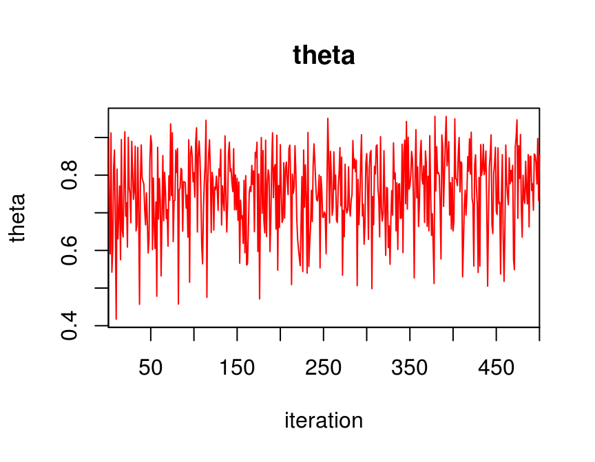


<!--
Para generar la muestra MCMC seguimos 3 pasos: primero JAGS recibe la información y deja que este determine los muestreadores apropiados para el modelo, en el segundo paso corremos las cadenas por un periodo de 
calentamiento y por último corremos las cadenas y registramos la muestra.

-->


### Ejemplo normal {-}
Recordemos el ejemplo normal con media y varianza desconocidas. ¿Cuál es el modelo
gráfico asociado?


```r
N <- 50 # Observamos 20 realizaciones
set.seed(122)
x <- rnorm(N, 2, 2) 

modelo_normal.bugs <-
'
model{
    for(i in 1:N){
        x[i] ~ dnorm(mu, nu)
    }
    # iniciales
    nu ~ dgamma(3, 3)
    sigma2 <- 1 / nu
    mu ~ dnorm(1.5, 1 / 16) 
}
'
```

el ciclo `for` indica que cada dato observado $x_i$ proviene de una distribución
Normal con media $\mu$ y varinza $1 / \nu$ (precisión $\nu$). Afuera del ciclo
escribimos las distribuciones iniciales, $\nu \sim Gamma(3, 3)$, esto es 
$\sigma^2 \sim GI(3, 3)$ y $\mu$ se distribuye Normal con media $\mu = 1.5$ y 
varianza $\tau^2 = 16$.

El modelo ya esta especificado, pero aun falta indicar los valores de las variables
en el modelo, para esto definimos los valores en R y después los mandamos a 
JAGS.


```r
library(R2jags)

cat(modelo_normal.bugs, file = 'modelo_normal.bugs')

# valores iniciales para los parámetros, si no se especifican la función jags
# generará valores iniciales
jags_inits <- function(){
    list(mu = rnorm(1, mean(x), 5), nu = 1 / runif(1, 2, 4))
}

jags_fit <- jags(
    model.file = "modelo_normal.bugs",    # modelo de JAGS
    inits = jags_inits,   # valores iniciales
    data = list(x = x, N = N),    # lista con los datos
    parameters.to.save = c("mu", "sigma2"),  # parámetros por guardar
    n.chains = 1,   # número de cadenas
    n.iter = 10000,    # número de pasos
    n.burnin = 1000,   # calentamiento de la cadena
    n.thin = 1
    )
#> Compiling model graph
#>    Resolving undeclared variables
#>    Allocating nodes
#> Graph information:
#>    Observed stochastic nodes: 50
#>    Unobserved stochastic nodes: 2
#>    Total graph size: 59
#> 
#> Initializing model

jags_fit
#> Inference for Bugs model at "modelo_normal.bugs", fit using jags,
#>  1 chains, each with 10000 iterations (first 1000 discarded)
#>  n.sims = 9000 iterations saved
#>          mu.vect sd.vect   2.5%    25%    50%    75%  97.5%
#> mu          1.91   0.313   1.31   1.70   1.91   2.12   2.53
#> sigma2      4.75   1.449   3.25   4.07   4.62   5.28   6.91
#> deviance  223.50   2.388 221.46 222.00 222.82 224.27 229.28
#> 
#> DIC info (using the rule, pD = var(deviance)/2)
#> pD = 2.9 and DIC = 226.3
#> DIC is an estimate of expected predictive error (lower deviance is better).

# podemos ver las cadenas
traceplot(jags_fit, varname = c("mu", "sigma2"))
```

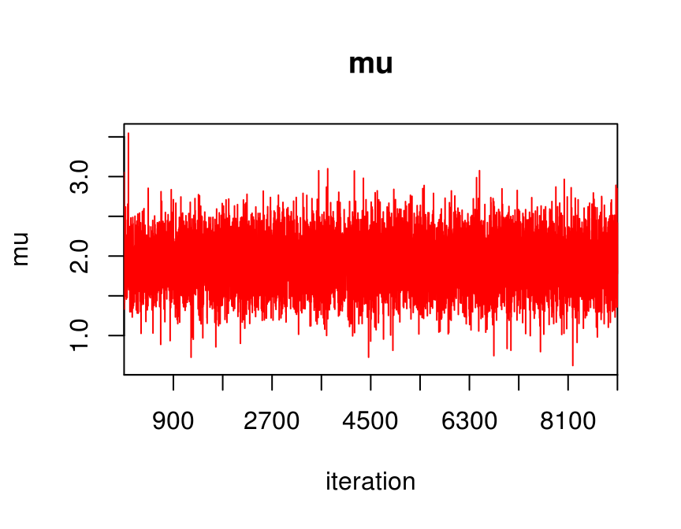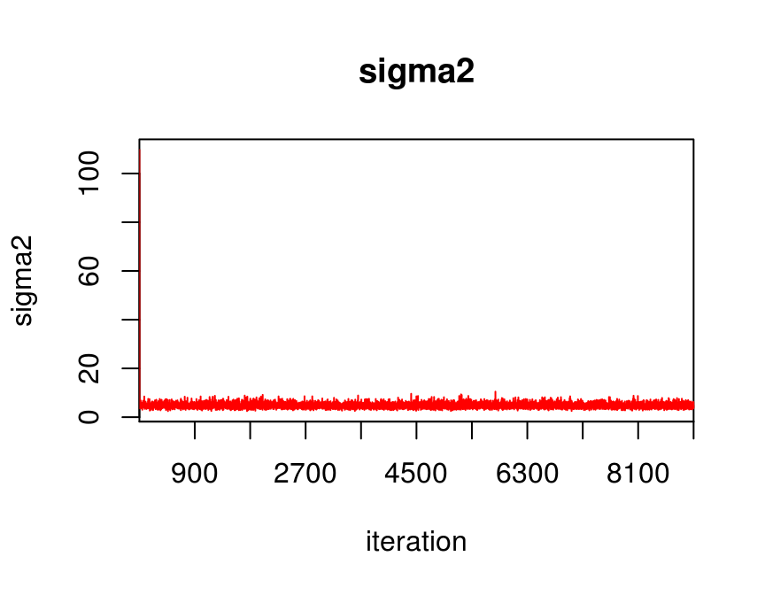

 Realiza un histograma de la distribución 
predictiva. Construye un intervalo de 95% de probabilidad para la predicción. 
    Pista: utiliza `jags_fit$BUGSoutput$sims.matrix`.


```r
jags_fit <- jags(
    model.file = "modelo_normal.bugs",    # modelo de JAGS
    inits = list(jags_inits()),   # valores iniciales
    data = list(x = c(NA, x), N = N + 1),    # lista con los datos
    parameters.to.save = c("mu", "sigma2", "x"),  # parámetros por guardar
    n.chains = 1,   # número de cadenas
    n.iter = 10000,    # número de pasos
    n.burnin = 1000,   # calentamiento de la cadena
    n.thin = 1
    )
#> Compiling model graph
#>    Resolving undeclared variables
#>    Allocating nodes
#> Graph information:
#>    Observed stochastic nodes: 50
#>    Unobserved stochastic nodes: 3
#>    Total graph size: 60
#> 
#> Initializing model
head(jags_fit$BUGSoutput$summary)
#>             mean    sd    2.5%     25%     50%     75%   97.5%
#> deviance 223.420 1.988 221.456 221.991 222.823 224.223 228.713
#> mu         1.908 0.305   1.309   1.705   1.906   2.109   2.508
#> sigma2     4.740 0.945   3.285   4.066   4.611   5.274   6.939
#> x[1]       1.918 2.213  -2.392   0.438   1.924   3.393   6.268
#> x[2]       4.621 0.000   4.621   4.621   4.621   4.621   4.621
#> x[3]       0.248 0.000   0.248   0.248   0.248   0.248   0.248

mus <- jags_fit$BUGSoutput$sims.matrix[, "mu"]
sigmas <- sqrt(jags_fit$BUGSoutput$sims.matrix[, "sigma2"])
y <- rnorm(length(mus), mus, sigmas)

mean(y)
#> [1] 1.88
sd(y)
#> [1] 2.21
```

## Diagnósticos
Cuando generamos una muestra de la distribución posterior usando MCMC, buscamos que:

1. Los valores simulados sean representativos de la distribución posterior, esto 
implica que no deben estar influenciados por el valor inicial (arbitrario) y 
deben explorar todo el rango de la posterior.

2. Debemos tener suficientes simulaciones de tal manera que las estimaciones 
sean precisas y estables.

3. Queremos tener un método eficiente para generar las simulaciones.

En la práctica intentamos cumplir lo más posible estos objetivos, pues aunque en
principio los métodos MCMC garantizan que cadena infinitamente largas lograran 
una representación perfecta, siempre debemos tener un criterio para cortar la 
cadena y evaluar la calidad de las simulaciones.

#### Representatividad {-}
Para determinar la convergencia de la cadena es conveniente realizar más de una 
cadena, buscamos ver si realmente se ha olvidado el estado inicial y revisar 
que algunas cadenas no hayan quedado *atoradas* en regiones inusuales del espacio
de parámetros.


```r
jags_fit <- jags(
    model.file = "modelo_normal.bugs",    # modelo de JAGS
    inits = rerun(3, jags_inits()),   # valores iniciales
    data = list(x = x, N = N),    # lista con los datos
    parameters.to.save = c("mu", "nu", "sigma2"),  # parámetros por guardar
    n.chains = 3,   # número de cadenas
    n.iter = 50,    # número de pasos
    n.burnin = 0,   # calentamiento de la cadena
    n.thin = 1
    )
#> Compiling model graph
#>    Resolving undeclared variables
#>    Allocating nodes
#> Graph information:
#>    Observed stochastic nodes: 50
#>    Unobserved stochastic nodes: 2
#>    Total graph size: 59
#> 
#> Initializing model

# podemos ver las cadenas
traceplot(jags_fit, varname = c("mu", "sigma2"))
```

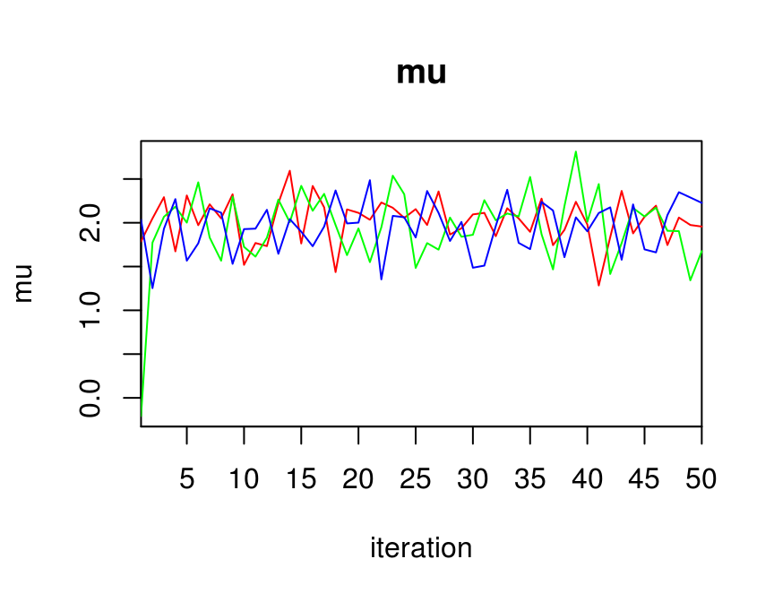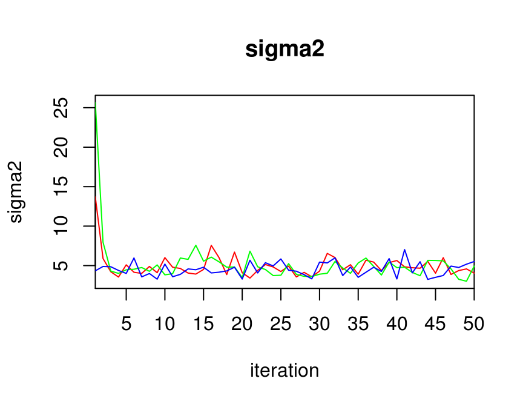

La gráfica anterior nos puede ayudar a determinar si elegimos un periodo de calentamiento adecuado o si alguna cadena está alejada del resto.

Además de realizar gráficas podemos usar la medida de convergencia $\hat{R}$ 
que la función `jags()` calcula por omisión:


```r
jags_fit$BUGSoutput$summary
#>             mean     sd    2.5%     25%     50%     75%   97.5% Rhat n.eff
#> deviance 223.892 4.6145 221.455 222.120 223.033 224.224 228.773 1.18   130
#> mu         1.972 0.3392   1.351   1.772   2.008   2.176   2.497 1.06   150
#> nu         0.219 0.0456   0.132   0.186   0.218   0.249   0.303 1.05    96
#> sigma2     4.902 2.0805   3.295   4.018   4.586   5.378   7.566 1.05    96
```

La medida $\hat{R}$ se conoce como el **factor de reducción potencial de 
escala** o *diagnóstico de convergencia de Gelman-Rubin*, esta es una estimación 
de la posible reducción en la longitud de un intervalo de confianza si las 
simulaciones continuran infinitamente. $\hat{R}$ es 
aproximadamente la raíz cuadrada de la varianza de todas las 
cadenas juntas dividida entre la varianza dentro de cada cadena. Si $\hat{R}$ es mucho mayor a 1 esto indica que las cadenas no se han mezclado bien. Una regla
usual es iterar hasta alcanzar un valor $\hat{R} \leq 1.1$ para todos los 
parámetros.

$$\hat{R} = \sqrt{\frac{\hat{d}+3}{\hat{d}+1}\frac{\hat{V}}{W}}$$

donde $B$ es la varianza entre las cadenas, $W$ es la varianza dentro de las cadenas 

$$B = \frac{N}{M-1}\sum_m (\hat{\theta_m} - \hat{\theta})^2$$
$$W = \frac{1}{M}\sum_m \hat{\sigma_m}^2$$
Y $\hat{V}$ es una estimación del varianza de posteriro de $\theta$:

$$\hat{V} = \frac{N-1}{N}W + \frac{M+1}{MN}B$$

#### Precisión {-}

Una vez que tenemos una muestra representativa de la distribución posterior, 
nuestro objetivo es asegurarnos de que la muestra es lo suficientemente grande 
para producir estimaciones estables y precisas de la distribución.

Para ello usaremos otra salida de la función jags: `n.eff` que es el 
**tamaño efectivo de muestra**, si las simulaciones fueran independientes 
`n.eff` sería el número total de simulaciones; sin embargo, las simulaciones de
MCMC suelen estar correlacionadas, el tamaño efectivo nos dice que tamaño de 
muestra de observaciones independientes nos daría la misma información que las
simulaciones de la cadena.

$$NEM = \frac{N}{1+2\sum_{k=1}^\infty ACF(k)} $$


Usualmente nos gustaría obtener un tamaño efectivo de al menos $100$.

#### Eficiencia {-}

Hay varias maneras para mejorar la eficiencia de un proceso MCMC:

* Paralelizar, no disminuimos el número de pasos en las simulaciones pero 
podemos disminuir el tiempo que tarda en correr.

* Cambiar la parametrización del modelo o transformar los datos. En el caso 
de variables continuas suele ser conveniente centrar los datos, otra opción es
utilizar parametrizaciones redundantes.

* Adelgazar la muestra: esto nos puede ayudar a disminuir el uso de memoria, 
consiste en guardar únicamente los $k$-ésimos pasos de la cadena y resulta
en cadenas con menos autocorrelación (en el caso de la función `jags()` el
adelgazamiento está controlado por el parámetro `n.thin`).

### Recomendaciones generales {-}

@gelman-hill recomienda los siguientes pasos cuando uno esta simulando de la
posterior:

1. Cuando definimos un modelo por primera vez establecemos un valor bajo para 
_n.iter_ por ejemplo 10 ó 50. La razón es que la mayor parte de las veces los 
modelos no funcionan a la primera por lo que sería pérdida de tiempo dejarlo 
correr mucho tiempo antes de descubrir el problema.

2. Si las simulaciones no han alcanzado convergencia aumentamos las iteraciones 
a 500 ó 1000 de tal forma que las corridas tarden segundos o unos cuantos 
minutos.

3. Si JAGS tarda más que unos cuantos minutos (para problemas del tamaño que 
veremos en la clase) y aún así no alcanza convergencia entonces _juega_ un poco 
con el modelo (por ejemplo intenta transformaciones lineales), Gelman sugiere 
más técnicas para acelerar la convergencia en el capitulo 19 del libro 
*Data Analysis Using Regression and Multilevel/Hierarchical models*.

4. Otra técnica conveniente cuando se trabaja con bases de datos grandes 
(sobretodo para la parte exploratoria) es trabajar con un subconjunto de los 
datos, quizá la mitad o una quinta parte.

## HMC y Stan

Stan es un programa para generar muestras de una distribución posterior de los 
parámetros de un modelo, el nombre del programa hace referencia a [Stanislaw Ulam (1904-1984)](https://en.wikipedia.org/wiki/Stanislaw_Ulam) que fue pionero en 
los métodos de Monte Carlo. A diferencia de JAGS y BUGS, los pasos de la cadena 
de Markov se generan con un método llamado *Monte Carlo Hamiltoniano* (HMC). HMC 
puede ser más eficiente que otros muestreadores en JAGS y BUGS, en particular 
cuando se ajustan modelos grandes y complejos (por ejemplo, con variables con
correlación alta).

### Muestreo HMC {-}

El uso de HMC en estadística es reciente, sin embargo, gracias a Stan se ha 
expandido rápidamente tanto en academia como industria. Desafortunadamente, la
teoría de HMC está desarrollada en términos de geometría diferencial, lo que 
hace que su construcción formal requiera de matemáticas avanzadas. En estas notas 
se presentan las ideas detrás de HMC siguiendo @kruschke, una referencia con 
mayor detalle es @betancourt2017 y para el uso de Stan vale la pena tener 
siempre a la mano el manual @stan2018.

Stan genera muestras de la posterior usando una variación del algoritmo de 
Metrópolis. Recordemos como funciona el algoritmo de Metrópolis que vimos en 
clase:

1. Tenemos una distribución objetivo $p(\theta)$ de la cual buscamos generar
muestras. Debemos ser capaces de calcular el valor de $p(\theta)$ para cualquier
valor candidato $\theta$. La distribución objetivo $p(\theta)$ no tiene que 
estar normalizada, típicamente $p(\theta)$ es la distribución posterior de 
$\theta$ no normalizada, es decir, es el producto de la verosimilitud y la 
inicial.

2. La muestra de la distribución objetivo se genera mediante una caminata
aleatoria a través del espacio de parámetros. 
    + La caminata inicia en un lugar arbitrario (definido por el usuario). El 
    punto inicial debe ser tal que $p(\theta)>0$. 
    + La caminata avanza en cada tiempo proponiendo un movimiento a una
    nueva posición y después decidiendo si se acepta o no el valor propuesto. Las
distribuciones propuesta pueden tener muchas formas, el objetivo es que la 
distribución propuesta explore el espacio de parámetros de manera eficiente.

3. Una vez que tenemos un valor propuesto decidimos si aceptar calculando:

$$p_{mover}=min\bigg( \frac{p(\theta_{propuesta})}{p(\theta_{actual})},1\bigg)$$

Y al final obtenemos valores representativos de la distribución objetivo 
$\{\theta_1,...,\theta_n\}$.

Notemos que en la versión de Metrópolis que estudiamos, la forma de la 
distribución propuesta está centrada de manera simétrica en la posición actual. 
Es decir, en un espacio paramétrico multidimensional, la distribución propuesta 
podría ser una Normal multivariada, con la matriz de varianzas y covarianzas 
seleccionada para mejorar la eficiencia en la aplicación particular.
La normal multivariada siempre esta centrada en la posición actual y siempre 
tiene la misma forma, sin importar en que sección del espacio paramétrico 
estemos ubicados. Esto puede llevar a ineficiencias, por ejemplo, si nos 
ubicamos en las colas de la distribución posterior el paso propuesto con la 
misma probabilidad nos aleja o acerca de la moda de la posterior. Otro ejemplo 
es si la distriución posterior se curva a lo largo del espacio paramétrico, una 
distribución propuesta (de forma fija) puede ser eficiente para una parte de la 
posterior y poco eficiente para otra parte de la misma.

Por su parte HMC, usa una distribución propuesta que cambia dependiendo de la 
posición actual. HMC utiliza el gradiente de la posterior y *envuelve* la 
distribución propuesta hacia el gradiente, como se ve en la siguiente figura.


```r
knitr::include_graphics("imagenes/hmc_proposals.png")
```


HMC genera un movimiento propuesta de manera análoga a rodar una canica en la 
distribución posterior volteada (también conocida como potencial). El potencial 
es el negativo del logaritmo de la densidad posterior, en las regiones donde la 
posterior es alta el potencial es bajo, y en las la regiones donde la posterior 
es plana el potencial es alto.

La propuesta se genera dando un golpecito la canica en una dirección aleatoria y 
dejándola rodar cierto tiempo. En el caso del ejemplo de un solo parámetro la 
dirección del golpecito inicial es hacia la izquierda o derecha, y la magnitud 
se genera de manera aleatoria muestreando de una distrubución Gaussiana de media 
cero. El golpecito impone un momento inicial a la canica, y al terminar el 
tiempo se propone al algoritmo de Metrópilis la posición final de la canica. Es 
fácil imaginar que la posición propuesta tenderá a estar en regiones de mayor 
probabilidad posterior.

La última fila de la figura de arriba nos muestra un histograma de los pasos 
propuestos, notemos que no está centrado en la posición actual sino que hay una 
inclinación hacia la moda de la posterior.

Para distribuciones posteriores de dimensión alta con valles diagonales o 
curveados, la dinámica de HMC generará valores propuesta mucho más prometedores 
que una distribución propuesta simétrica (como la versión de Metrópolis que 
implementamos) y mejores que un muestreador de Gibbs que puede *atorarse* en 
paredes diagonales.

Es así que para pasar del algoritmo de Metrópolis que estudiamos a HMC se 
modifica la probabilidad de aceptación para tener en cuenta no sola la denisdad 
posterior relativa, sino también el *momento* (denotado por $\phi$) en las 
posiciones actual y propuesta. 

$$p_{aceptar}=\bigg(\frac{p(\theta_{propuesta}|x)p(\phi_{propuesta})}{p(\theta_{actual}|x)p(\phi_{actual})}, 1 \bigg)$$

En un sistema continuo ideal la suma de la energía potencial y cinética (que 
corresponden a $-log(p(\theta|x))$ y $-log(p(\phi))$) es constante y por tanto 
aceptaríamos todas las propuestas. Sin embargo, en la práctica las dinámicas 
continuas se dicretizan a intervalos en el tiempo y los cálculos son solo 
aproximados conllevando a que se rechacen algunas propuestas.

Si los pasos discretizados son pequeños entonces la aproximación será buena pero 
se necesitarán más pasos para alejarse de una posición dada, y lo contrario si 
los pasos son muy grandes. Por tanto se debe ajustar el tamaño del paso 
(epsilon) y el número de pasos. La duración de la trayectoria es el producto del 
tamaño del paso y el número de pasos. Es usual buscar una tasa de aceptación 
alrededor del 65%, moviendo el tamaño de epsilon y compensando con el número de 
pasos.

Es así que el tamaño del paso controla la suavidad de la trayectoria. También es 
importante ajustar el número de pasos (es decir la duración del movimiento) pues 
no queremos alejarnos demasiado o rodar de regreso a la posición actual. La 
siguiente figura muestra varias trayectorias y notamos que muchas rebotan al 
lugar inicial. 


```r
knitr::include_graphics("imagenes/hmc_proposals_2.png")
```


Para evitar las ineficiencias de dar vueltas en U, Stan incorpora un algoritmo 
que generaliza la nación de vueltas en U a espacios de dimensión alta, y así 
estima cuando parar las trayectorias antes de que reboten hacia la posición 
inical. El algoritmo se llama *No U-turn Sampler* (NUTS).

Adicional a ajustar el tamaño del paso y número de pasos debemos ajustar la 
desviación estándar del momento inicial. Si la desviación estandar del momento 
es grande también lo será la desviación estándar de las propuestas. Nuevamente, 
lo más eficiente será una desviación estándar ni muy grande ni muy chica. En 
Stan la desviación estándar del momento se establece de manera adaptativa para 
que coincida con la desviación estándar de la posterior.


```r
knitr::include_graphics("imagenes/hmc_proposals_3.png")
```


Por último, para calcular la trayectoria propuesta debemos ser capaces de 
calcular el gradiente de la densidad posterior en cualquier valor de los 
parámetros. Para realizar esto de manera eficiente en espacios de dimensión alta 
se debe derivar analíticamente, en el caso de modelos complejos las fórmulas se 
derivan usando algoritmos avanzados.

El paper [A Conceptual Introduction to Hamiltonian Monte Carlo](https://arxiv.org/pdf/1701.02434.pdf) de Michael Betancourt explica 
conceptos e intuición detrás de HMC, y el porqué es apropiado en problemas de
alta dimensión. 

#### Stan {-}

Para instalar Stan sigue las instrucciones de [aquí](http://mc-stan.org/users/interfaces/rstan.html). 
Nosotros usaremos el paquete `rstan` y comenzamos con el ejemplo sencillo de 
estimar el sesgo de una moneda.


```r
library(rstan)

# opcional para correr en paralelo
rstan_options(auto_write = TRUE)
options(mc.cores = parallel::detectCores())
```

Al igual que en JAGS comenzamos especificando el modelo en el lenguaje de Stan. 
Lo podemos guardar en un archivo de texto o simplemente asignarlo a una variable 
en R.


```r
modelo.stan <- 
'   
data {
    int<lower=0> N;
    int y[N]; 
}
parameters {
    real<lower=0,upper=1> theta;
} 
model {
    theta ~ beta(1,1) ;
    y ~ bernoulli(theta) ;
}

'
# notemos que los modelos de Stan deben terminar con una línea en blanco
cat(file = "modelo.stan", modelo.stan)
```

A diferencia de JAGS, Stan permite operaciones vectorizadas, por lo que podemos 
poner:
  
    y ~ bernoulli(theta) ;
    
sin necesidad de hacer el ciclo `for`:

    for ( i in 1:N ) {
        y[i] ~ dbern(theta)
    }
    
Ya que especificamos el modelo lo siguiente es traducir el modelo a código de 
C++ y compilarlo.


```r
stan_cpp <- stan_model("modelo.stan")
stan_cpp <- stan_model(model_code = modelo.stan)
```

En el paso de compilación Stan está calculando los gradientes para las dinámicas 
Hamiltonianas.

Ahora cargamos los datos.


```r
N = 50 ; z = 10 ; y = c(rep(1, z), rep(0, N - z))

data_list <- list(y = y, N = N )
stan_fit <- sampling(object= stan_cpp, data = data_list,
                    chains = 3 , iter = 1000 , warmup = 200, thin = 1 )
summary_stan_fit <- summary(stan_fit)
```


```r
summary_stan_fit$summary
#>          mean se_mean     sd    2.5%     25%     50%    75%   97.5% n_eff
#> theta   0.213 0.00204 0.0575   0.113   0.173   0.209   0.25   0.334   791
#> lp__  -27.354 0.02388 0.7318 -29.327 -27.529 -27.068 -26.89 -26.832   939
#>       Rhat
#> theta 1.01
#> lp__  1.01
```


Otro camino es compilar y correr las cadenas de manera simultanea con la función
`stan()`.


```r
stan_fit_2 <- stan(file = 'modelo.stan', data = data_list, 
    iter = 1000, chains = 4)
```

### Iniciales {-}

Las siguientes recomendaciones de iniciales son de los desarrolladores de Stan, 
puedes leer más en https://github.com/stan-dev/stan/wiki/Prior-Choice-Recommendations.

Podemos clasificar las iniciales en 5 niveles de acuerdo a que tan informativas 
son:

1. Iniciales planas: usualmente impropias.
2. Muy vagas pero propias: $N(0, (1e6) ^ 2)$.
3. Iniciales genéricas muy debilmente informativas: $Normal(0, 10^2)$.
4. Iniciales genéricas debilmente informativas: $Normal(0, 1)$.
5. Iniciales específicas e informativas: $Normal(0.4, 0.2^2)$

Cuando se usa Stan tenemos los siguientes principios generales:

* En Stan no importa usar conjugadas (cuando se usan muestreadores de Gibbs 
puede ser conveniente usar conjugadas, aquí no).

* No interesan: invarianza, Jeffreys o entropía.

* Las iniciales debilmente informativas deben contener suficiente información 
para regularizar: las iniciales deben dejar fuera valores de los parámetros que 
no sean razonables, pero no dejar fuera valores que podrían tener sentido.

* Se prefieren las iniciales debilmente informativas sobre las informativas, 
esto es porque las consecuencias de *perder precisión* por elegir una inicial 
muy débil (comparado con la verdadera distribución poblacional de los parámetros
o comparado con conocimiento experto) es menos importante que la ganancia en 
robustez que se deriva de incluir parte del espacio paramétrico que pueda ser
relevante.

* Cuando se usen distribuciones iniciales informativas se debe ser explícito en 
porque se tomaron las decisiones.

* No utilices iniciales uniformes, o en general no restrinjas el espacio 
paramétrico, a menos que las fronteras representen restricciones verdaderas (por
ejemplo parámetros de escala restringidos a los positivos, o correlaciones entre 
el -1 y el 1). Algunos ejemplos:
    + Si crees que un parámetro se ubica entre el cero y el un, en lugar de usar
    Uniforme(0,1), intenta Normal(0.5, 0.5).
    + Un parámetro de escala esta restringido a ser positivo y quieres una 
    inicial vaga, propones Uniforme(0,100) (o Uniforme(0,1000), es mejor no 
    especificar inicial, que en Stan equivale a una inicial uniforme no 
    informativa, o usar una Esxponencial con valor esperado 10, o una 
    media-normal(0,10).


### Recursos adicionales de Stan {-}

* El paquete [rstanarm](https://cran.r-project.org/web/packages/rstanarm/vignettes/rstanarm.html) facilita el uso de Stan desde R, cuenta con funciones para llevar a cabo 
estimación Bayesiana sin necesidad de escribir código en el *lenguaje de Stan*, 
de acuerdo a los autores el objetivo del paquete es  que la estimación bayesiana 
sea rutina para los modelos de regresión más comunes.

* El paquete [bayesplot](bayesplot) cuenta con funciones para graficar estimaciones
de los parámetros, realizar diagnósticos visuales de las cadenas (convergencia), 
y analizar el ajuste del modelo (graficando de la predictiva posterior).

* El paquete [shinystan](http://mc-stan.org/users/interfaces/shinystan) contiene
resumenes gráficos y numéricos de parámetros de un modelo y de diagnósticos de
convergencia.

## Modelos jerárquicos

Los modelos jerárquicos involucran varios parámetros de tal manera que las 
creencias de unos de los parámetros dependen de manera significativa de los 
valores de otros parámetros. Por ejemplo, consideremos el caso en el que tenemos 
varias monedas acuñadas en la misma casa de monedas, es razonable pensar que una
fábrica sesgada a águilas tenderá a producir monedas con sesgo hacia águilas. 
La estimación del sesgo de una moneda depende de la estimación del sesgo de la 
fábrica que a su vez está influido por los datos de todas las monedas. Veremos
que la estructura de dependenica a lo largo de los parámetros generan estimaciones
mejor informadas para todos los parámetros.

Si pensamos únicamente en dos monedas que provienen de la misma casa de moneda 
tenemos:

1. Conocimientos iniciales de los posibles valores de los parámetros (sesgos 
de las monedas).

2. Tenemos conocimiento inicial de la dependencia de los parámetros por provenir
de la misma fábrica. 

Cuando observamos lanzamientos de las monedas actualizamos nuestras creencias 
relativas a los sesgos de las monedas y también actualizamos nuestras 
creencias acerca de la dependencia de los sesgos.

Recordemos el caso de lanzamientos de una moneda, le asignamos una inicial beta, 
recordemos que la distribución beta tienen dos parámetors $a$ y $b$:

$$p(\theta)=\frac{1}{B(a,b)}\theta^{a-1}(1-\theta)^{b-1}$$

Con el fin de hacer los parámetros más intuitivos los podemos expresar en 
términos de la media $\mu$ y el tamaño de muestra $K$, donde $\mu$ es la media 
de nuestro conocimiento inicial y la confianza está reflejada en el tamaño de 
muestra $K$. Entonces los parámetros correspondientes en la distribución 
beta son:

$$a=\mu K, b = (1-\mu)K$$

Ahora introducimos el modelo jerárquico. En lugar de especificar un valor 
particular para $\mu$, consideramos que $\mu$ puede tomar distintos valores
(entre 0 y 1), y definimos una distribución de probabilidad sobre esos valores.
Podemos pensar que esta distribución describe nuestra incertidumbre acerca de la
construcción de la máquina que manufactura las monedas. 

Veamos que en el caso de más de una moneda el modelo permite que cada moneda 
tenga un sesgo distinto pero ambas
tenderán a tener un sesgo cercano a $\mu$, algunas aleatoriamente tendrán un
valor de $\theta$ mayor a $\mu$ y otras menor. Entre más grande $K$ mayor será 
la consistencia de la acuñadora y los valores $\theta$ serán más cercanos a $\mu$.
Si observamos varios lanzamientos de una moneda tendremos información tanto de 
$\theta$ como de $\mu$.

Para hacer un análisis bayesiano aún nos hace falta definir la distribución 
inicial sobre los parámetros $\mu$, usemos una distribución Beta:

$$p(\mu)=beta(\mu|A_{\mu}, B_{\mu})$$

donde $A_{\mu}$ y $B_{\mu}$ se conocen como hiperparámetros y son constantes. En 
este caso, consideramos que $\mu$ se ubica típicamente cerca de 
$A_{\mu}/(A_{\mu} + B_{\mu})$ y $K$ se considera constante.

### Modelo jerárquico una moneda {-}

Recordemos que en el ejemplo de una moneda teníamos que la verosimilitud era
Bernoulli:

$$p(x|theta) = \theta^x(1-\theta)^{1-x}$$

Y si utilizamos las iniciales Beta para $\mu$ y $\theta$ como discutimos arriba, 
solo nos resta aplicar la regla de Bayes con nuestros dos parámetros
desconocidos $\mu$ y $\theta$:

$$p(\theta, \mu|x)=\frac{p(x|\theta,\mu)p(\theta,\mu)}{p(x)}$$

Hay dos aspectos a considerar en el problema:

1. La verosimilitud no depende de $\mu$ por lo que 
$$p(x|\theta, \mu)=p(x|\theta)$$

2. La distribución inicial en el espacio de parámetros bivariado se puede
factorizar:

$$p(\theta,\mu)=p(\theta|\mu)p(\mu)$$

Por lo tanto
$$p(\theta,\mu|x)=\frac{p(x|\theta,\mu)p(\theta,\mu)}{p(x)}$$
$$=\frac{p(x|\theta)p(\theta|\mu)p(\mu)}{p(x)}$$
El siguiente modelo gráfico resume las independencias condicionales 
de la última ecuación:


#### Aproximación por cuadrícula {-}

En el caso jerárquico, no se puede derivar la distribución posterior de manera 
analítica pero si los parámetros e hiperparámetros toman un número finito de  
valores y no hay muchos de ellos, podemos aproximar la posterior usando 
aproximación por cuadrícula.

A continuación graficamos las distribuciones correspondientes al caso en que
la distribución del hiperparámetro $\mu$ tiene la forma de una distribución 
Beta(2, 2), es decir creemos que la media de la acuñadora $\mu$ es 0.5, pero 
existe bastante incertidumbre acerca del valor.

La distribución de $\theta$, esto es la distribución inicial que refleja la
dependencia entre $\theta$ y $\mu$ se expresa por medio de otra distribución 
beta, en el ejemplo usamos K=100:

$$\theta|\mu \sim beta(\mu 100, (1-\mu)100)$$

Esta inicial expresa un alto grado de certeza que una acuñadora con 
hiperparámetro $\mu$ genera monedas con sesgo cercano a $\mu$

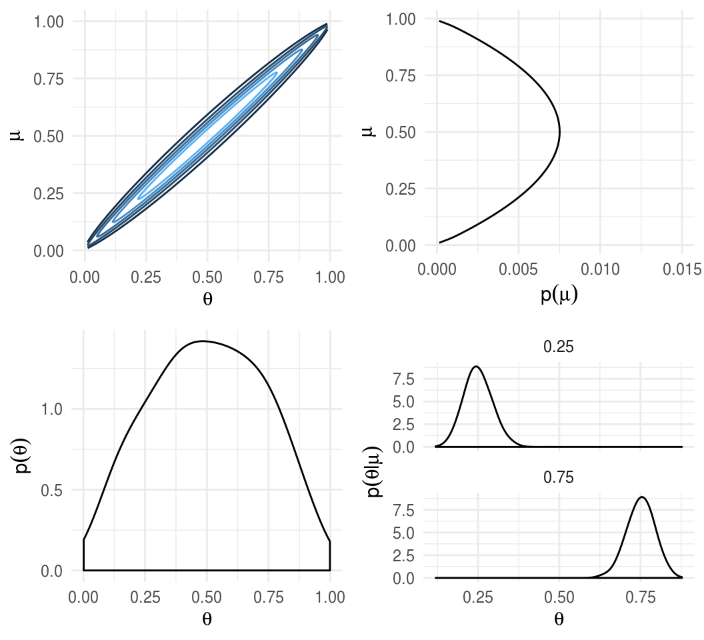

Verosimilitud.

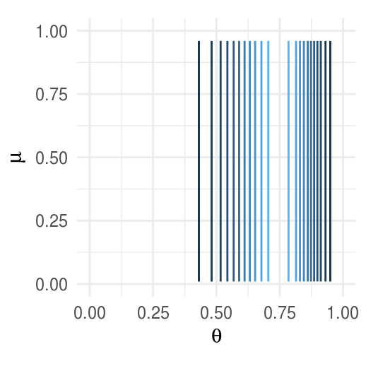

Posterior.


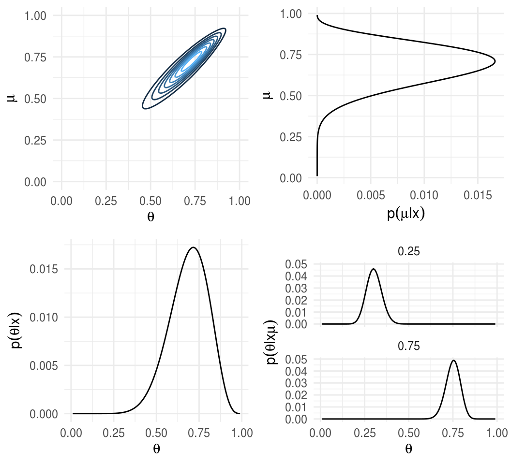

### Multiples monedas de una misma fábrica {-}

La sección anterior considera el escenario en que lanzamos una moneda y hacemos
inferencia del parámetro de sesgo $\theta$ y del hiperparámetro $\mu$. Ahora
consideramos recolectar información de múltiples monedas, si cada moneda tiene
su propio sesgo $\theta_j$ entonces debemos estimar un parámetro distinto para
cada moneda.

Suponemos que todas las monedas provienen de la misma fábrica, esto implica 
que tenemos la misma información inicial $\mu$ para todas las monedas. Suponemos
también que cada moneda se acuña de manera independiente, esto es, que 
condicional al parámetro $\mu$ los parámetros $\theta_j$ son independientes 
en nuestros conocimientos iniciales.

#### Posterior vía aproximación por cuadrícula {-}

Supongamosque tenemos dos monedas de la misma fábrica. El objetivo es estimar 
los sesgos $\theta_1$, $\theta_2$ de las dos monedas y estimar simultáneamente
el parámetro $\mu$ correspondiente a la casa de moneda que las fabricó.

Inicial.

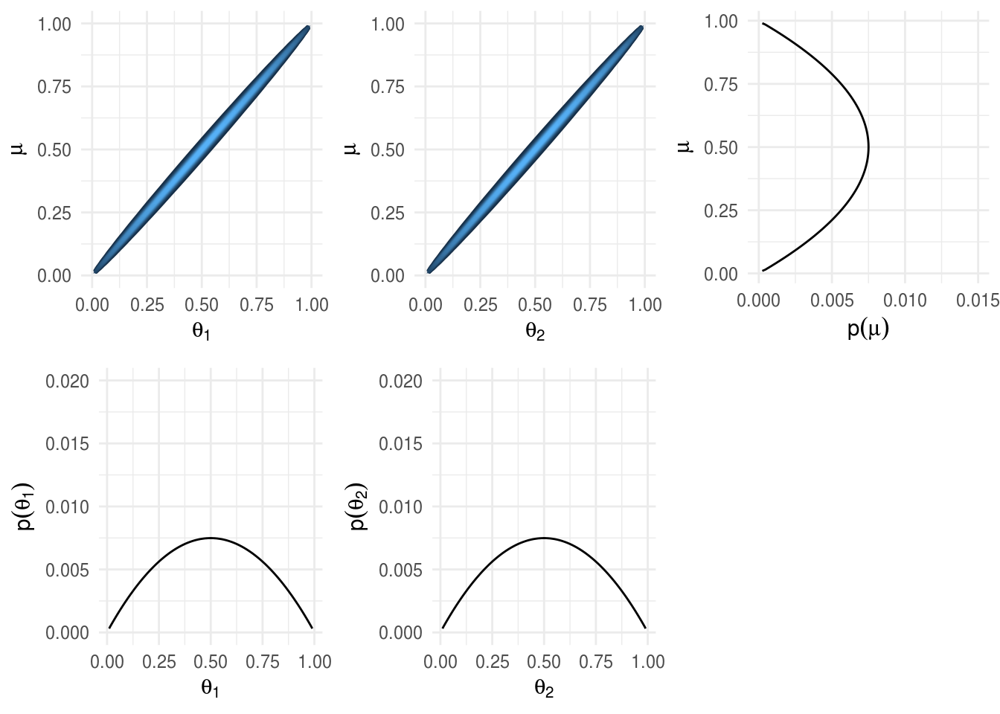

Verosimilitud.

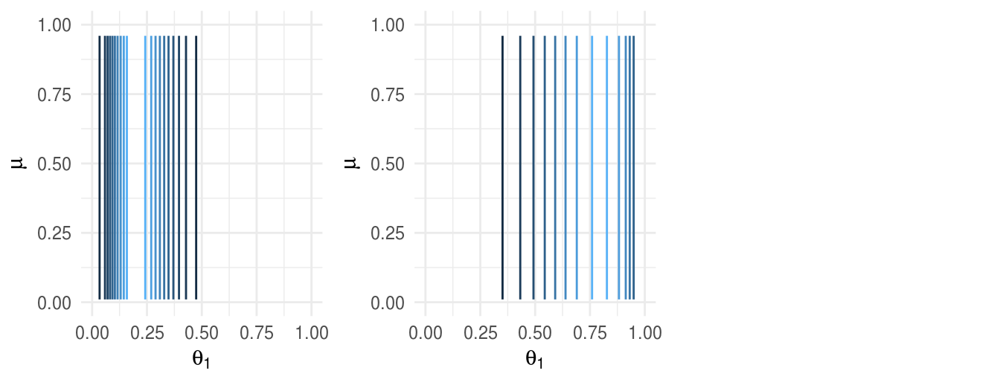

Posterior.

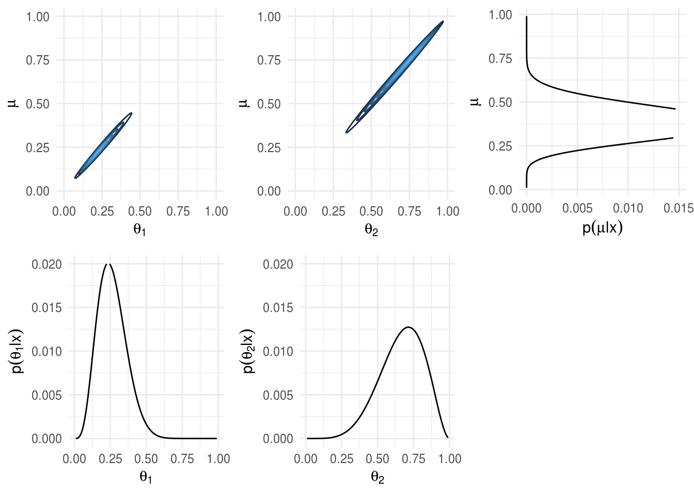

#### JAGS {-}

La sección anterior utilizó un modelo simplificado con el objetivo de poder
visualizar el espacio de parámetros. Ahora incluiremos más parámetros para hacer 
el problema más realista. En los ejemplos anteriores fijamos
el grado de dependencia entre $\mu$ y $\theta$ de manera arbitraria, a través
de $K$, de tal manera que si $K$ era grande, los valores $\theta_j$ individuales
se situaban cerca de $\mu$ y cuando $K$ era pequeña se permitía más variación.

En situaciones reales no conocemos el valor de $K$ por adelantado, por lo que
dejamos que los datos nos informen acerca de valores creíbles para $K$. 
Intuitivamente, cuando la proporción de águilas observadas es similar a lo largo 
de las monedas, tenemos evidencia de que $K$ es grande, mientras que si estas
proporciones difieren mucho, tenemos evidencia de que $K$ es pequeña. Debido 
a que $K$ pasará de ser una constante a ser un parámetro lo llamaremos $\kappa$.

La distribución inicial para $\kappa$ será una Gamma. 


```r
modelo_jer.bugs <-
'
model{
  for(t in 1:N){
    x[t] ~ dbern(theta[coin[t]])
  }
  for(j in 1:nCoins){
    theta[j] ~ dbeta(a, b)
  }
  a <- mu * kappa
  b <- (1 - mu) * kappa
  # A_mu = 2, B_mu = 2
  mu ~ dbeta(2, 2)
  kappa ~ dgamma(1, 0.1)
}
'
```

$\kappa \sim Gamma(1, 0.1)$, esta tiene media 10 y desviación estándar 10.

Los datos consisten en 5 monedas, cada una se lanza 5 veces, resultando 4 de 
ellas en 1 águila y 4 soles y otra en 3 águilas y 2 soles.


```r
cat(modelo_jer.bugs, file = 'modelo_jer.bugs')

x <- c(0, 0, 0, 0, 1, 0, 0, 0, 0, 1, 0, 0, 0, 0, 1, 0, 0, 0, 0, 1, 0, 0, 1, 1, 1)
coin <- c(rep(1, 5), rep(2, 5), rep(3, 5), rep(4, 5), rep(5, 5))

jags.inits <- function(){
  list("mu" = runif(1, 0.1, 0.9),
    "kappa" = runif(1, 5, 20))
}

jags_fit <- jags(
  model.file = "modelo_jer.bugs",    # modelo de JAGS
  inits = jags.inits,   # valores iniciales
  data = list(x = x, coin = coin, nCoins = 5,  N = 25),    # lista con los datos
  parameters.to.save = c("mu", "kappa", "theta"),  # parámetros por guardar
  n.chains = 3,   # número de cadenas
  n.iter = 10000,    # número de pasos
  n.burnin = 1000   # calentamiento de la cadena
  )
#> Compiling model graph
#>    Resolving undeclared variables
#>    Allocating nodes
#> Graph information:
#>    Observed stochastic nodes: 25
#>    Unobserved stochastic nodes: 7
#>    Total graph size: 65
#> 
#> Initializing model

# R2jags::traceplot(jags_fit, varname = c("kappa", "mu", "theta"))
jags_fit
#> Inference for Bugs model at "modelo_jer.bugs", fit using jags,
#>  3 chains, each with 10000 iterations (first 1000 discarded), n.thin = 9
#>  n.sims = 3000 iterations saved
#>          mu.vect sd.vect   2.5%    25%    50%    75%  97.5% Rhat n.eff
#> kappa     14.213  10.626  2.128  6.483 11.385 19.053 42.222    1  2100
#> mu         0.330   0.098  0.156  0.263  0.323  0.395  0.538    1  3000
#> theta[1]   0.286   0.128  0.065  0.191  0.278  0.370  0.561    1  1400
#> theta[2]   0.286   0.130  0.067  0.192  0.277  0.368  0.567    1  3000
#> theta[3]   0.283   0.128  0.069  0.189  0.271  0.364  0.573    1  1300
#> theta[4]   0.283   0.129  0.066  0.185  0.273  0.365  0.557    1  1200
#> theta[5]   0.417   0.146  0.167  0.311  0.406  0.512  0.731    1  3000
#> deviance  30.318   2.102 27.521 28.803 29.924 31.329 35.603    1  2900
#> 
#> For each parameter, n.eff is a crude measure of effective sample size,
#> and Rhat is the potential scale reduction factor (at convergence, Rhat=1).
#> 
#> DIC info (using the rule, pD = var(deviance)/2)
#> pD = 2.2 and DIC = 32.5
#> DIC is an estimate of expected predictive error (lower deviance is better).
```


```r
sims_df <- data.frame(n_sim = 1:jags_fit$BUGSoutput$n.sims,
  jags_fit$BUGSoutput$sims.matrix) %>% 
  dplyr::select(-deviance) %>%
  gather(parametro, value, -n_sim)

ggplot(filter(sims_df, parametro != "kappa"), aes(x = value)) +
  geom_histogram(alpha = 0.8) + facet_wrap(~ parametro)
#> `stat_bin()` using `bins = 30`. Pick better value with `binwidth`.
```

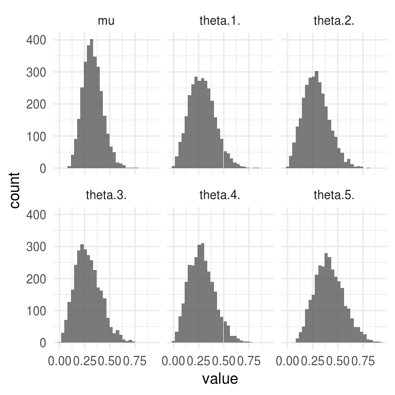

```r


ggplot(filter(sims_df, parametro == "kappa"), aes(x = value)) +
  geom_histogram(alpha = 0.8)
#> `stat_bin()` using `bins = 30`. Pick better value with `binwidth`.
```

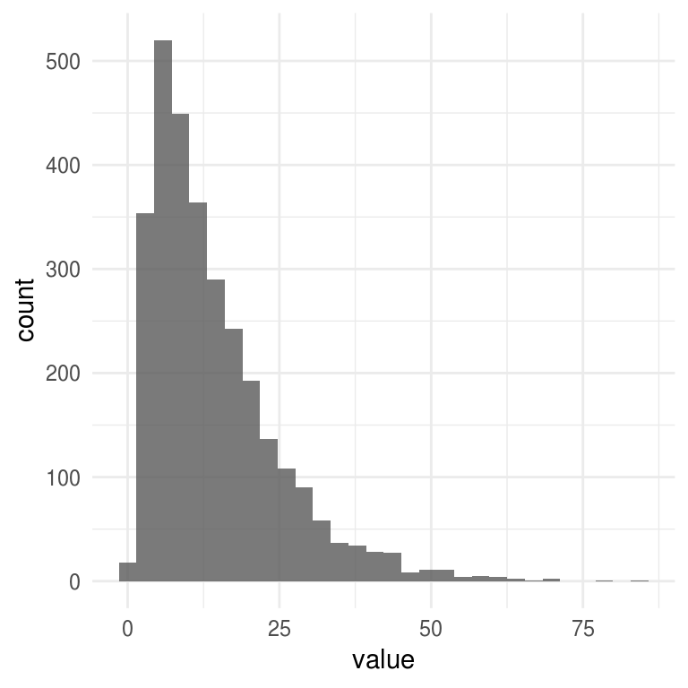

#### Stan {-}


```r
library(rstan)
modelo_jer.stan <-
'
data {
    int N;
    int x[N];
    int nCoins;
    int coin[N];
}
parameters {
    real<lower=0,upper=1> theta[nCoins];
    real<lower=0,upper=1> mu;
    real<lower=0>  kappa;
}
transformed parameters {
    real<lower=0>  a;
    real<lower=0>  b;
    a = mu*kappa;
    b = (1-mu)*kappa;
}
model {
    theta ~ beta(a,b);
    x ~ bernoulli(theta[coin]);
    mu ~ beta(2, 2);
    kappa ~ gamma(1, 0.1);
}

'

cat(file = "modelo_jer.stan", modelo_jer.stan)
stan_jer_cpp <- stan_model("modelo_jer.stan")

stan_jer_fit <- sampling(stan_jer_cpp, 
    data = list(x = x, coin = coin, nCoins = 5,  N = 25), chains = 2,
    cores = 2, iter = 400, warmup = 100)
```


```r
summary_stan_jer_fit$summary
#>             mean se_mean      sd     2.5%     25%     50%     75%   97.5%
#> theta[1]   0.289 0.00766  0.1249   0.0744   0.200   0.274   0.368   0.575
#> theta[2]   0.292 0.00759  0.1293   0.0748   0.205   0.279   0.368   0.589
#> theta[3]   0.297 0.00708  0.1240   0.0734   0.216   0.285   0.373   0.564
#> theta[4]   0.298 0.00701  0.1264   0.0760   0.210   0.284   0.372   0.587
#> theta[5]   0.410 0.00804  0.1435   0.1634   0.325   0.394   0.494   0.745
#> mu         0.335 0.00631  0.0981   0.1780   0.264   0.327   0.393   0.551
#> kappa     15.668 0.80857 10.5208   3.0674   8.104  13.510  20.156  43.563
#> a          5.075 0.30200  3.5354   0.9544   2.648   4.173   6.478  14.273
#> b         10.592 0.55036  7.5108   1.7908   4.977   8.929  13.832  31.860
#> lp__     -21.812 0.18573  2.3505 -27.5118 -23.219 -21.436 -20.095 -18.483
#>          n_eff  Rhat
#> theta[1]   266 1.003
#> theta[2]   290 1.002
#> theta[3]   307 1.007
#> theta[4]   325 0.997
#> theta[5]   319 0.997
#> mu         241 1.004
#> kappa      169 0.999
#> a          137 1.002
#> b          186 1.000
#> lp__       160 1.001
```

### Ejemplo: estimación de tasas de mortalidad {-}


En esta sección veremos un problema de estimación de tasas de mortalidad, la
referencia de este ejemplo es @albert. 
Plantearemos 3 alternativas de modelación para resolver el problema: modelo de
unidades iguales, modelo de unidades independientes y finalmente modelo 
jerárquico.

La base de datos tiene información de todas las cirugías de transplante de 
corazón llevadas a cabo en Estados Unidos en un periodo de 24 meses, entre 
octubre de 1987 y diciembre de 1989. Para cada uno de los 131 hospitales, se 
registró el número de cirugías de transplante de corazón, y el número de muertes
durante los 30 días posteriores a la cirugía, $y$. Además, se cuenta con una 
predicción de la probabilidad de muerte de cada paciente individual. Esta 
predicción esta basada en un modelo logístico que incluye información a nivel 
paciente como condición médica antes de la cirugía, género, sexo y raza. En cada
hospital se suman las probabilidades de muerte de sus pacientes para calcular el
número esperado de muertes, $e$, conocido como la exposición del hospital; $e$ 
refleja el riesgo de muerte debido a la mezcla de pacientes que componen un 
hospital particular.

La matriz de datos que analizaremos considera únicamente los 94 hospitales que
llevaron a cabo 10 o más cirugías, y consiste en las duplas $(y_{j}, e_{j})$ que
corresponden al número observado de muertes y número de expuestos para el 
$j$-ésimo hospital, con $j = 1,...,94$.


```r
library(LearnBayes)
data(hearttransplants)
heart <- hearttransplants %>% 
    mutate(hospital = 1:n())
head(heart)
#>      e y hospital
#> 1  532 0        1
#> 2  584 0        2
#> 3  672 2        3
#> 4  722 1        4
#> 5  904 1        5
#> 6 1236 0        6
```

El objetivo es obtener buenas estimaciones de las tasas de mortalidad de cada 
hospital. Antes de comenzar a ajustar modelos complejos vale la pena observar 
los datos. El cociente $\{y_{j}/e_{j}\}$ es el número observado de muertes por 
unidad de exposición y se puede ver como una estimación de la tasa de 
mortalidad. La siguiente figura grafica, en el eje vertical los cocientes 
$\{y_{j}/e_{j}\}$ multiplicados por 1000 (con la intención de que la tasa 
indique número de muertes por 1000 expuestos), y en el eje horizontal el número 
de expuestos $\{e_{j}\}$ -en escala logarítmica- para los 94 hospitales. Cada 
punto representa un hospital y esta etiquetado con el número de muertes 
observadas $\{y_{j}\}$. En la gráfica podemos notar que las tasas estimadas son 
muy variables, especialmente para programas con baja exposición. Observemos 
también, que la mayoría de los programas que no experimentaron muertes tienen 
bajo número de expuestos.


```r
ggplot(heart, aes(x = log(e), y = 1000* y / e, color = factor(y), label = y)) +
  geom_text(show.legend = FALSE)  +
  scale_x_continuous("Número de expuestos (e)", labels = exp, 
    breaks = map_dbl(0:4, ~ log(700 ^ .))) 
```

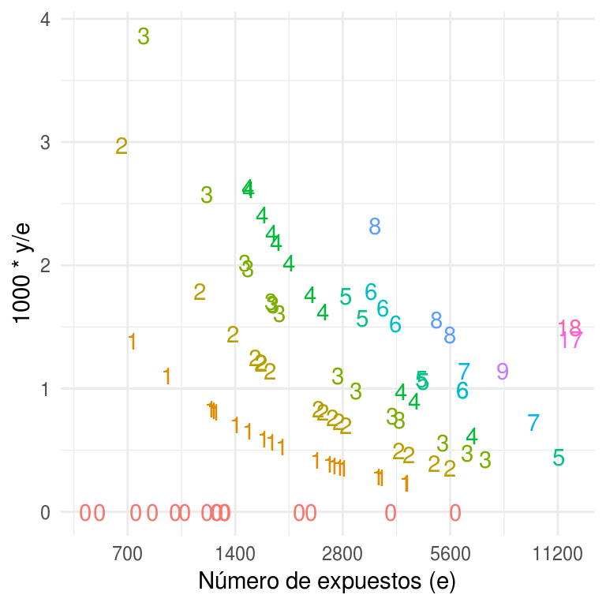

La variabilidad de las tasas y los hospitales sin muertes sugieren un problema 
de tamaño de muestra. Consideremos un hospital con 700 expuestos. La muerte por
transplante de corazón no es común, el promedio nacional es de 9 por cada 10,000
expuestos, por lo que con 700 expuestos es probable que no se presente ninguna 
muerte, en este caso el hospital pertenece al 10\% de los hospitales con menor 
tasa de mortalidad. Sin embargo, existe la posibilidad de que se observe una 
muerte, con lo cual el hospital tendrá una tasa de mortalidad que es lo 
suficientemente alta para que quede en el 25\% de los hospitales con mayor tasa 
de mortalidad observada.

Una vez reconocido el problema de utilizar los datos crudos para estimar las tasas de mortalidad plantearemos 3 alternativas de modelación:

1. **Unidades iguales**. Considera que los estudios son replicas idénticas una 
de otra, en este sentido vemos a las observaciones de todos los estudios como 
muestras independientes de una misma población y consecuentemente todas las 
$\lambda_{j}$ se consideran iguales, 

$$
  \begin{eqnarray}
		\nonumber
		y_{j} &\sim& f(y_{j}|\lambda),\\
	 	\nonumber
		\lambda &\sim& g(\lambda).
	\end{eqnarray} 
$$
El modelo gráfico correspondiente a este enfoque (omitiendo la distribución de
$\lambda$) es:

<center>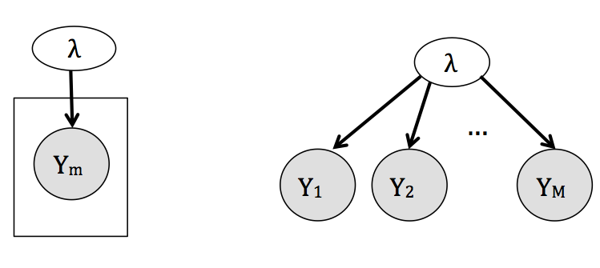</center>
  
2. **Unidades independientes**. El extremo opuesto a unidades iguales considera 
que los estudios son tan diferentes que los resultados de cada uno no proveen información acerca de los resultados de ningún otro y por tanto realizamos 
estimaciones individuales para cada $\lambda_{j}$, 
$$
  \begin{align}
		\nonumber
		y_{j} &\sim f(y_{j}|\lambda_{j}),\\
		\nonumber
		\lambda_j &\stackrel{\mathrm{iid}}{\sim} g(\lambda_j).
	\end{align}
$$
Con el siguiente modelo gráfico:

<center>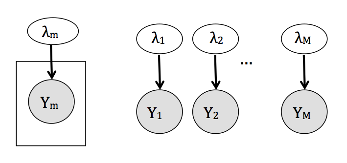</center>

3. Jerárquico. Es un análisis intermedio que considera los parámetros de interés
$\lambda_{j}$ como provenientes de una distribución común,
$$
\begin{eqnarray}
		\nonumber
		y_{j} &\sim& f(y_{j}|\lambda_{j}),\\
		\nonumber
		\lambda_{j} &\sim& g(\lambda_j|\theta),\\
		\theta &\sim& h(\theta).
	\end{eqnarray} 
$$

<center>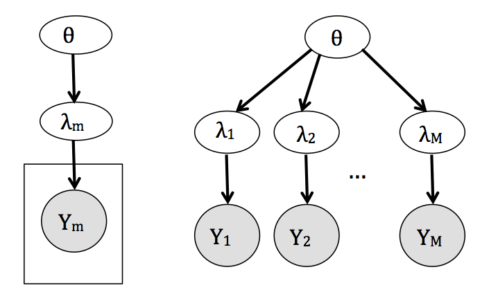</center>

De esta manera, la probabilidad conjunta del modelo refleja una dependencia 
entre los parámetros al mismo tiempo que permite variaciones entre los estudios. 
Como resultado se estima una $\lambda_{j}$ diferente para cada estudio usando 
información de todos.  
Notemos que la estructura del modelo jerárquico facilita la implementación del muestreador de Gibbs debido a que es inmediato factorizar la conjunta en 
condicionales completas.

#### Modelo de unidades iguales
Supongamos que las tasas de mortalidad son iguales a lo largo de los hospitales. 
Estimaremos la tasa de mortalidad con el modelo, 

$$
\begin{eqnarray}
	\nonumber
y_{j} \sim Poisson(e_{j}\lambda),
\end{eqnarray}
$$

donde $y_{j}$ es el número de muertes observadas por transplante corazón en el
hospital $j$, $e_{j}$ es el número de expuestos, y $\lambda$ es la tasa de 
mortalidad, medida en número de muertes por unidad de exposción y común para 
todos los hospitales.

Debido a que no contamos con información inicial acerca de la tasa de mortalidad,
asignamos a $\lambda$ una distribución inicial no informativa, de la forma

$$
\begin{eqnarray}
	\nonumber
	 g(\lambda)\propto\frac{1}{\lambda}.
\end{eqnarray}
$$

Sea $y=(y_1,...,y_{94})$, usamos el Teorema de Bayes para calcular la densidad 
posterior de $\lambda$,

$$
\begin{eqnarray}
	\nonumber
	g(\lambda|y) &\propto& g(\lambda)f(y|\lambda) \\
	\nonumber
	&=& g(\lambda)\prod_{i=1}^{94}f(y_{i}|\lambda)\\
	\nonumber
	&=& \frac{1}{\lambda}\prod_{i=1}^{94}\bigg(\frac{exp(-e_{i}\lambda)(e_{i}\lambda)^{y_{i}}}{y_{i}!}\bigg)\\
	\nonumber
	&\propto& \lambda^{(\sum_{i=1}^{94}y_{j}-1)}exp\bigg(-\sum_{i=1}^{94}e_{j}\lambda\bigg),
\end{eqnarray}
$$
identificamos la densidad posterior como una 
$Gamma(\sum_{i=1}^{94}y_{i},\sum_{i=1}^{94}e_{i})$, donde expresamos la función 
de densidad de una distribución $Gamma(\alpha, \beta)$ usando el parámetro de 
forma $\alpha$ y el inverso del parámetro de escala $\beta$ de manera que la 
función de densidad es,

$$
\begin{align}
	\nonumber
	&f(x|\alpha, \beta) = \beta^{\alpha}\frac{1}{\Gamma(\alpha)}x^{\alpha-1}e^{-\beta x}I_{(0,\infty)}(x)\\
	\nonumber
	&\mbox{para }x \geq 0 \mbox{ y }\alpha \mbox{, }\beta > 0.
\end{align}
$$

Para verificar el ajuste del modelo utilizaremos la distribución predictiva 
posterior. Denotemos $y_{j}^*$ el número de muertes por transplante en el 
hospital $j$ con exposición $e_{j}$ en una muestra futura. Condicional a 
$\lambda$, $y_{j}^*$ se distribuye $Poisson(e_{j}\lambda)$, no conocemos el 
verdadero valor de $\lambda$, sin embargo nuestro conocimiento actual está 
contenido en la densidad posterior $g(\lambda|y)$. Por tanto, la distribución 
predictiva posterior de $y_{j}^*$ esta dada por: 

$$
\begin{eqnarray}
\nonumber
	f(y_{j}^*|e_{j},y) = \int f(y_{j}^*|e_{j}\lambda)g(\lambda|y)d\lambda, 
\end{eqnarray}
$$

donde $f(y_j^*|e_{j}\lambda)$ es una densidad Poisson con media $\lambda$. La 
densidad predictiva posterior representa la verosimilitud de observaciones 
futuras basadas en el modelo ajustado. En este ejemplo, la densidad 
$f(y_{j}^*|e_{j},y)$ representa el número de transplantes que se predecirían 
para un hospital con exposición $e_{j}$. Entonces, si el número observado de 
muertes $y_{j}$ no está en las colas de la distribución predictiva, diríamos que 
la observación es consistente con el modelo observado.


```r
# La densidad posterior es Gamma con los siguientes parámetros
c(sum(heart$y), sum(heart$e))
#> [1]    277 294681
# Simulamos 1000 muestras de la densidad posterior de lambda
lambdas <- rgamma(1000, shape = sum(heart$y), rate = sum(heart$e))
# ahora para cada hospital simulamos muestras de una distribución Poisson
# con media e_i*lambda
heart_sims <- heart %>% 
    mutate(sims = map(e, ~rpois(1000, . * lambdas))) 
# tomamos una muestra de 10 hospitales
set.seed(242)
heart_sims_sample <- sample_n(heart_sims, 10)

ggplot(unnest(heart_sims_sample), aes(x = sims)) + 
  geom_histogram(aes(y = ..density..), binwidth = 1, color = "darkgray", 
    fill = "darkgray") +
  facet_wrap(~ hospital, nrow = 2) +
  geom_segment(data = heart_sims_sample, aes(x = y, xend = y, y = 0, 
    yend = 0.5), 
    color = "red") + 
  geom_text(data= heart_sims_sample, aes(x = 10, y = 0.4, 
    label = paste("e =", e)), size = 2.7, color = "red")
```

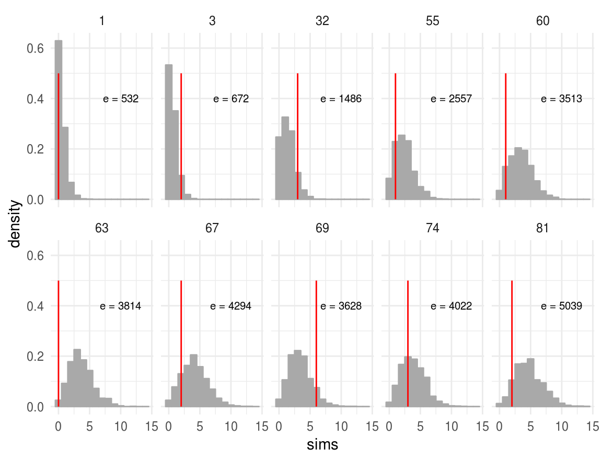

La figura muestra los histogramas, obtenidos con simulación, de la distribución
predictiva posterior de 10 hospitales (se tomó una muestra de los 94). Para cada
hospital, se escribió el número de expuestos, $e$, y se grafica una línea 
vertical en el número de muertes observado. Notemos que en muchos de los 
histogramas el número de muertes observado se encuentra en las colas de las 
distribuciones, lo que sugiere que nuestras observaciones son inconsistentes con 
el modelo ajustado.

Ahora examinaremos la consistencia de las muertes observadas, $y_{j}$, para 
todos los hospitales. Para cada distribución predictiva posterior calculamos la
probabilidad de que una observación futura $y_{j}^*$ sea al menos tan extrema 
como $y_{j}$, estas probabilidades son comúnmente llamadas valores p 
predictivos: 

$$
\begin{eqnarray}
	\nonumber
	P(extremos) = min\{P(y_{j}^* \leq y_{j}),P(y_{j}^*\geq y_{j})\}
\end{eqnarray}
$$


```r
# Para calcular las p predictiva podemos usar las simulaciones
p_pred <- heart_sims %>% 
    unnest() %>% 
    group_by(hospital) %>% 
    summarise(
        p = min(sum(sims <= y) / 1000, sum(sims >= y) / 1000), 
        e = first(e)
        )

ggplot(p_pred, aes(x = log(e), y = p)) + 
  geom_point() +
  scale_x_continuous("Número de expuestos (e)", labels = exp, 
    breaks = map_dbl(0:4, ~ log(700 ^ .))) + 
  ylab("P(extremos)") +
  geom_hline(yintercept = .15, colour = "red", size = 0.4) +
  ylim(0, .7) 
```

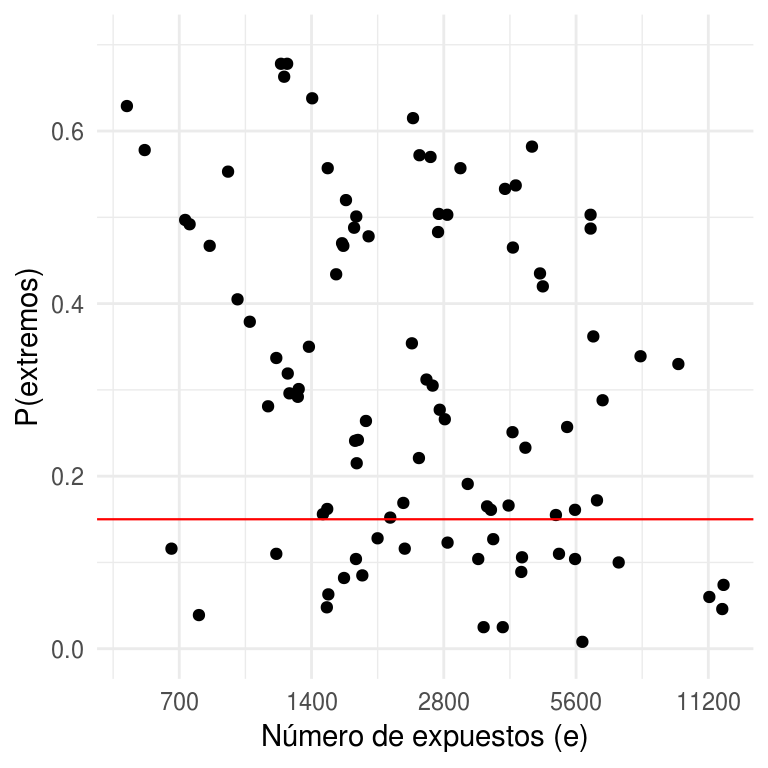

En la figura anterior graficamos las probabilidades de extremos (calculadas con 
simulación) en el eje vertical, contra el número de exposición en escala 
logarítmica de cada hospital en el eje horizontal. Notemos que muchas de estas 
probabilidades son pequeñas, el 28\% son menores a 0.15, lo que indica que 
para el 28\% de los hospitales el número de muertes observado $y_{j}$ está en la 
cola de la distribución y por consiguiente el modelo es inadecuado.


#### Modelo de unidades independientes {-}

Consideremos ahora que los hospitales son independientes, estimaremos la tasa de
mortalidad para cada hospital con el modelo

$$
\begin{eqnarray}
	\nonumber
	y_{j}\sim Poisson(e_{j}\lambda_{j}),
\end{eqnarray}
$$

donde $y_{j}$ es el número de muertes observadas por transplante corazón en el 
hospital $j$, $e_{j}$ es el número de expuestos, y $\lambda_{j}$ es la tasa de
mortalidad, medida en número de muertes por unidad de exposición, con
$j=1,...,94$. Utilizamos el subíndice $j$ para enfatizar que son parámetros 
diferentes, cada uno estimado con sus propios datos.

Por facilidad asignamos a $\lambda_{j}$ una distribución inicial 
$Gamma(\alpha_{0}, \beta_{0})$ que es conjugada de la distribución Poisson,

$$
\begin{eqnarray}
\nonumber
	g(\lambda_{j}|\alpha_{0},\beta_{0}) = \frac{\beta_{0}^{\alpha_{0}} \lambda_{j}^{\alpha_{0}-1}exp(-\lambda_{j} \beta_{0})}{\Gamma(\alpha_{0})}, \lambda_{j}>0.
\end{eqnarray}
$$

Calculamos la densidad posterior de $\lambda_{j}$ usando el Teorema de Bayes,

$$
\begin{eqnarray}
	\nonumber
	g(\lambda_{j}|y_{j},\alpha_{0},\beta_{0}) &\propto& g(\lambda_{j}|\alpha_{0},\beta_{0})f(y_{j}|\lambda_{j})\\
	\nonumber
	&=& \frac{\beta_{0}^{\alpha_{0}} \lambda_{j}^{\alpha_{0}-1}exp(-\lambda_{j} \beta_{0})}{\Gamma(\alpha_{0})}\frac{exp(-e_{j}\lambda_{j})(e_{j}\lambda_{j})^{y_{j}}}{y_{j}!}\\
	\nonumber
	&\propto& \lambda_{j}^{\alpha_{0}+y_{j}-1}exp(-\lambda_{j}(\beta_{0}+e_{j})),
\end{eqnarray}
$$

y obtenemos que $\lambda_{j}|y_{j} \sim Gamma(\alpha_{0}+y_{j}, \beta_{0}+e_{j})$, con media

$$
\begin{eqnarray}
	\nonumber
	E(\lambda_{j}|y_{j},\alpha_{0},\beta_{0}) &=& \frac{\alpha_{0}+y_{j}}{\beta_{0}+e_{j}}\\
	\label{eqn:pond.indep}
	&=& (1-A_{j})\frac{y_{j}}{e_{j}}+A_{j}\frac{\alpha_{0}}{\beta_{0}}
\end{eqnarray}
$$

donde

$$
\begin{eqnarray}
	A_{j}=\frac{\beta_{0}}{\beta_{0}+e_{j}},
\end{eqnarray}
$$
y varianza

$$
\begin{eqnarray}
	\nonumber
	Var(\lambda_{j} |y_{j},\alpha_{0},\beta_{0}) = \frac{\alpha_{0}+y_{j}}{(\beta_{0}+e_{j})^2}.
\end{eqnarray}
$$

Notemos que podemos escribir la media posterior como un promedio ponderado de la 
tasa observada $y_{j}/e_{j}$ y la media inicial $\alpha_{0} / \beta_{0}$. El 
factor $A_{j}$ es el encogimiento hacia la media inicial y depende del número de
exposición de cada hospital y del parámetro de escala $\beta_{0}$.

##### Efecto de ${\beta_{0}}$ y ${e_{j}}$ en la distribución posterior {-}

Consideremos la media y varianza posteriores de $\lambda_{j}$ para un hospital
particular. Tomando $\alpha_{0}$ fija, valores mayores de $\beta_{0}$ 
corresponden a una menor varianza en la distribución inicial pues 
$Var(\lambda_{j} | \alpha_{0},\beta_{0}) = \alpha_{0}/\beta_{0}^2$. La varianza 
de la distribución inicial se refleja en la media de la distribución posterior 
de $\lambda_{j}$ a través de $\beta_{0}$, menor varianza (mayor $\beta_{0}$) 
corresponde a mayor encogimineto hacia la media inicial. Este efecto de 
$\beta_{0}$ concuerda con la incertidumbre de nuestro conocimiento, pues menor 
varianza en la distribución inicial indica menor incertidumbre y la aportación 
de la media inicial a la media posterior es más importante. La elección de 
$\beta_{0}$ también afecta la varianza, pues un menor valor de $\beta_{0}$ 
implica una mayor varianza tanto en la distribución inicial como en la final.

Por su parte, tomando $\alpha_{0}$ y $\beta_{0}$ fijas, el efecto del número de
expuestos $e_{j}$ sobre la media posterior de $\lambda_{j}$ actúa de manera 
contraria a $\beta_{0}$. Un mayor número de expuestos tiene como consecuencia un 
menor encogimiento hacia la media inicial, dando mayor importancia a la tasa 
observada $y_{j}/e_{j}$. Esto refleja que más expuestos implican más información
proveniente de la muestra, restando importancia a nuestro conocimiento inicial. 
En cuanto a la varianza posterior, es inversamente proporcional al número de
expuestos indicando nuevamente que más expuestos implica más conocimiento y por
tanto menor incertidumbre.

En la siguiente fugura mostraremos el encogimiento hacia la media inicial bajo 
distintos escenarios de $\beta_{0}$, cada punto representa un hospital y el 
color indica a que valor de $\beta_{0}$ corresponde. En esta gráfica podemos 
apreciar el mayor encogimiento para valores mayores de $\beta_{0}$ y el 
decaimiento en el encogimiento conforme aumenta el número de expuestos.


```r
heart_indep <- heart %>% 
    crossing(beta_0 = c(1000, 100, 10, 0.01)) %>% 
    mutate(encogimiento = beta_0 / (beta_0 + e))

glimpse(heart_indep)
#> Observations: 376
#> Variables: 5
#> $ e            <int> 532, 532, 532, 532, 584, 584, 584, 584, 672, 672,...
#> $ y            <int> 0, 0, 0, 0, 0, 0, 0, 0, 2, 2, 2, 2, 1, 1, 1, 1, 1...
#> $ hospital     <int> 1, 1, 1, 1, 2, 2, 2, 2, 3, 3, 3, 3, 4, 4, 4, 4, 5...
#> $ beta_0       <dbl> 1e-02, 1e+01, 1e+02, 1e+03, 1e-02, 1e+01, 1e+02, ...
#> $ encogimiento <dbl> 1.88e-05, 1.85e-02, 1.58e-01, 6.53e-01, 1.71e-05,...

ggplot(heart_indep, aes(x = log(e), y = encogimiento, 
    color = factor(beta_0))) +
    geom_point(alpha = 0.9) +
    scale_x_continuous("Número de expuestos (e)", labels = exp, 
        breaks = map_dbl(0:4, ~ log(700 ^ .))) +
  scale_color_hue(expression(beta[0])) +
  ylab("encogimiento (A)")
```

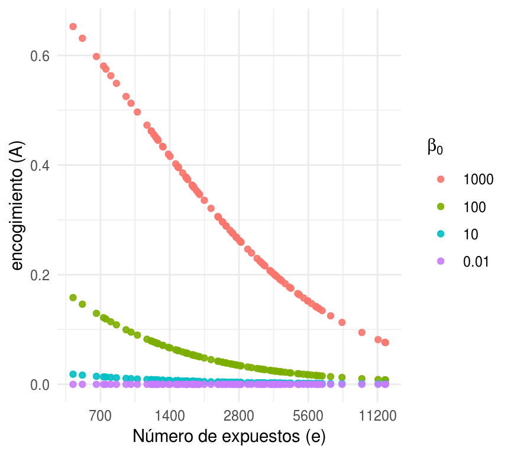

##### Distribución inicial {-}

Establecimos que por facilidad se utilizará una inicial 
$Gamma(\alpha_{0},\beta_{0})$, sin embargo hace falta asignar valores a los 
parámetros iniciales. Analizaremos 3 distintas combinaciones de parámetros 
iniciales y su efecto en las estimaciones posteriores.

Para cada combinación de parámetros la siguiente tabla muestra los deciles de 
2000 simulaciones de una distribución $Gamma(\alpha_0,\beta_{0})$ y los deciles 
de las muertes observadas por cada 1000 expuestos considerando todos los 
hospitales; multiplicamos las simulaciones por 1000 para que indiquen tasas de 
mortalidad medidas en número de muertes por 1000 expuestos. El propósito de la 
tabla es describir la forma de la distribución $Gamma$ al cambiar los 
parámetros, por ejemplo, una $Gamma(0.01,0.01)$ es muy plana y podríamos 
describirla como poco informativa, mientras que una $Gamma(1,1000)$ tiene una 
forma más cercana a las tasas de mortalidad observadas. 

decil | $(0.01,0.01)$ | $(0.5,0.01)$ | $(1,1000)$ | Observados  
------|---------------|--------------|------------|-----------
min | 0 | 0 | 0 | 0  
  10 | 0 | 890.3 | 0.1 | 0  
  20 | 0 | 3134.7 | 0.2 | 0.3  
  30 | 0 | 7769.0 | 0.3 | 0.5  
  40 | 0 | 15036.0 | 0.5 | 0.7  
  50 | 0 | 24293.9 | 0.7 | 0.8  
  60 | 0 | 37306.0 | 0.9 | 1.1  
  70 | 0 | 57640.2 | 1.2 | 1.4  
  80 | 0 | 84255.5 | 1.6 | 1.7  
  90 | 4.2 | 140721.9 | 2.3 | 2.0  
  max | 287307.6 | 592073.2 | 7.0 | 3.9  

Ahora realizamos una gráfica para cada pareja de parámetros  
$(\alpha_0,\beta_{0})$ donde mostramos en negro las tasas observadas, y en color 
las estimaciones posteriores de las tasas de mortalidad con intervalos del 95\% 
de probabilidad, ambas medidas en número de muertes por cada 1000 expuestos. 
Cada punto representa un hospital y el color corresponde al número de muertes 
observadas, $\{y_{j}\}$. Regresaremos a esta gráfica más adelante pero por lo 
pronto observemos que tanto las estimaciones como los intervalos de probabilidad 
son muy diferentes al cambiar los parámetros de la distribución inicial. 


```r
# Procedemos como antes, para cada combinación de alfa y beta simulamos 1000 
# lambdas de la posterior
lambdas <- rgamma(1000, shape = sum(heart$y), rate = sum(heart$e))
# ahora para cada hospital simulamos muestras de una distribución Poisson
# con media e_i*lambda
priors <- data_frame(alpha = c(0.01, 0.5, 1), beta = c(0.01, 0.01, 1000))

heart_indep_sims <- heart %>% 
    crossing(priors) %>% 
    mutate(
        sims = pmap(list(e, y, alpha, beta), ~rgamma(1000, shape = ..3 + ..2, 
            rate = ..4 + ..1))
        ) 
# Creamos intervalos con las simulaciones
heart_indep_post <- heart_indep_sims %>% 
    mutate(
        media = 1000 * (alpha + y) / (beta + e), 
        int_l = map_dbl(sims, ~quantile(1000 * ., 0.025)), 
        int_u = map_dbl(sims, ~quantile(1000 * ., 0.975)), 
        params = paste0("alpha = ", alpha, ", beta = ", beta)
        )

ggplot(heart_indep_post, aes(x = log(e), y = media, color = factor(y))) +
    geom_pointrange(aes(ymin = int_l, ymax = int_u), size = 0.25) +
    geom_point(data = heart, aes(x = log(e), y = 1000 * y / e), color = "black", 
        alpha = 0.6, size = 1.5) +
    facet_wrap(~params, ncol = 1) +
    scale_x_continuous("Número de expuestos (e)", labels = exp, 
        breaks = map_dbl(0:4, ~ log(700 ^ .))) + 
    scale_colour_hue("muertes obs. (y)") + 
    ylab("Muertes por 1000 expuestos")
```

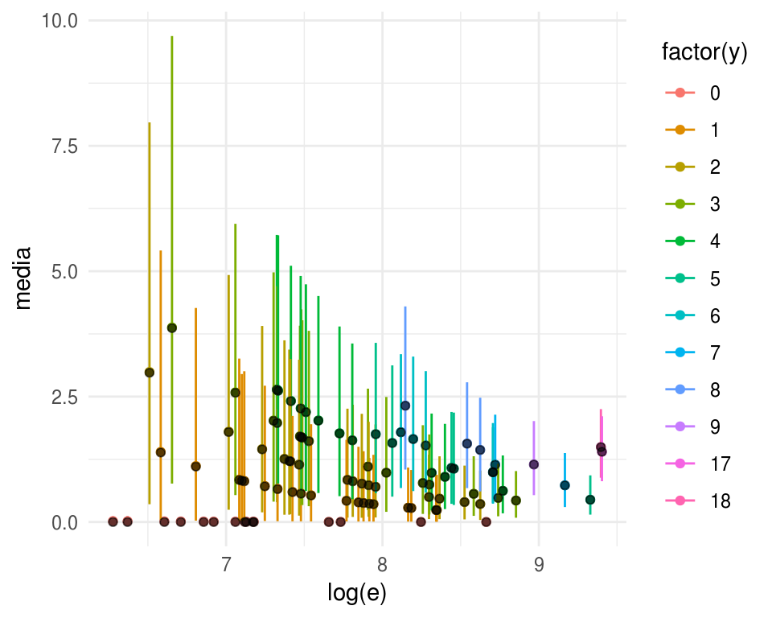

Ahora justificaremos la elección de las parejas de parámetros iniciales. La 
única información con la que contamos para definir una distribución inicial es 
que la tasa de mortalidad por transplante de corazón debe ser positiva y no muy 
grande. Debido a que no tenemos más información nuestro primer modelo utiliza 
una inicial vaga.

##### No informativas {-}
Asignamos a $\lambda_{j}$ una distribución inicial $Gamma(0.01,0.01)$. La tabla 
de deciles indica que es una distribución muy plana y si observamos la gráfica 
de encogimiento notamos que para una inicial con este valor en el parámetro de
escala $\beta_{0}$, el encogimiento de la media posterior hacia la media inicial
es muy cercano a cero, dando poca importancia a la media inicial 
$\alpha_{0}/\beta_{0}=1$.  Como consecuencia, las estimaciones posteriores de
$\lambda_{j}$ son casi iguales a las tasas observadas $\{y_{j}/e_{j}\}$, y se
presentan los problemas de tamaño de muestra notados al usar las tasas 
observadas como estimaciones de 
las tasas de mortalidad. Además, los intervalos de confianza para los hospitales
que no experimentaron muertes son poco creíbles pues son mucho más chicos que el
resto.

La siguiente distribución inicial que consideramos es una $Gamma(0.5,0.01)$. En
este caso, la elección de los parámetros se basó en la distribución inicial no
informativa de Jeffreys, consiste en una $Gamma(0.5,0)$. Es una distribución
impropia por lo que cambiamos el parámetro de escala por $0.01$ para obtener 
una inicial propia con varianza grande. Los resultados no son muy razonables,
pues la media inicial es 50, mucho mayor a las tasas observada para todos los
hospitales, provocando que las estimaciones del modelo sean mayores a las tasas
observadas en todos los hospitales. Este efecto es contrario al que buscábamos 
al usar una inicial vaga pues la distribución inicial tiene un impacto muy 
fuerte en las estimaciones posteriores.

##### Informativa {-}
Finalmente, consideramos una distribución inicial $Gamma(1,1000)$, ésta inicial
es informativa. Para obtener sus parámetros igualamos los media y varianza
teórica de la distribución $Gamma$ con la media y varianza observadas en el
conjunto de tasas de mortalidad tomando en cuenta todos los hospitales.
Las estimaciones de las tasas de mortalidad que obtenemos parecen razonables, 
sin embargo, especificar la distribución inicial con la muestra tiene problemas
lógicos y prácticos: 1) los datos se están usando 2 veces, primero la 
información de todos los hospitales se usa para especificar la distribución
inicial, y después la información de cada hospital se usa para estimar su tasa 
de mortalidad $\lambda_{j}$, lo que ocasiona que sobreestimemos nuestra 
precisión. 2) De acuerdo a la lógica bayesiana no tiene sentido estimar 
$\alpha_{0}$ y $\beta_{0}$, pues son parte de la distribución inicial y no deben
depender de los datos.

A pesar de los problemas señalados parece ser conveniente intentar mejorar las 
estimaciones individuales de $\lambda_{j}$ usando la información de todos los
hospitales. La manera correcta de hacerlo es establecer un modelo de 
probabilidad para todo el conjunto de parámetros  
$\{\alpha,\beta,\lambda_{1},...,\lambda_{94}\}$ y después realizar un análisis 
de la distribución conjunta.
Se llevará a cabo un análisis completo en la siguiente sección en donde se usará
un modelo jerárquico.

Podemos concluir que el modelo de unidades independientes no es robusto para 
nuestros datos pues las estimaciones posteriores de las tasas de mortalidad son 
muy sensibles a la elección de los parámetros de la distribución inicial. 

#### Modelo jerárquico {-}

En este ejemplo se destaca el modelo jerárquico como una estrategia intermedia 
entre el modelo de unidades iguales y el modelo de unidades independientes. Nos 
permite reflejar un escenario en donde la información de cada estudio aporta 
información acerca del parámetro de interés $\lambda_j$ de los demás estudios 
sin considerarlos idénticos, de manera que se estima un parámetro $\lambda_j$ 
diferente para cada hospital.

Enumeramos algunas de las ventajas potenciales de usar un modelo jerárquico.

1. Modelo unificado. El problema de elegir entre un modelo de unidades iguales o 
uno de unidades independientes se resuelve al modelar explícitamente la 
variabilidad entre las unidades.

2. Unir fuerzas. Debido al supuesto de intercambiabilidad, al estimar el
parámetro de cada unidad se usa información de las demás unidades, conllevando a
un encogimiento de la estimación individual hacia la media poblacional, y 
resulta en una mejor precisión de las estimaciones. La magnitud del encogimiento
depende de la varianza entre las unidades, y su efecto resulta particularmente
benéfico cuando hay pocas observaciones dentro de una unidad, en cuyo caso hay
una gran reducción de la incertidumbre ya que las estimaciones posteriores
incorporan la información de otras unidades con menor variabilidad. 

3. Incertidumbre en los parámetros. Asignar una distribución a los 
hiperparámetros, $\theta$, nos permite incorporar nuestra incertidumbre sobre la
distribución inicial de $\lambda$.

4. Cómputo. La estructura jerárquica facilita los cálculos posteriores, debido a
que la distribución posterior se factoriza en distribuciones condicionales más
sencillas que facilitan la implementación de un muestreador de Gibbs.

Retomando el problema de estimación de tasas de mortalidad por transplante de
corazón, modelaremos las $\lambda_{j}$ con un modelo jerárquico, suponemos
intercambiabilidad para reflejar que no contamos con información que nos permita
distinguir entre los hospitales.

Primero definimos la distribución de los datos,

$$
\begin{eqnarray}
	\nonumber
y_{j} \sim Poisson(e_{j}\lambda_{j}),
\end{eqnarray}
$$

donde $y_{j}$ es el número de muertes observadas, $e_{j}$ es el número de 
expuestos y $\lambda_{j}$ es la tasa de mortalidad para el hospital $j$, con 
$j=1,...,94$.

Después asignamos una distribución al vector de parámetros 
$\lambda=(\lambda_{1},...,\lambda_{94})$, para ello suponemos que las tasas de
mortalidad $\{\lambda_{1},...,\lambda_{94}\}$ son una muestra aleatoria de una 
distribución $Gamma(\alpha,\alpha/\mu)$ con la forma

$$
\begin{eqnarray}
	\nonumber
	g(\lambda_j|\alpha,\mu)=\frac{(\alpha/\mu)^\alpha\lambda_j^{\alpha-1}exp(-\alpha\lambda_j/\mu)}{\Gamma(\alpha)}, \lambda_j>0.
\end{eqnarray}
$$

La media y varianza iniciales de $\lambda_{j}$ están dadas por $\mu$ y 
$\mu^2/\alpha$, para toda $j$. Las llamaremos la media y varianza poblacionales 
ya que son comunes para todos los hospitales.
En la segunda etapa, los hiperparámetros $\mu$ y $\alpha$ se suponen 
independientes y les asignaremos iniciales vagas. 
Al parámetro de media,

$$
\begin{eqnarray}
	\nonumber
	h(\mu)\propto\frac{1}{\mu}, \mu>0.
\end{eqnarray}
$$
Al parámetro de precisión $\alpha$ le asignamos una densidad inicial propia pero 
plana, de la forma,
$$
\begin{eqnarray}
	\nonumber
	h(\alpha)=\frac{z_{0}}{(\alpha+z_0)^2}, \alpha>0.
\end{eqnarray}
$$

El valor $z_0$ es la mediana de $\alpha$, no contamos con información inicial de
forma que por ahora usaremos $z_0=0.5$.

Debido a la estructura de independencia condicional del modelo jerárquico y a 
que se eligió una inicial conjugada, el análisis posterior es relativamente 
sencillo. Utilizamos el Teorema de Bayes para calcular la distribución posterior
de $\lambda_{j}$ condicional a los valores de los hiperparámetros $\mu$ y
$\alpha$, 

$$
\begin{eqnarray}
	\nonumber
	g(\lambda_{j}|y_{j},\alpha,\mu) &\propto& g(\lambda_{j}|\alpha,\mu)f(y_{j}|\lambda_{j})\\
	\nonumber
	&=& \frac{(\alpha/\mu)^{\alpha} \lambda_{j}^{\alpha-1}exp(-\lambda_{j} \alpha/\mu)}{\Gamma(\alpha)}\frac{exp(-e_{j}\lambda_{j})(e_{j}\lambda_{j})^{y_{j}}}{y_{j}!}\\
	\nonumber
	&\propto& \lambda_{j}^{y_{j}+\alpha-1}exp(-\lambda_{j}(e_{j}+\alpha/\mu))
\end{eqnarray}
$$

obtenemos así que las tasas $\{\lambda_{1},..., \lambda_{94}\}$ tienen 
distribuciones posteriores independientes 
$Gamma(y_{j}+\alpha, e_{j}+\alpha/\mu)$, con media:

$$
\begin{eqnarray}
	E(\lambda_{j}|y,\alpha,\mu) &=& \frac{y_{j}+\alpha}{e_{j}+\alpha/\mu}\\
	\label{eqn:pond}
	&=& (1-A_{j})\frac{y_{j}}{e_{j}}+A_{j}\mu,
\end{eqnarray}
$$
donde
$$
\begin{eqnarray}
	\label{eqn:factor}
	A_{j}=\frac{\alpha}{\alpha+e_{j}\mu},
\end{eqnarray}
$$

Denominamos al factor $A_{j}$ como el encogimiento hacia la media poblacional
$\mu$, más adelante derivamos la distribución posterior de $\mu$, pero por ahora
la enunciamos con el propósito de mostrar que su distribución incorpora 
información de todos los hospitales, 

$$
\begin{eqnarray}
	\nonumber
	f(\mu|y)=K \int \prod_{i=1}^{94} \left[ \frac {(\alpha/\mu)^\alpha\Gamma(y_{i}+\alpha)} {(e_{i}+\alpha/\mu)^{y_{i}+\alpha}} \right ]\frac{z_{0}}{(\alpha+z_0)^2} \frac{1}{\mu} d\alpha
\end{eqnarray}
$$
donde $K$ es una constante.

Al escribir la media posterior de $\lambda_{j}$ como un promedio ponderado, 
podemos ver el efecto de unir fuerzas mencionado en las observaciones del 
modelo jerárquico: hay un encogimiento hacia $\mu$ que depende del número de
expuestos, $e_{j}$, para los hospitales con menor número de expuestos el
encogimiento hacia $\mu$ es mayor, mientras que para aquellos con mayor número 
de expuestos, es más importante la tasa observada, $y_{j}/e_{j}$. De esta 
manera, mayor encogimiento corresponde a las observaciones con mayor 
incertidumbre.

Notemos también que la factorización de la media posterior es similar a la que
obteníamos en el modelo de medias independientes. La diferencia radica en que
ahora es un sólo modelo (opuesto a 94), y los parámetros de la distribución
inicial de $\lambda_{j}$ forman parte del modelo de probabilidad pues les
asignamos una distribución inicial.

#### Distribuciones posteriores {-}

Sea $\lambda=(\lambda_{1},...,\lambda_{94})$ y $y=(y_{1},...,y_{94})$, 
calculamos la densidad posterior conjunta de los parámetros,

$$
\begin{align}
	\nonumber
	f(\lambda,\alpha,\mu|y) &\propto f(y|\lambda,\alpha,\mu)f(\lambda,\alpha,\mu)\\
\nonumber
	&= f(y|\lambda) f(\lambda|\alpha,\mu) p(\alpha,\mu)\\
\nonumber
	&= \prod_{i=1}^{94}f(y_{i}|\lambda_{i}) \prod_{i=1}^{94} f(\lambda_{i}|\alpha,\mu) f(\alpha)f(\mu)\\
\nonumber
	&\propto \prod_{i=1}^{94} \frac {exp(-e_{i}\lambda_{i})(e_{i}\lambda_{i})^{y_{i}}} {y_{i}!} \prod_{i=1}^{94} \frac {(\alpha/\mu)^{\alpha}\lambda_{i}^{\alpha-1}exp(-\lambda_{i}(\alpha/\mu))} {\Gamma(\alpha)} \frac{z_{0}}{(\alpha+z_0)^2} \frac{1}{\mu}\\
	\nonumber
	&\propto \prod_{i=1}^{94}\frac {(e_{i}+\alpha/\mu)^{y_{i}+\alpha}\lambda_{i}^{y_{i}+\alpha-1}exp(-\lambda_{i}(e_{i}+\alpha/\mu))} {\Gamma(y_{i}+\alpha)} \prod_{i=1}^{94}\frac {(\alpha/\mu)^\alpha\Gamma(y_{i}+\alpha)} {(e_{i}+\alpha/\mu)^{y_{i}+\alpha}}\frac{z_{0}}{(\alpha+z_0)^2} \frac{1}{\mu},
\end{align}
$$

de aquí podemos integrar las tasas de mortalidad, $\lambda_{j}$, para obtener la
distribución posterior de los hiperparámetros $f(\alpha,\mu|y)$,

$$
{\normalsize
\begin{align}
	\nonumber
	f(\alpha,\mu|y) \propto \int_{\lambda_{1}} ...\lambda_{y_{94}}
	\prod_{i=1}^{94}(\frac {(e_{i}+\alpha/\mu)^{y_{i}+\alpha}\lambda_{i}^{y_{i}+\alpha-1}exp(-\lambda_{i}(e_{i}+\alpha/\mu))} {\Gamma(y_{i}+\alpha)}) \prod_{i=1}^{94}k_i  d\lambda_{1}...d\lambda_{94},\\
	\nonumber
\end{align}
}
$$

donde,

$$
\normalsize{
\begin{align}
	\nonumber
	k_i = \frac {(\alpha/\mu)^\alpha\Gamma(y_{i}+\alpha)} {(e_{i}+\alpha/\mu)^{y_{i}+\alpha}}\frac{z_{0}}{(\alpha+z_0)^2} \frac{1}{\mu}
\end{align}}
$$

observemos que las $\{k_j\}$ no dependen de $y$ por lo que son constantes en la
integral, además para cada $i$ de la primera multiplicación tenemos una 
distribución $Gamma(y_{i}+\alpha, e_{i}+\alpha/\mu)$ por lo que integran 1.

Resultando,

$$
{\normalsize
\begin{align}
	\nonumber
	f(\alpha,\mu|y)=K\prod_{i=1}^{94} \frac {(\alpha/\mu)^\alpha\Gamma(y_{i}+\alpha)} {(e_{i}+\alpha/\mu)^{y_{i}+\alpha}}\frac{z_{0}}{(\alpha+z_0)^2} \frac{1}{\mu}
\end{align}}
$$

donde $K$ es la constante de proporcionalidad.

Simulemos de las distribuciones posteriores, para ello procederemos como sigue:

1. Simulamos $(\mu, \alpha)$ de la distribución marginal posterior.

2. Simulamos $\lambda_1,...,\lambda_{94}$ de la distribución posterior condicional
a los valores simulados $(\mu, \alpha)$.

Para el primer paso, notamos que ambos parámetros son positivos por lo que es
conveniente transformarlos: $\theta_1 = log(\alpha$, $\theta_2 = log(\mu)$.

Definimos ahora la distribución posterior en términos de los parámetros 
transformados


```r
# código Albert paquete LearnBayes
poissgamexch <- function(theta, datapar){ # theta = c(theta_1, theta_2)
  y <- datapar$data[, 2]
  e <- datapar$data[, 1]
  z0 <- datapar$z0
  alpha <- exp(theta[1])
  mu <- exp(theta[2])
  beta <- alpha/mu
  logf <- function(y, e, alpha, beta){
    lgamma(alpha + y) - (y + alpha) * log(e + beta) + alpha*log(beta) - 
      lgamma(alpha)
  }
  val <- sum(logf(y, e, alpha, beta))
  val <- val + log(alpha) - 2 * log(alpha + z0)
  return(val)
}
# Simulamos theta_1, theta_2 usando el algoritmo de Metropolis dentro de Gibbs
# en la función gibbs, datapar contiene la base de datos y el valor del 
# hiperparámetro z0 
datapar <- list(data = hearttransplants, z0 = 0.53)
# adicionalmente debemos dar valores para el algoritmo Metrópolis, la función 
# implementa un algoritmo de caminata aleatoria
# donde la distribución propuesta tiene la forma  theta* = theta^t-1 + scale*Z
# y Z es N(0, I), en este caso c(1, 0.15) es el vector de escala
fitgibbs <- gibbs(poissgamexch, start = c(4, -7), m = 1000, scale = c(1, 0.15),
  datapar)
fitgibbs$accept
#>       [,1]  [,2]
#> [1,] 0.529 0.485
# simulaciones de alpha
alpha <- exp(fitgibbs$par[, 1])
# simulaciones de mu
mu <- exp(fitgibbs$par[, 2])
```

Podemos usar las simulaciones de $\alpha$ y $\mu$ para ver el encogimiento de 
las estimaciones de cada hosiptal hacia la media poblacional. Notamos un mayor
encogimiento para los hospitales con menor número de expuestos.


```r
heart_jer <- heart %>% 
    rowwise() %>% 
    mutate(A = mean(alpha / (alpha + e * mu)))
ggplot(heart_jer, aes(x = log(e), y = A)) +
  geom_point(alpha = 0.6, size = 1.6) +
  scale_x_continuous("Número de expuestos (e)", label = exp, 
    breaks = map_dbl(0:4, ~ log(700 ^ .))) +
    ylab("encogimiento (A)") + ylim(0, 1)
```

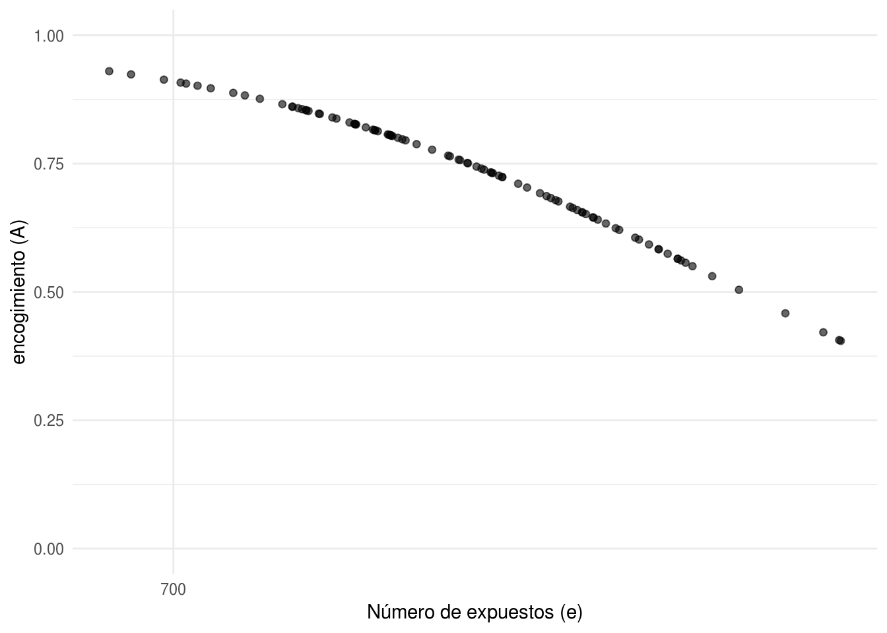

Ahora simualmos observaciones de la distribución posterior de lambda:


```r
heart_jer_sims <- heart_jer %>%
    mutate(sims = map2(e, y, ~rgamma(1000, .y + alpha, .x + alpha / mu))) %>% 
    ungroup()
```

Ya que tenemos las distribuciones posteriores podemos hacer inferencia acerca de
la tasa de mortalidad $\lambda$. A continuación graficamos los intervalos
posteriores del 95\% de probabilidad para las tasas $\lambda_{j}$, el color
representa el número de muertes observadas $y_{j}$, en gris se graficaron las
tasas observadas, la gráfica se dividió en 3 páneles de acuerdo al número de
muertes observadas en los hospitales.


```r
# Creamos intervalos con las simulaciones
heart_jer_post <- heart_jer_sims %>% 
    mutate(
        media = map_dbl(sims, ~mean(1000 * .)), 
        int_l = map_dbl(sims, ~quantile(1000 * ., 0.025)), 
        int_u = map_dbl(sims, ~quantile(1000 * ., 0.975)),
        sims_y = map2(sims, e, ~rpois(1000, .x * .y))
        )

ggplot(heart_jer_post, aes(x = log(e), y = media, color = factor(y))) +
    geom_pointrange(aes(ymin = int_l, ymax = int_u), size = 0.3) +
    geom_point(data = heart, aes(x = log(e), y = 1000 * y / e), color = "black", 
        alpha = 0.6) +
    scale_x_continuous("Número de expuestos (e)", labels = exp, 
        breaks = map_dbl(0:4, ~ log(700 ^ .))) + 
    scale_colour_hue("muertes obs. (y)") + 
    ylab("Muertes por 1000 expuestos")
```

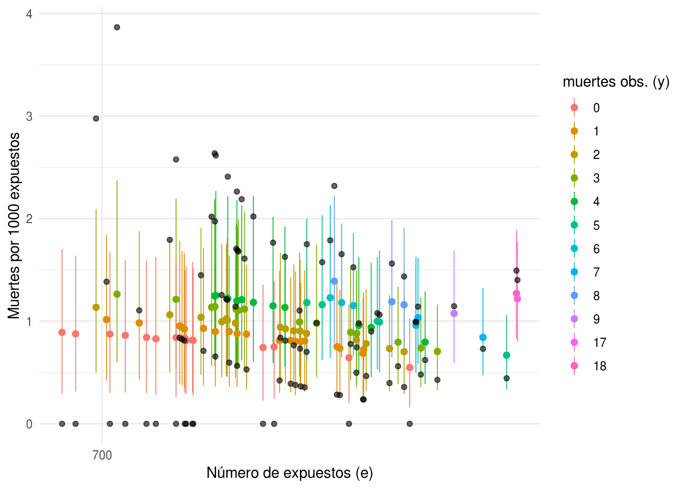

Analizamos la distribución predictiva posterior para la misma muestra de 10 
hospitales que se utilizó en el modelo de unidades iguales.


```r
sims_muestra <- heart_jer_post %>% 
    filter(hospital %in% heart_sims_sample$hospital)
sims_unnest <- sims_muestra %>% 
    dplyr::select(hospital, e, y, sims_y) %>% 
    unnest()

ggplot(sims_unnest, aes(x = sims_y)) + 
    geom_histogram(aes(y = ..density..), binwidth = 1, color = "darkgray", 
        fill = "darkgray") +
    facet_wrap(~ hospital, nrow = 2) +
    geom_segment(data = sims_muestra, aes(x = y, xend = y, y = 0, yend = 0.5), 
        color = "red") + 
    geom_text(data = sims_muestra, aes(x = 10, y = 0.4, label = paste("e =", e)), 
        size = 2.7, color = "red")
```

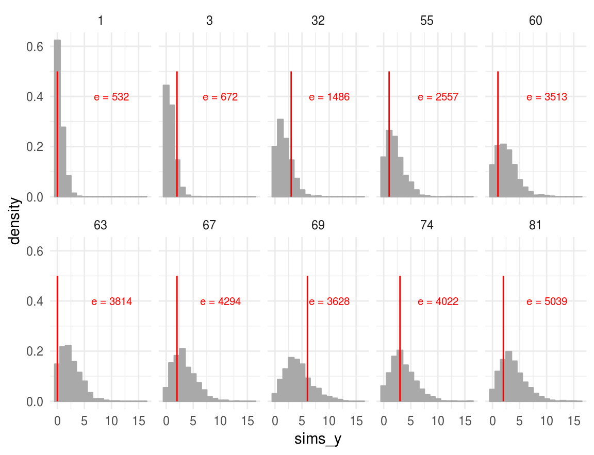

Observemos que únicamente en uno de los histogramas el número de muertes 
observadas se encuentra cerca de la cola de la distribución, lo que indica 
concordancia de las observaciones con el modelo ajustado.

Finalmente, revisamos la consistencia de los valores observados $y_{j}$ con la 
distribución predictiva posterior para todos los hospitales, para ello 
calculamos la probabilidad de que una observación futura $y_{j}^*$ sea al menos 
tan extrema como $y_{j}$ para todas las observaciones:

$$
\begin{eqnarray}
	\nonumber
	P(extremos) = min\{P(y_{j}^*\leq y_{j}),P(y_{j}^*\geq y_{j})\}
\end{eqnarray}
$$

A continuación graficamos las probabilidades de extremos (calculadas con
simulación). Con el modelo jerárquico solamente el 6\% de las probabilidades son
menores al 0.15, una disminución considerable al 28\% obtenido con el modelo de
unidades iguales. 


```r
# Para calcular las p predictiva podemos usar las simulaciones
p_pred <- heart_sims %>% 
    unnest() %>% 
    group_by(hospital) %>% 
    summarise(
        p = min(sum(sims <= y) / 1000, sum(sims >= y) / 1000), 
        e = first(e)
        )
p_pred_indep_jer <- heart_jer_post %>% 
    unnest() %>% 
    group_by(hospital) %>% 
    summarise(p_jer = min(sum(sims_y <= y) / 1000, sum(sims_y >= y) / 1000)) %>% 
    left_join(p_pred)
#> Joining, by = "hospital"

ggplot(p_pred_indep_jer, aes(x = log(e), y = p_jer)) + 
  geom_point() +
  scale_x_continuous("Número de expuestos (e)", labels = exp, 
    breaks = map_dbl(0:4, ~ log(700 ^ .))) + 
  ylab("P(extremos)") +
  geom_hline(yintercept = .15, colour = "red", size = 0.4) +
  ylim(0, .7) 
```

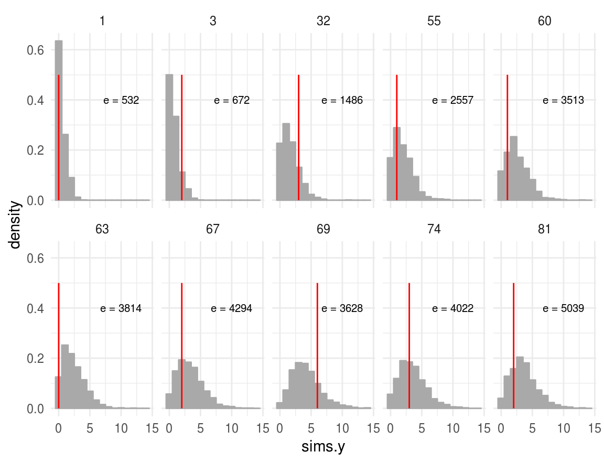

Comparemos ahora las probabilidades de al menos tan extremo usando el modelo
jerárquico contra las probabilidades de al menos tan extremo usando el modelo de
unidades iguales, los puntos se colorearon de acuerdo al número de expuestos de
cada hospital. Observemos que las probabilidades bajo el modelo jerárquico son
mayores en la mayoría de los casos.


```r
p_pred_indep_jer <- p_pred_indep_jer %>% 
    mutate(e_cat =  Hmisc::cut2(e, c(500, 1500, 2500, 4000, 12500)))
ggplot(p_pred_indep_jer, aes(x = p, y = p_jer, colour = e_cat)) +
    geom_abline(colour = "red", size = 0.4, alpha = 0.8) +
    geom_point(size = 2.5) +
    coord_equal() + 
    xlab("P(extremos), unidades iguales") +
    ylab("P(extremos), jerárquico") +
    ylim(0, 0.7) +
    xlim(0, 0.7) +
    coord_equal() +
    scale_colour_manual("No. expuestos (e)", values = c("#a6cee3", "#1f78b4",
        "#b2df8a", "#33a02c")) + theme_minimal()
#> Coordinate system already present. Adding new coordinate system, which will replace the existing one.
```


#### JAGS {-}

Ahora veremos como hacer la estimación usando JAGS. Primero hacemos un par de 
cambios en la definición del modelo, esto es porque la distribución inicial de 
$\mu$ no es propia (i.e. no integra uno) y JAGS no permite el uso de iniciales 
impropias. Usaremos iniciales Gamma para $\alpha$ y $\mu$ eligiendo parámetros 
de manera que sean iniciales vagas.
$$\mu, \alpha \sim Gamma(0.01, 0.01).$$
Veamos como se escriben el modelo en JAGS.


```r
modelo_heart.txt <- 
'
model{
  for(i in 1 : N) {
    y[i] ~ dpois(lambda2[i]) 
    lambda2[i] <- e[i] * lambda[i]
    lambda[i] ~ dgamma(alpha, beta)
  }
  alpha ~ dgamma(0.01, 0.01)
  mu ~ dgamma(0.01, 0.01)
  beta <- alpha/mu
}
'
cat(modelo_heart.txt, file = 'modelo_heart.txt')
```

En el modelo definimos una distribución de probabilidad para cada hospital, es 
por ello que usamos el ciclo _for_, dentro del ciclo modelamos también las tasas 
de mortalidad como observaciones de una distribución $Gamma(\alpha, \alpha/\mu)$, 
y finalmente fuera del ciclo especificamos la distribución de los 
hiperparámetros.


```r
library(R2jags)

head(heart)
#>      e y hospital
#> 1  532 0        1
#> 2  584 0        2
#> 3  672 2        3
#> 4  722 1        4
#> 5  904 1        5
#> 6 1236 0        6
# creamos una lista con los datos: esta incluye índices, y variables
N <- nrow(heart)
e <- heart$e
y <- heart$y
jags.data <- list("e", "y", "N")

# ahora definimos valores iniciales para los parámetros, en este caso estamos 
# generando valores iniciales aleatorios de manera de que distintas cadenas 
# tengan distitos valoes iniciales
# si no se especifican la función jags generará valores iniciales
jags.inits <- function(){
  list("alpha" = runif(1),
    "mu" = runif(1), 
    "lambda" = runif(N))
}
# debemos especificar también el nombre de los parámetros que vamos a guardar
jags.parameters <-  c("alpha","mu","lambda", "y")
# Y usamos la función jags (más adelante discutiremos los otros parámetros de 
# la función)
jags.fit <- jags(data = jags.data, inits = jags.inits, 
  model.file = "modelo_heart.txt", parameters.to.save = jags.parameters,
  n.chains = 2, n.iter = 5000) 
#> Compiling model graph
#>    Resolving undeclared variables
#>    Allocating nodes
#> Graph information:
#>    Observed stochastic nodes: 94
#>    Unobserved stochastic nodes: 96
#>    Total graph size: 381
#> 
#> Initializing model
plot(jags.fit)
```

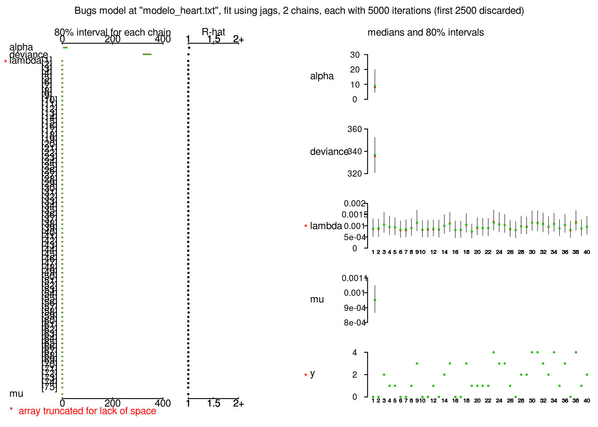

```r
class(jags.fit)
#> [1] "rjags"
names(jags.fit)
#> [1] "model"              "BUGSoutput"         "parameters.to.save"
#> [4] "model.file"         "n.iter"             "DIC"
names(jags.fit$BUGSoutput)
#>  [1] "n.chains"        "n.iter"          "n.burnin"       
#>  [4] "n.thin"          "n.keep"          "n.sims"         
#>  [7] "sims.array"      "sims.list"       "sims.matrix"    
#> [10] "summary"         "mean"            "sd"             
#> [13] "median"          "root.short"      "long.short"     
#> [16] "dimension.short" "indexes.short"   "last.values"    
#> [19] "program"         "model.file"      "isDIC"          
#> [22] "DICbyR"          "pD"              "DIC"

# las simulaciones de la distribución posterior se pueden extraer del objeto
# fit$BUGSoutput como arreglo: sims.array, lista: sims.list o matriz: sims.matrix
# aquí elegimos el formato de lista
names(jags.fit$BUGSoutput$sims.list)
#> [1] "alpha"    "deviance" "lambda"   "mu"       "y"
# y extraemos las lambdas
class(jags.fit$BUGSoutput$sims.list$lambda)
#> [1] "matrix"
# vienen en formato de matriz donde los renglones son las iteraciones y cada
# columna corresponde a un hospital
lambda_sims <- jags.fit$BUGSoutput$sims.list$lambda

# los guardamos en un data.frame
p_pred_jags <- data.frame(n_sim = 1:nrow(lambda_sims), lambdas = lambda_sims) %>% 
    gather(hospital, sims, -n_sim) %>% 
    mutate(
        hospital = str_replace(hospital, fixed("."), ""),
        hospital = parse_number(hospital)
        ) %>% 
    group_by(hospital) %>% 
    summarise(
        media = mean(sims), 
        int_l = quantile(sims, 0.025),
        int_u = quantile(sims, 0.975)
        ) %>% 
    left_join(heart)

ggplot(p_pred_jags, aes(x = log(e), y = media, color = factor(y))) +
    geom_pointrange(aes(ymin = int_l, ymax = int_u), size = 0.3) +
    geom_point(aes(x = log(e), y = y/e), color = "black", alpha = 0.6) +
    scale_x_continuous("Número de expuestos (e)", labels = exp, 
        breaks = map_dbl(0:4, ~ log(700 ^ .))) +
    scale_colour_hue("muertes obs. (y)") + 
    ylab("Muertes por 1000 expuestos")
```


 Escribe el modelo en Stan.

 Implementaremos varios modelos en JAGS o Stan, la 
base de datos que usaremos contiene información de mediciones de radón 
(activity) y del suelo en el que se hicieron las mediciones (floor = $0$ casas 
con sótano, floor = $1$ casas sin sótano), las mediciones corresponden a $919$ 
hogares muestreados de $85$ condados de Minnesota. El objetivo es construir un 
modelo de regresión en el que la medición de radón es la variable independiente 
y el tipo de suelo es la covariable.

1. Iniciaremos con un modelo de regresión de unidades iguales, este modelo 
ignora la variación en los niveles de radón entre los condados.

$$y_i \sim N(\alpha + \beta x_i, \sigma_y^2) $$

2. Después pasamos a un modelo de unidades independientes, en este simplemente 
incluímos indicadoras a nivel condado.

$$y_i \sim N(\alpha_{j[i]} + \beta x_i, \sigma_y^2) $$

3. Añadimos una estructura jerárquica al modelo:
$$y_i \sim N(\alpha_{j[i]} + \beta x_i, \sigma_y^2) $$
$$\alpha_j \sim N(\mu_{\alpha}, \sigma_{\alpha}^2)$$

4. Incorporamos una covariable $u_j$ a nivel grupo, en este caso elegiremos una 
medición de uranio a nivel condado (Uppm).

$$y_i \sim N(\alpha_{j[i]} + \beta x_i, \sigma_y^2) $$
$$\alpha_j \sim N(\gamma_0 + \gamma_{1}u_j, \sigma_{\alpha}^2)$$

5. Utiliza el modelo anterior para predecir el valor de radón para una nueva 
casa sin sótano (floor = 1) en el condado 26.

6. Utiliza el modelo anterior para predecir el valor de radón para una nueva 
casa sin sótano (floor = 1) en un condado nuevo con nivel de uranio $2$.

##### Observaciones {-}

Iniciamos preparando los datos para el análisis, trabajaremos en escala 
logarítmica, hay algunos casos con medición cero, para éstos hacemos una pequeña
correción redondeándolos a $0.1$.

Ahora, por el momento hemos modelado los datos y los parámetros $\alpha_j$ a 
nivel grupo (en el caso del modelo jerárquico), pero nos falta asignar 
distribuciones a los hiperparámetros 
($\mu, \beta, \sigma_y^2, \sigma_{\alpha}^2$). Para la elección de 
distribuciones iniciales (de los hiperparámetros) podemos usar iniciales no 
informativas. Recordemos que una distribución inicial no informativa tiene el 
objetivo de permitir que realicemos inferencia bayesiana para parámetros de los 
cuales no sabemos mucho (sin considerar la información en los datos). 
Consideremos  las siguientes distribuciones iniciales:
$$\beta \sim N(0, 0.0001)$$
$$\mu_{\alpha} \sim  N(0, 0.0001)$$
donde la normal esta parametrizada en términos de varianzas inversas (conocidas
como precisión $\tau = 1/\sigma^2$). Con los parámetros propuestos estaríamos 
diciendo que esperamos que los coeficientes se ubiquen en el rango (-100,100) y 
si los estimadores estan en este rango la distribución inicial provee muy poca 
información.
Para los parámetros restantes podemos definirla la inicial de la siguiente 
manera:
$$\tau_y = 1/\sigma^2$$
donde 
$$\sigma^2 \sim Unif(0, 100)$$
y 
$$\tau_{\alpha} = 1/\sigma_{\alpha}^2$$
donde 
$$\sigma_{\alpha}^2 \sim Unif(0, 100).$$

Entonces, para que una distribución inicial sea noinformariva, su rango de 
incertidumbre debe ser más amplio que el rango de valores razonables que pueden 
tomar los parámetros.

### Ejemplo: conteo rápido {-}

**Objetivo**: Estimar resultados de la elección a partir de una muestra 
aleatoria de casillas.

**Inferencia basada en modelos**: Modelo de regresión multinivel, en función de 
covariables asociadas a las casillas, que estima el número de votos a favor del 
candidato en cada casilla.

<!--3. Juntamos los valores observados y los simulados por el modelo de 
    cada candidato para calcular proporciones de voto y los intervalos 
    correspondientes.-->

**Calibración:** Evaluamos modelos con remuestreo y datos de elecciones pasadas, 
revisando cobertura de intervalos de confianza/credibilidad.

**Experiencia:** Mostramos resultados de elección 2018.

#### Contexto: Conteo rápido {-}

* En México, las elecciones tienen lugar un domingo, los resultados oficiales 
del proceso se presentan a la población una semana después. A fin de evitar 
proclamaciones de victoria injustificadas durante ese período el INE organiza un 
conteo rápido.

* **Conteo rápido**: Procedimiento para estimar el porcentaje de votos a favor 
de los candidatos en el día de la elección, consiste en seleccionar una muestra 
aleatoria de las casillas de votación y analizar sus resultados para presentar 
intervalos con una probabilidad de al menos 0.95.

* La rapidez y precisión del conteo favorece un ambiente de confianza y sirve 
como una herramienta contra el fraude.

#### Elecciones 2018 {-}

* La elección del 2018 fue la más grande que se ha vivido en México, con 3,400 
puestos en disputa. Se realizaron conteos rápidos para **9 elecciones estatales** 
simultáneas a un conteo rápido para la **elección de presidente**.

* El día de la elección, el sistema de información comienza a las 6 p.m. y, 
cada 5 minutos, produce una secuencia de archivos acumulativos. Estas muestras 
parciales se analizan con los métodos de estimación para rastrear la tendencia 
de los resultados.

* Las muestras parciales tienen un sesgo potencial asociado al patrón de llegada 
de la información.

#### Diseño de la muestra {-}
El diseño de la muestra es probabilístico.

* **Diseño:** es unietápico y estratificado, donde la unidad de observación es 
la casilla. 
    - En Guanajuato son 22 estratos definidos por distrito local.

* **Tamaño de muestra:** Se eligió el tamaño de muestra para lograr intervalos 
de 95% confianza con **longitud máxima de 2 puntos porcentuales.**
    - En Guanajuato el tamaño de muestra se fijó en 500 casillas.

* **Selección de la muestra:** La distribución de la muestra en las casillas
se realizó proporcional al número de casillas en cada estrato, y se utilizó 
muestreo aleatorio simple dentro de cada estrato.

* **Consideraciones adicionales:** Se buscó que todos los estratos tuvieran 
al menos 50 casillas, y que porcentaje de CAEs (Capacitadores-Asistentes 
Electorales) encargados de más de una casilla fuera menor a 20%.

#### Datos faltantes {-}

En la práctica la muestra seleccionada no llega completa. Entre las posibles 
razones de faltantes están:

* El clima en ciertas regiones dificulta la transmisión de los resultados.

* El responsable de reportar los resultados está saturado de trabajo: 
contando votos a falta de funcionarios de casilla, retrasado por la dificultad
de llegar a la casilla por malas condiciones de terreno,...

Usualmente los faltantes **no son completamente aleatorios**, esto es, la 
probabilidad de que una casilla no se reporte está asociada a la respuesta de
la casilla.

Buscamos un modelo con **tratamiento consistente de datos faltantes:** en 
ausencia de respuesta.


#### Antecedentes {-}

El modelo que proponemos se desarrolló con base a tres referencias:

* @mendoza2016 _Quick counts in the Mexican presidential elections: A Bayesian 
approach_. En este trabajo se propone el uso de modelos bayesianos para el 
conteo rápido.
    + Se ajusta un modelo de manera independiente **para cada candidato** en 
    **cada estrato**.
    + Modelo normal para el total de votos $X_k$ que recibe cada candidato en 
    la $k$-ésima casilla.
$$X_k\sim N \bigg( n_{k} \theta, \tau / n_k \bigg)$$
    + $\theta$: proporción de gente de la lista nominal a favor del candidato.
    + $n_k$: número de personas en la lista nominal de la $k$-ésima casilla.
 
* @little2012 _Calibrated Bayes, an Alternative Inferential Paradigm 
for Official Statistics_. Se describe un acercamiento bayesiano para los 
problemas clásicos de muestreo, usando modelos jerárquicos, el paradigma que se 
propone en este artículo consiste en ajustar modelos bayesianos y evaluarlos 
(calibrarlos) usando propiedades frecuentistas.

* @parkgelmanbafumi _Bayesian Multilevel Estimation with Poststratification: 
State-Level Estimates from National Polls_. Se describe un modelo jerárquico
para estimar preferencias electorales a partir de encuestas de opinión pública, 
además de la estructura jerárquica se incluyen covaribales.

Es así que tomamos como base el modelo propuesto en @mendoza2016 y siguiendo 
los otros dos artículos comenzamos extendiendolo en 2 sentidos: 

1. Usamos un enfoque unificado por candidato, en lugar de estimar un modelo
independiente dentro de cada estrato, ajustamos un un único modelo por 
candidato incluyendo un efecto aleatorio (estructura multinivel) que 
corresponda al estrato.

2. Agregamos covariables que describen la casilla para mejorar la eficiencia en 
la estimación y corregir sesgos ante faltantes.


#### Inferencia en muestreo {-}
Antes de pasar al modelo describimos como encaja la metodología que proponemos
en el mundo del muestreo. Cuando se hace inferencia de muestreo hay dos grandes
acercamientos:

1. **Inferencia basada en diseño de muestras.** Los valores poblacionales son una
cantidad fija, la inferencia se basa en la distribución de probabilidad asociada
a la selección de la muestra. 

2. **Inferencia basada en modelos.** Las variables provienen de un modelo 
estadístico:
    + **Modelos de superpoblaciones:** los valores poblacionales se consideran
    una muestra aleatoria de una **superpoblación**, y se les asigna una 
    distribución de probabilidad.
    
    + **Modelos bayesianos:** agregamos distribuciones iniciales a los 
    parámetros y se hace inferencia de las **cantidades poblacionales** y de los 
    **parámetros** usando la distribución posterior.

#### Modelos bayesianos {-}

En modelos bayesianos la inferencia se realiza prediciendo la variable de 
interés para las unidades de la población que **no se incluyeron en la muestra** 
y para las unidades **que no respondieron**, condicional a la muestra observada 
y al modelo.

Usamos modelos paramétricos:

$$p(y|x)=\int p(y|x, \theta)p(\theta|x)p(\theta)d\theta$$

* $p(y|x,\theta)$: modelo paramétrico de $y$.

* $p(\theta|x)$: distribución inicial para $\theta$.

Se incluyen en el modelo las variables involucradas en el diseño de la 
muestra (estratos, conglomerados).

#### Modelo con distribución normal {-}

En el caso del modelo del conteo rápido incluímos las siguientes covariables:

1. Tipo de sección (rural o urbana/mixta).

2. Tipo de casilla (básica/contigua/especial o extraordinaria).

3. Tamaño de sección (chica < 1000 votantes, mediana [1000, 5000], 
grande > 5000).

4. Región (oriente u occidente).

5. Distrito local.

6. Interacción de tipo de sección con tamaño de sección.

Y el primer modelo que planteamos es como sigue:

Sea $X_k$ el número de votos en favor del candidato en la k-ésima casilla:

- Nivel 1
$$
\begin{align}
	X_k \sim  \mathsf{N}(n_k\theta_k, \tau_k^{\text{distrito}}/n_k) \ \mathcal{I}_{[0,750]},
\end{align}
$$

donde $n_k$ es la lista nominal y $\theta_k$ la proporción de personas en la 
lista nominal de la casilla $k$ que votaron por el candidato,


$$\begin{align}
\theta_k=\text{logit}^{-1}&(\beta^0+\beta^{\text{rural}}\cdot\text{rural}_k+\beta^{\text{rural-tamañoM}}\cdot\text{rural}_k\cdot\text{tamañoM}_k\\+&\beta^{\text{tamañoM}}\cdot\text{tamañoM}_k
+\beta^{\text{tamañoL}} \cdot \text{tamañoL}_k+\beta^{\text{tipoSP}}\cdot \text{tipoSP}_k\\+&\beta^{\text{distrito}}_{\text{distrito}(k)}),
\end{align}$$


- Nivel 2

$$\begin{align}
	\beta^{\text{distrito}}_{j}\sim \mathsf{N}\left(\mu^{\text{distrito}}, \sigma_{\text{distrito}}^2\right).
\end{align}$$

El código del modelo en JAGS:


```r
library(quickcountmx)
eval(parse(text = deparse(quickcountmx:::model_norm)[3]))
```

```
#> Warning in gzfile(file, "rb"): cannot open compressed file 'cache_manual/
#> model_string_norm.rds', probable reason 'No such file or directory'
#> Error in gzfile(file, "rb"): cannot open the connection
```


```r
model_string %>% cat
#> Error in eval(lhs, parent, parent): object 'model_string' not found
```


Se utilizó una parametrización redundante para acelerar la convergencia:

```
beta_estrato[j] <-  beta_estrato_raw[j] - mean(beta_estrato_raw[])
beta_estrato_raw[j] ~ dnorm(mu_estrato, tau_estrato)
```

ver el capítulo 19 de @gelman-hill.

La función `mrp_party_estimation()` recibe la tabla de datos, el partido que
se desea ajustar, la variable de estratificación, la fracción de la muestra a
utilizar en el ajuste, el número de iteraciones, calentamiento, número de 
cadenas, semilla y el modelo que vamos a ajustar.


```r
gto_pan_norm <- mrp_party_estimation(gto_2012, pan_na,
    stratum = distrito_loc_17, frac = 0.06, n_iter = 2000, n_burnin = 1000,
    n_chains = 2, seed = 19291, model_string = "model_norm")
```

```
#> Warning in gzfile(file, "rb"): cannot open compressed file 'cache_manual/
#> gto_pan_norm.rds', probable reason 'No such file or directory'
#> Error in gzfile(file, "rb"): cannot open the connection
#> Error in eval(expr, envir, enclos): object 'gto_pan_norm' not found
```
En `fit` se guarda la salida de JAGS y `n_votes` es el vector de simulaciones
del total de votos.


```r
plot(gto_pan_norm$fit)
#> Error in plot(gto_pan_norm$fit): object 'gto_pan_norm' not found
```

De la imagen anterior podemos ver que faltan iteraciones para alcanzar 
convergencia. Las parámetros `beta_estrato_raw` se crearon para acelerar la
convergencia pero no es necesario que converjan, pero otras variables como 
`beta_region` se beneficiarían de incrementar las simulaciones.

El siguiente código corre el modelo para todos los partidos, incrementando las
simulaciones.


```r
gto_norm <- mrp_estimation(gto_2012, ... = pri_pvem:otros, 
    stratum = distrito_loc_17, frac = 0.06, n_iter = 3000, n_burnin = 2000, 
    n_chains = 2, seed = 19291, parallel = TRUE, n_cores = 4, 
    model_string = "model_norm")
```
La salida incluye los objetos que regresa ña función `jags()` para cada partido
y una tabla con un resumen de los resultados.


```
#> Warning in gzfile(file, "rb"): cannot open compressed file 'cache_manual/
#> gto_norm.rds', probable reason 'No such file or directory'
#> Error in gzfile(file, "rb"): cannot open the connection
#> Warning in file(file, "rt"): cannot open file 'data/gto_2012.csv': No such
#> file or directory
#> Error in file(file, "rt"): cannot open the connection
```


```r
names(gto_norm)
#> Error in eval(expr, envir, enclos): object 'gto_norm' not found
gto_norm$post_summary
#> Error in eval(expr, envir, enclos): object 'gto_norm' not found
```


#### Inferencia del modelo {-}

1. La inferencia de $\theta$ se obtiene de la distribución posterior:
$$p(\theta|y_{obs},x)\propto p(\theta|x)L(\theta|y_{obs},x)$$
2. La posterior de $\theta$ lleva a inferencia de las cantidades poblacionales 
no observadas usando la distribución predictiva posterior:
$$p(y_{falta}|y_{obs},x) =  \int p(y_{falta}|\theta,x)p(\theta|y_{obs},x)d\theta$$
3. Utilizamos los datos observados y simulaciones de los *datos faltantes*
para estimar la proporción de votos en favor de cada candidato.

#### Evaluación de ajuste {-}

La siguientes gráficas muestra la distribución predictiva posterior del total de
votos para el PAN (partido ganador) y para Movimiento Ciudadano (partido chico), 
la línea roja indica el total de votos observado.


```r
norm_votes <- map_df(gto_norm$jags_fits, ~apply(.$BUGSoutput$sims.list$x, 1, sum)) %>% 
    mutate(n_sim = 1:n()) %>% 
    gather(party, votes, -n_sim) %>% 
    mutate(party = reorder(party, votes)) 
#> Error in map(.x, .f, ...): object 'gto_norm' not found

true_votes <- gto_2012 %>% 
    dplyr::select(casilla_id, pri_pvem:otros) %>% 
    gather(party, votes, -casilla_id) %>% 
    group_by(party) %>% 
    summarise(total_votes = sum(votes)) %>% 
    mutate(party = factor(party, levels = levels(norm_votes$party)))
#> Error in eval(lhs, parent, parent): object 'gto_2012' not found

ggplot(norm_votes, aes(x = votes)) +
    geom_histogram(binwidth = 1000, alpha = 0.7) +
    facet_wrap(~party, scales = "free_x") +
    geom_vline(data = true_votes, aes(xintercept = total_votes), 
        color = "red") +
    labs(title = "PP Modelo normal: total de votos", 
        x = expression(y[rep]), y = "") 
#> Error in ggplot(norm_votes, aes(x = votes)): object 'norm_votes' not found
```

Examinamos otro nivel de desagregación: las distribuciones predictivas 
posteriores para el total de votos por estrato, mostramos las gráficas para 3
estratos.


#### Modelo con distribución mezcla {-}

Tras analizar las simulaciones de la distribución predictiva posterior notamos 
que el modelo Normal no ajustaba a los partidos chicos, observamos que para
estos había muchas casillas con cero votos y unas cuantas con *muchos* votos.
Adicionalmente notamos que la distribución t ajustaba mejor que la normal 
gracias a que tiene colas más pesadas. Ante esto propusimos un modelo mezcla
donde para la $k$ es casilla el número de votos observados es cero con 
probabilidad $p_k$ y sigue una distribución $t$ con probabilidad $(1-p_k)$:

- Nivel 1

$$X_k\sim p_k\mathsf{\delta}_0(x)+(1-p_k)\mathsf{t}(n_k\theta_k,n_k^{-1}\tau_k^{\text{distrito}},\nu_k^{\text{distrito}}) \mathcal{I}_{[0,750]},$$

$$\begin{align}
\theta_k=  \text{logit}^{-1} & ( 
\beta^0 
+\beta^{\text{rural}} \cdot \text{rural}_k 
+\beta^{\text{rural-tamañoM}} \cdot \text{rural}_k \cdot \text{tamañoM}_k  \\  
+& \beta^{\text{tamañoM}} \cdot \text{tamañoM}_k 
+\beta^{\text{tamañoL}} \cdot \text{tamañoL}_k 
+\beta^{\text{distrito}}_{\text{distrito}(k)}  \\ 
+& \beta^{\text{tipoSP}}\cdot \text{tipoSP}_k 
),
\end{align}$$

$$\begin{align}
p_k =  \text{logit}^{-1} & ( 
\beta^0_p
+\beta_p^{\text{rural}} \cdot \text{rural}_k 
+\beta_p^{\text{rural-tamañoM}} \cdot \text{rural}_k \cdot \text{tamañoM}_k  \\  
+& \beta_p^{\text{tamañoM}} \cdot \text{tamañoM}_k 
+\beta_p^{\text{tamañoL}} \cdot \text{tamañoL}_k 
+\beta^{\text{distrito-p}}_{\text{distrito}(k)}  \\ 
+& \beta_p^{\text{tipoSP}}\cdot \text{tipoSP}_k 
).
\end{align}$$

- Nivel 2

$$\begin{align}
	\beta^{\text{distrito}}_{j}\sim \mathsf{N}\left(\mu^{\text{distrito}}, \sigma_{\text{distrito}}^2\right).
\end{align}$$

$$\begin{align}
	\beta^{\text{distrito-p}}_{j}\sim \mathsf{N}\left(\mu^{\text{distrito-p}}, \sigma_{\text{distrito-p}}^2\right).
\end{align}$$

El código en JAGS:


```r
eval(parse(text = deparse(quickcountmx:::model_norm)[3]))
```


```
#> Warning in gzfile(file, "rb"): cannot open compressed file 'cache_manual/
#> model_string_bern_t.rds', probable reason 'No such file or directory'
#> Error in gzfile(file, "rb"): cannot open the connection
```


```r
model_string %>% cat()
#> Error in eval(lhs, parent, parent): object 'model_string' not found
```

Lo ajustamos llamando nuevamente a la función `mrp_party_estimation()`, si no 
especificamos el parámetro `model_string` ajusta por defecto el modelo mezcla.


```r
gto_mixture <- mrp_estimation(gto_2012, ... = pri_pvem:otros, 
    stratum = distrito_loc_17, frac = 0.06, n_iter = 3000, n_burnin = 2000, 
    n_chains = 2, seed = 19291, parallel = TRUE, n_cores = 6)
```


```
#> Warning in gzfile(file, "rb"): cannot open compressed file 'cache_manual/
#> gto_mixture.rds', probable reason 'No such file or directory'
#> Error in gzfile(file, "rb"): cannot open the connection
```

#### Evaluación de ajuste {-}

Repetimos las gráficas de la distribución predictiva posterior del total de
votos para el PAN (partido ganador) y para Movimiento Ciudadano (partido chico).


```r
mixture_votes <- map_df(gto_norm$jags_fits, 
    ~apply(.$BUGSoutput$sims.list$x, 1, sum)) %>% 
    mutate(n_sim = 1:n()) %>% 
    gather(party, votes, -n_sim)
#> Error in map(.x, .f, ...): object 'gto_norm' not found
ggplot(mixture_votes, aes(x = votes)) +
    geom_histogram(binwidth = 1000, alpha = 0.7) +
    facet_wrap(~party, scales = "free_x") +
    geom_vline(data = true_votes, aes(xintercept = total_votes), 
        color = "red") +
    labs(title = "PP Modelo normal: total de votos", 
        x = expression(y[rep]), y = "") 
#> Error in ggplot(mixture_votes, aes(x = votes)): object 'mixture_votes' not found
```

Mostramos también las gráficas para los mismos 3 estratos que en el caso normal.


#### Calibración {-}

Para evaluar el modelo complementamos con pruebas de calibración, siguiendo
los siguientes pasos:

1. Simulamos $n$ muestras.

2. Para cada muestra creamos intervalos de 95%.

3. Revisamos el porcentaje de intervalos que contienen el valor observado.

Simulamos bajo los siguientes escenarios:

* Muestras completas.

* Censuramos las muestras completas usando patrones observados de la llegada de 
datos de cada distrito y ámbito (rural/urbano).

* Censuramos las muestras completas eliminando estratos.

##### Estimador de razón {-}

Comparamos el desempeño del modelo a lo largo de las muestras simuladas con 
el estimador de razón combinado:

$$\hat{p_k}=\frac{\hat{X_k}}{\hat{Y}}=\frac{\sum_h \hat{X_{kh}}}{\sum_h \hat{Y_{h}}}=\frac{\sum_h \frac{N_h}{n_h} \sum_i X_{khi}}{\sum_h \frac{N_h}{n_h} \sum_i Y_{hi}}$$

Utilizamos bootstrap para estimar los errores estándar. Notar que en el caso 
de estratos faltantes se debe seleccionar una estrategia para utilizar este 
estimador, pues como tal no esta definido si faltan estratos. 

##### Gráficas de calibración
En las siguientes gráficas el alto de las barras representa la longitud media 
de la presición (2 veces el error estándar), y el número indica el porcentaje
de intervalos (de 95% de confianza/probabilidad) que cubrieron el verdadero 
valor.


#### Elección Guanajuato 2018 {-}

Se reportaron los intervalos de probabilidad de las 9:45 pm, con 357 casillas.


#### Implementación {-}

Implementamos en *JAGS*, la estimación se puede consultar y **reproducir 
completamente** con el paquete de R [quickcountmx](https://github.com/tereom/quickcountmx) 
(Ortiz 2018). 

* La reproducibilidad es crucial para examinar la **veracidad de las 
conclusiones** de un trabajo científico.  

* La reproducibilidad ayuda a lograr la **transparencia en el procedimiento 
electoral**, fomenta la **confianza en las instituciones** y da **legitimidad al 
resultado del conteo rápido**.


#### Modelo nacional {-}

El modelo multinivel con distribución de probabilidad mezcla resulta *muy 
lento* para la elección nacional, por lo que se tomaron las siguientes medidas:

* **División de datos:** Se estima un modelo de forma independiente para cada
una de 7 regiones geográficas lo que nos permite paralelizar por región y por 
candidato, la desventaja es que no podemos usar información entre las regiones.

* Se modela utilizando una distribucióin **binomial negativa**
(un parámetro menos).

* Se implementó con **Stan** en lugar de **JAGS** (el código está en el 
paquete de R [quickcountmx](https://github.com/tereom/quickcountmx)).

Más detalles del modelo [aquí](https://jovial-jepsen-cf1904.netlify.com).

## Flujo de trabajo para el análisis bayesiano


