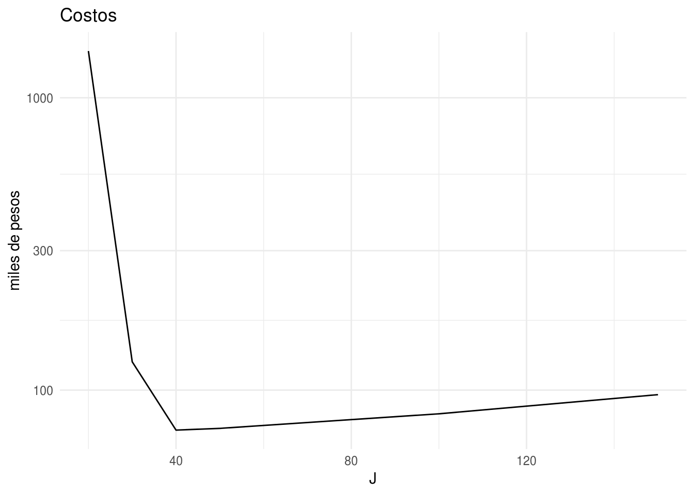

# Tareas {-}

* Las tareas se envían por correo a teresa.ortiz.mancera@gmail.com con título: 
EstComp-TareaXX (donde XX corresponde al número de tarea, 01..). 

* Las tareas deben incluir código y resultados (si conocen [Rmarkdown](https://rmarkdown.rstudio.com) 
es muy conveniente para este propósito).


## 2-Transformación de datos {-}

Entrega: Lunes 27 de agosto.

Utiliza los datos de vuelos (`flights`) para responder la siguientes preguntas.

* ¿A qué hora del día debo volar para evitar, lo más posible, retrasos de 
salida?

* Para cada destino calcula el total de minutos de retraso de salida. Para cada 
vuelo calcula su proporción del total de retrasos de su destino.

* Los retrasos suelen estar correlacionados temporalmente, incluso cuando se 
ha resuelto el problema que ocasionó los retrasos iniciales, vuelos posteriores
suelen mantener algo de retraso. Usando la función `lag()` explora como el 
retraso de salida de un vuelo se relaciona con el retraso de salida del vuelo 
anterior. Realiza una gráfica para visualizar tus hallazgos.

* Para cada destino, puedes encontrar vuelos sospechosamente rápidos o lentos?
(quizá debido a porblemas en la captura de los datos). Calcula el tiempo de 
vuelo relativo a la mediana de tiempo de vuelo a su destino. Qué vuelos se 
retrasaron más en el aire?

* Encuentra los destinos que se vuelan por al menos dos compañías (carriers).

## 3-Datos Limpios {-}

Entrega: Lunes 3 de septiembre.

Descarga los datos [aquí](https://www.dropbox.com/s/e8wjbwpwa37ceqg/03-limpios.zip?dl=0).

En la carpeta de arriba encontrarás un archivo de excel (m_013.xls), este 
archivo contiene información de causas de mortalidad en México entre 2000 y 
2008. Contesta las siguientes preguntas:

1. ¿Cuáles son las variables en esta base de datos?  
2. ¿La tabla de datos cumple con los principios de datos limpios? 
¿Qué problemas presenta?  
3. La información del archivo de excel se ha guardado también en archivos de 
texto (csv) 2001-2008, lee y limpia los datos para que cumplan los principios de 
datos limpios. Recuerda que las modificaciones deben de ser reproducibles, para 
esto guarda tu trabajo en un script.  
4. El archivo de excel indice_marginacion.xlsx contiene el índice por entidad 
para los años 2000 y 2010. Realiza una gráfica donde compares la marginación por 
entidad con las tasas de mortalidad correspondientes al 2000. Deberás unir las 
dos fuentes de información.

Observaciones:  

* Puedes filtrar/eliminar los valores a *Total* si crees que es más claro. 

* Intenta usar las funciones que estudiamos en la clase (gather, separate, 
select, filter).  

* Si aún no te sientes cómodx con las funciones de clase (y lo intentaste varias 
veces) puedes hacer las manipulaciones usando otra herramienta (incluso Excel, 
una combinación de Excel y R o cualquier software que conozcas); sin embargo, 
debes documentar tus pasos claramente, con la intención de mantener métodos 
reproducibles.

## 4-Probabilidad {-}

* Urna: 10 personas (con nombres distintos) escriben sus nombres y los ponen en 
una urna, después seleccionan un nombre (al azar). 

    - Sea A el evento en el que ninguna persona selecciona su nombre, ¿Cuál es 
    la probabilidad del evento A?  

    - Supongamos que hay 3 personas con el mismo nombre, ¿Cómo calcularías la 
    probabilidad del evento A en este nuevo experimento?

* Definimos $X$ como la variable aleatoria del 
número de juegos antes de que termine el experimento de la ruina del jugador, 
grafica la distribución de probabilidad de $X$ 
(calcula $P(X=1), P(X=2),...,P(X=100)$).

## 5-Bootstrap{-}

1. **Distribución muestral.** Consideramos la base de datos [primaria](https://raw.githubusercontent.com/tereom/est-computacional-2018/master/data/primarias.csv), 
y la columna de calificaciones de español 3^o^ de primaria (`esp_3`). 

- Selecciona una muestra de tamaño $n = 10, 100, 200$. Para cada muestra 
calcula media y el error estándar de la media usando el principio del *plug-in*:
$\hat{\mu}=\bar{x}$, y $\hat{se}(\bar{x})=\hat{\sigma}_{P_n}/\sqrt{n}$.

- Ahora aproximareos la distribución muestral, para cada tamaño de muestra $n$: 
i) simula 10,000 muestras aleatorias, ii) calcula la media en cada muestra, iii)
Realiza un histograma de la distribución muestral de las medias (las medias del
paso anterior) iv) aproxima el error estándar calculando la desviación estándar
de las medias del paso ii.

- Calcula el error estándar de la media para cada tamaño de muestra usando la
información poblacional (ésta no es una aproximación), usa la fórmula:
$se_P(\bar{x}) = \sigma_P/ \sqrt{n}$.

- ¿Cómo se comparan los errores estándar correspondientes a los distintos 
tamaños de muestra? 

2. **Bootstrap correlación.** Nuevamente trabaja con los datos `primaria`, 
selecciona una muestra aleatoria de tamaño 100 y utiliza el principio del 
_plug-in_ para estimar la correlación entre la calificación de $y=$español 3 y 
la de $z=$español 6: $\hat{corr}(y,z)$. Usa bootstrap para calcular el error
estándar de la estimación.

### Solución {-}

#### 1. Distribución muestral {-}
Suponemos que me interesa hacer inferencia del promedio de las 
calificaciones de los estudiantes de tercero de primaria en Ciudad de México.

En este ejercicio planteamos 3 escenarios (que simulamos): 1) que tengo una 
muestra de tamaño 10, 2) que tengo una muestra de tamaño 100, y 3) que tengo una 
muestra de tamaño 1000 

- Selección de muestras:


```r
library(tidyverse)
primarias <- readr::read_csv("https://raw.githubusercontent.com/tereom/est-computacional-2018/master/data/primarias.csv")
set.seed(373783326)
muestras <- data_frame(tamanos = c(10, 100, 1000)) %>% 
    mutate(muestras = map(tamanos, ~sample(primarias$esp_3, size = .)))
```

Ahora procedemos de manera *usual* en estadística (usando fórmulas y no 
simulación), estimo la media de la muestra con el estimador *plug-in* 
$$\bar{x}={1/n\sum x_i}$$ 
y el error estándar de $\bar{x}$ con el estimador *plug-in* 
$$\hat{se}(\bar{x}) =\bigg\{\frac{1}{n^2}\sum_{i=1}^n(x_i-\bar{x})^2\bigg\}^{1/2}$$

- Estimadores *plug-in*:

```r
se_plug_in <- function(x){
    x_bar <- mean(x)
    n_x <- length(x)
    var_x <- 1 / n_x ^ 2 * sum((x - x_bar) ^ 2)
    sqrt(var_x)
}
muestras_est <- muestras %>% 
    mutate(
        medias = map_dbl(muestras, mean), 
        e_estandar_plug_in = map_dbl(muestras, se_plug_in)
    )
muestras_est
```

```
## # A tibble: 3 x 4
##   tamanos muestras      medias e_estandar_plug_in
##     <dbl> <list>         <dbl>              <dbl>
## 1      10 <dbl [10]>      567.              21.1 
## 2     100 <dbl [100]>     575.               6.11
## 3    1000 <dbl [1,000]>   576.               2.11
```

Ahora, recordemos que la distribución muestral es la distribución de una
estadística, considerada como una variable aleatoria. Usando esta definción 
podemos aproximarla, para cada tamaño de muestra, simulando:  
1) simulamos muestras de tamaño $n$ de la población,  
2) calculamos la estadística de interés (en este caso $\bar{x}$),  
3) vemos la distribución de la estadística a lo largo de simulaciones.

- Histogramas de distribución muestral y aproximación de errores estándar con 
simulación 


```r
muestras_sims <- muestras_est %>%
    mutate(
        sims_muestras = map(tamanos, ~rerun(10000, sample(primarias$esp_3, 
            size = ., replace = TRUE))), 
        sims_medias = map(sims_muestras, ~map_dbl(., mean)), 
        e_estandar_aprox = map_dbl(sims_medias, sd)
        )
sims_medias <- muestras_sims %>% 
    select(tamanos, sims_medias) %>% 
    unnest(sims_medias) 

ggplot(sims_medias, aes(x = sims_medias)) +
    geom_histogram(binwidth = 2) +
    facet_wrap(~tamanos, nrow = 1) +
    theme_minimal()
```


Notamos que la variación en la distribución muestral decrece conforme aumenta
el tamaño de muestra, esto es esperado pues el error estándar de una media 
es $\sigma_P / \sqrt{n}$, y dado que en este ejemplo estamos calculando la media 
para la misma población el valor poblacional $\sigma_P$ es constante y solo 
cambia el denominador.

Nuestros valores de error estándar con simulación están en la columna 
`e_estandar_aprox`:


```r
muestras_sims %>% 
    select(tamanos, medias, e_estandar_plug_in, e_estandar_aprox)
```

```
## # A tibble: 3 x 4
##   tamanos medias e_estandar_plug_in e_estandar_aprox
##     <dbl>  <dbl>              <dbl>            <dbl>
## 1      10   567.              21.1             21.0 
## 2     100   575.               6.11             6.69
## 3    1000   576.               2.11             2.13
```

En este ejercicio estamos simulando para examinar las distribuciones muestrales
y para ver que podemos aproximar el error estándar de la media usando 
simulación; sin embargo, dado que en este caso hipotético conocemos la varianza 
poblacional y la fórmula del error estándar de una media, por lo que podemos 
calcular el verdadero error estándar para una muestra de cada tamaño.

- Calcula el error estándar de la media para cada tamaño de muestra usando la
información poblacional:


```r
muestras_sims_est <- muestras_sims %>% 
    mutate(e_estandar_pob = sd(primarias$esp_3) / sqrt(tamanos))
muestras_sims_est %>% 
    select(tamanos, e_estandar_plug_in, e_estandar_aprox, e_estandar_pob)
```

```
## # A tibble: 3 x 4
##   tamanos e_estandar_plug_in e_estandar_aprox e_estandar_pob
##     <dbl>              <dbl>            <dbl>          <dbl>
## 1      10              21.1             21.0           21.1 
## 2     100               6.11             6.69           6.67
## 3    1000               2.11             2.13           2.11
```

En la tabla de arriba podemos comparar los 3 errores estándar que calculamos, 
recordemos que de estos 3 el *plug-in* es el único que podríamos obtener en 
un escenario real pues los otros dos los calculamos usando la población. 

Una alternativa al estimador *plug-in* del error estándar es usar *bootstrap* 
(en muchos casos no podemos calcular el error estándar *plug-in* por falta de 
fórmulas) pero podemos usar *bootstrap*: utilizamos una 
estimación de la distribución poblacional y calculamos el error estándar 
bootstrap usando simulación. Hacemos el mismo procedimiento que usamos para 
calcular *e_estandar_apox* pero sustituimos la distribución poblacional por la 
distriución empírica. Hagámoslo usando las muestras que sacamos en el primer 
paso:


```r
muestras_sims_est_boot <- muestras_sims_est %>% 
    mutate(
        sims_muestras_boot = map2(muestras, tamanos,
            ~rerun(10000, sample(.x, size = .y, replace = TRUE))), 
        sims_medias_boot = map(sims_muestras_boot, ~map_dbl(., mean)), 
        e_estandar_boot = map_dbl(sims_medias_boot, sd)
        )
muestras_sims_est_boot
```

```
## # A tibble: 3 x 11
##   tamanos muestras medias e_estandar_plug… sims_muestras sims_medias
##     <dbl> <list>    <dbl>            <dbl> <list>        <list>     
## 1      10 <dbl [1…   567.            21.1  <list [10,00… <dbl [10,0…
## 2     100 <dbl [1…   575.             6.11 <list [10,00… <dbl [10,0…
## 3    1000 <dbl [1…   576.             2.11 <list [10,00… <dbl [10,0…
## # ... with 5 more variables: e_estandar_aprox <dbl>, e_estandar_pob <dbl>,
## #   sims_muestras_boot <list>, sims_medias_boot <list>,
## #   e_estandar_boot <dbl>
```

Graficamos los histogramas de la distribución bootstrap para cada muestra.


```r
sims_medias_boot <- muestras_sims_est_boot %>% 
    select(tamanos, sims_medias_boot) %>% 
    unnest(sims_medias_boot) 

ggplot(sims_medias_boot, aes(x = sims_medias_boot)) +
    geom_histogram(binwidth = 4) +
    facet_wrap(~tamanos, nrow = 1) +
    theme_minimal()
```


Y la tabla con todos los errores estándar quedaría:


```r
muestras_sims_est_boot %>% 
    select(tamanos, e_estandar_boot, e_estandar_plug_in, e_estandar_aprox, 
        e_estandar_pob)
```

```
## # A tibble: 3 x 5
##   tamanos e_estandar_boot e_estandar_plug… e_estandar_aprox e_estandar_pob
##     <dbl>           <dbl>            <dbl>            <dbl>          <dbl>
## 1      10           21.3             21.1             21.0           21.1 
## 2     100            6.11             6.11             6.69           6.67
## 3    1000            2.08             2.11             2.13           2.11
```

Observamos que el estimador bootstrap del error estándar es muy similar al 
estimador plug-in del error estándar, esto es esperado pues se calcularon con la 
misma muestra y el error estándar *bootstrap* converge al *plug-in* conforme 
incrementamos el número de muestras *bootstrap*.

#### 2. Correlación {-}
2. **Bootstrap correlación.** Nuevamente trabaja con los datos `primaria`, 
selecciona una muestra aleatoria de tamaño 100 y utiliza el principio del 
_plug-in_ para estimar la correlación entre la calificación de $y=$español 3 y 
la de $z=$español 6: $\hat{corr}(y,z)$. Usa bootstrap para calcular el error
estándar de la estimación.

- Selección de la muestra

```r
set.seed(11729874)
muestra <- sample_n(primarias, size = 100)
```

- Estimador de la correlación:


```r
cor(muestra$esp_3, muestra$esp_6)
```

```
## [1] 0.7760901
```

- Error estándar con bootstrap


```r
cor_rep <- function(){
    muestra_boot <- sample_n(muestra, size = 100, replace = TRUE)
    cor(muestra_boot$esp_3, muestra_boot$esp_6)
}
replicaciones <- rerun(10000, cor_rep()) %>% flatten_dbl()
sd(replicaciones)
```

```
## [1] 0.04548587
```

## 6-Cobertura de intervalos de confianza {-}

En este problema realizarás un ejercicio de simulación para comparar la 
exactitud de distintos intervalos de confianza. Simularás muestras de  
una distribución Poisson con parámetro $\lambda=2.5$ y el estadístico de interés  
es $\theta=exp(-2\lambda)$.

Sigue el siguiente proceso:

i) Genera una muestra aleatoria de tamaño $n=60$ con distribución 
$Poisson(\lambda)$, parámetro $\lambda=2.5$ (en R usa la función `rpois()`).

ii) Genera $10,000$ muestras bootstrap y calcula intervalos de confianza del 
95\% para $\hat{\theta}$ usando 1) el método normal, 2) percentiles y 3) $BC_a$.

iii) Revisa si el intervalo de confianza contiene el verdadero valor del 
parámetro ($\theta=exp(-2\cdot2.5)$), en caso de que no lo contenga registra si 
falló por la izquierda (el límite inferior $exp(-2.5*\lambda)$) o falló por la 
derecha (el límite superior <$exp(-2.5*\lambda)$).

a) Repite el proceso descrito 1000 veces y llena la siguiente tabla:

Método     | \% fallo izquierda   | \% fallo derecha  | Cobertura | Longitud promedio
-----------|----------------------|-------------------|-----------|------------ 
Normal     |                      |                   |           |
Percentiles|                      |                   |           |
BC_a       |                      |                   |           |

La columna cobertura es una estimación de la cobertura del intervalo basada en 
las simulaciones, para calcularla simplemente escribe el porcentaje de los 
intervalos que incluyeron el verdadero valor del parámetro. La longitud promedio
es la longitud promedio de los intervalos de confianza bajo cada método.

b) Realiza una gráfica de páneles, en cada panel mostrarás los resultados de 
uno de los métodos (normal, percentiles y BC_a), el eje x corresponderá al 
número de intervalo de confianza ($1,...,1000$) y en el vertical 
graficarás los límites de los intervalos, es decir graficarás 2 líneas (usa 
`geom_line()`) una corresponderá a los límites inferiores de los intervalos, y 
otra a los superiores.

c) Repite los incisos a) y b) seleccionando muestras de tamaño $300$.

Nota: Un ejemplo en donde la cantidad $P(X=0)^2 = e^{-\lambda}$ es de interés 
es como sigue: las llamadas telefónicas a un conmutador se modelan con 
un proceso Poisson y $\lambda$ es el número promedio de llamadas por minuto, 
entonce $e^{- \lambda}$ es la probabilidad de que no se reciban llamadas en 
1 minuto.

### Solución {-}


```r
lambda <- 2.5
calcula_intervalos <- function(n = 60, B = 10000) {
    x <- rpois(n, lambda)
    theta <- exp(-2 * mean(x))
    theta_b <- rerun(B, sample(x, size = n, replace = TRUE)) %>% 
        map_dbl(~exp(-2 * mean(.)))
    bca <- bootstrap::bcanon(x, nboot = B, theta = function(y) exp(-2 * mean(y)), 
        alpha = c(0.025, 0.975))$confpoints[, 2]
    intervalos <- data_frame(metodo = c("normal", "percent", "BC_a"), 
        izq = c(theta - 1.96 * sd(theta_b), quantile(theta_b, probs = 0.025), 
            bca[1]),
        der = c(theta + 1.96 * sd(theta_b), quantile(theta_b, probs = 0.975), 
            bca[2])
    )
    list(theta = theta, intervalos = intervalos)
}
```


```r
set.seed(83789173)
n_sims <- 5000
# sims_intervalos_60 <- rerun(n_sims, calcula_intervalos()) 
# write_rds(sims_intervalos_60, path = "sims_intervalos_60.rds") 
sims_intervalos_60 <- read_rds("data/sims_intervalos_60.rds")
sims_intervalos_60 %>% 
    map_df(~.$intervalos) %>% 
    group_by(metodo) %>%
        summarise(
            falla_izq = 100 * sum(izq > exp(-2 * lambda)) / n_sims, 
            falla_der = 100 * sum(der < exp(-2 * lambda)) / n_sims, 
            cobertura = 100 - falla_izq - falla_der, 
            long_media = mean(der - izq),
            long_min = min(der - izq),
            long_max = max(der - izq)
            )
```

```
## # A tibble: 3 x 7
##   metodo  falla_izq falla_der cobertura long_media long_min long_max
##   <chr>       <dbl>     <dbl>     <dbl>      <dbl>    <dbl>    <dbl>
## 1 BC_a         2.26      2.8       94.9     0.0117  0.00258   0.0356
## 2 normal       0.1       4.88      95.0     0.0126  0.00276   0.0380
## 3 percent      3.1       2         94.9     0.0124  0.00265   0.0381
```


```r
intervalos_muestra <- sims_intervalos_60 %>% 
    map_df(~.$intervalos) %>% 
    mutate(sim = rep(1:n_sims, each = 3)) %>% 
    filter(sim <= 500) %>% 
    mutate(
        sim_factor = reorder(sim, der - izq), 
        sim = as.numeric(sim_factor)
        )
thetas <- sims_intervalos_60 %>% 
    map_dbl(~.$theta) 

thetas_df <- data_frame(thetas = thetas, sim = 1:n_sims) %>% 
        mutate(
        sim_factor = factor(sim, 
            levels = levels(intervalos_muestra$sim_factor)), 
        sim = as.numeric(sim_factor)
        ) %>% 
        dplyr::filter(sim <= 500) 

ggplot(intervalos_muestra) +
    geom_hline(yintercept = exp(-2 * 2.5), alpha = 0.6) +
    geom_line(aes(x = sim, y = izq), color = "red", alpha = 0.5) +
    geom_line(aes(x = sim, y = der), color = "red", alpha = 0.5) +
    geom_line(data = thetas_df, aes(x = sim, y = thetas), color = "blue", 
        alpha = 0.5) +
    facet_wrap(~ metodo, ncol = 1)
```


```r
set.seed(83789173)
# sims_intervalos_300 <- rerun(n_sims, calcula_intervalos(n = 300)) 
# write_rds(sims_intervalos_300, path = "sims_intervalos_300.rds") 
sims_intervalos_300 <- read_rds("data/sims_intervalos_300.rds")
sims_intervalos_300 %>% 
    map_df(~.$intervalos) %>% 
    group_by(metodo) %>%
        summarise(
            falla_izq = 100 * sum(izq > exp(-2 * lambda)) / n_sims, 
            falla_der = 100 * sum(der < exp(-2 * lambda)) / n_sims, 
            cobertura = 100 - falla_izq - falla_der, 
            longitud = mean(der - izq), 
            long_media = mean(der - izq),
            long_min = min(der - izq),
            long_max = max(der - izq)
            )
```

```
## # A tibble: 3 x 8
##   metodo falla_izq falla_der cobertura longitud long_media long_min
##   <chr>      <dbl>     <dbl>     <dbl>    <dbl>      <dbl>    <dbl>
## 1 BC_a        2.2       2.3       95.5  0.00491    0.00491  0.00246
## 2 normal      0.82      3.72      95.5  0.00498    0.00498  0.00249
## 3 perce…      2.48      1.92      95.6  0.00496    0.00496  0.00248
## # ... with 1 more variable: long_max <dbl>
```


```r
intervalos_muestra <- sims_intervalos_300 %>% 
    map_df(~.$intervalos) %>% 
    mutate(sim = rep(1:n_sims, each = 3)) %>% 
    filter(sim <= 500) %>% 
    mutate(
        sim_factor = reorder(sim, der - izq), 
        sim = as.numeric(sim_factor)
        )
thetas <- sims_intervalos_300 %>% 
    map_dbl(~.$theta) 

thetas_df <- data_frame(thetas = thetas, sim = 1:n_sims) %>% 
        mutate(
        sim_factor = factor(sim, 
            levels = levels(intervalos_muestra$sim_factor)), 
        sim = as.numeric(sim_factor)
        ) %>% 
        dplyr::filter(sim <= 500) 

ggplot(intervalos_muestra) +
    geom_hline(yintercept = exp(-2 * 2.5), alpha = 0.6) +
    geom_line(aes(x = sim, y = izq), color = "red", alpha = 0.5) +
    geom_line(aes(x = sim, y = der), color = "red", alpha = 0.5) +
    geom_line(data = thetas_df, aes(x = sim, y = thetas), color = "blue", 
        alpha = 0.5) +
    facet_wrap(~ metodo, ncol = 1)
```


## 7-Simulación de modelos {-}
Supongamos que una compañía cambia la tecnología usada para producir una cámara, 
un estudio estima que el ahorro en la producción es de $\$5$ por unidad con un 
error estándar de $\$4$. Más aún, una proyección estima que el tamaño del mercado 
(esto es, el número de cámaras que se venderá) es de $40,000$ con un error 
estándar de $10,000$. Suponiendo que las dos fuentes de incertidumbre son 
independientes, usa simulación de variables aleatorias normales para estimar el 
total de dinero que ahorrará la compañía, calcula un intervalo de confianza. 

## 8-Simulación de modelos de regresión {-}

Los datos [beauty](https://raw.githubusercontent.com/tereom/est-computacional-2018/master/data/beauty.csv) consisten en evaluaciones de estudiantes a profesores, los 
estudiantes calificaron belleza y calidad de enseñanza para distintos cursos en 
la Universidad de Texas. Las evaluaciones de curso se realizaron al final del 
semestre y tiempo después 6 estudiantes que no llevaron el curso realizaron los 
juicios de belleza. 

Ajustamos el siguiente modelo de regresión lineal usando las variables 
_edad_ (age), _belleza_ (btystdave), _sexo_ (female) e _inglés no es primera 
lengua_ (nonenglish) para predecir las evaluaciones del curso 
(courseevaluation).


```r
beauty <- readr::read_csv("https://raw.githubusercontent.com/tereom/est-computacional-2018/master/data/beauty.csv")
```

```
## Parsed with column specification:
## cols(
##   .default = col_integer(),
##   btystdave = col_double(),
##   btystdf2u = col_double(),
##   btystdfl = col_double(),
##   btystdfu = col_double(),
##   btystdm2u = col_double(),
##   btystdml = col_double(),
##   btystdmu = col_double(),
##   courseevaluation = col_double(),
##   percentevaluating = col_double(),
##   profevaluation = col_double(),
##   btystdvariance = col_double(),
##   btystdavepos = col_double(),
##   btystdaveneg = col_double()
## )
```

```
## See spec(...) for full column specifications.
```

```r
fit_score <- lm(courseevaluation ~ age + btystdave + female + nonenglish, 
                data = beauty)
```


1. La instructora A es una mujer de $50$ años, el inglés es su primera lengua y 
tiene un puntaje de belleza de $-1$. El instructor B es un hombre de $60$ años, 
su primera lengua es el inglés y tiene un puntaje de belleza de $-0.5$. Simula
$1000$ generaciones de la evaluación del curso de estos dos instructores. En 
tus simulaciones debes incorporar la incertidumbre en los parámetros y en la
predicción. 

Para hacer las simulaciones necesitarás la distribución del vector de 
coeficientes $\beta$, este es normal con media:


```r
coef(fit_score)
```

```
##  (Intercept)          age    btystdave       female   nonenglish 
##  4.244464824 -0.002585912  0.141031893 -0.210304324 -0.332233708
```

y matriz de varianzas y covarianzas $\sigma^2 V$, donde $V$ es: 


```r
summary(fit_score)$cov.unscaled
```

```
##              (Intercept)           age     btystdave        female
## (Intercept)  0.070758980 -1.331151e-03 -3.787757e-03 -1.049379e-02
## age         -0.001331151  2.653270e-05  8.781697e-05  1.324028e-04
## btystdave   -0.003787757  8.781697e-05  3.826989e-03 -2.709254e-04
## female      -0.010493789  1.324028e-04 -2.709254e-04  9.662597e-03
## nonenglish  -0.002199634 -1.791673e-06 -1.206447e-04 -5.576679e-05
##                nonenglish
## (Intercept) -2.199634e-03
## age         -1.791673e-06
## btystdave   -1.206447e-04
## female      -5.576679e-05
## nonenglish   3.801753e-02
```

y $\sigma$ se calcula como $\sigma=\hat{\sigma}\sqrt{(df)/X}$, donde X es una 
generación de una distribución $\chi ^2$ con $df$ ($458$) grados de libertad
$\hat{\sigma}$ es:


```r
summary(fit_score)$sigma
```

```
## [1] 0.5320521
```

y $df$ (los grados de libertad) se obtienen:


```r
summary(fit_score)$df[2]
```

```
## [1] 458
```

Una vez que obtengas una simulación del vector $\beta$ generas simulaciones 
para los profesores usando el modelo de regresión lineal y las simulaciones
de los parámetros.


+ Realiza un histograma de la diferencia entre la evaluación del curso
para A y B. 

+ ¿Cuál es la probabilidad de que A obtenga una calificación mayor?

2. En el inciso anterior obtienes simulaciones de la distribución conjunta
$p(\tilde{y},\beta,\sigma^2)$ donde $\beta$ es el vector de coeficientes de 
la regresión lineal. Para este ejercicio nos vamos a enfocar en el coeficiente
de belleza ($\beta_3$), realiza $6000$ simulaciones del modelo (como en el inciso 
anterior) y guarda las realizaciones de $\beta_3$. 

+ Genera un histograma con las simulaciones de $\beta_3$.

+ Calcula la media y desviación estándar de las simulaciones y comparalas con la 
estimación y desviación estándar del coeficiente obtenidas usando summary.

## 9-Inferencia gráfica, tamaño de muestra, bootstrap paramétrico.{-}

#### Inferencia gráfica {-}

Los datos [marg_diabetes](https://raw.githubusercontent.com/tereom/est-computacional-2018/master/data/marg_diabetes.csv) incluyen información de marginación y diabetes en 
México: 

* `ent`, `id_ent`, `mun`, `id_mun`, `cvegeo`: corresponden al estado, municipio 
y sus códigos de identificación.  

* `n_causa` es el número de muertes de adultos mayores a 65 años a causa de
diabetes en 2015, y `tasa_mun` la tasa correspondiente por cada 10,000 
habitantes.  

* `tasa_alf` (porcentaje de población alfabeta), `ind_des_hum` (índice de 
desarrollo humano), `conapo` (índice de marginación).

Utiliza los datos para explorar gráficamente la relación entre algunas de las
variables, utiliza el protocolo *lineup* para hacer inferencia gráfica.


#### Simulación para calcular tamaños de muestra {-}

Supongamos que queremos hacer una encuesta para estimar la proporción de 
hogares donde se consume refresco de manera regular, para ello se diseña un 
muestreo por conglomerados donde los conglomerados están dados por conjuntos de
hoagres de tal manera que todos los conglomerados tienen el mismo número de 
hogares. La selección de la muestra se hará en dos etapas:
    
1. Seleccionamos $J$ conglomerados de manera aleatoria.

2. En cada conglomerado seleccionames $n/J$ hogares para entrevistar.

El estimador será simplemente el porcentaje de hogares del total 
de la muestra. Suponemos que la verdadera proporción es cercana a $0.50$ y que 
la media de la proporción de interés a lo largo de los conglomerados tiene una 
desviación estándar de $0.1$.

1. Supongamos que la muestra total es de $n=1000$. ¿Cuál es la estimación del 
error estándar para la proporción estimada si $J=1,10,100,1000$?

2. El obejtivo es estimar la propoción que consume refresco en la población con 
un error estándar de a lo más $2\%$. ¿Que valores de $J$ y $n$ debemos elegir para
cumplir el objetivo al menor costo?

Los costos del levantamiento son: 
    + $50$ pesos por encuesta.
    + $500$ pesos por conglomerado
   
#### Bootstrap paramétrico {-}

1. Sean $X_1,...,X_n \sim N(\mu, 1)$. Sea $\theta = e^{\mu}$, crea una base de 
datos usando $\mu=5$ que consista de $n=100$ observaciones.

* Usa el método delta para estimar $\hat{se}$ y crea un intervalo del $95\%$ de
confianza. Usa boostrap paramétrico para crear un intervalo del $95\%$. Usa 
bootstrap no paramétrico para crear un intervalo del $95\%$. Compara tus respuestas.

* Realiza un histograma de replicaciones bootstrap para cada método, estas son
estimaciones de la distribución de $\hat{\theta}$. El método delta también nos
da una aproximación a esta distribución: $Normal(\hat{\theta},\hat{se}^2)$. 
Comparalos con la verdadera distribución de $\hat{\theta}$ (que puedes obtener 
vía simulación). ¿Cuál es la aproximación más cercana a la verdadera 
distribución?

Pista: $se(\hat{\mu}) = 1/\sqrt{n}$

### Solución {-}

#### Simulación para calcular tamaños de muestra {-}


```r
muestreo <- function(J, n_total = 1000) {
  n_cong <- floor(n_total / J)
  medias <- rnorm(J, 0.5, 0.1)
  medias <- ifelse(medias < 0, 0, 
      ifelse(medias > 1, 1, medias))
  resp <- rbinom(J, n_cong, medias)
  sum(resp) / n_total
}

errores <- data_frame(J = c(1, 10, 100, 1000)) %>% 
    mutate(
        sims = map(J, ~(rerun(1000, muestreo(.)) %>% flatten_dbl())), 
        error_est = map_dbl(sims, sd) %>% round(3)
            )
errores
```

```
## # A tibble: 4 x 3
##       J sims          error_est
##   <dbl> <list>            <dbl>
## 1     1 <dbl [1,000]>     0.102
## 2    10 <dbl [1,000]>     0.036
## 3   100 <dbl [1,000]>     0.018
## 4  1000 <dbl [1,000]>     0.015
```

```r
tamano_muestra <- function(J) {
  n_total <- max(100, J)
  ee <- rerun(1000, muestreo(J = J, n_total = n_total)) %>% 
      flatten_dbl() %>% sd()
  while(ee > 0.02){
      n_total = n_total + 20
      ee <- rerun(500, muestreo(J = J, n_total = n_total)) %>% 
          flatten_dbl() %>% sd() %>% round(3)
  }
  list(ee = ee, n_total = n_total, costo = 500 * J + 50 * n_total)
}
tamanos <- c(20, 30, 40, 50, 100, 150)
costos <- map_df(tamanos, tamano_muestra)
costos$J <- tamanos
costos
```

```
## # A tibble: 6 x 4
##      ee n_total   costo     J
##   <dbl>   <dbl>   <dbl> <dbl>
## 1 0.02    28700 1445000    20
## 2 0.02     2200  125000    30
## 3 0.019    1060   73000    40
## 4 0.02      980   74000    50
## 5 0.019     660   83000   100
## 6 0.019     430   96500   150
```

```r
ggplot(costos, aes(x = J, y = costo / 1000)) +
    geom_line() + scale_y_log10() + theme_minimal() +
    labs(y = "miles de pesos", title = "Costos")
```



## 10-Familias conjugadas {-}

#### 1. Modelo Beta-Binomial {-}

Una compañía farmacéutica afirma que su nueva medicina incrementa la 
probabilidad de concebir un niño (sexo masculino), pero aún no publican 
estudios. Supón que conduces un experimento en el cual 50 parejas se 
seleccionan de manera aleatoria de la población, toman la medicina y conciben
un bebé, nacen 30 niños y 20 niñas.
    a) Quieres estimar la probabilidad de concebir un niño para parejas que 
toman la medicina. ¿Cuál es una inicial apropiada? No tiene que estar centrada
en 0.5 pues
esta corresponde a personas que no toman la medicina, y la inicial debe reflejar 
tu incertidumbre sobre el efecto de la droga. 
    b) Usando tu inicial de a) grafica la posterior y decide si es creíble que las
parejas que toman la medicina tienen una probabilidad de 0.5 de concebir un
niño.
    c) Supón que la farmacéutica asevera que la probabilidad de concebir un niño
cuando se toma la medicina es cercana al 60% con alta certeza. Representa esta
postura con una distribución inicial Beta(60,40). Comparala con la inicial de 
un escéptico que afirma que la medicina no hace diferencia, representa esta
creencia con una inicial Beta(50,50). Recuerda que 
$$p(x)=Beta(z+a,N-z+b)/Beta(a,b)$$
Calcula el valor de $p(x)$ para cada modelo y el factor de Bayes (asume 
$p(M_1)=p(M_2)=0.5$).


#### 2. Otra familia conjugada {-}

Supongamos que nos interesa analizar el IQ de una muestra de estudiantes del 
ITAM y suponemos que el IQ de un estudiante tiene una distribución normal 
$x \sim N(\theta, \sigma^2)$ con $\sigma ^ 2$ conocida.
Considera que observamos el IQ de un estudiante $x$. 
La verosimilitud del modelo es:
$$p(x|\theta)=\frac{1}{\sqrt{2\pi\sigma^2}}exp\left(-\frac{1}{2\sigma^2}(x-\theta)^2\right)$$
Realizaremos un análisis bayesiano por lo que hace falta establer una 
distribución inicial, elegimos $p(\theta)$ que se distribuya $N(\mu, \tau^2)$ 
donde elegimos los parámetros $\mu, \tau$ que mejor describan nuestras creencias
iniciales, por ejemplo si tengo mucha certeza de que el $IQ$ promedio se ubica
en 150, elegiría $\mu=150$ y una desviación estándar chica por ejemplo 
$\tau = 5$. Entonces la distribución inicial es:

$$p(\theta)=\frac{1}{\sqrt{2\pi\tau^2}}exp\left(-\frac{1}{2\tau^2}(\theta-\mu)^2\right)$$
Calcula la distribución posterior $p(\theta|x) \propto p(x|\theta)p(\theta)$, 
usando la inicial y verosimilitud que definimos arriba. Una vez que realices la
multiplicación debes identificar el núcleo de una distribución Normal, 
¿cuáles son sus parámetros (media y varianza)?
